# 🌱 Module 1 — Ultimate Guide to Profiling (Hướng dẫn Profiling toàn tập)

!!! abstract "Nguồn đã cào / Sources scraped"
    **E-book PDF gốc (primary source, đã tải & bóc tách toàn văn + trích ảnh gốc):**

    - 📗 **Ultimate Guide to Profiling Unity Games** — **75 trang** ([PDF](https://cdn.bfldr.com/S5BC9Y64/at/jmv8gbjf4gc35jptsnmrrsz/Ultimate_Guide_to_Profiling_Unity_Games.pdf)) — ⭐ **nguồn chính của Module này**: *Profiling 101*, *Profiling workflow*, *Memory profiling*, *Unity profiling and debug tools*, *Frame Debugger*, *Profile Analyzer*, *Memory Profiler*, *Deep profiling*.
    - 📗 **Ultimate Guide to Profiling Games — Unity 6 edition** — **93 trang** ([PDF](https://cdn.bfldr.com/S5BC9Y64/at/8t9r5hwz38rrbrw4x8zcq2c/Ultimate_Guide_to_Profiling_Games_e-book_-_Unity_6_edition.pdf)) — ✅ **đã đối chiếu toàn bộ**; 13 mục chỉ có ở bản này đã được bóc tách: *The anatomy of a frame*, *Instrumentation vs sampling*, *Establish a profiling methodology*, *Common pitfalls* (main/render/worker thread), *Tools to solve the identified bottlenecks* (6 hệ thống batching), *A few tips when memory profiling*, *Rendering Debugger*, *Domain Reload*, *Performance Testing Package*.
    - 📕 **Optimize Your Mobile Game Performance** — Unity 2020 LTS Edition, **52 trang** ([PDF](https://content.cdntwrk.com/files/aT0xMzg4ODYxJnY9MSZpc3N1ZU5hbWU9dW5pdHktZS1ib29rLW9wdGltaXplLXlvdXItbW9iaWxlLWdhbWUtcGVyZm9ybWFuY2UmY21kPWQmc2lnPWU3NWYzMDQxZjdkNTk4ZDc4NjVhMjZiZTVmM2E1ODQ4)) — chương *Profiling* (tr.4–9), *Memory* (tr.10–13), *Adaptive Performance* (tr.14–15), *Programming and code architecture* (tr.16–21).

    **Bài viết web:**

    - [Ultimate guide to profiling Unity games — Unity Technologies](https://unity.com/resources/ultimate-guide-to-profiling-unity-games) · [bản Unity 6](https://unity.com/resources/ultimate-guide-to-profiling-unity-games-unity-6)
    - [Optimize your mobile game performance: tips on profiling, memory, and code architecture — Unity Blog](https://blog.unity.com/technology/optimize-your-mobile-game-performance-tips-on-profiling-memory-and-code-architecture)
    - [Everything you need to know about Memory Profiler 1.0.0 — Unity Blog](https://blog.unity.com/technology/everything-you-need-to-know-about-memory-profiler)
    - [Optimization of Unity Game — makaka.org](https://makaka.org/unity-tutorials/optimization)
    - [How To Optimize Unity Game — Awesome Tuts](https://awesometuts.com/blog/optimize-unity-game/)

    ⚠️ *Không cào được:* `learn.unity.com/tutorial/profiling-applications-made-with-unity` → **404** (Unity Learn đã tái cấu trúc). `cgcookie.com` → chặn bởi Cloudflare JS challenge. Xem [Bảng kiểm nguồn dữ liệu](../00-nguon-du-lieu.md) để biết trạng thái toàn bộ 55 URL.

---

## 1. Tư duy nền tảng: Vì sao FPS là một metric TỆ

!!! warning "🥽 VR — frame rate KHÔNG chỉ là chuyện trải nghiệm"
    <div class="bilingual-row">
    <div class="col-vi">
    <p><em>"Frame rate CAO và ỔN ĐỊNH trong game VR là <strong>THIẾT YẾU để tránh gây BUỒN NÔN hoặc KHÓ CHỊU cho người chơi</strong>, và <strong>THƯỜNG là ĐIỀU KIỆN BẮT BUỘC để game của bạn được CHỨNG NHẬN (certification) bởi chủ nền tảng.</strong>"</em></p>
    <p>👉 Nghĩa là với VR, trượt ngân sách frame time không chỉ làm game khó chịu — nó có thể khiến game <strong>KHÔNG được phát hành</strong>.</p>
    </div>
    <div class="col-en">
    <p><em>"A consistently high frame rate in VR games is essential to avoid causing nausea or discomfort to players, and is often necessary for your game to get certification from the platform holder."</em></p>
    </div>
    </div>


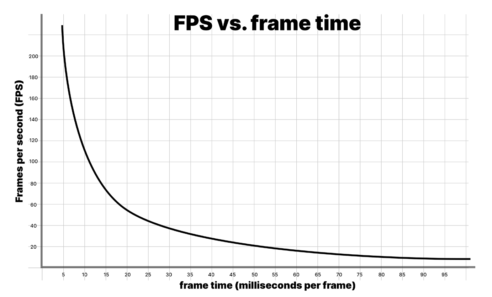
<p><em>VI: Đồ thị FPS đối chiếu Frame Time — quan hệ nghịch đảo, KHÔNG tuyến tính. / EN: The fps versus frame time graph — an inverse, non-linear relationship.</em></p>

<div class="bilingual-row">
<div class="col-vi">
<p><strong>Đừng dùng FPS làm thước đo chính.</strong> Game thủ đo hiệu năng bằng frame rate, nhưng lập trình viên nên dùng <strong>frame time tính bằng mili-giây</strong>. Lý do nằm ở đồ thị trên: quan hệ giữa FPS và frame time là <em>nghịch đảo, phi tuyến</em>.</p>
<p><strong>Ví dụ nguyên văn từ sách — hãy xem kỹ, đây là điểm mấu chốt:</strong></p>
<ul>
<li>1000 ms ÷ <strong>900 fps</strong> = <strong>1.111 ms</strong>/frame</li>
<li>1000 ms ÷ <strong>450 fps</strong> = <strong>2.222 ms</strong>/frame</li>
<li>1000 ms ÷ <strong>60 fps</strong> = <strong>16.666 ms</strong>/frame</li>
<li>1000 ms ÷ <strong>56.25 fps</strong> = <strong>17.777 ms</strong>/frame</li>
</ul>
<p>Từ 900 → 450 fps: frame rate <em>giảm một nửa</em>, nghe như thảm họa — nhưng thực tế chỉ tốn thêm <strong>1.111 ms</strong>.</p>
<p>Từ 60 → 56.25 fps: cũng đúng <strong>1.111 ms</strong> tăng thêm — nhưng phần trăm sụt giảm nghe <em>nhẹ hều</em>.</p>
<p>👉 <strong>Cùng một chi phí 1.111 ms, nhưng FPS kể hai câu chuyện trái ngược nhau.</strong> Đó là lý do developer dùng frame time trung bình để benchmark tốc độ game thay vì fps.</p>
<p>Đừng bận tâm tới fps trừ khi bạn tụt dưới target frame rate. Hãy tập trung vào frame time và ở trong ngân sách khung hình.</p>
</div>
<div class="col-en">
<p><strong>Don't use FPS as your primary metric.</strong> A common way that gamers measure performance is with frames per second. However, it's recommended that you use <strong>frame time in milliseconds</strong> instead. The reason is in the graph above: the relationship is <em>inverse and non-linear</em>.</p>
<p><strong>Verbatim example from the book — this is the crux:</strong></p>
<ul>
<li>1000 ms/sec ÷ <strong>900 fps</strong> = <strong>1.111 ms</strong> per frame</li>
<li>1000 ms/sec ÷ <strong>450 fps</strong> = <strong>2.222 ms</strong> per frame</li>
<li>1000 ms/sec ÷ <strong>60 fps</strong> = <strong>16.666 ms</strong> per frame</li>
<li>1000 ms/sec ÷ <strong>56.25 fps</strong> = <strong>17.777 ms</strong> per frame</li>
</ul>
<p>From 900 → 450 fps: the frame rate <em>appears to drop by one half</em>, sounding catastrophic — yet this represents a difference of only <strong>1.111 milliseconds</strong>.</p>
<p>From 60 → 56.25 fps: also exactly <strong>1.111 ms</strong> extra per frame — but here the drop in frame rate feels <em>far less dramatic</em> percentage-wise.</p>
<p>👉 <strong>The same 1.111 ms cost, yet FPS tells two opposite stories.</strong> This is why developers use average frame time to benchmark game speed rather than fps.</p>
<p>Don't worry about fps unless you drop below your target frame rate. Focus on frame time to measure how fast your game is running, then stay within your frame budget.</p>
</div>
</div>

### 1.1. Bảng ngân sách khung hình (Frame Budget)

<div class="bilingual-row">
<div class="col-vi">
<p>Ngân sách lý thuyết = <code>1000 ms ÷ FPS mục tiêu</code>.</p>
<p><strong>Nhưng trên mobile bạn KHÔNG được dùng hết.</strong> Điện thoại không có tản nhiệt chủ động; nếu chạy full budget liên tục, OS sẽ <em>thermal throttle</em> (hạ xung CPU/GPU) và FPS sụt thảm hại sau 5–10 phút chơi.</p>
<p>Unity khuyến nghị chỉ dùng khoảng <strong>65%</strong> ngân sách, phần còn lại để máy "thở" và hạ nhiệt.</p>
</div>
<div class="col-en">
<p>Theoretical budget = <code>1000 ms ÷ target FPS</code>.</p>
<p><strong>But on mobile you must NOT consume all of it.</strong> Phones have no active cooling; running at full budget continuously makes the OS <em>thermal throttle</em> the CPU/GPU, and FPS collapses after 5–10 minutes of play.</p>
<p>Unity recommends using only about <strong>65%</strong> of the available time, leaving the remainder to allow for cooldown between frames.</p>
</div>
</div>

| Target FPS | Ngân sách lý thuyết / Theoretical budget | Ngân sách mobile an toàn (~65%) / Safe mobile budget |
|---|---|---|
| 30 FPS | 33.33 ms | **~22 ms** |
| 60 FPS | 16.66 ms | **~11 ms** |
| 72 FPS (VR) | 13.88 ms | ~9 ms |
| 90 FPS (VR) | 11.11 ms | ~7 ms |

!!! tip "Chiến thuật thực chiến / Field tactic"
    **VI:** Màn hình Idle / Menu / khi user ít tương tác → hạ `Application.targetFrameRate` từ 60 xuống 30 để giảm nhiệt độ máy, kéo dài pin, và "trả lại" ngân sách nhiệt cho lúc gameplay cao điểm.

    **EN:** On idle screens / menus / low-interaction moments → drop `Application.targetFrameRate` from 60 to 30 to reduce device heat, extend battery, and "bank" thermal headroom for peak gameplay.

```csharp
// Điều tiết FPS theo ngữ cảnh — Context-aware frame rate throttling
using UnityEngine;

public class ThermalGovernor : MonoBehaviour
{
    private const int FpsGameplay = 60;   // 16.66 ms budget
    private const int FpsIdle     = 30;   // 33.33 ms budget

    void Awake()
    {
        QualitySettings.vSyncCount = 0;   // Bắt buộc: vSync ghi đè targetFrameRate
        Application.targetFrameRate = FpsGameplay;
    }

    public void EnterIdleScreen()  => Application.targetFrameRate = FpsIdle;
    public void EnterGameplay()    => Application.targetFrameRate = FpsGameplay;
}
```

### 1.2. ⚠️ Thermal throttling — Cơ chế vật lý phía sau

<div class="bilingual-row">
<div class="col-vi">
<p><strong>Kiểm soát nhiệt là một trong những mảng quan trọng nhất cần tối ưu khi phát triển ứng dụng mobile.</strong></p>
<p>Cơ chế: nếu CPU hoặc GPU chạy hết công suất quá lâu do code kém hiệu quả, các chip đó sẽ <strong>nóng lên</strong>. Để tránh hỏng chip (và tránh làm bỏng tay người chơi!), hệ điều hành sẽ <strong>giảm xung nhịp</strong> thiết bị để nó nguội đi — gây giật khung hình và trải nghiệm tệ. Đây chính là <strong>thermal throttling</strong>.</p>
<p>Frame rate cao hơn và nhiều lệnh thực thi hơn (hoặc nhiều thao tác truy cập DRAM hơn) ⇒ tốn pin nhiều hơn và sinh nhiệt nhiều hơn. Hiệu năng kém còn <em>loại bỏ hẳn cả phân khúc thiết bị cấu hình thấp</em>, khiến bạn mất cơ hội thị trường.</p>
<p>👉 Khi xử lý bài toán nhiệt, hãy coi ngân sách của bạn là <strong>ngân sách toàn hệ thống</strong> (system-wide budget).</p>
<p><strong>Cách diễn đạt chính xác của sách:</strong> để lại <strong>~35% thời gian nhàn rỗi (idle)</strong> mỗi khung hình là khuyến nghị điển hình để chống vấn đề nhiệt khi chơi lâu — tức chỉ dùng ~65% ngân sách.</p>
</div>
<div class="col-en">
<p><strong>Thermal control is one of the most important areas to optimize for when developing applications for mobile devices.</strong></p>
<p>The mechanism: if the CPU or GPU spend too long working at full throttle due to inefficient code, those chips will get hot. To avoid damage to the chips (and potentially burning a player's hands!), the operating system will <strong>reduce the clock speed</strong> of the device to allow it to cool down, causing frame stuttering and a poor user experience. This is <strong>thermal throttling</strong>.</p>
<p>Higher frame rates and increased code execution (or DRAM access operations) lead to increased battery drain and heat generation. Bad performance can also cut out entire segments of lower-end mobile devices, which can lead to missed market opportunities.</p>
<p>👉 When taking on the problem of thermals, consider the budget you have to work with as a <strong>system-wide budget</strong>.</p>
<p><strong>The book's precise framing:</strong> leaving a frame <strong>idle time of around 35%</strong> is the typical recommendation to combat device thermal issues over extended play times — i.e. use only ~65% of the budget.</p>
</div>
</div>

### 1.3. 🎬 Giải phẫu một khung hình (The anatomy of a frame)

!!! note "Nội dung bổ sung từ bản Unity 6 (93 trang)"
    Mục này **chỉ có trong bản Unity 6 edition**, không có trong bản 75 trang.

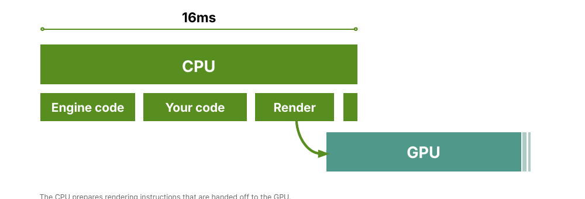
<p><em>VI: CPU chuẩn bị các chỉ thị render rồi bàn giao cho GPU. / EN: The CPU prepares rendering instructions that are handed off to the GPU.</em></p>

<div class="bilingual-row">
<div class="col-vi">
<p>Nhắm 60 fps nghĩa là 16.66 ms mỗi frame — <strong>nhưng Unity thực chất duy trì một PIPELINE, trong đó CPU và GPU làm việc trên các frame KHÁC NHAU cùng lúc.</strong></p>
<p><strong>Phía CPU</strong>, việc thực thi bắt đầu bằng:</p>
<ol>
<li><strong>Engine code</strong> — code nội bộ của Unity (nằm ngoài tầm kiểm soát của bạn)</li>
<li><strong>Your code</strong> — logic game tùy biến của bạn (các script)</li>
<li><strong>Render</strong> — CPU chuẩn bị các chỉ thị render</li>
</ol>
<p>Các chỉ thị này sau đó được <strong>bàn giao cho GPU</strong>. Trong khi GPU bắt đầu render frame <strong>N</strong>, CPU đã <em>đang làm việc trên frame kế tiếp</em> (ký hiệu <strong>N+1</strong>).</p>
<p><strong>Hệ thống hai luồng của Unity:</strong></p>
<ul>
<li><strong>Main thread</strong> — xử lý game logic, physics, animation, và input; đồng thời <em>xếp hàng các lệnh render</em>.</li>
<li><strong>Render thread</strong> — chuyển các lệnh đó thành chỉ thị mà GPU hiểu được.</li>
</ul>
<p>Khi GPU nhận được chỉ thị render, nó xử lý qua <strong>graphics pipeline</strong>: vertex shading → fragment shading → post-processing → cuối cùng xuất frame ra màn hình.</p>
<p>⚠️ <strong>Điểm mấu chốt:</strong> Cách tiếp cận song song này cho phép CPU bắt đầu chuẩn bị frame tiếp theo trong khi GPU vẫn đang render frame hiện tại. <strong>Tuy nhiên, GPU PHẢI CHỜ CPU chuẩn bị xong dữ liệu render mới tiếp tục được</strong> — khiến việc <em>đồng bộ giữa hai bên trở nên tối quan trọng đối với hiệu năng</em>.</p>
<p>👉 Đây chính là lý do vì sao các marker <code>Gfx.WaitFor*</code> tồn tại, và vì sao bạn phải chẩn đoán CPU-bound / GPU-bound trước tiên (§3).</p>
</div>
<div class="col-en">
<p>Targeting 60 frames per second results in 16.66 milliseconds per frame — <strong>but Unity actually maintains a PIPELINE where the CPU and GPU work on DIFFERENT frames simultaneously.</strong></p>
<p><strong>On the CPU side</strong>, execution begins with:</p>
<ol>
<li><strong>Engine code</strong> — Unity's internal code (outside your control)</li>
<li><strong>Your code</strong> — your custom game logic (your scripts)</li>
<li><strong>Render</strong> — the CPU prepares rendering instructions</li>
</ol>
<p>These instructions are then <strong>handed off to the GPU</strong>. While the GPU begins rendering frame <strong>N</strong>, the CPU is <em>already working on the following frame</em> (denoted as <strong>N+1</strong>).</p>
<p><strong>Unity's dual-threaded system:</strong></p>
<ul>
<li>The <strong>main thread</strong> handles game logic, physics, animation, and input, while also <em>queuing up rendering commands</em>.</li>
<li>The <strong>render thread</strong> converts these commands into GPU-friendly instructions.</li>
</ul>
<p>Once the GPU receives the render instructions, it processes them through the <strong>graphics pipeline</strong>: vertex shading → fragment shading → post-processing → finally outputting the frame to the display.</p>
<p>⚠️ <strong>The crux:</strong> This parallelized approach allows the CPU to begin preparing the next frame while the GPU is still rendering the current one. <strong>However, the GPU MUST WAIT for the CPU to finish preparing rendering data before it can proceed</strong> — making <em>synchronization between the two critical for performance</em>.</p>
<p>👉 This is exactly why the <code>Gfx.WaitFor*</code> markers exist, and why you must diagnose CPU-bound / GPU-bound first (§3).</p>
</div>
</div>

---

## 2. Profiling 101 — Hai trường phái đo lường

<div class="bilingual-row">
<div class="col-vi">
<p>Có <strong>hai phương pháp phổ biến</strong> để profile hiệu năng game:</p>
<p><strong>① SAMPLE-BASED PROFILING (dựa trên lấy mẫu)</strong></p>
<p>Thu thập <em>dữ liệu thống kê</em> về công việc đang diễn ra rồi phân tích. Profiler loại này <strong>thăm dò call stack mỗi "n" nano-giây</strong>, dùng thông tin call stack để suy ra hàm nào được gọi (và bởi hàm nào), cũng như gọi trong bao lâu.</p>
<ul>
<li>✅ Không cần chèn marker vào code.</li>
<li>⚖️ <strong>Đánh đổi:</strong> Tăng tần số lấy mẫu ⇒ độ chính xác tăng (không bỏ sót các lời gọi hàm ngắn), <strong>nhưng overhead cũng tăng theo</strong>.</li>
</ul>
<p><strong>② INSTRUMENTATION-BASED PROFILING (dựa trên chèn đo)</strong></p>
<p>"Instrument" code bằng cách chèn <strong>Profiler markers</strong>, ghi lại thông tin thời gian chi tiết về việc code trong mỗi marker mất bao lâu để chạy. Profiler bắt một luồng sự kiện <strong>Begin</strong> và <strong>End</strong> cho từng marker.</p>
<ul>
<li>✅ <strong>Không mất thông tin nào cả.</strong></li>
<li>⚖️ <strong>Đánh đổi:</strong> Phụ thuộc vào việc marker <em>có được đặt hay không</em> thì dữ liệu mới được ghi.</li>
</ul>
<p>👉 <strong>Unity Profiler thuộc loại instrumentation-based.</strong> <em>(Bản Unity 6 nói rõ hơn: Unity Profiler <strong>kết hợp CẢ HAI</strong>, tùy chế độ đang dùng.)</em></p>
</div>
<div class="col-en">
<p>There are <strong>two common methods</strong> of profiling game performance:</p>
<p><strong>① SAMPLE-BASED PROFILING</strong></p>
<p>Statistical data about the work being done in the application is collected and then analyzed. Sample-based profilers <strong>probe the call stack every "n" nanoseconds</strong> and use call stack information to figure out when functions were called (and by which functions), as well as for how long.</p>
<ul>
<li>✅ No need to insert markers into code.</li>
<li>⚖️ <strong>Trade-off:</strong> Accuracy increases by using higher sampling rate frequencies because shorter calls to functions are not missed in the call stack. However, <strong>it leads to higher overhead</strong>.</li>
</ul>
<p><strong>② INSTRUMENTATION-BASED PROFILING</strong></p>
<p>Involves "instrumenting" the code by adding <strong>Profiler markers</strong>, which record detailed timing information about how long the code in each marker takes to execute. This profiler captures a stream of <strong>Begin</strong> and <strong>End</strong> events for each marker.</p>
<ul>
<li>✅ <strong>This method doesn't lose any information.</strong></li>
<li>⚖️ <strong>Trade-off:</strong> It does rely on markers <em>being placed</em> in order for profiling data to be captured.</li>
</ul>
<p>👉 <strong>The Unity Profiler is instrumentation-based.</strong> <em>(The Unity 6 edition clarifies: the Unity Profiler <strong>combines BOTH</strong>, depending on the mode being used.)</em></p>
</div>
</div>

#### ⚖️ Instrumentation vs Sampling — So sánh overhead

!!! note "Bổ sung từ bản Unity 6"

<div class="bilingual-row">
<div class="col-vi">
<p>Nhìn chung: <strong>sample-based</strong> profiling phân tích hiệu năng ở <em>mức cao</em>, còn <strong>instrumentation-based</strong> chỉ đích danh điểm nóng hiệu năng nhưng <em>overhead cao hơn</em>.</p>
<p><strong>Khác biệt then chốt về bản chất overhead:</strong></p>
<ul>
<li><strong>Sampling profiler:</strong> overhead <strong>KHÔNG ĐỔI</strong>, bất kể CPU đang làm gì trong lúc profile. Bạn có thể đổi sample rate để điều chỉnh, nhưng nhìn chung overhead thấp hơn.</li>
<li><strong>Instrumentation profiler:</strong> overhead <strong>THAY ĐỔI theo SỐ LƯỢNG MARKER</strong> — thêm nhiều marker khiến capture đắt hơn, vì <em>bản thân marker cũng tốn thời gian</em>.</li>
</ul>
<p>⚠️ <strong>Hệ quả rất quan trọng khi đọc số liệu:</strong> Những nơi trong dự án <em>gọi nhiều hàm</em> có thể <strong>trông đắt hơn thực tế</strong>. Hiện tượng này đặc biệt rõ khi <strong>deep profiling</strong>, và nó <em>bóp méo timing</em> trong capture của bạn.</p>
</div>
<div class="col-en">
<p>Generally, <strong>sample-based</strong> profiling analyzes the application's <em>high-level</em> performance, while <strong>instrumentation-based</strong> profiling pinpoints critical performance but with <em>higher overhead</em>.</p>
<p><strong>The key difference in the nature of the overhead:</strong></p>
<ul>
<li><strong>Sampling profilers:</strong> the overhead is <strong>CONSTANT</strong> no matter what work the CPU is doing while being profiled. You can change the sample rate to accommodate that, but it's generally lower.</li>
<li><strong>Instrumentation profilers:</strong> the overhead <strong>VARIES WITH THE NUMBER OF MARKERS</strong> — adding a lot of markers makes the capture more expensive because <em>the markers themselves take time</em>.</li>
</ul>
<p>⚠️ <strong>A very important consequence when reading data:</strong> Places in your project which <em>call a lot of functions</em> might <strong>look more expensive than they really are</strong>. This shows up especially when <strong>deep profiling</strong>, and it <em>distorts the timings</em> in your profiler capture.</p>
</div>
</div>

<div class="bilingual-row">
<div class="col-vi">
<p><strong>Unity cân bằng độ chi tiết và overhead như thế nào?</strong></p>
<p>Unity đạt được sự cân bằng tốt bằng cách đặt marker sẵn ở <strong>hầu hết bề mặt Unity API</strong>. Các chức năng native quan trọng và các lời gọi message của scripting code base đều được instrument sẵn, nhằm bắt được những "nét lớn" quan trọng nhất mà không phát sinh quá nhiều overhead.</p>
<p>Điều này cho phép bạn khám phá hiệu năng code, định vị vấn đề dễ dàng, và tìm ra các cải thiện nhanh — kèm tùy chọn đào sâu hơn bằng cách <strong>tự thêm Profiler marker</strong> hoặc dùng <strong>deep profiling</strong>.</p>
<p><strong>Deep profiling</strong> tự động chèn marker Begin/End vào <em>mọi</em> lời gọi phương thức scripting, <strong>kể cả C# Getter và Setter property</strong>. Cho chi tiết đầy đủ ở phía scripting, nhưng overhead đi kèm <em>có thể thổi phồng số liệu thời gian</em> tùy theo có bao nhiêu lời gọi nằm trong phạm vi được profile.</p>
</div>
<div class="col-en">
<p><strong>How does Unity balance detail vs overhead?</strong></p>
<p>A good balance of detail vs overhead is struck by markers being set in <strong>most of the Unity API surface</strong>. Important native functionality and scripting code base message calls are instrumented to capture the most important "broad strokes" without incurring too much overhead.</p>
<p>This allows you to explore the performance of your code, locate performance issues easily, and spot quick optimization wins, with the option of going even deeper by <strong>adding custom Profiler markers</strong> or using <strong>deep profiling</strong>.</p>
<p><strong>Deep profiling</strong> automatically inserts Begin and End markers in <em>every</em> scripting method call, <strong>including C# Getter and Setter properties</strong>. This system gives full profiling detail on the scripting side, but it comes with an associated overhead that <em>can inflate the reported timing data</em> based on how many calls are within the captured profiling scopes.</p>
</div>
</div>

### 2.1. Profiler modules — Các module đo lường

<div class="bilingual-row">
<div class="col-vi">
<p>🔬 <strong>Sampling profiler ngoài Unity — bản Unity 6 nêu ví dụ CỤ THỂ:</strong> <em>"Sample-based profiling hoạt động bằng cách <strong>chụp ẢNH ĐỊNH KỲ những gì code đang làm, theo khoảng đều đặn (thường tính bằng mili-giây)</strong>. […] <strong>Sampling profiler thường DÙNG HẠ TẦNG CỦA NỀN TẢNG để có overhead TỐI THIỂU và tốc độ lấy mẫu TỐI ĐA. Ví dụ những profiler như vậy là <span>Windows Performance Analyzer</span> kết hợp <span>Event Tracing for Windows</span>, <span>Instruments</span>, và <span>Android Studio</span>.</strong>"</em></p>
<p>📦 <strong>Và một package hay bị bỏ sót trong danh sách công cụ:</strong> <em>"<strong><code>Profiling Core package</code> cung cấp các API bạn dùng để THÊM THÔNG TIN NGỮ CẢNH vào capture của Unity Profiler.</strong>"</em> — nó nằm giữa <em>Unity Profiler</em> và <em>Memory Profiler</em> trong bộ ba công cụ chính thức.</p>
</div>
<div class="col-en">
<p>🔬 <em>"Sample-based profiling works by taking periodic snapshots of what your code is doing at regular intervals (typically in milliseconds). […] Sampling profilers usually use platform infrastructure to provide minimum overhead and maximum sampling rate. Examples of such profilers are Windows Performance Analyzer in conjunction with Event Tracing for Windows, Instruments, and Android Studio."</em></p>
<p>📦 <em>"The Profiling Core package provides APIs that you can use to add contextual information to Unity Profiler captures."</em></p>
</div>
</div>


<div class="bilingual-row">
<div class="col-vi">
<p>Profiler <strong>bắt các chỉ số hiệu năng theo từng khung hình</strong> để giúp bạn xác định bottleneck. Bạn đào sâu vào chi tiết thông qua các <strong>Profiler module</strong> tích hợp sẵn: <em>CPU Usage, GPU, Rendering, Memory, Physics</em>, v.v.</p>
<p>Cửa sổ Profiler liệt kê chi tiết đã bắt được của module <em>đang chọn</em> ở panel phía dưới. Ví dụ, module <strong>CPU Usage</strong> hiển thị view Timeline hoặc Hierarchy của công việc CPU kèm thời gian cụ thể.</p>
<p>⚠️ <strong>Cảnh báo quan trọng:</strong> Mặc định Profiler sẽ kết nối tới instance <em>Unity Editor Player</em>. Bạn sẽ thấy <strong>khác biệt rất lớn</strong> giữa profiling trong Editor và profiling một standalone build. Kết nối Profiler tới standalone build chạy trực tiếp trên phần cứng đích <strong>luôn luôn là lựa chọn tốt hơn</strong>, vì nó cho kết quả chính xác nhất mà không có overhead của Editor.</p>
</div>
<div class="col-en">
<p>The Profiler <strong>captures per-frame performance metrics</strong> to help you identify bottlenecks. Drill down into details by using the <strong>Profiler modules</strong> included in the Profiler, such as <em>CPU Usage, GPU, Rendering, Memory, Physics</em>, and so on.</p>
<p>The Profiler window lists details captured with the <em>currently selected</em> Profiler module in a panel at the bottom of the view. The <strong>CPU Usage</strong> Profiler module, for instance, displays a timeline or hierarchy view of the work of the CPU, along with specific times.</p>
<p>⚠️ <strong>Important caveat:</strong> By default, the Profiler will connect to the Unity Editor Player instance. Be aware that you will see a <strong>large difference</strong> in performance between profiling in the Editor and profiling a standalone build. Connecting the Profiler to a standalone build running directly on your target hardware is <strong>always preferable</strong> since this yields the most accurate results without Editor overhead.</p>
</div>
</div>

### 2.2. Giảm thao tác truy cập bộ nhớ (Mobile)

<div class="bilingual-row">
<div class="col-vi">
<p><strong>Truy cập DRAM là thao tác tiêu tốn điện năng rất lớn trên thiết bị mobile.</strong></p>
<p>📊 <strong>Con số cần nhớ:</strong> Theo khuyến nghị tối ưu nội dung đồ họa mobile của Arm, truy cập bộ nhớ <strong>LPDDR4 tốn khoảng 100 pico-joule mỗi byte</strong>.</p>
<p><strong>Bốn cách giảm số thao tác truy cập bộ nhớ mỗi frame:</strong></p>
<ol>
<li><strong>Giảm frame rate</strong></li>
<li><strong>Giảm độ phân giải hiển thị</strong> ở những chỗ có thể</li>
<li><strong>Dùng mesh đơn giản hơn</strong> — giảm số đỉnh (vertex count) và độ chính xác thuộc tính (attribute precision)</li>
<li><strong>Dùng nén texture và mipmapping</strong></li>
</ol>
<p>👉 Nếu tập trung vào thiết bị dùng phần cứng <strong>Arm / Arm Mali</strong>, bộ công cụ <strong>Arm Performance Studio</strong> <em>(bản Unity 6 đổi tên từ “Arm Mobile Studio”)</em> — cụ thể là <strong>Streamline Performance Analyzer</strong> — có các performance counter rất tốt để nhận diện vấn đề <em>băng thông bộ nhớ</em>. Counter được liệt kê và giải thích cho từng thế hệ GPU Arm, ví dụ <strong>Mali-G710 Performance Counter Reference Guide</strong>. 🚨 <strong>Lưu ý: profiling GPU bằng Arm Performance Studio ĐÒI HỎI GPU <em>Arm Immortalis</em> HOẶC <em>Mali</em>.</strong> Một tập metric phần cứng Arm được đưa thẳng vào Unity Profiler và build Player qua <strong>System metrics package</strong>.</p>
<p>⚠️ Lưu ý: GPU profiling của Mobile Studio <strong>yêu cầu Arm Mali</strong>.</p>
</div>
<div class="col-en">
<p><strong>DRAM access is typically a power-hungry operation on mobile devices.</strong></p>
<p>📊 <strong>The number to remember:</strong> Arm's optimization advice for graphics content on mobile devices says that <strong>LPDDR4 memory access costs approximately 100 picojoules per byte</strong>.</p>
<p><strong>Four ways to reduce memory access operations per frame:</strong></p>
<ol>
<li><strong>Reducing frame rate</strong></li>
<li><strong>Reducing display resolution</strong> where possible</li>
<li><strong>Using simpler meshes</strong> with reduced vertex count and attribute precision</li>
<li><strong>Using texture compression and mipmapping</strong></li>
</ol>
<p>👉 When you need to focus on devices leveraging <strong>Arm or Arm Mali</strong> hardware, <strong>Arm Performance Studio</strong> tooling (specifically, <strong>Streamline Performance Analyzer</strong>) includes some great performance counters for identifying <em>memory bandwidth</em> issues. The counters are listed and explained for each Arm GPU generation, for example, the <strong>Mali-G710 Performance Counter Reference Guide</strong>. Note that <strong>Arm Performance Studio GPU profiling requires an Arm Immortalis or Mali GPU</strong>. A selected set of Arm hardware metrics is exposed to the Unity Profiler and Player builds via the <strong>System metrics package</strong>.</p>
<p>⚠️ Note that Mobile Studio GPU profiling <strong>requires Arm Mali</strong>.</p>
</div>
</div>

### 2.3. Profiling vs Debugging vs Static Analysis

<div class="bilingual-row">
<div class="col-vi">
<p>Ba loại công cụ khác nhau, đừng nhầm lẫn:</p>
<ul>
<li><strong>Profiling tools</strong> — instrument và thu thập dữ liệu thời gian liên quan tới việc thực thi code. <em>(Unity Profiler, Profile Analyzer)</em></li>
<li><strong>Debugging tools</strong> — cho phép bạn bước qua từng bước thực thi chương trình, tạm dừng và kiểm tra giá trị. Ví dụ: <strong>Frame Debugger</strong> cho bạn bước qua quá trình render từng frame, kiểm tra giá trị shader, v.v. <em>(Về mặt kỹ thuật đây KHÔNG phải profiler, nhưng cực kỳ quan trọng trong bộ đồ nghề.)</em></li>
<li><strong>Static analyzers</strong> — nhận source code hoặc asset làm đầu vào, phân tích bằng bộ luật dựng sẵn để suy luận về tính "đúng đắn" của đầu vào — <strong>mà không cần chạy project</strong>. <em>(Project Auditor)</em></li>
</ul>
</div>
<div class="col-en">
<p>Three distinct tool categories — don't conflate them:</p>
<ul>
<li><strong>Profiling tools</strong> instrument and collect timing data relating to code execution. <em>(Unity Profiler, Profile Analyzer)</em></li>
<li><strong>Debugging tools</strong> allow you to step through the execution of a program, pause and examine values, and provide many other advanced features. For example, the <strong>Frame Debugger</strong> lets you step through the rendering of frames, examine shader values, and more. <em>(Technically not profilers, but important to include in your toolkit.)</em></li>
<li><strong>Static analyzers</strong> are programs that take source code or other assets as input and analyze them using built-in rules to reason about the "correctness" of said input, <strong>without needing to run the project</strong>. <em>(Project Auditor)</em></li>
</ul>
</div>
</div>

---

## 3. 🗺️ SƠ ĐỒ CHẨN ĐOÁN BOTTLENECK — Bản đồ tối ưu hóa

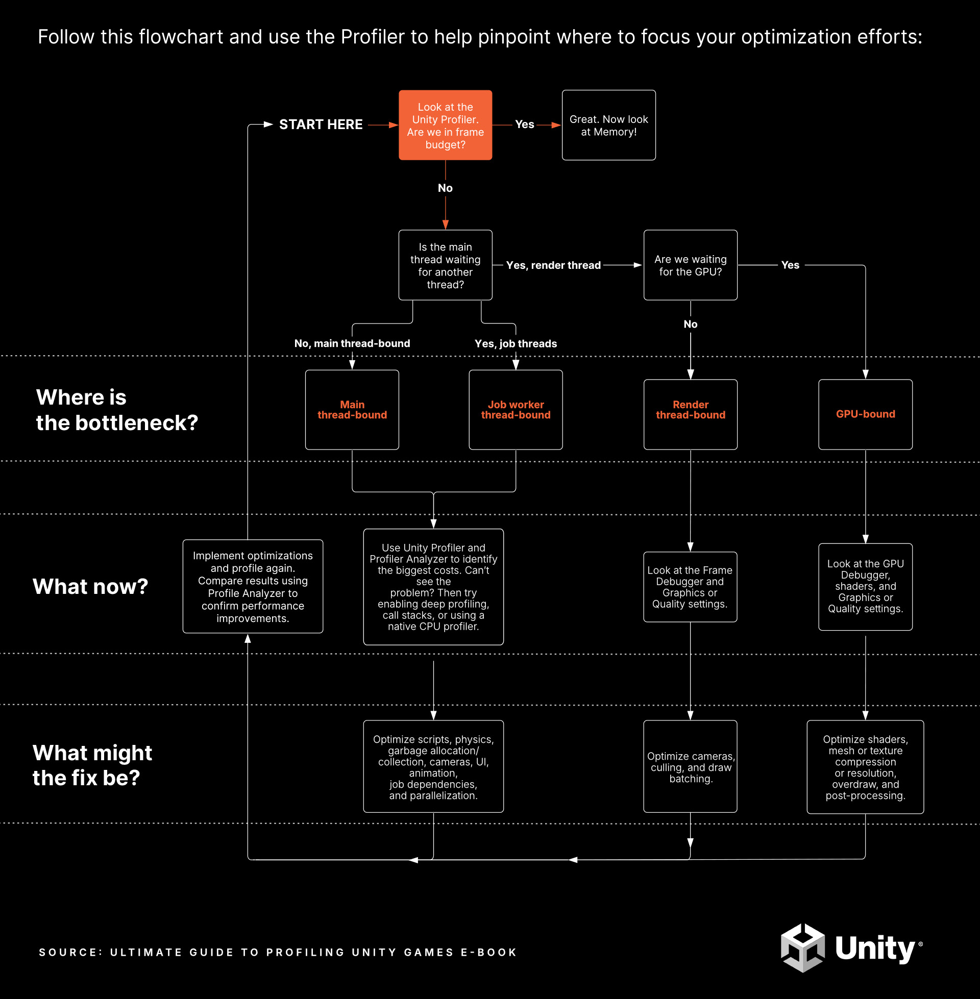
<p><em>VI: <strong>▲ LƯU ĐỒ CHẨN ĐOÁN CHÍNH THỨC của Unity</strong> — ba câu hỏi xếp dọc: <strong>“Where is the bottleneck?” → “What now?” → “What might the fix be?”</strong>. Nhánh trên tách <strong>CPU main thread bound · CPU render thread bound · GPU bound</strong>, mỗi nhánh dẫn tới nhóm biện pháp riêng. Đây là bản gốc mà bảng tra ở §3.1 diễn giải ra tiếng Việt. / EN: The official Unity bottleneck-diagnosis flowchart.</em></p>

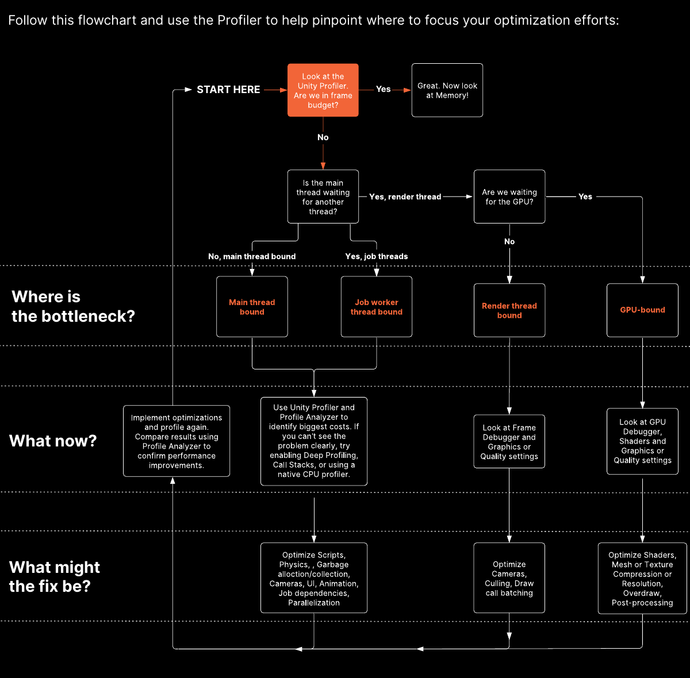
<p><em>VI: Đi theo sơ đồ này và dùng Profiler để xác định chính xác nơi cần dồn nỗ lực tối ưu. / EN: Follow this flowchart and use the Profiler to help pinpoint where to focus your optimization efforts.</em></p>

<div class="bilingual-row">
<div class="col-vi">
<p><strong>Đây là tài sản giá trị nhất của cả cuốn sách.</strong> Hãy in ra dán lên tường. Trình tự đọc:</p>
<p><strong>BƯỚC 1 — START HERE:</strong> Mở Unity Profiler. <em>Chúng ta có nằm trong frame budget không?</em></p>
<ul>
<li><strong>Có</strong> → 🎉 Tuyệt vời. Giờ chuyển sang xem <strong>Memory</strong>!</li>
<li><strong>Không</strong> → đi tiếp Bước 2.</li>
</ul>
<p><strong>BƯỚC 2 — Main thread có đang chờ thread khác không?</strong></p>
<ul>
<li><strong>Không</strong> → 🔴 <strong>Main thread bound</strong></li>
<li><strong>Có, chờ job threads</strong> → 🔴 <strong>Job worker thread bound</strong></li>
<li><strong>Có, chờ render thread</strong> → đi tiếp Bước 3.</li>
</ul>
<p><strong>BƯỚC 3 — Chúng ta có đang chờ GPU không?</strong></p>
<ul>
<li><strong>Không</strong> → 🔴 <strong>Render thread bound</strong></li>
<li><strong>Có</strong> → 🔴 <strong>GPU-bound</strong></li>
</ul>
</div>
<div class="col-en">
<p><strong>This is the single most valuable asset in the entire book.</strong> Print it and pin it to your wall. Reading order:</p>
<p><strong>STEP 1 — START HERE:</strong> Look at the Unity Profiler. <em>Are we in frame budget?</em></p>
<ul>
<li><strong>Yes</strong> → 🎉 Great. Now look at <strong>Memory</strong>!</li>
<li><strong>No</strong> → proceed to Step 2.</li>
</ul>
<p><strong>STEP 2 — Is the main thread waiting for another thread?</strong></p>
<ul>
<li><strong>No, main thread bound</strong> → 🔴 <strong>Main thread bound</strong></li>
<li><strong>Yes, job threads</strong> → 🔴 <strong>Job worker thread bound</strong></li>
<li><strong>Yes, render thread</strong> → proceed to Step 3.</li>
</ul>
<p><strong>STEP 3 — Are we waiting for the GPU?</strong></p>
<ul>
<li><strong>No</strong> → 🔴 <strong>Render thread bound</strong></li>
<li><strong>Yes</strong> → 🔴 <strong>GPU-bound</strong></li>
</ul>
</div>
</div>

### 3.1. Bảng tra: Nghẽn ở đâu → Làm gì tiếp → Sửa cái gì

| Bottleneck | **What now?** (Điều tra bằng gì) | **What might the fix be?** (Sửa gì) |
|---|---|---|
| 🔴 **Main thread bound**<br>🔴 **Job worker thread bound** | Dùng **Unity Profiler** + **Profile Analyzer** để xác định chi phí lớn nhất. Nếu chưa thấy rõ vấn đề, bật **Deep Profiling**, **Call Stacks**, hoặc dùng **native CPU profiler**. | Optimize **Scripts, Physics, Garbage allocation/collection, Cameras, UI, Animation, Job dependencies, Parallelization** |
| 🔴 **Render thread bound** | Xem **Frame Debugger** và **Graphics / Quality settings** | Optimize **Cameras, Culling, Draw call batching** |
| 🔴 **GPU-bound** | Xem **GPU Debugger**, **Shaders**, và **Graphics / Quality settings** | Optimize **Shaders, Mesh or Texture Compression, Resolution, Overdraw, Post-processing** |

<div class="bilingual-row">
<div class="col-vi">
<p><strong>Vòng lặp khép kín:</strong> Sau khi sửa → <em>"Implement optimizations and profile again. Compare results using Profile Analyzer to confirm performance improvements."</em> → quay lại START HERE.</p>
<p>Sơ đồ này <strong>bắt buộc bạn phải chứng minh</strong> cải thiện bằng số liệu, không phải bằng cảm giác.</p>
</div>
<div class="col-en">
<p><strong>Closed loop:</strong> After fixing → <em>"Implement optimizations and profile again. Compare results using Profile Analyzer to confirm performance improvements."</em> → back to START HERE.</p>
<p>The flowchart <strong>forces you to prove</strong> the improvement with data, not with a feeling.</p>
</div>
</div>

### 3.2. Ba luồng CPU cần biết / The three CPU threads

<div class="bilingual-row">
<div class="col-vi">
<p><strong>Hiếm khi toàn bộ tải CPU là bottleneck.</strong> CPU hiện đại có nhiều nhân, chạy độc lập và đồng thời; mỗi nhân chạy được thread khác nhau. Unity dùng nhiều loại thread, nhưng 3 loại hay gây vấn đề hiệu năng nhất là:</p>
<ul>
<li><strong>Main thread</strong> — nơi <em>mặc định</em> toàn bộ game logic/script thực thi, và là nơi tốn phần lớn thời gian cho các hệ thống như physics, animation, UI, và rendering.</li>
<li><strong>Render thread</strong> — trong quá trình render, main thread duyệt scene và thực hiện <em>Camera culling, depth sorting, draw call batching</em>, tạo ra một danh sách những thứ cần vẽ. Danh sách này được chuyển sang render thread, nơi nó được <em>dịch</em> từ biểu diễn nội bộ trung lập nền tảng của Unity sang các lời gọi graphics API cụ thể để ra lệnh cho GPU trên nền tảng đó.</li>
<li><strong>Job worker threads</strong> — bạn có thể dùng <strong>C# Job System</strong> để lên lịch một số loại công việc chạy trên worker thread, giảm tải cho main thread. Một số hệ thống của Unity cũng dùng job system: physics, animation, rendering.</li>
</ul>
<p>👉 Mục đích của profiling là <strong>xác định bottleneck làm mục tiêu tối ưu</strong>. Nếu dựa vào phỏng đoán, bạn có thể tối ưu những phần <em>không phải</em> bottleneck ⇒ cải thiện rất ít hoặc bằng không. Một số "tối ưu" thậm chí còn <strong>làm game tệ đi</strong>.</p>
</div>
<div class="col-en">
<p><strong>It's rare for the entire CPU workload to be the bottleneck.</strong> Modern CPUs have a number of different cores, capable of performing work independently and simultaneously; different threads run on each core. A full Unity application uses a range of threads, but the three most common for finding performance issues are:</p>
<ul>
<li><strong>The main thread</strong> — where all of the game logic/scripts perform their work <em>by default</em>, and where the majority of time is spent for features and systems such as physics, animation, UI, and rendering.</li>
<li><strong>The render thread</strong> — during rendering, the main thread examines the scene and performs <em>Camera culling, depth sorting, and draw call batching</em>, resulting in a list of things to render. This list is passed to the render thread, which <em>translates</em> it from Unity's internal platform-agnostic representation to the specific graphics API calls required to instruct the GPU on a particular platform.</li>
<li><strong>The Job worker threads</strong> — developers can use the <strong>C# Job System</strong> to schedule certain kinds of work to run on worker threads, reducing the workload on the main thread. Some of Unity's systems also use the job system: physics, animation, and rendering.</li>
</ul>
<p>👉 The point of profiling is to <strong>identify bottlenecks as targets for optimization</strong>. If you rely on guesswork, you can end up optimizing parts of the game that are <em>not</em> bottlenecks, resulting in little or no improvement. Some "optimizations" might even <strong>worsen your game's overall performance</strong>.</p>
</div>
</div>

### 3.3. Đọc capture thật — 4 tình huống điển hình

#### ✅ Tình huống 1: Nằm TRONG ngân sách (healthy)

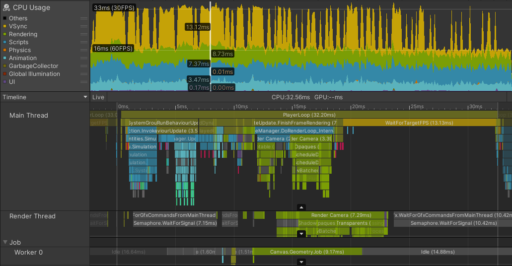

<div class="bilingual-row">
<div class="col-vi">
<p>Game mobile thật, target 60 fps trên máy cấu hình cao và 30 fps trên máy trung/thấp (capture này từ máy trung/thấp).</p>
<p><strong>Dấu hiệu khỏe mạnh cần nhận ra:</strong></p>
<ul>
<li>Gần <strong>một nửa</strong> thời gian của frame bị chiếm bởi marker <strong><code>WaitForTargetfps</code></strong> màu vàng. App đã set <code>Application.targetFrameRate = 30</code> và bật VSync.</li>
<li>Công việc xử lý thực sự trên main thread <strong>kết thúc ở mốc ~19 ms</strong>; phần còn lại là chờ cho hết 33.33 ms.</li>
<li>Tuy được biểu diễn bằng một Profiler marker, main thread thực chất <strong>đang nhàn rỗi</strong> — cho phép CPU <em>nguội đi</em> và dùng <em>tối thiểu pin</em>.</li>
<li>Render thread nhàn rỗi trong <strong><code>Gfx.WaitForGfxCommandsFromMainThread</code></strong> — đã gửi xong draw call của frame này, đang chờ frame sau.</li>
<li><code>Job Worker 0</code> có chút thời gian trong <code>Canvas.GeometryJob</code>, nhưng <strong>phần lớn là Idle</strong>.</li>
</ul>
<p>💡 <strong>Thời gian nhàn rỗi hiển thị bằng marker màu xám hoặc vàng.</strong> Đây đều là dấu hiệu của một ứng dụng nằm thoải mái trong ngân sách.</p>
<p>💡 Có thể quan sát <strong>khoảng VBlank</strong> bằng cách nhìn thời điểm kết thúc của <code>Gfx.Present</code> qua từng frame.</p>
</div>
<div class="col-en">
<p>A real Unity mobile game targeting 60 fps on high-spec phones and 30 fps on medium/low-spec phones (this capture is from the latter).</p>
<p><strong>Healthy signs to recognize:</strong></p>
<ul>
<li>Nearly <strong>half</strong> the frame is occupied by the yellow <strong><code>WaitForTargetfps</code></strong> marker. The app set <code>Application.targetFrameRate</code> to 30 fps and VSync is enabled.</li>
<li>Actual processing work on the main thread <strong>finishes around the 19 ms mark</strong>; the rest is spent waiting for the remainder of the 33.33 ms.</li>
<li>Although represented with a Profiler marker, the main CPU thread is essentially <strong>idle</strong> during this time, <em>allowing the CPU to cool</em> and using a <em>minimum of battery power</em>.</li>
<li>The render thread idles in <strong><code>Gfx.WaitForGfxCommandsFromMainThread</code></strong> — it has finished sending draw calls for one frame and awaits more on the next.</li>
<li><code>Job Worker 0</code> spends some time in <code>Canvas.GeometryJob</code>, but <strong>most of the time it's Idle</strong>.</li>
</ul>
<p>💡 <strong>Idle time is represented by gray or yellow Profiler markers.</strong> These are all signs of an application that's comfortably within the frame budget.</p>
<p>💡 The <strong>VBlank interval</strong> can be observed by looking at the end times of <code>Gfx.Present</code> frame over frame.</p>
</div>
</div>

!!! success "Nếu bạn đã trong budget / If your game is in frame budget"
    **VI:** Nếu đã nằm trong ngân sách (kể cả sau khi điều chỉnh cho pin và thermal throttling), bạn **đã xong** phần profiling hiệu năng lần này — chúc mừng. Hãy cân nhắc chạy **Memory Profiler** để đảm bảo app cũng nằm trong ngân sách bộ nhớ.

    **EN:** If you are within the frame budget, including any adjustments for battery usage and thermal throttling, you have finished performance profiling until next time – congratulations. Consider running the **Memory Profiler** to ensure the application is also within its memory budget.

#### 🔴 Tình huống 2: Main thread bound

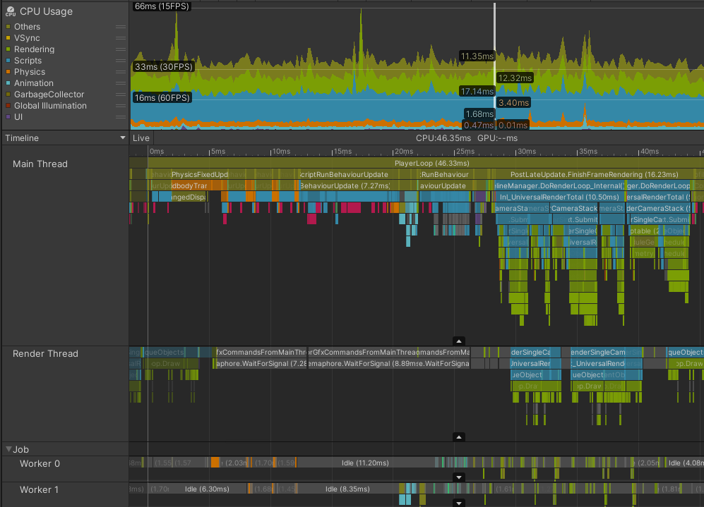

<div class="bilingual-row">
<div class="col-vi">
<p>Đọc capture: <strong>CPU 46.35 ms</strong> — vượt xa mốc 33 ms (30 FPS). Main thread đặc kín công việc: <code>PlayerLoop (46.33ms)</code>, trong đó <code>PostLateUpdate.FinishFrameRendering (16.23ms)</code>, <code>BehaviourUpdate (7.27ms)</code>.</p>
<p>Render thread có <code>WaitForSignal</code> đáng kể (7.28ms, 8.89ms) và <strong>Worker 0/1 Idle 11.20ms / 6.30ms / 8.35ms</strong>.</p>
<p>👉 <strong>Chẩn đoán:</strong> Render thread và worker thread đều <em>rảnh rỗi chờ việc</em>, còn main thread thì quá tải ⇒ <strong>Main thread bound</strong>. Đi tối ưu Scripts / Physics / GC / UI / Animation.</p>
</div>
<div class="col-en">
<p>Reading the capture: <strong>CPU 46.35 ms</strong> — well over the 33 ms (30 FPS) line. The main thread is packed: <code>PlayerLoop (46.33ms)</code>, including <code>PostLateUpdate.FinishFrameRendering (16.23ms)</code> and <code>BehaviourUpdate (7.27ms)</code>.</p>
<p>The render thread shows substantial <code>WaitForSignal</code> (7.28ms, 8.89ms), and <strong>Worker 0/1 are Idle for 11.20ms / 6.30ms / 8.35ms</strong>.</p>
<p>👉 <strong>Diagnosis:</strong> Render and worker threads are <em>idle, waiting for work</em>, while the main thread is saturated ⇒ <strong>Main thread bound</strong>. Optimize Scripts / Physics / GC / UI / Animation.</p>
</div>
</div>

#### 🔴 Tình huống 2b: Job worker thread bound

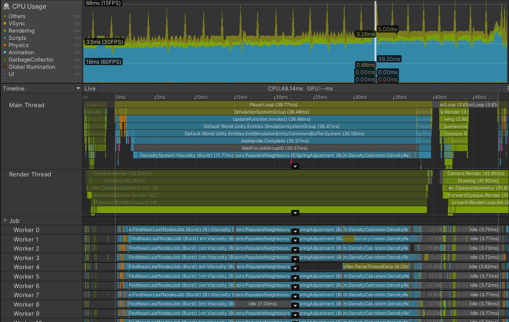

<div class="bilingual-row">
<div class="col-vi">
<p>Đọc capture: <strong>CPU 48.14 ms</strong>. Main thread bị chi phối bởi chuỗi DOTS/ECS: <code>SimulationSystemGroup (36.48ms)</code> → <code>EndSimulationEntityCommandBufferSystem (35.58ms)</code> → <strong><code>JobHandle.Complete (35.57ms)</code></strong> → <strong><code>WaitForJobGroupID (35.57ms)</code></strong>.</p>
<p>Nhìn xuống khu <strong>Job</strong>: <strong>Worker 0 → Worker 10+</strong> đều <em>đặc kín</em> công việc — <code>FindNearLeafNodesJob (Burst)</code>, <code>ViscositySystem:Viscosity (Burst) 11.77ms</code>, <code>PopulateNeighbours</code>, <code>SpringAdjustment</code>, <code>DensityCalc</code>.</p>
<p>👉 <strong>Chẩn đoán:</strong> Main thread <em>chờ</em> job hoàn thành (<code>WaitForJobGroupID</code>), còn worker thread thì bận rộn ⇒ <strong>Job worker thread bound</strong>.</p>
<p><strong>Cách sửa:</strong> tối ưu <em>Job dependencies</em> và <em>Parallelization</em> — chia nhỏ job hợp lý hơn, giảm phụ thuộc tuần tự, hoặc schedule sớm hơn để main thread có việc khác làm trong lúc chờ.</p>
<p>💡 <strong>Mẹo phân biệt với Main thread bound:</strong> nếu thấy marker <code>WaitForJobGroupID</code> / <code>JobHandle.Complete</code> chiếm phần lớn main thread <em>và</em> worker thread đang bận ⇒ job-bound, không phải main-thread-bound.</p>
</div>
<div class="col-en">
<p>Reading the capture: <strong>CPU 48.14 ms</strong>. The main thread is dominated by a DOTS/ECS chain: <code>SimulationSystemGroup (36.48ms)</code> → <code>EndSimulationEntityCommandBufferSystem (35.58ms)</code> → <strong><code>JobHandle.Complete (35.57ms)</code></strong> → <strong><code>WaitForJobGroupID (35.57ms)</code></strong>.</p>
<p>Look at the <strong>Job</strong> section: <strong>Worker 0 → Worker 10+</strong> are all <em>packed</em> with work — <code>FindNearLeafNodesJob (Burst)</code>, <code>ViscositySystem:Viscosity (Burst) 11.77ms</code>, <code>PopulateNeighbours</code>, <code>SpringAdjustment</code>, <code>DensityCalc</code>.</p>
<p>👉 <strong>Diagnosis:</strong> The main thread is <em>waiting</em> for jobs to complete (<code>WaitForJobGroupID</code>) while the worker threads are busy ⇒ <strong>Job worker thread bound</strong>.</p>
<p><strong>The fix:</strong> optimize <em>Job dependencies</em> and <em>Parallelization</em> — split jobs more sensibly, reduce sequential dependencies, or schedule earlier so the main thread has other work while waiting.</p>
<p>💡 <strong>Distinguishing from main-thread bound:</strong> if <code>WaitForJobGroupID</code> / <code>JobHandle.Complete</code> dominates the main thread <em>and</em> the worker threads are busy ⇒ job-bound, not main-thread-bound.</p>
</div>
</div>

#### 🔴 Tình huống 3: Render thread bound

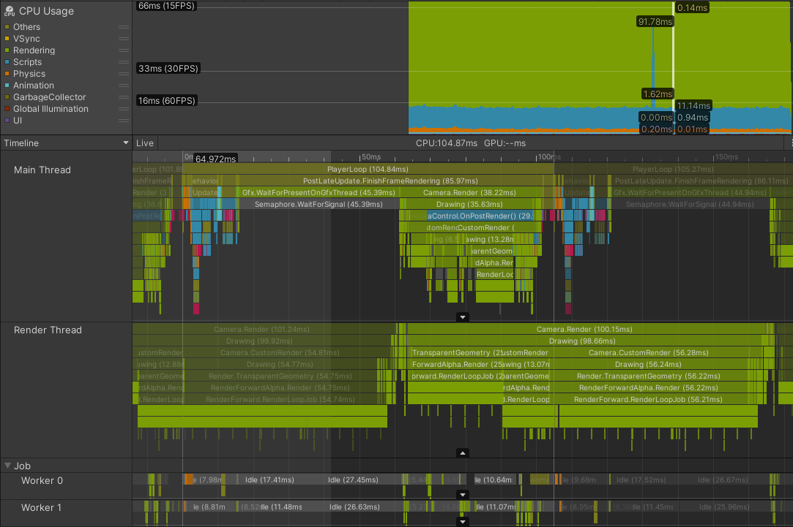

<div class="bilingual-row">
<div class="col-vi">
<p>Đọc capture: <strong>CPU 104.87 ms</strong> (~9.5 FPS!). Marker quyết định trên main thread là <strong><code>Gfx.WaitForPresentOnGfxThread (45.39ms)</code></strong> và <code>Semaphore.WaitForSignal (45.39ms)</code>.</p>
<p>Trong khi đó render thread <strong>đặc kín</strong>: <code>Camera.Render (101.24ms)</code> → <code>Drawing (99.92ms)</code> → <code>RenderForward.RenderLoopJob (54.74ms)</code>.</p>
<p>👉 <strong>Chẩn đoán:</strong> Main thread <em>chờ</em> render thread, còn render thread thì nghẹt thở ⇒ <strong>Render thread bound</strong>. Mở <strong>Frame Debugger</strong>, tối ưu Camera / Culling / Draw call batching.</p>
</div>
<div class="col-en">
<p>Reading the capture: <strong>CPU 104.87 ms</strong> (~9.5 FPS!). The decisive main-thread markers are <strong><code>Gfx.WaitForPresentOnGfxThread (45.39ms)</code></strong> and <code>Semaphore.WaitForSignal (45.39ms)</code>.</p>
<p>Meanwhile the render thread is <strong>saturated</strong>: <code>Camera.Render (101.24ms)</code> → <code>Drawing (99.92ms)</code> → <code>RenderForward.RenderLoopJob (54.74ms)</code>.</p>
<p>👉 <strong>Diagnosis:</strong> The main thread is <em>waiting on</em> the render thread, which is choking ⇒ <strong>Render thread bound</strong>. Open the <strong>Frame Debugger</strong>; optimize Cameras / Culling / Draw call batching.</p>
</div>
</div>

#### 🔴 Tình huống 4: GPU-bound

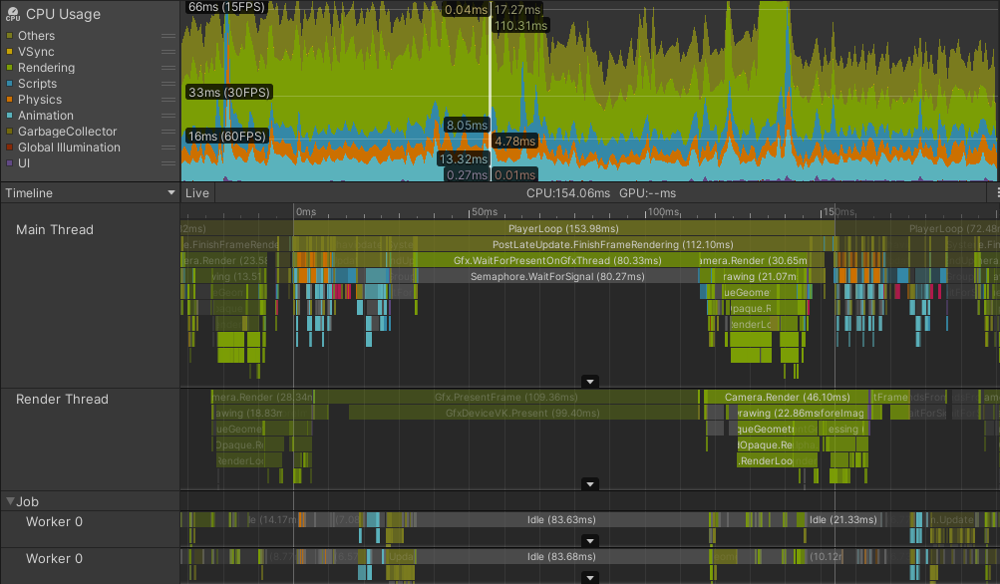

<div class="bilingual-row">
<div class="col-vi">
<p>Đọc capture: <strong>CPU 154.06 ms</strong>. Main thread có <code>Gfx.WaitForPresentOnGfxThread (80.33ms)</code>.</p>
<p>Điểm khác biệt then chốt so với Tình huống 3: trên <strong>render thread</strong> xuất hiện <strong><code>Gfx.PresentFrame (109.36ms)</code></strong> và <strong><code>GfxDeviceVK.Present (99.40ms)</code></strong> — tức render thread <em>cũng</em> đang chờ, và nó chờ <strong>GPU</strong> trình bày frame.</p>
<p>👉 <strong>Chẩn đoán:</strong> Cả main thread lẫn render thread đều chờ ⇒ <strong>GPU-bound</strong>. Tối ưu Shader / Overdraw / Texture Compression / Resolution / Post-processing.</p>
<p>💡 <strong>Mẹo phân biệt nhanh:</strong> nhìn vào render thread. Nếu nó <em>bận</em> ⇒ render thread bound. Nếu nó <em>cũng đang Present/chờ</em> ⇒ GPU-bound.</p>
</div>
<div class="col-en">
<p>Reading the capture: <strong>CPU 154.06 ms</strong>. The main thread shows <code>Gfx.WaitForPresentOnGfxThread (80.33ms)</code>.</p>
<p>The key difference from Scenario 3: on the <strong>render thread</strong> we see <strong><code>Gfx.PresentFrame (109.36ms)</code></strong> and <strong><code>GfxDeviceVK.Present (99.40ms)</code></strong> — the render thread is <em>also</em> waiting, and it is waiting on the <strong>GPU</strong> to present the frame.</p>
<p>👉 <strong>Diagnosis:</strong> Both main and render threads are waiting ⇒ <strong>GPU-bound</strong>. Optimize Shaders / Overdraw / Texture Compression / Resolution / Post-processing.</p>
<p>💡 <strong>Quick discriminator:</strong> look at the render thread. If it is <em>busy</em> ⇒ render thread bound. If it is <em>also presenting/waiting</em> ⇒ GPU-bound.</p>
</div>
</div>

### 3.4. 🎯 Cạm bẫy thường gặp theo từng loại bottleneck

!!! note "Bổ sung từ bản Unity 6 — phần giá trị nhất bản mới thêm vào"
    Bản 75 trang chỉ nói "hãy tối ưu CPU/GPU". Bản Unity 6 **liệt kê cụ thể phải nhìn vào đâu**.

<div class="bilingual-row">
<div class="col-vi">
<p><strong>🔴 MAIN THREAD BOUND — bảy nơi hay có vấn đề</strong></p>
<p>"Lợi ích lớn nhất đến từ việc tối ưu những thứ mất nhiều thời gian nhất." Các vùng thường màu mỡ:</p>
<ol>
<li><strong>Physics calculations</strong> — tính toán vật lý</li>
<li><strong>MonoBehaviour script updates</strong></li>
<li><strong>Garbage allocation và/hoặc collection</strong></li>
<li><strong>Camera culling và rendering trên main thread</strong></li>
<li><strong>Draw call batching kém hiệu quả</strong></li>
<li><strong>UI updates, layouts, và rebuilds</strong></li>
<li><strong>Animation</strong></li>
</ol>
<p><strong>Công cụ tương ứng với từng vấn đề:</strong></p>
<ul>
<li>Script MonoBehaviour <em>tốn thời gian nhưng không rõ vì sao</em> → thêm <strong>Profiler Marker</strong> vào code, hoặc thử <strong>deep profiling</strong> để thấy full call stack.</li>
<li>Script <em>cấp phát managed memory</em> → bật <strong>allocation call stacks</strong> để thấy chính xác cấp phát đến từ đâu. Hoặc bật deep profiling, hoặc dùng <strong>Project Auditor</strong> (lọc theo memory ⇒ liệt kê mọi dòng code gây managed allocation).</li>
<li>Batching kém → dùng <strong>Frame Debugger</strong>.</li>
</ul>
</div>
<div class="col-en">
<p><strong>🔴 MAIN THREAD BOUND — seven common culprits</strong></p>
<p>"The biggest performance gains will be made by optimizing the things that take the longest time." Often fruitful areas:</p>
<ol>
<li><strong>Physics calculations</strong></li>
<li><strong>MonoBehaviour script updates</strong></li>
<li><strong>Garbage allocation and/or collection</strong></li>
<li><strong>Camera culling and rendering on the main thread</strong></li>
<li><strong>Inefficient draw call batching</strong></li>
<li><strong>UI updates, layouts, and rebuilds</strong></li>
<li><strong>Animation</strong></li>
</ol>
<p><strong>Matching tool to problem:</strong></p>
<ul>
<li>MonoBehaviour scripts that <em>take a long time but don't show you exactly why</em> → add <strong>Profiler Markers</strong> to the code, or try <strong>deep profiling</strong> to see the full call stack.</li>
<li>Scripts that <em>allocate managed memory</em> → enable <strong>allocation call stacks</strong> to see exactly where the allocations come from. Alternatively enable deep profiling, or use <strong>Project Auditor</strong>, which shows code issues filtered by memory so you can identify all lines of code resulting in managed allocations.</li>
<li>Poor batching → use the <strong>Frame Debugger</strong>.</li>
</ul>
</div>
</div>

<div class="bilingual-row">
<div class="col-vi">
<p><strong>🔴 RENDER THREAD BOUND — ba nguyên nhân cần điều tra</strong></p>
<ol>
<li><strong>Draw call batching kém</strong> — đặc biệt đúng trên các graphics API cũ như <strong>OpenGL</strong> hoặc <strong>DirectX 11</strong>.</li>
<li><strong>Quá nhiều Camera</strong> — trừ khi bạn làm game multiplayer chia đôi màn hình, <em>khả năng cao bạn chỉ nên có DUY NHẤT một Camera đang bật</em>.</li>
<li><strong>Culling kém</strong> — dẫn tới quá nhiều thứ bị vẽ. Hãy kiểm tra <em>kích thước frustum của Camera</em> và <em>cull layer mask</em>.</li>
</ol>
<p>💡 Module <strong>Rendering Profiler</strong> cho bạn tổng quan số <strong>draw call batch</strong> và <strong>SetPass call</strong> mỗi frame. Nhưng công cụ tốt nhất để điều tra <em>batch nào</em> đang được render thread gửi tới GPU vẫn là <strong>Frame Debugger</strong>.</p>
</div>
<div class="col-en">
<p><strong>🔴 RENDER THREAD BOUND — three causes to investigate</strong></p>
<ol>
<li><strong>Poor draw call batching</strong> — applies particularly on older graphics APIs such as <strong>OpenGL</strong> or <strong>DirectX 11</strong>.</li>
<li><strong>Too many cameras</strong> — unless you're making a split-screen multiplayer game, <em>the chances are you should only ever have one active Camera</em>.</li>
<li><strong>Poor culling</strong> — results in too many things being drawn. Investigate your Camera's <em>frustum dimensions</em> and <em>cull layer masks</em>.</li>
</ol>
<p>💡 The <strong>Rendering Profiler</strong> module shows an overview of the number of <strong>draw call batches</strong> and <strong>SetPass calls</strong> every frame. But the best tool for investigating <em>which draw call batches</em> your render thread is issuing to the GPU is the <strong>Frame Debugger</strong>.</p>
</div>
</div>

<div class="bilingual-row">
<div class="col-vi">
<p><strong>🔴 WORKER THREAD BOUND — bốn nguyên nhân gây sync point</strong></p>
<ol>
<li><strong>Job không được biên dịch bởi Burst compiler</strong></li>
<li><strong>Job chạy dài trên MỘT worker thread</strong> thay vì được song song hóa qua nhiều worker thread</li>
<li><strong>Không đủ thời gian</strong> giữa thời điểm job được <em>schedule</em> và thời điểm <em>kết quả được cần tới</em></li>
<li><strong>Nhiều "sync point" trong một frame</strong> — buộc toàn bộ job phải hoàn thành ngay lập tức</li>
</ol>
<p>🔧 <strong>Công cụ:</strong> Dùng tính năng <strong>Flow Events</strong> trong Timeline view của module CPU Usage để điều tra <em>khi nào job được schedule</em> và <em>khi nào main thread cần kết quả</em>.</p>
</div>
<div class="col-en">
<p><strong>🔴 WORKER THREAD BOUND — four causes of sync points</strong></p>
<ol>
<li><strong>Jobs not being compiled by the Burst compiler</strong></li>
<li><strong>Long-running jobs on a SINGLE worker thread</strong> instead of being parallelized across multiple worker threads</li>
<li><strong>Insufficient time</strong> between the point in the frame when a job is <em>scheduled</em> and the point when the <em>result is required</em></li>
<li><strong>Multiple "sync points" in a frame</strong>, which require all jobs to complete immediately</li>
</ol>
<p>🔧 <strong>Tool:</strong> Use the <strong>Flow Events</strong> feature in the Timeline view of the CPU Usage Profiler module to investigate <em>when jobs are scheduled</em> and <em>when their results are expected</em> by the main thread.</p>
</div>
</div>

### 3.4b. 🎮 BẢY nhóm nguyên nhân cần điều tra khi GPU-BOUND

<div class="bilingual-row">
<div class="col-vi">
<p>§3.4 liệt kê cạm bẫy cho <strong>main thread · render thread · worker thread</strong> — nhưng thiếu hẳn nhánh <strong>GPU-bound</strong>. Đây là danh sách nguyên văn:</p>
</div>
<div class="col-en">
<p>§3.4 covers main-thread, render-thread and worker-thread pitfalls but has no GPU-bound branch. Here is the verbatim list:</p>
</div>
</div>

| # | Nhóm nguyên nhân | Chi tiết nguyên văn |
|---|---|---|
| **①** | **Post-processing toàn màn hình ĐẮT** | *"Expensive full-screen post-processing effects, like **Ambient Occlusion** and **Bloom**"* |
| **②** | **Fragment shader ĐẮT** | *"Branching logic inside shader code"* · *"Using **full float precision** rather than **half precision**, especially on mobile"* · *"Excessive use of **registers**, which affect the **wavefront occupancy** of GPUs"* |
| **③** | **Overdraw ở hàng đợi Transparent** | *"Inefficient UI rendering"* · *"Overlapping or excessive use of particle systems"* · *"Post-processing effects"* |
| **④** | **Độ phân giải màn hình QUÁ CAO** | *"**4K displays**"* · *"**Retina displays** on mobile devices"* |
| **⑤** | **Micro triangle** | *"Dense mesh geometry"* · *"Lack of **Level of Detail (LOD)** systems, which is a particular problem on mobile GPUs, but can affect PC and console GPUs as well"* |
| **⑥** | **Cache miss & lãng phí băng thông GPU** | *"**Uncompressed textures**"* · *"**High-resolution textures without mipmaps**"* |
| **⑦** | **Geometry / tessellation shader** | *"…which may be **run MULTIPLE TIMES per frame** if **dynamic shadows** are enabled"* |

<div class="bilingual-row">
<div class="col-vi">
<p>⚠️ <strong>Giới hạn của Frame Debugger — đọc kỹ:</strong> <em>"Nếu ứng dụng có vẻ GPU-bound, bạn có thể dùng <strong>Frame Debugger như cách NHANH để hiểu các draw call batch đang được gửi tới GPU. TUY NHIÊN, công cụ này KHÔNG trình bày được BẤT KỲ thông tin TIMING cụ thể nào của GPU — nó chỉ cho biết scene được DỰNG như thế nào.</strong>"</em></p>
<p>👉 Muốn có số thời gian GPU thật, phải dùng công cụ native theo nền tảng ở <strong>§7.2</strong> hoặc panel <strong>Display Stats</strong> ở §6.0.</p>
</div>
<div class="col-en">
<p>⚠️ <em>"If your application appears to be GPU-bound you can use the Frame Debugger as a quick way to understand the draw call batches that are being sent to the GPU. However, this tool can't present any specific GPU timing information, only how the overall scene is constructed."</em></p>
</div>
</div>


### 3.5. Sáu hệ thống Batching — Chọn cái nào?

<div class="bilingual-row">
<div class="col-vi">
<p>Bản Unity 6 liệt kê <strong>6 hệ thống batching</strong> khác nhau. Chọn đúng phụ thuộc vào vấn đề bạn đã <em>xác định được</em>:</p>
</div>
<div class="col-en">
<p>The Unity 6 edition lists <strong>six different batching systems</strong>. Choosing correctly depends on the problem you have <em>identified</em>:</p>
</div>
</div>

| Hệ thống / System | Cơ chế / Mechanism | Khi nào dùng / When |
|---|---|---|
| **SRP Batching** | Giảm CPU overhead bằng cách **lưu material data thường trú trong bộ nhớ GPU**. ⚠️ **KHÔNG giảm số draw call thực tế** — nó làm **mỗi draw call rẻ hơn**. | URP/HDRP, nhiều Material nhưng ít shader variant |
| **GPU instancing** | Gộp **nhiều instance của CÙNG mesh dùng CÙNG material** thành một draw call. | Nhiều object lặp lại (cây, đá, kẻ địch) |
| **Static Batching** | Gộp các mesh **tĩnh (không di chuyển)** dùng chung material. | Level design có nhiều phần tử tĩnh |
| **GPU resident drawer** | **Tự động** dùng GPU instancing để giảm CPU overhead và draw call, bằng cách **nhóm các GameObject tương tự** lại. | Unity 6+, giải pháp tự động |
| **Dynamic Batching** | Gộp **mesh nhỏ lúc runtime**. ⚠️ **Nhược điểm:** phép biến đổi vertex cũng có thể ngốn tài nguyên. | Thiết bị mobile cũ có chi phí draw call cao |
| **GPU occlusion culling** | Dùng **compute shader** xác định tính hữu hình của object bằng cách so sánh depth buffer của frame **hiện tại và frame trước**. ✅ **Không cần dữ liệu bake trước.** | Giảm render các object bị che khuất |

<div class="bilingual-row">
<div class="col-vi">
<p>➕ <strong>Và một kỹ thuật PHÍA CPU mà bảng trên không có:</strong> <em>"Ngoài ra, ở phía CPU, các kỹ thuật như <strong><code>Camera.layerCullDistances</code></strong> có thể dùng để <strong>GIẢM số object gửi tới render thread bằng cách CULL object dựa trên KHOẢNG CÁCH tới camera</strong>, giúp làm nhẹ nút thắt CPU trong lúc camera culling."</em></p>
<p>⚖️ <em>"Đây mới chỉ là <strong>MỘT SỐ</strong> lựa chọn khả dụng. <strong>MỖI cái có ưu và nhược điểm KHÁC NHAU. Một số bị GIỚI HẠN theo nền tảng. Dự án thường phải dùng KẾT HỢP nhiều hệ thống trong số này.</strong>"</em></p>
</div>
<div class="col-en">
<p>➕ <em>"Additionally, on the CPU side, techniques such as <code>Camera.layerCullDistances</code> can be used to reduce the number of objects sent to the render thread by culling objects based on their distance from the camera, helping alleviate CPU bottlenecks during camera culling."</em></p>
<p>⚖️ <em>"These are just some of the options available. Each one of these have different advantages and drawbacks. Some are limited to certain platforms. Projects need to often use a combination of several of these systems."</em></p>
</div>
</div>


### 3.6. VSync — Hiểu để không đọc sai số liệu

<div class="bilingual-row">
<div class="col-vi">
<p><strong>VSync đồng bộ frame rate của ứng dụng với tần số quét của màn hình.</strong> Nghĩa là nếu bạn có màn hình 60Hz và game chạy trong ngân sách 16.66 ms, nó sẽ <em>bị ép</em> chạy ở 60 fps chứ không được chạy nhanh hơn.</p>
<p><strong>Lợi ích:</strong> giảm gánh nặng cho GPU và ngăn hiện tượng <em>screen tearing</em> (xé hình).</p>
<p><strong>Cấu hình:</strong> <code>Edit &gt; Project Settings &gt; Quality</code> → thuộc tính <strong>VSync Count</strong>.</p>
<p>⚠️ <strong>Bẫy khi đọc số liệu:</strong> Trên mobile, VSync <strong>luôn được bật</strong>. Thời gian CPU báo cáo <em>bao gồm cả thời gian chờ VSync</em> — nếu không trừ đi, bạn sẽ tưởng CPU nặng hơn thực tế.</p>
</div>
<div class="col-en">
<p><strong>VSync synchronizes the application's frame rate with the monitor's refresh rate.</strong> This means that if you have a 60Hz monitor and your game runs within the frame budget of 16.66 ms, it will be <em>forced</em> to run at 60 fps rather than allowed to run faster.</p>
<p><strong>Benefits:</strong> lightens the burden on your GPU and stops visual artifacts such as screen tearing.</p>
<p><strong>Configure:</strong> <code>Edit &gt; Project Settings &gt; Quality</code> → the <strong>VSync Count</strong> property.</p>
<p>⚠️ <strong>Data-reading trap:</strong> On mobile, VSync is <strong>always enabled</strong>. The CPU time reported <em>includes time spent waiting for VSync</em> — fail to subtract it and you will think the CPU is heavier than it really is.</p>
</div>
</div>

### 3.7. Bảng quyết định CPU/GPU-bound (VSync bật)

<div class="bilingual-row">
<div class="col-vi">
<p>Bốn tình huống chuẩn với ngân sách 33.33 ms (30 fps) — <strong>học thuộc bảng này</strong>:</p>
</div>
<div class="col-en">
<p>Four canonical cases against a 33.33 ms (30 fps) budget — <strong>memorize this table</strong>:</p>
</div>
</div>

| CPU frame time | GPU time | Chẩn đoán / Verdict | Hành động / Action |
|---|---|---|---|
| **25 ms** | 20 ms | CPU-bound **nhưng trong budget** | ✅ Không vấn đề! Tối ưu sẽ **không** cải thiện frame rate — trừ khi đưa được **cả hai** xuống dưới 16.66 ms để nhảy lên 60 fps |
| **40 ms** | 20 ms | **CPU-bound** | Tối ưu CPU. Tối ưu GPU **vô ích**. Cân nhắc **chuyển bớt việc từ CPU sang GPU** (ví dụ dùng Compute shader thay cho code C#) để cân bằng lại |
| 20 ms | **40 ms** | **GPU-bound** | Tối ưu công việc GPU |
| **40 ms** | **40 ms** | **Nghẽn cả hai** | Phải tối ưu **cả hai** xuống dưới 33.33 ms để đạt 30 fps |

---

## 4. Ngân sách bộ nhớ & Hardware Tiers

!!! tip "🧮 Công thức \"back of the napkin\" — biết KHI NÀO bắt đầu lo"
    <div class="bilingual-row">
    <div class="col-vi">
    <p><em>"Để xác định ở mức TỔNG QUAN khi nào mức dùng bộ nhớ BẮT ĐẦU tiến sát ngân sách nền tảng, hãy dùng phép tính <strong>\"back of the napkin\"</strong> sau:"</em></p>
    <p style="text-align:center"><strong><code>( System Used Memory + phần đệm ước lượng cho untracked memory ) ÷ Tổng bộ nhớ nền tảng</code></strong></p>
    <p>📌 <em>"(hoặc dùng <strong>Total Reserved Memory</strong> NẾU System Used hiển thị 0)"</em></p>
    <p>🚨 <em>"<strong>KHI con số này bắt đầu tiến tới 100% ngân sách bộ nhớ của nền tảng, hãy dùng package Memory Profiler để tìm hiểu TẠI SAO.</strong>"</em></p>
    </div>
    <div class="col-en">
    <p><em>"To determine at a high level when memory usage begins to approach platform budgets, use the following 'back of the napkin' calculation:"</em></p>
    <p style="text-align:center"><strong><code>System Used Memory (or Total Reserved Memory if System Used shows 0) + ballpark buffer of untracked memory / Platform total memory</code></strong></p>
    <p>🚨 <em>"When this figure starts approaching 100% of your platform's memory budget, use the Memory Profiler package to figure out why."</em></p>
    </div>
    </div>


<div class="bilingual-row">
<div class="col-vi">
<p><strong>Hiểu và lập ngân sách cho giới hạn bộ nhớ của thiết bị đích là điều tối quan trọng khi phát triển đa nền tảng.</strong> Khi thiết kế scene và level, hãy bám vào ngân sách bộ nhớ đặt ra cho từng thiết bị. Đặt giới hạn và hướng dẫn rõ ràng giúp đảm bảo ứng dụng chạy tốt trong khuôn khổ phần cứng của từng nền tảng.</p>
<p>Bạn tìm thông số bộ nhớ thiết bị trong tài liệu dành cho developer. Ví dụ: theo tài liệu, máy <strong>Xbox One giới hạn tối đa 5 GB</strong> bộ nhớ khả dụng cho game chạy ở foreground.</p>
<p>Cũng nên đặt <em>content budget</em> cho độ phức tạp mesh, shader, và nén texture — tất cả đều ảnh hưởng đến lượng bộ nhớ cấp phát.</p>
</div>
<div class="col-en">
<p><strong>Understanding and budgeting for the memory limitations of your target devices is critical for multiplatform development.</strong> When designing scenes and levels, stick to the memory budget set for each target device. By setting limits and guidelines, you ensure your application works well within the confines of each platform's hardware specification.</p>
<p>You can find device memory specifications in developer documentation. For example, the <strong>Xbox One console is limited to 5 GB</strong> of maximum available memory for games running in the foreground, according to documentation.</p>
<p>It's also useful to set content budgets around mesh and shader complexity, as well as texture compression — these all play into how much memory is allocated.</p>
</div>
</div>

### 4.1. Ba bước lập ngân sách bộ nhớ

<div class="bilingual-row">
<div class="col-vi">
<p><strong>① Xác định giới hạn RAM vật lý</strong></p>
<p>Dùng Memory Profiler xem một snapshot. Mục <strong>Hardware Resources</strong> hiển thị dung lượng <strong>RAM</strong> và <strong>VRAM</strong> của máy đã chụp. Con số này <em>không</em> tính đến việc không phải toàn bộ dung lượng đó đều dùng được — nhưng nó cho một mốc ước lượng hữu ích để bắt đầu.</p>
<p>⚠️ Nên đối chiếu chéo với thông số phần cứng của nền tảng đích, vì con số hiển thị ở đây <em>không phải lúc nào cũng phản ánh toàn bộ bức tranh</em>. Máy dev kit đôi khi có nhiều RAM hơn, hoặc bạn đang làm với phần cứng dùng <em>kiến trúc bộ nhớ hợp nhất</em> (unified memory).</p>
<p><strong>② Xác định cấu hình thấp nhất cần hỗ trợ cho mỗi nền tảng</strong></p>
<p>Tìm phần cứng có RAM thấp nhất cho từng nền tảng bạn hỗ trợ và dùng nó để định hướng quyết định ngân sách.</p>
<p>Nhớ rằng <em>không phải toàn bộ RAM vật lý đều dùng được</em>. Ví dụ, một console có thể đang chạy hypervisor để hỗ trợ game cũ, chiếm mất một phần bộ nhớ. Hãy nghĩ theo tỉ lệ phần trăm — <strong>ví dụ dùng 80% tổng dung lượng</strong>.</p>
<p>Với mobile, cân nhắc chia thành <strong>nhiều tier cấu hình</strong> để hỗ trợ chất lượng và tính năng tốt hơn cho máy cao cấp.</p>
<p><strong>③ Ngân sách theo từng team (cho team lớn)</strong></p>
<p>Khi đã có ngân sách bộ nhớ tổng, cân nhắc chia ngân sách cho từng team: environment artist được một lượng bộ nhớ cho mỗi level/scene, team audio được phần cho nhạc và hiệu ứng, v.v.</p>
<p>💡 <strong>Phải linh hoạt</strong> khi dự án tiến triển: nếu một team dùng ít hơn ngân sách rất nhiều, hãy chuyển phần dư sang team khác nếu điều đó cải thiện được mảng họ đang làm.</p>
</div>
<div class="col-en">
<p><strong>① Determine physical RAM limits</strong></p>
<p>Use the Memory Profiler to look at a capture snapshot. <strong>Hardware Resources</strong> shows Physical RAM and VRAM sizes for the device the snapshot was captured on. This figure doesn't account for the fact that not all of that space might be available to use — however, it provides a useful ballpark figure to start working with.</p>
<p>⚠️ It's a good idea to cross-reference hardware specifications for target platforms, as figures displayed here <em>might not always show the full picture</em>. Developer kit hardware sometimes has more memory, or you may be working with hardware that has a <em>unified memory architecture</em>.</p>
<p><strong>② Determine the lowest specification to support for each target platform</strong></p>
<p>Identify the hardware with the lowest specification in terms of RAM for each platform you support, and use this to guide your memory budget decision.</p>
<p>Remember that not all of that physical memory might be available. For example, a console could have a hypervisor running to support older games which might use some of the total memory. Think about a percentage — <strong>e.g., 80% of total</strong> — to use.</p>
<p>For mobile platforms, consider splitting into <strong>multiple tiers of specifications</strong> to support better quality and features for those with higher-end devices.</p>
<p><strong>③ Consider per-team budgets for larger teams</strong></p>
<p>Once you have a memory budget defined, consider setting memory budgets per team. For example, your environment artists get a certain amount of memory for each level or scene loaded, the audio team gets an allocation for music and sound effects, and so on.</p>
<p>💡 <strong>It's important to be flexible</strong> as the project progresses. If one team comes in way under budget, assign the surplus to another team if it can improve the areas of the game they're developing.</p>
</div>
</div>

### 4.2. Hardware tiers để benchmark

<div class="bilingual-row">
<div class="col-vi">
<p>Ngoài việc dùng công cụ profiling riêng của từng nền tảng, hãy <strong>thiết lập các tier</strong> hoặc một thiết bị cấu hình thấp nhất cho mỗi nền tảng và mỗi mức chất lượng bạn muốn hỗ trợ — rồi profile và tối ưu cho <em>từng</em> cấu hình đó.</p>
<p><strong>Ví dụ mobile:</strong> bạn có thể quyết định hỗ trợ <strong>3 tier</strong>, với các nút điều khiển chất lượng bật/tắt tính năng theo phần cứng đích. Sau đó tối ưu cho thiết bị có cấu hình <em>thấp nhất trong mỗi tier</em>.</p>
<p><strong>Ví dụ console:</strong> nếu phát triển cho cả PlayStation 4 và PlayStation 5, hãy đảm bảo bạn profile trên <em>cả hai</em>.</p>
</div>
<div class="col-en">
<p>In addition to using platform-specific profiling tools, <strong>establish tiers</strong> or a lowest-spec device for each platform and tier of quality you wish to support, then profile and optimize performance for <em>each</em> of these specifications.</p>
<p><strong>Mobile example:</strong> you might decide to support <strong>three tiers</strong> with quality controls that toggle features on or off based on the target hardware. You then optimize for the lowest device specification <em>in each tier</em>.</p>
<p><strong>Console example:</strong> if you're developing a game for both PlayStation 4 and PlayStation 5, make sure you profile on both.</p>
</div>
</div>

---

## 5. Chu trình Profiling chuẩn (The Profiling Cycle)

<div class="bilingual-row">
<div class="col-vi">
<p><strong>Profile early, profile often, profile on the target device.</strong></p>
<ol>
<li><strong>Đo trước (Baseline):</strong> Profile ngay từ sớm trong quá trình phát triển, không phải lúc sắp ship. Bạn cần xây dựng "chữ ký hiệu năng" (performance signature) cho dự án để phát hiện bất thường.</li>
<li><strong>Tìm bottleneck thật:</strong> Đừng đoán. Đừng tối ưu dựa trên giả định. Dùng Profiler để định vị chính xác nguồn gây lag.</li>
<li><strong>Lưu file <code>.data</code> TRƯỚC khi sửa.</strong></li>
<li><strong>Sửa MỘT thứ.</strong></li>
<li><strong>Đo lại &amp; so sánh</strong> với file <code>.data</code> đã lưu.</li>
<li>Lặp lại: <em>profile → optimize → compare</em>.</li>
</ol>
</div>
<div class="col-en">
<p><strong>Profile early, profile often, profile on the target device.</strong></p>
<ol>
<li><strong>Baseline first:</strong> Profile your project early in development, not just when you are close to shipping. You need to develop a "performance signature" for your project to spot new issues easily.</li>
<li><strong>Find the real bottleneck:</strong> Don't guess or make assumptions about what is slowing down your game. Use the Profiler to locate the precise source of a lag.</li>
<li><strong>Save the Profiler <code>.data</code> file BEFORE optimizing.</strong></li>
<li><strong>Implement ONE change.</strong></li>
<li><strong>Re-measure &amp; compare</strong> against the saved <code>.data</code>.</li>
<li>Rinse and repeat: <em>profile → optimize → compare</em>.</li>
</ol>
</div>
</div>

### 5.1. Phân loại vấn đề hiệu năng (Problem Taxonomy)

<div class="bilingual-row">
<div class="col-vi">
<p><strong>① SPIKE (Gai nhọn):</strong> Sụt FPS đột ngột trong một khung hình. Người chơi cảm nhận như game "khựng lại". Nguyên nhân: tính toán nặng dồn vào 1 frame (load asset, instantiate hàng loạt, pathfinding). Rất tai hại với game FPS/đua xe cần frame rate ổn định.</p>
<p><strong>② GC SPIKE (Gai do Garbage Collector):</strong> Loại spike đặc biệt do hệ thống thu gom rác. Xảy ra khi bộ nhớ rác chạm ngưỡng. Tần suất phụ thuộc lượng rác sinh ra mỗi frame. Cách triệt tiêu hoàn toàn duy nhất: <strong>không sinh rác lúc runtime</strong> — việc này phải tính từ đầu dự án.</p>
<p><strong>③ EVERY-FRAME COST (Chi phí mỗi khung hình):</strong> Các phép tính chạy mỗi frame (physics, AI, animation). Không gây giật, nhưng kéo tụt FPS trung bình, làm game "nặng nề". Nếu game chạy chậm đều đều → đây là vùng cần xử lý.</p>
<p><strong>④ MEMORY (Bộ nhớ):</strong> RAM cho CPU, VRAM cho GPU. Thiếu bộ nhớ → stuttering hoặc crash Out-Of-Memory.</p>
</div>
<div class="col-en">
<p><strong>① SPIKE:</strong> A sudden drop in frame rate. The game suddenly stops and doesn't move for a noticeable time. Caused by complex calculations or difficult operations performed during a single frame. This can break player immersion — a serious problem in high-intensity games needing a stable frame rate, such as driving or shooting games.</p>
<p><strong>② GC SPIKE:</strong> Frame rate drops specifically caused by Unity's garbage collection system. The spikes happen when the memory garbage limits are met and the collection runs. Their frequency is mandated by how much garbage the game generates each frame. The only way of preventing these spikes completely is to generate no garbage during runtime — a huge undertaking that must be considered from the very beginning of a project.</p>
<p><strong>③ EVERY-FRAME COST:</strong> Calculations run every single frame — physics, AI behavior, character animation. They slow down the general frame rate and make the game feel less fluid. If a game just generally runs poorly, this is the area that needs work.</p>
<p><strong>④ MEMORY:</strong> RAM is what your CPU uses, VRAM is what your GPU uses. When there is not enough memory, stuttering may occur.</p>
</div>
</div>

---

## 6. Unity Profiler — Công cụ chủ lực

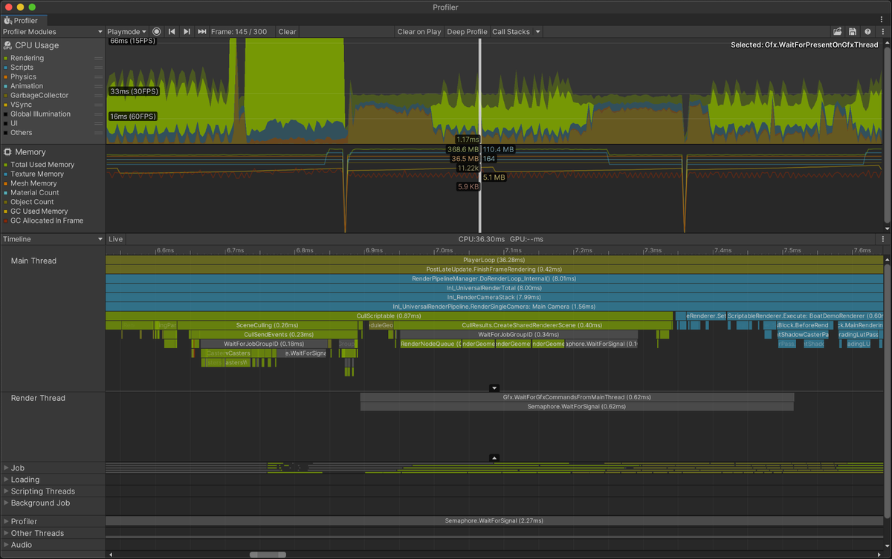
<p><em>VI: Cửa sổ Unity Profiler — dùng để kiểm tra hiệu năng và phân bổ tài nguyên. / EN: Use the Unity Profiler to test performance and resource allocation for your application.</em></p>

<div class="bilingual-row">
<div class="col-vi">
<p><strong>Mở:</strong> <code>Window &gt; Analysis &gt; Profiler</code>, hoặc phím tắt <strong>Ctrl+7</strong> (Windows) / <strong>Cmd+7</strong> (macOS).</p>
<p><strong>Bản chất:</strong> Đây là <em>instrumentation-based profiler</em> — nó đo các đoạn code được bọc tường minh bằng <code>ProfilerMarker</code> (ví dụ <code>Start</code>, <code>Update</code> của MonoBehaviour, hoặc các lời gọi API cụ thể).</p>
<p>Bật mặc định track <strong>CPU</strong> và <strong>Memory</strong>. Các module bổ sung (Renderer, Audio, Physics) bật theo nhu cầu game.</p>
<p><strong>Số frame ghi lại:</strong> mặc định <strong>300 frames</strong>. Tăng tối đa lên <strong>2000</strong> tại <code>Unity &gt; Preferences &gt; Analysis &gt; Profiler &gt; Frame Count</code>. Đánh đổi: Editor tốn thêm CPU và RAM.</p>
</div>
<div class="col-en">
<p><strong>Open:</strong> <code>Window &gt; Analysis &gt; Profiler</code>, or shortcut <strong>Ctrl+7</strong> (Windows) / <strong>Cmd+7</strong> (macOS).</p>
<p><strong>Nature:</strong> This is an <em>instrumentation-based profiler</em> that profiles code timings explicitly wrapped in ProfileMarkers (such as MonoBehaviour's <code>Start</code> or <code>Update</code> methods, or specific API calls).</p>
<p>Enable the <strong>CPU</strong> and <strong>Memory</strong> tracks by default. Monitor supplementary Profiler Modules like Renderer, Audio, and Physics as needed for your game.</p>
<p><strong>Recorded frames:</strong> The Record button tracks <strong>300 frames</strong> by default. Go to <code>Unity &gt; Preferences &gt; Analysis &gt; Profiler &gt; Frame Count</code> to increase this as far as <strong>2000</strong>. Trade-off: the Editor has to do more CPU work and take up more memory.</p>
</div>
</div>

### 6.0. Các category Profiler theo dõi / Profiler categories

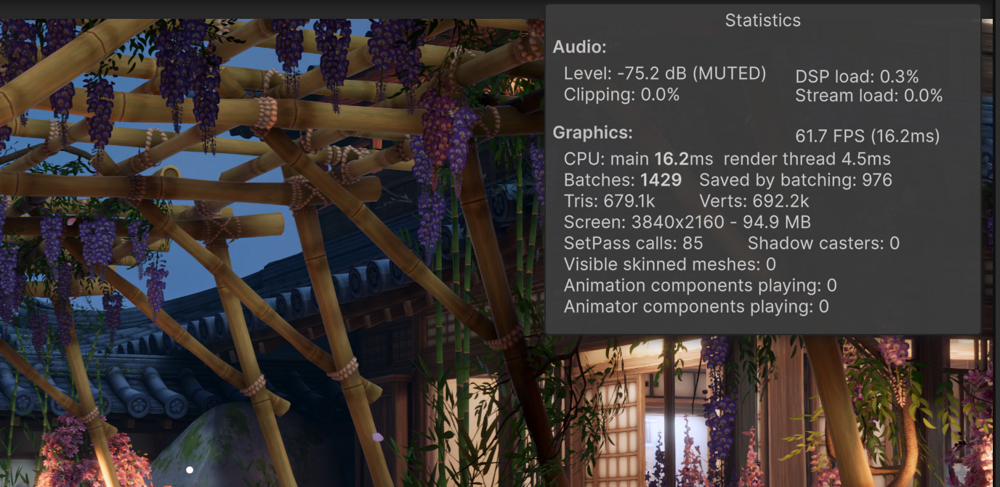
<p><em>VI: <strong>▲ Statistics overlay — nhìn nhanh trước khi mở Profiler</strong>: <strong>61.7 FPS (16.2 ms)</strong>, <strong>CPU main 16.2 ms · render thread 4.5 ms</strong>, <strong>Batches 1429 · Saved by batching 976</strong>, <strong>Tris 679.1k · Verts 692.2k</strong>, <strong>Screen 3840×2160 – 94.9 MB</strong>, <strong>SetPass calls 85</strong>, Shadow casters 0. Phần Audio ở trên: Level −75.2 dB (MUTED), DSP load 0.3%. / EN: The Statistics overlay: 61.7 FPS, 1429 batches, 85 SetPass calls.</em></p>

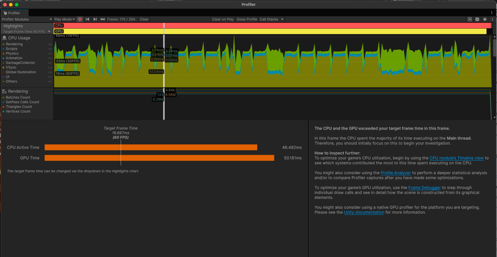
<p><em>VI: <strong>▲ Module <em>Highlights</em> — mới ở Unity 6</strong>: hai thanh <strong>CPU Active Time 45.402 ms</strong> và <strong>GPU Time 50.05 ms</strong> đặt cạnh <strong>Target Frame Time</strong>, kèm chẩn đoán viết sẵn: <em>“The CPU and the GPU exceeded your target frame time in this frame”</em> và hướng dẫn bước tiếp theo (dùng CPU Usage Timeline / Frame Debugger / Profile Analyzer). / EN: The Highlights module comparing CPU Active Time and GPU Time against the target.</em></p>

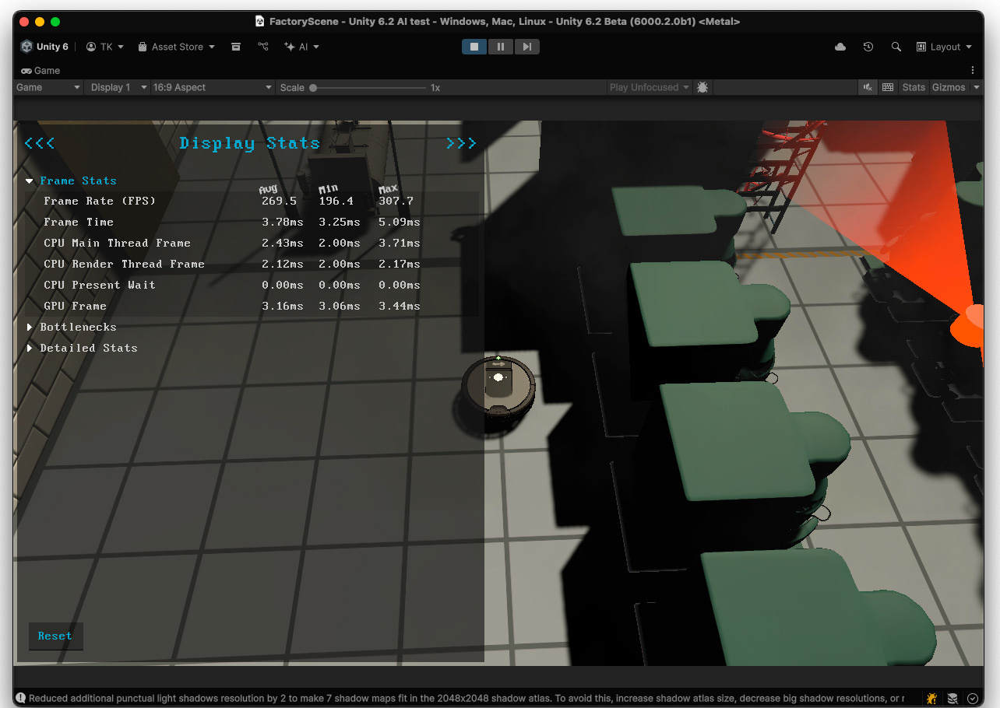
<p><em>VI: <strong>▲ Display Stats trong Game view (Unity 6)</strong> — cột <strong>min / max / avg</strong> cho <strong>Frame Rate FPS 265.5 / 196.4 / 497.7</strong>, <strong>Frame Time 3.76 / 5.25 / 3.79 ms</strong>, <strong>CPU Main Thread 2.43 / 2.98 / 2.71</strong>, <strong>CPU Render Thread 2.12 / 2.98 / 2.29</strong>, <strong>CPU Present Wait 0.00</strong>, <strong>GPU Frame 3.16 / 3.04 / 3.44</strong>. / EN: The Display Stats overlay with min/max/avg columns.</em></p>

| Category | Nội dung / Content |
|---|---|
| CPU & GPU Usage | Thời gian xử lý mỗi luồng / Per-thread processing time |
| Rendering | Draw calls, batches, triangles, vertices |
| Memory | Managed heap, native memory, assets |
| Audio & Video | Voices, DSP load, clip memory |
| Physics (2D & 3D) | Rigidbody count, contacts, queries |
| Network | Messages & Operations |
| UI | Canvas rebuild, layout, batching |
| Global Illumination | Lightmap & realtime GI cost |

### 6.1. Hierarchy vs Timeline — Chọn view nào?

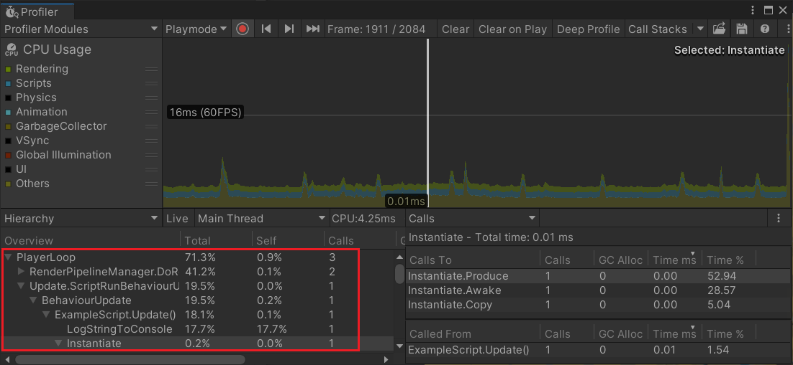
<p><em>VI: <strong>▲ Hierarchy — soi một lời gọi <code>Instantiate</code></strong>: khung <em>Calls</em> bên phải cho biết <strong>Instantiate – Total time: 0.01 ms</strong> tách thành <strong><code>Instantiate.Produce</code> 52.94% · <code>Instantiate.Awake</code> 28.57% · <code>Instantiate.Copy</code> 5.04%</strong>, và <strong>Called From: <code>ExampleScript.Update()</code></strong>. / EN: Hierarchy view drilling into an Instantiate call.</em></p>

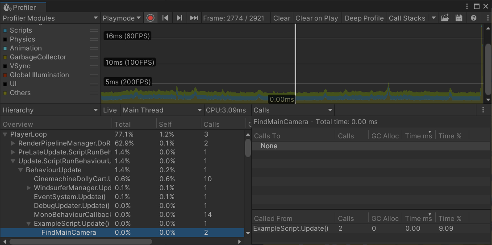
<p><em>VI: <strong>▲ Marker <code>FindMainCamera</code></strong> hiện ngay trong Hierarchy — đây là dấu vết của <code>Camera.main</code>. PlayerLoop 77.1% · RenderPipelineManager.DoR 62.9% · BehaviourUpdate 1.4%. / EN: The FindMainCamera marker, the fingerprint of Camera.main.</em></p>

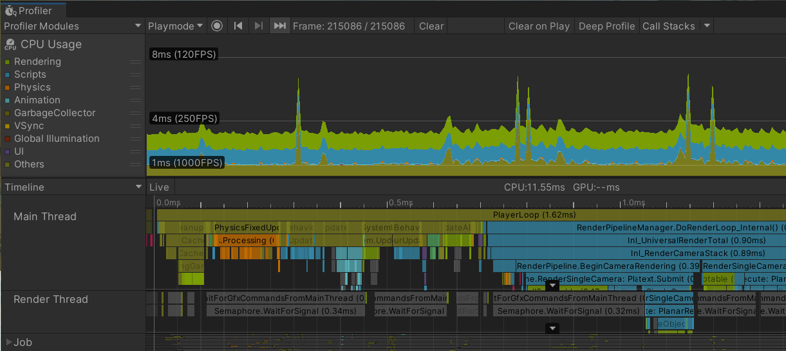
<p><em>VI: <strong>▲ Timeline — thấy được QUAN HỆ giữa các luồng</strong>: <strong>Main Thread</strong>, <strong>Render Thread</strong> và <strong>Job</strong> xếp chồng theo cùng trục thời gian; đây là thứ Hierarchy KHÔNG cho thấy. / EN: Timeline view showing Main Thread, Render Thread and Job worker lanes.</em></p>

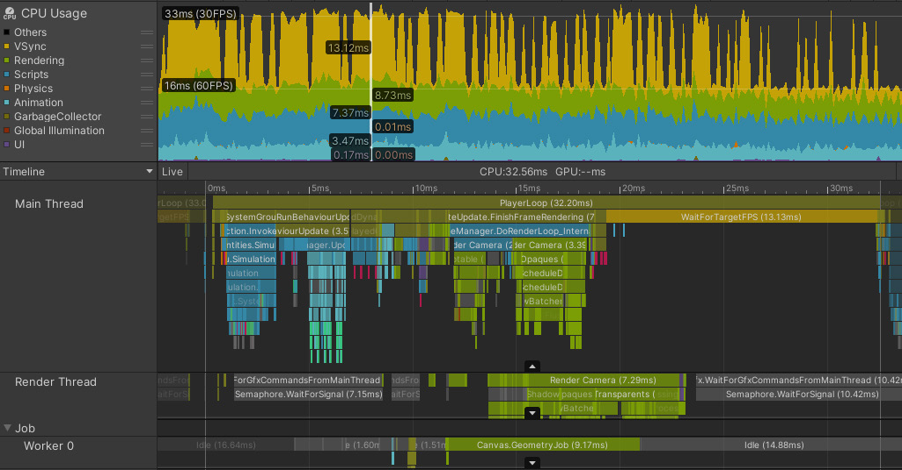
<p><em>VI: <strong>▲ Đọc một frame CHẬM</strong> — mốc <strong>33 ms (30 FPS)</strong> và <strong>16 ms (60 FPS)</strong> vẽ sẵn trên biểu đồ; Timeline bên dưới cho thấy <strong>PlayerLoop 30.39 ms</strong> cùng các khối chờ <strong><code>Semaphore.WaitForSignal</code></strong> và <strong><code>Gfx.WaitForPresentOnGfxThread</code></strong>. / EN: Reading a slow frame against the 30 FPS and 60 FPS guide lines.</em></p>

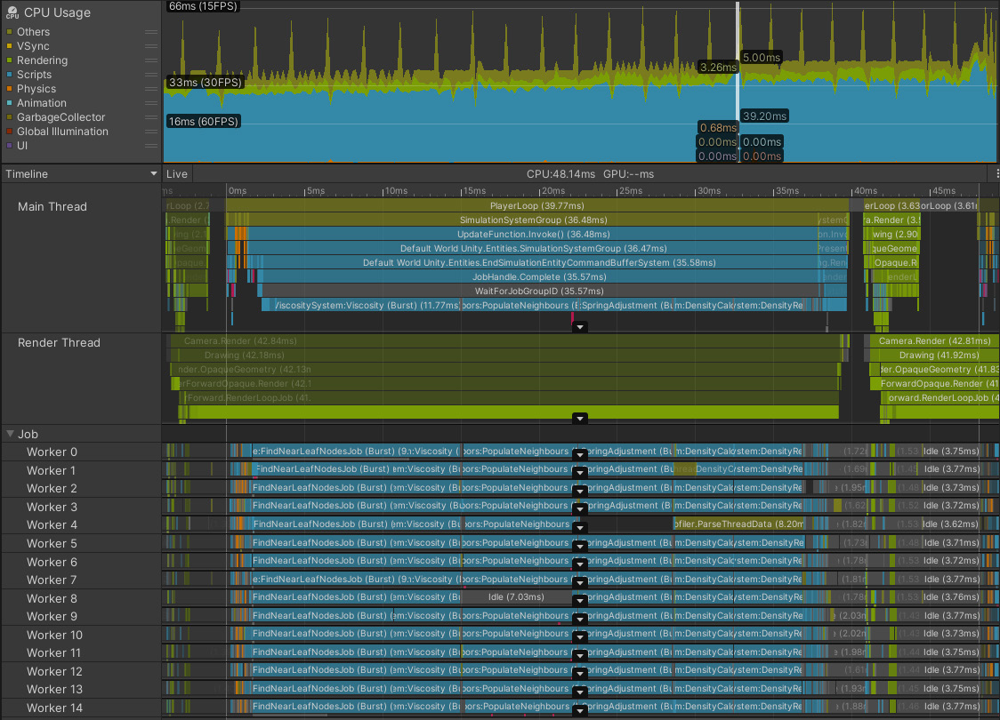
<p><em>VI: <strong>▲ Khi Job System hoạt động</strong> — <strong>14 Worker thread</strong> chạy song song dưới Main Thread. Nếu các lane worker gần như TRỐNG trong khi Main Thread đầy, bạn đang KHÔNG tận dụng đa nhân. / EN: Fourteen job worker lanes running alongside the main thread.</em></p>

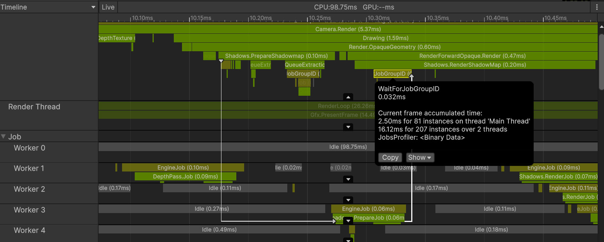
<p><em>VI: <strong>▲ Tooltip của <code>WaitForJobGroupID</code></strong> — <em>“Current frame accumulated time: <strong>2.50 ms cho 81 instance trên thread ‘Main Thread’, 16.12 ms cho 207 instance trải trên 2 thread</strong>”</em>. Con số cộng dồn này giải thích vì sao một marker nhỏ vẫn có thể ngốn nhiều thời gian. / EN: The WaitForJobGroupID tooltip showing accumulated time across threads.</em></p>

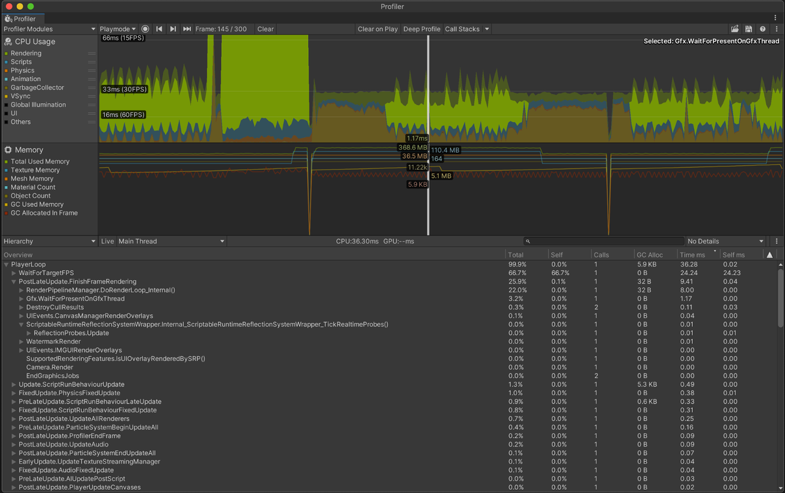
<p><em>VI: Hierarchy view cho phép sắp xếp ProfileMarkers theo chi phí thời gian. / EN: The Hierarchy view allows you to sort ProfileMarkers by time cost.</em></p>

<div class="bilingual-row">
<div class="col-vi">
<p><strong>TIMELINE</strong> — hiển thị trực quan phân bổ thời gian trong 1 frame theo <em>trục thời gian và theo luồng (thread)</em>. Sự kiện bên trái xảy ra trước, bên phải xảy ra sau.</p>
<ul>
<li>👉 Dùng để xác định bạn đang <strong>CPU-bound hay GPU-bound</strong>.</li>
<li>👉 Click vào một block sẽ cho biết GameObject nào liên quan (rất hữu ích với Skinned Mesh Renderer hoặc Animator).</li>
<li>👉 Tốt cho <strong>bức tranh tổng thể</strong>: ví dụ thấy render rất nhanh nhưng phải chờ CPU gửi lệnh.</li>
</ul>
<p><strong>HIERARCHY</strong> — gom nhóm các ProfileMarker thành cây phân cấp, sắp xếp theo chi phí.</p>
<ul>
<li><strong>Time ms</strong>: tổng thời gian (bao gồm hàm con).</li>
<li><strong>Self ms</strong>: thời gian riêng của hàm đó (không tính hàm con).</li>
<li><strong>Calls</strong>: số lần gọi trong frame.</li>
<li><strong>GC Alloc</strong>: lượng rác managed heap sinh ra trong frame.</li>
<li>👉 Tốt cho <strong>soi chi tiết</strong> một phần cụ thể.</li>
</ul>
<p><strong>HIERARCHY RAW MODE</strong> — tách các lời gọi hàm global của Unity thành từng dòng riêng. Khó đọc hơn, nhưng hữu ích để: hiểu cách Unity Engine hoạt động, đếm số lần một global method được gọi, xác định lời gọi nào tốn CPU/Memory bất thường.</p>
</div>
<div class="col-en">
<p><strong>TIMELINE</strong> — shows the visual breakdown of timing for a specific frame <em>across time and across threads</em>. Events on the left happened first, those on the right last.</p>
<ul>
<li>👉 Use this option to determine if you are <strong>CPU- or GPU-bound</strong>.</li>
<li>👉 Clicking a block tells you what GameObject is connected to it (e.g., for Skinned Mesh Renderer or Animator).</li>
<li>👉 Better for the <strong>general picture</strong>: e.g., you can notice rendering is taking very little but is waiting a lot for the CPU to send commands.</li>
</ul>
<p><strong>HIERARCHY</strong> — shows the hierarchy of ProfileMarkers, grouped together and sortable by cost.</p>
<ul>
<li><strong>Time ms</strong>: total time including inner functions.</li>
<li><strong>Self ms</strong>: time without inner functions.</li>
<li><strong>Calls</strong>: number of calls to the function in the frame.</li>
<li><strong>GC Alloc</strong>: managed heap memory allocated on the frame.</li>
<li>👉 Better when you are <strong>focusing on specific parts</strong>.</li>
</ul>
<p><strong>HIERARCHY RAW MODE</strong> — separates global Unity function calls into individual lines. This tends to make profiled data more difficult to read, but helps to: understand how the Unity Engine works, count how many times a particular global method has been invoked, and determine if one of these calls is costing more CPU/Memory than expected.</p>
</div>
</div>

### 6.2. 🔑 Metric vàng: Xác định CPU-bound hay GPU-bound

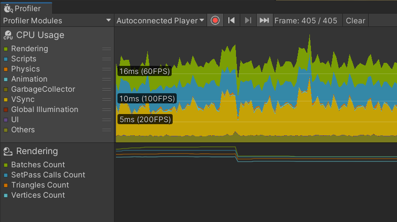
<p><em>VI: <strong>▲ Module Rendering</strong> — bốn bộ đếm <strong>Batches Count · SetPass Calls Count · Triangles Count · Vertices Count</strong> vẽ theo thời gian, đặt cạnh biểu đồ CPU Usage để đối chiếu. / EN: The Rendering module counters plotted over time.</em></p>

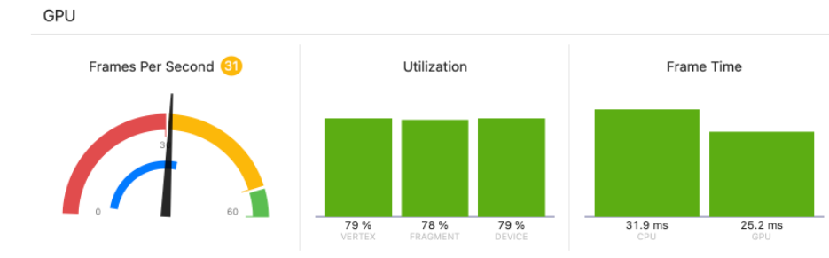
<p><em>VI: <strong>▲ Bảng điều khiển GPU trên thiết bị Android</strong> — kim <strong>FPS 31</strong>, ba cột <strong>Utilization: VERTEX 79% · FRAGMENT 78% · DEVICE 79%</strong>, và <strong>Frame Time 31.9 ms / 25.2 ms</strong>. Utilization cao đều ba cột ⇒ GPU thực sự là nút thắt. / EN: A GPU dashboard: 31 FPS with vertex/fragment/device utilization near 79%.</em></p>

<div class="bilingual-row">
<div class="col-vi">
<p>Profiler phát ra các marker tiền tố <code>Gfx</code> để tiết lộ ai đang chờ ai:</p>
<ul>
<li><strong><code>Gfx.WaitForCommands</code></strong> → Render thread đã <em>sẵn sàng</em> nhưng phải <strong>chờ Main Thread</strong> gửi lệnh. ⇒ Bạn đang <strong>CPU-bound</strong>. Đi tối ưu script, physics, animation, GC.</li>
<li><strong><code>Gfx.WaitForPresent</code></strong> → Main thread đã <em>sẵn sàng</em> nhưng phải <strong>chờ GPU</strong> trình bày frame. ⇒ Bạn đang <strong>GPU-bound</strong>. Đi tối ưu shader, overdraw, fill rate, độ phân giải, số draw call.</li>
</ul>
<p>Đây là bước chẩn đoán quan trọng nhất — làm sai bước này bạn sẽ tối ưu nhầm phía và tốn hàng tuần vô ích.</p>
</div>
<div class="col-en">
<p>The Profiler emits markers prefixed with <code>Gfx</code> that reveal who is waiting on whom:</p>
<ul>
<li><strong><code>Gfx.WaitForCommands</code></strong> → The render thread is <em>ready</em>, but you might be <strong>waiting for a bottleneck on the main thread</strong>. ⇒ You are <strong>CPU-bound</strong>. Optimize scripts, physics, animation, GC.</li>
<li><strong><code>Gfx.WaitForPresent</code></strong> → The main thread was <em>ready</em> but was <strong>waiting for the GPU</strong> to present the frame. ⇒ You are <strong>GPU-bound</strong>. Optimize shaders, overdraw, fill rate, resolution, draw call count.</li>
</ul>
<p>This is the single most important diagnostic step — getting it wrong means optimizing the wrong side and wasting weeks.</p>
</div>
</div>

### 6.3. Deep Profiling

<div class="bilingual-row">
<div class="col-vi">
<p>Bật <strong>Deep Profiling</strong> để Unity đo <em>điểm bắt đầu và kết thúc của MỌI lời gọi hàm</em> trong code script, chỉ đích danh phần nào gây chậm.</p>
<p>⚠️ <strong>Cảnh báo:</strong> Deep Profiling tạo overhead khổng lồ, làm sai lệch số liệu tuyệt đối. Chỉ dùng để <em>khoanh vùng tương đối</em>, sau đó tắt đi và đo lại bằng <code>ProfilerMarker</code> thủ công.</p>
</div>
<div class="col-en">
<p>Enable <strong>Deep Profiling</strong> and Unity will profile <em>the beginning and end of every function call</em> in your script code, to tell you exactly which part of your application is causing a slowdown.</p>
<p>⚠️ <strong>Warning:</strong> Deep Profiling adds enormous overhead and distorts absolute numbers. Use it only to <em>narrow down relatively</em>, then turn it off and re-measure with manual <code>ProfilerMarker</code>s.</p>
</div>
</div>

```csharp
// ProfilerMarker thủ công — chính xác hơn Deep Profiling rất nhiều
// Manual ProfilerMarker — far more accurate than Deep Profiling
using Unity.Profiling;
using UnityEngine;

public class EnemyAI : MonoBehaviour
{
    // static readonly: tạo 1 lần, không sinh rác
    static readonly ProfilerMarker s_PathfindMarker =
        new ProfilerMarker("EnemyAI.Pathfind");

    void Update()
    {
        using (s_PathfindMarker.Auto())   // tự động Begin/End
        {
            Pathfind();
        }
    }

    void Pathfind() { /* ... */ }
}
```

---

## 7. Build để Profiling & Profiling trên thiết bị thật

<div class="bilingual-row">
<div class="col-vi">
<p><strong>Profiling trong Editor là KHÔNG chính xác.</strong> Editor tự nó tiêu tốn CPU/RAM và làm nhiễu số liệu. Muốn dữ liệu đáng tin, phải tạo build riêng.</p>
<p><strong>Cách làm:</strong> Trong <code>Build Settings</code>, bật:</p>
<ul>
<li>☑️ <strong>Development Build</strong></li>
<li>☑️ <strong>Autoconnect Profiler</strong> (hoặc kết nối thủ công để app khởi động nhanh hơn)</li>
</ul>
<p><strong>Kết nối thiết bị ngoài:</strong> Cách dễ nhất là cho 2 máy dùng chung mạng LAN. Chọn thiết bị trong dropdown "Editor" của Profiler / Frame Debugger / Console. Trên mobile cũng có thể profile qua cáp USB.</p>
<p>Profile trên cả máy <strong>cấu hình cao nhất và thấp nhất</strong> mà bạn dự định hỗ trợ.</p>
</div>
<div class="col-en">
<p><strong>Profiling in the Editor is NOT accurate.</strong> The editor itself affects the performance of the project and the profiling information can be inaccurate. For accurate data, a separate build should be created.</p>
<p><strong>How:</strong> In <code>Build Settings</code>, enable:</p>
<ul>
<li>☑️ <strong>Development Build</strong></li>
<li>☑️ <strong>Autoconnect Profiler</strong> (or connect manually to accelerate app startup time)</li>
</ul>
<p><strong>Connecting external devices:</strong> The easiest way is to have the two devices share the same local network. Select the device in the "Editor" dropdown menu of the Profiler, Frame Debugger or Console. Mobile devices can also be profiled through a USB cable.</p>
<p>Remember to profile and optimize for both the <strong>highest- and lowest-spec devices</strong> that you plan to support.</p>
</div>
</div>

### 7.0. Quy trình 8 bước khởi động Profiler / 8-step Profiler setup

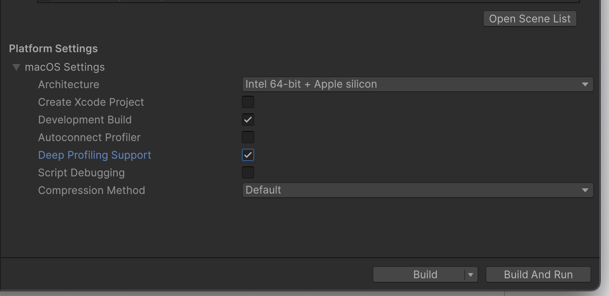
<p><em>VI: <strong>▲ Ba ô PHẢI tick trước khi build</strong> — <code>Build Settings › Platform Settings</code>: <strong>Development Build ✓</strong>, <strong>Autoconnect Profiler</strong>, và <strong>Deep Profiling Support ✓</strong> (đang bôi xanh). Cùng khung còn có Script Debugging và Compression Method. / EN: Development Build, Autoconnect Profiler and Deep Profiling Support in Build Settings.</em></p>

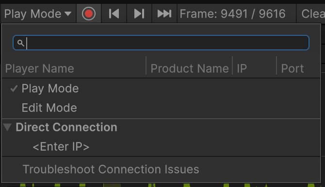
<p><em>VI: <strong>▲ Kết nối tới thiết bị</strong> — dropdown liệt kê player theo <strong>Player Name · Product Name · IP · Port</strong>, kèm mục <strong>Direct Connection › &lt;Enter IP&gt;</strong> và liên kết <strong>Troubleshoot Connection Issues</strong> khi máy không tự hiện ra. / EN: The profiler target dropdown with Direct Connection and Enter IP.</em></p>

<div class="bilingual-row">
<div class="col-vi">
<ol>
<li><strong>Bắt buộc dùng development build.</strong> <code>File &gt; Build Settings &gt; Development Build</code> — ⚠️ <strong>từ Unity 6 menu này đổi thành <code>File &gt; Build Profiles</code></strong>, ô tick vẫn tên <em>Development Build</em>.</li>
<li>➕ <strong>Đặt <code>Frame Count</code></strong> trong <code>Preferences &gt; Profiler</code> — <em>"số CAO HƠN cho bạn NHIỀU FRAME HƠN để phân tích trong cửa sổ Profiler, ĐÁNH ĐỔI là tốn thêm bộ nhớ trên máy Editor."</em></li>
<li><strong>Tick <em>Autoconnect Profiler</em> (tùy chọn).</strong><br>⚠️ <strong>Cảnh báo quan trọng:</strong> Autoconnect Profiler có thể <strong>cộng thêm tới 10 giây</strong> vào thời gian khởi động ban đầu. Chỉ bật nếu bạn muốn profile giai đoạn khởi tạo scene đầu tiên. Nếu không bật, bạn vẫn luôn có thể kết nối Profiler thủ công vào build đang chạy.</li>
<li><strong>Build cho nền tảng đích.</strong></li>
<li><strong>Mở Profiler:</strong> <code>Window &gt; Analysis &gt; Profiler</code>.</li>
<li><strong>Tắt các Profiler module không cần.</strong> Mỗi module bật lên đều gây overhead cho player. <em>(Có thể quan sát phần overhead này qua marker <code>Profiler.CollectGlobalStats</code>.)</em></li>
<li><strong>Tắt mạng di động của thiết bị, giữ WiFi bật.</strong></li>
<li><strong>Chạy build trên thiết bị đích.</strong></li>
<li><strong>Kết nối:</strong> Nếu đã chọn Autoconnect, IP máy Editor đã được nhúng sẵn vào build — app sẽ tự kết nối khi khởi chạy. Nếu không, kết nối thủ công qua dropdown <strong>Target Selection</strong>.</li>
</ol>
<p><strong>Quy tắc ngón tay cái:</strong> luôn bật <strong>CPU, Memory, Renderer</strong>. Bật thêm Audio, Physics… tùy nhu cầu.</p>
</div>
<div class="col-en">
<ol>
<li><strong>You must use a development build.</strong> <code>File &gt; Build Settings &gt; Development Build</code>.</li>
<li><strong>Tick <em>Autoconnect Profiler</em> (optional).</strong><br>⚠️ <strong>Important warning:</strong> Autoconnect Profiler <strong>can add up to 10 seconds</strong> to initial startup time and should only be enabled if you want to profile your first scene's initialization. If you don't enable it, you can always connect the Profiler to a running development build manually.</li>
<li><strong>Build for the target platform.</strong></li>
<li><strong>Open the Unity Profiler</strong> via <code>Window &gt; Analysis &gt; Profiler</code>.</li>
<li><strong>Disable any Profiler modules you will not need.</strong> Each module enabled incurs a performance overhead for the player. <em>(You can observe some of this overhead using the <code>Profiler.CollectGlobalStats</code> marker.)</em></li>
<li><strong>Disable your device mobile network, and leave WiFi enabled.</strong></li>
<li><strong>Run the build on your target device.</strong></li>
<li><strong>Connect:</strong> With Autoconnect selected, the build has the Editor machine's IP address baked in and connects at launch. Otherwise, connect manually using the <strong>Target Selection</strong> dropdown.</li>
</ol>
<p><strong>Rule of thumb:</strong> always enable <strong>CPU, Memory, and Renderer</strong>. Enable others such as Audio and Physics as you see fit.</p>
</div>
</div>

### 7.0.1. Bốn mẹo giảm nhiễu số liệu / Four noise-reduction tips

<div class="bilingual-row">
<div class="col-vi">
<p>🎯 <strong>Biết KHI NÀO nên profile ở Play mode, KHI NÀO ở Editor mode:</strong></p>
<p><em>"Khi dùng Profiler, bạn có thể chọn <strong>Play mode, Editor, hoặc một thiết bị từ xa/đã gắn</strong> làm Player target. Dùng <strong>Play mode để profile GAME của bạn</strong>, và <strong>Editor mode để xem Unity Editor BAO QUANH game đang làm gì.</strong>"</em></p>
<p>⚠️ <em>"Dùng Editor làm đích profiling <strong>ảnh hưởng LỚN tới độ chính xác</strong>. <strong>Cửa sổ Profiler thực chất đang tự profile CHÍNH NÓ một cách ĐỆ QUY.</strong>"</em></p>
<p>✅ <em>"Tuy nhiên, <strong>profile Editor VẪN có giá trị nếu hiệu năng Editor bị chậm.</strong> Khi đó bạn xác định được <strong>script và extension nào đang làm Editor ì ạch và cản trở năng suất.</strong>"</em></p>
<p>📋 <strong>Ba ví dụ nên profile Editor:</strong></p>
<ul>
<li><em>"Nếu mất RẤT LÂU để vào Play mode sau khi bấm nút Play"</em></li>
<li><em>"Nếu Editor trở nên CHẬM CHẠP hoặc KHÔNG PHẢN HỒI"</em></li>
<li><em>"Nếu một dự án mất RẤT LÂU để mở"</em></li>
</ul>
</div>
<div class="col-en">
<p>🎯 <em>"When using the Profiler, you can choose Play mode, Editor, or a remote or attached device as the Player target. Use Play mode to profile your game/application, and Editor mode to see what the Unity Editor surrounding the game is doing. Using the Editor as the target for profiling has a high impact on profiling accuracy. The Profiler window is effectively profiling itself recursively. However, it can be valuable to profile the Editor if its performance slows down. You can then identify scripts and extensions that are slowing the Editor down and hampering productivity."</em></p>
<p>📋 <em>"Examples of when you might want to profile the Editor include: if it takes a long time to enter Play mode after pressing the Play button; if the Editor becomes sluggish or unresponsive; if a project takes a long time to open."</em></p>
</div>
</div>


<div class="bilingual-row">
<div class="col-vi">
<p><strong>① Tắt category VSync và Others trong CPU Usage module</strong></p>
<p>Marker <strong>VSync</strong> đại diện cho <em>"thời gian chết"</em> — main thread nhàn rỗi trong lúc chờ VSync. Tuy nhiên, ẩn marker đi đôi khi lại khiến khó hiểu các category khác hình thành thế nào, hoặc tổng frame time cấu thành ra sao. Vì vậy, một lựa chọn khác là <strong>sắp xếp lại danh sách để VSync nằm trên cùng</strong> — cho cái nhìn rõ ràng hơn về đồ thị, giảm "nhiễu" do VSync gây ra.</p>
<p>Marker <strong>Others</strong> đại diện cho <em>overhead của chính profiler</em> và <strong>có thể bỏ qua an toàn</strong>, vì nó sẽ không xuất hiện trong build cuối.</p>
<p><strong>② Tắt hẳn VSync trong build</strong></p>
<p>Để thấy rõ main thread, render thread, và GPU tương tác với nhau ra sao, hãy profile một build đã tắt VSync hoàn toàn: <code>Edit &gt; Project Settings &gt; Quality</code> → chọn Quality Level dùng cho thiết bị đích → set <strong>VSync Count = Don't Sync</strong>.</p>
<p><strong>③ Dùng Standalone Profiler</strong></p>
<p>Profiler khởi chạy như một <strong>tiến trình riêng biệt</strong>, tách khỏi Unity Editor. Tránh việc UI của Profiler hay Editor ảnh hưởng tới số đo, và cho bạn bộ dữ liệu sạch hơn để lọc và làm việc.</p>
<p><strong>④ Biết khi nào nên profile trong Editor</strong></p>
<p>Profile trong Editor khi bạn muốn <em>lặp nhanh</em>. Ví dụ: phát hiện vấn đề hiệu năng trong build → profile trong Editor để xác nhận vấn đề cũng tái hiện ở đó → nếu có, dùng Play mode profiling để lặp nhanh trên các thay đổi → khi giải quyết xong, tạo build và <strong>xác nhận lại giải pháp trên thiết bị đích</strong>.</p>
<p>💡 Quy trình này tối ưu vì bạn tốn ít thời gian build và deploy hơn.</p>
</div>
<div class="col-en">
<p><strong>① Disable VSync and Others categories in the CPU Usage Profiler module</strong></p>
<p>The <strong>VSync</strong> marker represents <em>"dead time,"</em> wherein the CPU main thread is idle while waiting for VSync. However, hiding markers can sometimes make it difficult to understand how other category times came to be, or even how the total frame time is formed. With this in mind, another option is to <strong>reorder the list so that VSync is at the top</strong> — this provides a clearer view of the graph where the "noise" added by the VSync marker is reduced.</p>
<p>The <strong>Others</strong> markers represent <em>profiling overhead</em> and <strong>can be safely ignored</strong> since they won't be present in final builds of your project.</p>
<p><strong>② Disable VSync in the build</strong></p>
<p>Another option for getting a clear picture of how the main thread, render thread, and GPU interact is to profile a build in which VSync is disabled entirely: <code>Edit &gt; Project Settings &gt; Quality</code> → select the Quality Level(s) used on your target device → set <strong>VSync Count to Don't Sync</strong>.</p>
<p><strong>③ Use the Standalone Profiler</strong></p>
<p>The Profiler launches as a <strong>new process</strong>, separate from the Unity Editor. This avoids the Profiler UI or Editor having an effect on measured timings, and gives you a cleaner set of profiling data to filter and work with.</p>
<p><strong>④ Know when to profile in the Editor</strong></p>
<p>Profile in the Editor when you want to <em>quickly iterate</em>. For example: a performance problem is spotted in the build → profile in the Editor to verify you can also find it there → if you do, use Play mode profiling to quickly iterate toward a solution → once solved, make a build and <strong>verify the solution also works on target devices</strong>.</p>
<p>💡 This workflow is optimal because you spend less time building changes and deploying to devices.</p>
</div>
</div>

### 7.1. ⚠️ Quy tắc nhiệt độ khi profiling mobile

!!! danger "💀 Bẫy FREQUENCY SCALING — tối ưu tốt mà số đo không đổi"
    <div class="bilingual-row">
    <div class="col-vi">
    <p><em>"<strong>Frequency scaling trên chip mobile có thể khiến việc xác định ngân sách frame idle time trở nên KHÓ khi profiling.</strong> Cải tiến và tối ưu của bạn có thể có tác động TÍCH CỰC THẬT, <strong>nhưng thiết bị mobile có thể đang HẠ TẦN SỐ xuống, và kết quả là CHẠY MÁT HƠN</strong> — nên con số bạn nhìn thấy KHÔNG đổi."</em></p>
    <p>🔧 <em>"<strong>Hãy dùng công cụ riêng như <code>FTrace</code> hoặc <code>Perfetto</code> để theo dõi TẦN SỐ chip mobile, THỜI GIAN NGHỈ và mức SCALING — TRƯỚC và SAU khi tối ưu.</strong>"</em></p>
    <p>✅ <em>"Miễn là bạn <strong>NẰM TRONG tổng ngân sách frame time cho fps mục tiêu</strong> (ví dụ <strong>33,33 ms cho 30 fps</strong>) <strong>VÀ thấy thiết bị LÀM VIỆC ÍT HƠN hoặc ghi nhận NHIỆT ĐỘ THẤP HƠN</strong> để duy trì frame rate đó, thì bạn đang đi đúng hướng."</em></p>
    </div>
    <div class="col-en">
    <p><em>"Frequency scaling on mobile chips can make it tricky to identify your frame idle time budget allocations when profiling. Your improvements and optimizations can have a net positive effect, but the mobile device might be scaling frequency down, and as a result, running cooler. Use custom tooling such as FTrace or Perfetto to monitor mobile chip frequencies, idle time, and scaling before and after optimizations."</em></p>
    <p>✅ <em>"As long as you stay within your total frame time budget for your target fps (say 33.33 ms for 30 fps) and see your device working less or logging lower temperatures to maintain this frame rate, then you're on the right track."</em></p>
    </div>
    </div>


<div class="bilingual-row">
<div class="col-vi">
<p>Trên mobile, <strong>hiệu năng tỉ lệ nghịch trực tiếp với nhiệt độ máy</strong>. Máy vừa bật → hiệu năng đỉnh. Máy nóng lên → hiệu năng tụt vì hệ thống tự làm mát. Máy nguội lại → hiệu năng hồi phục.</p>
<p><strong>Hai trường phái (cả hai đều đúng, tùy mục tiêu):</strong></p>
<ul>
<li><strong>Đo trải nghiệm thực tế:</strong> Cho build chạy <strong>10 phút</strong> để máy nóng đúng mức người dùng thật gặp, rồi mới đo. Số liệu lúc này mới phản ánh trải nghiệm thật.</li>
<li><strong>Đo để so sánh A/B:</strong> Profile theo từng <em>đợt ngắn</em>, giữ máy nguội <strong>10–15 phút</strong> giữa các lần đo, để nhiệt độ không làm nhiễu phép so sánh.</li>
</ul>
<p>👉 Nếu máy đang nóng, Profiler có thể báo hiệu năng tệ mà thực chất không phải vấn đề dài hạn.</p>
</div>
<div class="col-en">
<p>On mobile, <strong>performance is directly comparable to the heat level of the device</strong>. Device just turned on → performance at its best. Once warmed up, performance starts to fall as the device tries to cool itself. Once cooled down, performance improves again.</p>
<p><strong>Two schools (both valid, depending on your goal):</strong></p>
<ul>
<li><strong>Measuring real experience:</strong> Let the build run for <strong>10 minutes</strong> so the device warms up as a real user's would, then profile. Only then is the data applicable to actual user experience.</li>
<li><strong>Measuring for A/B comparison:</strong> Profile in <em>short bursts</em>, keeping the device cool for <strong>10–15 minutes</strong> between runs, so temperature doesn't contaminate the comparison.</li>
</ul>
<p>👉 If the device is running hot, the Profiler might perceive and report poor performance even if it is not cause for long-term concern.</p>
</div>
</div>

### 7.2. Công cụ profiling native theo nền tảng

<div class="bilingual-row">
<div class="col-vi">
<p>🕐 <strong>Khi thiết bị KHÔNG cho bạn số GPU đáng tin — dùng API này:</strong></p>
<p><em>"Cách TỐT NHẤT để lấy GPU frame time là dùng công cụ profiling GPU ĐẶC THÙ NỀN TẢNG, <strong>nhưng KHÔNG phải thiết bị nào cũng cho phép thu dữ liệu đáng tin cậy một cách dễ dàng.</strong> ✅ <strong>API <code>FrameTimingManager</code> có thể hữu ích trong những trường hợp đó — nó cung cấp frame time mức TỔNG QUAN, OVERHEAD THẤP, cho CẢ CPU LẪN GPU.</strong>"</em></p>
</div>
<div class="col-en">
<p>🕐 <em>"The best way of getting GPU frame times is using a target platform-specific GPU profiling tool, but not all devices make it easy to capture reliable data. The <code>FrameTimingManager</code> API can be helpful in those cases, providing low-overhead, high-level frame times both on the CPU and GPU."</em></p>
</div>
</div>


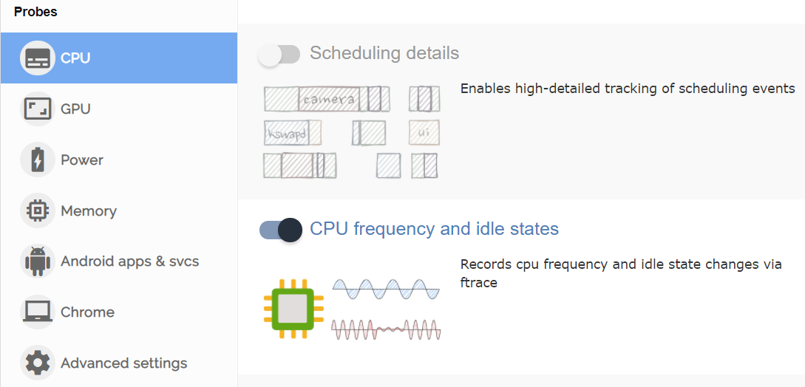
<p><em>VI: <strong>▲ Android Studio — cấu hình Probes</strong>: <strong>CPU · GPU · Power · Memory · Android apps &amp; svcs · Chrome · Advanced settings</strong>. Hai công tắc quan trọng: <strong>Scheduling details</strong> (<em>“bật theo dõi chi tiết sự kiện lập lịch”</em>) và <strong>CPU frequency and idle states</strong> (<em>“ghi lại thay đổi tần số CPU và trạng thái nghỉ qua ftrace”</em>). / EN: Android Studio probe configuration with scheduling details and CPU frequency tracking.</em></p>

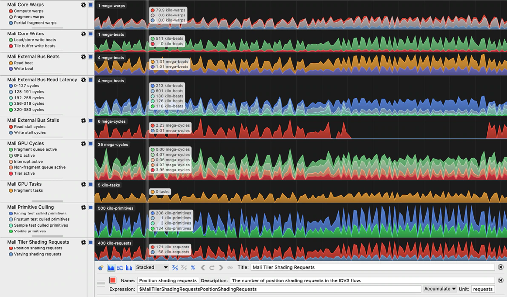
<p><em>VI: <strong>▲ Arm Streamline — bộ đếm phần cứng Mali</strong>: <strong>Mali Core Warps · Mali Core Writes · Mali External Bus Beats · Mali External Bus Read Latency · Mali External Bus Stalls · Mali GPU Cycles · Mali GPU Tasks · Mali Primitive Culling · Mali Tiler Shading Requests</strong>. Đây là mức chi tiết mà Unity Profiler KHÔNG thấy được. / EN: Arm Streamline showing Mali hardware counters.</em></p>

| Platform | Tools |
|---|---|
| **iOS** | Xcode + Instruments |
| **Android** | Android Studio + Android Profiler |
| **Arm GPU** | Arm Mobile Studio |
| **Intel** | Intel VTune |
| **Qualcomm** | Snapdragon Profiler |

---

## 8. Frame Debugger — Mổ xẻ từng Draw Call

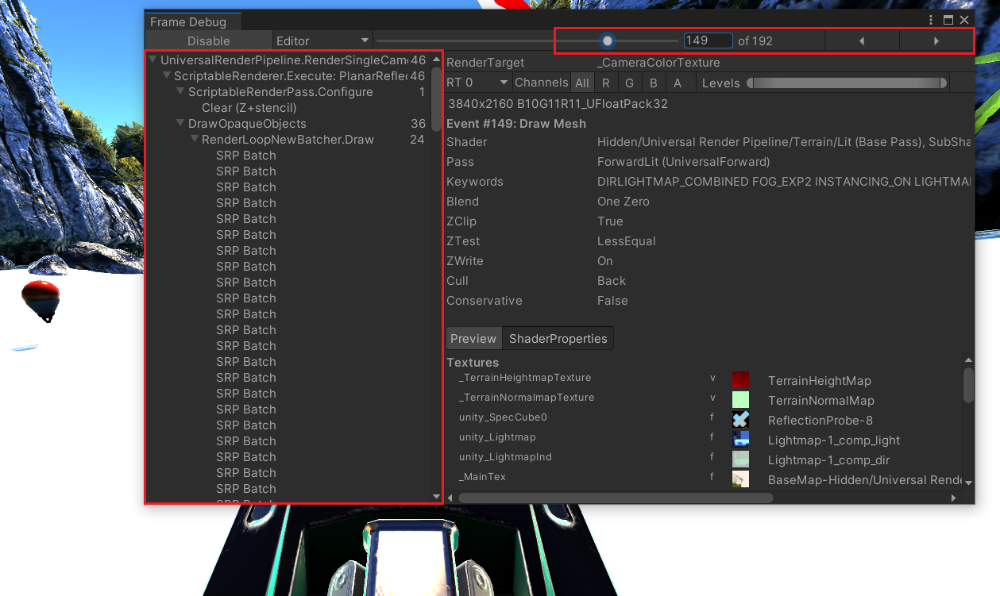
<p><em>VI: Cửa sổ Frame Debugger liệt kê draw call và event ở cột trái, kèm thanh trượt để bước qua từng cái. / EN: The Frame Debugger window lists draw calls and events down the left side and provides a slider to visually step through each one.</em></p>

<div class="bilingual-row">
<div class="col-vi">
<p><strong>Frame Debugger giúp bạn tối ưu rendering</strong> bằng cách <em>đóng băng</em> playback của game đang chạy tại một frame cụ thể, rồi xem từng draw call riêng lẻ dùng để render nó. Công cụ cho phép bạn <strong>bước qua danh sách draw call từng cái một</strong>, thấy được frame được dựng lên dần dần từ các thành phần đồ họa.</p>
<p><strong>Ưu điểm so với các frame debugger khác:</strong> khi một draw call tương ứng với geometry của một GameObject, object đó sẽ được <strong>highlight ngay trong panel Hierarchy</strong> để bạn nhận diện dễ dàng.</p>
<p>Frame Debugger cũng dùng được để <strong>kiểm tra overdraw</strong> bằng cách phân tích thứ tự render từng frame.</p>
<p><strong>Cách mở:</strong> <code>Window &gt; Analysis &gt; Frame Debugger</code>. Với app đang chạy trong Editor hoặc trên thiết bị, bấm <strong>Enable</strong>. Thao tác này sẽ <em>tạm dừng</em> ứng dụng và liệt kê toàn bộ draw call theo trình tự của frame hiện tại ở phía bên trái cửa sổ. Các chi tiết bổ sung như <em>framebuffer clear events</em> cũng được đưa vào.</p>
<p><strong>Thanh trượt</strong> ở trên cùng cho phép bạn "tua" nhanh qua các draw call để định vị mục cần quan tâm.</p>
</div>
<div class="col-en">
<p><strong>The Frame Debugger helps you optimize rendering</strong> by letting you <em>freeze</em> playback for a running game on a specific frame and view the individual draw calls used to render it. The tool lets you <strong>step through the list of draw calls, one by one</strong>, so you can see the frames as they are constructed from their graphical elements.</p>
<p><strong>Advantage over other frame debugging tools:</strong> where a draw call corresponds to the geometry of a GameObject, that object will be <strong>highlighted in the main Hierarchy panel</strong> to assist identification.</p>
<p>The Frame Debugger can also be used to <strong>test for overdraw</strong> by analyzing the rendering order frame-by-frame.</p>
<p><strong>How to open:</strong> <code>Window &gt; Analysis &gt; Frame Debugger</code>. With your application running in the Editor or on a device, click <strong>Enable</strong>. This pauses the application and lists all the draw calls in sequence for the current frame on the left side of the Frame Debug window. Additional details, such as <em>framebuffer clear events</em>, are also included.</p>
<p>The <strong>slider</strong> at the top lets you scrub rapidly through the draw calls to locate an item of interest quickly.</p>
</div>
</div>

### 8.1. 🔑 Khái niệm cốt lõi: Draw Call và Render State

<div class="bilingual-row">
<div class="col-vi">
<p>Unity phát ra <strong>draw call</strong> tới graphics API để vẽ geometry lên màn hình. Một draw call nói cho graphics API biết <em>vẽ cái gì</em> và <em>vẽ như thế nào</em>. Mỗi draw call chứa toàn bộ thông tin API cần: texture, shader, buffer.</p>
<p>🔑 <strong>Điểm mấu chốt mà rất nhiều người bỏ qua:</strong></p>
<blockquote>
<p>"<em>Thông thường, việc <strong>chuẩn bị</strong> cho một draw call còn tốn tài nguyên hơn chính bản thân draw call đó.</em>"</p>
</blockquote>
<p>Quá trình chuẩn bị này được gộp lại dưới tên gọi <strong>"render state"</strong>. Một cách tối ưu hiệu năng ở mảng này là <strong>giảm số lần thay đổi render state</strong>.</p>
<p>👉 Frame Debugger giúp xác định draw call đến <em>từ đâu</em>. Dùng nó để hình dung và hiểu quá trình render, từ đó ra quyết định <strong>gom nhóm draw call</strong> sao cho giảm thiểu thay đổi render state.</p>
<p>💡 Đây chính là nền tảng lý thuyết của <em>static batching</em>, <em>dynamic batching</em>, <em>GPU instancing</em>, <em>SRP Batcher</em>, và <em>texture atlas</em> — tất cả đều nhằm một mục đích: <strong>giữ nguyên render state càng lâu càng tốt</strong>.</p>
</div>
<div class="col-en">
<p>Unity issues <strong>draw calls</strong> to the graphics API to draw geometry on the screen. A draw call tells the graphics API <em>what</em> to draw and <em>how</em>. Each draw call contains all the information the graphics API needs, such as information about textures, shaders, and buffers.</p>
<p>🔑 <strong>The key point many people miss:</strong></p>
<blockquote>
<p>"<em>Often, the <strong>preparation</strong> for a draw call is more resource intensive than the draw call itself.</em>"</p>
</blockquote>
<p>This preparation process is grouped under what's known as <strong>"render state."</strong> One way to optimize performance in this area is to <strong>reduce the number of changes to this render state</strong>.</p>
<p>👉 The Frame Debugger helps identify where draw calls are coming in from. Use it to visualize and understand the rendering process to guide decisions on how to <strong>group draw calls</strong> in order to reduce changes to render state.</p>
<p>💡 This is the theoretical foundation of <em>static batching</em>, <em>dynamic batching</em>, <em>GPU instancing</em>, the <em>SRP Batcher</em>, and <em>texture atlases</em> — all serving one goal: <strong>keep the render state unchanged for as long as possible</strong>.</p>
</div>
</div>

### 8.2. Đọc cửa sổ Frame Debugger

<div class="bilingual-row">
<div class="col-vi">
<p>📡 <strong>Remote Frame Debugging — quy trình 5 bước:</strong> <em>"Bạn có thể debug frame TỪ XA bằng cách gắn Frame Debugger vào một Unity Player đang chạy trên nền tảng được hỗ trợ (<strong>WebGL KHÔNG được hỗ trợ</strong>). ⚠️ <strong>Với nền tảng Desktop, hãy bật <code>Run In Background</code> cho build.</strong>"</em></p>
<ol>
<li><em>"Tạo build TIÊU CHUẨN của dự án cho nền tảng đích (chọn <strong>Development Build</strong>)."</em></li>
<li><em>"Chạy player."</em></li>
<li><em>"Mở cửa sổ Frame Debugger từ Editor."</em></li>
<li><em>"Bấm dropdown <strong>Player selection</strong> và chọn player đang chạy."</em></li>
<li><em>"Bấm nút <strong>Enable</strong>."</em></li>
</ol>
<p>🎨 <strong>Thanh công cụ kênh màu & Levels:</strong> <em>"Cửa sổ Frame Debug có thanh công cụ cho phép <strong>TÁCH RIÊNG kênh đỏ, lục, lam và alpha</strong> cho trạng thái hiện tại của Game view. Cô lập vùng theo mức SÁNG bằng thanh trượt <strong>Levels</strong> bên phải các nút kênh. 🔑 <strong>Các điều khiển này CHỈ bật khi đang render vào một RenderTexture. Khi render vào NHIỀU render target CÙNG LÚC, bạn chọn cái nào để hiển thị trong Game view bằng dropdown <code>RenderTarget</code>. Dropdown đó cũng có tuỳ chọn <code>Depth</code> để xem nội dung depth buffer.</strong>"</em></p>
<p>🧬 <strong>ShaderProperties tiết lộ cả STAGE:</strong> <em>"Cùng với giá trị shader property, mục <strong>ShaderProperties</strong> còn cho biết <strong>property đó được dùng ở STAGE NÀO của shader (ví dụ vertex, fragment, geometry, hull, domain)</strong>."</em></p>
</div>
<div class="col-en">
<p>📡 <em>"You can remotely debug frames by attaching the Frame Debugger to a running Unity Player on supported platforms (WebGL is not supported). For Desktop platforms, enable Run In Background for builds."</em> — steps: build with Development Build → run the player → open the Frame Debugger → pick the player in the <strong>Player selection</strong> dropdown → click <strong>Enable</strong>.</p>
<p>🎨 <em>"The Frame Debug window has a toolbar which lets you isolate the red, green, blue, and alpha channels for the current state of the Game view. Isolate areas of the view according to brightness levels using the Levels slider to the right of the channel buttons. These controls are enabled when rendering into a RenderTexture. When rendering into multiple render targets at once you can select which one to display in the Game view using the RenderTarget dropdown list. The dropdown list also has a Depth option to show the contents of the depth buffer."</em></p>
<p>🧬 <em>"Along with shader property values, the ShaderProperties section also reveals which shader stages it was used in (for example, vertex, fragment, geometry, hull, domain)."</em></p>
</div>
</div>


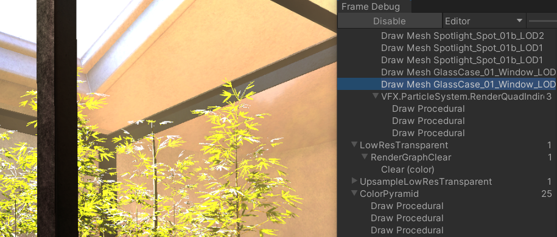
<p><em>VI: <strong>▲ Cây sự kiện</strong> — <code>Draw Mesh Spotlight_Spot_01b_LOD2/LOD1/LOD0</code>, <code>Draw Mesh GlassCase_01_Window_LOD</code>, <code>VFX.ParticleSystem.RenderQuadIndir</code>, rồi các nhóm <code>LowResTransparent</code> · <code>RenderGraphClear</code> · <code>UpsampleLowResTransparent</code> · <code>ColorPyramid</code>. / EN: The Frame Debugger event tree.</em></p>

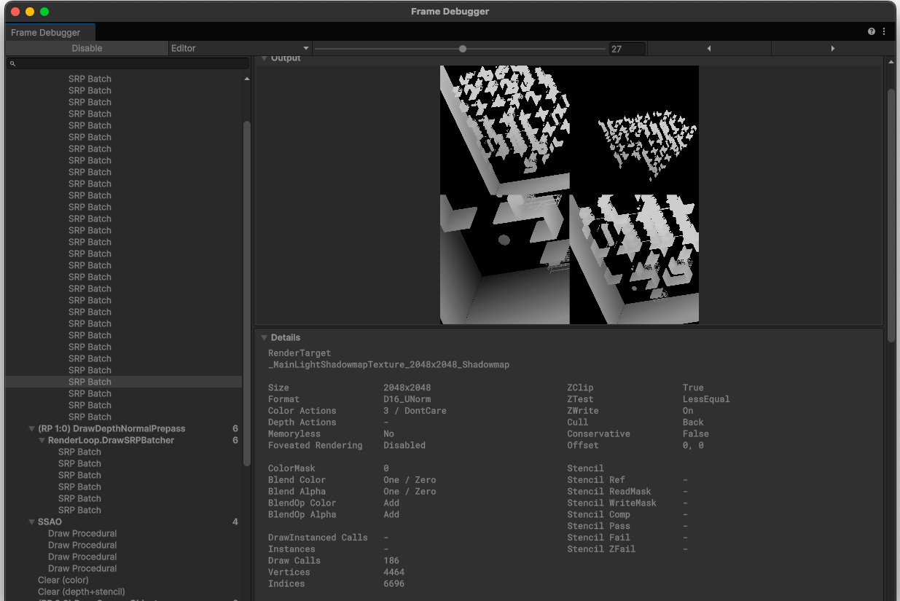
<p><em>VI: <strong>▲ Panel Details của một draw call</strong> — <strong>RenderTarget <code>_MainLightShadowmapTexture</code> 2048×2048_Shadowmap</strong>, cùng đầy đủ <strong>ZClip · ZTest · ZWrite · Cull · Conservative</strong>, khối <strong>Stencil</strong>, và bộ đếm <strong>Draw Calls · Instances · Vertices · Indices</strong>. / EN: The Frame Debugger details panel with render state and counters.</em></p>

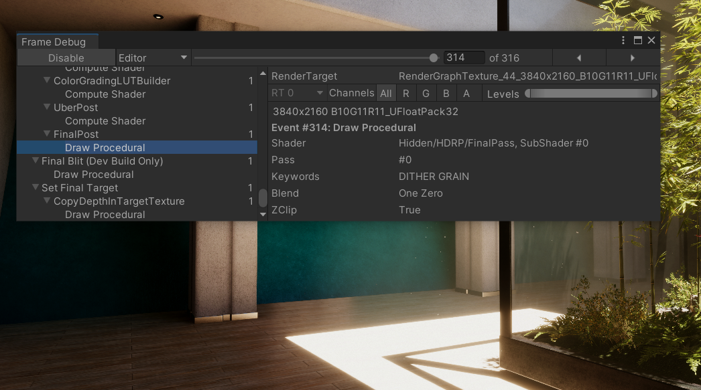
<p><em>VI: <strong>▲ Một event post-processing</strong> — <strong>Event #314: Draw Procedural</strong>, Shader <code>Hidden/HDRP/FinalPass</code>, Keywords <strong>DITHER GRAIN</strong>, Blend One Zero, ZClip True. / EN: Event #314 Draw Procedural using Hidden/HDRP/FinalPass.</em></p>

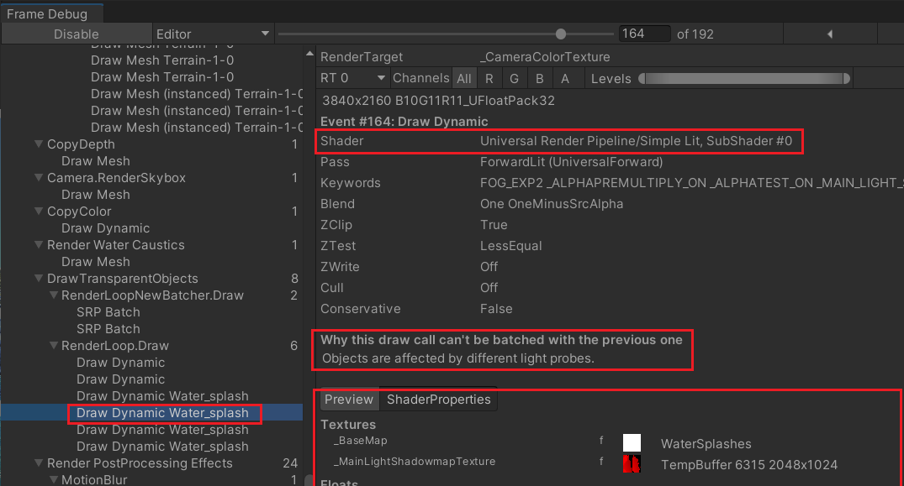
<p><em>VI: <strong>▲ Dòng chữ QUAN TRỌNG NHẤT</strong> — <em>“Why this draw call can't be batched with the previous one: <strong>Objects are affected by different light probes</strong>”</em>. Unity nói THẲNG lý do batch vỡ; ở đây là <strong>light probe khác nhau</strong>, không phải material. / EN: Why this draw call can't be batched: objects are affected by different light probes.</em></p>

<div class="bilingual-row">
<div class="col-vi">
<p>Trong ảnh chụp ở trên (dự án BoatAttack, URP), hãy để ý:</p>
<ul>
<li><strong>Thanh trượt trên cùng:</strong> <code>149 of 192</code> — frame này có <strong>192 sự kiện render</strong>, đang xem sự kiện thứ 149.</li>
<li><strong>Cây bên trái:</strong> <code>UniversalRenderPipeline.RenderSingleCamera (46)</code> → <code>ScriptableRenderer.Execute: PlanarReflection (46)</code> → <code>DrawOpaqueObjects (36)</code> → <code>RenderLoopNewBatcher.Draw (24)</code> → hàng loạt <strong>SRP Batch</strong>. Con số bên phải là số draw call của nhánh đó.</li>
<li><strong>RenderTarget:</strong> <code>_CameraColorTexture</code>, độ phân giải <strong>3840x2160</strong>, định dạng <code>B10G11R11_UFloatPack32</code>.</li>
<li><strong>Chi tiết sự kiện #149 (Draw Mesh):</strong> Shader <code>Universal Render Pipeline/Terrain/Lit (Base Pass)</code>, Pass <code>ForwardLit</code>, Keywords <code>DIRLIGHTMAP_COMBINED FOG_EXP2 INSTANCING_ON LIGHTMAP...</code></li>
<li><strong>Trạng thái render:</strong> Blend <code>One Zero</code>, ZClip <code>True</code>, ZTest <code>LessEqual</code>, ZWrite <code>On</code>, Cull <code>Back</code>, Conservative <code>False</code>.</li>
<li><strong>Textures:</strong> liệt kê từng texture đang bind (<code>_TerrainHeightmapTexture</code>, <code>unity_Lightmap</code>, <code>_MainTex</code>…).</li>
</ul>
<p>👉 Nhìn thấy nhiều <strong>SRP Batch</strong> liên tiếp là dấu hiệu <em>tốt</em> — batching đang hoạt động. Nếu thấy nhiều draw call rời rạc với shader/keyword khác nhau ⇒ render state đổi liên tục ⇒ cần gom lại.</p>
</div>
<div class="col-en">
<p>In the screenshot above (BoatAttack project, URP), note:</p>
<ul>
<li><strong>Top slider:</strong> <code>149 of 192</code> — this frame has <strong>192 render events</strong>; we're viewing event 149.</li>
<li><strong>Left tree:</strong> <code>UniversalRenderPipeline.RenderSingleCamera (46)</code> → <code>ScriptableRenderer.Execute: PlanarReflection (46)</code> → <code>DrawOpaqueObjects (36)</code> → <code>RenderLoopNewBatcher.Draw (24)</code> → a run of <strong>SRP Batch</strong> entries. The number on the right is that branch's draw call count.</li>
<li><strong>RenderTarget:</strong> <code>_CameraColorTexture</code>, resolution <strong>3840x2160</strong>, format <code>B10G11R11_UFloatPack32</code>.</li>
<li><strong>Event #149 detail (Draw Mesh):</strong> Shader <code>Universal Render Pipeline/Terrain/Lit (Base Pass)</code>, Pass <code>ForwardLit</code>, Keywords <code>DIRLIGHTMAP_COMBINED FOG_EXP2 INSTANCING_ON LIGHTMAP...</code></li>
<li><strong>Render state:</strong> Blend <code>One Zero</code>, ZClip <code>True</code>, ZTest <code>LessEqual</code>, ZWrite <code>On</code>, Cull <code>Back</code>, Conservative <code>False</code>.</li>
<li><strong>Textures:</strong> every bound texture is listed (<code>_TerrainHeightmapTexture</code>, <code>unity_Lightmap</code>, <code>_MainTex</code>…).</li>
</ul>
<p>👉 Seeing many consecutive <strong>SRP Batch</strong> entries is a <em>good</em> sign — batching is working. Many scattered draw calls with differing shaders/keywords means the render state keeps changing ⇒ they need grouping.</p>
</div>
</div>

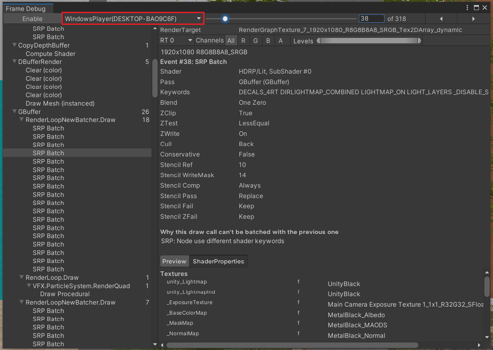
<p><em>VI: Tùy chọn hiển thị render target — tách kênh R/G/B/A và chỉnh Levels để soi từng thành phần. / EN: Render target display options — isolate R/G/B/A channels and adjust Levels to inspect individual components.</em></p>

<div class="bilingual-row">
<div class="col-vi">
<p><strong>Remote Frame Debugging:</strong> Frame Debugger kết nối được tới build đang chạy trên thiết bị thật, không chỉ trong Editor — cực kỳ quan trọng vì hành vi batching và shader variant trên mobile <em>khác</em> so với Editor.</p>
<p><strong>Render target display options:</strong> Bạn có thể tách riêng từng kênh màu (<strong>R / G / B / A</strong>) và chỉnh thanh <strong>Levels</strong>. Hữu ích khi soi các buffer trung gian như depth, normal, hoặc kênh alpha để tìm nguồn gây overdraw.</p>
</div>
<div class="col-en">
<p><strong>Remote Frame Debugging:</strong> the Frame Debugger can connect to a build running on a real device, not just in the Editor — critical because batching behavior and shader variants on mobile <em>differ</em> from the Editor.</p>
<p><strong>Render target display options:</strong> you can isolate individual color channels (<strong>R / G / B / A</strong>) and adjust the <strong>Levels</strong> slider. Useful for inspecting intermediate buffers such as depth, normals, or the alpha channel when hunting overdraw.</p>
</div>
</div>

### 8.2b. Rendering Debugger (URP / HDRP)

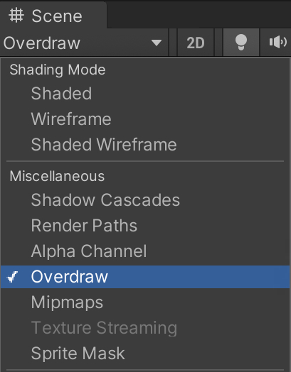
<p><em>VI: <strong>▲ Bật chế độ Overdraw</strong> — menu <strong>Shading Mode</strong> của Scene view: <strong>Shaded · Wireframe · Shaded Wireframe</strong>, rồi nhóm <em>Miscellaneous</em> với <strong>Shadow Cascades · Render Paths · Alpha Channel · <span>Overdraw</span> · Mipmaps · Texture Streaming · Sprite Mask</strong>. / EN: The Scene view Shading Mode menu with Overdraw selected.</em></p>

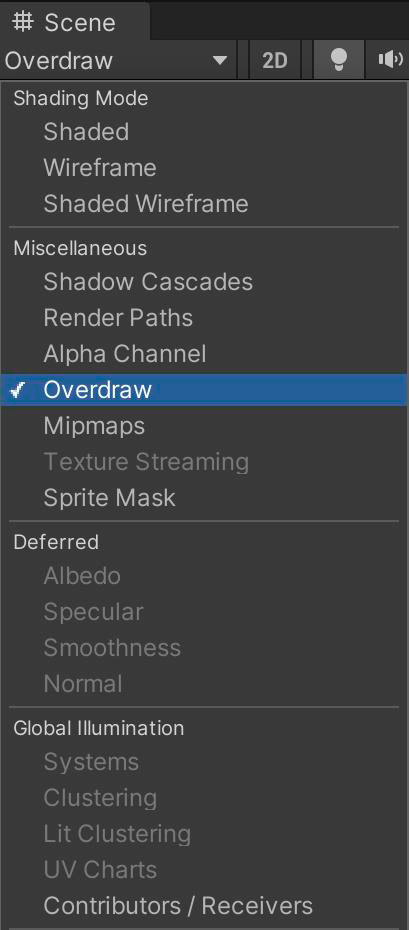
<p><em>VI: <strong>▲ Bản Unity 6 — nhiều chế độ HƠN</strong>: ngoài nhóm Miscellaneous còn có <strong>Deferred</strong> (Albedo · Specular · Smoothness · Normal) và <strong>Global Illumination</strong> (Systems · Clustering · Lit Clustering · UV Charts · Contributors/Receivers). / EN: The expanded Unity 6 shading-mode menu with Deferred and Global Illumination groups.</em></p>

!!! note "Bổ sung từ bản Unity 6"

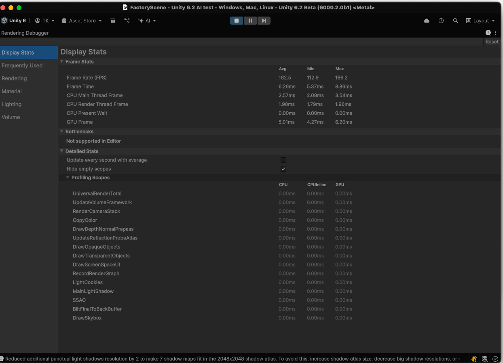
<p><em>VI: Rendering Debugger cho phép trực quan hóa nhiều thuộc tính lighting, rendering và material để khoanh vùng vấn đề render và tối ưu scene. / EN: The Rendering Debugger lets you visualize various lighting, rendering, and material properties so you can identify rendering issues and optimize scenes.</em></p>

<div class="bilingual-row">
<div class="col-vi">
<p><strong>Rendering Debugger</strong> cung cấp nhiều debug view và mode hiển thị thông tin về <strong>overdraw, độ phức tạp lighting, rendering, và thuộc tính material</strong> — cho phép bạn khoanh vùng vấn đề render và tối ưu scene cho <strong>URP và HDRP</strong>.</p>
<p><strong>Cách mở:</strong></p>
<ul>
<li>Editor: <code>Window &gt; Analysis &gt; Rendering Debugger</code></li>
<li>Phím tắt: <strong>LeftCtrl + Backspace</strong> (macOS: <strong>LeftCtrl + Delete</strong>) trong Play mode hoặc trên desktop player build</li>
</ul>
<p><strong>Đọc ảnh chụp:</strong> Tab <em>Display Stats</em> hiển thị Frame Stats với Avg/Min/Max — <code>Frame Rate 162.5 / 112.9 / 186.2</code>, <code>Frame Time 6.26 / 5.37 / 8.86 ms</code>, <code>CPU Main Thread Frame 2.57 ms</code>, <code>CPU Render Thread Frame 1.90 ms</code>, <code>CPU Present Wait 0.00 ms</code>, <code>GPU Frame 5.01 ms</code>. Bên dưới là <em>Profiling Scopes</em> theo từng pass URP: <code>DrawOpaqueObjects</code>, <code>DrawTransparentObjects</code>, <code>MainLightShadow</code>, <code>SSAO</code>, <code>DrawSkybox</code>…</p>
<p>⚠️ <strong>Hai giới hạn:</strong></p>
<ol>
<li>Cửa sổ với thống kê chi tiết <strong>chỉ khả dụng cho Development build</strong>.</li>
<li>Có thể có giới hạn về cách nó tương tác với <em>shader không thuộc pipeline cụ thể</em> hoặc <em>object render bên ngoài</em>.</li>
</ol>
<p>💡 Lưu ý mục <strong>Bottlenecks</strong> hiện "<em>Not supported in Editor</em>" — muốn dùng phải chạy trên build.</p>
</div>
<div class="col-en">
<p>The <strong>Rendering Debugger</strong> provides multiple debug views and modes that display information about <strong>overdraw, lighting complexity, rendering, and material properties</strong>, allowing you to pinpoint rendering issues and optimize scenes for <strong>URP and HDRP</strong>.</p>
<p><strong>How to open:</strong></p>
<ul>
<li>Editor: <code>Window &gt; Analysis &gt; Rendering Debugger</code></li>
<li>Shortcut: <strong>LeftCtrl + Backspace</strong> (macOS: <strong>LeftCtrl + Delete</strong>) in Play mode or for a desktop player build</li>
</ul>
<p><strong>Reading the capture:</strong> The <em>Display Stats</em> tab shows Frame Stats with Avg/Min/Max — <code>Frame Rate 162.5 / 112.9 / 186.2</code>, <code>Frame Time 6.26 / 5.37 / 8.86 ms</code>, <code>CPU Main Thread Frame 2.57 ms</code>, <code>CPU Render Thread Frame 1.90 ms</code>, <code>CPU Present Wait 0.00 ms</code>, <code>GPU Frame 5.01 ms</code>. Below are <em>Profiling Scopes</em> per URP pass: <code>DrawOpaqueObjects</code>, <code>DrawTransparentObjects</code>, <code>MainLightShadow</code>, <code>SSAO</code>, <code>DrawSkybox</code>…</p>
<p>⚠️ <strong>Two limitations:</strong></p>
<ol>
<li>The window with detailed statistics is <strong>only available for Development builds</strong>.</li>
<li>There can be limitations with how it interacts with <em>non-pipeline-specific shaders</em> or <em>external rendering objects</em>.</li>
</ol>
<p>💡 Note the <strong>Bottlenecks</strong> section reads "<em>Not supported in Editor</em>" — you must run a build to use it.</p>
</div>
</div>

### 8.3. Năm hướng tối ưu rendering thường gặp

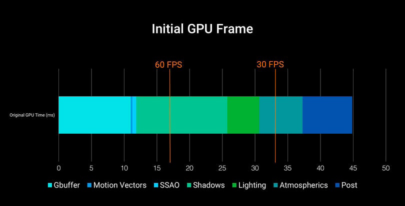
<p><em>VI: Phân rã thời gian GPU một frame theo từng giai đoạn — 45 ms, vượt xa cả mốc 30 FPS (33.3 ms). / EN: GPU frame time broken down by stage — 45 ms, well past even the 30 FPS line (33.3 ms).</em></p>

<div class="bilingual-row">
<div class="col-vi">
<p>Biểu đồ trên cho thấy cách phân rã thời gian GPU theo <em>từng giai đoạn render</em>: <strong>Gbuffer, Motion Vectors, SSAO, Shadows, Lighting, Atmospherics, Post</strong>. Tổng <strong>45 ms</strong> — vượt xa cả ngưỡng 30 FPS.</p>
<p>👉 Cách đọc: giai đoạn nào chiếm dải rộng nhất chính là mục tiêu tối ưu đầu tiên. Ở đây <strong>Gbuffer</strong> (~11 ms) và <strong>Shadows</strong> (~14 ms) là hai kẻ tốn kém nhất.</p>
<p><strong>Năm hướng xử lý theo sách</strong> — chi tiết ở các mục 8.3.1 → 8.3.5 bên dưới.</p>
</div>
<div class="col-en">
<p>The chart shows GPU frame time broken down by <em>render stage</em>: <strong>Gbuffer, Motion Vectors, SSAO, Shadows, Lighting, Atmospherics, Post</strong>. Total <strong>45 ms</strong> — well past even the 30 FPS line.</p>
<p>👉 How to read it: whichever stage occupies the widest band is your first optimization target. Here <strong>Gbuffer</strong> (~11 ms) and <strong>Shadows</strong> (~14 ms) are the most expensive.</p>
<p><strong>The book's five directions</strong> — detailed in 8.3.1 → 8.3.5 below.</p>
</div>
</div>

#### 8.3.1. Xác định bottleneck TRƯỚC

<div class="bilingual-row">
<div class="col-vi">
<p>🎯 <em>"Để bắt đầu, hãy <strong>TÌM một frame có TẢI GPU CAO</strong>. Đa số nền tảng đều cung cấp công cụ TỐT để phân tích hiệu năng dự án trên CẢ CPU LẪN GPU. Ví dụ: <strong>Arm Performance Studio</strong> cho phần cứng Arm / GPU Immortalis và Mali, <strong>PIX</strong> cho Microsoft Xbox, <strong>Razor</strong> cho Sony PlayStation, và <strong>Xcode Instruments</strong> cho Apple iOS. <strong>Hãy dùng native profiler tương ứng để PHÂN RÃ chi phí frame thành từng phần cụ thể. Đó là ĐIỂM XUẤT PHÁT để cải thiện hiệu năng đồ hoạ.</strong>"</em></p>
</div>
<div class="col-en">
<p>🎯 <em>"To begin, locate a frame with a high GPU load. The majority of platforms provide solid tools for analyzing your project's performance on both the CPU and the GPU. Examples include Arm Performance Studio for Arm hardware / Immortalis and Mali GPUs, PIX for Microsoft Xbox, Razor for Sony PlayStation, and Xcode Instruments for Apple iOS. Use your respective native profiler to break down the frame cost into its specific parts. This is your starting point to improve graphics performance."</em></p>
</div>
</div>


!!! danger "Identify your performance bottlenecks first"
    **VI:** Đừng lao vào tối ưu rendering nếu bạn đang **main-thread bound**. Quay lại §3 và chạy sơ đồ chẩn đoán trước.

    **EN:** Don't dive into rendering optimization if you are **main-thread bound**. Go back to §3 and run the diagnosis flowchart first.

#### 8.3.2. Draw call optimization

<div class="bilingual-row">
<div class="col-vi">
<p>Phần cứng PC và console thế hệ hiện tại có thể "đẩy" được rất nhiều draw call, <strong>nhưng overhead của mỗi lời gọi vẫn đủ cao để đáng công giảm bớt</strong>. Trên thiết bị mobile, tối ưu draw call là <strong>sống còn</strong>. Cách đạt được: <em>draw call batching</em>.</p>
<p>Dùng Frame Debugger để nhận diện những draw call có thể <strong>sắp xếp lại</strong> cho tối ưu nhóm và batch. Công cụ này cũng giúp xác định <strong>vì sao</strong> một số draw call <em>không thể</em> batch được.</p>
<p><strong>Ba kỹ thuật giảm draw call batch:</strong></p>
<ul>
<li><strong>Occlusion Culling</strong> — loại bỏ object bị che khuất phía sau object tiền cảnh, giảm overdraw. ⚠️ Lưu ý việc này <em>đòi hỏi thêm xử lý CPU</em>, nên hãy dùng Profiler để đảm bảo việc chuyển công việc từ GPU sang CPU là <strong>có lợi</strong>.</li>
<li><strong>GPU instancing</strong> — giảm số batch nếu bạn có nhiều object <em>dùng chung mesh và material</em>. Số lượng model hạn chế trong scene có thể cải thiện hiệu năng. Nếu làm khéo, bạn vẫn dựng được scene phức tạp mà không trông lặp lại.</li>
<li><strong>SRP Batcher</strong> — giảm phần thiết lập GPU giữa các draw call bằng cách batch các lệnh <em>Bind</em> và <em>Draw</em>. Để hưởng lợi: dùng <strong>bao nhiêu Material cũng được</strong>, nhưng giới hạn chúng vào <em>một số ít shader variant tương thích</em> (ví dụ shader Lit và Unlit trong URP/HDRP), với càng ít biến thể tổ hợp keyword càng tốt.</li>
</ul>
</div>
<div class="col-en">
<p>PC and current generation console hardware can push a lot of draw calls, <strong>but the overhead of each call is still high enough to warrant trying to reduce them</strong>. On mobile devices, draw call optimization is <strong>vital</strong>. You can achieve this with <em>draw call batching</em>.</p>
<p>Use the Frame Debugger to help identify draw calls that can be <strong>reorganized</strong> for optimal group and batch. The tool also helps identify <strong>why</strong> certain draw calls <em>can't</em> be batched.</p>
<p><strong>Three techniques to reduce draw call batches:</strong></p>
<ul>
<li><strong>Occlusion Culling</strong> — remove objects hidden behind foreground objects and reduce overdraw. ⚠️ Be aware this <em>requires additional CPU processing</em>, so use the Profiler to ensure moving work from the GPU to CPU is <strong>beneficial</strong>.</li>
<li><strong>GPU instancing</strong> — this can reduce your batches if you have many objects that <em>share the same mesh and material</em>. A limited number of models in your scene can improve performance. If it's done artfully, you can build a complex scene without making it look repetitive.</li>
<li><strong>The SRP Batcher</strong> — reduces the GPU setup between draw calls by batching <em>Bind</em> and <em>Draw</em> GPU commands. To benefit: use <strong>as many Materials as needed</strong>, but restrict them to <em>a small number of compatible shader variants</em>, e.g., Lit and Unlit Shaders in URP and HDRP, with as few variations between keyword combinations as possible.</li>
</ul>
</div>
</div>


<div class="bilingual-row">
<div class="col-vi">
<p>➕ <strong>Kỹ thuật THỨ TƯ — bản Unity 6 bổ sung:</strong></p>
<p><em>"<strong>GPU Resident Drawer</strong> dùng <strong>GPU instancing để vẽ NHIỀU GameObject, qua đó GIẢM ĐÁNG KỂ số draw call. Việc này GIẢI PHÓNG thời gian xử lý CPU bằng cách CHUYỂN nhiều khối lượng render sang GPU</strong>, cho hiệu năng tốt hơn — <strong>đặc biệt ở scene có NHIỀU object GIỐNG NHAU.</strong>"</em></p>
<p>📖 Bản Unity 6 cũng bổ sung định nghĩa overdraw ngay trong mục Occlusion Culling: <em>"Occlusion Culling loại bỏ object bị che sau object tiền cảnh và giảm overdraw (<strong>khi GPU VẼ LẠI CÙNG một pixel NHIỀU LẦN do các object trong suốt CHỒNG LÊN NHAU</strong>). ⚠️ Hãy biết việc này ĐÒI HỎI THÊM xử lý CPU, nên hãy dùng Profiler để chắc chắn việc chuyển tải từ GPU sang CPU là CÓ LỢI <strong>và bạn KHÔNG TẠO RA nút thắt MỚI</strong>."</em></p>
</div>
<div class="col-en">
<p>➕ <strong>A fourth technique added in the Unity 6 edition:</strong></p>
<p><em>"GPU Resident Drawer uses GPU instancing to draw many GameObjects, which significantly reduces the number of draw calls. This frees up CPU processing time by shifting more of the rendering workload to the GPU, leading to improved performance, especially in scenes with many similar objects."</em></p>
<p>📖 <em>"Occlusion Culling removes objects hidden behind foreground objects and reduces overdraw (when the GPU redraws the same pixel multiple times due to overlapping transparent objects) of the non-visible elements. Be aware this requires additional CPU processing, so use the Profiler to ensure moving work from the GPU to CPU is beneficial and that you are not creating new bottlenecks."</em></p>
</div>
</div>

#### 8.3.3. Tối ưu fill rate bằng cách giảm Overdraw

<div class="bilingual-row">
<div class="col-vi">
<p><strong>Overdraw</strong> cho thấy ứng dụng đang cố vẽ <em>nhiều pixel mỗi frame hơn mức GPU chịu nổi</em>. Không chỉ hiệu năng gặp rủi ro, mà <strong>nhiệt độ và thời lượng pin</strong> trên mobile cũng bị ảnh hưởng.</p>
<p>Chống overdraw bằng cách hiểu <strong>Unity sắp xếp object thế nào trước khi render</strong>:</p>
<p><strong>Built-In Render Pipeline</strong> sắp xếp GameObject theo <em>Rendering Mode</em> và <em>renderQueue</em>. Shader của mỗi object đặt nó vào một render queue, và queue này thường quyết định thứ tự vẽ.</p>
<p>👉 <strong>Cách xem overdraw (Built-In RP):</strong> dùng thanh điều khiển Scene view → chuyển <strong>draw mode</strong> sang <strong>Overdraw</strong>.</p>
<p><strong>Cách đọc:</strong> <em>Pixel sáng</em> = object đang vẽ chồng lên nhau. <em>Pixel tối</em> = ít overdraw hơn.</p>
</div>
<div class="col-en">
<p><strong>Overdraw</strong> can indicate an application is trying to draw <em>more pixels per frame than the GPU can cope with</em>. Not only is performance at risk, but <strong>thermals and battery life</strong> on mobile devices suffer too.</p>
<p>Combat overdraw by understanding <strong>how Unity sorts objects before rendering them</strong>:</p>
<p>The <strong>Built-In Render Pipeline</strong> sorts GameObjects according to their <em>Rendering Mode</em> and <em>renderQueue</em>. Each object's shader places it in a render queue, which often determines its draw order.</p>
<p>👉 <strong>To visualize overdraw (Built-In RP):</strong> use the Scene view control bar → switch the <strong>draw mode</strong> to <strong>Overdraw</strong>.</p>
<p><strong>How to read it:</strong> <em>Bright pixels</em> indicate objects drawing on top of one another, while <em>dark pixels</em> mean less overdraw.</p>
</div>
</div>


<p><em>VI: Scene ở chế độ Shaded thông thường. / EN: A Scene in standard Shaded view.</em></p>


<p><em>VI: Cùng scene đó ở chế độ Overdraw — geometry chồng lấn thường là nguồn gây overdraw. Vùng càng sáng càng nhiều lớp vẽ đè. / EN: The same Scene in Overdraw view — overlapping geometry is often a source of overdraw. Brighter areas mean more layers drawn on top.</em></p>

<div class="bilingual-row">
<div class="col-vi">
<p><strong>Với HDRP</strong>, render queue được điều khiển hơi khác (xem mục <em>Renderer and Material Priority</em>). HDRP có công cụ riêng để nhận diện overdraw:</p>
<ol>
<li>Mở <code>Window &gt; Render Pipeline &gt; Render Pipeline Debug</code></li>
<li>Vào mục <strong>Rendering</strong></li>
<li>Đổi <strong>Fullscreen Debug Mode</strong> thành <strong>TransparencyOverdraw</strong></li>
</ol>
<p><strong>Cách đọc heat map:</strong> mỗi pixel hiển thị dưới dạng bản đồ nhiệt — từ <strong>đen</strong> (không có pixel trong suốt), qua <strong>xanh dương</strong>, tới <strong>đỏ</strong> (đạt số <em>Max Pixel Cost</em> pixel trong suốt).</p>
<p>💡 Bật chế độ này rồi chơi qua các scene/khu vực, ghi chú lại những vùng có overdraw đáng kể.</p>
</div>
<div class="col-en">
<p><strong>HDRP</strong> controls the render queue slightly differently (see the <em>Renderer and Material Priority</em> section). HDRP includes tooling to identify overdraw:</p>
<ol>
<li>Open <code>Window &gt; Render Pipeline &gt; Render Pipeline Debug</code></li>
<li>Go to the <strong>Rendering</strong> section</li>
<li>Change <strong>Fullscreen Debug Mode</strong> to <strong>TransparencyOverdraw</strong></li>
</ol>
<p><strong>Reading the heat map:</strong> each pixel is displayed as a heat map, ranging from <strong>black</strong> (no transparent pixels), through <strong>blue</strong>, then <strong>red</strong> — the latter indicating the <em>Max Pixel Cost</em> number of transparent pixels.</p>
<p>💡 With this mode enabled, play through scenes and areas of your application, taking note of areas with significant overdraw.</p>
</div>
</div>

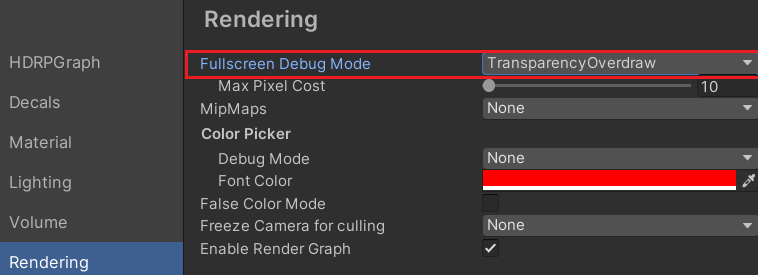
<p><em>VI: Hình dung overdraw với HDRP qua Fullscreen Debug Mode. / EN: Visualizing overdraw with HDRP and the Fullscreen Debug Mode.</em></p>

#### 8.3.4. Soi những shader đắt nhất

<div class="bilingual-row">
<div class="col-vi">
<p>Đây là chủ đề sâu, nhưng nhìn chung: <strong>hãy giảm độ phức tạp shader ở những nơi có thể</strong>.</p>
<p><strong>Vài cách thắng nhanh:</strong></p>
<ul>
<li><strong>Giảm precision</strong> ở nơi có thể — dùng biến dấu phẩy động <strong>half precision</strong> nếu được.</li>
<li>Tìm hiểu về <strong>wavefront occupancy</strong> cho nền tảng đích và cách dùng công cụ GPU profiling để đạt occupancy tốt.</li>
</ul>
</div>
<div class="col-en">
<p>This is a deep topic, but in general, <strong>aim to reduce shader complexity where possible</strong>.</p>
<p><strong>Some easy wins:</strong></p>
<ul>
<li><strong>Reducing precision</strong> where possible — use <strong>half precision</strong> floating point variables if you can.</li>
<li>Learn about <strong>wavefront occupancy</strong> for your target platform and how to use GPU profiling tools to assist in getting a healthy occupancy.</li>
</ul>
</div>
</div>

#### 8.3.5. Đa nhân cho rendering & Post-processing

<div class="bilingual-row">
<div class="col-vi">
<p><strong>Multi-core optimization for rendering:</strong> Bật <strong>Graphics Jobs</strong> tại <code>Player Settings &gt; Other Settings</code> để tận dụng bộ xử lý đa nhân trên <strong>PlayStation và Xbox</strong>. Graphics Jobs cho phép Unity <em>trải công việc rendering ra nhiều nhân CPU</em>, gỡ áp lực khỏi render thread.</p>
<p><strong>Profile post-processing effects:</strong> Đảm bảo asset post-processing được tối ưu cho nền tảng đích. Các công cụ trên Asset Store <em>vốn được viết cho game PC</em> có thể ngốn nhiều tài nguyên hơn mức cần thiết trên console hoặc mobile.</p>
<p>👉 Hãy profile nền tảng đích bằng <strong>công cụ profiler native của chính nó</strong>. Khi tự viết hiệu ứng post-processing cho mobile/console, <strong>giữ chúng đơn giản nhất có thể</strong>.</p>
</div>
<div class="col-en">
<p><strong>Multi-core optimization for rendering:</strong> Enable <strong>Graphics Jobs</strong> in <code>Player Settings &gt; Other Settings</code> to take advantage of the multi-core processors in <strong>PlayStation and Xbox</strong>. Graphics Jobs allows Unity to <em>spread the rendering work across multiple CPU cores</em>, removing pressure from the render thread.</p>
<p><strong>Profile post-processing effects:</strong> Ensure your post-processing assets are optimized for your target platform. Tools from the Asset Store that were <em>originally authored for PC games</em> might consume more resources than necessary on consoles or mobile devices.</p>
<p>👉 Profile your target platform using <strong>its native profiler tools</strong>. When authoring your own post-processing effects for mobile or console targets, <strong>keep them as simple as possible</strong>.</p>
</div>
</div>

---

## 9. Profile Analyzer — Từ 1 frame lên hàng nghìn frame

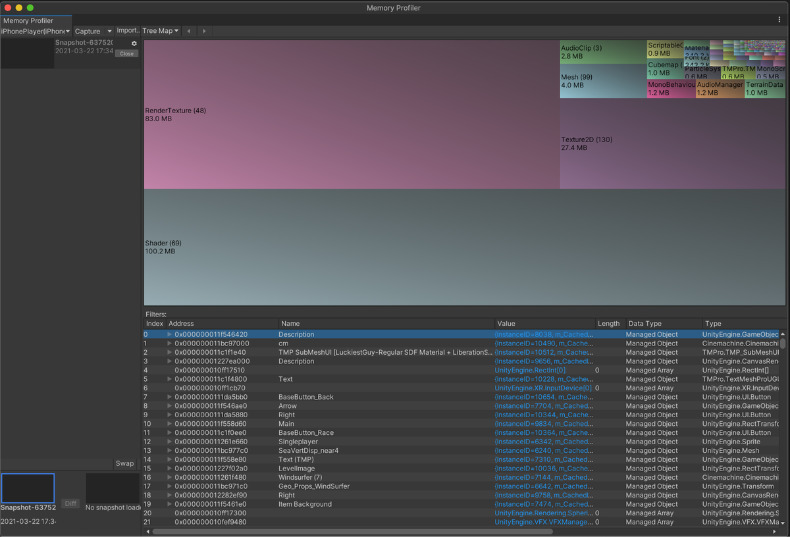

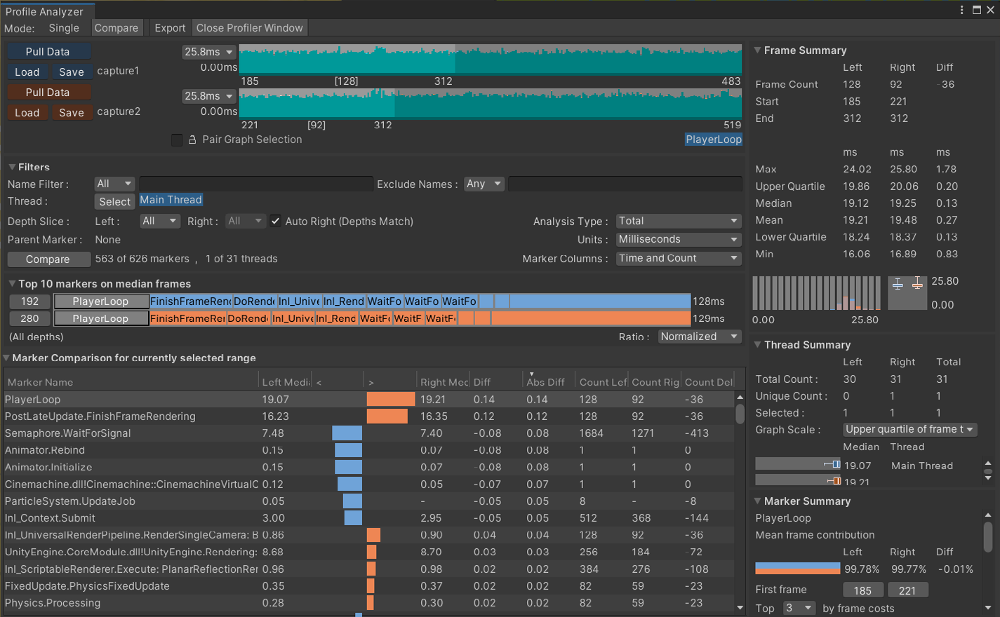
<p><em>VI: Toàn cảnh cửa sổ Profile Analyzer — gộp nhiều frame thành thống kê tổng hợp thay vì soi từng frame một. / EN: The full Profile Analyzer window — it aggregates many frames into summary statistics instead of inspecting one frame at a time.</em></p>
<p><em>VI: Profile Analyzer bổ trợ Profiler, cho phép phân tích sâu nhiều frame và dữ liệu marker. / EN: Take an even deeper dive into frames and marker data with the Profile Analyzer, which complements the existing Profiler.</em></p>

<div class="bilingual-row">
<div class="col-vi">
<p>Unity Profiler chỉ phân tích <strong>một frame</strong> tại một thời điểm. <strong>Profile Analyzer</strong> (package) mở rộng khả năng đó ra <strong>nhiều frame cùng lúc</strong>.</p>
<p><strong>Khi nào cần dùng:</strong></p>
<ul>
<li>Nâng cấp phiên bản Unity (so sánh trước/sau).</li>
<li>Kiểm chứng lợi ích của một tối ưu.</li>
<li>Theo dõi hiệu năng như một phần của chu trình phát triển.</li>
</ul>
<p><strong>Dữ liệu thống kê cho mỗi marker:</strong> minimum, maximum, mean (trung bình), instance count (số lần xuất hiện), range (biên độ), và frame đầu tiên marker xuất hiện. Hiển thị dạng <em>histogram</em> và <em>box-and-whisker plot</em>.</p>
<p><strong>Compare view:</strong> nạp 2 bộ dữ liệu cùng lúc để đo chính xác tác động của một thay đổi. Có hệ thống filter đầy đủ theo marker, thread, frame, và stack depth.</p>
<p><strong>Cài đặt (Unity 2018.3+):</strong> <code>Window &gt; Package Manager</code> → nếu không thấy, mở dropdown "Advanced" và bật "Show Preview Packages" → chọn "Profile Analyzer" → Install → mở tại <code>Window &gt; Analysis &gt; Profile Analyzer</code>.</p>
</div>
<div class="col-en">
<p>The Unity Profiler analyzes <strong>a single frame</strong> at a time. The <strong>Profile Analyzer</strong> package extends this by adding the ability to <strong>analyze multiple frames at once</strong>.</p>
<p><strong>When it's useful:</strong></p>
<ul>
<li>Upgrading Unity versions.</li>
<li>Testing optimization benefits.</li>
<li>Tracking performance as part of your development cycle.</li>
</ul>
<p><strong>Per-marker statistics:</strong> minimum, maximum, mean, instance count, range, and which frame the marker first appeared in. Summarized and graphed using <em>histograms</em> and <em>box-and-whisker plots</em>.</p>
<p><strong>Compare view:</strong> lets you load two data sets at once to measure the effect of an optimization, settings change, or Unity version update. A comprehensive filtering system is available in both Single and Compare views to limit analysis by marker, thread, frame, and stack depth.</p>
<p><strong>Install (Unity 2018.3+):</strong> <code>Window &gt; Package Manager</code> → if not listed, open the "Advanced" drop-down and enable "Show Preview Packages" → select "Profile Analyzer" → Install → open at <code>Window &gt; Analysis &gt; Profile Analyzer</code>.</p>
</div>
</div>

### 9.1. Single view — Thống kê marker

**🎚️ Sáu preset của dropdown `Marker column` — nguyên văn**

| Preset | Hiển thị gì |
|---|---|
| **Time and count** | *"thông tin về **thời gian TRUNG BÌNH** và **SỐ LẦN** marker được gọi"* |
| **Time** | *"thông tin về **thời gian trung bình** của marker"* |
| **Totals** | *"thông tin về **TỔNG thời gian** marker chiếm trên **TOÀN BỘ tập dữ liệu**"* |
| **Time with totals** | *"thông tin về **CẢ thời gian trung bình LẪN tổng** của marker"* |
| **Count totals** | *"thông tin về **TỔNG SỐ LẦN** marker được gọi"* |
| **Count per frame** | *"thông tin về **trung bình MỖI FRAME** marker được gọi bao nhiêu lần"* |


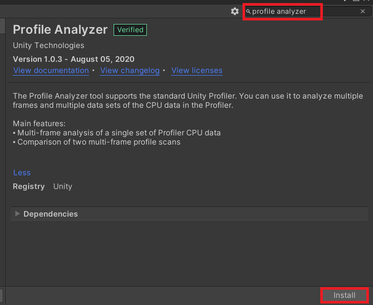
<p><em>VI: <strong>▲ Cài từ Package Manager</strong> — <strong>Profile Analyzer 1.0.3 (Verified, 05/08/2020)</strong>, mô tả nêu hai tính năng chính: <em>phân tích ĐA FRAME một tập dữ liệu CPU</em> và <em>SO SÁNH hai tập profile đa frame</em>. (Bản Unity 6 dùng <strong>1.2.3 — 16/12/2024</strong>.) / EN: The Profile Analyzer package in the Package Manager.</em></p>

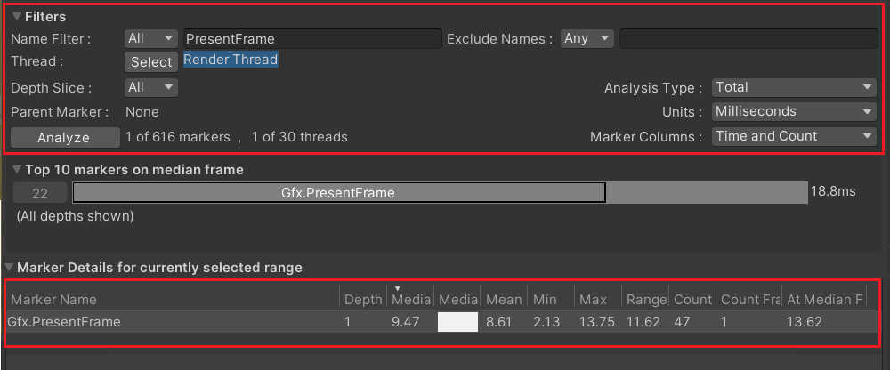
<p><em>VI: <strong>▲ Bộ lọc + Top 10 marker</strong> — <strong>Name Filter · Thread: Render Thread · Depth Slice · Parent Marker · Exclude Names</strong>; nút <strong>Analyze</strong> báo <strong>1 of 616 markers, 1 of 30 threads</strong>. Marker đứng đầu: <strong><code>Gfx.PresentFrame</code> 18.8 ms</strong>, chi tiết <strong>Median 9.47 · Mean 8.61 · Min 2.13 · Max 13.75 · Range 11.62 · Count 47</strong>. / EN: Profile Analyzer filters and the top-10 marker list on the median frame.</em></p>

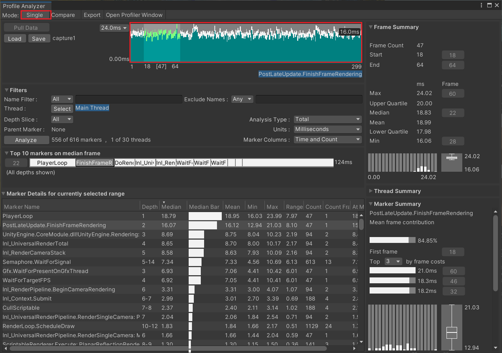
<p><em>VI: Single view hiển thị thống kê và thời gian của marker cho một frame hoặc một dải frame. / EN: The Single view shows profile marker statistics and timings for a single or range of frames.</em></p>

<div class="bilingual-row">
<div class="col-vi">
<p>Đọc ảnh chụp trên (capture1, 299 frame, chọn dải 18→64 = 47 frame):</p>
<ul>
<li><strong>Frame Summary:</strong> Max <strong>24.02 ms</strong> (frame 60) · Upper Quartile <strong>20.00</strong> · <strong>Median 18.83</strong> (frame 22) · Mean <strong>18.99</strong> · Lower Quartile <strong>17.98</strong> · Min <strong>16.06</strong> (frame 28).</li>
<li><strong>Filters:</strong> Thread = Main Thread, Depth Slice = All, <em>556 of 616 markers, 1 of 30 threads</em>.</li>
<li><strong>Marker Details:</strong> bảng sắp theo Median — <code>PlayerLoop 18.79</code>, <code>PostLateUpdate.FinishFrameRendering 16.07</code>, <code>Semaphore.WaitForSignal 7.34</code> (Count <strong>613</strong>!), <code>Gfx.WaitForPresentOnGfxThread 6.93</code>…</li>
<li><strong>Marker Summary:</strong> <code>PostLateUpdate.FinishFrameRendering</code> đóng góp <strong>84.85%</strong> mean frame contribution.</li>
</ul>
<p>👉 Cột <strong>Depth</strong> và <strong>Count</strong> là hai thứ dân profiling hay bỏ qua: <code>Semaphore.WaitForSignal</code> có Depth <code>5-14</code> và Count <code>613</code> ⇒ được gọi ở nhiều tầng khác nhau, rất nhiều lần.</p>
</div>
<div class="col-en">
<p>Reading the capture above (capture1, 299 frames, range 18→64 = 47 frames selected):</p>
<ul>
<li><strong>Frame Summary:</strong> Max <strong>24.02 ms</strong> (frame 60) · Upper Quartile <strong>20.00</strong> · <strong>Median 18.83</strong> (frame 22) · Mean <strong>18.99</strong> · Lower Quartile <strong>17.98</strong> · Min <strong>16.06</strong> (frame 28).</li>
<li><strong>Filters:</strong> Thread = Main Thread, Depth Slice = All, <em>556 of 616 markers, 1 of 30 threads</em>.</li>
<li><strong>Marker Details:</strong> sorted by Median — <code>PlayerLoop 18.79</code>, <code>PostLateUpdate.FinishFrameRendering 16.07</code>, <code>Semaphore.WaitForSignal 7.34</code> (Count <strong>613</strong>!), <code>Gfx.WaitForPresentOnGfxThread 6.93</code>…</li>
<li><strong>Marker Summary:</strong> <code>PostLateUpdate.FinishFrameRendering</code> accounts for <strong>84.85%</strong> mean frame contribution.</li>
</ul>
<p>👉 The <strong>Depth</strong> and <strong>Count</strong> columns are what profilers often overlook: <code>Semaphore.WaitForSignal</code> has Depth <code>5-14</code> and Count <code>613</code> ⇒ called at many different levels, very many times.</p>
</div>
</div>

### 9.2. 🎯 BỐN mẹo Profile Analyzer

<div class="bilingual-row">
<div class="col-vi">
<p><strong>① Lọc thẳng vào script của bạn — chọn Depth level = 4</strong></p>
<p>Đào vào user script (bỏ qua các tầng Unity Engine API) bằng cách chọn <strong>Depth level 4</strong>. Sau khi lọc tới mức này rồi nhìn Unity Profiler ở chế độ timeline, bạn có thể đối chiếu độ sâu call stack — <strong>script MonoBehaviour hiện màu xanh dương và nằm ở tầng thứ tư</strong>.</p>
<p>👉 Đây là <em>cách nhanh nhất</em> để xem logic và gameplay script của bạn có nặng hay không, <strong>mà không lẫn "nhiễu"</strong> từ engine.</p>
<p><strong>② Lọc tương tự cho các mảng khác của engine</strong> — ví dụ animator hoặc engine physics.</p>
<p><strong>③ Nhảy thẳng tới frame tệ nhất</strong></p>
<p>Ở bên phải, mục <strong>Frame Summary</strong> có <em>histogram dải hiệu năng</em> của method đang highlight. <strong>Hover lên số Max Frame</strong> (chính xác frame nào có timing lớn nhất) để lấy một <strong>link bấm được</strong> mở frame đó trong Unity Profiler. Dùng view này để phân tích các yếu tố khác có thể góp phần gây ra frame time cực đại đó.</p>
</div>
<div class="col-en">
<p><strong>① Drill straight into your scripts — select Depth level 4</strong></p>
<p>Drill into user scripts (ignoring Unity Engine API levels) by selecting a <strong>Depth level of 4</strong>. After filtering to this level and looking at the Unity Profiler in timeline mode, you can correlate the call stack depth to make a selection here — <strong>MonoBehaviour scripts appear in blue and are at the fourth level down</strong>.</p>
<p>👉 This is a <em>quick way</em> to see if your specific logic and gameplay scripts are taxing by themselves <strong>without any other "noise."</strong></p>
<p><strong>② Filter data the same way for other areas of the engine</strong> — such as animators or engine physics.</p>
<p><strong>③ Jump straight to the worst frame</strong></p>
<p>On the right side in the <strong>Frame Summary</strong> section, you'll find the highlighted method's <em>performance range histogram</em>. <strong>Hover over the Max Frame number</strong> (the exact frame in which max timing was found) to get a <strong>clickable link</strong> to view that frame selection in the Unity Profiler. Use this to analyze other factors potentially contributing to the high maximum frame time.</p>
</div>
</div>


<div class="bilingual-row">
<div class="col-vi">
<p><strong>④ Mở SONG SONG với Unity Profiler</strong> — <em>"Nếu bạn có <strong>màn hình RỘNG hoặc HAI màn hình</strong>, mở Profile Analyzer và Unity Profiler CẠNH NHAU sẽ rất tiện. Bố trí này cho phép bạn <strong>NHÁY ĐÚP một frame trong Profile Analyzer để TỰ ĐỘNG chọn ĐÚNG frame đó trong Unity Profiler</strong>, rồi từ đó điều tra tiếp bằng view Timeline hoặc Hierarchy."</em></p>
</div>
<div class="col-en">
<p><strong>④</strong> <em>"If you have a widescreen or two monitors available it can be useful to open the Profile Analyzer and the Unity Profiler side by side. This setup enables you to double-click a frame in the Profile Analyzer to automatically select the same frame in the Unity Profiler, from where you can further investigate it using the Timeline or Hierarchy views."</em></p>
</div>
</div>

### 9.3. Compare view — Quy trình "Pull Data" 5 bước

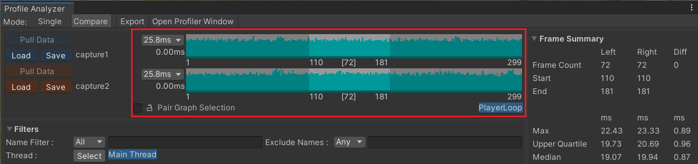
<p><em>VI: <strong>▲ Compare mode</strong> — hai dataset nạp bằng <strong>Pull Data</strong>, có ô <strong>Pair Graph Selection</strong> để hai biểu đồ CUỘN CÙNG NHAU; Frame Summary cho <strong>Frame Count 110 / 181</strong>, Median <strong>19.07 / 19.94</strong>. / EN: Compare mode with two datasets and Pair Graph Selection.</em></p>

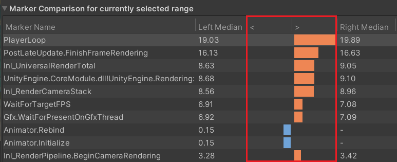
<p><em>VI: <strong>▲ Marker Comparison — bảng ĐỌC LÀ RA KẾT LUẬN</strong>: <code>PlayerLoop</code> 19.03 → 19.89 · <code>PostLateUpdate.FinishFrameRendering</code> 16.13 → 16.63 · <code>Inl_UniversalRenderTotal</code> 8.63 → 9.05 · <code>WaitForTargetFPS</code> 6.91 → 7.08. Thanh ngang giữa hai cột cho thấy marker nào ĐẮT LÊN, marker nào RẺ ĐI. / EN: The Marker Comparison table between two capture ranges.</em></p>

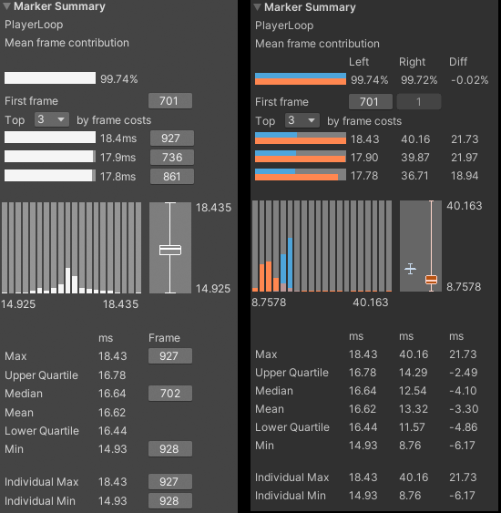
<p><em>VI: <strong>▲ Marker Summary so sánh hai bản</strong> — <strong>Mean frame contribution 99.74% vs 99.72% (diff −0.02%)</strong>; và bảng thống kê: <strong>Max 18.43 / 18.43</strong>, <strong>Upper Quartile 16.78 / 14.29 (−2.49)</strong>, <strong>Median 16.64 / 12.54 (−4.10)</strong>, <strong>Mean 16.62 / 13.32 (−3.30)</strong>, <strong>Lower Quartile 16.44 / 11.57 (−4.86)</strong>, <strong>Min 14.93 / 8.76 (−6.17)</strong>. / EN: Marker Summary comparing two datasets with per-quartile deltas.</em></p>

<div class="bilingual-row">
<div class="col-vi">
<p><strong>"Compare view là nơi Profile Analyzer thực sự tỏa sáng."</strong> Bạn nạp 2 bộ dữ liệu, hiển thị bằng 2 màu khác nhau.</p>
<p><strong>Chuẩn bị:</strong> Định vị một khu vực cụ thể của game để test. Cách tốt: chạy một <em>phiên gameplay đã ghi sẵn hoặc có script</em> để có thể lặp lại nhiều lần. Chơi tay nhiều lượt cũng được.</p>
<p><strong>Quy trình "Pull Data":</strong></p>
<ol>
<li>Mở Profile Analyzer: <code>Window &gt; Analysis &gt; Profile Analyzer</code></li>
<li>Profile phiên <em>tất định (deterministic)</em> <strong>trước khi</strong> tối ưu, bằng Unity Profiler</li>
<li>Trong Profile Analyzer, chuyển sang tab <strong>Compare</strong>, bấm nút <strong>Pull Data</strong> thứ nhất để nạp capture hiện tại từ Profiler</li>
<li>Áp dụng các cải tiến code/hiệu năng, rồi <strong>clear và profile lại</strong> một phiên mới</li>
<li>Bấm nút <strong>Pull Data</strong> thứ hai để nạp dữ liệu phiên mới</li>
</ol>
<p>⚠️ <strong>Lưu ý về định dạng file:</strong> Nếu chọn <strong>Load</strong>, dữ liệu phải ở định dạng <code>.pdata</code> của Profile Analyzer. Nếu bạn có dữ liệu Profiler ở định dạng <code>.data</code>, hãy mở nó trong Profiler <em>trước</em>, rồi bấm <strong>Pull Data</strong> trong Profile Analyzer. Nhớ <strong>lưu file <code>.data</code> trước khi pull</strong> để giữ được bản sao ở định dạng đó.</p>
<p><strong>Đọc bảng Marker Comparison:</strong> xem chênh lệch thời gian marker giữa bộ dữ liệu thứ nhất và thứ hai (trái và phải). Cột đánh dấu <strong>&lt;</strong> và <strong>&gt;</strong> cho biết bên trái hay bên phải có giá trị lớn hơn. Điều chỉnh filter <strong>Marker Columns</strong> sẽ thay đổi các giá trị được so sánh tương ứng.</p>
</div>
<div class="col-en">
<p><strong>"The Compare view is where Profile Analyzer really starts to shine."</strong> You load two data sets, displayed in two different colors.</p>
<p><strong>Preparation:</strong> Start by locating a specific area of your game to test. One way is running a <em>prerecorded or scripted gameplay session</em> that can be executed multiple times. Capturing multiple session playthroughs manually also works.</p>
<p><strong>The "Pull Data" workflow:</strong></p>
<ol>
<li>Open Profile Analyzer via <code>Window &gt; Analysis &gt; Profile Analyzer</code></li>
<li>Profile the <em>deterministic</em> session <strong>before</strong> optimization work using the Unity Profiler</li>
<li>In Profile Analyzer, switch to the <strong>Compare</strong> tab, then click the first <strong>Pull Data</strong> button to load the current capture from the Profiler</li>
<li>Apply your code and performance improvements, then <strong>clear and profile a new session</strong> again</li>
<li>Click the second <strong>Pull Data</strong> button to load the new session data</li>
</ol>
<p>⚠️ <strong>File format note:</strong> If you select <strong>Load</strong>, the data must be in Profile Analyzer's <code>.pdata</code> file format. If you have data from the Profiler in <code>.data</code> format, open it in the Profiler <em>first</em>, then click <strong>Pull Data</strong> in Profile Analyzer. Be sure to <strong>save your Profiler <code>.data</code> file before pulling it in</strong> so that you have a copy in that format too.</p>
<p><strong>Reading the Marker Comparison pane:</strong> view differences in marker timings between the first and second data sets (left and right). The columns marked with <strong>&lt;</strong> and <strong>&gt;</strong> show the difference if the left or right data sets are larger in value. Adjusting the <strong>Marker Columns</strong> filter changes the values compared accordingly.</p>
</div>
</div>

### 9.4. 💎 Kỹ thuật cao cấp: So sánh frame TRUNG VỊ với frame DÀI NHẤT

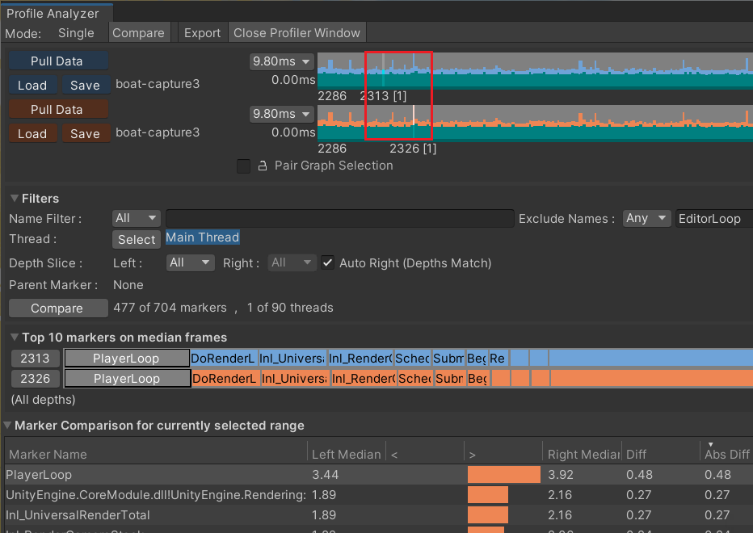
<p><em>VI: So sánh frame trung vị và frame dài nhất trong cùng một capture. / EN: Comparing the median and longest frames from a capture.</em></p>

<div class="bilingual-row">
<div class="col-vi">
<p><strong>Đây là mẹo hay nhất trong toàn chương Profile Analyzer.</strong></p>
<p><strong>Mục đích:</strong> So sánh frame <em>trung vị</em> với frame <em>dài nhất</em> <strong>trong cùng MỘT capture</strong> để chỉ đích danh những gì xảy ra ở frame dài mà <em>không</em> xuất hiện ở frame trung vị — hoặc để thấy cái gì mất thời gian lâu hơn mức trung bình.</p>
<p><strong>Cách làm:</strong></p>
<ol>
<li>Mở Compare view của Profile Analyzer và nạp <strong>CÙNG MỘT bộ dữ liệu cho cả hai bên</strong> trái và phải. <em>(Cũng có thể nạp ở Single view rồi chuyển sang Compare.)</em></li>
<li><strong>Chuột phải</strong> vào đồ thị Frame Control <em>phía trên</em> → chọn <strong>Select Median Frame</strong></li>
<li><strong>Chuột phải</strong> vào đồ thị <em>phía dưới</em> → chọn <strong>Select Longest Frame</strong></li>
<li>Panel <strong>Marker Comparison</strong> tự cập nhật để hiển thị chênh lệch</li>
</ol>
<p><strong>Biến thể nâng cao:</strong> Sắp xếp <em>cả hai</em> đồ thị theo thời lượng frame (<strong>chuột phải → Order By Frame Duration</strong>), rồi chọn một dải ở mỗi bộ — hoặc <em>tập trung vào</em>, hoặc <em>loại trừ</em> các frame ngoại lai (frame dài/ngắn bất thường).</p>
<p>👉 Cách này cho phép <strong>so sánh giữa frame "bình thường nhất" và frame "bất thường nhất"</strong>. Dữ liệu sau đó phân tích được trong bảng lọc <em>Marker Comparison</em> cho dải đang chọn.</p>
<p>💡 Đây chính là công cụ để <strong>săn spike</strong> mà không cần đoán mò.</p>
</div>
<div class="col-en">
<p><strong>This is the best trick in the entire Profile Analyzer chapter.</strong></p>
<p><strong>Purpose:</strong> Compare the <em>median</em> and <em>longest</em> frames <strong>within a SINGLE Profiler capture</strong> to pinpoint things happening in the latter that do not appear in the former, or to see what is taking longer than average to complete.</p>
<p><strong>How:</strong></p>
<ol>
<li>Open the Profile Analyzer Compare view and load the <strong>SAME data set for both</strong> the left and right sides. <em>(You can also load a data set in the Single view, then switch to Compare.)</em></li>
<li><strong>Right-click</strong> the <em>top</em> Frame Control graph → choose <strong>Select Median Frame</strong></li>
<li><strong>Right-click</strong> the <em>bottom</em> graph → choose <strong>Select Longest Frame</strong></li>
<li>The <strong>Marker Comparison</strong> panel updates to display the differences</li>
</ol>
<p><strong>Advanced variant:</strong> Sort <em>both</em> graphs by frame duration (<strong>Right-click &gt; Order By Frame Duration</strong>), then select a range in each set, either <em>focusing on</em> or <em>excluding</em> the outlier frames (frames that are disproportionately long or short).</p>
<p>👉 This allows a comparison between the <strong>most ordinary and extraordinary frames</strong>. The data can then be analyzed in the filtered <em>Marker Comparison</em> table for the currently selected range.</p>
<p>💡 This is <strong>the</strong> tool for hunting spikes without guesswork.</p>
</div>
</div>

!!! info "Highlights Module (Unity 2023.2+)"
    **VI:** Module **Highlights** hiển thị ngay: ứng dụng có đạt frame rate mục tiêu không, đang bị giới hạn bởi CPU hay GPU, và nên bắt đầu điều tra từ đâu. Module này **không bật mặc định** — mở Profiler window → dropdown "Profiler Modules" → tick "Highlights".

    **EN:** The **Highlights** module displays whether your application is meeting its target frame rate, whether performance is bound by the CPU or GPU, and where to begin investigating. It is **not enabled by default** — open the Profiler window → "Profiler Modules" drop-down → toggle Highlights on.

---

## 10. Memory Profiler 1.0.0 — Toàn cảnh bộ nhớ

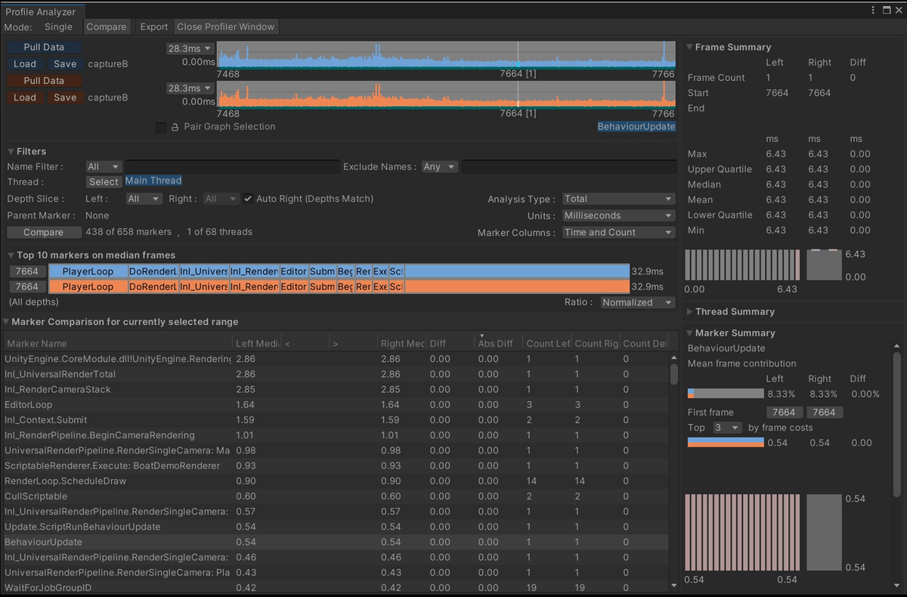
<p><em>VI: Chụp, kiểm tra và so sánh snapshot trong Memory Profiler. / EN: Capture, inspect, and compare snapshots in the Memory Profiler.</em></p>

<div class="bilingual-row">
<div class="col-vi">
<p><strong>Memory Profiler</strong> chụp <em>snapshot</em> bộ nhớ của game tại một thời điểm cụ thể, giúp bạn thấy cái gì đang chiếm nhiều bộ nhớ nhất và phát hiện vấn đề gây crash.</p>
<p><strong>Cột mốc:</strong> Từ tháng 9/2022, package chuyển từ <em>Experimental</em> sang <em>Verified</em>, khả dụng cho mọi người dùng Unity 2022.2 Tech Stream.</p>
<p>⚠️ <strong>Lưu ý phiên bản:</strong> Tính năng đầy đủ và memory tracking chỉ có từ 2022.2 trở đi. Tuy nhiên bạn <em>vẫn có thể</em> dùng UI mới để soi snapshot cũ: mở Memory Profiler trong một project 2022+ trống rồi import snapshot cũ vào.</p>
<p><strong>Tại sao quan trọng:</strong> Tối ưu bộ nhớ là sống còn với thiết bị cấu hình giới hạn — để tránh crash Out-Of-Memory. Nếu ship đa nền tảng, memory footprint cần tinh chỉnh riêng cho từng platform.</p>
</div>
<div class="col-en">
<p>The <strong>Memory Profiler</strong> takes a <em>snapshot</em> of your game and lets you review memory usage at a specific moment in time, so you can see what is occupying most of its memory or identify problems that might cause applications to crash.</p>
<p><strong>Milestone:</strong> As of September 2022, the Memory Profiler package moved from <em>Experimental</em> to <em>Verified</em> and is accessible for everyone using the Unity 2022.2 Tech Stream.</p>
<p>⚠️ <strong>Version note:</strong> Complete features and memory tracking are only available for 2022.2 onwards. However, you <em>can</em> take advantage of the new UI to inspect older captures by opening Memory Profiler in an empty 2022+ project and importing older snapshots.</p>
<p><strong>Why it matters:</strong> Optimizing memory is crucial for applications that run on devices with limited capabilities in order to prevent them from crashing out of memory. If you're shipping on multiple devices, your memory footprint might need fine tuning to get the best out of each platform.</p>
</div>
</div>

### 10.0. Phân biệt: Memory Profiler **module** vs Memory Profiler **package**

<div class="bilingual-row">
<div class="col-vi">
<p>📖 <strong>Nguyên văn về quan hệ giữa hai thứ:</strong> <em>"<strong>NHIỀU tính năng của Memory Profiler MODULE đã bị package Memory Profiler THAY THẾ (superseded)</strong>, nhưng bạn <strong>VẪN dùng được module để BỔ TRỢ cho việc phân tích bộ nhớ.</strong> Ví dụ:"</em></p>
<ul>
<li><strong>Để phát hiện GC allocation</strong> — <em>"Dù chúng CÓ hiện trong module, nhưng <strong>truy vết bằng Project Auditor DỄ HƠN.</strong>"</em></li>
<li><strong>Để xem NHANH kích thước Used/Reserved của heap</strong> — <em>"Các phiên bản module MỚI HƠN hiển thị thông tin này."</em></li>
<li><strong>Phân tích bộ nhớ SHADER</strong> — <em>"Việc này GIỜ được báo cáo trong các phiên bản module mới hơn."</em></li>
</ul>
</div>
<div class="col-en">
<p>📖 <em>"Many of the features of the Memory Profiler module have been superseded by the Memory Profiler package, but you can still use the module to supplement your memory analysis efforts. For example: to spot GC allocations (although these show up in the module, they are easier to track down using Project Auditor); to quickly look at the Used/Reserved size of the heap (newer versions of the Memory Profiler module show this information); shader memory analysis (this is now reported in newer versions of the Memory Profiler module)."</em></p>
</div>
</div>


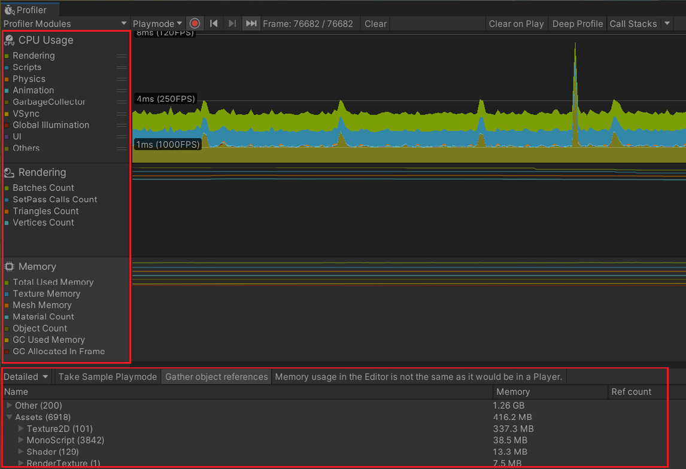
<p><em>VI: <strong>▲ Memory <em>module</em> — cái có SẴN trong Profiler</strong>: các bộ đếm <strong>Total Used Memory · Texture Memory · Mesh Memory · Material Count · Object Count · GC Used Memory · GC Allocated In Frame</strong> vẽ theo thời gian. Bảng <em>Detailed</em> bên dưới liệt kê <strong>Other (200) 1.29 GB · Assets (6918) 416.2 MB · Texture2D (101) 337.3 MB · MonoScript (3842) 38.5 MB · Shader (128) 13.2 MB</strong>. Dòng cảnh báo trên bảng: <em>“Memory usage in the Editor is not the same as it would be in a Player.”</em> / EN: The built-in Memory module counters and its Detailed breakdown.</em></p>

<div class="bilingual-row">
<div class="col-vi">
<p>⚠️ <strong>Đây là hai thứ KHÁC NHAU, rất nhiều người nhầm:</strong></p>
<ul>
<li><strong>Memory Profiler <em>module</em></strong> — nằm sẵn <em>trong</em> cửa sổ Unity Profiler. Cho số liệu <strong>theo từng frame</strong>. Có 2 view: <strong>Simple</strong> và <strong>Detailed</strong>.</li>
<li><strong>Memory Profiler <em>package</em></strong> — add-on cài từ Package Manager. Chụp <strong>snapshot</strong> toàn cảnh, phân tích sâu, so sánh (§10.1–10.2).</li>
</ul>
<p><strong>Dùng module khi:</strong> muốn nhanh chóng thu thập thông tin liên quan tới cấp phát bộ nhớ của Asset và Scene object.</p>
</div>
<div class="col-en">
<p>⚠️ <strong>These are TWO DIFFERENT things — commonly confused:</strong></p>
<ul>
<li><strong>Memory Profiler <em>module</em></strong> — built <em>into</em> the Unity Profiler window. Gives <strong>per-frame</strong> figures. Has two views: <strong>Simple</strong> and <strong>Detailed</strong>.</li>
<li><strong>Memory Profiler <em>package</em></strong> — an add-on installed from Package Manager. Takes full <strong>snapshots</strong>, deep analysis, comparison (§10.1–10.2).</li>
</ul>
<p><strong>Use the module when:</strong> you want to quickly gather information relating to Asset and Scene object memory allocation.</p>
</div>
</div>

<div class="bilingual-row">
<div class="col-vi">
<p><strong>SIMPLE VIEW — Cái nhìn tổng quan</strong></p>
<p>Ba con số bạn phải hiểu chính xác:</p>
<ul>
<li><strong>Total Used Memory</strong> — chính là <em>"Total Tracked by Unity Memory"</em>. Nó <strong>KHÔNG</strong> bao gồm phần bộ nhớ Unity đã <em>reserve</em> (phần đó là <strong>Total Reserved Memory</strong>).</li>
<li><strong>Total Reserved Memory</strong> — tổng bộ nhớ Unity đã đặt chỗ.</li>
<li><strong>System Used Memory</strong> — con số mà <em>hệ điều hành</em> coi là đang được ứng dụng của bạn sử dụng.</li>
</ul>
<p>⚠️ <strong>Bẫy quan trọng:</strong> Nếu <strong>System Used Memory hiển thị 0</strong>, điều đó có nghĩa là <em>Profiler counter chưa được cài đặt trên nền tảng bạn đang profile</em> — <strong>không phải</strong> app của bạn dùng 0 bộ nhớ! Trong trường hợp này, chỉ số đáng tin cậy nhất là <strong>Total Reserved Memory</strong>, và nên chuyển sang dùng <strong>công cụ profiling native của nền tảng</strong> để lấy thông tin bộ nhớ chi tiết.</p>
<p><strong>DETAILED VIEW — Chụp snapshot chi tiết</strong></p>
<p>Muốn biết executable, DLL, và Mono Virtual Machine dùng bao nhiêu bộ nhớ? <strong>Số liệu theo từng frame sẽ không đủ.</strong> Hãy dùng <strong>Detailed snapshot capture</strong> để đào vào kiểu phân rã bộ nhớ này.</p>
<p>⚠️ <strong>Lưu ý về reference tree:</strong> Cây tham chiếu trong Detailed view của <em>module</em> chỉ hiển thị <strong>Native references</strong>. Tham chiếu từ các object kế thừa <code>UnityEngine.Object</code> có thể xuất hiện với tên "managed shell" của chúng — nhưng chúng xuất hiện <em>chỉ vì</em> chúng có Native Object đi kèm.</p>
</div>
<div class="col-en">
<p><strong>SIMPLE VIEW — the high-level picture</strong></p>
<p>Three figures you must read precisely:</p>
<ul>
<li><strong>Total Used Memory</strong> — this is the <em>"Total Tracked by Unity Memory."</em> It does <strong>NOT</strong> include memory that Unity has <em>reserved</em> (that figure is <strong>Total Reserved Memory</strong>).</li>
<li><strong>Total Reserved Memory</strong> — the total Unity has set aside.</li>
<li><strong>System Used Memory</strong> — what the <em>OS</em> considers as being in use by your application.</li>
</ul>
<p>⚠️ <strong>Critical trap:</strong> If <strong>System Used Memory displays 0</strong>, this indicates <em>the Profiler counter is not implemented on the platform you are profiling</em> — <strong>not</strong> that your app uses zero memory! In this case, the best indicator to rely on is <strong>Total Reserved Memory</strong>, and it's recommended to switch to a <strong>native platform profiling tool</strong> for detailed memory information.</p>
<p><strong>DETAILED VIEW — detailed snapshot capture</strong></p>
<p>To look into how much memory is used by your executable, DLLs, and the Mono Virtual Machine, <strong>frame-by-frame memory figures will not cut it.</strong> Use a <strong>Detailed snapshot capture</strong> to dig into this kind of memory breakdown.</p>
<p>⚠️ <strong>Note on the reference tree:</strong> The reference tree in the Detailed view of the <em>module</em> only shows <strong>Native references</strong>. References from objects of types inheriting from <code>UnityEngine.Object</code> might show up with the name of their managed shells — however, they might show up <em>only because</em> they have Native Objects.</p>
</div>
</div>

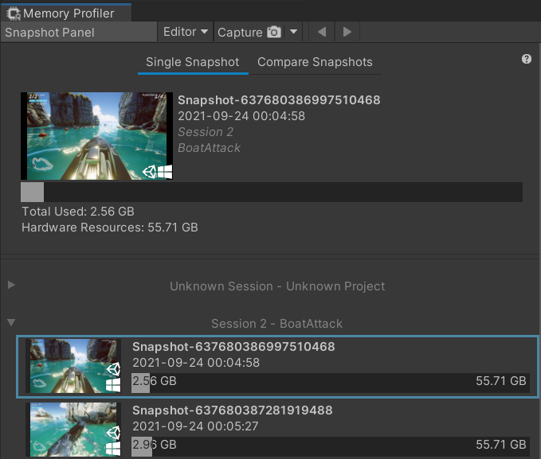
<p><em>VI: Dùng Memory Profiler <strong>module</strong> để nhanh chóng thu thập thông tin về cấp phát bộ nhớ của Asset và Scene object. / EN: Use the Memory Profiler <strong>module</strong> to quickly gather information relating to Asset and Scene object memory allocation.</em></p>

### 10.1. Cấu trúc 3 phần của Memory Profiler

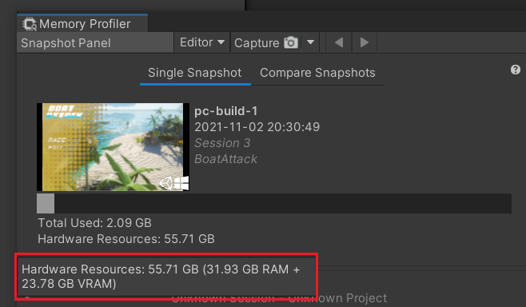
<p><em>VI: <strong>▲ Snapshot Panel</strong> — <code>pc-build-1</code>, <em>Session 3 · BoatAttack</em>, <strong>Total Used 2.09 GB</strong> và <strong>Hardware Resources 55.71 GB (31.93 GB RAM + 23.78 GB VRAM)</strong>. Con số Hardware Resources cho biết bạn còn bao nhiêu dư địa. / EN: The Snapshot Panel with Total Used and Hardware Resources.</em></p>

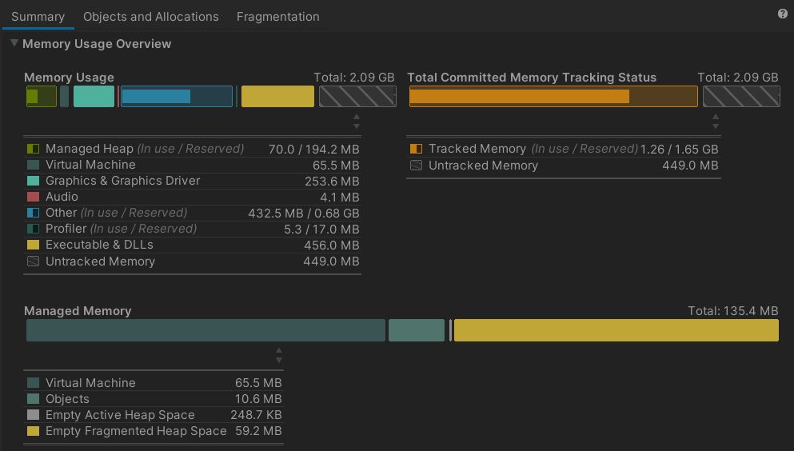
<p><em>VI: <strong>▲ Memory Usage Overview — Total 2.09 GB</strong>: <strong>Managed Heap 70.0 / 194.2 MB</strong> · <strong>Virtual Machine 65.5 MB</strong> · <strong>Graphics &amp; Graphics Driver 253.6 MB</strong> · <strong>Audio 4.1 MB</strong> · <strong>Executable &amp; DLLs 456.0 MB</strong> · <strong>Untracked Memory 449.0 MB</strong>. Khối <em>Managed Memory</em> phía dưới (tổng 135.4 MB) tách tiếp: Objects 10.6 MB · Empty Active Heap Space 248.7 KB · <strong>Empty Fragmented Heap Space 59.2 MB</strong> — dấu hiệu PHÂN MẢNH. / EN: The Memory Usage Overview with managed memory fragmentation broken out.</em></p>

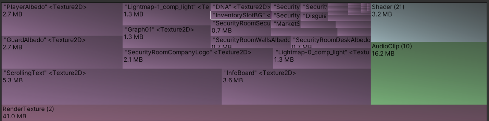
<p><em>VI: <strong>▲ Tree Map</strong> — mỗi ô là một object, DIỆN TÍCH tỉ lệ với dung lượng. Nhóm <code>Texture2D</code> chiếm mảng lớn nhất, cạnh <code>Shader (21)</code>, <code>AudioClip (10)</code>, <code>RenderTexture (2)</code>. Nhìn một cái là biết loại asset nào đang ăn RAM. / EN: The Memory Profiler Tree Map, where area is proportional to size.</em></p>

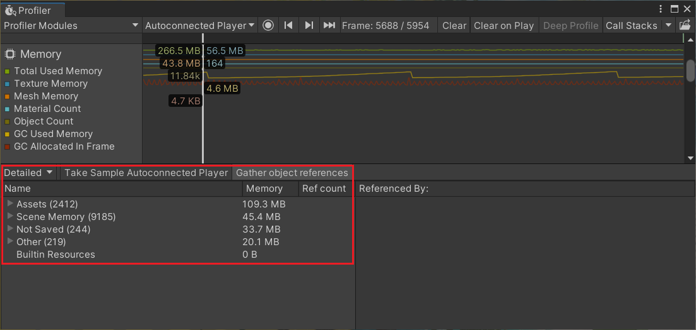
<p><em>VI: <strong>▲ Detailed view</strong> — <strong>Assets (2412) 109.3 MB · Scene Memory (9185) 45.4 MB · Not Saved (244) 33.7 MB · Other (219) 20.1 MB · Builtin Resources 0 B</strong>, kèm cột <strong>Ref count</strong> và <strong>Referenced By</strong>. / EN: The Detailed memory view with reference counts.</em></p>

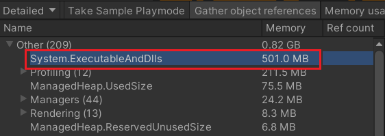
<p><em>VI: <strong>▲ Thủ phạm hay bị bỏ qua</strong> — <strong><code>System.ExecutableAndDlls</code> 501.0 MB</strong> (khoanh đỏ), lớn hơn cả <em>Profiling (12) 211.5 MB</em>, <em>ManagedHeap.UsedSize 75.5 MB</em> và <em>Managers (44) 24.2 MB</em> cộng lại. Đây là code + thư viện, KHÔNG phải asset. / EN: System.ExecutableAndDlls at 501.0 MB dwarfing the managed heap.</em></p>

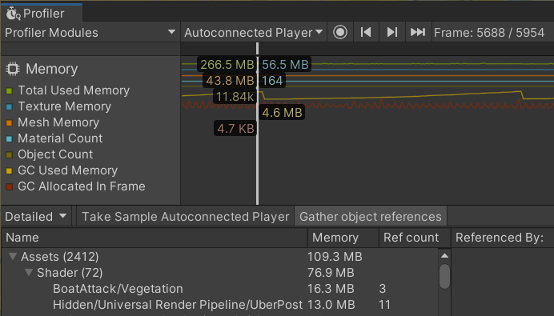
<p><em>VI: <strong>▲ Đào vào Assets → Shader (72) 76.9 MB</strong> — <code>BoatAttack/Vegetation</code> 16.3 MB ×3 và <code>Hidden/Universal Render Pipeline/UberPost</code> 13.0 MB ×11. Cột <strong>Ref count</strong> cho biết mỗi shader bị nhân bản bao nhiêu lần. / EN: Drilling into shader memory with reference counts.</em></p>

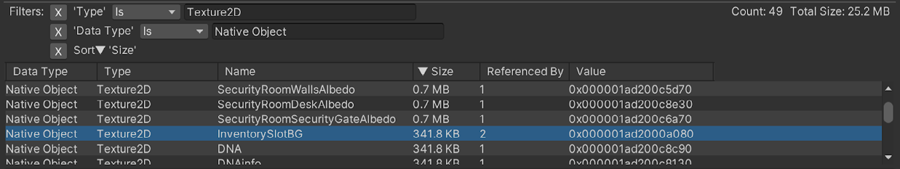
<p><em>VI: <strong>▲ Objects and Allocations</strong> — <strong>Count 49 · Total Size 25.2 MB</strong>, bảng liệt kê từng <code>Texture2D</code> với <strong>Size · Referenced By · Value</strong> (địa chỉ native). / EN: The Objects and Allocations table.</em></p>

<div class="bilingual-row">
<div class="col-vi">
<p>Memory Profiler gồm 3 khu vực chính:</p>
<ol>
<li><strong>Snapshot list</strong> — danh sách snapshot</li>
<li><strong>Main section</strong> — chia thành 3 view: Summary, Unity Objects, All of Memory</li>
<li><strong>Selection Details</strong> — chi tiết mục đang chọn</li>
</ol>
</div>
<div class="col-en">
<p>Memory Profiler consists of three main sections:</p>
<ol>
<li><strong>Snapshot list</strong></li>
<li><strong>A Main section</strong>, itself divided into three workflow views: Summary, Unity Objects, and All of Memory</li>
<li><strong>Selection Details</strong></li>
</ol>
</div>
</div>

#### ① Snapshot List

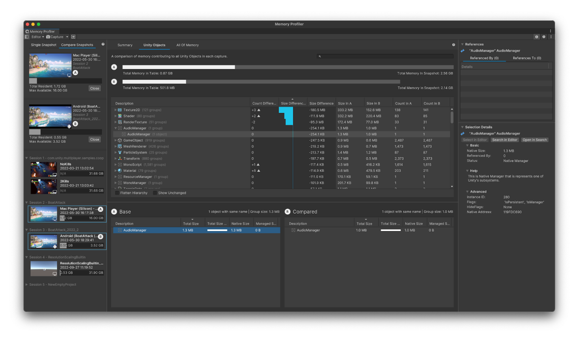

<div class="bilingual-row">
<div class="col-vi">
<p>Nơi bạn chụp và xem các snapshot đã lấy, kèm thông tin tổng quan về mức dùng bộ nhớ và thời điểm chụp.</p>
<p>Chụp bằng nút <strong>"Capture"</strong> trên toolbar, hoặc — nếu chưa có snapshot nào — bằng nút snapshot ở Main section.</p>
<p>Bạn thấy được bộ nhớ có thay đổi giữa các snapshot hay không, từ đó cảm nhận dự án đang tốt lên hay xấu đi.</p>
<p>Đây cũng là nơi chọn chế độ xem <strong>1 snapshot</strong> hay <strong>so sánh 2 snapshot</strong>.</p>
</div>
<div class="col-en">
<p>The area where you capture and see snapshots taken in your game, along with high-level information about memory usage and date of capture.</p>
<p>Capture snapshots with the <strong>"Capture"</strong> button in the toolbar or — if no snapshot is available — through the snapshot button in the Main section.</p>
<p>You can also see whether memory usage is changing across snapshots and get a sense of whether project performance is improving or not.</p>
<p>Use the Snapshot list to select whether you want to look at single snapshots or compared snapshots.</p>
</div>
</div>

#### ② Summary View

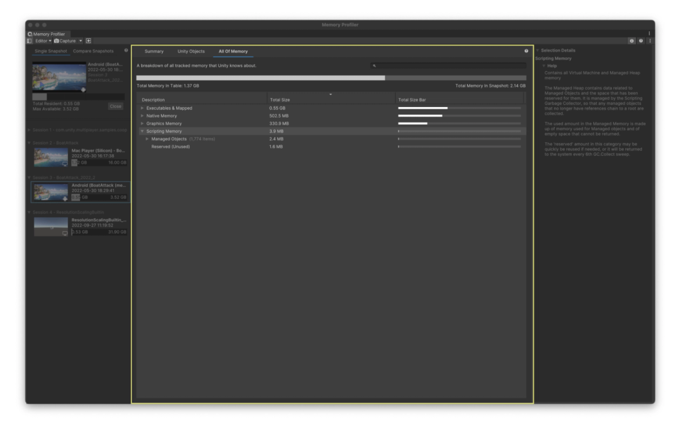

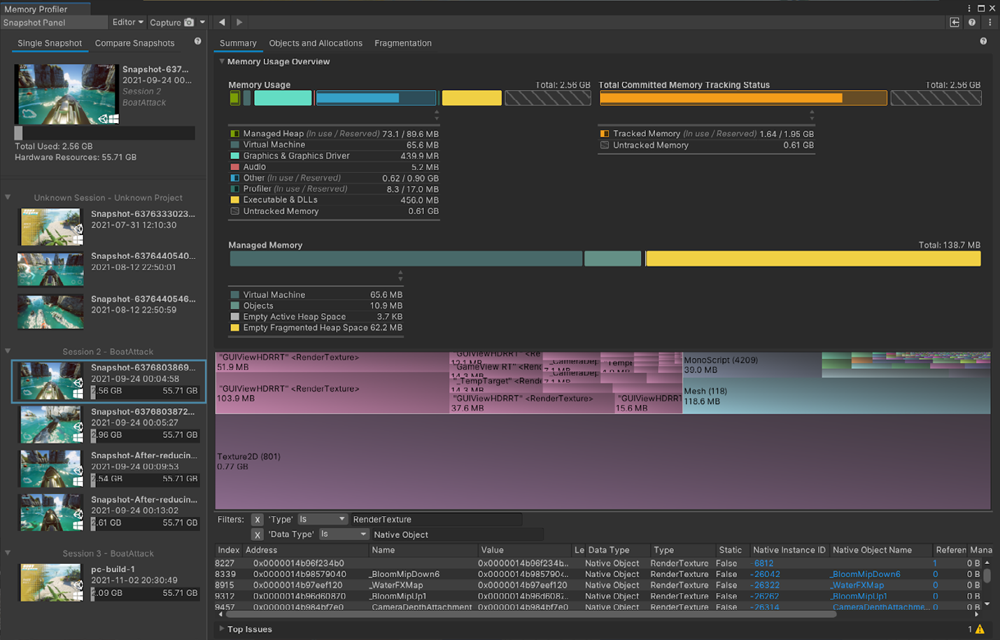
<p><em>VI: Summary view toàn cảnh (dự án BoatAttack, PC). Đọc số: <strong>Total Used 2.56 GB</strong>, Hardware Resources 55.71 GB. Phân rã — Managed Heap 73.1/89.6 MB · Virtual Machine 65.6 MB · <strong>Graphics &amp; Graphics Driver 439.9 MB</strong> · Audio 5.2 MB · Executable &amp; DLLs 456.0 MB · <strong>Untracked Memory 0.61 GB</strong>. Managed Memory: Objects 10.9 MB, Empty Active Heap Space 3.7 KB, <strong>Empty Fragmented Heap Space 62.2 MB</strong> ⟵ dấu hiệu phân mảnh heap. Tree map cho thấy Texture2D (801 đối tượng) chiếm 0.77 GB. / EN: The full Summary view (BoatAttack, PC). Note <strong>Empty Fragmented Heap Space 62.2 MB</strong> — a fragmentation signal — and Texture2D (801) at 0.77 GB.</em></p>

<div class="bilingual-row">
<div class="col-vi">
<p>View mặc định khi mở/chụp snapshot. Cung cấp:</p>
<ul>
<li>Bạn đang dùng bao nhiêu bộ nhớ.</li>
<li>Bao nhiêu là <strong>resident</strong> (thực sự nằm trên thiết bị).</li>
<li>Bao nhiêu là <strong>committed</strong> nhưng hiện <em>không</em> nằm trên thiết bị.</li>
<li>Bộ nhớ phân bố ra sao theo từng category — giúp chọn điểm bắt đầu điều tra.</li>
</ul>
<p>Đồng thời có các entry point cho phân tích sâu hơn: <strong>"Top Unity Objects in Memory"</strong> và <strong>"Managed memory breakdown"</strong>.</p>
</div>
<div class="col-en">
<p>The default view when you load or capture a snapshot. It provides:</p>
<ul>
<li>How much memory you are using.</li>
<li>How much is <strong>resident</strong> on the device.</li>
<li>How much is <strong>committed</strong> but <em>not</em> currently on device.</li>
<li>How memory is distributed across categories, to simplify choosing where to start your investigation.</li>
</ul>
<p>It also provides entry points for more detailed analysis, such as <strong>"Top Unity Objects in Memory"</strong> and the <strong>"Managed memory breakdown"</strong>.</p>
</div>
</div>

#### ③ Unity Objects View

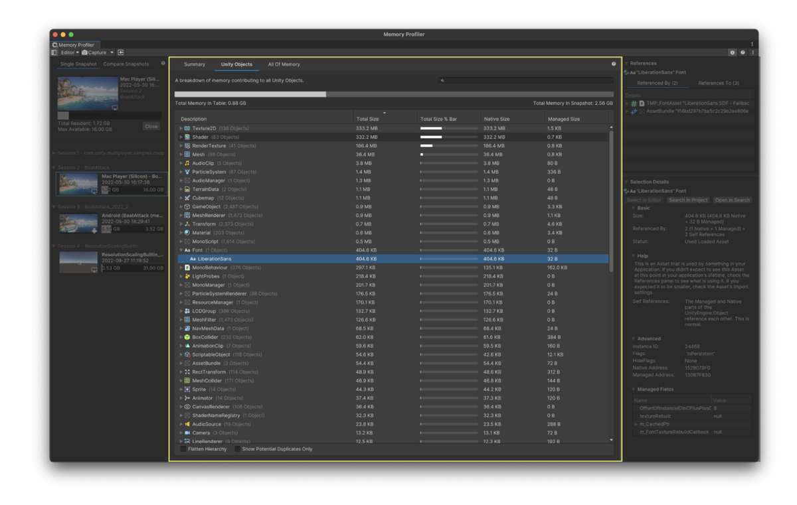

<div class="bilingual-row">
<div class="col-vi">
<p><strong>Đây là nơi bạn sẽ dành nhiều thời gian nhất.</strong></p>
<p>Liệt kê toàn bộ các loại object đang nạp trong bộ nhớ: textures, shaders, fonts, v.v.</p>
<p>Thường đây là chỗ bạn phát hiện những object:</p>
<ul>
<li>Quá lớn (texture khổng lồ, audio clip chưa nén).</li>
<li>Không cần có mặt — bị nạp nhầm.</li>
<li>Bị giữ lại trong bộ nhớ bởi một <em>hanging reference</em> (tham chiếu treo) — nguyên nhân kinh điển của memory leak.</li>
</ul>
<p>Trong Tree Map view, click để truy vết một biến ngược về native object đang giữ bộ nhớ, từ đó phát hiện texture quá lớn hoặc asset bị trùng lặp.</p>
</div>
<div class="col-en">
<p><strong>This is where you will likely spend the most time.</strong></p>
<p>It lists all the main types of objects loaded in memory, such as textures, shaders, fonts, and so on.</p>
<p>Usually, this is where you identify objects that:</p>
<ul>
<li>Are too big.</li>
<li>Don't need to be there because they have been loaded mistakenly.</li>
<li>Were kept in memory by some <em>hanging reference</em> — the classic cause of memory leaks.</li>
</ul>
<p>In the Tree Map view, click to trace a variable to the native object holding onto memory. Here you can identify common memory consumption issues, like excessively large textures or duplicate assets.</p>
</div>
</div>

#### ④ All of Memory View

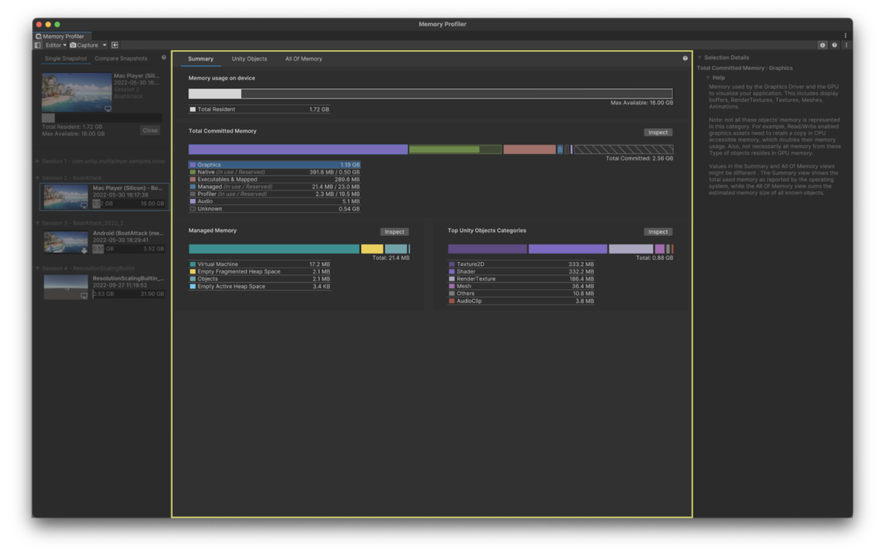

<div class="bilingual-row">
<div class="col-vi">
<p>Cho phép nhìn <strong>toàn bộ</strong> bộ nhớ, chia theo 4 category:</p>
<ul>
<li><strong>Native</strong> — bộ nhớ engine C++ (assets, GameObjects, components).</li>
<li><strong>Managed</strong> — managed heap của C# (nơi GC hoạt động).</li>
<li><strong>Graphics</strong> — VRAM (textures, meshes, render targets).</li>
<li><strong>Executables</strong> — mã thực thi và thư viện đã nạp.</li>
</ul>
<p>Bạn xem được dữ liệu Memory Profiler thu thập và đi sâu vào từng khía cạnh cụ thể cấu thành bộ nhớ dự án.</p>
</div>
<div class="col-en">
<p>Enables you to see <strong>all</strong> memory, divided by category:</p>
<ul>
<li><strong>Native</strong> — C++ engine memory (assets, GameObjects, components).</li>
<li><strong>Managed</strong> — the C# managed heap (where the GC operates).</li>
<li><strong>Graphics</strong> — VRAM (textures, meshes, render targets).</li>
<li><strong>Executables</strong> — executable code and loaded libraries.</li>
</ul>
<p>You can see the data captured by the Memory Profiler and investigate more specific aspects to see what is composing your project's memory.</p>
</div>
</div>

#### ⑤ Selection Details

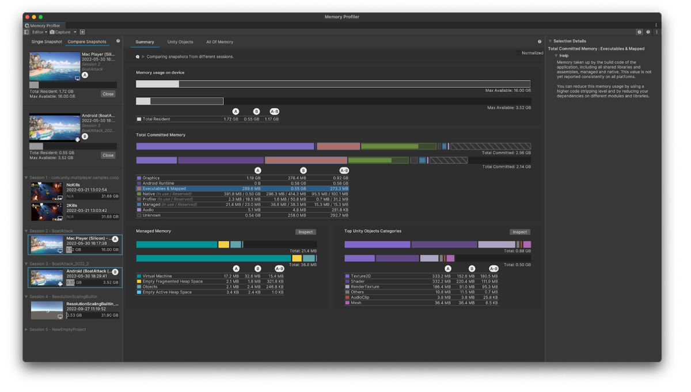

<div class="bilingual-row">
<div class="col-vi">
<p>Cung cấp thông tin chi tiết về mục đang chọn ở Main section: mô tả từng category bộ nhớ, các tham chiếu tiềm năng (potential references), và chi tiết object.</p>
<p>Phần này giúp bạn hiểu <strong>tại sao</strong> object đó lại nằm trong bộ nhớ.</p>
<p>👉 Nếu project đang mở trong Editor, bạn có thể <strong>"ping"</strong> object và kiểm tra asset trực tiếp trong cửa sổ Scene hoặc Project.</p>
</div>
<div class="col-en">
<p>Offers more information about items selected in the Main section, including descriptions of different categories of memory and potential references or details of selected objects.</p>
<p>This section helps you understand <strong>why</strong> an object is in memory.</p>
<p>👉 If you have the project open in the Editor, you can <strong>"ping"</strong> objects and inspect assets directly in the Scene or Project window.</p>
</div>
</div>

### 10.2. So sánh Snapshot (Compare Mode) — Vũ khí săn Memory Leak

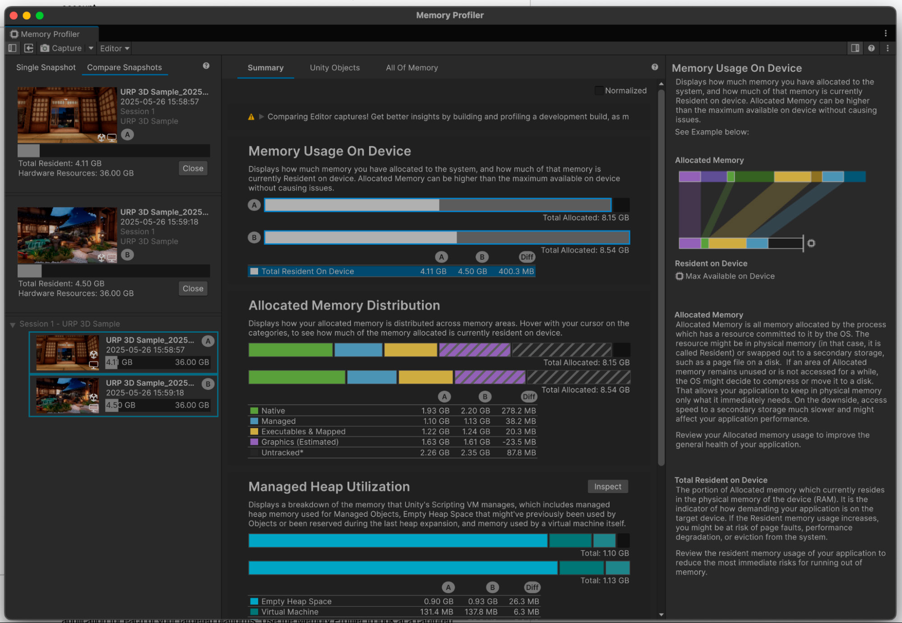
<p><em>VI: <strong>▲ Compare Snapshots (bản Unity 6)</strong> — ba khối đặt cạnh nhau: <strong>Memory Usage On Device</strong>, <strong>Allocated Memory Distribution</strong>, <strong>Managed Heap Utilization</strong>, cùng panel <em>Resident on Device</em> giải thích ý nghĩa từng vùng. / EN: Compare Snapshots in the Unity 6 Memory Profiler.</em></p>

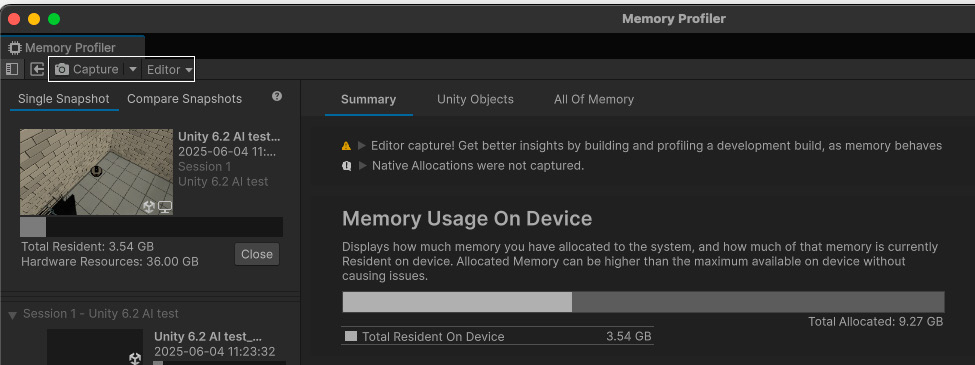
<p><em>VI: <strong>▲ CẢNH BÁO phải đọc</strong> — <em>“Editor capture! Get better insights by building and profiling a development build, as memory behaves quite differently in the Editor.”</em> Snapshot này: <strong>Total Resident 3.54 GB / Hardware Resources 36.00 GB</strong>. / EN: The Editor-capture warning shown on a snapshot taken in the Editor.</em></p>

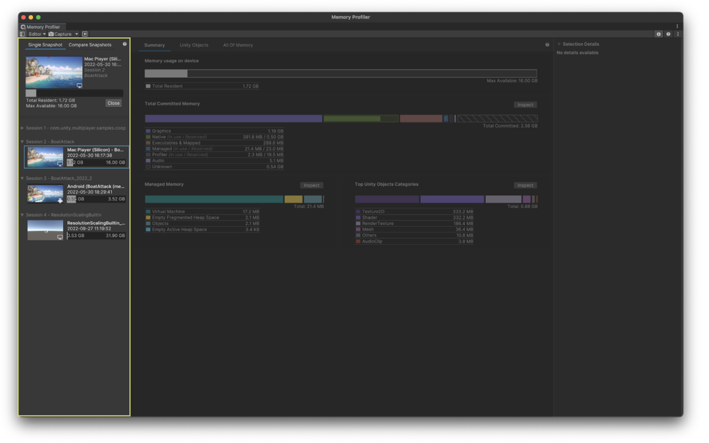

<div class="bilingual-row">
<div class="col-vi">
<p>Mọi view ở trên đều dùng được cho cả 1 snapshot lẫn chế độ so sánh.</p>
<p><strong>Cách dùng:</strong> chọn <strong>"Compare"</strong> trong snapshot list, rồi chọn snapshot thứ hai. Vào tab compare sẽ tự động chuyển mọi view sang Compare mode.</p>
<ul>
<li><strong>Summary view</strong> hiển thị breakdown của 2 bản chụp cạnh nhau (đặt tên "A" và "B") để thấy khác biệt chính.</li>
<li><strong>Unity Objects</strong> và <strong>All of Memory</strong> có UI riêng cho biết mỗi category đã thay đổi kích thước hoặc số lượng object ra sao. Chọn một category ở bảng trên → xem chênh lệch chi tiết A/B ở các bảng dưới.</li>
</ul>
<p>Quay lại xem đơn lẻ bằng cách chọn <strong>"Single"</strong>. Snapshot thứ hai vẫn được giữ nạp ngầm để bạn chuyển qua lại nhanh.</p>
<p>💡 <strong>Quy trình săn leak:</strong> Snapshot A ở Main Menu → vào gameplay → thoát về Main Menu → Snapshot B → Compare. Bất cứ thứ gì tăng lên mà lẽ ra phải được giải phóng chính là leak.</p>
</div>
<div class="col-en">
<p>Each view above is available for inspecting single snapshots or for comparing them.</p>
<p><strong>How:</strong> select <strong>"Compare"</strong> in the snapshot list, then select a second snapshot. Being in the compare tab automatically turns all views into Compare mode.</p>
<ul>
<li><strong>Summary view</strong> provides the two captures' memory breakdown side by side (named "A" and "B") so you can see the main differences.</li>
<li><strong>Unity Objects</strong> and <strong>All of Memory</strong> have a dedicated UI showing how different memory categories changed in size or in the number of objects contained. Select a category in the top table to inspect individual differences for A and B in the tables below.</li>
</ul>
<p>Go back to a single snapshot by selecting <strong>"Single"</strong>. The second snapshot stays latently loaded so you can quickly switch between the two.</p>
<p>💡 <strong>Leak-hunting workflow:</strong> Snapshot A at Main Menu → enter gameplay → return to Main Menu → Snapshot B → Compare. Anything that grew but should have been released is your leak.</p>
</div>
</div>

---

### 10.3. Objects and Allocations — Lọc đa tầng

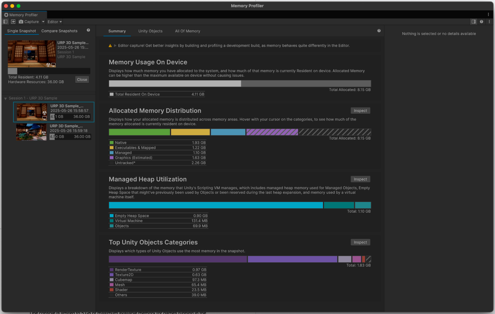
<p><em>VI: <strong>▲ Tab <em>Summary</em> bản Unity 6</strong> — bốn khối: <strong>Memory Usage On Device</strong>, <strong>Allocated Memory Distribution</strong>, <strong>Managed Heap Utilization</strong>, <strong>Top Unity Objects Categories</strong>, mỗi khối có nút <strong>Inspect</strong> để nhảy sang tab chi tiết. / EN: The Unity 6 Memory Profiler Summary tab.</em></p>

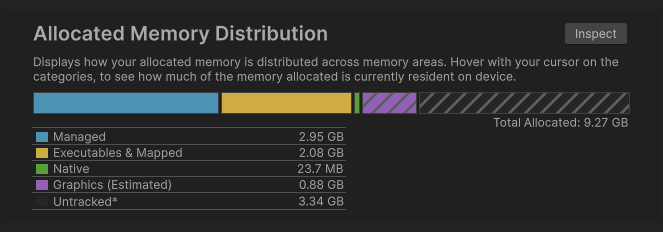
<p><em>VI: <strong>▲ Allocated Memory Distribution — Total Allocated 9.27 GB</strong>: <strong>Managed 2.95 GB · Executables &amp; Mapped 2.08 GB · Native 23.7 MB · Graphics (Estimated) 0.88 GB · Untracked 3.34 GB</strong>. Phần <strong>Untracked</strong> lớn là thứ Unity KHÔNG đo được — thường là driver và thư viện hệ thống. / EN: Allocated Memory Distribution totalling 9.27 GB.</em></p>

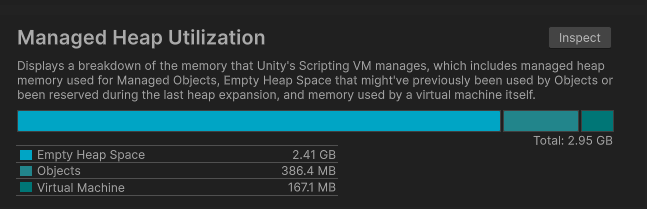
<p><em>VI: <strong>▲ Managed Heap Utilization — Total 2.95 GB</strong>: <strong>Empty Heap Space 2.41 GB</strong> · <strong>Objects 386.4 MB</strong> · <strong>Virtual Machine 167.1 MB</strong>. 🚨 <strong>2.41 GB TRỐNG trên tổng 2.95 GB</strong> — heap đã phình ra rồi KHÔNG trả lại hệ điều hành. Đây chính là hình ảnh của phân mảnh. / EN: Managed Heap Utilization: 2.41 GB of empty heap space out of 2.95 GB.</em></p>

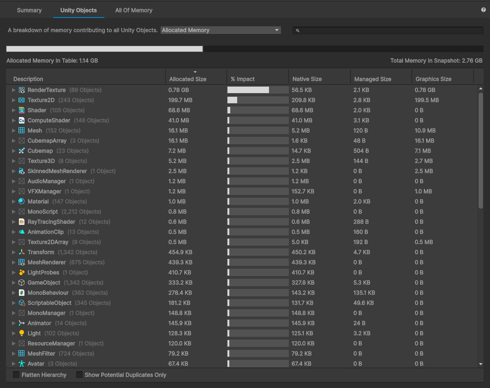
<p><em>VI: <strong>▲ Tab <em>Unity Objects</em></strong> — bảng phân rã theo loại với các cột <strong>Allocated Size · % Impact · Native Size · Managed Size · Graphics Size</strong> cho RenderTexture, Texture2D, ComputeShader, Mesh, Cubemap, Texture3D, AudioManager, VFXManager… / EN: The Unity Objects tab breaking memory down by object type.</em></p>

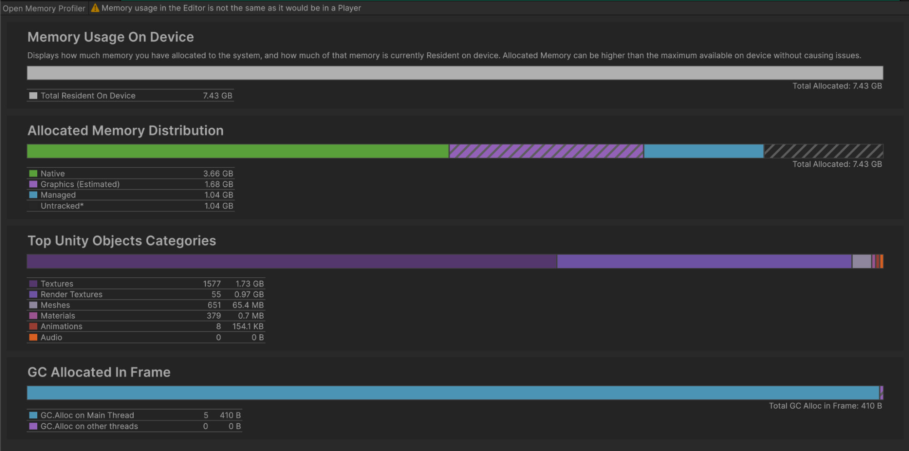
<p><em>VI: <strong>▲ Memory Usage On Device + GC Allocated In Frame</strong> — <strong>Total Resident On Device</strong> so với <strong>Total Allocated</strong>, nhóm <strong>Top Unity Objects Categories</strong> (Textures, Render Textures, Materials, Animations, Audio) và dòng cuối tách <strong>GC Alloc on Main Thread</strong> với <strong>GC Alloc on other threads</strong>. / EN: Memory Usage On Device with GC Allocated In Frame split by thread.</em></p>

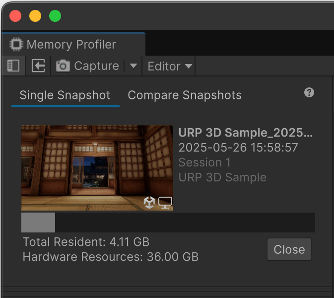
<p><em>VI: <strong>▲ Một snapshot thật</strong> — <code>URP 3D Sample_2025</code>, <em>Session 1</em>, <strong>Total Resident 4.11 GB / Hardware Resources 36.00 GB</strong>. / EN: A real snapshot: URP 3D Sample at 4.11 GB resident.</em></p>

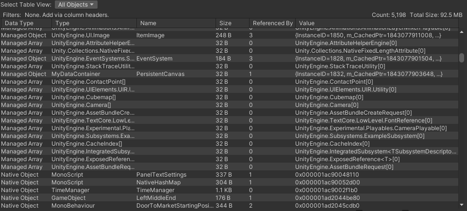
<p><em>VI: Bảng Objects and Allocations lọc được ở nhiều mức, cho phép đào sâu vào bộ nhớ snapshot với độ chi tiết cao. / EN: The Objects and Allocations table can be filtered at many levels, allowing you to drill down into captured snapshot memory usage with high granularity.</em></p>

<div class="bilingual-row">
<div class="col-vi">
<p>View <strong>Objects and Allocations</strong> hiển thị một bảng có thể chuyển đổi để lọc theo các lựa chọn dựng sẵn: <strong>All Objects</strong>, <strong>All Native Objects</strong>, <strong>All Managed Objects</strong>, <strong>All Native Allocations</strong>, và nhiều hơn nữa.</p>
<p>Bạn cũng đổi được bảng phía dưới để hiển thị <strong>Objects</strong>, <strong>Allocations</strong>, hoặc <strong>Memory Regions</strong> trong dải đang chọn.</p>
<p>👉 Tận dụng điều này khi tối ưu bộ nhớ và nhắm tới việc <strong>đóng gói bộ nhớ hiệu quả hơn</strong> cho các nền tảng phần cứng có ngân sách bộ nhớ hạn hẹp.</p>
</div>
<div class="col-en">
<p>The <strong>Objects and Allocations</strong> view shows a table that can be switched to filter based on ready-made selections, such as <strong>All Objects</strong>, <strong>All Native Objects</strong>, <strong>All Managed Objects</strong>, <strong>All Native Allocations</strong>, and more.</p>
<p>You can switch the bottom table to display the <strong>Objects</strong>, <strong>Allocations</strong>, or <strong>Memory Regions</strong> in the selected range.</p>
<p>👉 Use this to your advantage when optimizing memory usage and aiming to <strong>pack memory more efficiently</strong> for hardware platforms where memory budgets are limited.</p>
</div>
</div>

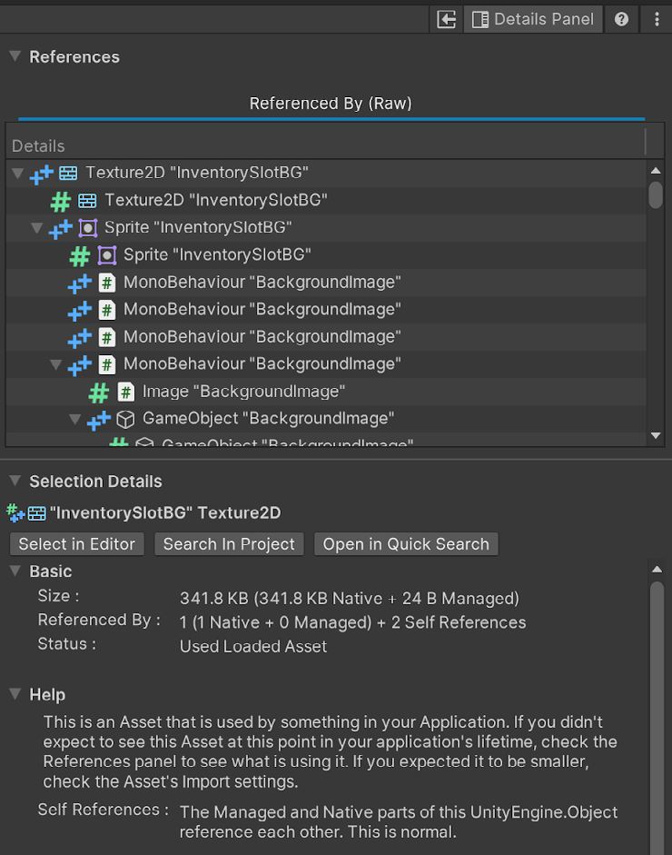
<p><em>VI: Panel References + Selection Details — truy vết ai đang giữ asset trong bộ nhớ. Ví dụ: Texture2D "InventorySlotBG" 341.8 KB (341.8 KB Native + 24 B Managed), được tham chiếu bởi Sprite → MonoBehaviour → Image → GameObject. / EN: The References + Selection Details panel — trace who is holding an asset in memory.</em></p>

### 10.4. Quy trình profiling bộ nhớ

<div class="bilingual-row">
<div class="col-vi">
<p><strong>Quy trình chuẩn:</strong></p>
<ol>
<li>Nạp một snapshot của Memory Profiler.</li>
<li>Đi qua <strong>Tree Map view</strong> để kiểm tra các category, <em>xếp từ lớn nhất tới nhỏ nhất</em> theo dung lượng bộ nhớ.</li>
<li>👉 <strong>Asset của dự án thường là kẻ ngốn bộ nhớ nhiều nhất.</strong></li>
<li>Dùng <strong>Table view</strong>, định vị các object: <strong>Texture</strong>, <strong>Meshes</strong>, <strong>AudioClips</strong>, <strong>RenderTextures</strong>, <strong>shader variants</strong>, và <strong>preallocated buffers</strong>.</li>
</ol>
<p>Đây đều là những <strong>ứng viên tốt để tối ưu bộ nhớ</strong>.</p>
</div>
<div class="col-en">
<p><strong>Standard workflow:</strong></p>
<ol>
<li>Load a Memory Profiler snapshot.</li>
<li>Go through the <strong>Tree Map view</strong> to inspect the categories, <em>ordered from largest to smallest</em> in memory footprint size.</li>
<li>👉 <strong>Project assets are often the highest consumers of memory.</strong></li>
<li>Using the <strong>Table view</strong>, locate: <strong>Texture</strong> objects, <strong>Meshes</strong>, <strong>AudioClips</strong>, <strong>RenderTextures</strong>, <strong>shader variants</strong>, and <strong>preallocated buffers</strong>.</li>
</ol>
<p>These are all <strong>good candidates for memory optimization</strong>.</p>
</div>
</div>

### 10.5. 🕵️ Săn Memory Leak

<div class="bilingual-row">
<div class="col-vi">
<p><strong>Memory leak thường xảy ra khi:</strong></p>
<ul>
<li>Một object <strong>không được giải phóng thủ công</strong> khỏi bộ nhớ qua code.</li>
<li>Một object <strong>ở lại trong bộ nhớ vì một tham chiếu ngoài ý muốn</strong> (unintentional reference).</li>
</ul>
<p><strong>Công cụ:</strong> <strong>Diff view</strong> của Memory Profiler giúp tìm leak bằng cách so sánh hai snapshot trong một khoảng thời gian cụ thể.</p>
<p>⚠️ <strong>Kịch bản leak kinh điển trong game Unity: xảy ra SAU KHI unload một scene.</strong></p>
<p>Package Memory Profiler có sẵn một workflow hướng dẫn bạn qua quy trình phát hiện loại leak này bằng Diff view.</p>
</div>
<div class="col-en">
<p><strong>A memory leak typically happens when:</strong></p>
<ul>
<li>An object is <strong>not released manually</strong> from memory through the code.</li>
<li>An object <strong>stays in memory because of an unintentional reference</strong>.</li>
</ul>
<p><strong>The tool:</strong> The Memory Profiler <strong>Diff view</strong> can help find memory leaks by comparing two snapshots over a specific timeframe.</p>
<p>⚠️ <strong>A common memory leak scenario in Unity games can occur after unloading a scene.</strong></p>
<p>The Memory Profiler package has a workflow that guides you through the process of discovering these types of leaks using the Diff view.</p>
</div>
</div>

### 10.6. 🔍 Truy tìm cấp phát lặp lại suốt vòng đời ứng dụng

<div class="bilingual-row">
<div class="col-vi">
<p>Thông qua <strong>so sánh vi phân nhiều memory snapshot</strong>, bạn xác định được nguồn gốc của các cấp phát bộ nhớ diễn ra liên tục trong suốt vòng đời ứng dụng.</p>
<p><strong>Bốn công cụ, dùng phối hợp:</strong></p>
</div>
<div class="col-en">
<p>Through <strong>differential comparison of multiple memory snapshots</strong>, you can identify the source of continuous memory allocations during application lifetime.</p>
<p><strong>Four tools, used together:</strong></p>
</div>
</div>

#### ① Memory Profiler module — Đường màu đỏ

<div class="bilingual-row">
<div class="col-vi">
<p>Module Memory Profiler trong Unity Profiler biểu diễn <strong>managed allocation mỗi frame bằng một đường màu đỏ</strong>.</p>
<p>👉 <strong>Đường này phải bằng 0 hầu hết thời gian.</strong> Bất kỳ <em>spike</em> nào trên đường đó đều chỉ ra frame bạn cần điều tra về managed allocation.</p>
<p>Chỉ số cần theo dõi: <strong>GC Allocated In Frame</strong>.</p>
</div>
<div class="col-en">
<p>The Memory Profiler module in the Unity Profiler represents <strong>managed allocations per frame with a red line</strong>.</p>
<p>👉 <strong>This should be 0 most of the time</strong>, so any <em>spikes</em> in that line indicate frames you should investigate for managed allocations.</p>
<p>The counter to watch: <strong>GC Allocated In Frame</strong>.</p>
</div>
</div>

#### ② Timeline view — Marker màu hồng

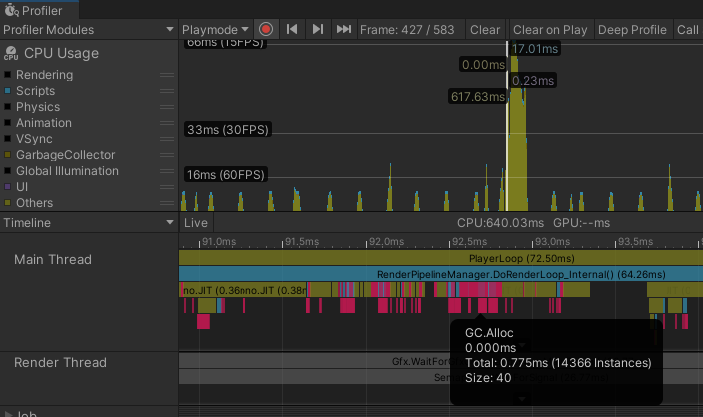
<p><em>VI: Managed allocation hiện dưới dạng marker màu hồng trong Timeline view. Tooltip cho biết <code>GC.Alloc — Total: 0.775ms (14366 Instances), Size: 40</code>. / EN: Managed allocations appear as pink-colored markers in the Timeline view.</em></p>

<div class="bilingual-row">
<div class="col-vi">
<p>Timeline view của module CPU Usage hiển thị các cấp phát — bao gồm managed allocation — bằng <strong>màu hồng</strong>, khiến chúng <em>rất dễ nhìn thấy</em> và khoanh vùng.</p>
<p>👉 Trong ảnh chụp: <strong>14.366 instance</strong> của <code>GC.Alloc</code> chỉ trong một khung nhìn — CPU 640.03 ms. Đây là dấu hiệu của một vấn đề nghiêm trọng.</p>
</div>
<div class="col-en">
<p>The Timeline view in the CPU Usage Profiler module shows allocations, including managed ones, in <strong>pink</strong>, making them <em>easy to see</em> and hone in on.</p>
<p>👉 In the screenshot: <strong>14,366 instances</strong> of <code>GC.Alloc</code> in a single view — CPU 640.03 ms. That is the signature of a serious problem.</p>
</div>
</div>

#### ③ Allocation Call Stacks — Rẻ hơn Deep Profiling

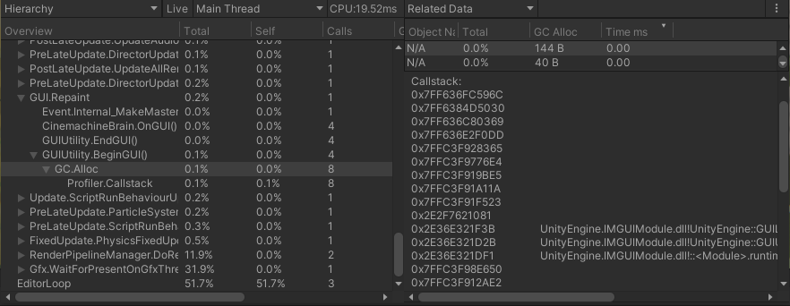
<p><em>VI: Bật Allocation call stacks cho phép lần ngược call stack về đúng nguồn gây managed allocation. Panel Related Data trong Hierarchy view cũng hiện chi tiết call stack. / EN: Enabling Allocation call stacks lets you follow the call stack back to the source for managed allocations.</em></p>

<div class="bilingual-row">
<div class="col-vi">
<p><strong>Allocation call stacks là cách nhanh để phát hiện managed memory allocation trong code của bạn.</strong></p>
<p>🎯 <strong>Ưu điểm then chốt:</strong> Chúng cung cấp chi tiết call stack bạn cần <strong>với overhead THẤP HƠN so với deep profiling</strong>, và <strong>bật được ngay lập tức (on the fly)</strong> bằng Profiler tiêu chuẩn.</p>
<p><strong>Cách bật</strong> (mặc định <em>tắt</em>):</p>
<ol>
<li>Bấm nút <strong>Call Stacks</strong> trên toolbar chính của cửa sổ Profiler.</li>
<li>Đổi <strong>Details view</strong> sang <strong>Related Data</strong>.</li>
</ol>
<p>Kết quả: các sample <code>GC.Alloc</code> được chọn trong <strong>Hierarchy</strong> hoặc <strong>Raw Hierarchy</strong> giờ sẽ chứa call stack của chúng. Bạn cũng thấy call stack của sample <code>GC.Alloc</code> trong <em>tooltip khi chọn</em> ở Timeline.</p>
<p>⚠️ <strong>Lưu ý phiên bản:</strong> Nếu dùng Unity cũ (trước khi có hỗ trợ Allocation call stack), thì <em>deep profiling</em> là cách tốt để lấy full call stack nhằm tìm managed allocation.</p>
</div>
<div class="col-en">
<p><strong>Allocation call stacks provide a quick way to discover managed memory allocations in your code.</strong></p>
<p>🎯 <strong>Key advantage:</strong> They provide the call stack detail you need at <strong>LESS overhead compared to what deep profiling would normally add</strong>, and they can be <strong>enabled on the fly</strong> using the standard Profiler.</p>
<p><strong>How to enable</strong> (disabled by default):</p>
<ol>
<li>Click the <strong>Call Stacks</strong> button in the main toolbar of the Profiler window.</li>
<li>Change the <strong>Details view</strong> to <strong>Related Data</strong>.</li>
</ol>
<p>Result: <code>GC.Alloc</code> samples selected in the <strong>Hierarchy</strong> or <strong>Raw Hierarchy</strong> will now contain their call stacks. You can also see the call stacks of <code>GC.Alloc</code> samples in the <em>selection tooltip</em> in Timeline.</p>
<p>⚠️ <strong>Version note:</strong> If you're using an older version of Unity (prior to Allocation call stack support), then deep profiling is a good way to get full call stacks to help find managed allocations.</p>
</div>
</div>

#### ④ Hierarchy view — Sắp xếp theo GC Alloc

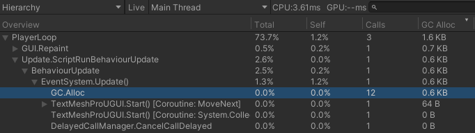

<div class="bilingual-row">
<div class="col-vi">
<p>Hierarchy view trong module CPU Usage cho phép <strong>bấm vào tiêu đề cột để dùng nó làm tiêu chí sắp xếp</strong>.</p>
<p>👉 <strong>Sắp xếp theo cột <code>GC Alloc</code> là cách tuyệt vời để tập trung vào chúng.</strong></p>
</div>
<div class="col-en">
<p>The Hierarchy view in the CPU Usage Profiler module lets you <strong>click on column headers to use them as the sorting criteria</strong>.</p>
<p>👉 <strong>Sorting by <code>GC Alloc</code> is a great way to focus on those.</strong></p>
</div>
</div>

#### ⑤ Project Auditor — Tìm cấp phát KHÔNG cần chạy game

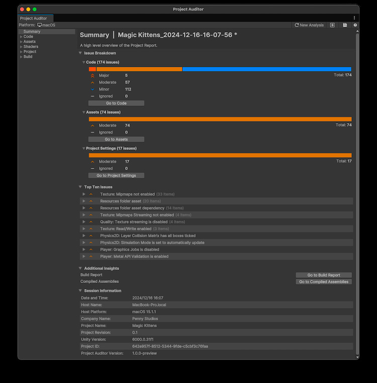
<p><em>VI: <strong>▲ Cửa sổ Summary của Project Auditor</strong> — báo cáo <code>Magic Kittens_2024-12-18-16-07-56</code> chia ba nhóm <strong>Code Issues · Assets Issues · Project Settings Issues</strong>, mỗi nhóm là một thanh ngang theo mức nghiêm trọng, kèm bảng <strong>Top Ten issues</strong> và phần <strong>Session Information</strong> (Unity version, platform, build target, ngày phân tích). Đây là toàn cảnh bạn có được mà <strong>KHÔNG cần chạy game một giây nào</strong>. / EN: The Project Auditor Summary window with code, asset and project-settings issues.</em></p>

!!! info "📦 Cập nhật bản Unity 6 — Project Auditor đã là PACKAGE CHÍNH THỨC"
    <div class="bilingual-row">
    <div class="col-vi">
    <p>🆕 <em>"<strong>Project Auditor, ra mắt dưới dạng PACKAGE ở Unity 6.1</strong>, là công cụ phân tích MẠNH cho dự án Unity, thiết kế để giúp lập trình viên <strong>tối ưu hiệu năng, giữ best practice, và xác định vấn đề cùng nút thắt tiềm ẩn</strong>. Project Auditor <strong>QUÉT TOÀN BỘ dự án</strong> và cung cấp báo cáo chi tiết về những chỗ kém hiệu quả — như <strong>lời gọi scripting nặng, asset KHÔNG dùng tới, số lượng entity quá lớn</strong>, v.v."</em></p>
    <p>⚠️ Lưu ý: mô tả <em>"công cụ phân tích tĩnh mang tính THỬ NGHIỆM"</em> ở trên là của bản e-book 2022 — <strong>đã lỗi thời</strong>.</p>
    <p>📋 <strong>Bốn mảng Project Auditor bao phủ:</strong></p>
    <ul>
    <li><strong>Performance optimization</strong> — <em>"xác định vấn đề có thể ảnh hưởng hiệu năng runtime: <strong>sinh rác quá mức, cấp phát object không cần thiết, hoặc lời gọi hàm đắt</strong>."</em></li>
    <li><strong>Code and asset review</strong> — <em>"làm nổi bật <strong>asset KHÔNG dùng, mẫu code kém hiệu quả, hoặc API LỖI THỜI</strong> có thể refactor. Việc này giúp <strong>GIẢM kích thước build</strong>, cải thiện khả năng bảo trì và tối ưu bộ nhớ."</em></li>
    <li><strong>Diagnostics and best practices</strong> — <em>"đưa khuyến nghị dựa trên best practice của Unity và nêu lỗi/cảnh báo liên quan tới thiết lập dự án, như <strong>tham chiếu bị thiếu, hoặc Player/Quality settings CHƯA TỐI ƯU</strong>."</em></li>
    <li><strong>Customizable reports</strong> — <em>"tổ chức kết quả thành DANH MỤC để dễ ưu tiên. Bạn cũng có thể <strong>TẠO LUẬT RIÊNG</strong> để phân tích theo nhu cầu cụ thể."</em></li>
    </ul>
    <p>🚦 <strong>Ba mức nghiêm trọng:</strong> <em>"Báo cáo được phân loại theo mức độ (<strong>Major, Moderate và Info</strong>). <strong>Hãy tập trung vào vấn đề NGHIÊM TRỌNG NHẤT trước</strong>, vì chúng thường là vấn đề CHÍ MẠNG về hiệu năng — như cấp phát bộ nhớ quá mức hoặc GC quá nhiều. Chúng cũng <strong>có khả năng nằm trong các code path được gọi THƯỜNG XUYÊN HƠN, như <code>Update</code></strong>, nơi mọi vấn đề hiệu năng sẽ RÕ RÀNG HƠN với người chơi."</em></p>
    <p>💡 <strong>Ba mẹo dùng:</strong></p>
    <ul>
    <li><em>"<strong>Chạy Project Auditor ở các MỐC then chốt</strong> (trước milestone, bản beta, build cuối). <strong>Audit ĐỀU ĐẶN giúp bắt nút thắt, asset thừa hay code lỗi thời SỚM</strong>, ngăn vấn đề lớn dần khi dự án phình ra."</em></li>
    <li><em>"Bạn có thể <strong>TỰ ĐỘNG HOÁ việc chạy Project Auditor như một phần của CI hoặc quy trình build</strong>, và dùng báo cáo để <strong>đảm bảo KHÔNG AI check-in asset hay code làm phát sinh vấn đề MỚI</strong>."</em></li>
    <li><em>"Bạn có thể <strong>THÊM LUẬT RIÊNG</strong> nếu có thứ cụ thể muốn chắc chắn bắt được — ví dụ thiết lập texture, kích thước, hay các luật phức tạp hơn."</em></li>
    </ul>
    </div>
    <div class="col-en">
    <p>🆕 <em>"The Project Auditor, introduced as a package in Unity 6.1, is a powerful analysis tool for Unity projects, designed to help developers optimize performance, maintain best practices, and identify potential issues and bottlenecks in their projects. Project Auditor scans your entire project and provides detailed reports about inefficiencies, such as heavy scripting calls, unused assets, excessive entity counts, etc."</em></p>
    <p>📋 <strong>The four areas it covers:</strong></p>
    <ul>
    <li><em>"<strong>Performance optimization</strong>: It identifies problems that could impact your project's runtime performance, such as excessive garbage generation, unnecessary object allocations, or expensive function calls."</em></li>
    <li><em>"<strong>Code and asset review</strong>: It highlights unused assets, inefficient code patterns, or outdated APIs that can be refactored. This helps reduce build size, improve overall project maintainability, and optimize memory use."</em></li>
    <li><em>"<strong>Diagnostics and best practices</strong>: It provides recommendations based on Unity best practices and highlights errors or warnings related to your project setup, like missing references, or suboptimal Player or Quality settings."</em></li>
    <li><em>"<strong>Customizable reports</strong>: It organizes the results into categories, making it easy to prioritize optimizations. You can also create custom rules to tailor the analysis to your specific project or needs."</em></li>
    </ul>
    <p>🚦 <em>"The reports generated by the Project Auditor are categorized by severity (Major, Moderate, and Info). Focus on the most severe issues first, as they often highlight performance-critical problems… They're also likely to be in code paths that are called more frequently, like Update, where any performance problems they bring will be more obvious to players."</em></p>
    <p>💡 <em>"Run the Project Auditor at key stages of development… You can automate running Project Auditor as part of your CI or build setup and use the reports to make sure no one checks in any assets or code that add new issues… You can add your own rules if there are particular things you want to make sure you catch in your game."</em></p>
    </div>
    </div>


<div class="bilingual-row">
<div class="col-vi">
<p><strong>Project Auditor là công cụ phân tích tĩnh (static analysis) mang tính thử nghiệm.</strong></p>
<p>Nó làm nhiều việc hữu ích, nhưng điểm đáng giá nhất ở đây: nó có thể tạo ra <strong>danh sách MỌI dòng code trong dự án gây ra managed allocation</strong> — <strong>mà không cần chạy dự án một lần nào</strong>.</p>
<p>👉 Đây là cách <em>cực kỳ hiệu quả</em> để tìm và điều tra loại vấn đề này.</p>
</div>
<div class="col-en">
<p><strong>Project Auditor is an experimental static analysis tool.</strong></p>
<p>It does a lot of useful things, but the most valuable here: it can produce a <strong>list of every single line of code in a project which causes a managed allocation</strong> — <strong>without ever having to run the project</strong>.</p>
<p>👉 It's a <em>very efficient way</em> to find and investigate these sorts of issues.</p>
</div>
</div>

### 10.7. ⚠️ Bảy điều cần nhớ khi profiling bộ nhớ

!!! note "Bổ sung từ bản Unity 6 — chương mới hoàn toàn"
    **VI:** Cùng một dự án nhưng **số liệu bộ nhớ sẽ KHÁC NHAU giữa các thiết bị**. Đây là danh sách các yếu tố khiến bạn đọc sai kết quả.

<div class="bilingual-row">
<div class="col-vi">
<p><strong>Các yếu tố làm thay đổi con số bộ nhớ giữa các thiết bị:</strong></p>
<ol>
<li><strong>Quality &amp; graphics settings</strong> — ảnh hưởng kích thước <em>render texture dùng cho shadow map</em>.</li>
<li><strong>Resolution scaling</strong> — ảnh hưởng kích thước <em>screen buffer, render texture, và hiệu ứng post-processing</em>.</li>
<li><strong>Texture settings</strong> — ảnh hưởng kích thước <em>toàn bộ texture</em>.</li>
<li><strong>Maximum LOD</strong> — ảnh hưởng model và hơn thế nữa.</li>
<li><strong>AssetBundle variants</strong> — nếu bạn có phiên bản <strong>HD</strong> (High Definition) và <strong>SD</strong> (Standard Definition) và chọn dùng cái nào theo cấu hình thiết bị đích, bạn sẽ nhận được <em>kích thước asset khác nhau</em> tùy thiết bị đang profile.</li>
<li><strong>Độ phân giải màn hình</strong> của thiết bị đích — ảnh hưởng kích thước render texture dùng cho post-processing.</li>
<li><strong>Graphics API được hỗ trợ</strong> — có thể ảnh hưởng kích thước shader, dựa trên việc thiết bị hỗ trợ (hoặc không hỗ trợ) những variant nào.</li>
</ol>
<p>💡 <strong>Khuyến nghị:</strong> Một <strong>hệ thống phân tier</strong> dùng quality/graphics settings khác nhau cùng với AssetBundle variant là <em>cách tuyệt vời</em> để nhắm tới dải thiết bị rộng hơn.</p>
<p><strong>Ví dụ cụ thể:</strong> nạp bản <strong>HD</strong> của AssetBundle trên máy mobile <strong>4 GB</strong>, và bản <strong>SD</strong> trên máy <strong>2 GB</strong>. Nhưng hãy lưu ý các biến động bộ nhớ ở trên và <strong>test CẢ HAI loại thiết bị</strong>, cũng như các thiết bị có độ phân giải màn hình hoặc graphics API khác nhau.</p>
<p>🚨 <strong>Lưu ý cực kỳ quan trọng về Editor:</strong></p>
<blockquote>
<p>Unity Editor <strong>nhìn chung LUÔN hiển thị memory footprint LỚN HƠN</strong>, do có thêm các object được nạp từ Editor và Profiler. Ngoài ra, <strong>memory footprint của texture cao hơn</strong> vì trong Editor <em>tất cả texture đều bị ép bật read/write</em>.</p>
</blockquote>
<p>👉 Đừng bao giờ báo cáo con số bộ nhớ đo trong Editor như thể đó là con số thật trên thiết bị.</p>
</div>
<div class="col-en">
<p><strong>Factors that change memory figures between devices:</strong></p>
<ol>
<li><strong>Quality &amp; graphics settings</strong> — can affect the size of <em>render textures used for shadow maps</em>.</li>
<li><strong>Resolution scaling</strong> — can affect the size of <em>screen buffers, render textures, and post-processing effects</em>.</li>
<li><strong>Texture settings</strong> — can affect the size of <em>all textures</em>.</li>
<li><strong>Maximum LOD</strong> — can affect models and more.</li>
<li><strong>AssetBundle variants</strong> — if you have <strong>HD</strong> and <strong>SD</strong> versions and choose which to use based on target device specs, you might get <em>different asset sizes</em> depending on which device you profile on.</li>
<li><strong>Screen resolution</strong> of your target device — affects the size of render textures used for post-processing effects.</li>
<li><strong>Supported graphics API</strong> — might affect the size of shaders based on which variants the device supports (or doesn't).</li>
</ol>
<p>💡 <strong>Recommendation:</strong> A <strong>tiered system</strong> that uses different quality and graphics settings, as well as AssetBundle variants, is a <em>great way</em> to target a wider range of devices.</p>
<p><strong>Concrete example:</strong> load an <strong>HD</strong> version of an AssetBundle on a <strong>4 GB</strong> mobile device, and an <strong>SD</strong> version on a <strong>2 GB</strong> device. However, keep the above variations in mind and make sure to <strong>test both types of devices</strong>, as well as devices with different screen resolutions or supported graphics APIs.</p>
<p>🚨 <strong>Critical note about the Editor:</strong></p>
<blockquote>
<p>The Unity Editor will <strong>generally ALWAYS show a LARGER memory footprint</strong> due to additional objects loaded from the Editor and Profiler. Additionally, <strong>texture memory footprint is higher</strong> since <em>they are all forced to have read/write enabled in the Editor</em>.</p>
</blockquote>
<p>👉 Never report Editor-measured memory figures as if they were real on-device numbers.</p>
</div>
</div>

---

## 11. Garbage Collection — Kẻ thù số 1 của Frame Time

<div class="bilingual-row">
<div class="col-vi">
<p>Unity dùng quản lý bộ nhớ tự động cho code do bạn viết:</p>
<ul>
<li>Dữ liệu nhỏ, biến local kiểu value → cấp phát trên <strong>stack</strong> (rẻ, tự động thu hồi).</li>
<li>Dữ liệu lớn, lưu trữ dài hạn → cấp phát trên <strong>managed heap</strong>.</li>
</ul>
<p>Garbage collector định kỳ xác định và giải phóng vùng heap không dùng. Việc này tự động, <strong>nhưng quá trình duyệt toàn bộ object trong heap khiến game khựng hoặc chạy chậm.</strong></p>
<p>Unity dùng <strong>Boehm–Demers–Weiser garbage collector</strong> — loại <em>stop-the-world</em>: nó <strong>dừng hẳn code của bạn</strong> và chỉ cho chạy tiếp khi đã xong việc.</p>
<p>👉 Tối ưu bộ nhớ = ý thức rõ <em>khi nào</em> bạn cấp phát/giải phóng heap, và <em>giảm thiểu</em> ảnh hưởng của GC.</p>
</div>
<div class="col-en">
<p>Unity employs automatic memory management for your user-generated code:</p>
<ul>
<li>Small pieces of data, like value-typed local variables, are allocated to the <strong>stack</strong>.</li>
<li>Larger pieces of data and longer-term storage are allocated to the <strong>managed heap</strong>.</li>
</ul>
<p>The garbage collector periodically identifies and deallocates unused heap memory. While this runs automatically, <strong>the process of examining all the objects in the heap can cause the game to stutter or run slowly.</strong></p>
<p>Unity uses the <strong>Boehm–Demers–Weiser garbage collector</strong>, which is <em>stop-the-world</em>: it <strong>stops running your program code</strong> and only resumes normal execution once its work is complete.</p>
<p>👉 Optimizing memory means being conscious of <em>when</em> you allocate and deallocate heap memory, and how you <em>minimize</em> the effect of garbage collection.</p>
</div>
</div>

### 11.1. 🚨 5 nguồn sinh rác cần loại bỏ / 5 sources of unnecessary heap allocation

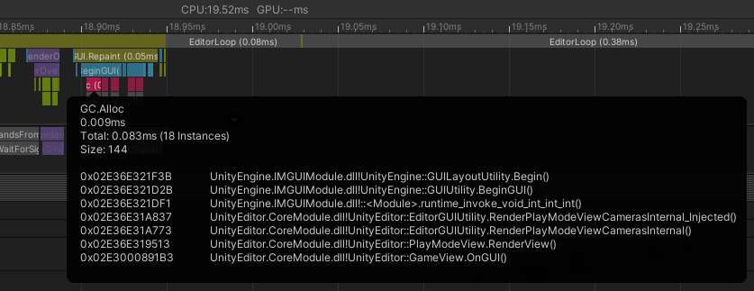
<p><em>VI: <strong>▲ Bắt tận tay chỗ sinh rác</strong> — chọn khối <code>GC.Alloc</code> trong Timeline, Unity hiện <strong>Total 0.083 ms (18 Instances), Size 144</strong> kèm <strong>CALLSTACK ĐẦY ĐỦ</strong>: <code>UnityEngine.IMGUIModule.dll!UnityEngine::GUILayoutUtility::Begin()</code> → <code>GUIUtility::BeginGUI()</code> → <code>runtime_invoke_void_int_int_intptr()</code> → … → <code>GameView::OnGUI()</code>. Cần bật <em>Call Stacks</em> mới thấy được. / EN: A GC.Alloc block with its full callstack in the Timeline view.</em></p>

<div class="bilingual-row">
<div class="col-vi">
<p><strong>① STRINGS</strong> — Trong C#, string là <em>reference type</em>, không phải value type. Mỗi lần nối chuỗi là tạo object mới.</p>
<ul>
<li>Giảm tối đa việc tạo/xử lý chuỗi.</li>
<li>Tránh parse file dữ liệu dạng chuỗi như JSON, XML lúc runtime.</li>
<li>Thay bằng <strong>ScriptableObject</strong>, hoặc định dạng <strong>MessagePack</strong> / <strong>Protobuf</strong>.</li>
<li>Dùng <code>StringBuilder</code> nếu buộc phải dựng chuỗi lúc runtime.</li>
</ul>
</div>
<div class="col-en">
<p><strong>① STRINGS</strong> — In C#, strings are reference types, not value types. Every concatenation creates a new object.</p>
<ul>
<li>Reduce unnecessary string creation or manipulation.</li>
<li>Avoid parsing string-based data files such as JSON and XML at runtime.</li>
<li>Store data in <strong>ScriptableObjects</strong> or formats like <strong>MessagePack</strong> or <strong>Protobuf</strong> instead.</li>
<li>Use the <code>StringBuilder</code> class if you need to build strings at runtime.</li>
</ul>
</div>
</div>

```csharp
// ❌ SAI — sinh 1 object rác MỖI FRAME (60 object/giây!)
// WRONG — allocates one garbage object EVERY FRAME
private void Update()
{
    timerCount += Time.deltaTime;
    timerTxt.text = "Time: " + (int)timerCount;   // string concat = new object
}
```

```csharp
// ✅ ĐÚNG — StringBuilder tái sử dụng buffer, không sinh rác
// CORRECT — StringBuilder reuses its buffer, no allocation
using System.Text;
using UnityEngine;
using UnityEngine.UI;

public class TimerDisplay : MonoBehaviour
{
    [SerializeField] private Text timerTxt;
    private float timerCount;
    private readonly StringBuilder timerTxtBuilder = new StringBuilder();

    private void Update() => CountTime();

    void CountTime()
    {
        timerCount += Time.deltaTime;
        timerTxtBuilder.Length = 0;          // reset, KHÔNG cấp phát mới
        timerTxtBuilder.Append("Time: ");
        timerTxtBuilder.Append((int)timerCount);
        timerTxt.text = timerTxtBuilder.ToString();
    }
}
```

<div class="bilingual-row">
<div class="col-vi">
<p><strong>② UNITY FUNCTION CALLS</strong> — Một số hàm Unity cấp phát heap khi được gọi.</p>
<ul>
<li>Cache tham chiếu tới mảng thay vì cấp phát chúng giữa vòng lặp.</li>
<li>Tận dụng các hàm không sinh rác. Ví dụ kinh điển: dùng <code>GameObject.CompareTag</code> thay vì so sánh chuỗi thủ công với <code>GameObject.tag</code> — vì <code>.tag</code> trả về một string mới ⇒ sinh rác.</li>
</ul>
</div>
<div class="col-en">
<p><strong>② UNITY FUNCTION CALLS</strong> — Some functions create heap allocations.</p>
<ul>
<li>Cache references to arrays rather than allocating them in the middle of a loop.</li>
<li>Take advantage of functions that avoid generating garbage. Classic example: use <code>GameObject.CompareTag</code> instead of manually comparing a string with <code>GameObject.tag</code> — returning a new string creates garbage.</li>
</ul>
</div>
</div>

```csharp
// ❌ SAI — collision.tag cấp phát một string mới mỗi lần va chạm
private void OnTriggerEnter2D(Collider2D collision)
{
    if (collision.tag == "Player") { /* ... */ }
}

// ✅ ĐÚNG — CompareTag so sánh nội bộ, zero allocation
private void OnTriggerEnter2D(Collider2D collision)
{
    if (collision.CompareTag("Player")) { /* ... */ }
}

// ❌ SAI — "" tạo string instance mới
private string playerName = "";
// ✅ ĐÚNG — string.Empty là hằng số dùng chung
private string playerName = string.Empty;
```

<div class="bilingual-row">
<div class="col-vi">
<p><strong>③ BOXING (Đóng hộp)</strong> — Truyền một biến value-type vào chỗ mong đợi reference-type. Việc này tạo object tạm và ngầm chuyển value type thành object.</p>
<p>Ví dụ: <code>int i = 123; object o = i;</code></p>
<p><strong>Giải pháp:</strong> cung cấp overload cụ thể cho đúng value type bạn muốn truyền, hoặc dùng <strong>Generics</strong> cho các overload đó.</p>
</div>
<div class="col-en">
<p><strong>③ BOXING</strong> — Passing a value-typed variable in place of a reference-typed variable. This creates a temporary object and implicitly converts the value type to a type object.</p>
<p>Example: <code>int i = 123; object o = i;</code></p>
<p><strong>Fix:</strong> provide concrete overrides with the value type you want to pass in. Generics can also be used for these overrides.</p>
</div>
</div>

<div class="bilingual-row">
<div class="col-vi">
<p><strong>④ COROUTINES</strong> — Bản thân <code>yield</code> KHÔNG sinh rác, nhưng <code>new WaitForSeconds(...)</code> thì CÓ.</p>
<p><strong>Giải pháp:</strong> cache và tái dùng object <code>WaitForSeconds</code> thay vì tạo mới ngay trên dòng <code>yield</code>.</p>
</div>
<div class="col-en">
<p><strong>④ COROUTINES</strong> — Though <code>yield</code> does not produce garbage, creating a <code>new WaitForSeconds</code> object does.</p>
<p><strong>Fix:</strong> cache and reuse the <code>WaitForSeconds</code> object rather than creating it in the yield line.</p>
</div>
</div>

```csharp
// ❌ SAI — cấp phát WaitForSeconds mới mỗi vòng lặp
IEnumerator SpawnLoopBad()
{
    while (true)
    {
        Spawn();
        yield return new WaitForSeconds(1f);   // GC Alloc mỗi giây
    }
}

// ✅ ĐÚNG — cache 1 lần, tái sử dụng vô hạn
private readonly WaitForSeconds _wait1s = new WaitForSeconds(1f);

IEnumerator SpawnLoopGood()
{
    while (true)
    {
        Spawn();
        yield return _wait1s;                  // 0 B GC Alloc
    }
}
```

<div class="bilingual-row">
<div class="col-vi">
<p><strong>⑤ LINQ &amp; REGULAR EXPRESSIONS</strong> — Cả hai đều sinh rác từ việc boxing diễn ra ngầm bên dưới.</p>
<p>Tránh dùng LINQ và Regex ở các đoạn nóng nếu hiệu năng là vấn đề. Viết vòng <code>for</code> thủ công và dùng <code>List</code> thay vì tạo mảng mới.</p>
</div>
<div class="col-en">
<p><strong>⑤ LINQ &amp; REGULAR EXPRESSIONS</strong> — Both generate garbage from behind-the-scenes boxing.</p>
<p>Avoid LINQ and Regular Expressions in hot paths if performance is an issue. Write <code>for</code> loops and use lists as an alternative to creating new arrays.</p>
</div>
</div>

### 11.2. Incremental Garbage Collector

!!! danger "💀 CÁI GIÁ của Incremental GC — con số ít ai nói"
    <div class="bilingual-row">
    <div class="col-vi">
    <p><em>"Lưu ý rằng dùng GC ở chế độ Incremental <strong>THÊM các RÀO CHẮN ĐỌC-GHI (read-write barrier) vào MỘT SỐ lời gọi C#, kèm theo overhead có thể cộng dồn tới ~<strong>1 ms MỖI FRAME</strong> chi phí scripting.</strong>"</em></p>
    <p>🎯 <em>"Để có hiệu năng TỐI ƯU, <strong>lý tưởng là KHÔNG có GC.Alloc nào trong vòng lặp gameplay chính</strong> — như vậy bạn <strong>KHÔNG CẦN Incremental GC</strong> để giữ frame rate mượt, và có thể <strong>GIẤU <code>GC.Collect</code> vào chỗ người dùng KHÔNG để ý</strong>, ví dụ khi mở menu hoặc nạp màn mới."</em></p>
    <p>✅ <em>"<strong>Trong các kịch bản đã tối ưu như vậy, bạn có thể thực hiện garbage collection ĐẦY ĐỦ, KHÔNG incremental (dùng <code>System.GC.Collect()</code>).</strong>"</em></p>
    </div>
    <div class="col-en">
    <p><em>"Note that using the GC in Incremental mode adds read-write barriers to some C# calls, which comes with some overhead that can add up to ~1 ms per frame of scripting call overhead."</em></p>
    <p>🎯 <em>"For optimal performance, it's ideal to have no GC Allocs in the main gameplay loops so that you don't need the Incremental GC for a smooth frame rate and can hide the GC.Collect where a user won't notice it, for example, when opening the menu or loading a new level."</em></p>
    <p>✅ <em>"In such optimized scenarios, you can perform full, non-incremental garbage collections (using System.GC.Collect())."</em></p>
    </div>
    </div>


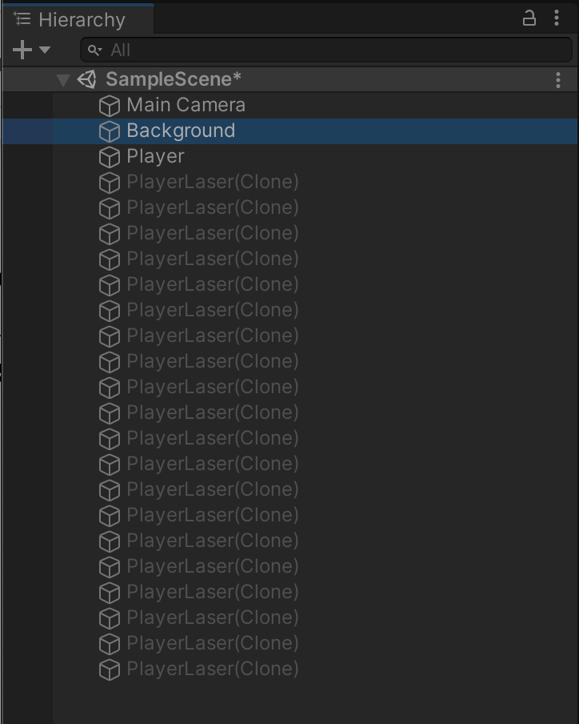
<p><em>VI: Bật Incremental GC để giảm GC spike. / EN: Use the Incremental Garbage Collector to reduce GC spikes.</em></p>

<div class="bilingual-row">
<div class="col-vi">
<p>Thay vì tạo <strong>một</strong> gián đoạn dài duy nhất, Incremental GC dùng <strong>nhiều</strong> gián đoạn ngắn hơn nhiều, trải khối lượng công việc ra qua nhiều frame.</p>
<p>Nếu GC đang ảnh hưởng hiệu năng, hãy bật tùy chọn này. <strong>Rồi dùng Profile Analyzer để kiểm chứng nó có thực sự có lợi cho ứng dụng của bạn hay không</strong> — nó không phải lúc nào cũng thắng.</p>
<p><strong>Vị trí:</strong> <code>Edit &gt; Project Settings &gt; Player &gt; Other Settings &gt; Use Incremental GC</code>.</p>
</div>
<div class="col-en">
<p>Rather than creating a single, long interruption during your program's execution, incremental garbage collection uses multiple, much shorter interruptions that distribute the workload over many frames.</p>
<p>If garbage collection is impacting performance, try enabling this option. <strong>Use the Profile Analyzer to verify its benefit to your application</strong> — it is not always a win.</p>
<p><strong>Location:</strong> <code>Edit &gt; Project Settings &gt; Player &gt; Other Settings &gt; Use Incremental GC</code>.</p>
</div>
</div>

### 11.3. Chủ động kích hoạt GC / Timing garbage collection

<div class="bilingual-row">
<div class="col-vi">
<p>Nếu bạn <strong>chắc chắn</strong> rằng một lần đóng băng do GC sẽ không ảnh hưởng tới một thời điểm cụ thể trong game (màn hình loading, cutscene, menu pause), bạn có thể chủ động gọi GC.</p>
</div>
<div class="col-en">
<p>If you are certain that a garbage collection freeze won't affect a specific point in your game (loading screen, cutscene, pause menu), you can trigger garbage collection yourself.</p>
</div>
</div>

```csharp
// Gọi GC ở nơi an toàn — ví dụ sau khi unload scene
// Trigger GC at a safe point — e.g. after unloading a scene
System.GC.Collect();
Resources.UnloadUnusedAssets();   // giải phóng native assets không còn tham chiếu
```

---

## 12. Adaptive Performance — Phản ứng theo trạng thái nhiệt

<div class="bilingual-row">
<div class="col-vi">
<p>Với package <strong>Adaptive Performance</strong> (hợp tác Unity × Samsung), bạn <em>giám sát trạng thái nhiệt và điện năng của thiết bị</em> để phản ứng kịp thời.</p>
<p>Khi người chơi chơi liên tục trong thời gian dài, bạn có thể <strong>hạ LOD bias động</strong> để game tiếp tục chạy mượt. Adaptive Performance cho phép tăng hiệu năng một cách <em>có kiểm soát</em> mà vẫn giữ được chất lượng đồ họa.</p>
<p>Ngoài API để tinh chỉnh thủ công, package còn có <strong>chế độ tự động</strong>. Ở chế độ này, Adaptive Performance quyết định game settings dựa trên <strong>4 metric chính</strong>:</p>
<ol>
<li><strong>Desired frame rate</strong> — suy ra từ các frame trước đó.</li>
<li><strong>Device temperature level</strong> — mức nhiệt độ thiết bị.</li>
<li><strong>Device proximity to thermal event</strong> — mức độ cận kề sự kiện quá nhiệt.</li>
<li><strong>Device bound by CPU or GPU</strong> — đang nghẽn ở CPU hay GPU.</li>
</ol>
<p>Bốn metric này quyết định <em>state</em> của thiết bị, và Adaptive Performance tinh chỉnh settings để giảm bottleneck. Cơ chế: cung cấp một giá trị nguyên gọi là <strong>Indexer</strong> mô tả trạng thái thiết bị.</p>
<p>⚠️ <strong>Giới hạn quan trọng:</strong> Adaptive Performance <strong>chỉ hoạt động trên thiết bị Samsung</strong>.</p>
<p><strong>Học thêm:</strong> xem sample tại <code>Package Manager &gt; Adaptive Performance &gt; Samples</code>. Mỗi sample tương tác với một <em>scaler</em> cụ thể, cho bạn thấy từng scaler tác động ra sao lên game.</p>
</div>
<div class="col-en">
<p>With Unity and Samsung's <strong>Adaptive Performance</strong>, you can <em>monitor the device's thermal and power state</em> to ensure that you're ready to react appropriately.</p>
<p>When users play for an extended period of time, you can <strong>reduce your LOD bias dynamically</strong> to help your game continue to run smoothly. Adaptive Performance allows developers to increase performance in a <em>controlled</em> way while maintaining graphics fidelity.</p>
<p>While you can use Adaptive Performance APIs to fine-tune your application, this package also offers <strong>automatic modes</strong>. In these modes, Adaptive Performance determines the game settings along <strong>several key metrics</strong>:</p>
<ol>
<li><strong>Desired frame rate</strong> based on previous frames.</li>
<li><strong>Device temperature level.</strong></li>
<li><strong>Device proximity to thermal event.</strong></li>
<li><strong>Device bound by CPU or GPU.</strong></li>
</ol>
<p>These four metrics dictate the state of the device, and Adaptive Performance tweaks the adjusted settings to reduce the bottleneck. This is done by providing an integer value, known as an <strong>Indexer</strong>, to describe the state of the device.</p>
<p>⚠️ <strong>Important limitation:</strong> Adaptive Performance <strong>only works for Samsung devices</strong>.</p>
<p><strong>Learn more:</strong> view the samples in <code>Package Manager &gt; Adaptive Performance &gt; Samples</code>. Each sample interacts with a specific <em>scaler</em>, so you can see how the different scalers impact your game.</p>
</div>
</div>

```csharp
// Phản ứng với cảnh báo nhiệt — React to thermal warnings
using UnityEngine;
using UnityEngine.AdaptivePerformance;

public class ThermalResponder : MonoBehaviour
{
    IAdaptivePerformance ap;

    void Start()
    {
        ap = Holder.Instance;
        if (ap == null || !ap.Active) return;

        ap.ThermalStatus.ThermalEvent += OnThermalEvent;
    }

    void OnThermalEvent(ThermalMetrics ev)
    {
        switch (ev.WarningLevel)
        {
            case WarningLevel.NoWarning:
                QualitySettings.lodBias = 1.0f;
                Application.targetFrameRate = 60;
                break;

            case WarningLevel.ThrottlingImminent:
                // Sắp bị throttle: hạ LOD bias trước khi OS ra tay
                QualitySettings.lodBias = 0.75f;
                break;

            case WarningLevel.Throttling:
                // Đã bị throttle: hy sinh chi tiết để giữ frame time ổn định
                QualitySettings.lodBias = 0.5f;
                Application.targetFrameRate = 30;
                break;
        }
    }

    void OnDestroy()
    {
        if (ap != null && ap.Active)
            ap.ThermalStatus.ThermalEvent -= OnThermalEvent;
    }
}
```

!!! warning "Test trên máy min-spec / Test on a min-spec device"
    **VI:** Dải thiết bị iOS và Android cực rộng. Hãy test dự án trên **cấu hình tối thiểu** mà bạn muốn ứng dụng hỗ trợ — không phải trên flagship trong túi bạn.

    **EN:** There is a wide range of iOS and Android devices. Test your project on the **minimum device specifications** that you want your application to support.

---

## 13. PlayerLoop & Kiến trúc Code

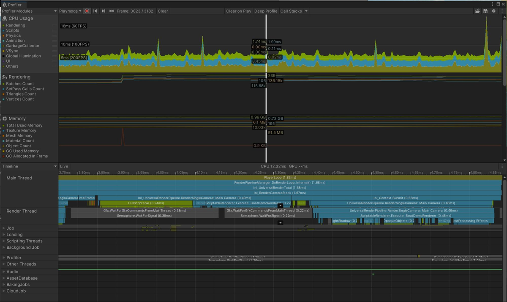
<p><em>VI: Profiler hiển thị script, settings và graphics của bạn trong bối cảnh thực thi của toàn engine. / EN: The Profiler shows your custom scripts, settings, and graphics in the context of the entire engine's execution.</em></p>

<div class="bilingual-row">
<div class="col-vi">
<p><strong>Unity PlayerLoop</strong> chứa các hàm tương tác với lõi engine — bao gồm nhiều hệ thống xử lý khởi tạo và cập nhật mỗi frame. Mọi script của bạn đều dựa vào PlayerLoop để tạo nên gameplay.</p>
<p>Khi profiling, code của bạn nằm dưới <strong>PlayerLoop</strong>; các thành phần Editor nằm dưới <strong>EditorLoop</strong>.</p>
<p>Bạn phải hiểu rõ thứ tự thực thi của frame loop: sự khác nhau giữa <code>Awake</code>, <code>OnEnable</code>, <code>Start</code>, <code>Update</code>, <code>FixedUpdate</code>, <code>LateUpdate</code>. Tham khảo <em>Script Lifecycle Flowchart</em> trong tài liệu Unity.</p>
</div>
<div class="col-en">
<p>The <strong>Unity PlayerLoop</strong> contains functions for interacting with the core of the game engine, including systems that handle initialization and per-frame updates. All of your scripts rely on this PlayerLoop to create gameplay.</p>
<p>When profiling, your project's user code appears under the <strong>PlayerLoop</strong>, with Editor components under the <strong>EditorLoop</strong>.</p>
<p>Make sure you understand the execution order of Unity's frame loop — the difference between <code>Awake</code>, <code>OnEnable</code>, <code>Start</code>, <code>Update</code>, <code>FixedUpdate</code>, and <code>LateUpdate</code>. Refer to the <em>Script Lifecycle Flowchart</em> in the Unity documentation.</p>
</div>
</div>

### 13.1. Time Slicing — Giảm code chạy mỗi frame

<div class="bilingual-row">
<div class="col-vi">
<p>Hãy tự hỏi: <strong>code này có THỰC SỰ cần chạy mỗi frame không?</strong></p>
<p>Dời logic không cần thiết ra khỏi <code>Update</code>, <code>LateUpdate</code>, <code>FixedUpdate</code>. Khi có thể, chỉ chạy logic khi có thứ gì đó <em>thay đổi</em> (event-driven thay vì polling).</p>
<p>Nếu buộc phải dùng <code>Update</code>, hãy cân nhắc chạy code <strong>mỗi n frame</strong>. Đây chính là <strong>time slicing</strong> — kỹ thuật phổ biến để trải một khối lượng công việc nặng ra nhiều frame.</p>
</div>
<div class="col-en">
<p>Ask yourself: <strong>does this code REALLY need to run every frame?</strong></p>
<p>Move unnecessary logic out of <code>Update</code>, <code>LateUpdate</code>, and <code>FixedUpdate</code>. Whenever possible, only execute logic when things change (event-driven rather than polling).</p>
<p>If you do need to use <code>Update</code>, consider running the code <strong>every n frames</strong>. This is <strong>time slicing</strong> — a common technique of distributing a heavy workload across multiple frames.</p>
</div>
</div>

```csharp
// Time slicing: chạy hàm nặng 1 lần mỗi 3 frame
// Time slicing: run the expensive function once every three frames
private int interval = 3;

void Update()
{
    if (Time.frameCount % interval == 0)
    {
        ExampleExpensiveFunction();
    }
}
```

### 13.2. Caching — Không bao giờ GetComponent trong Update

<div class="bilingual-row">
<div class="col-vi">
<p><code>GameObject.Find</code>, <code>GameObject.GetComponent</code>, và <code>Camera.main</code> (ở phiên bản trước 2020.2) đều tốn kém. Tránh gọi chúng trong <code>Update</code> — hãy gọi trong <code>Start</code>/<code>Awake</code> và cache kết quả.</p>
<p>Quy tắc này áp dụng cho <em>mọi</em> loại biến: vectors, components, class tự viết — và cả float, int, bool, string.</p>
<p>⚠️ Đặc biệt lưu ý <code>transform</code>: truy cập property này thực chất gọi <code>GetComponent&lt;Transform&gt;()</code> ở tầng dưới.</p>
</div>
<div class="col-en">
<p><code>GameObject.Find</code>, <code>GameObject.GetComponent</code>, and <code>Camera.main</code> (in versions prior to 2020.2) can be expensive, so avoid calling them in <code>Update</code> methods. Call them in <code>Start</code>/<code>Awake</code> and cache the results.</p>
<p>This rule applies to <em>all</em> variable types: vectors, components, custom classes — and also floats, ints, booleans, and strings.</p>
<p>⚠️ Note especially <code>transform</code>: accessing this property internally calls <code>GetComponent&lt;Transform&gt;()</code>.</p>
</div>
</div>

```csharp
// ❌ SAI — GetComponent gọi lại mỗi frame
void Update()
{
    Renderer myRenderer = GetComponent<Renderer>();
    ExampleFunction(myRenderer);
}
```

```csharp
// ✅ ĐÚNG — cache toàn bộ ở Awake/Start
using UnityEngine;

public class CachedBehaviour : MonoBehaviour
{
    private Renderer  myRenderer;
    private Transform myTransform;
    private Camera    mainCam;
    private float     distance;      // cache cả biến value-type dùng lặp

    void Awake()
    {
        myRenderer  = GetComponent<Renderer>();
        myTransform = transform;      // tránh GetComponent<Transform> ngầm
        mainCam     = Camera.main;    // Camera.main rất đắt ở bản < 2020.2
    }

    void Update()
    {
        distance = Vector3.Distance(myTransform.position, enemyPosition);
        ExampleFunction(myRenderer);
    }
}
```

### 13.3. Awake / Start — Tránh logic nặng

<div class="bilingual-row">
<div class="col-vi">
<p>Khi scene đầu tiên nạp, các hàm sau được gọi cho <em>mỗi</em> object: <code>Awake</code> → <code>OnEnable</code> → <code>Start</code>.</p>
<p>Tránh logic đắt đỏ trong các hàm này cho tới khi ứng dụng render được frame đầu tiên. Nếu không, thời gian loading sẽ dài hơn cần thiết.</p>
</div>
<div class="col-en">
<p>When your first scene loads, these functions get called for <em>each</em> object: <code>Awake</code> → <code>OnEnable</code> → <code>Start</code>.</p>
<p>Avoid expensive logic in these functions until your application renders its first frame. Otherwise, you might encounter longer loading times than necessary.</p>
</div>
</div>

### 13.4. Xóa Unity Event rỗng & Debug.Log

<div class="bilingual-row">
<div class="col-vi">
<p><strong>Empty Unity events:</strong> Ngay cả MonoBehaviour rỗng cũng tốn tài nguyên — Unity vẫn phải gọi qua cầu nối C++/C#. Hãy xóa các method <code>Update</code>/<code>LateUpdate</code> trống.</p>
<p>Nếu bạn cần chúng để test, dùng preprocessor directive.</p>
<p><strong>Debug.Log:</strong> Lệnh log (đặc biệt trong <code>Update</code>, <code>LateUpdate</code>, <code>FixedUpdate</code>) làm chậm hiệu năng nghiêm trọng. <strong>Tắt hết log trước khi build.</strong></p>
<p>Cách gọn nhất: tạo class wrapper với thuộc tính <code>[Conditional]</code>. Chỉ cần bỏ define <code>ENABLE_LOG</code> trong Player Settings là toàn bộ lệnh Log biến mất trong một nốt nhạc.</p>
</div>
<div class="col-en">
<p><strong>Empty Unity events:</strong> Even empty MonoBehaviours require resources — Unity still has to cross the C++/C# bridge. Remove blank <code>Update</code> or <code>LateUpdate</code> methods.</p>
<p>If you employ these methods for testing, use preprocessor directives.</p>
<p><strong>Debug.Log:</strong> Log statements (especially in <code>Update</code>, <code>LateUpdate</code>, or <code>FixedUpdate</code>) can bog down performance. <strong>Disable your Log statements before making a build.</strong></p>
<p>The cleanest way: make a wrapper class using a <code>[Conditional]</code> attribute. Disable the <code>ENABLE_LOG</code> preprocessor in Player Settings and all of your Log statements disappear in one fell swoop.</p>
</div>
</div>

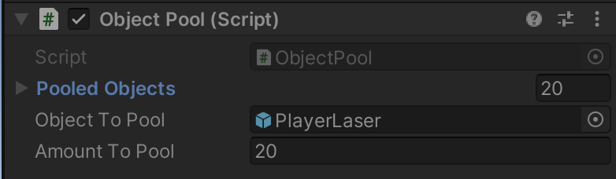
<p><em>VI: Thêm preprocessor directive tùy chỉnh để phân vùng script. / EN: Adding a custom preprocessor directive lets you partition your scripts.</em></p>

```csharp
// Update chỉ tồn tại trong Editor, không lọt vào build
#if UNITY_EDITOR
void Update()
{
}
#endif
```

```csharp
// Log wrapper — tắt toàn bộ bằng 1 define
public static class Logging
{
    [System.Diagnostics.Conditional("ENABLE_LOG")]
    static public void Log(object message)
    {
        UnityEngine.Debug.Log(message);
    }
}
```

### 13.5. Hash ID thay vì string parameter

<div class="bilingual-row">
<div class="col-vi">
<p>Unity <strong>không</strong> dùng tên chuỗi để địa chỉ hóa property của Animator, Material, và Shader ở tầng nội bộ. Vì tốc độ, mọi tên property đều được <em>hash</em> thành <strong>property ID</strong>, và chính ID này mới được dùng để truy cập property.</p>
<p>Khi gọi Set/Get trên Animator, Material, hoặc Shader, hãy dùng phiên bản nhận <strong>int</strong> thay vì phiên bản nhận <strong>string</strong>. Các phương thức string chỉ đơn giản là hash chuỗi rồi chuyển tiếp ID đã hash sang phương thức int — bạn trả giá cho việc hash mỗi lần gọi.</p>
<ul>
<li><code>Animator.StringToHash</code> — cho tên property của Animator.</li>
<li><code>Shader.PropertyToID</code> — cho tên property của Material và Shader.</li>
</ul>
</div>
<div class="col-en">
<p>Unity does <strong>not</strong> use string names to address Animator, Material, and Shader properties internally. For speed, all property names are hashed into <strong>property IDs</strong>, and these IDs are actually used to address the properties.</p>
<p>When using a Set or Get method on an Animator, Material, or Shader, harness the <strong>integer-valued</strong> method instead of the <strong>string-valued</strong> methods. The string methods simply perform string hashing and then forward the hashed ID to the integer-valued methods — you pay for the hash on every call.</p>
<ul>
<li><code>Animator.StringToHash</code> — for Animator property names.</li>
<li><code>Shader.PropertyToID</code> — for Material and Shader property names.</li>
</ul>
</div>
</div>

```csharp
using UnityEngine;

public class HashedProperties : MonoBehaviour
{
    // Hash 1 lần, dùng mãi mãi — static readonly
    private static readonly int SpeedHash    = Animator.StringToHash("Speed");
    private static readonly int JumpHash     = Animator.StringToHash("Jump");
    private static readonly int BaseColorId  = Shader.PropertyToID("_BaseColor");

    [SerializeField] private Animator animator;
    private MaterialPropertyBlock mpb;
    private Renderer rend;

    void Awake()
    {
        rend = GetComponent<Renderer>();
        mpb  = new MaterialPropertyBlock();
    }

    void Update()
    {
        // ❌ animator.SetFloat("Speed", v);   ← hash lại chuỗi MỖI FRAME
        animator.SetFloat(SpeedHash, currentSpeed);   // ✅
    }

    public void SetTint(Color c)
    {
        // MaterialPropertyBlock: đổi màu KHÔNG clone material, KHÔNG phá batching
        rend.GetPropertyBlock(mpb);
        mpb.SetColor(BaseColorId, c);
        rend.SetPropertyBlock(mpb);
    }
}
```

### 13.6. Object Pooling

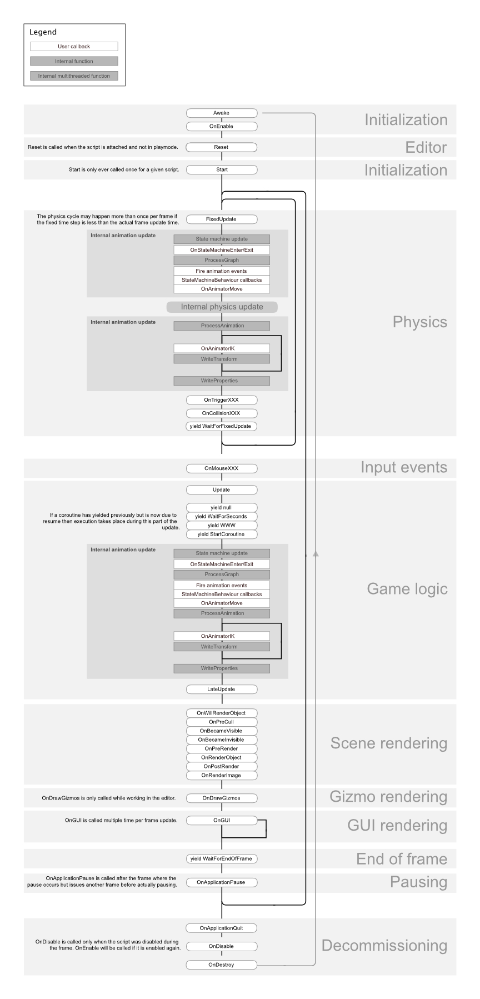
<p><em>VI: Pool gồm các object PlayerLaser đang tắt, sẵn sàng bắn. / EN: The pool of PlayerLaser objects is inactive and ready to shoot.</em></p>

<div class="bilingual-row">
<div class="col-vi">
<p><code>Instantiate</code> và <code>Destroy</code> sinh rác, gây GC spike, và bản thân chúng vốn đã chậm.</p>
<p>Thay vì liên tục tạo/hủy GameObject (ví dụ đạn bắn ra từ súng), hãy dùng <strong>pool</strong> các object đã cấp phát sẵn để tái sử dụng và tái chế.</p>
<p><strong>Quy trình chuẩn:</strong></p>
<ol>
<li>Tạo sẵn instance ở thời điểm CPU spike ít bị nhận ra (màn hình menu, loading).</li>
<li>Theo dõi "pool" object này bằng một collection.</li>
<li>Trong gameplay: <strong>bật</strong> instance tiếp theo còn rảnh khi cần.</li>
<li><strong>Tắt</strong> object thay vì hủy, rồi trả về pool.</li>
</ol>
<p>Cách này giảm số lượng managed allocation và ngăn được các vấn đề về GC.</p>
<p>💡 <em>Lưu ý thực chiến:</em> Có developer đã dùng <code>Instantiate</code> trong gameplay ở game mobile và profile thấy vẫn chạy mượt, không tụt dưới 60 FPS. Điều đó cho thấy: <strong>luôn quay lại Profiler và số liệu thực tế</strong> thay vì tin vào giáo điều. Nhưng với thứ spawn liên tục (đạn, item nhặt), pooling vẫn luôn là lựa chọn tốt hơn.</p>
</div>
<div class="col-en">
<p><code>Instantiate</code> and <code>Destroy</code> can generate garbage and GC spikes, and are generally slow processes.</p>
<p>Rather than regularly instantiating and destroying GameObjects (e.g., shooting bullets from a gun), use <strong>pools</strong> of preallocated objects that can be reused and recycled.</p>
<p><strong>Standard workflow:</strong></p>
<ol>
<li>Create the reusable instances at a point in the game (e.g., during a menu screen) when a CPU spike is less noticeable.</li>
<li>Track this "pool" of objects with a collection.</li>
<li>During gameplay, simply <strong>enable</strong> the next available instance when needed.</li>
<li><strong>Disable</strong> objects instead of destroying them, and return them to the pool.</li>
</ol>
<p>This reduces the number of managed allocations in your project and can prevent garbage collection problems.</p>
<p>💡 <em>Field note:</em> One developer used <code>Instantiate</code> during gameplay in a mobile game and, when profiled, it ran smoothly, never going below 60 FPS. This shows you should <strong>always revert back to the Profiler and the stats you see there</strong> rather than trusting dogma. But for anything spawned constantly (bullets, collectables), pooling is still the better idea.</p>
</div>
</div>

```csharp
// Object Pool cơ bản — Basic object pool
using System.Collections.Generic;
using UnityEngine;

public class BasicPool : MonoBehaviour
{
    [SerializeField] private GameObject bulletPrefab;
    [SerializeField] private int poolSize = 20;      // ví dụ: 20 PlayerLaser

    private readonly Queue<GameObject> pool = new Queue<GameObject>();

    void Awake()
    {
        // Cấp phát sẵn ở lúc CPU spike không bị nhận ra
        for (int i = 0; i < poolSize; i++)
        {
            GameObject go = Instantiate(bulletPrefab, transform);
            go.SetActive(false);
            pool.Enqueue(go);
        }
    }

    public GameObject Get(Vector3 pos, Quaternion rot)
    {
        GameObject go = pool.Count > 0
            ? pool.Dequeue()
            : Instantiate(bulletPrefab, transform);   // fallback nếu pool cạn

        go.transform.SetPositionAndRotation(pos, rot);
        go.SetActive(true);                            // BẬT, không Instantiate
        return go;
    }

    public void Release(GameObject go)
    {
        go.SetActive(false);                           // TẮT, không Destroy
        pool.Enqueue(go);
    }
}
```

!!! tip "Unity 2021+ có pool dựng sẵn"
    **VI:** Từ Unity 2021, dùng `UnityEngine.Pool.ObjectPool<T>` trong namespace `UnityEngine.Pool` — đã tối ưu sẵn, có callback `actionOnGet` / `actionOnRelease` / `actionOnDestroy`.

    **EN:** From Unity 2021, use the built-in `UnityEngine.Pool.ObjectPool<T>` — already optimized, with `actionOnGet` / `actionOnRelease` / `actionOnDestroy` callbacks.

### 13.7. ScriptableObject & AddComponent

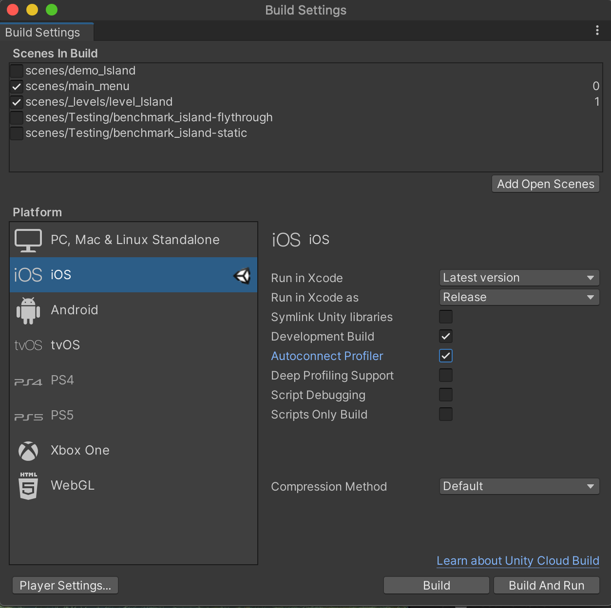
<p><em>VI: ScriptableObject tên "Inventory" lưu settings cho nhiều GameObject. / EN: A ScriptableObject called Inventory holds settings for various GameObjects.</em></p>

<div class="bilingual-row">
<div class="col-vi">
<p><strong>ScriptableObject:</strong> Lưu các giá trị/cài đặt bất biến trong ScriptableObject thay vì MonoBehaviour. ScriptableObject là một <em>asset</em> nằm trong project, bạn chỉ cần thiết lập một lần và <strong>không</strong> gắn trực tiếp vào GameObject được.</p>
<p>Tạo field trong ScriptableObject để lưu giá trị, rồi tham chiếu ScriptableObject đó trong các MonoBehaviour. Cách này ngăn việc <strong>nhân bản dữ liệu không cần thiết</strong> mỗi lần instantiate một object mang MonoBehaviour ấy.</p>
<p><strong>AddComponent lúc runtime:</strong> Gọi <code>AddComponent</code> khi chạy có chi phí — Unity phải kiểm tra component trùng lặp hoặc component bắt buộc. <strong>Instantiate một Prefab đã gắn sẵn component thường nhanh hơn.</strong></p>
<p><strong>Cấu trúc dữ liệu:</strong> Lựa chọn <code>List</code> / <code>Array</code> / <code>Dictionary</code> ảnh hưởng lớn khi bạn duyệt hàng nghìn lần mỗi frame. Tham khảo hướng dẫn data structure của MSDN.</p>
</div>
<div class="col-en">
<p><strong>ScriptableObject:</strong> Store unchanging values or settings in a ScriptableObject instead of a MonoBehaviour. The ScriptableObject is an <em>asset</em> that lives inside the project which you only need to set up once, and it <strong>cannot</strong> be directly attached to a GameObject.</p>
<p>Create fields in the ScriptableObject to store your values, then reference the ScriptableObject in your MonoBehaviours. This prevents <strong>unnecessary duplication of data</strong> every time you instantiate an object with that MonoBehaviour.</p>
<p><strong>AddComponent at runtime:</strong> Invoking <code>AddComponent</code> at runtime comes with some cost — Unity must check for duplicate or other required components. <strong>Instantiating a Prefab with the desired components already set up is generally more performant.</strong></p>
<p><strong>Data structures:</strong> Your choice of <code>List</code> / <code>Array</code> / <code>Dictionary</code> impacts efficiency as you iterate thousands of times per frame. Follow the MSDN guide to data structures in C#.</p>
</div>
</div>

---

## 14. Deep Profiling — Dùng đúng lúc, đúng cách

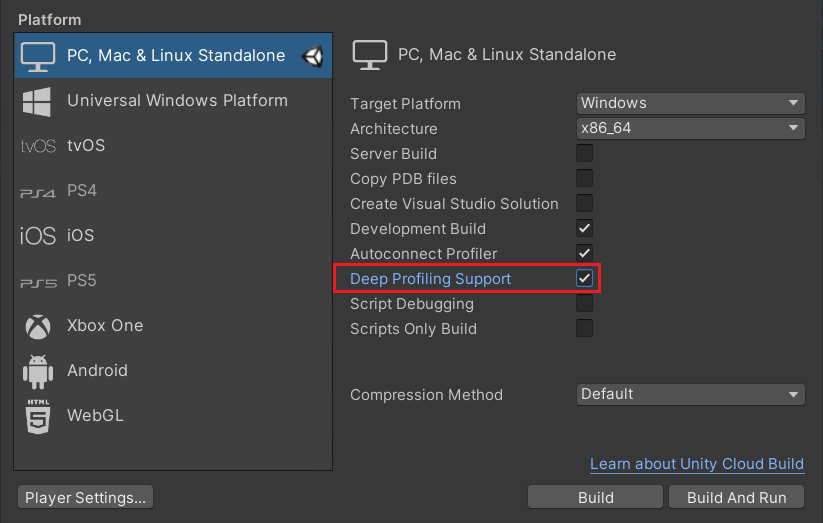
<p><em>VI: Deep profiling hé lộ nhiều thông tin hơn hẳn về hiệu năng và thời gian của code — nó hiển thị toàn bộ cây gọi method, giúp đào tới nơi managed allocation đang xảy ra. / EN: Deep profiling reveals much more information about the performance and timing of your application code. It shows the full method call tree, helping you dig into where managed allocations are happening.</em></p>

### 14.1. Khi nào nên bật Deep Profiling

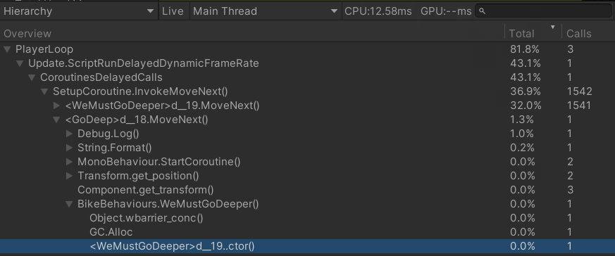
<p><em>VI: <strong>▲ Deep Profiling cho thấy TỪNG lời gọi</strong> — PlayerLoop 81.8% → <code>Update.ScriptRunDelayedDynamicFrameRate</code> 43.1% → <code>CoroutinesDelayedCalls</code> → <strong><code>SetupCoroutine.InvokeMoveNext</code> 36.9% (1542 calls)</strong> → <strong><code>&lt;WeMustGoDeeper&gt;d__19.MoveNext()</code> 32.0% (1541 calls)</strong>, rồi tới <code>Debug.Log()</code> 1.3%, <code>String.Format()</code> 0.2%, <code>MonoBehaviour.StartCoroutine()</code>, và <code>GC.Alloc</code>. Không bật Deep thì cả nhánh này chỉ hiện thành MỘT dòng. / EN: Deep Profiling revealing every call down to GC.Alloc.</em></p>

<div class="bilingual-row">
<div class="col-vi">
<p><strong>Chỉ bật Deep Profile SAU KHI</strong> bạn đã xác định được <em>phần cụ thể</em> của ứng dụng hoặc managed code cần soi kỹ hơn.</p>
<p>⚠️ Deep profiling <strong>ngốn tài nguyên và tiêu tốn rất nhiều bộ nhớ</strong>. Ứng dụng của bạn sẽ <strong>chạy chậm hơn</strong> khi bật.</p>
<p>Đổi lại, deep profiling cho phép bạn đi xuống cây gọi (call tree) một cách chi tiết và phát hiện những chỗ kém hiệu quả hoặc lỗi trong code.</p>
<p>📌 <strong>Lưu ý phiên bản:</strong> Hỗ trợ Deep Profiling cho <strong>cả hai backend Mono và IL2CPP</strong> được thêm từ <strong>Unity 2019.3</strong> trở đi — tin tốt cho các nền tảng bắt buộc dùng IL2CPP như <strong>iOS</strong>.</p>
</div>
<div class="col-en">
<p><strong>You should only enable the Deep Profile setting once</strong> you have identified the <em>specific part</em> of your application or managed code that needs to be examined in greater detail.</p>
<p>⚠️ Deep profiling is <strong>resource-intensive and consumes a lot of memory</strong>. Your application will <strong>run slower</strong> when it's enabled.</p>
<p>In exchange, deep profiling allows you to traverse down the call tree in detail and spot inefficiencies or problems in your code.</p>
<p>📌 <strong>Version note:</strong> Support for Deep Profiling in <strong>both the Mono and IL2CPP backends</strong> was added from <strong>Unity 2019.3</strong> onward — great news for platforms where IL2CPP is mandatory, such as <strong>iOS</strong>.</p>
</div>
</div>

### 14.2. Cách bật Deep Profiling cho player build

<div class="bilingual-row">
<div class="col-vi">
<p>Để dùng deep profiling với player build, bật tại: <code>File &gt; Build Settings &gt; <strong>Deep Profiling Support</strong></code>.</p>
<p>Sau khi bật hỗ trợ, bạn có thể <strong>bật/tắt Deep Profiling bất cứ lúc nào</strong> ngay trong cửa sổ Profiler.</p>
<p>💡 <strong>Mẹo chẩn đoán:</strong> Nếu nút <strong>Deep Profile bị mờ đi</strong> khi đã attach vào player, điều đó có nghĩa <em>Deep Profiling Support chưa được bật cho build đó</em>.</p>
</div>
<div class="col-en">
<p>To use deep profiling with player builds, enable it via <code>File &gt; Build Settings &gt; <strong>Deep Profiling Support</strong></code>.</p>
<p>Once support is enabled, you can easily <strong>toggle Deep Profiling on or off</strong> for your build whenever you want in the Profiler window.</p>
<p>💡 <strong>Diagnostic tip:</strong> A Deep Profile button that's <strong>faded out</strong> when attached to the player indicates that <em>Deep Profiling Support was not enabled</em> for your build.</p>
</div>
</div>

### 14.3. Bốn mẹo Deep Profiling

!!! danger "💀 ĐỪNG so sánh thời gian giữa hai hàm khi bật Deep Profiling"
    <div class="bilingual-row">
    <div class="col-vi">
    <p><em>"Tuy nhiên, <strong>deep profiling THÊM một marker vào ĐẦU và CUỐI của MỌI lời gọi hàm, và MỖI marker đều có overhead.</strong> Nghĩa là một phần code có <strong>CALLSTACK SÂU</strong> (giả sử <code>MyDeepFunction</code>) sẽ <strong>HIỆN RA là ĐẮT HƠN</strong> so với chỗ làm hết việc bên trong <strong>MỘT hàm duy nhất</strong> (<code>MySingleFunction</code>)."</em></p>
    <p>🚨 <em>"Điều đó có nghĩa <strong>bạn KHÔNG THỂ tin vào THỜI GIAN TƯƠNG ĐỐI giữa hai đoạn code này</strong> — <code>MyDeepFunction</code> có thể TRÔNG đắt hơn <code>MySingleFunction</code> khi bật deep profiling, <strong>nhưng chi phí đó có thể HOÀN TOÀN nằm ở đám marker được thêm vào.</strong>"</em></p>
    </div>
    <div class="col-en">
    <p><em>"However, deep profiling adds a marker to the start and end of every function call, and each marker adds some overhead. This means that a part of your code which has a deep callstack (say MyDeepFunction) will show up as more expensive than places which do all their work inside a single function (MySingleFunction). That means you cannot rely on the relative timing of these two pieces of code – MyDeepFunction might look more expensive than MySingleFunction with deep profiling enabled, but this cost could all be in the extra markers added."</em></p>
    </div>
    </div>


<div class="bilingual-row">
<div class="col-vi">
<p><strong>① Cách tiếp cận từ trên xuống (Top-to-bottom)</strong></p>
<p>Bắt đầu ở mức cao và cố định vị các vùng có thể cải thiện <strong>mà không cần</strong> deep profiling. Khi cần thêm thông tin, mới bật Deep Profiling để đào ở mức chi tiết hơn.</p>
<p>👉 Cách này giữ lượng thông tin hiển thị trong Profiler Hierarchy ở mức <strong>tối thiểu</strong>, cho phép bạn tập trung vào mục tiêu.</p>
<p><em>Quy trình đầy đủ:</em> Trước tiên thu thập call stack cho marker <code>GC.Alloc</code>. Nếu call stack báo cáo <strong>chưa đủ chi tiết</strong> để truy ra nguồn cấp phát hoặc nguyên nhân chậm, <em>lúc đó</em> mới chạy phiên profiling thứ hai với Deep Profiling bật.</p>
<p>⚠️ Khi ghi chú các "thủ phạm" frame time, hãy ghi lại <strong>tương quan của chúng so với phần còn lại của frame</strong> — vì tác động tương đối này <em>sẽ bị ảnh hưởng</em> khi bật Deep Profiling.</p>
<p><strong>② Chỉ deep profile khi THỰC SỰ cần thiết</strong></p>
<p>Để cờ Deep Profiling bật sẵn cho build <strong>không</strong> ảnh hưởng hiệu năng nếu bạn không thực sự toggle nó lên. Nhưng khi đã bật, ứng dụng sẽ chạy chậm.</p>
<p>💡 Nếu bạn <em>chỉ</em> quan tâm tới việc tìm nguồn managed allocation: từ <strong>Unity 2019.3</strong> trở đi bạn làm được điều đó <strong>mà không cần bật Deep Profiling</strong> — dùng toggle <strong>Call Stacks</strong> và dropdown <strong>Calls</strong> trong Profiler.</p>
<p><strong>③ Deep profiling trong quy trình tự động</strong></p>
<p>Để bật Deep Profiling khi profile từ dòng lệnh, thêm tham số <code>-deepprofiling</code> vào build executable.</p>
<p><strong>④ Deep profiling trên phần cứng cấu hình thấp</strong></p>
<p>Phần cứng yếu có bộ nhớ và hiệu năng hạn chế, ảnh hưởng tới khả năng deep profile. Profiler sample của Unity lưu trong một <strong>ring buffer</strong>, và buffer này <strong>có thể đầy</strong> khi dùng Deep Profile trên thiết bị chậm — Unity sẽ báo lỗi.</p>
<p>🔧 <strong>Giải pháp:</strong> Cấp thêm bộ nhớ cho Profiler bằng thuộc tính <code>Profiler.maxUsedMemory</code> (đơn vị byte).</p>
<p>📊 <strong>Giá trị mặc định: 128 MB cho Player và 512 MB cho Editor.</strong> Tăng lên khi cần trên build Player của thiết bị chậm.</p>
<p>💡 <strong>Phương án thay thế:</strong> Nếu cần profile code chi tiết hơn trên phần cứng chạy quá chậm (hoặc không chạy nổi) do overhead của deep profiling, hãy <strong>profile sâu bằng marker của chính bạn</strong> — thay vì bật Deep Profile, thêm Profiler marker vào đúng những vùng quan tâm trong code. Các marker này sẽ xuất hiện trong Timeline hoặc Hierarchy của module CPU Usage.</p>
</div>
<div class="col-en">
<p><strong>① Top-to-bottom approach</strong></p>
<p>Start at a high level and try to locate areas where performance can be improved <strong>without using</strong> deep profiling. As you need more information, enable Deep Profiling to dig in at a more granular level.</p>
<p>👉 This keeps the level of information displayed in the Profiler Hierarchy to a <strong>minimum</strong>, allowing you to focus on the goal at hand.</p>
<p><em>Full workflow:</em> You'll need to first gather call stacks for <code>GC.Alloc</code> markers. If the reported call stacks are <strong>not detailed enough</strong> to track down the source of the allocations or other slowdowns, you can <em>then</em> perform a second profiling session with Deep Profiling enabled.</p>
<p>⚠️ When collecting notes on the frame time 'offenders,' be sure to note <strong>how they compare relative to the rest of the frame</strong> — this relative impact <em>will be affected</em> by turning on Deep Profiling.</p>
<p><strong>② Deep profile only when absolutely necessary</strong></p>
<p>Leaving the Deep Profiling flag enabled for builds will <strong>not</strong> affect performance without actually toggling the feature on. But when it is enabled, it causes your application to run slowly.</p>
<p>💡 If you are <em>only</em> interested in finding the source of managed allocations, remember that <strong>Unity 2019.3</strong> and onward allows you to do this <strong>without enabling Deep Profiling</strong> — use the <strong>Call Stacks</strong> toggle and <strong>Calls</strong> dropdown in the Profiler.</p>
<p><strong>③ Deep profiling in automated processes</strong></p>
<p>To toggle Deep Profiling on when profiling from the command line, add the <code>-deepprofiling</code> argument to your build executable.</p>
<p><strong>④ Deep profiling on low-spec hardware</strong></p>
<p>Lower-spec hardware has limited memory and performance that can affect your ability to use deep profiling. Unity's Profiler samples are stored in a <strong>ring buffer</strong>, which <strong>can fill up</strong> when using Deep Profile on slower devices. If this happens, Unity will display an error message.</p>
<p>🔧 <strong>Fix:</strong> Allocate more memory to the Profiler for this buffering data by setting the <code>Profiler.maxUsedMemory</code> property (bytes).</p>
<p>📊 <strong>The default is 128 MB for Players and 512 MB for the Editor.</strong> Increase this as required on slower-device Player builds.</p>
<p>💡 <strong>Alternative:</strong> If you need to profile code in higher detail on hardware that runs too slowly (or not at all) due to deep profiling overhead, <strong>profile deeper with your own markers</strong> — instead of enabling Deep Profile, add Profiler markers to the specific areas of interest in your code. These will appear in the Profiler Timeline or Hierarchy when viewing the CPU Usage module.</p>
</div>
</div>

```bash
# Bật deep profiling từ dòng lệnh — Enable deep profiling from the command line
MyGame.exe -deepprofiling

# Android / Mono scripting backend
adb shell am start -n com.company.game/com.unity3d.player.UnityPlayerActivity \
    -e 'unity' '-deepprofiling'
```

```csharp
// Tăng ring buffer của Profiler trên thiết bị cấu hình thấp
// Increase the Profiler ring buffer on low-spec devices
// Mặc định: 128 MB (Player) / 512 MB (Editor)
using UnityEngine.Profiling;

void Awake()
{
    Profiler.maxUsedMemory = 256 * 1024 * 1024;   // 256 MB
}
```

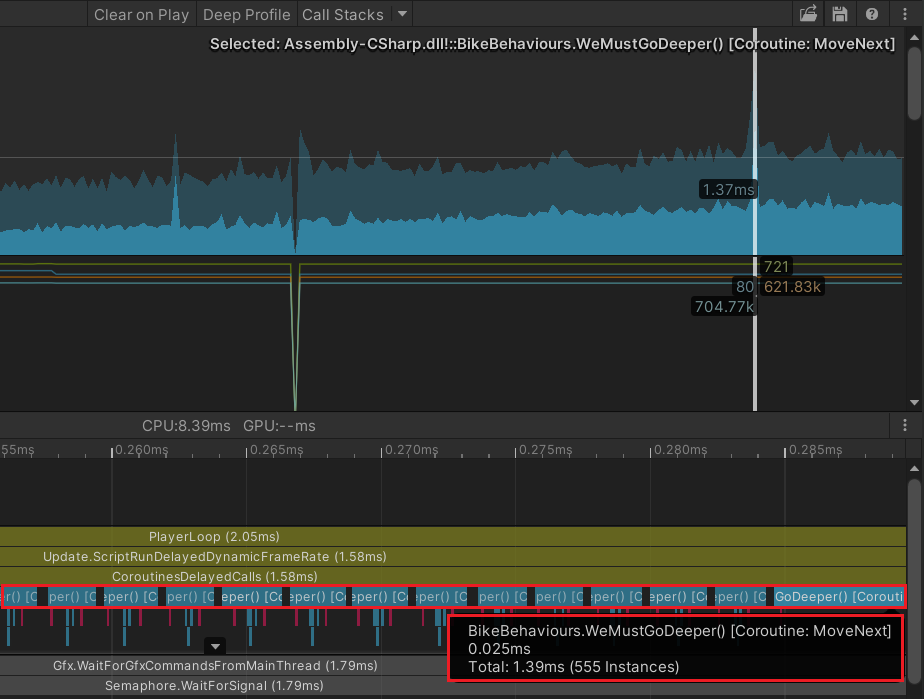
<p><em>VI: Thêm Profiler marker để profile các tầng code sâu hơn khi deep profiling gây quá nhiều overhead. / EN: Add Profiler markers to profile deeper layers of code when deep profiling adds too much overhead.</em></p>

### 14.4. Domain Reload — Tăng tốc vòng lặp Editor

!!! note "Bổ sung từ bản Unity 6"

<div class="bilingual-row">
<div class="col-vi">
<p>Unity Editor cho phép cấu hình việc vào Play mode. Bạn thường có thể <strong>tăng tốc đáng kể thời gian lặp trong Editor bằng cách TẮT Domain Reload</strong>.</p>
<p>⚠️ <strong>Nhưng có cái giá:</strong> khi tắt, Unity sẽ <strong>không còn reset trạng thái scripting mỗi lần vào Play mode</strong> — bạn <em>phải tự làm việc đó thủ công trong code</em> (reset biến static, event handler, singleton…).</p>
<p><strong>Cách làm đúng (best practice):</strong></p>
<ol>
<li>Mở <strong>Project Auditor</strong>, vào khu vực <strong>Code</strong> — nó phân tích script trong dự án để tìm mọi nơi bạn cần reset biến.</li>
<li>Để có dữ liệu cho view này, bật setting <strong>Use Roslyn Analyzers</strong> trong cửa sổ <em>Preferences</em>.</li>
<li>Chạy qua danh sách vấn đề trong <strong>Domain Reload view</strong>, sửa theo hướng dẫn trong manual.</li>
<li><strong>Sau khi sửa hết</strong> mới tắt Domain Reload khi vào Play mode.</li>
</ol>
<p>👉 Được coi là <em>best practice</em>: sửa hết vấn đề hiển thị trong Domain Reload view <strong>rồi mới</strong> tắt domain reload.</p>
</div>
<div class="col-en">
<p>The Unity Editor allows you to configure settings about entering Play mode. You can often <strong>speed up your Editor iteration time by disabling Domain Reload</strong>.</p>
<p>⚠️ <strong>But there's a cost:</strong> this will <strong>no longer reset your scripting state every time you enter Play mode</strong> — you <em>have to do this manually in your code</em> (reset statics, event handlers, singletons…).</p>
<p><strong>The correct approach (best practice):</strong></p>
<ol>
<li>Open <strong>Project Auditor</strong>, go to the <strong>Code</strong> area — it analyzes the scripts in your project to help you find anywhere you need to reset your script variables.</li>
<li>To populate this view with data, enable the <strong>Use Roslyn Analyzers</strong> setting in the <em>Preferences</em> window.</li>
<li>Run through the list of issues in the <strong>Domain Reload view</strong>, following the instructions in the manual to fix them.</li>
<li><strong>Once they're all addressed</strong>, disable Domain Reload when entering Play mode.</li>
</ol>
<p>👉 It's considered <em>best practice</em> to fix all the issues displayed in the Domain Reload view <strong>and then</strong> disable domain reload.</p>
</div>
</div>

---

## 15. Dùng công cụ nào, khi nào? / Which tool, when?

<div class="bilingual-row">
<div class="col-vi">
<p><strong>Profiling mang lại lợi ích lớn nhất khi bắt đầu từ đầu vòng đời dự án.</strong> Bắt đầu sớm giúp bạn thiết lập các <em>baseline</em> hữu ích để so sánh tại các mốc kiểm tra sau này.</p>
<p>Điều quan trọng là biết chọn công cụ nào từ <em>"thắt lưng đồ nghề profiling"</em> và <strong>chọn khi nào</strong>.</p>
</div>
<div class="col-en">
<p><strong>Profiling provides the best benefit when started at the beginning of a project lifecycle.</strong> By starting early, you can establish <em>baselines</em> useful for comparisons at checkpoints further into development.</p>
<p>It's important to know which tool to select from the <em>"profiling tool belt"</em> and <strong>when</strong>.</p>
</div>
</div>

### 15.1. Ba mốc kiểm tra trong vòng đời dự án

| Mốc / Checkpoint | Việc cần làm / What to do |
|---|---|
| **① Prototyping**<br>*Nguyên mẫu* | **VI:** Profiling quan trọng để **giảm rủi ro** ở giai đoạn prototype. Nếu tài liệu thiết kế game yêu cầu **10.000 kẻ địch trên màn hình**, bạn phải build và profile được một prototype **chứng minh điều đó khả thi** trên nền tảng đích. Nếu không khả thi → **bạn phải đổi thiết kế.**<br>**EN:** Profiling is important to reduce risk at the prototype stage. If the game design document calls for 10,000 enemies on-screen, you need to build and profile a prototype that proves such a thing is possible on the target platform. If it's not, **you need to change the design.** |
| **② Early stages**<br>*Giai đoạn đầu* | **VI:** Thiết lập **baseline** hiệu năng trên một tập phần cứng đích. Nắm ý niệm sơ bộ về mức dùng bộ nhớ bằng **Memory Profiler**, và đảm bảo kế hoạch về phạm vi dự án **không đang trượt về hướng** khiến giới hạn bộ nhớ trên phần cứng đích trở thành vấn đề về sau.<br>**EN:** Establish a baseline for project performance across a selection of target device hardware. Get a rough idea of memory usage using the Memory Profiler, and ensure plans for the project's scope are not trending toward a point where memory limits will become an issue. |
| **③ End of sprint**<br>*Cuối sprint* | **VI:** Nếu làm theo sprint kiểu Agile, **release candidate (RC) cuối sprint** là điểm tuyệt vời để chạy một **bộ công cụ profiling chuẩn hóa**. Đảm bảo có **định dạng chuẩn để ghi lại kết quả và metric** — ví dụ trong database hoặc spreadsheet.<br>**EN:** If you're working in sprints on an Agile team, the end-of-sprint release candidate is a great point to run a standardized suite of profiling tools. Ensure you have a standard format to record results and metrics, in a database or spreadsheet, for example. |

### 15.2. Bộ chỉ số cần ghi lại mỗi sprint

<div class="bilingual-row">
<div class="col-vi">
<p><strong>Thu thập bằng Unity Profiler:</strong></p>
<ul>
<li>CPU Usage</li>
<li>GPU Usage</li>
<li>Memory Usage</li>
<li>Rendering</li>
<li>Physics</li>
</ul>
<p><strong>Đào sâu hơn và ghi lại chỉ số chênh lệch then chốt</strong> (so với các bản release trước):</p>
<ul>
<li><strong>Profile Analyzer</strong> — nạp dữ liệu profiling của bản release trước, so sánh và ghi lại khác biệt.</li>
<li><strong>Memory Profiler</strong> — so sánh memory snapshot của bản RC trước, ghi lại mức tăng/giảm bộ nhớ.</li>
</ul>
</div>
<div class="col-en">
<p><strong>Capture with the Unity Profiler:</strong></p>
<ul>
<li>CPU Usage</li>
<li>GPU Usage</li>
<li>Memory Usage</li>
<li>Rendering</li>
<li>Physics</li>
</ul>
<p><strong>Go deeper and record key difference metrics</strong> (differential against prior sprint releases):</p>
<ul>
<li><strong>Profile Analyzer</strong> — load previous release profiling data captures, compare and record differences.</li>
<li><strong>Memory Profiler</strong> — compare prior release candidate build memory snapshots and record the difference in memory increase or reduction.</li>
</ul>
</div>
</div>

---

## 16. Tự động hóa quy trình Profiling

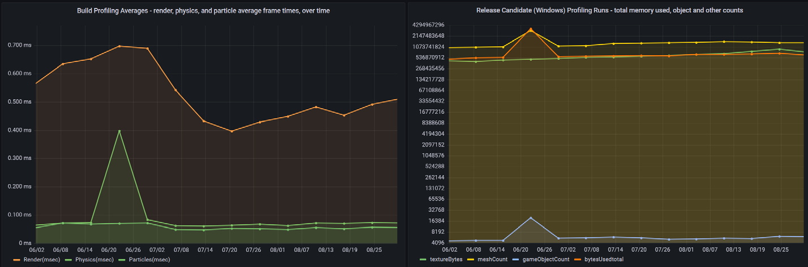
<p><em>VI: Dữ liệu profiling build hàng tuần được thu thập tự động và trực quan hóa trên dashboard Grafana. Nhìn biểu đồ phải: có vẻ ai đó đã để lọt một bug tạo physics object vào build (spike ở 06/20). / EN: Automated weekly build profiling data captured and visualized in a Grafana dashboard. It looks like someone let a physics object creation bug creep into the build.</em></p>

<div class="bilingual-row">
<div class="col-vi">
<p><strong>Nâng tầm việc profiling dự án bằng cách tự động hóa các tác vụ lặp lại.</strong> Việc này tiết kiệm thời gian và cho bạn các metric <em>luôn được cập nhật</em>.</p>
<p>Metric có thể vẽ thành biểu đồ và đưa lên dashboard dự án, để cả team thấy được <strong>chỗ nào hiệu năng lao dốc</strong> (một tính năng mới hoặc bug vừa thêm vào), hoặc <strong>chỗ nào đã cải thiện</strong> sau một sprint tối ưu và sửa lỗi.</p>
<p>💡 <strong>Ý tưởng hay:</strong> Vẽ biểu đồ mức dùng bộ nhớ tổng thể của dự án <em>qua tất cả các level</em> theo thời gian. Bằng cách chụp memory snapshot với Memory Profiler và <strong>lấy trung bình qua mọi level</strong>, bạn ghi lại được <em>memory footprint theo từng thiết bị/nền tảng, từng sprint, hoặc từng chu kỳ release</em>.</p>
<p><strong>Công cụ:</strong> Dùng <code>ProfilerRecorder</code> để ghi các chỉ số cấp cao như <strong>Total Reserved Memory</strong> hoặc <strong>System Used Memory</strong>, xuất ra CI (Continuous Integration), rồi đẩy sang công cụ vẽ biểu đồ như <strong>Grafana</strong>.</p>
<p>Dùng công cụ Unity DevOps như <strong>Cloud Build</strong> để tự động hóa việc tạo release build và tích hợp quy trình này với luồng profiling thiết bị tự động.</p>
</div>
<div class="col-en">
<p><strong>Level up your project profiling and data capture by automating common and recurring tasks.</strong> This saves time, and you benefit from metrics that are <em>always up to date</em>.</p>
<p>Metrics can be graphed and added to a project dashboard, allowing the team to see <strong>where performance has taken a nosedive</strong> (a newly added feature or bug, for example), or <strong>where things have improved</strong> after an optimization and bug-fixing sprint.</p>
<p>💡 <strong>Good idea:</strong> Chart a project's overall memory usage profile <em>across all levels</em> of the game over time. By capturing memory snapshots with the Memory Profiler and <strong>averaging the figures out across all levels</strong>, you can record a <em>memory footprint per target device/platform, sprint, or release cycle</em>.</p>
<p><strong>Tooling:</strong> Use a <code>ProfilerRecorder</code> to record metrics such as <strong>Total Reserved Memory</strong> or <strong>System Used Memory</strong> and output these to a CI, directing them to a chart or graphing tool such as <strong>Grafana</strong>.</p>
<p>Use Unity DevOps tools such as <strong>Cloud Build</strong> to automate the creation of release builds and integrate this process with an automated device profiling workflow.</p>
</div>
</div>

### 16.1. Pipeline profiling tự động — Ví dụ đầy đủ

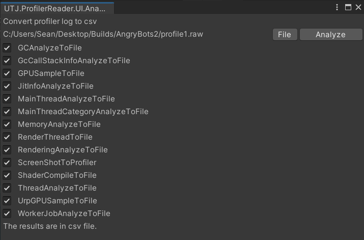
<p><em>VI: <strong>▲ Chuyển profiler log thành CSV</strong> — công cụ <code>UTJ.ProfilerReader</code> nhận file <code>.raw</code> rồi xuất ra một loạt bảng: <strong>GCAnalyzeToFile · GcCallStackInfoAnalyzeToFile · GPUSampleToFile · JitInfoAnalyzeToFile · MainThreadAnalyzeToFile · MemoryAnalyzeToFile · RenderThreadToFile · ScreenShotToProfiler · ShaderCompileToFile · ThreadAnalyzeToFile · UrpGPUSampleToFile · WorkerJobAnalyzeToFile</strong>. Đây là mắt xích biến profiling thủ công thành pipeline tự động. / EN: The UTJ.ProfilerReader tool converting a .raw profiler log to CSV.</em></p>

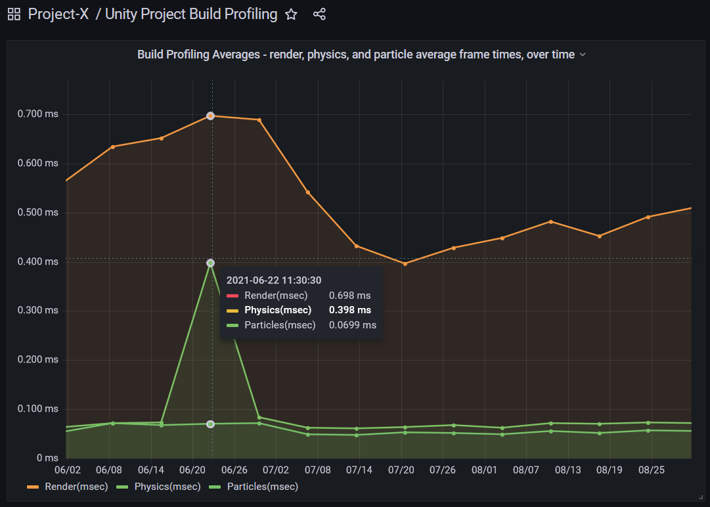
<p><em>VI: <strong>▲ Kết quả cuối — biểu đồ THEO THỜI GIAN</strong>: <em>Build Profiling Averages – render, physics, and particle average frame times, over time</em>. Mốc <strong>2021-06-22 11:30:30</strong> cho <strong>Render 0.698 ms · Physics 0.396 ms · Particles 0.0699 ms</strong>. Nhìn được xu hướng qua nhiều tháng thay vì chỉ một lần đo. / EN: Build profiling averages plotted over months in a dashboard.</em></p>

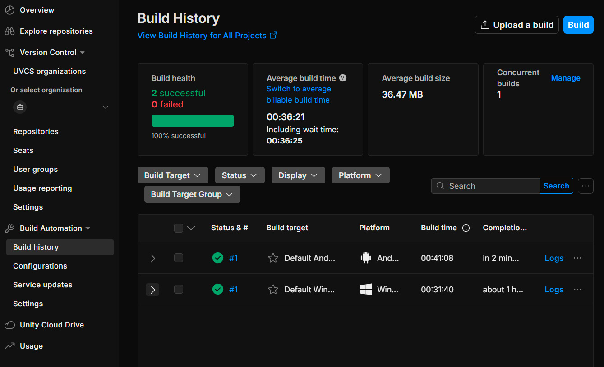
<p><em>VI: <strong>▲ Build History trên Unity Cloud</strong> — <strong>Build health: 2 successful / 0 failed (100%)</strong>, <strong>Average build time 00:36:21</strong>, <strong>Average build size 36.47 MB</strong>, <strong>Concurrent builds 1</strong>, cùng bảng từng build theo target Android / Windows kèm thời gian hoàn tất. / EN: Unity Cloud Build history with average build time and size.</em></p>

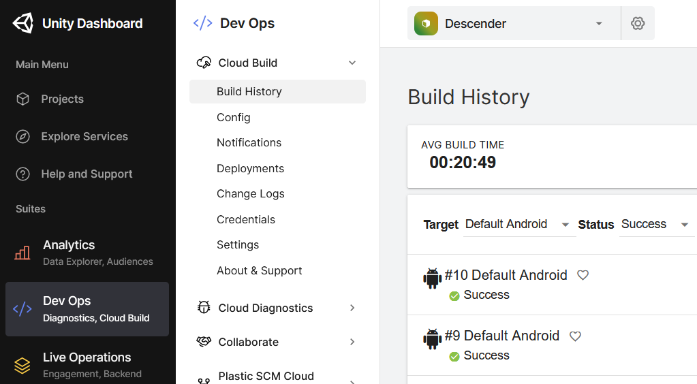

<div class="bilingual-row">
<div class="col-vi">
<p><strong>Vì sao cần tự động hóa:</strong> Nó đảm bảo team gặt được lợi ích của việc profile build <em>mà không lo quy trình này bị hạ ưu tiên do sức ép thời gian</em>.</p>
<p><strong>Luồng công việc 5 bước:</strong></p>
<ol>
<li>Dùng <strong>Unity Cloud Build</strong> để tạo các bản release tự động.</li>
<li>Sau mỗi release, dùng script khởi chạy player đã build và <strong>bắt dữ liệu profiling thô qua 2000 frame</strong>.</li>
<li>Dữ liệu được bắt vào file <code>profile1.raw</code>, giờ có thể parse để lấy metric.</li>
<li>Dùng <strong>ProfileReader</strong> (công cụ parse và chuyển dữ liệu profile thô sang CSV) để chuyển sang định dạng dễ đọc hơn.</li>
<li>Với dữ liệu đã parse từ CSV, pipeline tự động <strong>upload dữ liệu</strong> cho các bản release hằng đêm/hằng tuần/theo sprint lên công cụ như <strong>Grafana</strong> để trực quan hóa.</li>
</ol>
<p>💡 <strong>Phương án khác cho bước 2:</strong> Dùng script để chuyển sang file log mới (<code>profile_&lt;N+1&gt;.raw</code>) mỗi <strong>300–2000 frame</strong>, hoặc profile tại các điểm then chốt trong chu kỳ test (checkpoint trong một lượt chơi tự động). Dữ liệu lưu trữ này có thể tra cứu lại nếu sau đó phát hiện vùng có vấn đề trên biểu đồ dashboard.</p>
<p>👉 <strong>Kết quả:</strong> Với dữ liệu được trực quan hóa và cập nhật tự động, team dễ dàng phát hiện khi biểu đồ vọt lên để xác định vấn đề nhanh hơn. Họ cũng xem được kết quả của một task tối ưu hiệu năng, hoặc kết quả của việc team level design chạy một lượt tối ưu bộ nhớ qua các level.</p>
</div>
<div class="col-en">
<p><strong>Why automate:</strong> It helps ensure your team realizes the benefits of profiling builds <em>without the worry that this process will be deprioritized due to time constraints</em>.</p>
<p><strong>The 5-step workflow:</strong></p>
<ol>
<li>Use <strong>Unity Cloud Build</strong> to create automated build releases.</li>
<li>After each release, use a script to start a built player and <strong>capture raw profiling data over 2000 frames</strong>.</li>
<li>Profiling data is captured in the <code>profile1.raw</code> file and can now be parsed for interesting metrics.</li>
<li>Use <strong>ProfileReader</strong> (a tool for parsing and converting raw profile data to CSV format) to convert to a more readable format.</li>
<li>With data parsed from CSV, the automated pipeline <strong>uploads data</strong> for your nightly, weekly, or sprint releases to a tool such as <strong>Grafana</strong> for visualization.</li>
</ol>
<p>💡 <strong>Alternative for step 2:</strong> Use a script to switch to a new log file (<code>profile_&lt;N+1&gt;.raw</code>) every <strong>300–2000 frames</strong>, or to profile key points in an application's test cycle (checkpoints in an automated level playthrough). This stored data can then be referenced if problem areas are spotted in dashboard graphs later on.</p>
<p>👉 <strong>Result:</strong> With data visualized and updated automatically, your team can easily spot when graphs spike to identify issues more quickly. They can also view the results of a performance optimization task, or of the level design team doing a memory optimization pass across various levels.</p>
</div>
</div>

```bash
# Bước 2 — Bắt 2000 frame dữ liệu profiling thô
# Step 2 — Capture raw profiling data over 2000 frames
AngryBots2.exe -profiler-enable \
               -profiler-log-file profile1.raw \
               -profiler-capture-frame-count 2000
```

```bash
# Bước 4 — Chuyển .raw sang CSV bằng ProfileReader
# Step 4 — Convert .raw to CSV with ProfileReader
Unity.exe -batchMode \
          -projectPath "AngryBots2" \
          -logFile .\Editor.log \
          -executeMethod UTJ.ProfilerReader.CUIInterface.ProfilerToCsv \
          -PH.inputFile "profile1.raw" \
          -PH.timeout 2400 \
          -PH.log
```

```csharp
// ProfilerRecorder — ghi metric cấp cao để đẩy lên CI/Grafana
// ProfilerRecorder — record high-level metrics to push to CI/Grafana
using Unity.Profiling;
using UnityEngine;

public class MemoryMetricsLogger : MonoBehaviour
{
    ProfilerRecorder totalReservedMemoryRecorder;
    ProfilerRecorder systemUsedMemoryRecorder;

    void OnEnable()
    {
        totalReservedMemoryRecorder =
            ProfilerRecorder.StartNew(ProfilerCategory.Memory, "Total Reserved Memory");
        systemUsedMemoryRecorder =
            ProfilerRecorder.StartNew(ProfilerCategory.Memory, "System Used Memory");
    }

    void OnDisable()
    {
        totalReservedMemoryRecorder.Dispose();
        systemUsedMemoryRecorder.Dispose();
    }

    void Update()
    {
        if (totalReservedMemoryRecorder.Valid)
            Debug.Log($"Total Reserved: {totalReservedMemoryRecorder.LastValue / (1024 * 1024)} MB");
    }
}
```

### 16.2. Performance Testing Package for Unity Test Framework

!!! note "Bổ sung từ bản Unity 6"

<div class="bilingual-row">
<div class="col-vi">
<p><strong>Unity Performance Testing Package</strong> mở rộng <strong>Unity Test Framework</strong> bằng cách thêm công cụ dành cho <em>performance testing</em>.</p>
<p><strong>Nó cung cấp:</strong></p>
<ul>
<li><strong>API và test decorator</strong> cho phép bạn bắt sample từ <em>Unity Profiler marker</em> và các <em>metric hiệu năng tùy biến</em> — <strong>cả trong Editor lẫn trong built player</strong>.</li>
<li>Ngoài khả năng đo lường, package còn <strong>thu thập metadata cấu hình</strong> như build settings và chi tiết phần cứng — giúp <em>so sánh kết quả giữa các môi trường khác nhau</em> dễ hơn nhiều.</li>
</ul>
<p>⚠️ <strong>Điều kiện:</strong> Package này thiết kế để chạy <em>cùng với</em> Unity Test Framework. Muốn dùng hiệu quả, bạn cần quen với việc tạo và chạy test theo tài liệu Unity Test Framework.</p>
<p>👉 Đây chính là mảnh ghép để đưa profiling vào <strong>CI/CD</strong> một cách chính quy — thay vì chạy script dòng lệnh thủ công như §16.1.</p>
</div>
<div class="col-en">
<p>The <strong>Unity Performance Testing Package</strong> enhances the <strong>Unity Test Framework</strong> by adding tools for <em>performance testing</em>.</p>
<p><strong>It provides:</strong></p>
<ul>
<li><strong>APIs and test decorators</strong> that allow you to capture samples from <em>Unity Profiler markers</em> and <em>custom performance metrics</em> — <strong>both in the Editor and in built players</strong>.</li>
<li>In addition to measurement capabilities, the package <strong>collects configuration metadata</strong> such as build settings and hardware details, making it much easier to <em>compare results across different environments</em>.</li>
</ul>
<p>⚠️ <strong>Prerequisite:</strong> This package is designed to work <em>alongside</em> the Unity Test Framework. To use it effectively, you should be familiar with creating and running tests as outlined in the Unity Test Framework documentation.</p>
<p>👉 This is the piece that makes profiling a first-class part of <strong>CI/CD</strong> — rather than the manual command-line scripting of §16.1.</p>
</div>
</div>

---

## 17. 📇 Index công cụ Profiling & Debugging

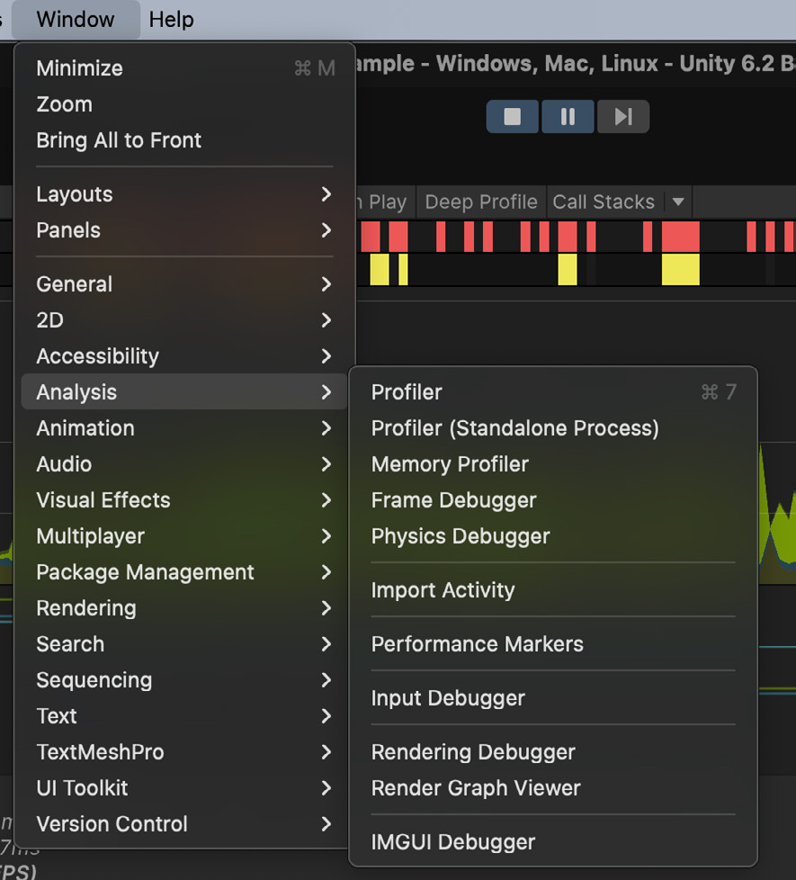 Analysis menu listing every profiling and debugging tool.">
<p><em>VI: <strong>▲ Toàn bộ công cụ nằm ở MỘT chỗ</strong> — menu <code>Window › Analysis</code>: <strong>Profiler · Profiler (Standalone Process) · Memory Profiler · Frame Debugger · Physics Debugger · Import Activity · Performance Markers · Input Debugger · Rendering Debugger · Render Graph Viewer · IMGUI Debugger</strong>. / EN: The Window > Analysis menu listing every profiling and debugging tool.</em></p>

<div class="bilingual-row">
<div class="col-vi">
<p><strong>Bắt đầu bằng công cụ của Unity</strong>, và nếu cần chi tiết hơn, hãy với tới các <strong>profiler và debugging tool native</strong> có sẵn cho nền tảng đích của bạn.</p>
</div>
<div class="col-en">
<p><strong>Start your profiling with Unity's tools</strong>, and if you need greater detail, reach for the <strong>native profilers and debugging tools</strong> available for your target platform.</p>
</div>
</div>

### 17.1. Native profiling tools

| Nền tảng | Công cụ | Mô tả / Description |
|---|---|---|
| **Android / Arm** | **Android Studio** | Android Profiler mới (thay thế Android Monitor cũ) — thu thập dữ liệu thời gian thực về tài nguyên phần cứng trên thiết bị Android |
| | **Arm Mobile Studio** → đổi tên thành **Arm Performance Studio** (bản Unity 6) | Bộ công cụ profile & debug chi tiết, dành cho thiết bị chạy phần cứng Arm |
| | **Snapdragon Profiler** | **Chỉ cho chipset Snapdragon.** Phân tích CPU, GPU, DSP, bộ nhớ, điện năng, nhiệt, và dữ liệu mạng |
| **Intel** | **Intel VTune** | Tìm và sửa bottleneck trên nền tảng Intel. **Chỉ cho vi xử lý Intel** |
| | **Intel GPA suite** | Bộ công cụ tập trung vào đồ họa, nhanh chóng khoanh vùng vấn đề |
| **Xbox / PC** | **PIX** | Công cụ tinh chỉnh hiệu năng và debug cho Windows/Xbox dùng **DirectX 12**. Gồm công cụ phân tích CPU & GPU + theo dõi performance counter thời gian thực |
| **PC / Universal** | **AMD μProf** | Phân tích hiệu năng cho ứng dụng chạy trên phần cứng AMD |
| | **NVIDIA NSight** | Build, debug, profile và phát triển phần mềm với phần cứng NVIDIA mới nhất |
| | **Superluminal** | Profiler tần số cao, hiệu năng cao — hỗ trợ Windows, Xbox One, PlayStation; viết bằng C++, Rust, .NET. ⚠️ **Sản phẩm trả phí, cần license** |
| **PlayStation** | CPU profiler tools | Cần là **registered PlayStation® developer** mới truy cập được |
| **iOS** | **Xcode Instruments** + **Xcode Frame Debugger** | Công cụ phân tích hiệu năng và kiểm thử mạnh mẽ, linh hoạt — thuộc bộ Xcode |
| **WebGL** | **Firefox Profiler** | Đào vào call stack và xem flame graph cho build Unity WebGL. Có cả **công cụ so sánh** để xem 2 capture cạnh nhau |
| | **Chrome DevTools Performance** | Công cụ trình duyệt khác dùng để profile build Unity WebGL |

### 17.2. GPU debugging & profiling tools

<div class="bilingual-row">
<div class="col-vi">
<p>Trong khi <strong>Unity Frame Debug tool bắt và minh họa các draw call GỬI ĐI TỪ CPU</strong>, các công cụ dưới đây giúp bạn thấy <strong>GPU làm gì KHI NHẬN ĐƯỢC những lệnh đó</strong>.</p>
<p>Một số công cụ đặc thù nền tảng và tích hợp sâu hơn với nền tảng đó.</p>
</div>
<div class="col-en">
<p>While the <strong>Unity Frame Debug tool captures and illustrates draw calls that are sent FROM the CPU</strong>, the following tools help show you <strong>what the GPU does WHEN IT RECEIVES those commands</strong>.</p>
<p>Some are platform-specific and offer closer platform integration.</p>
</div>
</div>

| Công cụ / Tool | Phạm vi / Scope |
|---|---|
| **Arm Graphics Analyzer** | Thuộc bộ Arm Mobile Studio |
| **RenderDoc** | GPU debugger cho nền tảng desktop **và mobile** |
| **Intel GPA** | Graphics profiling cho nền tảng nền Intel |
| **Apple Frame Capture Debugging Tools** | GPU debugging cho nền tảng Apple |
| **Visual Studio Graphics Diagnostics** | Chọn cái này và/hoặc PIX cho nền tảng nền DirectX (Windows, Xbox) |
| **NVIDIA Nsight Frame Debugger** | Frame debugger nền OpenGL cho GPU NVIDIA |
| **AMD Radeon Developer Tool Suite** | GPU profiler cho GPU AMD |
| **Xcode frame debugger** | Cho iOS và macOS |

!!! tip "Physics Debugger"
    **VI:** Ngoài Frame Debugger, Unity còn có **Physics Debugger** tại `Window > Analysis > Physics Debugger` — trực quan hóa collider, layer, và collision matrix. Rất hữu ích khi chẩn đoán vấn đề physics (sẽ đi sâu ở **Module 2**).

    **EN:** Besides the Frame Debugger, Unity also ships a **Physics Debugger** at `Window > Analysis > Physics Debugger` — it visualizes colliders, layers, and the collision matrix. Very useful for diagnosing physics issues (covered in depth in **Module 2**).

---

## 18. Checklist Fresher — Bỏ túi

<div class="bilingual-row">
<div class="col-vi">
<ul>
<li>☑️ Đo bằng <strong>ms</strong>, không đo bằng FPS (1.111 ms ở 900fps ≠ cảm giác, = ở 60fps).</li>
<li>☑️ Biết ngân sách: 30 FPS → 22 ms; 60 FPS → 11 ms (mobile, chừa <strong>35% idle</strong>).</li>
<li>☑️ Thuộc <strong>sơ đồ chẩn đoán bottleneck</strong>: in-budget? → main/job/render thread? → GPU?</li>
<li>☑️ Phân biệt 3 thread: <strong>main / render / job worker</strong>.</li>
<li>☑️ Hiểu <strong>render state</strong> — chuẩn bị draw call đắt hơn chính draw call.</li>
<li>☑️ Biết dùng <strong>Frame Debugger</strong> (<code>Window &gt; Analysis</code>) để soi draw call & overdraw.</li>
<li>☑️ Autoconnect Profiler cộng <strong>tới 10s</strong> startup — chỉ bật khi cần profile scene đầu.</li>
<li>☑️ Tắt mạng di động, giữ WiFi khi profile thiết bị.</li>
<li>☑️ Lập <strong>ngân sách bộ nhớ</strong> (~80% RAM vật lý) và <strong>hardware tiers</strong>.</li>
<li>☑️ Hiểu <strong>pipeline CPU/GPU</strong>: GPU render frame N trong khi CPU làm frame N+1.</li>
<li>☑️ Thuộc <strong>7 cạm bẫy main thread</strong> / <strong>3 cạm bẫy render thread</strong> / <strong>4 cạm bẫy worker thread</strong>.</li>
<li>☑️ Biết <strong>6 hệ thống batching</strong> và khi nào dùng cái nào.</li>
<li>☑️ Dùng <code>Allocation Call Stacks</code> thay Deep Profiling (rẻ hơn nhiều).</li>
<li>☑️ So sánh <strong>frame trung vị vs frame dài nhất</strong> trong Profile Analyzer để săn spike.</li>
<li>☑️ Nhớ: <strong>Editor LUÔN báo bộ nhớ cao hơn thiết bị thật</strong> (texture bị ép read/write). Trên build thật, cờ <strong><code>Read/Write Enabled</code></strong> chỉ cần bật khi bạn <strong>THỰC SỰ gọi các hàm truy cập dữ liệu texture từ script</strong> — <code>Texture2D.GetPixels()</code>, <code>Texture2D.SetPixels()</code>… — vì <em>"một BẢN SAO dữ liệu texture được tạo ra, LÀM ĐÔI lượng bộ nhớ"</em>.</li>
<li>☑️ <code>System Used Memory = 0</code> nghĩa là counter chưa hỗ trợ nền tảng, KHÔNG phải app dùng 0 byte.</li>
<li>☑️ LPDDR4: <strong>~100 picojoule/byte</strong> — giảm truy cập bộ nhớ = giảm nhiệt + pin.</li>
<li>☑️ Luôn build <strong>Development Build + Autoconnect Profiler</strong>.</li>
<li>☑️ Profile trên <strong>thiết bị thật</strong>, cả máy mạnh lẫn máy yếu.</li>
<li>☑️ Xác định <code>Gfx.WaitForCommands</code> (CPU-bound) hay <code>Gfx.WaitForPresent</code> (GPU-bound) TRƯỚC khi tối ưu.</li>
<li>☑️ Lưu <code>.data</code> trước khi sửa, so sánh sau khi sửa.</li>
<li>☑️ Cột <strong>GC Alloc</strong> trong Hierarchy phải là <strong>0 B</strong> ở frame gameplay ổn định.</li>
<li>☑️ Cache <code>GetComponent</code>, <code>transform</code>, <code>Camera.main</code> ở <code>Awake</code>.</li>
<li>☑️ Dùng <code>CompareTag</code>, <code>StringBuilder</code>, <code>string.Empty</code>.</li>
<li>☑️ Cache <code>WaitForSeconds</code>, hash <code>Animator.StringToHash</code> / <code>Shader.PropertyToID</code>.</li>
<li>☑️ Xóa <code>Update</code> rỗng, tắt <code>Debug.Log</code> trước khi build.</li>
<li>☑️ Pool thay vì Instantiate/Destroy trong gameplay.</li>
<li>☑️ Hạ FPS xuống 30 ở màn hình idle để chống nóng máy.</li>
</ul>
</div>
<div class="col-en">
<ul>
<li>☑️ Measure in <strong>ms</strong>, not FPS (1.111 ms feels catastrophic at 900fps, trivial at 60fps).</li>
<li>☑️ Know the budget: 30 FPS → 22 ms; 60 FPS → 11 ms (mobile, leave <strong>35% idle</strong>).</li>
<li>☑️ Know the <strong>bottleneck flowchart</strong>: in budget? → main/job/render thread? → GPU?</li>
<li>☑️ Distinguish the three threads: <strong>main / render / job worker</strong>.</li>
<li>☑️ Understand <strong>render state</strong> — draw call preparation costs more than the call itself.</li>
<li>☑️ Know the <strong>Frame Debugger</strong> (<code>Window &gt; Analysis</code>) for draw calls & overdraw.</li>
<li>☑️ Autoconnect Profiler adds <strong>up to 10s</strong> startup — enable only to profile the first scene.</li>
<li>☑️ Disable mobile data, keep WiFi on when profiling a device.</li>
<li>☑️ Set a <strong>memory budget</strong> (~80% of physical RAM) and <strong>hardware tiers</strong>.</li>
<li>☑️ Understand the <strong>CPU/GPU pipeline</strong>: the GPU renders frame N while the CPU works on N+1.</li>
<li>☑️ Know the <strong>7 main-thread</strong> / <strong>3 render-thread</strong> / <strong>4 worker-thread</strong> pitfalls.</li>
<li>☑️ Know the <strong>6 batching systems</strong> and when each applies.</li>
<li>☑️ Use <code>Allocation Call Stacks</code> instead of Deep Profiling (far cheaper).</li>
<li>☑️ Compare the <strong>median vs longest frame</strong> in Profile Analyzer to hunt spikes.</li>
<li>☑️ Remember: <strong>the Editor ALWAYS reports higher memory</strong> than a real device (textures forced read/write). In a real build, <code>Read/Write Enabled</code> is only needed if you actually call texture-data functions from script (<code>Texture2D.GetPixels()</code>, <code>Texture2D.SetPixels()</code>…), because <em>"a copy of the Texture data is made, doubling the amount of memory"</em>.</li>
<li>☑️ <code>System Used Memory = 0</code> means the counter isn't implemented on that platform, NOT that the app uses zero.</li>
<li>☑️ LPDDR4: <strong>~100 picojoules/byte</strong> — fewer memory accesses = less heat + battery.</li>
<li>☑️ Always build with <strong>Development Build + Autoconnect Profiler</strong>.</li>
<li>☑️ Profile on <strong>real devices</strong>, both highest- and lowest-spec.</li>
<li>☑️ Determine <code>Gfx.WaitForCommands</code> (CPU-bound) vs <code>Gfx.WaitForPresent</code> (GPU-bound) BEFORE optimizing.</li>
<li>☑️ Save the <code>.data</code> before changes, compare after.</li>
<li>☑️ The <strong>GC Alloc</strong> column in Hierarchy should read <strong>0 B</strong> on a steady gameplay frame.</li>
<li>☑️ Cache <code>GetComponent</code>, <code>transform</code>, <code>Camera.main</code> in <code>Awake</code>.</li>
<li>☑️ Use <code>CompareTag</code>, <code>StringBuilder</code>, <code>string.Empty</code>.</li>
<li>☑️ Cache <code>WaitForSeconds</code>; hash with <code>Animator.StringToHash</code> / <code>Shader.PropertyToID</code>.</li>
<li>☑️ Remove empty <code>Update</code>s; strip <code>Debug.Log</code> before building.</li>
<li>☑️ Pool instead of Instantiate/Destroy during gameplay.</li>
<li>☑️ Drop to 30 FPS on idle screens to fight thermal throttling.</li>
</ul>
</div>
</div>
