# 🚀 Module 2 — UI & Physics Deep Dive

!!! abstract "Nguồn đã cào / Sources scraped"
    **Tài liệu chính:**

    - 📘 [**Optimizing Unity UI** — Unity Technologies (Unity Learn, 6 chương đầy đủ)](https://learn.unity.com/tutorial/optimizing-unity-ui) — ⭐ nguồn chính về UGUI
    - 📕 **Optimize Your Mobile Game Performance** (52 tr.) — ch. *User interface* (tr.37–40), *Animation* (tr.43–44), *Physics* (tr.45–47)
    - 📙 **Optimize your game performance for consoles and PC** (73 tr.) — ch. *User interface* (tr.70–72)
    - 🇻🇳 [**S.O.L.I.D** — Tạ Văn Dũng, tvd12.com](https://tvd12.com/solid) *(cào qua API `tvd12.com/api/v1/posts/solid` — trang HTML là SPA render 404)*
    - ⚡ [**Event performance: C# vs. UnityEvent** — Jackson Dunstan](https://www.jacksondunstan.com/articles/3335) — benchmark đầy đủ
    - 🔧 [**Unity-Collider-Optimizer** — aniketrajnish](https://github.com/aniketrajnish/Unity-Collider-Optimizer)
    - 🔁 [**Simple Finite State Machine for Unity** — thefuntastic/MonsterLove](https://github.com/thefuntastic/Unity3d-Finite-State-Machine)
    - 🎨 [**Unity-Design-Pattern** — QianMo](https://github.com/QianMo/Unity-Design-Pattern)
    - 🧪 [**Introduction to Unity Unit Testing** — Kodeco](https://www.kodeco.com/9454-introduction-to-unity-unit-testing) *(phần sau bị paywall)*

    **Bổ sung sau AUDIT:**

    - 🔁 [**State Machines in Unity (how and when to use them)** — John French, gamedevbeginner.com](https://gamedevbeginner.com/state-machines-in-unity-how-and-when-to-use-them/) — ✅ lần đầu bị **403 WAF**, audit này **cào được qua Jina reader** (`r.jina.ai`): 34.8 KB + 5 sơ đồ
    - 📙 **Optimize your game performance for consoles and PC** — ch. ***Physics* (tr.77–85, 14 mục)** và ***Animation* (tr.86–88)** — ✅ **chương đầy đủ mà lần cào đầu đã BỎ SÓT** (chỉ dùng bản Mobile 3 trang)

    ⚠️ **Vẫn không cào được:** `learn.unity.com/tutorial/physics-best-practices` → **404** (Unity Learn đã xóa — thay bằng 2 e-book Unity chính thức + ghi chú `raw-optimization-data.txt`); `kodeco.com` → **paywall** (Jina reader chỉ trả 7 KB).

---

# PHẦN A — UNITY UI (UGUI)

## 1. Bốn loại vấn đề hiệu năng UI

<div class="bilingual-row">
<div class="col-vi">
<p><strong>"Tối ưu một giao diện dùng Unity UI là một nghệ thuật. Rất hiếm có quy tắc cứng nhắc; thay vào đó, mỗi tình huống phải được đánh giá cẩn thận."</strong></p>
<p>🔑 <strong>Căng thẳng cốt lõi</strong> khi tối ưu bất kỳ Unity UI nào là <strong>cân bằng giữa số draw call và chi phí batching</strong>. Vài kỹ thuật thông thường có thể giảm cái này hoặc cái kia, nhưng UI phức tạp buộc phải đánh đổi.</p>
<p>Như mọi nơi khác, việc tối ưu <strong>phải bắt đầu bằng profiling</strong>. Nhiệm vụ đầu tiên là <em>định vị chính xác lý do</em> của vấn đề hiệu năng quan sát được.</p>
<p><strong>Có 4 lớp vấn đề phổ biến:</strong></p>
<ol>
<li><strong>Dùng quá mức GPU fragment shader</strong> — tức <em>lạm dụng fill-rate</em></li>
<li><strong>Tốn quá nhiều CPU để rebuild một Canvas batch</strong></li>
<li><strong>Quá nhiều lần rebuild Canvas batch</strong> — <em>over-dirtying</em></li>
<li><strong>Tốn quá nhiều CPU để sinh vertex</strong> — thường từ text</li>
</ol>
<p>💡 <strong>Về lý thuyết</strong>, có thể tạo ra một Unity UI bị giới hạn bởi <em>số lượng draw call thuần túy</em>. Nhưng <strong>trên thực tế</strong>, bất kỳ dự án nào làm quá tải GPU bằng draw call thì <em>nhiều khả năng đang bị giới hạn bởi fill-rate</em> hơn.</p>
</div>
<div class="col-en">
<p><strong>"Optimizing a user interface driven by Unity UI is an art. Hard-and-fast rules are rare; instead, each situation must be carefully evaluated."</strong></p>
<p>🔑 <strong>The core tension</strong> when optimizing any Unity UI is <strong>balancing draw calls with batching costs</strong>. While some common-sense techniques can reduce one or the other, complex UIs must make trade-offs.</p>
<p>As is best practice elsewhere, optimization <strong>should begin with profiling</strong>. The primary task is to <em>locate the precise reason</em> for an observed performance problem.</p>
<p><strong>There are four common classes of problems:</strong></p>
<ol>
<li><strong>Excessive GPU fragment shader utilization</strong> — i.e. <em>fill-rate overutilization</em></li>
<li><strong>Excessive CPU time spent rebuilding a Canvas batch</strong></li>
<li><strong>Excessive numbers of rebuilds of Canvas batches</strong> — <em>over-dirtying</em></li>
<li><strong>Excessive CPU time spent generating vertices</strong> — usually from text</li>
</ol>
<p>💡 <strong>In principle</strong>, it is possible to create a Unity UI constrained by the <em>sheer number of draw calls</em>. However, <strong>in practice</strong>, any project overloading the GPU with draw calls <em>is more likely to be bound by fill-rate overutilization</em>.</p>
</div>
</div>

!!! tip "Source code UGUI là mã nguồn mở"
    **VI:** Các component **Graphic** và **Layout** của Unity UI **hoàn toàn mã nguồn mở**. Đọc source để hiểu chính xác thứ bạn đang tối ưu.

    **EN:** Unity UI's Graphic and Layout components are **entirely open source**. Read the source to understand exactly what you're optimizing.

---

## 2. Thuật ngữ nền tảng UGUI

<div class="bilingual-row">
<div class="col-vi">
<p><strong>CANVAS</strong> — component <em>native-code</em> (C++) được hệ thống rendering của Unity dùng để cung cấp geometry phân lớp, vẽ trong hoặc lên trên world-space của game.</p>
<p>Canvas chịu trách nhiệm <strong>gộp geometry con của nó thành các batch</strong>, sinh lệnh render phù hợp và gửi tới hệ thống Graphics. <strong>Toàn bộ việc này chạy trong C++ native</strong>, và được gọi là <strong>rebatch</strong> hay <strong>batch build</strong>.</p>
<p>Khi một Canvas bị đánh dấu là chứa geometry cần rebatch, Canvas đó được coi là <strong>dirty</strong>.</p>
<p><strong>CANVAS RENDERER</strong> — component cung cấp geometry cho Canvas.</p>
<p><strong>SUB-CANVAS</strong> — đơn giản là một Canvas <em>lồng bên trong</em> Canvas khác.</p>
<p>🔑 <strong>Sub-canvas CÁCH LY con nó khỏi cha:</strong> một child bị dirty <strong>sẽ không</strong> buộc parent phải rebuild geometry, và ngược lại. <em>(Có vài edge case ngoại lệ, ví dụ khi thay đổi ở parent Canvas khiến child Canvas bị đổi kích thước.)</em></p>
<p><strong>GRAPHIC</strong> — lớp cơ sở do thư viện C# của Unity UI cung cấp. Là base class cho mọi lớp C# cung cấp geometry vẽ được cho hệ thống Canvas. Hầu hết Graphic dựng sẵn được cài đặt qua subclass <code>MaskableGraphic</code>, cho phép mask qua interface <code>IMaskable</code>. Hai subclass chính là <strong>Image</strong> và <strong>Text</strong>.</p>
<p><strong>LAYOUT</strong> — điều khiển kích thước và vị trí của RectTransform, dùng để tạo layout phức tạp cần sizing/positioning tương đối.</p>
<p>⚠️ Layout <strong>chỉ phụ thuộc vào RectTransform</strong> và chỉ tác động lên thuộc tính của RectTransform liên quan. Chúng <em>không</em> phụ thuộc vào lớp Graphic và <strong>dùng độc lập được</strong> với các Graphic component.</p>
<p><strong>CanvasUpdateRegistry</strong> — lớp <em>không</em> lộ ra trong Editor. Nó theo dõi tập hợp Layout và Graphic cần cập nhật, và kích hoạt cập nhật khi Canvas liên quan phát sự kiện <code>willRenderCanvases</code>.</p>
<p>👉 Việc cập nhật Layout và Graphic được gọi là <strong>rebuild</strong>.</p>
</div>
<div class="col-en">
<p><strong>CANVAS</strong> — a <em>native-code</em> (C++) Unity component used by Unity's rendering system to provide layered geometry drawn in, or on top of, a game's world-space.</p>
<p>Canvases are responsible for <strong>combining their constituent geometry into batches</strong>, generating the appropriate render commands and sending these to Unity's Graphics system. <strong>All of this is done in native C++ code</strong>, and is called a <strong>rebatch</strong> or a <strong>batch build</strong>.</p>
<p>When a Canvas has been marked as containing geometry that requires rebatching, the Canvas is considered <strong>dirty</strong>.</p>
<p><strong>CANVAS RENDERER</strong> — geometry is provided to Canvases by Canvas Renderer components.</p>
<p><strong>SUB-CANVAS</strong> — simply a Canvas component <em>nested inside</em> another Canvas component.</p>
<p>🔑 <strong>Sub-canvases ISOLATE their children from their parent:</strong> a dirty child <strong>will not</strong> force a parent to rebuild its geometry, and vice versa. <em>(There are certain edge cases where this is not true, such as when changes to a parent Canvas cause a child Canvas to be resized.)</em></p>
<p><strong>GRAPHIC</strong> — a base class provided by the Unity UI C# library. It is the base class for all Unity UI C# classes that provide drawable geometry to the Canvas system. Most built-in Graphics are implemented via the <code>MaskableGraphic</code> subclass, allowing masking via the <code>IMaskable</code> interface. The major subclasses are <strong>Image</strong> and <strong>Text</strong>.</p>
<p><strong>LAYOUT</strong> — components control the size and positioning of RectTransforms, generally used to create complex layouts requiring relative sizing or positioning.</p>
<p>⚠️ Layout components <strong>rely only on RectTransforms</strong> and only affect the properties of their associated RectTransforms. They are <em>not</em> dependent on the Graphic class, and <strong>can be used independently</strong> from Unity UI's Graphic components.</p>
<p><strong>CanvasUpdateRegistry</strong> — a class <em>not</em> exposed in the Editor's interface. It tracks the set of Layout and Graphic components that must be updated, and triggers updates as needed when their associated Canvas invokes the <code>willRenderCanvases</code> event.</p>
<p>👉 The updates of Layout and Graphic components is called a <strong>rebuild</strong>.</p>
</div>
</div>

!!! danger "Phân biệt REBATCH và REBUILD — hai thứ hoàn toàn khác nhau"
    | | **REBATCH** (Batch build) | **REBUILD** |
    |---|---|---|
    | **Chạy ở đâu** | C++ native (Canvas) | C# (`CanvasUpdateRegistry`) |
    | **Làm gì** | Gộp mesh thành batch, sinh render command | Tính lại layout & mesh của Graphic |
    | **Marker Profiler** | `Canvas.BuildBatch` | `Canvas.SendWillRenderCanvases` |
    | **Marker native** | `Canvas::UpdateBatches` | `Canvas::SendWillRenderCanvases` |

---

## 3. Chi tiết Rendering — Vì sao UI luôn tốn fill-rate

<div class="bilingual-row">
<div class="col-vi">
<p>🚨 <strong>Điều quan trọng nhất phải nhớ:</strong></p>
<blockquote>
<p>Toàn bộ geometry do một Canvas vẽ ra <strong>đều được vẽ trong Transparent queue</strong>. Nghĩa là geometry do Unity UI sinh ra <strong>LUÔN LUÔN</strong> được vẽ <em>từ sau ra trước với alpha blending</em>.</p>
</blockquote>
<p><strong>Hệ quả về hiệu năng:</strong> <strong>MỖI pixel</strong> được raster hóa từ một polygon <strong>đều sẽ được sample</strong> — <em>kể cả khi nó bị che hoàn toàn bởi các polygon đục khác</em>.</p>
<p>👉 Trên thiết bị mobile, mức overdraw cao này có thể <strong>nhanh chóng vượt quá khả năng fill-rate của GPU</strong>.</p>
<p>💡 Đây là lý do gốc rễ vì sao UI xếp chồng nhiều lớp lại giết chết hiệu năng mobile — không có z-test loại bỏ pixel bị che như với geometry đục.</p>
</div>
<div class="col-en">
<p>🚨 <strong>The most important thing to remember:</strong></p>
<blockquote>
<p>All geometry drawn by a Canvas <strong>will be drawn in the Transparent queue</strong>. That is, geometry produced by Unity UI will <strong>ALWAYS</strong> be drawn <em>back-to-front with alpha blending</em>.</p>
</blockquote>
<p><strong>The performance consequence:</strong> <strong>EACH pixel</strong> rasterized from a polygon <strong>will be sampled</strong> — <em>even if it is wholly covered by other, opaque polygons</em>.</p>
<p>👉 On mobile devices, this high level of overdraw can <strong>rapidly exceed the fill-rate capacity of the GPU</strong>.</p>
<p>💡 This is the root reason why heavily layered UI kills mobile performance — there is no z-test discarding occluded pixels as there is for opaque geometry.</p>
</div>
</div>

### 3.1. Quá trình Batch Building (Canvas)

<div class="bilingual-row">
<div class="col-vi">
<p>Batch building là quá trình Canvas <em>gộp các mesh</em> đại diện cho phần tử UI và sinh lệnh render phù hợp gửi vào graphics pipeline.</p>
<p>✅ <strong>Kết quả được CACHE và tái sử dụng</strong> cho tới khi Canvas bị đánh dấu dirty — điều này xảy ra <em>bất cứ khi nào có thay đổi ở một trong các mesh con của nó</em>.</p>
<p>Các mesh Canvas dùng được lấy từ tập Canvas Renderer <strong>gắn vào Canvas đó nhưng KHÔNG nằm trong Sub-canvas nào</strong>.</p>
<p><strong>Tính toán batch đòi hỏi:</strong></p>
<ul>
<li>Sắp xếp mesh <strong>theo depth</strong></li>
<li>Kiểm tra chúng có <strong>chồng lấn (overlap)</strong> không</li>
<li>Kiểm tra <strong>material dùng chung</strong>, v.v.</li>
</ul>
<p>⚡ Thao tác này <strong>đa luồng (multi-threaded)</strong>, nên hiệu năng của nó nhìn chung <em>rất khác nhau giữa các kiến trúc CPU</em> — đặc biệt giữa SoC mobile (thường ít nhân) và CPU desktop hiện đại (thường ≥4 nhân).</p>
</div>
<div class="col-en">
<p>The batch building process is where a Canvas <em>combines the meshes</em> representing its UI elements and generates the appropriate rendering commands to send to Unity's graphics pipeline.</p>
<p>✅ <strong>The results are CACHED and reused</strong> until the Canvas is marked as dirty, which occurs <em>whenever there is a change to one of its constituent meshes</em>.</p>
<p>The meshes used by the Canvas are taken from the set of Canvas Renderer components <strong>attached to the Canvas but NOT contained in any Sub-canvas</strong>.</p>
<p><strong>Calculating the batches requires:</strong></p>
<ul>
<li>Sorting the meshes <strong>by depth</strong></li>
<li>Examining them for <strong>overlaps</strong></li>
<li>Checking <strong>shared materials</strong>, and so on</li>
</ul>
<p>⚡ This operation is <strong>multi-threaded</strong>, so its performance will generally be <em>very different across different CPU architectures</em> — especially between mobile SoCs (which generally have few cores) and modern desktop CPUs (often 4 or more).</p>
</div>
</div>

### 3.2. Quá trình Rebuild (Graphics) — `PerformUpdate` 3 bước

<div class="bilingual-row">
<div class="col-vi">
<p>Rebuild là nơi <em>layout và mesh</em> của các Graphic component C# được tính toán lại. Việc này thực hiện trong lớp <code>CanvasUpdateRegistry</code>.</p>
<p>Phương thức đáng quan tâm là <strong><code>PerformUpdate</code></strong> — được gọi mỗi khi Canvas phát sự kiện <code>WillRenderCanvases</code>. <strong>Sự kiện này được gọi MỘT LẦN MỖI FRAME.</strong></p>
<p><code>PerformUpdate</code> chạy quy trình <strong>3 bước</strong>:</p>
<ol>
<li>Các <strong>Layout</strong> bị dirty được yêu cầu rebuild layout, qua <code>ICanvasElement.Rebuild</code>.</li>
<li>Mọi <strong>Clipping component</strong> đã đăng ký (như Mask) được yêu cầu cull các component bị clip — qua <code>ClippingRegistry.Cull</code>.</li>
<li>Các <strong>Graphic</strong> bị dirty được yêu cầu rebuild phần tử đồ họa của chúng.</li>
</ol>
<p><strong>Mỗi loại rebuild lại chia nhỏ tiếp:</strong></p>
<ul>
<li><strong>Layout rebuild</strong> chạy <strong>3 phần</strong>: <code>PreLayout</code> → <code>Layout</code> → <code>PostLayout</code></li>
<li><strong>Graphic rebuild</strong> chạy <strong>2 phần</strong>: <code>PreRender</code> → <code>LatePreRender</code></li>
</ul>
</div>
<div class="col-en">
<p>The Rebuild process is where the <em>layout and meshes</em> of Unity UI's C# Graphic components are recalculated. This is performed in the <code>CanvasUpdateRegistry</code> class.</p>
<p>The method of interest is <strong><code>PerformUpdate</code></strong> — invoked whenever a Canvas component invokes the <code>WillRenderCanvases</code> event. <strong>This event is called once per frame.</strong></p>
<p><code>PerformUpdate</code> runs a <strong>three-step process</strong>:</p>
<ol>
<li>Dirty <strong>Layout</strong> components are requested to rebuild their layouts, via <code>ICanvasElement.Rebuild</code>.</li>
<li>Any registered <strong>Clipping components</strong> (such as Masks) are requested to cull any clipped components — via <code>ClippingRegistry.Cull</code>.</li>
<li>Dirty <strong>Graphic</strong> components are requested to rebuild their graphical elements.</li>
</ol>
<p><strong>Each rebuild type splits further:</strong></p>
<ul>
<li><strong>Layout rebuilds</strong> run in <strong>three parts</strong>: <code>PreLayout</code> → <code>Layout</code> → <code>PostLayout</code></li>
<li><strong>Graphic rebuilds</strong> run in <strong>two</strong>: <code>PreRender</code> → <code>LatePreRender</code></li>
</ul>
</div>
</div>

<div class="bilingual-row">
<div class="col-vi">
<p><strong>LAYOUT REBUILD — vì sao phải sắp xếp</strong></p>
<p>Để tính lại vị trí (và có thể cả kích thước) của các component nằm trong một hay nhiều Layout, cần <strong>áp dụng Layout theo đúng thứ tự phân cấp</strong>. Layout gần root hơn trong hierarchy <em>có thể thay đổi vị trí và kích thước</em> của bất kỳ Layout nào lồng bên trong chúng, nên phải được tính trước.</p>
<p>👉 Vì vậy Unity UI <strong>sắp xếp danh sách Layout dirty theo ĐỘ SÂU trong hierarchy</strong>. Item cao hơn trong hierarchy (ít parent Transform hơn) được đưa lên đầu danh sách.</p>
<p>⚠️ Chính phép sắp xếp này là thứ xuất hiện dưới tên <code>IndexedSet_Sort</code> / <code>CanvasUpdateRegistry_SortLayoutList</code> trong profiler — và nó <em>phải đếm số parent transform phía trên mỗi Layout</em>.</p>
<p><strong>GRAPHIC REBUILD</strong></p>
<p>Unity UI chuyển quyền điều khiển sang method <code>Rebuild</code> của interface <code>ICanvasElement</code>. Graphic cài đặt nó và chạy <strong>2 bước</strong> trong giai đoạn PreRender:</p>
<ul>
<li>Nếu <strong>vertex data</strong> bị đánh dấu dirty (ví dụ RectTransform đổi kích thước) → <strong>mesh được rebuild</strong>.</li>
<li>Nếu <strong>material data</strong> bị đánh dấu dirty (ví dụ đổi material hoặc texture) → <strong>material của Canvas Renderer được cập nhật</strong>.</li>
</ul>
<p>✅ <strong>Điểm sáng:</strong> Graphic Rebuild <strong>KHÔNG</strong> duyệt theo thứ tự cụ thể nào và <strong>KHÔNG cần thao tác sắp xếp</strong> — nên nó rẻ hơn Layout rebuild ở khoản này.</p>
</div>
<div class="col-en">
<p><strong>LAYOUT REBUILDS — why sorting is needed</strong></p>
<p>To recalculate the appropriate positions (and potentially sizes) of components contained within one or more Layouts, it is necessary to <strong>apply the Layouts in their appropriate hierarchical order</strong>. Layouts closer to the root <em>can potentially alter the positions and sizes</em> of any Layouts nested within them, and so must be calculated first.</p>
<p>👉 To do this, Unity UI <strong>sorts the list of dirty Layout components by their DEPTH in the hierarchy</strong>. Items higher in the hierarchy (with fewer parent Transforms) are moved to the front of the list.</p>
<p>⚠️ This sort is exactly what appears as <code>IndexedSet_Sort</code> / <code>CanvasUpdateRegistry_SortLayoutList</code> in the profiler — and it <em>must count the number of parent transforms above each Layout</em>.</p>
<p><strong>GRAPHIC REBUILDS</strong></p>
<p>Unity UI passes control to the <code>Rebuild</code> method of the <code>ICanvasElement</code> interface. Graphic implements this and runs <strong>two steps</strong> during the PreRender stage:</p>
<ul>
<li>If the <strong>vertex data</strong> has been marked dirty (e.g. the RectTransform changed size) → <strong>the mesh is rebuilt</strong>.</li>
<li>If the <strong>material data</strong> has been marked dirty (e.g. material or texture changed) → <strong>the Canvas Renderer's material is updated</strong>.</li>
</ul>
<p>✅ <strong>The bright side:</strong> Graphic Rebuilds do <strong>NOT</strong> proceed in any particular order and <strong>require no sorting operations</strong> — making them cheaper than Layout rebuilds in that respect.</p>
</div>
</div>

---

## 4. Công cụ Profiling UI

<div class="bilingual-row">
<div class="col-vi">
<p><strong>Bốn công cụ chủ lực:</strong></p>
<ol>
<li><strong>Unity Profiler</strong></li>
<li><strong>Unity Frame Debugger</strong></li>
<li><strong>Xcode Instruments</strong> hoặc <strong>Intel VTune</strong></li>
<li><strong>Xcode Frame Debugger</strong> hoặc <strong>Intel GPA</strong></li>
</ol>
<p>Các công cụ ngoài cung cấp profiling CPU ở <em>mức method</em> với độ phân giải mili-giây (hoặc tốt hơn), cùng profiling draw-call và shader chi tiết.</p>
<p>⚠️ Lưu ý: Xcode Frame Debugger và Instruments <strong>chỉ dùng được với build IL2CPP</strong> cho nền tảng Apple — nên hiện chỉ profile được <strong>iOS</strong>.</p>
</div>
<div class="col-en">
<p><strong>Four key tools:</strong></p>
<ol>
<li><strong>Unity Profiler</strong></li>
<li><strong>Unity Frame Debugger</strong></li>
<li><strong>Xcode's Instruments</strong> or <strong>Intel VTune</strong></li>
<li><strong>Xcode's Frame Debugger</strong> or <strong>Intel GPA</strong></li>
</ol>
<p>The external tools provide <em>method-level</em> CPU profiling with millisecond (or better) resolution, as well as detailed draw-call and shader profiling.</p>
<p>⚠️ Note: the Xcode Frame Debugger and Instruments are <strong>only usable on IL2CPP builds</strong> for Apple platforms, and therefore can currently only profile <strong>iOS</strong> builds.</p>
</div>
</div>

### 4.1. Unity Profiler — Hai dòng phải theo dõi

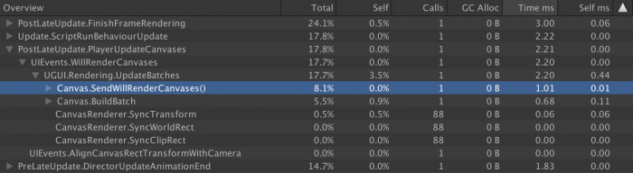

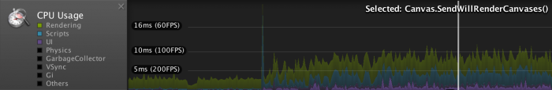
<p><em>VI: Tắt bớt trace category — bấm vào ô màu bên trái tên category trong CPU Usage profiler; cũng kéo thả được để đổi thứ tự. / EN: Toggle trace categories by clicking the colored boxes beside the category names in the CPU Usage profiler; they can also be dragged to reorder.</em></p>

<div class="bilingual-row">
<div class="col-vi">
<p><strong>Cách dùng chính:</strong> profiling <em>so sánh</em> — bật/tắt các phần của UI trong khi Profiler đang chạy sẽ <strong>nhanh chóng khoanh vùng</strong> phần hierarchy nào gây vấn đề nhất.</p>
<p><strong>Hai dòng cần theo dõi:</strong></p>
<ul>
<li><strong><code>Canvas.BuildBatch</code></strong> — phần tính toán <em>native-code</em> thực hiện quá trình Canvas Batch Building.</li>
<li><strong><code>Canvas.SendWillRenderCanvases</code></strong> — chứa lời gọi các script C# đăng ký sự kiện <code>willRenderCanvases</code>. Lớp <code>CanvasUpdateRegistry</code> nhận sự kiện này và dùng nó chạy quá trình Rebuild.</li>
</ul>
<p>💡 <strong>Mẹo đọc dễ hơn:</strong> tắt hết trace category trừ <strong>"Rendering", "Scripts" và "UI"</strong>. Bấm vào ô màu bên cạnh tên category ở bên trái CPU Usage profiler. Cũng có thể <em>đổi thứ tự</em> category bằng cách kéo thả tên lên/xuống.</p>
<p>🚨 <strong>Bẫy phân loại category (Unity 2017.1+):</strong> Category "UI" là mới, nhưng <strong>một số phần của quá trình cập nhật UI bị phân loại SAI</strong>. Hãy cẩn thận khi nhìn đường cong UI vì nó <em>có thể không chứa toàn bộ lời gọi liên quan tới UI</em>.</p>
<p><strong>Ví dụ cụ thể:</strong> <code>Canvas.SendWillRenderCanvases</code> được xếp vào <strong>"UI"</strong>, nhưng <code>Canvas.BuildBatch</code> lại xếp vào <strong>"Others" và "Rendering"</strong>!</p>
</div>
<div class="col-en">
<p><strong>Primary use:</strong> <em>comparative</em> profiling — enabling and disabling elements of a UI while the Profiler is running can <strong>quickly narrow down</strong> the portions of a UI hierarchy most responsible for performance issues.</p>
<p><strong>Two lines to watch:</strong></p>
<ul>
<li><strong><code>Canvas.BuildBatch</code></strong> — the <em>native-code</em> calculations that perform the Canvas Batch Building process.</li>
<li><strong><code>Canvas.SendWillRenderCanvases</code></strong> — contains the invocation of the C# scripts subscribed to the <code>willRenderCanvases</code> Event. <code>CanvasUpdateRegistry</code> receives this event and uses it to run the Rebuild process.</li>
</ul>
<p>💡 <strong>Tip for easier reading:</strong> disable all trace categories aside from <strong>"Rendering", "Scripts" and "UI"</strong>. Click the colored boxes beside the category name on the left of the CPU Usage profiler. Categories can also be <em>re-ordered</em> by clicking and dragging names up or down.</p>
<p>🚨 <strong>Category classification trap (Unity 2017.1+):</strong> The "UI" category is new, but <strong>parts of the UI update process are not categorized correctly</strong>. Be careful looking at the UI curve because it <em>may not contain all UI-related calls</em>.</p>
<p><strong>Concrete example:</strong> <code>Canvas.SendWillRenderCanvases</code> is categorized as <strong>"UI"</strong>, but <code>Canvas.BuildBatch</code> is categorized as <strong>"Others" and "Rendering"</strong>!</p>
</div>
</div>

### 4.2. 🎯 UI Profiler & cột "Batch Breaking Reason"

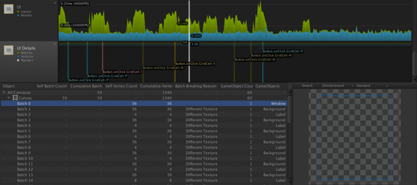
<p><em>VI: Batch viewer của UI Profiler. Đọc bảng: <code>All Canvases</code> → <code>Canvas</code> (Self Batch Count 59, Cumulative Vertex 1340, GameObject Count 60) → <code>Batch 0..14</code>. Cột <strong>Batch Breaking Reason</strong> hiện <strong>"Different Texture"</strong> cho hầu hết batch — đúng nguyên nhân phổ biến nhất, sửa được bằng sprite atlas. Cột cuối cho biết GameObject liên quan (Window / Background / Label). / EN: The UI Profiler batch viewer — the Batch Breaking Reason column reads "Different Texture" for most batches, the most frequent cause, fixable with sprite atlases.</em></p>

<div class="bilingual-row">
<div class="col-vi">
<p>Từ <strong>Unity 2017.1</strong> có <strong>UI Profiler</strong> riêng (mặc định là module cuối cùng trong cửa sổ Profiler). Nó gồm <strong>2 timeline và 1 batch viewer</strong>:</p>
<ul>
<li><strong>Timeline 1</strong> — thời gian CPU chia thành 2 loại: <em>tính layout</em> và <em>rendering</em>. ⚠️ Vẫn dính vấn đề phân loại nói trên.</li>
<li><strong>Timeline 2</strong> — <em>tổng số batch, số vertex</em>, và hiển thị <strong>event marker</strong> (ví dụ các sự kiện click button). Marker này giúp bạn xác định <em>cái gì gây ra CPU spike</em>.</li>
</ul>
<p>🏆 <strong>Tính năng hữu ích NHẤT là BATCH VIEWER ở dưới cùng.</strong></p>
<p>Bên trái là cây tất cả Canvas, dưới mỗi Canvas là danh sách batch chúng sinh ra. Các cột cung cấp chi tiết, nhưng <strong>có một cột đặc biệt quan trọng: "Batch Breaking Reason"</strong>.</p>
<p>👉 Cột này cho biết <strong>VÌ SAO batch được chọn không thể gộp với batch trước đó</strong>. <em>"Giảm số batch là một trong những cách hiệu quả nhất để cải thiện hiệu năng UI, nên hiểu cái gì phá batching là rất quan trọng."</em></p>
<p><strong>Lý do thường gặp nhất:</strong> một phần tử UI <strong>dùng texture hoặc material khác</strong>. Nhiều trường hợp sửa dễ dàng bằng <strong>sprite atlas</strong>.</p>
<p>💡 Cột cuối hiển thị tên GameObject gắn với batch — <strong>double-click để chọn ngay GameObject đó trong Editor</strong> (rất hữu ích khi có nhiều object trùng tên).</p>
<p>⚠️ <strong>Giới hạn (tính tới Unity 2017.3):</strong> batch viewer <strong>chỉ hoạt động trong Editor</strong>. Batching thường giống nhau trên thiết bị nên vẫn rất hữu ích; nếu nghi ngờ, dùng Frame Debugger.</p>
</div>
<div class="col-en">
<p>From <strong>Unity 2017.1</strong> there's a dedicated <strong>UI Profiler</strong> (by default the last one in the Profiler window). It consists of <strong>two timelines and a batch viewer</strong>:</p>
<ul>
<li><strong>Timeline 1</strong> — CPU time in two categories: <em>computing layout</em> and <em>rendering</em>. ⚠️ Suffers from the same categorization problem.</li>
<li><strong>Timeline 2</strong> — <em>total number of batches, vertices</em>, and displays <strong>event markers</strong> (e.g. button click events). These markers help determine <em>what caused a CPU spike</em>.</li>
</ul>
<p>🏆 <strong>The MOST useful feature is the BATCH VIEWER at the bottom.</strong></p>
<p>On the left is a tree view of all your canvases and, underneath each, a list of the batches they generated. The columns provide details, but <strong>one is crucial: "Batch Breaking Reason"</strong>.</p>
<p>👉 This column shows <strong>WHY the selected batch couldn't be merged with the previous one</strong>. <em>"Reducing the number of batches is one of the most effective ways of improving UI performance, so it's important to understand what breaks batching."</em></p>
<p><strong>The most frequent reason:</strong> a UI element <strong>using a different texture or material</strong>. In many cases this is easily fixed by using <strong>sprite atlases</strong>.</p>
<p>💡 The last column shows the name of the game objects associated with the batch — <strong>double-click the name to select the game object in the editor</strong> (particularly helpful with several same-named objects).</p>
<p>⚠️ <strong>Limitation (as of Unity 2017.3):</strong> the batch viewer <strong>only works in the editor</strong>. Batching should usually be the same on device so this is still really helpful; if in doubt, use the Frame Debugger.</p>
</div>
</div>

### 4.3. Unity Frame Debugger cho UI

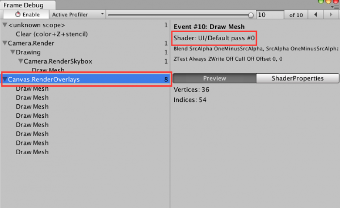

<div class="bilingual-row">
<div class="col-vi">
<p>Frame Debugger hữu ích để <strong>giảm số draw call</strong> do Unity UI sinh ra. Mở qua menu <code>Window</code>.</p>
<p>💡 <strong>Điểm cực hay:</strong> Frame Debugger <strong>tự cập nhật theo draw call sinh ra để hiển thị Game View trong Editor</strong> — nên bạn <em>thử nghiệm các cấu hình UI khác nhau mà KHÔNG cần vào Play Mode</em>.</p>
<p><strong>Vị trí draw call UI phụ thuộc Render Mode của Canvas:</strong></p>
<ul>
<li><strong>Screen Space – Overlay</strong> → trong nhóm <code>Canvas.RenderOverlays</code></li>
<li><strong>Screen Space – Camera</strong> → trong nhóm <code>Camera.Render</code> của Render Camera được chọn, là nhóm con của <code>Render.TransparentGeometry</code></li>
<li><strong>World Space</strong> → là nhóm con của <code>Render.TransparentGeometry</code> cho mỗi World Space camera nhìn thấy Canvas</li>
</ul>
<p>Mọi UI nhận diện được qua dòng <strong><code>Shader: UI/Default</code></strong> (giả sử shader UI chưa bị thay).</p>
<p>🔑 <strong>Nguyên nhân phá batch phổ biến nhất liên quan tới thiết kế: CHỒNG LẤN NGOÀI Ý MUỐN.</strong></p>
<p>Mọi component Unity UI sinh geometry dưới dạng <em>một chuỗi quad</em>. Nhưng nhiều sprite UI hay glyph text <strong>chỉ chiếm một phần nhỏ của quad</strong> đại diện cho chúng, phần còn lại là <em>không gian trống</em>. Kết quả: rất thường gặp việc designer <strong>vô tình cho nhiều quad khác nhau chồng lên nhau</strong> mà texture đến từ material khác nhau ⇒ <em>không thể batch</em>.</p>
</div>
<div class="col-en">
<p>The Frame Debugger is useful for <strong>reducing the number of draw calls</strong> generated by a Unity UI. Access it via the <code>Window</code> menu.</p>
<p>💡 <strong>Notably:</strong> the Frame Debugger <strong>updates itself with the draw calls generated to display the Game View in the Editor</strong> — so you can <em>try out different UI configurations WITHOUT entering Play Mode</em>.</p>
<p><strong>Location of UI draw calls depends on the Canvas Render Mode:</strong></p>
<ul>
<li><strong>Screen Space – Overlay</strong> → within the <code>Canvas.RenderOverlays</code> group</li>
<li><strong>Screen Space – Camera</strong> → within the <code>Camera.Render</code> group of the selected Render Camera, as a subgroup of <code>Render.TransparentGeometry</code></li>
<li><strong>World Space</strong> → as a subgroup of <code>Render.TransparentGeometry</code> for each World Space camera in which the Canvas is visible</li>
</ul>
<p>All UIs can be identified by the <strong><code>Shader: UI/Default</code></strong> line (assuming the UI shader has not been replaced).</p>
<p>🔑 <strong>The most common design-related cause of broken batches: UNINTENTIONAL OVERLAP.</strong></p>
<p>All Unity UI components generate their geometry as <em>a series of quads</em>. However, many UI sprites or text glyphs <strong>occupy only a fraction of the quads</strong> used to represent them, with the rest being <em>empty space</em>. As a result, it is quite common to find that the designer has <strong>unintentionally overlapped multiple different quads</strong> whose textures come from different materials and therefore cannot be batched.</p>
</div>
</div>

!!! danger "Ví dụ A-B-C — Quy tắc thứ tự quyết định batching"
    <div class="bilingual-row">
    <div class="col-vi">
    <p>Vì Unity UI hoạt động hoàn toàn trong <em>transparent queue</em>, bất kỳ quad nào bị quad <strong>không-batch-được</strong> phủ lên trên thì <strong>phải được vẽ TRƯỚC</strong> quad đó — và do đó <em>không thể batch</em> với các quad được đặt phía trên quad không-batch-được ấy.</p>
    <p><strong>Xét 3 quad A, B, C.</strong> Cả ba đều chồng lên nhau. <strong>A và C dùng CÙNG material</strong>, <strong>B dùng material RIÊNG</strong> ⇒ B không thể batch với A hay C.</p>
    <ul>
    <li>❌ Thứ tự hierarchy (trên→dưới) là <strong>A, B, C</strong> → <strong>A và C KHÔNG batch được</strong>, vì B phải vẽ trên A và dưới C.</li>
    <li>✅ Nhưng nếu đặt <strong>B trước hoặc sau</strong> cặp quad batch được → <strong>A và C BATCH ĐƯỢC</strong> — B chỉ cần vẽ trước hoặc sau batch đó, không xen vào giữa.</li>
    </ul>
    </div>
    <div class="col-en">
    <p>As Unity UI operates entirely in the transparent queue, any quads that have <strong>unbatchable</strong> quads overlaid atop them <strong>must be drawn BEFORE</strong> the unbatchable quads, and therefore <em>cannot be batched</em> with other quads placed atop the unbatchable quads.</p>
    <p><strong>Consider three quads A, B, and C.</strong> All three overlap one another. <strong>A and C use the SAME material</strong>, <strong>B uses a SEPARATE material</strong> ⇒ B cannot be batched with A or C.</p>
    <ul>
    <li>❌ If the hierarchy order (top to bottom) is <strong>A, B, C</strong> → <strong>A and C CANNOT be batched</strong>, because B must be drawn atop A and beneath C.</li>
    <li>✅ However, if B is placed <strong>before or after</strong> the batchable quads → <strong>the batchable quads CAN be batched</strong> — B needs only be drawn before or after the batch and does not interpose them.</li>
    </ul>
    </div>
    </div>

### 4.4. Instruments & VTune — Tên method native

<div class="bilingual-row">
<div class="col-vi">
<p>Xcode Instruments và Intel VTune cho phép profiling <strong>cực sâu</strong> vào rebuild UI và tính toán Canvas batch. Tên method gần như trùng với label trong Unity Profiler:</p>
<ul>
<li><strong><code>Canvas::SendWillRenderCanvases</code></strong> — hàm cha C++ gọi method C# cùng tên; chứa code chạy quá trình Rebuild.</li>
<li><strong><code>Canvas::UpdateBatches</code></strong> — giống <code>Canvas.BuildBatch</code>, nhưng <em>bao gồm thêm boilerplate</em> không được label của Unity Profiler bao phủ.</li>
</ul>
<p><strong>Khi dùng với build IL2CPP, các method transpile cần chú ý (tên xấp xỉ):</strong></p>
<ul>
<li><strong><code>IndexedSet_Sort</code></strong> và <strong><code>CanvasUpdateRegistry_SortLayoutList</code></strong> — sắp xếp danh sách Layout dirty trước khi tính lại. Việc này <em>bao gồm đếm số parent transform</em> phía trên mỗi Layout.</li>
<li><strong><code>ClipperRegistry_Cull</code></strong> — gọi mọi implementer đã đăng ký của <code>IClipRegion</code>. Implementer dựng sẵn gồm <strong>RectMask2D</strong> (dùng interface <code>IClippable</code>). Trong lời gọi này, RectMask2D <em>lặp qua TẤT CẢ phần tử clippable trong hierarchy của nó</em> và yêu cầu chúng cập nhật thông tin culling.</li>
<li><strong><code>Graphic_Rebuild</code></strong> — chứa chi phí tính mesh cho Image, Text, hoặc Graphic khác. Bên dưới nó còn <code>Graphic_UpdateGeometry</code> và đáng chú ý nhất là <strong><code>Text_OnPopulateMesh</code></strong>.
  <ul>
  <li><code>Text_OnPopulateMesh</code> nhìn chung là <strong>hotspot khi bật Best Fit</strong>.</li>
  <li><strong>Mesh modifier</strong> như <code>Shadow_ModifyMesh</code> và <code>Outline_ModifyMesh</code> cũng chạy ở đây — chi phí tính drop shadow, outline và hiệu ứng đặc biệt khác nhìn thấy qua đây.</li>
  </ul>
</li>
</ul>
</div>
<div class="col-en">
<p>Xcode's Instruments and Intel's VTune allow for <strong>extremely deep</strong> profiling of UI rebuilds and Canvas batch calculations. Method names are nearly identical to the Unity Profiler labels:</p>
<ul>
<li><strong><code>Canvas::SendWillRenderCanvases</code></strong> — the C++ parent calling the C# method of the same name; contains the code running the Rebuild process.</li>
<li><strong><code>Canvas::UpdateBatches</code></strong> — identical to <code>Canvas.BuildBatch</code>, but <em>includes additional boilerplate code</em> not covered by the Unity Profiler label.</li>
</ul>
<p><strong>With an IL2CPP build, the transpiled methods of primary interest (names approximate):</strong></p>
<ul>
<li><strong><code>IndexedSet_Sort</code></strong> and <strong><code>CanvasUpdateRegistry_SortLayoutList</code></strong> — sort the list of dirty Layout components before recalculation. This <em>involves calculating the number of parent transforms</em> above each Layout component.</li>
<li><strong><code>ClipperRegistry_Cull</code></strong> — calls all registered implementers of <code>IClipRegion</code>. Built-in implementers include <strong>RectMask2D</strong>, which uses <code>IClippable</code>. During these calls, RectMask2D components <em>loop over ALL clippable elements contained within their hierarchy</em> and ask them to update their culling information.</li>
<li><strong><code>Graphic_Rebuild</code></strong> — contains the cost of calculating the meshes for Image, Text or other Graphic-derived components. Beneath it are <code>Graphic_UpdateGeometry</code> and, most notably, <strong><code>Text_OnPopulateMesh</code></strong>.
  <ul>
  <li><code>Text_OnPopulateMesh</code> is generally a <strong>hotspot when Best Fit is enabled</strong>.</li>
  <li><strong>Mesh modifiers</strong> such as <code>Shadow_ModifyMesh</code> and <code>Outline_ModifyMesh</code> also run here — the cost of drop shadows, outlines and other effects is visible via these methods.</li>
  </ul>
</li>
</ul>
</div>
</div>

### 4.5. Xcode GPU Profiler — Tiler / Renderer / Device

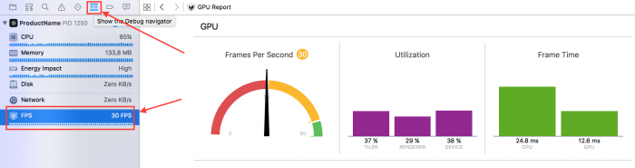

<div class="bilingual-row">
<div class="col-vi">
<p><strong>Cách bật:</strong> Cấu hình project dùng <strong>Metal</strong> hoặc <strong>OpenGLES3</strong>, build và mở project Xcode kết quả.</p>
<p>⚠️ <em>Một số phiên bản Xcode</em> cần chọn Graphics API đúng trong Build Scheme mới hoạt động: <code>Product &gt; Scheme &gt; Edit Scheme...</code> → chọn target <strong>Run</strong> → tab <strong>Options</strong> → đổi <strong>GPU Frame Capture</strong> khớp API dự án dùng.</p>
<p>💡 Nếu để Unity tự chọn graphics API, hầu hết iPad hiện đại mặc định dùng <strong>Metal</strong>. Không chắc? Chạy project và xem debug log trong Xcode — một trong các dòng đầu sẽ cho biết đang khởi tạo Metal, GLES3 hay GLES2.</p>
<p>Tìm GPU profiler: hiện pane <strong>Debug</strong> trong Navigator sidebar của Xcode, bấm vào mục <strong>FPS</strong>.</p>
<p>🔑 <strong>Ba thanh ở giữa màn hình — đọc thế nào:</strong></p>
<ul>
<li><strong>"Tiler"</strong> — đo mức GPU bị căng thẳng bởi <em>xử lý geometry</em>, bao gồm thời gian trong vertex shader. <strong>Tiler cao ⇒ vertex shader quá chậm HOẶC số vertex vẽ ra quá nhiều.</strong></li>
<li><strong>"Renderer"</strong> — đo mức căng thẳng của <em>pixel pipeline</em> GPU. <strong>Renderer cao ⇒ ứng dụng vượt fill-rate tối đa của GPU, HOẶC fragment shader kém hiệu quả.</strong></li>
<li><strong>"Device"</strong> — chỉ số tổng hợp toàn bộ GPU, gồm cả Tiler và Renderer. <em>Nhìn chung có thể bỏ qua</em>, vì nó xấp xỉ bám theo cái cao hơn trong hai chỉ số kia.</li>
</ul>
<p>👉 <strong>Với Unity UI:</strong> UI chỉ sinh quad nên vertex shader <em>khó gây áp lực lên tiler</em>. <strong>Mọi vấn đề xuất hiện ở shader pass này gần như chắc chắn là do fill-rate.</strong></p>
<p>Kích hoạt Xcode Frame Debugger bằng cách bấm icon <strong>'Camera'</strong> nhỏ ở đáy GPU profiler. Chi phí render geometry do Unity UI sinh ra hiện dưới shader pass <strong>"UI/Default"</strong>.</p>
</div>
<div class="col-en">
<p><strong>How to enable:</strong> Configure the project to use <strong>Metal</strong> or <strong>OpenGLES3</strong>, make a build and open the resulting Xcode project.</p>
<p>⚠️ <em>On some Xcode versions</em>, it is necessary to select the appropriate Graphics API in the Build Scheme: <code>Product &gt; Scheme &gt; Edit Scheme...</code> → select the <strong>Run</strong> target → <strong>Options</strong> tab → change <strong>GPU Frame Capture</strong> to match your project's API.</p>
<p>💡 If Unity auto-selects the graphics API, most modern iPads default to <strong>Metal</strong>. If in doubt, start the project and look at the debug logs in Xcode — one of the early lines indicates which rendering path (Metal, GLES3 or GLES2) is initialized.</p>
<p>Find the GPU profiler by showing the <strong>Debug</strong> pane in Xcode's Navigator sidebar and clicking the <strong>FPS</strong> entry.</p>
<p>🔑 <strong>The three bars in the center — how to read them:</strong></p>
<ul>
<li><strong>"Tiler"</strong> — generally a measure of how stressed the GPU is by <em>processing geometry</em>, including time in vertex shaders. <strong>High Tiler ⇒ excessively slow vertex shaders OR an excessive number of vertices being drawn.</strong></li>
<li><strong>"Renderer"</strong> — generally a measure of how stressed the GPU's <em>pixel pipelines</em> are. <strong>High Renderer ⇒ the app is exceeding the GPU's maximum fill-rate, OR has inefficient fragment shaders.</strong></li>
<li><strong>"Device"</strong> — a composite measure of overall GPU usage including both. <em>It can generally be ignored</em>, as it roughly tracks the higher of Tiler or Renderer.</li>
</ul>
<p>👉 <strong>For Unity UI:</strong> UI only generates quads so the vertex shader is <em>unlikely to stress the tiler pipeline</em>. <strong>Any problems appearing in this shader pass are likely due to fill-rate issues.</strong></p>
<p>Trigger the Xcode Frame Debugger by clicking the small <strong>'Camera'</strong> icon at the bottom of the GPU profiler. The cost of rendering Unity UI geometry shows under the <strong>"UI/Default"</strong> shader pass.</p>
</div>
</div>

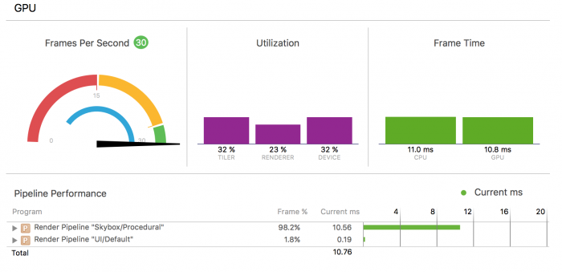
<p><em>VI: Summary view của Xcode Frame Debugger sau khi capture. / EN: The Xcode Frame Debugger's summary view.</em></p>

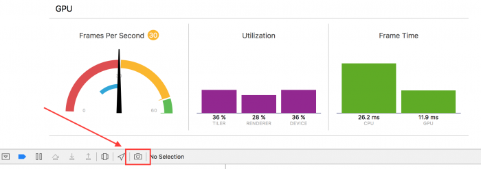
<p><em>VI: Nút Camera để capture GPU frame nằm ẩn ở đáy GPU profiler. / EN: The Camera icon that triggers GPU frame capture, hidden at the bottom of the GPU profiler.</em></p>

---

## 5. 🩺 Bảng chẩn đoán kết quả Profiling UI

<div class="bilingual-row">
<div class="col-vi">
<p>Sau khi thu thập dữ liệu profiling, tra bảng này để biết <strong>đi sửa cái gì</strong>:</p>
</div>
<div class="col-en">
<p>After gathering profiling data, use this table to know <strong>what to fix</strong>:</p>
</div>
</div>

| Triệu chứng quan sát được / Symptom | Nguyên nhân khả dĩ / Likely cause | Giải pháp / Remediation |
|---|---|---|
| `Canvas.BuildBatch` **hoặc** `Canvas::UpdateBatches` tốn quá nhiều CPU | **Quá nhiều Canvas Renderer trên MỘT Canvas** | → §7 **Splitting Canvases** |
| Tốn quá nhiều thời gian vẽ UI trên GPU, **và** frame debugger chỉ ra fragment shader pipeline là bottleneck | UI **vượt pixel fill rate** GPU chịu được. Nguyên nhân khả dĩ nhất: **overdraw UI quá mức** | → §6 **Remediating fill-rate issues** |
| `Canvas.SendWillRenderCanvases` chiếm phần lớn CPU | Graphic Rebuild tốn CPU — **cần phân tích sâu hơn** | Xem 4 dòng dưới ⬇️ |
| ↳ Phần lớn thời gian ở `IndexedSet_Sort` / `CanvasUpdateRegistry_SortLayoutList` | Đang **sắp xếp danh sách Layout dirty** | Giảm số Layout component trên Canvas → §12 **RectTransform layouts** + §7 **Splitting Canvases** |
| ↳ Phần lớn thời gian ở `Text_OnPopulateMesh` | Đơn giản là **sinh mesh text** | → §9 **Best Fit** & §12 **Disabling Canvases**. Nếu phần lớn text bị rebuild mà *dữ liệu chuỗi không hề đổi* → §7 **Splitting Canvases** |
| ↳ Thời gian ở `Shadow_ModifyMesh` / `Outline_ModifyMesh` (hoặc `ModifyMesh` bất kỳ) | **Tính mesh modifier quá tốn** | **Gỡ các component này** và đạt hiệu ứng thị giác bằng **ảnh tĩnh** |
| ↳ **Không có hotspot cụ thể** trong `Canvas.SendWillRenderCanvases`, hoặc nó chạy **mỗi frame** | **Phần tử động bị gom chung với phần tử tĩnh**, buộc toàn bộ Canvas rebuild quá thường xuyên | → §7 **Splitting Canvases** |

---

## 6. Khắc phục vấn đề Fill-rate

<div class="bilingual-row">
<div class="col-vi">
<p><strong>Chỉ có 2 hướng giảm áp lực lên fragment pipeline của GPU:</strong></p>
<ol>
<li><strong>Giảm độ phức tạp của fragment shader</strong> (xem §6.6)</li>
<li><strong>Giảm số pixel phải được sample</strong></li>
</ol>
<p>Vì shader UI nhìn chung là chuẩn hóa, <strong>vấn đề phổ biến nhất đơn giản là dùng quá mức fill-rate</strong>. Nguyên nhân thường gặp nhất: <em>số lượng lớn phần tử UI chồng lên nhau</em> và/hoặc <em>nhiều phần tử UI chiếm phần đáng kể màn hình</em>. Cả hai đều dẫn tới mức <strong>overdraw cực cao</strong>.</p>
</div>
<div class="col-en">
<p><strong>There are only two courses of action to reduce stress on the GPU's fragment pipeline:</strong></p>
<ol>
<li><strong>Reducing the complexity of fragment shaders</strong> (see §6.6)</li>
<li><strong>Reducing the number of pixels that must be sampled</strong></li>
</ol>
<p>As the UI shader is generally standardized, <strong>the most common problem is simply excessive fill-rate usage</strong>. This is most commonly due to <em>a large number of overlapping UI elements</em> and/or <em>multiple UI elements occupying significant portions of the screen</em>. Both lead to <strong>extremely high levels of overdraw</strong>.</p>
</div>
</div>

### 6.1. Loại bỏ UI vô hình

<div class="bilingual-row">
<div class="col-vi">
<p>Phương pháp <strong>ít phải thiết kế lại nhất</strong>: đơn giản là <em>tắt các phần tử người chơi không nhìn thấy</em>.</p>
<p>Trường hợp áp dụng phổ biến nhất: <strong>mở UI full-screen có nền đục</strong>. Khi đó mọi phần tử UI nằm bên dưới UI full-screen đều có thể tắt đi. Cách đơn giản nhất là tắt GameObject gốc chứa các phần tử vô hình đó.</p>
<p>🚨 <strong>Bẫy alpha = 0:</strong> Đảm bảo <strong>KHÔNG</strong> có phần tử UI nào bị ẩn bằng cách đặt alpha = 0 — vì phần tử đó <em>VẪN được gửi tới GPU</em> và có thể ngốn thời gian render quý giá.</p>
<p>💡 Nếu một phần tử UI <strong>không cần</strong> component Graphic, hãy <strong>gỡ hẳn nó đi</strong> — raycasting vẫn hoạt động bình thường.</p>
</div>
<div class="col-en">
<p>The method requiring <strong>the least redesigning</strong>: simply <em>disable elements that are not visible to the player</em>.</p>
<p>The most common applicable case: <strong>opening full-screen UIs with opaque backgrounds</strong>. Any UI elements placed beneath can be disabled. The simplest way is to disable the root GameObject(s) containing the invisible elements.</p>
<p>🚨 <strong>The alpha = 0 trap:</strong> Make sure that <strong>NO</strong> UI elements are hidden by setting their alpha to 0, as the element <em>will STILL be sent to the GPU</em> and may take precious rendering time.</p>
<p>💡 If a UI element <strong>doesn't need</strong> a Graphic component, you can simply <strong>remove it</strong> — raycasting will still work.</p>
</div>
</div>

### 6.2. Đơn giản hóa cấu trúc UI

<div class="bilingual-row">
<div class="col-vi">
<p>Để giảm thời gian rebuild và render UI, quan trọng là <strong>giữ số lượng UI object thấp nhất có thể</strong>. Hãy "bake" mọi thứ nhiều nhất có thể.</p>
<ul>
<li>❌ Đừng dùng một GameObject blend chỉ để đổi màu (hue) cho một phần tử → ✅ làm việc này qua <strong>material property</strong>.</li>
<li>❌ Đừng tạo GameObject đóng vai <em>"thư mục"</em> không có mục đích nào khác ngoài sắp xếp Scene.</li>
</ul>
</div>
<div class="col-en">
<p>To reduce the time required to rebuild and render the UI, it is important to <strong>keep the number of UI objects as low as possible</strong>. Try to bake things as much as you can.</p>
<ul>
<li>❌ Don't use a blended GameObject just to change the hue of an element → ✅ do this via <strong>material properties</strong> instead.</li>
<li>❌ Don't create game objects acting like <em>"folders"</em> and having no other purpose than organizing your Scenes.</li>
</ul>
</div>
</div>

### 6.3. Tắt output camera vô hình

<div class="bilingual-row">
<div class="col-vi">
<p>Nếu mở một UI full-screen nền đục, <strong>world-space camera VẪN render toàn bộ scene 3D phía sau UI</strong>. Renderer <em>không biết</em> rằng Unity UI full-screen sẽ che khuất toàn bộ scene 3D.</p>
<p>👉 Vì vậy, khi mở UI full-screen hoàn toàn, <strong>tắt mọi world-space camera bị che khuất</strong> sẽ giảm áp lực GPU bằng cách loại bỏ công việc vô ích là render thế giới 3D.</p>
<p>💡 <strong>Nếu UI không che hết scene 3D:</strong> bạn có thể <em>render scene ra một texture một lần</em> rồi dùng texture đó thay vì render liên tục. Bạn mất khả năng thấy nội dung động trong scene 3D, nhưng điều đó thường chấp nhận được.</p>
<p>⚠️ <strong>Lưu ý:</strong> Nếu một Canvas đặt là <strong>"Screen Space – Overlay"</strong>, nó sẽ <em>được vẽ bất kể có bao nhiêu camera đang hoạt động trong scene</em>.</p>
</div>
<div class="col-en">
<p>If a full-screen UI with an opaque background is opened, <strong>the world-space camera will STILL render the standard 3D scene behind the UI</strong>. The renderer <em>is not aware</em> that the full-screen Unity UI will obscure the entire 3D scene.</p>
<p>👉 Therefore, if a completely full-screen UI is opened, <strong>disabling any and all obscured world-space cameras</strong> helps reduce GPU stress by eliminating the useless work of rendering the 3D world.</p>
<p>💡 <strong>If the UI doesn't cover the whole 3D scene:</strong> you may want to <em>render the scene to a texture once</em> and use it instead of continuously rendering. You lose the ability to see animated content in the 3D scene, but that should be acceptable most of the time.</p>
<p>⚠️ <strong>Note:</strong> If a Canvas is set as <strong>"Screen Space – Overlay"</strong>, it <em>will be drawn irrespective of the number of cameras active in the scene</em>.</p>
</div>
</div>

### 6.4. Camera bị che phần lớn — Kỹ thuật Impostor

<div class="bilingual-row">
<div class="col-vi">
<p>Nhiều UI <em>"full-screen"</em> thực ra <strong>không che hết</strong> thế giới 3D, mà chừa lại một phần nhỏ nhìn thấy được.</p>
<p>👉 Trong trường hợp này, tối ưu hơn là <strong>chỉ capture phần thế giới còn nhìn thấy vào một render texture</strong>.</p>
<p>Nếu phần nhìn thấy được <em>"cache"</em> trong render texture, thì <strong>world-space camera thật có thể TẮT đi</strong>, và render texture đã cache được vẽ phía sau màn hình UI để cung cấp một <strong>phiên bản "impostor"</strong> của thế giới 3D.</p>
</div>
<div class="col-en">
<p>Many "full-screen" UIs do not actually obscure the entire 3D world, but <strong>leave a small portion visible</strong>.</p>
<p>👉 In these cases, it may be more optimal to <strong>capture just the visible portions of the world into a render texture</strong>.</p>
<p>If the visible portion of the world is <em>"cached"</em> in a render texture, then <strong>the actual world-space camera can be disabled</strong>, and the cached render texture drawn behind the UI screen to provide an <strong>impostor version</strong> of the 3D world.</p>
</div>
</div>

### 6.5. ⚠️ UI dựng bằng "Composition" — Cái bẫy của designer

<div class="bilingual-row">
<div class="col-vi">
<p><strong>Rất phổ biến:</strong> designer tạo UI bằng <em>composition</em> — kết hợp và xếp lớp các nền và phần tử chuẩn để tạo UI cuối. Việc này <strong>tương đối đơn giản và rất thân thiện với việc lặp thiết kế</strong>, <em>nhưng KHÔNG hiệu năng</em> do Unity UI dùng transparent rendering queue.</p>
<p><strong>Ví dụ tính toán:</strong> Một UI đơn giản gồm <em>nền + button + text trên button</em>. Vì object trong transparent queue được sắp từ sau ra trước, với một pixel nằm trong glyph text, GPU phải sample:</p>
<ol>
<li>Texture của <strong>nền</strong></li>
<li>Texture của <strong>button</strong></li>
<li>Texture của <strong>text atlas</strong></li>
</ol>
<p>⇒ <strong>3 lần sample cho MỘT pixel.</strong> Khi UI phức tạp hơn và thêm nhiều phần tử trang trí lên nền, <em>số lần sample tăng RẤT nhanh</em>.</p>
<p><strong>Giải pháp:</strong> Nếu một UI lớn bị fill-rate bound, cách tốt nhất là <strong>tạo sprite UI chuyên biệt gộp càng nhiều phần tử trang trí/bất biến vào texture nền càng tốt</strong>.</p>
<p>👉 <strong>Áp dụng cả cho sub-element:</strong> Xét UI cửa hàng với pane sản phẩm cuộn được. Mỗi phần tử sản phẩm có viền, nền, và vài icon giá/tên. UI cửa hàng cần một nền, nhưng vì sản phẩm <em>cuộn qua nền</em> nên không gộp được vào texture nền cửa hàng. <strong>Tuy nhiên, viền, giá, tên và các phần tử khác của sản phẩm CÓ THỂ gộp vào nền của chính sản phẩm đó.</strong> Tùy kích thước và số lượng icon, tiết kiệm fill-rate có thể <em>đáng kể</em>.</p>
<p>⚖️ <strong>Nhược điểm cần cân nhắc:</strong></p>
<ul>
<li>Phần tử chuyên biệt <strong>không tái sử dụng được nữa</strong></li>
<li>Cần <strong>thêm nguồn lực artist</strong> để tạo</li>
<li>Thêm texture lớn mới có thể <strong>tăng đáng kể bộ nhớ</strong> giữ texture UI — đặc biệt nếu texture UI không được load/unload theo nhu cầu</li>
</ul>
</div>
<div class="col-en">
<p><strong>Very common:</strong> designers create UIs via <em>composition</em> — combining and layering standard backgrounds and elements. This is <strong>relatively simple and very friendly to iteration</strong>, <em>but non-performant</em> due to Unity UI's use of the transparent rendering queue.</p>
<p><strong>Worked example:</strong> A simple UI with a <em>background, a button and some text on the button</em>. Because objects in the transparent queue are sorted back to front, for a pixel that falls within a text glyph the GPU must sample:</p>
<ol>
<li>The <strong>background's</strong> texture</li>
<li>The <strong>button's</strong> texture</li>
<li>The <strong>text atlas'</strong> texture</li>
</ol>
<p>⇒ <strong>Three samples for ONE pixel.</strong> As UI complexity grows and more decorative elements are layered onto the background, <em>the number of samples can rise rapidly</em>.</p>
<p><strong>The remedy:</strong> If a large UI is found to be fill-rate bound, the best recourse is to <strong>create specialized UI sprites that merge as many decorative/invariant elements as possible into the background texture</strong>.</p>
<p>👉 <strong>Applies to sub-elements too:</strong> Consider a store UI with a scrolling pane of products. Each product element has a border, background, and icons for price/name. The store UI needs a background, but because products <em>scroll across it</em> they can't be merged into the store background. <strong>However, the border, price, name and other elements of the product's UI element COULD be merged onto the product's own background.</strong> Depending on icon size and count, the fill-rate savings can be <em>considerable</em>.</p>
<p>⚖️ <strong>Drawbacks to weigh:</strong></p>
<ul>
<li>Specialized elements <strong>can no longer be reused</strong></li>
<li>They <strong>require additional artist resources</strong> to create</li>
<li>Large new textures may <strong>significantly increase memory</strong> needed to hold UI textures — particularly if UI textures are not loaded/unloaded on demand</li>
</ul>
</div>
</div>

### 6.6. UI Shader trên thiết bị cấu hình thấp

<div class="bilingual-row">
<div class="col-vi">
<p>Shader dựng sẵn của Unity UI <strong>tích hợp hỗ trợ masking, clipping và nhiều thao tác phức tạp khác</strong>. Vì độ phức tạp thêm này, <strong>shader UI hoạt động kém so với shader Unity 2D đơn giản hơn trên thiết bị cấu hình thấp</strong> như iPhone 4.</p>
<p>👉 Nếu ứng dụng nhắm thiết bị cấu hình thấp và <strong>không cần</strong> masking, clipping và các tính năng "hoa mỹ", bạn có thể <strong>viết shader tùy biến bỏ đi các thao tác không dùng</strong>.</p>
</div>
<div class="col-en">
<p>Unity UI's built-in shader <strong>incorporates support for masking, clipping and numerous other complex operations</strong>. Because of this added complexity, <strong>the UI shader performs poorly compared to the simpler Unity 2D shader on low-end devices</strong> such as the iPhone 4.</p>
<p>👉 If masking, clipping and other "fancy" features are unneeded for an application targeting low-end devices, you can <strong>create a custom shader that omits the unused operations</strong>.</p>
</div>
</div>

```hlsl
// Shader UI tối giản — nguyên văn từ tài liệu Unity
// Minimal UI shader — verbatim from the Unity guide
Shader "UI/Fast-Default"
{
    Properties
    {
        [PerRendererData] _MainTex ("Sprite Texture", 2D) = "white" {}
        _Color ("Tint", Color) = (1,1,1,1)
    }

    SubShader
    {
        Tags
        {
            "Queue"="Transparent"
            "IgnoreProjector"="True"
            "RenderType"="Transparent"
            "PreviewType"="Plane"
            "CanUseSpriteAtlas"="True"
        }

        Cull Off
        Lighting Off
        ZWrite Off
        ZTest [unity_GUIZTestMode]
        Blend SrcAlpha OneMinusSrcAlpha

        Pass
        {
        CGPROGRAM
            #pragma vertex vert
            #pragma fragment frag
            #include "UnityCG.cginc"
            #include "UnityUI.cginc"

            struct appdata_t
            {
                float4 vertex   : POSITION;
                float4 color    : COLOR;
                float2 texcoord : TEXCOORD0;
            };

            struct v2f
            {
                float4 vertex        : SV_POSITION;
                fixed4 color         : COLOR;
                half2  texcoord      : TEXCOORD0;
                float4 worldPosition : TEXCOORD1;
            };

            fixed4 _Color;
            fixed4 _TextureSampleAdd;

            v2f vert(appdata_t IN)
            {
                v2f OUT;
                OUT.worldPosition = IN.vertex;
                OUT.vertex = mul(UNITY_MATRIX_MVP, OUT.worldPosition);

                OUT.texcoord = IN.texcoord;

                #ifdef UNITY_HALF_TEXEL_OFFSET
                OUT.vertex.xy += (_ScreenParams.zw - 1.0) * float2(-1, 1);
                #endif

                OUT.color = IN.color * _Color;
                return OUT;
            }

            sampler2D _MainTex;

            fixed4 frag(v2f IN) : SV_Target
            {
                // KHÔNG có mask, KHÔNG có clip — chỉ sample + tint
                return (tex2D(_MainTex, IN.texcoord) + _TextureSampleAdd) * IN.color;
            }
        ENDCG
        }
    }
}
```

---

## 7. Canvas Rebuild & Chiến lược tách Canvas

<div class="bilingual-row">
<div class="col-vi">
<p>🚨 <strong>Nhắc lại điều quan trọng nhất:</strong></p>
<blockquote>
<p>Bất cứ khi nào <strong>BẤT KỲ</strong> phần tử UI vẽ được trên một Canvas thay đổi, Canvas <strong>PHẢI chạy lại toàn bộ quá trình batch building</strong>. Quá trình này <strong>phân tích lại MỌI phần tử UI vẽ được trên Canvas đó — bất kể nó có thay đổi hay không</strong>.</p>
</blockquote>
<p>Lưu ý "thay đổi" là <em>bất kỳ</em> thay đổi nào ảnh hưởng ngoại hình của UI object: sprite gán cho sprite renderer, <strong>vị trí &amp; scale của transform</strong>, text chứa trong text mesh, v.v.</p>
<p><strong>Canvas rebuild trở thành vấn đề vì 2 lý do chính:</strong></p>
<ol>
<li>Nếu <strong>số phần tử UI vẽ được trên Canvas LỚN</strong> → việc tính batch trở nên <em>rất tốn kém</em>. Lý do: chi phí sắp xếp và phân tích tăng <strong>NHANH HƠN TUYẾN TÍNH</strong> theo số phần tử vẽ được.</li>
<li>Nếu <strong>Canvas bị dirty thường xuyên</strong> → tốn quá nhiều thời gian refresh một Canvas <em>chỉ có tương đối ít thay đổi</em>.</li>
</ol>
<p>⚠️ Cả hai vấn đề đều <em>trầm trọng thêm</em> khi số phần tử trên Canvas tăng.</p>
</div>
<div class="col-en">
<p>🚨 <strong>Important reminder:</strong></p>
<blockquote>
<p>Whenever <strong>ANY</strong> drawable UI element on a given Canvas changes, the Canvas <strong>must re-run the batch building process</strong>. This process <strong>re-analyzes EVERY drawable UI element on the Canvas, regardless of whether it has changed or not</strong>.</p>
</blockquote>
<p>Note that a "change" is <em>any</em> change affecting a UI object's appearance, including the sprite assigned to a sprite renderer, <strong>transform position &amp; scale</strong>, the text contained in a text mesh, etc.</p>
<p><strong>Canvas rebuilds become performance problems for two primary reasons:</strong></p>
<ol>
<li>If the <strong>number of drawable UI elements on a Canvas is large</strong> → calculating the batch becomes <em>very expensive</em>. This is because the cost of sorting and analyzing grows <strong>MORE-THAN-LINEARLY</strong> with the number of drawable elements.</li>
<li>If the <strong>Canvas is dirtied frequently</strong> → excessive time may be spent refreshing a Canvas with <em>relatively few changes</em>.</li>
</ol>
<p>⚠️ Both problems tend to become <em>acute</em> as the number of elements on a Canvas increases.</p>
</div>
</div>

### 7.1. Child Order — Lớp trung gian phá batch

<div class="bilingual-row">
<div class="col-vi">
<p>Unity UI được dựng <strong>từ sau ra trước</strong>; thứ tự object trong hierarchy quyết định thứ tự sort. Object <em>sớm hơn</em> trong hierarchy được coi là <strong>ở phía sau</strong> object muộn hơn.</p>
<p>Batch được dựng bằng cách <strong>duyệt hierarchy từ trên xuống dưới</strong>, gom tất cả object dùng <em>cùng material, cùng texture</em> và <strong>không có "lớp trung gian"</strong>.</p>
<p>🔑 <strong>Định nghĩa "intermediate layer" (lớp trung gian):</strong> một object đồ họa <em>có material khác</em>, mà <strong>bounding box của nó chồng lên hai object vốn batch được với nhau</strong>, và nó <em>nằm giữa hai object đó trong hierarchy</em>. <strong>Lớp trung gian buộc batch phải bị phá.</strong></p>
<p><strong>Vấn đề này xảy ra phổ biến nhất khi text và sprite nằm gần nhau:</strong> bounding box của text <em>chồng lấn vô hình</em> lên sprite lân cận, vì phần lớn polygon của glyph text là trong suốt.</p>
<p><strong>Hai cách sửa:</strong></p>
<ol>
<li><strong>Sắp xếp lại</strong> các drawable sao cho object batch được <em>không bị object không-batch-được xen vào giữa</em> — tức di chuyển object không-batch-được lên trên hoặc xuống dưới.</li>
<li><strong>Chỉnh vị trí</strong> các object để loại bỏ khoảng chồng lấn vô hình.</li>
</ol>
<p>💡 Cả hai thao tác đều làm được ngay trong Editor với <strong>Frame Debugger mở và bật</strong>. Chỉ cần quan sát số draw call, bạn tìm ra được thứ tự và vị trí <em>tối thiểu hóa số draw call lãng phí</em> do chồng lấn.</p>
</div>
<div class="col-en">
<p>Unity UIs are constructed <strong>back-to-front</strong>, with objects' order in the hierarchy determining sort order. Objects <em>earlier</em> in the hierarchy are considered <strong>behind</strong> objects later in the hierarchy.</p>
<p>Batches are built by <strong>walking the hierarchy top-to-bottom</strong> and collecting all objects which use <em>the same material, the same texture</em> and <strong>do not have intermediate layers</strong>.</p>
<p>🔑 <strong>Definition of an "intermediate layer":</strong> a graphical object <em>with a different material</em>, whose <strong>bounding box overlaps two otherwise-batchable objects</strong> and is <em>placed in the hierarchy between them</em>. <strong>Intermediate layers force batches to be broken.</strong></p>
<p><strong>This most commonly occurs when text and sprites are located near one another:</strong> the text's bounding box can <em>invisibly overlap</em> nearby sprites, because much of a text glyph's polygon is transparent.</p>
<p><strong>Two fixes:</strong></p>
<ol>
<li><strong>Reorder</strong> the drawables so batchable objects are <em>not interposed by the non-batchable object</em> — move the non-batchable object above or below.</li>
<li><strong>Tweak the positions</strong> of the objects to eliminate invisible overlapping space.</li>
</ol>
<p>💡 Both can be carried out in the Editor with the <strong>Frame Debugger open and enabled</strong>. By simply observing the draw call count, you can find an order and position that <em>minimizes draw calls wasted</em> due to overlap.</p>
</div>
</div>

### 7.2. Splitting Canvases — Sub-canvas vs Sibling Canvas

<div class="bilingual-row">
<div class="col-vi">
<p><strong>"Trong hầu hết mọi trường hợp trừ những cái tầm thường nhất, tách Canvas là ý tưởng tốt"</strong> — bằng cách chuyển phần tử sang <em>Sub-canvas</em> hoặc <em>sibling Canvas</em>.</p>
<p><strong>Chọn loại nào?</strong></p>
<ul>
<li><strong>Sibling Canvas</strong> — dùng tốt nhất khi <em>một số phần của UI phải có draw depth điều khiển RIÊNG</em> so với phần còn lại, để luôn nằm trên hoặc dưới các lớp khác (ví dụ: mũi tên hướng dẫn tutorial).</li>
<li><strong>Sub-canvas</strong> — trong hầu hết trường hợp khác thì tiện hơn, vì chúng <em>kế thừa display settings từ Canvas cha</em>.</li>
</ul>
<p>⚠️ <strong>Cảnh báo quan trọng:</strong> Thoạt nhìn có vẻ nên chia UI thành thật nhiều Sub-canvas, <strong>nhưng nhớ rằng hệ thống Canvas KHÔNG gộp batch giữa các Canvas riêng biệt.</strong></p>
<p>👉 Thiết kế UI hiệu năng đòi hỏi <strong>cân bằng giữa tối thiểu hóa chi phí rebuild và tối thiểu hóa draw call lãng phí</strong>.</p>
</div>
<div class="col-en">
<p><strong>"In all but the most trivial cases, it is generally a good idea to split up a Canvas"</strong> — either by moving elements to a <em>Sub-canvas</em> or to a <em>sibling Canvas</em>.</p>
<p><strong>Which to choose?</strong></p>
<ul>
<li><strong>Sibling Canvases</strong> — best used when <em>certain portions of a UI must have their draw depth controlled separately</em> from the rest, to be always above or below other layers (e.g. tutorial arrows).</li>
<li><strong>Sub-canvases</strong> — more convenient in most other cases, as they <em>inherit their display settings from their parent Canvas</em>.</li>
</ul>
<p>⚠️ <strong>Important caveat:</strong> While it may seem at first glance to be best practice to subdivide a UI into many Sub-canvases, <strong>remember that the Canvas system does NOT combine batches across separate Canvases.</strong></p>
<p>👉 Performant UI design requires a <strong>balance between minimizing rebuild cost and minimizing wasted draw calls</strong>.</p>
</div>
</div>

### 7.3. 📋 Nguyên tắc chung khi chia Canvas

<div class="bilingual-row">
<div class="col-vi">
<p>Vì Canvas <em>rebatch mỗi khi bất kỳ component vẽ được nào thay đổi</em>, nhìn chung tốt nhất là <strong>chia bất kỳ Canvas không-tầm-thường nào thành ÍT NHẤT hai phần</strong>.</p>
<p>Hơn nữa, tốt nhất là <strong>đặt CHUNG các phần tử được kỳ vọng thay đổi ĐỒNG THỜI trên cùng một Canvas</strong>. Ví dụ: một <em>thanh tiến trình</em> và một <em>đồng hồ đếm ngược</em> — cả hai dựa vào cùng dữ liệu nền và do đó cần cập nhật cùng lúc, nên đặt trên cùng Canvas.</p>
<p><strong>Chia thế nào:</strong></p>
<ul>
<li><strong>Canvas 1 — TĨNH:</strong> mọi phần tử bất biến như <em>nền, nhãn</em>. Chúng sẽ batch <strong>MỘT LẦN</strong> khi Canvas hiển thị lần đầu, sau đó <em>không cần rebatch nữa</em>.</li>
<li><strong>Canvas 2 — ĐỘNG:</strong> mọi phần tử thay đổi thường xuyên. Đảm bảo Canvas này <em>chủ yếu chỉ rebatch các phần tử dirty</em>.</li>
<li><strong>Nếu số phần tử động rất lớn</strong>, có thể cần chia nhỏ tiếp thành: nhóm <em>thay đổi liên tục</em> (progress bar, timer, animation) và nhóm <em>chỉ thay đổi thỉnh thoảng</em>.</li>
</ul>
<p>⚠️ <strong>Thực tế:</strong> Việc này <em>khá khó trong thực hành</em>, đặc biệt khi đóng gói UI control thành prefab. Nhiều UI thay vào đó chọn cách chia Canvas bằng cách <strong>tách các control tốn kém nhất ra Sub-canvas riêng</strong>.</p>
</div>
<div class="col-en">
<p>Because a Canvas <em>rebatches any time any of its constituent drawable components changes</em>, it is generally best to <strong>split any non-trivial Canvas into AT LEAST two parts</strong>.</p>
<p>Further, it is best to <strong>co-locate elements on the same Canvas if they are expected to change SIMULTANEOUSLY</strong>. An example: a <em>progress bar</em> and a <em>countdown timer</em> — both rely on the same underlying data and therefore require updates at the same time, so they should be on the same Canvas.</p>
<p><strong>How to split:</strong></p>
<ul>
<li><strong>Canvas 1 — STATIC:</strong> all elements that are static and unchanging, such as <em>backgrounds and labels</em>. These batch <strong>ONCE</strong> when the Canvas is first displayed, and then <em>never need to rebatch</em>.</li>
<li><strong>Canvas 2 — DYNAMIC:</strong> all elements that change frequently. This ensures the Canvas is <em>rebatching primarily dirty elements</em>.</li>
<li><strong>If the number of dynamic elements grows very large</strong>, it may be necessary to further subdivide into: elements that are <em>constantly changing</em> (progress bars, timer readouts, anything animated) and elements that <em>change only occasionally</em>.</li>
</ul>
<p>⚠️ <strong>Reality check:</strong> This is <em>rather difficult in practice</em>, especially when encapsulating UI controls into prefabs. Many UIs instead elect to subdivide by <strong>splitting out the costlier controls onto a Sub-canvas</strong>.</p>
</div>
</div>

!!! info "Unity 5.2 — Batching được viết lại"
    **VI:** Ở Unity 5.2, code batching được **viết lại đáng kể** và hiệu năng cao hơn nhiều so với Unity 4.6, 5.0 và 5.1. Hơn nữa, trên thiết bị **nhiều hơn 1 nhân**, hệ thống Unity UI sẽ **chuyển phần lớn xử lý sang worker thread**. Nhìn chung Unity 5.2 **giảm nhu cầu chia UI thành hàng chục Sub-canvas một cách quyết liệt** — nhiều UI mobile giờ chạy tốt với chỉ **2–3 Canvas**.

    **EN:** In Unity 5.2, the batching code was **substantially rewritten** and is considerably more performant than in 4.6, 5.0 and 5.1. Further, on devices with **more than 1 core**, Unity UI will **move most processing to worker threads**. In general Unity 5.2 **reduces the need for aggressively splitting a UI into dozens of Sub-canvases** — many mobile UIs can now be made performant with as few as **two or three Canvases**.

---

## 8. Input & Raycasting

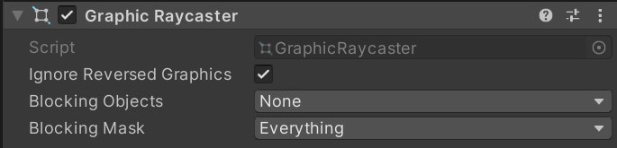

<div class="bilingual-row">
<div class="col-vi">
<p>Mặc định, Unity UI dùng component <strong>Graphic Raycaster</strong> để xử lý sự kiện input như chạm và hover. Việc này thường do <strong>Standalone Input Manager</strong> đảm nhiệm.</p>
<p>💡 <em>Dù tên là "Standalone", nó thực chất là hệ thống input manager "phổ quát"</em> và xử lý cả pointer lẫn touch.</p>
</div>
<div class="col-en">
<p>By default, Unity UI uses the <strong>Graphic Raycaster</strong> component to handle input events such as touch and pointer-hover. This is generally handled by the <strong>Standalone Input Manager</strong> component.</p>
<p>💡 <em>Despite the name, the Standalone Input Manager is meant to be a "universal" input manager system</em> and handles both pointers and touches.</p>
</div>
</div>

### 8.1. 🚨 Bug phát hiện chuột sai trên mobile (trước Unity 5.4)

<div class="bilingual-row">
<div class="col-vi">
<p><strong>Trước Unity 5.4</strong>, mỗi Canvas đang hoạt động có gắn Graphic Raycaster sẽ <strong>chạy MỘT raycast MỖI FRAME</strong> để kiểm tra vị trí con trỏ — miễn là hiện không có touch input.</p>
<p>🚨 <strong>Điều này xảy ra BẤT KỂ nền tảng:</strong> thiết bị iOS và Android <em>không có chuột</em> vẫn sẽ query vị trí chuột và cố tìm phần tử UI nằm dưới vị trí đó để xác định có cần gửi hover event hay không.</p>
<p>💀 <strong>Đây là lãng phí CPU, và đã được chứng kiến ngốn 5% hoặc HƠN thời gian CPU mỗi frame của ứng dụng Unity.</strong></p>
<p>✅ <strong>Đã sửa từ Unity 5.4:</strong> từ 5.4 trở đi, thiết bị không có chuột <em>sẽ không query vị trí chuột</em> và <em>không thực hiện raycast không cần thiết</em>.</p>
<p><strong>Nếu dùng Unity cũ hơn 5.4:</strong> khuyến nghị mạnh là mobile developer <strong>tự tạo lớp Input Manager riêng</strong>. Có thể đơn giản như: copy Standard Input Manager từ source Unity UI, rồi <strong>comment out method <code>ProcessMouseEvent</code> cùng mọi lời gọi tới nó</strong>.</p>
</div>
<div class="col-en">
<p><strong>Prior to Unity 5.4</strong>, each active Canvas with a Graphic Raycaster attached will <strong>run a raycast ONCE PER FRAME</strong> to check the pointer position — so long as there is currently no touch input available.</p>
<p>🚨 <strong>This occurs REGARDLESS of platform:</strong> iOS and Android devices <em>without mice</em> will still query the mouse's position and attempt to discover which UI elements are beneath it to determine if hover events need to be sent.</p>
<p>💀 <strong>This is a waste of CPU time, and has been witnessed consuming 5% or more of a Unity application's CPU frame time.</strong></p>
<p>✅ <strong>Resolved in Unity 5.4:</strong> from 5.4 onward, devices without mice <em>will not query for the mouse position</em> and <em>will not perform unnecessary raycasts</em>.</p>
<p><strong>If using a version older than 5.4:</strong> it is strongly recommended that mobile developers <strong>create their own Input Manager class</strong>. This can be as simple as copying Unity's Standard Input Manager from the Unity UI source and <strong>commenting out the <code>ProcessMouseEvent</code> method as well as all calls to it</strong>.</p>
</div>
</div>

### 8.2. Chi tiết cài đặt Raycast — 3 phép test

<div class="bilingual-row">
<div class="col-vi">
<p>Graphic Raycaster có cài đặt <em>tương đối đơn giản</em>: nó <strong>lặp qua TẤT CẢ Graphic component có setting 'Raycast Target' = true</strong>. Với mỗi Raycast Target, nó chạy một bộ test. Nếu vượt qua tất cả → được thêm vào danh sách hit.</p>
<p><strong>Ba phép test:</strong></p>
<ol>
<li>Raycast Target có <strong>active, enabled và được vẽ</strong> (tức có geometry) không?</li>
<li>Điểm input có <strong>nằm trong RectTransform</strong> mà Raycast Target gắn vào không?</li>
<li>Raycast Target <strong>có, hoặc là con (ở bất kỳ độ sâu nào) của</strong>, bất kỳ component <code>ICanvasRaycastFilter</code> nào — và filter đó <strong>có cho phép</strong> Raycast không?</li>
</ol>
<p><strong>Sau đó danh sách hit được:</strong></p>
<ul>
<li>Sắp xếp <strong>theo depth</strong></li>
<li>Lọc bỏ <strong>target bị đảo ngược</strong></li>
<li>Lọc để đảm bảo phần tử <strong>render phía sau camera</strong> (không nhìn thấy trên màn hình) bị loại bỏ</li>
</ul>
<p><strong>Blocking Objects:</strong> Graphic Raycaster cũng <em>có thể</em> bắn ray vào hệ thống physics 3D hoặc 2D nếu cờ tương ứng được đặt ở property <strong>"Blocking Objects"</strong> (từ script: <code>blockingObjects</code>). Khi bật, mọi Raycast Target vẽ <em>phía sau</em> một object 2D/3D nằm trên Physics Layer chặn raycast <strong>cũng bị loại khỏi danh sách hit</strong>.</p>
</div>
<div class="col-en">
<p>The Graphic Raycaster is a <em>relatively straightforward</em> implementation that <strong>iterates over ALL Graphic components with 'Raycast Target' set to true</strong>. For each Raycast Target it performs a set of tests. If it passes all → added to the list of hits.</p>
<p><strong>The three tests:</strong></p>
<ol>
<li>Is the Raycast Target <strong>active, enabled and drawn</strong> (i.e. has geometry)?</li>
<li>Does the input point <strong>lie within the RectTransform</strong> to which the Raycast Target is attached?</li>
<li>Does the Raycast Target <strong>have, or is it a child (at any depth) of</strong>, any <code>ICanvasRaycastFilter</code> component — and does that filter <strong>permit</strong> the Raycast?</li>
</ol>
<p><strong>The list of hits is then:</strong></p>
<ul>
<li>Sorted <strong>by depth</strong></li>
<li>Filtered for <strong>reversed targets</strong></li>
<li>Filtered to ensure elements <strong>rendered behind the camera</strong> (not visible on screen) are removed</li>
</ul>
<p><strong>Blocking Objects:</strong> The Graphic Raycaster also <em>may</em> cast a ray into the 3D or 2D physics system if the respective flag is set on the <strong>"Blocking Objects"</strong> property (from script: <code>blockingObjects</code>). If enabled, any Raycast Targets that draw <em>beneath</em> a 2D or 3D object on a raycast-blocking Physics Layer <strong>are also eliminated from the list of hits</strong>.</p>
</div>
</div>

### 8.3. Ba mẹo tối ưu Raycast

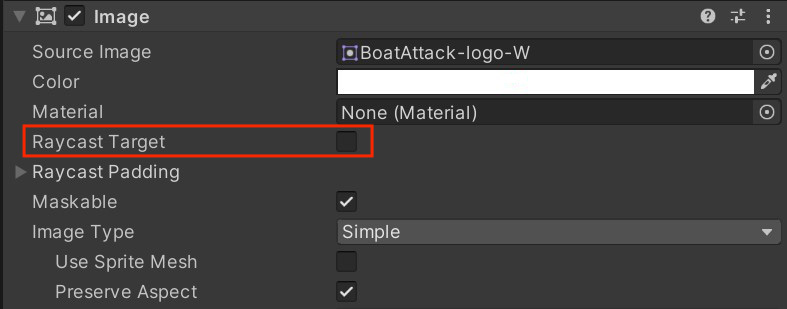
<p><em>VI: Tắt Raycast Target nếu không cần. / EN: Disable Raycast Target if possible.</em></p>

<div class="bilingual-row">
<div class="col-vi">
<p><strong>① Chỉ bật 'Raycast Target' ở component THỰC SỰ cần nhận pointer event</strong></p>
<p>Vì <em>mọi</em> Raycast Target đều phải được test, đây là best practice. <strong>Danh sách Raycast Target càng nhỏ, hierarchy phải duyệt càng nông ⇒ mỗi phép test càng nhanh.</strong></p>
<p><strong>② Với UI control tổ hợp — đặt MỘT Raycast Target ở gốc</strong></p>
<p>Với các control có nhiều UI object vẽ được cần phản hồi pointer event (ví dụ button muốn cả nền và text đổi màu), <strong>tốt hơn là đặt một Raycast Target DUY NHẤT ở gốc của control tổ hợp</strong>. Khi Raycast Target đó nhận event, nó <em>chuyển tiếp event tới từng component quan tâm</em> bên trong.</p>
<p><strong>③ Độ sâu hierarchy & Raycast Filter</strong></p>
<p>🚨 <strong>Mỗi Graphic Raycast duyệt hierarchy Transform NGƯỢC LÊN TẬN ROOT</strong> khi tìm raycast filter. <strong>Chi phí thao tác này tăng TUYẾN TÍNH theo độ sâu hierarchy.</strong></p>
<p>Mọi component tìm thấy gắn vào từng Transform trong hierarchy <em>đều phải được test</em> xem có cài đặt <code>ICanvasRaycastFilter</code> không — nên đây <strong>không phải thao tác rẻ</strong>.</p>
<p>⚠️ Có vài component Unity UI chuẩn <em>có</em> dùng <code>ICanvasRaycastFilter</code>: <strong>CanvasGroup, Image, Mask, RectMask2D</strong> — nên việc duyệt này <strong>không thể loại bỏ một cách đơn giản</strong>.</p>
<p>✅ <strong>Giải pháp — <code>overrideSorting</code>:</strong> Property <code>overrideSorting</code> trên một Sub-canvas sẽ khiến phép Graphic Raycast <strong>DỪNG việc leo lên transform hierarchy</strong>. Nếu bật được mà không gây vấn đề sorting hay phát hiện raycast, <strong>hãy dùng nó để giảm chi phí duyệt hierarchy</strong>.</p>
</div>
<div class="col-en">
<p><strong>① Only enable 'Raycast Target' on components that MUST receive pointer events</strong></p>
<p>Given that <em>all</em> Raycast Targets must be tested, this is best practice. <strong>The smaller the list of Raycast Targets, and the shallower the hierarchy traversed, the faster each Raycast test will be.</strong></p>
<p><strong>② For composite UI controls — place a SINGLE Raycast Target at the root</strong></p>
<p>For composite controls with multiple drawable UI objects that must respond to pointer events (e.g. a button whose background and text both change color), <strong>it is generally better to place a single Raycast Target at the root</strong>. When it receives a pointer event, it can then <em>forward the event to each interested component</em> within the control.</p>
<p><strong>③ Hierarchy depth &amp; Raycast Filters</strong></p>
<p>🚨 <strong>Each Graphic Raycast traverses the Transform hierarchy ALL THE WAY TO THE ROOT</strong> when searching for raycast filters. <strong>The cost of this operation grows LINEARLY in proportion to hierarchy depth.</strong></p>
<p>All components found attached to each Transform in the hierarchy <em>must be tested</em> to see if they implement <code>ICanvasRaycastFilter</code>, so this is <strong>not a cheap operation</strong>.</p>
<p>⚠️ Several standard Unity UI components <em>do</em> make use of <code>ICanvasRaycastFilter</code>: <strong>CanvasGroup, Image, Mask, RectMask2D</strong> — so this traversal <strong>cannot be eliminated trivially</strong>.</p>
<p>✅ <strong>The remedy — <code>overrideSorting</code>:</strong> The <code>overrideSorting</code> property on a Sub-canvas will cause a Graphic Raycast test to <strong>STOP climbing the transform hierarchy</strong>. If it can be enabled without causing sorting or raycast detection issues, <strong>it should be used to decrease the cost of raycast hierarchy traversals</strong>.</p>
</div>
</div>

---

## 9. UI Text & Font Atlas

<div class="bilingual-row">
<div class="col-vi">
<p>Component <strong>Text</strong> dựng sẵn của Unity tiện lợi, <em>nhưng có một số hành vi ít người biết mà thường xuyên là hotspot hiệu năng</em>.</p>
<p>🔑 <strong>Luôn nhớ:</strong> glyph text thực chất được render dưới dạng <strong>các quad RIÊNG LẺ — MỘT quad cho MỖI ký tự</strong>. Các quad này thường có <em>lượng không gian trống đáng kể</em> bao quanh glyph, tùy hình dạng của nó ⇒ <strong>rất dễ đặt text theo cách vô tình phá batching của phần tử UI khác</strong>.</p>
</div>
<div class="col-en">
<p>Unity's built-in <strong>Text</strong> component is convenient, <em>but there are a number of behaviors that are not commonly known yet frequently appear as performance hotspots</em>.</p>
<p>🔑 <strong>Always remember:</strong> text glyphs are actually rendered as <strong>INDIVIDUAL quads — ONE per character</strong>. These quads tend to have <em>a significant amount of empty space</em> surrounding the glyph, depending on its shape ⇒ <strong>it is very easy to position text in a way that unintentionally breaks the batching of other UI elements</strong>.</p>
</div>
</div>

### 9.1. Text Mesh Rebuild

<div class="bilingual-row">
<div class="col-vi">
<p>Bất cứ khi nào một UI Text component <strong>thay đổi</strong>, nó phải <strong>tính lại các polygon</strong> dùng để hiển thị text.</p>
<p>🚨 <strong>Bẫy lớn:</strong> Việc tính lại này <strong>CŨNG xảy ra nếu một text component, hoặc BẤT KỲ GameObject cha nào của nó, chỉ đơn giản bị TẮT rồi BẬT LẠI — mà KHÔNG hề thay đổi text!</strong></p>
<p>👉 Hành vi này gây vấn đề cho mọi UI hiển thị <em>số lượng lớn nhãn text</em> — phổ biến nhất là <strong>bảng xếp hạng (leaderboard)</strong> hoặc <strong>màn hình thống kê</strong>.</p>
<p>⚠️ Vì cách phổ biến nhất để ẩn/hiện một Unity UI là <em>bật/tắt GameObject chứa UI</em>, các UI có nhiều text component thường gây <strong>giật frame-rate khó chịu mỗi khi chúng được hiển thị</strong>.</p>
<p>💡 Cách khắc phục: xem §12.2 <strong>Disabling Canvases</strong>.</p>
</div>
<div class="col-en">
<p>Whenever a UI Text component is <strong>changed</strong>, it must <strong>recalculate the polygons</strong> used to display the actual text.</p>
<p>🚨 <strong>The big trap:</strong> This recalculation <strong>ALSO occurs if a text component, or ANY of its parent GameObjects, is simply DISABLED and RE-ENABLED — WITHOUT any change to the text!</strong></p>
<p>👉 This is problematic for any UI displaying <em>large numbers of textual labels</em> — most commonly <strong>leaderboards</strong> or <strong>statistics screens</strong>.</p>
<p>⚠️ As the most common way to hide and show a Unity UI is to <em>enable/disable a GameObject containing it</em>, UIs with large numbers of text components will often cause <strong>undesirable frame-rate hiccups whenever they are displayed</strong>.</p>
<p>💡 For a workaround, see §12.2 <strong>Disabling Canvases</strong>.</p>
</div>
</div>

### 9.2. 🔥 Dynamic Font & Font Atlas — Thuật toán tăng trưởng

<div class="bilingual-row">
<div class="col-vi">
<p><strong>Dynamic font</strong> tiện khi tập ký tự hiển thị được rất lớn, hoặc không biết trước lúc runtime. Trong cài đặt của Unity, các font này <strong>xây glyph atlas lúc RUNTIME</strong> dựa trên ký tự gặp phải trong các UI Text component.</p>
<p>⚠️ <strong>Mỗi Font object riêng biệt được nạp sẽ duy trì texture atlas RIÊNG</strong>, <em>kể cả khi nó cùng họ font với font khác</em>. Ví dụ: dùng Arial với text in đậm ở một control, và Arial Bold ở control khác → cho ra output giống hệt nhau, nhưng <strong>Unity duy trì HAI atlas riêng biệt</strong>.</p>
<p>🔑 <strong>Nguyên tắc quan trọng nhất về hiệu năng:</strong></p>
<blockquote>
<p>Dynamic font của Unity UI duy trì <strong>MỘT glyph trong atlas cho MỖI TỔ HỢP RIÊNG BIỆT của (kích thước × kiểu × ký tự)</strong>.</p>
</blockquote>
<p><strong>Ví dụ cụ thể</strong> — UI có 2 text component đều hiển thị chữ 'A':</p>
<ul>
<li>Cùng <strong>size</strong> → atlas có <strong>1 glyph</strong></li>
<li>Khác size (16pt và 24pt) → atlas chứa <strong>2 bản copy</strong> của chữ 'A' ở kích thước khác nhau</li>
<li>Một cái <strong>bold</strong>, một cái không → atlas chứa <strong>'A' đậm và 'A' thường</strong></li>
</ul>
</div>
<div class="col-en">
<p><strong>Dynamic fonts</strong> are convenient when the displayable character set is very large, or not known prior to runtime. In Unity's implementation, these fonts <strong>build a glyph atlas at RUNTIME</strong> based on characters encountered within UI Text components.</p>
<p>⚠️ <strong>Each distinct Font object loaded maintains its OWN texture atlas</strong>, <em>even if it is in the same font family as another font</em>. For example: using Arial with bolded text on one control while using Arial Bold on another produces identical output, but <strong>Unity maintains TWO distinct texture atlases</strong>.</p>
<p>🔑 <strong>The most important performance rule:</strong></p>
<blockquote>
<p>Unity UI's dynamic fonts maintain <strong>ONE glyph in the font's texture atlas for EACH DISTINCT COMBINATION of (size × style × character)</strong>.</p>
</blockquote>
<p><strong>Concrete example</strong> — a UI with two Text components both displaying the letter 'A':</p>
<ul>
<li>Same <strong>size</strong> → the font atlas will have <strong>one glyph</strong></li>
<li>Different sizes (16-point and 24-point) → the atlas contains <strong>two copies</strong> of 'A' at different sizes</li>
<li>One <strong>bold</strong>, one not → the atlas contains <strong>a bold 'A' and a regular 'A'</strong></li>
</ul>
</div>
</div>

<div class="bilingual-row">
<div class="col-vi">
<p><strong>🔬 Thuật toán rebuild atlas — 2 giai đoạn</strong></p>
<p>Khi một UI Text object dùng dynamic font gặp glyph <em>chưa được raster hóa</em> vào atlas, atlas <strong>phải được rebuild</strong>:</p>
<ul>
<li>✅ Nếu glyph mới <strong>vừa vào atlas hiện tại</strong> → nó được thêm vào và atlas được <em>re-upload lên graphics device</em>.</li>
<li>❌ Nếu atlas hiện tại <strong>quá nhỏ</strong> → hệ thống thử rebuild atlas theo <strong>2 GIAI ĐOẠN</strong>:</li>
</ul>
<p><strong>Giai đoạn 1:</strong> Atlas được rebuild <em>ở CÙNG kích thước</em>, chỉ dùng các glyph <strong>đang được hiển thị bởi UI Text component đang active</strong>. <em>(Bao gồm cả UI Text có Canvas cha đang bật nhưng Canvas Renderer đã tắt.)</em> Nếu nhét vừa hết → raster hóa atlas đó và <strong>KHÔNG sang giai đoạn 2</strong>.</p>
<p><strong>Giai đoạn 2:</strong> Nếu tập glyph đang dùng <em>không nhét vừa</em> atlas cùng kích thước → tạo atlas lớn hơn bằng cách <strong>NHÂN ĐÔI CHIỀU NGẮN HƠN</strong> của atlas. Ví dụ: <strong>512×512 → 512×1024</strong>.</p>
<p>🚨 <strong>Hệ quả nghiêm trọng:</strong> Do thuật toán trên, <strong>atlas của dynamic font CHỈ LỚN LÊN, không bao giờ nhỏ lại</strong> sau khi đã tạo.</p>
</div>
<div class="col-en">
<p><strong>🔬 The atlas rebuild algorithm — two stages</strong></p>
<p>Whenever a UI Text object with a dynamic font encounters a glyph <em>not yet rasterized</em> into the atlas, the atlas <strong>must be rebuilt</strong>:</p>
<ul>
<li>✅ If the new glyph <strong>fits into the current atlas</strong> → it is added and the atlas is <em>re-uploaded to the graphics device</em>.</li>
<li>❌ If the current atlas is <strong>too small</strong> → the system attempts to rebuild the atlas in <strong>TWO STAGES</strong>:</li>
</ul>
<p><strong>Stage 1:</strong> The atlas is rebuilt <em>at the SAME size</em>, using only the glyphs <strong>currently being shown by active UI Text components</strong>. <em>(This includes UI Text components whose parent Canvases are enabled but that have disabled Canvas Renderers.)</em> If all currently-in-use glyphs fit → it rasterizes that atlas and <strong>does NOT continue to stage 2</strong>.</p>
<p><strong>Stage 2:</strong> If the set of in-use glyphs <em>cannot fit</em> into an atlas of the same size → a larger atlas is created by <strong>DOUBLING THE ATLAS' SHORTER DIMENSION</strong>. For example: <strong>512×512 → 512×1024</strong>.</p>
<p>🚨 <strong>Serious consequence:</strong> Due to the above algorithm, <strong>a dynamic font's atlas will ONLY GROW in size once created</strong>.</p>
</div>
</div>

### 9.3. Hai cách giảm thiểu rebuild atlas

<div class="bilingual-row">
<div class="col-vi">
<p><strong>① Dùng font KHÔNG động (non-dynamic) bất cứ khi nào có thể</strong></p>
<p>Cấu hình trước tập glyph mong muốn. Cách này <em>hoạt động tốt cho UI có tập ký tự bị ràng buộc rõ ràng</em> — như chỉ ký tự Latin/ASCII, và dải kích thước nhỏ.</p>
<p><strong>② Nếu buộc phải hỗ trợ dải ký tự cực lớn (như toàn bộ Unicode)</strong></p>
<p>Font phải đặt là <strong>Dynamic</strong>. Để tránh vấn đề hiệu năng có thể lường trước, hãy <strong>"mồi" (prime) glyph atlas của font lúc khởi động</strong> với tập ký tự phù hợp qua <code>Font.RequestCharactersInTexture</code>.</p>
<p>⚠️ <strong>Lưu ý quan trọng:</strong> Rebuild atlas được kích hoạt <strong>RIÊNG cho TỪNG UI Text component bị thay đổi</strong>. Khi phải điền dữ liệu cho <em>rất nhiều</em> Text component, sẽ có lợi khi <strong>thu thập TẤT CẢ ký tự duy nhất trong nội dung của chúng rồi mồi atlas MỘT LẦN</strong> — thay vì để atlas bị rebuild mỗi lần gặp glyph mới.</p>
<p>🚨 <strong>Giới hạn cần biết:</strong> Khi một lần rebuild atlas được kích hoạt, <strong>bất kỳ ký tự nào hiện KHÔNG nằm trong một UI Text component đang active sẽ KHÔNG có mặt trong atlas mới</strong> — <em>kể cả khi trước đó chúng đã được thêm vào atlas bằng <code>Font.RequestCharactersInTexture</code></em>.</p>
<p>✅ <strong>Cách lách:</strong> Đăng ký delegate <strong><code>Font.textureRebuilt</code></strong> và query <code>Font.characterInfo</code> để đảm bảo mọi ký tự mong muốn vẫn được mồi sẵn.</p>
<p>💡 <em>Delegate <code>Font.textureRebuilt</code> hiện KHÔNG được ghi trong tài liệu.</em> Nó là một Unity Event một tham số — tham số là font vừa được rebuild texture.</p>
</div>
<div class="col-en">
<p><strong>① Use non-dynamic fonts wherever possible</strong></p>
<p>Preconfigure support for the desired glyph set. This <em>generally works well for UIs using a well-constrained character set</em> — such as only Latin/ASCII characters, and with a small range of sizes.</p>
<p><strong>② If an extremely large range of characters must be supported (e.g. the entire Unicode set)</strong></p>
<p>The font must be set to <strong>Dynamic</strong>. To avoid predictable performance problems, <strong>prime the font's glyph atlas at startup time</strong> with a set of appropriate characters via <code>Font.RequestCharactersInTexture</code>.</p>
<p>⚠️ <strong>Important note:</strong> Font atlas rebuilds are triggered <strong>INDIVIDUALLY for EACH UI Text component that is changed</strong>. When populating an <em>extremely large</em> number of Text components, it may be advantageous to <strong>collect ALL unique characters in their content and prime the font atlas ONCE</strong> — instead of the atlas being rebuilt each time a new glyph is encountered.</p>
<p>🚨 <strong>Limitation to know:</strong> When a font atlas rebuild is triggered, <strong>any characters not presently contained in an active UI Text component will NOT be present in the new atlas</strong> — <em>even if they were originally added via <code>Font.RequestCharactersInTexture</code></em>.</p>
<p>✅ <strong>Workaround:</strong> Subscribe to the <strong><code>Font.textureRebuilt</code></strong> delegate and query <code>Font.characterInfo</code> to ensure all desired characters remain primed.</p>
<p>💡 <em>The <code>Font.textureRebuilt</code> delegate is currently undocumented.</em> It is a single-argument Unity Event — the argument is the font whose texture was rebuilt.</p>
</div>
</div>

```csharp
// Mồi font atlas lúc khởi động + giữ ký tự sau mỗi lần rebuild
// Prime the font atlas at startup + keep characters primed after each rebuild
using UnityEngine;

public class FontAtlasPrimer : MonoBehaviour
{
    [SerializeField] private Font dynamicFont;
    [SerializeField] private int  fontSize = 24;

    // Tập ký tự cần mồi sẵn — ví dụ ASCII + tiếng Việt có dấu
    private const string PrimeSet =
        "ABCDEFGHIJKLMNOPQRSTUVWXYZabcdefghijklmnopqrstuvwxyz0123456789 .,!?:;-" +
        "áàảãạăắằẳẵặâấầẩẫậéèẻẽẹêếềểễệíìỉĩịóòỏõọôốồổỗộơớờởỡợúùủũụưứừửữựýỳỷỹỵđ";

    void OnEnable()
    {
        // Signature bắt buộc của delegate (hiện chưa có trong docs)
        Font.textureRebuilt += TextureRebuiltCallback;
        Prime();
    }

    void OnDisable() => Font.textureRebuilt -= TextureRebuiltCallback;

    void Prime() =>
        dynamicFont.RequestCharactersInTexture(PrimeSet, fontSize, FontStyle.Normal);

    // Atlas rebuild sẽ VỨT BỎ mọi glyph không nằm trong Text đang active
    // ⇒ phải mồi lại sau mỗi lần rebuild
    public void TextureRebuiltCallback(Font rebuiltFont)
    {
        if (rebuiltFont == dynamicFont) Prime();
    }
}
```

### 9.4. Specialized Glyph Renderer — Trường hợp điểm số

<div class="bilingual-row">
<div class="col-vi">
<p>Với tình huống mà glyph <strong>đã biết trước rõ ràng</strong>, với vị trí <strong>tương đối cố định</strong> giữa các glyph, <em>lợi thế hơn hẳn</em> là viết component tùy biến hiển thị sprite cho các glyph đó.</p>
<p><strong>Ví dụ điển hình: hiển thị điểm số.</strong></p>
<ul>
<li>Ký tự hiển thị lấy từ tập glyph <strong>đã biết rõ</strong> (chữ số 0–9)</li>
<li><strong>Không thay đổi</strong> theo ngôn ngữ/locale</li>
<li>Xuất hiện ở <strong>khoảng cách cố định</strong> với nhau</li>
</ul>
<p>👉 Việc phân rã một số nguyên thành các chữ số rồi hiển thị sprite tương ứng là <em>tương đối tầm thường</em>. Hệ thống hiển thị chữ số chuyên biệt kiểu này có thể xây dựng theo cách <strong>vừa KHÔNG sinh cấp phát (allocationless), vừa NHANH HƠN ĐÁNG KỂ</strong> để tính, animate và hiển thị so với UI Text component chạy qua Canvas.</p>
</div>
<div class="col-en">
<p>For situations where the glyphs are <strong>well-known</strong>, with <strong>relatively fixed positions</strong> between each glyph, it is <em>significantly more advantageous</em> to write a custom component to display sprites for those glyphs.</p>
<p><strong>Classic example: a score display.</strong></p>
<ul>
<li>The displayable characters are drawn from a <strong>well-known glyph set</strong> (the digits 0–9)</li>
<li>They <strong>do not change across locales</strong></li>
<li>They appear at <strong>fixed distances</strong> from one another</li>
</ul>
<p>👉 It is <em>relatively trivial</em> to decompose an integer into its digits and display appropriate digit sprites. This sort of specialized digit-display system can be built in a manner that is <strong>both allocationless and considerably faster</strong> to calculate, animate and display than the Canvas-driven UI Text component.</p>
</div>
</div>

### 9.5. Fallback Font & Bộ nhớ

<div class="bilingual-row">
<div class="col-vi">
<p>Với ứng dụng phải hỗ trợ tập ký tự lớn, <em>rất cám dỗ</em> khi liệt kê nhiều font vào trường <strong>"Font Names"</strong> của font importer. Font liệt kê ở đó sẽ được dùng làm <strong>fallback</strong> nếu không tìm thấy glyph trong font chính. Thứ tự fallback theo đúng thứ tự liệt kê.</p>
<p>🚨 <strong>Cái giá:</strong> Để hỗ trợ hành vi này, <strong>Unity giữ TẤT CẢ font liệt kê trong "Font Names" được NẠP TRONG BỘ NHỚ</strong>.</p>
<p>👉 Nếu tập ký tự của một font rất lớn, lượng bộ nhớ do fallback font tiêu thụ có thể trở nên <strong>quá mức</strong>. Điều này <em>thường thấy nhất khi bao gồm font tượng hình</em> — như <strong>Kanji tiếng Nhật hoặc ký tự tiếng Trung</strong>.</p>
</div>
<div class="col-en">
<p>For applications that must support a large character-set, it is <em>tempting</em> to list many fonts in the <strong>"Font Names"</strong> field of a font importer. Fonts listed there are used as <strong>fallbacks</strong> if a glyph cannot be located in the primary font. Fallback order is determined by the listed order.</p>
<p>🚨 <strong>The cost:</strong> In order to support this behavior, <strong>Unity keeps ALL fonts listed in "Font Names" LOADED INTO MEMORY</strong>.</p>
<p>👉 If a font's character set is very large, the memory consumed by fallback fonts can become <strong>excessive</strong>. This is <em>most often seen when including pictographic fonts</em> — such as <strong>Japanese Kanji or Chinese characters</strong>.</p>
</div>
</div>

### 9.6. 🚫 Best Fit — "Nói chung KHÔNG BAO GIỜ nên dùng"

<div class="bilingual-row">
<div class="col-vi">
<blockquote>
<p><strong>"Nhìn chung, setting Best Fit của UI Text component KHÔNG BAO GIỜ nên được dùng."</strong></p>
</blockquote>
<p><strong>Best Fit làm gì:</strong> tự động chỉnh kích thước font tới <em>point size nguyên lớn nhất</em> hiển thị vừa trong bounding box của Text component mà không tràn, giới hạn bởi min/max point size cấu hình được.</p>
<p>🚨 <strong>Vì sao tệ:</strong> Vì Unity render một <strong>glyph RIÊNG BIỆT vào atlas cho MỖI kích thước ký tự khác nhau</strong>, dùng Best Fit sẽ <strong>nhanh chóng làm ngập atlas bằng vô số kích thước glyph khác nhau</strong>.</p>
<p><strong>Tính tới Unity 2017.3, cơ chế dò kích thước của Best Fit là KHÔNG tối ưu:</strong></p>
<ul>
<li>Nó <strong>sinh glyph vào atlas cho MỖI bước tăng kích thước được thử</strong> ⇒ tăng thêm thời gian sinh font atlas.</li>
<li>Nó <strong>có xu hướng gây tràn atlas</strong>, khiến glyph cũ bị <em>đẩy ra khỏi atlas</em>.</li>
<li>Do số lượng phép thử lớn, việc này <strong>thường trục xuất glyph đang được các Text component khác dùng</strong>, và <em>buộc atlas phải rebuild thêm ít nhất một lần nữa</em> sau khi đã tính xong kích thước phù hợp.</li>
</ul>
<p>✅ Vấn đề cụ thể này <strong>đã được sửa ở Unity 5.4</strong> — Best Fit sẽ không mở rộng atlas một cách không cần thiết nữa. <strong>Nhưng nó VẪN chậm hơn đáng kể so với text có kích thước tĩnh.</strong></p>
<p>💀 <strong>Rebuild atlas thường xuyên sẽ nhanh chóng làm suy giảm hiệu năng runtime CŨNG NHƯ gây PHÂN MẢNH BỘ NHỚ.</strong> Càng nhiều text component bật Best Fit, vấn đề càng tệ.</p>
</div>
<div class="col-en">
<blockquote>
<p><strong>"In general, the UI Text component's Best Fit setting should NEVER be used."</strong></p>
</blockquote>
<p><strong>What Best Fit does:</strong> dynamically adjusts the font size to the <em>largest integer point size</em> displayable within a Text component's bounding box without overflow, clamped to a configurable min/max point size.</p>
<p>🚨 <strong>Why it's bad:</strong> Because Unity renders a <strong>DISTINCT glyph into the font atlas for EACH distinct size of character</strong>, use of Best Fit will <strong>rapidly overwhelm the atlas with many different glyph sizes</strong>.</p>
<p><strong>As of Unity 2017.3, the size detection used by Best Fit is nonoptimal:</strong></p>
<ul>
<li>It <strong>generates glyphs in the font atlas for EACH size increment tested</strong> ⇒ further increasing font atlas generation time.</li>
<li>It <strong>tends to cause atlas overflows</strong>, which causes old glyphs to be <em>kicked out of the atlas</em>.</li>
<li>Due to the large number of tests required, this <strong>will often evict glyphs in use by other Text components</strong>, and <em>force the font atlas to be rebuilt at least once more</em> after the appropriate size has been calculated.</li>
</ul>
<p>✅ This specific issue <strong>has been corrected in Unity 5.4</strong> — Best Fit will not unnecessarily expand the atlas. <strong>But it is STILL considerably slower than statically-sized text.</strong></p>
<p>💀 <strong>Frequent font atlas rebuilds will rapidly degrade runtime performance AS WELL AS cause MEMORY FRAGMENTATION.</strong> The greater the quantity of text components set to Best Fit, the worse this problem becomes.</p>
</div>
</div>

---

## 10. TextMesh Pro (TMP)

<div class="bilingual-row">
<div class="col-vi">
<p><strong>TextMesh Pro</strong> là bản thay thế cho các component text hiện có của Unity (Text Mesh và UI Text).</p>
<p>🔑 <strong>Công nghệ:</strong> TMP dùng <strong>Signed Distance Field (SDF)</strong> làm pipeline render text chính, giúp render text <strong>sắc nét ở BẤT KỲ point size và độ phân giải nào</strong>.</p>
<p>Dùng bộ shader tùy biến khai thác sức mạnh SDF, TMP cho phép <strong>thay đổi động ngoại hình text</strong> chỉ bằng cách đổi <em>material property</em>: dilation, outline, soft shadow, beveling, textures, glow, v.v. — và lưu/gọi lại các style này bằng <strong>material preset</strong>.</p>
<p>📌 <strong>Lịch sử phân phối:</strong> Trước 2018.1, TMP là package trên Asset Store. Từ <strong>2018.1</strong> trở đi, TMP có sẵn dưới dạng <strong>Package Manager package</strong>.</p>
</div>
<div class="col-en">
<p><strong>TextMesh Pro</strong> is a replacement for Unity's existing text components (Text Mesh and UI Text).</p>
<p>🔑 <strong>The technology:</strong> TMP uses <strong>Signed Distance Field (SDF)</strong> as its primary text rendering pipeline, making it possible to render text <strong>cleanly at ANY point size and resolution</strong>.</p>
<p>Using custom shaders designed to leverage SDF, TMP makes it possible to <strong>dynamically change the visual appearance of text</strong> by simply changing <em>material properties</em>: dilation, outline, soft shadow, beveling, textures, glow, etc. — and to save and recall these styles via <strong>material presets</strong>.</p>
<p>📌 <strong>Distribution history:</strong> Until 2018.1, TMP was an Asset Store package. As of <strong>2018.1</strong>, TMP is available as a <strong>Package Manager package</strong>.</p>
</div>
</div>

### 10.1. Text Mesh Rebuild trong TMP

<div class="bilingual-row">
<div class="col-vi">
<p>Giống UIText dựng sẵn, <strong>thay đổi text hiển thị sẽ kích hoạt lời gọi <code>Canvas.SendWillRenderCanvases</code> và <code>Canvas.BuildBatch</code></strong> — vốn có thể tốn kém.</p>
<p><strong>Hai khuyến nghị:</strong></p>
<ol>
<li><strong>Giảm thiểu thay đổi</strong> trường text của <code>TextMeshProUGUI</code>.</li>
<li><strong>Đặt các <code>TextMeshProUGUI</code> có text đổi thường xuyên làm CON của một GameObject có Canvas component RIÊNG</strong> — để đảm bảo lời gọi Canvas rebuild vẫn hiệu quả nhất có thể.</li>
</ol>
<p>🔑 <strong>Khuyến nghị quan trọng về World Space:</strong></p>
<blockquote>
<p>Với text hiển thị trong <strong>world space</strong>, khuyến nghị dùng component <strong><code>TextMeshPro</code> thường</strong> thay vì <code>TextMeshProUGUI</code>, vì <em>dùng Canvas trong World Space có thể kém hiệu quả</em>. Dùng <code>TextMeshPro</code> trực tiếp sẽ <strong>hiệu quả hơn</strong> vì nó <em>không phải chịu overhead của hệ thống canvas</em>.</p>
</blockquote>
</div>
<div class="col-en">
<p>Much like Unity's built-in UIText component, <strong>making changes to the displayed text triggers calls to <code>Canvas.SendWillRenderCanvases</code> and <code>Canvas.BuildBatch</code></strong>, which can be costly.</p>
<p><strong>Two recommendations:</strong></p>
<ol>
<li><strong>Minimize changes</strong> to the text field of a <code>TextMeshProUGUI</code> component.</li>
<li><strong>Parent <code>TextMeshProUGUI</code> components whose text changes often to a parent GameObject with its OWN Canvas component</strong> — to ensure Canvas rebuild calls remain as efficient as possible.</li>
</ol>
<p>🔑 <strong>Important World Space recommendation:</strong></p>
<blockquote>
<p>For text displayed in <strong>world space</strong>, we recommend using the <strong>normal <code>TextMeshPro</code></strong> component instead of <code>TextMeshProUGUI</code>, as <em>using Canvases in World Space can be inefficient</em>. Using <code>TextMeshPro</code> directly will be <strong>more efficient</strong> given it doesn't incur the canvas system overhead.</p>
</blockquote>
</div>
</div>

### 10.2. 🔍 Cơ chế Fallback đệ quy của TMP & Chiến lược Localization

<div class="bilingual-row">
<div class="col-vi">
<p>⚠️ <strong>TMP KHÔNG có tính năng dynamic font</strong> — nên bạn <em>phải dựa vào fallback font</em>. Hiểu cách fallback được nạp và dùng là <strong>tối quan trọng để tối ưu bộ nhớ khi dùng TMP</strong>.</p>
<p><strong>Thứ tự tìm glyph trong TMP — ĐỆ QUY:</strong></p>
<ol>
<li>Khi glyph thiếu trong một <strong>TMP Font Asset</strong>, TMP lặp qua danh sách <strong>fallback Font Asset</strong> đang được gán hoặc active, <em>bắt đầu từ fallback đầu tiên và đi qua cả fallback của chính chúng</em>.</li>
<li>Nếu vẫn không thấy → TMP tìm trong bất kỳ <strong>Sprite Asset</strong> nào có thể đã gán cho text object đó, cùng mọi fallback gán cho Sprite Asset này.</li>
<li>Vẫn không thấy → TMP tìm <em>đệ quy</em> qua danh sách <strong>fallback chung gán trong file TMP Settings</strong>.</li>
<li>Tiếp theo là <strong>default Sprite Asset</strong>.</li>
<li>Vẫn không thấy → tìm trong <strong>Default Font Asset</strong> gán trong TMP Settings.</li>
<li><strong>Cuối cùng</strong>, TMP dùng và hiển thị ký tự <strong>Missing Glyph Replacement</strong> định nghĩa trong TMP Settings.</li>
</ol>
<p><strong>🚨 Khi nào Font Asset bị nạp vào bộ nhớ:</strong></p>
<ul>
<li>TMP Font Asset được nạp <strong>khi chúng được tham chiếu</strong> trong scene hoặc project.</li>
<li>Chúng chủ yếu được tham chiếu bởi: <em>TextMeshPro Text component</em>, <em>TMP Settings</em>, và <em>chính các Font Asset khác</em> (dưới dạng fallback).</li>
<li>💀 Nếu Font Asset được tham chiếu trong <strong>TMP Settings</strong>, thì Font Asset đó <strong>VÀ TẤT CẢ fallback của nó sẽ được nạp ĐỆ QUY khi scene đầu tiên có TMP Text component được kích hoạt</strong>. Nếu default sprite sheet asset cũng được tham chiếu, nó cũng được nạp.</li>
<li>Ngoài ra, khi Font Asset được một TextMeshPro component tham chiếu mà chưa nạp qua TMP Settings, thì Font Asset đó <strong>và tất cả fallback của nó sẽ được nạp đệ quy khi component được kích hoạt</strong>.</li>
</ul>
<p>👉 <strong>Vì thế localization trở thành mối lo:</strong> nạp sẵn TẤT CẢ Font Asset của mọi ngôn ngữ qua TMP Settings ngay từ đầu sẽ <em>rất hại cho áp lực bộ nhớ</em>.</p>
</div>
<div class="col-en">
<p>⚠️ <strong>There is NO dynamic font feature in TMP</strong> — so you <em>must rely on fallback fonts</em>. Understanding how fallbacks are loaded and used is <strong>crucial to optimizing memory when using TMP</strong>.</p>
<p><strong>Glyph discovery order in TMP — RECURSIVE:</strong></p>
<ol>
<li>When a glyph is missing from a <strong>TMP Font Asset</strong>, TMP iterates through the list of <strong>fallback Font Assets</strong> currently assigned or active, <em>starting with the first and going through their own fallbacks</em>.</li>
<li>If still not found → TMP searches any <strong>Sprite Asset</strong> potentially assigned to the text object, along with any fallback assigned to it.</li>
<li>Still not located → TMP searches <em>recursively</em> through the list of <strong>general fallbacks assigned in the TMP Settings file</strong>.</li>
<li>Followed by the <strong>default Sprite Asset</strong>.</li>
<li>If still unable → it searches the <strong>Default Font Asset</strong> assigned in TMP Settings.</li>
<li><strong>As a last resort</strong>, TMP uses and displays the <strong>Missing Glyph Replacement</strong> character defined in TMP Settings.</li>
</ol>
<p><strong>🚨 When Font Assets get loaded into memory:</strong></p>
<ul>
<li>TMP Font Assets are loaded <strong>when they are referenced</strong> in a scene or project.</li>
<li>They are principally referenced by: <em>TextMeshPro Text components</em>, <em>TMP Settings</em>, and <em>Font Assets themselves</em> (as fallbacks).</li>
<li>💀 If Font Assets are referenced in <strong>TMP Settings</strong>, those Font Assets <strong>AND ALL their fallbacks will be loaded RECURSIVELY when the first scene with a TMP Text component is activated</strong>. If the default sprite sheet asset is referenced, that is loaded too.</li>
<li>Additionally, when a Font Asset is referenced by a TextMeshPro component and has not been loaded via TMP Settings, that asset <strong>and all its fallbacks will be loaded recursively once the component is activated</strong>.</li>
</ul>
<p>👉 <strong>Hence localization becomes a concern:</strong> having all localized language Font Assets loaded via TMP Settings upfront would be <em>detrimental to memory pressure</em>.</p>
</div>
</div>

!!! success "Chiến lược Localization TMP — 6 bước bootstrap (nguyên văn từ Unity)"
    <div class="bilingual-row">
    <div class="col-vi">
    <p>Nếu localization là yêu cầu bắt buộc, Unity gợi ý chiến lược: <em>chỉ gán các font asset hoặc fallback khi cần thiết</em> (khi các scene được nạp), hoặc dùng <strong>Asset Bundle</strong> để nạp Font Asset theo cách module hóa.</p>
    <p>Khi ứng dụng khởi động, nên có bước <strong>bootstrap</strong> để xác minh locale của người dùng và thiết lập fallback cho từng font asset:</p>
    <ol>
    <li>Tạo <strong>Asset Bundle cho TMP Font Asset CƠ SỞ</strong> (ví dụ: glyph Latin tối thiểu cho mỗi font)</li>
    <li>Tạo <strong>Asset Bundle cho các TMP Font Asset FALLBACK cần thiết THEO TỪNG NGÔN NGỮ</strong> (ví dụ: một Asset Bundle chứa TMP Font Asset cho mỗi font cần cho tiếng Nhật)</li>
    <li><strong>Nạp Asset Bundle cơ sở</strong> ở bước bootstrap</li>
    <li><strong>Dựa trên locale</strong>, nạp Asset Bundle chứa fallback font cần thiết</li>
    <li><strong>Với MỖI font trong Asset Bundle cơ sở, gán fallback font asset</strong> lấy từ Asset Bundle đã localize</li>
    <li><strong>Tiếp tục bootstrap</strong> game của bạn</li>
    </ol>
    <p>💡 <strong>Tiết kiệm thêm:</strong> Tham chiếu <em>Default Sprite Asset</em> cũng có thể gỡ khỏi TMP settings nếu không dùng ảnh nào — tiết kiệm bộ nhớ khiêm tốn nhưng miễn phí.</p>
    </div>
    <div class="col-en">
    <p>Should localization be a necessary requirement, Unity suggests: <em>only assigning font assets or fallbacks when necessary</em> (as various scenes are loaded), or using <strong>Asset Bundles</strong> to load Font Assets in a modular way.</p>
    <p>When the application starts, a <strong>bootstrap</strong> step should verify the user's locale and set up font asset fallbacks for each font asset:</p>
    <ol>
    <li>Create an Asset Bundle for <strong>BASE TMP Font Assets</strong> (e.g., minimal Latin glyphs for each font)</li>
    <li>Create an Asset Bundle for <strong>needed FALLBACK TMP Font Assets PER LANGUAGE</strong> (e.g., one Asset Bundle for TMP Font Assets for each font needed for Japanese)</li>
    <li><strong>Load your base Asset Bundle</strong> in the bootstrap step</li>
    <li><strong>Based on locale</strong>, load the needed Asset Bundle with fallback fonts</li>
    <li><strong>For EACH font in the base Asset Bundle, assign fallback font assets</strong> from the localized font Asset Bundle</li>
    <li><strong>Continue bootstrapping</strong> your game</li>
    </ol>
    <p>💡 <strong>Extra saving:</strong> The <em>Default Sprite Asset</em> reference may also be removed from TMP settings if no images are used, for additional modest memory savings.</p>
    </div>
    </div>

### 10.3. Best Fit trong TMP — Khác hẳn UIText

<div class="bilingual-row">
<div class="col-vi">
<p>✅ <strong>Tin tốt:</strong> Vì TMP <em>không có</em> tính năng dynamic font, <strong>các vấn đề Best Fit nêu ở §9.6 (phần UGUI UIText) KHÔNG xảy ra</strong>.</p>
<p><strong>Điều duy nhất cần cân nhắc</strong> khi dùng Best Fit trên TMP component: nó dùng <strong>tìm kiếm nhị phân (binary search)</strong> để tìm kích thước đúng.</p>
<p>👉 <strong>Best practice khi dùng auto-sizing:</strong></p>
<ol>
<li><strong>Test để tìm point size tối ưu</strong> cho khối text <em>dài nhất / lớn nhất</em>.</li>
<li>Khi đã xác định được size tối ưu này → <strong>TẮT auto-sizing</strong> trên text object đó.</li>
<li><strong>Đặt THỦ CÔNG</strong> point size tối ưu này cho các text object khác.</li>
</ol>
<p><strong>Hai lợi ích:</strong> (a) <em>cải thiện hiệu năng</em>, và (b) <em>tránh tình trạng một nhóm text object dùng nhiều point size khác nhau</em> — vốn bị coi là <strong>thực hành typography/thị giác kém</strong>.</p>
</div>
<div class="col-en">
<p>✅ <strong>Good news:</strong> Given that TMP does not have a dynamic font feature, <strong>the Best Fit issues outlined in §9.6 (the UGUI UIText section) do NOT occur</strong>.</p>
<p><strong>The only thing to consider</strong> when using Best Fit on a TMP component: it uses a <strong>binary search</strong> to find the correct size.</p>
<p>👉 <strong>Best practice when using text auto-sizing:</strong></p>
<ol>
<li><strong>Test for the optimal point size</strong> of the <em>longest / largest</em> block of text.</li>
<li>Once this optimal size is determined → <strong>disable auto-sizing</strong> on the given text object.</li>
<li><strong>Manually set</strong> this optimal point size on the other text objects.</li>
</ol>
<p><strong>Two benefits:</strong> (a) <em>improved performance</em>, and (b) <em>avoids having a group of text objects using different point sizes</em>, which is considered <strong>poor visual / typographic practice</strong>.</p>
</div>
</div>

---

## 11. Scroll View — Nguồn vấn đề số 2

<div class="bilingual-row">
<div class="col-vi">
<blockquote>
<p><strong>"Sau vấn đề fill-rate, Scroll View của Unity UI là nguồn gây vấn đề hiệu năng runtime PHỔ BIẾN THỨ HAI."</strong></p>
</blockquote>
<p>Scroll View nhìn chung cần <em>số lượng đáng kể</em> phần tử UI để biểu diễn nội dung. Có <strong>2 cách tiếp cận cơ bản</strong>:</p>
<ol>
<li><strong>Điền đầy</strong> nó với tất cả phần tử cần thiết để biểu diễn <em>toàn bộ</em> nội dung.</li>
<li><strong>Pool</strong> các phần tử, tái định vị chúng khi cần để biểu diễn <em>nội dung đang nhìn thấy</em>.</li>
</ol>
<p><strong>Cả hai đều có vấn đề:</strong></p>
<ul>
<li><strong>Cách 1</strong> đòi hỏi <em>thời gian instantiate tăng dần</em> theo số item, và cũng <em>tăng thời gian rebuild</em> Scroll View. ✅ Nếu chỉ cần ít phần tử (ví dụ Scroll View chỉ hiển thị vài Text component), <strong>cách này được ưa chuộng vì đơn giản</strong>.</li>
<li><strong>Cách 2</strong> đòi hỏi <em>lượng code đáng kể</em> để cài đặt đúng dưới hệ thống UI và layout hiện tại. ⚠️ <strong>Với bất kỳ UI cuộn phức tạp nào, một dạng pooling nào đó nhìn chung là CẦN THIẾT để tránh vấn đề hiệu năng.</strong></li>
</ul>
<p>💎 <strong>Bất chấp các vấn đề trên, MỌI cách tiếp cận đều được cải thiện bằng cách thêm component <code>RectMask2D</code> vào Scroll View.</strong></p>
<p>Component này đảm bảo <strong>các phần tử Scroll View nằm NGOÀI viewport KHÔNG được đưa vào danh sách phần tử vẽ được</strong> — vốn phải được sinh geometry, sắp xếp và phân tích khi rebuild Canvas.</p>
</div>
<div class="col-en">
<blockquote>
<p><strong>"After fill-rate problems, Unity UI's Scroll Views are the SECOND MOST COMMON source of runtime performance issues seen."</strong></p>
</blockquote>
<p>Scroll Views generally require a <em>significant number</em> of UI elements to represent their content. There are <strong>two basic approaches</strong>:</p>
<ol>
<li><strong>Fill it</strong> with all the elements necessary to represent <em>all</em> of the scroll view's content.</li>
<li><strong>Pool</strong> the elements, repositioning them as needed to represent <em>visible content</em>.</li>
</ol>
<p><strong>Both have issues:</strong></p>
<ul>
<li><strong>Approach 1</strong> requires <em>increasing instantiation time</em> as the number of items grows, and also <em>increases rebuild time</em>. ✅ If only a small number of elements is required (e.g. a Scroll View showing a handful of Text components), <strong>this method is favored for its simplicity</strong>.</li>
<li><strong>Approach 2</strong> requires <em>significant amounts of code</em> to implement correctly under the current UI and layout system. ⚠️ <strong>For any significantly complex scrolling UI, some sort of pooling approach is generally NEEDED to avoid performance problems.</strong></li>
</ul>
<p>💎 <strong>Despite these issues, ALL approaches can be improved by adding a <code>RectMask2D</code> component to the Scroll View.</strong></p>
<p>This component ensures that <strong>Scroll View elements OUTSIDE the viewport are NOT included in the list of drawable elements</strong> that must have their geometry generated, sorted and analyzed when rebuilding a Canvas.</p>
</div>
</div>

### 11.1. Pooling đơn giản (Hybrid Placeholder)

<div class="bilingual-row">
<div class="col-vi">
<p>Cách <em>đơn giản nhất</em> để cài object pooling cho Scroll View mà vẫn giữ được sự tiện lợi của component Scroll View dựng sẵn: <strong>tiếp cận lai (hybrid)</strong>.</p>
<ol>
<li>Để bố trí phần tử trong UI — cho phép hệ thống layout tính đúng kích thước Content của Scroll View và scrollbar hoạt động đúng — <strong>dùng GameObject với component <code>Layout Element</code> làm "placeholder"</strong> cho các phần tử UI nhìn thấy được.</li>
<li>Sau đó, <strong>instantiate một pool phần tử UI nhìn thấy đủ để lấp đầy vùng nhìn thấy</strong> của Scroll View, và <strong>parent chúng vào các placeholder định vị</strong>.</li>
<li>Khi Scroll View cuộn, <strong>tái sử dụng các phần tử UI</strong> để hiển thị nội dung vừa cuộn vào tầm nhìn.</li>
</ol>
<p>🔑 <strong>Vì sao hiệu quả:</strong> Cách này <strong>giảm đáng kể số phần tử UI phải batch</strong>, vì <em>chi phí batching chỉ tăng theo số Canvas Renderer trong Canvas, KHÔNG phải theo số Rect Transform</em>.</p>
</div>
<div class="col-en">
<p>The <em>simplest way</em> to implement object pooling with a Scroll View while preserving the native convenience of Unity's built-in Scroll View component: a <strong>hybrid approach</strong>.</p>
<ol>
<li>To lay out the elements in the UI — allowing the layout system to properly calculate the Scroll View's content size and scrollbars to function properly — <strong>use GameObjects with <code>Layout Element</code> components as "placeholders"</strong> for the visible UI elements.</li>
<li>Then, <strong>instantiate a pool of visible UI elements sufficient to fill the visible portion</strong> of the Scroll View, and <strong>parent these to the positioning placeholders</strong>.</li>
<li>As the Scroll View scrolls, <strong>reuse the UI elements</strong> to display content that has scrolled into view.</li>
</ol>
<p>🔑 <strong>Why it works:</strong> This <strong>substantially cuts down the number of UI elements that must be batched</strong>, as <em>the cost of batching only increases based on the number of Canvas Renderers within a Canvas, NOT the number of Rect Transforms</em>.</p>
</div>
</div>

### 11.2. ⚠️ Vấn đề của cách đơn giản — Bug reparent

<div class="bilingual-row">
<div class="col-vi">
<p>🚨 <strong>Hiện tại, bất cứ khi nào một phần tử UI bị REPARENT hoặc bị ĐỔI THỨ TỰ SIBLING, phần tử đó VÀ TẤT CẢ phần tử con của nó bị đánh dấu "dirty" và BUỘC Canvas phải rebuild.</strong></p>
<p><strong>Nguyên nhân gốc rễ:</strong> Unity <em>chưa tách biệt</em> callback cho việc reparent một transform và việc thay đổi thứ tự sibling. <strong>Cả hai sự kiện đều kích hoạt callback <code>OnTransformParentChanged</code>.</strong></p>
<p>Trong source của lớp <code>Graphic</code> (xem <code>Graphic.cs</code>), callback đó được cài đặt và <strong>gọi method <code>SetAllDirty</code></strong>. Bằng cách làm dirty Graphic, hệ thống đảm bảo Graphic sẽ rebuild layout và vertex trước khi frame kế tiếp được render.</p>
<p><strong>Có cách lách không?</strong></p>
<p>Bạn <em>có thể</em> gán canvas cho RectTransform gốc của mỗi phần tử trong Scroll View, việc này sẽ <strong>giới hạn rebuild chỉ trong các phần tử bị reparent</strong> thay vì toàn bộ nội dung Scroll View.</p>
<p>⚠️ <strong>NHƯNG:</strong></p>
<ul>
<li>Việc này có xu hướng <strong>TĂNG số draw call</strong> cần để render Scroll View.</li>
<li>Hơn nữa, nếu từng phần tử trong Scroll View <em>phức tạp</em> và gồm <strong>hơn một tá Graphic component</strong> — đặc biệt nếu có <em>số lượng đáng kể Layout component</em> trên mỗi phần tử — thì chi phí rebuild chúng thường đủ cao để <strong>làm giảm frame rate rõ rệt trên thiết bị cấu hình thấp</strong>.</li>
</ul>
<p>💡 <strong>Nhận xét then chốt:</strong> Nếu một phần tử Scroll View <strong>KHÔNG có kích thước thay đổi</strong>, thì việc tính lại toàn bộ layout và vertex này là <em>KHÔNG CẦN THIẾT</em>. Nhưng để tránh hành vi này cần <strong>cài đặt giải pháp pooling dựa trên THAY ĐỔI VỊ TRÍ thay vì thay đổi parent hay thứ tự sibling</strong>.</p>
</div>
<div class="col-en">
<p>🚨 <strong>Currently, whenever any UI element is REPARENTED or has its SIBLING ORDER changed, that element AND ALL of its sub-elements are marked "dirty" and FORCE a rebuild of their Canvas.</strong></p>
<p><strong>Root cause:</strong> Unity <em>has not separated</em> the callbacks for reparenting a transform and altering its sibling order. <strong>Both events fire an <code>OnTransformParentChanged</code> callback.</strong></p>
<p>In the source of Unity UI's <code>Graphic</code> class (see <code>Graphic.cs</code>), that callback is implemented and <strong>invokes the method <code>SetAllDirty</code></strong>. By dirtying the Graphic, the system ensures it will rebuild its layout and vertices before the next frame is rendered.</p>
<p><strong>Is there a workaround?</strong></p>
<p>It is <em>possible</em> to assign canvases to the root RectTransform of each element within the Scroll View, which will then <strong>confine the rebuild to only the reparented elements</strong> and not the entire contents.</p>
<p>⚠️ <strong>HOWEVER:</strong></p>
<ul>
<li>This tends to <strong>INCREASE the number of draw calls</strong> needed to render the Scroll View.</li>
<li>Further, if the individual elements are <em>complex</em> and consist of <strong>more than a dozen Graphic components</strong> — particularly if there is a <em>significant number of Layout components</em> on each — then the cost of rebuilding them is often high enough to <strong>noticeably reduce the frame rate on lower-end devices</strong>.</li>
</ul>
<p>💡 <strong>Key observation:</strong> If a Scroll View UI element does <strong>NOT have a variable size</strong>, then this full recalculation of layout and vertices is <em>UNNECESSARY</em>. However, avoiding this behavior requires <strong>implementing an object pooling solution based on POSITION CHANGES instead of parent or sibling-order changes</strong>.</p>
</div>
</div>

### 11.3. ✅ Position-Based Scroll View Pool — Giải pháp đúng

<div class="bilingual-row">
<div class="col-vi">
<p>Để tránh vấn đề trên, có thể tạo Scroll View pool object bằng cách <strong>đơn giản DI CHUYỂN RectTransform của các phần tử UI chứa bên trong</strong>.</p>
<p>✅ Cách này <strong>tránh được nhu cầu rebuild nội dung của RectTransform đã di chuyển — NẾU kích thước của chúng không bị thay đổi</strong>, cải thiện đáng kể hiệu năng Scroll View.</p>
<p><strong>Cách thực hiện:</strong> Nhìn chung tốt nhất là <em>hoặc</em> viết một subclass tùy biến của Scroll View, <em>hoặc</em> viết một component Layout Group tùy biến.</p>
<p>👉 <strong>Cách sau (Layout Group) nhìn chung là giải pháp ĐƠN GIẢN HƠN</strong>, và thực hiện được bằng cách cài đặt subclass của lớp abstract <code>LayoutGroup</code> trong Unity UI.</p>
<p><strong>Custom Layout Group có thể:</strong></p>
<ol>
<li><strong>Phân tích dữ liệu nguồn</strong> để biết cần hiển thị bao nhiêu phần tử dữ liệu</li>
<li><strong>Resize RectTransform Content</strong> của Scroll View cho phù hợp</li>
<li><strong>Đăng ký sự kiện thay đổi của Scroll View</strong> và dùng chúng để tái định vị các phần tử nhìn thấy được</li>
</ol>
</div>
<div class="col-en">
<p>To avoid the problems described above, it is possible to create a Scroll View that pools its objects by <strong>simply MOVING the RectTransforms of its contained UI elements</strong>.</p>
<p>✅ This <strong>avoids the need to rebuild the contents of the moved RectTransforms — IF their dimensions are not altered</strong>, significantly improving Scroll View performance.</p>
<p><strong>How to accomplish it:</strong> It is generally best to <em>either</em> write a custom subclass of Scroll View, <em>or</em> write a custom Layout Group component.</p>
<p>👉 <strong>The latter (Layout Group) is generally the SIMPLER solution</strong>, and can be accomplished by implementing a subclass of Unity UI's <code>LayoutGroup</code> abstract base class.</p>
<p><strong>The custom Layout Group can:</strong></p>
<ol>
<li><strong>Analyze the underlying source data</strong> to examine how many data elements must be displayed</li>
<li><strong>Resize the Scroll View's Content RectTransform</strong> appropriately</li>
<li><strong>Subscribe to Scroll View change events</strong> and use these to reposition its visible elements accordingly</li>
</ol>
</div>
</div>

```csharp
// Khung Position-Based Scroll View Pool — chỉ ĐỔI VỊ TRÍ, KHÔNG reparent
// Position-Based Scroll View Pool skeleton — MOVE only, NEVER reparent
using System.Collections.Generic;
using UnityEngine;
using UnityEngine.UI;

[RequireComponent(typeof(ScrollRect))]
public class PositionBasedScrollPool : MonoBehaviour
{
    [SerializeField] private RectTransform itemPrefab;
    [SerializeField] private float itemHeight = 100f;

    private ScrollRect scrollRect;
    private RectTransform content;
    private readonly List<RectTransform> visibleItems = new List<RectTransform>();
    private IList<string> data;          // dữ liệu nguồn
    private int firstVisibleIndex = -1;

    void Awake()
    {
        scrollRect = GetComponent<ScrollRect>();
        content    = scrollRect.content;

        // ⚠️ BẮT BUỘC: RectMask2D loại phần tử ngoài viewport khỏi danh sách drawable
        if (scrollRect.viewport.GetComponent<RectMask2D>() == null)
            scrollRect.viewport.gameObject.AddComponent<RectMask2D>();

        scrollRect.onValueChanged.AddListener(_ => Reposition());
    }

    public void SetData(IList<string> source)
    {
        data = source;

        // ① Resize Content để scrollbar hoạt động đúng
        content.sizeDelta = new Vector2(content.sizeDelta.x, data.Count * itemHeight);

        // ② Chỉ tạo đủ item lấp đầy viewport (+2 đệm)
        int poolSize = Mathf.CeilToInt(scrollRect.viewport.rect.height / itemHeight) + 2;
        for (int i = visibleItems.Count; i < poolSize; i++)
            visibleItems.Add(Instantiate(itemPrefab, content));   // parent MỘT LẦN DUY NHẤT

        Reposition();
    }

    void Reposition()
    {
        int index = Mathf.FloorToInt(content.anchoredPosition.y / itemHeight);
        index = Mathf.Clamp(index, 0, Mathf.Max(0, data.Count - visibleItems.Count));
        if (index == firstVisibleIndex) return;   // chưa cần đổi gì
        firstVisibleIndex = index;

        for (int i = 0; i < visibleItems.Count; i++)
        {
            int dataIndex = firstVisibleIndex + i;
            RectTransform item = visibleItems[i];

            if (dataIndex >= data.Count) { item.gameObject.SetActive(false); continue; }
            item.gameObject.SetActive(true);

            // ✅ CHỈ đổi anchoredPosition — KHÔNG SetParent, KHÔNG SetSiblingIndex
            //    ⇒ KHÔNG kích hoạt OnTransformParentChanged ⇒ KHÔNG SetAllDirty
            item.anchoredPosition = new Vector2(0f, -dataIndex * itemHeight);

            // ⚠️ Đổi text VẪN làm dirty Graphic đó — chỉ đổi khi giá trị thực sự khác
            var label = item.GetComponentInChildren<Text>();
            if (label != null && label.text != data[dataIndex])
                label.text = data[dataIndex];
        }
    }
}
```

---

## 12. Kỹ thuật & Mẹo UI khác

<div class="bilingual-row">
<div class="col-vi">
<p><em>"Đôi khi đơn giản là không có cách sạch sẽ nào để tối ưu một UI."</em> Phần này chứa vài gợi ý có thể cải thiện hiệu năng, nhưng <strong>một số "không sạch" về mặt cấu trúc, khó bảo trì, hoặc có tác dụng phụ xấu</strong>. Số khác là cách lách cho hành vi của UI vốn nhằm đơn giản hóa việc phát triển ban đầu, nhưng cũng khiến việc tạo ra vấn đề hiệu năng trở nên tương đối dễ.</p>
</div>
<div class="col-en">
<p><em>"Sometimes there is just no clean way to optimize a UI."</em> This section contains suggestions that may improve performance, but <strong>some are "unclean" structurally, may be difficult to maintain, or may have ugly side effects</strong>. Others are workarounds for behavior intended to simplify initial development that also makes it relatively simple to create performance problems.</p>
</div>
</div>

### 12.1. Layout dựa trên RectTransform thay vì Layout Component

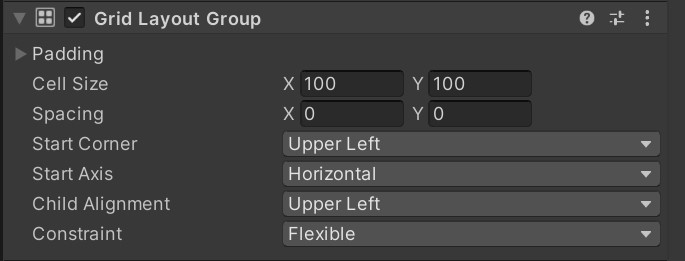

<div class="bilingual-row">
<div class="col-vi">
<p><strong>Layout component tương đối tốn kém</strong>, vì chúng phải <em>tính lại kích thước và vị trí của các phần tử con mỗi khi bị đánh dấu dirty</em>.</p>
<p>👉 Nếu số phần tử trong một Layout <strong>tương đối nhỏ và cố định</strong>, và Layout có <strong>cấu trúc tương đối đơn giản</strong>, có thể <strong>thay Layout bằng layout dựa trên RectTransform</strong>.</p>
<p><strong>Cách làm:</strong> Bằng cách gán <em>anchor</em> của RectTransform, vị trí và kích thước của nó có thể scale theo parent.</p>
<p><strong>Ví dụ layout 2 cột đơn giản</strong> — chỉ cần 2 RectTransform:</p>
<ul>
<li>Cột trái: anchor <strong>X: (0, 0.5)</strong> và <strong>Y: (0, 1)</strong></li>
<li>Cột phải: anchor <strong>X: (0.5, 1)</strong> và <strong>Y: (0, 1)</strong></li>
</ul>
<p>✅ Việc tính kích thước và vị trí của RectTransform khi đó <strong>được điều khiển trong NATIVE CODE bởi chính hệ thống Transform</strong> — <em>nhìn chung hiệu năng hơn</em> so với dựa vào hệ thống Layout.</p>
<p>💡 Cũng có thể viết MonoBehaviour thiết lập layout dựa trên RectTransform, <em>nhưng đây là nhiệm vụ tương đối phức tạp và nằm ngoài phạm vi hướng dẫn</em>.</p>
</div>
<div class="col-en">
<p><strong>Layout components are relatively expensive</strong>, as they must <em>recompute the sizes and positions of their child elements each time they are marked dirty</em>.</p>
<p>👉 If there is a <strong>relatively small and fixed number</strong> of elements within a given Layout, and the Layout has a <strong>relatively simple structure</strong>, it may be possible to <strong>replace the Layout with a RectTransform-based layout</strong>.</p>
<p><strong>How:</strong> By assigning the <em>anchors</em> of a RectTransform, its position and size can be made to scale based on its parent.</p>
<p><strong>Simple two-column layout example</strong> — just two RectTransforms:</p>
<ul>
<li>The left column's anchors: <strong>X: (0, 0.5)</strong> and <strong>Y: (0, 1)</strong></li>
<li>The right column's anchors: <strong>X: (0.5, 1)</strong> and <strong>Y: (0, 1)</strong></li>
</ul>
<p>✅ The computations of RectTransform size and position are then <strong>driven in NATIVE CODE by the Transform system itself</strong> — <em>generally more performant</em> than relying on the Layout system.</p>
<p>💡 It is also possible to write MonoBehaviours that set up a RectTransform-based Layout, <em>however this is a relatively complex task and lies beyond the scope of the guide</em>.</p>
</div>
</div>

### 12.2. Disabling Canvases — Thủ thuật "hacky" nhưng hiệu quả

<div class="bilingual-row">
<div class="col-vi">
<p>Khi hiện/ẩn từng phần rời rạc của UI, thường người ta bật/tắt GameObject ở gốc UI. Việc này đảm bảo không component nào trong UI bị tắt nhận input hay Unity callback.</p>
<p>🚨 <strong>NHƯNG việc này CŨNG khiến Canvas VỨT BỎ dữ liệu VBO của nó.</strong> Bật lại Canvas sẽ đòi hỏi Canvas (và mọi Sub-canvas) <strong>chạy lại quá trình rebuild và rebatch</strong>. Nếu việc này xảy ra thường xuyên, CPU tăng có thể <em>gây giật frame rate</em>.</p>
<p>✅ <strong>Cách lách (thừa nhận là "hacky"):</strong> Đặt UI cần hiện/ẩn lên <strong>Canvas hoặc Sub-canvas RIÊNG của nó</strong>, rồi <strong>chỉ bật/tắt COMPONENT CANVAS</strong> trên object đó.</p>
<p><strong>Kết quả:</strong></p>
<ul>
<li>Mesh của UI <strong>KHÔNG được vẽ</strong></li>
<li>Nhưng chúng <strong>vẫn nằm thường trú trong bộ nhớ</strong> và <strong>batching gốc được BẢO TOÀN</strong></li>
<li>Hơn nữa, <strong>KHÔNG có callback <code>OnEnable</code> hay <code>OnDisable</code> nào được gọi</strong> trong hierarchy UI</li>
</ul>
<p>⚠️ <strong>Tác dụng phụ cần xử lý:</strong> Việc này <strong>KHÔNG tắt bất kỳ MonoBehaviour nào</strong> trong UI bị ẩn — nên các MonoBehaviour đó <em>vẫn nhận Unity lifecycle callback như <code>Update</code></em>.</p>
<p>✅ <strong>Giải pháp — mẫu "Callback Manager":</strong> MonoBehaviour trên UI bị tắt kiểu này <strong>không nên trực tiếp cài đặt lifecycle callback của Unity</strong>, mà nên <strong>nhận callback từ một MonoBehaviour "Callback Manager" đặt ở GameObject gốc của UI</strong>. Callback Manager này được thông báo mỗi khi UI hiện/ẩn, và đảm bảo lifecycle event được lan truyền hay không tùy nhu cầu.</p>
</div>
<div class="col-en">
<p>When showing or hiding discrete portions of a UI, it is common to enable or disable the GameObject at the root of the UI. This ensures no component in the disabled UI receives input or Unity callbacks.</p>
<p>🚨 <strong>However, this ALSO causes the Canvas to DISCARD its VBO data.</strong> Re-enabling the Canvas will require the Canvas (and any Sub-canvases) to <strong>run the rebuild and rebatch processes</strong>. If this happens frequently, the increased CPU usage can <em>cause the frame rate to stutter</em>.</p>
<p>✅ <strong>One possible, but hacky, workaround:</strong> Place the UI to be shown/hidden onto <strong>its OWN Canvas or Sub-canvas</strong>, and then merely <strong>enable/disable the CANVAS COMPONENT</strong> on this object.</p>
<p><strong>The result:</strong></p>
<ul>
<li>The UI's meshes are <strong>NOT drawn</strong></li>
<li>But they <strong>remain resident in memory</strong> and <strong>their original batching is PRESERVED</strong></li>
<li>Further, <strong>NO <code>OnEnable</code> or <code>OnDisable</code> callbacks will be invoked</strong> in the UI's hierarchy</li>
</ul>
<p>⚠️ <strong>Side effect to handle:</strong> This will <strong>NOT disable any MonoBehaviours</strong> within the hidden UI, so these MonoBehaviours <em>will still receive Unity lifecycle callbacks, such as <code>Update</code></em>.</p>
<p>✅ <strong>The remedy — the "Callback Manager" pattern:</strong> MonoBehaviours on UIs disabled this way <strong>should not directly implement Unity's lifecycle callbacks</strong>, but should instead <strong>receive their callbacks from a "Callback Manager" MonoBehaviour on the UI's root GameObject</strong>. This manager can be informed whenever the UI is shown/hidden, and ensures lifecycle events are propagated or not as necessary.</p>
</div>
</div>

```csharp
// Mẫu Callback Manager — dùng kèm thủ thuật tắt Canvas component
// The Callback Manager pattern — pairs with the disable-Canvas-component trick
using System.Collections.Generic;
using UnityEngine;

// Các MonoBehaviour trong UI cài interface này thay vì dùng Update() trực tiếp
public interface IManagedUpdate { void ManagedUpdate(); }

[RequireComponent(typeof(Canvas))]
public class UICallbackManager : MonoBehaviour
{
    private Canvas canvas;
    private readonly List<IManagedUpdate> listeners = new List<IManagedUpdate>();

    void Awake()
    {
        canvas = GetComponent<Canvas>();
        // Thu thập 1 lần; include inactive = true để bắt cả object đang ẩn
        listeners.AddRange(GetComponentsInChildren<IManagedUpdate>(true));
    }

    // Thay vì SetActive(false) trên GameObject gốc (làm mất VBO),
    // chỉ tắt component Canvas ⇒ mesh giữ nguyên trong bộ nhớ, batching được bảo toàn
    public void Show() => canvas.enabled = true;
    public void Hide() => canvas.enabled = false;

    void Update()
    {
        // Cổng chặn duy nhất: Canvas tắt ⇒ không lan truyền lifecycle event
        if (!canvas.enabled) return;

        for (int i = 0; i < listeners.Count; i++)
            listeners[i].ManagedUpdate();
    }
}
```

### 12.3. 🚨 Gán Event Camera — Bẫy `FindWithTag` ẩn

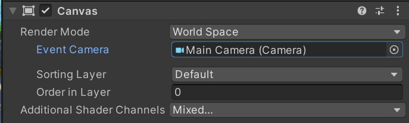
<p><em>VI: <strong>▲ Chính là ô cần gán</strong> — component <strong>Canvas</strong> ở <strong>Render Mode: World Space</strong>, và ô <strong><code>Event Camera</code></strong> ngay bên dưới. Bỏ trống ô này là Unity phải <code>FindWithTag("MainCamera")</code> <strong>MỖI LẦN có sự kiện input</strong>. / EN: A Canvas in World Space render mode with its Event Camera field.</em></p>

<div class="bilingual-row">
<div class="col-vi">
<p>📖 <strong>E-book Mobile nói THÊM hai điều mà mục trên chưa có:</strong></p>
<p>① <em>"Để TRỐNG ô Event hoặc Render Camera <strong>ÉP Unity điền vào bằng <code>Camera.main</code>, và việc đó ĐẮT một cách KHÔNG CẦN THIẾT.</strong>"</em> — tức tên gọi cụ thể của cái giá phải trả là <strong><code>Camera.main</code></strong>.</p>
<p>② 🔑 <em>"<strong>Hãy cân nhắc dùng <code>Screen Space – Overlay</code> cho RenderMode của Canvas NẾU CÓ THỂ, vì chế độ đó KHÔNG CẦN camera.</strong>"</em> — đây là lời khuyên <strong>CHỦ ĐỘNG</strong>: thay vì nhớ gán camera, hãy chọn chế độ không cần camera ngay từ đầu.</p>
</div>
<div class="col-en">
<p>📖 <strong>The Mobile e-book adds two things:</strong></p>
<p>① <em>"Leaving the Event or Render Camera field blank forces Unity to fill in <code>Camera.main</code>, which is unnecessarily expensive."</em></p>
<p>② <em>"Consider using Screen Space – Overlay for your Canvas RenderMode if possible, since that does not require a camera."</em></p>
</div>
</div>


<div class="bilingual-row">
<div class="col-vi">
<p>Nếu dùng Input Manager dựng sẵn của Unity với Canvas đặt ở chế độ <strong>World Space</strong> hoặc <strong>Screen Space – Camera</strong>, <strong>PHẢI LUÔN gán</strong> property <strong>Event Camera</strong> hoặc <strong>Render Camera</strong> tương ứng. Từ script, nó luôn được expose là property <code>worldCamera</code>.</p>
<p>💀 <strong>Nếu KHÔNG gán property này:</strong> Unity UI sẽ <strong>tìm main camera bằng cách tìm component Camera gắn vào GameObject có tag "Main Camera"</strong>.</p>
<p>🚨 <strong>Việc tra cứu này xảy ra ÍT NHẤT MỘT LẦN cho MỖI Canvas World Space hoặc Camera Space.</strong></p>
<p>👉 Vì <code>GameObject.FindWithTag</code> <em>nổi tiếng là chậm</em>, <strong>khuyến nghị mạnh mẽ</strong> là mọi Canvas World Space và Camera Space đều phải được gán property Camera <em>lúc design-time hoặc lúc khởi tạo</em>.</p>
<p>✅ <strong>Tin tốt:</strong> Vấn đề này <strong>KHÔNG xảy ra với Canvas Overlay</strong>.</p>
</div>
<div class="col-en">
<p>If using Unity's built-in Input Managers alongside Canvases set to render in <strong>World Space</strong> or <strong>Screen Space – Camera</strong> modes, it is important to <strong>ALWAYS set</strong> the <strong>Event Camera</strong> or <strong>Render Camera</strong> property, respectively. From script, this is always exposed as the <code>worldCamera</code> property.</p>
<p>💀 <strong>If this property is not set:</strong> Unity UI will <strong>search for the main camera by looking for Camera components attached to GameObjects with the "Main Camera" tag</strong>.</p>
<p>🚨 <strong>This lookup occurs AT LEAST ONCE PER World Space or Camera Space Canvas.</strong></p>
<p>👉 As <code>GameObject.FindWithTag</code> is <em>known to be slow</em>, it is <strong>strongly recommended</strong> that all World Space and Camera Space Canvases have their Camera properties assigned <em>at design-time or initialization time</em>.</p>
<p>✅ <strong>Good news:</strong> This issue does <strong>NOT occur for Overlay Canvases</strong>.</p>
</div>
</div>

### 12.4. Tùy biến source code UI — Phương án cuối cùng

<div class="bilingual-row">
<div class="col-vi">
<p>Hệ thống UI được thiết kế để hỗ trợ <em>rất nhiều use case</em>. Sự linh hoạt này tuyệt vời, nhưng cũng có nghĩa là <strong>một số tối ưu không thể thực hiện dễ dàng mà không phá vỡ tính năng khác</strong>.</p>
<p>Nếu bạn rơi vào tình huống có thể giành lại CPU cycle bằng cách <em>sửa source code C# của UI</em>, thì <strong>có thể biên dịch lại UI DLL và ghi đè lên cái đi kèm Unity</strong>. Quy trình này được ghi trong file readme của repository — cụ thể là <strong>Bitbucket của Unity</strong> (<code>bitbucket.org/Unity-Technologies/</code>), mục <strong>UI</strong> (<code>bitbucket.org/Unity-Technologies/ui/</code>). <strong>Nhớ lấy đúng source code tương ứng phiên bản Unity của bạn.</strong></p>
<p>⚠️ <strong>CHỈ nên làm như PHƯƠNG ÁN CUỐI CÙNG</strong>, vì có vài nhược điểm quan trọng:</p>
<ol>
<li>Bạn <strong>phải tìm cách phân phối DLL mới này</strong> tới các developer và build machine.</li>
<li><strong>MỖI LẦN nâng cấp Unity, bạn phải merge thay đổi của mình với source code UI mới.</strong></li>
</ol>
<p>👉 <strong>Hãy chắc chắn rằng bạn KHÔNG thể chỉ extend một lớp sẵn có hoặc viết phiên bản component của riêng mình trước khi đi theo hướng đó.</strong></p>
</div>
<div class="col-en">
<p>The UI system has been designed to support a large number of use cases. This flexibility is great, but it also means that <strong>some optimizations can't easily be done without breaking other features</strong>.</p>
<p>If you end up in a situation where you could gain some CPU cycles by <em>changing the C# UI source code</em>, it is possible to <strong>recompile the UI DLL and overwrite the one shipped with Unity</strong>. This procedure is documented in the readme file in the repository. <strong>Make sure to get the source code corresponding to your Unity version.</strong></p>
<p>⚠️ <strong>This should ONLY be done as a LAST RESORT</strong>, as there are some important drawbacks:</p>
<ol>
<li>You <strong>must find a way to distribute this new DLL</strong> to your developers and build machines.</li>
<li><strong>EVERY TIME you upgrade Unity, you must merge your changes with the new UI source code.</strong></li>
</ol>
<p>👉 <strong>Make sure you can't just extend an existing class or write your own version of a component before going in that direction.</strong></p>
</div>
</div>

---

## 13. ✅ Checklist UI từ E-book chính thức Unity

<div class="bilingual-row">
<div class="col-vi">
<p>Hai e-book chính thức (<em>Mobile</em> tr.37–40 và <em>Console/PC</em> tr.70–72) cô đọng thành 8 quy tắc thực chiến:</p>
</div>
<div class="col-en">
<p>The two official e-books (<em>Mobile</em> pp.37–40 and <em>Console/PC</em> pp.70–72) condense to eight field rules:</p>
</div>
</div>

<div class="bilingual-row">
<div class="col-vi">
<p><strong>① Chia Canvas của bạn</strong></p>
<p>Nếu có MỘT Canvas lớn với <em>hàng nghìn phần tử</em>, cập nhật <strong>MỘT</strong> phần tử UI buộc <strong>TOÀN BỘ</strong> Canvas phải update ⇒ có khả năng sinh CPU spike.</p>
<p>👉 Tận dụng khả năng hỗ trợ <em>nhiều Canvas</em> của UGUI. Chia phần tử UI <strong>dựa trên TẦN SUẤT chúng cần refresh</strong>. Giữ phần tử UI tĩnh trên một Canvas riêng, và phần tử động update cùng lúc trên các sub-canvas nhỏ hơn.</p>
<p>🔑 <strong>Đảm bảo mọi phần tử UI trong mỗi Canvas có CÙNG giá trị Z, CÙNG material, và CÙNG texture.</strong></p>
<p><strong>② Ẩn phần tử UI vô hình</strong></p>
<p>Bạn có thể có phần tử UI chỉ xuất hiện lác đác (ví dụ thanh máu chỉ hiện khi nhân vật bị thương). <strong>Nếu phần tử UI vô hình đang active, nó VẪN có thể đang dùng draw call.</strong></p>
<p>👉 <strong>Tắt tường minh</strong> mọi component UI vô hình và bật lại khi cần.</p>
<p>💡 Nếu chỉ cần tắt <em>khả năng nhìn thấy</em> của Canvas → <strong>tắt COMPONENT Canvas thay vì GameObject</strong>. Việc này tiết kiệm được việc rebuild mesh và vertex.</p>
</div>
<div class="col-en">
<p><strong>① Divide your Canvases</strong></p>
<p>If you have ONE large Canvas with <em>thousands of elements</em>, updating a <strong>SINGLE</strong> UI element forces the <strong>WHOLE</strong> Canvas to update, potentially generating a CPU spike.</p>
<p>👉 Take advantage of UGUI's ability to support <em>multiple Canvases</em>. Divide UI elements <strong>based on how FREQUENTLY they need to be refreshed</strong>. Keep static UI elements on a separate Canvas, and dynamic elements that update at the same time on smaller sub-canvases.</p>
<p>🔑 <strong>Ensure that all UI elements within each Canvas have the SAME Z value, materials, and textures.</strong></p>
<p><strong>② Hide invisible UI elements</strong></p>
<p>You may have UI elements that only appear sporadically (e.g., a health bar that appears only when a character takes damage). <strong>If your invisible UI element is active, it might STILL be using draw calls.</strong></p>
<p>👉 <strong>Explicitly disable</strong> any invisible UI components and re-enable them as needed.</p>
<p>💡 If you only need to turn off the Canvas's <em>visibility</em> → <strong>disable the Canvas COMPONENT rather than the GameObject</strong>. This can save rebuilding the meshes and vertices.</p>
</div>
</div>

<div class="bilingual-row">
<div class="col-vi">
<p><strong>③ Giới hạn GraphicRaycaster & tắt Raycast Target</strong></p>
<p>Sự kiện input như chạm hay click <em>yêu cầu</em> component <strong>GraphicRaycaster</strong>. Nó đơn giản lặp qua từng điểm input trên màn hình và kiểm tra xem nó có nằm trong RectTransform của một UI hay không.</p>
<p>👉 <strong>Gỡ GraphicRaycaster mặc định khỏi Canvas trên cùng</strong> trong hierarchy. Thay vào đó, <strong>chỉ thêm GraphicRaycaster vào các phần tử riêng lẻ cần tương tác</strong> (button, scroll rect, v.v.).</p>
<p>👉 <strong>Tắt "Ignore Reversed Graphics"</strong> — vốn được BẬT mặc định.</p>
<p>👉 <strong>Tắt "Raycast Target" trên MỌI UI text và image không cần nó.</strong></p>
<p>💡 <em>Bản Console/PC bổ sung:</em> Bạn cần Graphic Raycaster trên <strong>MỌI Canvas cần input</strong>, bao gồm cả sub-canvas. Dù nó không thực sự là raycaster (bất chấp cái tên), <strong>vẫn có chi phí cho mỗi phép kiểm tra giao cắt</strong>. Giảm thiểu số Graphic Raycaster bằng cách <em>không thêm chúng vào Canvas UI không tương tác</em>.</p>
<p>➡️ Nếu UI phức tạp với nhiều phần tử, <strong>tất cả những thay đổi nhỏ này cộng lại sẽ giảm được tính toán không cần thiết</strong>.</p>
</div>
<div class="col-en">
<p><strong>③ Limit GraphicRaycasters &amp; disable Raycast Target</strong></p>
<p>Input events like on-screen touches or clicks <em>require</em> the <strong>GraphicRaycaster</strong> component. This simply loops through each input point on screen and checks if it's within a UI's RectTransform.</p>
<p>👉 <strong>Remove the default GraphicRaycaster from the top Canvas</strong> in the hierarchy. Instead, <strong>add the GraphicRaycaster only to the individual elements that need to interact</strong> (buttons, scroll rects, and so on).</p>
<p>👉 <strong>Disable "Ignore Reversed Graphics"</strong>, which is active by default.</p>
<p>👉 <strong>Disable "Raycast Target" on ALL UI text and images that don't need it.</strong></p>
<p>💡 <em>The Console/PC edition adds:</em> You need a Graphic Raycaster on <strong>EVERY Canvas that requires input</strong>, including sub-canvases. While this is not really a raycaster (despite the name), <strong>there is some expense for each intersection check</strong>. Minimize the number by <em>not adding them to non-interactive UI Canvases</em>.</p>
<p>➡️ If the UI is complex with many elements, <strong>all of these small changes can reduce unnecessary computation</strong>.</p>
</div>
</div>

<div class="bilingual-row">
<div class="col-vi">
<p><strong>④ Tránh Layout Group</strong></p>
<p><strong>Layout Group update KHÔNG hiệu quả</strong>, nên dùng chúng dè dặt.</p>
<ul>
<li><strong>Tránh hoàn toàn</strong> nếu nội dung của bạn không động → dùng <strong>anchor</strong> cho layout theo tỉ lệ thay thế.</li>
<li>Hoặc <strong>viết code tùy biến TẮT các component Layout Group SAU KHI chúng đã set up xong UI</strong>.</li>
<li>Nếu buộc phải dùng Layout Group (Horizontal, Vertical, Grid) cho phần tử động → <strong>TRÁNH LỒNG NHAU (nesting)</strong> để cải thiện hiệu năng.</li>
</ul>
<p>⚠️ <em>"Layout Group có thể làm giảm hiệu năng, ĐẶC BIỆT khi lồng nhau."</em></p>
<p><strong>⑤ Tránh List và Grid view lớn</strong></p>
<p>List và Grid view lớn <strong>tốn kém</strong>. Nếu cần tạo List/Grid lớn (ví dụ màn hình inventory với hàng trăm item), hãy cân nhắc <strong>tái sử dụng một pool nhỏ phần tử UI thay vì tạo một phần tử UI cho MỖI item</strong>. → xem §11.3. *(Nguồn gốc còn dẫn thêm một <strong>sample GitHub project</strong> minh hoạ kỹ thuật này — <em>"Check out this sample GitHub project to see this in action."</em>; bản PDF chỉ giữ anchor text, không giữ URL đích.)*</p>
<p><strong>⑥ Tránh nhiều phần tử xếp chồng</strong></p>
<p>Xếp lớp nhiều phần tử UI (ví dụ các lá bài chồng lên nhau trong game thẻ bài) <strong>tạo ra overdraw</strong>. Tùy biến code để <strong>gộp các phần tử phân lớp lúc runtime thành ít phần tử và ít batch hơn</strong>.</p>
</div>
<div class="col-en">
<p><strong>④ Avoid Layout Groups</strong></p>
<p><strong>Layout Groups update inefficiently</strong>, so use them sparingly.</p>
<ul>
<li><strong>Avoid them entirely</strong> if your content isn't dynamic → use <strong>anchors</strong> for proportional layouts instead.</li>
<li>Alternately, <strong>create custom code to disable the Layout Group components AFTER they set up the UI</strong>.</li>
<li>If you do need Layout Groups (Horizontal, Vertical, Grid) for dynamic elements → <strong>AVOID NESTING them</strong> to improve performance.</li>
</ul>
<p>⚠️ <em>"Layout Groups can lower performance, ESPECIALLY when nested."</em></p>
<p><strong>⑤ Avoid large List and Grid views</strong></p>
<p>Large List and Grid views are <strong>expensive</strong>. If you need a large List or Grid view (e.g., an inventory screen with hundreds of items), consider <strong>reusing a smaller pool of UI elements rather than creating a UI element for EVERY item</strong>. → see §11.3</p>
<p><strong>⑥ Avoid numerous overlaid elements</strong></p>
<p>Layering lots of UI elements (e.g., cards stacked in a card battle game) <strong>creates overdraw</strong>. Customize your code to <strong>merge layered elements at runtime into fewer elements and batches</strong>.</p>
</div>
</div>

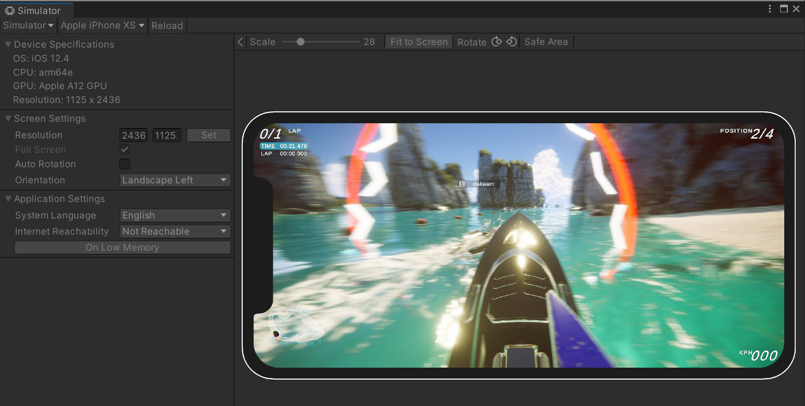
<p><em>VI: Xem trước UI trên nhiều định dạng màn hình bằng Device Simulator. / EN: Preview a variety of screen formats using the Device Simulator.</em></p>

<div class="bilingual-row">
<div class="col-vi">
<p><strong>⑦ Dùng nhiều độ phân giải & tỉ lệ khung hình</strong></p>
<p>Với thiết bị mobile ngày nay dùng <em>rất nhiều độ phân giải và kích thước màn hình khác nhau</em>, hãy <strong>tạo các phiên bản UI thay thế</strong> để mang lại trải nghiệm tốt nhất cho từng thiết bị.</p>
<p>👉 Dùng <strong>Device Simulator</strong> để xem trước UI trên dải rộng thiết bị được hỗ trợ. Cũng có thể tạo <em>thiết bị ảo</em> trong XCode và Android Studio.</p>
<p><strong>⑧ Khi dùng UI toàn màn hình, ẩn HẾT mọi thứ khác</strong> <em>(bản Console/PC)</em></p>
<ul>
<li>Nếu màn hình pause hoặc start che hết mọi thứ khác trong scene → <strong>tắt camera đang render scene 3D</strong>.</li>
<li>Tương tự, <strong>tắt mọi phần tử Canvas nền bị ẩn phía sau Canvas trên cùng</strong>.</li>
<li>💡 <strong>Cân nhắc HẠ <code>Application.targetFrameRate</code> trong lúc hiển thị UI toàn màn hình</strong>, vì bạn <em>không cần update ở 60 fps</em>.</li>
</ul>
</div>
<div class="col-en">
<p><strong>⑦ Use multiple resolutions and aspect ratios</strong></p>
<p>With mobile devices now using <em>very different resolutions and screen sizes</em>, <strong>create alternate versions of the UI</strong> to provide the best experience per device.</p>
<p>👉 Use the <strong>Device Simulator</strong> to preview the UI across a wide range of supported devices. You can also create <em>virtual devices</em> in XCode and Android Studio.</p>
<p><strong>⑧ When using a fullscreen UI, hide everything else</strong> <em>(Console/PC edition)</em></p>
<ul>
<li>If your pause or start screen covers everything else in the scene → <strong>disable the camera rendering the 3D scene</strong>.</li>
<li>Likewise, <strong>disable any background Canvas elements hidden behind the top Canvas</strong>.</li>
<li>💡 <strong>Consider lowering <code>Application.targetFrameRate</code> during a fullscreen UI</strong>, since you <em>should not need to update at 60 fps</em>.</li>
</ul>
</div>
</div>

### 13.1. 📝 Checklist UI từ ghi chú THỰC CHIẾN — bốn mục chưa nói ở đâu khác

<div class="bilingual-row">
<div class="col-vi">
<p>Bốn mục dưới đây đến từ <strong>khối ghi chú UI trong <code>raw-optimization-data.txt</code></strong> (không phải từ e-book). Chúng KHÔNG trùng với §13 và cũng KHÔNG xuất hiện ở bất kỳ Module nào khác — tôi đã kiểm cả 5 Module trước khi viết mục này.</p>
</div>
<div class="col-en">
<p>These four items come from the UI notes block in <code>raw-optimization-data.txt</code>, not from the e-books. They don't overlap §13 and don't appear in any other Module.</p>
</div>
</div>

| # | Ghi chú gốc | Vì sao đáng làm |
|---|---|---|
| **①** | *"disable **Rich Text**"* | Ô **Rich Text** trên component `Text`/`TextMeshPro` bật **BỘ PHÂN TÍCH THẺ** (`<b>`, `<color>`, `<size>`…) chạy **MỖI LẦN chuỗi thay đổi**. Với text **KHÔNG dùng thẻ định dạng** — điểm số, đồng hồ, số lượng — đó là chi phí parse **HOÀN TOÀN LÃNG PHÍ**, và nó nằm đúng trên đường nóng vì các text đó đổi liên tục. |
| **②** | *"Turning off **pixel perfect**"* | **`Canvas › Pixel Perfect`** ép Unity **LÀM TRÒN vị trí từng phần tử UI về đúng biên pixel**. Kết quả: mỗi lần một phần tử **DI CHUYỂN**, layout phải tính lại và mesh phải dựng lại. Với UI **TĨNH** thì vô hại; với UI **ĐỘNG** (thanh máu chạy, số nhảy, panel trượt) đây là nguồn rebuild âm thầm. Tắt nó nếu bạn không thực sự cần độ nét pixel-art. |
| **③** | *"**Never use `renderer.material.xxx` at runtime**, this will clone the material **and break batching too**"* | Chạm vào `.material` là **NHÂN BẢN material**. Ngoài chuyện rò rỉ bộ nhớ, bản clone còn mang **material instance MỚI** ⇒ object đó **RỚT KHỎI batch** với các object dùng material gốc. Đây là hai thiệt hại trong một. |
| **④** | *"Use **`MaterialPropertyBlock`** để đổi thuộc tính material"* | Đây là **cách ĐÚNG** để đổi màu/tham số **TỪNG object mà KHÔNG nhân bản material** và **KHÔNG phá batch** — GPU vẫn coi chúng dùng chung một material. |

```csharp
// ❌ SAI — clone material, rò rỉ, và phá batch
GetComponent<Renderer>().material.color = Color.red;

// ✅ ĐÚNG — đổi thuộc tính RIÊNG từng object, KHÔNG clone, KHÔNG phá batch
static readonly int BaseColor = Shader.PropertyToID("_BaseColor");

MaterialPropertyBlock _mpb;
Renderer _renderer;

void Awake()
{
    _renderer = GetComponent<Renderer>();
    _mpb = new MaterialPropertyBlock();
}

void SetColor(Color c)
{
    _renderer.GetPropertyBlock(_mpb);   // đọc block hiện tại (đừng tạo mới mỗi lần)
    _mpb.SetColor(BaseColor, c);
    _renderer.SetPropertyBlock(_mpb);   // ghi lại — material gốc KHÔNG bị đụng tới
}
```

<div class="bilingual-row">
<div class="col-vi">
<p>🔗 <strong>Nối sang các Module khác:</strong> hệ quả <em>rò rỉ bộ nhớ</em> của việc clone material được mổ xẻ ở <strong>Module 3 §4.2</strong> (bản clone KHÔNG bị GC, chỉ dọn khi đổi scene hoặc gọi <code>Resources.UnloadUnusedAssets()</code>); hệ quả <em>phá batch</em> ở <strong>Module 4 §10</strong>.</p>
</div>
<div class="col-en">
<p>🔗 The memory-leak side of material cloning is covered in <strong>Module 3 §4.2</strong>; the batch-breaking side in <strong>Module 4 §10</strong>.</p>
</div>
</div>


---

# PHẦN B — PHYSICS

!!! warning "Ghi chú về nguồn"
    **VI:** URL `learn.unity.com/tutorial/physics-best-practices` trong file raw trả về **HTTP 404** (Unity Learn đã tái cấu trúc và xóa tutorial này). Phần Physics dưới đây được tổng hợp từ **e-book chính thức của Unity** (*Optimize Your Mobile Game Performance*, tr.45–47) kết hợp với **ghi chú thực chiến trong `raw-optimization-data.txt`** — mọi mục đều ghi rõ xuất xứ.

    **EN:** The `learn.unity.com/tutorial/physics-best-practices` URL returns **HTTP 404** (Unity Learn restructured and removed it). The Physics content below is synthesized from Unity's **official e-book** (*Optimize Your Mobile Game Performance*, pp.45–47) plus the **field notes in `raw-optimization-data.txt`** — each item's provenance is marked.

## 14. Cấu hình Physics Settings

<div class="bilingual-row">
<div class="col-vi">
<p>Physics dựng sẵn của Unity (<strong>Nvidia PhysX</strong>) <em>có thể rất tốn kém trên mobile</em>.</p>
</div>
<div class="col-en">
<p>Unity's built-in Physics (<strong>Nvidia PhysX</strong>) <em>can be expensive on mobile</em>.</p>
</div>
</div>

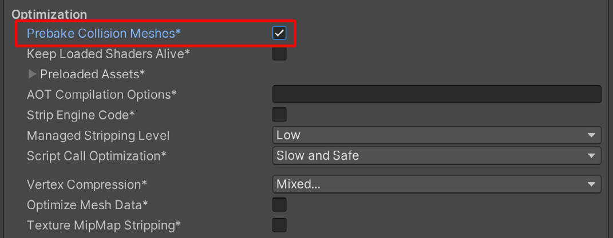
<p><em>VI: Bật Prebake Collision Meshes trong Player Settings → Optimization. / EN: Enable Prebake Collision Meshes in Player Settings → Optimization.</em></p>

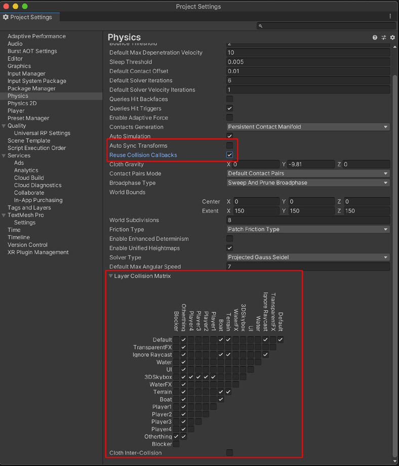
<p><em>VI: Project Settings &gt; Physics — tắt <strong>Auto Sync Transforms</strong>, bật <strong>Reuse Collision Callbacks</strong>, và đơn giản hóa <strong>Layer Collision Matrix</strong>. / EN: Project Settings &gt; Physics — disable Auto Sync Transforms, enable Reuse Collision Callbacks, and simplify the Layer Collision Matrix.</em></p>

<div class="bilingual-row">
<div class="col-vi">
<p><strong>📕 Từ e-book Unity:</strong></p>
<ol>
<li>Trong <strong>PlayerSettings</strong>, tick <strong>Prebake Collision Meshes</strong> bất cứ khi nào có thể.</li>
<li>Trong <code>Project Settings &gt; Physics</code>:
  <ul>
  <li><strong>Đơn giản hóa Layer Collision Matrix</strong> ở mọi chỗ có thể</li>
  <li><strong>Tắt Auto Sync Transforms</strong></li>
  <li><strong>Bật Reuse Collision Callbacks</strong></li>
  </ul>
</li>
<li><strong>Theo dõi module Physics của Profiler</strong> để phát hiện vấn đề hiệu năng.</li>
</ol>
<p><strong>📝 Từ ghi chú raw (bổ sung):</strong></p>
<ul>
<li><strong>Filter Layers và Collision Matrix</strong> — chỉ cho phép cặp layer thực sự cần va chạm.</li>
<li><strong>Đánh dấu Static</strong> các object không di chuyển.</li>
<li><code>autoSyncTransforms = false</code> để tránh ảnh hưởng hiệu năng.</li>
</ul>
<p>🔑 <strong>Giải thích <code>Auto Sync Transforms</code>:</strong> Khi BẬT, mỗi lần bạn đọc/ghi Transform thì Unity phải <em>đồng bộ ngay lập tức</em> trạng thái Transform sang physics engine. Tắt nó đi ⇒ đồng bộ chỉ xảy ra <em>một lần mỗi bước physics</em>, rẻ hơn nhiều.</p>
<p>🔑 <strong>Giải thích <code>Reuse Collision Callbacks</code>:</strong> Khi BẬT, Unity <em>tái sử dụng MỘT instance <code>Collision</code> duy nhất</em> cho mọi callback thay vì cấp phát một object mới cho mỗi lần va chạm ⇒ <strong>giảm mạnh GC Alloc</strong> trong scene nhiều va chạm.</p>
</div>
<div class="col-en">
<p><strong>📕 From the Unity e-book:</strong></p>
<ol>
<li>In <strong>PlayerSettings</strong>, check <strong>Prebake Collision Meshes</strong> whenever possible.</li>
<li>In <code>Project Settings &gt; Physics</code>:
  <ul>
  <li><strong>Simplify your Layer Collision Matrix</strong> wherever possible</li>
  <li><strong>Disable Auto Sync Transforms</strong></li>
  <li><strong>Enable Reuse Collision Callbacks</strong></li>
  </ul>
</li>
<li><strong>Keep an eye on the Physics module of the Profiler</strong> for performance issues.</li>
</ol>
<p><strong>📝 From the raw field notes (additional):</strong></p>
<ul>
<li><strong>Filter Layers and Collision Matrix</strong> — only allow layer pairs that genuinely need to collide.</li>
<li><strong>Mark static</strong> non-moving objects.</li>
<li><code>autoSyncTransforms = false</code> to avoid affecting performance.</li>
</ul>
<p>🔑 <strong><code>Auto Sync Transforms</code> explained:</strong> When ON, every Transform read/write forces Unity to <em>immediately sync</em> Transform state into the physics engine. Turning it off means syncing happens <em>once per physics step</em>, which is far cheaper.</p>
<p>🔑 <strong><code>Reuse Collision Callbacks</code> explained:</strong> When ON, Unity <em>reuses a SINGLE <code>Collision</code> instance</em> across callbacks instead of allocating a new object per collision ⇒ <strong>drastically reduces GC Alloc</strong> in collision-heavy scenes.</p>
</div>
</div>

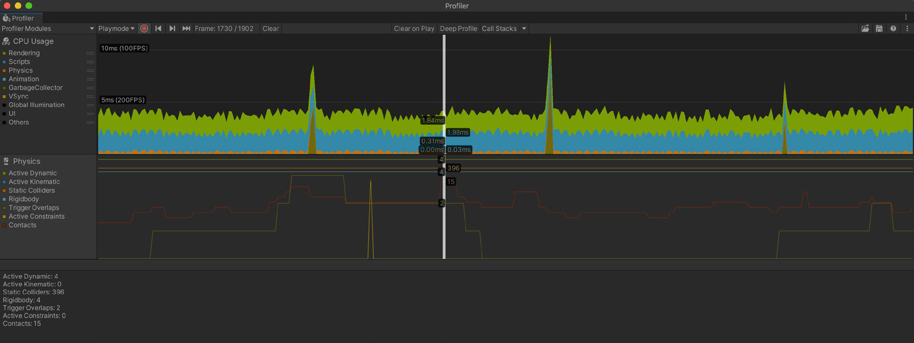
<p><em>VI: Module Physics trong Profiler — đọc các số: <code>Active Dynamic: 4</code>, <code>Active Kinematic: 0</code>, <code>Static Colliders: 396</code>, <code>Rigidbody: 4</code>, <code>Trigger Overlaps: 2</code>, <code>Active Constraints: 0</code>, <code>Contacts: 15</code>. / EN: The Physics Profiler module — read the counters for Active Dynamic, Static Colliders, Rigidbody, Trigger Overlaps and Contacts.</em></p>

---

## 15. Fixed Timestep & Maximum Allowed Timestep

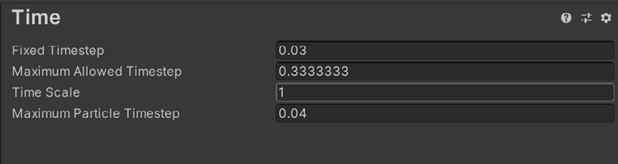
<p><em>VI: <strong>▲ Ba con số đi cùng nhau</strong> — <strong>Fixed Timestep</strong>, <strong>Maximum Allowed Timestep <code>0.3333333</code></strong> và <strong>Maximum Particle Timestep <code>0.03</code></strong>. Con số <code>0.3333333</code> chính là <strong>TRẦN chống “vòng xoáy tử thần”</strong>: dù frame có chậm tới đâu, Unity cũng KHÔNG chạy quá 1/3 giây vật lý trong một frame. / EN: Fixed Timestep, Maximum Allowed Timestep 0.3333333 and Maximum Particle Timestep 0.03.</em></p>

<div class="bilingual-row">
<div class="col-vi">
<p><strong>📕 Từ e-book Unity — "Fix the Fixed Timestep":</strong></p>
<p>Giá trị <strong>Fixed Timestep</strong> mặc định trong Project Settings là <strong>0.02</strong> (tức <strong>50 Hz</strong>).</p>
<p>👉 <strong>Đổi nó cho KHỚP với target frame rate của bạn</strong> — ví dụ <strong>0.03 cho 30 fps</strong>.</p>
<p>🚨 <strong>Vì sao quan trọng:</strong> Nếu không chỉnh, khi frame rate <em>tụt</em> lúc runtime, Unity sẽ phải <strong>gọi <code>FixedUpdate</code> NHIỀU LẦN trong MỘT frame</strong> ⇒ có khả năng tạo ra vấn đề hiệu năng CPU với nội dung nặng physics. <em>(Đây là vòng xoáy tử thần: FPS tụt → nhiều FixedUpdate hơn → FPS tụt tiếp.)</em></p>
<p><strong>Maximum Allowed Timestep:</strong> giới hạn <em>bao nhiêu thời gian</em> mà tính toán physics và sự kiện <code>FixedUpdate</code> được phép dùng trong trường hợp frame rate tụt.</p>
<p>👉 <strong>HẠ giá trị này</strong> nghĩa là: trong lúc bị hitch hiệu năng, <em>physics và animation có thể chạy CHẬM lại</em>, <strong>nhưng nó cũng GIẢM tác động của chúng lên frame rate</strong>.</p>
<p>⚖️ Đây là một đánh đổi có ý thức: <em>chấp nhận physics chạy chậm (slow-motion) để giữ frame rate không sập</em>.</p>
<p><strong>📝 Từ ghi chú raw:</strong> "Tweak the Fixed Timestep 0.02 value in <code>Edit &gt; Project Settings &gt; Time</code>."</p>
</div>
<div class="col-en">
<p><strong>📕 From the Unity e-book — "Fix the Fixed Timestep":</strong></p>
<p>The default <strong>Fixed Timestep</strong> in Project Settings is <strong>0.02</strong> (i.e. <strong>50 Hz</strong>).</p>
<p>👉 <strong>Change this to match your target frame rate</strong> — for example <strong>0.03 for 30 fps</strong>.</p>
<p>🚨 <strong>Why it matters:</strong> Otherwise, if your frame rate <em>drops</em> at runtime, Unity would <strong>call <code>FixedUpdate</code> MULTIPLE TIMES PER FRAME</strong> ⇒ potentially creating a CPU performance issue with physics-heavy content. <em>(This is a death spiral: FPS drops → more FixedUpdates → FPS drops further.)</em></p>
<p><strong>Maximum Allowed Timestep:</strong> limits <em>how much time</em> physics calculations and <code>FixedUpdate</code> events can use in the event the frame rate drops.</p>
<p>👉 <strong>Lowering this value</strong> means that during a performance hitch, <em>physics and animation may slow down</em>, <strong>but it also reduces their impact on frame rate</strong>.</p>
<p>⚖️ This is a deliberate trade-off: <em>accept slow-motion physics to keep the frame rate from collapsing</em>.</p>
<p><strong>📝 From the raw field notes:</strong> "Tweak the Fixed Timestep 0.02 value in <code>Edit &gt; Project Settings &gt; Time</code>."</p>
</div>
</div>

| Target FPS | Fixed Timestep khuyến nghị | Tần số physics |
|---|---|---|
| 30 fps | **0.03** | ~33 Hz |
| 50 Hz *(mặc định Unity)* | 0.02 | 50 Hz |
| 60 fps | **0.0167** | ~60 Hz |

---

## 16. Collider — Đơn giản hóa là chìa khóa

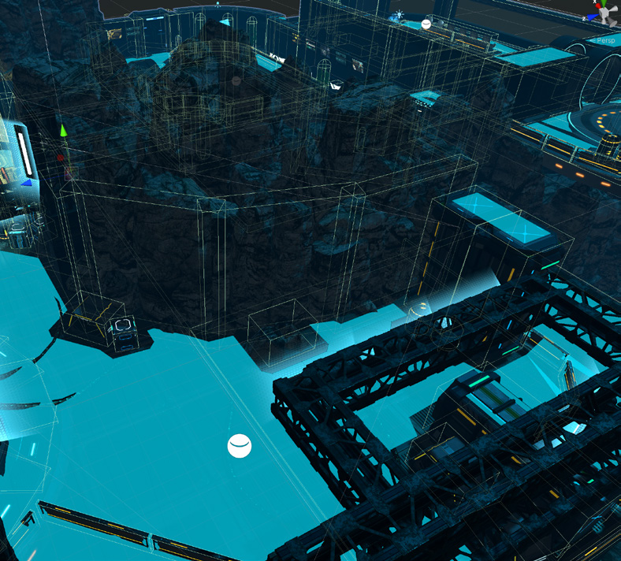
<p><em>VI: Dùng primitive hoặc mesh đơn giản hóa cho collider. / EN: Use primitives or simplified meshes for colliders.</em></p>

<div class="bilingual-row">
<div class="col-vi">
<p><strong>📕 Từ e-book Unity:</strong> <em>"Mesh collider có thể rất tốn kém. Hãy thay thế các mesh collider phức tạp bằng primitive hoặc mesh collider đơn giản hơn để xấp xỉ hình dạng gốc."</em></p>
<p><strong>📝 Từ ghi chú raw — bộ quy tắc đầy đủ:</strong></p>
<ol>
<li><strong>ĐỪNG dùng Raycast bên trong <code>FixedUpdate()</code></strong> — <em>đôi khi ngay cả trong <code>Update()</code> cũng đã là quá đáng</em>.</li>
<li><strong>Raycast vào mesh collider CỰC KỲ tốn kém.</strong> Nếu buộc phải dùng mesh collider, thì <em>ít nhất hãy làm chúng CONVEX</em>.</li>
<li><strong>Cố gắng có ÍT dynamic Rigidbody nhất có thể.</strong></li>
<li><strong>Dùng primitive collider đơn giản thay vì mesh collider.</strong></li>
<li><strong>Cố gắng giữ "Collision Detection" ở "Discrete" nếu có thể.</strong></li>
<li><strong><code>OverlapSphereNonAlloc</code> nhìn chung là giải pháp TỐT HƠN <code>OverlapSphere</code>.</strong></li>
</ol>
<p>🔑 <strong>Vì sao Convex quan trọng:</strong> Mesh collider <em>lồi (convex)</em> được PhysX xử lý bằng thuật toán nhanh hơn nhiều và <strong>có thể tham gia va chạm động</strong>. Mesh collider <em>lõm (concave)</em> chỉ dùng được cho collider tĩnh và tốn kém hơn hẳn khi query.</p>
<p>⚠️ <strong>Giới hạn cần biết:</strong> Unity giới hạn <strong>convex collider ở ≤ 255 tam giác</strong> — nó có thể <em>tự động đơn giản hóa thêm</em> nếu mesh của bạn vượt quá.</p>
</div>
<div class="col-en">
<p><strong>📕 From the Unity e-book:</strong> <em>"Mesh colliders can be expensive. Substitute more complex mesh colliders with simpler primitive or mesh colliders to approximate the original shape."</em></p>
<p><strong>📝 From the raw field notes — the full rule set:</strong></p>
<ol>
<li><strong>DON'T use Raycasts inside <code>FixedUpdate()</code></strong> — <em>sometimes even inside <code>Update()</code> may be an overkill</em>.</li>
<li><strong>Raycasting against a mesh collider is REALLY expensive.</strong> If in dire need of mesh colliders, <em>at least make them CONVEX</em>.</li>
<li><strong>Try to have the least dynamic Rigidbodies as possible.</strong></li>
<li><strong>Use simple primitive colliders instead of mesh colliders.</strong></li>
<li><strong>Try to keep "Collision Detection" on "Discrete" if possible.</strong></li>
<li><strong><code>OverlapSphereNonAlloc</code> is generally a BETTER solution than <code>OverlapSphere</code>.</strong></li>
</ol>
<p>🔑 <strong>Why Convex matters:</strong> <em>Convex</em> mesh colliders are handled by PhysX with a much faster algorithm and <strong>can participate in dynamic collisions</strong>. <em>Concave</em> mesh colliders can only be used as static colliders and are far more expensive to query.</p>
<p>⚠️ <strong>Limit to know:</strong> Unity limits <strong>convex colliders to ≤ 255 triangles</strong> — it may <em>auto-simplify further</em> if your mesh exceeds that.</p>
</div>
</div>

### 16.1. 🔴 NonAlloc API — Zero GC cho Physics Query

<div class="bilingual-row">
<div class="col-vi">
<p>Các hàm query physics của Unity có <strong>2 biến thể</strong>:</p>
<ul>
<li><strong>Biến thể cấp phát</strong> (<code>Physics.RaycastAll</code>, <code>Physics.OverlapSphere</code>…) — <em>cấp phát một MẢNG MỚI mỗi lần gọi</em> ⇒ <strong>sinh rác</strong>.</li>
<li><strong>Biến thể NonAlloc</strong> (<code>Physics.RaycastNonAlloc</code>, <code>Physics.OverlapSphereNonAlloc</code>…) — <em>ghi kết quả vào BUFFER bạn cấp sẵn</em> ⇒ <strong>0 B GC Alloc</strong>.</li>
</ul>
<p>🔑 <strong>Quy tắc:</strong> Biến thể NonAlloc trả về <strong>SỐ LƯỢNG hit thực tế</strong>, và <em>chỉ điền vào tối đa <code>buffer.Length</code> phần tử</em>. Nếu số hit vượt kích thước buffer, <strong>các hit dư sẽ bị BỎ QUA im lặng</strong> — nên chọn kích thước buffer đủ lớn.</p>
</div>
<div class="col-en">
<p>Unity's physics query functions come in <strong>two variants</strong>:</p>
<ul>
<li><strong>Allocating variants</strong> (<code>Physics.RaycastAll</code>, <code>Physics.OverlapSphere</code>…) — <em>allocate a NEW ARRAY on every call</em> ⇒ <strong>generate garbage</strong>.</li>
<li><strong>NonAlloc variants</strong> (<code>Physics.RaycastNonAlloc</code>, <code>Physics.OverlapSphereNonAlloc</code>…) — <em>write results into a BUFFER you supply</em> ⇒ <strong>0 B GC Alloc</strong>.</li>
</ul>
<p>🔑 <strong>Rule:</strong> NonAlloc variants return the <strong>actual NUMBER of hits</strong>, and <em>only fill up to <code>buffer.Length</code> entries</em>. If hits exceed the buffer size, <strong>the surplus is SILENTLY DROPPED</strong> — so size your buffer generously.</p>
</div>
</div>

```csharp
// ❌ SAI — cấp phát mảng mới MỖI LẦN GỌI
// WRONG — allocates a new array on EVERY call
void Update()
{
    RaycastHit[] hits = Physics.RaycastAll(transform.position, Vector3.forward, 100f);
    Collider[] cols   = Physics.OverlapSphere(transform.position, 5f);
    // → GC Alloc mỗi frame ⇒ GC spike
}
```

```csharp
// ✅ ĐÚNG — buffer cache sẵn, 0 B GC Alloc
// CORRECT — pre-cached buffers, 0 B GC Alloc
using UnityEngine;

public class PhysicsQueries : MonoBehaviour
{
    // Cấp phát MỘT LẦN — chọn size đủ lớn cho trường hợp xấu nhất
    private readonly RaycastHit[] hitBuffer     = new RaycastHit[16];
    private readonly Collider[]   overlapBuffer = new Collider[32];

    [SerializeField] private LayerMask targetMask;   // ⚠️ LUÔN lọc layer

    void FixedUpdate()
    {
        // ① RaycastNonAlloc — trả về SỐ hit, ghi vào hitBuffer
        int hitCount = Physics.RaycastNonAlloc(
            transform.position, transform.forward, hitBuffer, 100f, targetMask);

        for (int i = 0; i < hitCount; i++)      // chỉ duyệt tới hitCount!
            ProcessHit(hitBuffer[i]);

        // ② OverlapSphereNonAlloc — tốt hơn OverlapSphere (ghi chú raw)
        int overlapCount = Physics.OverlapSphereNonAlloc(
            transform.position, 5f, overlapBuffer, targetMask);

        for (int i = 0; i < overlapCount; i++)
            ProcessOverlap(overlapBuffer[i]);
    }

    void ProcessHit(RaycastHit hit)      { /* ... */ }
    void ProcessOverlap(Collider col)    { /* ... */ }
}
```

| Cấp phát / Allocating | NonAlloc (0 GC) |
|---|---|
| `Physics.RaycastAll` | `Physics.RaycastNonAlloc` |
| `Physics.OverlapSphere` | `Physics.OverlapSphereNonAlloc` |
| `Physics.OverlapBox` | `Physics.OverlapBoxNonAlloc` |
| `Physics.OverlapCapsule` | `Physics.OverlapCapsuleNonAlloc` |
| `Physics.SphereCastAll` | `Physics.SphereCastNonAlloc` |
| `Physics.BoxCastAll` | `Physics.BoxCastNonAlloc` |
| `Physics.CapsuleCastAll` | `Physics.CapsuleCastNonAlloc` |
| `Physics2D.OverlapCircleAll` | `Physics2D.OverlapCircleNonAlloc` |

!!! tip "Unity 2022+ — biến thể mới hơn"
    **VI:** Từ Unity 2022, còn có nhóm API nhận `List<T>` (ví dụ `Physics.OverlapSphere(..., List<Collider> results)`) và các job-based query. Chúng cũng zero-alloc sau lần cấp phát đầu và **tự động mở rộng** khi cần — an toàn hơn mảng cố định vì không âm thầm bỏ hit.

    **EN:** From Unity 2022 there are also `List<T>`-taking overloads (e.g. `Physics.OverlapSphere(..., List<Collider> results)`) and job-based queries. These are also zero-alloc after the first allocation and **grow automatically** — safer than fixed arrays since they never silently drop hits.

---

## 17. Di chuyển Rigidbody đúng cách

<div class="bilingual-row">
<div class="col-vi">
<p><strong>📕 Từ e-book Unity — "Move a Rigidbody using physics methods":</strong></p>
<p>👉 Dùng các method của lớp như <strong><code>MovePosition</code></strong> hoặc <strong><code>AddForce</code></strong> để di chuyển object Rigidbody.</p>
<p>🚨 <strong>Việc dịch chuyển component Transform của chúng TRỰC TIẾP có thể dẫn tới TÍNH TOÁN LẠI THẾ GIỚI PHYSICS</strong> — vốn <em>rất tốn kém trong các scene phức tạp</em>.</p>
<p>⏱️ <strong>Di chuyển physics body trong <code>FixedUpdate</code> thay vì <code>Update</code>.</strong></p>
<p>💡 <strong>Vì sao:</strong> <code>FixedUpdate</code> chạy đồng bộ với bước simulation của physics. Ghi Transform trong <code>Update</code> sẽ khiến physics engine phải sync lại ngoài nhịp, gây ra công việc thừa (và tệ hơn nếu <code>autoSyncTransforms</code> đang bật).</p>
</div>
<div class="col-en">
<p><strong>📕 From the Unity e-book — "Move a Rigidbody using physics methods":</strong></p>
<p>👉 Use class methods like <strong><code>MovePosition</code></strong> or <strong><code>AddForce</code></strong> to move your Rigidbody objects.</p>
<p>🚨 <strong>Translating their Transform components DIRECTLY can lead to PHYSICS WORLD RECALCULATIONS</strong>, which <em>can be expensive in complex scenes</em>.</p>
<p>⏱️ <strong>Move physics bodies in <code>FixedUpdate</code> rather than <code>Update</code>.</strong></p>
<p>💡 <strong>Why:</strong> <code>FixedUpdate</code> runs in step with the physics simulation. Writing Transforms in <code>Update</code> forces the physics engine to re-sync off-beat, creating redundant work (and worse if <code>autoSyncTransforms</code> is on).</p>
</div>
</div>

```csharp
// ❌ SAI — ghi Transform trực tiếp, trong Update
// WRONG — writing Transform directly, in Update
void Update()
{
    transform.position += velocity * Time.deltaTime;   // buộc physics recalculate
}
```

```csharp
// ✅ ĐÚNG — dùng physics method, trong FixedUpdate
// CORRECT — use physics methods, in FixedUpdate
using UnityEngine;

[RequireComponent(typeof(Rigidbody))]
public class PhysicsMover : MonoBehaviour
{
    private Rigidbody rb;
    [SerializeField] private float speed = 5f;
    [SerializeField] private float forceAmount = 10f;

    void Awake() => rb = GetComponent<Rigidbody>();   // cache — không GetComponent mỗi frame

    void FixedUpdate()
    {
        // ① Di chuyển kinematic/interpolated — tôn trọng collision
        Vector3 target = rb.position + transform.forward * speed * Time.fixedDeltaTime;
        rb.MovePosition(target);

        // ② Hoặc dùng lực cho chuyển động dựa trên vật lý
        // rb.AddForce(transform.forward * forceAmount, ForceMode.Force);
    }
}
```

---

## 18. 🔧 Unity Collider Optimizer — Công cụ tối ưu Collider

<div class="bilingual-row">
<div class="col-vi">
<p>Package mã nguồn mở (MIT) từ repo <code>aniketrajnish/Unity-Collider-Optimizer</code> được liệt kê trong file raw. Nó phục vụ <strong>2 mục đích</strong>:</p>
<ul>
<li><strong>Tối ưu MeshCollider (3D)</strong> qua binary <code>gltfpack</code> đi kèm</li>
<li><strong>Tối ưu PolygonCollider2D (2D)</strong> dùng thuật toán đơn giản hóa đường <strong>RDP</strong> (Ramer–Douglas–Peucker)</li>
</ul>
</div>
<div class="col-en">
<p>An open-source (MIT) package from the <code>aniketrajnish/Unity-Collider-Optimizer</code> repo listed in the raw file. It serves <strong>two purposes</strong>:</p>
<ul>
<li><strong>MeshCollider optimization (3D)</strong> via bundled <code>gltfpack</code> binaries</li>
<li><strong>PolygonCollider2D optimization (2D)</strong> using <strong>RDP</strong> (Ramer–Douglas–Peucker) line simplification</li>
</ul>
</div>
</div>

### 18.1. 📊 Kết quả so sánh — Số liệu thực tế từ repo

<div class="bilingual-row">
<div class="col-vi">
<p><strong>MeshCollider 3D:</strong></p>
</div>
<div class="col-en">
<p><strong>3D MeshCollider:</strong></p>
</div>
</div>

| | Original Mesh | Unity Mesh Collider | **Optimized Mesh Collider** |
|---|---|---|---|
| **Tris, Verts Count** | **3032 tris, 2512 verts** | **3032 tris, 2512 verts** | **918 tris, 592 verts** |
| **Tỉ lệ giảm** | — | — | **↓ 69.7% tris · ↓ 76.4% verts** |

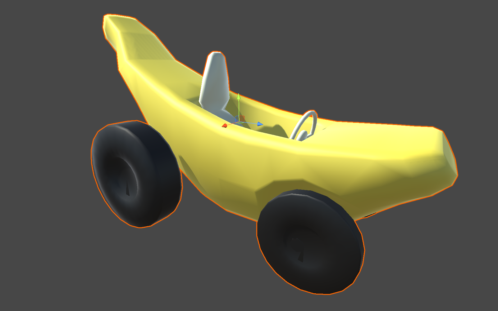
<p><em>VI: Mesh gốc. / EN: Original Mesh.</em></p>

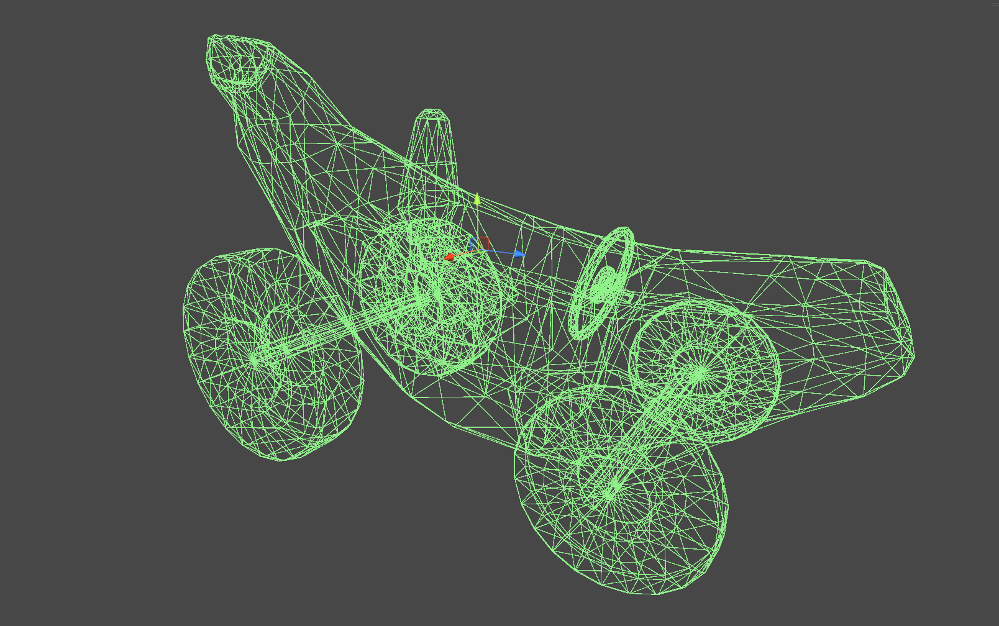
<p><em>VI: Unity Mesh Collider mặc định — 3032 tris, 2512 verts. / EN: Default Unity Mesh Collider — 3032 tris, 2512 verts.</em></p>

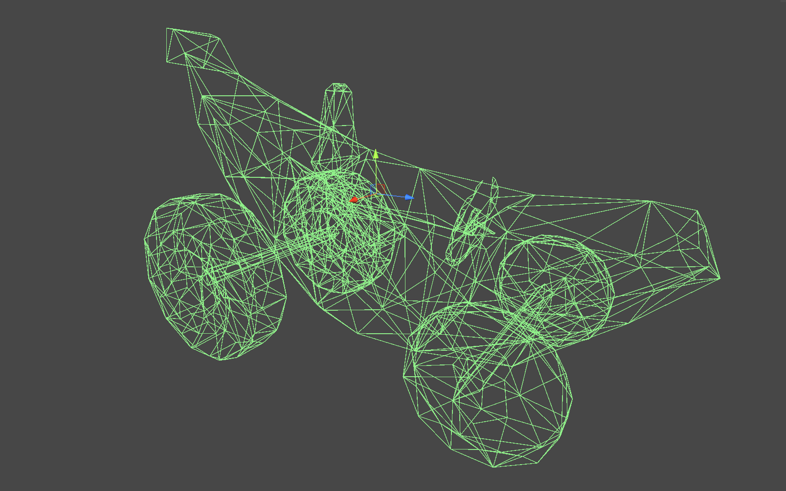
<p><em>VI: Mesh Collider đã tối ưu — 918 tris, 592 verts. / EN: Optimized Mesh Collider — 918 tris, 592 verts.</em></p>

<div class="bilingual-row">
<div class="col-vi">
<p><strong>PolygonCollider2D:</strong></p>
</div>
<div class="col-en">
<p><strong>PolygonCollider2D:</strong></p>
</div>
</div>

| | Original Sprite | Unity Polygon Collider | **Optimized Polygon Collider** |
|---|---|---|---|
| **Path Count** | — | **214 paths** | **23 paths** |
| **Tỉ lệ giảm** | — | — | **↓ 89.3%** |

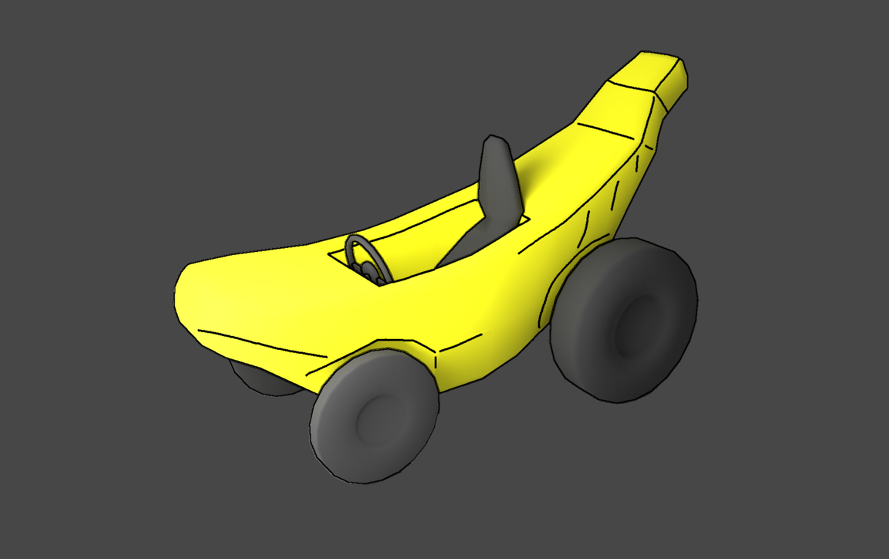
<p><em>VI: Sprite gốc. / EN: Original Sprite.</em></p>

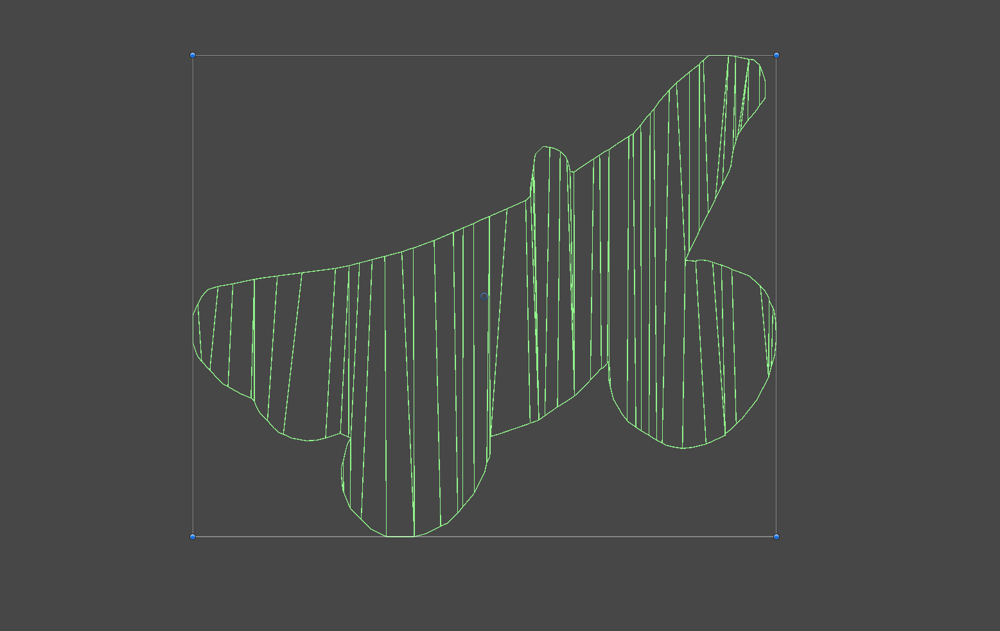
<p><em>VI: Unity Polygon Collider mặc định — 214 paths. / EN: Default Unity Polygon Collider — 214 paths.</em></p>

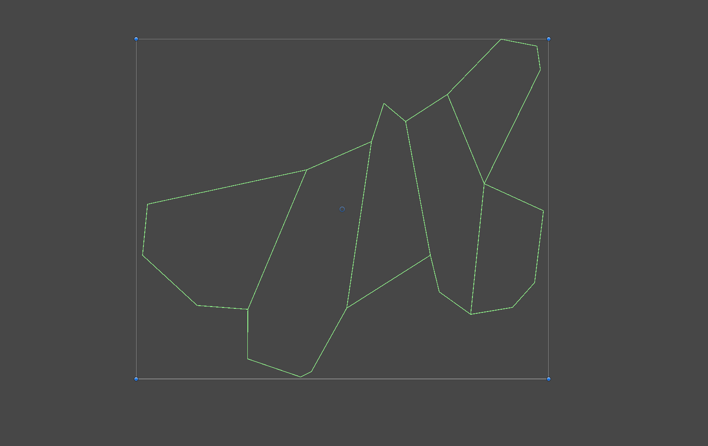
<p><em>VI: Polygon Collider đã tối ưu — 23 paths. / EN: Optimized Polygon Collider — 23 paths.</em></p>

### 18.2. Yêu cầu & Cách dùng

<div class="bilingual-row">
<div class="col-vi">
<p><strong>Yêu cầu:</strong></p>
<ul>
<li><strong>Unity 2020.2 trở lên</strong> được khuyến nghị (cho <code>MeshColliderCookingOptions</code>)</li>
<li>Cần <strong>package importer glTF/GLB</strong> trong project: <code>com.unity.cloud.gltfast</code> (glTFast) <em>hoặc</em> <code>com.unity.formats.glTF</code> (UnityGLTF)</li>
<li>OS hỗ trợ cho binary <code>gltfpack</code> đi kèm: <strong>Windows, macOS (Intel &amp; Apple Silicon), Linux</strong></li>
</ul>
<p>⚠️ <em>Nếu không có GLB importer, tool không thể re-import mesh đã đơn giản hóa và sẽ log lỗi yêu cầu bạn cài một cái.</em></p>
<p><strong>Cài đặt:</strong></p>
<ol>
<li>Tải <code>collider-opt-pkg-v005.unitypackage</code> từ mục <strong>Releases</strong> và import vào project</li>
<li>Làm theo prompt để cài glTF/GLB importer</li>
<li><em>(macOS/Linux)</em> Nếu binary <code>gltfpack</code> chưa executable, tool sẽ tự thử <code>chmod +x</code></li>
</ol>
<p><strong>Tối ưu collider:</strong></p>
<ol>
<li>Chọn GameObject có <strong>MeshCollider (3D)</strong> hoặc <strong>PolygonCollider2D (2D)</strong></li>
<li>Mở context menu bằng cách <em>chuột phải vào header của component</em> → <strong>Optimize Collider</strong></li>
<li>Nếu cần, còn có tùy chọn <strong>Load/Save/Reset Collider</strong></li>
</ol>
<p><strong>Điều chỉnh tham số:</strong> <code>Tools &gt; Collider Optimizer</code></p>
</div>
<div class="col-en">
<p><strong>Requirements:</strong></p>
<ul>
<li><strong>Unity 2020.2 or newer</strong> recommended (for <code>MeshColliderCookingOptions</code>)</li>
<li>A <strong>glTF/GLB importer package</strong> in your project: <code>com.unity.cloud.gltfast</code> (glTFast) <em>or</em> <code>com.unity.formats.glTF</code> (UnityGLTF)</li>
<li>Supported OS for the bundled <code>gltfpack</code> binaries: <strong>Windows, macOS (Intel &amp; Apple Silicon), Linux</strong></li>
</ul>
<p>⚠️ <em>If you don't have a GLB importer, the tool can't re-import the simplified mesh and will log an error telling you to install one.</em></p>
<p><strong>Install:</strong></p>
<ol>
<li>Download <code>collider-opt-pkg-v005.unitypackage</code> from <strong>Releases</strong> and import it</li>
<li>Follow the prompt to install the glTF/GLB importer</li>
<li><em>(macOS/Linux)</em> If the <code>gltfpack</code> binary isn't executable, the tool attempts <code>chmod +x</code> automatically</li>
</ol>
<p><strong>Optimize colliders:</strong></p>
<ol>
<li>Select a GameObject with a <strong>MeshCollider (3D)</strong> or <strong>PolygonCollider2D (2D)</strong></li>
<li>Open the context menu by <em>right-clicking the component header</em> → <strong>Optimize Collider</strong></li>
<li>If needed, you also have <strong>Load/Save/Reset Collider</strong> options</li>
</ol>
<p><strong>Adjust params:</strong> <code>Tools &gt; Collider Optimizer</code></p>
</div>
</div>

| Nhóm tham số | Tham số | Ý nghĩa |
|---|---|---|
| **Mesh Optimization** | `Contraction` | Contraction càng cao ⇒ **giữ lại càng ít tam giác** |
| | `Recalc Normals` | Tính lại normal sau khi import |
| | `Convex` | Đặt `MeshCollider.convex = true` (⚠️ Unity có thể **tự giảm xuống ≤255 tris**) |
| | `Aggressive (-sa)` | Đơn giản hóa **quyết liệt** (giảm nhiều tris hơn) |
| | `Permissive (-sp)` | Đơn giản hóa **dễ dãi** (giảm ít tris hơn) |
| **Polygon Optimization** | `Tolerance` | Khoảng cách vuông góc **tối đa** mà path mới được phép lệch khỏi path gốc (tolerance càng cao ⇒ giữ càng ít đường) |
| | `Tolerance Mode` | `World` = diễn giải theo đơn vị world · `Relative` = theo tỉ lệ đường chéo bbox của từng path |
| | `Scale By Bounds` | Ở chế độ World, nhân tolerance với đường chéo bounds của mỗi path (hữu ích cho các hình khác kích thước) |


### 18.2b. 💾 Presets — lưu lại bộ tham số

<div class="bilingual-row">
<div class="col-vi">
<ul>
<li>Có tuỳ chọn <strong>định nghĩa PRESET cho các bộ tham số khác nhau</strong> bạn muốn lưu.</li>
<li>Tạo preset qua <strong><code>Assets › Create › ColliderOptimizer › Mesh Preset</code></strong> hoặc <strong><code>Poly Preset</code></strong>.</li>
<li>Trong cửa sổ <strong><code>Tools › Collider Optimizer</code></strong>, gán preset để KÍCH HOẠT nó.</li>
<li>⚠️ <strong>Nếu KHÔNG có preset đang hoạt động</strong>, thiết lập được lưu trong <strong>Project Settings</strong> tại <code>ProjectSettings/ColliderOptimizerSettings.asset</code>.</li>
<li><strong><code>Reset to Defaults</code></strong> sẽ cập nhật <strong>preset đang gán</strong> (nếu có) <strong>hoặc</strong> project settings về giá trị mặc định.</li>
</ul>
</div>
<div class="col-en">
<ul>
<li><em>"You get the option to define presets for different param sets you'd like to save."</em></li>
<li><em>"Create presets via <code>Assets -&gt; Create -&gt; ColliderOptimizer -&gt; Mesh Preset or Poly Preset</code>."</em></li>
<li><em>"In <code>Tools -&gt; Collider Optimizer</code> window assign these presets to make them active."</em></li>
<li><em>"Without an active preset the settings are stored in Project Settings at <code>ProjectSettings/ColliderOptimizerSettings.asset</code>."</em></li>
<li><em>"<code>Reset to Defaults</code> will update the preset (if assigned) or the project settings to the default values."</em></li>
</ul>
</div>
</div>

### 18.3. ⚠️ Gotchas cần biết

<div class="bilingual-row">
<div class="col-vi">
<ul>
<li><strong>Skinned mesh:</strong> tool <em>bake ra một mesh tĩnh đã combine</em> để dùng làm collider (đúng như mục đích cho physics), <strong>không phải để skinning</strong>. <em>Tác giả lưu ý: dù sao cũng không nên dùng MeshCollider cho skinned mesh.</em></li>
<li><strong>Topology cực kỳ suy biến hoặc không phải tam giác sẽ bị BỎ QUA.</strong></li>
<li>Lỗi <em>"glb import produced no loadable assets"</em> → <strong>cài/cài lại package GLB importer</strong> (UnityGLTF hoặc glTFast) rồi tối ưu lại.</li>
<li><strong>Unity giới hạn convex collider ở ≤255 tris</strong> — nó có thể tự đơn giản hóa thêm.</li>
<li>Nếu thấy cảnh báo về <em>tam giác rất lớn (&gt;500 đơn vị)</em> → <strong>kiểm tra scale của model</strong>. Tool có bake transform, nhưng import scale không khớp vẫn có thể tạo geometry quá khổ.</li>
<li>Tool cố <code>chmod +x</code> binary <code>gltfpack</code>; nếu <strong>Gatekeeper</strong> vẫn chặn → cho phép trong System Settings hoặc gỡ thuộc tính quarantine thủ công.</li>
</ul>
</div>
<div class="col-en">
<ul>
<li><strong>Skinned meshes:</strong> the tool <em>bakes a static combined mesh</em> for collider usage (as intended for physics), <strong>not for skinning</strong>. <em>Author's note: you shouldn't use a MeshCollider for a skinned mesh anyway.</em></li>
<li><strong>Extremely degenerate or non-triangular topologies are SKIPPED.</strong></li>
<li><em>"glb import produced no loadable assets"</em> → <strong>install/reinstall a GLB importer</strong> package (UnityGLTF or glTFast) &amp; reoptimize.</li>
<li><strong>Unity limits convex colliders to ≤255 tris</strong> — it may auto-simplify further.</li>
<li>Warnings about <em>very large triangles (&gt;500 units)</em> → <strong>check your model scale</strong>. The tool bakes transforms, but mismatched import scales can still yield oversized geometry.</li>
<li>The tool attempts to <code>chmod +x</code> the <code>gltfpack</code> binary; if <strong>Gatekeeper</strong> still blocks it → allow it in System Settings or remove quarantine attributes manually.</li>
</ul>
</div>
</div>

---

## 18b. ⚙️ Physics nâng cao — 10 kỹ thuật từ e-book Console/PC

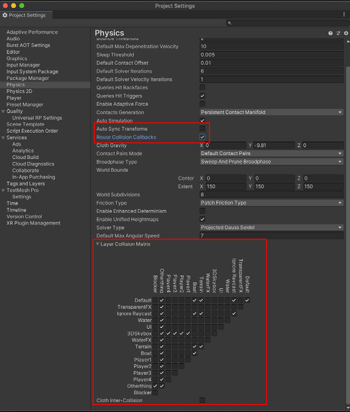
<p><em>VI: <strong>▲ Hai công tắc và một ma trận</strong> — khoanh đỏ phía trên là <strong><code>Auto Sync Transforms</code></strong> và <strong><code>Reuse Collision Callbacks</code> ✓</strong>; khoanh đỏ phía dưới là <strong>Layer Collision Matrix</strong> đầy đủ. Cũng thấy rõ <strong>Sleep Threshold 0.005 · Default Solver Iterations 6 · Contacts Generation: Persistent Contact Manifold · Broadphase Type: Sweep And Prune Broadphase · Solver Type: Projected Gauss Seidel · Default Max Angular Speed 7</strong>. / EN: Auto Sync Transforms, Reuse Collision Callbacks and the full Layer Collision Matrix.</em></p>

!!! note "Bổ sung sau audit"
    **VI:** E-book **Optimize your game performance for consoles and PC** có một **chương Physics đầy đủ 9 trang (tr.77–85)** với 14 mục — chi tiết hơn hẳn 3 trang của bản Mobile. Toàn bộ nội dung dưới đây là phần tôi đã **bỏ sót ở lần cào đầu**.

### 18b.1. Vòng xoáy tử thần — Giải thích cơ chế đầy đủ

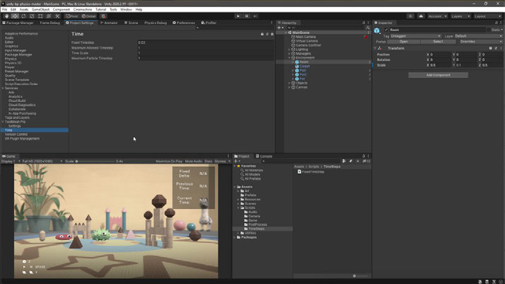
<p><em>VI: <strong>▲ <code>Project Settings › Time</code></strong> — <strong>Fixed Timestep 0.02</strong> (tức <strong>50 lần/giây</strong>), cùng <strong>Maximum Allowed Timestep</strong>, <strong>Time Scale</strong> và <strong>Maximum Particle Timestep</strong>. Góc dưới phải Game view là overlay <strong>Fixed Delta · Previous Time · Current Time</strong> của scene demo. / EN: Project Settings > Time with a Fixed Timestep of 0.02.</em></p>

<div class="bilingual-row">
<div class="col-vi">
<p>Physics engine hoạt động bằng cách chạy trên một <strong>fixed time step</strong>. Xem tần số cố định dự án đang chạy tại <code>Edit &gt; Project Settings &gt; Time</code>. Trường <strong>Fixed Timestep</strong> định nghĩa time delta dùng cho mỗi bước physics — giá trị mặc định <strong>0.02 giây (20 ms)</strong> tương đương <strong>50 fps hay 50 Hz</strong>.</p>
<p>🔑 <strong>Vì mỗi frame trong Unity mất một lượng thời gian BIẾN THIÊN, nó KHÔNG đồng bộ hoàn hảo với physics simulation.</strong> Engine đếm dồn tới bước physics tiếp theo. Nếu một frame chạy hơi chậm hoặc hơi nhanh, Unity dùng thời gian đã trôi qua để biết khi nào chạy physics simulation ở đúng time step.</p>
<p>🚨 <strong>Cơ chế vòng xoáy tử thần — nguyên văn:</strong></p>
<ol>
<li>Nếu một frame mất <em>nhiều thời gian</em> để chuẩn bị (ví dụ instantiate nhiều GameObject, hoặc load file từ đĩa), frame đó có thể mất <strong>40 ms hoặc hơn</strong>.</li>
<li>Với Fixed Timestep mặc định 20 ms, điều này khiến <strong>HAI physics simulation phải chạy ở frame kế tiếp</strong> để "đuổi kịp" time step biến thiên.</li>
<li>Physics simulation dư thừa lại <strong>cộng thêm thời gian xử lý frame</strong>.</li>
<li>Trên nền tảng cấu hình thấp, việc này dẫn tới <strong>vòng xoáy hiệu năng đi xuống</strong>: frame sau mất nhiều thời gian hơn ⇒ tồn đọng physics simulation dài hơn ⇒ frame còn chậm hơn nữa ⇒ càng nhiều simulation phải chạy mỗi frame. <em>Kết quả: hiệu năng ngày càng tệ.</em></li>
<li>👉 Cuối cùng, thời gian giữa các lần cập nhật physics có thể <strong>vượt quá Maximum Allowed Timestep</strong>. Sau ngưỡng cắt này, <strong>Unity bắt đầu BỎ QUA (drop) các lần cập nhật physics, và game bị GIẬT.</strong></li>
</ol>
</div>
<div class="col-en">
<p>Physics engines work by running on a <strong>fixed time step</strong>. To see the fixed rate your project runs at, go to <code>Edit &gt; Project Settings &gt; Time</code>. The <strong>Fixed Timestep</strong> field defines the time delta used by each physics step — the default value of <strong>0.02 seconds (20 ms)</strong> is equivalent to <strong>50 fps, or 50 Hz</strong>.</p>
<p>🔑 <strong>Because each frame in Unity takes a VARIABLE amount of time, it is not perfectly synced with the physics simulation.</strong> The engine counts up to the next physics time step. If a frame runs slightly slower or faster, Unity uses the elapsed time to know when to run the physics simulation at the proper time step.</p>
<p>🚨 <strong>The death-spiral mechanism — verbatim:</strong></p>
<ol>
<li>In the event that a frame takes a <em>long time</em> to prepare (e.g., instantiating many GameObjects or loading a file from disk), the frame could take <strong>40 ms or more</strong> to run.</li>
<li>With the default 20 ms Fixed Timestep, this would cause <strong>TWO physics simulations to run on the following frame</strong> in order to "catch up" with the variable time step.</li>
<li>Extra physics simulations, in turn, <strong>add more time to process the frame</strong>.</li>
<li>On lower-end platforms, this potentially leads to a <strong>downward spiral of performance</strong>: a subsequent frame taking longer makes the backlog of physics simulations longer as well ⇒ even slower frames ⇒ even more simulations per frame. <em>The result is worse and worse performance.</em></li>
<li>👉 Eventually the time between physics updates could <strong>exceed the Maximum Allowed Timestep</strong>. After this cutoff, <strong>Unity starts DROPPING physics updates, and the game STUTTERS.</strong></li>
</ol>
</div>
</div>

### 18b.2. Ba cách tránh vấn đề hiệu năng physics

<div class="bilingual-row">
<div class="col-vi">
<p><strong>① Giảm tần số simulation</strong></p>
<p>Với nền tảng cấu hình thấp, <strong>TĂNG Fixed Timestep lên NHỈNH HƠN target frame rate của bạn</strong>. Ví dụ: dùng <strong>0.035 giây cho 30 fps trên mobile</strong>. Việc này có thể giúp ngăn vòng xoáy hiệu năng đi xuống.</p>
<p><strong>② Giảm Maximum Allowed Timestep</strong></p>
<p>Dùng giá trị nhỏ hơn (như <strong>0.1 s</strong>) sẽ <em>hy sinh một chút độ chính xác của physics simulation</em>, nhưng cũng <strong>giới hạn số lần cập nhật physics có thể xảy ra trong MỘT frame</strong>. Hãy thử nghiệm để tìm giá trị phù hợp với yêu cầu dự án.</p>
<p><strong>③ Tự simulate bước physics thủ công (nếu cần)</strong></p>
<p>Bạn có thể <strong>tắt Auto Simulation</strong> trong Physics Settings và thay vào đó <em>gọi trực tiếp <code>Physics.Simulate</code> trong giai đoạn Update của frame</em>. Việc này cho bạn <strong>toàn quyền kiểm soát khi nào chạy bước physics</strong>.</p>
<p>👉 Truyền <code>Time.deltaTime</code> vào <code>Physics.Simulate</code> để <strong>giữ physics đồng bộ với thời gian simulation</strong>.</p>
<p>⚠️ <strong>Cảnh báo:</strong> Cách tiếp cận này <em>có thể gây bất ổn định cho physics simulation</em> trong scene có physics phức tạp hoặc frame time biến thiên mạnh — <strong>hãy dùng thận trọng</strong>.</p>
</div>
<div class="col-en">
<p><strong>① Reduce the simulation frequency</strong></p>
<p>For lower-end platforms, <strong>INCREASE the Fixed Timestep to slightly MORE than your target frame rate</strong>. For example, use <strong>0.035 seconds for 30 fps on mobile</strong>. This could help prevent that downward performance spiral.</p>
<p><strong>② Decrease the Maximum Allowed Timestep</strong></p>
<p>Using a smaller value (like <strong>0.1 s</strong>) <em>sacrifices some physics simulation accuracy</em>, but also <strong>limits how many physics updates can happen in ONE frame</strong>. Experiment with values to find something that works for your project's requirements.</p>
<p><strong>③ Simulate the physics step manually if necessary</strong></p>
<p>You can <strong>disable Auto Simulation</strong> in the Physics Settings and instead <em>directly invoke <code>Physics.Simulate</code> during the Update phase of the frame</em>. This allows you to <strong>take control of when to run the physics step</strong>.</p>
<p>👉 Pass <code>Time.deltaTime</code> to <code>Physics.Simulate</code> in order to <strong>keep the physics in sync with the simulation time</strong>.</p>
<p>⚠️ <strong>Caution:</strong> This approach <em>can cause instabilities in the physics simulation</em> in scenes with complex physics or highly variable frame times — <strong>use it with caution</strong>.</p>
</div>
</div>

```csharp
// Điều khiển bước physics thủ công — Manual physics stepping
// ⚠️ Chỉ dùng khi thực sự cần; có thể gây bất ổn định
using UnityEngine;

public class ManualPhysicsStepper : MonoBehaviour
{
    void Awake()
    {
        // Tắt Auto Simulation (Project Settings > Physics > Auto Simulation)
        Physics.autoSimulation = false;
    }

    void Update()
    {
        // BẮT BUỘC truyền Time.deltaTime để physics đồng bộ thời gian simulation
        Physics.Simulate(Time.deltaTime);
    }

    void OnDestroy() => Physics.autoSimulation = true;   // khôi phục
}
```

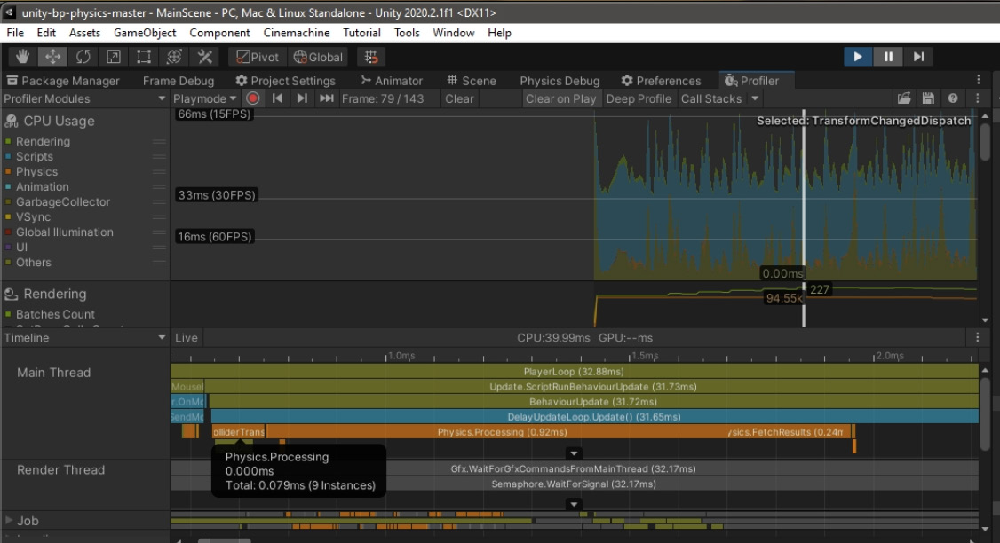
<p><em>VI: Profile một scene Unity dùng manual simulation — chú ý <code>DelayUpdateLoop.Update() (31.65ms)</code> chứa <code>Physics.Processing</code> và <code>Physics.FetchResults</code>. / EN: Profiling a scene in Unity with manual simulation.</em></p>

### 18b.3. CookingOptions cho MeshCollider

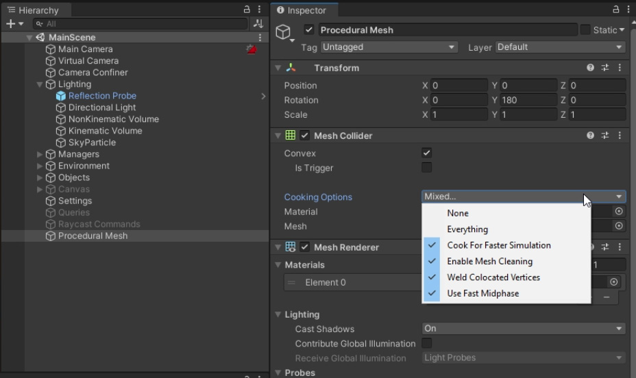

<div class="bilingual-row">
<div class="col-vi">
<p>Mesh dùng trong physics phải đi qua một quá trình gọi là <strong>COOKING</strong>. Quá trình này <em>chuẩn bị mesh để nó hoạt động được với các physics query</em> như raycast, contact, v.v.</p>
<p>MeshCollider có vài <strong>CookingOptions</strong> giúp bạn <em>validate mesh cho physics</em>. 👉 <strong>Nếu bạn CHẮC CHẮN mesh của mình không cần các kiểm tra này, hãy TẮT chúng để tăng tốc thời gian cook.</strong></p>
<p><strong>Ba option nên tắt</strong> (nếu mesh đã có tam giác hợp lệ):</p>
<ul>
<li><code>EnableMeshCleaning</code></li>
<li><code>WeldColocatedVertices</code></li>
<li><code>CookForFasterSimulation</code></li>
</ul>
<p>💡 Các option này <em>có giá trị với mesh sinh theo thủ tục (procedural) lúc runtime</em>, nhưng <strong>tắt được nếu mesh của bạn đã có tam giác đúng chuẩn</strong>.</p>
<p>🔑 <strong>Ngoại lệ quan trọng — <code>Use Fast Midphase</code>:</strong> Nếu bạn nhắm <strong>PC</strong>, hãy đảm bảo <strong>GIỮ BẬT</strong> option này. Nó chuyển sang <em>thuật toán nhanh hơn từ PhysX 4.1</em> trong giai đoạn <strong>mid-phase</strong> của simulation — giúp thu hẹp về một tập nhỏ các tam giác có khả năng giao cắt cho physics query.</p>
<p>⚠️ <strong>Nền tảng KHÔNG PHẢI desktop vẫn phải dùng thuật toán chậm hơn sinh ra R-Tree.</strong></p>
</div>
<div class="col-en">
<p>Meshes used in physics go through a process called <strong>COOKING</strong>. This <em>prepares the mesh so that it can work with physics queries</em> like raycasts, contacts, and so on.</p>
<p>A MeshCollider has several <strong>CookingOptions</strong> to help you <em>validate the mesh for physics</em>. 👉 <strong>If you are CERTAIN that your mesh does not need these checks, you can disable them to speed up your cook time.</strong></p>
<p><strong>Three options to uncheck</strong> (if your meshes already have proper triangles):</p>
<ul>
<li><code>EnableMeshCleaning</code></li>
<li><code>WeldColocatedVertices</code></li>
<li><code>CookForFasterSimulation</code></li>
</ul>
<p>💡 These options are <em>valuable for procedurally generated meshes at runtime</em>, but <strong>can be disabled if your meshes already have the proper triangles</strong>.</p>
<p>🔑 <strong>Important exception — <code>Use Fast Midphase</code>:</strong> If you are targeting <strong>PC</strong>, make sure you <strong>KEEP THIS ENABLED</strong>. It switches to a <em>faster algorithm from PhysX 4.1</em> during the <strong>mid-phase</strong> of the simulation — which helps narrow down a small set of potentially intersecting triangles for physics queries.</p>
<p>⚠️ <strong>Non-desktop platforms must still use the slower algorithm that generates R-Trees.</strong></p>
</div>
</div>

### 18b.4. `Physics.BakeMesh` — Cho mesh sinh lúc runtime

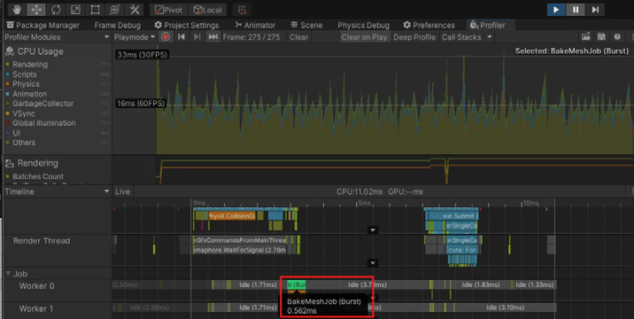
<p><em>VI: <code>BakeMeshJob (Burst) 0.562ms</code> chạy trên Worker thread thay vì main thread. / EN: BakeMeshJob in the Profiler, running on a Worker thread instead of the main thread.</em></p>

<div class="bilingual-row">
<div class="col-vi">
<p>Nếu bạn <strong>sinh mesh theo thủ tục trong lúc gameplay</strong>, bạn có thể tạo Mesh Collider lúc runtime.</p>
<p>🚨 <strong>NHƯNG:</strong> Thêm component MeshCollider <em>trực tiếp</em> vào mesh sẽ <strong>cook/bake physics TRÊN MAIN THREAD</strong>. Việc này <strong>có thể ngốn lượng CPU đáng kể</strong>.</p>
<p>✅ <strong>Giải pháp:</strong> Dùng <code>Physics.BakeMesh</code> để chuẩn bị mesh cho MeshCollider và <strong>lưu dữ liệu đã bake CÙNG với chính mesh đó</strong>. Một MeshCollider mới tham chiếu tới mesh này sẽ <strong>TÁI SỬ DỤNG dữ liệu prebaked</strong> thay vì bake lại. Điều này giúp <em>giảm thời gian load Scene hoặc thời gian instantiate về sau</em>.</p>
<p>⚡ <strong>Tối ưu thêm:</strong> Bạn có thể <strong>đẩy việc cook mesh sang thread khác bằng C# Job System</strong> — bake mesh song song trên nhiều thread.</p>
</div>
<div class="col-en">
<p>If you are <strong>generating meshes procedurally during gameplay</strong>, you can create a Mesh Collider at runtime.</p>
<p>🚨 <strong>HOWEVER:</strong> Adding a MeshCollider component <em>directly</em> to the mesh <strong>cooks/bakes the physics ON THE MAIN THREAD</strong>. This <strong>can consume significant CPU time</strong>.</p>
<p>✅ <strong>The fix:</strong> Use <code>Physics.BakeMesh</code> to prepare a mesh for use with a MeshCollider and <strong>save the baked data WITH the mesh itself</strong>. A new MeshCollider referencing this mesh will <strong>REUSE this prebaked data</strong> (rather than baking again). This can help <em>reduce Scene load time or instantiation time later</em>.</p>
<p>⚡ <strong>Further optimization:</strong> You can <strong>offload mesh cooking to another thread with the C# Job System</strong> — baking meshes across multiple threads.</p>
</div>
</div>

```csharp
// Bake mesh trên worker thread bằng C# Job System — tránh chặn main thread
// Bake meshes on worker threads via the C# Job System — avoid blocking the main thread
using Unity.Collections;
using Unity.Jobs;
using UnityEngine;

public struct BakeMeshJob : IJobParallelFor
{
    [ReadOnly] public NativeArray<int> meshIds;
    public bool convex;

    public void Execute(int index)
    {
        // Chạy trên worker thread — KHÔNG chiếm main thread
        Physics.BakeMesh(meshIds[index], convex);
    }
}

public class ProceduralColliderBaker : MonoBehaviour
{
    public void BakeAll(Mesh[] meshes, bool convex = false)
    {
        var ids = new NativeArray<int>(meshes.Length, Allocator.TempJob);
        for (int i = 0; i < meshes.Length; i++) ids[i] = meshes[i].GetInstanceID();

        var job = new BakeMeshJob { meshIds = ids, convex = convex };
        job.Schedule(meshes.Length, 1).Complete();
        ids.Dispose();

        // Giờ gán MeshCollider — nó TÁI SỬ DỤNG dữ liệu đã bake, không bake lại
        for (int i = 0; i < meshes.Length; i++)
        {
            var go = new GameObject($"Collider_{i}");
            go.AddComponent<MeshCollider>().sharedMesh = meshes[i];
        }
    }
}
```

### 18b.5. Box Pruning cho scene lớn

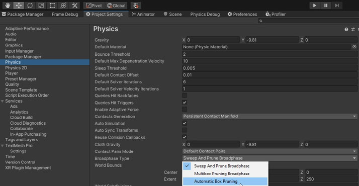

<div class="bilingual-row">
<div class="col-vi">
<p><strong>Unity physics engine chạy theo 2 giai đoạn:</strong></p>
<ol>
<li><strong>Broad phase</strong> — thu thập các va chạm <em>tiềm năng</em> bằng thuật toán <strong>sweep and prune</strong></li>
<li><strong>Narrow phase</strong> — engine <em>thực sự tính toán</em> các va chạm</li>
</ol>
<p>🚨 <strong>Vấn đề:</strong> Setting broad phase mặc định <strong>Sweep and Prune BroadPhase</strong> (<code>Edit &gt; Project Settings &gt; Physics &gt; BroadPhase Type</code>) <strong>có thể sinh ra FALSE POSITIVE</strong> với những thế giới <em>nhìn chung phẳng và có nhiều collider</em>.</p>
<p>✅ <strong>Giải pháp:</strong> Nếu Scene của bạn <strong>LỚN và chủ yếu PHẲNG</strong>, hãy chuyển sang:</p>
<ul>
<li><strong>Automatic Box Pruning</strong> — tự tính lưới cho bạn</li>
<li><strong>Multibox Pruning Broadphase</strong> — cho phép bạn <em>chỉ định thủ công</em> ranh giới thế giới và số ô lưới</li>
</ul>
<p>💡 Cả hai option đều <strong>chia thế giới thành một LƯỚI, mỗi ô lưới tự thực hiện sweep-and-prune</strong> riêng.</p>
</div>
<div class="col-en">
<p><strong>The Unity physics engine runs in two steps:</strong></p>
<ol>
<li><strong>The broad phase</strong> — collects <em>potential</em> collisions using a <strong>sweep and prune</strong> algorithm</li>
<li><strong>The narrow phase</strong> — where the engine <em>actually computes</em> the collisions</li>
</ol>
<p>🚨 <strong>The problem:</strong> The broad phase default setting of <strong>Sweep and Prune BroadPhase</strong> (<code>Edit &gt; Project Settings &gt; Physics &gt; BroadPhase Type</code>) <strong>can generate FALSE POSITIVES</strong> for worlds that are <em>generally flat and have many colliders</em>.</p>
<p>✅ <strong>The fix:</strong> If your Scene is <strong>LARGE and mostly FLAT</strong>, switch to:</p>
<ul>
<li><strong>Automatic Box Pruning</strong> — calculates the grid for you</li>
<li><strong>Multibox Pruning Broadphase</strong> — allows you to <em>manually specify</em> the world boundaries and the number of grid cells</li>
</ul>
<p>💡 Both options <strong>divide the world into a GRID, where each grid cell performs sweep-and-prune</strong> itself.</p>
</div>
</div>

### 18b.6. Solver Iterations — Tối ưu theo từng Rigidbody

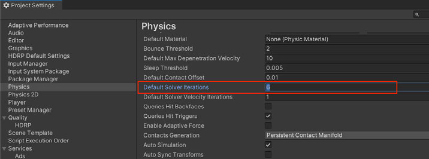

<div class="bilingual-row">
<div class="col-vi">
<p>Nếu muốn <strong>simulate một physics body cụ thể CHÍNH XÁC hơn</strong>, hãy tăng <code>Rigidbody.solverIterations</code> của nó. Việc này <strong>ghi đè</strong> <code>Physics.defaultSolverIterations</code> (cũng tìm thấy ở <code>Edit &gt; Project Settings &gt; Physics &gt; Default Solver Iterations</code>).</p>
<p>🔑 <strong>Chiến lược tối ưu — nguyên văn:</strong></p>
<blockquote>
<p><em>"Đặt giá trị TƯƠNG ĐỐI THẤP cho <code>defaultSolverIterations</code> của dự án. Sau đó áp dụng giá trị <code>Rigidbody.solverIterations</code> CAO HƠN, tùy chỉnh riêng, cho những instance thực sự cần chi tiết hơn."</em></p>
</blockquote>
<p>👉 Nghĩa là: <strong>rẻ cho tất cả, đắt cho vài cái đặc biệt</strong> — thay vì đắt cho tất cả.</p>
</div>
<div class="col-en">
<p>If you want to <strong>simulate a specific physics body MORE ACCURATELY</strong>, increase its <code>Rigidbody.solverIterations</code>. This <strong>overrides</strong> <code>Physics.defaultSolverIterations</code> (also found in <code>Edit &gt; Project Settings &gt; Physics &gt; Default Solver Iterations</code>).</p>
<p>🔑 <strong>Optimization strategy — verbatim:</strong></p>
<blockquote>
<p><em>"To optimize your physics simulations, set a relatively LOW value in the project's <code>defaultSolverIterations</code>. Then apply HIGHER custom <code>Rigidbody.solverIterations</code> values to the individual instances that need more detail."</em></p>
</blockquote>
<p>👉 In other words: <strong>cheap for everything, expensive for the few that matter</strong> — instead of expensive for everything.</p>
</div>
</div>

```csharp
// Solver iterations: rẻ toàn cục, đắt cục bộ
// Solver iterations: cheap globally, expensive locally
void Start()
{
    // Toàn dự án: giá trị THẤP (mặc định Unity là 6)
    Physics.defaultSolverIterations = 4;

    // Riêng object cần độ chính xác cao (ví dụ xe của người chơi)
    playerVehicleRb.solverIterations         = 12;
    playerVehicleRb.solverVelocityIterations = 4;
}
```

### 18b.7. `autoSyncTransforms` — Giải thích chuẩn xác

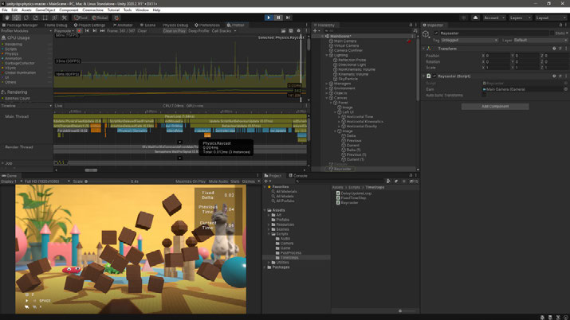

<div class="bilingual-row">
<div class="col-vi">
<p>🔑 <strong>Cơ chế thật (nguyên văn):</strong></p>
<blockquote>
<p><em>"Khi bạn cập nhật một Transform, Unity <strong>KHÔNG tự động sync nó</strong> sang physics engine. Unity <strong>TÍCH LŨY các phép biến đổi</strong> và chờ hoặc là physics update chạy, hoặc là người dùng gọi <code>Physics.SyncTransforms</code>."</em></p>
</blockquote>
<p>Nếu muốn sync physics với Transform <em>thường xuyên hơn</em>, bạn có thể đặt <code>Physics.autoSyncTransforms = true</code> (cũng ở <code>Project Settings &gt; Physics &gt; Auto Sync Transforms</code>). Khi bật, bất kỳ Rigidbody hay Collider nào trên Transform đó <em>hoặc con của nó</em> sẽ <strong>tự động cập nhật theo Transform</strong>.</p>
<p>🚨 <strong>NHƯNG — khuyến nghị dứt khoát:</strong></p>
<blockquote>
<p><em>"Hãy TẮT nó trừ khi TUYỆT ĐỐI cần thiết. Nếu không, <strong>một chuỗi các physics query liên tiếp (như raycast) có thể dẫn tới MẤT hiệu năng</strong>."</em></p>
</blockquote>
</div>
<div class="col-en">
<p>🔑 <strong>The real mechanism (verbatim):</strong></p>
<blockquote>
<p><em>"When you update a Transform, Unity <strong>does NOT automatically sync</strong> it to the physics engine. Unity <strong>ACCUMULATES transformations</strong> and waits for either the physics update to execute or for the user to call <code>Physics.SyncTransforms</code>."</em></p>
</blockquote>
<p>If you want to sync physics with your Transforms <em>more frequently</em>, you can set <code>Physics.autoSyncTransforms = true</code> (also in <code>Project Settings &gt; Physics &gt; Auto Sync Transforms</code>). When enabled, any Rigidbody or Collider on that Transform <em>or its children</em> <strong>automatically updates with the Transform</strong>.</p>
<p>🚨 <strong>BUT — the categorical recommendation:</strong></p>
<blockquote>
<p><em>"However, DISABLE this unless ABSOLUTELY necessary. Otherwise, <strong>a series of successive physics queries (such as raycasts) can lead to a LOSS in performance</strong>."</em></p>
</blockquote>
</div>
</div>

### 18b.8. Reuse Collision Callbacks — Cơ chế & Cảnh báo

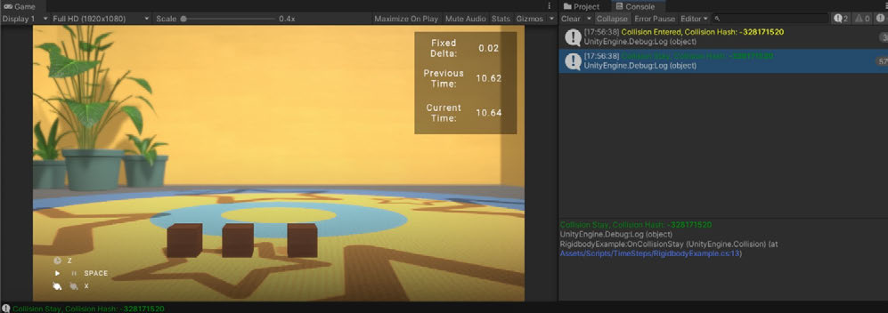
<p><em>VI: Trong Console, chỉ có MỘT collision instance duy nhất cho cả Collision Entered và Collision Stay — nhìn giá trị Collision Hash <code>-328171520</code> giống hệt nhau. / EN: In the Unity Console, there is a single collision instance on Collision Entered and Collision Stay.</em></p>

<div class="bilingual-row">
<div class="col-vi">
<p>Các callback <code>MonoBehaviour.OnCollisionEnter</code>, <code>OnCollisionStay</code> và <code>OnCollisionExit</code> <strong>đều nhận một collision instance làm tham số</strong>.</p>
<p>🚨 <strong>Collision instance này được cấp phát trên MANAGED HEAP và PHẢI được garbage collect.</strong></p>
<p>✅ Để giảm lượng rác sinh ra, bật <code>Physics.reuseCollisionCallbacks</code> (cũng ở <code>Project Settings &gt; Physics &gt; Reuse Collision Callbacks</code>).</p>
<p>👉 Khi bật, <strong>Unity chỉ gán MỘT collision pair instance DUY NHẤT cho mỗi callback</strong>. Việc này <em>giảm lãng phí cho garbage collector và cải thiện hiệu năng</em>.</p>
<p>⚠️ <strong>LƯU Ý QUAN TRỌNG (nguyên văn):</strong></p>
<blockquote>
<p><em>"Nếu bạn <strong>tham chiếu collision instance BÊN NGOÀI các collision callback</strong> để xử lý hậu kỳ, bạn <strong>PHẢI TẮT</strong> Reuse Collision Callbacks."</em></p>
</blockquote>
<p>💡 Lý do: object đó sẽ bị ghi đè cho va chạm tiếp theo — dữ liệu bạn giữ sẽ <em>sai hoàn toàn</em>.</p>
</div>
<div class="col-en">
<p>The callbacks <code>MonoBehaviour.OnCollisionEnter</code>, <code>OnCollisionStay</code> and <code>OnCollisionExit</code> <strong>all take a collision instance as a parameter</strong>.</p>
<p>🚨 <strong>This collision instance is allocated on the MANAGED HEAP and MUST be garbage collected.</strong></p>
<p>✅ To reduce the amount of garbage generated, enable <code>Physics.reuseCollisionCallbacks</code> (also in <code>Project Settings &gt; Physics &gt; Reuse Collision Callbacks</code>).</p>
<p>👉 With this active, <strong>Unity only assigns a SINGLE collision pair instance to each callback</strong>. This <em>reduces waste for the garbage collector and improves performance</em>.</p>
<p>⚠️ <strong>IMPORTANT NOTE (verbatim):</strong></p>
<blockquote>
<p><em>"If you <strong>reference the collision instance OUTSIDE of the collision callbacks</strong> for post-processing, you <strong>MUST DISABLE</strong> Reuse Collision Callbacks."</em></p>
</blockquote>
<p>💡 The reason: that object will be overwritten for the next collision — the data you held would be <em>completely wrong</em>.</p>
</div>
</div>

### 18b.9. Di chuyển Static Collider — Sự thật ngược trực giác

<div class="bilingual-row">
<div class="col-vi">
<p><strong>Static collider</strong> là GameObject có component Collider <em>nhưng KHÔNG có Rigidbody</em>.</p>
<p>🔑 <strong>Sự thật ngược trực giác:</strong></p>
<blockquote>
<p><em>"Lưu ý rằng bạn <strong>CÓ THỂ di chuyển một static collider</strong>, trái ngược với thuật ngữ 'static'."</em></p>
</blockquote>
<p><strong>Cách làm:</strong> Đơn giản là sửa vị trí của physics body. <strong>Tích lũy các thay đổi vị trí và sync TRƯỚC physics update.</strong></p>
<p>👉 <strong>Bạn KHÔNG cần thêm component Rigidbody vào static collider chỉ để di chuyển nó.</strong></p>
<p><strong>Khi nào thì cần Rigidbody:</strong> Nếu muốn static collider <em>tương tác với các physics body khác theo cách phức tạp hơn</em>, hãy cho nó một <strong>kinematic Rigidbody</strong>. Dùng <code>Rigidbody.position</code> và <code>Rigidbody.rotation</code> để di chuyển thay vì truy cập component Transform — cách này <strong>đảm bảo hành vi dễ đoán hơn từ physics engine</strong>.</p>
<p>🚨 <strong>NGOẠI LỆ 2D:</strong></p>
<blockquote>
<p><em>"Trong physics 2D, <strong>ĐỪNG di chuyển static collider</strong> vì việc <strong>rebuild cây rất tốn thời gian</strong>."</em></p>
</blockquote>
</div>
<div class="col-en">
<p><strong>Static colliders</strong> are GameObjects with a Collider component <em>but WITHOUT a Rigidbody</em>.</p>
<p>🔑 <strong>The counter-intuitive fact:</strong></p>
<blockquote>
<p><em>"Note that you <strong>CAN move a static collider</strong>, contrary to the term 'static'."</em></p>
</blockquote>
<p><strong>How:</strong> Simply modify the position of the physics body. <strong>Accumulate the positional changes and sync BEFORE the physics update.</strong></p>
<p>👉 <strong>You don't need to add a Rigidbody component to the static collider just to move it.</strong></p>
<p><strong>When you DO need a Rigidbody:</strong> If you want the static collider <em>to interact with other physics bodies in a more complex way</em>, give it a <strong>kinematic Rigidbody</strong>. Use <code>Rigidbody.position</code> and <code>Rigidbody.rotation</code> to move it instead of accessing the Transform component — this <strong>guarantees more predictable behavior from the physics engine</strong>.</p>
<p>🚨 <strong>2D EXCEPTION:</strong></p>
<blockquote>
<p><em>"In 2D physics, <strong>do NOT move static colliders</strong> because the <strong>tree rebuild is time consuming</strong>."</em></p>
</blockquote>
</div>
</div>

### 18b.10. `RaycastCommand` — Batch raycast qua Job System

<div class="bilingual-row">
<div class="col-vi">
<p>Bạn có thể chạy raycast query bằng <code>Physics.Raycast</code>. <strong>Tuy nhiên</strong>, nếu bạn có <em>số lượng LỚN thao tác raycast</em> — ví dụ <strong>tính đường ngắm (line of sight) cho 10.000 agent</strong> — việc này <strong>có thể ngốn lượng CPU đáng kể</strong>.</p>
<p>✅ <strong>Giải pháp:</strong> Dùng <code>RaycastCommand</code> để <strong>batch query qua C# Job System</strong>. Việc này <em>đẩy công việc ra khỏi main thread</em> để các raycast có thể chạy <strong>bất đồng bộ và SONG SONG</strong>.</p>
<p>🔑 <strong>Nhắc lại về NonAlloc (từ chính e-book này):</strong> <em>"Lưu ý bạn cần định nghĩa results buffer có kích thước ĐỦ LỚN khi dùng method NonAlloc. <strong>Buffer KHÔNG tự lớn lên nếu hết chỗ.</strong>"</em> — khớp với cảnh báo ở §16.1.</p>
</div>
<div class="col-en">
<p>You can run raycast queries with <code>Physics.Raycast</code>. <strong>However</strong>, if you have a <em>LARGE number of raycast operations</em> — e.g., <strong>calculating line of sight for 10,000 agents</strong> — this <strong>may take a significant amount of CPU time</strong>.</p>
<p>✅ <strong>The fix:</strong> Use <code>RaycastCommand</code> to <strong>batch the query using the C# Job System</strong>. This <em>offloads the work from the main thread</em> so that the raycasts can happen <strong>asynchronously and IN PARALLEL</strong>.</p>
<p>🔑 <strong>NonAlloc reminder (from this same e-book):</strong> <em>"Note that you need to define a results buffer of SUFFICIENT SIZE when using a NonAlloc method. <strong>The buffer does NOT grow if it runs out of space.</strong>"</em> — matching the warning in §16.1.</p>
</div>
</div>

```csharp
// Batch 10.000 raycast qua Job System — chạy song song, off main thread
// Batch 10,000 raycasts via the Job System — parallel, off the main thread
using Unity.Collections;
using Unity.Jobs;
using UnityEngine;

public class BatchedLineOfSight : MonoBehaviour
{
    [SerializeField] private Transform[] agents;     // ví dụ 10.000 agent
    [SerializeField] private LayerMask   obstacleMask;

    void Update()
    {
        int n = agents.Length;
        var commands = new NativeArray<RaycastCommand>(n, Allocator.TempJob);
        var results  = new NativeArray<RaycastHit>(n,     Allocator.TempJob);

        var qp = new QueryParameters { layerMask = obstacleMask };

        for (int i = 0; i < n; i++)
            commands[i] = new RaycastCommand(
                agents[i].position, agents[i].forward, qp, 100f);

        // maxHits=1, minCommandsPerJob=32 — chia việc cho nhiều worker thread
        JobHandle handle = RaycastCommand.ScheduleBatch(commands, results, 32, 1);
        handle.Complete();

        for (int i = 0; i < n; i++)
            if (results[i].collider != null) OnBlocked(i, results[i]);

        commands.Dispose();
        results.Dispose();
    }

    void OnBlocked(int agentIndex, RaycastHit hit) { /* ... */ }
}
```

---

## 19. Physics Debugger

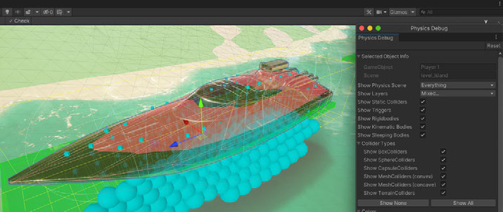
<p><em>VI: <strong>▲ Physics Debugger trên một scene thật</strong> — thân thuyền hiện <strong>collider ĐỎ</strong> chồng lên mesh, mặt nước là <strong>lưới XANH LÁ</strong>, và các quả cầu <strong>XANH LƠ</strong> là collider phụ. Panel <strong>Physics Debug</strong> bên phải cho lọc theo <strong>Show Static Colliders · Show Triggers · Show Rigidbodies · Show Kinematic Bodies · Show Sleeping Bodies</strong>, và theo <strong>Collider Types</strong> (Box · Sphere · Capsule · MeshColliders convex/concave · Terrain). / EN: The Physics Debugger showing colliders over a real scene.</em></p>

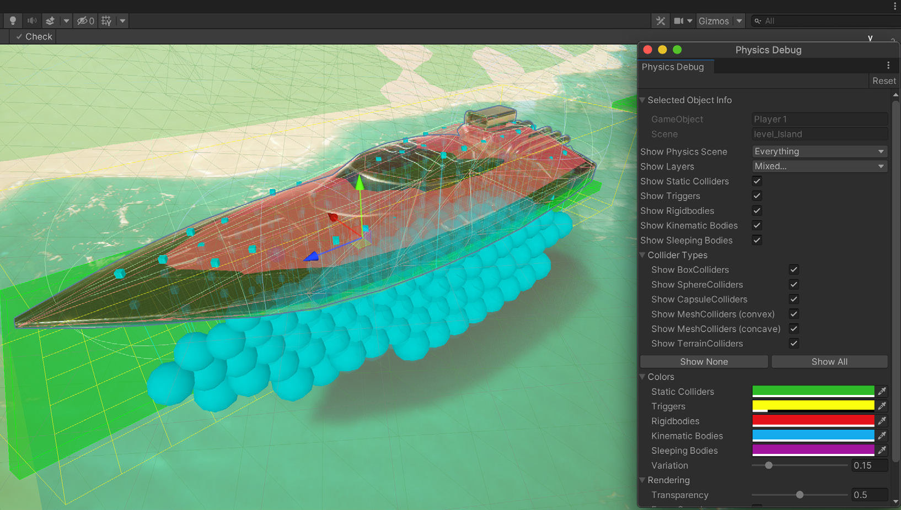

<div class="bilingual-row">
<div class="col-vi">
<p><strong>📝 Ghi chú raw đề cập:</strong> <code>Window &gt; Analysis &gt; Frame Debugger / Physic Debugger</code></p>
<p><strong>Physics Debugger</strong> trực quan hóa toàn bộ thế giới physics — cực kỳ hữu ích khi chẩn đoán vấn đề collider.</p>
<p><strong>Đọc ảnh chụp:</strong></p>
<ul>
<li><strong>Selected Object Info:</strong> GameObject <code>Player 1</code>, Scene <code>level_island</code></li>
<li><strong>Show Physics Scene:</strong> <code>Everything</code> · <strong>Show Layers:</strong> <code>Mixed...</code></li>
<li><strong>Bộ lọc hiển thị:</strong> Static Colliders ☑ · Triggers ☑ · Rigidbodies ☑ · Kinematic Bodies ☑ · Sleeping Bodies ☑</li>
<li><strong>Collider Types:</strong> Box · Sphere · Capsule · <strong>MeshColliders (convex)</strong> · <strong>MeshColliders (concave)</strong> · Terrain — <em>bật/tắt riêng từng loại</em></li>
<li><strong>Bảng màu:</strong> 🟩 Static Colliders · 🟨 Triggers · 🟥 Rigidbodies · 🟦 Kinematic Bodies · 🟪 Sleeping Bodies</li>
<li><strong>Rendering:</strong> Transparency <code>0.5</code>, Variation <code>0.15</code></li>
</ul>
<p>💡 <strong>Cách dùng thực chiến:</strong> Bật riêng <em>MeshColliders (concave)</em> để <strong>tìm ngay những collider tốn kém nhất</strong> trong scene — chúng là ứng viên số 1 cho §18.</p>
<p>💡 Màu 🟪 <em>Sleeping Bodies</em> giúp xác nhận Rigidbody đã "ngủ" đúng cách — Rigidbody không ngủ được là nguồn tốn CPU âm thầm.</p>
</div>
<div class="col-en">
<p><strong>📝 The raw notes mention:</strong> <code>Window &gt; Analysis &gt; Frame Debugger / Physic Debugger</code></p>
<p>The <strong>Physics Debugger</strong> visualizes the entire physics world — extremely useful for diagnosing collider problems.</p>
<p><strong>Reading the capture:</strong></p>
<ul>
<li><strong>Selected Object Info:</strong> GameObject <code>Player 1</code>, Scene <code>level_island</code></li>
<li><strong>Show Physics Scene:</strong> <code>Everything</code> · <strong>Show Layers:</strong> <code>Mixed...</code></li>
<li><strong>Display filters:</strong> Static Colliders ☑ · Triggers ☑ · Rigidbodies ☑ · Kinematic Bodies ☑ · Sleeping Bodies ☑</li>
<li><strong>Collider Types:</strong> Box · Sphere · Capsule · <strong>MeshColliders (convex)</strong> · <strong>MeshColliders (concave)</strong> · Terrain — <em>each togglable separately</em></li>
<li><strong>Color legend:</strong> 🟩 Static Colliders · 🟨 Triggers · 🟥 Rigidbodies · 🟦 Kinematic Bodies · 🟪 Sleeping Bodies</li>
<li><strong>Rendering:</strong> Transparency <code>0.5</code>, Variation <code>0.15</code></li>
</ul>
<p>💡 <strong>Field usage:</strong> Enable only <em>MeshColliders (concave)</em> to <strong>immediately find the most expensive colliders</strong> in the scene — they are the number-one candidates for §18.</p>
<p>💡 The 🟪 <em>Sleeping Bodies</em> color helps confirm Rigidbodies are sleeping properly — Rigidbodies that never sleep are a silent CPU drain.</p>
</div>
</div>

---

# PHẦN C — ANIMATION

## 20. Generic Rig vs Humanoid Rig — Con số 30–50%

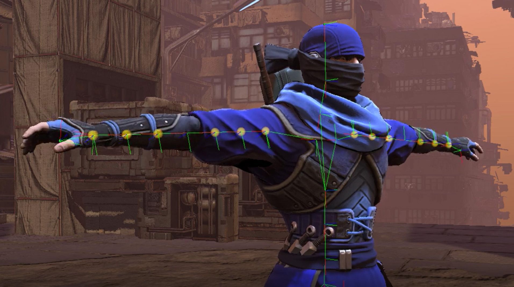

<div class="bilingual-row">
<div class="col-vi">
<p>Hệ thống <strong>Mecanim</strong> của Unity khá tinh vi. Nếu có thể, hãy <em>giới hạn việc sử dụng nó trên mobile</em> bằng các setting sau.</p>
<p>📊 <strong>Con số cần nhớ:</strong></p>
<blockquote>
<p><strong>Humanoid Rig tiêu tốn NHIỀU HƠN 30–50% thời gian CPU so với Generic Rig tương đương.</strong></p>
</blockquote>
<p><strong>Vì sao:</strong> Humanoid Rig <strong>tính toán inverse kinematics và animation retargeting MỖI FRAME — KỂ CẢ KHI KHÔNG DÙNG ĐẾN</strong>.</p>
<p>👉 Mặc định, Unity import model có animation với <strong>Generic Rig</strong>, nhưng developer <em>thường tự đổi sang Humanoid Rig</em> khi làm animation cho nhân vật.</p>
<p>✅ <strong>Quy tắc:</strong> Nếu bạn <strong>KHÔNG cần</strong> các tính năng đặc thù của Humanoid Rig (IK, retargeting), <strong>hãy dùng Generic Rig</strong>.</p>
</div>
<div class="col-en">
<p>Unity's <strong>Mecanim</strong> system is fairly sophisticated. If possible, <em>limit your usage on mobile</em> using the settings below.</p>
<p>📊 <strong>The number to remember:</strong></p>
<blockquote>
<p><strong>A Humanoid Rig consumes 30–50% MORE CPU time than the equivalent Generic Rig.</strong></p>
</blockquote>
<p><strong>Why:</strong> The Humanoid Rig <strong>calculates inverse kinematics and animation retargeting EACH FRAME — EVEN WHEN NOT IN USE</strong>.</p>
<p>👉 By default, Unity imports animated models with the <strong>Generic Rig</strong>, but developers <em>often switch to the Humanoid Rig</em> when animating a character.</p>
<p>✅ <strong>Rule:</strong> If you <strong>don't need</strong> those specific Humanoid Rig features (IK, retargeting), <strong>use the Generic Rig</strong>.</p>
</div>
</div>

## 21. Tránh lạm dụng Animator

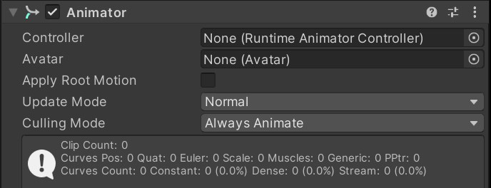

<div class="bilingual-row">
<div class="col-vi">
<p><strong>Animator vốn được thiết kế chủ yếu cho nhân vật humanoid</strong>, nhưng lại <em>thường bị dùng để animate một giá trị đơn lẻ</em> — ví dụ kênh alpha của một phần tử UI.</p>
<p>🚨 <strong>Tránh lạm dụng Animator, ĐẶC BIỆT khi kết hợp với phần tử UI.</strong></p>
<p><strong>Ba lựa chọn thay thế:</strong></p>
<ol>
<li>Bất cứ khi nào có thể, <strong>dùng component <em>Animation</em> legacy</strong> cho mobile.</li>
<li><strong>Tạo hàm tweening riêng</strong>.</li>
<li><strong>Dùng thư viện bên thứ ba</strong> cho animation đơn giản — ví dụ <strong>DOTween</strong>.</li>
</ol>
<p>⚠️ <em>"Animator có khả năng rất tốn kém."</em></p>
</div>
<div class="col-en">
<p><strong>Animators are primarily intended for humanoid characters</strong>, but are <em>often used to animate single values</em> — e.g., the alpha channel of a UI element.</p>
<p>🚨 <strong>Avoid overusing Animators, PARTICULARLY in conjunction with UI elements.</strong></p>
<p><strong>Three alternatives:</strong></p>
<ol>
<li>Whenever possible, <strong>use the legacy <em>Animation</em> components</strong> for mobile.</li>
<li><strong>Consider creating tweening functions</strong>.</li>
<li><strong>Use a third-party library</strong> for simple animations — e.g., <strong>DOTween</strong>.</li>
</ol>
<p>⚠️ <em>"Animators are potentially expensive."</em></p>
</div>
</div>

### 21.0b. 🎬 Kiến trúc hệ thống Animation & 4 kỹ thuật bổ sung

!!! note "Bổ sung sau audit — từ e-book Console/PC (tr.86–88)"

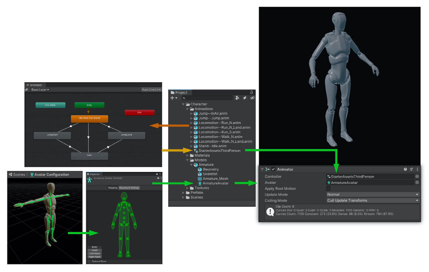
<p><em>VI: <strong>▲ Kiến trúc hệ thống Animation của Unity</strong> — <strong>Animator Controller</strong> (đồ thị state Any State / Entry / Jump / Idle) và <strong>Avatar Configuration</strong> (bộ xương humanoid xanh lá) cùng trỏ vào component <strong>Animator</strong> ở góc phải: <code>Controller = StarterAssetsThirdPerson</code>, <code>Avatar = ArmatureAvatar</code>, <strong>Culling Mode = Cull Update Transforms</strong>. Khung thống kê dưới cùng ghi <strong>Clip Count 8 · Curves Count 1189 · Constant 273 (23.6%) · Dense 98 (8.5%) · Stream 784 (67.9%)</strong>. / EN: Unity's Animation System — the Animator Controller and Avatar both feed the Animator component.</em></p>

<div class="bilingual-row">
<div class="col-vi">
<p><strong>Bốn thành phần chính của Animation System (Mecanim):</strong></p>
<ol>
<li><strong>Animation Clips</strong> — chứa thông tin về việc object thay đổi <em>vị trí, xoay, hoặc thuộc tính khác</em> theo thời gian.</li>
<li><strong>Animator Controller</strong> — hệ thống dạng flowchart có cấu trúc, đóng vai <strong>State Machine</strong>. Nó theo dõi clip nào đang được phát, cũng như <em>khi nào animation nên đổi hoặc blend vào nhau</em>.</li>
<li><strong>Humanoid rig</strong> — cho bạn khả năng <strong>retarget animation hai chân từ BẤT KỲ nguồn nào</strong> (motion capture, Asset Store, thư viện bên thứ ba) sang model nhân vật của bạn. Hệ thống <strong>Avatar</strong> của Unity ánh xạ nhân vật humanoid sang một định dạng nội bộ chung, khiến điều này khả thi.</li>
<li><strong>Animator component</strong> — trên GameObject, kết nối các phần này lại. Nó tham chiếu một <em>Animator Controller</em> và một <em>Avatar</em> (nếu cần). Animator Controller đến lượt nó tham chiếu các Animation Clip nó dùng.</li>
</ol>
</div>
<div class="col-en">
<p><strong>The four key components of the Animation System (Mecanim):</strong></p>
<ol>
<li><strong>Animation Clips</strong> — contain information about how certain objects should change their <em>position, rotation, or other properties</em> over time.</li>
<li><strong>The Animator Controller</strong> — a structured flowchart-like system that acts as a <strong>State Machine</strong>. It tracks the clip currently being played, as well as <em>when the animations should change or blend together</em>.</li>
<li><strong>A humanoid rig</strong> — gives you the ability to <strong>retarget bipedal animation from ANY source</strong> (motion capture, the Asset Store, or another third-party library) to your own character model. Unity's <strong>Avatar</strong> system maps humanoid characters to a common internal format, making this possible.</li>
<li><strong>An Animator component</strong> — on a GameObject, connects these parts together. It references an <em>Animator Controller</em> and an <em>Avatar</em> (if required). The Animator Controller in turn references the Animation Clips it uses.</li>
</ol>
</div>
</div>

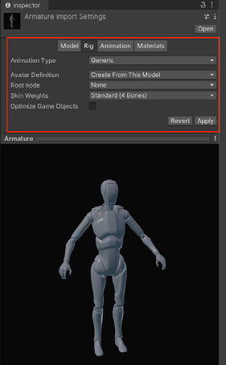
<p><em>VI: <strong>▲ Chỗ ĐỔI rig</strong> — tab <strong>Rig</strong> của Model Import Settings (khoanh đỏ): <strong><code>Animation Type = Generic</code></strong> · <code>Avatar Definition = Create From This Model</code> · <code>Root node = None</code> · <strong><code>Skin Weights = Standard (4 Bones)</code></strong> · <code>Optimize Game Objects</code>. Đây là một ô duy nhất, và đổi nó tiết kiệm <strong>30–50% thời gian CPU</strong> so với Humanoid. / EN: The Rig tab with Animation Type set to Generic.</em></p>

<div class="bilingual-row">
<div class="col-vi">
<p><strong>① Ba lưu ý về Rig (chi tiết hơn bản Mobile)</strong></p>
<ul>
<li><strong>Dùng generic rig bất cứ khi nào có thể.</strong> Humanoid rig tính <em>inverse kinematics và animation retargeting mỗi frame, kể cả khi không dùng</em>. Do đó chúng tiêu tốn <strong>nhiều hơn 30–50% CPU time</strong> so với generic rig tương đương.</li>
<li>🆕 <strong>Khi import humanoid animation, dùng <em>Avatar Mask</em> để LOẠI BỎ IK Goals hoặc animation ngón tay</strong> nếu bạn không cần chúng.</li>
<li>🆕 <strong>Với generic rig, dùng root motion TỐN KÉM HƠN không dùng.</strong> Nếu animation của bạn không dùng root motion, <strong>ĐỪNG chỉ định root bone.</strong></li>
</ul>
<p><strong>② Vì sao legacy animation nhanh hơn — giải thích kỹ thuật</strong></p>
<p>Với animation đơn giản, dùng hệ thống legacy khi có thể. <strong>Phát MỘT Animation Clip duy nhất KHÔNG blending có thể khiến Unity CHẬM HƠN khi dùng Animator so với hệ thống legacy.</strong></p>
<p>🔑 <strong>Lý do:</strong> Hệ thống cũ <em>sample đường cong và ghi TRỰC TIẾP vào Transform</em>. Còn hệ thống animation hiện tại <em>được tối ưu cho việc BLEND animation và các thiết lập phức tạp hơn</em> — nó có <strong>buffer tạm dùng cho blending, và có thêm việc COPY đường cong đã sample cùng dữ liệu khác</strong>.</p>
<p>👉 Nếu có thể, <strong>cân nhắc KHÔNG dùng hệ thống animation chút nào</strong>. Tạo hàm easing hoặc dùng thư viện tweening bên thứ ba (ví dụ <strong>DOTween</strong>). Chúng <em>đạt được nội suy trông rất tự nhiên bằng biểu thức toán học</em>.</p>
<p><strong>③ 🆕 Tránh Scale Curve</strong></p>
<p><strong>Animate scale curve TỐN KÉM HƠN animate translation và rotation curve.</strong> Để cải thiện hiệu năng, <strong>tránh animation scale</strong>.</p>
<p>⚠️ <strong>Ngoại lệ:</strong> Điều này <em>KHÔNG áp dụng cho constant curve</em> (đường cong có cùng giá trị suốt độ dài clip). <strong>Constant curve đã được tối ưu và RẺ HƠN đường cong thường.</strong></p>
<p><strong>④ 🆕 Chỉ update khi nhìn thấy</strong></p>
<ul>
<li>Đặt <strong>Culling Mode</strong> của Animator thành <strong><code>Based on Renderers</code></strong></li>
<li><strong>TẮT</strong> property <strong><code>Update When Offscreen</code></strong> của skinned mesh renderer</li>
</ul>
<p>👉 Việc này <strong>giúp Unity khỏi phải update animation khi nhân vật KHÔNG nhìn thấy được</strong>.</p>
<p><strong>⑤ 🆕 Tối ưu workflow ở mức Scene</strong></p>
<ul>
<li><strong>Dùng hash thay vì string</strong> để query Animator <em>(khớp Module 1 §13.5)</em>.</li>
<li><strong>Cài đặt một AI Layer nhỏ để điều khiển Animator.</strong> Bạn có thể làm nó cung cấp callback đơn giản cho <code>OnStateChange</code>, <code>OnTransitionBegin</code>, và các sự kiện khác.</li>
<li><strong>Dùng State Tags</strong> để dễ dàng khớp state machine AI của bạn với state machine của Unity.</li>
<li><strong>Dùng additional curve để mô phỏng event.</strong></li>
<li><strong>Dùng additional curve để đánh dấu (mark up) animation</strong> — ví dụ kết hợp với target matching.</li>
</ul>
</div>
<div class="col-en">
<p><strong>① Three rig considerations (more detailed than the Mobile edition)</strong></p>
<ul>
<li><strong>Use a generic rig whenever possible.</strong> Humanoid rigs calculate <em>inverse kinematics and animation retargeting each frame, even when not in use</em>. Thus they consume <strong>30–50% more CPU time</strong> than their equivalent generic rigs.</li>
<li>🆕 <strong>When importing humanoid animation, use an <em>Avatar Mask</em> to REMOVE IK Goals or finger animation</strong> if you don't need them.</li>
<li>🆕 <strong>With generic rigs, using root motion is MORE EXPENSIVE than not using it.</strong> If your animations don't use root motion, <strong>do NOT specify a root bone.</strong></li>
</ul>
<p><strong>② Why legacy animation is faster — the technical reason</strong></p>
<p>For simple animation, use the legacy animation system when possible. <strong>Playing a single Animation Clip with NO blending can make Unity SLOWER with Animators than with the legacy animation system.</strong></p>
<p>🔑 <strong>The reason:</strong> The old system <em>samples the curve and writes DIRECTLY into the Transform</em>. The current animation system is <em>optimized for animation BLENDING and more complex setups</em> — it has <strong>temporary buffers used for blending, and there is additional COPYING of the sampled curve and other data</strong>.</p>
<p>👉 If possible, <strong>consider not using the animation system at all</strong>. Create easing functions or use a third-party tweening library (e.g., <strong>DOTween</strong>). These <em>achieve very natural-looking interpolation with mathematical expressions</em>.</p>
<p><strong>③ 🆕 Avoid scale curves</strong></p>
<p><strong>Animating scale curves is MORE EXPENSIVE than animating translation and rotation curves.</strong> To improve performance, <strong>avoid scale animations</strong>.</p>
<p>⚠️ <strong>Exception:</strong> This <em>does NOT apply to constant curves</em> (curves that have the same value for the length of the clip). <strong>Constant curves are optimized and are LESS expensive than normal curves.</strong></p>
<p><strong>④ 🆕 Update only when visible</strong></p>
<ul>
<li>Set the Animator's <strong>Culling Mode</strong> to <strong><code>Based on Renderers</code></strong></li>
<li><strong>Disable</strong> the skinned mesh renderer's <strong><code>Update When Offscreen</code></strong> property</li>
</ul>
<p>👉 This <strong>saves Unity from updating animations when the character is NOT visible</strong>.</p>
<p><strong>⑤ 🆕 Optimize workflow at the Scene level</strong></p>
<ul>
<li><strong>Use hashes instead of strings</strong> to query the Animator <em>(matches Module 1 §13.5)</em>.</li>
<li><strong>Implement a small AI Layer to control the Animator.</strong> You can make it provide simple callbacks for <code>OnStateChange</code>, <code>OnTransitionBegin</code>, and other events.</li>
<li><strong>Use State Tags</strong> to easily match your AI state machine to the Unity state machine.</li>
<li><strong>Use additional curves to simulate events.</strong></li>
<li><strong>Use additional curves to mark up your animations</strong> — for example in conjunction with target matching.</li>
</ul>
</div>
</div>

### 21.0c. 🗜️ Nén Animation — ghi chú raw `Compress Animation: Optimal`

<div class="bilingual-row">
<div class="col-vi">
<p>📝 Ghi chú gốc trong <code>raw-optimization-data.txt</code> chỉ có bốn chữ: <em>"Compress Animation: Optimal"</em>. Đây là setting ở <strong>tab Animation của Model Import Settings</strong> — <strong><code>Anim. Compression</code></strong> — và nó có <strong>BA</strong> lựa chọn:</p>
</div>
<div class="col-en">
<p>📝 The raw note says only <em>"Compress Animation: Optimal"</em>. This is the <strong><code>Anim. Compression</code></strong> setting in the Animation tab of the Model Import Settings, with three options:</p>
</div>
</div>

| Lựa chọn | Cơ chế | Khi nào dùng |
|---|---|---|
| **`Off`** | Giữ **NGUYÊN** mọi keyframe. | Chỉ khi bạn cần độ chính xác tuyệt đối từng frame (ví dụ animation dùng để lái logic gameplay chính xác). |
| **`Keyframe Reduction`** | **GỠ các keyframe mà giá trị có thể NỘI SUY LẠI được** trong ngưỡng sai số cho phép. Giảm **dung lượng file VÀ bộ nhớ runtime**. | Mặc định hợp lý cho phần lớn animation. |
| **`Optimal`** | Unity **TỰ CHỌN** giữa keyframe reduction và **biểu diễn CURVE DÀY ĐẶC (dense curve)** — cái nào **NHỎ HƠN cho TỪNG curve** thì dùng. | 🔑 Chính là mức ghi chú raw khuyến nghị. Cho kết quả **NHỎ NHẤT**, đổi lại thời gian import lâu hơn một chút. |

<div class="bilingual-row">
<div class="col-vi">
<p>⚠️ <strong>Cái bẫy đi kèm — ngưỡng sai số:</strong> khi bật <code>Keyframe Reduction</code> hoặc <code>Optimal</code>, ba ô <strong>Rotation Error · Position Error · Scale Error</strong> sẽ mở ra (mặc định <strong>0.5</strong>). Đây là <strong>sai số ĐƯỢC PHÉP tính theo PHẦN TRĂM</strong>. 💀 Đặt quá cao thì animation bị <strong>GIẬT hoặc TRƯỢT</strong> — và lỗi này <strong>chỉ lộ ra ở animation CHẬM, chuyển động NHỎ</strong>, nên rất dễ lọt qua khâu kiểm tra.</p>
<p>🔗 Cùng chủ đề, phần <strong>SkinWeights</strong> và <strong>Animator Culling Mode</strong> — hai núm còn lại của cùng bộ setting — được mổ xẻ kèm ảnh Inspector ở <strong>Module 5 §27.4</strong>.</p>
</div>
<div class="col-en">
<p>⚠️ <strong>The accompanying trap:</strong> enabling <code>Keyframe Reduction</code> or <code>Optimal</code> reveals <strong>Rotation / Position / Scale Error</strong> fields (default <strong>0.5</strong>) — the <strong>allowed deviation as a percentage</strong>. Set them too high and the animation visibly <strong>pops or drifts</strong>, and this only shows up on slow animations with small movements, so it slips through review easily.</p>
<p>🔗 <strong>SkinWeights</strong> and <strong>Animator Culling Mode</strong> — the other two knobs of the same setting group — are covered with Inspector screenshots in <strong>Module 5 §27.4</strong>.</p>
</div>
</div>

### 21.1. ⚙️ Cấu hình DOTween tối ưu

<div class="bilingual-row">
<div class="col-vi">
<p><strong>📝 Từ ghi chú raw</strong> — <code>DOTween &gt; Setting &gt; Preferences</code>:</p>
<ul>
<li><strong>Log behavior:</strong> <code>Error Only</code> — tắt log thừa gây chậm</li>
<li><strong>Update type:</strong> <code>Late</code> — chạy ở <code>LateUpdate</code>, sau khi mọi logic gameplay đã xong</li>
<li><strong>Recycle tweens:</strong> ☑ <strong>BẬT</strong> — tái sử dụng tween object thay vì cấp phát mới ⇒ <strong>giảm GC Alloc</strong></li>
</ul>
<p>💡 <strong>Về "Recycle tweens":</strong> Đây là setting quan trọng nhất về hiệu năng. Khi bật, DOTween giữ tween đã hoàn thành trong một pool nội bộ và tái sử dụng ⇒ <em>chuyển từ "cấp phát mỗi tween" sang "zero-alloc sau khi warm-up"</em>.</p>
<p>⚠️ <strong>Đánh đổi:</strong> Khi bật recycle, bạn <strong>không được giữ tham chiếu tới một Tween sau khi nó hoàn thành</strong> — vì object đó có thể đã được tái sử dụng cho tween khác. Nếu cần giữ, gọi <code>SetAutoKill(false)</code> trên tween đó.</p>
</div>
<div class="col-en">
<p><strong>📝 From the raw field notes</strong> — <code>DOTween &gt; Setting &gt; Preferences</code>:</p>
<ul>
<li><strong>Log behavior:</strong> <code>Error Only</code> — disable redundant logging that slows things down</li>
<li><strong>Update type:</strong> <code>Late</code> — runs in <code>LateUpdate</code>, after all gameplay logic is done</li>
<li><strong>Recycle tweens:</strong> ☑ <strong>ENABLE</strong> — reuse tween objects instead of allocating new ones ⇒ <strong>reduces GC Alloc</strong></li>
</ul>
<p>💡 <strong>About "Recycle tweens":</strong> This is the most performance-relevant setting. When enabled, DOTween keeps completed tweens in an internal pool and reuses them ⇒ <em>moving from "allocate per tween" to "zero-alloc after warm-up"</em>.</p>
<p>⚠️ <strong>Trade-off:</strong> With recycling on, you <strong>must not hold a reference to a Tween after it completes</strong> — that object may already have been reused for another tween. If you need to keep it, call <code>SetAutoKill(false)</code> on that tween.</p>
</div>
</div>

```csharp
// Cấu hình DOTween bằng code (thay vì chỉ qua Preferences)
// Configuring DOTween in code (instead of only via Preferences)
using DG.Tweening;
using UnityEngine;

public class DOTweenBootstrap : MonoBehaviour
{
    void Awake()
    {
        DOTween.Init(
            recycleAllByDefault: true,        // ✅ tái sử dụng tween ⇒ giảm GC
            useSafeMode:         true,
            logBehaviour:        LogBehaviour.ErrorsOnly   // ✅ chỉ log lỗi
        );

        DOTween.defaultUpdateType = UpdateType.Late;       // ✅ chạy ở LateUpdate

        // Cấp phát trước capacity để tránh cấp phát giữa gameplay
        DOTween.SetTweensCapacity(tweenersCapacity: 200, sequencesCapacity: 50);
    }
}
```

---

# PHẦN D — KIẾN TRÚC & DESIGN PATTERN

## 22. 🇻🇳 S.O.L.I.D — Theo Tạ Văn Dũng (tvd12.com)

!!! note "Về nguồn này"
    **VI:** Đây là bài viết **gốc tiếng Việt**, nên cột trái là **nguyên văn của tác giả**, cột phải là **bản dịch tiếng Anh của tôi**. Trang HTML `tvd12.com/solid` là SPA và render ra 404; nội dung được cào qua endpoint API `tvd12.com/api/v1/posts/solid`.

    **EN:** This is an **original Vietnamese article**, so the left column is the **author's verbatim text** and the right is **my English translation**. The `tvd12.com/solid` HTML page is an SPA that renders a 404; the content was scraped via the `tvd12.com/api/v1/posts/solid` API endpoint.

<div class="bilingual-row">
<div class="col-vi">
<p><strong>"Tưởng dễ mà lại rất khó!"</strong></p>
<p><strong>S.O.L.I.D là gì?</strong></p>
<p>S.O.L.I.D là <em>bộ quy tắc được phát triển bởi các lập trình viên nhiều kinh nghiệm</em>, và đặc biệt là các lập trình viên đi <strong>phát triển thư viện hay Framework</strong>.</p>
<p>Nó là những <strong>gợi ý cách tổ chức source code sao cho khoa học, dễ hiểu và dễ mở rộng</strong> về sau này. Bạn có thể áp dụng nó hay không tùy thuộc vào quan điểm của bạn, nhưng tác giả nghĩ là <em>nên áp dụng</em>. 🙂</p>
</div>
<div class="col-en">
<p><strong>"It looks easy but is actually very hard!"</strong></p>
<p><strong>What is S.O.L.I.D?</strong></p>
<p>S.O.L.I.D is <em>a set of rules developed by highly experienced programmers</em>, especially those who <strong>build libraries or frameworks</strong>.</p>
<p>They are <strong>suggestions on how to organize source code so it is methodical, understandable and easy to extend</strong> later. Whether you apply them is up to your own view, but the author thinks you <em>should</em>. 🙂</p>
</div>
</div>

### 22.1. Năm nguyên lý

<div class="bilingual-row">
<div class="col-vi">
<p><strong>S — Single-responsibility principle</strong></p>
<p><em>"Mỗi hàm hãy chỉ nên phụ trách xử lý một vấn đề duy nhất, mỗi lớp chỉ nên chứa các hàm có sự liên quan với nhau."</em></p>
<p><strong>O — Open–closed principle</strong></p>
<p><em>"Nên hạn chế thay đổi với các hàm, lớp đã chạy ổn định và tìm cách mở rộng lớp hoặc tạo hàm mới cần bổ sung tính năng."</em></p>
<p><strong>L — Liskov substitution principle</strong></p>
<p><em>"Một lớp, một tham số của hàm có thể thay thế lớp cài đặt mà không cần thay đổi source code hoặc không làm ảnh hưởng tới tính đúng đắn của chương trình đang chạy."</em></p>
<p>👉 Ý nói rằng <strong>hãy chăm chỉ dùng interface đi, đừng có lúc nào cũng chỉ dùng lớp cài đặt</strong> 🙂 — ví dụ hàm để thanh toán <code>Order.pay()</code>.</p>
<p><strong>I — Interface segregation principle</strong></p>
<p><em>"Hãy chia 1 interface rất nhiều hàm ra thành nhiều các interface chứa các hàm có liên quan mật thiết với nhau"</em> — vì 1 interface có thể <code>extends</code> nhiều interface khác mà, đúng không?</p>
<p><strong>D — Dependency inversion principle</strong></p>
<p><em>"Khi sử dụng, hãy phụ thuộc vào các interface và các lớp abstract thay vì lớp cài đặt"</em> — để sau này chỉ cần thay đổi lớp cài đặt thôi mà không cần cập nhật lớp đang sử dụng.</p>
<p><strong>Ví dụ của tác giả:</strong> lớp <code>BookService</code> nên phụ thuộc vào interface <code>BookRepository</code> chứ <em>không nên</em> phụ thuộc vào <code>BookRepositoryForMySQLImpl</code>. Vì sau này chúng ta muốn dùng MongoDB chẳng hạn, chúng ta chỉ cần tạo cài đặt mới cho <code>BookRepository</code> là <code>BookRepositoryForMongoDBImpl</code> thôi, còn lớp <code>BookService</code> <strong>vẫn giữ nguyên</strong>.</p>
</div>
<div class="col-en">
<p><strong>S — Single-responsibility principle</strong></p>
<p><em>"Each function should handle exactly one concern; each class should contain only functions related to one another."</em></p>
<p><strong>O — Open–closed principle</strong></p>
<p><em>"Limit changes to functions and classes that already run stably; instead find a way to extend the class or create a new function when you need to add a feature."</em></p>
<p><strong>L — Liskov substitution principle</strong></p>
<p><em>"A class, or a function parameter, can substitute the implementing class without changing source code or affecting the correctness of the running program."</em></p>
<p>👉 Meaning: <strong>diligently use interfaces — don't always only use the implementing class</strong> 🙂 — e.g. a payment function <code>Order.pay()</code>.</p>
<p><strong>I — Interface segregation principle</strong></p>
<p><em>"Split one interface with many functions into several interfaces containing closely related functions"</em> — because one interface can <code>extends</code> many others, right?</p>
<p><strong>D — Dependency inversion principle</strong></p>
<p><em>"When consuming, depend on interfaces and abstract classes rather than implementing classes"</em> — so that later you only need to change the implementation without updating the consuming class.</p>
<p><strong>The author's example:</strong> <code>BookService</code> should depend on the <code>BookRepository</code> interface, <em>not</em> on <code>BookRepositoryForMySQLImpl</code>. Because if later we want to use MongoDB, we only need to create a new implementation of <code>BookRepository</code> — <code>BookRepositoryForMongoDBImpl</code> — while <code>BookService</code> <strong>stays unchanged</strong>.</p>
</div>
</div>

### 22.2. 💡 "S.O.L.I.D cần gì" — Bảng ánh xạ Design Pattern

<div class="bilingual-row">
<div class="col-vi">
<p>Đây là phần <strong>độc đáo nhất</strong> của bài viết — tác giả ánh xạ trực tiếp từng nguyên lý SOLID sang các design pattern cần dùng:</p>
<blockquote>
<p><em>"Cái mà S.O.L.I.D cần nhất đó chính là design pattern."</em></p>
</blockquote>
</div>
<div class="col-en">
<p>This is the <strong>most distinctive</strong> part of the article — the author maps each SOLID principle directly onto the design patterns needed to achieve it:</p>
<blockquote>
<p><em>"What S.O.L.I.D needs most is design patterns."</em></p>
</blockquote>
</div>
</div>

| Nguyên lý | Design Pattern cần dùng (theo tác giả) |
|---|---|
| **S** — Single-responsibility | **Command, Composite, Strategy, Chain of Responsibility** |
| **O** — Open–closed | **Command, Composite, Strategy, Chain of Responsibility, Decorator, Proxy** — *"gần như nguyên tắc này phải vận dụng hết tất cả các design pattern"* |
| **L** — Liskov substitution | **Template Method, Proxy, Decorator, Bridge** |
| **I** — Interface segregation | **Adapter, Bridge** |
| **D** — Dependency inversion | **Singleton, Composite** |

<div class="bilingual-row">
<div class="col-vi">
<p><strong>Và cuối cùng — thứ S.O.L.I.D cần nhất: KINH NGHIỆM</strong></p>
<blockquote>
<p><em>"Bạn đừng kì vọng rằng ngay sau khi đọc xong S.O.L.I.D thì bạn sẽ có thể áp dụng được ngay. Nó thực sự rất khó đấy.</em></p>
<p><em>Thời gian đầu sẽ thực sự mung lung, cái cảm giác cứ viết 1 dòng lại cảm thấy có gì đó chưa đúng. Hậu quả là tiến độ dự án sẽ bị chậm, dẫn đến việc bạn sẽ chán nản và bỏ cuộc.</em></p>
<p><em>Chính mình cũng đã trải qua thời gian khó khăn này, nhưng may mắn mình đã sống khoẻ. Ở thời điểm hiện tại, kinh nghiệm sẽ chỉ cho mình biết trong trường hợp nào thì nên làm gì, dùng kỹ thuật lập trình gì, design pattern gì."</em></p>
</blockquote>
</div>
<div class="col-en">
<p><strong>And finally — what S.O.L.I.D needs most: EXPERIENCE</strong></p>
<blockquote>
<p><em>"Don't expect that right after reading about S.O.L.I.D you'll be able to apply it immediately. It really is very hard.</em></p>
<p><em>The early period will genuinely feel murky — the feeling that every line you write has something not quite right about it. The consequence is that project progress slows, leading you to get discouraged and give up.</em></p>
<p><em>I went through this difficult period myself, but fortunately I came out fine. At this point, experience tells me what to do in which situation, which programming technique, which design pattern to use."</em></p>
</blockquote>
</div>
</div>

---

## 23. 🎨 Catalog Design Pattern trong Unity (QianMo)

<div class="bilingual-row">
<div class="col-vi">
<p>Repo <code>QianMo/Unity-Design-Pattern</code> — <strong>bộ sưu tập design pattern viết bằng Unity3D C#</strong>.</p>
<p><strong>Nội dung:</strong></p>
<ul>
<li>✅ <strong>Toàn bộ 23 Gang of Four Pattern</strong> đã được hoàn thiện trong Unity3D.</li>
<li>Mỗi pattern chứa <strong>cài đặt cấu trúc tương ứng, ví dụ ứng dụng, và sơ đồ minh họa</strong>.</li>
<li>Mỗi pattern nằm trong <strong>thư mục riêng</strong>, bên trong có:
  <ul>
  <li>Thư mục <strong><code>Structure</code></strong> — các lớp dùng trong cấu trúc của pattern (kèm một scene)</li>
  <li>Thư mục <strong><code>Example</code></strong> — một hoặc nhiều ví dụ thực tế dùng pattern trong Unity, kèm scene minh họa</li>
  </ul>
</li>
<li>Các <strong>Game design pattern từ sách <em>Game Programming Patterns</em></strong> đã được cài đặt một phần.</li>
</ul>
</div>
<div class="col-en">
<p>The <code>QianMo/Unity-Design-Pattern</code> repo — <strong>a collection of design patterns written in Unity3D C#</strong>.</p>
<p><strong>Contents:</strong></p>
<ul>
<li>✅ <strong>All 23 Gang of Four Patterns</strong> have been finished in Unity3D.</li>
<li>Each pattern contains <strong>the corresponding structure implementations, application examples and diagrams</strong>.</li>
<li>Each pattern is in a <strong>separate folder</strong>, containing:
  <ul>
  <li>A <strong><code>Structure</code></strong> folder — the classes used in the pattern's structure (with a scene)</li>
  <li>An <strong><code>Example</code></strong> folder — one or more real-world examples of using the pattern in Unity, with a scene showing it in action</li>
  </ul>
</li>
<li>Game design patterns from the book <strong><em>Game Programming Patterns</em></strong> have been partially implemented.</li>
</ul>
</div>
</div>

### 23.1. 23 Gang of Four Pattern

| Nhóm / Group | Pattern |
|---|---|
| **Behavioral**<br>*Hành vi* | Command · **State** · **Observer** · Chain of Responsibility · Mediator · Interpreter · Iterator · Memento · **Strategy** · Template Method · Visitor |
| **Structural**<br>*Cấu trúc* | Adapter · Bridge · Composite · Decorator · Facade · **Flyweight** · Proxy |
| **Creational**<br>*Khởi tạo* | Prototype · **Singleton** · Abstract Factory · Builder · **Factory Method** |

### 23.2. 9 Game Programming Pattern

<div class="bilingual-row">
<div class="col-vi">
<p>Từ sách <em>Game Programming Patterns</em> — <strong>đây là những pattern trực tiếp liên quan tới tối ưu hiệu năng</strong>:</p>
</div>
<div class="col-en">
<p>From the <em>Game Programming Patterns</em> book — <strong>these are the ones directly relevant to performance optimization</strong>:</p>
</div>
</div>

| Pattern | Liên quan tới hiệu năng / Performance relevance |
|---|---|
| **Object Pool** *(对象池模式)* | ⭐ **Loại bỏ Instantiate/Destroy runtime** → xem Module 1 §13.6 |
| **Data Locality** *(数据局部性模式)* | ⭐ **Sắp xếp dữ liệu để tối ưu cache CPU** — nền tảng tư tưởng của DOTS/ECS |
| **Dirty Flag** *(脏标记模式)* | ⭐ **Chỉ tính lại khi thực sự thay đổi** — chính là cơ chế Canvas "dirty" ở §3 |
| **Service Locator** *(服务定位器模式)* | Thay thế nhiều Singleton MonoBehaviour khó quản lý *(→ Module 3)* |
| **Event Queue** *(事件队列模式)* | Tách rời việc gửi và xử lý sự kiện, trải tải qua nhiều frame |
| **Component** *(组件模式)* | Chính là kiến trúc GameObject–Component của Unity |
| **Game Loop** *(游戏循环模式)* | Chính là PlayerLoop → xem Module 1 §13 |
| **Subclass Sandbox** *(子类沙盒模式)* | Định nghĩa hành vi ở lớp con qua tập thao tác lớp cha cung cấp |
| **Type Object** *(类型对象模式)* | Tạo "kiểu" mới bằng dữ liệu thay vì bằng lớp — Unity: **ScriptableObject** |

!!! tip "Tài liệu tham khảo do repo liệt kê"
    `gameprogrammingpatterns.com` · `Naphier/unity-design-patterns` · `dofactory.com/net/design-patterns` · `sourcemaking.com/design_patterns` · `habrador.com/tutorials/programming-patterns` · sách *Gang of Four Patterns*, *Head First Design Patterns*, *设计模式与游戏完美开发*

---

## 24. 🔁 Finite State Machine cho Unity

!!! success "Cập nhật sau audit — đã phá được rào chặn"
    **VI:** Ở lần cào đầu, `gamedevbeginner.com` trả **HTTP 403 (WAF)** kể cả khi giả lập trình duyệt đầy đủ. Trong lần audit này, tôi đã **cào thành công qua Jina reader** (`r.jina.ai`) — thu được **34.8 KB nội dung thật + 5 sơ đồ**. Toàn bộ §24.0 và §24.3–24.5 dưới đây là **nội dung mới bổ sung** từ nguồn này. §24.1–24.2 vẫn từ repo `thefuntastic/Unity3d-Finite-State-Machine`.

## 24.0. FSM là gì & khi nào KHÔNG nên dùng

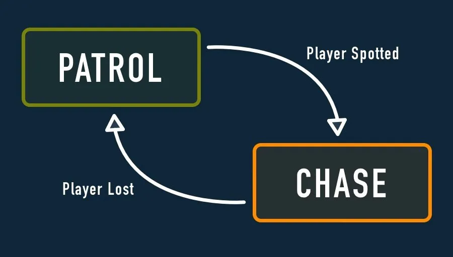
<p><em>VI: Trạng thái Patrol và Chase — kẻ địch lang thang, nhưng khi thấy người chơi thì đuổi theo. / EN: Patrol and Chase state visualisation.</em></p>

<div class="bilingual-row">
<div class="col-vi">
<p><strong>Finite State Machine</strong> là design pattern cho phép bạn <em>xử lý logic tùy theo trạng thái hiện tại</em> của một object hay hệ thống.</p>
<p>🔑 <strong>Lợi ích:</strong> Nó cho phép bạn <strong>chỉ tập trung vào logic LIÊN QUAN tới tình huống hiện tại</strong> tại bất kỳ thời điểm nào, và <strong>chỉ các điều kiện có thể khiến nó thay đổi</strong> — <em>bỏ qua mọi thứ khác</em>.</p>
<p><strong>❌ Vấn đề khi KHÔNG dùng FSM:</strong></p>
<p>Bạn sẽ phải <em>kiểm tra kẻ địch đang làm gì NGAY BÂY GIỜ</em> trước khi cho nó làm việc khác:</p>
</div>
<div class="col-en">
<p>A <strong>Finite State Machine</strong> is a design pattern that allows you to <em>process logic depending on the current state</em> of an object or system.</p>
<p>🔑 <strong>The benefit:</strong> It allows you to <strong>focus on only the logic that's RELEVANT to the current situation</strong> at any given time and <strong>only the conditions that could cause that to change</strong> — <em>ignoring everything else</em>.</p>
<p><strong>❌ The problem WITHOUT an FSM:</strong></p>
<p>You typically have to <em>check what the enemy is doing RIGHT NOW</em> before you can let it do something else:</p>
</div>
</div>

```csharp
// ❌ Không dùng FSM — phải kiểm tra MỌI điều kiện trước mỗi hành động
// WITHOUT an FSM — must check EVERY condition before each action
public void HurtEnemy()
{
    if(sleeping)
    {
        // Wake up
    }
    if(patrolling)
    {
        // Chase!
    }
}
```

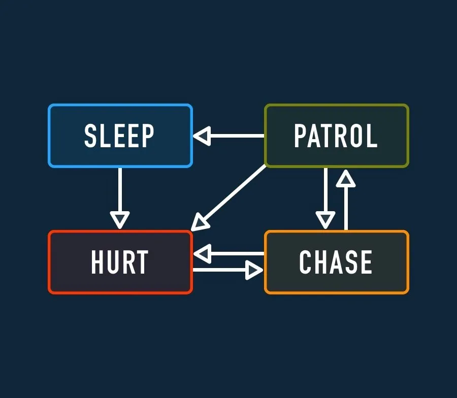
<p><em>VI: State machine cho phép bạn tập trung vào các điều kiện có thể khiến object đổi hành vi. SLEEP ⇄ HURT ⇄ CHASE ⇄ PATROL. / EN: State machines allow you to focus on the conditions that could cause an object to change its behaviour.</em></p>

<div class="bilingual-row">
<div class="col-vi">
<p>✅ <strong>State machine thay đổi CÁCH bạn đánh giá trạng thái hệ thống.</strong> Thay vì kiểm tra <em>cái gì đang xảy ra</em>, <strong>mỗi state chỉ cần lo hành vi CỦA RIÊNG NÓ và các điều kiện có thể khiến nó đổi</strong>.</p>
<p><strong>Ví dụ đọc sơ đồ trên:</strong></p>
<ul>
<li><strong>Sleep State</strong> — hệ thống <em>không cần di chuyển, không cần tìm người chơi</em>; sự kiện <em>duy nhất</em> có thể khiến kẻ địch đổi state là bị <strong>Hurt</strong>.</li>
<li><strong>Patrol State</strong> — <em>nhận sát thương HOẶC thấy người chơi</em> sẽ khiến kẻ địch đuổi theo.</li>
<li><strong>Chase State</strong> — nếu <em>mất dấu người chơi</em>, nó chuyển ngược về Patrol. Sau đó nếu <em>đủ thời gian trôi qua</em>, nó có thể về lại Sleep.</li>
</ul>
<p><strong>🔬 State machine hoạt động thế nào:</strong></p>
<p>Hầu hết FSM có một <strong>phần tử điều khiển — chính là State Machine</strong> — quản lý state nào đang active và gọi logic bên trong mỗi state. Cái này có thể đơn giản là một <strong>Delegate Function</strong> quyết định khối logic nào được gọi, hoặc một <strong>Enum</strong> cho phép mỗi state tự kiểm tra xem có cần chạy hay không.</p>
<p>🔑 <strong>Điểm mấu chốt:</strong> Vì <strong>state machine CHỈ CÓ THỂ ở MỘT state tại một thời điểm</strong>, ta có thể <em>giả định object đang làm gì dựa trên state nó đang ở</em>. Nghĩa là bên trong state, bạn <strong>thường KHÔNG cần kiểm tra xem một hành động có thực hiện được không trước khi làm</strong> — bạn có thể kích hoạt nó <em>với sự chắc chắn rằng code ở state khác không thể can thiệp</em>.</p>
<p><strong>Input · Transition · Enter/Exit:</strong> State machine cung cấp <strong>Input</strong> cho state (tham số, user input, hàm dùng chung). Mỗi state tự diễn giải thông tin và quyết định có cần đổi state không. Quá trình đổi state gọi là <strong>Transition</strong>. Khi transition được kích hoạt, state machine thường gọi <strong>Exit</strong> trên state cũ (để nó tự giải trừ) và <strong>Enter</strong> trên state mới (để nó tự thiết lập).</p>
</div>
<div class="col-en">
<p>✅ <strong>A state machine changes HOW you evaluate the state of a system.</strong> Instead of checking <em>what is currently happening</em>, <strong>each state only needs to deal with its OWN behaviour and the conditions that could cause it to change</strong>.</p>
<p><strong>Reading the diagram above:</strong></p>
<ul>
<li><strong>Sleep State</strong> — the system <em>doesn't need to move, or try to find the player</em>; the <em>only</em> event that might cause a state change is being <strong>Hurt</strong>.</li>
<li><strong>Patrol State</strong> — <em>taking damage OR seeing the player</em> will cause the enemy to chase them.</li>
<li><strong>Chase State</strong> — if the enemy <em>loses the player</em>, it transitions back to Patrol. After which, if <em>enough time passes</em>, it may go back to Sleep.</li>
</ul>
<p><strong>🔬 How state machines work:</strong></p>
<p>Most state machines involve a <strong>controlling element — the State Machine itself</strong> — that manages which state is currently active and calls the logic inside each state. This could be as simple as a <strong>Delegate Function</strong> deciding which block of logic gets called, or an <strong>Enum</strong> allowing each state to check itself whether it needs to run.</p>
<p>🔑 <strong>The crux:</strong> Because a <strong>state machine can only be in ONE state at a time</strong>, it's possible to <em>assume what the object is doing right now based on which state it's in</em>. Meaning that inside the state, you <strong>typically won't need to check if an action can be performed before doing it</strong> — you can just trigger it <em>knowing that code in other states can't interfere</em>.</p>
<p><strong>Input · Transition · Enter/Exit:</strong> The state machine provides <strong>Input</strong> to the state (parameters, user input, shared functions). Each state interprets the information and decides if the state needs to change. The process of changing is a <strong>Transition</strong>. When triggered, the state machine calls <strong>Exit</strong> on the old state (allowing it to decommission itself) and <strong>Enter</strong> on the new one (so it can set itself up).</p>
</div>
</div>

### 24.0.1. ⚠️ Khi nào KHÔNG nên dùng State Machine

<div class="bilingual-row">
<div class="col-vi">
<blockquote>
<p><em>"Dù state machine có thể cực kỳ hữu ích, chúng cũng <strong>có thể làm một vấn đề đơn giản trở nên phức tạp hơn mức cần thiết</strong>, hoặc <strong>đưa ra giới hạn cho một vấn đề phức tạp mà lý tưởng ra cần giải pháp khác</strong>."</em></p>
</blockquote>
<p>👉 <strong>Không có quy tắc cứng nào</strong>, nhưng nhìn chung <strong>nên TRÁNH BẮT ĐẦU bằng state machine trừ khi bạn biết chắc đó là lựa chọn đúng.</strong></p>
<p><strong>✅ FSM mang lại 2 lợi ích chính:</strong></p>
<ol>
<li>Giúp bạn <strong>bỏ qua có chọn lọc</strong> phần code lẽ ra không nên chạy trong khi code khác đang chạy — tức bạn <em>có các trạng thái chức năng phân biệt được rõ ràng</em>.</li>
<li>Cho phép bạn <strong>giới hạn điều kiện thay đổi CHỈ trong state hiện tại</strong> — nghĩa là <em>chỉ state hiện tại mới quyết định cái gì có thể khiến nó đổi</em> (các lối ra của state).</li>
</ol>
<p><strong>👉 Nên dùng FSM khi:</strong> bạn thấy mình phải <em>viết nhiều kiểm tra điều kiện để tách logic trong script</em>, hoặc bạn <em>lo rằng thứ gì đó có thể khiến script chạy sai logic vào sai thời điểm</em>.</p>
<p><strong>🚨 KHÔNG nên dùng FSM khi:</strong></p>
<ul>
<li>Bạn thấy <strong>mỗi state khó phân biệt</strong> — khó quyết định cái gì nên thuộc state này hay state kia.</li>
<li>Bạn thấy mình <strong>LẶP LẠI cùng một đoạn code trong mỗi state</strong>.</li>
</ul>
<p>⇒ Đó là <em>dấu hiệu rằng một giải pháp khác có thể phù hợp hơn</em>.</p>
</div>
<div class="col-en">
<blockquote>
<p><em>"While state machines can be extremely useful they can also <strong>make a simple problem more complicated than it needs to be</strong>, or <strong>introduce limitations to a complex problem that, ideally, needs a different solution</strong>."</em></p>
</blockquote>
<p>👉 <strong>There are no strict rules</strong>, but it's generally a good idea to <strong>avoid STARTING with one unless you know it's the right option.</strong></p>
<p><strong>✅ Generally, a state machine provides two main benefits:</strong></p>
<ol>
<li>It helps you <strong>selectively ignore</strong> code that shouldn't be running while other code is — i.e. you have <em>distinguishable states of functionality</em>.</li>
<li>It allows you to <strong>limit the conditions of change to JUST the state you're currently in</strong> — meaning <em>only the current state can decide what could cause it to change</em> (the state's exit routes).</li>
</ol>
<p><strong>👉 Use an FSM when:</strong> you find yourself <em>making multiple conditional checks to separate the logic in your script</em>, or you're <em>worried that something else could cause a script to execute the wrong logic at the wrong time</em>.</p>
<p><strong>🚨 Do NOT use an FSM when:</strong></p>
<ul>
<li>You find that <strong>each state is difficult to distinguish</strong> — hard to decide what should be in one state over another.</li>
<li>You find that you're <strong>REPEATING the same code in each of your states</strong>.</li>
</ul>
<p>⇒ That may be <em>a sign that a different solution would work better</em>.</p>
</div>
</div>

### 24.0.2. State Machine vs Behaviour Tree

<div class="bilingual-row">
<div class="col-vi">
<p><strong>Ở mức cơ bản, state machine khá GIỚI HẠN</strong>: chúng thường <em>chỉ xử lý được MỘT state tại một thời điểm</em> và <em>chỉ rời mỗi state qua một số lối ra đã dựng sẵn</em>. <strong>Đó cũng chính là mục đích của state machine.</strong></p>
<p>👉 Nhưng nếu logic của bạn <strong>không dễ khớp vào một số state phân biệt rõ ràng</strong>, cố dùng FSM có thể <em>phức tạp hơn mức đáng</em>.</p>
<p><strong>Khác biệt cốt lõi:</strong></p>
<ul>
<li><strong>State machine</strong> được điều khiển bởi <em>điều kiện của state mà hệ thống đang ở</em>.</li>
<li><strong>Behaviour tree</strong> hoạt động theo cách <em>ĐỘNG và MODULE hơn</em> — chúng cho phép tạo hành vi dựa trên <strong>ra quyết định theo mức ưu tiên</strong>, nơi AI đổi việc nó đang làm dựa trên <em>đánh giá NHIỀU yếu tố khác nhau, KHÔNG chỉ những gì trong state hiện tại</em>.</li>
</ul>
<p><strong>👉 Dùng Behaviour Tree thay FSM khi:</strong> logic AI của bạn <em>không tách được dễ dàng thành các state hữu hạn</em>, hoặc bạn thấy mình <em>lặp lại nhiều kiểm tra giống nhau giữa các state</em>.</p>
</div>
<div class="col-en">
<p><strong>At a basic level, state machines can be quite LIMITING</strong>: they can typically <em>only process a SINGLE state at any one time</em> and <em>can only leave each state via a number of ready-made exits</em>. <strong>Which is kind of the point of state machines.</strong></p>
<p>👉 But if your logic <strong>doesn't easily fit into a number of clearly distinguishable states</strong>, trying to use one may be <em>more complicated than it's worth</em>.</p>
<p><strong>The core difference:</strong></p>
<ul>
<li><strong>State machines</strong> are controlled by <em>the conditions of whichever state the system is currently in</em>.</li>
<li><strong>Behaviour trees</strong> work in a <em>more DYNAMIC, MODULAR way</em> — they allow you to create behaviour based on <strong>prioritised decision-making</strong>, where an AI object changes what it's doing based on <em>the evaluation of a number of DIFFERENT factors, not just what's in its current state</em>.</li>
</ul>
<p><strong>👉 Use a behaviour tree instead when:</strong> your AI's logic <em>can't be easily separated into finite states</em>, or you find yourself <em>repeating a lot of the same checks between states</em>.</p>
</div>
</div>

!!! info "Về §24.1–24.2 dưới đây"
    Nội dung từ repo **`thefuntastic/Unity3d-Finite-State-Machine`** (MonsterLove.StateMachine) — một cài đặt FSM dựa trên reflection, tối giản boilerplate.

<div class="bilingual-row">
<div class="col-vi">
<p><em>"State machine là cách RẤT hiệu quả để quản lý trạng thái game"</em> — dù ở object gameplay chính (Game Over, Restart, Continue…), ở UI (buttonHover, buttonPress…), hay ở từng actor/NPC riêng lẻ (AI behaviour, animation…).</p>
<p><strong>Triết lý thiết kế — "Designed for simplicity":</strong></p>
<p>Cài đặt state machine sách vở, và các thư viện state machine C# khác, <em>có xu hướng đòi cấu hình phức tạp hoặc boilerplate quá mức</em>. Nhưng StateMachine cực kỳ hữu ích — <strong>chi phí hành chính không bao giờ nên ngăn cản ta cải thiện tính dễ đọc, sửa bug và viết code tốt</strong>.</p>
<ul>
<li><strong>Tạo state với tốc độ suy nghĩ:</strong> chỉ cần thêm field vào <code>Enum</code>!</li>
<li><strong>Suy luận hiệu quả về code:</strong> mọi thứ nằm ở một chỗ — <em>trực tiếp bên trong MonoBehaviour của bạn</em>.</li>
<li><strong>Dùng thứ bạn đã biết về Unity:</strong> làm theo cách "Unity" tránh được sự kỳ quặc và tác dụng phụ bất ngờ.</li>
<li><strong>Chỉ viết những method bạn sẽ dùng:</strong> reflection thông minh dưới nắp capo giúp bạn khỏi phải viết boilerplate tẻ nhạt.</li>
</ul>
<p><strong>Nhưng vẫn phải ship được production code — nên:</strong></p>
<ul>
<li>✅ <strong>Bao phủ unit test rộng rãi</strong></li>
<li>✅ <strong>KHÔNG cấp phát rác sau khi khởi tạo</strong> <em>(garbage allocation free after initialization)</em></li>
<li>✅ <strong>Đã tôi luyện thực chiến và ship trong production code</strong></li>
<li>✅ <strong>Hỗ trợ iOS / Android / IL2CPP</strong></li>
</ul>
<p>🔑 <em>Tính chất "zero-alloc sau init" chính là lý do pattern này phù hợp với tiêu chí hiệu năng của Module 1 (§11 — GC).</em></p>
</div>
<div class="col-en">
<p><em>"State machines are a very effective way to manage game state"</em> — either on your main gameplay object (Game Over, Restart, Continue…), on UI (buttonHover, buttonPress…), or on individual actors and NPCs (AI behaviours, animations…).</p>
<p><strong>Design philosophy — "Designed for simplicity":</strong></p>
<p>The textbook state machine implementation, and by extension other C# state machine libraries, <em>have a tendency towards complicated configuration or excessive boilerplate</em>. StateMachines are incredibly useful though — <strong>administrative overhead should never prevent us from improving readability, fixing bugs, and otherwise writing good code</strong>.</p>
<ul>
<li><strong>Create states at the speed of thought:</strong> just add <code>Enum</code> fields!</li>
<li><strong>Effectively reason about your code:</strong> everything is in one place — <em>directly inside your MonoBehaviour</em>.</li>
<li><strong>Use what you know about Unity:</strong> doing things the "Unity" way avoids unexpected weirdness and side effects.</li>
<li><strong>Only write the methods you're going to use:</strong> clever under-the-hood reflection saves you from writing tedious boilerplate.</li>
</ul>
<p><strong>But working programmers still need to ship production code — so:</strong></p>
<ul>
<li>✅ <strong>Extensive unit test coverage</strong></li>
<li>✅ <strong>Garbage allocation free after initialization</strong></li>
<li>✅ <strong>Battle hardened and shipped in production code</strong></li>
<li>✅ <strong>Supports iOS / Android / IL2CPP</strong></li>
</ul>
<p>🔑 <em>The "zero-alloc after init" property is exactly why this pattern fits the performance criteria from Module 1 (§11 — GC).</em></p>
</div>
</div>

### 24.1. Quy ước gạch dưới `StateName_Method`

<div class="bilingual-row">
<div class="col-vi">
<p>Giống các method của MonoBehaviour (<code>Awake</code>, <code>Update</code>…), <strong>state method được định nghĩa theo QUY ƯỚC</strong>. Khai báo một method theo định dạng <code>StateName_Method</code>, và nó sẽ được <em>liên kết với tên khớp trong enum bạn cung cấp</em>.</p>
<p><strong>Ba built-in method LUÔN có sẵn</strong>, được kích hoạt tự động bởi lời gọi <code>ChangeState(States newState)</code>:</p>
<ol>
<li><strong><code>Enter</code></strong></li>
<li><strong><code>Exit</code></strong></li>
<li><strong><code>Finally</code></strong></li>
</ol>
<p>💡 <strong>Cả <code>Enter</code> và <code>Exit</code> đều hỗ trợ coroutine</strong> — chỉ cần trả về <code>IEnumerator</code>. Tuy nhiên, nếu trả về <code>void</code>, chúng sẽ được <strong>gọi NGAY LẬP TỨC mà KHÔNG có overhead</strong>.</p>
<p>🔑 <strong><code>Finally</code> LUÔN được gọi SAU <code>Exit</code></strong> và cung cấp cơ hội <em>dọn dẹp và giữ vệ sinh</em> trong các trường hợp đặc biệt khi routine <code>Exit</code> <strong>có thể bị GIÁN ĐOẠN trước khi hoàn thành</strong>.</p>
</div>
<div class="col-en">
<p>Like MonoBehaviour methods (<code>Awake</code>, <code>Update</code>…), <strong>state methods are defined by CONVENTION</strong>. Declare a method in the format <code>StateName_Method</code>, and this is <em>associated with any matching names in the provided enum</em>.</p>
<p><strong>Three built-in methods are always available</strong>, triggered automatically by <code>ChangeState(States newState)</code> calls:</p>
<ol>
<li><strong><code>Enter</code></strong></li>
<li><strong><code>Exit</code></strong></li>
<li><strong><code>Finally</code></strong></li>
</ol>
<p>💡 <strong>Both <code>Enter</code> and <code>Exit</code> support co-routines</strong> — simply return <code>IEnumerator</code>. However, return <code>void</code> and they will be <strong>called IMMEDIATELY with NO overhead</strong>.</p>
<p>🔑 <strong><code>Finally</code> is ALWAYS called after <code>Exit</code></strong> and provides an opportunity to <em>perform clean-up and hygiene</em> in special cases where the <code>Exit</code> routine <strong>might be INTERRUPTED before completing</strong>.</p>
</div>
</div>

```csharp
// Sử dụng cơ bản — nguyên văn từ README của repo
// Basic usage — verbatim from the repo README
using MonsterLove.StateMachine;   // 1. Nhớ using statement

public class MyGameplayScript : MonoBehaviour
{
    public enum States
    {
        Init,
        Play,
        Win,
        Lose
    }

    StateMachine<States> fsm;

    void Awake()
    {
        fsm = new StateMachine<States>(this);   // 2. Phần "ma thuật" chính
        fsm.ChangeState(States.Init);           // 3. Kích hoạt chuyển trạng thái dễ dàng
    }

    void Init_Enter()      { Debug.Log("Ready"); }

    void Play_Enter()      { Debug.Log("Spawning Player"); }
    void Play_FixedUpdate(){ Debug.Log("Doing Physics stuff"); }

    void Play_Update()
    {
        if (player.health <= 0)
        {
            fsm.ChangeState(States.Lose);       // 3. Chuyển trạng thái
        }
    }

    void Play_Exit()       { Debug.Log("Despawning Player"); }

    void Win_Enter()       { Debug.Log("Game Over - you won!"); }
    void Lose_Enter()      { Debug.Log("Game Over - you lost!"); }
}
```

```csharp
// Coroutine trong Enter/Exit + Finally để dọn dẹp an toàn
// Coroutines in Enter/Exit + Finally for safe cleanup
enum States { Play }

// Coroutine được hỗ trợ — chỉ cần trả về IEnumerator
IEnumerator Play_Enter()
{
    yield return new WaitForSeconds(1);
    Debug.Log("Start");
}

IEnumerator Play_Exit()
{
    yield return new WaitForSeconds(1);
}

// Finally LUÔN chạy sau Exit — kể cả khi Exit bị gián đoạn giữa chừng
void Play_Finally()
{
    Debug.Log("GameOver");
}
```

### 24.2. Data-Driven State Events — `Driver`

<div class="bilingual-row">
<div class="col-vi">
<p>Để định nghĩa <strong>sự kiện bổ sung</strong>, ta cần chỉ định một <strong><code>Driver</code></strong>.</p>
<p>Đây là một lớp <em>rất đơn giản</em>. Nó <strong>không bắt buộc phải tên là <code>Driver</code></strong> — ràng buộc duy nhất là nó <strong>phải chứa các field kiểu <code>StateEvent</code></strong>. Khi ta truyền nó vào định nghĩa state machine, nó sẽ lo hết mọi thứ cần thiết để thiết lập các hook sự kiện State mới.</p>
<p><strong>Bước cuối:</strong> Vì đây là sự kiện tùy biến, bạn phải <strong>tự nói cho state machine biết KHI NÀO chúng nên được phát</strong>.</p>
</div>
<div class="col-en">
<p>To define <strong>additional events</strong>, we need to specify a <strong><code>Driver</code></strong>.</p>
<p>This is a <em>very simple</em> class. It <strong>doesn't have to be called <code>Driver</code></strong> — the only constraint is that it <strong>must contain <code>StateEvent</code> fields</strong>. When we pass this to our state machine definition, it will take care of everything needed to set up new State event hooks.</p>
<p><strong>The final step:</strong> As these are custom events, you must <strong>tell the state machine WHEN these should be fired</strong>.</p>
</div>
</div>

```csharp
// ① Định nghĩa Driver — chỉ cần chứa các field StateEvent
public class Driver
{
    StateEvent Update;
    StateEvent<Collision> OnCollisionEnter;
    StateEvent<int> OnHealthPickup;
}

// ② Khai báo state machine với Driver
StateMachine<States, Driver> fsm;

void Awake()
{
    fsm = new StateMachine<States, Driver>(this);
}

void Play_Enter()  { Debug.Log("Started"); }
void Play_Update() { Debug.Log("Ticked"); }

void Play_OnHealthPickup(int health)
{
    // Add to player health
}

// ③ BẠN chịu trách nhiệm phát sự kiện — đặt đúng chỗ bạn muốn
void Update()
{
    fsm.Driver.Update.Invoke();
}

void OnCollisionEnter(Collision collision)
{
    fsm.Driver.OnCollisionEnter.Invoke(collision);
}

void OnHealthPickup(int health)
{
    fsm.Driver.OnHealthPickup.Invoke();
}
```

<div class="bilingual-row">
<div class="col-vi">
<p><strong>🔬 Driver Deep-Dive — vì sao thiết kế như vậy</strong></p>
<p>So với phần còn lại của StateMachine, Driver có thể gây phản ứng: <em>"Ê! Ông bảo là sẽ không có trò mèo nào ở đây mà!"</em></p>
<p>Đúng là <em>không có nhiều thứ tương tự trong cả C# lẫn Unity</em>. <strong>Trước v4.0</strong>, state machine sẽ <em>gán động một component <code>StateMachineRunner</code></em> để gọi các hook <code>FixedUpdate</code>, <code>Update</code> &amp; <code>LateUpdate</code>. <em>(Để tương thích ngược, đây vẫn là hành vi mặc định khi bỏ qua Driver.)</em></p>
<p><strong>Cách cũ hoạt động, NHƯNG:</strong></p>
<ul>
<li>Thêm hook mới đồng nghĩa phải <strong>fork lớp <code>StateMachineRunner</code></strong>.</li>
<li>Vì là MonoBehaviour riêng biệt, nó có <strong>script execution order RIÊNG</strong> — đôi khi dẫn tới hành vi kỳ quặc.</li>
</ul>
<p>✅ <strong>Nhưng khi NGƯỜI DÙNG chịu trách nhiệm phát sự kiện</strong> — ví dụ <code>fsm.Driver.Update.Invoke()</code> — thì việc <strong>suy luận về vòng đời của fsm trở nên DỄ HƠN NHIỀU</strong>.</p>
<p>👉 <em>Không còn phải đoán xem StateMachine sẽ update TRƯỚC hay SAU phần còn lại của lớp</em>, vì <strong>trigger nằm ngay đó</strong>. Nó <strong>di chuyển được tới đúng vị trí bạn muốn</strong> trong lời gọi <code>Update()</code> chính.</p>
</div>
<div class="col-en">
<p><strong>🔬 Driver Deep-Dive — why it's designed this way</strong></p>
<p>Compared to the rest of the StateMachine, the Driver might elicit a reaction of: <em>"Hey! You said there wasn't going to be any funny business here!"</em></p>
<p>Indeed, <em>there aren't many analogues in either C# or Unity</em>. <strong>Before v4.0</strong>, the state machine would <em>dynamically assign a <code>StateMachineRunner</code> component</em> that would call <code>FixedUpdate</code>, <code>Update</code> &amp; <code>LateUpdate</code> hooks. <em>(For backwards compatibility this is still the default behaviour when omitting a Driver.)</em></p>
<p><strong>That worked, BUT:</strong></p>
<ul>
<li>Additional hooks meant <strong>forking the <code>StateMachineRunner</code> class</strong>.</li>
<li>As a separate MonoBehaviour, it has <strong>its OWN script execution order</strong> — which could sometimes lead to oddities.</li>
</ul>
<p>✅ <strong>But with the USER responsible for invoking events</strong> — e.g. <code>fsm.Driver.Update.Invoke()</code> — it becomes <strong>MUCH easier to reason about the lifecycle of the fsm</strong>.</p>
<p>👉 <em>No more having to guess whether the StateMachine will update before or after the rest of the class</em>, because <strong>the trigger is right there</strong>. It <strong>can be moved to the right spot</strong> in the main <code>Update()</code> call.</p>
</div>
</div>

```csharp
// Kiểm soát chính xác THỨ TỰ — điều không làm được với StateMachineRunner
// Precise ORDER control — impossible with StateMachineRunner
void Update()
{
    // Do Stuff

    fsm.Driver.Update.Invoke();   // ← đặt chính xác nơi bạn muốn

    // Do Other Stuff
}
```

---

### 24.2b. ⏳ Async Transitions — `StateTransition.Safe` vs `.Overwrite`

<div class="bilingual-row">
<div class="col-vi">
<p><em>"Có hỗ trợ ĐƠN GIẢN để quản lý <strong>chuyển state BẤT ĐỒNG BỘ</strong> khi hàm enter hoặc exit là coroutine DÀI."</em></p>
<ul>
<li><strong><code>StateTransition.Safe</code></strong> — <em>"là MẶC ĐỊNH. Nó LUÔN cho phép state hiện tại <strong>hoàn tất CẢ hàm enter LẪN exit</strong> trước khi chuyển sang state mới."</em></li>
<li><strong><code>StateTransition.Overwrite</code></strong> — <em>"sẽ <strong>HUỶ mọi transition đang diễn ra và gọi state kế tiếp NGAY LẬP TỨC. Nghĩa là mọi đoạn code CHƯA kịp chạy trong enter và exit routine sẽ BỊ BỎ QUA.</strong>"</em></li>
</ul>
<p>🔑 <em>"Nếu bạn cần đảm bảo kết thúc ở một cấu hình NHẤT ĐỊNH, <strong>hàm <code>Finally</code> LUÔN được gọi</strong>."</em></p>
</div>
<div class="col-en">
<p><em>"There is simple support for managing asynchronous state changes with long enter or exit coroutines."</em></p>
<ul>
<li><em>"The default is <code>StateTransition.Safe</code>. This will always allows the current state to finish both its enter and exit functions before transitioning to any new states."</em></li>
<li><em>"<code>StateTransition.Overwrite</code> will cancel any current transitions, and call the next state immediately. This means any code which has yet to run in enter and exit routines will be skipped."</em></li>
</ul>
<p>🔑 <em>"If you need to ensure you end with a particular configuration, the finally function will always be called."</em></p>
</div>
</div>

```csharp
fsm.ChangeState(States.MyNextState, StateTransition.Safe);       // mặc định
fsm.ChangeState(States.MyNextState, StateTransition.Overwrite);  // cắt ngang

void MyCurrentState_Finally()
{
    // Reset object to desired configuration — LUÔN chạy, dù bị Overwrite cắt ngang
}
```

### 24.2c. 🚫 Anti-pattern — gọi `ChangeState` TỪ NGOÀI, và BẢNG TRANSITION NGẦM

<div class="bilingual-row">
<div class="col-vi">
<p>💀 <em>"Sức mạnh THỰC SỰ lộ ra khi ta xét thêm MỘT anti-pattern nữa: <strong>GỌI đổi state TỪ BÊN NGOÀI state machine có thể dẫn tới TÁC DỤNG PHỤ NGOÀI Ý MUỐN.</strong>"</em> Hình dung một lời gọi TOÀN CỤC làm state chuyển đổi:</p>
</div>
<div class="col-en">
<p>💀 <em>"The real power shines when we consider another anti-pattern. Calling a state change from outside the state machine can lead to unintended side-effects. Imagine the following scenario where a global call causes a state transition."</em></p>
</div>
</div>

```csharp
// ❌ VẤN ĐỀ — EndGame() ép chuyển state BẤT KỂ đang ở state nào
public void EndGame()
{
    fsm.ChangeState(States.GameOver);
}

void Idle_Update()
{
    // Chuyển sang GameOver ở đây sẽ gây ra chuyện NGOÀI Ý MUỐN
}

void Play_Update()
{
    // GameOver ở đây thì HỢP LỆ
}
```

<div class="bilingual-row">
<div class="col-vi">
<p>🔧 <em>"Một số thư viện xử lý việc này bằng cách <strong>định nghĩa BẢNG TRANSITION</strong>. Tuy nhiên, có thể đạt kết quả TƯƠNG TỰ bằng <strong>state event</strong>:"</em></p>
</div>
<div class="col-en">
<p>🔧 <em>"Some libraries deal with this by defining transitons tables. However, it's possible to achieve a similar outcome using state events."</em></p>
</div>
</div>

```csharp
// ✅ GIẢI PHÁP — phát SỰ KIỆN, để chính state quyết định có phản hồi hay không
public class Driver
{
    public StateEvent OnEndGame;
}

public void EndGame()
{
    fsm.Driver.OnEndGame.Invoke();
}

void Idle_Update()  { /* Chuyển GameOver ở đây vẫn là NGOÀI Ý MUỐN */ }
void Play_Update()  { /* GameOver hợp lệ */ }

void Play_OnEndGame()
{
    fsm.ChangeState(State.GameOver);   // CHỈ state Play mới phản hồi
}
```

<div class="bilingual-row">
<div class="col-vi">
<p>🎯 <em>"<strong>Giờ <code>Play</code> là state DUY NHẤT có thể phản hồi lời gọi EndGame. Việc này TẠO RA một BẢNG TRANSITION NGẦM như một tác dụng phụ \"MIỄN PHÍ\".</strong>"</em></p>
</div>
<div class="col-en">
<p>🎯 <em>"Now the Play state is only state that can respond to EndGame calls. This creates an implicit transition table as sort of 'free' side-effect."</em></p>
</div>
</div>

### 24.2d. 📊 Performance & Limitations — ĐIỀU KIỆN của câu "garbage allocation free"

!!! warning "⚠️ Đọc mục này để hiểu ĐÚNG khẩu hiệu ở §24.0"
    <div class="bilingual-row">
    <div class="col-vi">
    <p>🪄 <strong>Design Philosophy:</strong> <em>"State machine được thiết kế để TỐI ĐA HOÁ sự đơn giản cho người dùng cuối. Để đạt điều đó, <strong>bên dưới là một chút 'ma thuật' REFLECTION tinh vi. Reflection là lựa chọn GÂY TRANH CÃI vì nó CHẬM — và ở đây cũng KHÔNG ngoại lệ. Tuy nhiên chúng tôi cân bằng đánh đổi bằng cách GIỚI HẠN TOÀN BỘ reflection vào MỘT LỜI GỌI DUY NHẤT lúc state machine được KHỞI TẠO.</strong> Việc này LÀM GIẢM hiệu năng instantiation, nhưng <strong>instantiation vốn đã chậm sẵn. Chúng tôi kỳ vọng các chiến lược như OBJECT POOLING đã được áp dụng</strong>, qua đó dời chi phí này về thời điểm người dùng KHÓ nhận ra."</em></p>
    <p>📈 <strong>Ngưỡng quy mô — con số CỤ THỂ:</strong> <em>"Đảm bảo tính đúng đắn ĐỒNG NGHĨA với việc <strong>gọi <code>Invoke()</code> của StateEvent CHẬM HƠN gọi method trần. Qua HÀNG CHỤC NGHÌN instance, điều này có thể cộng dồn thành overhead ĐÁNG KỂ. Ở những ca đó (NHIỀU NGHÌN object), khuyến nghị THAY state machine bằng thứ gì đó TỰ TINH CHỈNH BẰNG TAY.</strong>"</em></p>
    <p>✅ <em>"<strong>Tuy nhiên, với ĐA SỐ ca dùng thông thường — ví dụ class manager, hay các thứ có SỐ INSTANCE THẤP (VÀI CHỤC hoặc VÀI TRĂM) — khác biệt hiệu năng TUYỆT ĐỐI KHÔNG phải thứ bạn cần bận tâm.</strong>"</em></p>
    <p>🧹 <strong>Memory Allocation Free?</strong> <em>"Được thiết kế nhắm tới MOBILE, nên đáng lẽ KHÔNG cấp phát bộ nhớ. ⚠️ <strong>Tuy nhiên các quy tắc GIỐNG phần còn lại của Unity VẪN áp dụng với <code>IEnumerator</code> và Coroutine.</strong>"</em></p>
    <p>🪟 <strong>Windows Store Platforms:</strong> 💀 <em>"<strong>Do khác biệt giữa phiên bản .NET của Windows Store và WinRT, nền tảng này HIỆN KHÔNG TƯƠNG THÍCH.</strong>"</em></p>
    </div>
    <div class="col-en">
    <p>🪄 <em>"The state machine is designed to maximise simplicity for the end-user. To achieve this, under the hood lies some intricate reflection 'magic'. Reflection is a controversial choice because it is slow — and that's no exception here. However, we seek to balance the trade-off by limiting all the reflection to a single call when the state machine is initialised. This does degrade instantiation performance, however, instantiation is already slow. It's expected that strategies such as object pooling … are already in effect, which moves this cost to a time when the user is unlikely to notice it."</em></p>
    <p>📈 <em>"Ensuring correctness does mean that calling StateEvents' Invoke() is slower than naked method calls. Over tens of thousands of instances this can add up to a significant overhead. In these use cases (multiple 1000's of objects) it is recommended to replace the state machine with something hand-tuned."</em></p>
    <p>✅ <em>"However, for most general use cases, eg manager classes, or other items with low instance counts (10's or 100's) — the difference in performance should absolutely not be something you need to think about."</em></p>
    <p>🧹 <em>"This is designed to target mobile, as such should be memory allocation free. However the same rules apply as with the rest of Unity in regards to using IEnumerator and Coroutines."</em></p>
    <p>🪟 <em>"Due to differences in the Windows Store flavour of .Net and WinRT, this platform is currently incompatible."</em></p>
    </div>
    </div>

### 24.2e. ⬆️ Nâng cấp lên v4.0 — bước BẮT BUỘC dễ quên

<div class="bilingual-row">
<div class="col-vi">
<p><em>"Phiên bản <strong><code>4.0</code></strong> mang lại đổi mới ĐÁNG KỂ, tuy nhiên API cố gắng <strong>TƯƠNG THÍCH NGƯỢC</strong> — nghĩa là <strong>mọi code bạn đã viết KHÔNG cần thay đổi.</strong> 🚨 <strong>NHƯNG bố cục file bên trong package ĐÃ ĐỔI. Để tránh lỗi, khuyến nghị XOÁ thư mục <code>MonsterLove</code> hiện có (chứa <code>StateMachine.cs</code> và các file liên quan), rồi IMPORT LẠI package mới.</strong>"</em></p>
<p>📋 Thông tin kèm theo: example project dành cho <strong>Unity 2019.4</strong> · giấy phép <strong>MIT</strong> · dùng trong game <strong>Cadence</strong> của Made With Monster Love · nguồn gốc từ FSM của <strong>Unity Gems</strong>.</p>
</div>
<div class="col-en">
<p><em>"Version 4.0 brings substantial innovation, however the API strives for backwards compatibility which means all the code you've already written does not need to change. However, the layout of the files inside the package has changed. To avoid errors it is recommended you delete the existing MonsterLove folder containing StateMachine.cs and related files, then reimport the new package."</em></p>
<p>📋 Example project targets <strong>Unity 2019.4</strong> · <strong>MIT License</strong> · used in <strong>Cadence</strong> by Made With Monster Love · originally derived from the <strong>Unity Gems</strong> FSM.</p>
</div>
</div>


---

## 24.3. Cách 1 — FSM bằng INTERFACE

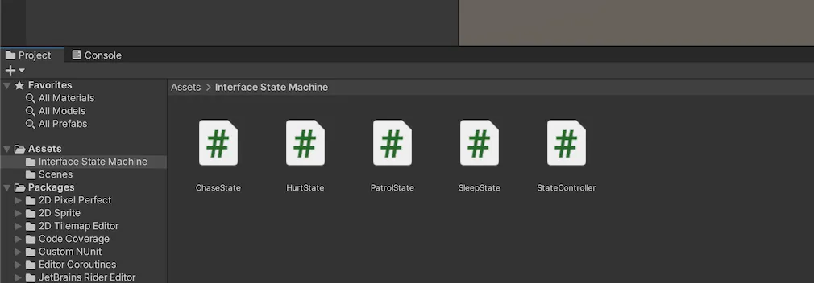
<p><em>VI: Lặp lại quy trình để tạo các state khác, đảm bảo mỗi state đều implement interface IState. / EN: Repeat the process to create the other states, making sure each one implements the IState interface.</em></p>

<div class="bilingual-row">
<div class="col-vi">
<p><strong>Interface cho phép 2 script khác nhau được ĐỐI XỬ NHƯ THỂ chúng giống nhau.</strong> Cơ chế: buộc lớp nào implement một interface cụ thể phải bao gồm một tập hàm bắt buộc.</p>
<p>👉 Nghĩa là <strong>2 script khác nhau, code khác nhau, logic khác nhau — vẫn dùng thay thế nhau được trong MỘT biến</strong>, như thể chúng là instance của cùng một class type.</p>
<p>⇒ Một state machine có thể <strong>hoán đổi class này lấy class khác (một state lấy state khác)</strong>, dù chúng khác nhau, <em>miễn là chúng chia sẻ một interface chung</em>.</p>
<p><strong>Cấu trúc cần có:</strong> một script <strong>State Controller</strong> giữ tham chiếu tới <strong>Current State</strong> — có thể là bất kỳ state nào implement <strong>IState Interface</strong>.</p>
</div>
<div class="col-en">
<p><strong>Interfaces allow two different scripts to be TREATED AS IF they are the same.</strong> This works by forcing a class that implements a particular interface to include a set of required functions.</p>
<p>👉 Meaning that <strong>two different scripts, with different code and different logic, can be used INTERCHANGEABLY in ONE variable</strong>, as if they were instances of the same class type.</p>
<p>⇒ A state machine can <strong>swap one class for another (one state for another)</strong>, even though they're different, <em>so long as they share a common interface</em>.</p>
<p><strong>The required structure:</strong> a <strong>State Controller</strong> script that holds a reference to the <strong>Current State</strong> — which can be any state implementing the <strong>IState Interface</strong>.</p>
</div>
</div>

```csharp
// State Controller + IState Interface
public class StateController : MonoBehaviour
{
    IState currentState;

    void Update()
    {
        currentState.UpdateState();
    }

    public void ChangeState(IState newState)
    {
        currentState.OnExit();
        currentState = newState;
        currentState.OnEnter();
    }
}

public interface IState
{
    public void OnEnter();
    public void UpdateState();
    public void OnHurt();
    public void OnExit();
}
```

```csharp
// Mỗi state là một class THƯỜNG (KHÔNG phải MonoBehaviour) implement IState
// Each state is a plain class — NOT a MonoBehaviour — implementing IState
public class PatrolState : IState
{
    public void OnEnter()
    {
        // "What was that!?"
    }
    public void UpdateState()
    {
        // Search for player
    }
    public void OnHurt()
    {
        // Transition to Hurt State
    }
    public void OnExit()
    {
        // "Must've been the wind"
    }
}
```

<div class="bilingual-row">
<div class="col-vi">
<p><strong>Ý nghĩa của từng hàm trong interface ví dụ:</strong></p>
<ul>
<li><strong><code>UpdateState</code></strong> — được gọi mỗi frame</li>
<li><strong><code>OnEnter</code></strong> — kích hoạt khi một state mới trở nên active</li>
<li><strong><code>OnExit</code></strong> — cho phép state tự giải trừ khi bị tắt</li>
<li><strong><code>OnHurt</code></strong> — vì hầu hết state đều cần phản hồi việc object bị tấn công, hàm này do controller gọi giúp state <em>dễ dàng chuyển sang Hurt State</em> khi cần</li>
</ul>
<p>🔑 <strong>Hai cách quản lý các state khác nhau:</strong></p>
<ol>
<li><strong>Tạo instance MỚI mỗi khi đổi state</strong> — <code>ChangeState(new PatrolState());</code></li>
<li><strong>Tạo sẵn một tập state</strong> lưu trên chính state controller <em>(cách này tránh cấp phát runtime ⇒ tốt hơn cho GC)</em></li>
</ol>
</div>
<div class="col-en">
<p><strong>What each function in the example interface does:</strong></p>
<ul>
<li><strong><code>UpdateState</code></strong> — called every frame</li>
<li><strong><code>OnEnter</code></strong> — triggered when a new state becomes active</li>
<li><strong><code>OnExit</code></strong> — allows states to decommission themselves when disabled</li>
<li><strong><code>OnHurt</code></strong> — because most states may need to respond to the object being attacked, this controller-called function makes it easy for a state <em>to transition to the Hurt State</em> if needed</li>
</ul>
<p>🔑 <strong>Two ways to manage the different states:</strong></p>
<ol>
<li><strong>Create a NEW instance whenever the state changes</strong> — <code>ChangeState(new PatrolState());</code></li>
<li><strong>Create a set of possible states</strong> stored on the state controller itself <em>(this avoids runtime allocation ⇒ better for GC)</em></li>
</ol>
</div>
</div>

---

### 24.3b. 🔗 Vấn đề của bản Interface ĐẦU TIÊN — và cách sửa

<div class="bilingual-row">
<div class="col-vi">
<p>💀 <em>"Trong khi <strong>State Controller</strong> có khả năng đổi từ state này sang state khác, thì <strong>các LỐI RA khỏi một state, cùng ĐIỀU KIỆN kích hoạt chúng, lại nằm BÊN TRONG chính State đó.</strong> […] Nhưng lúc này, class state <strong>KHÔNG BIẾT chuyện gì đang xảy ra với object mà nó gắn vào.</strong>"</em></p>
<p>🚨 <em>"<strong>Đó là vì instance của class thuần KHÔNG truy cập được GameObject mà nó gắn vào như script MonoBehaviour làm được</strong>, nghĩa là state thường KHÔNG tương tác được với thế giới xung quanh […] Và kể cả nếu làm được, nó cũng KHÔNG tự đổi state được, vì <strong>hàm đổi state CHỈ state controller mới gọi được.</strong>"</em></p>
<p>✅ <em>"Một cách sửa là <strong>ĐƠN GIẢN đưa một THAM CHIẾU tới State Controller vào MỘT hoặc NHIỀU hàm bắt buộc của State Interface.</strong>"</em></p>
</div>
<div class="col-en">
<p>💀 <em>"While the State Controller has the ability to change from one state to another, the exit routes from a given state, and the conditions that can cause one to be triggered, exist inside the State itself. […] But, right now, the state class doesn't know what's happening to the object it exists on."</em></p>
<p>🚨 <em>"This is because plain class instances can't access the game object they're attached to like Monobehaviour scripts can, meaning that the state typically can't interact with the world around it […] And, even if it could, it wouldn't be able to change the state itself, as the change state function can only be changed by the state controller."</em></p>
<p>✅ <em>"One way to fix this is to simply include a reference to a State Controller in one, or more, of the State Interface's required functions."</em></p>
</div>
</div>

```csharp
public class StateController : MonoBehaviour
{
    IState currentState;

    public SleepState  sleepState  = new SleepState();
    public ChaseState  chaseState  = new ChaseState();
    public PatrolState patrolState = new PatrolState();
    public HurtState   hurtState   = new HurtState();

    private void Start()
    {
        ChangeState(patrolState);
    }

    void Update()
    {
        if (currentState != null)
        {
            currentState.UpdateState(this);
        }
    }

    public void ChangeState(IState newState)
    {
        if (currentState != null)
        {
            currentState.OnExit(this);
        }
        currentState = newState;
        currentState.OnEnter(this);
    }
}

public interface IState
{
    public void OnEnter(StateController controller);
    public void UpdateState(StateController controller);
    public void OnHurt(StateController controller);
    public void OnExit(StateController controller);
}
```

<div class="bilingual-row">
<div class="col-vi">
<p>🎯 <em>"Cách này cho phép state <strong>DÙNG state controller làm tham chiếu tới GameObject mà nó gắn vào</strong> […] và khi tới lúc đổi state, nó làm được, <strong>bằng cách gọi hàm <code>ChangeState</code> trên state controller.</strong>"</em></p>
</div>
<div class="col-en">
<p>🎯 <em>"This allows the state to use the state controller as a reference to the game object it's attached to […] and, when it's time to change the state, it can, by calling the Change State function on the state controller."</em></p>
</div>
</div>

```csharp
public class PatrolState : IState
{
    float timeBeforeSleep;

    public void OnEnter(StateController sc)
    {
        timeBeforeSleep = 20;
    }

    public void UpdateState(StateController sc)
    {
        // Giờ state ĐỌC ĐƯỢC thế giới xung quanh qua sc.transform
        if (Physics.Raycast(sc.transform.position, sc.transform.forward))
        {
            sc.ChangeState(sc.chaseState);
        }

        if (timeBeforeSleep < 0)
        {
            sc.ChangeState(sc.sleepState);
        }

        timeBeforeSleep -= Time.deltaTime;
    }

    public void OnHurt(StateController sc)
    {
        sc.ChangeState(sc.hurtState);
    }

    public void OnExit(StateController sc) { }
}
```

!!! warning "⚠️ NHƯỢC ĐIỂM của cách Interface — lý do bài chuyển sang Inheritance"
    <div class="bilingual-row">
    <div class="col-vi">
    <p><em>"Cách tạo state machine này CHẠY ĐƯỢC và tương đối DỄ hiện thực. Nhưng nó CÓ nhược điểm. Ví dụ, hàm <strong>OnHurt</strong> rất hữu ích vì cho phép bạn <strong>chuyển sang state hurt TỪ BẤT KỲ state nào mà KHÔNG phải lặp lại cùng một kiểm tra điều kiện trong từng state.</strong> 💀 <strong>TUY NHIÊN, vì interface ÉP class phải có ĐỦ các hàm quy định, bạn sẽ phải THÊM CÙNG MỘT BỘ method vào MỌI state bạn tạo thêm.</strong> Với nhiều state và nhiều trigger khác nhau, việc này có thể KHÓ QUẢN LÝ."</em></p>
    </div>
    <div class="col-en">
    <p><em>"This method of creating a state machine works and is relatively easy to implement. But, it does have drawbacks. For example, the On Hurt function is useful, as it allows you to easily transition to the hurt state from any other state, without having to make the same conditional checks in each of them. However, because interfaces force classes to include certain functions, you'll need to add the same set of methods to every state you add. Which, if you've got a lot of states, with a lot of different triggers, could be difficult to manage."</em></p>
    </div>
    </div>


## 24.4. Cách 2 — FSM bằng INHERITANCE

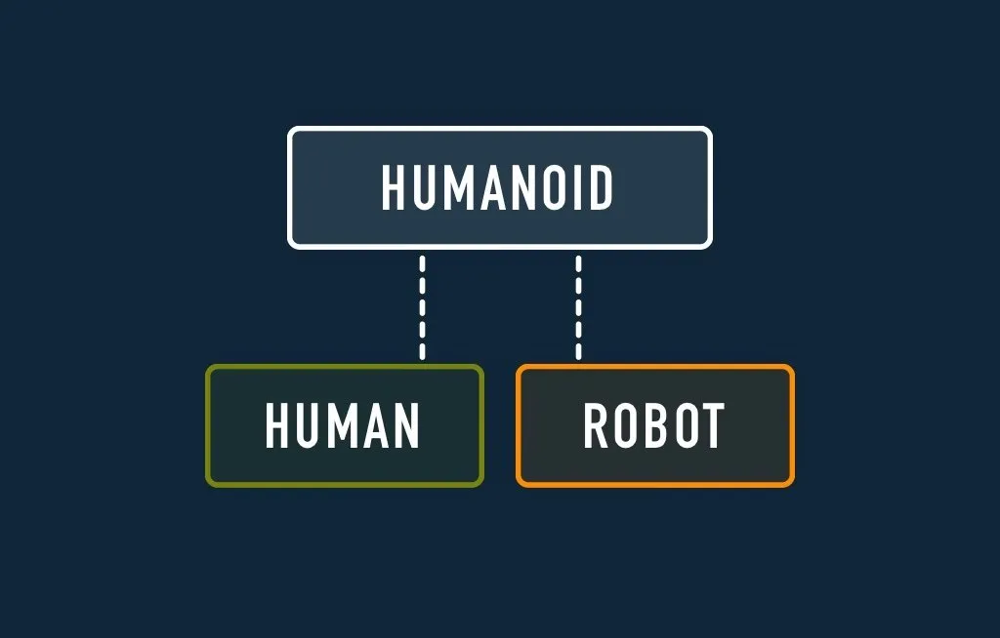
<p><em>VI: Inheritance cho phép các class khác nhau chia sẻ chức năng chung. / EN: Inheritance allows different classes to share common functionality.</em></p>

<div class="bilingual-row">
<div class="col-vi">
<p>Trong khi <strong>interface</strong> áp đặt hành vi chung dựa trên <em>script đó PHẢI LÀM ĐƯỢC GÌ</em>, thì <strong>inheritance</strong> định nghĩa hành vi của class dựa trên <em>NÓ LÀ GÌ</em>.</p>
<p>👉 Trong FSM, inheritance cho phép bạn <strong>đặt các hàm state cốt lõi (<code>OnEnter</code>, <code>OnUpdate</code>, <code>OnHurt</code>, <code>OnExit</code>) vào một base class <code>State</code></strong>.</p>
<p>Class này là <strong>Abstract</strong> — nghĩa là <em>không thể instantiate</em>; muốn dùng phải có class không-abstract kế thừa từ nó.</p>
<p>🔑 Vì các hàm cốt lõi được đánh dấu <strong>Virtual</strong>, mỗi state có <em>tùy chọn <strong>Override</strong></em> chúng — thay nội dung, cho phép <strong>thực thi logic khác nhau ở các state khác nhau, dùng CÙNG các trigger chung</strong>.</p>
<p>💡 Bạn có thể override <em>một hàm, tất cả, hoặc không cái nào</em>. Nếu hàm ở class con không override phiên bản base, thì <strong>method ở class cha được gọi thay thế</strong> — trong ví dụ này là rỗng, nên không có gì xảy ra.</p>
</div>
<div class="col-en">
<p>While <strong>interfaces</strong> enforce common behaviour based on <em>what the script is supposed to be able to DO</em>, <strong>inheritance</strong> defines a class's behaviour by <em>WHAT IT IS</em> instead.</p>
<p>👉 In a state machine, inheritance allows you to <strong>place core state functions (<code>OnEnter</code>, <code>OnUpdate</code>, <code>OnHurt</code>, <code>OnExit</code>) in a base <code>State</code> class</strong>.</p>
<p>The class is <strong>Abstract</strong> — meaning it <em>can't be instantiated</em>; to use it, a non-abstract class must derive from it.</p>
<p>🔑 Because the core functions are marked <strong>Virtual</strong>, each state has the <em>option of <strong>Overriding</strong></em> them, replacing their contents and allowing you to <strong>execute different logic in different states, using the SAME shared triggers</strong>.</p>
<p>💡 You can override <em>one function, all of them, or none</em>. If a child function does not override its base version, then <strong>the parent method is called instead</strong> — which in this example is empty, meaning nothing happens.</p>
</div>
</div>

```csharp
// Base State class — abstract + virtual
public abstract class State
{
    public virtual void OnEnter()  { }
    public virtual void OnUpdate() { }
    public virtual void OnHurt()   { }
    public virtual void OnExit()   { }
}

// Thay MonoBehaviour bằng tên class muốn kế thừa
public class PatrolState : State
{
    public override void OnEnter()
    {
        // Start animation
    }
    public override void OnUpdate()
    {
        // Patrol for player
    }
    // KHÔNG override OnHurt/OnExit ⇒ gọi bản base (rỗng) ⇒ không làm gì
}
```

```csharp
// State Controller — giữ sẵn instance của mọi state (tránh cấp phát runtime)
public class StateController : MonoBehaviour
{
    State currentState;

    public SleepState  sleepState  = new SleepState();
    public ChaseState  chaseState  = new ChaseState();
    public PatrolState patrolState = new PatrolState();
    public HurtState   hurtState   = new HurtState();

    private void Start()
    {
        ChangeState(patrolState);
    }

    void Update()
    {
        if (currentState != null)
        {
            currentState.OnUpdate();
        }
    }

    public void ChangeState(State newState)
    {
        if (currentState != null)
        {
            currentState.OnExit();
        }
        currentState = newState;
        currentState.OnEnter();
    }
}
```

### 24.4.1. 🔑 Khác biệt then chốt: Interface KHÔNG lưu được biến tham chiếu

<div class="bilingual-row">
<div class="col-vi">
<p>📄 <strong>Bước TRUNG GIAN gây ra cái bẫy</strong> — bản <code>State</code> đơn giản nhất, nơi mọi hàm đều <code>virtual</code>:</p>
</div>
<div class="col-en">
<p>📄 <strong>The intermediate step that creates the trap</strong> — the simplest <code>State</code>, where every method is <code>virtual</code>:</p>
</div>
</div>

```csharp
public class State
{
    public StateController sc;

    public virtual void OnEnter(StateController stateController)
    {
        sc = stateController;   // ⚠️ Nếu lớp con override mà QUÊN gọi base → sc = null
    }

    public virtual void OnUpdate() { }
    public virtual void OnHurt()   { }
    public virtual void OnExit()   { }
}
```

<div class="bilingual-row">
<div class="col-vi">
<p><em>"Giống như khi truyền tham chiếu cho state bằng interface, <strong>state controller có thể cung cấp tham chiếu tới CHÍNH NÓ bằng từ khoá <code>this</code></strong>, kiểu như: <code>currentState.OnEnter(this);</code> Các lớp DẪN XUẤT khi đó dùng được <strong>tham chiếu ĐÃ CACHE tới state controller</strong> […] mà KHÔNG phải truyền nó vào state như tham số trong MỌI hàm."</em></p>
</div>
<div class="col-en">
<p><em>"Just like when passing a reference to states using interfaces, the state controller can provide a reference to itself using the This keyword. Like this: <code>currentState.OnEnter(this);</code> Derived classes would then be able to use a cached reference to the state controller […] without having to pass it to the state as a parameter in every function."</em></p>
</div>
</div>

<div class="bilingual-row">
<div class="col-vi">
<p>✅ <strong>Bản SỬA ĐẦY ĐỦ — TÁCH HÀM cho cả BỐN cặp</strong> (tài liệu trước chỉ có cặp <code>OnStateEnter</code>/<code>OnEnter</code>):</p>
</div>
<div class="col-en">
<p>✅ <strong>The full fix — split methods for all four pairs:</strong></p>
</div>
</div>

```csharp
public abstract class State
{
    protected StateController sc;

    public void OnStateEnter(StateController stateController)
    {
        // Code placed here will always run
        sc = stateController;
        OnEnter();
    }
    protected virtual void OnEnter() { /* Code placed here can be overridden */ }

    public void OnStateUpdate()
    {
        // Code placed here will always run
        OnUpdate();
    }
    protected virtual void OnUpdate() { /* Code placed here can be overridden */ }

    public void OnStateHurt()
    {
        // Code placed here will always run
        OnHurt();
    }
    protected virtual void OnHurt() { /* Code placed here can be overridden */ }

    public void OnStateExit()
    {
        // Code placed here will always run
        OnExit();
    }
    protected virtual void OnExit() { /* Code placed here can be overridden */ }
}
```

<div class="bilingual-row">
<div class="col-vi">
<p>🔑 <strong>Vì sao <code>protected</code> mới là mấu chốt:</strong> <em>"Cách này hoạt động bằng cách tạo <strong>MỘT phiên bản của mỗi hàm cốt lõi cho state machine DÙNG, và MỘT phiên bản cho các state KẾ THỪA.</strong> Ví dụ <strong>OnStateEnter</strong> sẽ LUÔN được state controller gọi khi state đổi, và nó lần lượt kích hoạt hàm <strong>OnEnter</strong>. 🔒 <strong>Hàm OnEnter giờ là <code>protected</code>, nghĩa là CHỈ chính class đó, hoặc class DẪN XUẤT từ nó, mới truy cập được. Nghĩa là state machine KHÔNG THỂ gọi nhầm nó.</strong> Mặc định nó để TRỐNG, nên nếu lớp kế thừa KHÔNG override thì KHÔNG có gì xảy ra."</em></p>
</div>
<div class="col-en">
<p>🔑 <em>"This works by creating one version of each core function for the state machine to use and one version for the states to inherit from. On State Enter, for example, will always be called by the state controller when the state changes, which in turn, will trigger the On Enter function. The On Enter function is now Protected, meaning that only the same class, or classes that are derived from it, can access it. Meaning that the state machine can't call it by accident. By default, it's kept blank so that, if an inheriting class chooses not to override it, nothing happens."</em></p>
</div>
</div>


<div class="bilingual-row">
<div class="col-vi">
<blockquote>
<p><em>"Một trong những khác biệt CHÍNH giữa class kế thừa từ parent class và interface áp đặt chức năng là: <strong>parent class CÓ THỂ lưu một biến tham chiếu và tự động chia sẻ nó với các class dẫn xuất, còn interface thì KHÔNG.</strong>"</em></p>
</blockquote>
<p>👉 Điều này hữu ích để <strong>giữ tham chiếu tới State Controller</strong> đang chạy mỗi state — bằng cách lấy tham chiếu khi hàm <code>OnEnter</code> được gọi.</p>
<p>🚨 <strong>NHƯNG có một cái bẫy:</strong></p>
<p>Vì việc này xảy ra trong <em>phiên bản BASE</em> của <code>OnEnter</code>, <strong>nếu một state OVERRIDE nó (như nó thường phải làm), thì base method KHÔNG được gọi chút nào</strong> ⇒ <em>tham chiếu state controller sẽ KHÔNG được cache</em>.</p>
<p>Lý do: <strong>override một hàm ở class con nghĩa là nó được gọi THAY VÌ hàm cha, KHÔNG phải BỔ SUNG cho hàm cha.</strong></p>
</div>
<div class="col-en">
<blockquote>
<p><em>"One of the MAIN differences between a class that inherits from a parent class and an interface that enforces functionality is that <strong>a parent class CAN store a reference variable and share it with its derived classes automatically, while an interface CAN'T.</strong>"</em></p>
</blockquote>
<p>👉 This is useful for <strong>keeping a reference to the State Controller</strong> running each state — by getting a reference when <code>OnEnter</code> is called.</p>
<p>🚨 <strong>BUT there's a trap:</strong></p>
<p>Because this happens in the <em>BASE version</em> of <code>OnEnter</code>, <strong>if a state OVERRIDES it (as it may need to), then the base method won't be called at all</strong> ⇒ <em>the state controller reference won't be cached</em>.</p>
<p>The reason: <strong>overriding a function in a child class means it will be called INSTEAD OF its parent function, NOT in addition to it.</strong></p>
</div>
</div>

<div class="bilingual-row">
<div class="col-vi">
<p><strong>Giải pháp 1 — dùng từ khóa <code>base</code>:</strong></p>
<p>Có thể gọi <em>cả bản override VÀ bản base</em> bằng từ khóa <strong><code>base</code></strong> trong script kế thừa.</p>
<p>⚠️ Cách này hoạt động và là <em>cách thông thường</em>, nhưng <strong>có thể bất tiện khi phải gọi base function thủ công nếu bạn chỉ muốn chúng chạy tự động mỗi lần</strong>.</p>
<p><strong>Giải pháp 2 — TÁCH hàm base ra khỏi hàm mà class con kế thừa:</strong></p>
<p>Đây là mẫu thiết kế sạch hơn: state controller gọi <code>OnStateEnter</code> (không virtual, luôn chạy), hàm này làm việc bắt buộc rồi mới gọi <code>OnEnter</code> (virtual, cho con override).</p>
</div>
<div class="col-en">
<p><strong>Solution 1 — use the <code>base</code> keyword:</strong></p>
<p>It is possible to call <em>both the override version AND the base version</em> using the <strong><code>base</code></strong> keyword in the inheriting script.</p>
<p>⚠️ This works and is the <em>typical method</em>, but <strong>it may not be convenient to manually call base functions if you just want them to run automatically every time anyway</strong>.</p>
<p><strong>Solution 2 — SEPARATE the base function from the one child states inherit:</strong></p>
<p>This is the cleaner pattern: the state controller calls <code>OnStateEnter</code> (non-virtual, always runs), which does the mandatory work and then calls <code>OnEnter</code> (virtual, for children to override).</p>
</div>
</div>

```csharp
// Giải pháp 1 — từ khóa base: gọi CẢ HAI phiên bản
public class ChaseState : VulnerableState
{
    public override void OnEnter()
    {
        base.OnEnter();
        // Calls this function AND the function it overrides
    }
}
```

```csharp
// Giải pháp 2 — tách hàm: code trong OnStateEnter LUÔN chạy, không thể bị bỏ qua
public abstract class State
{
    protected StateController sc;

    // KHÔNG virtual ⇒ con không override được ⇒ luôn chạy
    public void OnStateEnter(StateController stateController)
    {
        // Code đặt ở đây sẽ LUÔN chạy
        sc = stateController;
        OnEnter();       // rồi mới gọi phần con được phép override
    }

    protected virtual void OnEnter() { }
}
```

## 24.5. Cách 3 — HIERARCHICAL State Machine

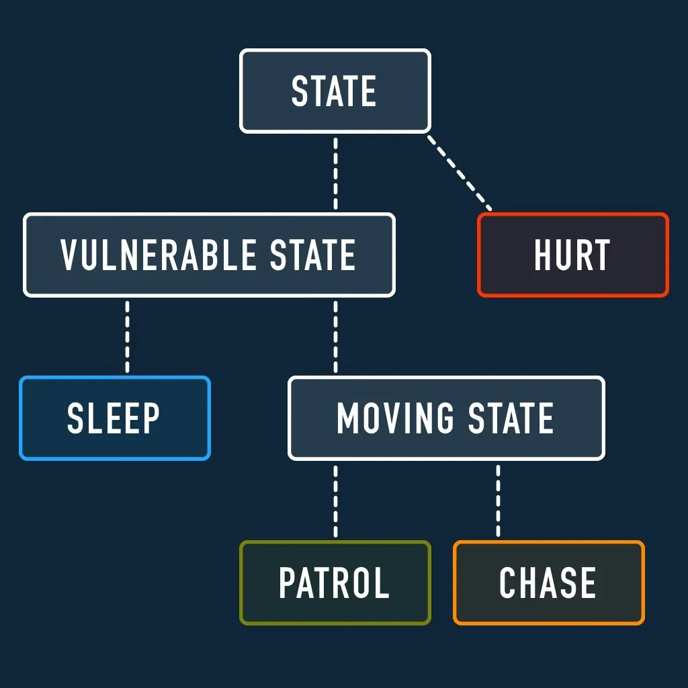
<p><em>VI: Hierarchical State Machine cho phép nhóm các hành vi chung lại với nhau. / EN: Hierarchical State Machines allow you to group common behaviours together.</em></p>

<div class="bilingual-row">
<div class="col-vi">
<p><strong>Hierarchical State Machine</strong> về cơ bản là <em>FSM dựa trên inheritance, NHƯNG có thêm các TẦNG</em>.</p>
<p>👉 Chúng cho phép bạn tạo một <strong>Super-State</strong> — kế thừa từ base state, nhưng bản thân nó cũng có thể là <strong>cha của nhiều Sub-State</strong>.</p>
<p>💡 <strong>Lợi ích:</strong> Bạn <em>đặt chức năng chung cho một nhóm state vào MỘT chỗ</em>, rồi các state riêng lẻ chỉ cần kế thừa từ đó.</p>
<p><strong>Ví dụ 2 tầng:</strong></p>
<ul>
<li>Tầng 1 — <strong><code>VulnerableState</code></strong>: dẫn xuất Patrol, Chase và Sleep từ đây, vì object <em>có thể bị sát thương ở BẤT KỲ state nào trong ba</em>, khiến nó chuyển sang <strong>Hurt State</strong>.</li>
<li>Tầng 2 — <strong><code>MovingState</code></strong>: nhóm tiếp Patrol và Chase vào đây, vì <em>chức năng giống nhau có khả năng áp dụng cho cả hai</em>; rồi cho cả hai kế thừa từ <code>VulnerableState</code>.</li>
</ul>
<p>🚨 <strong>CẢNH BÁO quan trọng:</strong></p>
<blockquote>
<p><em>"Khác với base state class đầu tiên — nơi state controller chịu trách nhiệm kích hoạt một tập hàm cốt lõi biệt lập (nghĩa là chúng KHÔNG thể bị override) — <strong>các state kế thừa từ một hoặc nhiều parent state nhìn chung KHÔNG thể thiết lập theo cách đó</strong>.</em></p>
<p><em>Nghĩa là: vì <strong>mỗi tầng đang override hàm của tầng trước</strong>, nên <strong>quan trọng là phải gọi hàm cốt lõi ở tầng trước bằng <code>base</code></strong>, nếu bạn muốn chúng cũng được kích hoạt."</em></p>
</blockquote>
</div>
<div class="col-en">
<p><strong>Hierarchical State Machines</strong> are basically <em>inheritance-based state machines, BUT with extra LAYERS</em>.</p>
<p>👉 They allow you to create a <strong>Super-State</strong> that inherits from the base state, but that may also itself be a <strong>parent to multiple Sub-States</strong>.</p>
<p>💡 <strong>The benefit:</strong> you can <em>place functionality common to a number of states in ONE place</em>, and then have those individual states simply inherit from that.</p>
<p><strong>A two-layer example:</strong></p>
<ul>
<li>Layer 1 — <strong><code>VulnerableState</code></strong>: derive Patrol, Chase and Sleep from it, since the object <em>can be damaged in ANY of these states</em>, causing a transition to the <strong>Hurt State</strong>.</li>
<li>Layer 2 — <strong><code>MovingState</code></strong>: further group Patrol and Chase here, since <em>the same functionality is likely to apply to both</em>; then have both inherit from <code>VulnerableState</code>.</li>
</ul>
<p>🚨 <strong>Important WARNING:</strong></p>
<blockquote>
<p><em>"Unlike the very first base state class — where the state controller was responsible for triggering an isolated set of core functions, meaning they COULDN'T be overridden — <strong>states that inherit from one or more parent states generally CAN'T be set up in this way</strong>.</em></p>
<p><em>Meaning that, because <strong>each layer is overriding the function of the previous layer</strong>, it's <strong>important to call the core functions on the previous layer using <code>base</code></strong>, if you want them to trigger as well."</em></p>
</blockquote>
</div>
</div>

```csharp
// Tầng 1 — Super-State: gom hành vi "có thể bị thương"
public abstract class VulnerableState : State
{
    protected override void OnHurt()
    {
        sc.ChangeState(sc.hurtState);
    }
}

// Tầng 2 — gom tiếp hành vi "đang di chuyển"
public class MovingState : VulnerableState
{
    protected override void OnUpdate()
    {
        base.OnUpdate();      // ⚠️ BẮT BUỘC gọi base — mỗi tầng đang override tầng trước
        Debug.Log("Move!");
    }
}

// Tầng 3 — state cụ thể
// PatrolState : MovingState  →  MovingState : VulnerableState  →  VulnerableState : State
```

!!! warning "Lời cảnh báo cuối của tác giả"
    <div class="bilingual-row">
    <div class="col-vi">
    <p><em>"Hierarchical state machine có thể cực kỳ hữu ích để tổ chức logic trong script của game thành các nhóm và tầng hợp lý. <strong>Tuy nhiên, dù điều này cực kỳ hữu ích trong hoàn cảnh đúng, hierarchical state machine — và state machine nói chung — RẤT DỄ trở nên phức tạp hơn mức đáng.</strong></em></p>
    <p><em>Nhìn chung, <strong>chỉ có một SỐ LƯỢNG GIỚI HẠN use case mà state machine thực sự hữu ích</strong>, và nếu bạn cố ép logic game vào một cái khi nó không phù hợp, thì <strong>hoàn toàn có khả năng game của bạn sẽ KHÓ làm việc hơn so với lúc bắt đầu.</strong>"</em></p>
    </div>
    <div class="col-en">
    <p><em>"Hierarchical state machines can be extremely useful for organising the logic in your game's scripts into sensible groups and layers. <strong>However, while this can be extremely useful in the right circumstances, hierarchical state machines — and state machines in general — can EASILY become more complicated than they're worth.</strong></em></p>
    <p><em>Generally speaking, there are a <strong>LIMITED number of use cases in which a state machine is genuinely helpful</strong>, and if you try to force your game's logic into one when it's not a good fit, then <strong>it's entirely possible that your game will be HARDER to work with than when you started.</strong>"</em></p>
    </div>
    </div>

## 24.6. Ba asset State Machine có sẵn

<div class="bilingual-row">
<div class="col-vi">
<p><em>"Với một số vấn đề, việc tự tạo hệ thống state machine đơn giản là KHÔNG hợp lý, khi đã có sẵn giải pháp làm sẵn."</em></p>
</div>
<div class="col-en">
<p><em>"For some problems, it just doesn't make sense to create your own state machine system, when there may be a ready-made alternative available."</em></p>
</div>
</div>

| Asset | Điểm mạnh / Strength | Ghi chú |
|---|---|---|
| **PlayMaker** | ⚡ **Tuyệt vời cho kết quả NHANH** | Dùng state machine để điều khiển Unity. Kết hợp state machine mạnh với hệ thống **Actions** đa dạng — các phần tử hành vi cho phép điều khiển Unity làm gì và khi nào. ⚠️ Có thể **giới hạn nếu action bạn cần không có sẵn**, nhưng được dùng rộng rãi, hỗ trợ tốt, và **cực nhanh để làm việc** |
| **Unity Animator** | 🎬 **Bắt buộc cho animation** | Cho phép xây state machine **phức tạp, nhiều tầng**. Lý tưởng cho animation, cho phép kích hoạt và chuyển tiếp giữa nhiều animation state qua giao diện trực quan tương đối đơn giản. 💡 **Cách dùng điển hình:** để Animator *phản hồi thụ động* với hành vi từ script — một **số ÍT logical state** điều khiển một **số NHIỀU animation state** thông qua **Parameters** |
| **Node Canvas** | 🌳 **State machine + hơn thế** | Ngoài state machine, còn cung cấp công cụ tạo **Behaviour Trees** và **Dialogue Trees** — cực hữu ích để xây AI hoặc xử lý bất kỳ logic hội thoại nào trong game |

---

## 25. ⚡ C# event vs UnityEvent — Benchmark đầy đủ

<div class="bilingual-row">
<div class="col-vi">
<p><strong>Nguồn:</strong> Jackson Dunstan, 25/01/2016. <em>"Lập trình viên Unity có 2 lựa chọn cho event: dùng keyword <code>event</code> dựng sẵn của C# hoặc các lớp <code>UnityEvent</code> của Unity. Cái nào nhanh hơn? Cái nào tạo nhiều rác hơn?"</em></p>
<p><strong>Điểm kỳ quặc của UnityEvent:</strong> yêu cầu bạn <em>tự tạo một lớp kế thừa <code>UnityEvent</code></em>. Bạn có thể bỏ qua bước này nếu <em>không có tham số nào</em>. Nếu có, bạn phải tạo các lớp <strong><code>[Serializable]</code> RỖNG cho MỖI event</strong>.</p>
</div>
<div class="col-en">
<p><strong>Source:</strong> Jackson Dunstan, Jan 25 2016. <em>"Unity programmers have their choice of two kinds of events: the built-in C# <code>event</code> keyword or Unity's <code>UnityEvent</code> classes. Which is faster? Which one creates more garbage?"</em></p>
<p><strong>UnityEvent's strange part:</strong> the requirement that you <em>create your own class extending <code>UnityEvent</code></em>. You can skip this if you have <em>no parameters</em>. Otherwise you end up making <strong>empty <code>[Serializable]</code> classes for EACH event</strong>.</p>
</div>
</div>

```csharp
// ① C# event — đơn giản, dựng sẵn trong ngôn ngữ
class MyClass
{
    // Khai báo event để user thêm listener
    event Action<int,int> OnClick;

    void Foo()
    {
        OnClick.Invoke(11, 22);   // gọi Invoke()
        OnClick(11, 22);          // hoặc gọi như một hàm
    }
}
var myc = new MyClass();
myc.OnClick += (x, y) => Debug.LogFormat("clicked at {0}, {0}", x, y);   // dùng +=
```

```csharp
// ② UnityEvent — phải tạo lớp con [Serializable] cho MỖI chữ ký tham số
using UnityEngine.Events;

[Serializable]
class Int2Event : UnityEvent<int, int> { }   // ⚠️ lớp RỖNG, chỉ để serialize được

class MyClass
{
    Int2Event OnClick = new Int2Event();

    void Foo()
    {
        OnClick.Invoke(11, 22);   // CHỈ có Invoke()
    }
}
var myc = new MyClass();
myc.OnClick.AddListener((x, y) => Debug.LogFormat("clicked at {0}, {0}", x, y));
```

### 25.1. 📊 Kết quả 1 — GC Alloc khi THÊM listener

| Num Listeners | **C# Event** Total GC Alloc | **UnityEvent** Total GC Alloc | Kẻ thắng |
|---|---|---|---|
| **1** | **104 B** | 192 B | ✅ C# event |
| **2** | 416 B | **320 B** | ✅ UnityEvent |
| **3** | 812 B | **448 B** | ✅ UnityEvent |
| **4** | 1332 B | **576 B** | ✅ UnityEvent |

<div class="bilingual-row">
<div class="col-vi">
<p><strong>Kết luận của tác giả:</strong> <em>"C# event bắt đầu cấp phát ÍT rác hơn UnityEvent, nhưng bắt đầu cấp phát NHIỀU hơn ngay khi bạn thêm listener thứ hai. Khoảng cách nới rộng dần khi thêm listener, nhưng các trường hợp đó ít gặp hơn trong lập trình thực tế."</em></p>
<p>👉 <strong>Nếu bạn thường có 0 hoặc 1 listener → C# event tạo ít rác hơn. Nếu nhiều hơn → UnityEvent cấp phát ít rác hơn.</strong></p>
</div>
<div class="col-en">
<p><strong>The author's conclusion:</strong> <em>"C# events start out allocating less garbage than UnityEvent, but start allocating more as soon as you add a second listener. The gap widens more and more as you add more listeners, but those cases are less frequent in real-world programming."</em></p>
<p>👉 <strong>If you typically have zero or one listeners, C# events create less garbage. If you have more, then UnityEvent will allocate less garbage.</strong></p>
</div>
</div>

### 25.2. 🏆 Kết quả 2 — GC Alloc khi DISPATCH (quan trọng nhất)

!!! success "Kết quả quyết định"
    <div class="bilingual-row">
    <div class="col-vi">
    <p><strong>"Khi dispatch, C# event KHÔNG tạo ra rác NÀO CẢ, còn UnityEvent tạo ra 136 bytes. C# event là kẻ thắng rõ ràng ở khoản này."</strong></p>
    <p>🚨 <strong>ĐÍNH CHÍNH của chính tác giả — in đậm ngay trong bài:</strong> <em>"<strong>Update: UnityEvent CHỈ tạo rác ở LẦN DISPATCH ĐẦU TIÊN. Các lần dispatch SAU ĐÓ KHÔNG tạo rác.</strong>"</em></p>
    <p>🔑 <strong>Vậy con số 136 B nghĩa là gì:</strong> đó là chi phí <strong>MỘT LẦN cho mỗi UnityEvent</strong>, không phải chi phí mỗi frame. Nó <strong>KHÔNG</strong> nhân lên theo số lần dispatch. ⚠️ Vẫn cần lưu ý ở hai chỗ: (a) scene có <strong>HÀNG NGHÌN</strong> UnityEvent thì tổng chi phí khởi tạo vẫn đáng kể, và (b) nếu bạn <strong>tạo mới UnityEvent lúc chạy</strong> (ví dụ spawn liên tục), mỗi cái lại trả 136 B lần đầu.</p>
    <p>💡 Lý do thực sự nên chọn C# event ở hot path <strong>không còn là rác</strong> mà là <strong>TỐC ĐỘ</strong> — xem bảng benchmark bên dưới.</p>
    </div>
    <div class="col-en">
    <p><strong>"When dispatched, C# events create no garbage whatsoever but UnityEvent creates 136 bytes. C# events are the clear winner in this regard."</strong></p>
    <p>🚨 <strong>The author's own correction, bolded in the article:</strong> <em>"<strong>Update: UnityEvent only creates garbage on the first dispatch. Subsequent dispatches create no garbage.</strong>"</em></p>
    <p>🔑 So the 136 B is a <strong>one-time cost per UnityEvent</strong>, not a per-frame cost. It does <strong>not</strong> multiply by dispatch count. Two cases still matter: (a) a scene with <strong>thousands</strong> of UnityEvents still pays that setup cost in aggregate, and (b) UnityEvents <strong>created at runtime</strong> each pay 136 B on their first dispatch.</p>
    <p>💡 The real reason to prefer C# events on hot paths is <strong>speed</strong>, not garbage.</p>
    </div>
    </div>

### 25.3. ⏱️ Kết quả 3 — Tốc độ dispatch (10 triệu lần gọi, đơn vị ms)

| Num Args | Num Listeners | **C# Event** | **UnityEvent** | Chênh lệch |
|---|---|---|---|---|
| **0** | 1 | **30** | 206 | **6.9×** |
| 0 | 2 | 89 | 306 | 3.4× |
| 0 | 3 | 151 | 406 | 2.7× |
| 0 | 4 | 206 | 514 | 2.5× |
| 0 | 5 | 272 | 612 | 2.3× |
| **1** | 1 | **33** | 685 | **20.8×** |
| 1 | 2 | 91 | 807 | 8.9× |
| 1 | 3 | 151 | 980 | 6.5× |
| 1 | 4 | 212 | 1096 | 5.2× |
| 1 | 5 | 274 | 1224 | 4.5× |
| **2** | 1 | **30** | 1187 | **39.6×** |
| 2 | 2 | 102 | 1371 | 13.4× |
| 2 | 3 | 172 | 1547 | 9.0× |
| 2 | 4 | 226 | 1709 | 7.6× |
| 2 | 5 | 296 | 1879 | 6.3× |

<div class="bilingual-row">
<div class="col-vi">
<p>🔍 <strong>Đọc bảng:</strong> Chênh lệch <em>tệ nhất</em> là <strong>2 tham số, 1 listener: UnityEvent chậm hơn ~39.6 lần</strong>. Xu hướng rõ: <strong>càng nhiều tham số, UnityEvent càng đắt tương đối</strong> — vì nó phải đóng gói tham số qua cơ chế serialize/reflection.</p>
<p>⚖️ <strong>Nhưng đặt trong bối cảnh — phản biện từ phần bình luận (và tác giả đồng ý một phần):</strong></p>
<blockquote>
<p><em>"Nếu mất 206ms để invoke một UnityEvent 10 TRIỆU lần, thì mỗi lần invoke tốn ~0.0000206 ms. Nói cách khác, ta phải invoke event ~<strong>48.544 lần trong MỘT frame</strong> để lãng phí 1ms CPU. Trừ khi bạn invoke hàng chục nghìn Unity event MỖI FRAME (mà nếu vậy thì bạn có vấn đề lớn hơn nhiều rồi!), chênh lệch hiệu năng không đáng kể."</em></p>
</blockquote>
<p><strong>Phản hồi của tác giả — vẫn có ngữ cảnh đáng lo:</strong></p>
<blockquote>
<p><em>"Tôi đồng ý rằng chênh lệch trên CPU này với 0 tham số và 1 listener là không đáng kể với hầu hết game. TUY NHIÊN, nếu lấy con số <strong>2 tham số và 5 listener</strong> thì cần <strong>8.425 lần invoke để ngốn 1ms</strong>.</em></p>
<p><em>Vào thời điểm bài viết ra đời (5 năm trước), Samsung Galaxy S6 là flagship Android điển hình, và các dev hỗ trợ cả những máy như Galaxy S4. CPU dùng trong bài test có điểm Geekbench đơn nhân là <strong>689</strong>, còn Galaxy S4 là <strong>151</strong>. Áp dụng chênh lệch ~<strong>4.5×</strong> đó cho ta <strong>1.846 lần invoke cho 1ms</strong>. Vẫn là rất nhiều, nhưng nó CÓ THỂ chiếm vài phần trăm CPU time của một frame với game đủ phức tạp phụ thuộc nhiều vào event dispatching."</em></p>
</blockquote>
</div>
<div class="col-en">
<p>🔍 <strong>Reading the table:</strong> The <em>worst</em> gap is <strong>2 args, 1 listener: UnityEvent is ~39.6× slower</strong>. Clear trend: <strong>the more arguments, the relatively more expensive UnityEvent gets</strong> — because it must marshal arguments through serialization/reflection.</p>
<p>⚖️ <strong>But in context — a rebuttal from the comments (which the author partly accepts):</strong></p>
<blockquote>
<p><em>"If it takes 206ms to invoke a UnityEvent 10 MILLION times, that means each invocation takes ~0.0000206 ms. In other words, we would have to invoke the event ~<strong>48,544 times in one frame</strong> to waste 1ms of CPU time. Unless you're invoking tens of thousands of Unity events EVERY FRAME (in which case you likely have bigger problems!), the difference in performance cost doesn't matter."</em></p>
</blockquote>
<p><strong>The author's response — there is still a worrying context:</strong></p>
<blockquote>
<p><em>"I agree that the difference on this CPU with 0 arguments and 1 listener is negligible for most games. However, if you take the <strong>2 arguments and 5 listeners</strong> number then <strong>8,425 invocations are needed to eat up 1ms</strong>.</em></p>
<p><em>At the time this article was written five years ago, the Samsung Galaxy S6 was a typical flagship Android device with developers supporting devices like the Galaxy S4. The CPU used in the article's test has a single-core Geekbench score of <strong>689</strong> while the Galaxy S4 has <strong>151</strong>. Applying that ~<strong>4.5×</strong> difference gives us <strong>1,846 invocations per 1ms</strong>. That's still a lot, but it may represent a few percent of a frame's CPU time for a sufficiently complex game that relies heavily on event dispatching."</em></p>
</blockquote>
</div>
</div>

---

### 25.3b. 🔄 Chạy lại năm 2023 trên Unity 2021.3 — kết luận 2016 đã LỖI THỜI

<div class="bilingual-row">
<div class="col-vi">
<p>💬 <strong>Comment #39, Ivan, 12/02/2023:</strong> <em>"Tôi quyết định CHẠY LẠI test trên MacBook năm 2023 xem còn đúng không, và có vẻ vẫn đúng :) <strong>Khác biệt ĐẶC BIỆT RÕ (UnityEvent chậm hơn 8–9 lần) khi CHỈ CÓ MỘT listener.</strong>"</em></p>
<p>🖥️ Cấu hình: <strong>2.3 GHz 8-core i9 · macOS Monterey 12.4 · Unity 2021.3.10f1</strong>, Mac OS X Standalone, intel 64-bit only, non-development, 640×480 Fastest Windowed.</p>
</div>
<div class="col-en">
<p>💬 <strong>Comment #39, Ivan, Feb 12 2023:</strong> <em>"I've decided to re-run the tests on my MacBook in 2023 to see if it still holds, and it looks like it does :) It looks like the difference is especially evident (UnityEvents are 8-9 times slower) when there is just one listener."</em></p>
</div>
</div>

| Num Args | Num Listeners | C# Event | UnityEvent | Tỷ lệ |
|---:|---:|---:|---:|---:|
| 0 | 1 | 17 | 152 | **8,9×** |
| 0 | 2 | 62 | 241 | 3,9× |
| 0 | 3 | 84 | 339 | 4,0× |
| 0 | 4 | 94 | 396 | 4,2× |
| 0 | 5 | 109 | 477 | 4,4× |
| 1 | 1 | 18 | 146 | **8,1×** |
| 1 | 2 | 61 | 226 | 3,7× |
| 1 | 3 | 77 | 306 | 4,0× |
| 1 | 4 | 96 | 380 | 4,0× |
| 1 | 5 | 113 | 464 | 4,1× |
| 2 | 1 | 19 | 151 | **7,9×** |
| 2 | 2 | 59 | 231 | 3,9× |
| 2 | 3 | 77 | 312 | 4,1× |
| 2 | 4 | 96 | 395 | 4,1× |
| 2 | 5 | 115 | 475 | 4,1× |

!!! warning "🚨 So sánh với bảng 2016 ở §25.3 — MỘT kết luận đã KHÔNG còn đúng"
    <div class="bilingual-row">
    <div class="col-vi">
    <p>Ở <strong>Unity 5.3.1 (2016)</strong>, UnityEvent với 1 listener tốn <strong>206 ms (0 args) → 685 ms (1 arg) → 1187 ms (2 args)</strong> — tức <strong>càng NHIỀU THAM SỐ càng ĐẮT</strong>, gấp gần 6 lần.</p>
    <p>Ở <strong>Unity 2021.3 (2023)</strong>, cùng phép đo cho <strong>152 / 146 / 151</strong> — <strong>hiệu ứng đó GẦN NHƯ BIẾN MẤT.</strong></p>
    <p>👉 <strong>Đừng dùng lập luận "tránh UnityEvent nhiều tham số" nữa.</strong> Lý do chọn C# event vẫn còn, nhưng là <strong>chênh lệch nền ~4× (và ~8× khi chỉ có 1 listener)</strong>, không phải vì số tham số.</p>
    </div>
    <div class="col-en">
    <p>On <strong>Unity 5.3.1 (2016)</strong> a single-listener UnityEvent cost <strong>206 / 685 / 1187 ms</strong> for 0/1/2 args — cost grew sharply with argument count. On <strong>Unity 2021.3 (2023)</strong> the same measurement gives <strong>152 / 146 / 151</strong> — that effect is essentially gone.</p>
    <p>👉 The "avoid UnityEvents with many parameters" argument no longer holds. The remaining gap is a <strong>flat ~4× (≈8× with a single listener)</strong>.</p>
    </div>
    </div>

### 25.3c. 🧪 Mono vs IL2CPP — và cái BẪY đo GC trong Editor

<div class="bilingual-row">
<div class="col-vi">
<p>💬 <strong>Comment #21, Justin Wasilenko, 10/12/2018</strong> — Windows Standalone 640×480, Fastest, Windowed, <strong>Unity 2018.3.0f1</strong>:</p>
<ul>
<li><strong>Mono:</strong> C# event <strong>178</strong> ticks · UnityEvent <strong>1482</strong> ticks — <strong>8,3×</strong></li>
<li><strong>IL2CPP:</strong> C# event <strong>506</strong> ticks · UnityEvent <strong>1577</strong> ticks — <strong>3,1×</strong></li>
</ul>
<p>🔑 <strong>Đọc con số này thế nào:</strong> IL2CPP làm <strong>C# event CHẬM ĐI ~2,8×</strong> trong khi UnityEvent gần như KHÔNG đổi ⇒ <strong>khoảng cách THU HẸP từ 8,3× xuống 3,1×</strong>. Nghĩa là lợi thế của C# event <strong>NHỎ HƠN trên build IL2CPP</strong> — đúng thứ bạn dùng để ship mobile/console.</p>
</div>
<div class="col-en">
<p>💬 <strong>Comment #21, Justin Wasilenko, Dec 10 2018</strong> — Windows Standalone 640×480, Fastest, Windowed, Unity 2018.3.0f1:</p>
<ul>
<li><strong>Mono:</strong> C# event 178 ticks · UnityEvent 1482 ticks — 8.3×</li>
<li><strong>IL2CPP:</strong> C# event 506 ticks · UnityEvent 1577 ticks — 3.1×</li>
</ul>
<p>🔑 IL2CPP slows C# events ~2.8× while UnityEvent barely changes ⇒ the gap narrows from 8.3× to 3.1× on exactly the backend you ship with.</p>
</div>
</div>

!!! danger "💀 ĐỪNG TIN số GC Alloc đo trong EDITOR"
    <div class="bilingual-row">
    <div class="col-vi">
    <p>💬 <strong>Comment #40, Noam, 18/03/2025 (Unity 2022.3.28):</strong> <em>"Tôi muốn chỉ ra rằng chuyện <strong>0 GC sau lần dispatch đầu HOÀN TOÀN KHÔNG ĐÚNG với event có PERSISTENT LISTENER</strong> (tức gán từ Inspector)…"</em></p>
    <p><em>"<strong>TRONG EDITOR</strong>, khi dispatch mỗi frame một lần, <strong>lần dispatch đầu cấp phát ÍT NHẤT 0,9 KB rác</strong> kể cả với UnityEvent cơ bản, <strong>lần thứ hai ít nhất khoảng 496 byte</strong>, và sau đó <strong>cứ mỗi ~1–6 frame lại cấp phát 0,5–0,7 KB</strong>, xen kẽ những frame bằng 0."</em></p>
    <p>✅ <em>"<strong>NHƯNG tôi đã tạo một dev build, và các event QUẢ THỰC KHÔNG cấp phát rác gì cả</strong> — dù Autoconnect Profiler hơi lỗi: profiler không hiện frame cho tới khi bạn tắt/bật lại nút Record."</em></p>
    <p>🎯 <strong>Bài học cho Junior:</strong> mọi con số GC Alloc bạn thấy trong Editor đều <strong>NHIỄM chi phí của chính Editor</strong>. Muốn kết luận về rác thì <strong>PHẢI đo trên development build chạy trên thiết bị.</strong></p>
    </div>
    <div class="col-en">
    <p>💬 <strong>Comment #40, Noam, Mar 18 2025 (Unity 2022.3.28):</strong> <em>"the 0 gc after the first dispatch was not true at all for events with persistent listeners (i.e. from the inspector)… In the Editor it seems that, with dispatching the events once per frame, the first dispatch allocates at least 0.9kb garbage even for the base UnityEvent, the second dispatch allocates at least about 496 bytes, and after that every ~1-6 frames, it again allocates the same 0.5-0.7kb, and 0 in the frames in between."</em></p>
    <p>✅ <em>"But I made a dev build… the events are indeed consistently not allocating any garbage."</em></p>
    <p>🎯 <strong>Takeaway:</strong> GC Alloc numbers read in the Editor are contaminated by the Editor itself. Conclude about garbage only from a development build on device.</p>
    </div>
    </div>


### 25.4. 🧭 Khuyến nghị chọn lựa

| Tình huống | Nên dùng | Lý do |
|---|---|---|
| Event **dispatch mỗi frame** trong gameplay | ✅ **C# event** | Nhanh hơn nhiều lần. *(Về rác: UnityEvent chỉ tốn 136 B ở **lần dispatch ĐẦU TIÊN**, các lần sau 0 B — xem đính chính ở §25.2)* |
| Event có **nhiều tham số** | ✅ **C# event** | Chênh lệch tốc độ lên tới **~39.6×** |
| Cần **designer gán listener trong Inspector** | ✅ **UnityEvent** | C# event không serialize được ra Inspector |
| Event chỉ chạy **lúc chuyển scene / UI click** | Cả hai đều được | Tần suất thấp ⇒ chênh lệch không đáng kể |
| **Nhiều listener, đăng ký một lần lúc init** | UnityEvent nhỉnh hơn về alloc lúc đăng ký | Nhưng vẫn thua khi dispatch |

!!! tip "Mô hình lai được đề xuất trong phần bình luận"
    **VI:** Một độc giả đề xuất: dùng **UnityEvent thuần túy như tiện ích ĐỒ HỌA** (để designer thấy danh sách thao tác trong Inspector), rồi dùng **Reflection ở `Awake`/`OnEnable` để chuyển các Persistent Listener của UnityEvent thành delegate MỘT LẦN**. Tác giả cảnh báo: *"Có thể tốn kém, đặc biệt về GC allocation, nếu bạn có nhiều event."* Phương án lai khác: **tự viết Inspector UI riêng, backed bằng C# event thay vì UnityEvent.**

    **EN:** A reader proposed: use **UnityEvents purely as a GRAPHICAL convenience** (so designers see the operation list in the Inspector), then use **Reflection in `Awake`/`OnEnable` to convert the UnityEvent's Persistent Listeners to delegates ONCE**. The author cautions: *"There may be a high cost, especially in terms of GC allocations, if you have a lot of events."* Another hybrid: **build your own Inspector UI backed by C# events instead of UnityEvent.**

---

### 25.5. 🧩 Bốn khác biệt HÀNH VI (không phải hiệu năng) — từ phần comment

<div class="bilingual-row">
<div class="col-vi">
<p>⚠️ Bốn điểm dưới đây nằm trong <strong>phần bình luận</strong> của bài gốc, không có trong thân bài. Chúng là <strong>khác biệt về HÀNH VI</strong> — quan trọng không kém con số benchmark.</p>
</div>
<div class="col-en">
<p>⚠️ These four points live in the article's <strong>comment thread</strong>, not the body. They are <strong>behavioural</strong> differences.</p>
</div>
</div>

| # | Khác biệt | Nguyên văn |
|---|---|---|
| **①** | **Đăng ký TRÙNG cùng một callback** | *(comment #28, xavier)* — *"Một khác biệt: đăng ký NHIỀU LẦN cùng một instance callback. **C# sẽ gọi callback đó NHIỀU LẦN. Unity CHỈ gọi MỘT LẦN.** Có thể hữu ích khi xử lý start/enable/destroy/disable có điều kiện của script."* |
| **②** | 💀 **UnityEvent KHÔNG giữ weak reference** | *(chuỗi #13 → #14 → #15)* — #13 Arun tưởng *"không cần unsubscribe vì UnityEvent chỉ giữ weak reference"*; #14 Adriano phản bác: *"Tài liệu nói RÕ rằng tham chiếu tới listener KHÔNG phải weak"*; #15 Julian dẫn nguyên văn Unity Manual: **"`UnityEvents` có giới hạn TƯƠNG TỰ delegate chuẩn. Tức là chúng GIỮ tham chiếu tới đối tượng đích, và điều này NGĂN đối tượng đó bị garbage collect."** |
| **③** | **Persistent Listener chạy bằng REFLECTION** | *(comment #8, oj)* — *"Để dùng được trong Editor, Unity Event PHẢI được SERIALIZE (điều này giải thích vì sao bạn phải tạo class DẪN XUẤT — serializer KHÔNG hỗ trợ field generic). Nên tôi nghĩ với **Editor (Persistent) Event Listener thì THAM CHIẾU object đích và METHOD INFO được serialize rồi gọi qua REFLECTION** khi event được invoke, còn khi thêm bằng CODE thì chỉ là một **delegate** được đăng ký."* |
| **④** | **Có sẵn asset giải bài toán "lai"** | *(comment #33, Georgios Adamopoulos)* — *"Tôi nghĩ Thor Brigsted đã làm đúng như vậy rồi!"* → <code>github.com/Siccity/SerializableCallback</code> |

!!! danger "💀 Hệ quả của ② — cái bẫy rò rỉ mà Junior hay dính"
    <div class="bilingual-row">
    <div class="col-vi">
    <p>Rất nhiều người chọn <strong>UnityEvent</strong> vì tin rằng <em>"dùng UnityEvent thì khỏi cần <code>RemoveListener</code>"</em>. <strong>ĐIỀU ĐÓ SAI.</strong> UnityEvent giữ tham chiếu MẠNH y như C# event ⇒ quên gỡ listener thì object đích <strong>KHÔNG BAO GIỜ được GC</strong>. Quy tắc đối xứng vẫn áp dụng: <strong>mỗi <code>AddListener</code> phải có một <code>RemoveListener</code>.</strong></p>
    </div>
    <div class="col-en">
    <p>Many people pick UnityEvent believing they don't need <code>RemoveListener</code>. <strong>That is false.</strong> UnityEvent holds strong references just like a C# event, so a forgotten listener keeps its target alive forever. The symmetry rule still applies.</p>
    </div>
    </div>

!!! warning "⚠️ Hệ quả của ③ — ba bảng benchmark ở §25 đo cái GÌ"
    <div class="bilingual-row">
    <div class="col-vi">
    <p>Cả ba bảng đều đo <strong>listener thêm bằng CODE</strong> (tức delegate). <strong>Listener gán trong INSPECTOR (persistent) đi qua REFLECTION và có thể còn ĐẮT HƠN NỮA</strong> — bài viết <strong>KHÔNG đo</strong> trường hợp đó. Nên nếu bạn nối event bằng Inspector, đừng lấy con số ở đây làm chuẩn.</p>
    <p>📋 <strong>Cấu hình máy của bảng §25.3</strong> (để bạn tự chạy lại): <strong>2.3 GHz Intel Core i7-3615QM · macOS 10.11.2 · Apple SSD SM256E (HFS+) · Unity 5.3.1f1 Mac OS X Standalone x86_64 non-development · 640×480 Fastest Windowed</strong>. Cách chạy lại: dán code vào <code>TestScript.cs</code> trong <code>Assets</code>, gắn vào main camera của một project TRỐNG, build <strong>non-development</strong> cho 64-bit rồi chạy windowed 640×480 ở mức graphics fastest.</p>
    </div>
    <div class="col-en">
    <p>All three tables measure <strong>code-added listeners</strong> (delegates). <strong>Inspector-assigned (persistent) listeners go through reflection and may be more expensive still</strong> — the article does not measure them.</p>
    <p>📋 Test machine for §25.3: 2.3 GHz Intel Core i7-3615QM · macOS 10.11.2 · Unity 5.3.1f1 Mac OS X Standalone x86_64 non-development · 640×480 Fastest Windowed.</p>
    </div>
    </div>


---

## 26. 🧪 Unit Testing trong Unity

!!! note "Về mức độ cào được"
    **VI:** Bài Kodeco bị **paywall một phần** — phần khái niệm và setup cào được đầy đủ, nhưng phần code test chi tiết ở nửa sau nằm sau tường phí. Phần khái niệm dưới đây là **nguyên văn từ Kodeco**; các ví dụ code Unity Test Framework được đánh dấu rõ là **tôi viết bổ sung**, không phải trích từ bài.

<div class="bilingual-row">
<div class="col-vi">
<p><strong>Unit test là gì?</strong></p>
<p><em>"Một unit test (lý tưởng) là để test MỘT 'đơn vị' code duy nhất. Chính xác cái gì tạo nên một 'đơn vị' thì khác nhau, nhưng điều quan trọng cần nhớ là <strong>một unit test nên test CHÍNH XÁC MỘT 'thứ' tại một thời điểm</strong>."</em></p>
<p>Bạn nên thiết kế unit test để <strong>xác nhận rằng một đoạn code nhỏ, logic, hoạt động CHÍNH XÁC như bạn mong đợi trong một kịch bản cụ thể</strong>.</p>
<p><strong>Ví dụ của Kodeco:</strong> Bạn viết một method cho phép người dùng nhập tên. Method được viết sao cho <em>không cho phép số trong tên</em>, và <em>tên chỉ được tối đa 10 ký tự</em>.</p>
</div>
<div class="col-en">
<p><strong>What is a unit test?</strong></p>
<p><em>"A unit test is (ideally) for testing a single 'unit' of code. Exactly what makes up a 'unit' varies, but the important thing to keep in mind is that <strong>a unit test should be testing EXACTLY ONE 'thing' at a time</strong>."</em></p>
<p>You should design a unit test to <strong>validate that a small, logical snippet of code performs EXACTLY as you expect it to in a specific scenario</strong>.</p>
<p><strong>Kodeco's example:</strong> You've written a method that allows the user to input a name. It is written so that <em>no numbers are allowed</em>, and <em>the name can only be ten characters or less</em>.</p>
</div>
</div>

```csharp
// Method cần test — nguyên văn từ bài Kodeco
// The method under test — verbatim from the Kodeco article
public string name = ""

public void UpdateNameWithCharacter(char: character)
{
    // 1 — Nếu ký tự không phải chữ cái, thoát sớm, KHÔNG thêm vào chuỗi
    if (!Char.IsLetter(char))
    {
        return;
    }
    // 2 — Nếu độ dài tên ≥ 10, ngăn user thêm ký tự nữa
    if (name.Length > 10)
    {
        return;
    }
    // 3 — Sau khi qua 2 kiểm tra trên, thêm ký tự vào cuối tên
    name += character;
}
```

<div class="bilingual-row">
<div class="col-vi">
<p><em>"Method này TESTABLE vì nó làm một 'đơn vị' công việc. Unit test thực thi (enforce) logic của method."</em></p>
<p><strong>Đặt tên test — nguyên tắc quan trọng:</strong></p>
<p>Trước khi cài đặt, bạn cần <em>suy nghĩ kỹ về việc test đang làm gì, và đặt tên cho chúng</em>. Tên phải làm rõ <strong>cái gì đang được test</strong>:</p>
<ul>
<li><code>UpdateNameDoesntAllowCharacterAddingToNameIfNameIsTenOrMoreCharactersInLength</code></li>
<li><code>UpdateNameAllowsLettersToBeAddedToName</code></li>
<li><code>UpdateNameDoesntAllowNonLettersToBeAddedToName</code></li>
</ul>
<p>💡 <em>"Những tên test này có vẻ dài và rất cụ thể, NHƯNG ĐIỀU NÀY LÀ HỮU ÍCH."</em></p>
<p><strong>Test Suite:</strong> Mỗi unit test bạn viết tạo thành một phần của <strong>test suite</strong>. Test suite chứa <em>tất cả unit test liên quan tới một nhóm chức năng logic</em> (ví dụ: các test về combat).</p>
<p>🚨 <strong>Nếu BẤT KỲ test riêng lẻ nào trong test suite THẤT BẠI, thì TOÀN BỘ test suite thất bại.</strong></p>
</div>
<div class="col-en">
<p><em>"This method is testable because it does a 'unit' of work. Unit tests enforce the method's logic."</em></p>
<p><strong>Naming tests — an important principle:</strong></p>
<p>Before implementing, you need to <em>think carefully about what the tests are doing, and come up with names</em>. The names should make it clear <strong>what's being tested</strong>:</p>
<ul>
<li><code>UpdateNameDoesntAllowCharacterAddingToNameIfNameIsTenOrMoreCharactersInLength</code></li>
<li><code>UpdateNameAllowsLettersToBeAddedToName</code></li>
<li><code>UpdateNameDoesntAllowNonLettersToBeAddedToName</code></li>
</ul>
<p>💡 <em>"These test names might seem long and very specific, but THIS IS HELPFUL."</em></p>
<p><strong>Test Suite:</strong> Every unit test you write makes up part of a <strong>test suite</strong>. A test suite houses <em>all unit tests related to a logical grouping of functionality</em> (like your combat unit tests).</p>
<p>🚨 <strong>If ANY individual test in a test suite fails, the ENTIRE test suite fails.</strong></p>
</div>
</div>

### 26.1. Unity Test Runner — PlayMode vs EditMode

<div class="bilingual-row">
<div class="col-vi">
<p>👉 <strong>Mở cửa sổ ở đâu:</strong> <em>"Để mở Unity Test Runner, chọn <strong><code>Window ▸ General ▸ Test Runner</code></strong>. Sau khi Test Runner mở ra như một cửa sổ mới, bạn có thể <strong>KÉO nó nằm CẠNH cửa sổ Scene</strong> cho tiện."</em></p>
<p>📚 <em>"Test Runner là tính năng unit testing Unity cung cấp — <strong>nhưng nó DÙNG framework NUnit.</strong> Khi bạn viết unit test nghiêm túc hơn, nên <strong>đọc wiki của NUnit</strong> (<code>github.com/nunit/docs/wiki</code>)."</em></p>
</div>
<div class="col-en">
<p>👉 <em>"To open the Unity Test Runner, choose <strong>Window ▸ General ▸ Test Runner</strong>. After the Test Runner opens as a new window, you can make life easier by clicking the Test Runner window and dragging it next to your Scene window."</em></p>
<p>📚 <em>"Test Runner is the unit testing feature provided by Unity — but it utilizes the NUnit framework. As you get more serious about writing unit tests, you should consider reading the wiki on NUnit."</em></p>
</div>
</div>


<div class="bilingual-row">
<div class="col-vi">
<p><strong>Test Runner</strong> là tính năng unit testing do Unity cung cấp — <em>nhưng nó sử dụng framework <strong>NUnit</strong></em>.</p>
<p><strong>Tạo thư mục test:</strong></p>
<ol>
<li>Trong cửa sổ <strong>Project</strong>, chọn thư mục gốc của bạn.</li>
<li>Nhìn cửa sổ <strong>Test Runner</strong> và đảm bảo tab <strong>PlayMode</strong> đang được chọn.</li>
<li>Bấm nút <strong>"Create PlayMode Test Assembly Folder"</strong>. Một thư mục mới xuất hiện; tên mặc định <code>Tests</code> là ổn.</li>
</ol>
<p>🔑 <strong>Hai tab — khác nhau ở đâu:</strong></p>
<ul>
<li><strong>PlayMode</strong> — test chạy <em>TRONG Play mode</em> (như thể bạn đang chơi game thời gian thực).</li>
<li><strong>EditMode</strong> — test chạy <em>NGOÀI Play mode</em>, rất tốt để test những thứ như <strong>hành vi Inspector tùy biến</strong>.</li>
</ul>
<p><strong>Test suite là gì trong Unity:</strong></p>
<p>Vì unit test là một <em>method</em>, nó cần nằm trong một <em>class file</em> để chạy được. Test Runner sẽ <strong>đi qua tất cả các class file test của bạn và chạy unit test bên trong</strong>. <strong>Một class file chứa unit test được gọi là TEST SUITE.</strong></p>
<p>👉 Bạn muốn <em>chia code test vào các suite logic khác nhau</em> — ví dụ một test suite cho physics và một suite riêng cho combat.</p>
</div>
<div class="col-en">
<p><strong>Test Runner</strong> is the unit testing feature provided by Unity — <em>but it utilizes the <strong>NUnit</strong> framework</em>.</p>
<p><strong>Creating a test folder:</strong></p>
<ol>
<li>In the <strong>Project</strong> window, select your root folder.</li>
<li>Look at the <strong>Test Runner</strong> window and make sure <strong>PlayMode</strong> is selected.</li>
<li>Click <strong>"Create PlayMode Test Assembly Folder"</strong>. A new folder appears; the default name <code>Tests</code> is fine.</li>
</ol>
<p>🔑 <strong>The two tabs — the difference:</strong></p>
<ul>
<li><strong>PlayMode</strong> — tests that run <em>WHILE in Play mode</em> (as if you were playing the game in real time).</li>
<li><strong>EditMode</strong> — tests that run <em>OUTSIDE Play mode</em>, great for testing things like <strong>custom Inspector behaviors</strong>.</li>
</ul>
<p><strong>What a test suite is in Unity:</strong></p>
<p>Since a unit test is a <em>method</em>, it needs to be in a <em>class file</em> to run. The Test Runner <strong>goes through all your test class files and runs the unit tests in them</strong>. <strong>A class file that holds unit tests is called a TEST SUITE.</strong></p>
<p>👉 You want to <em>divide your test code among different logical suites</em> — e.g., a test suite for physics and a separate one for combat.</p>
</div>
</div>

!!! example "Ví dụ code — tôi viết bổ sung (KHÔNG trích từ Kodeco)"
    **VI:** Phần code test chi tiết của bài Kodeco nằm sau paywall. Ví dụ dưới đây do tôi viết theo API chính thức của **Unity Test Framework**, minh họa đúng các khái niệm mà bài đã nêu: `[Test]`, `[UnityTest]`, `[SetUp]`, `[TearDown]`, và `Assert`.

    **EN:** Kodeco's detailed test code is behind the paywall. The example below is written by me against the official **Unity Test Framework** API, illustrating exactly the concepts the article introduced: `[Test]`, `[UnityTest]`, `[SetUp]`, `[TearDown]`, and `Assert`.

```csharp
// Test suite mẫu — Unity Test Framework (NUnit)
using System.Collections;
using NUnit.Framework;
using UnityEngine;
using UnityEngine.TestTools;

public class NameInputTests
{
    private NameInput sut;   // sut = System Under Test

    // [SetUp] chạy TRƯỚC MỖI test — đảm bảo mỗi test bắt đầu từ trạng thái sạch
    [SetUp]
    public void SetUp()
    {
        var go = new GameObject("NameInput");
        sut = go.AddComponent<NameInput>();
    }

    // [TearDown] chạy SAU MỖI test — dọn dẹp, tránh rò rỉ giữa các test
    [TearDown]
    public void TearDown()
    {
        Object.DestroyImmediate(sut.gameObject);
    }

    // ── [Test] — EditMode test, chạy đồng bộ, KHÔNG cần Play mode ──

    [Test]
    public void UpdateNameAllowsLettersToBeAddedToName()
    {
        sut.UpdateNameWithCharacter('A');
        Assert.AreEqual("A", sut.name);
    }

    [Test]
    public void UpdateNameDoesntAllowNonLettersToBeAddedToName()
    {
        sut.UpdateNameWithCharacter('7');
        Assert.IsEmpty(sut.name, "Chữ số không được phép thêm vào tên");
    }

    [Test]
    public void UpdateNameDoesntAllowAddingWhenNameIsTenOrMoreCharacters()
    {
        for (int i = 0; i < 11; i++) sut.UpdateNameWithCharacter('X');
        Assert.LessOrEqual(sut.name.Length, 11);
    }

    // ── [UnityTest] — PlayMode test, hỗ trợ coroutine & chờ qua nhiều frame ──

    [UnityTest]
    public IEnumerator LaserMovesUpwardOverTime()
    {
        var laser = new GameObject("Laser").AddComponent<Laser>();
        float startY = laser.transform.position.y;

        yield return new WaitForSeconds(0.1f);   // chờ qua vài frame thật

        Assert.Greater(laser.transform.position.y, startY,
                       "Laser phải di chuyển lên trên theo thời gian");
        Object.DestroyImmediate(laser.gameObject);
    }
}
```

### 26.2. Ưu & nhược của Unit Testing

<div class="bilingual-row">
<div class="col-vi">
<p><strong>✅ Ưu điểm</strong></p>
<ul>
<li><strong>Bắt regression sớm</strong> — sửa một chỗ làm hỏng chỗ khác sẽ lộ ra ngay.</li>
<li><strong>Tài liệu sống</strong> — tên test dài, cụ thể chính là đặc tả hành vi.</li>
<li><strong>Tự tin refactor</strong> — điều kiện tiên quyết để áp dụng SOLID (§22) mà không sợ vỡ.</li>
<li><strong>Ép code phải testable</strong> ⇒ tự nhiên đẩy bạn về phía <em>Single Responsibility</em> và <em>Dependency Inversion</em>.</li>
</ul>
<p><strong>⚠️ Nhược điểm</strong></p>
<ul>
<li><strong>Tốn thời gian viết và bảo trì</strong> — test cũng là code, cũng phải sửa khi API đổi.</li>
<li><strong>Khó test những thứ phụ thuộc nặng vào Unity runtime</strong> (rendering, input thật, physics) — cần PlayMode test chậm hơn nhiều.</li>
<li><strong>Không thay thế được playtest</strong> — unit test không bắt được vấn đề "game không vui" hay "UI khó dùng".</li>
</ul>
<p>💡 <strong>Khuyến nghị thực tế:</strong> Ưu tiên viết test cho <em>logic thuần túy</em> (tính damage, state machine, inventory, save/load, parse dữ liệu) — nơi lợi ích/chi phí cao nhất. Đừng cố ép test cho code render hay animation.</p>
<p>🔗 <strong>Liên kết Module 1:</strong> Xem thêm <strong>Performance Testing Package for Unity Test Framework</strong> ở Module 1 §16.2 — nó mở rộng chính Test Framework này để bắt sample từ Profiler marker và đưa profiling vào CI.</p>
</div>
<div class="col-en">
<p><strong>✅ Pros</strong></p>
<ul>
<li><strong>Catch regressions early</strong> — a fix that breaks something else surfaces immediately.</li>
<li><strong>Living documentation</strong> — the long, specific test names are the behavior spec.</li>
<li><strong>Refactor with confidence</strong> — a prerequisite for applying SOLID (§22) without fear of breakage.</li>
<li><strong>Forces testable code</strong> ⇒ naturally pushes you toward <em>Single Responsibility</em> and <em>Dependency Inversion</em>.</li>
</ul>
<p><strong>⚠️ Cons</strong></p>
<ul>
<li><strong>Costs time to write and maintain</strong> — tests are code too, and must change when APIs change.</li>
<li><strong>Hard to test things deeply coupled to the Unity runtime</strong> (rendering, real input, physics) — requires much slower PlayMode tests.</li>
<li><strong>No substitute for playtesting</strong> — unit tests never catch "the game isn't fun" or "the UI is confusing".</li>
</ul>
<p>💡 <strong>Practical recommendation:</strong> Prioritize testing <em>pure logic</em> (damage calculation, state machines, inventory, save/load, data parsing) — where the benefit/cost ratio is highest. Don't force tests onto rendering or animation code.</p>
<p>🔗 <strong>Module 1 link:</strong> See also the <strong>Performance Testing Package for Unity Test Framework</strong> in Module 1 §16.2 — it extends this very Test Framework to capture Profiler marker samples and bring profiling into CI.</p>
</div>
</div>

---

## 27. ✅ Checklist Junior — Bỏ túi

<div class="bilingual-row">
<div class="col-vi">
<p><strong>🎨 UI — Canvas &amp; Batching</strong></p>
<ul>
<li>☑️ Hiểu <strong>REBATCH ≠ REBUILD</strong>: <code>Canvas.BuildBatch</code> (C++) vs <code>Canvas.SendWillRenderCanvases</code> (C#).</li>
<li>☑️ Nhớ: <strong>1 phần tử đổi ⇒ TOÀN BỘ Canvas rebatch</strong>. Chi phí tăng <strong>nhanh hơn tuyến tính</strong>.</li>
<li>☑️ Chia ít nhất <strong>2 Canvas</strong>: tĩnh và động. Gom phần tử đổi <em>cùng lúc</em> vào cùng Canvas.</li>
<li>☑️ Mọi phần tử trong 1 Canvas phải <strong>cùng Z, cùng material, cùng texture</strong>.</li>
<li>☑️ Dùng <strong>Batch Breaking Reason</strong> trong UI Profiler để biết vì sao batch bị phá.</li>
<li>☑️ Cẩn thận <strong>intermediate layer</strong> — text chồng vô hình lên sprite là thủ phạm số 1.</li>
</ul>
<p><strong>🔥 UI — Fill-rate</strong></p>
<ul>
<li>☑️ UI <strong>LUÔN</strong> vẽ trong transparent queue ⇒ <strong>mọi pixel đều bị sample</strong>.</li>
<li>☑️ <strong>KHÔNG</strong> ẩn phần tử bằng alpha = 0 — nó vẫn được gửi tới GPU.</li>
<li>☑️ UI full-screen ⇒ <strong>tắt camera 3D</strong> + tắt Canvas nền + <strong>hạ targetFrameRate</strong>.</li>
<li>☑️ Gộp phần tử trang trí vào <strong>texture nền</strong> thay vì xếp lớp (composition).</li>
</ul>
<p><strong>🖱️ UI — Raycast &amp; Text</strong></p>
<ul>
<li>☑️ Tắt <strong>Raycast Target</strong> trên mọi text/image không cần tương tác.</li>
<li>☑️ Control tổ hợp ⇒ <strong>1 Raycast Target ở gốc</strong>, tự forward event.</li>
<li>☑️ Dùng <code>overrideSorting</code> trên Sub-canvas để <strong>chặn duyệt hierarchy</strong>.</li>
<li>☑️ <strong>LUÔN gán Event/Render Camera</strong> cho Canvas World/Camera Space (tránh <code>FindWithTag</code>).</li>
<li>☑️ <strong>KHÔNG dùng Best Fit</strong> (UGUI). Mồi font atlas bằng <code>RequestCharactersInTexture</code>.</li>
<li>☑️ Scroll View: <strong>luôn thêm RectMask2D</strong>; pool theo <strong>vị trí</strong>, KHÔNG reparent.</li>
<li>☑️ Ẩn/hiện UI: tắt <strong>component Canvas</strong>, không tắt GameObject (giữ VBO).</li>
</ul>
</div>
<div class="col-en">
<p><strong>🎨 UI — Canvas &amp; Batching</strong></p>
<ul>
<li>☑️ Understand <strong>REBATCH ≠ REBUILD</strong>: <code>Canvas.BuildBatch</code> (C++) vs <code>Canvas.SendWillRenderCanvases</code> (C#).</li>
<li>☑️ Remember: <strong>1 element changes ⇒ the WHOLE Canvas rebatches</strong>. Cost grows <strong>more-than-linearly</strong>.</li>
<li>☑️ Split into at least <strong>2 Canvases</strong>: static and dynamic. Co-locate elements that change <em>together</em>.</li>
<li>☑️ All elements in a Canvas must share <strong>the same Z, material, and texture</strong>.</li>
<li>☑️ Use <strong>Batch Breaking Reason</strong> in the UI Profiler to see why a batch broke.</li>
<li>☑️ Watch for <strong>intermediate layers</strong> — text invisibly overlapping sprites is culprit #1.</li>
</ul>
<p><strong>🔥 UI — Fill-rate</strong></p>
<ul>
<li>☑️ UI is <strong>ALWAYS</strong> drawn in the transparent queue ⇒ <strong>every pixel is sampled</strong>.</li>
<li>☑️ Do <strong>NOT</strong> hide elements with alpha = 0 — they are still sent to the GPU.</li>
<li>☑️ Fullscreen UI ⇒ <strong>disable the 3D camera</strong> + disable background Canvases + <strong>lower targetFrameRate</strong>.</li>
<li>☑️ Merge decorative elements into the <strong>background texture</strong> instead of layering (composition).</li>
</ul>
<p><strong>🖱️ UI — Raycast &amp; Text</strong></p>
<ul>
<li>☑️ Disable <strong>Raycast Target</strong> on every text/image that needs no interaction.</li>
<li>☑️ Composite controls ⇒ <strong>one Raycast Target at the root</strong>, forwarding events itself.</li>
<li>☑️ Use <code>overrideSorting</code> on Sub-canvases to <strong>stop hierarchy traversal</strong>.</li>
<li>☑️ <strong>ALWAYS assign Event/Render Camera</strong> for World/Camera Space Canvases (avoids <code>FindWithTag</code>).</li>
<li>☑️ <strong>Never use Best Fit</strong> (UGUI). Prime the font atlas with <code>RequestCharactersInTexture</code>.</li>
<li>☑️ Scroll Views: <strong>always add RectMask2D</strong>; pool by <strong>position</strong>, NEVER reparent.</li>
<li>☑️ Show/hide UI: disable the <strong>Canvas component</strong>, not the GameObject (preserves VBO).</li>
</ul>
</div>
</div>

<div class="bilingual-row">
<div class="col-vi">
<p><strong>⚙️ Physics</strong></p>
<ul>
<li>☑️ Bật <strong>Prebake Collision Meshes</strong> (PlayerSettings).</li>
<li>☑️ <strong>Tắt Auto Sync Transforms</strong>, <strong>bật Reuse Collision Callbacks</strong>.</li>
<li>☑️ Đơn giản hóa <strong>Layer Collision Matrix</strong>.</li>
<li>☑️ <strong>Fixed Timestep khớp target FPS</strong>: 30fps → 0.03; 60fps → 0.0167.</li>
<li>☑️ Hạ <strong>Maximum Allowed Timestep</strong> để tránh vòng xoáy tử thần khi tụt FPS.</li>
<li>☑️ <strong>Primitive collider</strong> thay mesh collider. Nếu buộc dùng mesh ⇒ <strong>Convex</strong> (≤255 tris).</li>
<li>☑️ <strong>KHÔNG Raycast trong FixedUpdate</strong>; dùng <strong>NonAlloc API</strong> + <strong>LayerMask</strong>.</li>
<li>☑️ Di chuyển Rigidbody bằng <code>MovePosition</code>/<code>AddForce</code> trong <strong>FixedUpdate</strong>, không ghi Transform.</li>
<li>☑️ Ít <strong>dynamic Rigidbody</strong> nhất có thể; giữ <strong>Collision Detection = Discrete</strong>.</li>
<li>☑️ Đánh dấu <strong>Static</strong> object không di chuyển.</li>
<li>☑️ Dùng <strong>Physics Debugger</strong> lọc <em>MeshColliders (concave)</em> để săn collider đắt đỏ.</li>
<li>☑️ Hiểu <strong>vòng xoáy tử thần</strong>: frame 40ms + timestep 20ms ⇒ 2 physics sim ⇒ frame chậm hơn ⇒ lặp.</li>
<li>☑️ Mobile 30fps: cân nhắc Fixed Timestep <strong>0.035</strong> (nhỉnh hơn target) + Max Allowed <strong>0.1s</strong>.</li>
<li>☑️ Tắt <code>EnableMeshCleaning</code>/<code>WeldColocatedVertices</code>/<code>CookForFasterSimulation</code>; <strong>GIỮ <code>Use Fast Midphase</code> trên PC</strong>.</li>
<li>☑️ Mesh procedural ⇒ <code>Physics.BakeMesh</code> (+ Job System), KHÔNG bake trên main thread.</li>
<li>☑️ Scene lớn &amp; phẳng ⇒ đổi BroadPhase sang <strong>Automatic/Multibox Box Pruning</strong>.</li>
<li>☑️ <code>defaultSolverIterations</code> THẤP + override CAO cho vài Rigidbody cần chính xác.</li>
<li>☑️ ⚠️ Nếu giữ tham chiếu <code>Collision</code> ngoài callback ⇒ <strong>PHẢI TẮT</strong> Reuse Collision Callbacks.</li>
<li>☑️ Static collider <strong>di chuyển được</strong> — không cần Rigidbody. Nhưng <strong>KHÔNG di chuyển static collider 2D</strong>.</li>
<li>☑️ Nhiều raycast (10.000 agent) ⇒ <strong><code>RaycastCommand</code></strong> batch qua Job System.</li>
<li>☑️ Animation: dùng <strong>Avatar Mask</strong> bỏ IK/ngón tay; <strong>không chỉ định root bone</strong> nếu không dùng root motion.</li>
<li>☑️ <strong>Tránh scale curve</strong> (trừ constant curve). Culling Mode = <strong>Based on Renderers</strong> + tắt <em>Update When Offscreen</em>.</li>
</ul>
<p><strong>🎬 Animation</strong></p>
<ul>
<li>☑️ <strong>Generic Rig</strong> thay Humanoid nếu không cần IK/retargeting (<strong>tiết kiệm 30–50% CPU</strong>).</li>
<li>☑️ <strong>Không dùng Animator</strong> để animate 1 giá trị đơn lẻ (nhất là UI) → dùng <strong>DOTween</strong>.</li>
<li>☑️ DOTween: <strong>Log = Error Only · Update = Late · Recycle tweens = ON</strong>.</li>
</ul>
<p><strong>🏛️ Kiến trúc</strong></p>
<ul>
<li>☑️ Thuộc <strong>5 nguyên lý SOLID</strong> + bảng ánh xạ sang design pattern.</li>
<li>☑️ Ưu tiên <strong>C# event</strong> cho hot path — <strong>vì TỐC ĐỘ</strong>, không phải vì rác (UnityEvent chỉ tạo rác ở lần dispatch ĐẦU TIÊN).</li>
<li>☑️ Dùng <strong>UnityEvent</strong> chỉ khi cần designer gán trong Inspector.</li>
<li>☑️ FSM: quy ước <code>StateName_Method</code>, <strong>zero-alloc sau init</strong>, dùng <code>Driver</code> để kiểm soát thứ tự.</li>
<li>☑️ Biết <strong>Object Pool · Dirty Flag · Data Locality</strong> — 3 pattern liên quan hiệu năng nhất.</li>
<li>☑️ Viết unit test cho <strong>logic thuần túy</strong>; PlayMode cho hành vi runtime.</li>
</ul>
</div>
<div class="col-en">
<p><strong>⚙️ Physics</strong></p>
<ul>
<li>☑️ Enable <strong>Prebake Collision Meshes</strong> (PlayerSettings).</li>
<li>☑️ <strong>Disable Auto Sync Transforms</strong>, <strong>enable Reuse Collision Callbacks</strong>.</li>
<li>☑️ Simplify the <strong>Layer Collision Matrix</strong>.</li>
<li>☑️ <strong>Match Fixed Timestep to target FPS</strong>: 30fps → 0.03; 60fps → 0.0167.</li>
<li>☑️ Lower <strong>Maximum Allowed Timestep</strong> to avoid the death spiral on FPS drops.</li>
<li>☑️ <strong>Primitive colliders</strong> over mesh colliders. If mesh is required ⇒ <strong>Convex</strong> (≤255 tris).</li>
<li>☑️ <strong>No Raycasts in FixedUpdate</strong>; use <strong>NonAlloc APIs</strong> + a <strong>LayerMask</strong>.</li>
<li>☑️ Move Rigidbodies with <code>MovePosition</code>/<code>AddForce</code> in <strong>FixedUpdate</strong>, never by writing Transform.</li>
<li>☑️ As few <strong>dynamic Rigidbodies</strong> as possible; keep <strong>Collision Detection = Discrete</strong>.</li>
<li>☑️ Mark non-moving objects <strong>Static</strong>.</li>
<li>☑️ Use the <strong>Physics Debugger</strong> filtered to <em>MeshColliders (concave)</em> to hunt expensive colliders.</li>
<li>☑️ Understand the <strong>death spiral</strong>: a 40ms frame + 20ms timestep ⇒ 2 physics sims ⇒ slower frame ⇒ repeat.</li>
<li>☑️ Mobile 30fps: consider Fixed Timestep <strong>0.035</strong> (slightly above target) + Max Allowed <strong>0.1s</strong>.</li>
<li>☑️ Uncheck <code>EnableMeshCleaning</code>/<code>WeldColocatedVertices</code>/<code>CookForFasterSimulation</code>; <strong>KEEP <code>Use Fast Midphase</code> on PC</strong>.</li>
<li>☑️ Procedural meshes ⇒ <code>Physics.BakeMesh</code> (+ Job System), never bake on the main thread.</li>
<li>☑️ Large &amp; flat scenes ⇒ switch BroadPhase to <strong>Automatic/Multibox Box Pruning</strong>.</li>
<li>☑️ LOW <code>defaultSolverIterations</code> + HIGH per-Rigidbody overrides where accuracy matters.</li>
<li>☑️ ⚠️ If you hold a <code>Collision</code> reference outside the callback ⇒ <strong>MUST DISABLE</strong> Reuse Collision Callbacks.</li>
<li>☑️ Static colliders <strong>can be moved</strong> — no Rigidbody needed. But <strong>never move 2D static colliders</strong>.</li>
<li>☑️ Many raycasts (10,000 agents) ⇒ <strong><code>RaycastCommand</code></strong> batched via the Job System.</li>
<li>☑️ Animation: use an <strong>Avatar Mask</strong> to drop IK/fingers; <strong>don't specify a root bone</strong> if unused.</li>
<li>☑️ <strong>Avoid scale curves</strong> (except constant curves). Culling Mode = <strong>Based on Renderers</strong> + disable <em>Update When Offscreen</em>.</li>
</ul>
<p><strong>🎬 Animation</strong></p>
<ul>
<li>☑️ <strong>Generic Rig</strong> over Humanoid when IK/retargeting isn't needed (<strong>saves 30–50% CPU</strong>).</li>
<li>☑️ <strong>Don't use an Animator</strong> to animate a single value (especially UI) → use <strong>DOTween</strong>.</li>
<li>☑️ DOTween: <strong>Log = Error Only · Update = Late · Recycle tweens = ON</strong>.</li>
</ul>
<p><strong>🏛️ Architecture</strong></p>
<ul>
<li>☑️ Know the <strong>5 SOLID principles</strong> + the mapping to design patterns.</li>
<li>☑️ Prefer <strong>C# events</strong> on hot paths (<strong>0 B GC on dispatch</strong> vs UnityEvent's 136 B).</li>
<li>☑️ Use <strong>UnityEvent</strong> only when designers must wire it in the Inspector.</li>
<li>☑️ FSM: <code>StateName_Method</code> convention, <strong>zero-alloc after init</strong>, use a <code>Driver</code> to control ordering.</li>
<li>☑️ Know <strong>Object Pool · Dirty Flag · Data Locality</strong> — the three most performance-relevant patterns.</li>
<li>☑️ Unit-test <strong>pure logic</strong>; use PlayMode for runtime behavior.</li>
</ul>
</div>
</div>
