# ⚔️ Module 3 — Memory, Addressables & Networking

!!! abstract "Nguồn đã cào / Sources scraped"
    **Tài liệu chính:**

    - 📘 [**Memory Management in Unity** — Unity Technologies (Unity Learn, **12 chương đầy đủ**, Unity 2022.3)](https://learn.unity.com/tutorial/memory-management-in-unity) — ⭐ nguồn chính về memory
    - 🎯 [**Effective Asset Management in Unity with Addressables** — Unity Technical Content Team (dựa trên talk Unite 2024 của Attilio Carotenuto)](https://discussions.unity.com/t/effective-asset-management-in-unity-with-addressables/1621379) — bài viết + **toàn bộ Q&A trong phần reply**
    - 📕 **Optimize Your Mobile Game Performance** (52 tr.) — ch. *Assets* (tr.24–28), *Audio* (tr.41–42)
    - 📙 **Optimize your game performance for consoles and PC** (73 tr.) — ch. *Assets* (tr.30–37): AssetPostprocessor, Asset Bundle Analyzer, **Async texture buffer**, Stream mipmaps, Addressables
    - 🔀 [**Protobuf vs JSON** — EDUCBA](https://www.educba.com/protobuf-vs-json/) — bảng so sánh 11 tiêu chí
    - 🌐 [**Colyseus SDK for Unity** — docs.colyseus.io](https://docs.colyseus.io/getting-started/unity)
    - 🪞 [**C# Reflection in Unity** — Cheng Gu](https://gucheng0712.github.io/unity/csharp/2019/04/19/C-Reflection-in-Unity-copy.html)

    ⚠️ **Không cào được:** `codelearn.io/sharing/su-dung-reflection-trong-csharp` → **CAPTCHA** (curl và Jina reader đều bị chặn). Phần Reflection dùng nguồn tiếng Anh #7 + ghi chú tiếng Việt trong `raw-optimization-data.txt`.

    📝 **Bổ sung từ `raw-optimization-data.txt`** (không có URL): Service Locator, WebSocket Lock-step, Wei = 10⁻¹⁸, MLAPI/Mirror, Android plugin, UnityWebRequest.

    **Bổ sung sau AUDIT:** đọc hết **reply #7–#12** của thread Addressables (đính chính `UnloadUnusedAssets`, giải pháp **Labels**, phản hồi cộng đồng) · phần cuối chương 12 Unity Learn (**procrank, /proc/meminfo, Android Studio, Plugins, Application size**) · chương *Assets* bản **Console/PC** (nén BC7/DXT1, atlasing, Vertex Compression) · **3 ảnh** Unity Learn chưa tải.

---

# PHẦN A — QUẢN LÝ BỘ NHỚ

## 1. Assets & Managed Memory — 4 quy tắc sống còn

<div class="bilingual-row">
<div class="col-vi">
<p>🚨 <strong>Sự thật đáng sợ nhất về managed memory trong Unity:</strong></p>
<blockquote>
<p><em>"Unity runtime engine <strong>KHÔNG trả managed memory về cho hệ điều hành</strong> để tái sử dụng <strong>cho tới khi người dùng TẮT ứng dụng</strong>. Managed heap <strong>PHÌNH TO nếu nó bị PHÂN MẢNH quá mức</strong>, và rồi <strong>hết bộ nhớ khả dụng</strong>."</em></p>
</blockquote>
<p>👉 Do hành vi <em>khó lường</em> này, việc <strong>biết assets chiếm managed memory như thế nào là TỐI QUAN TRỌNG</strong>.</p>
<p><strong>Bốn quy tắc:</strong></p>
<ol>
<li><strong>Dùng <code>Destroy(myObject)</code></strong> để hủy Object và giải phóng bộ nhớ của nó. ⚠️ <strong>Đặt tham chiếu tới Object thành <code>null</code> KHÔNG hủy nó.</strong></li>
<li><strong>Object bền vững (dài hạn) ⇒ dùng <code>class</code>; object phù du (ngắn hạn) ⇒ dùng <code>struct</code>.</strong> Struct <em>không được cấp phát trên heap</em> nên <strong>không bị garbage-collect</strong>.</li>
<li><strong>Tái sử dụng work buffer tạm</strong> để giữ rác tạm thời ở mức thấp, thay vì cấp phát thường xuyên.</li>
<li>⚠️ <strong>Enumerator KHÔNG dọn bộ nhớ cho tới khi nó THOÁT.</strong></li>
</ol>
<p>🚨 <strong>Cảnh báo về Coroutine:</strong></p>
<blockquote>
<p><em>"Tránh coroutine chạy KHÔNG BAO GIỜ KẾT THÚC — đặc biệt khi cấp phát lượng lớn managed memory — vì <strong>coroutine GIỮ CHẶT các stack allocation trên heap cho tới khi chúng kết thúc</strong>."</em></p>
</blockquote>
</div>
<div class="col-en">
<p>🚨 <strong>The scariest fact about managed memory in Unity:</strong></p>
<blockquote>
<p><em>"The Unity runtime engine <strong>doesn't return managed memory to the operating system</strong> for reuse <strong>until the user TERMINATES the application</strong>. The managed heap <strong>GROWS if it becomes too FRAGMENTED</strong>, and then <strong>runs out of available memory</strong>."</em></p>
</blockquote>
<p>👉 Due to this <em>unpredictable</em> behavior, <strong>it is critical to know how assets occupy managed memory</strong>.</p>
<p><strong>Four rules:</strong></p>
<ol>
<li><strong>Use <code>Destroy(myObject)</code></strong> to destroy an Object and release its memory. ⚠️ <strong>Setting a reference to an Object to <code>null</code> does NOT destroy it.</strong></li>
<li><strong>Set persistent (long-term) objects as <code>class</code>es and ephemeral (short-term) objects as <code>struct</code>s.</strong> Structs are <em>not allocated on the heap</em> and thus <strong>not garbage-collected</strong>.</li>
<li><strong>Reuse temporary work buffers</strong> to keep temporary garbage low, instead of allocating frequently.</li>
<li>⚠️ <strong>An Enumerator does NOT clean up its memory until it EXITS.</strong></li>
</ol>
<p>🚨 <strong>Coroutine warning:</strong></p>
<blockquote>
<p><em>"Avoid never-ending coroutines, especially when allocating large amounts of managed memory, because <strong>coroutines HOLD ONTO stack allocations on the heap until they end</strong>."</em></p>
</blockquote>
</div>
</div>

---

## 2. Scripting Backend — IL2CPP vs Mono

<div class="bilingual-row">
<div class="col-vi">
<p>Trên iOS và Android, chọn giữa <strong>Mono</strong> hoặc <strong>IL2CPP</strong> tại <code>Edit &gt; Project Settings &gt; Player &gt; Other Settings &gt; Scripting Backend</code>.</p>
<p>📌 <strong>Lưu ý phiên bản (từ 2017.3):</strong> Chọn IL2CPP hoặc Mono. <em>Tuy nhiên</em>, <strong>WebGL và UWP CHỈ hỗ trợ IL2CPP</strong>. iOS vẫn hỗ trợ Mono để lặp nhanh, <strong>nhưng bạn KHÔNG còn submit được ứng dụng Mono (32-bit) lên Apple nữa.</strong></p>
</div>
<div class="col-en">
<p>On iOS and Android, choose between the <strong>Mono</strong> or <strong>IL2CPP</strong> scripting backends at <code>Edit &gt; Project Settings &gt; Player &gt; Other Settings &gt; Scripting Backend</code>.</p>
<p>📌 <strong>Version note (as of 2017.3):</strong> Choose either IL2CPP or Mono. <em>However</em>, <strong>both WebGL and UWP only support IL2CPP</strong>. iOS still supports Mono for fast iteration, <strong>but you cannot submit Mono (32-bit) applications to Apple anymore.</strong></p>
</div>
</div>

| | **IL2CPP** | **Mono** |
|---|---|---|
| **Sinh mã / Code gen** | ✅ **Cải thiện MẠNH** so với Mono | — |
| **Debug** | ✅ Debug script code trong **C++ từ trên xuống dưới** | — |
| **Code stripping** | ✅ Bật được **Engine code stripping** để giảm kích thước code | ❌ |
| **Build time** | ❌ **Lâu hơn** Mono | ✅ **Nhanh hơn** IL2CPP |
| **Kiểu biên dịch** | ❌ Chỉ hỗ trợ **AOT** (Ahead of Time) | ✅ **JIT** (Just In Time) |
| **Managed library** | — | ✅ Hỗ trợ **nhiều thư viện managed hơn** nhờ JIT |
| **Runtime code execution** | ❌ | ✅ Hỗ trợ |
| **Phân phối** | — | ❌ **Phải ship managed assemblies** (.dll do mono/.NET sinh ra) |

!!! tip "Khuyến nghị chính thức của Unity"
    **VI:** *"Dùng **IL2CPP** để **CẢ phát triển VÀ ship** dự án của bạn. Nếu thời gian lặp trở nên quá chậm với IL2CPP, hãy **tạm thời chuyển sang Mono TRONG lúc phát triển** để cải thiện tốc độ lặp."*

    **EN:** *"Use **IL2CPP** to **both develop and ship** your project. If iteration times end up being too slow using IL2CPP, switch temporarily to the Mono scripting backend **during development** to improve iteration speed."*

<div class="bilingual-row">
<div class="col-vi">
<p>⚠️ <strong>Bẫy Target Architecture khi phát triển:</strong></p>
<blockquote>
<p><em>"Target architecture mặc định trong Player Settings <strong>được tối ưu cho RELEASE build</strong>. Dùng mặc định này <strong>TRONG lúc phát triển sẽ TĂNG build time</strong>, vì Unity build binary cho <strong>MỖI target architecture đã chọn</strong>."</em></p>
</blockquote>
<ul>
<li><strong>Android</strong>: mặc định là <strong>armv7 + x86</strong> (với cả IL2CPP lẫn Mono)</li>
<li><strong>iOS</strong>: mặc định là <strong>armv7 + arm64</strong> (với IL2CPP)</li>
</ul>
<p>👉 Lúc dev, chỉ chọn <em>một</em> architecture khớp thiết bị test ⇒ giảm mạnh build time.</p>
</div>
<div class="col-en">
<p>⚠️ <strong>The Target Architecture trap during development:</strong></p>
<blockquote>
<p><em>"The default target architectures in the Player Settings are <strong>optimized for RELEASE builds</strong>. Using this default <strong>DURING development INCREASES your build time</strong>, because Unity builds the binary for <strong>EACH target architecture selected</strong>."</em></p>
</blockquote>
<ul>
<li><strong>Android</strong>: defaults are <strong>armv7 and x86</strong> (with both IL2CPP and Mono)</li>
<li><strong>iOS</strong>: defaults are <strong>armv7 and arm64</strong> (with IL2CPP)</li>
</ul>
<p>👉 During dev, select only <em>one</em> architecture matching your test device ⇒ dramatically lower build times.</p>
</div>
</div>

---

## 3. Code Stripping — Giảm cả disk lẫn runtime memory

<div class="bilingual-row">
<div class="col-vi">
<p><strong>Kích thước code ảnh hưởng TRỰC TIẾP tới cả dung lượng đĩa VÀ runtime memory.</strong> Unity <em>tự động strip code trong lúc build</em>, làm việc ở <strong>2 tầng</strong>: managed code stripping và native code stripping.</p>
<p><strong>① MANAGED CODE STRIPPING</strong></p>
<p>Unity strip managed code <strong>ở mức METHOD</strong>. Đổi mức tại: <code>Player Settings &gt; Other Settings &gt; Managed Stripping Level</code> → chọn <strong>Strip Assemblies</strong>.</p>
<p><strong>UnityLinker</strong> loại bỏ các <em>type không dùng</em> (class, struct, v.v.) khỏi <strong>Intermediate Language (IL)</strong>. 🔑 <strong>Kể cả khi bạn CÓ dùng một type, UnityLinker vẫn loại bỏ các METHOD không dùng của type đó.</strong></p>
<p>📌 Tuy chức năng này <em>tùy chọn</em> với build dùng Mono, nó <strong>LUÔN được bật với build dùng IL2CPP</strong>.</p>
<p><strong>② NATIVE CODE STRIPPING</strong></p>
<p>Unity <strong>bật <code>Strip Engine Code</code> mặc định</strong> trong Player Settings. Bật để loại bỏ module và class không dùng trong native engine code; tắt để giữ tất cả.</p>
<p>⚠️ <strong>Chỉ hỗ trợ trên iOS, WebGL và Android</strong> (trong các nền tảng công khai).</p>
<p>📌 Android chỉ hỗ trợ native stripping <strong>từ Unity 2017.3</strong>. Trước đó, Android runtime ship dưới dạng thư viện <code>.so</code> <em>đã pre-link</em> nên Unity không strip được. Từ 2017.3, nó là <strong>static engine code library</strong>, cho phép native stripping — <em>final link diễn ra lúc build</em>, đây chính là lý do build time hơi lâu hơn.</p>
<p><strong>③ UNITY MODULE STRIPPING</strong></p>
<p>⚠️ <strong>WebGL hiện là nền tảng DUY NHẤT hỗ trợ strip module Unity không dùng.</strong></p>
<p>Unity cố loại bỏ mọi module không dùng. Nghĩa là: nếu <em>bất kỳ scene hay script nào tham chiếu một component từ một module</em> mà bạn đưa vào build, <strong>Unity KHÔNG strip module đó</strong>. Unity <strong>không strip core module</strong> như Camera, AssetBundle, Halo, v.v.</p>
<p>📊 <strong>Con số cụ thể — strip module trên project rỗng (WebGL):</strong></p>
<blockquote>
<p><em>"Một trong những module LỚN NHẤT của Unity là <strong>Physics module</strong>, chiếm khoảng <strong>5 MB code ASM.js đã gzip</strong>. Nếu bạn gỡ Physics module khỏi một project rỗng, nó giảm build size <strong>từ 17 MB xuống 12 MB</strong>."</em></p>
</blockquote>
</div>
<div class="col-en">
<p><strong>Code size has a DIRECT influence on both disk space AND runtime memory.</strong> Unity <em>strips code automatically during a build</em>, working on <strong>two levels</strong>: managed and native code stripping.</p>
<p><strong>① MANAGED CODE STRIPPING</strong></p>
<p>Unity strips managed code <strong>at the METHOD level</strong>. Change the level at: <code>Player Settings &gt; Other Settings &gt; Managed Stripping Level</code> → select <strong>Strip Assemblies</strong>.</p>
<p>The <strong>UnityLinker</strong> removes <em>unused types</em> (classes, structs, etc.) from the <strong>Intermediate Language (IL)</strong>. 🔑 <strong>Even if you USE a type, the UnityLinker removes the type's unused METHODS.</strong></p>
<p>📌 Although optional on builds using Mono, this is <strong>ALWAYS enabled on builds using IL2CPP</strong>.</p>
<p><strong>② NATIVE CODE STRIPPING</strong></p>
<p>Unity <strong>enables <code>Strip Engine Code</code> by default</strong> in Player Settings. Enable it to remove unused modules and classes in the native Unity engine code; disable to preserve all.</p>
<p>⚠️ <strong>Only supported on iOS, WebGL, and Android</strong> (among publicly available platforms).</p>
<p>📌 Android supports native stripping <strong>from Unity 2017.3</strong> onwards. Before that, the Android runtime shipped as a <em>pre-linked</em> <code>.so</code> library which Unity could not strip. From 2017.3 it's a <strong>static engine code library</strong>, allowing native stripping — <em>the final link happens during the build</em>, which accounts for the slightly longer build times.</p>
<p><strong>③ UNITY MODULE STRIPPING</strong></p>
<p>⚠️ <strong>WebGL is currently the ONLY platform which supports stripping unused Unity modules.</strong></p>
<p>Unity makes its best attempt to eliminate all unused modules. This means if <em>any scene or script references a component from a module</em> you include in the build, <strong>Unity doesn't strip the module</strong>. Unity <strong>doesn't strip core modules</strong> such as Camera, AssetBundle, Halo, etc.</p>
<p>📊 <strong>Concrete figure — stripping modules from an empty project on WebGL:</strong></p>
<blockquote>
<p><em>"One of the LARGEST modules in Unity is the <strong>Physics module</strong>, which accounts for about <strong>5 MB of gzipped ASM.js code</strong>. If you remove the Physics module from an empty project it reduces the build size <strong>from 17 MB to 12 MB</strong>."</em></p>
</blockquote>
</div>
</div>

### 3.1. 🔬 UnityLinker hoạt động thế nào — Mark & Sweep

<div class="bilingual-row">
<div class="col-vi">
<p><strong>UnityLinker hoạt động theo nguyên lý MARK AND SWEEP cơ bản — TƯƠNG TỰ garbage collector.</strong></p>
<ol>
<li>UnityLinker <strong>dựng một BẢN ĐỒ</strong> của mọi type và method có trong mỗi assembly của build.</li>
<li>Nó <strong>ĐÁNH DẤU (mark) một số type và method là "ROOTS"</strong>.</li>
<li>UnityLinker <strong>đi qua đồ thị phụ thuộc</strong> giữa các type và method.</li>
<li>Ví dụ: nếu method của một type <em>gọi</em> method của type khác → UnityLinker đánh dấu type và method được gọi là <strong>đang-được-dùng</strong>.</li>
<li>Khi đã đánh dấu xong mọi phụ thuộc của các root, hệ thống <strong>dệt lại (reweave) các assembly</strong>, <em>bỏ đi những method hoặc toàn bộ type KHÔNG được đánh dấu</em>.</li>
</ol>
</div>
<div class="col-en">
<p><strong>The UnityLinker works on a basic MARK AND SWEEP principle — SIMILAR to a garbage collector.</strong></p>
<ol>
<li>The UnityLinker <strong>builds a MAP</strong> of each type and method included in each assembly from a build.</li>
<li>It <strong>MARKS a number of types and methods as "ROOTS"</strong>.</li>
<li>The UnityLinker then <strong>walks the graph of dependencies</strong> between types and methods.</li>
<li>For example, if one type's method <em>calls</em> a method on another type, the UnityLinker marks the called type and method as <strong>in-use</strong>.</li>
<li>Once all the roots' dependencies are marked, the system <strong>reweaves the assemblies</strong>, <em>omitting methods or entire types NOT marked as used</em>.</li>
</ol>
</div>
</div>

### 3.2. Roots & User Assemblies

<div class="bilingual-row">
<div class="col-vi">
<p><strong>Cái gì được đánh dấu là ROOT?</strong></p>
<ul>
<li>UnityLinker đánh dấu <strong>class nội bộ của nó</strong> là root nếu chúng <em>được dùng trong một scene hoặc từ nội dung trong <code>Resources</code></em>.</li>
<li>Tương tự, UnityLinker đánh dấu <strong>TẤT CẢ type và method trong user assembly</strong> là root.</li>
<li>Nếu bạn dùng type/method từ assembly khác <em>trực tiếp trong scene hoặc trong asset đặt trong <code>Resources</code></em> → Unity cũng đánh dấu chúng là root.</li>
</ul>
<p><strong>Thêm root thủ công:</strong></p>
<ul>
<li>Dùng file <strong><code>link.xml</code></strong> để đánh dấu thêm type và method là root.</li>
<li>Nếu dự án dùng AssetBundle → dùng <strong><code>BuildPlayerOption.assetBundleManifestPath</code></strong> để đánh dấu thêm root.</li>
</ul>
<p><strong>USER ASSEMBLIES là gì?</strong></p>
<p>Là các assembly Unity sinh ra từ code rời trong thư mục <code>Assets</code>:</p>
<ul>
<li>Phần lớn code C# nằm trong <strong><code>Assembly-CSharp.dll</code></strong></li>
<li>Code trong <code>/Assets/Standard Assets/</code> hoặc <code>/Assets/Plugins/</code> nằm trong <strong><code>Assembly-CSharp-firstpass.dll</code></strong> — cũng được coi là user assembly</li>
</ul>
<p>💡 <strong>Mẹo tối ưu:</strong> Nếu <em>một tỉ lệ đáng kể type/method trong codebase không được dùng</em>, bạn có thể <strong>tiết kiệm binary size và build time bằng cách MIGRATE code ổn định sang pre-built assembly</strong> và để UnityLinker strip chúng. Dùng <strong>Assembly Definition Files</strong> để làm việc này.</p>
</div>
<div class="col-en">
<p><strong>What gets marked as a ROOT?</strong></p>
<ul>
<li>The UnityLinker marks <strong>its internal classes</strong> as roots if they've been <em>used in a scene or from content in <code>Resources</code></em>.</li>
<li>Similarly, the UnityLinker marks <strong>ALL types and methods in the user assemblies</strong> as roots.</li>
<li>If you use types and methods from other assemblies <em>directly in a scene or in an asset you include in <code>Resources</code></em> → Unity marks these as roots too.</li>
</ul>
<p><strong>Adding roots manually:</strong></p>
<ul>
<li>Use the <strong><code>link.xml</code></strong> file to mark additional types and methods as roots.</li>
<li>If your project uses AssetBundles → use <strong><code>BuildPlayerOption.assetBundleManifestPath</code></strong> to mark additional roots.</li>
</ul>
<p><strong>What are USER ASSEMBLIES?</strong></p>
<p>The assemblies Unity generates from loose code within the <code>Assets</code> folder:</p>
<ul>
<li>Most C# code goes in <strong><code>Assembly-CSharp.dll</code></strong></li>
<li>Code in <code>/Assets/Standard Assets/</code> or <code>/Assets/Plugins/</code> goes in <strong><code>Assembly-CSharp-firstpass.dll</code></strong> — also considered a user assembly</li>
</ul>
<p>💡 <strong>Optimization tip:</strong> If <em>a significant proportion of a codebase's types or methods are unused</em>, you could <strong>save binary size and build time by MIGRATING stable code into pre-built assemblies</strong> and allowing the UnityLinker to strip them. Use <strong>Assembly Definition Files</strong> to do this.</p>
</div>
</div>

### 3.3. ⚠️ Assembly Definition Files — Cái giá ẩn

<div class="bilingual-row">
<div class="col-vi">
<p><strong>Assembly Definition Files</strong> cho phép bạn định nghĩa managed assembly tùy biến và gán user script vào chúng <strong>theo từng thư mục</strong>. Kết quả: <em>thời gian lặp nhanh hơn</em>, vì Unity <strong>chỉ build những assembly thực sự bị ảnh hưởng bởi thay đổi script</strong>.</p>
<p>🚨 <strong>NHƯNG có cái giá — con số cụ thể:</strong></p>
<blockquote>
<p><em>"Tuy nhiều assembly MANG LẠI tính module hóa, chúng cũng <strong>TĂNG binary size và runtime memory của ứng dụng</strong>. Các bài test cho thấy executable có thể <strong>phình thêm TỚI 4 kB MỖI ASSEMBLY</strong>."</em></p>
</blockquote>
<p>👉 Nghĩa là: 100 asmdef ⇒ tăng ~400 kB. Đừng chia nhỏ vô tội vạ.</p>
</div>
<div class="col-en">
<p><strong>Assembly Definition Files</strong> allow you to define custom managed assemblies and assign user scripts to them <strong>on a per-folder basis</strong>. In turn this results in <em>faster iteration times</em>, because Unity <strong>only builds those assemblies actually affected by script changes</strong>.</p>
<p>🚨 <strong>BUT there's a cost — the concrete number:</strong></p>
<blockquote>
<p><em>"While multiple assemblies DO grant modularity, they also <strong>INCREASE the application's binary size and runtime memory</strong>. Tests show that the executable can <strong>grow by UP TO 4 kB PER ASSEMBLY</strong>."</em></p>
</blockquote>
<p>👉 Meaning: 100 asmdefs ⇒ ~400 kB more. Don't split indiscriminately.</p>
</div>
</div>

### 3.4. Generic Sharing (IL2CPP)

<div class="bilingual-row">
<div class="col-vi">
<p>Với <strong>reference type</strong>, IL2CPP sinh implementation (C++ code) <em>DÙNG CHUNG được</em> giữa các Generic dùng reference type.</p>
<p>🚨 <strong>Tuy nhiên, IL2CPP KHÔNG dùng chung với VALUE TYPE</strong>, vì nó <em>phải sinh code RIÊNG cho TỪNG type</em> ⇒ <strong>kích thước code TĂNG</strong>.</p>
<p><strong>Về hiệu năng:</strong> Nhìn chung <em>không có khác biệt hiệu năng đáng chú ý</em>, nhưng tùy tình huống cụ thể. Class thường nằm trên heap, struct nằm trên stack <em>(có ngoại lệ, ví dụ trong coroutine)</em> — điều này quan trọng với hiệu năng và mức dùng bộ nhớ.</p>
<p>⚠️ Dùng non-reference type dẫn tới vấn đề khác: <strong>bạn PHẢI COPY tham số hàm khi dùng value type</strong>, ảnh hưởng hiệu năng.</p>
<p>📌 Tham khảo: <em>"Feature preview: IL2CPP Full Generic Sharing in Unity 2022.1 beta"</em>.</p>
</div>
<div class="col-en">
<p>For <strong>reference types</strong>, IL2CPP generates the implementation (C++ code) which <em>CAN be shared</em> between Generics using reference types.</p>
<p>🚨 <strong>However, IL2CPP does NOT share VALUE TYPES</strong>, because it <em>needs to generate the code for EACH type separately</em> ⇒ <strong>your code size INCREASES</strong>.</p>
<p><strong>On performance:</strong> In general there should not be <em>any noticeable performance difference</em>, but it depends on the situation. Classes are usually on the heap while structs are on the stack <em>(with some exceptions, such as in coroutines)</em> — for memory performance and usage, this matters.</p>
<p>⚠️ Using non-reference types leads to other problems: <strong>you must COPY function parameters using value types</strong>, which influences performance.</p>
<p>📌 See: <em>"Feature preview: IL2CPP Full Generic Sharing in Unity 2022.1 beta"</em>.</p>
</div>
</div>

### 3.5. Build Report — Xem cái gì bị strip và VÌ SAO

<div class="bilingual-row">
<div class="col-vi">
<p><strong>Build Report</strong> là một API <em>có sẵn trong Unity nhưng KHÔNG có giao diện UI</em>. Build project sẽ sinh ra file <strong><code>buildreport</code></strong> cho bạn thấy <strong>cái gì bị strip và TẠI SAO nó bị strip</strong> khỏi executable cuối.</p>
<p><strong>Cách xem thông tin stripping:</strong></p>
<ol>
<li><strong>Build</strong> dự án của bạn.</li>
<li><strong>Để Editor MỞ.</strong></li>
<li>Kết nối tới <code>http://files.unity3d.com/build-report/</code></li>
</ol>
<p>📌 <em>Bạn có thể cần bật preview package để tìm tool này trong Package Manager.</em></p>
<p>Tool Build Report <strong>kết nối tới Unity Editor đang chạy</strong>, tải về và trình bày phân rã của build report.</p>
<p>💡 <strong>Cách khác:</strong> Dùng tool <strong><code>binary2text</code></strong> trên file sinh ra tại <code>Library/LatestBuild.buildreport</code> để xem dữ liệu. <code>binary2text</code> ship kèm Unity tại:</p>
<ul>
<li><strong>macOS:</strong> <code>Unity.app/Contents/Tools/</code></li>
<li><strong>Windows:</strong> <code>Unity/Editor/Data/Tools/</code></li>
</ul>
</div>
<div class="col-en">
<p><strong>Build Report</strong> is an API <em>included in Unity but has NO UI</em>. Building a project generates a <strong><code>buildreport</code></strong> file that shows you <strong>what is stripped and WHY it was stripped</strong> from the final executable.</p>
<p><strong>To preview the stripping information:</strong></p>
<ol>
<li><strong>Build</strong> your project.</li>
<li><strong>Leave the Editor OPEN.</strong></li>
<li>Connect to <code>http://files.unity3d.com/build-report/</code></li>
</ol>
<p>📌 <em>You may need to enable preview packages to find this tool in the Package Manager.</em></p>
<p>The Build Report tool <strong>connects to your running Unity Editor</strong>, downloads and presents the breakdown of the build report.</p>
<p>💡 <strong>Alternative:</strong> Use the <strong><code>binary2text</code></strong> tool on the generated file at <code>Library/LatestBuild.buildreport</code> to view the data. <code>binary2text</code> ships with Unity at:</p>
<ul>
<li><strong>macOS:</strong> <code>Unity.app/Contents/Tools/</code></li>
<li><strong>Windows:</strong> <code>Unity/Editor/Data/Tools/</code></li>
</ul>
</div>
</div>

---

## 4. 🔧 Native Memory — Các allocator nội bộ của Unity

<div class="bilingual-row">
<div class="col-vi">
<p><strong>Native memory là thành phần THEN CHỐT khi tối ưu</strong>, vì <em>phần lớn engine code nằm trong resident memory</em>.</p>
<p>Khi bạn tích hợp code trong native plugin, bạn <em>kiểm soát trực tiếp được</em>. Nhưng <strong>không phải lúc nào cũng kiểm soát và tối ưu được native memory từ các hệ thống nội bộ của Unity</strong> — chúng dùng nhiều buffer và tài nguyên khác nhau, và <em>không phải lúc nào cũng rõ điều đó ảnh hưởng mức dùng bộ nhớ ra sao</em>.</p>
<p>Unity dùng <strong>nhiều native allocator và buffer khác nhau</strong>. Một số <em>thường trú (persistent)</em> như constant buffer; số khác <em>động (dynamic)</em> như back buffer.</p>
</div>
<div class="col-en">
<p><strong>Native memory is a KEY component when optimizing</strong>, because <em>most of the engine code is in resident memory</em>.</p>
<p>When you integrate code in native plugins you <em>can control it directly</em>. But <strong>it isn't always possible to control and optimize the native memory consumption from Unity's internal systems</strong> — they use different buffers and resources, and <em>it may not always be apparent how that influences memory consumption</em>.</p>
<p>Unity uses <strong>many different native allocators and buffers</strong>. Some are <em>persistent</em>, such as the constant buffer; others are <em>dynamic</em>, such as the back buffer.</p>
</div>
</div>

| Buffer / Allocator | Cơ chế / Mechanism |
|---|---|
| **SCRATCHPAD** | Unity lưu **constants trong một buffer pool 4 MB** và **luân chuyển qua pool giữa các frame**. Pool này **bind vào GPU suốt vòng đời** của nó và **hiện lên trong công cụ frame capture** như XCode hoặc Snapdragon |
| **BLOCK ALLOCATOR** | Unity dùng block allocator ở một số hệ thống nội bộ. **Có overhead CPU và memory MỖI KHI Unity cần cấp phát một page block mới.** Thường block size đủ lớn để việc cấp phát **chỉ xuất hiện LẦN ĐẦU** Unity dùng hệ thống đó; sau đó page block được **tái sử dụng** |
| **ASSETBUNDLES** | ⚠️ **Lần ĐẦU tiên bạn load AssetBundle, có thêm overhead CPU và memory** khi block allocator khởi động và cấp phát page block đầu tiên. Unity tái sử dụng các page này, **nhưng nếu muốn load NHIỀU AssetBundle CÙNG LÚC, có thể phải cấp phát block thứ hai, thứ ba.** 🚨 **TẤT CẢ chúng nằm nguyên đó cho tới khi ứng dụng TẮT** |
| **RESOURCES** | ✅ Resources dùng **block allocator DÙNG CHUNG với hệ thống khác**, nên **KHÔNG có overhead CPU/memory khi load asset từ Resources lần đầu** (vì việc đó đã xảy ra sớm hơn trong lúc startup) |
| **RING BUFFER** | Unity dùng ring buffer để **đẩy texture lên GPU**. Điều chỉnh async texture buffer này qua **`QualitySettings.asyncUploadBufferSize`**. 🚨 **Bạn KHÔNG THỂ trả bộ nhớ ring buffer về hệ thống sau khi Unity đã cấp phát nó** |

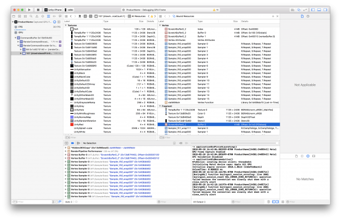
<p><em>VI: <strong>Scratchpad buffer 4 MB hiện lên trong công cụ frame capture</strong> — ảnh chụp Xcode GPU Frame Debugger, tab <em>Bound Resources</em> liệt kê toàn bộ Texture/Buffer đang bind cho GPU. Đây chính là nơi bạn nhìn thấy constant buffer pool mà §4 mô tả. / EN: The 4 MB Scratchpad buffer shows up in frame capture tools — here Xcode's GPU Frame Debugger with the Bound Resources tab listing every Texture/Buffer bound to the GPU.</em></p>

### 4.1. Bốn cách giảm native runtime memory

<div class="bilingual-row">
<div class="col-vi">
<p>Ngoài managed memory, <strong>Unity CÓ trả native memory về hệ điều hành khi không còn cần</strong>. Vì <em>mỗi byte đều đáng giá — đặc biệt trên mobile</em>, hãy thử:</p>
<ol>
<li><strong>Gỡ các channel không dùng khỏi mesh.</strong></li>
<li><strong>Gỡ keyframe dư thừa khỏi animation.</strong></li>
<li><strong>Dùng <code>maxLOD</code> trong Quality Settings</strong> để loại bỏ mesh chi tiết cao trong LODGroup khỏi build.</li>
<li><strong>Kiểm tra <code>Editor.log</code> sau khi build</strong> để đảm bảo <em>kích thước mỗi Asset trên đĩa TỈ LỆ THUẬN với mức dùng runtime memory của nó</em>.</li>
</ol>
<p>💡 Mục ④ là kỹ thuật audit rất mạnh: nếu một asset nhỏ trên đĩa nhưng ngốn nhiều RAM ⇒ có gì đó sai (ví dụ texture bị decompress, Read/Write enabled).</p>
</div>
<div class="col-en">
<p>Beyond managed memory, <strong>Unity DOES return native memory to the operating system when it's no longer needed</strong>. Since <em>every byte counts — especially on mobile devices</em>, try:</p>
<ol>
<li><strong>Remove unused channels from meshes.</strong></li>
<li><strong>Remove redundant keyframes from animations.</strong></li>
<li><strong>Use <code>maxLOD</code> in the Quality Settings</strong> to remove higher-detail meshes in LODGroups from the build.</li>
<li><strong>Check the <code>Editor.log</code> after a build</strong> to ensure that <em>the size of each Asset on disk is PROPORTIONAL to its runtime memory use</em>.</li>
</ol>
<p>💡 Item ④ is a powerful audit technique: if an asset is small on disk but eats a lot of RAM ⇒ something is wrong (e.g. a decompressed texture, Read/Write enabled).</p>
</div>
</div>

---

## 5. 📱 Android Memory Management

<div class="bilingual-row">
<div class="col-vi">
<p>🚨 <strong>Bộ nhớ trên Android được CHIA SẺ giữa nhiều tiến trình.</strong> Một tiến trình dùng bao nhiêu bộ nhớ <em>không rõ ràng ngay từ cái nhìn đầu tiên</em>. <strong>Quản lý bộ nhớ Android rất phức tạp.</strong></p>
<p><strong>PAGING trên Android</strong></p>
<p><em>Paging</em> là phương pháp chuyển bộ nhớ từ main memory sang secondary memory và ngược lại.</p>
<p>🔑 <strong>Android CÓ page out ra đĩa NHƯNG KHÔNG dùng swap space để paging bộ nhớ.</strong> Điều này khiến việc <em>nhìn thấy tổng bộ nhớ càng khó hơn</em> — đặc biệt vì <strong>MỖI ứng dụng Android chạy trong một TIẾN TRÌNH KHÁC NHAU, mỗi tiến trình chạy instance Dalvik VM riêng.</strong></p>
<p><strong>PAGING vs SWAP SPACE</strong></p>
<p>Paging <em>phụ thuộc nặng vào khả năng memory map (<code>mmap()</code>) file</em> và lưu kernel page trong dữ liệu khi cần. Tuy không xảy ra thường xuyên, paging <strong>cần drop kernel page khi bộ nhớ thấp</strong>, và hệ thống <strong>drop cache page file</strong>.</p>
<p>🔑 <strong>Vì sao Android KHÔNG swap:</strong></p>
<blockquote>
<p><em>"Android <strong>không swap space</strong> để page out dirty page, vì làm vậy trên thiết bị di động vừa <strong>GIẢM TUỔI THỌ PIN</strong> vừa <strong>gây HAO MÒN quá mức cho bộ nhớ</strong>."</em></p>
</blockquote>
<p><strong>ONBOARD FLASH</strong></p>
<p>Thiết bị Android thường có <em>rất ít onboard flash</em> và <em>không gian hạn chế</em> để lưu dữ liệu. Onboard flash chủ yếu dùng lưu app <em>nhưng thực ra CÓ THỂ lưu swap file</em>.</p>
<p>🚨 <strong>Onboard flash CHẬM và có tốc độ truy cập nhìn chung TỆ HƠN cả ổ cứng hay flash drive.</strong> Kích thước của nó <em>không đủ để bật swap space hiệu quả</em>.</p>
<p>📊 <strong>Quy tắc ngón tay cái về kích thước swap file: khoảng 512 MB cho mỗi 1–2 GB RAM.</strong></p>
<p>💡 Bạn <em>luôn có thể</em> bật hỗ trợ swap bằng cách sửa file kernel <code>.config</code> (<code>CONFIG_SWAP</code>) và tự compile kernel — nhưng việc đó nằm ngoài phạm vi.</p>
</div>
<div class="col-en">
<p>🚨 <strong>Memory on Android is SHARED across multiple processes.</strong> How much memory a process uses is <em>not clear at first glance</em>. <strong>Android memory management is complex.</strong></p>
<p><strong>PAGING ON ANDROID</strong></p>
<p><em>Paging</em> is a method of moving memory from main memory to secondary memory or vice versa.</p>
<p>🔑 <strong>Android DOES page out to disk BUT does NOT use swap space for paging the memory.</strong> This makes it <em>even more difficult to see the total memory</em> — especially as <strong>EVERY application in Android runs in a DIFFERENT PROCESS which runs its own instance of a Dalvik VM.</strong></p>
<p><strong>PAGING vs SWAP SPACE</strong></p>
<p>Paging <em>relies heavily on the ability to memory map (<code>mmap()</code>) files</em> and store the kernel page in data as needed. Although this doesn't happen often, paging <strong>needs to drop kernel pages when memory is low</strong>, and the system <strong>drops cache page files</strong>.</p>
<p>🔑 <strong>Why Android doesn't swap:</strong></p>
<blockquote>
<p><em>"Android <strong>does not swap spaces</strong> for paging out dirty pages, as doing so on mobile devices both <strong>LOWERS BATTERY LIFE</strong> and <strong>causes EXCESS WEAR-AND-TEAR on memory</strong>."</em></p>
</blockquote>
<p><strong>ONBOARD FLASH</strong></p>
<p>Android devices frequently come with <em>very little onboard flash</em> and <em>limited space</em> to store data. Onboard flash is mainly used to store apps <em>but could actually store a swap file</em>.</p>
<p>🚨 <strong>Onboard flash is SLOW and has generally WORSE access rates than those of hard disks or flash drives.</strong> Its size <em>is not enough to enable swapping spaces effectively</em>.</p>
<p>📊 <strong>A basic rule of thumb for swap file size is about 512 MB per 1–2 GB RAM.</strong></p>
<p>💡 You <em>can always</em> enable swap support by modifying the kernel <code>.config</code> file (<code>CONFIG_SWAP</code>) and compiling the kernel yourself — but that falls outside the scope.</p>
</div>
</div>

### 5.1. ⚠️ Đo bộ nhớ Android — Bốn yếu tố gây sai lệch

<div class="bilingual-row">
<div class="col-vi">
<p><strong>App của bạn dùng được bao nhiêu bộ nhớ trước khi hệ thống Android kích hoạt và bắt đầu TẮT tiến trình?</strong></p>
<blockquote>
<p><em>"Thật không may, <strong>KHÔNG có câu trả lời đơn giản</strong>, và việc tìm ra nó đòi hỏi <strong>RẤT NHIỀU profiling</strong> với công cụ như <code>dumpsys</code>, <code>procrank</code>, và Android Studio."</em></p>
</blockquote>
<p><strong>Bốn yếu tố ảnh hưởng khả năng đo bộ nhớ trên Android:</strong></p>
<ol>
<li><strong>Cấu hình nền tảng khác nhau</strong> cho thiết bị low-, mid-, và high-end</li>
<li><strong>Phiên bản OS khác nhau</strong> trên (các) thiết bị test</li>
<li><strong>Thời điểm khác nhau trong ứng dụng</strong> khi bạn đo bộ nhớ</li>
<li><strong>Áp lực bộ nhớ tổng thể của thiết bị</strong></li>
</ol>
<p>🔑 <strong>Quy tắc VÀNG:</strong></p>
<blockquote>
<p><em>"Quan trọng là <strong>LUÔN đo bộ nhớ ở CÙNG một vị trí trong code</strong>, với <strong>CÙNG cấu hình nền tảng, CÙNG phiên bản OS, và CÙNG áp lực bộ nhớ thiết bị</strong>."</em></p>
</blockquote>
<p><strong>LOW vs HIGH MEMORY PRESSURE</strong></p>
<p>✅ Cách tốt để profile: đảm bảo thiết bị có <strong>nhiều bộ nhớ trống (low memory pressure)</strong> trong lúc profile ứng dụng.</p>
<p>❌ Nếu thiết bị <strong>không còn bộ nhớ trống (high memory pressure)</strong>, sẽ <em>khó có kết quả ổn định</em>.</p>
<p>⚠️ <strong>Lưu ý quan trọng:</strong> Tuy bạn dùng profiling để <em>tìm nguồn gây áp lực bộ nhớ cao</em>, <strong>vẫn có những giới hạn vật lý CỨNG</strong>. Nếu hệ thống <em>đã đang thrashing memory cache</em>, nó sẽ <strong>cho ra kết quả KHÔNG ổn định</strong> khi bạn profile.</p>
</div>
<div class="col-en">
<p><strong>Just how much memory can your app use before the Android system activates and starts SHUTTING DOWN processes?</strong></p>
<blockquote>
<p><em>"Unfortunately, there is <strong>NO simple answer</strong>, and figuring it out involves <strong>A LOT of profiling</strong> with tools such as <code>dumpsys</code>, <code>procrank</code>, and Android Studio."</em></p>
</blockquote>
<p><strong>Four factors influencing your ability to measure memory on Android:</strong></p>
<ol>
<li><strong>Different platform configuration</strong> for low-, mid-, and high-end devices</li>
<li><strong>Different OS versions</strong> on the test device(s)</li>
<li><strong>Different points in your application</strong> when you measure memory</li>
<li><strong>Overall device memory pressure</strong></li>
</ol>
<p>🔑 <strong>The GOLDEN rule:</strong></p>
<blockquote>
<p><em>"It is important to <strong>ALWAYS measure your memory at the SAME location in your code</strong> with the <strong>SAME platform configuration, OS version, and device memory pressure</strong>."</em></p>
</blockquote>
<p><strong>LOW vs HIGH MEMORY PRESSURE</strong></p>
<p>✅ A good way to profile: ensure the device has <strong>plenty of free memory (low memory pressure)</strong> while you profile.</p>
<p>❌ If the device has <strong>no free memory available (high memory pressure)</strong>, it can be <em>difficult to get stable results</em>.</p>
<p>⚠️ <strong>Important:</strong> Although you use profiling to <em>find the source of high memory pressure</em>, <strong>there are still HARD physical limitations</strong>. If the system is <em>already thrashing memory caches</em>, it will <strong>produce UNSTABLE results</strong> during memory profiling.</p>
</div>
</div>

### 5.2. `dumpsys meminfo` — Đọc số liệu bộ nhớ thật

<div class="bilingual-row">
<div class="col-vi">
<p>🔑 <strong>Vì sao cần <code>dumpsys</code>:</strong></p>
<blockquote>
<p><em>"Nếu bạn cộng tất cả RAM vật lý được map vào mỗi tiến trình, rồi cộng tất cả tiến trình lại, <strong>con số kết quả sẽ LỚN HƠN tổng RAM thực tế</strong>. Với <code>dumpsys</code>, bạn có được thông tin rõ ràng hơn về mỗi tiến trình Java."</em></p>
</blockquote>
<p><code>dumpsys</code> là công cụ Android chạy <em>trên thiết bị</em> và dump thông tin về trạng thái của system service và ứng dụng.</p>
<p><strong>Nó cho phép bạn:</strong></p>
<ul>
<li>Lấy thông tin hệ thống ở dạng chuỗi đơn giản</li>
<li>Dùng CPU, RAM, pin và storage đã dump để kiểm tra <em>ứng dụng ảnh hưởng thế nào tới toàn thiết bị</em></li>
</ul>
</div>
<div class="col-en">
<p>🔑 <strong>Why you need <code>dumpsys</code>:</strong></p>
<blockquote>
<p><em>"If you were to sum up all physical RAM mapped to each process, then add up all of the processes, <strong>the resulting figure would be GREATER than the actual total RAM</strong>. With <code>dumpsys</code>, you can get clearer information about each Java process."</em></p>
</blockquote>
<p><code>dumpsys</code> is an Android tool that runs <em>on the device</em> and dumps information about the status of system services and applications.</p>
<p><strong>It enables you to:</strong></p>
<ul>
<li>Get system information in a simple string representation</li>
<li>Use dumped CPU, RAM, battery, and storage to check <em>how an application affects the overall device</em></li>
</ul>
</div>
</div>

```bash
# Liệt kê tất cả service mà dumpsys cung cấp
adb shell dumpsys | grep "dumpsys services"

# Tổng quan nhanh bộ nhớ toàn hệ thống
adb shell dumpsys meminfo

# Theo dõi MỘT tiến trình cụ thể theo tên / bundle ID / pid
adb shell dumpsys meminfo com.unity.amemorytest
```

<div class="bilingual-row">
<div class="col-vi">
<p><strong>📊 So sánh thực tế — cùng thiết bị Nexus 6P (2560×1440, Android 8.1.0, Unity 2018.1):</strong></p>
<p><em>App <code>androidtest</code> là project Unity RỖNG, chỉ một Scene chính, KHÔNG Skybox, KHÔNG nội dung — để lấy baseline.</em></p>
</div>
<div class="col-en">
<p><strong>📊 A real comparison — same device, Nexus 6P (2560×1440, Android 8.1.0, Unity 2018.1):</strong></p>
<p><em>The <code>androidtest</code> app is an EMPTY Unity Project with only one main Scene, no Skybox, and no content — to get a baseline.</em></p>
</div>
</div>

| App Summary (Pss KB) | **Project RỖNG** *(baseline)* | **Scene 3D đầy đủ** | Chênh lệch |
|---|---|---|---|
| **Java Heap** | 2.708 | — | |
| **Native Heap** | **31.448** | **304.900** | **9.7×** |
| **Code** | 19.788 | — | |
| **Stack** | 492 | — | |
| **Graphics** | **166.356** | — | |
| ↳ EGL mtrack | 99.840 | **21.600** | |
| ↳ GL mtrack | 64.480 | **384.184** | **6.0×** |
| ↳ Gfx dev | 3.846 (2.036 dirty) | **196.934** (132.128 dirty) | **51×** |
| **Private Other** | 1.732 | — | |
| **System** | 8.375 | — | |
| **TOTAL** | **230.899 KB (~225 MB)** | *(≫ baseline)* | |

<div class="bilingual-row">
<div class="col-vi">
<p>🔑 <strong>Bài học từ bảng trên:</strong></p>
<ul>
<li>Một project Unity <strong>HOÀN TOÀN RỖNG</strong> đã tốn <strong>~225 MB</strong> trên Android — đây là <em>sàn cứng</em>, không giảm được.</li>
<li><strong>Graphics chiếm 166 MB / 231 MB = 72%</strong> tổng bộ nhớ ngay cả khi rỗng.</li>
<li>Với scene thật, <strong><code>GL mtrack</code> nhảy lên 384 MB</strong> và <strong><code>Native Heap</code> lên 305 MB</strong> — đây là 2 con số cần theo dõi sát nhất.</li>
</ul>
<p>👉 Khi lập ngân sách bộ nhớ (xem <a href="../01-fresher/01-ultimate-guide-to-profiling.md">Module 1 §4</a>), <strong>phải trừ đi baseline ~225 MB này trước.</strong></p>
</div>
<div class="col-en">
<p>🔑 <strong>Lessons from the table:</strong></p>
<ul>
<li>A <strong>COMPLETELY EMPTY</strong> Unity project already costs <strong>~225 MB</strong> on Android — this is a <em>hard floor</em> you cannot reduce.</li>
<li><strong>Graphics accounts for 166 MB / 231 MB = 72%</strong> of total memory even when empty.</li>
<li>With a real scene, <strong><code>GL mtrack</code> jumps to 384 MB</strong> and <strong><code>Native Heap</code> to 305 MB</strong> — these are the two figures to watch most closely.</li>
</ul>
<p>👉 When budgeting memory (see <a href="../01-fresher/01-ultimate-guide-to-profiling.md">Module 1 §4</a>), <strong>subtract this ~225 MB baseline first.</strong></p>
</div>
</div>

### 5.3. 🛠️ `procrank` — Bốn chỉ số Vss / Rss / Pss / Uss

!!! note "Bổ sung sau audit"
    **VI:** Phần cuối chương 12 của Unity Learn (procrank, `/proc/meminfo`, Android Studio, Plugins, Application size) là nội dung tôi đã **bỏ sót ở lần cào đầu**.

<div class="bilingual-row">
<div class="col-vi">
<p><strong><code>procrank</code></strong> là lựa chọn thay thế cho <code>dumpsys</code> — công cụ hữu ích để xem mức dùng bộ nhớ <strong>trên TẤT CẢ tiến trình</strong>. Nó <strong>liệt kê theo thứ tự từ CAO xuống THẤP</strong>.</p>
<p>Kích thước báo cáo cho mỗi tiến trình gồm <strong>4 chỉ số</strong>:</p>
<ul>
<li><strong>Vss</strong> — <em>Virtual Set Size</em>: <strong>toàn bộ không gian địa chỉ tiến trình truy cập được</strong>. Cho biết bao nhiêu <em>virtual memory</em> gắn với tiến trình.</li>
<li><strong>Rss</strong> — <em>Resident Set Size</em>: <strong>bao nhiêu PAGE VẬT LÝ được cấp cho tiến trình</strong>. ⚠️ <em>Page dùng chung giữa các tiến trình bị ĐẾM NHIỀU LẦN.</em></li>
<li><strong>Pss</strong> — <em>Proportional Set Size</em>: lấy con số Rss nhưng <strong>PHÂN BỔ ĐỀU page dùng chung cho các tiến trình đang chia sẻ</strong>. 📊 <em>Ví dụ: 3 tiến trình chia sẻ 9 MB ⇒ mỗi tiến trình được tính <strong>3 MB</strong> trong Pss.</em></li>
<li><strong>Uss</strong> — <em>Unique Set Size</em>, còn gọi là <strong>Private Dirty</strong>: lượng RAM bên trong tiến trình <strong>KHÔNG thể page ra đĩa</strong> (vì nó không có dữ liệu tương ứng trên đĩa) và <strong>KHÔNG chia sẻ với bất kỳ tiến trình nào khác</strong>.</li>
</ul>
<p>🚨 <strong>Cảnh báo quan trọng:</strong></p>
<blockquote>
<p><em>"<strong>Pss và Uss KHÁC với báo cáo của <code>meminfo</code></strong>. <code>procrank</code> dùng <strong>một cơ chế kernel KHÁC</strong> để thu thập dữ liệu so với <code>meminfo</code>, <strong>nên có thể cho kết quả KHÁC NHAU</strong>."</em></p>
</blockquote>
</div>
<div class="col-en">
<p><strong><code>procrank</code></strong> is an alternative to <code>dumpsys</code> — a useful tool to view memory usage <strong>across ALL processes</strong>. It <strong>lists them in order from HIGHEST to LOWEST usage</strong>.</p>
<p>The sizes reported per process are <strong>four figures</strong>:</p>
<ul>
<li><strong>Vss</strong> — <em>Virtual Set Size</em>: <strong>the total accessible address space of a process</strong>. It shows how much <em>virtual memory</em> is associated with a process.</li>
<li><strong>Rss</strong> — <em>Resident Set Size</em>: <strong>how many PHYSICAL PAGES are allocated to the process</strong>. ⚠️ <em>Pages shared between processes are COUNTED MULTIPLE TIMES.</em></li>
<li><strong>Pss</strong> — <em>Proportional Set Size</em>: takes the Rss number but <strong>EVENLY DISTRIBUTES shared pages among the sharing processes</strong>. 📊 <em>For example, if three processes share 9 MB, each process gets <strong>3 MB</strong> in Pss.</em></li>
<li><strong>Uss</strong> — <em>Unique Set Size</em>, also known as <strong>Private Dirty</strong>: the amount of RAM inside the process that <strong>CANNOT be paged to disk</strong> (as it is not backed by the same data on disk) and is <strong>NOT shared with any other process</strong>.</li>
</ul>
<p>🚨 <strong>Important warning:</strong></p>
<blockquote>
<p><em>"<strong>Pss and Uss are DIFFERENT than reports of <code>meminfo</code></strong>. <code>procrank</code> uses <strong>a DIFFERENT kernel mechanism</strong> to collect its data than <code>meminfo</code>, <strong>which can give DIFFERENT results</strong>."</em></p>
</blockquote>
</div>
</div>

```bash
# procrank — mức dùng bộ nhớ trên MỌI tiến trình, sắp xếp cao → thấp
adb shell procrank

# meminfo hệ thống — tổng quan bộ nhớ toàn hệ thống
adb shell cat /proc/meminfo
```

<div class="bilingual-row">
<div class="col-vi">
<p><strong>Ba con số đầu của <code>/proc/meminfo</code> đáng bàn:</strong></p>
<ul>
<li><strong><code>MemTotal</code></strong> — tổng bộ nhớ khả dụng cho kernel và userspace. ⚠️ <em>Thường ÍT HƠN RAM vật lý thực tế</em>, vì máy còn cần bộ nhớ cho <strong>GSM, buffer, v.v.</strong></li>
<li><strong><code>MemFree</code></strong> — lượng RAM <em>hoàn toàn KHÔNG được dùng</em>. 🔑 <strong>Trên Android con số này thường RẤT NHỎ</strong>, vì <em>hệ thống cố LUÔN dùng hết bộ nhớ khả dụng để giữ tiến trình chạy</em>.</li>
<li><strong><code>Cached</code></strong> — RAM đang dùng cho <em>filesystem cache</em>, v.v.</li>
</ul>
</div>
<div class="col-en">
<p><strong>The first three numbers of <code>/proc/meminfo</code> are worth discussing:</strong></p>
<ul>
<li><strong><code>MemTotal</code></strong> — the total memory available to the kernel and userspace. ⚠️ <em>Usually LESS than actual physical RAM</em>, as the handset requires memory for <strong>GSM, buffers, etc.</strong></li>
<li><strong><code>MemFree</code></strong> — the amount of RAM <em>not being used at all</em>. 🔑 <strong>On Android this number is typically VERY SMALL</strong>, as <em>the system tries to always use all available memory to keep processes running</em>.</li>
<li><strong><code>Cached</code></strong> — the RAM being used for <em>filesystem caches</em>, etc.</li>
</ul>
</div>
</div>

### 5.4. Android Studio Profiler & Bẫy Native Plugin

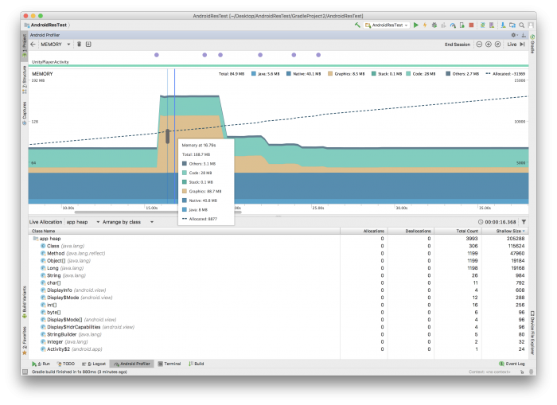
<p><em>VI: Android Studio Memory Profiler. Đọc số: <strong>Total 84.9 MB</strong> — Java 5.6 MB · <strong>Native 40.1 MB</strong> · Graphics 8.5 MB · Stack 0.1 MB · Code 28 MB · Others 2.7 MB. Ở đỉnh spike: Total <strong>168.7 MB</strong> với <strong>Graphics 86.7 MB</strong>. Bảng dưới liệt kê Live Allocation theo class. / EN: The Android Studio Memory Profiler, showing the same managed/native split as the command-line tools.</em></p>

<div class="bilingual-row">
<div class="col-vi">
<p>Android Studio cung cấp <strong>memory profiler</strong> bên cạnh các công cụ dòng lệnh của Android SDK. Giống báo cáo dòng lệnh, ở đây cũng có <strong>sự phân tách giữa managed và native memory</strong>.</p>
<p>💡 Nó <em>về cơ bản bao phủ phần <strong>App Summary</strong> hiển thị bởi <code>dumpsys meminfo</code>, kèm một số bổ sung</em>.</p>
<p>🚨 <strong>PLUGINS — cái bẫy khó lần nhất:</strong></p>
<blockquote>
<p><em>"Thông thường, <strong>PHẦN LỚN bộ nhớ đi vào phần Native Heap</strong>. <strong>Dalvik Heap NHỎ so với Native Heap</strong>.</em></p>
<p><em>🔑 <strong>Trong trường hợp nó PHÌNH TO, bạn NÊN điều tra các Android plugin bạn dùng trong ứng dụng.</strong></em></p>
<p><em>💀 <strong>Native Heap khiến việc biết bộ nhớ đến TỪ ĐÂU trở nên KHÓ KHĂN, và KHÔNG có cách nào tốt để thấy Native Plugin allocation trong profiler.</strong></em></p>
<p><em>✅ <strong>Giải pháp khả dĩ để có cái nhìn sâu hơn: CÔ LẬP và ĐO các plugin dùng cho tích hợp bên thứ ba, rồi SO SÁNH chúng với memory baseline của một Project RỖNG.</strong>"</em></p>
</blockquote>
<p>👉 Đây chính là lý do vì sao <strong>baseline ~225 MB ở §5.2 lại QUAN TRỌNG</strong> — nó là mốc để bạn trừ đi khi đo plugin.</p>
</div>
<div class="col-en">
<p>Android Studio offers a <strong>memory profiler</strong> in addition to the command line tools available in the Android SDK. Similar to the command line reporting, there is a <strong>split between managed and native memory</strong>.</p>
<p>💡 It <em>basically covers the <strong>App Summary</strong> displayed by <code>dumpsys meminfo</code> with some additions</em>.</p>
<p>🚨 <strong>PLUGINS — the hardest trap to trace:</strong></p>
<blockquote>
<p><em>"Usually, <strong>MOST of the memory goes into the Native Heap section</strong>. <strong>The Dalvik Heap is SMALL compared to the Native Heap.</strong></em></p>
<p><em>🔑 <strong>In case it GROWS, you should investigate the Android plugins you use in your application.</strong></em></p>
<p><em>💀 <strong>The Native Heap makes it DIFFICULT to know WHERE memory comes from and there is NO GREAT WAY to see Native Plugin allocations in the profiler.</strong></em></p>
<p><em>✅ <strong>A possible solution to gain greater insight is to ISOLATE and MEASURE the plugins used for 3rd party integrations and COMPARE them with the memory baseline of an EMPTY Project.</strong>"</em></p>
</blockquote>
<p>👉 This is exactly why the <strong>~225 MB baseline in §5.2 MATTERS</strong> — it's the figure you subtract when measuring plugins.</p>
</div>
</div>

### 5.5. Application Size — Disk và Runtime Memory tỉ lệ thuận

<div class="bilingual-row">
<div class="col-vi">
<blockquote>
<p><em>"Một cách để tiết kiệm <strong>CẢ dung lượng đĩa VÀ runtime memory</strong> là <strong>giảm kích thước file <code>.apk</code> trên Android hoặc <code>.ipa</code> trên iOS</strong>.</em></p>
<p><em>🔑 <strong>Resource và code TỈ LỆ THUẬN TRỰC TIẾP với runtime memory</strong> — và nếu bạn giảm được chúng, <strong>bạn tiết kiệm được runtime memory</strong>."</em></p>
</blockquote>
<p>👉 Xem lại <strong>§3 Code Stripping</strong> để giảm code size, và tham khảo bài <em>"IL2CPP build size optimizations"</em> nếu muốn hiểu chi tiết tối ưu IL2CPP trên iOS.</p>
<p>📝 <strong>Bổ sung từ ghi chú raw — checklist giảm build size:</strong></p>
<blockquote>
<p><em>"Optimize build size: using <strong>build report tool</strong> · Remove unused res, unused resource · Use prefabs · Compress texture (Size minimal, mipmap · Type: <strong>ASTC 4x4 RGBA, ASTC 4x4 RGB, PVRTC 4bits RGBA, PVRTC 4bits RGB</strong>) · Compress Mesh: <strong>high</strong> · Compress Animation: <strong>Optimal</strong> · Player setting: Script Runtime Version .NET 2.0 Standard, <strong>Vertex Compression: Everything</strong>, <strong>Optimize Mesh Data: checked</strong> (ví dụ tiết kiệm 0.3 MB), <strong>Use Incremental GC</strong>"</em></p>
</blockquote>
</div>
<div class="col-en">
<blockquote>
<p><em>"One way you can save <strong>BOTH disk space AND runtime memory</strong> is to <strong>reduce the size of your <code>.apk</code> on Android or <code>.ipa</code> on iOS</strong>.</em></p>
<p><em>🔑 <strong>Resources and code are DIRECTLY PROPORTIONAL to runtime memory</strong> — and if you can reduce them, <strong>you can save runtime memory</strong>."</em></p>
</blockquote>
<p>👉 See <strong>§3 Code Stripping</strong> for reducing code size, and read <em>"IL2CPP build size optimizations"</em> for details on IL2CPP optimization on iOS.</p>
<p>📝 <strong>From the raw notes — a build-size reduction checklist:</strong></p>
<blockquote>
<p><em>"Optimize build size: use the <strong>build report tool</strong> · Remove unused resources · Use prefabs · Compress textures (minimal Size, mipmaps · Types: <strong>ASTC 4x4 RGBA, ASTC 4x4 RGB, PVRTC 4bits RGBA, PVRTC 4bits RGB</strong>) · Compress Mesh: <strong>high</strong> · Compress Animation: <strong>Optimal</strong> · Player settings: Script Runtime Version .NET 2.0 Standard, <strong>Vertex Compression: Everything</strong>, <strong>Optimize Mesh Data: checked</strong> (e.g. saves 0.3 MB), <strong>Use Incremental GC</strong>"</em></p>
</blockquote>
</div>
</div>

---

## 6. 🔊 Audio — Cấu hình đúng để tiết kiệm RAM & CPU

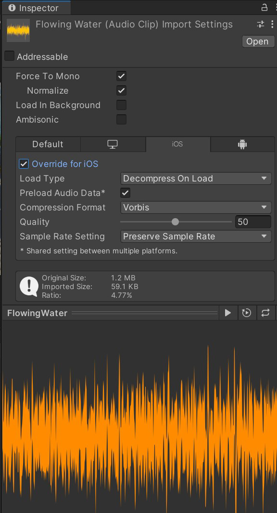
<p><em>VI: Import Settings của AudioClip — <strong>Force To Mono ✓</strong>, <strong>Load Type: Decompress On Load</strong>, <strong>Compression Format: Vorbis</strong>, Quality 50. Kết quả: <strong>1.2 MB → 59.1 KB (tỉ lệ 4.77%)</strong>. / EN: AudioClip Import Settings — the result is 1.2 MB → 59.1 KB, a 4.77% ratio.</em></p>

### 6.1. Virtual Voices & DSP Buffer Size

<div class="bilingual-row">
<div class="col-vi">
<p><strong>VIRTUAL VOICES</strong></p>
<p>Unity <strong>động</strong> đặt voice là <em>virtual</em> hoặc <em>real</em>, tùy theo <strong>độ nghe thấy thời gian thực</strong> của nền tảng.</p>
<p>Ví dụ: Unity đặt âm thanh đang phát <em>ở xa</em> hoặc <em>âm lượng thấp</em> là <strong>virtual</strong>, nhưng sẽ đổi chúng thành <strong>real voice</strong> nếu chúng <em>tới gần hơn hoặc to hơn</em>.</p>
<p>✅ <strong>Giá trị mặc định trong Audio Settings là giá trị TỐT cho thiết bị mobile.</strong></p>
<p><strong>DSP BUFFER SIZE</strong></p>
<p>Unity dùng DSP buffer size để <strong>kiểm soát ĐỘ TRỄ (latency) của mixer</strong>. Hệ thống Audio nền là <strong>FMOD</strong> định nghĩa DSP buffer size phụ thuộc nền tảng.</p>
<p>🔑 <strong>Công thức:</strong> <code>Latency = số samples × số buffer</code>. <strong>Số buffer mặc định là 4.</strong></p>
<p>⚠️ Buffer size <em>ảnh hưởng latency và phải được xử lý CẨN THẬN</em>.</p>
</div>
<div class="col-en">
<p><strong>VIRTUAL VOICES</strong></p>
<p>Unity <strong>dynamically</strong> sets voices as either <em>virtual</em> or <em>real</em>, depending on the <strong>real-time audibility</strong> of the platform.</p>
<p>For example, Unity sets sounds playing <em>far off</em> or with <em>low volume</em> as <strong>virtual</strong>, but will change these to a <strong>real voice</strong> if they <em>come closer or become louder</em>.</p>
<p>✅ <strong>The default values in the Audio Settings are great values for mobile devices.</strong></p>
<p><strong>DSP BUFFER SIZE</strong></p>
<p>Unity uses DSP buffer sizes to <strong>control the mixer LATENCY</strong>. The underlying Audio System <strong>FMOD</strong> defines the platform-dependent DSP buffer sizes.</p>
<p>🔑 <strong>Formula:</strong> <code>Latency = samples × number of buffers</code>. <strong>The number of buffers defaults to 4.</strong></p>
<p>⚠️ The buffer size <em>influences the latency and should be treated CAREFULLY</em>.</p>
</div>
</div>

| Audio Setting | Sample count |
|---|---|
| **Default — iOS & Desktop** | **1024** |
| **Default — Android** | **512** |
| **Best latency** | **256** |
| **Good latency** | **512** |
| **Best performance** | **1024** |

### 6.2. 🎯 Audio Import Settings — Ngưỡng cụ thể

<div class="bilingual-row">
<div class="col-vi">
<p><strong>① Force to Mono</strong></p>
<p>Bật tùy chọn này trên file audio <em>không cần âm thanh stereo</em>. Việc này <strong>giảm CẢ runtime memory VÀ disk space</strong>. Chủ yếu dùng trên nền tảng mobile có <em>loa mono</em>.</p>
<p><strong>② Load Type — theo KÍCH THƯỚC clip</strong></p>
<p>🔑 <strong>Ngưỡng vàng: 200 KB</strong></p>
<ul>
<li><strong>Clip nhỏ (&lt; 200 KB)</strong> ⇒ <strong>Decompress On Load</strong>. Việc này tốn CPU và bộ nhớ do giải nén âm thanh thành <em>raw 16-bit PCM</em>, nên <strong>chỉ phù hợp với âm thanh NGẮN</strong>.</li>
<li><strong>Clip trung bình (≥ 200 KB)</strong> ⇒ giữ <strong>Compressed in Memory</strong>.</li>
<li><strong>File lớn (nhạc nền)</strong> ⇒ <strong>Streaming</strong>. Nếu không, <em>toàn bộ asset sẽ được load vào bộ nhớ CÙNG LÚC</em>.</li>
</ul>
<p>⚠️ <strong>Lưu ý quan trọng về Streaming:</strong></p>
<blockquote>
<p><em>"Streaming trong Unity 5.0 trở lên có <strong>overhead 200 KB</strong>, nên bạn <strong>NÊN đặt file audio nhỏ hơn 200 KB thành <code>Compressed into Memory</code> thay thế</strong>."</em></p>
</blockquote>
<p>⚠️ <strong>Về Decompress On Load:</strong> <em>"Chỉ dùng nếu bạn CÓ NHIỀU bộ nhớ nhưng bị GIỚI HẠN bởi hiệu năng CPU, vì tùy chọn này đòi hỏi lượng bộ nhớ ĐÁNG KỂ."</em></p>
</div>
<div class="col-en">
<p><strong>① Force to Mono</strong></p>
<p>Enable this on audio files that <em>do not require stereo sound</em>. Doing so <strong>reduces BOTH runtime memory AND disk space</strong>. Mostly used on mobile platforms with a <em>mono speaker</em>.</p>
<p><strong>② Load Type — by clip SIZE</strong></p>
<p>🔑 <strong>The golden threshold: 200 KB</strong></p>
<ul>
<li><strong>Small clips (&lt; 200 KB)</strong> ⇒ <strong>Decompress On Load</strong>. This incurs CPU cost and memory by decompressing into <em>raw 16-bit PCM</em>, so it's <strong>only desirable for SHORT sounds</strong>.</li>
<li><strong>Medium clips (≥ 200 KB)</strong> ⇒ remain <strong>Compressed in Memory</strong>.</li>
<li><strong>Large files (background music)</strong> ⇒ <strong>Streaming</strong>. Otherwise, <em>the entire asset will be loaded into memory at once</em>.</li>
</ul>
<p>⚠️ <strong>Important note on Streaming:</strong></p>
<blockquote>
<p><em>"Streaming in Unity 5.0 and later has a <strong>200 KB overhead</strong> so you should set audio files smaller than 200 KB to <code>Compressed into Memory</code> instead."</em></p>
</blockquote>
<p>⚠️ <strong>On Decompress On Load:</strong> <em>"Use it only if you have PLENTY of memory but are CONSTRAINED by CPU performance, as this option requires a SIGNIFICANT amount of memory."</em></p>
</div>
</div>

### 6.3. Compression Format theo nền tảng

<div class="bilingual-row">
<div class="col-vi">
<p><strong>Bốn quy tắc chọn Compression Format:</strong></p>
<ol>
<li><strong>ADPCM</strong> cho <em>clip RẤT NGẮN</em> như hiệu ứng âm thanh phát thường xuyên. 📊 <strong>ADPCM cho tỉ lệ nén CỐ ĐỊNH 3.5:1 và RẺ để giải nén.</strong></li>
<li><strong>Vorbis trên Android</strong> cho clip dài hơn. ⚠️ <em>Unity KHÔNG dùng giải mã tăng tốc phần cứng.</em></li>
<li><strong>MP3 hoặc Vorbis trên iOS</strong> cho clip dài hơn. ⚠️ <em>Unity KHÔNG dùng giải mã tăng tốc phần cứng.</em></li>
<li><strong>MP3/Vorbis</strong> cần <em>nhiều tài nguyên hơn để giải nén</em> nhưng cho <strong>kích thước file NHỎ HƠN ĐÁNG KỂ</strong>. MP3 chất lượng cao cần <em>ít tài nguyên hơn</em> để giải nén; file chất lượng trung/thấp của cả hai định dạng tốn <em>gần như cùng CPU time</em>.</li>
</ol>
<p>💡 <strong>Mẹo về LOOP — rất quan trọng:</strong></p>
<blockquote>
<p><em>"Dùng <strong>Vorbis cho âm thanh LẶP dài hơn</strong> vì nó xử lý loop TỐT HƠN. <strong>MP3 chứa các khối dữ liệu có kích thước định trước</strong>, nên <strong>nếu loop KHÔNG phải bội số chính xác của block size thì mã hóa MP3 sẽ THÊM KHOẢNG LẶNG</strong> — còn Vorbis thì KHÔNG."</em></p>
</blockquote>
<p>📝 <strong>Từ e-book Mobile (bổ sung):</strong></p>
<ul>
<li>🔑 <strong>Dùng file WAV KHÔNG NÉN gốc làm source asset khi có thể.</strong> Nếu bạn dùng định dạng đã nén (MP3 hay Vorbis), <strong>Unity sẽ GIẢI NÉN rồi NÉN LẠI lúc build</strong> ⇒ <em>HAI lần lossy, làm suy giảm chất lượng cuối</em>.</li>
<li><strong>Hiệu ứng âm thanh trên mobile nên tối đa 22.050 Hz.</strong> Dùng setting thấp hơn thường <em>ảnh hưởng tối thiểu tới chất lượng cuối</em> — nhưng hãy tự dùng tai mình phán đoán.</li>
<li><strong>Unload AudioSource bị mute khỏi bộ nhớ:</strong> Khi làm nút mute, <strong>đừng chỉ đặt volume = 0</strong>. Bạn có thể <code>Destroy</code> component AudioSource để <em>unload nó khỏi bộ nhớ</em> — miễn là người chơi <em>không cần bật/tắt liên tục</em>.</li>
</ul>
</div>
<div class="col-en">
<p><strong>Four Compression Format rules:</strong></p>
<ol>
<li><strong>ADPCM</strong> for <em>VERY SHORT clips</em> such as sound effects played often. 📊 <strong>ADPCM offers a FIXED 3.5:1 compression ratio and is INEXPENSIVE to decompress.</strong></li>
<li><strong>Vorbis on Android</strong> for longer clips. ⚠️ <em>Unity does NOT use hardware-accelerated decoding.</em></li>
<li><strong>MP3 or Vorbis on iOS</strong> for longer clips. ⚠️ <em>Unity does NOT use hardware-accelerated decoding.</em></li>
<li><strong>MP3/Vorbis</strong> need <em>more resources for decompression</em> but offer <strong>SIGNIFICANTLY smaller file size</strong>. High-quality MP3s require <em>fewer resources</em> to decompress; middle- and low-quality files of either format require <em>almost the same CPU time</em>.</li>
</ol>
<p>💡 <strong>The LOOP tip — very important:</strong></p>
<blockquote>
<p><em>"Use <strong>Vorbis for longer LOOPING sounds</strong> since it handles looping BETTER. <strong>MP3 contains data blocks of predetermined sizes</strong>, so <strong>if the loop is NOT an exact multiple of the block size then the MP3 encoding will ADD SILENCE</strong> — while Vorbis does NOT."</em></p>
</blockquote>
<p>📝 <strong>From the Mobile e-book (additional):</strong></p>
<ul>
<li>🔑 <strong>Use original UNCOMPRESSED WAV files as your source assets when possible.</strong> If you use any compressed format (MP3 or Vorbis), <strong>Unity will DECOMPRESS it and RECOMPRESS it during build time</strong> ⇒ <em>TWO lossy passes, degrading the final quality</em>.</li>
<li><strong>Sound effects on mobile devices should be 22,050 Hz at most.</strong> Using lower settings usually has <em>minimal impact on the final quality</em> — but use your own ears to judge.</li>
<li><strong>Unload muted AudioSources from memory:</strong> When implementing a mute button, <strong>don't simply set the volume to 0</strong>. You can <code>Destroy</code> the AudioSource component to <em>unload it from memory</em> — provided the player <em>does not need to toggle this on and off very often</em>.</li>
</ul>
</div>
</div>

---

# PHẦN B — ASSETS & ADDRESSABLES

## 7. Asset Pipeline — Import đúng ngay từ đầu


<div class="bilingual-row">
<div class="col-vi">
<p><strong>"Asset pipeline có thể ảnh hưởng ĐÁNG KỂ tới hiệu năng ứng dụng của bạn."</strong> Một technical artist giàu kinh nghiệm có thể giúp team <em>định nghĩa và thực thi</em> asset format, specification, và import setting.</p>
<p>🚨 <strong>ĐỪNG dựa vào setting mặc định.</strong> Dùng tab <strong>platform-specific override</strong> để tối ưu asset như texture và mesh geometry.</p>
<blockquote>
<p><em>"Setting SAI có thể tạo ra <strong>build size LỚN HƠN, build time LÂU HƠN, và mức dùng bộ nhớ TỆ</strong>."</em></p>
</blockquote>
<p>💡 Cân nhắc dùng tính năng <strong>Presets</strong> để tùy chỉnh baseline setting cho dự án cụ thể, đảm bảo setting tối ưu.</p>
</div>
<div class="col-en">
<p><strong>"The asset pipeline can dramatically impact your application's performance."</strong> An experienced technical artist can help your team <em>define and enforce</em> asset formats, specifications, and import settings.</p>
<p>🚨 <strong>Don't rely on default settings.</strong> Use the <strong>platform-specific override</strong> tab to optimize assets such as textures and mesh geometry.</p>
<blockquote>
<p><em>"INCORRECT settings may yield <strong>LARGER build sizes, LONGER build times, and POOR memory usage</strong>."</em></p>
</blockquote>
<p>💡 Consider using the <strong>Presets</strong> feature to help customize baseline settings for a specific project to ensure optimal settings.</p>
</div>
</div>

### 7.1. 🖼️ Texture Import — 5 quy tắc

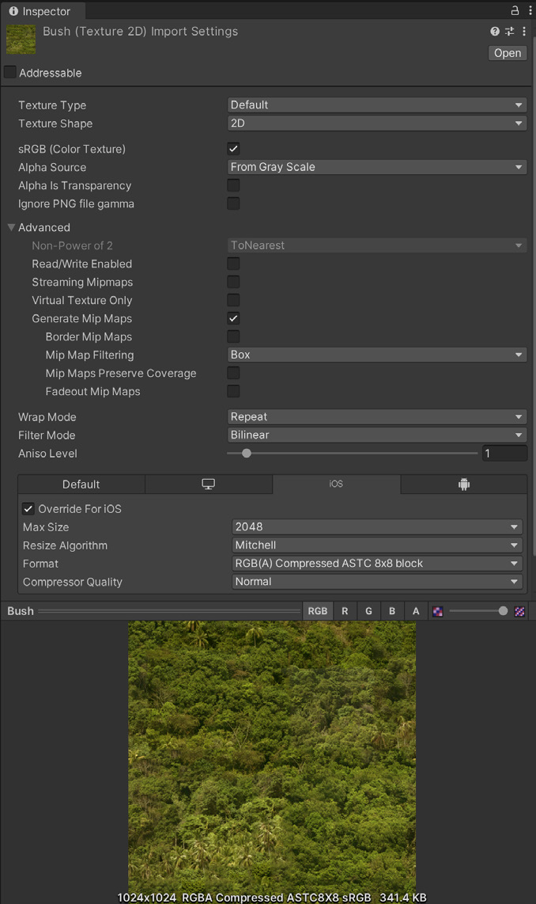
<p><em>VI: Setting import texture đúng cách giúp tối ưu build size. Chú ý tab <strong>Override For iOS</strong>, Max Size <strong>2048</strong>, Format <strong>RGB(A) Compressed ASTC 8x8 block</strong> → kết quả <strong>341.4 KB</strong>. / EN: Proper texture import settings help optimize your build size.</em></p>

<div class="bilingual-row">
<div class="col-vi">
<p>🔑 <strong>"Phần lớn bộ nhớ của bạn nhiều khả năng sẽ dành cho TEXTURE, nên import setting ở đây là TỐI QUAN TRỌNG."</strong></p>
<ol>
<li><strong>Hạ Max Size:</strong> Dùng setting <em>tối thiểu</em> vẫn cho kết quả chấp nhận được về thị giác. ✅ Đây là thao tác <strong>KHÔNG phá hủy</strong> và <strong>giảm texture memory RẤT NHANH</strong>.</li>
<li><strong>Dùng lũy thừa của 2 (POT):</strong> Unity <em>YÊU CẦU</em> kích thước texture POT cho các định dạng nén mobile (<strong>PVRTC</strong> hoặc <strong>ETC</strong>).</li>
<li><strong>Atlas texture:</strong> Đặt nhiều texture vào một texture duy nhất ⇒ <em>giảm draw call và tăng tốc rendering</em>. Dùng <strong>Unity SpriteAtlas</strong> hoặc <strong>Texture Packer</strong> (bên thứ ba).</li>
<li>🚨 <strong>TẮT tùy chọn Read/Write Enabled:</strong> Khi bật, tùy chọn này <strong>tạo một BẢN SAO trong CẢ bộ nhớ CPU-addressable LẪN GPU-addressable ⇒ NHÂN ĐÔI memory footprint của texture.</strong> Trong hầu hết trường hợp, <em>giữ nó TẮT</em>. Nếu sinh texture lúc runtime, hãy ép điều này qua <code>Texture2D.Apply</code> với <code>makeNoLongerReadable = true</code>.</li>
<li><strong>Tắt Mip Maps không cần thiết:</strong> Mip Map <em>KHÔNG cần</em> cho texture giữ nguyên kích thước trên màn hình — như <strong>sprite 2D và UI graphics</strong>. <em>(Giữ Mip Map BẬT cho model 3D thay đổi khoảng cách với camera.)</em></li>
</ol>
</div>
<div class="col-en">
<p>🔑 <strong>"MOST of your memory will likely go to TEXTURES, so the import settings here are CRITICAL."</strong></p>
<ol>
<li><strong>Lower the Max Size:</strong> Use the <em>minimum</em> settings that produce visually acceptable results. ✅ This is <strong>NON-DESTRUCTIVE</strong> and can <strong>quickly reduce your texture memory</strong>.</li>
<li><strong>Use powers of two (POT):</strong> Unity <em>REQUIRES</em> POT texture dimensions for mobile texture compression formats (<strong>PVRTC</strong> or <strong>ETC</strong>).</li>
<li><strong>Atlas your textures:</strong> Placing multiple textures into a single texture <em>reduces draw calls and speeds up rendering</em>. Use <strong>Unity SpriteAtlas</strong> or the third-party <strong>Texture Packer</strong>.</li>
<li>🚨 <strong>Toggle OFF the Read/Write Enabled option:</strong> When enabled, this <strong>creates a COPY in BOTH CPU- and GPU-addressable memory, DOUBLING the texture's memory footprint.</strong> In most cases, <em>keep it DISABLED</em>. If generating textures at runtime, enforce this via <code>Texture2D.Apply</code>, passing <code>makeNoLongerReadable = true</code>.</li>
<li><strong>Disable unnecessary Mip Maps:</strong> Mip Maps are <em>NOT needed</em> for textures that remain at a consistent size on-screen — such as <strong>2D sprites and UI graphics</strong>. <em>(Leave Mip Maps enabled for 3D models that vary their distance from the camera.)</em></li>
</ol>
</div>
</div>

### 7.2. 📊 Nén Texture — Con số 8 lần


<p><em>VI: Cùng model, cùng texture. Bên trái <strong>RGBA8 sRGB = 21.3 MB</strong>. Bên phải <strong>RGBA Compressed PVRTC 4BPP = 2.7 MB</strong>. Chất lượng thị giác gần như không khác — nhưng bộ nhớ chênh <strong>~7.9 lần</strong>. / EN: The same model and texture — 21.3 MB uncompressed vs 2.7 MB PVRTC-compressed, with little visual difference.</em></p>

<div class="bilingual-row">
<div class="col-vi">
<blockquote>
<p><em>"Setting bên trái tiêu tốn <strong>gần GẤP TÁM LẦN bộ nhớ</strong> so với bên phải, <strong>mà không có nhiều lợi ích về chất lượng thị giác</strong>."</em></p>
</blockquote>
<p><strong>🔑 Quy tắc chọn định dạng nén:</strong></p>
<p><strong>Dùng ASTC</strong> (Adaptive Scalable Texture Compression) cho <strong>CẢ iOS và Android</strong>. <em>Đại đa số game đang phát triển đều nhắm thiết bị min-spec có hỗ trợ ASTC.</em></p>
<p><strong>Chỉ có 2 ngoại lệ:</strong></p>
<ul>
<li><strong>Game iOS nhắm thiết bị A7 trở xuống</strong> (iPhone 5, 5S…) ⇒ dùng <strong>PVRTC</strong></li>
<li><strong>Game Android nhắm thiết bị trước 2016</strong> ⇒ dùng <strong>ETC2</strong> (Ericsson Texture Compression)</li>
</ul>
<p>💡 <strong>Phương án dự phòng:</strong> Nếu chất lượng của định dạng nén như PVRTC và ETC <em>không đủ cao</em>, và ASTC <em>không được hỗ trợ đầy đủ</em> trên nền tảng đích, hãy thử dùng <strong>texture 16-bit thay vì 32-bit</strong>.</p>
</div>
<div class="col-en">
<blockquote>
<p><em>"The settings on the left consume <strong>almost EIGHT TIMES the memory</strong> as those on the right, <strong>without much benefit in visual quality</strong>."</em></p>
</blockquote>
<p><strong>🔑 Compression format rules:</strong></p>
<p><strong>Use ASTC</strong> (Adaptive Scalable Texture Compression) for <strong>BOTH iOS and Android</strong>. <em>The vast majority of games in development target min-spec devices that support ASTC compression.</em></p>
<p><strong>Only two exceptions:</strong></p>
<ul>
<li><strong>iOS games targeting A7 devices or lower</strong> (iPhone 5, 5S…) ⇒ use <strong>PVRTC</strong></li>
<li><strong>Android games targeting devices prior to 2016</strong> ⇒ use <strong>ETC2</strong> (Ericsson Texture Compression)</li>
</ul>
<p>💡 <strong>Fallback:</strong> If the quality of compressed formats such as PVRTC and ETC <em>isn't sufficiently high</em>, and ASTC <em>is not fully supported</em> on your target platform, try using <strong>16-bit textures instead of 32-bit</strong>.</p>
</div>
</div>

### 7.2b. 🎮 Nén Texture cho PC & Console — Bổ sung

!!! note "Bổ sung sau audit — từ e-book Console/PC"
    **VI:** Lần cào đầu tôi chỉ lấy danh sách nén của bản **Mobile**. Bản Console/PC có danh sách **đầy đủ theo TỪNG nền tảng** và con số so sánh khác.

<div class="bilingual-row">
<div class="col-vi">
<p>📊 <strong>Con số của bản Console/PC:</strong> <em>"Setting ở TRÊN tiêu tốn <strong>HƠN NĂM LẦN</strong> bộ nhớ so với setting ở DƯỚI, mà không có nhiều lợi ích về chất lượng thị giác."</em> <em>(Bản Mobile nói "gần GẤP TÁM LẦN" — khác nhau vì dùng ví dụ khác.)</em></p>
<p>🔑 <strong>Vì sao nén texture lại quan trọng đến vậy:</strong></p>
<blockquote>
<p><em>"Nén texture mang lại <strong>lợi ích hiệu năng ĐÁNG KỂ</strong> khi áp dụng đúng. Kết quả: <strong>thời gian load NHANH HƠN, memory footprint NHỎ HƠN, và hiệu năng rendering TĂNG MẠNH</strong>.</em></p>
<p><em>💎 <strong>Texture đã nén chỉ dùng MỘT PHẦN NHỎ băng thông bộ nhớ cần cho texture RGBA 32-bit KHÔNG nén.</strong>"</em></p>
</blockquote>
<p>👉 Điều này nối trực tiếp với con số <strong>LPDDR4 ≈ 100 picojoule/byte</strong> ở <a href="../01-fresher/01-ultimate-guide-to-profiling.md">Module 1 §2.2</a> — <em>nén texture = giảm truy cập bộ nhớ = giảm nhiệt + pin</em>.</p>
</div>
<div class="col-en">
<p>📊 <strong>The Console/PC edition's figure:</strong> <em>"The settings on the TOP consume <strong>MORE THAN FIVE TIMES</strong> the memory compared to those on the BOTTOM, without much benefit in visual quality."</em> <em>(The Mobile edition says "almost EIGHT TIMES" — different because it uses a different example.)</em></p>
<p>🔑 <strong>Why texture compression matters so much:</strong></p>
<blockquote>
<p><em>"Texture compression offers <strong>SIGNIFICANT performance benefits</strong> when applied correctly. This can result in <strong>FASTER load times, a SMALLER memory footprint, and DRAMATICALLY increased rendering performance</strong>.</em></p>
<p><em>💎 <strong>Compressed textures only use a FRACTION of the memory bandwidth needed for UNCOMPRESSED 32-bit RGBA textures.</strong>"</em></p>
</blockquote>
<p>👉 This connects directly to the <strong>LPDDR4 ≈ 100 picojoules/byte</strong> figure in <a href="../01-fresher/01-ultimate-guide-to-profiling.md">Module 1 §2.2</a> — <em>compressing textures = fewer memory accesses = less heat + battery</em>.</p>
</div>
</div>

| Nền tảng / Platform | Định dạng nén khuyến nghị |
|---|---|
| **iOS / Android / Switch** | **ASTC** |
| **PC / Xbox One / PS4** | **BC7** (chất lượng cao) hoặc **DXT1** (chất lượng thấp/thường) |
| *Ngoại lệ — iOS A7 trở xuống* | *PVRTC* |
| *Ngoại lệ — Android trước 2016* | *ETC2* |

### 7.2c. 🗂️ Atlasing — 2D và 3D

<div class="bilingual-row">
<div class="col-vi">
<p><strong>Atlasing</strong> là quá trình <em>gom nhiều texture nhỏ vào MỘT texture lớn hơn có kích thước đồng nhất</em>.</p>
<p>🔑 <strong>Hai lợi ích:</strong> <em>"Việc này có thể <strong>GIẢM công sức GPU cần để vẽ nội dung</strong> (dùng ÍT draw call hơn) và <strong>GIẢM mức dùng bộ nhớ</strong>."</em></p>
<p><strong>Dự án 2D:</strong> Dùng <strong>Sprite Atlas</strong> (<code>Asset &gt; Create &gt; 2D &gt; Sprite Atlas</code>) thay vì render từng Sprite và Texture riêng lẻ.</p>
<p><strong>Dự án 3D:</strong> Dùng DCC package bạn chọn. Vài tool bên thứ ba như <strong>MA_TextureAtlasser</strong> hoặc <strong>TexturePacker</strong> cũng dựng được texture atlas.</p>
<p>💡 <strong>Kỹ thuật nâng cao cho 3D:</strong> <em>"<strong>KẾT HỢP texture và REMAP UV</strong> cho bất kỳ geometry 3D nào <em>không cần map độ phân giải cao</em>. Editor trực quan cho bạn khả năng <strong>đặt và ưu tiên kích thước cùng vị trí</strong> trong texture atlas hoặc sprite sheet."</em></p>
</div>
<div class="col-en">
<p><strong>Atlasing</strong> is the process of <em>grouping several smaller textures into a SINGLE uniformly sized larger texture</em>.</p>
<p>🔑 <strong>Two benefits:</strong> <em>"This can <strong>REDUCE the GPU effort needed to draw the content</strong> (using FEWER draw calls) and <strong>REDUCE memory usage</strong>."</em></p>
<p><strong>2D projects:</strong> Use a <strong>Sprite Atlas</strong> (<code>Asset &gt; Create &gt; 2D &gt; Sprite Atlas</code>) rather than rendering individual Sprites and Textures.</p>
<p><strong>3D projects:</strong> Use your DCC package of choice. Third-party tools like <strong>MA_TextureAtlasser</strong> or <strong>TexturePacker</strong> can also build texture atlases.</p>
<p>💡 <strong>Advanced 3D technique:</strong> <em>"<strong>COMBINE textures and REMAP UVs</strong> for any 3D geometry that <em>doesn't require high-resolution maps</em>. A visual editor gives you the ability to <strong>set and prioritize the sizes and positions</strong> in the texture atlas or sprite sheet."</em></p>
</div>
</div>

### 7.3. 🔺 Mesh Import — 5 quy tắc

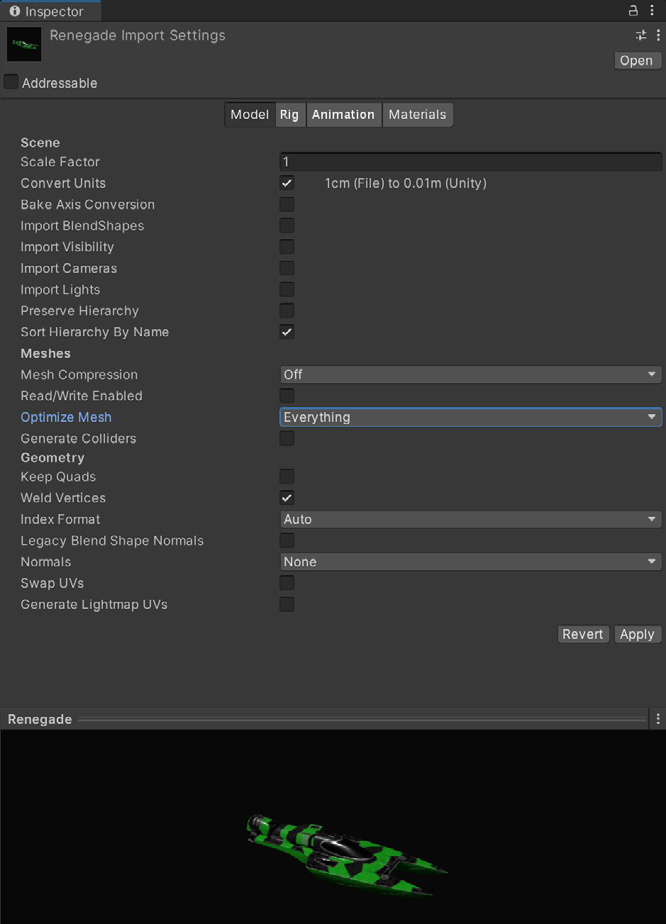
<p><em>VI: Kiểm tra setting import mesh — chú ý <strong>Mesh Compression</strong>, <strong>Read/Write Enabled</strong> (tắt), <strong>Optimize Mesh: Everything</strong>, <strong>Normals: None</strong>. / EN: Check your mesh import settings.</em></p>

<div class="bilingual-row">
<div class="col-vi">
<p>Giống texture, <strong>mesh có thể ngốn bộ nhớ thừa nếu không import cẩn thận</strong>:</p>
<ol>
<li><strong>Nén mesh (Compress the mesh):</strong> Nén quyết liệt <em>giảm dung lượng ĐĨA</em>. ⚠️ <strong>Bộ nhớ lúc RUNTIME thì KHÔNG bị ảnh hưởng.</strong> Lưu ý <em>mesh quantization có thể gây thiếu chính xác</em> — hãy thử nghiệm các mức nén.</li>
<li>🚨 <strong>Tắt Read/Write:</strong> Bật tùy chọn này <strong>NHÂN ĐÔI mesh trong bộ nhớ</strong> — giữ một bản trong system memory và một bản trong GPU memory. Trong hầu hết trường hợp, <em>nên TẮT</em>. <em>(Ở Unity 2019.2 trở về trước, tùy chọn này BẬT mặc định.)</em></li>
<li><strong>Tắt rig và BlendShapes:</strong> Nếu mesh <em>không cần</em> animation xương hoặc blendshape, hãy tắt các tùy chọn này ở mọi nơi có thể.</li>
<li><strong>Tắt normals và tangents nếu được:</strong> Nếu bạn <em>chắc chắn</em> material của mesh sẽ không cần normal hay tangent, bỏ tick chúng để tiết kiệm thêm.</li>
<li><strong>Kiểm tra polygon count:</strong> Model độ phân giải cao ⇒ <em>nhiều bộ nhớ hơn và tiềm ẩn GPU time lâu hơn</em>. <strong>"Geometry nền của bạn có CẦN nửa triệu polygon không?"</strong> Cân nhắc cắt giảm model trong DCC package. <strong>Xóa polygon không nhìn thấy được từ góc nhìn camera.</strong> Dùng <em>texture và normal map</em> cho chi tiết nhỏ thay vì mesh mật độ cao.</li>
</ol>
</div>
<div class="col-en">
<p>Much like textures, <strong>meshes can consume excess memory if not imported carefully</strong>:</p>
<ol>
<li><strong>Compress the mesh:</strong> Aggressive compression <em>reduces DISK space</em>. ⚠️ <strong>Memory at RUNTIME, however, is UNAFFECTED.</strong> Note that <em>mesh quantization can result in inaccuracy</em> — experiment with compression levels.</li>
<li>🚨 <strong>Disable Read/Write:</strong> Enabling this <strong>DUPLICATES the mesh in memory</strong> — keeping one copy in system memory and another in GPU memory. In most cases, <em>disable it</em>. <em>(In Unity 2019.2 and earlier, this option is checked by default.)</em></li>
<li><strong>Disable rigs and BlendShapes:</strong> If your mesh <em>does not need</em> skeletal or blendshape animation, disable these wherever possible.</li>
<li><strong>Disable normals and tangents, if possible:</strong> If you are <em>certain</em> the mesh's material won't need normals or tangents, uncheck these for extra savings.</li>
<li><strong>Check your polygon counts:</strong> Higher-resolution models mean <em>more memory and potentially longer GPU times</em>. <strong>"Does your background geometry need half a million polygons?"</strong> Consider cutting down models in your DCC package. <strong>Delete unseen polygons from the camera's point of view.</strong> Use <em>textures and normal maps</em> for fine detail instead of high-density meshes.</li>
</ol>
</div>
</div>


#### 7.3b. Hai tối ưu Mesh ở PLAYER SETTINGS

!!! note "Bổ sung sau audit — từ e-book Console/PC"

<div class="bilingual-row">
<div class="col-vi">
<p>Ngoài Import Settings của từng mesh, <strong>Player Settings</strong> còn có 2 tối ưu áp dụng cho <em>toàn dự án</em>:</p>
<p><strong>① <code>Vertex Compression</code></strong></p>
<p>Đặt <em>nén vertex THEO TỪNG CHANNEL</em>. Ví dụ: bật nén cho <strong>mọi thứ TRỪ position và lightmap UV</strong>. Việc này <strong>GIẢM runtime memory từ mesh của bạn</strong>.</p>
<p>🚨 <strong>Cảnh báo về thứ tự ưu tiên — dễ bị bẫy:</strong></p>
<blockquote>
<p><em>"Lưu ý rằng <strong><code>Mesh Compression</code> trong Import Settings của TỪNG mesh sẽ GHI ĐÈ setting <code>Vertex Compression</code></strong>. Trong trường hợp đó, <strong>bản sao mesh lúc RUNTIME là KHÔNG NÉN và có thể dùng NHIỀU bộ nhớ HƠN</strong>."</em></p>
</blockquote>
<p>👉 Nghĩa là: bật <code>Mesh Compression</code> ở mesh có thể <em>vô hiệu hóa</em> <code>Vertex Compression</code> toàn cục và làm bộ nhớ TĂNG. Nhớ lại §7.3 quy tắc ①: <strong>Mesh Compression chỉ giảm dung lượng ĐĨA, không giảm runtime memory.</strong></p>
<p><strong>② <code>Optimize Mesh Data</code></strong></p>
<p><em>"Loại bỏ khỏi mesh <strong>mọi dữ liệu KHÔNG được Material áp lên nó yêu cầu</strong>"</em> — như <strong>tangent, normal, color, và UV</strong>.</p>
<p>📝 Ghi chú raw ghi con số ví dụ: <em>"Optimize Mesh Data: checked (ex: 0.3 Mb)"</em>.</p>
</div>
<div class="col-en">
<p>Beyond per-mesh Import Settings, <strong>Player Settings</strong> has two optimizations applied <em>project-wide</em>:</p>
<p><strong>① <code>Vertex Compression</code></strong></p>
<p>Sets <em>vertex compression PER CHANNEL</em>. For example, you can enable compression for <strong>everything EXCEPT positions and lightmap UVs</strong>. This <strong>REDUCES runtime memory usage from your meshes</strong>.</p>
<p>🚨 <strong>Precedence warning — an easy trap:</strong></p>
<blockquote>
<p><em>"Note that the <strong><code>Mesh Compression</code> in EACH mesh's Import Settings OVERRIDES the <code>Vertex Compression</code> setting</strong>. In that event, <strong>the RUNTIME copy of the mesh is UNCOMPRESSED and may use MORE memory</strong>."</em></p>
</blockquote>
<p>👉 Meaning: enabling <code>Mesh Compression</code> on a mesh can <em>defeat</em> the global <code>Vertex Compression</code> and INCREASE memory. Recall §7.3 rule ①: <strong>Mesh Compression only reduces DISK size, not runtime memory.</strong></p>
<p><strong>② <code>Optimize Mesh Data</code></strong></p>
<p><em>"Removes any data from meshes <strong>that is NOT required by the Material applied to them</strong>"</em> — such as <strong>tangents, normals, colors, and UVs</strong>.</p>
<p>📝 The raw notes give an example figure: <em>"Optimize Mesh Data: checked (ex: 0.3 Mb)"</em>.</p>
</div>
</div>

### 7.4. Tự động hóa: AssetPostprocessor & Asset Bundle Analyzer

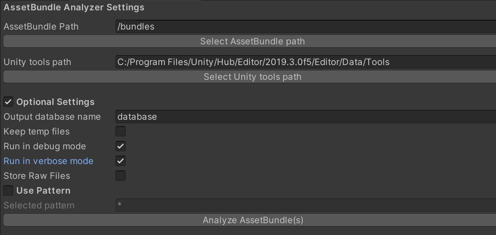

<div class="bilingual-row">
<div class="col-vi">
<p><strong>AssetPostprocessor</strong> cho phép bạn <strong>chạy script khi import asset</strong>. Việc này cho phép tùy chỉnh setting <em>TRƯỚC và/hoặc SAU</em> khi import model, texture, audio, v.v.</p>
<p><strong>Asset Bundle Analyzer</strong> là công cụ để review dự án:</p>
<ul>
<li>Nó chạy một <strong>script Python</strong> trích xuất thông tin từ Unity asset bundle</li>
<li>Lưu vào một <strong>database SQLite (<code>.DB</code>)</strong> trong thư mục project</li>
<li>Bạn dùng công cụ như <strong>DB Browser</strong> để review database, tìm: <em>asset lớn, bản trùng lặp, shader variant, và thuộc tính read-write trên texture và mesh</em></li>
</ul>
</div>
<div class="col-en">
<p><strong>AssetPostprocessor</strong> allows you to <strong>run scripts when importing assets</strong>. This lets you customize settings <em>BEFORE and/or AFTER</em> importing models, textures, audio, and so on.</p>
<p>The <strong>Asset Bundle Analyzer</strong> is a tool for reviewing your project:</p>
<ul>
<li>It runs a <strong>Python script</strong> that extracts information from Unity asset bundles</li>
<li>Stores that in a <strong>SQLite database (<code>.DB</code>)</strong> in the project folder</li>
<li>You then use a tool like <strong>DB Browser</strong> to review the database for: <em>large assets, duplicates, shader variants, and read-write properties on textures and meshes</em></li>
</ul>
</div>
</div>

```csharp
// AssetPostprocessor — ép chuẩn import setting cho toàn team
// AssetPostprocessor — enforce import settings across the whole team
using UnityEditor;

public class TextureImportEnforcer : AssetPostprocessor
{
    // Chạy TRƯỚC khi Unity import texture
    void OnPreprocessTexture()
    {
        var importer = (TextureImporter)assetImporter;

        // 🚨 Quy tắc 4: KHÔNG BAO GIỜ để Read/Write bật (nhân đôi bộ nhớ)
        importer.isReadable = false;

        // Quy tắc 5: UI/sprite không cần mipmap
        if (assetPath.Contains("/UI/"))
            importer.mipmapEnabled = false;

        // Quy tắc 1 + nén: override cho từng nền tảng
        var android = new TextureImporterPlatformSettings
        {
            name              = "Android",
            overridden        = true,
            maxTextureSize    = 1024,
            format            = TextureImporterFormat.ASTC_6x6,   // ASTC cho cả 2 nền tảng
            compressionQuality = 50
        };
        importer.SetPlatformTextureSettings(android);

        var ios = new TextureImporterPlatformSettings
        {
            name           = "iPhone",
            overridden     = true,
            maxTextureSize = 1024,
            format         = TextureImporterFormat.ASTC_6x6
        };
        importer.SetPlatformTextureSettings(ios);
    }

    // Ép Read/Write tắt cho mesh
    void OnPreprocessModel()
    {
        var importer = (ModelImporter)assetImporter;
        importer.isReadable      = false;   // Quy tắc 2: tránh nhân đôi mesh
        importer.importBlendShapes = false; // Quy tắc 3
        importer.optimizeMeshPolygons = true;
        importer.optimizeMeshVertices = true;
    }
}
```

### 7.5. ⚙️ Async Upload Pipeline (AUP) — 3 tham số vàng

<div class="bilingual-row">
<div class="col-vi">
<p>📝 <strong>Ghi chú raw nhấn mạnh 3 tham số này:</strong></p>
<blockquote>
<p><em>"Texture/Model không bật read/write được upload qua AUP."</em><br>
<code>QualitySettings.asyncUploadTimeSlice = 4</code><br>
<code>QualitySettings.asyncUploadBufferSize = 16</code><br>
<code>QualitySettings.asyncUploadPersistentBuffer = true</code></p>
</blockquote>
<p><strong>Từ e-book Console/PC — cơ chế:</strong></p>
<p>Unity dùng <strong>ring buffer</strong> để đẩy texture lên GPU. Điều chỉnh async texture buffer này qua <code>QualitySettings.asyncUploadBufferSize</code>.</p>
<p><strong>Khi nào cần chỉnh:</strong> Nếu <em>tốc độ upload quá chậm</em> HOẶC <em>main thread bị đứng (stall) khi load nhiều Texture cùng lúc</em> ⇒ chỉnh Texture buffer.</p>
<p>🔑 <strong>Quy tắc chọn giá trị:</strong> <em>"Thường bạn có thể đặt giá trị (tính bằng MB) bằng KÍCH THƯỚC của texture LỚN NHẤT bạn cần load trong Scene."</em></p>
<p>🚨 <strong>Hai cảnh báo:</strong></p>
<ol>
<li><em>"Hãy lưu ý rằng <strong>thay đổi giá trị mặc định có thể dẫn tới ÁP LỰC BỘ NHỚ CAO</strong>."</em></li>
<li><em>"Ngoài ra, bạn <strong>KHÔNG THỂ trả bộ nhớ ring buffer về hệ thống sau khi Unity đã cấp phát nó</strong>."</em></li>
</ol>
<p>⚠️ <strong>Hệ quả khi GPU memory quá tải:</strong> <em>"GPU sẽ UNLOAD texture ít-được-dùng-gần-đây nhất và BUỘC CPU phải RE-UPLOAD nó lần tới khi nó vào camera frustum."</em></p>
<p>📌 <em>Chi tiết đầy đủ về AUP sẽ nằm ở <strong>Module 4</strong> (GPU & Rendering).</em></p>
</div>
<div class="col-en">
<p>📝 <strong>The raw notes emphasize these three parameters:</strong></p>
<blockquote>
<p><em>"Textures/Models that are not read/write-enabled are uploaded through the AUP."</em><br>
<code>QualitySettings.asyncUploadTimeSlice = 4</code><br>
<code>QualitySettings.asyncUploadBufferSize = 16</code><br>
<code>QualitySettings.asyncUploadPersistentBuffer = true</code></p>
</blockquote>
<p><strong>From the Console/PC e-book — the mechanism:</strong></p>
<p>Unity uses a <strong>ring buffer</strong> to push textures to the GPU. Adjust this async texture buffer via <code>QualitySettings.asyncUploadBufferSize</code>.</p>
<p><strong>When to adjust:</strong> If <em>the upload rate is too slow</em> OR <em>the main thread stalls while loading several Textures at once</em> ⇒ adjust the Texture buffers.</p>
<p>🔑 <strong>How to pick a value:</strong> <em>"Usually you can set the value (in MB) to the SIZE of the LARGEST texture you need to load in the Scene."</em></p>
<p>🚨 <strong>Two warnings:</strong></p>
<ol>
<li><em>"Be aware that <strong>changing the default values can lead to HIGH MEMORY PRESSURE</strong>."</em></li>
<li><em>"Also, you <strong>CANNOT return ring buffer memory to the system after Unity allocates it</strong>."</em></li>
</ol>
<p>⚠️ <strong>What happens when GPU memory overloads:</strong> <em>"The GPU UNLOADS the least-recently used Texture and FORCES the CPU to RE-UPLOAD it the next time it enters the camera frustum."</em></p>
<p>📌 <em>Full AUP detail belongs to <strong>Module 4</strong> (GPU & Rendering).</em></p>
</div>
</div>

```csharp
// Cấu hình Async Upload Pipeline — 3 tham số từ ghi chú raw
// Configuring the Async Upload Pipeline — the three parameters from the raw notes
using UnityEngine;

public class AsyncUploadConfig : MonoBehaviour
{
    void Awake()
    {
        // Thời gian (ms) mỗi frame dành cho việc upload texture/mesh lên GPU
        QualitySettings.asyncUploadTimeSlice = 4;

        // Kích thước ring buffer (MB) — đặt bằng texture LỚN NHẤT trong Scene
        // ⚠️ KHÔNG trả lại được cho hệ thống sau khi cấp phát
        QualitySettings.asyncUploadBufferSize = 16;

        // Giữ buffer thường trú thay vì cấp phát/giải phóng liên tục
        QualitySettings.asyncUploadPersistentBuffer = true;
    }
}
```

### 7.6. Texture Streaming (Mipmap Streaming)

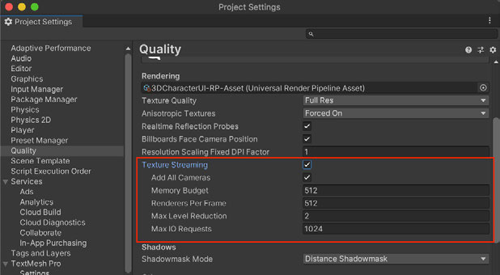
<p><em>VI: <code>Edit &gt; Project Settings &gt; Quality</code> → <strong>Texture Streaming ✓</strong>. Chú ý <strong>Memory Budget 512</strong>, <strong>Renderers Per Frame 512</strong>, <strong>Max Level Reduction 2</strong>, <strong>Max IO Requests 1024</strong>. / EN: Texture Streaming settings.</em></p>

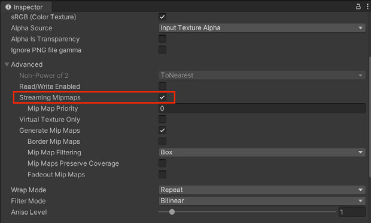
<p><em>VI: Bật <strong>Streaming Mipmaps</strong> trong Import Settings của Texture, mục Advanced. / EN: Enable Streaming Mipmaps in the Texture's Import Settings under Advanced.</em></p>

<div class="bilingual-row">
<div class="col-vi">
<p>Hệ thống <strong>Mipmap Streaming</strong> cho bạn <strong>kiểm soát mipmap level nào được load vào bộ nhớ</strong>.</p>
<p><strong>Cách bật:</strong></p>
<ol>
<li><code>Edit &gt; Project Settings &gt; Quality</code> → tick <strong>Texture Streaming</strong></li>
<li>Bật <strong>Streaming Mipmaps</strong> trong Import Settings của Texture, mục <strong>Advanced</strong></li>
</ol>
<p>🔑 <strong>Vì sao hiệu quả:</strong></p>
<blockquote>
<p><em>"Hệ thống này <strong>GIẢM tổng lượng bộ nhớ cần cho Texture</strong>, vì nó <strong>CHỈ load những mipmap CẦN THIẾT để render vị trí Camera hiện tại</strong>. Nếu không, <strong>Unity load TẤT CẢ texture theo mặc định</strong>."</em></p>
</blockquote>
<p>⚖️ <strong>Đánh đổi rõ ràng:</strong> <em>"Texture Streaming ĐÁNH ĐỔI một lượng NHỎ tài nguyên CPU để tiết kiệm một lượng GPU memory có thể RẤT LỚN."</em></p>
<p>💡 Texture Streaming <strong>tự động giảm mipmap level để nằm trong Memory Budget do người dùng định nghĩa</strong>. Dùng <strong>Mipmap Streaming API</strong> để kiểm soát thêm.</p>
</div>
<div class="col-en">
<p>The <strong>Mipmap Streaming</strong> system gives you <strong>control over which mipmap levels load into memory</strong>.</p>
<p><strong>To enable:</strong></p>
<ol>
<li><code>Edit &gt; Project Settings &gt; Quality</code> → check <strong>Texture Streaming</strong></li>
<li>Enable <strong>Streaming Mipmaps</strong> in the Texture's Import Settings under <strong>Advanced</strong></li>
</ol>
<p>🔑 <strong>Why it works:</strong></p>
<blockquote>
<p><em>"This system <strong>REDUCES the total amount of memory needed for Textures</strong> because it <strong>ONLY loads the mipmaps NECESSARY to render the current Camera position</strong>. Otherwise, <strong>Unity loads ALL of the textures by default</strong>."</em></p>
</blockquote>
<p>⚖️ <strong>The explicit trade-off:</strong> <em>"Texture Streaming TRADES a SMALL amount of CPU resources to save a potentially LARGE amount of GPU memory."</em></p>
<p>💡 Texture Streaming <strong>automatically reduces mipmap levels to stay within the user-defined Memory Budget</strong>. Use the <strong>Mipmap Streaming API</strong> for additional control.</p>
</div>
</div>

---

## 8. 🎯 Addressables — Quản lý Asset ở quy mô lớn

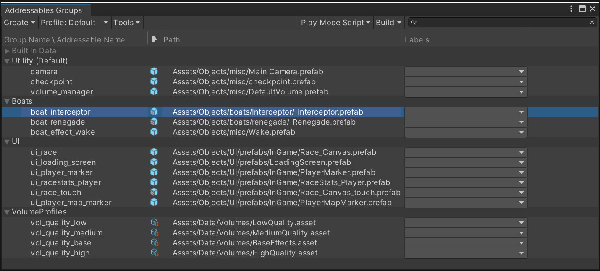
<p><em>VI: Trong Addressables Groups, bạn thấy địa chỉ tùy chỉnh của mỗi asset kèm vị trí của nó. / EN: In the Addressables Groups, you can see each asset's custom address paired with its location.</em></p>

<div class="bilingual-row">
<div class="col-vi">
<p><strong>Addressables và Asset Bundle</strong> là cách mạnh mẽ để <em>cấu trúc game thành các khối logic</em> có thể export riêng và thêm vào executable chính bất cứ khi nào cần.</p>
<p>🔑 <strong>Quan hệ:</strong> <em>"Hệ thống Addressables được XÂY DỰNG BÊN TRÊN Asset Bundle, lo giùm bạn việc PHÂN GIẢI PHỤ THUỘC và LOAD BUNDLE."</em></p>
<p><strong>Cài đặt:</strong> Cài package Addressables từ Package Manager. Mỗi asset/prefab đều <em>có thể trở thành "addressable"</em> — tick tùy chọn dưới tên asset trong Inspector sẽ gán một địa chỉ duy nhất mặc định. Asset đã đánh dấu xuất hiện tại <code>Window &gt; Asset Management &gt; Addressables &gt; Groups</code>.</p>
<p>✅ <strong>Lợi ích cốt lõi:</strong> <em>"Một Prefab addressable KHÔNG load vào bộ nhớ cho tới khi CẦN, và TỰ ĐỘNG unload các asset liên quan khi KHÔNG CÒN dùng."</em></p>
</div>
<div class="col-en">
<p><strong>Addressables and Asset Bundles</strong> are a powerful way to <em>structure your game in logical blocks</em> that can be exported separately and added to the main executable whenever needed.</p>
<p>🔑 <strong>The relationship:</strong> <em>"The Addressables system is BUILT ON TOP OF Asset Bundles, taking care of DEPENDENCIES RESOLUTION and BUNDLE LOADING for you."</em></p>
<p><strong>Setup:</strong> Install the Addressables package from Package Manager. Each asset or Prefab <em>has the ability to become "addressable"</em> — checking the option under an asset's name in the Inspector assigns a default unique address. Marked assets appear in <code>Window &gt; Asset Management &gt; Addressables &gt; Groups</code>.</p>
<p>✅ <strong>The core benefit:</strong> <em>"An addressable Prefab does NOT load into memory until NEEDED and AUTOMATICALLY unloads its associated assets when NO LONGER in use."</em></p>
</div>
</div>

### 8.1. 🚨 Ba câu hỏi lớn nhất — trả lời bởi Attilio Carotenuto (Unity)

<div class="bilingual-row">
<div class="col-vi">
<p><strong>Q1: Bắt đầu với Addressables thế nào?</strong></p>
<p>Với <em>dự án mới</em>: <strong>tận dụng Addressables NGAY TỪ ĐẦU</strong> và đảm bảo mọi asset mới đều được đăng ký là Addressable.</p>
<p>Với <em>dự án đã có nhiều asset</em>: setup ban đầu sẽ khó. <em>"Tôi thường thấy studio áp dụng cách tiếp cận TỪNG BƯỚC, chỉ chuyển MỘT PHẦN asset sang Addressables, còn scene và asset khác thì không đánh dấu."</em></p>
<p>🚨 <strong>Khuyến nghị dứt khoát:</strong></p>
<blockquote>
<p><em>"Khuyến nghị của tôi trong CẢ HAI trường hợp là <strong>ĐI TẤT TAY (go all-in)</strong> và đảm bảo <strong>MỌI THỨ có thể đánh dấu Addressable đều được thêm vào hệ thống</strong>.</em></p>
<p><em><strong>Cách tiếp cận LAI (hybrid) HIẾM KHI hiệu quả</strong>, và thường dẫn tới <strong>NHẦM LẪN, asset TRÙNG LẶP trong runtime memory, cũng như nội dung TRÙNG LẶP giữa game build và asset bundle</strong>. Điều này ảnh hưởng <strong>hiệu năng game, thời gian cài đặt, và build size</strong>."</em></p>
</blockquote>
<p><strong>Q2: Nên nhóm asset thế nào?</strong></p>
<p>🔑 <strong>Nguyên tắc:</strong> <em>"Nhắm tới việc nhóm asset dựa trên <strong>TẦN SUẤT chúng được load và dùng CÙNG NHAU</strong>. Tạo group là quá trình TƯƠNG TỰ đóng gói sprite sheet — bạn muốn <strong>TỐI THIỂU HÓA số sheet được load trong bộ nhớ CÙNG LÚC</strong>."</em></p>
<p>❌ <strong>SAI:</strong> Nhóm theo <em>LOẠI</em> — Materials, UI, Prefabs… <em>"Đây KHÔNG phải cách lý tưởng."</em></p>
<p>✅ <strong>ĐÚNG:</strong> <em>"Hãy PHÂN TÍCH cách người chơi TIẾN TRIỂN qua game và tạo, ví dụ: <strong>Intro Group, Tutorial Group, Level1</strong>, v.v. — với các phụ thuộc chung và dùng chung nằm trong group RIÊNG của chúng."</em></p>
<p>📊 <strong>Kết quả:</strong> <em>"Cải thiện runtime memory, GIẢM boot time, và nhờ đó cải thiện cả RETENTION của game — vì người chơi không phải nhìn màn hình đen hay ảnh loading trước khi chơi."</em></p>
<p>💡 <strong>Lưu ý về Scene:</strong> <em>"Addressables Scene LUÔN nằm trong bundle RIÊNG của nó, kể cả khi bạn nhóm chúng cùng asset thường. Chúng gọi là <strong>Streaming Scene Asset Bundles</strong>. Vì lý do này, best practice là <strong>đặt chúng vào group RIÊNG</strong>."</em></p>
<p>👉 <strong>Khi phân vân: CHIA NHỎ.</strong></p>
</div>
<div class="col-en">
<p><strong>Q1: How do I get started with Addressables?</strong></p>
<p>For a <em>new project</em>: <strong>leverage Addressables FROM THE START</strong> and ensure every new asset is registered as Addressable.</p>
<p>For <em>existing projects with many assets</em>: the initial setup can be challenging. <em>"I often see studios taking an INCREMENTAL approach where only a PORTION of assets are moved over to Addressables, while scenes and other assets are not marked as such."</em></p>
<p>🚨 <strong>The categorical recommendation:</strong></p>
<blockquote>
<p><em>"My recommendation in EITHER case is to <strong>GO ALL-IN</strong> and ensure <strong>EVERYTHING that can be marked as Addressables is added to the system</strong>.</em></p>
<p><em>A <strong>HYBRID approach is RARELY effective</strong>, and usually leads to <strong>CONFUSION, DUPLICATED assets in runtime memory, as well as DUPLICATED content between the game build and the asset bundle</strong>. This affects <strong>game performance, install time, and build size</strong>."</em></p>
</blockquote>
<p><strong>Q2: How should I group assets together?</strong></p>
<p>🔑 <strong>The principle:</strong> <em>"Aim to group assets based on <strong>how OFTEN they are loaded and used TOGETHER</strong>. Forming groups is a SIMILAR process to packing sprite sheets, where you want to <strong>MINIMIZE the amount of sheets loaded in memory at the SAME TIME</strong>."</em></p>
<p>❌ <strong>WRONG:</strong> Grouping by <em>TYPE</em> — Materials, UI, Prefabs… <em>"This is NOT ideal."</em></p>
<p>✅ <strong>RIGHT:</strong> <em>"Instead, you should ANALYZE how players PROGRESS through your game and create, for example, an <strong>Intro Group, a Tutorial Group, Level1</strong>, and so on, with common and shared dependencies in their OWN separate groups."</em></p>
<p>📊 <strong>The payoff:</strong> <em>"This will improve runtime memory usage, REDUCE boot time, and as a result improve game RETENTION as well, since players won't have to stare at a black screen or a loading image before playing."</em></p>
<p>💡 <strong>Note on Scenes:</strong> <em>"Addressables Scenes will ALWAYS end up in their OWN bundle, even if you group them together with other regular assets. These are called <strong>Streaming Scene Asset Bundles</strong>. For this reason, it's best practice to <strong>put them into their OWN group</strong>."</em></p>
<p>👉 <strong>When in doubt: SPLIT SMALLER.</strong></p>
</div>
</div>

!!! success "Q3: Vài bundle LỚN hay nhiều bundle NHỎ?"
    <div class="bilingual-row">
    <div class="col-vi">
    <blockquote>
    <p><em>"Theo kinh nghiệm của tôi, <strong>bundle NHỎ thường là lựa chọn TỐT NHẤT</strong>, vì nhiều lý do. Chúng tôi đã thấy <strong>các dự án LỚN đạt được bước nhảy hiệu năng RẤT ĐÁNG KỂ, và giảm boot time, CHỈ bằng cách chia nhỏ group của họ</strong>."</em></p>
    </blockquote>
    <p><strong>Ba lý do:</strong></p>
    <ol>
    <li>Bundle nhỏ ⇒ <strong>chuỗi phụ thuộc NGẮN HƠN</strong></li>
    <li>Do cách Unity load/unload asset trong bundle ⇒ <strong>bundle nhỏ thường cho runtime memory THẤP HƠN</strong></li>
    <li>⚠️ <strong>Lý do dev thích bundle LỚN đã LỖI THỜI:</strong> <em>"Nhiều developer thích bundle lớn, do <strong>các phiên bản Unity CŨ cấp phát cache RIÊNG cho MỖI bundle</strong>. <strong>Điều này KHÔNG CÒN đúng nữa.</strong>"</em></li>
    </ol>
    </div>
    <div class="col-en">
    <blockquote>
    <p><em>"In my experience, <strong>SMALL bundles are often the BEST choice</strong>, for many reasons. We have seen <strong>LARGE projects gaining a VERY SIGNIFICANT bump in performance, and reduction in boot time, JUST by breaking up their groups into smaller ones</strong>."</em></p>
    </blockquote>
    <p><strong>Three reasons:</strong></p>
    <ol>
    <li>Smaller bundles ⇒ <strong>SHORTER dependency chains</strong></li>
    <li>Due to how Unity handles loading/unloading assets within bundles ⇒ <strong>smaller bundles normally lead to LOWER runtime memory</strong></li>
    <li>⚠️ <strong>The reason devs preferred LARGE bundles is OBSOLETE:</strong> <em>"Many developers tend to prefer large bundles, due to <strong>OLDER versions of Unity allocating SEPARATE caches for EACH bundle</strong>. <strong>This is NO LONGER the case.</strong>"</em></li>
    </ol>
    </div>
    </div>

### 8.2. 🕸️ Quản lý Dependency — Bài học "Final Boss"

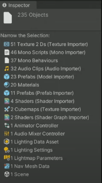
<p><em>VI: Chuột phải asset trong Project tab → <strong>Select Dependencies</strong>. Unity hiện số lượng phụ thuộc trong Inspector và lọc Project tab để hiện chúng. / EN: Right-click an asset → Select Dependencies. Unity shows the dependency count in the Inspector and filters the Project tab.</em></p>

<div class="bilingual-row">
<div class="col-vi">
<p>🚨 <strong>Vấn đề gốc:</strong></p>
<blockquote>
<p><em>"Khi bạn load một asset bundle lúc runtime, <strong>TẤT CẢ phụ thuộc của bundle đó cũng PHẢI được load</strong>. Việc kết thúc với <strong>cây phụ thuộc không rõ ràng, nơi MỘT asset gây ra HÀNG TRĂM lượt download</strong>, là khá phổ biến."</em></p>
</blockquote>
<p><strong>📖 Ví dụ kinh điển "Final Boss" — đọc kỹ, đây là bài học đắt giá nhất:</strong></p>
<ol>
<li>Game có một <strong>final boss</strong>. Boss này dùng <em>custom shader</em>, và mọi thứ được đóng gói gọn gàng — model, animation, material — trong <strong>MỘT bundle</strong>.</li>
<li>Người chơi đi qua game, tới cuối, rồi <em>final boss bundle được load</em>. ✅ <strong>Mọi thứ hoạt động tốt.</strong></li>
<li>🚨 <strong>Rồi:</strong> Team nội dung <em>tạo một kẻ địch MỚI ở LEVEL ĐẦU TIÊN</em> và <strong>TÁI SỬ DỤNG custom shader từ final boss</strong>.</li>
<li>💀 <strong>Team vừa tạo ra một PHỤ THUỘC từ ĐẦU game tới final boss asset bundle.</strong></li>
<li>⇒ <strong>Khi người chơi BẮT ĐẦU game, họ phải LOAD nội dung CUỐI GAME.</strong> Và nếu final boss bundle có phụ thuộc khác nữa ⇒ <em>chuỗi phụ thuộc còn dài hơn</em>.</li>
</ol>
<p>✅ <strong>Giải pháp:</strong> <em>"Trong trường hợp này, giải pháp là <strong>chuyển shader cụ thể đó vào bundle RIÊNG của nó</strong>, để PHÁ VỠ chuỗi phụ thuộc."</em></p>
<p><strong>Ví dụ thứ hai — IntroScreen:</strong> Ai đó cố load prefab <code>IntroScreen</code>, vốn là <em>một phần của UI group</em> (chứa menu, button, và các asset UI khác). ⇒ <strong>TẤT CẢ phụ thuộc của UI group đó cũng phải được load CÙNG LÚC — dù chúng CHƯA CẦN đến.</strong></p>
</div>
<div class="col-en">
<p>🚨 <strong>The root problem:</strong></p>
<blockquote>
<p><em>"When you load an asset bundle at runtime, <strong>ALL the dependencies of that bundle will ALSO need to be loaded</strong>. It's fairly common to end up with <strong>unclear dependency trees, where a SINGLE asset will cause HUNDREDS of downloads</strong>."</em></p>
</blockquote>
<p><strong>📖 The classic "Final Boss" example — read carefully, this is the most valuable lesson:</strong></p>
<ol>
<li>A game has a <strong>final boss</strong>. It uses a <em>custom shader</em>, and everything is nicely packed — model, animation, material — in <strong>ONE bundle</strong>.</li>
<li>Players go through the game, get to the end, then the <em>final boss bundle is loaded</em>. ✅ <strong>Everything works well.</strong></li>
<li>🚨 <strong>Then:</strong> the content team <em>authors a NEW enemy in the FIRST level</em> and <strong>REUSES the custom shader from the final boss</strong>.</li>
<li>💀 <strong>The team just created a DEPENDENCY from the START of the game to the final boss asset bundle.</strong></li>
<li>⇒ <strong>When players START the game, they have to LOAD END-GAME content.</strong> And if the final boss bundle has other dependencies ⇒ <em>an even longer dependency chain</em>.</li>
</ol>
<p>✅ <strong>The solution:</strong> <em>"In this case, the solution is to <strong>move this specific shader into its OWN bundle</strong>, in order to BREAK the dependency chain."</em></p>
<p><strong>Second example — IntroScreen:</strong> Someone tries to load the <code>IntroScreen</code> prefab, which is <em>part of a UI group</em> (containing the menu, buttons, and other UI assets). ⇒ <strong>ALL the dependencies of that UI group must ALSO be loaded at the SAME TIME — even though they aren't needed yet.</strong></p>
</div>
</div>

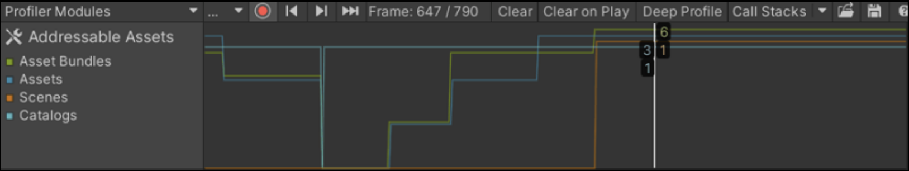
<p><em>VI: Addressables Profiler Module — theo dõi asset nào đang được load khi chơi, kèm asset bundle và phụ thuộc liên quan. Chọn một frame sẽ hiện tree view. <em>(Package Addressables cũ hơn → dùng Addressables Event Viewer.)</em> / EN: The Addressables Profiler Module.</em></p>

<div class="bilingual-row">
<div class="col-vi">
<p>💎 <strong>Vũ khí mạnh nhất để giảm phụ thuộc: <code>AssetReference</code></strong></p>
<blockquote>
<p><em>"Một cách MẠNH MẼ để giảm phụ thuộc là <strong>tận dụng <code>AssetReference</code> khi viết script</strong>. Đây về bản chất là <strong>SOFT REFERENCE</strong> cho phép bạn <em>kiểm soát KHI NÀO asset được load và unload</em>, <strong>PHÁ VỠ chuỗi phụ thuộc TRỰC TIẾP</strong>.</em></p>
<p><em>⚠️ Chúng đòi hỏi <strong>nhiều công sức hơn do phải quản lý bộ nhớ</strong> (có thể dẫn tới <strong>memory leak</strong>), nhưng chúng sẽ <strong>GIẢM CỰC MẠNH thời gian load game và runtime memory nếu dùng đúng cách</strong>."</em></p>
</blockquote>
</div>
<div class="col-en">
<p>💎 <strong>The most powerful weapon for reducing dependencies: <code>AssetReference</code></strong></p>
<blockquote>
<p><em>"One POWERFUL way to reduce dependencies is to <strong>leverage <code>AssetReference</code>s while writing your scripts</strong>. These are essentially <strong>SOFT REFERENCES</strong> that allow you to <em>control WHEN an asset is loaded and unloaded</em>, <strong>BREAKING the DIRECT dependency chain</strong>.</em></p>
<p><em>⚠️ They require <strong>more work due to memory management</strong> (which can lead to <strong>memory leaks</strong>), but they will <strong>MASSIVELY reduce your game loading times and runtime memory usage if used properly</strong>."</em></p>
</blockquote>
</div>
</div>

```csharp
// AssetReference — soft reference, phá vỡ chuỗi phụ thuộc trực tiếp
// AssetReference — a soft reference that breaks the direct dependency chain
using UnityEngine;
using UnityEngine.AddressableAssets;
using UnityEngine.ResourceManagement.AsyncOperations;

public class BossSpawner : MonoBehaviour
{
    // ✅ Soft reference: KHÔNG tạo phụ thuộc trực tiếp lúc build
    //    ⇒ shader/model của boss KHÔNG bị kéo vào bundle của scene này
    [SerializeField] private AssetReferenceGameObject bossPrefabRef;

    private AsyncOperationHandle<GameObject> handle;
    private GameObject bossInstance;

    public async void SpawnBoss(Vector3 pos)
    {
        // Load CHỈ khi thực sự cần
        handle = bossPrefabRef.InstantiateAsync(pos, Quaternion.identity);
        bossInstance = await handle.Task;
    }

    // 🚨 BẮT BUỘC giải phóng — nếu không sẽ memory leak
    //    Đây chính là "more work due to memory management" mà Attilio cảnh báo
    public void DespawnBoss()
    {
        if (bossInstance != null)
        {
            Addressables.ReleaseInstance(bossInstance);   // release instance
            bossInstance = null;
        }
    }

    void OnDestroy() => DespawnBoss();
}
```

### 8.3. 📋 Build Layout Report — 4 tab phân tích

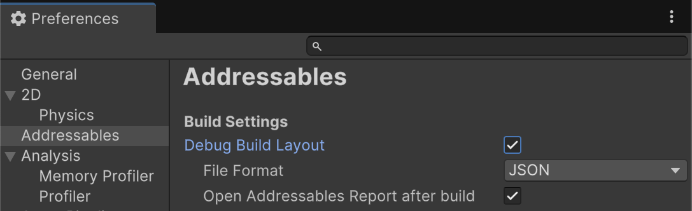
<p><em>VI: Bật report tại <code>Preferences &gt; Addressables &gt; Debug Build Layout</code>. ⚠️ Mặc định TẮT vì sinh report sẽ <strong>TĂNG build time</strong>. / EN: Enable via Preferences &gt; Addressables &gt; Debug Build Layout. Disabled by default as generating it increases build time.</em></p>

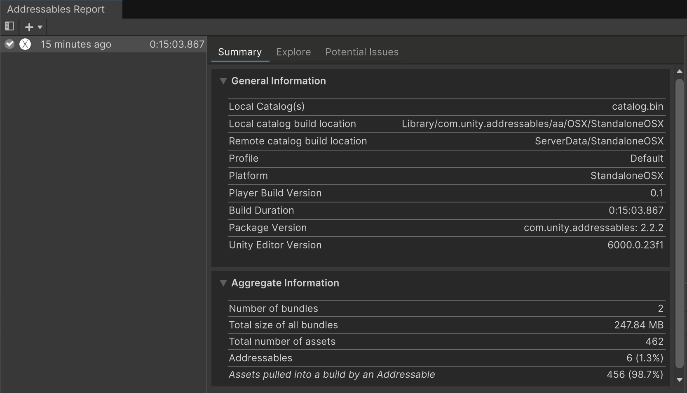
<p><em>VI: Tab <strong>Summary</strong> — dữ liệu và thống kê chung về build. / EN: An example of an Addressables Report summary.</em></p>

<div class="bilingual-row">
<div class="col-vi">
<p>Khi làm việc với Addressables, việc <strong>hiểu nhanh bạn đang sinh ra asset bundle nào, chúng chứa asset gì, có bản trùng lặp nào, và VÌ SAO build lâu</strong> là thiết yếu. Công cụ: <strong>Build Layout Report</strong>.</p>
<p><strong>TAB 1 — SUMMARY</strong></p>
<ul>
<li>Mục <strong>Aggregate Information</strong>: bao nhiêu <em>bundle và asset</em> nằm trong build Addressables của bạn.</li>
<li>🚨 <strong>Mục quan trọng nhất: "Assets pulled into a build by an Addressable"</strong>
  <blockquote>
  <p><em>"Đây là các asset <strong>KHÔNG-Addressable bị đưa vào bundle vì chúng là PHỤ THUỘC của asset Addressable khác</strong>. Điều này gây <strong>TĂNG build size tổng thể</strong>, vì asset bị <strong>TRÙNG LẶP giữa NHIỀU asset bundle VÀ chính game build</strong>. Nó cũng dẫn tới <strong>TĂNG runtime memory</strong>, vì bản trùng lặp bị load vào bộ nhớ một cách KHÔNG CẦN THIẾT."</em></p>
  </blockquote>
</li>
</ul>
</div>
<div class="col-en">
<p>When working with Addressables, it's essential to <strong>quickly understand what asset bundles you're generating, what assets they contain, eventual duplicates, and WHY it is taking so long to build</strong>. The tool: the <strong>Build Layout Report</strong>.</p>
<p><strong>TAB 1 — SUMMARY</strong></p>
<ul>
<li>The <strong>Aggregate Information</strong> section: how many <em>bundles and assets</em> are included in your Addressables build.</li>
<li>🚨 <strong>The most important section: "Assets pulled into a build by an Addressable"</strong>
  <blockquote>
  <p><em>"These are <strong>NON-Addressable assets being included in bundles due to being DEPENDENCIES to other Addressable assets</strong>. This will cause an <strong>overall INCREASE in build size</strong>, as assets end up being <strong>DUPLICATED between MULTIPLE asset bundles AND the actual game build</strong>. It can also lead to <strong>INCREASED runtime memory usage</strong>, as duplicates end up being loaded in memory UNNECESSARILY."</em></p>
  </blockquote>
</li>
</ul>
</div>
</div>

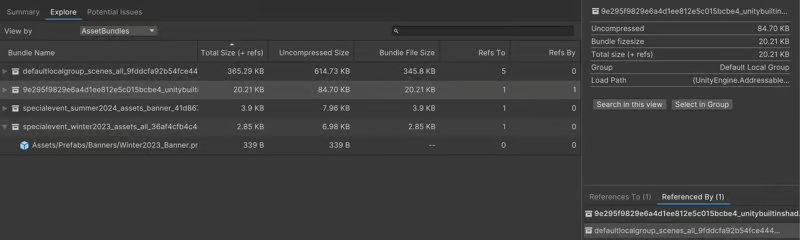
<p><em>VI: Tab <strong>Explore</strong> — phân tích asset qua nhiều view khác nhau. / EN: The Explore tab in the Addressables Report window.</em></p>

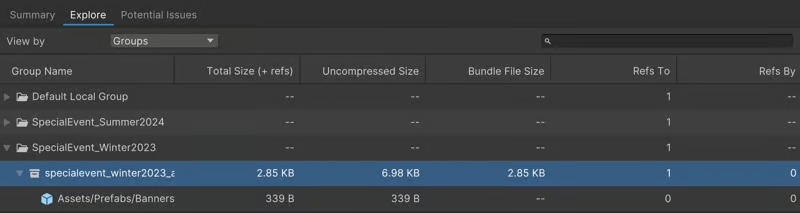
<p><em>VI: View <strong>By Groups</strong> — hiện Addressables group, bundle sinh ra trong mỗi group, và asset trong mỗi bundle. / EN: The View By Groups view in the Explore tab.</em></p>

<div class="bilingual-row">
<div class="col-vi">
<p><strong>TAB 2 — EXPLORE</strong> (4 view):</p>
<ul>
<li><strong>AssetBundles</strong> — danh sách tất cả Asset Bundle và asset trong đó. 💎 <em>"Rất tiện để hiểu thành phần bundle và <strong>PHÁT HIỆN asset trùng lặp</strong> bằng cách dùng view <strong>References To/By</strong> ở phần dưới-phải cửa sổ."</em></li>
<li><strong>Assets</strong> — danh sách thô tất cả asset, <em>kích thước</em>, cùng <strong>tham chiếu theo CẢ HAI chiều</strong>.</li>
<li><strong>Groups</strong> — hiện Addressables group, bundle sinh ra trong mỗi group, và asset trong từng bundle.</li>
<li><strong>Labels</strong> — hiện các label đã định nghĩa, cùng asset được gắn label đó.</li>
</ul>
</div>
<div class="col-en">
<p><strong>TAB 2 — EXPLORE</strong> (four views):</p>
<ul>
<li><strong>AssetBundles</strong> — a list of all your Asset Bundles and what assets are included. 💎 <em>"Very handy to understand your bundle composition and <strong>DETECT asset duplicates</strong> by using the <strong>References To/By</strong> view on the lower-right part of the window."</em></li>
<li><strong>Assets</strong> — a raw list of all game assets, their <em>size</em>, and <strong>references in BOTH directions</strong>.</li>
<li><strong>Groups</strong> — your Addressables groups, the resulting bundles within each, and the assets in each bundle.</li>
<li><strong>Labels</strong> — the labels you defined, along with the assets tagged with them.</li>
</ul>
</div>
</div>

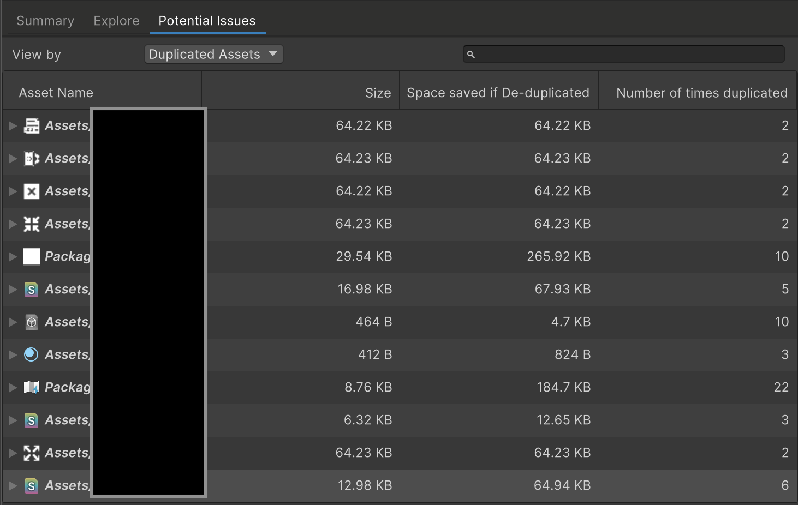
<p><em>VI: Tab <strong>Potential Issues</strong> — tổng quan nhanh về asset trùng lặp, <strong>chỉ rõ TIẾT KIỆM được bao nhiêu dung lượng nếu sửa</strong>. Đọc cột: <code>Size</code> · <code>Space saved if De-duplicated</code> · <code>Number of times duplicated</code>. Ví dụ: một asset 29.54 KB bị trùng <strong>10 lần</strong> ⇒ tiết kiệm được <strong>265.92 KB</strong>; một asset 8.76 KB trùng <strong>22 lần</strong> ⇒ tiết kiệm <strong>184.7 KB</strong>. / EN: The Potential Issues tab — a quick overview of duplicated assets, indicating how much space could be saved by fixing them.</em></p>

### 8.4. ⚠️ Trộn Addressable và non-Addressable — Cái bẫy nhân bản

<div class="bilingual-row">
<div class="col-vi">
<p>🚨 <strong>Quy tắc cốt lõi:</strong></p>
<blockquote>
<p><em>"Bất cứ khi nào một asset Addressable <strong>tham chiếu TRỰC TIẾP tới một asset KHÔNG-Addressable</strong>, nó sẽ <strong>PHẢI mang một BẢN SAO của asset đó vào bundle tương ứng của mình</strong>."</em></p>
</blockquote>
<p><strong>Ví dụ:</strong> Hai prefab thuộc <em>group khác nhau, bundle khác nhau</em>, dùng <strong>CÙNG một material KHÔNG-Addressable</strong>. ⇒ <strong>MỖI cái sẽ mang MỘT BẢN SAO của material này vào bundle riêng của nó</strong>, vì nó không phải Addressable.</p>
<p>💀 <strong>Hậu quả kép:</strong> (a) <em>TĂNG build size</em> vì bundle lớn hơn do material trùng lặp; (b) <em>TĂNG runtime memory</em> vì sự nhân bản.</p>
<p><strong>Tương tự với Scene:</strong> Nếu bạn có <em>scene KHÔNG-Addressable dùng asset Addressable</em>, thì <strong>các asset đó sẽ bị COPY vào game build</strong> ⇒ lại tăng kích thước trên đĩa và runtime memory.</p>
<p>🚨 <strong>Trường hợp RỦI RO NHẤT:</strong></p>
<blockquote>
<p><em>"Các trường hợp này <strong>đặc biệt RỦI RO khi làm việc với kho dữ liệu TẬP TRUNG (centralized data repositories)</strong>, vì nó có thể dẫn tới <strong>bug KHÓ LẦN, nơi bạn giờ có HAI BẢN SAO của asset đó trong bộ nhớ, trong khi bạn chỉ MONG ĐỢI một</strong>."</em></p>
</blockquote>
<p>✅ <strong>Cách làm ĐÚNG với Scene:</strong></p>
<blockquote>
<p><em>"Với scene, cách tiếp cận đúng là có một <strong>bootstrap scene NHẸ, KHÔNG-Addressable</strong>, chịu trách nhiệm load <strong>Addressable scene ĐẦU TIÊN</strong> của bạn, rồi đảm bảo <strong>TẤT CẢ scene khác đều được đánh dấu Addressable</strong>."</em></p>
</blockquote>
</div>
<div class="col-en">
<p>🚨 <strong>The core rule:</strong></p>
<blockquote>
<p><em>"Whenever an Addressable asset <strong>DIRECTLY references a NON-Addressable asset</strong>, it will <strong>need to bring a COPY of that asset into its respective bundle</strong>."</em></p>
</blockquote>
<p><strong>Example:</strong> Two prefabs, part of <em>different groups and different bundles</em>, using the <strong>SAME non-Addressable material</strong>. ⇒ <strong>They will EACH bring a COPY of this material into their OWN bundle</strong>, because it's not Addressable.</p>
<p>💀 <strong>Double consequence:</strong> (a) <em>INCREASED build size</em> as the bundles are larger due to the duplicate; (b) <em>INCREASED runtime memory</em> because of the duplication.</p>
<p><strong>Same for Scenes:</strong> If you have a <em>non-Addressable scene using Addressable assets</em>, <strong>those assets will be COPIED over into the game build</strong> ⇒ again increasing size on disk and runtime memory.</p>
<p>🚨 <strong>The RISKIEST case:</strong></p>
<blockquote>
<p><em>"These cases are <strong>particularly RISKY when dealing with CENTRALIZED data repositories</strong>, as it can lead to <strong>TRICKY BUGS where you now have TWO COPIES of that asset in memory, when you've only EXPECTED one</strong>."</em></p>
</blockquote>
<p>✅ <strong>The RIGHT approach for Scenes:</strong></p>
<blockquote>
<p><em>"For scenes, the right approach is to have a <strong>LIGHTWEIGHT non-Addressable bootstrap scene</strong>, responsible for loading your <strong>INITIAL Addressable scene</strong>, and then ensure <strong>ALL the other scenes are marked as Addressables</strong>."</em></p>
</blockquote>
</div>
</div>

### 8.5. 💀 Loading & Unloading — Vì sao game crash OOM

<div class="bilingual-row">
<div class="col-vi">
<p>🔑 <strong>Cơ chế bất đối xứng — điều quan trọng nhất trong cả chương:</strong></p>
<blockquote>
<p><em>"Bất cứ khi nào bạn cố dùng một asset nằm trong bundle, Unity đảm bảo <strong>bundle tương ứng được load vào bộ nhớ</strong>, rồi mới load asset đó.</em></p>
<p><em>Tuy <strong>CÓ THỂ load MỘT PHẦN các asset cụ thể trong một Asset Bundle</strong>, <strong>ĐIỀU NGƯỢC LẠI thì KHÔNG ĐƯỢC PHÉP</strong>. Nghĩa là: ngay khi một asset trong Asset Bundle được load, nó <strong>CHỈ có thể được unload nếu TOÀN BỘ nhóm asset đó KHÔNG CÒN cần đến</strong>."</em></p>
</blockquote>
<p>💀 <strong>Kịch bản crash — theo từng bước:</strong></p>
<ol>
<li>Toàn bộ environment của bạn nằm trong <strong>MỘT bundle</strong>.</li>
<li>Bạn chơi <strong>Level 1</strong>, load environment prefab liên quan.</li>
<li>Xong level, chuyển sang <strong>Level 2</strong>, load prefab Level 2 và các phụ thuộc.</li>
<li>🚨 <strong>NHƯNG vì chúng thuộc CÙNG bundle, prefab Level 1 VẪN NẰM TRONG BỘ NHỚ.</strong></li>
<li>Bạn tiếp tục qua <strong>Level 3 và Level 4</strong> ⇒ <em>runtime memory TĂNG DẦN</em>.</li>
<li>💀 <strong>Cuối cùng bạn HẾT BỘ NHỚ và game CRASH.</strong></li>
</ol>
<p>✅ <strong>Kết luận:</strong> <em>"Đây là lý do tốt nhất nên <strong>TRÁNH bundle có SỐ LƯỢNG LỚN asset</strong>, vì nó sẽ ngốn rất nhiều runtime memory và trở thành bottleneck. Như đã nói: <strong>đóng gói asset dựa trên TẦN SUẤT chúng được load và dùng cùng nhau; khi phân vân, CHIA NHỎ</strong>."</em></p>
</div>
<div class="col-en">
<p>🔑 <strong>The asymmetric mechanism — the single most important thing in this chapter:</strong></p>
<blockquote>
<p><em>"Whenever you attempt to use an asset contained within a bundle, Unity ensures <strong>the corresponding bundle is loaded into memory</strong>, then in turn loads the asset.</em></p>
<p><em>While it's <strong>POSSIBLE to PARTIALLY LOAD specific assets within an Asset Bundle</strong>, <strong>the OPPOSITE isn't ALLOWED</strong>. This means that as soon as an asset within an Asset Bundle is loaded, it <strong>can ONLY be unloaded if the ENTIRE group of assets is no longer needed</strong>."</em></p>
</blockquote>
<p>💀 <strong>The crash scenario — step by step:</strong></p>
<ol>
<li>All your environments are contained within a <strong>SINGLE bundle</strong>.</li>
<li>You play <strong>Level 1</strong>, loading the relevant environment prefabs.</li>
<li>You finish it, move to <strong>Level 2</strong>, load Level 2 prefabs and dependencies.</li>
<li>🚨 <strong>BUT because they're part of the SAME bundle, the Level 1 prefabs are STILL KEPT IN MEMORY.</strong></li>
<li>You keep going through <strong>Level 3 and Level 4</strong> ⇒ <em>runtime memory INCREASING</em>.</li>
<li>💀 <strong>Eventually you run OUT OF MEMORY and the game CRASHES.</strong></li>
</ol>
<p>✅ <strong>The conclusion:</strong> <em>"This is why it's best to <strong>AVOID bundles with a LARGE number of assets</strong>, as it will end up taking a lot of runtime memory and turn into a bottleneck. As mentioned: <strong>pack assets based on how FREQUENTLY they're going to be loaded and used together; when in doubt, SPLIT them into SMALLER bundles</strong>."</em></p>
</div>
</div>

### 8.6. 🎯 "Requested Assets and Dependencies" — Câu trả lời chính thức

!!! danger "Đây chính là điểm mà `raw-optimization-data.txt` nhấn mạnh"
    **VI:** File raw ghi: *"In most cases it's better to leave it to the default **Requested Assets and Dependencies**"*. Dưới đây là **toàn bộ ngữ cảnh Q&A** từ thread — câu hỏi của cộng đồng và câu trả lời trực tiếp của **Attilio Carotenuto (Senior Technical Lead, Unity)**.

<div class="bilingual-row">
<div class="col-vi">
<p><strong>❓ Câu hỏi từ cộng đồng:</strong></p>
<blockquote>
<p><em>"Tôi vẫn còn bối rối về việc bundle dependency được load vào RAM <strong>khi nào và như thế nào</strong>. Đã nói rằng nếu <strong>Bundle 1</strong> có <strong>Asset A</strong> và <strong>Asset B</strong>, và <strong>Asset B</strong> tham chiếu <strong>Asset C</strong> từ <strong>Bundle 2</strong>, thì việc load <strong>Asset A</strong> sẽ kéo theo load <strong>Bundle 2</strong>.</em></p>
<p><em>Điều chưa rõ với tôi là: <strong>TẤT CẢ asset của Bundle 2 có thực sự được load vào bộ nhớ và chiếm RAM vật lý không?</strong> Hay chỉ metadata của Bundle 2? Hay bundle được giải nén ra đĩa nhưng chưa kéo vào RAM cho tới khi cần một asset của nó?</em></p>
<p><em>Nó có vẻ là chi tiết nhỏ ở vài dự án, <strong>nhưng ở dự án LỚN với nhiều bundle thì đó là KHÁC BIỆT MỘT TRỜI MỘT VỰC về mức dùng bộ nhớ.</strong>"</em></p>
</blockquote>
<p><strong>✅ Trả lời của Attilio Carotenuto:</strong></p>
<blockquote>
<p><em>"<strong>CHỈ bản thân bundle sẽ cần được load</strong> (và download nếu là remote). Unity sau đó <strong>CHỈ load asset dependency CẦN THIẾT từ bundle đó, KHÔNG phải tất cả chúng.</strong></em></p>
<p><em>🚨 <strong>MỘT NGOẠI LỆ:</strong> Nếu bạn đổi <strong>"Asset Load Mode"</strong> thành <strong>"All Packed Assets and Dependencies"</strong>, thì <strong>TẤT CẢ asset được load vào bộ nhớ CÙNG MỘT LÚC</strong>.</em></p>
<p><em>✅ <strong>Trong hầu hết trường hợp, TỐT HƠN là để nó ở mặc định "Requested Assets and Dependencies".</strong></em></p>
<p><em>⚠️ Vấn đề là, <strong>Bundle 2 CŨNG có phụ thuộc của nó</strong>, và những cái đó rồi cũng sẽ được load/download <strong>⇒ có khả năng gây ra một CHUỖI THAO TÁC DÀI</strong>.</em></p>
<p><em>📌 Việc bundle có được giải nén ngay khi load hay không là <strong>TÙY NỀN TẢNG</strong> — ví dụ <strong>trên WebGL, bundle LUÔN được copy vào bộ nhớ TOÀN BỘ khi load</strong>."</em></p>
</blockquote>
</div>
<div class="col-en">
<p><strong>❓ Community question:</strong></p>
<blockquote>
<p><em>"I still have some confusion regarding <strong>how and when</strong> bundle dependencies are loaded into RAM. It's been mentioned that if <strong>Bundle 1</strong> has <strong>Asset A</strong> and <strong>Asset B</strong>, and <strong>Asset B</strong> references <strong>Asset C</strong> from <strong>Bundle 2</strong>, then loading <strong>Asset A</strong> implies loading <strong>Bundle 2</strong>.</em></p>
<p><em>What's unclear to me is: <strong>are ALL Bundle 2 assets effectively loaded into memory and do they compromise physical RAM?</strong> Or just some metadata of Bundle 2? Or is the bundle decompressed to disk but not pulled into RAM until one of its assets is needed?</em></p>
<p><em>It might look like a small detail in some projects, <strong>but in big projects with lots of bundles it might be NIGHT AND DAY with respect to memory usage.</strong>"</em></p>
</blockquote>
<p><strong>✅ Attilio Carotenuto's answer:</strong></p>
<blockquote>
<p><em>"<strong>Just the bundle itself will need to be loaded</strong> (and downloaded if it's a remote one). Unity will then <strong>ONLY load the required asset dependency from that bundle, NOT all of them.</strong></em></p>
<p><em>🚨 <strong>ONE EXCEPTION:</strong> If you changed <strong>"Asset Load Mode"</strong> to be <strong>"All Packed Assets and Dependencies"</strong>, then <strong>ALL assets are loaded in memory AT ONCE</strong>.</em></p>
<p><em>✅ <strong>In most cases it's BETTER to leave it to the default "Requested Assets and Dependencies".</strong></em></p>
<p><em>⚠️ The issue is, <strong>Bundle 2 will ALSO have its dependencies</strong>, and those will then be loaded/downloaded as well, <strong>⇒ potentially causing a LONG CHAIN of operations</strong>.</em></p>
<p><em>📌 Whether the bundle is decompressed as soon as it gets loaded is <strong>PLATFORM SPECIFIC</strong> — on <strong>WebGL, for example, bundles are ALWAYS copied into memory IN FULL when loaded</strong>."</em></p>
</blockquote>
</div>
</div>

### 8.7. 🚨 `Resources.UnloadUnusedAssets` KHÔNG tương thích Addressables

!!! danger "Cảnh báo quan trọng — nhiều dự án đang làm SAI"
    <div class="bilingual-row">
    <div class="col-vi">
    <p><strong>❓ Câu hỏi:</strong> <em>"Trong manual Addressables 1.23.1 có nói <code>Resources.UnloadUnusedAssets</code> CÓ THỂ unload một phần AssetBundle, nhưng phần đó đã bị GỠ trong manual 2.4.2. Vậy có unload một phần asset trong AssetBundle bằng method này được không?"</em></p>
    <p><strong>✅ Trả lời của Attilio Carotenuto:</strong></p>
    <blockquote>
    <p><em>"Ừm, phức tạp đấy. <strong>Câu trả lời NGẮN là <code>Resources.UnloadUnusedAssets</code> KHÔNG TƯƠNG THÍCH với Addressables</strong>, và <strong>khuyến nghị là ĐỪNG dùng chúng cùng nhau</strong> — thay vào đó hãy để engine tự giải phóng asset bằng cách <em>giữ bundle NHỎ và đóng gói asset dựa trên cách dùng</em>.</em></p>
    <p><em>💀 <strong>Chi tiết hơn:</strong> <code>Resources.UnloadUnusedAssets</code> <strong>có thể dẫn tới HỎNG BỘ NHỚ (memory corruption) và gây CRASH</strong> trong một số trường hợp — cụ thể là khi bạn <strong>unload asset từ một Asset Bundle VẪN nằm trong bộ nhớ, rồi cố load lại chúng</strong>.</em></p>
    <p><em>Hệ thống Addressables <strong>giữ một REFERENCE COUNT của asset và bundle trong bộ nhớ</strong>, nhưng <code>Resources.UnloadUnusedAssets</code> <strong>KHÔNG chơi đẹp với nó</strong> và <strong>có thể HỦY những object VẪN đang được Addressables theo dõi</strong> do Asset Bundle. Rồi lần sau khi game cố load chúng, <strong>chúng sẽ KHÔNG HỢP LỆ và game sẽ CRASH.</strong></em></p>
    <p><em>⚠️ Gọi <code>Resources.UnloadUnusedAssets</code> cũng <strong>RẤT TỆ cho hiệu năng</strong>, vì nó phải <em>duyệt qua TOÀN BỘ bộ nhớ để kiểm tra tham chiếu và unload asset</em>.</em></p>
    <p><em>📌 Nói vậy, <strong>tôi ĐÃ thấy các dự án dùng nó</strong> — cụ thể khi chuyển cảnh — <strong>mà không báo crash</strong>. Tôi tin điều này thường vì <strong>bundle CŨNG đang được giải phóng khi chuyển scene</strong> (nên họ tránh được memory corruption chủ yếu do <strong>TRÙNG HỢP</strong>), hoặc trong một số trường hợp <strong>họ KHÔNG theo dõi crash</strong>."</em></p>
    </blockquote>
    <p>⚠️ <strong>ĐỌC TIẾP §8.7b</strong> — có đính chính quan trọng: lời gọi <em>nội bộ từ package</em> thì <strong>AN TOÀN</strong>.</p>
    </div>
    <div class="col-en">
    <p><strong>❓ The question:</strong> <em>"In the Addressables 1.23.1 manual it's mentioned <code>Resources.UnloadUnusedAssets</code> CAN unload part of an AssetBundle, but that mention was REMOVED in the 2.4.2 manual. So is it possible to partially unload assets within an AssetBundle via this method?"</em></p>
    <p><strong>✅ Attilio Carotenuto's answer:</strong></p>
    <blockquote>
    <p><em>"Well, it's complicated. <strong>The SHORT answer is that <code>Resources.UnloadUnusedAssets</code> is NOT COMPATIBLE with Addressables</strong>, and <strong>the recommendation is NOT to use them together</strong> — instead let the engine release assets by <em>keeping bundles SMALL and packing assets based on usage</em>.</em></p>
    <p><em>💀 <strong>In more detail:</strong> <code>Resources.UnloadUnusedAssets</code> <strong>can lead to MEMORY CORRUPTION and cause CRASHES</strong> in some cases — specifically when you <strong>unload assets from an Asset Bundle that STAYS in memory, and then try to load them again</strong>.</em></p>
    <p><em>The Addressables system <strong>keeps a REFERENCE COUNT of assets and bundles in memory</strong>, but <code>Resources.UnloadUnusedAssets</code> <strong>doesn't play nicely with it</strong> and <strong>might DESTROY objects that are STILL tracked by Addressables</strong> due to the Asset Bundle. Then next time the game attempts to load them, <strong>they will be INVALID and the game will CRASH.</strong></em></p>
    <p><em>⚠️ Calling <code>Resources.UnloadUnusedAssets</code> is also <strong>VERY BAD for performance</strong>, as it needs to <em>go through ALL memory checking for references and unloading assets</em>.</em></p>
    <p><em>📌 Having said that, <strong>I've SEEN projects using it</strong> — specifically when transitioning between scenes — <strong>without reporting crashes</strong>. I believe this is often because <strong>the bundle is ALSO getting released on scene transition</strong> (so they are avoiding the memory corruption mainly out of <strong>COINCIDENCE</strong>), or in some cases <strong>they are NOT tracking crashes</strong>."</em></p>
    </blockquote>
    </div>
    </div>

### 8.7b. ⚖️ Đính chính quan trọng — Không phải mọi lời gọi đều nguy hiểm

!!! success "Bổ sung sau audit — reply #7 đến #9 của thread"
    **VI:** Lần cào đầu tôi dừng ở reply #5. Các reply tiếp theo chứa **những đính chính LÀM MỀM cảnh báo ở §8.7** — quan trọng để không hiểu sai.

<div class="bilingual-row">
<div class="col-vi">
<p><strong>❓ Câu hỏi tiếp theo:</strong> <em>"Trong manual Addressables 2.4 có nói: 'Nếu bạn load một Scene bằng <code>LoadSceneMode.Single</code>, Unity runtime unload Scene hiện tại VÀ GỌI <code>Resources.UnloadUnusedAssets</code>'. Vậy load Scene bằng <code>LoadSceneMode.Single</code> — vốn GỌI <code>Resources.UnloadUnusedAssets</code> — có TƯƠNG THÍCH với Addressables không?"</em></p>
<p><strong>✅ Trả lời của Attilio (reply #7) — ĐÍNH CHÍNH QUAN TRỌNG:</strong></p>
<blockquote>
<p><em>"<strong>Các lời gọi <code>UnloadUnusedAssets</code> đến TRỰC TIẾP TỪ PACKAGE là AN TOÀN</strong>, vì <strong>đã có logic sẵn để giải phóng handle ĐÚNG CÁCH khi chuyển scene</strong>."</em></p>
</blockquote>
<p>🔑 <strong>Nghĩa là:</strong> Cảnh báo ở §8.7 áp dụng cho việc <strong>BẠN TỰ GỌI</strong> <code>Resources.UnloadUnusedAssets</code> — <em>KHÔNG</em> áp dụng cho lời gọi <strong>nội bộ do chính Unity/Addressables thực hiện</strong> khi chuyển scene.</p>
<p><strong>❓ Hai câu hỏi làm rõ tiếp (reply #8) và trả lời (reply #9):</strong></p>
<p><strong>Q1: Khi load Scene bằng <code>LoadSceneMode.Single</code>, engine có unload MỘT PHẦN asset (những handle đã release) trong một AssetBundle không?</strong></p>
<blockquote>
<p><em>"<strong>CÓ, trong trường hợp cụ thể này thì CÓ.</strong> Tuy nhiên theo kinh nghiệm của tôi, <strong>KHÔNG PHẢI TẤT CẢ asset không dùng đều được unload</strong>, nhưng thú thật <strong>tôi KHÔNG chắc nó dùng tiêu chí gì</strong>."</em></p>
</blockquote>
<p>🔑 <strong>Điều này bổ sung sắc thái cho §8.5:</strong> quy tắc "load một phần được, unload một phần KHÔNG" <em>CÓ ngoại lệ</em> khi chuyển scene bằng <code>LoadSceneMode.Single</code> — nhưng <strong>KHÔNG đáng tin cậy để dựa vào</strong>.</p>
<p><strong>Q2: Game có CHẮC CHẮN crash khi unload asset từ AssetBundle vẫn nằm trong bộ nhớ rồi load lại không? Test đơn giản của tôi KHÔNG crash.</strong></p>
<blockquote>
<p><em>"Theo kinh nghiệm của tôi, <strong>nó KHÔNG phải repro 100%</strong>. Nó <strong>phụ thuộc NHIỀU yếu tố NỘI BỘ trong engine</strong>, nhưng <strong>tôi ĐÃ thấy crash xảy ra trong dự án khách hàng</strong>."</em></p>
</blockquote>
<p>⚠️ <strong>Kết luận thực tiễn:</strong> Đây là loại bug <em>không tái hiện được ổn định</em> — nghĩa là nó <strong>NGUY HIỂM HƠN</strong>, không phải an toàn hơn. Test cục bộ không crash <em>KHÔNG chứng minh được gì</em>.</p>
</div>
<div class="col-en">
<p><strong>❓ The follow-up question:</strong> <em>"In the Addressables 2.4 manual it says: 'If you load a Scene with <code>LoadSceneMode.Single</code>, the Unity runtime unloads the current Scene AND CALLS <code>Resources.UnloadUnusedAssets</code>'. So is loading a Scene with <code>LoadSceneMode.Single</code> — which CALLS <code>Resources.UnloadUnusedAssets</code> — COMPATIBLE with Addressables?"</em></p>
<p><strong>✅ Attilio's answer (reply #7) — an IMPORTANT correction:</strong></p>
<blockquote>
<p><em>"<strong><code>UnloadUnusedAssets</code> calls that come DIRECTLY FROM THE PACKAGE are SAFE</strong>, as <strong>there is logic in place to release handles PROPERLY on scene change</strong>."</em></p>
</blockquote>
<p>🔑 <strong>Meaning:</strong> The warning in §8.7 applies to <strong>YOU CALLING</strong> <code>Resources.UnloadUnusedAssets</code> yourself — it does <em>NOT</em> apply to <strong>internal calls made by Unity/Addressables</strong> on scene change.</p>
<p><strong>❓ Two clarifying questions (reply #8) and answers (reply #9):</strong></p>
<p><strong>Q1: When loading a Scene with <code>LoadSceneMode.Single</code>, will the engine PARTIALLY unload assets (whose handles are released) within an AssetBundle?</strong></p>
<blockquote>
<p><em>"<strong>YES, in this particular case it WILL.</strong> In my experience though, <strong>NOT ALL unused assets will be unloaded</strong>, but honestly <strong>I'm NOT SURE what criteria it is using</strong>."</em></p>
</blockquote>
<p>🔑 <strong>This nuances §8.5:</strong> the "partial load allowed, partial unload NOT" rule <em>DOES have an exception</em> on scene transition via <code>LoadSceneMode.Single</code> — but it is <strong>NOT reliable enough to depend on</strong>.</p>
<p><strong>Q2: Will the game DEFINITELY crash when unloading assets from an AssetBundle that stays in memory and then loading them again? My simple test does NOT crash.</strong></p>
<blockquote>
<p><em>"In my experience, <strong>it's NOT a 100% repro</strong>. It <strong>depends on MULTIPLE INTERNAL factors within the engine</strong>, but <strong>I HAVE seen the crash happening in customer projects</strong>."</em></p>
</blockquote>
<p>⚠️ <strong>Practical conclusion:</strong> This is the kind of bug that <em>doesn't reproduce reliably</em> — meaning it is <strong>MORE dangerous</strong>, not safer. A local test that doesn't crash <em>proves nothing</em>.</p>
</div>
</div>

### 8.7c. 💎 Giải pháp LABELS — cho asset dùng chéo nhiều Level

!!! tip "Câu hỏi thực chiến hay nhất trong thread"
    **VI:** *"Nếu có **HÀNG TRĂM environment prefab** và **mỗi prefab được dùng ở NHIỀU Level KHÁC NHAU** (Prefab 1 dùng ở Level 1-2-3, Prefab 2 ở Level 2-3, Prefab 3 ở Level 1-3-4…), thì **lựa chọn TỐT NHẤT khi làm với Addressables là gì? MỖI prefab một group?**"*

    **EN:** *"If there are **HUNDREDS of environment prefabs** and **each is used in DIFFERENT Levels**, what is the **BEST choice to work with Addressables? One prefab per group?**"*

<div class="bilingual-row">
<div class="col-vi">
<p>👉 Đây chính là <em>vấn đề thực tế</em> mà lời khuyên "nhóm theo tần suất dùng chung" (§8.1) <strong>chưa giải quyết được</strong> — vì các prefab <em>chồng chéo</em> giữa các level.</p>
<p><strong>✅ Trả lời của Attilio:</strong></p>
<blockquote>
<p><em>"Một cách tiếp cận khả dĩ là <strong>DÙNG LABELS</strong>.</em></p>
<p><em>Bạn có thể <strong>GẮN TAG cho MỖI prefab bằng các Level mà nó ĐƯỢC DÙNG</strong>, rồi chọn <strong><code>Pack by labels</code></strong>.</em></p>
<p><em>🔑 <strong>Unity sau đó sẽ SINH RA một bundle cho MỖI TỔ HỢP LABEL DUY NHẤT trong group đó.</strong></em></p>
<p><em>💎 <strong>Tôi sẽ KHÔNG quá lo lắng về việc có SỐ LƯỢNG LỚN bundle — tôi thường thấy các dự án xử lý HÀNG NGHÌN bundle mà KHÔNG gặp vấn đề gì.</strong>"</em></p>
</blockquote>
<p><strong>Cách hoạt động — ví dụ cụ thể:</strong></p>
<ul>
<li>Prefab 1 → labels: <code>L1</code>, <code>L2</code>, <code>L3</code></li>
<li>Prefab 2 → labels: <code>L2</code>, <code>L3</code></li>
<li>Prefab 3 → labels: <code>L1</code>, <code>L3</code>, <code>L4</code></li>
</ul>
<p>⇒ Unity sinh <strong>một bundle cho mỗi TỔ HỢP duy nhất</strong>: <code>{L1,L2,L3}</code>, <code>{L2,L3}</code>, <code>{L1,L3,L4}</code>…</p>
<p>✅ <strong>Kết quả:</strong> asset dùng chung <em>cùng tập level</em> luôn nằm <strong>CÙNG bundle</strong> và <strong>unload CÙNG NHAU</strong> ⇒ giải quyết đúng vấn đề OOM ở §8.5.</p>
<p>🔑 <strong>Lưu ý quan trọng về câu "hàng nghìn bundle":</strong> Nó <em>nhất quán</em> với §8.9 — vì từ Unity 2021.3, <strong>Loading Cache là TOÀN CỤC</strong>, không còn buffer riêng mỗi bundle. Trước 2021.3 lời khuyên này sẽ <em>sai</em>.</p>
</div>
<div class="col-en">
<p>👉 This is the <em>real-world problem</em> that the "group by how often used together" advice (§8.1) <strong>doesn't solve</strong> — because the prefabs <em>overlap</em> across levels.</p>
<p><strong>✅ Attilio's answer:</strong></p>
<blockquote>
<p><em>"One possible approach is to <strong>USE LABELS</strong>.</em></p>
<p><em>You can <strong>TAG EACH prefab with the Levels it's being USED in</strong>, then select <strong><code>Pack by labels</code></strong>.</em></p>
<p><em>🔑 <strong>Unity will then GENERATE a bundle for EACH UNIQUE COMBINATION of labels in that group.</strong></em></p>
<p><em>💎 <strong>I would NOT be too concerned about having a LARGE amount of bundles — I often see projects handling THOUSANDS of them without issues.</strong>"</em></p>
</blockquote>
<p><strong>How it works — a concrete example:</strong></p>
<ul>
<li>Prefab 1 → labels: <code>L1</code>, <code>L2</code>, <code>L3</code></li>
<li>Prefab 2 → labels: <code>L2</code>, <code>L3</code></li>
<li>Prefab 3 → labels: <code>L1</code>, <code>L3</code>, <code>L4</code></li>
</ul>
<p>⇒ Unity generates <strong>one bundle per UNIQUE combination</strong>: <code>{L1,L2,L3}</code>, <code>{L2,L3}</code>, <code>{L1,L3,L4}</code>…</p>
<p>✅ <strong>The result:</strong> assets sharing the <em>same level set</em> live in the <strong>SAME bundle</strong> and <strong>unload TOGETHER</strong> ⇒ precisely solving the OOM problem in §8.5.</p>
<p>🔑 <strong>Important note on "thousands of bundles":</strong> It is <em>consistent</em> with §8.9 — because since Unity 2021.3 the <strong>Loading Cache is GLOBAL</strong>, no longer a per-bundle buffer. Before 2021.3 this advice would have been <em>wrong</em>.</p>
</div>
</div>

### 8.7d. 🗣️ Phản hồi từ cộng đồng — Góc nhìn phản biện

<div class="bilingual-row">
<div class="col-vi">
<p>Để cân bằng, thread cũng chứa <strong>phê bình thẳng thắn từ developer</strong> — đáng đọc trước khi cam kết dùng Addressables:</p>
<p><strong>① So sánh với Unreal Engine (reply #10):</strong></p>
<blockquote>
<p><em>"Hệ thống Addressables trong Unity <strong>về cơ bản dựa trên AssetBundle, GIỮ LẠI phần lớn sự phức tạp tương tự</strong>. Quản lý tài nguyên thường đòi hỏi developer <strong>cân bằng cẩn thận giữa mức dùng bộ nhớ, hiệu năng và sự dư thừa asset</strong>.</em></p>
<p><em>Quy trình đóng gói của <strong>Unreal Engine THÍCH ỨNG với hầu hết dự án với SETUP TỐI THIỂU</strong>. Developer chỉ cần cấu hình một packaging profile, hệ thống lo phần còn lại. Khi cần kiểm soát chi tiết, Unreal cung cấp cơ chế đơn giản (ví dụ chỉ định <strong>ChunkID</strong> khác nhau)."</em></p>
</blockquote>
<p><strong>② Vấn đề build time (reply #11):</strong></p>
<blockquote>
<p><em>"Khi nào Addressables mới hỗ trợ <strong>build đa tiến trình và phân tích phụ thuộc</strong>? Mức dùng CPU và đĩa <strong>QUÁ THẤP</strong>, và tôi cần khoảng <strong>1 GIỜ để build bundle</strong>."</em></p>
</blockquote>
<p><strong>③ Phê bình về workflow (reply #12):</strong></p>
<blockquote>
<p><em>"Không chỉ là <strong>hệ thống đóng gói PHỨC TẠP và MONG MANH nhất tôi từng thấy qua nhiều engine</strong>, nó còn <strong>PHÁ VỠ các workflow cốt lõi của Unity</strong>.</em></p>
<p><em>Chỉ cần đọc câu trả lời đầu của hướng dẫn — <strong>nó khuyên bạn NÉ TRÁNH toàn bộ luồng referencing của Unity để dùng Addressables NGAY TỪ NGÀY ĐẦU</strong>."</em></p>
</blockquote>
<p>⚖️ <strong>Đánh giá cân bằng:</strong> Những phê bình này <em>đều hợp lý</em> và không mâu thuẫn với hướng dẫn kỹ thuật ở trên. Chúng nói rằng: <strong>Addressables MẠNH nhưng có chi phí học tập và vận hành THẬT</strong>. Với dự án nhỏ hoặc không cần DLC/live update, <strong>cân nhắc xem có thực sự cần không</strong>.</p>
</div>
<div class="col-en">
<p>For balance, the thread also contains <strong>candid criticism from developers</strong> — worth reading before committing to Addressables:</p>
<p><strong>① Comparison with Unreal Engine (reply #10):</strong></p>
<blockquote>
<p><em>"The Addressables system in Unity is <strong>fundamentally based on AssetBundles, RETAINING much of the same complexity</strong>. Managing resources often requires developers to <strong>carefully balance memory usage, performance, and asset redundancy</strong>.</em></p>
<p><em><strong>Unreal Engine's packaging workflow ADAPTS to most projects with MINIMAL setup</strong>. Developers simply configure a packaging profile, and the system handles the rest. When detailed control is needed, Unreal provides a straightforward mechanism (e.g., specifying different <strong>ChunkIDs</strong>)."</em></p>
</blockquote>
<p><strong>② Build time problem (reply #11):</strong></p>
<blockquote>
<p><em>"When could Addressables support <strong>multi-process build and dependencies analysis</strong>? The usage of CPU and disk is <strong>TOO LOW</strong>, and I need around <strong>1 HOUR to build bundles</strong>."</em></p>
</blockquote>
<p><strong>③ Workflow criticism (reply #12):</strong></p>
<blockquote>
<p><em>"Not only is it <strong>the most COMPLEX and FRAGILE packing system I've seen across many engines</strong>, by far, it also <strong>BREAKS core Unity workflows</strong>.</em></p>
<p><em>Just read the top answer of the guide — <strong>it's advised to SIDE STEP the entire Unity referencing flow to use Addressables from day one</strong>."</em></p>
</blockquote>
<p>⚖️ <strong>A balanced assessment:</strong> These criticisms are <em>all reasonable</em> and don't contradict the technical guidance above. What they say is: <strong>Addressables is POWERFUL but has a REAL learning and operational cost</strong>. For small projects, or ones with no DLC/live-update needs, <strong>consider whether you actually need it</strong>.</p>
</div>
</div>

### 8.8. 🔬 Dữ liệu nội bộ của AssetBundle — 4 thành phần

<div class="bilingual-row">
<div class="col-vi">
<p>Mỗi Asset Bundle chứa — <em>ngoài asset game</em> — <strong>thông tin và header phụ</strong> mà Unity Runtime dùng để biết load asset nào và load thế nào.</p>
<p><strong>① TABLE OF CONTENTS</strong></p>
<p>Là <em>bản đồ các asset trong bundle</em>, cho phép Runtime <strong>tra cứu và load asset riêng lẻ theo TÊN</strong>.</p>
<p><strong>② PRELOAD TABLE</strong></p>
<p>Liệt kê <em>phụ thuộc của MỖI asset trong bundle</em>, dùng để load và dựng asset đúng cách.</p>
<p>💡 <em>"Kích thước bộ nhớ của cái này thường KHÔNG đáng lo — TRỪ KHI bạn có chuỗi phụ thuộc RẤT DÀI. Khi đó nó có thể trở thành thứ cần xem xét kỹ hơn."</em></p>
<p><strong>③ ENGINE VERSION</strong></p>
<p>Unity lưu phiên bản engine dùng để build bundle <strong>trong CẢ bundle header VÀ header của các serialized file bên trong</strong>.</p>
<p>🚨 <em>"Điều này có thể dẫn tới trường hợp <strong>bundle bị coi là ĐÃ THAY ĐỔI, dù asset thực tế bên trong là GIỐNG HỆT</strong>."</em></p>
<p>✅ <strong>Cách sửa:</strong> Dùng <code>ContentBuildFlags.StripUnityVersion</code> khi build để <em>strip version</em> — nó sẽ được lưu thành <code>0.0.0</code>.</p>
<p><strong>④ TYPETREES</strong></p>
<p>Định nghĩa <strong>bố cục serialize của các object</strong> trong AssetBundle.</p>
<p>🔑 <strong>Vì sao cần:</strong> <em>"Chúng CẦN THIẾT để duy trì tương thích khi nâng cấp phiên bản Unity. Nếu Unity phát hiện <strong>KHÔNG KHỚP giữa định nghĩa object trong AssetBundle và trong game build</strong>, Unity có thể dùng TypeTree để thực hiện <strong>SAFE BINARY READ</strong> và cố load nó dù sao đi nữa."</em></p>
<p>⚠️ <em>"Tuy nhiên việc này <strong>CÓ CHI PHÍ hiệu năng</strong>, nên khuyến nghị <strong>cập nhật bundle mỗi khi bạn cập nhật phiên bản Unity</strong>."</em></p>
<p><strong>Kích thước TypeTree:</strong> Phụ thuộc <em>bao nhiêu LOẠI object khác nhau</em> trong bundle. <strong>Mỗi bundle có TypeTree RIÊNG</strong>, nên nhiều bundle chứa cùng loại object sẽ <em>hơi tăng tổng dung lượng trên đĩa</em>.</p>
<p>✅ <strong>Tin tốt:</strong> <em>"Mặt khác, khi được LOAD, TypeTree được lưu trong một <strong>CACHE TOÀN CỤC trong bộ nhớ</strong>, nên bạn <strong>KHÔNG phải chịu chi phí runtime memory cao hơn nếu nhiều asset bundle lưu cùng loại object</strong>."</em></p>
<p><strong>Có nên tắt TypeTree?</strong> Có thể tắt bằng <code>ContentBuildFlags.DisableWriteTypeTree</code>. Việc này làm bundle và overhead bộ nhớ <em>nhỏ hơn một chút</em>, <strong>nhưng nghĩa là bạn PHẢI REBUILD TẤT CẢ bundle mỗi khi cập nhật phiên bản Editor</strong>.</p>
<p>💀 <em>"Điều này đặc biệt ĐAU ĐỚN nếu bạn phụ thuộc vào bundle được build TỪ NGƯỜI CHƠI cho nội dung do người dùng tạo (UGC)."</em></p>
<p>✅ <strong>Khuyến nghị:</strong> <em>"Trừ khi bạn có LÝ DO RẤT MẠNH, hãy GIỮ TypeTree BẬT."</em> <strong>Trường hợp AN TOÀN duy nhất để strip: bundle LOCAL</strong> — vì chúng nằm trong build và sẽ được rebuild mỗi khi bạn cập nhật game hoặc Editor.</p>
</div>
<div class="col-en">
<p>Each Asset Bundle contains — <em>along with game assets</em> — <strong>extra information and headers</strong> used by the Unity Runtime to know which assets to load and how.</p>
<p><strong>① TABLE OF CONTENTS</strong></p>
<p>A <em>map of the assets contained within the bundle</em>, allowing the Runtime to <strong>look up and load individual assets by NAME</strong>.</p>
<p><strong>② PRELOAD TABLE</strong></p>
<p>Lists the <em>dependencies of EACH asset in your bundle</em>, used by Unity to correctly load and construct assets.</p>
<p>💡 <em>"The size in memory for this one is usually NOT a concern — UNLESS you have VERY LONG dependency chains. Then it might become something you need to have a closer look at."</em></p>
<p><strong>③ ENGINE VERSION</strong></p>
<p>Unity stores the Engine Version used to build the bundle <strong>BOTH in the bundle header AND in the headers of the serialized files within</strong>.</p>
<p>🚨 <em>"This can lead to cases where <strong>bundles are determined to have CHANGED, even though the actual assets included are IDENTICAL</strong>."</em></p>
<p>✅ <strong>The fix:</strong> Use <code>ContentBuildFlags.StripUnityVersion</code> when building to <em>strip the version</em> — it will instead be stored as <code>0.0.0</code>.</p>
<p><strong>④ TYPETREES</strong></p>
<p>Define the <strong>serialized layout of the objects</strong> contained in the AssetBundles.</p>
<p>🔑 <strong>Why they're needed:</strong> <em>"They are NECESSARY to maintain compatibility when upgrading the Unity version of your build. If Unity detects a <strong>MISMATCH between the definition of an object in the AssetBundle and in the game build</strong>, Unity can use TypeTrees to do a <strong>SAFE BINARY READ</strong> and attempt to load it anyway."</em></p>
<p>⚠️ <em>"However, this <strong>HAS a performance COST</strong>, so it's recommended to <strong>update the bundles whenever you update the Unity version</strong>."</em></p>
<p><strong>TypeTree size:</strong> Depends on <em>how many DIFFERENT types of objects</em> are in the bundle. <strong>Each bundle has its OWN TypeTree</strong>, so multiple bundles containing the same object types will <em>slightly increase total size on disk</em>.</p>
<p>✅ <strong>Good news:</strong> <em>"On the other hand, when LOADED, TypeTrees are stored in a <strong>GLOBAL CACHE in memory</strong>, so you <strong>won't incur a higher runtime memory cost if multiple asset bundles store the same type of objects</strong>."</em></p>
<p><strong>Should you disable TypeTrees?</strong> They can be disabled via <code>ContentBuildFlags.DisableWriteTypeTree</code>. This makes bundles and the related memory overhead <em>slightly smaller</em>, <strong>but that also means you MUST REBUILD ALL your bundles whenever you update the Editor version</strong>.</p>
<p>💀 <em>"This can be especially PAINFUL if you rely on bundles built FROM YOUR PLAYERS for user-generated content."</em></p>
<p>✅ <strong>Recommendation:</strong> <em>"Unless you have a VERY STRONG reason to do so, it's recommended that you KEEP TypeTrees ENABLED."</em> <strong>The ONLY safe use case for stripping: LOCAL bundles</strong> — as they are included in the build and will be rebuilt whenever you update the game or Editor version.</p>
</div>
</div>

### 8.9. 💾 Loading Cache — Thay đổi lớn ở Unity 2021.3

<div class="bilingual-row">
<div class="col-vi">
<p><strong>Loading cache</strong> là một <strong>pool page DÙNG CHUNG</strong> nơi Unity lưu dữ liệu vừa truy cập gần đây cho AssetBundle của bạn. 🔑 <strong>Đây là TOÀN CỤC — dùng chung giữa TẤT CẢ AssetBundle trong game.</strong></p>
<p>📌 <strong>Lịch sử — đây là lý do lời khuyên cũ đã lỗi thời:</strong></p>
<blockquote>
<p><em>"Cái này được GIỚI THIỆU ở <strong>Unity 2021.3</strong> và backport về <strong>Unity 2019.4</strong>.</em></p>
<p><em>Trước đó, <strong>Unity dựa vào cache RIÊNG cho MỖI AssetBundle</strong>, gọi là <strong>Serialized File Buffers</strong>. Vì lý do này, <strong>nếu game của bạn có NHIỀU bundle NHỎ, bạn phải chịu runtime memory CAO HƠN vì MỖI bundle có buffer RIÊNG</strong>.</em></p>
<p><em>✅ <strong>Vì điều này KHÔNG CÒN đúng nữa, footprint của bundle nhỏ KHÔNG còn quan trọng như trước.</strong>"</em></p>
</blockquote>
<p><strong>Điều chỉnh:</strong> Mặc định là <strong>1 MB</strong>, đổi được qua <code>AssetBundle.memoryBudgetKB</code>.</p>
<p>💡 <em>"Kích thước cache mặc định là đủ cho hầu hết game, nhưng <strong>có trường hợp nếu game có bundle với object RẤT NHỎ, và bạn TĂNG kích thước, bạn có thể có NHIỀU cache hit hơn ⇒ cải thiện hiệu năng chung</strong>."</em></p>
</div>
<div class="col-en">
<p>The <strong>Loading cache</strong> is a <strong>SHARED pool of pages</strong> where Unity stores recently accessed data for your AssetBundles. 🔑 <strong>This is GLOBAL — shared between ALL the AssetBundles within your game.</strong></p>
<p>📌 <strong>History — this is why the old advice is obsolete:</strong></p>
<blockquote>
<p><em>"This was INTRODUCED in <strong>Unity 2021.3</strong> and backported to <strong>Unity 2019.4</strong>.</em></p>
<p><em>Previously, <strong>Unity relied on SEPARATE caches for EACH AssetBundle</strong>, called <strong>Serialized File Buffers</strong>. For this reason, <strong>if your game had a lot of SMALL bundles, you incurred HIGHER runtime memory because EACH bundle had its OWN buffer</strong>.</em></p>
<p><em>✅ <strong>Since this is NO LONGER the case, the footprint of smaller bundles is NOT as relevant anymore.</strong>"</em></p>
</blockquote>
<p><strong>Tuning:</strong> By default it's <strong>1 MB</strong>, changeable via <code>AssetBundle.memoryBudgetKB</code>.</p>
<p>💡 <em>"The default cache size should be enough for most games, but <strong>there are cases where if your game has bundles with VERY SMALL objects, and you INCREASE the size, you might have MORE cache hits and that improves general performance</strong>."</em></p>
</div>
</div>

### 8.10. 🔐 CRC Checks — Khuyến nghị theo từng nền tảng

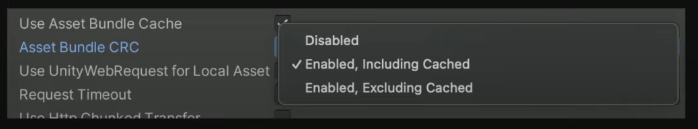
<p><em>VI: Tùy chọn Asset Bundle CRC — 3 lựa chọn: <strong>Disabled</strong>, <strong>Enabled, Including Cached</strong>, <strong>Enabled, Excluding Cached</strong>. ⚠️ <strong>MỖI Addressables group có setting RIÊNG.</strong> / EN: The Asset Bundle CRC option — three choices, and each Addressables group has its own setting.</em></p>

<div class="bilingual-row">
<div class="col-vi">
<p><strong>CRC (Cyclic Redundancy Check)</strong> dùng để <em>kiểm tra checksum</em> của Asset Bundle, đảm bảo nội dung giao tới game <strong>nguyên vẹn và ĐÚNG như bạn mong đợi</strong>.</p>
<p>🔑 <strong>Chi tiết kỹ thuật:</strong> <em>"Việc validate này được tính dựa trên <strong>nội dung KHÔNG NÉN của bundle</strong>, nên nó <strong>KHÔNG bao gồm tất cả bundle header</strong> (đã nói ở §8.8) và <strong>kiểu nén</strong>."</em></p>
<p>🚨 <strong>Cảnh báo hiệu năng:</strong> <em>"Tuy tiện lợi, tùy chọn này <strong>có thể ảnh hưởng ĐÁNG KỂ tới hiệu năng game — đặc biệt trên mobile và console</strong>. Điều này đặc biệt liên quan <strong>nếu CRC check bị LẶP LẠI cho MỖI lần load AssetBundle</strong>."</em></p>
</div>
<div class="col-en">
<p><strong>CRC (Cyclic Redundancy Check)</strong> is used to do a <em>checksum validation</em> of your Asset Bundle, ensuring the content delivered is <strong>intact and EXACTLY what you expect</strong>.</p>
<p>🔑 <strong>Technical detail:</strong> <em>"This validation is calculated based on the <strong>UNCOMPRESSED content of your bundle</strong>, so it <strong>doesn't include all the bundle headers</strong> (mentioned in §8.8) and <strong>the compression type</strong>."</em></p>
<p>🚨 <strong>Performance warning:</strong> <em>"While convenient, this option <strong>can have a SIGNIFICANT impact on your game's performance — especially on mobile and console platforms</strong>. This is particularly relevant <strong>if CRC checks are being REPEATED for EACH AssetBundle load</strong>."</em></p>
</div>
</div>

| Nền tảng / Platform | Setting khuyến nghị | Lý do / Reason |
|---|---|---|
| **Console** | ✅ **Disabled** | AssetBundle thường được cài kèm game trên local storage hoặc tải dạng DLC ⇒ **CRC check KHÔNG cần thiết**. Do chi phí hiệu năng trên console, tốt nhất giữ Disabled |
| **WebGL** | ✅ **Enabled, Including Cached** | **Tất cả bundle đều remote**, và caching bị tắt vì WebGL dùng download cache dựng sẵn của riêng nó |
| **PC / Mobile** — bundle remote từ CDN | ✅ **Enabled, Excluding Cached** | Quan trọng để **ngăn game CRASH nếu dữ liệu nhận về bị HỎNG, bị CẮT CỤT**, và **ngăn khả năng BỊ CAN THIỆP (tampering) và data mismatch**. Unity chạy CRC **MỘT LẦN cho bundle chưa cache**; sau khi vào game chúng được coi như bundle local |
| **PC / Mobile** — group giữ local trong build | ✅ **Disabled** | Không có rủi ro truyền tải |

### 8.11. Profile Variables & `TransformInternalId`

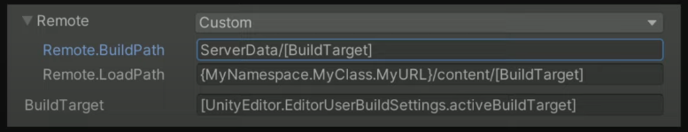
<p><em>VI: Tùy chọn BuildPath và LoadPath trong cửa sổ Addressables Profiles. / EN: The BuildPath and LoadPath options in the Addressables Profiles window.</em></p>

<div class="bilingual-row">
<div class="col-vi">
<p>Bạn định nghĩa <strong>Build path và Load path</strong> trong Addressables Profiles và trong từng group. Chúng cho Editor biết <em>build AssetBundle ở đâu và load chúng từ đâu lúc runtime</em>.</p>
<p>🔑 <strong>HAI LOẠI Profile Variable — khác biệt then chốt:</strong></p>
<ul>
<li><strong>Ngoặc vuông <code>[ ]</code></strong> ⇒ <strong>Được phân giải lúc BUILD TIME</strong>, giá trị kết quả được ghi <em>TRỰC TIẾP vào catalog</em>. ❌ <strong>KHÔNG tinh chỉnh được lúc runtime.</strong></li>
<li><strong>Ngoặc nhọn <code>{ }</code></strong> ⇒ <strong>Được phân giải lúc RUNTIME</strong>, khi hệ thống Addressables được khởi tạo.</li>
</ul>
<p>💡 Bạn dùng được <em>static field và property</em> cho CẢ HAI loại, với <strong>tên đầy đủ (fully qualified names)</strong> — chúng được đánh giá bằng <strong>REFLECTION</strong>.</p>
<p>🚨 <strong>Với runtime variable, PHẢI đặt chúng TRƯỚC khi load asset đầu tiên</strong>, hoặc trước khi khởi tạo hệ thống Addressables — <em>vì chúng CHỈ được đánh giá MỘT LẦN</em>.</p>
<p>🚨 <strong>Cảnh báo về code stripping:</strong> <em>"Đảm bảo Editor KHÔNG strip các variable này, vì chúng được đánh giá bằng reflection ⇒ bạn phải chắc chắn chúng được THAM CHIẾU ở đâu đó."</em> <em>(Liên hệ §3.2 — Roots &amp; <code>link.xml</code>.)</em></p>
<p><strong>Ứng dụng thực tế:</strong></p>
<ul>
<li><strong>Biến dựng sẵn</strong> như <code>BuildTarget</code> — cần thiết vì <em>AssetBundle vốn KHÔNG cross-platform; mỗi nền tảng cần bộ AssetBundle RIÊNG</em>.</li>
<li><strong>Redirect theo môi trường:</strong> development build load nội dung từ storage local/dev, production build trỏ tới production storage account. <em>"Khi phát triển game live, việc có MỘT build duy nhất dùng cho các môi trường khác nhau (development, staging, production) là chuyện thường."</em></li>
<li><strong>Live season:</strong> Muốn load texture/asset khác nhau theo mùa đang active? Định nghĩa live season bằng fully qualified name trong ngoặc nhọn; ngay khi bạn set nó lúc runtime, game sẽ <strong>load bundle khác — background khác, main menu khác</strong> — <em>"mà KHÔNG phải thay đổi gì trong game build hay phát hành bản cập nhật cho người chơi."</em></li>
</ul>
</div>
<div class="col-en">
<p>You define <strong>Build and Load paths</strong> within Addressables Profiles and in individual groups. These inform the Editor <em>where to build the AssetBundles and where to load them from at runtime</em>.</p>
<p>🔑 <strong>TWO TYPES of Profile Variables — the key difference:</strong></p>
<ul>
<li><strong>Brackets <code>[ ]</code></strong> ⇒ <strong>Resolved at BUILD TIME</strong>, and the resulting values are written <em>DIRECTLY into your catalog</em>. ❌ <strong>They CAN'T be tweaked at runtime.</strong></li>
<li><strong>Braces <code>{ }</code></strong> ⇒ <strong>Resolved at RUNTIME</strong>, when the Addressables system is initialized.</li>
</ul>
<p>💡 You can use <em>static fields and properties</em> for BOTH types, with <strong>fully qualified names</strong> — which are then evaluated using <strong>REFLECTION</strong>.</p>
<p>🚨 <strong>For runtime variables, make sure those are set BEFORE you load the first asset</strong>, or before you initialize the Addressables system — <em>because they are ONLY evaluated ONCE</em>.</p>
<p>🚨 <strong>Code-stripping warning:</strong> <em>"Make sure that the Editor doesn't STRIP these variables, as they're evaluated using reflection ⇒ you need to make sure they're REFERENCED somewhere."</em> <em>(Connects to §3.2 — Roots &amp; <code>link.xml</code>.)</em></p>
<p><strong>Real-world uses:</strong></p>
<ul>
<li><strong>Built-in variables</strong> such as <code>BuildTarget</code> — needed because <em>AssetBundles aren't inherently cross-platform; each platform needs its OWN set</em>.</li>
<li><strong>Environment redirects:</strong> a development build loads content from local or development storage, a production build points to your production storage account. <em>"When you're developing a live game, it's common to have a SINGLE build that is used for different environments, such as development, staging, and production."</em></li>
<li><strong>Live seasons:</strong> Want to load different textures and assets based on the active live season? Define the live season, with fully qualified name, in braces; as soon as you set it at runtime, it will <strong>load a different bundle showing a different background, a different main menu</strong> — <em>"You won't have to make ANY changes to the game build or distribute a version update to your players."</em></li>
</ul>
</div>
</div>

<div class="bilingual-row">
<div class="col-vi">
<p><strong><code>Addressables.InternalIdTransformFunc</code></strong></p>
<p>Hàm này cho phép bạn <strong>chèn thêm logic sẽ được thực thi mỗi khi Unity đánh giá Resource Location lúc runtime</strong> để load asset hoặc asset bundle.</p>
<p><strong>Ứng dụng:</strong></p>
<ul>
<li><strong>Biến đổi URL</strong> khi fetch remote — làm redirect hoặc <em>thêm tham số phụ như secret key</em></li>
<li><strong>Load phiên bản asset cụ thể</strong> — texture high/low-res, hoặc thậm chí catalog Addressables cụ thể</li>
<li><strong>Ví dụ mobile:</strong> Kiểm tra khả năng thiết bị như <em>kích thước và mật độ màn hình</em>. Màn hình thấp ⇒ load texture low-res; tablet ⇒ load texture high-res</li>
</ul>
<p>🚨 <em>"Nhớ ĐĂNG KÝ callback TRƯỚC khi load bất kỳ asset nào, nếu không bạn sẽ BỎ LỠ một số resource location resolution."</em></p>
</div>
<div class="col-en">
<p><strong><code>Addressables.InternalIdTransformFunc</code></strong></p>
<p>This function allows you to <strong>introduce additional logic executed whenever Unity evaluates Resource Locations at runtime</strong>, in order to load assets or asset bundles.</p>
<p><strong>Uses:</strong></p>
<ul>
<li><strong>Transform the URL</strong> when doing remote fetching — to do redirects or <em>add extra parameters such as secret keys</em></li>
<li><strong>Load specific versions of your assets</strong> — high/low-res textures, or even specific Addressables catalogs</li>
<li><strong>Mobile example:</strong> Check device capabilities such as <em>screen size and density</em>. Low-resolution screen ⇒ load low-res textures; tablet ⇒ load high-res textures</li>
</ul>
<p>🚨 <em>"Make sure to REGISTER the callback BEFORE you load any assets, otherwise you'll MISS some of these resource location resolutions."</em></p>
</div>
</div>

```csharp
// TransformInternalId — thêm secret key vào URL bundle remote
// TransformInternalId — appending a secret key to a Remote Asset Bundle URL
// (Nguyên văn từ bài viết Unity / verbatim from the Unity article)
private const string SECRET_KEY = "very_secret_key";

public void Init()
{
    // 🚨 PHẢI đăng ký TRƯỚC khi load bất kỳ asset nào
    Addressables.InternalIdTransformFunc = TransformSetSecretKey;
}

private string TransformSetSecretKey(IResourceLocation location)
{
    // ① Kiểm tra Unity đang cố load loại resource gì
    // ② Nếu là Asset Bundle VÀ Internal Id (ở đây là URL) bắt đầu bằng "https"
    //    ⇒ xác định Unity đang download bundle từ CDN ⇒ thêm tham số phụ
    if (location.ResourceType == typeof(IAssetBundleResource) &&
        location.InternalId.StartsWith("https"))
    {
        return $"{location.InternalId}?key={SECRET_KEY}";
    }
    return location.InternalId;
}
```

---

# PHẦN C — SERIALIZATION & NETWORKING

## 9. 🔀 Protobuf vs JSON

<div class="bilingual-row">
<div class="col-vi">
<p>📝 <strong>Ghi chú raw (nguyên văn):</strong></p>
<blockquote>
<p><em>"Protobufs is a set of tools made for the purpose of serializing and communicating data between applications, usually in a client/server configuration. (Line Puzzle_ String Art_1.4.52 offline)</em></p>
<p><em>Protobuf là dạng serialize data (google): <strong>small size, data binary, yêu cầu schema (.proto file)</strong> — json (javascript-json): <strong>rộng rãi, ko cần schema, data lớn hơn, thân thiện human</strong>"</em></p>
</blockquote>
<p><strong>Định nghĩa từ EDUCBA:</strong></p>
<ul>
<li><strong>Protobuf</strong> (Protocol Buffers) do <strong>Google</strong> thiết kế cho việc <em>serialize và de-serialize dữ liệu có cấu trúc</em>. Nó cung cấp cách giao tiếp tốt hơn giữa các hệ thống vì <strong>đơn giản, nhanh hơn, và dễ quản lý hơn XML</strong>.</li>
<li><strong>JSON</strong> (JavaScript Object Notation) <em>bắt nguồn từ JavaScript nhưng KHÔNG đặc thù cho một ngôn ngữ</em>. JSON đã được chuẩn hóa và <strong>gần như MỌI ngôn ngữ đều hỗ trợ</strong>.</li>
</ul>
<p>🔑 <strong>Khác biệt CỐT LÕI:</strong> <em>"Cả hai đều để serialize; tuy nhiên <strong>khác biệt then chốt là Protobuf là định dạng trao đổi dữ liệu NHỊ PHÂN, còn JSON lưu dữ liệu ở định dạng VĂN BẢN người đọc được</strong>."</em></p>
</div>
<div class="col-en">
<p>📝 <strong>The raw notes (verbatim):</strong></p>
<blockquote>
<p><em>"Protobufs is a set of tools made for the purpose of serializing and communicating data between applications, usually in a client/server configuration."</em></p>
<p><em>Protobuf is Google's data-serialization format: <strong>small size, binary data, requires a schema (.proto file)</strong> — JSON: <strong>widespread, no schema needed, larger data, human-friendly</strong>.</em></p>
</blockquote>
<p><strong>Definitions from EDUCBA:</strong></p>
<ul>
<li><strong>Protobuf</strong> (Protocol Buffers) was designed by <strong>Google</strong> for <em>serialization and de-serialization of structured data</em>. It provides a better way of communication between systems as it is <strong>simple, faster, and more manageable than XML</strong>.</li>
<li><strong>JSON</strong> (JavaScript Object Notation) <em>was derived from JavaScript but is NOT specific to one language</em>. JSON is standardized and <strong>supported by ALMOST ALL languages</strong>.</li>
</ul>
<p>🔑 <strong>The CORE difference:</strong> <em>"Both are for serialization; however, <strong>the key difference is that Protobuf is a BINARY data-interchange format, whereas JSON stores data in HUMAN-READABLE text format</strong>."</em></p>
</div>
</div>

```protobuf
// Protobuf — BẮT BUỘC có schema (.proto), dữ liệu là nhị phân
message employee_details {
    required int32  employee_id = 1;
    required string name        = 2;
    optional string address     = 3;
}
```

```json
// JSON — KHÔNG cần schema, người đọc được, nhưng dung lượng lớn hơn
{
  "employee_details": {
    "name": "John Anderson",
    "employee id": 2001,
    "address": "California"
  }
}
```

### 9.1. Bảng so sánh 8 tiêu chí

| Tiêu chí | **Protobuf** | **JSON** |
|---|---|---|
| **Định dạng** | 🔒 **Nhị phân (binary)** | 📄 **Văn bản người đọc được** |
| **Schema** | ✅ **Có** — kèm cả *bộ quy tắc và tool* để định nghĩa & trao đổi message | ❌ **KHÔNG** — chỉ là message format thuần |
| **Hỗ trợ ngôn ngữ** | ⚠️ Language-neutral nhưng **GIỚI HẠN ở vài ngôn ngữ**: JAVA, C, C++, Python, GO, Ruby — **KHÔNG hỗ trợ R** | ✅ **Gần như MỌI ngôn ngữ**, hoàn toàn language-independent |
| **Kiểu dữ liệu** | ✅ **Nhiều hơn** — kể cả **enumeration và method** | ⚠️ **Giới hạn**: Strings, Numbers, JSON object, Array, Boolean, Null. ❌ **KHÔNG hỗ trợ Classes, Functions** |
| **Tốc độ** | ⚡ **NHANH HƠN NHIỀU** so với JSON | Nhẹ và nhanh hơn các kỹ thuật khác (như pickling) |
| **Trường hợp dùng** | Chủ yếu cho **service NỘI BỘ** | Chủ yếu cho **web application** (trao đổi giữa browser và server) |
| **Giải mã** | ❌ **BẮT BUỘC biết schema TRƯỚC** mới decode được | ✅ Decode/parse được **mà KHÔNG cần biết schema trước** |
| **Cộng đồng** | ⚠️ **Nhỏ hơn**, thiếu tài nguyên ⇒ ít phổ biến hơn | ✅ **Cộng đồng RẤT LỚN**, tài nguyên dồi dào |

<div class="bilingual-row">
<div class="col-vi">
<p><strong>✅ Ưu điểm Protobuf</strong></p>
<ul>
<li>Schema được <strong>mã hóa CÙNG dữ liệu</strong> ⇒ <em>đảm bảo tín hiệu KHÔNG bị thất lạc giữa các ứng dụng</em></li>
<li><strong>Language interoperability</strong></li>
<li><strong>Xử lý RẤT NHANH</strong></li>
<li><strong>Hỗ trợ tương thích XUÔI và NGƯỢC</strong> (forward &amp; backward compatibility)</li>
</ul>
<p><strong>❌ Nhược điểm Protobuf</strong></p>
<ul>
<li>Message ở dạng nhị phân ⇒ <strong>người KHÔNG đọc được</strong></li>
<li><strong>Không biết schema thì RẤT KHÓ decode</strong>, vì dữ liệu <em>nhập nhằng về mặt nội tại</em></li>
<li><strong>KHÔNG tốt để LƯU TRỮ dữ liệu</strong> — ví dụ text doc hay dữ liệu trong DB</li>
<li>Hỗ trợ cộng đồng nhỏ và thiếu tài nguyên ⇒ <strong>ít phổ biến</strong></li>
</ul>
<p><strong>✅ Ưu điểm JSON</strong></p>
<ul>
<li><strong>Nhẹ và nhanh</strong></li>
<li><strong>Định dạng văn bản người đọc được</strong></li>
<li><strong>Language interoperability</strong></li>
<li><strong>Decode/parse mà KHÔNG cần biết schema trước</strong></li>
<li><strong>Hữu ích để LƯU dữ liệu</strong> trong database hoặc file system</li>
<li><strong>Cộng đồng RẤT LỚN</strong></li>
</ul>
<p><strong>❌ Nhược điểm JSON</strong></p>
<ul>
<li><strong>KHÔNG được thiết kế cho SỐ</strong></li>
<li><strong>KHÔNG hỗ trợ schema</strong></li>
<li><strong>KHÔNG hỗ trợ namespace</strong></li>
</ul>
<p>🔑 <strong>Kết luận của bài viết:</strong> <em>"Nếu người dùng thoải mái với định dạng nhị phân thì dùng Protocol Buffers; nhưng nếu <strong>khả năng tương tác (interoperability) là ràng buộc</strong> và muốn định dạng văn bản thì dùng JSON. <strong>Tùy nhu cầu mà chọn.</strong> Tuy nhiên, <strong>KHUYÊN KHÔNG nên de-serialize dữ liệu từ NGUỒN KHÔNG RÕ, vì nó có thể chứa dữ liệu ĐỘC HẠI và sai lệch.</strong>"</em></p>
</div>
<div class="col-en">
<p><strong>✅ Protobuf advantages</strong></p>
<ul>
<li>Schemas are <strong>encoded ALONG with data</strong> ⇒ <em>ensures signals don't get lost between applications</em></li>
<li><strong>Language interoperability</strong></li>
<li><strong>VERY FAST processing</strong></li>
<li><strong>Supports FORWARD and BACKWARD compatibility</strong></li>
</ul>
<p><strong>❌ Protobuf disadvantages</strong></p>
<ul>
<li>Messages are binary ⇒ <strong>NOT human-readable</strong></li>
<li><strong>Without knowing schemas it is HARD to decode</strong>, as data is <em>internally ambiguous</em></li>
<li><strong>NOT good for STORING data</strong> — e.g. a text doc or data in a DB</li>
<li>Smaller community support and lack of resources ⇒ <strong>less popular</strong></li>
</ul>
<p><strong>✅ JSON advantages</strong></p>
<ul>
<li><strong>Lightweight and fast</strong></li>
<li><strong>Human-readable text format</strong></li>
<li><strong>Language interoperability</strong></li>
<li><strong>Decode/parse WITHOUT knowing the schema in advance</strong></li>
<li><strong>Useful for STORING data</strong> in databases or file systems</li>
<li><strong>VERY LARGE community support</strong></li>
</ul>
<p><strong>❌ JSON disadvantages</strong></p>
<ul>
<li><strong>NOT designed for NUMBERS</strong></li>
<li><strong>Does NOT support schemas</strong></li>
<li><strong>Does NOT support namespaces</strong></li>
</ul>
<p>🔑 <strong>The article's conclusion:</strong> <em>"If the user is comfortable with the binary format, go with Protocol Buffers; but if <strong>interoperability is the constraint</strong> and a text format is wanted, use JSON. <strong>It's up to the programmer to choose as per their need.</strong> However, <strong>it is advised NOT to de-serialize data from UNKNOWN sources as it may contain MALICIOUS and erroneous data.</strong>"</em></p>
</div>
</div>

!!! tip "Liên kết Module 1 — vì sao điều này quan trọng với hiệu năng"
    **VI:** Module 1 §11.1 nêu: *"Tránh parse file dữ liệu dạng chuỗi như **JSON và XML**; lưu dữ liệu trong **ScriptableObject** hoặc định dạng như **MessagePack hoặc Protobuf** thay thế."* — Đây chính là lý do: **JSON parsing sinh RÁC (string là reference type), còn Protobuf đọc trực tiếp từ binary buffer.**

    **EN:** Module 1 §11.1 states: *"Avoid parsing string-based data files such as **JSON and XML**; store data in **ScriptableObjects** or formats like **MessagePack or Protobuf** instead."* — This is why: **JSON parsing generates GARBAGE (strings are reference types), while Protobuf reads directly from a binary buffer.**

---

## 10. 🌐 Networking — Lock-step & WebSocket

<div class="bilingual-row">
<div class="col-vi">
<p>📝 <strong>Ghi chú raw (nguyên văn) — mô hình Lock-step:</strong></p>
<blockquote>
<p><em>"Realtime: <strong>Block-step (use websocket)</strong>: Client A, B gửi command (pos, rot) lên server, server tổng hợp gửi cho các client (vd FPS20 — gửi <strong>20 packet/giây</strong>), <strong>kiểm tra sync bằng hash (pos, rot)</strong> ⇒ Các Client nhận info từ server thay đổi pos, rot ⇒ <strong>Nếu mất đồng bộ (server tự simulate xem ai đúng hoặc hủy match)</strong>. MLAPI, Mirror"</em></p>
</blockquote>
<p><strong>Giải thích mô hình Lock-step:</strong></p>
<ol>
<li><strong>Client gửi COMMAND, không gửi STATE.</strong> Thay vì gửi "tôi đang ở vị trí X", client gửi "tôi bấm phím tiến". Điều này giảm mạnh băng thông.</li>
<li><strong>Server tổng hợp và phát lại</strong> cho tất cả client theo một tick rate cố định — ví dụ <strong>20 packet/giây</strong>.</li>
<li><strong>Mọi client chạy CÙNG một simulation deterministic</strong> trên cùng tập lệnh ⇒ về lý thuyết cho ra cùng kết quả.</li>
<li><strong>Xác minh đồng bộ bằng HASH:</strong> mỗi client tính hash của trạng thái (pos, rot) và gửi lên. Server so sánh.</li>
<li>🚨 <strong>Nếu HASH KHÔNG KHỚP ⇒ desync.</strong> Xử lý: <em>server tự simulate để xác định ai đúng</em>, hoặc <em>hủy match</em>.</li>
</ol>
<p>⚖️ <strong>Đánh đổi của Lock-step:</strong></p>
<ul>
<li>✅ <strong>Băng thông CỰC THẤP</strong> — chỉ truyền input, không truyền state</li>
<li>✅ <strong>Chống cheat tốt</strong> — mọi client đều simulate, dễ phát hiện bất thường qua hash</li>
<li>❌ <strong>ĐÒI HỎI simulation DETERMINISTIC hoàn toàn</strong> — đây là phần khó nhất</li>
<li>❌ <strong>Độ trễ input</strong> — phải chờ lệnh của tất cả client trước khi tiến một tick</li>
</ul>
<p>💡 <strong>Về tính deterministic — liên hệ ghi chú Wei ở §12:</strong> Đây chính là lý do <em>số dấu phẩy động là kẻ thù của lock-step</em>. Cùng phép tính float có thể cho kết quả <strong>khác nhau ở bit cuối</strong> trên CPU khác nhau ⇒ hash lệch ⇒ desync. Giải pháp: <strong>fixed-point arithmetic</strong>.</p>
</div>
<div class="col-en">
<p>📝 <strong>The raw notes (verbatim) — the Lock-step model:</strong></p>
<blockquote>
<p><em>"Realtime: <strong>Lock-step (use websocket)</strong>: Clients A and B send commands (pos, rot) to the server; the server aggregates and sends to all clients (e.g. FPS20 — <strong>20 packets/second</strong>), <strong>verifying sync via a hash of (pos, rot)</strong> ⇒ clients receive the info and update pos, rot ⇒ <strong>if desynced (the server simulates to decide who is right, or cancels the match)</strong>. MLAPI, Mirror"</em></p>
</blockquote>
<p><strong>The Lock-step model explained:</strong></p>
<ol>
<li><strong>Clients send COMMANDS, not STATE.</strong> Instead of "I'm at position X", the client sends "I pressed forward". This dramatically reduces bandwidth.</li>
<li><strong>The server aggregates and rebroadcasts</strong> to all clients at a fixed tick rate — e.g. <strong>20 packets/second</strong>.</li>
<li><strong>Every client runs the SAME deterministic simulation</strong> on the same command set ⇒ in theory producing identical results.</li>
<li><strong>Sync verification via HASH:</strong> each client hashes its state (pos, rot) and sends it. The server compares.</li>
<li>🚨 <strong>If the HASHES DON'T MATCH ⇒ desync.</strong> Handling: <em>the server simulates to decide who is correct</em>, or <em>cancels the match</em>.</li>
</ol>
<p>⚖️ <strong>Lock-step trade-offs:</strong></p>
<ul>
<li>✅ <strong>EXTREMELY LOW bandwidth</strong> — only inputs are transmitted, not state</li>
<li>✅ <strong>Good anti-cheat</strong> — all clients simulate, anomalies are detectable via hashes</li>
<li>❌ <strong>REQUIRES fully DETERMINISTIC simulation</strong> — this is the hardest part</li>
<li>❌ <strong>Input latency</strong> — must wait for every client's command before advancing a tick</li>
</ul>
<p>💡 <strong>On determinism — connects to the Wei note in §12:</strong> This is exactly why <em>floating-point numbers are the enemy of lock-step</em>. The same float operation can produce <strong>different last bits</strong> on different CPUs ⇒ hash mismatch ⇒ desync. The fix: <strong>fixed-point arithmetic</strong>.</p>
</div>
</div>

### 10.1. Colyseus — Multiplayer Framework cho Unity

<div class="bilingual-row">
<div class="col-vi">
<p><strong>Colyseus</strong> là multiplayer game framework cho Node.js, có <strong>SDK chính thức cho Unity</strong>.</p>
<p><strong>Cài đặt qua Unity Package Manager (UPM):</strong></p>
<ol>
<li><code>Window &gt; Package Management &gt; Package Manager</code></li>
<li>Bấm nút <strong>"+"</strong> → chọn <strong>"Add package from git URL…"</strong></li>
<li>Nhập Git URL: <code>https://github.com/colyseus/colyseus-unity-sdk.git#upm</code></li>
<li>Bấm <strong>"ADD"</strong></li>
</ol>
<p>💡 <strong>Test đa client ngay trong Editor:</strong> <em>"Từ Unity 6000.1.0b1, Unity tích hợp <strong>Multiplayer Play Mode</strong>, cho phép bạn test game multiplayer dùng Colyseus với <strong>NHIỀU client TRỰC TIẾP trong Unity Editor, KHÔNG cần build ứng dụng</strong>."</em> Với phiên bản Unity cũ hơn, dùng <strong>ParrelSync</strong>.</p>
<p><strong>Chạy test server local:</strong></p>
</div>
<div class="col-en">
<p><strong>Colyseus</strong> is a multiplayer game framework for Node.js with an <strong>official Unity SDK</strong>.</p>
<p><strong>Install via Unity Package Manager (UPM):</strong></p>
<ol>
<li><code>Window &gt; Package Management &gt; Package Manager</code></li>
<li>Click the <strong>"+"</strong> button → select <strong>"Add package from git URL…"</strong></li>
<li>Enter the Git URL: <code>https://github.com/colyseus/colyseus-unity-sdk.git#upm</code></li>
<li>Click <strong>"ADD"</strong></li>
</ol>
<p>💡 <strong>Testing multiple clients in the Editor:</strong> <em>"Starting with Unity 6000.1.0b1, Unity integrates <strong>Multiplayer Play Mode</strong>, enabling you to test your Colyseus-based multiplayer game with <strong>MULTIPLE clients DIRECTLY within the Unity Editor, WITHOUT needing to build</strong>."</em> For older Unity versions, use <strong>ParrelSync</strong>.</p>
<p><strong>Running the test server locally:</strong></p>
</div>
</div>

```bash
git clone https://github.com/colyseus/sdks-test-server
cd sdks-test-server
npm install
npm start
# Server chạy tại http://localhost:2567
```

```csharp
// Colyseus Unity SDK — kết nối, lắng nghe state, gửi message
// Colyseus Unity SDK — connect, listen to state, send messages
using UnityEngine;
using Colyseus;
using Colyseus.Schema;

public class NetworkManager : MonoBehaviour
{
    Client client;
    Room<MyRoomState> room;

    async void Start()
    {
        // ① Kết nối WebSocket
        client = new Client("ws://localhost:2567");
        room = await client.JoinOrCreate<MyRoomState>("my_room");
        Debug.Log("Joined room: " + room.Id);

        // ② Lấy handler callback cho state
        var callbacks = Callbacks.Get(room);

        // ③ Lắng nghe thay đổi của MỘT thuộc tính state
        callbacks.Listen(state => state.currentTurn, (currentValue, previousValue) => {
            Debug.Log($"Turn changed: {previousValue} -> {currentValue}");
        });

        // ④ Lắng nghe người chơi THÊM VÀO
        callbacks.OnAdd(state => state.players, (sessionId, player) => {
            Debug.Log($"Player joined: {sessionId}");

            // Lắng nghe lồng nhau — hp của từng người chơi
            callbacks.Listen(player, p => p.hp, (currentHp, previousHp) => {
                Debug.Log($"Player {sessionId} hp: {currentHp}");
            });
        });

        // ⑤ Lắng nghe người chơi RỜI ĐI
        callbacks.OnRemove(state => state.players, (sessionId, player) => {
            Debug.Log($"Player left: {sessionId}");
        });

        // ⑥ GỬI message lên server (đây chính là "command" trong mô hình lock-step)
        room.Send("move", new { x = 10f, y = 20f });

        // ⑦ NHẬN message từ server
        room.OnMessage<string>("chat", (message) => {
            Debug.Log("Chat: " + message);
        });
    }

    async void OnDestroy()
    {
        if (room != null) await room.Leave();   // 🚨 luôn Leave khi hủy
    }
}
```

<div class="bilingual-row">
<div class="col-vi">
<p><strong>Transport được hỗ trợ:</strong> WebSocket (mặc định) · uWebSockets.js · WebTransport · Bun WebSockets.</p>
<p><strong>Demo Unity chính thức:</strong> MMO Demo · Shooting Gallery Demo · Starboss Demo · Turn Based Tanks Demo.</p>
<p>💡 <strong>Về SDK Example Project:</strong> <em>"Project ví dụ đi kèm package <strong>KHÔNG chứa component thị giác hay UI nào</strong>. Nó chứa <strong>phần lớn các lời gọi method quan trọng bạn sẽ dùng trong ứng dụng thực tế</strong>"</em> — bao gồm: join room tùy biến với Messages và State Synchronization, join <code>LobbyRoom</code>, join <code>QueueRoom</code>.</p>
</div>
<div class="col-en">
<p><strong>Supported transports:</strong> WebSocket (default) · uWebSockets.js · WebTransport · Bun WebSockets.</p>
<p><strong>Official Unity demos:</strong> MMO Demo · Shooting Gallery Demo · Starboss Demo · Turn Based Tanks Demo.</p>
<p>💡 <strong>On the SDK Example Project:</strong> <em>"The example project included in the SDK package <strong>does NOT contain any visual components or UI</strong>. It contains <strong>the majority of important method calls you would be using in a real-world application</strong>"</em> — including: joining a custom room with Messages and State Synchronization, joining a <code>LobbyRoom</code>, and joining a <code>QueueRoom</code>.</p>
</div>
</div>

### 10.2. UnityWebRequest & Android Plugin

<div class="bilingual-row">
<div class="col-vi">
<p>📝 <strong>Ghi chú raw:</strong></p>
<blockquote>
<p><em>"<strong>UnityWebRequest</strong>: post (param url), get (data body), put (confirm)"</em></p>
<p><em>"<strong>Android plugin</strong>: <code>UnityPlayerActivity.java</code>, <code>AndroidJavaClass</code> và <code>AndroidJavaObject</code> trên C#"</em></p>
</blockquote>
<p><strong>Ba HTTP verb chính:</strong></p>
<ul>
<li><strong>GET</strong> — lấy dữ liệu; tham số nằm trên URL</li>
<li><strong>POST</strong> — gửi dữ liệu; payload nằm trong body</li>
<li><strong>PUT</strong> — cập nhật/xác nhận tài nguyên</li>
</ul>
<p>🚨 <strong>Lưu ý về GC (liên hệ Module 1 §11):</strong> <code>UnityWebRequest</code> và việc parse response <strong>sinh rác</strong>. Trong vòng lặp polling, hãy <em>tái sử dụng buffer</em> và <em>Dispose</em> request đúng cách.</p>
</div>
<div class="col-en">
<p>📝 <strong>The raw notes:</strong></p>
<blockquote>
<p><em>"<strong>UnityWebRequest</strong>: post (params in URL), get (data body), put (confirm)"</em></p>
<p><em>"<strong>Android plugin</strong>: <code>UnityPlayerActivity.java</code>, <code>AndroidJavaClass</code> and <code>AndroidJavaObject</code> on the C# side"</em></p>
</blockquote>
<p><strong>The three main HTTP verbs:</strong></p>
<ul>
<li><strong>GET</strong> — fetch data; parameters go in the URL</li>
<li><strong>POST</strong> — send data; the payload goes in the body</li>
<li><strong>PUT</strong> — update/confirm a resource</li>
</ul>
<p>🚨 <strong>GC note (connects to Module 1 §11):</strong> <code>UnityWebRequest</code> and response parsing <strong>generate garbage</strong>. In polling loops, <em>reuse buffers</em> and <em>Dispose</em> requests properly.</p>
</div>
</div>

```csharp
// UnityWebRequest — GET/POST/PUT với xử lý lỗi và giải phóng đúng cách
using System.Collections;
using UnityEngine;
using UnityEngine.Networking;

public class ApiClient : MonoBehaviour
{
    // GET — tham số trên URL
    IEnumerator Get(string url)
    {
        using (UnityWebRequest req = UnityWebRequest.Get(url))   // using ⇒ tự Dispose
        {
            yield return req.SendWebRequest();

            if (req.result != UnityWebRequest.Result.Success)
                Debug.LogError($"GET failed: {req.error}");
            else
                Debug.Log(req.downloadHandler.text);
        }
    }

    // POST — payload JSON trong body
    IEnumerator Post(string url, string jsonBody)
    {
        using (UnityWebRequest req = new UnityWebRequest(url, "POST"))
        {
            byte[] body = System.Text.Encoding.UTF8.GetBytes(jsonBody);
            req.uploadHandler   = new UploadHandlerRaw(body);
            req.downloadHandler = new DownloadHandlerBuffer();
            req.SetRequestHeader("Content-Type", "application/json");

            yield return req.SendWebRequest();

            if (req.result != UnityWebRequest.Result.Success)
                Debug.LogError($"POST failed: {req.error}");
        }
    }
}
```

```csharp
// Android Plugin — gọi Java từ C# qua AndroidJavaClass / AndroidJavaObject
using UnityEngine;

public class AndroidBridge : MonoBehaviour
{
    void CallNativeAndroid()
    {
#if UNITY_ANDROID && !UNITY_EDITOR
        // Lấy Activity hiện tại (UnityPlayerActivity)
        using (var unityPlayer = new AndroidJavaClass("com.unity3d.player.UnityPlayer"))
        using (var activity = unityPlayer.GetStatic<AndroidJavaObject>("currentActivity"))
        {
            // Gọi method của plugin Java tùy biến
            using (var plugin = new AndroidJavaObject("com.mycompany.MyPlugin"))
            {
                plugin.Call("initialize", activity);
                string result = plugin.Call<string>("getDeviceInfo");
                Debug.Log(result);
            }
        }
#endif
    }
}
```

---

# PHẦN D — KIẾN TRÚC NÂNG CAO

## 11. 🪞 Reflection trong C# / Unity

!!! warning "Nguồn"
    **VI:** `codelearn.io/sharing/su-dung-reflection-trong-csharp` trong file raw bị chặn bởi **CAPTCHA** (cả curl lẫn Jina reader). Phần này dùng nguồn còn lại — **[C# Reflection in Unity](https://gucheng0712.github.io/unity/csharp/2019/04/19/C-Reflection-in-Unity-copy.html)** của Cheng Gu — kết hợp **định nghĩa tiếng Việt nguyên văn trong `raw-optimization-data.txt`**.

<div class="bilingual-row">
<div class="col-vi">
<p>📝 <strong>Định nghĩa từ ghi chú raw (nguyên văn tiếng Việt):</strong></p>
<blockquote>
<p><em>"Reflection có nghĩa là <strong>cách thức để truy cập tới metadata</strong>, tại thời điểm chương trình đang chạy làm cách nào chúng ta có thể xác định được metadata của một đối tượng như <strong>namespace, thuộc tính của lớp - hàm, hàm khởi tạo, phương thức, thuộc tính, cách khởi tạo đối tượng, gọi hàm...</strong>"</em></p>
</blockquote>
<p><strong>Định nghĩa từ Cheng Gu:</strong></p>
<p><em>"Reflection là một <strong>cơ chế quan trọng trong C#</strong> cho phép <strong>lấy thông tin về các member và kiểu của TỪNG member</strong> (class, structure, delegate, interface, enum, v.v.) từ một chương trình hoặc assembly (dll, exe) <strong>LÚC RUNTIME</strong>."</em></p>
<p><strong>⚖️ Đánh đổi — nguyên văn:</strong></p>
<blockquote>
<p><strong>✅ Ưu điểm:</strong> <em>"Reflection <strong>cải thiện tính LINH HOẠT và MỞ RỘNG</strong> của chương trình, <strong>GIẢM sự phụ thuộc (coupling)</strong> và cải thiện khả năng thích ứng. Nó cho phép chương trình <strong>tạo và điều khiển object của BẤT KỲ class nào mà KHÔNG cần hard-code class đích trước.</strong>"</em></p>
<p><strong>❌ Nhược điểm:</strong> <em>"Reflection <strong>RẤT CHẬM</strong>, và làm <strong>logic nội bộ của chương trình PHỨC TẠP hơn</strong>, cũng như <strong>KHÓ ĐỌC và KHÓ BẢO TRÌ</strong>."</em></p>
</blockquote>
<p>🚨 <strong>Hệ quả với hiệu năng Unity:</strong> Vì "rất chậm", Reflection <strong>KHÔNG BAO GIỜ nên dùng trong hot path</strong> (Update, FixedUpdate). Dùng nó ở <em>lúc khởi tạo</em>, rồi <strong>cache kết quả</strong> — giống nguyên tắc cache ở Module 1 §13.2.</p>
</div>
<div class="col-en">
<p>📝 <strong>Definition from the raw notes (translated from Vietnamese):</strong></p>
<blockquote>
<p><em>"Reflection means <strong>a way to access metadata</strong> — at program runtime, how can we determine an object's metadata such as its <strong>namespace, class/function properties, constructors, methods, attributes, how to instantiate objects, invoke functions…</strong>"</em></p>
</blockquote>
<p><strong>Definition from Cheng Gu:</strong></p>
<p><em>"Reflection is an <strong>important mechanism in C#</strong> that allows getting <strong>information about the members and EVERY member's type</strong> (class, structure, delegate, interface, enum, etc.) from a program or assembly (dll, exe) <strong>AT RUNTIME</strong>."</em></p>
<p><strong>⚖️ The trade-off — verbatim:</strong></p>
<blockquote>
<p><strong>✅ Pros:</strong> <em>"Reflection <strong>improves the FLEXIBILITY and EXTENSIBILITY</strong> of the program, <strong>REDUCES the coupling</strong> and improves adaptability. It allows programs to <strong>create and control objects of ANY class WITHOUT hard-coding the target class in advance.</strong>"</em></p>
<p><strong>❌ Cons:</strong> <em>"Reflection is <strong>VERY SLOW</strong>, and makes the <strong>internal logic of the program MORE COMPLEX</strong>, and <strong>HARD TO READ and MAINTAIN</strong>."</em></p>
</blockquote>
<p>🚨 <strong>Unity performance implication:</strong> Because it is "very slow", Reflection <strong>should NEVER be used in hot paths</strong> (Update, FixedUpdate). Use it <em>at initialization</em>, then <strong>cache the results</strong> — the same caching principle as Module 1 §13.2.</p>
</div>
</div>

### 11.1. `System.Type` — Trái tim của Reflection

<div class="bilingual-row">
<div class="col-vi">
<p>Lớp <code>System.Type</code> đóng <strong>vai trò trung tâm</strong> trong reflection. Nó <em>đại diện cho instance của Class đích</em>, và cung cấp <strong>mọi method để lấy thông tin kiểu từ class đích</strong>.</p>
<p><strong>Hai cách lấy Type reference:</strong></p>
</div>
<div class="col-en">
<p>The <code>System.Type</code> class plays a <strong>central role</strong> in reflection. It <em>represents the instance of the target Class</em>, and provides <strong>all the methods for getting type information from the target class</strong>.</p>
<p><strong>Two ways to get a Type reference:</strong></p>
</div>
</div>

```csharp
// ① Dùng toán tử typeof()
Type t = typeof(string);

// ② Dùng method GetType()
string s = "grayworm";
Type t = s.GetType();
```

| Thuộc tính `Type` | Trả về / Returns |
|---|---|
| `Type.Name` | Tên của Type |
| `FullName` | Tên đầy đủ (**bao gồm namespace**) |
| `Namespace` | Tên NameSpace |
| `IsAbstract` | `bool` — có phải abstract type không |
| `IsArray` | `bool` — có phải array không |
| `IsClass` | `bool` — có phải class không |
| `IsEnum` | `bool` — có phải enum không |
| `IsInterface` | `bool` — có phải interface không |
| `IsPublic` | `bool` — có public không |
| `IsSealed` | `bool` — có sealed không |
| `IsValueType` | `bool` — **có phải value type không; nếu không thì là reference type** |

### 11.2. Các method của `Type` — Lấy thông tin thành viên

```csharp
// Lấy Type của object trước
TargetClass tc = new TargetClass();
Type t = tc.GetType();

// ① GetField() / GetFields() → FieldInfo — thông tin BIẾN thành viên
FieldInfo[] fis = t.GetFields();
foreach (FieldInfo fi in fis)
{
    Debug.Log(fi.Name);
}

// ② GetMethod() / GetMethods() → MethodInfo — thông tin METHOD
MethodInfo[] mis = t.GetMethods();
foreach (MethodInfo mi in mis)
{
    Debug.Log(mi.ReturnType + " " + mi.Name);
}

// ③ GetProperty() / GetProperties() → PropertyInfo — thông tin PROPERTY
PropertyInfo[] pis = t.GetProperties();
foreach (PropertyInfo pi in pis)
{
    Debug.Log(pi.Name);
}

// ④ GetConstructor() / GetConstructors() → ConstructorInfo — thông tin CONSTRUCTOR
ConstructorInfo[] constructorInfos = t.GetConstructors();
foreach (ConstructorInfo info in constructorInfos)
{
    // Lấy tất cả tham số của constructor
    ParameterInfo[] parameterInfos = info.GetParameters();
    foreach (ParameterInfo pi in parameterInfos)
    {
        Debug.Log(pi.ParameterType.ToString() + " " + pi.Name + ",");
    }
}

// ⑤ GetEvent() / GetEvents() → EventInfo — thông tin EVENT
EventInfo[] eis = t.GetEvents();
foreach (EventInfo ei in eis)
{
    Debug.Log(ei.EventHandlerType + " " + ei.Name);
}

// ⑥ GetMember() / GetMembers() → MemberInfo — TẤT CẢ thành viên
MemberInfo[] mems = t.GetMembers();
```

<div class="bilingual-row">
<div class="col-vi">
<p>💡 <em>"Để GỌI các member này, dùng <code>Type.InvokeMember()</code>, hoặc hàm <code>Invoke()</code> của các class khác (như <code>FieldInfo</code>, <code>EventInfo</code>, <code>PropertyInfo</code>, v.v.)."</em></p>
<p><strong>BindingFlags — kiểm soát phạm vi tìm kiếm</strong></p>
<p><em>"<code>BindingFlags</code> dùng để <strong>chỉ định các cờ kiểm soát binding và cách reflection tìm kiếm member và type</strong>."</em></p>
</div>
<div class="col-en">
<p>💡 <em>"For calling these members, use <code>Type.InvokeMember()</code>, or other classes' <code>Invoke()</code> functions (such as <code>FieldInfo</code>, <code>EventInfo</code>, <code>PropertyInfo</code>, etc.)."</em></p>
<p><strong>BindingFlags — controlling the search scope</strong></p>
<p><em>"<code>BindingFlags</code> is to <strong>specify flags that control binding and the way in which the search for members and types is conducted by reflection</strong>."</em></p>
</div>
</div>

| BindingFlags | Ý nghĩa |
|---|---|
| `IgnoreCase` | **Bỏ qua chữ hoa/thường** của tên member |
| `DeclaredOnly` | **CHỈ chấp nhận member khai báo TRONG class này** — không gồm member kế thừa |
| `Instance` | Chỉ chấp nhận **Instance member** |
| `Static` | Chỉ chấp nhận **Static member** |
| `Public` | Chỉ chấp nhận member **public** |
| `NonPublic` | Chỉ chấp nhận member **non-public** |

```csharp
// Dấu `|` — PHẢI thỏa mãn TẤT CẢ 3 flag thì member mới được lấy
fis = typeof(TargetClass).GetFields(
    BindingFlags.NonPublic | BindingFlags.Public | BindingFlags.Static);
```

### 11.3. 💎 Ứng dụng: Tạo Object ĐỘNG

<div class="bilingual-row">
<div class="col-vi">
<p><strong>Vấn đề:</strong> Khi tạo instance trong C#, ta thường tạo object <em>TĨNH</em>. Muốn tạo một object cụ thể qua code, ta phải dùng <strong><code>switch case</code> hoặc <code>if</code></strong> để quyết định và tạo instance từng cái một.</p>
<p>❌ <strong>Cách TĨNH — phải sửa code mỗi khi thêm class:</strong></p>
</div>
<div class="col-en">
<p><strong>The problem:</strong> When creating an instance in C#, we normally create the object <em>STATICALLY</em>. To create a certain object through code, we have to use a <strong><code>switch case</code> or <code>if</code> statement</strong> to decide and create instances one by one.</p>
<p>❌ <strong>The STATIC way — you must edit code every time you add a class:</strong></p>
</div>
</div>

```csharp
// ❌ TĨNH — mỗi class mới phải thêm một case
public class ReflectionExample : MonoBehaviour
{
    private void Start()
    {
        CreateObject("A");
        CreateObject("B");
        CreateObject("C");
    }

    public static void CreateObject(string className)
    {
        switch (className)
        {
            case "A":
                ClassA a = new ClassA();
                a.FunctionA();
                break;
            case "B":
                ClassB b = new ClassB();
                b.FunctionB();
                break;
            case "C":
                ClassC c = new ClassC();
                c.FunctionC();
                break;
            default:
                break;
        }
    }
}
```

```csharp
// ✅ ĐỘNG bằng Reflection — thêm class mới KHÔNG cần sửa hàm này
namespace ReflectionDemo
{
    public class ClassA { public void FunctionA() { Debug.Log("Run Function A"); } }
    public class ClassB { public void FunctionB() { Debug.Log("Run Function B"); } }
    public class ClassC { public void FunctionC() { Debug.Log("Run Function C"); } }

    public class ReflectionExample01 : MonoBehaviour
    {
        private void Start()
        {
            DynamicCreateObject("A");
            DynamicCreateObject("B");
            DynamicCreateObject("C");
        }

        public static void DynamicCreateObject(string className)
        {
            var fullPathName = "ReflectionDemo.Class" + className;   // tên đầy đủ có namespace
            Type type   = Type.GetType(fullPathName);
            var  obj    = Activator.CreateInstance(type);
            var  method = obj.GetType().GetMethod("Function" + className);

            if (method != null)
            {
                method.Invoke(obj, null);
            }
        }
    }
}
```

### 11.4. `System.Reflection.Assembly`

<div class="bilingual-row">
<div class="col-vi">
<p>Lớp <code>Assembly</code> có thể <strong>lấy thông tin Assembly, NẠP ĐỘNG Assembly</strong>, tìm thông tin type trong Assembly và <strong>tạo Instance của type đó</strong>.</p>
<p>🚨 <strong>Lưu ý quan trọng cho Unity:</strong> Nạp assembly động dựa vào <em>runtime code execution</em> ⇒ <strong>chỉ hoạt động với backend Mono (JIT), KHÔNG hoạt động với IL2CPP (AOT)</strong> — xem §2.</p>
</div>
<div class="col-en">
<p>The <code>Assembly</code> class can <strong>get Assembly information, dynamically LOAD an Assembly</strong>, find type information within it and <strong>create an Instance of that type</strong>.</p>
<p>🚨 <strong>Important Unity caveat:</strong> Dynamic assembly loading relies on <em>runtime code execution</em> ⇒ <strong>it only works with the Mono backend (JIT), NOT with IL2CPP (AOT)</strong> — see §2.</p>
</div>
</div>

```csharp
// ① Reflection qua TÊN Assembly
Assembly ass = Assembly.Load("ClassLibrary");
Type t = ass.GetType("ClassLibrary.NewClass");
object o = Activator.CreateInstance(t);
MethodInfo mi = t.GetMethod("show");
mi.Invoke(o, null);

// ② Reflection qua TÊN FILE DLL
Assembly assembly = Assembly.LoadFrom("đường/dẫn/tới/xxx.dll");
Type[] aa = assembly.GetTypes();
foreach (Type t in aa)
{
    if (t.FullName == "a.b.c")
    {
        object o = Activator.CreateInstance(t);
    }
}
```

!!! danger "Reflection & Code Stripping — bẫy chết người"
    **VI:** Vì UnityLinker dùng **mark & sweep** (§3.1) và **KHÔNG thấy được lời gọi qua reflection**, mọi type/method bạn chỉ truy cập bằng reflection sẽ **bị STRIP khỏi build** ⇒ `Type.GetType()` trả về `null` ⇒ crash **CHỈ TRÊN BUILD, KHÔNG xảy ra trong Editor**.

    ✅ **Cách sửa:** khai báo chúng trong **`link.xml`** (§3.2), hoặc dùng attribute **`[Preserve]`**. Đây cũng chính là cảnh báo Unity đưa ra ở §8.11 về Addressables Profile Variables.

    **EN:** Because the UnityLinker uses **mark & sweep** (§3.1) and **cannot see reflection calls**, any type/method you only access via reflection will be **STRIPPED from the build** ⇒ `Type.GetType()` returns `null` ⇒ a crash that happens **ONLY IN BUILDS, never in the Editor**.

    ✅ **The fix:** declare them in **`link.xml`** (§3.2), or use the **`[Preserve]`** attribute. This is exactly the warning Unity gives in §8.11 about Addressables Profile Variables.

---

## 12. 🗝️ Service Locator — Thay thế rừng Singleton

<div class="bilingual-row">
<div class="col-vi">
<p>📝 <strong>Ghi chú raw (nguyên văn):</strong></p>
<blockquote>
<p><em>"<strong>Service locator</strong>: Thay vì phải sử dụng nhiều singleton với monobehavior, khó quản lý, define ra <strong>ServiceLocator</strong>, xem các manager class kia như <strong>service</strong> và quản lý nó: <strong>Provide (register) và Resolver</strong>"</em></p>
</blockquote>
<p><strong>Vấn đề với rừng Singleton MonoBehaviour:</strong></p>
<ul>
<li>❌ <strong>Khó quản lý vòng đời</strong> — ai tạo trước, ai hủy sau?</li>
<li>❌ <strong>Coupling chặt</strong> — mọi class biết tên cụ thể của mọi singleton</li>
<li>❌ <strong>Khó test</strong> — không thay được bằng mock</li>
<li>❌ <strong>Thứ tự khởi tạo bấp bênh</strong> — phụ thuộc Script Execution Order</li>
</ul>
<p>✅ <strong>Service Locator giải quyết bằng 2 thao tác:</strong></p>
<ol>
<li><strong>Provide / Register</strong> — đăng ký một implementation cho một interface</li>
<li><strong>Resolve</strong> — lấy ra implementation đó khi cần</li>
</ol>
<p>🔗 <strong>Liên hệ SOLID (Module 2 §22):</strong> Đây chính là hiện thực hóa <strong>Dependency Inversion Principle</strong> — <em>"phụ thuộc vào interface thay vì lớp cài đặt"</em>. Nó cũng nằm trong danh sách <strong>9 Game Programming Pattern</strong> của repo QianMo (Module 2 §23.2).</p>
</div>
<div class="col-en">
<p>📝 <strong>The raw notes (translated):</strong></p>
<blockquote>
<p><em>"<strong>Service locator</strong>: Instead of using many MonoBehaviour singletons — which are hard to manage — define a <strong>ServiceLocator</strong>, treat those manager classes as <strong>services</strong> and manage them via: <strong>Provide (register) and Resolve</strong>"</em></p>
</blockquote>
<p><strong>Problems with a forest of MonoBehaviour singletons:</strong></p>
<ul>
<li>❌ <strong>Hard lifetime management</strong> — who is created first, destroyed last?</li>
<li>❌ <strong>Tight coupling</strong> — every class knows every singleton's concrete name</li>
<li>❌ <strong>Hard to test</strong> — cannot substitute mocks</li>
<li>❌ <strong>Fragile initialization order</strong> — depends on Script Execution Order</li>
</ul>
<p>✅ <strong>Service Locator solves this with two operations:</strong></p>
<ol>
<li><strong>Provide / Register</strong> — register an implementation for an interface</li>
<li><strong>Resolve</strong> — retrieve that implementation when needed</li>
</ol>
<p>🔗 <strong>SOLID connection (Module 2 §22):</strong> This is the concrete realization of the <strong>Dependency Inversion Principle</strong> — <em>"depend on interfaces rather than implementing classes"</em>. It's also one of the <strong>9 Game Programming Patterns</strong> in the QianMo repo (Module 2 §23.2).</p>
</div>
</div>

```csharp
// Service Locator — Provide (register) + Resolve
// Theo đúng mô tả trong raw-optimization-data.txt
using System;
using System.Collections.Generic;

public static class ServiceLocator
{
    private static readonly Dictionary<Type, object> services = new Dictionary<Type, object>();

    // ① PROVIDE / REGISTER — đăng ký implementation cho một interface
    public static void Provide<T>(T service) where T : class
    {
        services[typeof(T)] = service;
    }

    // ② RESOLVE — lấy service ra khi cần
    public static T Resolve<T>() where T : class
    {
        if (services.TryGetValue(typeof(T), out var service))
            return (T)service;

        throw new InvalidOperationException(
            $"Service {typeof(T).Name} chưa được đăng ký. Gọi Provide<{typeof(T).Name}>() trước.");
    }

    public static bool TryResolve<T>(out T service) where T : class
    {
        if (services.TryGetValue(typeof(T), out var s)) { service = (T)s; return true; }
        service = null; return false;
    }

    // Bắt buộc khi tắt Domain Reload (xem Module 1 §14.4)
    public static void Clear() => services.Clear();
}
```

```csharp
// Cách dùng — đăng ký ở bootstrap, resolve ở nơi cần
using UnityEngine;

public interface IAudioService { void Play(string clipId); }
public interface ISaveService  { void Save(string key, string value); }

// Bootstrap — chạy MỘT LẦN lúc khởi động
public class GameBootstrap : MonoBehaviour
{
    [SerializeField] private AudioManager audioManager;
    [SerializeField] private SaveManager  saveManager;

    void Awake()
    {
        ServiceLocator.Clear();                          // an toàn khi tắt Domain Reload
        ServiceLocator.Provide<IAudioService>(audioManager);
        ServiceLocator.Provide<ISaveService>(saveManager);
    }
}

// Class tiêu thụ — KHÔNG biết lớp cài đặt cụ thể (Dependency Inversion)
public class PlayerController : MonoBehaviour
{
    private IAudioService audio;

    void Start()
    {
        // ✅ Resolve MỘT LẦN rồi cache — không Resolve mỗi frame
        audio = ServiceLocator.Resolve<IAudioService>();
    }

    void OnJump() => audio.Play("jump");
}
```

!!! warning "Đánh đổi của Service Locator"
    **VI:** Service Locator **giấu dependency** — nhìn chữ ký constructor không biết class cần gì. Nhiều người coi đây là **anti-pattern** so với **Dependency Injection thuần** (truyền dependency qua constructor). Với Unity, Service Locator vẫn phổ biến vì MonoBehaviour **không có constructor tự viết được**. Nếu dự án lớn, cân nhắc DI framework như **VContainer** hoặc **Zenject**.

    **EN:** Service Locator **hides dependencies** — a constructor signature no longer tells you what a class needs. Many consider it an **anti-pattern** compared to plain **Dependency Injection**. In Unity it remains popular because MonoBehaviours **can't have user-defined constructors**. For larger projects, consider a DI framework such as **VContainer** or **Zenject**.

---

## 13. 🔢 Wei & Fixed-Point — Vì sao KHÔNG dùng float cho tiền

<div class="bilingual-row">
<div class="col-vi">
<p>📝 <strong>Ghi chú raw (nguyên văn):</strong></p>
<blockquote>
<p><em>"Số <strong>wei</strong>, đơn vị nhỏ nhất của etherum: <strong>1^18</strong> ⇒ <strong>số fixed để tránh sai số</strong>"</em></p>
</blockquote>
<p>📌 <strong>Đính chính con số:</strong> Ghi chú viết <code>1^18</code>, nhưng con số đúng là <strong>10<sup>18</sup></strong> — tức <strong>1 ETH = 1.000.000.000.000.000.000 wei</strong> (10 mũ 18).</p>
<p>🔑 <strong>Vì sao blockchain dùng số nguyên thay vì số thực:</strong></p>
<p>Số dấu phẩy động (<code>float</code>, <code>double</code>) <strong>KHÔNG biểu diễn CHÍNH XÁC được phần lớn số thập phân</strong>. Ví dụ kinh điển: <code>0.1f + 0.2f != 0.3f</code>.</p>
<p>💀 <strong>Với tiền tệ, sai số này KHÔNG chấp nhận được:</strong></p>
<ul>
<li>Sai số tích lũy qua hàng triệu giao dịch</li>
<li>Hai node tính ra kết quả khác nhau ⇒ <strong>không đồng thuận được</strong></li>
<li>Có thể bị khai thác để rút tiền</li>
</ul>
<p>✅ <strong>Giải pháp — Fixed-Point:</strong> Lưu <strong>đơn vị NHỎ NHẤT dưới dạng SỐ NGUYÊN</strong>. Ethereum chọn wei = 10⁻¹⁸ ETH. Mọi phép tính trên số nguyên đều <em>chính xác tuyệt đối và deterministic</em>.</p>
<p>🔗 <strong>Liên hệ Networking §10:</strong> Đây <strong>chính xác cùng một lý do</strong> khiến lock-step multiplayer cần fixed-point — <em>float không deterministic giữa các CPU khác nhau ⇒ hash lệch ⇒ desync</em>.</p>
</div>
<div class="col-en">
<p>📝 <strong>The raw notes (translated):</strong></p>
<blockquote>
<p><em>"<strong>Wei</strong>, the smallest unit of Ethereum: <strong>10<sup>18</sup></strong> ⇒ <strong>a fixed-point number to avoid rounding error</strong>"</em></p>
</blockquote>
<p>📌 <strong>Correcting the figure:</strong> The note writes <code>1^18</code>, but the correct figure is <strong>10<sup>18</sup></strong> — i.e. <strong>1 ETH = 1,000,000,000,000,000,000 wei</strong>.</p>
<p>🔑 <strong>Why blockchains use integers instead of floats:</strong></p>
<p>Floating-point numbers (<code>float</code>, <code>double</code>) <strong>CANNOT represent most decimal fractions EXACTLY</strong>. The classic example: <code>0.1f + 0.2f != 0.3f</code>.</p>
<p>💀 <strong>For money, this error is unacceptable:</strong></p>
<ul>
<li>Errors accumulate across millions of transactions</li>
<li>Two nodes compute different results ⇒ <strong>consensus becomes impossible</strong></li>
<li>It can be exploited to drain funds</li>
</ul>
<p>✅ <strong>The solution — Fixed-Point:</strong> Store the <strong>SMALLEST unit as an INTEGER</strong>. Ethereum picked wei = 10⁻¹⁸ ETH. All integer arithmetic is <em>exact and deterministic</em>.</p>
<p>🔗 <strong>Networking connection (§10):</strong> This is <strong>exactly the same reason</strong> lock-step multiplayer needs fixed-point — <em>floats are not deterministic across different CPUs ⇒ hash mismatch ⇒ desync</em>.</p>
</div>
</div>

```csharp
// ❌ SAI — float cho tiền tệ / giá trị cần chính xác
float balance = 0.1f + 0.2f;
Debug.Log(balance == 0.3f);        // False!
Debug.Log(balance.ToString("F17")); // 0.30000001192092896

// ✅ ĐÚNG — fixed-point: lưu đơn vị NHỎ NHẤT dưới dạng số nguyên
public readonly struct Wei
{
    public const int  Decimals    = 18;
    public static readonly System.Numerics.BigInteger WeiPerEth
        = System.Numerics.BigInteger.Pow(10, Decimals);   // 10^18

    public readonly System.Numerics.BigInteger Value;      // luôn là SỐ NGUYÊN

    public Wei(System.Numerics.BigInteger wei) => Value = wei;

    public static Wei FromEth(decimal eth) =>
        new Wei((System.Numerics.BigInteger)(eth * (decimal)WeiPerEth));

    // Cộng/trừ CHÍNH XÁC TUYỆT ĐỐI — không có sai số làm tròn
    public static Wei operator +(Wei a, Wei b) => new Wei(a.Value + b.Value);
    public static Wei operator -(Wei a, Wei b) => new Wei(a.Value - b.Value);

    public override string ToString() => Value.ToString();
}

// ✅ Cho gameplay deterministic (lock-step) — fixed-point Q16.16
public readonly struct Fixed
{
    private const int  Shift = 16;                 // 16 bit phần thập phân
    private const long One   = 1L << Shift;        // 65536
    private readonly long raw;

    private Fixed(long r) => raw = r;
    public static Fixed FromInt(int v)   => new Fixed((long)v << Shift);
    public float  ToFloat()              => (float)raw / One;

    // Mọi phép toán chạy trên SỐ NGUYÊN ⇒ deterministic trên MỌI CPU
    public static Fixed operator +(Fixed a, Fixed b) => new Fixed(a.raw + b.raw);
    public static Fixed operator *(Fixed a, Fixed b) => new Fixed((a.raw * b.raw) >> Shift);
}
```

---

## 14. ✅ Checklist Senior — Bỏ túi

<div class="bilingual-row">
<div class="col-vi">
<p><strong>🧠 Memory</strong></p>
<ul>
<li>☑️ Nhớ: <strong>Unity KHÔNG trả managed memory về OS cho tới khi TẮT app</strong>; heap chỉ PHÌNH khi phân mảnh.</li>
<li>☑️ <code>Destroy(obj)</code> để giải phóng — <strong><code>= null</code> KHÔNG hủy gì cả</strong>.</li>
<li>☑️ Object dài hạn ⇒ <code>class</code>; ngắn hạn ⇒ <code>struct</code> (không lên heap).</li>
<li>☑️ <strong>Tránh coroutine vô tận</strong> — giữ chặt stack allocation trên heap.</li>
<li>☑️ Ship bằng <strong>IL2CPP</strong>; chỉ tạm dùng Mono lúc dev nếu build quá chậm.</li>
<li>☑️ Lúc dev: <strong>chọn MỘT target architecture</strong> để giảm build time.</li>
<li>☑️ Bật <strong>Managed Stripping</strong> + <strong>Strip Engine Code</strong>; dùng <code>link.xml</code> cho reflection.</li>
<li>☑️ Asmdef: <strong>+4 kB/assembly</strong> — đừng chia nhỏ vô tội vạ.</li>
<li>☑️ <strong>Baseline Android ~225 MB</strong> cho project RỖNG; Graphics chiếm 72%.</li>
<li>☑️ Đo Android bằng <code>adb shell dumpsys meminfo &lt;package&gt;</code>, <strong>LUÔN cùng vị trí code + cùng memory pressure</strong>.</li>
<li>☑️ Phân biệt <strong>Vss / Rss / Pss / Uss</strong>; <code>procrank</code> và <code>meminfo</code> dùng cơ chế kernel KHÁC ⇒ số liệu khác.</li>
<li>☑️ <strong>Dalvik Heap phình to ⇒ điều tra Android PLUGIN</strong>; cô lập &amp; so với baseline project rỗng.</li>
<li>☑️ Giảm <code>.apk</code>/<code>.ipa</code> ⇒ <strong>giảm luôn runtime memory</strong> (tỉ lệ thuận trực tiếp).</li>
</ul>
<p><strong>🎨 Assets & Audio</strong></p>
<ul>
<li>☑️ <strong>TẮT Read/Write</strong> trên texture VÀ mesh (nhân đôi bộ nhớ).</li>
<li>☑️ <strong>ASTC</strong> cho cả iOS + Android; PVRTC (A7↓), ETC2 (Android &lt;2016).</li>
<li>☑️ Tắt mipmap cho <strong>sprite 2D và UI</strong>; giữ cho model 3D.</li>
<li>☑️ Audio: <strong>&lt; 200 KB ⇒ Decompress On Load</strong> · <strong>≥ 200 KB ⇒ Compressed in Memory</strong> · <strong>nhạc nền ⇒ Streaming</strong>.</li>
<li>☑️ <strong>Vorbis cho âm thanh LẶP</strong> (MP3 thêm khoảng lặng); ADPCM cho SFX ngắn (3.5:1).</li>
<li>☑️ Source audio là <strong>WAV không nén</strong> — tránh 2 lần lossy.</li>
<li>☑️ AUP: <code>asyncUploadTimeSlice=4</code>, <code>asyncUploadBufferSize=16</code>, <code>PersistentBuffer=true</code>.</li>
<li>☑️ Dùng <strong>AssetPostprocessor</strong> ép chuẩn import cho toàn team.</li>
</ul>
</div>
<div class="col-en">
<p><strong>🧠 Memory</strong></p>
<ul>
<li>☑️ Remember: <strong>Unity does NOT return managed memory to the OS until app termination</strong>; the heap only GROWS when fragmented.</li>
<li>☑️ <code>Destroy(obj)</code> to release — <strong><code>= null</code> destroys NOTHING</strong>.</li>
<li>☑️ Long-lived objects ⇒ <code>class</code>; short-lived ⇒ <code>struct</code> (never on the heap).</li>
<li>☑️ <strong>Avoid never-ending coroutines</strong> — they hold stack allocations on the heap.</li>
<li>☑️ Ship with <strong>IL2CPP</strong>; use Mono only temporarily during dev if builds are too slow.</li>
<li>☑️ During dev: <strong>select ONE target architecture</strong> to cut build times.</li>
<li>☑️ Enable <strong>Managed Stripping</strong> + <strong>Strip Engine Code</strong>; use <code>link.xml</code> for reflection.</li>
<li>☑️ Asmdefs: <strong>+4 kB per assembly</strong> — don't split indiscriminately.</li>
<li>☑️ <strong>Android baseline ~225 MB</strong> for an EMPTY project; Graphics is 72% of it.</li>
<li>☑️ Measure Android with <code>adb shell dumpsys meminfo &lt;package&gt;</code>, <strong>ALWAYS at the same code location + same memory pressure</strong>.</li>
<li>☑️ Distinguish <strong>Vss / Rss / Pss / Uss</strong>; <code>procrank</code> and <code>meminfo</code> use DIFFERENT kernel mechanisms ⇒ different figures.</li>
<li>☑️ <strong>A growing Dalvik Heap ⇒ investigate Android PLUGINS</strong>; isolate &amp; compare against an empty-project baseline.</li>
<li>☑️ Shrinking <code>.apk</code>/<code>.ipa</code> ⇒ <strong>also shrinks runtime memory</strong> (directly proportional).</li>
</ul>
<p><strong>🎨 Assets & Audio</strong></p>
<ul>
<li>☑️ <strong>Disable Read/Write</strong> on textures AND meshes (doubles memory).</li>
<li>☑️ <strong>ASTC</strong> for both iOS + Android; PVRTC (A7 and below), ETC2 (Android pre-2016).</li>
<li>☑️ Disable mipmaps for <strong>2D sprites and UI</strong>; keep them for 3D models.</li>
<li>☑️ Audio: <strong>&lt; 200 KB ⇒ Decompress On Load</strong> · <strong>≥ 200 KB ⇒ Compressed in Memory</strong> · <strong>background music ⇒ Streaming</strong>.</li>
<li>☑️ <strong>Vorbis for LOOPING audio</strong> (MP3 adds silence); ADPCM for short SFX (3.5:1).</li>
<li>☑️ Source audio should be <strong>uncompressed WAV</strong> — avoids two lossy passes.</li>
<li>☑️ AUP: <code>asyncUploadTimeSlice=4</code>, <code>asyncUploadBufferSize=16</code>, <code>PersistentBuffer=true</code>.</li>
<li>☑️ Use <strong>AssetPostprocessor</strong> to enforce import standards team-wide.</li>
</ul>
</div>
</div>

<div class="bilingual-row">
<div class="col-vi">
<p><strong>🎯 Addressables</strong></p>
<ul>
<li>☑️ <strong>ĐI TẤT TAY</strong> — cách tiếp cận lai HIẾM KHI hiệu quả, gây trùng lặp asset.</li>
<li>☑️ Nhóm theo <strong>TẦN SUẤT dùng cùng nhau</strong> (Intro/Tutorial/Level1), <strong>KHÔNG theo LOẠI</strong>.</li>
<li>☑️ <strong>Bundle NHỎ THẮNG</strong> — lý do thích bundle lớn đã lỗi thời từ Unity 2021.3 (Loading Cache toàn cục).</li>
<li>☑️ Scene Addressable <strong>LUÔN có bundle riêng</strong> ⇒ đặt vào group riêng.</li>
<li>☑️ 💀 <strong>Bài học Final Boss:</strong> shader dùng chung tạo phụ thuộc từ Level 1 tới end-game ⇒ <strong>tách shader ra bundle riêng</strong>.</li>
<li>☑️ Dùng <strong><code>AssetReference</code></strong> (soft ref) để phá chuỗi phụ thuộc — nhưng <strong>PHẢI tự Release</strong> kẻo leak.</li>
<li>☑️ Bật <strong>Debug Build Layout</strong>; xem tab <strong>Potential Issues</strong> để biết tiết kiệm được bao nhiêu.</li>
<li>☑️ ⚠️ Addressable tham chiếu non-Addressable ⇒ <strong>COPY vào MỖI bundle</strong>.</li>
<li>☑️ 💀 <strong>Load một phần thì được, unload một phần thì KHÔNG</strong> ⇒ bundle to = OOM crash.</li>
<li>☑️ Giữ <strong>Asset Load Mode = "Requested Assets and Dependencies"</strong> (mặc định).</li>
<li>☑️ 🚨 <strong>KHÔNG TỰ GỌI <code>Resources.UnloadUnusedAssets</code></strong> — memory corruption + crash (<em>không repro 100% ⇒ NGUY HIỂM HƠN</em>). Lời gọi <strong>nội bộ từ package thì AN TOÀN</strong>.</li>
<li>☑️ 💎 Asset dùng chéo nhiều Level ⇒ gắn <strong>Labels</strong> theo Level + <strong><code>Pack by labels</code></strong>. <strong>Hàng nghìn bundle là BÌNH THƯỜNG</strong> (từ Unity 2021.3).</li>
<li>☑️ Nén texture: <strong>PC/Xbox/PS4 ⇒ BC7 hoặc DXT1</strong>; iOS/Android/Switch ⇒ ASTC.</li>
<li>☑️ ⚠️ <code>Mesh Compression</code> (per-mesh) <strong>GHI ĐÈ</strong> <code>Vertex Compression</code> (Player Settings) ⇒ runtime mesh KHÔNG nén, tốn HƠN.</li>
<li>☑️ CRC: Console <strong>Disabled</strong> · WebGL <strong>Including Cached</strong> · PC/Mobile remote <strong>Excluding Cached</strong>.</li>
<li>☑️ <strong>Giữ TypeTree BẬT</strong> trừ bundle local.</li>
<li>☑️ Profile Variables: <code>[ ]</code> = build-time · <code>{ }</code> = runtime (đặt TRƯỚC asset đầu tiên).</li>
</ul>
<p><strong>🌐 Networking & Kiến trúc</strong></p>
<ul>
<li>☑️ <strong>Protobuf</strong> cho service nội bộ (binary, nhanh, cần schema); <strong>JSON</strong> cho web/lưu trữ.</li>
<li>☑️ <strong>Tránh parse JSON lúc runtime</strong> — sinh rác (Module 1 §11.1).</li>
<li>☑️ Lock-step: gửi <strong>COMMAND không gửi STATE</strong>, verify bằng <strong>hash</strong>, cần <strong>determinism</strong>.</li>
<li>☑️ <strong>Fixed-point thay float</strong> cho tiền tệ VÀ gameplay deterministic (wei = 10⁻¹⁸).</li>
<li>☑️ <strong>Reflection RẤT CHẬM</strong> — dùng lúc init, cache kết quả, KHÔNG dùng trong Update.</li>
<li>☑️ 🚨 <strong>Reflection + code stripping = crash CHỈ trên build</strong> ⇒ dùng <code>link.xml</code> / <code>[Preserve]</code>.</li>
<li>☑️ <code>Assembly.Load</code> động <strong>KHÔNG chạy trên IL2CPP</strong> (AOT).</li>
<li>☑️ <strong>Service Locator</strong>: Provide + Resolve, resolve MỘT LẦN rồi cache.</li>
</ul>
</div>
<div class="col-en">
<p><strong>🎯 Addressables</strong></p>
<ul>
<li>☑️ <strong>GO ALL-IN</strong> — a hybrid approach is RARELY effective and causes asset duplication.</li>
<li>☑️ Group by <strong>HOW OFTEN used TOGETHER</strong> (Intro/Tutorial/Level1), <strong>NOT by TYPE</strong>.</li>
<li>☑️ <strong>SMALL bundles WIN</strong> — the reason to prefer large ones is obsolete since Unity 2021.3 (global Loading Cache).</li>
<li>☑️ Addressable Scenes <strong>ALWAYS get their own bundle</strong> ⇒ put them in their own group.</li>
<li>☑️ 💀 <strong>The Final Boss lesson:</strong> a shared shader creates a dependency from Level 1 to end-game content ⇒ <strong>move the shader to its own bundle</strong>.</li>
<li>☑️ Use <strong><code>AssetReference</code></strong> (soft refs) to break dependency chains — but <strong>you MUST Release</strong> or leak.</li>
<li>☑️ Enable <strong>Debug Build Layout</strong>; check the <strong>Potential Issues</strong> tab for savings.</li>
<li>☑️ ⚠️ An Addressable referencing a non-Addressable ⇒ <strong>a COPY in EVERY bundle</strong>.</li>
<li>☑️ 💀 <strong>Partial LOAD is allowed, partial UNLOAD is NOT</strong> ⇒ big bundles = OOM crash.</li>
<li>☑️ Keep <strong>Asset Load Mode = "Requested Assets and Dependencies"</strong> (the default).</li>
<li>☑️ 🚨 <strong>Do NOT CALL <code>Resources.UnloadUnusedAssets</code> yourself</strong> — memory corruption + crashes (<em>not a 100% repro ⇒ MORE dangerous</em>). Calls <strong>internal to the package are SAFE</strong>.</li>
<li>☑️ 💎 Assets shared across Levels ⇒ tag with <strong>Labels</strong> per Level + <strong><code>Pack by labels</code></strong>. <strong>Thousands of bundles is FINE</strong> (since Unity 2021.3).</li>
<li>☑️ Texture compression: <strong>PC/Xbox/PS4 ⇒ BC7 or DXT1</strong>; iOS/Android/Switch ⇒ ASTC.</li>
<li>☑️ ⚠️ Per-mesh <code>Mesh Compression</code> <strong>OVERRIDES</strong> <code>Vertex Compression</code> (Player Settings) ⇒ the runtime mesh is UNCOMPRESSED and costs MORE.</li>
<li>☑️ CRC: Console <strong>Disabled</strong> · WebGL <strong>Including Cached</strong> · PC/Mobile remote <strong>Excluding Cached</strong>.</li>
<li>☑️ <strong>Keep TypeTrees ENABLED</strong> except for local bundles.</li>
<li>☑️ Profile Variables: <code>[ ]</code> = build-time · <code>{ }</code> = runtime (set BEFORE the first asset).</li>
</ul>
<p><strong>🌐 Networking & Architecture</strong></p>
<ul>
<li>☑️ <strong>Protobuf</strong> for internal services (binary, fast, schema required); <strong>JSON</strong> for web/storage.</li>
<li>☑️ <strong>Avoid parsing JSON at runtime</strong> — it generates garbage (Module 1 §11.1).</li>
<li>☑️ Lock-step: send <strong>COMMANDS not STATE</strong>, verify with a <strong>hash</strong>, requires <strong>determinism</strong>.</li>
<li>☑️ <strong>Fixed-point over float</strong> for currency AND deterministic gameplay (wei = 10⁻¹⁸).</li>
<li>☑️ <strong>Reflection is VERY SLOW</strong> — use at init, cache results, NEVER in Update.</li>
<li>☑️ 🚨 <strong>Reflection + code stripping = a crash ONLY in builds</strong> ⇒ use <code>link.xml</code> / <code>[Preserve]</code>.</li>
<li>☑️ Dynamic <code>Assembly.Load</code> <strong>does NOT work on IL2CPP</strong> (AOT).</li>
<li>☑️ <strong>Service Locator</strong>: Provide + Resolve, resolve ONCE then cache.</li>
</ul>
</div>
</div>
