# 👑 Module 4 — GPU, URP & Advanced Rendering

!!! abstract "Nguồn đã cào / Sources scraped"
    **E-book PDF gốc (đã tải & bóc tách toàn văn + trích ảnh):**

    - 📗 [**Introduction to the Universal Render Pipeline for advanced Unity creators** — 2021 LTS Edition, **125 trang**](https://cdn.bfldr.com/S5BC9Y64/at/5rmgtzhmbk347bj6pvqskb/Introduction_to_the_Universal_Render_Pipeline_for_advanced_Unity_creators_2021_LTS_edition.pdf) — ⭐ **nguồn chính về URP**
    - 📙 **Optimize your game performance for consoles and PC** — ch. *Graphics* (tr.38–51) + ***GPU optimization* (tr.52–69)** — chương lớn nhất về GPU
    - 📕 **Optimize Your Mobile Game Performance** — ch. *Graphics and GPU optimization* (tr.29–36)
    - 📘 [**The Definitive Guide to Lighting in HDRP**, 83 tr.](https://cdn.bfldr.com/S5BC9Y64/at/g9f4kvk4pk99t38jx86ph696/Unity_DefinitiveGuideToLightingInHDRP_eBook.pdf) · [**HDRP Lighting 2021 LTS**, 100 tr.](https://cdn.bfldr.com/S5BC9Y64/at/2tcfx5bgpknjvp3bksq8hcr/JW10283_Unity_ABMCampaign_Final.pdf) · [**Definitive guide to creating advanced VFX**, 120 tr.](https://cdn.bfldr.com/S5BC9Y64/at/6qfsbqs59798rprm563f/The_definitive_guide_to_creating_advanced_visual_effects_in_Unity.pdf) — **chương OPTIMIZATION của cả ba đã được bóc tách toàn văn** → <a href="#25-toi-uu-vfx-graph-toan-bo-chuong-optimization">§25</a> (VFX) và <a href="#26-toi-uu-hdrp-tat-tinh-nang-rendering-debugger">§26</a> (HDRP)

    📗 **E-book URP được bóc tách TOÀN BỘ 125 trang** — mọi chương đều có mặt trong tài liệu này:
    *Evolution of rendering* (<a href="#8-chon-render-pipeline">§8</a>) · *Conversion process* (<a href="#33-chuyen-du-an-birp-urp">§33</a>) · *Lighting in URP* (<a href="#34-lighting-trong-urp-chi-tiet-ay-u">§34</a>) · *Shaders* (<a href="#38-viet-custom-shader-cho-urp">§38</a>) · *Pipeline callbacks* (<a href="#37-pipeline-callbacks-tiem-code-vao-render-loop">§37</a>) · *Post-processing* (<a href="#35-post-processing-volume-framework">§35</a>) · *Camera Stacking* (<a href="#36-camera-stacking">§36</a>) · *Additional tools* (<a href="#39-shader-graph-dung-shader-light-halo-tu-au">§39</a>, <a href="#40-vfx-graph-2d-renderer">§40</a>) · *Performance* (<a href="#16-gioi-han-en-trong-urp-ba-con-so-phai-nho">§16</a>–<a href="#22-lod-camera-moi-camera-ton-toi-1-ms">§22</a>)

    **Bài viết & tài liệu:**

    - 🎨 [**GPU Performance for Game Artists** — Keith O'Conor, gamedev.net](https://www.gamedev.net/articles/programming/graphics/gpu-performance-for-game-artists-r4632/) — ⭐ nền tảng kiến trúc GPU
    - ⚡ [**Optimizing loading performance: Understanding the Async Upload Pipeline** — Unity Blog](https://blog.unity.com/technology/optimizing-loading-performance-understanding-the-async-upload-pipeline) — nguồn của 3 tham số AUP
    - 🔁 [**GPU instancing** — Unity Manual](https://docs.unity3d.com/Manual/GPUInstancing.html)
    - 🎭 [**See-through objects with Stencil Buffers using Unity URP** — SlideFactory](https://www.theslidefactory.com/post/see-through-objects-with-stencil-buffers-using-unity-urp)
    - 🦴 [**Animation-Instancing** — Unity-Technologies (GitHub)](https://github.com/Unity-Technologies/Animation-Instancing)
    - 💡 [**Baked Light Mode** — Unity Manual](https://docs.unity3d.com/Manual/LightMode-Baked.html)
    - 🧭 [**Unity Draw Call Batching: The Ultimate Guide**](https://thegamedev.guru/unity-performance/draw-call-optimization/) · [**Static Batching May Not Reduce Your Draw Calls**](https://thegamedev.guru/unity-performance/static-batching-draw-call-count/) · [**How to Use Occlusion Culling in Unity — The Sneaky Way**](https://thegamedev.guru/unity-performance/occlusion-culling-tutorial/) — **TheGameDev.Guru (Ruben Torres Bonet)** → <a href="#102-batches-vs-setpass-calls-khac-biet-it-nguoi-biet">§10.2</a>–<a href="#106-chin-ieu-kien-khien-dynamic-batching-that-bai">§10.6</a>, <a href="#211-umbra-occlusion-culling-hoat-ong-ben-trong-the-nao">§21.1</a>–<a href="#212-ba-tham-so-bake-gia-tri-khuyen-nghi-cu-the">§21.2</a>
    - 🍪 [**Maximizing Your Unity Game's Performance** — CG Cookie](https://cgcookie.com/posts/maximizing-your-unity-games-performance) → danh sách **9 điều kiện phá vỡ dynamic batching** (<a href="#106-chin-ieu-kien-khien-dynamic-batching-that-bai">§10.6</a>), mipmap mặc định (<a href="#72-mipmap-vi-sao-no-cuu-cache">§7.2</a>), imposter & emissive fake lighting

    ⚠️ **Ba nguồn KHÔNG cào được — đã thử lại nhiều cách trong đợt audit:**

    | Nguồn | Đã thử | Kết quả | Cách bù |
    |---|---|---|---|
    | Blog [`animation-instancing-instancing-for-skinnedmeshrenderer`](https://blog.unity.com/technology/animation-instancing-instancing-for-skinnedmeshrenderer) | URL gốc `blogs.unity3d.com` · URL mới `blog.unity.com` · Wayback (`curl`, `WebFetch`, Jina) | **404 ở MỌI biến thể** (Unity đã gỡ bài); `web.archive.org` **timeout với curl** và **bị Jina chặn truy cập ẩn danh** | Khôi phục từ **README của repo chính thức** + **đoạn trích nguyên văn trong `raw-optimization-data.txt`** → <a href="#12-animation-instancing-instancing-cho-skinnedmeshrenderer">§12</a> |
    | `ronja-tutorials.com` | `curl` (browser UA) · Jina reader · `WebFetch` | **Server ĐÓNG kết nối** — `SSL_ERROR_SYSCALL` với curl, `net::ERR_CONNECTION_CLOSED` với Jina, `Socket is closed` với WebFetch ⇒ **site KHÔNG phục vụ được, không phải do bị chặn phía mình** | Chủ đề *Raymarching / MarchingCubes* và viết shader thủ công được phủ bằng nguồn Unity chính thức → <a href="#38-viet-custom-shader-cho-urp">§38</a>, <a href="#232-tranh-tessellation-thay-geometry-shader-bang-compute-shader">§23.2</a> |
    | Ảnh sơ đồ của `gamedev.net` | Tải trực tiếp · thêm header `Referer` | **Chặn hotlink** — trả về HTML thay vì ảnh | Nội dung sơ đồ được **diễn giải thành bảng và sơ đồ văn bản** trong <a href="#1-uong-ong-rendering-nhin-tu-10000-feet">Phần A</a> và <a href="#4-shader-instructions-alu">Phần B</a> |

    📝 **Bổ sung từ `raw-optimization-data.txt`**: static/dynamic batching, occlusion culling, compute shader trên render texture, `MaterialPropertyBlock`, cấu hình Lighting/Camera, `Texture2D.ReadPixels` & color space.

    ✅ **Audit lần 3 (lần cuối):** hai nguồn TRƯỚC ĐÂY bị chặn — `cgcookie.com` (Cloudflare) và `thegamedev.guru` — **đã cào lại THÀNH CÔNG qua Jina reader**. Toàn bộ **8 mục tiêu đề** của bài `gamedev.net` đã được đối chiếu từng cụm từ với tài liệu này (**0 cụm thiếu**), và **danh sách 15 tài liệu đọc thêm** của tác giả được đưa vào <a href="#43-oc-them-chuyen-sau-danh-sach-cua-keith-oconor">§43</a>.

---

# PHẦN A — KIẾN TRÚC GPU

## 1. Đường ống Rendering nhìn từ 10.000 feet

<div class="bilingual-row">
<div class="col-vi">
<p>Để hiểu tác động của art lên hiệu năng game, bạn cần biết <strong>một mesh đi từ phần mềm dựng hình lên màn hình game như thế nào</strong>. Nghĩa là phải hiểu <strong>GPU</strong> — con chip vận hành card đồ họa và làm cho rendering 3D thời gian thực trở nên khả thi.</p>
<p>🔑 <strong>Năm giai đoạn của GPU pipeline:</strong></p>
</div>
<div class="col-en">
<p>To appreciate the impact your art has on the game's performance, you need to know <strong>how a mesh makes its way from your modelling package onto the screen</strong>. That means understanding the <strong>GPU</strong> — the chip that powers your graphics card and makes real-time 3D rendering possible.</p>
<p>🔑 <strong>The five stages of the GPU pipeline:</strong></p>
</div>
</div>

| # | Giai đoạn / Stage | Cơ chế / Mechanism |
|---|---|---|
| **①** | **Input Assembly** | GPU **đọc vertex và index buffer từ bộ nhớ**, xác định các vertex nối với nhau thế nào để tạo thành tam giác, rồi cấp cho phần còn lại của pipeline |
| **②** | **Vertex Shading** | Vertex shader chạy **MỘT LẦN cho MỖI vertex**, xử lý từng vertex một. Mục đích chính: **BIẾN ĐỔI (transform)** vertex — lấy vị trí của nó và dùng camera/viewport hiện tại để tính nó sẽ nằm ở đâu trên màn hình |
| **③** | **Rasterization** | Khi GPU biết tam giác xuất hiện ở đâu, nó được **rasterize** — chuyển thành **tập hợp pixel riêng lẻ**. Các giá trị per-vertex (UV, vertex color, normal…) được **NỘI SUY** qua các pixel của tam giác |
| **④** | **Pixel Shading** | Mỗi pixel đã rasterize chạy qua pixel shader *(kỹ thuật mà nói ở giai đoạn này nó chưa phải pixel mà là **fragment** — nên còn gọi là fragment shader)*. 🚨 **Vì có QUÁ NHIỀU pixel (render target 1080p có hơn 2 TRIỆU) và mỗi cái phải được shade ít nhất một lần, pixel shader thường là nơi GPU tốn NHIỀU thời gian nhất** |
| **⑤** | **Render Target Output** | Pixel được ghi vào render target — **nhưng phải qua một số phép TEST trước**. Ví dụ: **depth test** loại bỏ pixel xa hơn pixel đã có trong render target. Nếu pixel vượt qua mọi test (**depth, alpha, stencil**…), nó được ghi vào render target trong bộ nhớ |

<div class="bilingual-row">
<div class="col-vi">
<p>💡 <strong>Vì sao GPU nhanh hơn CPU ở việc đồ họa:</strong></p>
<blockquote>
<p><em>"Bạn có thể để ý các bước shader được <strong>CÁCH LY</strong> tới mức nào — mỗi shader làm việc trên MỘT vertex hoặc pixel <strong>mà KHÔNG cần biết gì về các vertex/pixel xung quanh</strong>.</em></p>
<p><em>Đây là <strong>CỐ Ý</strong>, và nó cho phép GPU <strong>xử lý SONG SONG một lượng KHỔNG LỒ vertex và pixel ĐỘC LẬP</strong> — đây là một phần lý do GPU nhanh hơn CPU rất nhiều ở công việc đồ họa."</em></p>
</blockquote>
</div>
<div class="col-en">
<p>💡 <strong>Why GPUs beat CPUs at graphics:</strong></p>
<blockquote>
<p><em>"You might notice how <strong>ISOLATED</strong> the shader steps are — each shader works on a single vertex or pixel <strong>without needing to know anything about the surrounding vertices/pixels</strong>.</em></p>
<p><em>This is <strong>INTENTIONAL</strong> and allows the GPU to <strong>process HUGE numbers of INDEPENDENT vertices and pixels IN PARALLEL</strong>, which is part of what makes GPUs so fast at doing graphics work compared to CPUs."</em></p>
</blockquote>
</div>
</div>

```hlsl
// Pixel shader Lambertian đơn giản — ví dụ nguyên văn từ bài viết
// A simple Lambertian pixel shader — verbatim from the article
float3      MaterialColor;
Texture2D   MaterialTexture;
SamplerState TexSampler;
float3      LightDirection;
float3      LightColor;

float4 MyPixelShader( float2 vUV : TEXCOORD0, float3 vNorm : NORMAL0 ) : SV_Target
{
    float3 vertexNormal = normalize(vNorm);
    float3 lighting = LightColor * dot( vertexNormal, LightDirection );
    float3 material = MaterialColor * MaterialTexture.Sample( TexSampler, vUV ).rgb;
    float3 color = material * lighting;
    float  alpha = 1;
    return float4(color, alpha);
}
// MaterialTexture và LightColor do CPU điền vào;
// vUV và vNorm là thuộc tính vertex được NỘI SUY qua tam giác lúc rasterization.
```

```
; Shader compiler sinh ra các lệnh này để chạy trên GPU
; Chương trình DÀI HƠN ⇒ NHIỀU lệnh HƠN ⇒ GPU phải làm NHIỀU việc HƠN
dp3 r0.x, v1.xyzx, v1.xyzx
rsq r0.x, r0.x
mul r0.xyz, r0.xxxx, v1.xyzx
dp3 r0.x, r0.xyzx, cb0[1].xyzx
mul r0.xyz, r0.xxxx, cb0[2].xyzx
sample_indexable(texture2d)(float,float,float,float) r1.xyz, v0.xyxx, t0.xyzw, s0
mul r1.xyz, r1.xyzx, cb0[0].xyzx
mul o0.xyz, r0.xyzx, r1.xyzx
mov o0.w, l(1.000000)
ret
```

---

## 2. CPU & Draw Call — Nút thắt đầu tiên

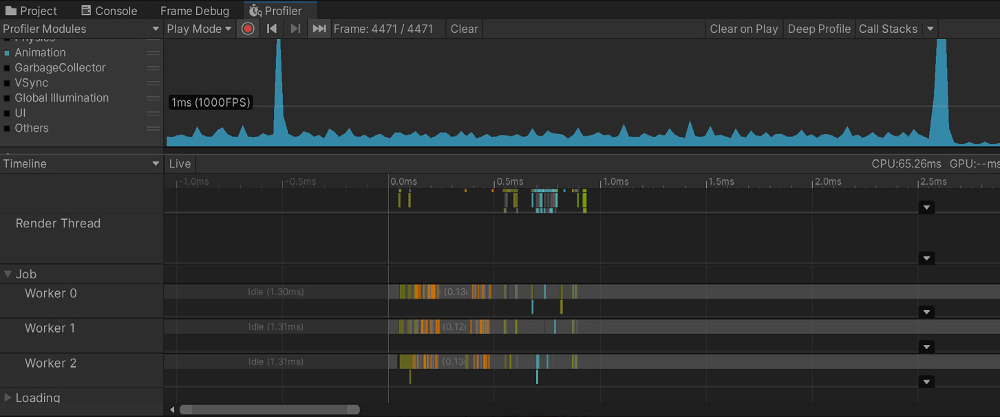
<p><em>VI: <strong>▲ Vì sao phải nhìn TIMELINE chứ không chỉ nhìn tổng</strong> — Profiler ở chế độ Timeline cho thấy <strong>Render Thread</strong> và <strong>Job Worker 0/1/2</strong> chạy song song với Main Thread. Draw call dồn ở Render Thread là dấu hiệu CPU-bound phía đồ hoạ. / EN: The Profiler Timeline showing the Render Thread and Job Workers.</em></p>

<div class="bilingual-row">
<div class="col-vi">
<p>🔑 <strong>GPU KHÔNG làm việc một mình.</strong> Nó dựa vào code game chạy trên <strong>CPU</strong> để bảo nó render CÁI GÌ và render THẾ NÀO. CPU và GPU (thường) là <em>2 chip riêng biệt, chạy độc lập và song song</em>.</p>
<p>Để đạt frame rate mục tiêu — phổ biến nhất là <strong>30 fps</strong> — <em>CẢ CPU và GPU</em> đều phải hoàn thành công việc tạo một frame trong thời gian cho phép (ở 30fps là <strong>33 mili-giây/frame</strong>).</p>
<p><strong>Cơ chế Pipelining giữa CPU và GPU:</strong></p>
<blockquote>
<p><em>"Để đạt điều này, frame thường được <strong>PIPELINE</strong>: CPU dùng <strong>TRỌN frame</strong> để làm việc của nó (AI, physics, input, animation…) rồi <strong>gửi lệnh cho GPU ở CUỐI frame</strong>, để GPU bắt tay vào <strong>frame TIẾP THEO</strong>.</em></p>
<p><em>Điều này cho <strong>mỗi bộ xử lý TRỌN 33 ms</strong> để làm việc — <strong>đánh đổi là thêm ĐỘ TRỄ một frame</strong>."</em></p>
</blockquote>
<p>💡 <em>Độ trễ này có thể là vấn đề với game nhạy thời gian như FPS — ví dụ Call of Duty chạy <strong>60fps để GIẢM độ trễ</strong> giữa input người chơi và render. Nhưng nhìn chung người chơi không nhận ra frame thừa này.</em></p>
<p>🚨 <strong>Điều gì xảy ra khi trễ VSync:</strong> Nếu GPU mất hơn 33 ms để render xong ⇒ <strong>bỏ lỡ cửa sổ cơ hội, màn hình không có frame mới để hiển thị</strong> ⇒ <em>screen tearing hoặc giật, frame rate không đều</em>. <strong>Kết quả TƯƠNG TỰ nếu CPU chậm</strong> — nó có hiệu ứng dây chuyền vì GPU không nhận lệnh đủ nhanh.</p>
<p>👉 <strong>Frame rate ổn định phụ thuộc vào CẢ CPU lẫn GPU.</strong> <em>(Liên hệ <a href="../01-fresher/01-ultimate-guide-to-profiling.md">Module 1 §1.3</a> — sơ đồ anatomy of a frame.)</em></p>
</div>
<div class="col-en">
<p>🔑 <strong>The GPU cannot work alone.</strong> It relies on the game code running on the <strong>CPU</strong> to tell it what to render and how. The CPU and GPU are (usually) <em>separate chips, running independently and in parallel</em>.</p>
<p>To hit the target frame rate — most commonly <strong>30 fps</strong> — <em>both the CPU and GPU</em> have to do all the work to produce a frame within the time allowed (at 30fps that's just <strong>33 milliseconds per frame</strong>).</p>
<p><strong>The CPU/GPU pipelining mechanism:</strong></p>
<blockquote>
<p><em>"To achieve this, frames are often <strong>PIPELINED</strong>: the CPU will take the <strong>WHOLE frame</strong> to do its work (AI, physics, input, animation etc.) and then <strong>send instructions to the GPU at the END of the frame</strong> so it can get to work on the <strong>NEXT frame</strong>.</em></p>
<p><em>This gives <strong>each processor a full 33ms</strong> to do its work <strong>at the expense of introducing a frame's worth of LATENCY</strong>."</em></p>
</blockquote>
<p>💡 <em>This may matter for twitchy games — the Call of Duty series runs at <strong>60fps to reduce the latency</strong> between player input and rendering. But in general the extra frame is not noticeable.</em></p>
<p>🚨 <strong>What happens on a missed VSync:</strong> If the GPU takes longer than 33ms, it <strong>misses this window and the monitor won't have any new frame to display</strong> ⇒ <em>screen tearing or stuttering and an uneven framerate</em>. <strong>We get the SAME result if the CPU takes too long</strong> — a knock-on effect since the GPU doesn't get commands quickly enough.</p>
<p>👉 <strong>A solid framerate relies on BOTH the CPU and GPU performing well.</strong> <em>(Connects to <a href="../01-fresher/01-ultimate-guide-to-profiling.md">Module 1 §1.3</a> — the anatomy of a frame.)</em></p>
</div>
</div>

### 2.1. 🔑 GPU State — Vì sao mỗi thay đổi cần một Draw Call mới

<div class="bilingual-row">
<div class="col-vi">
<p>Để hiển thị một mesh, CPU phát ra một <strong>draw call</strong> — đơn giản là <em>một chuỗi lệnh nói cho GPU biết vẽ gì và vẽ thế nào</em>.</p>
<p>Khi draw call đi qua GPU pipeline, nó dùng các setting cấu hình được chỉ định trong draw call — chủ yếu do <em>material của mesh và tham số của nó</em> quyết định. Các setting này gọi là <strong>GPU STATE</strong>.</p>
<p><strong>GPU state gồm những gì (quan trọng nhất với chúng ta):</strong></p>
<ul>
<li><strong>Vertex/index buffer hiện tại</strong></li>
<li><strong>Chương trình vertex/pixel shader hiện tại</strong></li>
<li><strong>Toàn bộ shader input</strong> (ví dụ <code>MaterialTexture</code> hay <code>LightColor</code> trong code trên)</li>
</ul>
<p>🚨 <strong>HỆ QUẢ QUAN TRỌNG NHẤT:</strong></p>
<blockquote>
<p><em>"Điều này nghĩa là <strong>để thay đổi MỘT mẩu GPU state</strong> (ví dụ đổi texture hay đổi shader), <strong>PHẢI phát ra một DRAW CALL MỚI</strong>."</em></p>
</blockquote>
<p>💰 <strong>Và draw call KHÔNG miễn phí đối với CPU:</strong></p>
<ul>
<li>Tốn thời gian để <em>thiết lập các thay đổi GPU state mong muốn</em> rồi phát draw call</li>
<li>Ngoài công việc engine phải làm cho mỗi lời gọi, còn có <strong>chi phí kiểm tra lỗi và ghi sổ (bookkeeping) do GRAPHICS DRIVER</strong> — lớp code trung gian do nhà sản xuất GPU (NVIDIA, AMD…) viết, dịch draw call thành lệnh phần cứng cấp thấp</li>
</ul>
<p>💀 <strong>Quá nhiều draw call ⇒ gánh nặng quá lớn cho CPU ⇒ vấn đề hiệu năng nghiêm trọng.</strong></p>
</div>
<div class="col-en">
<p>To display a mesh, the CPU issues a <strong>draw call</strong> — simply <em>a series of commands that tells the GPU what to draw and how</em>.</p>
<p>As the draw call goes through the pipeline, it uses the configurable settings specified in it — mostly determined by <em>the mesh's material and its parameters</em>. These settings are called <strong>GPU STATE</strong>.</p>
<p><strong>What GPU state includes (most significantly for us):</strong></p>
<ul>
<li>The <strong>current vertex/index buffers</strong></li>
<li>The <strong>current vertex/pixel shader programs</strong></li>
<li><strong>All the shader inputs</strong> (e.g. <code>MaterialTexture</code> or <code>LightColor</code> in the code above)</li>
</ul>
<p>🚨 <strong>THE MOST IMPORTANT CONSEQUENCE:</strong></p>
<blockquote>
<p><em>"This means that <strong>to change a piece of GPU state</strong> (for example changing a texture or switching shaders), <strong>a NEW DRAW CALL must be issued</strong>."</em></p>
</blockquote>
<p>💰 <strong>And draw calls are NOT free for the CPU:</strong></p>
<ul>
<li>It costs time to <em>set up the desired GPU state changes</em> and then issue the draw call</li>
<li>Beyond whatever the engine does per call, extra error checking and bookkeeping cost is introduced by the <strong>graphics DRIVER</strong> — an intermediate layer written by the GPU vendor (NVIDIA, AMD etc.) that translates the draw call into low-level hardware instructions</li>
</ul>
<p>💀 <strong>Too many draw calls can put too much of a burden on the CPU and cause serious performance problems.</strong></p>
</div>
</div>

!!! danger "📊 Ngân sách Draw Call thực tế trên console"
    <div class="bilingual-row">
    <div class="col-vi">
    <blockquote>
    <p><em>"Do overhead này, chúng ta thường đặt <strong>giới hạn TRÊN cho số draw call chấp nhận được mỗi frame</strong>. Nếu vượt giới hạn trong lúc test gameplay, phải có biện pháp: giảm số object, giảm draw distance, v.v.</em></p>
    <p><em>📊 <strong>Game console thường cố giữ draw call trong khoảng 2000–3000</strong> — ví dụ trên <strong>Far Cry Primal</strong> chúng tôi cố giữ <strong>dưới 2500 mỗi frame</strong>.</em></p>
    <p><em>⚠️ Con số đó nghe có vẻ nhiều, nhưng nó <strong>BAO GỒM cả các kỹ thuật render đặc biệt</strong> — ví dụ <strong>cascaded shadows có thể DỄ DÀNG NHÂN ĐÔI số draw call</strong> trong một frame."</em></p>
    </blockquote>
    <p><strong>Nguồn draw call thừa phổ biến nhất — đọc kỹ:</strong></p>
    <blockquote>
    <p><em>"Mặc dù bạn có thể đã tạo <strong>MỘT mesh duy nhất</strong> trong phần mềm dựng hình, <strong>nếu MỘT NỬA mesh dùng texture albedo này và nửa kia dùng texture khác, nó sẽ được render thành HAI draw call riêng biệt</strong>.</em></p>
    <p><em>Tương tự nếu mesh gồm <strong>nhiều material</strong> — cần set shader khác nhau ⇒ phải phát nhiều draw call.</em></p>
    <p><em>🔑 <strong>Trên thực tế, nguồn thay đổi state RẤT PHỔ BIẾN — và do đó là draw call thừa — chính là ĐỔI TEXTURE MAP.</strong> Thường cả mesh dùng cùng material (nên cùng shader), nhưng <strong>các phần khác nhau của mesh dùng bộ albedo/normal/roughness map KHÁC NHAU</strong>."</em></p>
    </blockquote>
    </div>
    <div class="col-en">
    <blockquote>
    <p><em>"Due to this overhead, we generally set an <strong>upper limit to the number of draw calls acceptable per frame</strong>. If this limit is exceeded during gameplay testing, steps must be taken: reducing the number of objects, reducing draw distance, etc.</em></p>
    <p><em>📊 <strong>Console games typically try to keep draw calls in the 2000–3000 range</strong> — e.g. on <strong>Far Cry Primal</strong> we tried to keep it <strong>below 2500 per frame</strong>.</em></p>
    <p><em>⚠️ That might sound like a lot, but it <strong>also INCLUDES any special rendering techniques</strong> — <strong>cascaded shadows for example can EASILY DOUBLE the number of draw calls</strong> in a frame."</em></p>
    </blockquote>
    <p><strong>The most common source of extra draw calls — read carefully:</strong></p>
    <blockquote>
    <p><em>"Although you may have created a <strong>SINGLE mesh</strong> in your modelling package, <strong>if one HALF of the mesh uses one texture for the albedo map and the other half uses a different texture, it will be rendered as TWO separate draw calls</strong>.</em></p>
    <p><em>The same goes if the mesh is made up of <strong>multiple materials</strong>; different shaders need to be set, so multiple draw calls must be issued.</em></p>
    <p><em>🔑 <strong>In practice, a VERY COMMON source of state change — and therefore extra draw calls — is SWITCHING TEXTURE MAPS.</strong> Typically the whole mesh uses the same material (and therefore the same shaders), but <strong>different parts of the mesh use different sets of albedo/normal/roughness maps</strong>."</em></p>
    </blockquote>
    </div>
    </div>

### 2.2. 🧩 Atlas, Instancing, Merging — và cái bẫy BOUNDING VOLUME

<div class="bilingual-row">
<div class="col-vi">
<p>🗺️ <strong>Texture atlas — giải pháp KINH ĐIỂN cho draw call:</strong></p>
<p><em>"Với một scene có HÀNG TRĂM hoặc thậm chí HÀNG NGHÌN object, dùng NHIỀU draw call cho mỗi object sẽ <strong>tốn ĐÁNG KỂ thời gian CPU và do đó ảnh hưởng RÕ RỆT tới framerate.</strong> Để tránh, giải pháp phổ biến là <strong>GỘP TẤT CẢ các texture map dùng trên một mesh vào MỘT TEXTURE LỚN DUY NHẤT — thường gọi là ATLAS. UV của mesh sau đó được ĐIỀU CHỈNH để tra đúng phần của atlas, và TOÀN BỘ mesh (hoặc thậm chí NHIỀU mesh) có thể được render trong MỘT draw call duy nhất.</strong> ⚠️ <strong>Phải CẨN THẬN khi dựng atlas để các texture KỀ NHAU KHÔNG LOANG (bleed) vào nhau ở các mip THẤP</strong>, nhưng những vấn đề này TƯƠNG ĐỐI NHỎ so với lợi ích hiệu năng thu được."</em></p>
<p>🔁 <strong>Instancing / clustering:</strong></p>
<p><em>"Nhiều engine cũng hỗ trợ <strong>INSTANCING — còn gọi là batching hay clustering. Đây là khả năng dùng MỘT draw call để render NHIỀU object GẦN NHƯ GIỐNG HỆT NHAU về shader và state, chỉ khác nhau ở một tập GIỚI HẠN các thuộc tính</strong> (thường là vị trí và góc xoay trong thế giới). ✅ <strong>Engine thường TỰ NHẬN RA khi nhiều object giống hệt nhau có thể render bằng instancing, nên LUÔN NÊN dùng LẶP LẠI CÙNG MỘT object trong scene khi có thể, thay vì nhiều object KHÁC NHAU phải render bằng các draw call riêng.</strong>"</em></p>
<p>🔗 <em>"Một kỹ thuật phổ biến khác để giảm draw call là <strong>GỘP THỦ CÔNG nhiều object khác nhau DÙNG CHUNG material vào MỘT mesh duy nhất. Cách này có thể HIỆU QUẢ, nhưng phải CẨN THẬN TRÁNH GỘP QUÁ MỨC — việc đó thực ra có thể LÀM HIỆU NĂNG TỆ ĐI vì TĂNG khối lượng việc cho GPU.</strong>"</em></p>
</div>
<div class="col-en">
<p>🗺️ <strong>The texture atlas as a draw-call solution:</strong></p>
<p><em>"With a scene of hundreds or even thousands of objects, using many draw calls for each object will cost a considerable amount of CPU time and so will have a noticeable impact on the framerate of the game. To avoid this, a common solution is to combine all the different texture maps used on a mesh into a single big texture, often called an atlas. The UVs of the mesh are then adjusted to look up the right part of the atlas, and the entire mesh (or even multiple meshes) can be rendered in a single draw call. Care must be taken when constructing the atlas so that adjacent textures don't bleed into each other at lower mips, but these problems are relatively minor compared to the gains that can be had in terms of performance."</em></p>
<p>🔁 <strong>Instancing / clustering:</strong></p>
<p><em>"Many engines also support instancing, also known as batching or clustering. This is the ability to use a single draw call to render multiple objects that are mostly identical in terms of shaders and state, and only differ in a restricted set of ways (typically their position and rotation in the world). The engine will usually recognize when multiple identical objects can be rendered using instancing, so it's always preferable to use the same object multiple times in a scene when possible, instead of multiple different objects that will need to be rendered with separate draw calls."</em></p>
<p>🔗 <em>"Another common technique for reducing draw calls is manually merging many different objects that share the same material into a single mesh. This can be effective, but care must be taken to avoid excessive merging which can actually worsen performance by increasing the amount of work for the GPU."</em></p>
</div>
</div>

!!! danger "💀 PHẢN ĐỀ của §10 — khi nào GỘP lại làm CHẬM ĐI"
    <div class="bilingual-row">
    <div class="col-vi">
    <p>👁️ <em>"TRƯỚC KHI bất kỳ draw call nào được phát ra, <strong>hệ thống visibility của engine sẽ xác định object đó có XUẤT HIỆN TRÊN MÀN HÌNH hay không. Nếu KHÔNG, việc BỎ QUA object ngay ở giai đoạn SỚM này RẤT RẺ</strong> — không phải trả tiền cho draw call lẫn công việc GPU (gọi là <strong>VISIBILITY CULLING</strong>). Việc này thường làm bằng cách kiểm tra <strong>BOUNDING VOLUME của object có nhìn thấy được từ góc camera hay không</strong>, và nó có bị object khác <strong>CHE HOÀN TOÀN (occluded)</strong> hay không."</em></p>
    <p>💀 <strong>Và đây là cái bẫy:</strong> <em>"Tuy nhiên, <strong>KHI NHIỀU MESH ĐƯỢC GỘP thành MỘT object, các bounding volume RIÊNG của chúng PHẢI được GỘP thành MỘT VOLUME LỚN đủ bao TRỌN mọi mesh. Việc này LÀM TĂNG khả năng hệ thống visibility nhìn thấy MỘT PHẦN nào đó của volume, và do đó COI TOÀN BỘ cụm là NHÌN THẤY ĐƯỢC.</strong> Nghĩa là nó TRỞ THÀNH một draw call, và <strong>vertex shader PHẢI chạy trên MỌI vertex của object — KỂ CẢ khi rất ít vertex trong số đó thực sự xuất hiện trên màn hình. Điều này có thể khiến RẤT NHIỀU thời gian GPU bị LÃNG PHÍ vì các vertex rốt cuộc KHÔNG đóng góp gì cho ảnh cuối.</strong>"</em></p>
    <p>✅ <strong>Kết luận NGUYÊN VĂN:</strong> <em>"Vì những lý do đó, <strong>mesh merging HIỆU QUẢ NHẤT khi làm trên các NHÓM object NHỎ NẰM GẦN NHAU, vì dù sao chúng cũng có khả năng CÙNG xuất hiện trên màn hình.</strong>"</em></p>
    </div>
    <div class="col-en">
    <p>👁️ <em>"Before any draw call gets issued, the engine's visibility system will determine whether or not the object will even appear on screen. If not, it's very cheap to just ignore the object at this early stage and not pay for any draw call or GPU work (also known as visibility culling). This is usually done by checking if the object's bounding volume is visible from the camera's point of view, and that it is not completely blocked from view (occluded) by any other objects."</em></p>
    <p>💀 <strong>And here is the trap:</strong> <em>"However, when multiple meshes are merged into a single object, their individual bounding volumes must be combined into a single large volume that is big enough to enclose every mesh. This increases the likelihood that the visibility system will be able to see some part of the volume, and so will consider the entire collection visible. That means that it becomes a draw call, and so the vertex shader must be executed on every vertex in the object — even if very few of those vertices actually appear on the screen. This can lead to a lot of GPU time being wasted because the vertices end up not contributing anything to the final image."</em></p>
    <p>✅ <em>"For these reasons, mesh merging is the most effective when it is done on groups of small objects that are close to each other, as they will probably be on-screen at the same time anyway."</em></p>
    </div>
    </div>

<div class="bilingual-row">
<div class="col-vi">
<p>🎮 <strong>Case study — XCOM 2 chụp bằng RenderDoc:</strong></p>
<p><em>"Wireframe cho thấy <strong>TOÀN BỘ scene mà engine gửi tới GPU</strong>, với <strong>vùng ĐEN Ở GIỮA là hình học THỰC SỰ nhìn thấy được bởi camera game. Toàn bộ hình học XUNG QUANH màu XÁM là KHÔNG nhìn thấy và sẽ bị cull SAU KHI vertex shader đã chạy — toàn bộ đó là thời gian GPU LÃNG PHÍ.</strong>"</em></p>
<p>🌿 <em>"Đặc biệt, hãy chú ý <strong>phần hình học tô ĐỎ — một loạt mesh BỤI CÂY, đã được GỘP và render chỉ trong VÀI draw call. Vì hệ thống visibility xác định rằng ÍT NHẤT MỘT SỐ bụi cây nhìn thấy được, TẤT CẢ chúng đều được render và do đó TẤT CẢ đều phải chạy vertex shader trước khi xác định cái nào có thể cull — mà hoá ra là HẦU HẾT.</strong>"</em></p>
<p>⚖️ <em>"Xin lưu ý đây KHÔNG phải lời buộc tội riêng XCOM 2 — <strong>MỌI game đều có vấn đề này, và đó là CUỘC CHIẾN LIÊN TỤC để cân bằng giữa chi phí CPU của việc kiểm tra visibility CHÍNH XÁC HƠN, chi phí GPU của việc cull hình học vô hình, và chi phí CPU của việc có NHIỀU draw call hơn.</strong>"</em></p>
</div>
<div class="col-en">
<p>🎮 <strong>Case study — XCOM 2 captured with RenderDoc:</strong></p>
<p><em>"The wireframe shows the entire scene as submitted to the GPU by the engine, with the black area in the middle being the geometry that's actually visible by the game camera. All the surrounding geometry in grey is not visible and will be culled after the vertex shader is executed, which is all wasted GPU time."</em></p>
<p>🌿 <em>"In particular, note the highlighted red geometry which is a series of bush meshes, combined and rendered in just a few draw calls. Since the visibility system determined that at least some of the bushes are visible on the screen, they are all rendered and so must all have their vertex shader executed before determining which can be culled… which turns out to be most of them."</em></p>
<p>⚖️ <em>"Please note this isn't an indictment of XCOM 2 in particular… Every game has this problem, and it's a constant battle to balance the CPU cost of doing more accurate visibility tests, the GPU cost of culling the invisible geometry, and the CPU cost of having more draw calls."</em></p>
</div>
</div>

<div class="bilingual-row">
<div class="col-vi">
<p>🔮 <strong>Tương lai của draw call — D3D12 / Vulkan:</strong></p>
<p><em>"Mọi thứ ĐANG THAY ĐỔI về chi phí draw call. Như đã nói, <strong>một lý do LỚN khiến chúng đắt là overhead của DRIVER khi dịch và kiểm tra lỗi. Điều này ĐÚNG từ lâu, NHƯNG các API đồ hoạ HIỆN ĐẠI NHẤT (như Direct3D 12 và Vulkan) đã được TÁI CẤU TRÚC để TRÁNH PHẦN LỚN overhead đó.</strong> Dù việc này khiến engine render PHỨC TẠP HƠN, nó cũng <strong>làm draw call RẺ HƠN, cho phép render NHIỀU object HƠN TRƯỚC.</strong>"</em></p>
<p>🚀 <em>"Một số engine — <strong>đáng chú ý nhất là bản mới nhất dùng cho Assassin's Creed</strong> — thậm chí đã đi theo hướng <strong>KHÁC HẲN: dùng năng lực của GPU đời mới để ĐIỀU KHIỂN việc render và LOẠI BỎ HẲN khái niệm draw call.</strong> 🎯 <strong>Tác động hiệu năng của việc có QUÁ NHIỀU draw call chủ yếu nằm ở CPU; gần như MỌI vấn đề hiệu năng khác liên quan tới art asset đều nằm ở GPU.</strong>"</em></p>
</div>
<div class="col-en">
<p>🔮 <strong>The future of the draw call — D3D12 / Vulkan:</strong></p>
<p><em>"Things are changing when it comes to the cost of draw calls however. As mentioned above, a significant reason for their expense is the overhead of the driver doing translation and error checking. This has long been the case, but the most modern graphics APIs (eg. Direct3D 12 and Vulkan) have been restructured in order to avoid most of this overhead. While this does introduce extra complexity to the game's rendering engine, it can also result in cheaper draw calls, allowing us to render many more objects than before possible."</em></p>
<p>🚀 <em>"Some engines (most notably the latest version used by Assassin's Creed) have even gone in a radically different direction, using the capabilities of the latest GPUs to drive rendering and effectively doing away with draw calls altogether. The performance impact of having too many draw calls is mostly on the CPU; pretty much all other performance issues related to art assets are on the GPU."</em></p>
</div>
</div>


---

## 3. Bottleneck — Khái niệm nền tảng


<p><em>VI: Unity Profiler ở chế độ <strong>Timeline</strong> — hàng <strong>Render Thread</strong> và các hàng <strong>Job / Worker 0–2</strong> (mỗi worker <em>Idle 1.30–1.31 ms</em>) hiển thị riêng biệt, cho phép so sánh trực tiếp CPU main thread với render thread. Ở đây <strong>CPU: 65.26 ms</strong> còn <strong>GPU: --ms</strong> (không có số liệu GPU trên nền tảng này). / EN: The Unity Profiler in Timeline mode, showing the Render Thread and Job worker rows separately.</em></p>

<p>👉 <em>Xem quy trình chẩn đoán CPU-bound vs GPU-bound đầy đủ ở <a href="../01-fresher/01-ultimate-guide-to-profiling.md">Module 1</a>. / EN: See <a href="../01-fresher/01-ultimate-guide-to-profiling.md">Module 1</a> for the full CPU-bound vs GPU-bound diagnostic workflow.</em></p>

<div class="bilingual-row">
<div class="col-vi">
<p><strong>Bước ĐẦU TIÊN trong tối ưu là XÁC ĐỊNH bottleneck hiện tại</strong> để bạn có thể giảm hoặc loại bỏ nó. <em>Bottleneck là phần của pipeline đang làm chậm mọi thứ khác.</em></p>
<p>💡 <strong>Ví dụ:</strong> Trong trường hợp quá nhiều draw call tốn quá nhiều thời gian ⇒ <strong>CPU là bottleneck</strong>. Kể cả khi bạn thực hiện các tối ưu khác làm GPU nhanh hơn, <em>điều đó KHÔNG ảnh hưởng gì tới frame rate</em> vì CPU vẫn chạy quá chậm để tạo một frame trong thời gian yêu cầu.</p>
<p><strong>Hình dung GPU pipeline như một DÂY CHUYỀN LẮP RÁP:</strong> khi mỗi giai đoạn xong việc, nó chuyển kết quả cho giai đoạn tiếp theo và làm tiếp phần việc mới. <em>Lý tưởng: mọi giai đoạn đều bận rộn suốt thời gian</em> — vertex shader liên tục xử lý vertex, rasterizer liên tục rasterize pixel, v.v.</p>
<p>🚨 <strong>Nhưng điều gì xảy ra khi MỘT giai đoạn mất nhiều thời gian hơn hẳn?</strong></p>
<blockquote>
<p><em>"Một vertex shader ĐẮT ĐỎ <strong>KHÔNG thể cấp dữ liệu cho các giai đoạn sau đủ nhanh</strong>, và do đó trở thành bottleneck. Nếu bạn có một draw call hành xử như vậy, <strong>làm pixel shader nhanh hơn sẽ KHÔNG tạo ra nhiều khác biệt</strong> cho tổng thời gian render draw call đó.</em></p>
<p><em>🔑 <strong>Cách DUY NHẤT để làm mọi thứ nhanh hơn là GIẢM thời gian ở trong vertex shader.</strong>"</em></p>
</blockquote>
<p>⚖️ <strong>Sự thật cần chấp nhận:</strong></p>
<blockquote>
<p><em>"Bạn nên nhớ rằng <strong>gần như LUÔN LUÔN sẽ có một bottleneck nào đó</strong> — nếu bạn loại bỏ một cái, cái khác sẽ thế chỗ.</em></p>
<p><em>Mẹo là <strong>biết KHI NÀO bạn có thể làm gì đó về nó, và KHI NÀO bạn phải sống chung với nó</strong> vì đó đơn giản là cái giá để render thứ bạn muốn render.</em></p>
<p><em>👉 <strong>Khi tối ưu, bạn thực sự đang cố loại bỏ những bottleneck KHÔNG CẦN THIẾT.</strong>"</em></p>
</blockquote>
</div>
<div class="col-en">
<p><strong>The very FIRST step in optimization is to IDENTIFY the current bottleneck</strong> so you can reduce or eliminate it. <em>A bottleneck is the section of the pipeline that is slowing everything else down.</em></p>
<p>💡 <strong>Example:</strong> In the case where too many draw calls cost too much, <strong>the CPU is the bottleneck</strong>. Even if you performed other optimizations that made the GPU faster, <em>it wouldn't matter to the framerate</em> because the CPU is still too slow to produce a frame in the required time.</p>
<p><strong>Think of the GPU pipeline as an ASSEMBLY LINE:</strong> as each stage finishes with its data, it forwards results to the following stage and proceeds with the next piece of work. <em>Ideally every stage is busy working all the time</em> — the vertex shader constantly processing vertices, the rasterizer constantly rasterizing pixels, and so on.</p>
<p>🚨 <strong>But what happens if ONE stage takes much longer than the others?</strong></p>
<blockquote>
<p><em>"An expensive vertex shader <strong>can't feed the following stages fast enough</strong>, and so becomes the bottleneck. If you had a draw call that behaved like this, <strong>making the pixel shader faster is NOT going to make much of a difference</strong> to the time it takes for the entire draw call to be rendered.</em></p>
<p><em>🔑 <strong>The ONLY way to make things faster is to REDUCE the time spent in the vertex shader.</strong>"</em></p>
</blockquote>
<p>⚖️ <strong>The truth to accept:</strong></p>
<blockquote>
<p><em>"You should keep in mind that <strong>there will ALMOST ALWAYS be a bottleneck of some kind</strong> — if you eliminate one, another will just take its place.</em></p>
<p><em>The trick is <strong>knowing WHEN you can do something about it, and WHEN you have to live with it</strong> because that's just what it costs to render what you want to render.</em></p>
<p><em>👉 <strong>When you optimize, you're really trying to get rid of UNNECESSARY bottlenecks.</strong>"</em></p>
</blockquote>
</div>
</div>

!!! tip "Công cụ profiling GPU theo nền tảng"
    **VI:** Bài viết liệt kê: **NVIDIA Nsight** · **AMD GPU PerfStudio** · **Intel GPA** · **RenderDoc** *(hiện là công cụ tốt nhất để debug đồ họa trên PC, nhưng không có tính năng profiling nâng cao)* · **PIX** *(Microsoft đang mở rộng công cụ profiling Xbox cho Windows, tuy chỉ cho ứng dụng D3D12)*.

    ⚠️ *"Đáng tiếc, đây là chỗ mọi thứ hơi mơ hồ, vì **một số công cụ hiệu năng TỐT NHẤT chỉ có trên console và do đó thuộc diện NDA**."* — Xem thêm bảng công cụ đầy đủ ở [Module 1 §17](../01-fresher/01-ultimate-guide-to-profiling.md).

    **EN:** The article lists: **NVIDIA Nsight** · **AMD GPU PerfStudio** · **Intel GPA** · **RenderDoc** *(currently the best tool for graphics debugging on PC, but without advanced profiling features)* · **PIX**. ⚠️ *"Some of the best performance tools available are only available for the consoles and therefore under NDA."*


### 3.1. 📏 Benchmark GPU — Biết TRƯỚC bạn nên kỳ vọng gì

<div class="bilingual-row">
<div class="col-vi">
<blockquote>
<p><em>"Khi profiling, <strong>bắt đầu bằng một BENCHMARK là điều HỮU ÍCH.</strong> <strong>Benchmark cho bạn biết bạn NÊN KỲ VỌNG kết quả profiling như thế nào từ những GPU CỤ THỂ.</strong></em></p>
<p><em>👉 Xem <strong>GFXBench</strong> để có một danh sách TUYỆT VỜI các benchmark CHUẨN NGÀNH cho GPU và card đồ họa. Trang này cung cấp <strong>cái nhìn tổng quan tốt về các GPU hiện có và cách chúng SO SÁNH với nhau.</strong>"</em></p>
</blockquote>
<p>💡 <strong>Vì sao bước này quan trọng:</strong> nếu không có benchmark, bạn <strong>KHÔNG biết 8 ms/frame trên thiết bị đích là "tốt" hay "tệ"</strong>. Benchmark biến con số tuyệt đối thành con số <em>tương đối so với năng lực phần cứng</em> — điều kiện tiên quyết để kết luận "đã tối ưu đủ".</p>
</div>
<div class="col-en">
<blockquote>
<p><em>"When profiling, <strong>it's USEFUL to start with a BENCHMARK.</strong> <strong>A benchmark tells you WHAT profiling results you SHOULD EXPECT from specific GPUs.</strong></em></p>
<p><em>👉 See <strong>GFXBench</strong> for a GREAT list of different INDUSTRY-STANDARD benchmarks for GPUs and graphics cards. The website provides <strong>a good overview of the current GPUs available and how they STACK UP against each other.</strong>"</em></p>
</blockquote>
<p>💡 <strong>Why this step matters:</strong> without a benchmark you <strong>CANNOT tell whether 8 ms/frame on your target device is "good" or "bad"</strong>. A benchmark turns an absolute number into one that is <em>relative to the hardware's capability</em> — the precondition for concluding "optimized enough".</p>
</div>
</div>

### 3.2. 🔧 Kỹ thuật debug THAY THẾ — Sáu công cụ ngoài Unity

<div class="bilingual-row">
<div class="col-vi">
<blockquote>
<p><em>"Bạn cũng có thể dùng <strong>PERFORMANCE COUNTER để đo hiệu năng bằng công cụ BÊN NGOÀI. Nhiều công cụ trong số này cung cấp cái nhìn SÂU HƠN Unity Frame Debugger hay GPU Profiler.</strong></em></p>
<p><em>▶️ <strong>Build một standalone player và chạy nó qua một trong các công cụ sau.</strong>"</em></p>
</blockquote>
</div>
<div class="col-en">
<blockquote>
<p><em>"You can also use <strong>PERFORMANCE COUNTERS to measure performance with EXTERNAL tools. Many of these offer insight BEYOND the Unity Frame Debugger or GPU Profiler.</strong></em></p>
<p><em>▶️ <strong>Build a standalone player and run it through any of the following.</strong>"</em></p>
</blockquote>
</div>
</div>

| Công cụ / Tool | Nền tảng & API | Khả năng nổi bật / Key capability |
|---|---|---|
| **Visual Studio Graphics Diagnostics** | **Direct3D** | *"Bộ công cụ để PHÂN TÍCH ứng dụng Direct3D. **Bạn có thể CHỤP output của ứng dụng, rồi LƯU các frame đã chụp trong Graphics Analyzer.** Bạn cũng có thể lấy **BẢN TÓM TẮT hiệu năng rendering từ công cụ Frame Analysis**"* |
| **Intel Graphics Performance Analyzers (GPA)** | **DirectX · Metal · Vulkan · OpenGL** | *"Một graphics analyzer khác **hỗ trợ NHIỀU API HƠN**. **Xem metric của CPU, GPU và Graphics API THỜI GIAN THỰC để xác định ứng dụng của bạn là CPU- hay GPU-bound.** Chụp frame bằng **Graphics Frame Analyzer**, và **xác định chính xác hoạt động CPU/GPU bằng Graphics Trace Analyzer**"* |
| **RenderDoc** ⭐ | **Windows · Linux · Android** *(Nintendo Switch™ phân phối riêng qua NintendoSDK)* | *"Frame debugger **MÃ NGUỒN MỞ**. 🔑 **Unity hỗ trợ TÍCH HỢP RenderDoc ngay trong Editor để việc debug frame DỄ HƠN.** 💎 Dùng RenderDoc, ví dụ, để **TRỰC QUAN HÓA OVERDRAW với URP**"* |
| **NVIDIA Nsight Graphics** | **Direct3D · DirectX Raytracing · Vulkan · OpenGL · OpenVR · Oculus SDK** | *"Công cụ độc lập cho phép **debug, profile, và EXPORT frame** qua nhiều API. · **Range Profiler**: phân rã một tập frame đã tuần tự hóa thành **THỜI GIAN THỰC THI GPU** · **GPU Trace**: phân tích **throughput và mức tận dụng GPU với overhead TỐI THIỂU** · **Nsight Aftermath**: điều tra **GPU CRASH và HANG**"* |
| **AMD Radeon Developer Tool Suite** | **DirectX · Vulkan · OpenGL · OpenCL** | *"Gồm một **GPU Profiler và Analyzer**, thêm công cụ để **phân tích GPU AMD với các API đồ họa tương thích**"* |
| **Apple Xcode (Instruments)** | **Metal** | *"Instruments cho phép bạn **thu thập nhiều LOẠI dữ liệu khác nhau và xem chúng SONG SONG**. 🔑 **Frame Capture cho phép TẠM DỪNG app và chụp snapshot các lệnh Metal cùng buffer.** 💎 Bạn có thể sau đó **debug một FRAME GRAPH trực quan hiển thị TẤT CẢ render pass và các PHỤ THUỘC giữa chúng**"* |

!!! tip "🎯 Cách chọn công cụ trong thực chiến"
    **VI:** Ghép công cụ với **bottleneck bạn nghi ngờ** (<a href="#3-bottleneck-khai-niem-nen-tang">§3</a>), không phải với thương hiệu GPU:

    - Nghi **overdraw / fill-rate** → **RenderDoc** *(có sẵn tích hợp Editor, và Unity chỉ đích danh nó cho việc trực quan hóa overdraw URP)*
    - Nghi **CPU- hay GPU-bound** → **Intel GPA** *(hiển thị metric CPU + GPU thời gian thực SONG SONG)*
    - Nghi **wavefront occupancy / stall GPU** (<a href="#233-wavefront-occupancy-o-muc-tan-dung-gpu">§23.3</a>) → **NVIDIA Nsight GPU Trace**, hoặc **PIX / Razor** trên console
    - **GPU crash / hang** → **Nsight Aftermath**
    - Ship **iOS/Metal** → **Xcode Frame Capture** *(frame graph hiển thị phụ thuộc giữa các render pass — cách nhanh nhất phát hiện pass thừa)*

    **EN:** Match the tool to the **bottleneck you suspect** (<a href="#3-bottleneck-khai-niem-nen-tang">§3</a>), not to the GPU brand: overdraw/fill-rate → **RenderDoc**; CPU- vs GPU-bound → **Intel GPA**; wavefront occupancy/stalls → **Nsight GPU Trace** or **PIX/Razor**; GPU crashes → **Nsight Aftermath**; iOS/Metal → **Xcode Frame Capture**.

---

# PHẦN B — BỐN BOTTLENECK GPU PHỔ BIẾN


**🔌 Sâu hơn nữa — low-level native plug-in Profiler API**

<div class="bilingual-row">
<div class="col-vi">
<p><em>"Để phân tích CHI TIẾT HƠN NỮA, hãy dùng <strong>low-level native plug-in Profiler API</strong>. Bạn dùng API này để <strong>MỞ RỘNG Profiler và profile hiệu năng của code NATIVE PLUG-IN</strong>, hoặc để <strong>CHUẨN BỊ dữ liệu profiling gửi sang công cụ BÊN THỨ BA như <code>Razor</code> (Sony PlayStation), <code>PIX</code> (Microsoft — Windows và Xbox), cùng <code>Chrome Tracing</code>, <code>ETW</code>, <code>ITT</code>, <code>VTune</code> hay <code>Telemetry</code>.</strong>"</em></p>
</div>
<div class="col-en">
<p><em>"For an even more detailed analysis, use the low-level native plug-in Profiler API. You can use this Profiler API to extend the Profiler, and profile the performance of native plug-in code, or to prepare profiling data to send to third-party profiling tools such as Razor for Sony PlayStation, PIX for Microsoft (Windows and Xbox), as well as Chrome Tracing, ETW, ITT, VTune, or Telemetry."</em></p>
</div>
</div>

```cpp
#include <IUnityInterface.h>
#include <IUnityProfiler.h>

static IUnityProfiler* s_UnityProfiler = NULL;
static const UnityProfilerMarkerDesc* s_MyPluginMarker = NULL;
static bool s_IsDevelopmentBuild = false;

static void MyPluginWorkMethod()
{
    if (s_IsDevelopmentBuild)
        s_UnityProfiler->BeginSample(s_MyPluginMarker);

    // Code I want to see in Unity Profiler as "MyPluginMethod".
    // ...

    if (s_IsDevelopmentBuild)
        s_UnityProfiler->EndSample(s_MyPluginMarker);
}

extern "C" void UNITY_INTERFACE_EXPORT UNITY_INTERFACE_API
UnityPluginLoad(IUnityInterfaces* unityInterfaces)
{
    s_UnityProfiler = unityInterfaces->Get<IUnityProfiler>();
    if (s_UnityProfiler == NULL)
        return;
    s_IsDevelopmentBuild = s_UnityProfiler->IsAvailable() != 0;
    s_UnityProfiler->CreateMarker(&s_MyPluginMarker, "MyPluginMethod",
        kUnityProfilerCategoryOther, kUnityProfilerMarkerFlagDefault, 0);
}

extern "C" void UNITY_INTERFACE_EXPORT UNITY_INTERFACE_API UnityPluginUnload()
{
    s_UnityProfiler = NULL;
}
```


## 4. Shader Instructions (ALU)

<div class="bilingual-row">
<div class="col-vi">
<p>Vì <em>phần lớn công việc của GPU được làm bằng shader</em>, chúng thường là nguồn của nhiều bottleneck bạn sẽ gặp.</p>
<p>🔑 <strong>Định nghĩa:</strong> Khi bottleneck được xác định là <strong>shader instructions</strong> (đôi khi gọi là <strong>ALU</strong> — Arithmetic Logic Units, phần cứng thực sự làm phép tính), đơn giản là <em>vertex hoặc pixel shader đang làm RẤT NHIỀU việc và phần còn lại của pipeline đang CHỜ nó xong</em>.</p>
<p><strong>Ba nguyên nhân:</strong></p>
<ol>
<li>Chương trình vertex/pixel shader <strong>quá phức tạp</strong>, chứa nhiều lệnh và mất nhiều thời gian thực thi</li>
<li>Vertex shader hợp lý nhưng <strong>mesh có QUÁ NHIỀU vertex</strong> ⇒ cộng dồn thành nhiều thời gian trong vertex shader</li>
<li>Draw call <strong>bao phủ vùng LỚN trên màn hình</strong>, chạm nhiều pixel ⇒ tốn nhiều thời gian trong pixel shader</li>
</ol>
<p>✅ <strong>Cách tối ưu — không có gì bất ngờ: THỰC THI ÍT LỆNH HƠN!</strong></p>
<ul>
<li><strong>Pixel shader:</strong> chọn <em>material đơn giản hơn với ít tính năng hơn</em> để giảm số lệnh chạy trên mỗi pixel</li>
<li><strong>Vertex shader:</strong> <em>đơn giản hóa mesh</em> để giảm số vertex cần xử lý, và <strong>chắc chắn phải dùng LOD</strong> (Level Of Detail — phiên bản đơn giản hóa của mesh dùng khi object ở xa và nhỏ trên màn hình)</li>
</ul>
<p>⚠️ <strong>NHƯNG cảnh báo quan trọng:</strong></p>
<blockquote>
<p><em>"Đôi khi, bottleneck shader instruction thực ra <strong>chỉ là DẤU HIỆU của vấn đề ở CHỖ KHÁC</strong>. Những vấn đề như <strong>quá nhiều overdraw, hệ thống LOD hoạt động sai</strong>, và nhiều thứ khác có thể khiến GPU làm <em>nhiều việc hơn mức cần thiết</em>."</em></p>
</blockquote>
</div>
<div class="col-en">
<p>Since <em>most of the GPU's work is done with shaders</em>, they're often the source of many bottlenecks you'll see.</p>
<p>🔑 <strong>Definition:</strong> When a bottleneck is identified as <strong>shader instructions</strong> (sometimes referred to as <strong>ALU</strong>s — Arithmetic Logic Units, the hardware that actually does the calculations), it's simply <em>a way of saying the vertex or pixel shader is doing a lot of work and the rest of the pipeline is WAITING for that work to finish</em>.</p>
<p><strong>Three causes:</strong></p>
<ol>
<li>The vertex/pixel shader program itself is <strong>just too complex</strong>, containing many instructions and taking a long time to execute</li>
<li>The vertex shader is reasonable but <strong>the mesh has TOO MANY vertices</strong> ⇒ adding up to a lot of time in the vertex shader</li>
<li>The draw call <strong>covers a LARGE area of the screen</strong>, touching many pixels ⇒ a lot of time in the pixel shader</li>
</ol>
<p>✅ <strong>How to optimize — unsurprisingly: EXECUTE LESS INSTRUCTIONS!</strong></p>
<ul>
<li><strong>Pixel shaders:</strong> choose a <em>simpler material with fewer features</em> to reduce instructions executed per pixel</li>
<li><strong>Vertex shaders:</strong> <em>simplify your mesh</em> to reduce vertices processed, and <strong>be sure to use LODs</strong> (Level Of Detail — simplified versions of your mesh used when the object is far away and small on screen)</li>
</ul>
<p>⚠️ <strong>BUT an important caveat:</strong></p>
<blockquote>
<p><em>"Sometimes, shader instruction bottlenecks are instead <strong>just an INDICATION of problems in some OTHER area</strong>. Issues such as <strong>too much overdraw, a misbehaving LOD system</strong>, and many others can cause the GPU to do <em>a lot more work than necessary</em>."</em></p>
</blockquote>
</div>
</div>

---

## 5. 🔥 Overdraw & Early Depth Test

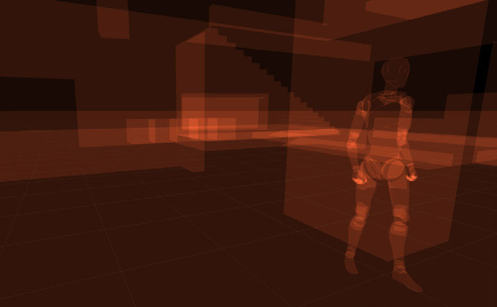
<p><em>VI: <strong>▲ Chế độ xem OVERDRAW</strong> — mỗi lớp hình học chồng lên nhau làm vùng đó <strong>ĐỎ ĐẬM THÊM</strong>. Vùng đỏ rực chính là chỗ GPU vẽ đi vẽ lại CÙNG một pixel nhiều lần. / EN: The overdraw view: brighter red means more layers drawn over the same pixel.</em></p>

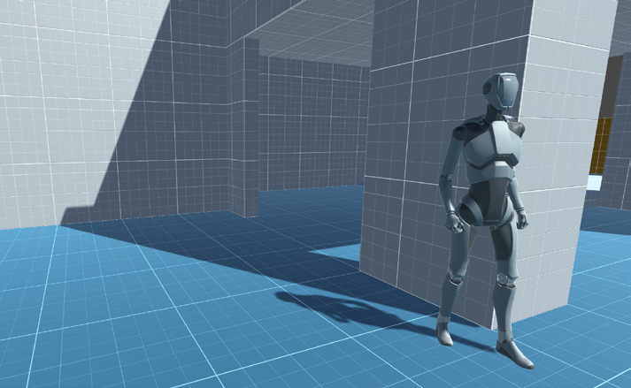
<p><em>VI: Scene ở chế độ Shaded thông thường. / EN: A Scene in standard Shaded view.</em></p>

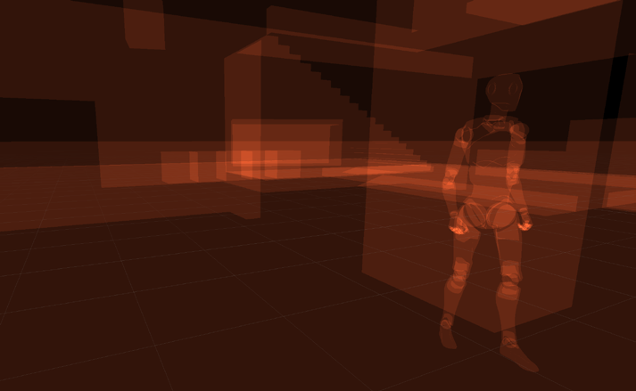
<p><em>VI: Cùng scene ở chế độ <strong>Overdraw</strong> — <strong>pixel càng SÁNG = càng nhiều lớp vẽ chồng lên nhau</strong>; pixel tối = ít overdraw. / EN: The same Scene in Overdraw view — brighter pixels indicate objects drawing on top of one another.</em></p>

<div class="bilingual-row">
<div class="col-vi">
<p>🔑 <strong>Định nghĩa:</strong> <strong>Overdraw</strong> là khi <em>cùng MỘT pixel trên màn hình phải được shade NHIỀU LẦN</em>, vì nó bị nhiều draw call chạm tới.</p>
<p>💀 <strong>Vì sao đây là vấn đề — tính toán cụ thể:</strong></p>
<blockquote>
<p><em>"Overdraw là vấn đề vì nó <strong>GIẢM tổng thời gian GPU có để dành cho việc render</strong>. <strong>Nếu MỌI pixel trên màn hình phải được shade HAI LẦN, GPU chỉ có thể dành MỘT NỬA thời gian cho mỗi pixel mà vẫn giữ nguyên frame rate.</strong>"</em></p>
</blockquote>
<p><strong>Bốn nguyên nhân phổ biến nhất (theo e-book Console/PC):</strong></p>
<ol>
<li><strong>Geometry đục hoặc trong suốt CHỒNG LẤN</strong></li>
<li><strong>Shader phức tạp</strong>, thường có nhiều render pass</li>
<li><strong>Particle chưa tối ưu</strong></li>
<li><strong>Phần tử UI chồng lấn</strong> <em>(→ <a href="../02-junior/01-ui-physics-deep-dive.md">Module 2 §6</a>)</em></li>
</ol>
<p>⚖️ <strong>Khi nào overdraw KHÔNG tránh được:</strong> khi render object trong suốt như <em>particle hoặc vật liệu kính</em> — object nền nhìn thấy được xuyên qua tiền cảnh, nên <strong>cả hai đều phải render</strong>.</p>
<p>🚨 <strong>Nhưng với object ĐỤC, overdraw là HOÀN TOÀN KHÔNG CẦN THIẾT</strong>, vì <em>pixel hiển thị trong buffer ở cuối quá trình render là pixel DUY NHẤT thực sự cần được xử lý</em>. Trong trường hợp này, <strong>MỌI pixel bị overdraw đều là thời gian GPU LÃNG PHÍ</strong>.</p>
</div>
<div class="col-en">
<p>🔑 <strong>Definition:</strong> <strong>Overdraw</strong> is when <em>the SAME pixel on the screen needs to be shaded MULTIPLE times</em>, because it's touched by multiple draw calls.</p>
<p>💀 <strong>Why it's a problem — the concrete arithmetic:</strong></p>
<blockquote>
<p><em>"Overdraw is a problem because it <strong>DECREASES the overall time the GPU has to spend on rendering</strong>. <strong>If EVERY pixel on the screen has to be shaded TWICE, the GPU can only spend HALF the amount of time on each pixel and still maintain the same framerate.</strong>"</em></p>
</blockquote>
<p><strong>The four most common causes (per the Console/PC e-book):</strong></p>
<ol>
<li><strong>Overlapping opaque or transparent geometry</strong></li>
<li><strong>Complex shaders</strong>, often with multiple render passes</li>
<li><strong>Unoptimized particles</strong></li>
<li><strong>Overlapping UI elements</strong> <em>(→ <a href="../02-junior/01-ui-physics-deep-dive.md">Module 2 §6</a>)</em></li>
</ol>
<p>⚖️ <strong>When overdraw is unavoidable:</strong> when rendering translucent objects like <em>particles or glass-like materials</em> — the background object is visible through the foreground, so <strong>both need to be rendered</strong>.</p>
<p>🚨 <strong>But for OPAQUE objects, overdraw is COMPLETELY UNNECESSARY</strong>, because <em>the pixel shown in the buffer at the end of rendering is the ONLY one that actually needs to be processed</em>. In this case, <strong>every overdrawn pixel is just WASTED GPU time</strong>.</p>
</div>
</div>

### 5.1. Early Depth Test — Cơ chế GPU tự bảo vệ

<div class="bilingual-row">
<div class="col-vi">
<p>GPU có sẵn biện pháp giảm overdraw cho object đục: <strong>EARLY DEPTH TEST</strong>.</p>
<p>🔑 <strong>Cách hoạt động:</strong> Nó xảy ra <em>TRƯỚC pixel shader</em> (xem sơ đồ pipeline §1) và sẽ <strong>BỎ QUA việc shade pixel nếu xác định được pixel đó sẽ bị object khác che khuất</strong>. Nó làm việc này bằng cách <em>so sánh pixel đang shade với <strong>DEPTH BUFFER</strong></em> — một render target nơi GPU lưu độ sâu của cả frame để các object che khuất nhau đúng cách.</p>
<p>🚨 <strong>ĐIỀU KIỆN QUAN TRỌNG:</strong></p>
<blockquote>
<p><em>"Nhưng <strong>để early depth test có HIỆU QUẢ, object kia PHẢI ĐÃ ĐƯỢC RENDER RỒI</strong> để nó có mặt trong depth buffer. Điều đó nghĩa là <strong>THỨ TỰ RENDER các object là RẤT QUAN TRỌNG</strong>."</em></p>
</blockquote>
<p>✅ <strong>Lý tưởng:</strong> Mọi scene được render <strong>TỪ TRƯỚC RA SAU (front-to-back)</strong> — object gần camera nhất trước — để <em>chỉ pixel tiền cảnh được shade và phần còn lại bị early depth test loại bỏ</em>, <strong>triệt tiêu overdraw hoàn toàn</strong>.</p>
<p>❌ <strong>Nhưng thực tế không phải lúc nào cũng làm được:</strong></p>
<ul>
<li>Bạn <strong>KHÔNG thể sắp xếp lại các tam giác BÊN TRONG một draw call</strong> lúc render</li>
<li><strong>Mesh phức tạp có thể tự che khuất chính nó nhiều lần</strong></li>
<li><strong>Việc gộp mesh (mesh merging) có thể khiến nhiều object chồng lấn được render theo thứ tự "SAI"</strong> ⇒ gây overdraw</li>
</ul>
<p>👉 <em>"Không có câu trả lời dễ dàng để tránh các trường hợp này — và với trường hợp cuối, đó chỉ là <strong>thêm một yếu tố cần cân nhắc khi quyết định CÓ NÊN gộp mesh hay không</strong>."</em></p>
</div>
<div class="col-en">
<p>The GPU has a built-in measure to reduce overdraw in opaque objects: the <strong>EARLY DEPTH TEST</strong>.</p>
<p>🔑 <strong>How it works:</strong> It happens <em>BEFORE the pixel shader</em> (see the pipeline diagram in §1) and will <strong>SKIP pixel shading if it determines the pixel will be hidden by another object</strong>. It does this by <em>comparing the pixel being shaded to the <strong>DEPTH BUFFER</strong></em> — a render target where the GPU stores the entire frame's depth so objects occlude each other properly.</p>
<p>🚨 <strong>THE CRITICAL CONDITION:</strong></p>
<blockquote>
<p><em>"But <strong>for the early depth test to be EFFECTIVE, the other object must have ALREADY been RENDERED</strong> so it is present in the depth buffer. That means that <strong>the RENDERING ORDER of objects is VERY IMPORTANT</strong>."</em></p>
</blockquote>
<p>✅ <strong>Ideally:</strong> every scene would be rendered <strong>FRONT-TO-BACK</strong> — objects closest to the camera first — so that <em>only foreground pixels get shaded and the rest get killed by the early depth test</em>, <strong>eliminating overdraw entirely</strong>.</p>
<p>❌ <strong>But in the real world that's not always possible:</strong></p>
<ul>
<li>You <strong>CAN'T reorder the triangles INSIDE a draw call</strong> during rendering</li>
<li><strong>Complex meshes can occlude themselves multiple times</strong></li>
<li><strong>Mesh merging can result in many overlapping objects being rendered in the "WRONG" order</strong> ⇒ causing overdraw</li>
</ul>
<p>👉 <em>"There's no easy answer for avoiding these cases — and in the latter case it's just <strong>another thing to take into consideration when deciding whether or not to MERGE meshes</strong>."</em></p>
</div>
</div>

### 5.2. Depth Prepass — Đánh đổi có tính toán

<div class="bilingual-row">
<div class="col-vi">
<p>Để hỗ trợ early depth testing, <strong>một số game thực hiện DEPTH PREPASS một phần</strong>.</p>
<p>🔑 <strong>Cơ chế:</strong> Đây là một <em>pass sơ bộ</em>, trong đó <strong>một số object LỚN được biết là occluder hiệu quả</strong> (tòa nhà lớn, địa hình, nhân vật chính…) được render bằng <strong>shader ĐƠN GIẢN chỉ xuất ra depth buffer</strong> — việc này tương đối nhanh vì <em>tránh được mọi công việc pixel shader như lighting hay texturing</em>.</p>
<p>✅ Việc này <strong>"MỒI" (prime) depth buffer</strong> và <em>tăng lượng công việc pixel shader có thể được BỎ QUA</em> trong pass render đầy đủ sau đó.</p>
<p>⚠️ <strong>Nhược điểm — phải cân nhắc:</strong></p>
<ul>
<li><strong>Render object occluder HAI LẦN</strong> (một lần trong depth-only pass và một lần trong pass chính) ⇒ <strong>TĂNG số draw call</strong></li>
<li>💀 <em>"Luôn có khả năng <strong>thời gian render depth pass còn NHIỀU HƠN thời gian nó tiết kiệm được</strong> từ việc tăng hiệu quả early depth test."</em></li>
</ul>
<p>👉 <strong>Chỉ có PROFILING trong nhiều trường hợp khác nhau mới xác định được nó có đáng hay không với một scene cụ thể.</strong></p>
</div>
<div class="col-en">
<p>To help early depth testing, <strong>some games do a partial DEPTH PREPASS</strong>.</p>
<p>🔑 <strong>The mechanism:</strong> This is a <em>preliminary pass</em> where <strong>certain LARGE objects known to be effective occluders</strong> (large buildings, terrain, the main character…) are rendered with a <strong>SIMPLE shader that only outputs to the depth buffer</strong> — relatively fast as it <em>avoids doing any pixel shader work such as lighting or texturing</em>.</p>
<p>✅ This <strong>"PRIMES" the depth buffer</strong> and <em>increases the amount of pixel shader work that can be SKIPPED</em> during the full rendering pass later in the frame.</p>
<p>⚠️ <strong>The drawback — weigh it carefully:</strong></p>
<ul>
<li><strong>Rendering the occluding objects TWICE</strong> (once in the depth-only pass and once in the main pass) ⇒ <strong>INCREASES the number of draw calls</strong></li>
<li>💀 <em>"Plus there's always a chance that <strong>the time it takes to render the depth pass itself is MORE than the time it SAVES</strong> from increased early depth test efficiency."</em></li>
</ul>
<p>👉 <strong>Only PROFILING in a variety of cases can determine whether or not it's worth it for any given scene.</strong></p>
</div>
</div>

### 5.3. Particle & Vegetation — Hai kẻ gây overdraw kinh điển

<div class="bilingual-row">
<div class="col-vi">
<p><strong>🎆 PARTICLE — nơi overdraw đặc biệt đáng lo</strong></p>
<p>Vì <em>particle trong suốt và thường chồng lấn RẤT NHIỀU</em>. Artist làm particle effect <strong>luôn phải nghĩ tới overdraw</strong>.</p>
<p>💡 <strong>Lời khuyên cụ thể — rất giá trị:</strong></p>
<blockquote>
<p><em>"Hiệu ứng mây dày có thể tạo ra bằng cách <strong>phát ra NHIỀU particle NHỎ, MỜ, CHỒNG LẤN</strong> — nhưng điều đó sẽ <strong>đẩy chi phí render lên cao</strong>.</em></p>
<p><em>✅ <strong>Phương án hiệu năng TỐT HƠN: phát ra ÍT particle LỚN hơn</strong>, và thay vào đó <strong>dựa nhiều hơn vào TEXTURE và TEXTURE ANIMATION</strong> để truyền tải độ dày đặc.</em></p>
<p><em>💎 <strong>Kết quả tổng thể thường CÒN HIỆU QUẢ HƠN VỀ THỊ GIÁC</strong>, vì phần mềm offline như FumeFX và Houdini thường tạo được hiệu ứng thú vị hơn nhiều qua texture animation, so với hành vi mô phỏng thời gian thực của từng particle riêng lẻ."</em></p>
</blockquote>
<p><strong>Tối ưu từ phía engine — PARTICLE TRIMMING:</strong></p>
<p><em>"Mọi pixel được render mà kết thúc HOÀN TOÀN TRONG SUỐT đều là thời gian lãng phí"</em> ⇒ tối ưu phổ biến: <strong>thay vì render particle bằng 2 tam giác, sinh ra một đa giác VỪA KHÍT tùy chỉnh giúp TỐI THIỂU HÓA vùng trống của texture</strong>.</p>
<p><strong>🌿 VEGETATION — còn tệ hơn vì ALPHA TESTING</strong></p>
<p>Với thực vật, việc dùng geometry tùy chỉnh để loại bỏ vùng texture trống <strong>còn QUAN TRỌNG HƠN</strong>, vì thực vật thường dùng <strong>ALPHA TESTING</strong> — dùng kênh alpha của texture để quyết định có <em>discard</em> pixel trong pixel shader hay không.</p>
<p>💀 <strong>Vì sao alpha testing là vấn đề LỚN:</strong></p>
<blockquote>
<p><em>"Đây là vấn đề vì <strong>alpha testing cũng có thể có TÁC DỤNG PHỤ là VÔ HIỆU HÓA HOÀN TOÀN early depth test</strong> (vì nó làm mất hiệu lực một số giả định GPU có thể đưa ra về pixel), <strong>dẫn tới NHIỀU công việc pixel shader KHÔNG CẦN THIẾT hơn</strong>.</em></p>
<p><em>Kết hợp điều này với thực tế là <strong>thực vật vốn đã chứa RẤT NHIỀU overdraw</strong> — nghĩ tới tất cả những chiếc lá chồng lấn trên một cái cây — và nó <strong>có thể NHANH CHÓNG trở nên RẤT ĐẮT ĐỎ để render nếu bạn không cẩn thận</strong>."</em></p>
</blockquote>
</div>
<div class="col-en">
<p><strong>🎆 PARTICLES — where overdraw is a particular concern</strong></p>
<p>Because <em>particles are transparent and often overlap a lot</em>. Artists working on particle effects <strong>should always have overdraw in mind</strong>.</p>
<p>💡 <strong>The concrete advice — very valuable:</strong></p>
<blockquote>
<p><em>"A dense cloud effect can be produced by <strong>emitting LOTS of SMALL FAINT OVERLAPPING particles</strong>, but that's going to <strong>drive up the rendering cost</strong>.</em></p>
<p><em>✅ <strong>A better-performing alternative: emit FEWER LARGER particles</strong>, and instead <strong>rely more on the TEXTURE and TEXTURE ANIMATION</strong> to convey the density of the effect.</em></p>
<p><em>💎 <strong>The overall result is often MORE VISUALLY EFFECTIVE anyway</strong>, because offline software like FumeFX and Houdini can usually produce much more interesting effects through texture animation, compared to real-time simulated behaviour of individual particles."</em></p>
</blockquote>
<p><strong>Engine-side optimization — PARTICLE TRIMMING:</strong></p>
<p><em>"Every rendered pixel that ends up completely transparent is just wasted time"</em> ⇒ a common optimization: <strong>instead of rendering the particle with two triangles, a CUSTOM-FITTED polygon is generated that MINIMIZES the empty areas of the texture</strong>.</p>
<p><strong>🌿 VEGETATION — even worse, because of ALPHA TESTING</strong></p>
<p>For vegetation it's <strong>EVEN MORE important</strong> to use custom geometry to eliminate empty texture space, as vegetation often uses <strong>ALPHA TESTING</strong> — where the texture's alpha channel decides whether to <em>discard</em> the pixel during the pixel shader stage.</p>
<p>💀 <strong>Why alpha testing is a BIG problem:</strong></p>
<blockquote>
<p><em>"This is a problem because <strong>alpha testing can ALSO have the SIDE EFFECT of DISABLING the early depth test COMPLETELY</strong> (because it invalidates certain assumptions the GPU can make about the pixel), <strong>leading to much MORE UNNECESSARY pixel shader work</strong>.</em></p>
<p><em>Combine this with the fact that <strong>vegetation often contains a LOT of overdraw anyway</strong> — think of all the overlapping leaves on a tree — and it <strong>can QUICKLY become VERY EXPENSIVE to render if you're not careful</strong>."</em></p>
</blockquote>
</div>
</div>

### 5.4. 🔢 Draw Order & Render Queue — Hiểu THỨ TỰ vẽ để trị overdraw

<div class="bilingual-row">
<div class="col-vi">
<blockquote>
<p><em>"<strong>Để CHỐNG overdraw, bạn PHẢI hiểu cách Unity SẮP XẾP object TRƯỚC KHI render chúng.</strong></em></p>
<p><em>🔑 <strong>Built-in Render Pipeline sắp xếp GameObject theo Rendering Mode và <code>renderQueue</code> của chúng. Shader của MỖI object đặt nó vào một RENDER QUEUE, và queue này THƯỜNG quyết định THỨ TỰ VẼ.</strong></em></p>
<p><em>⚠️ <strong>MỖI render queue có thể tuân theo NHỮNG QUY TẮC SẮP XẾP KHÁC NHAU trước khi Unity thực sự vẽ object lên màn hình.</strong></em></p>
<p><em>📌 <strong>Ví dụ: Unity sắp xếp queue Opaque Geometry theo TRƯỚC-RA-SAU (front-to-back), nhưng queue Transparent lại sắp xếp SAU-RA-TRƯỚC (back-to-front).</strong>"</em></p>
</blockquote>
<p>💡 <strong>Vì sao hai queue ngược nhau?</strong> — Nối lại với <a href="#51-early-depth-test-co-che-gpu-tu-bao-ve">§5.1</a>:</p>
<ul>
<li><strong>Opaque front-to-back</strong> ⇒ object gần vẽ trước ⇒ <strong>early depth test LOẠI được nhiều pixel nhất</strong></li>
<li><strong>Transparent back-to-front</strong> ⇒ <em>BẮT BUỘC</em>, vì alpha blending cần các lớp phía sau đã có mặt trong buffer để trộn màu đúng ⇒ <strong>KHÔNG THỂ hưởng lợi từ early depth test</strong> ⇒ đây chính là lý do <strong>transparent là nguồn overdraw số 1</strong></li>
</ul>
<p>🔍 <em>"<strong>Object render CHỒNG LÊN NHAU tạo ra overdraw.</strong> Nếu bạn dùng Built-in Render Pipeline, bạn có thể <strong>trực quan hóa overdraw trong thanh điều khiển Scene view — chuyển draw mode sang <code>Overdraw</code>.</strong>"</em></p>
</div>
<div class="col-en">
<blockquote>
<p><em>"<strong>To combat overdraw, you SHOULD understand how Unity SORTS objects BEFORE rendering them.</strong></em></p>
<p><em>🔑 <strong>The Built-in Render Pipeline sorts GameObjects according to their Rendering Mode and <code>renderQueue</code>. EACH object's shader places it in a RENDER QUEUE, which OFTEN determines its DRAW ORDER.</strong></em></p>
<p><em>⚠️ <strong>EACH render queue may follow DIFFERENT RULES for sorting before Unity actually draws the objects to screen.</strong></em></p>
<p><em>📌 <strong>For example, Unity sorts the Opaque Geometry queue FRONT-TO-BACK, but the Transparent queue sorts BACK-TO-FRONT.</strong>"</em></p>
</blockquote>
<p>💡 <strong>Why are the two queues reversed?</strong> — connecting back to <a href="#51-early-depth-test-co-che-gpu-tu-bao-ve">§5.1</a>:</p>
<ul>
<li><strong>Opaque front-to-back</strong> ⇒ nearest objects drawn first ⇒ <strong>early depth test rejects the MOST pixels</strong></li>
<li><strong>Transparent back-to-front</strong> ⇒ <em>MANDATORY</em>, since alpha blending needs the layers behind to already be in the buffer to blend correctly ⇒ <strong>CANNOT benefit from early depth test</strong> ⇒ precisely why <strong>transparency is the #1 source of overdraw</strong></li>
</ul>
<p>🔍 <em>"<strong>Objects rendering ON TOP of one another create overdraw.</strong> If you are using the Built-in Render Pipeline, you can <strong>visualize overdraw in the Scene view control bar — switch the draw mode to <code>Overdraw</code>.</strong>"</em></p>
</div>
</div>

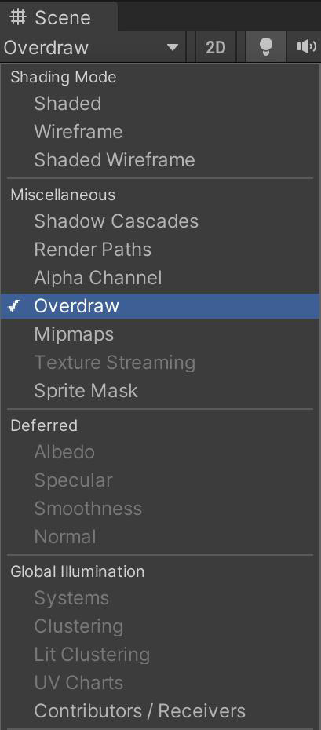
<p><em>VI: Chuyển draw mode sang <strong>Overdraw</strong> trong thanh điều khiển Scene view. Chú ý các mục khác cùng nhóm <em>Miscellaneous</em>: <strong>Shadow Cascades · Render Paths · Alpha Channel · Overdraw · Mipmaps · Texture Streaming · Sprite Mask</strong>. / EN: Overdraw in the Scene view control bar.</em></p>

<div class="bilingual-row">
<div class="col-vi">
<p>🎨 <em>"<strong>Pixel SÁNG HƠN cho biết object đang vẽ CHỒNG lên nhau; pixel TỐI nghĩa là ÍT overdraw hơn.</strong>"</em> (Xem ảnh so sánh Shaded ↔ Overdraw ở <a href="#5-overdraw-early-depth-test">§5</a>.)</p>
<p>🔶 <strong>HDRP sắp xếp KHÁC — ba bước:</strong></p>
<blockquote>
<p><em>"HDRP điều khiển render queue HƠI KHÁC. Để tính thứ tự của render queue, HDRP:</em></p>
<ol>
<li><em><strong>GOM các mesh theo MATERIAL DÙNG CHUNG</strong></em></li>
<li><em><strong>TÍNH thứ tự render của các nhóm đó dựa trên MATERIAL PRIORITY</strong></em></li>
<li><em><strong>SẮP XẾP từng nhóm bằng thuộc tính PRIORITY của mỗi Mesh Renderer</strong></em></li>
</ol>
<p><em>👉 <strong>Queue kết quả là một danh sách GameObject được sắp xếp TRƯỚC HẾT theo Priority của Material, RỒI mới theo Priority riêng của từng Mesh Renderer.</strong>"</em></p>
</blockquote>
</div>
<div class="col-en">
<p>🎨 <em>"<strong>BRIGHTER pixels indicate objects drawing ON TOP of one another; DARK pixels mean LESS overdraw.</strong>"</em> (See the Shaded ↔ Overdraw comparison in <a href="#5-overdraw-early-depth-test">§5</a>.)</p>
<p>🔶 <strong>HDRP sorts DIFFERENTLY — three steps:</strong></p>
<blockquote>
<p><em>"HDRP controls the render queue SLIGHTLY DIFFERENTLY. To calculate the order of the render queue, the HDRP:</em></p>
<ol>
<li><em><strong>GROUPS meshes by SHARED MATERIALS</strong></em></li>
<li><em><strong>CALCULATES the rendering order of those groups based on MATERIAL PRIORITY</strong></em></li>
<li><em><strong>SORTS each group using each Mesh Renderer's PRIORITY property</strong></em></li>
</ol>
<p><em>👉 <strong>The resulting queue is a list of GameObjects that are FIRST sorted by their Material's Priority, THEN by their individual Mesh Renderer's Priority.</strong>"</em></p>
</blockquote>
</div>
</div>

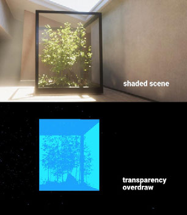
<p><em>VI: <strong>TransparencyOverdraw</strong> của HDRP — <strong>trên: scene shaded · dưới: overdraw trong suốt</strong> (khung cửa sổ hiện màu xanh dương = có pixel trong suốt). / EN: The HDRP Render Pipeline Debug can visualize overdraw from transparent Materials.</em></p>

<div class="bilingual-row">
<div class="col-vi">
<blockquote>
<p><em>"Để trực quan hóa <strong>transparency overdraw với HDRP</strong>, dùng cửa sổ <strong>Render Pipeline Debug</strong> (<code>Window &gt; Render Pipeline &gt; Render Pipeline Debug</code>) để chọn <strong><code>TransparencyOverdraw</code></strong>.</em></p>
<p><em>🌡️ <strong>Tuỳ chọn debug này hiển thị MỖI pixel dưới dạng BẢN ĐỒ NHIỆT (heat map), đi từ ĐEN (nghĩa là KHÔNG có pixel trong suốt) qua XANH DƯƠNG tới ĐỎ (tại đó có số pixel trong suốt bằng Max Pixel Cost).</strong></em></p>
<p><em>✅ <strong>Khi sửa overdraw, những công cụ chẩn đoán này cung cấp một "phong vũ biểu THỊ GIÁC" cho các tối ưu của bạn.</strong>"</em></p>
</blockquote>
<p>👉 <em>Xem thêm chế độ <code>QuadOverdraw</code> của Rendering Debugger ở <a href="#25-toi-uu-vfx-graph-toan-bo-chuong-optimization">§25</a> — nó đo <strong>chính xác vấn đề overshading ở <a href="#6-overshading-quad-lang-phi-75-am-tham">§6</a></strong>.</em></p>
</div>
<div class="col-en">
<blockquote>
<p><em>"To visualize <strong>transparency overdraw with HDRP</strong>, use the <strong>Render Pipeline Debug</strong> window (<code>Window &gt; Render Pipeline &gt; Render Pipeline Debug</code>) to select <strong><code>TransparencyOverdraw</code></strong>.</em></p>
<p><em>🌡️ <strong>This debug option displays EACH pixel as a HEAT MAP going from BLACK (which represents NO transparent pixels) through BLUE to RED (at which there are Max Pixel Cost number of transparent pixels).</strong></em></p>
<p><em>✅ <strong>When correcting overdraw, these diagnostic tools can offer a VISUAL BAROMETER of your optimizations.</strong>"</em></p>
</blockquote>
<p>👉 <em>See also the Rendering Debugger's <code>QuadOverdraw</code> mode in <a href="#25-toi-uu-vfx-graph-toan-bo-chuong-optimization">§25</a> — it measures <strong>exactly the overshading problem from <a href="#6-overshading-quad-lang-phi-75-am-tham">§6</a></strong>.</em></p>
</div>
</div>

---

## 6. 🔬 Overshading & Quad — Lãng phí 75% âm thầm

!!! danger "Đây là kiến thức ÍT NGƯỜI BIẾT nhất nhưng tác động LỚN nhất"
    <div class="bilingual-row">
    <div class="col-vi">
    <p><strong>OVERSHADING</strong> là "họ hàng gần" của overdraw, <em>gây ra bởi tam giác NHỎ XÍU hoặc MỎNG DÍNH</em>, và <strong>có thể GÂY HẠI NGHIÊM TRỌNG cho hiệu năng bằng cách lãng phí một phần ĐÁNG KỂ thời gian GPU</strong>.</p>
    <p>🔑 <strong>Nguyên nhân — cách GPU thực sự xử lý pixel:</strong></p>
    <blockquote>
    <p><em>"Overshading là hệ quả của cách GPU xử lý pixel trong lúc pixel shading: <strong>KHÔNG PHẢI từng cái một, mà theo 'QUAD' — khối 4 PIXEL sắp xếp theo mẫu 2×2</strong>.</em></p>
    <p><em>Nó được làm như vậy để phần cứng có thể làm những việc như <strong>so sánh UV giữa các pixel để tính mipmap level phù hợp</strong>.</em></p>
    <p><em>💀 <strong>Điều này nghĩa là NẾU một tam giác chỉ chạm MỘT pixel của quad</strong> (vì tam giác quá nhỏ hoặc quá mỏng), <strong>GPU VẪN xử lý CẢ quad và chỉ VỨT BỎ 3 pixel còn lại — LÃNG PHÍ 75% công việc.</strong>"</em></p>
    </blockquote>
    <p>🚨 <em>"Thời gian lãng phí đó có thể cộng dồn RẤT NHIỀU, và <strong>đặc biệt ĐAU ĐỚN với forward renderer</strong> (tức không phải deferred) vốn làm <strong>TOÀN BỘ lighting và shading trong MỘT pass duy nhất ở pixel shader</strong>."</em></p>
    <p>✅ <strong>Cách giảm:</strong> <em>"Hình phạt này có thể được giảm bằng cách <strong>dùng LOD được tinh chỉnh ĐÚNG CÁCH</strong>; ngoài việc tiết kiệm xử lý vertex shader, chúng còn có thể <strong>GIẢM MẠNH overshading bằng cách khiến tam giác bao phủ NHIỀU HƠN mỗi quad tính trung bình</strong>."</em></p>
    </div>
    <div class="col-en">
    <p><strong>OVERSHADING</strong> is a close relative of overdraw, <em>caused by TINY or THIN triangles</em>, and <strong>can REALLY HURT performance by wasting a SIGNIFICANT portion of the GPU's time</strong>.</p>
    <p>🔑 <strong>The cause — how GPUs actually process pixels:</strong></p>
    <blockquote>
    <p><em>"Overshading is a consequence of how GPUs process pixels during pixel shading: <strong>NOT one at a time, but instead in 'QUADS' — blocks of FOUR PIXELS arranged in a 2×2 pattern</strong>.</em></p>
    <p><em>It's done like this so the hardware can do things like <strong>comparing UVs between pixels to calculate appropriate mipmap levels</strong>.</em></p>
    <p><em>💀 <strong>This means that IF a triangle only touches a SINGLE pixel of a quad</strong> (because the triangle is tiny or very thin), <strong>the GPU STILL processes the WHOLE quad and just THROWS AWAY the other three pixels — WASTING 75% of the work.</strong>"</em></p>
    </blockquote>
    <p>🚨 <em>"That wasted time can really add up, and is <strong>particularly PAINFUL for FORWARD renderers</strong> (i.e. not deferred) that do <strong>ALL lighting and shading in a SINGLE pass in the pixel shader</strong>."</em></p>
    <p>✅ <strong>How to reduce it:</strong> <em>"This penalty can be reduced by <strong>using PROPERLY-TUNED LODs</strong>; besides saving on vertex shader processing, they can also <strong>GREATLY REDUCE overshading by having triangles cover MORE of each quad on average</strong>."</em></p>
    </div>
    </div>

<div class="bilingual-row">
<div class="col-vi">
<p>💡 <strong>Chuyện bên lề thú vị — vì sao post effect toàn màn hình dùng MỘT tam giác:</strong></p>
<blockquote>
<p><em>"Quad overshading cũng là lý do <strong>đôi khi bạn thấy post effect toàn màn hình dùng MỘT tam giác LỚN duy nhất để phủ màn hình, thay vì HAI tam giác ghép lưng nhau</strong>. Với hai tam giác, <strong>các quad nằm vắt qua cạnh chung sẽ lãng phí một phần công việc</strong>, nên tránh điều đó tiết kiệm được một chút thời gian GPU."</em></p>
</blockquote>
<p><strong>🚨 Hai vấn đề KHÁC của tam giác nhỏ và mỏng:</strong></p>
<p><strong>① Tốc độ rasterize tam giác có GIỚI HẠN</strong></p>
<blockquote>
<p><em>"Ngoài overshading, tam giác nhỏ xíu còn là vấn đề vì <strong>GPU chỉ có thể xử lý và rasterize tam giác ở một TỐC ĐỘ NHẤT ĐỊNH, thường TƯƠNG ĐỐI THẤP so với số pixel nó có thể xử lý trong cùng thời gian</strong>.</em></p>
<p><em>Với quá nhiều tam giác nhỏ, <strong>nó không thể sinh pixel đủ nhanh để giữ các shader unit bận rộn</strong> ⇒ dẫn tới <strong>STALL và thời gian NHÀN RỖI — kẻ thù THỰC SỰ của hiệu năng GPU</strong>."</em></p>
</blockquote>
<p><strong>② Tam giác dài và mỏng phá vỡ cách rasterize theo khối</strong></p>
<blockquote>
<p><em>"<strong>GPU rasterize pixel theo KHỐI vuông hoặc chữ nhật, KHÔNG theo dải dài</strong>. So với tam giác có hình dạng đều đặn hơn với các cạnh cân đối, <strong>một tam giác dài mỏng khiến GPU phải làm RẤT NHIỀU việc thừa KHÔNG CẦN THIẾT để rasterize nó thành pixel</strong> — có khả năng gây bottleneck ở giai đoạn rasterization."</em></p>
</blockquote>
<p>✅ <strong>Kết luận:</strong> <em>"Đây là lý do vì sao <strong>thường khuyến nghị mesh nên được tessellate thành các tam giác có HÌNH DẠNG ĐỀU ĐẶN — KỂ CẢ khi điều đó làm TĂNG polygon count một chút</strong>."</em></p>
</div>
<div class="col-en">
<p>💡 <strong>Interesting trivia — why fullscreen post effects use ONE triangle:</strong></p>
<blockquote>
<p><em>"Quad overshading is also the reason you'll <strong>sometimes see fullscreen post effects use a SINGLE LARGE triangle to cover the screen instead of TWO back-to-back triangles</strong>. With two triangles, <strong>quads that straddle the shared edge would be wasting some of their work</strong>, so avoiding that saves a minor amount of GPU time."</em></p>
</blockquote>
<p><strong>🚨 Two OTHER problems with tiny and thin triangles:</strong></p>
<p><strong>① Triangle rasterization rate is LIMITED</strong></p>
<blockquote>
<p><em>"Beyond overshading, tiny triangles are also a problem because <strong>GPUs can only process and rasterize triangles at a CERTAIN RATE, usually RELATIVELY LOW compared to how many pixels it can process in the same time</strong>.</em></p>
<p><em>With too many small triangles, <strong>it can't produce pixels fast enough to keep the shader units busy</strong> ⇒ resulting in <strong>STALLS and IDLE time — the REAL enemy of GPU performance</strong>."</em></p>
</blockquote>
<p><strong>② Long thin triangles break block-based rasterization</strong></p>
<blockquote>
<p><em>"<strong>GPUs rasterize pixels in SQUARE or RECTANGULAR BLOCKS, not in long strips</strong>. Compared to a more regular-shaped triangle with even sides, <strong>a long thin triangle ends up making the GPU do a LOT of extra UNNECESSARY work to rasterize it into pixels</strong>, potentially causing a bottleneck at the rasterization stage."</em></p>
</blockquote>
<p>✅ <strong>The conclusion:</strong> <em>"This is why it's usually recommended that <strong>meshes are tessellated into EVENLY-SHAPED triangles — EVEN IF it INCREASES the polygon count a bit</strong>."</em></p>
</div>
</div>

---

## 7. 💾 Memory Bandwidth & Textures

<div class="bilingual-row">
<div class="col-vi">
<p>🔑 <strong>Nền tảng:</strong> Mesh và texture được lưu trong bộ nhớ <em>TÁCH BIỆT VẬT LÝ</em> với shader processor của GPU. Nghĩa là <strong>mỗi khi GPU cần truy cập dữ liệu</strong> — như texture được pixel shader lấy — <strong>nó phải LẤY từ bộ nhớ TRƯỚC khi có thể dùng</strong>.</p>
<p>💡 <strong>Ẩn dụ tuyệt vời của tác giả:</strong></p>
<blockquote>
<p><em>"Truy cập bộ nhớ <strong>tương tự như TẢI FILE từ internet</strong>. Việc tải file mất một khoảng thời gian nhất định do <strong>BĂNG THÔNG</strong> của kết nối — tốc độ dữ liệu có thể truyền.</em></p>
<p><em>🔑 <strong>Băng thông đó cũng được CHIA SẺ giữa MỌI lượt tải</strong> — nếu bạn tải một file ở 6 MB/s, <strong>tải HAI file thì mỗi cái chỉ 3 MB/s</strong>.</em></p>
<p><em>Điều tương tự đúng với truy cập bộ nhớ: index/vertex buffer và texture được GPU truy cập đều mất thời gian và <strong>PHẢI CHIA SẺ băng thông bộ nhớ</strong>. Tốc độ rõ ràng cao hơn nhiều so với internet — <strong>trên giấy tờ, băng thông bộ nhớ GPU của PS4 là 176 GB/s</strong> — nhưng ý tưởng thì giống nhau."</em></p>
</blockquote>
<p><strong>Cách shader cố gắng che giấu độ trễ:</strong></p>
<blockquote>
<p><em>"Shader cần truy cập texture sẽ <strong>cố BẮT ĐẦU việc truyền SỚM NHẤT có thể</strong>, rồi <strong>làm việc khác không liên quan</strong> (ví dụ tính lighting) và <em>HY VỌNG dữ liệu texture đã về kịp</em> khi tới đoạn chương trình cần nó.</em></p>
<p><em>💀 <strong>Nếu dữ liệu KHÔNG về kịp</strong> — vì việc truyền bị làm chậm bởi nhiều lượt truyền khác, hoặc vì nó <em>hết việc khác để làm</em> (đặc biệt dễ xảy ra với <strong>dependent texture fetch</strong>) — <strong>việc thực thi sẽ DỪNG LẠI và chỉ ngồi đó CHỜ</strong>.</em></p>
<p><em>👉 Đây là <strong>MEMORY BANDWIDTH BOTTLENECK</strong>: <strong>làm phần còn lại của shader nhanh hơn sẽ KHÔNG có ý nghĩa gì nếu nó vẫn phải dừng và chờ dữ liệu từ bộ nhớ.</strong>"</em></p>
</blockquote>
<p>🚨 <strong>Băng thông bộ nhớ là tài nguyên CỰC KỲ QUÝ:</strong> <em>"Nó thậm chí có thể phải CHIA SẺ với CPU hoặc công việc async compute mà GPU đang làm cùng lúc."</em></p>
</div>
<div class="col-en">
<p>🔑 <strong>The fundamental:</strong> Meshes and textures are stored in memory that is <em>PHYSICALLY SEPARATE</em> from the GPU's shader processors. That means <strong>whenever the GPU needs to access data</strong> — like a texture fetched by a pixel shader — <strong>it must RETRIEVE it from memory BEFORE it can use it</strong>.</p>
<p>💡 <strong>The author's excellent analogy:</strong></p>
<blockquote>
<p><em>"Memory accesses are <strong>analogous to DOWNLOADING FILES from the internet</strong>. File downloads take a certain time due to the connection's <strong>BANDWIDTH</strong> — the speed at which data can be transferred.</em></p>
<p><em>🔑 <strong>That bandwidth is also SHARED between all downloads</strong> — if you can download one file at 6MB/s, <strong>TWO files only download at 3MB/s each</strong>.</em></p>
<p><em>The same is true of memory accesses: index/vertex buffers and textures accessed by the GPU take time and <strong>MUST SHARE memory bandwidth</strong>. The speeds are obviously much higher — <strong>on paper the PS4's GPU memory bandwidth is 176GB/s</strong> — but the idea is the same."</em></p>
</blockquote>
<p><strong>How shaders try to hide the latency:</strong></p>
<blockquote>
<p><em>"A shader that needs to access a texture will <strong>try to START the transfer as EARLY as possible</strong>, then <strong>do other unrelated work</strong> (for example lighting calculations) and <em>HOPE the texture data has arrived</em> by the time it gets to the part of the program that needs it.</em></p>
<p><em>💀 <strong>If the data HASN'T arrived in time</strong> — because the transfer is slowed by lots of other transfers, or because it <em>runs out of other work to do</em> (especially likely for <strong>dependent texture fetches</strong>) — <strong>execution will STOP and it will just sit there and WAIT</strong>.</em></p>
<p><em>👉 This is a <strong>MEMORY BANDWIDTH BOTTLENECK</strong>: <strong>making the rest of the shader faster will NOT matter if it still needs to stop and wait for data.</strong>"</em></p>
</blockquote>
<p>🚨 <strong>Memory bandwidth is a VERY PRECIOUS resource:</strong> <em>"It might even have to be SHARED with the CPU or async compute work that the GPU is doing at the same time."</em></p>
</div>
</div>

### 7.1. Cache — Tuyến phòng thủ đầu tiên

<div class="bilingual-row">
<div class="col-vi">
<p><strong>CACHE</strong> là <em>mẩu bộ nhớ NHỎ, TỐC ĐỘ CAO mà GPU truy cập rất nhanh</em>, dùng để giữ các khối bộ nhớ vừa được truy cập gần đây phòng khi GPU cần lại.</p>
<p>💡 <em>Trong ẩn dụ internet: <strong>cache là ổ cứng máy tính lưu file đã tải để truy cập nhanh hơn về sau</strong>.</em></p>
<p>🔑 <strong>Cơ chế then chốt:</strong></p>
<blockquote>
<p><em>"Khi một mẩu bộ nhớ được truy cập — như MỘT texel trong texture — <strong>các texel XUNG QUANH cũng được kéo vào cache trong CÙNG lượt truyền</strong>.</em></p>
<p><em>Lần sau khi GPU tìm một trong các texel đó, <strong>nó KHÔNG cần đi tới tận bộ nhớ và có thể lấy từ cache CỰC NHANH</strong>.</em></p>
<p><em>💎 <strong>Đây thực ra là trường hợp PHỔ BIẾN</strong> — khi một texel hiển thị trên màn hình ở một pixel, <strong>RẤT có khả năng pixel bên cạnh sẽ cần hiển thị CÙNG texel đó, hoặc texel ngay bên cạnh nó trong texture</strong>."</em></p>
</blockquote>
<p>⚠️ <strong>Filtering làm tăng gánh nặng băng thông:</strong> <em>"Bilinear, trilinear, và anisotropic filtering <strong>ĐỀU đòi hỏi truy cập NHIỀU texel cho MỖI lần lookup</strong>, đặt thêm gánh nặng lên việc dùng băng thông. <strong>Anisotropic filtering chất lượng cao đặc biệt NGỐN băng thông.</strong>"</em></p>
</div>
<div class="col-en">
<p>A <strong>CACHE</strong> is <em>a SMALL piece of HIGH-SPEED memory the GPU has very fast access to</em>, used to keep chunks of memory accessed recently in case the GPU needs them again.</p>
<p>💡 <em>In the internet analogy: <strong>the cache is your computer's hard drive that stores downloaded files for faster access in the future</strong>.</em></p>
<p>🔑 <strong>The key mechanism:</strong></p>
<blockquote>
<p><em>"When a piece of memory is accessed — like a SINGLE texel in a texture — <strong>the SURROUNDING texels are ALSO pulled into the cache in the SAME memory transfer</strong>.</em></p>
<p><em>The next time the GPU looks for one of those texels, <strong>it doesn't need to go all the way to memory and can instead fetch it from the cache EXTREMELY QUICKLY</strong>.</em></p>
<p><em>💎 <strong>This is actually often the COMMON case</strong> — when a texel is displayed on screen in one pixel, <strong>it's VERY LIKELY the pixel beside it will need the SAME texel, or the texel right beside it in the texture</strong>."</em></p>
</blockquote>
<p>⚠️ <strong>Filtering increases the bandwidth burden:</strong> <em>"Bilinear, trilinear, and anisotropic filtering <strong>ALL require MULTIPLE texels to be accessed for EACH lookup</strong>, putting an extra burden on bandwidth usage. <strong>High-quality anisotropic filtering is particularly bandwidth-intensive.</strong>"</em></p>
</div>
</div>

### 7.2. 🎯 Mipmap — Vì sao nó CỨU cache

!!! success "Đoạn giải thích hay nhất về mipmap mà tôi từng đọc"
    <div class="bilingual-row">
    <div class="col-vi">
    <p><strong>Kịch bản THẢM HỌA khi KHÔNG có mipmap:</strong></p>
    <blockquote>
    <p><em>"Hãy nghĩ xem điều gì xảy ra trong cache nếu bạn cố hiển thị <strong>texture LỚN (ví dụ 2048×2048)</strong> trên một object <strong>Ở RẤT XA và chỉ chiếm vài pixel trên màn hình</strong>.</em></p>
    <p><em>💀 <strong>MỖI pixel sẽ phải lấy từ một phần RẤT KHÁC NHAU của texture</strong>, và <strong>cache sẽ HOÀN TOÀN VÔ DỤNG</strong> vì nó chỉ giữ các texel gần với lần truy cập trước.</em></p>
    <p><em>Mọi lần truy cập texture sẽ cố tìm kết quả trong cache và <strong>THẤT BẠI (gọi là 'CACHE MISS')</strong> ⇒ dữ liệu phải lấy từ bộ nhớ, chịu <strong>chi phí KÉP: dùng băng thông VÀ thời gian truyền</strong>. <strong>Một STALL có thể xảy ra, làm chậm CẢ shader.</strong></em></p>
    <p><em>😱 Nó còn khiến <strong>dữ liệu khác (có thể hữu ích) bị "TRỤC XUẤT" khỏi cache</strong> để nhường chỗ cho các texel xung quanh <strong>mà sẽ KHÔNG BAO GIỜ được dùng</strong>, làm giảm hiệu quả tổng thể của cache.</em></p>
    <p><em>🎨 <strong>Tin xấu ở mọi phía</strong> — chưa kể vấn đề chất lượng thị giác: <strong>camera chỉ cần nhúc nhích một chút là các texel HOÀN TOÀN KHÁC được sample, gây ALIASING và LẤP LÁNH (sparkling)</strong>."</em></p>
    </blockquote>
    <p><strong>✅ MIPMAPPING đến giải cứu:</strong></p>
    <blockquote>
    <p><em>"Khi một texture fetch được phát ra, <strong>GPU có thể PHÂN TÍCH texture coordinate đang dùng ở MỖI pixel</strong>, xác định khi nào có <em>KHOẢNG CÁCH LỚN giữa các lần truy cập texture</em>.</em></p>
    <p><em>Thay vì chịu chi phí cache miss cho mọi texel, <strong>nó truy cập một MIP THẤP HƠN của texture KHỚP với độ phân giải nó đang cần</strong>.</em></p>
    <p><em>💎 <strong>Ba lợi ích cộng dồn:</strong></em></p>
    </blockquote>
    <ol>
    <li><strong>TĂNG MẠNH hiệu quả của cache</strong> ⇒ giảm dùng băng thông và khả năng bị bottleneck</li>
    <li><strong>Mip thấp hơn cũng NHỎ HƠN</strong> ⇒ cần ÍT dữ liệu truyền từ bộ nhớ hơn ⇒ giảm băng thông thêm nữa</li>
    <li><strong>Vì mip được LỌC TRƯỚC (pre-filtered)</strong>, việc dùng chúng <strong>GIẢM MẠNH aliasing và sparkling</strong></li>
    </ol>
    <p>👉 <em>"Vì TẤT CẢ những lý do này, <strong>gần như LUÔN LUÔN là ý tưởng tốt khi dùng mipmap — lợi ích CHẮC CHẮN đáng giá phần bộ nhớ thêm vào</strong>."</em></p>
    </div>
    <div class="col-en">
    <p><strong>The DISASTER scenario WITHOUT mipmaps:</strong></p>
    <blockquote>
    <p><em>"Think about what happens in the cache if you try to display a <strong>LARGE texture (e.g. 2048×2048)</strong> on an object that's <strong>VERY FAR AWAY and only takes up a few pixels on the screen</strong>.</em></p>
    <p><em>💀 <strong>EACH pixel will need to fetch from a VERY DIFFERENT part of the texture</strong>, and <strong>the cache will be COMPLETELY INEFFECTIVE</strong> since it only keeps texels close to previous accesses.</em></p>
    <p><em>Every texture access will try to find its result in the cache and <strong>FAIL (called a 'CACHE MISS')</strong> ⇒ the data must be fetched from memory, incurring <strong>the DUAL costs of bandwidth usage AND transfer time</strong>. <strong>A STALL may occur, slowing the WHOLE shader down.</strong></em></p>
    <p><em>😱 It will also cause <strong>other (potentially useful) data to be 'EVICTED' from the cache</strong> to make room for surrounding texels <strong>that will NEVER even be used</strong>, reducing overall cache efficiency.</em></p>
    <p><em>🎨 <strong>It's bad news all around</strong> — not to mention visual quality: <strong>tiny movements of the camera will cause COMPLETELY DIFFERENT texels to be sampled, causing ALIASING and SPARKLING</strong>."</em></p>
    </blockquote>
    <p><strong>✅ MIPMAPPING comes to the rescue:</strong></p>
    <blockquote>
    <p><em>"When a texture fetch is issued, <strong>the GPU can ANALYZE the texture coordinates being used at EACH pixel</strong>, determining when there is a <em>LARGE GAP between texture accesses</em>.</em></p>
    <p><em>Instead of incurring cache-miss costs for every texel, <strong>it accesses a LOWER MIP of the texture that MATCHES the resolution it's looking for</strong>.</em></p>
    <p><em>💎 <strong>Three compounding benefits:</strong></em></p>
    </blockquote>
    <ol>
    <li><strong>GREATLY INCREASES cache effectiveness</strong> ⇒ reducing bandwidth usage and bottleneck potential</li>
    <li><strong>Lower mips are also SMALLER</strong> ⇒ less data transferred from memory ⇒ further reducing bandwidth</li>
    <li><strong>Since mips are PRE-FILTERED</strong>, their use <strong>VASTLY REDUCES aliasing and sparkling</strong></li>
    </ol>
    <p>👉 <em>"For ALL of these reasons, <strong>it's almost ALWAYS a good idea to use mipmaps — the advantages are DEFINITELY worth the extra memory usage</strong>."</em></p>
    </div>
    </div>

!!! tip "💡 Mipmap = 'LOD dành cho TEXTURE' — và nó BẬT SẴN"
    <div class="bilingual-row">
    <div class="col-vi">
    <blockquote>
    <p><em>"<strong>MipMap giống như LOD dành cho TEXTURE MAP. MipMap cho phép texture được GIẢM độ phân giải khi ở XA camera.</strong> Chúng cũng có thể được dùng <strong>nếu một hệ thống cấu hình thấp đang CHẬT VẬT render một texture ở độ phân giải đã chỉ định.</strong></em></p>
    <p><em>🔑 <strong>MipMap được BẬT MẶC ĐỊNH trên texture khi import vào Unity, và NÊN được bật — TRỪ KHI bạn dùng camera có KHOẢNG CÁCH CỐ ĐỊNH mọi lúc, và/hoặc bạn dùng công cụ RIÊNG để đạt hiệu năng texture tốt hơn.</strong>"</em></p>
    </blockquote>
    <p>📝 <em>Ghi chú raw của bạn cũng nêu đúng đường dẫn setting: <strong><code>Texture &gt; Advanced &gt; Generate Mip Maps</code></strong>.</em></p>
    <p>⚠️ <strong>Ngoại lệ quan trọng — KHI NÀO nên TẮT mipmap:</strong> texture <strong>UI/Sprite</strong> và texture cho <strong>camera trực giao khoảng cách cố định</strong> (game 2D, top-down) — chúng LUÔN hiển thị ở tỷ lệ 1:1, nên mipmap chỉ <strong>tốn thêm 33% bộ nhớ mà KHÔNG bao giờ được dùng</strong>.</p>
    </div>
    <div class="col-en">
    <blockquote>
    <p><em>"<strong>MipMaps are like LODs for TEXTURE MAPS. MipMaps allow textures to be REDUCED in resolution when FAR AWAY from the camera.</strong> They can also be used <strong>if a LOWER-END system is STRUGGLING to render a texture at the specified resolution.</strong></em></p>
    <p><em>🔑 <strong>MipMaps are ENABLED BY DEFAULT on textures that are imported into Unity and SHOULD be enabled — UNLESS you are using a camera with a FIXED DISTANCE at all times and/or using your OWN unique tools to achieve better texture performance.</strong>"</em></p>
    </blockquote>
    <p>📝 <em>Your raw note gives the exact setting path: <strong><code>Texture &gt; Advanced &gt; Generate Mip Maps</code></strong>.</em></p>
    <p>⚠️ <strong>The important exception — WHEN to DISABLE mipmaps:</strong> <strong>UI/Sprite</strong> textures and textures for <strong>fixed-distance orthographic cameras</strong> (2D, top-down games) — they ALWAYS display at a 1:1 ratio, so mipmaps only <strong>cost an extra 33% memory that is NEVER used</strong>.</p>
    </div>
    </div>

### 7.3. Nén texture & Shadow Pass

<div class="bilingual-row">
<div class="col-vi">
<p><strong>NÉN TEXTURE</strong> là cách quan trọng để giảm băng thông và mức dùng cache <em>(ngoài lợi ích hiển nhiên về bộ nhớ)</em>.</p>
<blockquote>
<p><em>"Dùng <strong>BC (Block Compression, trước gọi là DXT)</strong>, texture có thể giảm xuống <strong>MỘT PHẦN TƯ hoặc thậm chí MỘT PHẦN SÁU kích thước gốc</strong>, đổi lại một chút chất lượng.</em></p>
<p><em>💎 <strong>Và hầu hết GPU còn GIỮ NGUYÊN texture ở dạng NÉN TRONG CACHE</strong>, để lại nhiều chỗ hơn cho dữ liệu texture khác và <strong>TĂNG hiệu quả cache tổng thể</strong>."</em></p>
</blockquote>
<p><strong>✅ 5 bước loại bỏ bottleneck băng thông (phía art):</strong></p>
<ol>
<li><strong>Đảm bảo texture CÓ mip và ĐƯỢC nén</strong></li>
<li><strong>ĐỪNG dùng anisotropic filtering nặng 8x hay 16x nếu 2x là đủ</strong> — hoặc thậm chí trilinear/bilinear nếu được</li>
<li><strong>Giảm độ phân giải texture</strong>, đặc biệt nếu mip cấp cao nhất thường xuyên được hiển thị</li>
<li><strong>ĐỪNG dùng tính năng material gây truy cập texture</strong> trừ khi tính năng đó thực sự cần</li>
<li>💎 <strong>Đảm bảo MỌI dữ liệu được lấy về ĐỀU được dùng</strong> — <em>"đừng sample BỐN texture RGBA khi bạn chỉ cần dữ liệu ở kênh RED của mỗi cái; <strong>GỘP 4 kênh đó vào MỘT texture và bạn đã loại bỏ 75% việc dùng băng thông</strong>"</em></li>
</ol>
</div>
<div class="col-en">
<p><strong>TEXTURE COMPRESSION</strong> is an important way of reducing bandwidth and cache usage <em>(in addition to the obvious memory savings)</em>.</p>
<blockquote>
<p><em>"Using <strong>BC (Block Compression, previously known as DXT)</strong>, textures can be reduced to <strong>a QUARTER or even a SIXTH of their original size</strong> in exchange for a minor hit in quality.</em></p>
<p><em>💎 <strong>And most GPUs even KEEP the textures COMPRESSED IN THE CACHE</strong>, leaving more room to store other texture data and <strong>INCREASING overall cache efficiency</strong>."</em></p>
</blockquote>
<p><strong>✅ Five steps to eliminate bandwidth bottlenecks (art side):</strong></p>
<ol>
<li><strong>Make sure textures HAVE mips and ARE compressed</strong></li>
<li><strong>Don't use heavy 8x or 16x anisotropic filtering if 2x is enough</strong> — or even trilinear or bilinear if possible</li>
<li><strong>Reduce texture resolution</strong>, particularly if the top-level mip is often displayed</li>
<li><strong>Don't use material features that cause texture accesses</strong> unless the feature is really needed</li>
<li>💎 <strong>Make sure ALL the data being fetched is actually USED</strong> — <em>"don't sample FOUR RGBA textures when you actually only need the data in the RED channels of each; <strong>MERGE those four channels into a SINGLE texture and you've removed 75% of the bandwidth usage</strong>"</em></li>
</ol>
</div>
</div>

!!! warning "🌑 Shadow Pass — Pass đặc biệt NHẠY với băng thông"
    <div class="bilingual-row">
    <div class="col-vi">
    <blockquote>
    <p><em>"So với draw call thông thường, <strong>shadow pass hành xử KHÁC HẲN và có KHẢ NĂNG CAO HƠN NHIỀU bị giới hạn bởi băng thông</strong>.</em></p>
    <p><em>🔑 <strong>Lý do:</strong> shadow map đơn giản là <strong>depth buffer biểu diễn khoảng cách từ đèn tới mesh gần nhất</strong>, nên <strong>phần lớn công việc render shadow chỉ là TRUYỀN DỮ LIỆU tới và từ bộ nhớ</strong>: lấy vertex/index buffer, làm vài phép tính đơn giản để xác định vị trí, rồi ghi độ sâu của mesh vào shadow map.</em></p>
    <p><em>💀 <strong>Hầu hết thời gian, pixel shader thậm chí KHÔNG được thực thi</strong>, vì mọi thông tin depth cần thiết đều đến từ vertex data. Điều này <strong>để lại RẤT ÍT việc để che giấu overhead của mọi lượt truyền bộ nhớ</strong>, và bottleneck khả dĩ là <strong>shader chỉ ngồi CHỜ các lượt truyền bộ nhớ hoàn thành</strong>.</em></p>
    <p><em>👉 <strong>Kết quả: shadow pass ĐẶC BIỆT NHẠY CẢM với CẢ số vertex/tam giác LẪN độ phân giải shadow map</strong>, vì chúng ảnh hưởng TRỰC TIẾP tới lượng băng thông cần thiết."</em></p>
    </blockquote>
    <p>💡 <strong>Ghi chú về Xbox:</strong> Xbox 360 có <strong>EDRAM (10 MB)</strong> và Xbox One có <strong>ESRAM (32 MB)</strong> — bộ nhớ nhúng gần GPU, <em>đủ lớn để chứa vài render target và texture hay dùng</em>, với <strong>băng thông CAO HƠN NHIỀU bộ nhớ hệ thống</strong>. Quan trọng không kém tốc độ: <strong>băng thông này dùng ĐƯỜNG DẪN RIÊNG, nên KHÔNG phải chia sẻ với các lượt truyền DRAM</strong>.</p>
    </div>
    <div class="col-en">
    <blockquote>
    <p><em>"Compared to regular draw calls, <strong>shadow passes behave QUITE DIFFERENTLY and are MUCH MORE LIKELY to be bandwidth bound</strong>.</em></p>
    <p><em>🔑 <strong>The reason:</strong> shadow maps are simply <strong>depth buffers representing the distance from the light to the closest mesh</strong>, so <strong>most of the work consists of TRANSFERRING DATA to and from memory</strong>: fetch the vertex/index buffers, do simple calculations to determine position, then write the mesh depth to the shadow map.</em></p>
    <p><em>💀 <strong>Most of the time, a pixel shader isn't even EXECUTED</strong>, because all necessary depth information comes from just the vertex data. This <strong>leaves VERY LITTLE work to hide the overhead of all the memory transfers</strong>, and the likely bottleneck is <strong>the shader just WAITING for memory transfers to complete</strong>.</em></p>
    <p><em>👉 <strong>As a result, shadow passes are PARTICULARLY SENSITIVE to BOTH vertex/triangle counts AND shadow map resolution</strong>, as they directly affect the bandwidth needed."</em></p>
    </blockquote>
    <p>💡 <strong>Xbox note:</strong> The Xbox 360 has <strong>EDRAM (10 MB)</strong> and Xbox One has <strong>ESRAM (32 MB)</strong> — memory embedded close to the GPU, <em>big enough to store a few render targets and frequently-used textures</em>, with <strong>MUCH HIGHER bandwidth than regular system memory</strong>. Just as important as the speed: <strong>this bandwidth uses a DEDICATED PATH, so doesn't have to be shared with DRAM transfers</strong>.</p>
    </div>
    </div>

---

# PHẦN C — RENDER PIPELINE & BATCHING

## 8. Chọn Render Pipeline

### 8.0. 🧬 Vì sao SRP tồn tại — SÁU khuyết điểm của Built-in

<div class="bilingual-row">
<div class="col-vi">
<p>📖 <em>"Tuy nhiên, khi Unity tiếp tục hỗ trợ THÊM nhiều nền tảng, chúng tôi nhận thấy những <strong>khuyết điểm sau đây của Built-in Render Pipeline</strong>:"</em></p>
<ul>
<li><em>"<strong>PHẦN LỚN code viết bằng C++ và lập trình viên KHÔNG SỬA ĐƯỢC</strong>, khiến nó thành một <strong>hệ thống HỘP ĐEN</strong>."</em></li>
<li><em>"<strong>Luồng render và các render pass đã được CẤU TRÚC SẴN.</strong>"</em></li>
<li><em>"<strong>Thuật toán render được HARDCODE.</strong>"</em></li>
<li><em>"Việc <strong>tuỳ biến KHÔNG RÀNG BUỘC khiến đạt hiệu năng tốt trên MỌI nền tảng trở nên KHÓ.</strong>"</em></li>
<li>💀 <em>"Nó <strong>phơi ra các callback trong code render — những callback này TẠO RA SYNC POINT trong pipeline. Chúng NGĂN các tối ưu render ĐA LUỒNG</strong>, đổi lại cho phép chèn state ở bất kỳ điểm nào trong frame bằng cách gọi sang C#."</em></li>
<li><em>"<strong>Cache dữ liệu để quản lý trạng thái BỀN VỮNG cho phần người dùng chèn vào là KHÓ.</strong>"</em></li>
</ul>
<p>✅ <strong>Giải pháp — Scriptable Render Pipelines:</strong> <em>"SRP được phát triển để hỗ trợ workflow ĐA NỀN TẢNG hiệu quả bằng cách cung cấp:"</em></p>
<ul>
<li><em>"<strong>Scaling THÔNG MINH và ĐÁNG TIN CẬY cho TỐI ĐA số nền tảng phần cứng</strong>, từ máy cao cấp tới thấp cấp."</em></li>
<li><em>"Khả năng <strong>TUỲ BIẾN quy trình render bằng C#, KHÔNG PHẢI C++. Dùng C# nghĩa là KHÔNG cần biên dịch executable mới cho MỖI thay đổi.</strong>"</em></li>
<li><em>"Linh hoạt để hỗ trợ <strong>SỰ TIẾN HOÁ của kiến trúc.</strong>"</em></li>
<li><em>"Linh hoạt để tạo <strong>đồ hoạ SẮC NÉT mà VẪN chạy tốt trên nhiều nền tảng.</strong>"</em></li>
</ul>
<p>🔓 <em>"Người dùng nâng cao có thể <strong>tạo SRP MỚI từ đầu hoặc SỬA HDRP/URP. Toàn bộ graphics stack là MÃ NGUỒN MỞ và có sẵn trên GitHub.</strong>"</em></p>
</div>
<div class="col-en">
<p>📖 <em>"However, as Unity continues to add support for more platforms, we have perceived the following shortcomings surrounding the Built-in Render Pipeline:"</em></p>
<ul>
<li><em>"The bulk of the code is written in C++ and can't be modified by developers, making it a blackbox system."</em></li>
<li><em>"The render flow and render passes are prestructured."</em></li>
<li><em>"The rendering algorithm is hardcoded."</em></li>
<li><em>"Unconstrained customization makes achieving good performance on all platforms difficult."</em></li>
<li><em>"It exposes callbacks in the rendering code that trigger sync points in the pipeline. Those callbacks prevent multithreaded rendering optimizations, enabling changes for injection of state at any point in the frame dynamically by calling to C#."</em></li>
<li><em>"Caching data to manage the persistence state for user injection is difficult."</em></li>
</ul>
<p>✅ <em>"The SRPs were developed to support an efficient multiplatform workflow by providing:"</em></p>
<ul>
<li><em>"Intelligent and reliable scaling for the maximum number of hardware platforms, from high- to low-end devices."</em></li>
<li><em>"The ability to customize rendering processes using C#, not C++. Using C# means a new executable does not need to be compiled for every change."</em></li>
<li><em>"Flexibility to support architecture evolution."</em></li>
<li><em>"Flexibility to create sharp graphics that are performant across many platforms."</em></li>
</ul>
<p>🔓 <em>"An advanced user can create a new SRP from scratch or modify the HDRP or URP. The graphics stack is open source and available for use on GitHub."</em></p>
</div>
</div>

### 8.0.1. 🎯 NĂM luận điểm "vì sao chọn URP" — dùng để bảo vệ quyết định

| # | Luận điểm | Nội dung nguyên văn |
|---|---|---|
| **①** | **Accessible to a wide range of users** | *"URP **cấu hình được bởi CẢ artist LẪN technical artist**, cho nhiều linh hoạt hơn khi prototype và tinh chỉnh kỹ thuật render cho sản xuất game đầy đủ."* |
| **②** | **Extendable and customizable** | *"URP cho phép người dùng **SỬA năng lực sẵn có và MỞ RỘNG pipeline bằng năng lực mới**… 🔑 **Dù render API cấp thấp viết bằng C++ vì hiệu năng, một lập trình viên URP có thể viết MỘT SCRIPT C# ĐƠN GIẢN để được gọi trong render pipeline — tuỳ biến ở TẦNG CAO mà KHÔNG HY SINH hiệu năng.**"* |
| **③** | **Multiple rendering options** | *"URP cung cấp **Universal Renderer hỗ trợ CẢ Forward LẪN Deferred Renderer Path, cùng một 2D Renderer**… **Render Objects feature** dùng để render object từ một **Layer Mask** cho trước **tại các thời điểm KHÁC NHAU trong pipeline**, và **override material cùng render state — tuỳ biến render mà KHÔNG CẦN CODE.**"* |
| **④** | **Better performance** | *"URP cho hiệu năng **NGANG BẰNG, nếu không nói là TỐT HƠN** Built-in ở cùng mức Quality trong ĐA SỐ trường hợp."* — chi tiết ở bảng dưới |
| **⑤** | **Compatible with the latest tools** | *"URP hỗ trợ các công cụ thân thiện artist mới nhất: **Shader Graph, VFX Graph và Rendering Debugger.**"* |

**⚡ Bốn lý do KỸ THUẬT khiến URP nhanh hơn — nguyên văn / The four technical reasons**

<div class="bilingual-row">
<div class="col-vi">
<ul>
<li>💡 <em>"URP <strong>đánh giá real-time lighting HIỆU QUẢ HƠN. Ở Forward, nó đánh giá TOÀN BỘ ánh sáng trong MỘT PASS DUY NHẤT.</strong> 🔑 <strong>Ở Deferred, nó hỗ trợ <code>Native RenderPass API</code>, cho phép GỘP G-buffer pass và lighting pass thành MỘT render pass DUY NHẤT.</strong>"</em></li>
<li>📦 <em>"Có <strong>cải thiện CẢ CPU LẪN GPU khi vẽ mesh — nhờ SRP Batcher, đảm bảo ÍT draw call hơn</strong> và cải thiện cách xử lý depth."</em></li>
<li>🔋 <em>"<strong>URP dùng TILE MEMORY trên thiết bị mobile HIỆU QUẢ HƠN, dẫn tới TIÊU THỤ ĐIỆN ÍT HƠN, THỜI LƯỢNG PIN DÀI HƠN, và do đó KHẢ NĂNG có những phiên chơi DÀI HƠN.</strong>"</em></li>
<li>🎬 <em>"URP đi kèm <strong>stack post-processing TÍCH HỢP cho hiệu năng TỐT HƠN so với Built-in.</strong> Dùng Volume framework, bạn tạo được hiệu ứng post-processing PHỤ THUỘC VỊ TRÍ CAMERA mà KHÔNG viết dòng code nào."</em></li>
</ul>
<p>📅 <em>"<strong>CHƯA có ngày ấn định để URP THAY THẾ Built-in làm pipeline mặc định của Unity.</strong> Built-in sẽ vẫn là lựa chọn khả dụng ít nhất cho chu kỳ phát hành tiếp theo trong 2022."</em></p>
</div>
<div class="col-en">
<ul>
<li>💡 <em>"URP evaluates real-time lighting more efficiently. In Forward rendering it evaluates all lighting in a single pass. In Deferred rendering it supports the Native RenderPass API, allowing G-buffer and lighting passes to be combined into a single render pass."</em></li>
<li>📦 <em>"There are CPU and GPU improvements when drawing meshes. This is due to SRP Batcher, which ensures fewer draw calls and improvements on how depth is handled."</em></li>
<li>🔋 <em>"URP makes more efficient use of tile memory on mobile devices, leading to less power consumption, a longer battery life, and therefore, the possibility of longer play sessions."</em></li>
<li>🎬 <em>"URP comes with an integrated post-processing stack that allows for better performance compared to the Built-in Render Pipeline. Using the Volume framework, you can create post-processing effects that are dependent on the Camera position without writing any code."</em></li>
</ul>
<p>📅 <em>"There is no set date yet for URP to replace the Built-in Render Pipeline as the default rendering pipeline in Unity. The Built-in Render Pipeline will remain an available option at least for the next release cycle in 2022."</em></p>
</div>
</div>


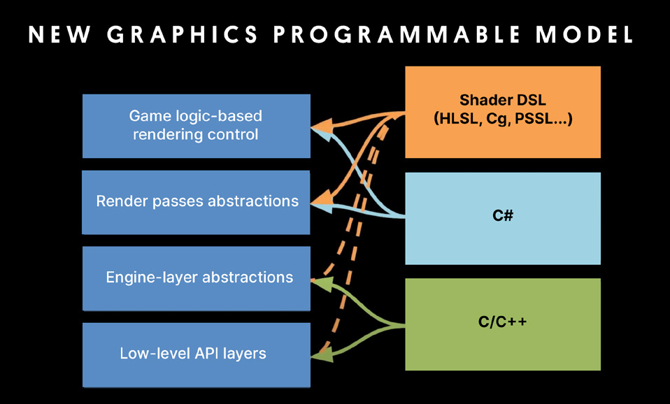
<p><em>VI: <strong>▲ Mô hình đồ hoạ LẬP TRÌNH ĐƯỢC</strong> — bốn tầng <strong>Game logic-based rendering control → Render passes abstractions → Engine-layer abstractions → Low-level API layers</strong>, ánh xạ sang ba ngôn ngữ <strong>Shader DSL (HLSL, Cg, PSSL…) · C# · C/C++</strong>. Đây chính là ý tưởng gốc của SRP: đưa phần điều khiển render lên tầng C#. / EN: The new graphics programmable model.</em></p>

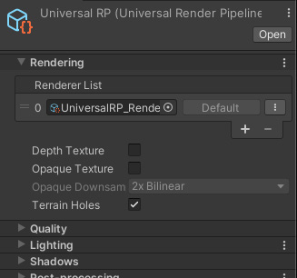
<p><em>VI: <strong>▲ URP Asset</strong> — <strong>Renderer List</strong> ở trên, rồi <strong>Depth Texture · Opaque Texture · Opaque Downsampling: 2× Bilinear · Terrain Holes</strong>, và các nhóm gập lại <strong>Quality · Lighting · Shadows · Post-processing</strong>. / EN: The Universal Render Pipeline Asset Inspector.</em></p>

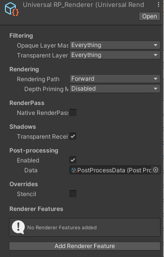
<p><em>VI: <strong>▲ Universal Renderer Data</strong> (KHÁC URP Asset) — <strong>Filtering: Opaque/Transparent Layer Mask = Everything</strong> · <strong>Rendering Path: Forward</strong>, Depth Priming Mode Disabled · <strong>RenderPass: Native RenderPass</strong> · Shadows: Transparent Receive ✓ · <strong>Post-processing: Enabled ✓ + Data</strong> · Overrides: Stencil · và cuối cùng là <strong>Renderer Features + Add Renderer Feature</strong>. / EN: The Universal Renderer Data asset, which is not the same as the URP Asset.</em></p>

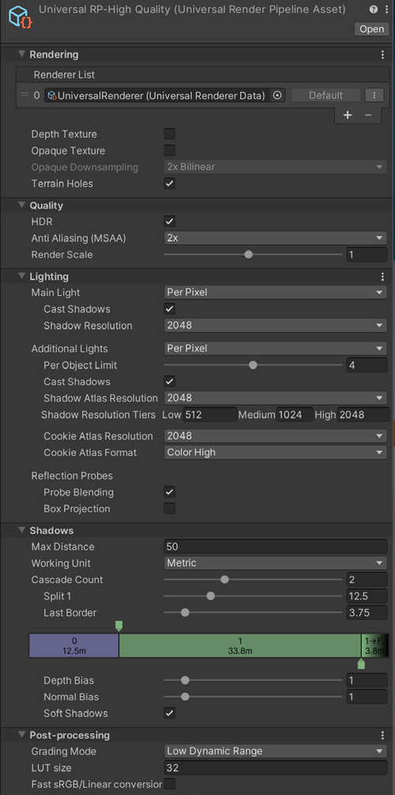
<p><em>VI: <strong>▲ Một URP Asset ĐẦY ĐỦ</strong> — cuộn hết Rendering · Quality · Lighting · Shadows · Post-processing trong một khung. / EN: A complete URP Asset with all sections expanded.</em></p>


<p><em>VI: Dự án demo <strong>Boat Attack</strong> tạo bằng Universal Render Pipeline. / EN: The Boat Attack demo project created using the Universal Render Pipeline.</em></p>

<div class="bilingual-row">
<div class="col-vi">
<p>Trước khi bắt đầu lighting cho scene, bạn <strong>phải chọn một render pipeline</strong>. <em>Render pipeline thực hiện một chuỗi thao tác lấy nội dung Scene và hiển thị chúng lên màn hình.</em></p>
<p>Unity cung cấp <strong>3 render pipeline dựng sẵn</strong> với khả năng và đặc tính hiệu năng khác nhau — hoặc bạn <strong>tự tạo cái riêng</strong>.</p>
</div>
<div class="col-en">
<p>Before you begin lighting your scenes, you <strong>need to choose a render pipeline</strong>. <em>A render pipeline performs a series of operations that take the contents of a Scene and display them on-screen.</em></p>
<p>Unity provides <strong>three prebuilt render pipelines</strong> with different capabilities and performance characteristics — or you can <strong>create your own</strong>.</p>
</div>
</div>

| Pipeline | Đặc điểm / Characteristics | Khi nào chọn / When to choose |
|---|---|---|
| **Built-in Render Pipeline (BiRP)** | Pipeline **đa dụng với khả năng TÙY BIẾN HẠN CHẾ**. Đây là **mặc định**. Tuy không tùy biến được nhiều như URP/HDRP, nó **hỗ trợ RẤT NHIỀU nền tảng** | Cần cấu hình các rendering path thủ công và mở rộng bằng **command buffer và callback** |
| **Universal Render Pipeline (URP)** | Scriptable Render Pipeline dựng sẵn. Cung cấp **workflow thân thiện với artist** để tạo đồ họa tối ưu trên nhiều nền tảng, **từ mobile tới console và PC cao cấp**. Thêm tính năng đồ họa **KHÔNG có ở BiRP**. ⚖️ Để giữ hiệu năng, nó **ĐÁNH ĐỔI để GIẢM chi phí tính toán của lighting và shading** | ✅ **Chọn URP nếu bạn muốn tiếp cận NHIỀU nền tảng nhất — bao gồm mobile và VR** |
| **High Definition Render Pipeline (HDRP)** | Scriptable Render Pipeline thiết kế cho **đồ họa TIÊN TIẾN, ĐỘ TRUNG THỰC CAO**. Nhắm **phần cứng cao cấp: PC, Xbox, PlayStation**. Dùng **Lighting và Material dựa trên vật lý**, hỗ trợ công cụ debug cải tiến | Game chân thực, demo ô tô, ứng dụng kiến trúc. 🚨 **HDRP hiện KHÔNG hỗ trợ nền tảng mobile hay Nintendo Switch** |

<div class="bilingual-row">
<div class="col-vi">
<p>🔑 <strong>URP và HDRP đều hoạt động BÊN TRÊN Scriptable Render Pipeline (SRP)</strong> — <em>một lớp API mỏng cho phép bạn lên lịch và cấu hình lệnh render bằng script C#</em>. Sự linh hoạt này cho phép bạn <strong>tùy biến gần như MỌI phần của pipeline</strong>.</p>
<p>👉 <strong>Chọn render pipeline SỚM khi lập kế hoạch dự án.</strong></p>
<p><strong>📦 Package render pipeline cho Console:</strong> Để build cho PS4/PS5/Xbox, bạn <em>phải cài package BỔ SUNG cho MỖI nền tảng</em>:</p>
<ul>
<li>PlayStation 4 → <code>com.unity.render-pipelines.ps4</code></li>
<li>PlayStation 5 → <code>com.unity.render-pipelines.ps5</code></li>
<li>Xbox One → <code>com.unity.render-pipelines.xboxone</code></li>
<li>Game Core Xbox Series / Xbox One → <code>com.unity.render-pipelines.gamecore</code></li>
</ul>
</div>
<div class="col-en">
<p>🔑 <strong>URP and HDRP both work on top of the Scriptable Render Pipeline (SRP)</strong> — <em>a thin API layer that lets you schedule and configure rendering commands using C# scripts</em>. This flexibility allows you to <strong>customize virtually EVERY part of the pipeline</strong>.</p>
<p>👉 <strong>Choose a render pipeline EARLY when planning your project.</strong></p>
<p><strong>📦 Render pipeline packages for consoles:</strong> To build for PS4/PS5/Xbox you <em>must install an ADDITIONAL package for EACH platform</em>:</p>
<ul>
<li>PlayStation 4 → <code>com.unity.render-pipelines.ps4</code></li>
<li>PlayStation 5 → <code>com.unity.render-pipelines.ps5</code></li>
<li>Xbox One → <code>com.unity.render-pipelines.xboxone</code></li>
<li>Game Core Xbox Series / Xbox One → <code>com.unity.render-pipelines.gamecore</code></li>
</ul>
</div>
</div>

---

## 9. Rendering Path — Forward vs Deferred

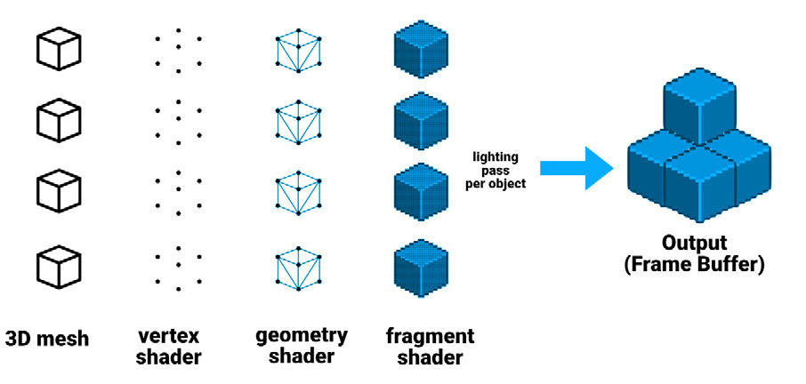
<p><em>VI: <strong>▲ FORWARD</strong> — <strong>3D mesh → vertex shader → geometry shader → fragment shader</strong>, rồi <strong>MỘT lighting pass CHO MỖI OBJECT</strong> trước khi ghi vào Frame Buffer. Càng nhiều đèn × nhiều object thì càng nhiều pass. / EN: Forward rendering: a lighting pass per object before the Frame Buffer.</em></p>

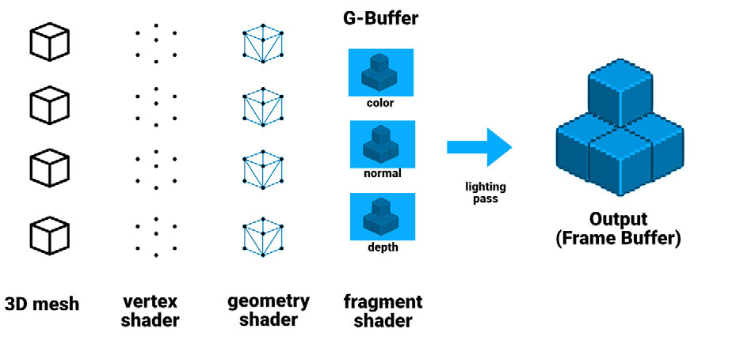
<p><em>VI: <strong>▲ DEFERRED</strong> — cùng chuỗi shader, nhưng fragment shader ghi ra <strong>G-Buffer (color · normal · depth)</strong>, sau đó <strong>MỘT lighting pass DUY NHẤT</strong> cho toàn màn hình. Chi phí đèn KHÔNG còn nhân với số object. / EN: Deferred shading: fragment output goes to a G-Buffer, then a single lighting pass.</em></p>

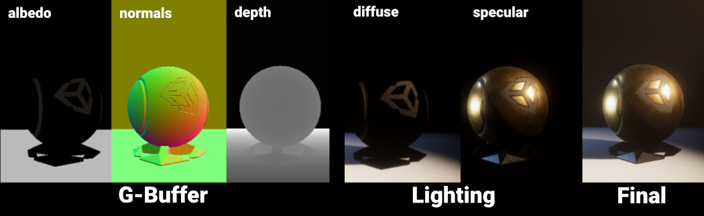
<p><em>VI: <strong>▲ G-Buffer nhìn tận mắt</strong> — hàng trái là <strong>albedo · depth · normals</strong> (nội dung G-Buffer); giữa là <strong>diffuse · specular · reflection</strong> (các lighting pass); phải là <strong>Final Output</strong>. / EN: The G-Buffer contents, the lighting passes, and the final output.</em></p>

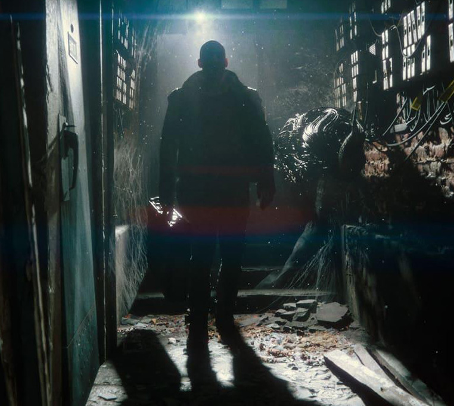
<p><em>VI: Forward rendering path. / EN: The forward rendering path.</em></p>

<div class="bilingual-row">
<div class="col-vi">
<p><strong>Rendering path</strong> biểu diễn <em>một chuỗi thao tác cụ thể liên quan tới lighting và shading</em>. Việc quyết định phụ thuộc vào <strong>nhu cầu ứng dụng và phần cứng đích</strong>.</p>
<p><strong>🔷 FORWARD RENDERING PATH</strong></p>
<p><em>URP và Built-in Render Pipeline đều dùng forward renderer.</em></p>
<p><strong>Cơ chế:</strong> Card đồ họa <em>chiếu geometry và chia nó thành vertex</em>. Các vertex đó lại được <em>chia nhỏ thành fragment (pixel)</em>, render ra màn hình để tạo ảnh cuối. <strong>Pipeline truyền TỪNG object, MỘT CÁI MỘT LẦN, tới graphics API.</strong></p>
<p>🚨 <strong>Chi phí đặc trưng:</strong> <em>"Forward rendering đi kèm <strong>CHI PHÍ cho MỖI ĐÈN. Càng nhiều đèn trong Scene, render càng LÂU.</strong>"</em></p>
<p>💀 <strong>Vấn đề riêng của BiRP forward renderer:</strong></p>
<blockquote>
<p><em>"Forward renderer của Built-in Render Pipeline <strong>vẽ MỖI ĐÈN trong một PASS RIÊNG cho MỖI OBJECT</strong>. Nếu bạn có <strong>nhiều đèn chiếu vào CÙNG một GameObject, điều này có thể tạo ra OVERDRAW ĐÁNG KỂ</strong> — nơi vùng chồng lấn phải vẽ cùng một pixel NHIỀU HƠN MỘT LẦN. <strong>Hãy giảm thiểu số đèn real-time để giảm overdraw.</strong>"</em></p>
</blockquote>
<p>✅ <strong>URP làm KHÁC — và TỐT HƠN:</strong></p>
<blockquote>
<p><em>"Thay vì render <strong>một pass cho mỗi đèn</strong>, <strong>URP CULL các đèn THEO TỪNG OBJECT</strong>. Điều này cho phép <strong>lighting được tính trong MỘT PASS DUY NHẤT</strong>, dẫn tới <strong>ÍT draw call HƠN</strong> so với forward renderer của Built-In."</em></p>
</blockquote>
</div>
<div class="col-en">
<p>The <strong>rendering path</strong> represents <em>a specific series of operations related to lighting and shading</em>. Deciding on one depends on your <strong>application needs and target hardware</strong>.</p>
<p><strong>🔷 FORWARD RENDERING PATH</strong></p>
<p><em>URP and the Built-in Render Pipeline both use forward renderers.</em></p>
<p><strong>Mechanism:</strong> The graphics card <em>projects the geometry and splits it into vertices</em>. Those vertices are <em>further broken into fragments (pixels)</em>, which render to screen to create the final image. <strong>The pipeline passes each object, ONE AT A TIME, to the graphics API.</strong></p>
<p>🚨 <strong>The characteristic cost:</strong> <em>"Forward rendering comes with <strong>a COST for EACH LIGHT. The more lights in your Scene, the LONGER rendering will take.</strong>"</em></p>
<p>💀 <strong>BiRP forward renderer's specific problem:</strong></p>
<blockquote>
<p><em>"The Built-in Render Pipeline's forward renderer <strong>draws EACH LIGHT in a SEPARATE PASS PER OBJECT</strong>. If you have <strong>multiple lights hitting the SAME GameObject, this can create SIGNIFICANT OVERDRAW</strong>, where overlapping areas need to draw the same pixel MORE THAN ONCE. <strong>Minimize the number of real-time lights to reduce overdraw.</strong>"</em></p>
</blockquote>
<p>✅ <strong>URP does it DIFFERENTLY — and BETTER:</strong></p>
<blockquote>
<p><em>"Rather than rendering <strong>one pass per light</strong>, <strong>the URP CULLS the lights PER-OBJECT</strong>. This allows for the <strong>lighting to be computed in ONE SINGLE PASS</strong>, resulting in <strong>FEWER draw calls</strong> compared to the Built-In forward renderer."</em></p>
</blockquote>
</div>
</div>


<p><em>VI: Deferred shading path — lighting được áp lên một <strong>buffer</strong> thay vì lên từng object. / EN: Deferred shading applies lighting to a buffer instead of each object.</em></p>

<div class="bilingual-row">
<div class="col-vi">
<p><strong>🔶 DEFERRED SHADING PATH</strong></p>
<p><em>Built-in Render Pipeline và HDRP có thể dùng deferred shading.</em></p>
<p>🔑 <strong>Ý tưởng cốt lõi:</strong> Trong deferred shading, <strong>lighting KHÔNG được tính theo từng object</strong>. Nó <em>TRÌ HOÃN việc render nặng — như lighting — sang giai đoạn SAU</em>. Deferred shading dùng <strong>2 PASS</strong>:</p>
<p><strong>Pass 1 — G-Buffer Geometry Pass:</strong> Unity render các GameObject. Pass này <em>lấy ra nhiều loại thuộc tính hình học và lưu chúng vào một tập texture</em>. G-buffer texture có thể gồm:</p>
<ul>
<li><strong>Diffuse và specular color</strong></li>
<li><strong>Surface smoothness</strong></li>
<li><strong>Occlusion</strong></li>
<li><strong>World space normal</strong></li>
<li><strong>Emission + ambient + reflection + lightmap</strong></li>
</ul>
<p><strong>Pass 2 — Lighting Pass:</strong> Unity render lighting của Scene <em>DỰA TRÊN G-buffer</em>. <em>"Hãy tưởng tượng việc duyệt qua TỪNG PIXEL và tính thông tin lighting dựa trên BUFFER thay vì dựa trên từng object riêng lẻ."</em></p>
<p>💎 <strong>Lợi ích quyết định:</strong></p>
<blockquote>
<p><em>"Do đó, <strong>việc thêm NHIỀU đèn KHÔNG đổ bóng trong deferred shading KHÔNG gây tổn thất hiệu năng giống như với forward rendering.</strong>"</em></p>
</blockquote>
<p>⚠️ <em>"Tuy chọn rendering path bản thân nó KHÔNG phải là một tối ưu, nó <strong>ẢNH HƯỞNG tới CÁCH bạn tối ưu dự án</strong>. Các kỹ thuật và workflow khác trong phần này <strong>có thể KHÁC NHAU tùy render pipeline và rendering path bạn chọn</strong>."</em></p>
</div>
<div class="col-en">
<p><strong>🔶 DEFERRED SHADING PATH</strong></p>
<p><em>The Built-in Render Pipeline and HDRP can also use deferred shading.</em></p>
<p>🔑 <strong>The core idea:</strong> In deferred shading, <strong>lighting is NOT calculated per object</strong>. It <em>POSTPONES heavy rendering — like lighting — to a LATER stage</em>. Deferred shading uses <strong>TWO PASSES</strong>:</p>
<p><strong>Pass 1 — G-Buffer Geometry Pass:</strong> Unity renders the GameObjects. This pass <em>retrieves several types of geometric properties and stores them in a set of textures</em>. G-buffer textures can include:</p>
<ul>
<li><strong>Diffuse and specular colors</strong></li>
<li><strong>Surface smoothness</strong></li>
<li><strong>Occlusion</strong></li>
<li><strong>World space normals</strong></li>
<li><strong>Emission + ambient + reflections + lightmaps</strong></li>
</ul>
<p><strong>Pass 2 — Lighting Pass:</strong> Unity renders the Scene's lighting <em>BASED ON the G-buffer</em>. <em>"Imagine iterating over EACH PIXEL and calculating the lighting information based on the BUFFER instead of the individual objects."</em></p>
<p>💎 <strong>The decisive benefit:</strong></p>
<blockquote>
<p><em>"Thus, <strong>adding MORE non-shadow-casting lights in deferred shading does NOT incur the SAME performance hit as with forward rendering.</strong>"</em></p>
</blockquote>
<p>⚠️ <em>"Though choosing a rendering path is NOT an optimization per se, it <strong>can AFFECT HOW you optimize your project</strong>. The other techniques and workflows in this section <strong>may VARY depending on what render pipeline and rendering path you've chosen</strong>."</em></p>
</div>
</div>

---

## 10. 🎯 Draw Call Batching — Bốn kỹ thuật

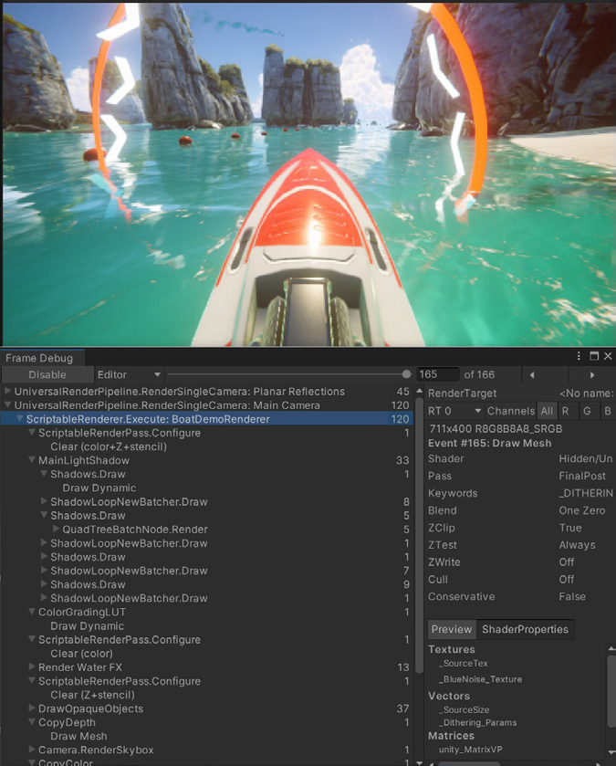

<div class="bilingual-row">
<div class="col-vi">
<p>🔑 <strong>Nguyên lý:</strong> <em>"Draw call batching <strong>TỐI THIỂU HÓA các thay đổi state này</strong> và <strong>GIẢM chi phí CPU của việc render object</strong>."</em></p>
<p>⚖️ <em>"Phần cứng PC và console có thể đẩy được RẤT NHIỀU draw call, <strong>nhưng overhead của mỗi lời gọi VẪN đủ cao để đáng công giảm bớt. Trên thiết bị mobile, tối ưu draw call là SỐNG CÒN.</strong>"</em></p>
</div>
<div class="col-en">
<p>🔑 <strong>The principle:</strong> <em>"Draw call batching <strong>MINIMIZES these state changes</strong> and <strong>REDUCES the CPU cost of rendering objects</strong>."</em></p>
<p>⚖️ <em>"PC and console hardware can push a lot of draw calls, <strong>but the overhead of each call is still high enough to warrant trying to reduce them. On mobile devices, draw call optimization is VITAL.</strong>"</em></p>
</div>
</div>

| Kỹ thuật | Cơ chế / Mechanism | Điều kiện & Lưu ý |
|---|---|---|
| **① SRP Batching** | 🔑 **KHÔNG giảm số draw call** — nó **GIẢM phần THIẾT LẬP GPU giữa các DrawCall** bằng cách **lưu material data THƯỜNG TRÚ trong bộ nhớ GPU** ⇒ *"làm MỖI draw call RẺ HƠN"*. Có thể **tăng tốc CPU rendering time ĐÁNG KỂ** | Bật **SRP Batcher** trong Pipeline Asset mục **Advanced**. ✅ **Dùng ÍT Shader Variant với TỐI THIỂU Keyword để cải thiện SRP batching** |
| **② GPU Instancing** | Batch **nhiều object GIỐNG HỆT nhau** (cùng mesh + cùng material) bằng **phần cứng đồ họa** | Chọn Material trong Project window → tick **Enable Instancing**. 💡 *"Giới hạn số model trong scene có thể cải thiện hiệu năng. **Nếu làm khéo, bạn vẫn dựng được scene phức tạp mà không trông lặp lại**"* |
| **③ Static Batching** | Với **geometry KHÔNG di chuyển**, Unity giảm draw call cho mọi mesh **dùng chung material**. Unity **gộp TẤT CẢ static mesh thành MỘT mesh LỚN lúc BUILD** | ✅ **Hiệu quả HƠN dynamic batching**, ⚠️ **nhưng dùng NHIỀU BỘ NHỚ HƠN**. Đánh dấu mesh không di chuyển là **Batching Static**. 💡 `StaticBatchingUtility` cho phép tự tạo static batch **lúc runtime** (ví dụ sau khi sinh level thủ tục) |
| **④ Dynamic Batching** | Với **mesh NHỎ**, Unity **nhóm và biến đổi vertex trên CPU** rồi vẽ tất cả trong một lần | 🚨 **ĐỪNG dùng trừ khi bạn có ĐỦ mesh low-poly** — *"KHÔNG quá **300 vertex** mỗi mesh và **900 vertex attribute** tổng"*. Nếu không, **bật nó chỉ LÃNG PHÍ thời gian CPU đi tìm mesh nhỏ để batch** |

!!! danger "🚨 Năm quy tắc tối đa hóa batching — quy tắc ③ là bẫy kinh điển"
    <div class="bilingual-row">
    <div class="col-vi">
    <ol>
    <li><strong>Dùng CÀNG ÍT Texture trong Scene càng tốt.</strong> <em>Ít texture ⇒ ít material duy nhất ⇒ DỄ batch hơn.</em> Ngoài ra, <strong>dùng Texture atlas ở mọi nơi có thể</strong>.</li>
    <li><strong>LUÔN bake lightmap ở kích thước atlas LỚN NHẤT có thể.</strong> <em>Ít lightmap ⇒ ít thay đổi Material state</em> — nhưng <strong>để mắt tới memory footprint</strong>.</li>
    <li>🚨 <strong>CẨN THẬN đừng vô tình INSTANCE material:</strong>
      <blockquote>
      <p><em>"Truy cập <code>Renderer.material</code> trong script sẽ <strong>NHÂN BẢN material và trả về tham chiếu tới BẢN SAO MỚI</strong>. Điều này <strong>PHÁ VỠ mọi batch đang tồn tại đã bao gồm material đó</strong>.</em></p>
      <p><em>✅ Nếu bạn muốn truy cập material của object đã batch, <strong>hãy dùng <code>Renderer.sharedMaterial</code> thay thế</strong>."</em></p>
      </blockquote>
      <p>📝 <em>Ghi chú raw cũng cảnh báo điều này: "<strong>Never use <code>renderer.material.xxx</code> at runtime, this will clone the material and break batching too.</strong> Use <strong>MaterialPropertyBlock</strong> để đổi thuộc tính material."</em></p>
    </li>
    <li><strong>Theo dõi số static và dynamic batch SO VỚI tổng số draw call</strong> bằng Profiler hoặc rendering stats trong lúc tối ưu.</li>
    </ol>
    </div>
    <div class="col-en">
    <ol>
    <li><strong>Use as FEW Textures in a Scene as possible.</strong> <em>Fewer Textures require fewer unique Materials, making them easier to batch.</em> Additionally, <strong>use Texture atlases wherever possible</strong>.</li>
    <li><strong>ALWAYS bake lightmaps at the LARGEST atlas size possible.</strong> <em>Fewer lightmaps require fewer Material state changes</em> — but <strong>keep an eye on the memory footprint</strong>.</li>
    <li>🚨 <strong>Be CAREFUL not to instance Materials unintentionally:</strong>
      <blockquote>
      <p><em>"Accessing <code>Renderer.material</code> in scripts <strong>DUPLICATES the material and returns a reference to the NEW COPY</strong>. This <strong>BREAKS any existing batch that already includes the material</strong>.</em></p>
      <p><em>✅ If you wish to access the batched object's material, <strong>use <code>Renderer.sharedMaterial</code> instead</strong>."</em></p>
      </blockquote>
      <p>📝 <em>The raw notes warn about this too: "<strong>Never use <code>renderer.material.xxx</code> at runtime, this will clone the material and break batching too.</strong> Use <strong>MaterialPropertyBlock</strong> to change material properties."</em></p>
    </li>
    <li><strong>Keep an eye on static and dynamic batch counts VERSUS the total draw call count</strong> using the Profiler or rendering stats.</li>
    </ol>
    </div>
    </div>

```csharp
// ❌ SAI — Renderer.material NHÂN BẢN material ⇒ PHÁ batching
void SetColorBad(Color c)
{
    GetComponent<Renderer>().material.color = c;   // clone! batch bị phá
}

// ✅ ĐÚNG — MaterialPropertyBlock: đổi thuộc tính mà KHÔNG clone, KHÔNG phá batch
using UnityEngine;

public class TintWithoutBreakingBatch : MonoBehaviour
{
    static readonly int BaseColorId = Shader.PropertyToID("_BaseColor"); // hash 1 lần (Module 1 §13.5)

    Renderer rend;
    MaterialPropertyBlock mpb;

    void Awake()
    {
        rend = GetComponent<Renderer>();
        mpb  = new MaterialPropertyBlock();   // cấp phát 1 lần, tái dùng
    }

    public void SetColor(Color c)
    {
        rend.GetPropertyBlock(mpb);           // đọc block hiện tại
        mpb.SetColor(BaseColorId, c);
        rend.SetPropertyBlock(mpb);           // ghi lại — material KHÔNG bị clone
    }

    // Nếu chỉ ĐỌC material dùng chung (không sửa) → sharedMaterial
    public Color ReadSharedColor() => rend.sharedMaterial.GetColor(BaseColorId);
}
```

### 10.1. Frame Debugger — "Vì sao draw call này KHÔNG batch được?"

<div class="bilingual-row">
<div class="col-vi">
<p>🎚️ <strong>Núm vặn ÍT NGƯỜI BIẾT — <code>Debug Level</code> của URP Asset:</strong></p>
<p><em>"Dùng Frame Debugger để hiểu rõ hơn điều gì đang diễn ra khi render. <strong>Để xem THÔNG TIN BỔ SUNG trong cửa sổ Frame Debugger, hãy chỉnh <code>Debug Level</code> BẰNG URP Asset.</strong> Giống như ô SRP Batcher, <strong>nó CHỈ hiện trong Inspector khi đã bật <code>Show Additional Properties</code>.</strong>"</em></p>
<p>⚠️ <em>"<strong>Chỉnh Debug Level CÓ THỂ ẢNH HƯỞNG HIỆU NĂNG. LUÔN TẮT nó khi KHÔNG dùng Frame Debugger.</strong>"</em></p>
<p>👉 <em>"Frame Debugger hiện <strong>danh sách MỌI draw call thực hiện trước khi render ảnh cuối</strong>, giúp bạn <strong>chỉ đích danh vì sao một số frame render LÂU, và cũng xác định vì sao số draw call của scene CAO đến vậy.</strong> Mở bằng <code>Window › Analysis › Frame Debugger</code>. <strong>Khi game đang chạy, bấm nút <code>Enable</code> — việc này TẠM DỪNG game và cho bạn soi từng draw call.</strong> Bấm một giai đoạn trong pipeline (khung trái) sẽ <strong>hiện PREVIEW của giai đoạn đó trong Game view.</strong>"</em></p>
</div>
<div class="col-en">
<p>🎚️ <strong>The little-known knob — the URP Asset's <code>Debug Level</code>:</strong></p>
<p><em>"Use the Frame Debugger to gain a better understanding of what's happening during rendering. To view additional information in the Frame Debugger window, adjust the Debug Level using the URP Asset. As with the SRP Batcher checkbox, this is only visible in the Inspector with Show Additional Properties enabled."</em></p>
<p>⚠️ <em>"Adjusting the Debug Level can affect performance. Always turn it off when the Frame Debugger is not in use."</em></p>
<p>👉 <em>"The Frame Debugger shows a list of all the draw calls made before rendering the final image and can help you pinpoint why certain frames are taking a long time to render. It can also identify why your scene's draw call count is so high. Open the Frame Debugger by going to Window &gt; Analysis &gt; Frame Debugger. When your game is playing, select the Enable button. This will pause the game and let you examine the draw calls. Clicking a stage in the render pipeline (left pane) will show a preview of this stage in Game view."</em></p>
</div>
</div>


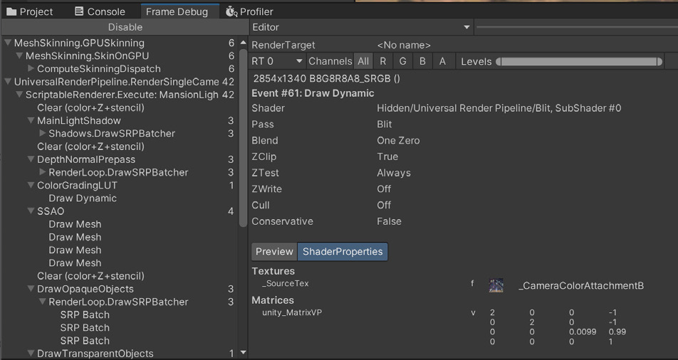
<p><em>VI: <strong>▲ Frame Debugger trong URP</strong> — cây sự kiện <code>MeshSkinning.GPUSkinning</code> → <code>UniversalRenderPipeline.RenderSingleCamera</code> → <code>MainLightShadow</code> · <code>DepthNormalPrepass</code> · <code>ColorGradingLUT</code> · <code>SSAO</code> · <strong><code>DrawOpaqueObjects</code> với BA dòng <code>SRP Batch</code></strong> · <code>DrawTransparentObjects</code>. Bên phải là <strong>Event #61 Draw Dynamic</strong> với <strong>RenderTarget 2854×1340 B8G8R8A8_SRGB</strong>, Shader <code>Hidden/Universal Render Pipeline/Blit</code>, Blend One Zero, ZTest Always, ZWrite Off. / EN: The Frame Debugger in URP with three SRP Batch entries under DrawOpaqueObjects.</em></p>

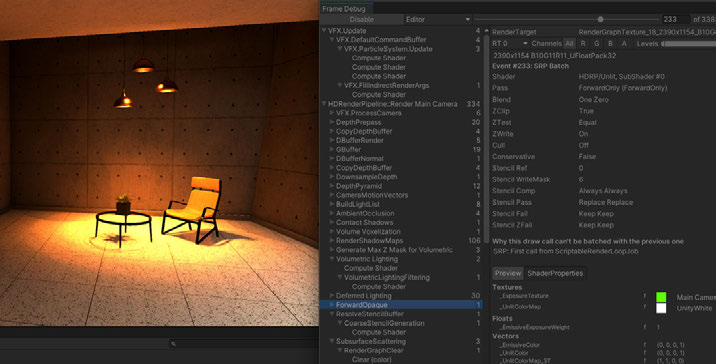
<p><em>VI: <strong>▲ Dòng chữ QUAN TRỌNG NHẤT của Frame Debugger</strong> — <em>"Why this draw call can't be batched with the previous one: <strong>SRP: First call from ScriptableRenderContext</strong>"</em>. Đây là chỗ Unity NÓI THẲNG lý do batch vỡ. / EN: Why this draw call can't be batched with the previous one.</em></p>


<p><em>VI: Frame Debugger (HDRP) — panel phải hiển thị <strong>"Why this draw call can't be batched with the previous one: SRP: First call from ScriptableRenderContext"</strong>. Đây là công cụ chính để chẩn đoán batching. / EN: The Frame Debugger showing exactly why a draw call couldn't be batched with the previous one.</em></p>


<p><em>VI: Frame Debugger trên một scene URP — cây bên trái phơi bày <strong>TOÀN BỘ thứ tự pass</strong>: <code>MeshSkinning.GPUSkinning</code> → <code>MainLightShadow</code> (<code>Shadows.DrawSRPBatcher</code>) → <code>DepthNormalPrepass</code> → <code>ColorGradingLUT</code> → <code>SSAO</code> → <code>DrawOpaqueObjects</code> (3× <strong>SRP Batch</strong>) → <code>DrawTransparentObjects</code>. Panel phải cho biết render target <strong>2854×1340 B8G8R8A8_SRGB</strong> và trạng thái đầy đủ của event (<em>Blend One Zero, ZTest Always, ZWrite Off, Cull Off</em>). / EN: The Frame Debugger on a URP scene, exposing the full pass order and the complete GPU state of the selected event.</em></p>

<p>👉 <em>Đây chính là <strong>"GPU state" ở <a href="#21-gpu-state-vi-sao-moi-thay-oi-can-mot-draw-call-moi">§2.1</a> hiện hình</strong>: mỗi dòng bên phải (<code>Blend</code>, <code>ZTest</code>, <code>ZWrite</code>, <code>Cull</code>, <code>Textures</code>, <code>Matrices</code>) là một phần của khối state mà driver phải nạp trước draw call. / EN: This is <strong>the "GPU state" from <a href="#21-gpu-state-vi-sao-moi-thay-oi-can-mot-draw-call-moi">§2.1</a> made visible</strong>.</em></p>

<div class="bilingual-row">
<div class="col-vi">
<p>📊 <strong>Rendering Statistics — bấm nút <code>Stats</code> góc trên phải Game view.</strong> Cửa sổ này hiển thị thông tin render <em>thời gian thực</em> trong Play mode:</p>
<ul>
<li><strong>FPS</strong> — Frames per second</li>
<li><strong>CPU Main</strong> — tổng thời gian xử lý một frame (và cập nhật Editor cho mọi cửa sổ)</li>
<li><strong>CPU Render</strong> — tổng thời gian render một frame của Game view</li>
<li><strong>Batches</strong> — nhóm draw call được vẽ cùng nhau</li>
<li><strong>Tris / Verts</strong> — hình học mesh</li>
<li>🔑 <strong>SetPass calls</strong> — <em>"số lần Unity PHẢI CHUYỂN shader pass để render các GameObject trên màn hình; <strong>MỖI pass có thể tạo thêm overhead CPU</strong>"</em></li>
</ul>
<p>⚠️ <strong>Hai cảnh báo:</strong></p>
<ol>
<li><em>"<strong>FPS trong Editor KHÔNG nhất thiết chuyển thành hiệu năng của build.</strong> Chúng tôi khuyến nghị profile BUILD để có kết quả chính xác nhất."</em></li>
<li><em>"<strong>Frame time tính bằng mili-giây là metric CHÍNH XÁC HƠN frames per second</strong> khi benchmark"</em> — đúng như <a href="../01-fresher/01-ultimate-guide-to-profiling.md">Module 1 §1</a>.</li>
</ol>
</div>
<div class="col-en">
<p>📊 <strong>Rendering Statistics — click the <code>Stats</code> button in the top right of the Game view.</strong> This shows <em>real-time</em> rendering information during Play mode:</p>
<ul>
<li><strong>FPS</strong> — Frames per second</li>
<li><strong>CPU Main</strong> — total time to process one frame (and update the Editor for all windows)</li>
<li><strong>CPU Render</strong> — total time to render one frame of the Game view</li>
<li><strong>Batches</strong> — groups of draw calls to be drawn together</li>
<li><strong>Tris / Verts</strong> — mesh geometry</li>
<li>🔑 <strong>SetPass calls</strong> — <em>"the number of times Unity MUST SWITCH shader passes to render the GameObjects on-screen; <strong>each pass can introduce EXTRA CPU overhead</strong>"</em></li>
</ul>
<p>⚠️ <strong>Two warnings:</strong></p>
<ol>
<li><em>"<strong>In-Editor fps does NOT necessarily translate to BUILD performance.</strong> We recommend that you profile your BUILD for the most accurate results."</em></li>
<li><em>"<strong>Frame time in milliseconds is a MORE ACCURATE metric than frames per second</strong> when benchmarking"</em> — exactly as in <a href="../01-fresher/01-ultimate-guide-to-profiling.md">Module 1 §1</a>.</li>
</ol>
</div>
</div>

### 10.2. ⚖️ Batches vs SetPass Calls — Khác biệt ÍT NGƯỜI BIẾT

> 🧭 **Nguồn mới bổ sung ở audit lần 3:** [**Unity Draw Call Batching: The Ultimate Guide** — Ruben Torres Bonet, TheGameDev.Guru](https://thegamedev.guru/unity-performance/draw-call-optimization/) · [**Static Batching May Not Reduce Your Draw Calls**](https://thegamedev.guru/unity-performance/static-batching-draw-call-count/) — *hai bài này giải thích phần "vì sao" mà tài liệu Unity chính thức bỏ qua.*

<div class="bilingual-row">
<div class="col-vi">
<blockquote>
<p><em>"Có một chi tiết NHỎ mà ÍT lập trình viên biết. <strong>CÓ SỰ KHÁC BIỆT giữa metric <em>Batches</em> và <em>SetPasses</em> mà bạn thấy trong Profiler và cửa sổ Stats. Và sự khác biệt này có TÁC ĐỘNG KHỔNG LỒ.</strong></em></p>
<p><em>🔹 <strong>BATCHES là thứ ta thường gọi là DRAW CALL. Đó là những LỆNH VẼ THUẦN TUÝ</strong> — <em>vẽ object này ở đây, rồi vẽ object kia ở kia</em>. Nó CHỦ YẾU là việc vẽ một object <strong>với render state TOÀN CỤC HIỆN TẠI</strong>: cùng shader, tham số tương tự.</em></p>
<p><em>🔸 <strong>SETPASSES thì mô tả một thao tác ĐẮT ĐỎ HƠN: THAY ĐỔI MATERIAL. Đổi material là ĐẮT vì ta PHẢI THIẾT LẬP một render state MỚI. Điều này bao gồm tham số shader và setting pipeline như alpha blending, Z testing, Z writing…</strong>"</em></p>
</blockquote>
<p>👉 <em>Đây chính là <strong>"GPU state" ở <a href="#21-gpu-state-vi-sao-moi-thay-oi-can-mot-draw-call-moi">§2.1</a></strong> được đo bằng một con số cụ thể. <strong>Batches = số lệnh vẽ · SetPasses = số lần nạp lại khối state.</strong></em></p>
</div>
<div class="col-en">
<blockquote>
<p><em>"There's a LITTLE DETAIL few developers know of. <strong>There's a DIFFERENCE between the <em>Batches</em> and <em>SetPasses</em> metrics you see in the profiler and stats window. But this difference has a HUGE IMPACT.</strong></em></p>
<p><em>🔹 <strong>BATCHES are what we usually describe as DRAW CALLS. Those are PLAIN DRAW COMMANDS</strong> — <em>draw this object here and then this other one there</em>. This is mostly about drawing an object <strong>with the CURRENT GLOBAL RENDER STATE</strong>: same shader, similar parameters.</em></p>
<p><em>🔸 <strong>SETPASSES, however, describe a MORE EXPENSIVE operation: MATERIAL CHANGES. Changing a material is expensive because we have to SET A NEW RENDER STATE. This includes shader parameters and pipeline settings, such as alpha blending, Z testing, Z writing…</strong>"</em></p>
</blockquote>
<p>👉 <em>This is exactly the <strong>"GPU state" from <a href="#21-gpu-state-vi-sao-moi-thay-oi-can-mot-draw-call-moi">§2.1</a></strong> expressed as a concrete number. <strong>Batches = draw commands · SetPasses = state reloads.</strong></em></p>
</div>
</div>

**📊 Bốn kịch bản với BA cái ghế dùng CHUNG mesh / Four scenarios with THREE chairs sharing the same mesh**

| | 💀 "You're Screwed" | 💀 "You're Still Screwed" | 🙂 "Getting Better" | 🏆 "Kicking Ass" |
|---|---|---|---|---|
| **Batching Setting** | **Disabled** | **Enabled** | **Disabled** | **Enabled** |
| **Material Setup** | Riêng (×3)<br>*Individual (×3)* | Riêng (×3)<br>*Individual (×3)* | **DÙNG CHUNG (×1)**<br>*Shared (×1)* | **DÙNG CHUNG (×1)**<br>*Shared (×1)* |
| **Draw Events** | SetPass(ghế 1) → Draw(1)<br>SetPass(ghế 2) → Draw(2)<br>SetPass(ghế 3) → Draw(3) | SetPass(ghế 1) → Draw(1)<br>SetPass(ghế 2) → Draw(2)<br>SetPass(ghế 3) → Draw(3) | **SetPass(material ghế)**<br>→ Draw(1) → Draw(2) → Draw(3) | **SetPass(material ghế)**<br>→ **Draw(1+2+3)** |
| **SetPasses** | 3 | 3 | ✅ **1** | ✅ **1** |
| **Batches (D.C.)** | 3 | 3 | 3 | 🏆 **1** |
| **Hiệu năng** | **Tệ nhất** | **Tệ nhất** | Tốt | 🏆 **Tốt nhất** |

!!! danger "🔑 Đọc bảng này ĐÚNG cách — đây là bài học quan trọng nhất về batching"
    <div class="bilingual-row">
    <div class="col-vi">
    <blockquote>
    <p><em>"Kịch bản 1 và 2 GIỐNG NHAU: <strong>material KHÁC NHAU làm SetPass count TĂNG VỌT. Và chính chúng gây tác động hiệu năng TỆ NHẤT lên render thread. Batching là BẤT KHẢ THI, vì batching ĐÒI HỎI material GIỐNG HỆT NHAU.</strong></em></p>
    <p><em>💡 <strong>Kịch bản 3 hé lộ tia sáng: DÙNG CHUNG MATERIAL tạo ra TẤT CẢ khác biệt. Có một material duy nhất GIẢM SetPass count xuống 1, mang lại mức tăng hiệu năng ĐÁNG KINH NGẠC. Đúng, ta vẫn còn 3 draw call — NHƯNG CHÚNG RẤT RẺ.</strong>"</em></p>
    </blockquote>
    <p>🎯 <strong>Hệ quả thực chiến — thứ tự ưu tiên khi tối ưu:</strong></p>
    <ol>
    <li><strong>ƯU TIÊN 1 — Gộp/dùng chung MATERIAL</strong> ⇒ kéo SetPass từ 3 xuống 1 (bước có lợi NHẤT, làm được NGAY cả khi batching tắt)</li>
    <li><strong>ƯU TIÊN 2 — Bật batching</strong> ⇒ kéo Batches từ 3 xuống 1</li>
    </ol>
    <p>⚠️ <em>Làm ngược thứ tự là <strong>vô ích</strong>: kịch bản 2 (bật batching + material riêng) cho kết quả <strong>Y HỆT kịch bản 1</strong> — "tệ nhất". <strong>Bật batching mà KHÔNG dùng chung material thì KHÔNG có tác dụng gì cả.</strong></em></p>
    </div>
    <div class="col-en">
    <blockquote>
    <p><em>"The first and second scenarios are similar: <strong>DIFFERENT MATERIALS skyrocket our SetPass count. And those have the WORST performance hit in the render thread. Batching is NOT POSSIBLE, as batching REQUIRES using IDENTICAL materials.</strong></em></p>
    <p><em>💡 <strong>However, we see a hint of light with the third scenario. SHARING MATERIALS makes ALL the difference. Having a unique material REDUCES the SetPass count to 1, which gives you an INCREDIBLE performance boost. Sure, we still have three draw calls, BUT THOSE ARE VERY CHEAP.</strong>"</em></p>
    </blockquote>
    <p>🎯 <strong>The practical consequence — optimization priority order:</strong></p>
    <ol>
    <li><strong>PRIORITY 1 — Merge/share MATERIALS</strong> ⇒ drops SetPass from 3 to 1 (the HIGHEST-value step, and it works even with batching off)</li>
    <li><strong>PRIORITY 2 — Enable batching</strong> ⇒ drops Batches from 3 to 1</li>
    </ol>
    <p>⚠️ <em>Doing it in the reverse order is <strong>pointless</strong>: scenario 2 (batching on + individual materials) gives the <strong>EXACT SAME result as scenario 1</strong> — "worst". <strong>Enabling batching WITHOUT sharing materials achieves NOTHING.</strong></em></p>
    </div>
    </div>

### 10.3. 🧭 Cây quyết định — Đếm draw call KHÔNG PHẢI là tìm bottleneck

<div class="bilingual-row">
<div class="col-vi">
<blockquote>
<p><em>"Trước khi lao vào chống draw call, ta cần đúng công cụ để ĐO chúng. Nhưng trước hết, hãy tránh cái bẫy kinh điển: <strong>ĐẾM draw call KHÔNG PHẢI là chuyện GIỐNG với việc TÌM ra bottleneck của bạn.</strong>"</em></p>
</blockquote>
<p><strong>Cây quyết định — dùng TRƯỚC KHI bạn ngồi dựng atlas lúc 3 giờ sáng:</strong></p>
<ol>
<li>❓ <strong>Bạn CPU-bound hay GPU-bound?</strong> Mở Profiler. <em>"NẾU CPU chủ yếu đang CHỜ GPU, việc cạo bớt draw call sẽ KHÔNG cứu bạn. Hãy sửa chi phí GPU (độ phức tạp shader, overdraw, lighting, post-processing)."</em></li>
<li>✅ <strong>NẾU bạn CPU-bound ở khâu rendering:</strong> <em>"giờ draw call và SetPass call MỚI quan trọng. Đó là lúc batching có lời."</em></li>
<li>📊 <strong>Mở cửa sổ Stats</strong> (góc trên-phải Game view) và nhìn vào <strong>Batches</strong> và <strong>SetPass Calls</strong></li>
</ol>
<p><strong>Đọc kết quả:</strong></p>
<ul>
<li>🔴 <strong>SetPass Calls CAO?</strong> — <em>"Bạn đang ĐỔI material/shader/keyword QUÁ THƯỜNG XUYÊN. Hãy DÙNG CHUNG material, GỘP material, và trên URP/HDRP hãy dựa vào <strong>SRP Batcher</strong> (và NGỪNG làm nổ tung số shader variant)."</em> → <a href="#14-strip-shader-variants-oc-editorlog">§14</a></li>
<li>🟠 <strong>Batches CAO nhưng SetPass Calls THẤP?</strong> — <em>"Bạn chủ yếu đang trả overhead THEO TỪNG OBJECT. Giờ bạn đang ở thế giới của <strong>Static Batching, GPU Instancing, và (URP/HDRP) GPU Resident Drawer</strong>."</em> → <a href="#104-gpu-resident-drawer-e-gpu-lo-phan-viec-buon-te">§10.4</a></li>
</ul>
<p>🔍 <strong>Bước cuối:</strong> <em>"mở <strong>Frame Debugger</strong>. <strong>ĐÂY là nơi SỰ THẬT nằm.</strong> Trong URP/HDRP bạn MUỐN thấy các mục như <strong><code>SRP Batch</code></strong> và <strong><code>Hybrid Batch Group</code></strong>. <strong>NẾU bạn KHÔNG thấy, bạn đã tìm ra thứ tiếp theo cần sửa.</strong>"</em></p>
</div>
<div class="col-en">
<blockquote>
<p><em>"Before we dig into fighting draw calls, we need the proper tools to measure them. But first, let's avoid the classic trap: <strong>COUNTING draw calls is NOT the same thing as FINDING your bottleneck.</strong>"</em></p>
</blockquote>
<p><strong>The decision tree — use it before you start building atlases at 3AM:</strong></p>
<ol>
<li>❓ <strong>Are you CPU-bound or GPU-bound?</strong> Open the Profiler. <em>"IF the CPU is mostly WAITING on the GPU, shaving draw calls will NOT save you. Fix GPU cost (shader complexity, overdraw, lighting, post-processing)."</em></li>
<li>✅ <strong>IF you are CPU-bound on rendering:</strong> <em>"now draw calls and SetPass calls MATTER. That is when batching PAYS OFF."</em></li>
<li>📊 <strong>Open the Stats window</strong> (top-right of the Game view) and look at <strong>Batches</strong> and <strong>SetPass Calls</strong></li>
</ol>
<p><strong>Reading the result:</strong></p>
<ul>
<li>🔴 <strong>High SetPass Calls?</strong> — <em>"You are CHANGING materials/shaders/keywords TOO OFTEN. SHARE materials, MERGE materials, and on URP/HDRP lean on <strong>SRP Batcher</strong> (and STOP exploding shader variants)."</em> → <a href="#14-strip-shader-variants-oc-editorlog">§14</a></li>
<li>🟠 <strong>High Batches but LOW SetPass Calls?</strong> — <em>"You are mostly paying PER-OBJECT overhead. Now you are in the world of <strong>Static Batching, GPU Instancing, and (URP/HDRP) GPU Resident Drawer</strong>."</em> → <a href="#104-gpu-resident-drawer-e-gpu-lo-phan-viec-buon-te">§10.4</a></li>
</ul>
<p>🔍 <strong>Final step:</strong> <em>"open the <strong>Frame Debugger</strong>. <strong>This is where the TRUTH lives.</strong> In URP/HDRP you want to see entries like <strong><code>SRP Batch</code></strong> and <strong><code>Hybrid Batch Group</code></strong>. <strong>IF you do NOT, you have already found the NEXT thing to fix.</strong>"</em></p>
</div>
</div>

!!! warning "🚨 Static Batching có thể KHÔNG giảm draw call — và điều đó VẪN OK"
    <div class="bilingual-row">
    <div class="col-vi">
    <blockquote>
    <p><em>"<strong>Static batching sẽ KHÔNG NHẤT THIẾT giảm số draw call, NGAY CẢ KHI bạn thoả mãn MỌI yêu cầu.</strong> Đó là do CÁCH static batching hoạt động BÊN TRONG."</em></p>
    </blockquote>
    <p>🔬 <strong>Cơ chế — hai buffer:</strong></p>
    <blockquote>
    <ul>
    <li><em><strong>Vertex buffer</strong>: chứa thuộc tính như position, normal, color, UV…</em></li>
    <li><em><strong>Index buffer</strong>: <strong>cho phép ta CHỌN những vertex CỤ THỂ nào sẽ dùng từ vertex buffer khi render</strong></em></li>
    </ul>
    <p><em>🔑 <strong>Để vẽ danh sách object này, Unity PHẢI CHỈ ĐỊNH một DẢI (range) hoặc TẬP CON các phần tử trong hai buffer đó. Nếu không ta sẽ vẽ TẤT CẢ.</strong></em></p>
    <p><em>💀 <strong>Và NẾU các phần tử khác nhau nằm ở những VÙNG KHÔNG LIÊN TIẾP của buffer đó — vấn đề đấy — vì khi đó ta PHẢI vẽ NHIỀU LẦN, mỗi lần chỉ định một vùng khác nhau của buffer.</strong></em></p>
    <p><em>👉 <strong>ĐÂY là lý do đôi khi static batching KHÔNG giảm số draw call</strong> — vì ta cần vẽ geometry nằm ở các vùng KHÁC NHAU của index buffer mà KHÔNG thể vẽ liên tiếp."</em></p>
    </blockquote>
    <p>✅ <strong>Nhưng đó KHÔNG phải vấn đề — và đây mới là điểm cốt lõi:</strong></p>
    <blockquote>
    <p><em>"Trông có vẻ như vấn đề vì ta có nhiều draw call hơn cần thiết. <strong>Nhưng mấu chốt là: TA VẪN ĐANG VẼ TỪ CÙNG MỘT BUFFER. Do đó ta KHÔNG THAY ĐỔI GPU STATE — và ĐÓ MỚI LÀ THỨ THỰC SỰ ĐẮT.</strong></em></p>
    <p><em>👛 <em>Ví von:</em> <strong>công sức là ở việc RÚT VÍ ra khỏi túi và MỞ ngăn đựng xu. Một khi đã mở, việc lấy đồng 2 euro hay đồng 5 xu đều SIÊU DỄ.</strong> Với GPU cũng vậy: <strong>công sức BIND vào buffer ĐÃ ĐƯỢC BỎ RA RỒI.</strong>"</em></p>
    </blockquote>
    <p>⚠️ <em>"Rõ ràng việc này sẽ KHÔNG hoạt động nếu geometry của bạn KHÔNG có sẵn trong level từ trước. <strong>Nếu bạn dựng level THỦ TỤC (procedural), bạn sẽ KHÔNG dùng static batching ngay được</strong>"</em> → xem <a href="#105-run-time-batching-api-gop-mesh-luc-chay">§10.5</a>.</p>
    <p>📝 <strong>Ghi chú raw của bạn khớp:</strong> <em>"<strong>Static Batching occurs during application INITIALIZATION, whereas Dynamic Batching takes place at RUNTIME</strong>"</em> — batch tĩnh được LẮP RÁP một lần lúc nạp, nên nó KHÔNG tốn CPU mỗi frame như dynamic batching.</p>
    </div>
    <div class="col-en">
    <blockquote>
    <p><em>"<strong>Static batching will NOT necessarily reduce the number of draw calls, EVEN IF you fulfill ALL the requirements.</strong> This is because of the way that static batching internally works."</em></p>
    </blockquote>
    <p>🔬 <strong>The mechanism — two buffers:</strong></p>
    <blockquote>
    <ul>
    <li><em><strong>Vertex buffers</strong>: with attributes like position, normal, color, UVs…</em></li>
    <li><em><strong>Index buffers</strong>: <strong>this buffer lets us PICK which SPECIFIC vertices to use from the vertex buffers while rendering</strong></em></li>
    </ul>
    <p><em>🔑 <strong>In order for Unity to draw this list of objects, Unity MUST SPECIFY a RANGE or a SUBSET of elements within these two buffers to draw. Otherwise we would draw everything.</strong></em></p>
    <p><em>💀 <strong>And IF different elements are in NON-CONSECUTIVE REGIONS of that buffer, well, that's a problem, because then we have to draw MULTIPLE TIMES specifying different regions of this buffer.</strong></em></p>
    <p><em>👉 <strong>THIS is why sometimes static batching does NOT reduce the number of draw calls</strong> — because we need to draw geometry that exists within DIFFERENT AREAS of the index buffer that we CANNOT draw consecutively."</em></p>
    </blockquote>
    <p>✅ <strong>But that is NOT a problem — and here is the core insight:</strong></p>
    <blockquote>
    <p><em>"It may LOOK like [a problem] because hey, we have more draw calls than we need. <strong>But the key is this: WE ARE STILL DRAWING FROM THE SAME BUFFER. Therefore we are NOT CHANGING THE GPU STATE, which is what is ACTUALLY EXPENSIVE.</strong></em></p>
    <p><em>👛 <em>The analogy:</em> <strong>the effort is TAKING THE WALLET out of your pants and OPENING the coins compartment. Once it is open, taking the two-euro coin or the five-cent coin is SUPER EASY.</strong> Same with GPUs: <strong>the effort of BINDING to this buffer HAS ALREADY BEEN PUT.</strong>"</em></p>
    </blockquote>
    <p>⚠️ <em>"Obviously, this is NOT going to work if your geometry is NOT here on the level beforehand. <strong>So if I just design my level PROCEDURALLY you're NOT going to be able to use static batching out of the box</strong>"</em> → see <a href="#105-run-time-batching-api-gop-mesh-luc-chay">§10.5</a>.</p>
    <p>📝 <strong>Your raw note matches:</strong> <em>"<strong>Static Batching occurs during application INITIALIZATION, whereas Dynamic Batching takes place at RUNTIME</strong>"</em> — a static batch is ASSEMBLED ONCE at load, so it does NOT cost CPU every frame the way dynamic batching does.</p>
    </div>
    </div>

### 10.4. 🖥️ GPU Resident Drawer — Để GPU lo phần việc buồn tẻ

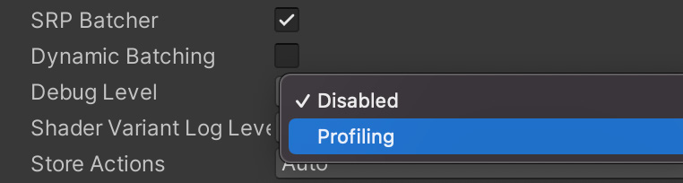
<p><em>VI: <strong>▲ URP Asset › Advanced</strong> — <strong>SRP Batcher ✓</strong>, <strong>Dynamic Batching</strong> (bỏ trống), <strong>Debug Level</strong>, <strong>Shader Variant Log Level: Disabled | Profiling</strong>, <strong>Store Actions: Auto</strong>. / EN: The Advanced section of the URP Asset.</em></p>

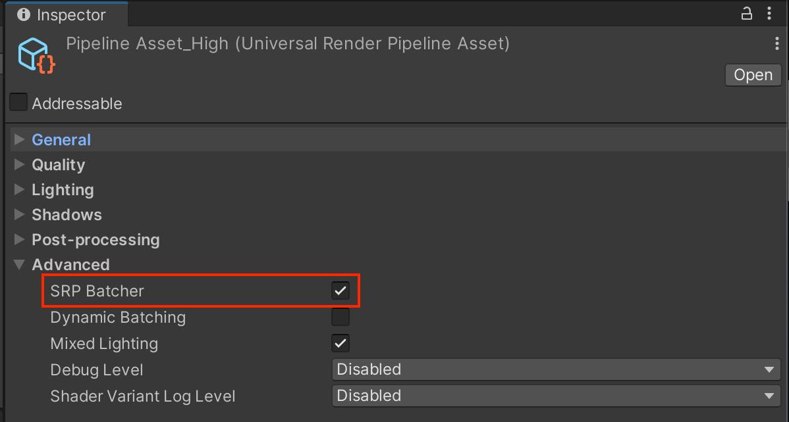
<p><em>VI: <strong>▲ Cùng nhóm đó trong <code>Pipeline Asset_High</code></strong> — <strong>SRP Batcher ✓</strong> (khoanh đỏ), Dynamic Batching tắt, <strong>Mixed Lighting ✓</strong>, Debug Level <em>Disabled</em>, Shader Variant Log Level <em>Disabled</em>. / EN: SRP Batcher enabled in the Pipeline Asset.</em></p>

<div class="bilingual-row">
<div class="col-vi">
<blockquote>
<p><em>"Nếu SRP Batcher là <strong>'cú giảm thuế cho render thread'</strong>, thì <strong>GPU Resident Drawer</strong> là nút <strong>'thôi, để GPU lo phần việc BUỒN TẺ'</strong>.</em></p>
<p><em>🔑 <strong>Nó dùng API <code>BatchRendererGroup</code> của Unity BÊN DƯỚI để vẽ RẤT NHIỀU GameObject bằng GPU instancing, đồng thời GIẢI PHÓNG thời gian CPU.</strong>"</em></p>
</blockquote>
<p><strong>✅ Khi nào NÊN dùng:</strong></p>
<ul>
<li><em>"Tôi có <strong>CỰC NHIỀU mesh GIỐNG NHAU</strong> (props, tán lá, đá, mảnh module)"</em></li>
<li><em>"Tôi đang <strong>CPU-bound ở khâu rendering</strong> và số draw call CAO"</em></li>
</ul>
<p><strong>⚠️ Điều kiện tiên quyết & cạm bẫy:</strong></p>
<ul>
<li>Đòi hỏi <strong>graphics API và nền tảng có hỗ trợ COMPUTE SHADER</strong> — <em>URP loại trừ RÕ RÀNG OpenGL ES</em></li>
<li>Trong URP nó <strong>ĐÒI HỎI rendering path <code>Forward+</code></strong></li>
<li>⏱️ <strong>Thời gian BUILD có thể TĂNG</strong> vì Unity biên dịch thêm shader variant của <code>BatchRendererGroup</code></li>
<li>Object phải tương thích: <strong>MeshRenderer</strong> + shader hỗ trợ <strong>DOTS instancing</strong> + 🚨 <strong>KHÔNG dùng <code>MaterialPropertyBlock</code></strong></li>
</ul>
<p>🚨 <em><strong>Lưu ý quan trọng:</strong> yêu cầu "KHÔNG MaterialPropertyBlock" MÂU THUẪN trực tiếp với lời khuyên ở <a href="#10-draw-call-batching-bon-ky-thuat">§10</a> (dùng <code>MaterialPropertyBlock</code> thay cho <code>.material</code>). <strong>Bạn phải CHỌN MỘT trong hai con đường</strong> — đây là ví dụ điển hình cho việc "tối ưu KHÔNG cộng dồn được".</em></p>
<p><strong>▶️ Cách bật (URP):</strong></p>
<ol>
<li><code>Project Settings &gt; Graphics</code> → <strong>BatchRendererGroup Variants</strong> = <strong><code>Keep All</code></strong></li>
<li><strong>URP Asset</strong> → bật <strong>SRP Batcher</strong>, rồi đặt <strong>GPU Resident Drawer</strong> = <strong><code>Instanced Drawing</code></strong></li>
<li><strong>Universal Renderer</strong> → <strong>Rendering Path</strong> = <strong><code>Forward+</code></strong></li>
</ol>
<p><strong>▶️ Cách bật (HDRP):</strong> <code>Project Settings &gt; Graphics</code> → <strong>BatchRendererGroup Variants</strong> = <code>Keep All</code>; <strong>HDRP Asset</strong> → <strong>GPU Resident Drawer</strong> = <code>Instanced Drawing</code></p>
<p><strong>🔍 Xác minh nó ĐANG chạy:</strong> mở <strong>Frame Debugger</strong> và tìm draw call tên <strong><code>Hybrid Batch Group</code></strong>.</p>
<p><strong>💡 Hai mẹo thực chiến:</strong></p>
<ul>
<li>🤯 <em>"Unity thậm chí ĐỀ XUẤT <strong>TẮT Static Batching</strong> để tăng tốc việc này (vâng, thật đấy)"</em> — <strong>hai hệ thống này KHÔNG chơi chung được với nhau</strong></li>
<li>Nếu cần LOẠI TRỪ một object cụ thể, thêm component <strong><code>Disallow GPU Driven Rendering</code></strong></li>
</ul>
</div>
<div class="col-en">
<blockquote>
<p><em>"If SRP Batcher is the <strong>'render thread tax cut'</strong>, then <strong>GPU Resident Drawer</strong> is the <strong>'okay, let the GPU do the BORING PART'</strong> button.</em></p>
<p><em>🔑 <strong>It uses Unity's <code>BatchRendererGroup</code> API UNDER THE HOOD to draw LOTS of GameObjects with GPU instancing, while FREEING UP CPU time.</strong>"</em></p>
</blockquote>
<p><strong>✅ When to reach for it:</strong></p>
<ul>
<li><em>"I have <strong>TONS of the SAME MESH</strong> (props, foliage, rocks, modular pieces)"</em></li>
<li><em>"I'm <strong>CPU-bound on rendering</strong> and the draw call count is HIGH"</em></li>
</ul>
<p><strong>⚠️ Prerequisites / gotchas:</strong></p>
<ul>
<li>Requires <strong>graphics APIs and platforms that support COMPUTE SHADERS</strong> — <em>URP explicitly EXCLUDES OpenGL ES</em></li>
<li>In URP it <strong>REQUIRES the <code>Forward+</code> rendering path</strong></li>
<li>⏱️ <strong>Build times can GO UP</strong> because Unity compiles extra <code>BatchRendererGroup</code> shader variants</li>
<li>Your objects must be compatible: <strong>MeshRenderer</strong> + a shader supporting <strong>DOTS instancing</strong> + 🚨 <strong>NO <code>MaterialPropertyBlock</code></strong></li>
</ul>
<p>🚨 <em><strong>Important note:</strong> the "no MaterialPropertyBlock" requirement DIRECTLY CONFLICTS with the advice in <a href="#10-draw-call-batching-bon-ky-thuat">§10</a> (use <code>MaterialPropertyBlock</code> instead of <code>.material</code>). <strong>You must CHOOSE ONE of the two paths</strong> — a textbook example of optimizations that DON'T STACK.</em></p>
<p><strong>▶️ Enable it (URP):</strong></p>
<ol>
<li><code>Project Settings &gt; Graphics</code> → <strong>BatchRendererGroup Variants</strong> = <strong><code>Keep All</code></strong></li>
<li><strong>URP Asset</strong> → enable <strong>SRP Batcher</strong>, then set <strong>GPU Resident Drawer</strong> = <strong><code>Instanced Drawing</code></strong></li>
<li><strong>Universal Renderer</strong> → <strong>Rendering Path</strong> = <strong><code>Forward+</code></strong></li>
</ol>
<p><strong>▶️ Enable it (HDRP):</strong> <code>Project Settings &gt; Graphics</code> → <strong>BatchRendererGroup Variants</strong> = <code>Keep All</code>; <strong>HDRP Asset</strong> → <strong>GPU Resident Drawer</strong> = <code>Instanced Drawing</code></p>
<p><strong>🔍 Verify it's working:</strong> open the <strong>Frame Debugger</strong> and look for draw calls named <strong><code>Hybrid Batch Group</code></strong>.</p>
<p><strong>💡 Two practical tips:</strong></p>
<ul>
<li>🤯 <em>"Unity even suggests <strong>DISABLING Static Batching</strong> to speed this up (yes, really)"</em> — <strong>the two systems DON'T play together</strong></li>
<li>If a specific object should be EXCLUDED, add the <strong><code>Disallow GPU Driven Rendering</code></strong> component</li>
</ul>
</div>
</div>

### 10.5. 🔧 Run-Time Batching API — Gộp mesh LÚC CHẠY

<div class="bilingual-row">
<div class="col-vi">
<p><strong>Vấn đề mà API này giải quyết — ví dụ chiếc xe đua:</strong></p>
<blockquote>
<p><em>"Giả sử bạn đang lái một chiếc xe. Bên trong có ghế, tay nắm, kính chắn gió và tất cả cốc cà phê bạn tích luỹ qua thời gian. Bạn TUỲ BIẾN những thứ này TRƯỚC KHI cuộc đua bắt đầu.</em></p>
<p><em>🔑 <strong>Bản thân chiếc xe là ĐỘNG. Nhưng MỌI bộ phận bên trong KHÔNG di chuyển của nó? Chúng có thể coi là TĨNH TƯƠNG ĐỐI so với object xe. Kính chắn gió LUÔN ở cùng một chỗ trong xe.</strong></em></p>
<p><em>💀 <strong>Tuy vậy, Unity coi TẤT CẢ những mảnh này là ĐỘNG. Đó là lý do static batching KHÔNG hoạt động trong tình huống này.</strong></em></p>
<p><em>✅ <strong>Dù vậy, ta VẪN có thể lợi dụng các API static batching để TẠO những batch này THỦ CÔNG.</strong>"</em></p>
</blockquote>
<p><strong>HAI API:</strong></p>
<ol>
<li><strong><code>StaticBatchingUtility.Combine</code></strong> — <em>"Hàm này nhận vào một GameObject GỐC và sẽ DUYỆT QUA TẤT CẢ con của nó rồi GỘP geometry của chúng thành MỘT KHỐI LỚN duy nhất."</em><br>🚨 <em>"Một yêu cầu DỄ QUÊN: <strong>import settings của MỌI sub-mesh cần batch PHẢI cho phép CPU read/write</strong>."</em></li>
<li><strong><code>Mesh.CombineMeshes</code></strong> — <em>"Hàm này nhận GIÁN TIẾP một DANH SÁCH mesh và tạo ra một mesh ĐÃ GỘP. Bạn sau đó gán mesh đó cho một mesh filter và xong."</em></li>
</ol>
<p>👉 <em>Đây chính là lời giải cho vấn đề "<strong>level dựng THỦ TỤC không dùng static batching được</strong>" nêu ở <a href="#103-cay-quyet-inh-em-draw-call-khong-phai-la-tim-bottleneck">§10.3</a>, và cũng khớp ghi chú raw của bạn: "<strong>combine nhiều mesh nhỏ thành mesh lớn</strong>".</em></p>
</div>
<div class="col-en">
<p><strong>The problem this API solves — the race car example:</strong></p>
<blockquote>
<p><em>"Let's say you're driving a car. In the interior you see several elements such as the seats, the handles, the windshield and all the coffee mugs you accumulated over time. You customize these elements BEFORE the race starts.</em></p>
<p><em>🔑 <strong>The car itself is DYNAMIC. But all its NON-MOVING inner parts? They can be considered STATIC RELATIVE to the car object. The windshield will ALWAYS remain at the same place within the car.</strong></em></p>
<p><em>💀 <strong>Yet, Unity considers ALL these pieces to be DYNAMIC. That's why static batching WON'T work in this situation.</strong></em></p>
<p><em>✅ <strong>Still, we can profit from the static batching APIs to create these batches MANUALLY.</strong>"</em></p>
</blockquote>
<p><strong>The TWO APIs:</strong></p>
<ol>
<li><strong><code>StaticBatchingUtility.Combine</code></strong> — <em>"This function takes a ROOT game object and will ITERATE over ALL its children and MERGE their geometry into a BIG SINGLE CHUNK."</em><br>🚨 <em>"One requirement that is EASY TO FORGET is that the <strong>import settings of ALL sub-meshes to batch MUST allow CPU read/write</strong>."</em></li>
<li><strong><code>Mesh.CombineMeshes</code></strong> — <em>"This function indirectly takes a LIST of meshes and creates a COMBINED mesh. You can then assign that mesh to a mesh filter and you're good to go."</em></li>
</ol>
<p>👉 <em>This is the answer to the "<strong>procedurally generated levels can't use static batching</strong>" problem raised in <a href="#103-cay-quyet-inh-em-draw-call-khong-phai-la-tim-bottleneck">§10.3</a>, and it also matches your raw note: "<strong>combine many small meshes into one large mesh</strong>".</em></p>
</div>
</div>

```csharp
// Cách 1 — StaticBatchingUtility: gộp toàn bộ con của một root lúc RUNTIME
// Option 1 — StaticBatchingUtility: combine all children of a root at RUNTIME
using UnityEngine;

public class RuntimeStaticBatcher : MonoBehaviour
{
    // Gọi SAU KHI đã sinh xong level thủ tục / sau khi người chơi tuỳ biến xong
    // Call AFTER procedural level generation / after the player finishes customizing
    public void CombineChildren()
    {
        // ⚠️ MỌI sub-mesh phải bật Read/Write Enabled trong import settings
        // ⚠️ EVERY sub-mesh must have Read/Write Enabled in its import settings
        StaticBatchingUtility.Combine(gameObject);
    }
}
```

```csharp
// Cách 2 — Mesh.CombineMeshes: kiểm soát chi tiết hơn, tự tạo mesh kết quả
// Option 2 — Mesh.CombineMeshes: finer control, you build the resulting mesh
using UnityEngine;

public class MeshCombiner : MonoBehaviour
{
    public void Combine()
    {
        var filters = GetComponentsInChildren<MeshFilter>();
        var combine = new CombineInstance[filters.Length];

        for (int i = 0; i < filters.Length; i++)
        {
            combine[i].mesh      = filters[i].sharedMesh;
            combine[i].transform = filters[i].transform.localToWorldMatrix;
            filters[i].gameObject.SetActive(false);   // ẩn bản gốc
        }

        var combined = new Mesh();
        // true = gộp thành MỘT submesh duy nhất (chỉ đúng khi CÙNG material)
        // Với mesh > 65535 vertex, nhớ đặt indexFormat = UInt32
        combined.indexFormat = UnityEngine.Rendering.IndexFormat.UInt32;
        combined.CombineMeshes(combine, mergeSubMeshes: true);

        var mf = gameObject.AddComponent<MeshFilter>();
        mf.sharedMesh = combined;
        gameObject.AddComponent<MeshRenderer>().sharedMaterial = /* material chung */ null;
        gameObject.SetActive(true);
    }
}
```

### 10.6. 📋 Chín điều kiện KHIẾN Dynamic Batching THẤT BẠI

<div class="bilingual-row">
<div class="col-vi">
<p>Bảng ở <a href="#10-draw-call-batching-bon-ky-thuat">§10</a> chỉ nêu giới hạn vertex. Dưới đây là <strong>danh sách ĐẦY ĐỦ theo tài liệu Unity</strong> — <em>mỗi dòng là một lý do khiến bạn bật dynamic batching mà KHÔNG thấy tác dụng</em>.</p>
</div>
<div class="col-en">
<p>The table in <a href="#10-draw-call-batching-bon-ky-thuat">§10</a> only lists the vertex limits. Below is the <strong>COMPLETE list per Unity's documentation</strong> — <em>each row is a reason you enabled dynamic batching and saw NO effect</em>.</p>
</div>
</div>

| # | Điều kiện phá vỡ batching / Batch-breaking condition |
|---|---|
| **①** | *"Batching dynamic GameObjects has certain overhead **PER VERTEX**, so batching is applied ONLY to Meshes containing **FEWER THAN 900 vertex attributes** in total."* |
| **②** | *"If your Shader is using **Vertex Position, Normal, and single UV**, then you can batch **up to 300 verts**. If your Shader is using **Vertex Position, Normal, UV0, UV1, and Tangent**, then you can ONLY batch **180 verts**."* ⚠️ *"Note: attribute count limit might be changed in future."* |
| **③** | *"GameObjects are **NOT batched if they contain MIRRORING on the transform**"* — ví dụ **object A scale +1 và object B scale −1 KHÔNG batch chung được** |
| **④** | *"Using **DIFFERENT MATERIAL INSTANCES** causes GameObjects NOT to batch together, **EVEN IF they are essentially the same**."* 💡 **Ngoại lệ: shadow caster rendering** |
| **⑤** | *"GameObjects **with LIGHTMAPS** have additional renderer parameters: **lightmap index and offset/scale into the lightmap**. Generally, dynamic lightmapped GameObjects should **point to EXACTLY THE SAME lightmap location** to be batched."* |
| **⑥** | *"**MULTI-PASS Shaders BREAK batching.**"* |
| **⑦** | *"Almost ALL Unity Shaders support **several Lights in forward rendering**, effectively doing **ADDITIONAL PASSES** for them. **The draw calls for 'additional per-pixel lights' are NOT batched.**"* 👉 *nối với giới hạn đèn ở <a href="#16-gioi-han-en-trong-urp-ba-con-so-phai-nho">§16</a>* |
| **⑧** | *"The **Legacy Deferred (light pre-pass)** rendering path has dynamic batching **DISABLED** because it has to **draw GameObjects TWICE**."* 👉 *xem <a href="#9-rendering-path-forward-vs-deferred">§9</a>* |
| **⑨** | *"**Skinned Meshes, Cloth, and other types of rendering components are NOT batched.**"* 👉 *đây chính là lý do tồn tại của <a href="#12-animation-instancing-instancing-cho-skinnedmeshrenderer">§12 Animation Instancing</a> và <a href="#223-toi-uu-skinnedmeshrenderer-bakemesh-va-hoan-oi">§22.3 BakeMesh</a>* |

!!! tip "💡 Ba mẹo bổ trợ từ cùng nguồn"
    <div class="bilingual-row">
    <div class="col-vi">
    <ul>
    <li>🗺️ <strong>Texture Atlas</strong> — <em>"Vì batching hoạt động DỰA TRÊN material giống nhau, bạn có thể GỘP nhiều object lại nếu chúng dùng CHUNG một texture LỚN. <strong>NHIỀU texture độ phân giải cao sẽ LÀM CHẬM hiệu năng.</strong>"</em> Kỹ thuật này được đẩy tới cực hạn trong <em>Rage</em> và <em>Doom</em> với <strong>Megatexture</strong> và <strong>virtual texturing</strong>.</li>
    <li>💡 <strong>Giả lập đèn bằng EMISSIVE MAP</strong> — <em>"Ví dụ bảng điều khiển máy bay có RẤT NHIỀU đèn nhỏ. <strong>Tạo một point light cho MỖI cái sẽ CỰC KỲ đắt, nhưng dùng một loạt vùng emissive trên MỘT texture map lớn vừa phục vụ cùng mục đích vừa HIỆU NĂNG HƠN NHIỀU.</strong>"</em> 👉 khớp với lời khuyên <em>"FAKE the lighting using emissive materials"</em> ở <a href="#343-main-light-vs-additional-lights-bang-gioi-han-ay-u">§34.3</a></li>
    <li>🖼️ <strong>IMPOSTER — dạng LOD cực đoan</strong> — <em>"Imposter là dạng LOD CỰC ĐOAN và đã được dùng từ RẤT LÂU. Nếu bạn từng chơi game cũ, có thể bạn đã thấy đám đông được render bằng <strong>billboard mesh có animation</strong>, hay cây cối chỉ là ẢNH. <strong>Tại sao phải render một mesh low-poly khi bạn có thể render một MẶT PHẲNG?</strong>"</em> 👉 mở rộng của <a href="#22-lod-camera-moi-camera-ton-toi-1-ms">§22 LOD</a></li>
    </ul>
    </div>
    <div class="col-en">
    <ul>
    <li>🗺️ <strong>Texture Atlas</strong> — <em>"Since batching works BASED ON like materials, you can COMBINE many objects together if they SHARE ONE BIG TEXTURE. <strong>Multiple high-resolution textures will SLOW DOWN performance.</strong>"</em> This technique was taken to the extreme in <em>Rage</em> and <em>Doom</em> with <strong>Megatextures</strong> and <strong>virtual texturing</strong>.</li>
    <li>💡 <strong>Fake lights with EMISSIVE MAPS</strong> — <em>"An example would be the dashboard of a plane that has MANY SMALL LIGHTS. <strong>Creating a point light for EACH of these would be INCREDIBLY EXPENSIVE, but using a series of emissive areas on ONE BIG texture map not only serves the SAME PURPOSE but is also MUCH MORE PERFORMANT.</strong>"</em> 👉 matches the <em>"FAKE the lighting using emissive materials"</em> advice in <a href="#343-main-light-vs-additional-lights-bang-gioi-han-ay-u">§34.3</a></li>
    <li>🖼️ <strong>IMPOSTERS — an extreme form of LOD</strong> — <em>"Imposters are an EXTREME form of LODs and have been used for QUITE SOME TIME. If you've ever played an older game you may have noticed crowds rendered using <strong>ANIMATED BILLBOARD MESHES</strong>. Trees that just appeared as IMAGES. <strong>Why render out a low poly mesh when you can render out a FLAT PLANE?</strong>"</em> 👉 an extension of <a href="#22-lod-camera-moi-camera-ton-toi-1-ms">§22 LOD</a></li>
    </ul>
    </div>
    </div>

---

## 11. GPU Instancing — Chi tiết từ Unity Manual

<div class="bilingual-row">
<div class="col-vi">
<p>🔑 <strong>Định nghĩa chính thức:</strong> <em>"GPU instancing là <strong>phương pháp tối ưu draw call dùng MỘT draw call DUY NHẤT để render NHIỀU GameObject dùng CÙNG mesh và CÙNG material</strong>. Nó tăng tốc rendering khi bạn vẽ những thứ xuất hiện nhiều lần trong scene — ví dụ <strong>cây cối hoặc bụi rậm</strong>."</em></p>
<p>GPU instancing là <strong>chức năng DỰNG SẴN của GPU</strong>. Mỗi bản sao của mesh gọi là <strong>một INSTANCE</strong>. <em>Mỗi instance có thể có thuộc tính KHÁC NHAU — như màu sắc hay scale.</em></p>
<p>⚖️ <strong>Cảnh báo về lợi ích — rất quan trọng:</strong></p>
<blockquote>
<p><em>"Lợi ích hiệu năng của GPU instancing <strong>PHỤ THUỘC vào nền tảng và GPU</strong>. Với MỖI draw call, <strong>Unity phải THU THẬP, KẾT HỢP và UPLOAD thuộc tính từ nhiều vị trí bộ nhớ khác nhau</strong>, nên <strong>overhead hiệu năng CÓ THỂ LỚN HƠN lợi ích</strong>.</em></p>
<p><em>💡 <strong>Lợi ích hiệu năng TỐT HƠN trên nền tảng MOBILE so với desktop.</strong>"</em></p>
</blockquote>
</div>
<div class="col-en">
<p>🔑 <strong>The official definition:</strong> <em>"GPU instancing is a <strong>draw call optimization method that uses a SINGLE draw call to render MULTIPLE GameObjects that use the SAME mesh and material</strong>. This speeds up rendering when you draw things that appear multiple times in a scene, for example <strong>trees or bushes</strong>."</em></p>
<p>GPU instancing is a <strong>BUILT-IN functionality of GPUs</strong>. Each copy of the mesh is called an <strong>INSTANCE</strong>. <em>Each instance can have DIFFERENT properties — such as color or scale.</em></p>
<p>⚖️ <strong>The benefits caveat — very important:</strong></p>
<blockquote>
<p><em>"The performance benefits of GPU instancing <strong>DEPEND on the platform and the GPU</strong>. For EACH draw call, <strong>Unity has to COLLECT, COMBINE, and UPLOAD properties from various memory locations</strong>, so the <strong>performance overhead MIGHT OUTWEIGH the benefits</strong>.</em></p>
<p><em>💡 <strong>The performance benefits are BETTER on MOBILE platforms than on desktop platforms.</strong>"</em></p>
</blockquote>
</div>
</div>

### 11.1. ⚠️ Bảng tương thích — Ba giới hạn phải biết

| Khía cạnh | Giới hạn / Limitation |
|---|---|
| **🚨 URP / HDRP + custom shader** | GPU instancing **CHỈ hoạt động với custom shader NẾU bạn TẮT SRP Batcher** — hoặc **làm shader KHÔNG tương thích với SRP Batcher**. ⚖️ *Nghĩa là bạn phải CHỌN một trong hai* |
| **🚨 Built-in RP (BiRP)** | GPU Instancing **KHÔNG hoạt động với shader Shader Graph** |
| **🚨 Skinned Mesh** | **Mesh Renderer** được hỗ trợ · **Skinned Mesh Renderer KHÔNG được hỗ trợ** → xem §12 (Animation Instancing) |

<div class="bilingual-row">
<div class="col-vi">
<p><strong>✅ Tương thích Indirect Lighting — GPU instancing hỗ trợ:</strong></p>
<ul>
<li><strong>GameObject ĐỘNG</strong> nhận lighting từ <strong>Light Probes</strong></li>
<li><strong>GameObject TĨNH</strong> nhận lighting từ <strong>lightmap</strong> — <em>nếu chúng bật <strong>Contribute GI</strong> trong Static Editor Flags, VÀ chúng bake vào CÙNG một lightmap texture</em></li>
<li>GameObject dùng <strong>Light Probe Proxy Volume (LPPV)</strong> — ⚠️ <em>bạn PHẢI bake LPPV cho TOÀN BỘ không gian chứa mọi instance</em></li>
</ul>
<p><strong>✅ Mesh & Shader tương thích:</strong></p>
<ul>
<li><strong>Mesh Renderer</strong> trong scene</li>
<li>Mesh render bằng script qua API hỗ trợ GPU instancing, như <code>Graphics.RenderMeshInstanced</code></li>
<li>Hầu hết <strong>prebuilt material</strong> — <em>shader tương thích có property <strong>Enable GPU Instancing</strong></em></li>
<li><strong>Shader Graph material — NẾU bạn dùng URP hoặc HDRP</strong></li>
</ul>
</div>
<div class="col-en">
<p><strong>✅ Indirect lighting compatibility — GPU instancing supports:</strong></p>
<ul>
<li><strong>DYNAMIC GameObjects</strong> that get lighting from <strong>Light Probes</strong></li>
<li><strong>STATIC GameObjects</strong> that get lighting from <strong>lightmaps</strong> — <em>if they have <strong>Contribute GI</strong> enabled in their Static Editor Flags, AND they bake to the SAME lightmap texture</em></li>
<li>GameObjects using <strong>Light Probe Proxy Volumes (LPPV)</strong> — ⚠️ <em>you MUST bake the LPPV for the ENTIRE space that contains ALL the instances</em></li>
</ul>
<p><strong>✅ Compatible meshes &amp; shaders:</strong></p>
<ul>
<li><strong>Mesh Renderer</strong> components in your scene</li>
<li>Meshes rendered in script using APIs that support GPU instancing, such as <code>Graphics.RenderMeshInstanced</code></li>
<li>Most <strong>prebuilt materials</strong> — <em>compatible shaders have an <strong>Enable GPU Instancing</strong> property</em></li>
<li><strong>Shader Graph materials — IF you use URP or HDRP</strong></li>
</ul>
</div>
</div>

---

## 12. 🦴 Animation Instancing — Instancing cho SkinnedMeshRenderer

!!! warning "Về nguồn của mục này"
    **VI:** Bài blog gốc `blog.unity.com/technology/animation-instancing-instancing-for-skinnedmeshrenderer` **trả 404 ở MỌI biến thể URL** (Unity đã gỡ; Wayback Machine cũng không truy cập được trong phiên này). Nội dung dưới đây khôi phục từ **README của repo chính thức `Unity-Technologies/Animation-Instancing`** kết hợp **đoạn trích NGUYÊN VĂN của bài blog được lưu trong `raw-optimization-data.txt`**.

<div class="bilingual-row">
<div class="col-vi">
<p><strong>Bối cảnh — nguyên văn từ README repo:</strong></p>
<blockquote>
<p><em>"Là developer, chúng ta luôn để ý tới hiệu năng, cả về CPU lẫn GPU. <strong>Duy trì hiệu năng tốt trở nên KHÓ HƠN khi scene LỚN HƠN và PHỨC TẠP HƠN — đặc biệt khi ta thêm NGÀY CÀNG NHIỀU nhân vật.</strong></em></p>
<p><em>Tôi và đồng nghiệp ở Thượng Hải gặp vấn đề này thường xuyên khi hỗ trợ khách hàng, nên chúng tôi quyết định dành vài tuần cho một dự án nhằm <strong>cải thiện hiệu năng khi instancing nhân vật</strong>. Chúng tôi gọi kỹ thuật kết quả là <strong>Animation Instancing</strong>."</em></p>
</blockquote>
<p>🚨 <strong>VẤN ĐỀ — đoạn trích nguyên văn từ bài blog (lưu trong file raw):</strong></p>
<blockquote>
<p><em>"Với <strong>SkinnedMeshRenderer</strong> (ví dụ nhân vật), <strong>chúng ta KHÔNG THỂ dùng instancing</strong>, vì <strong>việc skinning được tính TRÊN CPU, và submit lên GPU TỪNG CÁI MỘT</strong>.</em></p>
<p><em>Nhìn chung, <strong>chúng ta KHÔNG THỂ vẽ TẤT CẢ nhân vật qua MỘT lần submission</strong>. <strong>Khi có RẤT NHIỀU SkinnedMeshRenderer trong scene, điều này dẫn tới RẤT NHIỀU draw call và tính toán animation.</strong>"</em></p>
</blockquote>
<p>✅ <strong>GIẢI PHÁP — cơ chế (theo ghi chú raw):</strong></p>
<blockquote>
<p><em>"Tổng hợp <strong>velocity pos, velocity angle, trigger</strong> ⇒ <strong>VertexCache</strong> của các skeleton (cùng loại hoặc khác loại) ⇒ <strong>vertex gửi MỘT LẦN qua GPU</strong>."</em></p>
</blockquote>
<p>🔑 <strong>Diễn giải:</strong> Thay vì để CPU tính skinning cho từng nhân vật rồi submit riêng lẻ, kỹ thuật này <strong>bake dữ liệu animation vào một VertexCache</strong> (thường là texture chứa vị trí xương theo từng frame), rồi <strong>GPU tự đọc cache đó và tự làm skinning</strong> ⇒ <em>mọi nhân vật cùng loại được vẽ trong MỘT draw call</em>.</p>
</div>
<div class="col-en">
<p><strong>The context — verbatim from the repo README:</strong></p>
<blockquote>
<p><em>"As developers, we're always aware of performance, both in terms of CPU and GPU. <strong>Maintaining good performance gets MORE CHALLENGING as scenes get LARGER and MORE COMPLEX — especially as we add MORE AND MORE characters.</strong></em></p>
<p><em>Me and my colleague in Shanghai come across this problem often when helping customers, so we decided to dedicate a few weeks to a project aimed to <strong>improve performance when instancing characters</strong>. We call the resulting technique <strong>Animation Instancing</strong>."</em></p>
</blockquote>
<p>🚨 <strong>THE PROBLEM — verbatim blog excerpt (preserved in the raw file):</strong></p>
<blockquote>
<p><em>"<strong>SkinnedMeshRenderer</strong> (for example characters) — <strong>we CAN'T use instancing</strong>, because <strong>the skinning is calculated ON THE CPU, and submitted to the GPU ONE BY ONE</strong>.</em></p>
<p><em>In general, <strong>we CAN'T draw ALL characters through ONE submission</strong>. <strong>When there are LOTS of SkinnedMeshRenderers in the scene, this results in LOTS of draw calls and animation calculations.</strong>"</em></p>
</blockquote>
<p>✅ <strong>THE SOLUTION — the mechanism (per the raw notes):</strong></p>
<blockquote>
<p><em>"Aggregate <strong>velocity pos, velocity angle, trigger</strong> ⇒ a <strong>VertexCache</strong> of the skeletons (same or different types) ⇒ <strong>vertices sent ONCE through the GPU</strong>."</em></p>
</blockquote>
<p>🔑 <strong>Interpretation:</strong> Instead of the CPU computing skinning per character and submitting individually, the technique <strong>bakes animation data into a VertexCache</strong> (typically a texture holding per-frame bone positions), then <strong>the GPU reads that cache and performs the skinning itself</strong> ⇒ <em>all characters of the same type are drawn in ONE draw call</em>.</p>
</div>
</div>

<div class="bilingual-row">
<div class="col-vi">
<p><strong>📦 Tính năng của package (nguyên văn README):</strong></p>
<ul>
<li><strong>Instancing SkinnedMeshRenderer</strong></li>
<li><strong>Root motion</strong></li>
<li><strong>Attachments</strong> (vật phẩm gắn lên nhân vật)</li>
<li><strong>LOD</strong></li>
<li><strong>Hỗ trợ nền tảng mobile</strong></li>
<li><strong>Culling</strong></li>
</ul>
<p>⚠️ <em>"Cần ít nhất <strong>Unity 5.4</strong>."</em></p>
<p>⚠️ <em>"Trước khi chạy example, bạn nên chọn menu <strong>Custom Editor → AssetBundle → BuildAssetBundle</strong> để build asset bundle."</em></p>
<p><strong>🔧 Cách setup object mang Attachment:</strong></p>
<ol>
<li>Mở menu generator → <strong>AnimationInstancing → Animation Generator</strong></li>
<li><strong>Bật checkbox attachment</strong></li>
<li><strong>Chọn file FBX</strong> được prefab tham chiếu</li>
<li><strong>Bật tên skeleton</strong> cần sinh ra</li>
<li>Bấm nút <strong>Generate</strong></li>
</ol>
</div>
<div class="col-en">
<p><strong>📦 Package features (verbatim README):</strong></p>
<ul>
<li><strong>Instancing SkinnedMeshRenderer</strong></li>
<li><strong>Root motion</strong></li>
<li><strong>Attachments</strong></li>
<li><strong>LOD</strong></li>
<li><strong>Support mobile platform</strong></li>
<li><strong>Culling</strong></li>
</ul>
<p>⚠️ <em>"It needs at least <strong>Unity 5.4</strong>."</em></p>
<p>⚠️ <em>"Before running the example, you should select menu <strong>Custom Editor → AssetBundle → BuildAssetBundle</strong> to build asset bundle."</em></p>
<p><strong>🔧 How to setup the object which holds the attachment:</strong></p>
<ol>
<li>Open the generator menu → <strong>AnimationInstancing → Animation Generator</strong></li>
<li><strong>Enable the attachment checkbox</strong></li>
<li><strong>Select the FBX</strong> referenced by the prefab</li>
<li><strong>Enable the skeleton's name</strong> to generate</li>
<li>Press the <strong>Generate</strong> button</li>
</ol>
</div>
</div>

---

# PHẦN D — SHADER & VARIANT

## 13. Tối ưu Shader Graph — 5 kỹ thuật

<div class="bilingual-row">
<div class="col-vi">
<p>📱 <strong>Lời khuyên GỐC cho mobile — <em>"Keep shaders simple"</em>:</strong></p>
<p><em>"Universal Render Pipeline có sẵn <strong>vài shader Lit và Unlit NHẸ, ĐÃ ĐƯỢC TỐI ƯU SẴN cho nền tảng mobile.</strong> 🚨 <strong>Hãy cố giữ SỐ BIẾN THỂ SHADER của bạn THẤP NHẤT CÓ THỂ, vì việc này có tác động ĐÁNG KỂ tới mức dùng BỘ NHỚ LÚC CHẠY.</strong> Nếu shader URP mặc định không hợp nhu cầu, bạn có thể tuỳ biến diện mạo material bằng Shader Graph."</em></p>
</div>
<div class="col-en">
<p>📱 <strong>The original mobile advice — "Keep shaders simple":</strong></p>
<p><em>"The Universal Render Pipeline includes several lightweight Lit and Unlit shaders that are already optimized for mobile platforms. Try to keep your shader variations as low as possible, since this can have a dramatic effect on runtime memory usage. If the default URP shaders don't suit your needs, you can customize the look of your materials using Shader Graph."</em></p>
</div>
</div>

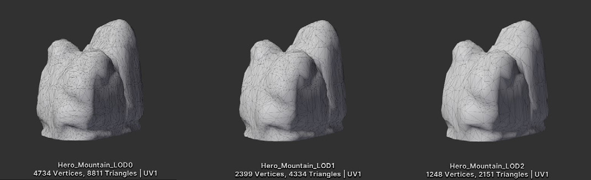

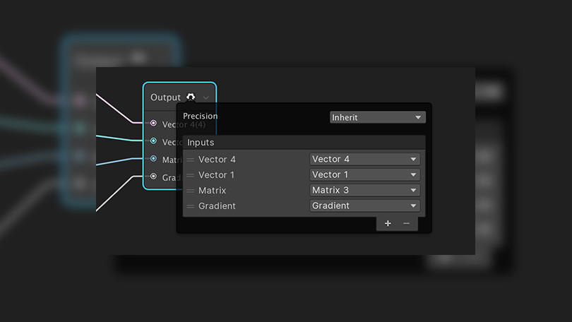
<p><em>VI: Setting <strong>Precision</strong> trên node Shader Graph — mặc định <strong><code>Inherit</code></strong>, đổi được sang <code>Single</code> (<code>float</code>) hoặc <code>Half</code> (<code>half</code>). Đây chính là nơi áp dụng kỹ thuật ② dưới đây. / EN: The Precision setting on a Shader Graph node.</em></p>

<div class="bilingual-row">
<div class="col-vi">
<p><strong>Shader Graph</strong> là giao diện trực quan để tạo shader, được <strong>CẢ HDRP và URP hỗ trợ</strong>. Dùng <strong>150+ node</strong> trong hệ thống graph trực quan — hoặc <em>tự tạo node riêng bằng API</em>.</p>
<p>🔑 <strong>Cơ chế bên dưới:</strong> Shader Graph <em>truyền vào backend của render pipeline</em>. <strong>Kết quả cuối là một shader ShaderLab, về chức năng TƯƠNG TỰ shader viết tay bằng HLSL hoặc Cg.</strong></p>
<p>⚠️ <strong>Nguyên tắc nền tảng:</strong> <em>"Tối ưu Shader Graph tuân theo <strong>nhiều quy tắc GIỐNG như với Shader HLSL/Cg truyền thống</strong>. <strong>Shader Graph càng xử lý NHIỀU, nó càng ẢNH HƯỞNG tới hiệu năng ứng dụng.</strong>"</em></p>
<p>🚨 <strong>Điều kiện tiên quyết — đọc kỹ:</strong></p>
<blockquote>
<p><em>"<strong>Nếu bạn đang CPU-BOUND, tối ưu shader sẽ KHÔNG cải thiện frame rate</strong> — nhưng có thể <strong>cải thiện tuổi thọ PIN</strong> cho nền tảng mobile."</em></p>
</blockquote>
<p>👉 Nghĩa là: <strong>PHẢI chẩn đoán CPU-bound hay GPU-bound TRƯỚC</strong> (xem <a href="../01-fresher/01-ultimate-guide-to-profiling.md">Module 1 §3</a>). Chỉ khi <strong>GPU-bound</strong> thì 5 hướng dẫn dưới đây mới có tác dụng.</p>
</div>
<div class="col-en">
<p><strong>Shader Graph</strong> is a visual interface for shader creation, supported by <strong>BOTH HDRP and URP</strong>. Use the <strong>150+ nodes</strong> in the visual graph system — or <em>make your own custom nodes with the API</em>.</p>
<p>🔑 <strong>The underlying mechanism:</strong> The Shader Graph <em>passes into the render pipeline's backend</em>. <strong>The final result is a ShaderLab shader, functionally SIMILAR to one written in HLSL or Cg.</strong></p>
<p>⚠️ <strong>The founding principle:</strong> <em>"Optimizing a Shader Graph follows <strong>many of the SAME rules that apply to traditional HLSL/Cg Shaders</strong>. <strong>The MORE processing your Shader Graph does, the MORE it will IMPACT the performance of your application.</strong>"</em></p>
<p>🚨 <strong>The prerequisite — read carefully:</strong></p>
<blockquote>
<p><em>"<strong>If you are CPU-BOUND, optimizing your shaders WON'T improve frame rate</strong> — but may <strong>improve your BATTERY LIFE</strong> for mobile platforms."</em></p>
</blockquote>
<p>👉 Meaning: <strong>you MUST diagnose CPU-bound vs GPU-bound FIRST</strong> (see <a href="../01-fresher/01-ultimate-guide-to-profiling.md">Module 1 §3</a>). Only when <strong>GPU-bound</strong> do the five guidelines below help.</p>
</div>
</div>

| # | Kỹ thuật / Technique | Chi tiết |
|---|---|---|
| **①** | **Decimate your nodes**<br>*Loại bỏ node thừa* | **Gỡ node không dùng.** ⚠️ *"ĐỪNG đổi bất kỳ giá trị mặc định nào hay nối node trừ khi những thay đổi đó là CẦN THIẾT."* ✅ **Shader Graph tự động compile-out mọi tính năng không dùng.** 💎 **Khi có thể, BAKE giá trị vào TEXTURE** — ví dụ *thay vì dùng node để làm sáng texture, hãy áp độ sáng thêm vào chính texture asset* |
| **②** | **Use a smaller data format**<br>*Dùng định dạng dữ liệu nhỏ hơn* | **Chuyển sang cấu trúc dữ liệu NHỎ HƠN khi có thể.** Cân nhắc **`Vector2` thay vì `Vector3`** nếu không ảnh hưởng dự án. Cũng có thể **GIẢM ĐỘ CHÍNH XÁC** nếu tình huống cho phép — ví dụ **`half` thay vì `float`** *(giảm precision ở Output node)* |
| **③** | **Reduce math operations**<br>*Giảm phép toán* | *"Thao tác shader chạy RẤT NHIỀU LẦN mỗi giây, nên hãy tối ưu mọi toán tử khi có thể."* → **Cố BLEND kết quả thay vì tạo NHÁNH LOGIC** · **Dùng hằng số** · **Kết hợp giá trị vô hướng TRƯỚC khi áp dụng vector** · **Chuyển mọi property KHÔNG cần xuất hiện trong Inspector thành in-line Node**. 💡 *"Tất cả những tăng tốc từng chút này đều có thể giúp frame budget của bạn"* |
| **④** | **Branch a preview**<br>*Tách nhánh preview* | 🔑 *"Khi graph lớn hơn, nó có thể trở nên CHẬM HƠN để compile."* ✅ Đơn giản hóa workflow bằng **một nhánh RIÊNG, NHỎ HƠN chỉ chứa thao tác bạn muốn preview**, rồi lặp nhanh hơn trên nhánh nhỏ này. 💎 **Nếu nhánh KHÔNG nối vào master node, bạn AN TOÀN để lại nó trong graph — Unity gỡ bỏ node không ảnh hưởng output cuối lúc compile** |
| **⑤** | **Manually optimize**<br>*Tối ưu thủ công* | *"Kể cả khi bạn là graphics programmer giàu kinh nghiệm, bạn VẪN có thể dùng Shader Graph để đặt nền boilerplate code cho shader viết tay."* → Chọn Shader Graph asset → **Copy Shader** từ context menu → tạo Shader HLSL/Cg mới → paste vào. ⚠️ **Đây là thao tác MỘT CHIỀU**, nhưng cho phép bạn **vắt thêm hiệu năng bằng tối ưu thủ công** |

!!! tip "Dọn Always Included Shaders"
    **VI:** *"**GỠ MỌI shader bạn KHÔNG dùng** khỏi danh sách **Always Included** trong Graphics Settings (`Edit > Project Settings > Graphics`). Chỉ thêm vào đây những shader cần thiết cho **vòng đời của ứng dụng**."*

    **EN:** *"**Remove EVERY shader that you don't use** from the **Always Included** list of shaders in the Graphics Settings (`Edit > Project Settings > Graphics`). Add shaders here needed for the **lifetime of the application**."*

---

## 14. 🧬 Strip Shader Variants — Đọc `Editor.log`

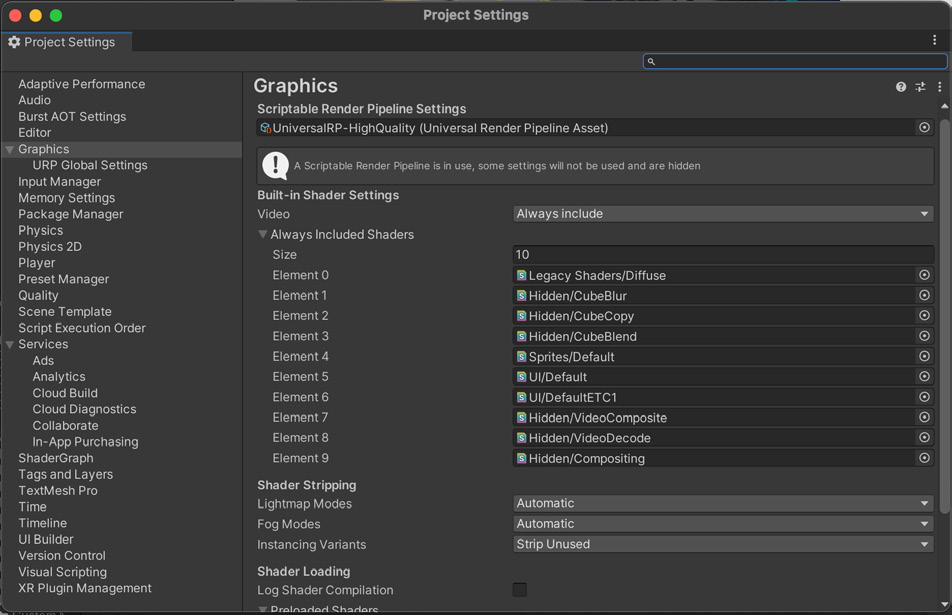 Graphics with the Always Included Shaders list and Shade">
<p><em>VI: <strong>▲ <code>Project Settings › Graphics</code></strong> — danh sách <strong>Always Included Shaders</strong> (Legacy Shaders/Diffuse, Hidden/CubeBlur, Hidden/CubeCopy, Hidden/CubeBlend, Sprites/Default, UI/Default, Hidden/VideoComposite, Hidden/VideoDecode, Hidden/Compositing) và nhóm <strong>Shader Stripping</strong>: <strong>Lightmap Modes Automatic · Fog Modes Automatic · Instancing Variants: Strip Unused</strong>. / EN: Project Settings > Graphics with the Always Included Shaders list and Shader Stripping.</em></p>

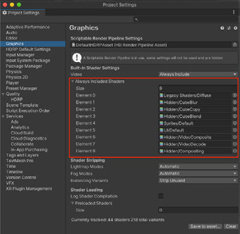
<p><em>VI: <strong>▲ Cùng bảng đó ở dự án HDRP</strong> — <strong>Always Included Shaders khoanh ĐỎ</strong> vì MỌI shader trong danh sách này <strong>LUÔN vào build DÙ CÓ DÙNG HAY KHÔNG</strong>. Dòng cuối cùng cho biết <strong>"Currently tracked: 44 shaders 218 total variants"</strong>. / EN: The Always Included Shaders list and the tracked shader-variant count.</em></p>

<div class="bilingual-row">
<div class="col-vi">
<p>Bạn dùng <strong>shader compilation pragma directive</strong> để compile shader khác nhau cho các nền tảng đích. Rồi dùng <strong>shader keyword</strong> (hoặc <em>Shader Graph Keyword node</em>) để tạo <strong>shader variant</strong> với tính năng bật/tắt.</p>
<p>⚖️ <strong>Đánh đổi:</strong> <em>"Shader variant CÓ ÍCH cho tính năng đặc thù nền tảng <strong>nhưng LÀM TĂNG build time và kích thước file</strong>. Bạn có thể <strong>NGĂN shader variant khỏi được đưa vào build, NẾU bạn biết chúng KHÔNG cần thiết</strong>."</em></p>
<p>🔍 <strong>Cách chẩn đoán — parse <code>Editor.log</code>:</strong></p>
<p>Tìm các dòng bắt đầu bằng <strong>"Compiled shader"</strong> và <strong>"Compressed shader"</strong>.</p>
</div>
<div class="col-en">
<p>You use <strong>shader compilation pragma directives</strong> to compile the shader differently for target platforms. Then use a <strong>shader keyword</strong> (or a <em>Shader Graph Keyword node</em>) to create <strong>shader variants</strong> with features enabled or disabled.</p>
<p>⚖️ <strong>The trade-off:</strong> <em>"Shader variants can be USEFUL for platform-specific features <strong>but INCREASE build times and file size</strong>. You can <strong>PREVENT shader variants from being included in your build, IF you know they are NOT required</strong>."</em></p>
<p>🔍 <strong>How to diagnose — parse <code>Editor.log</code>:</strong></p>
<p>Locate the lines that begin with <strong>"Compiled shader"</strong> and <strong>"Compressed shader"</strong>.</p>
</div>
</div>

```
# Ví dụ log NGUYÊN VĂN từ e-book — shader "TEST"
Compiled shader 'TEST Standard (Specular setup)' in 31.23s
        d3d9    (total internal programs: 482, unique: 474)
        d3d11   (total internal programs: 482, unique: 466)
        metal   (total internal programs: 482, unique: 480)
        glcore  (total internal programs: 482, unique: 454)

Compressed shader 'TEST Standard (Specular setup)' on d3d9   from 1.04MB to 0.14MB
Compressed shader 'TEST Standard (Specular setup)' on d3d11  from 1.39MB to 0.12MB
Compressed shader 'TEST Standard (Specular setup)' on metal  from 2.56MB to 0.20MB
Compressed shader 'TEST Standard (Specular setup)' on glcore from 2.04MB to 0.15MB
```

!!! danger "📊 Ba điều log này nói cho bạn biết — phân tích nguyên văn"
    <div class="bilingual-row">
    <div class="col-vi">
    <ol>
    <li>🚨 <strong>Shader này BÙNG NỔ thành 482 VARIANT</strong> do <code>#pragma multi_compile</code> và <code>shader_feature</code>.</li>
    <li>💾 <strong>Unity NÉN shader đưa vào game data</strong> xuống xấp xỉ <em>tổng các kích thước đã nén</em>: <strong>0.14 + 0.12 + 0.20 + 0.15 = 0.61 MB</strong>.</li>
    <li>🔑 <strong>LÚC RUNTIME, Unity GIỮ dữ liệu ĐÃ NÉN trong bộ nhớ (0.61 MB), trong khi dữ liệu cho graphics API HIỆN TẠI của bạn được GIẢI NÉN.</strong> <em>Ví dụ, nếu API hiện tại là <strong>Metal</strong>, phần đó sẽ chiếm <strong>2.56 MB</strong>.</em></li>
    </ol>
    <p>👉 <strong>Đây là con số quan trọng:</strong> một shader duy nhất tốn <strong>0.61 MB nén + 2.56 MB giải nén = ~3.2 MB runtime memory</strong>. Nhân với số shader trong dự án bạn.</p>
    <p><strong>✅ Quy trình khắc phục:</strong></p>
    <blockquote>
    <p><em>"Sau khi build, <strong>Project Auditor có thể parse <code>Editor.log</code> để hiển thị danh sách TẤT CẢ shader, shader keyword, và shader variant được compile vào dự án</strong>. Nó cũng có thể <strong>phân tích <code>Player.log</code> SAU KHI game chạy</strong> — cho bạn thấy <strong>ứng dụng THỰC SỰ compile và dùng những variant nào lúc runtime</strong>.</em></p>
    <p><em>💎 <strong>Dùng thông tin này để xây dựng hệ thống SCRIPTABLE SHADER STRIPPING và giảm số variant. Việc này cải thiện build time, build size, VÀ runtime memory.</strong>"</em></p>
    </blockquote>
    </div>
    <div class="col-en">
    <ol>
    <li>🚨 <strong>The shader EXPANDS into 482 VARIANTS</strong> due to <code>#pragma multi_compile</code> and <code>shader_feature</code>.</li>
    <li>💾 <strong>Unity COMPRESSES the shader included in the game data</strong> to roughly <em>the sum of the compressed sizes</em>: <strong>0.14 + 0.12 + 0.20 + 0.15 = 0.61 MB</strong>.</li>
    <li>🔑 <strong>At RUNTIME, Unity KEEPS the COMPRESSED data in memory (0.61 MB), while the data for your CURRENT graphics API is UNCOMPRESSED.</strong> <em>For example, if your current API was <strong>Metal</strong>, that would account for <strong>2.56 MB</strong>.</em></li>
    </ol>
    <p>👉 <strong>This is the number that matters:</strong> a single shader costs <strong>0.61 MB compressed + 2.56 MB uncompressed = ~3.2 MB of runtime memory</strong>. Multiply by the number of shaders in your project.</p>
    <p><strong>✅ The remediation workflow:</strong></p>
    <blockquote>
    <p><em>"After a build, <strong>Project Auditor can parse the <code>Editor.log</code> to display a list of ALL shaders, shader keywords, and shader variants compiled into a project</strong>. It can also <strong>analyze the <code>Player.log</code> AFTER the game is run</strong> — showing you <strong>what variants the application ACTUALLY compiled and used at runtime</strong>.</em></p>
    <p><em>💎 <strong>Employ this information to build a SCRIPTABLE SHADER STRIPPING system and reduce the number of variants. This can improve build times, build sizes, AND runtime memory usage.</strong>"</em></p>
    </blockquote>
    </div>
    </div>

```csharp
// Scriptable shader stripping — loại bỏ variant KHÔNG cần lúc build
// Scriptable shader stripping — remove unneeded variants at build time
using System.Collections.Generic;
using UnityEditor;
using UnityEditor.Build;
using UnityEditor.Rendering;
using UnityEngine;
using UnityEngine.Rendering;

class ShaderVariantStripper : IPreprocessShaders
{
    public int callbackOrder => 0;

    // Keyword ta biết CHẮC CHẮN không dùng trong dự án
    static readonly ShaderKeyword KwLightmapping   = new ShaderKeyword("LIGHTMAP_ON");
    static readonly ShaderKeyword KwDirectionalLM  = new ShaderKeyword("DIRLIGHTMAP_COMBINED");

    public void OnProcessShader(Shader shader, ShaderSnippetData snippet,
                                IList<ShaderCompilerData> data)
    {
        int before = data.Count;

        // Duyệt NGƯỢC vì ta xóa phần tử trong lúc lặp
        for (int i = data.Count - 1; i >= 0; --i)
        {
            var keywords = data[i].shaderKeywordSet;

            // Ví dụ: dự án chỉ dùng realtime lighting ⇒ strip mọi variant lightmap
            if (keywords.IsEnabled(KwLightmapping) || keywords.IsEnabled(KwDirectionalLM))
                data.RemoveAt(i);
        }

        if (before != data.Count)
            Debug.Log($"[Stripper] {shader.name} / {snippet.passName}: " +
                      $"{before} → {data.Count} variants");
    }
}
```

---

## 15. 🎭 Stencil Buffer trong URP — Hiệu ứng nhìn xuyên vật thể

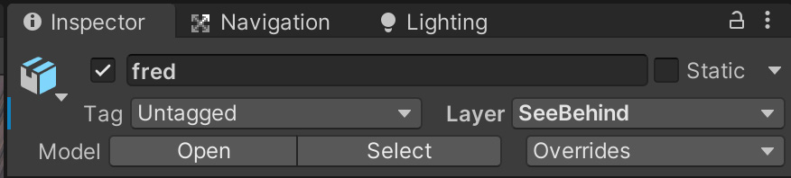
<p><em>VI: <strong>▲ Bước 1 — GÁN LAYER</strong>: GameObject <code>fred</code> được đặt <strong>Layer: <code>SeeBehind</code></strong>. Toàn bộ hiệu ứng dựa trên layer riêng này. / EN: Assigning the GameObject to a dedicated SeeBehind layer.</em></p>

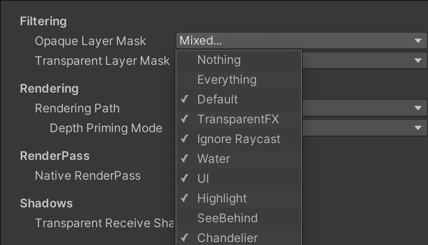
<p><em>VI: <strong>▲ Bước 2 — LOẠI layer đó khỏi pass thường</strong>: <code>Opaque Layer Mask</code> đổi thành <strong>Mixed…</strong>, bỏ tick <strong>SeeBehind</strong> (danh sách còn Default · TransparentFX · Ignore Raycast · Water · UI · Highlight · Chandelier). / EN: Removing the SeeBehind layer from the renderer's Opaque Layer Mask.</em></p>

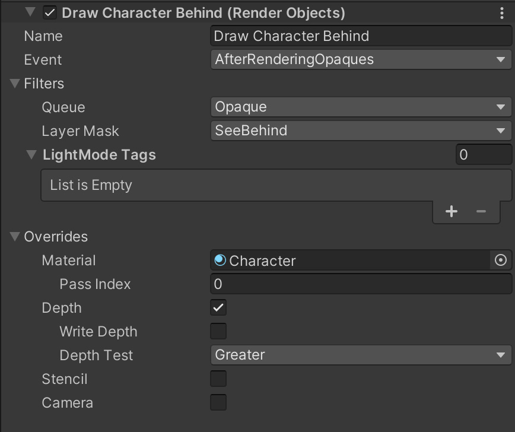
<p><em>VI: <strong>▲ Bước 3 — Renderer Feature <em>Draw Character Behind</em> (Render Objects)</strong>: <strong>Event <code>AfterRenderingOpaques</code></strong> · Filters <strong>Queue Opaque</strong>, <strong>Layer Mask SeeBehind</strong> · Overrides <strong>Material: Character</strong>, <strong>Depth ✓</strong> nhưng <strong>Write Depth ✗</strong> và <strong>Depth Test: Greater</strong> — đúng ba ô này tạo ra hiệu ứng nhìn xuyên tường. / EN: The Draw Character Behind Render Objects feature with Depth Test set to Greater.</em></p>

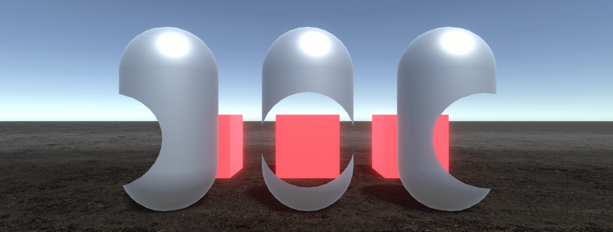
<p><em>VI: Kết quả — <strong>quả cầu Mask "khoét" một lỗ trên viên nang</strong>, cho thấy khối lập phương đỏ phía sau. / EN: The result — the Mask sphere "cuts a hole" through the capsule, revealing the red cube behind it.</em></p>

<div class="bilingual-row">
<div class="col-vi">
<p>🔑 <strong>Vấn đề khởi điểm:</strong></p>
<blockquote>
<p><em>"Tính tới thời điểm viết bài, <strong>công cụ Shader Graph của Unity KHÔNG cho phép người dùng set Stencil Buffer trên shader</strong>. Chúng ta có thể <strong>lách qua bằng cách tạo một shader RẤT ĐƠN GIẢN rồi cấu hình các tùy chọn stencil buffer thông qua Forward Renderer của URP</strong>."</em></p>
</blockquote>
<p><strong>BƯỚC 1 — Tạo shader Mask tối giản:</strong></p>
</div>
<div class="col-en">
<p>🔑 <strong>The starting problem:</strong></p>
<blockquote>
<p><em>"As of this writing, <strong>Unity's Shader Graph tool doesn't allow users to set Stencil Buffers on a shader</strong>. We can <strong>get around this by creating a VERY SIMPLE shader and then configuring the stencil buffer options using the URP's Forward Renderer</strong>."</em></p>
</blockquote>
<p><strong>STEP 1 — Create the minimal Mask shader:</strong></p>
</div>
</div>

```hlsl
// Create > Shader > Unlit Shader, đặt tên "mask", thay TOÀN BỘ nội dung bằng:
Shader "Custom/Mask"
{
    Properties{}
    SubShader{
        Tags {
            "RenderType" = "Opaque"   // để Mask render CÙNG các shader Opaque khác
        }
        Pass {
            ZWrite Off                // KHÔNG render pixel nào ⇒ ta KHÔNG THẤY mask
        }
    }
}
```

<div class="bilingual-row">
<div class="col-vi">
<p><em>"Ta set <strong><code>RenderType = Opaque</code></strong> để Mask được render cùng các shader Opaque khác. <strong><code>ZWrite Off</code></strong> bảo renderer <strong>KHÔNG render pixel nào, nên ta sẽ KHÔNG NHÌN THẤY mask</strong>."</em> → Chuột phải shader → <strong>Create → Material</strong>.</p>
<p><strong>BƯỚC 2 — Setup Scene:</strong></p>
<ol>
<li>Tạo <strong>3D Cube</strong> tại <code>0, 0, 3</code></li>
<li>Tạo <strong>3D Capsule</strong> tại <code>0, 0, 0</code>, đặt tên <strong>'SeeThrough'</strong></li>
<li>Đổi Layer của nó → <strong>Add Layer…</strong> → thêm <strong>2 layer mới: <code>Mask</code> và <code>SeeThrough</code></strong></li>
<li>Gán Capsule vào layer <strong><code>SeeThrough</code></strong></li>
<li>Tạo <strong>3D Sphere</strong> tại <code>0, 0, -1</code>, đặt tên <strong>'Mask'</strong>, gán vào layer <strong><code>Mask</code></strong></li>
<li>Trong Mesh Renderer của nó, đổi material từ <em>'Lit'</em> sang <strong>material mask</strong> của bạn</li>
<li>Đổi <strong>Cast Shadows → 'Off'</strong></li>
</ol>
</div>
<div class="col-en">
<p><em>"We set <strong><code>RenderType = Opaque</code></strong> so that our Mask will be rendered with other Opaque shaders. <strong><code>ZWrite Off</code></strong> tells the renderer <strong>to NOT render any pixels, so we won't SEE our mask</strong>."</em> → Right-click the shader → <strong>Create → Material</strong>.</p>
<p><strong>STEP 2 — Scene setup:</strong></p>
<ol>
<li>Create a <strong>3D Cube</strong> at <code>0, 0, 3</code></li>
<li>Create a <strong>3D Capsule</strong> at <code>0, 0, 0</code>, name it <strong>'SeeThrough'</strong></li>
<li>Change its Layer → <strong>Add Layer…</strong> → add <strong>two new Layers: <code>Mask</code> and <code>SeeThrough</code></strong></li>
<li>Assign the Capsule to the <strong><code>SeeThrough</code></strong> layer</li>
<li>Create a <strong>3D Sphere</strong> at <code>0, 0, -1</code>, name it <strong>'Mask'</strong>, assign it the <strong><code>Mask</code></strong> layer</li>
<li>Under its Mesh Renderer change the material from <em>'Lit'</em> to your <strong>mask material</strong></li>
<li>Change <strong>Cast Shadows → 'Off'</strong></li>
</ol>
</div>
</div>

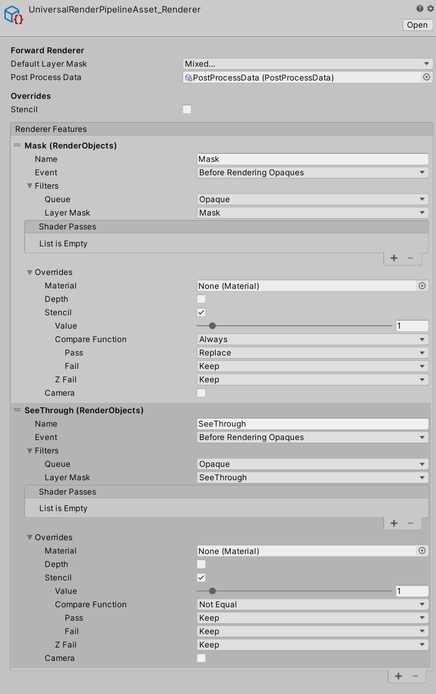
<p><em>VI: Cấu hình hoàn chỉnh trên Forward Renderer — 2 Renderer Feature <strong>Mask</strong> và <strong>SeeThrough</strong> với setting Stencil khác nhau. / EN: The completed Forward Renderer configuration with two Render Objects features.</em></p>

!!! success "BƯỚC 3 — Cấu hình Stencil qua URP Forward Renderer"
    <div class="bilingual-row">
    <div class="col-vi">
    <ol>
    <li>Tìm <strong>Forward Renderer</strong> trong Project panel (mặc định tên <code>UniversalRenderPipelineAsset_Renderer</code>)</li>
    <li>Dưới <strong>Default Layer Mask</strong>, <strong>BỎ TICK <code>SeeThrough</code> và <code>Mask</code></strong> — <em>ngăn renderer render 2 layer này</em></li>
    <li>Thêm chúng lại bằng cách bấm <strong>+</strong> dưới <strong>Renderer Features</strong> → <strong>Render Objects (Experimental)</strong></li>
    <li><strong>Feature 1 — đặt tên <code>Mask</code>:</strong>
      <ul>
      <li>Event → <strong>Before Rendering Opaques</strong></li>
      <li>Layer Mask → <strong><code>Mask</code></strong></li>
      <li>Tick <strong>Stencil</strong>: <strong>Value = 1</strong> · <strong>Compare = Always</strong> · <strong>Pass = Replace</strong></li>
      </ul>
    </li>
    <li><strong>Feature 2 — đặt tên <code>SeeThrough</code>:</strong>
      <ul>
      <li>Event → <strong>Before Rendering Opaques</strong></li>
      <li>Layer Mask → <strong><code>SeeThrough</code></strong></li>
      <li>Tick <strong>Stencil</strong>: <strong>Value = 1</strong> · <strong>Compare = NotEqual</strong></li>
      </ul>
    </li>
    </ol>
    <p>⚠️ <strong>Bug cần biết:</strong> <em>"Có thể có bug ngăn thay đổi của bạn được lưu — cụ thể ở các mục Renderer Features. Nếu bạn thêm renderer feature rồi <strong>SAVE SCENE</strong>, chúng sẽ hiện ra trong Project panel <strong>lồng dưới Renderer của bạn</strong>. Bấm vào từng cái sẽ cho phép cập nhật giá trị. Nếu vẫn không cập nhật, <strong>xóa đi và thêm lại</strong>."</em></p>
    </div>
    <div class="col-en">
    <ol>
    <li>Find your <strong>Forward Renderer</strong> in the Project panel (default name <code>UniversalRenderPipelineAsset_Renderer</code>)</li>
    <li>Under <strong>Default Layer Mask</strong>, <strong>UNCHECK <code>SeeThrough</code> and <code>Mask</code></strong> — <em>this prevents the renderer from rendering these two layers</em></li>
    <li>Add them back by clicking <strong>+</strong> under <strong>Renderer Features</strong> → <strong>Render Objects (Experimental)</strong></li>
    <li><strong>Feature 1 — name it <code>Mask</code>:</strong>
      <ul>
      <li>Event → <strong>Before Rendering Opaques</strong></li>
      <li>Layer Mask → <strong><code>Mask</code></strong></li>
      <li>Check <strong>Stencil</strong>: <strong>Value = 1</strong> · <strong>Compare = Always</strong> · <strong>Pass = Replace</strong></li>
      </ul>
    </li>
    <li><strong>Feature 2 — name it <code>SeeThrough</code>:</strong>
      <ul>
      <li>Event → <strong>Before Rendering Opaques</strong></li>
      <li>Layer Mask → <strong><code>SeeThrough</code></strong></li>
      <li>Check <strong>Stencil</strong>: <strong>Value = 1</strong> · <strong>Compare = NotEqual</strong></li>
      </ul>
    </li>
    </ol>
    <p>⚠️ <strong>A bug to know:</strong> <em>"There may be a bug that prevents your changes from saving — specifically on the Renderer Features items. If you add the renderer features, then <strong>SAVE YOUR SCENE</strong>, you should see them pop up in the Project panel <strong>nested under your Renderer</strong>. Clicking these individually should let you update the values. If it really isn't updating, <strong>delete it and re-add</strong>."</em></p>
    </div>
    </div>

### 15.1. 🔬 Vì sao nó hoạt động — Giải thích cơ chế

<div class="bilingual-row">
<div class="col-vi">
<blockquote>
<p><em>"Đầu tiên, chúng ta <strong>lấy layer Mask và SeeThrough RA KHỎI Forward Renderer HOÀN TOÀN</strong>. Ở điểm này, khi chưa thêm Renderer Feature nào, chúng sẽ <em>biến mất hoàn toàn khỏi tầm nhìn</em>.</em></p>
<p><em>Ngay sau đó, chúng ta <strong>thêm vào 2 Render Objects feature</strong>, gán một cái cho layer <code>Mask</code> và cái kia cho layer <code>SeeThrough</code> <strong>tại event Before Rendering Opaques</strong>. Việc này bảo Renderer <em>thêm lại 2 layer đó vào việc render TRƯỚC khi các shader Opaque khác được render</em>. Cuối cùng, chúng ta <strong>ghi đè tùy chọn stencil buffer cho CẢ HAI layer</strong>.</em></p>
<p><em>🔑 <strong>Với layer <code>Mask</code></strong>: dùng compare function <strong><code>Always</code></strong> nghĩa là <em>thao tác Pass LUÔN được chạy</em>. Đặt <strong>Pass = <code>Replace</code></strong> nghĩa là <strong>TẤT CẢ pixel BÊN TRONG mesh mask sẽ có giá trị stencil được set = 1</strong>.</em></p>
<p><em>🔑 <strong>Với layer <code>SeeThrough</code></strong>: đặt compare function <strong><code>NotEqual</code></strong> nghĩa là <strong>TẤT CẢ pixel trên layer SeeThrough có giá trị Stencil KHÁC 1 sẽ được render</strong>. <strong>Vì các pixel PHÍA SAU mask đã được set = 1 ở bước trước, điều này nghĩa là MỌI THỨ phía sau quả cầu mask sẽ KHÔNG được render.</strong>"</em></p>
</blockquote>
</div>
<div class="col-en">
<blockquote>
<p><em>"First, we <strong>took our Mask and SeeThrough layers OUT of the Forward Renderer COMPLETELY</strong>. At this point, without adding any Renderer Features, they should <em>disappear completely from view</em>.</em></p>
<p><em>Immediately after that, we <strong>added in two Render Objects features</strong> and assigned one to the <code>Mask</code> layer and another to the <code>SeeThrough</code> layer <strong>at the Before Rendering Opaques event</strong>. This told our Renderer to <em>add back in those two layers to rendering BEFORE other Opaque shaders are rendered</em>. Finally, we <strong>overrode the stencil buffer options for those two entire layers</strong>.</em></p>
<p><em>🔑 <strong>For the <code>Mask</code> layer</strong>: using a compare function of <strong><code>Always</code></strong> means <em>the Pass operation is ALWAYS run</em>. Setting <strong>Pass = <code>Replace</code></strong> means that <strong>ALL the pixels INSIDE our mask's mesh will have a stencil value set to 1</strong>.</em></p>
<p><em>🔑 <strong>For the <code>SeeThrough</code> layer</strong>: setting the compare function to <strong><code>NotEqual</code></strong> means that <strong>ALL the pixels on layer SeeThrough with a Stencil value NOT EQUAL to 1 will be rendered</strong>. <strong>Because the pixels BEHIND our mask were set to 1 in the earlier step, this means that EVERYTHING behind our mask sphere will NOT be rendered.</strong>"</em></p>
</blockquote>
</div>
</div>

!!! danger "🚨 Ba lưu ý QUAN TRỌNG"
    <div class="bilingual-row">
    <div class="col-vi">
    <p><strong>① THỨ TỰ QUAN TRỌNG</strong></p>
    <blockquote>
    <p><em>"<strong>Thứ tự rất quan trọng ở đây.</strong> Nếu bạn đặt Render Objects Feature <code>SeeThrough</code> <strong>PHÍA TRÊN</strong> <code>Mask</code>, thì <strong>Mask sẽ set giá trị = 1 SAU KHI layer SeeThrough đã làm phép kiểm tra của nó, và KHÔNG có gì xảy ra cả</strong>."</em></p>
    </blockquote>
    <p><strong>② Xung đột với Cascading Shadows</strong></p>
    <blockquote>
    <p><em>"Cũng đáng lưu ý, <strong>nếu bạn dùng Cascading Shadows trong URP renderer, hiện có vẻ có một GLITCH khiến chúng render ĐÈ LÊN layer SeeThrough của bạn. TẮT Cascades sẽ render bình thường trở lại.</strong>"</em></p>
    </blockquote>
    <p><strong>③ Vì sao Pass và Fail của SeeThrough vẫn là <code>Keep</code></strong></p>
    <blockquote>
    <p><em>"<strong><code>Keep</code> đơn giản nghĩa là giá trị buffer KHÔNG thay đổi — nó vẫn là 1.</strong></em></p>
    <p><em>🔑 <strong>Compare function làm HAI việc:</strong> Thứ nhất, nó <strong>CHỈ render những pixel KHỚP điều kiện của nó</strong> dùng giá trị tham chiếu. Thứ hai, <strong>dựa trên việc điều kiện trả về true hay false, thao tác pass hoặc fail được chạy</strong>. Điều này cho tùy chọn <strong>thay đổi lại giá trị tham chiếu</strong>."</em></p>
    </blockquote>
    <p>💡 <strong>Ứng dụng mở rộng (theo tác giả):</strong> <em>"Có RẤT NHIỀU tính năng hay ho khác ta có thể làm với Render Objects. Ta có thể dùng nó để <strong>hiện OUTLINE của các đơn vị đang trốn sau tòa nhà</strong>, hoặc dùng nó để <strong>áp material tùy chỉnh lên object ở những điểm nhất định trong quá trình render</strong>."</em></p>
    </div>
    <div class="col-en">
    <p><strong>① ORDER MATTERS</strong></p>
    <blockquote>
    <p><em>"<strong>The ordering is important here.</strong> If you put the <code>SeeThrough</code> Render Objects Feature <strong>ABOVE</strong> the <code>Mask</code>, the <strong>Mask will set the value to 1 AFTER the SeeThrough layer does its check, and NOTHING will happen</strong>."</em></p>
    </blockquote>
    <p><strong>② Conflict with Cascading Shadows</strong></p>
    <blockquote>
    <p><em>"Also worth noting, <strong>if you are using Cascading Shadows in your URP renderer, currently there seems to be a GLITCH that they render ABOVE your SeeThrough layer. Turning Cascades OFF should render as normal.</strong>"</em></p>
    </blockquote>
    <p><strong>③ Why SeeThrough's Pass and Fail are still <code>Keep</code></strong></p>
    <blockquote>
    <p><em>"<strong><code>Keep</code> simply means that the buffer value doesn't change — it remains 1.</strong></em></p>
    <p><em>🔑 <strong>The compare function does TWO things:</strong> First, it <strong>ONLY renders the pixels that MATCH its condition</strong> using the reference value. Second, <strong>based on whether the condition comes back true or false, the pass or fail operations are run</strong>. This gives the option to <strong>change the reference value again</strong>."</em></p>
    </blockquote>
    <p>💡 <strong>Extended applications (per the author):</strong> <em>"There are a LOT more cool features we can do with the Render Objects feature. We could use it to <strong>show OUTLINES of units hiding behind buildings</strong>, or use it to <strong>apply custom materials to objects at certain points in our render</strong>."</em></p>
    </div>
    </div>

---

# PHẦN E — LIGHTING

## 16. Giới hạn đèn trong URP — Ba con số phải nhớ

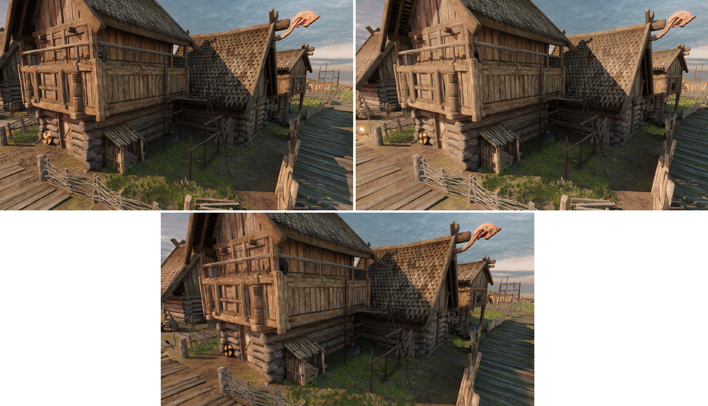

<div class="bilingual-row">
<div class="col-vi">
<p>🔑 <strong>URP được xây dựng với real-time lighting ĐÃ TỐI ƯU trong đầu.</strong> URP Forward Renderer hỗ trợ:</p>
<ul>
<li><strong>Tối đa 8 đèn real-time TRÊN MỖI OBJECT</strong></li>
<li><strong>Tối đa 256 đèn real-time TRÊN MỖI CAMERA</strong> — cho game <strong>desktop</strong></li>
<li><strong>32 đèn real-time TRÊN MỖI CAMERA</strong> — cho <strong>mobile và thiết bị cầm tay</strong></li>
</ul>
<p>💡 URP cũng cho phép <strong>cấu hình Light setting theo từng object bên trong Pipeline Asset</strong> để kiểm soát lighting tinh vi hơn.</p>
</div>
<div class="col-en">
<p>🔑 <strong>URP is built with OPTIMIZED real-time lighting in mind.</strong> The URP Forward Renderer supports:</p>
<ul>
<li><strong>Up to 8 real-time lights PER OBJECT</strong></li>
<li><strong>Up to 256 real-time lights PER CAMERA</strong> — for <strong>desktop</strong> games</li>
<li><strong>32 real-time lights PER CAMERA</strong> — for <strong>mobile and other handheld platforms</strong></li>
</ul>
<p>💡 URP also allows for <strong>configurable per-object Light settings inside the Pipeline Asset</strong> for refined control over lighting.</p>
</div>
</div>

---

## 17. 💡 Bake Lightmap — Tối ưu lighting hiệu quả NHẤT

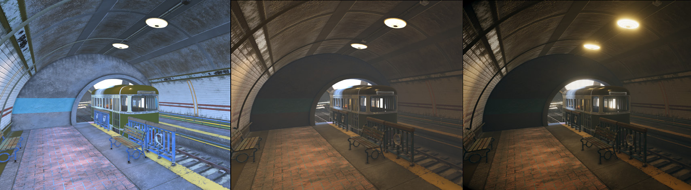
<p><em>VI: Ba thiết lập lighting cho CÙNG một scene — <strong>từ trái sang phải: KHÔNG có dữ liệu lighting · ĐÃ bake lighting · thêm post-processing</strong>. / EN: From left to right: no lighting data, baked lighting, post-processing added.</em></p>

<div class="bilingual-row">
<div class="col-vi">
<p>🔑 <strong>Nguyên tắc vàng:</strong> <em>"<strong>Cách NHANH NHẤT để tạo lighting là cách KHÔNG cần tính TOÁN mỗi frame.</strong> Để làm vậy, dùng <strong>Lightmapping để 'BAKE' static lighting CHỈ MỘT LẦN</strong>, thay vì tính nó real-time."</em></p>
<p>📊 <strong>Con số cụ thể — lợi ích của bake:</strong></p>
<blockquote>
<p><em>"Quá trình tạo môi trường có lightmap mất LÂU HƠN so với chỉ đặt một cái đèn vào scene, <strong>nhưng nó</strong>:</em></p>
<ul>
<li><em>🚀 <strong>chạy NHANH HƠN — nhanh gấp 2–3 LẦN với đèn two-per-pixel</strong></em></li>
<li><em>🎨 <strong>trông ĐẸP HƠN</strong> — Global Illumination có thể <strong>tính toán lighting TRỰC TIẾP và GIÁN TIẾP trông chân thực</strong>. Lightmapper còn <strong>làm mượt (smooth) và khử nhiễu (denoise)</strong> bản đồ kết quả."</em></li>
</ul>
</blockquote>
<p>💎 <strong>Từ e-book URP — lợi ích thêm về batching:</strong></p>
<blockquote>
<p><em>"<strong>Texture lighting đã bake được BATCH vào MỘT draw call DUY NHẤT, mà KHÔNG cần được tính toán liên tục.</strong> Điều này <strong>đặc biệt hữu ích nếu scene của bạn dùng NHIỀU ĐÈN</strong>.</em></p>
<p><em>Một lý do TUYỆT VỜI khác để bake lighting: nó <strong>cho phép render ánh sáng NẢY (bounced) hoặc GIÁN TIẾP trong scene và cải thiện chất lượng thị giác</strong>."</em></p>
</blockquote>
<p>⚡ <strong>Tăng tốc bake:</strong> <em>"Scene phức tạp có thể cần thời gian bake lâu. Nếu phần cứng hỗ trợ <strong>Progressive GPU Lightmapper</strong>, tùy chọn này có thể <strong>tăng tốc việc sinh lightmap ĐÁNG KỂ — TỚI GẤP 10 LẦN trong một số trường hợp</strong>."</em></p>
</div>
<div class="col-en">
<p>🔑 <strong>The golden principle:</strong> <em>"<strong>The FASTEST option to create lighting is one that DOESN'T need to be computed per-frame.</strong> To do this, use <strong>Lightmapping to 'BAKE' static lighting JUST ONCE</strong>, instead of calculating it in real-time."</em></p>
<p>📊 <strong>The concrete numbers — the benefits of baking:</strong></p>
<blockquote>
<p><em>"The process of generating a lightmapped environment takes LONGER than just placing a light in the scene, <strong>but this</strong>:</em></p>
<ul>
<li><em>🚀 <strong>runs FASTER — 2–3 times faster for two-per-pixel lights</strong></em></li>
<li><em>🎨 <strong>looks BETTER</strong> — Global Illumination can <strong>calculate realistic-looking DIRECT and INDIRECT lighting</strong>. The lightmapper <strong>smooths and denoises</strong> the resulting map."</em></li>
</ul>
</blockquote>
<p>💎 <strong>From the URP e-book — the extra batching benefit:</strong></p>
<blockquote>
<p><em>"<strong>The baked lighting textures are BATCHED into a SINGLE draw call, WITHOUT needing to be continuously calculated.</strong> This is <strong>especially useful if your scene uses MULTIPLE LIGHTS</strong>.</em></p>
<p><em>Another GREAT reason to bake your lighting is that it <strong>allows you to render BOUNCED or INDIRECT lighting in your scene and improve the visual quality</strong>."</em></p>
</blockquote>
<p>⚡ <strong>Speeding up baking:</strong> <em>"Complex Scenes may require long bake times. If your hardware supports the <strong>Progressive GPU Lightmapper</strong>, this option can <strong>DRAMATICALLY speed up your lightmap generation — UP TO TENFOLD in some cases</strong>."</em></p>
</div>
</div>

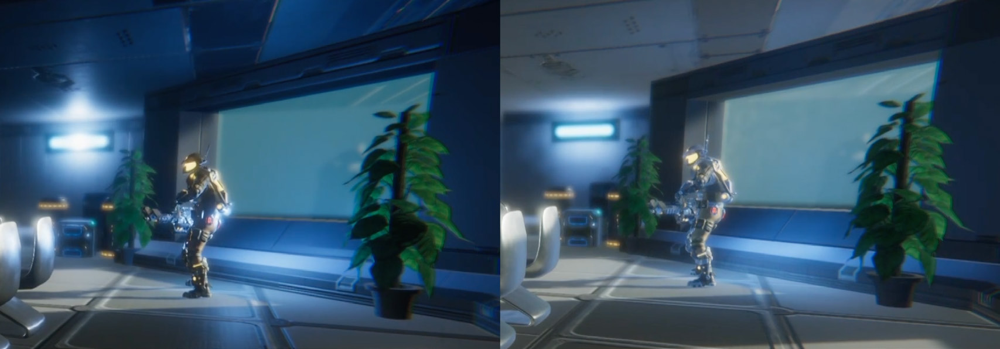
<p><em>VI: Tác động của bake lên bóng đổ — <strong>trước khi bake (trái) và sau khi bake (phải)</strong>. / EN: The effect of light baking on shadows: before baking on the left, and after on the right.</em></p>

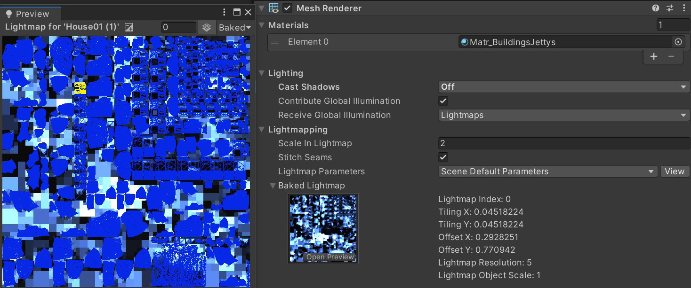
<p><em>VI: Lightmap đã bake trong Inspector — chú ý <strong>Contribute Global Illumination ✓</strong>, <strong>Receive Global Illumination: Lightmaps</strong>, <strong>Scale In Lightmap: 2</strong>, <strong>Lightmap Resolution: 5</strong>. / EN: A baked lightmap in the Inspector with the Mesh Renderer's lightmapping settings.</em></p>

!!! warning "⚠️ Đánh đổi của bake — điều e-book URP nói thẳng"
    <div class="bilingual-row">
    <div class="col-vi">
    <blockquote>
    <p><em>"Trong ảnh trước, bạn có thể thấy <strong>các specular highlight trên mặt đất bị MẤT khi bake. Baked light CHỈ chứa DIFFUSE lighting.</strong></em></p>
    <p><em>✅ <strong>Bất cứ khi nào có thể, hãy TÍNH phần đóng góp lighting TRỰC TIẾP từ REAL-TIME, và để Global Illumination đến từ Image Based Lighting (IBL) / shadow map / Probe.</strong>"</em></p>
    </blockquote>
    <p>💾 <strong>Về bộ nhớ:</strong> <em>"Dùng <strong>Lightmap Resolution và Lightmap Size THẤP NHẤT có thể</strong> khi bake (<code>Window &gt; Rendering &gt; Lighting &gt; Scene</code>). Điều này giúp <strong>GIẢM yêu cầu bộ nhớ texture</strong>."</em></p>
    </div>
    <div class="col-en">
    <blockquote>
    <p><em>"In the previous image, you can see that <strong>the specular highlights on the ground are LOST when baking. Baked lights ONLY contain DIFFUSE lighting.</strong></em></p>
    <p><em>✅ <strong>Whenever possible, COMPUTE the direct lighting contribution from REAL-TIME, and have Global Illumination come from Image Based Lighting (IBL) / shadow maps / Probes.</strong>"</em></p>
    </blockquote>
    <p>💾 <strong>On memory:</strong> <em>"Use the <strong>LOWEST possible Lightmap Resolution and Lightmap Size</strong> when baking (<code>Window &gt; Rendering &gt; Lighting &gt; Scene</code>). This helps to <strong>LOWER the texture memory requirement</strong>."</em></p>
    </div>
    </div>

📝 **Cấu hình Lighting từ ghi chú raw / Lighting config from the raw notes:**

```
Window > Rendering > Lighting:
  · Environment Lighting / Source     → White Color
  · Environment Reflections Source    → Custom
· Dùng Directional Light
· Dùng Baked Lighting
· Shadow projector (thay cho dynamic shadow)
```

---

## 18. Light Probes & Reflection Probes

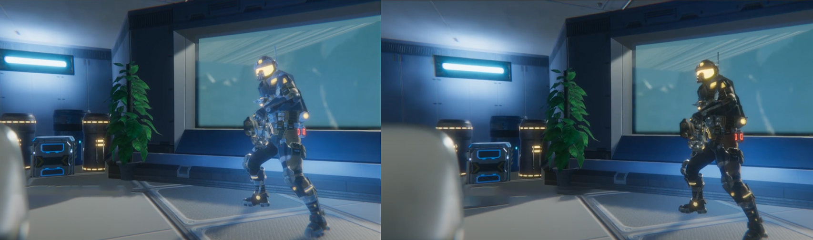
<p><em>VI: Tác động của Light Probe khi render object động — <strong>CÓ Light Probe (trái) và KHÔNG có (phải)</strong>. / EN: The effect of using Light Probes when rendering a dynamic object: with Light Probe on the left, without on the right.</em></p>

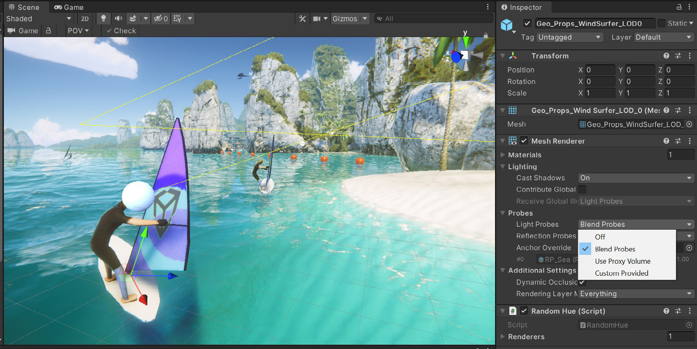
<p><em>VI: Setting <strong>Light Probes: Blend Probes</strong> trên Mesh Renderer (dự án BoatAttack). / EN: The Light Probes: Blend Probes setting on a Mesh Renderer.</em></p>

<div class="bilingual-row">
<div class="col-vi">
<p>🔑 <strong>LIGHT PROBES — cơ chế:</strong></p>
<blockquote>
<p><em>"Light Probe <strong>SAMPLE dữ liệu lighting trong scene TRONG LÚC BAKE</strong>, và cho phép <strong>thông tin ánh sáng NẢY được dùng bởi các object ĐỘNG khi chúng di chuyển hoặc thay đổi</strong>. Điều này giúp chúng <strong>HÒA HỢP và cảm giác TỰ NHIÊN hơn</strong> trong môi trường lighting đã bake."</em></p>
</blockquote>
<p>💎 <strong>Lợi ích đặc biệt:</strong> <em>"Light Probe <strong>thêm tính TỰ NHIÊN cho render mà KHÔNG LÀM TĂNG thời gian xử lý một frame</strong>. Điều này khiến chúng <strong>PHÙ HỢP với MỌI phần cứng — kể cả thiết bị mobile cấp thấp</strong>."</em></p>
<p><strong>Từ e-book Console/PC — chi tiết kỹ thuật:</strong></p>
<blockquote>
<p><em>"Light Probe <strong>lưu thông tin lighting đã bake về KHÔNG GIAN TRỐNG</strong> trong Scene, đồng thời cung cấp <strong>lighting CHẤT LƯỢNG CAO (cả trực tiếp lẫn gián tiếp)</strong>.</em></p>
<p><em>🔑 <strong>Chúng dùng SPHERICAL HARMONICS — tính toán RẤT NHANH so với đèn động.</strong> Điều này <strong>đặc biệt hữu ích cho object DI CHUYỂN</strong>, vốn thường KHÔNG nhận được baked lightmapping."</em></p>
</blockquote>
<p>💡 <strong>Chiến lược lai — rất giá trị:</strong></p>
<blockquote>
<p><em>"<strong>Tiếp tục dùng lightmapping cho geometry level NỔI BẬT, nhưng CHUYỂN các chi tiết NHỎ sang probe lighting.</strong></em></p>
<p><em>✅ <strong>Light Probe illumination KHÔNG đòi hỏi UV đúng chuẩn</strong> ⇒ <em>tiết kiệm bước unwrap mesh</em>. <strong>Probe cũng GIẢM dung lượng đĩa vì chúng KHÔNG sinh ra lightmap texture.</strong>"</em></p>
</blockquote>
<p>💡 Light Probe <strong>cũng áp dụng được cho static mesh</strong>: trong component MeshRenderer, tìm dropdown <strong>Receive Global Illumination</strong> và chuyển từ <strong>Lightmaps</strong> sang <strong>Light Probes</strong>.</p>
</div>
<div class="col-en">
<p>🔑 <strong>LIGHT PROBES — the mechanism:</strong></p>
<blockquote>
<p><em>"Light Probes <strong>SAMPLE the lighting data in the scene DURING BAKING</strong>, and allow the <strong>bounced light information to be used by DYNAMIC objects as they move or change</strong>. This helps them <strong>BLEND INTO and feel MORE NATURAL</strong> in the baked lighting environment."</em></p>
</blockquote>
<p>💎 <strong>The special benefit:</strong> <em>"Light Probes <strong>add naturalism to a render WITHOUT INCREASING the processing time for a rendered frame</strong>. This makes them <strong>suitable for ALL hardware — even low-end mobile devices</strong>."</em></p>
<p><strong>From the Console/PC e-book — technical detail:</strong></p>
<blockquote>
<p><em>"Light Probes <strong>store baked lighting information about the EMPTY SPACE</strong> in your Scene, while providing <strong>HIGH-QUALITY lighting (both direct and indirect)</strong>.</em></p>
<p><em>🔑 <strong>They use SPHERICAL HARMONICS, which calculate VERY QUICKLY compared to dynamic lights.</strong> This is <strong>especially useful for MOVING objects</strong>, which normally cannot receive baked lightmapping."</em></p>
</blockquote>
<p>💡 <strong>The hybrid strategy — very valuable:</strong></p>
<blockquote>
<p><em>"<strong>Continue using lightmapping for your PROMINENT level geometry, but SWITCH SMALLER details to probe lighting.</strong></em></p>
<p><em>✅ <strong>Light Probe illumination does NOT require proper UVs</strong> ⇒ <em>saving you the extra step of unwrapping meshes</em>. <strong>Probes also REDUCE disk space since they don't generate lightmap textures.</strong>"</em></p>
</blockquote>
<p>💡 Light Probes <strong>can apply to static meshes as well</strong>: in the MeshRenderer component, locate the <strong>Receive Global Illumination</strong> dropdown and toggle it from <strong>Lightmaps</strong> to <strong>Light Probes</strong>.</p>
</div>
</div>

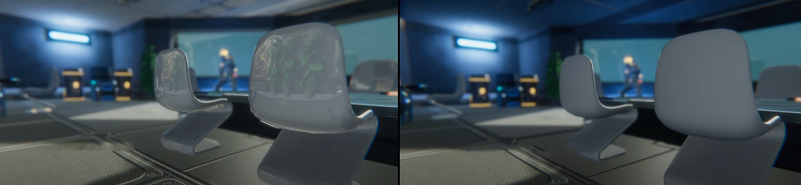
<p><em>VI: Tác động của Reflection Probe trên bề mặt nhẵn — <strong>CÓ Reflection Probe (trái) và KHÔNG có (phải)</strong>. / EN: The effect of using Reflection Probes on smooth surfaces.</em></p>

!!! danger "🪞 REFLECTION PROBES — Đắt đỏ về batch, phải tối ưu"
    <div class="bilingual-row">
    <div class="col-vi">
    <p><strong>Từ e-book URP:</strong> <em>"Reflection Probe <strong>chiếu các phần của môi trường lên geometry lân cận để tạo phản chiếu chân thực hơn</strong>. Mặc định Unity dùng <strong>Skybox làm reflection map</strong>. Nhưng khi dùng một hay nhiều Reflection Probe, <strong>phản chiếu sẽ KHỚP với môi trường xung quanh SÁT HƠN</strong>."</em></p>
    <p>💾 <em>"<strong>Kích thước cubemap sinh ra khi bake Reflection Probe PHỤ THUỘC vào việc Camera tiến gần object phản chiếu tới đâu.</strong> LUÔN đảm bảo dùng <strong>kích thước map NHỎ NHẤT phù hợp nhu cầu</strong> để tối ưu scene."</em></p>
    <p>🚨 <strong>Từ e-book Console/PC — cảnh báo mạnh hơn:</strong></p>
    <blockquote>
    <p><em>"Reflection Probe có thể tạo phản chiếu chân thực, <strong>nhưng điều này có thể RẤT TỐN KÉM VỀ BATCH</strong>.</em></p>
    <p><em>✅ Dùng <strong>cubemap ĐỘ PHÂN GIẢI THẤP, culling mask, và nén texture</strong> để cải thiện hiệu năng runtime.</em></p>
    <p><em>✅ <strong>Dùng <code>Type: Baked</code> để TRÁNH cập nhật mỗi frame.</strong></em></p>
    <p><em>⚠️ <strong>Nếu BẮT BUỘC dùng <code>Type: Realtime</code> trong URP: TRÁNH <code>Every Frame</code> nếu có thể.</strong> Điều chỉnh setting <strong>Refresh Mode và Time Slicing</strong> để giảm tốc độ cập nhật. Bạn cũng có thể kiểm soát refresh bằng tùy chọn <strong><code>Via Scripting</code></strong> và render probe từ script tùy chỉnh.</em></p>
    <p><em>⚠️ <strong>Nếu BẮT BUỘC dùng <code>Type: Realtime</code> trong HDRP: dùng chế độ <code>On Demand</code>.</strong> Cũng có thể sửa Frame Settings ở <code>Project Settings &gt; HDRP Default Settings</code> — <strong>giảm chất lượng và tính năng dưới <code>Realtime Reflection</code></strong>."</em></p>
    </blockquote>
    </div>
    <div class="col-en">
    <p><strong>From the URP e-book:</strong> <em>"Reflection Probes <strong>project parts of the environment onto nearby geometry to create MORE REALISTIC reflections</strong>. By default Unity uses the <strong>Skybox as the reflection map</strong>. But by using one or more Reflection Probes, <strong>the reflections will MATCH their surroundings MORE CLOSELY</strong>."</em></p>
    <p>💾 <em>"<strong>The size of the cubemap generated when baking Reflection Probes DEPENDS on how close the Camera gets to a reflective object.</strong> ALWAYS make sure to use the <strong>SMALLEST map size that suits your needs</strong>."</em></p>
    <p>🚨 <strong>From the Console/PC e-book — a stronger warning:</strong></p>
    <blockquote>
    <p><em>"A Reflection Probe can create realistic reflections, <strong>but this can be VERY COSTLY in terms of BATCHES</strong>.</em></p>
    <p><em>✅ Use <strong>LOW-RESOLUTION cubemaps, culling masks, and texture compression</strong> to improve runtime performance.</em></p>
    <p><em>✅ <strong>Use <code>Type: Baked</code> to AVOID per-frame updates.</strong></em></p>
    <p><em>⚠️ <strong>If <code>Type: Realtime</code> is necessary in URP: AVOID <code>Every Frame</code> if possible.</strong> Adjust the <strong>Refresh Mode and Time Slicing</strong> settings to reduce the update rate. You can also control the refresh with the <strong><code>Via Scripting</code></strong> option and render the probe from a custom script.</em></p>
    <p><em>⚠️ <strong>If <code>Type: Realtime</code> is necessary in HDRP: use <code>On Demand</code> mode.</strong> You can also modify Frame Settings in <code>Project Settings &gt; HDRP Default Settings</code> — <strong>reduce the quality and features under <code>Realtime Reflection</code></strong>."</em></p>
    </blockquote>
    </div>
    </div>

---

## 19. 🌑 Shadow — Point Light tốn GẤP 6 LẦN

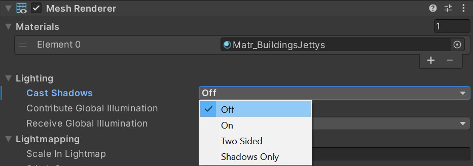
<p><em>VI: <strong>▲ Tắt bóng cho TỪNG object</strong> — <code>Mesh Renderer › Lighting › Cast Shadows</code>: <strong>Off · On · Two Sided · Shadows Only</strong>. <em>Shadows Only</em> hữu ích khi bạn muốn bóng mà KHÔNG muốn vẽ chính vật thể. / EN: The Mesh Renderer Cast Shadows options.</em></p>

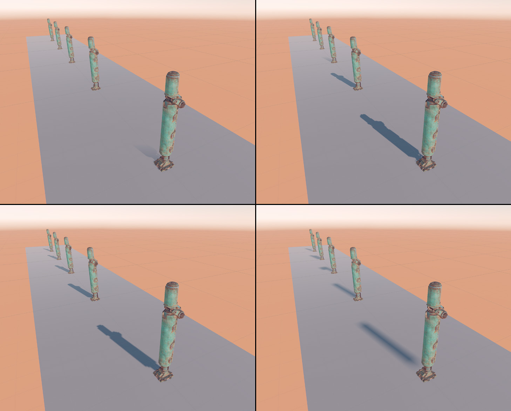
<p><em>VI: Shadow Cascades trong URP. / EN: Shadow Cascades in URP.</em></p>

<div class="bilingual-row">
<div class="col-vi">
<p><strong>Tắt shadow ở nơi có thể:</strong> <em>"Shadow casting có thể tắt <strong>theo TỪNG MeshRenderer và TỪNG đèn</strong>. <strong>TẮT shadow bất cứ khi nào có thể để GIẢM draw call.</strong>"</em></p>
<p>💡 <strong>Thay thế bằng shadow giả:</strong> <em>"Bạn cũng có thể tạo <strong>shadow GIẢ bằng một texture đã làm mờ áp lên mesh hoặc quad ĐƠN GIẢN bên dưới nhân vật</strong>. Hoặc bạn có thể <strong>tạo blob shadow bằng shader tùy chỉnh</strong>."</em></p>
<p>🚨 <strong>Con số quan trọng nhất về shadow — ĐỌC KỸ:</strong></p>
<blockquote>
<p><em>"Đặc biệt, <strong>TRÁNH bật shadow cho POINT LIGHT.</strong></em></p>
<p><em>💀 <strong>MỖI point light có shadow đòi hỏi SÁU (6) shadow map pass cho MỖI đèn</strong> — so sánh với <strong>MỘT (1) shadow map pass duy nhất cho spotlight.</strong></em></p>
<p><em>✅ <strong>Cân nhắc THAY point light bằng SPOTLIGHT</strong> ở những nơi dynamic shadow thực sự cần thiết.</em></p>
<p><em>✅ <strong>Nếu có thể TRÁNH dynamic shadow, hãy dùng CUBEMAP làm <code>Light.cookie</code> với point light của bạn thay thế.</strong>"</em></p>
</blockquote>
<p>👉 <em>Liên hệ <a href="#73-nen-texture-shadow-pass">§7.3</a>: shadow pass vốn đã <strong>nhạy cảm với băng thông</strong> ⇒ 6 pass = 6 lần chi phí băng thông đó.</em></p>
<p><strong>💡 Thay đèn bằng SHADER:</strong></p>
<blockquote>
<p><em>"Trong một số trường hợp, bạn có thể áp dụng <strong>mẹo đơn giản thay vì thêm nhiều đèn phụ</strong>. Ví dụ: <strong>thay vì tạo một cái đèn chiếu thẳng vào camera để tạo hiệu ứng RIM LIGHTING, hãy dùng một SHADER MÔ PHỎNG rim lighting</strong>."</em></p>
</blockquote>
<p><strong>💡 Dùng LIGHT LAYERS:</strong></p>
<blockquote>
<p><em>"Với scene phức tạp có nhiều đèn, <strong>TÁCH các object bằng LAYER</strong>, rồi <strong>GIỚI HẠN ảnh hưởng của MỖI đèn vào một CULLING MASK cụ thể</strong>."</em></p>
</blockquote>
</div>
<div class="col-en">
<p><strong>Disable shadows where possible:</strong> <em>"Shadow casting can be disabled <strong>PER MeshRenderer and PER light</strong>. <strong>DISABLE shadows whenever possible to REDUCE draw calls.</strong>"</em></p>
<p>💡 <strong>Replace with fake shadows:</strong> <em>"You can also create <strong>FAKE shadows using a blurred texture applied to a SIMPLE mesh or quad underneath your characters</strong>. Otherwise, you can <strong>create blob shadows with custom shaders</strong>."</em></p>
<p>🚨 <strong>The most important shadow number — READ CAREFULLY:</strong></p>
<blockquote>
<p><em>"In particular, <strong>AVOID enabling shadows for POINT LIGHTS.</strong></em></p>
<p><em>💀 <strong>EACH point light with shadows requires SIX (6) shadow map passes PER LIGHT</strong> — compare that with <strong>a SINGLE (1) shadow map pass for a spotlight.</strong></em></p>
<p><em>✅ <strong>Consider REPLACING point lights with SPOTLIGHTS</strong> where dynamic shadows are absolutely necessary.</em></p>
<p><em>✅ <strong>If you can AVOID dynamic shadows, use a CUBEMAP as a <code>Light.cookie</code> with your point lights instead.</strong>"</em></p>
</blockquote>
<p>👉 <em>Connects to <a href="#73-nen-texture-shadow-pass">§7.3</a>: shadow passes are already <strong>bandwidth-sensitive</strong> ⇒ 6 passes = 6× that bandwidth cost.</em></p>
<p><strong>💡 Substitute a SHADER effect:</strong></p>
<blockquote>
<p><em>"In some cases, you can apply <strong>simple tricks rather than adding multiple extra lights</strong>. For example: <strong>instead of creating a light that shines straight into the camera to give a RIM LIGHTING effect, use a SHADER which SIMULATES rim lighting</strong>."</em></p>
</blockquote>
<p><strong>💡 Use LIGHT LAYERS:</strong></p>
<blockquote>
<p><em>"For complex scenes with multiple lights, <strong>SEPARATE your objects using LAYERS</strong>, then <strong>CONFINE EACH light's influence to a SPECIFIC CULLING MASK</strong>."</em></p>
</blockquote>
</div>
</div>

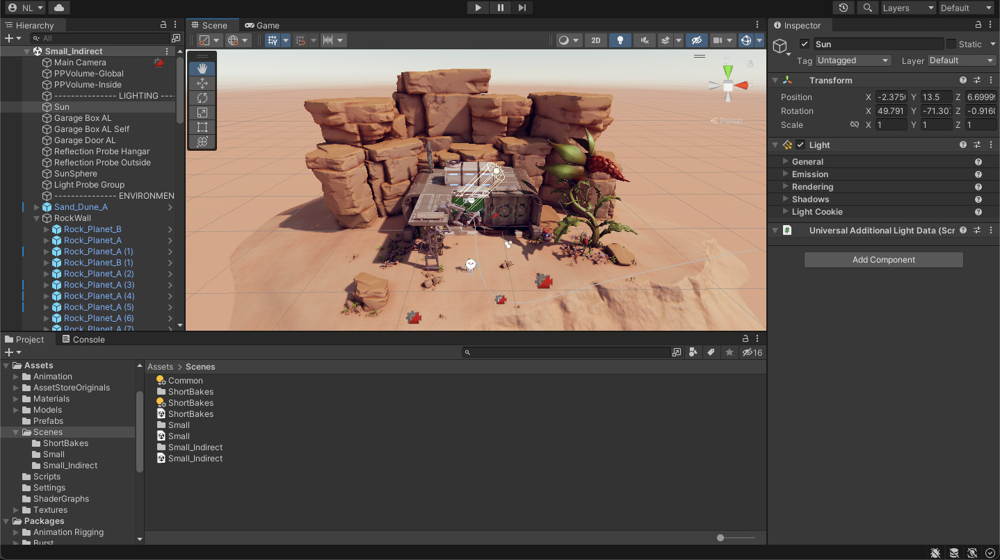
<p><em>VI: Các Light Mode trong URP. / EN: Light Modes in URP.</em></p>

---

## 20. Anti-aliasing — Bốn lựa chọn

!!! danger "💀 GHÉP MSAA với post-processing AA — cảnh báo chi phí"
    <div class="bilingual-row">
    <div class="col-vi">
    <p><em>"<strong>Lưu ý: khi KẾT HỢP Post-processing Anti-aliasing VỚI Multisample Anti-aliasing, hãy LƯU Ý CHI PHÍ RENDER.</strong> Như mọi khi, hãy tối ưu để cân bằng chất lượng hình ảnh với hiệu năng."</em></p>
    <p>🚫 <em>"<strong>MSAA KHÔNG TƯƠNG THÍCH với G-buffer của deferred shading</strong> — thứ lưu hình học scene trong texture. Do đó <strong>deferred shading BẮT BUỘC dùng MỘT TRONG các kỹ thuật Post-processing Anti-aliasing.</strong>"</em></p>
    <p>🔍 <em>"<strong>Vì MSAA CHỈ xử lý răng cưa ở CẠNH ĐA GIÁC, nó KHÔNG NGĂN được răng cưa xuất hiện trên một số texture và material bị ánh sáng SPECULAR GẮT chiếu vào. Bạn có thể CẦN GHÉP MSAA với một kỹ thuật Post-processing AA khác nếu gặp vấn đề đó.</strong>"</em></p>
    <p>⚙️ <em>"Trong Pipeline Asset đang dùng, <strong>đặt <code>Lit Shader Mode</code> thành <code>Forward Only</code></strong>. Rồi chọn <strong>MSAA 2× / 4× / 8×</strong> cho <strong>Multisample Anti-aliasing Quality</strong>. <strong>Giá trị CAO HƠN cho khử răng cưa TỐT HƠN, nhưng CHẬM HƠN.</strong>"</em></p>
    </div>
    <div class="col-en">
    <p><em>"Note: When combining Post-processing Anti-aliasing with Multisample Anti-aliasing, be aware of the rendering cost. As always, optimize your project to balance visual quality with performance."</em></p>
    <p>🚫 <em>"MSAA is incompatible with deferred shading's G-buffers, which store the scene geometry in a texture. Thus, deferred shading requires one of the Post-processing Anti-aliasing techniques."</em></p>
    <p>🔍 <em>"Because MSAA only deals with polygon edge aliasing, it cannot prevent aliasing found on certain textures and materials hit by sharp specular lighting. You may need to combine MSAA with another Post-processing AA technique if that is an issue."</em></p>
    <p>⚙️ <em>"In your active Pipeline Asset, set the Lit Shader Mode to Forward Only. Next select MSAA 2x, MSAA 4x, or MSAA 8x for the Multisample Anti-aliasing Quality. Higher values result in better anti-aliasing, but they are slower."</em></p>
    </div>
    </div>


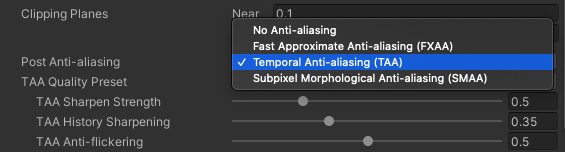
<p><em>VI: <strong>▲ Bốn lựa chọn trên Camera</strong> — <strong>No Anti-aliasing · Fast Approximate (FXAA) · Temporal (TAA) · Subpixel Morphological (SMAA)</strong>; khi chọn TAA sẽ mở thêm <strong>Quality Preset · Sharpen Strength 0.5 · History Sharpening 0.35 · Anti-flickering 0.5</strong>. / EN: The four post anti-aliasing options and the TAA sub-settings.</em></p>

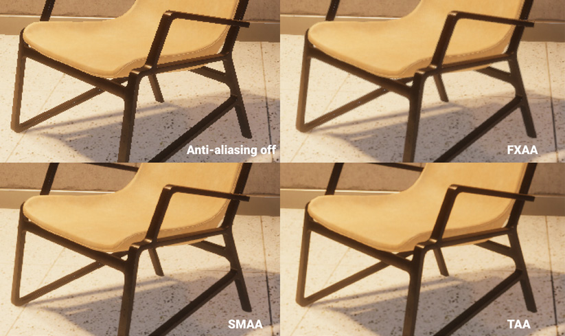
<p><em>VI: <strong>▲ So sánh TẬN MẮT</strong> — <strong>Anti-aliasing off · FXAA · SMAA · TAA</strong> trên cùng mép ghế. FXAA làm mờ cạnh, SMAA giữ nét hơn, TAA sạch nhất nhưng cần motion vector. / EN: Anti-aliasing off vs FXAA vs SMAA vs TAA.</em></p>

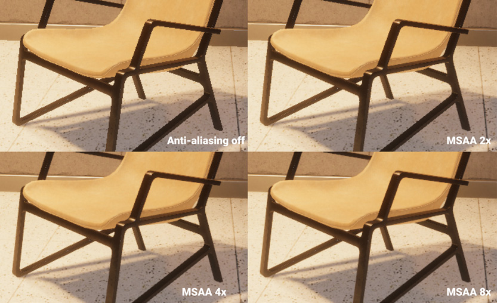
<p><em>VI: <strong>▲ MSAA theo cấp</strong> — <strong>off · 2× · 4× · 8×</strong>. MSAA xử lý răng cưa HÌNH HỌC (không xử lý được specular/alpha), và chi phí bộ nhớ tăng theo bậc. / EN: MSAA off vs 2x vs 4x vs 8x.</em></p>

<div class="bilingual-row">
<div class="col-vi">
<p><em>"Anti-aliasing <strong>RẤT đáng mong muốn</strong> vì nó giúp <strong>làm MƯỢT ảnh, GIẢM cạnh răng cưa, và TỐI THIỂU HÓA specular aliasing</strong>."</em></p>
</div>
<div class="col-en">
<p><em>"Anti-aliasing is <strong>HIGHLY DESIRABLE</strong> as it helps to <strong>SMOOTH the image, REDUCE jagged edges, and MINIMIZE specular aliasing</strong>."</em></p>
</div>
</div>

| Kỹ thuật | Cơ chế | Chi phí & Nơi cấu hình |
|---|---|---|
| **MSAA**<br>*Multisample AA* | Chất lượng **CAO** | ⚠️ **Có thể ĐẮT.** <br>· BiRP Forward → **Quality Settings**<br>· URP/HDRP Forward → **trên Render Pipeline Asset**<br>· **MSAA Sample Count**: None / **2X** / **4X** / **8X** — *số sample renderer dùng để đánh giá hiệu ứng* |
| **FXAA**<br>*Fast approximate AA* | Làm mượt cạnh **ở mức TỪNG PIXEL** | ✅ **ÍT tốn tài nguyên NHẤT**, ⚠️ **làm ảnh cuối hơi MỜ**. Post-processing trên Camera |
| **SMAA**<br>*Subpixel morphological AA* | **Trộn pixel dựa trên BIÊN của ảnh** | ✅ **Kết quả SẮC NÉT HƠN NHIỀU so với FXAA**. 💡 *Phù hợp với phong cách nghệ thuật **phẳng, hoạt hình, hoặc sạch sẽ*** |
| **TAA**<br>*Temporal AA* — **chỉ HDRP** | Làm mượt cạnh **dùng các frame từ HISTORY BUFFER** | ✅ **Hiệu quả HƠN FXAA**, ⚠️ **ĐÒI HỎI motion vector**. 💎 *Cũng có thể **cải thiện Ambient Occlusion và Volumetrics***. ⚠️ **Chất lượng cao hơn FXAA nhưng TỐN TÀI NGUYÊN HƠN và có thể tạo GHOSTING** |

---

# PHẦN F — CULLING, LOD & CAMERA

## 21. Frustum Culling vs Occlusion Culling

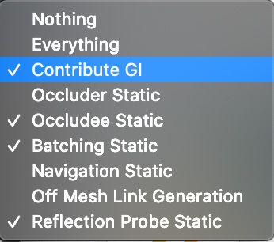
<p><em>VI: <strong>▲ Bảng cờ Static ĐẦY ĐỦ</strong> — <strong>Nothing · Everything · Contribute GI ✓ · Occluder Static · Occludee Static ✓ · Batching Static ✓ · Navigation Static · Off Mesh Link Generation · Reflection Probe Static ✓</strong>. Occlusion culling ăn theo <strong>Occluder/Occludee Static</strong>, còn batching ăn theo <strong>Batching Static</strong> — hai chuyện KHÁC NHAU. / EN: The full Static flags dropdown.</em></p>

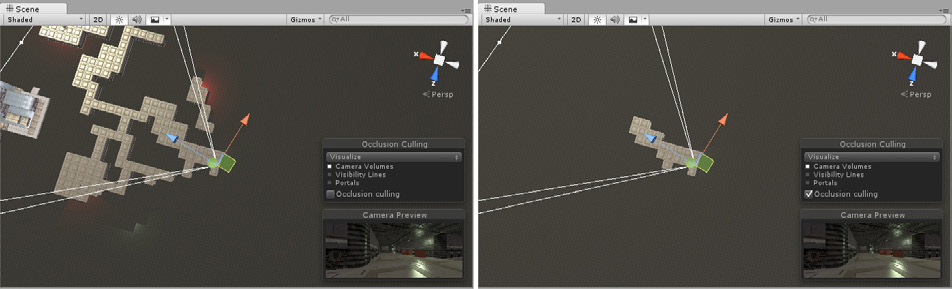
<p><em>VI: <strong>Frustum culling (trái)</strong> và <strong>occlusion culling (phải)</strong>. / EN: Frustum culling on the left, occlusion culling on the right.</em></p>

<div class="bilingual-row">
<div class="col-vi">
<p>🔑 <strong>Culling xảy ra THEO TỪNG CAMERA.</strong> <em>"Nó có thể có tác động LỚN tới hiệu năng — <strong>đặc biệt khi NHIỀU camera được bật ĐỒNG THỜI</strong>."</em> Unity dùng <strong>2 loại culling</strong>.</p>
<p><strong>🔷 ① FRUSTUM CULLING — tự động</strong></p>
<p><em>"Được thực hiện <strong>TỰ ĐỘNG trên MỌI Camera</strong>. Frustum culling đảm bảo <strong>GameObject NGOÀI View Frustum KHÔNG được render</strong> để tiết kiệm hiệu năng."</em></p>
<p>💎 <strong>Kỹ thuật nâng cao — <code>Camera.layerCullDistances</code>:</strong></p>
<blockquote>
<p><em>"Bạn có thể <strong>set khoảng cách cull THEO TỪNG LAYER thủ công</strong> qua <code>Camera.layerCullDistances</code>. Điều này cho phép bạn <strong>cull các GameObject NHỎ ở khoảng cách NGẮN HƠN <code>farClipPlane</code> mặc định</strong>.</em></p>
<p><em>Tổ chức GameObject vào <strong>Layer</strong>. Dùng mảng <code>layerCullDistances</code> để gán cho <strong>MỖI trong 32 layer</strong> một giá trị NHỎ HƠN <code>farClipPlane</code> (hoặc <strong>dùng 0 để mặc định về <code>farClipPlane</code></strong>)."</em></p>
</blockquote>
<p>🔬 <strong>Thứ tự xử lý — chi tiết kỹ thuật quan trọng:</strong></p>
<blockquote>
<p><em>"<strong>Unity cull THEO LAYER TRƯỚC.</strong> Nó chỉ giữ những GameObject trên layer mà Camera dùng. <strong>SAU ĐÓ, frustum culling loại bỏ GameObject nằm ngoài camera frustum.</strong></em></p>
<p><em>⚡ <strong>Frustum culling được thực hiện dưới dạng một chuỗi JOB để tận dụng worker thread khả dụng.</strong>"</em></p>
</blockquote>
<p>⚠️ <strong>Nhưng có giới hạn:</strong></p>
<blockquote>
<p><em>"<strong>MỖI phép test layer culling RẤT NHANH</strong> (về cơ bản chỉ là thao tác bit mask). <strong>Tuy nhiên, chi phí này VẪN có thể cộng dồn với SỐ LƯỢNG RẤT LỚN GameObject.</strong></em></p>
<p><em>✅ Nếu điều này thành vấn đề, bạn có thể cần <strong>cài đặt hệ thống chia thế giới thành các "SECTOR" và TẮT những sector nằm ngoài Camera frustum</strong> để giảm áp lực lên hệ thống layer/frustum culling của Unity."</em></p>
</blockquote>
</div>
<div class="col-en">
<p>🔑 <strong>Culling happens PER CAMERA.</strong> <em>"It can have a LARGE impact on performance — <strong>especially when MULTIPLE cameras are enabled CONCURRENTLY</strong>."</em> Unity uses <strong>two types of culling</strong>.</p>
<p><strong>🔷 ① FRUSTUM CULLING — automatic</strong></p>
<p><em>"Performed <strong>AUTOMATICALLY on EVERY Camera</strong>. Frustum culling makes sure that <strong>GameObjects OUTSIDE the View Frustum are NOT rendered</strong> to save rendering performance."</em></p>
<p>💎 <strong>Advanced technique — <code>Camera.layerCullDistances</code>:</strong></p>
<blockquote>
<p><em>"You can <strong>set PER-LAYER culling distances manually</strong> via <code>Camera.layerCullDistances</code>. This allows you to <strong>cull SMALL GameObjects at a distance SHORTER than the default <code>farClipPlane</code></strong>.</em></p>
<p><em>Organize GameObjects into <strong>Layers</strong>. Use the <code>layerCullDistances</code> array to assign <strong>EACH of the 32 layers</strong> a value less than <code>farClipPlane</code> (or <strong>use 0 to default to <code>farClipPlane</code></strong>)."</em></p>
</blockquote>
<p>🔬 <strong>Processing order — an important technical detail:</strong></p>
<blockquote>
<p><em>"<strong>Unity culls BY LAYER FIRST.</strong> It only keeps GameObjects on layers the Camera uses. <strong>AFTERWARDS, frustum culling removes any GameObjects outside the camera frustum.</strong></em></p>
<p><em>⚡ <strong>Frustum culling is performed as a series of JOBS to take advantage of available worker threads.</strong>"</em></p>
</blockquote>
<p>⚠️ <strong>But there's a limit:</strong></p>
<blockquote>
<p><em>"<strong>EACH layer culling test is VERY FAST</strong> (essentially just a bit mask operation). <strong>However, this cost could STILL add up with a VERY LARGE number of GameObjects.</strong></em></p>
<p><em>✅ If this becomes a problem, you may need to <strong>implement a system to divide your world into "SECTORS" and DISABLE sectors outside the Camera frustum</strong> to relieve pressure on Unity's layer/frustum culling system."</em></p>
</blockquote>
</div>
</div>

```csharp
// layerCullDistances — cull object nhỏ ở khoảng cách NGẮN hơn farClipPlane
// Cull small objects at a shorter distance than farClipPlane
using UnityEngine;

[RequireComponent(typeof(Camera))]
public class PerLayerCulling : MonoBehaviour
{
    void Start()
    {
        Camera cam = GetComponent<Camera>();

        // Mảng 32 phần tử — MỘT cho mỗi layer
        float[] distances = new float[32];

        // 0 = dùng farClipPlane mặc định (áp cho mọi layer chưa chỉ định)
        // Layer "SmallProps" chỉ hiển thị trong 30m
        distances[LayerMask.NameToLayer("SmallProps")]  = 30f;
        // Layer "Debris" chỉ 15m
        distances[LayerMask.NameToLayer("Debris")]      = 15f;
        // Layer "Vegetation" 60m
        distances[LayerMask.NameToLayer("Vegetation")]  = 60f;

        cam.layerCullDistances = distances;

        // Spherical culling: dùng khoảng cách CẦU thay vì mặt phẳng
        // (chính xác hơn khi xoay camera, nhưng tốn hơn một chút)
        cam.layerCullSpherical = true;
    }
}
```

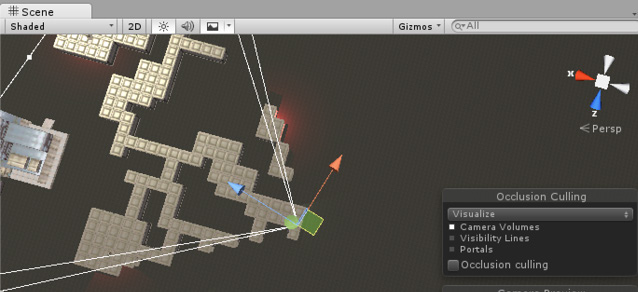
<p><em>VI: Occlusion culling trong Scene view với cửa sổ Visualize — <strong>Camera Volumes · Visibility Lines · Portals</strong>. / EN: Occlusion culling visualization in the Scene view.</em></p>

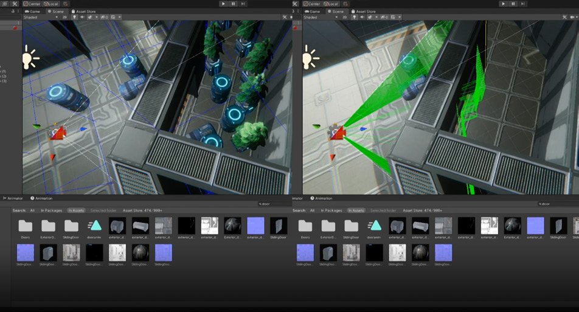
<p><em>VI: Tác động của occlusion culling — <strong>TẮT (trái)</strong> và <strong>BẬT (phải)</strong>: các tia xanh cho thấy vùng nhìn thấy được. / EN: The effect of occlusion culling off in the left image, and on in the right.</em></p>

<div class="bilingual-row">
<div class="col-vi">
<p><strong>🔶 ② OCCLUSION CULLING — phải BAKE</strong></p>
<p><em>"Occlusion culling <strong>LOẠI BỎ mọi GameObject khỏi Game View NẾU Camera KHÔNG THỂ NHÌN THẤY chúng</strong>. Object bị ẩn sau object khác <strong>vẫn có khả năng được render và tốn tài nguyên</strong> — dùng occlusion culling để loại chúng."</em></p>
<p>💡 <em>Ví dụ: <strong>render một căn phòng khác là KHÔNG CẦN THIẾT nếu cửa đã đóng và Camera không nhìn vào phòng đó.</strong></em></p>
<p>⚖️ <strong>Đánh đổi — nói rõ ràng:</strong></p>
<blockquote>
<p><em>"Nếu bạn bật occlusion culling, nó <strong>có thể TĂNG hiệu năng ĐÁNG KỂ nhưng có thể dùng NHIỀU dung lượng đĩa, thời gian CPU, và RAM HƠN</strong>.</em></p>
<p><em>🔑 <strong>Unity BAKE dữ liệu occlusion TRONG LÚC BUILD.</strong> Sau đó nó <strong>cần LOAD dữ liệu từ ĐĨA vào RAM khi loading một Scene.</strong>"</em></p>
</blockquote>
<p><strong>Cách bật (theo e-book URP):</strong></p>
<ol>
<li>Đánh dấu geometry là <strong>Occluder Static</strong> hoặc <strong>Occludee Static</strong></li>
<li>Mở <code>Window &gt; Rendering &gt; Occlusion Culling</code>, chọn tab <strong>Bake</strong> → bấm <strong>Bake</strong></li>
<li>Unity sinh dữ liệu occlusion, <strong>lưu thành asset trong dự án và liên kết asset đó với scene hiện tại</strong></li>
</ol>
<p>🔑 <strong>Phân biệt Occluder vs Occludee:</strong></p>
<blockquote>
<p><em>"<strong>Occluder</strong> là <strong>object TRUNG BÌNH tới LỚN có thể che khuất</strong> các object đánh dấu là Occludee. Để là Occluder, object <strong>PHẢI ĐỤC (opaque), có component Terrain hoặc Mesh Renderer, và KHÔNG di chuyển lúc runtime</strong>.</em></p>
<p><em><strong>Occludee</strong> có thể là <strong>BẤT KỲ object nào có component Renderer</strong> — kể cả <strong>object NHỎ và TRONG SUỐT</strong> mà tương tự không di chuyển lúc runtime."</em></p>
</blockquote>
<p>💡 <strong>Scene lý tưởng:</strong> <em>"Occlusion culling <strong>phù hợp nhất với scene nơi SỐ LƯỢNG ĐÁNG KỂ object có thể bị CHE khi một vật khác xuất hiện giữa chúng và Camera</strong>. <strong>Game kiểu mê cung hành lang là ứng viên LÝ TƯỞNG.</strong>"</em></p>
</div>
<div class="col-en">
<p><strong>🔶 ② OCCLUSION CULLING — must be BAKED</strong></p>
<p><em>"Occlusion culling <strong>REMOVES any GameObjects from the Game View IF the Camera CANNOT SEE them</strong>. Objects hidden behind other objects <strong>can potentially STILL render and cost resources</strong> — use occlusion culling to discard them."</em></p>
<p>💡 <em>Example: <strong>rendering another room is UNNECESSARY if a door is closed and the Camera cannot see into the room.</strong></em></p>
<p>⚖️ <strong>The trade-off — stated plainly:</strong></p>
<blockquote>
<p><em>"If you enable occlusion culling, it <strong>may SIGNIFICANTLY increase performance but can use MORE disk space, CPU time, and RAM</strong>.</em></p>
<p><em>🔑 <strong>Unity BAKES the occlusion data DURING THE BUILD.</strong> It then <strong>needs to LOAD it from DISK to RAM while loading a Scene.</strong>"</em></p>
</blockquote>
<p><strong>How to enable (per the URP e-book):</strong></p>
<ol>
<li>Mark geometry as <strong>Occluder Static</strong> or <strong>Occludee Static</strong></li>
<li>Open <code>Window &gt; Rendering &gt; Occlusion Culling</code>, select the <strong>Bake</strong> tab → press <strong>Bake</strong></li>
<li>Unity generates occlusion data, <strong>saving it as an asset in your project and linking it to the current scene</strong></li>
</ol>
<p>🔑 <strong>Occluder vs Occludee:</strong></p>
<blockquote>
<p><em>"<strong>Occluders</strong> are <strong>MEDIUM to LARGE objects that can OCCLUDE</strong> objects marked as Occludees. To be an Occluder, an object <strong>MUST be OPAQUE, have a Terrain or Mesh Renderer component, and NOT move at runtime</strong>.</em></p>
<p><em><strong>Occludees</strong> can be <strong>ANY object with a Renderer component</strong> — including <strong>SMALL and TRANSPARENT objects</strong> that similarly do not move at runtime."</em></p>
</blockquote>
<p>💡 <strong>The ideal scene:</strong> <em>"Occlusion culling is <strong>BEST SUITED to a scene where SIGNIFICANT NUMBERS of objects might be MASKED when another item appears between them and the Camera</strong>. <strong>A cellular corridor maze-type game is an IDEAL candidate.</strong>"</em></p>
</div>
</div>

### 21.1. 🧊 Umbra — Occlusion Culling hoạt động BÊN TRONG thế nào

> 🧭 **Nguồn bổ sung ở audit lần 3:** [**How to Use Occlusion Culling in Unity — The Sneaky Way** — TheGameDev.Guru](https://thegamedev.guru/unity-performance/occlusion-culling-tutorial/) — *phần "vì sao" và ba tham số bake mà tài liệu Unity không giải thích rõ.*

<div class="bilingual-row">
<div class="col-vi">
<blockquote>
<p><em>"Unity dùng công nghệ occlusion culling <strong>vận hành bởi UMBRA</strong>. Và Umbra làm việc ở HAI chế độ khác nhau."</em></p>
</blockquote>
<p><strong>🔨 ① Lúc EDITOR — quá trình BAKE gồm 3 bước:</strong></p>
<ol>
<li><em>Umbra <strong>"VOXEL HOÁ" (voxelize)</strong> scene của bạn để làm việc với <strong>các phần tử RỜI RẠC thay vì một "mớ polygon"</strong></em></li>
<li><em>Umbra <strong>TẠO các CELL từ những voxel này bằng cách GỘP các voxel RỖNG</strong> — tức voxel KHÔNG có geometry bên trong</em></li>
<li><em>Cuối cùng, Umbra <strong>tạo các PORTAL nối những cell này lại với nhau</strong></em></li>
</ol>
<p><em>"Ta lưu tổ hợp <strong>cell + portal</strong> này vào các CẤU TRÚC DỮ LIỆU mà ta truy cập lúc runtime."</em></p>
<p><strong>⚡ ② Lúc RUNTIME:</strong></p>
<blockquote>
<p><em>"Umbra <strong>lấy VỊ TRÍ camera của bạn để tìm ra bạn đang ở CELL NÀO ngay lúc này. Rồi Umbra thực hiện các OCCLUSION QUERY đối chiếu với cấu trúc dữ liệu chứa cell và portal để xác định phần tử nào camera THẤY được và phần tử nào bị CHE.</strong></em></p>
<p><em>👉 <strong>Một khi Unity biết object nào bị che — đơn giản là KHÔNG render chúng.</strong>"</em></p>
</blockquote>
</div>
<div class="col-en">
<blockquote>
<p><em>"Unity uses an occlusion culling technology <strong>powered by UMBRA</strong>. And Umbra works in TWO different modes."</em></p>
</blockquote>
<p><strong>🔨 ① At EDITOR time — baking is a 3-step process:</strong></p>
<ol>
<li><em>Umbra <strong>"VOXELIZES"</strong> your scene to work with <strong>DISCRETE elements instead of with a "polygon soup"</strong></em></li>
<li><em>Umbra <strong>CREATES CELLS out of these voxels by MERGING EMPTY voxels</strong> — i.e., voxels WITHOUT geometry inside</em></li>
<li><em>Finally, Umbra <strong>creates PORTALS that CONNECT these cells</strong></em></li>
</ol>
<p><em>"We store this combination of <strong>cells + portals</strong> into DATA STRUCTURES that we access during run-time."</em></p>
<p><strong>⚡ ② At RUN-TIME:</strong></p>
<blockquote>
<p><em>"Umbra <strong>takes the POSITION of your camera to find in WHICH CELL you are right now. Then, Umbra does OCCLUSION QUERIES against the data structures that contain cells and portals to determine which elements your camera CAN SEE and which ones are OCCLUDED.</strong></em></p>
<p><em>👉 <strong>Once Unity knows which objects are occluded — you just DON'T RENDER them.</strong>"</em></p>
</blockquote>
</div>
</div>

!!! danger "⚖️ BA hệ quả của occlusion culling — hai TỐT, một XẤU"
    <div class="bilingual-row">
    <div class="col-vi">
    <blockquote>
    <ul>
    <li>✅ <em><strong>ÍT draw call hơn</strong> — cải thiện hiệu năng <strong>CPU</strong></em></li>
    <li>❌ <em><strong>THÊM chi phí culling</strong> — <strong>LÀM TỆ ĐI</strong> hiệu năng <strong>CPU</strong></em></li>
    <li>✅ <em><strong>ÍT overdraw và fillrate hơn</strong> — cải thiện hiệu năng <strong>GPU</strong></em></li>
    </ul>
    </blockquote>
    <p>💰 <strong>Occlusion query KHÔNG miễn phí — nó bao gồm:</strong></p>
    <blockquote>
    <ul>
    <li><em><strong>DUYỆT các cấu trúc dữ liệu LỚN</strong></em></li>
    <li><em><strong>Render depth + TEST một software depth buffer TRÊN CPU</strong></em></li>
    </ul>
    <p><em>"Tất cả đều tốn <strong>thời gian. Và điện. Và nhiệt. Và có thể khiến người chơi VR của bạn NÔN.</strong>"</em></p>
    </blockquote>
    <p>🚨 <strong>Và một cảnh báo ít ai để ý:</strong> <em>"Occlusion culling <strong>KHÔNG PHẢI</strong> viên đạn bạc, vì <strong>Unity VẪN render BÓNG (shadows)</strong> vì những lý do hiển nhiên."</em></p>
    <p>⚖️ <em><strong>Thời gian bạn TIẾT KIỆM được ở draw call và thao tác GPU PHẢI đáng với chi phí CPU THÊM VÀO.</strong></em></p>
    </div>
    <div class="col-en">
    <blockquote>
    <ul>
    <li>✅ <em><strong>FEWER draw calls</strong> — improves <strong>CPU</strong> performance</em></li>
    <li>❌ <em><strong>ADDITIONAL culling cost</strong> — <strong>WORSENS</strong> <strong>CPU</strong> performance</em></li>
    <li>✅ <em><strong>LESS overdraw and fillrate</strong> — improves <strong>GPU</strong> performance</em></li>
    </ul>
    </blockquote>
    <p>💰 <strong>Occlusion queries are NOT free — they imply:</strong></p>
    <blockquote>
    <ul>
    <li><em><strong>TRAVERSING LARGE data structures</strong></em></li>
    <li><em><strong>Rendering depth + TESTING a software depth buffer ON THE CPU</strong></em></li>
    </ul>
    <p><em>"This all takes <strong>time. And power. And heat. And may make your VR players vomit.</strong>"</em></p>
    </blockquote>
    <p>🚨 <strong>And a warning few people notice:</strong> <em>"occlusion culling is <strong>NOT</strong> the silver bullet, since <strong>Unity STILL renders SHADOWS</strong> for obvious reasons."</em></p>
    <p>⚖️ <em><strong>The time you SAVE in draw calls and GPU operations MUST be worth its EXTRA CPU cost.</strong></em></p>
    </div>
    </div>

<div class="bilingual-row">
<div class="col-vi">
<p>🏠 <strong>Quy tắc quyết định NGẮN GỌN:</strong></p>
<blockquote>
<ul>
<li>✅ <em><strong>DÙNG occlusion culling trong INTERIOR (nội thất).</strong></em></li>
<li>❌ <em><strong>TRÁNH occlusion culling ở EXTERIOR (ngoại cảnh).</strong></em></li>
</ul>
<p><em>"Lý do rất đơn giản: <strong>trong nội thất bạn có NHIỀU KHẢ NĂNG có những OCCLUDER LỚN che các phần tử phía sau chúng</strong> — hãy nghĩ tới TƯỜNG, CỬA. Và việc có các phòng NGĂN CÁCH bởi HÀNH LANG cũng giúp rất nhiều.</em></p>
<p><em>💡 <strong>Scene nội thất thường NHỎ HƠN, điều này có thể khiến occlusion query của bạn RẺ HƠN (ít bộ nhớ và thời gian CPU hơn).</strong>"</em></p>
</blockquote>
<p>👉 <em>Khớp với lời khuyên của Unity ở <a href="#21-frustum-culling-vs-occlusion-culling">§21</a>: <strong>"game kiểu mê cung hành lang là ứng viên LÝ TƯỞNG"</strong>.</em></p>
</div>
<div class="col-en">
<p>🏠 <strong>The SHORT decision rule:</strong></p>
<blockquote>
<ul>
<li>✅ <em><strong>USE occlusion culling in INTERIORS.</strong></em></li>
<li>❌ <em><strong>AVOID occlusion culling in EXTERIORS.</strong></em></li>
</ul>
<p><em>"The reason is simple: <strong>in interiors you are MORE LIKELY to have BIG OCCLUDERS that hide elements behind them</strong> — think of WALLS, DOORS. And having rooms SEPARATED BY CORRIDORS is also a big help.</em></p>
<p><em>💡 <strong>Interior scenes are often SMALLER, which may make your occlusion queries CHEAPER (less memory and CPU time).</strong>"</em></p>
</blockquote>
<p>👉 <em>This matches Unity's own advice in <a href="#21-frustum-culling-vs-occlusion-culling">§21</a>: <strong>"a cellular corridor maze-type game is an IDEAL candidate"</strong>.</em></p>
</div>
</div>

### 21.2. 🎚️ Ba tham số bake — Giá trị khuyến nghị CỤ THỂ

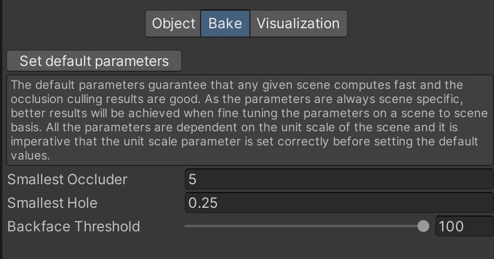
<p><em>VI: <strong>▲ Tab <code>Bake</code> của cửa sổ Occlusion</strong> — <strong>Smallest Occluder 5 · Smallest Hole 0.25 · Backface Threshold 100</strong>, kèm nút <strong>Set default parameters</strong> và đoạn giải thích: <em>"Tham số mặc định ĐẢM BẢO mọi scene TÍNH NHANH và kết quả occlusion culling TỐT. Vì tham số LUÔN đặc thù theo scene, kết quả TỐT HƠN chỉ đạt được khi tinh chỉnh cho TỪNG scene. Mọi tham số PHỤ THUỘC vào ĐƠN VỊ TỈ LỆ của scene, nên BẮT BUỘC phải đặt đúng unit scale TRƯỚC KHI đặt giá trị mặc định."</em> / EN: The Occlusion Bake tab with Smallest Occluder, Smallest Hole and Backface Threshold.</em></p>

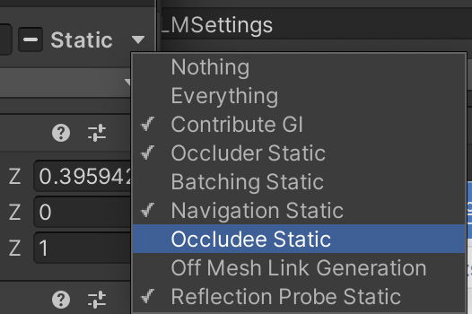
<p><em>VI: <strong>▲ Cờ <code>Occludee Static</code></strong> — object phải mang cờ này thì Umbra mới CÂN NHẮC ẩn nó đi. / EN: The Occludee Static flag.</em></p>

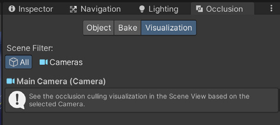
<p><em>VI: <strong>▲ Tab <code>Visualization</code></strong> — <strong>Scene Filter: All | Cameras</strong>, chọn <strong>Main Camera</strong>; ghi chú: <em>"xem trực quan occlusion culling trong Scene View DỰA TRÊN camera đang chọn"</em>. / EN: The Occlusion Visualization tab.</em></p>

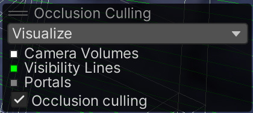
<p><em>VI: <strong>▲ Lớp phủ Occlusion Culling</strong> — bật/tắt <strong>Camera Volumes · Visibility Lines · Portals · Occlusion culling ✓</strong> để nhìn thấy Umbra đang cắt cái gì. / EN: The Occlusion Culling visualization overlay options.</em></p>


<p><em>VI: <strong>▲ Nhìn từ trên xuống</strong> — hình nón camera cùng các <strong>Visibility Lines</strong>, và <strong>Camera Preview</strong> ở góc cho thấy đúng những gì camera thật sự vẽ. / EN: Occlusion culling visualized from above with a Camera Preview.</em></p>

<div class="bilingual-row">
<div class="col-vi">
<p>Ba tham số trong cửa sổ <code>Window &gt; Rendering &gt; Occlusion Culling &gt; Bake</code> quyết định <strong>chất lượng, tốc độ query, và mức dùng RAM</strong> của hệ thống. Đây là ý nghĩa THỰC SỰ của chúng:</p>
</div>
<div class="col-en">
<p>The three parameters in <code>Window &gt; Rendering &gt; Occlusion Culling &gt; Bake</code> determine the system's <strong>quality, query speed, and RAM usage</strong>. Here is what they ACTUALLY mean:</p>
</div>
</div>

| Tham số | Ý nghĩa thật / What it really is | Giá trị NHỎ | Giá trị LỚN | ✅ Khuyến nghị |
|---|---|---|---|---|
| **Smallest Occluder** | 🔑 ***"Độ phân giải ĐẦU RA của quá trình bake"*** — *kích thước (mét) của phần tử NHỎ NHẤT trong scene có thể đóng vai occluder* | Occlusion culling **CHÍNH XÁC HƠN** lúc runtime, nhưng **query LÂU HƠN trên CPU** và **tốn NHIỀU bộ nhớ hơn** | **Hiệu quả occlusion NHỎ HƠN**, query **NHANH HƠN**, bộ nhớ **THẤP HƠN** ⇒ *bạn sẽ render nhiều thứ KHÔNG nhìn thấy hơn* | 🏆 **2 – 5 m** *"hoạt động tốt trong môi trường tỷ lệ NGƯỜI"* |
| **Smallest Hole** | 🔑 ***"Độ phân giải ĐẦU VÀO của quá trình bake"*** — *kích thước (mét) của LỖ NHỎ NHẤT bạn có thể NHÌN XUYÊN QUA, ví dụ khoảng trống giữa các thanh hàng rào.* ⚙️ **Đây chính là KÍCH THƯỚC VOXEL Umbra dùng để sinh cell** | Bake **CHÍNH XÁC HƠN**, Unity **phân biệt occluder thật tốt hơn** — nhưng **bake LÂU HƠN và tốn nhiều bộ nhớ EDITOR hơn** *(không phải runtime)* | 💀 **Voxel QUÁ TO** ⇒ khả năng voxel chứa geometry và chặn tầm nhìn TĂNG ⇒ ***"bạn có nguy cơ BỎ QUA việc render geometry mà lẽ ra bạn PHẢI nhìn thấy được"*** | 🏆 **0.2 – 0.5 m** *"hoạt động tốt trong môi trường tỷ lệ bình thường"* |
| **Backface Threshold** | 🔑 *Tối ưu **mức dùng bộ nhớ RUNTIME**. Đặt **90%** ⇒ **Umbra BỎ QUA một cell bất cứ khi nào 90% số mặt nhìn thấy từ cell đó là MẶT SAU (backface)*** | ⚠️ ***"Nếu đặt QUÁ THẤP, bạn có thể 'tối ưu' MẤT những cell HỢP LỆ mà người chơi thực sự có thể đứng. Nếu xảy ra, KẾT QUẢ LÀ KHÔNG XÁC ĐỊNH (undefined)."*** | Giữ nhiều dữ liệu hơn, an toàn hơn | 🏆 **Để nguyên 100%** — *"TRỪ KHI occlusion culling của bạn ngốn QUÁ NHIỀU RAM (bất cứ mức nào **trên 40 MB**)"*. 💡 *Và kể cả khi muốn tối ưu bộ nhớ, **hãy BẮT ĐẦU bằng việc TĂNG Smallest Occluder trước**.* |

<div class="bilingual-row">
<div class="col-vi">
<p>🔬 <strong>Trực giác cho Backface Threshold — ví von rất rõ:</strong></p>
<blockquote>
<p><em>"Hãy tưởng tượng bạn đang đi TRÊN một địa hình. Khi nhìn XUỐNG, bạn THẤY địa hình vì normal của nó hướng LÊN.</em></p>
<p><em>💡 <strong>Giờ nếu bạn 'gian lận' và chui XUỐNG DƯỚI địa hình, bạn sẽ KHÔNG thấy nó do backface culling. Vậy đó là một vị trí "KHÔNG HỢP LỆ" mà ta có thể AN TOÀN bỏ qua occlusion culling.</strong></em></p>
<p><em>👉 <strong>Nói cách khác: ta có thể XOÁ dữ liệu occlusion culling của những cell mà người chơi KHÓ CÓ KHẢ NĂNG đứng vào.</strong>"</em></p>
</blockquote>
<p>📌 <strong>Occlusion Area</strong> — <em>"là một VÙNG QUAN TÂM nơi ta muốn bake occlusion culling ở ĐỘ CHÍNH XÁC CAO HƠN"</em>. Dùng nó để tập trung ngân sách bake vào những khu vực người chơi thực sự đi qua.</p>
</div>
<div class="col-en">
<p>🔬 <strong>The intuition for Backface Threshold — a clear analogy:</strong></p>
<blockquote>
<p><em>"Imagine you are walking ON TOP of a terrain. When you look DOWN, you CAN SEE the terrain because its normals point UPWARDS.</em></p>
<p><em>💡 <strong>Now, if you CHEATED and got BENEATH the terrain you WOULDN'T be able to see it because of backface culling. So that would be an "INVALID" position for which we can SAFELY IGNORE occlusion culling.</strong></em></p>
<p><em>👉 <strong>In other words: we can REMOVE the occlusion culling data for CELLS WE ARE NOT LIKELY TO BE IN.</strong>"</em></p>
</blockquote>
<p>📌 <strong>Occlusion Areas</strong> — <em>"an AREA OF INTEREST where we want to bake occlusion culling at a HIGHER PRECISION"</em>. Use them to concentrate your bake budget on the areas players actually traverse.</p>
</div>
</div>

---

## 22. LOD & Camera — Mỗi Camera tốn tới 1 ms


<p><em>VI: <strong>▲ Component LOD Group</strong> — dải <strong>LOD 1 (95%) · LOD 2 (50%) · LOD 3 (20%)</strong>, cảnh báo <em>"Active LOD bias is 3.0. Distances are adjusted accordingly."</em>, cùng hai nút <strong>Recalculate Bounds</strong> và <strong>Recalculate Lightmap Scale</strong>. / EN: The LOD Group component with its LOD thresholds and LOD bias warning.</em></p>

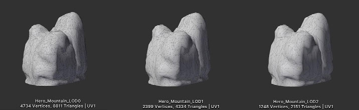
<p><em>VI: <strong>▲ Ba mức LOD ĐO ĐƯỢC</strong> — <code>Hero_Mountain_LOD0</code> <strong>4.734 vertices / 8.811 triangles</strong> → <code>_LOD1</code> <strong>2.399 / 4.334</strong> → <code>_LOD2</code> <strong>1.748 / 2.151</strong>. Mỗi bậc cắt khoảng MỘT NỬA. / EN: Hero_Mountain LOD0/LOD1/LOD2 with their vertex and triangle counts.</em></p>

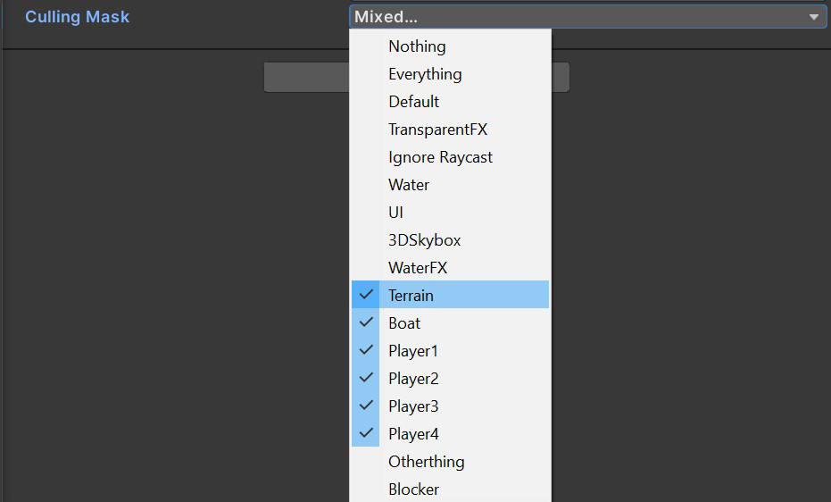
<p><em>VI: <strong>▲ Culling Mask của Camera</strong> — chỉ tick <strong>Terrain · Boat · Player1…Player4</strong>; layer KHÔNG tick sẽ KHÔNG được camera này xét tới, cắt việc ngay ở khâu culling. / EN: The Camera Culling Mask with only selected layers ticked.</em></p>

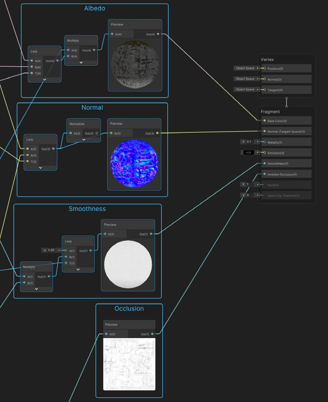
<p><em>VI: Ví dụ Mesh dùng LOD Group — các mesh nguồn được model ở nhiều độ phân giải khác nhau. / EN: Example of a Mesh using a Level of Detail Group; source meshes modeled at varying resolutions.</em></p>

<div class="bilingual-row">
<div class="col-vi">
<p><strong>LOD (Level of Detail):</strong> <em>"Khi object di chuyển ra XA, Level of Detail có thể <strong>điều chỉnh hoặc CHUYỂN chúng sang mesh ĐỘ PHÂN GIẢI THẤP HƠN với material và shader ĐƠN GIẢN HƠN</strong> để hỗ trợ hiệu năng GPU."</em></p>
<p>👉 Nhắc lại từ <a href="#4-shader-instructions-alu">§4</a> và <a href="#6-overshading-quad-lang-phi-75-am-tham">§6</a>: LOD <strong>vừa giảm vertex shader work, VỪA GIẢM MẠNH overshading</strong> bằng cách khiến tam giác phủ nhiều quad hơn.</p>
<p>💾 Nhắc lại từ <a href="../03-senior/01-memory-addressables-networking.md">Module 3 §4.1</a>: dùng <code>maxLOD</code> trong Quality Settings để <strong>loại mesh chi tiết cao khỏi BUILD</strong>.</p>
</div>
<div class="col-en">
<p><strong>LOD (Level of Detail):</strong> <em>"As objects move into the DISTANCE, Level of Detail can <strong>adjust or SWITCH them to use LOWER-RESOLUTION meshes with SIMPLER materials and shaders</strong> to aid GPU performance."</em></p>
<p>👉 Recall from <a href="#4-shader-instructions-alu">§4</a> and <a href="#6-overshading-quad-lang-phi-75-am-tham">§6</a>: LODs <strong>both reduce vertex shader work AND GREATLY reduce overshading</strong> by having triangles cover more of each quad.</p>
<p>💾 Recall from <a href="../03-senior/01-memory-addressables-networking.md">Module 3 §4.1</a>: use <code>maxLOD</code> in Quality Settings to <strong>remove high-detail meshes from the BUILD</strong>.</p>
</div>
</div>

!!! danger "📊 Chi phí ẨN của Camera — con số ít ai biết"
    <div class="bilingual-row">
    <div class="col-vi">
    <blockquote>
    <p><em>"Bạn <strong>CÓ THỂ</strong> dùng Camera Stacking trong URP để render nhiều camera view. <strong>Tuy nhiên, VẪN có việc culling và rendering ĐÁNG KỂ được làm cho MỖI camera.</strong></em></p>
    <p><em>🚨 <strong>MỖI camera đều gây ra một số overhead — DÙ nó có làm việc có ý nghĩa hay KHÔNG.</strong></em></p>
    <p><em>✅ <strong>CHỈ dùng những component Camera thực sự CẦN cho việc render.</strong></em></p>
    <p><em>💀 <strong>Trên nền tảng MOBILE, MỖI camera đang bật có thể dùng TỚI 1 ms thời gian CPU — KỂ CẢ KHI nó KHÔNG render gì cả.</strong>"</em></p>
    </blockquote>
    <p>👉 Với ngân sách <strong>11 ms cho 60fps mobile</strong> (<a href="../01-fresher/01-ultimate-guide-to-profiling.md">Module 1 §1.1</a>), <strong>3 camera thừa = 27% ngân sách BIẾN MẤT mà không vẽ gì.</strong></p>
    </div>
    <div class="col-en">
    <blockquote>
    <p><em>"You <strong>COULD</strong> use Camera Stacking in URP to render more than one camera view. <strong>However, there is STILL SIGNIFICANT culling and rendering done for EACH camera.</strong></em></p>
    <p><em>🚨 <strong>EACH camera incurs SOME overhead — WHETHER it's doing meaningful work or NOT.</strong></em></p>
    <p><em>✅ <strong>ONLY use Camera components REQUIRED for rendering.</strong></em></p>
    <p><em>💀 <strong>On MOBILE platforms, EACH active camera can use UP TO 1 ms of CPU time — EVEN WHEN rendering NOTHING.</strong>"</em></p>
    </blockquote>
    <p>👉 With an <strong>11 ms budget for 60fps mobile</strong> (<a href="../01-fresher/01-ultimate-guide-to-profiling.md">Module 1 §1.1</a>), <strong>3 redundant cameras = 27% of your budget GONE without drawing anything.</strong></p>
    </div>
    </div>

### 22.1. Thay Camera bằng RenderObjects (URP) / CustomPassVolumes (HDRP)

<div class="bilingual-row">
<div class="col-vi">
<p><strong>🔷 URP — RenderObjects</strong></p>
<p><em>"Trong URP, <strong>thay vì dùng NHIỀU CAMERA, hãy thử một custom RenderObject.</strong>"</em> Chọn <strong>Add Renderer Feature</strong> trong Renderer Data asset → <strong>RenderObject (Experimental)</strong>.</p>
<p><strong>Khi override mỗi RenderObject, bạn có thể:</strong></p>
<ul>
<li><strong>Gắn nó với một Event</strong> và tiêm vào một thời điểm cụ thể của render loop</li>
<li><strong>Lọc theo Render Queue</strong> (Transparent hoặc Opaque) <strong>và LayerMask</strong></li>
<li><strong>Tác động tới setting Depth và Stencil</strong> <em>(→ chính là kỹ thuật ở §15)</em></li>
<li><strong>Sửa setting Camera</strong> (Field of View và Position Offset)</li>
</ul>
<p>💡 <strong>Ví dụ thực tế từ Universal Rendering Examples:</strong></p>
<blockquote>
<p><em>"<strong>Layer mask chia geometry tiền cảnh và hậu cảnh.</strong> Rồi custom Forward Renderer <strong>vẽ layer vũ khí với FOV ÍT MÉO HƠN và LUÔN render nó LÊN TRÊN geometry của level</strong>.</em></p>
<p><em>Override trên mỗi Renderer <strong>sửa setting Stencil và Depth để NGĂN tiền cảnh CẮT (clip) phần geometry còn lại của scene</strong>."</em></p>
</blockquote>
<p><strong>🔶 HDRP — CustomPassVolumes</strong></p>
<p>Cấu hình một <strong>Custom Pass</strong> dùng <strong>Custom Pass Volume</strong> — tương tự cách dùng HDRP Volume. <strong>Custom Pass cho phép bạn:</strong></p>
<ul>
<li><strong>Thay đổi ngoại hình của material</strong> trong scene</li>
<li><strong>Thay đổi THỨ TỰ Unity render GameObject</strong></li>
<li><strong>Đọc Camera buffer vào shader</strong></li>
</ul>
<p>✅ <em>"Dùng Custom Pass trong HDRP có thể <strong>giúp bạn TRÁNH dùng Camera thừa và overhead đi kèm</strong>. Custom pass có <strong>độ linh hoạt CAO HƠN trong cách tương tác với shader</strong>. Bạn cũng có thể <strong>mở rộng class Custom Pass bằng C#</strong>."</em></p>
</div>
<div class="col-en">
<p><strong>🔷 URP — RenderObjects</strong></p>
<p><em>"In URP, <strong>instead of using MULTIPLE CAMERAS, try a custom RenderObject.</strong>"</em> Select <strong>Add Renderer Feature</strong> in the Renderer Data asset → <strong>RenderObject (Experimental)</strong>.</p>
<p><strong>When overriding each RenderObject, you can:</strong></p>
<ul>
<li><strong>Associate it with an Event</strong> and inject it into a specific timing of the render loop</li>
<li><strong>Filter by Render Queue</strong> (Transparent or Opaque) <strong>and LayerMask</strong></li>
<li><strong>Affect the Depth and Stencil settings</strong> <em>(→ exactly the technique in §15)</em></li>
<li><strong>Modify the Camera settings</strong> (Field of View and Position Offset)</li>
</ul>
<p>💡 <strong>A real example from Universal Rendering Examples:</strong></p>
<blockquote>
<p><em>"<strong>Layer masks divide up the foreground and background meshes.</strong> Then the custom Forward Renderer <strong>draws the weapon layer with a LESS DISTORTED FOV and ALWAYS renders it ON TOP of the level geometry</strong>.</em></p>
<p><em>Overrides on each Renderer <strong>modify the Stencil and Depth settings to PREVENT the foreground from CLIPPING the rest of the scene geometry</strong>."</em></p>
</blockquote>
<p><strong>🔶 HDRP — CustomPassVolumes</strong></p>
<p>Configuring a <strong>Custom Pass</strong> using a <strong>Custom Pass Volume</strong> is analogous to using an HDRP Volume. <strong>A Custom Pass allows you to:</strong></p>
<ul>
<li><strong>Change the appearance of materials</strong> in your scene</li>
<li><strong>Change the ORDER that Unity renders GameObjects</strong></li>
<li><strong>Read Camera buffers into shaders</strong></li>
</ul>
<p>✅ <em>"Using Custom Passes in HDRP can <strong>help you AVOID using extra Cameras and the additional overhead</strong>. Custom passes have <strong>extra FLEXIBILITY in how they interact with shaders</strong>. You can also <strong>extend the Custom Pass class with C#</strong>."</em></p>
</div>
</div>

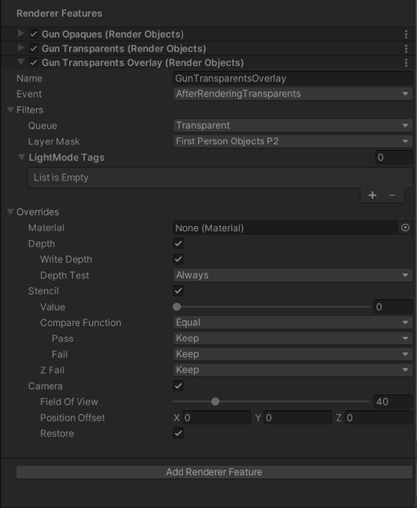
<p><em>VI: Ba <strong>Render Objects</strong> feature đúng như ví dụ vũ khí ở trên — <em>Gun Opaques</em>, <em>Gun Transparents</em>, <em>Gun Transparents Overlay</em>. Feature đang mở cho thấy: <strong>Event: AfterRenderingTransparents</strong> · <strong>Queue: Transparent</strong> · <strong>Layer Mask: First Person Objects P2</strong> · Override <strong>Depth ✓ (Write Depth ✓, Depth Test: Always)</strong> · <strong>Stencil ✓ (Value 0, Compare Function: Equal, Pass/Fail/Z Fail: Keep)</strong> · <strong>Camera ✓ (Field Of View 40, Position Offset 0,0,0, Restore ✓)</strong>. / EN: Three Render Objects features implementing the first-person weapon example, with the Depth, Stencil and Camera overrides visible.</em></p>

<p>💡 <em>Chú ý <strong>Depth Test: Always</strong> — đây chính là thứ khiến vũ khí <strong>LUÔN vẽ đè lên geometry của level</strong>, và <strong>Field Of View 40</strong> riêng biệt tạo ra "FOV ÍT MÉO HƠN". <strong>KHÔNG cần thêm một Camera nào.</strong> / EN: Note <strong>Depth Test: Always</strong> — that is what makes the weapon ALWAYS draw over level geometry, and the separate <strong>Field Of View 40</strong> creates the "less distorted FOV". <strong>No extra Camera required.</strong></em></p>

### 22.2. 📉 Dynamic Resolution & Độ phân giải mobile

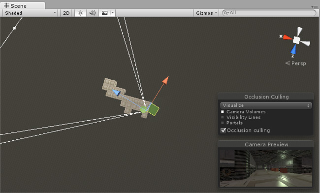
<p><em>VI: <strong>Allow Dynamic Resolution</strong> — setting Camera cho phép điều chỉnh động độ phân giải render target. / EN: Allow Dynamic Resolution is a Camera setting.</em></p>

<div class="bilingual-row">
<div class="col-vi">
<blockquote>
<p><em>"<strong>Allow Dynamic Resolution là một setting của CAMERA cho phép bạn SCALE ĐỘNG từng render target riêng lẻ để GIẢM khối lượng công việc trên GPU.</strong></em></p>
<p><em>🔑 <strong>Trong trường hợp frame rate của ứng dụng GIẢM, bạn có thể TỪ TỪ hạ độ phân giải xuống để DUY TRÌ frame rate ỔN ĐỊNH.</strong></em></p>
<p><em>⚙️ <strong>Unity KÍCH HOẠT việc scale này NẾU dữ liệu hiệu năng cho thấy frame rate SẮP giảm do bị GPU-BOUND.</strong></em></p>
<p><em>💎 <strong>Bạn CŨNG có thể kích hoạt việc scale này THỦ CÔNG và CHỦ ĐỘNG bằng script. Điều này HỮU ÍCH nếu bạn sắp bước vào một đoạn NẶNG GPU của ứng dụng.</strong></em></p>
<p><em>✅ <strong>NẾU được scale TỪ TỪ, dynamic resolution có thể GẦN NHƯ KHÔNG THỂ NHẬN RA.</strong>"</em></p>
</blockquote>
<p>👉 <em>Đây là "van an toàn" cho ngân sách frame: thay vì rớt frame khi cảnh nặng, bạn <strong>đổi độ sắc nét lấy sự MƯỢT MÀ</strong>. Kết hợp với chẩn đoán GPU-bound ở <a href="#3-bottleneck-khai-niem-nen-tang">§3</a> — dynamic resolution CHỈ giúp khi bạn <strong>GPU-bound</strong>.</em></p>
<p><strong>📱 Với mobile — hạ độ phân giải TRỰC TIẾP:</strong></p>
<blockquote>
<p><em>"Điện thoại và tablet ngày càng TIÊN TIẾN, với các thiết bị mới có <strong>ĐỘ PHÂN GIẢI RẤT CAO</strong>.</em></p>
<p><em>▶️ <strong>Dùng <code>Screen.SetResolution(width, height, false)</code> để HẠ độ phân giải xuất ra và LẤY LẠI một phần hiệu năng.</strong></em></p>
<p><em>🔬 <strong>Hãy PROFILE NHIỀU độ phân giải để tìm CÂN BẰNG TỐT NHẤT giữa chất lượng và tốc độ.</strong>"</em></p>
</blockquote>
<p>💡 <em>Nhắc lại <a href="#6-overshading-quad-lang-phi-75-am-tham">§6</a> và <a href="#7-memory-bandwidth-textures">§7</a>: hạ độ phân giải <strong>giảm ĐỒNG THỜI cả pixel shader work LẪN băng thông bộ nhớ</strong> — đó là lý do nó là đòn bẩy GPU MẠNH NHẤT tính theo công sức bỏ ra.</em></p>
</div>
<div class="col-en">
<blockquote>
<p><em>"<strong>Allow Dynamic Resolution is a CAMERA setting that allows you to DYNAMICALLY SCALE individual render targets to REDUCE workload on the GPU.</strong></em></p>
<p><em>🔑 <strong>In cases where the application's frame rate REDUCES, you can GRADUALLY scale down the resolution to MAINTAIN a CONSISTENT frame rate.</strong></em></p>
<p><em>⚙️ <strong>Unity TRIGGERS this scaling IF performance data suggests that the frame rate is ABOUT TO DECREASE as a result of being GPU-BOUND.</strong></em></p>
<p><em>💎 <strong>You can ALSO PREEMPTIVELY trigger this scaling MANUALLY with script. This is useful if you are APPROACHING a GPU-INTENSIVE section of the application.</strong></em></p>
<p><em>✅ <strong>IF scaled GRADUALLY, dynamic resolution can be ALMOST UNNOTICEABLE.</strong>"</em></p>
</blockquote>
<p>👉 <em>This is the safety valve for your frame budget: instead of dropping frames on a heavy scene, you <strong>trade SHARPNESS for SMOOTHNESS</strong>. Combine with the GPU-bound diagnosis in <a href="#3-bottleneck-khai-niem-nen-tang">§3</a> — dynamic resolution ONLY helps when you are <strong>GPU-bound</strong>.</em></p>
<p><strong>📱 On mobile — lower the resolution DIRECTLY:</strong></p>
<blockquote>
<p><em>"Phones and tablets have become INCREASINGLY ADVANCED, with newer devices sporting <strong>VERY HIGH RESOLUTIONS</strong>.</em></p>
<p><em>▶️ <strong>Use <code>Screen.SetResolution(width, height, false)</code> to LOWER the output resolution and REGAIN some performance.</strong></em></p>
<p><em>🔬 <strong>PROFILE MULTIPLE resolutions to find the BEST BALANCE between quality and speed.</strong>"</em></p>
</blockquote>
<p>💡 <em>Recall <a href="#6-overshading-quad-lang-phi-75-am-tham">§6</a> and <a href="#7-memory-bandwidth-textures">§7</a>: lowering resolution <strong>reduces BOTH pixel shader work AND memory bandwidth at once</strong> — which is why it is the highest-leverage GPU knob per unit of effort.</em></p>
</div>
</div>

```csharp
// Hạ độ phân giải theo tỷ lệ, giữ đúng aspect ratio của thiết bị
// Scale the resolution down while preserving the device aspect ratio
using UnityEngine;

public class ResolutionScaler : MonoBehaviour
{
    [Range(0.5f, 1f)] public float scale = 0.8f;

    void Start()
    {
        int w = Mathf.RoundToInt(Screen.currentResolution.width  * scale);
        int h = Mathf.RoundToInt(Screen.currentResolution.height * scale);

        // false = KHÔNG fullscreen-exclusive; trên mobile tham số này bị bỏ qua
        Screen.SetResolution(w, h, false);
    }
}
```

### 22.3. 🦴 Tối ưu SkinnedMeshRenderer — `BakeMesh` và hoán đổi

<div class="bilingual-row">
<div class="col-vi">
<blockquote>
<p><em>"<strong>Render skinned mesh là ĐẮT ĐỎ.</strong> <strong>Hãy ĐẢM BẢO MỌI object dùng SkinnedMeshRenderer đều THỰC SỰ CẦN nó.</strong></em></p>
<p><em>💎 <strong>NẾU một GameObject CHỈ cần animation TRONG MỘT SỐ THỜI ĐIỂM, hãy dùng hàm <code>BakeMesh</code> để ĐÓNG BĂNG skinned mesh ở một TƯ THẾ TĨNH, rồi HOÁN ĐỔI sang một MeshRenderer ĐƠN GIẢN HƠN lúc runtime.</strong>"</em></p>
</blockquote>
<p>🔑 <strong>Vì sao đây là đòn bẩy lớn:</strong> nhắc lại <a href="#12-animation-instancing-instancing-cho-skinnedmeshrenderer">§12</a> — <em>skinning được tính TRÊN CPU và submit lên GPU TỪNG CÁI MỘT</em>, nên SkinnedMeshRenderer <strong>KHÔNG THỂ instancing</strong>. Ngược lại, một <strong>MeshRenderer tĩnh thì batch/instancing được BÌNH THƯỜNG</strong> (<a href="#10-draw-call-batching-bon-ky-thuat">§10</a>).</p>
<p>📌 <strong>Ứng viên điển hình để "bake và hoán đổi":</strong> xác chết · NPC ở XA · nhân vật trong cutscene đã dừng · mannequin trang trí · đám đông nền.</p>
</div>
<div class="col-en">
<blockquote>
<p><em>"<strong>Rendering skinned meshes is EXPENSIVE.</strong> <strong>Make SURE that EVERY object using a SkinnedMeshRenderer REQUIRES it.</strong></em></p>
<p><em>💎 <strong>IF a GameObject ONLY needs animation SOME OF THE TIME, use the <code>BakeMesh</code> function to FREEZE the skinned mesh in a STATIC POSE, and SWAP to a SIMPLER MeshRenderer at runtime.</strong>"</em></p>
</blockquote>
<p>🔑 <strong>Why this is high leverage:</strong> recall <a href="#12-animation-instancing-instancing-cho-skinnedmeshrenderer">§12</a> — <em>skinning is computed ON THE CPU and submitted to the GPU ONE BY ONE</em>, so a SkinnedMeshRenderer <strong>CANNOT be instanced</strong>. A <strong>static MeshRenderer, by contrast, batches and instances NORMALLY</strong> (<a href="#10-draw-call-batching-bon-ky-thuat">§10</a>).</p>
<p>📌 <strong>Typical "bake and swap" candidates:</strong> corpses · DISTANT NPCs · characters frozen at the end of a cutscene · decorative mannequins · background crowds.</p>
</div>
</div>

```csharp
// Bake skinned mesh về tư thế tĩnh rồi hoán đổi sang MeshRenderer
// Bake the skinned mesh into a static pose, then swap to a MeshRenderer
using UnityEngine;

[RequireComponent(typeof(SkinnedMeshRenderer))]
public class BakeAndSwap : MonoBehaviour
{
    public void FreezePose()
    {
        var smr = GetComponent<SkinnedMeshRenderer>();

        // BakeMesh ghi tư thế HIỆN TẠI (đã skinning) vào một Mesh tĩnh
        var baked = new Mesh();
        smr.BakeMesh(baked);

        // Gắn MeshFilter + MeshRenderer dùng mesh đã bake
        var filter   = gameObject.AddComponent<MeshFilter>();
        filter.sharedMesh = baked;

        var renderer = gameObject.AddComponent<MeshRenderer>();
        // sharedMaterials — KHÔNG dùng .materials, tránh clone phá batching (§10)
        renderer.sharedMaterials = smr.sharedMaterials;

        // Tắt SkinnedMeshRenderer: từ đây object batch/instancing được bình thường
        smr.enabled = false;

        // Nếu KHÔNG bao giờ cần animate lại, có thể huỷ luôn Animator để
        // loại object khỏi vòng cập nhật animation của Unity
        if (TryGetComponent<Animator>(out var animator))
            animator.enabled = false;
    }
}
```


---

### 22.4. 🎚️ Chương *Performance* của e-book URP — Camera settings & Pipeline settings

<div class="bilingual-row">
<div class="col-vi">
<p>📷 <strong>Camera settings (tr.117):</strong> <em>"<strong>URP cho phép bạn TẮT các TIẾN TRÌNH RENDERER KHÔNG MONG MUỐN TRÊN CAMERA để tối ưu hiệu năng.</strong> Việc này hữu ích nếu bạn nhắm <strong>CẢ máy cao cấp LẪN thấp cấp</strong> trong dự án. 🎯 <strong>TẮT các tiến trình ĐẮT — như post-processing, render bóng, hay depth texture — có thể GIẢM độ trung thực hình ảnh NHƯNG CẢI THIỆN hiệu năng trên máy thấp cấp.</strong>"</em></p>
<p>⚙️ <strong>Pipeline settings (tr.120) — ba khuyến nghị:</strong></p>
<ul>
<li><em>"<strong>GIẢM Shadow Resolution và Shadow Distance để có lợi ích hiệu năng.</strong>"</em></li>
<li>🔑 <em>"<strong>TẮT các tính năng dự án bạn KHÔNG CẦN, ví dụ <code>depth texture</code> và <code>opaque texture</code>.</strong>"</em> — mỗi cái là MỘT lần copy TOÀN MÀN HÌNH mỗi frame.</li>
<li><em>"<strong>BẬT SRP Batcher để dùng phương pháp batching mới.</strong> SRP Batcher sẽ <strong>TỰ ĐỘNG batch các mesh dùng CÙNG MỘT SHADER VARIANT</strong>, qua đó giảm draw call. <strong>Nếu scene của bạn có NHIỀU object ĐỘNG, đây có thể là cách hữu ích để tăng hiệu năng.</strong> 💡 <strong>Nếu KHÔNG THẤY ô SRP Batcher, hãy bấm icon BA CHẤM DỌC (⋮) và chọn <code>Show Additional Properties</code>.</strong>"</em></li>
</ul>
</div>
<div class="col-en">
<p>📷 <strong>Camera settings:</strong> <em>"The URP enables you to disable unwanted renderer processes on your cameras for performance optimization. This is useful if you're targeting both high- and low-end devices in your project. Disabling expensive processes, such as post-processing, shadow rendering, or depth texture can reduce visual fidelity but improve performance on low-end devices."</em></p>
<p>⚙️ <strong>Pipeline settings:</strong></p>
<ul>
<li><em>"Reduce Shadow Resolution and distance for performance gains."</em></li>
<li><em>"Disable features that your project does not require, such as depth texture and opaque texture."</em></li>
<li><em>"Enable the SRP Batcher to use the new batching method. The SRP Batcher will automatically batch together meshes that use the same shader variant, thereby reducing draw calls. If you have numerous dynamic objects in your scene, this can be a useful way to gain performance. If the SRP Batcher checkbox is not visible, then click the three vertical dots icon (⋮) and select Show Additional Properties."</em></li>
</ul>
</div>
</div>


# PHẦN G — TỐI ƯU GPU NÂNG CAO (CONSOLE)

## 23. 🎮 Bốn kỹ thuật đặc thù Console

<div class="bilingual-row">
<div class="col-vi">
<p><em>"Tuy phát triển cho Xbox và PlayStation KHÁ GIỐNG với làm việc trên PC, <strong>các nền tảng đó có những thách thức RIÊNG. Đạt frame rate mượt thường có nghĩa là TẬP TRUNG vào tối ưu GPU.</strong>"</em></p>
<p>🔧 <strong>Công cụ native BẮT BUỘC:</strong> <em>"Microsoft và Sony cung cấp công cụ TUYỆT VỜI để phân tích hiệu năng dự án trên CẢ CPU lẫn GPU. Hãy đưa <strong>PIX cho Xbox</strong> và <strong>Razor cho PlayStation</strong> vào bộ đồ nghề của bạn."</em></p>
<p>📊 <em>Case study được dùng trong e-book: <strong>port dự án môi trường "Book of the Dead" sang PlayStation 4 — view ban đầu GPU-bound trên PS4 Pro ở khoảng 45 ms/frame</strong>.</em></p>
</div>
<div class="col-en">
<p><em>"Though developing for Xbox and PlayStation does RESEMBLE working with their PC counterparts, <strong>those platforms present their OWN challenges. Achieving smooth frame rates often means FOCUSING on GPU optimization.</strong>"</em></p>
<p>🔧 <strong>Mandatory native tools:</strong> <em>"Microsoft and Sony provide EXCELLENT tools for analyzing your project's performance on BOTH the CPU and GPU. Make <strong>PIX for Xbox</strong> and <strong>Razor for PlayStation</strong> part of your toolbox."</em></p>
<p>📊 <em>The case study used in the e-book: <strong>porting the "Book of the Dead" environment project to PlayStation 4 — the initial view was GPU-bound on a PS4 Pro at roughly 45 ms per frame</strong>.</em></p>
</div>
</div>

### 23.0. 📉 Giảm SỐ BATCH trên console — ba lời khuyên nguyên văn

<div class="bilingual-row">
<div class="col-vi">
<p>📖 <em>"Như với các nền tảng khác, <strong>tối ưu trên console THƯỜNG có nghĩa là GIẢM số draw call batch.</strong> Có vài kỹ thuật có thể giúp:"</em></p>
<ul>
<li>✂️ <strong>Occlusion Culling</strong> — <em>"để LOẠI BỎ object bị che sau object tiền cảnh và GIẢM overdraw. ⚠️ <strong>Hãy biết rằng việc này ĐÒI HỎI THÊM xử lý CPU, nên hãy dùng Profiler để CHẮC CHẮN việc CHUYỂN TẢI công việc từ GPU sang CPU là CÓ LỢI.</strong>"</em></li>
<li>🔁 <strong>GPU instancing</strong> — <em>"cũng có thể giảm batch nếu bạn có NHIỀU object DÙNG CHUNG mesh và material. 💡 <strong>HẠN CHẾ SỐ LƯỢNG MODEL trong scene có thể cải thiện hiệu năng. Nếu làm KHÉO, bạn vẫn dựng được scene phức tạp mà KHÔNG bị trông LẶP LẠI.</strong>"</em></li>
<li>📦 <strong>SRP Batcher</strong> — <em>"có thể giảm phần SETUP GPU giữa các DrawCall bằng cách <strong>BATCH các lệnh GPU <code>Bind</code> và <code>Draw</code>.</strong> 🔑 Để hưởng lợi từ SRP batching, <strong>hãy dùng BAO NHIÊU Material CŨNG ĐƯỢC, NHƯNG HẠN CHẾ chúng ở MỘT SỐ ÍT shader TƯƠNG THÍCH</strong> (ví dụ shader Lit và Unlit trong URP và HDRP)."</em></li>
</ul>
<p>🎬 <strong>Và một cảnh báo riêng cho post-processing trên console:</strong></p>
<p><em>"Hãy chắc chắn dùng asset post-processing <strong>ĐƯỢC TỐI ƯU CHO CONSOLE.</strong> 💀 <strong>Công cụ từ Asset Store vốn viết BAN ĐẦU CHO PC có thể TIÊU THỤ NHIỀU TÀI NGUYÊN HƠN MỨC CẦN THIẾT trên Xbox hay PlayStation.</strong> Hãy profile bằng native profiler để chắc chắn."</em></p>
</div>
<div class="col-en">
<p>📖 <em>"As with other platforms, optimization on console will often mean reducing draw call batches. There are a few techniques that might help:"</em></p>
<ul>
<li>✂️ <em>"Use <strong>Occlusion Culling</strong> to remove objects hidden behind foreground objects and reduce overdraw. Be aware this requires additional CPU processing, so use the Profiler to ensure moving work from the GPU to CPU is beneficial."</em></li>
<li>🔁 <em>"<strong>GPU instancing</strong> can also reduce your batches if you have many objects that share the same mesh and material. Limiting the number of models in your scene can improve performance. If it's done artfully, you can build a complex scene without making it look repetitive."</em></li>
<li>📦 <em>"The <strong>SRP Batcher</strong> can reduce the GPU setup between DrawCalls by batching Bind and Draw GPU commands. To benefit from this SRP batching, use as many Materials as needed, but restrict them to a small number of compatible shaders (e.g., Lit and Unlit Shaders in URP and HDRP)."</em></li>
</ul>
<p>🎬 <strong>Profile the post-processing:</strong></p>
<p><em>"Be sure to use post-processing assets that are optimized for consoles. Tools from the Asset Store that were originally authored for PC may consume more resources than necessary on Xbox or PlayStation. Profile using native profilers to be certain."</em></p>
</div>
</div>

### 23.1. ⚡ Graphics Jobs — Trải rendering ra nhiều nhân CPU

<div class="bilingual-row">
<div class="col-vi">
<p><em>"Bật tùy chọn này ở <code>Player Settings &gt; Other Settings</code> để <strong>tận dụng bộ xử lý ĐA NHÂN của PlayStation hoặc Xbox</strong>.</em></p>
<p><em>🔑 <strong>Graphics Jobs (Experimental) cho phép Unity TRẢI công việc rendering ra NHIỀU NHÂN CPU, GỠ ÁP LỰC khỏi render thread.</strong>"</em></p>
<p>👉 Liên hệ <a href="../01-fresher/01-ultimate-guide-to-profiling.md">Module 1 §3.3</a> — nếu chẩn đoán ra <strong>render thread bound</strong>, đây chính là công cụ.</p>
</div>
<div class="col-en">
<p><em>"Enable this option in <code>Player Settings &gt; Other Settings</code> to <strong>take advantage of the MULTI-CORE processors in PlayStation or Xbox</strong>.</em></p>
<p><em>🔑 <strong>Graphics Jobs (Experimental) allows Unity to SPREAD the rendering work across MULTIPLE CPU CORES, REMOVING PRESSURE from the render thread.</strong>"</em></p>
</blockquote>
<p>👉 Connects to <a href="../01-fresher/01-ultimate-guide-to-profiling.md">Module 1 §3.3</a> — if you diagnosed <strong>render-thread bound</strong>, this is the tool.</p>
</div>
</div>

### 23.2. 🚫 Tránh Tessellation, Thay Geometry Shader bằng Compute Shader

<div class="bilingual-row">
<div class="col-vi">
<p><strong>TRÁNH TESSELLATION SHADER</strong></p>
<blockquote>
<p><em>"Tessellation <strong>chia nhỏ hình dạng thành các phiên bản NHỎ HƠN của hình đó</strong>. Việc này có thể <em>tăng chi tiết thông qua tăng geometry</em>.</em></p>
<p><em>⚠️ Tuy có những ví dụ hợp lý (ví dụ vỏ cây chân thực trong Book of the Dead), <strong>NHÌN CHUNG hãy TRÁNH tessellation trên console. Chúng có thể RẤT ĐẮT trên GPU.</strong>"</em></p>
</blockquote>
<p><strong>💎 THAY GEOMETRY SHADER BẰNG COMPUTE SHADER — kiến thức quan trọng</strong></p>
<blockquote>
<p><em>"Giống tessellation shader, <strong>geometry và vertex shader có thể chạy HAI LẦN mỗi frame trên GPU — một lần trong DEPTH PRE-PASS, và một lần nữa trong SHADOW PASS</strong>.</em></p>
<p><em>🔑 <strong>Nếu bạn muốn SINH hoặc SỬA vertex data trên GPU, COMPUTE SHADER thường là lựa chọn TỐT HƠN geometry shader.</strong></em></p>
<p><em>✅ <strong>Làm việc đó trong compute shader nghĩa là vertex shader THỰC SỰ render geometry có thể NHANH và ĐƠN GIẢN hơn tương đối.</strong>"</em></p>
</blockquote>
<p>📝 <em>Đây chính là điều ghi chú raw nhắc tới: <strong>"compute shader trên render texture"</strong>.</em></p>
</div>
<div class="col-en">
<p><strong>AVOID TESSELLATION SHADERS</strong></p>
<blockquote>
<p><em>"Tessellation <strong>SUBDIVIDES shapes into SMALLER versions of that shape</strong>. This can <em>enhance detail through increased geometry</em>.</em></p>
<p><em>⚠️ Though there are examples where tessellation does make sense (e.g., Book of the Dead's realistic tree bark), <strong>IN GENERAL, AVOID tessellation on consoles. They can be EXPENSIVE on the GPU.</strong>"</em></p>
</blockquote>
<p><strong>💎 REPLACE GEOMETRY SHADERS WITH COMPUTE SHADERS — important knowledge</strong></p>
<blockquote>
<p><em>"Like tessellation shaders, <strong>geometry and vertex shaders can run TWICE PER FRAME on the GPU — once during the DEPTH PRE-PASS, and again during the SHADOW PASS</strong>.</em></p>
<p><em>🔑 <strong>If you want to GENERATE or MODIFY vertex data on the GPU, a COMPUTE SHADER is often a BETTER choice than a geometry shader.</strong></em></p>
<p><em>✅ <strong>Doing the work in a compute shader means the vertex shader that ACTUALLY renders the geometry can be COMPARATIVELY FAST and SIMPLE.</strong>"</em></p>
</blockquote>
<p>📝 <em>This is exactly what the raw notes refer to: <strong>"compute shader on render texture"</strong>.</em></p>
</div>
</div>

### 23.3. 🌊 Wavefront Occupancy — Đo mức tận dụng GPU

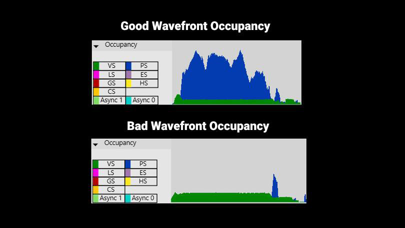
<p><em>VI: <strong>▲ Occupancy TỐT vs XẤU</strong> — biểu đồ chồng theo loại wavefront (<strong>VS · PS · LS · ES · GS · HS · CS</strong>, cùng <em>Async 0/1</em>). <strong>TỐT</strong>: khối lấp gần kín chiều cao suốt frame. <strong>XẤU</strong>: gần như trống, chỉ nhô lên một mỏm — GPU đứng chờ. / EN: Good vs bad wavefront occupancy.</em></p>

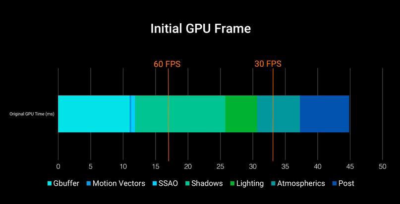
<p><em>VI: <strong>▲ Frame GPU BAN ĐẦU</strong> — thanh xếp chồng <strong>Gbuffer · Motion Vectors · SSAO · Shadows · Lighting · Atmospherics · Post</strong>, tổng ~<strong>45 ms</strong>, vượt XA cả mốc <strong>30 FPS (33 ms)</strong> lẫn <strong>60 FPS (16,7 ms)</strong>. / EN: The initial GPU frame breakdown against the 60 FPS and 30 FPS budgets.</em></p>

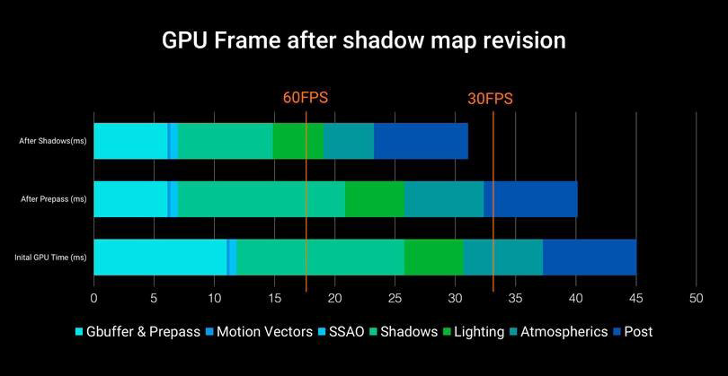
<p><em>VI: <strong>▲ Sau khi sửa shadow map</strong> — ba thanh so sánh <strong>Initial GPU Time</strong> → <strong>After Prepass</strong> → <strong>After Shadows</strong>: khối <em>Shadows</em> co lại rõ rệt và tổng frame lọt xuống dưới mốc 30 FPS. / EN: GPU frame after the shadow map revision.</em></p>

<div class="bilingual-row">
<div class="col-vi">
<p>🔑 <strong>Cơ chế:</strong></p>
<blockquote>
<p><em>"Khi bạn gửi một draw call tới GPU, <strong>công việc đó CHIA thành nhiều WAVEFRONT mà Unity PHÂN PHỐI khắp các SIMD khả dụng bên trong GPU</strong>.</em></p>
<p><em><strong>MỖI SIMD có SỐ LƯỢNG TỐI ĐA wavefront có thể chạy CÙNG LÚC.</strong></em></p>
<p><em>👉 <strong>WAVEFRONT OCCUPANCY chỉ SỐ wavefront hiện đang được dùng SO VỚI mức tối đa.</strong> Nó <strong>ĐO mức bạn đang tận dụng TIỀM NĂNG của GPU tốt tới đâu</strong>. <strong>PIX và Razor hiển thị wavefront occupancy RẤT chi tiết.</strong>"</em></p>
</blockquote>
<p><strong>📊 Cách đọc — ví dụ từ Book of the Dead:</strong></p>
<blockquote>
<p><em>"<strong>Wavefront của vertex shader hiện màu XANH LÁ. Wavefront của pixel shader hiện màu XANH DƯƠNG.</strong></em></p>
<p><em>💀 Trên đồ thị dưới, <strong>NHIỀU wavefront vertex shader xuất hiện mà KHÔNG có nhiều hoạt động pixel shader. Điều này cho thấy GPU đang bị TẬN DỤNG DƯỚI MỨC (underutilization).</strong></em></p>
<p><em>🔑 <strong>Nếu bạn làm RẤT NHIỀU việc vertex shader mà KHÔNG cho ra pixel, điều đó có thể chỉ ra sự KÉM HIỆU QUẢ.</strong>"</em></p>
</blockquote>
<p>⚖️ <strong>Nhưng KHÔNG đơn giản "càng cao càng tốt":</strong></p>
<blockquote>
<p><em>"<strong>Tuy occupancy THẤP KHÔNG NHẤT THIẾT là xấu</strong>, nó là <em>một metric để bắt đầu tối ưu shader và kiểm tra các bottleneck khác</em>.</em></p>
<p><em>✅ Ví dụ, <strong>nếu bạn bị STALL do thao tác memory hoặc compute, TĂNG occupancy có thể giúp hiệu năng</strong>.</em></p>
<p><em>🚨 <strong>Mặt khác, QUÁ NHIỀU wavefront đang bay (in-flight) có thể gây CACHE THRASHING và GIẢM hiệu năng.</strong>"</em></p>
</blockquote>
</div>
<div class="col-en">
<p>🔑 <strong>The mechanism:</strong></p>
<blockquote>
<p><em>"When you send a draw call to the GPU, <strong>that work SPLITS into many WAVEFRONTS that Unity DISTRIBUTES throughout the available SIMDs within the GPU</strong>.</em></p>
<p><em><strong>EACH SIMD has a MAXIMUM number of wavefronts that can be running AT ONE TIME.</strong></em></p>
<p><em>👉 <strong>WAVEFRONT OCCUPANCY refers to how many wavefronts are currently in use RELATIVE to the maximum.</strong> It <strong>MEASURES how well you are using the GPU's POTENTIAL</strong>. <strong>PIX and Razor show wavefront occupancy in GREAT detail.</strong>"</em></p>
</blockquote>
<p><strong>📊 How to read it — the Book of the Dead example:</strong></p>
<blockquote>
<p><em>"<strong>Vertex shader wavefronts appear in GREEN. Pixel shader wavefronts appear in BLUE.</strong></em></p>
<p><em>💀 On the bottom graph, <strong>MANY vertex shader wavefronts appear WITHOUT much pixel shader activity. This shows an UNDERUTILIZATION of the GPU's potential.</strong></em></p>
<p><em>🔑 <strong>If you're doing a LOT of vertex shader work that DOESN'T result in pixels, that may indicate an INEFFICIENCY.</strong>"</em></p>
</blockquote>
<p>⚖️ <strong>But it's NOT simply "higher is better":</strong></p>
<blockquote>
<p><em>"<strong>While LOW wavefront occupancy is NOT NECESSARILY BAD</strong>, it's <em>a metric to START optimizing your shaders and checking for other bottlenecks</em>.</em></p>
<p><em>✅ For example, <strong>if you have a STALL due to memory or compute operations, INCREASING occupancy may help performance</strong>.</em></p>
<p><em>🚨 <strong>On the other hand, TOO MANY in-flight wavefronts can cause CACHE THRASHING and DECREASE performance.</strong>"</em></p>
</blockquote>
</div>
</div>

### 23.4. 🔀 Async Compute — Lấp chỗ trống của GPU

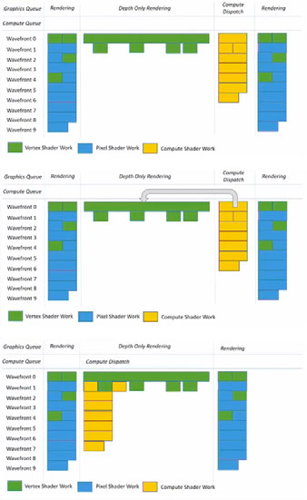
<p><em>VI: <strong>▲ Hàng đợi GPU khi dùng async compute</strong> — cột <strong>Graphics Queue</strong> và <strong>Compute Dispatch</strong> chạy SONG SONG; ba biến thể cho thấy cách xếp lại công việc để lấp khoảng trống của queue đồ hoạ. / EN: The graphics queue and compute dispatch running in parallel.</em></p>

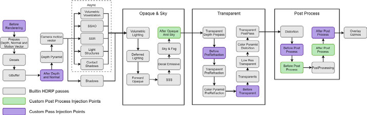
<p><em>VI: <strong>▲ Sơ đồ pass ĐẦY ĐỦ của HDRP</strong> — từ <em>Before Rendering</em> → Depth/Normal, Motion Vector → <strong>Async: Volumetrics Voxelization · SSAO · SSR · Light Structures</strong> → <em>Opaque &amp; Sky</em> → <em>Transparent</em> → <em>Post Process</em>. Chú giải phân biệt <strong>Built-in HDRP passes</strong>, <strong>Custom Post Process Injection Points</strong> và <strong>Custom Pass Injection Points</strong>. / EN: The full HDRP frame graph with built-in passes and custom injection points.</em></p>

!!! success "Kỹ thuật nâng cao nhất trong chương"
    <div class="bilingual-row">
    <div class="col-vi">
    <blockquote>
    <p><em>"Nếu bạn có <strong>khoảng thời gian đang TẬN DỤNG DƯỚI MỨC GPU</strong>, <strong>Async Compute cho phép bạn CHUYỂN công việc compute shader HỮU ÍCH chạy SONG SONG với graphics queue của bạn</strong>. Điều này <strong>tận dụng TỐT HƠN các tài nguyên GPU đó</strong>."</em></p>
    </blockquote>
    <p><strong>📖 Ví dụ cụ thể — rất sáng rõ:</strong></p>
    <blockquote>
    <p><em>"Ví dụ, <strong>trong lúc SINH SHADOW MAP, GPU thực hiện render CHỈ DEPTH</strong>. <strong>RẤT ÍT công việc pixel shader xảy ra ở điểm này, và NHIỀU wavefront vẫn TRỐNG.</strong></em></p>
    <p><em>✅ <strong>Nếu bạn có thể ĐỒNG BỘ một số công việc compute shader với việc render chỉ-depth này, nó tạo ra việc SỬ DỤNG GPU TỔNG THỂ TỐT HƠN.</strong></em></p>
    <p><em>💎 <strong>Các wavefront không dùng có thể giúp với Screen Space Ambient Occlusion hoặc BẤT KỲ tác vụ nào BỔ SUNG cho công việc hiện tại.</strong>"</em></p>
    </blockquote>
    <p>📊 <strong>Kết quả case study:</strong> <em>"Trong ví dụ này từ Book of the Dead, <strong>một số tối ưu đã cắt được VÀI MILI-GIÂY khỏi shadow mapping, lighting pass, và atmospherics. Chi phí frame kết quả cho phép ứng dụng chạy 30 fps trên PS4 Pro.</strong>"</em></p>
    <p>👉 Nhắc lại: view ban đầu <strong>GPU-bound ở ~45 ms/frame</strong> ⇒ sau tối ưu đạt <strong>30 fps (33.3 ms)</strong>.</p>
    </div>
    <div class="col-en">
    <blockquote>
    <p><em>"If you have <strong>intervals where you are UNDERUTILIZING the GPU</strong>, <strong>Async Compute allows you to MOVE useful compute shader work IN PARALLEL to your graphics queue</strong>. This <strong>makes BETTER use of those GPU resources</strong>."</em></p>
    </blockquote>
    <p><strong>📖 The concrete example — very illuminating:</strong></p>
    <blockquote>
    <p><em>"For example, <strong>during SHADOW MAP GENERATION, the GPU performs DEPTH-ONLY rendering</strong>. <strong>VERY LITTLE pixel shader work happens at this point, and MANY wavefronts remain UNOCCUPIED.</strong></em></p>
    <p><em>✅ <strong>If you can SYNCHRONIZE some compute shader work with the depth-only rendering, this makes for a BETTER OVERALL USE of the GPU.</strong></em></p>
    <p><em>💎 <strong>The unused wavefronts could help with Screen Space Ambient Occlusion or ANY task that COMPLEMENTS the current work.</strong>"</em></p>
    </blockquote>
    <p>📊 <strong>The case study result:</strong> <em>"In this example from Book of the Dead, <strong>several optimizations shaved SEVERAL MILLISECONDS off the shadow mapping, lighting pass, and atmospherics. The resulting frame cost allowed the application to run at 30 fps on a PS4 Pro.</strong>"</em></p>
    <p>👉 Recall: the initial view was <strong>GPU-bound at ~45 ms/frame</strong> ⇒ after optimization it hit <strong>30 fps (33.3 ms)</strong>.</p>
    </div>
    </div>

<div class="bilingual-row">
<div class="col-vi">
<p><strong>Hai kỹ thuật console còn lại:</strong></p>
<ul>
<li><strong>Giảm kích thước render target của shadow mapping:</strong> <em>"Setting <strong>High Quality của HDRP MẶC ĐỊNH dùng shadow map 4K</strong>. Hãy <strong>GIẢM độ phân giải shadow map và ĐO tác động lên chi phí frame</strong>. Chỉ cần lưu ý bạn có thể phải <strong>bù đắp thay đổi chất lượng thị giác bằng setting của đèn</strong>."</em></li>
<li><strong>Dùng built-in và custom pass của HDRP:</strong> <em>"Built-in pass có thể <strong>giúp bạn tối ưu shader</strong>. HDRP bao gồm <strong>nhiều INJECTION POINT nơi bạn có thể thêm custom pass</strong>."</em></li>
</ul>
</div>
<div class="col-en">
<p><strong>The two remaining console techniques:</strong></p>
<ul>
<li><strong>Reduce shadow mapping render target size:</strong> <em>"The <strong>High Quality setting of HDRP DEFAULTS to using a 4K shadow map</strong>. <strong>REDUCE the shadow map resolution and MEASURE the impact on frame cost</strong>. Just be aware you may need to <strong>compensate for visual quality changes with the light's settings</strong>."</em></li>
<li><strong>Use HDRP built-in and custom passes:</strong> <em>"The built-in passes can <strong>help you optimize your shaders</strong>. HDRP includes <strong>several INJECTION POINTS where you can add custom passes</strong>."</em></li>
</ul>
</div>
</div>

---

## 24. 🎆 Particle System vs Visual Effect Graph

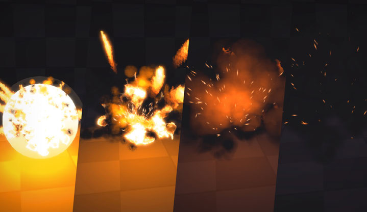
<p><em>VI: Mô phỏng hiệu ứng đơn giản bằng <strong>Particle System</strong>. / EN: A simple effects simulation using the Particle System.</em></p>

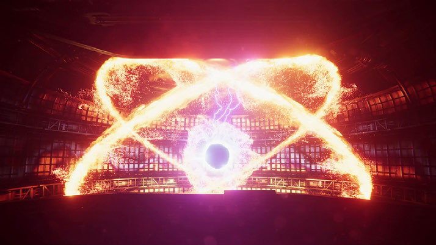
<p><em>VI: <strong>HÀNG TRIỆU particle</strong> trên màn hình tạo bằng <strong>Visual Effect Graph</strong>. / EN: Millions of particles on-screen created with the Visual Effect Graph.</em></p>

| | **Particle System** | **Visual Effect Graph** |
|---|---|---|
| **Chạy trên** | 🖥️ **CPU** | ⚡ **GPU** — qua **compute shader** |
| **Quy mô** | Mô phỏng **HÀNG NGHÌN particle** | Mô phỏng **HÀNG TRIỆU particle** trong hiệu ứng quy mô lớn |
| **Điều khiển** | Dùng **script C#** để định nghĩa system và từng particle | **Graph view có khả năng tùy biến CAO** |
| **Physics** | ✅ **Tương tác được với hệ thống physics và mọi Collider trong Scene** | ❌ **KHÔNG truy cập được hệ thống physics** |
| **Khả năng đặc biệt** | — | ✅ Particle **tương tác được với COLOR và DEPTH BUFFER**; làm việc với **Point Caches, Vector Fields, Signed Distance Fields** |
| **Tương thích** | ✅ **Tương thích TỐI ĐA — chạy trên MỌI nền tảng Unity hỗ trợ** | ⚠️ **CHỈ chạy trên nền tảng hỗ trợ COMPUTE SHADER và HDRP** *(hỗ trợ URP hiện đang Preview)* |

!!! warning "Quy tắc chọn — nhớ khả năng thiết bị"
    **VI:** *"Khi chọn một trong hai hệ thống, hãy **nhớ tới TÍNH TƯƠNG THÍCH của thiết bị**. **Hầu hết PC và console HỖ TRỢ compute shader, nhưng NHIỀU thiết bị mobile thì KHÔNG.** Nếu nền tảng đích của bạn CÓ hỗ trợ compute shader, Unity cho phép bạn **dùng CẢ HAI loại mô phỏng particle trong cùng dự án**."*

    **EN:** *"When selecting one of the two systems, **keep DEVICE COMPATIBILITY in mind**. **Most PCs and consoles support compute shaders, but MANY mobile devices do NOT.** If your target platform does support compute shaders, Unity allows you to **use BOTH types of particle simulation in your project**."*

    👉 Nhắc lại từ [§5.3](#53-particle-vegetation-hai-ke-gay-overdraw-kinh-ien): dù dùng hệ thống nào, **overdraw của particle vẫn là mối lo hàng đầu**.

---

## 25. 🎆 Tối ưu VFX Graph — Toàn bộ chương OPTIMIZATION

> 📕 **Nguồn:** e-book [***The definitive guide to creating advanced visual effects in Unity***, 120 trang](https://cdn.bfldr.com/S5BC9Y64/at/6qfsbqs59798rprm563f/The_definitive_guide_to_creating_advanced_visual_effects_in_Unity.pdf) — chương **OPTIMIZATION** (tr.98–110), bóc tách toàn văn + trích ảnh.

<div class="bilingual-row">
<div class="col-vi">
<blockquote>
<p><em>"Sau khi làm việc SÂU với VFX Graph, bạn nhiều khả năng sẽ muốn <strong>TÁI TỔ CHỨC và TỐI ƯU chúng — GIỐNG như cách một lập trình viên profile code và kiểm tra hiệu năng của nó</strong>.</em></p>
<p><em>✅ <strong>Khi hiệu ứng đã TRÔNG ĐÚNG, hãy ĐẢM BẢO nó KHÔNG dùng tài nguyên DƯ THỪA trước khi deploy vào game hay ứng dụng cuối cùng.</strong>"</em></p>
</blockquote>
</div>
<div class="col-en">
<blockquote>
<p><em>"After working CLOSELY with VFX Graphs, you'll likely want to <strong>REORGANIZE and OPTIMIZE them, MUCH LIKE how a programmer profiles code and checks its performance</strong>.</em></p>
<p><em>✅ <strong>Once the effect LOOKS RIGHT, make SURE it's NOT using EXCESS resources before deploying to your final game or application.</strong>"</em></p>
</blockquote>
</div>
</div>

### 25.1. Profiler & Frame Debugger cho VFX

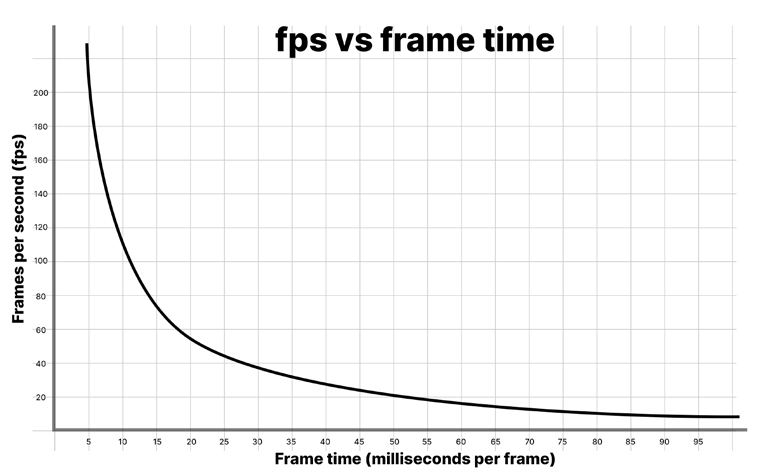
<p><em>VI: <strong>▲ FPS và FRAME TIME là quan hệ NGHỊCH ĐẢO</strong> — đường cong dốc đứng ở vùng frame time nhỏ: từ 5 ms lên 10 ms mất hơn 100 fps, nhưng từ 50 ms lên 55 ms chỉ mất vài fps. Đây là lý do <strong>phải đo bằng MILLISECOND, không phải FPS</strong>. / EN: The fps vs frame time curve.</em></p>

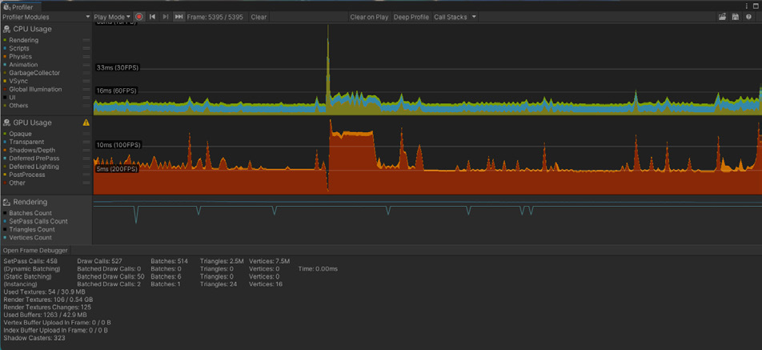
<p><em>VI: <strong>▲ Profiler + thống kê rendering cho một scene VFX</strong> — CPU Usage và GPU Usage xếp chồng, khối Rendering chiếm phần lớn; bảng dưới cho <strong>SetPass Calls · Draw Calls · Batches · Triangles · Vertices</strong> cùng số liệu bộ nhớ texture/render texture. / EN: The Profiler and rendering statistics for a VFX-heavy scene.</em></p>

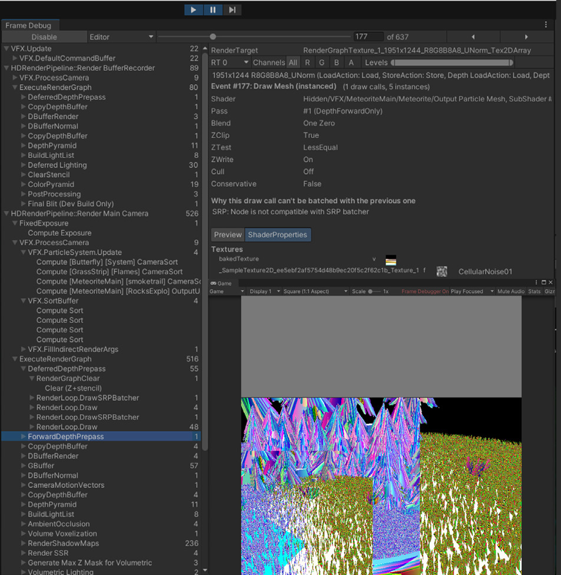
<p><em>VI: <strong>▲ Frame Debugger cho VFX</strong> — chuỗi <code>VFXUpdate</code> / <code>VFXParticleSystem</code> compute dispatch trước, rồi mới tới pass vẽ; ảnh giữa cho thấy phần particle được vẽ ra. / EN: The Frame Debugger showing VFX compute dispatches before the draw passes.</em></p>

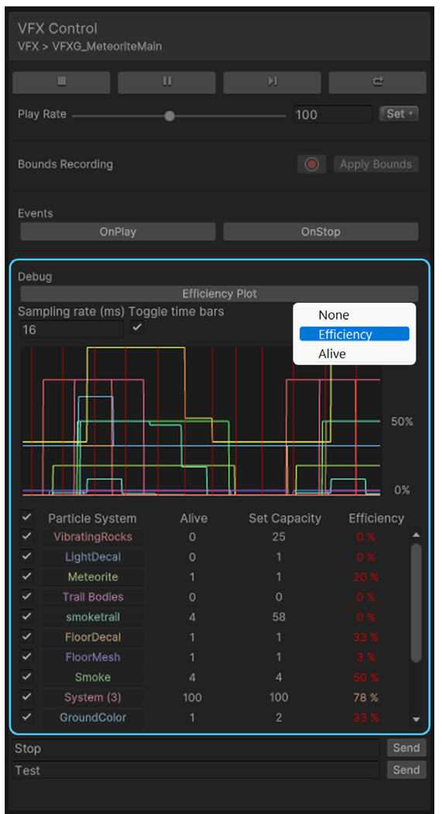
<p><em>VI: <strong>▲ Cửa sổ VFX Control — <em>Efficiency Plot</em></strong> — bảng liệt kê TỪNG <strong>Particle System</strong> với <strong>Alive · Set Capacity · Efficiency</strong>; hệ nào <strong>Efficiency thấp</strong> là đang cấp phát THỪA capacity. Đây là công cụ tìm lãng phí NHANH NHẤT của VFX Graph. / EN: The VFX Control window with the Efficiency Plot and per-system Alive/Capacity/Efficiency.</em></p>

<div class="bilingual-row">
<div class="col-vi">
<blockquote>
<p><em>"Unity Profiler (<code>Window &gt; Analysis &gt; Profiler</code>) và Frame Debugger (<code>Window &gt; Analysis &gt; Frame Debugger</code>) <strong>có thể dùng để tối ưu graph của bạn cho hiệu năng MẠNH HƠN</strong>.</em></p>
<p><em>🚨 <strong>TUY NHIÊN, Unity EDITOR có thể ẢNH HƯỞNG tới thông tin profiling của bạn, dẫn tới KẾT QUẢ KHÔNG CHÍNH XÁC.</strong></em></p>
<p><em>✅ <strong>Dùng tuỳ chọn Profiler STANDALONE PROCESS hoặc TẠO MỘT BUILD RIÊNG khi bạn cần đo hiệu năng THỰC TẾ.</strong>"</em></p>
</blockquote>
<p>⏱️ <strong>Nhắc lại metric đúng:</strong></p>
<blockquote>
<p><em>"Khi xem xét thống kê rendering, <strong>hãy chú ý CHI PHÍ THỜI GIAN MỖI FRAME thay vì frame per second. <code>fps</code> có thể GÂY HIỂU LẦM khi làm chuẩn đo vì nó PHI TUYẾN.</strong></em></p>
<p><em>📊 <strong>Nếu bạn nhắm 60 fps, hãy dùng 16 ms/frame làm frame budget (hoặc 33 ms/frame cho 30 fps).</strong>"</em></p>
</blockquote>
<p>👉 <em>Cùng một bài học với <a href="../01-fresher/01-ultimate-guide-to-profiling.md">Module 1 §1</a> — <strong>fps phi tuyến, frame time thì tuyến tính</strong>.</em></p>
<p>🔍 <em>"Frame Debugger hiển thị thông tin draw call. Panel <strong>TRÁI</strong> hiển thị <strong>trình tự draw call và các sự kiện rendering khác, sắp xếp PHÂN CẤP</strong>. Panel <strong>PHẢI</strong> hiển thị <strong>chi tiết của draw call được chọn, GỒM CẢ shader pass và texture</strong>. Điều này giúp bạn <strong>đóng vai 'THÁM TỬ FRAME' và tìm ra Unity đang tiêu tài nguyên ở ĐÂU</strong>."</em></p>
</div>
<div class="col-en">
<blockquote>
<p><em>"The Unity Profiler (<code>Window &gt; Analysis &gt; Profiler</code>) and Frame Debugger (<code>Window &gt; Analysis &gt; Frame Debugger</code>) <strong>can be used to optimize your graphs for STRONGER performance</strong>.</em></p>
<p><em>🚨 <strong>HOWEVER, the Unity EDITOR can AFFECT your profiling information, leading to INACCURATE RESULTS.</strong></em></p>
<p><em>✅ <strong>Use the Profiler STANDALONE PROCESS option or CREATE A SEPARATE BUILD when you need to measure REAL-WORLD performance.</strong>"</em></p>
</blockquote>
<p>⏱️ <strong>The correct metric, restated:</strong></p>
<blockquote>
<p><em>"When examining rendering statistics, <strong>take note of the TIME COST PER FRAME rather than frames per second. The <code>fps</code> can be MISLEADING as a benchmark because it's NONLINEAR.</strong></em></p>
<p><em>📊 <strong>If you're aiming for 60 fps, use 16 ms per frame as your frame budget (or 33 ms per frame for 30 fps).</strong>"</em></p>
</blockquote>
<p>👉 <em>The same lesson as <a href="../01-fresher/01-ultimate-guide-to-profiling.md">Module 1 §1</a> — <strong>fps is nonlinear, frame time is linear</strong>.</em></p>
<p>🔍 <em>"The Frame Debugger shows draw call information. The <strong>LEFT</strong> panel shows <strong>the sequence of draw calls and other rendering events arranged HIERARCHICALLY</strong>. The <strong>RIGHT</strong> panel displays <strong>the details of a selected draw call, INCLUDING shader passes and textures</strong>. This helps you <strong>play 'FRAME DETECTIVE' and find out WHERE Unity is spending its resources</strong>."</em></p>
</div>
</div>

### 25.2. 🕵️ "Những nghi phạm quen thuộc" — Bảy điểm phải rà

| # | Nghi phạm / Suspect | Nguyên văn Unity |
|---|---|---|
| **①** | **Texture size**<br>*Kích thước texture* | *"**Nếu asset KHÔNG tiến gần Camera, hãy GIẢM độ phân giải của nó.**"* |
| **②** | **Capacity**<br>*Sức chứa* | *"**ÍT particle hơn thì dùng ÍT tài nguyên hơn. Đặt `Capacity` trong Initialize Block để GIỚI HẠN số particle TỐI ĐA của System.**"* |
| **③** | **Visibility and lifetime**<br>*Khả kiến & vòng đời* | *"**Nhìn chung, NẾU bạn KHÔNG THỂ THẤY thứ gì đó trên màn hình, hãy TẮT nó đi.**"* |
| **④** | **Operators and memory**<br>*Operator & bộ nhớ* | *"**ĐƠN GIẢN HOÁ các Operator KHÔNG CẦN THIẾT. Nếu KHÔNG khác biệt về mặt THỊ GIÁC, hãy dùng ÍT VÒNG LẶP hơn.**"* |
| **⑤** | **Flipbooks** | *"**Thay vì mô phỏng TỪNG particle, hãy cân nhắc PRE-RENDER một số hiệu ứng thành texture flipbook. Rồi PHÁT LẠI texture động ở những nơi KHÔNG cần mô phỏng đầy đủ.**"* |
| **⑥** | **Mesh size**<br>*Kích thước mesh* | *"**Nếu particle của bạn là Output Meshes, hãy CHẮC CHẮN GIẢM số đa giác.**"* |
| **⑦** | **Excessive overdraw**<br>*Overdraw quá mức* | *"**Nếu bạn có NHIỀU bề mặt trong suốt, chúng SẼ NGỐN tài nguyên rendering. Dùng RENDERING DEBUGGER (`Window > Analysis > Rendering Debugger`) để kiểm tra overdraw dư thừa và tinh chỉnh graph tương ứng. Đồng thời, CHUYỂN SANG OCTAGON PARTICLE khi có thể.**"* |

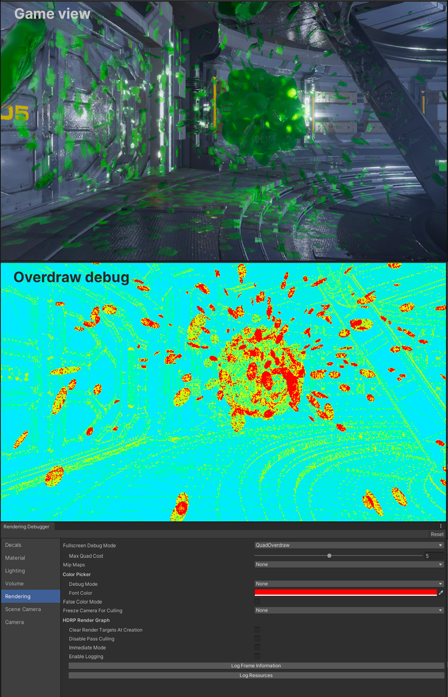
<p><em>VI: <strong>Rendering Debugger — chế độ <code>QuadOverdraw</code></strong> (Max Quad Cost = 5). <strong>Trên: Game view · Dưới: Overdraw debug</strong> — <strong>XANH LAM = rẻ · VÀNG = trung bình · ĐỎ = tốn kém</strong>. Chú ý vụ nổ ở giữa và các mảnh particle đều hiện ĐỎ. / EN: The Rendering Debugger in QuadOverdraw mode. Minimize overdraw (red) to improve performance.</em></p>

!!! danger "🔬 `QuadOverdraw` chính là công cụ ĐO trực tiếp vấn đề ở §6"
    **VI:** Chế độ này **KHÔNG đếm số lần một pixel bị vẽ lại** như Overdraw thường — nó đếm **CHI PHÍ QUAD**, tức chính là **overshading** đã phân tích ở [§6](#6-overshading-quad-lang-phi-75-am-tham). Particle nhỏ và mảnh vụn hiện **ĐỎ** vì mỗi mảnh chỉ phủ vài pixel nhưng vẫn **buộc GPU shade trọn khối 2×2 quad**. Tham số **`Max Quad Cost`** đặt ngưỡng ứng với màu đỏ (ở ảnh trên là **5**).

    **EN:** This mode does NOT count how many times a pixel is redrawn like plain Overdraw — it counts **QUAD COST**, i.e. exactly the **overshading** analyzed in [§6](#6-overshading-quad-lang-phi-75-am-tham). Small particles and debris show **RED** because each fragment covers only a few pixels yet still **forces the GPU to shade a full 2×2 quad**. **`Max Quad Cost`** sets the threshold that maps to red (**5** in the image above).

!!! tip "🧪 A/B test bằng cách bật/tắt từng Block"
    <div class="bilingual-row">
    <div class="col-vi">
    <blockquote>
    <p><em>"Khi tìm nguyên nhân hiệu năng, hãy <strong>BẬT hoặc TẮT TỪNG Block bằng checkbox ở góc TRÊN-PHẢI. Điều này cho phép bạn A/B test NHANH để đo hiệu năng (TRƯỚC và SAU), qua đó CÔ LẬP một phần của graph.</strong></em></p>
    <p><em>⚠️ <strong>ĐỪNG QUÊN khôi phục các Block về trạng thái Active sau khi xong.</strong>"</em></p>
    </blockquote>
    <p>🐞 <strong>Debug modes trong VFX Control panel:</strong></p>
    <blockquote>
    <p><em>"VFX Control panel gồm <strong>Debug mode dùng để xác định VÒNG ĐỜI và SỨC CHỨA của particle — hai thứ có thể ảnh hưởng tới CẢ hiệu năng LẪN mức dùng bộ nhớ</strong>. Sửa một instance Visual Effect từ Inspector, rồi đặt tuỳ chọn <strong>Debug</strong> thành <strong><code>Alive</code></strong> hoặc <strong><code>Efficiency</code></strong>.</em></p>
    <p><em>📈 <strong>Các đồ thị kết quả sẽ cho thấy BAO NHIÊU particle đang SỐNG, hoặc con số đó SO SÁNH thế nào với sức chứa (capacity) đã đặt của System. Điều chỉnh count và capacity để CẢI THIỆN HIỆU SUẤT của VFX Graph.</strong>"</em></p>
    </blockquote>
    </div>
    <div class="col-en">
    <blockquote>
    <p><em>"When troubleshooting performance, <strong>ENABLE or DISABLE EACH Block with the checkbox at the TOP-RIGHT corner. This lets you do QUICK A/B TESTING to measure performance (BEFORE and AFTER) so you can ISOLATE part of your graph.</strong></em></p>
    <p><em>⚠️ <strong>DON'T FORGET to restore your Blocks to their Active state once complete.</strong>"</em></p>
    </blockquote>
    <p>🐞 <strong>Debug modes in the VFX Control panel:</strong></p>
    <blockquote>
    <p><em>"The VFX Control panel includes <strong>Debug modes you can use to determine particle LIFETIME and CAPACITY, which can influence performance AND memory usage alike</strong>. Edit a Visual Effect instance from the Inspector, then set the <strong>Debug</strong> option to <strong><code>Alive</code></strong> or <strong><code>Efficiency</code></strong>.</em></p>
    <p><em>📈 <strong>The resulting plots will show HOW MANY particles are ALIVE, or how that count COMPARES to the System's set capacity. Adjust your count and capacity settings to IMPROVE your VFX Graph's EFFICIENCY.</strong>"</em></p>
    </blockquote>
    </div>
    </div>

### 25.3. 📦 Bounds — Tối ưu culling DỰNG SẴN của VFX

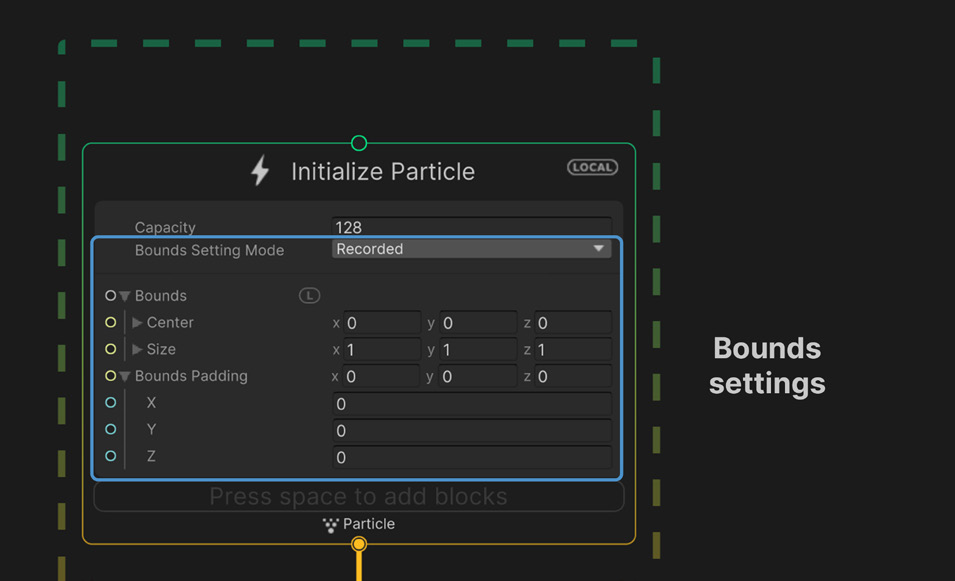
<p><em>VI: <strong>▲ Bounds trong <code>Initialize Particle</code></strong> — <strong>Capacity 128</strong>, <strong>Bounds Setting Mode: Recorded</strong>, kèm <strong>Bounds Center/Size</strong> và <strong>Bounds Padding</strong>. Bounds SAI là nguyên nhân phổ biến khiến hiệu ứng bị cull nhầm hoặc KHÔNG BAO GIỜ bị cull. / EN: The Bounds settings inside the Initialize Particle context.</em></p>

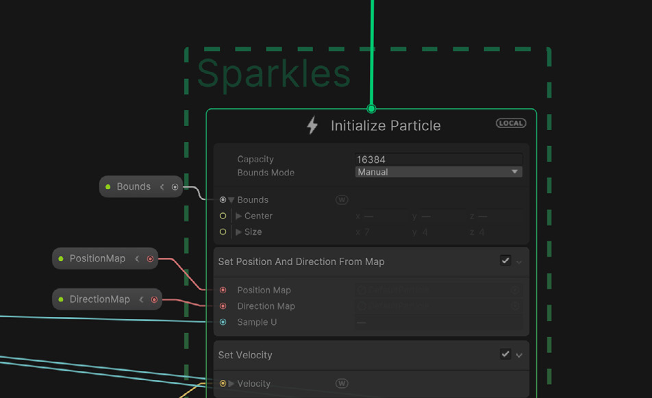
<p><em>VI: <strong>▲ Hệ <em>Sparkles</em></strong> — <strong>Capacity 16.384</strong>, <strong>Bounds Mode: Manual</strong>, và block <strong>Set Position And Direction From Map</strong> nhận <code>PositionMap</code> / <code>DirectionMap</code> + <code>Sample U</code>. / EN: The Sparkles system with a 16,384 capacity and Set Position And Direction From Map.</em></p>

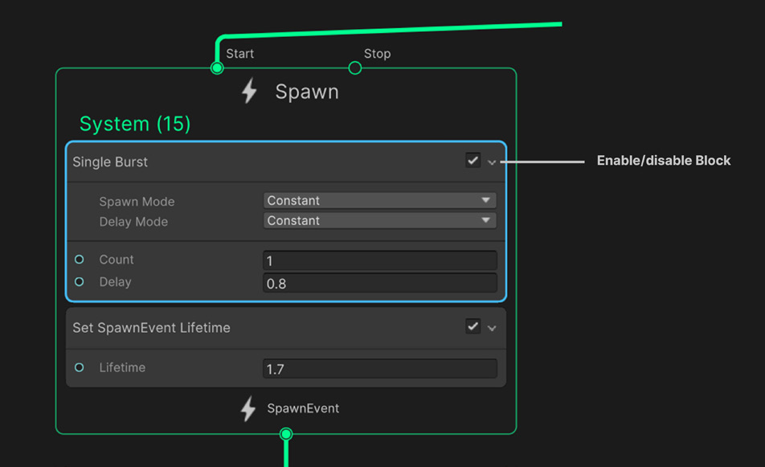
<p><em>VI: <strong>▲ Context <em>Spawn</em></strong> — block <strong>Single Burst</strong> (Spawn Mode Constant · Delay Mode Constant · <strong>Count 1</strong> · <strong>Delay 0.8</strong>) và <strong>Set SpawnEvent Lifetime 1.7</strong>; mũi tên chỉ ô tick <strong>Enable/disable Block</strong> — tắt block để đo chi phí từng phần. / EN: The Spawn context with a Single Burst block and the enable/disable toggle.</em></p>

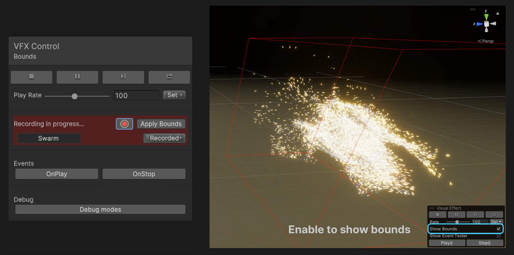
<p><em>VI: <strong>Ghi lại Bounds lúc runtime</strong> — panel <strong>VFX Control</strong> (trái) với <em>Recording in progress… · Apply Bounds · chế độ <strong>Recorded</strong></em>, và Scene view (phải) hiển thị <strong>khung Bounds MÀU ĐỎ nở ra theo hiệu ứng</strong> khi bật <strong>Show Bounds</strong>. / EN: Recording the Bounds at runtime.</em></p>

<div class="bilingual-row">
<div class="col-vi">
<blockquote>
<p><em>"<strong>Bounds của visual effect là một TỐI ƯU DỰNG SẴN dựa trên KHẢ KIẾN (visibility).</strong> … <strong>NẾU Camera KHÔNG THỂ THẤY Bounds, Unity CULL hiệu ứng — nghĩa là nó KHÔNG được render.</strong>"</em></p>
</blockquote>
<p>⚖️ <strong>Hai thái cực đều SAI:</strong></p>
<blockquote>
<ul>
<li><em><strong>Nếu Bounds QUÁ LỚN</strong>, camera sẽ <strong>XỬ LÝ visual effect NGAY CẢ KHI từng particle đã ra NGOÀI màn hình. Điều này LÃNG PHÍ tài nguyên.</strong></em></li>
<li><em><strong>Nếu Bounds QUÁ NHỎ</strong>, Unity có thể <strong>CULL visual effect NGAY CẢ KHI một số particle vẫn CÒN trên màn hình. Điều này tạo ra hiện tượng POPPING nhìn thấy được.</strong></em></li>
</ul>
</blockquote>
<p>💡 <em>"Mặc định, <strong>Unity tính Bounds của MỖI System TỰ ĐỘNG</strong>, nhưng bạn có thể đổi <strong>Bounds Setting Mode</strong>."</em></p>
</div>
<div class="col-en">
<blockquote>
<p><em>"<strong>The Bounds of visual effects comprise a BUILT-IN OPTIMIZATION based on VISIBILITY.</strong> … <strong>IF the Camera CAN'T SEE the Bounds, Unity CULLS the effect, meaning that it DOESN'T RENDER.</strong>"</em></p>
</blockquote>
<p>⚖️ <strong>Both extremes are WRONG:</strong></p>
<blockquote>
<ul>
<li><em><strong>If the Bounds are TOO LARGE</strong>, cameras will <strong>PROCESS the visual effects EVEN IF individual particles go OFFSCREEN. This WASTES resources.</strong></em></li>
<li><em><strong>If the Bounds are TOO SMALL</strong>, Unity might <strong>CULL the visual effects EVEN IF some particles are STILL onscreen. This can produce VISIBLE POPPING.</strong></em></li>
</ul>
</blockquote>
<p>💡 <em>"By default, <strong>Unity calculates the Bounds of each System AUTOMATICALLY</strong>, but you can change the <strong>Bounds Setting Mode</strong>."</em></p>
</div>
</div>

| Bounds Setting Mode | Cơ chế / Mechanism |
|---|---|
| **`Automatic`** | *"**Unity NỞ RỘNG Bounds để giữ hiệu ứng LUÔN NHÌN THẤY.** ⚠️ **NẾU tuỳ chọn này KHÔNG phải là cách HIỆU QUẢ NHẤT, hãy dùng một trong các tuỳ chọn dưới đây để TỐI ƯU Bounds.**"* |
| **`Manual`** | *"Dùng **`Bounds` và `Bounds Padding` để ĐỊNH NGHĨA một THỂ TÍCH trong Initialize Context**. ⚠️ **ĐƠN GIẢN nhưng TỐN THỜI GIAN để thiết lập cho TẤT CẢ System của bạn.**"* |
| **`Recorded`** ⭐ | *"Cho phép bạn **GHI LẠI Bounds từ VFX Control panel. Bounds — hiển thị MÀU ĐỎ khi đang ghi — NỞ RA khi bạn phát lại hiệu ứng. Bấm `Apply Bounds` để LƯU kích thước.**"* |

<div class="bilingual-row">
<div class="col-vi">
<p>💎 <em>"Bạn có thể <strong>dùng Operator LÚC RUNTIME để TÍNH Bounds cho MỖI System ở chế độ Manual hoặc Recorded</strong>. Initialize Context chứa một đầu vào <strong><code>Bounds Padding</code></strong> — dùng <code>Vector3</code> này để <strong>NỚI RỘNG giá trị Bounds</strong>."</em></p>
</div>
<div class="col-en">
<p>💎 <em>"You can <strong>use Operators AT RUNTIME to CALCULATE the Bounds for each System in Manual or Recorded mode</strong>. The Initialize Context contains a <strong><code>Bounds Padding</code></strong> input; use this <code>Vector3</code> to <strong>ENLARGE the Bounds' values</strong>."</em></p>
</div>
</div>

### 25.4. 🪨 Mesh LOD & Mesh Count

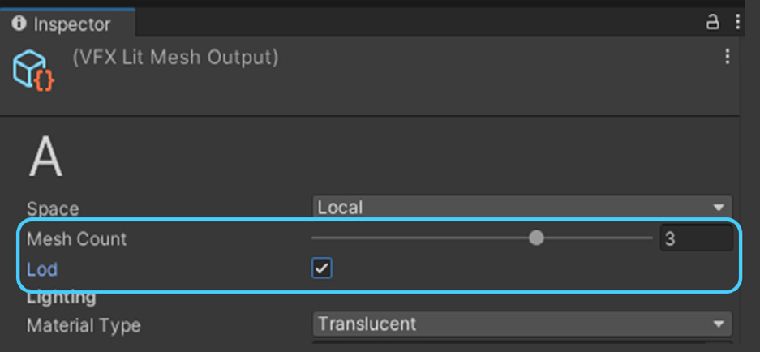
<p><em>VI: <strong>▲ <code>Output Particle Lit Mesh</code></strong> — <strong>Mesh Count 3</strong> và ô <strong>Lod ✓</strong> (khoanh xanh), <strong>Material Type: Translucent</strong>, Space Local. / EN: The Output Particle Lit Mesh context with Mesh Count 3 and Lod enabled.</em></p>

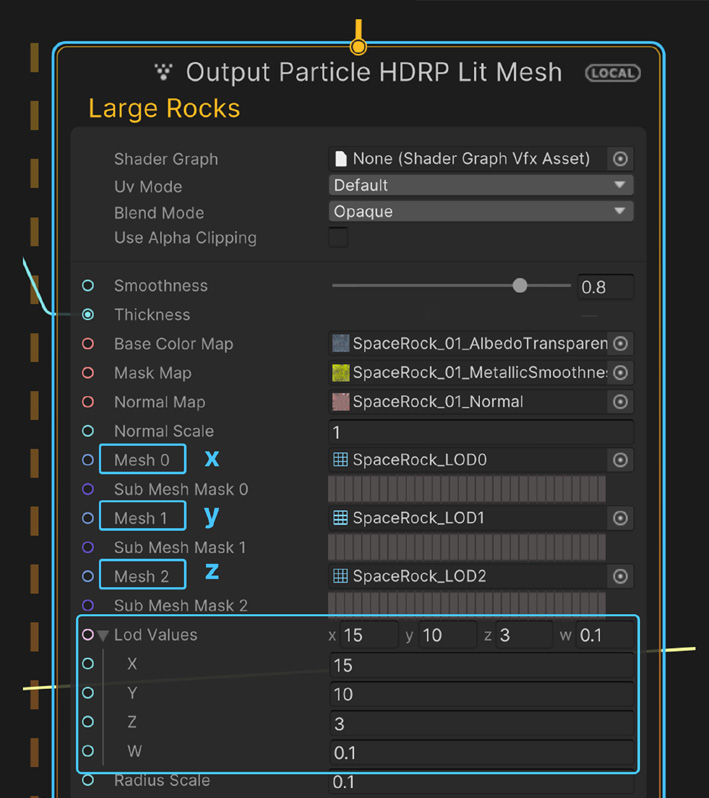
<p><em>VI: <strong>▲ Gán LOD cho từng mesh</strong> — <strong>Mesh 0 → <code>SpaceRock_01_LOD0</code> · Mesh 1 → <code>_LOD1</code> · Mesh 2 → <code>_LOD2</code></strong>, kèm <strong>Sub Mesh Mask</strong> và <strong>Lod Values X 15 · Y 10 · Z 3 · W 0.1</strong>, <strong>Radius Scale 0.1</strong>. / EN: Assigning SpaceRock LOD0/1/2 to the mesh slots with the Lod Values thresholds.</em></p>

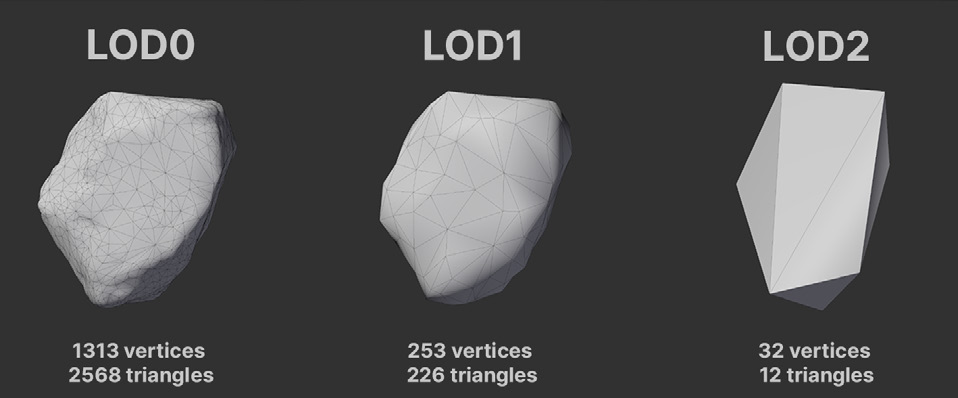
<p><em>VI: Ba mức LOD của cùng một tảng đá — <strong>LOD0: 1.313 vertex / 2.568 tam giác · LOD1: 253 vertex / 226 tam giác · LOD2: 32 vertex / 12 tam giác</strong>. / EN: LOD resolutions.</em></p>

<div class="bilingual-row">
<div class="col-vi">
<blockquote>
<p><em>"<strong>Hãy tận dụng LEVEL OF DETAIL (LOD) NẾU particle của bạn xuất ra MESH.</strong> Ở đây bạn có thể <strong>CHỈ ĐỊNH THỦ CÔNG các mesh ĐƠN GIẢN HƠN cho particle ở XA</strong>.</em></p>
<p><em>🔑 <strong>Particle Mesh Output có tham số `Mesh Count` hiển thị trong Inspector, cho phép bạn chỉ định TỚI BỐN MESH cho mỗi output. Khi KẾT HỢP với checkbox LOD, bạn có thể TỰ ĐỘNG CHUYỂN ĐỔI giữa các mesh DỰA TRÊN việc chúng xuất hiện LỚN tới đâu trên màn hình.</strong></em></p>
<p><em>📊 <strong>Model độ phân giải CAO có thể BÀN GIAO cho model độ phân giải THẤP, tuỳ theo TỶ LỆ PHẦN TRĂM KHÔNG GIAN MÀN HÌNH trong các giá trị LOD của Output context.</strong></em></p>
<p><em>📌 <strong>Trong ví dụ này, model <code>SpaceRock_LOD0</code> HOÁN ĐỔI với model NHỎ HƠN <code>SpaceRock_LOD1</code> khi mesh chiếm DƯỚI 15% màn hình.</strong>"</em></p>
</blockquote>
<p>🚀 <em>"Khi tạo <strong>SỐ LƯỢNG KHỔNG LỒ mesh particle, bạn sẽ KHÔNG cần render hàng TRIỆU đa giác. Điều này CẮT GIẢM ĐÁNG KỂ frame time.</strong>"</em> — <em>Xem ví dụ <code>PlanetaryRing</code> trong dự án mẫu.</em></p>
<p>👉 <em>Con số ở ảnh trên nói lên tất cả: <strong>LOD0 → LOD2 giảm từ 2.568 xuống 12 tam giác — tức 0,47%, tương đương giảm 99,5% khối lượng geometry.</strong> Cùng nguyên lý với LOD thường ở <a href="#22-lod-camera-moi-camera-ton-toi-1-ms">§22</a>, nhưng nhân lên với HÀNG NGHÌN particle.</em></p>
</div>
<div class="col-en">
<blockquote>
<p><em>"<strong>Take advantage of LEVEL OF DETAIL (LOD) IF your particles are OUTPUTTING MESHES.</strong> Here, you can <strong>MANUALLY SPECIFY SIMPLER meshes for DISTANT particles</strong>.</em></p>
<p><em>🔑 <strong>Particle Mesh Outputs have a `Mesh Count` parameter visible in the Inspector, which lets you specify UP TO FOUR MESHES per output. When you COMBINE this with the LOD checkbox, you can AUTOMATICALLY SWITCH between meshes BASED ON how large they appear onscreen.</strong></em></p>
<p><em>📊 <strong>Higher resolution models can HAND OFF to lower resolution models, depending on the SCREEN SPACE PERCENTAGE in the LOD values of the Output context.</strong></em></p>
<p><em>📌 <strong>In this example, the <code>SpaceRock_LOD0</code> model SWAPS with the smaller <code>SpaceRock_LOD1</code> model when the mesh occupies LESS THAN 15% of the screen.</strong>"</em></p>
</blockquote>
<p>🚀 <em>"When creating a <strong>MASSIVE NUMBER of mesh particles, you WON'T need to render MILLIONS of polygons. This SIGNIFICANTLY CUTS DOWN the frame time.</strong>"</em> — <em>See the <code>PlanetaryRing</code> example in the sample project.</em></p>
<p>👉 <em>The numbers above say it all: <strong>LOD0 → LOD2 drops from 2,568 to 12 triangles — 0.47%, a 99.5% reduction in geometry work.</strong> The same principle as regular LOD in <a href="#22-lod-camera-moi-camera-ton-toi-1-ms">§22</a>, but multiplied across THOUSANDS of particles.</em></p>
</div>
</div>

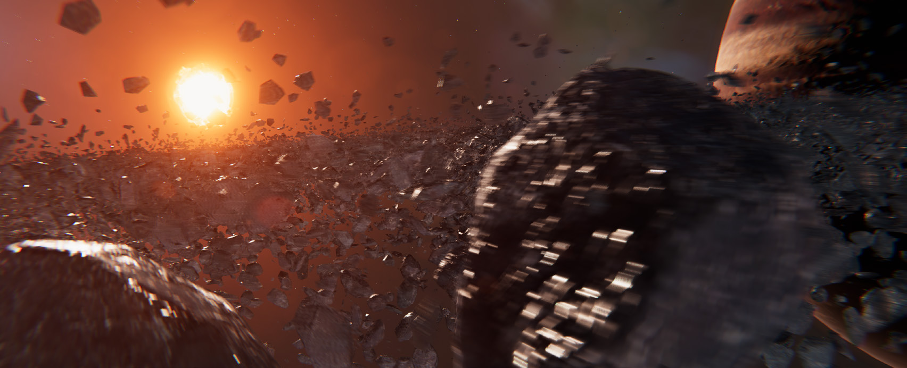
<p><em>VI: <strong>Mesh LOD tiết kiệm tài nguyên rendering</strong> — hàng nghìn mảnh thiên thạch, mỗi mảnh tự chọn mức LOD theo kích thước trên màn hình. / EN: Mesh LODs save rendering resources.</em></p>

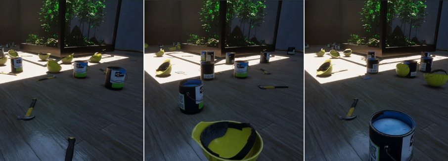
<p><em>VI: <strong><code>Mesh Count</code> dùng KHÔNG kèm LOD</strong> — <strong>BỐN mesh khác nhau</strong> cho Output Particle Lit Mesh tạo ra <strong>sự ĐA DẠNG cho các vật thể rải trên sàn</strong>. / EN: The Mesh Count randomizes mesh particles.</em></p>

<div class="bilingual-row">
<div class="col-vi">
<p>💡 <em>"Bạn cũng có thể <strong>tận dụng <code>Mesh Count</code> mà KHÔNG dùng LOD. Trong trường hợp này, ta dùng NHIỀU MESH để thêm TÍNH NGẪU NHIÊN.</strong>"</em> — <strong>Một draw setup, nhiều hình dạng: đa dạng thị giác MÀ KHÔNG tốn thêm draw call.</strong></p>
</div>
<div class="col-en">
<p>💡 <em>"You can similarly <strong>leverage the <code>Mesh Count</code> WITHOUT LOD. In this case, we use MULTIPLE MESHES to add RANDOMNESS.</strong>"</em> — <strong>One draw setup, many shapes: visual variety WITHOUT extra draw calls.</strong></p>
</div>
</div>

### 25.5. 🔺 Particle rendering — Tam giác, Octagon & Low Res Transparency

| Kỹ thuật | Nguyên văn Unity | Áp dụng |
|---|---|---|
| **Triangle particles** | *"**Với MỘT NỬA lượng geometry so với quad particle, chúng HIỆU QUẢ cho hiệu ứng DI CHUYỂN NHANH và render SỐ LƯỢNG LỚN particle.**"* | ✅ **Mọi pipeline** |
| **Simplified lighting** | *"**NẾU bạn KHÔNG cần shader Lit HDRP đầy đủ, hãy CHUYỂN sang cái ÍT NGỐN tài nguyên hơn. TUỲ BIẾN output bằng Shader Graph để BỎ những tính năng bạn KHÔNG cần cho một số hiệu ứng.**" (ví dụ: scene mẫu Bonfire dùng Shader Graph cách điệu, ĐƠN GIẢN HOÁ MẠNH output)* | ✅ **Mọi pipeline** |
| **Low resolution transparency** 🏆 | *"Trong HDRP Rendering properties, **bật `Low Res Transparency` để render particle trong suốt ở ĐỘ PHÂN GIẢI THẤP HƠN. 🚀 Điều này sẽ TĂNG HIỆU NĂNG GẤP BỐN LẦN, đổi lại một chút MỜ. Khi dùng KHÔN NGOAN, nó gần như KHÔNG THỂ PHÂN BIỆT với render ở độ phân giải đầy đủ.**"* | ⚠️ **CHỈ HDRP** |
| **Octagon particles** | *"**Octagon particle CẮT BỎ các GÓC của quad particle. NẾU texture particle của bạn TRONG SUỐT ở các góc, kỹ thuật này có thể GIẢM hoặc NGĂN overdraw. Vùng trong suốt CHỒNG NHAU vẫn đòi hỏi MỘT SỐ tính toán, nên dùng octagon giúp TIẾT KIỆM công sức KHÔNG CẦN THIẾT trong việc tính chỗ các GÓC của quad GIAO NHAU.**"* | ⚠️ **CHỈ HDRP** |

!!! success "💡 Vì sao Octagon là ý tưởng thông minh"
    **VI:** Một quad particle có **4 góc RỖNG (alpha = 0)** nhưng GPU **vẫn phải shade chúng** rồi mới loại. Cắt góc thành bát giác **giảm ~15% diện tích fragment mà KHÔNG đổi hình ảnh** — và với particle, diện tích chính là **fill rate** ([§5](#5-overdraw-early-depth-test)). Đây là **overdraw "miễn phí" bị loại bỏ**, không phải đánh đổi chất lượng.

    **EN:** A quad particle has **4 EMPTY corners (alpha = 0)** that the GPU **still shades** before discarding. Cropping to an octagon **removes ~15% of fragment area with NO visual change** — and for particles, area IS **fill rate** ([§5](#5-overdraw-early-depth-test)). This is **free overdraw eliminated**, not a quality trade-off.

### 25.6. 🚀 Case study — Tối ưu tia lửa trên Spaceship Demo

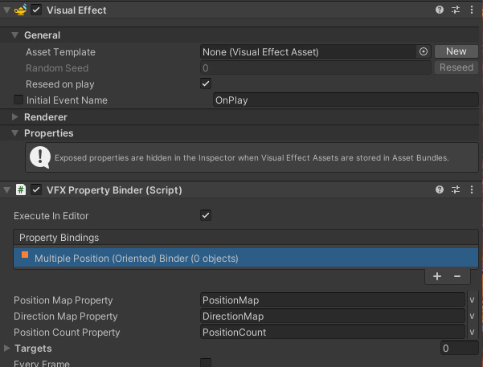
<p><em>VI: <strong>▲ <code>VFX Property Binder</code></strong> — Property Bindings dùng <strong>Multiple Position (Oriented) Binder</strong>, ánh xạ <strong>Position Map Property → <code>PositionMap</code></strong>, <strong>Direction Map Property → <code>DirectionMap</code></strong>, <strong>Position Count Property → <code>PositionCount</code></strong>, cùng <strong>Execute In Editor ✓</strong>. / EN: The VFX Property Binder with a Multiple Position (Oriented) Binder.</em></p>

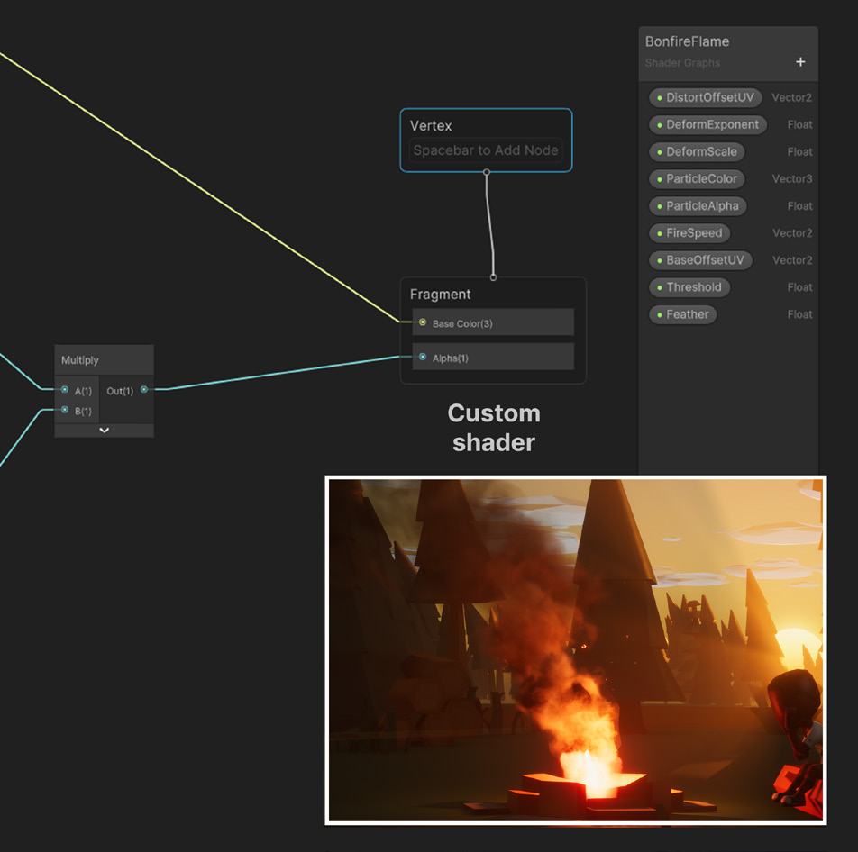
<p><em>VI: <strong>▲ Shader Graph RIÊNG cho VFX</strong> — đồ thị Vertex/Fragment tối giản, kèm ảnh preview hiệu ứng lửa. Shader riêng cho phép cắt bỏ mọi thứ VFX không dùng tới. / EN: A custom Shader Graph used by the visual effect.</em></p>

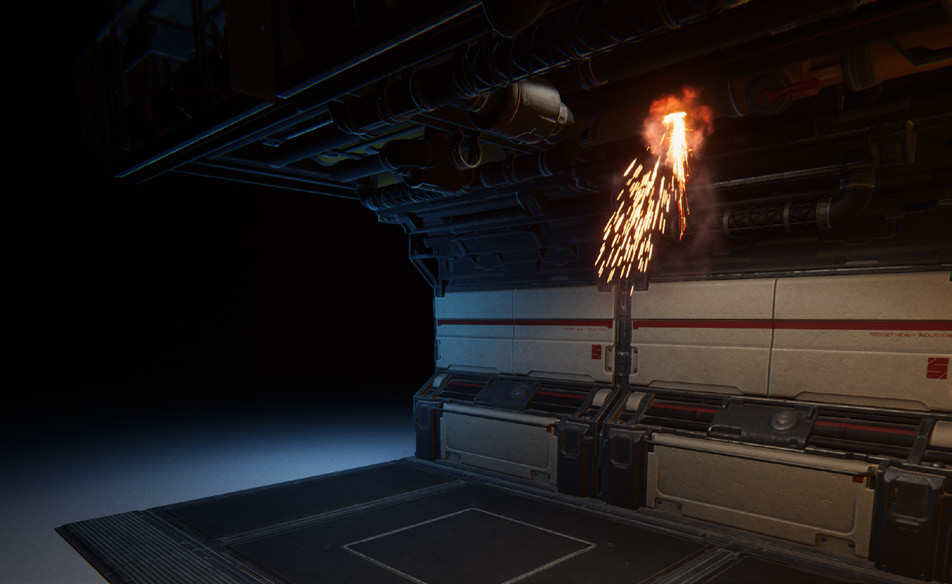
<p><em>VI: Tia lửa bắn ra từ vách khoang tàu — hiệu ứng <strong>Sparkle</strong> trong Spaceship Demo. / EN: Particles show the spaceship in danger.</em></p>

<div class="bilingual-row">
<div class="col-vi">
<p><strong>🔴 Vấn đề:</strong></p>
<blockquote>
<p><em>"Khi độ toàn vẹn của con tàu bắt đầu HỎNG, sự căng thẳng tăng lên. <strong>Camera RUNG dữ dội trong khi tia lửa bắn ra từ vách khoang. Lõi tàu cạn dần và tia lửa xuất hiện THƯỜNG XUYÊN HƠN.</strong></em></p>
<p><em>💀 <strong>Hãy nhớ rằng chỉ vài particle cho MỖI tia lửa cũng đã TỐN tài nguyên. Tạo ra vài CHỤC tia lửa có thể sinh ra HÀNG TRĂM draw call DƯ THỪA.</strong></em></p>
<p><em>⚠️ <strong>Tình huống này có thể CHẤP NHẬN được khi đang PROTOTYPE, nhưng MỌI kém hiệu quả ĐÁNG KỂ nên được KHẮC PHỤC trong graph TRƯỚC KHI game của bạn phát hành.</strong>"</em></p>
</blockquote>
<p><strong>🟢 Giải pháp — custom VFX Binder:</strong></p>
<blockquote>
<p><em>"Giải pháp cho dự án Spaceship là <strong>dùng một CUSTOM VFX BINDER</strong> — trong ví dụ này là <strong><code>MultiPosOrientedParameterBinder</code></strong>.</em></p>
<p><em>🔑 <strong>Component tuỳ chỉnh này CHUYỂN ĐỔI một SỐ LƯỢNG LỚN Transform thành một POINT CACHE MAP.</strong> Bạn sau đó có thể <strong>TRUY CẬP dữ liệu chứa trong map đó</strong>.</em></p>
<p><em>✅ <strong>MỘT mô phỏng DUY NHẤT có thể TÁI TẠO cùng timing và vị trí của hiệu ứng Sparkle bằng cách truy cập Position Map và Direction Map trong Initialize Particle Context.</strong></em></p>
<p><em>🏆 <strong>KẾT QUẢ? HÀNG TRĂM draw call ÍT HƠN và CHỈ CÒN một NHÚM instance VFX.</strong> So sánh graph <code>SparkleBurst_Single</code> và <code>SparkleBurst_Shake</code> trong dự án Spaceship Demo để thấy khác biệt."</em></p>
</blockquote>
<p>💎 <strong>Nguyên lý tổng quát — đáng ghi nhớ:</strong></p>
<blockquote>
<p><em>"<strong>LƯU DỮ LIỆU TRONG TEXTURE là một kỹ thuật tối ưu PHỔ BIẾN cho hiệu ứng thời gian thực.</strong> Nếu bạn dùng Unity 2021 LTS trở lên, hãy <strong>tận dụng hỗ trợ GRAPHICS BUFFER (thử nghiệm) khi di chuyển LƯỢNG LỚN dữ liệu</strong>."</em></p>
</blockquote>
<p>👉 <em>Cùng một tư tưởng với <a href="#12-animation-instancing-instancing-cho-skinnedmeshrenderer">§12 Animation Instancing</a> (VertexCache) và <a href="#232-tranh-tessellation-thay-geometry-shader-bang-compute-shader">§23.2</a> (compute shader): <strong>đẩy dữ liệu lên GPU MỘT LẦN dưới dạng texture/buffer, thay vì submit từng đối tượng qua CPU mỗi frame.</strong></em></p>
</div>
<div class="col-en">
<p><strong>🔴 The problem:</strong></p>
<blockquote>
<p><em>"As the ship's integrity begins to FAIL, the tension is heightened. <strong>The camera SHAKES VIOLENTLY while the sparks fly off the interior bulkhead. The core nears depletion and the sparks appear MORE FREQUENTLY.</strong></em></p>
<p><em>💀 <strong>Remember that EVEN JUST A FEW particles for each spark will COST resources. Instantiating a few DOZEN sparks can generate HUNDREDS of EXTRA draw calls.</strong></em></p>
<p><em>⚠️ <strong>This situation might be FINE while PROTOTYPING, but ANY significant inefficiencies SHOULD be RECTIFIED in your graphs BEFORE your game application ships.</strong>"</em></p>
</blockquote>
<p><strong>🟢 The solution — a custom VFX Binder:</strong></p>
<blockquote>
<p><em>"The solution for the Spaceship project is to <strong>use a CUSTOM VFX BINDER</strong> — in this example, <strong><code>MultiPosOrientedParameterBinder</code></strong>.</em></p>
<p><em>🔑 <strong>This custom component CONVERTS a LARGE NUMBER of Transforms into a POINT CACHE MAP.</strong> You can then <strong>ACCESS the data contained in the map</strong>.</em></p>
<p><em>✅ <strong>A SINGLE simulation can RECREATE the same Sparkle effect's timing and placement by accessing the Position Map and Direction Map in the Initialize Particle Context.</strong></em></p>
<p><em>🏆 <strong>The result? HUNDREDS of FEWER draw calls and ONLY A HANDFUL of VFX instances.</strong> Compare the <code>SparkleBurst_Single</code> and <code>SparkleBurst_Shake</code> graphs in the Spaceship Demo project to see the differences."</em></p>
</blockquote>
<p>💎 <strong>The general principle — worth remembering:</strong></p>
<blockquote>
<p><em>"<strong>STORING DATA IN TEXTURES is a COMMON optimization technique for real-time effects.</strong> If you're using Unity 2021 LTS or newer, <strong>harness its support for experimental GRAPHICS BUFFERS when moving LARGE AMOUNTS of data</strong>."</em></p>
</blockquote>
<p>👉 <em>The same idea as <a href="#12-animation-instancing-instancing-cho-skinnedmeshrenderer">§12 Animation Instancing</a> (VertexCache) and <a href="#232-tranh-tessellation-thay-geometry-shader-bang-compute-shader">§23.2</a> (compute shaders): <strong>push data to the GPU ONCE as a texture/buffer, instead of submitting each object through the CPU every frame.</strong></em></p>
</div>
</div>

!!! tip "🖼️ Image Sequencer — Bake mô phỏng thành Flipbook"
    <div class="bilingual-row">
    <div class="col-vi">
    <blockquote>
    <p><em>"Dùng <strong>Flipbook Texture Sheet để BAKE hiệu ứng động thành một sprite</strong>.</em></p>
    <p><em>🔑 <strong>NẾU bạn KHÔNG có frame budget để MÔ PHỎNG các hiệu ứng như KHÓI, LỬA, hay VỤ NỔ, việc lưu các ảnh thành một Flipbook Texture Sheet có thể tạo ra hiệu ứng "ĐÃ BAKE" TƯƠNG ĐƯƠNG mà KHÔNG có CHI PHÍ CAO.</strong></em></p>
    <p><em>▶️ Quy trình: ① dùng Unity hoặc một package DCC khác để <strong>render một CHUỖI ẢNH</strong> của hiệu ứng vào thư mục dự án → ② <strong>chuyển các ảnh riêng lẻ thành MỘT texture sheet DUY NHẤT bằng Image Sequencer</strong> → ③ <strong>chỉnh timing và lặp</strong> trước khi phát lại bằng <strong>Flipbook Player Block</strong>."</em></p>
    </blockquote>
    <p>🧰 <strong>VFXToolbox</strong> — <em>"bổ sung công cụ cho nghệ sĩ VFX của Unity. Nó cho phép <strong>EXPORT file <code>.pCache</code> và <code>.vf</code> từ Point Cache Exporter và Volume Exporter của SideFX Houdini</strong>."</em> Cài qua Package Manager từ repo GitHub.</p>
    </div>
    <div class="col-en">
    <blockquote>
    <p><em>"Use <strong>Flipbook Texture Sheets to BAKE animated effects into a sprite</strong>.</em></p>
    <p><em>🔑 <strong>IF you DON'T have the frame budget to SIMULATE effects like SMOKE, FIRE, or EXPLOSIONS, saving the images as a Flipbook Texture Sheet can produce a COMPARABLE "BAKED" effect WITHOUT the HIGH COST.</strong></em></p>
    <p><em>▶️ The workflow: ① use Unity or another DCC package to <strong>render an IMAGE SEQUENCE</strong> of effects into a project folder → ② <strong>convert the individual images into a SINGLE texture sheet using the Image Sequencer</strong> → ③ <strong>retime and loop the images</strong> before playing them back with the <strong>Flipbook Player Block</strong>."</em></p>
    </blockquote>
    <p>🧰 <strong>VFXToolbox</strong> — <em>"features additional tools for Unity visual effects artists. It enables the <strong>export of <code>.pCache</code> and <code>.vf</code> files from SideFX's Houdini Point Cache Exporter and Volume Exporter</strong>."</em> Install via the Package Manager from the GitHub repo.</p>
    </div>
    </div>

    👉 *Đây chính là cơ chế Flipbook đã dùng ở [§38.1](#401-vfx-graph-dung-hieu-ung-khoi) — nhưng ở đây nó được trình bày như một **quyết định TỐI ƯU**, không chỉ là kỹ thuật authoring. / This is the same Flipbook mechanism used in [§38.1](#401-vfx-graph-dung-hieu-ung-khoi) — but framed here as an **OPTIMIZATION decision**, not just an authoring technique.*

---

## 26. 🔶 Tối ưu HDRP — Tắt tính năng & Rendering Debugger

> 📘 **Nguồn:** [***The Definitive Guide to Lighting in HDRP***, 83 tr.](https://cdn.bfldr.com/S5BC9Y64/at/g9f4kvk4pk99t38jx86ph696/Unity_DefinitiveGuideToLightingInHDRP_eBook.pdf) và [***HDRP Lighting — 2021 LTS edition***, 100 tr.](https://cdn.bfldr.com/S5BC9Y64/at/2tcfx5bgpknjvp3bksq8hcr/JW10283_Unity_ABMCampaign_Final.pdf) — các mục ***Optimizing HDRP*** (tr.17–19), ***Rendering Debugger*** (tr.74–75), cùng toàn bộ *Performance tip* / *Optimization tip* rải trong hai sách.


### 26.0. 🗂️ Tiền đề — NHIỀU Pipeline Asset ↔ Quality Level

<div class="bilingual-row">
<div class="col-vi">
<p>📁 <em>"Ô trên cùng — <strong>Scriptable Render Pipeline Settings</strong> — đại diện cho <strong>MỘT FILE TRÊN ĐĨA lưu TOÀN BỘ thiết lập HDRP của bạn.</strong> 🔑 <strong>Bạn có thể có NHIỀU Pipeline Asset như vậy trong MỘT dự án. Hãy nghĩ mỗi cái là MỘT FILE CẤU HÌNH RIÊNG.</strong> Ví dụ, bạn có thể dùng chúng để <strong>lưu thiết lập chuyên biệt cho các NỀN TẢNG ĐÍCH KHÁC NHAU (Xbox, PlayStation…)</strong>, hoặc để <strong>đại diện cho các MỨC CHẤT LƯỢNG HÌNH ẢNH KHÁC NHAU mà người chơi có thể HOÁN ĐỔI LÚC CHẠY.</strong>"</em></p>
<p>📦 <em>"<strong>3D Sample Scene</strong> khởi đầu với vài Pipeline Asset trong thư mục <code>Settings</code>: <strong><code>HDRPHighQuality</code>, <code>HDRPLowQuality</code> và <code>HDRPMediumQuality</code>.</strong> Còn có thư mục <strong><code>HDRPDefaultResources</code></strong> chứa một <strong><code>DefaultHDRPAsset</code></strong>."</em></p>
<p>🎚️ <em>"<strong>Quality Settings</strong> cho phép bạn <strong>GẮN một Pipeline Asset với MỘT QUALITY LEVEL định sẵn. Chọn một Level ở trên cùng để KÍCH HOẠT Render Pipeline Asset tương ứng</strong>, hiển thị trong mục Rendering."</em></p>
<p>🏗️ <em>"Bạn có thể <strong>tuỳ biến các mặc định hoặc TẠO THÊM Quality Level, mỗi cái ghép với một Pipeline Asset khác. Một Quality Level đại diện cho MỘT TẬP TÍNH NĂNG HÌNH ẢNH CỤ THỂ đang bật trong pipeline.</strong> Ví dụ, bạn có thể <strong>tạo vài TIER ĐỒ HOẠ trong ứng dụng. LÚC CHẠY, người chơi có thể CHỌN Quality Level đang dùng, TUỲ THEO phần cứng.</strong> Sửa thiết lập pipeline thật ở mục con <strong><code>Quality/HDRP</code></strong>."</em></p>
</div>
<div class="col-en">
<p>📁 <em>"The top field, the Scriptable Render Pipeline Settings, represents a file on disk that stores all of your HDRP settings. You can have multiple such Pipeline Assets per project. Think of each one as a separate configuration file. For example, you might use them to store specialized settings for different target platforms (Xbox, PlayStation, and so on), or they could also represent different visual quality levels that the player could swap at runtime."</em></p>
<p>📦 <em>"The 3D Sample Scene begins with several Pipeline Assets in the Settings folder: HDRPHighQuality, HDRPLowQuality, and HDRPMediumQuality. There is also a HDRPDefaultResources folder containing a DefaultHDRPAsset."</em></p>
<p>🎚️ <em>"The Quality Settings allows you to correspond one of your Pipeline Assets with a predefined Quality Level. Select a Level at the top to activate a specific Render Pipeline Asset, shown in the Rendering options."</em></p>
<p>🏗️ <em>"You can customize the defaults or create additional Quality Levels, each paired with additional Pipeline Assets. A Quality Level represents a specific set of visual features active in the pipeline. For example, you could create several graphics tiers within your application. At runtime, your players could then choose the active Quality Level, depending on hardware. Edit the actual pipeline settings in the Quality/HDRP subsection."</em></p>
</div>
</div>

### 26.1. 🔌 Nguyên tắc gốc — CHỈ bật thứ bạn THỰC SỰ dùng

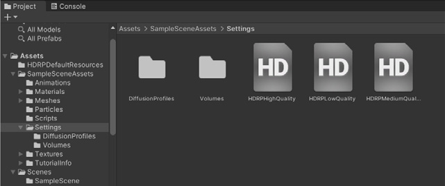
<p><em>VI: <strong>▲ NHIỀU Pipeline Asset, KHÔNG phải một</strong> — thư mục <code>Assets/SampleSceneAssets/Settings</code> chứa <strong><code>HDRPHighQuality</code> · <code>HDRPLowQuality</code> · <code>HDRPMediumQuality</code></strong>, mỗi asset gắn với MỘT Quality Level. / EN: Three HDRP Pipeline Assets, one per quality level.</em></p>

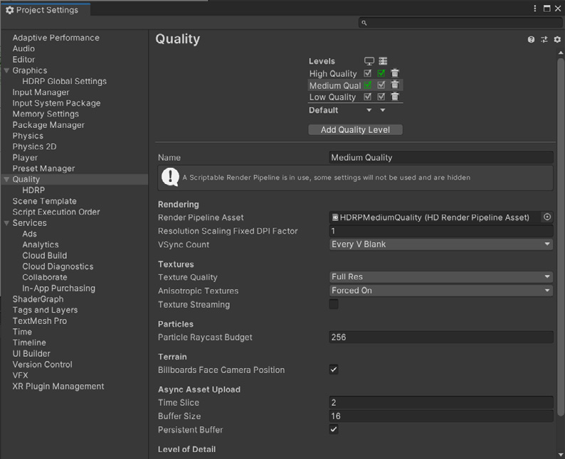
<p><em>VI: <strong>▲ <code>Quality Settings</code> nối Level ↔ Asset</strong> — Levels <strong>High/Medium/Low</strong>, <strong>Render Pipeline Asset: HDRPMediumQuality</strong>, <strong>VSync Count: Every V Blank</strong>, Texture Quality Full Res, Anisotropic Textures Forced On, <strong>Particle Raycast Budget 256</strong>, và nhóm <strong>Async Asset Upload: Time Slice 2 · Buffer Size 16 · Persistent Buffer ✓</strong>. / EN: Quality Settings linking each level to an HDRP Pipeline Asset.</em></p>

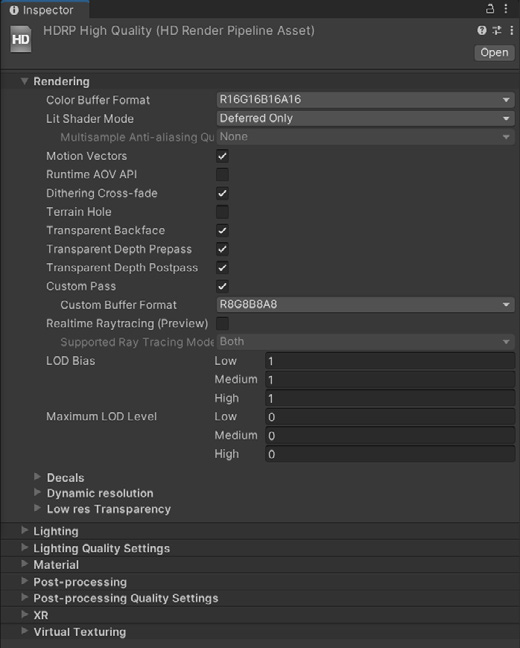
<p><em>VI: <strong>▲ HDRP Asset › Rendering</strong> — <strong>Color Buffer Format R16G16B16A16</strong>, <strong>Lit Shader Mode: Deferred Only</strong>, Motion Vectors ✓, Runtime AOV API, Dithering Cross-fade, Terrain Hole, Transparent Backface/Depth Prepass/Depth Postpass, Custom Pass, <strong>Custom Buffer Format R8G8B8A8</strong>, Realtime Raytracing (Preview), <strong>LOD Bias Low/Medium/High = 1</strong>, Maximum LOD Level, cùng các nhóm Decals · Dynamic resolution · Low res Transparency · Lighting · Material · Post-processing · XR · Virtual Texturing. / EN: The Rendering section of the HDRP Asset.</em></p>

<div class="bilingual-row">
<div class="col-vi">
<blockquote>
<p><em>"<strong>Hãy Ý THỨC rằng việc BẬT THÊM tính năng trong Pipeline Asset sẽ TIÊU THỤ THÊM tài nguyên.</strong></em></p>
<p><em>🔑 <strong>NHÌN CHUNG, hãy tối ưu dự án của bạn để CHỈ DÙNG những gì BẠN CẦN nhằm đạt được hiệu ứng bạn muốn. NẾU bạn KHÔNG cần một tính năng, hãy TẮT nó để CẢI THIỆN hiệu năng và TIẾT KIỆM tài nguyên.</strong>"</em></p>
</blockquote>
<p>💡 <em>Đây là điểm khác biệt cốt lõi giữa HDRP và URP về mặt tối ưu: <strong>URP mặc định là TỐI THIỂU và bạn THÊM vào; HDRP mặc định là ĐẦY ĐỦ và bạn phải BỚT đi.</strong> Một dự án HDRP chưa từng được dọn tính năng gần như CHẮC CHẮN đang trả tiền cho những thứ nó không dùng.</em></p>
</div>
<div class="col-en">
<blockquote>
<p><em>"<strong>BE AWARE that ENABLING MORE features in the Pipeline Asset will CONSUME MORE resources.</strong></em></p>
<p><em>🔑 <strong>IN GENERAL, optimize your project to USE ONLY WHAT YOU NEED to achieve your intended effect. IF you DON'T need a feature, you can TURN IT OFF to IMPROVE performance and SAVE resources.</strong>"</em></p>
</blockquote>
<p>💡 <em>This is the core optimization difference between HDRP and URP: <strong>URP defaults to MINIMAL and you ADD; HDRP defaults to FULL and you must REMOVE.</strong> An HDRP project whose features have never been pruned is almost CERTAINLY paying for things it does not use.</em></p>
</div>
</div>

**Hai danh sách tính năng có thể TẮT — nguyên văn / The two feature lists you can disable — verbatim**

| Vị trí / Location | Tính năng có thể tắt nếu KHÔNG dùng / Features to disable if unused |
|---|---|
| **🅰️ Trong HDRP Asset**<br>*In the HDRP Asset* | **Decals** · **Low-res transparency** · **Transparent backface** · **Depth prepass** · **Depth postpass** · **SSAO** · **SSR** · **Contact shadows** · **Volumetrics** · **Subsurface scattering** · **Distortions** |
| **🅱️ Trong Frame Settings của Camera**<br>*In the camera's Frame Settings* — *(Main Camera, camera dùng cho hiệu ứng tích hợp như reflection, hoặc camera phụ cho hiệu ứng tuỳ chỉnh)* | **Refraction** · **Post-Process** · **After Post-Process** · **Transmission** · **Reflection Probe** · **Planar Reflection Probe** · **Big Tile Prepass** |

!!! danger "🪤 Bẫy hai tầng — bật ở Global Settings VẪN chưa đủ"
    <div class="bilingual-row">
    <div class="col-vi">
    <blockquote>
    <p><em>"Khi phát triển dự án, bạn có thể cần quay lại Global Settings để bật/tắt một tính năng cụ thể. <strong>MỘT SỐ tính năng sẽ KHÔNG render TRỪ KHI checkbox tương ứng trong HDRP Global Settings được bật.</strong> <strong>Hãy đảm bảo bạn CHỈ bật những tính năng bạn CẦN vì chúng có thể tác động TIÊU CỰC tới hiệu năng rendering và mức dùng bộ nhớ.</strong></em></p>
    <p><em>🚨 <strong>Bật một tính năng trong HDRP Global Settings KHÔNG ĐẢM BẢO nó có thể được render bất cứ lúc nào bởi bất kỳ camera nào. Bạn PHẢI đảm bảo rằng Render Pipeline Asset có Quality level đang được chọn tại <code>Project Settings &gt; Quality</code> CŨNG hỗ trợ tính năng đó.</strong></em></p>
    <p><em>📌 <strong>Ví dụ: để đảm bảo camera có thể render Volumetric Clouds, bạn PHẢI bật chúng ở CẢ <code>HDRP Global Settings &gt; Frame Settings &gt; Camera &gt; Lighting</code> LẪN trong Render Pipeline Asset đang hoạt động, dưới <code>Lighting &gt; Volumetrics</code>.</strong>"</em></p>
    </blockquote>
    <p>👉 <em>Cùng bản chất với cái bẫy Quality Level của URP ở <a href="#335-quality-settings-nam-o-au-quality-panel-vs-urp-asset">§33.5</a>: <strong>setting nằm ở HAI NƠI, và cả hai đều phải đồng ý.</strong></em></p>
    <p>🔎 <em>Mẹo tìm nhanh: <strong>"Hãy dùng ô Search ở góc TRÊN-PHẢI trong Project Settings. Nó sẽ CHỈ hiển thị các panel liên quan với từ khoá được TÔ SÁNG."</strong></em></p>
    </div>
    <div class="col-en">
    <blockquote>
    <p><em>"As you develop your project, you might need to return to the Global settings to toggle a specific feature on or off. <strong>SOME features will NOT RENDER UNLESS the corresponding checkbox in HDRP Global Settings is ENABLED.</strong> <strong>Make sure you ONLY ENABLE features you REQUIRE because they might NEGATIVELY IMPACT the rendering performance and memory usage.</strong></em></p>
    <p><em>🚨 <strong>Enabling a feature in the HDRP Global Settings does NOT GUARANTEE it can be rendered at any time by any camera. You MUST ensure that the Render Pipeline Asset whose Quality level is selected under <code>Project Settings &gt; Quality</code> supports that feature AS WELL.</strong></em></p>
    <p><em>📌 <strong>For instance, to ensure cameras can render Volumetric Clouds, you must toggle them under <code>HDRP Global Settings &gt; Frame Settings &gt; Camera &gt; Lighting</code> AND in the active Render Pipeline Asset, under <code>Lighting &gt; Volumetrics</code>.</strong>"</em></p>
    </blockquote>
    <p>👉 <em>The same nature as URP's Quality Level trap in <a href="#335-quality-settings-nam-o-au-quality-panel-vs-urp-asset">§33.5</a>: <strong>the setting lives in TWO PLACES, and both must agree.</strong></em></p>
    <p>🔎 <em>A quick-find tip: <strong>"make use of the top right Search field in the Project Settings. This will ONLY show you the relevant panels with the search terms HIGHLIGHTED."</strong></em></p>
    </div>
    </div>

### 26.2. ⚖️ Bốn "Performance tip" & "Optimization tip" nằm rải trong sách

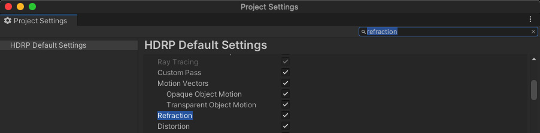
<p><em>VI: <strong>▲ <code>HDRP Default Settings</code> › Frame Settings</strong> — danh sách tick <strong>Ray Tracing · Custom Pass · Motion Vectors · Opaque Object Motion · Transparent Object Motion · Refraction · Distortion</strong> (ô tìm kiếm đang lọc <em>refraction</em>). / EN: The HDRP Default Settings frame-settings checklist.</em></p>

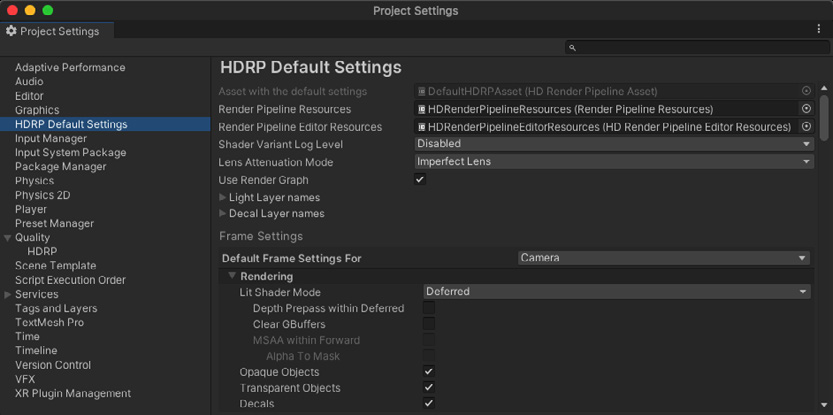
<p><em>VI: <strong>▲ Đặt render path TOÀN CỤC</strong> — <code>HDRP Default Settings › Default Frame Settings For: Camera › Rendering</code> với <strong>Lit Shader Mode: Deferred</strong> (khoanh đỏ), cùng <strong>Depth Prepass within Deferred · Clear GBuffers · MSAA within Forward · Alpha To Mask · Opaque Objects · Transparent Objects · Decals</strong>. / EN: Setting the global Lit Shader Mode in the HDRP Default Settings.</em></p>

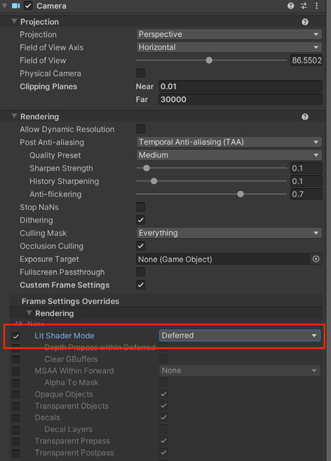
<p><em>VI: <strong>▲ Ghi đè cho TỪNG Camera</strong> — Camera bật <strong>Custom Frame Settings</strong>, phần <strong>Frame Settings Overrides › Rendering › Lit Shader Mode: Deferred</strong> (khoanh đỏ). Phía trên là <strong>Post Anti-aliasing TAA · Quality Preset Medium · Sharpen Strength 0.1 · History Sharpening 0.1 · Anti-flickering 0.7</strong>. / EN: Per-camera Frame Settings Overrides for Lit Shader Mode.</em></p>

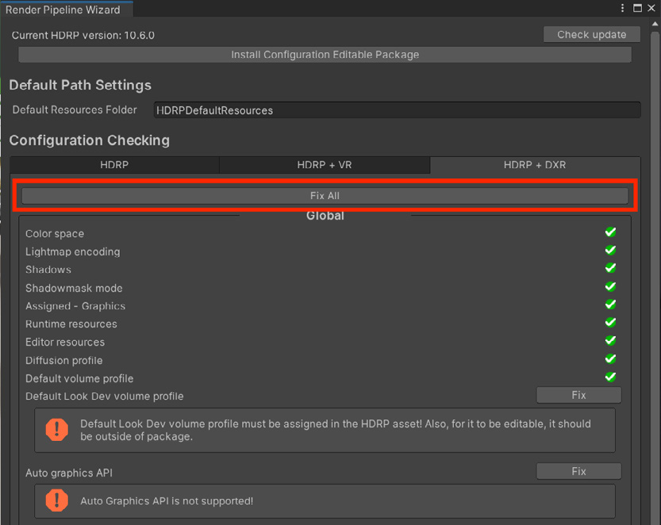
<p><em>VI: <strong>▲ <code>Render Pipeline Wizard</code></strong> — <strong>Current HDRP version 10.6.0</strong>, ba tab <strong>HDRP · HDRP + VR · HDRP + DXR</strong>, nút <strong>Fix All</strong> (khoanh đỏ) và danh sách kiểm tra (Color space, Lightmap encoding, Shadows, Shadowmask mode, Assigned Graphics, Runtime/Editor resources, Diffusion profile, Default volume profile…). Hai cảnh báo còn lại: <em>Default Look Dev volume profile</em> và <em>Auto Graphics API is not supported</em>. / EN: The Render Pipeline Wizard with its configuration checklist and Fix All button.</em></p>

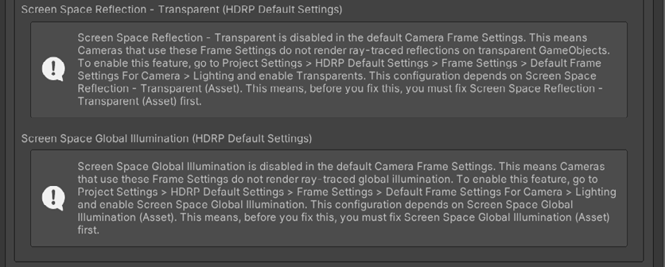
<p><em>VI: <strong>▲ Hai cảnh báo hay gặp</strong> — <em>Screen Space Reflection – Transparent</em> và <em>Screen Space Global Illumination</em> bị TẮT trong Default Camera Frame Settings, kèm ĐƯỜNG DẪN sửa: <code>Project Settings › HDRP Default Settings › Frame Settings › Default Frame Settings For Camera › Lighting</code>, và lưu ý phải sửa ở <strong>Asset</strong> TRƯỚC. / EN: The Screen Space Reflection and Screen Space Global Illumination warnings.</em></p>

| Chủ đề | Nguyên văn Unity | Ghi chú |
|---|---|---|
| **🫧 Volumes** *(Performance tip)* | *"**ĐỪNG dùng SỐ LƯỢNG LỚN Volume. Việc ĐÁNH GIÁ MỖI Volume (blending, spatialization, tính toán override, v.v.) đi kèm MỘT SỐ CHI PHÍ CPU.**"* | 👉 Chi phí này nằm ở **CPU**, không phải GPU — nó KHÔNG hiện ra khi bạn profile GPU. Xem <a href="#351-local-volume-ba-tham-so-ieu-khien">§35.1</a> về Blend Distance / Weight / Priority |
| **🪞 Realtime Reflection Probes** *(Optimization tip)* | *"Để tối ưu realtime reflection probe, **TẮT MỌI tính năng rendering KHÔNG ẢNH HƯỞNG ĐÁNG KỂ tới chất lượng thị giác của phản chiếu**, bằng cách override setting camera CHUNG hoặc TỪNG reflection probe. **Bạn cũng có thể VIẾT SCRIPT để TIME SLICE việc cập nhật.**"* | 👉 Bổ sung cho <a href="#18-light-probes-reflection-probes">§18</a>: ngoài `Refresh Mode` và `Time Slicing` có sẵn, bạn còn có thể **cắt tính năng bên trong lần render của probe** |
| **🌀 Motion Blur** | *"Để **TỐI THIỂU HOÁ chi phí hiệu năng, hãy GIẢM `Sample Count`, TĂNG `Minimum Velocity`, và GIẢM `Maximum Velocity`. Bạn cũng có thể GIẢM các tham số `Camera Clamp Mode` trong Additional Properties.**"* | 👉 Một trong 16 hiệu ứng post-processing ở <a href="#352-muoi-sau-hieu-ung-post-processing-cua-urp">§35.2</a> — và là hiệu ứng **đắt nhất theo Sample Count** |
| **🌫️ Local Volumetric Fog** | *"**HDRP VOXEL HOÁ Local Volumetric Fog để TĂNG CƯỜNG hiệu năng. TUY NHIÊN, việc voxel hoá có thể trông RẤT THÔ.** Để **GIẢM RĂNG CƯA, hãy dùng một `Density Mask Texture` và TĂNG `Blend Distance` để LÀM MỀM rìa của sương mù.**"* | 👉 Ví dụ điển hình của **đánh đổi hiệu năng ↔ chất lượng có cách bù**: giữ tối ưu, sửa artifact bằng texture thay vì bằng độ phân giải |

<div class="bilingual-row">
<div class="col-vi">
<p>🔀 <strong>Forward vs Deferred trong HDRP — lời khuyên thẳng thắn:</strong></p>
<blockquote>
<p><em>"[Forward trong HDRP dùng] <strong>MỘT PASS DUY NHẤT trên mỗi material của object. TUY NHIÊN, đó VẪN là một quá trình TƯƠNG ĐỐI ĐẮT ĐỎ.</strong></em></p>
<p><em>✅ <strong>NẾU hiệu năng là vấn đề, bạn có thể muốn dùng DEFERRED SHADING thay thế.</strong>"</em></p>
</blockquote>
<p>👉 <em>So sánh với <a href="#9-rendering-path-forward-vs-deferred">§9</a>: HDRP mặc định cho phép chọn <code>Deferred</code>, <code>Forward</code>, hoặc <code>Both</code> qua <strong>Lit Shader Mode</strong> trong Pipeline Asset. Với scene NHIỀU ĐÈN, deferred thường thắng.</em></p>
<p>🎛️ <em>Nhắc lại <a href="#234-async-compute-lap-cho-trong-cua-gpu">§23.4</a>: <strong>setting High Quality của HDRP MẶC ĐỊNH dùng shadow map 4K</strong> — đây thường là khoản cắt giảm ĐẦU TIÊN và LỚN NHẤT trong một dự án HDRP.</em></p>
</div>
<div class="col-en">
<p>🔀 <strong>Forward vs Deferred in HDRP — the blunt advice:</strong></p>
<blockquote>
<p><em>"[HDRP Forward uses] <strong>a SINGLE PASS PER OBJECT MATERIAL. HOWEVER, it's STILL a RELATIVELY EXPENSIVE process.</strong></em></p>
<p><em>✅ <strong>IF performance is an ISSUE, you may want to use DEFERRED SHADING instead.</strong>"</em></p>
</blockquote>
<p>👉 <em>Compare with <a href="#9-rendering-path-forward-vs-deferred">§9</a>: HDRP lets you choose <code>Deferred</code>, <code>Forward</code>, or <code>Both</code> via <strong>Lit Shader Mode</strong> in the Pipeline Asset. For MANY-LIGHT scenes, deferred usually wins.</em></p>
<p>🎛️ <em>Recall <a href="#234-async-compute-lap-cho-trong-cua-gpu">§23.4</a>: <strong>HDRP's High Quality setting DEFAULTS to a 4K shadow map</strong> — usually the FIRST and LARGEST cut in an HDRP project.</em></p>
</div>
</div>


### 26.2.1. 🪞 Screen Space Reflections — hai núm vặn DUY NHẤT, và cơ chế FALLBACK

<div class="bilingual-row">
<div class="col-vi">
<p>🎚️ <em>"Bề mặt material <strong>PHẢI VƯỢT giá trị <code>Minimum Smoothness</code> thì mới hiện Screen Space Reflections. HẠ giá trị này nếu bạn muốn material THÔ RÁP HƠN cũng hiện SSR, nhưng hãy biết rằng NGƯỠNG <code>Minimum Smoothness</code> THẤP HƠN sẽ LÀM TĂNG CHI PHÍ TÍNH TOÁN.</strong> 🔑 <strong>Nếu Screen Space Reflection KHÔNG tác động được tới một pixel, HDRP sẽ QUAY VỀ (fall back) dùng Reflection Probes.</strong>"</em></p>
<p>🔢 <em>"Dùng dropdown <strong>Quality</strong> để chọn số <strong><code>Max Ray Steps</code></strong> định sẵn. <strong><code>Max Ray Steps</code> CAO HƠN cho chất lượng CAO HƠN nhưng KÈM CHI PHÍ.</strong>"</em></p>
<p>⚖️ <em>"<strong>MỖI loại reflection đều có thể NGỐN TÀI NGUYÊN</strong>, nên hãy chọn phương pháp hợp với ca sử dụng. ⚠️ <strong>Nếu NHIỀU HƠN MỘT kỹ thuật reflection áp lên CÙNG một pixel, HDRP sẽ PHA TRỘN (blend) đóng góp của TỪNG loại.</strong>"</em></p>
<p>🌑 <strong>Và chi phí Shadow Map trong HDRP:</strong> <em>"Tìm mục con <strong>Shadows</strong> của component Light để chỉnh <strong><code>Update Mode</code></strong> và <strong><code>Resolution</code></strong> của shadow map. 💀 <strong>ĐỘ PHÂN GIẢI CAO HƠN và TẦN SUẤT CẬP NHẬT CAO HƠN đều TỐN NHIỀU TÀI NGUYÊN HƠN.</strong>"</em> — <code>Update Mode</code> là khái niệm RIÊNG của HDRP (cached ↔ every frame), không có ở URP.</p>
</div>
<div class="col-en">
<p>🎚️ <em>"Material surfaces must exceed the Minimum Smoothness value to show Screen Space Reflections. Lower this value if you want rougher materials to show the SSR, but be aware that a lower Minimum Smoothness threshold can add to the computation cost. If Screen Space Reflection fails to affect a pixel, then HDRP falls back to using Reflection Probes."</em></p>
<p>🔢 <em>"Use the Quality dropdown to select a preset number of Max Ray Steps. Higher Max Ray Steps increase quality but come with a cost. As with all effects, balance performance with visual quality."</em></p>
<p>⚖️ <em>"Each reflection type can be resource intensive, so select the method that works best depending on your use case. If more than one reflection technique applies to a pixel, HDRP blends the contribution of each reflection type."</em></p>
<p>🌑 <em>"Locate the Shadows subsection of the Light component to modify your shadow mapping Update Mode and Resolution. Higher resolutions and update frequency settings cost more resources."</em></p>
</div>
</div>

### 26.2.2. ⚠️ `Lit Shader Mode = Both` — tiện, nhưng TỐN THÊM bộ nhớ GPU

<div class="bilingual-row">
<div class="col-vi">
<p><em>"Chọn <strong>Forward</strong> hoặc <strong>Deferred</strong> ở <code>Lit Shader Mode</code> để đặt <strong>render path MẶC ĐỊNH</strong>. HDRP linh hoạt và cũng cho phép chọn <strong><code>Both</code>. Tuỳ chọn này cho phép bạn dùng MỘT render path cho HẦU HẾT việc render rồi GHI ĐÈ THEO TỪNG CAMERA.</strong> 💀 <strong>TUY NHIÊN, CÁCH NÀY DÙNG NHIỀU BỘ NHỚ GPU HƠN. TRONG HẦU HẾT TRƯỜNG HỢP, TỐT HƠN LÀ CHỌN HẲN <code>Forward</code> HOẶC <code>Deferred</code>.</strong>"</em></p>
<p>🌐 <strong>Đặt cho TOÀN BỘ camera:</strong> <em>"vào <strong>HDRP Default Settings</strong> tìm <strong><code>Default Frame Settings</code></strong>. <strong>Nó áp dụng được cho <code>Camera</code>, <code>Baked or Custom Reflection</code>, hoặc <code>Realtime Reflections</code>.</strong> Trong nhóm <strong>Rendering</strong>, đặt render path ở <code>Lit Shader Mode</code>."</em></p>
<p>🎯 <strong>Đặt cho MỘT camera cụ thể:</strong> <em>"tick <strong><code>Custom Frame Settings</code></strong> của nó để ghi đè. Rồi trong nhóm <strong>Rendering</strong>, <strong>override và đổi</strong> render path ở <code>Lit Shader Mode</code>."</em></p>
</div>
<div class="col-en">
<p><em>"Choose Forward or Deferred in the Lit Shader Mode to set your default rendering path. HDRP is flexible and also allows you to choose Both. This option lets you use one render path for most rendering and then override it per camera. However, this approach uses more GPU memory. In most cases, it is better to choose either Forward or Deferred."</em></p>
<p>🌐 <em>"To affect all cameras by default, go to HDRP Default Settings and locate Default Frame Settings. This can apply for a Camera, Baked or Custom Reflection, or Realtime Reflections. In the Rendering group, set the render path in the Lit Shader Mode."</em></p>
<p>🎯 <em>"For a specific camera, check its Custom Frame Settings to override it. Then, in the Rendering group, override and change the rendering path of the Lit Shader Mode."</em></p>
</div>
</div>

### 26.3. 🔬 Rendering Debugger — "Thám tử PIXEL"

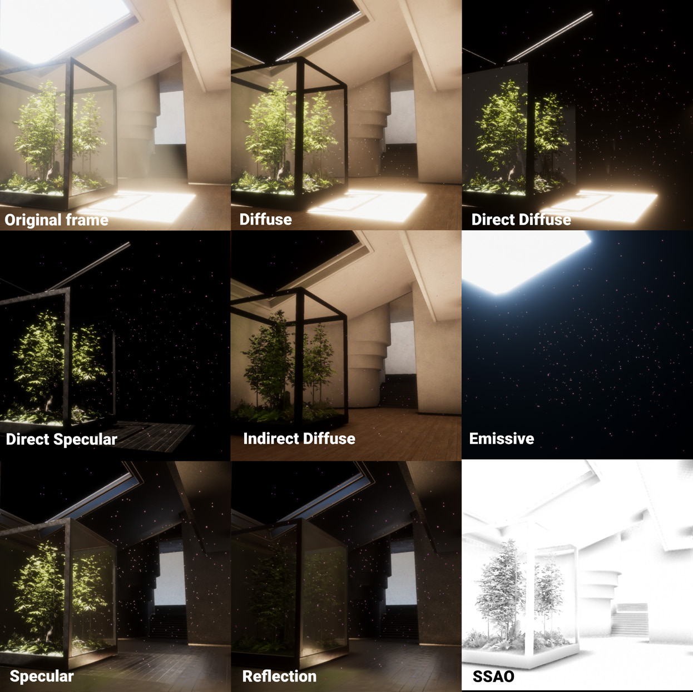
<p><em>VI: <strong>▲ Chín chế độ LIGHTING của Rendering Debugger</strong> — <strong>Original frame · Diffuse · Direct Diffuse · Direct Specular · Indirect Diffuse · Emissive · Specular · Reflection · SSAO</strong>. Tách từng thành phần ra là cách tìm ra đèn/vật liệu nào đang đắt. / EN: The nine lighting debug modes of the Rendering Debugger.</em></p>

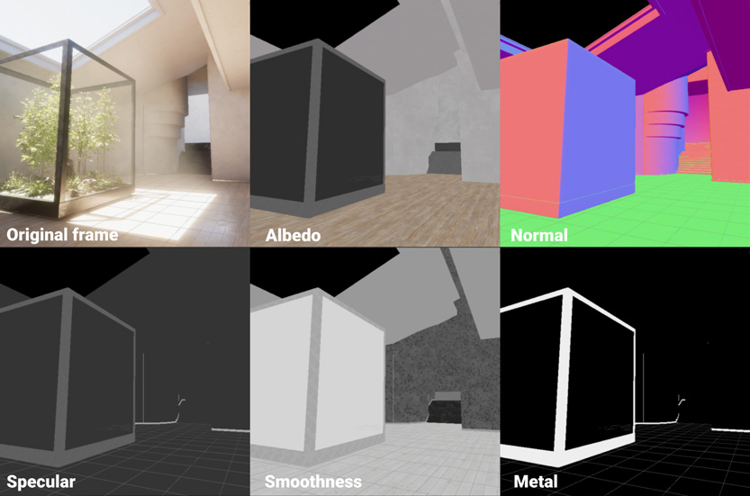
<p><em>VI: <strong>▲ Sáu chế độ MATERIAL</strong> — <strong>Original frame · Albedo · Normal · Specular · Smoothness · Metal</strong>. / EN: The material property debug modes.</em></p>

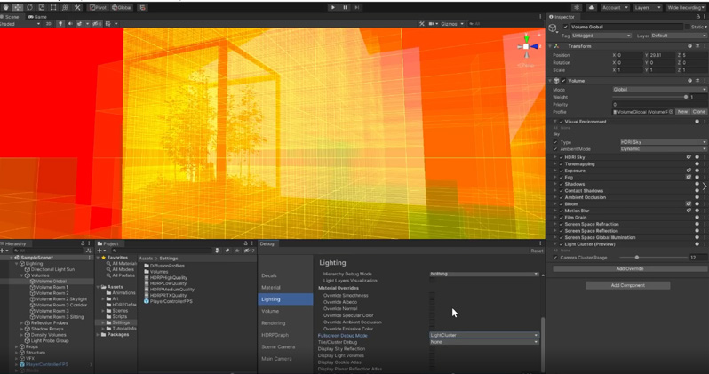
<p><em>VI: <strong>▲ Light Cluster debug</strong> — vùng <strong>ĐỎ</strong> là nơi có QUÁ NHIỀU đèn chồng lên nhau trong một cluster, vùng <strong>vàng/xanh</strong> là an toàn. Đây là cách nhìn thấy chi phí đèn theo KHÔNG GIAN. / EN: The Light Cluster debug view.</em></p>

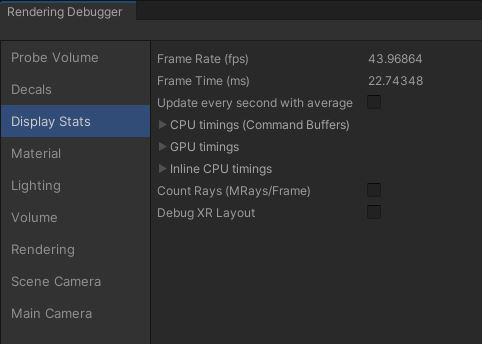
<p><em>VI: <strong>▲ Tab <em>Display Stats</em></strong> — <strong>Frame Rate 43,96864 fps · Frame Time 22,74348 ms</strong>, cùng các ô <strong>Update every second with average · CPU timings (Command Buffers) · GPU timings · Inline CPU timings · Count Rays (MRays/Frame) · Debug XR Layout</strong>. Đây là chỗ đọc GPU time trong HDRP mà KHÔNG cần công cụ ngoài. / EN: The Display Stats panel of the Rendering Debugger.</em></p>

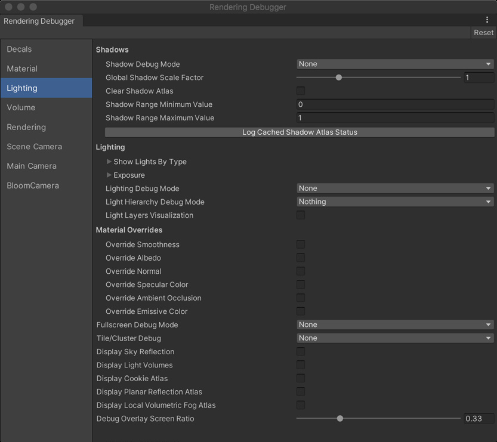
<p><em>VI: Cửa sổ <strong>Rendering Debugger</strong> — cột trái phân loại theo <strong>Decals · Material · Lighting · Volume · Rendering · Scene Camera · Main Camera · BloomCamera</strong>. Panel <em>Lighting</em> đang mở với <strong>Shadow Debug Mode · Global Shadow Scale Factor · Clear Shadow Atlas · Log Cached Shadow Atlas Status</strong>, các <strong>Material Overrides</strong> (Smoothness / Albedo / Normal / Specular Color / Ambient Occlusion / Emissive Color), và <strong>Fullscreen Debug Mode · Tile/Cluster Debug · Display Sky Reflection · Display Light Volumes · Display Cookie Atlas · Display Planar Reflection Atlas · Display Local Volumetric Fog Atlas · Debug Overlay Screen Ratio 0.33</strong>. / EN: The Rendering Debugger window.</em></p>

<div class="bilingual-row">
<div class="col-vi">
<blockquote>
<p><em>"Cửa sổ <strong>Rendering Debugger</strong> (<code>Window &gt; Analysis &gt; Rendering Debugger</code>) chứa <strong>các công cụ debug và trực quan hoá ĐẶC THÙ cho Scriptable Render Pipeline</strong>. Phía trái được TỔ CHỨC THEO DANH MỤC. <strong>MỖI panel cho phép bạn CÔ LẬP vấn đề với lighting, material, volume, camera, v.v.</strong></em></p>
<p><em>🔍 <strong>Debugger có thể giúp bạn KHẮC PHỤC SỰ CỐ một RENDER PASS CỤ THỂ. Trên panel Lighting, bạn có thể vào FULLSCREEN DEBUG MODE và chọn tính năng để debug.</strong></em></p>
<p><em>🕵️ <strong>Các chế độ Debug này cho phép bạn đóng vai "THÁM TỬ PIXEL" và XÁC ĐỊNH NGUỒN GỐC của một vấn đề lighting hay shading cụ thể. Các panel bên trái có thể cho bạn thấy THỐNG KÊ SỐNG CÒN từ camera, Material, Volume, v.v., để giúp TỐI ƯU bản render.</strong></em></p>
<p><em>🖥️ <strong>Với chế độ Debug toàn màn hình đang bật, Scene và Game view CHUYỂN sang một TRỰC QUAN HOÁ TẠM THỜI của một tính năng cụ thể. Điều này có thể là một CÔNG CỤ CHẨN ĐOÁN hữu ích.</strong>"</em></p>
</blockquote>
</div>
<div class="col-en">
<blockquote>
<p><em>"The <strong>Rendering Debugger</strong> window (<code>Window &gt; Analysis &gt; Rendering Debugger</code>) contains <strong>debugging and visualization tools SPECIFIC to the Scriptable Render Pipeline</strong>. The left side is ORGANIZED BY CATEGORY. <strong>EACH panel allows you to ISOLATE issues with lighting, materials, volumes, cameras, and so on.</strong></em></p>
<p><em>🔍 <strong>The Debugger can help you TROUBLESHOOT a SPECIFIC RENDERING PASS. On the Lighting panel, you can enter FULLSCREEN DEBUG MODE and choose features to debug.</strong></em></p>
<p><em>🕵️ <strong>These Debug modes let you play "PIXEL DETECTIVE" and IDENTIFY THE SOURCE of a specific lighting or shading issue. The panels on the left can show you VITAL STATISTICS from your cameras, Materials, Volumes, and so on, to help OPTIMIZE your render.</strong></em></p>
<p><em>🖥️ <strong>With the fullscreen Debug mode ACTIVE, the Scene and Game views SWITCH to a TEMPORARY VISUALIZATION of a specific feature. This can serve as a USEFUL DIAGNOSTIC.</strong>"</em></p>
</blockquote>
</div>
</div>

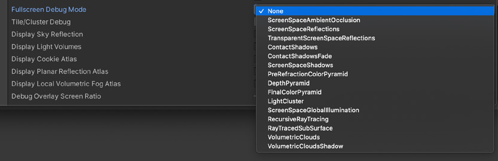
<p><em>VI: Danh sách <strong>Fullscreen Debug Mode</strong> đầy đủ: <strong>ScreenSpaceAmbientOcclusion · ScreenSpaceReflections · TransparentScreenSpaceReflections · ContactShadows · ContactShadowsFade · ScreenSpaceShadows · PreRefractionColorPyramid · DepthPyramid · FinalColorPyramid · LightCluster · ScreenSpaceGlobalIllumination · RecursiveRayTracing · RayTracedSubSurface · VolumetricClouds · VolumetricCloudsShadow</strong>. / EN: The full Fullscreen Debug Mode options list.</em></p>

!!! tip "🎯 Ghép chế độ Debug với tính năng bạn định TẮT"
    **VI:** Danh sách trên **khớp gần như 1-1 với danh sách tính năng cần tắt ở [§26.1](#261-nguyen-tac-goc-chi-bat-thu-ban-thuc-su-dung)**. Đó chính là quy trình đúng:

    1. **Bật Fullscreen Debug Mode** cho tính năng bạn NGHI là thừa (ví dụ `ScreenSpaceReflections`)
    2. **Nhìn xem nó thực sự đóng góp bao nhiêu** vào khung hình cuối
    3. Nếu đóng góp **KHÔNG đáng kể → TẮT nó trong HDRP Asset** ([§26.1](#261-nguyen-tac-goc-chi-bat-thu-ban-thuc-su-dung))
    4. **Đo lại frame time** để xác nhận mức tiết kiệm

    👉 Đây là phiên bản HDRP của vòng lặp *"đo → sửa → đo lại"* ở [§3](#3-bottleneck-khai-niem-nen-tang).

    **EN:** That list maps almost **1-to-1 onto the disable-list in [§26.1](#261-nguyen-tac-goc-chi-bat-thu-ban-thuc-su-dung)**. That IS the correct workflow: enable the Fullscreen Debug Mode for the feature you suspect is redundant → see how much it actually contributes → if negligible, disable it in the HDRP Asset → re-measure frame time. This is the HDRP version of the *"measure → change → re-measure"* loop from [§3](#3-bottleneck-khai-niem-nen-tang).

---

# PHẦN H — ASYNC UPLOAD PIPELINE (AUP)

> 📖 **Nguồn:** [blog.unity.com — *Optimizing loading performance: Understanding the Async Upload Pipeline*](https://blog.unity.com/technology/optimizing-loading-performance-understanding-the-async-upload-pipeline) (2018-10-08) — **cào lại toàn văn qua Jina reader, kèm 6 hình gốc.**

<div class="bilingual-row">
<div class="col-vi">
<p>🎯 <strong>Lời mở đầu của Unity — nói thẳng vào lợi ích:</strong></p>
<blockquote>
<p><em>"<strong>KHÔNG AI thích màn hình loading.</strong> Bạn có biết rằng <strong>chỉ cần điều chỉnh nhanh vài tham số của Async Upload Pipeline (AUP) là có thể CẢI THIỆN ĐÁNG KỂ thời gian load</strong> không?</em></p>
<p><em>💎 Hiểu được điều này có thể <strong>giúp bạn tăng tốc thời gian load ĐÁNG KỂ — MỘT SỐ DỰ ÁN ĐÃ THẤY MỨC CẢI THIỆN HƠN 2 LẦN!</strong>"</em></p>
</blockquote>
<p>👉 Đây là phần bổ sung trực tiếp cho <a href="../03-senior/01-memory-addressables-networking.md">Module 3</a> (Addressables & loading) — <strong>nhưng nó nằm ở tầng GPU upload</strong>, nên thuộc về Module này.</p>
</div>
<div class="col-en">
<p>🎯 <strong>Unity's opening — straight to the benefit:</strong></p>
<blockquote>
<p><em>"<strong>NOBODY likes loading screens.</strong> Did you know that you can <strong>quickly adjust Async Upload Pipeline (AUP) parameters to SIGNIFICANTLY improve your loading times</strong>?</em></p>
<p><em>💎 This understanding could <strong>help you speed up loading time significantly — SOME PROJECTS HAVE SEEN OVER 2X PERFORMANCE IMPROVEMENTS!</strong>"</em></p>
</blockquote>
<p>👉 This directly complements <a href="../03-senior/01-memory-addressables-networking.md">Module 3</a> (Addressables & loading) — <strong>but it sits at the GPU-upload layer</strong>, so it belongs here.</p>
</div>
</div>

## 27. AUP được dùng KHI NÀO — và những NGOẠI LỆ

!!! info "🔑 Điều kiện để asset đi qua AUP"
    <div class="bilingual-row">
    <div class="col-vi">
    <blockquote>
    <p><em>"<strong>Trước 2018.3, AUP CHỈ xử lý TEXTURE.</strong> Bắt đầu từ 2018.3 beta, <strong>AUP giờ load CẢ texture LẪN mesh — nhưng có một số NGOẠI LỆ:</strong></em></p>
    <p><em>❌ <strong>Texture ĐANG BẬT read/write</strong>, hoặc <strong>mesh ĐANG BẬT read/write HOẶC ĐÃ NÉN (compressed)</strong>, sẽ <strong>KHÔNG dùng AUP</strong>.</em></p>
    <p><em>💡 (Lưu ý rằng <strong>Texture Mipmap Streaming</strong>, giới thiệu ở 2018.2, <strong>CŨNG dùng AUP</strong>.)"</em></p>
    </blockquote>
    <p>📝 <strong>Ghi chú raw của bạn khớp CHÍNH XÁC:</strong> <em>"Qualify setting: <strong>Textures/Model that are NOT read/write-enabled are uploaded through the AUP.</strong>"</em></p>
    <p>👉 <strong>Đây là lý do KHÁC để tắt Read/Write Enabled</strong> ngoài lý do bộ nhớ ở <a href="../03-senior/01-memory-addressables-networking.md">Module 3</a>: <strong>bật nó cũng LOẠI asset khỏi đường ống load nhanh.</strong></p>
    </div>
    <div class="col-en">
    <blockquote>
    <p><em>"<strong>Prior to 2018.3, the AUP only handled TEXTURES.</strong> Starting with 2018.3 beta, <strong>the AUP now loads textures AND meshes, but there are some EXCEPTIONS:</strong></em></p>
    <p><em>❌ <strong>Textures that are read/write enabled</strong>, or <strong>meshes that are read/write enabled OR COMPRESSED</strong>, <strong>will NOT use the AUP</strong>.</em></p>
    <p><em>💡 (Note that <strong>Texture Mipmap Streaming</strong>, which was introduced in 2018.2, <strong>ALSO uses AUP</strong>.)"</em></p>
    </blockquote>
    <p>📝 <strong>Your raw note matches EXACTLY:</strong> <em>"Qualify setting: <strong>Textures/Model that are NOT read/write-enabled are uploaded through the AUP.</strong>"</em></p>
    <p>👉 <strong>This is ANOTHER reason to disable Read/Write Enabled</strong> beyond the memory reason in <a href="../03-senior/01-memory-addressables-networking.md">Module 3</a>: <strong>enabling it also EXCLUDES the asset from the fast loading path.</strong></p>
    </div>
    </div>

---

## 28. Quá trình load hoạt động thế nào — Serialized file vs `.resS`

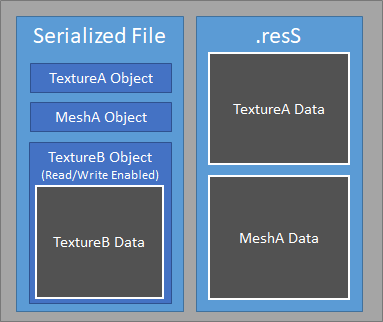
<p><em>VI: Bố cục dữ liệu — <strong>Serialized File</strong> chứa <em>TextureA Object</em>, <em>MeshA Object</em>, và <em>TextureB Object (Read/Write Enabled) KÈM LUÔN TextureB Data ở BÊN TRONG</em>. Còn <strong>.resS</strong> chứa <em>TextureA Data</em> và <em>MeshA Data</em>. / EN: The serialized file / .resS split; note that read/write-enabled TextureB keeps its data INSIDE the serialized file.</em></p>

<div class="bilingual-row">
<div class="col-vi">
<p>🔬 <strong>Cơ chế build-time — toàn văn:</strong></p>
<blockquote>
<p><em>"Trong quá trình BUILD, <strong>Texture hoặc Mesh Object được ghi vào một SERIALIZED FILE</strong>, còn <strong>dữ liệu nhị phân LỚN (texture hoặc vertex data) được ghi vào một file <code>.resS</code> đi kèm</strong>. <strong>Bố cục này áp dụng cho CẢ player data LẪN asset bundle.</strong></em></p>
<p><em>✅ <strong>Việc TÁCH RỜI object và dữ liệu nhị phân cho phép LOAD NHANH HƠN serialized file</strong> (vốn thường chứa các object NHỎ), và nó <strong>cho phép load LIỀN MẠCH (streamlined) dữ liệu nhị phân lớn từ file <code>.resS</code> SAU ĐÓ</strong>.</em></p>
<p><em>🔑 <strong>Khi Texture hoặc Mesh Object được DESERIALIZE, nó GỬI một COMMAND vào COMMAND QUEUE của AUP.</strong> <strong>Khi command đó HOÀN TẤT, dữ liệu Texture/Mesh ĐÃ được upload lên GPU và object có thể được TÍCH HỢP trên MAIN THREAD.</strong>"</em></p>
</blockquote>
<p>💡 <strong>Cơ chế upload — ring buffer:</strong></p>
<blockquote>
<p><em>"Trong quá trình upload, <strong>dữ liệu nhị phân lớn từ file <code>.resS</code> được ĐỌC vào một RING BUFFER CÓ KÍCH THƯỚC CỐ ĐỊNH</strong>. Khi đã ở trong bộ nhớ, <strong>dữ liệu được upload lên GPU theo kiểu TIME-SLICE trên RENDER THREAD</strong>.</em></p>
<p><em>👉 <strong>KÍCH THƯỚC ring buffer và THỜI LƯỢNG time-slice chính là HAI tham số bạn có thể thay đổi để tác động tới hành vi hệ thống.</strong>"</em></p>
</blockquote>
</div>
<div class="col-en">
<p>🔬 <strong>The build-time mechanism — verbatim:</strong></p>
<blockquote>
<p><em>"During the build process, <strong>the Texture or Mesh Object is written to a SERIALIZED FILE</strong> and <strong>the LARGE binary data (texture or vertex data) is written to an accompanying <code>.resS</code> file</strong>. <strong>This layout applies to BOTH player data AND asset bundles.</strong></em></p>
<p><em>✅ <strong>The SEPARATION of the object and binary data allows for FASTER LOADING of the serialized file</strong> (which will generally contain SMALL objects), and it <strong>enables STREAMLINED loading of the large binary data from the <code>.resS</code> file AFTER</strong>.</em></p>
<p><em>🔑 <strong>When the Texture or Mesh Object is DESERIALIZED, it SUBMITS a COMMAND to the AUP's COMMAND QUEUE.</strong> <strong>Once that command COMPLETES, the Texture or Mesh data has been uploaded to the GPU and the object can be INTEGRATED on the MAIN THREAD.</strong>"</em></p>
</blockquote>
<p>💡 <strong>The upload mechanism — the ring buffer:</strong></p>
<blockquote>
<p><em>"During the upload process, <strong>the large binary data from the <code>.resS</code> file is READ to a FIXED-SIZED RING BUFFER</strong>. Once in memory, <strong>the data is uploaded to the GPU in a TIME-SLICED fashion on the RENDER THREAD</strong>.</em></p>
<p><em>👉 <strong>The SIZE of the ring buffer and the DURATION of the time-slice are the TWO parameters that you can change to affect the behavior of the system.</strong>"</em></p>
</blockquote>
</div>
</div>

### 28.1. 🔁 Năm bước của MỖI command AUP

| # | Bước / Step (nguyên văn) | Giải thích tiếng Việt |
|---|---|---|
| **1** | *Wait until the required memory is available in the ring buffer.* | **CHỜ** cho tới khi ring buffer có ĐỦ bộ nhớ cần thiết |
| **2** | *Read data from the source `.resS` file to the allocated memory.* | **ĐỌC** dữ liệu từ file `.resS` nguồn vào vùng nhớ đã cấp phát |
| **3** | *Perform post-processing (texture decompression, mesh collision generation, per platform fixup, etc).* | **HẬU XỬ LÝ**: giải nén texture, **sinh mesh collision**, fixup theo nền tảng… |
| **4** | *Upload in a time-sliced manner on the render thread.* | **UPLOAD** theo kiểu time-slice **trên RENDER THREAD** |
| **5** | *Release Ring Buffer memory.* | **GIẢI PHÓNG** bộ nhớ Ring Buffer |

!!! warning "⚠️ Điều gì xảy ra khi Ring Buffer ĐẦY — chi tiết quan trọng"
    <div class="bilingual-row">
    <div class="col-vi">
    <blockquote>
    <p><em>"<strong>NHIỀU command có thể đang tiến hành ĐỒNG THỜI, nhưng TẤT CẢ đều phải cấp phát bộ nhớ cần thiết ra từ CÙNG MỘT ring buffer CHIA SẺ.</strong></em></p>
    <p><em>🔑 <strong>Khi ring buffer ĐẦY, các command mới sẽ PHẢI CHỜ. Việc chờ này KHÔNG gây BLOCK main-thread và KHÔNG ảnh hưởng frame rate — nó CHỈ ĐƠN GIẢN LÀM CHẬM quá trình async loading.</strong>"</em></p>
    </blockquote>
    <p>👉 <strong>Đây là điểm rất quan trọng để chẩn đoán:</strong> ring buffer nhỏ <strong>KHÔNG làm tụt FPS</strong> — nó chỉ <strong>KÉO DÀI màn hình loading</strong>. Nếu bạn thấy FPS mượt nhưng load lâu, đây là nghi phạm số một.</p>
    </div>
    <div class="col-en">
    <blockquote>
    <p><em>"<strong>MULTIPLE commands can be in progress SIMULTANEOUSLY, but ALL must allocate their required memory out of the SAME SHARED ring buffer.</strong></em></p>
    <p><em>🔑 <strong>When the ring buffer FILLS UP, new commands will WAIT; this waiting will NOT cause main-thread BLOCKING or affect FRAME RATE, it simply SLOWS the async loading process.</strong>"</em></p>
    </blockquote>
    <p>👉 <strong>A crucial diagnostic point:</strong> a small ring buffer <strong>does NOT drop your FPS</strong> — it only <strong>LENGTHENS the loading screen</strong>. If you see smooth FPS but slow loads, this is suspect number one.</p>
    </div>
    </div>

### 28.2. 📊 So sánh: CÓ AUP vs KHÔNG có AUP

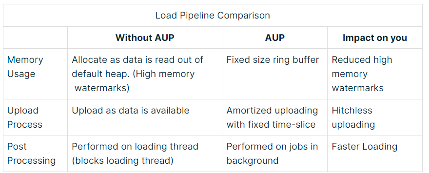

| | **KHÔNG có AUP / Without AUP** | **CÓ AUP / With AUP** | **Tác động lên bạn / Impact on you** |
|---|---|---|---|
| **Memory Usage**<br>*Dùng bộ nhớ* | *Allocate as data is read out of default heap.* **(High memory watermarks)**<br>*Cấp phát khi dữ liệu được đọc ra từ heap mặc định — **đỉnh bộ nhớ CAO*** | *Fixed size **ring buffer***<br>***Ring buffer KÍCH THƯỚC CỐ ĐỊNH*** | ✅ ***Reduced high memory watermarks***<br>*GIẢM đỉnh bộ nhớ* |
| **Upload Process**<br>*Quá trình upload* | *Upload as data is available*<br>*Upload ngay khi có dữ liệu* | ***Amortized** uploading with **fixed time-slice***<br>*Upload **PHÂN BỔ ĐỀU** với **time-slice CỐ ĐỊNH*** | ✅ ***Hitchless uploading***<br>*Upload KHÔNG GIẬT* |
| **Post Processing**<br>*Hậu xử lý* | *Performed on **loading thread** **(blocks loading thread)***<br>*Chạy trên **loading thread** — **CHẶN loading thread*** | *Performed on **JOBS in background***<br>*Chạy trên **JOB ở nền*** | ✅ ***Faster Loading***<br>*Load NHANH HƠN* |

---

## 29. 🎛️ Ba tham số API — Giá trị mặc định & Khuyến nghị

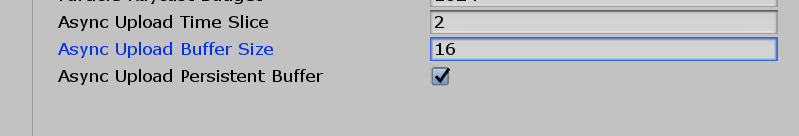
<p><em>VI: Ba setting trong <code>Project Settings &gt; Quality</code> — <strong>Async Upload Time Slice: 2</strong>, <strong>Async Upload Buffer Size: 16</strong>, <strong>Async Upload Persistent Buffer ✓</strong>. / EN: The three Async Upload settings in Quality Settings.</em></p>

<div class="bilingual-row">
<div class="col-vi">
<p><em>"Để tận dụng TỐI ĐA AUP trong 2018.3, có <strong>BA tham số có thể điều chỉnh LÚC RUNTIME</strong> cho hệ thống này."</em></p>
<p>💡 <em>"Các setting này có thể chỉnh <strong>qua scripting API HOẶC qua menu QualitySettings</strong>."</em></p>
</div>
<div class="col-en">
<p><em>"To take FULL ADVANTAGE of the AUP in 2018.3, there are <strong>THREE parameters that can be adjusted at RUNTIME</strong> for this system."</em></p>
<p>💡 <em>"These settings can be adjusted <strong>through the scripting API OR via the QualitySettings menu</strong>."</em></p>
</div>
</div>

### 29.1. `QualitySettings.asyncUploadTimeSlice`

<div class="bilingual-row">
<div class="col-vi">
<blockquote>
<p><em>"<strong>LƯỢNG THỜI GIAN tính bằng MILI-GIÂY dành cho việc upload texture và mesh data trên RENDER THREAD MỖI FRAME.</strong></em></p>
<p><em>🔑 <strong>Khi một thao tác async load đang tiến hành, hệ thống sẽ thực hiện HAI time slice có kích thước này.</strong></em></p>
<p><em>📊 <strong>Giá trị MẶC ĐỊNH là 2 ms.</strong></em></p>
<p><em>⚠️ <strong>Nếu giá trị này QUÁ NHỎ, bạn có thể bị BOTTLENECK ở khâu upload texture/mesh lên GPU.</strong></em></p>
<p><em>⚠️ <strong>Ngược lại, giá trị QUÁ LỚN có thể dẫn tới GIẬT (hitching) frame rate.</strong>"</em></p>
</blockquote>
</div>
<div class="col-en">
<blockquote>
<p><em>"<strong>The AMOUNT OF TIME in MILLISECONDS spent uploading textures and mesh data on the RENDER THREAD for EACH FRAME.</strong></em></p>
<p><em>🔑 <strong>When an async load operation is in progress, the system will perform TWO time slices of this size.</strong></em></p>
<p><em>📊 <strong>The DEFAULT value is 2ms.</strong></em></p>
<p><em>⚠️ <strong>If this value is TOO SMALL, you could become BOTTLENECKED on texture/mesh GPU uploading.</strong></em></p>
<p><em>⚠️ <strong>A value TOO LARGE, on the other hand, might result in framerate HITCHING.</strong>"</em></p>
</blockquote>
</div>
</div>

### 29.2. `QualitySettings.asyncUploadBufferSize`

<div class="bilingual-row">
<div class="col-vi">
<blockquote>
<p><em>"<strong>KÍCH THƯỚC của Ring Buffer tính bằng MEGABYTE.</strong></em></p>
<p><em>🔑 <strong>Khi upload time slice xảy ra mỗi frame, ta muốn CHẮC CHẮN có ĐỦ dữ liệu trong ring buffer để TẬN DỤNG TOÀN BỘ time-slice.</strong></em></p>
<p><em>⚠️ <strong>Nếu ring buffer QUÁ NHỎ, upload time slice sẽ bị CẮT NGẮN.</strong></em></p>
<p><em>📊 <strong>Mặc định là 4 MB ở 2018.2, nhưng ĐÃ TĂNG lên 16 MB ở 2018.3.</strong>"</em></p>
</blockquote>
</div>
<div class="col-en">
<blockquote>
<p><em>"<strong>The SIZE of the Ring Buffer in MEGABYTES.</strong></em></p>
<p><em>🔑 <strong>When the upload time slice occurs each frame, we want to be SURE that we have ENOUGH DATA in the ring buffer to UTILIZE THE ENTIRE time-slice.</strong></em></p>
<p><em>⚠️ <strong>If the ring buffer is TOO SMALL, the upload time slice will be CUT SHORT.</strong></em></p>
<p><em>📊 <strong>The default was 4MB in 2018.2 but has increased to 16MB in 2018.3.</strong>"</em></p>
</blockquote>
</div>
</div>

### 29.3. `QualitySettings.asyncUploadPersistentBuffer`

<div class="bilingual-row">
<div class="col-vi">
<blockquote>
<p><em>"<strong>Giới thiệu ở 2018.3</strong>, cờ này <strong>quyết định upload ring buffer có được GIẢI PHÓNG (deallocated) khi MỌI pending read đã xong hay KHÔNG</strong>.</em></p>
<p><em>🚨 <strong>Việc cấp phát rồi giải phóng buffer này THƯỜNG có thể gây PHÂN MẢNH BỘ NHỚ (memory fragmentation), nên NHÌN CHUNG hãy để nó ở giá trị mặc định (<code>true</code>).</strong></em></p>
<p><em>💡 <strong>Nếu bạn THỰC SỰ cần đòi lại bộ nhớ khi KHÔNG loading, bạn có thể set giá trị này thành <code>false</code>.</strong>"</em></p>
</blockquote>
<p>👉 Liên hệ <a href="../03-senior/01-memory-addressables-networking.md">Module 3</a> — <strong>phân mảnh bộ nhớ</strong> là kẻ thù của mobile; ở đây Unity chọn giữ buffer THƯỜNG TRỰC chính vì lý do đó.</p>
</div>
<div class="col-en">
<blockquote>
<p><em>"<strong>Introduced in 2018.3</strong>, this flag <strong>determines IF the upload ring buffer is DEALLOCATED when ALL pending reads are complete</strong>.</em></p>
<p><em>🚨 <strong>Allocating and deallocating this buffer can OFTEN cause MEMORY FRAGMENTATION, so it should GENERALLY be left at its default (<code>true</code>).</strong></em></p>
<p><em>💡 <strong>If you REALLY need to reclaim memory when you are NOT loading, you can set this value to <code>false</code>.</strong>"</em></p>
</blockquote>
<p>👉 Connects to <a href="../03-senior/01-memory-addressables-networking.md">Module 3</a> — <strong>memory fragmentation</strong> is the enemy on mobile; here Unity keeps the buffer PERSISTENT for exactly that reason.</p>
</div>
</div>

---

## 30. 📈 Workflow thực tế — Đọc Profiler để chỉnh AUP

### 30.1. Trước khi chỉnh — 2 ms / 4 MB (mặc định)

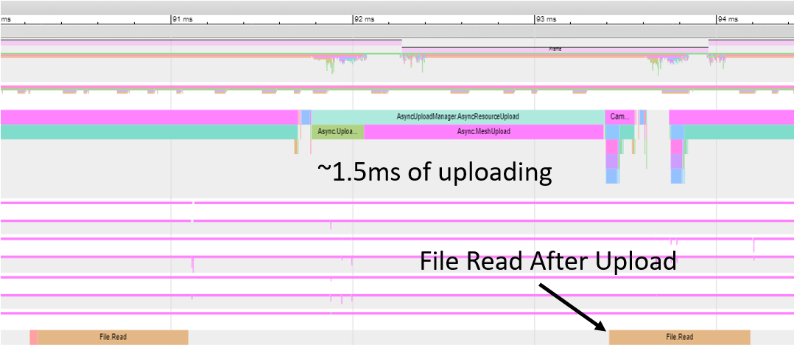
<p><em>VI: Timeline Profiler với setting mặc định — <strong><code>AsyncUploadManager.AsyncResourceUpload</code></strong> chỉ chiếm <strong>~1.5 ms uploading</strong>, và ngay sau đó có <strong>"File Read After Upload"</strong> (mũi tên) — <strong>DẤU HIỆU ring buffer QUÁ NHỎ</strong>. / EN: The Timeline Profiler at default settings: only ~1.5 ms of uploading, then a File Read immediately after upload.</em></p>

<div class="bilingual-row">
<div class="col-vi">
<blockquote>
<p><em>"Hãy khảo sát một workload có RẤT NHIỀU texture và mesh được upload qua AUP, dùng <strong>time slice 2 ms mặc định và ring buffer 4 MB</strong>.</em></p>
<p><em>🔑 <strong>Vì ta đang loading nên ta được 2 TIME-SLICE mỗi render frame ⇒ đáng lẽ phải có 4 MILI-GIÂY thời gian upload.</strong></em></p>
<p><em>💀 <strong>Nhìn dữ liệu profiler, ta CHỈ dùng KHOẢNG 1.5 mili-giây.</strong></em></p>
<p><em>🔍 <strong>Ta cũng thấy rằng NGAY SAU khi upload, một thao tác READ MỚI được phát ra vì giờ ring buffer mới có bộ nhớ trống.</strong> <strong>ĐÂY LÀ DẤU HIỆU cần một RING BUFFER LỚN HƠN.</strong>"</em></p>
</blockquote>
</div>
<div class="col-en">
<blockquote>
<p><em>"Let's examine a workload with lots of textures and meshes being uploaded through the Async Upload Pipeline using the <strong>default 2ms time slice and a 4MB ring buffer</strong>.</em></p>
<p><em>🔑 <strong>Since we're loading, we get 2 TIME-SLICES per render frame, so we should have 4 MILLISECONDS of upload time.</strong></em></p>
<p><em>💀 <strong>Looking at the profiler data, we only use about 1.5 milliseconds.</strong></em></p>
<p><em>🔍 <strong>We can also see that IMMEDIATELY AFTER the upload, a NEW READ operation is issued now that memory is available in the ring buffer.</strong> <strong>This is a SIGN that a LARGER RING BUFFER is needed.</strong>"</em></p>
</blockquote>
</div>
</div>

### 30.2. Sau khi chỉnh — 4 ms / 16 MB

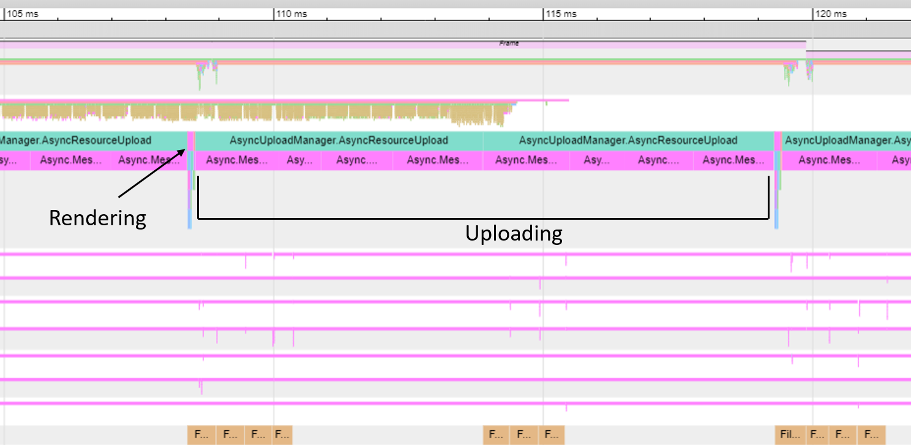
<p><em>VI: Cùng workload với <strong>Ring Buffer 16 MB và time slice 4 ms</strong> — <strong>gần như TOÀN BỘ render thread giờ là <code>AsyncUploadManager.AsyncResourceUpload</code></strong>, chỉ còn khoảng trống NGẮN để "Rendering". / EN: The same workload at 16MB / 4ms: almost all render-thread time is now uploading, with only a short gap for rendering.</em></p>

<div class="bilingual-row">
<div class="col-vi">
<blockquote>
<p><em>"Hãy thử TĂNG Ring Buffer, và vì ta đang ở màn hình loading, việc TĂNG upload time-slice cũng là ý hay. Đây là hình dạng của <strong>Ring Buffer 16 MB và time slice 4 mili-giây</strong>:</em></p>
<p><em>✅ <strong>Giờ ta có thể thấy ta đang dành GẦN NHƯ TOÀN BỘ thời gian render thread để UPLOAD, và chỉ một khoảng NGẮN giữa các lần upload để RENDER frame.</strong>"</em></p>
</blockquote>
</div>
<div class="col-en">
<blockquote>
<p><em>"Let's try INCREASING the Ring Buffer and since we're in a loading screen, it is also a good idea to INCREASE the upload time-slice. Here's what a <strong>16MB Ring Buffer and 4-millisecond time slice</strong> look like:</em></p>
<p><em>✅ <strong>Now we can see that we are spending ALMOST ALL our render thread time UPLOADING, and just a SHORT time between uploads RENDERING the frame.</strong>"</em></p>
</blockquote>
</div>
</div>

### 30.3. 🏁 Kết quả benchmark — Con số THẬT

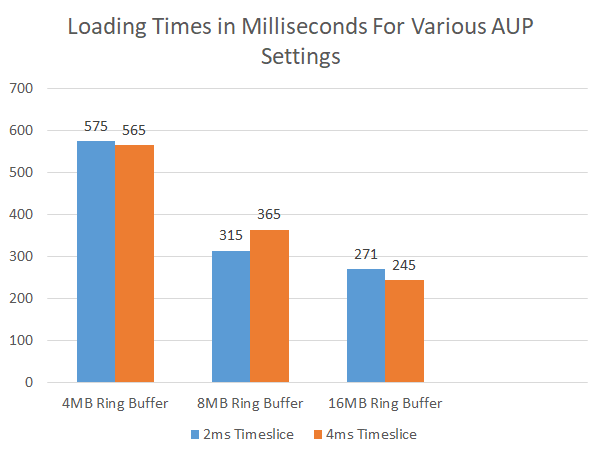

| Ring Buffer | **2 ms Timeslice** | **4 ms Timeslice** |
|---|---|---|
| **4 MB** | **575 ms** | **565 ms** |
| **8 MB** | **315 ms** | 365 ms |
| **16 MB** | **271 ms** | 🏆 **245 ms** |

<div class="bilingual-row">
<div class="col-vi">
<p>📋 <strong>Điều kiện đo — Unity ghi rõ:</strong></p>
<blockquote>
<p><em>"Dưới đây là thời gian load của workload mẫu với NHIỀU upload time slice và kích thước Ring Buffer khác nhau. <strong>Test chạy trên MacBook Pro, Intel Core i7 2.8 GHz chạy OS X El Capitan.</strong></em></p>
<p><em>⚠️ <strong>Tốc độ upload và tốc độ I/O sẽ KHÁC NHAU trên các nền tảng và thiết bị khác nhau.</strong></em></p>
<p><em>📦 <strong>Workload là một TẬP CON của dự án mẫu Viking Village</strong> mà Unity dùng nội bộ để test hiệu năng. <strong>Vì có các object KHÁC cũng đang được load, ta KHÔNG thể lấy được mức thắng hiệu năng CHÍNH XÁC của từng giá trị.</strong></em></p>
<p><em>✅ <strong>Tuy nhiên, có thể nói an toàn rằng trong trường hợp này, việc load texture và mesh NHANH GẤP ÍT NHẤT 2 LẦN khi chuyển từ setting 4MB/2MS sang 16MB/4MS.</strong>"</em></p>
</blockquote>
<p>🔢 <strong>Kiểm chứng bằng bảng trên:</strong> <code>575 ms ÷ 245 ms = <strong>2.35 lần</strong></code> ✅</p>
<p>🔍 <strong>Quan sát tinh tế:</strong> ở <strong>4 MB</strong>, tăng timeslice từ 2→4 ms hầu như <strong>KHÔNG giúp gì (575→565)</strong> — vì ring buffer quá nhỏ khiến time slice <em>bị cắt ngắn</em>. Ở <strong>8 MB</strong>, timeslice 4 ms còn <strong>TỆ HƠN (315→365)</strong>. <strong>CHỈ khi ring buffer đủ 16 MB thì timeslice lớn mới phát huy (271→245).</strong></p>
<p>👉 <strong>Bài học: LUÔN tăng <code>asyncUploadBufferSize</code> TRƯỚC, rồi mới tăng <code>asyncUploadTimeSlice</code>.</strong></p>
</div>
<div class="col-en">
<p>📋 <strong>The measurement conditions — Unity states them clearly:</strong></p>
<blockquote>
<p><em>"Below are the loading times of the sample workload with a variety of upload time slices and Ring Buffer sizes. <strong>Tests were run on a MacBook Pro, 2.8GHz Intel Core i7 running OS X El Capitan.</strong></em></p>
<p><em>⚠️ <strong>Upload speeds and I/O speeds will VARY on different platforms and devices.</strong></em></p>
<p><em>📦 <strong>The workload is a SUBSET of the Viking Village sample project</strong> that we use internally for performance testing. <strong>Because there are OTHER objects being loaded, we aren't able to get the PRECISE performance win of the different values.</strong></em></p>
<p><em>✅ <strong>It's safe to say in this case, however, that the texture and mesh loading is AT LEAST TWICE AS FAST when switching from the 4MB/2MS settings to the 16MB/4MS settings.</strong>"</em></p>
</blockquote>
<p>🔢 <strong>Verified against the table:</strong> <code>575 ms ÷ 245 ms = <strong>2.35×</strong></code> ✅</p>
<p>🔍 <strong>A subtle observation:</strong> at <strong>4 MB</strong>, raising the timeslice from 2→4 ms barely <strong>helps at all (575→565)</strong> — because the too-small ring buffer <em>cuts the time slice short</em>. At <strong>8 MB</strong>, a 4 ms timeslice is actually <strong>WORSE (315→365)</strong>. <strong>ONLY once the ring buffer reaches 16 MB does the larger timeslice pay off (271→245).</strong></p>
<p>👉 <strong>The lesson: ALWAYS raise <code>asyncUploadBufferSize</code> FIRST, then raise <code>asyncUploadTimeSlice</code>.</strong></p>
</div>
</div>

### 30.4. Cấu hình tối ưu — chính xác như ghi chú raw của bạn

```csharp
// Cấu hình Unity khuyến nghị cho dự án mẫu này
// The configuration Unity recommends for this sample project
QualitySettings.asyncUploadTimeSlice        = 4;      // ms mỗi frame trên render thread
QualitySettings.asyncUploadBufferSize       = 16;     // MB — kích thước Ring Buffer
QualitySettings.asyncUploadPersistentBuffer = true;   // giữ buffer, tránh phân mảnh
```

```csharp
// Mẫu thực chiến: TĂNG khi vào loading screen, HẠ khi vào gameplay
// Practical pattern: raise during the loading screen, lower during gameplay
using UnityEngine;

public static class AsyncUploadTuner
{
    // Lưu lại giá trị gameplay để khôi phục
    const int GameplayTimeSlice  = 2;
    const int GameplayBufferSize = 16;

    // Trong loading screen ta KHÔNG cần frame rate cao ⇒ ưu tiên upload
    const int LoadingTimeSlice   = 4;
    const int LoadingBufferSize  = 32;   // Unity: "increase it to 16MB or 32MB"

    public static void EnterLoadingScreen()
    {
        QualitySettings.asyncUploadTimeSlice        = LoadingTimeSlice;
        QualitySettings.asyncUploadBufferSize       = LoadingBufferSize;
        QualitySettings.asyncUploadPersistentBuffer = true;
    }

    public static void ExitLoadingScreen()
    {
        // Hạ time slice để KHÔNG ăn vào ngân sách render thread lúc gameplay
        QualitySettings.asyncUploadTimeSlice  = GameplayTimeSlice;
        QualitySettings.asyncUploadBufferSize = GameplayBufferSize;
        // Vẫn để persistent = true: tránh memory fragmentation
    }
}
```

---

## 31. ✅ Năm khuyến nghị chính thức của Unity

<div class="bilingual-row">
<div class="col-vi">
<p><em>"Khuyến nghị CHUNG để tối ưu tốc độ load của texture và mesh:"</em></p>
<ol>
<li>🎯 <strong>Chọn <code>asyncUploadTimeSlice</code> LỚN NHẤT mà KHÔNG gây rớt frame.</strong></li>
<li>⏫ <strong>Trong màn hình loading, TĂNG TẠM THỜI <code>asyncUploadTimeSlice</code>.</strong></li>
<li>🔬 <strong>Dùng Profiler để khảo sát mức TẬN DỤNG time slice. Time slice sẽ hiện lên trong profiler với tên <code>AsyncUploadManager.AsyncResourceUpload</code>. TĂNG <code>asyncUploadBufferSize</code> NẾU time slice của bạn KHÔNG được tận dụng hết.</strong></li>
<li>💾 <strong>Mọi thứ nhìn chung sẽ load NHANH HƠN với <code>asyncUploadBufferSize</code> LỚN HƠN — vậy nên nếu bạn CÓ ĐỦ bộ nhớ, hãy tăng nó lên 16 MB hoặc 32 MB.</strong></li>
<li>🔒 <strong>Để <code>asyncUploadPersistentBuffer</code> ở <code>true</code> TRỪ KHI bạn có lý do THUYẾT PHỤC để giảm dung lượng bộ nhớ runtime lúc KHÔNG loading.</strong></li>
</ol>
</div>
<div class="col-en">
<p><em>"General recommendations for optimizing loading speed of textures and meshes:"</em></p>
<ol>
<li>🎯 <strong>Choose the LARGEST <code>QualitySettings.asyncUploadTimeSlice</code> that doesn't result in dropping frames.</strong></li>
<li>⏫ <strong>During loading screens, TEMPORARILY INCREASE <code>QualitySettings.asyncUploadTimeSlice</code>.</strong></li>
<li>🔬 <strong>Use the profiler to examine the time slice UTILIZATION. The time slice will show up as <code>AsyncUploadManager.AsyncResourceUpload</code> in the profiler. INCREASE <code>QualitySettings.asyncUploadBufferSize</code> if your time slice is NOT being FULLY UTILIZED.</strong></li>
<li>💾 <strong>Things will generally load FASTER with a LARGER <code>QualitySettings.asyncUploadBufferSize</code>, so if you can afford the memory, INCREASE IT TO 16MB OR 32MB.</strong></li>
<li>🔒 <strong>Leave <code>QualitySettings.asyncUploadPersistentBuffer</code> set to <code>true</code> UNLESS you have a COMPELLING reason to reduce your runtime memory usage while NOT loading.</strong></li>
</ol>
</div>
</div>

---

## 32. ❓ FAQ chính thức — Toàn văn 4 câu hỏi

??? question "**Q1: Upload time-slice xảy ra BAO NHIÊU LẦN trên render thread? / How often will time-sliced uploading occur on the render thread?**"
    <div class="bilingual-row">
    <div class="col-vi">
    <blockquote>
    <p><em>"<strong>Upload time-slice sẽ xảy ra MỘT LẦN mỗi render frame, HOẶC HAI LẦN trong một thao tác async load.</strong></em></p>
    <p><em>🔑 <strong>VSYNC CÓ ẢNH HƯỞNG tới pipeline này.</strong> <strong>Trong lúc render thread đang CHỜ VSync, bạn CÓ THỂ đang upload.</strong></em></p>
    <p><em>📊 <strong>Nếu bạn đang chạy frame 16 ms rồi MỘT frame bị kéo dài — giả sử 17 ms — bạn sẽ phải CHỜ VSync 15 ms.</strong></em></p>
    <p><em>👉 <strong>NHÌN CHUNG, FRAME RATE CÀNG CAO thì upload time slice xảy ra CÀNG THƯỜNG XUYÊN.</strong>"</em></p>
    </blockquote>
    <p>💡 <em>Đây là một hệ quả PHẢN TRỰC GIÁC rất giá trị: <strong>chạy nhanh hơn cũng khiến LOAD nhanh hơn.</strong> Liên hệ <a href="../01-fresher/01-ultimate-guide-to-profiling.md">Module 1</a> về <code>Gfx.WaitForPresent</code> và VSync.</em></p>
    </div>
    <div class="col-en">
    <blockquote>
    <p><em>"<strong>Time-sliced uploading will occur ONCE per render frame, OR TWICE during an async load operation.</strong></em></p>
    <p><em>🔑 <strong>VSync AFFECTS this pipeline.</strong> <strong>While the render thread is WAITING for a VSync, you COULD be uploading.</strong></em></p>
    <p><em>📊 <strong>If you are running at 16ms frames and then ONE frame goes long, say 17ms, you will end up WAITING for the vsync for 15ms.</strong></em></p>
    <p><em>👉 <strong>IN GENERAL, the HIGHER the FRAME RATE, the MORE FREQUENTLY upload time slices will occur.</strong>"</em></p>
    </blockquote>
    <p>💡 <em>A valuable COUNTERINTUITIVE consequence: <strong>running faster also makes you LOAD faster.</strong> Connects to <a href="../01-fresher/01-ultimate-guide-to-profiling.md">Module 1</a> on <code>Gfx.WaitForPresent</code> and VSync.</em></p>
    </div>
    </div>

??? question "**Q2: Những gì được load QUA AUP? / What is loaded through the AUP?**"
    <div class="bilingual-row">
    <div class="col-vi">
    <ul>
    <li>✅ <strong>Texture KHÔNG bật read/write được upload qua AUP.</strong></li>
    <li>✅ <strong>Từ 2018.2, texture MIPMAP được STREAM qua AUP.</strong></li>
    <li>✅ <strong>Từ 2018.3, MESH cũng được upload qua AUP — MIỄN LÀ chúng KHÔNG NÉN và KHÔNG bật read/write.</strong></li>
    </ul>
    </div>
    <div class="col-en">
    <ul>
    <li>✅ <strong>Textures that are NOT read/write-enabled are uploaded through the AUP.</strong></li>
    <li>✅ <strong>As of 2018.2, texture MIPMAPS are STREAMED through the AUP.</strong></li>
    <li>✅ <strong>As of 2018.3, MESHES are also uploaded through the AUP so long as they are UNCOMPRESSED and NOT read/write enabled.</strong></li>
    </ul>
    </div>
    </div>

??? question "**Q3: Nếu ring buffer KHÔNG ĐỦ LỚN để chứa dữ liệu (ví dụ một texture RẤT LỚN)? / What if the ring buffer is not large enough to hold the data being uploaded?**"
    <div class="bilingual-row">
    <div class="col-vi">
    <blockquote>
    <p><em>"<strong>Các upload command LỚN HƠN ring buffer sẽ CHỜ cho tới khi ring buffer được TIÊU THỤ HOÀN TOÀN, sau đó ring buffer sẽ được CẤP PHÁT LẠI (reallocated) cho vừa với allocation lớn đó.</strong></em></p>
    <p><em>🔄 <strong>Khi upload hoàn tất, ring buffer sẽ được CẤP PHÁT LẠI về kích thước BAN ĐẦU.</strong>"</em></p>
    </blockquote>
    <p>🚨 <strong>Hệ quả thực chiến:</strong> <em>một texture 4096×4096 duy nhất có thể <strong>làm ĐÌNH TRỆ toàn bộ pipeline VÀ gây HAI lần realloc</strong> — chính là nguồn phân mảnh bộ nhớ được cảnh báo ở §27.3.</em></p>
    </div>
    <div class="col-en">
    <blockquote>
    <p><em>"<strong>Upload commands that are LARGER than the ring buffer will WAIT until the ring buffer is FULLY CONSUMED, then the ring buffer will be REALLOCATED to fit the large allocation.</strong></em></p>
    <p><em>🔄 <strong>Once the upload is complete, the ring buffer will be REALLOCATED to its ORIGINAL size.</strong>"</em></p>
    </blockquote>
    <p>🚨 <strong>Practical consequence:</strong> <em>a single 4096×4096 texture can <strong>STALL the entire pipeline AND cause TWO reallocations</strong> — exactly the source of memory fragmentation warned about in §27.3.</em></p>
    </div>
    </div>

??? question "**Q4: API load ĐỒNG BỘ hoạt động thế nào? (`Resources.Load`, `AssetBundle.LoadAsset`…) / How do synchronous load APIs work?**"
    <div class="bilingual-row">
    <div class="col-vi">
    <blockquote>
    <p><em>"<strong>Các lệnh gọi load ĐỒNG BỘ VẪN DÙNG AUP, và về cơ bản sẽ CHẶN (block) MAIN THREAD cho tới khi thao tác async upload HOÀN TẤT.</strong></em></p>
    <p><em>🔑 <strong>Loại API load được dùng KHÔNG LIÊN QUAN (not relevant).</strong>"</em></p>
    </blockquote>
    <p>💀 <strong>Đây là điểm quan trọng nhất của FAQ:</strong> <em><code>Resources.Load</code> KHÔNG "bỏ qua" AUP để nhanh hơn — nó <strong>vẫn đi qua ĐÚNG pipeline đó, chỉ khác là nó ĐÓNG BĂNG main thread trong lúc chờ.</strong> ⇒ <strong>Cấu hình AUP kém sẽ khiến CẢ load đồng bộ cũng chậm theo.</strong></em></p>
    </div>
    <div class="col-en">
    <blockquote>
    <p><em>"<strong>Synchronous loading calls USE the AUP and will essentially BLOCK the MAIN THREAD until the async upload operation COMPLETES.</strong></em></p>
    <p><em>🔑 <strong>The type of loading API used is NOT RELEVANT.</strong>"</em></p>
    </blockquote>
    <p>💀 <strong>The most important point in the FAQ:</strong> <em><code>Resources.Load</code> does NOT "bypass" the AUP to go faster — it <strong>goes through the SAME pipeline, it just FREEZES the main thread while waiting.</strong> ⇒ <strong>A poorly configured AUP makes SYNCHRONOUS loads slow too.</strong></em></p>
    </div>
    </div>


---

# PHẦN I — URP CHUYÊN SÂU: CHUYỂN ĐỔI, LIGHTING & PIPELINE CALLBACKS

> 📗 **Toàn bộ Phần J bóc tách từ e-book *Introduction to the Universal Render Pipeline for advanced Unity creators* (2021 LTS, 125 trang)** — các chương *Conversion process* (tr.12–32), *Lighting in URP* (tr.33–64), *Shaders* (tr.65–73), *Pipeline callbacks* (tr.74–84), *Post-processing* (tr.85–92), *Camera Stacking* (tr.93–96).

## 33. Chuyển dự án BiRP → URP


### 33.0. 🆕 Dự án MỚI bằng URP — nhánh mà §33.1 không nói tới

<div class="bilingual-row">
<div class="col-vi">
<p>🚀 <em>"Mở dự án mới dùng URP qua <strong>Unity Hub</strong>. Bấm <strong>New</strong> và kiểm tra phiên bản Unity ở đầu cửa sổ là <strong>2021.2 trở lên</strong>. Chọn tên và vị trí dự án, chọn template <strong><code>3D (URP)</code></strong> hoặc <strong><code>3D Sample Scene (URP)</code></strong>, rồi bấm <strong>Create</strong>."</em></p>
<p>⚠️ <em>"<strong>Lưu ý:</strong> Template đảm bảo dự án của bạn <strong>dùng LINEAR COLOR SPACE — điều BẮT BUỘC để tính ánh sáng ĐÚNG.</strong>"</em></p>
<p>🎬 <em>"Bạn tạo scene mới qua <code>File › New Scene</code>, với các GameObject thiết yếu như Camera và Directional light, và <strong>thậm chí TẠO SCENE TEMPLATE RIÊNG với object điền sẵn.</strong>"</em></p>
<p>🎛️ <em>"Vào <code>Edit › Project Settings</code> mở panel <strong>Graphics</strong>. Để dùng URP trong Editor, bạn <strong>PHẢI chọn một URP Asset từ <code>Scriptable Render Pipeline Settings</code>.</strong> URP Asset <strong>điều khiển thiết lập rendering và Quality TOÀN CỤC, và TẠO RA rendering pipeline instance</strong>. Còn <strong>rendering pipeline instance chứa các TÀI NGUYÊN TRUNG GIAN và phần hiện thực của render pipeline.</strong>"</em></p>
<p>🎚️ <em>"<strong><code>UniversalRP-HighFidelity</code> là URP Asset được chọn MẶC ĐỊNH</strong>, nhưng bạn có thể chuyển sang <strong><code>UniversalRP-Balanced</code></strong> hoặc <strong><code>UniversalRP-Performant</code></strong>."</em></p>
<p>🧹 <em>"Để có dự án SẠCH, dùng template <code>3D (URP)</code>; hoặc nếu muốn gỡ sample scene khỏi template <code>Sample Scene (URP)</code>, hãy <strong>xoá thư mục <code>ExampleAssets</code> và <code>Tutorial Info</code>, cùng <code>Settings › SampleSceneProfile.asset</code>, <code>Scenes › SampleScene.unity</code> và <code>Scenes › SampleSceneLightingSettings.lighting</code>.</strong>"</em></p>
</div>
<div class="col-en">
<p>🚀 <em>"Open a new project using URP via the Unity Hub. Click on New and verify that the Unity version selected at the top of the window is 2021.2 or newer. Choose a name and location for the project, select the 3D (URP) template or 3D Sample Scene (URP), and click Create."</em></p>
<p>⚠️ <em>"Note: The template ensures that your project is set to use a linear color space, which is required for calculating lighting correctly."</em></p>
<p>🎬 <em>"You can create new scenes via File &gt; New Scene, with essential GameObjects such as Camera and Directional light, and even create your own scene template with prepopulated objects."</em></p>
<p>🎛️ <em>"Go to Edit &gt; Project Settings and open the Graphics panel. To use URP in-Editor, you must select a URP Asset from the Scriptable Render Pipeline Settings. The URP Asset controls the global rendering and Quality settings of a project and creates the rendering pipeline instance. Meanwhile, the rendering pipeline instance contains intermediate resources and the render pipeline implementation."</em></p>
<p>🎚️ <em>"UniversalRP-HighFidelity is the default URP Asset selected, but you can switch to UniversalRP-Balanced or UniversalRP-Performant."</em></p>
<p>🧹 <em>"To open a clean project, use the 3D (URP) template or, if you want to remove the sample scene from the Sample Scene (URP) template, delete the ExampleAssets and Tutorial Info folders, as well as the Settings &gt; SampleSceneProfile.asset, Scenes &gt; SampleScene.unity, and Scenes &gt; SampleSceneLightingSettings.lighting."</em></p>
</div>
</div>

### 33.1. Ba bước bắt buộc

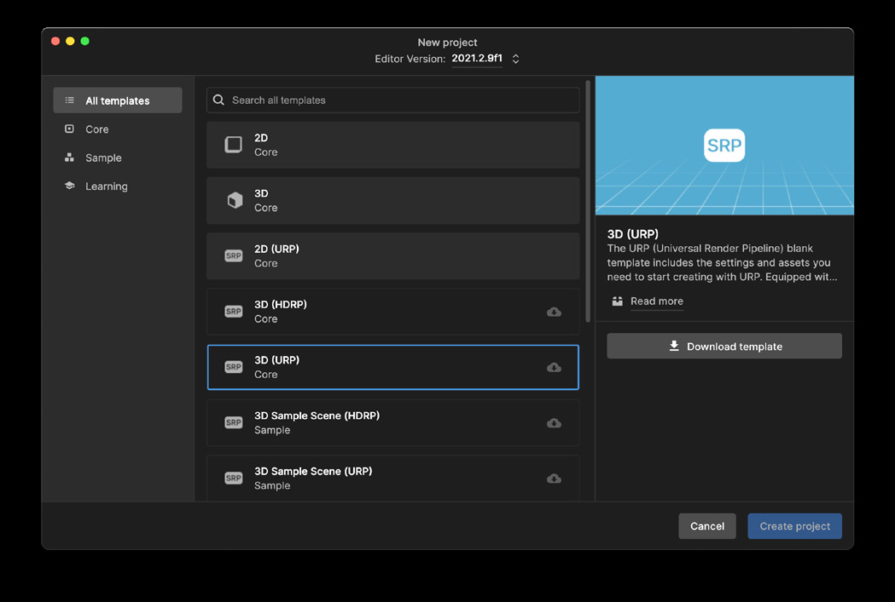
<p><em>VI: <strong>▲ Cách 1 — tạo dự án MỚI</strong>: Unity Hub → template <strong>3D (URP)</strong> (cạnh 2D Core, 3D Core, 3D HDRP, và các 3D Sample Scene). Ô mô tả ghi rõ template đã <strong>cấu hình SẴN URP</strong>. / EN: Creating a new project from the 3D (URP) template.</em></p>

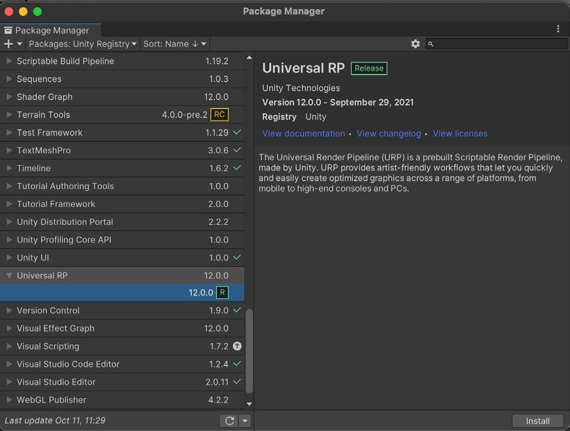
<p><em>VI: <strong>▲ Cách 2 — cài package</strong>: Package Manager → <strong>Universal RP 12.0.0</strong> (September 29, 2021), Registry Unity. / EN: Installing the Universal RP package.</em></p>

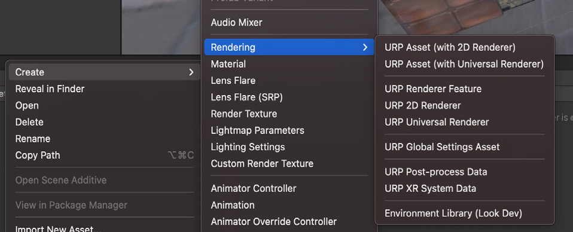 Rendering menu for URP assets.">
<p><em>VI: <strong>▲ Tạo asset</strong>: <code>Create › Rendering</code> với <strong>URP Asset (with 2D Renderer)</strong> · <strong>URP Asset (with Universal Renderer)</strong> · <strong>URP Renderer Feature</strong> · <strong>URP 2D Renderer</strong> · <strong>URP Universal Renderer</strong> · <strong>URP Global Settings Asset</strong> · <strong>URP Post-process Data</strong> · <strong>URP XR System Data</strong>. / EN: The Create > Rendering menu for URP assets.</em></p>

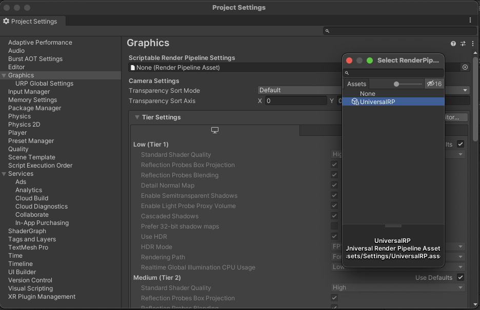 Graphics.">
<p><em>VI: <strong>▲ Gán asset vào Graphics</strong> — <code>Project Settings › Graphics › Scriptable Render Pipeline Settings</code>, chọn <code>UniversalRP</code>; bên dưới là <strong>Tier Settings (Low Tier 1 · Medium Tier 2)</strong>. / EN: Assigning the URP Asset in Project Settings > Graphics.</em></p>

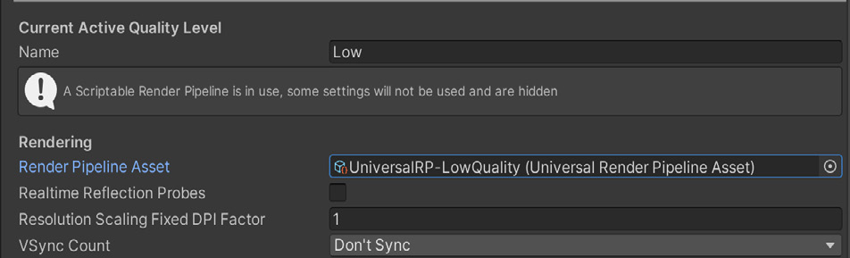
<p><em>VI: <strong>▲ Và gán ở TỪNG Quality Level</strong> — <code>Quality › Rendering › Render Pipeline Asset = UniversalRP-LowQuality</code>, cạnh <strong>Realtime Reflection Probes · Resolution Scaling Fixed DPI Factor 1 · VSync Count: Don't Sync</strong>. / EN: Assigning a different URP Asset per Quality Level.</em></p>

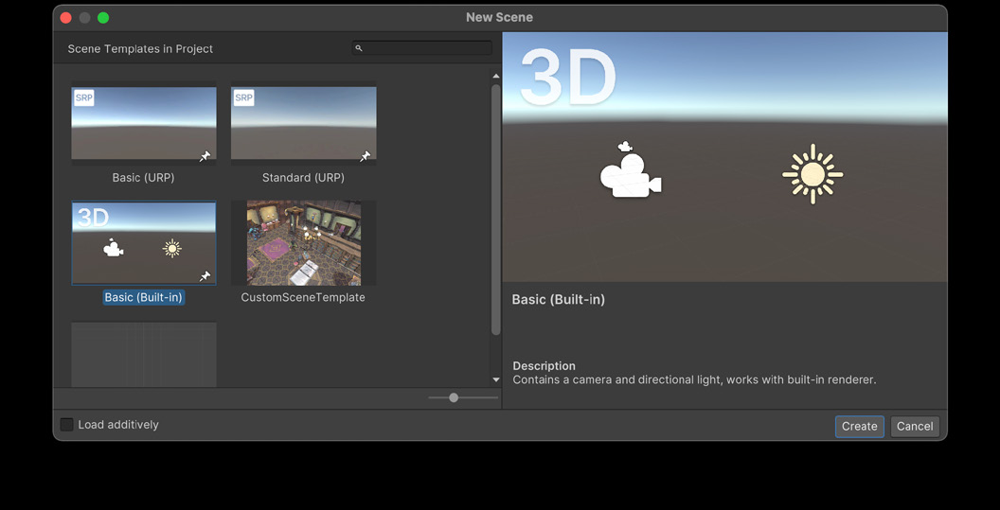
<p><em>VI: <strong>▲ Scene template</strong> — cửa sổ New Scene liệt kê <strong>Basic (URP) · Standard (URP) · Basic (Built-in) · CustomSceneTemplate</strong>. / EN: The New Scene window with URP scene templates.</em></p>

<div class="bilingual-row">
<div class="col-vi">
<p>🚨 <strong>CẢNH BÁO đầu tiên của Unity — đọc TRƯỚC KHI làm bất cứ điều gì:</strong></p>
<blockquote>
<p><em>"<strong>Quan trọng: HÃY CHẮC CHẮN sao lưu dự án bằng source control TRƯỚC KHI thực hiện các bước trong phần này.</strong> Quá trình này <strong>SẼ CHUYỂN ĐỔI asset, và Unity KHÔNG cung cấp tuỳ chọn undo.</strong> Nếu bạn dùng source control, bạn sẽ có thể quay lại các phiên bản trước của asset nếu cần."</em></p>
</blockquote>
<p><strong>① Cài package:</strong> <code>Window &gt; Package Manager</code> → dropdown <strong>Unity Registry</strong> → <strong>Universal RP</strong> → <em>Download</em> → <em>Install</em>. <em>(URP KHÔNG có sẵn trong Unity 2021.2 / 2021 LTS.)</em></p>
<p><strong>② Tạo URP Asset:</strong> chuột phải trong Project window → <code>Create &gt; Rendering &gt; URP Asset (with Universal Renderer)</code>.</p>
<p><strong>③ Gán vào Graphics panel:</strong> <code>Edit &gt; Project Settings &gt; Graphics</code> → bấm chấm nhỏ cạnh <em>None (Render Pipeline Asset)</em> → chọn <strong>UniversalRP</strong>.</p>
<p>⚠️ <strong>Cái bẫy Unity nêu đích danh:</strong></p>
<blockquote>
<p><em>"<strong>DÙ đã theo các bước này để tạo URP Asset, một scene đang mở trong Scene hoặc Game view VẪN sẽ dùng Built-in Render Pipeline.</strong> Bạn PHẢI hoàn thành BƯỚC CUỐI CÙNG để chuyển sang URP" — chính là bước ③.</em></p>
</blockquote>
</div>
<div class="col-en">
<p>🚨 <strong>Unity's first warning — read BEFORE doing anything:</strong></p>
<blockquote>
<p><em>"<strong>Important: Be sure to backup your project using source control BEFORE following the steps in this section.</strong> This process <strong>WILL CONVERT assets, and Unity does NOT provide an undo option.</strong> If you use source control, you will be able to revert to previous versions of the assets if necessary."</em></p>
</blockquote>
<p><strong>① Install the package:</strong> <code>Window &gt; Package Manager</code> → <strong>Unity Registry</strong> dropdown → <strong>Universal RP</strong> → <em>Download</em> → <em>Install</em>. <em>(URP is NOT included in Unity 2021.2 / 2021 LTS.)</em></p>
<p><strong>② Create a URP Asset:</strong> right-click in the Project window → <code>Create &gt; Rendering &gt; URP Asset (with Universal Renderer)</code>.</p>
<p><strong>③ Assign it in the Graphics panel:</strong> <code>Edit &gt; Project Settings &gt; Graphics</code> → click the small dot next to <em>None (Render Pipeline Asset)</em> → select <strong>UniversalRP</strong>.</p>
<p>⚠️ <strong>The trap Unity calls out by name:</strong></p>
<blockquote>
<p><em>"<strong>DESPITE following these steps to create a URP Asset, an open scene in the Scene or Game view will STILL use the Built-in Render Pipeline.</strong> You MUST complete one LAST step to make the switch to URP" — which is step ③.</em></p>
</blockquote>
</div>
</div>

### 33.2. 🔑 HAI asset, KHÔNG phải một — điểm gây nhầm lẫn nhất

!!! info "URP dùng HAI file `.asset` riêng biệt"
    <div class="bilingual-row">
    <div class="col-vi">
    <blockquote>
    <p><em>"<strong>Thay vì tạo MỘT URP Asset duy nhất, URP dùng HAI file, mỗi file có phần mở rộng <code>.asset</code>.</strong>"</em></p>
    </blockquote>
    <p><strong>🅰️ File kết thúc bằng <code>_Renderer</code> — RENDERER DATA ASSET</strong></p>
    <blockquote>
    <p><em>"Đây là Renderer Data Asset mà bạn có thể dùng để <strong>LỌC các layer mà renderer làm việc trên đó, và CHẶN (intercept) rendering pipeline để tuỳ biến cách scene được render</strong>. Nhờ vậy bạn có thể tạo ra các hiệu ứng chất lượng cao.</em></p>
    <p><em>Ngoài ra, <code>UniversalRP_Renderer</code> <strong>điều khiển logic rendering và các pass ở TẦNG CAO cho URP</strong>. Nó <strong>hỗ trợ đường Forward và Deferred, cùng một 2D Renderer</strong> vốn bật các tính năng như <em>2D lights, 2D shadows, và Light Blend Styles</em>. <strong>Bạn thậm chí có thể MỞ RỘNG URP để tạo renderer của RIÊNG mình.</strong>"</em></p>
    </blockquote>
    <p><strong>🅱️ File còn lại — SETTINGS ASSET (URP Asset)</strong></p>
    <blockquote>
    <p><em>"URP Asset còn lại phục vụ việc <strong>điều khiển setting cho Quality, Lighting, Shadows, và Post-processing</strong>. Bạn có thể dùng <strong>NHIỀU URP Asset khác nhau để điều khiển Quality settings</strong>.</em></p>
    <p><em>🔗 <strong>Settings Asset này LIÊN KẾT tới Renderer Data Asset qua RENDERER LIST.</strong> Khi bạn tạo một URP Asset mới, Settings Asset sẽ có một Renderer List chứa <strong>MỘT mục duy nhất</strong> — chính là Renderer Data Asset được tạo cùng lúc, đặt làm <em>default</em>. <strong>Bạn có thể THÊM các Renderer Data Asset khác vào danh sách này.</strong>"</em></p>
    </blockquote>
    <p>💎 <strong>Cơ chế override theo Camera:</strong></p>
    <blockquote>
    <p><em>"<strong>Renderer mặc định được dùng cho MỌI Camera, KỂ CẢ Scene view.</strong> Một Camera có thể <strong>GHI ĐÈ renderer mặc định bằng cách chọn một renderer khác từ Renderer List. Việc này có thể làm QUA SCRIPT khi cần.</strong>"</em></p>
    </blockquote>
    <p>👉 <em>Đây chính là nền tảng kỹ thuật cho ví dụ vũ khí FPS ở <a href="#221-thay-camera-bang-renderobjects-urp-custompassvolumes-hdrp">§22.1</a>.</em></p>
    </div>
    <div class="col-en">
    <blockquote>
    <p><em>"<strong>Rather than creating a SINGLE URP Asset, URP uses TWO files, each with an <code>.asset</code> extension.</strong>"</em></p>
    </blockquote>
    <p><strong>🅰️ The file ending in <code>_Renderer</code> — the RENDERER DATA ASSET</strong></p>
    <blockquote>
    <p><em>"This is a Renderer Data Asset that you can use to <strong>FILTER the layers the renderer works on, and INTERCEPT the rendering pipeline to customize how the scene is rendered</strong>. This way, you can facilitate the creation of high-quality effects.</em></p>
    <p><em>Additionally, the <code>UniversalRP_Renderer</code> <strong>controls HIGH-LEVEL rendering logic and passes for URP</strong>. It <strong>supports Forward and Deferred paths, and a 2D Renderer</strong> that enables features such as <em>2D lights, 2D shadows, and Light Blend Styles</em>. <strong>You can even EXTEND URP to create your OWN renderers.</strong>"</em></p>
    </blockquote>
    <p><strong>🅱️ The other file — the SETTINGS ASSET (URP Asset)</strong></p>
    <blockquote>
    <p><em>"The other URP Asset serves to <strong>control settings for Quality, Lighting, Shadows, and Post-processing</strong>. You can use <strong>DIFFERENT URP Assets to control the Quality settings</strong>.</em></p>
    <p><em>🔗 <strong>This Settings Asset is LINKED to the Renderer Data Asset via the RENDERER LIST.</strong> When you create a new URP Asset, the Settings Asset will have a Renderer List containing <strong>a SINGLE item</strong> — the Renderer Data Asset created at the same time, set as the <em>default</em>. <strong>You can ADD alternative Renderer Data Assets to this list.</strong>"</em></p>
    </blockquote>
    <p>💎 <strong>The per-Camera override mechanism:</strong></p>
    <blockquote>
    <p><em>"<strong>The default renderer is used for ALL Cameras, INCLUDING the Scene view.</strong> A Camera can <strong>OVERRIDE the default renderer by selecting another one from the Renderer List. This can be done through the use of a SCRIPT, as needed.</strong>"</em></p>
    </blockquote>
    <p>👉 <em>This is the technical foundation for the FPS weapon example in <a href="#221-thay-camera-bang-renderobjects-urp-custompassvolumes-hdrp">§22.1</a>.</em></p>
    </div>
    </div>

### 33.3. 🟣 Scene chuyển sang MÀU HỒNG — và Render Pipeline Converter

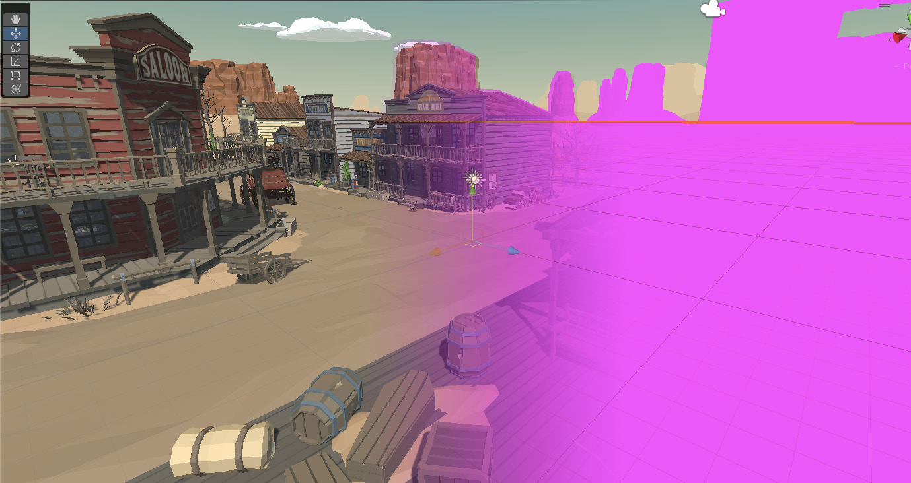
<p><em>VI: <strong>▲ Triệu chứng</strong> — toàn bộ vật liệu chuyển <strong>HỒNG CÁNH SEN</strong> vì shader BiRP không tồn tại trong URP. / EN: Materials turning magenta after switching to URP.</em></p>

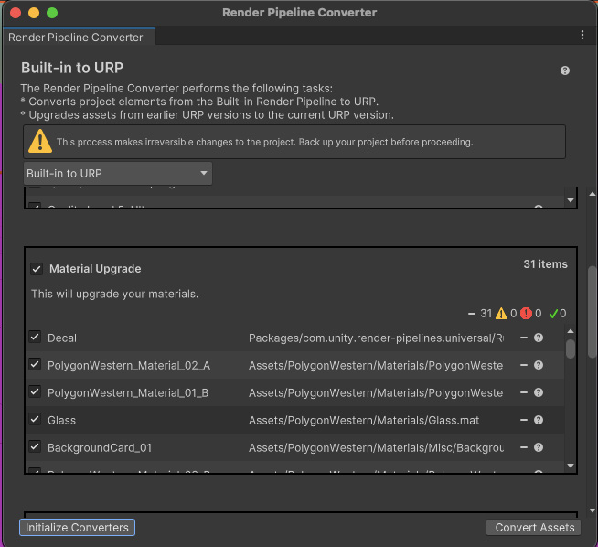
<p><em>VI: <strong>▲ Thuốc chữa</strong> — <code>Window › Rendering › Render Pipeline Converter</code>, chọn <strong>Built-in to URP</strong>. Danh sách <strong>Material Upgrade — 31 items</strong> liệt kê từng material sẽ được nâng cấp. Cảnh báo NGUYÊN VĂN: <em>"This process makes irreversible changes to the project. Back up your project before proceeding."</em> Hai nút cuối: <strong>Initialize Converters</strong> → <strong>Convert Assets</strong>. / EN: The Render Pipeline Converter converting Built-in to URP.</em></p>

<div class="bilingual-row">
<div class="col-vi">
<blockquote>
<p><em>"Sau khi hoàn thành các bước trên, bạn sẽ thấy <strong>những scene tuyệt đẹp của mình BỖNG NHIÊN chuyển sang MÀU HỒNG CÁNH SEN (magenta)</strong>. Đó là vì <strong>các shader mà material trong dự án BiRP dùng KHÔNG được hỗ trợ trong URP.</strong> May mắn là <strong>có cách khôi phục scene về chất lượng ban đầu.</strong>"</em></p>
</blockquote>
<p>🔧 <strong>Công cụ:</strong> <code>Window &gt; Rendering &gt; Render Pipeline Converter</code> → chọn <strong>Built-In to URP</strong> (dự án 3D) hoặc <strong>Convert Built-In to 2D (URP)</strong> (dự án 2D).</p>
<p><strong>Bốn converter có sẵn:</strong></p>
<ol>
<li><strong>Rendering Settings</strong> — <em>"tạo NHIỀU Render Pipeline setting asset khớp SÁT NHẤT có thể với Quality settings của BiRP. Điều này cho phép bạn test các Quality Level HIỆU QUẢ HƠN."</em></li>
<li><strong>Material Upgrade</strong> — <em>"chuyển đổi material từ BiRP sang URP."</em></li>
<li><strong>Animation Clip Converter</strong> — <em>"chuyển đổi animation clip. Nó chạy SAU KHI Material Upgrade converter hoàn tất."</em></li>
<li><strong>Read-only Material Converter</strong> — <em>"chuyển đổi các Material dựng sẵn, CHỈ ĐỌC có trong dự án Unity. Nó <strong>lập chỉ mục dự án và tạo file <code>.index</code> tạm thời</strong>. ⚠️ <strong>Lưu ý việc này có thể mất THỜI GIAN ĐÁNG KỂ.</strong>"</em></li>
</ol>
<p>▶️ Sau khi chọn: bấm <strong>Initialize Converters</strong> → dự án được quét → bấm <strong>Convert Assets</strong>.</p>
<p>🚨 <strong>Custom shader KHÔNG được chuyển tự động:</strong></p>
<blockquote>
<p><em>"<strong>Custom shader KHÔNG được chuyển bằng Material Upgrade converter.</strong> … <strong>Dùng Shader Graph thường là cách NHANH NHẤT để cập nhật một custom shader lên URP.</strong>"</em></p>
</blockquote>
</div>
<div class="col-en">
<blockquote>
<p><em>"After you complete the above steps, you'll find that <strong>your beautiful scenes are SUDDENLY colored MAGENTA</strong>. This is because <strong>the shaders used by the materials in a Built-in Render Pipeline project are NOT supported in URP.</strong> Fortunately, <strong>there is a method for restoring your scenes to their original quality.</strong>"</em></p>
</blockquote>
<p>🔧 <strong>The tool:</strong> <code>Window &gt; Rendering &gt; Render Pipeline Converter</code> → choose <strong>Built-In to URP</strong> (3D project) or <strong>Convert Built-In to 2D (URP)</strong> (2D project).</p>
<p><strong>The four available converters:</strong></p>
<ol>
<li><strong>Rendering Settings</strong> — <em>"create MULTIPLE Render Pipeline setting assets that will match Built-in Render Pipeline Quality settings AS CLOSELY AS POSSIBLE. This lets you test different Quality Levels MORE EFFICIENTLY."</em></li>
<li><strong>Material Upgrade</strong> — <em>"convert materials from the Built-in Render Pipeline to URP."</em></li>
<li><strong>Animation Clip Converter</strong> — <em>"converts animation clips. It runs ONCE the Material Upgrade converter finishes."</em></li>
<li><strong>Read-only Material Converter</strong> — <em>"converts the prebuilt, read-only Materials included in a Unity project. It <strong>indexes the project and creates the temporary <code>.index</code> file</strong>. ⚠️ <strong>Note that it can take SIGNIFICANT TIME.</strong>"</em></li>
</ol>
<p>▶️ After selecting: click <strong>Initialize Converters</strong> → the project is scanned → click <strong>Convert Assets</strong>.</p>
<p>🚨 <strong>Custom shaders are NOT converted automatically:</strong></p>
<blockquote>
<p><em>"<strong>Custom shaders are NOT converted using the Material Upgrade converter.</strong> … <strong>Using Shader Graph is often the QUICKEST way to update a custom shader to URP.</strong>"</em></p>
</blockquote>
</div>
</div>

### 33.4. 🎨 SÁU shader URP — và cái bẫy `Simple Lit`

| Shader URP | Mô tả / Description |
|---|---|
| **`Universal Render Pipeline/Lit`** | Shader **PBR** (physically based render), *tương tự Standard Shader built-in*, dùng được cho **hầu hết vật liệu đời thực**. Hỗ trợ **mọi tính năng của Standard Shader với CẢ workflow metallic LẪN specular** |
| **`Universal Render Pipeline/Simple Lit`** | Dùng mô hình **Blinn-Phong**, phù hợp cho **thiết bị mobile cấp thấp** hoặc game **KHÔNG dùng workflow PBR** |
| **`Universal Render Pipeline/Unlit`** | **Shader HIỆU NĂNG CAO trên GPU — KHÔNG dùng phương trình lighting** |
| **`Universal Render Pipeline/Terrain/Lit`** | Phù hợp dùng với **package Terrain Tools** |
| **`Universal Render Pipeline/Particles/Lit`** | Shader particle dùng **mô hình lighting PBR** |
| **`Universal Render Pipeline/Particles/Unlit`** | Shader particle unlit — **NHẸ cho GPU** |

!!! danger "⚠️ Bẫy hiệu năng: `Simple Lit` KHÔNG nhanh như legacy/mobile shader"
    <div class="bilingual-row">
    <div class="col-vi">
    <blockquote>
    <p><em>"<strong>Mặc dù Simple Lit THAY THẾ nhiều legacy/mobile shader, HIỆU NĂNG KHÔNG GIỐNG NHAU.</strong></em></p>
    <p><em>💀 <strong>Legacy/mobile shader CHỈ đánh giá lighting MỘT PHẦN, trong khi Simple Lit XÉT TẤT CẢ các đèn được định nghĩa bởi URP Asset.</strong>"</em></p>
    </blockquote>
    <p>👉 <strong>Hệ quả thực chiến:</strong> nếu bạn port một game mobile từ BiRP và chỉ đổi <code>Mobile/Diffuse</code> → <code>Simple Lit</code>, <strong>bạn CÓ THỂ bị CHẬM ĐI</strong> vì số đèn được xét đã tăng lên. Hãy <strong>giới hạn <code>Additional Lights &gt; Per Object Limit</code> trong URP Asset</strong> (xem <a href="#345-urp-asset-nhom-lighting-shadow">§34.5</a>).</p>
    </div>
    <div class="col-en">
    <blockquote>
    <p><em>"<strong>Although Simple Lit REPLACES many legacy/mobile shaders, the performance is NOT THE SAME.</strong></em></p>
    <p><em>💀 <strong>Legacy/mobile shaders ONLY PARTIALLY evaluate lighting, whereas Simple Lit CONSIDERS ALL LIGHTS as defined by the URP Asset.</strong>"</em></p>
    </blockquote>
    <p>👉 <strong>Practical consequence:</strong> if you port a mobile game from BiRP and simply swap <code>Mobile/Diffuse</code> → <code>Simple Lit</code>, <strong>you can end up SLOWER</strong> because more lights are now evaluated. <strong>Limit <code>Additional Lights &gt; Per Object Limit</code> in the URP Asset</strong> (see <a href="#345-urp-asset-nhom-lighting-shadow">§34.5</a>).</p>
    </div>
    </div>

### 33.5. 📋 Quality settings nằm ở ĐÂU — Quality panel vs URP Asset

<div class="bilingual-row">
<div class="col-vi">
<blockquote>
<p><em>"Quality settings TRƯỚC ĐÂY được xử lý trong Quality panel của Project Settings. <strong>Khi dùng URP, setting được CHIA ra giữa Quality panel và setting của TỪNG URP Asset.</strong>"</em></p>
</blockquote>
</div>
<div class="col-en">
<blockquote>
<p><em>"Quality settings were PREVIOUSLY handled in the Quality panel of Project Settings. <strong>When using URP, settings are DIVIDED between the Quality panel and those for EACH URP Asset.</strong>"</em></p>
</blockquote>
</div>
</div>

| Nhóm | ⚙️ Nằm ở **Quality panel** | 📦 Nằm ở **URP Asset** |
|---|---|---|
| **Rendering** | Resolution Scaling Fixed DPI Factor · VSync Count | **Anti-aliasing · Render Scale · Depth Texture · Opaque Texture · Opaque Downsampling · Terrain Holes · HDR** |
| **Textures** | Texture Quality · Anisotropic Textures · Texture Streaming | — |
| **Particles** | Particle Raycast Budget | — |
| **Terrain** | Billboards Face Camera Position | — |
| **Shadows** | Shadowmask Mode | **Shadow Resolution · Shadow Distance · Shadow Cascades · Cascade splits · Working unit · Depth Bias · Normal Bias · Soft Shadows** |
| **Async Asset Upload** | **Time Slice · Buffer Size · Persistent Buffer** *(→ <a href="#29-ba-tham-so-api-gia-tri-mac-inh-khuyen-nghi">§29</a>)* | — |
| **Level of Detail** | LOD Bias · Maximum LOD level | — |
| **Meshes** | Skin Weights | — |
| **Lighting** | — | **Main Light (+Cast Shadows, Shadow Resolution) · Additional Lights (+Per Object Limit, Cast Shadows, Shadow Atlas Resolution, Shadow Resolution tiers, Cookie Atlas Resolution, Cookie Atlas Format)** |
| **Reflection Probes** | *(nhóm)* | **Probe Blending · Box Projection** |
| **Post-processing** | — | **Grading Mode · LUT size · Fast sRGB/Linear conversion** |

!!! warning "🪤 Cái bẫy Quality Level — Unity mô tả chính xác sự nhầm lẫn"
    <div class="bilingual-row">
    <div class="col-vi">
    <blockquote>
    <p><em>"Nếu bạn chuyển giữa các tuỳ chọn Quality, hãy chọn một <strong>Quality Level cho Render Pipeline Asset</strong> trong Quality panel qua Project Settings.</em></p>
    <p><em>🚨 <strong>Lưu ý rằng NẾU Quality Level KHÔNG được đặt, Render Pipeline Asset sẽ MẶC ĐỊNH về cái được đặt làm Scriptable Render Pipeline Asset trong Graphics panel.</strong></em></p>
    <p><em>💀 <strong>Điều này có thể gây NHẦM LẪN khi bạn cố điều chỉnh Quality settings của một URP Asset. Ví dụ, bạn có thể VÔ TÌNH cho rằng Quality Level đặt trong URP Asset chính là cái hiện đang được Scene và Game view dùng.</strong>"</em></p>
    </blockquote>
    <p>👉 <em>Nói cách khác: <strong>bạn sửa URP Asset A, nhưng màn hình đang render bằng URP Asset B.</strong> Đây là lý do #1 khiến người ta tưởng "URP không nhận setting".</em></p>
    </div>
    <div class="col-en">
    <blockquote>
    <p><em>"If you switch between Quality options, choose a <strong>Quality Level for the Render Pipeline Asset</strong> in the Quality panel via Project Settings.</em></p>
    <p><em>🚨 <strong>Note that IF the Quality Level is NOT set, the Render Pipeline Asset will DEFAULT to the one set as the Scriptable Render Pipeline Asset in the Graphics panel.</strong></em></p>
    <p><em>💀 <strong>This can cause some CONFUSION as you attempt to adjust the Quality settings of a URP Asset. For instance, you might ACCIDENTALLY ASSUME that the Quality Level set in the URP Asset is the one currently used by the Scene and Game views.</strong>"</em></p>
    </blockquote>
    <p>👉 <em>In other words: <strong>you edit URP Asset A, but the screen renders with URP Asset B.</strong> This is the #1 reason people think "URP is ignoring my settings".</em></p>
    </div>
    </div>

### 33.6. 📊 BiRP → URP: Bảng ánh xạ Quality (Low & High)

<div class="bilingual-row">
<div class="col-vi">
<p>Bảng dưới là bảng ánh xạ <strong>NGUYÊN VĂN</strong> mà Unity cung cấp — <em>dùng để kiểm chứng converter "Rendering Settings" có tạo đúng preset hay không</em>. Cột <strong>NA</strong> = <em>Not applicable</em> (không áp dụng ở nơi đó).</p>
</div>
<div class="col-en">
<p>The table below is Unity's <strong>VERBATIM</strong> mapping — <em>use it to verify the "Rendering Settings" converter produced the correct presets</em>. <strong>NA</strong> = <em>Not applicable</em> in that location.</p>
</div>
</div>

| Setting | BiRP **Low** | URP **Low** | URP Asset **Low** | BiRP **High** | URP **High** | URP Asset **High** |
|---|---|---|---|---|---|---|
| **Pixel Light Count** | 0 | NA * | NA | 2 | NA | NA |
| **Anti-aliasing** | Disabled | NA | Disabled | Disabled | NA | **2x** |
| **Render Scale** | NA | NA | 1 | NA | NA | 1 |
| **Real-time Reflection Probes** | No | No | — | **Yes** | **Yes** | NA |
| **Resolution Scaling Fixed DPI Factor** | 1 | 1 | NA | 1 | 1 | NA |
| **VSync Count** | Don't sync | Don't sync | — | **Every V Blank** | **Every V Blank** | NA |
| **Depth Texture** | NA | NA | No | NA | NA | No |
| **Opaque Texture** | NA | NA | No | NA | NA | No |
| **Terrain Holes** | NA | NA | Yes | NA | NA | Yes |
| **HDR** | NA | NA | Yes | NA | NA | Yes |
| **Texture Quality** | Half res | Half res | NA | **Full res** | **Full res** | NA |
| **Anisotropic Textures** | Disabled | Disabled | NA | Disabled | Disabled | NA |
| **Texture Streaming** | No | No | NA | No | No | NA |
| **Soft Particles** | No | NA | NA | No | NA | NA |
| **Particle Raycast Budget** | **16** | **16** | NA | **256** | **256** | NA |
| **Billboards Face Camera Position** | No | No | NA | Yes | Yes | NA |
| **Shadowmask Mode** | Shadowmask | Shadowmask | NA | **Distance Shadowmask** | **Distance Shadowmask** | NA |
| **Shadows** | Disabled | NA | NA | **Hard and Soft Shadows** | NA | NA |
| **Shadow Resolution** | Low resolution | NA | NA | Medium resolution | NA | **2048** |
| **Shadow Projection** | Stable fit | NA | NA | Stable fit | NA | NA |
| **Shadow Distance** | 20 | NA | NA | 40 | NA | **50** |
| **Shadow Near Plane Offset** | 3 | NA | NA | 3 | NA | NA |
| **Shadow Cascades** | No Cascades | NA | NA | **2 Cascades** | NA | **2** |
| **Cascade splits** | NA | NA | NA | **33/67** | NA | **12.5/33.8/3.8** |
| **Working unit** | NA | NA | NA | Percent | Percent | **Metric** |
| **Depth Bias / Normal Bias** | NA | NA | NA | NA | NA | **1 / 1** |
| **Soft Shadows** | NA | NA | NA | NA | NA | **Yes** |
| **Async: Time Slice** | **2** | **2** | NA | **2** | **2** | NA |
| **Async: Buffer Size** | **16** | **16** | NA | **16** | **16** | NA |
| **Async: Persistent Buffer** | **Yes** | **Yes** | NA | **Yes** | **Yes** | NA |
| **LOD Bias** | **0.4** | **0.4** | NA | **1** | **1** | NA |
| **Maximum LOD level** | 0 | 0 | NA | 0 | 0 | NA |
| **Skin Weights** | **4 bones** | **4 bones** | NA | **Unlimited** | **Unlimited** | NA |
| **Main Light** | NA | NA | **Per pixel** | NA | NA | **Per pixel** |
| **Main Light: Cast Shadows** | NA | NA | **No** | NA | NA | **Yes** |
| **Additional Lights** | NA | NA | **Disabled** | NA | NA | **Per pixel** |
| **Additional: Per Object Limit** | NA | NA | NA | NA | NA | **4** |
| **Additional: Cast Shadows** | NA | NA | NA | NA | NA | **Yes** |
| **Additional: Shadow Atlas Resolution** | NA | NA | NA | NA | NA | **2048** |
| **Additional: Shadow Resolution tiers** | NA | NA | NA | NA | NA | **512 / 1024 / 2048** |
| **Additional: Cookie Atlas Resolution** | NA | NA | NA | NA | NA | **2048** |
| **Additional: Cookie Atlas Format** | NA | NA | NA | NA | NA | **Color high** |
| **Reflection Probes: Probe Blending** | NA | NA | **No** | NA | NA | **Yes** |
| **Reflection Probes: Box Projection** | NA | NA | **No** | NA | NA | **No** |
| **Post: Grading Mode** | NA | NA | Low Dynamic Range | NA | NA | Low Dynamic Range |
| **Post: LUT size** | NA | NA | **16** | NA | NA | **32** |
| **Post: Fast sRGB/Linear conversion** | NA | NA | No | NA | NA | No |

<div class="bilingual-row">
<div class="col-vi">
<p>📌 <strong>Chú thích của Unity:</strong> <em>"* Trong URP, <strong>Pixel Light Count được xử lý bằng <code>Additional Lights &gt; (Per pixel) &gt; Per Object Limit</code></strong>."</em></p>
<p>🔍 <strong>Ba quan sát đáng giá từ bảng này:</strong></p>
<ol>
<li>⚡ <strong>Async Upload giữ NGUYÊN 2 / 16 / Yes ở CẢ Low LẪN High</strong> — Unity coi đây là <em>giá trị nền hợp lý phổ quát</em>. Muốn nhanh hơn thì phải <strong>chỉnh runtime</strong> như <a href="#304-cau-hinh-toi-uu-chinh-xac-nhu-ghi-chu-raw-cua-ban">§30.4</a>.</li>
<li>🌑 <strong>Cascade splits ĐỔI ĐƠN VỊ</strong>: BiRP dùng <strong>Percent (33/67)</strong>, URP High dùng <strong>Metric (12.5/33.8/3.8 m)</strong> — <em>KHÔNG so sánh trực tiếp được</em>.</li>
<li>🚫 <strong>Ở preset Low, <code>Additional Lights = Disabled</code></strong> — nghĩa là <strong>MỌI đèn ngoài Main Light BIẾN MẤT</strong>. Đây là đòn tối ưu mạnh nhất cho máy yếu.</li>
</ol>
</div>
<div class="col-en">
<p>📌 <strong>Unity's footnote:</strong> <em>"* In URP, <strong>Pixel Light Count is handled using <code>Additional Lights &gt; (Per pixel) &gt; Per Object Limit</code></strong>."</em></p>
<p>🔍 <strong>Three worthwhile observations from this table:</strong></p>
<ol>
<li>⚡ <strong>Async Upload stays at 2 / 16 / Yes in BOTH Low AND High</strong> — Unity treats these as <em>universally sensible baselines</em>. To go faster you must <strong>tune at runtime</strong> as in <a href="#304-cau-hinh-toi-uu-chinh-xac-nhu-ghi-chu-raw-cua-ban">§30.4</a>.</li>
<li>🌑 <strong>Cascade splits CHANGE UNITS</strong>: BiRP uses <strong>Percent (33/67)</strong>, URP High uses <strong>Metric (12.5/33.8/3.8 m)</strong> — <em>they are NOT directly comparable</em>.</li>
<li>🚫 <strong>In the Low preset, <code>Additional Lights = Disabled</code></strong> — meaning <strong>EVERY light other than the Main Light DISAPPEARS</strong>. This is the single strongest optimization lever for weak hardware.</li>
</ol>
</div>
</div>

### 33.7. 🏰 Walkthrough — chuyển dự án MẪU *Viking Village URP*

<div class="bilingual-row">
<div class="col-vi">
<p>📦 <em>"Dự án demo <strong>Viking Village URP</strong> phô diễn năng lực URP với <strong>Light Probes, Reflection Probes, hiệu ứng NƯỚC dùng một <code>ScriptableRenderPass</code> TUỲ CHỈNH, shader chuyển qua Shader Graph, và post-processing của URP.</strong> Dự án MIỄN PHÍ trên Asset Store."</em></p>
<p>👉 <em>"Bắt đầu bằng cách bấm <strong>Add to My Assets</strong>… Rồi tạo <strong>dự án 3D MỚI</strong> từ Unity Hub (<strong>KHÔNG cần dùng template URP</strong>). Vào <code>Window › Package Manager</code>, chọn <strong><code>My Assets › Viking Village URP</code></strong> từ dropdown Packages, và bấm <strong>Import</strong>."</em></p>
<p>🚨 <strong>HAI cảnh báo khi import — và LÝ DO phải bấm nút XANH:</strong></p>
<p><em>"Cảnh báo đầu tiên nói rằng <strong>import một dự án HOÀN CHỈNH sẽ ẢNH HƯỞNG Project Settings hiện tại</strong>, nhưng vì bạn đã tạo dự án RỖNG nên cứ tiếp tục an toàn. 💀 <strong>Cảnh báo thứ hai báo về việc CÀI hoặc NÂNG CẤP một số package. HÃY BẤM nút XANH MẶC ĐỊNH. Việc này BẮT BUỘC để TRÁNH THIẾT LẬP ÁNH SÁNG SAI — vì URP mặc định dùng LINEAR color space, NGƯỢC với Built-in vốn mặc định GAMMA color space.</strong>"</em></p>
<p>🔄 <em>"Chờ import xong, mở demo ở <code>Viking Village › Scenes › The_Viking_Village</code>. Vào <code>Window › Package Manager</code>, chọn <strong>Unity Registry</strong> rồi <strong>Universal RP</strong>, và <strong>CẬP NHẬT package URP lên 12.x.</strong>"</em></p>
<p>⚙️ <em>"URP Asset được đặt trong panel Graphics tên là <code>Viking Village › Rendering › VikingVillageUniversal</code>. ⚠️ <strong>Nó được cấu hình cho PHẦN CỨNG CAO CẤP, nên có thể chạy ở framerate THẤP trên máy đời cũ.</strong>"</em></p>
</div>
<div class="col-en">
<p>📦 <em>"The Unity demo project Viking Village URP shows off URP capabilities with Light Probes, Reflection Probes, water special effects that use a custom ScriptableRenderPass, shaders converted via Shader Graph, and URP post-processing. The project is available for free on the Asset Store."</em></p>
<p>👉 <em>"Start by clicking Add to My Assets… Then create a new 3D project from the Unity Hub (you don't need to use the URP template). Go to Window &gt; Package Manager, select My Assets &gt; Viking Village URP from the Packages drop-down, and click Import."</em></p>
<p>🚨 <strong>Two import warnings — and why the blue button matters:</strong></p>
<p><em>"A couple of warning messages will appear. The first one warns you that importing a complete project will affect your current Project Settings, but since you've created an empty project it's safe to proceed. The second warning alerts you about installing or upgrading certain packages. Click on the default blue button. This is required to avoid an incorrect lighting setup as the URP default is a linear color space, opposite the Built-in Render Pipeline which defaults to a gamma color space."</em></p>
<p>🔄 <em>"Wait for all the assets to finish importing, then go to the demo located in Viking Village &gt; Scenes &gt; The_Viking_Village. Click Window &gt; Package Manager, and in the drop-down select Unity Registry, followed by Universal RP. Update the URP package to 12.x."</em></p>
<p>⚙️ <em>"The URP Asset set in the Graphics panel… is named Viking Village &gt; Rendering &gt; VikingVillageUniversal. It is configured for high-end hardware, and therefore, might play at a low frame rate on older hardware."</em></p>
</div>
</div>

**🧪 BẢY bước test các Quality Level — nguyên văn / The seven-step Quality Level test, verbatim**

| # | Bước |
|---|---|
| **①** | *"Sinh một bộ asset qua `Window › Rendering › **Render Pipeline Converter**`."* |
| **②** | *"Chọn tuỳ chọn **Built-in Render Pipeline to URP**, rồi chọn **Rendering Settings**."* |
| **③** | *"Bấm **Initialize Converters**."* |
| **④** | *"Một loạt tuỳ chọn Settings hiện ra trong panel; bấm **Convert Assets** để tạo các URP Asset."* |
| **⑤** | *"Các URP Asset sẽ được **gán vào các Quality level** khả dụng qua panel `Project Settings › Quality`."* |
| **⑥** | 💀 *"**Asset chất lượng CAO NHẤT sẽ THAY THẾ `VikingVillageUniversal` trong panel Graphics.** Trong khi đó `Viking Village › Rendering › **VikingVillageUniversal_Renderer**` mới là cái dùng **Renderer Features và hiệu ứng NƯỚC**."* |
| **⑦** | ✅ *"**Để KHÔI PHỤC chúng, hãy THÊM renderer nói trên vào Renderer List và đặt nó làm MẶC ĐỊNH cho TỪNG URP Asset dùng trong Quality Levels.** Giờ bạn có thể chuyển Quality Level nhanh chóng trong panel Quality."* |

!!! danger "💀 Bẫy THỰC CHIẾN quan trọng nhất của cả chương chuyển đổi"
    <div class="bilingual-row">
    <div class="col-vi">
    <p>Converter ở chế độ <strong>Rendering Settings</strong> <strong>GHI ĐÈ</strong> URP Asset đang dùng ở panel Graphics bằng preset chất lượng cao nhất nó vừa tạo. Hậu quả: <strong>MỌI Renderer Feature bạn đã cấu hình (nước, custom pass, Render Objects) BIẾN MẤT</strong> vì asset mới trỏ tới một Renderer KHÁC.</p>
    <p>✅ Cách chữa duy nhất: gán lại <code>_Renderer</code> gốc vào <strong>Renderer List</strong> và đặt <strong>Default</strong> cho <strong>TỪNG</strong> URP Asset — không phải chỉ cái đang active.</p>
    </div>
    <div class="col-en">
    <p>The converter's <strong>Rendering Settings</strong> mode <strong>replaces</strong> the URP Asset in the Graphics panel with the highest-quality preset it just generated — silently dropping every Renderer Feature you had configured, because the new asset points at a different Renderer.</p>
    <p>✅ The fix: re-add the original <code>_Renderer</code> to the <strong>Renderer List</strong> and set it as <strong>Default</strong> for <strong>each</strong> URP Asset, not just the active one.</p>
    </div>
    </div>


---

## 34. Lighting trong URP — Chi tiết đầy đủ

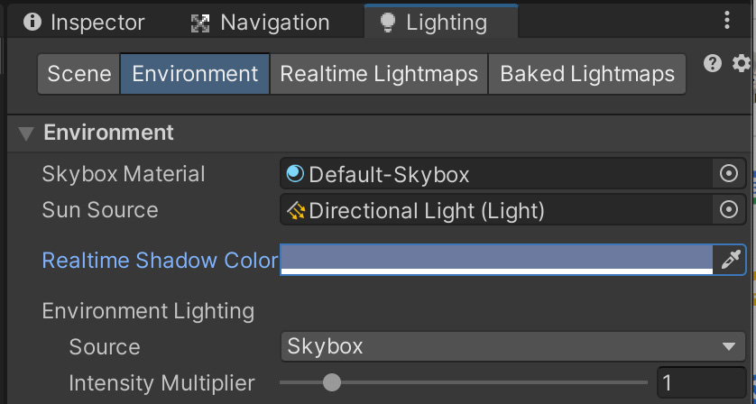
<p><em>VI: <strong>▲ <code>Lighting › Environment</code></strong> — <strong>Skybox Material: Default-Skybox</strong> · <strong>Sun Source: Directional Light</strong> · <strong>Realtime Shadow Color</strong> · <strong>Environment Lighting Source: Skybox</strong> · <strong>Intensity Multiplier 1</strong>. / EN: The Lighting Environment tab.</em></p>

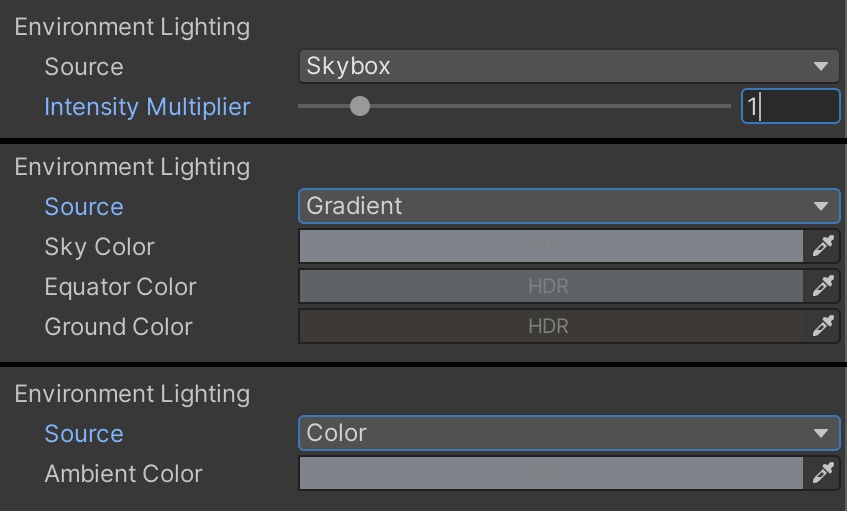
<p><em>VI: <strong>▲ BA nguồn ánh sáng môi trường</strong> — <strong>Skybox</strong> (chỉ có Intensity Multiplier) · <strong>Gradient</strong> (Sky Color · Equator Color · Ground Color, hai cái sau nhận HDR) · <strong>Color</strong> (một Ambient Color duy nhất — RẺ NHẤT). / EN: The three Environment Lighting sources: Skybox, Gradient and Color.</em></p>

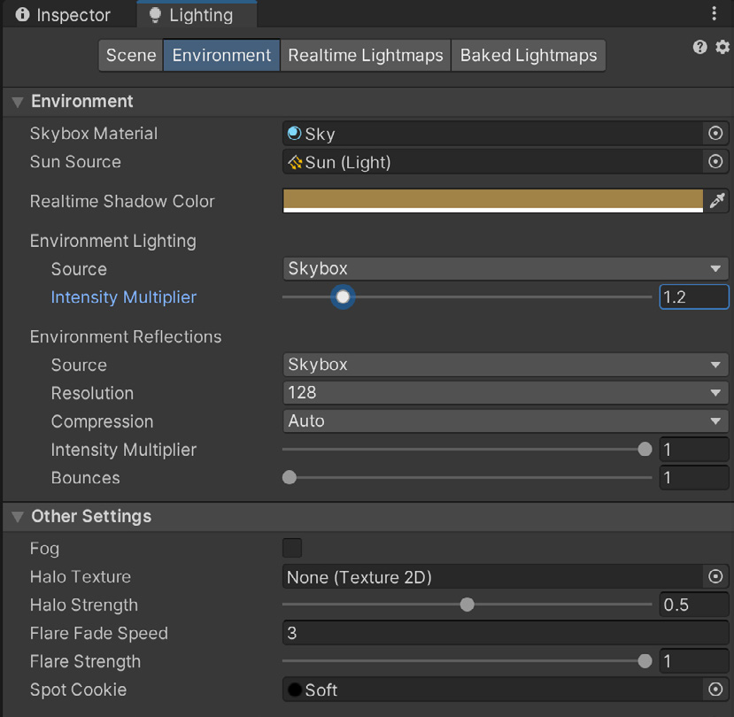
<p><em>VI: <strong>▲ Cuộn hết tab Environment</strong> — thêm <strong>Environment Reflections: Source Skybox · Resolution 128 · Compression Auto · Intensity Multiplier 1 · Bounces 1</strong> và nhóm <strong>Other Settings: Fog · Halo Texture · Halo Strength 0.5 · Flare Fade Speed 3 · Flare Strength 1 · Spot Cookie</strong>. / EN: The full Environment tab including Environment Reflections and Other Settings.</em></p>


### 34.0. 🗂️ BƯỚC ĐẦU TIÊN — Lighting Settings Asset, và BA nơi đặt thuộc tính

<div class="bilingual-row">
<div class="col-vi">
<p>🥇 <em>"<strong>BƯỚC ĐẦU TIÊN để chiếu sáng một scene MỚI cho URP là TẠO một Lighting Settings Asset mới.</strong> Mở <code>Window › Rendering › Lighting</code>, ở tab <strong>Scene</strong> bấm <strong>New Lighting Settings</strong> và đặt tên. 🔑 <strong>Mọi thiết lập bạn áp trong các panel Lighting từ giờ được LƯU VÀO ASSET ĐÓ. Chuyển giữa các bộ thiết lập bằng cách CHUYỂN Lighting Settings Asset.</strong>"</em></p>
<p>🌍 <strong>Ambient / Environment lighting:</strong> <em>"<strong>KHÔNG có thay đổi nào trong cách định nghĩa ánh sáng Ambient/Environment từ Built-in sang URP.</strong> Đèn ambient chính được tính từ panel truy cập qua <code>Window › Rendering › Lighting › Environment</code>."</em> — <em>"Bạn có thể đặt <strong>Environment Lighting</strong> dùng <strong>Skybox</strong> của scene (có tuỳ chọn chỉnh <strong>Intensity</strong>), <strong>Gradient</strong>, hoặc <strong>Color</strong>."</em></p>
<p>📍 <strong>BA NƠI đặt thuộc tính lighting — <em>A và B GIỐNG NHAU ở cả hai pipeline, C CHỈ có ở URP</em>:</strong></p>
<ul>
<li><strong>A. <code>Window › Rendering › Lighting</code></strong> — <em>"panel này cho phép đặt <strong>lightmapping và environment settings, và xem lightmap real-time lẫn baked. Nó KHÔNG ĐỔI từ Built-in sang URP.</strong>"</em></li>
<li><strong>B. Light Inspector</strong> — <em>"<strong>CÓ KHÁC BIỆT ĐÁNG KỂ</strong> giữa Inspector của Built-in và của URP."</em></li>
<li><strong>C. URP Asset Inspector</strong> — 🔑 <em>"<strong>Đây là NƠI CHÍNH bạn sẽ đặt BÓNG. Lighting trong URP PHỤ THUỘC NẶNG vào các thiết lập chọn trong panel này.</strong>"</em></li>
</ul>
<p>⚙️ <em>"Quality settings ở Built-in xử lý qua <code>Edit › Project Settings › Quality</code>. <strong>Ở URP, việc này PHỤ THUỘC vào thiết lập của URP Asset — thứ có thể HOÁN ĐỔI bằng panel Quality.</strong>"</em></p>
</div>
<div class="col-en">
<p>🥇 <em>"The first step to lighting a new scene for URP is to create a new Lighting Settings Asset. Open Window &gt; Rendering &gt; Lighting, and once you're on the Scene tab, click New Lighting Settings, and give the new asset a name. The settings that you apply in Lighting panels are now saved to it. Switch between settings by switching the Lighting Settings Asset."</em></p>
<p>🌍 <em>"There is no change in the way that Ambient/Environment lighting is defined from the Built-in Render Pipeline to URP. The main ambient light is calculated from the panel accessible via Window &gt; Rendering &gt; Lighting &gt; Environment."</em> — <em>"You can set Environment Lighting to use the scene's Skybox, with an option to adjust the Intensity, Gradient, or Color."</em></p>
<p>📍 <em>"As before, you'll set properties in the three places listed here. A and B are essentially the same for both render pipelines, while C applies to URP only:"</em></p>
<ul>
<li><strong>A.</strong> <em>"Window &gt; Rendering &gt; Lighting: This panel allows you to set lightmapping and environment settings, and view real-time and baked lightmaps. It is unchanged from the Built-in Render Pipeline to URP."</em></li>
<li><strong>B.</strong> <em>"Light Inspector: There are significant differences between the Built-in Render Pipeline and URP Inspectors."</em></li>
<li><strong>C.</strong> <em>"URP Asset Inspector: This is the principal place where you will set shadows. Lighting in URP relies heavily on the settings chosen in this panel."</em></li>
</ul>
<p>⚙️ <em>"Quality settings are handled via Edit &gt; Project Settings &gt; Quality in the Built-in Render Pipeline. In URP, this depends on the URP Asset settings which can be swapped using the Quality panel."</em></p>
</div>
</div>

### 34.1. ⚠️ Vì sao lighting TRÔNG KHÁC sau khi chuyển

<div class="bilingual-row">
<div class="col-vi">
<blockquote>
<p><em>"Nếu bạn chuyển một dự án từ BiRP sang URP, <strong>bạn có thể để ý thấy KHÁC BIỆT trong lighting</strong>. Đó là vì <strong>BiRP dùng mô hình lighting GAMMA theo mặc định còn URP dùng mô hình LINEAR.</strong></em></p>
<p><em>🔑 <strong>Do đó, BẤT KỲ đèn nào có giá trị intensity KHÁC 1.0 sẽ CẦN được điều chỉnh.</strong>"</em></p>
</blockquote>
<p>👉 Liên hệ <a href="#412-texture2dreadpixels-va-color-space">§41.2</a> — cùng một vấn đề color space, biểu hiện khác nhau. Template URP <em>"đảm bảo dự án của bạn được đặt dùng LINEAR color space, vốn BẮT BUỘC để tính lighting chính xác."</em></p>
<p><strong>🔬 Khác biệt thứ hai — light falloff / attenuation:</strong></p>
<blockquote>
<p><em>"Một khác biệt nữa giữa BiRP và URP là <strong>cách chúng tính light falloff/attenuation áp dụng cho đèn Spot và Point</strong>.</em></p>
<p><em>✅ <strong>URP dùng falloff <code>InverseSquared</code> DỰA TRÊN VẬT LÝ.</strong></em></p>
<p><em>⚠️ <strong>BiRP dùng falloff LEGACY, vốn KHÔNG dựa trên vật lý.</strong></em></p>
<p><em>💀 <strong>Bán kính đèn ẢNH HƯỞNG tới falloff, điều này có thể tạo ra những đèn có BÁN KÍNH LỚN, và qua đó TÁC ĐỘNG TỚI HIỆU NĂNG CULLING vì đèn sẽ chạm vào NHIỀU object hơn mức cần thiết.</strong>"</em></p>
</blockquote>
</div>
<div class="col-en">
<blockquote>
<p><em>"If you convert a project from BiRP to URP, <strong>you might notice DIFFERENCES in the lighting</strong>. This is because <strong>BiRP uses a GAMMA lighting model by default and URP uses a LINEAR model.</strong></em></p>
<p><em>🔑 <strong>As such, ANY light with an intensity value DIFFERING from 1.0 will need to be ADJUSTED.</strong>"</em></p>
</blockquote>
<p>👉 Connects to <a href="#412-texture2dreadpixels-va-color-space">§41.2</a> — the same color-space issue, a different symptom. The URP template <em>"ensures that your project is set to use a LINEAR color space, which is REQUIRED for calculating lighting correctly."</em></p>
<p><strong>🔬 The second difference — light falloff / attenuation:</strong></p>
<blockquote>
<p><em>"Another difference between BiRP and URP is <strong>how they compute light falloff/attenuation that applies to Spot and Point lights</strong>.</em></p>
<p><em>✅ <strong>URP uses the PHYSICALLY BASED <code>InverseSquared</code> falloff.</strong></em></p>
<p><em>⚠️ <strong>BiRP uses the LEGACY falloff, which is NOT physically based.</strong></em></p>
<p><em>💀 <strong>The light radius AFFECTS the falloff, which can result in lights with a BIG RADIUS, and thereby IMPACT CULLING PERFORMANCE as the light will touch MORE objects than necessary.</strong>"</em></p>
</blockquote>
</div>
</div>

### 34.2. 🧩 BỐN shader cho scene có lighting

| Shader | Mô tả / Description |
|---|---|
| **Complex Lit** | *"Có **TẤT CẢ tính năng của Lit Shader**. Chọn nó khi dùng tuỳ chọn **Clear Coat** để tạo ánh kim loại cho, ví dụ, một chiếc xe hơi. 🔑 **Specular reflection được tính HAI LẦN** — một lần cho lớp nền, và một lần nữa để mô phỏng lớp mỏng TRONG SUỐT phủ trên lớp nền."* |
| **Lit** ⭐ | *"Cho phép render bề mặt đời thực như **đá, gỗ, kính, nhựa, kim loại** với chất lượng ẢNH THẬT. Mức sáng và phản chiếu trông SỐNG ĐỘNG và phản ứng qua nhiều điều kiện ánh sáng, từ nắng chói tới hang tối.* <br>✅ ***Đây là lựa chọn MẶC ĐỊNH cho hầu hết material có lighting. Hỗ trợ baked, mixed, và real-time lighting, và hoạt động với CẢ Forward LẪN Deferred.***<br>⚠️ *Đây là mô hình **physically based shading (PBS)**. **Do ĐỘ PHỨC TẠP của các phép tính shading, TỐT NHẤT nên TRÁNH dùng shader này trên phần cứng mobile cấp thấp.**"* |
| **Simple Lit** | *"**KHÔNG dựa trên vật lý.** Dùng mô hình shading **Blinn-Phong KHÔNG bảo toàn năng lượng** và cho kết quả KÉM ẢNH THẬT hơn. **Tuy vậy nó vẫn cho ngoại hình thị giác XUẤT SẮC.** Phù hợp hơn cho dự án KHÔNG physically based khi nhắm tới **thiết bị mobile cấp thấp**."* |
| **Baked Lit** | *"🚀 **Cho mức TĂNG HIỆU NĂNG với object KHÔNG cần hỗ trợ real-time lighting** — bao gồm **object tĩnh ở XA sẽ KHÔNG BAO GIỜ bị ảnh hưởng bởi object động, đèn real-time, hay bóng động**."* |

<div class="bilingual-row">
<div class="col-vi">
<p>💡 <strong>Lit hay Simple Lit?</strong> <em>"Lựa chọn giữa Lit và Simple Lit <strong>PHẦN LỚN là quyết định NGHỆ THUẬT</strong>. <strong>Nghệ sĩ DỄ đạt render chân thực hơn với Lit Shader, nhưng nếu muốn render CÁCH ĐIỆU hơn, Simple Lit cho kết quả TUYỆT VỜI.</strong>"</em></p>
<p>💎 <em>"Bạn hoàn toàn có thể <strong>tự cài đặt mô hình lighting RIÊNG bằng cách viết custom shader hoặc dùng Shader Graph</strong>."</em></p>
</div>
<div class="col-en">
<p>💡 <strong>Lit or Simple Lit?</strong> <em>"The choice between a Lit Shader and Simple Lit Shader is <strong>LARGELY an ARTISTIC decision</strong>. <strong>It is EASIER for artists to get a realistic render using the Lit Shader, but if a more STYLIZED render is desired, Simple Lit provides STELLAR results.</strong>"</em></p>
<p>💎 <em>"It's possible to <strong>implement your OWN custom lighting model by writing a custom shader or using Shader Graph</strong>."</em></p>
</div>
</div>

### 34.3. 🔦 Main Light vs Additional Lights — Bảng giới hạn ĐẦY ĐỦ

<div class="bilingual-row">
<div class="col-vi">
<blockquote>
<p><em>"Đèn trong URP được <strong>CHIA thành Main Light và Additional Lights</strong>. <strong>Main Light là đèn Directional QUAN TRỌNG NHẤT.</strong> Đây là <strong>đèn SÁNG NHẤT, HOẶC đèn được đặt qua <code>Window &gt; Rendering &gt; Lighting &gt; Environment &gt; Sun Source</code>.</strong>"</em></p>
</blockquote>
</div>
<div class="col-en">
<blockquote>
<p><em>"Lights are <strong>DIVIDED into Main Light and Additional Lights</strong> in URP. <strong>The Main Light is the MOST SIGNIFICANT Directional light.</strong> This is <strong>either the BRIGHTEST light OR the one set via <code>Window &gt; Rendering &gt; Lighting &gt; Environment &gt; Sun Source</code>.</strong>"</em></p>
</blockquote>
</div>
</div>

**Camera light limits when using the URP Forward Renderer** *(bảng nguyên văn / verbatim table)*

| Light type | Category | Max lights **(non-mobile)** | Max lights **(mobile)** | Max lights **(OpenGLES 2.0)** | Supports shadows |
|---|---|---|---|---|---|
| **Directional** | **Main** | **1** | **1** | **1** | ✅ **True** |
| **Spot** | Additional | **256** * | **32** * | **16** * | ✅ **True** |
| **Point** | Additional | **256** * | **32** * | **16** * | ✅ **True** |
| **Directional** | Additional | **256** * | **32** * | **16** * | ❌ **False** |

> \* **TẤT CẢ Additional Lights CHIA SẺ CÙNG một ngân sách.** / *All Additional Lights share the same budget.*

!!! danger "🔬 Quy trình cull đèn — BỐN bước, giải thích đầy đủ"
    <div class="bilingual-row">
    <div class="col-vi">
    <p>🚨 <strong>Cảnh báo Unity nêu ĐÍCH DANH — rất ít người biết:</strong></p>
    <blockquote>
    <p><em>"<strong>TẮT (disable) một đèn đặt ở Real-time hoặc Mixed Mode KHÔNG NGĂN nó khỏi việc được ĐƯA VÀO quy trình light culling.</strong></em></p>
    <p><em>💀 <strong>Bạn có thể đang giới hạn đèn cho phần cứng yếu bằng Settings Asset, nhưng chúng VẪN gây ra một mức GIẢM HIỆU NĂNG NHỎ do light culling</strong> (workflow này đang được sửa cho các bản phát hành tương lai)."</em></p>
    </blockquote>
    <p><strong>Bốn bước của quy trình:</strong></p>
    <ol>
    <li>🔷 <strong>Cull theo Camera frustum:</strong> <em>"Đèn Real-time và Mixed Mode ĐẦU TIÊN được cull đối chiếu với Camera frustum. <strong>NẾU occlusion culling được bật, đèn bị CHE bởi các object khác trong scene CŨNG bị cull.</strong>"</em></li>
    <li>🔶 <strong>Sắp xếp theo khoảng cách:</strong> <em>"Danh sách đèn nhìn thấy được sống sót qua quy trình cull SAU ĐÓ được <strong>SẮP XẾP theo KHOẢNG CÁCH của từng đèn tới Camera</strong>."</em></li>
    <li>📏 <strong>Áp giới hạn bảng trên:</strong> <em>"Nếu có đèn nhìn thấy được, các giới hạn trong bảng bên trên phát huy tác dụng. <strong>Ví dụ, nếu bạn có 1.000 đèn trong scene nhưng CHỈ 200 cái Camera nhìn thấy, TẤT CẢ chúng vẫn vừa với giới hạn của nền tảng non-mobile.</strong>"</em></li>
    <li>🎯 <strong>Cull THEO TỪNG OBJECT:</strong> <em>"Giờ danh sách đèn nhìn thấy được được <strong>cull THEO TỪNG OBJECT. Đèn được sắp xếp theo CƯỜNG ĐỘ tại PIVOT của object</strong> — nhờ vậy <strong>đèn SÁNG HƠN được ưu tiên trước</strong>. <strong>Nếu một object bị ảnh hưởng bởi NHIỀU HƠN số đèn tối đa cho phép mỗi object, các đèn DƯ THỪA bị LOẠI BỎ.</strong>"</em></li>
    </ol>
    <p>⚠️ <strong>Hệ quả nhìn thấy được — "light popping":</strong> <em>"Dự án với ÍT đèn động có thể KHÔNG gặp vấn đề gì, tuy nhiên <strong>khi bạn thêm nhiều đèn hơn, bạn có thể gặp hiện tượng LIGHT POPPING khi các đèn khác nhau bị cull ĐỘNG.</strong>"</em></p>
    </div>
    <div class="col-en">
    <p>🚨 <strong>The warning Unity states EXPLICITLY — very few people know this:</strong></p>
    <blockquote>
    <p><em>"<strong>DISABLING a light set to Real-time or Mixed Mode does NOT STOP it from being INCLUDED in the light culling process.</strong></em></p>
    <p><em>💀 <strong>You might be limiting the lights for low-end hardware using the Settings Asset, but they will STILL cause a SMALL performance hit due to light culling</strong> (this workflow is being corrected for future releases)."</em></p>
    </blockquote>
    <p><strong>The four steps of the process:</strong></p>
    <ol>
    <li>🔷 <strong>Cull against the Camera frustum:</strong> <em>"Real-time and Mixed Mode lights are FIRST culled against the Camera frustum. <strong>IF occlusion culling is enabled, lights HIDDEN by other objects in the scene are ALSO culled.</strong>"</em></li>
    <li>🔶 <strong>Sort by distance:</strong> <em>"The visible list of lights that survive the culling process is THEN <strong>SORTED by each light's DISTANCE to Camera</strong>."</em></li>
    <li>📏 <strong>Apply the table limits:</strong> <em>"If there are visible lights, the limits in the table above come into play. <strong>For example, if you have 1,000 lights in the scene, but only 200 visible by the Camera, ALL those would fit the limit for non-mobile platforms.</strong>"</em></li>
    <li>🎯 <strong>Cull PER OBJECT:</strong> <em>"Now the list of visible lights is <strong>culled PER OBJECT. Lights are sorted by INTENSITY at the PIVOT of the object</strong> – this way, <strong>BRIGHTER lights are prioritized first</strong>. <strong>If an object is affected by MORE than the maximum number of lights allowed per object, the EXCESSIVE lights are DISCARDED.</strong>"</em></li>
    </ol>
    <p>⚠️ <strong>The visible consequence — "light popping":</strong> <em>"Projects with a SMALL number of dynamic lights might not encounter any issues, however, <strong>as you add MORE lights, you might experience LIGHT POPPING as different lights are DYNAMICALLY CULLED.</strong>"</em></p>
    </div>
    </div>

<div class="bilingual-row">
<div class="col-vi">
<p>✅ <strong>BỐN cách xử lý khi CHẠM giới hạn đèn — nguyên văn Unity:</strong></p>
<ol>
<li><em>"<strong>Nếu vị trí VÀ cường độ của đèn là TĨNH, hãy BAKE nó và dùng LIGHT PROBE</strong> để thêm ánh sáng đó vào việc render geometry ĐỘNG."</em></li>
<li><em>"<strong>Dùng LIGHT LAYERS để giới hạn geometry nào bị ảnh hưởng bởi đèn nào.</strong>"</em></li>
<li><em>"<strong>GIỚI HẠN tầm (range) của đèn.</strong> Tuỳ chọn này KHÔNG áp dụng cho đèn Directional vì chúng là toàn cục."</em></li>
<li><em>"<strong>GIẢ LẬP lighting bằng EMISSIVE MATERIAL.</strong>"</em></li>
</ol>
<p>🔑 <strong>Vì sao Forward Renderer có giới hạn này:</strong></p>
<blockquote>
<p><em>"Forward Renderer dùng cách tiếp cận <strong>MỘT PASS để tính lighting của một object trong MỘT draw call duy nhất</strong>. Đây là <strong>tuỳ chọn HIỆU NĂNG CAO</strong>, tuy nhiên <strong>vì GIỚI HẠN GPU nên số đèn mà một object có thể xét khi đặt màu cho một pixel bị hạn chế</strong>.</em></p>
<p><em>✅ <strong>Nếu bạn nhắm tới phần cứng CAO CẤP, bạn có thể TRÁNH các giới hạn này bằng cách dùng Deferred Rendering Path trong URP.</strong>"</em></p>
</blockquote>
<p>👉 <em>Khớp chính xác với phân tích Forward vs Deferred ở <a href="#9-rendering-path-forward-vs-deferred">§9</a>.</em></p>
</div>
<div class="col-en">
<p>✅ <strong>FOUR options when you HIT the light limits — Unity verbatim:</strong></p>
<ol>
<li><em>"<strong>If the light's position AND intensity are STATIC, BAKE it and use LIGHT PROBES</strong> to add the light to the rendering of DYNAMIC geometry."</em></li>
<li><em>"<strong>Use LIGHT LAYERS to limit which geometry is affected by which light.</strong>"</em></li>
<li><em>"<strong>LIMIT the RANGE of the light.</strong> This option does not apply to Directional lights, as they're global."</em></li>
<li><em>"<strong>FAKE the lighting using EMISSIVE MATERIALS.</strong>"</em></li>
</ol>
<p>🔑 <strong>Why the Forward Renderer has this limit:</strong></p>
<blockquote>
<p><em>"The Forward Renderer uses a <strong>SINGLE-PASS approach to calculate the lighting of an object in a SINGLE draw call</strong>. This is a <strong>PERFORMANT option</strong>, however, <strong>as GPU LIMITATIONS restrict the number of lights that an object can consider when setting the color for a pixel</strong>.</em></p>
<p><em>✅ <strong>If you're targeting HIGH-END hardware, you can AVOID these limitations by using the Deferred Rendering Path in URP.</strong>"</em></p>
</blockquote>
<p>👉 <em>This matches the Forward vs Deferred analysis in <a href="#9-rendering-path-forward-vs-deferred">§9</a> exactly.</em></p>
</div>
</div>

### 34.4. 🔍 Light Inspector — URP khác BiRP ở đâu

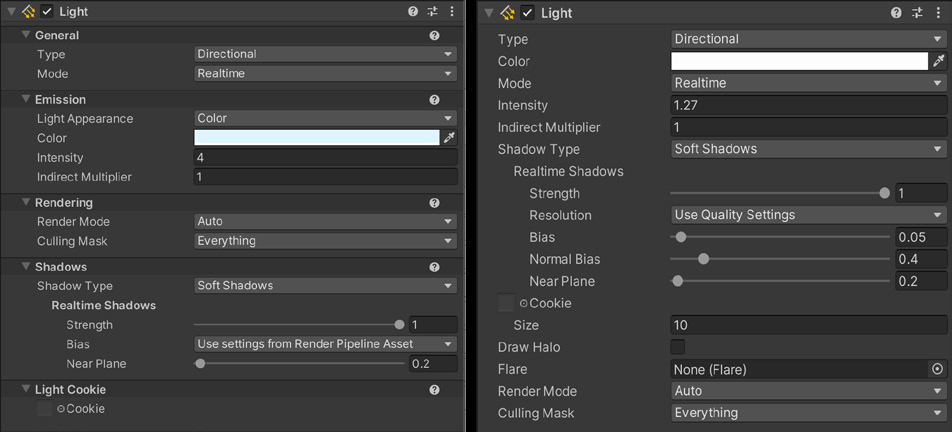
<p><em>VI: <strong>▲ Light Inspector — hai cột SO SÁNH</strong>: bên trái là các nhóm gập (General · Emission · Rendering · Shadows), bên phải mở hết: <strong>Type Directional · Mode Realtime · Intensity 1.27 · Indirect Multiplier 1 · Shadow Type Soft Shadows · Realtime Shadows: Strength 1 / Resolution Use Quality Settings / Bias 0.05 / Normal Bias 0.4 / Near Plane 0.2</strong>, rồi <strong>Draw Halo · Flare None · Render Mode Auto · Culling Mask Everything</strong>. / EN: The URP Light Inspector with all sections expanded.</em></p>

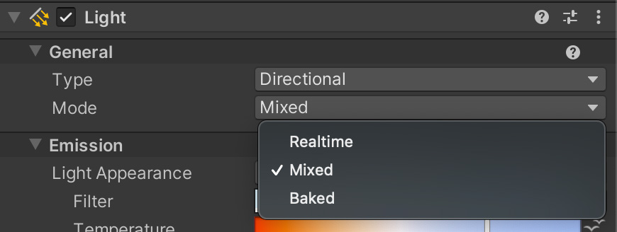
<p><em>VI: <strong>▲ <code>Mode</code></strong> — <strong>Realtime · Mixed · Baked</strong>. Đây là công tắc quyết định đèn có được bake hay không. / EN: The Light Mode dropdown: Realtime, Mixed, Baked.</em></p>

<div class="bilingual-row">
<div class="col-vi">
<p><em>"Giống BiRP, <strong>URP hỗ trợ đèn Directional, Spot, Point, và Area</strong> — <strong>dù đèn Area CHỈ hoạt động ở Baked Indirect Mode</strong>."</em></p>
<p><em>"Phiên bản URP có <strong>NĂM nhóm điều khiển</strong>, tuỳ theo đèn là Directional hay Point, cùng <strong>một nhóm SHAPE bổ sung cho đèn Spot và Area</strong>."</em></p>
</div>
<div class="col-en">
<p><em>"Just as with BiRP, <strong>URP supports Directional, Spot, Point, and Area lights</strong> — <strong>though Area lights ONLY work in Baked Indirect Mode</strong>."</em></p>
<p><em>"The URP version has <strong>FIVE groupings of controls</strong>, based on whether the light is Directional or Point, and <strong>an additional SHAPE grouping for Spot and Area lights</strong>."</em></p>
</div>
</div>

| Thuộc tính **URP** | Mô tả / Description | Tương ứng **BiRP** |
|---|---|---|
| **Light Appearance** | Chọn giữa **Color** hoặc **Filter and Temperature**. *Color* đặt màu ánh sáng phát ra. *Filter and Temperature* dùng **CẢ một màu (filter) LẪN một nhiệt độ** để chuyển giữa **ánh sáng lạnh và ấm** | ❌ **NA** *(không có)* |
| **Bias** | *"Bias điều khiển **shadow acne**. **Mặc định là DÙNG URP Asset.** Ngoài ra bạn có thể đặt **giá trị TUỲ CHỈNH bằng Inspector này**."* | Bias / Normal Bias |
| **Light Cookie** | *"Nếu texture được đặt dùng làm light cookie và đèn là **Directional**, một panel mới cho phép **điều khiển kích thước x, y của cookie cùng offset của nó**. 🔑 **Cookie cho đèn Point PHẢI là một CUBEMAP.** ✅ **URP hỗ trợ cookie CÓ MÀU, trong khi BiRP CHỈ có THANG XÁM.**"* | Cookie |
| **Shape: Spot** | *"Giờ bạn có thể **điều khiển CẢ góc nón TRONG lẫn NGOÀI** cho đèn Spot"* | Spot Angle, Range |
| **Shape: Area** | Điều khiển hình dạng của đèn Area | Shape, Width, Height, Radius |
| ❌ **NA** | *"Dễ dàng tái tạo bằng **một billboard HOẶC một Fresnel shader điều khiển giá trị alpha của một hình cầu đặt ở TÂM của đèn**"* | **Draw Halo** |
| ❌ **NA** | *Xem phần Lens Flare để biết cách cài đặt Lens Flare trong URP* | **Flare** |

### 34.5. 🌑 URP Asset — Nhóm Lighting & Shadow

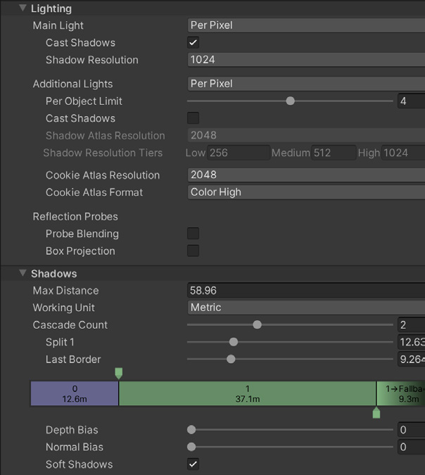
<p><em>VI: <strong>▲ Toàn bộ con số về đèn và bóng nằm ở ĐÂY</strong> — <strong>Main Light: Per Pixel · Cast Shadows ✓ · Shadow Resolution 1024</strong>; <strong>Additional Lights: Per Pixel · <span>Per Object Limit 4</span> · Cast Shadows ✓ · Shadow Atlas Resolution 2048 · Shadow Resolution Tiers Low 256 / Medium 512 / High 1024 · Cookie Atlas Resolution 2048 · Cookie Atlas Format Color High</strong>; <strong>Reflection Probes: Probe Blending · Box Projection</strong>; và <strong>Shadows: Max Distance 58.90 · Working Unit Metric · <span>Cascade Count 2</span> · Split 1 = 12.62 · Last Border 9.264 · Depth Bias · Normal Bias · Soft Shadows ✓</strong>. / EN: The Lighting and Shadows sections of the URP Asset.</em></p>

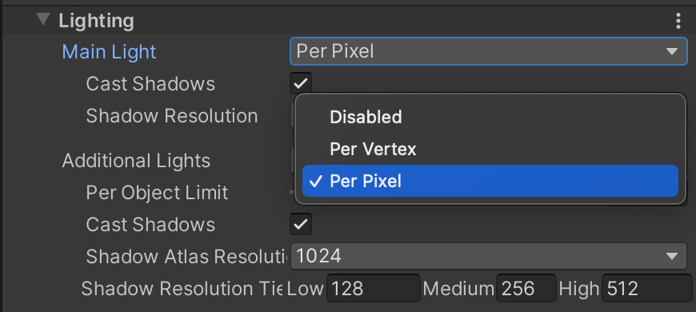
<p><em>VI: Nhóm <strong>Lighting</strong> trong URP Asset — <strong>Main Light: Per Pixel</strong> (dropdown mở cho thấy <strong>Disabled / Per Vertex / Per Pixel</strong>), <strong>Cast Shadows ✓</strong>, <strong>Additional Lights</strong> với <strong>Shadow Atlas Resolution: 1024</strong> và <strong>Shadow Resolution Tiers: Low 128 · Medium 256 · High 512</strong>. / EN: The Lighting group in the URP Asset.</em></p>

<div class="bilingual-row">
<div class="col-vi">
<p>🔑 <strong>Thay đổi LỚN NHẤT khi chuyển sang URP:</strong></p>
<blockquote>
<p><em>"<strong>Thay đổi LỚN NHẤT từ làm việc với BiRP sang URP nằm ở CÁCH BẠN THIẾT LẬP SHADOW.</strong></em></p>
<p><em>🚨 <strong>Shadow setting KHÔNG CÒN khả dụng qua <code>Project Settings &gt; Quality</code>.</strong> Như đã bàn trước đó, <strong>bạn cần một Renderer Data object và một Render Pipeline Asset khi dùng URP.</strong>"</em></p>
</blockquote>
<p><strong>Trình tự thiết lập Main Light Shadow:</strong></p>
<ol>
<li>Đặt <strong>Main Light Shadow</strong> = <code>Disabled</code> hoặc <code>Per Pixel</code></li>
<li>Bật checkbox <strong>Cast Shadows</strong></li>
<li>Đặt <strong>độ phân giải của shadow map</strong></li>
</ol>
<p>📊 <strong>BỐN yếu tố làm TĂNG chi phí xử lý shadow — nguyên văn:</strong></p>
<ol>
<li><em>"<strong>SỐ LƯỢNG Shadow Caster được render trong shadow map</strong> — con số này với Main Light <strong>PHỤ THUỘC vào Shadow Distance</strong> (mặt phẳng xa của shadow frustum)"</em></li>
<li><em>"<strong>Shadow Receiver nhìn thấy được</strong> (bạn phải bao trọn TẤT CẢ chúng)"</em></li>
<li><em>"<strong>Các phân đoạn Shadow Cascade</strong>"</em></li>
<li><em>"<strong>Shadow filtering (Soft Shadows)</strong>"</em></li>
</ol>
</div>
<div class="col-en">
<p>🔑 <strong>The BIGGEST change when moving to URP:</strong></p>
<blockquote>
<p><em>"<strong>The BIGGEST change from working with BiRP to URP lies in HOW YOU SET UP SHADOWS.</strong></em></p>
<p><em>🚨 <strong>Shadow settings are NO LONGER available via <code>Project Settings &gt; Quality</code>.</strong> As discussed earlier, <strong>you need a Renderer Data object and a Render Pipeline Asset when using URP.</strong>"</em></p>
</blockquote>
<p><strong>The Main Light Shadow setup sequence:</strong></p>
<ol>
<li>Set <strong>Main Light Shadow</strong> to <code>Disabled</code> or <code>Per Pixel</code></li>
<li>Tick the <strong>Cast Shadows</strong> checkbox</li>
<li>Set the <strong>shadow map resolution</strong></li>
</ol>
<p>📊 <strong>FOUR factors that INCREASE shadow processing — verbatim:</strong></p>
<ol>
<li><em>"<strong>The NUMBER of Shadow Casters rendered in the shadow map</strong> — this number for the Main Light <strong>DEPENDS on the Shadow Distance</strong> (far plane of shadow frustum)"</em></li>
<li><em>"<strong>Shadow Receivers that are VISIBLE</strong> (you have to encompass them ALL)"</em></li>
<li><em>"<strong>Shadow Cascades splits</strong>"</em></li>
<li><em>"<strong>Shadow filtering (Soft Shadows)</strong>"</em></li>
</ol>
</div>
</div>

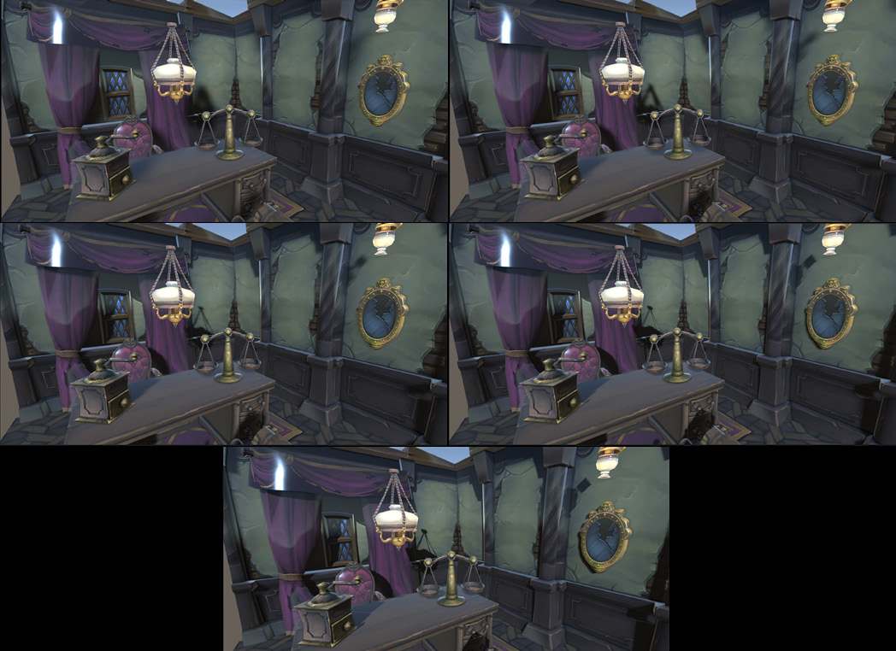
<p><em>VI: <strong>Main Light Shadow Resolution</strong> — <strong>trên-trái: 256 · trên-phải: 512 · giữa-trái: 1024 · giữa-phải: 2048 · dưới: 4096</strong>. / EN: Shadow Resolution set to 256, 512, 1024, 2048 and 4096 respectively.</em></p>

!!! tip "💡 Độ phân giải CAO NHẤT KHÔNG phải lúc nào cũng LÝ TƯỞNG"
    <div class="bilingual-row">
    <div class="col-vi">
    <blockquote>
    <p><em>"Nếu bạn từng làm việc với shadow trong Unity, bạn biết rằng <strong>real-time shadow đòi hỏi render một shadow map chứa ĐỘ SÂU của object nhìn từ GÓC NHÌN CỦA ĐÈN</strong>. <strong>Độ phân giải shadow map càng CAO thì độ trung thực thị giác càng CAO — dù ĐÒI HỎI CẢ nhiều sức xử lý HƠN LẪN nhiều bộ nhớ HƠN.</strong></em></p>
    <p><em>🔑 <strong>Độ phân giải CAO NHẤT KHÔNG phải lúc nào cũng lý tưởng.</strong> Ví dụ, <strong>tuỳ chọn Soft Shadows có tác dụng LÀM MỜ bản đồ</strong>. Trong ảnh căn phòng ma ám kiểu hoạt hình, bạn có thể thấy <strong>chiếc ghế ở tiền cảnh đổ bóng lên các ngăn kéo bàn, và bóng đó trông QUÁ SẮC NÉT khi độ phân giải LỚN HƠN 1024.</strong>"</em></p>
    </blockquote>
    <p>👉 <em>Đây là một trong số ÍT chỗ trong toàn bộ tài liệu Unity mà <strong>giảm setting vừa NHANH HƠN vừa ĐẸP HƠN</strong>.</em></p>
    </div>
    <div class="col-en">
    <blockquote>
    <p><em>"If you've worked with shadows in Unity before, you know that <strong>real-time shadows require rendering a shadow map that contains the DEPTH of objects from the PERSPECTIVE OF THE LIGHT</strong>. <strong>The HIGHER the resolution of this shadow map, the HIGHER the visual fidelity — though BOTH more processing power AND increased memory are required.</strong></em></p>
    <p><em>🔑 <strong>The HIGHEST resolution isn't ALWAYS ideal.</strong> For example, <strong>the Soft Shadows option has the effect of BLURRING the map</strong>. In the image of the cartoon-like haunted room, you can see that <strong>the chair in the foreground casts a shadow on the desk drawers, which appears TOO CRISP when the resolution is GREATER than 1024.</strong>"</em></p>
    </blockquote>
    <p>👉 <em>This is one of the FEW places in all of Unity's documentation where <strong>lowering a setting is BOTH faster AND better-looking</strong>.</em></p>
    </div>
    </div>

### 34.6. 📏 Shadow Max Distance — Setting bị hiểu sai nhiều nhất


<p><em>VI: <strong>Max Distance của Main Light Shadow</strong> — <strong>trên-trái: 10 · trên-phải: 30 · dưới-trái: 60 · dưới-phải: 400</strong>. Các cột cách nhau <strong>10 đơn vị</strong>. / EN: Varying Max Distance for the Main Light Shadow: 10, 30, 60 and 400. The poles are 10 units apart.</em></p>

<div class="bilingual-row">
<div class="col-vi">
<blockquote>
<p><em>"Trong ảnh trên, các cột cách nhau <strong>10 đơn vị</strong>. Max Distance biến thiên từ 10 đến 400 đơn vị.</em></p>
<p><em>🔍 <strong>Ở 10:</strong> chú ý rằng <strong>CHỈ cột đầu tiên đổ bóng, và bóng đó bị CẮT NGẮN ở 10 đơn vị tính từ vị trí Camera.</strong></em></p>
<p><em>✅ <strong>Ở 60 (ảnh dưới-trái): TẤT CẢ bóng đều nằm trong tầm nhìn — độ trung thực bóng ĐẠT YÊU CẦU.</strong></em></p>
<p><em>💀 <strong>Khi Max Distance LỚN HƠN NHIỀU so với các asset nhìn thấy được, shadow map bị TRẢI RA trên một VÙNG QUÁ LỚN. Nghĩa là vùng trong khung hình có độ phân giải THẤP HƠN NHIỀU so với mức cần thiết.</strong>"</em></p>
</blockquote>
<p>🎯 <strong>Quy tắc vàng:</strong></p>
<blockquote>
<p><em>"Thuộc tính Max Distance <strong>cần liên hệ TRỰC TIẾP tới những gì người dùng có thể THẤY, cũng như đơn vị dùng trong scene</strong>. <strong>Hãy nhắm tới khoảng cách TỐI THIỂU cho ra bóng CHẤP NHẬN ĐƯỢC.</strong> Nếu người chơi chỉ thấy bóng của object động ở 60 đơn vị từ Camera, thì <strong>hãy đặt Max Distance = 60</strong>."</em></p>
</blockquote>
<p>💎 <strong>Tương tác với Shadowmask:</strong></p>
<blockquote>
<p><em>"Khi Lighting Mode cho Mixed Lights được đặt là <strong>Shadowmask</strong>, <strong>bóng của các object VƯỢT QUÁ Shadow Distance được BAKE</strong>. Nếu đây là một scene tĩnh thì bạn sẽ thấy bóng trên MỌI object, <strong>nhưng CHỈ bóng động mới được VẼ tới tận Shadow Distance</strong>."</em></p>
</blockquote>
<p>⚠️ <strong>Hạn chế của URP — quan trọng:</strong></p>
<blockquote>
<p><em>"<strong>URP CHỈ hỗ trợ Stable Fit Shadow Projection</strong>, vốn <strong>DỰA VÀO người dùng thiết lập Max Distance</strong>. <strong>BiRP hỗ trợ CẢ Stable Fit LẪN Close Fit.</strong></em></p>
<p><em>Ở chế độ Close Fit, <strong>ảnh dưới-trái và dưới-phải sẽ có CÙNG chất lượng, vì Close Fit GIẢM mặt phẳng shadow distance để vừa với caster CUỐI CÙNG</strong>.</em></p>
<p><em>⚠️ <strong>Nhược điểm: vì Close Fit thay đổi shadow frustum "ĐỘNG", nó có thể gây hiệu ứng RUNG/NHẢY MÚA (shimmer/dancing) trong bóng.</strong>"</em></p>
</blockquote>
</div>
<div class="col-en">
<blockquote>
<p><em>"In the image above, the poles are <strong>10 units apart</strong>. The Max Distance varies from 10 to 400 units.</em></p>
<p><em>🔍 <strong>At 10:</strong> notice that <strong>ONLY the first pole casts a shadow, and this is CUT SHORT at 10 units from the Camera location.</strong></em></p>
<p><em>✅ <strong>At 60 (bottom-left image): ALL shadows are in view — the shadow fidelity is ADEQUATE.</strong></em></p>
<p><em>💀 <strong>When the Max Distance is MUCH GREATER than the visible assets, the shadow map is being SPREAD over TOO LARGE an area. This means that the region in-shot has a MUCH LOWER resolution than required.</strong>"</em></p>
</blockquote>
<p>🎯 <strong>The golden rule:</strong></p>
<blockquote>
<p><em>"The Max Distance property <strong>needs to relate DIRECTLY to what the user can SEE, as well as the units used in the scene</strong>. <strong>Aim for the MINIMUM distance that gives ACCEPTABLE shadows.</strong> If the player only sees shadows from dynamic objects 60 units from the Camera, then <strong>set Max Distance to 60</strong>."</em></p>
</blockquote>
<p>💎 <strong>Interaction with Shadowmask:</strong></p>
<blockquote>
<p><em>"When the Lighting Mode for Mixed Lights is set to <strong>Shadowmask</strong>, <strong>the shadows of objects BEYOND Shadow Distance are BAKED</strong>. If this was a static scene then you would see shadows on ALL objects, <strong>but ONLY dynamic shadows would be DRAWN up to the Shadow Distance</strong>."</em></p>
</blockquote>
<p>⚠️ <strong>A URP limitation — important:</strong></p>
<blockquote>
<p><em>"<strong>URP ONLY supports Stable Fit Shadow Projection</strong>, which <strong>RELIES on the user to set up the Max Distance</strong>. <strong>BiRP supports BOTH Stable Fit AND Close Fit.</strong></em></p>
<p><em>In the latter mode, <strong>the bottom-left and -right images would have the SAME quality, as Close Fit REDUCES the shadow distance plane to fit the LAST caster</strong>.</em></p>
<p><em>⚠️ <strong>The disadvantage: since Close Fit changes the shadow frustum "DYNAMICALLY," it can cause a SHIMMER/DANCING effect in the shadows.</strong>"</em></p>
</blockquote>
</div>
</div>

### 34.7. 🪜 Shadow Cascades — Khi nào dùng 1, khi nào dùng 4

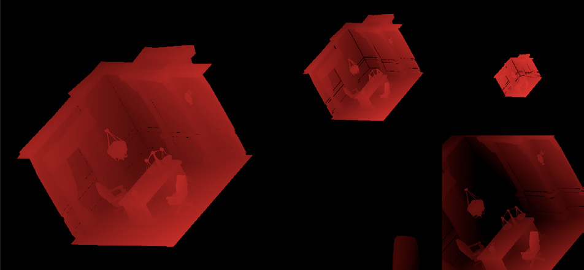
<p><em>VI: Shadow map của scene — <strong>cascade count = 1 (trái, bản đồ chiếm TRỌN vùng)</strong> và <strong>cascade count = 4 (phải, gồm BỐN bản đồ khác nhau, mỗi vùng nhận bản đồ độ phân giải THẤP HƠN)</strong>. / EN: Shadow map when cascade count is set to 1 (left) and 4 (right).</em></p>

<div class="bilingual-row">
<div class="col-vi">
<blockquote>
<p><em>"Khi asset biến mất vào xa do phối cảnh, <strong>việc GIẢM Shadow Resolution là hợp lý, qua đó DÀNH nhiều shadow map hơn cho bóng GẦN Camera. Shadow Cascades giúp làm điều này.</strong></em></p>
<p><em>🔑 <strong>Cascade count = 1 nhiều khả năng cho KẾT QUẢ TỐT NHẤT với scene NHỎ như thế này.</strong></em></p>
<p><em>✅ <strong>Nhưng NẾU Max Distance của bạn là một giá trị LỚN, thì cascade count 2 hoặc 3 sẽ cho bóng TỐT HƠN cho object tiền cảnh, vì chúng nhận được TỶ LỆ LỚN HƠN của shadow map.</strong></em></p>
<p><em>🔍 <strong>Chú ý chiếc ghế trong ảnh bên TRÁI LỚN HƠN NHIỀU, dẫn tới bóng SẮC NÉT HƠN.</strong>"</em></p>
</blockquote>
<p>⚠️ <strong>Quy tắc chỉnh cascade:</strong></p>
<blockquote>
<p><em>"<strong>LUÔN điều chỉnh Max Distance về giá trị VỪA KHÍT với scene</strong> và <strong>chọn vị trí slider một cách CẨN TRỌNG</strong>.</em></p>
<p><em>🔑 <strong>Nếu bạn dùng METRIC làm đơn vị làm việc, LUÔN chọn cascade CUỐI CÙNG, nhiều nhất, bằng khoảng cách của Shadow Caster CUỐI CÙNG.</strong>"</em></p>
</blockquote>
<p>👉 <em>Nhắc lại <a href="#2-cpu-draw-call-nut-that-au-tien">§2</a>: <strong>cascaded shadow có thể LÀM GẤP ĐÔI số draw call</strong>. Mỗi cascade thêm vào là một lượt render lại toàn bộ shadow caster.</em></p>
</div>
<div class="col-en">
<blockquote>
<p><em>"As assets disappear into the distance due to perspective, <strong>it is convenient to DECREASE Shadow Resolution, thereby devoting MORE of the shadow map to shadows CLOSER to the Camera. Shadow Cascades can help with this.</strong></em></p>
<p><em>🔑 <strong>A cascade count of 1 is likely to give the BEST result for SMALL scenes like this.</strong></em></p>
<p><em>✅ <strong>But IF your Max Distance is a LARGE value, then a cascade count of 2 or 3 will give BETTER shadows for FOREGROUND objects, as these receive a LARGER PROPORTION of the shadow map.</strong></em></p>
<p><em>🔍 <strong>Notice that the chair in the LEFT image is MUCH BIGGER, resulting in a SHARPER shadow.</strong>"</em></p>
</blockquote>
<p>⚠️ <strong>The cascade tuning rule:</strong></p>
<blockquote>
<p><em>"<strong>ALWAYS adjust Max Distance to a value that is a CLOSE FIT for your scene</strong> and <strong>choose the slider positions CAREFULLY</strong>.</em></p>
<p><em>🔑 <strong>If you use METRIC as the working unit, ALWAYS choose the LAST cascade to be, AT MOST, the distance of the LAST Shadow Caster.</strong>"</em></p>
</blockquote>
<p>👉 <em>Recall <a href="#2-cpu-draw-call-nut-that-au-tien">§2</a>: <strong>cascaded shadows can DOUBLE your draw call count</strong>. Every added cascade is another full re-render of the shadow casters.</em></p>
</div>
</div>

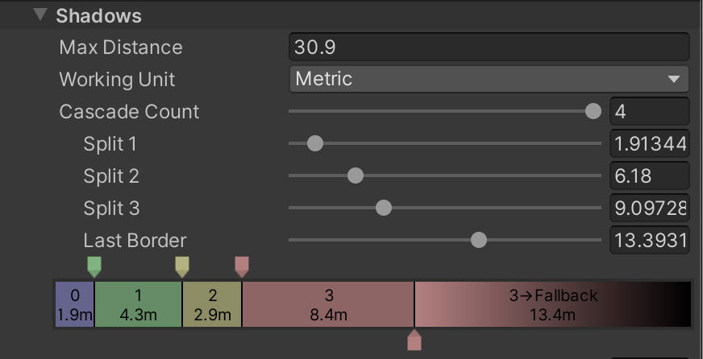
<p><em>VI: Điều chỉnh dải Shadow Cascade — <strong>Max Distance 30.9 · Working Unit: Metric · Cascade Count 4</strong>, các Split lần lượt <strong>1.91 / 6.18 / 9.10 / Last Border 13.39</strong>, và dải màu bên dưới hiển thị độ rộng thực tế của từng cascade: <strong>0 → 1.9 m · 1 → 4.3 m · 2 → 2.9 m · 3 → 8.4 m · 3→Fallback 13.4 m</strong>. / EN: Adjusting the range of a Shadow Cascade.</em></p>

### 34.8. 🗺️ Additional Light Shadows & Shadow Atlas

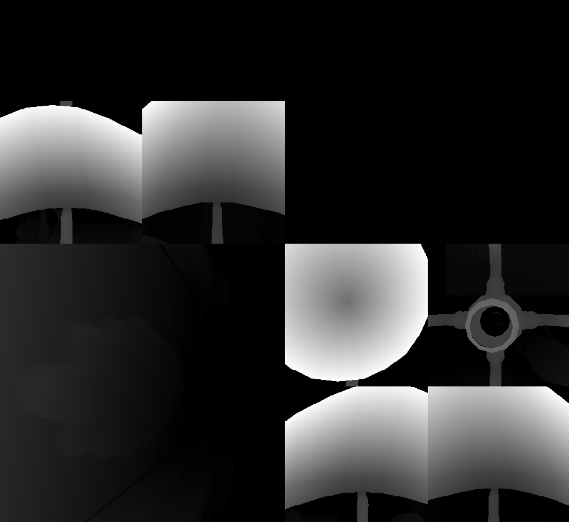
<p><em>VI: <strong>Shadow Atlas cho Additional Lights</strong> — <strong>SÁU bản đồ của đèn Point (resolution: medium, tier 256px)</strong> cộng với <strong>đèn Spot (resolution: high, tier 512px)</strong>, tất cả gói vào MỘT atlas. / EN: The Shadow Atlas showing the six maps used by the Point light plus the Spot light's map.</em></p>

<div class="bilingual-row">
<div class="col-vi">
<blockquote>
<p><em>"Bật đèn phụ đổ bóng bằng cách đặt <strong>Additional Lights Mode</strong> của URP Asset thành <strong><code>Per Pixel</code></strong>. <strong>Tuy mode có thể đặt là <code>Disabled</code>, <code>Per Vertex</code>, hoặc <code>Per Pixel</code>, CHỈ CÁI CUỐI CÙNG hoạt động với shadow.</strong></em></p>
<p><em>Tick ô <strong>Cast Shadows</strong>. Rồi chọn <strong>độ phân giải của Shadow Atlas</strong> — <em>bản đồ dùng để GỘP tất cả bản đồ của MỌI đèn đang đổ bóng</em>.</em></p>
<p><em>🚨 <strong>Hãy nhớ rằng một đèn Point đổ SÁU shadow map, tạo thành một CUBEMAP, vì nó chiếu sáng theo MỌI hướng. Điều này khiến đèn Point là loại ĐÒI HỎI NHIỀU NHẤT về hiệu năng.</strong></em></p>
<p><em>🔑 <strong>Độ phân giải RIÊNG của một additional light shadow map được đặt bằng KẾT HỢP của BA tier Shadow Resolution, CỘNG độ phân giải chọn qua Light Inspector khi chọn đèn đó trong Hierarchy.</strong>"</em></p>
</blockquote>
<p>📐 <strong>Ví dụ tính toán NGUYÊN VĂN của Unity:</strong></p>
<blockquote>
<p><em>"Trong căn phòng ma ám, có <strong>một đèn Spot trên gương và một đèn Point trên bàn. Cũng có BẢY bản đồ</strong> (6 của Point + 1 của Spot).</em></p>
<p><em>🧮 <strong>Để nhét BẢY bản đồ này vào một bản đồ vuông 1024px, kích thước MỖI bản đồ cần là 256px hoặc NHỎ HƠN.</strong></em></p>
<p><em>⚠️ <strong>Nếu bạn VƯỢT kích thước này, độ phân giải của shadow map sẽ BỊ CO LẠI cho vừa atlas, dẫn tới MỘT THÔNG BÁO CẢNH BÁO trong console.</strong>"</em></p>
</blockquote>
</div>
<div class="col-en">
<blockquote>
<p><em>"Enable additional lights to cast shadows by setting the <strong>Additional Lights Mode</strong> for the URP Asset to <strong><code>Per Pixel</code></strong>. <strong>While the mode can be set to <code>Disabled</code>, <code>Per Vertex</code>, or <code>Per Pixel</code>, ONLY THE LATTER works with shadows.</strong></em></p>
<p><em>Check the <strong>Cast Shadows</strong> box. Then, select the resolution of the <strong>Shadow Atlas</strong> — <em>the map that will be used to COMBINE all the maps for EVERY light casting shadows</em>.</em></p>
<p><em>🚨 <strong>Bear in mind that a Point light casts SIX shadow maps, creating a CUBEMAP, since it casts light in ALL DIRECTIONS. This makes a Point light the MOST DEMANDING performance-wise.</strong></em></p>
<p><em>🔑 <strong>The individual resolution of an additional light shadow map is set using a COMBINATION of the THREE Shadow Resolution tiers, PLUS the resolution chosen via the Light Inspector when selecting the light in the Hierarchy window.</strong>"</em></p>
</blockquote>
<p>📐 <strong>Unity's VERBATIM worked example:</strong></p>
<blockquote>
<p><em>"In the haunted room, there is <strong>a Spot light over the mirror and a Point light over the desk. There are also SEVEN maps</strong> (6 from the Point + 1 from the Spot).</em></p>
<p><em>🧮 <strong>To fit these SEVEN maps onto a 1024px square map, the size of EACH map needs to be 256px or SMALLER.</strong></em></p>
<p><em>⚠️ <strong>If you EXCEED this size, the resolution of shadow maps will SHRINK to fit the atlas, resulting in a WARNING MESSAGE in the console.</strong>"</em></p>
</blockquote>
</div>
</div>

**Kích thước Shadow Atlas theo số bản đồ / Setting the Shadow Atlas size based on the number of maps**

| Số bản đồ / Number of maps | Atlas tiling | Atlas size (**nhân tier size với**) |
|---|---|---|
| **1** | **1×1** | **× 1** |
| **2–4** | **2×2** | **× 2** |
| **5–16** | **4×4** | **× 4** |

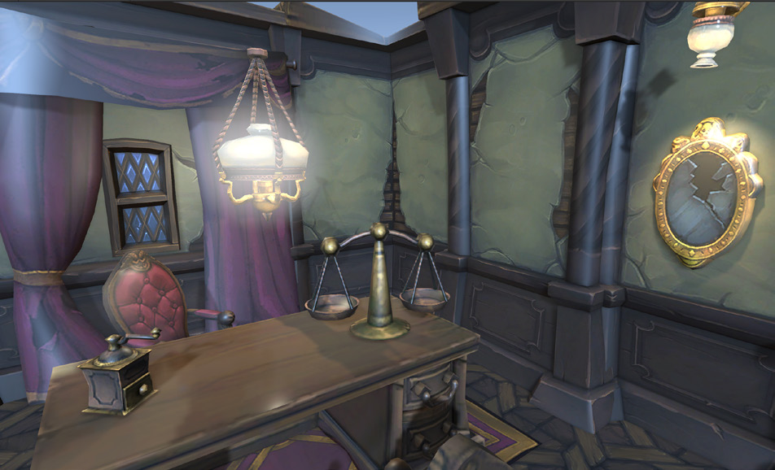
<p><em>VI: Phiên bản low-poly của căn phòng ma ám — chiếu sáng bằng <strong>MỘT Main Directional light, MỘT Point light trên bàn, và MỘT Spot light trên gương. TẤT CẢ đèn đều real-time và đang đổ bóng.</strong> / EN: A low-polygon version of the haunted room, lit with a Main Directional light, a Point light over the desk, and a Spot light over the mirror. All lights are real-time and casting shadows.</em></p>

### 34.9. 🎛️ Light Modes — Baked Indirect vs Subtractive vs Shadowmask

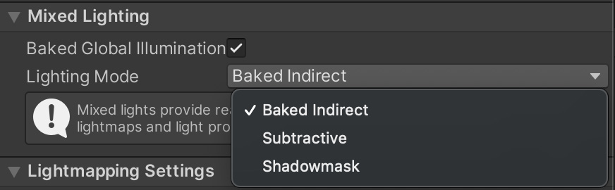
<p><em>VI: <strong>▲ <code>Mixed Lighting › Lighting Mode</code></strong> — <strong>Baked Indirect · Subtractive · Shadowmask</strong>, kèm <strong>Baked Global Illumination ✓</strong> và ghi chú <em>"Mixed lights provide realtime direct lighting while indirect light is baked into lightmaps and light probes."</em> / EN: The Mixed Lighting Mode options.</em></p>

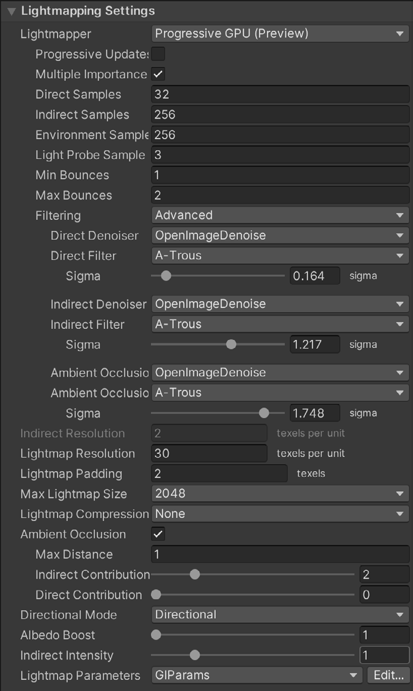
<p><em>VI: <strong>▲ Lightmapping Settings</strong> — <strong>Lightmapper: Progressive GPU (Preview)</strong> · Multiple Importance Sampling · <strong>Direct Samples 32 · Indirect Samples 256 · Environment Samples 256 · Light Probe Sample 3 · Min Bounces 2 · Max Bounces 2</strong> · <strong>Filtering Advanced</strong> với <em>OpenImageDenoise</em> + <em>A-Trous</em> · <strong>Lightmap Resolution 30 texels/unit · Lightmap Padding 2 · Max Lightmap Size 2048 · Lightmap Compression None</strong> · <strong>Ambient Occlusion ✓ Max Distance 1 · Indirect Contribution 2 · Direct Contribution 1</strong> · <strong>Directional Mode: Directional · Albedo Boost 1 · Indirect Intensity 1</strong>. / EN: The full Lightmapping Settings panel.</em></p>

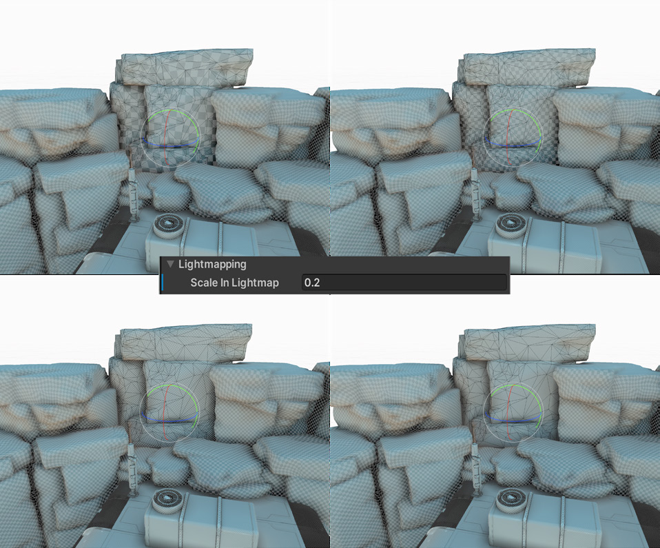
<p><em>VI: <strong>▲ <code>Scale In Lightmap</code> nhìn tận mắt</strong> — cùng một chiếc ghế bake ở BỐN mức scale; giá trị <strong>0.2</strong> cho lightmap thô rõ rệt. Đây là cách giảm texel cho vật thể KHÔNG đáng. / EN: The effect of different Scale In Lightmap values.</em></p>

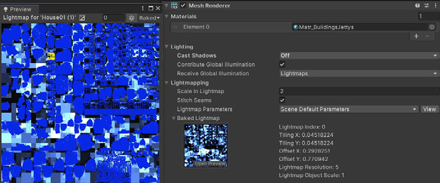
<p><em>VI: <strong>▲ Đọc thông số lightmap của MỘT object</strong> — preview lightmap của <code>House01</code> kèm <strong>Scale In Lightmap 2 · Stitch Seams ✓ · Lightmap Parameters: Scene Default Parameters</strong>, và khối <strong>Baked Lightmap: Lightmap Index 0 · Tiling X/Y 0.04518224 · Offset X 0.2909251 / Y 0.770942 · Lightmap Resolution 5 · Lightmap Object Scale 1</strong>. / EN: Reading the baked lightmap parameters of a single object.</em></p>

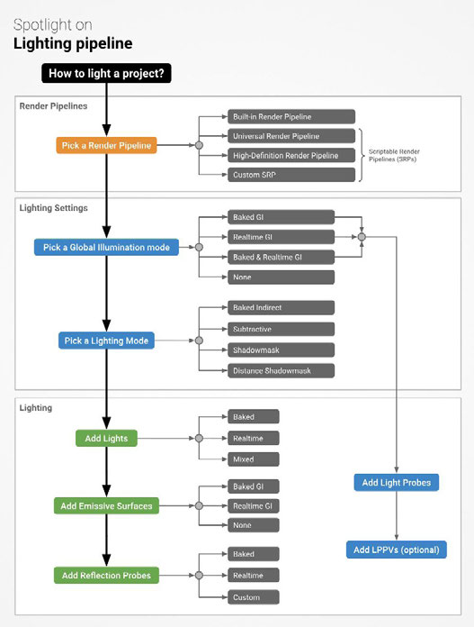
<p><em>VI: <strong>▲ "How to light a project?" — LƯU ĐỒ TOÀN BỘ</strong>: <strong>Pick a Render Pipeline</strong> (Built-in / Universal / High-Definition / Custom SRP) → <strong>Lighting Settings</strong> → <strong>Pick a Global Illumination mode</strong> (Baked GI · Realtime GI · Baked&amp;Realtime GI · None) → <strong>Pick a Lighting Mode</strong> (Baked Indirect · Subtractive · Shadowmask · Distance Shadowmask) → <strong>Add Lights</strong> → <strong>Add Emissive Surfaces</strong> → <strong>Add Reflection Probes</strong> → <strong>Add Light Probes</strong> → <strong>Add LPPVs (optional)</strong>. / EN: The complete How to light a project flowchart.</em></p>

<div class="bilingual-row">
<div class="col-vi">
<blockquote>
<p><em>"Môi trường CHỦ YẾU có geometry TĨNH, nên <strong>nếu một cái đèn là TĨNH, bạn KHÔNG cần tính lighting và shadow cho nó LẶP ĐI LẶP LẠI. Bạn có thể tính MỘT LẦN ở thời điểm THIẾT KẾ, rồi dùng dữ liệu đó khi render geometry. Đây gọi là LIGHTMAPPING hay BAKING.</strong></em></p>
<p><em>✅ <strong>Workflow lightmapping KHÔNG THAY ĐỔI giữa BiRP và URP.</strong>"</em></p>
</blockquote>
<p>📌 <strong>Ghi chú kỹ thuật rất giá trị — "low frequency" nghĩa là gì:</strong></p>
<blockquote>
<p><em>"<strong>Low frequency ám chỉ việc lightmap được CẬP NHẬT ở TỐC ĐỘ THẤP HƠN NHIỀU so với cập nhật màn hình.</strong></em></p>
<p><em>🔑 <strong>SPECULAR LOBE CHỈ có thể được tính bởi đèn REAL-TIME.</strong></em></p>
<p><em>💡 <strong>Bạn có thể áp dụng Global Illumination (GI) cho object ĐỘNG bằng Light Probe, nhưng chúng CŨNG CHỈ bắt được ánh sáng diffuse tần số thấp.</strong></em></p>
<p><em>⚠️ <strong>BiRP hỗ trợ Light Probe Proxy Volume (LPPV), thứ mang lại cho Light Probe CÙNG mức chất lượng mà lightmap mang lại — cho object động. TUY NHIÊN, trong URP, LPPV KHÔNG được hỗ trợ do nó là một hệ thống TƯƠNG ĐỐI CHẬM và KHÔNG mở rộng tốt.</strong></em></p>
<p><em>🔮 <strong>Thay vào đó, URP dự định hỗ trợ ADAPTIVE PROBE VOLUMES, thứ có thể THAY THẾ lightmap và hoạt động cho CẢ object tĩnh LẪN động.</strong>"</em></p>
</blockquote>
</div>
<div class="col-en">
<blockquote>
<p><em>"Environments have predominantly STATIC geometry, so that <strong>if a light is STATIC, you don't need to calculate the lighting and shadows for it REPEATEDLY. You can calculate this ONCE at DESIGN TIME, and then use that data when rendering the geometry. This is called LIGHTMAPPING or BAKING.</strong></em></p>
<p><em>✅ <strong>The workflow for lightmapping is UNCHANGED between BiRP and URP.</strong>"</em></p>
</blockquote>
<p>📌 <strong>A very valuable technical note — what "low frequency" means:</strong></p>
<blockquote>
<p><em>"<strong>Low frequency refers to the fact that lightmaps are UPDATED at a MUCH LOWER RATE than screen updates.</strong></em></p>
<p><em>🔑 <strong>SPECULAR LOBES can ONLY be computed by REAL-TIME lights.</strong></em></p>
<p><em>💡 <strong>You can apply Global Illumination (GI) to DYNAMIC objects by using Light Probes, but those ALSO only capture low frequency diffuse light.</strong></em></p>
<p><em>⚠️ <strong>BiRP supports Light Probe Proxy Volume (LPPV), which provides the SAME level of quality for Light Probes as lightmaps do for dynamic objects. However, in URP, LPPV is NOT SUPPORTED due to it being a RELATIVELY SLOW system that DOESN'T SCALE.</strong></em></p>
<p><em>🔮 <strong>Instead, URP plans to support ADAPTIVE PROBE VOLUMES, which could REPLACE lightmaps and work for BOTH static AND dynamic objects.</strong>"</em></p>
</blockquote>
</div>
</div>

**⚙️ TÁM bước bake lightmap trong URP / The EIGHT lightmap baking steps in URP** *(theo dự án FPS Sample: The Inspection)*

| # | Bước / Step |
|---|---|
| **1** | *"Scene chứa chủ yếu geometry TĨNH. Để đưa geometry vào lightmapping, **tick ô Static ở phía phải Inspector**."* |
| **2** | *"Chọn setting lightmapping qua `Window > Rendering > Lighting > Scene`. 🔑 **Giữ Lightmap Resolution THẤP TRONG LÚC điều chỉnh setting. Khi đã có setting mong muốn, TĂNG giá trị lên khi sinh lightmap CUỐI CÙNG.** ⚡ **Chọn Progressive GPU (Preview) để tăng tốc sinh lightmap, nếu GPU hỗ trợ.**"* |
| **3** | *"**Filtering LÀM MỜ bản đồ để giảm thiểu NHIỄU. Việc này có thể tạo ra KHE HỞ trong bóng ở nơi một object gặp object khác. Dùng A-TROUS FILTERING để giảm thiểu artifact này.**"* |
| **4** | *"**Đảm bảo MỌI geometry tĩnh KHÔNG có giá trị UV CHỒNG LẤN, hoặc đang sinh lighting UV khi import.**"* |
| **5** | *"Đặt **Light Mode** thành **Baked** hoặc **Mixed**. Chọn đèn trong Hierarchy và dùng Inspector. 💡 **Mixed Lights sẽ chiếu sáng CẢ object động LẪN tĩnh.**"* |
| **6** | *"Khi dùng **Mixed Lights**, đặt Light Mode thành **Baked Indirect**, **Subtractive**, hoặc **Shadowmask** qua `Window > Rendering > Lighting > Scene`."* → **xem bảng dưới** |
| **7** | *"Điều chỉnh **Lightmap Scale** qua `Asset > Inspector > Lightmapping > Scale In Lightmap`, để **object ở XA chiếm ÍT chỗ hơn trên lightmap**."* *(ví dụ trong sách: texel size của lightmap tảng đá nền biến thiên từ **0.05 tới 0.5**)* |
| **8** | *"Bấm **Generate Lighting** để bake. ⏱️ **Thời gian bake PHỤ THUỘC vào: số object tĩnh, số đèn đặt ở Mixed hoặc Baked mode, và các setting chọn cho lightmapping — ĐẶC BIỆT là Max Lightmap Size và Lightmap Resolution.**"* |

**BA Lighting Mode cho Mixed Lights / The THREE Lighting Modes for Mixed Lights**

| Mode | Cơ chế / Mechanism | Đánh giá / Verdict |
|---|---|---|
| **🅰️ Baked Indirect** | *"**CHỈ phần đóng góp ánh sáng GIÁN TIẾP được bake vào lightmap và Light Probe** (chỉ các lần NẢY của đèn). **Ánh sáng TRỰC TIẾP và bóng là REAL-TIME.**"* | ⚠️ *"**Đây là tuỳ chọn ĐẮT ĐỎ và KHÔNG lý tưởng cho nền tảng mobile.** Tuy nhiên, nó có nghĩa là **bạn có được bóng và ánh sáng trực tiếp CHÍNH XÁC cho CẢ geometry tĩnh LẪN động.**"* |
| **🅱️ Subtractive** | *"Bạn **bake ánh sáng TRỰC TIẾP từ một đèn Directional đặt ở Mixed vào geometry TĨNH, rồi TRỪ ĐI ánh sáng khỏi bóng đổ bởi geometry ĐỘNG**. 🔬 **URP tính một ƯỚC LƯỢNG phần đóng góp của ánh sáng từ Directional Light và TRỪ nó khỏi baked Global Illumination. Ước lượng này bị KẸP (clamped) bởi setting Real-time Shadow Color trong phần Environment của cửa sổ Lighting, nên MÀU BỊ TRỪ KHÔNG BAO GIỜ TỐI HƠN màu này.** Rồi chọn màu TỐI THIỂU giữa giá trị đã trừ và màu bake gốc."* | ⚠️ *"Kết quả là **geometry tĩnh KHÔNG THỂ đổ bóng lên object động, TRỪ KHI dùng Light Probe — điều này có thể gây ra những ĐỨT ĐOẠN THỊ GIÁC KHÓ CHỊU.**"* ✅ *"**Đây là tuỳ chọn PHÙ HỢP NHẤT cho phần cứng CẤP THẤP.**"* |
| **🅾️ Shadowmask** | *"Tuy tương tự Baked Indirect Mode, **Shadowmask KẾT HỢP CẢ bóng động LẪN bóng bake, render bóng ở KHOẢNG CÁCH XA. Nó làm điều đó bằng cách dùng một texture SHADOWMASK BỔ SUNG và lưu thông tin THÊM trong Light Probe.**"* | ✅ *"**Cho bóng ĐỘ TRUNG THỰC CAO NHẤT**"* ⚠️ *"nhưng **CŨNG là tuỳ chọn ĐẮT NHẤT về mức dùng BỘ NHỚ và HIỆU NĂNG. Về thị giác, nó GIỐNG HỆT Baked Indirect ở các cảnh gần. Khác biệt lộ rõ khi nhìn ra XA, khiến nó RẤT PHÙ HỢP cho scene open-world. Do chi phí xử lý, CHỈ khuyến nghị cho phần cứng trung tới cao cấp.**"* |

### 34.10. 🎯 Light Layers — Làm nổi bật vật thể quan trọng

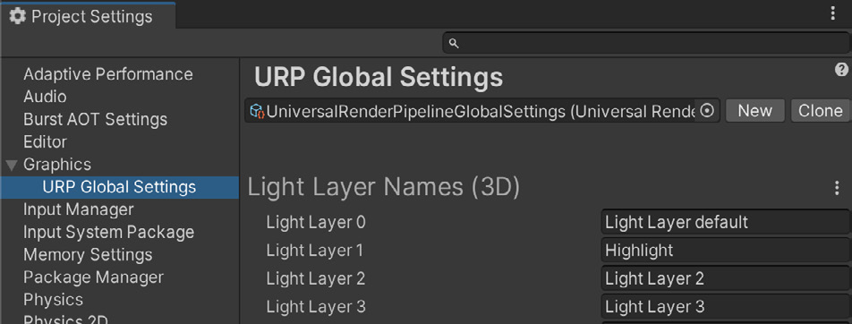
<p><em>VI: <strong>▲ Đặt TÊN cho layer</strong> — <code>Project Settings › Graphics › URP Global Settings › Light Layer Names (3D)</code>: <strong>Light Layer 0 = "Light Layer default" · Light Layer 1 = "Highlight" · Light Layer 2 · Light Layer 3</strong>. / EN: Naming light layers in the URP Global Settings.</em></p>

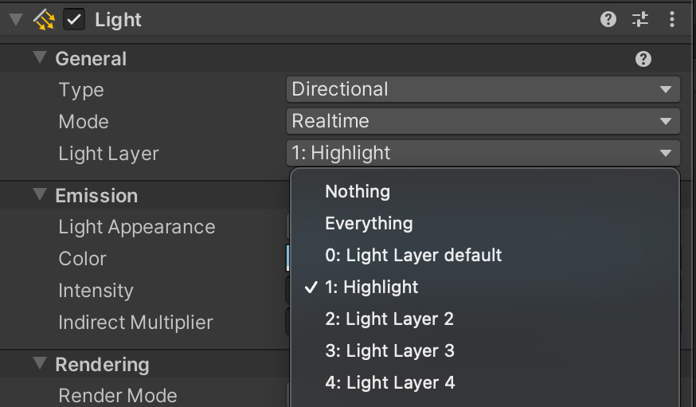
<p><em>VI: <strong>▲ Gán trên ĐÈN</strong> — <code>Light › General › Light Layer</code> chọn <strong>1: Highlight</strong> (danh sách: Nothing · Everything · 0: Light Layer default · 1: Highlight · 2 · 3 · 4). / EN: Assigning a Light Layer on the Light component.</em></p>

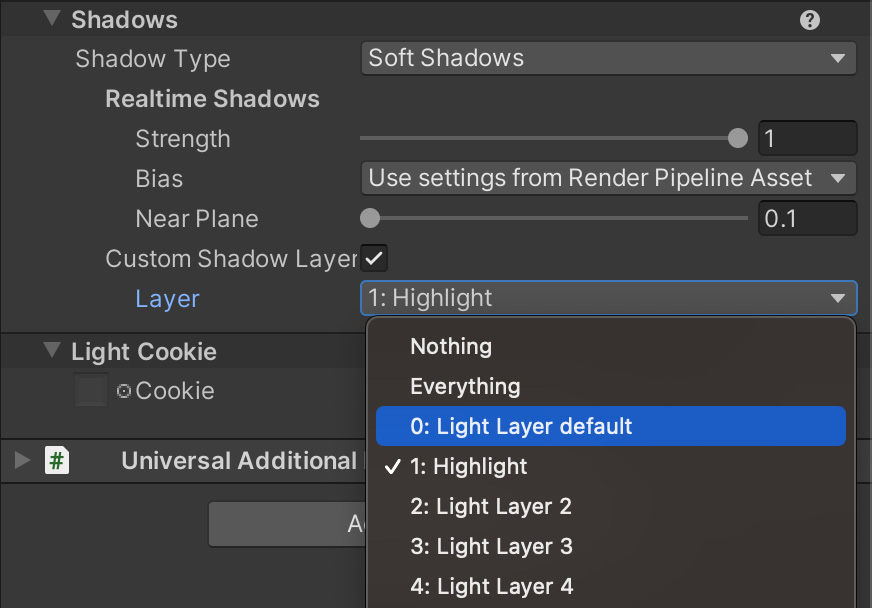
<p><em>VI: <strong>▲ Và tách BÓNG ra khỏi ÁNH SÁNG</strong> — <code>Shadows › Custom Shadow Layer ✓ › Layer: 1: Highlight</code>; nhờ vậy một đèn có thể CHIẾU SÁNG nhóm này nhưng chỉ ĐỔ BÓNG cho nhóm kia. / EN: Custom Shadow Layer, separating which objects cast shadows from which are lit.</em></p>

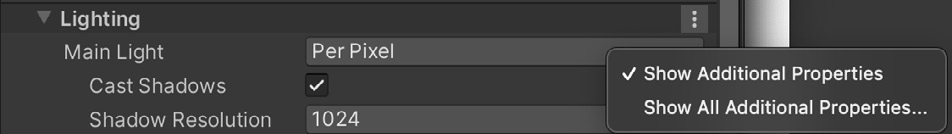
<p><em>VI: <strong>▲ Mẹo nhỏ</strong> — nhiều tuỳ chọn bị ẨN cho tới khi bật <strong>Show Additional Properties</strong> (hoặc <em>Show All Additional Properties…</em>) từ menu ⋮ của panel. / EN: The Show Additional Properties menu that reveals hidden options.</em></p>

<div class="bilingual-row">
<div class="col-vi">
<blockquote>
<p><em>"Tính năng Light Layers cho phép bạn <strong>cấu hình một số đèn CHỈ ảnh hưởng tới các GameObject CỤ THỂ, để bạn có thể NHẤN MẠNH và THU HÚT SỰ CHÚ Ý tới chúng trong scene.</strong></em></p>
<p><em>📖 Ví dụ trong sách: <strong>ống tiêm — một vật phẩm thu thập QUAN TRỌNG — xuất hiện ở phần TỐI của scene. Với một Light Layer, nó trở nên NHÌN THẤY ĐƯỢC và giúp đảm bảo người chơi KHÔNG BỎ LỠ việc nhặt nó.</strong>"</em></p>
</blockquote>
<p><strong>SÁU bước thiết lập:</strong></p>
<ol>
<li>Chọn <strong>URP Asset</strong>. Trong mục Lighting, bấm biểu tượng <strong>⋮ (vertical ellipsis)</strong> → <strong>Show Additional Properties</strong></li>
<li>Một setting mới, <strong>Light Layers</strong>, sẽ xuất hiện dưới mục Lighting</li>
<li>Đổi tên một Light Layer qua <code>Project Settings &gt; Graphics &gt; URP Global Settings</code></li>
<li>Giờ Light Layers đã bật, <strong>Light Inspector sẽ có thêm dropdown Light Layer. MỘT đèn có thể đóng góp cho NHIỀU HƠN MỘT layer.</strong></li>
<li><strong>Với Light Layers bật, bạn cần thiết lập một CUSTOM SHADOW LAYER. Đèn mới có thể đổ bóng từ Main Light của scene HOẶC từ frustum của CHÍNH NÓ.</strong></li>
<li>Cuối cùng, chọn object áp dụng trong Hierarchy rồi đặt <strong>Rendering Layer Mask</strong></li>
</ol>
<p>👉 <em>Nhắc lại <a href="#19-shadow-point-light-ton-gap-6-lan">§19</a>: Light Layers cũng chính là kỹ thuật <strong>giới hạn ảnh hưởng của mỗi đèn vào một culling mask</strong> mà e-book Console khuyên dùng cho scene nhiều đèn.</em></p>
</div>
<div class="col-en">
<blockquote>
<p><em>"The Light Layers feature lets you <strong>configure certain lights to affect ONLY SPECIFIC GameObjects so you can EMPHASIZE and DRAW ATTENTION to them in a scene.</strong></em></p>
<p><em>📖 The book's example: <strong>the syringe, a KEY COLLECTABLE, appears in a SHADED part of the scene. With a Light Layer, it becomes VISIBLE and helps ensure that the player DOESN'T MISS picking it up.</strong>"</em></p>
</blockquote>
<p><strong>The SIX setup steps:</strong></p>
<ol>
<li>Select the <strong>URP Asset</strong>. In the Lighting section, click the <strong>⋮ (vertical ellipsis)</strong> icon → <strong>Show Additional Properties</strong></li>
<li>A new setting, <strong>Light Layers</strong>, appears under the Lighting section</li>
<li>Rename a Light Layer via <code>Project Settings &gt; Graphics &gt; URP Global Settings</code></li>
<li>Now that Light Layers are enabled, <strong>the Light Inspector will include a Light Layer drop-down. A light can contribute to MORE THAN ONE layer.</strong></li>
<li><strong>With Light Layers enabled, you need to set up a CUSTOM SHADOW LAYER. The new light can cast shadows from the scene's Main Light OR from its OWN frustum.</strong></li>
<li>Lastly, select the object this applies to in the Hierarchy window and set the <strong>Rendering Layer Mask</strong></li>
</ol>
<p>👉 <em>Recall <a href="#19-shadow-point-light-ton-gap-6-lan">§19</a>: Light Layers is exactly the <strong>"confine each light's influence to a culling mask"</strong> technique the Console e-book recommends for multi-light scenes.</em></p>
</div>
</div>

```csharp
// Đặt Rendering Layer Mask ĐỘNG bằng code — nguyên văn từ e-book URP
// Setting the Rendering Layer Mask dynamically in code — verbatim from the URP e-book
Renderer renderer = GetComponent<Renderer>();
int layerID = 1;
int mask     = 1 << layerID;
renderer.renderingLayerMask = (uint)mask;
```

### 34.11. 🔵 Light Probes — Cách ĐẶT cho đúng

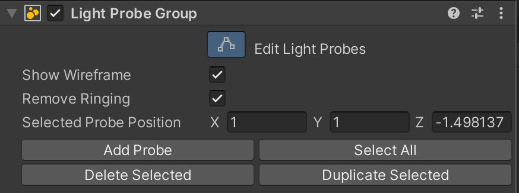
<p><em>VI: <strong>▲ Component Light Probe Group</strong> — nút <strong>Edit Light Probes</strong>, <strong>Show Wireframe ✓ · Remove Ringing ✓</strong>, <strong>Selected Probe Position X 1 Y 1 Z −1.498137</strong>, và bốn nút <strong>Add Probe · Select All · Delete Selected · Duplicate Selected</strong>. / EN: The Light Probe Group component.</em></p>

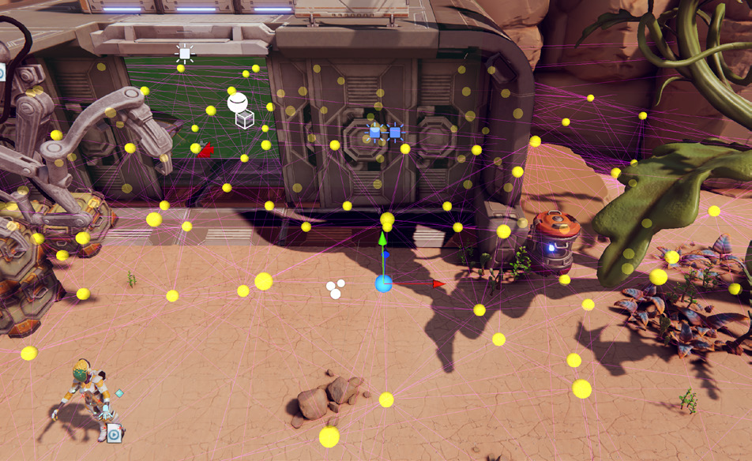
<p><em>VI: <strong>▲ Probe trong scene</strong> — chấm <strong>VÀNG</strong> rải quanh khu vực nhân vật ĐI QUA, dày ở chỗ ánh sáng ĐỔI NHANH, thưa ở chỗ đều màu. / EN: Light probes placed through the playable area.</em></p>

<div class="bilingual-row">
<div class="col-vi">
<blockquote>
<p><em>"<strong>KHUYẾN NGHỊ thêm Light Probe vào scene khi dùng Mixed Lighting Mode.</strong> Light Probe <strong>LƯU dữ liệu ánh sáng tại một VỊ TRÍ CỤ THỂ trong môi trường khi bạn bake lighting</strong> bằng cách bấm <strong>Generate Lighting</strong> qua <code>Window &gt; Rendering &gt; Lighting</code>.</em></p>
<p><em>✅ <strong>Điều này đảm bảo việc chiếu sáng của một object ĐỘNG di chuyển qua môi trường PHẢN ÁNH ĐÚNG các mức sáng mà object đã bake dùng. Ở vùng TỐI nó sẽ TỐI, ở vùng SÁNG hơn nó sẽ SÁNG hơn.</strong>"</em></p>
</blockquote>
<p><strong>Cách tạo:</strong> chuột phải trong Hierarchy → <code>Light &gt; Light Probe Group</code>.</p>
<blockquote>
<p><em>"Ban đầu sẽ có <strong>MỘT KHỐI LẬP PHƯƠNG gồm TÁM Light Probe</strong>. Để xem và sửa vị trí, chọn Light Probe Group trong Hierarchy, và trong Inspector bấm <strong>Light Probe Group &gt; Edit Light Probes</strong>. Scene view giờ ở chế độ chỉnh sửa, nơi <strong>CHỈ Light Probe mới chọn được</strong>. Dùng Move tool để di chuyển chúng."</em></p>
</blockquote>
<p>🎯 <strong>Quy tắc ĐẶT Light Probe — quan trọng nhất:</strong></p>
<blockquote>
<p><em>"Light Probe nên được đặt, <strong>THỨ NHẤT, ở vùng mà một object ĐỘNG có thể DI CHUYỂN TỚI</strong>, và <strong>THỨ HAI, ở nơi có THAY ĐỔI ĐÁNG KỂ về mức độ ánh sáng.</strong></em></p>
<p><em>🔬 <strong>Khi tính mức sáng cho một object, engine TÌM một KHỐI CHÓP (pyramid) các Light Probe GẦN NHẤT và dùng chúng để xác định một giá trị NỘI SUY cho mức chiếu sáng.</strong>"</em></p>
</blockquote>
</div>
<div class="col-en">
<blockquote>
<p><em>"<strong>It's RECOMMENDED to also add Light Probes to your scene when using Mixed Lighting Mode.</strong> Light Probes <strong>SAVE the light data at a PARTICULAR POSITION within an environment when you bake the lighting</strong> by clicking <strong>Generate Lighting</strong> via <code>Window &gt; Rendering &gt; Lighting</code>.</em></p>
<p><em>✅ <strong>This ensures that the illumination of a DYNAMIC object moving through an environment REFLECTS the lighting levels used by the baked objects. In a DARK area it will be DARK, and in a LIGHTER area it will be BRIGHTER.</strong>"</em></p>
</blockquote>
<p><strong>How to create:</strong> right-click in the Hierarchy → <code>Light &gt; Light Probe Group</code>.</p>
<blockquote>
<p><em>"Initially, there will be a <strong>CUBE of Light Probes, EIGHT in total</strong>. To view and edit the positioning, select the Light Probe Group in the Hierarchy, and in the Inspector click <strong>Light Probe Group &gt; Edit Light Probes</strong>. The Scene view will now be in an editing mode where <strong>ONLY Light Probes can be selected</strong>. Use the Move tool to move them around."</em></p>
</blockquote>
<p>🎯 <strong>The Light Probe PLACEMENT rule — the most important part:</strong></p>
<blockquote>
<p><em>"Light Probes should be positioned, <strong>FIRST, in an area where a DYNAMIC object might MOVE TO</strong>, and <strong>SECOND, where there is a SIGNIFICANT CHANGE in lighting level.</strong></em></p>
<p><em>🔬 <strong>When calculating the lighting level for an object, the engine finds a PYRAMID of the NEAREST Light Probes and uses those to determine an INTERPOLATED value for the illumination level.</strong>"</em></p>
</blockquote>
</div>
</div>

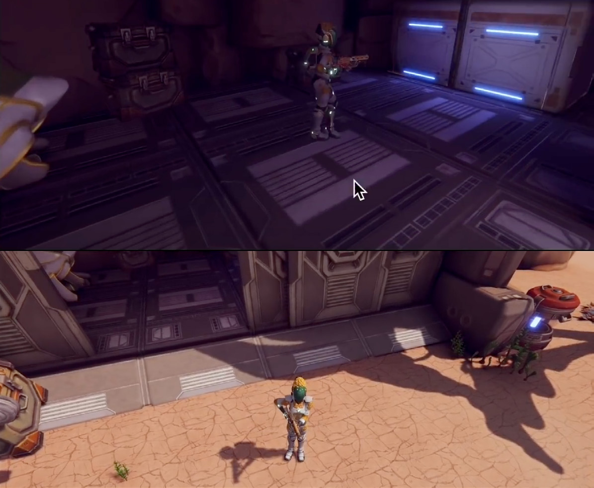
<p><em>VI: Robot ở <strong>TRONG (trên)</strong> và <strong>NGOÀI (dưới)</strong> nhà chứa máy bay — <strong>mức chiếu sáng thay đổi nhờ Light Probe</strong>. / EN: The robot inside and outside of the hangar, with lighting level affected by Light Probes.</em></p>

<div class="bilingual-row">
<div class="col-vi">
<p>💡 <em>"Việc ĐẶT Light Probe có thể <strong>TỐN THỜI GIAN</strong>, nhưng một <strong>cách tiếp cận DỰA TRÊN CODE</strong> có thể <strong>tăng tốc việc chỉnh sửa, ĐẶC BIỆT với scene LỚN</strong>."</em></p>
</div>
<div class="col-en">
<p>💡 <em>"Positioning Light Probes can be <strong>TIME-CONSUMING</strong>, but a <strong>CODE-BASED approach</strong> can <strong>speed up your editing, ESPECIALLY for a LARGE scene</strong>."</em></p>
</div>
</div>

### 34.12. 🪞 Reflection Probes — Cubemap, Blending & Box Projection

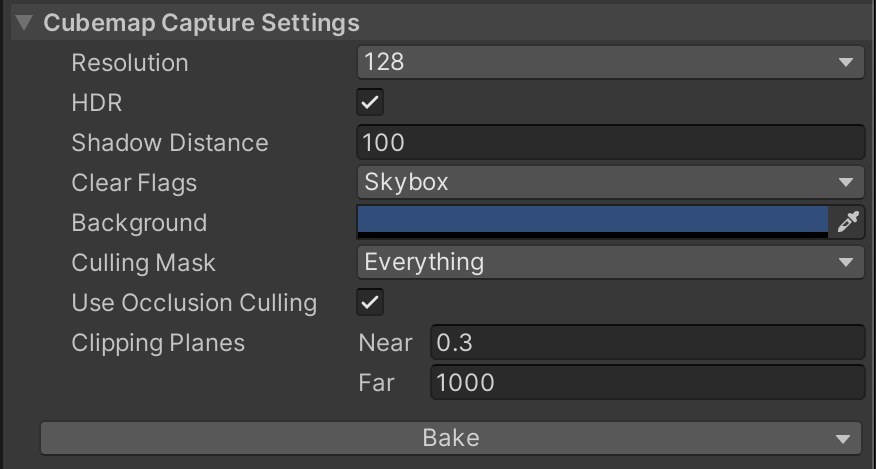
<p><em>VI: <strong>▲ Cubemap Capture Settings</strong> — <strong>Resolution 128 · HDR ✓ · Shadow Distance 100 · Clear Flags Skybox · Background · Culling Mask Everything · Use Occlusion Culling ✓ · Clipping Planes Near 0.3 / Far 1000</strong>, và nút <strong>Bake</strong>. / EN: The Reflection Probe Cubemap Capture Settings.</em></p>

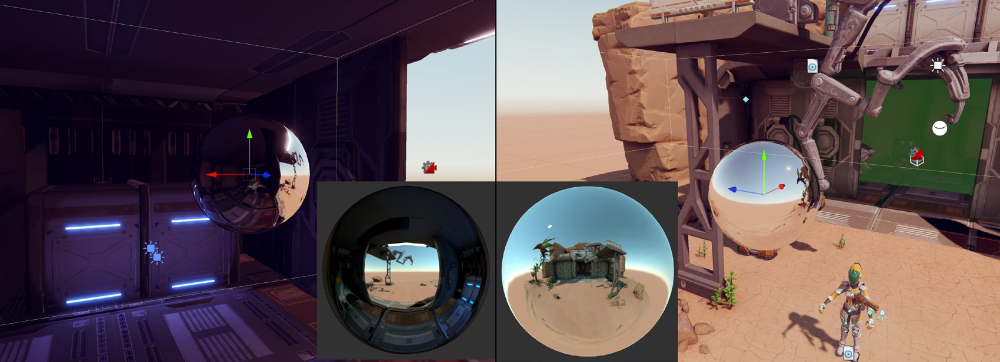
<p><em>VI: <strong>HAI Reflection Probe</strong> dùng trong <em>FPS Sample: The Inspection</em> — <strong>một BÊN TRONG nhà chứa (trái, phản chiếu TỐI có khe cửa) và một BÊN NGOÀI (phải, phản chiếu bầu trời sa mạc)</strong>. Ở giữa là <strong>cubemap texture mà MỖI probe chụp được</strong>. / EN: Each Reflection Probe captures an image of its surroundings in a cubemap texture.</em></p>

<div class="bilingual-row">
<div class="col-vi">
<p>🔬 <strong>Vì sao cần Reflection Probe — lập luận của Unity:</strong></p>
<blockquote>
<p><em>"Một công cụ ray-tracing như <strong>Maya hay Blender</strong> có thể dành thời gian tính CHÍNH XÁC giá trị cho từng pixel frame của một bề mặt phản chiếu. <strong>Quá trình này QUÁ LÂU cho một real-time renderer, đó là lý do các LỐI TẮT thường được dùng.</strong></em></p>
<p><em>🔑 <strong>Phản chiếu trong real-time renderer dùng ENVIRONMENT MAP (cubemap ĐÃ render trước).</strong> <strong>Unity cung cấp một map mặc định bằng SkyManager.</strong></em></p>
<p><em>💀 <strong>Việc có MỘT map DUY NHẤT làm nguồn phản chiếu cho MỌI vị trí trong scene có thể dẫn tới phản chiếu KHÔNG THUYẾT PHỤC.</strong> Lấy ví dụ con robot: <strong>nếu các phần kim loại của nhân vật này LUÔN phản chiếu BẦU TRỜI, nó sẽ trông RẤT LẠ khi ở BÊN TRONG nhà chứa nơi KHÔNG nhìn thấy bầu trời.</strong>"</em></p>
</blockquote>
<p>📦 <em>"<strong>Reflection Probe đơn giản là một CUBEMAP đã render trước, đặt ở một VỊ TRÍ THEN CHỐT trong scene.</strong> Bạn có thể dùng <strong>NHIỀU Reflection Probe trong MỘT scene</strong>. <strong>Khi một object ĐỘNG di chuyển qua scene, nó có thể CHỌN Reflection Probe GẦN NHẤT và dùng cái đó làm cơ sở cho phản chiếu của mình.</strong>"</em></p>
<p><strong>Cách tạo:</strong> chuột phải trong Hierarchy → <code>Light &gt; Reflection Probe</code> → đặt vị trí, chỉnh setting → bấm <strong>Bake</strong> để sinh cubemap.</p>
<p><strong>🔀 REFLECTION PROBE BLENDING</strong> — bật qua panel <strong>Renderer Asset Settings</strong>:</p>
<blockquote>
<p><em>"Blending <strong>DẦN DẦN LÀM MỜ cubemap của một probe, đồng thời LÀM HIỆN cái kia khi object phản chiếu đi từ vùng này sang vùng khác</strong>.</em></p>
<p><em>✅ <strong>Chuyển tiếp DẦN DẦN này TRÁNH được tình huống một vật thể ĐẶC TRƯNG BỖNG NHIÊN "POP" vào phản chiếu khi object băng qua RANH GIỚI vùng.</strong>"</em></p>
</blockquote>
<p><strong>📦 BOX PROJECTION</strong> — dành cho scene TRONG NHÀ:</p>
<blockquote>
<p><em>"Thông thường, <strong>reflection cubemap được GIẢ ĐỊNH nằm ở khoảng cách VÔ HẠN so với bất kỳ object nào.</strong> Các góc khác nhau của cubemap sẽ nhìn thấy được khi object xoay, <strong>nhưng object KHÔNG THỂ tiến gần hơn hay xa hơn khỏi môi trường được phản chiếu</strong>.</em></p>
<p><em>💀 <strong>Tuy điều này hoạt động TỐT cho scene NGOÀI TRỜI, hạn chế của nó LỘ RÕ trong scene TRONG NHÀ. Tường trong của một căn phòng RÕ RÀNG KHÔNG ở khoảng cách vô hạn, và phản chiếu của một bức tường LẼ RA phải TO DẦN khi object tiến gần nó.</strong></em></p>
<p><em>✅ <strong>Tuỳ chọn Box Projection cho phép bạn tạo reflection cubemap ở khoảng cách HỮU HẠN so với probe, cho phép object hiển thị phản chiếu với KÍCH THƯỚC KHÁC NHAU tuỳ theo khoảng cách của chúng tới các "bức tường" của cubemap.</strong></em></p>
<p><em>📏 <strong>Kích thước cubemap bao quanh được xác định bởi VÙNG ẢNH HƯỞNG của probe, phụ thuộc vào thuộc tính Box Size.</strong> Ví dụ, <strong>với một probe phản chiếu nội thất của một căn phòng, bạn nên đặt kích thước KHỚP với kích thước của căn phòng đó.</strong>"</em></p>
</blockquote>
<p>👉 <em>Nhắc lại <a href="#18-light-probes-reflection-probes">§18</a>: Reflection Probe realtime <strong>RẤT TỐN BATCH</strong> ⇒ ưu tiên <code>Type: Baked</code> + blending thay vì realtime.</em></p>
</div>
<div class="col-en">
<p>🔬 <strong>Why Reflection Probes exist — Unity's reasoning:</strong></p>
<blockquote>
<p><em>"A ray-tracing tool, such as <strong>Maya or Blender</strong>, can take the time to ACCURATELY calculate the values for each frame pixel of a reflective surface. <strong>This process takes FAR TOO LONG for a real-time renderer, which is why SHORTCUTS are often used.</strong></em></p>
<p><em>🔑 <strong>Reflections in a real-time renderer use ENVIRONMENT MAPS (pre-rendered cubemaps).</strong> <strong>Unity supplies a default map using the SkyManager.</strong></em></p>
<p><em>💀 <strong>Having a SINGLE map as the source of reflections from ALL LOCATIONS in a scene can lead to UNCONVINCING reflections.</strong> Take the example of the robot: <strong>if the metal parts of this character ALWAYS reflect the SKY, then it will look VERY STRANGE when INSIDE the hangar where the sky is NOT visible.</strong>"</em></p>
</blockquote>
<p>📦 <em>"<strong>A Reflection Probe is simply a PRE-RENDERED CUBEMAP placed at a KEY POSITION in the scene.</strong> You can use <strong>SEVERAL Reflection Probes in a SINGLE scene</strong>. <strong>As a DYNAMIC object moves through the scene, it can SELECT the NEAREST Reflection Probe and use that as the basis of its reflections.</strong>"</em></p>
<p><strong>How to create:</strong> right-click the Hierarchy → <code>Light &gt; Reflection Probe</code> → position it, adjust settings → click <strong>Bake</strong> to generate a cubemap.</p>
<p><strong>🔀 REFLECTION PROBE BLENDING</strong> — enable it via the <strong>Renderer Asset Settings</strong> panel:</p>
<blockquote>
<p><em>"Blending <strong>GRADUALLY FADES OUT one probe's cubemap, while FADING IN the other as the reflective object passes from one zone to the other</strong>.</em></p>
<p><em>✅ <strong>This GRADUAL TRANSITION AVOIDS the situation where a DISTINCTIVE object SUDDENLY "POPS" into the reflection as an object crosses the ZONE BOUNDARY.</strong>"</em></p>
</blockquote>
<p><strong>📦 BOX PROJECTION</strong> — for INDOOR scenes:</p>
<blockquote>
<p><em>"Normally, <strong>the reflection cubemap is ASSUMED to be at an INFINITE DISTANCE from any given object.</strong> Different angles of the cubemap will be visible as the object turns, <strong>but it's NOT POSSIBLE for the object to move CLOSER or FURTHER AWAY from the reflected surroundings</strong>.</em></p>
<p><em>💀 <strong>While this works WELL for OUTDOOR scenes, its limitations SHOW in an INDOOR scene. The interior walls of a room are CLEARLY NOT an infinite distance away, and the reflection of a wall SHOULD GET LARGER as the object nears it.</strong></em></p>
<p><em>✅ <strong>The Box Projection option enables you to create a reflection cubemap at a FINITE DISTANCE from the probe, allowing objects to show reflections of DIFFERENT SIZES according to their DISTANCE from the cubemap's walls.</strong></em></p>
<p><em>📏 <strong>The size of the surrounding cubemap is determined by the probe's ZONE OF EFFECT, depending on its Box Size property.</strong> For example, <strong>with a probe that reflects the interior of a room, you should set the size to MATCH THE DIMENSIONS of the room.</strong>"</em></p>
</blockquote>
<p>👉 <em>Recall <a href="#18-light-probes-reflection-probes">§18</a>: realtime Reflection Probes are <strong>VERY COSTLY in batches</strong> ⇒ prefer <code>Type: Baked</code> + blending over realtime.</em></p>
</div>
</div>

### 34.13. ✨ Lens Flare, Light Halos & SSAO

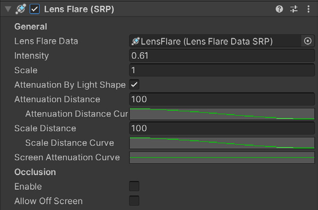
<p><em>VI: <strong>▲ Component <code>Lens Flare (SRP)</code></strong> — <strong>Lens Flare Data</strong>, <strong>Intensity 0.61 · Scale 1</strong>, <strong>Attenuation By Light Shape ✓ · Attenuation Distance 100 + đường cong · Scale Distance 100 + đường cong · Screen Attenuation Curve</strong>, và nhóm <strong>Occlusion: Enable · Allow Off Screen</strong>. / EN: The Lens Flare (SRP) component.</em></p>

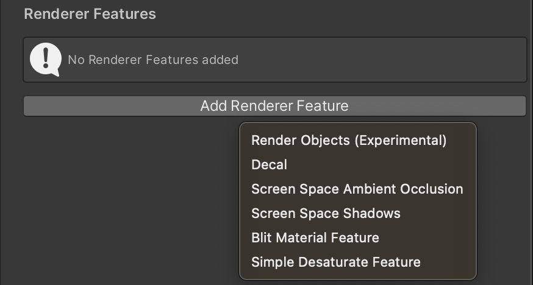
<p><em>VI: <strong>▲ <code>Add Renderer Feature</code></strong> — <strong>Render Objects (Experimental) · Decal · Screen Space Ambient Occlusion · Screen Space Shadows · Blit Material Feature · Simple Desaturate Feature</strong>. / EN: The Add Renderer Feature menu.</em></p>

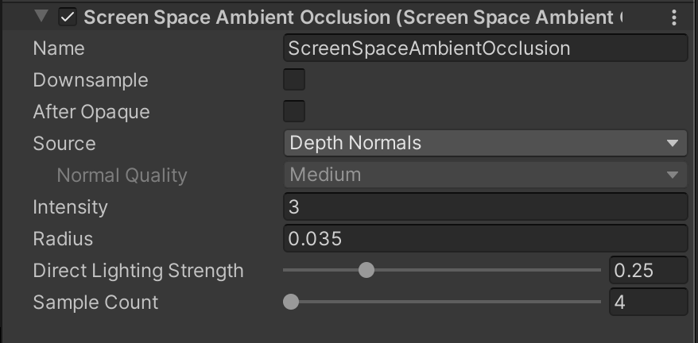
<p><em>VI: <strong>▲ SSAO Renderer Feature</strong> — <strong>Downsample · After Opaque · Source: Depth Normals · Normal Quality: Medium · Intensity 3 · Radius 0.035 · Direct Lighting Strength 0.25 · Sample Count 4</strong>. <strong>Sample Count</strong> và <strong>Downsample</strong> là hai núm ĐỔI CHI PHÍ nhiều nhất. / EN: The Screen Space Ambient Occlusion settings.</em></p>

<div class="bilingual-row">
<div class="col-vi">
<p><strong>💫 LENS FLARE — workflow ĐÃ ĐỔI trong URP</strong></p>
<blockquote>
<p><em>"<strong>Workflow tạo Lens Flare ĐÃ ĐƯỢC CẬP NHẬT cho URP.</strong></em></p>
<p><em>① Tạo một <strong>Lens Flare (SRP) Data asset</strong>: chuột phải trong Project window, trong thư mục Assets phù hợp → <code>Create &gt; Lens Flare (SRP)</code>. <strong>Dùng asset này để cấu hình HÌNH DẠNG của flare.</strong></em></p>
<p><em>② Để render Lens Flare: <strong>chọn nguồn sáng sẽ gây ra flare</strong> rồi chọn <code>Add Component &gt; Rendering &gt; Lens Flare (SRP)</code>.</em></p>
<p><em>③ Trong panel Settings của component, <strong>gán Lens Flare Data asset đã tạo vào thuộc tính Lens Flare Data</strong>."</em></p>
</blockquote>
<p><strong>🔆 LIGHT HALOS — KHÔNG có trong URP, phải tự làm</strong></p>
<blockquote>
<p><em>"<strong>Tuỳ chọn Draw Halo KHÔNG khả dụng cho đèn trong URP</strong>, nhưng <strong>DỄ mô phỏng bằng một BILLBOARD</strong>. <strong>Một tuỳ chọn khác là đặt độ trong suốt ALPHA của một HÌNH CẦU.</strong> … <em>(sách minh hoạ bằng một Shader Graph dùng FRESNEL để điều khiển transparency)</em>"</em></p>
</blockquote>
<p>👉 <em>Khớp với bảng ở <a href="#344-light-inspector-urp-khac-birp-o-au">§34.4</a>: <strong>Draw Halo</strong> và <strong>Flare</strong> là hai thuộc tính BiRP KHÔNG có tương ứng trực tiếp trong URP.</em></p>
<p><strong>🌘 SCREEN SPACE AMBIENT OCCLUSION (SSAO)</strong></p>
<blockquote>
<p><em>"<strong>Vì ánh sáng môi trường (ambient) MẶC ĐỊNH KHÔNG XÉT tới geometry, mức ambient CAO có thể dẫn tới render KHÔNG THUYẾT PHỤC.</strong></em></p>
<p><em>🔬 <strong>Trong thế giới thực, một KHE HẸP giữa hai vật thể nhiều khả năng TỐI HƠN một khe RỘNG hơn nhiều. Ambient Occlusion giúp xử lý vấn đề này.</strong></em></p>
<p><em>▶️ <strong>Để dùng nó với URP: chọn Renderer mà URP Asset đang dùng → <code>Add Renderer Feature</code> → chọn <code>Screen Space Ambient Occlusion (SSAO)</code>.</strong> Rồi dùng setting SSAO mặc định hoặc điều chỉnh theo nhu cầu.</em></p>
<p><em>👁️ <strong>Hiệu ứng THÊM bóng đổ vào các khe hẹp.</strong> Trong ba ảnh minh hoạ của sách: <strong>ảnh trên KHÔNG có SSAO, ảnh giữa hiển thị SSAO ĐÃ TÍNH, ảnh dưới hiển thị KẾT QUẢ của SSAO. Chú ý rằng cối xay và cái cân có VIỀN ĐẬM HƠN ở nơi chúng chạm mặt bàn.</strong></em></p>
<p><em>📌 <strong>SSAO là một kỹ thuật POST-PROCESSING</strong> — xem <a href="#35-post-processing-volume-framework">§35</a>."</em></p>
</blockquote>
</div>
<div class="col-en">
<p><strong>💫 LENS FLARE — the workflow CHANGED in URP</strong></p>
<blockquote>
<p><em>"<strong>The workflow for creating a Lens Flare has been UPDATED for URP.</strong></em></p>
<p><em>① Create a <strong>Lens Flare (SRP) Data asset</strong>: right-click in the Project window, in a suitable Assets folder → <code>Create &gt; Lens Flare (SRP)</code>. <strong>Use this asset to configure the SHAPE of your flare.</strong></em></p>
<p><em>② To render a Lens Flare: <strong>choose the light source that will cause the flare</strong> then select <code>Add Component &gt; Rendering &gt; Lens Flare (SRP)</code>.</em></p>
<p><em>③ In the component's Settings panel, <strong>assign the Lens Flare Data asset you created to the Lens Flare Data property</strong>."</em></p>
</blockquote>
<p><strong>🔆 LIGHT HALOS — absent from URP, roll your own</strong></p>
<blockquote>
<p><em>"<strong>The Draw Halo option is NOT available for lights in URP</strong>, but <strong>it's EASILY MIMICKED with a BILLBOARD</strong>. <strong>Another option is to set the ALPHA TRANSPARENCY of a SPHERE.</strong> … <em>(the book illustrates this with a Shader Graph using FRESNEL to drive transparency)</em>"</em></p>
</blockquote>
<p>👉 <em>This matches the table in <a href="#344-light-inspector-urp-khac-birp-o-au">§34.4</a>: <strong>Draw Halo</strong> and <strong>Flare</strong> are the two BiRP properties with NO direct URP equivalent.</em></p>
<p><strong>🌘 SCREEN SPACE AMBIENT OCCLUSION (SSAO)</strong></p>
<blockquote>
<p><em>"<strong>Since ambient light does NOT consider geometry by default, HIGH LEVELS of ambient light can lead to UNCONVINCING renders.</strong></em></p>
<p><em>🔬 <strong>In the real world, a NARROW GAP between two objects is likely to be DARKER than a much WIDER gap. Ambient Occlusion can help deal with this issue.</strong></em></p>
<p><em>▶️ <strong>To use it with URP: select the Renderer that the URP Asset is using → <code>Add Renderer Feature</code> → choose <code>Screen Space Ambient Occlusion (SSAO)</code>.</strong> Then either use the default SSAO settings or adjust as needed.</em></p>
<p><em>👁️ <strong>The effect ADDS SHADING to narrow gaps.</strong> In the book's three images: <strong>the top has NO SSAO, the middle shows the CALCULATED SSAO, and the bottom shows the RESULT of SSAO. Notice that the grinder and scales have a STRONGER EDGE where they meet the desk.</strong></em></p>
<p><em>📌 <strong>SSAO is a POST-PROCESSING technique</strong> — see <a href="#35-post-processing-volume-framework">§35</a>."</em></p>
</blockquote>
</div>
</div>

---

## 35. Post-processing — Volume framework

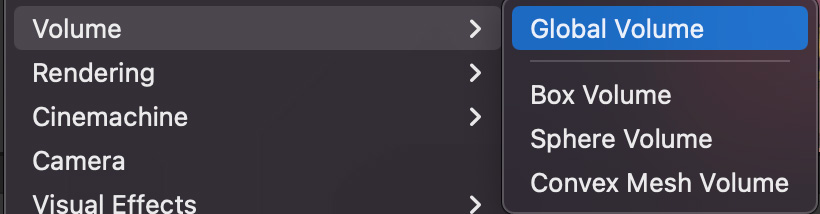 Volume menu.">
<p><em>VI: <strong>▲ Tạo Volume</strong> — <code>GameObject › Volume</code>: <strong>Global Volume · Box Volume · Sphere Volume · Convex Mesh Volume</strong>. / EN: The GameObject > Volume menu.</em></p>

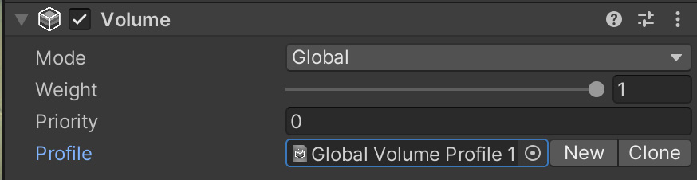
<p><em>VI: <strong>▲ Volume GLOBAL</strong> — <strong>Mode: Global · Weight 1 · Priority 0 · Profile: Global Volume Profile 1</strong> với hai nút <strong>New</strong> / <strong>Clone</strong>. / EN: A Global Volume component.</em></p>

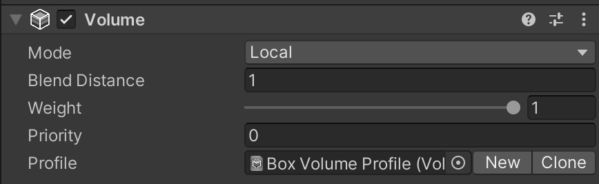
<p><em>VI: <strong>▲ Volume LOCAL</strong> — <strong>Mode: Local</strong> mở thêm <strong>Blend Distance 1</strong>; đây là tham số quyết định hiệu ứng chuyển MƯỢT hay ĐỘT NGỘT khi camera đi vào vùng. / EN: A Local Volume with its Blend Distance.</em></p>

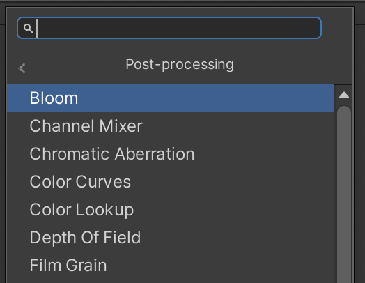
<p><em>VI: <strong>▲ <code>Add Override › Post-processing</code></strong> — <strong>Bloom · Channel Mixer · Chromatic Aberration · Color Curves · Color Lookup · Depth Of Field · Film Grain · Lens Distortion · Lift Gamma Gain · Motion Blur · Panini Projection · Shadows Midtones Highlights · Split Toning · Tonemapping · Vignette · White Balance</strong>. / EN: The Post-processing override list.</em></p>

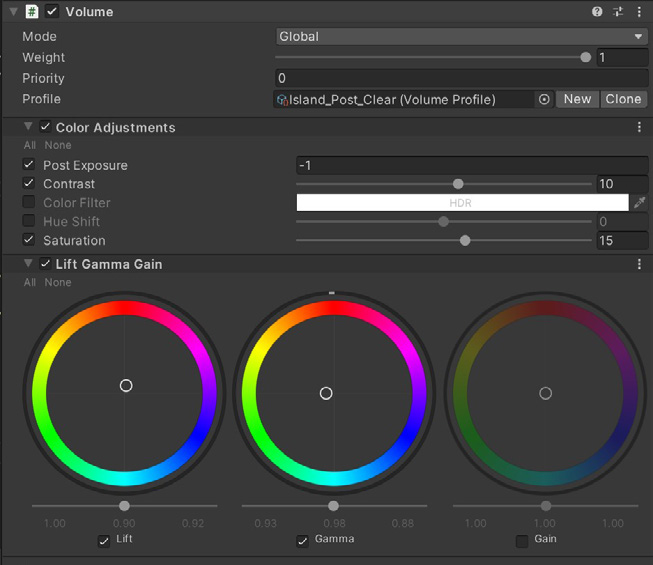
<p><em>VI: <strong>▲ Một Volume Profile thực tế</strong> — <strong>Color Adjustments</strong> với <strong>Post Exposure −1 · Contrast 10 · Saturation 15</strong>, và <strong>Lift Gamma Gain</strong> với ba bánh xe màu <strong>Lift · Gamma · Gain</strong>. / EN: A Volume Profile with Color Adjustments and Lift Gamma Gain.</em></p>

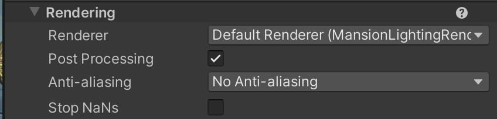
<p><em>VI: <strong>▲ Bật/tắt ở CAMERA</strong> — <code>Camera › Rendering</code>: <strong>Renderer: Default Renderer · Post Processing ✓ · Anti-aliasing: No Anti-aliasing · Stop NaNs</strong>. / EN: Enabling Post Processing on the Camera.</em></p>

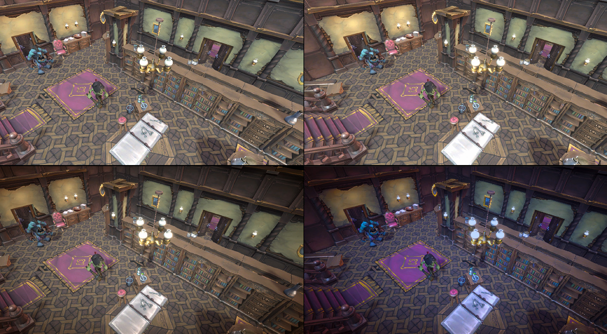
<p><em>VI: Áp dụng hiệu ứng post-processing — <strong>trên-trái: KHÔNG hiệu ứng · trên-phải: BLOOM · dưới-trái: VIGNETTE · dưới-phải: COLOR ADJUSTMENT</strong>. / EN: The top-left image has no effects applied, the top-right has Bloom, the bottom-left has Vignette, and the bottom-right has Color Adjustment added.</em></p>

<div class="bilingual-row">
<div class="col-vi">
<p>🚨 <strong>Điều PHẢI biết trước tiên:</strong></p>
<blockquote>
<p><em>"<strong>Package Built-in Post-Processing Stack v2 KHÔNG tương thích với URP.</strong> <strong>URP KHÔNG đòi hỏi package bổ sung nào cho hiệu ứng post-processing. Thay vào đó, nó dùng VOLUME FRAMEWORK.</strong></em></p>
<p><em>🔑 <strong>Khi bạn thêm Volume vào scene, bạn có thể chọn hiệu ứng post-processing nào áp dụng cho Volume đó.</strong></em></p>
<p><em>🌐 <strong>Một Volume có thể là GLOBAL hoặc LOCAL. Nếu GLOBAL, Volume ảnh hưởng tới Camera Ở MỌI NƠI trong scene. Với Mode đặt là LOCAL, Volume CHỈ ảnh hưởng tới Camera NẾU nó nằm TRONG PHẠM VI của Collider.</strong>"</em></p>
</blockquote>
<p><strong>SÁU bước dùng framework:</strong></p>
<ol>
<li><strong>Bật post-processing trên Main Camera</strong>: chọn Main Camera → Inspector → mở panel <strong>Rendering</strong> → tick <strong>Post Processing</strong></li>
<li>Chuột phải Hierarchy → <code>Create &gt; Volume &gt; Global Volume</code></li>
<li>Chọn Global Volume → panel <strong>Volume</strong> trong Inspector → tạo <strong>Profile</strong> mới bằng nút <strong>New</strong></li>
<li>Bấm <strong>Add Override</strong> → chọn <strong>Post-processing</strong> → (ví dụ chọn <strong>Bloom</strong>)</li>
<li>Mỗi hiệu ứng có <strong>panel Settings RIÊNG</strong></li>
<li>Dễ dàng <strong>thêm NHIỀU hiệu ứng</strong> (ví dụ Vignette) và cấu hình từng cái</li>
</ol>
<p>🚨 <strong>Cảnh báo hiệu năng:</strong></p>
<blockquote>
<p><em>"<strong>Post-processing có thể ĐÈ NẶNG lên bộ xử lý của bạn, nên hãy CÂN NHẮC KỸ ảnh hưởng trên phần cứng CẤP THẤP và thiết bị MOBILE.</strong> <strong>Nếu dự án của bạn BẮT BUỘC phải dùng, hãy TEST TRÊN PHẦN CỨNG ĐÍCH. MỘT SỐ filter TỐN ÍT bộ xử lý HƠN các filter khác.</strong>"</em></p>
</blockquote>
<p>📱 <strong>Với mobile — e-book Mobile nói ngắn gọn hơn:</strong></p>
<blockquote>
<p><em>"<strong>Hiệu ứng post-processing TOÀN MÀN HÌNH như GLOW có thể LÀM CHẬM hiệu năng ĐÁNG KỂ. Hãy dùng chúng THẬN TRỌNG trong định hướng nghệ thuật của tựa game.</strong>"</em></p>
</blockquote>
</div>
<div class="col-en">
<p>🚨 <strong>The first thing you MUST know:</strong></p>
<blockquote>
<p><em>"<strong>The Built-in Post-Processing Stack v2 package is NOT COMPATIBLE with URP.</strong> <strong>URP does NOT require an additional package for post-processing effects. Instead, it uses a VOLUME FRAMEWORK.</strong></em></p>
<p><em>🔑 <strong>When you add Volumes to a scene, you can choose which post-processing effects apply to the Volume.</strong></em></p>
<p><em>🌐 <strong>A Volume can be GLOBAL or LOCAL. If GLOBAL, the Volume affects the Camera EVERYWHERE in the scene. With the Mode set to LOCAL, Volumes affect the Camera ONLY IF it's WITHIN THE BOUNDS of the Collider.</strong>"</em></p>
</blockquote>
<p><strong>The SIX steps to use the framework:</strong></p>
<ol>
<li><strong>Enable post-processing on the Main Camera</strong>: select the Main Camera → Inspector → expand the <strong>Rendering</strong> panel → check <strong>Post Processing</strong></li>
<li>Right-click the Hierarchy → <code>Create &gt; Volume &gt; Global Volume</code></li>
<li>Select the Global Volume → the <strong>Volume</strong> panel in the Inspector → create a new <strong>Profile</strong> by clicking <strong>New</strong></li>
<li>Click <strong>Add Override</strong> → select <strong>Post-processing</strong> → (e.g., choose <strong>Bloom</strong>)</li>
<li>Each effect has a <strong>dedicated Settings panel</strong></li>
<li>Easily <strong>add MULTIPLE effects</strong> (e.g., Vignette) and configure each one</li>
</ol>
<p>🚨 <strong>The performance warning:</strong></p>
<blockquote>
<p><em>"<strong>Post-processing can WEIGH HEAVILY on your processor, so CAREFULLY CONSIDER the effects on LOW-END hardware and MOBILE devices.</strong> <strong>If your project MUST use it, then TEST ON THE TARGET HARDWARE. SOME filters are LESS processor intensive than others.</strong>"</em></p>
</blockquote>
</div>
</div>

### 35.1. 📦 Local Volume — Ba tham số điều khiển

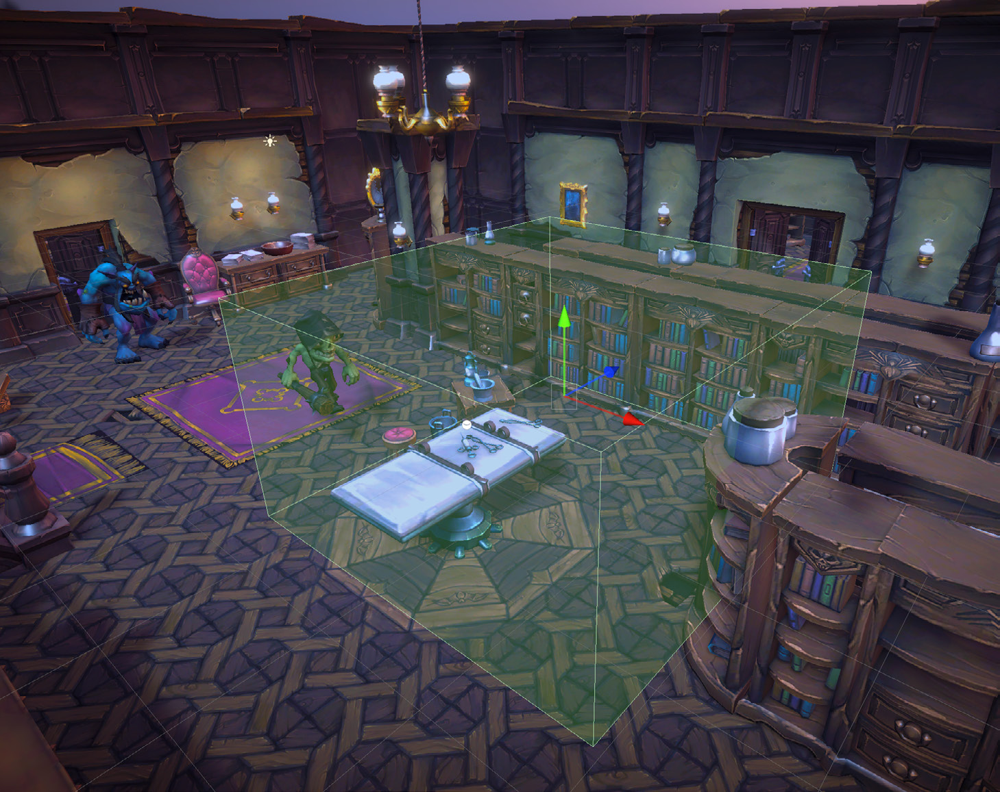
<p><em>VI: Đặt vị trí và kích thước một <strong>Box Volume</strong> bằng component <strong>Box Collider</strong> đi kèm. / EN: Positioning and sizing a Box Volume using the attached Box Collider component.</em></p>

<div class="bilingual-row">
<div class="col-vi">
<blockquote>
<p><em>"Với Volume framework, bạn có thể <strong>cấu hình scene sao cho KHI Camera di chuyển quanh nó, các post-processing profile KHÁC NHAU được KÍCH HOẠT. Điều này đạt được bằng cách thêm một LOCAL VOLUME.</strong>"</em></p>
</blockquote>
<p><strong>① Tạo:</strong> chuột phải Hierarchy → <code>Create &gt; Volume &gt; Box Volume</code>. <em>"Ngoài ra chọn <strong>Sphere Volume</strong> nếu hình dạng này phù hợp hơn, hoặc <strong>Convex Mesh Volume</strong> để KIỂM SOÁT CHẶT CHẼ HƠN hình dạng của Collider định nghĩa vùng Volume."</em></p>
<p><strong>② Ba tham số trong panel Volume:</strong></p>
</div>
<div class="col-en">
<blockquote>
<p><em>"With the Volume framework, you can <strong>configure the scene so that AS a Camera moves around it, DIFFERENT post-processing profiles are TRIGGERED. This is achieved by adding a LOCAL VOLUME.</strong>"</em></p>
</blockquote>
<p><strong>① Create:</strong> right-click the Hierarchy → <code>Create &gt; Volume &gt; Box Volume</code>. <em>"Alternatively, choose <strong>Sphere Volume</strong> if this shape is more suited to your purpose, or <strong>Convex Mesh Volume</strong> for TIGHTER CONTROL over the shape of the Collider that defines the Volume region."</em></p>
<p><strong>② The three parameters in the Volume panel:</strong></p>
</div>
</div>

| Tham số | Ý nghĩa nguyên văn / Verbatim meaning |
|---|---|
| **Blend Distance** | *"Đây là **khoảng cách XA NHẤT tính từ Collider của Volume mà URP BẮT ĐẦU blend**, và là **khoảng cách theo kích thước Collider nơi profile này HIỆN DẦN**. 🔑 **Ở RÌA của Collider, hiệu ứng post-processing sẽ MỜ DẦN đi, và ở Blend Distance tính từ rìa Collider thì nó HIỆN HOÀN TOÀN.**"* |
| **Weight** | *"Weight định nghĩa **CƯỜNG ĐỘ TỐI ĐA của hiệu ứng post-processing**. **Nếu Weight = 1, hiệu ứng đạt cường độ ĐẦY ĐỦ. Đặt 0 nghĩa là KHÔNG có hiệu ứng, còn 0.5 đặt cường độ tối đa của hiệu ứng ở mức 50%.**"* |
| **Priority** | *"Dùng giá trị này để **xác định URP dùng Volume NÀO khi NHIỀU Volume có mức ẢNH HƯỞNG NGANG NHAU lên scene**. **Số CÀNG CAO, Priority CÀNG CAO.** ✅ **Nếu bạn đang GỘP Global và Local, hãy GIỮ Global ở giá trị mặc định 0 và đặt Local Volume ở 1 hoặc CAO HƠN.**"* |

### 35.2. 🎬 Mười sáu hiệu ứng post-processing của URP

| Hiệu ứng / Effect | Mô tả / Description |
|---|---|
| **Bloom** | *"Thêm một **quầng SÁNG quanh các pixel VƯỢT một mức độ sáng đã định**"* |
| **Channel Mixer** | *"Sửa **ẢNH HƯỞNG của TỪNG kênh màu đầu vào lên hỗn hợp tổng thể**"* |
| **Chromatic Aberration** | *"Tạo **các VIỀN MÀU dọc theo ranh giới ngăn cách phần TỐI và phần SÁNG của ảnh**"* |
| **Color Adjustments** | *"Dùng hiệu ứng này để **tinh chỉnh TÔNG MÀU, ĐỘ SÁNG, và ĐỘ TƯƠNG PHẢN tổng thể của ảnh render cuối cùng**"* |
| **Color Curves** | *"Grading curve là **cách NÂNG CAO để điều chỉnh các DẢI CỤ THỂ trong hue, saturation, hoặc luminosity**"* |
| **Depth of Field** | *"Mô phỏng **thuộc tính LẤY NÉT của ống kính camera**"* |
| **Film Grain** | *"Mô phỏng **kết cấu quang học NGẪU NHIÊN của phim ảnh**"* |
| **Lens Distortion** | *"**MÉO ảnh render cuối cùng** để mô phỏng **hình dạng của một ống kính camera đời thực**"* |
| **Lift Gamma Gain** | *"Dùng các **trackball khác nhau để tác động tới các DẢI khác nhau trong ảnh**. Điều chỉnh slider dưới trackball để **OFFSET độ sáng màu của dải đó**"* |
| **Motion Blur** | *"Mô phỏng **độ mờ xảy ra trong ảnh khi một camera đời thực quay các vật thể DI CHUYỂN NHANH HƠN thời gian phơi sáng của camera**"* |
| **Panini Projection** | *"Giúp bạn **render góc nhìn PHỐI CẢNH trong các scene có TRƯỜNG NHÌN RẤT RỘNG**"* |
| **Shadows Midtones Highlights** | *"**Điều khiển RIÊNG BIỆT vùng tối, trung tính, và vùng sáng của bản render**"* |
| **Split Toning** | *"Dùng để **thêm các TÔNG MÀU KHÁC NHAU vào vùng tối và vùng sáng trong scene**"* |
| **Tonemapping** | *"Là quá trình **ÁNH XẠ LẠI các giá trị HDR của một ảnh sang một DẢI GIÁ TRỊ MỚI**"* |
| **Vignette** | *"Hiệu ứng này gồm việc **LÀM TỐI dần về phía RÌA của ảnh so với phần TRUNG TÂM**"* |
| **White Balance** | *"**LOẠI BỎ các ám màu KHÔNG THỰC TẾ**, để những vật lẽ ra TRẮNG ngoài đời sẽ **render ra TRẮNG trong ảnh cuối cùng**"* |

```csharp
// Điều khiển post-processing bằng CODE — nguyên văn từ e-book URP
// Controlling post-processing with code — verbatim from the URP e-book
using UnityEngine;
using UnityEngine.Rendering;
using UnityEngine.Rendering.Universal;

public class PPController : MonoBehaviour
{
    void Start()
    {
        Volume volume = GetComponent<Volume>();
        Bloom bloom;
        if (volume.profile.TryGet<Bloom>(out bloom))
        {
            bloom.intensity.value = 0;
        }
    }
}
```

<div class="bilingual-row">
<div class="col-vi">
<p>💡 <em>"Bạn cũng có thể <strong>điều chỉnh ĐỘNG post-processing profile bằng script C#</strong>. Ví dụ trên cho thấy cách chỉnh <strong>cường độ của hiệu ứng Bloom</strong>. <strong>Nếu có Vignette, bạn có thể điều khiển màu vignette bằng code — ví dụ, khi nhân vật người chơi TRÚNG SÁT THƯƠNG, bạn có thể TẠM THỜI nhuộm nó ĐỎ.</strong>"</em></p>
</div>
<div class="col-en">
<p>💡 <em>"You can also <strong>dynamically adjust your post-processing profile using a C# script</strong>. The example above shows how to adjust the <strong>intensity of the Bloom effect</strong>. <strong>If a Vignette is applied, you can control the vignetting color via code — for example, if the player character TAKES DAMAGE, you can TEMPORARILY tint it RED.</strong>"</em></p>
</div>
</div>

### 35.3. 🔬 Profile hiệu ứng post-processing — Cấp cho nó một phần ngân sách CỐ ĐỊNH

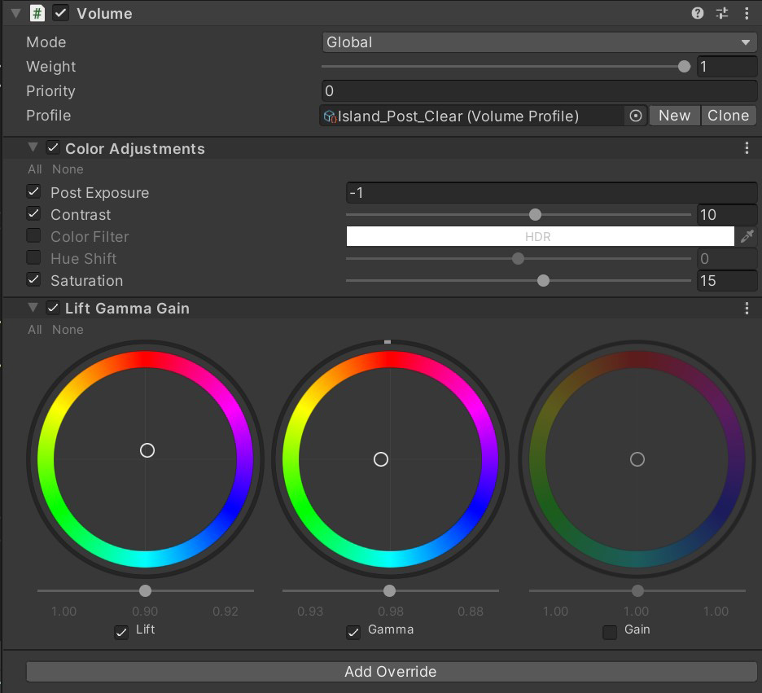
<p><em>VI: Một <strong>Volume</strong> đã cấu hình — <strong>Mode: Global · Weight: 1 · Priority: 0 · Profile: Island_Post_Clear</strong>, với hai override <strong>Color Adjustments</strong> (Post Exposure −1 · Contrast 10 · Saturation 15) và <strong>Lift Gamma Gain</strong> (Lift 1.00/0.90/0.92 · Gamma 0.93/0.98/0.88 · Gain 1.00/1.00/1.00). <strong>Hãy giữ hiệu ứng post-processing ĐƠN GIẢN khi có thể.</strong> / EN: Keep post-processing effects simple if possible.</em></p>

<div class="bilingual-row">
<div class="col-vi">
<blockquote>
<p><em>"<strong>Hãy PROFILE các hiệu ứng post-processing của bạn để thấy CHI PHÍ của chúng trên GPU.</strong></em></p>
<p><em>💰 <strong>MỘT SỐ hiệu ứng TOÀN MÀN HÌNH, như BLOOM và DEPTH OF FIELD, có thể ĐẮT ĐỎ — nhưng hãy THỬ NGHIỆM cho tới khi bạn tìm được ĐIỂM CÂN BẰNG HẠNH PHÚC giữa chất lượng thị giác và hiệu năng.</strong></em></p>
<p><em>🔑 <strong>Post-processing có XU HƯỚNG KHÔNG DAO ĐỘNG NHIỀU lúc runtime.</strong> <strong>Khi bạn đã xác định xong các Volume Override của mình, hãy CẤP cho các hiệu ứng post một PHẦN TĨNH trong TỔNG frame budget.</strong>"</em></p>
</blockquote>
<p>💡 <strong>Vì sao lời khuyên này khác thường và đáng giá:</strong></p>
<p>Hầu hết chi phí GPU <strong>BIẾN THIÊN theo nội dung khung hình</strong> (số object, overdraw, số đèn). Post-processing thì <strong>gần như CỐ ĐỊNH</strong> vì nó luôn xử lý <em>đúng một lần trên toàn màn hình</em>.</p>
<p>👉 Nghĩa là bạn có thể <strong>đo nó MỘT LẦN rồi TRỪ THẲNG khỏi ngân sách</strong>. Ví dụ với 60 fps mobile (<a href="../01-fresher/01-ultimate-guide-to-profiling.md">Module 1 §1.1</a>):</p>
<ul>
<li>Ngân sách: <strong>~11 ms</strong></li>
<li>Post-processing đo được: <strong>2,5 ms cố định</strong></li>
<li>⇒ <strong>Ngân sách CÒN LẠI cho gameplay rendering: 8,5 ms</strong> — con số bạn thực sự phải làm việc với</li>
</ul>
<p>⚠️ <em>Đây cũng là lý do <strong>Bloom và Depth of Field bị nêu đích danh</strong>: cả hai đều đọc/ghi render target NHIỀU LẦN ở nhiều mức downsample ⇒ chi phí chủ yếu là <strong>BĂNG THÔNG</strong> (<a href="#7-memory-bandwidth-textures">§7</a>), thứ ĐẶC BIỆT khan hiếm trên mobile.</em></p>
</div>
<div class="col-en">
<blockquote>
<p><em>"<strong>PROFILE your post-processing effects to see their COST on the GPU.</strong></em></p>
<p><em>💰 <strong>SOME FULLSCREEN effects, like BLOOM and DEPTH OF FIELD, can be EXPENSIVE — but EXPERIMENT until you find a HAPPY BALANCE between visual quality and performance.</strong></em></p>
<p><em>🔑 <strong>Post-processing TENDS NOT TO FLUCTUATE MUCH at runtime.</strong> <strong>Once you've determined your Volume Overrides, ALLOT your post effects a STATIC PORTION of your TOTAL frame budget.</strong>"</em></p>
</blockquote>
<p>💡 <strong>Why this advice is unusual and valuable:</strong></p>
<p>Most GPU cost <strong>VARIES with frame content</strong> (object count, overdraw, light count). Post-processing is <strong>essentially FIXED</strong> because it always processes <em>exactly one full screen</em>.</p>
<p>👉 That means you can <strong>measure it ONCE and SUBTRACT it straight from your budget</strong>. For example at 60 fps on mobile (<a href="../01-fresher/01-ultimate-guide-to-profiling.md">Module 1 §1.1</a>):</p>
<ul>
<li>Budget: <strong>~11 ms</strong></li>
<li>Measured post-processing: <strong>2.5 ms fixed</strong></li>
<li>⇒ <strong>REMAINING budget for gameplay rendering: 8.5 ms</strong> — the number you actually have to work with</li>
</ul>
<p>⚠️ <em>This is also why <strong>Bloom and Depth of Field are named specifically</strong>: both read and write render targets MULTIPLE TIMES at several downsample levels ⇒ their cost is primarily <strong>BANDWIDTH</strong> (<a href="#7-memory-bandwidth-textures">§7</a>), which is ESPECIALLY scarce on mobile.</em></p>
</div>
</div>

---

## 36. Camera Stacking

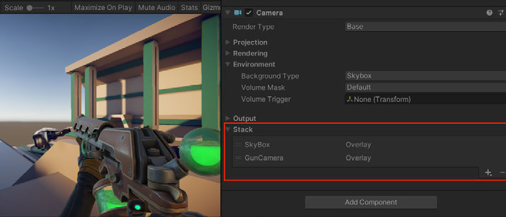
<p><em>VI: <strong>▲ Camera Stack trong thực tế</strong> — camera <strong>Base</strong> với <strong>Background Type: Skybox · Volume Mask: Default · Volume Trigger: None</strong>, và mục <strong>Stack</strong> (khoanh đỏ) chứa <strong>SkyBox — Overlay</strong> và <strong>GunCamera — Overlay</strong>. Đây là cách vẽ vũ khí góc nhìn thứ nhất KHÔNG bị đâm xuyên tường. / EN: A Camera Stack with two Overlay cameras.</em></p>


<p><em>VI: <strong>▲ Ba Renderer Feature phối hợp</strong> — <code>Gun Opaques</code> · <code>Gun Transparents</code> · <code>Gun Transparents Overlay</code> (Render Objects). Cấu hình của cái cuối: <strong>Event AfterRenderingTransparents · Queue Transparent · Layer Mask "First Person Objects P2"</strong>; Overrides <strong>Depth ✓ / Write Depth ✓ / Depth Test Always</strong>, <strong>Stencil ✓ Value 0 · Compare Function Equal · Pass Keep · Fail Keep · Z Fail Keep</strong>, và <strong>Camera ✓ Field Of View 40</strong>. / EN: Three Render Objects features rendering a first-person weapon.</em></p>

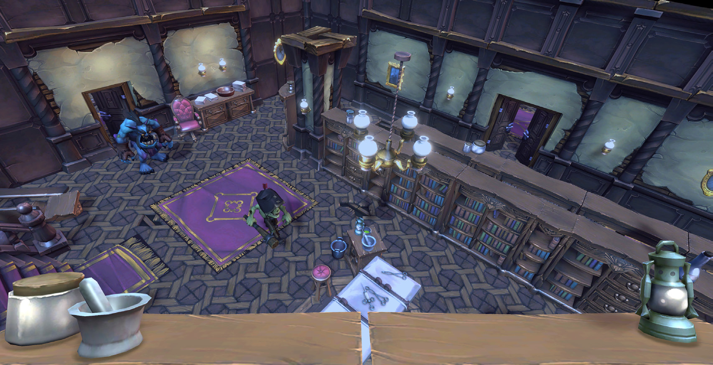
<p><em>VI: Ví dụ Camera Stacking — <strong>kệ đồ ở TIỀN CẢNH đóng vai trò INVENTORY trong game</strong>. Chú ý nó có <strong>TRƯỜNG NHÌN KHÁC, cùng lighting và post-processing KHÁC</strong>. / EN: A shelf in the foreground acting as an inventory, with a different field of view, lighting and post-processing.</em></p>

<div class="bilingual-row">
<div class="col-vi">
<blockquote>
<p><em>"Một yêu cầu PHỔ BIẾN trong game là <strong>khả năng KẾT HỢP geometry nhìn từ các camera KHÁC NHAU trong MỘT bản render duy nhất.</strong> Ảnh trên cho thấy <strong>một kệ đồ ở tiền cảnh đóng vai trò INVENTORY. Vật phẩm thu thập được thêm vào kệ và có thể được người chơi chọn ở các thời điểm then chốt.</strong>"</em></p>
</blockquote>
<p><strong>BẢY bước thiết lập:</strong></p>
<ol>
<li>Tạo Camera: chuột phải Hierarchy → <code>Create &gt; Camera</code>. <strong>GỠ component Audio Listener.</strong></li>
<li><code>Inspector &gt; Camera Settings</code> → đặt Camera này là <strong>Render Type: Overlay</strong></li>
<li><strong>Tạo Layer MỚI</strong> cho Camera và các GameObject nó render</li>
<li>Cập nhật <strong><code>Rendering &gt; Culling Mask</code></strong> cho Camera qua Inspector</li>
<li>Di chuyển Camera tới vị trí phù hợp, rồi <strong>thêm và đặt GameObject vào Layer Overlay</strong></li>
<li>🚨 <strong>ĐẢM BẢO Main Camera KHÔNG render Overlay</strong> bằng cách cập nhật <code>Rendering &gt; Culling Mask</code> của nó</li>
<li>Trong panel <strong>Stack</strong>, dùng nút <strong>"+"</strong> để thêm Overlay Camera</li>
</ol>
<p>⚠️ <em>Nhắc lại <a href="#22-lod-camera-moi-camera-ton-toi-1-ms">§22</a>: <strong>MỖI camera tốn TỚI 1 ms CPU trên mobile</strong>. Camera Stacking là công cụ MẠNH nhưng <strong>KHÔNG MIỄN PHÍ</strong> — với hiệu ứng thuần render, hãy cân nhắc <strong>RenderObjects</strong> (<a href="#221-thay-camera-bang-renderobjects-urp-custompassvolumes-hdrp">§22.1</a>) trước.</em></p>
</div>
<div class="col-en">
<blockquote>
<p><em>"A COMMON requirement in games is <strong>the ability to COMBINE geometry viewed from DIFFERENT cameras in a SINGLE render.</strong> The image above shows <strong>a shelf in the foreground acting as an INVENTORY within the game. Collected items are added to the shelf and can be selected at key points by the player.</strong>"</em></p>
</blockquote>
<p><strong>The SEVEN setup steps:</strong></p>
<ol>
<li>Create a Camera: right-click the Hierarchy → <code>Create &gt; Camera</code>. <strong>REMOVE the Audio Listener component.</strong></li>
<li><code>Inspector &gt; Camera Settings</code> → set this Camera to <strong>Render Type: Overlay</strong></li>
<li><strong>Create a NEW Layer</strong> for the Camera and the GameObjects it renders</li>
<li>Update the <strong><code>Rendering &gt; Culling Mask</code></strong> for the Camera via the Inspector</li>
<li>Move the Camera to a suitable place, then <strong>add and position GameObjects by placing them in the Overlay Layer</strong></li>
<li>🚨 <strong>Make SURE the Main Camera does NOT render Overlay</strong> by updating its <code>Rendering &gt; Culling Mask</code></li>
<li>In the <strong>Stack</strong> panel, use the <strong>"+"</strong> button to add the Overlay Camera</li>
</ol>
<p>⚠️ <em>Recall <a href="#22-lod-camera-moi-camera-ton-toi-1-ms">§22</a>: <strong>EACH camera costs UP TO 1 ms of CPU on mobile</strong>. Camera Stacking is a POWERFUL tool but it is <strong>NOT FREE</strong> — for purely rendering effects, consider <strong>RenderObjects</strong> (<a href="#221-thay-camera-bang-renderobjects-urp-custompassvolumes-hdrp">§22.1</a>) first.</em></p>
</div>
</div>

```csharp
// Điều khiển Camera Stack bằng code — nguyên văn từ e-book URP
// Controlling a stack with code — verbatim from the URP e-book
using UnityEngine;
using UnityEngine.Rendering.Universal;

public class StackController : MonoBehaviour
{
    public Camera overlayCamera;

    void Start()
    {
        Camera camera   = GetComponent<Camera>();
        var cameraData  = camera.GetUniversalAdditionalCameraData();
        cameraData.cameraStack.Remove(overlayCamera);
    }
}
```

---

## 37. Pipeline Callbacks — Tiêm code vào render loop

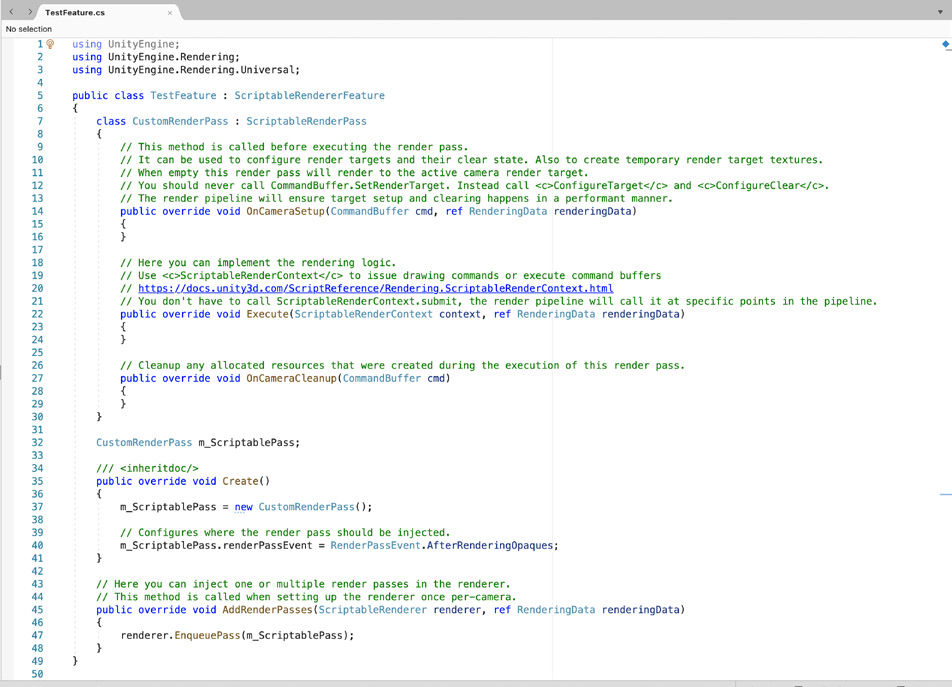
<p><em>VI: <strong>▲ Khung sườn của một <code>ScriptableRendererFeature</code></strong> — lớp <code>CustomRenderPass : ScriptableRenderPass</code> với <code>OnCameraSetup</code> (cấu hình render target, KHÔNG gọi <code>CommandBuffer.SetRenderTarget</code> mà dùng <code>ConfigureTarget</code>/<code>ConfigureClear</code>), <code>Execute</code> (nơi phát lệnh vẽ), <code>OnCameraCleanup</code>; rồi <code>Create()</code> khởi tạo pass, gán <code>renderPassEvent = RenderPassEvent.AfterRenderingOpaques</code>, và <code>AddRenderPasses()</code> gọi <strong><code>renderer.EnqueuePass(m_ScriptablePass)</code></strong>. / EN: The skeleton of a ScriptableRendererFeature and ScriptableRenderPass.</em></p>

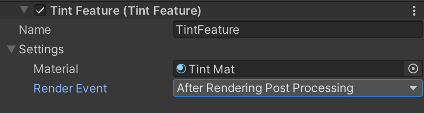
<p><em>VI: <strong>▲ Kết quả — <code>Tint Feature</code></strong> — <strong>Name: TintFeature · Material: Tint Mat · Render Event: After Rendering Post Processing</strong>. / EN: The finished Tint Feature with its Render Event.</em></p>

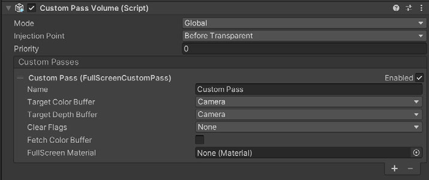
<p><em>VI: <strong>▲ Bản HDRP tương đương — <code>Custom Pass Volume (Script)</code></strong> — <strong>Mode Global · Injection Point: Before Transparent · Priority 0</strong>; Custom Pass <strong>FullScreenCustomPass</strong> với <strong>Target Color Buffer: Camera · Target Depth Buffer: Camera · Clear Flags: None · Fetch Color Buffer · FullScreen Material</strong>. / EN: The HDRP Custom Pass Volume equivalent.</em></p>

<div class="bilingual-row">
<div class="col-vi">
<blockquote>
<p><em>"Một tính năng TUYỆT VỜI của SRP là <strong>bạn có thể THÊM CODE ở HẦU HẾT MỌI GIAI ĐOẠN của quá trình rendering bằng một script C#.</strong>"</em></p>
</blockquote>
<p><strong>TÁM điểm tiêm (injection point):</strong></p>
<ol>
<li><strong>Rendering shadows</strong> — render bóng</li>
<li><strong>Rendering prepasses</strong> — các pass chuẩn bị <em>(→ depth prepass ở <a href="#52-depth-prepass-anh-oi-co-tinh-toan">§5.2</a>)</em></li>
<li><strong>Rendering G-buffer</strong> <em>(→ deferred ở <a href="#9-rendering-path-forward-vs-deferred">§9</a>)</em></li>
<li><strong>Rendering Deferred lights</strong></li>
<li><strong>Rendering opaques</strong></li>
<li><strong>Rendering Skybox</strong></li>
<li><strong>Rendering transparents</strong></li>
<li><strong>Rendering post-processing</strong></li>
</ol>
<p>▶️ <em>"Bạn tiêm script qua tuỳ chọn <strong>Add Renderer Feature</strong> trong Inspector của <strong>Universal Renderer Data Asset</strong>."</em></p>
<p>💡 <strong>Mẹo cho nhiều scene:</strong> <em>"Nếu bạn đang thử nghiệm với NHIỀU setting asset cho các scene KHÁC NHAU, thì việc <strong>gắn script sau vào Main Camera có thể HỮU ÍCH. Đặt Pipeline Asset trong Inspector. Rồi nó sẽ CHUYỂN asset khi scene mới được load.</strong>"</em></p>
</div>
<div class="col-en">
<blockquote>
<p><em>"A GREAT feature of SRPs is that <strong>you can ADD CODE at just about ANY STAGE of the rendering process using a C# script.</strong>"</em></p>
</blockquote>
<p><strong>The EIGHT injection points:</strong></p>
<ol>
<li><strong>Rendering shadows</strong></li>
<li><strong>Rendering prepasses</strong> <em>(→ depth prepass in <a href="#52-depth-prepass-anh-oi-co-tinh-toan">§5.2</a>)</em></li>
<li><strong>Rendering G-buffer</strong> <em>(→ deferred in <a href="#9-rendering-path-forward-vs-deferred">§9</a>)</em></li>
<li><strong>Rendering Deferred lights</strong></li>
<li><strong>Rendering opaques</strong></li>
<li><strong>Rendering Skybox</strong></li>
<li><strong>Rendering transparents</strong></li>
<li><strong>Rendering post-processing</strong></li>
</ol>
<p>▶️ <em>"You inject scripts via the <strong>Add Renderer Feature</strong> option in the Inspector for the <strong>Universal Renderer Data Asset</strong>."</em></p>
<p>💡 <strong>A tip for multi-scene projects:</strong> <em>"If you are experimenting with MULTIPLE setting assets for DIFFERENT scenes, then <strong>attaching the following script to your Main Camera can be useful. Set the Pipeline Asset in the Inspector. Then it will SWITCH the asset when the new scene is loaded.</strong>"</em></p>
</div>
</div>

```csharp
// Tự động đổi URP Asset khi load scene — nguyên văn từ e-book URP
// Script to switch Universal Render Pipeline Asset on scene load — verbatim
using UnityEngine;
using UnityEngine.Rendering;
using UnityEngine.Rendering.Universal;

[ExecuteAlways]
public class AutoLoadPipelineAsset : MonoBehaviour
{
    public UniversalRenderPipelineAsset pipelineAsset;

    void OnEnable()
    {
        if (pipelineAsset)
        {
            GraphicsSettings.renderPipelineAsset = pipelineAsset;
        }
    }
}
```

### 37.1. 👤 Render Objects — Bóng SILHOUETTE của nhân vật bị che

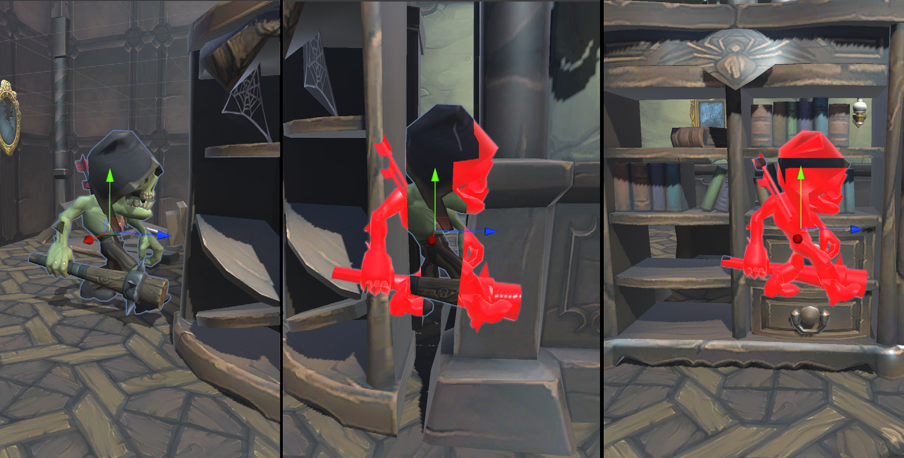
<p><em>VI: Hiển thị <strong>SILHOUETTE (bóng ĐỎ) khi một model môi trường CHE nhân vật</strong> — <strong>trái: nhân vật KHÔNG bị che (hiện bình thường) · giữa & phải: bị che sau cột và sau kệ (silhouette đỏ hiện xuyên qua)</strong>. / EN: Showing a silhouette when an environment model masks the character.</em></p>

<div class="bilingual-row">
<div class="col-vi">
<blockquote>
<p><em>"Một vấn đề PHỔ BIẾN trong game là <strong>MẤT DẤU nhân vật người chơi khi họ biến mất sau các vật thể môi trường</strong>. Bạn có thể thử di chuyển Camera để nhân vật LUÔN trong tầm nhìn, hoặc điều chỉnh môi trường THOÁNG hết mức. <strong>Nhưng những lựa chọn đó KHÔNG PHẢI LÚC NÀO CŨNG có sẵn.</strong></em></p>
<p><em>✅ <strong>Một MẸO HAY là hiển thị SILHOUETTE của nhân vật khi một model môi trường xuất hiện GIỮA nhân vật và Camera.</strong>"</em></p>
</blockquote>
<p><strong>SÁU bước tạo silhouette:</strong></p>
<ol>
<li><strong>Tạo material</strong> dùng khi nhân vật bị che: shader <code>Universal Render Pipeline &gt; Lit</code> hoặc <code>Unlit</code>, đặt màu <code>Surface Inputs &gt; Base Map</code>. <em>(ví dụ tên là <strong>Character</strong>)</em></li>
<li><strong>Đặt nhân vật vào một LAYER RIÊNG</strong> — <em>"để TRÁNH render nhân vật NHIỀU LẦN hơn mức cần thiết"</em>. Thêm layer <strong><code>SeeBehind</code></strong> và chọn nó cho nhân vật</li>
<li>Chọn <strong>Renderer Data object</strong> mà URP Asset đang dùng → tới <strong>Opaque Layer Mask</strong> → <strong>LOẠI TRỪ layer <code>SeeBehind</code></strong>. <em>"Nhân vật sẽ BIẾN MẤT."</em></li>
<li>Bấm <strong>Add Renderer Feature</strong> → chọn <strong>Render Objects (Experimental)</strong></li>
<li>Điền setting cho Pass của Render Object này. Đặt tên và chọn khi nào render được kích hoạt — <em>ví dụ <strong><code>AfterRenderingOpaques</code></strong></em>.<br>🔑 Đặt <strong>Layer Mask</strong> = <code>SeeBehind</code>. Mở <strong>Overrides</strong> và đặt material tạo ở bước 1.<br>💎 <em>"Bạn sẽ muốn <strong>DÙNG Depth khi render, mà KHÔNG cần cập nhật depth buffer bằng cách ghi vào nó</strong>. <strong>Đặt Depth Test = <code>Greater</code></strong> để <strong>Pass này CHỈ render khi khoảng cách tới pixel được render XA HƠN so với khoảng cách hiện đang lưu trong depth buffer.</strong>"</em></li>
<li>⚠️ <em>"Ở giai đoạn này, bạn <strong>CHỈ thấy silhouette khi nhân vật ở SAU một vật khác. Bạn KHÔNG thấy nhân vật gì cả khi nó ở trong tầm nhìn ĐẦY ĐỦ.</strong> Để sửa, <strong>THÊM một Render Objects feature NỮA. Lần này bạn KHÔNG cần cập nhật panel Overrides. Pass này sẽ vẽ nhân vật khi nó KHÔNG bị che bởi vật khác.</strong>"</em></li>
</ol>
<p>🎓 <em>"Mẹo silhouette là <strong>ví dụ TỐT về việc dùng workflow URP để thêm hiệu ứng KHÓ đạt được với workflow BiRP do nó PHỤ THUỘC vào CODE.</strong>"</em></p>
<p>👉 <em>So sánh với <a href="#15-stencil-buffer-trong-urp-hieu-ung-nhin-xuyen-vat-the">§15</a>: kỹ thuật <strong>stencil buffer</strong> giải quyết CÙNG bài toán "nhìn xuyên vật thể" nhưng bằng <strong>stencil</strong> thay vì <strong>depth test Greater</strong>. Cả hai đều dùng RenderObjects.</em></p>
</div>
<div class="col-en">
<blockquote>
<p><em>"A COMMON problem in games is <strong>LOSING SIGHT of the player character as they disappear behind environment objects</strong>. You could attempt to move the Camera so that the character is always in view, or adjust the environment to be as open as possible. <strong>But such options are NOT ALWAYS available.</strong></em></p>
<p><em>✅ <strong>A GOOD TRICK is to show a SILHOUETTE of the character when an environment model appears BETWEEN the character and the Camera.</strong>"</em></p>
</blockquote>
<p><strong>The SIX steps to create the silhouette:</strong></p>
<ol>
<li><strong>Create a material</strong> to use when the character is masked: shader <code>Universal Render Pipeline &gt; Lit</code> or <code>Unlit</code>, set the <code>Surface Inputs &gt; Base Map</code> color. <em>(in the example it's called <strong>Character</strong>)</em></li>
<li><strong>Place the character on a SPECIAL LAYER</strong> — <em>"to AVOID rendering the character MORE TIMES than necessary"</em>. Add a <strong><code>SeeBehind</code></strong> layer and select it for the character</li>
<li>Select the <strong>Renderer Data object</strong> used by the URP Asset → go to the <strong>Opaque Layer Mask</strong> → <strong>EXCLUDE the <code>SeeBehind</code> layer</strong>. <em>"The character will then DISAPPEAR."</em></li>
<li>Click <strong>Add Renderer Feature</strong> → select <strong>Render Objects (Experimental)</strong></li>
<li>Fill out the settings for this Render Object's Pass. Give it a name and choose when the render should be triggered — <em>e.g. <strong><code>AfterRenderingOpaques</code></strong></em>.<br>🔑 Set the <strong>Layer Mask</strong> to <code>SeeBehind</code>. Expand the <strong>Overrides</strong> and set the material from step 1.<br>💎 <em>"You'll want to <strong>USE Depth when rendering, WITHOUT having to update the depth buffer by writing to it</strong>. <strong>Set the Depth Test to <code>Greater</code></strong> so that <strong>this Pass ONLY renders when the distance to the rendered pixel is FURTHER from the Camera than the distance CURRENTLY STORED in the depth buffer.</strong>"</em></li>
<li>⚠️ <em>"At this stage, <strong>you ONLY see the silhouette of the character when it's BEHIND another object. You DON'T see the character AT ALL when it's in FULL VIEW.</strong> To fix this, <strong>add ANOTHER Render Objects feature. This time you DON'T need to update the Overrides panel. This Pass will draw the character when NOT masked by another object.</strong>"</em></li>
</ol>
<p>🎓 <em>"The silhouette trick is a <strong>GOOD EXAMPLE of using the URP workflow to add effects that are DIFFICULT to achieve with the BiRP workflow due to its RELIANCE on CODING.</strong>"</em></p>
<p>👉 <em>Compare with <a href="#15-stencil-buffer-trong-urp-hieu-ung-nhin-xuyen-vat-the">§15</a>: the <strong>stencil buffer</strong> technique solves the SAME "see-through" problem but via <strong>stencil</strong> rather than <strong>Depth Test Greater</strong>. Both use RenderObjects.</em></p>
</div>
</div>

### 37.2. 🎨 Renderer Feature — Viết custom post-processing bằng C#

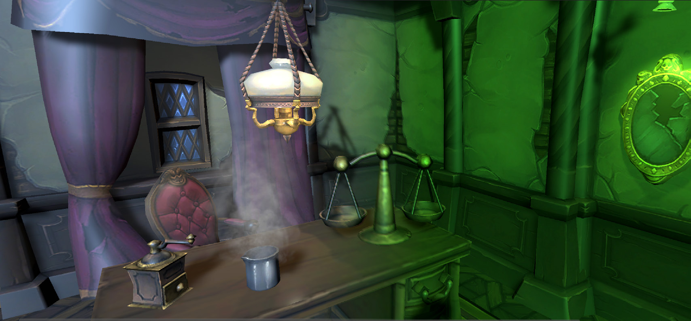
<p><em>VI: Hiệu ứng của <strong>TintFeature</strong> — <strong>CHƯA xử lý (trái) và ĐÃ nhuộm màu (phải)</strong>. / EN: Effect of TintFeature: unprocessed to the left, tinted on the right.</em></p>

<div class="bilingual-row">
<div class="col-vi">
<blockquote>
<p><em>"Một <strong>Renderer Feature có thể được dùng ở BẤT KỲ giai đoạn nào trong URP để tác động tới bản render cuối cùng.</strong></em></p>
<p><em>📌 <strong>Trong một dự án dùng BiRP, bạn sẽ PHẢI thêm một <code>Graphics.Blit</code> bằng callback <code>OnRenderImage</code>.</strong> Ví dụ này dùng phiên bản của hàm <strong>CÓ một material để xử lý TỪNG PIXEL trong ảnh.</strong>"</em></p>
</blockquote>
<p><strong>Tạo:</strong> chuột phải trong thư mục Assets → <code>Create &gt; Rendering &gt; URP Renderer Feature</code> → đặt tên <strong>TintFeature</strong>. <em>"Nó là một script C# chứa BOILERPLATE cho một Renderer Feature."</em></p>
<p><strong>Bảy điểm then chốt trong code:</strong></p>
<ol>
<li><strong>Ba field</strong>: <code>material</code>, <code>source</code> (<code>RenderTargetIdentifier</code>), <code>tempTexture</code> (<code>RenderTargetHandle</code>)</li>
<li><strong>Constructor</strong> khởi tạo material và <code>tempTexture.Init("_TempTintTexture")</code></li>
<li><strong><code>SetSource()</code></strong> để khởi tạo thuộc tính <code>source</code></li>
<li>🔑 <strong>Shader Graph tên <code>Tint</code></strong> dùng hai property: một texture và một color. <em>"<strong>QUAN TRỌNG là phải đặt Reference của Texture thành <code>_MainTex</code>. Điều này ĐẢM BẢO code trong TintFeature TÌM ĐÚNG Render Texture.</strong>"</em></li>
<li><strong><code>Create()</code></strong> — tạo material từ <code>Shader.Find("Shader Graphs/Tint")</code> và đặt <code>renderPassEvent</code></li>
<li><strong><code>AddRenderPasses()</code></strong> — <code>SetSource(renderer.cameraColorTarget)</code> rồi <code>renderer.EnqueuePass()</code></li>
<li><strong><code>OnCameraSetup()</code> / <code>OnCameraCleanup()</code></strong> — cấp phát và giải phóng temporary RT</li>
</ol>
<p>⚠️ <strong>Bước dễ QUÊN NHẤT:</strong> <em>"Để thấy hiệu ứng hoạt động, chọn Renderer Data object và bấm <strong>Add Renderer Feature</strong>. TintFeature sẽ xuất hiện trong danh sách. 🚨 <strong>ĐẢM BẢO cũng đặt <code>Compatibility &gt; Intermediate Texture</code> thành <code>Always</code>.</strong>"</em></p>
</div>
<div class="col-en">
<blockquote>
<p><em>"A <strong>Renderer Feature can be used at ANY STAGE in URP to affect the final render.</strong></em></p>
<p><em>📌 <strong>In a project using BiRP, you would HAVE TO add a <code>Graphics.Blit</code> using the <code>OnRenderImage</code> callback.</strong> This example uses the version of the function <strong>WITH a material to process EACH PIXEL in the image.</strong>"</em></p>
</blockquote>
<p><strong>Create it:</strong> right-click in an Assets folder → <code>Create &gt; Rendering &gt; URP Renderer Feature</code> → name it <strong>TintFeature</strong>. <em>"It is a C# script containing BOILERPLATE for a Renderer Feature."</em></p>
<p><strong>The seven key points in the code:</strong></p>
<ol>
<li><strong>Three fields</strong>: <code>material</code>, <code>source</code> (<code>RenderTargetIdentifier</code>), <code>tempTexture</code> (<code>RenderTargetHandle</code>)</li>
<li>A <strong>constructor</strong> initializing the material and <code>tempTexture.Init("_TempTintTexture")</code></li>
<li><strong><code>SetSource()</code></strong> to initialize the <code>source</code> property</li>
<li>🔑 A <strong>Shader Graph named <code>Tint</code></strong> using two properties: a texture and a color. <em>"<strong>It's IMPORTANT to set the Reference of the Texture to <code>_MainTex</code>. This ENSURES that the code in the TintFeature finds the RIGHT Render Texture.</strong>"</em></li>
<li><strong><code>Create()</code></strong> — builds the material from <code>Shader.Find("Shader Graphs/Tint")</code> and sets <code>renderPassEvent</code></li>
<li><strong><code>AddRenderPasses()</code></strong> — <code>SetSource(renderer.cameraColorTarget)</code> then <code>renderer.EnqueuePass()</code></li>
<li><strong><code>OnCameraSetup()</code> / <code>OnCameraCleanup()</code></strong> — allocate and release the temporary RT</li>
</ol>
<p>⚠️ <strong>The step MOST OFTEN forgotten:</strong> <em>"To see the effect in action, select the Renderer Data object and click <strong>Add Renderer Feature</strong>. TintFeature will appear in the list. 🚨 <strong>Make sure to ALSO set <code>Compatibility &gt; Intermediate Texture</code> to <code>Always</code>.</strong>"</em></p>
</div>
</div>

```csharp
// TintFeature ĐẦY ĐỦ — nguyên văn từ e-book URP (tr.82–83)
// The COMPLETE TintFeature — verbatim from the URP e-book (pp.82–83)
using UnityEngine;
using UnityEngine.Rendering;
using UnityEngine.Rendering.Universal;

public class TintFeature : ScriptableRendererFeature
{
    class CustomRenderPass : ScriptableRenderPass
    {
        private Material                material;
        private RenderTargetIdentifier  source;
        private RenderTargetHandle      tempTexture;

        public CustomRenderPass(Material material) : base()
        {
            this.material = material;
            tempTexture.Init("_TempTintTexture");
        }

        public void SetSource(RenderTargetIdentifier source)
        {
            this.source = source;
        }

        public override void OnCameraSetup(CommandBuffer cmd, ref RenderingData renderingData)
        {
            RenderTextureDescriptor cameraTextureDesc =
                renderingData.cameraData.cameraTargetDescriptor;
            cameraTextureDesc.depthBufferBits = 0;
            cmd.GetTemporaryRT(tempTexture.id, cameraTextureDesc, FilterMode.Bilinear);
        }

        public override void Execute(ScriptableRenderContext context, ref RenderingData renderingData)
        {
            CommandBuffer cmd = CommandBufferPool.Get("TintFeature");

            Blit(cmd, source, tempTexture.Identifier(), material, 0);
            Blit(cmd, tempTexture.Identifier(), source);

            context.ExecuteCommandBuffer(cmd);
            CommandBufferPool.Release(cmd);
        }

        // Cleanup any allocated resources that were created during the execution of this render pass.
        public override void OnCameraCleanup(CommandBuffer cmd)
        {
            cmd.ReleaseTemporaryRT(tempTexture.id);
        }
    }

    CustomRenderPass m_ScriptablePass;

    /// <inheritdoc/>
    public override void Create()
    {
        var material     = new Material(Shader.Find("Shader Graphs/Tint"));
        m_ScriptablePass = new CustomRenderPass(material);

        // Configures where the render pass should be injected.
        m_ScriptablePass.renderPassEvent = RenderPassEvent.AfterRenderingOpaques;
    }

    // Here you can inject one or multiple render passes in the renderer.
    // This method is called when setting up the renderer once per-camera.
    public override void AddRenderPasses(ScriptableRenderer renderer, ref RenderingData renderingData)
    {
        m_ScriptablePass.SetSource(renderer.cameraColorTarget);
        renderer.EnqueuePass(m_ScriptablePass);
    }
}
```

```csharp
// Phiên bản LINH HOẠT HƠN — dùng class Settings để gán trong Inspector
// A MORE FLEXIBLE option — use a Settings class to assign properties in the Inspector
[System.Serializable]
public class Settings
{
    public Material        material;
    public RenderPassEvent renderEvent = RenderPassEvent.AfterRenderingOpaques;
}

[SerializeField]
private Settings settings = new Settings();

// Sau đó dùng settings.material và settings.renderEvent trong Create()
// You then use settings.material and settings.renderEvent in the Create method
```

---

## 38. Viết Custom Shader cho URP

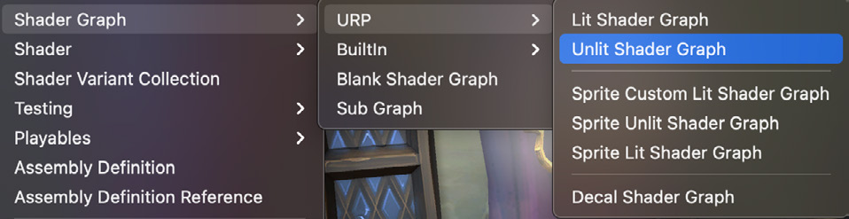 Shader Graph > URP menu.">
<p><em>VI: <strong>▲ <code>Create › Shader Graph › URP</code></strong> — <strong>Lit Shader Graph · Unlit Shader Graph · Sprite Custom Lit · Sprite Unlit · Sprite Lit · Decal Shader Graph</strong> (cạnh nhánh <em>BuiltIn</em>, <em>Blank Shader Graph</em>, <em>Sub Graph</em>). / EN: The Create > Shader Graph > URP menu.</em></p>

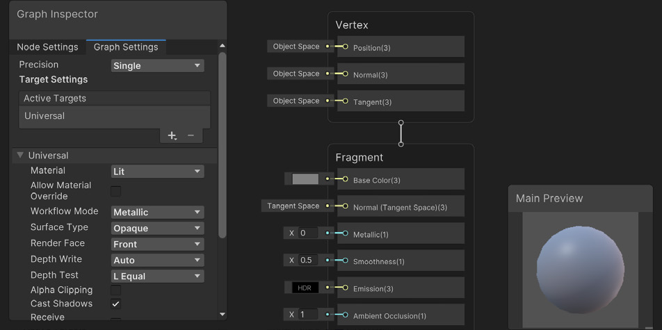
<p><em>VI: <strong>▲ Graph Settings — <code>Lit</code></strong> — <strong>Precision Single · Active Targets Universal · Material: Lit · Workflow Mode: Metallic · Surface Type: Opaque · Render Face: Front · Depth Write: Auto · Depth Test: L Equal · Alpha Clipping · Cast Shadows ✓ · Receive…</strong>; khối <strong>Fragment</strong> có <strong>Base Color · Normal (Tangent Space) · Metallic · Smoothness · Emission · Ambient Occlusion</strong>. / EN: Shader Graph settings for a Lit target.</em></p>

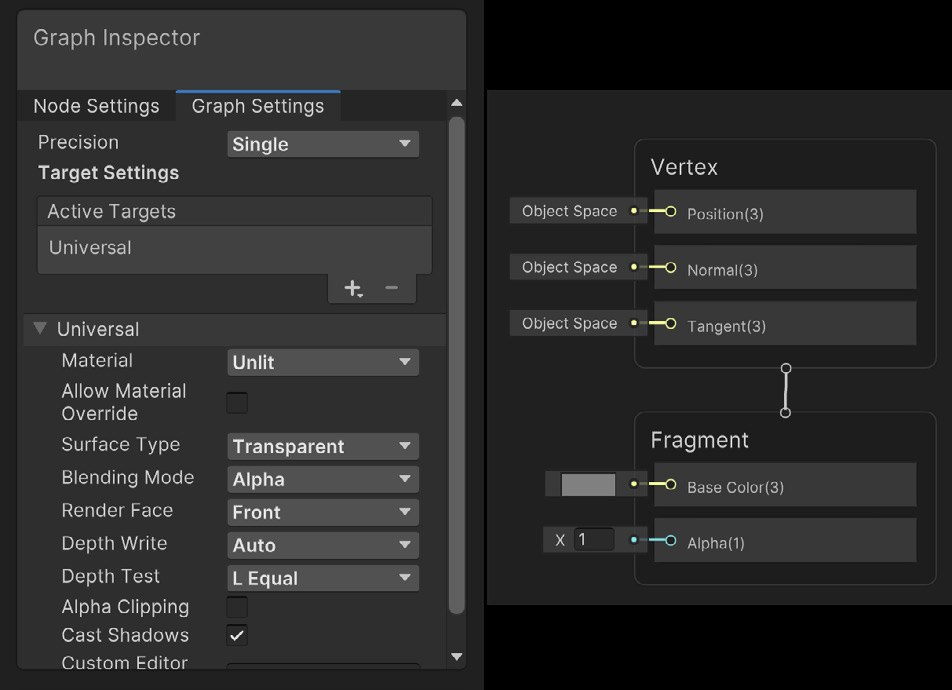
<p><em>VI: <strong>▲ Graph Settings — <code>Unlit</code></strong> — <strong>Material: Unlit · Surface Type: Transparent · Blending Mode: Alpha · Render Face: Front · Depth Write: Auto · Depth Test: L Equal · Cast Shadows ✓</strong>; khối Fragment RÚT GỌN chỉ còn <strong>Base Color</strong> và <strong>Alpha</strong> — đây chính là chỗ tiết kiệm. / EN: Shader Graph settings for an Unlit transparent target.</em></p>

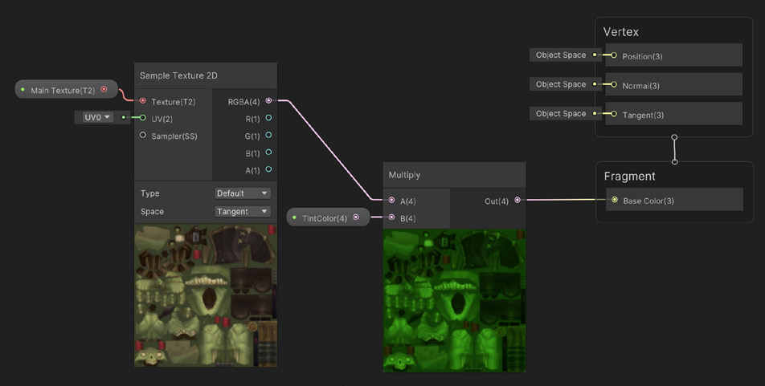
<p><em>VI: <strong>▲ Một graph tối giản</strong> — <code>Sample Texture 2D</code> → <code>Multiply</code> → <strong>Fragment Base Color</strong>; khối <strong>Vertex</strong> giữ nguyên Position/Normal/Tangent. / EN: A minimal Shader Graph feeding Base Color.</em></p>

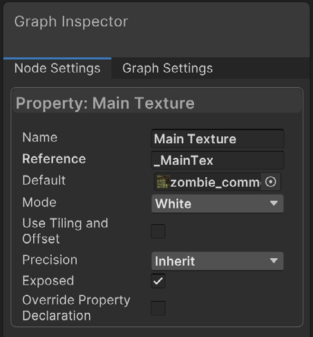
<p><em>VI: <strong>▲ Graph Inspector › Node Settings</strong> — <strong>Property: Main Texture</strong> với <strong>Name "Main Texture" · Reference <code>_MainTex</code> · Default zombie_comm · Mode White · Precision Inherit · Exposed ✓ · Override Property Declaration</strong>. Ô <strong>Reference</strong> chính là tên mà code C# dùng để <code>SetTexture</code>. / EN: The Graph Inspector Node Settings for an exposed property.</em></p>


<p><em>VI: <strong>▲ Và đây là cái GIÁ của một graph PHỨC TẠP</strong> — bốn nhánh <strong>Albedo · Normal · Smoothness · Occlusion</strong> mỗi nhánh một chuỗi node riêng. Mỗi node là thêm lệnh cho fragment shader. / EN: A complex Shader Graph with separate Albedo, Normal, Smoothness and Occlusion branches.</em></p>

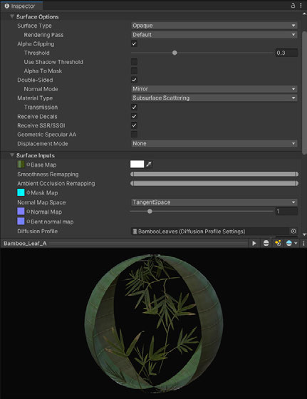
<p><em>VI: <strong>▲ Surface Options trên Material</strong> — <strong>Surface Type Opaque · Rendering Pass Default · Alpha Clipping · Double-Sided GI · Normal Mode · Material Type: Subsurface Scattering · Receive Decals · Receive SSR/SSGI · Geometric Specular AA · Displacement Mode</strong>. Đổi <strong>Material Type</strong> là đổi HẲN chi phí shading. / EN: The Material Surface Options.</em></p>

### 38.1. 🔑 Khác biệt CẤU TRÚC — `RenderPipeline` tag và `HLSLPROGRAM`

```hlsl
// Cấu trúc CƠ BẢN của một SubShader block trong URP
// The basic structure of a SubShader block in URP
SubShader {
   Tags {"RenderPipeline" = "UniversalPipeline" }
   Pass {
      HLSLPROGRAM
      ...
      ENDHLSL
   }
}
```

<div class="bilingual-row">
<div class="col-vi">
<blockquote>
<p><em>"Shader URP dùng cấu trúc <strong>ShaderLab</strong>. Do đó <strong>Property, SubShader, Tags, và Pass</strong> đều QUEN THUỘC với người viết shader.</em></p>
<p><em>🔑 <strong>Điều ĐẦU TIÊN nhận thấy khi so sánh một shader URP với shader BiRP là việc dùng CẶP KHOÁ-GIÁ TRỊ <code>"RenderPipeline" = "UniversalPipeline"</code> trong SubShader tag.</strong> Tag SubShader tên <code>RenderPipeline</code> <strong>NÓI CHO Unity biết SubShader này dùng với render pipeline nào.</strong></em></p>
<p><em>💻 <strong>Nhìn vào code của render Pass, bạn sẽ thấy shader code nằm giữa macro <code>HLSLPROGRAM</code> / <code>ENDHLSL</code>. Điều này cho thấy ngôn ngữ lập trình shader CG (C for Graphics) trước đây ĐÃ ĐƯỢC THAY bằng HLSL (High Level Shading Language)</strong> — dù <strong>cú pháp và chức năng shader GẦN NHƯ GIỐNG HỆT</strong>.</em></p>
<p><em>🚨 <strong>Unity đã chuyển sang HLSL từ RẤT LÂU, nên điều này KHÔNG NÊN gây bất ngờ, nhưng giờ macro <code>CGPROGRAM</code> / <code>ENDCG</code> KHÔNG ĐƯỢC KHUYẾN NGHỊ. Dùng các macro này NGỤ Ý dùng <code>UnityCG.cginc</code>. TRỘN thư viện shader SRP và BiRP theo cách này có thể gây RA NHIỀU VẤN ĐỀ.</strong>"</em></p>
</blockquote>
<p>🔬 <strong>Vì sao shader BiRP bị VÔ HIỆU HOÁ trong URP — lý do KỸ THUẬT:</strong></p>
<blockquote>
<p><em>"<strong>Lý do là THAY ĐỔI trong quá trình lighting NỘI BỘ.</strong></em></p>
<p><em>💀 <strong>Trong khi BiRP thực hiện các shader pass RIÊNG BIỆT cho MỌI đèn chạm tới một object (MULTIPASS), URP Forward Renderer ĐÁNH GIÁ TOÀN BỘ lighting trong MỘT LIGHT LOOP trong MỘT PASS DUY NHẤT.</strong></em></p>
<p><em>🔑 <strong>Thay đổi này dẫn tới CẤU TRÚC DỮ LIỆU KHÁC NHAU lưu light data và các THƯ VIỆN SHADING MỚI với QUY ƯỚC MỚI.</strong>"</em></p>
</blockquote>
<p>🟣 <strong>Cơ chế fallback — vì sao ra màu HỒNG:</strong></p>
<blockquote>
<p><em>"<strong>Unity sẽ dùng SubShader block ĐẦU TIÊN được GPU hỗ trợ. NẾU block SubShader đầu tiên KHÔNG có tag <code>"RenderPipeline" = "UniversalPipeline"</code>, nó SẼ KHÔNG chạy trong URP.</strong> Thay vào đó, Unity sẽ thử chạy SubShader TIẾP THEO, nếu có. <strong>NẾU KHÔNG SubShader nào được hỗ trợ, Unity sẽ render shader lỗi MÀU HỒNG quen thuộc.</strong>"</em></p>
</blockquote>
<p>📌 <em>"Một SubShader có thể chứa <strong>NHIỀU Pass block, nhưng MỖI cái NÊN được gắn tag với một LightMode CỤ THỂ.</strong> <strong>Vì URP dùng Forward Renderer MỘT PASS, CHỈ Pass <code>"UniversalForward"</code> ĐẦU TIÊN được GPU hỗ trợ sẽ được dùng để render object trong Forward rendering.</strong>"</em></p>
</div>
<div class="col-en">
<blockquote>
<p><em>"URP shaders use the <strong>ShaderLab</strong> structure. As such, <strong>Property, SubShader, Tags, and Pass</strong> will all be FAMILIAR to shader coders.</em></p>
<p><em>🔑 <strong>The FIRST thing to notice when comparing a URP shader with a BiRP shader is the use of the KEY-VALUE PAIR <code>"RenderPipeline" = "UniversalPipeline"</code> in the SubShader tag.</strong> A SubShader tag with the name <code>RenderPipeline</code> <strong>TELLS Unity which render pipelines to use this SubShader with.</strong></em></p>
<p><em>💻 <strong>Looking at the render Pass code, you'll see the shader code contained between the <code>HLSLPROGRAM</code> / <code>ENDHLSL</code> macros. This indicates the former CG (C for Graphics) shader programming language has been REPLACED by HLSL (High Level Shading Language)</strong> — although <strong>the shader syntax and functionality are NEAR-IDENTICAL</strong>.</em></p>
<p><em>🚨 <strong>Unity switched to HLSL A LONG TIME AGO, so this shouldn't come as a surprise, but NOW the <code>CGPROGRAM</code> / <code>ENDCG</code> macros are NOT RECOMMENDED. Using these macros IMPLIES using <code>UnityCG.cginc</code>. MIXING the SRP and BiRP shader libraries in this way can cause SEVERAL PROBLEMS.</strong>"</em></p>
</blockquote>
<p>🔬 <strong>Why BiRP shaders are DISABLED in URP — the TECHNICAL reason:</strong></p>
<blockquote>
<p><em>"<strong>The reason for this is the CHANGE in the INTERNAL lighting process.</strong></em></p>
<p><em>💀 <strong>While BiRP performs SEPARATE shader passes for EVERY light that reaches an object (MULTIPASS), the URP Forward Renderer EVALUATES ALL LIGHTING in a LIGHT LOOP in a SINGLE PASS.</strong></em></p>
<p><em>🔑 <strong>This change leads to DIFFERENT DATA STRUCTURES that store light data and NEW SHADING LIBRARIES with NEW CONVENTIONS.</strong>"</em></p>
</blockquote>
<p>🟣 <strong>The fallback mechanism — why you get MAGENTA:</strong></p>
<blockquote>
<p><em>"<strong>Unity will use the FIRST SubShader block that is supported on the GPU. IF the first SubShader block does NOT have a <code>"RenderPipeline" = "UniversalPipeline"</code> tag, it WON'T RUN in URP.</strong> Instead, Unity will try to run the NEXT SubShader, if any. <strong>IF NONE of the SubShaders are supported, Unity will render the well-known MAGENTA ERROR SHADER.</strong>"</em></p>
</blockquote>
<p>📌 <em>"A SubShader can contain <strong>MULTIPLE Pass blocks, but EACH of them should be TAGGED with a SPECIFIC LightMode.</strong> <strong>As URP uses a SINGLE-PASS Forward Renderer, ONLY the FIRST <code>"UniversalForward"</code> Pass supported by the GPU will be used to render objects in Forward rendering.</strong>"</em></p>
</div>
</div>

### 38.2. 🔄 Bảng ánh xạ LightMode tag: BiRP → URP

<div class="bilingual-row">
<div class="col-vi">
<blockquote>
<p><em>"<strong>Tag LightMode ĐỊNH NGHĨA VAI TRÒ của Pass trong lighting pipeline.</strong> Trong BiRP, hầu hết shader cần tương tác với lighting được viết dưới dạng <strong>Surface Shader</strong> với mọi chi tiết cần thiết được lo liệu sẵn. <strong>Tuy nhiên, custom shader trong BiRP CẦN dùng tag LightMode để chỉ rõ Pass được xét thế nào trong lighting pipeline.</strong>"</em></p>
</blockquote>
<p>🚫 <strong>NĂM tag legacy của BiRP KHÔNG được hỗ trợ trong URP:</strong><br><code>PrepassBase</code> · <code>PrepassFinal</code> · <code>Vertex</code> · <code>VertexLMRGBM</code> · <code>VertexLM</code></p>
</div>
<div class="col-en">
<blockquote>
<p><em>"<strong>The LightMode tag DEFINES the ROLE of a Pass in the lighting pipeline.</strong> In BiRP, most shaders that need to interact with lighting are written as <strong>Surface Shaders</strong> with all the necessary details taken care of. <strong>However, custom shaders in BiRP need to use the LightMode tag to specify how the Pass is considered in the lighting pipeline.</strong>"</em></p>
</blockquote>
<p>🚫 <strong>FIVE legacy BiRP tags are NOT supported in URP:</strong><br><code>PrepassBase</code> · <code>PrepassFinal</code> · <code>Vertex</code> · <code>VertexLMRGBM</code> · <code>VertexLM</code></p>
</div>
</div>

| **BiRP** | Mô tả / Description | **URP** |
|---|---|---|
| `Always` | *Luôn được render; **KHÔNG áp dụng lighting*** | — |
| `ForwardBase` | *Dùng trong Forward rendering; **Ambient, đèn Directional chính, đèn vertex/SH, và lightmap** được áp dụng* | **`UniversalForward`** |
| `ForwardAdd` | *Dùng trong Forward rendering; **đèn per-pixel CỘNG DỒN được áp dụng, MỘT Pass CHO MỖI ĐÈN*** | **`UniversalForward`** |
| `Deferred` | *Dùng trong Deferred Shading; **render G-buffer*** | **`UniversalGBuffer`** |
| `ShadowCaster` | *Render **depth của object vào shadow map hoặc một depth texture*** | **`ShadowCaster`** |
| `MotionVectors` | *Dùng để **tính motion vector THEO TỪNG OBJECT*** | **`MotionVectors`** |
| — | *URP dùng giá trị tag này trong **Forward Rendering Path**; Pass **render geometry của object và ĐÁNH GIÁ TẤT CẢ đóng góp ánh sáng*** | **`UniversalForwardOnly`** |
| — | *URP dùng giá trị tag này trong **2D Renderer**; Pass **render object và đánh giá đóng góp ánh sáng 2D*** | **`Universal2D`** |
| — | *Pass **CHỈ render THÔNG TIN DEPTH từ góc nhìn của Camera vào một depth texture*** | **`DepthOnly`** |
| — | *Pass này **CHỈ chạy khi BAKE LIGHTMAP trong Unity Editor; Unity STRIP Pass này khỏi shader khi build Player*** | **`Meta`** |
| — | *Dùng giá trị tag này để **vẽ MỘT Pass THÊM khi render object**; nó **HỢP LỆ cho CẢ Forward LẪN Deferred Rendering Path**. 🔑 **URP dùng giá trị tag này làm GIÁ TRỊ MẶC ĐỊNH khi một Pass KHÔNG CÓ tag LightMode.*** | **`SRPDefaultUnlit`** |

```hlsl
// Trích từ URP Lit Shader — hai Pass tiêu biểu (nguyên văn e-book URP)
// Excerpt from the URP Lit Shader — two representative Passes (verbatim)

// Forward pass. Shades all light in a single pass. GI + emission + Fog
Pass
{
   // Lightmode matches the ShaderPassName set in
   // UniversalRenderPipeline.cs. SRPDefaultUnlit and passes with
   // no LightMode tag are also rendered by Universal Render Pipeline
   Name "ForwardLit"
   Tags{"LightMode" = "UniversalForward"}

   Blend[_SrcBlend][_DstBlend]
   ZWrite[_ZWrite]
   Cull[_Cull]

   HLSLPROGRAM
   #pragma exclude_renderers gles gles3 glcore
   #pragma target 4.5
   …
   #pragma vertex   LitPassVertex
   #pragma fragment LitPassFragment

   #include "Packages/com.unity.render-pipelines.universal/Shaders/LitInput.hlsl"
   #include "Packages/com.unity.render-pipelines.universal/Shaders/LitForwardPass.hlsl"
   ENDHLSL
}

Pass
{
   Name "ShadowCaster"
   Tags{"LightMode" = "ShadowCaster"}

   ZWrite On
   ZTest LEqual
   ColorMask 0
   Cull[_Cull]

   HLSLPROGRAM
   #pragma exclude_renderers gles gles3 glcore
   …
   #pragma vertex   ShadowPassVertex
   #pragma fragment ShadowPassFragment

   #include "Packages/com.unity.render-pipelines.universal/Shaders/LitInput.hlsl"
   #include "Packages/com.unity.render-pipelines.universal/Shaders/ShadowCasterPass.hlsl"
   ENDHLSL
}
```

### 38.3. 🧮 Hàm HLSL của URP — Không gian & Helper

<div class="bilingual-row">
<div class="col-vi">
<p><strong>① Thay <code>.cginc</code> bằng HLSL tương đương:</strong> <code>UnityCG.cginc</code> → <em>Core.hlsl</em> · <code>AutoLight.cginc</code> → <em>Lighting.hlsl / Shadows.hlsl</em></p>
<p><strong>② Quy ước KÝ HIỆU KHÔNG GIAN ở CUỐI tên biến — RẤT quan trọng khi đọc code URP:</strong></p>
<ul>
<li><strong><code>WS</code></strong> — <strong>World Space</strong></li>
<li><strong><code>TS</code></strong> — <strong>Tangent Space</strong></li>
<li><strong><code>VS</code></strong> — <strong>View Space</strong></li>
<li><strong><code>OS</code></strong> — <strong>Object Space</strong></li>
</ul>
<p>💡 <em>"Kiểu <code>real</code> được đặt trong file; <strong>tuỳ theo các cờ khác nhau, nó có thể là <code>half</code> hoặc <code>float</code></strong>."</em> — 👉 đây chính là cơ chế cho phép <strong>tự động dùng độ chính xác THẤP trên mobile</strong> (<a href="#4-shader-instructions-alu">§4</a>).</p>
</div>
<div class="col-en">
<p><strong>① Replace <code>.cginc</code> with the HLSL equivalents:</strong> <code>UnityCG.cginc</code> → <em>Core.hlsl</em> · <code>AutoLight.cginc</code> → <em>Lighting.hlsl / Shadows.hlsl</em></p>
<p><strong>② The SPACE-TYPE notation at the END of variable names — VERY important when reading URP code:</strong></p>
<ul>
<li><strong><code>WS</code></strong> — <strong>World Space</strong></li>
<li><strong><code>TS</code></strong> — <strong>Tangent Space</strong></li>
<li><strong><code>VS</code></strong> — <strong>View Space</strong></li>
<li><strong><code>OS</code></strong> — <strong>Object Space</strong></li>
</ul>
<p>💡 <em>"The type <code>real</code> is set in the file; <strong>depending on various flags, it could be a <code>half</code> or a <code>float</code></strong>."</em> — 👉 this is exactly the mechanism that enables <strong>automatic LOWER PRECISION on mobile</strong> (<a href="#4-shader-instructions-alu">§4</a>).</p>
</div>
</div>

**Hàm biến đổi KHÔNG GIAN / HLSL space transform functions**

| Hàm helper URP | Mô tả / Description |
|---|---|
| `float4x4 GetObjectToWorldMatrix()` | Trả về ma trận **`UNITY_MATRIX_M`** chuyển từ **Object → World Space**. *Tương đương **`unity_ObjectToWorld`** của BiRP* |
| `float4x4 GetWorldToObjectMatrix()` | Trả về ma trận **`UNITY_MATRIX_I_M`** chuyển từ **World → Object Space**. *Ma trận này là **NGHỊCH ĐẢO của `UNITY_MATRIX_M`**. Tương đương **`unity_WorldToObject`** của BiRP* |
| `float4x4 GetWorldToHClipMatrix()` | Trả về ma trận **`UNITY_MATRIX_VP`** chuyển từ **World → Clip Space** |
| `float4x4 GetViewToHClipMatrix()` | Trả về ma trận **`UNITY_MATRIX_P`** chuyển từ **View → Clip Space** |
| `float3 TransformObjectToWorld(float3 positionOS)` | Cho một **vị trí** trong Object Space, trả về vị trí trong **World Space** |
| `float3 TransformObjectToWorldDir(float3 dirOS, bool doNormalize = true)` | Cho một **hướng** trong Object Space, trả về hướng trong **World Space** |
| `float3 TransformWorldToObject(float3 positionWS)` | Cho một vị trí trong World Space, trả về vị trí trong **Object Space** |
| `float3 TransformWorldToView(float3 positionWS)` | Cho một vị trí trong World Space, trả về vị trí trong **View Space** |
| `real3x3 CreateTangentToWorld(real3 normal, real3 tangent, real flipSign)` | **Tạo ma trận Tangent → World** từ một normal và một tangent |
| `real3 TransformTangentToWorld(real3 normalTS, real3x3 tangentToWorld, bool doNormalize = false)` | Cho một normal trong Tangent Space, trả về normal trong **World Space** |
| `real3 TransformWorldToTangent(real3 normalWS, real3x3 tangentToWorld, bool doNormalize = true)` | Cho một normal trong World Space, trả về normal trong **Tangent Space** |

**Hàm helper THƯỜNG DÙNG / Frequently used helper functions**

| Hàm helper URP | Mô tả / Description |
|---|---|
| `VertexPositionInputs GetVertexPositionInputs(float3 positionOS)` | Cho một vị trí trong Object Space, trả về một **struct chứa vị trí trong World, View, VÀ Clip Space**. ⚠️ ***CHỈ NÊN dùng trong VERTEX SHADER*** |
| `VertexNormalInputs GetVertexNormalInputs(float3 normalOS)` | Cho một normal trong Object Space, trả về **struct với vector normal, tangent, và bitangent trong World Space**. *Dùng được với `CreateTangentToWorld`. Trả về `input.tangentWS`, `input.bitangentWS`, `input.normalWS`* |
| `float3 GetCameraPositionWS()` | Trả về **vị trí Camera trong World Space**. *Tương tự biến **`_WorldSpaceCameraPos`** của BiRP* |
| `float3 GetViewForwardDir()` | Trả về **hướng TIẾN (trung tâm) của view hiện tại trong World Space** |
| `float3 GetWorldSpaceViewDir(float3 positionWS)` | Tính **hướng nhìn trong World Space** (hướng VỀ PHÍA người xem) |

**Hàm toán học & tiện ích / Math and utility helpers** *(từ include chung của URP)*

| | |
|---|---|
| `real DegToRad(real deg)` | `real RadToDeg(real rad)` |
| `bool IsPower2(uint x)` | `real FastACosPos(real inX)` |
| `real FastASin(real x)` | `real FastATan(real x)` |
| `uint FastLog2(uint x)` | `real3 Orthonormalize(real3 tangent, real3 normal)` |
| `real Pow4(real x)` | `float4x4 Inverse(float4x4 m)` |
| `float ComputeTextureLOD(float2 uv, float bias = 0.0)` | `float Linear01Depth(float depth, float4 zBufferParam)` |

<div class="bilingual-row">
<div class="col-vi">
<p>💎 <em>"<strong>Hàm helper shader là NỀN TẢNG cho việc viết shader. Chúng KHÔNG CHỈ tiết kiệm thời gian, mà còn là những CÀI ĐẶT ĐƯỢC TỐI ƯU CAO của các phép tính thường dùng.</strong>"</em></p>
<p>Include này chứa nhiều hàm helper liên quan tới: <strong>hàm đặc thù nền tảng · hàm toán học chung · tiện ích texture · sampling định dạng texture · mã hoá/giải mã depth · biến đổi không gian · mã hoá/giải mã heightmap của Terrain/brush</strong>.</p>
</div>
<div class="col-en">
<p>💎 <em>"<strong>Shader helper functions are FUNDAMENTAL for shader coding. They NOT ONLY save you time, but are HIGHLY OPTIMIZED IMPLEMENTATIONS of commonly used calculations.</strong>"</em></p>
<p>This include contains many helper functions related to: <strong>platform-specific functions · common math functions · texture utilities · texture format sampling · depth encoding/decoding · space transformations · Terrain/brush heightmap encoding/decoding</strong>.</p>
</div>
</div>

### 38.4. 🔧 Bảng ánh xạ Preprocessor Macro: BiRP → URP

<div class="bilingual-row">
<div class="col-vi">
<p><em>"Preprocessor macro <strong>TIỆN LỢI và được dùng THƯỜNG XUYÊN. Khi port shader BiRP sang shader URP mới, bạn sẽ CẦN THAY macro BiRP bằng macro URP tương đương.</strong>"</em></p>
</div>
<div class="col-en">
<p><em>"Preprocessor macros are <strong>HANDY and REGULARLY USED. When porting BiRP shaders to new URP shaders, you'll need to REPLACE the BiRP macros with their URP EQUIVALENTS.</strong>"</em></p>
</div>
</div>

| **Built-in Render Pipeline** | **URP** |
|---|---|
| `UNITY_PROJ_COORD(a)` | **Thay bằng `a.xy/a.w`** |
| `UNITY_INITIALIZE_OUTPUT(type, name)` | `ZERO_INITIALIZE(type, name)` |
| **— Shadow mapping *** | |
| `UNITY_DECLARE_SHADOWMAP(tex)` | `TEXTURE2D_SHADOW_PARAM(textureName, samplerName)` ** |
| `UNITY_SAMPLE_SHADOW(tex, uv)` | `SAMPLE_TEXTURE2D_SHADOW(textureName, samplerName, coord3)` |
| `UNITY_SAMPLE_SHADOW_PROJ(tex, uv)` | `SAMPLE_TEXTURE2D_SHADOW(textureName, samplerName, coord4.xyz/coord4.w)` |
| **— Khai báo Texture/sampler *** ** | |
| `UNITY_DECLARE_TEX2D(name)` | `TEXTURE2D(textureName);`<br>`SAMPLER(samplerName);` |
| `UNITY_DECLARE_TEX2D_NOSAMPLER(name)` | `TEXTURE2D(textureName);` |
| `UNITY_SAMPLE_TEX2D_SAMPLER(name, samplername, uv)` | `SAMPLE_TEXTURE2D(textureName, samplerName, coord2)` |

> **Chú thích của Unity / Unity's notes:**
> **\*** *Macro shadow mapping cần include shadow tương ứng.* / *Shadow mapping macros need the shadow include.*
> **\*\*** *`_PARAM` là các macro dùng để **KHAI BÁO HÀM có tham số texture và sampler**.* / *The `_PARAM` are macros that can be used to declare functions with texture and sampler arguments.*
> **\*\*\*** *Về khai báo texture/sampler của BiRP, xem tài liệu tương ứng.* / *For BiRP texture/sampler declaration, read the relevant documentation.*

---

## 39. Shader Graph — Dựng shader Light Halo từ đầu

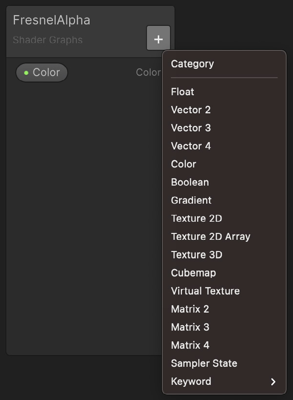
<p><em>VI: <strong>▲ Các KIỂU property Blackboard cho phép</strong> — <strong>Float · Vector 2/3/4 · Color · Boolean · Gradient · Texture 2D · Texture 2D Array · Texture 3D · Cubemap · Virtual Texture · Matrix 2/3/4 · Sampler State · Keyword</strong>. / EN: The Blackboard property types available in Shader Graph.</em></p>

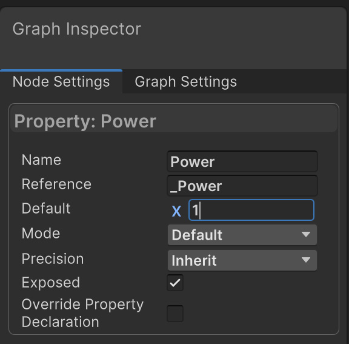
<p><em>VI: <strong>▲ Khai báo property <code>Power</code></strong> — <strong>Name Power · Reference <code>_Power</code> · Default X 1 · Mode Default · Precision Inherit · Exposed ✓</strong>. / EN: Declaring the Power property.</em></p>

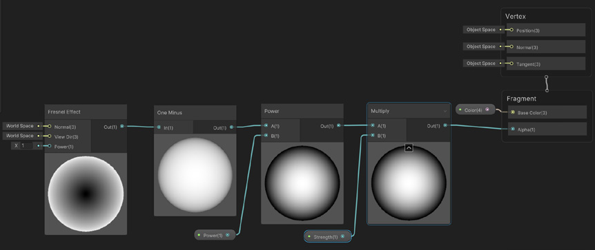
<p><em>VI: <strong>▲ Graph hoàn chỉnh</strong> — <strong>Fresnel Effect</strong> (World Space Normal + View Dir + Power) → <strong>One Minus</strong> → <strong>Power</strong> → <strong>Multiply</strong> → <strong>Fragment Base Color / Alpha</strong>; mỗi node kèm preview quả cầu để thấy hiệu ứng biến đổi. / EN: The complete Fresnel-based halo Shader Graph.</em></p>

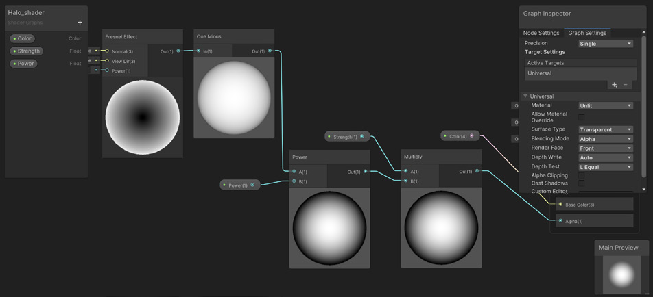
<p><em>VI: <strong>▲ Xem trong Graph Inspector</strong> — cùng graph đó với Node Settings/Graph Settings mở, và <strong>Main Preview</strong> ở góc phải. / EN: The halo graph with the Graph Inspector and Main Preview.</em></p>

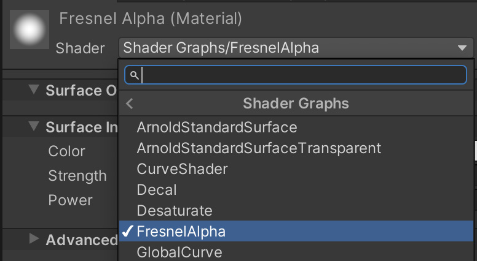
<p><em>VI: <strong>▲ Dùng shader vừa dựng</strong> — <code>Material › Shader</code> chọn <strong><code>Shader Graphs/FresnelAlpha</code></strong> (danh sách còn ArnoldStandardSurface, CurveShader, Decal, Desaturate, GlobalCurve…). / EN: Assigning the Shader Graphs/FresnelAlpha shader to a Material.</em></p>

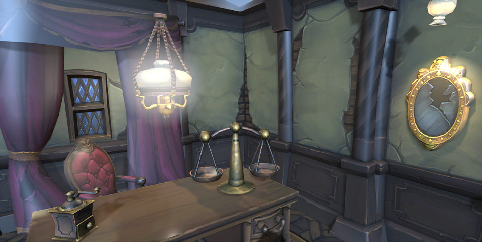
<p><em>VI: Shader áp lên một <strong>hình CẦU làm con của một đèn Point</strong>, tạo <strong>hiệu ứng HALO quanh cây đèn treo</strong>. / EN: The shader applied to a sphere parented to a Point light, giving the halo effect around the hanging light.</em></p>

<div class="bilingual-row">
<div class="col-vi">
<blockquote>
<p><em>"<strong>Shader Graph mang custom shader vào workflow của NGHỆ SĨ.</strong> Công cụ Shader Graph <strong>ĐƯỢC bao gồm sẵn khi bạn khởi tạo dự án bằng template URP hoặc import package URP.</strong>"</em></p>
</blockquote>
<p>👉 <em>Đây chính là shader <strong>Light Halo</strong> đã nhắc ở <a href="#3413-lens-flare-light-halos-ssao">§34.13</a> — thứ thay thế cho tuỳ chọn <code>Draw Halo</code> đã bị gỡ khỏi URP.</em></p>
<p><strong>MƯỜI MỘT bước dựng shader <code>FresnelAlpha</code>:</strong></p>
<ol>
<li>Chuột phải Project window → <code>Create &gt; Shader Graph &gt; URP &gt; Unlit Shader Graph</code>. Đặt tên <strong><code>FresnelAlpha</code></strong></li>
<li>Nhấp đúp để mở Shader Graph editor. <em>"Bạn sẽ nhận ra node <strong>Vertex</strong> và <strong>Fragment</strong>. <strong>Mặc định, shader này đảm bảo model dùng material của nó được ĐẶT ĐÚNG trong Camera view nhờ node Vertex, và MỖI pixel được đặt màu XÁM nhờ node Fragment.</strong>"</em></li>
<li>🔑 <em>"Shader này sẽ đặt <strong>ĐỘ TRONG SUỐT ALPHA</strong> của object. <strong>Do đó nó CẦN áp dụng cho hàng đợi TRANSPARENT.</strong> Đổi <code>Graph Inspector &gt; Graph Settings &gt; Surface Type</code> thành <strong>Transparent</strong>. Bạn sẽ thấy node Fragment giờ có thêm đầu vào <strong>Alpha</strong> bên cạnh Base Color."</em></li>
<li>Thêm <strong>property</strong>: <code>Color</code> (kiểu Color), <code>Power</code> và <code>Strength</code> (kiểu Float)</li>
<li>Đặt giá trị mặc định qua <code>Graph Inspector &gt; Node Settings &gt; Default</code>: <strong><code>Color</code> = trắng · <code>Power</code> = 4 · <code>Strength</code> = 1</strong></li>
<li>Thêm node <strong>Fresnel Effect</strong>: chuột phải → <em>Create Node</em> → gõ <code>Fre</code></li>
<li>🔬 <em>"Node hiển thị <strong>PREVIEW</strong> hiệu ứng của nó. Chú ý <strong>Fresnel Effect SÁNG về phía RÌA. Giá trị này là HIỆU giữa hướng VIEW và hướng NORMAL — và với một hình CẦU, hiệu này LỚN NHẤT ở RÌA.</strong><br>💡 <strong>Giá trị alpha lẽ ra phải THẤP NHẤT ở rìa. Bạn có thể LẬT ngược kết quả bằng node <code>One Minus</code>.</strong>"</em><br>📌 <em>"Kéo từ <code>Out(1)</code> trên Fresnel Effect tới <code>In(1)</code> trên One Minus. <strong>Số <code>1</code> nghĩa là kiểu giá trị là MỘT float ĐƠN. Nếu là <code>3</code> thì đó là một vector BA thành phần.</strong>"</em></li>
<li><strong>Điều khiển KÍCH THƯỚC gradient</strong> bằng node <strong><code>Power</code></strong>: nối <code>One Minus Out(1)</code> → <code>Power A(1)</code>, kéo property <code>Power</code> vào <code>Power B(1)</code></li>
<li><strong>Điều khiển ĐỘ TRONG SUỐT tổng thể</strong> bằng node <strong><code>Multiply</code></strong>: nối <code>Power Out(1)</code> → <code>Multiply A(1)</code>, kéo property <code>Strength</code> vào <code>Multiply B(1)</code>. Rồi nối <code>Multiply Out(1)</code> → <code>Fragment Alpha(1)</code>, và kéo property <code>Color(4)</code> vào <code>Fragment Base Color(3)</code><br>🔑 <em>"Chú ý ở đây property <code>Color</code> gồm một vector <strong>BỐN</strong> thành phần, còn <code>Base Color</code> là vector <strong>BA</strong> thành phần. <strong>Shader Graph sẽ ÁNH XẠ BA thành phần ĐẦU TIÊN của Color sang vector Base Color.</strong>"</em></li>
<li>Lưu asset, tạo material mới, gán shader tại <code>Shader Graphs/FresnelAlpha</code></li>
<li>Áp material lên object — <strong>điều khiển độ hiển thị ở RÌA</strong></li>
</ol>
</div>
<div class="col-en">
<blockquote>
<p><em>"<strong>Shader Graph brings custom shaders to an ARTIST'S workflow.</strong> The Shader Graph tool is <strong>INCLUDED when you start a project using the URP template or import the URP package.</strong>"</em></p>
</blockquote>
<p>👉 <em>This is exactly the <strong>Light Halo</strong> shader referenced in <a href="#3413-lens-flare-light-halos-ssao">§34.13</a> — the replacement for the <code>Draw Halo</code> option that URP removed.</em></p>
<p><strong>The ELEVEN steps to build the <code>FresnelAlpha</code> shader:</strong></p>
<ol>
<li>Right-click the Project window → <code>Create &gt; Shader Graph &gt; URP &gt; Unlit Shader Graph</code>. Name it <strong><code>FresnelAlpha</code></strong></li>
<li>Double-click to launch the Shader Graph editor. <em>"You'll recognize the <strong>Vertex</strong> and <strong>Fragment</strong> nodes. <strong>By default, this shader will ensure any model with a material using it is CORRECTLY PLACED in the Camera view using the Vertex node, and that EACH pixel is set to a GREY color using the Fragment node.</strong>"</em></li>
<li>🔑 <em>"This shader is going to set the <strong>ALPHA TRANSPARENCY</strong> of the object. <strong>It therefore needs to apply to the TRANSPARENT queue.</strong> Change <code>Graph Inspector &gt; Graph Settings &gt; Surface Type</code> to <strong>Transparent</strong>. You'll see that the Fragment node now has an <strong>Alpha</strong> input as well as Base Color."</em></li>
<li>Add <strong>properties</strong>: <code>Color</code> as a Color, <code>Power</code> and <code>Strength</code> as Floats</li>
<li>Set defaults via <code>Graph Inspector &gt; Node Settings &gt; Default</code>: <strong><code>Color</code> = white · <code>Power</code> = 4 · <code>Strength</code> = 1</strong></li>
<li>Add the <strong>Fresnel Effect</strong> node: right-click → <em>Create Node</em> → type <code>Fre</code></li>
<li>🔬 <em>"A node shows a <strong>PREVIEW</strong> of its effect. Notice that the <strong>Fresnel Effect is BRIGHT toward the EDGE. The value is the DIFFERENCE between the View direction and the Normal direction — and for a SPHERE, this is GREATEST at the EDGE.</strong><br>💡 <strong>The alpha value should be LOWEST at the edge. You can FLIP the result using a <code>One Minus</code> node.</strong>"</em><br>📌 <em>"Drag from <code>Out(1)</code> on the Fresnel Effect node to <code>In(1)</code> on the One Minus node. <strong>The <code>1</code> means that the value type is a SINGLE float. If it was <code>3</code>, then it would be a vector with THREE components.</strong>"</em></li>
<li><strong>Control the gradient SIZE</strong> with a <strong><code>Power</code></strong> node: connect <code>One Minus Out(1)</code> → <code>Power A(1)</code>, drag the <code>Power</code> property to <code>Power B(1)</code></li>
<li><strong>Control the overall TRANSPARENCY</strong> with a <strong><code>Multiply</code></strong> node: connect <code>Power Out(1)</code> → <code>Multiply A(1)</code>, drag the <code>Strength</code> property to <code>Multiply B(1)</code>. Then join <code>Multiply Out(1)</code> → <code>Fragment Alpha(1)</code>, and drag <code>Color(4)</code> to <code>Fragment Base Color(3)</code><br>🔑 <em>"Notice here that the property <code>Color</code> comprises a <strong>FOUR</strong>-component vector, while <code>Base Color</code> is a <strong>THREE</strong>-component vector. <strong>Shader Graph will MAP the FIRST THREE components of Color to the Base Color vector.</strong>"</em></li>
<li>Save the asset and create a new material; assign the shader from <code>Shader Graphs/FresnelAlpha</code></li>
<li>Apply the material to an object — <strong>controlling its visibility at the EDGES</strong></li>
</ol>
</div>
</div>

!!! tip "💡 Liên hệ tới tối ưu shader"
    **VI:** Bảy kỹ thuật ở [§13](#13-toi-uu-shader-graph-5-ky-thuat) áp dụng TRỰC TIẾP cho graph này: **`Power` là một phép ALU rẻ**, còn **`Fresnel Effect` là một phép dot-product per-pixel**. Với một quả cầu halo NHỎ trên màn hình, chi phí là KHÔNG ĐÁNG KỂ — nhưng **ĐỪNG dùng cùng graph này cho một hiệu ứng phủ TOÀN MÀN HÌNH** (→ [§6](#6-overshading-quad-lang-phi-75-am-tham)).

    **EN:** The techniques in [§13](#13-toi-uu-shader-graph-5-ky-thuat) apply DIRECTLY to this graph: **`Power` is a cheap ALU op**, while **`Fresnel Effect` is a per-pixel dot product**. For a SMALL on-screen halo sphere the cost is NEGLIGIBLE — but **DON'T use the same graph for a FULL-SCREEN effect** (→ [§6](#6-overshading-quad-lang-phi-75-am-tham)).

---

## 40. VFX Graph & 2D Renderer

### 40.1. 🌫️ VFX Graph — Dựng hiệu ứng khói

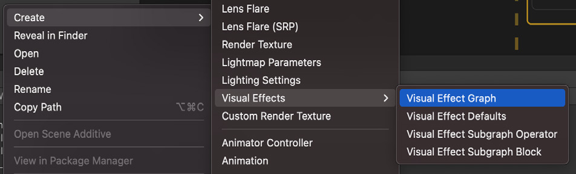 Visual Effects > Visual Effect Graph.">
<p><em>VI: <strong>▲ Tạo asset</strong> — <code>Create › Visual Effects › Visual Effect Graph</code> (cạnh <em>Visual Effect Defaults</em>, <em>Visual Effect Subgraph Operator</em>, <em>Visual Effect Subgraph Block</em>). / EN: Create > Visual Effects > Visual Effect Graph.</em></p>

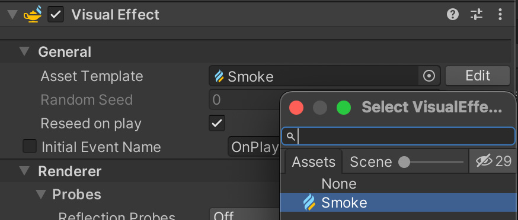
<p><em>VI: <strong>▲ Component <code>Visual Effect</code></strong> — <strong>Asset Template: Smoke · Random Seed 0 · Reseed on play ✓ · Initial Event Name: OnPlay</strong>, cùng nhóm Renderer/Probes. / EN: The Visual Effect component.</em></p>

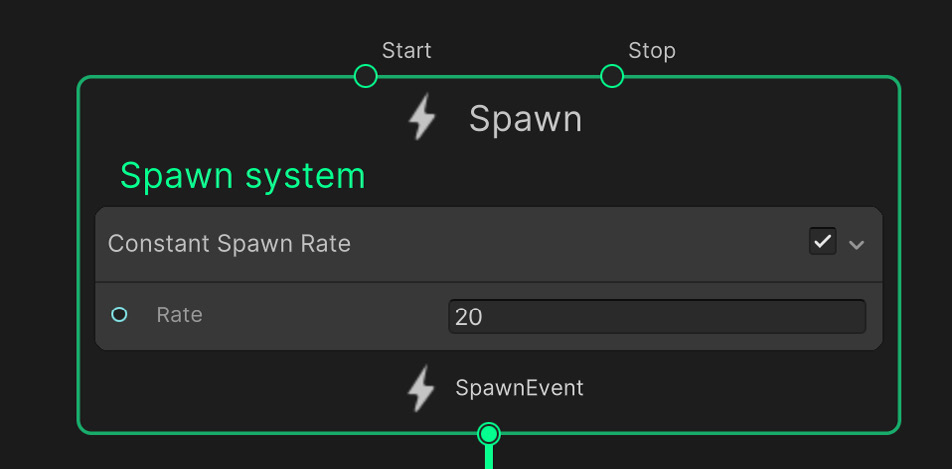
<p><em>VI: <strong>▲ Context <code>Spawn</code></strong> — <strong>Constant Spawn Rate · Rate 20</strong>, có cổng <strong>Start / Stop</strong> ở trên và <strong>SpawnEvent</strong> ở dưới. / EN: The Spawn context with a Constant Spawn Rate of 20.</em></p>

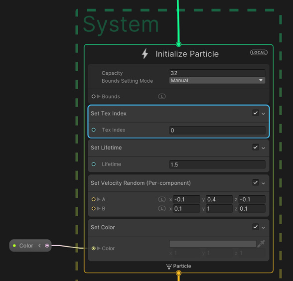
<p><em>VI: <strong>▲ Context <code>Initialize Particle</code></strong> — <strong>Capacity 32 · Bounds Setting Mode: Manual</strong>, các block <strong>Set Tex Index · Set Lifetime 1.5 · Set Velocity Random (Per-component) · Set Color</strong>. / EN: The Initialize Particle context.</em></p>

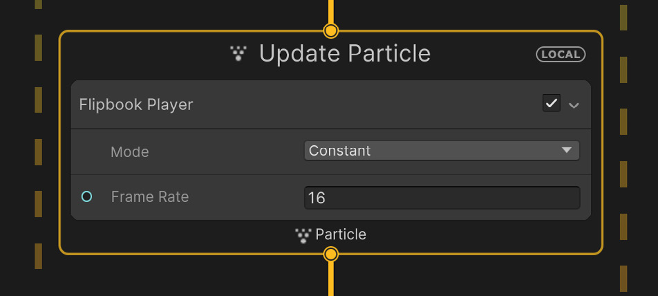
<p><em>VI: <strong>▲ Context <code>Update Particle</code></strong> — block <strong>Flipbook Player</strong> với <strong>Mode: Constant · Frame Rate 16</strong>. / EN: The Flipbook Player block in Update Particle.</em></p>

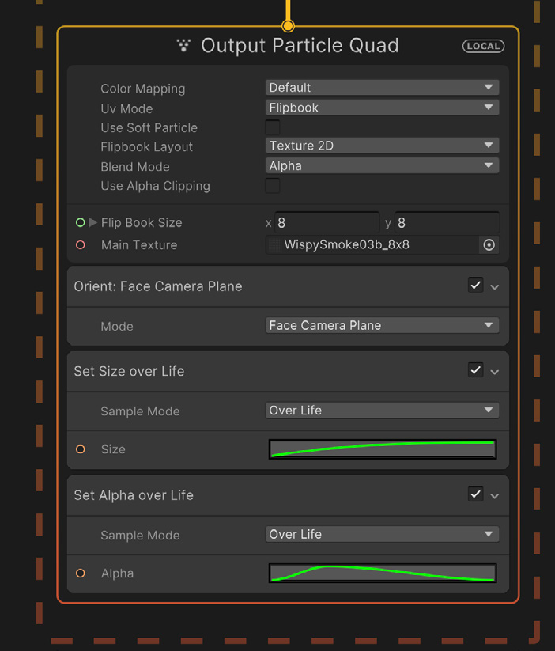
<p><em>VI: <strong>▲ Context <code>Output Particle Quad</code></strong> — <strong>Color Mapping Default · UV Mode: Flipbook · Flipbook Layout: Texture 2D · Blend Mode: Alpha · Flip Book Size · Main Texture: WispySmoke03s_8x8 · Orient: Face Camera Plane</strong>, cùng <strong>Set Size over Life</strong> và <strong>Set Alpha over Life</strong> (đường cong). / EN: The Output Particle Quad context.</em></p>

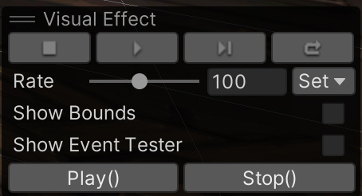
<p><em>VI: <strong>▲ Bảng điều khiển khi chọn Visual Effect</strong> — <strong>Rate 100</strong>, hai ô <strong>Show Bounds</strong> / <strong>Show Event Tester</strong>, và nút <strong>Play()</strong> / <strong>Stop()</strong>. / EN: The Visual Effect playback controls.</em></p>

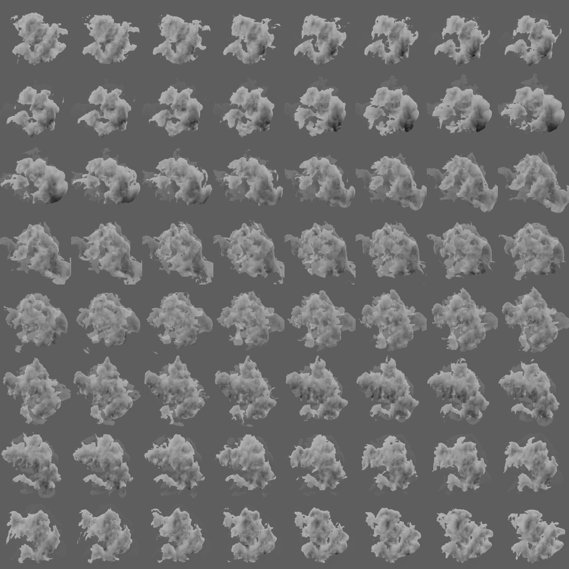
<p><em>VI: <strong>Smoke Sprite Atlas</strong> — <strong>64 ảnh trong lưới 8×8</strong> làm nguồn cho MỘT particle. / EN: The Smoke Sprite Atlas: a series of 64 images in an 8x8 grid acting as the source for an individual particle.</em></p>

<div class="bilingual-row">
<div class="col-vi">
<blockquote>
<p><em>"<strong>Visual Effect (VFX) Graph cho phép bạn tạo VÔ SỐ hiệu ứng particle bằng một graph DỰA TRÊN NODE, THÂN THIỆN VỚI NGHỆ SĨ.</strong> Dùng VFX Graph để thêm <strong>lửa, khói, sương mù, tia lửa, quả cầu ma thuật</strong>, và nhiều hiệu ứng khác.</em></p>
<p><em>🚨 <strong>Thiết bị đích cho MỌI game chứa hiệu ứng tạo bằng VFX Graph PHẢI có khả năng COMPUTE, vì VFX Graph dùng COMPUTE SHADER chạy trên GPU để đảm bảo hiệu năng TỐT NHẤT có thể.</strong></em></p>
<p><em>✅ <strong>Hãy TEST code của bạn và ĐƯA VÀO một FALLBACK KHÔNG dùng compute, và dùng VFX Graph MỘT CÁCH TIẾT KIỆM cho game nhắm tới thiết bị mobile cấp thấp.</strong>"</em></p>
</blockquote>
<p>👉 <em>Khớp chính xác với bảng so sánh ở <a href="#24-particle-system-vs-visual-effect-graph">§24</a>.</em></p>
<p><strong>Cơ chế NỀN TẢNG — Flipbook:</strong></p>
<blockquote>
<p><em>"Bạn sẽ dùng một Texture dạng <strong>ATLAS chứa sprite khói ĐỘNG. Một chuỗi 64 ảnh trong lưới 8×8 sẽ làm nguồn cho MỘT particle riêng lẻ.</strong></em></p>
<p><em>🔑 <strong>Ở BẤT KỲ frame nào, MỘT particle CHỈ hiển thị MỘT ảnh từ lưới. Nó sẽ LẶP QUA các ảnh ở một TỐC ĐỘ ĐỊNH TRƯỚC khi từng frame được render.</strong>"</em></p>
</blockquote>
</div>
<div class="col-en">
<blockquote>
<p><em>"<strong>The Visual Effect (VFX) Graph enables you to create MYRIAD particle effects with an ARTIST-FRIENDLY, NODE-BASED graph.</strong> Use a VFX Graph to add <strong>fire, smoke, mist, sparks, magic orbs</strong>, and many other effects.</em></p>
<p><em>🚨 <strong>The target devices for ANY games containing effects created with VFX Graph MUST be COMPUTE-CAPABLE because VFX Graph uses COMPUTE SHADERS running on the GPU to ensure the BEST POSSIBLE performance.</strong></em></p>
<p><em>✅ <strong>TEST your code and INCLUDE a NON-COMPUTE FALLBACK, and use VFX Graph SPARINGLY for games targeting low-end mobile devices.</strong>"</em></p>
</blockquote>
<p>👉 <em>This matches the comparison table in <a href="#24-particle-system-vs-visual-effect-graph">§24</a> exactly.</em></p>
<p><strong>The FUNDAMENTAL mechanism — the Flipbook:</strong></p>
<blockquote>
<p><em>"You'll use a Texture in the form of an <strong>ATLAS that contains an ANIMATED smoke sprite. A series of 64 images in an 8x8 grid will act as the source for an INDIVIDUAL particle.</strong></em></p>
<p><em>🔑 <strong>At ANY SINGLE FRAME, a SINGLE particle will display JUST ONE image from the grid. It will CYCLE through the images at a PREDEFINED RATE as each frame is rendered.</strong>"</em></p>
</blockquote>
</div>
</div>

**BỐN Context node của VFX Graph & thiết lập ví dụ khói / The FOUR VFX Graph Contexts and the smoke example settings**

| Context | Vai trò / Role | Thiết lập trong ví dụ / Settings in the example |
|---|---|---|
| **🟢 Spawn** | Điều khiển **TỐC ĐỘ SINH particle** | *"Spawn block mặc định đi kèm node **Constant Spawn Rate**. **Đặt nó = 20**"* |
| **🔵 Initialize** | *"Định nghĩa **cách xử lý một particle khi nó VỪA ĐƯỢC TẠO**"* | · **GỠ** node `Set Lifetime Random`<br>· **Thêm `Set Tex Index`**, đặt **giá trị NGẪU NHIÊN từ 0 tới 64** — *"để MỖI particle khói có DIỆN MẠO KHÁC NHAU. Điều này QUAN TRỌNG vì particle hiển thị một ảnh từ Sprite sheet và bạn sẽ muốn index đầu tiên được dùng là 0"*<br>· **`Set Lifetime` = 1.5 giây**<br>· **`Set Velocity Random`**: **A = (-0.1, 0.4, -0.1)** · **B = (0.1, 1, 0.1)** — *"để thêm BIẾN THIÊN vào TỐC ĐỘ particle được phóng ra"*<br>· Thêm node **`Color`** và kéo property Color vào đầu vào của nó |
| **🟠 Update** | *"Định nghĩa **điều gì xảy ra ở MỖI lần cập nhật frame**"* | 🔑 *"Mặc định nó hiện ra như một block RỖNG, **nhưng thực ra nó CHỨA MỘT SỐ block ẨN NGẦM ĐỊNH có thể TẮT trong Inspector khi chọn Update**"*<br>· Thêm **`Flipbook Player`**, **Mode = Constant**, **Frame Rate = 16** — *"nó sẽ lặp qua các frame LIÊN TIẾP trong Flipbook ở **16 lần đổi frame mỗi giây**"* |
| **🟣 Output** | Đầu ra cuối cùng của particle | · **UV Mode = `Flipbook`** *(hoặc **`Flipbook Blend`** để **chuyển tiếp MƯỢT HƠN giữa các frame**)*<br>· **Flipbook Layout = `Texture 2D`**<br>· **Flipbook Size = 8×8**<br>· **Main Texture** = Sprite sheet<br>· **THAY `Set Color Over Life` bằng `Set Alpha Over Life`** — *"đường cong mặc định sẽ **blend particle vào và ra trong SUỐT VÒNG ĐỜI của nó**"* |

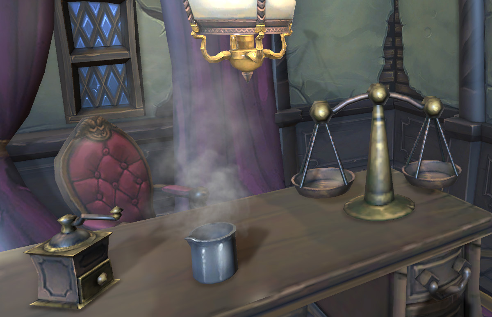
<p><em>VI: <strong>Hiệu ứng khói cuối cùng</strong> bốc lên từ chiếc ấm trên bàn. / EN: The final smoke effect in action.</em></p>

<div class="bilingual-row">
<div class="col-vi">
<p>💡 <em>"Chọn GameObject có VFX Graph gắn vào. <strong>Trong Scene view sẽ hiện một panel cho phép bạn DEMO hiệu ứng NGOÀI runtime. Nếu KHÔNG thấy nó, hãy đảm bảo TOGGLE hiển thị Particle System đang BẬT.</strong>"</em></p>
</div>
<div class="col-en">
<p>💡 <em>"Select the GameObject with this VFX Graph attached. <strong>In the Scene view, a panel should be visible that you can use to DEMO the effect OUTSIDE of runtime. If you DON'T see it, make sure the TOGGLE for visualizing Particle Systems is ON.</strong>"</em></p>
</div>
</div>

### 40.2. 🎨 2D Renderer & 2D Lights

!!! warning "⚠️ Ghi chú của e-book — 2D Renderer làm VÔ HIỆU nhiều option 3D"
    <div class="bilingual-row">
    <div class="col-vi">
    <p><em>"<strong>Lưu ý:</strong> Nếu bạn bật <strong>URP 2D Renderer</strong>, <strong>MỘT SỐ tuỳ chọn liên quan tới RENDER 3D trong URP Asset sẽ KHÔNG tác động tới app/game cuối của bạn.</strong> Asset 2D Renderer nằm dưới <strong><code>Scriptable Render Pipeline Settings</code></strong> qua <code>Edit › Project Settings › Graphics</code>."</em></p>
    </div>
    <div class="col-en">
    <p><em>"Note: If you have the URP 2D Renderer enabled, some of the options related to 3D rendering in the URP Asset will not impact your final app or game. The 2D Renderer Asset is available under Scriptable Render Pipeline Settings via Edit &gt; Project Settings &gt; Graphics."</em></p>
    </div>
    </div>


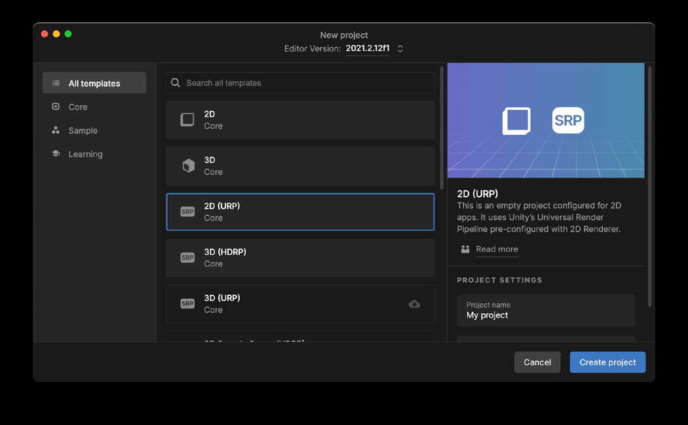
<p><em>VI: <strong>▲ Template <code>2D (URP)</code></strong> — <em>"an empty project configured for 2D apps. It uses Unity's Universal Render Pipeline pre-configured with 2D Renderer."</em> / EN: The 2D (URP) project template.</em></p>

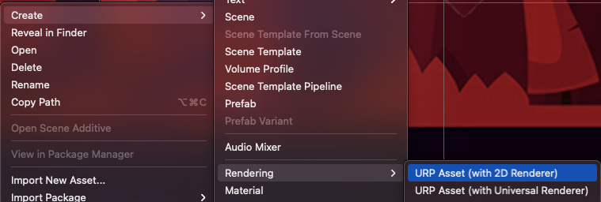
<p><em>VI: <strong>▲ Hoặc tạo tay</strong> — <code>Create › Rendering › URP Asset (with 2D Renderer)</code>. / EN: Creating a URP Asset with the 2D Renderer.</em></p>

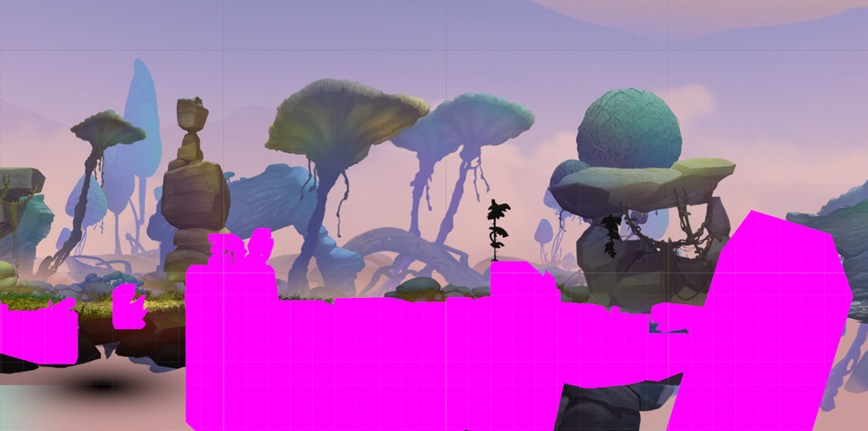
<p><em>VI: <strong>▲ Triệu chứng ở dự án 2D</strong> — sprite chuyển HỒNG y như dự án 3D. / EN: 2D sprites turning magenta.</em></p>

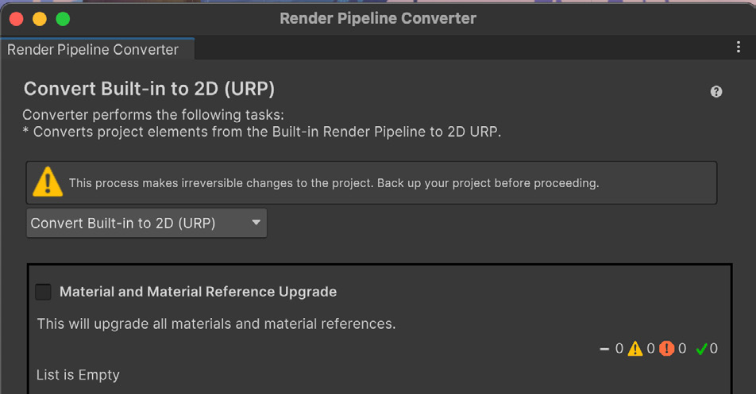
<p><em>VI: <strong>▲ Bản 2D của converter</strong> — <strong>Convert Built-in to 2D (URP)</strong>, mục <strong>Material and Material Reference Upgrade</strong>, cùng cảnh báo sao lưu. / EN: The Render Pipeline Converter in Convert Built-in to 2D (URP) mode.</em></p>

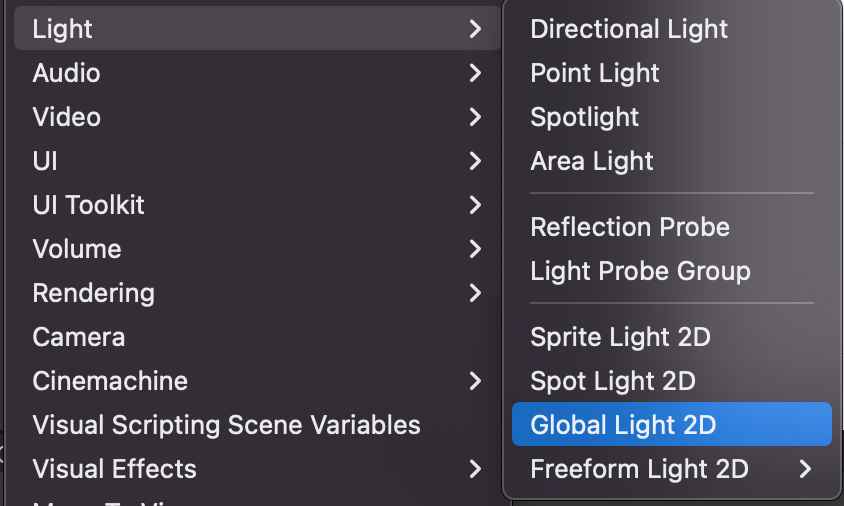
<p><em>VI: <strong>▲ Bốn loại đèn 2D</strong> — <code>GameObject › Light</code>: <strong>Sprite Light 2D · Spot Light 2D · Global Light 2D · Freeform Light 2D</strong>. / EN: The four 2D light types.</em></p>

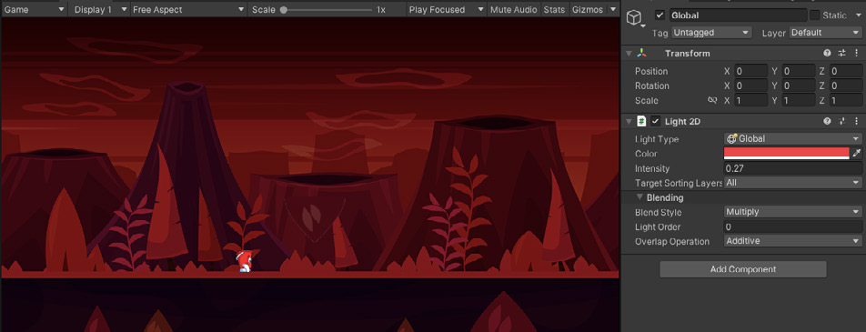
<p><em>VI: <strong>▲ Component <code>Light 2D</code></strong> — <strong>Light Type: Global · Color · Intensity 0.27 · Target Sorting Layer: All · Blend Style: Multiply · Light Order 0 · Overlap Operation: Additive</strong>. / EN: The Light 2D component.</em></p>

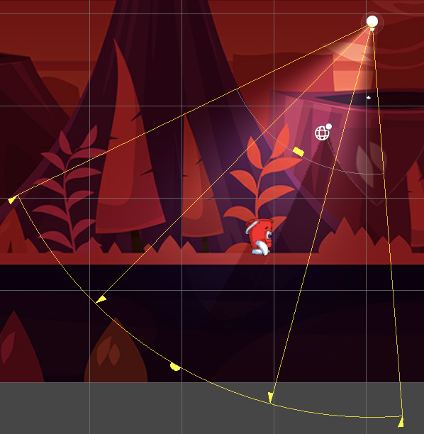
<p><em>VI: <strong>▲ <em>Freeform Light 2D</em> trong scene</strong> — hình dạng đèn vẽ tay bằng các điểm điều khiển màu vàng, cho phép ánh sáng theo đúng đường viền màn chơi. / EN: A Freeform Light 2D shape edited in the Scene view.</em></p>

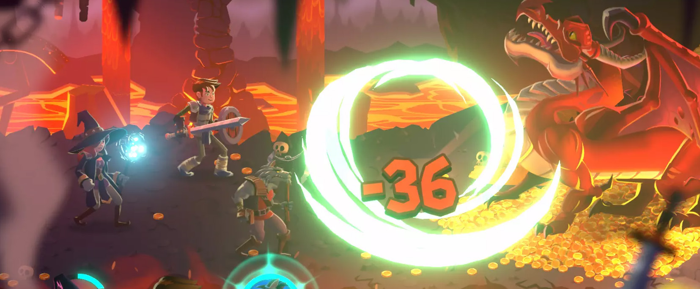
<p><em>VI: Ảnh từ demo 2D <strong>Dragon Crashers</strong> của Unity. / EN: An image from the Unity 2D demo Dragon Crashers.</em></p>

<div class="bilingual-row">
<div class="col-vi">
<p><strong>Bắt đầu — cách NHANH NHẤT:</strong></p>
<blockquote>
<p><em>"<strong>Cách ĐƠN GIẢN NHẤT để bắt đầu là dùng template 2D URP từ Unity Hub.</strong> Template này đảm bảo dự án của bạn có <strong>URP 2D Renderer được gán qua <code>Project Settings &gt; Graphics &gt; Scriptable Render Pipeline Settings</code></strong>.</em></p>
<p><em>✅ <strong>MỌI package 2D đã được kiểm chứng và biên dịch trước đều được cài cùng template 2D URP, với setting mặc định ĐÃ TỐI ƯU cho dự án 2D. Điều này CŨNG đảm bảo dự án LOAD NHANH HƠN so với việc cài thủ công tất cả package.</strong>"</em></p>
</blockquote>
<p><strong>Nâng cấp dự án CÓ SẴN:</strong> chuột phải trong thư mục Assets → <code>Create &gt; Rendering &gt; URP Asset (with 2D Renderer)</code> → chọn nó tại <code>Project Settings &gt; Graphics</code>. <em>"Trong Scene view, nhớ chọn nút <strong>2D</strong> khi chỉnh sửa."</em></p>
<p>🟣 <strong>Lại gặp màu HỒNG?</strong> <em>"<code>Window &gt; Rendering &gt; Render Pipeline Converter</code> đã lo cho bạn. Chọn <strong>Convert Built-in to 2D (URP)</strong> và bấm panel <strong>Material and Material Reference Upgrade</strong>. Rồi bấm <strong>Initialize Converters</strong>, tiếp theo là <strong>Convert Assets</strong>. <strong>Nếu VẪN còn sprite màu hồng, bạn có thể cần THAY shader THỦ CÔNG trong một số material.</strong>"</em></p>
<p>🔬 <strong>Hành vi mặc định KHI KHÔNG có đèn — dễ gây hiểu lầm:</strong></p>
<blockquote>
<p><em>"Nếu bạn đã migrate một dự án có sẵn, <strong>bạn sẽ KHÔNG có đèn URP 2D nào trong scene</strong>. <strong>Nếu Sprite của bạn dùng shader <code>Sprite-Lit-Default</code>, bạn có thể NGẠC NHIÊN khi thấy một bản render CÓ ÁNH SÁNG. Nhưng khi KHÔNG có đèn, bạn nhận được một Global Light MẶC ĐỊNH được gán cho scene để cho ra diện mạo UNLIT.</strong>"</em></p>
</blockquote>
<p><strong>Thêm đèn:</strong> chuột phải Hierarchy → <code>Create &gt; Light &gt; Global Light 2D</code>. <em>"Giờ bạn có thể điều chỉnh <strong>Settings, Color, Intensity, cũng như các Sorting Layer mà chúng ảnh hưởng.</strong>"</em></p>
<p>🌑 <em>"<strong>Nếu một Sprite ĐỔ BÓNG, nó cần được thêm component <code>Shadow Caster 2D</code>.</strong>"</em></p>
<p>🎓 <em>"<strong>URP 2D Renderer cung cấp MỌI công cụ cần thiết để tạo game 2D HẠNG NHẤT chạy TỐT ngay cả trên phần cứng CẤP THẤP.</strong>"</em></p>
</div>
<div class="col-en">
<p><strong>Getting started — the FASTEST way:</strong></p>
<blockquote>
<p><em>"<strong>The SIMPLEST way to get started is to use the 2D URP template from the Unity Hub.</strong> This template ensures that your project has a <strong>URP 2D Renderer assigned via <code>Project Settings &gt; Graphics &gt; Scriptable Render Pipeline Settings</code></strong>.</em></p>
<p><em>✅ <strong>ALL verified and precompiled 2D packages are installed with the 2D URP template and the default settings OPTIMIZED for 2D projects. This ALSO ensures that the project LOADS FASTER than installing all the packages manually.</strong>"</em></p>
</blockquote>
<p><strong>Upgrading an EXISTING project:</strong> right-click in an Assets folder → <code>Create &gt; Rendering &gt; URP Asset (with 2D Renderer)</code> → select it in <code>Project Settings &gt; Graphics</code>. <em>"In the Scene view, be SURE to select the <strong>2D</strong> button when editing."</em></p>
<p>🟣 <strong>Magenta again?</strong> <em>"<code>Window &gt; Rendering &gt; Render Pipeline Converter</code> has got you covered. Select <strong>Convert Built-in to 2D (URP)</strong> and click the <strong>Material and Material Reference Upgrade</strong> panel. Then click <strong>Initialize Converters</strong>, followed by <strong>Convert Assets</strong>. <strong>If you STILL have magenta sprites, you might need to MANUALLY REPLACE the shader in some of your materials.</strong>"</em></p>
<p>🔬 <strong>The default behaviour with NO lights — easily misread:</strong></p>
<blockquote>
<p><em>"If you have migrated an existing project, <strong>you will have NO URP 2D lights in your scene</strong>. <strong>If your Sprites use the <code>Sprite-Lit-Default</code> shader, you might be SURPRISED to see a LIT render. But with NO lights, you get a DEFAULT Global Light assigned to the scene for an UNLIT appearance.</strong>"</em></p>
</blockquote>
<p><strong>Add a light:</strong> right-click the Hierarchy → <code>Create &gt; Light &gt; Global Light 2D</code>. <em>"Now you can adjust the <strong>Settings, Color, Intensity, as well as the Sorting Layers they affect.</strong>"</em></p>
<p>🌑 <em>"<strong>If a Sprite casts a shadow, then it needs a <code>Shadow Caster 2D</code> component added.</strong>"</em></p>
<p>🎓 <em>"<strong>The URP 2D Renderer provides ALL the tools necessary to create FIRST-CLASS 2D games that will perform WELL on even LOW-END hardware.</strong>"</em></p>
</div>
</div>

**BA shader 2D có sẵn trong URP / The THREE 2D shaders available in URP**

| Shader | Mô tả / Description |
|---|---|
| **`Sprite-Lit-Default`** | **DÙNG đèn 2D khi render** / *Uses 2D lights when rendering* |
| **`Sprite-Mask-Default`** | **Hoạt động với STENCIL BUFFER** / *Works with the stencil buffer* — 👉 *xem <a href="#15-stencil-buffer-trong-urp-hieu-ung-nhin-xuyen-vat-the">§15</a>* |
| **`Sprite-Unlit-Default`** | **CHỈ dùng màu của texture khi render** / *Uses only the texture colors when rendering* |

**BỐN loại đèn 2D / The FOUR 2D light types**

| Loại đèn | Mô tả / Description |
|---|---|
| **Sprite** | *"**DÙNG một Sprite để điều khiển MỨC CHIẾU SÁNG**"* |
| **Freeform** | *"Để tạo **đèn hình ĐA GIÁC**"* |
| **Spot** | *"Cung cấp **khả năng điều khiển TUYỆT VỜI với GÓC và HƯỚNG** của đèn được chọn. **Dùng nó như một đèn Point.** 🔑 **Mặc định, nón TRONG và NGOÀI trải 360 độ.** Bạn cũng có thể **điều chỉnh bán kính trong và ngoài, và quyết định đèn có ĐỔ BÓNG hay không, cùng CƯỜNG ĐỘ của bóng đó**"* |
| **Global** | *"**Chiếu sáng TẤT CẢ object trên các sorting layer được nhắm tới**"* |

---

# PHẦN J — GHI CHÚ THỰC CHIẾN & CHECKLIST

## 41. Các mục còn lại từ `raw-optimization-data.txt`

### 41.1. 📷 Camera — Clear Flags và Skybox trên mobile

📝 **Nguyên văn ghi chú raw / The raw note verbatim:**

```
+Camera:
- avoid using the "Don't Clear" flag when targeting mobile devices.
- Window > Lighting > Settings, remove the Skybox Material,
  and set the Ambient Source to Color.
- Render texture.
```

<div class="bilingual-row">
<div class="col-vi">
<p>🚫 <strong>TRÁNH cờ "Don't Clear" trên mobile — vì sao?</strong></p>
<p>GPU mobile dùng kiến trúc <strong>tile-based deferred rendering (TBDR)</strong>. Khi Camera đặt <code>Clear Flags = Don't Clear</code>, GPU <strong>KHÔNG THỂ giả định nội dung tile là rác</strong> ⇒ nó buộc phải <strong>ĐỌC LẠI framebuffer của frame trước từ bộ nhớ hệ thống VÀO on-chip tile memory</strong> trước khi vẽ.</p>
<p>👉 Đây chính xác là <strong>chi phí BĂNG THÔNG</strong> đã phân tích ở <a href="#7-memory-bandwidth-textures">§7</a>: một thao tác "tiết kiệm" trên giấy tờ lại <strong>thêm một lượt đọc TOÀN MÀN HÌNH mỗi frame</strong>.</p>
<p>✅ Dùng <strong><code>Solid Color</code></strong> (hoặc <code>Skybox</code> nếu thực sự cần) — <em>clear là thao tác GẦN NHƯ MIỄN PHÍ trên TBDR</em>, trong khi restore thì không.</p>
<p>🌤️ <strong>Gỡ Skybox Material, đặt Ambient Source = Color</strong></p>
<ul>
<li><strong>Skybox là một draw call phủ TOÀN MÀN HÌNH</strong> — nghĩa là <strong>overdraw toàn khung hình</strong> (<a href="#5-overdraw-early-depth-test">§5</a>) nếu nó không bị che hoàn toàn.</li>
<li><strong>Ambient Source = Skybox</strong> buộc Unity <strong>tính Spherical Harmonics từ cubemap</strong>; đặt về <strong>Color</strong> biến ánh sáng môi trường thành <em>một hằng số</em>.</li>
</ul>
<p>👉 Khớp với ghi chú lighting ở <a href="#17-bake-lightmap-toi-uu-lighting-hieu-qua-nhat">§17</a>: <em>Environment Lighting / Source → White Color</em>.</p>
<p>🖼️ <strong>Render Texture</strong> — dùng để render một phần scene ở <strong>ĐỘ PHÂN GIẢI THẤP HƠN</strong> rồi blit lên (giảm fill-rate, <a href="#6-overshading-quad-lang-phi-75-am-tham">§6</a>), hoặc để <strong>chạy compute shader trên đó</strong> (<a href="#232-tranh-tessellation-thay-geometry-shader-bang-compute-shader">§23.2</a>). ⚠️ Nhưng <strong>MỖI Render Texture cũng là MỘT render target thêm ⇒ thêm băng thông</strong>.</p>
</div>
<div class="col-en">
<p>🚫 <strong>AVOID the "Don't Clear" flag on mobile — why?</strong></p>
<p>Mobile GPUs use <strong>tile-based deferred rendering (TBDR)</strong>. When a Camera is set to <code>Clear Flags = Don't Clear</code>, the GPU <strong>CANNOT assume the tile contents are garbage</strong> ⇒ it is forced to <strong>READ BACK the previous frame's framebuffer from system memory INTO on-chip tile memory</strong> before drawing.</p>
<p>👉 This is exactly the <strong>BANDWIDTH cost</strong> analyzed in <a href="#7-memory-bandwidth-textures">§7</a>: an operation that "saves work" on paper actually <strong>adds a FULL-SCREEN read every frame</strong>.</p>
<p>✅ Use <strong><code>Solid Color</code></strong> (or <code>Skybox</code> if genuinely needed) — <em>clearing is NEARLY FREE on TBDR</em>, restoring is not.</p>
<p>🌤️ <strong>Remove the Skybox Material, set Ambient Source = Color</strong></p>
<ul>
<li><strong>A skybox is a FULL-SCREEN draw call</strong> — meaning <strong>full-frame overdraw</strong> (<a href="#5-overdraw-early-depth-test">§5</a>) if it isn't fully occluded.</li>
<li><strong>Ambient Source = Skybox</strong> forces Unity to <strong>compute Spherical Harmonics from the cubemap</strong>; setting it to <strong>Color</strong> turns ambient light into <em>a constant</em>.</li>
</ul>
<p>👉 This matches the lighting note in <a href="#17-bake-lightmap-toi-uu-lighting-hieu-qua-nhat">§17</a>: <em>Environment Lighting / Source → White Color</em>.</p>
<p>🖼️ <strong>Render Texture</strong> — use it to render part of the scene at a <strong>LOWER RESOLUTION</strong> and blit it up (reducing fill-rate, <a href="#6-overshading-quad-lang-phi-75-am-tham">§6</a>), or to <strong>run a compute shader over it</strong> (<a href="#232-tranh-tessellation-thay-geometry-shader-bang-compute-shader">§23.2</a>). ⚠️ But <strong>EVERY Render Texture is ALSO an extra render target ⇒ extra bandwidth</strong>.</p>
</div>
</div>

### 41.2. 🎨 `Texture2D.ReadPixels` và Color Space

📝 **Nguyên văn ghi chú raw / The raw note verbatim:**

> *"**`Texture2D.ReadPixels`** — If you are working in **linear color space**, images may appear **darker** when read with `ReadPixels` due to **gamma correction**. Ensure that you're handling the color space properly. You can switch between linear and gamma color space by going to `Edit > Project Settings > Player > Other Settings > Color Space`."*

<div class="bilingual-row">
<div class="col-vi">
<p>🔬 <strong>Vì sao ảnh bị TỐI đi?</strong></p>
<p>Trong <strong>Linear color space</strong>, Unity render vào một buffer <strong>sRGB</strong>. GPU <strong>tự động chuyển đổi</strong> giá trị linear sang sRGB <em>khi ghi</em>, và ngược lại <em>khi đọc trong shader</em>.</p>
<p>💀 Nhưng <strong><code>ReadPixels</code> đọc BYTE THÔ từ render target — nó KHÔNG áp dụng phép chuyển đổi ngược đó.</strong> Kết quả: bạn nhận về giá trị <strong>đã ở không gian sRGB</strong>, rồi lại được diễn giải như thể là linear ⇒ <strong>ảnh trông TỐI HƠN thực tế.</strong></p>
<p><strong>✅ Ba cách xử lý:</strong></p>
<ol>
<li><strong>Tạo <code>RenderTexture</code> với <code>readWrite: RenderTextureReadWrite.Linear</code></strong> — nói rõ với Unity KHÔNG làm sRGB conversion.</li>
<li><strong>Chuyển đổi THỦ CÔNG</strong> sau khi đọc: <code>color.linear</code> / <code>color.gamma</code> trong C#.</li>
<li><strong>Đổi Color Space toàn dự án</strong> tại <code>Edit &gt; Project Settings &gt; Player &gt; Other Settings &gt; Color Space</code> (⚠️ <em>ảnh hưởng tới TOÀN BỘ lighting của game — KHÔNG phải quyết định nhỏ</em>).</li>
</ol>
<p>🚨 <strong>Cảnh báo hiệu năng — quan trọng cho chương này:</strong></p>
<p><code>ReadPixels</code> <strong>ĐỒNG BỘ hoá CPU với GPU</strong>: nó buộc main thread <strong>CHỜ GPU hoàn tất mọi việc đang làm</strong>, rồi copy dữ liệu ngược từ VRAM về RAM. Đây là <strong>một trong những stall ĐẮT NHẤT có thể gây ra</strong> — dễ dàng tốn <strong>hàng chục mili-giây</strong>.</p>
<p>✅ Nếu cần đọc pixel thường xuyên, dùng <strong><code>AsyncGPUReadback.Request()</code></strong> thay thế — nó <strong>KHÔNG chặn main thread</strong>.</p>
</div>
<div class="col-en">
<p>🔬 <strong>Why does the image come out DARKER?</strong></p>
<p>In <strong>Linear color space</strong>, Unity renders into an <strong>sRGB</strong> buffer. The GPU <strong>automatically converts</strong> linear values to sRGB <em>on write</em>, and back <em>on read in a shader</em>.</p>
<p>💀 But <strong><code>ReadPixels</code> reads RAW BYTES from the render target — it does NOT apply that inverse conversion.</strong> The result: you get values <strong>already in sRGB space</strong>, then interpreted as if they were linear ⇒ <strong>the image looks DARKER than it should.</strong></p>
<p><strong>✅ Three ways to handle it:</strong></p>
<ol>
<li><strong>Create the <code>RenderTexture</code> with <code>readWrite: RenderTextureReadWrite.Linear</code></strong> — telling Unity explicitly NOT to do the sRGB conversion.</li>
<li><strong>Convert MANUALLY</strong> after reading: <code>color.linear</code> / <code>color.gamma</code> in C#.</li>
<li><strong>Change the project-wide Color Space</strong> at <code>Edit &gt; Project Settings &gt; Player &gt; Other Settings &gt; Color Space</code> (⚠️ <em>this affects your game's ENTIRE lighting — NOT a small decision</em>).</li>
</ol>
<p>🚨 <strong>A performance warning — relevant to this module:</strong></p>
<p><code>ReadPixels</code> <strong>SYNCHRONIZES the CPU with the GPU</strong>: it forces the main thread to <strong>WAIT for the GPU to finish everything in flight</strong>, then copies data back from VRAM to RAM. This is <strong>one of the MOST EXPENSIVE stalls you can cause</strong> — easily <strong>tens of milliseconds</strong>.</p>
<p>✅ If you need to read pixels regularly, use <strong><code>AsyncGPUReadback.Request()</code></strong> instead — it <strong>does NOT block the main thread</strong>.</p>
</div>
</div>

```csharp
// ❌ CÁCH SAI — stall GPU + sai color space
// WRONG — GPU stall + wrong color space
Texture2D tex = new Texture2D(rt.width, rt.height, TextureFormat.RGBA32, false);
RenderTexture.active = rt;
tex.ReadPixels(new Rect(0, 0, rt.width, rt.height), 0, 0);  // 💀 CHẶN main thread
tex.Apply();

// ✅ CÁCH ĐÚNG (1) — chỉ định Linear khi tạo RenderTexture
// RIGHT (1) — declare Linear when creating the RenderTexture
var rtLinear = new RenderTexture(
    width, height, 24,
    RenderTextureFormat.ARGB32,
    RenderTextureReadWrite.Linear);   // 🔑 KHÔNG áp sRGB conversion

// ✅ CÁCH ĐÚNG (2) — đọc BẤT ĐỒNG BỘ, KHÔNG chặn main thread
// RIGHT (2) — read back ASYNCHRONOUSLY, no main-thread block
using UnityEngine.Rendering;

void CaptureAsync(RenderTexture rt)
{
    AsyncGPUReadback.Request(rt, 0, TextureFormat.RGBA32, req =>
    {
        if (req.hasError) { Debug.LogError("GPU readback failed"); return; }

        var data = req.GetData<Color32>();
        var tex  = new Texture2D(rt.width, rt.height, TextureFormat.RGBA32, false);
        tex.LoadRawTextureData(data);
        tex.Apply();
        // Nếu vẫn cần bù gamma thủ công:
        // If you still need to compensate for gamma manually:
        //   Color linear = someColor.linear;
        //   Color gamma  = someColor.gamma;
    });
}
```

### 41.3. 🏙️ "Streaming city" và Player Settings

📝 **Nguyên văn ghi chú raw / The raw note verbatim:**

> *"GPU: static batching, dynamic batching, occlusion culling, **streaming city**, optimize shader, **compute shader trên render texture**, **animation instancing**"*
>
> *"Player setting: **Static batching & Dynamic batching**"*

<div class="bilingual-row">
<div class="col-vi">
<p>✅ <strong>Toàn bộ danh sách này đã được xử lý trong Module:</strong></p>
<ul>
<li><strong>static batching, dynamic batching</strong> → <a href="#10-draw-call-batching-bon-ky-thuat">§10</a> + bật ở <code>Project Settings &gt; Player &gt; Other Settings &gt; Rendering</code></li>
<li><strong>occlusion culling</strong> → <a href="#21-frustum-culling-vs-occlusion-culling">§21</a></li>
<li><strong>optimize shader</strong> → <a href="#13-toi-uu-shader-graph-5-ky-thuat">§13</a>, <a href="#14-strip-shader-variants-oc-editorlog">§14</a></li>
<li><strong>compute shader trên render texture</strong> → <a href="#232-tranh-tessellation-thay-geometry-shader-bang-compute-shader">§23.2</a></li>
<li><strong>animation instancing</strong> → <a href="#12-animation-instancing-instancing-cho-skinnedmeshrenderer">§12</a></li>
</ul>
<p>🏙️ <strong>"Streaming city" — kiến trúc, không phải một setting</strong></p>
<p>Đây là mẫu thiết kế cho <strong>thế giới mở</strong>: chia bản đồ thành các <strong>chunk/sector</strong>, và <strong>load / unload chúng theo vị trí người chơi</strong> thay vì giữ toàn bộ thành phố trong bộ nhớ.</p>
<p>👉 <strong>Ba mảnh ghép của nó nằm rải khắp Hub:</strong></p>
<ol>
<li><strong>Hệ thống SECTOR để giảm áp lực culling</strong> — chính là điều e-book khuyên ở <a href="#21-frustum-culling-vs-occlusion-culling">§21</a>: <em>"chia thế giới thành SECTOR và TẮT những sector ngoài frustum"</em></li>
<li><strong>Addressables + <code>LoadSceneAsync(Additive)</code></strong> để nạp/giải phóng chunk → <a href="../03-senior/01-memory-addressables-networking.md">Module 3</a></li>
<li><strong>AUP được cấu hình đúng</strong> để việc nạp đó KHÔNG gây giật → <a href="#29-ba-tham-so-api-gia-tri-mac-inh-khuyen-nghi">§29</a></li>
</ol>
<p>💡 <strong>Vì streaming diễn ra TRONG LÚC CHƠI (không có loading screen), <code>asyncUploadTimeSlice</code> phải để THẤP (2 ms) để KHÔNG rớt frame</strong> — đúng khuyến nghị #1 ở <a href="#31-nam-khuyen-nghi-chinh-thuc-cua-unity">§31</a>.</p>
</div>
<div class="col-en">
<p>✅ <strong>This entire list is covered in this module:</strong></p>
<ul>
<li><strong>static batching, dynamic batching</strong> → <a href="#10-draw-call-batching-bon-ky-thuat">§10</a> + enabled in <code>Project Settings &gt; Player &gt; Other Settings &gt; Rendering</code></li>
<li><strong>occlusion culling</strong> → <a href="#21-frustum-culling-vs-occlusion-culling">§21</a></li>
<li><strong>optimize shader</strong> → <a href="#13-toi-uu-shader-graph-5-ky-thuat">§13</a>, <a href="#14-strip-shader-variants-oc-editorlog">§14</a></li>
<li><strong>compute shader on render texture</strong> → <a href="#232-tranh-tessellation-thay-geometry-shader-bang-compute-shader">§23.2</a></li>
<li><strong>animation instancing</strong> → <a href="#12-animation-instancing-instancing-cho-skinnedmeshrenderer">§12</a></li>
</ul>
<p>🏙️ <strong>"Streaming city" — an architecture, not a setting</strong></p>
<p>This is the design pattern for <strong>open worlds</strong>: divide the map into <strong>chunks/sectors</strong>, and <strong>load / unload them based on player position</strong> rather than keeping the whole city in memory.</p>
<p>👉 <strong>Its three pieces are spread across the Hub:</strong></p>
<ol>
<li><strong>A SECTOR system to relieve culling pressure</strong> — exactly what the e-book advises in <a href="#21-frustum-culling-vs-occlusion-culling">§21</a>: <em>"divide your world into SECTORS and DISABLE sectors outside the frustum"</em></li>
<li><strong>Addressables + <code>LoadSceneAsync(Additive)</code></strong> to load/release chunks → <a href="../03-senior/01-memory-addressables-networking.md">Module 3</a></li>
<li><strong>A correctly configured AUP</strong> so that loading doesn't hitch → <a href="#29-ba-tham-so-api-gia-tri-mac-inh-khuyen-nghi">§29</a></li>
</ol>
<p>💡 <strong>Because streaming happens DURING GAMEPLAY (no loading screen), <code>asyncUploadTimeSlice</code> must stay LOW (2 ms) so you don't drop frames</strong> — exactly recommendation #1 in <a href="#31-nam-khuyen-nghi-chinh-thuc-cua-unity">§31</a>.</p>
</div>
</div>

---

## 42. ✅ CHECKLIST TECH LEAD — GPU & Rendering

!!! success "In ra và dùng khi review một dự án"

### 42.1. Chẩn đoán trước — ĐỪNG tối ưu mù

| ☐ | Việc cần làm / Action | Vì sao / Why |
|---|---|---|
| ☐ | **Xác định CPU-bound hay GPU-bound TRƯỚC** *(Determine CPU- vs GPU-bound FIRST)* | <a href="#13-toi-uu-shader-graph-5-ky-thuat">§13</a>: *"Nếu bạn CPU-bound, tối ưu shader sẽ KHÔNG cải thiện frame rate"* |
| ☐ | **Chạy PIX / Razor nếu build console** *(Run PIX / Razor on console)* | <a href="#23-bon-ky-thuat-ac-thu-console">§23</a>: Unity Profiler KHÔNG thấy wavefront occupancy |
| ☐ | **Xác định bottleneck GPU nào trong 4 loại** *(Identify which of the 4 GPU bottlenecks)* | <a href="#4-shader-instructions-alu">§4</a>–<a href="#7-memory-bandwidth-textures">§7</a>: ALU · Overdraw · Overshading · Bandwidth |
| ☐ | **Mở Frame Debugger, đọc lý do KHÔNG batch được** *(Open Frame Debugger, read the batching reason)* | <a href="#101-frame-debugger-vi-sao-draw-call-nay-khong-batch-uoc">§10.1</a> |
| ☐ | **Đối chiếu với BENCHMARK GPU của thiết bị đích** *(Benchmark the target GPU)* | <a href="#31-benchmark-gpu-biet-truoc-ban-nen-ky-vong-gi">§3.1</a>: không có benchmark thì **KHÔNG biết 8 ms là tốt hay tệ** |
| ☐ | **Dùng công cụ NGOÀI Unity khi Frame Debugger không đủ** *(Use an external graphics debugger)* | <a href="#32-ky-thuat-debug-thay-the-sau-cong-cu-ngoai-unity">§3.2</a>: RenderDoc · Intel GPA · Nsight · Radeon · Xcode · VS Graphics Diagnostics |

### 42.2. Draw call & Batching

| ☐ | Việc cần làm | Ngưỡng / Threshold |
|---|---|---|
| ☐ | **Đếm draw call** *(Count draw calls)* | <a href="#21-gpu-state-vi-sao-moi-thay-oi-can-mot-draw-call-moi">§2.1</a>: **2000–3000** là ngân sách console; *Far Cry Primal < 2500* |
| ☐ | **Kiểm tra shadow cascade có làm GẤP ĐÔI số draw call không** | <a href="#21-gpu-state-vi-sao-moi-thay-oi-can-mot-draw-call-moi">§2.1</a> |
| ☐ | **Gộp texture vào atlas** *(Combine textures into atlases)* | <a href="#21-gpu-state-vi-sao-moi-thay-oi-can-mot-draw-call-moi">§2.1</a>: chuyển texture map là **nguồn draw call thừa SỐ 1** |
| ☐ | **Bật SRP Batcher** (URP/HDRP) | <a href="#10-draw-call-batching-bon-ky-thuat">§10</a> |
| ☐ | **Grep toàn dự án tìm `.material`** — thay bằng `sharedMaterial` hoặc `MaterialPropertyBlock` | <a href="#10-draw-call-batching-bon-ky-thuat">§10</a>: `Renderer.material` **CLONE material ⇒ PHÁ batching** |
| ☐ | **Đánh dấu Static mọi object KHÔNG di chuyển** | <a href="#10-draw-call-batching-bon-ky-thuat">§10</a> |
| ☐ | **Đọc CẢ `Batches` LẪN `SetPass Calls` — đừng chỉ nhìn một cái** | <a href="#102-batches-vs-setpass-calls-khac-biet-it-nguoi-biet">§10.2</a>: **SetPass cao ⇒ gộp material TRƯỚC · Batches cao/SetPass thấp ⇒ mới tới batching** |
| ☐ | **Gộp/dùng chung MATERIAL trước, bật batching sau** | <a href="#102-batches-vs-setpass-calls-khac-biet-it-nguoi-biet">§10.2</a>: **bật batching mà material riêng = KHÔNG tác dụng** |
| ☐ | **ĐỪNG hoảng nếu static batching không giảm draw call** | <a href="#103-cay-quyet-inh-em-draw-call-khong-phai-la-tim-bottleneck">§10.3</a>: **vẫn CÙNG buffer ⇒ KHÔNG đổi GPU state** |
| ☐ | **Cân nhắc GPU Resident Drawer nếu có RẤT NHIỀU mesh giống nhau** | <a href="#104-gpu-resident-drawer-e-gpu-lo-phan-viec-buon-te">§10.4</a>: cần **Forward+**, compute shader, **KHÔNG MaterialPropertyBlock**, **TẮT Static Batching** |
| ☐ | **Level thủ tục ⇒ dùng `StaticBatchingUtility.Combine` / `Mesh.CombineMeshes`** | <a href="#105-run-time-batching-api-gop-mesh-luc-chay">§10.5</a>: nhớ bật **Read/Write** trên sub-mesh |
| ☐ | **Đối chiếu 9 điều kiện phá vỡ dynamic batching** | <a href="#106-chin-ieu-kien-khien-dynamic-batching-that-bai">§10.6</a>: mirroring · multi-pass shader · lightmap khác vị trí · skinned mesh… |

### 42.3. Lighting & Shadow

| ☐ | Việc cần làm | Con số / Number |
|---|---|---|
| ☐ | **Bake lightmap cho mọi geometry tĩnh** | <a href="#17-bake-lightmap-toi-uu-lighting-hieu-qua-nhat">§17</a>: **NHANH GẤP 2–3 LẦN** với đèn two-per-pixel |
| ☐ | **Dùng Progressive GPU Lightmapper** | <a href="#17-bake-lightmap-toi-uu-lighting-hieu-qua-nhat">§17</a>: bake **NHANH TỚI GẤP 10 LẦN** |
| ☐ | **TẮT shadow trên MỌI point light** | <a href="#19-shadow-point-light-ton-gap-6-lan">§19</a>: **6 shadow pass vs 1** cho spotlight |
| ☐ | **Đếm đèn real-time / object và / camera** | <a href="#16-gioi-han-en-trong-urp-ba-con-so-phai-nho">§16</a>: **8 / object · 256 desktop · 32 mobile** |
| ☐ | **Reflection Probe: đặt `Type: Baked`** | <a href="#18-light-probes-reflection-probes">§18</a>: realtime **RẤT TỐN BATCH** |
| ☐ | **Dùng Light Probe cho chi tiết nhỏ thay lightmap** | <a href="#18-light-probes-reflection-probes">§18</a>: Spherical Harmonics · KHÔNG cần UV · KHÔNG tốn đĩa |
| ☐ | **Giảm shadow map resolution (HDRP mặc định 4K)** | <a href="#234-async-compute-lap-cho-trong-cua-gpu">§23.4</a> |

### 42.4. ⚙️ Cấu hình URP Asset (chỉ URP)

| ☐ | Việc cần làm | Ghi chú |
|---|---|---|
| ☐ | **Xác nhận Quality Level ĐANG dùng ĐÚNG URP Asset bạn đang sửa** | <a href="#335-quality-settings-nam-o-au-quality-panel-vs-urp-asset">§33.5</a>: nếu Quality Level KHÔNG được đặt, Unity dùng asset trong **Graphics panel** ⇒ bạn sửa nhầm file |
| ☐ | **Giảm `Additional Lights` xuống `Per Vertex` hoặc `Disabled` ở preset THẤP** | <a href="#336-birp-urp-bang-anh-xa-quality-low-high">§33.6</a>: preset Low của Unity đặt **`Disabled`** |
| ☐ | **Đặt `Additional Lights > Per Object Limit` thấp nhất chấp nhận được** | <a href="#343-main-light-vs-additional-lights-bang-gioi-han-ay-u">§34.3</a> · preset High của Unity dùng **4** |
| ☐ | **Chỉnh `Shadow Max Distance` khớp tầm nhìn THỰC TẾ** | <a href="#346-shadow-max-distance-setting-bi-hieu-sai-nhieu-nhat">§34.6</a>: quá lớn ⇒ **shadow map bị TRẢI MỎNG** |
| ☐ | **Cascade Count = 1 cho scene NHỎ; 2–3 khi Max Distance LỚN** | <a href="#347-shadow-cascades-khi-nao-dung-1-khi-nao-dung-4">§34.7</a> |
| ☐ | **Kiểm tra CẢNH BÁO console về Shadow Atlas bị co** | <a href="#348-additional-light-shadows-shadow-atlas">§34.8</a>: **7 map trên atlas 1024 ⇒ mỗi map PHẢI ≤ 256px** |
| ☐ | **Chọn Light Mode đúng cấp phần cứng** | <a href="#349-light-modes-baked-indirect-vs-subtractive-vs-shadowmask">§34.9</a>: **Subtractive = máy YẾU · Shadowmask = trung/cao cấp** |
| ☐ | **Rà lại shader: `Simple Lit` KHÔNG nhanh bằng legacy/mobile shader** | <a href="#334-sau-shader-urp-va-cai-bay-simple-lit">§33.4</a> |
| ☐ | **TẮT đèn Real-time/Mixed KHÔNG loại nó khỏi light culling — hãy XOÁ hoặc bake** | <a href="#343-main-light-vs-additional-lights-bang-gioi-han-ay-u">§34.3</a> |
| ☐ | **Post-processing: test TRÊN thiết bị đích; kiểm tra Weight/Priority của Volume** | <a href="#35-post-processing-volume-framework">§35</a>, <a href="#351-local-volume-ba-tham-so-ieu-khien">§35.1</a> |
| ☐ | **Thay Camera phụ bằng Renderer Feature / RenderObjects nếu chỉ để render** | <a href="#371-render-objects-bong-silhouette-cua-nhan-vat-bi-che">§37.1</a>, <a href="#36-camera-stacking">§36</a> |
| ☐ | **Custom Renderer Feature: nhớ đặt `Compatibility > Intermediate Texture = Always`** | <a href="#372-renderer-feature-viet-custom-post-processing-bang-c">§37.2</a> |

### 42.5. Fill-rate & Bandwidth

| ☐ | Việc cần làm | Ghi chú |
|---|---|---|
| ☐ | **Bật Overdraw view, kiểm tra particle & vegetation** | <a href="#5-overdraw-early-depth-test">§5</a>: alpha testing **VÔ HIỆU HOÁ early depth test** |
| ☐ | **Kiểm tra LOD — tam giác nhỏ gây overshading** | <a href="#6-overshading-quad-lang-phi-75-am-tham">§6</a>: tam giác 1-pixel ⇒ **LÃNG PHÍ 75%** |
| ☐ | **BẬT mipmap cho MỌI texture 3D** | <a href="#7-memory-bandwidth-textures">§7</a>: tối ưu **cache**, không chỉ để đẹp |
| ☐ | **Nén texture (BC / ASTC / ETC)** | <a href="#7-memory-bandwidth-textures">§7</a> |
| ☐ | **Cân nhắc depth prepass nếu overdraw cao** | <a href="#5-overdraw-early-depth-test">§5</a> |
| ☐ | **Kiểm tra `renderQueue` — object trong suốt có bị đẩy sai queue không** | <a href="#54-draw-order-render-queue-hieu-thu-tu-ve-e-tri-overdraw">§5.4</a>: **Opaque = front-to-back · Transparent = back-to-front** |
| ☐ | **Bật `QuadOverdraw` trong Rendering Debugger để ĐO overshading** | <a href="#252-nhung-nghi-pham-quen-thuoc-bay-iem-phai-ra">§25.2</a>: **ĐỎ = quad cost cao** ⇒ chính là <a href="#6-overshading-quad-lang-phi-75-am-tham">§6</a> |
| ☐ | **HDRP: bật `TransparencyOverdraw` trong Render Pipeline Debug** | <a href="#54-draw-order-render-queue-hieu-thu-tu-ve-e-tri-overdraw">§5.4</a> |

### 42.6. Camera & Culling

| ☐ | Việc cần làm | Con số |
|---|---|---|
| ☐ | **Đếm Camera đang bật — XOÁ mọi camera thừa** | <a href="#22-lod-camera-moi-camera-ton-toi-1-ms">§22</a>: **TỚI 1 ms CPU/camera trên mobile, kể cả khi KHÔNG render gì** |
| ☐ | **Thay camera phụ bằng RenderObjects / CustomPassVolume** | <a href="#221-thay-camera-bang-renderobjects-urp-custompassvolumes-hdrp">§22.1</a> |
| ☐ | **Bake occlusion culling nếu scene có nhiều vật che nhau** | <a href="#21-frustum-culling-vs-occlusion-culling">§21</a> |
| ☐ | **Đặt `layerCullDistances` cho props/debris** | <a href="#21-frustum-culling-vs-occlusion-culling">§21</a>: **32 layer** |
| ☐ | **Occlusion culling: CHỈ dùng cho INTERIOR, tránh EXTERIOR** | <a href="#211-umbra-occlusion-culling-hoat-ong-ben-trong-the-nao">§21.1</a>: query tốn CPU · **BÓNG VẪN render** |
| ☐ | **Đặt `Smallest Occluder` = 2–5 m · `Smallest Hole` = 0.2–0.5 m** | <a href="#212-ba-tham-so-bake-gia-tri-khuyen-nghi-cu-the">§21.2</a> |
| ☐ | **Để `Backface Threshold` = 100% trừ khi dữ liệu occlusion > 40 MB** | <a href="#212-ba-tham-so-bake-gia-tri-khuyen-nghi-cu-the">§21.2</a>: đặt quá thấp ⇒ **kết quả KHÔNG XÁC ĐỊNH** |
| ☐ | **KHÔNG dùng `Don't Clear` trên mobile** | <a href="#411-camera-clear-flags-va-skybox-tren-mobile">§41.1</a> |
| ☐ | **Bật `Allow Dynamic Resolution` nếu GPU-bound theo cảnh** | <a href="#222-dynamic-resolution-o-phan-giai-mobile">§22.2</a>: giảm ĐỒNG THỜI pixel work + băng thông |
| ☐ | **Mobile: cân nhắc `Screen.SetResolution()` hạ độ phân giải xuất** | <a href="#222-dynamic-resolution-o-phan-giai-mobile">§22.2</a> |
| ☐ | **Rà mọi `SkinnedMeshRenderer` — bake tư thế tĩnh nếu không cần animate** | <a href="#223-toi-uu-skinnedmeshrenderer-bakemesh-va-hoan-oi">§22.3</a>: `BakeMesh` ⇒ **MeshRenderer batch/instancing được** |

### 42.7. 🔶 Cấu hình HDRP (chỉ HDRP)

| ☐ | Việc cần làm | Ghi chú |
|---|---|---|
| ☐ | **Rà DANH SÁCH tính năng trong HDRP Asset — tắt mọi thứ KHÔNG dùng** | <a href="#261-nguyen-tac-goc-chi-bat-thu-ban-thuc-su-dung">§26.1</a>: Decals · Low-res transparency · Depth pre/postpass · SSAO · SSR · Contact shadows · Volumetrics · SSS · Distortions |
| ☐ | **Rà Frame Settings của TỪNG Camera** | <a href="#261-nguyen-tac-goc-chi-bat-thu-ban-thuc-su-dung">§26.1</a>: Refraction · Post-Process · After Post-Process · Transmission · Reflection Probe · Planar Reflection Probe · Big Tile Prepass |
| ☐ | **Xác nhận tính năng bật ở CẢ Global Settings LẪN Pipeline Asset đang hoạt động** | <a href="#261-nguyen-tac-goc-chi-bat-thu-ban-thuc-su-dung">§26.1</a>: bật một chỗ **KHÔNG đủ** |
| ☐ | **Đếm số Volume — mỗi Volume tốn CPU để blend/spatialize** | <a href="#262-bon-performance-tip-optimization-tip-nam-rai-trong-sach">§26.2</a> |
| ☐ | **Giảm `Sample Count` của Motion Blur** | <a href="#262-bon-performance-tip-optimization-tip-nam-rai-trong-sach">§26.2</a> |
| ☐ | **Giảm shadow map (High Quality mặc định 4K)** | <a href="#234-async-compute-lap-cho-trong-cua-gpu">§23.4</a> |
| ☐ | **Cân nhắc chuyển Lit Shader Mode sang `Deferred` nếu nhiều đèn** | <a href="#262-bon-performance-tip-optimization-tip-nam-rai-trong-sach">§26.2</a>, <a href="#9-rendering-path-forward-vs-deferred">§9</a> |
| ☐ | **Dùng Rendering Debugger để XÁC MINH tính năng nào thực sự đóng góp** | <a href="#263-rendering-debugger-tham-tu-pixel">§26.3</a> |

### 42.8. 🎆 VFX Graph & Particle

| ☐ | Việc cần làm | Ghi chú |
|---|---|---|
| ☐ | **Đặt `Capacity` trong Initialize Block — GIỚI HẠN số particle tối đa** | <a href="#252-nhung-nghi-pham-quen-thuoc-bay-iem-phai-ra">§25.2</a> |
| ☐ | **Kiểm tra Debug mode `Alive` / `Efficiency` — capacity có bị đặt thừa không** | <a href="#252-nhung-nghi-pham-quen-thuoc-bay-iem-phai-ra">§25.2</a> |
| ☐ | **Đặt Bounds ở chế độ `Recorded` thay vì `Automatic`** | <a href="#253-bounds-toi-uu-culling-dung-san-cua-vfx">§25.3</a>: quá lớn = lãng phí · quá nhỏ = popping |
| ☐ | **Bật Mesh LOD nếu particle xuất ra mesh** | <a href="#254-mesh-lod-mesh-count">§25.4</a>: **LOD0 2.568 tris → LOD2 12 tris** |
| ☐ | **Chuyển sang TRIANGLE particle cho hiệu ứng di chuyển nhanh** | <a href="#255-particle-rendering-tam-giac-octagon-low-res-transparency">§25.5</a>: **một nửa geometry** |
| ☐ | **HDRP: bật `Low Res Transparency`** | <a href="#255-particle-rendering-tam-giac-octagon-low-res-transparency">§25.5</a>: **NHANH GẤP 4 LẦN** |
| ☐ | **HDRP: chuyển sang OCTAGON particle nếu texture trong suốt ở góc** | <a href="#255-particle-rendering-tam-giac-octagon-low-res-transparency">§25.5</a> |
| ☐ | **Bake mô phỏng nặng thành FLIPBOOK nếu không đủ frame budget** | <a href="#256-case-study-toi-uu-tia-lua-tren-spaceship-demo">§25.6</a> |
| ☐ | **Nhiều instance VFX giống nhau ⇒ gom vào Point Cache Map bằng custom Binder** | <a href="#256-case-study-toi-uu-tia-lua-tren-spaceship-demo">§25.6</a>: **hàng TRĂM draw call ít hơn** |
| ☐ | **Nền tảng đích có hỗ trợ COMPUTE SHADER không?** | <a href="#24-particle-system-vs-visual-effect-graph">§24</a>: **nhiều mobile KHÔNG** ⇒ cần fallback |

### 42.9. Shader

| ☐ | Việc cần làm | Con số |
|---|---|---|
| ☐ | **Đọc Editor.log, đếm shader variant** | <a href="#14-strip-shader-variants-oc-editorlog">§14</a>: ví dụ **482 variant · 0.61 MB nén · 2.56 MB Metal chưa nén** |
| ☐ | **Viết `IPreprocessShaders` để strip variant không dùng** | <a href="#14-strip-shader-variants-oc-editorlog">§14</a> |
| ☐ | **Chuyển phép tính từ fragment sang vertex shader** | <a href="#4-shader-instructions-alu">§4</a> |
| ☐ | **Thay geometry shader bằng compute shader** *(console)* | <a href="#232-tranh-tessellation-thay-geometry-shader-bang-compute-shader">§23.2</a>: geometry/vertex shader **chạy 2 LẦN/frame** |
| ☐ | **TRÁNH tessellation shader trên console** | <a href="#232-tranh-tessellation-thay-geometry-shader-bang-compute-shader">§23.2</a> |

### 42.10. Loading (AUP)

| ☐ | Việc cần làm | Giá trị |
|---|---|---|
| ☐ | **Kiểm tra `AsyncUploadManager.AsyncResourceUpload` trong Profiler** | <a href="#30-workflow-thuc-te-oc-profiler-e-chinh-aup">§30</a>: nếu **KHÔNG dùng hết time slice ⇒ TĂNG buffer** |
| ☐ | **Đặt `asyncUploadBufferSize` = 16 hoặc 32 MB** | <a href="#31-nam-khuyen-nghi-chinh-thuc-cua-unity">§31</a> — **TĂNG BUFFER TRƯỚC, timeslice SAU** |
| ☐ | **TĂNG `asyncUploadTimeSlice` chỉ TRONG loading screen** | <a href="#304-cau-hinh-toi-uu-chinh-xac-nhu-ghi-chu-raw-cua-ban">§30.4</a>: **4 ms** |
| ☐ | **Để `asyncUploadPersistentBuffer = true`** | <a href="#293-qualitysettingsasyncuploadpersistentbuffer">§29.3</a>: tránh **memory fragmentation** |
| ☐ | **TẮT Read/Write Enabled trên texture & mesh** | <a href="#27-aup-uoc-dung-khi-nao-va-nhung-ngoai-le">§27</a>: bật ⇒ **BỊ LOẠI khỏi AUP** |

---

<div class="bilingual-row">
<div class="col-vi">
<p>🎓 <strong>Lời kết Module 4.</strong> Điều phân biệt một Tech Lead với một dev giỏi <strong>KHÔNG phải là biết nhiều thủ thuật hơn</strong> — mà là <strong>biết thủ thuật nào KHÔNG áp dụng</strong>. Ba câu trong tài liệu Unity đáng ghi nhớ nhất của chương này đều là câu <em>phủ định</em>:</p>
<ul>
<li><em>"Nếu bạn CPU-bound, <strong>tối ưu shader sẽ KHÔNG cải thiện frame rate</strong>."</em></li>
<li><em>"Occupancy THẤP <strong>KHÔNG NHẤT THIẾT là xấu</strong>… quá nhiều wavefront có thể gây cache thrashing."</em></li>
<li><em>"Ring buffer đầy <strong>KHÔNG gây block main thread hay ảnh hưởng frame rate</strong> — nó chỉ làm chậm loading."</em></li>
</ul>
<p>👉 <strong>Luôn ĐO trước khi sửa. Mọi con số trong tài liệu này chỉ là điểm KHỞI ĐẦU cho phép đo của CHÍNH bạn.</strong></p>
</div>
<div class="col-en">
<p>🎓 <strong>Closing note for Module 4.</strong> What separates a Tech Lead from a strong developer is <strong>NOT knowing more tricks</strong> — it is <strong>knowing which trick does NOT apply</strong>. The three most memorable lines from Unity's documentation in this module are all <em>negative</em> statements:</p>
<ul>
<li><em>"If you are CPU-bound, <strong>shader optimization will NOT improve your frame rate</strong>."</em></li>
<li><em>"LOW occupancy is <strong>NOT NECESSARILY BAD</strong>… too many wavefronts can cause cache thrashing."</em></li>
<li><em>"A full ring buffer <strong>will NOT block the main thread or affect frame rate</strong> — it simply slows loading."</em></li>
</ul>
<p>👉 <strong>ALWAYS measure before you change. Every number in this document is only a STARTING POINT for your OWN measurements.</strong></p>
</div>
</div>

---


### 42.1. 🔗 Tám tài liệu Unity chính thức được hai e-book dẫn

<div class="bilingual-row">
<div class="col-vi">
<p>📚 Hai e-book <em>Optimize your console and PC game performance</em> và <em>Optimize your mobile game performance</em> rải các link tra cứu chính thức trong từng mục. Gom lại để tiện dùng:</p>
</div>
<div class="col-en">
<p>📚 Both optimization e-books scatter official reference links through their chapters. Collected here:</p>
</div>
</div>

| # | Tài liệu | Nguồn dẫn | Liên quan tới |
|---|---|---|---|
| ① | **Stripping scriptable shader variants** (Unity Blog) | Console tr.46 | §14 |
| ② | **Making believable visuals** (Unity Manual) | Console tr.52 | §17, §34 |
| ③ | **Static Lighting with Light Probes** (Unity Learn) | Console tr.52 | §18, §34.11 |
| ④ | **Multithreaded Rendering and Graphics Jobs** (Unity Learn) | Console tr.61 | §23.1 |
| ⑤ | **Optimizing Performance for High-End Consoles** — Rob Thompson | Console tr.64 | §23 |
| ⑥ | **10 Tips for Optimizing Console Game Graphics** | Console tr.64 | §23 |
| ⑦ | **Working with LODs** (Unity Learn) | Console tr.69 · Mobile tr.34 | §22 |
| ⑧ | **Shader Graph documentation** | Mobile tr.35 | §13, §38, §39 |

---

## 43. 📚 Đọc thêm chuyên sâu — Danh sách của Keith O'Conor

<div class="bilingual-row">
<div class="col-vi">
<p>Bài <em>GPU Performance for Game Artists</em> (nền tảng của <a href="#phan-a-kien-truc-gpu">Phần A</a> và <a href="#phan-b-bon-bottleneck-gpu-pho-bien">Phần B</a>) khép lại bằng <strong>danh sách 15 tài liệu kỹ thuật</strong> mà tác giả khuyến nghị. Đưa vào đây <strong>NGUYÊN VẸN</strong> để tài liệu này phản ánh 100% nguồn gốc.</p>
<p>📌 <em>Ghi chú của người dịch: <strong>bài gốc được đăng lần đầu trên <code>fragmentbuffer.com</code></strong> và đăng lại trên gamedev.net với sự cho phép của tác giả <strong>Keith O'Conor</strong>.</em></p>
</div>
<div class="col-en">
<p>The article <em>GPU Performance for Game Artists</em> (the foundation of <a href="#phan-a-kien-truc-gpu">Part A</a> and <a href="#phan-b-bon-bottleneck-gpu-pho-bien">Part B</a>) closes with a <strong>list of 15 technical references</strong> the author recommends. Reproduced here <strong>IN FULL</strong> so this document reflects 100% of its sources.</p>
<p>📌 <em>Translator's note: <strong>the original article was first published on <code>fragmentbuffer.com</code></strong> and republished on gamedev.net with kind permission from the author, <strong>Keith O'Conor</strong>.</em></p>
</div>
</div>

| # | Tài liệu / Reference | Tác giả | Liên quan tới mục |
|---|---|---|---|
| 1 | [**Render Hell**](https://simonschreibt.de/gat/renderhell/) | Simon Trümpler | <a href="#1-uong-ong-rendering-nhin-tu-10000-feet">§1</a>, <a href="#2-cpu-draw-call-nut-that-au-tien">§2</a> |
| 2 | [**Texture filtering: mipmaps**](https://blogs.msdn.microsoft.com/shawnhar/2009/09/14/texture-filtering-mipmaps/) | Shawn Hargreaves | <a href="#72-mipmap-vi-sao-no-cuu-cache">§7.2</a> |
| 3 | [**Graphics Gems for Games — Findings from Avalanche Studios**](http://www.humus.name/index.php?page=Articles&ID=5) | Emil Persson | <a href="#phan-b-bon-bottleneck-gpu-pho-bien">Phần B</a> |
| 4 | [**Triangulation**](http://www.humus.name/index.php?page=News&ID=228) | Emil Persson | <a href="#6-overshading-quad-lang-phi-75-am-tham">§6</a> |
| 5 | [**How bad are small triangles on GPU and why?**](http://www.g-truc.net/post-0662.html) | Christophe Riccio | ⭐ <a href="#6-overshading-quad-lang-phi-75-am-tham">§6</a> — *nguồn định lượng cho overshading* |
| 6 | [**Game Art Tricks**](https://simonschreibt.de/game-art-tricks/) | Simon Trümpler | <a href="#19-shadow-point-light-ton-gap-6-lan">§19</a> — *thay hiệu ứng bằng shader* |
| 7 | [**Optimizing the rendering of a particle system**](http://realtimecollisiondetection.net/blog/?p=91) | Christer Ericson | <a href="#53-particle-vegetation-hai-ke-gay-overdraw-kinh-ien">§5.3</a>, <a href="#25-toi-uu-vfx-graph-toan-bo-chuong-optimization">§25</a> |
| 8 | [**Practical Texture Atlases**](http://www.gamasutra.com/view/feature/130940/practical_texture_atlases.php) | Ivan-Assen Ivanov | <a href="#10-draw-call-batching-bon-ky-thuat">§10</a>, <a href="#106-chin-ieu-kien-khien-dynamic-batching-that-bai">§10.6</a> |
| 9 | [**How GPUs Work**](http://www.cs.virginia.edu/~gfx/papers/paper.php?paper_id=59) | David Luebke & Greg Humphreys | <a href="#phan-a-kien-truc-gpu">Phần A</a> |
| 10 | [**Casual Introduction to Low-Level Graphics Programming**](http://stephaniehurlburt.com/blog/2016/10/28/casual-introduction-to-low-level-graphics-programming) | Stephanie Hurlburt | <a href="#phan-a-kien-truc-gpu">Phần A</a> |
| 11 | [**Counting Quads**](http://blog.selfshadow.com/2012/11/12/counting-quads/) | Stephen Hill | ⭐ <a href="#6-overshading-quad-lang-phi-75-am-tham">§6</a> — *đếm quad, gốc của con số 75%* |
| 12 | [**Overdraw in Overdrive**](http://blog.selfshadow.com/publications/overdraw-in-overdrive/) | Stephen Hill | ⭐ <a href="#5-overdraw-early-depth-test">§5</a> |
| 13 | [**Life of a triangle — NVIDIA's logical pipeline**](https://developer.nvidia.com/content/life-triangle-nvidias-logical-pipeline) | NVIDIA | <a href="#1-uong-ong-rendering-nhin-tu-10000-feet">§1</a> |
| 14 | [**From Shader Code to a Teraflop: How Shader Cores Work**](http://s09.idav.ucdavis.edu/talks/02_kayvonf_gpuArchTalk09.pdf) | Kayvon Fatahalian | <a href="#4-shader-instructions-alu">§4</a>, <a href="#233-wavefront-occupancy-o-muc-tan-dung-gpu">§23.3</a> |
| 15 | [**A Trip Through the Graphics Pipeline (2011)**](https://fgiesen.wordpress.com/2011/07/09/a-trip-through-the-graphics-pipeline-2011-index/) | Fabian Giesen | ⭐ <a href="#1-uong-ong-rendering-nhin-tu-10000-feet">§1</a> — *loạt bài kinh điển về pipeline* |

<div class="bilingual-row">
<div class="col-vi">
<p>🎓 <strong>Lời kết của tác giả bài gốc:</strong></p>
<blockquote>
<p><em>"GPU là những mảnh phần cứng PHỨC TẠP. <strong>Khi được 'cho ăn' đúng cách, chúng có khả năng xử lý một lượng dữ liệu KHỔNG LỒ và thực hiện HÀNG TỶ phép tính mỗi giây. Mặt khác, DỮ LIỆU TỆ và SỬ DỤNG KÉM có thể làm chúng chậm như bò, gây tác động TÀN PHÁ lên framerate của game.</strong></em></p>
<p><em>💡 <strong>Hiểu được cách GPU hoạt động có thể giúp bạn tạo ra art vừa TRÔNG ĐẸP vừa CHẠY TỐT… và hiệu năng tốt hơn lại cho phép bạn CẢI THIỆN art hơn nữa, khiến game trông đẹp hơn nữa.</strong>"</em></p>
</blockquote>
</div>
<div class="col-en">
<p>🎓 <strong>The original author's closing words:</strong></p>
<blockquote>
<p><em>"GPUs are COMPLEX pieces of hardware. <strong>When fed properly, they are capable of processing an ENORMOUS amount of data and performing BILLIONS of calculations every second. On the other hand, BAD DATA and POOR USAGE can slow them down to a CRAWL, having a DEVASTATING effect on the game's framerate.</strong></em></p>
<p><em>💡 <strong>Having an understanding of how the GPU works can help you produce art that not only LOOKS GREAT but also PERFORMS WELL… and better performance can let you IMPROVE YOUR ART EVEN MORE, making the game look better too.</strong>"</em></p>
</blockquote>
</div>
</div>
