# 👑 Module 5 — CyberAgent Performance Tuning Bible & Sentry ANR

!!! abstract "Nguồn đã cào / Sources scraped"
    **📕 Nguồn chính — cuốn sách LỚN NHẤT của toàn bộ Hub:**

    - 🇯🇵 [**Unity Performance Tuning Bible** — CyberAgent SGE Core Technology Team, **v1.0.5, bản tiếng Anh, 323 trang, 12 chương**](https://github.com/CyberAgentGameEntertainment/UnityPerformanceTuningBible/releases/tag/v1.0.5) — *tài liệu nội bộ của CyberAgent (Nhật Bản) được công khai; **267 hình***

    **Bài viết & tài liệu:**

    - 🚨 [**Fixing Unity ANRs with Sentry** — blog.sentry.io (case study **Amanotes**)](https://blog.sentry.io/fixing-unity-anrs-with-sentry-amanotes/) — *Deadlock Main Thread*
    - 📗 **Unity Gamedev Field Guide** (79 tr.) — ch. *Version control*, *Project organization*
    - 📘 [**Version Control and Project Organization Best Practice Guide** — **52 trang**](https://cdn.bfldr.com/S5BC9Y64/at/pr233rvht6m6rwxpp8kjkn8/2022_ABMVersionControlandProjectOrganizationinUnity_EBook_Final.pdf) *(tìm được link PDF bằng cách grep landing page)*
    - 📗 [**70+ tips to increase productivity with Unity 2020 LTS** — **62 trang**](https://create.unity3d.com/ebook-improve-workflow)
    - 📕 **Optimize Your Mobile Game Performance** — ch. *Project configuration* (tr.22–23), *Workflow and collaboration* (tr.48–49)

    🎯 **Vị trí của Module này:** bốn Module trước dạy **KỸ THUẬT** tối ưu. Module 5 dạy **QUY TRÌNH** — *"Performance tuning is an area where past know-how can be utilized… the WORKFLOW of performance tuning can be MOLDED."* Nó cũng bổ sung **tầng phần cứng (SoC/CPU/GPU/Memory/Storage)** và **các kỹ thuật C# nâng cao** mà các Module trước chưa chạm tới.

---

# PHẦN A — QUY TRÌNH TUNING (Chương 1)

<div class="bilingual-row">
<div class="col-vi">
<p>📖 <strong>Lời mở đầu của nhóm tác giả — nêu đúng lý do cuốn sách tồn tại:</strong></p>
<blockquote>
<p><em>"Tài liệu này được tạo ra với mục tiêu <strong>dùng làm tài liệu THAM CHIẾU khi bạn gặp rắc rối với performance tuning ứng dụng Unity</strong>.</em></p>
<p><em>🔑 <strong>Performance tuning là lĩnh vực mà KINH NGHIỆM QUÁ KHỨ có thể tận dụng được, và tôi cảm thấy nó có xu hướng bị CÁ NHÂN HOÁ CAO ĐỘ.</strong> Người chưa có kinh nghiệm có thể có ấn tượng rằng nó khá KHÓ. Một trong những lý do có thể là <strong>NGUYÊN NHÂN gây suy giảm hiệu năng RẤT ĐA DẠNG</strong>.</em></p>
<p><em>💡 <strong>TUY NHIÊN, WORKFLOW của performance tuning thì CÓ THỂ ĐÚC KHUÔN ĐƯỢC. Bằng cách đi theo dòng chảy đó, việc XÁC ĐỊNH nguyên nhân và ĐƠN GIẢN LÀ tìm giải pháp phù hợp với sự kiện trở nên DỄ DÀNG.</strong> Kiến thức và kinh nghiệm sẽ giúp ích trong việc tìm giải pháp. Do đó, tài liệu này được thiết kế để giúp bạn học chủ yếu về <strong>'WORKFLOW' và 'kiến thức từ KINH NGHIỆM'</strong>."</em></p>
</blockquote>
<p>⚠️ <strong>Phạm vi áp dụng — tác giả nói rõ:</strong> <em>"Sổ tay này dành cho <strong>ứng dụng SMARTPHONE</strong>. Lưu ý rằng một số giải thích có thể KHÔNG áp dụng cho nền tảng khác. Phiên bản Unity dùng trong tài liệu này là <strong>Unity 2020.3.24f1</strong> trừ khi có ghi chú khác."</em></p>
</div>
<div class="col-en">
<p>📖 <strong>The authors' introduction — it states exactly why the book exists:</strong></p>
<blockquote>
<p><em>"This document was created with the goal of <strong>being used as a REFERENCE when you have trouble with performance tuning of Unity applications</strong>.</em></p>
<p><em>🔑 <strong>Performance tuning is an area where PAST KNOW-HOW can be utilized, and I feel that it is an area that tends to be HIGHLY INDIVIDUALIZED.</strong> Those with no experience in this field may have the impression that it is somewhat DIFFICULT. One of the reasons may be that <strong>the CAUSES of performance degradation VARY WIDELY</strong>.</em></p>
<p><em>💡 <strong>However, the WORKFLOW of performance tuning CAN BE MOLDED. By following that flow, it becomes EASY to IDENTIFY the cause of the problem and SIMPLY look for a solution that FITS the event.</strong> Knowledge and experience can help in the search for a solution. Therefore, this document is designed to help you learn mainly about <strong>'WORKFLOW' and 'knowledge from EXPERIENCE'</strong>."</em></p>
</blockquote>
<p>⚠️ <strong>Scope — the authors are explicit:</strong> <em>"This manual is intended for <strong>SMARTPHONE applications</strong>. Please note that some of the explanations may NOT be applicable to other platforms. The version of Unity used in this document is <strong>Unity 2020.3.24f1</strong> unless otherwise noted."</em></p>
</div>
</div>

## 1. Chuẩn bị TRƯỚC khi tuning — Bốn quyết định phải chốt

<div class="bilingual-row">
<div class="col-vi">
<blockquote>
<p><em>"Trước khi performance tuning, <strong>hãy QUYẾT ĐỊNH các CHỈ SỐ (indicator) bạn muốn đạt được.</strong> Nói thì dễ, nhưng đây thực sự là một nhiệm vụ <strong>ĐẦY THÁCH THỨC</strong>. Bởi vì <strong>thế giới đầy rẫy thiết bị với đủ loại cấu hình, và KHÔNG THỂ bỏ qua người dùng với thiết bị cấu hình THẤP.</strong></em></p>
<p><em>🤝 <strong>Công việc này KHÔNG THỂ hoàn thành bởi RIÊNG kỹ sư. Cần xác định "đường chất lượng" khi bàn bạc với những người ở các vai trò khác, và cũng cần kiểm chứng kỹ thuật.</strong>"</em></p>
</blockquote>
<p>⏰ <strong>THỜI ĐIỂM chốt — cực kỳ quan trọng:</strong></p>
<blockquote>
<p><em>"RẤT KHÓ để xác định các chỉ số này từ giai đoạn ĐẦU khi chưa đủ chức năng hay asset để đo tải. Do đó, một cách tiếp cận là <strong>xác định chúng SAU KHI dự án đã tiến triển tới một mức nhất định</strong>.</em></p>
<p><em>🚨 <strong>TUY NHIÊN, ĐIỀU QUAN TRỌNG là phải đảm bảo quyết định được đưa ra TRƯỚC KHI dự án bước vào GIAI ĐOẠN SẢN XUẤT HÀNG LOẠT (mass production). Bởi vì một khi mass production đã bắt đầu, CHI PHÍ THAY ĐỔI sẽ là KHỔNG LỒ.</strong>"</em></p>
</blockquote>
</div>
<div class="col-en">
<blockquote>
<p><em>"Before performance tuning, <strong>DECIDE ON THE INDICATORS you want to achieve.</strong> It is easy to say in words, but it is actually a <strong>HIGHLY CHALLENGING task</strong>. This is because <strong>the world is FULL of devices with various specifications, and it is IMPOSSIBLE to ignore users with LOW-SPECIFICATION devices.</strong></em></p>
<p><em>🤝 <strong>This work CANNOT be completed by ENGINEERS ALONE. It is necessary to determine quality lines in CONSULTATION with people in OTHER PROFESSIONS, and technical verification will also be necessary.</strong>"</em></p>
</blockquote>
<p>⏰ <strong>The TIMING of the decision — critically important:</strong></p>
<blockquote>
<p><em>"It is HIGHLY DIFFICULT to determine these indicators from the INITIAL phase when there are not enough function implementations or assets to measure the load. Therefore, one approach is to <strong>determine them AFTER the project has progressed to a CERTAIN DEGREE</strong>.</em></p>
<p><em>🚨 <strong>HOWEVER, it is IMPORTANT to make sure that the decision is made BEFORE the project enters the MASS PRODUCTION phase. This is because once mass production is started, the COST OF CHANGE will be ENORMOUS.</strong>"</em></p>
</blockquote>
</div>
</div>

!!! danger "😱 Nỗi sợ ĐỔI SPEC sau giai đoạn mass production — câu chuyện có thật"
    <div class="bilingual-row">
    <div class="col-vi">
    <blockquote>
    <p><em>"Giả sử bạn có một dự án đang ở giai đoạn HẬU sản xuất, nhưng có <strong>nút thắt rendering trên thiết bị cấu hình THẤP. Bộ nhớ đã GẦN GIỚI HẠN, nên việc chuyển sang model tải nhẹ hơn theo khoảng cách KHÔNG PHẢI là lựa chọn.</strong> Do đó, ta quyết định GIẢM SỐ VERTEX trong model.</em></p>
    <p><em>Quy trình sẽ là:</em></p>
    <ol>
    <li><em>Đặt lại dữ liệu để giảm ⇒ <strong>cần một ĐƠN ĐẶT HÀNG MỚI</strong></em></li>
    <li><em><strong>Giám đốc (director) phải KIỂM TRA LẠI chất lượng</strong></em></li>
    <li><em>Và cuối cùng, <strong>ta cũng phải DEBUG lại</strong></em></li>
    </ol>
    <p><em>💀 <strong>Sau mass production, sẽ có HÀNG CHỤC tới HÀNG TRĂM asset phải xử lý như trên. Việc này TỐN THỜI GIAN và NHÂN LỰC, và có thể GÂY TỬ VONG cho dự án.</strong></em></p>
    <p><em>✅ <strong>Để ngăn tình huống đó, việc TẠO RA những cảnh NẶNG NHẤT và KIỂM CHỨNG TRƯỚC xem chúng có đạt chỉ số hay không là CỰC KỲ QUAN TRỌNG.</strong>"</em></p>
    </blockquote>
    </div>
    <div class="col-en">
    <blockquote>
    <p><em>"Suppose you have a project that is now in the POST-PRODUCTION phase, but has a <strong>rendering bottleneck on a LOW-SPEC terminal. Memory usage is ALREADY NEAR ITS LIMIT, so switching to a lower-load model based on distance is NOT an option.</strong> Therefore, we decide to REDUCE THE NUMBER OF VERTICES in the model.</em></p>
    <p><em>The process would be:</em></p>
    <ol>
    <li><em>Reorder the data for reduction ⇒ <strong>A NEW PURCHASE ORDER will be needed</strong></em></li>
    <li><em><strong>The DIRECTOR needs to CHECK the quality AGAIN</strong></em></li>
    <li><em>And finally, <strong>we also need to DEBUG</strong></em></li>
    </ol>
    <p><em>💀 <strong>After mass production, there will be DOZENS TO HUNDREDS of assets that will need to be handled as described above. This is TIME-CONSUMING and LABOR-INTENSIVE, and can be FATAL to the project.</strong></em></p>
    <p><em>✅ <strong>To prevent such a situation, it is VERY IMPORTANT to CREATE the MOST BURDENSOME SCENES and VERIFY IN ADVANCE whether they meet the indicators.</strong>"</em></p>
    </blockquote>
    </div>
    </div>

### 1.1. 📏 Quyết định ① — Năm CHỈ SỐ phải chốt

**▼ Table 1.1 — Indicators** *(nguyên văn / verbatim)*

| Hạng mục / Item | Nội dung / Element |
|---|---|
| **Frame rate** | *"Nhắm tới frame rate BAO NHIÊU ở MỌI THỜI ĐIỂM"* |
| **Memory** | *"ƯỚC LƯỢNG bộ nhớ TỐI ĐA ở MÀN HÌNH NÀO và xác định GIÁ TRỊ GIỚI HẠN"* |
| **Transition time** | *"Thời gian CHỜ chuyển cảnh BAO NHIÊU là phù hợp?"* |
| **Heat** *(nhiệt độ)* | *"Chấp nhận được BAO NHIÊU nhiệt trong X GIỜ chơi liên tục"* |
| **Battery** *(pin)* | *"Mức tiêu thụ pin BAO NHIÊU là chấp nhận được trong X GIỜ chơi liên tục"* |

<div class="bilingual-row">
<div class="col-vi">
<p>🎯 <em>"<strong>Frame rate và Memory là HAI chỉ số QUAN TRỌNG NHẤT trong số trên — hãy CHẮC CHẮN chốt chúng.</strong> Ở giai đoạn này, <strong>hãy TẠM ĐỂ thiết bị cấu hình THẤP RA NGOÀI phương trình. Trước hết, điều quan trọng là xác định chỉ số cho các thiết bị ở VÙNG SỐ LƯỢNG LỚN (volume zone).</strong>"</em></p>
<p>💡 <strong>Định nghĩa "volume zone" — mẹo rất thực tế:</strong></p>
<blockquote>
<p><em>"Định nghĩa volume zone <strong>phụ thuộc vào dự án</strong>. Bạn có thể quyết định dựa trên <strong>nghiên cứu thị trường hoặc các tựa game khác dùng làm chuẩn</strong>. Hoặc, <strong>xét bối cảnh chu kỳ thay điện thoại ngày càng DÀI, bạn có thể lấy dòng TẦM TRUNG của KHOẢNG BỐN NĂM TRƯỚC làm chuẩn.</strong></em></p>
<p><em>✅ <strong>Ngay cả khi cơ sở lý luận hơi mơ hồ, hãy CẮM một lá cờ để nhắm tới. Từ đó, bạn có thể điều chỉnh dần.</strong>"</em></p>
</blockquote>
</div>
<div class="col-en">
<p>🎯 <em>"<strong>Frame rate and Memory are the MOST IMPORTANT indicators among the above, so BE SURE to decide on them.</strong> At this point, <strong>let's LEAVE low-specification devices OUT of the equation. First of all, it is important to determine the indicators for devices in the VOLUME ZONE.</strong>"</em></p>
<p>💡 <strong>Defining the "volume zone" — a very practical tip:</strong></p>
<blockquote>
<p><em>"The definition of the volume zone <strong>depends on the project</strong>. You may want to decide based on <strong>market research or other titles that can be used as benchmarks</strong>. Or, <strong>given the background of PROLONGED REPLACEMENT of mobile devices, you may use the MID-RANGE of about FOUR YEARS AGO as a benchmark for now.</strong></em></p>
<p><em>✅ <strong>Even if the rationale is a bit vague, let's SET A FLAG to aim for. From there, you can make adjustments.</strong>"</em></p>
</blockquote>
</div>
</div>

!!! success "📋 Ví dụ THẬT — từ mục tiêu MƠ HỒ thành chỉ số ĐO ĐƯỢC"
    <div class="bilingual-row">
    <div class="col-vi">
    <p><strong>🌫️ Mục tiêu ban đầu (mơ hồ):</strong></p>
    <blockquote>
    <ul>
    <li><em>"Chúng tôi muốn <strong>cải thiện MỌI thứ đang tệ ở ứng dụng của đối thủ</strong>."</em></li>
    <li><em>"Chúng tôi muốn nó chạy <strong>MƯỢT, đặc biệt là ingame</strong>."</em></li>
    <li><em>"Ngoài ra, chúng tôi muốn <strong>ngang bằng đối thủ</strong>."</em></li>
    </ul>
    </blockquote>
    <p><strong>🎯 Sau khi cả nhóm "ngôn ngữ hoá" (verbalize) chúng:</strong></p>
    <blockquote>
    <ul>
    <li><strong>Frame rate</strong> — <em>"<strong>60 frame INGAME và 30 frame OUTGAME</strong> xét từ góc độ TIÊU THỤ PIN."</em></li>
    <li><strong>Memory</strong> — <em>"Để TĂNG TỐC thời gian chuyển cảnh, thiết kế nên GIỮ LẠI một số tài nguyên out-game TRONG LÚC ingame. <strong>Lượng bộ nhớ dùng TỐI ĐA là 1 GB.</strong>"</em></li>
    <li><strong>Transition Time</strong> — <em>"Ngang mức đối thủ. <strong>Theo thời gian, phải TRONG VÒNG 3 GIÂY.</strong>"</em></li>
    <li><strong>Heat</strong> — <em>"Ngang mức đối thủ. <strong>KHÔNG nóng trong 1 GIỜ liên tục trên thiết bị đã kiểm chứng (KHÔNG sạc).</strong>"</em></li>
    <li><strong>Battery</strong> — <em>"Ngang mức đối thủ. <strong>Tiêu thụ pin khoảng 20% sau 1 GIỜ dùng liên tục trên thiết bị đã test.</strong>"</em></li>
    </ul>
    </blockquote>
    <p>✅ <em>"Một khi đã xác định mục tiêu, bạn có thể dùng <strong>thiết bị tham chiếu</strong> để test. <strong>Nếu mục tiêu KHÔNG đạt được CHÚT NÀO, đó là một chỉ báo TỐT.</strong>"</em></p>
    </div>
    <div class="col-en">
    <p><strong>🌫️ The initial (vague) goals:</strong></p>
    <blockquote>
    <ul>
    <li><em>"We want to <strong>improve EVERYTHING that is wrong with our competitor's application</strong>."</em></li>
    <li><em>"We want to make it <strong>run SMOOTHLY, especially INGAME</strong>."</em></li>
    <li><em>"Other than the above, we want to be <strong>as good as the competition</strong>."</em></li>
    </ul>
    </blockquote>
    <p><strong>🎯 After the team VERBALIZED them:</strong></p>
    <blockquote>
    <ul>
    <li><strong>Frame rate</strong> — <em>"<strong>60 frames INGAME and 30 frames OUTGAME</strong> from a BATTERY CONSUMPTION perspective."</em></li>
    <li><strong>Memory</strong> — <em>"To SPEED UP the transition time, the design should RETAIN some out-game resources DURING ingame. <strong>The maximum amount of memory used shall be 1 GB.</strong>"</em></li>
    <li><strong>Transition Time</strong> — <em>"Same level as the competition. <strong>In time, it should be WITHIN 3 SECONDS.</strong>"</em></li>
    <li><strong>Heat</strong> — <em>"Same level as the competition. <strong>It does NOT get hot for 1 HOUR continuously on the verified device (NOT charging).</strong>"</em></li>
    <li><strong>Battery</strong> — <em>"Same level as competitors. <strong>Battery consumption is about 20% after 1 HOUR of continuous use on the tested device.</strong>"</em></li>
    </ul>
    </blockquote>
    <p>✅ <em>"Once you have determined the target, you can use a <strong>reference device</strong> to test it. <strong>If the target is NOT reached AT ALL, it is a GOOD indicator.</strong>"</em></p>
    </div>
    </div>

!!! warning "⚖️ Tối ưu theo THỂ LOẠI game — mặt trái của frame rate cao"
    <div class="bilingual-row">
    <div class="col-vi">
    <blockquote>
    <p><em>"Trong trường hợp này, chủ đề của game là CHẠY MƯỢT, nên frame rate được đặt ở 60 fps. <strong>Frame rate CAO cũng đáng mong muốn cho game RHYTHM ACTION và game có PHÁN ĐỊNH KHẮT KHE như FPS.</strong></em></p>
    <p><em>🚨 <strong>TUY NHIÊN, frame rate cao CÓ BẤT LỢI:</strong></em></p>
    <ul>
    <li><em><strong>Frame rate CÀNG CAO, CÀNG TỐN PIN.</strong></em></li>
    <li><em><strong>Ngoài ra, CÀNG dùng nhiều BỘ NHỚ, CÀNG DỄ bị OS GIẾT khi ứng dụng bị treo nền (suspend).</strong></em></li>
    </ul>
    <p><em>✅ <strong>Cân nhắc những ưu và nhược điểm này, hãy quyết định MỤC TIÊU PHÙ HỢP cho TỪNG thể loại game.</strong>"</em></p>
    </blockquote>
    </div>
    <div class="col-en">
    <blockquote>
    <p><em>"In this case, the theme of the game was to run smoothly, so the frame rate was set at 60 fps. <strong>A HIGH frame rate is ALSO desirable for RHYTHM ACTION games and games with SEVERE JUDGMENTS such as first-person shooters (FPS).</strong></em></p>
    <p><em>🚨 <strong>HOWEVER, there is a DISADVANTAGE to a high frame rate:</strong></em></p>
    <ul>
    <li><em><strong>The HIGHER the frame rate, the MORE BATTERY power is consumed.</strong></em></li>
    <li><em><strong>In addition, the MORE MEMORY is used, the MORE LIKELY it is to be KILLED BY THE OS when it SUSPENDS.</strong></em></li>
    </ul>
    <p><em>✅ <strong>Considering these advantages and disadvantages, decide on an APPROPRIATE TARGET for EACH GAME GENRE.</strong>"</em></p>
    </blockquote>
    </div>
    </div>

### 1.2. 💾 Quyết định ② — Biết NGƯỠNG CRASH bộ nhớ của thiết bị


<p><em>VI: <strong>▲ Figure 1.1 — Ngưỡng Crash.</strong> Kết quả đo THỰC TẾ của tác giả trên iOS. / EN: Figure 1.1 — Crash Threshold.</em></p>

**Bảng đo NGUYÊN VĂN / The verbatim measurement table**

| Thiết bị | RAM máy (GB) | Phiên bản OS | **Mức bộ nhớ khi CRASH (GB)** |
|---|---|---|---|
| **iPhone 6** | **1** | 12.4.1 | **0.65** |
| **iPhone 6S** | **2** | 10.0.1 | 1.37 |
| | | 11.3 | ⚠️ **2.61** |
| | | 12.1.2 | 1.37 |
| | | 13.6 | 1.42 |
| **iPhone 7** | **2** | 10.3.1 | 1.31 |
| | | 11 | ⚠️ **2.64** |
| | | 12.4 | 1.37 |
| | | 13.3.1 | 1.42 |
| **iPhone 7 Plus** | **3** | 12.0.1 | 2.00 |
| **iPhone X** | **3** | 12.1 | 1.76 |
| **iPhone XR** | **3** | 13.5.1 | 1.81 |

```csharp
// ▼ List 1.1 — Code kiểm chứng (nguyên văn từ sách)
// Verification code (verbatim from the book)
private List<Texture2D> _textureList = new List<Texture2D>();
...
public void CreateTexture(int size) {
    Texture2D texture = new Texture2D(size, size, TextureFormat.RGBA32, false);
    _textureList.Add(texture);
}
```

<div class="bilingual-row">
<div class="col-vi">
<p>🔬 <strong>Phương pháp đo:</strong> <em>"Trong dự án kiểm chứng, <strong><code>Texture2D</code> được sinh ra LÚC RUNTIME, và thời gian tới lúc CRASH được đo.</strong> Môi trường kiểm chứng là <strong>Unity 2019.4.3 và Xcode 11.6</strong>, dùng giá trị ở mục <strong>Memory của Xcode Debug Navigator</strong> làm tham chiếu."</em></p>
<p>🎯 <strong>KẾT LUẬN VÀNG — con số cần nhớ:</strong></p>
<blockquote>
<p><em>"Dựa trên kết quả kiểm chứng này, <strong>KHUYẾN NGHỊ GIỮ bộ nhớ TRONG VÒNG 1.3 GB cho các thiết bị có 2 GB RAM, như iPhone 6S và 7.</strong></em></p>
<p><em>💀 <strong>Cũng có thể thấy rằng khi hỗ trợ thiết bị có 1 GB RAM như iPhone 6, ràng buộc bộ nhớ KHẮT KHE HƠN RẤT NHIỀU.</strong></em></p>
<p><em>🔍 <strong>Một đặc điểm khác của iOS 11 là mức dùng bộ nhớ CAO HƠN ĐÁNG KỂ so với iPhone 6, có thể do CƠ CHẾ QUẢN LÝ BỘ NHỚ KHÁC. Khi kiểm chứng, hãy lưu ý rằng những khác biệt do hệ điều hành như vậy là HIẾM.</strong>"</em></p>
</blockquote>
<p>✅ <strong>Ghi chú cập nhật của tác giả:</strong> <em>"Môi trường test hơi cũ, nên một số phép đo đã được ĐO LẠI bằng môi trường mới nhất tại thời điểm viết. Chúng tôi dùng <strong>Unity 2020.3.25 và 2021.2.0 với Xcode 13.3.1</strong>, build trên <strong>iPhone XR với OS 14.6 và 15.4.1</strong>. Kết quả: <strong>KHÔNG có khác biệt đáng kể trong giá trị đo, nên tôi cho rằng dữ liệu VẪN ĐÁNG TIN CẬY.</strong>"</em></p>
<p>📋 <strong>Cách đo — ba nguyên tắc:</strong></p>
<ol>
<li><em>"Kiểm chứng với <strong>thiết bị cấu hình THẤP NHẤT được bảo đảm hoạt động</strong>"</em></li>
<li><em>"Vì <strong>cơ chế cấp phát bộ nhớ có thể ĐÃ THAY ĐỔI tuỳ phiên bản OS</strong>, khuyến nghị <strong>chuẩn bị NHIỀU thiết bị với các MAJOR VERSION khác nhau</strong> nếu có thể"</em></li>
<li>🚨 <em>"Vì <strong>LOGIC ĐO KHÁC NHAU tuỳ công cụ đo, hãy ĐẢM BẢO chỉ dùng MỘT công cụ DUY NHẤT</strong>"</em></li>
</ol>
</div>
<div class="col-en">
<p>🔬 <strong>The measurement method:</strong> <em>"In the verification project, <strong><code>Texture2D</code> was generated AT RUNTIME, and the time required for a CRASH was measured.</strong> The verification environment is <strong>Unity 2019.4.3 and Xcode 11.6</strong>, using the values in the <strong>Memory section of Xcode's Debug Navigator</strong> as reference."</em></p>
<p>🎯 <strong>THE GOLDEN CONCLUSION — the number to remember:</strong></p>
<blockquote>
<p><em>"Based on the results of this verification, <strong>it is RECOMMENDED to KEEP the memory WITHIN 1.3 GB for devices with 2 GB of onboard memory, such as the iPhone 6S and 7.</strong></em></p>
<p><em>💀 <strong>It can also be seen that when supporting devices with 1 GB of onboard memory, such as the iPhone 6, the memory usage constraints are MUCH STRICTER.</strong></em></p>
<p><em>🔍 <strong>Another characteristic of iOS 11 is that its memory usage is SIGNIFICANTLY HIGHER than that of the iPhone 6, possibly due to a DIFFERENT MEMORY MANAGEMENT MECHANISM. When verifying, please note that such differences due to operating systems are RARE.</strong>"</em></p>
</blockquote>
<p>✅ <strong>The authors' update note:</strong> <em>"The test environment is a little old, so some of the measurements have been RE-MEASURED using the latest environment at the time of writing. We used <strong>Unity 2020.3.25 and 2021.2.0 and Xcode 13.3.1</strong> to build on <strong>iPhone XR with OS versions 14.6 and 15.4.1</strong>. As a result, <strong>there was NO PARTICULAR DIFFERENCE in the measured values, so I think the data is STILL RELIABLE.</strong>"</em></p>
<p>📋 <strong>How to measure — three rules:</strong></p>
<ol>
<li><em>"Verify with the <strong>LOWEST-specification device that is GUARANTEED to work</strong>"</em></li>
<li><em>"Since the <strong>memory allocation mechanism may have CHANGED depending on the OS version</strong>, it is recommended to <strong>prepare MULTIPLE devices with DIFFERENT MAJOR VERSIONS</strong> if possible"</em></li>
<li>🚨 <em>"Since the <strong>MEASUREMENT LOGIC DIFFERS depending on the tool, BE SURE to use ONLY ONE tool</strong>"</em></li>
</ol>
</div>
</div>


<p><em>VI: <strong>▲ Figure 1.2 — Xcode Debug Navigator</strong>, nơi đọc con số bộ nhớ dùng làm tham chiếu. / EN: Figure 1.2 — Xcode Debug Navigator.</em></p>

!!! danger "🚨 Vì sao PHẢI dùng công cụ NATIVE để đo bộ nhớ — không phải Unity Profiler"
    <div class="bilingual-row">
    <div class="col-vi">
    <blockquote>
    <p><em>"Chúng tôi <strong>KHUYẾN NGHỊ công cụ NATIVE như Xcode và Android Studio để đo bộ nhớ.</strong></em></p>
    <p><em>💀 <strong>Ví dụ, Unity Profiler KHÔNG đo bộ nhớ NATIVE được cấp phát bởi PLUG-IN.</strong></em></p>
    <p><em>💀 <strong>Trong trường hợp build IL2CPP, IL2CPP METADATA (KHOẢNG 100 MB) CŨNG KHÔNG được tính vào phép đo.</strong></em></p>
    <p><em>✅ <strong>Ngược lại, với công cụ native là Xcode, TOÀN BỘ bộ nhớ được cấp phát bởi ứng dụng ĐỀU được đo. Do đó, TỐT HƠN là dùng công cụ NATIVE, thứ đo giá trị CHÍNH XÁC HƠN.</strong>"</em></p>
    </blockquote>
    <p>👉 <em>Đây là lời cảnh báo QUAN TRỌNG bổ sung cho <a href="../01-fresher/01-ultimate-guide-to-profiling.md">Module 1</a> và <a href="../03-senior/01-memory-addressables-networking.md">Module 3</a>: <strong>con số bộ nhớ trong Unity Profiler KHÔNG phải con số làm crash máy bạn.</strong> Riêng IL2CPP metadata đã ~100 MB "vô hình".</em></p>
    </div>
    <div class="col-en">
    <blockquote>
    <p><em>"We <strong>RECOMMEND NATIVE-COMPLIANT tools such as Xcode and Android Studio for memory measurement.</strong></em></p>
    <p><em>💀 <strong>For example, the Unity Profiler does NOT measure NATIVE MEMORY allocated by PLUG-INS.</strong></em></p>
    <p><em>💀 <strong>In the case of IL2CPP builds, IL2CPP METADATA (ABOUT 100 MB) is ALSO NOT included in the measurement.</strong></em></p>
    <p><em>✅ <strong>On the other hand, in the case of the native tool Xcode, ALL memory allocated by the application is measured. Therefore, it is BETTER to use a NATIVE-COMPLIANT tool that measures values MORE ACCURATELY.</strong>"</em></p>
    </blockquote>
    <p>👉 <em>An IMPORTANT warning that complements <a href="../01-fresher/01-ultimate-guide-to-profiling.md">Module 1</a> and <a href="../03-senior/01-memory-addressables-networking.md">Module 3</a>: <strong>the memory number in the Unity Profiler is NOT the number that crashes your device.</strong> IL2CPP metadata alone is ~100 MB of "invisible" memory.</em></p>
    </div>
    </div>

### 1.3. 📱 Quyết định ③ — Thiết bị BẢO ĐẢM hoạt động

<div class="bilingual-row">
<div class="col-vi">
<blockquote>
<p><em>"<strong>Việc quyết định thiết bị BẢO ĐẢM TỐI THIỂU cũng quan trọng, như một chỉ số để xác định TỐI ƯU TỚI ĐÂU thì dừng.</strong> Rất khó quyết định ngay nếu chưa có kinh nghiệm, nhưng <strong>ĐỪNG quyết định BỘC PHÁT — hãy BẮT ĐẦU bằng việc XÁC ĐỊNH các ứng viên thiết bị cấu hình THẤP.</strong></em></p>
<p><em>🔑 <strong>Phương pháp tôi khuyến nghị là THAM CHIẾU dữ liệu đo bởi "SoC specs". Cụ thể, TÌM dữ liệu đo bởi các ứng dụng BENCHMARK trên Web.</strong></em></p>
<p><em>▶️ <strong>Trước hết, bạn cần biết cấu hình của thiết bị bạn dùng làm THAM CHIẾU, rồi CHỌN vài thiết bị có giá trị đo THẤP HƠN một chút.</strong></em></p>
<p><em>💪 <strong>Sau khi xác định thiết bị, hãy THỰC SỰ cài ứng dụng và kiểm tra hoạt động. ĐỪNG NẢN LÒNG nếu nó chạy chậm. Giờ bạn đang ở VẠCH XUẤT PHÁT, nơi bạn có thể thảo luận về việc CẮT BỎ cái gì.</strong>"</em></p>
</blockquote>
<p>💡 <em>Công cụ tác giả dùng: <strong>"Có vài ứng dụng đo benchmark, nhưng tôi dùng ANTUTU làm chuẩn. Vì có một WEBSITE tổng hợp dữ liệu đo và các TÌNH NGUYỆN VIÊN tích cực báo cáo dữ liệu đo của họ."</strong></em></p>
</div>
<div class="col-en">
<blockquote>
<p><em>"<strong>It is ALSO IMPORTANT to decide on the MINIMUM GUARANTEED terminal as an indicator to determine HOW FAR TO GO in performance tuning.</strong> It is difficult to decide on a guaranteed device immediately without experience, but <strong>do NOT decide on a SPUR-OF-THE-MOMENT basis — rather START by IDENTIFYING CANDIDATES for LOW-SPECIFICATION devices.</strong></em></p>
<p><em>🔑 <strong>The method I recommend is to REFER to the data measured by "SoC specs". Specifically, LOOK FOR data measured by BENCHMARK measurement applications on the Web.</strong></em></p>
<p><em>▶️ <strong>First, you need to know the specifications of the device you use as a REFERENCE, and then SELECT a few devices with a SOMEWHAT LOWER measured value.</strong></em></p>
<p><em>💪 <strong>Once you have identified the devices, ACTUALLY INSTALL the application and check its operation. Do NOT be DISCOURAGED if the operation is slow. You are now at the STARTING LINE where you can discuss WHAT TO ELIMINATE.</strong>"</em></p>
</blockquote>
<p>💡 <em>The tool the authors use: <strong>"There are several benchmark measurement applications, but I use ANTUTU as my benchmark. This is because there is a WEBSITE that compiles measurement data and VOLUNTEERS are ACTIVELY REPORTING their measurement data."</strong></em></p>
</div>
</div>

### 1.4. 🎚️ Quyết định ④ — Đặc tả QUALITY SETTINGS

<div class="bilingual-row">
<div class="col-vi">
<blockquote>
<p><em>"Với thị trường TRÀN NGẬP thiết bị đủ loại cấu hình, sẽ RẤT KHÓ để phủ nhiều thiết bị bằng MỘT đặc tả duy nhất. Do đó, <strong>những năm gần đây, việc đặt NHIỀU MỨC quality settings trong game để BẢO ĐẢM hoạt động ỔN ĐỊNH trên nhiều thiết bị đã trở thành THÔNG LỆ.</strong>"</em></p>
</blockquote>
<p><strong>Sáu hạng mục có thể phân loại thành High / Medium / Low:</strong></p>
<ol>
<li><strong>Screen resolution</strong> — độ phân giải màn hình</li>
<li><strong>Number of objects displayed</strong> — số object hiển thị</li>
<li><strong>Shadows</strong> — bóng đổ</li>
<li><strong>Post-effect function</strong> — chức năng hậu xử lý</li>
<li><strong>Frame rate</strong></li>
<li><strong>Ability to skip CPU-intensive scripts</strong> — khả năng BỎ QUA các script nặng CPU</li>
</ol>
<p>⚠️ <em>"Tuy nhiên, việc này <strong>SẼ LÀM GIẢM chất lượng cảm nhận của dự án</strong>, nên hãy <strong>bàn bạc với director và CÙNG NHAU khám phá đường ranh nào là CHẤP NHẬN ĐƯỢC</strong> cho dự án."</em></p>
<p>👉 <em>Ánh xạ kỹ thuật: mục ①–④ chính là các setting trong <strong>URP Asset</strong> ở <a href="../04-tech-lead/01-gpu-urp-advanced-rendering.md">Module 4 §31.6</a> (bảng BiRP→URP Low/High) và <strong>§22.2 Dynamic Resolution</strong>.</em></p>
</div>
<div class="col-en">
<blockquote>
<p><em>"With the market FLOODED with devices of various specifications, it would be DIFFICULT to cover many devices with a SINGLE specification. Therefore, <strong>in recent years, it has become COMMON PRACTICE to set SEVERAL QUALITY SETTINGS in the game to GUARANTEE STABLE OPERATION on a variety of devices.</strong>"</em></p>
</blockquote>
<p><strong>Six items that can be classified into High / Medium / Low:</strong></p>
<ol>
<li><strong>Screen resolution</strong></li>
<li><strong>Number of objects displayed</strong></li>
<li><strong>Shadows</strong></li>
<li><strong>Post-effect function</strong></li>
<li><strong>Frame rate</strong></li>
<li><strong>Ability to SKIP CPU-INTENSIVE scripts</strong></li>
</ol>
<p>⚠️ <em>"However, this will <strong>REDUCE the QUALITY of the LOOK AND FEEL of the project</strong>, so please <strong>CONSULT with the director and TOGETHER EXPLORE what line is ACCEPTABLE</strong> for the project."</em></p>
<p>👉 <em>Technical mapping: items ①–④ are exactly the settings in the <strong>URP Asset</strong> from <a href="../04-tech-lead/01-gpu-urp-advanced-rendering.md">Module 4 §31.6</a> (the BiRP→URP Low/High table) and <strong>§22.2 Dynamic Resolution</strong>.</em></p>
</div>
</div>

---

## 2. 🛡️ Phòng NGỪA — Hiển thị trạng thái LÊN MÀN HÌNH


<p><em>VI: <strong>▲ Figure 1.3 — Performance Visualization</strong>: hiển thị frame rate và bộ nhớ NGAY TRÊN màn hình game. / EN: Figure 1.3 — Performance Visualization.</em></p>

<div class="bilingual-row">
<div class="col-vi">
<blockquote>
<p><em>"Giống như lỗi (defect), <strong>suy giảm hiệu năng có thể có ĐỦ LOẠI nguyên nhân TÍCH TỤ THEO THỜI GIAN, làm TĂNG ĐỘ KHÓ của việc điều tra.</strong> Ý hay là <strong>cài đặt một CƠ CHẾ trong ứng dụng cho phép bạn NHẬN RA vấn đề SỚM NHẤT CÓ THỂ.</strong></em></p>
<p><em>✅ <strong>Cách ĐƠN GIẢN và HIỆU QUẢ là HIỂN THỊ trạng thái ứng dụng hiện tại LÊN MÀN HÌNH.</strong> Khuyến nghị ÍT NHẤT hiển thị thường trực:</em></p>
<ul>
<li><em><strong>Frame rate hiện tại</strong></em></li>
<li><em><strong>Mức dùng bộ nhớ hiện tại</strong></em></li>
</ul>
</blockquote>
<p>🔑 <strong>Lập luận CỐT LÕI — vì sao phải hiện BỘ NHỚ:</strong></p>
<blockquote>
<p><em>"<strong>Trong khi FRAME RATE có thể được PHÁT HIỆN qua TRẢI NGHIỆM của người dùng rằng hiệu năng đang giảm, thì BỘ NHỚ CHỈ có thể phát hiện qua CRASH.</strong></em></p>
<p><em>💡 <strong>Xác suất phát hiện RÒ RỈ BỘ NHỚ ở giai đoạn SỚM sẽ TĂNG LÊN chỉ nhờ việc HIỂN THỊ nó THƯỜNG TRỰC trên màn hình.</strong>"</em></p>
</blockquote>
<p>🎨 <strong>Cải tiến thêm — mã màu:</strong></p>
<blockquote>
<p><em>"Cách hiển thị này có thể cải tiến để HIỆU QUẢ HƠN. Ví dụ, <strong>nếu frame rate mục tiêu là 30 fps: hiện màu XANH LÁ cho 25–30 fps, VÀNG cho 20–25 fps, và ĐỎ cho dưới mức đó.</strong> Nhờ vậy bạn có thể <strong>NHÌN LƯỚT QUA là biết NGAY ứng dụng có đạt tiêu chí hay không.</strong>"</em></p>
</blockquote>
</div>
<div class="col-en">
<blockquote>
<p><em>"As with defects, <strong>performance degradation can have a VARIETY of causes OVER TIME, INCREASING the DIFFICULTY of investigation.</strong> It is a good idea to <strong>implement a MECHANISM in your application that will allow you to NOTICE the problem AS EARLY AS POSSIBLE.</strong></em></p>
<p><em>✅ <strong>A SIMPLE and EFFECTIVE way to do this is to DISPLAY the current application status ON THE SCREEN.</strong> It is recommended that AT LEAST the following be displayed at all times:</em></p>
<ul>
<li><em><strong>Current frame rate</strong></em></li>
<li><em><strong>Current memory usage</strong></em></li>
</ul>
</blockquote>
<p>🔑 <strong>The CORE argument — why memory must be shown:</strong></p>
<blockquote>
<p><em>"<strong>While FRAME RATE can be DETECTED by the user's EXPERIENCE that performance is declining, MEMORY can ONLY be detected by CRASHES.</strong></em></p>
<p><em>💡 <strong>The PROBABILITY of detecting MEMORY LEAKS at an EARLY STAGE will INCREASE simply by CONSTANTLY DISPLAYING them on the screen.</strong>"</em></p>
</blockquote>
<p>🎨 <strong>A further improvement — colour coding:</strong></p>
<blockquote>
<p><em>"This display method can be further improved to be more effective. For example, <strong>if the target frame rate is 30 fps: turn the display GREEN for 25–30 fps, YELLOW for 20–25 fps, and RED for below that.</strong> This way, you can <strong>INTUITIVELY see AT A GLANCE whether the application meets the criteria.</strong>"</em></p>
</blockquote>
</div>
</div>

```csharp
// Overlay hiệu năng thường trực — cài đặt theo đúng khuyến nghị của sách
// A permanent performance overlay — implemented exactly as the book recommends
using UnityEngine;
using UnityEngine.Profiling;

public class PerformanceOverlay : MonoBehaviour
{
    [SerializeField] int targetFrameRate = 30;

    float _deltaTime;
    GUIStyle _style;

    void Awake()
    {
        DontDestroyOnLoad(gameObject);
        _style = new GUIStyle { fontSize = 28, alignment = TextAnchor.UpperLeft };
    }

    void Update()
    {
        // Trung bình trượt để số không nhảy loạn
        _deltaTime += (Time.unscaledDeltaTime - _deltaTime) * 0.1f;
    }

    void OnGUI()
    {
        float ms  = _deltaTime * 1000f;
        float fps = 1f / _deltaTime;

        // Mã màu theo đúng ngưỡng sách đề xuất: >83% xanh, >66% vàng, còn lại đỏ
        float ratio = fps / targetFrameRate;
        _style.normal.textColor = ratio >= 0.83f ? Color.green
                                : ratio >= 0.66f ? Color.yellow
                                                 : Color.red;

        // Bộ nhớ: dùng Profiler API — LƯU Ý đây KHÔNG bao gồm native plugin
        // và IL2CPP metadata (§1.2). Chỉ dùng để phát hiện XU HƯỚNG rò rỉ.
        long totalMB = Profiler.GetTotalAllocatedMemoryLong() / (1024 * 1024);
        long monoMB  = Profiler.GetMonoUsedSizeLong()         / (1024 * 1024);

        GUI.Label(new Rect(10, 10, 600, 120),
            $"{ms:0.0} ms  ({fps:0.} FPS)\nTotal: {totalMB} MB   Mono: {monoMB} MB",
            _style);
    }
}
```

---

## 3. 🎯 Hai THÁI ĐỘ bắt buộc khi tuning


<p><em>VI: <strong>▲ Figure 1.4 — Chuẩn bị cho Performance Tuning.</strong> / EN: Figure 1.4 — Preparation for Performance Tuning.</em></p>

<div class="bilingual-row">
<div class="col-vi">
<blockquote>
<p><em>"Ví dụ, giả sử bạn có ứng dụng với frame rate CHẬM. <strong>Rõ ràng là có vài model 'giàu chi tiết' đang hiển thị. Mọi người xung quanh đang nói rằng CHẮC CHẮN những model này là nguyên nhân. Ta cần NHÌN KỸ VÀO BẰNG CHỨNG để xem điều đó có ĐÚNG hay không.</strong>"</em></p>
</blockquote>
<p><strong>🥇 Thái độ ① — ĐO và XÁC ĐỊNH nguyên nhân. ĐỪNG ĐOÁN.</strong></p>
<blockquote>
<p><em>"The first is to <strong>MEASURE and IDENTIFY the cause. DO NOT GUESS.</strong>"</em></p>
</blockquote>
<p><strong>🥈 Thái độ ② — SAU khi sửa, BẮT BUỘC SO SÁNH kết quả.</strong></p>
<blockquote>
<p><em>"Bạn có thể muốn so sánh profile TRƯỚC và SAU. <strong>Mấu chốt là KIỂM TRA sự suy giảm hiệu năng TRÊN TOÀN BỘ hệ thống, KHÔNG CHỈ ở phần vừa sửa.</strong></em></p>
<p><em>💀 <strong>Phần ĐÁNG SỢ của performance tuning là: trong những trường hợp HIẾM, phần được sửa thì NHANH HƠN, nhưng TẢI LẠI TĂNG ở các phần KHÁC của hệ thống, và hiệu năng TỔNG THỂ bị SUY GIẢM. Đó là ĐƯỜNG CÙNG.</strong>"</em></p>
</blockquote>
<p>🎓 <em>"<strong>XÁC ĐỊNH nguyên nhân và XÁC NHẬN rằng hệ thống ĐÃ nhanh hơn. Đây là THÁI ĐỘ QUAN TRỌNG cho performance tuning.</strong>"</em></p>
</div>
<div class="col-en">
<blockquote>
<p><em>"For example, let's say you have an application with a SLOW frame rate. <strong>Obviously, several RICH MODELS are displayed. People around you are saying that these models MUST BE the cause. We need to LOOK CAREFULLY AT THE EVIDENCE to see if this is REALLY the case.</strong>"</em></p>
</blockquote>
<p><strong>🥇 Attitude ① — MEASURE and IDENTIFY the cause. DO NOT GUESS.</strong></p>
<blockquote>
<p><em>"The first is to <strong>MEASURE and IDENTIFY the cause. Do NOT GUESS.</strong>"</em></p>
</blockquote>
<p><strong>🥈 Attitude ② — After making corrections, BE SURE to COMPARE the results.</strong></p>
<blockquote>
<p><em>"You may want to compare the before and after profiles. <strong>The point is to CHECK for performance degradation ACROSS THE BOARD, NOT JUST in the modified area.</strong></em></p>
<p><em>💀 <strong>The SCARY PART of performance tuning is that in RARE CASES, the modified part is FASTER, but the load INCREASES in OTHER PARTS of the system, and the OVERALL performance is DEGRADED. This is the END OF THE LINE.</strong>"</em></p>
</blockquote>
<p>🎓 <em>"<strong>To IDENTIFY the cause of the problem and CONFIRM that the system HAS BECOME FASTER. This is an IMPORTANT ATTITUDE for performance tuning.</strong>"</em></p>
</div>
</div>

---

## 4. 🗂️ Ba LOẠI suy giảm hiệu năng


<p><em>VI: <strong>▲ Figure 1.5 — Nguyên nhân suy giảm hiệu năng</strong>: <strong>Crash · Screen dropout (rớt khung hình) · Long loading (load lâu)</strong>. / EN: Figure 1.5 — Causes of performance degradation.</em></p>

<div class="bilingual-row">
<div class="col-vi">
<blockquote>
<p><em>"'Suy giảm hiệu năng' có thể chỉ những thứ KHÁC NHAU. Trong tài liệu này, ta định nghĩa <strong>BA loại rộng</strong>."</em></p>
</blockquote>
<p><strong>💔 ① CRASH</strong> — <em>"có thể phân thành HAI loại chính: <strong>'TRÀN BỘ NHỚ (memory overflow)'</strong> hoặc <strong>'LỖI THỰC THI CHƯƠNG TRÌNH'</strong>. <strong>Loại sau KHÔNG thuộc phạm vi performance tuning</strong>, nên chi tiết sẽ không được đề cập."</em></p>
<p><strong>🔥 ② SCREEN DROPOUT</strong> và <strong>⏱️ ③ LONG LOADING</strong> — <em>"<strong>'THỜI GIAN XỬ LÝ CPU và GPU' có lẽ chiếm PHẦN LỚN các trường hợp rớt khung hình và load lâu.</strong>"</em></p>
<p>🧭 <strong>Do đó tài liệu tập trung vào HAI trục:</strong> <strong>MEMORY</strong> và <strong>PROCESSING TIME</strong>.</p>
</div>
<div class="col-en">
<blockquote>
<p><em>"Performance degradation may refer to DIFFERENT THINGS. In this document, we define <strong>THREE BROAD CATEGORIES</strong>."</em></p>
</blockquote>
<p><strong>💔 ① CRASH</strong> — <em>"can be classified into TWO MAIN TYPES: <strong>'MEMORY OVERFLOW'</strong> or <strong>'PROGRAM EXECUTION ERROR'</strong>. <strong>The latter is NOT the domain of performance tuning</strong>, so the specifics will not be covered."</em></p>
<p><strong>🔥 ② SCREEN DROPOUT</strong> and <strong>⏱️ ③ LONG LOADING</strong> — <em>"<strong>'CPU and GPU PROCESSING TIME' will probably account for the MAJORITY of screen dropouts and long loading times.</strong>"</em></p>
<p>🧭 <strong>So the document focuses on TWO axes:</strong> <strong>MEMORY</strong> and <strong>PROCESSING TIME</strong>.</p>
</div>
</div>

---

## 5. 💧 Trục MEMORY — Cô lập nguyên nhân TRÀN bộ nhớ

### 5.1. Rò rỉ bộ nhớ — Quy trình phát hiện 3 bước

<div class="bilingual-row">
<div class="col-vi">
<blockquote>
<p><em>"Một nguyên nhân có thể của tràn bộ nhớ là <strong>MEMORY LEAK</strong>. Để kiểm tra, hãy xem <strong>mức dùng bộ nhớ có TĂNG DẦN theo các lần CHUYỂN CẢNH hay không.</strong></em></p>
<p><em>🔑 <strong>"Chuyển cảnh" ở đây KHÔNG CHỈ là chuyển màn hình, mà còn là những THAY ĐỔI MÀN HÌNH LỚN.</strong> Ví dụ: từ màn hình TITLE sang OUT-GAME, từ OUT-GAME sang IN-GAME, v.v."</em></p>
</blockquote>
<p><strong>▶️ Ba bước đo:</strong></p>
<ol>
<li><em><strong>GHI LẠI mức dùng bộ nhớ ở một cảnh nhất định</strong></em></li>
<li><em><strong>CHUYỂN sang cảnh KHÁC</strong></em></li>
<li><em><strong>LẶP LẠI bước "1" tới "2" KHOẢNG 3 ĐẾN 5 LẦN</strong></em></li>
</ol>
<p>🚨 <em>"Nếu kết quả đo cho thấy mức dùng bộ nhớ <strong>TĂNG RÒNG (net increase)</strong>, thì <strong>CHẮC CHẮN có thứ gì đó đang RÒ RỈ. Cái này có thể gọi là một LỖI VÔ HÌNH. Trước hết, hãy LOẠI BỎ rò rỉ.</strong>"</em></p>
<p>💡 <em>"Cũng nên <strong>CHÈN vài lần chuyển màn hình TRƯỚC khi thực hiện bước '2'</strong>. Bởi vì <strong>có khả năng CHỈ tài nguyên được load ở một màn hình CỤ THỂ mới bị rò rỉ NGOẠI LỆ.</strong>"</em></p>
</div>
<div class="col-en">
<blockquote>
<p><em>"One possible cause of memory overflow is a <strong>MEMORY LEAK</strong>. To check for this, let's see <strong>if memory usage GRADUALLY INCREASES with SCENE TRANSITIONS.</strong></em></p>
<p><em>🔑 <strong>Scene transitions here are NOT JUST screen transitions, but ALSO LARGE SCREEN CHANGES.</strong> For example, from the TITLE screen to OUT-GAME, from OUT-GAME to IN-GAME, etc."</em></p>
</blockquote>
<p><strong>▶️ The three measurement steps:</strong></p>
<ol>
<li><em><strong>NOTE the memory usage in a CERTAIN SCENE</strong></em></li>
<li><em><strong>TRANSITION to a DIFFERENT scene</strong></em></li>
<li><em><strong>REPEAT "1" to "2" ABOUT 3 TO 5 TIMES</strong></em></li>
</ol>
<p>🚨 <em>"If the measurement results show a <strong>NET INCREASE</strong> in memory usage, <strong>something is DEFINITELY LEAKING. This can be called an INVISIBLE DEFECT. First, let's ELIMINATE the leak.</strong>"</em></p>
<p>💡 <em>"It is also a good idea to <strong>SANDWICH a few screen transitions BEFORE making the '2' transition</strong>. This is because <strong>it is possible that ONLY the resources loaded on a PARTICULAR screen are EXCEPTIONALLY leaked.</strong>"</em></p>
</div>
</div>

!!! tip "🔁 Vì sao phải LẶP LẠI — kinh nghiệm thực chiến của tác giả"
    <div class="bilingual-row">
    <div class="col-vi">
    <blockquote>
    <p><em>"Đây là kinh nghiệm của tác giả, nhưng <strong>đã có trường hợp một số tài nguyên KHÔNG được giải phóng do vấn đề TIMING sau khi giải phóng tài nguyên (sau <code>UnloadUnusedAssets</code>). Những tài nguyên chưa được giải phóng này SẼ được giải phóng khi chuyển sang cảnh TIẾP THEO.</strong></em></p>
    <p><em>💀 <strong>Ngược lại, mức tăng bộ nhớ DẦN DẦN qua các lần chuyển cảnh LẶP LẠI cuối cùng SẼ GÂY CRASH.</strong></em></p>
    <p><em>✅ <strong>Để TÁCH BIỆT vấn đề TRƯỚC với vấn đề SAU, tài liệu này khuyến nghị LẶP LẠI việc chuyển cảnh NHIỀU LẦN trong lúc đo bộ nhớ.</strong></em></p>
    <p><em>🔍 <strong>Nhân tiện, nếu có vấn đề kiểu đầu, có lẽ MỘT OBJECT NÀO ĐÓ VẪN ĐANG GIỮ THAM CHIẾU tại thời điểm giải phóng tài nguyên và sau đó mới được giải phóng. KHÔNG chí tử, nhưng NÊN điều tra nguyên nhân và giải quyết.</strong>"</em></p>
    </blockquote>
    <p>👉 <em>Liên hệ <a href="../03-senior/01-memory-addressables-networking.md">Module 3</a> về <code>Resources.UnloadUnusedAssets</code> và vòng đời tham chiếu Addressables.</em></p>
    </div>
    <div class="col-en">
    <blockquote>
    <p><em>"This is the author's experience, but <strong>there were cases where SOME RESOURCES were NOT RELEASED due to TIMING ISSUES after resource release (after <code>UnloadUnusedAssets</code>). These unreleased resources ARE released when transitioning to the NEXT scene.</strong></em></p>
    <p><em>💀 <strong>In contrast, a GRADUAL INCREASE in memory usage with REPEATED transitions will EVENTUALLY CAUSE A CRASH.</strong></em></p>
    <p><em>✅ <strong>In order to SEPARATE the former problem from the latter, this document recommends REPEATING transitions SEVERAL TIMES during memory measurement.</strong></em></p>
    <p><em>🔍 <strong>Incidentally, if there is a problem like the former, SOME OBJECT is probably STILL HOLDING A REFERENCE at the time of resource release and is subsequently released. It is NOT FATAL, but it is a good idea to investigate the cause and resolve it.</strong>"</em></p>
    </blockquote>
    <p>👉 <em>Connects to <a href="../03-senior/01-memory-addressables-networking.md">Module 3</a> on <code>Resources.UnloadUnusedAssets</code> and the Addressables reference lifecycle.</em></p>
    </div>
    </div>

### 5.2. 🔧 Ba công cụ điều tra rò rỉ — Chọn cái nào?

| Công cụ | Cài đặt | Đặc điểm / Characteristics | Hạn chế |
|---|---|---|---|
| **Profiler (Memory)** | ✅ **Có SẴN** trong Unity Editor ⇒ *"dễ dàng thực hiện đo"* | 🔑 *"Về cơ bản, bạn nên **snapshot bộ nhớ với `Detailed` và `Gather object references` được BẬT** rồi điều tra"* | ⚠️ *"**KHÔNG cho phép SO SÁNH snapshot** của dữ liệu đo"* |
| **Memory Profiler** | Package Manager | *"Hiển thị nội dung bộ nhớ dạng **TREE MAP** đồ hoạ. Được **Unity HỖ TRỢ CHÍNH THỨC** và vẫn đang cập nhật thường xuyên"* | 💡 *"**Từ v0.5, cách theo dõi quan hệ THAM CHIẾU đã được CẢI THIỆN RẤT NHIỀU** ⇒ khuyến nghị dùng bản MỚI NHẤT"* |
| **Heap Explorer** | Package Manager | *"Công cụ do **CÁ NHÂN phát triển**, nhưng **RẤT DỄ DÙNG và NHẸ**. Có thể **theo dõi tham chiếu ở dạng DANH SÁCH**"* | ✅ *"Là **giải pháp THAY THẾ TỐT khi Memory Profiler v0.5 KHÔNG khả dụng**"* |

### 5.3. ✂️ Giảm bộ nhớ — Nguyên tắc "CẮT TỪ CHỖ TO"

<div class="bilingual-row">
<div class="col-vi">
<blockquote>
<p><em>"<strong>Chìa khoá để giảm bộ nhớ là CẮT TỪ NHỮNG VÙNG LỚN.</strong></em></p>
<p><em>🧮 <strong>Bởi vì 1.000 mảnh 1 KB thì chỉ giảm được 1 MB. Nhưng NẾU bạn nén một texture 10 MB xuống 2 MB, bạn giảm được 8 MB.</strong></em></p>
<p><em>💰 <strong>Xét hiệu quả chi phí, hãy Ý THỨC rằng bạn nên BẮT ĐẦU từ những hạng mục LỚN NHẤT và giảm chúng TRƯỚC.</strong>"</em></p>
</blockquote>
</div>
<div class="col-en">
<blockquote>
<p><em>"<strong>The KEY to reducing memory is to CUT FROM LARGE AREAS.</strong></em></p>
<p><em>🧮 <strong>Because 1,000 pieces of 1 KB will only result in a 1 MB reduction. However, if you compress a 10 MB texture to 2 MB, you can reduce it by 8 MB.</strong></em></p>
<p><em>💰 <strong>Considering cost-effectiveness, be AWARE that you should START with the LARGEST items and reduce them FIRST.</strong>"</em></p>
</blockquote>
</div>
</div>


<p><em>VI: <strong>▲ Figure 1.6 — Các hạng mục liên quan ASSETS</strong> trong Simple View của Profiler (vùng khoanh chữ nhật). / EN: Figure 1.6 — Assets-related items.</em></p>

**Năm nơi cần soi khi giảm bộ nhớ / The five places to look when reducing memory**

| # | Hạng mục | Nội dung nguyên văn |
|---|---|---|
| **①** | **Assets** | *"Nếu Simple View có NHIỀU Assets, có thể do **asset KHÔNG CẦN THIẾT** hoặc **rò rỉ bộ nhớ**."* → **3 việc phải điều tra** (bảng dưới) |
| **②** | **GC (Mono)** | *"Nếu có NHIỀU GC (Mono) trong Simple View, **rất có thể một GC.Alloc LỚN đang xảy ra MỘT LẦN**. Hoặc **bộ nhớ có thể bị PHÂN MẢNH do GC.Alloc xảy ra MỖI FRAME**. Những điều này có thể gây **MỞ RỘNG THÊM vùng managed heap**. Trong trường hợp này, bạn nên **giảm GC.Alloc một cách ĐỀU ĐẶN**."* 📌 *Lưu ý phiên bản: **"GC" hiện là "GC" ở 2020.2 trở lên, và "Mono" ở 2020.1 trở xuống. Cả hai đều chỉ dung lượng managed heap bị chiếm.*** |
| **③** | **Other** | *"Kiểm tra các mục ĐÁNG NGỜ trong Detailed View."* 💡 *"Theo KINH NGHIỆM của tôi, **`SerializedFile` và `PersistentManager.Remapper` khá PHÌNH TO**. Nếu có thể **SO SÁNH giá trị giữa NHIỀU DỰ ÁN, hãy làm điều đó một lần. So sánh có thể LỘ RA các giá trị NGOẠI LAI (outlier).*** |
| **④** | **Plug-ins** | 🚨 *"**Unity CHỈ có thể đo bộ nhớ do Unity quản lý.** Nói cách khác, **lượng bộ nhớ được cấp phát bởi PLUG-IN KHÔNG được đo.** Hãy kiểm tra xem sản phẩm **ThirdParty có đang cấp phát bộ nhớ DƯ THỪA hay không** — dùng công cụ đo NATIVE (**Instruments trong Xcode**)."* |
| **⑤** | **Xem lại ĐẶC TẢ** *(cuối cùng)* | *"Đây là bước CUỐI CÙNG. Nếu KHÔNG CÒN gì để cắt, ta **KHÔNG CÒN LỰA CHỌN nào ngoài việc xem xét ĐẶC TẢ**."* → **3 ví dụ** (bảng dưới) |


<p><em>VI: <strong>▲ Figure 1.7 — Mục "Other"</strong> trong Detailed View của Profiler. / EN: Figure 1.7 — Other items.</em></p>

**Ba việc phải điều tra trong hạng mục ASSETS**

| Việc | Nguyên văn |
|---|---|
| **🔍 Unnecessary Assets Investigation** | *"Asset không cần thiết là **tài nguyên KHÔNG CẦN CHÚT NÀO cho cảnh hiện tại**. Ví dụ, **nhạc nền CHỈ dùng ở màn hình title lại đang NẰM TRONG BỘ NHỚ NGAY CẢ KHI ở out-game.** Trước hết, hãy đảm bảo **CHỈ những asset CẦN THIẾT cho cảnh hiện tại mới được dùng.**"* |
| **👯 Duplicate Asset Investigation** | *"Điều này **thường xảy ra khi hỗ trợ asset bundle**. **CÙNG một asset bị đưa vào NHIỀU asset bundle do TÁCH PHỤ THUỘC asset bundle KÉM.** ⚠️ **Tuy nhiên, TÁCH QUÁ NHIỀU phụ thuộc lại dẫn tới TĂNG số file tải về và chi phí triển khai file.** Có thể cần **phát triển CẢM GIÁC CÂN BẰNG trong lúc đo khu vực này.**"* |
| **📋 Check the Regulations** | *"Xem lại từng mục xem **QUY ĐỊNH có được tuân thủ hay không**. **Nếu KHÔNG CÓ quy định, hãy kiểm tra xem có phải bạn đang KHÔNG ước lượng bộ nhớ đúng cách hay không.**"* Với texture: **Kích thước có phù hợp? · Setting NÉN có phù hợp? · Setting MipMap có phù hợp? · Setting Read/Write có phù hợp?** |

**Ba ví dụ "xem lại ĐẶC TẢ" — biện pháp CUỐI CÙNG**

| Ví dụ | Nguyên văn |
|---|---|
| **Đổi TỶ LỆ NÉN texture** | *"Tăng tỷ lệ nén **MỘT BẬC** cho **MỘT PHẦN** texture"* |
| **Đổi TIMING load/unload** | *"**GIẢI PHÓNG object trong bộ nhớ THƯỜNG TRÚ và load chúng MỖI LẦN cần**"* |
| **Đổi ĐẶC TẢ load** | *"**GIẢM số biến thể nhân vật cần load ingame ĐI MỘT**"* |

!!! danger "⚠️ Vì sao 'xem lại đặc tả' là biện pháp CUỐI CÙNG"
    **VI:** *"**TẤT CẢ những thay đổi này có TÁC ĐỘNG LỚN và có thể ẢNH HƯỞNG CĂN BẢN tới sự VUI của game.** Do đó, việc cân nhắc đặc tả là **BIỆN PHÁP CUỐI CÙNG**. Hãy **ĐẢM BẢO ƯỚC LƯỢNG và ĐO bộ nhớ TỪ SỚM để NGĂN điều này xảy ra.**"*

    **EN:** *"**ALL of these changes have a LARGE IMPACT and may FUNDAMENTALLY AFFECT the FUN of the game.** Therefore, specification considerations are a **LAST RESORT**. Make sure to **ESTIMATE and MEASURE memory EARLY ON to PREVENT this from happening.**"*

---

## 6. ⏱️ Trục PROCESSING TIME — Spike vs Steady


<p><em>VI: <strong>▲ Figure 1.8 — Spike và tải xử lý ỔN ĐỊNH.</strong> Dữ liệu đo cho thấy <strong>tải steady-state TĂNG ĐỘT NGỘT</strong> (mũi tên vàng, từ 33 ms/30 FPS lên cao hơn) <strong>cùng với các SPIKE ĐỊNH KỲ</strong> (khung vàng, vượt 66 ms/15 FPS). / EN: Figure 1.8 — Spikes and steady processing load.</em></p>

<div class="bilingual-row">
<div class="col-vi">
<blockquote>
<p><em>"Cách xử lý sự cố khung hình <strong>KHÁC NHAU tuỳ theo đó là sự cố 'TỨC THỜI (instantaneous)' hay 'ỔN ĐỊNH (steady)'.</strong></em></p>
<p><em>📌 <strong>Sự chậm xử lý TỨC THỜI được đo dưới dạng một TẢI XỬ LÝ NHỌN NHƯ KIM. Chúng cũng được gọi là SPIKE vì hình dáng đó.</strong>"</em></p>
</blockquote>
<p>🔍 <em>"Trong ảnh trên, dữ liệu đo cho thấy <strong>tải steady-state TĂNG ĐỘT NGỘT, CŨNG NHƯ các spike ĐỊNH KỲ. CẢ HAI sự kiện đều ĐÒI HỎI performance tuning.</strong>"</em></p>
</div>
<div class="col-en">
<blockquote>
<p><em>"The way to deal with screen processing failures <strong>VARIES depending on whether they are 'INSTANTANEOUS' or 'STEADY' processing failures.</strong></em></p>
<p><em>📌 <strong>Instantaneous processing slowdowns are measured as a processing load that is SHARP LIKE A NEEDLE. They are also called SPIKES because of their appearance.</strong>"</em></p>
</blockquote>
<p>🔍 <em>"In the image above, the measured data shows a <strong>SUDDEN INCREASE in steady-state load, AS WELL AS PERIODIC SPIKES. BOTH events will REQUIRE performance tuning.</strong>"</em></p>
</div>
</div>

### 6.1. ⚡ Điều tra tải TỨC THỜI (Spike)

<div class="bilingual-row">
<div class="col-vi">
<p>🔧 <strong>Công cụ:</strong> <em>"Dùng <strong>Profiler (CPU)</strong> để điều tra nguyên nhân. Trước hết, <strong>CÔ LẬP xem nguyên nhân có PHẢI do GC hay không. Deep Profile KHÔNG CẦN THIẾT để cô lập nguyên nhân, nhưng SẼ CẦN để GIẢI QUYẾT vấn đề.</strong>"</em></p>
<p><strong>🗑️ Trường hợp ① — Spike do GC</strong></p>
<blockquote>
<p><em>"Nếu GC đang xảy ra, <strong><code>GC.Alloc</code> nên được GIẢM. Deep Profile để xem TIẾN TRÌNH NÀO đang cấp phát BAO NHIÊU.</strong> Những vùng NÊN giảm TRƯỚC là những vùng có <strong>HIỆU QUẢ CHI PHÍ</strong>. Khuyến nghị tập trung vào:</em></p>
<ul>
<li><em><strong>Vùng cấp phát MỖI FRAME</strong></em></li>
<li><em><strong>Vùng có SỐ LƯỢNG LỚN cấp phát đang xảy ra</strong></em></li>
</ul>
<p><em>⚖️ <strong>Cấp phát càng ÍT càng tốt, NHƯNG điều đó KHÔNG có nghĩa là cấp phát phải BẰNG KHÔNG.</strong> Ví dụ, <strong>KHÔNG có cách nào ngăn được cấp phát xảy ra trong quá trình <code>Instantiate</code>.</strong> Trong những trường hợp như vậy, <strong>POOLING — dùng lại object thay vì sinh object mỗi lần — là HIỆU QUẢ.</strong>"</em></p>
</blockquote>
<p><strong>🐘 Trường hợp ② — Spike do XỬ LÝ NẶNG</strong></p>
<blockquote>
<p><em>"Nếu GC KHÔNG phải nguyên nhân, thì <strong>MỘT LOẠI XỬ LÝ NẶNG nào đó đang được thực hiện TỨC THỜI.</strong> Lại dùng <strong>Deep Profile</strong> để điều tra cái gì nặng và nặng bao nhiêu."</em></p>
<p><em><strong>Ba xử lý nặng TẠM THỜI phổ biến NHẤT:</strong></em></p>
<ul>
<li><em><strong>Xử lý <code>Instantiate</code></strong></em></li>
<li><em><strong>Chuyển đổi ACTIVE của SỐ LƯỢNG LỚN object, hoặc object trong PHÂN CẤP SÂU</strong></em></li>
<li><em><strong>Xử lý CHỤP MÀN HÌNH (screen capture)</strong></em></li>
</ul>
<p><em>🤝 <strong>Vì đây là phần PHỤ THUỘC NHIỀU vào code của dự án, KHÔNG có giải pháp CHUNG CHO TẤT CẢ. Nếu phép đo thực tế lộ ra nguyên nhân, hãy CHIA SẺ kết quả đo với thành viên dự án và THẢO LUẬN cách cải thiện.</strong>"</em></p>
</blockquote>
</div>
<div class="col-en">
<p>🔧 <strong>The tool:</strong> <em>"Use <strong>Profiler (CPU)</strong> to investigate the cause. First, <strong>ISOLATE whether the cause is due to GC or not. Deep Profile is NOT NECESSARY to isolate the cause itself, but it WILL BE NEEDED to SOLVE the problem.</strong>"</em></p>
<p><strong>🗑️ Case ① — Spikes caused by GC</strong></p>
<blockquote>
<p><em>"If GC is occurring, <strong><code>GC.Alloc</code> should be REDUCED. Deep Profile to see WHICH PROCESSES are allocating HOW MUCH.</strong> The first areas that should be reduced are those that are <strong>COST-EFFECTIVE</strong>. It is recommended to focus on:</em></p>
<ul>
<li><em><strong>Areas allocated EVERY FRAME</strong></em></li>
<li><em><strong>Areas where a LARGE NUMBER of allocations are occurring</strong></em></li>
</ul>
<p><em>⚖️ <strong>The FEWER the allocations, the BETTER, but this does NOT mean that allocations should be ZERO.</strong> For example, <strong>there is NO WAY to prevent allocations that occur during the <code>Instantiate</code> process.</strong> In such cases, <strong>POOLING — where objects are REUSED instead of generated each time — is EFFECTIVE.</strong>"</em></p>
</blockquote>
<p><strong>🐘 Case ② — Spikes due to HEAVY PROCESSING</strong></p>
<blockquote>
<p><em>"If GC is NOT the cause, <strong>SOME KIND OF HEAVY PROCESSING is being performed INSTANTANEOUSLY.</strong> Again, use <strong>Deep Profile</strong> to investigate what and how much processing is heavy."</em></p>
<p><em><strong>The three MOST COMMON temporary heavy processes:</strong></em></p>
<ul>
<li><em><strong><code>Instantiate</code> processing</strong></em></li>
<li><em><strong>ACTIVE SWITCHING of a LARGE NUMBER of objects, or objects in a DEEP HIERARCHY</strong></em></li>
<li><em><strong>SCREEN CAPTURE processing</strong></em></li>
</ul>
<p><em>🤝 <strong>As this is a part that is HIGHLY DEPENDENT on the project code, there is NO ONE-SIZE-FITS-ALL solution. If the actual measurement reveals the cause, SHARE the measurement results with the project members and DISCUSS how to improve it.</strong>"</em></p>
</blockquote>
</div>
</div>

### 6.2. 📈 Điều tra tải ỔN ĐỊNH (Steady-state)

<div class="bilingual-row">
<div class="col-vi">
<blockquote>
<p><em>"Khi cải thiện tải xử lý ổn định, <strong>điều quan trọng là GIẢM xử lý TRONG MỘT FRAME. Xử lý trong một frame có thể chia thô thành XỬ LÝ CPU và XỬ LÝ GPU. Trước hết, nên CÔ LẬP xem CÁI NÀO trong hai cái là nút thắt, hay cả hai có tải NGANG NHAU.</strong>"</em></p>
</blockquote>
<p>🩺 <strong>Cách CÔ LẬP DỄ NHẤT — hai dấu hiệu GPU-bound:</strong></p>
<blockquote>
<p><em>"Nếu BẤT KỲ điều nào sau đây đúng với bạn, <strong>KHẢ NĂNG CAO bạn đang GPU-BOUND</strong>:</em></p>
<ol>
<li><em><strong>Tải xử lý CẢI THIỆN ĐÁNG KỂ khi HẠ ĐỘ PHÂN GIẢI màn hình</strong></em></li>
<li><em><strong>Khi đo bằng Profiler, có <code>Gfx.WaitForPresent</code></strong></em></li>
</ol>
<p><em>👉 <strong>Ngược lại, nếu KHÔNG có những dấu hiệu này, có khả năng CPU-bound.</strong>"</em></p>
</blockquote>
<p>👉 <em>Khớp CHÍNH XÁC với quy trình chẩn đoán ở <a href="../01-fresher/01-ultimate-guide-to-profiling.md">Module 1 §3</a> — <code>Gfx.WaitForPresent</code> là dấu hiệu kinh điển.</em></p>
</div>
<div class="col-en">
<blockquote>
<p><em>"When improving the steady processing load, <strong>it is important to REDUCE the processing WITHIN A SINGLE FRAME. The processing performed within a single frame can be ROUGHLY DIVIDED into CPU processing and GPU processing. First, it is a good idea to ISOLATE WHICH of these two is the bottleneck, or whether they have the SAME processing load.</strong>"</em></p>
</blockquote>
<p>🩺 <strong>The EASIEST way to isolate — two GPU-bound signs:</strong></p>
<blockquote>
<p><em>"If ANY of the following apply to you, <strong>there is a GOOD CHANCE that you are GPU-BOUND</strong>:</em></p>
<ol>
<li><em><strong>DRAMATIC improvement in processing load when the SCREEN RESOLUTION is LOWERED</strong></em></li>
<li><em><strong>When measured with the Profiler, <code>Gfx.WaitForPresent</code> is present</strong></em></li>
</ol>
<p><em>👉 <strong>On the other hand, if these are NOT present, there is a possibility of CPU-bound.</strong>"</em></p>
</blockquote>
<p>👉 <em>Matches the diagnostic workflow in <a href="../01-fresher/01-ultimate-guide-to-profiling.md">Module 1 §3</a> EXACTLY — <code>Gfx.WaitForPresent</code> is the classic sign.</em></p>
</div>
</div>

**🖥️ CPU Bound — quy trình**

<div class="bilingual-row">
<div class="col-vi">
<blockquote>
<p><em>"CPU bound dùng <strong>CPU (Profiler)</strong>. Nó điều tra bằng <strong>Deep Profile</strong> và kiểm tra xem <strong>một TẢI XỬ LÝ LỚN có đang đè lên một THUẬT TOÁN CỤ THỂ hay không.</strong></em></p>
<p><em>⚖️ <strong>Nếu KHÔNG có tải xử lý lớn nào, nghĩa là hệ thống NẶNG ĐỀU — vậy hãy cải thiện nó một cách ĐỀU ĐẶN.</strong></em></p>
<p><em>🔙 <strong>Nếu bạn KHÔNG THỂ đạt giá trị giảm mục tiêu KỂ CẢ sau khi cải thiện đều đặn, bạn có thể muốn QUAY LẠI mục "1.1.4 Quyết định đặc tả quality setting" và XEM XÉT LẠI.</strong>"</em></p>
</blockquote>
</div>
<div class="col-en">
<blockquote>
<p><em>"CPU bound uses <strong>CPU (Profiler)</strong>. It investigates using <strong>Deep Profile</strong> and checks whether <strong>a LARGE processing load is applied to a SPECIFIC ALGORITHM.</strong></em></p>
<p><em>⚖️ <strong>If there is NO large processing load, it means that the system is EQUALLY HEAVY, so steadily improve it.</strong></em></p>
<p><em>🔙 <strong>If you CANNOT reach the target reduction value EVEN AFTER making steady improvements, you may want to GO BACK to "1.1.4 Determine quality setting specifications" and RECONSIDER.</strong>"</em></p>
</blockquote>
</div>
</div>

**🎨 GPU Bound — bốn câu hỏi theo THỨ TỰ**

| # | Câu hỏi | Nội dung nguyên văn |
|---|---|---|
| **①** | **Độ phân giải có PHÙ HỢP?** | 🥇 *"Trong các trường hợp GPU-bound, **ĐỘ PHÂN GIẢI có tác động ĐÁNG KỂ tới tải xử lý GPU. Do đó, nếu độ phân giải KHÔNG được đặt phù hợp, ƯU TIÊN SỐ MỘT là đặt nó về mức phù hợp.**"* 🔍 *Cách kiểm tra: **"nhìn độ phân giải của RENDER TARGET đang được xử lý trong Frame Debugger"**. Hai điều cần chủ ý: **"CHỈ phần tử UI mới được render ở độ phân giải ĐẦY ĐỦ của thiết bị"** · **"Texture tạm cho post-effect có độ phân giải CAO"** |
| **②** | **Có object KHÔNG CẦN THIẾT?** | *"Kiểm tra **Frame Debugger** xem có bản vẽ nào KHÔNG CẦN. Ví dụ, **có thể có một CAMERA THỪA đang active và vẽ các object KHÔNG LIÊN QUAN ở HẬU TRƯỜNG.** Nếu có nhiều trường hợp bản vẽ TRƯỚC bị LÃNG PHÍ do bị vật khác che, **Occlusion Culling có thể là lựa chọn tốt."*** ⚠️ *Đánh đổi: **"occlusion culling ĐÒI HỎI chuẩn bị dữ liệu TRƯỚC và mức dùng bộ nhớ SẼ TĂNG do dữ liệu được nạp vào bộ nhớ. Đây là THÔNG LỆ PHỔ BIẾN: dựng sẵn thông tin trong bộ nhớ để cải thiện hiệu năng. Vì bộ nhớ và hiệu năng thường TỶ LỆ NGHỊCH, nên Ý THỨC về bộ nhớ khi áp dụng bất cứ thứ gì."*** |
| **③** | **BATCHING có phù hợp?** | *"Batching là quá trình **vẽ TẤT CẢ object CÙNG MỘT LÚC. Batching HIỆU QUẢ cho GPU-bound vì nó CẢI THIỆN hiệu suất vẽ.** Ví dụ, **Static Batching có thể dùng để GỘP mesh của nhiều object BẤT ĐỘNG."*** → **Static Batching · Dynamic Batching · GPU Instancing · SRP Batcher** *(chi tiết ở <a href="../04-tech-lead/01-gpu-urp-advanced-rendering.md">Module 4 §10</a>)* |
| **④** | **Soi tải TỪNG CÁI MỘT** | *"Nếu tải xử lý VẪN cao, **cách duy nhất là soi TỪNG CÁI. Có thể object có QUÁ NHIỀU vertex hoặc xử lý SHADER đang gây vấn đề. Để cô lập, hãy BẬT/TẮT trạng thái active của TỪNG object và xem tải xử lý thay đổi thế nào** — thử tắt BACKGROUND xem sao, tắt NHÂN VẬT xem sao, v.v."* → rồi xét: **"Có QUÁ NHIỀU object để vẽ? ⇒ có thể vẽ tất cả cùng lúc không"** · **"Số vertex MỖI object có quá lớn? ⇒ cân nhắc giảm và LOD"** · **"Tải có cải thiện khi THAY bằng Shader ĐƠN GIẢN? ⇒ xem lại xử lý Shader"** |

---

## 7. 🎓 Kết luận Chương 1 — Bảy điều phải nhớ

<div class="bilingual-row">
<div class="col-vi">
<p><strong>🔵 TRƯỚC khi tuning:</strong></p>
<ol>
<li><em><strong>Quyết định "CHỈ SỐ", "THIẾT BỊ BẢO ĐẢM", và "ĐẶC TẢ QUALITY SETTING".</strong></em></li>
<li><em><strong>KIỂM CHỨNG và chốt các chỉ số TRƯỚC giai đoạn mass production.</strong></em></li>
<li><em><strong>Tạo CƠ CHẾ để DỄ DÀNG nhận ra suy giảm hiệu năng.</strong></em></li>
</ol>
<p><strong>🟢 TRONG KHI tuning:</strong></p>
<ol start="4">
<li><em><strong>CÔ LẬP nguyên nhân suy giảm hiệu năng và áp dụng biện pháp PHÙ HỢP.</strong></em></li>
<li><em><strong>BẮT BUỘC tuân theo trình tự: "ĐO" → "CẢI THIỆN" → "ĐO LẠI (kiểm tra kết quả)".</strong></em></li>
</ol>
<p>🎯 <strong>Lời kết của tác giả:</strong></p>
<blockquote>
<p><em>"Như đã giải thích tới đây, <strong>điều QUAN TRỌNG là ĐO và CÔ LẬP nguyên nhân của performance tuning.</strong></em></p>
<p><em>💪 <strong>NGAY CẢ KHI xảy ra một trường hợp KHÔNG được mô tả trong tài liệu này, nó SẼ KHÔNG phải vấn đề LỚN NẾU các NGUYÊN TẮC CƠ BẢN được tuân thủ.</strong>"</em></p>
</blockquote>
</div>
<div class="col-en">
<p><strong>🔵 BEFORE tuning:</strong></p>
<ol>
<li><em><strong>Decide on "INDICATORS", "GUARANTEED DEVICES", and "QUALITY SETTING SPECIFICATIONS".</strong></em></li>
<li><em><strong>VERIFY and determine the indicators BEFORE mass production.</strong></em></li>
<li><em><strong>Create a MECHANISM to EASILY NOTICE performance degradation.</strong></em></li>
</ol>
<p><strong>🟢 DURING tuning:</strong></p>
<ol start="4">
<li><em><strong>ISOLATE the cause of performance degradation and take APPROPRIATE MEASURES.</strong></em></li>
<li><em><strong>BE SURE to follow the sequence of "MEASUREMENT" → "IMPROVEMENT" → "RE-MEASUREMENT (checking the results)".</strong></em></li>
</ol>
<p>🎯 <strong>The authors' closing words:</strong></p>
<blockquote>
<p><em>"As explained up to this point, <strong>it is IMPORTANT to MEASURE and ISOLATE the cause of performance tuning.</strong></em></p>
<p><em>💪 <strong>EVEN IF a case NOT DESCRIBED in this document occurs, it will NOT be a MAJOR PROBLEM IF the FUNDAMENTALS are followed.</strong>"</em></p>
</blockquote>
</div>
</div>

---

# PHẦN B — NỀN TẢNG PHẦN CỨNG (Chương 2)

<div class="bilingual-row">
<div class="col-vi">
<p>🎯 <strong>Vì sao Tech Lead cần chương này:</strong> ba Module trước nói về <em>Unity</em>. Chương này nói về <strong>thứ CHẠY Unity</strong> — SoC, CPU, GPU, bộ nhớ, lưu trữ. Đây là tầng kiến thức <strong>KHÔNG có trong tài liệu chính thức của Unity</strong>, nhưng lại quyết định <em>vì sao</em> các tối ưu ở Module 1–4 lại hiệu quả.</p>
<blockquote>
<p><em>"Phần cứng máy tính gồm <strong>NĂM thiết bị chính: thiết bị NHẬP, thiết bị XUẤT, thiết bị LƯU TRỮ, thiết bị TÍNH TOÁN, và thiết bị ĐIỀU KHIỂN.</strong> Phần này tóm tắt kiến thức CƠ BẢN về những thiết bị này — thứ QUAN TRỌNG cho performance tuning."</em></p>
</blockquote>
</div>
<div class="col-en">
<p>🎯 <strong>Why a Tech Lead needs this chapter:</strong> the previous three modules are about <em>Unity</em>. This chapter is about <strong>what RUNS Unity</strong> — the SoC, CPU, GPU, memory, storage. This is a layer of knowledge <strong>absent from Unity's own documentation</strong>, yet it determines <em>why</em> the optimizations in Modules 1–4 work at all.</p>
<blockquote>
<p><em>"Computer hardware consists of <strong>FIVE main devices: INPUT devices, OUTPUT devices, STORAGE devices, COMPUTING devices, and CONTROL devices.</strong> This section summarizes the BASIC KNOWLEDGE of these hardware devices that is IMPORTANT for performance tuning."</em></p>
</blockquote>
</div>
</div>

## 8. 📱 SoC — Vì sao mobile KHÁC desktop về BẢN CHẤT


<p><em>VI: <strong>▲ Figure 2.1 — SoC.</strong> / EN: Figure 2.1 — SoC.</em></p>

<div class="bilingual-row">
<div class="col-vi">
<blockquote>
<p><em>"Máy tính gồm nhiều thiết bị khác nhau. Các thiết bị điển hình gồm <strong>CPU để điều khiển và tính toán, GPU để tính toán đồ hoạ, và DSP để xử lý dữ liệu số của âm thanh và video.</strong></em></p>
<p><em>🖥️ <strong>Trong hầu hết PC để bàn, những thứ này ĐỘC LẬP dưới dạng các mạch tích hợp RIÊNG BIỆT, được ghép lại để tạo thành máy tính.</strong></em></p>
<p><em>📱 <strong>Ngược lại, trong smartphone, những thiết bị này được cài đặt TRÊN MỘT CHIP DUY NHẤT để GIẢM KÍCH THƯỚC và TIÊU THỤ ĐIỆN. Cái này gọi là SYSTEM-ON-A-CHIP, hay SoC.</strong>"</em></p>
</blockquote>
<p>🔑 <strong>Hệ quả trực tiếp tới tối ưu:</strong> vì CPU và GPU nằm CHUNG một chip và CHIA SẺ bộ nhớ, <strong>mọi thứ bạn làm với CPU đều lấy đi băng thông của GPU và ngược lại</strong> — điều KHÔNG đúng trên PC. Đây là nền tảng vật lý của cảnh báo <strong>băng thông bộ nhớ</strong> ở <a href="../04-tech-lead/01-gpu-urp-advanced-rendering.md">Module 4 §7</a>.</p>
</div>
<div class="col-en">
<blockquote>
<p><em>"A computer is composed of various devices. Typical devices include <strong>CPUs for control and computation, GPUs for graphics computation, and DSPs for processing audio and video digital data.</strong></em></p>
<p><em>🖥️ <strong>In most desktop PCs, these are INDEPENDENT as SEPARATE INTEGRATED CIRCUITS, which are combined to form the computer.</strong></em></p>
<p><em>📱 <strong>In smartphones, on the other hand, these devices are implemented ON A SINGLE CHIP to REDUCE SIZE and POWER CONSUMPTION. This is called a SYSTEM-ON-A-CHIP, or SoC.</strong>"</em></p>
</blockquote>
<p>🔑 <strong>The direct consequence for optimization:</strong> because CPU and GPU sit on the SAME chip and SHARE memory, <strong>everything you do on the CPU steals bandwidth from the GPU and vice versa</strong> — which is NOT true on PC. This is the physical basis for the <strong>memory bandwidth</strong> warnings in <a href="../04-tech-lead/01-gpu-urp-advanced-rendering.md">Module 4 §7</a>.</p>
</div>
</div>

### 8.1. 🏭 Bốn dòng SoC Android — và vì sao Android hay lỗi theo máy

**▼ Table 2.1 — Major SoCs in Android** *(nguyên văn)*

| Dòng / Series | Nhà sản xuất / Manufacturer | Xu hướng thiết bị / Trends in devices equipped with |
|---|---|---|
| **Snapdragon** | **Qualcomm Inc.** | *"Dùng trong PHẠM VI RỘNG các thiết bị"* |
| **Helio** | **MediaTek** | *"Dùng trong MỘT SỐ máy GIÁ RẺ"* |
| **Kirin** | **HiSilicon** | *"Thiết bị Huawei"* |
| **Exynos** | **Samsung** | *"Máy của Samsung"* |

<div class="bilingual-row">
<div class="col-vi">
<blockquote>
<p><em>"Ví dụ, <strong>iPhone dùng SoC gọi là DÒNG A do Apple thiết kế. Dòng này được đặt tên bằng cách kết hợp chữ 'A' và một CON SỐ, như A15, với con số CÀNG LỚN khi phiên bản được nâng cấp.</strong></em></p>
<p><em>🤖 <strong>Ngược lại, nhiều thiết bị Android dùng SoC gọi là SNAPDRAGON — sản xuất bởi Qualcomm.</strong></em></p>
<p><em>💀 <strong>Ngoài ra, trong khi iPhone do Apple sản xuất, Android được sản xuất bởi ĐỦ LOẠI nhà sản xuất. Vì lý do này, Android có ĐỦ LOẠI SoC ngoài Snapdragon. ĐÂY LÀ LÝ DO ANDROID DỄ GẶP LỖI PHỤ THUỘC MODEL.</strong></em></p>
<p><em>🔑 <strong>Khi tuning hiệu năng, việc HIỂU SoC của thiết bị dùng cái gì và cấu hình ra sao là QUAN TRỌNG.</strong>"</em></p>
</blockquote>
</div>
<div class="col-en">
<blockquote>
<p><em>"For example, <strong>the iPhone uses a SoC called the A SERIES designed by Apple. This series is named by combining the letter 'A' and a NUMBER, such as A15, with the number getting LARGER as the version is upgraded.</strong></em></p>
<p><em>🤖 <strong>In contrast, many Android devices use a SoC called SNAPDRAGON — manufactured by Qualcomm.</strong></em></p>
<p><em>💀 <strong>Also, while iPhones are manufactured by Apple, Android is manufactured by a VARIETY of manufacturers. For this reason, Android has a VARIETY of SoCs besides Snapdragon. THIS IS WHY ANDROID IS PRONE TO MODEL-DEPENDENT DEFECTS.</strong></em></p>
<p><em>🔑 <strong>When tuning performance, it is IMPORTANT to UNDERSTAND what is used in the device's SoC and what SPECIFICATIONS it has.</strong>"</em></p>
</blockquote>
</div>
</div>

!!! tip "🔢 Đọc TÊN Snapdragon để ĐOÁN hiệu năng — mẹo rất thực dụng"
    <div class="bilingual-row">
    <div class="col-vi">
    <blockquote>
    <p><em>"Cách đặt tên Snapdragon là <strong>kết hợp chuỗi 'Snapdragon' và một SỐ BA CHỮ SỐ. Những con số này CÓ Ý NGHĨA:</strong></em></p>
    <ul>
    <li><em><strong>Dòng 800 là model FLAGSHIP</strong> và được dùng trong các thiết bị gọi là HIGH-END</em></li>
    <li><em><strong>Số CÀNG THẤP thì hiệu năng và giá CÀNG THẤP, và dòng 400 là máy LOW-END</strong></em></li>
    </ul>
    <p><em>⚠️ <strong>NGAY CẢ KHI một thiết bị ở dòng 400, hiệu năng vẫn CẢI THIỆN theo ngày phát hành MỚI HƠN, nên khó nói chung chung — nhưng CƠ BẢN, SỐ CÀNG CAO thì hiệu năng CÀNG CAO.</strong></em></p>
    <p><em>📅 <strong>Hơn nữa, năm 2021 đã công bố rằng quy ước đặt tên SẼ ĐỔI thành kiểu 'Snapdragon 8 Gen 1' trong tương lai, vì quy ước cũ SẮP HẾT SỐ.</strong></em></p>
    <p><em>✅ <strong>Những quy ước đặt tên này HỮU ÍCH khi tuning hiệu năng, vì chúng có thể dùng làm CHỈ BÁO để xác định hiệu năng của thiết bị.</strong>"</em></p>
    </blockquote>
    </div>
    <div class="col-en">
    <blockquote>
    <p><em>"The naming of Snapdragon has been a <strong>combination of the string 'Snapdragon' and a THREE-DIGIT NUMBER. These numbers have a MEANING:</strong></em></p>
    <ul>
    <li><em><strong>The 800s are the FLAGSHIP models</strong> and are used in so-called HIGH-END devices</em></li>
    <li><em><strong>The LOWER the number, the LOWER the performance and price, and the 400s are the so-called LOW-END handsets</strong></em></li>
    </ul>
    <p><em>⚠️ <strong>EVEN IF a device is in the 400s, the performance IMPROVES with the NEWER RELEASE DATE, so it is difficult to make a general statement, but BASICALLY, the HIGHER the number, the HIGHER the performance.</strong></em></p>
    <p><em>📅 <strong>Furthermore, it was announced in 2021 that the naming convention will be CHANGED to something like 'Snapdragon 8 Gen 1' in the future, as this naming convention will soon RUN OUT OF NUMBERS.</strong></em></p>
    <p><em>✅ <strong>These naming conventions are USEFUL to keep in mind when tuning performance, as they can be used as an INDICATOR to determine the performance of a device.</strong>"</em></p>
    </blockquote>
    </div>
    </div>

---

## 9. 🧠 CPU — Pipeline, Stall, big.LITTLE và Cache


<p><em>VI: <strong>▲ Figure 2.2 — Kiến trúc Pipeline của CPU.</strong> / EN: Figure 2.2 — CPU Pipeline Architecture.</em></p>

<div class="bilingual-row">
<div class="col-vi">
<blockquote>
<p><em>"<strong>CPU (Central Processing Unit) là BỘ NÃO của máy tính</strong> và chịu trách nhiệm KHÔNG CHỈ thực thi chương trình, mà còn GIAO TIẾP với các thành phần phần cứng khác.</em></p>
<p><em>🔑 <strong>Thứ quyết định TỐC ĐỘ THỰC THI của chương trình KHÔNG CHỈ là sức mạnh số học đơn thuần, mà còn là việc nó thực thi các BƯỚC của một chương trình PHỨC TẠP nhanh tới đâu.</strong></em></p>
<p><em>Ví dụ, có bốn phép toán số học trong một chương trình, nhưng <strong>cũng có các thao tác RẼ NHÁNH. Với CPU, nó KHÔNG BIẾT lệnh nào sẽ được gọi tiếp theo cho tới khi nó thực thi chương trình.</strong> Do đó, <strong>phần cứng của CPU được thiết kế để có thể xử lý ĐỦ LOẠI lệnh một cách LIÊN TIẾP NHANH CHÓNG.</strong>"</em></p>
</blockquote>
</div>
<div class="col-en">
<blockquote>
<p><em>"<strong>The CPU (Central Processing Unit) is the BRAIN of the computer</strong> and is responsible NOT ONLY for executing programs, but ALSO for interfacing with the various hardware components.</em></p>
<p><em>🔑 <strong>What determines the EXECUTION SPEED of a program is NOT ONLY simple arithmetic power, but ALSO how FAST it can execute the STEPS of a COMPLEX program.</strong></em></p>
<p><em>For example, there are four arithmetic operations in a program, but <strong>there are ALSO BRANCHING operations. For the CPU, it does NOT KNOW which instruction will be called NEXT until it EXECUTES the program.</strong> Therefore, <strong>the hardware of the CPU is designed to be able to process a VARIETY of instructions in RAPID SUCCESSION.</strong>"</em></p>
</blockquote>
</div>
</div>


<p><em>VI: <strong>▲ Figure 2.3 — Pipeline Stall của CPU.</strong> / EN: Figure 2.3 — CPU Pipeline Stalling.</em></p>

!!! danger "⛔ PIPELINE STALL — vì sao RẼ NHÁNH trong vòng lặp lại tốn kém"
    <div class="bilingual-row">
    <div class="col-vi">
    <blockquote>
    <p><em>"<strong>Luồng lệnh bên trong CPU gọi là PIPELINE, và các lệnh được xử lý TRONG KHI DỰ ĐOÁN lệnh tiếp theo trong pipeline.</strong></em></p>
    <p><em>💀 <strong>NẾU lệnh tiếp theo KHÔNG được dự đoán đúng, một sự TẠM DỪNG gọi là PIPELINE STALL xảy ra và PIPELINE BỊ RESET.</strong></em></p>
    <p><em>🔑 <strong>PHẦN LỚN stall là do RẼ NHÁNH gây ra. Tuy bản thân việc rẽ nhánh có DỰ ĐOÁN kết quả ở mức độ nào đó, SAI SÓT VẪN có thể xảy ra.</strong></em></p>
    <p><em>✅ <strong>Tuy performance tuning VẪN làm được mà không cần thuộc lòng cấu trúc bên trong, chỉ cần BIẾT những điều này sẽ giúp bạn Ý THỨC HƠN về cách TRÁNH RẼ NHÁNH TRONG VÒNG LẶP khi viết code.</strong>"</em></p>
    </blockquote>
    <p>👉 <em>Đây chính là nền tảng phần cứng cho lời khuyên <strong>"Cố BLEND kết quả thay vì tạo NHÁNH LOGIC"</strong> trong shader ở <a href="../04-tech-lead/01-gpu-urp-advanced-rendering.md">Module 4 §13</a> — và nó cũng đúng với code C# trong vòng lặp nóng.</em></p>
    </div>
    <div class="col-en">
    <blockquote>
    <p><em>"<strong>The flow of instructions inside the CPU is called a PIPELINE, and instructions are processed WHILE PREDICTING the next instruction in the pipeline.</strong></em></p>
    <p><em>💀 <strong>IF the next instruction is NOT predicted, a PAUSE called a PIPELINE STALL occurs and THE PIPELINE IS RESET.</strong></em></p>
    <p><em>🔑 <strong>The MAJORITY of stalls are caused by BRANCHING. Although the branch itself ANTICIPATES the result to some extent, MISTAKES can STILL be made.</strong></em></p>
    <p><em>✅ <strong>Although performance tuning is possible WITHOUT memorizing the internal structure, JUST KNOWING these things will help you be MORE AWARE of how to AVOID BRANCHING IN LOOPS when writing code.</strong>"</em></p>
    </blockquote>
    <p>👉 <em>This is the hardware basis for the <strong>"try to BLEND results rather than creating LOGIC BRANCHES"</strong> shader advice in <a href="../04-tech-lead/01-gpu-urp-advanced-rendering.md">Module 4 §13</a> — and it applies to hot-loop C# code too.</em></p>
    </div>
    </div>

### 9.1. ⚡ Sức mạnh tính toán — Clock, Core, và Context Switch

<div class="bilingual-row">
<div class="col-vi">
<blockquote>
<p><em>"Sức mạnh tính toán của CPU được xác định bởi <strong>TẦN SỐ XUNG NHỊP (đơn vị: Hz)</strong> và <strong>SỐ NHÂN (cores)</strong>.</em></p>
<p><em>⏱️ <strong>Tần số xung nhịp chỉ ra CPU có thể chạy BAO NHIÊU LẦN MỖI GIÂY. Do đó, tần số CÀNG CAO, tốc độ thực thi chương trình CÀNG NHANH.</strong></em></p>
<p><em>🧩 <strong>Ngược lại, SỐ NHÂN đóng góp vào sức mạnh tính toán SONG SONG. Một CORE là ĐƠN VỊ CƠ BẢN mà CPU vận hành; khi có NHIỀU HƠN MỘT thì gọi là MULTICORE.</strong>"</em></p>
</blockquote>
<p>🔄 <strong>Vì sao MULTICORE trở thành xu hướng — giải thích qua CONTEXT SWITCH:</strong></p>
<blockquote>
<p><em>"Ban đầu CHỈ có single core, nhưng với single core, <strong>để chạy NHIỀU chương trình, các chương trình cần chạy được LUÂN PHIÊN CHUYỂN ĐỔI. Đây gọi là CONTEXT SWITCH, và CHI PHÍ của nó RẤT CAO.</strong></em></p>
<p><em>💡 <strong>Nếu bạn quen dùng smartphone, bạn có thể nghĩ rằng LUÔN CHỈ có MỘT ứng dụng (process) đang chạy, nhưng THỰC TẾ có RẤT NHIỀU process khác nhau chạy SONG SONG, BAO GỒM CẢ OS.</strong></em></p>
<p><em>📊 <strong>Tính tới 2022, dòng chính cho smartphone là KHOẢNG 2–8 NHÂN.</strong>"</em></p>
</blockquote>
</div>
<div class="col-en">
<blockquote>
<p><em>"The computing power of a CPU is determined by the <strong>CLOCK FREQUENCY (unit: Hz)</strong> and the <strong>NUMBER OF CORES</strong>.</em></p>
<p><em>⏱️ <strong>The clock frequency indicates HOW MANY TIMES PER SECOND the CPU can run. Therefore, the HIGHER the clock frequency, the FASTER the program execution speed.</strong></em></p>
<p><em>🧩 <strong>The NUMBER OF CORES, on the other hand, contributes to the PARALLEL computing power. A CORE is the BASIC UNIT in which a CPU operates, and when there is MORE THAN ONE it is called MULTICORE.</strong>"</em></p>
</blockquote>
<p>🔄 <strong>Why MULTICORE became mainstream — explained via CONTEXT SWITCH:</strong></p>
<blockquote>
<p><em>"Originally, there were only single cores, but with a single core, <strong>in order to run MULTIPLE programs, the programs to be run are ALTERNATELY SWITCHED. This is called a CONTEXT SWITCH, and its COST is VERY HIGH.</strong></em></p>
<p><em>💡 <strong>If you are used to smartphones, you may think that there is ALWAYS ONE application (process) running, but IN REALITY there are MANY different processes running IN PARALLEL, INCLUDING the OS.</strong></em></p>
<p><em>📊 <strong>As of 2022, the mainstream for smartphones is AROUND 2–8 CORES.</strong>"</em></p>
</blockquote>
</div>
</div>


<p><em>VI: <strong>▲ Figure 2.4 — Cấu hình nhân KHÔNG ĐỒNG NHẤT của Snapdragon 8 gen 1</strong>: <strong>1 Prime Core</strong> (lớn nhất) · <strong>3 High Performance Cores</strong> · <strong>4 High Efficiency Cores</strong> (nhỏ nhất). / EN: Figure 2.4 — Heterogeneous core configuration of Snapdragon 8 gen 1.</em></p>

!!! warning "🔋 big.LITTLE — cái bẫy khi ĐỌC số nhân"
    <div class="bilingual-row">
    <div class="col-vi">
    <blockquote>
    <p><em>"Những năm gần đây, <strong>CPU có NHÂN BẤT ĐỐI XỨNG (big.LITTLE) đã trở thành dòng chính cho bộ xử lý đa nhân (đặc biệt là smartphone). Nhân bất đối xứng chỉ CPU có ĐỒNG THỜI nhân HIỆU NĂNG CAO và nhân TIẾT KIỆM ĐIỆN.</strong></em></p>
    <p><em>✅ <strong>Ưu điểm: bình thường CHỈ nhân tiết kiệm điện được dùng để BẢO TOÀN PIN, và các nhân có thể được CHUYỂN ĐỔI khi CẦN hiệu năng, ví dụ trong game.</strong></em></p>
    <p><em>🚨 <strong>TUY NHIÊN LƯU Ý rằng hiệu năng song song TỐI ĐA bị GIẢM bởi các nhân tiết kiệm điện, nên KHÔNG THỂ dùng RIÊNG số nhân để đánh giá hiệu năng của nhân bất đối xứng.</strong>"</em></p>
    </blockquote>
    <p>🎮 <strong>Điều quan trọng NHẤT với game — vì sao NHÂN MẠNH quan trọng hơn NHIỀU NHÂN:</strong></p>
    <blockquote>
    <p><em>"Việc một chương trình có dùng hết được nhiều nhân hay không <strong>cũng phụ thuộc vào MÔ TẢ XỬ LÝ SONG SONG của chương trình.</strong> Ví dụ, có trường hợp game engine đã <strong>tinh gọn physics engine bằng cách chạy nó trên MỘT THREAD RIÊNG</strong>, hoặc xử lý song song được tận dụng qua <strong>JobSystem của Unity</strong>.</em></p>
    <p><em>🔑 <strong>Vì BẢN THÂN vòng lặp chính của game KHÔNG THỂ song song hoá, nên hiệu năng CAO HƠN của BẢN THÂN NHÂN mới là LỢI THẾ, KỂ CẢ khi có nhiều nhân. Do đó, có một nhân HIỆU NĂNG CAO là LỢI THẾ, ngay cả với CPU đa nhân.</strong>"</em></p>
    </blockquote>
    <p>👉 <em>Hệ quả thực chiến: khi chọn thiết bị "bảo đảm" ở <a href="#13-quyet-inh-3-thiet-bi-bao-am-hoat-ong">§1.3</a>, <strong>ĐỪNG so sánh theo số nhân — hãy so theo điểm SINGLE-CORE.</strong></em></p>
    </div>
    <div class="col-en">
    <blockquote>
    <p><em>"In recent years, <strong>CPUs with ASYMMETRIC CORES (big.LITTLE) have become mainstream for multi-core processors (especially for smartphones). Asymmetric cores refer to CPUs that have a HIGH-PERFORMANCE core and a POWER-SAVING core TOGETHER.</strong></em></p>
    <p><em>✅ <strong>The advantage: normally ONLY the power-saving cores are used to CONSERVE BATTERY, and the cores can be SWITCHED when performance is REQUIRED, such as in games.</strong></em></p>
    <p><em>🚨 <strong>NOTE, HOWEVER, that the MAXIMUM PARALLEL performance is REDUCED by the power-saving cores, so the NUMBER OF CORES ALONE CANNOT be used to judge the performance of asymmetric cores.</strong>"</em></p>
    </blockquote>
    <p>🎮 <strong>The MOST important point for games — why a STRONG core beats MANY cores:</strong></p>
    <blockquote>
    <p><em>"Whether a program can use up multiple cores <strong>ALSO depends on the PARALLEL PROCESSING DESCRIPTION of the program.</strong> For example, there are cases where the game engine has <strong>streamlined the physics engine by running it in a SEPARATE THREAD</strong>, or parallel processing is utilized through <strong>Unity's JobSystem</strong>.</em></p>
    <p><em>🔑 <strong>Since the operation of the game's MAIN LOOP ITSELF CANNOT be parallelized, the HIGHER PERFORMANCE OF THE CORE ITSELF is advantageous EVEN WITH multiple cores. Therefore, it is ADVANTAGEOUS to have a HIGH-PERFORMANCE CORE itself, even if it is multi-core.</strong>"</em></p>
    </blockquote>
    <p>👉 <em>The practical consequence: when choosing your "guaranteed" device in <a href="#13-quyet-inh-3-thiet-bi-bao-am-hoat-ong">§1.3</a>, <strong>do NOT compare by core count — compare by SINGLE-CORE score.</strong></em></p>
    </div>
    </div>

### 9.2. 🗄️ Cache Memory — L1, L2, L3 và Data Locality


<p><em>VI: <strong>▲ Figure 2.5 — Quan hệ giữa cache L1, L2, L3 của CPU và main memory.</strong> / EN: Figure 2.5 — Relationship between the CPU L1, L2, and L3 caches and main memory.</em></p>

<div class="bilingual-row">
<div class="col-vi">
<blockquote>
<p><em>"<strong>CPU và main memory nằm CÁCH XA nhau về VẬT LÝ và cần một khoảng thời gian (LATENCY) để truy cập.</strong> Do đó, <strong>khoảng cách này trở thành nút thắt hiệu năng LỚN khi cố truy cập dữ liệu trong main memory lúc chạy chương trình.</strong></em></p>
<p><em>✅ <strong>Để giải quyết vấn đề latency này, một CACHE MEMORY được cài đặt BÊN TRONG CPU.</strong> Cache memory chủ yếu <strong>lưu MỘT PHẦN dữ liệu trong main memory để chương trình có thể truy cập NHANH dữ liệu cần thiết.</strong></em></p>
<p><em>📊 <strong>Có BA loại cache: L1, L2, và L3. SỐ CÀNG NHỎ thì TỐC ĐỘ CÀNG NHANH, nhưng DUNG LƯỢNG CÀNG NHỎ.</strong></em></p>
<p><em>💀 <strong>Do đó, cache của CPU KHÔNG THỂ lưu TẤT CẢ dữ liệu, mà CHỈ dữ liệu được xử lý GẦN ĐÂY NHẤT.</strong>"</em></p>
</blockquote>
<p>🔑 <strong>Kết luận cho lập trình viên:</strong></p>
<blockquote>
<p><em>"Do đó, <strong>chìa khoá để cải thiện hiệu năng chương trình là LÀM SAO ĐẶT DỮ LIỆU vào cache một cách HIỆU QUẢ. Vì cache KHÔNG THỂ được điều khiển TỰ DO bởi chương trình, TÍNH CỤC BỘ CỦA DỮ LIỆU (data locality) là QUAN TRỌNG.</strong></em></p>
<p><em>⚠️ <strong>Trong game engine, RẤT KHÓ để quản lý bộ nhớ với ý thức về data locality, nhưng MỘT SỐ cơ chế — như JobSystem của Unity — CÓ THỂ đạt được cách sắp xếp bộ nhớ với data locality TĂNG CƯỜNG.</strong>"</em></p>
</blockquote>
<p>👉 <em>Nối với <a href="../04-tech-lead/01-gpu-urp-advanced-rendering.md">Module 4 §7.1</a>: GPU cũng có cache và cũng phụ thuộc data locality — đó là lý do mipmap cứu được cache.</em></p>
</div>
<div class="col-en">
<blockquote>
<p><em>"<strong>The CPU and main memory are PHYSICALLY located FAR APART and require a FRACTION OF TIME (LATENCY) to access.</strong> Therefore, <strong>this distance becomes a MAJOR performance bottleneck when trying to access data stored in main memory during program execution.</strong></em></p>
<p><em>✅ <strong>To solve this latency problem, a CACHE MEMORY is installed INSIDE the CPU.</strong> Cache memory mainly <strong>stores a PORTION of the data in main memory so that programs can QUICKLY access the data they need.</strong></em></p>
<p><em>📊 <strong>There are THREE types of cache: L1, L2, and L3. The SMALLER the number, the FASTER the speed, but the SMALLER the capacity.</strong></em></p>
<p><em>💀 <strong>Therefore, the CPU cache CANNOT store ALL data, but ONLY the MOST RECENTLY HANDLED data.</strong>"</em></p>
</blockquote>
<p>🔑 <strong>The conclusion for programmers:</strong></p>
<blockquote>
<p><em>"Therefore, <strong>the KEY to improving program performance is HOW TO EFFICIENTLY PLACE DATA in the cache. Since the cache CANNOT be FREELY CONTROLLED by the program, DATA LOCALITY is IMPORTANT.</strong></em></p>
<p><em>⚠️ <strong>In game engines, it is DIFFICULT to manage memory with an awareness of data locality, but SOME MECHANISMS — such as Unity's JobSystem — CAN achieve memory placement with ENHANCED data locality.</strong>"</em></p>
</blockquote>
<p>👉 <em>Connects to <a href="../04-tech-lead/01-gpu-urp-advanced-rendering.md">Module 4 §7.1</a>: the GPU also has caches and also depends on data locality — which is why mipmaps rescue the cache.</em></p>
</div>
</div>

---

## 10. 🎨 GPU — Vì sao nó KHÁC CPU về CẤU TRÚC


<p><em>VI: <strong>▲ Figure 2.6 — Khác biệt giữa CPU và GPU.</strong> / EN: Figure 2.6 — Difference between CPU and GPU.</em></p>

<div class="bilingual-row">
<div class="col-vi">
<blockquote>
<p><em>"Trong khi CPU CHUYÊN thực thi chương trình, <strong>GPU (Graphics Processing Unit) là phần cứng CHUYÊN cho xử lý ảnh và render đồ hoạ.</strong></em></p>
<p><em>🔑 <strong>GPU được thiết kế CHUYÊN cho xử lý đồ hoạ, nên cấu trúc của nó RẤT KHÁC CPU, và được thiết kế để XỬ LÝ SONG SONG một SỐ LƯỢNG LỚN các phép tính ĐƠN GIẢN.</strong></em></p>
</blockquote>
<p>📖 <strong>Ví dụ minh hoạ của sách — chuyển ảnh sang trắng đen:</strong></p>
<blockquote>
<p><em>"<strong>CPU phải ĐỌC giá trị RGB của một toạ độ từ bộ nhớ, chuyển sang grayscale, và TRẢ VỀ bộ nhớ — TỪNG PIXEL MỘT.</strong></em></p>
<p><em>✅ <strong>Vì quá trình này KHÔNG có rẽ nhánh và phép tính của MỖI pixel KHÔNG PHỤ THUỘC vào kết quả của pixel khác, nên RẤT DỄ thực hiện phép tính cho từng pixel một cách SONG SONG.</strong></em></p>
<p><em>🚀 <strong>Do đó, GPU có thể thực hiện xử lý song song áp dụng CÙNG một thao tác lên MỘT LƯỢNG LỚN dữ liệu ở TỐC ĐỘ CAO.</strong>"</em></p>
</blockquote>
<p>📏 <strong>Hai chỉ số đo hiệu năng GPU:</strong></p>
<blockquote>
<ul>
<li><em><strong>FLOPS</strong> — <em>"đồ hoạ đòi hỏi SỐ LƯỢNG LỚN phép tính DẤU PHẨY ĐỘNG, và GPU ĐẶC BIỆT giỏi ở đó. Vì lý do này, chỉ số hiệu năng gọi là <strong>FLOPS — đo SỐ PHÉP TÍNH DẤU PHẨY ĐỘNG MỖI GIÂY</strong> — thường được dùng"</em></li>
<li><em><strong>FILL RATE</strong> — <em>"Vì khó hiểu hiệu năng CHỈ qua sức mạnh tính toán, một chỉ số gọi là <strong>FILL RATE — chỉ ra BAO NHIÊU PIXEL có thể được vẽ MỖI GIÂY</strong> — cũng được dùng"</em></li>
</ul>
</blockquote>
<p>🔢 <strong>Sức mạnh tính toán GPU:</strong> <em>"Phần cứng GPU đặc trưng bởi <strong>SỐ LƯỢNG LỚN nhân (HÀNG CHỤC tới HÀNG NGHÌN)</strong> chứa đơn vị tính toán số nguyên và dấu phẩy động. <strong>Để triển khai số lượng lớn nhân, các đơn vị cần thiết để chạy chương trình PHỨC TẠP (vốn cần cho CPU) đã bị LOẠI BỎ vì KHÔNG CÒN CẦN THIẾT.</strong>"</em></p>
</div>
<div class="col-en">
<blockquote>
<p><em>"While CPUs specialize in EXECUTING PROGRAMS, <strong>the GPU (Graphics Processing Unit) is hardware SPECIALIZED for image processing and graphics rendering.</strong></em></p>
<p><em>🔑 <strong>GPUs are designed to specialize in graphics processing, so their structure is VERY DIFFERENT from that of CPUs, and they are designed to process a LARGE NUMBER of SIMPLE CALCULATIONS IN PARALLEL.</strong></em></p>
</blockquote>
<p>📖 <strong>The book's illustration — converting an image to black and white:</strong></p>
<blockquote>
<p><em>"<strong>The CPU must READ the RGB values of certain coordinates from memory, convert them to grayscale, and RETURN them to memory — PIXEL BY PIXEL.</strong></em></p>
<p><em>✅ <strong>Since such a process does NOT involve any BRANCHING and the calculation of each pixel does NOT DEPEND on the results of other pixels, it is EASY to perform the calculations for each pixel IN PARALLEL.</strong></em></p>
<p><em>🚀 <strong>Therefore, GPUs can perform parallel processing that applies the SAME OPERATION to a LARGE AMOUNT of data at HIGH SPEED.</strong>"</em></p>
</blockquote>
<p>📏 <strong>Two GPU performance metrics:</strong></p>
<blockquote>
<ul>
<li><em><strong>FLOPS</strong> — <em>"graphics processing requires a LARGE NUMBER of FLOATING-POINT operations, and GPUs are PARTICULARLY GOOD at them. For this reason, a performance index called <strong>FLOPS, which measures the NUMBER OF FLOATING-POINT OPERATIONS PER SECOND</strong>, is generally used"</em></li>
<li><em><strong>FILL RATE</strong> — <em>"Since it is DIFFICULT to understand performance ONLY in terms of computing power, an indicator called <strong>FILL RATE, which indicates HOW MANY PIXELS can be drawn PER SECOND</strong>, is also used"</em></li>
</ul>
</blockquote>
<p>🔢 <strong>GPU arithmetic capacity:</strong> <em>"GPU hardware is characterized by a <strong>LARGE NUMBER of cores (TENS TO THOUSANDS)</strong> containing integer and floating-point arithmetic units. <strong>In order to deploy a large number of cores, the units required to run COMPLEX programs (necessary for CPUs) have been ELIMINATED because they are NO LONGER NEEDED.</strong>"</em></p>
</div>
</div>


<p><em>VI: <strong>▲ Figure 2.7 — Truyền bộ nhớ GPU.</strong> / EN: Figure 2.7 — GPU Memory Transfer.</em></p>

!!! danger "🚨 Bộ nhớ GPU trên MOBILE — điều KHÁC BIỆT then chốt so với PC"
    <div class="bilingual-row">
    <div class="col-vi">
    <blockquote>
    <p><em>"GPU tất nhiên cũng cần KHÔNG GIAN BỘ NHỚ để lưu tạm và xử lý dữ liệu. <strong>Bình thường, vùng này DÀNH RIÊNG cho GPU, KHÁC với main memory. Do đó, để thực hiện BẤT KỲ xử lý nào, dữ liệu PHẢI được TRUYỀN từ main memory sang bộ nhớ GPU. Sau xử lý, dữ liệu được trả về main memory theo thứ tự NGƯỢC LẠI.</strong></em></p>
    <p><em>💀 <strong>LƯU Ý rằng NẾU lượng dữ liệu cần truyền LỚN — ví dụ truyền NHIỀU texture ĐỘ PHÂN GIẢI CAO — việc truyền sẽ TỐN THỜI GIAN và TRỞ THÀNH nút thắt xử lý.</strong></em></p>
    <p><em>📱 <strong>TUY NHIÊN, trên thiết bị DI ĐỘNG, main memory nhìn chung được CHIA SẺ giữa CPU và GPU, thay vì DÀNH RIÊNG cho GPU.</strong></em></p>
    <ul>
    <li>✅ <em><strong>ƯU ĐIỂM: thay đổi ĐỘNG được dung lượng bộ nhớ của GPU</strong></em></li>
    <li>💀 <em><strong>NHƯỢC ĐIỂM: CHIA SẺ BĂNG THÔNG TRUYỀN giữa CPU và GPU</strong></em></li>
    </ul>
    <p><em>⚠️ <strong>Trong trường hợp này, dữ liệu VẪN PHẢI được truyền giữa các vùng bộ nhớ CPU và GPU.</strong>"</em></p>
    </blockquote>
    <p>👉 <em>Đây là <strong>lý do vật lý</strong> khiến băng thông là bottleneck số 1 trên mobile (<a href="../04-tech-lead/01-gpu-urp-advanced-rendering.md">Module 4 §7</a>): trên PC, CPU và GPU có bus RIÊNG; trên mobile chúng <strong>tranh nhau CÙNG một đường ống</strong>.</em></p>
    </div>
    <div class="col-en">
    <blockquote>
    <p><em>"GPUs, of course, also require MEMORY SPACE for temporary storage to process data. <strong>Normally, this area is DEDICATED to the GPU, unlike main memory. Therefore, to perform ANY kind of processing, data MUST be TRANSFERRED from main memory to GPU memory. After processing, the data is RETURNED to main memory in the REVERSE ORDER.</strong></em></p>
    <p><em>💀 <strong>Note that IF the amount of data to be transferred is LARGE — for example, transferring MULTIPLE HIGH-RESOLUTION textures — the transfer TAKES TIME and BECOMES a processing BOTTLENECK.</strong></em></p>
    <p><em>📱 <strong>In MOBILE devices, HOWEVER, the main memory is GENERALLY SHARED between the CPU and GPU, rather than being DEDICATED to the GPU.</strong></em></p>
    <ul>
    <li>✅ <em><strong>ADVANTAGE: DYNAMICALLY CHANGING the memory capacity of the GPU</strong></em></li>
    <li>💀 <em><strong>DISADVANTAGE: SHARING the TRANSFER BANDWIDTH between the CPU and GPU</strong></em></li>
    </ul>
    <p><em>⚠️ <strong>In this case, data must STILL be transferred between the CPU and GPU memory areas.</strong>"</em></p>
    </blockquote>
    <p>👉 <em>This is the <strong>physical reason</strong> bandwidth is the #1 mobile bottleneck (<a href="../04-tech-lead/01-gpu-urp-advanced-rendering.md">Module 4 §7</a>): on PC, CPU and GPU have SEPARATE buses; on mobile they <strong>COMPETE for the SAME pipe</strong>.</em></p>
    </div>
    </div>

!!! info "🧮 GPGPU — dùng GPU cho việc KHÔNG phải đồ hoạ"
    **VI:** *"GPU có thể thực hiện phép tính SONG SONG trên LƯỢNG LỚN dữ liệu ở tốc độ CAO — thứ CPU KHÔNG giỏi. Cái này gọi là **GPGPU (General Purpose GPU)**. Đặc biệt, **có nhiều trường hợp GPU được dùng cho MACHINE LEARNING như AI và xử lý tính toán như BLOCKCHAIN, dẫn tới NHU CẦU GPU TĂNG VỌT, gây TĂNG GIÁ và các hệ quả khác.** ✅ **GPGPU cũng có thể dùng trong Unity qua chức năng gọi là COMPUTE SHADER."***

    **EN:** *"GPUs can perform PARALLEL operations on LARGE amounts of data at HIGH SPEED, which CPUs are NOT good at — **GPGPU (General Purpose GPU)**. In particular, **there are many cases where GPUs are used for MACHINE LEARNING such as AI and computational processing such as BLOCKCHAIN, which has led to a SHARP INCREASE in the DEMAND for GPUs, resulting in a PRICE HIKE and other effects.** ✅ **GPGPU can also be used in Unity by utilizing a function called COMPUTE SHADER."***

    👉 *Xem [Module 4 §23.2](../04-tech-lead/01-gpu-urp-advanced-rendering.md) — thay geometry shader bằng compute shader.*

---

## 11. 💾 Memory — OOM, Swap, Stack vs Heap

<div class="bilingual-row">
<div class="col-vi">
<blockquote>
<p><em>"Về cơ bản, <strong>TẤT CẢ dữ liệu được giữ trong MAIN MEMORY, vì CPU CHỈ giữ dữ liệu cần thiết cho phép tính TẠI THỜI ĐIỂM ĐÓ.</strong></em></p>
<p><em>💀 <strong>Vì KHÔNG THỂ dùng nhiều bộ nhớ hơn DUNG LƯỢNG VẬT LÝ, nếu dùng QUÁ NHIỀU, bộ nhớ KHÔNG THỂ được cấp phát và tiến trình bị OS BUỘC KẾT THÚC. Cái này thường gọi là OOM (Out Of Memory), và được gọi là 'BỊ GIẾT (killed)'.</strong></em></p>
<p><em>📊 <strong>Tính tới 2022, ĐA SỐ smartphone được trang bị 4–8 GB bộ nhớ. Dù vậy, bạn NÊN CẨN THẬN đừng dùng QUÁ NHIỀU.</strong>"</em></p>
</blockquote>
<p>🔌 <strong>Vì sao RAM KHÔNG nằm trong SoC:</strong></p>
<blockquote>
<p><em>"Tuy có LỢI THẾ khi đặt main memory BÊN TRONG SoC do khoảng cách vật lý, <strong>bộ nhớ KHÔNG được đưa vào SoC. Có lý do cho điều này, ví dụ việc DUNG LƯỢNG bộ nhớ lắp đặt sẽ KHÔNG THỂ THAY ĐỔI từ máy này sang máy khác nếu nó nằm trong SoC.</strong></em></p>
<p><em>⚡ <strong>Tuy nhiên, nếu main memory CHẬM, nó sẽ ảnh hưởng RÕ RỆT tới tốc độ thực thi, nên một BUS TƯƠNG ĐỐI NHANH được dùng để nối SoC và bộ nhớ. Chuẩn bộ nhớ và bus thường dùng trong smartphone là LPDDR.</strong></em></p>
<p><em>📈 <strong>Có vài THẾ HỆ LPDDR, nhưng tốc độ truyền LÝ THUYẾT là VÀI Gbps. Tất nhiên KHÔNG phải lúc nào cũng đạt hiệu năng lý thuyết, nhưng trong phát triển game, ĐIỀU NÀY HIẾM KHI là nút thắt, nên KHÔNG cần bận tâm.</strong>"</em></p>
</blockquote>
</div>
<div class="col-en">
<blockquote>
<p><em>"Basically, <strong>ALL data is held in MAIN MEMORY, as the CPU ONLY holds the data necessary for the calculation AT THAT TIME.</strong></em></p>
<p><em>💀 <strong>Since it is NOT POSSIBLE to use more memory than the PHYSICAL CAPACITY, if too much is used, the memory CANNOT be allocated and the process is FORCED TO TERMINATE by the OS. This is generally referred to as OOM (Out Of Memory), and is called being "KILLED".</strong></em></p>
<p><em>📊 <strong>As of 2022, the MAJORITY of smartphones are equipped with 4–8 GB of memory capacity. Even so, you should be CAREFUL not to use too much memory.</strong>"</em></p>
</blockquote>
<p>🔌 <strong>Why RAM is NOT inside the SoC:</strong></p>
<blockquote>
<p><em>"Although it is ADVANTAGEOUS to have the main memory INSIDE the SoC due to physical distance, <strong>memory is NOT included in the SoC. There are reasons for this, such as the fact that the AMOUNT of memory installed CANNOT be CHANGED from device to device if it is inside the SoC.</strong></em></p>
<p><em>⚡ <strong>However, if the main memory is SLOW, it will NOTICEABLY affect program execution speed, so a RELATIVELY FAST BUS is used to connect the SoC and memory. The memory and bus standard commonly used in smartphones is LPDDR.</strong></em></p>
<p><em>📈 <strong>There are several generations of LPDDR, but the THEORETICAL transfer rate is SEVERAL Gbps. Of course, it is not always possible to achieve the theoretical performance, but in game development, THIS IS RARELY A BOTTLENECK, so there is no need to be aware of it.</strong>"</em></p>
</blockquote>
</div>
</div>

!!! danger "☠️ Vì sao game NGỐN BỘ NHỚ bị GIẾT trước — cơ chế ưu tiên của OS"
    <div class="bilingual-row">
    <div class="col-vi">
    <blockquote>
    <p><em>"Trong một OS có RẤT NHIỀU tiến trình chạy đồng thời — chủ yếu là <strong>tiến trình HỆ THỐNG</strong> và <strong>tiến trình NGƯỜI DÙNG</strong>. Tiến trình hệ thống đóng vai trò quan trọng trong việc chạy OS và <strong>hầu hết THƯỜNG TRÚ trong OS dưới dạng DỊCH VỤ, tiếp tục chạy BẤT KỂ ý định người dùng.</strong></em></p>
    <p><em>📲 <strong>Có HAI trạng thái hiển thị cho app trên smartphone: FOREGROUND (trước nhất) và BACKGROUND (ẩn). Khi một app ở background, tiến trình TỒN TẠI ở trạng thái TREO (suspended) để dễ quay lại, và BỘ NHỚ ĐƯỢC GIỮ NGUYÊN.</strong></em></p>
    <p><em>💀 <strong>TUY NHIÊN, khi bộ nhớ dùng bởi TOÀN HỆ THỐNG trở nên THIẾU, tiến trình bị GIẾT theo THỨ TỰ ƯU TIÊN do OS xác định.</strong></em></p>
    <p><em>🎯 <strong>Tại thời điểm này, thứ DỄ BỊ GIẾT NHẤT là các ứng dụng NGƯỜI DÙNG (≒ GAME) đang ở BACKGROUND và ĐANG DÙNG NHIỀU BỘ NHỚ.</strong></em></p>
    <p><em>😖 <strong>Nói cách khác, GAME DÙNG NHIỀU BỘ NHỚ DỄ BỊ GIẾT HƠN khi chuyển sang background, dẫn tới TRẢI NGHIỆM TỆ HƠN khi quay lại game và phải BẮT ĐẦU LẠI TỪ ĐẦU.</strong>"</em></p>
    </blockquote>
    <p>🍎 <strong>Giới hạn CỨNG của iOS — con số cần nhớ:</strong></p>
    <blockquote>
    <p><em>"Trong một số trường hợp như iOS, <strong>nó được KIỂM SOÁT sao cho KHÔNG QUÁ MỘT TỶ LỆ NHẤT ĐỊNH của bộ nhớ vật lý được dùng bởi MỘT tiến trình. Do đó, CÓ GIỚI HẠN cho lượng bộ nhớ có thể cấp phát.</strong></em></p>
    <p><em>📊 <strong>Tính tới 2022, giới hạn cho thiết bị iOS có 3 GB RAM (dung lượng RAM phổ biến) sẽ là 1.3–1.4 GB, nên đây có lẽ là NGƯỠNG TRÊN khi làm game.</strong>"</em></p>
    </blockquote>
    <p>👉 <em>Con số này KHỚP CHÍNH XÁC với kết quả đo thực nghiệm ở <a href="#12-quyet-inh-2-biet-nguong-crash-bo-nho-cua-thiet-bi">§1.2</a> — <strong>1.3 GB</strong>. Hai nguồn độc lập, cùng một con số.</em></p>
    </div>
    <div class="col-en">
    <blockquote>
    <p><em>"Within an OS, there are MANY processes running simultaneously — mainly <strong>SYSTEM processes</strong> and <strong>USER processes</strong>. System processes play an important role in running the OS, and <strong>most of them RESIDE in the OS as SERVICES and continue to run REGARDLESS of the user's intention.</strong></em></p>
    <p><em>📲 <strong>There are TWO display states for apps on smartphones: FOREGROUND (foremost) and BACKGROUND (hidden). While an app is in the background, the process EXISTS in a SUSPENDED state to facilitate the return process, and MEMORY IS MAINTAINED as it is.</strong></em></p>
    <p><em>💀 <strong>HOWEVER, when the memory used by the ENTIRE SYSTEM becomes INSUFFICIENT, the process is KILLED according to the PRIORITY ORDER determined by the OS.</strong></em></p>
    <p><em>🎯 <strong>At this time, the MOST LIKELY to be killed are USER applications (≒ GAMES) in the BACKGROUND that are USING A LOT OF MEMORY.</strong></em></p>
    <p><em>😖 <strong>In other words, GAMES THAT USE A LOT OF MEMORY ARE MORE LIKELY TO BE KILLED when they are moved to the background, resulting in a WORSE user experience when returning to the game and having to START ALL OVER AGAIN.</strong>"</em></p>
    </blockquote>
    <p>🍎 <strong>iOS's HARD limit — the number to remember:</strong></p>
    <blockquote>
    <p><em>"In some cases, such as iOS, <strong>it is CONTROLLED so that NO MORE THAN a CERTAIN PERCENTAGE of the physical memory can be used by a SINGLE process. Therefore, there is a LIMIT to the amount of memory that can be allocated.</strong></em></p>
    <p><em>📊 <strong>As of 2022, the limit for an iOS device with 3 GB of RAM, which is a major RAM capacity, will be 1.3–1.4 GB, so this is likely to be the UPPER LIMIT for creating games.</strong>"</em></p>
    </blockquote>
    <p>👉 <em>This number MATCHES the empirical measurement in <a href="#12-quyet-inh-2-biet-nguong-crash-bo-nho-cua-thiet-bi">§1.2</a> EXACTLY — <strong>1.3 GB</strong>. Two independent sources, the same number.</em></p>
    </div>
    </div>

### 11.1. 🔄 Memory Swap — Nén bộ nhớ vs Ghi ra storage

| Kỹ thuật | Cơ chế / Mechanism | Áp dụng trên mobile? |
|---|---|---|
| **Memory Compression**<br>*Nén bộ nhớ* | *"**Dung lượng vật lý được TIẾT KIỆM bằng cách NÉN và LƯU trong bộ nhớ — chủ yếu là bộ nhớ SẼ KHÔNG được truy cập trong một thời gian.**"* ⚠️ *"Tuy nhiên, do **CHI PHÍ NÉN và GIẢI NÉN**, nó **KHÔNG được làm cho vùng đang ĐƯỢC DÙNG TÍCH CỰC**, mà cho **ứng dụng ĐÃ chuyển sang background**"* | ✅ **CÓ** |
| **Swap ra STORAGE** | *"Trên phần cứng có **NHIỀU DUNG LƯỢNG lưu trữ như PC**, thay vì KẾT THÚC tiến trình để giải phóng bộ nhớ, nó có thể thử **giải phóng bộ nhớ vật lý bằng cách LƯU bộ nhớ KHÔNG DÙNG ra STORAGE**"* ✅ *"Ưu điểm: **bảo đảm được LƯỢNG BỘ NHỚ LỚN HƠN so với nén bộ nhớ**"* | ❌ **KHÔNG** — *"vì **STORAGE CHẬM HƠN bộ nhớ**, có GIỚI HẠN HIỆU NĂNG MẠNH, và **KHÔNG THỰC TẾ với smartphone vốn có dung lượng lưu trữ NHỎ ngay từ đầu**"* |

### 11.2. 📚 Stack vs Heap — Vì sao Heap CHẬM


<p><em>VI: <strong>▲ Figure 2.8 — Sơ đồ hoạt động của STACK.</strong> / EN: Figure 2.8 — Schematic diagram of stack operation.</em></p>

<div class="bilingual-row">
<div class="col-vi">
<p><strong>📥 STACK — vùng CỐ ĐỊNH chuyên dụng</strong></p>
<blockquote>
<p><em>"<strong>Stack THỰC RA là một VÙNG CỐ ĐỊNH CHUYÊN DỤNG liên quan MẬT THIẾT tới hoạt động của chương trình.</strong></em></p>
<p><em>🔑 <strong>Khi một HÀM được gọi, STACK được cấp phát cho THAM SỐ và BIẾN CỤC BỘ; khi hàm trả về hàm gốc, STACK được GIẢI PHÓNG và giá trị trả về được tích luỹ.</strong></em></p>
<p><em>📦 <strong>Nói cách khác, khi hàm tiếp theo được gọi BÊN TRONG một hàm, thông tin của hàm HIỆN TẠI được GIỮ NGUYÊN và hàm tiếp theo được nạp vào bộ nhớ. Bằng cách này, cơ chế gọi hàm được hiện thực hoá.</strong></em></p>
<p><em>⚠️ <strong>Bộ nhớ stack phụ thuộc kiến trúc, nhưng vì DUNG LƯỢNG BẢN THÂN nó RẤT NHỎ (1 MB), CHỈ một lượng dữ liệu HẠN CHẾ được lưu.</strong>"</em></p>
</blockquote>
<p><strong>📤 HEAP — vùng dùng TỰ DO</strong></p>
<blockquote>
<p><em>"<strong>Heap là vùng bộ nhớ có thể dùng TỰ DO trong chương trình. Bất cứ khi nào chương trình CẦN, nó có thể phát lệnh cấp phát bộ nhớ (<code>malloc</code> trong C) để cấp phát và dùng một LƯỢNG LỚN dữ liệu.</strong></em></p>
<p><em>♻️ <strong>Tất nhiên, khi chương trình DÙNG XONG bộ nhớ, nó cần GIẢI PHÓNG (<code>free</code>). Trong C#, việc cấp phát và giải phóng bộ nhớ được thực hiện TỰ ĐỘNG lúc runtime, nên người cài đặt KHÔNG cần làm điều này TƯỜNG MINH.</strong>"</em></p>
</blockquote>
</div>
<div class="col-en">
<p><strong>📥 STACK — a dedicated FIXED area</strong></p>
<blockquote>
<p><em>"<strong>The stack is actually a DEDICATED FIXED AREA that is CLOSELY RELATED to the operation of the program.</strong></em></p>
<p><em>🔑 <strong>When a FUNCTION is called, the stack is ALLOCATED for ARGUMENTS and LOCAL VARIABLES, and when the function RETURNS to the original function, the stack is RELEASED and the return value is accumulated.</strong></em></p>
<p><em>📦 <strong>In other words, when the next function is called WITHIN a function, the information of the CURRENT function is LEFT AS IT IS and the next function is LOADED into memory. In this way, the function-call mechanism is realized.</strong></em></p>
<p><em>⚠️ <strong>Stack memory depends on the architecture, but since the CAPACITY ITSELF is VERY SMALL (1 MB), only a LIMITED amount of data is stored.</strong>"</em></p>
</blockquote>
<p><strong>📤 HEAP — a FREELY usable area</strong></p>
<blockquote>
<p><em>"<strong>The heap is a memory area that can be FREELY USED within the program. Whenever the program NEEDS it, it can issue a memory allocation instruction (<code>malloc</code> in C) to allocate and use a LARGE amount of data.</strong></em></p>
<p><em>♻️ <strong>Of course, when the program FINISHES using the memory, it needs to RELEASE it (<code>free</code>). In C#, memory allocation and deallocation are performed AUTOMATICALLY at runtime, so implementors do NOT need to do this EXPLICITLY.</strong>"</em></p>
</blockquote>
</div>
</div>


<p><em>VI: <strong>▲ Figure 2.9 — Stack và Heap.</strong> / EN: Figure 2.9 — Stack and Heap.</em></p>

!!! danger "🧩 PHÂN MẢNH BỘ NHỚ — chữ 'LIÊN TIẾP' là chìa khoá"
    <div class="bilingual-row">
    <div class="col-vi">
    <blockquote>
    <p><em>"Vì OS KHÔNG BIẾT khi nào và bao nhiêu bộ nhớ được cần, <strong>nó cấp phát bộ nhớ từ VÙNG TRỐNG khi được yêu cầu. NẾU bộ nhớ KHÔNG THỂ được cấp phát LIÊN TIẾP khi cố cấp phát, nó được coi là HẾT BỘ NHỚ.</strong></em></p>
    <p><em>🔑 <strong>TỪ KHOÁ 'LIÊN TIẾP (consecutive)' này là QUAN TRỌNG.</strong></em></p>
    <p><em>💀 <strong>Nhìn chung, việc LẶP ĐI LẶP LẠI cấp phát và giải phóng bộ nhớ dẫn tới PHÂN MẢNH BỘ NHỚ (memory fragmentation). Khi bộ nhớ bị phân mảnh, NGAY CẢ KHI TỔNG dung lượng trống là ĐỦ, CÓ THỂ KHÔNG CÓ vùng trống LIÊN TIẾP.</strong></em></p>
    <p><em>📈 <strong>Trong trường hợp đó, OS trước tiên sẽ thử MỞ RỘNG HEAP (Heap expansion). Nói cách khác, nó cấp phát BỘ NHỚ MỚI để gán cho tiến trình, qua đó BẢO ĐẢM vùng LIÊN TIẾP.</strong></em></p>
    <p><em>☠️ <strong>TUY NHIÊN, do bộ nhớ HỮU HẠN của toàn hệ thống, OS SẼ GIẾT tiến trình NẾU KHÔNG CÒN bộ nhớ để cấp phát.</strong>"</em></p>
    </blockquote>
    <p>👉 <em>Đây là lời giải thích ĐẦY ĐỦ NHẤT trong toàn bộ Hub cho hiện tượng <strong>phân mảnh managed heap</strong> đã nêu ở <a href="../03-senior/01-memory-addressables-networking.md">Module 3</a> và <a href="../04-tech-lead/01-gpu-urp-advanced-rendering.md">Module 4 §29.3</a> (vì sao <code>asyncUploadPersistentBuffer</code> nên để <code>true</code>).</em></p>
    </div>
    <div class="col-en">
    <blockquote>
    <p><em>"Since the OS does NOT KNOW when and how much memory is needed, <strong>it allocates memory from the FREE SPACE when it is needed. IF the memory CANNOT be allocated CONTINUOUSLY when allocation is attempted, it is assumed to be OUT OF MEMORY.</strong></em></p>
    <p><em>🔑 <strong>This KEYWORD 'CONSECUTIVE' is IMPORTANT.</strong></em></p>
    <p><em>💀 <strong>In general, REPEATED allocation and deallocation of memory results in MEMORY FRAGMENTATION. When memory is fragmented, EVEN IF the TOTAL free space is SUFFICIENT, there may be NO CONTIGUOUS free space.</strong></em></p>
    <p><em>📈 <strong>In such a case, the OS will FIRST try HEAP EXPANSION. In other words, it allocates NEW MEMORY to be assigned to the process, thereby ENSURING contiguous space.</strong></em></p>
    <p><em>☠️ <strong>HOWEVER, due to the FINITE memory of the entire system, the OS WILL KILL the process IF there is NO MORE memory left to allocate.</strong>"</em></p>
    </blockquote>
    <p>👉 <em>This is the FULLEST explanation in the whole Hub for the <strong>managed heap fragmentation</strong> raised in <a href="../03-senior/01-memory-addressables-networking.md">Module 3</a> and <a href="../04-tech-lead/01-gpu-urp-advanced-rendering.md">Module 4 §29.3</a> (why <code>asyncUploadPersistentBuffer</code> should stay <code>true</code>).</em></p>
    </div>
    </div>

<div class="bilingual-row">
<div class="col-vi">
<p>⚡ <strong>Vì sao Stack NHANH và Heap CHẬM — câu trả lời DỨT KHOÁT:</strong></p>
<blockquote>
<p><em>"Có KHÁC BIỆT RÕ RỆT về hiệu năng cấp phát bộ nhớ khi so sánh stack và heap.</em></p>
<p><em>🔑 <strong>Bởi vì LƯỢNG bộ nhớ stack cần cho một hàm được XÁC ĐỊNH LÚC BIÊN DỊCH, nên vùng nhớ ĐÃ ĐƯỢC CẤP PHÁT SẴN.</strong></em></p>
<p><em>🐢 <strong>Trong khi đó, HEAP KHÔNG BIẾT lượng bộ nhớ cần cho tới LÚC THỰC THI, nên heap cấp phát bộ nhớ bằng cách TÌM KIẾM trong vùng trống MỖI LẦN.</strong></em></p>
<p><em>👉 <strong>ĐÂY LÀ LÝ DO heap CHẬM và stack NHANH.</strong>"</em></p>
</blockquote>
</div>
<div class="col-en">
<p>⚡ <strong>Why Stack is FAST and Heap is SLOW — the definitive answer:</strong></p>
<blockquote>
<p><em>"There is a NOTICEABLE DIFFERENCE in memory allocation performance when comparing stack and heap.</em></p>
<p><em>🔑 <strong>This is because the AMOUNT of stack memory required for a function is DETERMINED AT COMPILE TIME, so the memory area is ALREADY ALLOCATED.</strong></em></p>
<p><em>🐢 <strong>Whereas the HEAP does NOT KNOW the amount of memory required until EXECUTION, so the heap allocates memory by SEARCHING for it in the free area EACH TIME.</strong></em></p>
<p><em>👉 <strong>THIS IS WHY heap is SLOW and stack is FAST.</strong>"</em></p>
</blockquote>
</div>
</div>

!!! warning "💥 Stack Overflow Error — 1 MB là tất cả những gì bạn có"
    **VI:** *"Lỗi Stack Overflow xảy ra khi **bộ nhớ stack bị DÙNG HẾT do các lời gọi ĐỆ QUY tới hàm. Kích thước stack MẶC ĐỊNH cho iOS/Android là 1 MB**, nên lỗi này DỄ xảy ra hơn khi kích thước của lời gọi đệ quy TĂNG LÊN. Nhìn chung, **có thể NGĂN lỗi này bằng cách ĐỔI sang thuật toán KHÔNG dẫn tới lời gọi đệ quy, hoặc đổi sang thuật toán KHÔNG cho phép lời gọi đệ quy trở nên QUÁ SÂU."***

    **EN:** *"The Stack Overflow error occurs when **stack memory is USED UP due to RECURSIVE CALLS to functions. The DEFAULT stack size for iOS/Android is 1 MB**, so this error is MORE LIKELY to occur when the size of recursive calls INCREASES. In general, **it is possible to PREVENT this error by CHANGING to an algorithm that does NOT result in recursive calls, or to one that does NOT allow recursive calls to become TOO DEEP."***

---

## 12. 💽 Storage — Vì sao ĐỌC FILE lâu hơn bạn nghĩ

!!! tip "🔗 Nguồn tra tốc độ storage THỰC TẾ của từng máy"
    <div class="bilingual-row">
    <div class="col-vi">
    <p>📊 Sách dẫn một trang <strong>tổng hợp KẾT QUẢ BENCHMARK</strong> để bạn tra tốc độ đọc/ghi của từng dòng máy: <strong><code>https://maxim-saplin.github.io/cpdt_results/</code></strong>. Dùng nó để biết thiết bị đích của bạn thực sự đọc được bao nhiêu MB/s thay vì đoán.</p>
    </div>
    <div class="col-en">
    <p>📊 <em>"For terminals, you can refer to a site that collects benchmark results: <code>https://maxim-saplin.github.io/cpdt_results/</code>"</em></p>
    </div>
    </div>


<p><em>VI: <strong>▲ Figure 2.10 — Quan hệ giữa SoC và Storage.</strong> / EN: Figure 2.10 — Relationship between SoC and Storage.</em></p>

<div class="bilingual-row">
<div class="col-vi">
<blockquote>
<p><em>"Khi thực sự tiến hành tuning, bạn có thể nhận ra rằng <strong>việc ĐỌC FILE thường mất RẤT NHIỀU THỜI GIAN. Đọc file nghĩa là ĐỌC dữ liệu từ storage nơi file được lưu và GHI nó vào bộ nhớ để chương trình xử lý được.</strong></em></p>
<p><em>💾 <strong>Storage đặc trưng bởi DUNG LƯỢNG LỚN và khả năng LƯU BỀN dữ liệu KHÔNG CẦN NGUỒN ĐIỆN (NON-VOLATILE).</strong> Tận dụng đặc điểm này, <strong>một lượng asset KHỔNG LỒ cũng như bản thân chương trình ứng dụng được lưu trong storage, và được load từ storage rồi thực thi lúc khởi động.</strong>"</em></p>
</blockquote>
<p>🐌 <strong>BA lý do storage CHẬM — nguyên văn:</strong></p>
<ol>
<li><em><strong>"KHOẢNG CÁCH VẬT LÝ tới CPU LỚN HƠN so với bộ nhớ, dẫn tới LATENCY LỚN và tốc độ đọc/ghi CHẬM."</strong></em></li>
<li><em><strong>"Có NHIỀU LÃNG PHÍ vì việc đọc được thực hiện theo ĐƠN VỊ KHỐI (block), bao gồm cả dữ liệu được yêu cầu VÀ VÙNG XUNG QUANH nó."</strong></em></li>
<li>🔑 <em><strong>"Đọc/ghi TUẦN TỰ thì NHANH, còn đọc/ghi NGẪU NHIÊN thì CHẬM."</strong></em></li>
</ol>
<p>🚨 <strong>Điều số ③ là QUAN TRỌNG NHẤT:</strong></p>
<blockquote>
<p><em>"<strong>Việc đọc/ghi NGẪU NHIÊN CHẬM là ĐẶC BIỆT QUAN TRỌNG.</strong> Đọc/ghi là TUẦN TỰ khi <strong>MỘT file được đọc/ghi THEO THỨ TỰ từ ĐẦU file.</strong> Tuy nhiên, <strong>khi đọc/ghi NHIỀU PHẦN của MỘT file, hoặc đọc/ghi NHIỀU FILE NHỎ cùng lúc, thì đó là NGẪU NHIÊN.</strong></em></p>
<p><em>⚠️ <strong>Cần LƯU Ý rằng NGAY CẢ KHI đọc/ghi nhiều file TRONG CÙNG MỘT THƯ MỤC, chúng CÓ THỂ KHÔNG nằm LIÊN TIẾP về mặt VẬT LÝ — nên nếu chúng CÁCH XA nhau về vật lý, việc truy cập sẽ trở thành NGẪU NHIÊN.</strong>"</em></p>
</blockquote>
</div>
<div class="col-en">
<blockquote>
<p><em>"When you actually proceed with tuning, you may notice that <strong>it often takes a LONG TIME to READ A FILE. Reading a file means READING data from the storage where the file is stored and WRITING it to memory so that it can be handled by the program.</strong></em></p>
<p><em>💾 <strong>Storage is characterized by its LARGE CAPACITY and its ability to PERSIST data WITHOUT a power supply (NONVOLATILE).</strong> Taking advantage of this feature, <strong>a VAST amount of assets as well as the program of the application itself are stored in storage, and are LOADED from storage and EXECUTED at startup.</strong>"</em></p>
</blockquote>
<p>🐌 <strong>THREE reasons storage is slow — verbatim:</strong></p>
<ol>
<li><em><strong>"The PHYSICAL DISTANCE from the CPU is GREATER than that of memory, resulting in LARGE LATENCY and SLOW read/write speeds."</strong></em></li>
<li><em><strong>"There is a LOT OF WASTE because reads are done in BLOCK UNITS, INCLUDING the commanded data AND ITS SURROUNDINGS."</strong></em></li>
<li>🔑 <em><strong>"SEQUENTIAL read/write is FAST, while RANDOM read/write is SLOW."</strong></em></li>
</ol>
<p>🚨 <strong>Point ③ is the MOST IMPORTANT:</strong></p>
<blockquote>
<p><em>"<strong>The fact that RANDOM read/write is SLOW is PARTICULARLY IMPORTANT.</strong> Read/write is SEQUENTIAL when <strong>a SINGLE file is read/written IN ORDER from the BEGINNING of the file.</strong> However, <strong>when reading/writing MULTIPLE PARTS of a single file, or reading/writing MULTIPLE SMALL FILES at once, it is RANDOM.</strong></em></p>
<p><em>⚠️ <strong>It is important to note that EVEN when reading/writing multiple files in the SAME DIRECTORY, they may NOT be PHYSICALLY located CONSECUTIVELY, so if they are physically FAR APART, the access will be RANDOMIZED.</strong>"</em></p>
</blockquote>
</div>
</div>

!!! info "🔬 Quy trình 5 bước ĐỌC file từ storage — nguyên văn"
    <div class="bilingual-row">
    <div class="col-vi">
    <ol>
    <li><em><strong>Chương trình RA LỆNH cho storage controller vùng của file cần đọc từ storage</strong></em></li>
    <li><em><strong>Storage controller NHẬN lệnh và TÍNH TOÁN vùng cần đọc trên vị trí VẬT LÝ nơi dữ liệu nằm</strong></em></li>
    <li><em><strong>ĐỌC dữ liệu</strong></em></li>
    <li><em><strong>GHI dữ liệu vào bộ nhớ</strong></em></li>
    <li><em><strong>Chương trình TRUY CẬP dữ liệu THÔNG QUA bộ nhớ</strong></em></li>
    </ol>
    <p>⚠️ <em>"Cũng có thể có <strong>NHIỀU TẦNG HƠN, như các controller, tuỳ phần cứng và kiến trúc. KHÔNG cần nhớ chính xác, nhưng hãy Ý THỨC rằng có NHIỀU BƯỚC XỬ LÝ PHẦN CỨNG HƠN so với đọc từ bộ nhớ.</strong>"</em></p>
    </div>
    <div class="col-en">
    <ol>
    <li><em><strong>The program COMMANDS the storage controller the AREA of the file to be read from storage</strong></em></li>
    <li><em><strong>The storage controller RECEIVES the command and CALCULATES the area to be read on the PHYSICAL location where the data is</strong></em></li>
    <li><em><strong>READS the data</strong></em></li>
    <li><em><strong>WRITES the data in memory</strong></em></li>
    <li><em><strong>The program ACCESSES the data THROUGH memory</strong></em></li>
    </ol>
    <p>⚠️ <em>"There may also be <strong>MORE LAYERS, such as controllers, depending on the hardware and architecture. It is NOT necessary to remember them exactly, but be AWARE that there are MORE HARDWARE PROCESSING STEPS compared to reading from memory.</strong>"</em></p>
    </div>
    </div>


<p><em>VI: <strong>▲ Figure 2.11 — Phân mảnh Storage.</strong> / EN: Figure 2.11 — Storage fragmentation.</em></p>

<div class="bilingual-row">
<div class="col-vi">
<blockquote>
<p><em>"Storage điển hình đạt hiệu năng và hiệu quả không gian bằng cách <strong>ghi MỘT file thành các KHỐI (block) KHOẢNG 4 KB. Những khối này KHÔNG NHẤT THIẾT LIÊN TIẾP về vật lý, NGAY CẢ KHI chúng thuộc CÙNG một file.</strong></em></p>
<p><em>🧩 <strong>Trạng thái file bị PHÂN TÁN về vật lý gọi là PHÂN MẢNH (fragmentation), và thao tác LOẠI BỎ phân mảnh gọi là DEFRAGMENTATION.</strong></em></p>
<p><em>📼 <strong>Trong khi phân mảnh từng là vấn đề với HDD — vốn là chủ lực của PC — nó GẦN NHƯ BIẾN MẤT với sự xuất hiện của FLASH STORAGE. Tuy KHÔNG cần bận tâm về phân mảnh file trên smartphone, nhưng CẦN Ý THỨC khi xét tới PC.</strong>"</em></p>
</blockquote>
<p>🇯🇵 <strong>Ghi chú thuật ngữ — "RAM và ROM":</strong></p>
<blockquote>
<p><em>"<strong>ĐẶC BIỆT ở Nhật Bản, người ta thường viết 'RAM' cho bộ nhớ smartphone và 'ROM' cho storage, nhưng ROM thực ra là Read Only Memory.</strong> Đúng như tên gọi, nó ĐÁNG LẼ chỉ đọc và KHÔNG ghi được, nhưng <strong>việc dùng thuật ngữ này có vẻ là THÓI QUEN RẤT MẠNH ở Nhật.</strong>"</em></p>
</blockquote>
</div>
<div class="col-en">
<blockquote>
<p><em>"Typical storage achieves performance and space efficiency by <strong>writing a SINGLE file in BLOCKS of ABOUT 4 KB. These blocks are NOT NECESSARILY physically CONTIGUOUS, EVEN IF they belong to a SINGLE file.</strong></em></p>
<p><em>🧩 <strong>The state in which files are PHYSICALLY DISTRIBUTED is called FRAGMENTATION, and the operation to ELIMINATE fragmentation is called DEFRAGMENTATION.</strong></em></p>
<p><em>📼 <strong>While fragmentation was often a problem with HDDs — the mainstay of PCs — it has ALMOST DISAPPEARED with the advent of FLASH STORAGE. While we do NOT need to be aware of file fragmentation on smartphones, it IS important to be aware of it when considering PCs.</strong>"</em></p>
</blockquote>
<p>🇯🇵 <strong>A terminology note — "RAM and ROM":</strong></p>
<blockquote>
<p><em>"<strong>ESPECIALLY in Japan, it is common to write 'RAM' for smartphone memory and 'ROM' for storage, but ROM actually refers to Read Only Memory.</strong> As the name suggests, it is SUPPOSED to be read-only and NOT writable, but <strong>the use of this term seems to be STRONGLY CUSTOMARY in Japan.</strong>"</em></p>
</blockquote>
</div>
</div>

!!! danger "⏱️ Con số PHẢI NHỚ — 100 MB/s và bài toán 10 MB = 100 ms"
    <div class="bilingual-row">
    <div class="col-vi">
    <blockquote>
    <p><em>"Cuối cùng, tốc độ đọc/ghi THỰC TẾ của storage trong smartphone là bao nhiêu?</em></p>
    <p><em>📊 <strong>Tính tới 2022, một ước lượng là KHOẢNG 100 MB/s cho việc ĐỌC.</strong></em></p>
    <p><em>🧮 <strong>NẾU bạn muốn đọc một file 10 MB, sẽ mất 100 ms để đọc TOÀN BỘ file — NGAY CẢ TRONG ĐIỀU KIỆN LÝ TƯỞNG.</strong></em></p>
    <p><em>💀 <strong>Hơn nữa, NẾU NHIỀU FILE NHỎ cần được đọc, TRUY CẬP NGẪU NHIÊN sẽ xảy ra, khiến việc đọc CÒN CHẬM HƠN.</strong></em></p>
    <p><em>✅ <strong>Do đó, LUÔN LUÔN tốt khi Ý THỨC rằng việc đọc một file THỰC SỰ mất một khoảng thời gian LÂU ĐẾN BẤT NGỜ.</strong>"</em></p>
    </blockquote>
    <p><strong>🎯 Hai nguyên tắc TỔNG KẾT khi đọc/ghi file:</strong></p>
    <ol>
    <li><em><strong>"Tốc độ đọc/ghi storage CHẬM ĐẾN BẤT NGỜ — ĐỪNG kỳ vọng cùng tốc độ với bộ nhớ"</strong></em></li>
    <li><em><strong>"GIẢM SỐ FILE được đọc/ghi CÙNG LÚC nhiều nhất có thể"</strong></em> — ví dụ: <strong>phân tán TIMING, GỘP file thành MỘT file</strong></li>
    </ol>
    <p>👉 <em>Con số 100 MB/s này giải thích TRỰC TIẾP vì sao <strong>Async Upload Pipeline</strong> (<a href="../04-tech-lead/01-gpu-urp-advanced-rendering.md">Module 4 §27–§32</a>) lại quan trọng đến thế, và vì sao <strong>granularity của AssetBundle</strong> (<a href="#">§Chương 5</a>) là một quyết định kiến trúc, không phải chi tiết vặt.</em></p>
    </div>
    <div class="col-en">
    <blockquote>
    <p><em>"Finally, how fast is the ACTUAL read/write speed of storage in a smartphone?</em></p>
    <p><em>📊 <strong>As of 2022, one estimate is ABOUT 100 MB/s for READING.</strong></em></p>
    <p><em>🧮 <strong>If you want to read a 10 MB file, it will take 100 ms to read the ENTIRE file — EVEN UNDER IDEAL CONDITIONS.</strong></em></p>
    <p><em>💀 <strong>Furthermore, IF MULTIPLE SMALL FILES are to be read, RANDOM ACCESSES will occur, making the reading process EVEN SLOWER.</strong></em></p>
    <p><em>✅ <strong>Thus, it is ALWAYS good to be AWARE that it actually takes a SURPRISINGLY LONG TIME to read a file.</strong>"</em></p>
    </blockquote>
    <p><strong>🎯 The two SUMMARY rules for file I/O:</strong></p>
    <ol>
    <li><em><strong>"Storage read/write speeds are SURPRISINGLY SLOW — do NOT expect the SAME SPEED as memory"</strong></em></li>
    <li><em><strong>"REDUCE the NUMBER of files to be read/written AT THE SAME TIME as much as possible"</strong></em> — e.g. <strong>DISTRIBUTE TIMING, CONSOLIDATE files into a SINGLE file</strong></li>
    </ol>
    <p>👉 <em>This 100 MB/s figure DIRECTLY explains why the <strong>Async Upload Pipeline</strong> (<a href="../04-tech-lead/01-gpu-urp-advanced-rendering.md">Module 4 §27–§32</a>) matters so much, and why <strong>AssetBundle granularity</strong> is an architectural decision rather than a minor detail.</em></p>
    </div>
    </div>

!!! tip "💿 Các loại storage trên PC và smartphone"
    **VI:** *"Trong thế giới PC, **HDD và SSD** là loại storage phổ biến nhất. **HDD là phương tiện ghi dạng ĐĨA, giống CD, với ĐẦU ĐỌC di chuyển trên đĩa để đọc TỪ TÍNH.** Do đó, nó là thiết bị **LỚN về cấu trúc và có LATENCY CAO do CHUYỂN ĐỘNG VẬT LÝ.** Những năm gần đây, **SSD** trở nên phổ biến — **KHÔNG sinh chuyển động vật lý nên cho hiệu năng TỐC ĐỘ CAO, nhưng mặt khác có GIỚI HẠN SỐ CHU KỲ đọc/ghi (TUỔI THỌ)**, nên trở nên KHÔNG DÙNG ĐƯỢC khi chu kỳ đọc/ghi xảy ra thường xuyên. **Tuy smartphone KHÁC SSD, chúng dùng một loại flash memory gọi là NAND."***

    **EN:** *"In the PC world, **HDDs and SSDs** are the most common types of storage. **An HDD is media recorded in the form of DISKS, like CDs, with HEADS that MOVE over the disks to read MAGNETISM.** As such, it was structurally LARGE and had HIGH LATENCY due to the PHYSICAL MOVEMENT involved. In recent years, **SSDs** have become popular — **they do NOT generate physical movement and therefore offer HIGH-SPEED performance, but on the other hand they have a LIMIT to the NUMBER of read/write CYCLES (LIFESPAN)**, so they become unusable when frequent read/write cycles occur. **Although smartphones are different from SSDs, they use a type of flash memory called NAND."***

---

## 13. 🖼️ Rendering — Góc nhìn CyberAgent

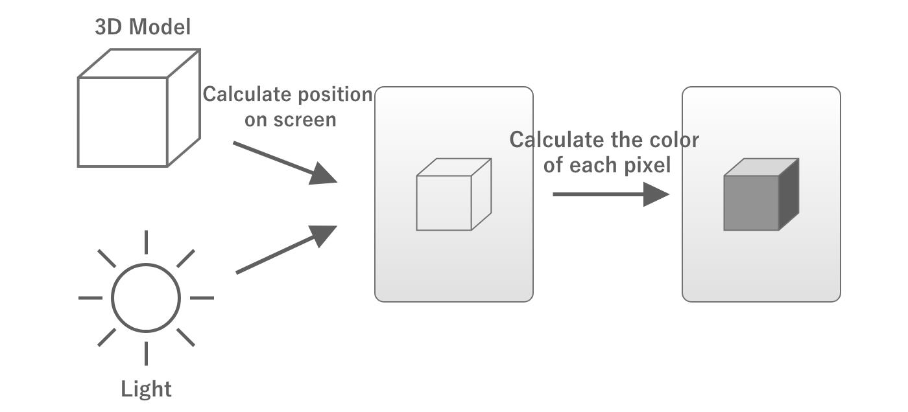
<p><em>VI: <strong>▲ Figure 2.13</strong> — GPU tính <strong>VỊ TRÍ trên màn hình</strong> (từ model 3D) rồi tính <strong>MÀU của từng pixel</strong> (từ đèn). / EN: Figure 2.13 — Calculating Position and Color.</em></p>


<p><em>VI: <strong>▲ Figure 2.12 — Rendering Pipeline.</strong> / EN: Figure 2.12 — Rendering Pipeline.</em></p>

<div class="bilingual-row">
<div class="col-vi">
<blockquote>
<p><em>"Trong computer graphics, <strong>một CHUỖI xử lý được thực hiện trên dữ liệu như TOẠ ĐỘ VERTEX của model 3D và toạ độ, màu của đèn, để cuối cùng XUẤT RA màu cho MỖI PIXEL trên màn hình. Cơ chế xử lý này gọi là RENDERING PIPELINE.</strong></em></p>
<p><em>📤 <strong>Rendering pipeline BẮT ĐẦU bằng việc GỬI dữ liệu cần thiết TỪ CPU SANG GPU.</strong> Dữ liệu này gồm <strong>toạ độ vertex của model 3D, toạ độ đèn, thông tin material của object, thông tin camera</strong>, v.v.</em></p>
<p><em>📐 <strong>GPU TỔNG HỢP thông tin này và TÍNH TOÁN object sẽ xuất hiện Ở ĐÂU trên màn hình khi nhìn bằng camera. Quá trình này gọi là BIẾN ĐỔI TOẠ ĐỘ (coordinate transformation).</strong></em></p>
<p><em>🎨 <strong>Khi vị trí object trên màn hình đã được xác định, bước tiếp theo là XÁC ĐỊNH MÀU của object: "các pixel tương ứng trên màn hình sẽ có màu gì KHI ĐÈN CHIẾU vào model?"</strong>"</em></p>
</blockquote>
<p>🔑 <strong>Hai shader và hai quy luật tải:</strong></p>
<blockquote>
<p><em>"<strong>'Object sẽ xuất hiện Ở ĐÂU trên màn hình' được xác định bởi VERTEX SHADER, và 'MÀU của vùng tương ứng mỗi pixel' được tính bởi FRAGMENT SHADER.</strong></em></p>
<p><em>⚠️ <strong>Những shader này có thể được viết TỰ DO. Do đó, viết XỬ LÝ NẶNG trong vertex shader và fragment shader SẼ LÀM TĂNG tải xử lý.</strong></em></p>
<ul>
<li><em><strong>Vertex shader xử lý theo SỐ VERTEX của model 3D ⇒ CÀNG NHIỀU vertex, tải CÀNG LỚN</strong></em></li>
<li><em><strong>Fragment shader TĂNG tải khi SỐ PIXEL cần render TĂNG</strong></em></li>
</ul>
</blockquote>
<p>📌 <em>"Trong rendering pipeline THỰC TẾ, có <strong>NHIỀU quá trình khác ngoài vertex shader và fragment shader</strong>, nhưng vì mục đích của tài liệu này là hiểu KHÁI NIỆM cần cho performance tuning, chúng tôi chỉ mô tả NGẮN GỌN."</em></p>
<p>👉 <em>Mô tả ĐẦY ĐỦ 5 giai đoạn pipeline ở <a href="../04-tech-lead/01-gpu-urp-advanced-rendering.md">Module 4 §1</a>.</em></p>
</div>
<div class="col-en">
<blockquote>
<p><em>"In computer graphics, <strong>a SERIES of processes is performed on data such as the VERTEX COORDINATES of a 3D model and the coordinates and colours of lights, to finally OUTPUT the colours for EACH PIXEL on the screen. This processing mechanism is called the RENDERING PIPELINE.</strong></em></p>
<p><em>📤 <strong>The rendering pipeline STARTS with SENDING the necessary data FROM the CPU TO the GPU.</strong> This data includes <strong>the coordinates of the 3D model's vertices, the coordinates of the lights, the material information of the objects, the camera information</strong>, and so on.</em></p>
<p><em>📐 <strong>The GPU COMPILES this information and CALCULATES WHERE the object will appear on the screen when viewed with the camera. This process is called COORDINATE TRANSFORMATION.</strong></em></p>
<p><em>🎨 <strong>Once the position of the object on screen is determined, the next step is to determine the COLOUR: "what colour will the corresponding pixels be WHEN THE LIGHT illuminates the model?"</strong>"</em></p>
</blockquote>
<p>🔑 <strong>Two shaders and two load rules:</strong></p>
<blockquote>
<p><em>"<strong>'WHERE on the screen the object will appear' is determined by the VERTEX SHADER, and 'the COLOUR of the area corresponding to each pixel' is calculated by the FRAGMENT SHADER.</strong></em></p>
<p><em>⚠️ <strong>These shaders can be FREELY WRITTEN. Therefore, writing HEAVY PROCESSING in vertex and fragment shaders WILL INCREASE the processing load.</strong></em></p>
<ul>
<li><em><strong>The vertex shader processes the NUMBER OF VERTICES of the 3D model ⇒ the MORE vertices, the GREATER the load</strong></em></li>
<li><em><strong>Fragment shaders INCREASE the load as the NUMBER OF PIXELS to be rendered increases</strong></em></li>
</ul>
</blockquote>
<p>📌 <em>"In the ACTUAL rendering pipeline, there are <strong>MANY processes other than vertex and fragment shaders</strong>, but since the purpose of this document is to understand the CONCEPTS necessary for performance tuning, we will only give a BRIEF description."</em></p>
<p>👉 <em>The FULL 5-stage pipeline description is in <a href="../04-tech-lead/01-gpu-urp-advanced-rendering.md">Module 4 §1</a>.</em></p>
</div>
</div>

### 13.1. 🫧 Render BÁN TRONG SUỐT — nguồn gốc của Overdraw


<p><em>VI: <strong>▲ Figure 2.15 — Render ĐỤC (opaque)</strong> — vẽ vật ở TRƯỚC trước, phần bị che của vật sau KHÔNG cần xử lý. / EN: Figure 2.15 — Opaque rendering.</em></p>


<p><em>VI: <strong>▲ Figure 2.16 — Render BÁN TRONG SUỐT</strong> — vẽ vật ở SAU trước ("Draw first"), vật trước vẽ sau ("Drawing after"), và <strong>vùng CHỒNG LẤN phải TRỘN MÀU</strong>. / EN: Figure 2.16 — Semi-transparent rendering.</em></p>

<div class="bilingual-row">
<div class="col-vi">
<blockquote>
<p><em>"Trước hết, xét trường hợp <strong>CẢ HAI object đều ĐỤC (opaque). Khi đó, object ở TRƯỚC camera được vẽ TRƯỚC. Bằng cách này, khi vẽ object ở SAU, phần KHÔNG NHÌN THẤY do bị object trước che KHÔNG CẦN được xử lý. Nghĩa là thao tác FRAGMENT SHADER có thể được BỎ QUA ở vùng này, qua đó TỐI ƯU tải xử lý.</strong></em></p>
<p><em>🫧 <strong>Ngược lại, nếu CẢ HAI object là BÁN TRONG SUỐT, sẽ là KHÔNG TỰ NHIÊN nếu object phía sau KHÔNG nhìn xuyên qua được object phía trước.</strong> Trong trường hợp này, <strong>quá trình vẽ được thực hiện BẮT ĐẦU TỪ object ở SAU (nhìn từ camera), và màu của vùng chồng lấn được TRỘN với màu ĐÃ VẼ.</strong></em></p>
<p><em>💀 <strong>KHÁC với render đục, render bán trong suốt ĐÒI HỎI phải render các object CHỒNG LẤN. NẾU có HAI object bán trong suốt LẤP ĐẦY TOÀN MÀN HÌNH, TOÀN BỘ MÀN HÌNH sẽ được xử lý HAI LẦN.</strong></em></p>
<p><em>🔑 <strong>Việc vẽ object bán trong suốt CHỒNG LÊN NHAU gọi là OVERDRAW. QUÁ NHIỀU overdraw có thể đặt TẢI XỬ LÝ NẶNG lên GPU và dẫn tới SUY GIẢM HIỆU NĂNG, nên CẦN đặt QUY ĐỊNH PHÙ HỢP khi vẽ object bán trong suốt.</strong>"</em></p>
</blockquote>
<p>📌 <em>"Có vài cách hiện thực rendering pipeline. Trong số đó, <strong>mô tả ở phần này GIẢ ĐỊNH FORWARD RENDERING. Một số điểm có thể KHÔNG áp dụng được một phần cho phương pháp khác như deferred rendering.</strong>"</em></p>
<p>👉 <em>Nối với <a href="../04-tech-lead/01-gpu-urp-advanced-rendering.md">Module 4 §5.4</a>: đây chính là lý do <strong>queue Opaque sắp xếp front-to-back còn Transparent sắp xếp back-to-front</strong>.</em></p>
</div>
<div class="col-en">
<blockquote>
<p><em>"First, consider the case where <strong>BOTH objects are OPAQUE. In this case, the object IN FRONT of the camera is drawn FIRST. In this way, when drawing the object at the BACK, the part that is NOT VISIBLE because it overlaps the front object does NOT need to be processed. This means the FRAGMENT SHADER operation can be SKIPPED in this area, thus OPTIMIZING the processing load.</strong></em></p>
<p><em>🫧 <strong>On the other hand, if BOTH objects are SEMI-TRANSPARENT, it would be UNNATURAL if the back object is NOT VISIBLE THROUGH the front object.</strong> In this case, <strong>the drawing process is performed STARTING WITH the object at the BACK as seen from the camera, and the colour of the overlapping area is BLENDED with the already-drawn colour.</strong></em></p>
<p><em>💀 <strong>UNLIKE opaque rendering, semi-transparent rendering REQUIRES rendering of OVERLAPPING objects. IF there are TWO semi-transparent objects that FILL THE ENTIRE SCREEN, the ENTIRE SCREEN will be processed TWICE.</strong></em></p>
<p><em>🔑 <strong>Drawing semi-transparent objects ON TOP OF EACH OTHER is called OVERDRAW. TOO MANY overdraws can put a HEAVY processing load on the GPU and lead to PERFORMANCE DEGRADATION, so it is NECESSARY to set APPROPRIATE REGULATIONS when drawing semi-transparent objects.</strong>"</em></p>
</blockquote>
<p>📌 <em>"There are several ways to implement the rendering pipeline. Of these, <strong>the description in this section ASSUMES FORWARD RENDERING. Some points may NOT be partially applicable to other rendering methods such as deferred rendering.</strong>"</em></p>
<p>👉 <em>Connects to <a href="../04-tech-lead/01-gpu-urp-advanced-rendering.md">Module 4 §5.4</a>: this is exactly why <strong>the Opaque queue sorts front-to-back while Transparent sorts back-to-front</strong>.</em></p>
</div>
</div>

### 13.2. 📞 Draw call, Set-pass call & Batching — Định nghĩa của CyberAgent

<div class="bilingual-row">
<div class="col-vi">
<blockquote>
<p><em>"Rendering đòi hỏi tải xử lý <strong>KHÔNG CHỈ trên GPU mà CÒN trên CPU.</strong></em></p>
<p><em>📞 <strong>Khi render một object, CPU GỬI LỆNH cho GPU để vẽ. Cái này gọi là DRAW CALL và được thực thi SỐ LẦN BẰNG SỐ OBJECT cần render.</strong></em></p>
<p><em>🔧 <strong>Tại thời điểm này, NẾU texture hoặc thông tin khác KHÁC với object đã render ở draw call TRƯỚC, GPU sẽ phải THIẾT LẬP texture hoặc thông tin đó cho GPU. Việc này được làm bằng SET-PASS CALL và là quá trình TƯƠNG ĐỐI NẶNG.</strong></em></p>
<p><em>💀 <strong>Vì quá trình này được làm trên RENDER THREAD của CPU, nó là TẢI XỬ LÝ TRÊN CPU, và QUÁ NHIỀU có thể ẢNH HƯỞNG hiệu năng.</strong>"</em></p>
</blockquote>
<p>🔑 <strong>Định nghĩa SRP Batcher CHÍNH XÁC NHẤT trong toàn bộ Hub:</strong></p>
<blockquote>
<p><em>"<strong>Scriptable Render Pipeline cũng có cơ chế SRP BATCHER. Dùng cơ chế này, các SET-PASS CALL có thể được GỘP thành MỘT lời gọi DUY NHẤT — NGAY CẢ KHI mesh và material KHÁC NHAU — MIỄN LÀ SHADER VARIANT GIỐNG NHAU.</strong></em></p>
<p><em>⚠️ <strong>Cơ chế này KHÔNG giảm SỐ DRAW CALL, nhưng nó GIẢM SET-PASS CALL — vốn là thứ TỐN KÉM NHẤT để xử lý.</strong>"</em></p>
</blockquote>
<p>👉 <em>Khớp CHÍNH XÁC với bảng 4 kịch bản ở <a href="../04-tech-lead/01-gpu-urp-advanced-rendering.md">Module 4 §10.2</a> — và giải thích vì sao <strong>"dùng ÍT shader variant với TỐI THIỂU keyword để cải thiện SRP batching"</strong>.</em></p>
</div>
<div class="col-en">
<blockquote>
<p><em>"Rendering requires a processing load <strong>NOT ONLY on the GPU but ALSO on the CPU.</strong></em></p>
<p><em>📞 <strong>When rendering an object, the CPU SENDS COMMANDS to the GPU to draw. This is called a DRAW CALL and is executed AS MANY TIMES as the NUMBER OF OBJECTS to be rendered.</strong></em></p>
<p><em>🔧 <strong>At this time, IF the texture or other information DIFFERS from that of the object rendered in the PREVIOUS draw call, the GPU will SET the texture or other information. This is done using a SET-PASS CALL and is a RELATIVELY HEAVY process.</strong></em></p>
<p><em>💀 <strong>Since this process is done on the CPU's RENDER THREAD, it is a processing load ON THE CPU, and TOO MUCH of it can AFFECT PERFORMANCE.</strong>"</em></p>
</blockquote>
<p>🔑 <strong>The most PRECISE definition of the SRP Batcher in the whole Hub:</strong></p>
<blockquote>
<p><em>"<strong>The Scriptable Render Pipeline also has an SRP BATCHER mechanism. Using this mechanism, SET-PASS CALLS can be COMBINED into a SINGLE call — EVEN IF the mesh and material are DIFFERENT — AS LONG AS the SHADER VARIANTS are the SAME.</strong></em></p>
<p><em>⚠️ <strong>This mechanism does NOT reduce the NUMBER OF DRAW CALLS, but it DOES reduce SET-PASS CALLS, since these are the ones MOST EXPENSIVE to process.</strong>"</em></p>
</blockquote>
<p>👉 <em>Matches the four-scenario table in <a href="../04-tech-lead/01-gpu-urp-advanced-rendering.md">Module 4 §10.2</a> EXACTLY — and explains why <strong>"use FEW shader variants with MINIMAL keywords to improve SRP batching"</strong>.</em></p>
</div>
</div>

---

## 14. 🔢 Biểu diễn DỮ LIỆU — Tính TAY dung lượng asset

### 14.1. Bit, Byte và bài toán TEXTURE 4 MB

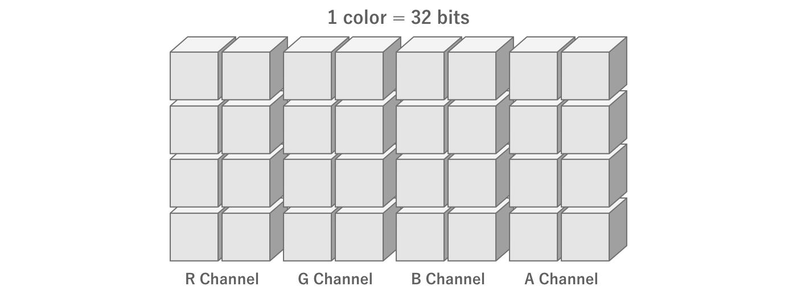
<p><em>VI: <strong>▲ Figure 2.21</strong> — <strong>1 màu = 32 bit</strong>, gồm 4 kênh <strong>R · G · B · A</strong>, mỗi kênh 8 bit. / EN: Figure 2.21 — Amount of information per color.</em></p>

<div class="bilingual-row">
<div class="col-vi">
<p><strong>Chuỗi suy luận NGUYÊN VĂN của sách — từ 1 bit tới 4 MB:</strong></p>
<blockquote>
<ol>
<li><em><strong>"BIT là đơn vị NHỎ NHẤT máy tính biểu diễn được"</strong> — 1 chữ số nhị phân, chỉ biểu diễn được thông tin đơn giản như BẬT/TẮT công tắc</em></li>
<li><em><strong>"2 bit ⇒ 4 tổ hợp"</strong> — ví dụ: phím nào được bấm — LÊN, XUỐNG, TRÁI, PHẢI</em></li>
<li><em><strong>"8 bit ⇒ 2^8 = 256 cách. 8 bit này được biểu diễn bằng đơn vị 1 BYTE. Nói cách khác, 1 byte là đơn vị biểu diễn được 256 lượng thông tin KHÁC NHAU."</strong></em></li>
</ol>
</blockquote>
<p>🎨 <strong>Màu sắc — True Color:</strong></p>
<blockquote>
<p><em>"Màu được tạo bằng cách kết hợp <strong>BỐN thành phần: Red, Green, Blue, và Alpha (độ trong suốt). Đây gọi là CHANNEL.</strong></em></p>
<p><em>🔢 <strong>Trong phương pháp TRUE COLOR thường dùng, MỖI giá trị RGBA được biểu diễn ở 256 MỨC. 256 mức nghĩa là 8 BIT. Nói cách khác, True Color biểu diễn được bằng 4 channel × 8 bit = 32 BIT thông tin.</strong>"</em></p>
</blockquote>
<p>🧮 <strong>Hai phép tính THỰC TẾ — nguyên văn:</strong></p>
<blockquote>
<ul>
<li><em>Ảnh <strong>8×8 pixel</strong> True Color: <strong>8 × 8 × 4 channel × 8 bit = 2.048 bit = 256 BYTE</strong></em></li>
<li><em>Ảnh <strong>1.024×1.024 pixel</strong> True Color: <strong>1.024 × 1.024 × 4 × 8 = 33.554.432 bit = 4.194.304 byte = 4.096 KB = 4 MEGABYTE</strong></em></li>
</ul>
</blockquote>
<p>💡 <strong>Ghi chú KB vs KiB:</strong> <em>"Ở trên, 1 KB được viết là 1.000 byte, nhưng trong một số ngữ cảnh, 1 KB có thể chỉ 1.024 byte. Khi cần phân biệt rõ ràng, <strong>1.000 byte gọi là 1 KILOBYTE (KB) và 1.024 byte gọi là 1 KIBIBYTE (KiB)</strong>. Tương tự với megabyte."</em></p>
</div>
<div class="col-en">
<p><strong>The book's VERBATIM chain of reasoning — from 1 bit to 4 MB:</strong></p>
<blockquote>
<ol>
<li><em><strong>"The BIT is the SMALLEST unit a computer can represent"</strong> — a single binary digit, representing only simple information such as a switch ON/OFF</em></li>
<li><em><strong>"2 bits ⇒ 4 combinations"</strong> — e.g. which key was pressed: UP, DOWN, LEFT, RIGHT</em></li>
<li><em><strong>"8 bits ⇒ 2^8 = 256 ways. These 8 bits are expressed in the unit of 1 BYTE. In other words, one byte is a unit that can express 256 DIFFERENT amounts of information."</strong></em></li>
</ol>
</blockquote>
<p>🎨 <strong>Colour — True Color:</strong></p>
<blockquote>
<p><em>"Colour is created by combining <strong>FOUR elements: Red, Green, Blue, and Alpha (transparency). These are called CHANNELS.</strong></em></p>
<p><em>🔢 <strong>In the commonly used TRUE COLOR method, EACH RGBA value is expressed in 256 STEPS. 256 steps means 8 BITS. In other words, True Color can be represented with 4 channels × 8 bits = 32 BITS of information.</strong>"</em></p>
</blockquote>
<p>🧮 <strong>Two ACTUAL calculations — verbatim:</strong></p>
<blockquote>
<ul>
<li><em>An <strong>8×8 pixel</strong> True Color image: <strong>8 × 8 × 4 channels × 8 bits = 2,048 bits = 256 BYTES</strong></em></li>
<li><em>A <strong>1,024×1,024 pixel</strong> True Color image: <strong>1,024 × 1,024 × 4 × 8 = 33,554,432 bits = 4,194,304 bytes = 4,096 KB = 4 MEGABYTES</strong></em></li>
</ul>
</blockquote>
<p>💡 <strong>The KB vs KiB note:</strong> <em>"Above, 1 KB is written as 1,000 bytes, but in some contexts, 1 KB may refer to 1,024 bytes. When explicitly distinguishing them, <strong>1,000 bytes is called 1 KILOBYTE (KB) and 1,024 bytes is called 1 KIBIBYTE (KiB)</strong>. The same is true for megabytes."</em></p>
</div>
</div>

### 14.2. 🗜️ Nén ảnh — Bảng TỶ LỆ NÉN ASTC


<p><em>VI: <strong>▲ Figure 2.22 — Nén.</strong> / EN: Figure 2.22 — Compression.</em></p>

<div class="bilingual-row">
<div class="col-vi">
<blockquote>
<p><em>"Nén là quá trình <strong>GIẢM lượng dữ liệu bằng cách NGHĨ RA cách lưu dữ liệu.</strong> Ví dụ, giả sử có <strong>NĂM pixel CÙNG MÀU nằm cạnh nhau. Trong trường hợp này, thay vì có NĂM thông tin màu cho từng pixel, TỐT HƠN là có MỘT thông tin màu và thông tin rằng CÓ NĂM PIXEL LIÊN TIẾP — qua đó GIẢM lượng thông tin.</strong>"</em></p>
</blockquote>
<p>📊 <strong>Ví dụ CỤ THỂ với ASTC — con số phải nhớ:</strong></p>
<blockquote>
<p><em>"Áp dụng format <strong>ASTC 6×6, một texture 1024×1024 được nén từ 4 MEGABYTE xuống KHOẢNG 0.46 MEGABYTE.</strong></em></p>
<p><em>🎯 <strong>Nói cách khác, dung lượng được nén xuống DƯỚI MỘT PHẦN TÁM kích thước gốc — và ta có thể nhận ra TẦM QUAN TRỌNG của việc nén.</strong>"</em></p>
</blockquote>
</div>
<div class="col-en">
<blockquote>
<p><em>"Compression is the process of <strong>REDUCING the amount of data by DEVISING a way to store it.</strong> For example, suppose there are <strong>FIVE pixels with the SAME COLOUR next to each other. In this case, rather than having FIVE colour values for each pixel, it is BETTER to have ONE colour value and the information that there are FIVE PIXELS IN A ROW — which REDUCES the amount of information.</strong>"</em></p>
</blockquote>
<p>📊 <strong>The CONCRETE ASTC example — the number to remember:</strong></p>
<blockquote>
<p><em>"Applying the format <strong>ASTC 6×6, a 1024×1024 texture is compressed from 4 MEGABYTES to about 0.46 MEGABYTES.</strong></em></p>
<p><em>🎯 <strong>In other words, the capacity is compressed to LESS THAN ONE-EIGHTH of its original size, and we can recognize the IMPORTANCE of compression.</strong>"</em></p>
</blockquote>
</div>
</div>

**▼ Table 2.2 — Compression Format and Compression Ratio** *(nguyên văn)*

| Format nén | Tỷ lệ nén / Compression ratio | Texture 1024² (từ 4 MB) |
|---|---|---|
| **ASTC RGB(A) 4×4** | **0.25** | ≈ **1.00 MB** |
| **ASTC RGB(A) 6×6** | **0.1113** | ≈ **0.45 MB** |
| **ASTC RGB(A) 8×8** | **0.0625** | ≈ **0.25 MB** |
| **ASTC RGB(A) 10×10** | **0.04** | ≈ **0.16 MB** |
| **ASTC RGB(A) 12×12** | **0.0278** | ≈ **0.11 MB** |

!!! warning "🎮 GPU và FORMAT NÉN — vì sao phải chọn đúng format"
    **VI:** *"Ảnh được nén theo một quy tắc nhất định thì tất nhiên phải được **GIẢI NÉN theo quy tắc đó. Việc giải nén này được làm LÚC RUNTIME.** ✅ **Để TỐI THIỂU HOÁ tải xử lý này, việc dùng format nén ĐƯỢC GPU HỖ TRỢ là QUAN TRỌNG. ASTC là format nén ĐIỂN HÌNH được GPU trên thiết bị mobile hỗ trợ."*** 💡 *"Trong Unity, **nhiều phương pháp nén khác nhau có thể được chỉ định CHO TỪNG NỀN TẢNG** qua texture import settings. Do đó, **thông lệ là import ảnh CHƯA NÉN và áp dụng nén theo import settings** để sinh ra texture cuối cùng."*

    **EN:** *"Images compressed according to a certain rule must, of course, be **DECOMPRESSED according to that rule. This decompression is done AT RUNTIME.** ✅ **To MINIMIZE this processing load, it is IMPORTANT to use a compression format SUPPORTED BY THE GPU. ASTC is a TYPICAL compression format supported by GPUs on mobile devices."*** 💡 *"In Unity, **various compression methods can be specified FOR EACH PLATFORM** using texture import settings. Therefore, it is common to **import an UNCOMPRESSED image and apply compression according to the import settings** to generate the final texture."*

### 14.3. 🔺 Mesh — Bảng dung lượng MỖI VERTEX


<p><em>VI: <strong>▲ Figure 2.23 — Tạo hình 3D bằng cách kết hợp TAM GIÁC.</strong> / EN: Figure 2.23 — 3D by combining triangles.</em></p>


<p><em>VI: <strong>▲ Figure 2.24 — Thông tin Vertex</strong> — mọi vertex của một mesh được lưu trong MỘT MẢNG. / EN: Figure 2.24 — Vertex Information.</em></p>


<p><em>VI: <strong>▲ Figure 2.25 — Vertex Index</strong> — mảng kiểu <code>int</code> chỉ ra vertex NÀO ghép thành tam giác. / EN: Figure 2.25 — Vertex Index.</em></p>

<div class="bilingual-row">
<div class="col-vi">
<blockquote>
<p><em>"Trong 3DCG, <strong>hình dạng BA CHIỀU được biểu diễn bằng cách NỐI NHIỀU TAM GIÁC trong không gian 3D. Tập hợp tam giác này gọi là MESH.</strong></em></p>
<p><em>📍 <strong>Tam giác có thể biểu diễn bằng thông tin TOẠ ĐỘ của BA ĐIỂM trong không gian 3D. Mỗi điểm gọi là VERTEX và toạ độ của chúng gọi là VERTEX COORDINATES. TẤT CẢ thông tin vertex của một mesh được lưu trong MỘT MẢNG DUY NHẤT.</strong></em></p>
<p><em>🔢 <strong>Vì thông tin vertex được lưu trong MỘT mảng, ta cần THÔNG TIN BỔ SUNG để chỉ ra vertex NÀO sẽ được kết hợp để tạo thành tam giác. Cái này gọi là VERTEX INDEX và được biểu diễn dưới dạng MẢNG kiểu <code>int</code>.</strong></em></p>
<p><em>🎨 <strong>Cần thêm thông tin để TEXTURE và CHIẾU SÁNG object. Ví dụ, map một texture cần TOẠ ĐỘ UV. Lighting cũng cần thông tin như VERTEX COLOR, NORMAL, và TANGENT.</strong>"</em></p>
</blockquote>
</div>
<div class="col-en">
<blockquote>
<p><em>"In 3DCG, <strong>a THREE-DIMENSIONAL shape is expressed by CONNECTING MANY TRIANGLES in 3D space. This collection of triangles is called a MESH.</strong></em></p>
<p><em>📍 <strong>The triangles can be represented as the COORDINATE information of THREE POINTS in 3D space. Each of these points is called a VERTEX and its coordinates are called VERTEX COORDINATES. ALL vertex information per mesh is stored in a SINGLE ARRAY.</strong></em></p>
<p><em>🔢 <strong>Since the vertex information is stored in a SINGLE array, we need ADDITIONAL information to indicate WHICH of the vertices will be COMBINED to form a triangle. This is called the VERTEX INDEX and is represented as an ARRAY of type <code>int</code>.</strong></em></p>
<p><em>🎨 <strong>Additional information is needed for TEXTURING and LIGHTING objects. For example, mapping a texture requires UV COORDINATES. Lighting also requires information such as VERTEX COLOR, NORMALS, and TANGENTS.</strong>"</em></p>
</blockquote>
</div>
</div>

**▼ Table 2.3 — Vertex Information** *(nguyên văn — dùng để TÍNH TAY dung lượng mesh)*

| Tên / Name | Dung lượng MỖI VERTEX / Amount of information per vertex |
|---|---|
| **Vertex coordinates** *(toạ độ)* | **float 3 chiều = 12 byte** |
| **UV coordinates** | **float 2 chiều = 8 byte** |
| **Vertex color** | **float 4 chiều = 16 byte** |
| **Normal** *(pháp tuyến)* | **float 3 chiều = 12 byte** |
| **Tangent** *(tiếp tuyến)* | **float 3 chiều = 12 byte** |
| 🧮 **TỔNG nếu dùng TẤT CẢ** | **60 byte / vertex** |

<div class="bilingual-row">
<div class="col-vi">
<p>🔑 <em>"<strong>QUAN TRỌNG là xác định TRƯỚC số vertex và LOẠI thông tin vertex, vì dữ liệu mesh PHÌNH TO khi số vertex và lượng thông tin xử lý bởi MỘT vertex TĂNG LÊN.</strong>"</em></p>
<p>🧮 <strong>Ví dụ tính tay:</strong> một mesh <strong>10.000 vertex</strong> dùng đủ 5 loại thông tin ⇒ <strong>10.000 × 60 byte = 600 KB</strong> chỉ riêng vertex data. Bỏ <code>Vertex color</code> và <code>Tangent</code> ⇒ còn <strong>32 byte/vertex = 320 KB</strong> — <strong>giảm gần một nửa</strong>.</p>
<p>👉 <em>Đây là cơ sở SỐ HỌC cho các setting <strong>Vertex Compression</strong> và <strong>Optimize Mesh Data</strong> ở <a href="../03-senior/01-memory-addressables-networking.md">Module 3</a>.</em></p>
</div>
<div class="col-en">
<p>🔑 <em>"<strong>It is IMPORTANT to determine the NUMBER of vertices and the TYPE of vertex information IN ADVANCE, because mesh data GROWS as the number of vertices and the amount of information handled by a SINGLE vertex INCREASES.</strong>"</em></p>
<p>🧮 <strong>A worked example:</strong> a <strong>10,000-vertex</strong> mesh using all five attributes ⇒ <strong>10,000 × 60 bytes = 600 KB</strong> of vertex data alone. Drop <code>Vertex color</code> and <code>Tangent</code> ⇒ <strong>32 bytes/vertex = 320 KB</strong> — <strong>nearly half</strong>.</p>
<p>👉 <em>This is the ARITHMETIC basis for the <strong>Vertex Compression</strong> and <strong>Optimize Mesh Data</strong> settings in <a href="../03-senior/01-memory-addressables-networking.md">Module 3</a>.</em></p>
</div>
</div>

### 14.4. 🎞️ Keyframe Animation


<p><em>VI: <strong>▲ Figure 2.26 — Keyframe.</strong> / EN: Figure 2.26 — Keyframes.</em></p>


<p><em>VI: <strong>▲ Figure 2.27 — Tangent và Weight.</strong> / EN: Figure 2.27 — Tangents and Weights.</em></p>

<div class="bilingual-row">
<div class="col-vi">
<blockquote>
<p><em>"<strong>KEYFRAME ANIMATION là một trong những cách PHỔ BIẾN NHẤT để hiện thực animation. Một keyframe animation gồm một MẢNG dữ liệu biểu diễn GIÁ TRỊ TẠI MỘT THỜI ĐIỂM (keyframe). Giá trị GIỮA các keyframe được lấy bằng NỘI SUY và có thể xử lý như thể chúng là dữ liệu MƯỢT, LIÊN TỤC.</strong></em></p>
<p><em>💡 <strong>Ngoài THỜI GIAN và GIÁ TRỊ, keyframe còn có thông tin khác như TANGENT và TRỌNG SỐ của chúng. Bằng cách dùng những thứ này trong phép nội suy, animation PHỨC TẠP HƠN có thể đạt được với ÍT DỮ LIỆU HƠN.</strong></em></p>
<p><em>⚖️ <strong>Trong keyframe animation, CÀNG NHIỀU keyframe thì animation CÀNG PHỨC TẠP được. TUY NHIÊN, LƯỢNG DỮ LIỆU cũng TĂNG theo số keyframe. Vì lý do này, số keyframe nên được đặt PHÙ HỢP.</strong></em></p>
<p><em>✅ <strong>Có phương pháp NÉN lượng dữ liệu bằng cách GIẢM số keyframe trong khi GIỮ đường cong GIỐNG NHẤT có thể. Trong Unity, keyframe có thể được giảm trong MODEL IMPORT SETTINGS.</strong>"</em></p>
</blockquote>
</div>
<div class="col-en">
<blockquote>
<p><em>"<strong>KEYFRAME ANIMATION is one of the MOST COMMON ways to achieve animation. A keyframe animation consists of an ARRAY of data representing VALUES AT A CERTAIN TIME (a keyframe). The values BETWEEN keyframes are obtained by INTERPOLATION and can be treated as if they were SMOOTH, CONTINUOUS data.</strong></em></p>
<p><em>💡 <strong>In addition to TIME and VALUE, keyframes have other information such as TANGENTS and their WEIGHTS. By using these in the interpolation calculation, MORE COMPLEX animations can be realized with LESS DATA.</strong></em></p>
<p><em>⚖️ <strong>In keyframe animation, the MORE keyframes there are, the MORE COMPLEX the animation can be. HOWEVER, the AMOUNT OF DATA also INCREASES with the number of keyframes. For this reason, the number of keyframes should be set APPROPRIATELY.</strong></em></p>
<p><em>✅ <strong>There are methods to COMPRESS the amount of data by REDUCING the number of keyframes while KEEPING the curves AS SIMILAR AS POSSIBLE. In Unity, keyframes can be reduced in the MODEL IMPORT SETTINGS.</strong>"</em></p>
</blockquote>
</div>
</div>


<p><em>VI: <strong>▲ Figure 2.28 — Import Settings</strong> cho animation. / EN: Figure 2.28 — Import Settings.</em></p>

---

## 15. ⚙️ Unity hoạt động BÊN TRONG thế nào

### 15.1. 🔄 C#, IL, IL2CPP và Unity Runtime


<p><em>VI: <strong>▲ Figure 2.29 — Quá trình biên dịch C#.</strong> / EN: Figure 2.29 — C# Compilation Process.</em></p>

<div class="bilingual-row">
<div class="col-vi">
<blockquote>
<p><em>"C# là ngôn ngữ BIÊN DỊCH. <strong>TUY NHIÊN, C# KHÁC với C truyền thống ở chỗ nó KHÔNG phải NGÔN NGỮ MÁY có thể tự biên dịch và thực thi trên máy, mà là NGÔN NGỮ TRUNG GIAN (Intermediate Language — IL).</strong></em></p>
<p><em>🔑 <strong>Lý do PHẢI đi qua IL một lần: một khi ĐÃ chuyển sang ngôn ngữ máy, binary CHỈ chạy được trên MỘT nền tảng. Với IL, BẤT KỲ nền tảng nào cũng chạy được chỉ bằng cách CHUẨN BỊ MỘT RUNTIME cho nền tảng đó — LOẠI BỎ nhu cầu chuẩn bị binary CHO TỪNG nền tảng.</strong></em></p>
<p><em>✅ <strong>Do đó, nguyên lý CƠ BẢN của Unity là: IL thu được từ biên dịch mã nguồn được THỰC THI TRÊN RUNTIME của môi trường tương ứng, qua đó đạt được TƯƠNG THÍCH ĐA NỀN TẢNG.</strong>"</em></p>
</blockquote>
<p><strong>🔧 Vì sao IL2CPP ra đời — bối cảnh LỊCH SỬ:</strong></p>
<blockquote>
<p><em>"Từ khoảng <strong>2015, một số môi trường bắt đầu có vấn đề: HỖ TRỢ 64-BIT cho app chạy trên iOS và Android.</strong></em></p>
<p><em>🕰️ <strong>Cho tới lúc đó, Unity thực ra dùng MONO — một cài đặt OSS lâu đời của .NET Framework — và Unity TỰ SỬA ĐỔI nó cho mục đích riêng. Nói cách khác, để Unity tương thích 64-bit, CẦN phải làm cho bản Mono đã fork tương thích 64-bit. Tất nhiên việc này ĐÒI HỎI KHỐI LƯỢNG CÔNG VIỆC KHỔNG LỒ.</strong></em></p>
<p><em>💡 <strong>Nên Unity quyết định VƯỢT QUA thách thức này bằng cách phát triển công nghệ gọi là IL2CPP thay thế.</strong></em></p>
<p><em>🔄 <strong>IL2CPP, đúng như tên gọi, là "IL to CPP" — công nghệ CHUYỂN mã IL thành mã C++. Vì C++ là ngôn ngữ ĐA DỤNG được hỗ trợ NATIVE trong MỌI môi trường phát triển, nó có thể được biên dịch thành ngôn ngữ máy trong TỪNG toolchain.</strong></em></p>
<p><em>🚀 <strong>KHÁC với C#, mã C++ được biên dịch thành ngôn ngữ máy LÚC BUILD — LOẠI BỎ nhu cầu chuyển sang ngôn ngữ máy LÚC RUNTIME và CẢI THIỆN HIỆU NĂNG.</strong></em></p>
<p><em>⚖️ <strong>Tuy mã C++ nhìn chung có nhược điểm là BUILD LÂU, công nghệ IL2CPP đã trở thành NỀN TẢNG của Unity — giải quyết CẢ tương thích 64-bit LẪN hiệu năng TRONG MỘT CÚ.</strong>"</em></p>
</blockquote>
<p>👉 <em>Bổ sung cho <a href="../03-senior/01-memory-addressables-networking.md">Module 3</a> về IL2CPP vs Mono — đây là phần "vì sao lịch sử" mà tài liệu Unity không kể.</em></p>
</div>
<div class="col-en">
<blockquote>
<p><em>"C# is a COMPILER language. <strong>HOWEVER, C# DIFFERS from traditional C in that it is NOT a MACHINE LANGUAGE that can be compiled and executed by itself on a machine, but rather an INTERMEDIATE LANGUAGE (IL).</strong></em></p>
<p><em>🔑 <strong>The reason for interrupting with IL once: once converted to machine language, the binary can ONLY be executed on a SINGLE platform. With IL, ANY platform can run simply by PREPARING A RUNTIME for that platform — ELIMINATING the need to prepare binaries FOR EACH platform.</strong></em></p>
<p><em>✅ <strong>Therefore, the BASIC PRINCIPLE of Unity is that the IL obtained by compiling the source code is EXECUTED ON THE RUNTIME for the respective environment, thereby achieving MULTI-PLATFORM COMPATIBILITY.</strong>"</em></p>
</blockquote>
<p><strong>🔧 Why IL2CPP exists — the HISTORICAL context:</strong></p>
<blockquote>
<p><em>"Starting around <strong>2015, some environments started having problems: 64-BIT SUPPORT for apps running on iOS and Android.</strong></em></p>
<p><em>🕰️ <strong>Until then, Unity actually used MONO — a long-standing OSS implementation of the .NET Framework — and Unity ITSELF MODIFIED it for its own use. In other words, for Unity to become 64-bit compatible, it was NECESSARY to make the FORKED Mono 64-bit compatible. Of course, this would require a TREMENDOUS amount of work.</strong></em></p>
<p><em>💡 <strong>So Unity OVERCAME this challenge by developing a technology called IL2CPP instead.</strong></em></p>
<p><em>🔄 <strong>IL2CPP, as the name suggests, is "IL to CPP" — a technology that CONVERTS IL code to C++ code. Since C++ is a HIGHLY VERSATILE language NATIVELY SUPPORTED in ANY development environment, it can be compiled into machine language in EACH toolchain.</strong></em></p>
<p><em>🚀 <strong>UNLIKE C#, C++ code is compiled into machine language AT BUILD TIME — ELIMINATING the need to convert it to machine language AT RUNTIME and IMPROVING PERFORMANCE.</strong></em></p>
<p><em>⚖️ <strong>Although C++ code generally has the disadvantage of taking a LONG TIME TO BUILD, IL2CPP has become a CORNERSTONE of Unity — solving BOTH 64-bit compatibility AND performance IN ONE FELL SWOOP.</strong>"</em></p>
</blockquote>
<p>👉 <em>Complements <a href="../03-senior/01-memory-addressables-networking.md">Module 3</a> on IL2CPP vs Mono — this is the "historical why" that Unity's docs omit.</em></p>
</div>
</div>

!!! tip "🔬 ĐỌC mã IL — thói quen của kỹ sư tối ưu"
    <div class="bilingual-row">
    <div class="col-vi">
    <blockquote>
    <p><em>"Mã IL — thứ thường HIẾM KHI được nhìn thấy — <strong>RẤT QUAN TRỌNG để Ý THỨC về hiệu năng như cấp phát bộ nhớ và tốc độ thực thi.</strong></em></p>
    <p><em>📌 <strong>Ví dụ, một MẢNG và một LIST sẽ xuất ra MÃ IL KHÁC NHAU cho CÙNG một vòng <code>foreach</code> — thoạt nhìn thì giống, nhưng MẢNG cho mã hiệu năng TỐT HƠN. Bạn cũng có thể tìm ra những HEAP ALLOCATION ẨN KHÔNG NGỜ TỚI.</strong></em></p>
    <p><em>✅ <strong>Để có CẢM GIÁC về tương ứng giữa C# và mã IL, KHUYẾN NGHỊ thường xuyên KIỂM TRA kết quả chuyển đổi IL của mã C# bạn viết.</strong></em></p>
    <p><em>🛠️ <strong>Bạn có thể xem mã IL trong IDE như Visual Studio hay Rider, nhưng bản thân mã IL là ngôn ngữ KHÓ HIỂU vì nó là ngôn ngữ CẤP THẤP kiểu assembly. Trong trường hợp đó, bạn có thể dùng dịch vụ web <a href="https://sharplab.io/">SharpLab</a> để kiểm tra C# → IL → C# và ngược lại, giúp mã IL DỄ HIỂU HƠN.</strong>"</em></p>
    </blockquote>
    </div>
    <div class="col-en">
    <blockquote>
    <p><em>"IL code — which is usually RARELY SEEN — is <strong>VERY IMPORTANT for being AWARE of performance such as memory allocation and execution speed.</strong></em></p>
    <p><em>📌 <strong>For example, an ARRAY and a LIST will output DIFFERENT IL CODE for the SAME <code>foreach</code> loop at first glance, with the ARRAY being the BETTER-PERFORMING code. You may also find UNINTENDED HIDDEN HEAP ALLOCATIONS.</strong></em></p>
    <p><em>✅ <strong>In order to acquire a SENSE of the correspondence between C# and IL code, it is RECOMMENDED to check the IL conversion results of C# code you have written ON A REGULAR BASIS.</strong></em></p>
    <p><em>🛠️ <strong>You can view IL code in IDEs such as Visual Studio or Rider, but IL code itself is a DIFFICULT language to understand because it is a LOW-LEVEL assembly language. In such cases, you can use the web service <a href="https://sharplab.io/">SharpLab</a> to check C# → IL → C# and vice versa, making the IL code EASIER to understand.</strong>"</em></p>
    </blockquote>
    </div>
    </div>


<p><em>VI: <strong>▲ Figure 2.30 — Hình dung trạng thái bộ nhớ trong Unity</strong> — hai vùng: ENGINE (native) và USER CODE (C#). / EN: Figure 2.30 — Image of memory state in Unity.</em></p>

!!! danger "🌉 HAI THẾ GIỚI: Engine (C++) và User Code (C#) — nguồn gốc của MỌI chi phí ẩn"
    <div class="bilingual-row">
    <div class="col-vi">
    <blockquote>
    <p><em>"Tuy Unity cho phép lập trình game bằng C#, <strong>BẢN THÂN runtime của Unity — gọi là ENGINE — THỰC RA KHÔNG chạy bằng C#. Mã nguồn được viết bằng C++, và phần gọi là PLAYER được phân phối ở dạng ĐÃ BUILD SẴN cho từng môi trường.</strong></em></p>
    <p><em><strong>BA lý do Unity viết engine bằng C++:</strong></em></p>
    <ol>
    <li><em><strong>"Để đạt hiệu năng NHANH và TIẾT KIỆM BỘ NHỚ"</strong></em></li>
    <li><em><strong>"Để hỗ trợ CÀNG NHIỀU nền tảng CÀNG TỐT"</strong></em></li>
    <li><em><strong>"Để BẢO VỆ QUYỀN SỞ HỮU TRÍ TUỆ của engine (hộp đen)"</strong></em></li>
    </ol>
    <p><em>🌉 <strong>Vì mã C# do lập trình viên viết chạy bằng C#, Unity CẦN HAI VÙNG: phần ENGINE chạy NATIVE, và phần USER CODE chạy ở C# runtime. Engine và user code làm việc bằng cách TRAO ĐỔI DỮ LIỆU khi cần trong lúc thực thi.</strong></em></p>
    <p><em>📖 <strong>Ví dụ: khi <code>GameObject.transform</code> được gọi từ C#, TOÀN BỘ trạng thái thực thi game (như trạng thái scene) được quản lý BÊN TRONG ENGINE — nên nó TRƯỚC HẾT thực hiện một NATIVE CALL để truy cập dữ liệu bộ nhớ ở vùng native rồi MỚI trả giá trị về C#.</strong></em></p>
    <p><em>🚨 <strong>QUAN TRỌNG: BỘ NHỚ KHÔNG ĐƯỢC CHIA SẺ giữa C# và native — nên dữ liệu C# cần được CẤP PHÁT Ở PHÍA C# MỖI LẦN cần dùng. Lời gọi API cũng ĐẮT vì có native call xảy ra, nên kỹ thuật tối ưu CACHE giá trị mà KHÔNG gọi thường xuyên là CẦN THIẾT.</strong>"</em></p>
    </blockquote>
    <p>👉 <em>Đây là lời giải thích CĂN NGUYÊN cho MỌI lời khuyên "cache <code>transform</code>", "cache <code>GetComponent</code>", "tránh gọi API Unity trong vòng lặp" xuyên suốt Module 1–4.</em></p>
    <p>💡 <em>"Unity đã CÔNG KHAI phần mã nguồn C# trên <a href="https://github.com/Unity-Technologies/UnityCsReference">GitHub</a>, nên bạn có thể thấy <strong>PHẦN LỚN là native call</strong> — RẤT HỮU ÍCH."</em></p>
    </div>
    <div class="col-en">
    <blockquote>
    <p><em>"Although Unity allows developers to program games in C#, <strong>the runtime of Unity ITSELF — called the ENGINE — does NOT actually run in C#. The source is written in C++, and the part called the PLAYER is distributed PRE-BUILT to run in each environment.</strong></em></p>
    <p><em><strong>THREE reasons Unity writes its engine in C++:</strong></em></p>
    <ol>
    <li><em><strong>"To get FAST and MEMORY-SAVING performance"</strong></em></li>
    <li><em><strong>"To support AS MANY PLATFORMS as possible"</strong></em></li>
    <li><em><strong>"To PROTECT the INTELLECTUAL PROPERTY rights of the engine (black box)"</strong></em></li>
    </ol>
    <p><em>🌉 <strong>Since the C# code written by the developer runs in C#, Unity requires TWO AREAS: the ENGINE part, which runs NATIVELY, and the USER CODE part, which runs at C# runtime. The engine and user code work by EXCHANGING DATA as needed during execution.</strong></em></p>
    <p><em>📖 <strong>For example: when <code>GameObject.transform</code> is called from C#, ALL game execution state (such as scene state) is managed INSIDE THE ENGINE — so it FIRST makes a NATIVE CALL to access memory data in the native area and THEN returns values to C#.</strong></em></p>
    <p><em>🚨 <strong>IMPORTANT: MEMORY IS NOT SHARED between C# and native — so data needed by C# is ALLOCATED ON THE C# SIDE EACH TIME it is needed. API calls are ALSO EXPENSIVE, with native calls occurring, so an optimization technique of CACHING VALUES without frequent calls is NECESSARY.</strong>"</em></p>
    </blockquote>
    <p>👉 <em>This is the ROOT explanation for EVERY "cache the <code>transform</code>", "cache <code>GetComponent</code>", "avoid Unity API calls in loops" piece of advice across Modules 1–4.</em></p>
    <p>💡 <em>"Unity has made the C# part of the source code available on <a href="https://github.com/Unity-Technologies/UnityCsReference">GitHub</a>, so you can see that <strong>it is MOSTLY NATIVE CALLS</strong> — very helpful."</em></p>
    </div>
    </div>

### 15.2. 📦 Thực thể của ASSET nằm ở NATIVE

<div class="bilingual-row">
<div class="col-vi">
<blockquote>
<p><em>"Vì Unity engine chạy native, <strong>về cơ bản nó KHÔNG có dữ liệu ở phía C#. Điều tương tự đúng với việc xử lý ASSET: asset được LOAD ở VÙNG NATIVE, và CHỈ THAM CHIẾU được trả về C#, hoặc dữ liệu được SAO CHÉP rồi trả về.</strong></em></p>
<p><em><strong>Do đó có HAI cách chính để load asset:</strong></em></p>
<ol>
<li>✅ <em><strong>CHỈ ĐỊNH ĐƯỜNG DẪN để load ở phía Unity engine</strong> ⇒ <strong>phía C# KHÔNG tiêu tốn bộ nhớ vì nó được load ở vùng native</strong></em></li>
<li>💀 <em><strong>TRUYỀN dữ liệu THÔ như MẢNG BYTE trực tiếp cho engine</strong> ⇒ <strong>NẾU dữ liệu như mảng byte được load và xử lý TỪ phía C# rồi truyền sang, BỘ NHỚ BỊ TIÊU TỐN GẤP ĐÔI ở CẢ phía C# LẪN native</strong></em></li>
</ol>
</blockquote>
<p>🕵️ <strong>Hệ quả cho việc ĐIỀU TRA rò rỉ:</strong></p>
<blockquote>
<p><em>"Vì thực thể asset nằm ở phía native, <strong>ĐỘ KHÓ của việc điều tra load asset TRÙNG LẶP và RÒ RỈ TĂNG LÊN. Bởi vì lập trình viên chủ yếu tập trung profiling và debug ở PHÍA C#.</strong></em></p>
<p><em>⚠️ <strong>RẤT KHÓ để hiểu trạng thái thực thi phía C# MỘT MÌNH — CẦN phân tích bằng cách ĐỐI CHIẾU với trạng thái thực thi phía ENGINE. Việc profiling vùng native PHỤ THUỘC vào API do Unity cung cấp, điều này GIỚI HẠN các công cụ khả dụng.</strong>"</em></p>
</blockquote>
</div>
<div class="col-en">
<blockquote>
<p><em>"Since the Unity engine runs natively, <strong>it basically has NO DATA on the C# side. The same is true for the handling of ASSETS: assets are LOADED in the NATIVE AREA, and ONLY REFERENCES are returned to C#, or data is COPIED and returned.</strong></em></p>
<p><em><strong>Therefore, there are TWO main ways to load assets:</strong></em></p>
<ol>
<li>✅ <em><strong>SPECIFY A PATH to load on the Unity engine side</strong> ⇒ <strong>the C# side does NOT consume memory because it is loaded in the native area</strong></em></li>
<li>💀 <em><strong>PASS RAW DATA such as BYTE ARRAYS directly to the engine</strong> ⇒ <strong>IF data such as a byte array is loaded and processed FROM the C# side and passed over, MEMORY IS DOUBLY CONSUMED on BOTH the C# AND native sides</strong></em></li>
</ol>
</blockquote>
<p>🕵️ <strong>The consequence for LEAK investigation:</strong></p>
<blockquote>
<p><em>"Since the asset entity is on the native side, <strong>the DIFFICULTY of investigating DUPLICATE asset loads and LEAKS INCREASES. This is because developers mainly focus on profiling and debugging THE C# SIDE.</strong></em></p>
<p><em>⚠️ <strong>It is DIFFICULT to understand the C# side execution state ALONE — it is NECESSARY to analyze it by COMPARING it with the ENGINE side execution state. Profiling of the native area is DEPENDENT on the API provided by Unity, which LIMITS the tools available.</strong>"</em></p>
</blockquote>
</div>
</div>

### 15.3. 🧵 Threads — Main, Render và Worker


<p><em>VI: <strong>▲ Figure 2.31 — Sơ đồ THREAD.</strong> / EN: Figure 2.31 — Schematic diagram of a thread.</em></p>

<div class="bilingual-row">
<div class="col-vi">
<blockquote>
<p><em>"<strong>THREAD là ĐƠN VỊ thực thi chương trình</strong>, và việc xử lý nhìn chung tiến hành bằng cách TẠO NHIỀU thread trong MỘT tiến trình.</em></p>
<p><em>🔄 <strong>Vì MỘT NHÂN CPU CHỈ xử lý được MỘT thread TẠI MỘT THỜI ĐIỂM, nó thực thi chương trình bằng cách CHUYỂN ĐỔI giữa các thread ở TỐC ĐỘ CAO. Cái này gọi là CONTEXT SWITCH. Context switch GÂY OVERHEAD, nên NẾU xảy ra THƯỜNG XUYÊN, hiệu suất xử lý bị GIẢM.</strong></em></p>
<p><em>🔑 <strong>Vòng lặp game của Unity được THIẾT KẾ để chạy trên MỘT THREAD DUY NHẤT, nên script do người dùng viết về cơ bản SẼ CHẠY TRÊN MAIN THREAD. Ngược lại, việc cố gọi Unity API từ thread KHÁC main thread SẼ GÂY LỖI với HẦU HẾT các API.</strong>"</em></p>
</blockquote>
<p>📶 <strong><code>WaitFor~</code> — hiểu đúng những gì bạn thấy trong Profiler:</strong></p>
<blockquote>
<p><em>"Nếu bạn TẠO một thread khác từ main thread, <strong>bạn KHÔNG BIẾT khi nào thread đó được thực thi và khi nào hoàn tất. Do đó, phương tiện ĐỒNG BỘ xử lý giữa các thread là dùng CƠ CHẾ TÍN HIỆU (signal).</strong></em></p>
<p><em>🔍 <strong>Việc CHỜ TÍN HIỆU này CŨNG được dùng BÊN TRONG Unity và có thể QUAN SÁT được lúc profiling — nhưng QUAN TRỌNG là phải lưu ý rằng nó CHỈ ĐANG CHỜ một tiến trình khác, ĐÚNG NHƯ CÁI TÊN <code>WaitFor~</code> gợi ý.</strong>"</em></p>
</blockquote>
<p>👉 <em>Đây là chìa khoá đọc <code>Gfx.WaitForPresent</code> / <code>Gfx.WaitForCommands</code> ở <a href="../01-fresher/01-ultimate-guide-to-profiling.md">Module 1 §3</a>: <strong>chúng là THỜI GIAN CHỜ, KHÔNG phải thời gian LÀM VIỆC.</strong></em></p>
</div>
<div class="col-en">
<blockquote>
<p><em>"<strong>A THREAD is a UNIT of program execution</strong>, and processing generally proceeds by CREATING MULTIPLE threads within a SINGLE process.</em></p>
<p><em>🔄 <strong>Since a SINGLE CORE of the CPU can ONLY process ONE thread AT A TIME, it executes the program while SWITCHING between threads AT HIGH SPEED. This is called a CONTEXT SWITCH. Context switches incur OVERHEAD, so IF they occur FREQUENTLY, processing efficiency is REDUCED.</strong></em></p>
<p><em>🔑 <strong>Unity's game loop is DESIGNED to run on a SINGLE THREAD, so scripts written by users will basically RUN ON THE MAIN THREAD. Conversely, attempting to call Unity APIs from a thread OTHER THAN the main thread will result in an ERROR for MOST APIs.</strong>"</em></p>
</blockquote>
<p>📶 <strong><code>WaitFor~</code> — reading what you see in the Profiler correctly:</strong></p>
<blockquote>
<p><em>"If you CREATE another thread from the main thread, <strong>you do NOT KNOW when that thread will be executed and when it will COMPLETE. Therefore, the means to SYNCHRONIZE processing between threads is to use the SIGNAL mechanism.</strong></em></p>
<p><em>🔍 <strong>This signal waiting is ALSO used WITHIN Unity and can be OBSERVED during profiling — but it is IMPORTANT to note that it is JUST WAITING for another process, as the name <code>WaitFor~</code> implies.</strong>"</em></p>
</blockquote>
<p>👉 <em>This is the key to reading <code>Gfx.WaitForPresent</code> / <code>Gfx.WaitForCommands</code> in <a href="../01-fresher/01-ultimate-guide-to-profiling.md">Module 1 §3</a>: <strong>they are WAITING time, NOT WORKING time.</strong></em></p>
</div>
</div>


<p><em>VI: <strong>▲ Figure 2.32 — Main Thread và Render Thread.</strong> / EN: Figure 2.32 — Main Thread and Render Thread.</em></p>

!!! danger "⛓️ Main Thread và Render Thread chạy như PIPELINE — và vì sao CẢ HAI đều giết FPS"
    <div class="bilingual-row">
    <div class="col-vi">
    <blockquote>
    <p><em>"Để đạt tốc độ, <strong>một số xử lý SONG SONG được dùng BÊN TRONG game engine. Một trong số đó là RENDER THREAD — đúng như tên gọi, một thread CHUYÊN cho rendering, chịu trách nhiệm GỬI thông tin vẽ frame (đã tính bởi main thread) TỚI GPU dưới dạng GRAPHICS COMMAND.</strong></em></p>
    <p><em>⛓️ <strong>Main thread và render thread chạy NHƯ MỘT PIPELINE — nên render thread BẮT ĐẦU tính frame TIẾP THEO trong khi render thread đang xử lý nó.</strong></em></p>
    <p><em>💀 <strong>TUY NHIÊN, NẾU thời gian xử lý một frame trong RENDER THREAD ngày càng DÀI, nó SẼ KHÔNG THỂ bắt đầu vẽ frame tiếp theo NGAY CẢ KHI phép tính cho frame tiếp theo ĐÃ XONG — và MAIN THREAD SẼ PHẢI CHỜ.</strong></em></p>
    <p><em>🎯 <strong>Trong phát triển game, hãy Ý THỨC rằng FPS SẼ TỤT nếu MAIN THREAD HOẶC RENDER THREAD trở nên QUÁ NẶNG.</strong>"</em></p>
    </blockquote>
    </div>
    <div class="col-en">
    <blockquote>
    <p><em>"To achieve speed, <strong>a number of PARALLEL processes are used INSIDE the game engine. One of them is the RENDER THREAD — as the name suggests, a thread DEDICATED to rendering, responsible for SENDING the frame drawing information (calculated by the main thread) TO THE GPU as GRAPHICS COMMANDS.</strong></em></p>
    <p><em>⛓️ <strong>The main thread and the render thread run LIKE A PIPELINE — so the render thread STARTS computing the NEXT frame while the render thread is processing it.</strong></em></p>
    <p><em>💀 <strong>HOWEVER, IF the time to process a frame in the RENDER THREAD is getting LONGER, it will NOT be able to start drawing the next frame EVEN IF the calculation for the next frame is FINISHED — and the MAIN THREAD WILL HAVE TO WAIT.</strong></em></p>
    <p><em>🎯 <strong>In game development, be AWARE that the FPS WILL DROP if EITHER the main thread OR the render thread becomes TOO HEAVY.</strong>"</em></p>
    </blockquote>
    </div>
    </div>

<div class="bilingual-row">
<div class="col-vi">
<p>👷 <strong>WORKER THREAD và JobSystem:</strong></p>
<blockquote>
<p><em>"Ngoài ra, có NHIỀU tác vụ tính toán có thể thực thi SONG SONG — như <strong>physics engine</strong> và <strong>rung lắc (shaking)</strong> — vốn ĐẶC THÙ cho game.</em></p>
<p><em>✅ <strong>Để thực thi những phép tính đó NGOÀI main thread, Unity có WORKER THREAD. Worker thread thực thi các TÁC VỤ TÍNH TOÁN sinh ra qua JOBSYSTEM.</strong></em></p>
<p><em>💪 <strong>NẾU bạn có thể GIẢM tải xử lý trên main thread bằng cách dùng JobSystem, BẠN NÊN TÍCH CỰC dùng nó. Tất nhiên, bạn cũng có thể TỰ TẠO thread riêng mà KHÔNG dùng JobSystem.</strong>"</em></p>
</blockquote>
</div>
<div class="col-en">
<p>👷 <strong>WORKER THREADS and the JobSystem:</strong></p>
<blockquote>
<p><em>"In addition, there are MANY calculation tasks that CAN be executed in PARALLEL — such as the <strong>physics engine</strong> and <strong>shaking</strong> — which are UNIQUE to games.</em></p>
<p><em>✅ <strong>In order to execute such calculations OUTSIDE the main thread, Unity has WORKER THREADS. Worker threads execute the COMPUTATION TASKS generated through the JOBSYSTEM.</strong></em></p>
<p><em>💪 <strong>IF you can REDUCE the processing load on the main thread by using JobSystem, you SHOULD ACTIVELY USE IT. Of course, you can also GENERATE YOUR OWN threads without using JobSystem.</strong>"</em></p>
</blockquote>
</div>
</div>

### 15.4. 🔁 Game Loop & thứ tự sự kiện


<p><em>VI: <strong>▲ Figure 2.33 — Thứ tự thực thi SỰ KIỆN trong Unity.</strong> / EN: Figure 2.33 — Event Execution Order in Unity.</em></p>

<div class="bilingual-row">
<div class="col-vi">
<blockquote>
<p><em>"Sơ đồ này <strong>NGHIÊM NGẶT mà nói là thể hiện THỨ TỰ THỰC THI SỰ KIỆN trong MonoBehaviour — KHÁC với game loop của game engine — nhưng ĐỦ cho game loop mà lập trình viên NÊN BIẾT.</strong></em></p>
<p><em>🔑 <strong>ĐẶC BIỆT QUAN TRỌNG là các sự kiện: <code>Awake</code>, <code>OnEnable</code>, <code>Start</code>, <code>FixedUpdate</code>, <code>Update</code>, <code>LateUpdate</code>, <code>OnDisable</code>, <code>OnDestroy</code> — và thời điểm của các COROUTINE.</strong></em></p>
<p><em>💀 <strong>NHẦM LẪN thứ tự thực thi hoặc thời điểm của sự kiện có thể dẫn tới RÒ RỈ BỘ NHỚ KHÔNG NGỜ hoặc TÍNH TOÁN THỪA. Do đó, bạn NÊN Ý THỨC về BẢN CHẤT thời điểm gọi sự kiện quan trọng và thứ tự thực thi TRONG CÙNG một sự kiện.</strong>"</em></p>
</blockquote>
<p>⚛️ <strong>Vì sao PHYSICS chạy ở NHỊP KHÁC — và hai rủi ro:</strong></p>
<blockquote>
<p><em>"Có vấn đề CỤ THỂ với phép tính physics: <strong>object có thể XUYÊN QUA nhau mà KHÔNG bị phát hiện va chạm NẾU chúng được thực thi ở CÙNG NHỊP với game loop thông thường. Vì lý do này, các routine physics thường được LẶP ở NHỊP KHÁC với game loop để chúng được thực thi ở TẦN SUẤT CAO.</strong></em></p>
<p><em>⚠️ <strong>TUY NHIÊN, NẾU các vòng lặp chạy ở nhịp RẤT NHANH, CÓ KHẢ NĂNG chúng XUNG ĐỘT với quá trình cập nhật của game loop chính — nên CẦN đồng bộ các tiến trình ở mức độ nhất định.</strong></em></p>
<p><em>🚨 <strong>Do đó, hãy Ý THỨC về khả năng:</strong></em></p>
<ul>
<li><em><strong>Phép tính physics có thể ẢNH HƯỞNG tới quá trình vẽ frame NẾU physics NẶNG HƠN mức cần thiết</strong></em></li>
<li><em><strong>Phép tính physics có thể bị TRỄ và XUYÊN QUA NẾU quá trình vẽ frame NẶNG</strong></em></li>
</ul>
</blockquote>
<p>👉 <em>Đây là giải thích BỔ SUNG cho <strong>"vòng xoáy tử thần Fixed Timestep"</strong> ở <a href="../02-junior/01-ui-physics-deep-dive.md">Module 2</a>.</em></p>
</div>
<div class="col-en">
<blockquote>
<p><em>"This diagram <strong>STRICTLY shows the ORDER OF EXECUTION OF EVENTS in MonoBehaviour — which is DIFFERENT from the game engine's game loop — but is SUFFICIENT for the game loop that developers SHOULD KNOW.</strong></em></p>
<p><em>🔑 <strong>ESPECIALLY IMPORTANT are the events: <code>Awake</code>, <code>OnEnable</code>, <code>Start</code>, <code>FixedUpdate</code>, <code>Update</code>, <code>LateUpdate</code>, <code>OnDisable</code>, <code>OnDestroy</code> — and the timing of the various COROUTINES.</strong></em></p>
<p><em>💀 <strong>MISTAKING the order of execution or timing of events can lead to UNEXPECTED MEMORY LEAKS or EXTRA CALCULATIONS. Therefore, you SHOULD be AWARE of the NATURE of important event call timing and the order of execution WITHIN the same event.</strong>"</em></p>
</blockquote>
<p>⚛️ <strong>Why PHYSICS runs at a DIFFERENT rate — and the two risks:</strong></p>
<blockquote>
<p><em>"There are SPECIFIC problems with physics calculations: <strong>objects SLIPPING THROUGH without being detected as collisions IF they are executed at the SAME INTERVALS as the normal game loop. For this reason, physics routines are usually LOOPED at DIFFERENT INTERVALS from the game loop so that they are executed at a HIGH FREQUENCY.</strong></em></p>
<p><em>⚠️ <strong>HOWEVER, IF the loops run at a VERY FAST interval, there is a POSSIBILITY that they will CONFLICT with the update process of the main game loop — so it is NECESSARY to synchronize the processes to a certain extent.</strong></em></p>
<p><em>🚨 <strong>Therefore, be AWARE of the possibility that:</strong></em></p>
<ul>
<li><em><strong>Physics operations may AFFECT the frame drawing process IF physics is HEAVIER than necessary</strong></em></li>
<li><em><strong>Physics operations may be DELAYED and SLIP THROUGH IF the frame drawing process is HEAVY</strong></em></li>
</ul>
</blockquote>
<p>👉 <em>This is a COMPLEMENTARY explanation for the <strong>"Fixed Timestep death spiral"</strong> in <a href="../02-junior/01-ui-physics-deep-dive.md">Module 2</a>.</em></p>
</div>
</div>

### 15.5. 💀 GameObject — Cái bẫy `== null` GÂY RÒ RỈ BỘ NHỚ

```csharp
// ▼ List 2.1 — Test tham chiếu SAU KHI destroy (nguyên văn từ sách)
// Post-destruction reference test (verbatim from the book)
public class DestroyTest : UnityEngine.MonoBehaviour
{
    private UnityEngine.GameObject _gameObject;

    private void Start()
    {
        _gameObject = new UnityEngine.GameObject("test");
        StartCoroutine(DelayedDestroy());
    }

    System.Collections.IEnumerator DelayedDestroy()
    {
        // cache WaitForSeconds to reuse
        var waitOneSecond = new UnityEngine.WaitForSeconds(1f);
        yield return waitOneSecond;
        Destroy(_gameObject);
        yield return waitOneSecond;
        // _gameObject is not null, but result is true
        UnityEngine.Debug.Log(_gameObject == null);
    }
}
```

```csharp
// ▼ List 2.2 — Cài đặt toán tử == của UnityEngine.Object (nguyên văn)
// UnityEngine.Object's == operator implementation (verbatim)
public static bool operator==(Object x, Object y) {
    return CompareBaseObjects(x, y);
}

static bool CompareBaseObjects(UnityEngine.Object lhs, UnityEngine.Object rhs)
{
    bool lhsNull = ((object)lhs) == null;
    bool rhsNull = ((object)rhs) == null;
    if (rhsNull && lhsNull) return true;
    if (rhsNull) return !IsNativeObjectAlive(lhs);
    if (lhsNull) return !IsNativeObjectAlive(rhs);
    return lhs.m_InstanceID == rhs.m_InstanceID;
}

static bool IsNativeObjectAlive(UnityEngine.Object o)
{
    if (o.GetCachedPtr() != IntPtr.Zero)
        return true;
    if (o is MonoBehaviour || o is ScriptableObject)
        return false;
    return DoesObjectWithInstanceIDExist(o.GetInstanceID());
}
```

!!! danger "☠️ RÒ RỈ BỘ NHỚ do `== null` trả về `true` NHƯNG object KHÔNG null"
    <div class="bilingual-row">
    <div class="col-vi">
    <blockquote>
    <p><em>"Trong <strong>List 2.1</strong>, ta kiểm tra xem GameObject ĐÃ BỊ DESTROY có <code>null</code> không, và <strong><code>true</code> được in ra log.</strong></em></p>
    <p><em>🤔 <strong>Điều này KHÔNG TỰ NHIÊN với hành vi C# CHUẨN, vì <code>_gameObject</code> KHÔNG được gán <code>null</code> — nên VẪN PHẢI CÒN một tham chiếu tới instance kiểu GameObject.</strong></em></p>
    <p><em>🔬 <strong>Nguyên nhân: cơ chế phía C# của Unity KIỂM SOÁT truy cập tới dữ liệu đã bị destroy.</strong> Xem <strong>List 2.2</strong>.</em></p>
    <p><em>📝 <strong>TÓM LẠI: phép so sánh <code>null</code> với một instance đã destroy trả về <code>true</code> vì KHI so sánh null, phía NATIVE được KIỂM TRA xem dữ liệu có TỒN TẠI hay không. Điều này khiến instance GameObject KHÔNG null lại HÀNH XỬ NHƯ THỂ nó null MỘT PHẦN.</strong></em></p>
    <p><em>💀 <strong>Tuy đặc tính này THOẠT NHÌN có vẻ TIỆN, nó cũng có khía cạnh RẤT PHIỀN TOÁI. Bởi vì <code>_gameObject</code> THỰC RA KHÔNG null — điều này GÂY RA RÒ RỈ BỘ NHỚ.</strong></em></p>
    <p><em>🚨 <strong>Rò rỉ cho MỘT <code>_gameObject</code> thì HIỂN NHIÊN, NHƯNG NẾU bạn giữ tham chiếu tới một KHỐI DỮ LIỆU KHỔNG LỒ — ví dụ một MASTER DATA — từ bên trong component đó, nó SẼ DẪN TỚI RÒ RỈ BỘ NHỚ KHỔNG LỒ, vì tham chiếu VẪN CÒN ở phía C# và KHÔNG thuộc diện garbage collection.</strong></em></p>
    <p><em>✅ <strong>Để tránh điều này, bạn cần áp dụng biện pháp như GÁN <code>null</code> cho <code>_gameObject</code>.</strong>"</em></p>
    </blockquote>
    </div>
    <div class="col-en">
    <blockquote>
    <p><em>"In <strong>List 2.1</strong>, we check if the DESTROYED GameObject is <code>null</code>, and <strong><code>true</code> is output in the log.</strong></em></p>
    <p><em>🤔 <strong>This is UNNATURAL for standard C# behaviour, since <code>_gameObject</code> is NOT assigned <code>null</code> — so there SHOULD STILL BE a reference to an instance of type GameObject.</strong></em></p>
    <p><em>🔬 <strong>The cause: Unity's C#-side mechanism CONTROLS ACCESS to destroyed data.</strong> See <strong>List 2.2</strong>.</em></p>
    <p><em>📝 <strong>TO SUMMARIZE: a null comparison to a destroyed instance is <code>true</code> because WHEN a null comparison is made, THE NATIVE SIDE IS CHECKED to see if the data EXISTS. This causes instances of GameObject that are NOT null to BEHAVE AS IF they are PARTIALLY null.</strong></em></p>
    <p><em>💀 <strong>While this characteristic is CONVENIENT at first glance, it ALSO has a VERY TROUBLING aspect. That is because <code>_gameObject</code> is NOT ACTUALLY null — WHICH CAUSES A MEMORY LEAK.</strong></em></p>
    <p><em>🚨 <strong>A memory leak for a SINGLE <code>_gameObject</code> is OBVIOUS, but IF you hold a reference to a HUGE piece of data — for example a MASTER — from within that component, IT WILL LEAD TO A HUGE MEMORY LEAK, because the reference REMAINS as C# and is NOT SUBJECT to garbage collection.</strong></em></p>
    <p><em>✅ <strong>To avoid this, you need to take measures such as ASSIGNING <code>null</code> to <code>_gameObject</code>.</strong>"</em></p>
    </blockquote>
    </div>
    </div>

### 15.6. 📦 AssetBundle — Nén, phụ thuộc và TRÙNG LẶP

**▼ Table 2.4 — Differences between AssetBundle compression settings** *(nguyên văn)*

| Hạng mục | **Uncompressed** | **LZMA** *(mặc định)* | **LZ4** *(`ChunkBasedCompression`)* |
|---|---|---|---|
| **Kích thước file** | ❌ **CỰC LỚN** *(extra large)* | ✅ **CỰC NHỎ** *(Extra Small)* | 🟡 **NHỎ** *(small)* |
| **Thời gian load** | ✅ **NHANH** *(fast)* | ❌ **CHẬM** *(slow)* | 🏆 **KHÁ NHANH** *(Fairly fast)* |

<div class="bilingual-row">
<div class="col-vi">
<blockquote>
<p><em>"<strong>AssetBundle được nén LZMA THEO MẶC ĐỊNH lúc build.</strong> Có thể đổi sang KHÔNG NÉN bằng <code>BuildAssetBundleOptions.UncompressedAssetBundle</code>, và sang nén LZ4 bằng <code>ChunkBasedCompression</code>.</em></p>
<p><em>❌ <strong>UNCOMPRESSED: tốt cho thời gian load NHANH NHẤT, nhưng kích thước file LỚN CHÍ TỬ khiến nó VỀ CƠ BẢN KHÔNG DÙNG ĐƯỢC — để tránh lãng phí dung lượng lưu trữ trên smartphone.</strong></em></p>
<p><em>⚠️ <strong>LZMA: kích thước file NHỎ NHẤT, nhưng có nhược điểm là GIẢI NÉN CHẬM và KHÔNG giải nén được TỪNG PHẦN do vấn đề THUẬT TOÁN.</strong></em></p>
<p><em>🏆 <strong>LZ4: setting nén cho CÂN BẰNG TỐT giữa TỐC ĐỘ và KÍCH THƯỚC — và đúng như tên <code>ChunkBasedCompression</code> gợi ý, GIẢI NÉN TỪNG PHẦN LÀ KHẢ THI, nên có thể LOAD TỪNG PHẦN mà KHÔNG cần giải nén TOÀN BỘ file như LZMA.</strong>"</em></p>
</blockquote>
<p>💡 <strong>Chiến lược LAI — LZMA để tải, LZ4 để dùng:</strong></p>
<blockquote>
<p><em>"AssetBundle cũng có <strong><code>Caching.compressionEnabled</code></strong> — thay đổi setting nén khi được CACHE trong cache của máy.</em></p>
<p><em>✅ <strong>Nói cách khác, bằng cách DÙNG LZMA ĐỂ PHÂN PHỐI và CHUYỂN SANG LZ4 TRÊN MÁY, kích thước TẢI VỀ có thể TỐI THIỂU HOÁ và lợi ích của LZ4 vẫn được hưởng khi thực sự dùng.</strong></em></p>
<p><em>⚠️ <strong>TUY NHIÊN, việc NÉN LẠI ở phía máy nghĩa là CHI PHÍ XỬ LÝ CPU trên máy CAO HƠN TƯƠNG ỨNG, và bộ nhớ cùng dung lượng lưu trữ bị LÃNG PHÍ TẠM THỜI.</strong>"</em></p>
</blockquote>
</div>
<div class="col-en">
<blockquote>
<p><em>"<strong>AssetBundle is LZMA-compressed BY DEFAULT at build time.</strong> This can be changed to uncompressed via <code>BuildAssetBundleOptions.UncompressedAssetBundle</code>, and to LZ4 via <code>ChunkBasedCompression</code>.</em></p>
<p><em>❌ <strong>UNCOMPRESSED: good for the FASTEST loading time, but its FATALLY LARGE file size makes it BASICALLY UNUSABLE — to avoid wasting storage space on smartphones.</strong></em></p>
<p><em>⚠️ <strong>LZMA: the SMALLEST file size, but has the disadvantages of SLOW DECOMPRESSION and NO PARTIAL decompression due to ALGORITHM problems.</strong></em></p>
<p><em>🏆 <strong>LZ4: a compression setting that offers a GOOD BALANCE between SPEED and FILE SIZE — and as the name <code>ChunkBasedCompression</code> suggests, PARTIAL DECOMPRESSION IS POSSIBLE, so PARTIAL LOADING is possible WITHOUT having to decompress the ENTIRE file as with LZMA.</strong>"</em></p>
</blockquote>
<p>💡 <strong>The HYBRID strategy — LZMA to deliver, LZ4 to use:</strong></p>
<blockquote>
<p><em>"AssetBundle also has <strong><code>Caching.compressionEnabled</code></strong>, which changes the compression settings when CACHED in the terminal cache.</em></p>
<p><em>✅ <strong>In other words, by USING LZMA FOR DELIVERY and CONVERTING TO LZ4 ON THE TERMINAL, the download size can be MINIMIZED and the benefits of LZ4 can be ENJOYED when actually used.</strong></em></p>
<p><em>⚠️ <strong>HOWEVER, recompression on the terminal side means the CPU processing cost on the terminal is THAT MUCH HIGHER, and memory and storage space are TEMPORARILY WASTED.</strong>"</em></p>
</blockquote>
</div>
</div>


<p><em>VI: <strong>▲ Figure 2.34 — Ví dụ về PHỤ THUỘC AssetBundle.</strong> <strong>Trên:</strong> "The same texture is individually included" — TextureC bị NHÂN ĐÔI trong AssetBundle 1 và 2. <strong>Giải pháp 1:</strong> tách TextureC thành AssetBundle 3 riêng. <strong>Giải pháp 2:</strong> gộp MaterialA + MaterialB + TextureC vào MỘT AssetBundle. / EN: Figure 2.34 — Example with AssetBundle dependencies.</em></p>

<div class="bilingual-row">
<div class="col-vi">
<blockquote>
<p><em>"NẾU một asset PHỤ THUỘC vào nhiều asset, PHẢI CẨN THẬN khi chuyển nó thành AssetBundle.</em></p>
<p><em>💀 <strong>Ví dụ: NẾU material A và material B cùng phụ thuộc texture C, và bạn tạo AssetBundle cho material A và B MÀ KHÔNG tạo AssetBundle cho texture, thì HAI AssetBundle sinh ra SẼ MỖI CÁI CHỨA MỘT BẢN texture C — dẫn tới TRÙNG LẶP và LÃNG PHÍ.</strong></em></p>
<p><em>🚨 <strong>Tất nhiên việc này LÃNG PHÍ về DUNG LƯỢNG, nhưng nó CŨNG LÃNG PHÍ BỘ NHỚ vì texture được KHỞI TẠO RIÊNG BIỆT khi HAI material được load vào bộ nhớ.</strong></em></p>
<p><em>✅ <strong>Để tránh có CÙNG asset trong NHIỀU AssetBundle:</strong></em></p>
<ol>
<li><em><strong>Texture C nên là MỘT AssetBundle ĐỘC LẬP mà AssetBundle của material PHỤ THUỘC vào</strong></em></li>
<li><em><strong>HOẶC Material A, B và texture C phải được gộp vào MỘT AssetBundle DUY NHẤT</strong></em></li>
</ol>
</blockquote>
<p>👉 <em>Điều này KHỚP với "Duplicate Asset Investigation" ở <a href="#53-giam-bo-nho-nguyen-tac-cat-tu-cho-to">§5.3</a> và toàn bộ phần Addressables ở <a href="../03-senior/01-memory-addressables-networking.md">Module 3</a>.</em></p>
</div>
<div class="col-en">
<blockquote>
<p><em>"IF an asset DEPENDS on multiple assets, CARE MUST BE TAKEN when converting it to an AssetBundle.</em></p>
<p><em>💀 <strong>For example: IF material A and material B both depend on texture C, and you create an AssetBundle for material A and B WITHOUT creating an AssetBundle for the texture, the TWO generated AssetBundles WILL EACH CONTAIN texture C — resulting in DUPLICATION and WASTE.</strong></em></p>
<p><em>🚨 <strong>Of course this is WASTEFUL in terms of SPACE, but it ALSO WASTES MEMORY because the textures are INSTANTIATED SEPARATELY when the two materials are loaded into memory.</strong></em></p>
<p><em>✅ <strong>To avoid having the SAME asset in MULTIPLE AssetBundles:</strong></em></p>
<ol>
<li><em><strong>Texture C should be a STANDALONE AssetBundle that the material's AssetBundle DEPENDS on</strong></em></li>
<li><em><strong>OR Material A, B and texture C must be made into a SINGLE AssetBundle</strong></em></li>
</ol>
</blockquote>
<p>👉 <em>This MATCHES the "Duplicate Asset Investigation" in <a href="#53-giam-bo-nho-nguyen-tac-cat-tu-cho-to">§5.3</a> and the entire Addressables section in <a href="../03-senior/01-memory-addressables-networking.md">Module 3</a>.</em></p>
</div>
</div>

---

## 16. 🔤 C# Basics — Managed Heap, GC và `struct`

### 16.1. 🗑️ Managed Heap & Boehm GC

<div class="bilingual-row">
<div class="col-vi">
<blockquote>
<p><em>"<strong>STACK được QUẢN LÝ BỞI OS, còn HEAP được QUẢN LÝ BỞI CHƯƠNG TRÌNH.</strong> Nói cách khác, <strong>biết CÁCH bộ nhớ heap được quản lý cho phép cài đặt CÓ Ý THỨC về bộ nhớ.</strong></em></p>
<p><em>♻️ <strong>C# KHÔNG CÓ quá trình giải phóng bộ nhớ TƯỜNG MINH. Trong môi trường .NET runtime nơi chương trình C# chạy, bộ nhớ heap được QUẢN LÝ TỰ ĐỘNG bởi runtime, và bộ nhớ đã dùng xong được giải phóng vào THỜI ĐIỂM THÍCH HỢP. Vì lý do này, bộ nhớ heap còn được gọi là MANAGED HEAP.</strong></em></p>
<p><em>⏳ <strong>Bộ nhớ cấp phát trên STACK KHỚP với VÒNG ĐỜI của HÀM, nên nó chỉ cần được giải phóng ở CUỐI hàm. Bộ nhớ cấp phát trên HEAP nhiều khả năng SỐNG LÂU HƠN vòng đời của hàm</strong> — nghĩa là <strong>bộ nhớ heap được CẦN và DÙNG ở những thời điểm KHÁC NHAU, nên CẦN một cơ chế để dùng heap TỰ ĐỘNG và HIỆU QUẢ.</strong></em></p>
<p><em>🔑 <strong>Thực ra, <code>GC.Alloc</code> của Unity là THUẬT NGỮ RIÊNG chỉ bộ nhớ được cấp phát vào vùng heap được quản lý bởi garbage collection. Do đó, GIẢM <code>GC.Alloc</code> sẽ GIẢM lượng heap được cấp phát ĐỘNG.</strong>"</em></p>
</blockquote>
</div>
<div class="col-en">
<blockquote>
<p><em>"<strong>The STACK is MANAGED BY THE OS, while the HEAP is MANAGED BY THE PROGRAM.</strong> In other words, <strong>knowing HOW heap memory is managed allows for MEMORY-AWARE implementation.</strong></em></p>
<p><em>♻️ <strong>C# does NOT have an EXPLICIT memory release process. In the .NET runtime environment where C# programs execute, heap memory is AUTOMATICALLY MANAGED by the runtime, and memory that has been used up is released AT THE APPROPRIATE TIME. For this reason, heap memory is also referred to as MANAGED HEAP.</strong></em></p>
<p><em>⏳ <strong>Memory allocated on the STACK MATCHES the LIFETIME of the FUNCTION, so it only needs to be released at the END of the function. Heap memory will MOST LIKELY SURVIVE BEYOND the lifetime of the function</strong> — meaning <strong>heap memory is NEEDED and USED at DIFFERENT TIMES, so a MECHANISM is needed to use it AUTOMATICALLY and EFFICIENTLY.</strong></em></p>
<p><em>🔑 <strong>In fact, Unity's <code>GC.Alloc</code> is a PROPRIETARY TERM referring to the memory allocated to the heap memory managed by garbage collection. Therefore, REDUCING <code>GC.Alloc</code> will REDUCE the amount of heap memory allocated DYNAMICALLY.</strong>"</em></p>
</blockquote>
</div>
</div>

!!! danger "🐌 BOEHM GC — hai đặc tính khiến nó CHẬM"
    <div class="bilingual-row">
    <div class="col-vi">
    <blockquote>
    <p><em>"Có nhiều thuật toán garbage collector khác nhau, nhưng <strong>Unity dùng thuật toán BOEHM GC theo mặc định. Thuật toán Boehm GC đặc trưng bởi hai tính chất: 'KHÔNG PHÂN THẾ HỆ (non-generational)' và 'KHÔNG NÉN (uncompressible)'.</strong></em></p>
    <p><em>💀 <strong>'KHÔNG PHÂN THẾ HỆ' nghĩa là TOÀN BỘ HEAP phải được QUÉT CÙNG MỘT LÚC cho MỖI lần chạy garbage collection. Điều này LÀM GIẢM hiệu năng vì VÙNG TÌM KIẾM MỞ RỘNG khi heap mở rộng.</strong></em></p>
    <p><em>🧩 <strong>'KHÔNG NÉN' nghĩa là object KHÔNG được DI CHUYỂN trong bộ nhớ để LẤP KHE HỞ giữa các object. Điều này nghĩa là PHÂN MẢNH — thứ tạo ra các khe nhỏ trong bộ nhớ — CÓ XU HƯỚNG XẢY RA và managed heap CÓ XU HƯỚNG MỞ RỘNG.</strong></em></p>
    <p><em>☠️ <strong>MỖI cái đều là quá trình TỐN TÍNH TOÁN và ĐỒNG BỘ, DỪNG MỌI xử lý khác — dẫn tới hiện tượng tụt hiệu năng gọi là "STOP THE WORLD" khi chạy trong lúc chơi game.</strong>"</em></p>
    </blockquote>
    <p>👉 <em>Bổ sung cho <a href="../01-fresher/01-ultimate-guide-to-profiling.md">Module 1</a> về Boehm collector — đây là mô tả CÔ ĐỌNG NHẤT về HAI đặc tính gây hại.</em></p>
    </div>
    <div class="col-en">
    <blockquote>
    <p><em>"There are various algorithms for garbage collectors, but <strong>Unity uses the BOEHM GC algorithm by default. The Boehm GC algorithm is characterized by being 'NON-GENERATIONAL' and 'UNCOMPRESSIBLE'.</strong></em></p>
    <p><em>💀 <strong>'NON-GENERATIONAL' means that the ENTIRE HEAP has to be SCANNED AT ONCE for EACH garbage collection run. This REDUCES performance because the SEARCH AREA EXPANDS as the heap expands.</strong></em></p>
    <p><em>🧩 <strong>'UNCOMPRESSED' means that objects are NOT MOVED in memory to CLOSE GAPS between objects. This means that FRAGMENTATION — which creates small gaps in memory — TENDS TO OCCUR and the managed heap TENDS TO EXPAND.</strong></em></p>
    <p><em>☠️ <strong>EACH is a COMPUTATIONALLY EXPENSIVE and SYNCHRONOUS process that STOPS ALL other processing, leading to the so-called "STOP THE WORLD" frame drop when running during a game.</strong>"</em></p>
    </blockquote>
    <p>👉 <em>Complements <a href="../01-fresher/01-ultimate-guide-to-profiling.md">Module 1</a> on the Boehm collector — this is the MOST CONDENSED description of the two harmful properties.</em></p>
    </div>
    </div>

```csharp
// Từ Unity 2018.3 — TẠM THỜI tắt GC (dùng RẤT hạn chế!)
// Since Unity 2018.3 — temporarily disable GC (use VERY sparingly!)
GarbageCollector.GCMode = GarbageCollector.Mode.Disabled;
```

<div class="bilingual-row">
<div class="col-vi">
<blockquote>
<p><em>"🚨 <strong>NHƯNG tất nhiên, NẾU <code>GC.Alloc</code> xảy ra TRONG thời gian TẮT, vùng heap SẼ MỞ RỘNG và bị tiêu thụ, CUỐI CÙNG dẫn tới CRASH app vì KHÔNG THỂ cấp phát mới.</strong></em></p>
<p><em>⚠️ <strong>Vì mức dùng bộ nhớ DỄ TĂNG, CẦN cài đặt chức năng sao cho <code>GC.Alloc</code> KHÔNG XẢY RA CHÚT NÀO trong thời gian tắt — và CHI PHÍ CÀI ĐẶT cũng CAO, nên việc dùng THỰC TẾ là HẠN CHẾ.</strong> (Ví dụ: chỉ tắt ở phần BẮN của game bắn súng)</em></p>
<p><em>✅ <strong>Ngoài ra, INCREMENTAL GC có thể được chọn từ Unity 2019. Với Incremental GC, xử lý garbage collection giờ được thực hiện TRẢI QUA NHIỀU FRAME, và các SPIKE LỚN giờ có thể được GIẢM.</strong></em></p>
<p><em>⚖️ <strong>TUY NHIÊN, với game PHẢI tối đa hoá sức mạnh trong khi giảm thời gian xử lý mỗi frame, CẦN cài đặt theo hướng TRÁNH việc <code>GC.Alloc</code> xảy ra ngay từ đầu.</strong>"</em></p>
</blockquote>
</div>
<div class="col-en">
<blockquote>
<p><em>"🚨 <strong>BUT of course, IF <code>GC.Alloc</code> occurs DURING the period of disabling, the heap space WILL BE EXTENDED and consumed, EVENTUALLY leading to a CRASH of the app as it CANNOT be newly allocated.</strong></em></p>
<p><em>⚠️ <strong>Since memory usage can EASILY INCREASE, it is NECESSARY to implement the function so that <code>GC.Alloc</code> is NOT PERFORMED AT ALL during the disabled period — and the IMPLEMENTATION COST is ALSO HIGH, so ACTUAL USE is LIMITED.</strong> (e.g., disabling only the shooting part of a shooting game)</em></p>
<p><em>✅ <strong>In addition, INCREMENTAL GC can be selected starting with Unity 2019. With Incremental GC, garbage collection processing is now performed ACROSS FRAMES, and LARGE SPIKES can now be REDUCED.</strong></em></p>
<p><em>⚖️ <strong>HOWEVER, for games that MUST maximize power while reducing processing time per frame, it is NECESSARY to implement in a way that AVOIDS <code>GC.Alloc</code> occurring in the first place.</strong>"</em></p>
</blockquote>
</div>
</div>

!!! tip "⏰ KHI NÀO nên bắt đầu chống GC.Alloc — lời khuyên về QUY TRÌNH"
    <div class="bilingual-row">
    <div class="col-vi">
    <blockquote>
    <p><em>"Vì lượng code trong game LỚN, <strong>NẾU performance tuning được thực hiện SAU KHI cài đặt xong TẤT CẢ chức năng, bạn sẽ THƯỜNG gặp những THIẾT KẾ/CÀI ĐẶT KHÔNG tránh được <code>GC.Alloc</code>.</strong></em></p>
    <p><em>✅ <strong>NẾU bạn LUÔN Ý THỨC về nơi nó xảy ra TỪ giai đoạn THIẾT KẾ BAN ĐẦU trước khi code, CHI PHÍ LÀM LẠI có thể được GIẢM, và hiệu suất phát triển TỔNG THỂ có xu hướng CẢI THIỆN.</strong></em></p>
    <p><em>🔄 <strong>QUY TRÌNH CÀI ĐẶT LÝ TƯỞNG:</strong></em></p>
    <ol>
    <li><em><strong>TRƯỚC HẾT tạo PROTOTYPE nhấn mạnh TỐC ĐỘ để kiểm chứng CẢM GIÁC và LÕI của game</strong></em></li>
    <li><em><strong>RỒI khi chuyển sang giai đoạn SẢN XUẤT tiếp theo, thiết kế được XEM XÉT LẠI và TÁI CẤU TRÚC MỘT LẦN NỮA</strong></em></li>
    <li><em><strong>TRONG giai đoạn tái cấu trúc này, việc LOẠI BỎ <code>GC.Alloc</code> sẽ là LÀNH MẠNH</strong></em></li>
    </ol>
    <p><em>⚖️ <strong>Trong một số trường hợp, có thể CẦN GIẢM ĐỘ DỄ ĐỌC của code để tăng tốc — nên NẾU ta bắt đầu từ prototype, TỐC ĐỘ PHÁT TRIỂN cũng SẼ GIẢM.</strong>"</em></p>
    </blockquote>
    </div>
    <div class="col-en">
    <blockquote>
    <p><em>"Because of the LARGE amount of code in a game, <strong>IF performance tuning is performed AFTER the implementation of ALL functions is COMPLETE, you will OFTEN encounter DESIGNS/IMPLEMENTATIONS that do NOT avoid <code>GC.Alloc</code>.</strong></em></p>
    <p><em>✅ <strong>IF you are ALWAYS AWARE of where it occurs FROM the INITIAL DESIGN STAGE before coding, the COST OF REWORK can be REDUCED, and TOTAL development efficiency TENDS TO IMPROVE.</strong></em></p>
    <p><em>🔄 <strong>The IDEAL implementation flow:</strong></em></p>
    <ol>
    <li><em><strong>FIRST create a PROTOTYPE with an EMPHASIS ON SPEED to verify the FEEL and the CORE of the game</strong></em></li>
    <li><em><strong>THEN, when moving on to the next PRODUCTION phase, the design is REVIEWED and RESTRUCTURED once again</strong></em></li>
    <li><em><strong>DURING this restructuring phase, it would be HEALTHY to work on ELIMINATING <code>GC.Alloc</code></strong></em></li>
    </ol>
    <p><em>⚖️ <strong>In some cases, it may be NECESSARY to REDUCE the READABILITY of the code in order to speed it up, so if we start from the prototype, DEVELOPMENT SPEED will also DECREASE.</strong>"</em></p>
    </blockquote>
    </div>
    </div>

### 16.2. 🧱 `struct` vs `class` — Năm khác biệt QUYẾT ĐỊNH

| # | Khía cạnh | **Reference type (`class`)** | **Value type (`struct`)** |
|---|---|---|---|
| **①** | **Nơi cấp phát**<br>*Memory allocation location* | *"Cấp phát ở **vùng HEAP** và **THUỘC DIỆN garbage collection**"* | *"Cấp phát ở **vùng STACK** và **KHÔNG thuộc diện garbage collection**. Cấp phát và giải phóng value type **nhìn chung RẺ HƠN**"*<br>⚠️ *"**TUY NHIÊN, value type và biến STATIC được khai báo trong FIELD của reference type được cấp phát ở vùng HEAP.** Lưu ý: **biến định nghĩa là struct KHÔNG NHẤT THIẾT được cấp phát vào stack**"* |
| **②** | **Mảng**<br>*Handling arrays* | *"Phần tử mảng được sắp xếp theo **THAM CHIẾU (địa chỉ)** tới thực thể"* | 🏆 *"Mảng value type được cấp phát **INLINE**, và phần tử mảng LÀ **THỰC THỂ (instance)**. Do đó, cấp phát/giải phóng mảng value type **RẺ HƠN NHIỀU**. Hơn nữa, **trong HẦU HẾT trường hợp, mảng value type có ưu điểm là TÍNH CỤC BỘ KHÔNG GIAN của tham chiếu được CẢI THIỆN RẤT NHIỀU — khiến XÁC SUẤT TRÚNG CACHE CPU CAO HƠN và xử lý NHANH HƠN**"* |
| **③** | **Sao chép giá trị**<br>*Value copying* | *"Gán reference type **sao chép THAM CHIẾU (địa chỉ)**. Kích thước địa chỉ là **4 byte ở môi trường 32-bit và 8 byte ở 64-bit**"*<br>✅ *"Chi phí sao chép **KHÔNG ĐỔI** dù MyClass to tới đâu"* | *"Gán value type **sao chép TOÀN BỘ GIÁ TRỊ**"*<br>💀 *"**MyStruct CÀNG TO, CHI PHÍ SAO CHÉP CÀNG TĂNG**"*<br>🔑 *"Do đó, **gán reference type LỚN thì RẺ HƠN gán value type lớn hơn kích thước địa chỉ**"* |
| **④** | **Tính bất biến**<br>*Immutability* | *"Thay đổi trên một instance **SẼ ẢNH HƯỞNG tới MỌI nơi khác tham chiếu tới CÙNG instance đó**"* | *"**BẢN SAO của instance được TẠO khi truyền theo giá trị.** Sửa một instance value type **KHÔNG ảnh hưởng tới bản sao của nó**"*<br>🚨 *"**Bản sao KHÔNG được tạo TƯỜNG MINH bởi lập trình viên, mà NGẦM ĐỊNH khi tham số được truyền hoặc giá trị trả về được trả.** … ✅ **KHUYẾN NGHỊ value type nên BẤT BIẾN (immutable), vì value type CÓ THỂ THAY ĐỔI sẽ GÂY NHẦM LẪN cho nhiều lập trình viên**"* |
| **⑤** | **Boxing** | *"Khi reference type được cast, **KHÔNG có boxing nào xảy ra**"* | 💀 *"**BOXING là quá trình chuyển value type sang kiểu `object` hoặc sang kiểu INTERFACE. Một 'box' là một object được CẤP PHÁT TRÊN HEAP và THUỘC DIỆN garbage collection. Do đó, DƯ THỪA boxing và unboxing SẼ DẪN TỚI `GC.Alloc`**"* |

```csharp
// ▼ List 2.7 — Value type cast sang object thì bị BOXED (nguyên văn)
int num = 0;
object obj = num; //  Boxed
num = (int) obj;  //  Unboxing

// ▼ List 2.8 — Ví dụ bị BOXED do CAST NGẦM ĐỊNH — cái bẫy thật sự
private void HogeMethod(object data){ ... }
...
int num = 0;
HogeMethod(num);  // ⚠️ num bị BOXED ngầm định ⇒ GC.Alloc
```

!!! warning "🔁 `ref` — hiểu lầm PHỔ BIẾN về 'reference type luôn truyền theo tham chiếu'"
    <div class="bilingual-row">
    <div class="col-vi">
    <blockquote>
    <p><em>"Một áp dụng SAI PHỔ BIẾN là <strong>'reference type LUÔN được truyền theo THAM CHIẾU'</strong> — nhưng như đã nói, <strong>việc SAO CHÉP THAM CHIẾU (địa chỉ) mới là CƠ BẢN, và TRUYỀN THEO THAM CHIẾU chỉ xảy ra khi dùng bổ từ tham số <code>ref</code>/<code>in</code>/<code>out</code>.</strong></em></p>
    <p><em>🔑 <strong>Vì tham chiếu (địa chỉ) được SAO CHÉP trong việc truyền giá trị của reference type, việc THAY THẾ một instance KHÔNG ảnh hưởng tới instance GỐC — nhưng TRUYỀN THEO THAM CHIẾU CHO PHÉP THAY THẾ instance gốc.</strong>"</em></p>
    </blockquote>
    </div>
    <div class="col-en">
    <blockquote>
    <p><em>"A common MISAPPLICATION is that <strong>'reference types are ALWAYS passed BY REFERENCE'</strong> — but as mentioned, <strong>REFERENCE (address) COPYING is FUNDAMENTAL, and PASS-BY-REFERENCE is done when the <code>ref</code>/<code>in</code>/<code>out</code> parameter modifier is used.</strong></em></p>
    <p><em>🔑 <strong>Since the reference (address) was COPIED in reference-type value passing, REPLACING an instance does NOT affect the ORIGINAL instance — but PASS-BY-REFERENCE ALLOWS REPLACING the original instance.</strong>"</em></p>
    </blockquote>
    </div>
    </div>

```csharp
// KHÔNG ref — thay thế instance KHÔNG ảnh hưởng bên ngoài
private void HogeMethod(MyClass myClass) { myClass = new MyClass(); }  // vô hiệu

// CÓ ref — instance GỐC bị GHI ĐÈ
private void HogeMethod(ref MyClass myClass)
{
    // The original instance passed by argument is rewritten.
    myClass = new MyClass();
}
```

---

## 17. 📐 Thuật toán & Độ phức tạp tính toán

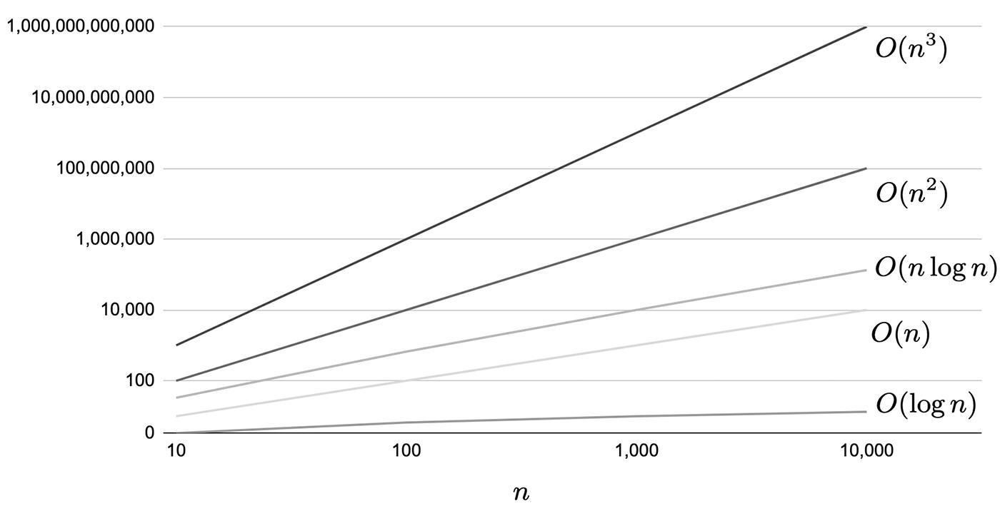
<p><em>VI: <strong>▲ Figure 2.36</strong> — so sánh <strong>O(log n) · O(n) · O(n log n) · O(n²) · O(n³)</strong> trên trục <strong>logarit</strong>; khoảng cách giữa các đường GIÃN RẤT NHANH khi n tăng. / EN: Figure 2.36 — Comparison of performance differences in logarithmic representation.</em></p>

<div class="bilingual-row">
<div class="col-vi">
<blockquote>
<p><em>"<strong>ĐỘ PHỨC TẠP TÍNH TOÁN là thước đo HIỆU SUẤT TÍNH TOÁN của một thuật toán</strong>, và có thể chia nhỏ thành <strong>TIME COMPLEXITY (đo hiệu suất thời gian)</strong> và <strong>AREA COMPLEXITY (đo hiệu suất bộ nhớ)</strong>. Bậc của độ phức tạp được ký hiệu bằng <strong>O-notation (ký hiệu Landau)</strong>.</em></p>
<p><em>📊 <strong>Thứ tự so sánh hiệu năng: O(1) &lt; O(log n) &lt; O(n) &lt; O(n log n) &lt; O(n²) &lt; O(n³)</strong>"</em></p>
</blockquote>
</div>
<div class="col-en">
<blockquote>
<p><em>"<strong>COMPUTATIONAL COMPLEXITY is a measure of an algorithm's COMPUTATIONAL EFFICIENCY</strong>, and can be subdivided into <strong>TIME COMPLEXITY (time efficiency)</strong> and <strong>AREA COMPLEXITY (memory efficiency)</strong>. The order is denoted by <strong>O-notation (Landau's symbol)</strong>.</em></p>
<p><em>📊 <strong>Performance comparison order: O(1) &lt; O(log n) &lt; O(n) &lt; O(n log n) &lt; O(n²) &lt; O(n³)</strong>"</em></p>
</blockquote>
</div>
</div>

**▼ Table 2.5 — Số dữ liệu và SỐ BƯỚC TÍNH TOÁN** *(nguyên văn)*

| **n** | **O(log n)** | **O(n)** | **O(n log n)** | **O(n²)** | **O(n³)** |
|---|---|---|---|---|---|
| **10** | 3 | 10 | 33 | 100 | 1.000 |
| **100** | 7 | 100 | 664 | 10.000 | 1.000.000 |
| **10.000** | **13** | 10.000 | 132.877 | **100.000.000** | — |
| **1.000.000** | 10 | 1.000 | 9.966 | 1.000.000 | 1.000.000.000 |

<div class="bilingual-row">
<div class="col-vi">
<p>🌟 <strong>Con số ẤN TƯỢNG NHẤT của bảng — sức mạnh của O(log n):</strong></p>
<blockquote>
<p><em>"Ví dụ, với <strong>O(log n)</strong> có <strong>13 BƯỚC tính toán NGAY CẢ KHI có 10.000 mẫu</strong>, và <strong>23 BƯỚC NGAY CẢ KHI có 10 TRIỆU mẫu</strong> — cho thấy nó <strong>CỰC KỲ ƯU VIỆT</strong>."</em></p>
</blockquote>
<p>⚠️ <strong>HAI cảnh báo QUAN TRỌNG khi dùng độ phức tạp:</strong></p>
<blockquote>
<ol>
<li><em><strong>"Trong khái niệm độ phức tạp, CHỈ số hạng có BẬC LỚN NHẤT được dùng."</strong> Nếu tạo một method chạy cả ba method ví dụ, ta được bậc tối đa <strong>O(n²)</strong> (chứ không phải O(n² + n + 1))</em></li>
<li>🚨 <em><strong>"Cần lưu ý rằng khối lượng tính toán CHỈ là KIM CHỈ NAM khi SỐ DỮ LIỆU ĐỦ LỚN, và KHÔNG NHẤT THIẾT liên hệ với THỜI GIAN ĐO THỰC TẾ. O(n⁵) có thể KHÔNG PHẢI vấn đề khi số dữ liệu NHỎ, kể cả khi nó TRÔNG có vẻ khối lượng tính toán KHỔNG LỒ.</strong></em><br>✅ <em><strong>"Do đó, KHUYẾN NGHỊ dùng khối lượng tính toán làm THAM CHIẾU và ĐO thời gian xử lý để xem nó có nằm trong phạm vi HỢP LÝ hay không — CÓ TÍNH TỚI số dữ liệu MỖI LẦN."</strong></em></li>
</ol>
</blockquote>
</div>
<div class="col-en">
<p>🌟 <strong>The most STRIKING number in the table — the power of O(log n):</strong></p>
<blockquote>
<p><em>"For example, <strong>O(log n)</strong> has <strong>13 computation steps EVEN IF there are 10,000 samples</strong>, and <strong>23 computation steps EVEN IF there are 10 MILLION samples</strong> — which shows that it is <strong>EXTREMELY SUPERIOR</strong>."</em></p>
</blockquote>
<p>⚠️ <strong>TWO IMPORTANT warnings about using complexity:</strong></p>
<blockquote>
<ol>
<li><em><strong>"In the concept of computational complexity, ONLY the term with the LARGEST ORDER is used."</strong> If you create a method that executes all three example methods once, you get the maximum order <strong>O(n²)</strong> (not O(n² + n + 1))</em></li>
<li>🚨 <em><strong>"It should also be noted that the calculation volume is ONLY a GUIDELINE when the number of data is SUFFICIENTLY LARGE, and is NOT NECESSARILY LINKED to the ACTUAL MEASUREMENT TIME. O(n⁵) may NOT be a problem when the number of data is SMALL, EVEN IF it LOOKS like a HUGE calculation volume.</strong></em><br>✅ <em><strong>"Therefore, it is RECOMMENDED to use the calculation volume as a REFERENCE and MEASURE the processing time to see if it FITS within a REASONABLE RANGE, taking the number of data into consideration EACH TIME."</strong></em></li>
</ol>
</blockquote>
</div>
</div>

**💻 BA code sample minh hoạ — nguyên văn `List 2.9` · `2.10` · `2.11`**

<div class="bilingual-row">
<div class="col-vi">
<p>📖 <em>"Để minh hoạ TỪNG mức độ phức tạp, ta liệt kê vài code sample. Trước hết, <strong>O(1) chỉ lượng tính toán KHÔNG ĐỔI, ĐỘC LẬP với số lượng dữ liệu.</strong>"</em></p>
</div>
<div class="col-en">
<p>📖 <em>"To illustrate each of the computational quantities, we will list a few code samples. First, O(1) indicates a constant amount of computation independent of the number of data."</em></p>
</div>
</div>

```csharp
// ▼ List 2.9 — Code example of O(1)
private int GetValue(int[] array)
{
    // Assume that array is an array containing some integer value.
    var value = array[0];
    return value;
}
```

<div class="bilingual-row">
<div class="col-vi">
<p>🔢 <em>"Bỏ qua lý do tồn tại của method này, rõ ràng <strong>quá trình xử lý ĐỘC LẬP với số dữ liệu trong mảng và chỉ tốn MỘT SỐ BƯỚC TÍNH KHÔNG ĐỔI</strong> (ở đây là MỘT)."</em></p>
</div>
<div class="col-en">
<p>🔢 <em>"Aside from the raison d'être of this method, obviously the process is independent of the number of data in the array and takes a constant number of calculations (in this case, one)."</em></p>
</div>
</div>

```csharp
// ▼ List 2.10 — Code example of O(n)
private bool HasOne(int[] array, int n)
{
    // Assume that array has length=n and contains some integer value
    for (var i = 0; i < n; ++i)
    {
        var value = array[i];
        if (value == 1)
        {
            return true;
        }
    }
}
```

<div class="bilingual-row">
<div class="col-vi">
<p>⏱️ <em>"Nếu số <strong>1</strong> nằm NGAY ĐẦU mảng, xử lý có thể xong <strong>NHANH NHẤT có thể</strong>. Nhưng <strong>nếu KHÔNG có số 1 nào trong mảng, vòng lặp sẽ chạy TỚI TẬN CÙNG — tức <code>n</code> lần.</strong> 🚨 <strong>Kịch bản XẤU NHẤT này gọi là O(n)</strong>, và bạn hình dung được rằng <strong>lượng tính toán TĂNG THEO số lượng dữ liệu.</strong>"</em></p>
</div>
<div class="col-en">
<p>⏱️ <em>"If by chance the first 1 is found at the beginning of the array, the process may be completed in the fastest possible time, but if there is no 1 in the array, the loop will go all the way to the end — n times. This worst-case scenario is called O(n) and you can imagine that the amount of computation increases with the number of data."</em></p>
</div>
</div>

```csharp
// ▼ List 2.11 — Example code for O(n²)
private bool HasSameValue(int[] array1, int[] array2, int n)
{
    // Assume array1 and array2 have length=n and contain some integer value.
    for (var i = 0; i < n; ++i)
    {
        var value1 = array1[i];
        for (var j = 0; j < n; ++j)
        {
            var value2 = array2[j];
            if (value1 == value2)
            {
                return true;
            }
        }
    }

    return false;
}
```

<div class="bilingual-row">
<div class="col-vi">
<p>💀 <em>"Đây chỉ là method trả về <code>true</code> nếu HAI mảng chứa CÙNG một giá trị, dùng <strong>vòng lặp KÉP. Kịch bản XẤU NHẤT là TẤT CẢ đều không khớp — tức <code>n²</code> lần.</strong>"</em></p>
</div>
<div class="col-en">
<p>💀 <em>"This one is just a method that returns true if any of the two arrays contain the same value in a double loop. The worst-case scenario is that they are all mismatched cases, so n² times."</em></p>
</div>
</div>

!!! note "📐 Hai ghi chú BÊN LỀ của sách — dễ bị bỏ qua"
    <div class="bilingual-row">
    <div class="col-vi">
    <p>① <em>"Trong khái niệm độ phức tạp tính toán, <strong>CHỈ số hạng có BẬC LỚN NHẤT được dùng.</strong> Nếu ta tạo một method thực thi MỖI method trong ba ví dụ trên MỘT LẦN, ta được bậc tối đa là <strong>O(n²)</strong> — chứ không viết <strong>O(n² + n + 1)</strong>."</em></p>
    <p>② 🚨 <em>"Cũng cần lưu ý rằng <strong>lượng tính toán CHỈ là KIM CHỈ NAM khi số lượng dữ liệu ĐỦ LỚN, và KHÔNG NHẤT THIẾT gắn với thời gian đo THỰC TẾ. O(n⁵) có thể KHÔNG phải vấn đề khi số dữ liệu NHỎ.</strong>"</em></p>
    </div>
    <div class="col-en">
    <p>① <em>"As a side note, in the concept of computational complexity, only the term with the largest order is used. If we create a method that executes each of the three methods in the above example once, we get the maximum order O(n²) — not O(n² + n + 1)."</em></p>
    <p>② 🚨 <em>"It should also be noted that the calculation volume is only a guideline when the number of data is sufficiently large, and is not necessarily linked to the actual measurement time. O(n⁵) may not be a problem when the number of data is small."</em></p>
    </div>
    </div>


### 17.1. 📚 Năm collection C# — Chọn cái nào, KHI NÀO

<div class="bilingual-row">
<div class="col-vi">
<p>📚 <strong>Sách chỉ rõ chỗ TRA CỨU:</strong> <em>"Lượng tính toán của mỗi phương thức trong các collection này <strong>được ghi trong TÀI LIỆU MSDN của từng class</strong>, nên hãy tham khảo ở đó."</em></p>
</div>
<div class="col-en">
<p>📚 <strong>Where to look it up:</strong> <em>"The amount of computation for each method of these collections is described in the MSDN documentation for each class, so please refer to it."</em></p>
</div>
</div>

**`List<T>` — cấu trúc MẢNG**

| Method | Độ phức tạp |
|---|---|
| `Add` | **O(1)** — ⚠️ *"nhưng NẾU VƯỢT capacity thì **O(n)**"* |
| `Insert` | **O(n)** |
| `IndexOf` / `Contains` | **O(n)** |
| `RemoveAt` | **O(n)** |
| `Sort` | **O(n log n)** |

<div class="bilingual-row">
<div class="col-vi">
<p>✅ <em>"<strong>HIỆU QUẢ khi THỨ TỰ dữ liệu quan trọng, hoặc khi dữ liệu THƯỜNG được lấy/cập nhật theo INDEX.</strong>"</em> ❌ <em>"Ngược lại, <strong>NẾU có NHIỀU thao tác CHÈN và XOÁ phần tử, TỐT NHẤT là TRÁNH dùng <code>List&lt;T&gt;</code> vì nó đòi hỏi KHỐI LƯỢNG TÍNH TOÁN LỚN do phải SAO CHÉP sau các index đã bị thao tác.</strong>"</em></p>
<p>🚨 <em>"Ngoài ra, <strong>khi capacity bị vượt bởi <code>Add</code>, bộ nhớ cấp cho mảng được MỞ RỘNG. Khi mở rộng, GẤP ĐÔI Capacity hiện tại được cấp phát</strong> — nên KHUYẾN NGHỊ <strong>dùng <code>Add</code> ở O(1) bằng cách đặt GIÁ TRỊ KHỞI TẠO PHÙ HỢP để nó dùng được mà KHÔNG gây mở rộng.</strong>"</em></p>
</div>
<div class="col-en">
<p>✅ <em>"<strong>EFFECTIVE when the ORDER of data is IMPORTANT, or when data is OFTEN retrieved or updated by INDEX.</strong>"</em> ❌ <em>"On the other hand, <strong>IF there are MANY INSERTIONS and DELETIONS of elements, it is BEST to AVOID <code>List&lt;T&gt;</code> because it requires a LARGE amount of computation due to the need to COPY after the manipulated indexes.</strong>"</em></p>
<p>🚨 <em>"In addition, <strong>when the capacity is EXCEEDED by <code>Add</code>, the memory allocated for the array is EXTENDED. When memory is extended, TWICE the current Capacity is allocated</strong> — so it is RECOMMENDED to <strong>use <code>Add</code> at O(1) with APPROPRIATE INITIAL VALUES so that it can be used WITHOUT causing expansion.</strong>"</em></p>
</div>
</div>

**`LinkedList<T>` — DANH SÁCH LIÊN KẾT hai chiều**

| Method | Độ phức tạp |
|---|---|
| `AddFirst` / `AddLast` | 🏆 **O(1)** |
| `AddAfter` / `AddBefore` | 🏆 **O(1)** |
| `Remove` / `RemoveFirst` / `RemoveLast` | 🏆 **O(1)** |
| `Contains` | **O(n)** |

> ✅ *"**MẠNH ở việc THÊM và XOÁ phần tử, nhưng KHÔNG GIỎI truy cập phần tử CỤ THỂ.** PHÙ HỢP khi bạn muốn tạo một tiến trình GIỮ TẠM dữ liệu cần THÊM/XOÁ THƯỜNG XUYÊN."* / *"Strong features for ADDING and DELETING, but NOT GOOD at accessing SPECIFIC elements."*

**`Queue<T>` — FIFO, dùng MẢNG VÒNG** · **`Stack<T>` — LIFO, dùng MẢNG**

| Method | `Queue<T>` | `Stack<T>` |
|---|---|---|
| Thêm | `Enqueue` — **O(1)** *(vượt capacity ⇒ **O(n)**)* | `Push` — **O(1)** *(vượt capacity ⇒ **O(n)**)* |
| Lấy ra | `Dequeue` — **O(1)** | `Pop` — **O(1)** |
| Xem đỉnh | `Peek` — **O(1)** | `Peek` — **O(1)** |
| `Contains` | **O(n)** | **O(n)** |
| `TrimExcess` | **O(n)** | **O(n)** |

<div class="bilingual-row">
<div class="col-vi">
<p>📥 <strong>Queue:</strong> <em>"dùng để cài đặt HÀNG ĐỢI, ví dụ để <strong>QUẢN LÝ THAO TÁC INPUT</strong>."</em> ⚠️ <em>"<strong><code>Enqueue</code> và <code>Dequeue</code> giữ hiệu năng CAO, nhưng chúng KHÔNG PHÙ HỢP cho thao tác như DUYỆT (traversal).</strong>"</em></p>
<p>📚 <strong>Stack:</strong> <em>"Cách dùng PHỔ BIẾN là <strong>khi cài đặt CHUYỂN MÀN HÌNH — thông tin scene đích được lưu bằng <code>Push</code>, và khi nút BACK được bấm, lấy lại thông tin scene bằng <code>Pop</code>.</strong>"</em></p>
<p>🚨 <em>"Với CẢ HAI: <strong>hiệu năng CAO đạt được bằng cách CHỈ dùng <code>Push</code>/<code>Pop</code> (hoặc <code>Enqueue</code>/<code>Dequeue</code>). CẨN THẬN ĐỪNG TÌM KIẾM phần tử, và CẨN THẬN với việc TĂNG/GIẢM capacity.</strong> <code>TrimExcess</code> là method để GIẢM capacity, nhưng <strong>từ góc nhìn tuning, TỐT HƠN là ĐỪNG ĐỂ capacity tăng/giảm NGAY TỪ ĐẦU.</strong>"</em></p>
</div>
<div class="col-en">
<p>📥 <strong>Queue:</strong> <em>"used to implement QUEUES, for example to <strong>MANAGE INPUT OPERATIONS</strong>."</em> ⚠️ <em>"<strong><code>Enqueue</code> and <code>Dequeue</code> keep HIGH PERFORMANCE, but they are NOT SUITABLE for operations such as TRAVERSAL.</strong>"</em></p>
<p>📚 <strong>Stack:</strong> <em>"A common use is <strong>when implementing SCREEN TRANSITIONS — the destination scene info is stored with <code>Push</code>, and when the BACK button is pressed, retrieving it with <code>Pop</code>.</strong>"</em></p>
<p>🚨 <em>"For BOTH: <strong>high performance is obtained by using ONLY <code>Push</code>/<code>Pop</code> (or <code>Enqueue</code>/<code>Dequeue</code>). Be CAREFUL not to SEARCH for elements, and be careful about INCREASING/DECREASING capacity.</strong> <code>TrimExcess</code> reduces capacity, but <strong>from a tuning perspective it is BETTER that capacity is NOT increased or decreased IN THE FIRST PLACE.</strong>"</em></p>
</div>
</div>

**`Dictionary<TKey, TValue>` — BẢNG BĂM (hash table)**

| Method | Độ phức tạp |
|---|---|
| `Add` | **O(1)** *(vượt capacity ⇒ **O(n)**)* |
| `TryGetValue` | 🏆 **O(1)** |
| `ContainsKey` | 🏆 **O(1)** |
| `ContainsValue` | ⚠️ **O(n)** |

> ⚖️ *"**CÓ NHƯỢC ĐIỂM là TIÊU TỐN NHIỀU BỘ NHỚ HƠN, nhưng TỐC ĐỘ TRA CỨU là O(1) và NHANH HƠN.** RẤT HỮU ÍCH cho trường hợp KHÔNG cần liệt kê hay duyệt, và nhấn mạnh vào việc THAM CHIẾU GIÁ TRỊ. ✅ **Cũng nhớ ĐẶT TRƯỚC capacity.**"* / *"Has the disadvantage of CONSUMING MORE MEMORY, but the LOOKUP speed is O(1) and FASTER. … **Be sure to PRE-SET the capacity.**"*

!!! tip "🧠 MEMOIZATION — khi KHÔNG THỂ giảm độ phức tạp"
    **VI:** *"Giả sử bạn có một method (`ComplexMethod`) với độ phức tạp RẤT CAO đòi hỏi tính toán phức tạp. **Tuy nhiên, có lúc KHÔNG THỂ giảm được khối lượng tính toán. Trong trường hợp đó, có thể dùng kỹ thuật gọi là MEMOIZATION.** Giả sử `ComplexMethod` trả về kết quả tương ứng DUY NHẤT khi được cho một tham số. **LẦN ĐẦU tham số được truyền, tiến trình phức tạp được chạy qua. SAU khi tính, tham số và kết quả được đưa vào `Dictionary<TKey, TValue>` và CACHE lại.** Lần THỨ HAI trở đi, kết quả được lấy TỪ CACHE."*

    **EN:** *"Suppose you have a method (`ComplexMethod`) with a VERY HIGH computational complexity. **However, there are times when it is NOT POSSIBLE to reduce the amount of calculation. In such cases, a technique called MEMOIZATION can be used.** Assuming `ComplexMethod` uniquely returns the corresponding result for a given argument: **the FIRST time the argument is passed, the complex process runs. AFTER the calculation, the arguments and the result are put into a `Dictionary<TKey, TValue>` and CACHED.** From the second time on, the result comes FROM the cache."*

    👉 *Đây chính là kỹ thuật "cache the results of expensive functions" ở [Module 1](../01-fresher/01-ultimate-guide-to-profiling.md), được đặt tên chính thức.*

<div class="bilingual-row">
<div class="col-vi">
<p>🎯 <em>"Tất nhiên, <strong>CÓ THỂ cài đặt cùng một tiến trình CHỈ bằng <code>List&lt;T&gt;</code> (mảng), nhưng bằng cách CHỌN collection class PHÙ HỢP HƠN, có thể TỐI ƯU khối lượng tính toán.</strong> <strong>Chỉ cần cài đặt method với Ý THỨC về khối lượng tính toán là đã TRÁNH được xử lý nặng.</strong>"</em></p>
</div>
<div class="col-en">
<p>🎯 <em>"Of course, <strong>it is POSSIBLE to implement the same process using ONLY <code>List&lt;T&gt;</code> (an array), but by SELECTING a MORE SUITABLE collection class, it is possible to OPTIMIZE the amount of computation.</strong> <strong>By SIMPLY implementing methods with an AWARENESS of the amount of computation, HEAVY PROCESSING can be AVOIDED.</strong>"</em></p>
</div>
</div>
---

# PHẦN C — CÔNG CỤ PROFILING & THỰC HÀNH TUNING (Chương 3–8)

<div class="bilingual-row">
<div class="col-vi">
<p>🎯 <strong>Chương 3 mở đầu bằng một câu định vị toàn bộ Phần C:</strong></p>
<blockquote>
<p><em>"Công cụ profiling được dùng để <strong>THU THẬP và PHÂN TÍCH dữ liệu, XÁC ĐỊNH bottleneck, và QUYẾT ĐỊNH các chỉ số hiệu năng</strong>. Có vài công cụ như vậy do <strong>riêng engine Unity</strong> cung cấp. Các công cụ khác gồm <strong>công cụ native như Xcode và Android Studio</strong>, và <strong>công cụ chuyên GPU như RenderDoc</strong>. Do đó, <strong>điều QUAN TRỌNG là HIỂU đặc tính của TỪNG công cụ và CHỌN cho phù hợp.</strong>"</em></p>
</blockquote>
</div>
<div class="col-en">
<p>🎯 <strong>Chapter 3 opens with the sentence that frames all of Part C:</strong></p>
<blockquote>
<p><em>"Profiling tools are used to <strong>collect and analyze data, identify bottlenecks, and determine performance metrics</strong>. There are several of these tools provided by <strong>the Unity engine alone</strong>. Other tools include <strong>native-compliant tools such as Xcode and Android Studio</strong>, and <strong>GPU-specific tools such as RenderDoc</strong>. Therefore, <strong>it is important to understand the features of each tool and choose appropriately.</strong>"</em></p>
</blockquote>
</div>
</div>

---

## 18. 🧭 Nguyên tắc ĐO — Editor hay Thiết bị THẬT?

<div class="bilingual-row">
<div class="col-vi">
<p>🔑 <strong>Unity chạy được cả trên editor lẫn device, nên phải hiểu đặc tính của TỪNG môi trường trước khi tin vào con số.</strong></p>
<p>✅ <em>"Ưu điểm LỚN NHẤT của việc dùng editor là nó cho phép <strong>thử–sai NHANH</strong>."</em></p>
<p>⚠️ <em>"Tuy nhiên, vì <strong>tải xử lý của BẢN THÂN editor và vùng nhớ mà editor dùng CŨNG bị đo</strong>, nên sẽ có <strong>RẤT NHIỀU NHIỄU</strong> trong kết quả đo. Ngoài ra, vì <strong>cấu hình HOÀN TOÀN KHÁC</strong> so với thiết bị thật, nên <strong>KHÓ xác định bottleneck và kết quả có thể KHÁC.</strong>"</em></p>
</div>
<div class="col-en">
<p>🔑 <strong>Unity runs on both editor and device, so you must know each environment's characteristics before trusting the numbers.</strong></p>
<p>✅ <em>"The greatest advantage of using the editor is that it allows for <strong>quick trial and error</strong>."</em></p>
<p>⚠️ <em>"However, since <strong>the processing load of the editor itself and the memory area used by the editor are ALSO measured</strong>, there will be <strong>a lot of NOISE</strong> in the measurement results. Also, since the <strong>specifications are COMPLETELY DIFFERENT</strong> from those of the actual equipment, <strong>it is difficult to identify bottlenecks and the results may differ.</strong>"</em></p>
</div>
</div>

!!! success "✅ QUY TRÌNH 3 BƯỚC do CyberAgent khuyến nghị"
    <div class="bilingual-row">
    <div class="col-vi">
    <p>1️⃣ <strong>XÁC NHẬN hiện tượng TRÊN THIẾT BỊ THẬT trước.</strong><br>
    2️⃣ <strong>XÁC NHẬN vấn đề TÁI HIỆN được trong editor</strong>, rồi <strong>SỬA trong editor</strong> (rẻ hơn nhiều).<br>
    3️⃣ <strong>Cuối cùng, LUÔN kiểm tra bản sửa TRÊN THIẾT BỊ THẬT.</strong></p>
    <p>🚨 <em>"Đa số trường hợp vấn đề tái hiện ở CẢ HAI môi trường, nhưng <strong>trong vài trường hợp HIẾM, nó chỉ tái hiện ở MỘT trong hai.</strong>"</em></p>
    </div>
    <div class="col-en">
    <p>1️⃣ <strong>First confirm the phenomenon on the ACTUAL DEVICE.</strong><br>
    2️⃣ <strong>Next, confirm the problem reproduces in the editor</strong>, then <strong>correct it in the editor</strong> (much cheaper).<br>
    3️⃣ <strong>Of course, be sure to check the correction on the actual device at the end.</strong></p>
    <p>🚨 <em>"Most of the time the problem is reproduced in both environments, but <strong>in RARE cases it may only be reproduced in ONE of the environments.</strong>"</em></p>
    </div>
    </div>

---

## 19. 📊 Unity Profiler — Từ kết nối tới đọc số

👉 *Xem thêm [Module 1 — Ultimate Guide to Profiling](../01-fresher/01-ultimate-guide-to-profiling.md) để nắm phần cơ bản; mục này bổ sung góc nhìn thực chiến của CyberAgent.*

### 19.1. Danh sách Profiler Module — 14 module ở Unity 2020

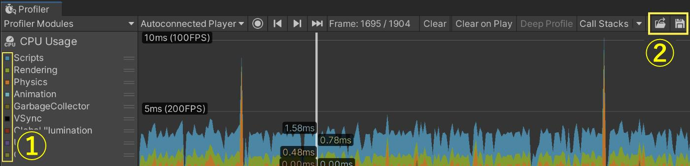
<p><em>VI: <strong>▲ Hai vùng của cửa sổ Profiler</strong> — <strong>①</strong> cột <strong>Profiler Modules</strong> (Scripts · Rendering · Physics · Animation · GarbageCollector · VSync · GlobalIllumination) và <strong>②</strong> hai nút ở góc phải để <strong>ĐỔI CÁCH HIỂN THỊ biểu đồ</strong>. Thanh trên có <strong>Frame: 1695 / 1904</strong>, mốc <strong>10ms (100FPS)</strong> và <strong>5ms (200FPS)</strong>. / EN: The two areas of the Profiler window.</em></p>

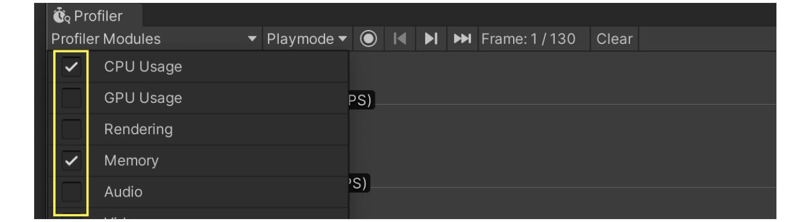
<p><em>VI: <strong>▲ Bật/tắt từng module</strong> — chỉ tick <strong>CPU Usage · Memory</strong>; module KHÔNG tick sẽ KHÔNG được ghi, giúp <strong>GIẢM overhead của chính việc đo</strong>. / EN: Toggling individual Profiler Modules on and off.</em></p>

<div class="bilingual-row">
<div class="col-vi">
<p><em>"Unity Profiler là công cụ profiling <strong>tích hợp SẴN trong Unity Editor</strong>. Công cụ này thu thập thông tin <strong>theo TỪNG FRAME</strong>. Có rất nhiều mục đo được, mỗi mục gọi là một <strong>profiler module</strong>, và ở bản <strong>Unity 2020 có 14 module</strong>. Module này vẫn đang được cập nhật, và ở <strong>Unity 2021.2 đã thêm module mới về Asset và về File I/O.</strong>"</em></p>
<p>🚨 <strong>Bẫy quan trọng:</strong> <em>"Các module này có thể được cấu hình HIỂN THỊ hay KHÔNG trên profiler. <strong>Tuy nhiên, module KHÔNG hiển thị thì KHÔNG được đo. Ngược lại, nếu bật HẾT tất cả, editor sẽ bị QUÁ TẢI.</strong>"</em></p>
</div>
<div class="col-en">
<p><em>"The Unity Profiler is a profiling tool <strong>built into the Unity Editor</strong>. This tool can collect information <strong>on a frame-by-frame basis</strong>. There is a wide range of items that can be measured, each called a <strong>profiler module</strong>, and in the <strong>Unity 2020 version there are 14 of them</strong>. This module is still being updated, and in <strong>Unity 2021.2, a new module on Asset and a new module on File I/O have been added.</strong>"</em></p>
<p>🚨 <strong>Key trap:</strong> <em>"These modules can be configured to be displayed or not on the profiler. <strong>However, modules that are not displayed are not measured. Conversely, if all of them are displayed, the editor will be overloaded.</strong>"</em></p>
</div>
</div>

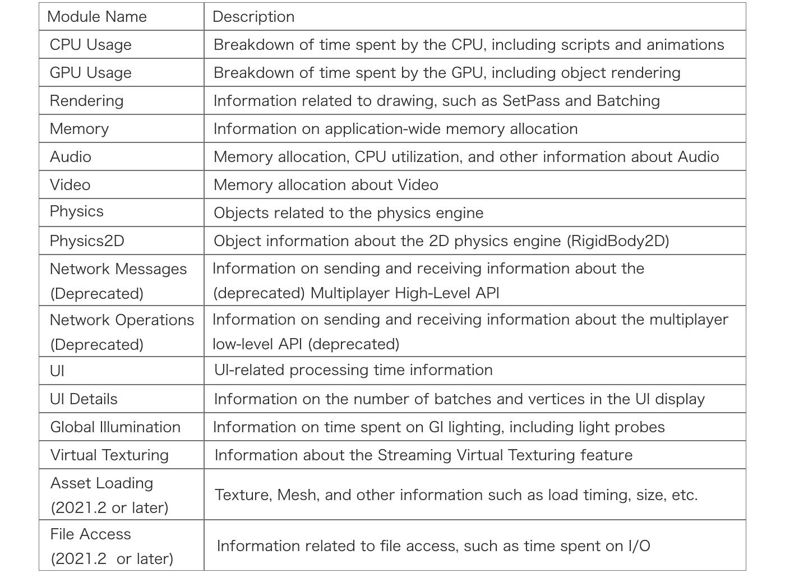

<p><em>VI: Bảng toàn bộ Profiler Module — CPU Usage, GPU Usage, Rendering (SetPass & Batching), Memory, Audio, Video, Physics, Physics2D, Network Messages/Operations (deprecated), UI, UI Details (số batch & vertex của UI), Global Illumination, Virtual Texturing, và hai module mới từ 2021.2: Asset Loading + File Access. / EN: The full Profiler Module table — including the two modules added in 2021.2: Asset Loading (texture/mesh load timing & size) and File Access (time spent on I/O).</em></p>

<div class="bilingual-row">
<div class="col-vi">
<p>🧰 <strong>Hai chức năng dùng chung của toàn bộ Profiler:</strong></p>
<p>① <em>"Mục <strong>'Profiler Modules'</strong> liệt kê các item mà mỗi module đang đo. <strong>Bấm vào item để BẬT/TẮT hiển thị trên timeline bên phải. Chỉ hiện item CẦN THIẾT sẽ giúp DỄ ĐỌC hơn. Bạn cũng có thể KÉO THẢ để ĐỔI THỨ TỰ item</strong>, và đồ thị bên phải sẽ hiển thị theo thứ tự đó."</em></p>
<p>② <em>"Chức năng <strong>LƯU và NẠP dữ liệu đã đo</strong>. Khuyến nghị lưu lại kết quả đo nếu cần. <strong>CHỈ dữ liệu đang HIỂN THỊ trên profiler mới được lưu.</strong>"</em></p>
</div>
<div class="col-en">
<p>🧰 <strong>Two functions common to the entire Profiler tool:</strong></p>
<p>① <em>"In the <strong>'Profiler Modules'</strong> section, ① lists the items that each module is measuring. <strong>By clicking on this item, you can switch between display and non-display on the timeline on the right. Displaying only the necessary items will make the view easier to read. You can also reorder the items by dragging them</strong>, and the graph on the right side will be displayed in that order."</em></p>
<p>② <em>"A function for <strong>saving and loading the measured data</strong>. It is recommended to save the measurement results if necessary. <strong>Only the data displayed on the profiler can be saved.</strong>"</em></p>
</div>
</div>

### 19.2. Việc phải làm TRƯỚC khi build — Development Build & Deep Profile

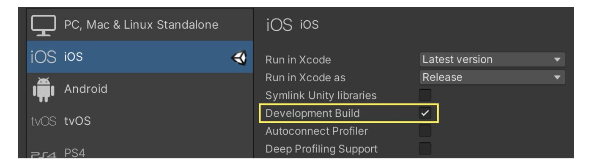
<p><em>VI: <strong>▲ Build Settings</strong> — chọn nền tảng <strong>iOS</strong>, <strong>Run in Xcode as: Release</strong>, và <strong>BẮT BUỘC tick Development Build ✓</strong>. Bên dưới là <strong>Autoconnect Profiler</strong> và <strong>Deep Profiling Support</strong>. / EN: Build Settings with Development Build ticked.</em></p>

<div class="bilingual-row">
<div class="col-vi">
<p>✅ <em>"Việc phải làm trước khi build là <strong>BẬT setting 'Development Build'. Một khi bật, kết nối tới profiler mới có thể thiết lập được.</strong>"</em></p>
<p>🔬 <em>"Ta cũng cần bật tuỳ chọn <strong>Deep Profile</strong> để đo CHI TIẾT hơn. <strong>Khi bật, thời gian xử lý của TẤT CẢ lời gọi hàm được ghi lại, giúp DỄ xác định hàm bottleneck.</strong>"</em></p>
<p>💀 <em>"Nhược điểm là <strong>bản thân việc đo đòi hỏi OVERHEAD RẤT LỚN, khiến nó CHẬM và TỐN BỘ NHỚ. Lưu ý rằng tiến trình có thể TRÔNG như tốn RẤT LÂU, nhưng ở profile thường thì KHÔNG đến vậy.</strong> Về cơ bản, nó <strong>CHỈ dùng khi profile thường KHÔNG cung cấp đủ thông tin.</strong>"</em></p>
</div>
<div class="col-en">
<p>✅ <em>"The work to be done before building is to enable the <strong>'Development Build' setting. Once this is activated, a connection to the profiler can be established.</strong>"</em></p>
<p>🔬 <em>"Also, we will need to enable the <strong>Deep Profile</strong> option for more detailed measurement. <strong>When this option is enabled, the processing time of ALL function calls is recorded, making it easier to identify bottleneck functions.</strong>"</em></p>
<p>💀 <em>"The disadvantage is that <strong>the measurement itself requires a VERY LARGE overhead, making it slow and memory intensive. Note that the process may APPEAR to take a very long time, but not so much in the normal profile.</strong> Basically, it is <strong>used only when the normal profile does not provide enough information.</strong>"</em></p>
</div>
</div>

!!! danger "💀 Deep Profile có thể KHÔNG ĐO ĐƯỢC ở project lớn"
    **VI:** *"Nếu Deep Profile dùng NHIỀU bộ nhớ, ví dụ trong một project LỚN, có thể **KHÔNG THỂ đo được do THIẾU bộ nhớ. Trong trường hợp đó, bạn KHÔNG CÒN LỰA CHỌN nào ngoài việc TỰ THÊM tiến trình đo của riêng mình** — tham chiếu mục Sampler ở §19.5."*

    **EN:** *"If Deep Profile uses a lot of memory, such as in a large project, it may **not be possible to make measurements due to insufficient memory. In that case, you have no choice but to add your own measurement process** by referring to 'Supplement: About Sampler'."*

**Cấu hình từ SCRIPT (List 3.1):**

```csharp
BuildPlayerOptions buildPlayerOptions = new BuildPlayerOptions();
/* Scene and build target settings are omitted. */

buildPlayerOptions.options |= BuildOptions.Development;
// Add only if you want to enable Deep Profile mode
buildPlayerOptions.options |= BuildOptions.EnableDeepProfilingSupport;

BuildReport report = BuildPipeline.BuildPlayer(buildPlayerOptions);
```

### 19.3. Việc phải làm SAU khi app khởi động — Wired connection

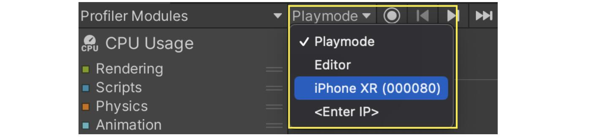
<p><em>VI: <strong>▲ Chọn ĐÍCH đo</strong> — dropdown liệt kê <strong>Playmode · Editor · iPhone XR (000080)</strong> và <strong>&lt;Enter IP&gt;</strong>. Thiết bị THẬT chỉ hiện khi đã cắm cáp và app đang chạy. / EN: Selecting the profiling target: Playmode, Editor, a real device, or Enter IP.</em></p>

<div class="bilingual-row">
<div class="col-vi">
<p>🔌 <em>"Có hai cách kết nối với Unity Profiler sau khi app khởi động: <strong>'Remote Connection' và 'Wired (USB) Connection'</strong>. <strong>Remote connection có NHIỀU HẠN CHẾ MÔI TRƯỜNG hơn wired, và profile có thể KHÔNG chạy như mong đợi.</strong> Ví dụ: có thể phải cùng mạng Wifi, <strong>riêng Android có thể phải TẮT kết nối di động</strong>, và có thể phải giải phóng port khác."</em></p>
<p>🎯 <strong>Vì vậy sách tập trung vào WIRED — "đơn giản và ĐÁNG TIN CẬY hơn để profile".</strong></p>
</div>
<div class="col-en">
<p>🔌 <em>"There are two ways to connect with Unity Profiler after application startup: <strong>'Remote Connection' and 'Wired (USB) Connection'</strong>. <strong>The remote connection has MORE ENVIRONMENTAL RESTRICTIONS than the wired connection, and the profile may NOT work as expected.</strong> For example, connection to the same Wifi network may be required, <strong>mobile communication may need to be disabled for Android only</strong>, and other ports may need to be freed."</em></p>
<p>🎯 <strong>So the book focuses on wired connections, "which are simpler and more reliable to profile".</strong></p>
</div>
</div>

| Bước | 🍎 **iOS** | 🤖 **Android** |
|---|---|---|
| 1 | Đổi Target Platform → **iOS** trong Build Settings | Đổi Target Platform → **Android** |
| 2 | Cắm máy vào PC & chạy app **Development Build** | Cắm máy vào PC & chạy app **Development Build** |
| 3 | Chọn thiết bị trong Unity Profiler | ⚠️ **Gõ lệnh `adb forward`** (bước THÊM so với iOS) |
| 4 | **Start Record** | Chọn thiết bị trong Unity Profiler |
| 5 | — | **Start Record** |

**Lệnh `adb forward` (List 3.2) — cần Package Name, ví dụ `jp.co.sample.app`:**

```bash
adb forward tcp:34999 localabstract:Unity-jp.co.sample.app
```

!!! tip "🧰 Checklist khi KHÔNG kết nối được"
    <div class="bilingual-row">
    <div class="col-vi">
    <p><strong>Chung cho cả hai:</strong> có dấu <strong>"Development Build"</strong> ở góc dưới bên PHẢI của app đang chạy không?</p>
    <p><strong>Riêng Android:</strong> ⓐ <strong>USB debugging</strong> đã bật trên máy chưa? ⓑ package name trong lệnh <code>adb forward</code> có ĐÚNG không? ⓒ lệnh <code>adb devices</code> có nhận đúng máy không?</p>
    <p>💡 <em>"Nếu bạn chạy app trực tiếp bằng <strong>Build And Run</strong>, lệnh <code>adb forward</code> nói trên sẽ được thực hiện NGẦM BÊN TRONG. Do đó KHÔNG cần gõ lệnh."</em></p>
    <p>💡 <em>"Unity Editor dùng để đo <strong>KHÔNG NHẤT THIẾT phải là project bạn đã build</strong>. Khuyến nghị <strong>tạo project MỚI để đo, vì nó NHẸ.</strong>"</em></p>
    </div>
    <div class="col-en">
    <p><strong>Common to both devices:</strong> Is there a <strong>"Development Build"</strong> sign in the lower right corner of the executed application?</p>
    <p><strong>Android only:</strong> ⓐ Is <strong>USB debugging</strong> enabled on the device? ⓑ Is the package name entered in the <code>adb forward</code> command correct? ⓒ Is the device properly recognized by <code>adb devices</code>?</p>
    <p>💡 <em>"If you run the application directly in <strong>Build And Run</strong>, the <code>adb forward</code> command described above will be performed INTERNALLY. Therefore, no command input is required."</em></p>
    <p>💡 <em>"The Unity Editor for measurement <strong>does NOT have to be the project you built</strong>. It is recommended to <strong>create a NEW project for the measurement, as it is lightweight.</strong>"</em></p>
    </div>
    </div>

!!! warning "⚠️ Autoconnect Profiler — cái tên GÂY HIỂU LẦM"
    <div class="bilingual-row">
    <div class="col-vi">
    <p><em>"Đây là chức năng <strong>tự động kết nối tới profiler của editor khi app khởi động. Do đó nó KHÔNG PHẢI setting BẮT BUỘC để profiling.</strong> Điều này cũng đúng với remote profiling. <strong>CHỈ WebGL là không profile được nếu thiếu option này</strong>, nhưng nó không phải option hữu ích lắm cho mobile."</em></p>
    <p>💀 <em>"Đi sâu hơn: nếu option này BẬT, <strong>địa chỉ IP của editor sẽ được GHI VÀO BINARY lúc build</strong>, và app sẽ thử kết nối tới địa chỉ đó lúc khởi động. Nếu bạn build trên <strong>máy build chuyên dụng</strong>, điều này KHÔNG cần thiết — <strong>bạn sẽ chỉ phải CHỜ LÂU HƠN (khoảng 8 GIÂY) để kết nối tự động TIMEOUT khi app khởi động.</strong>"</em></p>
    <p>🚨 <em>"Từ script, tên option là <code>BuildOptions.ConnectWithProfiler</code> — <strong>rất DỄ bị NHẦM là BẮT BUỘC.</strong>"</em></p>
    </div>
    <div class="col-en">
    <p><em>"This option is a function to <strong>automatically connect to the editor's profiler when the application is launched. Therefore, it is NOT a required setting for profiling.</strong> The same applies to remote profiling. <strong>Only WebGL cannot be profiled without this option</strong>, but it is not a very useful option for mobile."</em></p>
    <p>💀 <em>"To take this a bit further, if this option is enabled, <strong>the IP address of the editor will be written to the binary at build time</strong>, and an attempt will be made to connect to that address at startup. If you are building on a <strong>dedicated build machine</strong>, this is not necessary — <strong>rather, you will just have to wait longer (about 8 SECONDS) for the automatic connection to time out when the application starts.</strong>"</em></p>
    <p>🚨 <em>"Note that from the script, the option name is <code>BuildOptions.ConnectWithProfiler</code>, <strong>which can easily be mistaken for mandatory.</strong>"</em></p>
    </div>
    </div>

### 19.4. CPU Usage — Hierarchy vs Raw Hierarchy vs Timeline

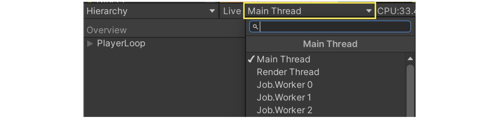
<p><em>VI: <strong>▲ Chọn LUỒNG</strong> — <strong>Main Thread · Render Thread · Job.Worker 0/1/2…</strong>. Chọn sai luồng là đọc sai hoàn toàn con số. / EN: The thread selector: Main Thread, Render Thread, Job.Worker.</em></p>

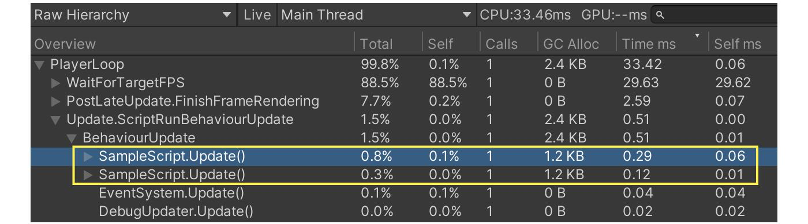
<p><em>VI: <strong>▲ Raw Hierarchy</strong> — <code>PlayerLoop</code> <strong>99.8% · 33.42 ms</strong>; <code>WaitForTargetFPS</code> <strong>88.5% (29.63 ms)</strong>; <code>PostLateUpdate.FinishFrameRendering</code> 7.7%; và HAI dòng <code>SampleScript.Update()</code> RIÊNG BIỆT <strong>0.8% (1.2 KB, 0.29 ms)</strong> và <strong>0.3% (1.2 KB, 0.12 ms)</strong> — Raw KHÔNG GỘP các lần gọi lại với nhau. / EN: Raw Hierarchy showing two separate SampleScript.Update() rows.</em></p>

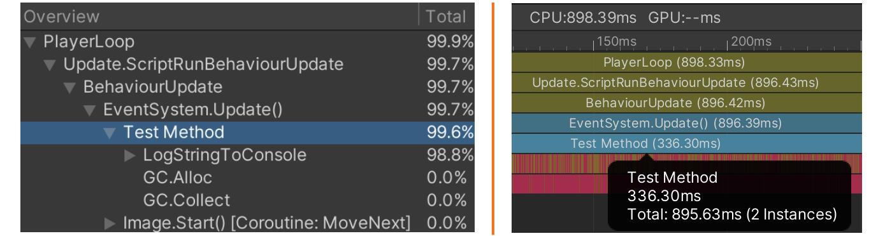
<p><em>VI: <strong>Deep Profile</strong> phơi bày tận cùng: <code>Test Method</code> <strong>336.30 ms</strong>, tổng <strong>895.63 ms (2 Instances)</strong>, bên dưới là <code>LogStringToConsole</code> <strong>98.8%</strong>. / EN: Deep Profile revealing Test Method at 336.30 ms, total 895.63 ms across 2 instances.</em></p>

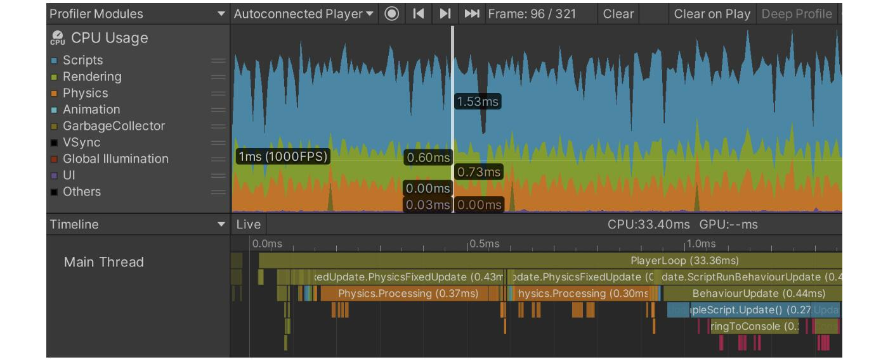

<p><em>VI: Module <strong>CPU Usage</strong> — 9 hạng mục màu (Scripts / Rendering / Physics / Animation / GarbageCollector / VSync / Global Illumination / UI / Others). Frame đang chọn: <strong>CPU 33.40ms</strong>; timeline dưới hiện <code>PlayerLoop (33.36ms)</code>, <code>FixedUpdate.PhysicsFixedUpdate (0.43ms)</code>, <code>Physics.Processing (0.37ms)</code>, <code>BehaviourUpdate (0.44ms)</code>, <code>SampleScript.Update() (0.27ms)</code>. / EN: The CPU Usage module — colour-coded categories plus the per-thread Timeline underneath.</em></p>

**1️⃣ Hierarchy View — dùng để SẮP XẾP và TÌM bottleneck**

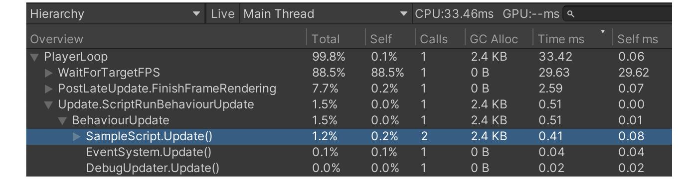

<p><em>VI: Hierarchy View — <code>PlayerLoop</code> <strong>99.8% / 33.42ms</strong>, trong đó <code>WaitForTargetFPS</code> chiếm <strong>88.5% (29.63ms)</strong> (đang chờ VSync ⇒ máy còn dư sức), <code>PostLateUpdate.FinishFrameRendering</code> <strong>7.7% (2.59ms)</strong>, và <code>SampleScript.Update()</code> <strong>2 Calls, 2.4 KB GC Alloc</strong>. / EN: Hierarchy View — sortable list; note the GC Alloc column showing 2.4 KB from SampleScript.Update().</em></p>

<div class="bilingual-row">
<div class="col-vi">
<p>⚠️ <strong>Giới hạn của Hierarchy:</strong> <em>"Thông tin hiển thị là <strong>chỉ báo thời gian tiêu tốn TRONG THREAD ĐANG CHỌN</strong>. Ví dụ, <strong>nếu bạn dùng Job System hoặc multi-threaded rendering, thời gian xử lý ở thread KHÁC KHÔNG được tính vào.</strong>"</em> — muốn xem thì phải <strong>chọn thread</strong>.</p>
</div>
<div class="col-en">
<p>⚠️ <strong>Hierarchy's limitation:</strong> <em>"The information displayed is an indication of <strong>the time spent in the SELECTED THREAD</strong>. For example, <strong>if you are using Job System or multi-threaded rendering, the processing time in another thread is NOT included.</strong>"</em> — you must <strong>select the thread</strong> to see it.</p>
</div>
</div>

**Bảng 3.1 — Ý nghĩa các cột header của Hierarchy:**

| Header | Ý nghĩa (VI) | Meaning (EN) |
|---|---|---|
| **Overview** | Tên sample | Sample name |
| **Total** | **TỔNG** thời gian xử lý hàm này (**%**) | Total time spent processing this function (%) |
| **Self** | Thời gian của **CHÍNH hàm** — ⚠️ **KHÔNG gồm hàm con** (%) | Processing time of this function itself; subfunction time is NOT included (%) |
| **Calls** | Số lần gọi **trong MỘT frame** | Number of calls made in one frame |
| **GC Alloc** | 💀 **Heap memory hàm này cấp phát** | Heap memory allocated by this function |
| **Time ms** | Total tính bằng **ms** | Total in ms |
| **Self ms** | Self tính bằng **ms** | Self in ms |

<div class="bilingual-row">
<div class="col-vi">
<p>🔍 <strong>Raw Hierarchy — khi nào cần?</strong> <em>"<code>Calls</code> DỄ NHÌN hơn vì nó <strong>GỘP nhiều lời gọi hàm thành MỘT item</strong>. Tuy nhiên, <strong>KHÔNG RÕ liệu TẤT CẢ chúng có thời gian xử lý BẰNG NHAU, hay CHỈ MỘT trong số đó có thời gian xử lý DÀI.</strong> Trong trường hợp đó, dùng <strong>Raw Hierarchy View</strong> — khác Hierarchy ở chỗ <strong><code>Calls</code> LUÔN CỐ ĐỊNH = 1.</strong>"</em></p>
<p>🎯 <strong>Hierarchy dùng để:</strong> ① <em>Xác định & tối ưu bottleneck (Time ms, Self ms)</em>; ② <em>Xác định & tối ưu GC allocation (GC Alloc)</em>. <em>"<strong>Khi làm việc này, khuyến nghị SẮP XẾP GIẢM DẦN theo cột mong muốn trước khi kiểm tra.</strong>"</em></p>
<p>💡 <em>"Khi mở một item, thường có <strong>PHÂN CẤP RẤT SÂU</strong>. Bạn có thể <strong>mở TOÀN BỘ các cấp bằng cách giữ phím <code>Option</code> trên Mac (<code>Alt</code> trên Windows)</strong>. Ngược lại, đóng item khi giữ phím sẽ đóng MỌI THỨ bên dưới."</em></p>
</div>
<div class="col-en">
<p>🔍 <strong>Raw Hierarchy — when do you need it?</strong> <em>"<code>Calls</code> is easier to see as a view because it <strong>combines multiple function calls into a single item</strong>. However, <strong>it is not clear whether ALL of them have equal processing time or only ONE of them has a long processing time.</strong> In such cases, the <strong>Raw Hierarchy View</strong> is used — it differs in that <strong><code>Calls</code> is always FIXED at 1.</strong>"</em></p>
<p>🎯 <strong>Hierarchy is used for:</strong> ① <em>Identify and optimize bottlenecks (Time ms, Self ms)</em>; ② <em>Identify and optimize GC allocations</em>. <em>"<strong>When performing these tasks, it is recommended to sort each desired item in DESCENDING order before checking it.</strong>"</em></p>
<p>💡 <em>"When opening an item, it is often the case that there is a <strong>DEEP hierarchy</strong>. In this case, <strong>you can open all levels of the hierarchy by holding down the <code>Option</code> key on a Mac (<code>Alt</code> key on Windows)</strong>. Conversely, closing an item while holding down the key will close everything below."</em></p>
</div>
</div>

**2️⃣ Timeline View — dùng để NHÌN TOÀN CẢNH và xem THEO THREAD**

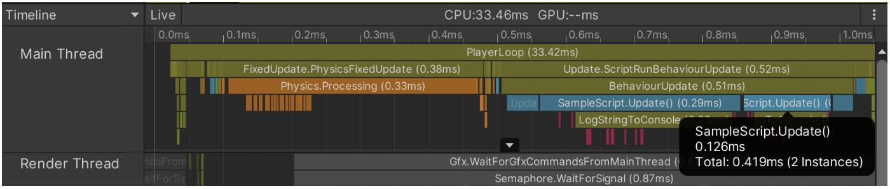

<p><em>VI: Timeline View — <strong>Main Thread</strong> và <strong>Render Thread</strong> hiển thị ĐỒNG THỜI, không cần chuyển thread. Tooltip cho biết <code>SampleScript.Update()</code> <strong>0.126ms</strong>, <strong>Total 0.419ms (2 Instances)</strong>; Render Thread đang <code>Gfx.WaitForGfxCommandsFromMainThread</code> và <code>Semaphore.WaitForSignal (0.87ms)</code>. / EN: Timeline View — all threads shown at once; hovering a box gives its own time and the total across instances.</em></p>

<div class="bilingual-row">
<div class="col-vi">
<p>✅ <em>"Ở timeline view, các item trong hierarchy được <strong>TRỰC QUAN HOÁ thành các HỘP</strong>, nên bạn <strong>thấy NGAY tải nằm ở đâu chỉ bằng một cái liếc</strong> khi nhìn toàn cảnh. Và vì <strong>thao tác được bằng CHUỘT, kể cả phân cấp SÂU cũng nắm được chỉ bằng cách KÉO</strong>. Ngoài ra, với timeline <strong>KHÔNG cần CHUYỂN THREAD — TẤT CẢ thread đều hiển thị.</strong>"</em></p>
<p>🎯 <strong>Timeline dùng để:</strong> ① <em>nhìn TOÀN CẢNH tải xử lý</em>; ② <em>hiểu và tune tải của TỪNG THREAD</em>.</p>
<p>❌ <em>"<strong>Timeline KHÔNG PHÙ HỢP cho thao tác SẮP XẾP để xác định thứ tự xử lý nặng, hay để kiểm tra TỔNG lượng allocation. Do đó, Hierarchy View phù hợp hơn để tune allocation.</strong>"</em></p>
</div>
<div class="col-en">
<p>✅ <em>"In the timeline view, items in the hierarchy view are <strong>visualized as BOXES</strong>, so you can <strong>intuitively see where the load is at a glance</strong> when viewing the entire view. And because it is <strong>mouse-accessible, even deep hierarchies can be grasped simply by DRAGGING</strong>. In addition, with timelines, <strong>there is NO need to switch threads; ALL threads are displayed.</strong>"</em></p>
<p>🎯 <strong>Timeline is used for:</strong> ① <em>to get a bird's eye view of the overall processing load</em>; ② <em>to understand and tune the processing load of each thread</em>.</p>
<p>❌ <em>"<strong>Timeline is NOT suited for sorting operations to determine the order of heavy processing, or for checking the total amount of allocations. Therefore, the Hierarchy View is better suited for tuning allocations.</strong>"</em></p>
</div>
</div>

### 19.5. 🔧 Sampler — tự nhúng điểm đo vào code

<div class="bilingual-row">
<div class="col-vi">
<p><em>"Có <strong>HAI cách</strong> đo thời gian xử lý theo hàm. Một là <strong>Deep Profile</strong>. Cách kia là <strong>NHÚNG TRỰC TIẾP vào script.</strong>"</em></p>
<p>🏆 <strong>Đặc tính VÀNG của Sampler:</strong> <em>"Có một tính năng NỮA đáng nhắc tới. <strong>Nếu code profiling KHÔNG phải Development Build, thì phía GỌI bị VÔ HIỆU HOÁ, nên overhead bằng KHÔNG (zero overhead).</strong> Có thể là ý hay khi <strong>đặt SẴN nó vào những vùng mà tải xử lý CÓ KHẢ NĂNG TĂNG trong tương lai.</strong>"</em></p>
</div>
<div class="col-en">
<p><em>"There are <strong>TWO ways</strong> to measure processing time per function. One is <strong>Deep Profile</strong> mode. The other is to <strong>embed it directly in the script.</strong>"</em></p>
<p>🏆 <strong>The golden property of Sampler:</strong> <em>"There is one more feature worth mentioning. <strong>If the profiling code is not a Development Build, the caller is disabled, so there is ZERO OVERHEAD.</strong> It may be a good idea to <strong>put this in place in advance in areas where the processing load is likely to increase in the future.</strong>"</em></p>
</div>
</div>

**List 3.3 — `Profiler.BeginSample` / `EndSample` (static, dùng ngay):**

```csharp
using UnityEngine.Profiling;
/* ... Omitted...*/
private void TestMethod()
{
    for (int i = 0; i < 10000; i++)
    {
        Debug.Log("Test");
    }
}

private void OnClickedButton()
{
    Profiler.BeginSample("Test Method")
    TestMethod();
    Profiler.EndSample()
}
```

**List 3.4 — `CustomSampler` (từ Unity 2017, overhead THẤP HƠN, đo CHÍNH XÁC HƠN):**

```csharp
using UnityEngine.Profiling;
/* ... Omitted...*/
private CustomSampler _samplerTest = CustomSampler.Create("Test");

private void TestMethod()
{
    for (int i = 0; i < 10000; i++)
    {
        Debug.Log("Test");
    }
}

private void OnClickedButton()
{
    _samplerTest.Begin();
    TestMethod();
    _samplerTest.End();
}
```

<div class="bilingual-row">
<div class="col-vi">
<p>⚖️ <em>"Khác biệt là <strong>phải TẠO instance TRƯỚC</strong>. Một đặc điểm khác của <code>CustomSampler</code> là <strong>thời gian đo CÓ THỂ LẤY ĐƯỢC TRONG SCRIPT sau khi đo. Nếu bạn cần ĐỘ CHÍNH XÁC CAO HƠN hoặc muốn PHÁT CẢNH BÁO dựa trên thời gian xử lý, <code>CustomSampler</code> là lựa chọn tốt.</strong>"</em></p>
<p>💡 Sample đã nhúng sẽ <strong>hiển thị ở CẢ Hierarchy lẫn Timeline view</strong>.</p>
</div>
<div class="col-en">
<p>⚖️ <em>"The difference is that <strong>an instance must be created in advance</strong>. Another feature of <code>CustomSampler</code> is that <strong>the measurement time can be obtained in the script after the measurement. If you need more accuracy or want to issue warnings based on processing time, <code>CustomSampler</code> is a good choice.</strong>"</em></p>
<p>💡 The embedded sample will be displayed in <strong>both the Hierarchy and Timeline views</strong>.</p>
</div>
</div>

### 19.6. Memory module — Simple view

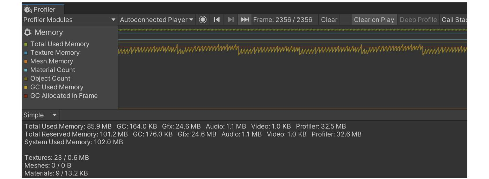
<p><em>VI: <strong>▲ Bảy chuỗi mà Memory module VẼ theo thời gian</strong> — <strong>Total Used Memory · Texture Memory · Mesh Memory · Material Count · Object Count · GC Used Memory · GC Allocated In Frame</strong>. Ở frame <strong>2356 / 2356</strong> các chỉ số là <strong>Total Used 85.9 MB · Total Reserved 101.2 MB · System Used 102.0 MB</strong>. / EN: The seven series the Memory module graphs over time.</em></p>

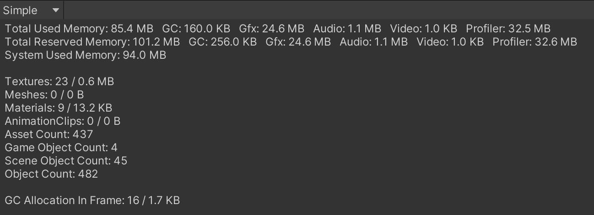
<p><em>VI: <strong>▲ Simple view</strong> — <strong>Total Used 85.4 MB</strong> (GC 160.0 KB · Gfx 24.6 MB · Audio 1.1 MB · Video 1.0 KB · Profiler 32.5 MB), <strong>Total Reserved 101.2 MB</strong>, <strong>System Used 94.0 MB</strong>; phần đếm object: <strong>Textures 23 / 0.6 MB · Materials 9 / 13.2 KB · Asset Count 437 · Object Count 482</strong> và <strong>GC Allocation In Frame: 16 / 1.7 KB</strong>. / EN: The Memory module's Simple view.</em></p>


<p><em>VI: Simple View (Unity 2020) — <strong>Total Used Memory 85.9 MB</strong> (GC 164.0 KB, Gfx 24.6 MB, Audio 1.1 MB, Video 1.0 KB, <strong>Profiler 32.5 MB</strong>), <strong>Total Reserved Memory 101.2 MB</strong>, <strong>System Used Memory 102.0 MB</strong>; Textures <strong>23 / 0.6 MB</strong>, Meshes 0, Materials <strong>9 / 13.2 KB</strong>. / EN: Simple View — note how much of the total is the Profiler itself (32.5 MB).</em></p>

**Ba con số "Total" — dễ nhầm nhất:**

| Mục | VI | EN |
|---|---|---|
| **Total Used Memory** | Tổng bộ nhớ Unity **đã cấp phát (đang dùng)** | Total amount of memory allocated (in use) by Unity |
| **Total Reserved Memory** | Tổng bộ nhớ Unity **ĐANG GIỮ CHỖ**. *"Một lượng vùng nhớ LIÊN TỤC nhất định được **OS giữ trước làm POOL**, và được cấp khi cần. **Khi pool THIẾU, nó lại được YÊU CẦU từ phía OS để MỞ RỘNG.**"* | *"A certain amount of contiguous memory space is reserved in advance by the OS as a pool… When the pool area becomes insufficient, it is requested again from the OS side for expansion."* |
| **System Used Memory** | 🚨 Tổng bộ nhớ **ứng dụng** dùng. *"Mục này CŨNG đo các mục (**plug-in**, v.v.) KHÔNG được đo trong Total Reserved. **Tuy nhiên nó VẪN KHÔNG theo dõi hết mọi allocation. Để có bức tranh CHÍNH XÁC, bạn sẽ cần công cụ profiling NATIVE như Xcode.**"* | *"However, it still does not track all memory allocations. To get an accurate picture, you will need to use a native-compliant profiling tool such as Xcode."* |

**Bảng 3.2 — thuật ngữ bên phải Total Used Memory:**

| Thuật ngữ | Giải thích |
|---|---|
| **GC** | Lượng bộ nhớ dùng ở **vùng heap**. *"**GC Alloc và các yếu tố khác LÀM TĂNG con số này.**"* |
| **Gfx** | Bộ nhớ cấp cho **Texture, Shader, Mesh…** |
| **Audio** | Bộ nhớ dùng cho **phát âm thanh** |
| **Video** | Bộ nhớ dùng cho **phát video** |
| **Profiler** | ⚠️ Bộ nhớ dùng cho **CHÍNH việc profiling** |

> 📌 *"Về tên gọi: **từ Unity 2019.2, 'Mono' đã đổi thành 'GC' và 'FMOD' đã đổi thành 'Audio'."* / *"Starting with Unity 2019.2, 'Mono' has been changed to 'GC' and 'FMOD' has been changed to 'Audio'."*

**Các bộ đếm đối tượng — vũ khí PHÁT HIỆN RÒ RỈ:**

| Counter | VI | EN |
|---|---|---|
| **Asset Count** | Tổng số asset đã nạp | Total number of assets loaded |
| **Game Object Count** | Số GameObject trong scene | Number of game objects in the scene |
| **Scene Object Count** | Tổng số **component + GameObject** trong scene | Total number of components and game objects in the scene |
| **Object Count** | 💀 Tổng **MỌI** object app tạo/nạp. *"**Nếu giá trị này ĐANG TĂNG, RẤT CÓ KHẢ NĂNG một số object đang RÒ RỈ.**"* | *"If this value is increasing, it is likely that some objects are leaking."* |
| **GC Allocation in Frame** | Số LẦN allocation xảy ra trong 1 frame và TỔNG lượng | The number of times an Allocation has occurred in a frame and the total amount |

> 🎯 **Simple view dùng để:** ① *hiểu & giám sát vùng heap và THỜI ĐIỂM Reserved mở rộng*; ② *kiểm tra rò rỉ asset/object*; ③ *giám sát GC Allocation*.

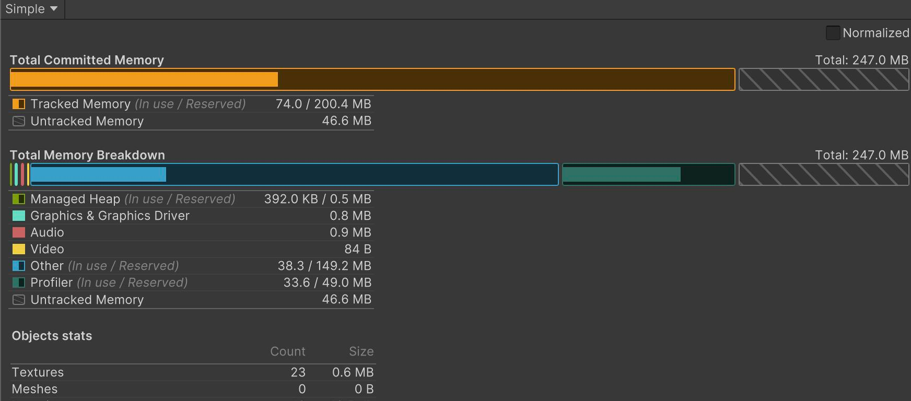

<p><em>VI: Simple View <strong>từ Unity 2021</strong> — UI cải thiện lớn: <strong>Total Committed Memory 247.0 MB</strong> (Tracked <strong>74.0 / 200.4 MB</strong>, <strong>Untracked 46.6 MB</strong>); breakdown: <strong>Managed Heap 392.0 KB / 0.5 MB</strong>, Graphics &amp; Graphics Driver <strong>0.8 MB</strong>, Audio <strong>0.9 MB</strong>, Other <strong>38.3 / 149.2 MB</strong>, Profiler <strong>33.6 / 49.0 MB</strong>. 🚨 Lưu ý <strong>"GC" đã đổi tên thành "Managed Heap"</strong>. / EN: The 2021+ Simple View — same content, greatly improved UI; note "GC" was renamed "Managed Heap".</em></p>

### 19.7. Memory module — Detailed view & bốn node "Others" phải biết

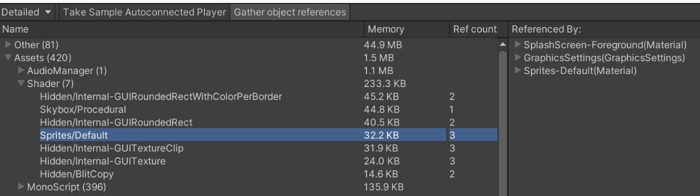

<p><em>VI: Detailed view — snapshot sau khi bấm <strong>Take Sample</strong>. <code>Other (81)</code> <strong>44.9 MB</strong>, <code>Assets (420)</code> <strong>1.5 MB</strong>, trong đó <code>Shader (7)</code> <strong>233.3 KB</strong> và <code>MonoScript (396)</code> <strong>135.9 KB</strong>. Panel <strong>"Referenced By"</strong> bên phải cho biết <code>Sprites/Default</code> (32.2 KB, Ref count 3) đang bị <code>SplashScreen-Foreground(Material)</code>, <code>GraphicsSettings</code> và <code>Sprites-Default(Material)</code> giữ. / EN: Detailed view — snapshot-based, with the Referenced By panel that resolves who is holding a leaking asset.</em></p>

<div class="bilingual-row">
<div class="col-vi">
<p>📸 <em>"Kết quả của view này lấy được bằng cách bấm nút <strong>'Take Sample'</strong> để chụp snapshot bộ nhớ tại thời điểm đó. <strong>KHÁC Simple view, view này KHÔNG cập nhật thời gian thực</strong>, nên muốn làm mới phải Take Sample LẠI."</em></p>
<p>🔍 <em>"Bên phải nút Sample có mục <strong>'Referenced By'</strong> — hiển thị các object đang THAM CHIẾU object đang chọn. <strong>Nếu có asset nào đang RÒ RỈ, thông tin tham chiếu của object có thể giúp GIẢI QUYẾT vấn đề.</strong> Hiển thị này CHỈ hiện khi <strong>'Gather object references'</strong> được bật. <strong>Bật nó sẽ TĂNG thời gian xử lý lúc Take Sample, nhưng về cơ bản KHUYẾN NGHỊ để BẬT.</strong>"</em></p>
</div>
<div class="col-en">
<p>📸 <em>"The result of this view can be obtained by clicking the <strong>'Take Sample'</strong> button to take a snapshot of the memory at that point in time. <strong>Unlike the Simple view, this view is NOT updated in real time</strong>, so if you want to refresh the view, you need to Take Sample again."</em></p>
<p>🔍 <em>"On the right side of the 'Sample' button, there is an item called <strong>'Referenced By'</strong>. This shows the objects that reference the currently selected object. <strong>If there are any assets that are leaking, the information of the object's references may help to solve the problem.</strong> This display is only shown if <strong>'Gather object references'</strong> is enabled. <strong>Enabling this feature will increase the processing time during Take Sample, but it is basically recommended to leave it enabled.</strong>"</em></p>
</div>
</div>

!!! tip "💡 `ManagedStaticReferences()` — dấu hiệu bị `static` giữ"
    **VI:** *"Trong Referenced By, bạn có thể thấy ký hiệu `ManagedStaticReferences()`. **Nó có nghĩa là object đang bị THAM CHIẾU bởi MỘT OBJECT `static` NÀO ĐÓ.** Nếu bạn quen thuộc với project, thông tin này có thể đã đủ để bạn hình dung. Nếu không, **chúng tôi khuyến nghị dùng "3.5 Heap Explorer"** (xem §22.2)."*

    **EN:** *"In Referenced By, you may see the notation `ManagedStaticReferences()`. **This means that it is referenced by some `static` object.** If you are familiar with the project, this information may be enough to give you some idea. If not, we recommend using '3.5 Heap Explorer'."*

**Bảng 3.3 — Bốn node GỐC của Detailed view:**

| Node | VI | EN |
|---|---|---|
| **Assets** | Asset đã nạp **KHÔNG nằm trong scene** | Loaded assets not included in the scene |
| **Not Saved** | Asset **sinh ra lúc runtime bằng code** — ví dụ object tạo bởi `new Material()` | Assets generated at runtime by code, e.g. `new Material()` |
| **Scene Memory** | Asset **nằm trong scene đã nạp** | Assets contained in the loaded scene |
| **Others** | Mọi thứ còn lại — **cấp phát cho các hệ thống Unity dùng** | Assignments to the various systems used by Unity |

**Bốn mục trong `Others` mà bạn BẮT BUỘC phải biết:**

<div class="bilingual-row">
<div class="col-vi">
<p>📦 <strong><code>System.ExecutableAndDlls</code></strong> — <em>"Chỉ lượng allocation dùng cho <strong>binary, DLL</strong>… Tuỳ nền tảng/máy, có thể KHÔNG lấy được, khi đó nó bằng <strong>0B</strong>. <strong>Tải bộ nhớ cho project KHÔNG LỚN như con số liệt kê, vì nó có thể được CHIA SẺ với ứng dụng khác dùng chung framework.</strong> ✅ <strong>TỐT HƠN là cải thiện Asset còn hơn vội vàng giảm mục này.</strong> Cách hiệu quả nhất là <strong>GIẢM DLL và script KHÔNG cần thiết</strong>. Cách dễ nhất là <strong>đổi Stripping Level</strong> — 💀 <strong>nhưng có RỦI RO THIẾU type/method lúc runtime, nên phải debug CẨN THẬN.</strong>"</em></p>
<p>📄 <strong><code>SerializedFile</code></strong> — <em>"Chỉ <strong>meta-information như BẢNG OBJECT trong AssetBundle và Type Tree đóng vai trò thông tin kiểu</strong>. Có thể giải phóng bằng <code>AssetBundle.Unload(true hoặc false)</code>. <strong><code>Unload(false)</code> — chỉ giải phóng meta-information SAU KHI asset đã nạp — là cách HIỆU QUẢ NHẤT.</strong> 💀 <strong>Lưu ý: nếu THỜI ĐIỂM giải phóng và việc quản lý tham chiếu tài nguyên KHÔNG cẩn thận, tài nguyên có thể bị NẠP HAI LẦN và RẤT DỄ rò rỉ bộ nhớ.</strong>"</em></p>
<p>🗺️ <strong><code>PersistentManager.Remapper</code></strong> — <em>"Remapper <strong>quản lý quan hệ giữa object TRONG BỘ NHỚ và TRÊN ĐĨA. CẨN THẬN đừng để nó MỞ RỘNG QUÁ MỨC.</strong> Cụ thể, <strong>nếu MỘT LƯỢNG LỚN AssetBundle được nạp, vùng mapping sẽ KHÔNG ĐỦ và bị MỞ RỘNG.</strong> ✅ Vì vậy nên <strong>unload các AssetBundle không cần thiết để giảm số file nạp đồng thời.</strong> Ngoài ra, <strong>nếu MỘT AssetBundle chứa RẤT NHIỀU asset không cần ngay, nên CHIA NHỎ nó ra.</strong>"</em></p>
</div>
<div class="col-en">
<p>📦 <strong><code>System.ExecutableAndDlls</code></strong> — <em>"Indicates the amount of allocations used for <strong>binaries, DLLs</strong>, and so on. Depending on the platform or terminal, it may not be obtainable, in which case it is treated as <strong>0B</strong>. <strong>The memory load for the project is not as large as the listed values, as it may be SHARED with other applications using a common framework.</strong> ✅ <strong>It is better to improve Asset than to rush to reduce this item.</strong> The most effective way is to <strong>reduce DLLs and unnecessary scripts</strong>. The easiest way is to <strong>change the Stripping Level</strong>. 💀 <strong>However, there is a risk of missing types and methods at runtime, so debug carefully.</strong>"</em></p>
<p>📄 <strong><code>SerializedFile</code></strong> — <em>"Indicates <strong>meta-information such as the table of objects in the AssetBundle and the Type Tree that serves as type information</strong>. This can be released by <code>AssetBundle.Unload(true or false)</code>. <strong><code>Unload(false)</code>, which releases only this meta-information after the asset is loaded, is the MOST EFFICIENT way.</strong> 💀 <strong>Note that if the release timing and resource reference management are not done carefully, resources can be DOUBLE-LOADED and memory leaks can easily occur.</strong>"</em></p>
<p>🗺️ <strong><code>PersistentManager.Remapper</code></strong> — <em>"Remapper <strong>manages the relationship between objects in memory and on disk. Be careful not to OVER-EXPAND.</strong> Specifically, <strong>if a large number of AssetBundles are loaded, the mapping area will not be sufficient and will be expanded.</strong> ✅ Therefore, <strong>it is a good idea to unload unnecessary AssetBundles to reduce the number of files loaded at the same time.</strong> Also, <strong>if a single AssetBundle contains a large number of assets that are not needed on the fly, it is a good idea to split it up.</strong>"</em></p>
</div>
</div>

> 🎯 **Detailed view dùng để:** ① *hiểu & tune bộ nhớ CHI TIẾT tại một THỜI ĐIỂM cụ thể — kiểm tra asset KHÔNG cần thiết hoặc BẤT NGỜ*; ② *ĐIỀU TRA rò rỉ bộ nhớ*.

---

## 20. 📈 Profile Analyzer — Thống kê thay vì "nhìn MỘT frame"

<div class="bilingual-row">
<div class="col-vi">
<p>🎯 <em>"Profile Analyzer là công cụ <strong>phân tích CHI TIẾT HƠN dữ liệu lấy từ CPU Usage của Profiler</strong>. Trong khi <strong>Unity Profiler CHỈ nhìn được dữ liệu THEO TỪNG FRAME</strong>, Profile Analyzer <strong>lấy được TRUNG BÌNH (average), TRUNG VỊ (median), NHỎ NHẤT và LỚN NHẤT dựa trên một KHOẢNG FRAME chỉ định.</strong>"</em></p>
<p>✅ <em>"Điều này cho phép <strong>XỬ LÝ ĐÚNG dữ liệu BIẾN THIÊN từ frame này sang frame khác, giúp thể hiện RÕ RÀNG HƠN hiệu quả của việc cải thiện khi tối ưu. Nó cũng là công cụ RẤT hữu ích để SO SÁNH và TRỰC QUAN HOÁ kết quả tối ưu, vì có chức năng SO SÁNH dữ liệu đo — điều mà CPU Usage KHÔNG làm được.</strong>"</em></p>
</div>
<div class="col-en">
<p>🎯 <em>"Profile Analyzer is a tool for <strong>more detailed analysis of data obtained from the Profiler's CPU Usage</strong>. While the <strong>Unity Profiler can ONLY look at data PER FRAME</strong>, the Profile Analyzer <strong>can obtain average, median, minimum, and maximum values based on a SPECIFIED FRAME INTERVAL.</strong>"</em></p>
<p>✅ <em>"This allows for <strong>appropriate handling of data that varies from frame to frame, making it possible to more clearly show the effects of improvement when optimization is performed. It is also a very useful tool for comparing and visualizing the results of optimization because it has a function for comparing measurement data, which CPU Usage CANNOT do.</strong>"</em></p>
</div>
</div>

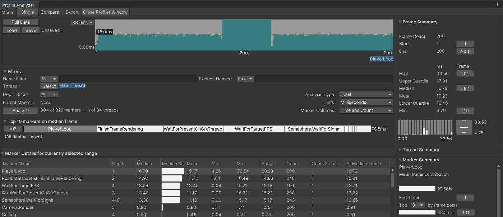

<p><em>VI: Profile Analyzer (Single mode) — <strong>304 of 329 markers, 1 of 34 threads</strong>, Frame Count <strong>200</strong>. Frame Summary: <strong>Max 33.56ms (frame 101)</strong>, <strong>Upper Quartile 17.31</strong>, <strong>Median 16.79 (frame 192)</strong>, <strong>Mean 19.23</strong>, <strong>Lower Quartile 16.48</strong>, <strong>Min 4.76 (frame 119)</strong>. Dải "Top 10 markers on median frame" cho thấy <code>PlayerLoop</code> chiếm phần lớn <strong>78.8ms</strong>. / EN: Profile Analyzer in Single mode with the Frame Summary quartiles on the right.</em></p>

### 20.1. Cài đặt & hai chế độ

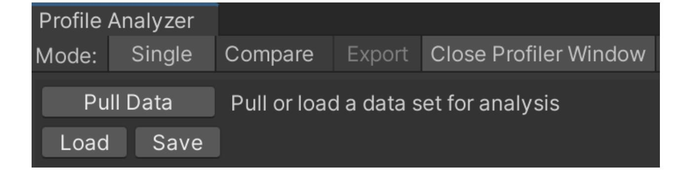
<p><em>VI: <strong>▲ Thanh công cụ Profile Analyzer</strong> — <strong>Mode: Single | Compare</strong>, các nút <strong>Export · Close Profiler Window</strong>, và <strong>Pull Data · Load · Save</strong>. <em>"Pull or load a data set for analysis."</em> / EN: The Profile Analyzer toolbar with Single and Compare modes.</em></p>

<div class="bilingual-row">
<div class="col-vi">
<p>📥 <em>"Công cụ này cài từ <strong>Package Manager</strong>. Vì được <strong>Unity HỖ TRỢ CHÍNH THỨC</strong>, đổi Packages sang <strong>Unity Registry</strong> và gõ <strong>"Profile"</strong> trong ô tìm kiếm. Sau khi cài, mở bằng <strong>"Window → Analysis → Profile Analyzer"</strong>."</em></p>
<p>🔀 <em>"Có <strong>HAI chế độ: 'Single' và 'Compare'</strong>. Single dùng để phân tích MỘT bộ dữ liệu đo; Compare dùng để SO SÁNH HAI bộ dữ liệu."</em></p>
<p>💾 <em>"<strong>'Pull Data'</strong> cho phép phân tích dữ liệu đo bằng Unity Profiler và hiển thị kết quả. <strong>'Save' và 'Load'</strong> cho phép lưu/nạp dữ liệu đã phân tích. Tất nhiên KHÔNG có vấn đề gì nếu bạn chỉ giữ dữ liệu Unity Profiler — <strong>khi đó bạn phải nạp dữ liệu vào Unity Profiler và làm Pull Data trong Profile Analyzer MỖI LẦN. Nếu thấy phiền, tốt hơn là lưu thành dữ liệu chuyên dụng.</strong>"</em></p>
</div>
<div class="col-en">
<p>📥 <em>"This tool can be installed from the <strong>Package Manager</strong>. Since it is <strong>officially supported by Unity</strong>, change Packages to <strong>Unity Registry</strong> and type <strong>"Profile"</strong> in the search box. After installation, start the tool via <strong>"Window → Analysis → Profile Analyzer"</strong>."</em></p>
<p>🔀 <em>"There are <strong>TWO modes of functionality: 'Single' and 'Compare'</strong>. Single mode is used to analyze a single measurement data, while Compare mode is used to compare two measurement data."</em></p>
<p>💾 <em>"<strong>'Pull Data'</strong> allows you to analyze the data measured in the Unity Profiler and display the results. <strong>'Save' and 'Load'</strong> allow you to save and load the data analyzed by Profile Analyzer. Of course, there is no problem if you keep only the Unity Profiler data. <strong>In that case, you need to load the data in Unity Profiler and do Pull Data in Profile Analyzer each time. If this procedure is troublesome, it is better to save the data as a dedicated data.</strong>"</em></p>
</div>
</div>

### 20.2. Bộ lọc — và mẹo `Depth Slice = 2~3`

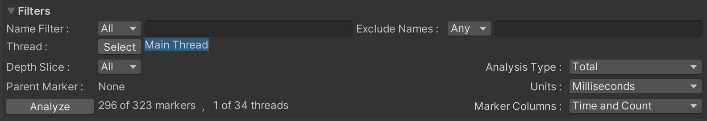
<p><em>VI: <strong>▲ Bảng Filters</strong> — <strong>Name Filter · Thread: Main Thread · Depth Slice: All · Parent Marker: None</strong>, và <strong>Exclude Names</strong>. Dòng trạng thái: <strong>"296 of 323 markers, 1 of 34 threads"</strong>; bên phải: <strong>Analysis Type: Total · Units: Milliseconds · Marker Columns: Time and Count</strong>. / EN: The Profile Analyzer Filters panel: 296 of 323 markers, 1 of 34 threads.</em></p>

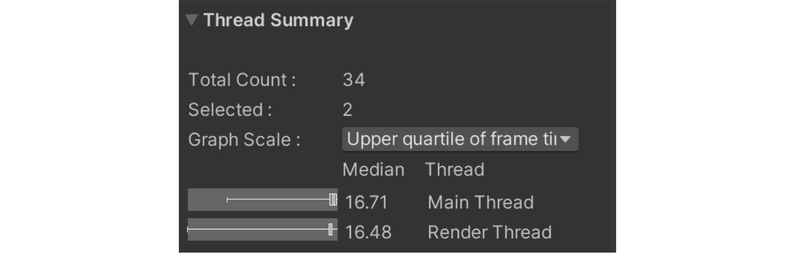
<p><em>VI: <strong>▲ Thread Summary</strong> — <strong>Total Count 34 · Selected 2</strong>, <strong>Graph Scale: Upper quartile of frame time</strong>; Median <strong>16.71 ms</strong> cho <strong>Main Thread</strong> và <strong>16.48 ms</strong> cho <strong>Render Thread</strong>. / EN: Thread Summary: 34 threads, Main 16.71 ms, Render 16.48 ms median.</em></p>

**Bảng 3.4 — Các mục của bộ lọc:**

| Mục | Mô tả (VI) | Description (EN) |
|---|---|---|
| **Name Filter** | Lọc theo TÊN tiến trình muốn tìm | Filter by the name of the process you want to search |
| **Exclude Filter** | Lọc theo tên tiến trình muốn LOẠI khỏi tìm kiếm | Filter by the name of the process to exclude |
| **Thread** | Thread được chọn sẽ hiện trong kết quả. *"Nếu cần thông tin thread khác, THÊM chúng vào."* | The selected threads will be displayed; add others if needed |
| **Depth Slice** | Số **lớp** trong Hierarchy của CPU Usage. *"Ví dụ nếu Depth là **3**, lớp thứ **3** được hiển thị."* | The number of slices in the Hierarchy. If Depth is 3, the third hierarchy is displayed |
| **Analysis Type** | Chuyển giữa **Total** và **Self** — giống header của CPU Usage | Total and Self can be switched |
| **Units** | Đổi hiển thị thời gian sang **millisecond** hoặc **microsecond** | Time display can be changed to ms or µs |
| **Marker Columns** | Đổi hiển thị header của kết quả phân tích | Change the header display of analysis results |

!!! tip "💡 Mẹo VÀNG: đừng để Depth Slice = All"
    **VI:** *"Khi Depth Slice đặt là **All**, node gốc `PlayerLoop` được hiển thị, hoặc **các LỚP KHÁC NHAU của CÙNG MỘT tiến trình được hiển thị — RẤT KHÓ NHÌN.** Trong trường hợp đó, **khuyến nghị CỐ ĐỊNH Depth ở 2~3 và đặt sao cho các SUBSYSTEM như rendering, animation và physics được hiển thị.**"*

    **EN:** *"When Depth Slice is set to **All**, the top node called `PlayerLoop` is displayed, or **different layers of the same process are displayed, which can be difficult to see.** In such cases, **it is recommended to fix Depth to 2~3 and set it so that subsystems such as rendering, animation, and physics are displayed.**"*

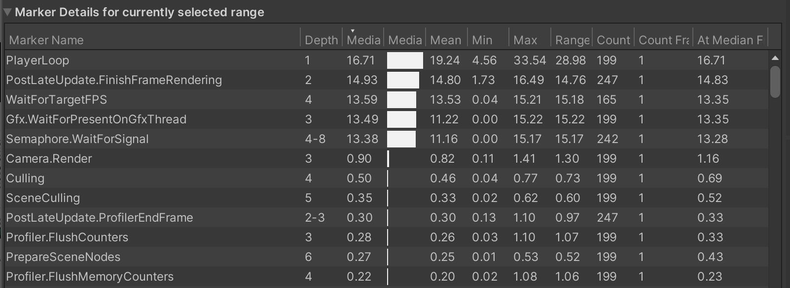

<p><em>VI: Marker Details — mỗi marker có <strong>Depth, Median, Mean, Min, Max, Range, Count</strong>. <code>PlayerLoop</code> Median <strong>16.71</strong> / Mean <strong>19.24</strong> / Max <strong>33.54</strong> / Range <strong>28.98</strong> (Count 199); <code>PostLateUpdate.FinishFrameRendering</code> Median <strong>14.93</strong>, Count <strong>247</strong>; <code>Camera.Render</code> <strong>0.90</strong>; <code>Culling</code> <strong>0.50</strong>; <code>SceneCulling</code> <strong>0.35</strong>. / EN: Per-marker statistics — median, mean, min, max, range and call count across the selected frame interval.</em></p>

<div class="bilingual-row">
<div class="col-vi">
<p>💡 <em>"Nên phân tích tiến trình cần cải thiện dựa trên <strong>tên tiến trình ở Marker Name và các giá trị Median và Mean</strong>. <strong>Nếu bạn di chuột lên một header, mô tả của mục đó sẽ hiện ra</strong> — hãy tham khảo nếu chưa hiểu."</em></p>
<p>📊 <em>"Màn hình <strong>'Top 10 Median Marker Values'</strong> CHỈ hiện 10 marker đầu bảng sắp theo <strong>thời gian xử lý TRUNG VỊ</strong> của mỗi marker. Bạn thấy NGAY mỗi marker trong top 10 chiếm bao nhiêu thời gian."</em></p>
</div>
<div class="col-en">
<p>💡 <em>"It is a good idea to analyze the process that should be improved based on <strong>the process name listed in Marker Name and the values of Median and Mean</strong>. <strong>If you move the mouse pointer over a header item, a description of the item will be displayed</strong>, so please refer to it if you do not understand."</em></p>
<p>📊 <em>"The <strong>'Top 10 Median Marker Values'</strong> screen shows only the top 10 markers sorted by <strong>the MEDIAN processing time</strong> for each marker. You can see at a glance how much processing time each of the top 10 markers occupies."</em></p>
</div>
</div>

### 20.3. 📐 Mean vs Median — con số nào ĐÁNG TIN?

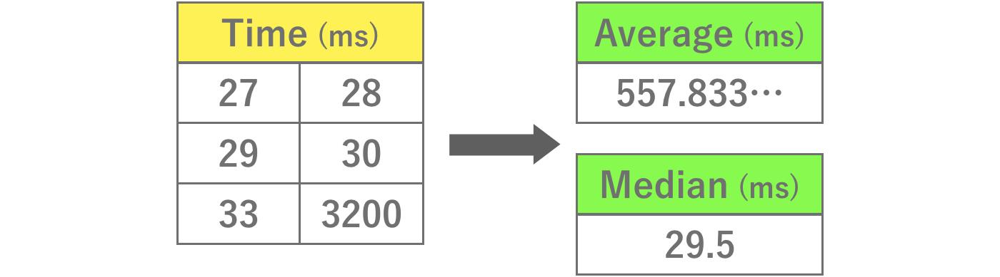

<p><em>VI: Ví dụ KINH ĐIỂN của sách — 6 mẫu thời gian <strong>27, 28, 29, 30, 33, 3200 ms</strong>. <strong>Trung bình (Average) = 557.833…ms</strong> nhưng <strong>Trung vị (Median) = 29.5ms</strong>. 💀 Một spike DUY NHẤT đã kéo trung bình lệch <strong>gần 19 LẦN</strong> so với thực tế. / EN: The book's classic example — one 3200 ms spike drags the mean to 557.8 ms while the median stays at 29.5 ms.</em></p>

<div class="bilingual-row">
<div class="col-vi">
<p>📖 <em>"<strong>Trung bình</strong> là giá trị có được bằng cách CỘNG tất cả rồi CHIA cho số dữ liệu. <strong>Trung vị</strong>, ngược lại, là giá trị NẰM GIỮA của dữ liệu đã sắp xếp. Trường hợp số dữ liệu CHẴN, lấy TRUNG BÌNH của hai giá trị trước và sau vị trí giữa."</em></p>
<p>🚨 <em>"<strong>Trung bình có tính chất là NHẠY CẢM với dữ liệu có giá trị CÁCH BIỆT CỰC LỚN. NẾU spike XẢY RA THƯỜNG XUYÊN hoặc SỐ MẪU KHÔNG ĐỦ, TỐT HƠN là tham chiếu TRUNG VỊ.</strong>"</em></p>
<p>🎯 <em>"Hãy <strong>phân tích dữ liệu SAU KHI đã biết đặc tính của HAI giá trị này.</strong>"</em></p>
</div>
<div class="col-en">
<p>📖 <em>"The <strong>mean</strong> is the value obtained by adding all values together and dividing by the number of data. The <strong>median</strong>, on the other hand, is the value that lies in the middle of the sorted data. In the case of an even number of data, the average value is taken from the data before and after the median."</em></p>
<p>🚨 <em>"<strong>The average has the property that it is SUSCEPTIBLE to data with values that are EXTREMELY FAR APART. If there are FREQUENT SPIKES or the SAMPLING NUMBER is NOT SUFFICIENT, it may be better to refer to the MEDIAN.</strong>"</em></p>
<p>🎯 <em>"<strong>Analyze your data after knowing the characteristics of these two values.</strong>"</em></p>
</div>
</div>

### 20.4. Frame Summary — Boxplot & Histogram

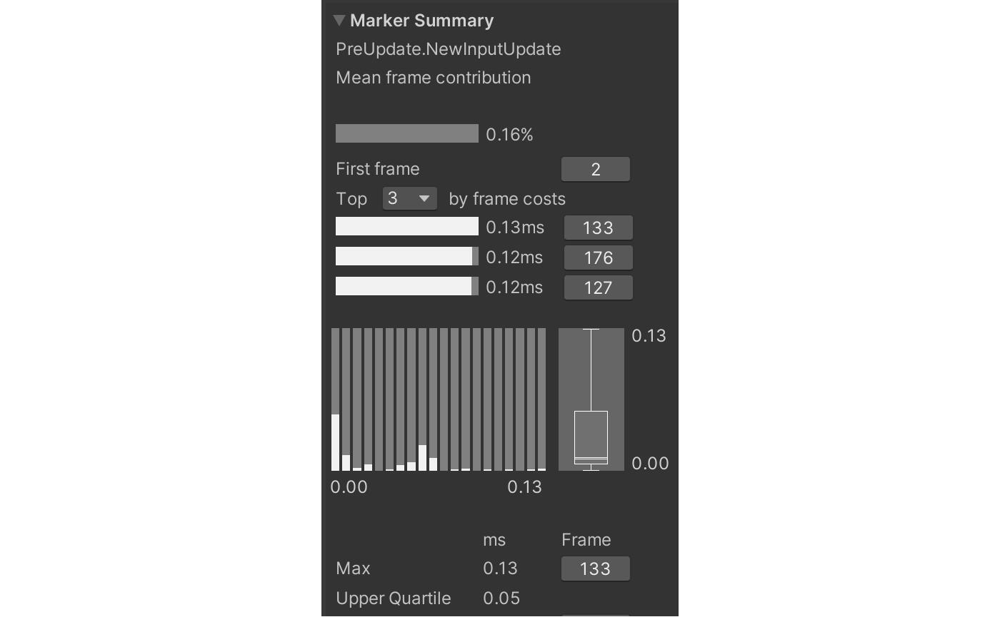
<p><em>VI: <strong>▲ Marker Summary</strong> cho <code>PreUpdate.NewInputUpdate</code> — <strong>Mean frame contribution 0.16%</strong>; <strong>Top 3 by frame costs: 0.13 ms (frame 133) · 0.12 ms (176) · 0.12 ms (127)</strong>; histogram + boxplot bên dưới với <strong>Max 0.13 ms (frame 133)</strong> và <strong>Upper Quartile 0.05</strong>. / EN: Marker Summary for PreUpdate.NewInputUpdate.</em></p>

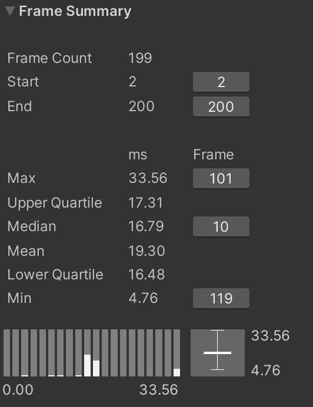
<p><em>VI: <strong>Frame Summary</strong> — <strong>Frame Count 199</strong> · <strong>Max 33.56 ms</strong> (frame 101) · <strong>Upper Quartile 17.31</strong> · <strong>Median 16.79</strong> (frame 10) · <strong>Mean 19.30</strong> · <strong>Lower Quartile 16.48</strong> · <strong>Min 4.76</strong> (frame 119). <strong>Mean CAO HƠN Median</strong> ⇒ có vài frame ĐỘT BIẾN kéo trung bình lên. / EN: Frame Summary: Max 33.56 ms, Median 16.79, Mean 19.30, Min 4.76.</em></p>

**Bảng 3.5 — Tứ phân vị (Quartiles):**

| Tên | Mô tả |
|---|---|
| **Minimum value (Min)** | Giá trị nhỏ nhất |
| **Lower Quartile** | Giá trị ở vị trí **25%** tính từ min |
| **Median** | Giá trị ở vị trí **50%** tính từ min |
| **Upper Quartile** | Giá trị ở vị trí **75%** tính từ min |
| **Maximum Value (Max)** | Giá trị lớn nhất |

<div class="bilingual-row">
<div class="col-vi">
<p>📦 <em>"<strong>Khoảng giữa 25% và 75% được ĐÓNG HỘP</strong> — gọi là <strong>đồ thị hộp-và-râu (box-and-whisker)</strong>."</em></p>
<p>📊 <em>"<strong>Histogram</strong> có <strong>trục NGANG là thời gian xử lý, trục DỌC là SỐ LƯỢNG dữ liệu</strong> — cũng hữu ích để xem PHÂN BỐ dữ liệu. Trong frame summary, bạn có thể kiểm tra khoảng và số frame bằng cách <strong>di chuột lên chúng</strong>."</em></p>
<p>🧵 <strong>Thread Summary</strong> — <em>"hiển thị thống kê cho thread đã chọn. Bạn thấy được <strong>một biểu đồ hộp-và-râu cho MỖI THREAD.</strong>"</em></p>
</div>
<div class="col-en">
<p>📦 <em>"<strong>The interval between 25% and 75% is BOXED</strong>, which is called a <strong>box-and-whisker graph</strong>."</em></p>
<p>📊 <em>"The <strong>histogram</strong> shows <strong>processing time on the horizontal axis and the number of data on the vertical axis</strong>, which is also useful for viewing data distribution. In the frame summary, you can check the interval and the number of frames by <strong>hovering the cursor over them</strong>."</em></p>
<p>🧵 <strong>Thread Summary</strong> — <em>"shows statistics for the selected thread. You can see <strong>a box-and-whisker diagram for EACH THREAD.</strong>"</em></p>
</div>
</div>

### 20.5. Compare mode — bằng chứng tuning CÓ hay KHÔNG hiệu quả

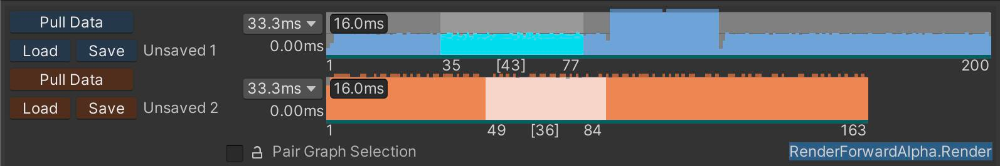
<p><em>VI: <strong>▲ Compare mode</strong> — HAI dataset xếp chồng (<strong>Unsaved 1</strong> xanh, <strong>Unsaved 2</strong> cam), cùng thang <strong>33.3 ms / 16.0 ms / 0.00 ms</strong>; tick <strong>Pair Graph Selection</strong> để hai biểu đồ CUỘN CÙNG NHAU. Marker được chọn: <code>RenderForwardAlpha.Render</code>. / EN: Compare mode with two datasets and Pair Graph Selection.</em></p>

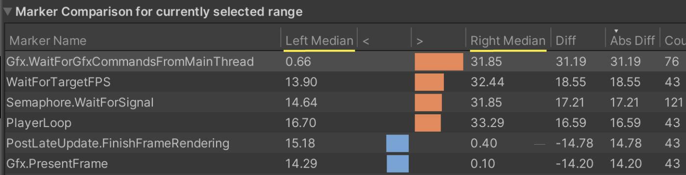

<p><em>VI: Marker Comparison — cột <strong>Left Median</strong> vs <strong>Right Median</strong> kèm <strong>Diff</strong>. <code>Gfx.WaitForGfxCommandsFromMainThread</code> tăng từ <strong>0.66 → 31.85</strong> (<strong>Diff +31.19</strong>), <code>WaitForTargetFPS</code> <strong>13.90 → 32.44</strong> (<strong>+18.55</strong>), <code>PlayerLoop</code> <strong>16.70 → 33.29</strong> (<strong>+16.59</strong>); ngược lại <code>PostLateUpdate.FinishFrameRendering</code> <strong>15.18 → 0.40</strong> (<strong>−14.78</strong>). / EN: Marker Comparison — orange bars mean the right dataset is slower, blue means faster.</em></p>

<div class="bilingual-row">
<div class="col-vi">
<p>🔀 <em>"Ở chế độ này <strong>HAI bộ dữ liệu có thể được SO SÁNH. Khoảng phân tích có thể đặt RIÊNG cho dữ liệu TRÊN và DƯỚI.</strong> Cách dùng màn hình gần như GIỐNG Single mode, nhưng <strong>các từ 'Left' và 'Right' xuất hiện ở nhiều màn hình</strong> — cho biết dữ liệu nào là dữ liệu nào, và <strong>KHỚP với MÀU hiển thị ở phần cài đặt so sánh. Left là dữ liệu TRÊN, Right là dữ liệu DƯỚI.</strong>"</em></p>
<p>🏆 <em>"<strong>Chế độ này sẽ giúp DỄ DÀNG phân tích kết quả tuning là TỐT hay XẤU.</strong>"</em></p>
</div>
<div class="col-en">
<p>🔀 <em>"In this mode, <strong>two sets of data can be compared. The interval to be analyzed can be set for EACH of the upper and lower data.</strong> The usage of the screen is almost the same as Single mode, but <strong>the words 'Left' and 'Right' appear in various screens</strong> — this shows which data is which, and <strong>matches the colour shown in the comparison settings. Left is the TOP data and Right is the BOTTOM data.</strong>"</em></p>
<p>🏆 <em>"<strong>This mode will make it easier to analyze whether the tuning results are good or bad.</strong>"</em></p>
</div>
</div>

---

## 21. 🖼️ Frame Debugger — "Vì sao draw call này KHÔNG batch được?"

👉 *Xem thêm [Module 4 — GPU & URP Advanced Rendering](../04-tech-lead/01-gpu-urp-advanced-rendering.md) về batching. Mục này tập trung vào NĂNG LỰC CHẨN ĐOÁN của Frame Debugger.*

<div class="bilingual-row">
<div class="col-vi">
<p>🔧 <em>"Frame Debugger là công cụ cho phép <strong>phân tích màn hình đang hiển thị được RENDER RA NHƯ THẾ NÀO</strong>. Công cụ này <strong>cài SẴN trong editor</strong>, mở bằng <strong>"Window → Analysis → Frame Debugger"</strong>."</em></p>
<p>📱 <em>"Nó dùng được <strong>trong editor HOẶC trên THIẾT BỊ THẬT. Khi dùng trên thiết bị thật, cần binary build với 'Development Build', GIỐNG như Unity Profiler.</strong> Khởi động app, chọn kết nối thiết bị, và bấm <strong>'Enable'</strong> để hiển thị lệnh vẽ."</em></p>
</div>
<div class="col-en">
<p>🔧 <em>"The Frame Debugger is a tool that allows you to <strong>analyze how the currently displayed screen is RENDERED</strong>. This tool is <strong>installed by default in the editor</strong> and can be opened via <strong>"Window → Analysis → Frame Debugger"</strong>."</em></p>
<p>📱 <em>"It can be used <strong>in the editor or on the ACTUAL DEVICE. When using it on an actual device, a binary built with 'Development Build' is required, as is the Unity Profiler.</strong> Start the application, select the device connection, and press <strong>'Enable'</strong> to display the drawing instruction."</em></p>
</div>
</div>

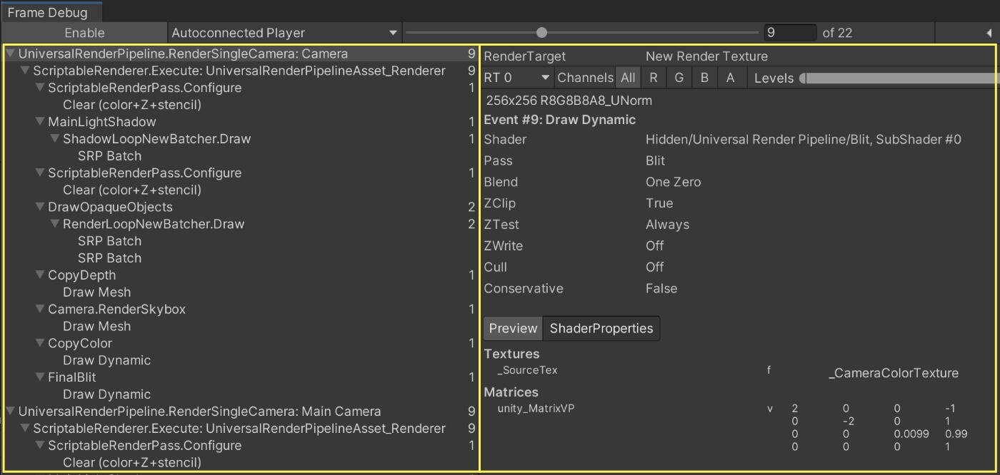

<p><em>VI: Frame Debugger — khung TRÁI liệt kê <strong>lệnh vẽ theo THỨ TỰ từ trên xuống</strong> (<code>UniversalRenderPipeline.RenderSingleCamera</code> → <code>MainLightShadow</code> → <code>DrawOpaqueObjects</code> → <code>CopyDepth</code> → <code>Camera.RenderSkybox</code> → <code>CopyColor</code> → <code>FinalBlit</code>); khung PHẢI là chi tiết <strong>Event #9: Draw Dynamic</strong>, RenderTarget <strong>256x256 R8G8B8A8_UNorm</strong>, Shader <code>Hidden/Universal Render Pipeline/Blit</code>, Blend <strong>One Zero</strong>, ZTest <strong>Always</strong>, ZWrite <strong>Off</strong>, Cull <strong>Off</strong>. / EN: Frame Debugger — the ordered draw-call list on the left, per-event shader/render-state detail on the right.</em></p>

<div class="bilingual-row">
<div class="col-vi">
<p>🎯 <strong>Bốn câu hỏi phải tự đặt khi nhìn màn hình này:</strong></p>
<p>① <em>"Có lệnh nào <strong>KHÔNG CẦN THIẾT</strong> không?"</em><br>
② <em>"<strong>Batching có ĐANG HOẠT ĐỘNG ĐÚNG</strong> hay không?"</em><br>
③ <em>"<strong>ĐỘ PHÂN GIẢI của drawing target có QUÁ CAO</strong> không?"</em><br>
④ <em>"Có <strong>Shader NGOÀI Ý ĐỊNH</strong> đang được dùng không?"</em></p>
</div>
<div class="col-en">
<p>🎯 <strong>Four questions to ask while looking at this screen:</strong></p>
<p>① <em>"Are there any <strong>UNNECESSARY instructions</strong>?"</em><br>
② <em>"Whether <strong>drawing batching is working PROPERLY</strong> or not"</em><br>
③ <em>"Is the <strong>RESOLUTION of the drawing target TOO HIGH</strong>?"</em><br>
④ <em>"Is an <strong>UNINTENDED Shader</strong> being used?"</em></p>
</div>
</div>

### 21.1. Operation Panel — RT0, Channels, Levels

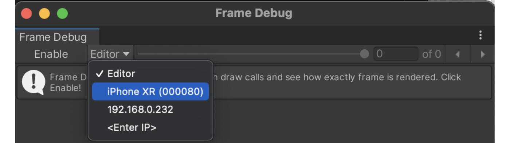
<p><em>VI: <strong>▲ Frame Debugger cũng đo được THIẾT BỊ THẬT</strong> — dropdown <strong>Editor · iPhone XR (000080) · 192.168.0.232 · &lt;Enter IP&gt;</strong>. / EN: The Frame Debug target dropdown, including a real device and an IP.</em></p>

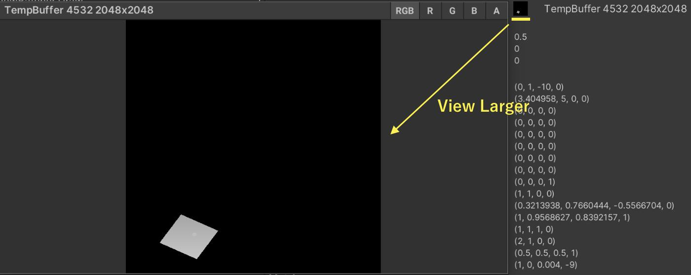
<p><em>VI: <strong>▲ Nút <em>View Larger</em></strong> — mở render target <code>TempBuffer 4532 2048x2048</code> ra khung lớn kèm bộ lọc kênh <strong>RGB · R · G · B · A</strong> và cột giá trị pixel thô bên phải. / EN: The View Larger button on a TempBuffer 2048x2048 render target.</em></p>

<div class="bilingual-row">
<div class="col-vi">
<p>🎛️ <em>"Phần đánh dấu <strong>'RT0'</strong> có thể ĐỔI khi có <strong>NHIỀU render target</strong>. Điều này <strong>ĐẶC BIỆT hữu ích khi dùng multiple render targets để kiểm tra trạng thái render của TỪNG target</strong>."</em></p>
<p>🌈 <em>"<strong>Channels</strong> có thể đổi để hiển thị TOÀN BỘ RGBA hoặc CHỈ MỘT kênh. <strong>Levels</strong> là thanh trượt cho phép <strong>chỉnh ĐỘ SÁNG của kết quả render</strong> — hữu ích ví dụ để <strong>chỉnh sáng một cảnh render TỐI như ambient hoặc indirect lighting để DỄ NHÌN HƠN.</strong>"</em></p>
</div>
<div class="col-en">
<p>🎛️ <em>"The part marked <strong>'RT0'</strong> can be changed when there are <strong>multiple render targets</strong>. This is <strong>especially useful when using multiple render targets to check the rendering status of each target</strong>."</em></p>
<p>🌈 <em>"<strong>Channels</strong> can be changed to display all RGBA or only one of the channels. <strong>Levels</strong> is a slider that allows you to <strong>adjust the BRIGHTNESS of the resulting rendering</strong>. This is useful, for example, to <strong>adjust the brightness of a DARK rendering, such as ambient or indirect lighting, to make it easier to see.</strong>"</em></p>
</div>
</div>

### 21.2. 🏆 "Why this draw call can't be batched with the previous one"

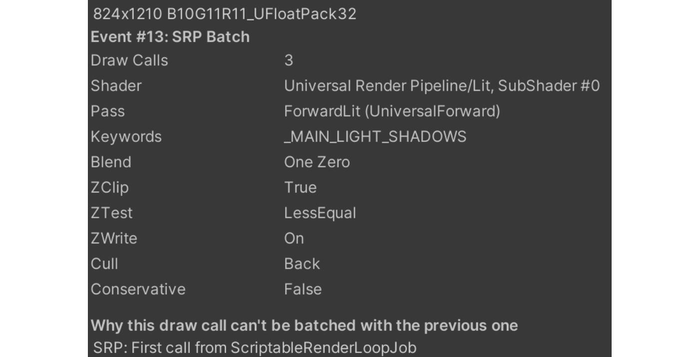

<p><em>VI: Tính năng CHẨN ĐOÁN đắt giá nhất — <strong>Event #13: SRP Batch</strong>, RT <strong>824x1210 B10G11R11_UFloatPack32</strong>, <strong>Draw Calls 3</strong>, Shader <code>Universal Render Pipeline/Lit</code>, Pass <code>ForwardLit (UniversalForward)</code>, Keywords <strong><code>_MAIN_LIGHT_SHADOWS</code></strong>, ZTest <strong>LessEqual</strong>, ZWrite <strong>On</strong>, Cull <strong>Back</strong>. Dòng cuối: <strong>"Why this draw call can't be batched with the previous one — SRP: First call from ScriptableRenderLoopJob"</strong>. / EN: The single most valuable diagnostic in the Frame Debugger — it names the exact reason batching failed.</em></p>

<div class="bilingual-row">
<div class="col-vi">
<p>📋 <strong>Drawing Overview:</strong> <em>"Khu vực này cung cấp thông tin về <strong>ĐỘ PHÂN GIẢI và FORMAT của đích render</strong>. Rõ ràng bạn sẽ <strong>NHẬN RA NGAY nếu có drawing destination với độ phân giải CAO HƠN.</strong> Các thông tin khác như <strong>tên Shader dùng, cài đặt Pass như Cull, và các keyword được dùng</strong> cũng tìm thấy ở đây."</em></p>
<p>🏆 <em>"Câu <strong>'Why this~'</strong> liệt kê ở dưới cùng <strong>MÔ TẢ VÌ SAO drawing KHÔNG THỂ batching.</strong> Trong ví dụ, nó nói rằng <strong>drawing call ĐẦU TIÊN đã được chọn nên KHÔNG THỂ batching. Vì NGUYÊN NHÂN được mô tả CHI TIẾT như vậy, bạn có thể DỰA VÀO thông tin này để điều chỉnh nếu muốn nghĩ cách batching.</strong>"</em></p>
<p>🎨 <strong>Shader property detail:</strong> <em>"Khu vực này mô tả thông tin property của Shader đang vẽ — <strong>hữu ích để debug.</strong>"</em></p>
</div>
<div class="col-en">
<p>📋 <strong>Drawing Overview:</strong> <em>"This area provides information on the <strong>RESOLUTION and FORMAT of the destination</strong>. Obviously, you will be able to <strong>notice IMMEDIATELY if there is a drawing destination with a HIGHER resolution.</strong> Other information such as the <strong>Shader name used, Pass settings such as Cull, and keywords used</strong> can also be found."</em></p>
<p>🏆 <em>"The sentence <strong>'Why this~'</strong> listed at the bottom <strong>describes WHY the drawing could NOT be batched.</strong> In the case shown, it states that <strong>the first drawing call was selected and therefore batching was not possible. Since the causes are described in such detail, you can RELY on this information to make adjustments if you want to devise batching.</strong>"</em></p>
<p>🎨 <strong>Shader property detail:</strong> <em>"This area describes the property information of the Shader being drawn. This is <strong>useful for debugging.</strong>"</em></p>
</div>
</div>

!!! tip "💡 Phóng to preview Texture2D"
    **VI:** *"Đôi khi cần kiểm tra CHI TIẾT trạng thái của `Texture2D` hiển thị trong thông tin property. Để làm vậy, **bấm vào ảnh trong khi giữ phím `Command` trên Mac (`Control` trên Windows) để PHÓNG TO ảnh.**"*

    **EN:** *"Sometimes it is necessary to check in detail the state of `Texture2D` displayed in the property information. To do so, **click on the image while holding down the `Command` key on a Mac (`Control` key on Windows) to enlarge the image.**"*

---

## 22. 🧬 Memory Profiler & 🗺️ Heap Explorer

### 22.1. Memory Profiler — hơn Memory module ở BA điểm

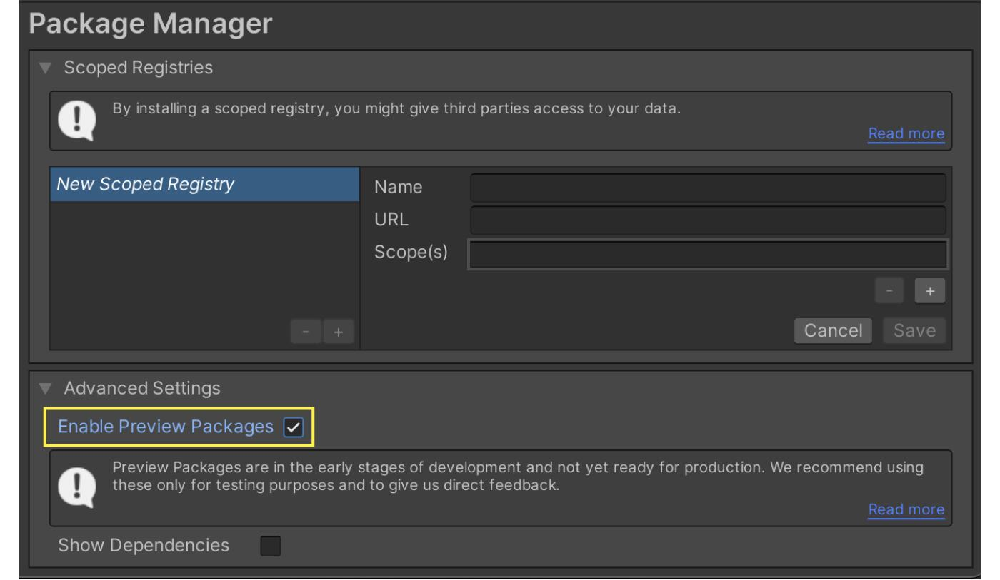
<p><em>VI: <strong>▲ Bước 1 — bật Preview Packages</strong>: <code>Package Manager › Advanced Settings › Enable Preview Packages ✓</code>. Memory Profiler còn ở dạng preview nên KHÔNG hiện nếu chưa bật. / EN: Enable Preview Packages in the Package Manager Advanced Settings.</em></p>

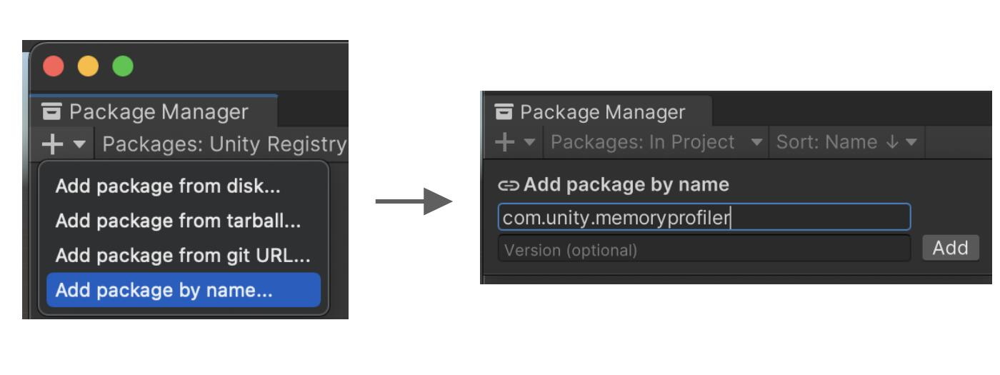
<p><em>VI: <strong>▲ Bước 2 — cài theo TÊN</strong>: <code>+ › Add package by name…</code> rồi gõ <strong><code>com.unity.memoryprofiler</code></strong> (ô Version để trống là lấy bản mới nhất). / EN: Add package by name: com.unity.memoryprofiler.</em></p>

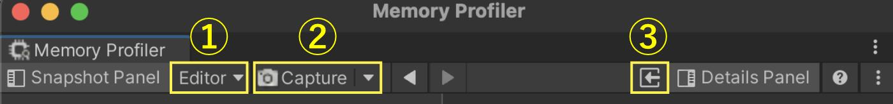
<p><em>VI: <strong>▲ Ba nút phải nhớ</strong> — <strong>①</strong> chọn đích (<code>Editor</code>), <strong>②</strong> <strong>Capture</strong>, <strong>③</strong> nút mở/đóng <strong>Details Panel</strong>. / EN: The three key controls of the Memory Profiler toolbar.</em></p>

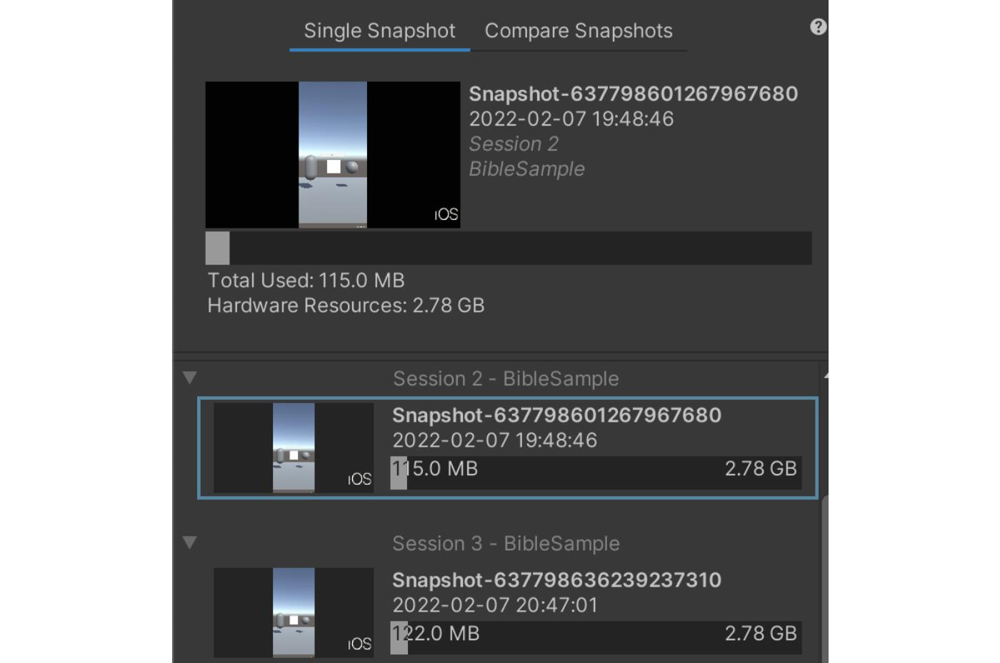
<p><em>VI: <strong>▲ Tab Single Snapshot</strong> — ảnh chụp <code>Snapshot-637798601267967680</code> lúc <strong>2022-02-07 19:48:46</strong>, <strong>Total Used 115.0 MB / Hardware Resources 2.78 GB</strong>; danh sách phiên bên dưới gom theo <strong>Session 2 / Session 3</strong>. / EN: The Single Snapshot tab: Total Used 115.0 MB of 2.78 GB.</em></p>

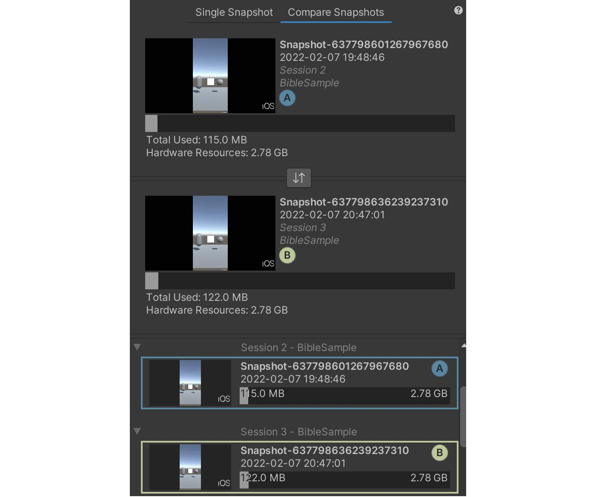
<p><em>VI: <strong>▲ Tab Compare Snapshots</strong> — đặt cạnh nhau <strong>115.0 MB</strong> (19:48:46) và <strong>122.0 MB</strong> (20:47:01) để thấy CHÍNH XÁC 7 MB đã đi đâu. / EN: Compare Snapshots: 115.0 MB vs 122.0 MB.</em></p>

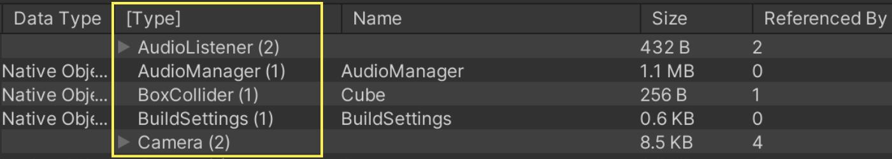
<p><em>VI: <strong>▲ Bảng gộp theo <code>Type</code></strong> — <strong>AudioListener (1) 432 B</strong> · <strong>AudioManager (1) 1.1 MB</strong> · <strong>BoxCollider (1) 256 B</strong> · <strong>BuildSettings (1) 0.6 KB</strong> · <strong>Camera (2) 8.5 KB</strong>, kèm cột <strong>Referenced By</strong>. / EN: The memory table grouped by Type.</em></p>

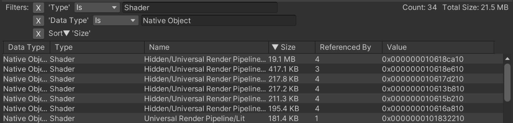
<p><em>VI: <strong>▲ Lọc <code>Type = Shader</code></strong> — <strong>Count 34 · Total Size 21.5 MB</strong>; nặng nhất là <code>Hidden/Universal Render Pipeline/…</code> <strong>19.1 MB</strong> và <strong>417.1 KB</strong>, còn <code>Universal Render Pipeline/Lit</code> <strong>181.4 KB</strong>. / EN: Filtering by Type = Shader: 34 shaders, 21.5 MB total.</em></p>

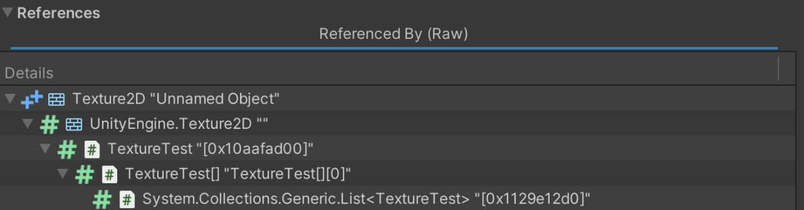
<p><em>VI: <strong>▲ Referenced By (Raw)</strong> — truy ngược một <code>Texture2D "Unnamed Object"</code> qua <code>UnityEngine.Texture2D</code> → <code>TextureTest[0x0aafad00]</code> → <code>TextureTest[]</code> → <code>System.Collections.Generic.List&lt;TextureTest&gt;</code>. Đây là cách TÌM RA ai đang GIỮ tham chiếu. / EN: The Referenced By (Raw) tree tracing who holds a Texture2D.</em></p>

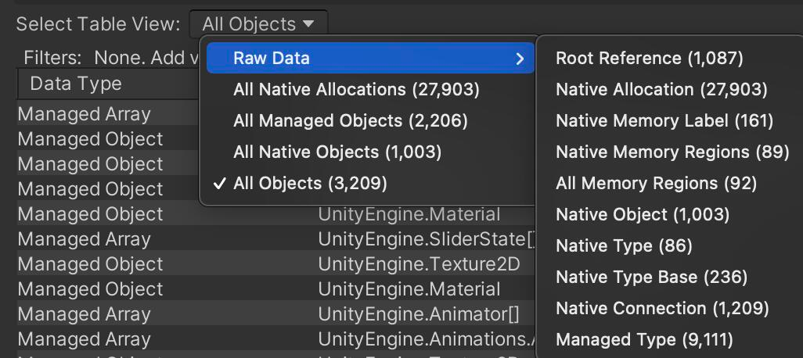 Raw Data with the full object counts.">
<p><em>VI: <strong>▲ <code>Select Table View › Raw Data</code></strong> — <strong>All Native Allocations 27.903 · All Managed Objects 2.206 · All Native Objects 1.003 · All Objects 3.209</strong>; cột phải: <strong>Native Type 86 · Native Type Base 236 · Native Connection 1.209 · Managed Type 9.111</strong>. / EN: Select Table View > Raw Data with the full object counts.</em></p>

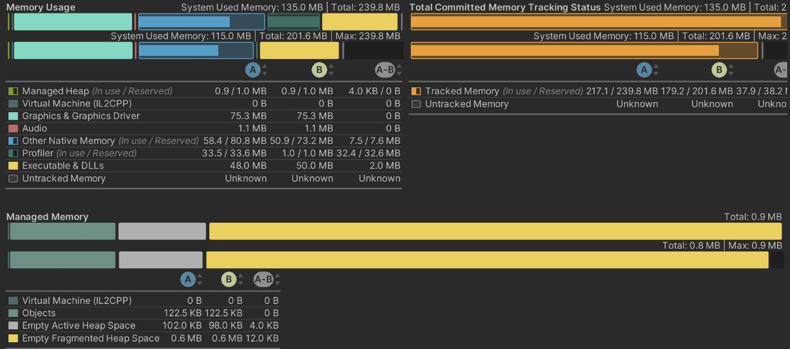
<p><em>VI: <strong>Memory Breakdowns</strong> — <strong>System Used 135.0 MB / Total 239.8 MB</strong>; <strong>Graphics &amp; Graphics Driver 75.3 MB</strong> · <strong>Executable &amp; DLLs 48.0/50.0 MB</strong> · <strong>Managed Heap 0.9/1.0 MB</strong> · <strong>Empty Fragmented Heap Space 0.6 MB</strong> (dấu hiệu PHÂN MẢNH). / EN: Memory Breakdowns bars with System Used 135.0 MB and Empty Fragmented Heap Space.</em></p>

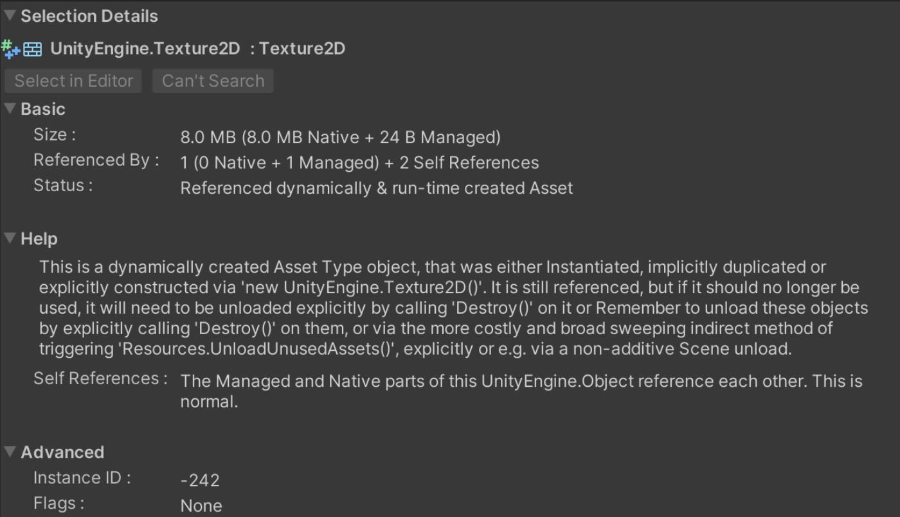
<p><em>VI: <strong>Selection Details</strong> của một <code>Texture2D</code> <strong>8.0 MB (8.0 MB Native + 24 B Managed)</strong>, trạng thái <strong>"Referenced dynamically &amp; run-time created Asset"</strong> — panel Help ghi rõ: object tạo bằng <code>new UnityEngine.Texture2D()</code> <strong>PHẢI được giải phóng TƯỜNG MINH bằng <code>Destroy()</code></strong> hoặc <code>Resources.UnloadUnusedAssets()</code>. / EN: Selection Details for a dynamically created Texture2D requiring explicit Destroy().</em></p>

<div class="bilingual-row">
<div class="col-vi">
<p>🥇 <em>"Memory Profiler là công cụ CHÍNH THỨC do Unity cung cấp dưới dạng <strong>Preview Package</strong>. So với Memory module của Unity Profiler, nó VƯỢT TRỘI ở các điểm chính sau:"</em></p>
<p>① <em>"<strong>Dữ liệu capture được LƯU CỤC BỘ kèm ẢNH CHỤP MÀN HÌNH</strong>"</em><br>
② <em>"<strong>Lượng bộ nhớ mỗi CATEGORY chiếm được TRỰC QUAN HOÁ và DỄ HIỂU</strong>"</em><br>
③ <em>"<strong>Dữ liệu có thể SO SÁNH được</strong>"</em></p>
<p>⚠️ <em>"UI của Memory Profiler <strong>THAY ĐỔI ĐÁNG KỂ giữa v0.4 và các bản sau</strong>. Sách này dùng <strong>v0.5</strong>. Với <strong>v0.4 trở lên cần Unity 2020.3.12f1 trở lên</strong> để dùng đủ tính năng. Ngoài ra, <strong>v0.4 và v0.5 THOẠT NHÌN GIỐNG NHAU, nhưng v0.5 đã được cập nhật ĐÁNG KỂ — đặc biệt việc THEO DÕI THAM CHIẾU object giờ DỄ HƠN NHIỀU</strong>, nên về cơ bản khuyến nghị <strong>dùng v0.5 trở lên</strong>."</em></p>
</div>
<div class="col-en">
<p>🥇 <em>"Memory Profiler is an official tool provided by Unity as a <strong>Preview Package</strong>. Compared to the Memory module of the Unity Profiler, it is superior in the following main points:"</em></p>
<p>① <em>"<strong>Captured data is saved locally WITH SCREENSHOTS</strong>"</em><br>
② <em>"<strong>The amount of memory occupied by each category is visualized and easy to understand</strong>"</em><br>
③ <em>"<strong>Data can be compared</strong>"</em></p>
<p>⚠️ <em>"The UI of the Memory Profiler has <strong>changed significantly between v0.4 and later versions</strong>. This book uses <strong>v0.5</strong>. For v0.4 or later, <strong>Unity 2020.3.12f1 or later is required</strong> to use all features. In addition, <strong>v0.4 and v0.5 look the same at first glance, but v0.5 has been significantly updated. In particular, object references are now MUCH EASIER to follow</strong>, so we basically recommend <strong>using v0.5 or later</strong>."</em></p>
</div>
</div>

**Cài đặt:**

| Unity | Cách cài |
|---|---|
| **Unity 2020** | Bật **"Enable Preview Packages"** trong *Project Settings → Package Manager*, rồi cài Memory Profiler từ **Unity Registry** |
| **Unity 2021+** | *"Cách thêm package đã ĐỔI. Bấm **"Add Package by Name"** và nhập **`com.unity.memoryprofiler`**"* |

> Mở bằng **"Window → Analysis → Memory Profiler"**.

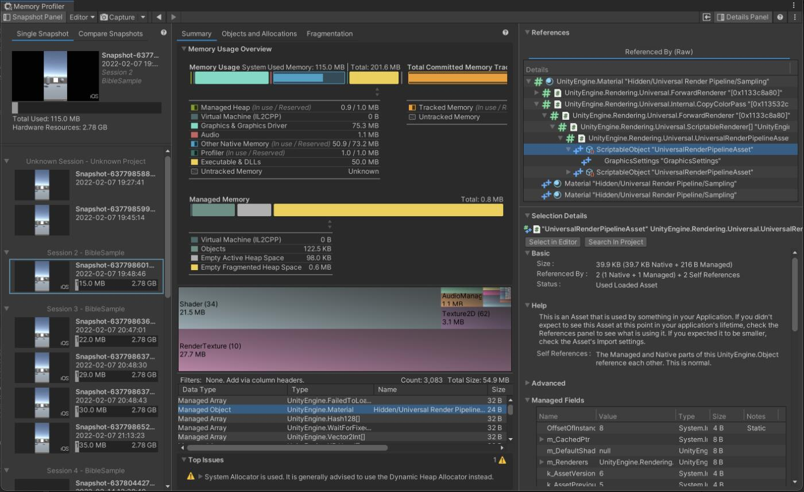

<p><em>VI: Toàn cảnh Memory Profiler — <strong>Snapshot Panel</strong> (trái, gom theo SESSION, mỗi snapshot kèm ẢNH CHỤP MÀN HÌNH, ví dụ <strong>Total Used 115.0 MB / Hardware Resources 2.78 GB</strong>), <strong>Measurement Results</strong> (giữa: Memory Usage Overview + Tree Map + Tree Map Table, <strong>Count 3,083 / Total Size 54.9 MB</strong>), và <strong>Detail Panel</strong> (phải: Referenced By + Selection Details với mục <strong>Help</strong>). Dưới cùng có <strong>Top Issues</strong>: <em>"System Allocator is used. It is generally advised to use the Dynamic Heap Allocator instead."</em> / EN: The full Memory Profiler layout — snapshot panel, tree map, and the reference/detail panel.</em></p>

!!! danger "💀 BẪY ĐO: bộ nhớ dùng để ĐO sẽ KHÔNG được giải phóng"
    <div class="bilingual-row">
    <div class="col-vi">
    <p><em>"Có một điểm QUAN TRỌNG cần lưu ý về việc đo. <strong>Bộ nhớ cần cho việc ĐO được cấp phát MỚI và sẽ KHÔNG được giải phóng lại. Tuy nhiên, nó KHÔNG TĂNG VÔ HẠN và cuối cùng sẽ ỔN ĐỊNH sau vài lần đo.</strong> Lượng bộ nhớ cấp lúc đo <strong>phụ thuộc vào ĐỘ PHỨC TẠP của project.</strong>"</em></p>
    <p>🚨 <em>"<strong>Nếu bạn KHÔNG biết giả định này, hãy CẨN THẬN vì bạn có thể LẦM TƯỞNG là có rò rỉ khi thấy lượng bộ nhớ PHÌNH LÊN.</strong>"</em></p>
    </div>
    <div class="col-en">
    <p><em>"One thing to note about measurement is that <strong>the memory required for measurement is NEWLY ALLOCATED and will NOT be released again. However, it does not increase infinitely and will eventually settle down after several measurements.</strong> The amount of memory allocated at measurement time will <strong>depend on the complexity of the project.</strong>"</em></p>
    <p>🚨 <em>"<strong>If you do not know this assumption, be careful because you may MISTAKENLY THINK there is a LEAK when you see the amount of memory usage BALLOONING.</strong>"</em></p>
    </div>
    </div>

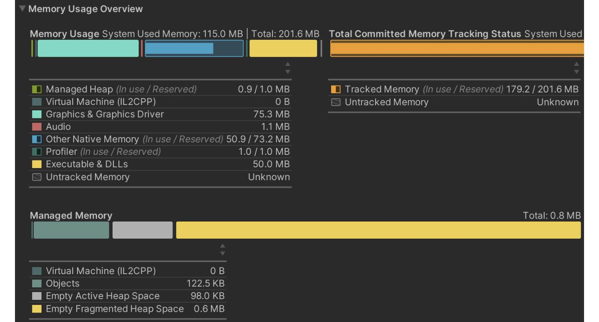

<p><em>VI: Memory Usage Overview — <strong>System Used Memory 115.0 MB</strong>, <strong>Total 201.6 MB</strong>. Breakdown: <strong>Managed Heap 0.9 / 1.0 MB</strong>, Virtual Machine (IL2CPP) <strong>0 B</strong>, <strong>Graphics &amp; Graphics Driver 75.3 MB</strong>, Audio <strong>1.1 MB</strong>, <strong>Other Native Memory 50.9 / 73.2 MB</strong>, Profiler <strong>1.0 / 1.0 MB</strong>, <strong>Executable &amp; DLLs 50.0 MB</strong>; <strong>Tracked Memory 179.2 / 201.6 MB</strong>. Khối Managed Memory dưới: Objects <strong>122.5 KB</strong>, Empty Active Heap Space <strong>98.0 KB</strong>, 💀 <strong>Empty FRAGMENTED Heap Space 0.6 MB</strong>. / EN: Memory Usage Overview — note the Empty Fragmented Heap Space, the direct evidence of managed-heap fragmentation.</em></p>

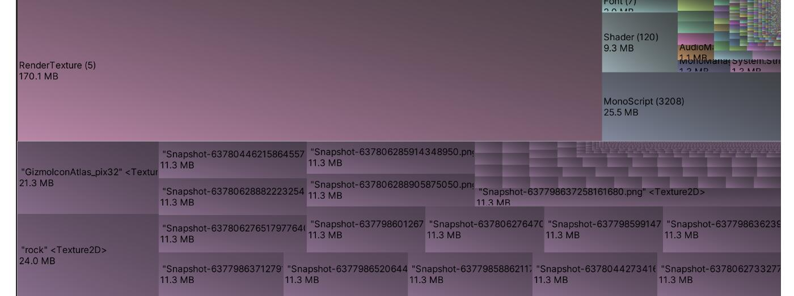

<p><em>VI: <strong>Tree Map</strong> — diện tích ô TỈ LỆ với bộ nhớ. <code>RenderTexture (5)</code> chiếm <strong>170.1 MB</strong> (áp đảo), <code>MonoScript (3208)</code> <strong>25.5 MB</strong>, <code>Shader (120)</code> <strong>9.3 MB</strong>, <code>"rock" &lt;Texture2D&gt;</code> <strong>24.0 MB</strong>, <code>"GizmoIconAtlas_pix32"</code> <strong>21.3 MB</strong>, và hàng chục <code>Snapshot-*.png</code> mỗi cái <strong>11.3 MB</strong> (chính là ảnh chụp màn hình do Memory Profiler tạo!). / EN: Tree Map — box area is proportional to memory; here RenderTexture dominates at 170.1 MB.</em></p>

<div class="bilingual-row">
<div class="col-vi">
<p>🗂️ <em>"Khu vực tiếp theo gọi là <strong>Tree Map</strong>, hiển thị ĐỒ HOẠ mức dùng bộ nhớ cho <strong>TỪNG CATEGORY object</strong>. Chọn từng category để kiểm tra object bên trong."</em></p>
<p>📋 <em>"Phần dưới cùng gọi là <strong>Tree Map Table</strong> — danh sách object ở dạng BẢNG. <strong>Các mục hiển thị có thể GOM NHÓM, SẮP XẾP và LỌC bằng cách bấm header. ĐẶC BIỆT, gom nhóm theo Type khiến việc phân tích DỄ HƠN — hãy dùng CHỦ ĐỘNG.</strong>"</em></p>
<p>🔍 <em>"Khi chọn một category trong Tree Map, <strong>bộ lọc được TỰ ĐỘNG đặt để chỉ hiện object của category đó.</strong>"</em></p>
</div>
<div class="col-en">
<p>🗂️ <em>"The next area of the screen is called the <strong>Tree Map</strong>, which graphically displays memory usage for <strong>EACH CATEGORY of objects</strong>. By selecting each category, you can check the objects within the category."</em></p>
<p>📋 <em>"The bottom part is called <strong>Tree Map Table</strong>. Here, the list of objects is arranged in a table format. <strong>The displayed items can be grouped, sorted, and filtered by pressing the header. Especially, grouping the Types makes it EASIER to analyze, so please use it PROACTIVELY.</strong>"</em></p>
<p>🔍 <em>"When a category is selected in the Tree Map, <strong>a filter is AUTOMATICALLY set to display only objects in that category.</strong>"</em></p>
</div>
</div>

**Bảng 3.6 — Cột `Diff` trong Compare Snapshots:**

| Diff | Nghĩa (VI) | Meaning (EN) |
|---|---|---|
| **Same** | A, B **CÙNG** object | A, B same object |
| **Not in A (Deleted)** | Object có ở A nhưng **KHÔNG** ở B | Object in A but not in B |
| **Not in B (New)** | Object **KHÔNG** ở A nhưng có ở B | Object not in A but in B |

> 💡 *"Bằng cách nhìn thông tin này, có thể kiểm tra **bộ nhớ đang TĂNG hay GIẢM.**"* / *"By looking at this information, it is possible to check whether memory is increasing or decreasing."*

<div class="bilingual-row">
<div class="col-vi">
<p>🔗 <strong>Detail Panel</strong> — <em>"Panel này dùng khi bạn muốn <strong>THEO DÕI quan hệ THAM CHIẾU của object đã chọn. Bằng cách kiểm tra 'Referenced By', bạn sẽ tìm ra được CÁI GÌ đang GIỮ tham chiếu.</strong>"</em></p>
<p>🆘 <em>"Phần dưới, <strong>Selection Details</strong>, chứa thông tin chi tiết về object. Trong đó, <strong>mục 'Help' chứa LỜI KHUYÊN về cách GIẢI PHÓNG nó. Bạn nên đọc nếu chưa chắc phải làm gì.</strong>"</em></p>
</div>
<div class="col-en">
<p>🔗 <strong>Detail Panel</strong> — <em>"This panel is used when you want to <strong>track the reference relationship of the selected object. By checking this 'Referenced By', you will be able to figure out WHAT is causing the continued reference grabbing.</strong>"</em></p>
<p>🆘 <em>"The bottom section, <strong>Selection Details</strong>, contains detailed information about the object. Among them, <strong>the 'Help' section contains ADVICE on how to RELEASE it. You may want to read it if you are not sure what to do.</strong>"</em></p>
</div>
</div>

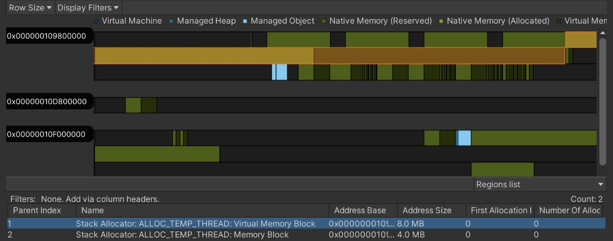

<p><em>VI: Tab <strong>Fragmentation</strong> — trực quan hoá trạng thái VIRTUAL MEMORY theo địa chỉ (<code>0x000000109800000</code>, <code>0x00000010D800000</code>…), phân biệt Virtual Machine / Managed Heap / Managed Object / Native Memory (Reserved) / Native Memory (Allocated). Bảng dưới: <code>Stack Allocator: ALLOC_TEMP_THREAD: Virtual Memory Block</code> <strong>8.0 MB</strong>, <code>Memory Block</code> <strong>4.0 MB</strong>. ⚠️ Sách cảnh báo view này <strong>"KHÓ dùng vì chứa NHIỀU thông tin KHÔNG TRỰC QUAN như địa chỉ bộ nhớ"</strong>. / EN: The Fragmentation tab visualises virtual memory; the book warns it is hard to use because of the raw addresses.</em></p>

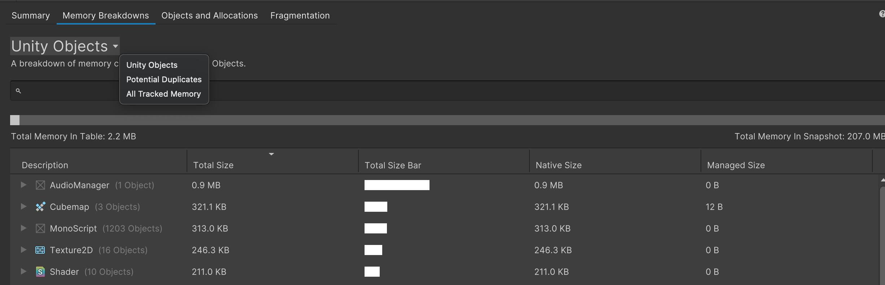

<p><em>VI: <strong>Memory Breakdowns</strong> — tính năng MỚI từ <strong>v0.6</strong> (cần <strong>Unity 2022.1+</strong>). Ba chế độ: <strong>Unity Objects / Potential Duplicates / All Tracked Memory</strong>. Bảng: <strong>Total Memory In Table 2.2 MB</strong> vs <strong>Total Memory In Snapshot 207.0 MB</strong>; AudioManager <strong>0.9 MB (1 Object)</strong>, Cubemap <strong>321.1 KB (3)</strong>, MonoScript <strong>313.0 KB (1203)</strong>, Texture2D <strong>246.3 KB (16)</strong>, Shader <strong>211.0 KB (10)</strong>. 🏆 Chế độ <strong>"Potential Duplicates"</strong> giúp phát hiện object bị TRÙNG LẶP. / EN: Memory Breakdowns (v0.6+) — list-view tree maps plus a "Potential Duplicates" mode.</em></p>

<div class="bilingual-row">
<div class="col-vi">
<p>📊 <em>"<strong>'Objects and Allocations'</strong> KHÁC Summary ở chỗ <strong>thông tin CHI TIẾT HƠN như allocation có thể xem ở dạng BẢNG.</strong>"</em></p>
<p>🧩 <em>"<strong>'Fragmentation'</strong> trực quan hoá trạng thái virtual memory và dùng để ĐIỀU TRA phân mảnh. <strong>Tuy nhiên, có thể KHÓ dùng vì chứa RẤT NHIỀU thông tin KHÔNG TRỰC QUAN như ĐỊA CHỈ BỘ NHỚ.</strong>"</em></p>
<p>🆕 <em>"Tính năng mới <strong>'Memory Breakdowns'</strong> được thêm từ <strong>v0.6</strong>. Cần <strong>Unity 2022.1 trở lên</strong>, nhưng giờ có thể <strong>xem TreeMap ở dạng LIST VIEW và thông tin object như Unity Subsystems.</strong> Các tính năng mới khác gồm <strong>khả năng kiểm tra object có thể bị TRÙNG LẶP.</strong>"</em></p>
</div>
<div class="col-en">
<p>📊 <em>"<strong>'Objects and Allocations'</strong> differs from Summary in that <strong>more detailed information such as allocations can be viewed in TABLE format.</strong>"</em></p>
<p>🧩 <em>"<strong>'Fragmentation'</strong> visualizes the virtual memory status and can be used to investigate fragmentation. <strong>However, it may be DIFFICULT to use because it contains a lot of NON-INTUITIVE information such as MEMORY ADDRESSES.</strong>"</em></p>
<p>🆕 <em>"A new feature called <strong>'Memory Breakdowns'</strong> has been added since <strong>v0.6</strong>. <strong>Unity 2022.1 or later is required</strong>, but it is now possible to <strong>view TreeMaps in LIST VIEW and object information such as Unity Subsystems.</strong> Other new features include <strong>the ability to check for POSSIBLE DUPLICATE objects.</strong>"</em></p>
</div>
</div>

### 22.2. 🗺️ Heap Explorer — công cụ ĐỘC NHẤT của cuốn sách này

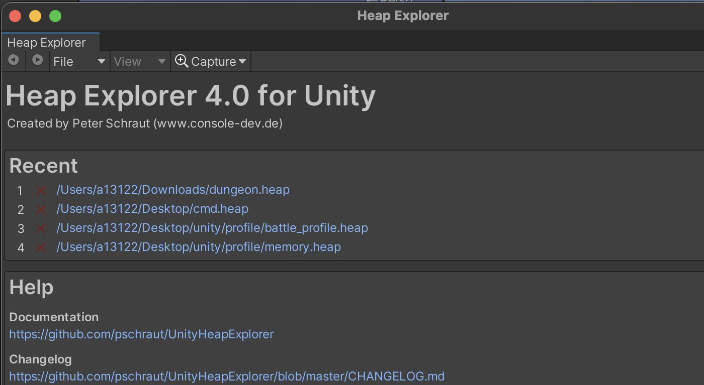
<p><em>VI: <strong>▲ Heap Explorer 4.0 for Unity</strong> — tác giả <strong>Peter Schraut</strong>, mã nguồn tại <code>github.com/pschraut/UnityHeapExplorer</code>. Màn hình mở đầu liệt kê các file <code>.heap</code> gần đây. / EN: Heap Explorer 4.0 for Unity by Peter Schraut.</em></p>

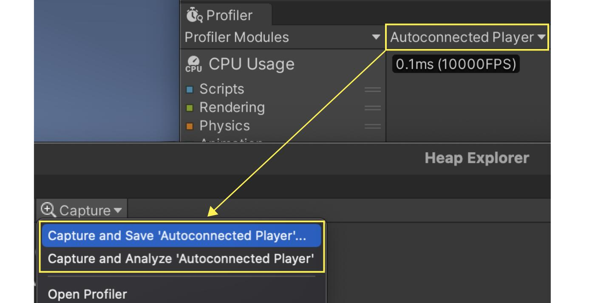
<p><em>VI: <strong>▲ Chụp từ THIẾT BỊ</strong> — chọn <code>Autoconnected Player</code> trong Profiler rồi <strong>Capture and Save 'Autoconnected Player'…</strong> (hoặc <strong>Capture and Analyze</strong>). / EN: Capture and Save 'Autoconnected Player' in Heap Explorer.</em></p>

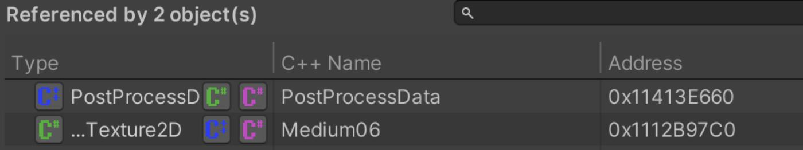
<p><em>VI: <strong>▲ Referenced by 2 object(s)</strong> — một Texture2D đang bị <code>PostProcessData</code> (<code>0x11413E660</code>) và <code>Medium06</code> (<code>0x1112B97C0</code>) GIỮ. / EN: Referenced by 2 object(s) in Heap Explorer.</em></p>

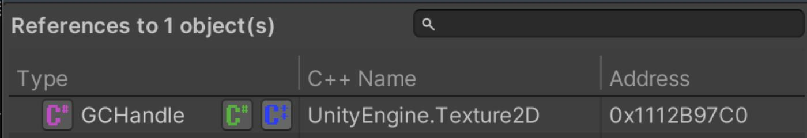
<p><em>VI: <strong>▲ References to 1 object(s)</strong> — chiều NGƯỢC LẠI: một <code>GCHandle</code> đang trỏ tới <code>UnityEngine.Texture2D</code> tại <code>0x1112B97C0</code>. / EN: References to 1 object(s) in Heap Explorer.</em></p>

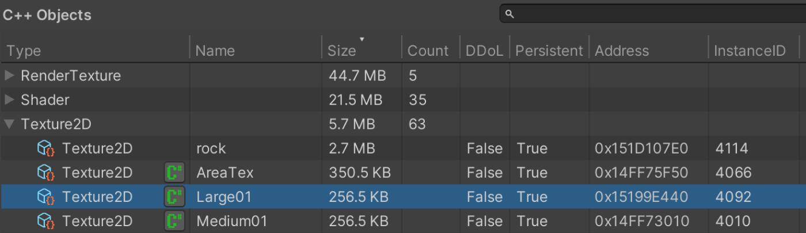
<p><em>VI: Bảng <strong>C++ Objects</strong> của Heap Explorer — <strong>RenderTexture 44.7 MB / 5 cái</strong> · <strong>Shader 21.5 MB / 35</strong> · <strong>Texture2D 5.7 MB / 63</strong> (trong đó <code>rock</code> 2.7 MB). Chú ý hai cột <strong>DDoL</strong> và <strong>Persistent</strong>. / EN: Heap Explorer's C++ Objects table with DDoL and Persistent columns.</em></p>

<div class="bilingual-row">
<div class="col-vi">
<p>🧑‍💻 <em>"Heap Explorer là công cụ <strong>MÃ NGUỒN MỞ</strong> của nhà phát triển cá nhân <strong>Peter77</strong>. Giống Memory Profiler, công cụ này <strong>thường dùng để ĐIỀU TRA BỘ NHỚ</strong>."</em></p>
<p>📜 <strong>Lý do sách vẫn đưa nó vào:</strong> <em>"Memory Profiler <strong>RẤT TỐN CÔNG</strong> để truy vết tham chiếu ở các bản <strong>TRƯỚC 0.4</strong> vì chúng KHÔNG hiển thị dạng danh sách. Dù đã cải thiện ở <strong>0.5</strong> trở lên, <strong>vẫn có người dùng phiên bản Unity KHÔNG được hỗ trợ. Nó VẪN RẤT GIÁ TRỊ như một công cụ THAY THẾ trong các trường hợp đó.</strong>"</em></p>
<p>📥 <strong>Cài đặt:</strong> <em>"Copy Package URL liệt kê trong repository GitHub (<code>github.com/pschraut/UnityHeapExplorer</code>) và thêm bằng <strong>Add Package from Git url</strong> trong Package Manager."</em></p>
</div>
<div class="col-en">
<p>🧑‍💻 <em>"Heap Explorer is an <strong>open source</strong> tool from private developer <strong>Peter77</strong>. Like Memory Profiler, this tool is often used to <strong>investigate memory</strong>."</em></p>
<p>📜 <strong>Why the book still covers it:</strong> <em>"Memory Profiler was <strong>very LABOR INTENSIVE</strong> to track down references in versions <strong>PRIOR to 0.4</strong> because they were not displayed in a list format. Although this has been improved in <strong>0.5</strong> and later, <strong>there may be some who use a version of Unity that is NOT SUPPORTED. It is still VERY VALUABLE as an alternative tool in such cases.</strong>"</em></p>
<p>📥 <strong>Install:</strong> <em>"Copy the Package URLs listed in the GitHub repository (<code>github.com/pschraut/UnityHeapExplorer</code>) and add it from <strong>Add Package from Git url</strong> in the Package Manager."</em></p>
</div>
</div>

**Thanh toolbar — 4 nhóm chức năng:**

| Nhóm | VI | EN |
|---|---|---|
| **Mũi tên trái/phải** | Đi **LÙI/TIẾN** trong thao tác. *"**ĐẶC BIỆT hữu ích để TRUY VẾT THAM CHIẾU.**"* | *"Especially useful for tracking references."* |
| **File** | Lưu/nạp file đo — đuôi **`.heap`** | Saved with a `.heap` extension |
| **View** | Chuyển giữa các màn hình hiển thị | Switch between different display screens |
| **Capture** | 💀 *"**KHÔNG THỂ đổi ĐỐI TƯỢNG đo TRONG Heap Explorer. Phải đổi ở Unity Profiler hoặc công cụ khác của Unity.** **Save** lưu vào file rồi hiện kết quả; **Analyze** hiện kết quả mà KHÔNG lưu. Lưu ý: giống Memory Profiler, **bộ nhớ cấp phát lúc đo KHÔNG được giải phóng.**"* | *"The measurement target CANNOT be changed in Heap Explorer… memory allocated during measurement is not released."* |

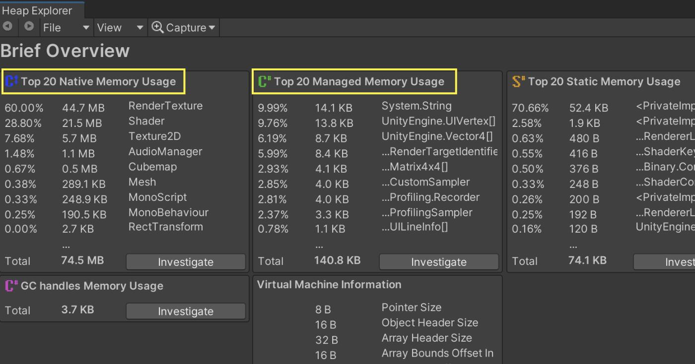

<p><em>VI: Heap Explorer — <strong>Brief Overview</strong>. Hai khung viền VÀNG là hai category sách bảo phải chú ý: <strong>Top 20 Native Memory Usage</strong> (RenderTexture <strong>44.7 MB / 60.00%</strong>, Shader <strong>21.5 MB / 28.80%</strong>, Texture2D <strong>5.7 MB / 7.68%</strong>, AudioManager <strong>1.1 MB</strong> — <strong>Total 74.5 MB</strong>) và <strong>Top 20 Managed Memory Usage</strong> (<code>System.String</code> <strong>14.1 KB / 9.99%</strong>, <code>UnityEngine.UIVertex[]</code> <strong>13.8 KB</strong>, <code>Vector4[]</code> <strong>8.7 KB</strong> — <strong>Total 140.8 KB</strong>). Bên phải: <strong>Top 20 Static Memory Usage — Total 74.1 KB</strong>; dưới: <strong>GC handles 3.7 KB</strong>, và <strong>Virtual Machine Information</strong> (Pointer Size <strong>8 B</strong>, Object Header <strong>16 B</strong>, Array Header <strong>32 B</strong>). / EN: Heap Explorer's Brief Overview — the green-lined Native and Managed Memory Usage categories are the ones to investigate.</em></p>

<div class="bilingual-row">
<div class="col-vi">
<p>🎯 <em>"Trong Overview, các category ĐÁNG QUAN TÂM ĐẶC BIỆT là <strong>Native Memory Usage và Managed Memory Usage</strong>, được đánh dấu bằng ĐƯỜNG XANH LÁ. Bấm nút <strong>'Investigate'</strong> để xem chi tiết từng category."</em></p>
<p>🧱 <em>"Khi Investigate <strong>Native Memory</strong>, <strong>C++ Objects</strong> hiển thị ở khu vực này. Với <strong>Managed Memory</strong>, <strong>C# Objects</strong> sẽ hiển thị."</em></p>
</div>
<div class="col-en">
<p>🎯 <em>"In the Overview, the categories of particular concern are <strong>Native Memory Usage and Managed Memory Usage</strong>, which are indicated by GREEN lines. Click the <strong>'Investigate'</strong> button to see the details of each category."</em></p>
<p>🧱 <em>"When Native Memory is investigated, <strong>C++ Objects</strong> are displayed in this area. In case of <strong>Managed Memory</strong>, <strong>C# Objects</strong> will be displayed."</em></p>
</div>
</div>

**Hai cột header LẠ trong Object display area:**

| Cột | VI | EN |
|---|---|---|
| **DDoL** | 🔑 Viết tắt của **"Don't Destroy On Load"**. *"Bạn thấy được object có được **chỉ định là object KHÔNG BỊ HUỶ sau khi chuyển scene** hay không."* | *"You can see if the object is designated as an object that will not be destroyed after a scene transition."* |
| **Persistent** | *"Cho biết object có phải **persistent object** hay không. Đây là **object Unity TỰ ĐỘNG tạo lúc khởi động.**"* | *"This is an object that is automatically created by Unity at startup."* |

**Ba khung TRUY VẾT THAM CHIẾU — vũ khí chống rò rỉ:**

<div class="bilingual-row">
<div class="col-vi">
<p>⬅️ <strong>Referenced by</strong> — <em>"Hiển thị object mà object đích ĐANG ĐƯỢC THAM CHIẾU TỪ."</em></p>
<p>➡️ <strong>References to</strong> — <em>"Hiển thị object ĐƯỢC THAM CHIẾU BỞI object đích."</em></p>
<p>🏆 <strong>Path to Root</strong> — <em>"Hiển thị các <strong>ROOT OBJECT đang tham chiếu tới object đích. RẤT hữu ích khi ĐIỀU TRA RÒ RỈ BỘ NHỚ, vì nó cho bạn thấy CÁI GÌ ĐANG GIỮ tham chiếu.</strong>"</em></p>
<p>🏁 <em>"Như đã giới thiệu, <strong>Heap Explorer cung cấp BỘ CHỨC NĂNG ĐẦY ĐỦ cần thiết để điều tra rò rỉ bộ nhớ và bộ nhớ nói chung. Nó cũng RẤT NHẸ</strong>, nên hãy cân nhắc dùng. Nếu bạn thích, <strong>hãy thêm một Star như một lời cảm ơn.</strong>"</em></p>
</div>
<div class="col-en">
<p>⬅️ <strong>Referenced by</strong> — <em>"The object from which the target object is referenced is displayed."</em></p>
<p>➡️ <strong>References to</strong> — <em>"Displays objects that are referenced by the target object."</em></p>
<p>🏆 <strong>Path to Root</strong> — <em>"Displays the <strong>ROOT OBJECTS that reference the target object. This is useful when investigating memory leaks, as it allows you to see WHAT IS HOLDING the reference.</strong>"</em></p>
<p>🏁 <em>"Heap Explorer provides <strong>a complete set of functions necessary for investigating memory leaks and memory. It is also very lightweight</strong>, so please consider using this tool. If you like it, <strong>it would be better if you add a Star as a token of your appreciation.</strong>"</em></p>
</div>
</div>

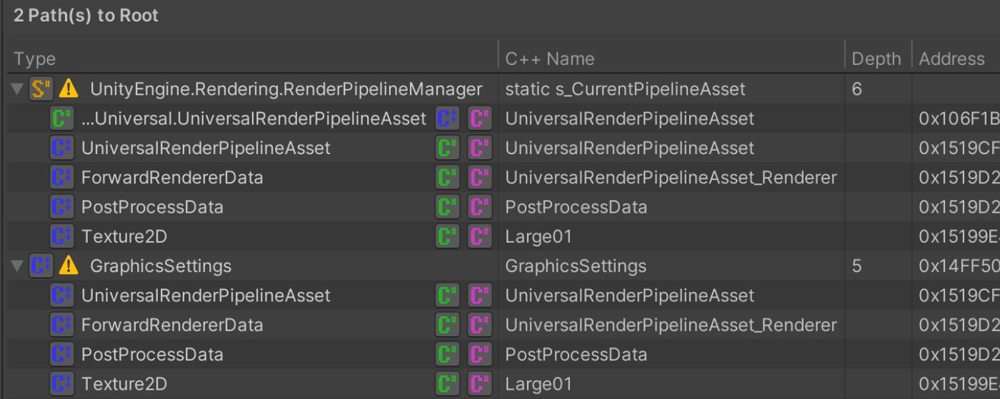

<p><em>VI: <strong>Path to Root</strong> — "2 Path(s) to Root". Đường thứ nhất bắt đầu từ <strong><code>UnityEngine.Rendering.RenderPipelineManager</code> → static <code>s_CurrentPipelineAsset</code> (Depth 6)</strong> đi qua <code>UniversalRenderPipelineAsset</code> → <code>ForwardRendererData</code> → <code>PostProcessData</code> → <code>Texture2D "Large01"</code>. Đường thứ hai từ <code>GraphicsSettings</code> (Depth 5). 🔑 Đây CHÍNH LÀ cách truy ra ai đang GIỮ một texture 
không cho GC thu hồi. / EN: Path to Root — here a static field `s_CurrentPipelineAsset` is what keeps the `Large01` texture alive.</em></p>


<p><em>VI: Sơ đồ TỔNG KẾT ba khung — với <strong>Object C</strong> đang được chọn: <strong>"Referenced By"</strong> (mũi tên XANH LÁ) chỉ NGƯỢC lên <strong>Object B</strong>; <strong>"References to"</strong> (mũi tên ĐỎ) chỉ XUỐNG <strong>Object D</strong>; <strong>"Path to Root"</strong> (mũi tên CAM) chạy SUỐT chuỗi từ D lên tận <strong>Object A</strong>. / EN: The summary diagram of the three reference panels around the selected object.</em></p>

---

## 23. 🍎 Xcode — Debug Navigator, GPU Frame Capture, Memory Graph

<div class="bilingual-row">
<div class="col-vi">
<p>🔑 <em>"Xcode là công cụ IDE do Apple cung cấp. <strong>Khi bạn đặt target platform là iOS trong Unity, kết quả build sẽ là một Xcode project.</strong> 🏆 <strong>KHUYẾN NGHỊ dùng Xcode cho việc KIỂM CHỨNG NGHIÊM NGẶT, vì nó cung cấp giá trị CHÍNH XÁC HƠN Unity.</strong> Trong mục này ta sẽ chạm tới BA công cụ profiling: <strong>Debug Navigator, GPU Frame Capture, và Memory Graph.</strong>"</em></p>
</div>
<div class="col-en">
<p>🔑 <em>"Xcode is an integrated development environment tool provided by Apple. <strong>When you set the target platform as iOS in Unity, the build result will be an Xcode project.</strong> 🏆 <strong>It is recommended to use Xcode for RIGOROUS VERIFICATION, as it provides MORE ACCURATE values than Unity.</strong> In this section, we will touch on three profiling tools: <strong>Debug Navigator, GPU Frame Capture, and Memory Graph.</strong>"</em></p>
</div>
</div>

### 23.1. Hai cách profile từ Xcode

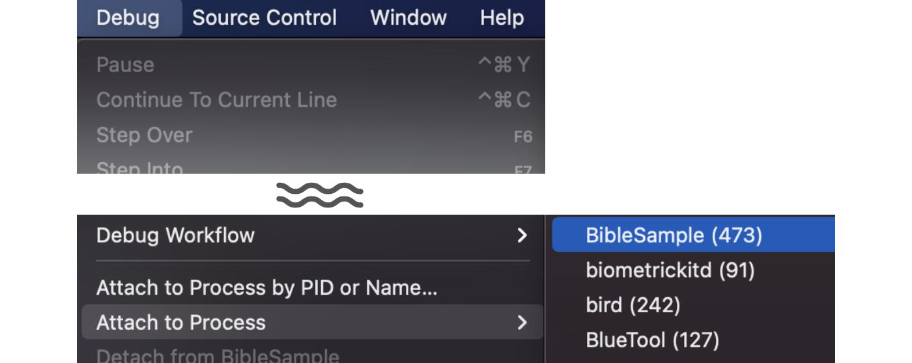 Attach to Process > BibleSample (473).">
<p><em>VI: <strong>▲ Gắn vào tiến trình ĐANG CHẠY</strong> — <code>Debug › Attach to Process › BibleSample (473)</code>; danh sách còn có <code>biometrickitd (91)</code>, <code>bird (242)</code>, <code>BlueTool (127)</code>. Cách này KHÔNG cần build lại từ Xcode. / EN: Debug > Attach to Process > BibleSample (473).</em></p>

<div class="bilingual-row">
<div class="col-vi">
<p>1️⃣ <em>"<strong>Build và chạy app TRỰC TIẾP từ Xcode</strong> rồi chạy nó trên máy. (Cài đặt như chứng chỉ khi build được BỎ QUA trong tài liệu này.)"</em></p>
<p>2️⃣ <em>"<strong>ATTACH app đang chạy vào debugger của Xcode.</strong> Có thể profile bằng cách <strong>chọn process đang chạy từ 'Debug → Attach to Process'</strong> trong menu Xcode sau khi chạy app."</em></p>
<p>🚨 <em>"<strong>TUY NHIÊN, chứng chỉ lúc build PHẢI là loại DEVELOPER (Apple Development). Lưu ý chứng chỉ Ad Hoc hoặc Enterprise KHÔNG THỂ dùng để attach.</strong>"</em></p>
</div>
<div class="col-en">
<p>1️⃣ <em>"<strong>Build and run the application directly from Xcode</strong> and run it on the terminal. (Settings such as certificates when performing a build are omitted.)"</em></p>
<p>2️⃣ <em>"<strong>ATTACH the running application to the Xcode debugger.</strong> This can be profiled by <strong>selecting the running process from 'Debug → Attach to Process'</strong> in the Xcode menu after running the application."</em></p>
<p>🚨 <em>"<strong>However, the certificate at build time MUST be for developer (Apple Development). Note that Ad Hoc or Enterprise certificates CANNOT be used to attach.</strong>"</em></p>
</div>
</div>

### 23.2. Debug Navigator — 6 gauge, MIỄN PHÍ chỉ bằng cách chạy app

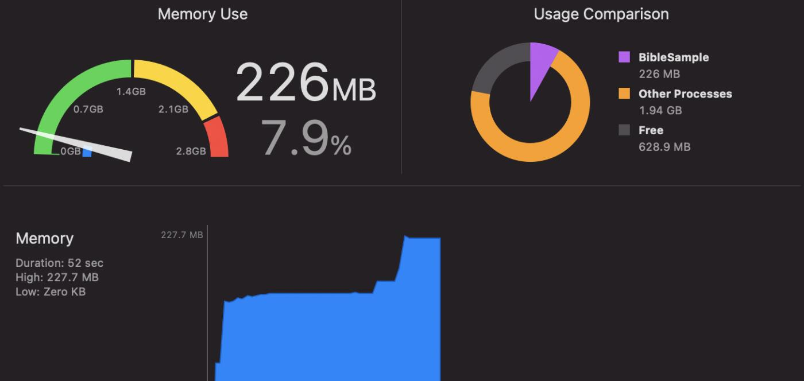
<p><em>VI: <strong>Memory Gauge</strong> — <strong>226 MB (7.9%)</strong>, đỉnh <strong>227.7 MB</strong> trong 52 giây; vòng tròn bên phải cho biết <strong>Other Processes 1.94 GB · Free 628.9 MB</strong>. / EN: Xcode Memory Gauge showing 226 MB (7.9%), high 227.7 MB.</em></p>

<div class="bilingual-row">
<div class="col-vi">
<p>📟 <em>"Debug Navigator cho phép bạn <strong>kiểm tra các đồng hồ debug như CPU và Memory CHỈ BẰNG CÁCH chạy app từ Xcode. SÁU mục hiển thị</strong> khi bấm biểu tượng bình xịt sau khi chạy app. Hoặc mở bằng <strong>"View → Navigators → Debug"</strong>."</em></p>
</div>
<div class="col-en">
<p>📟 <em>"Debug Navigator allows you to <strong>check debugging gauges such as CPU and Memory JUST BY running the application from Xcode. SIX items are displayed</strong> by pressing the spray mark after running the application. Alternatively, open it from <strong>"View → Navigators → Debug"</strong>."</em></p>
</div>
</div>

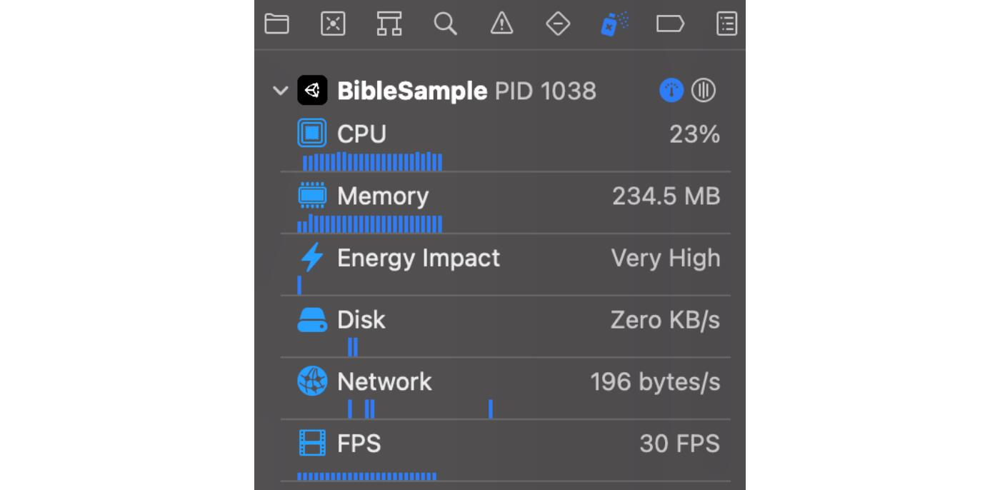

<p><em>VI: Debug Navigator — process <strong>BibleSample PID 1038</strong>: <strong>CPU 23%</strong>, <strong>Memory 234.5 MB</strong>, 🚨 <strong>Energy Impact "Very High"</strong>, <strong>Disk Zero KB/s</strong>, <strong>Network 196 bytes/s</strong>, <strong>FPS 30</strong>. / EN: Xcode's Debug Navigator gauges — CPU, Memory, Energy Impact, Disk, Network and FPS at a glance.</em></p>

| # | Gauge | VI | EN |
|---|---|---|---|
| 1 | **CPU** | Xem CPU dùng bao nhiêu — **cả TỈ LỆ của TỪNG THREAD** | *"You can also see the usage rate of each thread."* |
| 2 | **Memory** | Tổng quan tiêu thụ bộ nhớ. ⚠️ **KHÔNG có phân tích chi tiết như breakdown** | *"Detailed analysis such as breakdown is NOT available."* |
| 3 | **Energy** | Tổng quan **tiêu thụ ĐIỆN NĂNG** — có breakdown **CPU, GPU, Network** | *"You can get a breakdown of CPU, GPU, Network, etc. usage."* |
| 4 | **Disk** | Tổng quan **File I/O**. *"Hữu ích để kiểm tra file có bị ĐỌC/GHI vào những THỜI ĐIỂM BẤT NGỜ không."* | *"Useful to check if files are being read or written at unexpected times."* |
| 5 | **Network** | Tổng quan giao tiếp mạng — *"hữu ích để kiểm tra giao tiếp BẤT NGỜ."* | *"Useful for checking for unexpected communication."* |
| 6 | **FPS** | ⚠️ **KHÔNG hiện mặc định** — *"nó hiện khi **GPU Frame Capture được BẬT**."* | *"It is displayed when GPU Frame Capture is enabled."* |

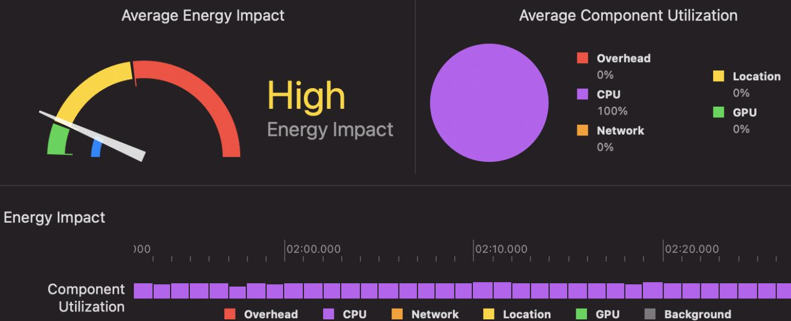

<p><em>VI: <strong>Energy Gauge</strong> — <strong>Average Energy Impact: "High"</strong>. Biểu đồ tròn <strong>Average Component Utilization</strong> cho thấy <strong>CPU 100%</strong>, còn <strong>Overhead 0%, Network 0%, Location 0%, GPU 0%</strong> ⇒ toàn bộ điện năng bị đốt bởi CPU. / EN: The Energy Gauge — here 100% of the component utilisation is CPU, so the app is purely CPU-bound.</em></p>

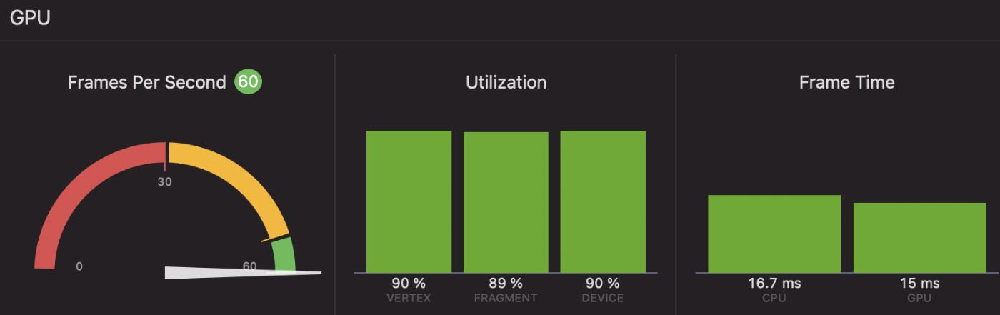

<p><em>VI: <strong>FPS Gauge</strong> — thứ Unity Profiler KHÔNG cho bạn: <strong>Frames Per Second 60</strong>; <strong>Utilization: VERTEX 90%, FRAGMENT 89%, DEVICE 90%</strong>; <strong>Frame Time: CPU 16.7 ms vs GPU 15 ms</strong>. 🔑 Đây là cách nhanh nhất để kết luận bạn đang <strong>GPU-bound hay CPU-bound</strong>. / EN: The FPS Gauge — not only FPS but shader-stage utilisation and separate CPU/GPU frame times.</em></p>

### 23.3. 🎮 GPU Frame Capture — frame debugger cấp Metal

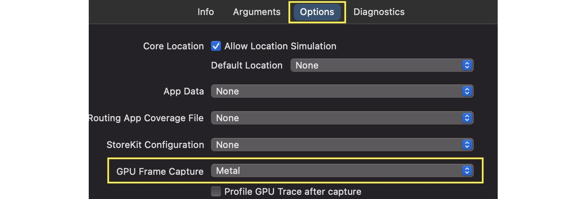
<p><em>VI: <strong>▲ Điều kiện BẮT BUỘC</strong> — trong scheme, tab <strong>Options</strong>, đặt <strong><code>GPU Frame Capture: Metal</code></strong> (không để <em>Automatically Enabled</em>/<em>Disabled</em>). Ô <strong>Profile GPU Trace after capture</strong> nằm ngay dưới. / EN: Setting GPU Frame Capture to Metal in the scheme Options.</em></p>

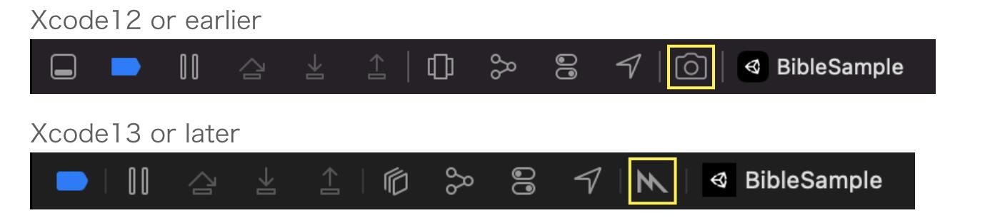
<p><em>VI: <strong>▲ BẪY phiên bản</strong> — nút chụp frame ĐỔI CHỖ và ĐỔI ICON: <strong>Xcode 12 trở về trước</strong> dùng icon MÁY ẢNH, <strong>Xcode 13 trở đi</strong> dùng icon hình sóng ở vị trí khác. Tìm nhầm chỗ là tưởng máy không hỗ trợ. / EN: The capture button differs between Xcode 12 or earlier and Xcode 13 or later.</em></p>

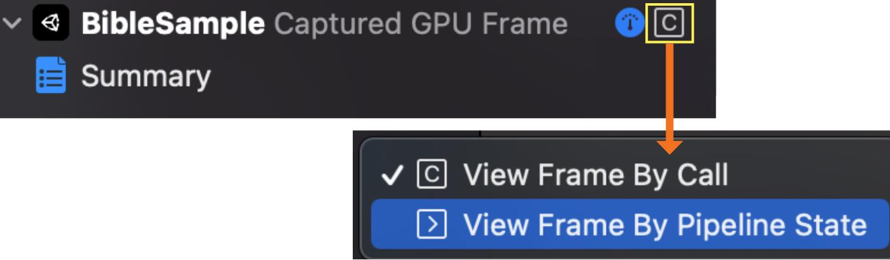
<p><em>VI: <strong>▲ Chuyển cách xem</strong> — menu ở dòng <em>Captured GPU Frame</em>: <strong>View Frame By Call</strong> (mặc định) ↔ <strong>View Frame By Pipeline State</strong>. / EN: The View Frame By Call / By Pipeline State menu.</em></p>

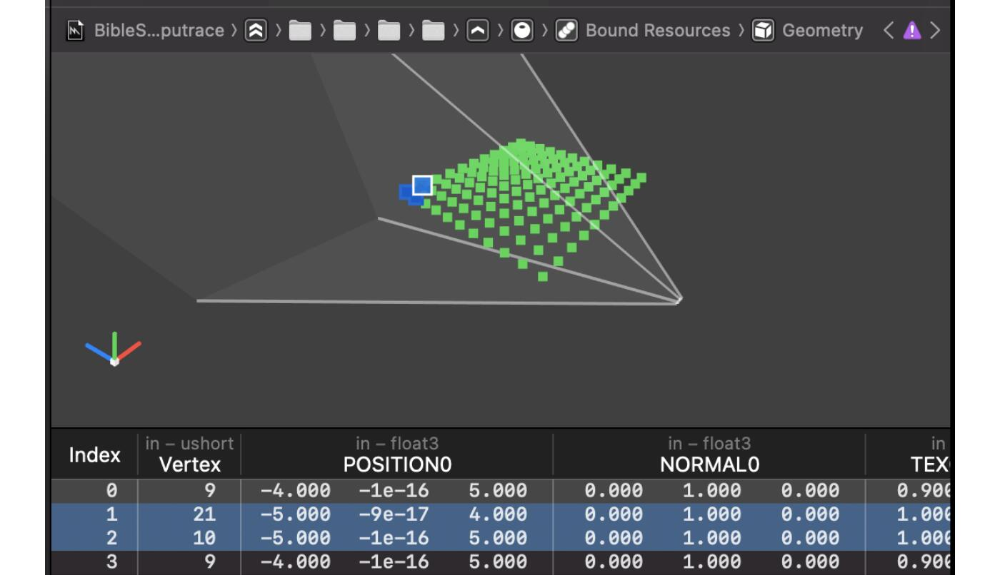
<p><em>VI: <strong>▲ Geometry viewer</strong> — xem lưới vertex trong không gian clip, kèm BẢNG dữ liệu thô: cột <strong>Index · Vertex (ushort) · POSITION0 (float3) · NORMAL0 (float3) · TEX…</strong>, ví dụ index 0 → vertex <strong>9</strong>, position <strong>(−4.000, −1e−16, 5.000)</strong>, normal <strong>(0.000, 1.000, 0.000)</strong>. / EN: The Xcode Geometry viewer with the raw vertex table.</em></p>

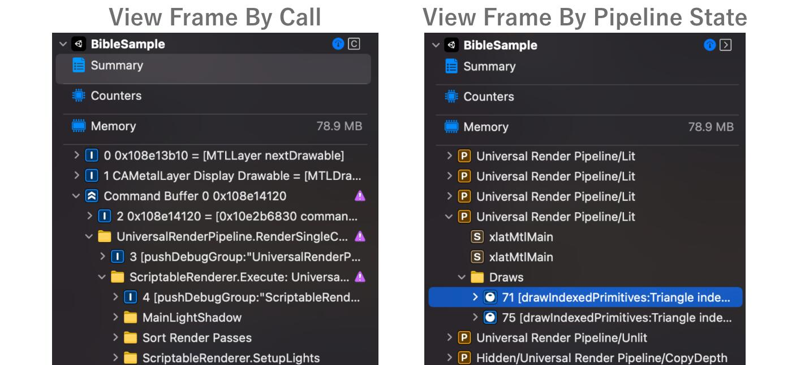
<p><em>VI: <strong>View Frame By Call</strong> (trái, theo THỨ TỰ GỌI) và <strong>View Frame By Pipeline State</strong> (phải, GOM theo shader/pipeline) — cách thứ hai giúp thấy ngay <strong>shader nào được dùng bao nhiêu lần</strong>. / EN: View Frame By Call vs View Frame By Pipeline State.</em></p>

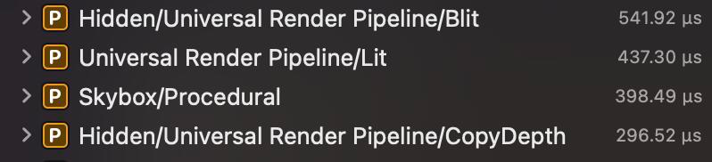
<p><em>VI: Thời gian theo <strong>pipeline state</strong>: <strong>Blit 541.92 µs</strong> · <strong>Universal Render Pipeline/Lit 437.30 µs</strong> · <strong>Skybox/Procedural 398.49 µs</strong> · <strong>CopyDepth 296.52 µs</strong>. / EN: GPU timings per pipeline state.</em></p>

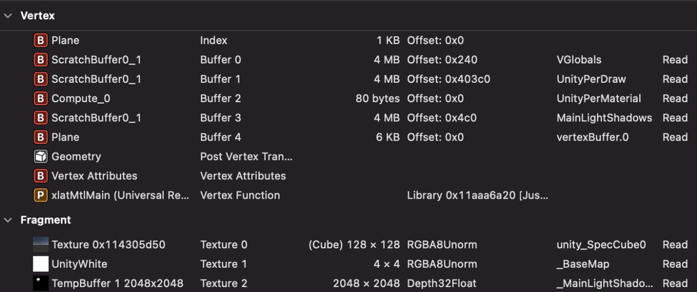
<p><em>VI: <strong>Bound Resources</strong> của một draw call — phần Fragment cho thấy <strong><code>UnityWhite</code> 4×4 RGBA8Unorm</strong> và <strong><code>TempBuffer 1</code> 2048×2048 Depth32Float</strong>; phần Vertex liệt kê <strong>ScratchBuffer 4 MB ×3</strong>. / EN: Bound Resources listing UnityWhite 4x4 and TempBuffer 2048x2048.</em></p>

<div class="bilingual-row">
<div class="col-vi">
<p>🔬 <em>"GPU Frame Capture là công cụ cho phép <strong>frame debugging TRÊN Xcode</strong>. Tương tự Frame Debugger của Unity, bạn kiểm tra được tiến trình cho tới khi render hoàn tất. <strong>So với Unity, có NHIỀU THÔNG TIN HƠN ở TỪNG SHADER STAGE, nên có thể hữu ích để phân tích và cải thiện bottleneck.</strong>"</em></p>
<p>⚙️ <strong>Chuẩn bị — 3 bước sửa scheme:</strong><br>
① <em>Mở "Product → Scheme → Edit Scheme"</em><br>
② <em>Tab <strong>"Options"</strong> → đổi <strong>GPU Frame Capture thành "Metal"</strong></em><br>
③ <em>Tab <strong>"Diagnostics"</strong> → bật <strong>"Api Validation" cho Metal</strong></em></p>
<p>📸 <em>"Capture bằng cách <strong>bấm biểu tượng MÁY ẢNH</strong> từ debug bar khi đang chạy. <strong>Tuỳ độ phức tạp của scene, lần capture ĐẦU có thể mất một lúc — hãy KIÊN NHẪN. Lưu ý ở Xcode 13 trở lên, icon đã đổi thành icon Metal.</strong>"</em></p>
</div>
<div class="col-en">
<p>🔬 <em>"GPU Frame Capture is a tool that allows <strong>frame debugging ON Xcode</strong>. Similar to Unity's Frame Debugger, you can check the process until rendering is completed. <strong>Compared to Unity, there is MORE INFORMATION at each shader stage, so it may be useful for analyzing and improving bottlenecks.</strong>"</em></p>
<p>⚙️ <strong>Preparation — 3 scheme edits:</strong><br>
① <em>Open "Product → Scheme → Edit Scheme"</em><br>
② <em><strong>"Options"</strong> tab → change <strong>GPU Frame Capture to "Metal"</strong></em><br>
③ <em><strong>"Diagnostics"</strong> tab → enable <strong>"Api Validation" for Metal</strong></em></p>
<p>📸 <em>"Capture is performed by <strong>pressing the CAMERA symbol</strong> from the debug bar during execution. <strong>Depending on the complexity of the scene, the first capture may take some time, so please be patient. Note that in Xcode 13 or later, the icon has been changed to the Metal icon.</strong>"</em></p>
</div>
</div>

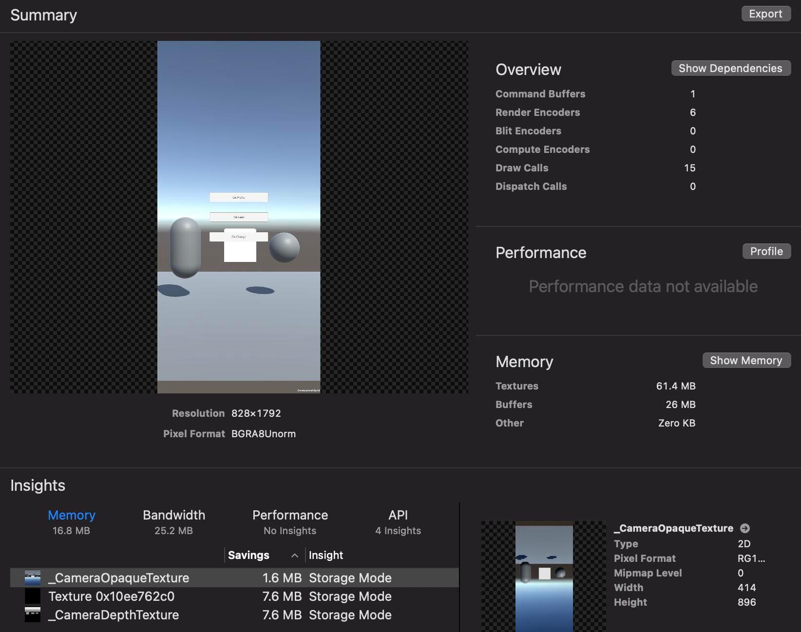

<p><em>VI: Summary của GPU Frame Capture — <strong>Overview: Command Buffers 1, Render Encoders 6, Blit Encoders 0, Compute Encoders 0, Draw Calls 15, Dispatch Calls 0</strong>. <strong>Memory: Textures 61.4 MB, Buffers 26 MB</strong>. Frame render ở <strong>828×1792, BGRA8Unorm</strong>. Panel <strong>Insights</strong> dưới chỉ ra tiết kiệm được: <code>_CameraOpaqueTexture</code> <strong>1.6 MB</strong>, <code>Texture 0x10ee762c0</code> <strong>7.6 MB</strong>, <code>_CameraDepthTexture</code> <strong>7.6 MB</strong> — tất cả do <strong>"Storage Mode"</strong>; tổng <strong>Memory 16.8 MB / Bandwidth 25.2 MB / API 4 Insights</strong>. / EN: The GPU Frame Capture Summary — with the Insights panel naming concrete memory savings per texture.</em></p>

<div class="bilingual-row">
<div class="col-vi">
<p>🔀 <strong>Hai kiểu duyệt lệnh — "View Frame By Call" vs "View Frame By Pipeline State":</strong></p>
<p><em>"Ở view <strong>By Call</strong>, TẤT CẢ lệnh vẽ được liệt kê theo THỨ TỰ GỌI, <strong>bao gồm cả cài đặt buffer và các chuẩn bị khác cho việc vẽ, nên MỘT SỐ LƯỢNG LỚN lệnh xếp hàng.</strong> Ngược lại, <strong>By Pipeline State CHỈ liệt kê lệnh vẽ liên quan tới GEOMETRY được vẽ bởi TỪNG SHADER. Khuyến nghị CHUYỂN view tuỳ theo thứ bạn muốn điều tra.</strong>"</em></p>
<p>🔍 <em>"Bấm bất kỳ lệnh vẽ nào trong Navigator để kiểm tra <strong>property dùng cho lệnh đó: texture, buffer, sampler, shader function, và geometry. Mỗi property có thể DOUBLE-CLICK để xem chi tiết</strong> — ví dụ bạn xem được <strong>CHÍNH CODE SHADER, sampler là Repeat hay Clamp</strong>, v.v."</em></p>
<p>🧊 <em>"Property <strong>Geometry</strong> không chỉ hiển thị thông tin đỉnh dạng BẢNG mà còn <strong>cho phép DI CHUYỂN CAMERA để xem HÌNH DẠNG của geometry.</strong>"</em></p>
</div>
<div class="col-en">
<p>🔀 <strong>Two navigation modes — "View Frame By Call" vs "View Frame By Pipeline State":</strong></p>
<p><em>"In the <strong>By Call</strong> view, all drawing commands are listed in the order in which they were invoked, <strong>which includes buffer settings and other preparations for drawing, so that a LARGE NUMBER of commands are lined up.</strong> On the other hand, <strong>By Pipeline State lists ONLY the drawing commands related to the geometry drawn by each shader. It is recommended to switch the display according to what you want to investigate.</strong>"</em></p>
<p>🔍 <em>"By pressing any of the drawing commands in the Navigator area, you can check <strong>the properties used for that command: texture, buffer, sampler, shader functions, and geometry. Each property can be double-clicked to see the details</strong> — for example, you can see <strong>the shader code itself, whether the sampler is Repeat or Clamp</strong>, and so on."</em></p>
<p>🧊 <em>"Geometry properties not only display vertex information in a table format, but also <strong>allow you to MOVE THE CAMERA to see the SHAPE of the geometry.</strong>"</em></p>
</div>
</div>

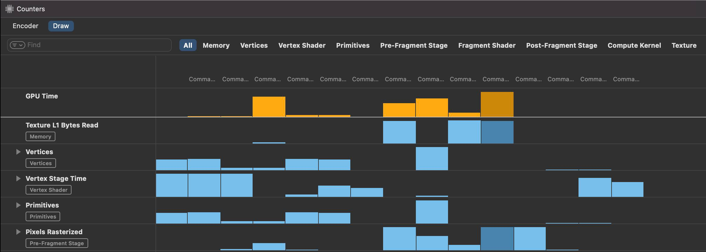

<p><em>VI: Màn hình <strong>Counters</strong> (mở sau khi bấm <strong>Profile</strong> ở cột Performance) — mỗi cột là một Command, mỗi hàng là một bộ đếm GPU: <strong>GPU Time</strong> (cam), <strong>Texture L1 Bytes Read</strong> (Memory), <strong>Vertices</strong>, <strong>Vertex Stage Time</strong> (Vertex Shader), <strong>Primitives</strong>, <strong>Pixels Rasterized</strong> (Pre-Fragment Stage). Có thể lọc theo <strong>Memory / Vertices / Vertex Shader / Primitives / Pre-Fragment Stage / Fragment Shader / Post-Fragment Stage / Compute Kernel / Texture</strong>. / EN: The Counters screen — per-draw GPU time broken down by pipeline stage.</em></p>

<div class="bilingual-row">
<div class="col-vi">
<p>⏱️ <em>"Tiếp theo là <strong>'Profile'</strong> ở cột Performance của màn hình Summary. <strong>Bấm nút này bắt đầu một phân tích CHI TIẾT HƠN. Khi phân tích xong, THỜI GIAN cho việc vẽ sẽ hiển thị ở khu vực Navigator.</strong> Kết quả xem chi tiết hơn ở màn hình <strong>'Counters'</strong> — nơi bạn thấy ĐỒ THỊ thời gian xử lý cho từng khâu vẽ như <strong>Vertex, Rasterized, Fragment</strong>."</em></p>
<p>💾 <em>"<strong>'Show Memory'</strong> ở cột Memory đưa bạn tới màn hình <strong>kiểm tra tài nguyên GPU đang dùng — chủ yếu là TEXTURE và BUFFER. Nên kiểm tra xem có mục nào KHÔNG CẦN THIẾT không.</strong>"</em></p>
<p>🕸️ <em>"<strong>'Show Dependencies'</strong> ở phần Overview hiển thị <strong>PHỤ THUỘC cho TỪNG RENDER PASS. Khi xem, bấm nút có mũi tên hướng RA NGOÀI để mở thêm phụ thuộc bên dưới cấp đó.</strong> Dùng màn hình này khi bạn muốn biết <strong>bản vẽ nào PHỤ THUỘC vào cái gì.</strong>"</em></p>
</div>
<div class="col-en">
<p>⏱️ <em>"Next, <strong>'Profile'</strong> in the Performance column of the Summary screen. <strong>Clicking this button starts a MORE DETAILED analysis. When the analysis is finished, the TIME taken for drawing will be displayed in the Navigator area.</strong> The results can be viewed in more detail in the <strong>'Counters'</strong> screen — where you can graphically see the processing time for each drawing such as <strong>Vertex, Rasterized, Fragment</strong>."</em></p>
<p>💾 <em>"<strong>'Show Memory'</strong> in the Memory column takes you to a screen where you can <strong>check the resources used by the GPU. The information displayed is mainly TEXTURES and BUFFERS. It is a good idea to check if there are any unnecessary items.</strong>"</em></p>
<p>🕸️ <em>"<strong>'Show Dependencies'</strong> in the Overview section <strong>displays the dependencies for EACH RENDER PASS. When viewing the dependencies, click the button with the arrow pointing OUTWARD to open more dependencies below that level.</strong> Use this screen when you want to see <strong>which drawings depend on what.</strong>"</em></p>
</div>
</div>

### 23.4. 🧠 Memory Graph — đo được cả thứ Unity KHÔNG đo được


<p><em>VI: <strong>▲ Bật trước khi chạy</strong> — mục <strong>Memory Management</strong> của scheme: tick <strong><code>Malloc Stack Logging</code></strong> và chọn <strong>Live Allocations Only</strong>. Không bật thì backtrace sẽ RỖNG. / EN: Enabling Malloc Stack Logging with Live Allocations Only.</em></p>

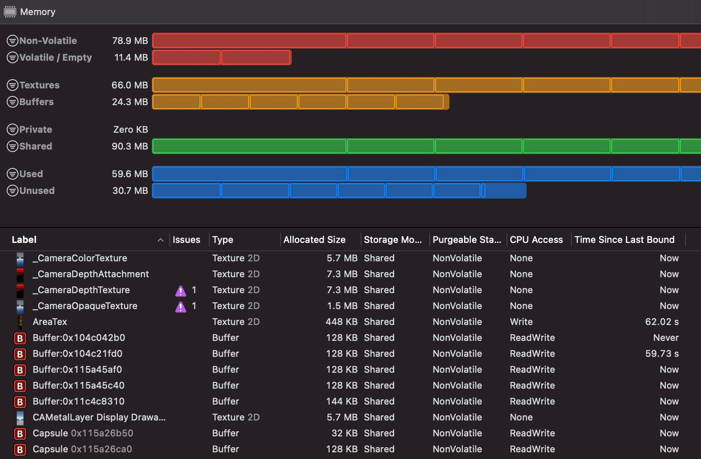
<p><em>VI: <strong>Memory Graph</strong> — <strong>Textures 66.0 MB · Buffers 24.3 MB · Non-Volatile 78.9 MB · Shared 90.3 MB</strong>; danh sách chi tiết có <code>_CameraColorTexture</code> <strong>5.7 MB</strong>, <code>_CameraDepthAttachment</code> <strong>7.3 MB</strong>, <code>_CameraDepthTexture</code> <strong>7.3 MB</strong>. / EN: Xcode Memory Graph listing per-resource allocations.</em></p>

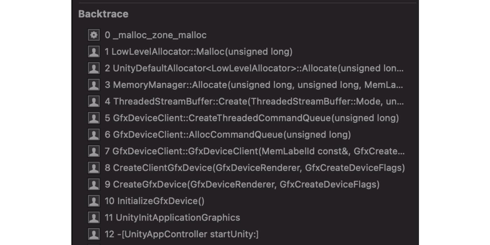
<p><em>VI: <strong>Backtrace</strong> khi bật <strong>Malloc Stack Logging</strong> — truy ngược tới tận <code>-[UnityAppController startUnity:]</code>, qua <code>InitializeGfxDevice</code> và <code>GfxDeviceClient::AllocCommandQueue</code>. / EN: Malloc Stack Logging backtrace up to UnityAppController startUnity.</em></p>

<div class="bilingual-row">
<div class="col-vi">
<p>🏆 <em>"Công cụ này cho phép <strong>phân tích tình trạng bộ nhớ TẠI THỜI ĐIỂM CAPTURE. Khu vực Navigator bên trái hiển thị INSTANCE, và khi chọn một instance, QUAN HỆ THAM CHIẾU được hiển thị dưới dạng ĐỒ THỊ.</strong> Khu vực Inspector bên phải hiển thị thông tin CHI TIẾT về instance."</em></p>
<p>🔑 <strong>Giá trị ĐỘC NHẤT:</strong> <em>"Công cụ này dùng để <strong>ĐIỀU TRA mức dùng bộ nhớ của các object KHÔNG THỂ ĐO ĐƯỢC TRONG UNITY, chẳng hạn PLUG-IN.</strong>"</em></p>
<p>⚙️ <strong>Chuẩn bị:</strong> <em>"Để lấy được thông tin HỮU ÍCH từ Memory Graph, cần sửa scheme. Mở "Product → Scheme → Edit Scheme", rồi <strong>bật "Malloc Stack Logging" từ tab "Diagnostics". Bằng cách bật cái này, BACKTRACE sẽ hiển thị trong Inspector và bạn thấy được nó ĐÃ ĐƯỢC CẤP PHÁT NHƯ THẾ NÀO.</strong>"</em></p>
<p>📸 <em>"Capture bằng cách <strong>bấm icon HÌNH NHÁNH CÂY</strong> từ debug bar khi app đang chạy."</em></p>
</div>
<div class="col-en">
<p>🏆 <em>"This tool allows you to <strong>analyze the memory situation AT THE TIME OF CAPTURE. The Navigator area on the left displays INSTANCES, and by selecting an instance, the REFERENCE RELATIONSHIPS are displayed in a GRAPH.</strong> The Inspector area on the right displays detailed information about the instance."</em></p>
<p>🔑 <strong>Its unique value:</strong> <em>"This tool can be used to <strong>investigate memory usage of objects that CANNOT BE MEASURED IN UNITY, such as PLUG-INS.</strong>"</em></p>
<p>⚙️ <strong>Preparation:</strong> <em>"In order to obtain useful information from Memory Graph, it is necessary to edit the scheme. Open "Product → Scheme → Edit Scheme". Then, <strong>enable "Malloc Stack Logging" from the "Diagnostics" tab. By enabling this, BACKTRACE will be displayed in Inspector and you can see HOW it was allocated.</strong>"</em></p>
<p>📸 <em>"Capture is performed by <strong>pressing the BRANCH-LIKE icon</strong> from the debug bar while the application is running."</em></p>
</div>
</div>

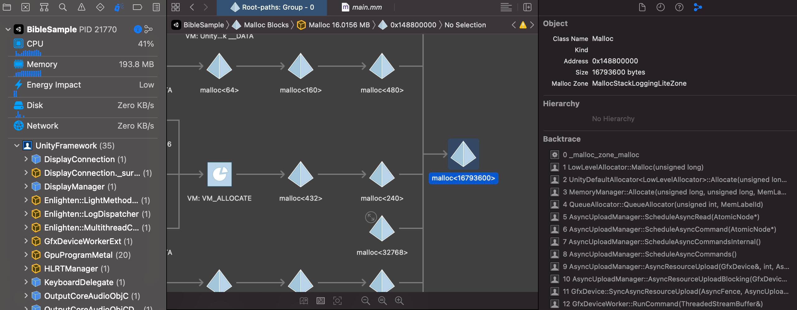

<p><em>VI: <strong>Memory Graph</strong> — process <strong>BibleSample PID 21770</strong> (<strong>CPU 41%, Memory 193.8 MB</strong>). Đồ thị <strong>Root-paths</strong> hiện chuỗi <code>VM: VM_ALLOCATE → malloc&lt;432&gt; → malloc&lt;240&gt; → malloc&lt;16793600&gt;</code>. Inspector phải: <strong>Size 16,793,600 bytes</strong>, Malloc Zone <code>MallocStackLoggingLiteZone</code>, và ⭐ <strong>BACKTRACE đầy đủ</strong>: <code>LowLevelAllocator::Malloc</code> → <code>MemoryManager::Allocate</code> → <code>QueueAllocator</code> → <code>AsyncUploadManager::ScheduleAsyncRead</code> → … → <code>GfxDeviceWorker::RunCommand</code>. 🔑 Nhờ Malloc Stack Logging, bạn truy được <strong>CHÍNH XÁC dòng code native đã cấp 16 MB đó</strong>. / EN: Memory Graph with Malloc Stack Logging on — the full native backtrace for a single 16.79 MB allocation.</em></p>

<div class="bilingual-row">
<div class="col-vi">
<p>💾 <em>"Memory Graph có thể <strong>LƯU THÀNH FILE</strong> bằng <strong>"File → Export MemoryGraph"</strong>. Bạn có thể dùng <strong>lệnh <code>vmmap</code>, lệnh <code>heap</code>, và lệnh <code>malloc_history</code></strong> để điều tra SÂU HƠN file này."</em></p>
</div>
<div class="col-en">
<p>💾 <em>"Memory Graph can be <strong>saved as a FILE</strong> by clicking <strong>"File → Export MemoryGraph"</strong>. You can use the <strong><code>vmmap</code> command, the <code>heap</code> command, and the <code>malloc_history</code> command</strong> to further investigate this file."</em></p>
</div>
</div>

**List 3.5 — lệnh `vmmap` tóm tắt:**

```bash
vmmap --summary hoge.memgraph
```

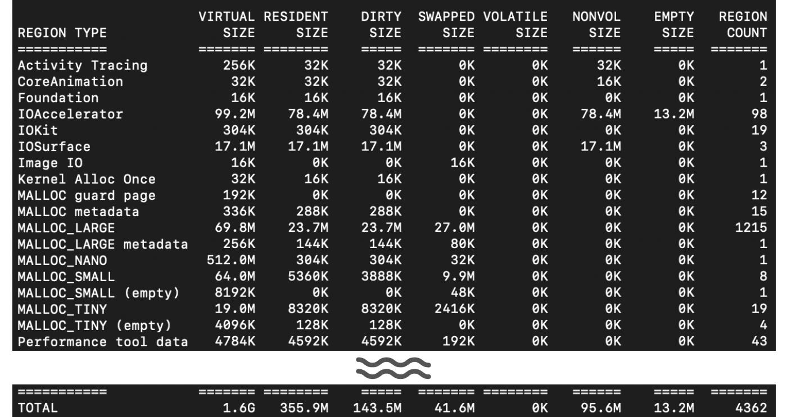

<p><em>VI: Kết quả <code>vmmap --summary</code> — bảng theo REGION TYPE với VIRTUAL / RESIDENT / DIRTY / SWAPPED / NONVOL / EMPTY SIZE. Nổi bật: <strong>IOAccelerator 99.2M virtual / 78.4M resident / 78.4M dirty (98 regions)</strong>, <strong>IOSurface 17.1M</strong>, <strong>MALLOC_LARGE 69.8M virtual / 23.7M resident / 27.0M SWAPPED — 1215 regions</strong>, <strong>MALLOC_NANO 512.0M virtual nhưng chỉ 304K resident</strong>, <strong>MALLOC_TINY 19.0M / 8320K</strong>. 🚨 <strong>TOTAL: 1.6G virtual, 355.9M resident, 143.5M dirty, 41.6M swapped, 4362 regions.</strong> Sách nói đây là cách <strong>"nắm được BỨC TRANH TỔNG THỂ mà lệnh MemoryGraph KHÓ nắm được"</strong>. / EN: `vmmap --summary` output — the whole-process picture that the MemoryGraph UI struggles to give.</em></p>

---

## 24. 🔬 Instruments — Time Profiler, Allocations & Generations

<div class="bilingual-row">
<div class="col-vi">
<p>🧪 <em>"Xcode có công cụ tên <strong>Instruments</strong> CHUYÊN về đo và phân tích CHI TIẾT. Để build cho Instruments, chọn <strong>"Product → Analyze"</strong>. Khi xong, màn hình chọn <strong>TEMPLATE</strong> cho các mục đo sẽ mở ra."</em></p>
<p>🎯 <em>"Như bạn thấy từ SỐ LƯỢNG LỚN template, Instruments phân tích được RẤT NHIỀU nội dung khác nhau. Trong mục này, ta tập trung vào <strong>'Time Profiler' và 'Allocations'</strong>, là hai cái được dùng THƯỜNG XUYÊN."</em></p>
</div>
<div class="col-en">
<p>🧪 <em>"Xcode has a tool called <strong>Instruments</strong> that specializes in detailed measurement and analysis. To build Instruments, select <strong>"Product → Analyze"</strong>. Once completed, a screen will open to select a <strong>TEMPLATE</strong> for the measurement items."</em></p>
<p>🎯 <em>"As you can see from the LARGE NUMBER of templates, Instruments can analyze a wide variety of content. In this section, we will focus on <strong>'Time Profiler' and 'Allocations'</strong>, which are frequently used."</em></p>
</div>
</div>

### 24.1. Time Profiler — phân tích theo ĐOẠN, không theo frame

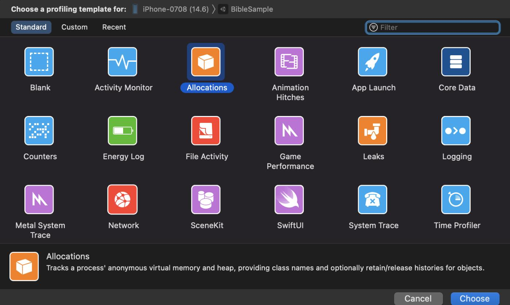
<p><em>VI: <strong>▲ Bảng chọn template của Instruments</strong> — <strong>Allocations</strong> (đang chọn) · Time Profiler · Leaks · Metal System Trace · Game Performance · Network · Energy Log · File Activity · System Trace · Counters · SceneKit · SwiftUI · Core Data · App Launch · Animation Hitches · Activity Monitor · Logging · Blank. / EN: The Instruments profiling template chooser.</em></p>

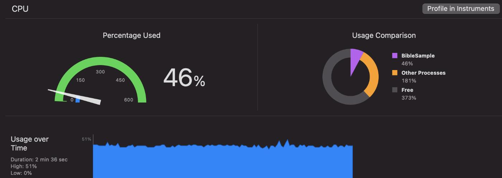
<p><em>VI: <strong>▲ CPU</strong> — <strong>Percentage Used 46%</strong>; vòng <strong>Usage Comparison</strong> chia <strong>BibleSample 46% · Other Processes 18.1% · Free 37.5%</strong>; biểu đồ <em>Usage over Time</em> ghi <strong>Duration 2 min 38 sec · High 51% · Low 0%</strong>. / EN: The Instruments CPU gauge: 46% used.</em></p>

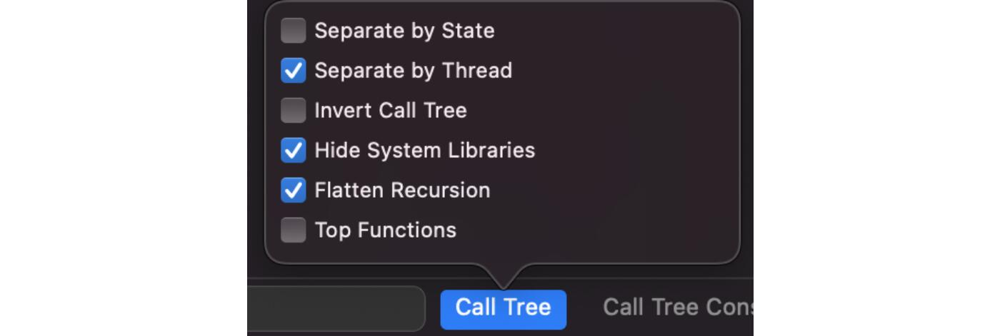
<p><em>VI: <strong>▲ Bốn tuỳ chọn Call Tree phải biết</strong> — <strong>Separate by Thread ✓</strong> · <strong>Hide System Libraries ✓</strong> · <strong>Flatten Recursion ✓</strong> · <em>Invert Call Tree</em> / <em>Top Functions</em> / <em>Separate by State</em>. Không bật <em>Hide System Libraries</em> thì cây ngập hàm hệ thống. / EN: The four Call Tree options in Instruments.</em></p>

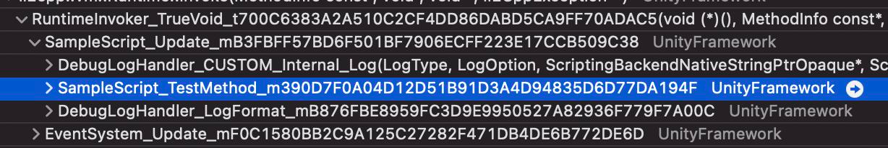
<p><em>VI: Tên symbol trong Time Profiler theo dạng <strong><code>class_method_hash</code></strong>: <code>SampleScript_TestMethod_m390D7F0A04D12D51B91D3A4D94835D6D77DA194F</code> — KHÁC với tên trong Unity Profiler. / EN: Time Profiler symbol names in the class_method_hash form.</em></p>

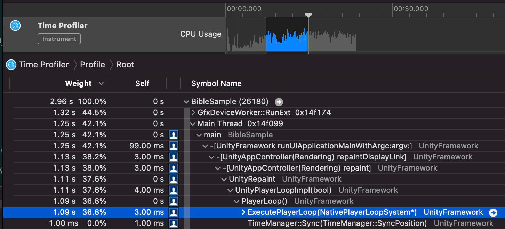

<p><em>VI: <strong>Time Profiler</strong> — Tree View của <code>BibleSample (26180)</code> tổng <strong>2.96 s (100.0%)</strong>. Trong đó <strong><code>GfxDeviceWorker::RunExt</code> 1.32 s (44.5%)</strong> và <strong>Main Thread 1.25 s (42.1%)</strong>; đi sâu: <code>runUIApplicationMainWithArgc:argv:</code> <strong>1.25 s, self 99.00 ms</strong> → <code>repaintDisplayLink</code> <strong>1.13 s (38.2%)</strong> → <code>UnityRepaint</code> <strong>1.11 s (37.6%)</strong> → <code>PlayerLoop()</code> <strong>1.09 s (36.8%)</strong> → <code>ExecutePlayerLoop(NativePlayerLoopSystem*)</code> <strong>1.09 s, self 3.00 ms</strong>. / EN: Time Profiler tree view — note that GfxDeviceWorker (the render thread) eats 44.5% of the sampled window.</em></p>

<div class="bilingual-row">
<div class="col-vi">
<p>⏱️ <em>"Time Profiler là công cụ đo <strong>THỜI GIAN THỰC THI CODE</strong>. Giống module CPU trong Unity Profiler, nó dùng để cải thiện thời gian xử lý. Để bắt đầu đo, bấm nút <strong>record hình TRÒN ĐỎ</strong> trên toolbar."</em></p>
<p>🔑 <strong>Điểm KHÁC BIỆT cốt lõi:</strong> <em>"<strong>KHÁC Unity Profiler, ta sẽ phân tích KHÔNG theo FRAME mà theo ĐOẠN (segment). Tree View bên dưới hiển thị thời gian xử lý TRONG KHOẢNG đó.</strong> Khi tối ưu thời gian xử lý của game logic, <strong>khuyến nghị phân tích phần BÊN DƯỚI <code>PlayerLoop</code> trong Tree View.</strong>"</em></p>
<p>👁️ <em>"Để Tree View DỄ ĐỌC hơn, bạn nên đặt cài đặt <strong>Call Trees</strong> ở dưới cùng Xcode. <strong>ĐẶC BIỆT, tick ô "Hide System Libraries" sẽ ẨN code hệ thống KHÔNG truy cập được, khiến việc điều tra DỄ HƠN.</strong>"</em></p>
</div>
<div class="col-en">
<p>⏱️ <em>"The Time Profiler is a tool for measuring <strong>CODE EXECUTION TIME</strong>. Like the CPU module in the Unity Profiler, it is used to improve processing time. To start the measurement, you need to click on the <strong>RED CIRCLE record button</strong> in the toolbar."</em></p>
<p>🔑 <strong>The core difference:</strong> <em>"<strong>Unlike the Unity Profiler, we will be analyzing NOT in FRAMES, but in SEGMENTS. The Tree View at the bottom shows the processing time WITHIN THE INTERVAL.</strong> When optimizing the processing time of game logic, <strong>it is recommended to analyze the processing BELOW the <code>PlayerLoop</code> in the Tree View.</strong>"</em></p>
<p>👁️ <em>"To make the Tree View display easier to read, you should set the <strong>Call Trees</strong> setting at the bottom of Xcode. <strong>In particular, checking the "Hide System Libraries" checkbox HIDES INACCESSIBLE system code, making it easier to investigate.</strong>"</em></p>
</div>
</div>

!!! warning "⚠️ Tên SYMBOL trong Time Profiler KHÁC Unity Profiler"
    **VI:** *"**Tên symbol trong Time Profiler KHÁC với tên trong Unity Profiler**, nhưng chúng vẫn là một: theo dạng **`class_name_function_name_random_string`**."*

    **EN:** *"The symbol names in the Time Profiler differ from those in the Unity Profiler, but they are still the same: **`class_name_function_name_random_string`**."*

### 24.2. 🧯 Allocations — và option "Discard events for freed memory"


<p><em>VI: <strong>▲ Bốn cách xem của Allocations</strong> — <strong>Statistics</strong> (đang chọn) · <strong>Call Trees</strong> · <strong>Allocations List</strong> · <strong>Generations</strong>. / EN: The four Allocations views: Statistics, Call Trees, Allocations List, Generations.</em></p>

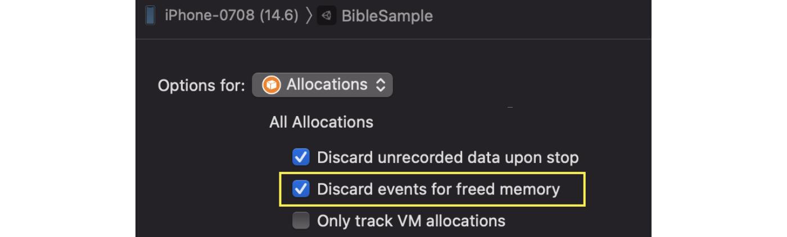
<p><em>VI: <strong>▲ Chính là option đó</strong> — <code>Options for: Allocations › All Allocations</code>: <strong>Discard unrecorded data upon stop ✓</strong>, <strong>Discard events for freed memory ✓</strong> (viền vàng), <strong>Only track VM allocations</strong>. / EN: The Discard events for freed memory option.</em></p>

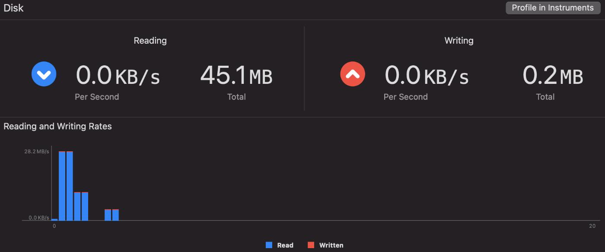
<p><em>VI: <strong>▲ Disk</strong> — <strong>Reading 0.0 KB/s · tổng 45.1 MB</strong>; <strong>Writing 0.0 KB/s · tổng 0.2 MB</strong>, kèm biểu đồ tốc độ đọc/ghi theo thời gian. Đây là cách BẮT các đợt đọc file dồn dập lúc khởi động. / EN: The Instruments Disk instrument: 45.1 MB read.</em></p>

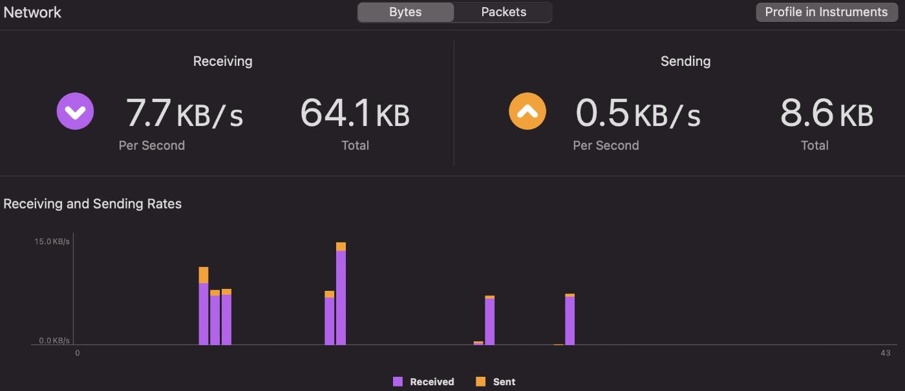
<p><em>VI: <strong>▲ Network</strong> — <strong>Receiving 7.7 KB/s · tổng 64.1 KB</strong>; <strong>Sending 0.5 KB/s · tổng 8.6 KB</strong>, biểu đồ cột tách riêng <em>Received</em> / <em>Sent</em>. / EN: The Instruments Network instrument.</em></p>

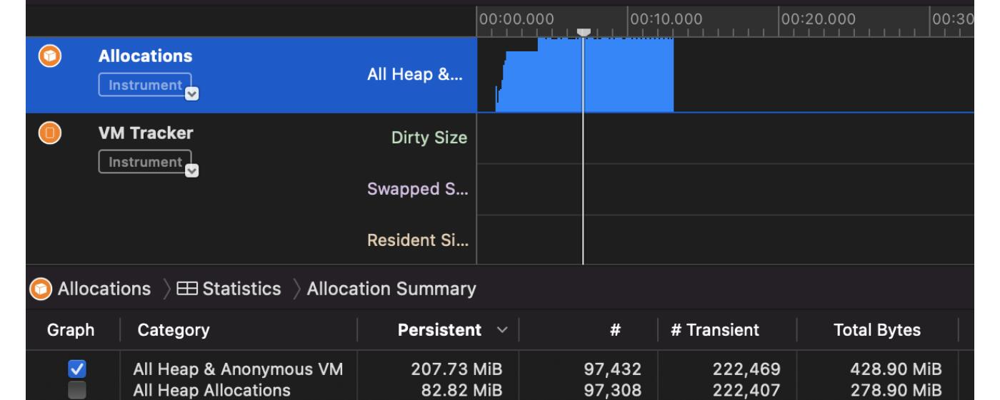
<p><em>VI: Thống kê Allocations — <strong>All Heap &amp; Anonymous VM 207.73 MiB</strong> (97.432 lần, 222.469 transient, <strong>tổng 428.90 MiB</strong>) và <strong>All Heap Allocations 82.82 MiB</strong>. / EN: Instruments Allocations statistics.</em></p>

<div class="bilingual-row">
<div class="col-vi">
<p>🧯 <em>"Allocations là công cụ đo <strong>MỨC DÙNG BỘ NHỚ</strong>. Nó dùng để cải thiện <strong>RÒ RỈ bộ nhớ và mức sử dụng</strong>."</em></p>
<p>⚙️ <strong>BẮT BUỘC làm trước khi đo:</strong> <em>"Trước khi đo, mở <strong>"File → Recording Options"</strong> và tick <strong>"Discard events for freed memory"</strong>."</em></p>
</div>
<div class="col-en">
<p>🧯 <em>"Allocations is a tool for measuring <strong>MEMORY USAGE</strong>. It is used to improve <strong>memory LEAKAGE and usage</strong>."</em></p>
<p>⚙️ <strong>Do this BEFORE measuring:</strong> <em>"Before measuring, open <strong>"File → Recording Options"</strong> and check <strong>"Discard events for freed memory"</strong>."</em></p>
</div>
</div>

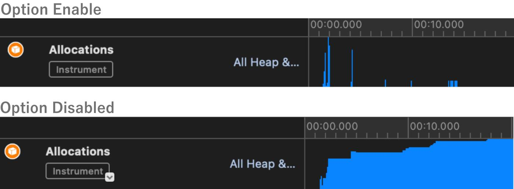

<p><em>VI: Sự KHÁC BIỆT do MỘT tuỳ chọn — <strong>Option Enable</strong> (trên): chỉ còn vài VẠCH ĐỨNG rời rạc, mỗi vạch là một allocation CHƯA được giải phóng. <strong>Option Disabled</strong> (dưới): một KHỐI XANH ĐẶC leo dốc liên tục — không thể phân biệt đâu là rò rỉ. / EN: The same recording with and without "Discard events for freed memory" — with it on, a remaining line means memory that was never freed.</em></p>

<div class="bilingual-row">
<div class="col-vi">
<p>🔑 <em>"Nếu option này BẬT, <strong>bản ghi sẽ bị VỨT BỎ khi bộ nhớ được GIẢI PHÓNG.</strong> Như bạn thấy, <strong>giao diện THAY ĐỔI ĐÁNG KỂ khi có và không có option. Với option, các DÒNG CHỈ được ghi khi bộ nhớ được CẤP PHÁT. Và các dòng đã ghi sẽ bị VỨT BỎ khi vùng cấp phát được GIẢI PHÓNG.</strong>"</em></p>
<p>🏆 <em>"<strong>Nói cách khác, khi đặt option này: NẾU MỘT DÒNG CÒN LẠI trong bộ nhớ, nghĩa là NÓ CHƯA ĐƯỢC GIẢI PHÓNG.</strong> Ví dụ, trong một thiết kế mà <strong>bộ nhớ được giải phóng bởi CHUYỂN SCENE, nếu NHIỀU DÒNG CÒN LẠI ở đoạn scene TRƯỚC khi chuyển, thì CÓ NGHI VẤN RÒ RỈ BỘ NHỚ.</strong> Trong trường hợp đó, dùng Tree View để lần theo chi tiết."</em></p>
</div>
<div class="col-en">
<p>🔑 <em>"If this option is enabled, <strong>the recording will be DISCARDED when memory is FREED.</strong> As you can see, <strong>the appearance changes significantly with and without the option. With the option, lines are recorded ONLY when memory is ALLOCATED. Also, the recorded lines are DISCARDED when the allocated area is RELEASED.</strong>"</em></p>
<p>🏆 <em>"<strong>In other words, by setting this option, IF A LINE REMAINS in memory, it has NOT been released from memory.</strong> For example, in a design where <strong>memory is released by SCENE TRANSITIONS, if MANY LINES REMAIN in the scene section BEFORE the transition, there is a SUSPICION OF A MEMORY LEAK.</strong> In such a case, use the Tree View to follow the details."</em></p>
</div>
</div>

<div class="bilingual-row">
<div class="col-vi">
<p>🌳 <em>"Tree View ở dưới màn hình hiển thị CHI TIẾT của khoảng đã chỉ định, tương tự Time Profiler. Tree View có thể hiển thị theo <strong>BỐN cách khác nhau. Cách hiển thị KHUYẾN NGHỊ NHẤT là <code>Call Trees</code> — cho phép bạn LẦN THEO CODE NÀO đã gây ra allocation.</strong> Có các option Call Trees ở dưới màn hình, và bạn đặt được option như <strong>Hide System Libraries</strong> giống như ở Time Profiler."</em></p>
</div>
<div class="col-en">
<p>🌳 <em>"The Tree View at the bottom of the screen displays the details of the specified range, similar to the Time Profiler. The Tree View can be displayed in <strong>FOUR different ways. The MOST RECOMMENDED display method is <code>Call Trees</code>. This allows you to FOLLOW WHICH CODE caused the allocation.</strong> There are Call Trees display options at the bottom, and you can set options such as <strong>Hide System Libraries</strong> in the same way as in the Time Profiler."</em></p>
</div>
</div>

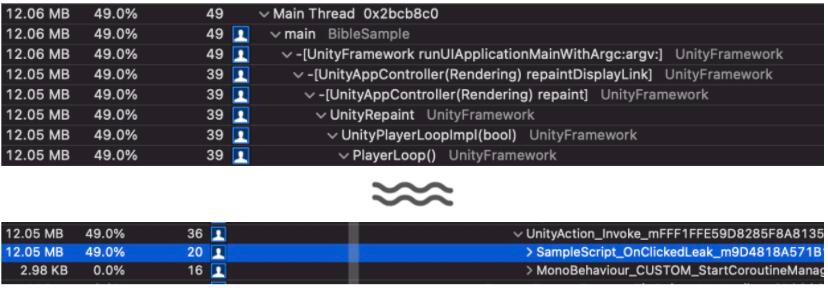

<p><em>VI: 🎯 Ví dụ ĐẮT GIÁ của sách — Call Tree cho thấy <strong>Main Thread 12.06 MB (49.0%)</strong>, và lần xuống tận cùng: <strong><code>SampleScript_OnClickedLeak_m9D4818A571B…</code> gây ra 12.05 MB (49.0%)</strong> allocation. Sách viết: <em>"You can see that <strong>12.05MB of allocation is generated by SampleScript's OnClicked</strong>."</em> / EN: The Allocations Call Tree pinning 12.05 MB of allocation on a single C# method.</em></p>

### 24.3. 🏅 Generations — "cái gì đã làm bộ nhớ TĂNG giữa hai mốc?"

<div class="bilingual-row">
<div class="col-vi">
<p>📌 <em>"Cuối cùng, xin giới thiệu tính năng gọi là <strong>Generations</strong>. Ở dưới cùng Xcode có nút <strong>"Mark Generation"</strong>. <strong>Khi bấm nút này, bộ nhớ TẠI THỜI ĐIỂM ĐÓ được LƯU LẠI. Sau đó, bấm "Mark Generation" LẦN NỮA sẽ GHI LẠI lượng bộ nhớ MỚI được cấp phát SO VỚI dữ liệu trước.</strong>"</em></p>
<p>🏆 <em>"<strong>MỖI Generation được hiển thị ở dạng Call Tree, để bạn LẦN THEO được NGUYÊN NHÂN LÀM TĂNG bộ nhớ.</strong>"</em></p>
</div>
<div class="col-en">
<p>📌 <em>"Finally, let me introduce a feature called <strong>Generations</strong>. At the bottom of Xcode, there is a button called <strong>"Mark Generation"</strong>. <strong>When this button is pressed, the memory at that timing is STORED. After that, pressing the "Mark Generation" button AGAIN will record the amount of memory NEWLY ALLOCATED COMPARED TO the previous data.</strong>"</em></p>
<p>🏆 <em>"<strong>Each Generation is displayed in a Call Tree format so that you can follow WHAT CAUSED the memory increase.</strong>"</em></p>
</div>
</div>

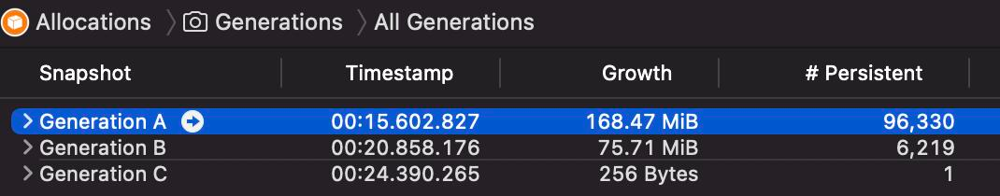

<p><em>VI: <strong>Generations</strong> — ba mốc đánh dấu: <strong>Generation A @ 00:15.602.827 — Growth 168.47 MiB, # Persistent 96,330</strong>; <strong>Generation B @ 00:20.858.176 — Growth 75.71 MiB, # Persistent 6,219</strong>; <strong>Generation C @ 00:24.390.265 — Growth 256 Bytes, # Persistent 1</strong>. 🔑 Đọc bảng này ta biết CHÍNH XÁC đoạn nào của phiên chơi làm bộ nhớ phình lên. / EN: Generations — memory growth between successive marks, here 168.47 MiB then 75.71 MiB then essentially nothing.</em></p>

---

## 25. 🤖 Android Studio — CPU & Memory

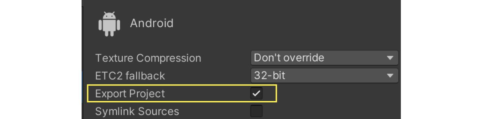
<p><em>VI: <strong>▲ Điều kiện tiên quyết</strong> — trong Build Settings Android phải tick <strong><code>Export Project ✓</code></strong> (cạnh <em>Texture Compression: Don't override</em>, <em>ETC2 fallback: 32-bit</em>, <em>Symlink Sources</em>) để mở được dự án bằng Android Studio. / EN: Ticking Export Project in the Android build settings.</em></p>

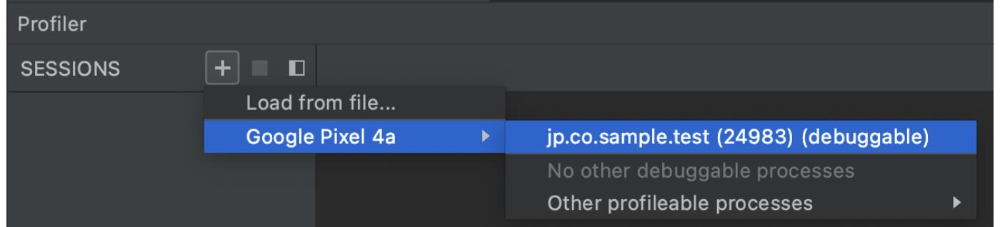
<p><em>VI: <strong>▲ Chọn phiên đo</strong> — <code>Profiler › SESSIONS › + › Google Pixel 4a › jp.co.sample.test (24983) (debuggable)</code>. Chỉ tiến trình <strong>debuggable</strong> mới profile được. / EN: Selecting a debuggable process in the Profiler SESSIONS list.</em></p>

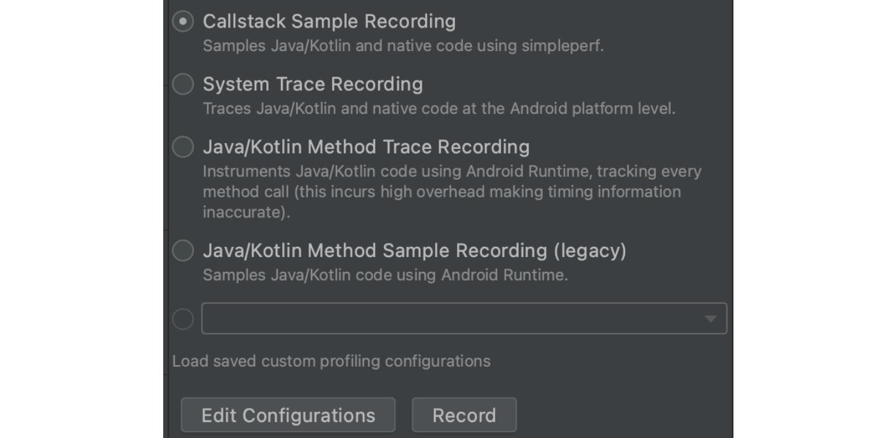
<p><em>VI: <strong>▲ Bốn chế độ ghi CPU</strong> — <strong>Callstack Sample Recording</strong> (lấy mẫu Java/Kotlin + native bằng <em>simpleperf</em>) · <strong>System Trace Recording</strong> (ở cấp nền tảng Android) · <strong>Java/Kotlin Method Trace Recording</strong> (<em>"gây overhead CAO khiến thông tin THỜI GIAN không chính xác"</em>) · <strong>Java/Kotlin Method Sample Recording (legacy)</strong>. / EN: The four CPU recording configurations in Android Studio.</em></p>

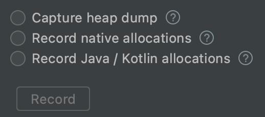
<p><em>VI: <strong>▲ Ba chế độ ghi BỘ NHỚ</strong> — <strong>Capture heap dump</strong> · <strong>Record native allocations</strong> · <strong>Record Java / Kotlin allocations</strong>. / EN: The three memory recording options: heap dump, native allocations, Java/Kotlin allocations.</em></p>

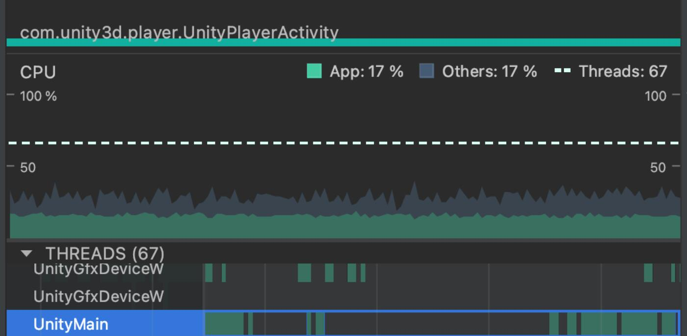
<p><em>VI: <strong>CPU Profiler</strong> — <strong>App 17% · Others 17% · Threads 67</strong>, hàng <strong>UnityMain</strong> được chọn (chính là main thread của Unity). / EN: Android Studio CPU profiler with 67 threads and UnityMain selected.</em></p>

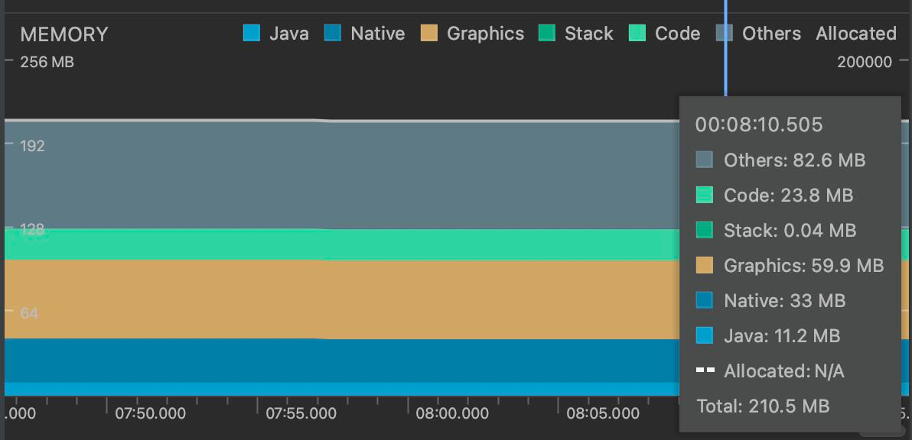
<p><em>VI: Phân rã bộ nhớ Android tại mốc <strong>00:08:10.505</strong> — <strong>Others 82.6 MB · Code 23.8 MB · Stack 0.04 MB · Graphics 59.9 MB · Native 33 MB · Java 11.2 MB</strong> ⇒ <strong>Tổng 210.5 MB</strong>. / EN: Android memory breakdown totalling 210.5 MB.</em></p>

<div class="bilingual-row">
<div class="col-vi">
<p>🤖 <em>"Android Studio là IDE cho Android. Công cụ này cho phép <strong>đo trạng thái ứng dụng của bạn. Có BỐN mục profile được: CPU, Memory, Network, và Energy.</strong>"</em></p>
<p>🔧 <strong>Cách 1 — Export Project:</strong> <em>"Build và profile QUA Android Studio. Trước hết <strong>EXPORT project Android Studio từ Unity: trong Build Settings, tick "Export Project" rồi build.</strong> Mở project đã export trong Android Studio. Sau đó, <strong>với máy Android đã kết nối, bấm ICON HÌNH ĐỒNG HỒ ĐO ở góc trên bên phải để bắt đầu build. Sau khi build xong, app sẽ khởi động và profile bắt đầu.</strong>"</em></p>
<p>🔌 <strong>Cách 2 — Attach (TIỆN HƠN):</strong> <em>"Mở Android Profiler từ <strong>"View → Tool Windows → Profiler"</strong>. Bấm <strong>SESSIONS</strong> trong Profiler. <strong>Để kết nối session, app cần ĐANG CHẠY. Ngoài ra, binary PHẢI là Development Build.</strong> Khi session kết nối, profile bắt đầu."</em></p>
<p>💡 <em>"<strong>Cách thứ hai — attach vào debugger — ĐÁNG NHỚ vì nó KHÔNG đòi hỏi export project và DỄ dùng.</strong>"</em></p>
</div>
<div class="col-en">
<p>🤖 <em>"Android Studio is an integrated development environment tool for Android. This tool allows you to <strong>measure the status of your application. There are FOUR profileable items: CPU, Memory, Network, and Energy.</strong>"</em></p>
<p>🔧 <strong>Method 1 — Export Project:</strong> <em>"Build and profile via Android Studio. First <strong>export the Android Studio project from Unity: in Build Settings, check the "Export Project" checkbox and build.</strong> Next, open the exported project in Android Studio. Then, <strong>with the Android device connected, press the GAUGE-LIKE ICON in the upper right corner to start the build. After the build is complete, the application will launch and the profile will start.</strong>"</em></p>
<p>🔌 <strong>Method 2 — Attach (more convenient):</strong> <em>"Open the Android Profiler from <strong>"View → Tool Windows → Profiler"</strong>. Click on <strong>SESSIONS</strong>. <strong>To connect a session, the application to be measured MUST be running. Also, the binary MUST be a Development Build.</strong> Once the session is connected, the profile will start."</em></p>
<p>💡 <em>"<strong>The second method of attaching to the debugger is good to keep in mind because it does NOT require exporting the project and can be used easily.</strong>"</em></p>
</div>
</div>

!!! info "ℹ️ Nói CHÍNH XÁC ra thì…"
    **VI:** *"Nói NGHIÊM NGẶT, bạn cần cấu hình setting **`debuggable` và `profileable` trong `AndroidManifest.xml`**, chứ KHÔNG phải Development Build trong Unity. **Trong Unity, `debuggable` được TỰ ĐỘNG đặt thành `true` khi bạn làm Development Build.**"*

    **EN:** *"Strictly speaking, you need to configure **`debuggable` and `profileable` settings in `AndroidManifest.xml`**, not Development Build in Unity. **In Unity, `debuggable` is automatically set to `true` when you do a Development Build.**"*

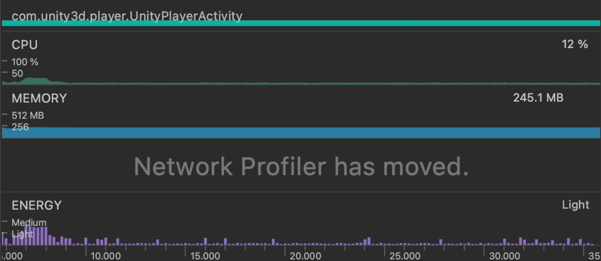

<p><em>VI: Android Profiler cho <code>com.unity3d.player.UnityPlayerActivity</code> — <strong>CPU 12%</strong> (thang 100%), <strong>MEMORY 245.1 MB</strong> (thang 512 MB), <strong>ENERGY: Light</strong>. Network Profiler đã được chuyển đi nơi khác. / EN: The Android Studio Profiler top screen — CPU, Memory and Energy for the Unity player activity.</em></p>

<div class="bilingual-row">
<div class="col-vi">
<p>🖥️ <strong>Đo CPU:</strong> <em>"Màn hình đo CPU… <strong>CHỈ màn hình này KHÔNG cho bạn biết CÁI GÌ đang tiêu tốn BAO NHIÊU thời gian xử lý. Để xem chi tiết hơn, bạn cần CHỌN THREAD muốn xem.</strong> Sau khi chọn thread, <strong>bấm nút Record để đo CALL STACK của thread đó. Có vài kiểu đo, nhưng "Callstack Sample Recording" là ổn.</strong> Bấm Stop để kết thúc và hiển thị kết quả — <strong>màn hình kết quả sẽ TRÔNG GIỐNG module CPU của Unity Profiler.</strong>"</em></p>
</div>
<div class="col-en">
<p>🖥️ <strong>CPU measurement:</strong> <em>"<strong>This screen ALONE does NOT tell you WHAT is consuming HOW MUCH processing time. To see more details, you need to SELECT THE THREADS you want to see in detail.</strong> After selecting a thread, <strong>press the Record button to measure the thread's CALL STACK. There are several measurement types, but "Callstack Sample Recording" will be fine.</strong> Clicking Stop will end the measurement and display the results — <strong>the result screen will look like the CPU module of the Unity Profiler.</strong>"</em></p>
</div>
</div>

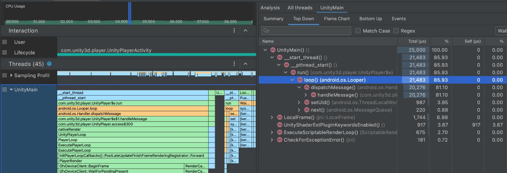

<p><em>VI: Kết quả <strong>Callstack Sample Recording</strong> — <strong>Threads (45)</strong>, thread <code>UnityMain</code> được chọn. Tab <strong>Top Down</strong>: <code>UnityMain()</code> <strong>25,000 µs (100.00%)</strong> → <code>__start_thread()</code> / <code>run()</code> / <code>loop() (android.os.Looper)</code> <strong>21,483 µs (85.93%)</strong> → <code>dispatchMessage()</code> / <code>handleMessage()</code> <strong>20,276 µs (81.10%)</strong>. Ngoài ra <code>LocalFrame() (jni::LocalFrame)</code> <strong>1,744 µs (6.98%)</strong>, <code>UnityShaderExtPluginKeywordsEnabled()</code> <strong>917 µs (3.67%, self 3.67%)</strong>, <code>ExecuteScriptableRenderLoop()</code> <strong>675 µs (2.70%)</strong>. Timeline trái hiện <code>nativeRender → UnityPlayerLoop → PlayerLoop → ExecutePlayerLoop → PlayerRender → GfxDeviceClient::BeginFrame</code>. / EN: Android Studio's Top-Down call stack for the UnityMain thread, with per-node µs and self-time.</em></p>

<div class="bilingual-row">
<div class="col-vi">
<p>💾 <strong>Đo Memory:</strong> <em>"<strong>KHÔNG thấy được breakdown bộ nhớ trên màn hình này.</strong> Nếu muốn xem breakdown, bạn cần <strong>thực hiện một phép đo BỔ SUNG. Có BA cách đo. <code>"Capture heap dump"</code> lấy thông tin bộ nhớ tại THỜI ĐIỂM bấm. Các nút khác dùng để phân tích allocation TRONG một đoạn đo.</strong>"</em></p>
<p>⚠️ <em>"Ví dụ chúng tôi đã capture kết quả Heap Dump. <strong>ĐỘ MỊN hơi THÔ cho phân tích chi tiết, nên có thể sẽ là một THỬ THÁCH.</strong>"</em></p>
</div>
<div class="col-en">
<p>💾 <strong>Memory measurement:</strong> <em>"<strong>The memory breakdown CANNOT be seen on this screen.</strong> If you want to see the breakdown, you need to <strong>perform an ADDITIONAL measurement. There are THREE measurement methods. <code>"Capture heap dump"</code> can acquire the memory information at the timing when it is pressed. Other buttons are for analyzing allocations during the measurement section.</strong>"</em></p>
<p>⚠️ <em>"As an example, we have captured the measurement results of Heap Dump. <strong>The granularity is a bit COARSE for detailed analysis, so it may be CHALLENGING.</strong>"</em></p>
</div>
</div>

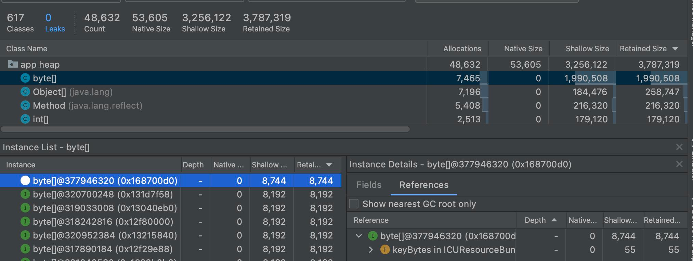

<p><em>VI: <strong>Heap Dump</strong> — <strong>617 Classes, 0 Leaks, 48,632 Count, Native Size 53,605, Shallow Size 3,256,122, Retained Size 3,787,319</strong>. Trong app heap: <strong><code>byte[]</code> 7,465 allocations / Retained 1,990,508</strong> (áp đảo), <code>Object[]</code> <strong>7,196 / 258,747</strong>, <code>Method (java.lang.reflect)</code> <strong>5,408 / 216,320</strong>, <code>int[]</code> <strong>2,513 / 179,120</strong>. Instance Details cho thấy <code>byte[]@377946320</code> <strong>8,744 bytes</strong> đang bị <code>keyBytes in ICUResourceBundle</code> tham chiếu. / EN: The Android Studio Heap Dump — class-level counts and retained sizes plus a per-instance reference tree.</em></p>

---

## 26. 🎛️ RenderDoc — Graphics debugger mã nguồn mở

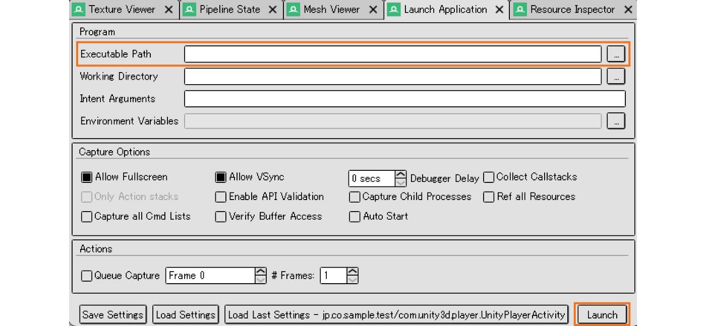
<p><em>VI: <strong>▲ Tab Launch Application</strong> — điền <strong>Executable Path · Working Directory · Intent Arguments</strong>; nhóm <strong>Capture Options</strong> có <em>Allow Fullscreen · Allow VSync · Debugger Delay 0 secs · Collect Callstacks · Capture Child Processes · Ref all Resources · Auto Start</em>; nhóm <strong>Actions</strong> có <em>Queue Capture Frame 0 / # Frames 1</em> và nút <strong>Launch</strong>. / EN: The RenderDoc Launch Application tab.</em></p>

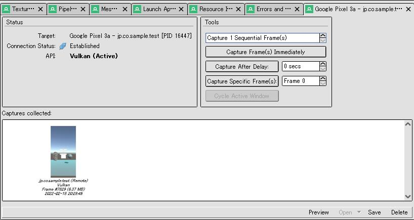
<p><em>VI: <strong>▲ Kết nối đã thiết lập</strong> — <strong>Target: Google Pixel 3a — jp.co.sample.test [PID 16447]</strong>, <strong>Connection Status: Established</strong>, <strong>API: Vulkan (Active)</strong>; cột Tools có <strong>Capture 1 Sequential Frame(s) · Capture Frame(s) Immediately · Capture After Delay 0 secs · Capture Specific Frame(s) Frame 0</strong>. Ảnh chụp nằm ở <strong>Captures collected</strong>. / EN: RenderDoc connected to a Pixel 3a over Vulkan.</em></p>

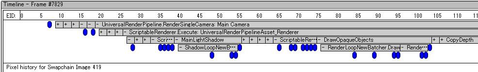
<p><em>VI: <strong>▲ Timeline + Pixel History</strong> — trục sự kiện (EID) trải ngang với các nhãn <code>UniversalRenderPipeline.RenderSingleCamera</code>, <code>MainLightShadow</code>, <code>DrawOpaqueObjects</code>, <code>RenderLoopNewBatcher.Draw</code>, <code>CopyDepth</code>; dòng dưới ghi <em>Pixel history for Swapchain Image 419</em> — mỗi chấm là MỘT lần pixel đó bị ghi. / EN: The RenderDoc Timeline with pixel history for a swapchain image.</em></p>

<div class="bilingual-row">
<div class="col-vi">
<p>🏆 <em>"RenderDoc là công cụ <strong>graphics debugger MÃ NGUỒN MỞ, MIỄN PHÍ, CHẤT LƯỢNG CAO</strong>."</em></p>
<p>⚠️ <strong>GIỚI HẠN NỀN TẢNG — phải biết trước:</strong><br>
<em>"Công cụ hiện có cho <strong>Windows và Linux, KHÔNG có cho Mac</strong>. Graphics API hỗ trợ gồm <strong>Vulkan, OpenGL(ES), D3D11, và D3D12</strong>. Do đó, <strong>nó dùng được trên ANDROID, nhưng KHÔNG trên iOS.</strong>"</em></p>
<p>🚨 <strong>Điều kiện profile Android:</strong> <em>"① <strong>Android OS 6.0 trở lên</strong> là bắt buộc. ② <strong>App cần profile PHẢI bật Debuggable</strong> — không vấn đề gì nếu chọn <strong>Development Build</strong> lúc build. Phiên bản RenderDoc dùng trong sách là <strong>v1.18</strong>."</em></p>
</div>
<div class="col-en">
<p>🏆 <em>"RenderDoc is an <strong>open source, FREE, HIGH-QUALITY graphics debugger tool</strong>."</em></p>
<p>⚠️ <strong>Platform limits — know them first:</strong><br>
<em>"The tool is currently available for <strong>Windows and Linux, but NOT for Mac</strong>. Graphics APIs supported include <strong>Vulkan, OpenGL(ES), D3D11, and D3D12</strong>. Therefore, <strong>it can be used on ANDROID, but NOT on iOS.</strong>"</em></p>
<p>🚨 <strong>Android profiling conditions:</strong> <em>"① <strong>Android OS version 6.0 or later</strong> is required. ② <strong>The application to be profiled MUST have Debuggable enabled</strong> — this is no problem if Development Build is selected at build time. The version of RenderDoc used is <strong>v1.18</strong>."</em></p>
</div>
</div>

**Quy trình đo — 5 bước:**

| # | Bước |
|---|---|
| 1 | Tải installer từ **`renderdoc.org`** và cài đặt |
| 2 | Kết nối máy Android: **bấm biểu tượng NGÔI NHÀ ở góc dưới bên TRÁI** → chọn thiết bị từ danh sách |
| 3 | Tab **Launch Application** bên phải → chọn app cần chạy từ **Executable Path** |
| 4 | Cửa sổ File Browser mở ra → tìm **Package Name** và chọn **Activity** |
| 5 | Bấm **Launch** → app khởi động trên máy, và **một tab ĐO MỚI được thêm vào RenderDoc** |

> 📸 *"**"Capture Frame(s) Immediately"** sẽ capture dữ liệu frame, được liệt kê trong tab **"Capture collected"**. **Double-click** vào dữ liệu này để mở dữ liệu đã capture."*

### 26.1. Timeline & Event Browser — cột `Duration` là chìa khoá

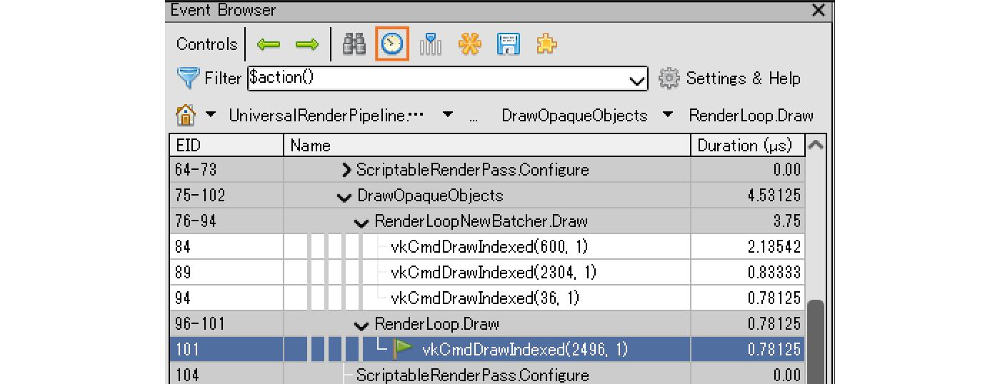

<p><em>VI: <strong>Event Browser</strong> — bấm <strong>biểu tượng ĐỒNG HỒ</strong> (viền cam) để hiện cột <strong>Duration (µs)</strong>. Ta thấy <code>DrawOpaqueObjects</code> tổng <strong>4.53125 µs</strong>, trong đó <code>RenderLoopNewBatcher.Draw</code> <strong>3.75 µs</strong> gồm <strong>BA</strong> lệnh <code>vkCmdDrawIndexed(600, 1)</code> <strong>2.13542 µs</strong>, <code>vkCmdDrawIndexed(2304, 1)</code> <strong>0.83333 µs</strong>, <code>vkCmdDrawIndexed(36, 1)</code> <strong>0.78125 µs</strong> — và MỘT lệnh <code>vkCmdDrawIndexed(2496, 1)</code> <strong>0.78125 µs</strong> nằm NGOÀI batch, dưới <code>RenderLoop.Draw</code>. 🔑 Đúng như sách: <em>"ba lệnh được BATCH và CHỈ MỘT được vẽ NGOÀI batch"</em>. / EN: The RenderDoc Event Browser with the Duration column on — three draws batched, one drawn outside the batch.</em></p>

<div class="bilingual-row">
<div class="col-vi">
<p>📅 <em>"Đầu tiên, <strong>TIMELINE của các frame đã capture hiển thị ở TRÊN CÙNG màn hình. Điều này cho phép bạn nắm TRỰC QUAN THỨ TỰ mà mỗi lệnh vẽ được thực hiện.</strong>"</em></p>
<p>📋 <em>"Tiếp theo là <strong>Event Browser</strong> — mỗi lệnh được liệt kê theo thứ tự từ trên xuống. <strong>Bấm 'biểu tượng ĐỒNG HỒ' ở đầu Event Browser để hiển thị THỜI GIAN XỬ LÝ cho MỖI lệnh trong cột 'Duration'.</strong>"</em></p>
<p>⚠️ <em>"<strong>Thời gian xử lý THAY ĐỔI tuỳ THỜI ĐIỂM đo, nên TỐT NHẤT coi nó như một ƯỚC LƯỢNG THÔ.</strong>"</em></p>
</div>
<div class="col-en">
<p>📅 <em>"First, <strong>a TIMELINE of captured frames is displayed at the TOP of the screen. This allows you to visually capture the ORDER in which each drawing command was performed.</strong>"</em></p>
<p>📋 <em>"Next is the <strong>Event Browser</strong>. Each command is listed here in order from the top. <strong>Clicking the 'CLOCK SYMBOL' at the top of the Event Browser displays the PROCESSING TIME for each command in the 'Duration' column.</strong>"</em></p>
<p>⚠️ <em>"<strong>The processing time VARIES depending on the timing of the measurement, so it is best to consider it as a ROUGH ESTIMATE.</strong>"</em></p>
</div>
</div>

### 26.2. Pipeline State — 9 stage của pipeline

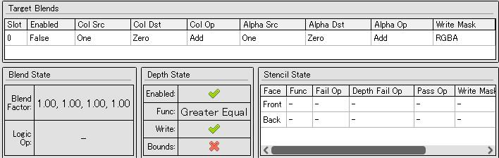
<p><em>VI: <strong>▲ Trạng thái blend / depth / stencil</strong> — <strong>Target Blends</strong>: Slot 0, <em>Enabled False</em>, Col Src <strong>One</strong>, Col Dst <strong>Zero</strong>, Col Op <strong>Add</strong>, Write Mask <strong>RGBA</strong>; <strong>Blend State</strong> Factor <strong>1.00, 1.00, 1.00, 1.00</strong>; <strong>Depth State</strong> Enabled ✓, Func <strong>Greater Equal</strong>, Write ✓, Bounds ✗; <strong>Stencil State</strong> tắt. / EN: The Target Blends, Blend State, Depth State and Stencil State panels.</em></p>

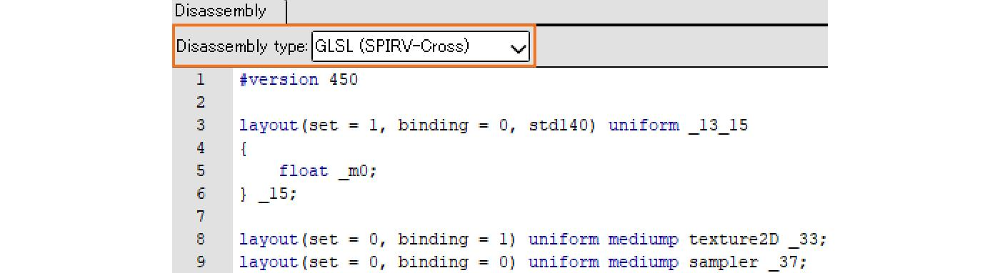
<p><em>VI: <strong>▲ Xem SHADER đã biên dịch</strong> — <strong>Disassembly type: GLSL (SPIRV-Cross)</strong>; mã <code>#version 450</code> với <code>layout(set = 1, binding = 0, std140) uniform _13_15</code>, <code>uniform mediump texture2D _33</code>, <code>uniform mediump sampler _37</code>. / EN: Shader disassembly as GLSL (SPIRV-Cross).</em></p>

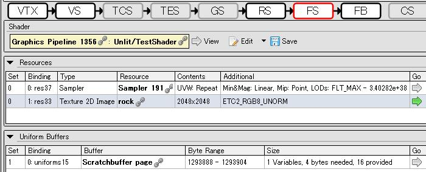
<p><em>VI: Thanh <strong>9 stage</strong> của RenderDoc: <strong>VTX → VS → TCS → TES → GS → RS → FS → FB → CS</strong> (đang chọn <strong>FS</strong>). Bên dưới là Resources: <strong><code>rock</code> 2048×2048 ETC2_RGB8_UNORM</strong> và Uniform Buffer <strong>1293888–1293904</strong>. / EN: RenderDoc's nine pipeline stages with bound resources.</em></p>

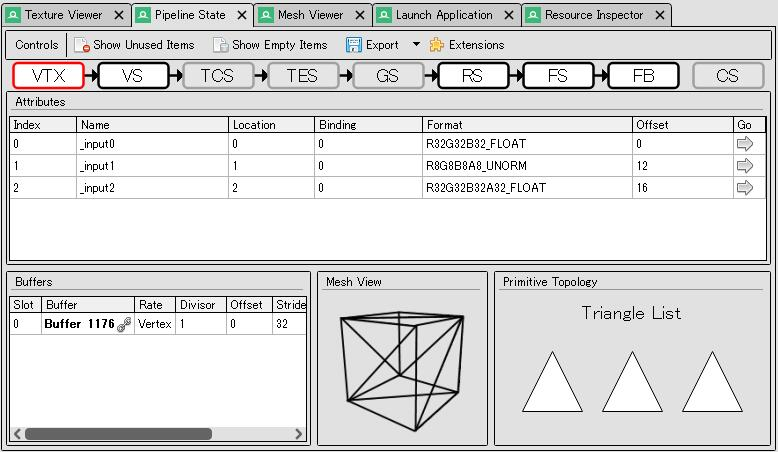

<p><em>VI: <strong>Pipeline State</strong> với chuỗi stage <strong>VTX → VS → TCS → TES → GS → RS → FS → FB</strong> (và <strong>CS</strong> tách riêng). Stage <strong>VTX</strong> đang chọn: 3 attribute — <code>_input0</code> <strong>R32G32B32_FLOAT</strong> (offset 0), <code>_input1</code> <strong>R8G8B8A8_UNORM</strong> (offset 12), <code>_input2</code> <strong>R32G32B32A32_FLOAT</strong> (offset 16); Buffer <strong>1176, Rate Vertex, Stride 32</strong>; Primitive Topology <strong>Triangle List</strong>. / EN: The RenderDoc Pipeline State bar with the VTX stage selected — vertex attribute formats, stride and topology.</em></p>

**Bảng 3.7 — Tên VIẾT TẮT vs tên CHÍNH THỨC của các stage:**

| Viết tắt | Tên chính thức |
|---|---|
| **VTX** | Vertex Input |
| **VS** | Vertex Shader |
| **TCS** | Tessellation Control Shader |
| **TES** | Tessellation Evaluation Shader |
| **GS** | Geometry Shader |
| **Rasterizer** | Rasterizer |
| **FS** | Fragment Shader |
| **Frame Buffer** | Frame Buffer |
| **CS** | Compute Shader |

<div class="bilingual-row">
<div class="col-vi">
<p>🔍 <em>"<strong>Pipeline State cho phép bạn xem THAM SỐ NÀO được dùng ở TỪNG SHADER STAGE trước khi object được render ra màn hình. Bạn cũng xem được SHADER dùng và NỘI DUNG của nó.</strong>"</em></p>
<p>🖼️ <em>"Stage <strong>FB (Frame Buffer)</strong> cho phép xem chi tiết như <strong>trạng thái TEXTURE ĐÍCH và Blend State.</strong>"</em></p>
<p>🎨 <em>"Stage <strong>FS</strong> cho phép xem <strong>texture và tham số dùng trong fragment shader</strong>. <strong>'Resources'</strong> ở giữa stage FS hiển thị <strong>texture và sampler đang dùng. 'Uniform Buffers' ở dưới hiển thị CBUFFER</strong> — chứa các property SỐ như <code>float</code> và <code>color</code>. Bên phải mỗi mục có icon mũi tên <strong>'Go'</strong>, bấm để xem chi tiết dữ liệu."</em></p>
<p>💻 <em>"<strong>Shader được dùng hiển thị ở PHẦN TRÊN của stage FS, và CODE SHADER xem được bằng cách bấm View. KHUYẾN NGHỊ chọn Disassembly type GLSL để hiển thị DỄ HIỂU HƠN.</strong>"</em></p>
</div>
<div class="col-en">
<p>🔍 <em>"<strong>Pipeline State allows you to see WHAT PARAMETERS were used in EACH SHADER STAGE before the object was rendered to the screen. You can also view the shaders used and their contents.</strong>"</em></p>
<p>🖼️ <em>"The <strong>FB (Frame Buffer)</strong> stage allows you to see details such as <strong>the state of the OUTPUT DESTINATION TEXTURE and the Blend State.</strong>"</em></p>
<p>🎨 <em>"The <strong>FS</strong> stage shows <strong>the textures and parameters used in the fragment shader</strong>. <strong>'Resources'</strong> in the centre of the FS stage shows <strong>the textures and samplers used. 'Uniform Buffers' at the bottom shows the CBUFFER</strong>, which contains numerical properties such as <code>float</code> and colour. To the right of each item there is a <strong>'Go'</strong> arrow icon, which can be pressed to see the details of the data."</em></p>
<p>💻 <em>"<strong>The shader used is shown in the UPPER part of the FS stage, and the SHADER CODE can be viewed by pressing View. Disassembly type GLSL is RECOMMENDED to make the display easier to understand.</strong>"</em></p>
</div>
</div>

### 26.3. Mesh Viewer — xem mesh TRƯỚC và SAU biến đổi toạ độ

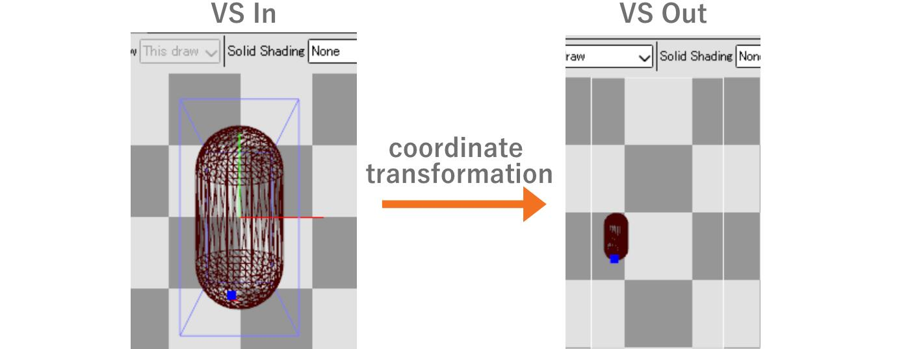
<p><em>VI: <strong>VS In → VS Out</strong>: cùng một mesh TRƯỚC và SAU <strong>coordinate transformation</strong> của vertex shader. / EN: VS In vs VS Out after coordinate transformation.</em></p>

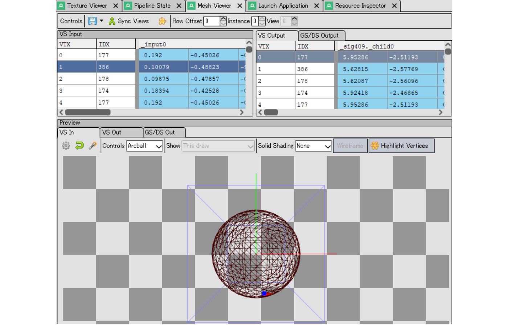

<p><em>VI: <strong>Mesh Viewer</strong> — bảng trên chia <strong>VS Input</strong> (VTX 0 → IDX 177, <code>_input0</code> = <strong>0.192, −0.45026…</strong>) và <strong>VS Output</strong> (cùng VTX/IDX, <code>_sig409._child0</code> = <strong>5.95286, −2.51193…</strong>) — tức TOẠ ĐỘ TRƯỚC và SAU vertex shader. Preview dưới cho phép xoay camera (Arcball) quanh mesh wireframe của một quả cầu. / EN: The Mesh Viewer — vertex data before and after the vertex shader, plus an interactive preview.</em></p>

<div class="bilingual-row">
<div class="col-vi">
<p>🧊 <em>"Chức năng này cho phép <strong>xem TRỰC QUAN thông tin mesh, hữu ích cho TỐI ƯU và DEBUG.</strong> <strong>Phần TRÊN hiển thị thông tin ĐỈNH của mesh ở dạng BẢNG. Phần DƯỚI có màn hình PREVIEW nơi bạn DI CHUYỂN CAMERA để kiểm tra HÌNH DẠNG mesh.</strong>"</em></p>
<p>🔄 <em>"<strong>Cả hai tab đều chia thành In và Out, nên bạn thấy được GIÁ TRỊ và DIỆN MẠO đã THAY ĐỔI THẾ NÀO TRƯỚC và SAU phép biến đổi.</strong>"</em></p>
</div>
<div class="col-en">
<p>🧊 <em>"This function allows you to <strong>visually view mesh information, which is useful for OPTIMIZATION and DEBUGGING.</strong> <strong>The UPPER part shows mesh vertex information in a TABLE format. The LOWER part has a PREVIEW screen where you can MOVE THE CAMERA to check the SHAPE of the mesh.</strong>"</em></p>
<p>🔄 <em>"<strong>Both tabs are divided into In and Out tabs, so you can see HOW the values and appearance have CHANGED BEFORE and AFTER the conversion.</strong>"</em></p>
</div>
</div>

### 26.4. 🔥 Texture Viewer & Pixel History — điều tra OVERDRAW ở cấp PIXEL

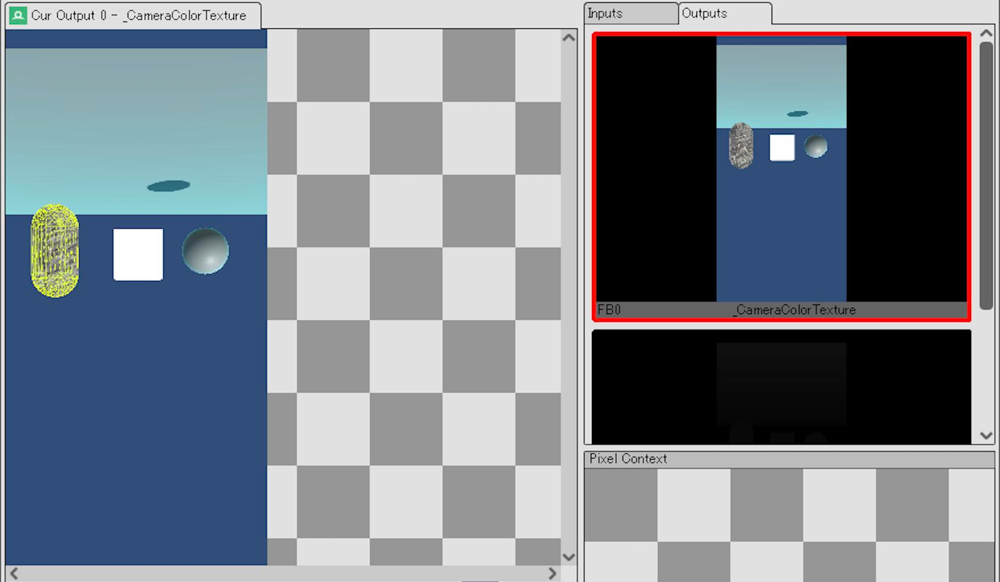
<p><em>VI: <strong>▲ Tab <em>Inputs</em> ↔ <em>Outputs</em></strong> — trái là ảnh đang xem (<code>Our Output 0 — _CameraColorTexture</code>), phải là kết quả của draw call ĐANG CHỌN (khung ĐỎ) trên nền caro báo vùng TRONG SUỐT. So hai bên là biết draw call đó THỰC SỰ vẽ được gì. / EN: The Inputs and Outputs tabs of the RenderDoc Texture Viewer.</em></p>

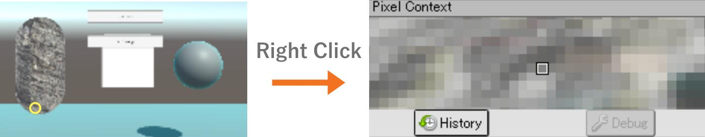
<p><em>VI: <strong>▲ Cách mở Pixel History</strong> — <strong>chuột phải</strong> lên một pixel trong Texture Viewer ⇒ khung <strong>Pixel Context</strong> phóng to vùng quanh pixel đó, kèm hai nút <strong>History</strong> và <strong>Debug</strong>. / EN: Right-clicking a pixel opens the Pixel Context with History and Debug.</em></p>

<div class="bilingual-row">
<div class="col-vi">
<p>🖼️ <em>"Màn hình này hiển thị <strong>'texture dùng để INPUT' và 'kết quả OUTPUT' của lệnh đã chọn trong Event Browser.</strong> Ở khu vực bên PHẢI bạn kiểm tra được input và output texture. <strong>Bấm vào texture hiển thị sẽ phản ánh nó sang khu vực bên TRÁI</strong> — nơi không chỉ hiển thị texture mà còn <strong>cho phép LỌC KÊNH MÀU và áp dụng cài đặt toolbar.</strong>"</em></p>
<p>🟨 <em>"Trong ví dụ, <strong>"Wireframe Mesh" được chọn cho Overlay, nên object vẽ bởi lệnh này có WIREFRAME MÀU VÀNG — RẤT DỄ NHÌN.</strong>"</em></p>
<p>🏆 <strong>Pixel Context — vũ khí chống OVERDRAW:</strong> <em>"Chức năng này cho phép <strong>xem LỊCH SỬ VẼ của các pixel đã chọn. Lịch sử cho biết một pixel đã bị TÔ ĐI TÔ LẠI BAO NHIÊU LẦN. Đây là tính năng HỮU ÍCH để ĐIỀU TRA và TỐI ƯU OVERDRAW.</strong>"</em></p>
<p>⚠️ <em>"<strong>Tuy nhiên, vì nó ở cấp TỪNG PIXEL, nó KHÔNG PHÙ HỢP để điều tra overdraw trên phạm vi TOÀN CỤC.</strong> Để điều tra, <strong>right-click vào vùng muốn điều tra ở phía TRÁI</strong>, vị trí đó sẽ được phản ánh vào Pixel Context, rồi <strong>bấm nút History</strong>."</em></p>
</div>
<div class="col-en">
<p>🖼️ <em>"This screen shows the <strong>'texture used for INPUT' and 'OUTPUT result' of the command selected in the Event Browser.</strong> In the area on the RIGHT side, you can check the input and output textures. <strong>Clicking on the displayed texture will reflect it in the area on the LEFT side</strong> — which not only displays the texture, but also allows you to <strong>FILTER THE COLOUR CHANNELS and apply toolbar settings.</strong>"</em></p>
<p>🟨 <em>"In the example, <strong>"Wireframe Mesh" was selected for the Overlay, so the object drawn with this command has a YELLOW WIREFRAME display, making it easy to see visually.</strong>"</em></p>
<p>🏆 <strong>Pixel Context — the anti-overdraw weapon:</strong> <em>"This function allows the user to <strong>view the DRAWING HISTORY of selected pixels. The history allows the user to determine HOW OFTEN a pixel has been FILLED. This is a useful feature for OVERDRAW investigation and optimization.</strong>"</em></p>
<p>⚠️ <em>"<strong>However, since it is on a PER-PIXEL basis, it is NOT suitable for investigating overdraw on a GLOBAL basis.</strong> To investigate, <strong>right-click on the area you want to investigate on the left side</strong>, and the location will be reflected in the Pixel Context, then <strong>click the History button</strong>."</em></p>
</div>
</div>

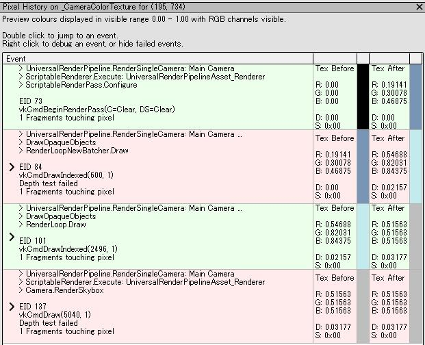

<p><em>VI: <strong>Pixel History on `_CameraColorTexture` for (195, 734)</strong> — <strong>BỐN</strong> lịch sử. 🟩 <strong>XANH LÁ = pixel VƯỢT QUA mọi test (depth test…) và ĐƯỢC TÔ</strong>: <code>EID 73 vkCmdBeginRenderPass(C=Clear, DS=Clear)</code> (Tex After R:0.19141 G:0.30078 B:0.46875) và <code>EID 101 vkCmdDrawIndexed(2496, 1)</code> dưới <code>RenderLoop.Draw</code> (Tex After <strong>0.51563</strong> ba kênh). 🟥 <strong>ĐỎ = FAIL</strong>: <code>EID 84 vkCmdDrawIndexed(600, 1)</code> — <strong>"Depth test failed"</strong>, và <code>EID 137 vkCmdDraw(5040, 1)</code> dưới <code>Camera.RenderSkybox</code> — <strong>"Depth test failed"</strong>. Đúng như sách mô tả: <em>"screen clearing và capsule drawing THÀNH CÔNG, trong khi Plane và Skybox TRƯỢT depth test"</em>. / EN: Pixel History — green rows passed all pipeline tests, red rows failed (here the depth test), giving an exact per-pixel overdraw account.</em></p>

---

## 27. 🗃️ THỰC HÀNH TUNING — ASSET (Chương 4)

<div class="bilingual-row">
<div class="col-vi">
<p>📦 <em>"Sản xuất game liên quan tới việc xử lý <strong>MỘT SỐ LƯỢNG LỚN các loại asset khác nhau</strong> như texture, mesh, animation và sound. Chương này cung cấp <strong>kiến thức THỰC HÀNH về các asset đó, gồm các cài đặt cần ghi nhớ khi tuning hiệu năng.</strong>"</em></p>
</div>
<div class="col-en">
<p>📦 <em>"Game production involves handling <strong>a large number of different types of assets</strong> such as textures, meshes, animations, and sounds. This chapter provides <strong>practical knowledge about these assets, including settings to keep in mind when tuning performance.</strong>"</em></p>
</div>
</div>

### 27.1. 🖼️ Texture

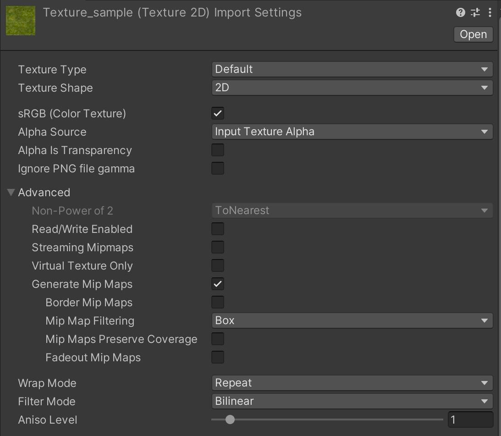
<p><em>VI: <strong>Texture 2D Import Settings</strong> đầy đủ — <strong>sRGB ✓ · Non-Power of 2: ToNearest · Read/Write Enabled ✗ · Streaming Mipmaps ✗ · Generate Mip Maps ✓ · Mip Map Filtering: Box · Wrap Mode: Repeat · Filter Mode: Bilinear · Aniso Level: 1</strong>. / EN: The full Texture 2D Import Settings panel.</em></p>


<p><em>VI: <code>Quality Settings &gt; Anisotropic Textures</code> — ba lựa chọn <strong>Disabled · Per Texture (mặc định) · Forced On</strong>. / EN: Quality Settings' Anisotropic Textures options.</em></p>

👉 *Xem thêm [Module 2](../02-junior/01-ui-physics-deep-dive.md) về import settings cơ bản. Dưới đây là các điểm CyberAgent nhấn mạnh cùng CON SỐ cụ thể.*

| Setting | 💀 Chi phí nếu SAI | ✅ Khuyến nghị |
|---|---|---|
| **Read/Write** | *"Nếu BẬT, nó sẽ được copy **KHÔNG CHỈ vào GPU memory mà CẢ main memory, do đó **GẤP ĐÔI** mức tiêu thụ."* | *"Nếu bạn **KHÔNG dùng API như `Texture.GetPixel` hay `Texture.SetPixel`** và chỉ dùng Shader để truy cập texture, **HÃY TẮT nó.**"* |
| **Generate Mip Maps** | *"Bật Mip Map làm **TĂNG mức dùng bộ nhớ texture khoảng 1.3 LẦN**."*<br>🎯 *"Thiết lập này **thường dùng cho object 3D để GIẢM RĂNG CƯA (jaggies) và GIẢM lượng texture phải TRUYỀN cho các vật thể Ở XA**."* | *"Nó về cơ bản **KHÔNG CẦN THIẾT cho 2D sprite và ảnh UI, nên PHẢI TẮT.**"*<br>*"This setting is generally used for 3D objects to reduce jaggies and texture transfer for distant objects."* |
| **Aniso Level** | *"Giá trị Aniso Level **CÀNG CAO thì lợi ích CÀNG NHIỀU, nhưng CHI PHÍ XỬ LÝ CŨNG CAO HƠN.**"* | Chỉ dùng cho *"object trải DÀI như MẶT ĐẤT hay SÀN"* |
| **Compression** | *"Texture **PHẢI được nén trừ khi có LÝ DO CỤ THỂ để không nén.**"* | *"Nếu bạn thấy texture CHƯA nén trong project, **có thể là LỖI CON NGƯỜI hoặc THIẾU QUY ĐỊNH. Hãy kiểm tra NGAY LẬP TỨC.**"* |

<div class="bilingual-row">
<div class="col-vi">
<p>💡 <strong>Texture sinh lúc runtime:</strong> <em>"Với texture tạo lúc runtime, đặt <code>makeNoLongerReadable</code> = <code>true</code> để TRÁNH copy vào main memory."</em></p>
<p>🚨 <em>"Vì <strong>chuyển texture TỪ GPU memory SANG main memory là TỐN THỜI GIAN, hiệu năng được cải thiện bằng cách triển khai texture ở CẢ HAI nếu chúng readable.</strong>"</em></p>
</div>
<div class="col-en">
<p>💡 <strong>Runtime-generated textures:</strong> <em>"For textures generated at runtime, set <code>makeNoLongerReadable</code> to <code>true</code> to avoid copying to main memory."</em></p>
<p>🚨 <em>"Since <strong>transferring textures from GPU memory to main memory is TIME-CONSUMING, performance is improved by deploying textures to BOTH if they are readable.</strong>"</em></p>
</div>
</div>

**List 4.1 — tắt readable cho texture runtime:**

```csharp
texture2D.Apply(updateMipmaps, makeNoLongerReadable: true);
```

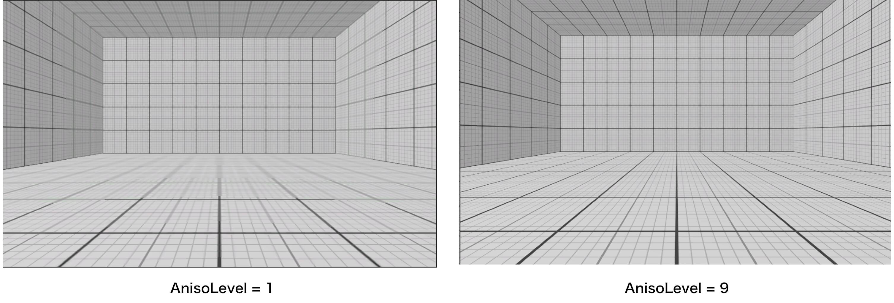

<p><em>VI: <strong>AnisoLevel = 1</strong> (trái) — các đường kẻ trên SÀN bị MỜ NHOÈ ở góc nhìn nông. <strong>AnisoLevel = 9</strong> (phải) — các đường vẫn SẮC NÉT tới tận đường chân trời. Đây chính là "chức năng render texture KHÔNG BỊ MỜ khi object được render ở GÓC NÔNG". / EN: AnisoLevel 1 vs 9 — the floor grid stays sharp at grazing angles with anisotropic filtering on.</em></p>

!!! danger "💀 Aniso Level — ĐẶC TẢ HƠI ĐẶC BIỆT, dễ dùng SAI"
    <div class="bilingual-row">
    <div class="col-vi">
    <p><em>"Aniso Level đặt được <strong>từ 0 tới 16</strong>, nhưng có đặc tả hơi ĐẶC BIỆT:</p>
    <p>• <strong>0</strong>: LUÔN TẮT bất kể project settings.<br>
    • <strong>1</strong>: Về cơ bản TẮT. <strong>TUY NHIÊN, nếu project setting là <code>Forced On</code>, giá trị bị CLAMP về 9~16.</strong><br>
    • <strong>Khác</strong>: đặt ở đúng giá trị đó."</em></p>
    <p>🚨 <em>"<strong>Khi texture được import, giá trị MẶC ĐỊNH là 1. Do đó, cài đặt <code>Forced On</code> KHÔNG được khuyến nghị TRỪ KHI bạn nhắm tới thiết bị CẤU HÌNH CAO.</strong>" <code>Forced On</code> đặt từ <strong>"Anisotropic Textures" trong "Project Settings → Quality"</strong>.</em></p>
    <p>🔬 <em>"<strong>Hiệu ứng của Aniso Level KHÔNG TUYẾN TÍNH, mà CHUYỂN THEO BẬC. Tác giả đã KIỂM CHỨNG rằng nó thay đổi qua BỐN BẬC: 0~1, 2–3, 4~7, và 8 trở lên.</strong>"</em></p>
    </div>
    <div class="col-en">
    <p><em>"The Aniso Level can be set from <strong>0 to 16</strong>, but it has a slightly special specification:</p>
    <p>• <strong>0</strong>: Always disabled regardless of project settings.<br>
    • <strong>1</strong>: Basically disabled. <strong>However, if the project setting is <code>Forced On</code>, the value is CLAMPED to 9~16.</strong><br>
    • <strong>Otherwise</strong>: Set at that value."</em></p>
    <p>🚨 <em>"<strong>When textures are imported, the value is 1 by DEFAULT. Therefore, the <code>Forced On</code> setting is NOT recommended UNLESS you are targeting a high-spec device.</strong>"</em></p>
    <p>🔬 <em>"<strong>The effect of Aniso Level is NOT LINEAR, but rather switches in STEPS. The author verified that it changes in FOUR steps: 0~1, 2-3, 4~7, and 8 or later.</strong>"</em></p>
    </div>
    </div>

**List 4.2 — TỰ ĐỘNG HOÁ import settings bằng `AssetPostprocessor` (chống lỗi con người):**

```csharp
using UnityEditor;

public class ImporterExample : AssetPostprocessor
{
    private void OnPreprocessTexture()
    {
        var importer = assetImporter as TextureImporter;
        // Read/Write settings, etc. are also possible.
        importer.isReadable = false;

        var settings = new TextureImporterPlatformSettings();
        // Specify Android = "Android", PC = "Standalone"
        settings.name = "iPhone";
        settings.overridden = true;
        settings.textureCompression = TextureImporterCompression.Compressed;
        // Specify compression format
        settings.format = TextureImporterFormat.ASTC_6x6;
        importer.SetPlatformTextureSettings(settings);
    }
}
```

<div class="bilingual-row">
<div class="col-vi">
<p>⚖️ <em>"<strong>KHÔNG PHẢI mọi texture đều cần CÙNG một format nén.</strong> Ví dụ, trong các ảnh UI, <strong>ảnh có GRADIENT TOÀN CỤC có xu hướng lộ rõ MẤT CHẤT LƯỢNG do nén. Trong trường hợp đó, khuyến nghị đặt TỈ LỆ NÉN THẤP HƠN CHỈ cho MỘT SỐ ảnh mục tiêu.</strong> Ngược lại, với texture như <strong>model 3D, KHÓ thấy mất chất lượng, nên TỐT NHẤT là tìm cài đặt phù hợp như TỈ LỆ NÉN CAO.</strong>"</em></p>
</div>
<div class="col-en">
<p>⚖️ <em>"<strong>NOT ALL textures need to be in the SAME compression format.</strong> For example, among UI images, <strong>images with overall GRADATIONS tend to show a NOTICEABLE QUALITY LOSS due to compression. In such cases, it is recommended to set a LOWER compression ratio for ONLY SOME of the target images.</strong> On the other hand, for textures such as <strong>3D models, it is DIFFICULT to see the quality loss, so it is best to find an appropriate setting such as a HIGH compression ratio.</strong>"</em></p>
</div>
</div>

### 27.2. 🧊 Mesh — bốn setting và các XUNG ĐỘT giữa chúng

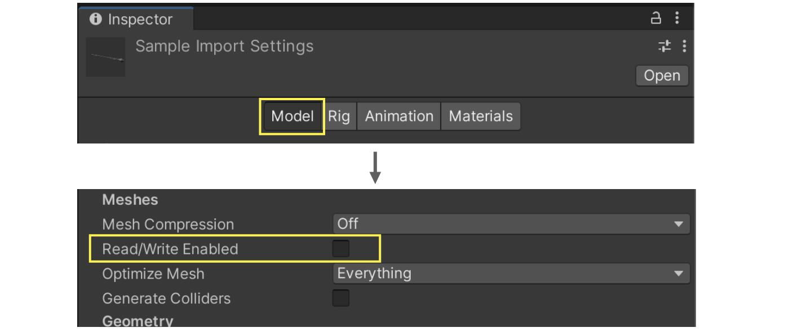
<p><em>VI: <strong>▲ <code>Read/Write Enabled</code></strong> (tab <strong>Model</strong> → mục <strong>Meshes</strong>) — bật là mesh bị GIỮ THÊM một bản trên CPU, <strong>NHÂN ĐÔI bộ nhớ</strong>. Chỉ bật khi thật sự cần đọc/sửa mesh lúc chạy. / EN: The Read/Write Enabled option in the Model import settings.</em></p>

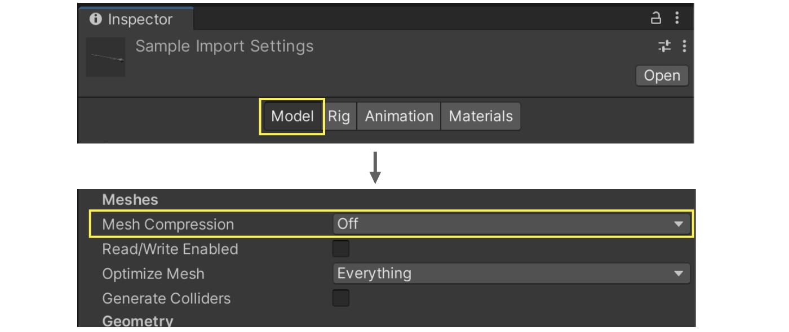
<p><em>VI: <strong>▲ <code>Mesh Compression</code></strong> — mặc định <strong>Off</strong>; các mức <em>Low / Medium / High</em> giảm DUNG LƯỢNG FILE nhưng KHÔNG giảm bộ nhớ lúc chạy và làm mesh kém chính xác. / EN: The Mesh Compression dropdown.</em></p>

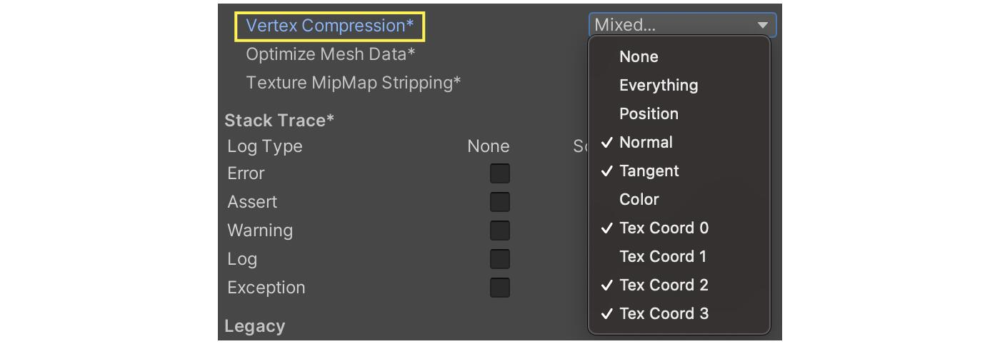
<p><em>VI: <strong>Vertex Compression</strong> trong Player Settings — dropdown ở trạng thái <strong>Mixed</strong>: được TICK là <strong>Normal · Tangent · Tex Coord 0 · Tex Coord 2 · Tex Coord 3</strong>; KHÔNG tick <strong>Position</strong> và <strong>Color</strong>. Bên cạnh là <em>Optimize Mesh Data</em> và <em>Texture MipMap Stripping</em>. / EN: The Vertex Compression flags dropdown in Player Settings.</em></p>


| Setting | Tác dụng | 💀 Bẫy |
|---|---|---|
| **Read/Write Enabled** | Mặc định **TẮT**. *"Nếu bạn KHÔNG cần truy cập mesh lúc runtime, **HÃY TẮT.** Cụ thể, nếu model đặt trên Unity và **chỉ dùng để phát AnimationClip, tắt Read/Write Enabled là ỔN.**"* | 💀 *"Bật Read/Write Enabled sẽ tiêu tốn **GẤP ĐÔI bộ nhớ** vì thông tin CPU truy cập được sẽ được lưu trong bộ nhớ."* |
| **Vertex Compression** | *"Đổi ĐỘ CHÍNH XÁC của thông tin đỉnh mesh **từ `float` sang `half`. Giảm được mức dùng bộ nhớ VÀ kích thước file lúc runtime.**"* | ⚠️ Xem 3 điều kiện VÔ HIỆU HOÁ bên dưới |
| **Mesh Compression** | *"Đổi TỈ LỆ NÉN của mesh. **Tỉ lệ nén CÀNG CAO thì file CÀNG NHỎ và CÀNG ÍT dung lượng lưu trữ.**" Bốn mức: **Off / Low / Medium / High**.* | 🚨 *"Dữ liệu nén được **GIẢI NÉN lúc runtime. Do đó, mức dùng BỘ NHỚ lúc runtime KHÔNG bị ảnh hưởng.**" (chỉ giảm STORAGE, KHÔNG giảm RAM!)* |
| **Optimize Mesh Data** | *"**TỰ ĐỘNG XOÁ dữ liệu đỉnh KHÔNG CẦN THIẾT khỏi mesh. Dữ liệu không cần được xác định TỰ ĐỘNG dựa trên SHADER đang dùng.** Giảm CẢ bộ nhớ LẪN storage lúc runtime."* Đặt ở *"Project Settings → Player → Other"* | 💀 Xem cảnh báo bên dưới |

!!! warning "⚠️ BA điều kiện làm Vertex Compression bị VÔ HIỆU HOÁ"
    <div class="bilingual-row">
    <div class="col-vi">
    <p>① <strong><code>Read/Write</code> được BẬT</strong><br>
    ② <strong><code>Mesh Compression</code> được BẬT</strong><br>
    ③ <strong>Mesh có Dynamic Batching BẬT và ĐỦ ĐIỀU KIỆN áp dụng (DƯỚI 300 đỉnh và DƯỚI 900 vertex attribute)</strong></p>
    <p>🚨 <em>"Như đã nói ở 4.2.2, <strong>bật Mesh Compression sẽ VÔ HIỆU HOÁ Vertex Compression. ĐẶC BIỆT với các project có GIỚI HẠN BỘ NHỚ NGHIÊM NGẶT, hãy Ý THỨC về NHƯỢC ĐIỂM này TRƯỚC KHI đặt option.</strong>"</em></p>
    </div>
    <div class="col-en">
    <p>① <strong><code>Read/Write</code> is enabled</strong><br>
    ② <strong><code>Mesh Compression</code> is enabled</strong><br>
    ③ <strong>Mesh with Dynamic Batching enabled and adaptable (less than 300 vertices and less than 900 vertex attributes)</strong></p>
    <p>🚨 <em>"As mentioned in "4.2.2 Vertex Compression", <strong>enabling this option DISABLES Vertex Compression. Especially for projects with STRICT MEMORY USAGE LIMITATIONS, please be aware of this disadvantage BEFORE setting this option.</strong>"</em></p>
    </div>
    </div>

!!! danger "💀 Optimize Mesh Data — TIỆN nhưng có thể gây SỰ CỐ BẤT NGỜ"
    <div class="bilingual-row">
    <div class="col-vi">
    <p><em>"Option này hữu ích vì nó TỰ ĐỘNG xoá dữ liệu đỉnh, nhưng <strong>hãy lưu ý rằng nó có thể gây ra VẤN ĐỀ BẤT NGỜ.</strong>"</em></p>
    <p>💀 <em>"Ví dụ, <strong>khi CHUYỂN ĐỔI giữa Material và Shader lúc RUNTIME, các property được truy cập có thể ĐÃ BỊ XOÁ, dẫn tới KẾT QUẢ RENDER SAI.</strong>"</em></p>
    <p>💀 <em>"<strong>Khi bundle CHỈ Mesh asset, cài đặt Material SAI có thể dẫn tới dữ liệu đỉnh KHÔNG CẦN THIẾT. Điều này PHỔ BIẾN trong các trường hợp chỉ có tham chiếu mesh được cung cấp, chẳng hạn trong Particle System.</strong>"</em></p>
    </div>
    <div class="col-en">
    <p><em>"This option is useful because it automatically deletes vertex data, but <strong>be aware that it may cause UNEXPECTED PROBLEMS.</strong>"</em></p>
    <p>💀 <em>"For example, <strong>when SWITCHING between Material and Shader at RUNTIME, the properties accessed may be DELETED, resulting in INCORRECT RENDERING RESULTS.</strong>"</em></p>
    <p>💀 <em>"<strong>When bundling ONLY Mesh assets, the incorrect Material settings may result in unnecessary vertex data. This is COMMON in cases where only a mesh reference is provided, such as in the Particle System.</strong>"</em></p>
    </div>
    </div>

### 27.3. 🎨 Material — CHỈ ĐỌC property cũng đã NHÂN BẢN

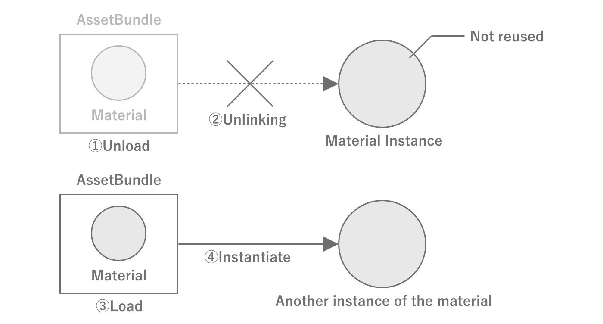
<p><em>VI: Vòng đời gây RÒ RỈ: <strong>①Unload AssetBundle → ②Unlinking</strong> ⇒ Material Instance <strong>KHÔNG được tái sử dụng</strong>; <strong>③Load lại → ④Instantiate</strong> ⇒ sinh ra <strong>MỘT instance KHÁC</strong> của cùng material. / EN: How an unloaded AssetBundle leaves a material instance that is not reused.</em></p>

!!! danger "💀 BẪY SỐ MỘT về Material — "CHỈ TRUY CẬP một tham số là nó đã NHÂN BẢN""
    <div class="bilingual-row">
    <div class="col-vi">
    <p><em>"Material là chức năng quan trọng quyết định object được render thế nào. <strong>Dù là chức năng QUEN THUỘC, nó RẤT DỄ gây RÒ RỈ BỘ NHỚ nếu dùng SAI.</strong>"</em></p>
    <p>🚨 <em>"<strong>Điều QUAN TRỌNG NHẤT phải nhớ về material là chúng có thể bị NHÂN BẢN CHỈ BẰNG VIỆC TRUY CẬP THAM SỐ của chúng. VÀ RẤT KHÓ ĐỂ NHẬN RA rằng nó ĐANG BỊ NHÂN BẢN.</strong>"</em></p>
    <p>💀 <em>"<strong>Material của renderer bị NHÂN BẢN. Và object đã nhân bản PHẢI được `Destroy` một cách TƯỜNG MINH.</strong>"</em></p>
    </div>
    <div class="col-en">
    <p><em>"Material is an important function that determines how an object is rendered. <strong>Although it is a familiar feature, it can EASILY cause MEMORY LEAKS if used incorrectly.</strong>"</em></p>
    <p>🚨 <em>"<strong>The MOST IMPORTANT thing to remember about materials is that they can be DUPLICATED SIMPLY BY ACCESSING THEIR PARAMETERS. And it is HARD TO NOTICE that it is being duplicated.</strong>"</em></p>
    <p>💀 <em>"<strong>The renderer's material is DUPLICATED. And the duplicated object MUST be explicitly `Destroy`ed.</strong>"</em></p>
    </div>
    </div>

**List 4.3 — ❌ Code TRÔNG có vẻ vô hại nhưng ĐÃ nhân bản Material:**

```csharp
Material material;

void Awake()
{
    material = renderer.material;   // <- ĐÃ nhân bản ở ĐÂY
    material.color = Color.green;
}
```

**List 4.4 — ✅ Bản SỬA: phải `Destroy` material đã nhân bản:**

```csharp
Material material;

void Awake()
{
    material = renderer.material;
    material.color = Color.green;
}

void OnDestroy()
{
    if (material != null)
    {
        Destroy(material);
    }
}
```

**List 4.5 — ✅ Material tạo ĐỘNG cũng vậy — "một nguyên nhân PHỔ BIẾN khác gây rò rỉ":**

```csharp
Material material;

void Awake()
{
    material = new Material();    // Dynamically generated material
}

void OnDestroy()
{
    if (material != null)
    {
        Destroy(material); // Destroying a material when you have finished using it
    }
}
```

> ✅ *"**Material NÊN được `Destroy` khi dùng xong (`OnDestroy`). Hãy `Destroy` material vào THỜI ĐIỂM PHÙ HỢP theo QUY TẮC và ĐẶC TẢ của project.**"* / *"Materials should be destroyed when they are finished being used (`OnDestroy`). Destroy materials at the appropriate timing according to the rules and specifications of the project."*

### 27.4. 🕺 Animation — SkinWeight, Keyframe Reduction, Culling Mode

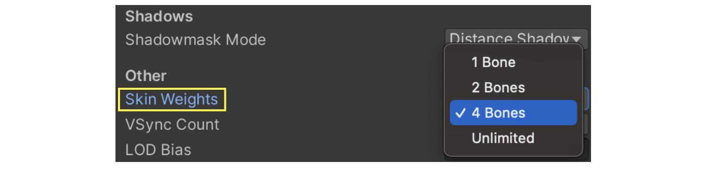
<p><em>VI: <code>Quality Settings &gt; Skin Weights</code> — <strong>1 Bone · 2 Bones · 4 Bones (đang chọn) · Unlimited</strong>. Càng NHIỀU bone, chi phí skinning càng CAO. / EN: Quality Settings' Skin Weights options.</em></p>

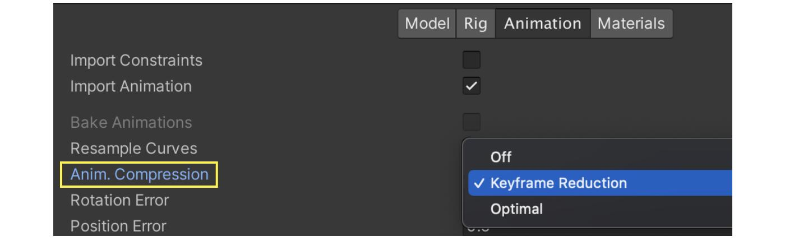
<p><em>VI: <strong>Anim. Compression</strong> khi import model — <strong>Off · Keyframe Reduction (đang chọn) · Optimal</strong>. / EN: The Anim. Compression import options.</em></p>

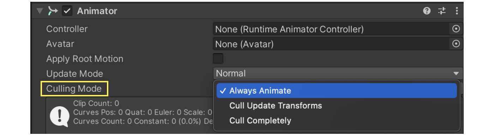
<p><em>VI: <strong>Animator Culling Mode</strong> — <strong>Always Animate (mặc định) · Cull Update Transforms · Cull Completely</strong>. Đổi sang hai chế độ sau để NGỪNG tính animation khi KHÔNG nhìn thấy. / EN: The Animator Culling Mode options.</em></p>

**a) Điều chỉnh SỐ SKIN WEIGHT**

<div class="bilingual-row">
<div class="col-vi">
<p>🦴 <em>"Bên trong, <strong>chuyển động cập nhật vị trí của TỪNG ĐỈNH bằng cách tính MỖI XƯƠNG ẢNH HƯỞNG BAO NHIÊU tới MỖI ĐỈNH. Số xương được tính đến trong phép tính vị trí gọi là SKINWEIGHT hoặc INFLUENCE COUNT. Do đó, TẢI có thể GIẢM bằng cách điều chỉnh số skin weight.</strong>"</em></p>
<p>⚠️ <em>"<strong>TUY NHIÊN, giảm số skin weight có thể khiến DIỆN MẠO TRÔNG LẠ, nên phải KIỂM CHỨNG khi điều chỉnh.</strong>"</em></p>
<p>💡 <em>"Cài đặt này cũng chỉnh ĐỘNG được từ script. Do đó, <strong>CÓ THỂ đặt Skin Weights = 2 cho thiết bị CẤU HÌNH THẤP và 4 cho thiết bị CẤU HÌNH CAO</strong> — tinh chỉnh."</em></p>
<p>📍 Đặt tại: <strong>"Project Settings → Quality → Other"</strong></p>
</div>
<div class="col-en">
<p>🦴 <em>"Internally, <strong>motion updates the position of EACH VERTEX by calculating HOW MUCH of EACH BONE affects each vertex. The number of bones taken into account is called the SKINWEIGHT or INFLUENCE COUNT. Therefore, the LOAD CAN BE REDUCED by adjusting the number of skin weights.</strong>"</em></p>
<p>⚠️ <em>"<strong>However, reducing the number of skin weights may result in a STRANGE APPEARANCE, so be sure to VERIFY this when adjusting.</strong>"</em></p>
<p>💡 <em>"This setting can also be adjusted dynamically from a script. Therefore, <strong>it is possible to set Skin Weights to 2 for LOW-SPEC devices and 4 for HIGH-SPEC devices</strong>, and so on, for fine-tuning."</em></p>
<p>📍 Set at: <strong>"Project Settings → Quality → Other"</strong></p>
</div>
</div>

**List 4.6 — đổi SkinWeights từ script:**

```csharp
// How to switch QualitySettings entirely
// The argument number is the order of the QualitySettings, starting with 0.
QualitySettings.SetQualityLevel(0);

// How to change only SkinWeights
QualitySettings.skinWeights = SkinWeights.TwoBones;
```

**b) GIẢM SỐ KEY — `Anim. Compression`**

<div class="bilingual-row">
<div class="col-vi">
<p>🔑 <em>"File animation <strong>PHỤ THUỘC vào SỐ KEY, và nó có thể LÀM CẠN cả STORAGE lẫn BỘ NHỚ lúc runtime.</strong> Một cách giảm số key là dùng tính năng <strong>Anim. Compression</strong> (tab Animation trong model import settings). <strong>Khi bật, các key KHÔNG CẦN THIẾT được TỰ ĐỘNG XOÁ trong quá trình import asset.</strong>"</em></p>
<p>📏 <em>"<strong>Keyframe Reduction</strong> giảm key <strong>khi có ÍT THAY ĐỔI về giá trị. Cụ thể, key bị XOÁ khi chúng nằm TRONG PHẠM VI Error so với đường cong trước đó.</strong> Phạm vi sai số này ĐIỀU CHỈNH ĐƯỢC."</em></p>
</div>
<div class="col-en">
<p>🔑 <em>"Animation files are <strong>DEPENDENT on the NUMBER OF KEYS, which can be a DRAIN on STORAGE and MEMORY at run-time.</strong> One way to reduce the number of keys is to use the <strong>Anim. Compression</strong> feature (Animation tab of the model import settings). <strong>When enabled, unnecessary keys are AUTOMATICALLY REMOVED during asset import.</strong>"</em></p>
<p>📏 <em>"<strong>Keyframe Reduction</strong> reduces keys <strong>when there is LITTLE CHANGE in value. Specifically, keys are removed when they are WITHIN the Error range compared to the previous curve.</strong> This error range can be adjusted."</em></p>
</div>
</div>

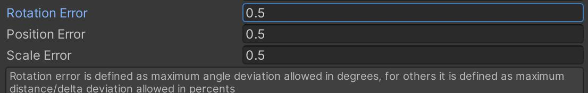

<p><em>VI: Cài đặt Error — <strong>Rotation Error 0.5</strong>, <strong>Position Error 0.5</strong>, <strong>Scale Error 0.5</strong>. 🚨 ĐƠN VỊ KHÁC NHAU: <strong>Rotation tính bằng ĐỘ (degrees)</strong>, còn <strong>Position và Scale tính bằng PHẦN TRĂM (%)</strong> — tức dung sai ở ảnh này là <strong>0.5 ĐỘ cho Rotation và 0.5% cho Position/Scale</strong>. / EN: The Error settings — rotation error is in degrees, position/scale in percent.</em></p>

!!! info "🧩 `Optimal` — nó thực sự làm gì?"
    <div class="bilingual-row">
    <div class="col-vi">
    <p><em>"<strong><code>Optimal</code> còn KHÓ HIỂU HƠN, nhưng nó SO SÁNH HAI phương pháp giảm — định dạng DENSE CURVE và KEYFRAME REDUCTION — và DÙNG cái có DỮ LIỆU NHỎ HƠN.</strong>"</em></p>
    <p>🔑 <em>"<strong>Điểm MẤU CHỐT phải nhớ là DENSE CURVE có KÍCH THƯỚC NHỎ HƠN Keyframe Reduction. TUY NHIÊN, nó có xu hướng bị NHIỄU, điều này có thể LÀM GIẢM CHẤT LƯỢNG animation.</strong> Sau khi hiểu đặc tính này, <strong>hãy KIỂM TRA TRỰC QUAN animation thực tế để xem có CHẤP NHẬN ĐƯỢC không.</strong>"</em></p>
    </div>
    <div class="col-en">
    <p><em>"<strong><code>Optimal</code> is even more confusing, but it COMPARES TWO reduction methods, the DENSE CURVE format and KEYFRAME REDUCTION, and USES the one with the SMALLER data.</strong>"</em></p>
    <p>🔑 <em>"<strong>The key point to keep in mind is that DENSE CURVE is SMALLER in size than Keyframe Reduction. However, it tends to be NOISY, which may DEGRADE the animation quality.</strong> After understanding this characteristic, <strong>let's visually check the actual animation to see if it is acceptable.</strong>"</em></p>
    </div>
    </div>

**c) GIẢM TẦN SUẤT CẬP NHẬT — `Culling Mode`**

<div class="bilingual-row">
<div class="col-vi">
<p>🚨 <em>"<strong>MẶC ĐỊNH, Animator CẬP NHẬT MỖI FRAME KỂ CẢ KHI animation KHÔNG NẰM TRÊN MÀN HÌNH.</strong> Có option gọi là <strong>Culling Mode</strong> cho phép đổi cách cập nhật này."</em></p>
</div>
<div class="col-en">
<p>🚨 <em>"<strong>By default, Animator updates EVERY FRAME EVEN IF the animation is NOT ON SCREEN.</strong> There is an option called <strong>Culling Mode</strong> that allows you to change this update method."</em></p>
</div>
</div>

**Bảng 4.1 — Ba chế độ Culling Mode:**

| Type | Ý nghĩa (VI) | Meaning (EN) |
|---|---|---|
| **Always Animate** | 💀 **LUÔN cập nhật kể cả khi ngoài màn hình (MẶC ĐỊNH)** | Always update even when off-screen (default) |
| **Cull Update Transform** | KHÔNG ghi IK hay Transform khi ngoài màn hình. **State machine VẪN cập nhật.** | Do not write IK or Transform when off-screen; state machine updates are performed |
| **Cull Completely** | **KHÔNG cập nhật state machine khi ngoài màn hình. Animation DỪNG HOÀN TOÀN.** | No state machine updates when off-screen; animation stops completely |

!!! warning "⚠️ HAI cái bẫy của Culling Mode"
    <div class="bilingual-row">
    <div class="col-vi">
    <p>💀 <strong>Cull Completely + Root Motion:</strong> <em>"Ví dụ, <strong>nếu bạn có animation ĐI VÀO KHUNG HÌNH từ NGOÀI màn hình, animation sẽ DỪNG NGAY LẬP TỨC vì nó đang ở ngoài màn hình. Kết quả là animation sẽ KHÔNG BAO GIỜ đi vào khung hình.</strong>"</em></p>
    <p>💀 <strong>Cull Update Transform + vật thể ĐUNG ĐƯA:</strong> <em>"Trông có vẻ là option RẤT hữu ích vì nó chỉ bỏ qua cập nhật transform. <strong>TUY NHIÊN, hãy CẨN THẬN nếu bạn có tiến trình phụ thuộc Transform như vật ĐUNG ĐƯA. Ví dụ, nếu một nhân vật RA KHỎI khung hình, KHÔNG cập nhật nào được thực hiện từ tư thế lúc đó. Khi nhân vật VÀO LẠI khung hình, nó sẽ được cập nhật sang tư thế MỚI, khiến vật đung đưa CHUYỂN ĐỘNG ĐỘT NGỘT MẠNH.</strong>"</em></p>
    <p>✅ <em>"<strong>Nên HIỂU ưu và nhược điểm của TỪNG option TRƯỚC KHI đổi cài đặt.</strong>"</em></p>
    </div>
    <div class="col-en">
    <p>💀 <strong>Cull Completely + Root motion:</strong> <em>"For example, <strong>if you have an animation that FRAMES IN from off-screen, the animation will STOP IMMEDIATELY because it is off-screen. As a result, the animation will NEVER frame in.</strong>"</em></p>
    <p>💀 <strong>Cull Update Transform + shaking objects:</strong> <em>"This seems like a very useful option, since it only skips updating the transform. <strong>However, be careful if you have a SHAKING or other Transform-dependent process. For example, if a character goes OUT of frame, NO updates will be made from the pose at that time. When the character ENTERS the frame again, it will be updated to a NEW pose, which may cause the shaking object to MOVE SIGNIFICANTLY.</strong>"</em></p>
    <p>✅ <em>"<strong>It is a good idea to understand the pros and cons of each option before changing the settings.</strong>"</em></p>
    </div>
    </div>

<div class="bilingual-row">
<div class="col-vi">
<p>🎚️ <strong>Muốn giảm tần suất TINH TẾ HƠN?</strong> <em>"Kể cả với các cài đặt này, <strong>KHÔNG THỂ thay đổi ĐỘNG tần suất cập nhật animation một cách CHI TIẾT. Ví dụ, bạn có thể tối ưu bằng cách GIẢM MỘT NỬA tần suất cập nhật animation cho các object XA CAMERA HƠN.</strong> Trong trường hợp này, bạn cần dùng <strong><code>AnimationClipPlayable</code></strong> hoặc <strong>VÔ HIỆU HOÁ Animator và TỰ GỌI <code>Animator.Update</code></strong>. <strong>Cả hai đều đòi hỏi TỰ VIẾT SCRIPT, nhưng cách SAU DỄ CÀI ĐẶT HƠN cách trước.</strong>"</em></p>
</div>
<div class="col-en">
<p>🎚️ <strong>Want finer control?</strong> <em>"Even with these settings, <strong>it is NOT possible to dynamically change the frequency of animation updates in detail. For example, you can optimize by HALVING the frequency of animation updates for objects that are FARTHER from the camera.</strong> In this case, you need to use <strong><code>AnimationClipPlayable</code></strong> or <strong>deactivate Animator and call <code>Animator.Update</code> yourself</strong>. <strong>Both require writing your own scripts, but the LATTER is EASIER to implement than the former.</strong>"</em></p>
</div>
</div>

### 27.5. ✨ Particle System — hai điều QUAN TRỌNG

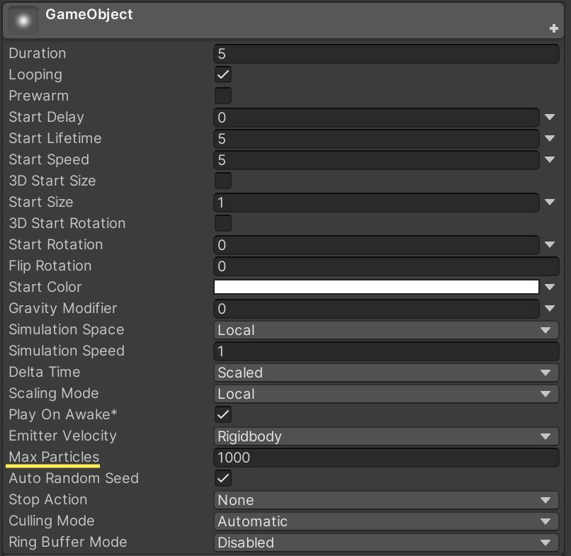
<p><em>VI: <strong>▲ Module chính</strong> — <strong>Duration 5 · Looping ✓ · Start Lifetime 5 · Start Speed 5 · Start Size 1 · Simulation Space Local · Delta Time Scaled · Emitter Velocity Rigidbody · <span>Max Particles 1000</span> · Culling Mode Automatic · Ring Buffer Mode Disabled</strong>. <strong>Max Particles</strong> là TRẦN chi phí của cả hệ. / EN: The Particle System main module with Max Particles 1000.</em></p>

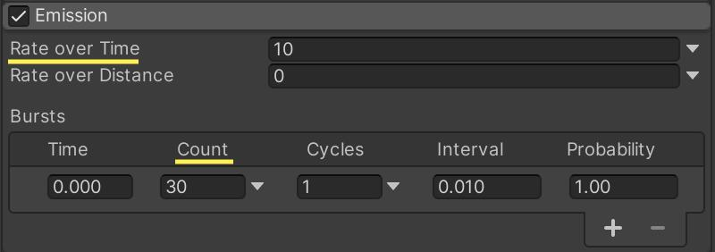
<p><em>VI: <strong>▲ Module Emission</strong> — <strong>Rate over Time 10</strong>, <strong>Rate over Distance 0</strong>, và một <strong>Burst</strong>: Time <strong>0.000</strong> · Count <strong>30</strong> · Cycles <strong>1</strong> · Interval <strong>0.010</strong> · Probability <strong>1.00</strong>. / EN: The Emission module with Rate over Time 10 and a 30-particle burst.</em></p>

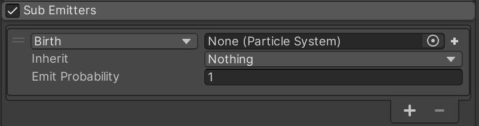
<p><em>VI: <strong>▲ Module Sub Emitters</strong> — mỗi sub-emitter là MỘT Particle System NỮA: hàng <strong>Birth</strong>, <em>Inherit: Nothing</em>, <strong>Emit Probability 1</strong>. Lồng nhiều tầng là cách chi phí NHÂN LÊN mà không ai để ý. / EN: The Sub Emitters module.</em></p>

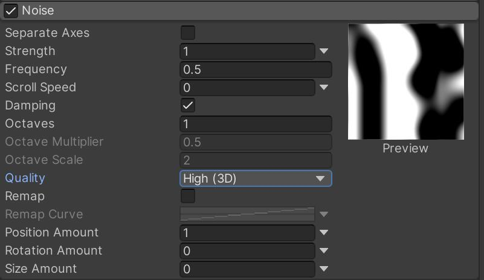
<p><em>VI: Module <strong>Noise</strong> — <strong>Quality: High (3D)</strong> là mức ĐẮT NHẤT; các tham số Strength 1 · Frequency 0.5 · Octaves 1 và ô Preview bên phải. / EN: The Particle System Noise module with Quality set to High (3D).</em></p>

<div class="bilingual-row">
<div class="col-vi">
<p>🎆 <em>"Hiệu ứng game là THIẾT YẾU cho phần trình bày, và Unity thường dùng Particle System. Có <strong>HAI điểm QUAN TRỌNG:</strong>"</em></p>
<p>① <em><strong>"Giữ SỐ HẠT THẤP."</strong></em><br>
② <em><strong>"Ý THỨC rằng NOISE là NẶNG."</strong></em></p>
<p>🔑 <em>"Số hạt LIÊN QUAN tới TẢI, và vì <strong>Particle System chạy bằng SỨC CPU (CPU particles), CÀNG NHIỀU HẠT thì TẢI CPU CÀNG CAO. Là chính sách cơ bản, hãy đặt số hạt ở MỨC TỐI THIỂU CẦN THIẾT.</strong>"</em></p>
</div>
<div class="col-en">
<p>🎆 <em>"Game effects are essential for game presentation, and Unity often uses the Particle System. There are <strong>TWO important points:</strong>"</em></p>
<p>① <em><strong>"Keep the number of particles LOW."</strong></em><br>
② <em><strong>"Be AWARE that NOISE is HEAVY."</strong></em></p>
<p>🔑 <em>"The number of particles is related to the load, and since <strong>the Particle System is CPU-POWERED (CPU particles), the MORE particles there are, the HIGHER the CPU load. As a basic policy, set the number of particles to the MINIMUM NECESSARY.</strong>"</em></p>
</div>
</div>

**Hai cách GIỚI HẠN số hạt:**

| Cách | Chi tiết |
|---|---|
| **Emission module** | • **`Rate over Time`**: số hạt phát ra **MỖI GIÂY**<br>• **`Bursts > Count`**: số hạt phát ra tại **THỜI ĐIỂM BURST** |
| **Main module → `Max Particles`** | *"Trong ví dụ, **hạt VƯỢT QUÁ 1000 sẽ KHÔNG được phát ra.**"* |

!!! danger "💀 Sub Emitters — thủ phạm khiến số hạt CHẠM ĐỈNH ĐỘT NGỘT"
    **VI:** *"Module Sub Emitters **cũng phải được xem xét khi giảm số hạt.** Module Sub Emitters **sinh ra các particle system TUỲ Ý tại các THỜI ĐIỂM CỤ THỂ (lúc tạo, lúc hết đời, v.v.). 🚨 Tuỳ cài đặt Sub Emitters, SỐ HẠT có thể CHẠM ĐỈNH CÙNG MỘT LÚC, nên hãy CẨN THẬN khi dùng module này.**"*

    **EN:** *"The Sub Emitters module should also be considered when reducing the number of particles. It **generates arbitrary particle systems at specific times (at creation, at the end of life, etc.) 🚨 Depending on the Sub Emitters settings, the number of particles may reach the PEAK NUMBER ALL AT ONCE, so be careful when using this module.**"*

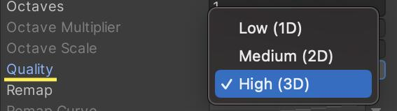

<p><em>VI: Module <strong>Noise</strong> — dropdown <strong>Quality</strong> với ba mức: <strong>Low (1D) / Medium (2D) / High (3D)</strong>, mặc định trong ảnh là <strong>High (3D)</strong>. 🚨 <strong>Chiều (dimension) của Quality CÀNG CAO thì TẢI CÀNG CAO.</strong> / EN: The Noise module Quality dropdown — Low (1D), Medium (2D), High (3D); the higher the dimension, the higher the load.</em></p>

<div class="bilingual-row">
<div class="col-vi">
<p>🚨 <em>"<strong>Quality của module Noise RẤT DỄ bị QUÁ TẢI. Noise diễn tả được các hạt HỮU CƠ và THƯỜNG được dùng để dễ dàng NÂNG CHẤT LƯỢNG hiệu ứng. Vì là chức năng dùng THƯỜNG XUYÊN, bạn nên CẨN THẬN về hiệu năng của nó.</strong>"</em></p>
<p>✅ <em>"<strong>Nếu bạn KHÔNG cần Noise, hãy TẮT module Noise. Nếu cần dùng noise, ĐẶT Quality ở Low TRƯỚC, rồi TĂNG Quality theo yêu cầu.</strong>"</em></p>
</div>
<div class="col-en">
<p>🚨 <em>"<strong>The Noise module's Quality is EASILY OVERLOADED. Noise can express ORGANIC particles and is OFTEN used to easily increase the quality of effects. Because it is a FREQUENTLY USED function, you should be careful about its performance.</strong>"</em></p>
<p>✅ <em>"<strong>If you do NOT need Noise, TURN OFF the Noise module. If you need to use noise, set the Quality setting to Low FIRST, and then INCREASE the Quality according to your requirements.</strong>"</em></p>
</div>
</div>

### 27.6. 🔊 Audio — Load Type, Compression Format, Sample Rate, Force To Mono

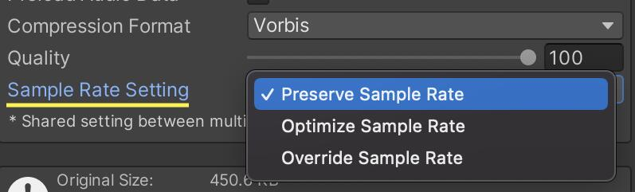
<p><em>VI: <strong>▲ <code>Sample Rate Setting</code></strong> — <strong>Preserve Sample Rate</strong> (đang chọn) · <strong>Optimize Sample Rate</strong> · <strong>Override Sample Rate</strong>; cùng <strong>Compression Format: Vorbis</strong> và <strong>Quality 100</strong>. Dòng cuối ghi <strong>Original Size: 450.6 KB</strong>. / EN: The Sample Rate Setting options on an AudioClip.</em></p>

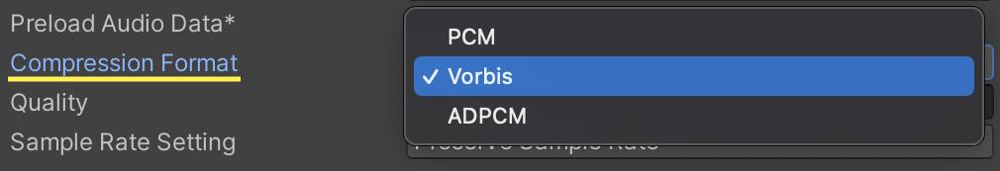
<p><em>VI: <strong>Compression Format</strong> — <strong>PCM · Vorbis (đang chọn) · ADPCM</strong>. / EN: The AudioClip Compression Format options.</em></p>

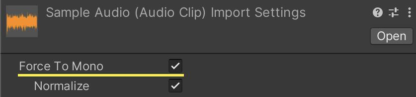
<p><em>VI: <strong>Force To Mono ✓</strong> và <strong>Normalize ✓</strong> trên AudioClip — cắt một nửa dữ liệu cho hiệu ứng KHÔNG cần stereo. / EN: Force To Mono and Normalize on an AudioClip.</em></p>

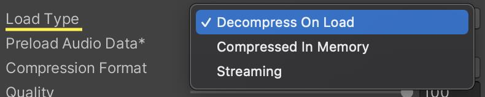
<p><em>VI: Dropdown <strong>Load Type</strong> của AudioClip — ba lựa chọn: <strong><code>Decompress On Load</code></strong> (đang chọn) · <strong><code>Compressed In Memory</code></strong> · <strong><code>Streaming</code></strong>. / EN: The AudioClip Load Type dropdown.</em></p>


<div class="bilingual-row">
<div class="col-vi">
<p>🎵 <em>"<strong>Trạng thái MẶC ĐỊNH với file âm thanh đã import CÓ MỘT SỐ ĐIỂM CẢI THIỆN về hiệu năng.</strong> Có BA cài đặt: <strong>Load Type, Compression Format, Force To Mono</strong>. Hãy đặt chúng PHÙ HỢP cho <strong>nhạc nền (BGM), hiệu ứng âm thanh (SFX), và giọng nói (voice)</strong> — thứ thường dùng trong phát triển game."</em></p>
</div>
<div class="col-en">
<p>🎵 <em>"<strong>The DEFAULT state with sound files imported HAS SOME IMPROVEMENT POINTS in terms of performance.</strong> The following three settings are available: <strong>Load Type, Compression Format, Force To Mono</strong>. Set these appropriately for <strong>background music, sound effects, and voices</strong> that are often used in game development."</em></p>
</div>
</div>

**a) `Load Type` — ba cách nạp AudioClip**

| Load Type | Cơ chế | ⚖️ Đánh đổi | ✅ Dùng cho |
|---|---|---|---|
| **Decompress On Load** | *"Nạp âm thanh **CHƯA NÉN** vào bộ nhớ."* | ✅ **ÍT tốn CPU**, phát với **ÍT thời gian CHỜ**<br>💀 **DÙNG NHIỀU BỘ NHỚ** | 🔫 **Sound Effects** — *"SFX NGẮN cần phát NGAY LẬP TỨC"*. ⚠️ *"BGM và file voice DÀI dùng NHIỀU bộ nhớ, nên phải CẨN THẬN."* |
| **Compressed In Memory** | *"Nạp AudioClip vào bộ nhớ ở **trạng thái ĐÃ NÉN** ⇒ **giải nén LÚC PHÁT.**"* | 💀 **TẢI CPU CAO** và **DỄ TRỄ khi phát**<br>✅ tốn ít RAM hơn | 🗣️ **Voice** — *"phù hợp cho âm thanh có FILE LỚN mà bạn KHÔNG muốn giải nén thẳng vào bộ nhớ, hoặc âm thanh KHÔNG bị ảnh hưởng bởi độ trễ NHỎ."* |
| **Streaming** | *"Phương pháp **NẠP và PHÁT** đồng thời."* | ✅ **DÙNG ÍT BỘ NHỚ NHẤT**<br>💀 **TỐN CPU HƠN** | 🎼 **BGM** — *"khuyến nghị dùng với BGM DÀI."* |

**Bảng 4.2 — Tóm tắt:**

| Type | Usage |
|---|---|
| **Decompress On Load** | Sound Effects |
| **Compressed In Memory** | Voice |
| **Streaming** | BGM |

**b) `Compression Format`**

| Format | Đặc tính | Dùng cho |
|---|---|---|
| **PCM** | *"**CHƯA NÉN** và tiêu tốn **MỘT LƯỢNG LỚN bộ nhớ. ĐỪNG đặt cái này trừ khi bạn muốn CHẤT LƯỢNG ÂM THANH TỐT NHẤT.**"* | ❌ **Not used** |
| **ADPCM** | 🏆 *"Dùng **ÍT HƠN 70% bộ nhớ so với PCM**, nhưng chất lượng THẤP HƠN, và **TẢI CPU NHỎ HƠN NHIỀU so với Vorbis** ⇒ **TỐC ĐỘ GIẢI NÉN NHANH HƠN**, phù hợp cho phát NGAY và phát **SỐ LƯỢNG LỚN**."* — *"ĐẶC BIỆT đúng với âm thanh ỒN như **BƯỚC CHÂN, VA CHẠM, VŨ KHÍ**."* | 🔫 **Sound Effects** |
| **Vorbis** | *"Là **định dạng nén CÓ MẤT (lossy)**, chất lượng thấp hơn PCM nhưng **KÍCH THƯỚC FILE NHỎ HƠN. Là định dạng DUY NHẤT cho phép TINH CHỈNH chất lượng âm thanh.**"* | 🎼🔫🗣️ **BGM, sound effects, voice** — *"định dạng nén ĐƯỢC DÙNG NHIỀU NHẤT cho MỌI âm thanh."* |

**c) `Sample Rate`**

| Chế độ | Mô tả |
|---|---|
| **Preserve Sample Rate** | *"Cài đặt **MẶC ĐỊNH**. Dùng sample rate của **nguồn GỐC**."* |
| **Optimize Sample Rate** | *"**Unity PHÂN TÍCH và TỰ ĐỘNG TỐI ƯU dựa trên THÀNH PHẦN TẦN SỐ CAO NHẤT.**"* |
| **Override Sample Rate** | *"Ghi đè sample rate của nguồn gốc. **Chỉ định được từ 8,000 tới 192,000 Hz.** 🚨 **Chất lượng sẽ KHÔNG được cải thiện dù sample rate CAO HƠN nguồn gốc. Dùng option này khi bạn muốn HẠ sample rate xuống THẤP HƠN nguồn gốc.**"* |

**d) `Force To Mono` cho sound effect**

<div class="bilingual-row">
<div class="col-vi">
<p>✂️ <em>"Mặc định Unity phát STEREO, nhưng bằng cách bật <strong>Force To Mono</strong>, phát MONO được kích hoạt. <strong>Bật phát mono sẽ CẮT ĐÔI kích thước file và kích thước bộ nhớ, vì KHÔNG cần dữ liệu riêng cho kênh TRÁI và PHẢI.</strong>"</em></p>
<p>✅ <em>"<strong>Phát mono thường là ỔN cho hiệu ứng âm thanh. Trong một số trường hợp, phát mono CŨNG TỐT HƠN cho 3D sound.</strong> Khuyến nghị bật Force To Mono sau khi cân nhắc kỹ. <strong>Hiệu quả tuning là "chuyện bé xé ra to" — nếu bạn KHÔNG có vấn đề gì với phát đơn kênh, hãy DÙNG Force To Mono một cách CHỦ ĐỘNG.</strong>"</em></p>
</div>
<div class="col-en">
<p>✂️ <em>"By default, Unity plays stereo, but by enabling <strong>Force To Mono</strong>, mono playback is enabled. <strong>Enabling mono playback will CUT the file size and memory size IN HALF, since there is no need to have separate data for left and right channels.</strong>"</em></p>
<p>✅ <em>"<strong>Mono playback is often fine for sound effects. In some cases, mono playback is also BETTER for 3D sound.</strong> It is recommended to enable Force To Mono after careful consideration. <strong>The performance tuning effect is a mountain out of a molehill. If you have no problem with monaural playback, you should ACTIVELY use Force To Mono.</strong>"</em></p>
</div>
</div>

!!! warning "⚠️ ĐỪNG import file audio ĐÃ NÉN vào Unity"
    **VI:** *"Dù đây KHÔNG hẳn là performance tuning, **file audio CHƯA NÉN mới nên được import vào Unity. Nếu bạn import file audio ĐÃ NÉN, chúng sẽ bị GIẢI MÃ rồi NÉN LẠI ở phía Unity, dẫn tới MẤT CHẤT LƯỢNG.**"*

    **EN:** *"Although this is not the same as performance tuning, **UNCOMPRESSED audio files should be imported into Unity. If you import COMPRESSED audio files, they will be DECODED and RECOMPRESSED on the Unity side, resulting in a LOSS OF QUALITY.**"*

### 27.7. 📂 `Resources` / `StreamingAssets` — hai thư mục ĐẶC BIỆT nguy hiểm

<div class="bilingual-row">
<div class="col-vi">
<p>📋 <em>"Có các <strong>thư mục ĐẶC BIỆT</strong> trong project. <strong>HAI cái sau ĐẶC BIỆT cần chú ý từ góc độ hiệu năng: thư mục <code>Resources</code> và thư mục <code>StreamingAssets</code>.</strong>"</em></p>
<p>🔑 <em>"BÌNH THƯỜNG, <strong>Unity CHỈ đưa vào build những object ĐƯỢC THAM CHIẾU bởi scene, material, script, v.v.</strong>"</em></p>
<p>💀 <em>"<strong>QUY TẮC KHÁC với các thư mục đặc biệt trên. FILE ĐƯỢC LƯU vào đó sẽ ĐƯỢC ĐƯA VÀO BUILD. Nghĩa là NGAY CẢ FILE THỰC SỰ KHÔNG CẦN THIẾT cũng được đưa vào build nếu chúng được lưu ở đó, dẫn tới PHÌNH TO KÍCH THƯỚC BUILD.</strong>"</em></p>
<p>🚨 <em>"<strong>VẤN ĐỀ là KHÔNG THỂ kiểm tra được từ CHƯƠNG TRÌNH. Bạn phải KIỂM TRA BẰNG MẮT các file không cần thiết — TỐN THỜI GIAN. Hãy CẨN THẬN khi thêm file vào các thư mục này.</strong>"</em></p>
<p>✅ <em>"Tuy nhiên, số file lưu trữ CHẮC CHẮN sẽ TĂNG khi project tiến triển. Một số file có thể bị lẫn với file không cần thiết không còn dùng nữa. <strong>Kết luận: chúng tôi khuyến nghị bạn RÀ SOÁT các file đã lưu ĐỊNH KỲ.</strong>"</em></p>
</div>
<div class="col-en">
<p>📋 <em>"There are <strong>SPECIAL FOLDERS</strong> in the project. <strong>The following two in particular require attention from a performance standpoint: the <code>Resources</code> folder and the <code>StreamingAssets</code> folder.</strong>"</em></p>
<p>🔑 <em>"Normally, <strong>Unity ONLY includes objects REFERENCED by scenes, materials, scripts, etc. in a build.</strong>"</em></p>
<p>💀 <em>"<strong>The RULES ARE DIFFERENT for the special folders. STORED FILES ARE INCLUDED IN THE BUILD. This means that EVEN FILES THAT ARE NOT ACTUALLY NEEDED are included in the build if they are stored, leading to an EXPANSION OF THE BUILD SIZE.</strong>"</em></p>
<p>🚨 <em>"<strong>The problem is that it is NOT POSSIBLE to check from the PROGRAM. You have to VISUALLY CHECK for unnecessary files, which is TIME CONSUMING. Be careful adding files to these folders.</strong>"</em></p>
<p>✅ <em>"However, the number of stored files will inevitably increase as the project progresses. <strong>In conclusion, we recommend that you REVIEW your stored files ON A REGULAR BASIS.</strong>"</em></p>
</div>
</div>

**List 4.7 — cách BÌNH THƯỜNG (chỉ object được tham chiếu mới vào build):**

```csharp
// Referenced objects are included in the build
[SerializeField] GameObject sample;
```

!!! danger "💀 `Resources` LÀM CHẬM THỜI GIAN KHỞI ĐỘNG — nguyên nhân ÍT AI BIẾT"
    <div class="bilingual-row">
    <div class="col-vi">
    <p><em>"<strong>Lưu MỘT SỐ LƯỢNG LỚN object trong thư mục <code>Resources</code> sẽ LÀM TĂNG THỜI GIAN KHỞI ĐỘNG ứng dụng.</strong> Thư mục <code>Resources</code> là một tính năng tiện lợi KIỂU CŨ cho phép bạn <strong>nạp object bằng THAM CHIẾU CHUỖI.</strong>"</em></p>
    <p>🚨 <em>"<strong>RẤT DỄ LẠM DỤNG thư mục <code>Resources</code> vì bạn truy cập được object từ script chỉ bằng cách lưu chúng vào đó. TUY NHIÊN, làm QUÁ TẢI thư mục <code>Resources</code> sẽ TĂNG thời gian khởi động.</strong>"</em></p>
    <p>🔑 <strong>LÝ DO CHÍNH XÁC:</strong> <em>"<strong>Khi Unity KHỞI ĐỘNG, nó PHÂN TÍCH CẤU TRÚC trong TẤT CẢ các thư mục <code>Resources</code> và TẠO một LOOKUP TABLE. TỐT NHẤT là GIẢM THIỂU việc dùng thư mục <code>Resources</code> càng nhiều càng tốt.</strong>"</em></p>
    </div>
    <div class="col-en">
    <p><em>"<strong>Storing a LARGE NUMBER of objects in the <code>Resources</code> folder will INCREASE APPLICATION STARTUP TIME.</strong> The <code>Resources</code> folder is an OLD-FASHIONED convenience feature that allows you to <strong>load objects by STRING REFERENCE.</strong>"</em></p>
    <p>🚨 <em>"<strong>It is EASY to OVERUSE the <code>Resources</code> folder because you can access objects from scripts by storing them there. However, OVERLOADING the <code>Resources</code> folder will INCREASE the startup time.</strong>"</em></p>
    <p>🔑 <strong>The exact reason:</strong> <em>"<strong>The reason for this is that WHEN UNITY STARTS UP, IT ANALYZES THE STRUCTURE IN ALL <code>Resources</code> FOLDERS AND CREATES A LOOKUP TABLE. It is best to MINIMIZE the use of the <code>Resources</code> folder as much as possible.</strong>"</em></p>
    </div>
    </div>

**List 4.8 — chính là API "tiện" gây hoạ:**

```csharp
var object = Resources.Load("aa/bb/cc/obj");
```

### 27.8. 📜 ScriptableObject — `[PreferBinarySerialization]`

<div class="bilingual-row">
<div class="col-vi">
<p>📝 <em>"ScriptableObject là <strong>asset YAML</strong>, và nhiều project có khả năng quản lý file của chúng dưới dạng <strong>file TEXT</strong>. Bằng cách <strong>chỉ định TƯỜNG MINH Attribute <code>[PreferBinarySerialization]</code></strong> để đổi định dạng lưu trữ sang <strong>BINARY</strong>. <strong>Với các asset CHỦ YẾU là LƯỢNG LỚN DỮ LIỆU, định dạng binary CẢI THIỆN hiệu năng thao tác GHI và ĐỌC.</strong>"</em></p>
<p>⚖️ <em>"<strong>TUY NHIÊN, định dạng binary đương nhiên KHÓ DÙNG HƠN với công cụ MERGE.</strong> Với các asset <strong>chỉ cần cập nhật bằng cách GHI ĐÈ</strong> (không cần kiểm tra text để thấy thay đổi), hoặc <strong>asset mà dữ liệu KHÔNG CÒN thay đổi sau khi phát triển game xong</strong>, thì KHUYẾN NGHỊ dùng <code>[PreferBinarySerialization]</code>."</em></p>
</div>
<div class="col-en">
<p>📝 <em>"ScriptableObjects are <strong>YAML assets</strong>, and many projects are likely to manage their files as <strong>TEXT FILES</strong>. By explicitly specifying a <strong><code>[PreferBinarySerialization]</code> Attribute</strong> to change the storage format to <strong>BINARY</strong>. <strong>For assets that are mainly LARGE AMOUNTS OF DATA, binary format IMPROVES the performance of WRITE and READ operations.</strong>"</em></p>
<p>⚖️ <em>"<strong>However, binary format is naturally MORE DIFFICULT to use with MERGE TOOLS.</strong> For assets that need to be updated only by OVERWRITING (for which there is no need to check the text for changes), or for assets whose data is NO LONGER CHANGED after game development is complete, it is recommended to use it."</em></p>
</div>
</div>

!!! danger "💀 LỖI PHỔ BIẾN — tên class KHÔNG KHỚP tên file"
    **VI:** *"Một sai lầm PHỔ BIẾN khi dùng ScriptableObject là **KHÔNG KHỚP giữa TÊN CLASS và TÊN FILE mã nguồn. Class và file PHẢI CÓ CÙNG TÊN. Hãy CẨN THẬN với việc đặt tên khi tạo class, và đảm bảo file `.asset` được SERIALIZE và LƯU ĐÚNG ở định dạng BINARY.**"*

    **EN:** *"A common mistake when using ScriptableObjects is **mismatching CLASS NAMES and SOURCE CODE FILE NAMES. The class and file MUST have the SAME NAME. Be careful with naming when creating classes and make sure that the `.asset` file is correctly serialized and saved in the binary format.**"*

**List 4.9 — Cùng một Attribute, một cái CHẠY một cái KHÔNG:**

```csharp
/*
* When the source code file is named ScriptableObjectSample.cs
*/

// ✅ Serialization succeeded
[PreferBinarySerialization]
public sealed class ScriptableObjectSample : ScriptableObject
{
    ...
}

// ❌ Serialization Failure  (class name != file name)
[PreferBinarySerialization]
public sealed class MyScriptableObject : ScriptableObject
{
    ...
}
```

---

## 28. 📦 AssetBundle (Chương 5) & ⚙️ Physics (Chương 6)

<div class="bilingual-row">
<div class="col-vi">
<p>🚨 <em>"Vấn đề trong cấu hình AssetBundle có thể gây ra <strong>NHIỀU rắc rối, chẳng hạn LÃNG PHÍ băng thông và dung lượng lưu trữ QUÝ GIÁ của NGƯỜI DÙNG, cũng như CẢN TRỞ trải nghiệm chơi THOẢI MÁI.</strong>"</em></p>
</div>
<div class="col-en">
<p>🚨 <em>"Problems in AssetBundle configuration can cause <strong>MANY problems, such as WASTING valuable COMMUNICATION and STORAGE SPACE for the USER, as well as HINDERING comfortable game play.</strong>"</em></p>
</div>
</div>

### 28.1. 🧩 Granularity — ĐỘ MỊN của AssetBundle

<div class="bilingual-row">
<div class="col-vi">
<p>⚖️ <em>"Độ mịn của AssetBundle <strong>PHẢI được cân nhắc KỸ do các vấn đề PHỤ THUỘC.</strong> Ở CỰC ĐOAN, có HAI cách: <strong>đưa TẤT CẢ asset vào MỘT AssetBundle, hoặc đưa MỖI asset vào MỘT AssetBundle.</strong>"</em></p>
<p>💀 <em>"Cả hai đều ĐƠN GIẢN, nhưng <strong>cách TRƯỚC có VẤN ĐỀ CHÍ MẠNG: KỂ CẢ khi bạn chỉ THÊM asset hoặc CẬP NHẬT MỘT asset, bạn phải TẠO LẠI TOÀN BỘ FILE và PHÂN PHỐI nó. NẾU TỔNG dung lượng asset tính bằng GB, TẢI CẬP NHẬT sẽ RẤT CAO.</strong>"</em></p>
<p>⚠️ <em>"Do đó, người ta chọn cách CHIA NHỎ AssetBundle càng nhiều càng tốt, <strong>NHƯNG NẾU QUÁ MỊN, nó sẽ gây OVERHEAD ở NHIỀU KHU VỰC.</strong>"</em></p>
</div>
<div class="col-en">
<p>⚖️ <em>"The granularity of the AssetBundle <strong>should be CAREFULLY considered due to DEPENDENCY issues.</strong> At the extreme, there are two ways: <strong>put ALL assets in ONE AssetBundle, or put EACH asset in ONE AssetBundle.</strong>"</em></p>
<p>💀 <em>"Both methods are simple, but <strong>the FORMER has a FATAL problem: EVEN IF you only ADD assets or UPDATE ONE asset, you have to RECREATE THE ENTIRE FILE and DISTRIBUTE it. If the total amount of assets is in GB, the UPDATE LOAD IS VERY HIGH.</strong>"</em></p>
<p>⚠️ <em>"Therefore, the method of dividing the AssetBundle as much as possible is chosen, <strong>but if it is TOO DETAILED, it will cause OVERHEAD in various areas.</strong>"</em></p>
</div>
</div>

!!! success "✅ HAI QUY TẮC VÀNG về granularity"
    <div class="bilingual-row">
    <div class="col-vi">
    <p>① <strong><em>"Các asset ĐƯỢC CHO LÀ dùng CÙNG LÚC nên được GỘP vào MỘT AssetBundle."</em></strong></p>
    <p>② <strong><em>"Các asset được THAM CHIẾU bởi NHIỀU asset khác nên nằm trong AssetBundle RIÊNG."</em></strong></p>
    <p>💡 <em>"<strong>KHÓ để kiểm soát HOÀN HẢO, nhưng nên ĐẶT MỘT SỐ QUY TẮC về granularity TRONG NỘI BỘ project.</strong>"</em></p>
    </div>
    <div class="col-en">
    <p>① <strong><em>"Assets that are supposed to be used AT THE SAME TIME should be COMBINED into a SINGLE AssetBundle."</em></strong></p>
    <p>② <strong><em>"Assets that are REFERENCED BY MULTIPLE assets should be in SEPARATE AssetBundles."</em></strong></p>
    <p>💡 <em>"<strong>It is difficult to control perfectly, but it is a good idea to SET SOME RULES regarding granularity WITHIN THE PROJECT.</strong>"</em></p>
    </div>
    </div>

### 28.2. 📥 Ba API nạp AssetBundle

| API | Cơ chế | Đánh giá của CyberAgent |
|---|---|---|
| **`AssetBundle.LoadFromFile`** | *"Nạp bằng cách chỉ định **ĐƯỜNG DẪN FILE tồn tại trong storage**."* | 🏆 *"**Thường được dùng vì nó NHANH NHẤT và TIẾT KIỆM BỘ NHỚ NHẤT.**"* |
| **`AssetBundle.LoadFromMemory`** | *"Nạp bằng cách chỉ định **dữ liệu AssetBundle ĐÃ nạp SẴN trong bộ nhớ**."* | 💀 *"Khi dùng AssetBundle, **MỘT LƯỢNG DỮ LIỆU RẤT LỚN cần được DUY TRÌ trong bộ nhớ, và TẢI BỘ NHỚ RẤT LỚN. Vì lý do này, nó THƯỜNG KHÔNG ĐƯỢC DÙNG.**"* |
| **`AssetBundle.LoadFromStream`** | *"Nạp bằng cách chỉ định **`Stream` trả về dữ liệu AssetBundle**."* | ✅ *"Khi nạp một **AssetBundle ĐÃ MÃ HOÁ đồng thời GIẢI MÃ nó**, hãy dùng API này để cân nhắc tải bộ nhớ. ⚠️ **TUY NHIÊN, vì `Stream` PHẢI SEEKABLE, hãy CẨN THẬN ĐỪNG dùng thuật toán MÃ HOÁ KHÔNG XỬ LÝ ĐƯỢC seek.**"* |

### 28.3. 🧹 Chiến lược UNLOAD — `Unload(true)` hay `Unload(false)`?

<div class="bilingual-row">
<div class="col-vi">
<p>🚨 <em>"<strong>Nếu AssetBundle KHÔNG được unload khi không còn cần, nó sẽ ÁP ĐẢO BỘ NHỚ.</strong> Tham số <code>unloadAllLoadedObjects</code> của <code>AssetBundle.Unload(bool unloadAllLoadedObjects)</code> — API dùng trong trường hợp này — <strong>RẤT QUAN TRỌNG và PHẢI được QUYẾT ĐỊNH cách đặt NGAY TỪ ĐẦU quá trình phát triển.</strong>"</em></p>
<p>🔑 <em>"Nếu tham số này là <strong><code>true</code></strong>, khi unload một AssetBundle, <strong>TẤT CẢ asset đã nạp từ AssetBundle đó CŨNG SẼ ĐƯỢC UNLOAD.</strong> Nếu <strong><code>false</code></strong>, <strong>KHÔNG asset nào được unload.</strong>"</em></p>
</div>
<div class="col-en">
<p>🚨 <em>"<strong>If AssetBundle is not unloaded when it is no longer needed, it will OVERWHELM MEMORY.</strong> The argument <code>unloadAllLoadedObjects</code> of <code>AssetBundle.Unload(bool unloadAllLoadedObjects)</code> is <strong>VERY IMPORTANT and should be DECIDED how to set it up AT THE BEGINNING of the development.</strong>"</em></p>
<p>🔑 <em>"If this argument is <strong><code>true</code></strong>, when unloading an AssetBundle, <strong>ALL assets loaded from that AssetBundle will ALSO be unloaded.</strong> If <strong><code>false</code></strong>, <strong>NO assets are unloaded.</strong>"</em></p>
</div>
</div>

| | **`Unload(true)`** | **`Unload(false)`** |
|---|---|---|
| **Ràng buộc** | *"Đòi hỏi AssetBundle phải được nạp **LIÊN TỤC trong khi asset đang được dùng**"* | *"AssetBundle có thể được unload **khi asset nạp xong**"* |
| **Tải bộ nhớ** | 💀 **CAO HƠN** | ✅ **THẤP** |
| **An toàn** | ✅ *"**AN TOÀN HƠN vì nó ĐẢM BẢO asset bị HUỶ**"* | 💀 *"**QUÊN unload các asset đã dùng có thể dẫn tới RÒ RỈ BỘ NHỚ hoặc khiến CÙNG MỘT asset bị NẠP NHIỀU LẦN trong bộ nhớ**"* |
| **Yêu cầu** | — | 🚨 *"Đòi hỏi **QUẢN LÝ BỘ NHỚ ĐÚNG ĐẮN**"* |

> 🏆 **KẾT LUẬN của sách:** *"**Nói chung, quản lý bộ nhớ NGHIÊM NGẶT là KHẮC NGHIỆT, nên `AssetBundle.Unload(true)` ĐƯỢC KHUYẾN NGHỊ NẾU tải bộ nhớ CÒN DƯ ĐỦ.**"* / *"In general, strict memory management is severe, so `AssetBundle.Unload(true)` is recommended if memory load is sufficient."*

### 28.4. 🔢 Số AssetBundle nạp ĐỒNG THỜI — `150–200` là NGƯỠNG

<div class="bilingual-row">
<div class="col-vi">
<p>⚠️ <em>"Trong trường hợp <code>AssetBundle.Unload(true)</code>, <strong>AssetBundle KHÔNG THỂ unload khi asset đang được dùng. Do đó, tuỳ granularity, có thể có tình huống HƠN 100 AssetBundle được nạp CÙNG LÚC.</strong> Khi đó, bạn cần CẨN THẬN về <strong>giới hạn FILE DESCRIPTOR</strong> và <strong>mức dùng bộ nhớ của <code>PersistentManager.Remapper</code></strong>."</em></p>
</div>
<div class="col-en">
<p>⚠️ <em>"In the case of <code>AssetBundle.Unload(true)</code>, <strong>AssetBundle CANNOT be unloaded while assets are in use. Therefore, depending on the granularity, there may be situations where MORE THAN 100 AssetBundles are loaded AT THE SAME TIME.</strong> In this case, you need to be careful about the <strong>FILE DESCRIPTOR LIMIT</strong> and the memory usage of <strong><code>PersistentManager.Remapper</code></strong>."</em></p>
</div>
</div>

**Vấn đề 1️⃣ — FILE DESCRIPTOR:**

<div class="bilingual-row">
<div class="col-vi">
<p>📁 <em>"File descriptor là <strong>ID thao tác do OS gán khi ĐỌC hoặc GHI một file. MỘT file descriptor cần thiết để đọc/ghi MỘT file, và nó được GIẢI PHÓNG khi thao tác file HOÀN TẤT. Vì có GIỚI HẠN về số file descriptor một process có thể có, KHÔNG THỂ mở NHIỀU HƠN số đó cùng lúc.</strong>"</em></p>
<p>💀 <em>"<strong>Nếu bạn thấy thông báo lỗi "Too many open files", nghĩa là process đã CHẠM GIỚI HẠN.</strong>"</em></p>
<p>🚨 <em>"Do đó, <strong>số lần nạp ĐỒNG THỜI trong AssetBundle BỊ ẢNH HƯỞNG bởi giới hạn này, và Unity cũng phải giữ MỘT LƯỢNG DỰ TRỮ NHẤT ĐỊNH cho giới hạn, vì nó phải mở MỘT SỐ FILE.</strong> ⚠️ <strong>Giới hạn này KHÁC NHAU tuỳ OS và phiên bản, nên cần ĐIỀU TRA giá trị cho nền tảng mục tiêu TRƯỚC.</strong> Kể cả khi CHẠM giới hạn, <strong>có thể TĂNG TẠM THỜI giới hạn tuỳ OS</strong> (ở môi trường Linux/Unix, giới hạn có thể đổi lúc runtime bằng hàm <code>setrlimit</code>)."</em></p>
</div>
<div class="col-en">
<p>📁 <em>"A file descriptor is an <strong>operation ID assigned by the OS when reading or writing a file. ONE file descriptor is required to read or write ONE file, and it is released when the file operation is completed. Since there is a LIMIT to the number of file descriptors a process can have, it is NOT POSSIBLE to have more than this number of files open at the same time.</strong>"</em></p>
<p>💀 <em>"<strong>If you see the error message "Too many open files", it means that the process has reached the limit.</strong>"</em></p>
<p>🚨 <em>"Therefore, <strong>the number of simultaneous loads in the AssetBundle is AFFECTED by this limit, and Unity also has to keep a certain amount of MARGIN for the limit, since it has to open some files.</strong> ⚠️ <strong>This limit VARIES depending on the OS and version, so it is necessary to INVESTIGATE the value for the target platform IN ADVANCE.</strong> Even if the limit is hit, <strong>it is possible to TEMPORARILY RAISE the limit depending on the OS</strong> (in Linux/Unix, via <code>setrlimit</code>)."</em></p>
</div>
</div>

**Vấn đề 2️⃣ — `PersistentManager.Remapper` KHÔNG TRẢ bộ nhớ:**

<div class="bilingual-row">
<div class="col-vi">
<p>💀 <em>"Nói đơn giản, <strong>PersistentManager là chức năng quản lý QUAN HỆ MAPPING giữa object và dữ liệu bên trong Unity. Nói cách khác, bạn có thể hình dung nó dùng bộ nhớ TỈ LỆ THUẬN với số AssetBundle nạp cùng lúc.</strong>"</em></p>
<p>🚨 <em>"<strong>NHƯNG VẤN ĐỀ LÀ: NGAY CẢ KHI bạn GIẢI PHÓNG một AssetBundle, vùng nhớ đã dùng KHÔNG được GIẢI PHÓNG, mà bị GOM VÀO POOL. Vì bản chất này, BỘ NHỚ SẼ BỊ BÓP NGHẸT TỈ LỆ THUẬN với SỐ LẦN NẠP ĐỒNG THỜI, nên điều QUAN TRỌNG là GIẢM số lần nạp đồng thời.</strong>"</em></p>
</div>
<div class="col-en">
<p>💀 <em>"Simply put, <strong>the PersistentManager is a function that manages the MAPPING RELATIONSHIP between objects and data within Unity. In other words, you can imagine that it uses memory IN PROPORTION to the number of AssetBundles loaded at the same time.</strong>"</em></p>
<p>🚨 <em>"<strong>But the PROBLEM is that EVEN IF you RELEASE an AssetBundle, the memory space used is NOT RELEASED, but POOLED. Because of this nature, memory will be SQUEEZED in proportion to the number of concurrent loads, so it is IMPORTANT TO REDUCE the number of concurrent loads.</strong>"</em></p>
</div>
</div>

!!! danger "🔢 CON SỐ KHUYẾN NGHỊ — nhớ nằm lòng"
    | Chính sách | Số AssetBundle nạp đồng thời TỐI ĐA |
    |---|---|
    | **`AssetBundle.Unload(true)`** | **150 – 200** |
    | **`AssetBundle.Unload(false)`** | **≤ 150** |

    **EN:** *"When operating under the `AssetBundle.Unload(true)` policy, it is recommended that the maximum number of concurrently loaded AssetBundles be **150 to 200**, and when operating under the `AssetBundle.Unload(false)` policy, it is recommended that the maximum number be **150 or less**."*

---

### 28.5. ⚙️ Physics — TẮT hẳn engine khi KHÔNG dùng

<div class="bilingual-row">
<div class="col-vi">
<p>📌 <em>"Physics ở đây chỉ <strong>các phép tính vật lý dùng PhysX, KHÔNG PHẢI Unity Physics của ECS.</strong> Chương này chủ yếu tập trung vào <strong>3D Physics, nhưng 2D Physics cũng có thể hữu ích ở nhiều phần.</strong>"</em></p>
<p>💀 <strong>SỰ THẬT ÍT AI BIẾT:</strong> <em>"Theo chuẩn Unity, <strong>NGAY CẢ KHI KHÔNG CÓ physics component nào trong scene, physics engine VẪN LUÔN thực hiện phép tính vật lý MỖI FRAME. Do đó, NẾU bạn KHÔNG cần physics trong game, hãy TẮT physics engine.</strong>"</em></p>
<p>✅ <em>"Xử lý của physics engine BẬT/TẮT được bằng cách đặt giá trị cho <strong><code>Physics.autoSimulation</code></strong>. Ví dụ, nếu bạn <strong>chỉ muốn dùng physics TRONG GAME chứ không lúc khác, hãy đặt giá trị này = <code>true</code> CHỈ khi ở trong game.</strong>"</em></p>
</div>
<div class="col-en">
<p>📌 <em>"Physics here refers to <strong>physics operations using PhysX, NOT ECS's Unity Physics.</strong> This chapter focuses mainly on <strong>3D Physics, but 2D Physics may also be useful in many areas.</strong>"</em></p>
<p>💀 <strong>The little-known fact:</strong> <em>"By Unity standard, <strong>EVEN IF there is NO physics component in the scene, the physics engine will ALWAYS perform physics calculations in EVERY FRAME. Therefore, if you do NOT need physics in your game, you should TURN OFF the physics engine.</strong>"</em></p>
<p>✅ <em>"Physics engine processing can be turned on or off by setting a value to <strong><code>Physics.autoSimulation</code></strong>. For example, if you want to <strong>use physics only INGAME and NOT otherwise, set this value to <code>true</code> ONLY ingame.</strong>"</em></p>
</div>
</div>

### 28.6. ⏲️ Fixed Timestep, Maximum Allowed Timestep & "VÒNG XOÁY TIÊU CỰC"

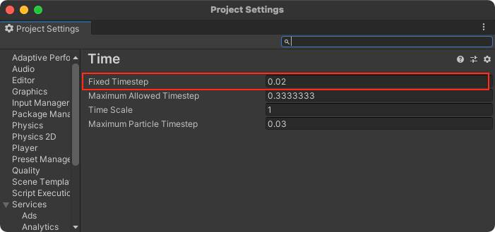 Time with Fixed Timestep 0.02.">
<p><em>VI: <code>Project Settings &gt; Time</code> — <strong>Fixed Timestep 0.02</strong> (50 Hz) · <strong>Maximum Allowed Timestep 0.3333333</strong> · <strong>Time Scale 1</strong> · <strong>Maximum Particle Timestep 0.03</strong>. / EN: Project Settings > Time with Fixed Timestep 0.02.</em></p>

<div class="bilingual-row">
<div class="col-vi">
<p>⏱️ <em>"<code>FixedUpdate</code> của MonoBehaviour chạy ở <strong>THỜI GIAN CỐ ĐỊNH</strong>, khác <code>Update</code>. <strong>Physics engine GỌI FixedUpdate NHIỀU LẦN trong MỘT FRAME để KHỚP thời gian trôi qua trong thế giới GAME với thời gian trong thế giới PHYSICS ENGINE. Do đó, giá trị Fixed Timestep CÀNG NHỎ thì FixedUpdate CÀNG ĐƯỢC GỌI NHIỀU LẦN, gây TẢI.</strong>"</em></p>
<p>📍 Đặt tại <strong>Project Settings → Fixed Timestep</strong>, đơn vị GIÂY. <strong>Giá trị MẶC ĐỊNH là 0.02, tức 20 MILLISECOND.</strong> Cũng đổi được từ script qua <code>Time.fixedDeltaTime</code>.</p>
<p>⚖️ <em>"Fixed Timestep nói chung <strong>CÀNG NHỎ thì tính toán vật lý CÀNG CHÍNH XÁC và CÀNG ÍT KHẢ NĂNG xảy ra vấn đề như MẤT VA CHẠM. Do đó, dù là ĐÁNH ĐỔI giữa ĐỘ CHÍNH XÁC và TẢI, ĐÁNG MONG MUỐN là đặt giá trị này CÀNG GẦN FPS MỤC TIÊU CÀNG TỐT mà không gây vấn đề hành vi game.</strong>"</em></p>
</div>
<div class="col-en">
<p>⏱️ <em>"MonoBehaviour's <code>FixedUpdate</code> runs at a <strong>FIXED TIME</strong>, unlike <code>Update</code>. <strong>The physics engine calls FixedUpdate MULTIPLE TIMES in ONE FRAME to match the elapsed time in the GAME world with the time in the PHYSICS ENGINE world. Therefore, the SMALLER the value of Fixed Timestep, the MORE TIMES FixedUpdate is called, which causes load.</strong>"</em></p>
<p>📍 Set in <strong>Project Settings → Fixed Timestep</strong>, in SECONDS. <strong>The default value is 0.02, or 20 MILLISECONDS.</strong> It can also be changed via <code>Time.fixedDeltaTime</code>.</p>
<p>⚖️ <em>"Fixed Timestep is generally <strong>SMALLER = MORE ACCURATE physics and LESS LIKELY that problems such as collision loss will occur. Therefore, although it is a TRADEOFF between accuracy and load, it is desirable to set this value AS CLOSE TO THE TARGET FPS AS POSSIBLE without causing game behavior problems.</strong>"</em></p>
</div>
</div>

!!! danger "💀 "NEGATIVE SPIRAL" — vòng xoáy chết người của physics engine"
    <div class="bilingual-row">
    <div class="col-vi">
    <p><em>"Như đã nói, <strong>Fixed Update được gọi NHIỀU LẦN dựa trên THỜI GIAN TRÔI QUA từ frame trước. NẾU thời gian trôi qua từ frame trước LỚN — ví dụ do RENDER NẶNG ở một frame nào đó — Fixed Update sẽ được gọi NHIỀU HƠN BÌNH THƯỜNG ở frame đó.</strong>"</em></p>
    <p>🔢 <strong>VÍ DỤ TÍNH TOÁN:</strong> <em>"<strong>Nếu Fixed Timestep là 20 MILLISECOND và frame trước tốn 200 MILLISECOND, Fixed Update sẽ được gọi 10 LẦN.</strong>"</em></p>
    <p>💀 <em>"<strong>Nghĩa là NẾU MỘT frame bị RỚT, CHI PHÍ phép tính vật lý ở frame TIẾP THEO sẽ CAO HƠN. Điều này LÀM TĂNG RỦI RO frame đó CŨNG THẤT BẠI, và LẦN LƯỢT khiến phép tính vật lý ở frame kế tiếp NẶNG HƠN NỮA — hiện tượng được biết đến trong thế giới physics engine là "NEGATIVE SPIRAL" (VÒNG XOÁY TIÊU CỰC).</strong>"</em></p>
    <p>✅ <strong>GIẢI PHÁP — <code>Maximum Allowed Timestep</code>:</strong> <em>"Unity cho phép người dùng đặt <strong>Maximum Allowed Timestep — LƯỢNG THỜI GIAN TỐI ĐA mà phép tính vật lý có thể dùng TRONG MỘT FRAME. Giá trị này MẶC ĐỊNH là 0.33 GIÂY, nhưng bạn có thể muốn đặt nó GẦN với FPS MỤC TIÊU HƠN để GIỚI HẠN số lần gọi Fixed Update và ỔN ĐỊNH frame rate.</strong>"</em></p>
    </div>
    <div class="col-en">
    <p><em>"<strong>If the elapsed time from the previous frame is LARGE, for example due to HEAVY RENDERING in a certain frame, Fixed Update will be called MORE OFTEN than usual in that frame.</strong>"</em></p>
    <p>🔢 <strong>Worked example:</strong> <em>"<strong>If Fixed Timestep is 20 milliseconds and the previous frame took 200 milliseconds, Fixed Update will be called 10 TIMES.</strong>"</em></p>
    <p>💀 <em>"<strong>This means that if ONE frame is dropped, the COST of physics operations in the NEXT frame will be HIGHER. This INCREASES THE RISK that the frame will ALSO fail, which in turn makes the physics operations in the next frame HEAVIER — a phenomenon known in the physics engine world as a "NEGATIVE SPIRAL".</strong>"</em></p>
    <p>✅ <strong>The fix — <code>Maximum Allowed Timestep</code>:</strong> <em>"Unity allows the user to set the <strong>Maximum Allowed Timestep, which is the MAXIMUM AMOUNT OF TIME that physics operations can use in a SINGLE FRAME. This value defaults to 0.33 SECONDS, but you may want to set it CLOSER TO THE TARGET FPS to limit the number of Fixed Update calls and STABILIZE the frame rate.</strong>"</em></p>
    </div>
    </div>

### 28.7. 🔺 Collision Shape & Collision Matrix

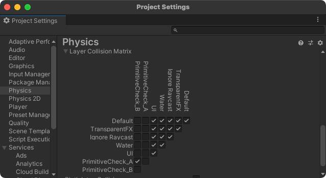
<p><em>VI: <strong>Layer Collision Matrix</strong> — bỏ tick các cặp layer KHÔNG cần va chạm; layer bị bỏ tick <strong>CŨNG BỊ LOẠI khỏi BROAD PHASE</strong>. / EN: The Layer Collision Matrix in Physics settings.</em></p>

<div class="bilingual-row">
<div class="col-vi">
<p>💰 <em>"Chi phí xử lý phát hiện va chạm <strong>PHỤ THUỘC vào HÌNH DẠNG collision và TÌNH HUỐNG của nó. Dù KHÓ nói CHÍNH XÁC nó tốn bao nhiêu, một QUY TẮC KINH NGHIỆM ĐÁNG NHỚ là các loại collision sau xếp theo chi phí GIẢM DẦN:</strong>"</em></p>
</div>
<div class="col-en">
<p>💰 <em>"The processing cost of collision detection <strong>DEPENDS on the SHAPE of the collision and its SITUATION. Although it is difficult to say exactly how much it will cost, a good RULE OF THUMB to remember is that the following collision types are in order of DECREASING cost:</strong>"</em></p>
</div>
</div>

> 🥇 **`sphere collider`** → **`capsule collider`** → **`box collider`** → **`mesh collider`** (chi phí GIẢM DẦN theo thứ tự sách viết; ⚠️ nhưng sách cũng nhấn mạnh: *"trong các hình dạng này, **mesh collider ĐẶC BIỆT NẶNG TẢI**"*).

<div class="bilingual-row">
<div class="col-vi">
<p>💡 <em>"Ví dụ, <strong>capsule collider thường được dùng để XẤP XỈ hình dạng nhân vật hình người, NHƯNG NẾU CHIỀU CAO KHÔNG PHẢI YẾU TỐ trong đặc tả game, THAY nó bằng sphere collider sẽ cho CHI PHÍ PHÁN ĐOÁN VA CHẠM NHỎ HƠN.</strong>"</em></p>
<p>✅ <em>"<strong>TRƯỚC HẾT hãy cân nhắc liệu sphere collider, capsule collider, hay box collider VÀ CÁC TỔ HỢP của chúng có dùng được không. NẾU vẫn BẤT TIỆN, HÃY dùng mesh collider.</strong>"</em></p>
</div>
<div class="col-en">
<p>💡 <em>"For example, <strong>the capsule collider is often used to approximate the shape of a humanoid character, but if HEIGHT is NOT a factor in the game specifications, REPLACING it with a SPHERE collider will result in a SMALLER cost of judging a hit.</strong>"</em></p>
<p>✅ <em>"<strong>First, consider whether a sphere collider, capsule collider, or box collider AND ITS COMBINATIONS can be used to prepare collisions. If this is still inconvenient, use a mesh collider.</strong>"</em></p>
</div>
</div>

!!! success "🏆 Collision Matrix — "CÁCH HIỆU QUẢ NHẤT" theo lời sách"
    <div class="bilingual-row">
    <div class="col-vi">
    <p><em>"Physics có cài đặt gọi là <strong>"collision matrix"</strong> ĐỊNH NGHĨA <strong>LAYER NÀO của game object có thể VA CHẠM với nhau</strong> (Project Settings → Physics → Layer Collision Matrix). Nếu <strong>ô tick ở GIAO ĐIỂM hai layer được TICK, hai layer đó SẼ VA CHẠM.</strong>"</em></p>
    <p>🏆 <em>"<strong>Thực hiện ĐÚNG cài đặt này là CÁCH HIỆU QUẢ NHẤT để LOẠI BỎ các phép tính giữa những object KHÔNG CẦN va chạm, vì các layer KHÔNG va chạm CŨNG BỊ LOẠI KHỎI phép tính SƠ BỘ — thứ đưa ra phán đoán THÔ trên object, gọi là BROAD PHASE.</strong>"</em></p>
    <p>✅ <em>"Xét về hiệu năng, <strong>NÊN CÓ MỘT LAYER CHUYÊN DỤNG cho các phép tính vật lý và BỎ TICK TẤT CẢ ô giữa các layer KHÔNG CẦN va chạm.</strong>"</em></p>
    </div>
    <div class="col-en">
    <p><em>"Physics has a setting called <strong>"collision matrix"</strong> that defines <strong>WHICH LAYERS of game objects can COLLIDE with each other.</strong> The Collision Matrix indicates that <strong>if the checkboxes at the INTERSECTION of two layers are CHECKED, those layers will collide.</strong>"</em></p>
    <p>🏆 <em>"<strong>PROPERLY performing this setting is the MOST EFFICIENT way to ELIMINATE calculations between objects that do not need to collide, since layers that do not collide are ALSO EXCLUDED from the pre-calculation that takes a rough hit on the object, called the BROAD PHASE.</strong>"</em></p>
    <p>✅ <em>"For performance considerations, <strong>it is preferable to have a DEDICATED LAYER for physics calculations and UNCHECK ALL checkboxes between layers that do not need to collide.</strong>"</em></p>
    </div>
    </div>

### 28.8. 🎯 Raycast Optimization

<div class="bilingual-row">
<div class="col-vi">
<p>⚠️ <em>"Raycasting là chức năng hữu ích cho phép <strong>lấy thông tin va chạm giữa tia bạn bắn ra và các collider bị chạm, NHƯNG nó CŨNG có thể là NGUỒN GÂY TẢI.</strong>"</em></p>
<p>🔺 <strong>Loại raycast:</strong> <em>"Ngoài <code>Physics.Raycast</code> phán đoán va chạm với ĐOẠN THẲNG, còn có các method khác như <code>Physics.SphereCast</code> phán đoán va chạm với HÌNH DẠNG KHÁC. <strong>TUY NHIÊN, HÌNH DẠNG cần phán đoán CÀNG PHỨC TẠP thì TẢI CÀNG CAO. Xét về hiệu năng, NÊN dùng CHỈ <code>Physics.Raycast</code> càng nhiều càng tốt.</strong>"</em></p>
</div>
<div class="col-en">
<p>⚠️ <em>"Raycasting is a useful feature that allows you to <strong>get collision information between rays you fly and colliding colliders, BUT it can ALSO be a SOURCE OF LOAD.</strong>"</em></p>
<p>🔺 <strong>Types:</strong> <em>"In addition to <code>Physics.Raycast</code>, which determines collision with a LINE SEGMENT, there are other methods such as <code>Physics.SphereCast</code>. <strong>However, the MORE COMPLEX the shape to be judged, the HIGHER the load. Considering performance, it is advisable to use ONLY <code>Physics.Raycast</code> as much as possible.</strong>"</em></p>
</div>
</div>

**HAI tham số TỐI ƯU mà nhiều người BỎ QUA:**

| Tham số | 💀 Nếu BỎ QUA | ✅ Nên làm |
|---|---|---|
| **`maxDistance`** | *"**`Mathf.Infinity` được truyền làm GIÁ TRỊ MẶC ĐỊNH**, và một nỗ lực phán đoán trên **TIA RẤT DÀI** được thực hiện. Tia như vậy có thể **ẢNH HƯỞNG TIÊU CỰC tới BROAD PHASE, hoặc CHẠM vào object VỐN KHÔNG CẦN chạm.**"* | *"**ĐỪNG chỉ định khoảng cách LỚN HƠN mức cần thiết.**"* |
| **`layerMask`** | *"Giá trị mặc định là **`Physics.DefaultRaycastLayers`, va chạm với TẤT CẢ layer NGOẠI TRỪ `Ignore Raycast`**"* | *"**Cũng TRÁNH bật bit ở các layer KHÔNG CẦN chạm. Giống collision matrix, layer KHÔNG có bit CŨNG BỊ LOẠI KHỎI BROAD PHASE, do đó GIẢM chi phí tính toán. HÃY CHẮC CHẮN chỉ định cả tham số này.**"* |

<div class="bilingual-row">
<div class="col-vi">
<p>💀 <strong><code>RaycastAll</code> gây GC Alloc:</strong> <em>"<code>Physics.Raycast</code> trả về thông tin va chạm cho MỘT trong các collider, nhưng <strong><code>Physics.RaycastAll</code> có thể dùng để lấy NHIỀU thông tin va chạm. <code>Physics.RaycastAll</code> trả về thông tin va chạm bằng cách CẤP PHÁT ĐỘNG một MẢNG các struct <code>RaycastHit</code>. Do đó, MỖI LẦN gọi method này sẽ dẫn tới GC ALLOC, có thể gây SPIKE do GC.</strong>"</em></p>
<p>✅ <em>"Để tránh, có method <strong><code>Physics.RaycastNonAlloc</code></strong> — khi được truyền một mảng ĐÃ CẤP PHÁT làm tham số, nó GHI KẾT QUẢ vào mảng đó và trả về."</em></p>
<p>🚨 <strong>QUY TẮC VÀNG:</strong> <em>"<strong>Xét về hiệu năng, GC Alloc KHÔNG NÊN xảy ra bên trong <code>FixedUpdate</code> BẤT CỨ KHI NÀO CÓ THỂ.</strong>"</em></p>
<p>💡 <em>"<strong>GC.Alloc có thể được TRÁNH TRỪ lúc KHỞI TẠO MẢNG, bằng cách DUY TRÌ mảng ghi kết quả trong một FIELD của class, POOLING, hoặc cơ chế khác, rồi TRUYỀN mảng đó cho <code>Physics.RaycastNonAlloc</code>.</strong>"</em></p>
</div>
<div class="col-en">
<p>💀 <strong><code>RaycastAll</code> causes GC Alloc:</strong> <em>"<code>Physics.Raycast</code> returns collision information for ONE of the colliding colliders, but <strong><code>Physics.RaycastAll</code> can be used to obtain MULTIPLE collision information. It returns collision information by DYNAMICALLY ALLOCATING an array of <code>RaycastHit</code> structures. Therefore, EACH CALL to this method will result in a GC ALLOC, which can cause SPIKES due to GC.</strong>"</em></p>
<p>✅ <em>"To avoid this problem, there is a method called <strong><code>Physics.RaycastNonAlloc</code></strong> that, when passed an ALLOCATED array as an argument, WRITES the result to that array and returns it."</em></p>
<p>🚨 <strong>The golden rule:</strong> <em>"<strong>For performance considerations, GC Alloc should NOT occur within <code>FixedUpdate</code> WHENEVER POSSIBLE.</strong>"</em></p>
<p>💡 <em>"<strong>GC.Alloc can be avoided EXCEPT during ARRAY INITIALIZATION by maintaining the array in a CLASS FIELD, POOLING, or other mechanism, and passing that array to <code>Physics.RaycastNonAlloc</code>.</strong>"</em></p>
</div>
</div>

**List 6.1 — dùng `Physics.RaycastNonAlloc` ĐÚNG CÁCH:**

```csharp
// Starting point to skip ray
var origin = transform.origin;
// Direction of ray
var direction = Vector3.forward;
// Length of ray
var maxDistance = 3.0f;
// The layer with which the ray will collide
var layerMask = 1 << LayerMask.NameToLayer("Player");

// An array to store the ray-cast collision results
// This array can be allocated in advance during initialization or
// or use the one allocated in the pool.
// The maximum number of ray-cast results must be determined in advance
// private const int kMaxResultCount = 100;
// private readonly RaycastHit[] _results = new RaycastHit[kMaxResultCount];

// All collision information is returned in an array.
// Return value is number of collisions
var hitCount = Physics.RaycastNonAlloc(
    origin,
    direction,
    _results,
    layerMask,
    query
);
if (hitCount > 0)
{
    Debug.Log($"{hitCount} players collided");

    // The _results array stores collision information in order.
    var firstHit = _results[0];

    // Note that indexes exceeding the number of collisions are invalid information.
}
```

### 28.9. 🧱 Ba loại Collider & trạng thái SLEEP

| Loại | Cấu tạo | Đặc tính & CẢNH BÁO |
|---|---|---|
| **Static Collider** | Có `Collider`, **KHÔNG** có `Rigidbody` | *"Được TỐI ƯU để dùng **CHỈ cho geometry LUÔN ở NGUYÊN MỘT CHỖ và KHÔNG BAO GIỜ DI CHUYỂN.**"*<br>💀 *"**Bạn KHÔNG NÊN bật/tắt static collider, CŨNG KHÔNG NÊN DI CHUYỂN hay SCALE nó trong lúc chơi. Làm vậy sẽ gây TÍNH TOÁN LẠI do THAY ĐỔI CẤU TRÚC DỮ LIỆU BÊN TRONG, có thể LÀM SUY GIẢM HIỆU NĂNG ĐÁNG KỂ.**"* |
| **Dynamic Collider** | Có **CẢ** `Collider` **và** `Rigidbody` | *"Va chạm được với object khác bởi physics engine. Cũng PHẢN ỨNG với va chạm và LỰC tác dụng bằng cách thao tác `Rigidbody` từ script. **Đây là collider ĐƯỢC DÙNG PHỔ BIẾN NHẤT trong game cần physics.**"* |
| **Kinematic Dynamic Collider** | `Collider` + `Rigidbody` với **`isKinematic` BẬT** | *"**DI CHUYỂN được bằng cách thao tác TRỰC TIẾP `Transform`, NHƯNG KHÔNG bằng cách áp dụng va chạm hay lực qua `Rigidbody`** như dynamic collider thường."*<br>✅ *"Dùng để **TỐI ƯU physics khi bạn muốn CHUYỂN ĐỔI việc thực thi phép tính vật lý, hoặc cho CHƯỚNG NGẠI VẬT như CỬA — thứ bạn muốn di chuyển THỈNH THOẢNG chứ không phải ĐA SỐ THỜI GIAN.**"* |

<div class="bilingual-row">
<div class="col-vi">
<p>😴 <strong>Trạng thái SLEEP:</strong> <em>"Như một phần của tối ưu, <strong>physics engine XÁC ĐỊNH rằng nếu một object gắn `Rigidbody` KHÔNG DI CHUYỂN trong MỘT KHOẢNG THỜI GIAN NHẤT ĐỊNH, object đó được coi là NGỦ ĐÔNG và trạng thái bên trong đổi sang SLEEP. Chuyển sang sleep GIẢM THIỂU chi phí tính toán cho object đó TRỪ KHI nó bị di chuyển bởi ngoại lực, va chạm, hoặc sự kiện khác.</strong>"</em></p>
<p>✅ <em>"Do đó, <strong>các object gắn `Rigidbody` mà KHÔNG CẦN di chuyển NÊN được chuyển sang trạng thái sleep BẤT CỨ KHI NÀO CÓ THỂ để GIẢM chi phí tính toán vật lý.</strong>"</em></p>
</div>
<div class="col-en">
<p>😴 <strong>The sleep state:</strong> <em>"As part of the optimization, <strong>the physics engine determines that if an object with a `Rigidbody` does NOT MOVE for a certain period of time, the object is considered DORMANT and its internal state is changed to SLEEP. Moving to the sleep state MINIMIZES the computational cost for that object UNLESS it is moved by an external force, collision, or other event.</strong>"</em></p>
<p>✅ <em>"Therefore, <strong>objects with a `Rigidbody` that do NOT need to move can be transitioned to the sleep state whenever possible to REDUCE the computational cost of physics calculations.</strong>"</em></p>
</div>
</div>

!!! info "🎚️ `Sleep Threshold` — ĐÁNH ĐỔI giữa CHI PHÍ và CẢM GIÁC"
    <div class="bilingual-row">
    <div class="col-vi">
    <p>📍 Đặt tại <strong>Project Settings → Physics → Sleep Threshold</strong>, hoặc riêng từng object qua <strong><code>Rigidbody.sleepThreshold</code></strong>.</p>
    <p>📐 <em>"<strong>Sleep Threshold biểu diễn ĐỘNG NĂNG CHUẨN HOÁ THEO KHỐI LƯỢNG (mass-normalized kinetic energy) của object khi nó đi ngủ.</strong>"</em></p>
    <p>⚖️ <em>"<strong>Giá trị này CÀNG LỚN thì object CÀNG NHANH đi ngủ, do đó GIẢM chi phí tính toán. TUY NHIÊN, object có thể TRÔNG NHƯ DỪNG ĐỘT NGỘT vì nó có xu hướng đi ngủ NGAY CẢ KHI ĐANG DI CHUYỂN CHẬM. Nếu GIẢM giá trị này, hiện tượng trên ÍT XẢY RA HƠN, nhưng ngược lại object KHÓ đi ngủ HƠN.</strong>"</em></p>
    <p>🔍 <em>"Trạng thái sleep kiểm tra được bằng <strong><code>Rigidbody.IsSleeping</code></strong>. <strong>TỔNG SỐ component `Rigidbody` ĐANG HOẠT ĐỘNG trên scene kiểm tra được từ mục Physics trong profiler.</strong>"</em></p>
    </div>
    <div class="col-en">
    <p>📍 Set in <strong>Project Settings → Physics → Sleep Threshold</strong>, or per object via <strong><code>Rigidbody.sleepThreshold</code></strong>.</p>
    <p>📐 <em>"<strong>Sleep Threshold represents the MASS-NORMALIZED KINETIC ENERGY of the object when it goes to sleep.</strong>"</em></p>
    <p>⚖️ <em>"<strong>The LARGER this value is, the FASTER the object will go to sleep, thus REDUCING the computational cost. However, the object may appear to come to an ABRUPT STOP because it tends to go to sleep EVEN WHEN MOVING SLOWLY. If this value is reduced, the above phenomenon is LESS LIKELY to occur, but on the other hand, it is MORE DIFFICULT for the object to go to sleep.</strong>"</em></p>
    <p>🔍 <em>"Whether `Rigidbody` is in sleep mode can be checked with <strong><code>Rigidbody.IsSleeping</code></strong>. <strong>The total number of active `Rigidbody` components in the scene can be checked from the Physics item in the profiler.</strong>"</em></p>
    </div>
    </div>

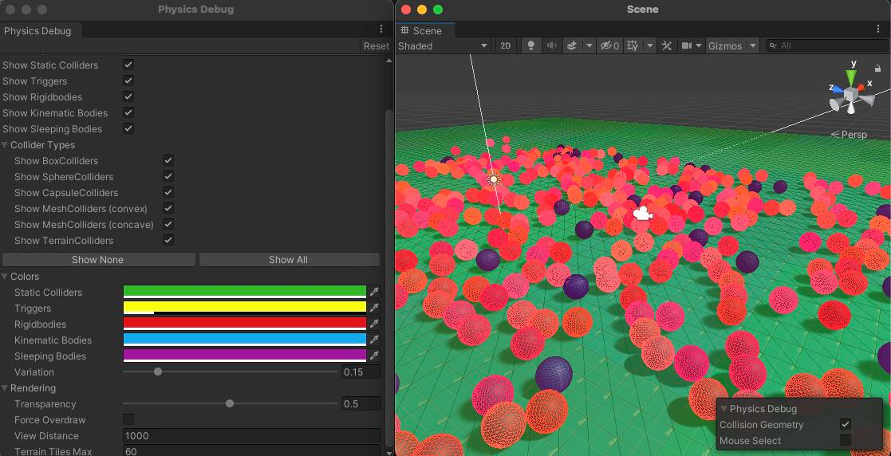

<p><em>VI: <strong>Physics Debugger</strong> — cửa sổ trái cho phép bật/tắt <strong>Show Static Colliders / Triggers / Rigidbodies / Kinematic Bodies / Sleeping Bodies</strong> và lọc theo loại collider (<strong>Box / Sphere / Capsule / MeshColliders (convex) / MeshColliders (concave) / Terrain</strong>). Bảng <strong>Colors</strong> gán màu: <strong>Static Colliders = XANH LÁ, Triggers = VÀNG, Rigidbodies = ĐỎ, Kinematic Bodies = XANH DƯƠNG, Sleeping Bodies = TÍM</strong> (Transparency 0.5, View Distance 1000). Scene bên phải: hàng trăm quả cầu ĐỎ (rigidbody đang HOẠT ĐỘNG) xen lẫn quả TÍM (đã SLEEP) trên nền XANH LÁ (static collider). 🔑 Đây là cách NHÌN THẤY TRỰC TIẾP object nào còn tốn chi phí physics. / EN: The Physics Debugger — colour-coded collider states; purple spheres are already asleep, red ones still cost simulation time.</em></p>

### 28.10. 🎲 Collision Detection — bốn thuật toán

<div class="bilingual-row">
<div class="col-vi">
<p>🧮 <em>"Component `Rigidbody` cho phép chọn thuật toán dùng cho phát hiện va chạm ở mục <strong>Collision Detection</strong>. <strong>Tính tới Unity 2020.3, có BỐN tuỳ chọn: Discrete, Continuous, Continuous Dynamic, Continuous Speculative.</strong>"</em></p>
<p>📖 <em>"<strong>Discrete là phát hiện va chạm RỜI RẠC, các cái còn lại thuộc phát hiện va chạm LIÊN TỤC.</strong>"</em></p>
</div>
<div class="col-en">
<p>🧮 <em>"The `Rigidbody` component allows you to select the algorithm used for collision detection in the <strong>Collision Detection</strong> item. <strong>As of Unity 2020.3, there are FOUR options: Discrete, Continuous, Continuous Dynamic, Continuous Speculative.</strong>"</em></p>
<p>📖 <em>"<strong>Discrete is DISCRETE collision detection and the others belong to CONTINUOUS collision detection.</strong>"</em></p>
</div>
</div>

| Thuật toán | Cơ chế | Chi phí | Ghi chú |
|---|---|---|---|
| **Discrete** | *"**Dịch chuyển tức thời (teleport) object RỜI RẠC ở MỖI simulation, và phát hiện va chạm được thực hiện SAU KHI TẤT CẢ object đã di chuyển.**"* | 🥇 **THẤP NHẤT** | 💀 *"**CÓ KHẢ NĂNG BỎ SÓT va chạm, ĐẶC BIỆT nếu object di chuyển TỐC ĐỘ CAO, khiến object XUYÊN QUA nhau.**"* ✅ *"**Để tối ưu hiệu năng, hãy TẠO hành vi game sao cho Discrete CÓ THỂ được chọn BẤT CỨ KHI NÀO CÓ THỂ.**"* |
| **Continuous** | *"Tính đến va chạm giữa các object **TRƯỚC và SAU khi chúng di chuyển**, do đó **NGĂN object di chuyển nhanh XUYÊN QUA**."* | ⬆️ **CAO HƠN Discrete** | *"Dùng được cho tổ hợp **Dynamic Collider và Static Collider**"* |
| **Continuous Dynamic** | *"Bật phát hiện va chạm liên tục **KỂ CẢ với dynamic collider**"* | 💀 **CAO HƠN NỮA** | ✅ *"Nếu bạn **CHỈ muốn xét va chạm giữa dynamic và static collider — tức nhân vật CHẠY QUANH SÂN — hãy chọn Continuous Dynamic.**"* |
| **Continuous Speculative** | Va chạm liên tục **speculative** giữa các dynamic collider | ✅ *"**ÍT TỐN TÍNH TOÁN HƠN Continuous Dynamic**"* | 🚨 *"**PHẢI được đưa vào một cách THẬN TRỌNG do hiện tượng gọi là "GHOST COLLISION" (VA CHẠM MA), xảy ra khi NHIỀU collider VA CHẠM VỚI NHAU Ở KHOẢNG CÁCH GẦN.**"* |

### 28.11. ⚙️ Hai project setting ẢNH HƯỞNG LỚN

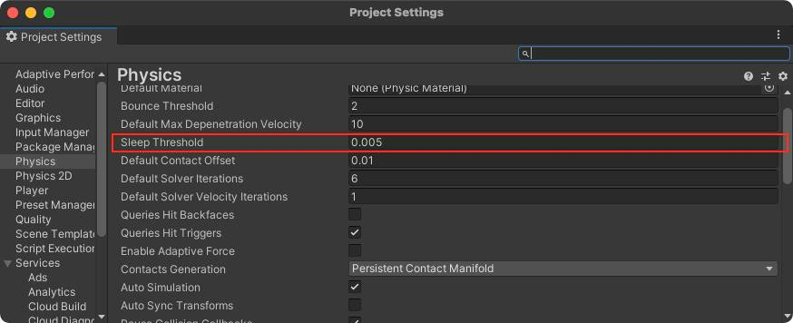 Physics with Sleep Threshold 0.005.">
<p><em>VI: <code>Project Settings &gt; Physics</code> — <strong>Sleep Threshold 0.005</strong> · Default Contact Offset 0.01 · <strong>Default Solver Iterations 6</strong> · Default Solver Velocity Iterations 1 · <strong>Auto Simulation ✓ · Auto Sync Transforms ✓</strong> · Contacts Generation: Persistent Contact Manifold. / EN: Project Settings > Physics with Sleep Threshold 0.005.</em></p>

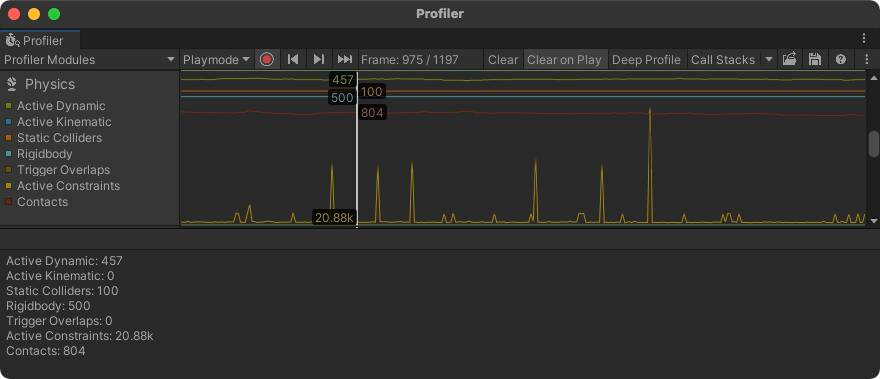
<p><em>VI: <strong>Physics module</strong> của Profiler — <strong>Active Dynamic 457 · Active Kinematic 0 · Static Colliders 100 · Rigidbody 500 · Trigger Overlaps 0 · Active Constraints 20.88k · Contacts 804</strong>. / EN: The Physics Profiler module counters.</em></p>

!!! warning "⚠️ `Physics.autoSyncTransforms` — thủ phạm gây SPIKE ở project cũ"
    <div class="bilingual-row">
    <div class="col-vi">
    <p><em>"Ở các phiên bản <strong>TRƯỚC Unity 2018.3</strong>, <strong>vị trí của physics engine được TỰ ĐỘNG ĐỒNG BỘ với `Transform` MỖI KHI một API vật lý như `Physics.Raycast` được gọi. Tiến trình này TƯƠNG ĐỐI NẶNG và có thể gây SPIKE khi gọi API cho các phép tính vật lý.</strong>"</em></p>
    <p>✅ <em>"Để khắc phục, cài đặt <strong><code>Physics.autoSyncTransforms</code></strong> đã được thêm <strong>từ Unity 2018.3. Đặt giá trị này là <code>false</code> sẽ NGĂN tiến trình đồng bộ `Transform` nói trên khi gọi physics API.</strong>"</em></p>
    <p>💀 <strong>HỆ QUẢ phải biết:</strong> <em>"<strong>Đồng bộ `Transform` sẽ được thực hiện SAU KHI `FixedUpdate` được gọi trong physics simulation. Nghĩa là NẾU bạn DI CHUYỂN collider rồi THỰC HIỆN RAYCAST tại vị trí MỚI của collider, RAYCAST SẼ KHÔNG TRÚNG COLLIDER.</strong>"</em></p>
    </div>
    <div class="col-en">
    <p><em>"In versions <strong>PRIOR to Unity 2018.3</strong>, <strong>the position of the physics engine was AUTOMATICALLY SYNCHRONIZED with `Transform` EACH TIME an API for physics operations such as `Physics.Raycast` was called. This process is RELATIVELY HEAVY and can cause SPIKES.</strong>"</em></p>
    <p>✅ <em>"To work around this, a setting called <strong><code>Physics.autoSyncTransforms</code></strong> has been added <strong>since Unity 2018.3. Setting this value to <code>false</code> will PREVENT the `Transform` synchronization process when calling the physics API.</strong>"</em></p>
    <p>💀 <strong>The consequence:</strong> <em>"<strong>Synchronization of `Transform` will be performed AFTER `FixedUpdate` is called during physics simulation. This means that if you MOVE the collider and then perform a RAYCAST on the NEW position of the collider, THE RAYCAST WILL NOT HIT THE COLLIDER.</strong>"</em></p>
    </div>
    </div>

!!! danger "💀 `Physics.reuseCollisionCallbacks` — KIỂM TRA NGAY nếu project của bạn CŨ"
    <div class="bilingual-row">
    <div class="col-vi">
    <p><em>"<strong>TRƯỚC Unity 2018.3, MỖI KHI một event được gọi để nhận collision call cho một component `Collider` như `OnCollisionEnter`, một INSTANCE `Collision` MỚI của tham số được TẠO RA và TRUYỀN VÀO, DẪN TỚI GC ALLOC.</strong>"</em></p>
    <p>✅ <em>"Vì hành vi này có thể ẢNH HƯỞNG TIÊU CỰC tới hiệu năng game <strong>tuỳ theo TẦN SUẤT event được gọi</strong>, một property mới <strong><code>Physics.reuseCollisionCallbacks</code></strong> đã được phơi ra <strong>từ 2018.3. Đặt giá trị này là <code>true</code> sẽ TRIỆT TIÊU GC Alloc vì nó DÙNG LẠI (reuse) instance `Collision` BÊN TRONG khi gọi event.</strong>"</em></p>
    <p>🚨 <em>"Cài đặt này có <strong>giá trị mặc định <code>true</code> ở 2018.3 trở lên</strong>, ổn nếu bạn tạo project với phiên bản Unity TƯƠNG ĐỐI MỚI. <strong>NHƯNG NẾU bạn tạo project với phiên bản TRƯỚC 2018.3, giá trị này CÓ THỂ ĐANG LÀ <code>false</code>. NẾU cài đặt này bị TẮT, BẠN NÊN BẬT NÓ rồi SỬA CODE để game chạy ĐÚNG.</strong>"</em></p>
    </div>
    <div class="col-en">
    <p><em>"<strong>Prior to Unity 2018.3, EVERY TIME an event was called to receive a collision call for a `Collider` component such as `OnCollisionEnter`, a NEW `Collision` INSTANCE of the argument was CREATED and PASSED, resulting in a GC ALLOC.</strong>"</em></p>
    <p>✅ <em>"Since this behavior can have a negative impact <strong>depending on HOW OFTEN events are called</strong>, a new property <strong><code>Physics.reuseCollisionCallbacks</code></strong> has been exposed <strong>since 2018.3. Setting this value to <code>true</code> will SUPPRESS GC Alloc as it internally REUSES the `Collision` instance passed around when calling events.</strong>"</em></p>
    <p>🚨 <em>"This setting has a <strong>default value of `true` in 2018.3 and later</strong>. <strong>But if you created your project with a version PRIOR to 2018.3, this value may be set to `false`. If this setting is DISABLED, you should ENABLE IT and then MODIFY YOUR CODE so that the game runs correctly.</strong>"</em></p>
    </div>
    </div>

---

## 29. 🎨 GRAPHICS (Chương 7) & 🖱️ UI (Chương 8)

👉 *Nhiều mục dưới đây ĐÃ được phủ ở [Module 3](../03-senior/01-memory-addressables-networking.md) và [Module 4](../04-tech-lead/01-gpu-urp-advanced-rendering.md). Ở đây giữ lại các ĐIỀU KIỆN, CON SỐ và CẢNH BÁO riêng của CyberAgent.*

### 29.1. 📐 Resolution Tuning — cách RẺ NHẤT để cứu fragment shader

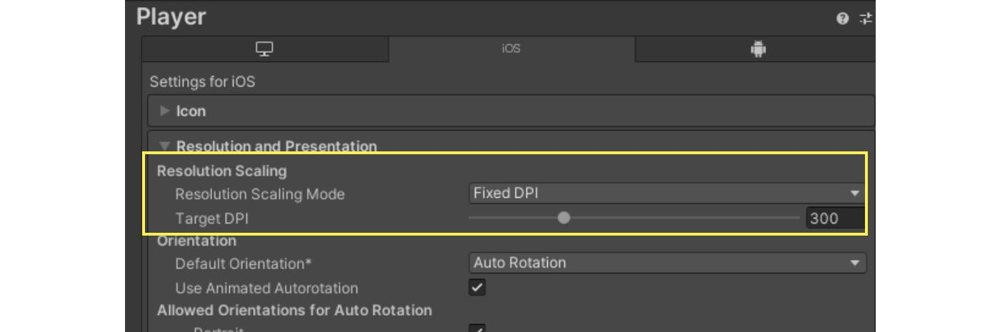
<p><em>VI: <code>Player Settings &gt; Resolution Scaling</code> — <strong>Resolution Scaling Mode: Fixed DPI</strong>, <strong>Target DPI: 300</strong>. / EN: Player Settings' Resolution Scaling Mode set to Fixed DPI 300.</em></p>

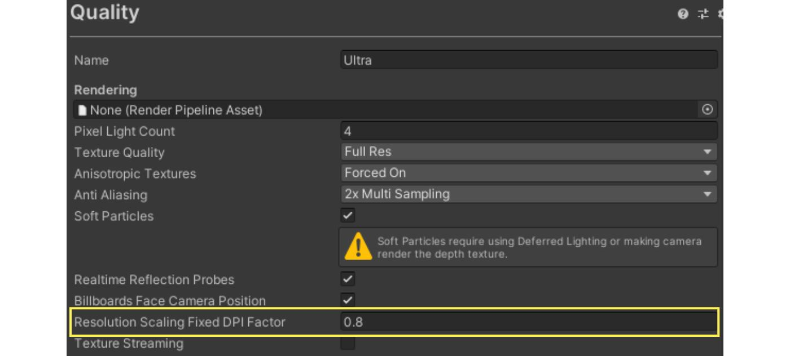
<p><em>VI: <code>Quality Settings</code> — <strong>Resolution Scaling Fixed DPI Factor 0.8</strong>, cùng <strong>Pixel Light Count 4 · Texture Quality Full Res · Anisotropic Textures Forced On · Anti Aliasing 2x Multi Sampling</strong>. / EN: Quality Settings with Resolution Scaling Fixed DPI Factor 0.8.</em></p>

<div class="bilingual-row">
<div class="col-vi">
<p>🔑 <em>"Trong rendering pipeline, <strong>CHI PHÍ của fragment shader TĂNG TỈ LỆ THUẬN với ĐỘ PHÂN GIẢI mà chúng được render. ĐẶC BIỆT với độ phân giải màn hình CAO của thiết bị di động ngày nay, CẦN THIẾT phải điều chỉnh độ phân giải render về giá trị PHÙ HỢP.</strong>"</em></p>
<p>⚙️ <strong>DPI Settings:</strong> <em>"Nếu <strong><code>Resolution Scaling Mode</code></strong> (trong phần liên quan độ phân giải của Player Settings cho nền tảng mobile) được đặt là <strong><code>Fixed DPI</code></strong>, độ phân giải có thể được GIẢM để nhắm tới một <strong>DPI (dots per inch)</strong> cụ thể."</em></p>
<p>🧮 <em>"<strong>Độ phân giải CUỐI CÙNG được xác định bằng cách NHÂN giá trị <code>Target DPI</code> với giá trị <code>Resolution Scaling DPI Scale Factor</code> trong Quality Settings.</strong>"</em></p>
</div>
<div class="col-en">
<p>🔑 <em>"In the rendering pipeline, <strong>the COST of fragment shaders INCREASES IN PROPORTION to the RESOLUTION at which they are rendered. Especially with the HIGH display resolutions of today's mobile devices, it is NECESSARY to adjust the rendering resolution to an APPROPRIATE value.</strong>"</em></p>
<p>⚙️ <strong>DPI Settings:</strong> <em>"If <strong><code>Resolution Scaling Mode</code></strong>, which is included in the resolution-related section of Player Settings for mobile platforms, is set to <strong><code>Fixed DPI</code></strong>, the resolution can be reduced to target a specific DPI."</em></p>
<p>🧮 <em>"<strong>The FINAL resolution is determined by MULTIPLYING the <code>Target DPI</code> value by the <code>Resolution Scaling DPI Scale Factor</code> value in the Quality Settings.</strong>"</em></p>
</div>
</div>

**List 7.1 — đổi độ phân giải ĐỘNG từ script:**

```csharp
public void SetupResolution()
{
    var factor = 0.8f;

    // Get current resolution with Screen.width, Screen.height
    var width = (int)(Screen.width * factor);
    var height = (int)(Screen.height * factor);

    // Set Resolution
    Screen.SetResolution(width, height, true);
}
```

!!! warning "⚠️ `Screen.SetResolution` KHÔNG có tác dụng trong Editor"
    **VI:** *"Cài đặt độ phân giải ở `Screen.SetResolution` **CHỈ được phản ánh trên THIẾT BỊ THẬT. Lưu ý rằng thay đổi KHÔNG được phản ánh trong Editor.**" (Độ phân giải hiện tại lấy qua `Screen.width` / `Screen.height`, DPI qua `Screen.dpi`.)*

    **EN:** *"Resolution settings at `Screen.SetResolution` are reflected **ONLY on the actual device. Note that changes are NOT reflected in the Editor.**"*

### 29.2. 🔥 Bán trong suốt & OVERDRAW

<div class="bilingual-row">
<div class="col-vi">
<p>🔥 <em>"Việc dùng material BÁN TRONG SUỐT bị chi phối bởi <strong>OVERDRAW</strong>. Overdraw là việc <strong>vẽ MỘT fragment NHIỀU LẦN trên MỖI PIXEL của màn hình, và nó ẢNH HƯỞNG tới hiệu năng TỈ LỆ THUẬN với TẢI của fragment shader.</strong>"</em></p>
<p>💀 <em>"<strong>ĐẶC BIỆT khi MỘT SỐ LƯỢNG LỚN hạt BÁN TRONG SUỐT được sinh ra, chẳng hạn trong particle system, MỘT LƯỢNG LỚN OVERDRAW thường được tạo ra.</strong>"</em></p>
</div>
<div class="col-en">
<p>🔥 <em>"The use of TRANSLUCENT materials is controlled by <strong>OVERDRAW</strong>. Overdraw is <strong>the drawing of a fragment MULTIPLE TIMES per pixel on the screen, and it affects performance IN PROPORTION to the load on the fragment shader.</strong>"</em></p>
<p>💀 <em>"<strong>Particularly when a LARGE NUMBER of translucent particles are generated, such as in a particle system, a LARGE AMOUNT of overdraw is often generated.</strong>"</em></p>
</div>
</div>

**Bốn cách GIẢM tải vẽ do overdraw:**

<div class="bilingual-row">
<div class="col-vi">
<p>① <em>"<strong>GIẢM vùng vẽ KHÔNG CẦN THIẾT</strong> — <strong>GIẢM TỐI ĐA các vùng mà texture HOÀN TOÀN TRONG SUỐT, vì chúng CŨNG là đối tượng của việc render.</strong>"</em></p>
<p>② <em>"<strong>Dùng shader NHẸ cho các object CÓ THỂ gây overdraw.</strong>"</em></p>
<p>③ <em>"<strong>TRÁNH dùng material bán trong suốt càng nhiều càng tốt.</strong>"</em></p>
<p>④ <em>"<strong>Dùng material ĐỤC để MÔ PHỎNG diện mạo bán trong suốt — DITHERING là một kỹ thuật khác đáng cân nhắc.</strong>"</em></p>
<p>🔍 <em>"Trong Editor của Built-in Render Pipeline, <strong>đặt chế độ Scene view thành OVERDRAW — hữu ích làm CƠ SỞ để điều chỉnh overdraw.</strong>"</em></p>
</div>
<div class="col-en">
<p>① <em>"<strong>Reduce unnecessary drawing area</strong> — <strong>reduce as much as possible the number of areas where textures are COMPLETELY TRANSPARENT, as they are ALSO subject to rendering.</strong>"</em></p>
<p>② <em>"<strong>Use LIGHTWEIGHT shaders for objects that may cause overdraw.</strong>"</em></p>
<p>③ <em>"<strong>Avoid using semi-transparent materials as much as possible.</strong>"</em></p>
<p>④ <em>"<strong>Use OPAQUE materials to simulate the appearance of translucency — DITHERING is another technique to consider.</strong>"</em></p>
<p>🔍 <em>"In the Editor of the Built-in Render Pipeline, <strong>set the Scene view mode to OVERDRAW, which is useful as a basis for adjusting overdraw.</strong>"</em></p>
</div>
</div>

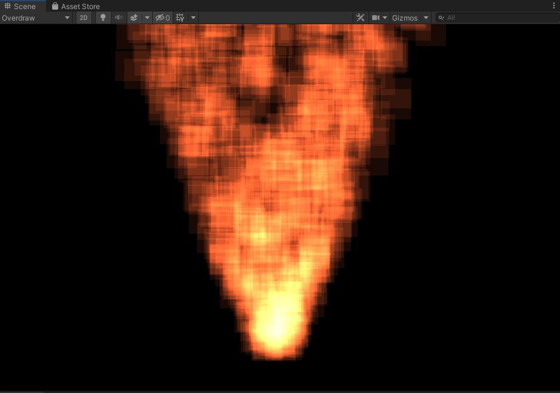

<p><em>VI: Scene view ở chế độ <strong>Overdraw</strong> — một hiệu ứng lửa từ Particle System. Vùng CÀNG SÁNG (trắng/vàng) thì pixel đó bị vẽ ĐÈ CÀNG NHIỀU LẦN; lõi ngọn lửa gần như TRẮNG XOÁ = overdraw CỰC CAO. 🚨 Đây chính là minh chứng cho câu <em>"khi MỘT SỐ LƯỢNG LỚN hạt bán trong suốt được sinh ra, MỘT LƯỢNG LỚN OVERDRAW được tạo ra"</em>. / EN: Scene view Overdraw mode on a particle fire — brighter pixels were shaded more times.</em></p>

!!! info "ℹ️ URP thì sao?"
    **VI:** *"**Universal Render Pipeline HỖ TRỢ Scene Debug View Modes được cài đặt trong URP TỪ Unity 2021.2.**"*

    **EN:** *"The Universal Render Pipeline supports the Scene Debug View Modes implemented in the Universal Render Pipeline since Unity 2021.2."*

### 29.3. 🧮 Giảm DRAW CALL — 4 cơ chế và ĐIỀU KIỆN của chúng

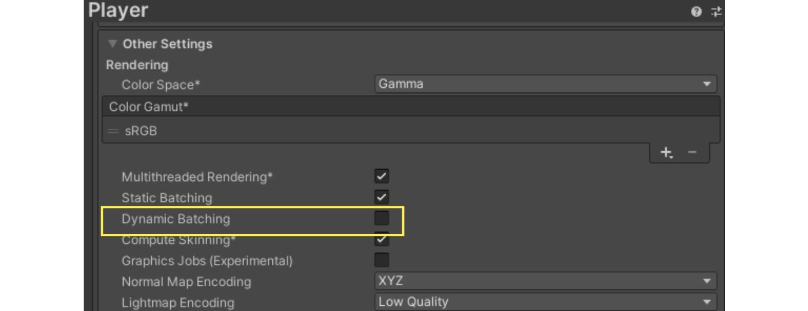
<p><em>VI: <strong>▲ <code>Player Settings › Other Settings › Rendering</code></strong> — <strong>Multithreaded Rendering ✓ · Static Batching ✓ · Dynamic Batching</strong> (ô cần cân nhắc, viền vàng) · Compute Skinning · Graphics Jobs (Experimental); phía trên là <strong>Color Space: Gamma</strong> và <strong>Lightmap Encoding: Low Quality</strong>. / EN: Player Settings Rendering with Static and Dynamic Batching.</em></p>

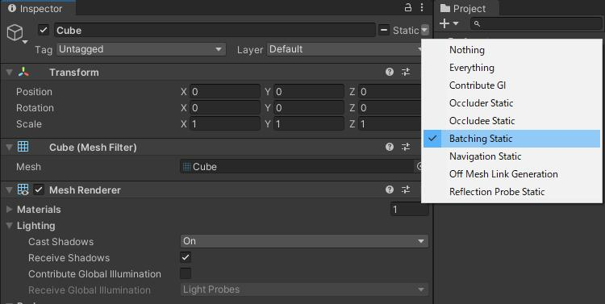
<p><em>VI: <strong>▲ Cờ Static ĐẦY ĐỦ</strong> — <strong>Nothing · Everything · Contribute GI · Occluder Static · Occludee Static · <span>Batching Static ✓</span> · Navigation Static · Off Mesh Link Generation · Reflection Probe Static</strong>. <strong>Static batching CHỈ ăn theo cờ <code>Batching Static</code></strong>, không phải cứ tick "Static" là xong. / EN: The full Static flags dropdown, with Batching Static ticked.</em></p>

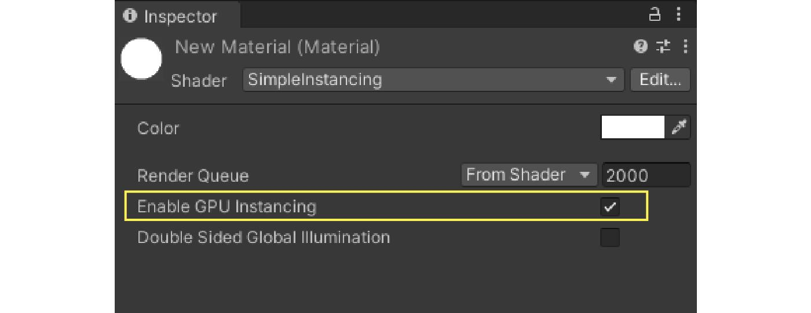
<p><em>VI: Material Inspector — <strong>Enable GPU Instancing ✓</strong>, Render Queue <strong>From Shader 2000</strong>. / EN: A Material with Enable GPU Instancing ticked.</em></p>

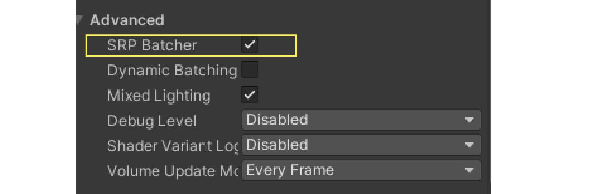
<p><em>VI: URP Asset mục <strong>Advanced</strong> — <strong>SRP Batcher ✓</strong>, <strong>Dynamic Batching ✗</strong>, Shader Variant Log Level: Disabled. / EN: The URP Asset Advanced section with SRP Batcher enabled.</em></p>

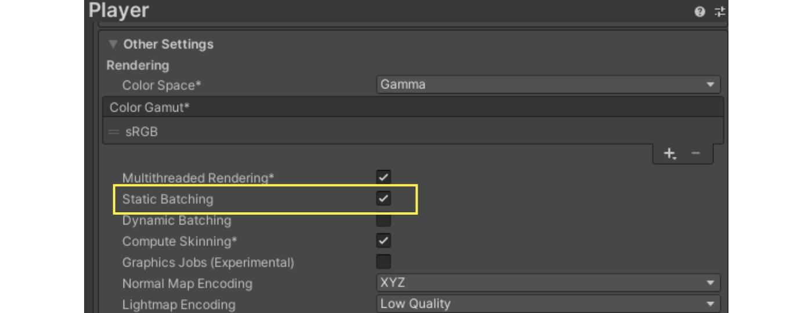
<p><em>VI: <code>Player Settings &gt; Other Settings &gt; Rendering</code> — <strong>Static Batching ✓</strong> (khung vàng), <strong>Dynamic Batching ✗</strong>, cùng <strong>Multithreaded Rendering ✓ · Compute Skinning ✓ · Graphics Jobs (Experimental) ✗ · Color Space: Gamma · Normal Map Encoding: XYZ · Lightmap Encoding: Low Quality</strong>. / EN: The Rendering flags under Player Settings &gt; Other Settings.</em></p>


👉 *Xem thêm [Module 4](../04-tech-lead/01-gpu-urp-advanced-rendering.md). Điểm khác biệt ở đây: **DANH SÁCH ĐIỀU KIỆN ĐẦY ĐỦ** của Dynamic Batching và **cảnh báo deprecated ở URP**.*

**a) Dynamic Batching**

<div class="bilingual-row">
<div class="col-vi">
<p>⚙️ <em>"Dynamic batching là chức năng <strong>gộp lô các object ĐỘNG lúc RUNTIME</strong>, dùng để <strong>hợp nhất và giảm draw call trên các object động dùng CÙNG MATERIAL.</strong> Bật ở Player Settings; ở URP thì bật trong URP Asset."</em></p>
<p>🚨 <em>"<strong>TUY NHIÊN, việc dùng Dynamic Batching là DEPRECATED trong Universal Render Pipeline.</strong>"</em></p>
<p>💀 <em>"<strong>Vì dynamic batching là tiến trình TỐN CPU, RẤT NHIỀU điều kiện PHẢI được thoả mãn trước khi nó áp dụng được cho một object.</strong>"</em></p>
</div>
<div class="col-en">
<p>⚙️ <em>"Dynamic batching is a feature for <strong>batching DYNAMIC objects at RUNTIME</strong>, used to <strong>consolidate and reduce draw calls on dynamic objects that use the SAME MATERIAL.</strong>"</em></p>
<p>🚨 <em>"<strong>However, the use of Dynamic Batching is DEPRECATED in the Universal Render Pipeline.</strong>"</em></p>
<p>💀 <em>"<strong>Because dynamic batching is a CPU-INTENSIVE process, MANY conditions must be met before it can be applied to an object.</strong>"</em></p>
</div>
</div>

> 📋 **ĐIỀU KIỆN CHÍNH của Dynamic Batching:**
> - *"Tham chiếu **CÙNG MỘT material**"*
> - *"Object được render bằng **`MeshRenderer` hoặc `Particle System`** — ⚠️ *"các component khác như **`SkinnedMeshRenderer` KHÔNG thuộc đối tượng dynamic batching**"*
> - *"**Số ĐỈNH của mesh DƯỚI 300**"*
> - *"**KHÔNG dùng multipath**"*
> - *"**KHÔNG bị ảnh hưởng bởi real-time shadow**"*

!!! warning "⚠️ CyberAgent KHÔNG khuyến nghị Dynamic Batching"
    **VI:** *"**Dynamic batching có thể KHÔNG được khuyến nghị vì TÁC ĐỘNG của nó lên TẢI CPU ỔN ĐỊNH (steady CPU load). SRP Batcher mô tả bên dưới có thể được dùng để đạt hiệu quả TƯƠNG TỰ dynamic batching.**"*

    **EN:** *"Dynamic batching may NOT be recommended because of its impact on STEADY CPU LOAD. SRP Batcher described below can be used to achieve an effect similar to dynamic batching."*

**b) Static Batching**

<div class="bilingual-row">
<div class="col-vi">
<p>⚙️ <em>"Chức năng gộp lô các object <strong>KHÔNG DI CHUYỂN</strong> trong scene. Để một object ĐỦ ĐIỀU KIỆN, <strong>cờ `static` của object PHẢI được bật — cụ thể là cờ con <code>Batching Static</code>.</strong>"</em></p>
<p>✅⚖️ <em>"<strong>Static batching KHÁC dynamic batching ở chỗ nó KHÔNG liên quan tới tiến trình BIẾN ĐỔI ĐỈNH lúc runtime, nên nó thực hiện được với TẢI THẤP HƠN. TUY NHIÊN, cần lưu ý rằng nó TIÊU TỐN RẤT NHIỀU BỘ NHỚ để lưu thông tin mesh đã được gộp lô.</strong>"</em></p>
</div>
<div class="col-en">
<p>⚙️ <em>"A function for batching objects that <strong>do NOT move</strong> in the scene. To make an object eligible, <strong>the object's `static` flag must be enabled — specifically, the <code>Batching Static</code> sub-flag.</strong>"</em></p>
<p>✅⚖️ <em>"<strong>Static batching DIFFERS from dynamic batching in that it does NOT involve VERTEX CONVERSION processing at runtime, so it can be performed with a LOWER load. However, it should be noted that it CONSUMES A LOT OF MEMORY to store the mesh information combined by batch processing.</strong>"</em></p>
</div>
</div>

**c) GPU Instancing**

<div class="bilingual-row">
<div class="col-vi">
<p>🌿 <em>"GPU instancing là chức năng <strong>vẽ HIỆU QUẢ các object có CÙNG MESH và CÙNG MATERIAL. Kỳ vọng GIẢM draw call khi vẽ CÙNG MỘT MESH NHIỀU LẦN, chẳng hạn CỎ hoặc CÂY.</strong>"</em> Bật bằng <strong><code>Enable Instancing</code></strong> trong Inspector của material.</p>
<p>🎨 <em>"<strong>GPU instancing CHỈ hoạt động trên các object tham chiếu CÙNG MỘT material, NHƯNG bạn CÓ THỂ đặt property CHO TỪNG INSTANCE</strong> bằng cách bao property mục tiêu giữa <code>UNITY_INSTANCING_BUFFER_START(Props)</code> và <code>UNITY_INSTANCING_BUFFER_END(Props)</code>."</em></p>
<p>🚨 <em>"Property này sau đó đặt được trong C# bằng API <strong><code>MaterialPropertyBlock</code></strong>. ⚠️ <strong>CHỈ CẨN THẬN ĐỪNG dùng `MaterialPropertyBlock` cho QUÁ NHIỀU instance, vì truy cập `MaterialPropertyBlock` có thể ẢNH HƯỞNG tới hiệu năng CPU.</strong>"</em></p>
</div>
<div class="col-en">
<p>🌿 <em>"GPU instancing is a function for <strong>efficiently drawing objects of the SAME MESH and MATERIAL. It is expected to reduce draw calls when drawing the same mesh multiple times, such as GRASS or TREES.</strong>"</em></p>
<p>🎨 <em>"<strong>GPU instancing only works on objects that reference the SAME material, but you CAN set properties FOR EACH INSTANCE</strong> by enclosing the target property with <code>UNITY_INSTANCING_BUFFER_START(Props)</code> and <code>UNITY_INSTANCING_BUFFER_END(Props)</code>."</em></p>
<p>🚨 <em>"This property can then be set in C# via <strong><code>MaterialPropertyBlock</code></strong>. ⚠️ <strong>Just be careful NOT to use `MaterialPropertyBlock` for TOO MANY instances, as accessing it may AFFECT CPU PERFORMANCE.</strong>"</em></p>
</div>
</div>

**List 7.2 — Shader TỐI THIỂU hỗ trợ GPU Instancing (Built-in RP):**

```hlsl
Shader "SimpleInstancing"
{
    Properties
    {
         _Color ("Color", Color) = (1, 1, 1, 1)
    }

    CGINCLUDE

    #include "UnityCG.cginc"

    struct appdata
    {
         float4 vertex : POSITION;
         UNITY_VERTEX_INPUT_INSTANCE_ID
    };

    struct v2f
    {
         float4 vertex : SV_POSITION;
         // Required only when accessing INSTANCED_PROP in fragment shaders
         UNITY_VERTEX_INPUT_INSTANCE_ID
    };

    UNITY_INSTANCING_BUFFER_START(Props)
         UNITY_DEFINE_INSTANCED_PROP(float4, _Color)
    UNITY_INSTANCING_BUFFER_END(Props)

    v2f vert(appdata v)
    {
        v2f o;

        UNITY_SETUP_INSTANCE_ID(v);

        // Required only when accessing INSTANCED_PROP in fragment shaders
        UNITY_TRANSFER_INSTANCE_ID(v, o);

        o.vertex = UnityObjectToClipPos(v.vertex);
        return o;
    }

    fixed4 frag(v2f i) : SV_Target
    {
        // Only required when accessing INSTANCED_PROP with fragment shaders
        UNITY_SETUP_INSTANCE_ID(i);

        float4 color = UNITY_ACCESS_INSTANCED_PROP(Props, _Color);
        return color;
    }

    ENDCG

    SubShader
    {
        Tags { "RenderType"="Opaque" }
        LOD 100

        Pass
        {
            CGPROGRAM
            #pragma vertex vert
            #pragma fragment frag
            #pragma multi_compile_instancing
            ENDCG
        }
    }
}
```

**d) SRP Batcher — HAI điều kiện để shader TƯƠNG THÍCH**

<div class="bilingual-row">
<div class="col-vi">
<p>🏆 <em>"SRP Batcher là chức năng <strong>GIẢM CHI PHÍ CPU của việc render, CHỈ có ở Scriptable Render Pipeline. Chức năng này cho phép NHIỀU shader set-pass call dùng CÙNG MỘT SHADER VARIANT được XỬ LÝ CÙNG NHAU.</strong>"</em> Bật từ Inspector của SRP Asset.</p>
<p>📋 <strong>HAI điều kiện để shader tương thích SRP Batcher:</strong><br>
① <em>"<strong>ĐỊNH NGHĨA các built-in property được định nghĩa THEO OBJECT trong MỘT CBUFFER DUY NHẤT tên <code>UnityPerDraw</code></strong>"</em><br>
② <em>"<strong>ĐỊNH NGHĨA property THEO MATERIAL trong MỘT CBUFFER DUY NHẤT tên <code>UnityPerMaterial</code></strong>"</em></p>
<p>💡 <em>"Với <strong><code>UnityPerDraw</code></strong>, các shader của Universal Render Pipeline và shader khác <strong>về cơ bản HỖ TRỢ SẴN theo mặc định, NHƯNG bạn cần TỰ THIẾT LẬP CBUFFER cho <code>UnityPerMaterial</code>.</strong>"</em></p>
<p>🔍 <em>"Bạn <strong>KIỂM TRA được shader có hỗ trợ SRP Batcher hay không TỪ INSPECTOR của shader — mục "SRP Batcher" ghi "compatible" hoặc "not compatible".</strong>"</em></p>
</div>
<div class="col-en">
<p>🏆 <em>"SRP Batcher is a feature to <strong>REDUCE THE CPU COST of rendering that is ONLY available in the Scriptable Render Pipeline. This feature allows MULTIPLE shader SET-PASS CALLS that use the SAME SHADER VARIANT to be processed TOGETHER.</strong>"</em></p>
<p>📋 <strong>Two conditions for SRP-Batcher-compatible shaders:</strong><br>
① <em>"<strong>Define built-in properties defined PER OBJECT in a SINGLE CBUFFER called <code>UnityPerDraw</code></strong>"</em><br>
② <em>"<strong>Define properties PER MATERIAL in a SINGLE CBUFFER called <code>UnityPerMaterial</code></strong>"</em></p>
<p>💡 <em>"For <strong><code>UnityPerDraw</code></strong>, Universal Render Pipeline and other shaders <strong>basically support it BY DEFAULT, but you need to SET UP YOUR OWN CBUFFER for <code>UnityPerMaterial</code>.</strong>"</em></p>
<p>🔍 <em>"You can <strong>check whether a shader supports SRP Batcher from the shader's INSPECTOR — the "SRP Batcher" item reads "compatible" or "not compatible".</strong>"</em></p>

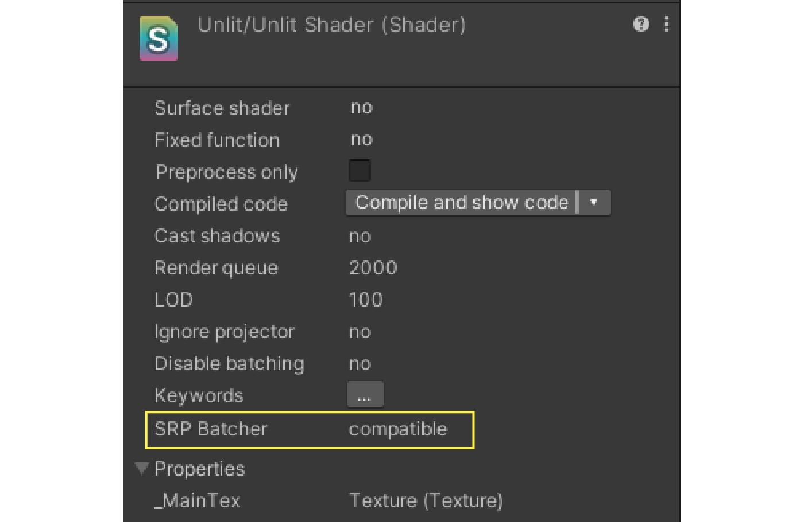
<p><em>VI: Inspector của shader <code>Unlit/Unlit Shader</code> — dòng <strong>SRP Batcher: <code>compatible</code></strong> (khung vàng). Cùng panel còn cho biết <strong>Render queue 2000 · LOD 100 · Disable batching: no · Cast shadows: no</strong>. / EN: The shader Inspector reading "SRP Batcher: compatible".</em></p>

</div>
</div>

**List 7.3 & 7.4 — bật SRP Batcher từ C#, và khai báo `UnityPerMaterial`:**

```csharp
GraphicsSettings.useScriptableRenderPipelineBatching = true;
```

```hlsl
Properties
{
    _Color1 ("Color 1", Color) = (1,1,1,1)
    _Color2 ("Color 2", Color) = (1,1,1,1)
}

CBUFFER_START(UnityPerMaterial)

float4 _Color1;
float4 _Color2;

CBUFFER_END
```

### 29.4. 🧩 SpriteAtlas

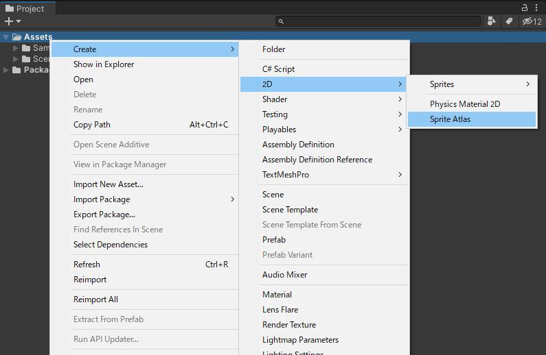 Create > 2D > Sprite Atlas.">
<p><em>VI: <strong>▲ Tạo ở đâu</strong> — <code>Assets › Create › 2D › Sprite Atlas</code> (cùng nhóm với <em>Sprites</em> và <em>Physics Material 2D</em>). / EN: Assets > Create > 2D > Sprite Atlas.</em></p>

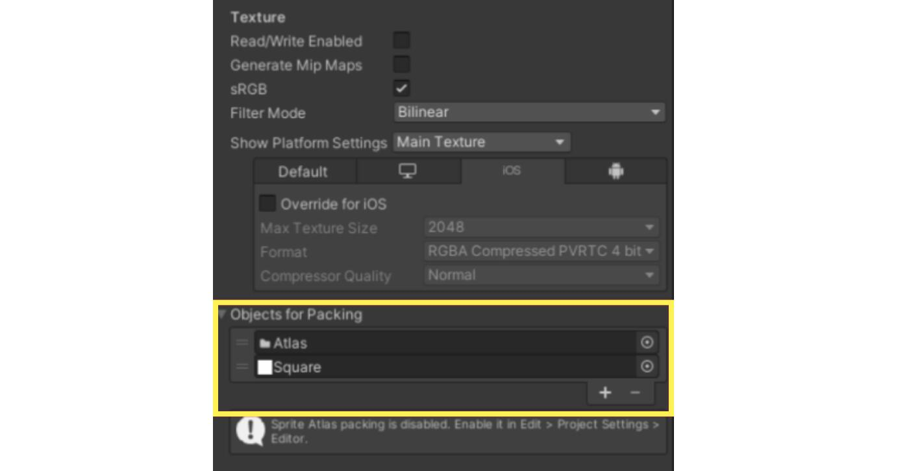
<p><em>VI: <strong>Sprite Atlas</strong> — danh sách <strong>Objects for Packing</strong> (thư mục <code>Atlas</code> và sprite <code>Square</code>); phía trên là Texture settings <strong>RGBA Compressed PVRTC 4 bit</strong>, <strong>Max Texture Size 2048</strong>. / EN: A Sprite Atlas with its Objects for Packing list.</em></p>

<div class="bilingual-row">
<div class="col-vi">
<p>🎯 <em>"Game 2D và UI thường dùng <strong>NHIỀU sprite để dựng màn hình</strong>. Trong trường hợp đó, chức năng để TRÁNH sinh ra một số lượng lớn draw call là <strong>SpriteAtlas — GIẢM draw call bằng cách GỘP NHIỀU SPRITE vào MỘT TEXTURE DUY NHẤT.</strong>"</em></p>
<p>📥 <strong>Ba bước tạo:</strong> ① cài package <strong>2D Sprite</strong> từ Package Manager; ② right-click trong Project view → <strong>"Create → 2D → Sprite Atlas"</strong>; ③ chỉ định sprite hoặc THƯ MỤC chứa sprite ở mục <strong><code>Objects for Packing</code></strong> trong inspector.</p>
<p>✅ <em>"Với các cài đặt trên, <strong>sprite sẽ được ATLAS HOÁ trong quá trình BUILD và khi PHÁT trong Unity Editor, và texture SpriteAtlas ĐÃ TÍCH HỢP sẽ được THAM CHIẾU khi vẽ sprite mục tiêu.</strong>"</em></p>
</div>
<div class="col-en">
<p>🎯 <em>"2D games and UIs often use <strong>MANY sprites to build the screen</strong>. In such cases, the function to avoid generating a large number of draw calls is <strong>SpriteAtlas — it reduces draw calls by COMBINING MULTIPLE SPRITES into a SINGLE TEXTURE.</strong>"</em></p>
<p>📥 <strong>Three steps:</strong> ① install the <strong>2D Sprite</strong> package; ② right-click in the Project view → <strong>"Create → 2D → Sprite Atlas"</strong>; ③ set the sprite or the FOLDER containing the sprites in <strong><code>Objects for Packing</code></strong>.</p>
<p>✅ <em>"With the above settings, <strong>the sprite will be atlased during BUILD and PLAYBACK in the Unity Editor, and the INTEGRATED SpriteAtlas texture will be REFERENCED when drawing the target sprite.</strong>"</em></p>
</div>
</div>

**List 7.5 — lấy Sprite TRỰC TIẾP từ SpriteAtlas:**

```csharp
[SerializeField]
private SpriteAtlas atlas;

public Sprite LoadSprite(string spriteName)
{
    // Obtain a Sprite from SpriteAtlas with the Sprite name as an argument
    var sprite = atlas.GetSprite(spriteName);
    return sprite;
}
```

!!! danger "💀 MẶT TRÁI của SpriteAtlas — nạp MỘT sprite là nạp CẢ ATLAS"
    **VI:** *"**NẠP MỘT Sprite DUY NHẤT trong SpriteAtlas TIÊU TỐN NHIỀU BỘ NHỚ HƠN so với chỉ nạp một cái, vì texture của TOÀN BỘ ATLAS được nạp. Do đó, SpriteAtlas PHẢI được dùng CẨN THẬN và CHIA NHỎ PHÙ HỢP.**"*

    **EN:** *"**Loading a single Sprite in the SpriteAtlas consumes MORE MEMORY than loading just one, since the texture of the ENTIRE ATLAS is loaded. Therefore, the SpriteAtlas should be used with care and DIVIDED APPROPRIATELY.**"*

    ⚠️ *"Mục này viết cho **SpriteAtlas V1. SpriteAtlas V2 có thể có THAY ĐỔI ĐÁNG KỂ về vận hành, chẳng hạn KHÔNG THỂ chỉ định THƯ MỤC của sprite cần atlas hoá."* / "This section targets SpriteAtlas V1. SpriteAtlas V2 may have significant changes, such as not being able to specify the folder of the sprite to be atlased."*

### 29.5. ✂️ Culling — ba tầng

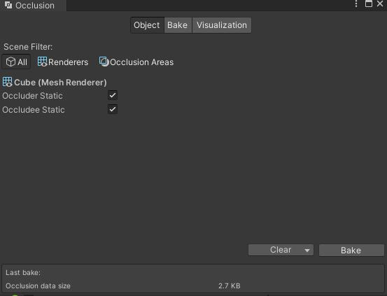
<p><em>VI: Cửa sổ <strong>Occlusion</strong> tab <strong>Object</strong> — <strong>Occluder Static ✓ · Occludee Static ✓</strong> cho Cube; dòng cuối cho biết <strong>Occlusion data size 2.7 KB</strong> (dữ liệu bake NẰM TRONG BỘ NHỚ). / EN: The Occlusion window showing Occluder/Occludee Static and a 2.7 KB data size.</em></p>

| Loại | Cơ chế | Ghi chú của sách |
|---|---|---|
| **Visual (Frustum) Culling** | *"Bỏ qua khỏi render các object **NGOÀI vùng render của camera — HÌNH NÓN NHÌN (viewing cone)**"* | ✅ *"Được thực hiện **MẶC ĐỊNH mà KHÔNG cần cài đặt gì.** Với object **NẶNG VỀ VERTEX SHADER, culling có thể được áp dụng bằng cách CHIA MESH PHÙ HỢP để giảm chi phí render.**"* |
| **Rear (Back-face) Culling** | *"Bỏ qua render **MẶT SAU của polygon** mà camera (được cho là) KHÔNG nhìn thấy"* | *"**HẦU HẾT mesh là KÍN (chỉ polygon mặt trước thấy được), nên mặt sau KHÔNG cần được vẽ.** Trong Unity, **nếu bạn KHÔNG chỉ định trong shader, mặt sau của polygon LÀ đối tượng culling.**"* |
| **Occlusion Culling** | *"Bỏ qua render các object **KHÔNG nhìn thấy được vì bị object khác CHE KHUẤT**. Dùng **dữ liệu occlusion ĐÃ BAKE TRƯỚC** để xác định lúc runtime"* | 🚨 *"Occlusion culling **GIẢM chi phí render, NHƯNG ĐỒNG THỜI ĐẶT THÊM TẢI LÊN CPU cho tiến trình culling, nên CẦN CÂN BẰNG từng loại tải và đặt cài đặt PHÙ HỢP.**"* |

**List 7.6 — cài đặt Cull trong SubShader:**

```hlsl
SubShader
{
    Tags { "RenderType"="Opaque" }
    LOD 100

    Cull Back //   Front, Off

    Pass
    {
        CGPROGRAM
        #pragma vertex vert
        #pragma fragment frag
        ENDCG
    }
}
```

| Setting | Hiệu ứng |
|---|---|
| **`Back`** | *"KHÔNG vẽ polygon ở phía **ĐỐI DIỆN** với điểm nhìn"* |
| **`Front`** | *"KHÔNG vẽ polygon **CÙNG HƯỚNG** với điểm nhìn"* |
| **`Off`** | *"**VÔ HIỆU HOÁ** back culling và vẽ **TẤT CẢ các mặt**"* |

<div class="bilingual-row">
<div class="col-vi">
<p>🏷️ <strong>Occlusion Culling — cờ static:</strong> <em>"Đặt cờ static của inspector thành <strong><code>Occluder Static</code></strong> hoặc <strong><code>Occludee Static</code></strong>. <strong>NẾU `Occluder Static` bị TẮT và `Occludee Static` được BẬT, object sẽ KHÔNG CÒN được coi là VẬT CHE (occluder), mà CHỈ là VẬT BỊ CHE. Trường hợp NGƯỢC LẠI thì ngược lại.</strong>"</em></p>
<p>🔨 <em>"Để bake trước, hiển thị cửa sổ <strong>Occlusion Culling</strong> — ở đó bạn <strong>đổi được cờ static cho TỪNG object, đổi cài đặt bake, v.v., rồi bấm nút Bake.</strong>"</em></p>
</div>
<div class="col-en">
<p>🏷️ <strong>Occlusion Culling — static flags:</strong> <em>"Set the inspector's static flag to <strong><code>Occluder Static</code></strong> or <strong><code>Occludee Static</code></strong>. <strong>If `Occluder Static` is DISABLED and `Occludee Static` is ENABLED, the object will NO LONGER be considered as the OCCLUDER, but ONLY as the OCCLUDED object. In the opposite case, the opposite applies.</strong>"</em></p>

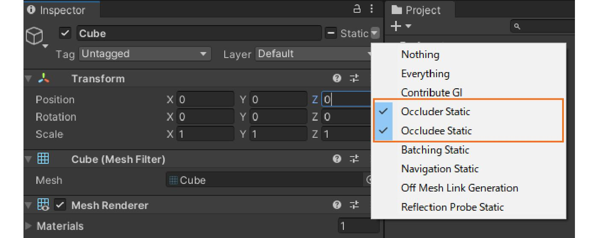
<p><em>VI: Dropdown <strong>Static flags</strong> trên Inspector — <strong>Occluder Static</strong> và <strong>Occludee Static</strong> đang được TICK (khung cam). Các cờ khác: <em>Contribute GI · Batching Static · Navigation Static · Off Mesh Link Generation · Reflection Probe Static</em>. / EN: The Static flags dropdown with Occluder Static and Occludee Static checked.</em></p>

<p>🔨 <em>"To pre-bake, the <strong>Occlusion Culling</strong> window is displayed — there you can <strong>change the static flags for each object, change the bake settings, and press the Bake button.</strong>"</em></p>
</div>
</div>

!!! warning "⚠️ Occlusion Culling KHÔNG cứu được real-time shadow"
    **VI:** *"**CHỈ tiến trình render OBJECT được giảm bởi occlusion culling, trong khi các tiến trình như RENDER BÓNG ĐỔ REAL-TIME VẪN KHÔNG THAY ĐỔI.**"*

    **EN:** *"**Only the object rendering process is reduced by occlusion culling, while processes such as REAL-TIME SHADOW RENDERING REMAIN UNCHANGED.**"*

### 29.6. 💻 Shaders — bốn kỹ thuật

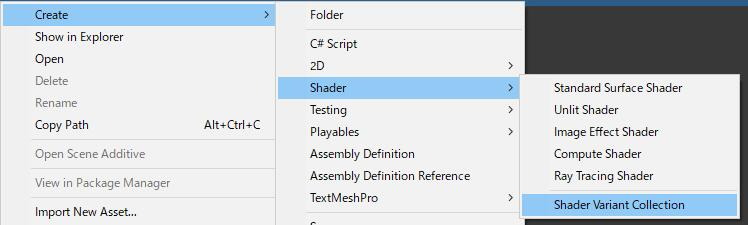 Create > Shader > Shader Variant Collection.">
<p><em>VI: <strong>▲ Tạo Shader Variant Collection</strong> — <code>Assets › Create › Shader › Shader Variant Collection</code>; cùng menu còn có <em>Standard Surface Shader · Unlit Shader · Image Effect Shader · Compute Shader · Ray Tracing Shader</em>. / EN: Assets > Create > Shader > Shader Variant Collection.</em></p>

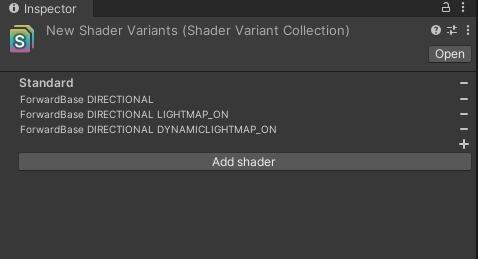
<p><em>VI: <strong>Shader Variant Collection</strong> — ba variant của Standard đã được ghi lại: <strong>ForwardBase DIRECTIONAL</strong> · <strong>DIRECTIONAL LIGHTMAP_ON</strong> · <strong>DIRECTIONAL DYNAMICLIGHTMAP_ON</strong>. / EN: A Shader Variant Collection listing three recorded variants.</em></p>

<div class="bilingual-row">
<div class="col-vi">
<p>① <strong>GIẢM ĐỘ CHÍNH XÁC dấu phẩy động</strong> — <em>"<strong>GPU (ĐẶC BIỆT trên nền tảng MOBILE) tính TOÁN NHANH HƠN với kiểu dữ liệu NHỎ HƠN.</strong> Do đó, <strong>thay kiểu <code>float</code> (32bit) bằng kiểu <code>half</code> (16bit) là HIỆU QUẢ khi có thể thay được.</strong>"</em></p>
<p>⚖️ <em>"<strong>Kiểu <code>float</code> NÊN được dùng khi CẦN ĐỘ CHÍNH XÁC, chẳng hạn trong tính toán ĐỘ SÂU (depth), nhưng trong tính toán MÀU SẮC, KỂ CẢ khi giảm độ chính xác thì cũng KHÓ gây khác biệt LỚN về diện mạo kết quả.</strong>"</em></p>
<p>② <strong>Đẩy tính toán sang VERTEX SHADER</strong> — <em>"<strong>Vertex shader được thực thi theo SỐ ĐỈNH của mesh, còn fragment shader theo SỐ PIXEL cuối cùng được ghi. NÓI CHUNG, vertex shader thường được thực thi ÍT LẦN HƠN fragment shader, nên TỐT NHẤT là thực hiện các tính toán PHỨC TẠP TRONG VERTEX SHADER bất cứ khi nào có thể.</strong>"</em></p>
<p>⚠️ <em>"Kết quả tính của vertex shader được truyền sang fragment shader qua <strong>shader semantics</strong>, nhưng cần lưu ý <strong>các giá trị truyền đi bị NỘI SUY (interpolated) và có thể TRÔNG KHÁC so với khi tính trong fragment shader.</strong>"</em></p>
</div>
<div class="col-en">
<p>① <strong>Reduce floating-point precision</strong> — <em>"<strong>GPUs (especially on MOBILE platforms) compute FASTER with SMALLER data types.</strong> Therefore, <strong>replacing <code>float</code> (32bit) with <code>half</code> (16bit) is EFFECTIVE when possible.</strong>"</em></p>
<p>⚖️ <em>"<strong>The <code>float</code> type should be used when PRECISION IS REQUIRED, such as in DEPTH calculations, but in COLOUR calculations, even if the precision is reduced, it is DIFFICULT to cause a LARGE DIFFERENCE in the resulting appearance.</strong>"</em></p>
<p>② <strong>Perform calculations in the vertex shader</strong> — <em>"<strong>The vertex shader is executed for the NUMBER OF VERTICES, and the fragment shader for the NUMBER OF PIXELS finally written. In general, vertex shaders are executed LESS FREQUENTLY, so it is best to perform COMPLEX CALCULATIONS IN THE VERTEX SHADER whenever possible.</strong>"</em></p>
<p>⚠️ <em>"The results are passed via <strong>shader semantics</strong>, but note that <strong>the values passed are INTERPOLATED and may LOOK DIFFERENT than if they were calculated in the fragment shader.</strong>"</em></p>
</div>
</div>

**List 7.7 — TIỀN TÍNH TOÁN trong vertex shader:**

```hlsl
CGPROGRAM
#pragma vertex vert
#pragma fragment frag

#include "UnityCG.cginc"

struct appdata
{
    float4 vertex : POSITION;
    float2 uv : TEXCOORD0;
};

struct v2f
{
    float2 uv : TEXCOORD0;
    float3 factor : TEXCOORD1;
    float4 vertex : SV_POSITION;
};

sampler2D _MainTex;
float4 _MainTex_ST;

v2f vert (appdata v)
{
    v2f o;
    o.vertex = UnityObjectToClipPos(v.vertex);
    o.uv = TRANSFORM_TEX(v.uv, _MainTex);

    // Complex precomputations.
    o.factor = CalculateFactor();

    return o;
}

fixed4 frag (v2f i) : SV_Target
{
    fixed4 col = tex2D(_MainTex, i.uv);

    // Values computed in the vertex shader are used in the fragment shader
    col *= i.factor;

    return col;
}
ENDCG
```

<div class="bilingual-row">
<div class="col-vi">
<p>③ <strong>NƯỚNG SẴN thông tin vào TEXTURE</strong> — <em>"<strong>NẾU kết quả của các tính toán PHỨC TẠP trong shader KHÔNG bị ảnh hưởng bởi giá trị BÊN NGOÀI, thì LƯU KẾT QUẢ ĐÃ TÍNH TRƯỚC thành các PHẦN TỬ TRONG TEXTURE là cách HIỆU QUẢ.</strong>"</em></p>
<p>💡 <em>"Có thể làm bằng cách <strong>cài đặt công cụ SINH TEXTURE chuyên dụng trong Unity hoặc như một EXTENSION cho các công cụ DCC. NẾU KÊNH ALPHA của một texture đang dùng CHƯA được sử dụng, GHI VÀO ĐÓ là ý hay, hoặc chuẩn bị một texture chuyên dụng.</strong>"</em></p>
<p>🎨 <em>"Ví dụ, <strong>LUT (bảng tương ứng màu) dùng cho color grading sẽ TIỀN HIỆU CHỈNH texture sao cho TOẠ ĐỘ của MỖI PIXEL TƯƠNG ỨNG với MỖI MÀU. Bằng cách LẤY MẪU texture trong shader dựa trên MÀU GỐC, kết quả GẦN NHƯ GIỐNG HỆT với việc áp dụng tiền hiệu chỉnh lên màu gốc.</strong>"</em></p>
</div>
<div class="col-en">
<p>③ <strong>Prebuild information into textures</strong> — <em>"<strong>If the results of complex calculations in the shader are NOT affected by EXTERNAL VALUES, then STORING the PRE-CALCULATED results as ELEMENTS IN THE TEXTURE is an effective way to do so.</strong>"</em></p>
<p>💡 <em>"This can be done by <strong>implementing a dedicated texture generation tool in Unity or as an EXTENSION to various DCC tools. If the ALPHA CHANNEL of a texture already in use is NOT being used, it is a good idea to WRITE TO IT, or prepare a dedicated texture.</strong>"</em></p>
<p>🎨 <em>"For example, <strong>the LUT (colour correspondence table) used for colour grading will PRE-CORRECT the texture so that the COORDINATES of each pixel CORRESPOND to each COLOUR. By SAMPLING the texture in the shader based on the ORIGINAL COLOUR, the result is ALMOST THE SAME as if the pre-correction had been applied to the original colour.</strong>"</em></p>
</div>
</div>


<p><em>VI: <strong>Texture LUT 1024×32</strong> TRƯỚC khi hiệu chỉnh màu — 32 ô vuông xếp ngang, mỗi ô là một LÁT của khối màu RGB. Shader sample texture này dựa trên MÀU GỐC để có kết quả gần như y hệt việc áp color grading trực tiếp — nhưng với chi phí CHỈ MỘT lần sample. / EN: The 1024×32 colour-grading LUT texture before correction — 32 slices of the RGB colour cube laid out horizontally.</em></p>

<div class="bilingual-row">
<div class="col-vi">
<p>④ <strong><code>ShaderVariantCollection</code> — chống SPIKE lúc compile shader</strong></p>
<p>⚡ <em>"<strong><code>ShaderVariantCollection</code> có thể được dùng để BIÊN DỊCH SHADER TRƯỚC KHI chúng được dùng, nhằm NGĂN SPIKE.</strong> Nó cho phép <strong>giữ một DANH SÁCH các shader variant dùng trong game DƯỚI DẠNG ASSET</strong>, tạo bằng <strong>"Create → Shader → Shader Variant Collection"</strong>."</em></p>
<p>📋 <em>"Từ Inspector của ShaderVariantCollection đã tạo, <strong>bấm <code>Add Shader</code> để thêm shader mục tiêu, rồi chọn variant nào cần thêm cho shader đó.</strong>"</em></p>
<p>🚀 <em>"ShaderVariantCollection được thêm vào mục <strong><code>Preloaded Shaders</code> trong phần Shader preloading của Graphics Settings</strong>, để đặt các shader variant sẽ được <strong>BIÊN DỊCH LÚC KHỞI ĐỘNG ỨNG DỤNG.</strong>"</em></p>
</div>
<div class="col-en">
<p>④ <strong><code>ShaderVariantCollection</code> — preventing shader-compile spikes</strong></p>
<p>⚡ <em>"<strong><code>ShaderVariantCollection</code> can be used to COMPILE SHADERS BEFORE THEY ARE USED to PREVENT SPIKES.</strong> It allows you to <strong>keep a LIST of shader variants used in your game AS ASSETS</strong>, created via <strong>"Create → Shader → Shader Variant Collection"</strong>."</em></p>
<p>📋 <em>"From the Inspector, <strong>press <code>Add Shader</code> to add the target shader, and then select which variants to add.</strong>"</em></p>
<p>🚀 <em>"It is added to <strong><code>Preloaded Shaders</code> in the Shader preloading section of the Graphics Settings</strong>, to set the shader variants to be <strong>COMPILED AT APPLICATION STARTUP.</strong>"</em></p>
</div>
</div>

**List 7.8 — TIỀN BIÊN DỊCH TƯỜNG MINH từ script:**

```csharp
public void PreloadShaderVariants(ShaderVariantCollection collection)
{
    // Explicitly precompile shader variants
    if (!collection.isWarmedUp)
    {
        collection.WarmUp();
    }
}
```

### 29.7. 💡 Lighting — real-time shadow, pseudo shadow & lightmap

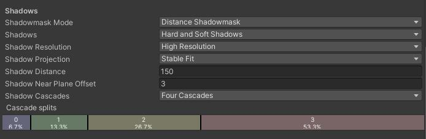
<p><em>VI: <strong>▲ <code>Quality › Shadows</code> đầy đủ</strong> — <strong>Shadowmask Mode: Distance Shadowmask</strong> · <strong>Shadows: Hard and Soft Shadows</strong> · Shadow Resolution High · Shadow Projection Stable Fit · <strong>Shadow Distance 150</strong> · <strong>Shadow Near Plane Offset 3</strong> · <strong>Four Cascades</strong> (6.7% / 13.3% / 26.7% / 53.3%). / EN: Quality Shadows including Shadowmask Mode: Distance Shadowmask.</em></p>

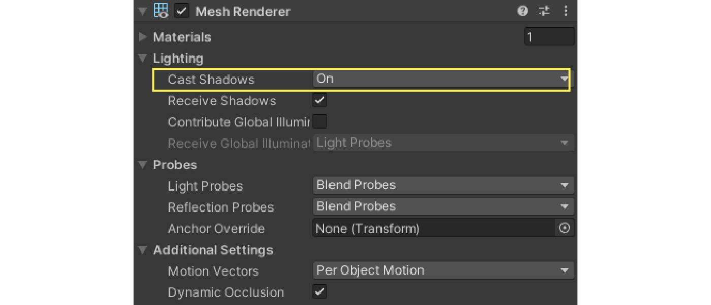
<p><em>VI: <strong>▲ Tắt bóng TỪNG object</strong> — <code>Mesh Renderer › Lighting › Cast Shadows: On</code> (còn <em>Off · Two Sided · Shadows Only</em>), cùng <strong>Receive Shadows ✓</strong>, <strong>Contribute Global Illumination</strong>, <strong>Probes: Light Probes / Reflection Probes = Blend Probes</strong>, <strong>Motion Vectors: Per Object Motion</strong>, <strong>Dynamic Occlusion ✓</strong>. / EN: Mesh Renderer's Cast Shadows and Probes settings.</em></p>

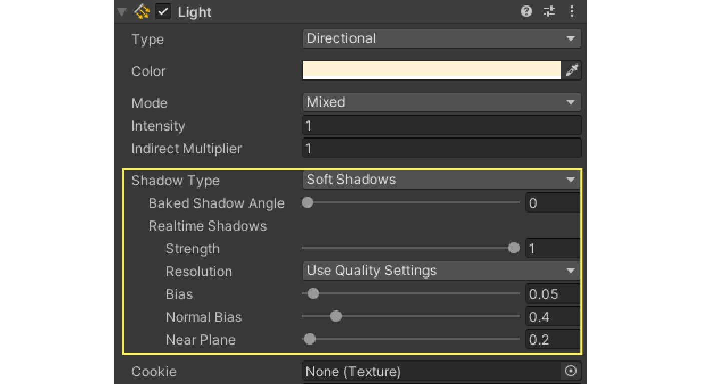
<p><em>VI: <strong>▲ Thiết lập bóng trên chính đèn</strong> — <strong>Type Directional · Mode Mixed · Intensity 1 · Indirect Multiplier 1</strong>; nhóm <strong>Shadow Type: Soft Shadows</strong> với <strong>Realtime Shadows: Strength 1 · Resolution Use Quality Settings · Bias 0.05 · Normal Bias 0.4 · Near Plane 0.2</strong>. / EN: A Light component with Shadow Type set to Soft Shadows.</em></p>

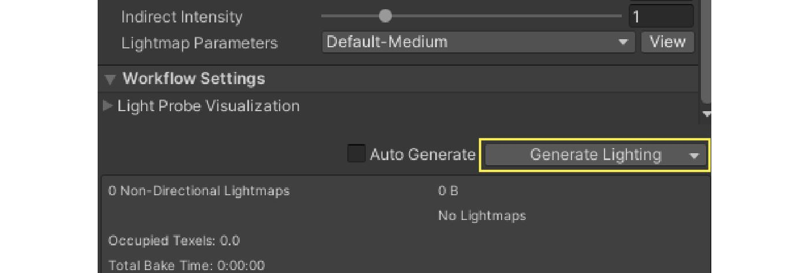
<p><em>VI: <strong>▲ Nút bake</strong> — mục <strong>Workflow Settings</strong>: bỏ tick <strong>Auto Generate</strong> rồi bấm <strong>Generate Lighting</strong>. Dòng thống kê bên dưới: <strong>0 Non-Directional Lightmaps — 0 B · No Lightmaps · Occupied Texels 0.0 · Total Bake Time 0:00:00</strong>. / EN: The Generate Lighting button and bake statistics.</em></p>

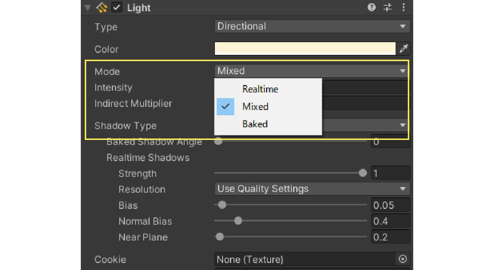
<p><em>VI: <strong>Light Mode</strong> — <strong>Realtime · Mixed (đang chọn) · Baked</strong>. / EN: The Light Mode dropdown.</em></p>

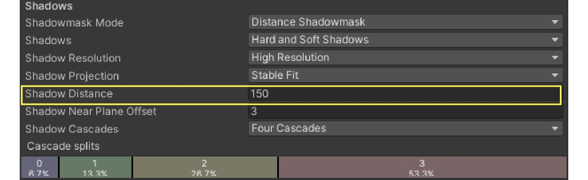
<p><em>VI: <code>Quality &gt; Shadows</code> — <strong>Shadow Distance 150</strong> · Shadow Resolution: High · Shadow Projection: Stable Fit · <strong>Four Cascades</strong> với tỷ lệ <strong>6.7% / 13.3% / 26.7% / 53.3%</strong>. / EN: Quality Shadows with Shadow Distance 150 and four cascade splits.</em></p>

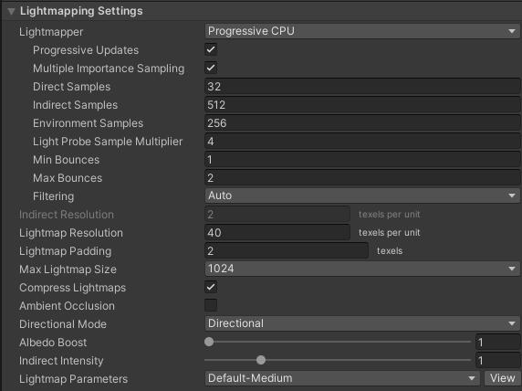
<p><em>VI: <strong>Lightmapping Settings</strong> — Lightmapper <strong>Progressive CPU</strong> · <strong>Direct Samples 32 · Indirect Samples 512 · Environment Samples 256</strong> · Max Bounces 2 · <strong>Lightmap Resolution 40 texels/unit</strong> · <strong>Max Lightmap Size 1024</strong> · Compress Lightmaps ✓. / EN: The Lightmapping Settings panel.</em></p>

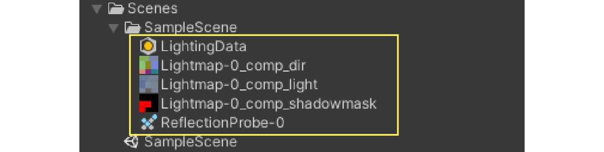
<p><em>VI: Asset SINH RA sau khi bake — <strong>LightingData · Lightmap-0_comp_dir · Lightmap-0_comp_light · Lightmap-0_comp_shadowmask · ReflectionProbe-0</strong>. Tất cả đều CHIẾM DUNG LƯỢNG build và bộ nhớ. / EN: The assets generated by a lighting bake.</em></p>

<div class="bilingual-row">
<div class="col-vi">
<p>🚨 <em>"<strong>Sinh bóng real-time TIÊU TỐN MỘT LƯỢNG LỚN DRAW CALL và FILL RATE. Do đó, PHẢI cân nhắc KỸ các cài đặt khi dùng real-time shadow.</strong>"</em></p>
<p>📉 <strong>Giảm DRAW CALL của bóng — hai chính sách:</strong><br>
① <em>"<strong>GIẢM SỐ OBJECT ĐỔ BÓNG</strong> — cách ĐƠN GIẢN là <strong>đặt cài đặt <code>Cast Shadows</code> của `MeshRenderer` thành OFF. Điều này LOẠI object khỏi shadow draw call. 🚨 Cài đặt này THƯỜNG BẬT trong Unity và CẦN ĐƯỢC LƯU Ý trong các project dùng bóng.</strong>"</em><br>
② <em>"<strong>HỢP NHẤT draw call bằng BATCHING.</strong>"</em></p>
<p>📏 <em>"Cũng hữu ích khi <strong>GIẢM KHOẢNG CÁCH TỐI ĐA mà object được vẽ trong shadow map — <code>Shadow Distance</code> trong Quality Settings — để giảm số object đổ bóng xuống MỨC TỐI THIỂU CẦN THIẾT. ⚠️ Điều chỉnh cài đặt này CŨNG SẼ GIẢM ĐỘ PHÂN GIẢI của bóng, vì bóng sẽ được vẽ ở PHẠM VI TỐI THIỂU cho độ phân giải của shadow map.</strong>"</em></p>
</div>
<div class="col-en">
<p>🚨 <em>"<strong>Generating real-time shadows consumes a LARGE AMOUNT of DRAW CALL and FILL RATE. Therefore, careful consideration should be given to settings when using real-time shadows.</strong>"</em></p>
<p>📉 <strong>Reducing shadow draw calls — two policies:</strong><br>
① <em>"<strong>Reduce the NUMBER OF OBJECTS THAT DROP SHADOWS</strong> — a simple method is <strong>to set the MeshRenderer's <code>Cast Shadows</code> setting to OFF. This removes the object from the shadow draw call. 🚨 This setting is usually turned ON in Unity and should be NOTED in projects that use shadows.</strong>"</em><br>
② <em>"<strong>Consolidate draw calls by BATCHING.</strong>"</em></p>
<p>📏 <em>"It is also useful to <strong>reduce the MAXIMUM DISTANCE an object can be drawn in the shadow map — <code>Shadow Distance</code> in the Quality Settings. ⚠️ Adjusting this setting will ALSO REDUCE THE RESOLUTION of the shadows, since shadows will be drawn at the MINIMUM RANGE for the resolution of the shadow map.</strong>"</em></p>
</div>
</div>

**TIẾT KIỆM FILL RATE — Quality Settings → Shadows:**

| Cài đặt | Đánh đổi |
|---|---|
| **Hard Shadows** | *"tạo **BIÊN BÓNG RÕ NÉT, nhưng với TẢI TƯƠNG ĐỐI THẤP**"* |
| **Soft Shadows** | *"**ĐẮT HƠN, nhưng tạo được BIÊN BÓNG MỜ**"* |
| **Shadow Resolution** & **Shadow Cascades** | *"ẢNH HƯỞNG tới độ phân giải shadow map — **cài đặt CÀNG LỚN thì độ phân giải CÀNG CAO và TIÊU TỐN CÀNG NHIỀU FILL RATE. TUY NHIÊN, vì các cài đặt này LIÊN QUAN RẤT NHIỀU tới CHẤT LƯỢNG bóng, phải điều chỉnh CẨN THẬN để CÂN BẰNG hiệu năng và chất lượng.**"* |

> 💡 *"**Một số cài đặt điều chỉnh được qua Inspector của component Light, nên CÓ THỂ đổi cài đặt cho TỪNG ĐÈN RIÊNG LẺ.**"*

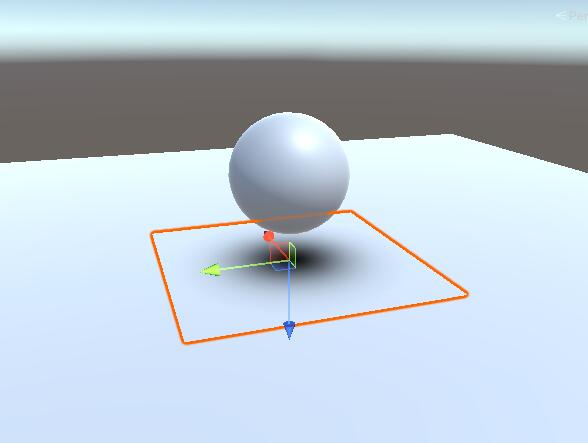

<p><em>VI: <strong>Pseudo Shadow</strong> — một quả cầu với "bóng" thực chất là <strong>một TẤM POLYGON (plate polygon)</strong> phẳng nằm dưới (khung CAM chính là mesh phẳng đó). <em>"Tuỳ THỂ LOẠI game hoặc PHONG CÁCH NGHỆ THUẬT, có thể HIỆU QUẢ khi dùng plate polygon để MÔ PHỎNG bóng. Dù phương pháp này có RÀNG BUỘC SỬ DỤNG MẠNH và KHÔNG LINH HOẠT CAO, nó <strong>NHẸ HƠN RẤT NHIỀU so với phương pháp render bóng real-time thông thường.</strong>"</em> / EN: A pseudo shadow built from a flat plate polygon — far lighter than real-time shadow rendering.</em></p>

<div class="bilingual-row">
<div class="col-vi">
<p>🔥 <strong>Light Mapping:</strong> <em>"Bằng cách <strong>BAKE hiệu ứng ánh sáng và bóng vào TEXTURE TRƯỚC, có thể đạt được biểu đạt ánh sáng CHẤT LƯỢNG với TẢI THẤP HƠN ĐÁNG KỂ so với sinh real-time.</strong>"</em></p>
<p>📋 <strong>Quy trình bake:</strong> ① đặt <strong><code>Mode</code> của Light thành <code>Mixed</code> hoặc <code>Baked</code></strong>; ② <strong>bật cờ <code>static</code></strong> cho object cần bake; ③ mở <strong>"Window → Rendering → Lighting"</strong>; ④ nếu chưa có, bấm <strong><code>New Lighting Settings</code></strong> để tạo asset mới; ⑤ chỉnh trong tab <strong><code>Lightmapping Settings</code></strong>; ⑥ bấm <strong><code>Generate Lighting</code></strong> ở dưới cùng Inspector.</p>
<p>🏆 <strong>Cài đặt ẢNH HƯỞNG LỚN NHẤT tới hiệu năng:</strong> <em>"<strong>Trong các cài đặt này, cái ẢNH HƯỞNG LỚN NHẤT tới hiệu năng là <code>Lightmap Resolution</code>. Cài đặt này xác định BAO NHIÊU LIGHTMAP TEXEL được cấp trên MỖI ĐƠN VỊ trong Unity, và vì KÍCH THƯỚC LIGHTMAP CUỐI CÙNG thay đổi tuỳ giá trị này, nó có TÁC ĐỘNG ĐÁNG KỂ tới DUNG LƯỢNG LƯU TRỮ và BỘ NHỚ, TỐC ĐỘ TRUY CẬP TEXTURE, và các yếu tố khác.</strong>"</em></p>
<p>💡 <em>"Sau khi bake xong, <strong>lightmap đã bake được lưu trong một THƯ MỤC CÙNG TÊN với SCENE.</strong>"</em></p>
</div>
<div class="col-en">
<p>🔥 <strong>Light Mapping:</strong> <em>"By <strong>BAKING lighting effects and shadows into TEXTURES in advance, QUALITY lighting expressions can be achieved with CONSIDERABLY LOWER LOAD than real-time generation.</strong>"</em></p>
<p>📋 <strong>Bake workflow:</strong> ① set the Light's <strong><code>Mode</code> to <code>Mixed</code> or <code>Baked</code></strong>; ② <strong>activate the <code>static</code> flag</strong>; ③ open <strong>"Window → Rendering → Lighting"</strong>; ④ click <strong><code>New Lighting Settings</code></strong> if none exists; ⑤ adjust the <strong><code>Lightmapping Settings</code></strong> tab; ⑥ press <strong><code>Generate Lighting</code></strong>.</p>
<p>🏆 <strong>The single most performance-critical setting:</strong> <em>"<strong>Of these settings, the one that has the GREATEST IMPACT on performance is <code>Lightmap Resolution</code>. This setting determines HOW MANY LIGHTMAP TEXELS are allocated PER UNIT in Unity, and since the FINAL LIGHTMAP SIZE varies depending on this value, it has a SIGNIFICANT IMPACT on STORAGE and MEMORY CAPACITY, TEXTURE ACCESS SPEED, and other factors.</strong>"</em></p>
<p>💡 <em>"Once baking is complete, <strong>the baked lightmap is stored in a FOLDER WITH THE SAME NAME AS THE SCENE.</strong>"</em></p>
</div>
</div>

### 29.8. 🔭 LOD & Texture Streaming

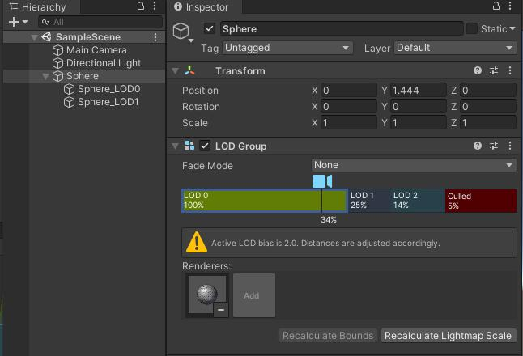
<p><em>VI: <strong>LOD Group</strong> — <strong>LOD 0: 100% → LOD 1: 25% → LOD 2: 14% → Culled: 5%</strong>, con trỏ ở <strong>34%</strong>. Cảnh báo: <em>"Active LOD bias is 2.0. Distances are adjusted accordingly."</em> / EN: An LOD Group with LOD 0/1/2 and Culled thresholds.</em></p>

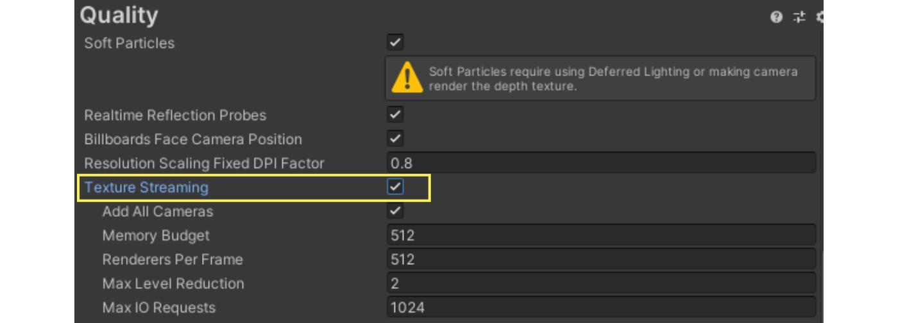
<p><em>VI: <code>Quality &gt; Texture Streaming ✓</code> — <strong>Memory Budget 512</strong> · <strong>Renderers Per Frame 512</strong> · <strong>Max Level Reduction 2</strong> · <strong>Max IO Requests 1024</strong>. / EN: Quality Settings' Texture Streaming parameters.</em></p>

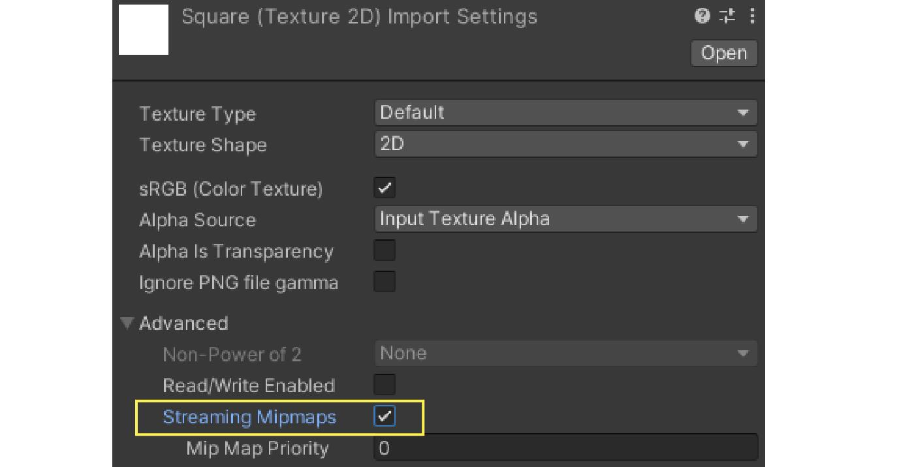
<p><em>VI: Trên TỪNG texture — <strong>Streaming Mipmaps ✓</strong> và <strong>Mip Map Priority 0</strong>. / EN: Per-texture Streaming Mipmaps and Mip Map Priority.</em></p>

<div class="bilingual-row">
<div class="col-vi">
<p>🔭 <strong>Level of Detail:</strong> <em>"<strong>KHÔNG HIỆU QUẢ khi render các object XA CAMERA ở dạng ĐA GIÁC CAO, ĐỘ CHI TIẾT CAO.</strong> Phương pháp LOD dùng để <strong>GIẢM mức độ chi tiết của object TUỲ theo KHOẢNG CÁCH tới camera.</strong> Trong Unity, object được gán component <strong><code>LOD Group</code></strong>."</em></p>
<p>⚙️ <em>"Bằng cách <strong>đặt một renderer với mesh của TỪNG LOD LEVEL vào CON của GameObject có LOD Group, và cài đặt từng LOD level trong LOD Group, LOD level sẽ được CHUYỂN ĐỔI theo camera. CŨNG có thể đặt LOD level nào được gán cho mỗi LOD Group theo KHOẢNG CÁCH camera.</strong>"</em></p>
<p>🚨 <strong>MẶT TRÁI:</strong> <em>"<strong>Dùng LOD NÓI CHUNG GIẢM tải vẽ, NHƯNG PHẢI Ý THỨC về ÁP LỰC BỘ NHỚ và LƯU TRỮ, vì TẤT CẢ mesh cho TỪNG LOD level ĐỀU ĐƯỢC NẠP.</strong>"</em></p>
</div>
<div class="col-en">
<p>🔭 <strong>Level of Detail:</strong> <em>"<strong>It is INEFFICIENT to render objects that are FAR from the camera in HIGH-POLYGON, HIGH-DEFINITION.</strong> The LOD method can be used to <strong>REDUCE the level of detail of an object DEPENDING ON ITS DISTANCE from the camera.</strong> In Unity, objects are assigned a <strong><code>LOD Group</code></strong> component."</em></p>
<p>⚙️ <em>"By <strong>placing a renderer with a mesh of EACH LOD LEVEL on a CHILD of a GameObject with a LOD Group, and setting each LOD level in the LOD Group, the LOD level can be SWITCHED according to the camera.</strong>"</em></p>
<p>🚨 <strong>The downside:</strong> <em>"<strong>Using LOD generally REDUCES the drawing load, but one should be AWARE of MEMORY and STORAGE PRESSURES since ALL MESHES for EACH LOD LEVEL ARE LOADED.</strong>"</em></p>
</div>
</div>

<div class="bilingual-row">
<div class="col-vi">
<p>🌊 <strong>Texture Streaming:</strong> <em>"Texture Streaming của Unity dùng để <strong>GIẢM DẤU CHÂN BỘ NHỚ và THỜI GIAN NẠP cần cho texture. Texture streaming là tính năng TIẾT KIỆM GPU MEMORY bằng cách NẠP MIPMAP DỰA TRÊN VỊ TRÍ CAMERA trong scene.</strong>"</em></p>
<p>📋 <strong>Ba bước bật:</strong> ① bật <strong><code>Texture Streaming</code> trong Quality Settings</strong>; ② trong texture inspector, bật <strong><code>Streaming Mipmaps</code> ở phần Advanced</strong>; ③ đặt <strong><code>Memory Budget</code> trong Quality Settings để GIỚI HẠN tổng mức dùng bộ nhớ của texture đã nạp.</strong></p>
<p>🔑 <em>"<strong>Hệ thống texture streaming sẽ NẠP mipmap mà KHÔNG VƯỢT QUÁ lượng bộ nhớ đặt ở đây.</strong>"</em></p>
</div>
<div class="col-en">
<p>🌊 <strong>Texture Streaming:</strong> <em>"Unity's Texture Streaming can be used to <strong>REDUCE the MEMORY FOOTPRINT and LOAD TIME required for textures. Texture streaming is a feature that SAVES GPU MEMORY by LOADING MIPMAPS BASED ON THE CAMERA POSITION in the scene.</strong>"</em></p>
<p>📋 <strong>Three steps:</strong> ① enable <strong><code>Texture Streaming</code> in Quality Settings</strong>; ② enable <strong><code>Streaming Mipmaps</code> in the texture's Advanced settings</strong>; ③ set <strong><code>Memory Budget</code> in Quality Settings to LIMIT total memory usage of loaded textures.</strong></p>
<p>🔑 <em>"<strong>The texture streaming system will load the mipmaps WITHOUT EXCEEDING the amount of memory set here.</strong>"</em></p>
</div>
</div>

---

### 29.9. 🖱️ UI — CHIA NHỎ Canvas

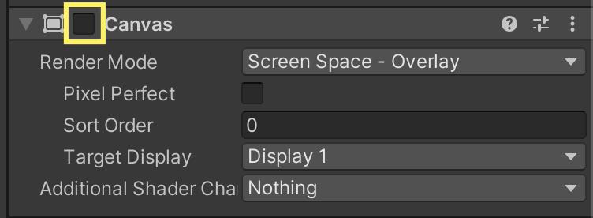
<p><em>VI: Component <strong>Canvas</strong> — <strong>Render Mode: Screen Space - Overlay</strong> · Pixel Perfect ✗ · Sort Order 0. / EN: A Canvas component in Screen Space - Overlay mode.</em></p>

<div class="bilingual-row">
<div class="col-vi">
<p>💀 <em>"Trong uGUI, <strong>khi có THAY ĐỔI ở một phần tử trong Canvas, một tiến trình (REBUILD) chạy để DỰNG LẠI TOÀN BỘ UI MESH của Canvas. "Thay đổi" là BẤT KỲ thay đổi nào — như BẬT/TẮT active, DI CHUYỂN hay ĐỔI KÍCH THƯỚC — từ thay đổi LỚN về diện mạo tới thay đổi NHỎ mà thoạt nhìn KHÔNG THẤY RÕ.</strong>"</em></p>
<p>🚨 <em>"<strong>CHI PHÍ của tiến trình rebuild là CAO, nên NẾU nó được thực hiện QUÁ NHIỀU LẦN hoặc NẾU số UI trong Canvas LỚN, hiệu năng sẽ bị ẢNH HƯỞNG TIÊU CỰC.</strong>"</em></p>
<p>✅ <em>"Ngược lại, <strong>chi phí rebuild GIẢM được bằng cách CHIA Canvas theo MỘT MỨC ĐỘ GẮN KẾT UI nào đó. Ví dụ, nếu bạn có UI CÓ animation và UI KHÔNG animation, bạn có thể TỐI THIỂU HOÁ các lần rebuild do animation bằng cách đặt chúng dưới các Canvas RIÊNG BIỆT.</strong>"</em></p>
<p>⚠️ <em>"<strong>TUY NHIÊN, bạn cần SUY NGHĨ KỸ về cách chia, vì CHIA Canvas sẽ KHÔNG HOẠT ĐỘNG cho các LÔ VẼ (drawing batches).</strong>"</em></p>
</div>
<div class="col-en">
<p>💀 <em>"In uGUI, <strong>when there is a CHANGE in an element in a Canvas, a process (REBUILD) runs to REBUILD THE ENTIRE CANVAS UI MESH. A change is ANY change, such as active switching, moving or resizing, from a major change in appearance to a MINOR change that is not apparent at first glance.</strong>"</em></p>
<p>🚨 <em>"<strong>The COST of the rebuild process is HIGH, so if it is performed TOO MANY TIMES or if the NUMBER OF UIs in the Canvas is LARGE, performance will be ADVERSELY AFFECTED.</strong>"</em></p>
<p>✅ <em>"In contrast, <strong>the cost of rebuilds can be REDUCED by DIVIDING the Canvas by some degree of UI COHESION. For example, if you have UIs that ANIMATE and UIs that DO NOT, you can MINIMIZE the animation rebuilds by placing them under a SEPARATE Canvas.</strong>"</em></p>
<p>⚠️ <em>"<strong>However, you need to think carefully about how to split them, as splitting Canvas will NOT WORK for DRAWING BATCHES.</strong>"</em></p>
</div>
</div>

!!! warning "⚠️ Canvas LỒNG NHAU — một hành vi CHƯA ĐƯỢC GIẢI THÍCH"
    <div class="bilingual-row">
    <div class="col-vi">
    <p><em>"Chia Canvas <strong>CŨNG có hiệu lực khi Canvas được LỒNG dưới Canvas. NẾU các phần tử trong Canvas CON thay đổi, CHỈ rebuild của Canvas CON chạy, CHỨ KHÔNG PHẢI Canvas CHA.</strong>"</em></p>
    <p>💀 <em>"<strong>TUY NHIÊN, khi xem xét KỸ HƠN, có vẻ tình huống KHÁC ĐI khi UI trong Canvas CON được chuyển sang trạng thái ACTIVE bằng <code>SetActive</code>. Trong trường hợp này, NẾU một SỐ LƯỢNG LỚN UI được đặt trong Canvas CHA, có vẻ có HIỆN TƯỢNG GÂY TẢI CAO. Tôi KHÔNG BIẾT chi tiết VÌ SAO hành vi này xảy ra, nhưng có vẻ NÊN CẨN THẬN khi chuyển trạng thái active của UI trong Canvas LỒNG NHAU.</strong>"</em></p>
    </div>
    <div class="col-en">
    <p><em>"Splitting Canvas is <strong>also valid when Canvas is NESTED under Canvas. If the elements contained in the CHILD Canvas change, a rebuild of the CHILD Canvas will ONLY run, NOT the parent Canvas.</strong>"</em></p>
    <p>💀 <em>"<strong>However, upon closer inspection, it seems that the situation is DIFFERENT when the UI in the child Canvas is switched to the ACTIVE state by <code>SetActive</code>. In this case, if a LARGE NUMBER of UIs are placed in the PARENT Canvas, there seems to be a phenomenon that causes a HIGH LOAD. I do NOT KNOW the details of WHY this behavior occurs, but it seems that CARE SHOULD BE TAKEN when switching the active state of the UI in the nested Canvas.</strong>"</em></p>
    </div>
    </div>

### 29.10. ⬜ UnityWhite — tiện lợi nhưng NGẮT BATCH

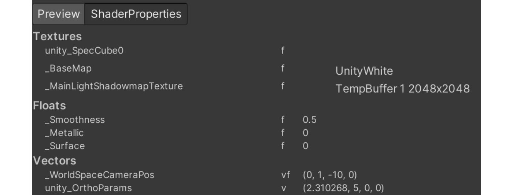
<p><em>VI: <strong>ShaderProperties</strong> trong Frame Debugger — <code>_BaseMap</code> trỏ tới <strong><code>UnityWhite</code></strong>, còn <code>_MainLightShadowmapTexture</code> là <strong>TempBuffer 1 2048×2048</strong>. Đây là cách XÁC MINH một draw call có dùng UnityWhite hay không. / EN: Frame Debugger ShaderProperties showing _BaseMap bound to UnityWhite.</em></p>

<div class="bilingual-row">
<div class="col-vi">
<p>🤍 <em>"Khi phát triển UI, ta thường muốn hiển thị <strong>object hình CHỮ NHẬT ĐƠN GIẢN</strong>. Đây là lúc <strong>UnityWhite</strong> phát huy tác dụng. <strong>UnityWhite là một texture TÍCH HỢP SẴN của Unity, được dùng khi component `Image` hoặc `RawImage` KHÔNG CHỈ ĐỊNH ảnh cần dùng.</strong> Bạn thấy UnityWhite được dùng thế nào trong <strong>Frame Debugger</strong>. Cơ chế này dùng để vẽ HÌNH CHỮ NHẬT TRẮNG, nên <strong>hiển thị kiểu chữ nhật đơn giản đạt được bằng cách KẾT HỢP nó với MÀU NHÂN.</strong>"</em></p>
<p>🚨 <strong>CÁI GIÁ:</strong> <em>"<strong>TUY NHIÊN, vì UnityWhite là một texture KHÁC với SpriteAtlas được cung cấp trong project, CÁC LÔ VẼ BỊ NGẮT QUÃNG. Điều này LÀM TĂNG DRAW CALL và GIẢM HIỆU QUẢ VẼ.</strong>"</em></p>
<p>✅ <strong>GIẢI PHÁP CyberAgent:</strong> <em>"<strong>Do đó, bạn NÊN THÊM một ảnh vuông TRẮNG NHỎ (ví dụ 4×4 PIXEL) vào SpriteAtlas và DÙNG Sprite ĐÓ để vẽ hình chữ nhật đơn giản. Điều này sẽ cho phép BATCH HOẠT ĐỘNG, vì CÙNG MỘT SpriteAtlas sẽ được dùng cho CÙNG MỘT MATERIAL.</strong>"</em></p>
</div>
<div class="col-en">
<p>🤍 <em>"When developing UIs, it is often the case that we want to display a <strong>SIMPLE RECTANGLE-shaped object</strong>. This is where <strong>UnityWhite</strong> comes in handy. <strong>UnityWhite is a Unity BUILT-IN texture that is used when the `Image` or `RawImage` component does NOT SPECIFY the image to be used.</strong> You can see how UnityWhite is used in the <strong>Frame Debugger</strong>. This mechanism can be used to draw a WHITE RECTANGLE, so <strong>a simple rectangle display can be achieved by COMBINING this with a MULTIPLYING COLOUR.</strong>"</em></p>
<p>🚨 <strong>The cost:</strong> <em>"<strong>However, since UnityWhite is a DIFFERENT TEXTURE than the SpriteAtlas provided in the project, DRAW BATCHES ARE INTERRUPTED. This INCREASES DRAW CALLS and REDUCES drawing efficiency.</strong>"</em></p>
<p>✅ <strong>CyberAgent's fix:</strong> <em>"<strong>Therefore, you should ADD a SMALL (e.g., 4 × 4 PIXEL) WHITE SQUARE image to the SpriteAtlas and use THAT Sprite to draw a simple rectangle. This will allow the BATCH TO WORK, since the SAME SpriteAtlas will be used for the SAME MATERIAL.</strong>"</em></p>
</div>
</div>

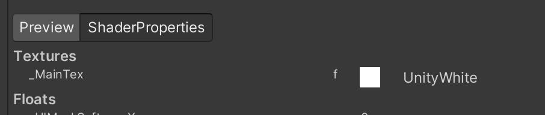

<p><em>VI: Bằng chứng trong <strong>Frame Debugger</strong> — tab <strong>ShaderProperties</strong> của một draw call UI cho thấy <strong>Textures → <code>_MainTex</code> = "UnityWhite"</strong> (ô texture TRẮNG TRƠN). 🔑 Chỉ cần THẤY tên này trong Frame Debugger là bạn biết batch UI ĐANG BỊ NGẮT ở đó. / EN: Seeing `_MainTex = UnityWhite` in the Frame Debugger is the tell-tale sign that a UI batch was broken.</em></p>

### 29.11. 📏 Layout component, Raycast Target & Masks

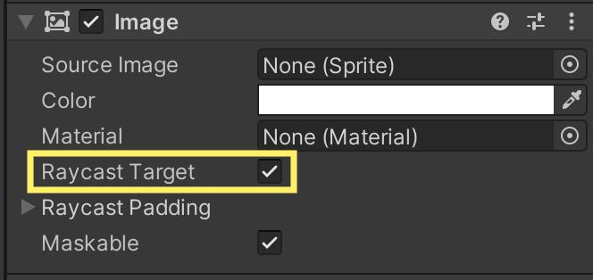
<p><em>VI: Component <strong>Image</strong> — <strong>Raycast Target ✓</strong> là MẶC ĐỊNH; TẮT nó ở mọi ảnh KHÔNG cần nhận input. / EN: A UI Image with Raycast Target enabled by default.</em></p>

<div class="bilingual-row">
<div class="col-vi">
<p>📏 <em>"uGUI cung cấp <strong>Layout component</strong> cho phép căn chỉnh object gọn gàng — ví dụ <strong><code>VerticalLayoutGroup</code></strong> cho căn dọc và <strong><code>GridLayoutGroup</code></strong> cho căn theo lưới."</em></p>
<p>💀 <em>"Khi dùng Layout component, <strong>LAYOUT REBUILD xảy ra khi object mục tiêu ĐƯỢC TẠO hoặc khi MỘT SỐ PROPERTY được SỬA. Layout rebuild, giống mesh rebuild, là các tiến trình ĐẮT ĐỎ.</strong>"</em></p>
<p>✅ <em>"Để tránh suy giảm hiệu năng do Layout rebuild, <strong>HIỆU QUẢ là TRÁNH dùng Layout component càng nhiều càng tốt.</strong>"</em></p>
<p>💡 <em>"Ví dụ, <strong>nếu bạn KHÔNG cần bố trí ĐỘNG (như text thay đổi vị trí theo nội dung), bạn KHÔNG CẦN dùng Layout component. Nếu bạn THỰC SỰ cần bố trí động, hoặc nếu nó được dùng NHIỀU trên màn hình, có thể TỐT HƠN là ĐIỀU KHIỂN bằng SCRIPT RIÊNG của bạn.</strong> Ngoài ra, <strong>nếu yêu cầu là đặt ở VỊ TRÍ CỤ THỂ tương đối với CHA kể cả khi cha đổi kích thước, điều này có thể đạt được bằng cách ĐIỀU CHỈNH <code>RectTransform</code> ANCHORS.</strong>"</em></p>
<p>🚨 <em>"<strong>NẾU bạn dùng Layout component khi tạo prefab vì nó TIỆN cho việc bố trí, HÃY CHẮC CHẮN XOÁ NÓ ĐI rồi mới LƯU.</strong>"</em></p>
</div>
<div class="col-en">
<p>📏 <em>"uGUI provides a <strong>Layout component</strong> — e.g. <strong><code>VerticalLayoutGroup</code></strong> for vertical alignment and <strong><code>GridLayoutGroup</code></strong> for grid alignment."</em></p>
<p>💀 <em>"When using the Layout component, <strong>LAYOUT REBUILDS occur when the target object is CREATED or when certain properties are EDITED. Layout rebuilds, like mesh rebuilds, are COSTLY processes.</strong>"</em></p>
<p>✅ <em>"To avoid performance degradation due to Layout rebuilds, <strong>it is EFFECTIVE to AVOID using Layout components as much as possible.</strong>"</em></p>
<p>💡 <em>"For example, <strong>if you do NOT need dynamic placement, you do NOT need to use the Layout component. If you really need dynamic placement, or if it is used a lot on screen, it may be BETTER to control it with YOUR OWN SCRIPTS.</strong> Also, <strong>if the requirement is to be placed in a specific position relative to the parent even if the parent changes size, this can be accomplished by adjusting the <code>RectTransform</code> ANCHORS.</strong>"</em></p>
<p>🚨 <em>"<strong>If you use a Layout component when creating a prefab because it is convenient for placement, BE SURE TO DELETE IT and save.</strong>"</em></p>
</div>
</div>

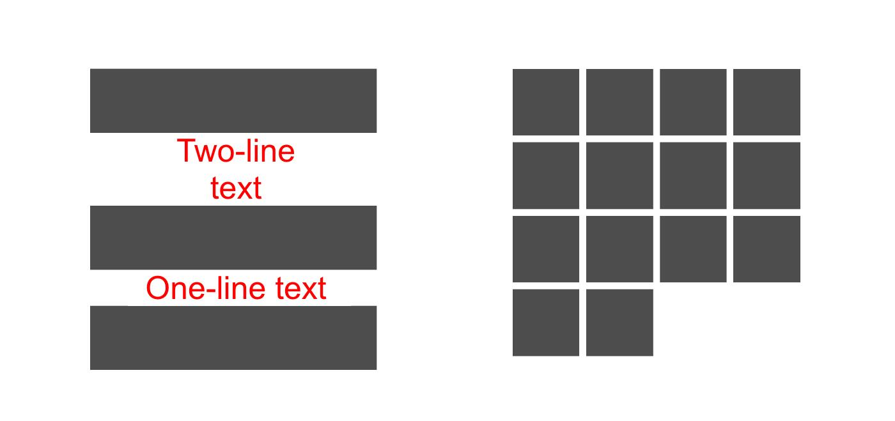

<p><em>VI: TRÁI — <strong><code>VerticalLayoutGroup</code></strong>: các phần tử tự giãn dòng theo nội dung ("Two-line text" đẩy các ô ra xa hơn "One-line text"). PHẢI — <strong><code>GridLayoutGroup</code></strong>: 14 ô xếp lưới 4 cột. 🚨 Chính hành vi TỰ ĐỘNG BỐ TRÍ này là thứ gây <strong>Layout rebuild</strong> mỗi lần nội dung đổi. / EN: VerticalLayoutGroup (left) vs GridLayoutGroup (right) — the auto-layout behaviour that triggers costly layout rebuilds.</em></p>

<div class="bilingual-row">
<div class="col-vi">
<p>🎯 <strong>Raycast Target:</strong> <em>"<code>Graphic</code>, lớp cơ sở cho <code>Image</code> và <code>RawImage</code>, có property <strong><code>Raycast Target</code></strong>. <strong>Khi property này BẬT, `Graphic` đó TRỞ THÀNH MỤC TIÊU cho CLICK và CHẠM. Khi màn hình được click hoặc chạm, các object có property này BẬT sẽ LÀ ĐỐI TƯỢNG XỬ LÝ, nên TẮT property này càng nhiều càng tốt sẽ CẢI THIỆN HIỆU NĂNG.</strong>"</em></p>
<p>💡 <strong>Mẹo dùng PRESET:</strong> <em>"<strong>Property này BẬT MẶC ĐỊNH, nhưng thực tế NHIỀU `Graphic` KHÔNG CẦN property này bật.</strong> Mặt khác, <strong>Unity có tính năng gọi là PRESET cho phép ĐỔI GIÁ TRỊ MẶC ĐỊNH trong project. Cụ thể, bạn TẠO preset cho component `Image` và `RawImage` tương ứng, và ĐĂNG KÝ chúng làm DEFAULT PRESET từ Preset Manager trong Project Settings. Bạn có thể dùng tính năng này để TẮT property `Raycast Target` MẶC ĐỊNH.</strong>"</em></p>
</div>
<div class="col-en">
<p>🎯 <strong>Raycast Target:</strong> <em>"<code>Graphic</code>, the base class for <code>Image</code> and <code>RawImage</code>, has a <strong><code>Raycast Target</code></strong> property. <strong>When enabled, its `Graphic` becomes the TARGET for clicks and touches. When the screen is clicked or touched, objects with this property enabled will be the target of processing, so DISABLING this property as much as possible will IMPROVE PERFORMANCE.</strong>"</em></p>
<p>💡 <strong>The preset trick:</strong> <em>"<strong>This property is enabled by DEFAULT, but actually MANY `Graphic` do NOT require it.</strong> On the other hand, <strong>Unity has a feature called PRESET that allows you to CHANGE THE DEFAULT VALUE in your project. Specifically, you can create presets for the `Image` and `RawImage` components respectively, and register them as DEFAULT PRESETS from the Preset Manager in Project Settings. You may use this feature to DISABLE the `Raycast Target` property by default.</strong>"</em></p>
</div>
</div>

!!! danger "💀 `RectMask2d` — "nên chọn nếu có" là LỜI KHUYÊN ĐÃ LỖI THỜI"
    <div class="bilingual-row">
    <div class="col-vi">
    <p><em>"Để biểu diễn mask trong uGUI, dùng component <strong><code>Mask</code></strong> hoặc <strong><code>RectMask2d</code></strong>."</em></p>
    <p>⚖️ <em>"<strong>Vì <code>Mask</code> dùng STENCIL để hiện thực mask, CHI PHÍ VẼ TĂNG theo MỖI component được thêm. Mặt khác, <code>RectMask2d</code> dùng SHADER PARAMETER để hiện thực mask, nên mức tăng chi phí vẽ bị TRIỆT TIÊU. TUY NHIÊN, <code>Mask</code> KHOÉT ĐƯỢC THEO HÌNH DẠNG BẤT KỲ, trong khi <code>RectMask2d</code> CHỈ khoét được HÌNH CHỮ NHẬT.</strong>"</em></p>
    <p>🚨 <em>"<strong>Người ta thường tin rằng NÊN CHỌN `RectMask2d` NẾU CÓ THỂ, nhưng người dùng Unity gần đây CŨNG NÊN CẨN THẬN khi dùng `RectMask2d`.</strong>"</em></p>
    <p>💀 <em>"Cụ thể, <strong>khi `RectMask2d` được BẬT, TẢI CPU cho việc CULLING MỖI FRAME TỈ LỆ THUẬN với số MỤC TIÊU BỊ MASK. Hiện tượng SINH TẢI MỖI FRAME NGAY CẢ KHI UI KHÔNG DI CHUYỂN GÌ CẢ này có vẻ là TÁC DỤNG PHỤ của một BẢN VÁ được đưa vào Unity 2019.3</strong>, theo comment trong phần cài đặt nội bộ của uGUI."</em></p>
    <p>✅ <strong>BA biện pháp:</strong> <em>"<strong>① TRÁNH dùng `RectMask2d` càng nhiều càng tốt; ② dùng <code>enabled = false</code> khi KHÔNG cần dù có dùng; ③ giữ MỤC TIÊU BỊ MASK ở MỨC TỐI THIỂU CẦN THIẾT.</strong>"</em></p>
    </div>
    <div class="col-en">
    <p>⚖️ <em>"<strong>Since <code>Mask</code> uses STENCILS, the drawing cost INCREASES WITH EACH additional component. On the other hand, <code>RectMask2d</code> uses SHADER PARAMETERS, so the increase in drawing cost is SUPPRESSED. However, <code>Mask</code> can be hollowed out in ANY SHAPE, while <code>RectMask2d</code> can ONLY be hollowed out as a RECTANGLE.</strong>"</em></p>
    <p>🚨 <em>"<strong>It is a common belief that `RectMask2d` should be selected if available, but recent Unity users should ALSO BE CAREFUL about using `RectMask2d`.</strong>"</em></p>
    <p>💀 <em>"Specifically, <strong>when `RectMask2d` is enabled, the CPU LOAD for CULLING EVERY FRAME is PROPORTIONAL to its MASKING TARGETS. This phenomenon, which GENERATES LOAD EVERY FRAME EVEN WHEN THE UI IS NOT MOVING ANYTHING, seems to be a SIDE EFFECT of a FIX that was included in Unity 2019.3</strong>, according to comments in uGUI's internal implementation."</em></p>
    <p>✅ <strong>Three countermeasures:</strong> <em>"<strong>① avoid using `RectMask2d` as much as possible; ② use <code>enabled = false</code> when it is not needed even if it is used; ③ keep masked targets to the MINIMUM NECESSARY.</strong>"</em></p>
    </div>
    </div>

### 29.12. 🔤 TextMeshPro — `SetText` thay vì `.text`

<div class="bilingual-row">
<div class="col-vi">
<p>📝 <em>"Cách PHỔ BIẾN để đặt text trong TextMeshPro là <strong>gán text cho property <code>text</code></strong>, nhưng còn có một cách KHÁC: <strong><code>SetText</code></strong>."</em></p>
<p>🔧 <em>"Có <strong>NHIỀU OVERLOAD của <code>SetText</code></strong>, ví dụ nhận một <code>string</code> và một giá trị kiểu <code>float</code> làm tham số."</em></p>
<p>🏆 <em>"<strong>ƯU ĐIỂM của phương pháp này là nó GIẢM CHI PHÍ SINH CHUỖI.</strong>"</em></p>
<p>💀 <em>"Trong phương pháp dùng property <code>text</code>, <strong><code>ToString()</code> của kiểu <code>float</code> ĐƯỢC THỰC THI, nên CHI PHÍ SINH CHUỖI PHÁT SINH MỖI LẦN tiến trình này chạy.</strong> Ngược lại, <strong>phương pháp dùng <code>SetText</code> được THIẾT KẾ để SINH RA CÀNG ÍT CHUỖI CÀNG TỐT — một LỢI THẾ HIỆU NĂNG khi text hiển thị THAY ĐỔI THƯỜNG XUYÊN.</strong>"</em></p>
<p>⚡ <em>"Tính năng này của TextMeshPro <strong>CŨNG RẤT MẠNH khi KẾT HỢP với ZString</strong> (<code>github.com/Cysharp/ZString</code>). <strong>ZString là thư viện GIẢM CẤP PHÁT BỘ NHỚ trong việc SINH CHUỖI. ZString cung cấp NHIỀU EXTENSION METHOD cho kiểu <code>TMP_Text</code>, và bằng cách dùng chúng, bạn đạt được hiển thị text LINH HOẠT trong khi GIẢM chi phí sinh chuỗi.</strong>"</em></p>
</div>
<div class="col-en">
<p>📝 <em>"The common way to set text in TextMeshPro is to <strong>assign text to the <code>text</code> property</strong>, but there is ANOTHER method: <strong><code>SetText</code></strong>."</em></p>
<p>🔧 <em>"There are <strong>MANY OVERLOADS to <code>SetText</code></strong>, for example, that take a <code>string</code> and a <code>float</code> value as arguments."</em></p>
<p>🏆 <em>"<strong>The ADVANTAGE of this method is that it REDUCES THE COST OF GENERATING STRINGS.</strong>"</em></p>
<p>💀 <em>"In the method using the <code>text</code> property, <strong><code>ToString()</code> of type <code>float</code> IS EXECUTED, so the STRING GENERATION COST is INCURRED EACH TIME this process is executed.</strong> In contrast, <strong>the method using <code>SetText</code> is designed to generate AS FEW STRINGS AS POSSIBLE, which is a PERFORMANCE ADVANTAGE when the text to be displayed CHANGES FREQUENTLY.</strong>"</em></p>
<p>⚡ <em>"This feature is also very powerful when <strong>COMBINED WITH ZString</strong>. <strong>ZString is a library that REDUCES MEMORY ALLOCATION in string generation. ZString provides MANY EXTENSION METHODS for the <code>TMP_Text</code> type, and by using those methods, FLEXIBLE text display can be achieved while REDUCING the cost of string generation.</strong>"</em></p>
</div>
</div>

**List 8.1 (✅ NÊN) vs List 8.2 (❌ TRÁNH):**

```csharp
// ✅ List 8.1 — SetText: sinh RẤT ÍT chuỗi
label.SetText("{0}", number);

// ❌ List 8.2 — property text: float.ToString() chạy MỖI LẦN
label.text = number.ToString();
```

> 📌 *Giả định `label` là biến kiểu `TMP_Text` (hoặc kế thừa từ nó) và `number` là kiểu `float`.*

### 29.13. 🏆 CHUYỂN ĐỔI HIỂN THỊ UI — bảng đo 323.79ms vs 3.64ms

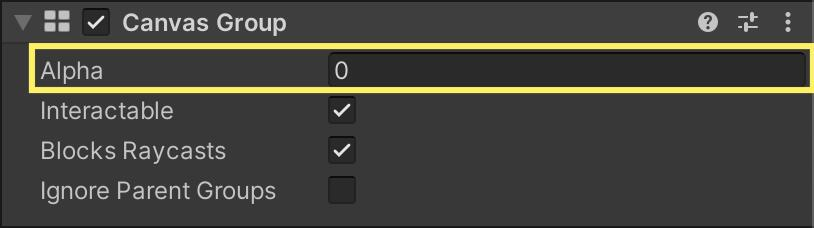
<p><em>VI: <strong>Canvas Group</strong> với <strong>Alpha = 0</strong> — cách ẨN UI RẺ NHẤT: KHÔNG kích hoạt lại rebuild như <code>SetActive</code>. / EN: A Canvas Group with Alpha set to 0.</em></p>

<div class="bilingual-row">
<div class="col-vi">
<p>💀 <em>"Các component uGUI có ĐẶC ĐIỂM là <strong>CHI PHÍ CAO của việc CHUYỂN ĐỔI ACTIVE của object bằng <code>SetActive</code>. Điều này là do <code>OnEnable</code> ĐẶT CỜ DIRTY cho các loại rebuild và thực hiện KHỞI TẠO liên quan tới MASK. Do đó, điều QUAN TRỌNG là cân nhắc các PHƯƠNG ÁN THAY THẾ cho <code>SetActive</code> khi chuyển đổi hiển thị UI.</strong>"</em></p>
<p>1️⃣ <strong>Đổi <code>enabled</code> của Canvas thành <code>false</code></strong> — <em>"Điều này sẽ NGĂN TẤT CẢ object dưới Canvas được render. ⚠️ <strong>Do đó, phương pháp này có NHƯỢC ĐIỂM là CHỈ dùng được nếu bạn muốn ẨN TẤT CẢ object dưới Canvas.</strong>"</em></p>
<p>2️⃣ <strong>Dùng <code>CanvasGroup</code></strong> — <em>"<code>CanvasGroup</code> có chức năng cho phép <strong>ĐIỀU CHỈNH ĐỘ TRONG SUỐT của TẤT CẢ object bên dưới nó CÙNG MỘT LÚC. Nếu bạn dùng chức năng này và ĐẶT ĐỘ TRONG SUỐT = 0, bạn ẨN được tất cả object dưới CanvasGroup đó.</strong>"</em></p>
<p>🚨 <strong>CẢNH BÁO CHUNG cho cả hai:</strong> <em>"<strong>Dù các phương pháp này được KỲ VỌNG TRÁNH được tải do <code>SetActive</code>, bạn có thể cần CẨN THẬN vì GameObject SẼ VẪN Ở TRẠNG THÁI ACTIVE. Ví dụ, NẾU các method <code>Update</code> được định nghĩa, hãy Ý THỨC rằng CHÚNG SẼ TIẾP TỤC CHẠY KỂ CẢ Ở TRẠNG THÁI ẨN, có thể dẫn tới TĂNG TẢI NGOÀI Ý MUỐN.</strong>"</em></p>
</div>
<div class="col-en">
<p>💀 <em>"uGUI components are characterized by the <strong>HIGH COST of ACTIVE SWITCHING of objects by <code>SetActive</code>. This is due to the fact that <code>OnEnable</code> SETS THE DIRTY FLAG for various rebuilds and performs INITIALIZATION related to MASKS. Therefore, it is IMPORTANT to consider ALTERNATIVES to the <code>SetActive</code> method for switching the display of the UI.</strong>"</em></p>
<p>1️⃣ <strong>Set Canvas <code>enabled</code> to <code>false</code></strong> — <em>"This will prevent all objects under the Canvas from being rendered. ⚠️ <strong>Therefore, this method has the DISADVANTAGE that it can ONLY be used if you want to HIDE ALL the objects under the Canvas.</strong>"</em></p>
<p>2️⃣ <strong>Use <code>CanvasGroup</code></strong> — <em>"<code>CanvasGroup</code> has a function that allows you to <strong>adjust the TRANSPARENCY of ALL objects under it AT ONCE. If you set the transparency to 0, you can HIDE all the objects under that CanvasGroup.</strong>"</em></p>
<p>🚨 <strong>The caveat for both:</strong> <em>"<strong>While these methods are expected to avoid the load caused by <code>SetActive</code>, you may need to be careful because the GameObject WILL REMAIN IN THE ACTIVE STATE. For example, if <code>Update</code> methods are defined, be aware that THEY WILL CONTINUE TO RUN EVEN IN THE HIDDEN STATE, which may lead to an UNEXPECTED INCREASE IN LOAD.</strong>"</em></p>
</div>
</div>

!!! success "📊 BẢNG 8.1 — Đo THỰC TẾ trên 1280 GameObject có `Image`"
    <div class="bilingual-row">
    <div class="col-vi">
    <p>🔬 <strong>Điều kiện đo:</strong> <em>"Chúng tôi đã đo thời gian xử lý cho <strong>1280 GameObject có component `Image` gắn vào</strong>, khi chuyển giữa trạng thái HIỆN và ẨN bằng TỪNG phương pháp. <strong>Thời gian xử lý được đo bằng Unity editor, và Deep Profile KHÔNG được dùng.</strong> Thời gian xử lý của phương pháp là <strong>TỔNG của thời gian thực thi việc chuyển đổi thực tế</strong> (ví dụ với `SetActive`, lời gọi method được bao bởi <code>Profiler.BeginSample</code>/<code>EndSample</code>) <strong>CỘNG thời gian thực thi <code>UIEvents.WillRenderCanvases</code> trong frame đó</strong> — vì <strong>UI rebuild được thực hiện trong đó.</strong>"</em></p>
    </div>
    <div class="col-en">
    <p>🔬 <strong>Measurement conditions:</strong> <em>"We measured the processing time for <strong>1280 GameObjects with `Image` components attached</strong>, when switching between visible and hidden states using each method. <strong>The processing time was measured using the Unity editor, and Deep Profile was NOT used.</strong> The processing time is the <strong>SUM of the execution time of the actual switching</strong> and <strong>the execution time of <code>UIEvents.WillRenderCanvases</code> in the frame</strong>, because the UI rebuild is performed there."</em></p>
    </div>
    </div>

    | Method | ⏱️ Thời gian xử lý (**HIỆN**) | ⏱️ Thời gian xử lý (**ẨN**) |
    |---|---|---|
    | 💀 **`SetActive`** | **323.79 ms** | **209.93 ms** |
    | ⚠️ **`Canvas.enabled`** | **61.25 ms** | **61.23 ms** |
    | 🏆 **`CanvasGroup.alpha`** | **3.64 ms** | **3.40 ms** |

    <div class="bilingual-row">
    <div class="col-vi">
    <p>🎯 <em>"Từ kết quả Bảng 8.1, chúng tôi thấy rằng <strong>phương pháp dùng `CanvasGroup` có thời gian xử lý NGẮN NHẤT VƯỢT TRỘI trong tình huống chúng tôi đã thử.</strong>"</em></p>
    <p>🧮 <strong>Quy ra tỉ lệ:</strong> `CanvasGroup` <strong>NHANH HƠN `SetActive` khoảng 89 LẦN</strong> khi HIỆN (323.79 / 3.64 ≈ <strong>89×</strong>) và <strong>khoảng 62 LẦN</strong> khi ẨN (209.93 / 3.40 ≈ <strong>62×</strong>); `Canvas.enabled` nhanh hơn `SetActive` khoảng <strong>5.3×</strong>.</p>
    </div>
    <div class="col-en">
    <p>🎯 <em>"From the results of Table 8.1, we found that <strong>the method using `CanvasGroup` has BY FAR the SHORTEST processing time in the situation we tried this time.</strong>"</em></p>
    <p>🧮 <strong>As ratios:</strong> `CanvasGroup` is roughly <strong>89× faster</strong> than `SetActive` when showing and about <strong>62× faster</strong> when hiding; `Canvas.enabled` is about <strong>5.3×</strong> faster than `SetActive`.</p>
    </div>
    </div>

---

!!! abstract "🎓 TỔNG KẾT PHẦN C — CHỌN ĐÚNG CÔNG CỤ, ĐÚNG CON SỐ"
    <div class="bilingual-row">
    <div class="col-vi">
    <p>🧰 <strong>Bản đồ CÔNG CỤ:</strong> <strong>Unity Profiler</strong> (nhìn tổng quan theo frame) → <strong>Profile Analyzer</strong> (thống kê nhiều frame, so sánh trước/sau) → <strong>Frame Debugger</strong> (vì sao KHÔNG batch) → <strong>Memory Profiler / Heap Explorer</strong> (ai GIỮ tham chiếu) → <strong>Xcode &amp; Instruments</strong> (con số CHÍNH XÁC, native, plug-in) → <strong>Android Studio</strong> (Java/native heap) → <strong>RenderDoc</strong> (GPU chi tiết, overdraw theo pixel).</p>
    <p>🔢 <strong>Con số PHẢI NHỚ:</strong> Deep Profile chỉ dùng khi profile thường KHÔNG đủ · Autoconnect Profiler làm app CHỜ <strong>8 giây</strong> · Mip Map làm texture <strong>×1.3</strong> · Read/Write làm texture &amp; mesh <strong>×2</strong> · Dynamic batching cần <strong>&lt; 300 đỉnh</strong> · AssetBundle nạp đồng thời <strong>150–200</strong> (Unload true) / <strong>≤150</strong> (Unload false) · Fixed Timestep mặc định <strong>0.02s</strong>, Maximum Allowed Timestep <strong>0.33s</strong> · <code>CanvasGroup.alpha</code> <strong>3.64ms</strong> vs <code>SetActive</code> <strong>323.79ms</strong>.</p>
    </div>
    <div class="col-en">
    <p>🧰 <strong>Tool map:</strong> <strong>Unity Profiler</strong> (per-frame overview) → <strong>Profile Analyzer</strong> (multi-frame statistics, before/after) → <strong>Frame Debugger</strong> (why batching failed) → <strong>Memory Profiler / Heap Explorer</strong> (who holds the reference) → <strong>Xcode &amp; Instruments</strong> (accurate native numbers, plug-ins) → <strong>Android Studio</strong> (Java/native heap) → <strong>RenderDoc</strong> (GPU detail, per-pixel overdraw).</p>
    <p>🔢 <strong>Numbers to memorise:</strong> Deep Profile only when the normal profile is not enough · Autoconnect Profiler costs <strong>~8 s</strong> of startup timeout · Mip Maps <strong>×1.3</strong> texture memory · Read/Write <strong>×2</strong> for textures and meshes · Dynamic batching needs <strong>&lt; 300 vertices</strong> · concurrent AssetBundles <strong>150–200</strong> / <strong>≤150</strong> · Fixed Timestep <strong>0.02 s</strong>, Maximum Allowed Timestep <strong>0.33 s</strong> · <code>CanvasGroup.alpha</code> <strong>3.64 ms</strong> vs <code>SetActive</code> <strong>323.79 ms</strong>.</p>
    </div>
    </div>
---

# PHẦN D — TUNING SCRIPT: UNITY & C# (Chương 9–10)

> Nguồn: *Unity Performance Tuning Bible* — CyberAgent SGE Core Technology Team (Feb. 22, 2023, 1st Edition), Chương 9 "Tuning Practice - Script (Unity)" và Chương 10 "Tuning Practice - Script (C#)".

---

## 30. 🔑 Unity Event Functions & các API truy cập cơ bản

<div class="bilingual-row">
<div class="col-vi">
<p>Việc sử dụng <strong>tuỳ tiện</strong> các tính năng mà Unity cung cấp có thể dẫn tới những cái bẫy không ngờ tới. Chương này giới thiệu các kỹ thuật performance tuning liên quan tới <strong>phần hiện thực bên trong (internal implementation)</strong> của Unity, kèm ví dụ thực tế.</p>
</div>
<div class="col-en">
<p>Casual use of the features provided by Unity can lead to unexpected pitfalls. This chapter introduces performance tuning techniques related to Unity's internal implementation with actual examples.</p>
</div>
</div>

### 30.1. 💀 Hàm event rỗng của Unity (Empty Unity event functions)

<div class="bilingual-row">
<div class="col-vi">
<p>Khi các hàm event do Unity cung cấp như <code>Awake</code>, <code>Start</code>, <code>Update</code> được <strong>định nghĩa</strong>, chúng được <strong>cache vào một list nội bộ của Unity</strong> lúc runtime và được thực thi bằng cách duyệt (iteration) qua list đó.</p>
<p>⚠️ Ngay cả khi hàm <strong>không làm gì cả</strong>, nó vẫn bị cache <strong>chỉ vì nó được định nghĩa</strong>. Để lại các hàm event không cần thiết sẽ làm <strong>phình to list</strong> và <strong>tăng chi phí duyệt list</strong>.</p>
<p>Ví dụ: như đoạn code mẫu dưới đây, <code>Start</code> và <code>Update</code> được sinh ra sẵn ngay từ đầu trong một script mới tạo trên Unity. Nếu bạn không cần các hàm này, <strong>hãy chắc chắn xoá chúng đi</strong>.</p>
</div>
<div class="col-en">
<p>When Unity-provided event functions such as Awake, Start, and Update are defined, they are cached in an internal Unity list at runtime and executed by iteration of the list.</p>
<p>Even if nothing is done in the function, it will be cached simply because it is defined. Leaving unneeded event functions in place will bloat the list and increase the cost of iteration.</p>
<p>For example, as shown in the sample code below, Start and Update are defined from the beginning in a newly generated script on Unity. If you do not need these functions, be sure to delete them.</p>
</div>
</div>

▼ **List 9.1** — Script mới sinh ra trong Unity / *Newly generated script in Unity*

```csharp
public class NewBehaviourScript : MonoBehaviour
{
    // Start is called before the first frame update
    void Start()      // ❌ Rỗng nhưng vẫn bị cache vào list nội bộ → tốn chi phí iteration
    {

    }

    // Update is called once per frame
    void Update()     // ❌ Rỗng nhưng vẫn được gọi MỖI FRAME cho MỌI instance
    {

    }
}
```

!!! danger "Bẫy chết người của hàm rỗng"
    Nếu bạn có **1.000 GameObject** cùng gắn một script có `Update()` rỗng, Unity vẫn phải duyệt qua **1.000 phần tử** trong list và gọi **1.000 lần** vào managed code mỗi frame — với **0 lợi ích**. Đây là chi phí đi qua ranh giới C++ → C# hoàn toàn lãng phí.

### 30.2. 💀 Truy cập `tag` và `name` — chúng GC.Alloc!

<div class="bilingual-row">
<div class="col-vi">
<p>Các class kế thừa từ <code>UnityEngine.Object</code> cung cấp property <code>tag</code> và <code>name</code>. Những property này rất tiện để nhận diện object, nhưng thực tế chúng <strong>GC.Alloc</strong>.</p>
<p>Sách trích dẫn phần hiện thực từ <code>UnityCsReference</code>. Bạn có thể thấy cả hai đều gọi xuống <strong>process được hiện thực trong native code</strong>.</p>
<p>Unity cho phép viết script bằng C#, nhưng <strong>bản thân Unity được viết bằng C++</strong>. Vì <strong>vùng nhớ C# và vùng nhớ C++ không thể chia sẻ với nhau</strong>, bộ nhớ phải được <strong>cấp phát mới</strong> để chuyển thông tin chuỗi từ phía C++ sang phía C#. Việc này xảy ra <strong>MỖI LẦN GỌI</strong>, nên nếu bạn muốn truy cập nhiều lần, <strong>bắt buộc phải cache lại</strong>.</p>
</div>
<div class="col-en">
<p>Classes inheriting from UnityEngine.Object provide the tag and name properties. These properties are useful for object identification, but in fact GC.Alloc.</p>
<p>I have quoted their respective implementations from UnityCsReference. You can see that both call processes implemented in native code.</p>
<p>Unity implements scripts in C#, but Unity itself is implemented in C++. Since C# memory space and C++ memory space cannot be shared, memory is allocated to pass string information from the C++ side to the C# side. This is done each time it is called, so if you want to access it multiple times, you should cache it.</p>
</div>
</div>

▼ **List 9.2** — `UnityCsReference GameObject.bindings.cs`

```csharp
public extern string tag
{
    [FreeFunction("GameObjectBindings::GetTag", HasExplicitThis = true)]
    get;   // ⚠️ Gọi xuống native C++ → cấp phát string mới mỗi lần đọc
    [FreeFunction("GameObjectBindings::SetTag", HasExplicitThis = true)]
    set;
}
```

▼ **List 9.3** — `UnityCsReference UnityEngineObject.bindings.cs`

```csharp
public string name
{
    get { return GetName(this); }   // ⚠️ GC.Alloc mỗi lần truy cập
    set { SetName(this, value); }
}

[FreeFunction("UnityEngineObjectBindings::GetName")]
extern static string GetName([NotNull("NullExceptionObject")] Object obj);
```

!!! warning "Quy tắc"
    Không bao giờ so sánh `gameObject.tag == "Enemy"` hay `gameObject.name == "Player"` **trong `Update()`**. Dùng `CompareTag()` (không alloc) hoặc cache chuỗi ra biến thành viên một lần duy nhất trong `Awake()`.

### 30.3. ⚠️ Lấy Component — `GetComponent()`

<div class="bilingual-row">
<div class="col-vi">
<p><code>GetComponent()</code>, hàm lấy các component khác gắn trên cùng một <code>GameObject</code>, cũng là một thứ cần chú ý.</p>
<p>Ngoài việc nó gọi xuống <strong>process hiện thực bằng native code</strong> — tương tự property <code>tag</code> và <code>name</code> ở mục trước — chúng ta còn phải cẩn thận với <strong>chi phí "tìm kiếm" (searching)</strong> component thuộc kiểu được chỉ định.</p>
<p>Trong code mẫu dưới đây, bạn sẽ phải trả chi phí tìm component <code>Rigidbody</code> <strong>mỗi frame</strong>. Nếu bạn truy cập thường xuyên, <strong>hãy dùng bản đã cache sẵn</strong>.</p>
</div>
<div class="col-en">
<p>GetComponent(), which retrieves other components attached to the same GameObject, is another one that requires attention.</p>
<p>As well as the fact that it calls a process implemented in native code, similar to the tag and name properties in the previous section, we must also be careful about the cost of "searching" for components of the specified type.</p>
<p>In the sample code below, you will have the cost of searching for Rigidbody components every frame. If you access the site frequently, you should use a pre-cached version of the site.</p>
</div>
</div>

▼ **List 9.4** — Code gọi `GetComponent()` mỗi frame / *Code to GetComponent() every frame*

```csharp
void Update()
{
    Rigidbody rb = GetComponent<Rigidbody>();   // ❌ Tìm kiếm component MỖI FRAME
    rb.AddForce(Vector3.up * 10f);
}
```

```csharp
// ✅ Bản sửa: cache 1 lần trong Awake
private Rigidbody _rb;

void Awake()
{
    _rb = GetComponent<Rigidbody>();   // Chỉ tìm 1 lần duy nhất
}

void Update()
{
    _rb.AddForce(Vector3.up * 10f);
}
```

### 30.4. 🎯 Truy cập `transform`

<div class="bilingual-row">
<div class="col-vi">
<p><code>Transform</code> là component được truy cập rất thường xuyên: <code>position</code>, <code>rotation</code>, <code>scale</code> (phóng to/thu nhỏ), thay đổi quan hệ cha-con. Như code mẫu dưới đây, bạn thường phải cập nhật <strong>nhiều giá trị</strong> cùng lúc.</p>
</div>
<div class="col-en">
<p>Transform components are frequently accessed components such as position, rotation, scale (expansion and contraction), and parent-child relationship changes. As shown in the sample code below, you will often need to update multiple values.</p>
</div>
</div>

▼ **List 9.5** — Ví dụ truy cập transform / *Example of accessing transform*

```csharp
void SetTransform(Vector3 position, Quaternion rotation, Vector3 scale)
{
    transform.position = position;     // ❌ 3 lần gọi GetTransform() nội bộ
    transform.rotation = rotation;
    transform.localScale = scale;
}
```

<div class="bilingual-row">
<div class="col-vi">
<p>Khi <code>transform</code> được lấy ra, tiến trình <code>GetTransform()</code> được gọi bên trong Unity. Nó <strong>đã được tối ưu và nhanh hơn <code>GetComponent()</code></strong> ở mục trước. Tuy nhiên, nó vẫn <strong>chậm hơn trường hợp đã cache</strong>, nên thứ này cũng nên được cache và truy cập như code mẫu bên dưới.</p>
<p>💡 Đối với <code>position</code> và <code>rotation</code>, bạn còn có thể dùng <code>SetPositionAndRotation()</code> để <strong>giảm số lần gọi hàm</strong>.</p>
</div>
<div class="col-en">
<p>When transform is retrieved, the process GetTransform() is called inside Unity. It is optimized and faster than GetComponent() in the previous section. However, it is slower than the cached case, so this should also be cached and accessed as shown in the sample code below. For position and rotation, you can also use SetPositionAndRotation() to reduce the number of function calls.</p>
</div>
</div>

▼ **List 9.6** — Ví dụ cache transform / *Example of caching transform*

```csharp
void SetTransform(Vector3 position, Quaternion rotation, Vector3 scale)
{
    var transformCache = transform;                                  // ✅ Lấy 1 lần
    transformCache.SetPositionAndRotation(position, rotation);       // ✅ Gộp 2 lệnh thành 1
    transformCache.localScale = scale;
}
```

---

## 31. 💀 Vòng đời tài nguyên & chuỗi định danh

### 31.1. 🚨 Các class BẮT BUỘC phải huỷ tường minh

<div class="bilingual-row">
<div class="col-vi">
<p>Vì Unity được phát triển bằng C#, các object không còn được tham chiếu sẽ được GC giải phóng. <strong>Tuy nhiên, một số class trong Unity cần được huỷ (destroy) một cách TƯỜNG MINH.</strong> Các ví dụ điển hình là <code>Texture2D</code>, <code>Sprite</code>, <code>Material</code>, và <code>PlayableGraph</code>.</p>
<p>Nếu bạn tạo chúng bằng <code>new</code> hoặc bằng hàm <code>Create</code> chuyên dụng, <strong>hãy chắc chắn huỷ chúng tường minh</strong>.</p>
</div>
<div class="col-en">
<p>Since Unity is developed in C#, objects that are no longer referenced by GC are freed. However, some classes in Unity need to be explicitly destroyed. Typical examples are Texture2D, Sprite, Material, and PlayableGraph. If you generate them with new or the dedicated Create function, be sure to explicitly destroy them.</p>
</div>
</div>

▼ **List 9.7** — Tạo và huỷ tường minh / *Generation and Explicit Destruction*

```csharp
void Start()
{
    _texture  = new Texture2D(8, 8);
    _sprite   = Sprite.Create(_texture, new Rect(0, 0, 8, 8), Vector2.zero);
    _material = new Material(shader);
    _graph    = PlayableGraph.Create();
}

void OnDestroy()
{
    // ✅ BẮT BUỘC: GC KHÔNG tự dọn phần native memory của các đối tượng này
    Destroy(_texture);
    Destroy(_sprite);
    Destroy(_material);

    if (_graph.IsValid())
    {
        _graph.Destroy();
    }
}
```

!!! danger "Vì sao GC không cứu được bạn?"
    Các đối tượng này là **wrapper C# mỏng bọc quanh native object phía C++**. GC chỉ dọn phần vỏ C# — **phần thân native vẫn nằm lại trong RAM** cho tới khi bạn gọi `Destroy()`. Đây là nguyên nhân kinh điển của rò rỉ bộ nhớ tăng dần cho tới khi app bị OOM-kill.

### 31.2. ⚠️ Chỉ định bằng chuỗi (String specification)

<div class="bilingual-row">
<div class="col-vi">
<p>Hãy <strong>tránh dùng chuỗi</strong> để chỉ định state cần phát trong <code>Animator</code> và property cần thao tác trong <code>Material</code>.</p>
</div>
<div class="col-en">
<p>Avoid using strings to specify states to play in Animator and properties to manipulate in Material.</p>
</div>
</div>

▼ **List 9.8** — Ví dụ chỉ định bằng chuỗi / *Example of String Specification*

```csharp
_animator.Play("Wait");                 // ❌ Nội bộ gọi Animator.StringToHash mỗi lần
_material.SetFloat("_Prop", 100f);      // ❌ Nội bộ gọi Shader.PropertyToID mỗi lần
```

<div class="bilingual-row">
<div class="col-vi">
<p>Bên trong các hàm này, <code>Animator.StringToHash()</code> và <code>Shader.PropertyToID()</code> được thực thi để chuyển chuỗi thành <strong>giá trị định danh duy nhất</strong>. Vì rất lãng phí khi thực hiện việc chuyển đổi này mỗi lần truy cập nhiều lần, <strong>hãy cache giá trị định danh và tái sử dụng</strong>.</p>
<p>Như mẫu bên dưới, khuyến nghị định nghĩa một <strong>class liệt kê các giá trị định danh đã cache</strong> để dễ dùng.</p>
</div>
<div class="col-en">
<p>Inside these functions, Animator.StringToHash() and Shader.PropertyToID() are executed to convert strings to unique identification values. Since it is wasteful to perform the conversion each time when accessing the site many times, cache the identification value and use it repeatedly. As shown in the sample below, it is recommended to define a class that lists cached identification values for ease of use.</p>
</div>
</div>

▼ **List 9.9** — Ví dụ cache giá trị định danh / *Example of caching identification values*

```csharp
public static class ShaderProperty
{
    public static readonly int Color  = Shader.PropertyToID("_Color");
    public static readonly int Alpha  = Shader.PropertyToID("_Alpha");
    public static readonly int ZWrite = Shader.PropertyToID("_ZWrite");
}

public static class AnimationState
{
    public static readonly int Idle = Animator.StringToHash("idle");
    public static readonly int Walk = Animator.StringToHash("walk");
    public static readonly int Run  = Animator.StringToHash("run");
}

// ✅ Sử dụng: _material.SetFloat(ShaderProperty.Alpha, 1f);
//            _animator.Play(AnimationState.Run);
```

### 31.3. 💀 Cái bẫy của `JsonUtility`

<div class="bilingual-row">
<div class="col-vi">
<p>Unity cung cấp class <code>JsonUtility</code> để serialize/deserialize JSON. Tài liệu chính thức cũng nói rằng nó <strong>nhanh hơn chuẩn của C#</strong>, và thường được dùng cho các hiện thực chú trọng performance.</p>
</div>
<div class="col-en">
<p>Unity provides a class JsonUtility for JSON serialization/deserialization. The official document also states that it is faster than the C# standard, and is often used for performance-conscious implementations.</p>
</div>
</div>

<blockquote><p><em>"JsonUtility (although it has less functionality than .NET JSON) has been shown in benchmark tests to be <strong>significantly faster</strong> than the commonly used ."</em></p></blockquote>

<div class="bilingual-row">
<div class="col-vi">
<p>Tuy nhiên, có <strong>một điểm liên quan tới performance cần lưu ý</strong>: cách xử lý <code>null</code>.</p>
<p>Code mẫu bên dưới cho thấy tiến trình serialize và kết quả. Bạn có thể thấy rằng <strong>dù thành viên <code>b1</code> của class <code>A</code> được gán <code>null</code> tường minh</strong>, nó vẫn được serialize kèm theo class <code>B</code> và class <code>C</code> <strong>được sinh ra bằng constructor mặc định</strong>.</p>
<p>🚨 Nếu field cần serialize là <code>null</code> như ở đây, <strong>một object giả (dummy) sẽ được <code>new</code> ra trong quá trình chuyển đổi JSON</strong>, nên bạn cần tính tới overhead đó.</p>
</div>
<div class="col-en">
<p>However, there is one performance-related thing to be aware of: the handling of null.</p>
<p>The sample code below shows the serialization process and its results. You can see that even though the member b1 of class A is explicitly set to null, it is serialized with class B and class C generated with the default constructor. If the field to be serialized has null as shown here, a dummy object will be new created during JSON conversion, so you may want to take that overhead into account.</p>
</div>
</div>

▼ **List 9.10** — Hành vi serialize / *Serialization Behavior*

```csharp
[Serializable] public class A { public B b1; }
[Serializable] public class B { public C c1; public C c2; }
[Serializable] public class C { public int n; }

void Start()
{
    Debug.Log(JsonUtility.ToJson(new A() { b1 = null, }));
    // Kết quả: {"b1":{"c1":{"n":0}, "c2":{"n":0}}
    // 💀 b1 = null nhưng B, C VẪN bị new ra bằng default constructor!
}
```

### 31.4. 🚨 Cái bẫy của `Renderer.material` và `MeshFilter.mesh`

<div class="bilingual-row">
<div class="col-vi">
<p>Material lấy qua <code>Renderer.material</code> và mesh lấy qua <code>MeshFilter.mesh</code> là <strong>các instance được NHÂN BẢN (duplicated)</strong> và <strong>phải được huỷ tường minh</strong> khi dùng xong. Tài liệu chính thức cũng ghi rõ như sau.</p>
</div>
<div class="col-en">
<p>Materials obtained with Renderer.material and meshes obtained with MeshFilter.mesh are duplicated instances and must be explicitly destroyed when finished using them. The official documentation also clearly states the following respectively.</p>
</div>
</div>

<blockquote><p><em>"If the material is used by any other renderers, this will <strong>clone the shared material</strong> and start using it from now on."</em></p></blockquote>

<blockquote><p><em>"It is <strong>your responsibility</strong> to destroy the automatically instantiated mesh when the game object is being destroyed."</em></p></blockquote>

<div class="bilingual-row">
<div class="col-vi">
<p>Hãy giữ material và mesh đã lấy ra trong <strong>biến thành viên</strong> và huỷ chúng vào thời điểm phù hợp.</p>
</div>
<div class="col-en">
<p>Keep acquired materials and meshes in member variables and destroy them at the appropriate time.</p>
</div>
</div>

▼ **List 9.11** — Huỷ tường minh material đã nhân bản / *Explicitly destroying duplicated materials*

```csharp
void Start()
{
    // ⚠️ .material CLONE shared material → tạo instance mới, tăng draw call & RAM
    _material = GetComponent<Renderer>().material;
}

void OnDestroy()
{
    if (_material != null) {
        Destroy(_material);   // ✅ Trách nhiệm dọn dẹp thuộc về BẠN
    }
}
```

!!! tip "Mẹo phân biệt"
    `Renderer.sharedMaterial` — **không** clone, dùng chung, sửa nó sẽ ảnh hưởng mọi renderer khác (và cả asset trên đĩa trong Editor).
    `Renderer.material` — **luôn** clone lần đầu truy cập, bạn phải tự `Destroy()`.

---

## 32. 🔑 Loại bỏ log & tăng tốc bằng Burst

### 32.1. 💀 Loại bỏ code xuất log (Removal of log output codes)

<div class="bilingual-row">
<div class="col-vi">
<p>Unity cung cấp các hàm xuất log như <code>Debug.Log()</code>, <code>Debug.LogWarning()</code>, <code>Debug.LogError()</code>. Dù hữu ích, chúng có một số vấn đề:</p>
<ul>
<li>Bản thân việc <strong>xuất log là một tiến trình nặng</strong>.</li>
<li>Nó <strong>cũng được thực thi trong release build</strong>.</li>
<li>Việc <strong>tạo và nối chuỗi gây GC.Alloc</strong>.</li>
</ul>
<p>Nếu bạn tắt setting <code>Logging</code> trong Unity, stack trace sẽ dừng nhưng <strong>log vẫn được xuất</strong>. Nếu đặt <code>UnityEngine.Debug.unityLogger.logEnabled = false</code>, không log nào được xuất, nhưng vì đó <strong>chỉ là một nhánh rẽ bên trong hàm</strong>, nên chi phí gọi hàm cùng việc tạo/nối chuỗi lẽ ra không cần thiết <strong>vẫn bị thực hiện</strong>.</p>
<p>Còn có lựa chọn dùng chỉ thị <code>#if</code>, nhưng <strong>không thực tế</strong> để bọc toàn bộ mọi lệnh log.</p>
</div>
<div class="col-en">
<p>Unity provides functions for log output such as Debug.Log(), Debug.LogWarning(), and Debug.LogError(). While these functions are useful, there are some problems with them.</p>
<ul>
<li>Log output itself is a heavy process.</li>
<li>It is also executed in release builds.</li>
<li>String generation and concatenation causes GC.Alloc.</li>
</ul>
<p>If you turn off the Logging setting in Unity, the stack trace will stop, but the logs will be output. If UnityEngine.Debug.unityLogger.logEnabled is set to false in Unity, no logging is output, but since it is just a branch inside the function, function call costs and string generation and concatenation that should be unnecessary are done. There is also the option of using the #if directive, but it is not realistic to deal with all log output processing.</p>
</div>
</div>

▼ **List 9.12** — Chỉ thị `#if` / *The #if directive*

```csharp
#if UNITY_EDITOR
  Debug.LogError($"Error {e}");   // ⚠️ Phải bọc THỦ CÔNG từng chỗ → không thực tế
#endif
```

<div class="bilingual-row">
<div class="col-vi">
<p>✅ <strong>Thuộc tính <code>Conditional</code></strong> có thể được tận dụng trong trường hợp này. Các hàm mang thuộc tính <code>Conditional</code> sẽ bị <strong>compiler loại bỏ TOÀN BỘ PHẦN GỌI</strong> nếu symbol được chỉ định không được định nghĩa.</p>
<p>Như mẫu List 9.13, ý tưởng hay là gắn thuộc tính <code>Conditional</code> lên từng hàm trong <strong>class tự viết</strong>, đặt quy tắc rằng mọi lệnh log của Unity đều đi qua class log tự chế, để <strong>toàn bộ lời gọi hàm có thể bị loại bỏ</strong> khi cần.</p>
</div>
<div class="col-en">
<p>The Conditional attribute can be utilized in such cases. Functions with the Conditional attribute will have the calling part removed by the compiler if the specified symbol is not defined. As in the sample in List 9.13, it is a good idea to add the Conditional attribute to each function on the home-made class side as a rule to call the logging function on the Unity side through the home-made log output class, so that the entire function call can be removed if necessary.</p>
</div>
</div>

▼ **List 9.13** — Ví dụ thuộc tính Conditional / *Example of Conditional Attribute*

```csharp
public static class Debug
{
    private const string MConditionalDefine = "DEBUG_LOG_ON";

    // ✅ Nếu DEBUG_LOG_ON KHÔNG được define → compiler xoá luôn LỜI GỌI
    //    → không tạo chuỗi, không gọi hàm, không GC.Alloc
    [System.Diagnostics.Conditional(MConditionalDefine)]
    public static void Log(object message)
        => UnityEngine.Debug.Log(message);
}
```

<div class="bilingual-row">
<div class="col-vi">
<p>Một điều cần lưu ý: symbol được chỉ định <strong>phải tham chiếu được từ phía hàm gọi</strong>. Phạm vi của symbol định nghĩa bằng <code>#define</code> chỉ giới hạn trong <strong>file</strong> chứa nó. Không thực tế nếu phải định nghĩa symbol trong mọi file gọi hàm có thuộc tính <code>Conditional</code>.</p>
<p>Unity có tính năng <strong>Scripting Define Symbols</strong> cho phép định nghĩa symbol cho <strong>toàn bộ project</strong>. Vào <strong>"Project Settings → Player → Other Settings"</strong>.</p>
</div>
<div class="col-en">
<p>One thing to note is that the symbols specified must be able to be referenced by the function caller. The scope of the symbols defined in #define would be limited to the file in which they are written. It is not practical to define a symbol in every file that calls a function with the Conditional attribute. Unity has a feature called Scripting Define Symbols that allows you to define symbols for the entire project. This can be done under "Project Settings -> Player -> Other Settings".</p>
</div>
</div>

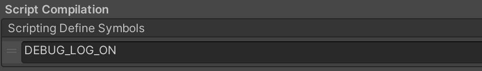

<p><em>VI: Hình 9.1 — Mục <strong>Script Compilation → Scripting Define Symbols</strong> trong Player Settings, đang khai báo symbol <code>DEBUG_LOG_ON</code> cho toàn project. / EN: Figure 9.1 — Scripting Define Symbols.</em></p>

### 32.2. ⚡ Tăng tốc code bằng Burst

<div class="bilingual-row">
<div class="col-vi">
<p><strong>Burst</strong> là compiler chính thức của Unity dành cho C# scripting hiệu năng cao.</p>
<p>Burst dùng một <strong>tập con (subset)</strong> của ngôn ngữ C#. Burst chuyển code C# thành <strong>IR (Intermediate Representation)</strong> — cú pháp trung gian của <strong>LLVM</strong>, một hạ tầng compiler — rồi tối ưu IR trước khi chuyển thành mã máy.</p>
<p>Tại bước này, code được <strong>vector hoá</strong> tối đa và thay bằng <strong>SIMD</strong>, tức tiến trình sử dụng tích cực các chỉ thị SIMD. Điều này được kỳ vọng cho ra chương trình chạy nhanh hơn.</p>
<p><strong>SIMD</strong> = <em>Single Instruction / Multiple Data</em>, chỉ các lệnh áp dụng <strong>MỘT chỉ thị lên NHIỀU dữ liệu ĐỒNG THỜI</strong>. Nói cách khác, bằng cách dùng tích cực chỉ thị SIMD, dữ liệu được xử lý gộp trong một chỉ thị duy nhất, cho tốc độ nhanh hơn so với chỉ thị thường.</p>
</div>
<div class="col-en">
<p>Burst is an official Unity compiler for high-performance C# scripting.</p>
<p>Burst uses a subset of the C# language to write code. Burst converts the C# code into IR (Intermediate Representation), which is the intermediate syntax of a compiler infrastructure called LLVM, and then optimizes the IR before converting it into machine language.</p>
<p>At this point, the code is vectorized as much as possible and replaced with SIMD, a process that actively uses instructions. This is expected to produce faster program output.</p>
<p>SIMD stands for Single Instruction/Multiple Data and refers to instructions that apply a single instruction to multiple data simultaneously. In other words, by actively using SIMD instructions, data is processed together in a single instruction, resulting in faster operation compared to normal instructions.</p>
</div>
</div>

<div class="bilingual-row">
<div class="col-vi">
<p><strong>Dùng Burst để tăng tốc code.</strong> Burst dùng tập con của C# gọi là <strong>High Performance C# (HPC#)</strong>.</p>
<p>Một trong các đặc điểm của HPC# là <strong>các kiểu tham chiếu (reference type) của C# như class và array KHÔNG khả dụng</strong>. Do đó, theo nguyên tắc, cấu trúc dữ liệu được mô tả bằng <strong>struct</strong>.</p>
<p>Với các collection như mảng, hãy dùng <strong><code>NativeContainer</code></strong> như <code>NativeArray&lt;T&gt;</code> thay thế.</p>
<p>Burst được dùng <strong>kết hợp với C# Job System</strong>. Vì vậy, phần xử lý riêng được mô tả trong method <code>Execute</code> của một job hiện thực <code>IJob</code>. Bằng cách gắn thuộc tính <code>BurstCompile</code> cho job đã định nghĩa, job sẽ được Burst tối ưu.</p>
<p>List 9.14 minh hoạ ví dụ <strong>bình phương từng phần tử</strong> của mảng đầu vào và lưu vào mảng <code>Output</code>.</p>
</div>
<div class="col-en">
<p>Burst uses a subset of C# called High Performance C# (HPC#) to write code.</p>
<p>One of the features of HPC# is that C# reference types, such as classes and arrays, are not available. Therefore, as a rule, data structures are described using structures.</p>
<p>For collections such as arrays, use NativeContainer such as NativeArray&lt;T&gt; instead.</p>
<p>Burst is used in conjunction with the C# Job System. Therefore, its own processing is described in the Execute method of a job that implements IJob. By giving the BurstCompile attribute to the defined job, the job will be optimized by Burst.</p>
<p>List 9.14 shows an example of squaring each element of a given array and storing it in the Output array.</p>
</div>
</div>

▼ **List 9.14** — Hiện thực Job để kiểm chứng đơn giản / *Job implementation for a simple validation*

```csharp
[BurstCompile]                       // ✅ Kích hoạt tối ưu Burst cho job này
private struct MyJob : IJob
{
    [ReadOnly]
    public NativeArray<float> Input;   // NativeContainer thay cho mảng managed

    [WriteOnly]
    public NativeArray<float> Output;

    public void Execute()
    {
        for (int i = 0; i < Input.Length; i++)
        {
            Output[i] = Input[i] * Input[i];   // ← dòng 14: được vector hoá thành SIMD
        }
    }
}
```

<div class="bilingual-row">
<div class="col-vi">
<p>Mỗi phần tử ở <strong>dòng 14</strong> của job có thể được tính <strong>độc lập</strong> (không có phụ thuộc thứ tự trong phép tính), và vì <strong>bố cục bộ nhớ của mảng output là liên tục</strong>, chúng có thể được tính <strong>gộp lại cùng nhau</strong> bằng chỉ thị SIMD.</p>
<p>Bạn có thể xem code sẽ được chuyển thành assembly loại nào bằng <strong>Burst Inspector</strong>.</p>
</div>
<div class="col-en">
<p>Each element in line 14 of the job can be computed independently (there is no order dependence in the computation), and since the memory alignment of the output array is continuous, they can be computed together using the SIMD instruction.</p>
<p>You can see what kind of assembly the code will be converted to using Burst Inspector.</p>
</div>
</div>

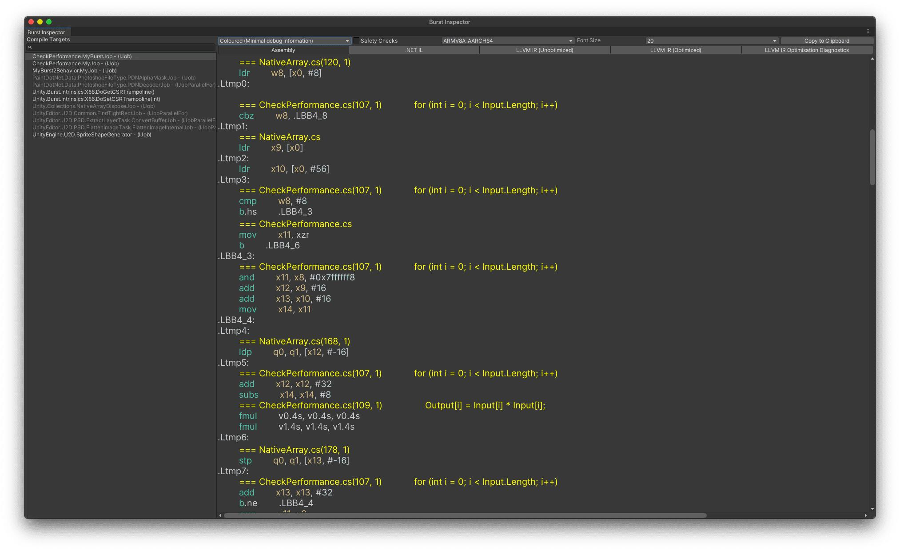

<p><em>VI: Hình 9.2 — Burst Inspector với target <code>ARMV8A_AARCH64</code>. Dòng <code>Output[i] = Input[i] * Input[i];</code> được biên dịch thành cặp lệnh <code>fmul v0.4s, v0.4s, v0.4s</code> — hậu tố <strong><code>.4s</code></strong> xác nhận đang dùng SIMD (4 số float xử lý cùng lúc). / EN: Figure 9.2 — Using the Burst Inspector, you can check what kind of assembly the code will be converted to.</em></p>

▼ **List 9.15** — Assembly ARMV8A_AARCH64 của dòng 14 / *Line 14 of the assembly for ARMV8A_AARCH64*

```asm
fmul         v0.4s, v0.4s, v0.4s
fmul         v1.4s, v1.4s, v1.4s
```

<div class="bilingual-row">
<div class="col-vi">
<p>Việc toán hạng của assembly có <strong>hậu tố <code>.4s</code></strong> xác nhận rằng <strong>chỉ thị SIMD đang được sử dụng</strong>.</p>
<p>Hiệu năng của code viết bằng pure C# và code tối ưu bằng Burst được so sánh trên <strong>thiết bị thật</strong>: <strong>Android Pixel 4a</strong>, build IL2CPP làm script backend. Kích thước mảng là <strong>2^20 = 1.048.576</strong>. Cùng tiến trình lặp lại <strong>10 lần</strong> và lấy thời gian xử lý trung bình.</p>
</div>
<div class="col-en">
<p>The fact that the operand of the assembly is suffixed with .4s confirms that the SIMD instruction is used.</p>
<p>The performance of the code implemented with pure C# and the code optimized with Burst are compared on a real device. The actual devices are Android Pixel 4a and IL2CPP built with a script backend for comparison. The array size is 2^20 = 1,048,576. The same process was repeated 10 times and the average processing time was taken.</p>
</div>
</div>

▼ **Table 9.1** — So sánh thời gian xử lý pure C# vs Burst

| Method / Phương pháp | Processing time / Thời gian xử lý |
|---|---|
| Pure C# implementation (hiện thực C# thuần) | **5,73 ms** |
| Implementation with Burst (hiện thực có Burst) | **0,98 ms** |

!!! success "Kết quả"
    Chúng tôi quan sát được mức **tăng tốc khoảng 5,8 LẦN** so với hiện thực pure C#.
    *"We observed a speedup of about 5.8 times compared to the pure C# implementation."*

---

## 33. 💀 GC.Alloc — mổ xẻ các trường hợp điển hình

<div class="bilingual-row">
<div class="col-vi">
<p>Chương này chủ yếu giới thiệu các thực hành performance tuning cho code C# kèm ví dụ. Cú pháp C# cơ bản <strong>không</strong> được đề cập ở đây, mà tập trung vào <strong>thiết kế và hiện thực bạn phải ý thức</strong> khi phát triển game đòi hỏi hiệu năng.</p>
</div>
<div class="col-en">
<p>This chapter mainly introduces performance tuning practices for C# code with examples. Basic C# notation is not covered here, but rather the design and implementation that you should be aware of when developing games that require performance.</p>
</div>
</div>

### 33.1. `new` một reference type

▼ **List 10.1** — Code GC.Alloc mỗi frame / *Code that GC.Alloc every frame*

```csharp
private void Update()
{
    const int listCapacity = 100;
    // GC.Alloc in new of List<int>.
    var list = new List<int>(listCapacity);          // ❌ Cấp phát heap MỖI FRAME
    for (var index = 0; index < listCapacity; index++)
    {
        // Pack index into list, though it doesn't make any sense in particular
        list.Add(index);
    }
    // Randomly take a value from the list
    var random = UnityEngine.Random.Range(0, listCapacity);
    var randomValue = list[random];
    // ... Do something with the random value ...
}
```

<div class="bilingual-row">
<div class="col-vi">
<p>Vấn đề lớn của code này là <code>List&lt;int&gt;</code> được <code>new</code> <strong>trong method <code>Update</code> chạy mỗi frame</strong>.</p>
<p>Để sửa, ta có thể tránh GC.Alloc mỗi frame bằng cách <strong>sinh sẵn <code>List&lt;int&gt;</code> từ trước</strong> và dùng đi dùng lại.</p>
</div>
<div class="col-en">
<p>The major problem with this code is that List&lt;int&gt; is new in the Update method that is executed every frame.</p>
<p>To fix this, it is possible to avoid GC.Alloc every frame by pre-generating List&lt;int&gt; and using it around.</p>
</div>
</div>

▼ **List 10.2** — Code loại bỏ GC.Alloc mỗi frame / *Code that eliminates GC.Alloc in every frame*

```csharp
private static readonly int listCapacity = 100;
// Generate a List in advance — ✅ sinh sẵn 1 lần
private readonly List<int> _list = new List<int>(listCapacity);

private void Update()
{
    _list.Clear();                                    // ✅ Tái sử dụng buffer, KHÔNG alloc
    for (var index = 0; index < listCapacity; index++)
    {
        // Pack indexes into the list, though it doesn't make sense to do so
        _list.Add(index);
    }
    // Randomly take a value from the list
    var random = UnityEngine.Random.Range(0, listCapacity);
    var randomValue = _list[random];
    // ... Do something with the random values ...
}
```

!!! info "💡 Nếu bạn mất dấu GC.Alloc — *If you lose GC.Alloc*"
    <div class="bilingual-row">
    <div class="col-vi">
    <p>Như bạn có thể đã nhận ra, với code mẫu List 10.2 ở trên thì <strong>tất cả những gì bạn cần làm</strong> chỉ là:</p>
    </div>
    <div class="col-en">
    <p>As you may have noticed, the sample code from List 10.2 above is all you need to do.</p>
    </div>
    </div>

    ```csharp
    var randomValue = UnityEngine.Random.Range(0, listCapacity);
    // ... Do something from a random value ...
    ```

    <div class="bilingual-row">
    <div class="col-vi">
    <p>Dù việc nghĩ cách loại bỏ GC.Alloc là quan trọng trong performance tuning, <strong>luôn nghĩ tới việc loại bỏ những phép tính vô nghĩa</strong> mới là bước đi hướng tới tăng tốc tiến trình.</p>
    </div>
    <div class="col-en">
    <p>While it is important to think about eliminating GC.Alloc in performance tuning, always thinking about eliminating pointless calculations is a step toward speeding up the process.</p>
    </div>
    </div>

### 33.2. 💀 Biểu thức Lambda (Lambda Expressions)

<div class="bilingual-row">
<div class="col-vi">
<p>Lambda cũng là tính năng hữu ích, nhưng <strong>việc dùng nó bị hạn chế trong game</strong> vì nó cũng có thể gây GC.Alloc tuỳ vào cách dùng. Ở đây ta giả định code sau đã được định nghĩa.</p>
</div>
<div class="col-en">
<p>Lambda expressions are also a useful feature, but their use is limited in games because they too can cause GC.Alloc depending on how they are used. Here we assume that the following code is defined.</p>
</div>
</div>

▼ **List 10.4** — Code giả định cho ví dụ lambda / *Assumed code for the lambda expression sample*

```csharp
// Member Variables
private int _memberCount = 0;

// static variables
private static int _staticCount = 0;

// member method
private void IncrementMemberCount()
{
    _memberCount++;
}

// static method
private static void IncrementStaticCount()
{
    _staticCount++;
}

// Member method that only invokes the received Action
private void InvokeActionMethod(System.Action action)
{
    action.Invoke();
}
```

▼ **List 10.5** — Trường hợp GC.Alloc do tham chiếu biến trong lambda / *Case of GC.Alloc by referencing a variable in a lambda expression*

```csharp
// When a member variable is referenced, Delegate Allocation occurs
InvokeActionMethod(() => { _memberCount++; });      // ❌ Delegate Allocation

// When a local variable is referenced, Closure Allocation occurs
int count = 0;
// The same Delegate Allocation as above also occurs
InvokeActionMethod(() => { count++; });             // ❌ Closure + Delegate Allocation
```

▼ **List 10.6** — Trường hợp tham chiếu biến static → KHÔNG GC.Alloc

```csharp
// When a static variable is referenced, GC Alloc does not occur
InvokeActionMethod(() => { _staticCount++; });      // ✅ Non-Alloc
```

▼ **List 10.7** — Trường hợp GC.Alloc khi tham chiếu method trong lambda

```csharp
// When a member method is referenced, Delegate Allocation occurs.
InvokeActionMethod(() => { IncrementMemberCount(); });   // ❌ Delegate Allocation

// If a member method is directly specified, Delegate Allocation occurs.
InvokeActionMethod(IncrementMemberCount);                // ❌ Delegate Allocation

// When a static method is directly specified, Delegate Allocation occurs
InvokeActionMethod(IncrementStaticCount);                // ❌ Delegate Allocation
```

▼ **List 10.8** — Trường hợp tham chiếu method trong lambda mà KHÔNG GC.Alloc

```csharp
// Non Alloc when a static method is referenced in a lambda expression
InvokeActionMethod(() => { IncrementStaticCount(); });   // ✅ Non-Alloc
```

<div class="bilingual-row">
<div class="col-vi">
<p>Theo cách này, <code>Action</code> chỉ được <code>new</code> ở <strong>lần đầu tiên</strong>, nhưng nó được <strong>cache nội bộ</strong> để tránh GC.Alloc từ lần thứ hai trở đi.</p>
<p>⚠️ Tuy nhiên, <strong>biến mọi biến và method thành <code>static</code> không phải là lựa chọn dễ áp dụng</strong> xét về mặt an toàn và khả năng đọc của code. Trong code cần chạy nhanh, <strong>an toàn hơn là thiết kế KHÔNG dùng lambda</strong> cho các sự kiện bắn ra mỗi frame hoặc vào thời điểm bất định, thay vì lạm dụng <code>static</code> để triệt tiêu GC.Alloc.</p>
</div>
<div class="col-en">
<p>In this way, the Action is new only the first time, but it is cached internally to avoid GC.Alloc from the second time onward.</p>
<p>However, making all variables and methods static is not very adoptable in terms of code safety and readability. In code that needs to be fast, it is safer to design without using lambda expressions for events that fire at every frame or at indefinite times, rather than to use a lot of statics to eliminate GC.Alloc.</p>
</div>
</div>

📊 **Bảng tổng kết GC.Alloc của lambda:**

| Cách viết | Loại allocation | Kết quả |
|---|---|---|
| `() => { _memberCount++; }` (biến thành viên) | Delegate Allocation | ❌ Alloc |
| `() => { count++; }` (biến cục bộ) | Closure + Delegate Allocation | ❌ Alloc (nặng nhất) |
| `() => { _staticCount++; }` (biến static) | — | ✅ Non-Alloc |
| `() => { IncrementMemberCount(); }` | Delegate Allocation | ❌ Alloc |
| `InvokeActionMethod(IncrementMemberCount)` (method group) | Delegate Allocation | ❌ Alloc |
| `InvokeActionMethod(IncrementStaticCount)` (method group static) | Delegate Allocation | ❌ Alloc |
| `() => { IncrementStaticCount(); }` (gọi static dạng câu lệnh) | — | ✅ Non-Alloc |

### 33.3. ⚠️ Generics và Boxing ngoài ý muốn

<div class="bilingual-row">
<div class="col-vi">
<p>Trong trường hợp dùng generics sau đây, điều gì có thể gây ra <strong>boxing</strong>?</p>
</div>
<div class="col-en">
<p>In the following cases where generics are used, what could cause boxing?</p>
</div>
</div>

▼ **List 10.9** — Ví dụ trường hợp có thể bị boxing khi dùng generics

```csharp
public readonly struct GenericStruct<T> : IEquatable<T>
{
    private readonly T _value;

    public GenericStruct(T value)
    {
        _value = value;
    }

    public bool Equals(T other)
    {
        var result = _value.Equals(other);   // 💀 Có thể rơi xuống Object.Equals(object) → BOXING
        return result;
    }
}
```

<div class="bilingual-row">
<div class="col-vi">
<p>Trong trường hợp này, lập trình viên đã hiện thực interface <code>IEquatable&lt;T&gt;</code> cho <code>GenericStruct</code>, nhưng <strong>quên đặt ràng buộc lên <code>T</code></strong>. Kết quả là một kiểu <strong>không</strong> hiện thực <code>IEquatable&lt;T&gt;</code> vẫn có thể được truyền vào <code>T</code>, và tồn tại trường hợp <code>Equals</code> dưới đây được dùng thông qua việc <strong>ép kiểu ngầm định sang <code>Object</code></strong>.</p>
</div>
<div class="col-en">
<p>In this case, the programmer implemented the IEquatable&lt;T&gt; interface to GenericStruct, but forgot to place restrictions on T. As a result, a type that does not implement the IEquatable&lt;T&gt; interface can be specified for T, and there is a case where the following Equals is used by implicitly casting to the Object type.</p>
</div>
</div>

▼ **List 10.10** — `Object.cs`

```csharp
public virtual bool Equals(object obj);   // 💀 Tham số là object → struct bị box
```

<div class="bilingual-row">
<div class="col-vi">
<p>Ví dụ, nếu một <code>struct</code> <strong>không</strong> hiện thực interface <code>IEquatable&lt;T&gt;</code> được truyền vào <code>T</code>, nó sẽ bị ép sang <code>object</code> ở đối số của <code>Equals</code>, <strong>gây ra boxing</strong>. Để ngăn chặn điều này từ trước, hãy sửa như sau.</p>
</div>
<div class="col-en">
<p>For example, if struct, which does not implement the IEquatable&lt;T&gt; interface, is specified to T, it will be cast to object with the argument Equals, resulting in boxing. To prevent this from happening in advance, change the following</p>
</div>
</div>

▼ **List 10.11** — Ví dụ có ràng buộc để ngăn boxing / *Example with restrictions to prevent boxing*

```csharp
public readonly struct GenericOnlyStruct<T> : IEquatable<T>
    where T : IEquatable<T>              // ✅ Generic type constraint — chặn boxing từ gốc
{
    private readonly T _value;

    public GenericOnlyStruct(T value)
    {
        _value = value;
    }

    public bool Equals(T other)
    {
        var result = _value.Equals(other);
        return result;
    }
}
```

<div class="bilingual-row">
<div class="col-vi">
<p>Bằng cách dùng mệnh đề <code>where</code> (<strong>generic type constraint</strong>) để hạn chế các kiểu mà <code>T</code> có thể nhận, chỉ cho phép những kiểu hiện thực <code>IEquatable&lt;T&gt;</code>, có thể <strong>ngăn chặn boxing ngoài ý muốn</strong>.</p>
</div>
<div class="col-en">
<p>By using the where clause (generic type constraint) to restrict the types that T can accept to those that implement IEquatable&lt;T&gt;, such unexpected boxing can be prevented.</p>
</div>
</div>

### 33.4. 🎯 Đừng bao giờ đánh mất mục tiêu ban đầu

!!! warning "Never lose sight of the original purpose"
    <div class="bilingual-row">
    <div class="col-vi">
    <p>Có rất nhiều trường hợp <code>struct</code> được chọn vì <strong>ý định tránh GC.Alloc lúc runtime</strong> trong game. Tuy nhiên, <strong>không phải lúc nào cũng có thể tăng tốc bằng cách biến mọi thứ thành struct</strong> để giảm GC.Alloc.</p>
    <p>💀 Một trong những thất bại phổ biến nhất là: khi dùng struct để tránh GC.Alloc, chi phí liên quan tới GC <strong>giảm đúng như kỳ vọng</strong>, nhưng <strong>kích thước dữ liệu quá lớn khiến việc COPY value type trở nên đắt đỏ</strong>, dẫn tới xử lý kém hiệu quả.</p>
    <p>Để tránh, cũng có phương pháp giảm chi phí copy bằng cách <strong>truyền tham chiếu (pass-by-reference)</strong> cho đối số method. Dù điều này có thể tăng tốc, trong trường hợp này bạn <strong>nên cân nhắc chọn class ngay từ đầu</strong> và hiện thực theo hướng <strong>sinh sẵn instance rồi dùng đi dùng lại</strong>.</p>
    <p>🔑 <strong>Hãy nhớ rằng mục tiêu tối thượng KHÔNG PHẢI là tiêu diệt GC.Alloc, mà là GIẢM THỜI GIAN XỬ LÝ MỖI FRAME.</strong></p>
    </div>
    <div class="col-en">
    <p>There are many cases where the structure is chosen because the intention is to avoid GC.Alloc during runtime in games. However, it is not always possible to speed up the process by making everything a structure in order to reduce GC.Alloc.</p>
    <p>One of the most common failures is that when structs are used to avoid GC.Alloc, the cost related to GC is reduced as expected, but the data size is so large that copying the value type becomes expensive, resulting in inefficient processing.</p>
    <p>To avoid this, there are also methods that reduce copying costs by using pass-by-reference for method arguments. Although this may result in a speed-up, in this case, you should consider selecting a class from the beginning and implementing it in such a way that instances are pre-generated and used around.</p>
    <p>Remember that the ultimate goal is not to eradicate GC.Alloc, but to reduce the processing time per frame.</p>
    </div>
    </div>

---

## 34. 📊 `for` vs `foreach` — sự thật từ IL

<div class="bilingual-row">
<div class="col-vi">
<p>Vòng lặp trở nên tốn thời gian tuỳ theo số lượng dữ liệu. Ngoài ra, các vòng lặp <strong>thoạt nhìn có vẻ giống hệt nhau</strong> lại có thể <strong>khác nhau về hiệu quả</strong> tuỳ vào cách viết code.</p>
<p>Hãy xem kết quả <strong>decompile code từ IL về C#</strong> bằng <strong>SharpLab</strong>, với <code>foreach</code>/<code>for</code> trên <code>List</code> và trên mảng, chỉ đơn giản lấy nội dung từng phần tử.</p>
</div>
<div class="col-en">
<p>As introduced in "2.6 Algorithms and computational complexity", loops become time-consuming depending on the number of data. Also, loops, which at first glance appear to be the same process, can vary in efficiency depending on how the code is written.</p>
<p>Let's take a look at the results of decompiling the code from IL to C# using SharpLab, using foreach/for List and just getting the contents of the array one by one.</p>
</div>
</div>

▼ **List 10.12** — Ví dụ lặp List bằng foreach

```csharp
var list = new List<int>(128);
foreach (var val in list)
{
}
```

▼ **List 10.13** — Kết quả decompile của ví dụ lặp List bằng foreach

```csharp
List<int>.Enumerator enumerator = new List<int>(128).GetEnumerator();
try
{
    while (enumerator.MoveNext())      // ⚠️ MoveNext() có nhiều lần kiểm tra size
    {
        int current = enumerator.Current;   // ⚠️ Thêm 1 lần truy cập property
    }
}
finally
{
    ((IDisposable)enumerator).Dispose();    // ⚠️ Thêm try/finally + Dispose
}
```

<div class="bilingual-row">
<div class="col-vi">
<p>Với trường hợp lặp bằng <code>foreach</code>, bạn thấy hiện thực là: lấy enumerator, tiến tới bằng <code>MoveNext()</code>, và tham chiếu giá trị qua <code>Current</code>. Hơn nữa, nhìn vào hiện thực của <code>MoveNext()</code> trong <code>list.cs</code>, có vẻ <strong>số lần truy cập property khác nhau — như kiểm tra size — tăng lên</strong>, và tiến trình <strong>xảy ra nhiều hơn so với truy cập trực tiếp bằng indexer</strong>.</p>
</div>
<div class="col-en">
<p>In the case of turning with foreach, you can see that the implementation is to get the enumerator, move on with MoveNext(), and refer to the value with Current. Furthermore, looking at the implementation of MoveNext() in list.cs, it appears that the number of various property accesses, such as size checks, are increased, and that processing is more frequent than direct access by the indexer.</p>
</div>
</div>

▼ **List 10.14** — Ví dụ lặp List bằng for

```csharp
var list = new List<int>(128);
for (var i = 0; i < list.Count; i++)   // ⚠️ list.Count được truy cập MỖI VÒNG LẶP
{
    var val = list[i];
}
```

▼ **List 10.15** — Kết quả decompile khi lặp List bằng for

```csharp
List<int> list = new List<int>(128);
int num = 0;
while (num < list.Count)      // ⚠️ Truy cập property Count tại MỖI lần lặp
{
    int num2 = list[num];
    num++;
}
```

<div class="bilingual-row">
<div class="col-vi">
<p>Trong C#, câu lệnh <code>for</code> là <strong>cú pháp đường (syntactic sugar)</strong> của câu lệnh <code>while</code>, và giá trị được lấy qua <strong>indexer</strong> (<code>public T this[int index]</code>).</p>
<p>Nhìn kỹ câu lệnh <code>while</code> này, bạn sẽ thấy <strong>biểu thức điều kiện chứa <code>list.Count</code></strong>. Điều đó nghĩa là <strong>việc truy cập property <code>Count</code> được thực hiện tại MỖI lần lặp</strong>. Càng nhiều lần truy cập property <code>Count</code>, số lần truy cập càng tăng <strong>tỉ lệ thuận</strong>, và tuỳ số lần truy cập, tải trọng trở nên <strong>không thể bỏ qua</strong>.</p>
<p>✅ Nếu <code>Count</code> không thay đổi bên trong vòng lặp, hãy <strong>cache nó trước vòng lặp</strong> để giảm tải truy cập property.</p>
</div>
<div class="col-en">
<p>In C#, the for statement is a sugar-coated syntax for the while statement, and the indexer (public T this[int index]), and is obtained by reference by the indexer. Also, if you look closely at this while statement, you will see that the conditional expression contains list.Count. This means that the access to the Count property is performed each time the loop is repeated. The more the number of Count accesses to the property, the more the number of accesses to the property increases proportionally, and depending on the number of accesses, the load becomes non-negligible. If Count does not change within the loop, then the load on property accesses can be reduced by caching them before the loop.</p>
</div>
</div>

▼ **List 10.16** — Lặp List bằng for: bản cải tiến

```csharp
var count = list.Count;              // ✅ Cache Count TRƯỚC vòng lặp
for (var i = 0; i < count; i++)
{
    var val = list[i];
}
```

▼ **List 10.17** — Kết quả decompile bản cải tiến

```csharp
List<int> list = new List<int>(128);
int count = list.Count;
int num = 0;
while (num < count)          // ✅ So sánh với biến local, không truy cập property
{
    int num2 = list[num];
    num++;
}
```

<div class="bilingual-row">
<div class="col-vi">
<p>Cache <code>Count</code> đã giảm số lần truy cập property và làm nó nhanh hơn. Cả hai phép so sánh trong vòng lặp này <strong>đều không bị tải bởi GC.Alloc</strong> — khác biệt hoàn toàn đến từ <strong>sự khác nhau trong hiện thực</strong>.</p>
<p>Với <strong>mảng</strong>, <code>foreach</code> <strong>cũng đã được tối ưu</strong> và gần như không khác gì so với <code>for</code>.</p>
</div>
<div class="col-en">
<p>Caching Count reduced the number of property accesses and made it faster. Both of the comparisons in this loop are not loaded by GC.Alloc, and the difference is due to the difference in implementation.</p>
<p>In the case of arrays, foreach has also been optimized and is almost unchanged from that described in for.</p>
</div>
</div>

▼ **List 10.18 / 10.19** — Lặp mảng bằng foreach và kết quả decompile

```csharp
// List 10.18 — code gốc
var array = new int[128];
foreach (var val in array)
{
}
```

```csharp
// List 10.19 — kết quả decompile: KHÔNG có enumerator, KHÔNG try/finally!
int[] array = new int[128];
int num = 0;
while (num < array.Length)
{
    int num2 = array[num];
    num++;
}
```

<div class="bilingual-row">
<div class="col-vi">
<p>Để kiểm chứng, số lượng dữ liệu là <strong>10.000.000</strong> và các số ngẫu nhiên được gán trước. Tổng dữ liệu được tính. Môi trường kiểm chứng là <strong>Pixel 3a</strong> và <strong>Unity 2021.3.1f1</strong>.</p>
</div>
<div class="col-en">
<p>For the purpose of verification, the number of data is 10,000,000 and random numbers are assigned in advance. List&lt;int&gt; The sum of the data is calculated. The verification environment was Pixel 3a and Unity 2021.3.1f1.</p>
</div>
</div>

▼ **Table 10.1** — Kết quả đo cho từng cách viết

| Type / Cách viết | Time (ms) |
|---|---|
| `List` : foreach | **66,43** |
| `List` : for | **62,49** |
| `List` : for (Count cache) | **55,11** |
| `Array` : for | **30,53** |
| `Array` : foreach | **23,75** ⭐ nhanh nhất |

<div class="bilingual-row">
<div class="col-vi">
<p>Với <code>List&lt;int&gt;</code>, so sánh với tập điều kiện chi tiết hơn cho thấy <code>for</code> và <code>for</code> có tối ưu <code>Count</code> <strong>đều nhanh hơn <code>foreach</code></strong>. <code>foreach</code> của <code>List</code> có thể được viết lại thành <code>for</code> với tối ưu <code>Count</code> để giảm overhead của <code>MoveNext()</code> và property <code>Current</code>, do đó nhanh hơn.</p>
<p>🚨 Ngoài ra, khi so sánh tốc độ nhanh nhất của mỗi bên, <strong>mảng nhanh hơn <code>List</code> khoảng 2,3 LẦN</strong>. Ngay cả khi <code>foreach</code> và <code>for</code> được viết ra cùng kết quả IL, <strong><code>foreach</code> lại là kết quả nhanh hơn</strong>, và <code>foreach</code> của mảng đã <strong>được tối ưu đầy đủ</strong>.</p>
<p>✅ Dựa trên kết quả trên, <strong>nên cân nhắc dùng mảng thay cho <code>List&lt;T&gt;</code></strong> trong các tình huống số lượng dữ liệu lớn và tốc độ xử lý phải nhanh.</p>
<p>⚠️ Tuy nhiên, nếu việc viết lại <strong>chưa đủ</strong> — chẳng hạn khi <code>List</code> được khai báo ở field mà được tham chiếu <strong>không qua cache cục bộ</strong> — thì có thể <strong>không tăng tốc được</strong>.</p>
</div>
<div class="col-en">
<p>In the case of List&lt;int&gt;, a comparison with a finer set of conditions shows that for and for with Count optimizations are even faster than foreach. List The foreach of can be rewritten to for with Count optimization to reduce the overhead of the MoveNext() and Current properties in the processing of foreach, thus making it faster.</p>
<p>In addition, when comparing the respective fastest speeds of List and arrays, arrays are approximately 2.3 times faster than List. Even if foreach and for are written to have the same IL result, foreach is the faster result, and array's foreach is sufficiently optimized.</p>
<p>Based on the above results, arrays should be considered instead of List&lt;T&gt; for situations where the number of data is large and processing speed must be fast.</p>
<p>However, if the rewriting is insufficient, such as when List defined in a field is referenced without local caching, it may not be possible to speed up the process.</p>
</div>
</div>

---

## 35. ♻️ Object Pooling

<div class="bilingual-row">
<div class="col-vi">
<p>Như đã đề cập ở nhiều nơi, trong phát triển game điều quan trọng là <strong>sinh sẵn object và dùng đi dùng lại</strong> thay vì sinh động lúc runtime. Điều này gọi là <strong>object pooling</strong>.</p>
<p>Ví dụ, các object sẽ được dùng trong <strong>phase game</strong> có thể được pool sẵn ở <strong>phase load</strong>, và khi dùng thì chỉ việc <strong>gán và tham chiếu</strong> tới object đã pool, nhờ đó <strong>tránh được GC.Alloc trong phase game</strong>.</p>
<p>Ngoài việc giảm allocation, object pooling còn dùng được trong nhiều tình huống khác:</p>
<ul>
<li>Cho phép <strong>chuyển màn hình mà không phải tạo lại</strong> các object cấu thành màn hình mỗi lần.</li>
<li><strong>Giảm thời gian load</strong>.</li>
<li><strong>Tránh lặp lại các phép tính nặng</strong> bằng cách giữ lại kết quả của các tiến trình có chi phí tính toán rất cao.</li>
</ul>
<p>💡 Dù thuật ngữ "object" ở đây được dùng theo nghĩa rộng, nó áp dụng <strong>không chỉ cho đơn vị dữ liệu nhỏ nhất</strong>, mà cả <strong><code>Coroutine</code> và <code>Action</code></strong>.</p>
<p>Ví dụ: hãy cân nhắc sinh sẵn nhiều <code>Coroutine</code> hơn số lần thực thi dự kiến, và dùng dần khi cần. Nếu một game mất <strong>2 phút</strong> để hoàn thành sẽ chạy tối đa <strong>20 lần</strong>, bạn có thể giảm chi phí sinh bằng cách <strong>tạo sẵn <code>IEnumerator</code></strong> và chỉ dùng <code>StartCoroutine</code> khi cần.</p>
</div>
<div class="col-en">
<p>As we have mentioned in many places, it is important in game development to pre-generate objects and use them around instead of dynamically generating them. This is called object pooling. For example, objects that are to be used in the game phase can be pooled together in the load phase and handled while only assigning and referencing the pooled objects when they are used, thereby avoiding GC.Alloc during the game phase.</p>
<p>In addition to reducing allocations, object pooling can also be used in a variety of other situations, such as enabling screen transitions without having to recreate the objects that make up the screen each time, reducing load times, and avoiding multiple heavy calculations by retaining the results of processes with very high calculation costs.</p>
<p>Although the term "object" is used here in a broad sense, it applies not only to the smallest unit of data, but also to Coroutine and Action. For example, consider generating Coroutine more than the expected number of executions in advance, and use it when necessary to exhaust it. For example, if a game that takes 2 minutes to complete will be executed a maximum of 20 times, you can reduce the cost of generating by generating IEnumerator in advance and only using StartCoroutine when you need to use it.</p>
</div>
</div>

!!! tip "🔑 Tư duy cốt lõi"
    Pool **không chỉ dành cho GameObject**. Hãy pool cả: `IEnumerator` (coroutine), `Action`/delegate, `StringBuilder`, mảng buffer, kết quả tính toán nặng, và cả các màn hình UI.

---

## 36. 🧵 `string` — kẻ sát nhân thầm lặng

<div class="bilingual-row">
<div class="col-vi">
<p>Object <code>string</code> là một tập hợp tuần tự các object <code>System.Char</code> biểu diễn chuỗi. <strong>GC.Alloc có thể xảy ra rất dễ dàng chỉ với một cách dùng <code>string</code></strong>.</p>
<p>Ví dụ, nối hai chuỗi bằng toán tử <code>+</code> sẽ tạo ra <strong>một object <code>string</code> MỚI</strong>. Giá trị của <code>string</code> <strong>không thể thay đổi (immutable)</strong> sau khi được tạo, nên một thao tác <em>trông có vẻ</em> thay đổi giá trị thực chất <strong>tạo ra và trả về một object <code>string</code> mới</strong>.</p>
</div>
<div class="col-en">
<p>The string object is a sequential collection of System.Char objects representing strings. string GC.Alloc can easily occur with one usage. For example, concatenating two strings using the character concatenation operator + will result in the creation of a new string object. string The value of cannot be changed (immutable) after it is created, so an operation that appears to change the value creates and returns a new string object.</p>
</div>
</div>

▼ **List 10.20** — Khi dùng nối chuỗi để tạo string

```csharp
private string CreatePath()
{
    var path = "root";
    path += "/";        // ❌ Tạo string mới
    path += "Hoge";     // ❌ Tạo string mới
    path += "/";        // ❌ Tạo string mới
    path += "Fuga";     // ❌ Tạo string mới
    return path;
}
// 💀 TỔNG CỘNG: 164 Byte allocation
```

<div class="bilingual-row">
<div class="col-vi">
<p>Trong ví dụ trên, một chuỗi được tạo ra <strong>với MỖI phép nối</strong>, dẫn tới tổng cộng <strong>164 Byte</strong> allocation.</p>
<p>Khi chuỗi bị thay đổi thường xuyên, dùng <strong><code>StringBuilder</code></strong> — thứ có giá trị <strong>thay đổi được</strong> — có thể ngăn việc sinh hàng loạt object <code>string</code>. Bằng cách thực hiện các thao tác như nối/xoá ký tự trong object <code>StringBuilder</code> rồi cuối cùng mới trích giá trị ra bằng <code>ToString()</code>, memory allocation <strong>chỉ giới hạn ở thời điểm lấy giá trị</strong>.</p>
<p>⚠️ Ngoài ra, khi dùng <code>StringBuilder</code>, <strong>hãy chắc chắn đặt <code>Capacity</code></strong>. Khi không chỉ định, giá trị mặc định là <strong>16</strong>, và khi buffer bị mở rộng bởi nhiều ký tự hơn (như qua <code>Append</code>), <strong>memory allocation và việc copy giá trị sẽ chạy</strong>. Hãy đặt <code>Capacity</code> phù hợp để không gây mở rộng ngoài ý muốn.</p>
</div>
<div class="col-en">
<p>In the above example, a string is created with each string concatenation, resulting in a total of 164Byte allocation.</p>
<p>When strings are frequently changed, the use of StringBuilder, whose value can be changed, can prevent the mass generation of string objects. By performing operations such as character concatenation and deletion in the StringBuilder object and finally extracting the value and ToString() it to the string object, the memory allocation can be limited to only the time of acquisition.</p>
<p>Also, when using StringBuilder, be sure to set Capacity. When unspecified, the default value is 16, and when the buffer is extended with more characters, such as Append, memory allocation and value copying will run. Be sure to set an appropriate Capacity that will not cause inadvertent expansion.</p>
</div>
</div>

▼ **List 10.21** — Khi tạo string bằng StringBuilder

```csharp
// ✅ Sinh sẵn 1 lần (tốn 112 Byte tại thời điểm tạo), có chỉ định Capacity
private readonly StringBuilder _stringBuilder = new StringBuilder(16);

private string CreatePathFromStringBuilder()
{
    _stringBuilder.Clear();
    _stringBuilder.Append("root");
    _stringBuilder.Append("/");
    _stringBuilder.Append("Hoge");
    _stringBuilder.Append("/");
    _stringBuilder.Append("Fuga");
    return _stringBuilder.ToString();   // ⚠️ Chỉ 50 Byte alloc TẠI ĐÂY
}
```

<div class="bilingual-row">
<div class="col-vi">
<p>Trong ví dụ dùng <code>StringBuilder</code>, nếu <code>StringBuilder</code> được sinh sẵn từ trước (trong ví dụ trên, <strong>112 Byte</strong> allocation tại thời điểm sinh), thì từ đó về sau <strong>chỉ cần 50 Byte</strong> allocation — phát sinh tại <code>ToString()</code> khi chuỗi được lấy ra.</p>
<p>🚨 Tuy nhiên, <strong><code>StringBuilder</code> CŨNG KHÔNG được khuyến nghị</strong> khi bạn muốn tránh GC.Alloc, vì allocation chỉ <em>ít có khả năng xảy ra hơn</em> trong lúc thao tác giá trị, và như đã nói, object <code>string</code> vẫn <strong>sẽ được sinh ra khi <code>ToString()</code> được thực thi</strong>.</p>
<p>💀 Hơn nữa, vì cú pháp <code>$""</code> được chuyển thành <code>string.Format</code>, và hiện thực nội bộ của <code>string.Format</code> <strong>dùng <code>StringBuilder</code></strong>, nên <strong>chi phí của <code>ToString()</code> rốt cuộc là không thể tránh khỏi</strong>.</p>
<p>✅ Việc dùng object pool ở mục trước <strong>cũng nên được áp dụng ở đây</strong>: các chuỗi có thể được dùng trước nên được <strong>sinh sẵn thành object <code>string</code></strong> và dùng lại.</p>
<p>Tuy nhiên, có những lúc trong game bắt buộc phải thao tác chuỗi và tạo object <code>string</code>. Trong trường hợp đó, cần có <strong>buffer sinh sẵn cho chuỗi</strong> và mở rộng nó để dùng trực tiếp. Hãy cân nhắc tự viết code kiểu <code>unsafe</code>, hoặc giới thiệu một thư viện có extension cho Unity như <strong>ZString</strong> (ví dụ: khả năng áp dụng NonAlloc cho TextMeshPro).</p>
</div>
<div class="col-en">
<p>In the example using StringBuilder, if StringBuilder is generated in advance (in the above example, 112Byte allocation is made at the time of generation), then from onward, only 50Byte allocation is needed which is taken at ToString() when the generated string is retrieved.</p>
<p>However, StringBuilder is also not recommended for use when you want to avoid GC.Alloc, since allocation is only less likely to occur during value manipulation, and as mentioned above, string objects will be generated when ToString() is executed. Also, since the $"" syntax is converted to string.Format and the internal implementation of string.Format uses StringBuilder, the cost of ToString() is ultimately unavoidable.</p>
<p>The use of objects in the previous section should be applied here as well, and strings that may be used in advance should be pre-generated string objects and used. However, there are times during the game when string manipulation and the creation of string objects must be performed. In such cases, it is necessary to have a pre-generated buffer for strings and extend it so that it can be used as is. Consider implementing your own code like unsafe or introducing a library with extensions for Unity like ZString (e.g. NonAlloc applicability to TextMeshPro).</p>
</div>
</div>

📊 **So sánh allocation:**

| Cách làm | Allocation |
|---|---|
| Nối chuỗi bằng `+=` (List 10.20) | **164 Byte** mỗi lần gọi |
| `StringBuilder` sinh sẵn | **112 Byte** một lần (khi tạo) + **50 Byte** mỗi `ToString()` |
| Chuỗi sinh sẵn / pooled | **0 Byte** ✅ |

---

## 37. 🐌 LINQ và Lazy Evaluation

### 37.1. Giảm GC.Alloc khi dùng LINQ

▼ **List 10.22** — Ví dụ GC.Alloc xảy ra

```csharp
var oneToTen = Enumerable.Range(1, 11).ToArray();
var query = oneToTen.Where(i => i % 2 == 0).Select(i => i * i);   // ❌ GC.Alloc
```

<div class="bilingual-row">
<div class="col-vi">
<p>Lý do GC.Alloc xảy ra ở List 10.22 là do <strong>hiện thực nội bộ của LINQ</strong>. Ngoài ra, một số method LINQ <strong>được tối ưu theo kiểu của bên gọi</strong>, nên <strong>kích thước GC.Alloc thay đổi tuỳ theo kiểu của caller</strong>.</p>
</div>
<div class="col-en">
<p>The reason why GC.Alloc occurs in List 10.22 is due to the internal implementation of LINQ. In addition, some LINQ methods are optimized for the caller's type, so the size of GC.Alloc changes depending on the caller's type.</p>
</div>
</div>

▼ **List 10.23** — Kiểm chứng tốc độ thực thi theo từng kiểu

```csharp
private int[] array;
private List<int> list;
private IEnumerable<int> ienumerable;

public void GlobalSetup()
{
    array       = Enumerable.Range(0, 1000).ToArray();
    list        = Enumerable.Range(0, 1000).ToList();
    ienumerable = Enumerable.Range(0, 1000);
}

public void RunAsArray()
{
    var query = array.Where(i => i % 2 == 0);
    foreach (var i in query){}
}

public void RunAsList()
{
    var query = list.Where(i => i % 2 == 0);
    foreach (var i in query){}
}

public void RunAsIEnumerable()
{
    var query = ienumerable.Where(i => i % 2 == 0);
    foreach (var i in query){}
}
```

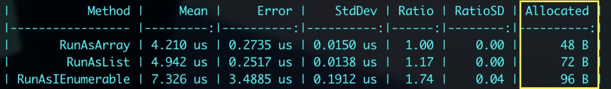

<p><em>VI: Hình 10.1 — Benchmark so sánh tốc độ theo kiểu. <code>RunAsArray</code> = <strong>4,210 µs / 48 B</strong>; <code>RunAsList</code> = <strong>4,942 µs / 72 B</strong> (ratio <strong>1,17</strong>); <code>RunAsIEnumerable</code> = <strong>7,326 µs / 96 B</strong> (ratio <strong>1,74</strong>). Cột <strong>Allocated</strong> tăng dần theo thứ tự <code>T[]</code> → <code>List&lt;T&gt;</code> → <code>IEnumerable&lt;T&gt;</code>. / EN: Figure 10.1 — Comparison of Execution Speed by Type.</em></p>

<div class="bilingual-row">
<div class="col-vi">
<p>Kết quả cho thấy <strong>kích thước heap allocation tăng theo thứ tự <code>T[]</code> → <code>List&lt;T&gt;</code> → <code>IEnumerable&lt;T&gt;</code></strong>.</p>
<p>✅ Như vậy, khi dùng LINQ, kích thước GC.Alloc có thể được giảm bằng cách <strong>ý thức về kiểu tại runtime</strong>.</p>
</div>
<div class="col-en">
<p>The results show that the size of heap allocations increases in the order T[] → List&lt;T&gt; → IEnumerable&lt;T&gt;. Thus, when using LINQ, the size of GC.Alloc can be reduced by being aware of the runtime type.</p>
</div>
</div>

!!! info "Nguyên nhân GC.Alloc trong LINQ — *Causes of GC.Alloc in LINQ*"
    <div class="bilingual-row">
    <div class="col-vi">
    <p>Một phần nguyên nhân GC.Alloc khi dùng LINQ nằm ở <strong>hiện thực nội bộ</strong> của nó. Nhiều method LINQ <strong>nhận <code>IEnumerable&lt;T&gt;</code> và trả về <code>IEnumerable&lt;T&gt;</code></strong>, và thiết kế API này cho phép mô tả trực quan bằng <strong>method chain</strong>.</p>
    <p>Thực thể <code>IEnumerable&lt;T&gt;</code> được method trả về là <strong>một instance của class riêng cho mỗi chức năng</strong>. LINQ <strong>tạo instance nội bộ</strong> của một class hiện thực <code>IEnumerable&lt;T&gt;</code>, và hơn nữa, <strong>GC.Alloc xảy ra nội bộ vì các lời gọi tới <code>GetEnumerator()</code></strong> được thực hiện để hiện thực hoá xử lý vòng lặp.</p>
    </div>
    <div class="col-en">
    <p>Part of the cause of GC.Alloc with the use of LINQ is the internal implementation of LINQ. Many LINQ methods take IEnumerable&lt;T&gt; and return IEnumerable&lt;T&gt;, and this API design allows for intuitive description using method chains. The entity IEnumerable&lt;T&gt; returned by a method is an instance of the class for each function. LINQ internally instantiates a class that implements IEnumerable&lt;T&gt;, and furthermore, GC.Alloc occurs internally because calls to GetEnumerator() are made to realize loop processing, etc.</p>
    </div>
    </div>

### 37.2. ⏱️ Lazy Evaluation của LINQ

<div class="bilingual-row">
<div class="col-vi">
<p>Các method LINQ như <code>Where</code> và <code>Select</code> là <strong>lazy evaluation</strong> — trì hoãn việc đánh giá cho tới khi kết quả thực sự cần. Ngược lại, các method như <code>ToArray</code> được định nghĩa là <strong>immediate evaluation</strong> (đánh giá ngay).</p>
</div>
<div class="col-en">
<p>LINQ methods such as Where and Select are lazy evaluations that delay evaluation until the result is actually needed. On the other hand, methods such as ToArray are defined for immediate evaluation.</p>
</div>
</div>

▼ **List 10.24** — Method đánh giá ngay xen vào giữa

```csharp
private static void LazyExpression()
{
    var array = Enumerable.Range(0, 5).ToArray();
    var sw = Stopwatch.StartNew();
    // 💀 ToArray() ở cuối = immediate evaluation → HeavyProcess chạy NGAY TẠI ĐÂY
    var query = array.Where(i => i % 2 == 0).Select(HeavyProcess).ToArray();
    Console.WriteLine($"Query: {sw.ElapsedMilliseconds}");

    foreach (var i in query)
    {
        Console.WriteLine($"diff: {sw.ElapsedMilliseconds}");
    }
}

private static int HeavyProcess(int x)
{
    Thread.Sleep(1000);   // Giả lập xử lý nặng 1 giây
    return x;
}
```

▼ **List 10.25** — Kết quả khi thêm method đánh giá ngay

```text
Query: 3013     ← 💀 Toàn bộ 3 giây bị "đóng băng" NGAY khi gán vào query
diff: 3032
diff: 3032
diff: 3032
```

<div class="bilingual-row">
<div class="col-vi">
<p>Bằng cách thêm <code>ToArray</code> ở cuối — vốn là <strong>immediate evaluation</strong> — kết quả của việc thực thi <code>Where</code> hoặc <code>Select</code> và đánh giá giá trị <strong>được trả về ngay khi gán vào <code>query</code></strong>. Vì vậy, <code>HeavyProcess</code> cũng được gọi, và bạn thấy <strong>thời gian xử lý bị tiêu tốn tại thời điểm <code>query</code> được sinh ra</strong>.</p>
<p>🚨 Như bạn thấy, <strong>các lời gọi ngoài ý muốn tới method immediate evaluation của LINQ có thể tạo thành bottleneck ngay tại điểm đó</strong>. Các method cần <strong>duyệt toàn bộ chuỗi một lượt</strong> như <code>ToArray</code>, <code>OrderBy</code>, <code>Count</code> đều là immediate evaluation — hãy ý thức về chi phí khi gọi chúng.</p>
</div>
<div class="col-en">
<p>The result of the execution of List 10.25 is the result. By adding ToArray at the end, which is an immediate evaluation, the result of executing the method Where or Select and evaluating the value is returned when the assignment is made to query. Therefore, since HeavyProcess is also called, you can see that processing time is taken at the timing when query is generated.</p>
<p>As you can see, unintentional calls to LINQ's immediate evaluation methods can result in bottlenecks at those points. ToArray Methods that require looking at the entire sequence once, such as OrderBy, Count, and, are immediate evaluation, so be aware of the cost when calling them.</p>
</div>
</div>

### 37.3. 🚨 Lựa chọn "KHÔNG dùng LINQ"

<div class="bilingual-row">
<div class="col-vi">
<p>Tiền đề là <strong>LINQ là tính năng ngôn ngữ hữu ích</strong>, nhưng việc dùng nó <strong>làm xấu đi heap allocation và tốc độ thực thi</strong> so với khi không dùng.</p>
<p>Trên thực tế, khuyến nghị hiệu năng Unity của <strong>Microsoft</strong> nêu rõ <strong>"Avoid use of LINQ"</strong> (Tránh dùng LINQ).</p>
</div>
<div class="col-en">
<p>The premise is that LINQ is a useful language feature, but its use will worsen heap allocation and execution speed compared to when it is not used. In fact, Microsoft's Unity performance recommendations clearly state "Avoid use of LINQ."</p>
</div>
</div>

▼ **List 10.26** — So sánh hiệu năng có và không có LINQ

```csharp
private int[] array;

public void GlobalSetup()
{
    array = Enumerable.Range(0, 100_000_000).ToArray();   // 100 TRIỆU phần tử
}

public void Pure()
{
    foreach (var i in array)
    {
        if (i % 2 == 0)
        {
            var _ = i * i;
        }
    }
}

public void UseLinq()
{
    var query = array.Where(i => i % 2 == 0).Select(i => i * i);
    foreach (var i in query)
    {
    }
}
```

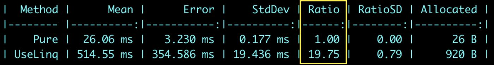

<p><em>VI: Hình 10.2 — Kết quả so sánh. <code>Pure</code> = <strong>26,06 ms</strong> / <strong>26 B</strong> (ratio 1,00). <code>UseLinq</code> = <strong>514,55 ms</strong> / <strong>920 B</strong> — <strong>ratio 19,75 LẦN chậm hơn</strong> và cấp phát gấp <strong>~35 lần</strong>. / EN: Figure 10.2 — Performance Comparison Results with and without LINQ.</em></p>

<div class="bilingual-row">
<div class="col-vi">
<p>So sánh thời gian thực thi cho thấy <strong>tiến trình có LINQ mất thời gian gấp 19 LẦN</strong> so với tiến trình không LINQ.</p>
<p>Dù kết quả trên cho thấy rõ việc dùng LINQ làm suy giảm hiệu năng, <strong>vẫn có những trường hợp ý đồ của code được truyền đạt dễ dàng hơn khi dùng LINQ</strong>. Sau khi hiểu rõ những hành vi này, <strong>có thể có chỗ để thảo luận trong nội bộ dự án</strong> về việc có dùng LINQ hay không, và nếu có thì <strong>quy tắc dùng LINQ là gì</strong>.</p>
</div>
<div class="col-en">
<p>The comparison of execution times shows that the process with LINQ takes 19 times longer than the process without LINQ.</p>
<p>While the above results clearly show that the use of LINQ deteriorates performance, there are cases where the coding intent is more easily conveyed by using LINQ. After understanding these behaviors, there may be room for discussion within the project as to whether to use LINQ or not, and if so, the rules for using LINQ.</p>
</div>
</div>

---

## 38. ⚙️ Tránh overhead của `async`/`await`

<div class="bilingual-row">
<div class="col-vi">
<p><code>async</code>/<code>await</code> là tính năng ngôn ngữ được thêm vào <strong>C# 5.0</strong>, cho phép viết xử lý bất đồng bộ như một tiến trình đồng bộ đơn nhất, không cần callback.</p>
</div>
<div class="col-en">
<p>Async/await is a language feature added in C# 5.0 that allows asynchronous processing to be written as a single synchronous process without callbacks.</p>
</div>
</div>

### 38.1. Tránh `async` ở nơi không cần thiết

<div class="bilingual-row">
<div class="col-vi">
<p>Các method định nghĩa <code>async</code> sẽ khiến <strong>compiler sinh ra code</strong> để hiện thực xử lý bất đồng bộ. Và <strong>nếu có từ khoá <code>async</code>, việc sinh code bởi compiler LUÔN LUÔN được thực hiện</strong>.</p>
<p>Do đó, ngay cả những method <strong>có thể hoàn thành đồng bộ</strong> như List 10.27 <strong>vẫn thực sự bị compiler sinh code</strong>.</p>
</div>
<div class="col-en">
<p>Methods defined async will have code generated by the compiler to achieve asynchronous processing. And if the async keyword is present, code generation by the compiler is always performed. Therefore, even methods that may complete synchronously, such as List 10.27, are actually code generated by the compiler.</p>
</div>
</div>

▼ **List 10.27** — Xử lý bất đồng bộ có thể hoàn thành đồng bộ

```csharp
using System;
using System.Threading.Tasks;

namespace A {
    public class B {
        public async Task HogeAsync(int i) {
            if (i == 0) {
                Console.WriteLine("i is 0");
                return;                      // 💀 Nhánh này hoàn thành ĐỒNG BỘ
            }                                //    nhưng state machine VẪN bị sinh ra
            await Task.Delay(TimeSpan.FromSeconds(1));
        }

        public void Main() {
            int i = int.Parse(Console.ReadLine());
            Task.Run(() => HogeAsync(i));
        }
    }
}
```

<div class="bilingual-row">
<div class="col-vi">
<p>Trong trường hợp như List 10.27, chi phí sinh <strong>struct state machine hiện thực <code>IAsyncStateMachine</code></strong> — vốn không cần thiết khi hoàn thành đồng bộ — <strong>có thể được lược bỏ</strong> bằng cách <strong>tách <code>HogeAsync</code></strong> ra và hiện thực như List 10.28.</p>
</div>
<div class="col-en">
<p>In cases such as List 10.27, the cost of generating a state machine structure for IAsyncStateMachine implementation, which is unnecessary in the case of synchronous completion, can be omitted by splitting HogeAsync, which may be completed synchronously, and implementing it as List 10.28.</p>
</div>
</div>

▼ **List 10.28** — Hiện thực tách rời phần đồng bộ và bất đồng bộ

```csharp
using System;
using System.Threading.Tasks;

namespace A {
    public class B {
        public async Task HogeAsync(int i) {
            await Task.Delay(TimeSpan.FromSeconds(1));   // ✅ Chỉ còn phần THỰC SỰ async
        }

        public void Main() {
            int i = int.Parse(Console.ReadLine());
            if (i == 0) {
                Console.WriteLine("i is 0");             // ✅ Nhánh đồng bộ tách ra ngoài
            } else {
                Task.Run(() => HogeAsync(i));
            }
        }
    }
}
```

!!! info "Cơ chế hoạt động của async/await — *How async/await works*"
    <div class="bilingual-row">
    <div class="col-vi">
    <p>Cú pháp <code>async</code>/<code>await</code> được hiện thực bằng <strong>code generation của compiler tại thời điểm biên dịch</strong>. Các method có từ khoá <code>async</code> sẽ được <strong>thêm một tiến trình sinh struct hiện thực <code>IAsyncStateMachine</code></strong> lúc compile, và chức năng <code>async</code>/<code>await</code> được hiện thực bằng cách <strong>quản lý một state machine tiến trạng thái</strong> khi tiến trình được <code>await</code> hoàn thành.</p>
    <p><code>IAsyncStateMachine</code> là interface được định nghĩa trong namespace <code>System.Runtime.CompilerServices</code> và <strong>chỉ dành cho compiler</strong>.</p>
    </div>
    <div class="col-en">
    <p>The async/await syntax is realized using compiler code generation at compile time. Methods with the async keyword add a process to generate a structure implementing IAsyncStateMachine at compile time, and the async/await function is realized by managing a state machine that advances state when the process to be awaited completes. Also, this IAsyncStateMachine is an interface defined in the System.Runtime.CompilerServices namespace and is available only to the compiler.</p>
    </div>
    </div>

### 38.2. Tránh capture synchronization context

<div class="bilingual-row">
<div class="col-vi">
<p>Cơ chế để <strong>quay lại thread gọi</strong> từ xử lý bất đồng bộ đã được lưu sang thread khác chính là <strong>synchronization context</strong>, và context trước đó có thể được <strong>capture</strong> bằng <code>await</code>.</p>
<p>🚨 Vì synchronization context này <strong>bị capture MỖI LẦN <code>await</code> được thực thi</strong>, nên có <strong>overhead cho từng <code>await</code></strong>.</p>
<p>✅ Vì lý do này, <strong>UniTask</strong> — thư viện được dùng rộng rãi trong phát triển Unity — được hiện thực <strong>KHÔNG dùng <code>ExecutionContext</code> và <code>SynchronizationContext</code></strong> để tránh overhead của việc capture synchronization context. Riêng với Unity, việc hiện thực các thư viện như vậy có thể cải thiện hiệu năng.</p>
</div>
<div class="col-en">
<p>The mechanism to return to the calling thread from asynchronous processing that has been saved to another thread is synchronous context, and the previous context can be captured by await. Since this synchronous context is captured each time await is executed, there is an overhead for each await. For this reason, UniTask, which is widely used in Unity development, is implemented without ExecutionContext and SynchronizationContext to avoid the overhead of synchronous context capture. As far as Unity is concerned, implementing such libraries may improve performance.</p>
</div>
</div>

---

## 39. 📚 Tối ưu bằng `stackalloc`

<div class="bilingual-row">
<div class="col-vi">
<p>Cấp phát mảng dưới dạng <strong>biến cục bộ</strong> gây <strong>GC.Alloc mỗi lần</strong>, có thể dẫn tới <strong>spike</strong>. Ngoài ra, việc <strong>đọc/ghi vào vùng heap kém hiệu quả hơn một chút</strong> so với vùng stack.</p>
<p>Vì vậy, trong C# có cú pháp <strong>chỉ dùng được trong <code>unsafe</code></strong> để cấp phát mảng <strong>trên stack</strong>. Thay vì dùng từ khoá <code>new</code>, mảng có thể được cấp phát trên stack bằng từ khoá <strong><code>stackalloc</code></strong>.</p>
</div>
<div class="col-en">
<p>Allocating arrays as local variables causes GC.Alloc to occur each time, which can lead to spikes. In addition, reading and writing to the heap area is a little less efficient than to the stack area. Therefore, in C#, the unsafe code-only syntax for allocating arrays on the stack. Instead of using the new keyword, as in the following example, an array can be allocated on the stack using the stackalloc keyword.</p>
</div>
</div>

▼ **List 10.29** — Cấp phát mảng trên stack bằng `stackalloc`

```csharp
// stackalloc is limited to unsafe
unsafe
{
    // Allocating an array of ints on the stack
    byte* buffer = stackalloc byte[BufferSize];   // ✅ 0 GC.Alloc
}
```

<div class="bilingual-row">
<div class="col-vi">
<p>Từ <strong>C# 7.2</strong>, struct <strong><code>Span&lt;T&gt;</code></strong> có thể được dùng để cấp phát mảng trên stack <strong>MÀ KHÔNG CẦN <code>unsafe</code></strong>.</p>
</div>
<div class="col-en">
<p>Since C# 7.2, the Span&lt;T&gt; structure can be used to allocate an array on the stack. The structure can now be used without unsafe stackalloc as shown in.</p>
</div>
</div>

▼ **List 10.30** — Cấp phát mảng trên stack bằng struct `Span<T>`

```csharp
Span<byte> buffer = stackalloc byte[BufferSize];   // ✅ An toàn, không cần unsafe
```

<div class="bilingual-row">
<div class="col-vi">
<p>Với Unity, đây là <strong>tính năng chuẩn từ 2021.2</strong>. Với các phiên bản cũ hơn, <code>Span&lt;T&gt;</code> không tồn tại nên phải cài <strong><code>System.Memory.dll</code></strong>.</p>
<p>⚠️ Mảng cấp phát bằng <code>stackalloc</code> <strong>CHỈ tồn tại trên stack</strong> và <strong>không thể được giữ trong field của class hay struct</strong>. Chúng phải được dùng như <strong>biến cục bộ</strong>.</p>
<p>⚠️ Dù mảng được cấp phát trên stack, việc cấp phát mảng có <strong>số lượng phần tử lớn vẫn tốn một lượng thời gian xử lý nhất định</strong>. Nếu bạn muốn dùng mảng có nhiều phần tử ở những nơi cần tránh heap allocation — như trong vòng lặp update — <strong>tốt hơn là cấp phát mảng từ trước lúc khởi tạo</strong>, hoặc chuẩn bị một cấu trúc dữ liệu kiểu <strong>object pool</strong> và hiện thực theo cách <strong>cho mượn (rent) khi dùng</strong>.</p>
</div>
<div class="col-en">
<p>For Unity, this is standard from 2021.2. For earlier versions, Span&lt;T&gt; does not exist, so System.Memory.dll must be installed.</p>
<p>Arrays allocated with stackalloc are stack-only and cannot be held in class or structure fields. They must be used as local variables.</p>
<p>Even though the array is allocated on the stack, it takes a certain amount of processing time to allocate an array with a large number of elements. If you want to use arrays with a large number of elements in places where heap allocation should be avoided, such as in an update loop, it is better to allocate the array in advance during initialization or to prepare a data structure like an object pool, and implement it in such a way that it can be rented out when used.</p>
</div>
</div>

<div class="bilingual-row">
<div class="col-vi">
<p>🚨 Ngoài ra, hãy lưu ý rằng <strong>vùng stack được cấp phát bởi <code>stackalloc</code> KHÔNG được giải phóng cho tới khi hàm kết thúc</strong>.</p>
<p>Ví dụ, code ở List 10.31 <strong>có thể gây Stack Overflow</strong> trong lúc lặp, vì <strong>TẤT CẢ các mảng cấp phát trong vòng lặp đều bị giữ lại</strong> và chỉ được giải phóng khi thoát khỏi method <code>Hoge</code>.</p>
</div>
<div class="col-en">
<p>Also, note that the stack area allocated by stackalloc is not released until the function exits. For example, the code shown at List 10.31 may cause a Stack Overflow while looping, since all arrays allocated in the loop are retained and released when exiting the Hoge method.</p>
</div>
</div>

▼ **List 10.31** — 💀 Cách dùng SAI gây Stack Overflow

```csharp
unsafe void Hoge()
{
    for (int i = 0; i < 10000; i++)
    {
        // 💀 Arrays are accumulated for the number of loops
        //    10.000 × 10.000 byte = ~100 MB TRÊN STACK → STACK OVERFLOW
        byte* buffer = stackalloc byte[10000];
    }
}
```

---

## 40. 🔧 Tối ưu method invocation dưới IL2CPP bằng `sealed`

<div class="bilingual-row">
<div class="col-vi">
<p>Khi build với <strong>IL2CPP</strong> làm backend trong Unity, việc gọi method được thực hiện bằng cơ chế <strong>giống vtable của C++</strong> để hiện thực hoá lời gọi virtual method của class.</p>
<p>Cụ thể, với <strong>mỗi định nghĩa lời gọi method của một class</strong>, code như List 10.32 <strong>được sinh ra tự động</strong>.</p>
</div>
<div class="col-en">
<p>When building with IL2CPP as a backend in Unity, method invocation is performed using a C++ vtable-like mechanism to achieve virtual method invocation of the class. Specifically, for each method call definition of a class, the code shown at List 10.32 is automatically generated.</p>
</div>
</div>

▼ **List 10.32** — Code C++ cho lời gọi method do IL2CPP sinh ra

```cpp
struct VirtActionInvoker0
{
    typedef void (*Action)(void*, const RuntimeMethod*);

    static inline void Invoke (
        Il2CppMethodSlot slot, RuntimeObject* obj)
    {
        const VirtualInvokeData& invokeData =
            il2cpp_codegen_get_virtual_invoke_data(slot, obj);   // ⚠️ Tra cứu vtable
        ((Action)invokeData.methodPtr)(obj, invokeData.method);
    }
};
```

<div class="bilingual-row">
<div class="col-vi">
<p>🚨 Nó sinh ra code C++ tương tự <strong>KHÔNG CHỈ cho các virtual method</strong>, mà còn cho <strong>các method non-virtual không được kế thừa tại thời điểm compile</strong>. Hành vi tự động sinh này dẫn tới <strong>phình to kích thước code</strong> và <strong>tăng thời gian xử lý cho các lời gọi method</strong>.</p>
<p>✅ Vấn đề này có thể được tránh bằng cách <strong>thêm modifier <code>sealed</code></strong> vào định nghĩa class.</p>
</div>
<div class="col-en">
<p>It generates similar C++ code not only for virtual methods, but also for non-virtual methods that do not inherit at compile time. This auto-generated behavior leads to bloated code size and increased processing time for method calls. This problem can be avoided by adding the sealed modifier to the class definition.</p>
</div>
</div>

▼ **List 10.33** — Định nghĩa class và gọi method KHÔNG có `sealed`

```csharp
public abstract class Animal
{
    public abstract string Speak();
}

public class Cow : Animal          // ❌ Không sealed
{
    public override string Speak() {
        return "Moo";
    }
}

var cow = new Cow();
// Calling the Speak method
Debug.LogFormat("The cow says '{0}'", cow.Speak());
```

▼ **List 10.34** — Code C++ tương ứng lời gọi method của List 10.33

```cpp
// var cow = new Cow();
Cow_t1312235562 * L_14 =
    (Cow_t1312235562 *)il2cpp_codegen_object_new(
        Cow_t1312235562_il2cpp_TypeInfo_var);
Cow__ctor_m2285919473(L_14, /* hidden argument*/NULL);
V_4 = L_14;
Cow_t1312235562 * L_16 = V_4;

// cow.Speak()
// 💀 Gọi qua VirtFuncInvoker0 DÙ ĐÂY KHÔNG PHẢI virtual call!
String_t* L_17 = VirtFuncInvoker0< String_t* >::Invoke(
    4 /* String AssemblyCSharp.Cow::Speak() */, L_16);
```

<div class="bilingual-row">
<div class="col-vi">
<p>List 10.34 cho thấy <code>VirtFuncInvoker0&lt; String_t* &gt;::Invoke</code> <strong>vẫn được gọi dù đây không phải lời gọi virtual method</strong>, tức là <strong>một lời gọi method kiểu virtual đang được thực hiện</strong>.</p>
<p>Ngược lại, định nghĩa class <code>Cow</code> với modifier <code>sealed</code> như List 10.35 sẽ sinh ra code C++ như List 10.36.</p>
</div>
<div class="col-en">
<p>List 10.34 shows that VirtFuncInvoker0&lt; String_t* &gt;::Invoke is called even though it is not a virtual method call, and that a method call like a virtual method is made. On the other hand, defining the Cow class of List 10.33 with the sealed modifier as shown in List 10.35 generates C++ code like List 10.36.</p>
</div>
</div>

▼ **List 10.35** — Định nghĩa class và gọi method CÓ `sealed`

```csharp
public sealed class Cow : Animal       // ✅ sealed
{
    public override string Speak() {
        return "Moo";
    }
}

var cow = new Cow();
// Calling the Speak method
Debug.LogFormat("The cow says '{0}'", cow.Speak());
```

▼ **List 10.36** — Code C++ tương ứng lời gọi method của List 10.35

```cpp
// var cow = new Cow();
Cow_t1312235562 * L_14 =
    (Cow_t1312235562 *)il2cpp_codegen_object_new(
        Cow_t1312235562_il2cpp_TypeInfo_var);
Cow__ctor_m2285919473(L_14, /* hidden argument*/NULL);
V_4 = L_14;
Cow_t1312235562 * L_16 = V_4;

// cow.Speak()
// ✅ GỌI TRỰC TIẾP! Không qua vtable lookup
String_t* L_17 = Cow_Speak_m1607867742(L_16, /* hidden argument*/NULL);
```

<div class="bilingual-row">
<div class="col-vi">
<p>Như vậy, ta thấy lời gọi method gọi thẳng <code>Cow_Speak_m1607867742</code> — tức <strong>gọi trực tiếp method</strong>.</p>
<p>⚠️ Tuy nhiên, trong các bản Unity tương đối gần đây, Unity chính thức làm rõ rằng <strong>tối ưu như vậy đã được thực hiện TỰ ĐỘNG MỘT PHẦN</strong>. Nói cách khác, ngay cả khi bạn không chỉ định <code>sealed</code> tường minh, tối ưu đó <strong>có thể</strong> vẫn được thực hiện tự động.</p>
<p>⚠️ Nhưng như đã đề cập trong forum <em>"[il2cpp] Is 'sealed' Not Worked As Said Anymore In Unity 2018.3?"</em>, hiện thực này <strong>chưa hoàn chỉnh tính đến tháng 4/2019</strong>.</p>
<p>✅ Vì tình trạng hiện tại như vậy, <strong>nên kiểm tra code do IL2CPP sinh ra và quyết định việc đặt modifier <code>sealed</code> cho từng dự án</strong>. Để đảm bảo lời gọi method trực tiếp một cách chắc chắn hơn, và để đón đầu các tối ưu IL2CPP trong tương lai, việc <strong>đặt <code>sealed</code> như một dấu hiệu "có thể tối ưu"</strong> có thể là ý hay.</p>
</div>
<div class="col-en">
<p>Thus, we can see that the method call calls Cow_Speak_m1607867742, which directly calls the method.</p>
<p>However, in relatively recent Unity, the Unity official clarifies that such optimization is partially automatic. In other words, even if you do not explicitly specify sealed, it is possible that such optimization is done automatically. However, the "[il2cpp] Is 'sealed' Not Worked As Said Anymore In Unity 2018.3?" As mentioned in the forum, this implementation is not complete as of April 2019.</p>
<p>Because of this current state of affairs, it would be a good idea to check the code generated by IL2CPP and decide on the setting of the sealed modifier for each project. For more reliable direct method calls, and in anticipation of future IL2CPP optimizations, it may be a good idea to set the sealed modifier as an optimizable mark.</p>
</div>
</div>

---

## 41. 🚀 Tối ưu bằng Inlining

<div class="bilingual-row">
<div class="col-vi">
<p>Lời gọi method <strong>có chi phí</strong>. Vì vậy, như một tối ưu chung — không chỉ cho C# mà cả các ngôn ngữ khác — các lời gọi method <strong>tương đối nhỏ</strong> được compiler tối ưu bằng <strong>inlining</strong>.</p>
</div>
<div class="col-en">
<p>Method calls have some cost. Therefore, as a general optimization, not only for C# but also for other languages, relatively small method calls are optimized by compilers through inlining.</p>
</div>
</div>

▼ **List 10.37 / 10.38** — Code trước và sau inlining

```csharp
// List 10.37 — TRƯỚC inlining
int F(int a, int b, int c)
{
    var d = Add(a, b);      // ⚠️ 3 lời gọi method
    var e = Add(b, c);
    var f = Add(d, e);

    return f;
}

int Add(int a, int b) => a + b;
```

```csharp
// List 10.38 — SAU inlining: nội dung method được COPY & khai triển tại chỗ
int F(int a, int b, int c)
{
    var d = a + b;          // ✅ 0 lời gọi method
    var e = b + c;
    var f = d + e;

    return f;
}
```

<div class="bilingual-row">
<div class="col-vi">
<p>Inlining được thực hiện bằng cách <strong>copy và khai triển nội dung bên trong method</strong>.</p>
<p>🚨 Trong <strong>IL2CPP</strong>, <strong>không có tối ưu inlining cụ thể nào được thực hiện trong lúc sinh code</strong>.</p>
<p>✅ Tuy nhiên, <strong>bắt đầu từ Unity 2020.2</strong>, bằng cách chỉ định thuộc tính <strong><code>MethodImpl</code></strong> cho method với tham số <strong><code>MethodOptions.AggressiveInlining</code></strong>, hàm tương ứng trong code C++ sinh ra <strong>sẽ được gắn specifier <code>inline</code></strong>. Nói cách khác, <strong>inlining ở mức code C++ giờ đây là khả thi</strong>.</p>
</div>
<div class="col-en">
<p>Inlining is done by copying and expanding the contents within a method, such as List 10.38, and the call to the Add method within the Func method of List 10.37.</p>
<p>In IL2CPP, no particular inlining optimization is performed during code generation. However, starting with Unity 2020.2, by specifying the MethodImpl attribute for a method and MethodOptions.AggressiveInlining for its parameter, the corresponding function in the generated C++ code will be given the inline specifier. In other words, inlining at the C++ code level is now possible.</p>
</div>
</div>

```csharp
// ✅ Cách dùng thực tế (Unity 2020.2+)
using System.Runtime.CompilerServices;

[MethodImpl(MethodImplOptions.AggressiveInlining)]
public static float Dot(Vector3 a, Vector3 b)
    => a.x * b.x + a.y * b.y + a.z * b.z;
```

<div class="bilingual-row">
<div class="col-vi">
<p>💡 Ưu điểm của inlining là nó <strong>không chỉ giảm chi phí gọi method</strong>, mà còn <strong>tiết kiệm việc COPY các đối số</strong> được truyền vào lúc gọi.</p>
<p>Ví dụ, các method tính toán nhận <strong>nhiều struct tương đối lớn</strong> làm đối số, như <code>Vector3</code> và <code>Matrix</code>. Nếu các struct được truyền nguyên vẹn làm đối số, chúng <strong>đều bị copy</strong> và truyền vào method theo kiểu <strong>pass-by-value</strong>. Nếu số lượng đối số và kích thước struct lớn, <strong>chi phí xử lý cho việc gọi method và copy đối số có thể rất đáng kể</strong>.</p>
<p>Thêm nữa, các lời gọi method <strong>có thể trở thành gánh nặng không thể bỏ qua</strong> vì chúng thường được dùng trong xử lý định kỳ — như hiện thực physics và animation.</p>
<p>Trong những trường hợp đó, <strong>tối ưu bằng inlining có thể rất hiệu quả</strong>. Thực tế, thư viện toán học mới của Unity — <strong><code>Unity.Mathematics</code></strong> — <strong>chỉ định <code>MethodOptions.AggressiveInlining</code> cho các lời gọi method ở khắp mọi nơi</strong>.</p>
</div>
<div class="col-en">
<p>The advantage of inlining is that it not only reduces the cost of method calls, but also saves copying of arguments specified at the time of method invocation.</p>
<p>For example, arithmetic methods take multiple relatively large structures as arguments, such as Vector3 and Matrix. If the structs are passed as arguments as they are, they are all copied and passed to the method as passed by value. If the number of arguments and the size of the passed structs are large, the processing cost may be considerable for method calls and argument copying. In addition, method calls may become a case that cannot be overlooked as a processing burden because they are often used in periodic processing, such as in the implementation of physical operations and animations.</p>
<p>In such cases, optimization through inlining can be effective. In fact, Unity's new mathematics library Mathematics specifies MethodOptions.AggressiveInlining for method calls everywhere.</p>
</div>
</div>

!!! warning "⚠️ Mặt trái của inlining"
    <div class="bilingual-row">
    <div class="col-vi">
    <p>Mặt khác, inlining có <strong>nhược điểm là kích thước code TĂNG LÊN</strong> cùng với việc khai triển tiến trình bên trong method.</p>
    <p>Do đó, <strong>chỉ nên cân nhắc inlining cho các method được gọi thường xuyên trong một frame và nằm trên hot path</strong>. Cũng cần lưu ý rằng <strong>việc chỉ định thuộc tính KHÔNG phải lúc nào cũng dẫn tới inlining</strong>.</p>
    <p>Inlining <strong>bị giới hạn cho các method có nội dung nhỏ</strong>, nên method bạn muốn inline <strong>phải được giữ nhỏ</strong>.</p>
    <p>Ngoài ra, ở <strong>Unity 2020.2 trở về trước</strong>, specifier <code>inline</code> <strong>không</strong> được gắn theo thuộc tính, và <strong>không có gì đảm bảo inlining sẽ được thực hiện chắc chắn</strong> ngay cả khi specifier <code>inline</code> của C++ được chỉ định.</p>
    <p>Vì vậy, nếu bạn muốn <strong>đảm bảo chắc chắn inlining</strong>, có thể cân nhắc <strong>inline THỦ CÔNG</strong> cho các method nằm trên hot path — dù nó sẽ làm giảm khả năng đọc code.</p>
    </div>
    <div class="col-en">
    <p>On the other hand, inlining has the disadvantage that the code size increases with the expansion of the process within the method. Therefore, it is recommended to consider inlining especially for methods that are frequently called in a single frame and are hot-passed. It should also be noted that specifying an attribute does not always result in inlining. Inlining is limited to methods that are small in content, so methods that you want to inline must be kept small.</p>
    <p>Also, in Unity 2020.2 and earlier, the inline specifier is not attached to attribute specifications, and there is no guarantee that inlining will be performed reliably even if the C++ inline specifier is specified. Therefore, if you want to ensure inlining, you may want to consider manual inlining for methods that are hotpaths, although it will reduce readability.</p>
    </div>
    </div>
---

# PHẦN E — PLAYER SETTINGS & THƯ VIỆN BÊN THỨ BA (Chương 11–12)

---

## 42. ⚙️ Tuning Practice — Player Settings

<div class="bilingual-row">
<div class="col-vi">
<p>Chương này giới thiệu các mục <strong>Player</strong> trong <strong>Project Settings</strong> có ảnh hưởng tới hiệu năng.</p>
</div>
<div class="col-en">
<p>This chapter introduces the Player items in Project Settings that affect performance.</p>
</div>
</div>

### 42.1. 🔑 Scripting Backend

<div class="bilingual-row">
<div class="col-vi">
<p>Unity cho phép bạn chọn giữa <strong>Mono</strong> và <strong>IL2CPP</strong> làm Scripting Backend trên các nền tảng như Android và Standalone (Windows, macOS, Linux).</p>
<p>✅ <strong>Chúng tôi khuyến nghị chọn IL2CPP</strong> vì lợi ích hiệu năng như đã mô tả ở mục "IL2CPP" trong Chương 2 "Fundamentals".</p>
</div>
<div class="col-en">
<p>Unity allows you to choose between Mono and IL2CPP as the Scripting Backend on platforms such as Android and Standalone (Windows, macOS, Linux). We recommend choosing IL2CPP because of the performance gains as described in "IL2CPP" of Chapter 2 "Fundamentals".</p>
</div>
</div>

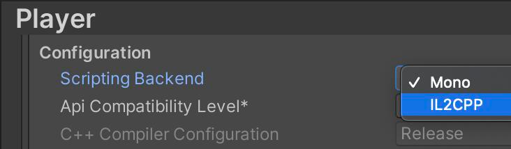

<p><em>VI: Hình 11.1 — Cấu hình <strong>Scripting Backend</strong> trong <code>Project Settings → Player → Configuration</code>. Dropdown cho phép chọn <strong>Mono</strong> hoặc <strong>IL2CPP</strong>. / EN: Figure 11.1 — Configuring Scripting Backend.</em></p>

### 42.2. 🔧 C++ Compiler Configuration

<div class="bilingual-row">
<div class="col-vi">
<p>Ngoài ra, chuyển Scripting Backend sang <strong>IL2CPP</strong> cũng sẽ cho phép chọn <strong>C++ Compiler Configuration</strong>.</p>
<p>Tại đây bạn có thể chọn giữa <strong>Debug</strong>, <strong>Release</strong> và <strong>Master</strong>; mỗi lựa chọn có <strong>đánh đổi giữa thời gian build và mức độ tối ưu</strong>, nên tốt nhất hãy dùng cái phù hợp nhất với mục tiêu build của bạn.</p>
</div>
<div class="col-en">
<p>In addition, changing the Scripting Backend to IL2CPP will also change the C++ Compiler Configuration can be selected. Here you can choose between Debug, Release, and Master, each of which has a tradeoff between build time and degree of optimization, so it is best to use the one that best suits your build objectives.</p>
</div>
</div>

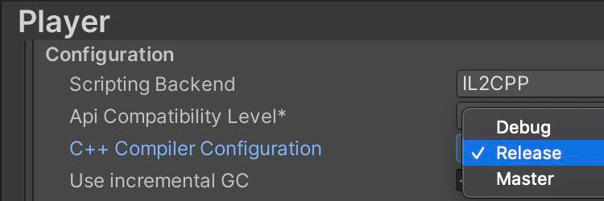

<p><em>VI: Hình 11.2 — Thiết lập <strong>C++ Compiler Configuration</strong>: <code>Debug</code> / <code>Release</code> (mặc định) / <code>Master</code>. / EN: Figure 11.2 — Setting of C++ Compiler Configuration.</em></p>

<div class="bilingual-row">
<div class="col-vi">
<p><strong>11.1.1 Debug</strong> — Debug <strong>không cho hiệu năng tốt lúc runtime</strong> vì <strong>không có tối ưu nào được thực hiện</strong>, nhưng <strong>thời gian build ngắn nhất</strong> so với các thiết lập khác.</p>
<p><strong>11.1.2 Release</strong> — Tối ưu giúp <strong>cải thiện hiệu năng runtime</strong> và <strong>giảm kích thước binary</strong> được build, nhưng <strong>tăng thời gian build</strong>.</p>
<p><strong>11.1.3 Master</strong> — <strong>Tất cả các tối ưu khả dụng cho nền tảng đều được bật</strong>. Ví dụ, các bản build Windows sẽ dùng những tối ưu quyết liệt hơn như <strong>link-time code generation (LTCG)</strong>. Đổi lại, thời gian build <strong>còn dài hơn cả thiết lập Release</strong>. <strong>Unity khuyến nghị dùng thiết lập Master cho production build</strong> nếu điều này chấp nhận được.</p>
</div>
<div class="col-en">
<p>Debug does not perform well at runtime because no optimization is performed, but build time is the shortest compared to the other settings.</p>
<p>Release: Optimization improves run-time performance and reduces the size of built binaries, but increases build time.</p>
<p>Master: All optimizations available for the platform are enabled. For example, Windows builds will use more aggressive optimizations such as link-time code generation (LTCG). In return, build times will be even longer than with the Release setting, but Unity recommends using the Master setting for production builds if this is acceptable.</p>
</div>
</div>

📊 **Bảng so sánh 3 chế độ:**

| Configuration | Tối ưu runtime | Thời gian build | Khuyến nghị dùng cho |
|---|---|---|---|
| **Debug** | ❌ Không có | ⭐ Ngắn nhất | Build lặp nhanh khi phát triển |
| **Release** | ✅ Có (kèm giảm size binary) | ⚠️ Dài hơn | Build QA / kiểm thử hằng ngày |
| **Master** | ✅✅ Toàn bộ (bao gồm **LTCG**) | 🚨 Dài nhất | **Production build** (Unity khuyến nghị) |

### 42.3. ✂️ Strip Engine Code / Managed Stripping Level

<div class="bilingual-row">
<div class="col-vi">
<p><strong>Strip Engine Code</strong> là tính năng của Unity, còn <strong>Managed Stripping Level</strong> hoạt động trên <strong>CIL bytecode</strong> sinh ra khi biên dịch C#; cả hai được kỳ vọng <strong>giảm kích thước binary</strong> được build bằng cách <strong>loại bỏ code không dùng tới</strong>.</p>
<p>🚨 Tuy nhiên, vì việc xác định một đoạn code có được dùng hay không <strong>phụ thuộc mạnh vào phân tích tĩnh (static analysis)</strong>, nên các kiểu <strong>không được tham chiếu trực tiếp trong code</strong>, hoặc <strong>code được gọi động qua reflection</strong>, <strong>có thể bị loại bỏ NHẦM</strong>.</p>
<p>✅ Trong trường hợp đó, hãy dùng file <strong><code>link.xml</code></strong> hoặc chỉ định thuộc tính <strong><code>Preserve</code></strong>.</p>
</div>
<div class="col-en">
<p>Strip Engine Code is a Unity feature that allows you to set the Managed Stripping Level is from the CIL bytecode generated by compiling C#, and is expected to reduce the size of the built binary by removing unused code, respectively.</p>
<p>However, since the determination of whether a given code is used relies strongly on static analysis, types that are not directly referenced in the code, or code that is dynamically called in reflection, may be mistakenly removed. In such cases, the link.xml file or by specifying the Preserve attribute.</p>
</div>
</div>

```xml
<!-- link.xml — giữ lại type/assembly khỏi bị strip nhầm -->
<linker>
  <assembly fullname="MyGame.Runtime" preserve="all"/>
  <assembly fullname="Newtonsoft.Json">
    <type fullname="Newtonsoft.Json.JsonConvert" preserve="all"/>
  </assembly>
</linker>
```

```csharp
// Hoặc dùng thuộc tính Preserve ngay trong code
[UnityEngine.Scripting.Preserve]
public class ReflectionOnlyType { }
```

!!! danger "Bẫy kinh điển"
    Bug do stripping thường **chỉ xuất hiện trên build thật, không bao giờ xuất hiện trong Editor** — vì Editor không strip code. Triệu chứng điển hình: `MissingMethodException` / `TypeLoadException` khi deserialize JSON hoặc gọi qua reflection.

### 42.4. 📱 Accelerometer Frequency (iOS)

<div class="bilingual-row">
<div class="col-vi">
<p>Đây là thiết lập riêng cho iOS, cho phép thay đổi <strong>tần số lấy mẫu của cảm biến gia tốc</strong>.</p>
<p>🚨 Thiết lập mặc định là <strong>60 Hz</strong>, vậy nên hãy đặt tần số cho phù hợp. <strong>Nếu bạn không dùng accelerometer, hãy chắc chắn TẮT thiết lập này.</strong></p>
</div>
<div class="col-en">
<p>This is an iOS-specific setting that allows you to change the sampling frequency of the accelerometer. The default setting is 60 Hz, so set the frequency appropriately. If you are not using the accelerometer, be sure to disable the setting.</p>
</div>
</div>

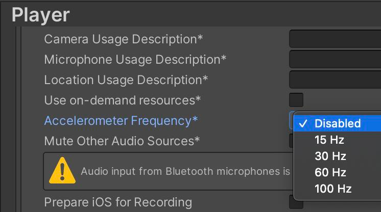

<p><em>VI: Hình 11.3 — Thiết lập tần số lấy mẫu. Các lựa chọn: <strong>Disabled</strong>, <strong>15 Hz</strong>, <strong>30 Hz</strong>, <strong>60 Hz</strong> (mặc định), <strong>100 Hz</strong>. / EN: Figure 11.3 — Sampling Frequency Setting.</em></p>

---

## 43. 🎬 DOTween

<div class="bilingual-row">
<div class="col-vi">
<p>Chương này giới thiệu một số điều cần lưu ý <strong>từ góc độ hiệu năng</strong> khi hiện thực các thư viện bên thứ ba thường dùng trong phát triển game Unity.</p>
<p><strong>DOTween</strong> là thư viện cho phép script tạo ra các animation mượt mà. Ví dụ, một animation phóng to/thu nhỏ có thể được viết dễ dàng như code sau.</p>
</div>
<div class="col-en">
<p>This chapter introduces some things to keep in mind from a performance perspective when implementing third-party libraries that are often used when developing games in Unity.</p>
<p>DOTween is a library that allows scripts to create smooth animations. For example, an animation that zooms in and out can be easily written as the following code.</p>
</div>
</div>

▼ **List 12.1** — Ví dụ dùng DOTween

```csharp
public class Example : MonoBehaviour {
    public void Play() {
        // ⚠️ Mỗi lần Play() → cấp phát Sequence + 2 Tweener MỚI
        DOTween.Sequence()
            .Append(transform.DOScale(Vector3.one * 1.5f, 0.25f))
            .Append(transform.DOScale(Vector3.one, 0.125f));
    }
}
```

### 43.1. ♻️ `SetAutoKill` — tái sử dụng instance tween

<div class="bilingual-row">
<div class="col-vi">
<p>Vì tiến trình tạo tween — như <code>DOTween.Sequence()</code> hay <code>transform.DOScale(...)</code> — <strong>về cơ bản đều liên quan tới memory allocation</strong>, hãy cân nhắc <strong>tái sử dụng instance</strong> cho các animation được phát lại thường xuyên.</p>
<p>Mặc định, <strong>tween bị tự động huỷ khi animation hoàn thành</strong>, nên <code>SetAutoKill(false)</code> sẽ <strong>chặn hành vi này</strong>.</p>
</div>
<div class="col-en">
<p>Since the process of creating a tween, such as DOTween.Sequence() or transform.DOScale(...), basically involves memory allocation, consider reusing instances for animations that are frequently replayed. By default, the tween is automatically discarded when the animation completes, so SetAutoKill(false) suppresses this.</p>
</div>
</div>

▼ **List 12.2** — Tái sử dụng instance tween

```csharp
private Tween _tween;

private void Awake() {
    _tween = DOTween.Sequence()
        .Append(transform.DOScale(Vector3.one * 1.5f, 0.25f))
        .Append(transform.DOScale(Vector3.one, 0.125f))
        .SetAutoKill(false)     // ✅ Không tự huỷ khi hoàn thành → tái dùng được
        .Pause();
}

public void Play() {
    _tween.Restart();           // ✅ 0 allocation ở các lần phát sau
}
```

<div class="bilingual-row">
<div class="col-vi">
<p>🚨 Lưu ý rằng <strong>một tween đã gọi <code>SetAutoKill(false)</code> SẼ RÒ RỈ nếu không được huỷ tường minh</strong>. Hãy gọi <code>Kill()</code> khi không còn cần, hoặc dùng <code>SetLink</code> được mô tả bên dưới.</p>
</div>
<div class="col-en">
<p>Note that a tween that calls SetAutoKill(false) will leak if it is not explicitly destroyed. Call Kill() when it is no longer needed, or use the SetLink described below.</p>
</div>
</div>

▼ **List 12.3** — Huỷ tween một cách tường minh

```csharp
private void OnDestroy() {
    _tween.Kill();      // ✅ BẮT BUỘC khi đã SetAutoKill(false)
}
```

### 43.2. 🔗 `SetLink` — buộc tween vào vòng đời GameObject

<div class="bilingual-row">
<div class="col-vi">
<p>Các tween gọi <code>SetAutoKill(false)</code>, hoặc được cho lặp vô hạn bằng <code>SetLoops(-1)</code>, sẽ <strong>không bị huỷ tự động</strong>, nên bạn phải <strong>tự quản lý vòng đời của chúng</strong>.</p>
<p>✅ Khuyến nghị: buộc tween đó với một <code>GameObject</code> liên quan bằng <strong><code>SetLink(gameObject)</code></strong>, để khi <code>GameObject</code> bị <code>Destroy</code>, <strong>tween cũng bị huỷ theo</strong>.</p>
</div>
<div class="col-en">
<p>Tweens that call SetAutoKill(false) or that are made to repeat indefinitely with SetLoops(-1) will not be automatically destroyed, so you will need to manage their lifetime on your own. It is recommended that such a tween be associated with an associated GameObject at SetLink(gameObject) so that when the GameObject is Destroyed, the tween is also destroyed.</p>
</div>
</div>

▼ **List 12.4** — Buộc tween vào vòng đời của GameObject

```csharp
private void Awake() {
    _tween = DOTween.Sequence()
        .Append(transform.DOScale(Vector3.one * 1.5f, 0.25f))
        .Append(transform.DOScale(Vector3.one, 0.125f))
        .SetAutoKill(false)
        .SetLink(gameObject)    // ✅ GameObject bị Destroy → tween tự Kill theo
        .Pause();
}
```

### 43.3. 🔍 DOTween Inspector

<div class="bilingual-row">
<div class="col-vi">
<p>Trong lúc playback ở Unity Editor, có một <code>GameObject</code> tên là <strong><code>[DOTween]</code></strong>. Bạn có thể <strong>kiểm tra trạng thái và thiết lập của DOTween từ Inspector</strong> bằng cách chọn GameObject này.</p>
</div>
<div class="col-en">
<p>During playback in the Unity Editor, a GameObject named [DOTween] You can check the state and settings of the DOTween from the Inspector by selecting the GameObject named</p>
</div>
</div>

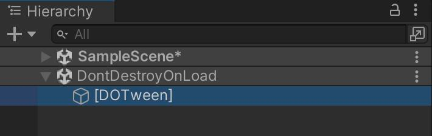

<p><em>VI: Hình 12.1 — GameObject <code>[DOTween]</code> nằm dưới <strong><code>DontDestroyOnLoad</code></strong> trong Hierarchy lúc chạy. / EN: Figure 12.1 — [DOTween] GameObject.</em></p>

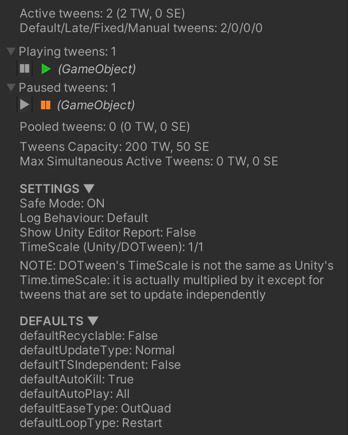

<p><em>VI: Hình 12.2 — DOTween Inspector: <strong>Active tweens: 2</strong>, <strong>Playing tweens: 1</strong>, <strong>Paused tweens: 1</strong>, <strong>Pooled tweens: 0</strong>, <strong>Tweens Capacity: 200 TW, 50 SE</strong>; phần SETTINGS/DEFAULTS cho biết <code>defaultAutoKill: True</code>, <code>defaultEaseType: OutQuad</code>. / EN: Figure 12.2 — DOTween Inspector.</em></p>

<div class="bilingual-row">
<div class="col-vi">
<p>💡 Nó cũng hữu ích để <strong>phát hiện các tween object vẫn tiếp tục chạy dù GameObject liên quan đã bị huỷ</strong>, và <strong>các tween object đang ở trạng thái <code>Pause</code> và bị rò rỉ mà không được huỷ</strong>.</p>
</div>
<div class="col-en">
<p>It is also useful to check for tween objects that continue to move even though their associated GameObjects have been discarded and for tween objects that are in a Pause state and leaking without being discarded.</p>
</div>
</div>

---

## 44. 🔄 UniRx

<div class="bilingual-row">
<div class="col-vi">
<p><strong>UniRx</strong> là thư viện hiện thực <strong>Reactive Extensions</strong> được tối ưu cho Unity. Với bộ operator và helper phong phú dành cho Unity, việc xử lý event với điều kiện phức tạp có thể được viết một cách ngắn gọn.</p>
</div>
<div class="col-en">
<p>UniRx is a library implementing Reactive Extensions optimized for Unity. With a rich set of operators and helpers for Unity, event handling of complex conditions can be written in a concise manner.</p>
</div>
</div>

### 44.1. 🚨 Unsubscribe — huỷ đăng ký

<div class="bilingual-row">
<div class="col-vi">
<p>UniRx cho phép bạn <strong>subscribe</strong> vào <code>IObservable</code> — nơi phát stream — để nhận thông báo về các message của nó.</p>
<p>Khi subscribe, <strong>các instance của object nhận thông báo, các callback xử lý message... đều được TẠO RA</strong>. Để tránh việc các instance này <strong>tồn tại trong bộ nhớ lâu hơn vòng đời của bên Subscribe</strong>, về cơ bản <strong>trách nhiệm của bên Subscribe là huỷ đăng ký</strong> khi không còn cần nhận thông báo.</p>
<p>✅ Có nhiều cách để unsubscribe, nhưng <strong>xét về hiệu năng, tốt hơn là giữ lại giá trị trả về <code>IDisposable</code> của <code>Subscribe</code> và <code>Dispose</code> nó một cách tường minh</strong>.</p>
</div>
<div class="col-en">
<p>UniRx allows you to subscribe (Subscribe) to the stream publisher IObservable to receive notifications of its messages.</p>
<p>When subscribing, instances of objects to receive notifications, callbacks to process messages, etc. are created. To avoid these instances remaining in memory beyond the lifetime of the Subscribe party, it is basically the Subscribe party's responsibility to unsubscribe when it no longer needs to receive notifications.</p>
<p>There are several ways to unsubscribe, but for performance considerations, it is better to explicitly Dispose retain the IDisposable return value of Subscribe.</p>
</div>
</div>

▼ **List 12.5** — Giữ `IDisposable` và Dispose tường minh (khuyến nghị về hiệu năng)

```csharp
public class Example : MonoBehaviour {
    private IDisposable _disposable;

    private void Awake() {
        _disposable = Observable.EveryUpdate()      // ✅ Giữ lại IDisposable
            .Subscribe(_ => {
                // Processes to be executed every frame
            });
    }

    private void OnDestroy() {
        _disposable.Dispose();                      // ✅ Huỷ đăng ký tường minh
    }
}
```

<div class="bilingual-row">
<div class="col-vi">
<p>Nếu class của bạn kế thừa từ <code>MonoBehaviour</code>, bạn cũng có thể gọi <strong><code>AddTo(this)</code></strong> để <strong>tự động unsubscribe vào thời điểm chính nó bị <code>Destroy</code></strong>.</p>
<p>⚠️ Dù có <strong>overhead của việc gọi <code>AddComponent</code> nội bộ</strong> để giám sát sự kiện Destroy, đây vẫn là cách hay để dùng vì <strong>đơn giản hơn khi viết</strong>.</p>
</div>
<div class="col-en">
<p>If your class inherits from MonoBehaviour, you can also call AddTo(this) to automatically unsubscribe at the timing of your own Destroy. Although there is an overhead of calling AddComponent internally to monitor the Destroy, it is a good idea to use this method, which is simpler to write.</p>
</div>
</div>

▼ **List 12.6** — `AddTo(this)` — cách viết đơn giản hơn

```csharp
private void Awake() {
    Observable.EveryUpdate()
        .Subscribe(_ => {
            // Processing to be executed every frame
        })
        .AddTo(this);   // ⚠️ Tiện hơn, nhưng nội bộ gọi AddComponent → có overhead
}
```

📊 **So sánh 2 cách:**

| Cách | Ưu điểm | Nhược điểm |
|---|---|---|
| Giữ `IDisposable` + `Dispose()` | ✅ **Không overhead**, kiểm soát chính xác thời điểm | Code dài hơn, dễ quên |
| `.AddTo(this)` | ✅ Ngắn gọn, tự động theo vòng đời | ⚠️ Nội bộ `AddComponent` để giám sát Destroy → **có overhead** |

---

## 45. ⚡ UniTask

<div class="bilingual-row">
<div class="col-vi">
<p><strong>UniTask</strong> là thư viện mạnh mẽ cho xử lý bất đồng bộ hiệu năng cao trong Unity, với đặc trưng là <strong>xử lý bất đồng bộ ZERO-ALLOCATION</strong> nhờ kiểu <code>UniTask</code> dựa trên <strong>value type</strong>. Nó cũng có thể <strong>điều khiển thời điểm thực thi theo PlayerLoop của Unity</strong>, nhờ đó <strong>thay thế hoàn toàn coroutine truyền thống</strong>.</p>
</div>
<div class="col-en">
<p>UniTask is a powerful library for high-performance asynchronous processing in Unity, featuring zero-allocation asynchronous processing with the value-based UniTask type. It can also control the execution timing according to Unity's PlayerLoop, thus completely replacing conventional coroutines.</p>
</div>
</div>

### 45.1. UniTask v2

<div class="bilingual-row">
<div class="col-vi">
<p><strong>UniTask v2</strong> — bản nâng cấp lớn của UniTask — được phát hành vào <strong>tháng 6 năm 2020</strong>. UniTask v2 có những <strong>cải thiện hiệu năng đáng kể</strong>, như <strong>zero-allocation cho TOÀN BỘ async method</strong>, và bổ sung các tính năng như <strong>hỗ trợ async LINQ</strong> và <strong>hỗ trợ <code>await</code> cho asset bên ngoài</strong>.</p>
<p>⚠️ Mặt khác, <strong>hãy cẩn thận khi cập nhật từ UniTask v1</strong>, vì nó bao gồm các <strong>thay đổi phá vỡ (destructive changes)</strong>, chẳng hạn:</p>
<ul>
<li><code>UniTask.Delay(...)</code> và các task khác trả về từ Factory <strong>được kích hoạt ngay tại thời điểm gọi</strong>.</li>
<li><strong>Cấm <code>await</code> nhiều lần</strong> lên một instance <code>UniTask</code> thông thường.</li>
</ul>
<p>✅ Tuy nhiên, các tối ưu quyết liệt đã cải thiện hiệu năng hơn nữa, nên <strong>về cơ bản UniTask v2 là hướng đi nên chọn</strong>.</p>
<p>💡 Chú thích của sách: bằng cách dùng <strong><code>UniTask.Preserve</code></strong>, UniTask v2 có thể chuyển đổi thành một <code>UniTask</code> có thể <code>await</code> nhiều lần.</p>
</div>
<div class="col-en">
<p>UniTask v2, a major upgrade of UniTask, was released in June 2020. UniTask v2 features significant performance improvements, such as zero-allocation of the entire async method, and added features such as asynchronous LINQ support and await support for external assets.</p>
<p>On the other hand, be careful when updating from UniTask v1, as it includes destructive changes, such as UniTask.Delay(...) and other tasks returned by Factory being invoked at invocation time, prohibiting multiple await to normal UniTask instances, and so on. However, aggressive optimizations have further improved performance, so basically UniTask v2 is the way to go.</p>
<p>UniTask.Preserve: UniTask v2 can be converted to a UniTask that can be awaited multiple times by using it.</p>
</div>
</div>

### 45.2. 🔍 UniTask Tracker

<div class="bilingual-row">
<div class="col-vi">
<p><strong>UniTask Tracker</strong> có thể được dùng để <strong>trực quan hoá các UniTask đang chờ</strong> và <strong>stack trace nơi chúng được tạo ra</strong>.</p>
</div>
<div class="col-en">
<p>UniTask Tracker can be used to visualize waiting UniTasks and the stack trace of their creation.</p>
</div>
</div>

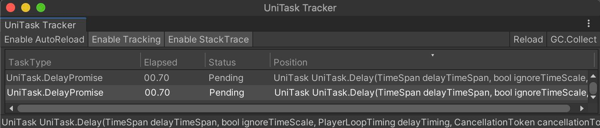

<p><em>VI: Hình 12.3 — UniTask Tracker với các nút <strong>Enable AutoReload / Enable Tracking / Enable StackTrace</strong>. Bảng liệt kê <code>TaskType</code>, <code>Elapsed</code>, <code>Status</code>, <code>Position</code> — ở đây có <strong>2 <code>UniTask.DelayPromise</code></strong> ở trạng thái <strong><code>Pending</code></strong> sau <strong>00.70</strong> giây. / EN: Figure 12.3 — UniTask Tracker.</em></p>

<div class="bilingual-row">
<div class="col-vi">
<p>Ví dụ, giả sử bạn có một <code>MonoBehaviour</code> mà <code>_hp</code> giảm đi 1 mỗi khi va chạm với thứ gì đó.</p>
</div>
<div class="col-en">
<p>For example, suppose you have a MonoBehaviour whose _hp is decremented by 1 when it collides with something.</p>
</div>
</div>

▼ **List 12.7** — 💀 Code có thể rò rỉ task

```csharp
public class Example : MonoBehaviour {
    private int _hp = 10;

    public UniTask WaitForDeadAsync() {
        return UniTask.WaitUntil(() => _hp <= 0);   // 💀 Nếu object bị Destroy trước
    }                                               //    khi _hp cạn → task treo VĨNH VIỄN

    private void OnCollisionEnter(Collision collision) {
        _hp -= 1;
    }
}
```

<div class="bilingual-row">
<div class="col-vi">
<p>Nếu <code>MonoBehaviour</code> này bị <code>Destroy</code> <strong>trước khi <code>_hp</code> cạn hoàn toàn</strong>, <code>_hp</code> sẽ không giảm thêm nữa, nên <code>UniTask</code> — giá trị trả về của <code>WaitForDeadAsync</code> — <strong>sẽ mất cơ hội hoàn thành và tiếp tục chờ MÃI MÃI</strong>.</p>
<p>✅ Khuyến nghị dùng công cụ này để <strong>kiểm tra UniTask bị rò rỉ do cấu hình sai điều kiện kết thúc</strong>.</p>
</div>
<div class="col-en">
<p>If _hp of this MonoBehaviour is Destroyed before is fully depleted, _hp will not be depleted any further, so UniTask, the return value of WaitForDeadAsync, will lose the opportunity to complete, and will continue to wait.</p>
<p>It is recommended that you use this tool to check for UniTask leaking due to a misconfiguration of termination conditions.</p>
</div>
</div>

!!! danger "Ngăn chặn rò rỉ Task — *Preventing Task Leaks*"
    <div class="bilingual-row">
    <div class="col-vi">
    <p>Lý do code ví dụ bị rò rỉ task là vì nó <strong>không tính tới trường hợp bản thân task bị huỷ TRƯỚC KHI điều kiện kết thúc được thoả mãn</strong>.</p>
    <p>Để xử lý, chỉ cần <strong>kiểm tra xem bản thân task đã bị huỷ chưa</strong>. Hoặc, <strong><code>CancellationToken</code></strong> lấy được bằng <code>this.GetCancellationTokenOnDestroy()</code> có thể được truyền vào <code>WaitForDeadAsync</code> để <strong>task bị huỷ khi object bị <code>Destroy</code></strong>.</p>
    </div>
    <div class="col-en">
    <p>The reason why the example code leaks a task is that it does not take into account the case where the task itself is destroyed before the termination condition is met.</p>
    <p>To do this, simply check to see if the task itself has been destroyed. Or, the CancellationToken obtained by this.GetCancellationTokenOnDestroy() to itself can be passed to WaitForDeadAsync so that the task is canceled when is Destroyed.</p>
    </div>
    </div>

▼ **List 12.8** — ✅ Hai mẫu sửa lỗi rò rỉ task

```csharp
// Pattern for checking whether the user is Destroyed or not
public UniTask WaitForDeadAsync() {
    return UniTask.WaitUntil(() => this == null || _hp <= 0);   // ✅ Kiểm tra Destroy
}

// Pattern for passing a CancellationToken
public UniTask WaitForDeadAsync(CancellationToken token) {
    return UniTask.WaitUntil(
        () => _hp <= 0,
        cancellationToken: token);                              // ✅ Huỷ theo token
}
```

▼ **List 12.9** — Ví dụ gọi `WaitForDeadAsync(CancellationToken)`

```csharp
Example example = ...
var token = example.GetCancellationTokenOnDestroy();
await example.WaitForDeadAsync(token);
```

<div class="bilingual-row">
<div class="col-vi">
<p>⚠️ Tại thời điểm <code>Destroy</code>: <strong>mẫu đầu tiên khiến UniTask hoàn thành BÌNH THƯỜNG</strong>, trong khi <strong>mẫu sau NÉM RA <code>OperationCanceledException</code></strong>. Hành vi nào đáng mong muốn hơn <strong>tuỳ thuộc vào tình huống</strong>, và nên chọn cách hiện thực phù hợp.</p>
</div>
<div class="col-en">
<p>At Destroy time, the former UniTask completes without incident, while the latter OperationCanceledException is thrown. Which behavior is preferable depends on the situation, and the appropriate implementation should be chosen.</p>
</div>
</div>

---

## 46. 🏁 Kết luận & Nhóm tác giả

### 46.1. CONCLUSION

<div class="bilingual-row">
<div class="col-vi">
<p>Đây là phần kết của tài liệu này. Chúng tôi hy vọng rằng qua cuốn sách này, những ai <strong>"không tự tin về performance tuning"</strong> đã đi đến chỗ nghĩ rằng <strong>"Tôi hiểu đại khái rồi, và tôi muốn thử"</strong>. Khi càng nhiều người thực hành nó trong dự án của mình, họ sẽ có thể <strong>xử lý vấn đề nhanh hơn nhiều</strong>, và <strong>độ ổn định của dự án sẽ tăng lên</strong>.</p>
<p>Bạn cũng có thể gặp những sự kiện phức tạp <strong>không thể giải quyết bằng thông tin trong cuốn sách này</strong>. Nhưng ngay cả trong trường hợp đó, <strong>những gì bạn sẽ làm vẫn y hệt</strong>: bạn vẫn cần <strong>profile, phân tích nguyên nhân, và hành động</strong>.</p>
<p>Từ đây trở đi, hãy tận dụng tối đa <strong>kiến thức, kinh nghiệm và trí tưởng tượng của chính bạn</strong> qua thực hành. Tôi hy vọng bạn sẽ thấy performance tuning thú vị theo cách này. Cảm ơn bạn đã đọc tới cuối.</p>
</div>
<div class="col-en">
<p>This is the end of this document. We hope that through this book, those of you who are "not confident about performance tuning" have come to think, "I kind of get it, and I want to try it." As more people practice it in their projects, they will be able to deal with problems much faster, and the stability of their projects will increase.</p>
<p>You may also encounter complex events that cannot be solved with the information presented in this book. But even in such cases, what you will do will be the same. You will still need to profile, analyze the cause, and take some action.</p>
<p>From this point forward, please make full use of your own knowledge, experience, and imagination through practice. I hope you will enjoy performance tuning in this way. Thank you for reading to the end.</p>
</div>
</div>

### 46.2. 👥 Introduction of the Authors

<div class="bilingual-row">
<div class="col-vi">
<p>Dưới đây là danh sách các tác giả tham gia cuốn sách. Lưu ý rằng hồ sơ tác giả và các phần họ phụ trách là <strong>tại thời điểm viết sách</strong>.</p>
</div>
<div class="col-en">
<p>The following is a list of the authors involved in this book. Please note that the profiles of the authors and the sections they are responsible for are current at the time of writing.</p>
</div>
</div>

| Tác giả / Author | Đơn vị / Affiliation | Chương phụ trách / Chapters |
|---|---|---|
| **Takuya Iida** | Engineering Manager, SGE Core Technology Division, Grange Corporation | Ch.1 "Getting Started with Performance Tuning", Ch.3 "Profiling Tools" |
| **Haruki Yano** (@harumak_11 / GitHub: Haruma-K) | SGE Core Technology Division, CyberAgent, Inc. — Client-Side Engineer | "2.2 Rendering", "2.3 Data Representation" và các bài khác của Ch.2 "Fundamentals". Vận hành blog Unity **LIGHT11** |
| **Yusuke Ishiguro** | CyberAgent, Inc. SGE Core Technology Division | Một phần Ch.2 "Fundamentals", Ch.5 "Tuning Practice - AssetBundle". Từng phát triển hạ tầng AssetBundle **"Octo"** |
| **Daiki Hakamata** | SGE Core Technology Division, CyberAgent, Inc. | **Ch.9 "Tuning Practice - Script (Unity)"** |
| **Mitsutoshi Nakamura** (NAKAMURO. / @megalo_23) | Applibot, Inc. | Nửa đầu "2.5 C# Basics" và **Ch.10 "Tuning Practice - Script (C#)"** |
| **Shunsuke Ohba** (@ohbashunsuke) | Engineering Manager, Samzap Inc. | Ch.4 "Tuning Practice - Asset". Blog "Shibuya Hottogisu Tsushin" |
| **Gaku Ishii** | Samzap Inc. — Server & client-side engineer | **Ch.11 "Tuning Practice - Player Settings"**, **Ch.12 "Tuning Practice - Third Party"** |
| **Shunsuke Saito** (@shun_shun_mummy) | Colorful Palette Inc. — Client-side Engineer | Một số bài của **Ch.10 "Tuning Practice - Script (C#)"** |
| **Kazunori Tamura** | QualArts Corporation | Ch.8 "Tuning Practice - UI" |
| **Tomoya Yamaguchi** (@togucchi) | Colorful Palette Co. — Client-side engineer | Ch.7 "Tuning Practice - Graphics" |
| **Yuichiro Mukai** (@yucchiy_) | Applibot, Inc. — Client-side engineer | Ch.6 "Tuning Practice - Physics" và một phần **Ch.10** |

!!! info "📖 Thông tin xuất bản"
    **Unity Performance Tuning Bible** — Feb. 22, 2023, 1st Edition
    **Author:** CyberAgent SGE Core Technology Team
    **Design:** CyberAgent Smartphone Games & Entertainment Division
    **Publisher:** CyberAgent, Inc. — © 2022 CyberAgent, Inc.
---

# PHẦN F — CASE STUDY: SENTRY ANR & DEADLOCK MAIN THREAD

> Nguồn: **"Fixing Elusive Unity ANRs: How Amanotes Used Sentry to Cut Errors by 50%"** — blog.sentry.io, xuất bản **09/05/2025**. Guest post của **Thuan Do The** từ **Amanotes**, nhà phát hành game âm nhạc đang dùng Sentry cho game Unity **Duet Cats**.

---

## 47. 🚨 Bối cảnh: khi ANR là bóng ma không thể bắt

<div class="bilingual-row">
<div class="col-vi">
<p>Trong thế giới mobile-first ngày nay, người dùng kỳ vọng ứng dụng <strong>khởi động tức thì</strong> và <strong>phản hồi mượt mà</strong>. Với các nhà phát triển game, duy trì trải nghiệm mượt như bơ <strong>không chỉ là "có thì tốt"</strong> — nó <strong>thiết yếu cho retention và doanh thu</strong>. <em>Nhưng điều gì xảy ra khi hiệu năng bắt đầu sụp đổ mà không có nguyên nhân rõ ràng?</em></p>
<p>Đó chính xác là nơi chúng tôi thấy mình ở Amanotes. Khi tiếp tục thêm tính năng mới vào một trong những game hàng đầu của mình — <strong>Duet Cats</strong>, game nhịp điệu âm nhạc với hơn <strong>10 TRIỆU lượt tải</strong> trên Google Play và App Store — chúng tôi nhận thấy một xu hướng đáng lo ngại: <strong>mỗi tính năng mới dường như LÀM ĐÔI số lỗi "Application Not Responding" (ANR)</strong>.</p>
</div>
<div class="col-en">
<p>In today's mobile-first world, users expect apps to launch instantly and respond seamlessly. For game developers, maintaining that buttery-smooth experience isn't just a nice-to-have—it's essential for retention and revenue. <em>But what happens when performance starts breaking down, and there's no clear cause?</em></p>
<p>That's exactly where we found ourselves at Amanotes. As we continued to add new features to one of our top games, <strong>Duet Cats</strong> – a music rhythm game with over 10 million downloads on Google Play and App Store – we noticed a troubling trend: every new feature seemed to double the number of "Application Not Responding" errors (ANRs).</p>
</div>
</div>

<div class="bilingual-row">
<div class="col-vi">
<p>Với độ phức tạp của game và lượng fan tăng nhanh, <strong>hiệu năng trở thành nút thắt cổ chai lớn nhất của chúng tôi</strong>. Chúng tôi <strong>kiểm tra code ba lần</strong>, <strong>profile từng component mới</strong>, thậm chí <strong>so sánh các bản build từng dòng một</strong>. Kết quả? <strong>Không có thủ phạm rõ ràng nào.</strong> Mọi thứ trông đều sạch sẽ — nhưng ANR vẫn tăng vọt.</p>
<p>🚨 <strong>Chúng tôi đang đuổi theo những bóng ma.</strong></p>
</div>
<div class="col-en">
<p>With the game's complexity and fanbase quickly growing, <strong>performance became our biggest bottleneck</strong>. We triple-checked our code, profiled every new component, and even compared builds line-by-line. The results? No obvious culprits. Everything looked clean—yet ANRs were spiking.</p>
<p><strong>We were chasing ghosts.</strong></p>
</div>
</div>

!!! danger "💀 ANR là gì và vì sao nó chết người?"
    **ANR (Application Not Responding)** là lỗi Android phát sinh khi **main thread bị chặn (blocked) quá lâu** — ngưỡng của Google là **5 giây**. Với Unity, main thread cũng chính là thread chạy `PlayerLoop`. Khi nó bị deadlock hoặc bị nghẽn bởi I/O đồng bộ, hệ điều hành hiển thị hộp thoại "App isn't responding" và người dùng **thoát game**. Google Play còn dùng **user-perceived ANR rate** làm chỉ số xếp hạng — vượt **"bad behavior threshold"** sẽ bị **giảm khả năng hiển thị trên store**.

---

## 48. 🔑 Bước ngoặt: tích hợp Sentry

<div class="bilingual-row">
<div class="col-vi">
<p>Đi tìm những hiểu biết sâu hơn, chúng tôi tìm đến <strong>Sentry</strong> — công cụ chủ yếu được biết đến với việc giám sát lỗi và hiệu năng cho web và mobile. <strong>Ban đầu chúng tôi hoài nghi</strong> — Unity không phải lãnh địa quen thuộc của nó. Nhưng ngay khi tích hợp Sentry, chúng tôi phát hiện điều đáng kinh ngạc: <strong>các mẫu hình rõ ràng hiện lên từ mớ hỗn độn!</strong></p>
<p>🚨 <strong><code>Awake()</code> được kích hoạt RẤT MUỘN — sau 5 giây.</strong> Điều này quan trọng đến mức nào? <strong>CỰC KỲ!</strong> Nó có nghĩa là <strong>ANR hoàn toàn KHÔNG đến từ game logic của chúng tôi</strong> — <strong>ứng dụng đã bị đóng băng TRƯỚC KHI code của chúng tôi kịp chạy!</strong></p>
</div>
<div class="col-en">
<p>In search of deeper insights, we turned to Sentry, a tool primarily known for error and performance monitoring for web and mobile. We were skeptical at first—Unity wasn't its typical domain. But as soon as we integrated Sentry, we discovered something remarkable: clear patterns emerging from the chaos!</p>
<p><code>Awake()</code> was triggered very late, after 5s. How significant is this? Extremely! It means the ANRs weren't coming from our game logic at all—the app was freezing <em>before</em> our code even had a chance to run!</p>
</div>
</div>

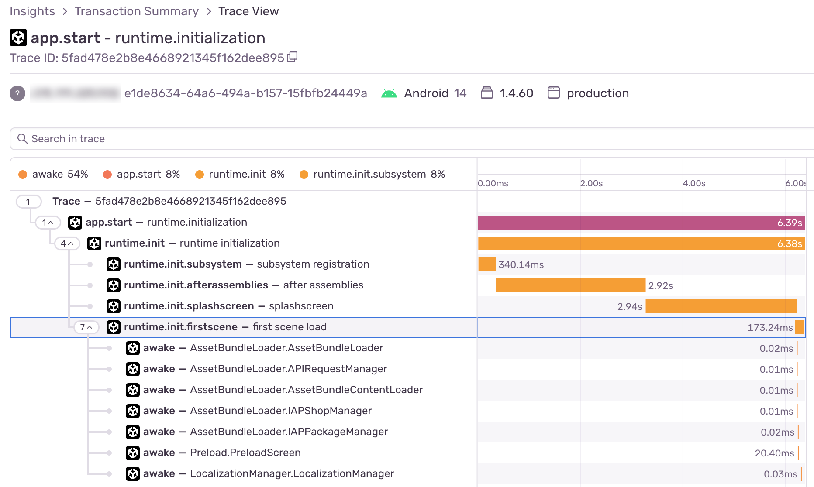

<p><em>VI: Sentry Trace View của transaction <code>app.start — runtime.initialization</code> (Android 14, release 1.4.60, production). Tổng <strong>6,39 s</strong>; trong đó <code>runtime.init</code> = <strong>6,38 s</strong>, <code>runtime.init.subsystem</code> = <strong>340,14 ms</strong>, <code>runtime.init.afterassemblies</code> = <strong>2,92 s</strong>, <code>runtime.init.splashscreen</code> = <strong>2,94 s</strong>, <code>runtime.init.firstscene</code> = <strong>173,24 ms</strong>. Các span <code>awake</code> chiếm <strong>54%</strong> nhưng từng cái chỉ 0,01–20,40 ms → <strong>thời gian bị nuốt TRƯỚC khi code game chạy</strong>. / EN: Sentry trace view showing the late triggered Awake().</em></p>

<div class="bilingual-row">
<div class="col-vi">
<p>💡 Bỗng nhiên, mọi thứ trở nên hiển nhiên vì sao các tối ưu của chúng tôi không hiệu quả: <strong>chúng tôi đã tune hiệu năng SAI CHỖ suốt từ đầu tới giờ!</strong></p>
</div>
<div class="col-en">
<p>Suddenly, it was obvious why our optimizations didn't work: we'd been tuning performance in the wrong place all along!</p>
</div>
</div>

### 48.1. 💀 Hai transaction nặng nhất — những "máy phát ANR" ẩn giấu

<div class="bilingual-row">
<div class="col-vi">
<p>Hai thao tác nổi bật lên như những <strong>kẻ giết hiệu năng thầm lặng</strong>.</p>
</div>
<div class="col-en">
<p>Two operations stood out as silent performance killers.</p>
</div>
</div>

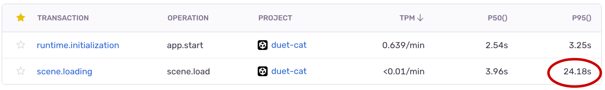

<p><em>VI: Danh sách transaction sắp theo TPM. <code>runtime.initialization</code> (op <code>app.start</code>): P50 = <strong>2,54 s</strong>, P95 = <strong>3,25 s</strong>. <code>scene.loading</code> (op <code>scene.load</code>): P50 = <strong>3,96 s</strong>, <strong>P95 = 24,18 s</strong> — con số được khoanh đỏ. / EN: Transactions in Sentry, highlighting the scene.loading transaction that took 24.18s for p95.</em></p>

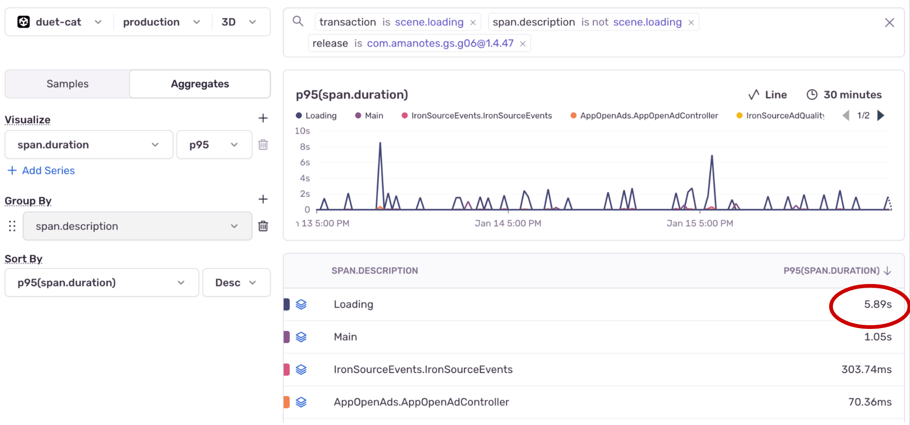

<p><em>VI: Bóc tách chi tiết theo span của <code>scene.loading</code>, group by <code>span.description</code>, sắp theo <code>p95(span.duration)</code>: <strong>Loading = 5,89 s</strong> (khoanh đỏ), <strong>Main = 1,05 s</strong>, <strong>IronSourceEvents.IronSourceEvents = 303,74 ms</strong>, <strong>AppOpenAds.AppOpenAdController = 70,36 ms</strong>. / EN: Detailed breakdown in Sentry of the scene.loading transaction, highlighting the Loading span that took 5.89s for the p95 percentile.</em></p>

<div class="bilingual-row">
<div class="col-vi">
<p><strong>Transaction-level view</strong> của Sentry cho chúng tôi một bản bóc tách mạnh mẽ về <strong>chính xác các span nào gây độ trễ</strong>. Bằng cách sắp xếp theo <strong>thời lượng percentile thứ 95</strong>, chúng tôi có thể xác định chính xác các thao tác chậm nhất ảnh hưởng tới <strong>top 5% người dùng</strong> — chính là nhóm <strong>dễ tổn thương nhất trước ANR</strong>.</p>
<ul>
<li>🚨 <strong>Scene nặng:</strong> <em>Loading</em> và <em>Main</em> nổi bật, với span <em>Loading</em> đạt đỉnh <strong>5,89 giây</strong> ở percentile p95 — <strong>NGUY HIỂM VƯỢT NGƯỠNG ANR</strong>.</li>
<li>⚠️ <strong>Method nặng:</strong> tác động đáng kể, đặc biệt khi được khởi tạo quá sớm lúc startup:
<ul>
<li><code>IronSourceEvents.IronSourceEvents</code></li>
<li><code>AppOpenAds.AppOpenAdController</code></li>
</ul>
</li>
</ul>
<p>✅ View này <strong>loại bỏ toàn bộ việc đoán mò</strong>. Giờ chúng tôi có <strong>danh sách ưu tiên tối ưu rõ ràng dựa trên hiệu năng THẾ GIỚI THỰC</strong>, không phải giả định. Và rồi mọi thứ cuối cùng cũng khớp lại — chúng tôi <strong>thấy rõ tại sao ANR xảy ra</strong>.</p>
</div>
<div class="col-en">
<p>Sentry's transaction-level view gave us a powerful breakdown of the exact spans causing delays. Sorting by 95th percentile duration we were able to pinpoint the slowest operations affecting the top 5% of users—the ones most vulnerable to ANRs.</p>
<ul>
<li><strong>Heavy Scenes:</strong> <em>Loading</em> and <em>Main</em> stood out, with the <em>Loading</em> span peaking at 5.89 seconds for the p95 percentile—<em>dangerously above the ANR threshold.</em></li>
<li><strong>Heavy Methods:</strong> significant impact, especially when initialized too early during startup: IronSourceEvents.IronSourceEvents, AppOpenAds.AppOpenAdController</li>
</ul>
<p>This view removed all guesswork. We now had a clear list of priority optimizations based on <em>real-world performance</em>, not assumptions. And then it finally clicked—we could clearly see why the ANRs were happening.</p>
</div>
</div>

### 48.2. 🎯 Phát hiện chấn động: hệ thống mong manh chỉ chờ bị đẩy qua vực

<div class="bilingual-row">
<div class="col-vi">
<p>Bản build trước của chúng tôi <strong>chưa vượt ngưỡng ANR 5 giây</strong>, nhưng nó <strong>đã trượt sát mép vực một cách nguy hiểm</strong>. Với một phần đáng kể người dùng, một số thao tác đã mất tới <strong>4,9 giây</strong>.</p>
<p>Các tính năng mới chúng tôi thêm vào? Chúng chỉ mang thêm <strong>0,1 giây</strong>. Nhưng cú hích tí hon đó <strong>đủ để đẩy nhiều thiết bị VỪA VẶN vượt qua giới hạn</strong> — kích hoạt một làn sóng ANR.</p>
<p>🔑 <strong>Chúng tôi KHÔNG tạo ra vấn đề mới — chúng tôi đã vô tình đẩy một hệ thống mong manh qua bờ vực.</strong></p>
</div>
<div class="col-en">
<p>Our previous build hadn't crossed the 5-second ANR threshold, but it was already skating dangerously close. For a significant portion of users, some operations were taking up to 4.9 seconds.</p>
<p>The new features we added? They only introduced an extra 0.1 seconds. But that tiny bump was enough to push many devices <em>just</em> over the limit—triggering a wave of ANRs.</p>
<p><strong>We hadn't introduced new issues—we had unknowingly tipped a fragile system over the edge.</strong></p>
</div>
</div>

!!! danger "🚨 Bài học quan trọng nhất của case study này"
    **4,9 s + 0,1 s = ANR.** Một hệ thống chạy sát ngưỡng an toàn **không phải là hệ thống an toàn** — nó là **bom hẹn giờ**. Bất kỳ tính năng nhỏ nào cũng có thể là giọt nước tràn ly. Đây là lý do bạn phải đo bằng **p95/p99**, không phải trung bình (P50 chỉ 3,96 s trong khi P95 lên tới **24,18 s**).

---

## 49. 📊 Kết quả thực tế — Real Gains

<div class="bilingual-row">
<div class="col-vi">
<p>Với khả năng nhìn sâu của Sentry, cuối cùng chúng tôi <strong>biết chính xác NƠI cần nhìn và ĐIỀU GÌ cần sửa</strong>.</p>
<p>✅ <strong>Scene Loading Time:</strong> giảm từ <strong>17,8 s</strong> xuống <strong>3,71 s</strong> (<strong>~80% cải thiện</strong>)</p>
</div>
<div class="col-en">
<p>With Sentry's deep visibility, we finally knew exactly <em>where</em> to look and <em>what</em> to fix.</p>
<p><strong>Scene Loading Time:</strong> Reduced from 17.8s to 3.71s (~80% improvement)</p>
</div>
</div>

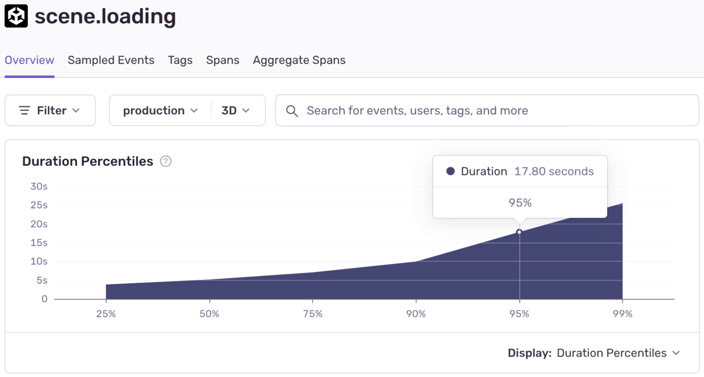

<p><em>VI: <strong>TRƯỚC</strong> — biểu đồ <strong>Duration Percentiles</strong> của transaction <code>scene.loading</code> (production, 3 ngày). Tại mốc <strong>95%</strong>, Duration = <strong>17,80 giây</strong>; đuôi 99% chạm gần <strong>25 s</strong>. / EN: Before — the scene.loading transaction taking 17.8s.</em></p>

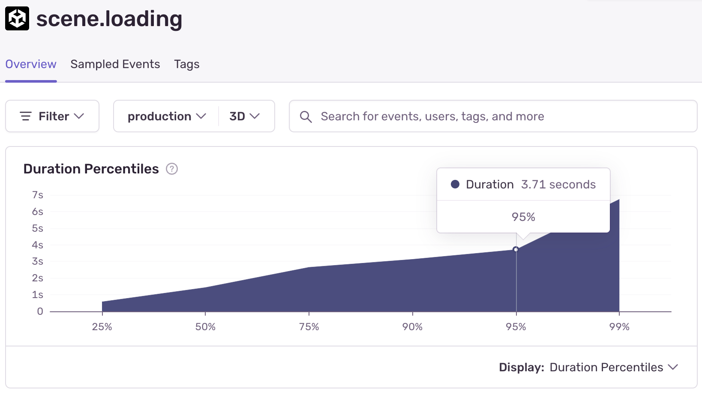

<p><em>VI: <strong>SAU</strong> — cùng biểu đồ sau tối ưu. Tại mốc <strong>95%</strong>, Duration chỉ còn <strong>3,71 giây</strong>; trục Y co từ 30 s xuống <strong>7 s</strong>. / EN: After — the scene.loading transaction taking 3.71s.</em></p>

<div class="bilingual-row">
<div class="col-vi">
<p>✅ <strong>ANR Rate:</strong> giảm từ <strong>0,98%</strong> xuống <strong>0,46%</strong> (<strong>~50% cải thiện</strong>)</p>
</div>
<div class="col-en">
<p><strong>ANR Rate:</strong> Reduced from 0.98% to 0.46% (~50% improvement)</p>
</div>
</div>

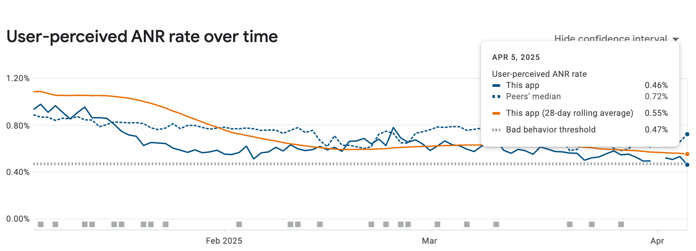

<p><em>VI: Biểu đồ <strong>"User-perceived ANR rate over time"</strong> của Google Play Console. Ngày <strong>05/04/2025</strong>: <strong>This app = 0,46%</strong>, <strong>Peers' median = 0,72%</strong>, <strong>28-day rolling average = 0,55%</strong>, <strong>Bad behavior threshold = 0,47%</strong> — app đã <strong>tụt xuống DƯỚI ngưỡng cảnh báo</strong> và tốt hơn cả trung vị của nhóm đối thủ. / EN: Graph displaying the ANR rate over time, showing a decrease from 0.98% down to 0.46%.</em></p>

📊 **Bảng tổng hợp kết quả:**

| Chỉ số / Metric | Trước / Before | Sau / After | Cải thiện |
|---|---|---|---|
| Scene loading (p95) | **17,8 s** | **3,71 s** | **~80%** ⬇️ |
| ANR rate | **0,98%** | **0,46%** | **~50%** ⬇️ |
| So với Peers' median (0,72%) | Tệ hơn | **Tốt hơn** | ✅ |
| So với Bad behavior threshold (0,47%) | Vượt xa | **Dưới ngưỡng** | ✅ |

---

## 50. 💡 Bài học 1 — Tối ưu khởi tạo (Initialization Optimization)

<div class="bilingual-row">
<div class="col-vi">
<p>Tối ưu startup và scene loading của Unity <strong>không cần phép màu</strong> — chỉ cần <strong>đúng công cụ để giám sát và đo lường</strong>.</p>
<p>🚨 <strong>Unity cần thời gian để tự khởi tạo chính nó — và TẤT CẢ những việc này xảy ra trong FRAME ĐẦU TIÊN!</strong></p>
</div>
<div class="col-en">
<p>Optimizing Unity startup and scene loading doesn't require magic—just the right tools for monitoring and measurement.</p>
<p>Unity takes time to init itself - and all of this happens in the first frame!</p>
</div>
</div>

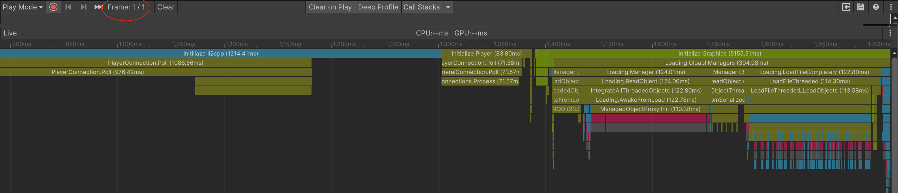

<p><em>VI: Unity Profiler Timeline của <strong>Frame: 1 / 1</strong> (khoanh đỏ) — toàn bộ diễn ra trong <strong>MỘT frame</strong>: <code>Initialize Il2cpp</code> = <strong>1214,41 ms</strong>, <code>Initialize Player</code> = <strong>83,80 ms</strong>, <code>Initialize Graphics</code> = <strong>5155,51 ms</strong> (bao gồm <code>Loading Global Managers</code> = <strong>304,98 ms</strong>, <code>LoadFileThreaded_LoadObjects</code> = <strong>113,58 ms</strong>). / EN: Screenshot from Unity showing a diagram of what is loaded on the very first frame.</em></p>

<div class="bilingual-row">
<div class="col-vi">
<p>Những gì xảy ra trong frame đầu tiên:</p>
<ul>
<li><strong>Initialize IL2CPP</strong> — khởi tạo runtime IL2CPP</li>
<li><strong>Initialize Player</strong> — khởi tạo Player</li>
<li><strong>Initialize Graphics</strong> (load managers) — khởi tạo đồ hoạ, nạp các manager</li>
<li><strong>Scene đầu tiên LUÔN được load ĐỒNG BỘ (sync)</strong> 💀</li>
</ul>
</div>
<div class="col-en">
<ul>
<li>Initialize IL2CPP</li>
<li>Initialize Player</li>
<li>Initialize Graphics (load managers)</li>
<li>First scene always load in sync</li>
</ul>
</div>
</div>

### 50.1. ✅ Chiến lược tối ưu: Trì hoãn thao tác (Delaying operations)

<div class="bilingual-row">
<div class="col-vi">
<ul>
<li>🎯 <strong>Giữ scene đầu tiên TỐI THIỂU:</strong> dùng nó như một <strong>vỏ (shell)</strong> để làm nóng (warm up) các hệ thống <strong>một cách bất đồng bộ</strong>.</li>
<li>🎯 <strong>Giữ danh sách shader / preload asset RỖNG:</strong> trì hoãn hoặc <strong>warm up shader thủ công</strong>.</li>
<li>🎯 <strong>Tránh làm việc trong vài frame đầu tiên:</strong> <strong>KHÔNG network call, KHÔNG thao tác I/O, KHÔNG khởi tạo SDK, KHÔNG nạp asset</strong>.</li>
</ul>
</div>
<div class="col-en">
<ul>
<li><strong>Keep the first scene minimal:</strong> Use it as a shell to warm up systems asynchronously.</li>
<li><strong>Keep the shader / preload asset list empty:</strong> Delay or manually warm up shaders</li>
<li><strong>Avoid work in the first several frames:</strong> No network calls, no I/O operation, no SDK inits, no asset loading</li>
</ul>
</div>
</div>

!!! tip "🔑 Áp dụng vào Duet Cats"
    Chính hai method `IronSourceEvents.IronSourceEvents` (**303,74 ms**) và `AppOpenAds.AppOpenAdController` (**70,36 ms**) là ví dụ của **SDK init quá sớm**. Chúng phải được đẩy ra khỏi các frame đầu.

---

## 51. 💡 Bài học 2 — Tối ưu nạp Asset (Asset Loading Optimization)

<div class="bilingual-row">
<div class="col-vi">
<p>⚠️ <strong>Scene cần thời gian để nạp TẤT CẢ asset được tham chiếu vào RAM.</strong></p>
</div>
<div class="col-en">
<p>Scenes takes time to load all referenced assets to RAM</p>
</div>
</div>

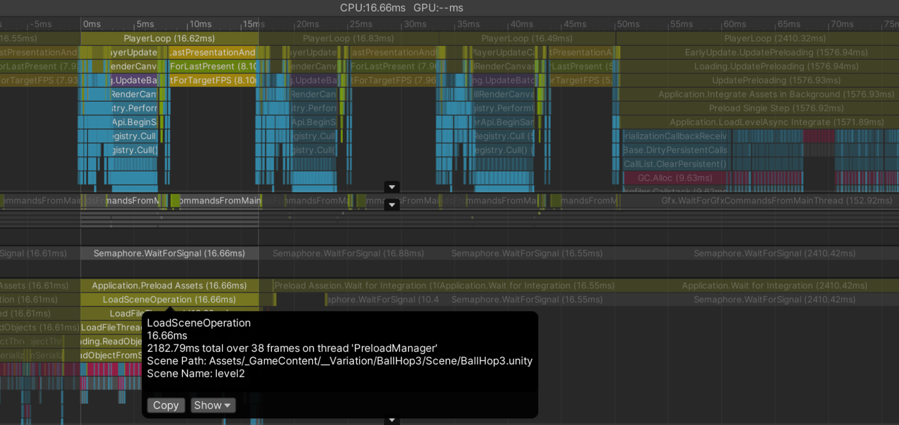

<p><em>VI: Unity Profiler cho thấy scene và asset của nó được nạp vào RAM. Tooltip <code>LoadSceneOperation</code>: <strong>16,66 ms</strong> ở frame này nhưng <strong>2182,79 ms tổng cộng trên 38 frame</strong> ở thread <strong><code>PreloadManager</code></strong>. Hàng cuối: <code>PlayerLoop</code> nhảy vọt lên <strong>2410,32 ms</strong> với <code>Application.LoadLevelAsync Integrate</code> = <strong>1571,89 ms</strong> và cả một dải <code>GC.Alloc</code> = <strong>9,63 ms</strong>. / EN: Unity screenshot showing a diagram of the scenes and their assets that are loaded to RAM.</em></p>

<div class="bilingual-row">
<div class="col-vi">
<p>🚨 <strong>Scene cần thời gian để tích hợp (integrate) / khởi tạo TẤT CẢ <code>gameObjects</code> và script trong hierarchy — và việc này xảy ra TRONG MỘT FRAME DUY NHẤT.</strong></p>
</div>
<div class="col-en">
<p>Scenes takes time to integrate / Initialize all gameObjects and scripts in the hierarchy and this happens within a single frame</p>
</div>
</div>

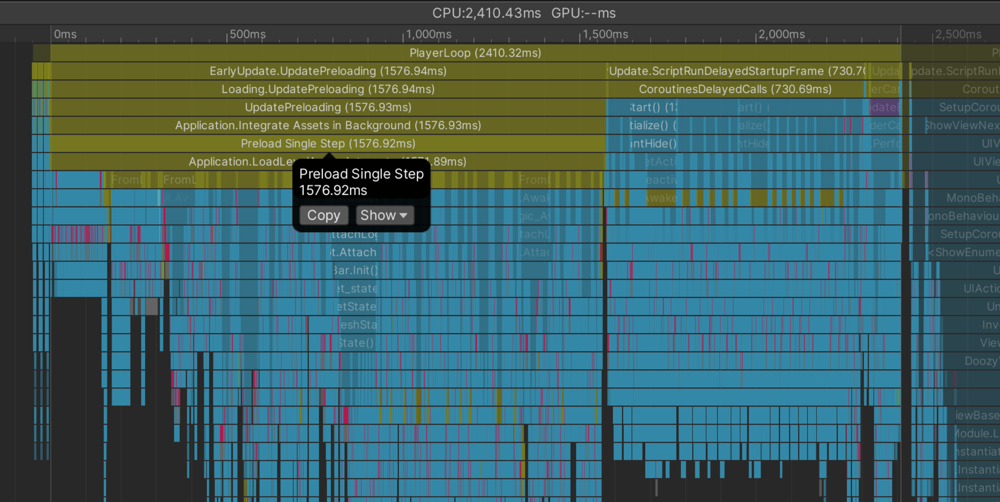

<p><em>VI: Profiler timeline cho thấy các <code>gameObject</code> được tích hợp và khởi tạo <strong>trong MỘT frame</strong>. Tooltip: <strong><code>Preload Single Step</code> = 1576,92 ms</strong>. Frame <code>PlayerLoop</code> tổng <strong>2410,32 ms</strong>, gồm <code>EarlyUpdate.UpdatePreloading</code> = <strong>1576,94 ms</strong> và <code>Update.ScriptRunDelayedStartupFrame</code> / <code>CoroutinesDelayedCalls</code> = <strong>730,69 ms</strong>. <strong>CPU = 2.410,43 ms cho MỘT frame</strong> — gần một nửa ngưỡng ANR chỉ trong một nhịp. / EN: Unity diagram showing gameObjects that are integrated and initialized in a single frame.</em></p>

<div class="bilingual-row">
<div class="col-vi">
<p>Những gì diễn ra trong pha tích hợp đó:</p>
<ul>
<li><strong>Serialization callbacks</strong></li>
<li><strong>Awake from load</strong></li>
<li><strong>Callbacks cho <code>Start()</code>, <code>OnEnable()</code></strong></li>
</ul>
</div>
<div class="col-en">
<ul>
<li>Serialization callbacks</li>
<li>Awake from load</li>
<li>Callbacks for Start(), OnEnable()</li>
</ul>
</div>
</div>

### 51.1. ✅ Chiến lược tối ưu: Giảm độ phức tạp (Reduce complexity)

<div class="bilingual-row">
<div class="col-vi">
<ul>
<li>🎯 <strong>Nạp scene BẤT ĐỒNG BỘ:</strong> nạp đồng bộ nghĩa là <strong>mọi thứ — texture, prefab, material — phải sẵn sàng trong RAM CHỈ TRONG MỘT FRAME</strong>. Đó là <strong>công thức tạo ra ANR</strong>.</li>
<li>🎯 <strong>Giảm phụ thuộc:</strong> <strong>chia scene lớn thành nhiều scene nhỏ</strong>. Tránh prefab phình to. Dùng <strong>dependency graph</strong> nếu cần.</li>
<li>🎯 <strong>Preload thông minh:</strong> trong các trường hợp phức tạp, <strong>preload các asset thiết yếu TRƯỚC KHI kích hoạt scene</strong>.</li>
<li>🎯 <strong>Trì hoãn instantiation:</strong> <strong>đừng populate toàn bộ scene ngay từ đầu</strong>. Dùng <strong>object pool</strong>, <code>Resources.Load()</code>, hoặc <strong>Addressables</strong> để sinh object <strong>theo nhu cầu (on demand)</strong>.</li>
</ul>
</div>
<div class="col-en">
<ul>
<li><strong>Load scenes asynchronously</strong>: Synchronous loads mean everything—textures, prefabs, materials—must be RAM-ready in one frame. That's a recipe for ANRs.</li>
<li><strong>Reduce dependencies</strong>: Split large scenes into smaller ones. Avoid bloated prefabs. Use dependency graphs if needed.</li>
<li><strong>Preload smartly</strong>: In complex cases, preload essential assets before activating the scene.</li>
<li><strong>Defer instantiation</strong>: Don't populate entire scenes up front. Use object pools, Resources.Load(), or Addressables to spawn objects on demand.</li>
</ul>
</div>
</div>

```csharp
// ✅ Mẫu nạp scene bất đồng bộ + trì hoãn kích hoạt (defer activation)
private IEnumerator LoadGameSceneAsync()
{
    var op = SceneManager.LoadSceneAsync("Main", LoadSceneMode.Additive);
    op.allowSceneActivation = false;          // ✅ Chưa integrate vội

    // Chờ tới 90% (Unity dừng ở 0.9 khi allowSceneActivation = false)
    while (op.progress < 0.9f)
    {
        UpdateProgressBar(op.progress);
        yield return null;                    // ✅ Nhả main thread mỗi frame
    }

    // Preload asset thiết yếu TRƯỚC khi kích hoạt scene
    yield return WarmUpShadersAsync();
    yield return PreloadCriticalAssetsAsync();

    op.allowSceneActivation = true;           // ✅ Giờ mới integrate
}
```

---

## 52. 🎯 Kết luận — Unity ANRs Don't Have to Be a Mystery

<div class="bilingual-row">
<div class="col-vi">
<p>Tại Amanotes, việc tích hợp Sentry vào quy trình Unity đã giúp chúng tôi <strong>xác định chính xác những vấn đề vô hình mà các công cụ profiling truyền thống BỎ SÓT</strong>. Những gì từng trông như <strong>treo máy ngẫu nhiên</strong> thực chất lại là <strong>những vách đá hiệu năng CÓ THỂ DỰ ĐOÁN ĐƯỢC</strong> — chỉ đang chờ bị vượt qua.</p>
<p>Nếu bạn là Unity developer đang vật lộn với hiệu năng hoặc bị ám ảnh bởi những ANR không giải thích được, chúng tôi <strong>rất khuyến nghị thử Sentry for Unity</strong>. Nó <strong>không chỉ là một crash logger, mà là một CỬA SỔ nhìn vào hiệu năng THẾ GIỚI THỰC của game bạn</strong>.</p>
<p>🎉 <strong>Người dùng của bạn (và chính bạn trong tương lai) sẽ cảm ơn bạn!</strong></p>
</div>
<div class="col-en">
<p>At Amanotes, integrating Sentry into our Unity workflow helped us pinpoint the invisible issues that traditional profiling tools missed. What once looked like random hangs were, in fact, predictable performance cliffs—just waiting to be crossed.</p>
<p>If you're a Unity developer struggling with performance or haunted by unexplained ANRs, we highly recommend giving Sentry for Unity a try. It's not just a crash logger, it's a window into your game's real-world performance.</p>
<p><strong>Your users (and your future self) will thank you!</strong></p>
</div>
</div>

!!! success "📋 Checklist chống ANR cho Unity mobile"
    - [ ] Đo bằng **p95 / p99**, không dùng trung bình — P50 3,96 s có thể che giấu P95 **24,18 s**
    - [ ] Scene đầu tiên **chỉ là shell rỗng**, warm up bất đồng bộ
    - [ ] **Xoá sạch** shader preload list & preloaded assets
    - [ ] **Không** SDK init / network / I/O trong vài frame đầu
    - [ ] `LoadSceneAsync` + `allowSceneActivation = false` cho mọi scene lớn
    - [ ] **Chia nhỏ** scene & prefab để giảm chi phí integrate trong một frame
    - [ ] Object pool / Addressables thay cho instantiate hàng loạt lúc vào scene
    - [ ] Giám sát liên tục **user-perceived ANR rate** so với **bad behavior threshold (0,47%)**
---

# PHẦN G — VERSION CONTROL, TỔ CHỨC DỰ ÁN & WORKFLOW

> Nguồn: **"The Unity game designer playbook / Field Guide"** — © 2021 Unity Technologies (chương *Version control*, tr.18–21; *Project organization*, tr.22–25) và **"Optimize your mobile game performance"** — © 2021 Unity Technologies (chương *Project configuration*, tr.22–23; *Workflow and collaboration*, tr.48–49).

---

## 53. 🔀 Version control — Quản lý phiên bản

<div class="bilingual-row">
<div class="col-vi">
<p>Dù là <strong>Plastic</strong>, <strong>Git</strong>, <strong>Perforce</strong> hay hệ thống khác, Unity cho phép bạn <strong>chọn giải pháp source control phù hợp nhất</strong> với bạn và nhóm của bạn.</p>
<p>Unity có <strong>tích hợp sẵn trong Editor</strong> với <strong>hai hệ thống version control hàng đầu ngành</strong>: <strong>Perforce</strong> và <strong>Plastic SCM</strong>. Bạn phải có server Perforce hoặc Plastic SCM được thiết lập cho dự án để dùng với Unity.</p>
</div>
<div class="col-en">
<p>Whether it's Plastic, Git, Perforce, or another system, Unity allows you to choose which source control solution works best for you and your team.</p>
<p>Unity has in-Editor integrations with two industry-leading version control systems, Perforce and Plastic SCM. You must have either a Perforce or Plastic SCM server set up for your project to use with Unity.</p>
</div>
</div>

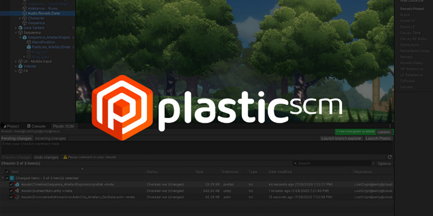

<p><em>VI: Plastic SCM làm cho version control trở nên đơn giản với giao diện tinh gọn — tab <strong>Pending changes</strong> hiển thị ngay trong Unity Editor cùng Project và Console. / EN: PlasticSCM makes version control simple with its streamlined interface.</em></p>

### 53.1. ⚙️ Cấu hình bắt buộc trước khi dùng source control

<div class="bilingual-row">
<div class="col-vi">
<p>🚨 <strong>Trước khi dùng source control</strong>, hãy vào <strong><code>Project Settings → Editor</code></strong>. Xác nhận rằng <strong><code>Asset Serialization Mode</code> được đặt là <code>Force Text</code></strong>.</p>
<p>Unity dùng <strong>serialization</strong> để nạp và lưu Asset ra/vào đĩa. <strong><code>Force Text</code></strong> nghĩa là Unity sẽ <strong>lưu file scene ở định dạng text</strong> — giúp ích cho việc <strong>merge trong version control</strong>.</p>
<p><strong>Version Control trong Project Settings:</strong> vào <strong><code>Project Settings → Editor → Version Control</code></strong>. Tuỳ theo hệ thống version control của bạn, chuyển mode sang <strong><code>Plastic SCM</code></strong>, <strong><code>Perforce</code></strong>, hoặc <strong><code>Visible Meta Files</code></strong> (dành cho source control bên ngoài như Git).</p>

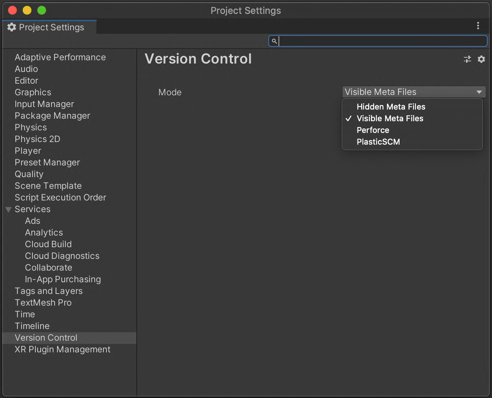
<p><em>VI: <strong>▲ <code>Project Settings › Version Control</code></strong> — dropdown <strong>Mode</strong> mở ra bốn lựa chọn: <strong>Hidden Meta Files · Visible Meta Files (đang chọn) · Perforce · PlasticSCM</strong>. / EN: The Version Control Mode dropdown in Project Settings.</em></p>

</div>
<div class="col-en">
<p>Before using source control, navigate to Project Settings &gt; Editor. Confirm that Asset Serialization Mode is set to Force Text. Unity uses serialization to load and save Assets to and from disk. Force Text means that Unity will store the scene files in a text-based format to help with version control merges.</p>
<p>Version Control in the Project Settings: Navigate to Project Settings &gt; Editor &gt; Version Control. According to your version control system, switch to the mode Plastic SCM, Perforce, or Visible Meta Files (for external source control like Git).</p>
</div>
</div>

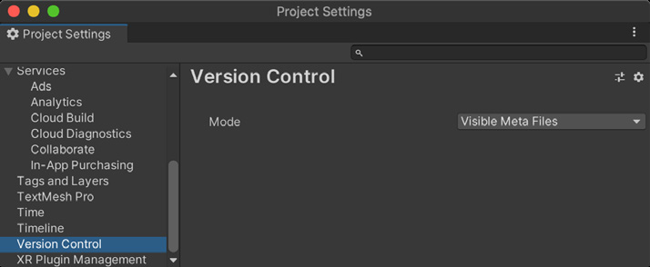 Editor > Version Control với Mode = Visible Meta Files">

<p><em>VI: Cửa sổ <strong>Project Settings → Version Control</strong> với <strong><code>Mode = Visible Meta Files</code></strong> — thiết lập bắt buộc khi dùng Git hoặc source control bên ngoài. / EN: Version Control in the Project Settings.</em></p>

!!! danger "⚠️ Hai thiết lập KHÔNG ĐƯỢC QUÊN"
    | Thiết lập | Giá trị bắt buộc | Hậu quả nếu sai |
    |---|---|---|
    | `Editor → Asset Serialization Mode` | **`Force Text`** | Scene/Prefab lưu dạng **binary** → **không thể merge, không thể diff** |
    | `Editor → Version Control → Mode` | **`Visible Meta Files`** (với Git) | File `.meta` bị ẩn → **mất reference GUID** khi đồng đội pull về |

### 53.2. 🌿 Plastic SCM — giải pháp Unity khuyến nghị

<div class="bilingual-row">
<div class="col-vi">
<p><strong>Plastic SCM là hệ thống version control mà chúng tôi khuyến nghị</strong> cho phát triển game Unity. Giải pháp này mang lại <strong>trải nghiệm tốt nhất khi xử lý file binary lớn (&gt;500 MB)</strong>, để asset nghệ thuật của bạn có được mức độ quản lý ngang với code.</p>
<p>Plastic SCM cho phép bạn làm việc với sự yên tâm rằng <strong>cả asset nghệ thuật lẫn asset lập trình đều được sao lưu an toàn</strong>. Ngoài ra, <strong>giao diện trực quan giúp đơn giản hoá việc branching và versioning</strong>.</p>
<p>Một số <strong>lợi ích chính</strong> của Plastic SCM:</p>
<ul>
<li>⚡ <strong>Tốc độ (Speed):</strong> tạo branch trong một codebase lớn <strong>nhanh hơn ĐÁNG KỂ</strong> ở Plastic so với Perforce hay Git.</li>
<li>🎨 <strong>Đơn giản cho người không code (Simplicity for non-coders):</strong> hoạ sĩ trong nhóm có thể làm việc ở <strong>chế độ Gluon</strong>. Workflow đơn giản hoá này cho phép họ <strong>check out phần của mình, làm việc và commit thay đổi</strong>, đồng thời <strong>loại bỏ các phần giao diện không liên quan</strong>.</li>
<li>☁️ <strong>Cloud hosting:</strong> Plastic cung cấp giải pháp native tên là <strong>Plastic Cloud Edition</strong>, thiết kế cho các nhóm phân tán hoàn toàn. Nếu nhóm bạn <strong>không muốn tự chạy server</strong> và thích host mọi thứ online, hãy thử Plastic Cloud Edition.</li>
<li>🌍 <strong>Distributed Version Control:</strong> thiết lập các repository khác nhau ở <strong>văn phòng từ xa</strong> để các nhóm luôn làm việc "cục bộ". Đây là <strong>workflow kiểu Git ở quy mô lớn hơn</strong>. Dùng giao diện đồ hoạ để push/pull thay đổi cũng như <strong>giải quyết xung đột từ xa</strong>.</li>
<li>🔍 <strong>Diff window:</strong> Plastic có giao diện đầy đủ để xem file đã <strong>thay đổi, thêm mới, hoặc xoá</strong>. GUI còn bao gồm <strong>công cụ image diff riêng</strong> giúp bạn <strong>so sánh hai revision của một texture asset</strong>.</li>
</ul>
</div>
<div class="col-en">
<p>Plastic SCM is our recommended version control system for Unity game development. This solution offers the best experience when dealing with large binary files (&gt;500 MB), so your art assets can have the same level of management as you would expect for your code.</p>
<p>Plastic SCM allows you to work knowing that both your art and programming assets are securely backed up. In addition, the intuitive visual interface simplifies branching and versioning. Here are some of the key benefits of Plastic SCM:</p>
<ul>
<li><strong>Speed:</strong> Creating branches in a large codebase is significantly faster in Plastic than in Perforce or Git.</li>
<li><strong>Simplicity for non-coders:</strong> Artists on your team can work in Gluon mode. This simplified workflow allows them to check out their part of the project, work, and commit their changes, while removing irrelevant parts of the interface.</li>
<li><strong>Cloud hosting:</strong> Plastic offers a native solution called Plastic Cloud Edition, designed with fully distributed teams in mind. If your team doesn't want to consider running its own servers and prefers hosting everything online, try Plastic Cloud Edition.</li>
<li><strong>Distributed Version Control:</strong> Set up different repositories in remote offices so teams always work "locally." This is a Git-like workflow at a larger scale. Use the graphical interface to push and pull changes as well as solve remote conflicts.</li>
<li><strong>Diff window:</strong> Plastic features a complete interface to view changed, added, or deleted files. The GUI also includes a separate image diff tool to help you compare two revisions of a texture asset.</li>
</ul>
</div>
</div>

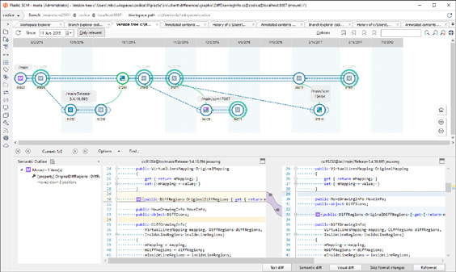

<p><em>VI: <strong>Branch Explorer</strong> của Plastic SCM — đồ thị các branch (<code>/main</code>, <code>/main/release</code>) cùng cửa sổ <strong>diff hai phía</strong> với các nút <strong>Next diff / Semantic diff / Visual diff / Skip format changes / Reformat</strong>. / EN: Plastic SCM branch explorer and diff view.</em></p>

<div class="bilingual-row">
<div class="col-vi">
<p>Khi dùng Plastic SCM, hãy mở cửa sổ Plastic SCM (<strong><code>Window → Plastic SCM</code></strong>) để xem các file trong changelist của bạn.</p>
<p>Tab <strong>Pending changes</strong> liệt kê <strong>tất cả thay đổi cục bộ đang chờ commit</strong> vào version control. Tab <strong>Incoming changes</strong> cho phép bạn <strong>xem mọi thay đổi đến và xung đột</strong>, đồng thời cập nhật dự án cục bộ. Bất kỳ thay đổi nào với dự án đều tạo thông báo <strong>"Incoming changes"</strong> ở góc trên bên phải cửa sổ Plastic SCM.</p>
</div>
<div class="col-en">
<p>When using Plastic SCM, open the Plastic SCM window (Window &gt; Plastic SCM) to view the files in your changelist.</p>
<p>The Pending changes tab lists all of the local changes that are pending a commit into version control. The Incoming changes tab allows you to view all incoming changes and conflicts and update your local project. Any changes made to your project prompts an "Incoming changes" notification at the top right of the Plastic SCM window.</p>
</div>
</div>

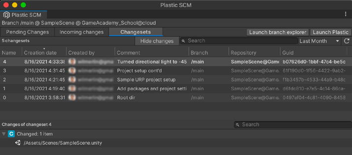

<p><em>VI: Cửa sổ <strong>Plastic SCM</strong> trong Unity — Branch <code>/main @ SampleScene @ GameAcademy_School@cloud</code>. Ba tab <strong>Pending Changes / Incoming changes / Changesets</strong>; danh sách <strong>5 changesets</strong> kèm Name, Creation date, Created by, Comment, Branch, Repository, Guid. Panel dưới hiển thị <strong>Changes of changeset 4 → Changed: 1 item → /Assets/Scenes/SampleScene.unity</strong>. / EN: PlasticSCM window.</em></p>

### 53.3. 🐙 Git

<div class="bilingual-row">
<div class="col-vi">
<p>Unity developer cũng có thể dùng các giải pháp source control bên ngoài như <strong>Git</strong>. Tuy nhiên, điều này <strong>đòi hỏi một chút thiết lập thủ công ban đầu</strong> cho dự án.</p>
<p>Để dùng Git với Unity, hãy <strong>tạo một repository rỗng trên máy cục bộ</strong> và tuỳ chọn đồng bộ lên cloud qua GitHub. <strong>Hãy chắc chắn bao gồm Git LFS (Large File Support)</strong> để quản lý phiên bản hiệu quả hơn cho các asset lớn như tài nguyên đồ hoạ và âm thanh. <strong>Unity duy trì một file <code>.gitignore</code></strong> giúp bạn quyết định thứ gì nên và không nên vào Git repository.</p>
<p>Để thuận tiện hơn khi làm việc với dịch vụ hosting GitHub, hãy cài <strong>plug-in GitHub for Unity</strong>. Extension mã nguồn mở này cho phép bạn <strong>xem lịch sử dự án, thử nghiệm trên branch, commit thay đổi và push code lên GitHub mà không cần rời khỏi Unity</strong>.</p>
<p>Ngoài ra, hãy cân nhắc bất kỳ client đồ hoạ mạnh nào như <strong>GitKraken</strong>, <strong>SourceTree</strong>, hoặc <strong>GitHub Desktop</strong>.</p>
</div>
<div class="col-en">
<p>Unity developers can also use external source control solutions such as Git. This, however, requires some initial manual setup of the project.</p>
<p>To use Git with Unity, create an empty repository on your local machine and optionally sync this to the cloud via GitHub. Be sure to include Git LFS (Large File Support) for more efficient version control of your larger assets, like graphics and sound resources. Unity maintains a .gitignore file that can help you decide what should and shouldn't go into the Git repository.</p>
<p>For the added convenience of working with the GitHub hosting service, install the GitHub for Unity plug-in. This open source extension allows you to view your project history, experiment in branches, commit your changes, and push your code to GitHub without leaving Unity.</p>
<p>Also, consider any of the capable visual clients like GitKraken, SourceTree, or GitHub Desktop. For a walkthrough of setting up Unity with Git, watch the Introduction to Version Control video, which covers the basics of using a visual GitHub client with a sample project.</p>
</div>
</div>

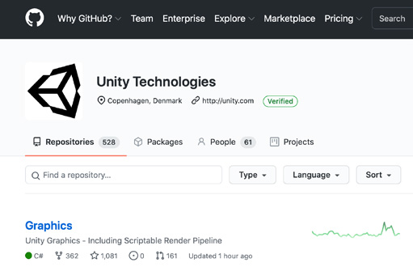

<p><em>VI: Tạo repository bằng GitHub. Trang tổ chức <strong>Unity Technologies</strong> (Copenhagen, Denmark — <strong>Verified</strong>) với <strong>528 repositories</strong>, <strong>61 People</strong>; repo <strong>Graphics</strong> có <strong>362 fork</strong>, <strong>1.081 star</strong>, <strong>161 pull request</strong>. / EN: Create a repository using GitHub.</em></p>

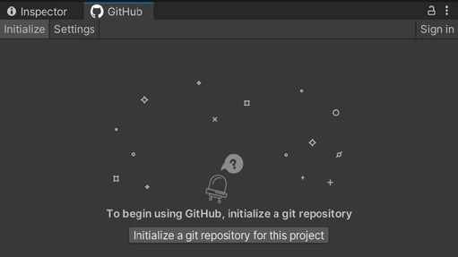

<p><em>VI: Extension <strong>GitHub for Unity</strong> — tab GitHub nằm cạnh Inspector, với nút <strong>"Initialize a git repository for this project"</strong> và các nút Initialize / Settings / Sign in. / EN: The GitHub for Unity extension.</em></p>

```gitignore
# .gitignore chuẩn cho Unity (rút gọn) — KHÔNG commit các thư mục sinh tự động
[Ll]ibrary/
[Tt]emp/
[Oo]bj/
[Bb]uild/
[Bb]uilds/
[Ll]ogs/
[Uu]serSettings/

# .gitattributes — bật Git LFS cho asset binary lớn
# *.psd  filter=lfs diff=lfs merge=lfs -text
# *.fbx  filter=lfs diff=lfs merge=lfs -text
# *.wav  filter=lfs diff=lfs merge=lfs -text
```

### 53.4. 🔷 Perforce

<div class="bilingual-row">
<div class="col-vi">
<p>Nếu <strong>Perforce</strong> là lựa chọn source control của bạn, hãy dùng <strong>Helix Core</strong> để quản lý code, tài nguyên nghệ thuật và asset của game engine. <strong>Helix Core MIỄN PHÍ cho tối đa 5 người dùng và 20 workspace.</strong></p>
<p>Perforce có <strong>hiệu năng tốt, ngay cả với các nhóm từ xa phân tán khắp thế giới</strong>. <strong>Nhiều studio game AAA hoặc indie dùng Perforce làm source control chính.</strong></p>
<p>Để dùng nó:</p>
<ul>
<li>Làm theo quy trình thiết lập mô tả trong tài liệu <strong>Unity Version Control</strong>.</li>
<li>Đọc cách thiết lập <strong>Perforce Helix Core với Unity</strong>.</li>
<li>Tham khảo <strong>tài liệu Perforce</strong> để biết chi tiết hơn về Perforce Helix Core.</li>
</ul>
</div>
<div class="col-en">
<p>If Perforce is your source control of choice, use Helix Core to manage your code, artwork, and game engine assets. Helix Core is free for up to five users and 20 workspaces.</p>
<p>Perforce has good performance, even with remote teams distributed around the world. Many AAA or indie game dev studios use Perforce as their primary source control.</p>
<p>To use it: Follow the setup process described in the Unity Version Control documentation. Read how to set up Perforce Helix Core with Unity. Consult the Perforce documentation for more detail about Perforce Helix Core.</p>
</div>
</div>

📊 **So sánh 3 giải pháp:**

| Giải pháp | Điểm mạnh | Phù hợp với |
|---|---|---|
| **Plastic SCM** | Binary lớn (**&gt;500 MB**), branch nhanh, **Gluon mode** cho artist, image diff | Nhóm hỗn hợp code + art (Unity **khuyến nghị**) |
| **Git** | Miễn phí, phổ biến, hệ sinh thái lớn | Nhóm nhỏ, thiên về code — **bắt buộc Git LFS** cho asset |
| **Perforce (Helix Core)** | Hiệu năng tốt với nhóm phân tán toàn cầu; **miễn phí ≤ 5 user / 20 workspace** | Studio AAA & indie |

---

## 54. 📁 Project organization — Tổ chức dự án

<div class="bilingual-row">
<div class="col-vi">
<p>Khi dự án lớn dần, bạn sẽ cần <strong>duy trì một mức độ tổ chức</strong> để nó có thể <strong>mở rộng theo nhóm và yêu cầu của ứng dụng</strong>. Những gợi ý tổng quát sau sẽ giúp bạn thiết lập cấu trúc dự án và scene cơ bản.</p>
</div>
<div class="col-en">
<p>As your project grows, you will need to maintain a level of organization so that it can scale with your team and application requirements. These general tips will help you to establish your basic project and scene structure.</p>
</div>
</div>

### 54.1. 🔍 The Project view

<div class="bilingual-row">
<div class="col-vi">
<p>Cửa sổ <strong>Project</strong> hiển thị <strong>tất cả file liên quan tới dự án</strong>. Đây là thư mục nội dung nơi bạn tìm thấy asset và các file khác trong ứng dụng.</p>
<p>Unity lưu <strong>file nguồn trực tiếp trong dự án</strong>, kèm theo các <strong>file <code>.meta</code> riêng lẻ</strong>. File meta chứa <strong>dữ liệu riêng cho engine và Editor</strong> của asset tương ứng.</p>
<p>Unity cũng <strong>import mỗi asset vào một định dạng đã tối ưu</strong> mà engine dùng lúc runtime. Các asset đã xử lý này xuất hiện trong <strong>thư mục <code>Library</code></strong> — thư mục này đóng vai trò <strong>cache và KHÔNG cần thêm vào source control</strong>.</p>
<p>Cửa sổ Project có vài tính năng UI hỗ trợ điều hướng:</p>
<ul>
<li><strong>Chuột phải</strong> để mở context menu cho các lệnh hay dùng (tạo/import asset, hiện đường dẫn đầy đủ trên đĩa, v.v.).</li>
<li>Dùng ô <strong>Search</strong> để tìm asset khi dự án lớn dần. Nếu tìm một loại asset cụ thể, hãy <strong>lọc theo type bằng cú pháp <code>t:</code></strong> (ví dụ: <strong><code>t:Material</code></strong> sẽ lọc mọi material asset trong dự án).</li>
<li><strong>Kéo một thư mục hay dùng vào ô <code>Favorites</code></strong> ở đầu giao diện. Bạn cũng có thể <strong>lưu một tìm kiếm vào Favorites</strong> bằng nút <strong>Save Search</strong>.</li>
<li>Bạn cũng có thể <strong>đổi layout của cửa sổ</strong>. Chọn menu <strong>More Items</strong> ở góc trên bên phải và chọn <strong>One Column Layout</strong> hoặc <strong>Two Column Layout</strong>. Layout hai cột có thêm một pane với <strong>xem trước trực quan cho mỗi file</strong>.</li>
</ul>
</div>
<div class="col-en">
<p>The Project window displays all of the files related to your project. This is the content directory where you will find assets and other project files in your application.</p>
<p>Unity stores the source files directly in the project, alongside individual .meta files. Meta files contain engine- and Editor-specific data for the associated asset. Unity also imports each asset into an optimized format which the engine uses at runtime. These processed assets appear in the Library folder, which serves as a cache and does not need to be added to source control.</p>
<p>The project window has a few UI features to assist with navigation:</p>
<ul>
<li>Right-click to reveal the context menu for frequently used commands (creating/importing assets, revealing full path on disk, etc.).</li>
<li>Use the Search field to locate assets as your project grows in size. If you're looking for a particular type of asset, filter by type using the t: syntax (e.g., t:Material will filter for all material assets in the project). This can help you to navigate large projects.</li>
<li>Drag a frequently used folder into the Favorites field at the top of the interface. You can also save a search to the Favorites with the Save Search button.</li>
<li>You can also change the layout of the window itself. Select the More Items menu in the top right of the window, and choose from either One Column Layout or Two Column Layout. The two-column layout has an extra pane with a visual preview of each file.</li>
</ul>
</div>
</div>

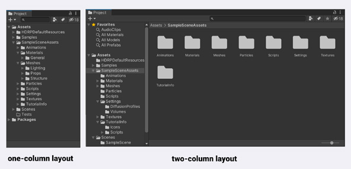

<p><em>VI: So sánh <strong>one-column layout</strong> (bên trái) và <strong>two-column layout</strong> (bên phải, có mục <strong>Favorites</strong> với các search đã lưu: All Materials, All Models, All Prefabs — cùng pane xem trước dạng icon thư mục). / EN: One-column vs two-column layout.</em></p>

### 54.2. 📂 Thư mục Assets và các thư mục con thông dụng

<div class="bilingual-row">
<div class="col-vi">
<p>Bên trong cửa sổ Project là <strong>thư mục <code>Assets</code></strong>. Nó chứa các asset dùng để build game. Nếu bạn khởi tạo dự án bằng một template, bạn sẽ thấy các thư mục con đại diện cho một số asset thông dụng. Dù hầu hết do người dùng tự định nghĩa, <strong>Unity CÓ dành riêng một vài tên thư mục cho mục đích cụ thể</strong> — hãy chắc chắn bạn biết danh sách <strong>Special folder names</strong> này.</p>
<p>Sau đây là một số thư mục con thông dụng bạn có thể dùng để tổ chức dự án, dù chúng <strong>thay đổi tuỳ theo nhóm và dự án</strong>. 🔑 <strong>Trên hết, hãy NHẤT QUÁN — tạo một style guide và tuân theo nó.</strong></p>
</div>
<div class="col-en">
<p>Inside of the Project window is the Assets folder. This contains the assets used to build your game. If you've started your project with a template, you should see subfolders that represent several common assets. While most of these are user-defined, Unity does reserve a few folder names for specific purposes. Make sure you are aware of this list of Special folder names.</p>
<p>The following are some common subdirectories that you might use to organize your project, although these vary by team and project according to preferences. Above all, stay consistent – create a style guide and follow it.</p>
</div>
</div>

| Thư mục | Nội dung (VI) | Contents (EN) |
|---|---|---|
| **Animations** | Các animated motion clip và file controller của chúng, cũng như **Timeline asset** cho cinematic trong game hoặc thông tin rigging cho procedural animation | Animated motion clips and their controller files, as well as Timeline assets for in-game cinematics or rigging information for procedural animation |
| **Audio** | Audio clip cũng như các **mixer** dùng để trộn hiệu ứng và nhạc | Sound assets include audio clips as well as the mixers used for blending effects and music |
| **Editor** | Các **công cụ script** viết cho Unity Editor nhưng **KHÔNG xuất hiện trong target build** | Scripted tools made for use with the Unity Editor but not appearing in a target build |
| **Fonts** | Các font dùng trong game | The fonts used in the game |
| **Gizmos** | Icon Gizmo giúp **trực quan hoá GameObject** trong Scene/Game view, đặc biệt khi nó **không có mesh**. Lưu file ảnh của các icon này ở đây | Having a Gizmo icon can help visualize a GameObject in the Scene or Game view, especially if it does not have a mesh. Store the image files for these icons in the Gizmos folder |
| **Materials** | Các asset mô tả **thuộc tính đổ bóng bề mặt** | These assets describe surface shading properties |
| **Meshes** | Lưu **model tạo từ ứng dụng DCC bên ngoài** | Store models created in an external DCC application here |
| **Particles** | Quản lý **mô phỏng hạt** tạo bằng ParticleSystem hoặc **Visual Effect Graph** | Manage particle simulations in Unity, created either with the ParticleSystem or Visual Effect Graph |
| **Prefabs** | Các **GameObject tái sử dụng** với component dựng sẵn. Thêm vào scene để xây level và gameplay | Reusable GameObjects with prebuilt components. Add them to a scene to build your levels and gameplay |
| **Scripts** | **Toàn bộ code gameplay** do người dùng phát triển | All user-developed code for gameplay appears here |
| **Scenes** | Các phần nhỏ, có chức năng của dự án. Thường tương ứng với **một level hoặc một phần của level** | Unity stores small, functional portions of your project in scene assets. They often correspond to game levels or part of a level |
| **Settings** | Asset lưu **thiết lập render pipeline** cho cả **HDRP và URP** | Assets store render pipeline settings for both HDRP and URP |
| **Shaders** | Các chương trình **chạy trên GPU** như một phần của graphics pipeline | These programs run on the GPU as part of the graphics pipeline |
| **Textures** | File ảnh: texture cho material và surfacing, phần tử UI overlay, và **lightmap** lưu thông tin ánh sáng | Image files can consist of texture files for materials and surfacing, UI overlay elements for user interface, and lightmaps to store lighting information |
| **ThirdParty** | 🚨 Nếu có asset từ nguồn ngoài như Asset Store, **giữ chúng TÁCH BIỆT** khỏi phần còn lại của dự án. Điều này giúp **cập nhật asset/script bên thứ ba dễ hơn**. Asset bên thứ ba có thể có **cấu trúc cố định không thể thay đổi** | If you have assets from an external source like the Asset Store, keep them separated from the rest of your project here. This makes updating your third-party assets and scripts easier. Third-party assets may have a set structure that cannot be altered |

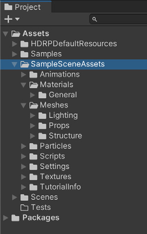

<p><em>VI: Scene mẫu với HDRP template bao gồm nhiều thư mục asset: <code>HDRPDefaultResources</code>, <code>Samples</code>, <code>SampleSceneAssets</code> (chứa <code>Animations</code>, <code>Materials/General</code>, <code>Meshes/Lighting|Props|Structure</code>, <code>Particles</code>, <code>Scripts</code>, <code>Settings</code>, <code>Textures</code>, <code>TutorialInfo</code>), <code>Scenes</code>, <code>Tests</code>, và <code>Packages</code>. / EN: The Sample Scene with the HDRP template includes several asset folders.</em></p>

<div class="bilingual-row">
<div class="col-vi">
<p>Trang manual <strong>Supported Asset Types</strong> mô tả chi tiết hơn về các asset phổ biến nhất. Bạn có thể dùng dự án <strong>Template</strong> hoặc <strong>Learn</strong> làm ví dụ về cách tổ chức thư mục hiệu quả. Dù bạn không bị giới hạn ở những tên thư mục này, danh sách trên là <strong>điểm khởi đầu tốt</strong> để mở rộng khi dự án lớn lên.</p>
<p>Tất nhiên bạn <strong>tự do điều chỉnh cấu trúc thư mục</strong> theo nhu cầu cụ thể của dự án và sở thích của nhóm, như trong hình dưới.</p>
</div>
<div class="col-en">
<p>The Supported Asset Types manual page describes the most common assets in more detail. You can use the Template or Learn projects as an example of how to organize your folders effectively. While you're not limited to these folder names, this list should give you a good starting point that you can expand upon as your project scales up.</p>
<p>You are of course free to adapt the folder structure to your specific project's needs and team preferences, as in the image below.</p>
</div>
</div>

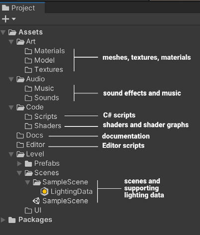

<p><em>VI: Tổ chức thư mục theo nhu cầu dự án — nhưng <strong>hãy nhất quán một khi đã quyết định cấu trúc</strong>. Ví dụ: <code>Art</code> (Materials, Model, Textures → <em>meshes, textures, materials</em>), <code>Audio</code> (Music, Sounds → <em>sound effects and music</em>), <code>Code</code> (Scripts → <em>C# scripts</em>, Shaders → <em>shaders and shader graphs</em>), <code>Docs</code> → <em>documentation</em>, <code>Editor</code> → <em>Editor scripts</em>, <code>Level</code> (Prefabs, Scenes/SampleScene + <strong>LightingData</strong>), <code>UI</code>. / EN: Organize folders for your project needs, but stay consistent once you decide on a structure.</em></p>

### 54.3. ✅ Cấu trúc thư mục và quy ước đặt tên

<div class="bilingual-row">
<div class="col-vi">
<p>Dù <strong>không có một cách duy nhất</strong> để tổ chức dự án, chúng tôi khuyến nghị bạn nhìn chung tuân theo các best practice sau:</p>
<ul>
<li>📝 <strong>Tài liệu hoá quy ước đặt tên và cấu trúc thư mục.</strong> Một style guide và/hoặc project template làm cho file <strong>dễ tìm và dễ tổ chức hơn</strong>.</li>
<li>🔒 <strong>Dù chọn quy ước đặt tên nào, hãy chắc chắn bạn NHẤT QUÁN.</strong> Đừng lệch khỏi style guide hay template đã chọn. Nếu bạn <strong>cần sửa quy tắc đặt tên</strong>, hãy <strong>parse và rename toàn bộ asset bị ảnh hưởng CÙNG MỘT LÚC bằng script</strong>.</li>
<li>🚫 <strong>KHÔNG dùng dấu cách trong tên file và thư mục.</strong> Các công cụ dòng lệnh của Unity <strong>gặp vấn đề với đường dẫn có dấu cách</strong>.</li>
<li>🧪 <strong>Tách riêng khu vực test hoặc sandbox.</strong> Tạo thư mục riêng cho các scene và thử nghiệm không thuộc production. <strong>Thư mục con theo username</strong> có thể chia khu vực làm việc theo từng thành viên.</li>
<li>📁 <strong>Tránh thư mục thừa ở cấp root.</strong> Nhìn chung, hãy lưu file nội dung <strong>bên trong thư mục <code>Assets</code></strong>. Đừng tạo thêm thư mục ở cấp root của dự án <strong>trừ khi thực sự cần thiết</strong>.</li>
</ul>
</div>
<div class="col-en">
<p>While there's no single way to organize your project, we recommend that you follow these best practices in general:</p>
<ul>
<li>Document your naming conventions and folder structure. A style guide and/or project template makes your files easier to find and organize.</li>
<li>Whatever naming convention you choose, make sure you remain consistent. Don't deviate from your chosen style guide or template. If you do need to amend your naming rules, parse and rename your affected assets all at once with a script.</li>
<li>Don't use spaces in file and folder names. Unity's command line tools have issues with path names that have spaces.</li>
<li>Separate your testing or sandbox areas. Create a separate folder for non-production scenes and experimentation. Subfolders with usernames can divide your work area by team member.</li>
<li>Avoid extra folders at the root level. In general, store your content files within the Assets folder. Don't create additional folders at the project's root level unless absolutely necessary.</li>
</ul>
</div>
</div>

### 54.4. 🎬 Scenes

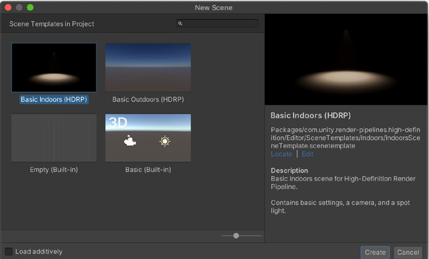
<p><em>VI: <strong>▲ Cửa sổ New Scene</strong> — <strong>Scene Templates in Project</strong>: <em>Basic Indoors (HDRP)</em> (đang chọn) · <em>Basic Outdoors (HDRP)</em> · <em>Empty (Built-in)</em> · <em>Basic (Built-in)</em>. Mô tả: <em>"Basic indoors scene for High-Definition Render Pipeline. Contains basic settings, a camera, and a spot light."</em> Ô <strong>Load additively</strong> ở góc dưới trái là cách mở scene CỘNG DỒN. / EN: The New Scene window with Scene Templates and the Load additively option.</em></p>

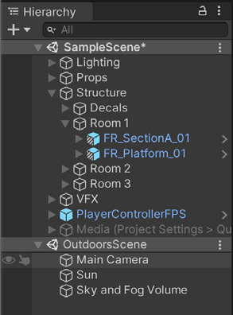
<p><em>VI: <strong>▲ Nhiều scene MỞ CÙNG LÚC</strong> — <code>SampleScene*</code> (Lighting · Props · Structure · VFX · PlayerControllerFPS · Media) và <code>OutdoorsScene</code> (Main Camera · Sun · Sky and Fog Volume) nằm song song trong CÙNG một Hierarchy. / EN: Two scenes loaded additively in the same Hierarchy.</em></p>

<div class="bilingual-row">
<div class="col-vi">
<p><strong>Scene</strong> là nơi bạn làm việc với nội dung trong Unity. Chúng chứa các object của game và có thể được dùng để tạo main menu, từng level riêng lẻ, và mọi thứ khác. Trong mỗi scene, bạn sẽ đặt môi trường, chướng ngại vật và trang trí — <strong>tương ứng đại khái với một level</strong> của game. Điều này cho phép bạn <strong>thiết kế và xây dựng ứng dụng từng mảnh một, giữ tính module</strong>.</p>
<p>Bản thân file scene là <strong>asset lưu trên đĩa</strong>. Nếu bạn dùng <strong><code>Force Text</code> Mode cho Asset Serialization</strong>, chúng xuất hiện dưới dạng <strong>file text</strong>; nếu không, mặc định là <strong>binary</strong>.</p>
<p>Scene thường đại diện cho một level hoặc một phần của level. Trong khi các demo và game đơn giản có thể chỉ dùng <strong>một scene duy nhất</strong>, hầu hết game thương mại có thể dùng <strong>một scene cho mỗi level</strong>, mỗi cái có môi trường, nhân vật, UI riêng.</p>
<p>🚨 Bạn có thể tạo <strong>bao nhiêu scene tuỳ ý</strong> trong dự án, nhưng hãy lưu ý rằng <strong>cách bạn cấu trúc scene có thể có tác động ĐÁNG KỂ tới hiệu năng</strong>.</p>
<p>Bạn sẽ cần tạo, nạp và lưu scene để thể hiện các phần khác nhau của game. Một <strong>"scene flow"</strong> điển hình gồm việc <strong>kích hoạt nạp một scene khác bằng một event</strong>. Ví dụ, bạn có thể có scene menu nạp scene gameplay chính khi người dùng nhấn vào giao diện. Lưu ý rằng bạn có thể <strong>nạp scene từng cái một, hoặc tách các phần tử ra và nạp scene theo kiểu additive</strong>.</p>
<p>Khi tạo scene mới, Unity cho phép bạn chọn từ một bộ <strong>Scene Templates</strong>. Ví dụ, HDRP 3D Sample Scene đi kèm nhiều template. Bạn có thể <strong>tự định nghĩa scene template</strong> để tinh gọn workflow.</p>
</div>
<div class="col-en">
<p>Scenes are where you work with content in Unity. They contain the objects of your game and can be used to create a main menu, individual levels, and anything else. In each unique scene, you will place the environments, obstacles, and decorations that roughly translate into one level of your game. This enables you to design and build your application piece by piece, keeping it modular.</p>
<p>The scene files themselves are assets that are stored on disk. If you use Force Text Mode for Asset Serialization, they appear as text files; otherwise, they default to binaries.</p>
<p>Scenes often represent a level of your game or a portion of a level. While demos and simple games might occupy just a single scene, most commercial games might use one scene per level, each with its own environments, characters, UI, etc.</p>
<p>You can create any number of scenes in a project, but be aware that how you structure your scenes can have a significant performance impact. For more info on scene organization and performance, check out our mobile performance optimization guide.</p>
<p>You'll need to create, load, and save scenes to represent different portions of your game and flesh out your application. A typical "scene flow" involves triggering the loading of another scene with an event. For example, you may have a menu scene that loads up a main gameplay scene when the user clicks the interface. Note that you can load scenes one at a time, or separate elements and load the scenes additively.</p>
<p>When creating a new scene, Unity allows you to select from a set of Scene Templates. For example, the HDRP 3D Sample Scene comes with several templates. You can define your own scene templates to streamline your workflow.</p>
</div>
</div>

### 54.5. 🌳 The Hierarchy window — và NĂM mẹo tổ chức scene

<div class="bilingual-row">
<div class="col-vi">
<p>📖 <em>"Cửa sổ Hierarchy <strong>hiển thị MỌI GameObject trong asset của scene đang nạp</strong> — gồm model, Camera và Prefab của bạn. <strong>Chỉ cần KÉO một GameObject là đổi được quan hệ CHA–CON.</strong>"</em></p>
<p>🔁 <em>"<strong>Thêm hoặc xoá object trong Scene view cũng THÊM/XOÁ chúng khỏi cửa sổ Hierarchy (và ngược lại). Hierarchy có thể hiển thị NHIỀU HƠN MỘT scene đã nạp lúc runtime, mỗi scene chứa GameObject riêng của nó.</strong>"</em></p>
<p>📜 <em>"Unity cung cấp <strong>SceneManagement API</strong> để nạp hoặc quản lý scene TỪ SCRIPT."</em></p>
</div>
<div class="col-en">
<p>📖 <em>"The Hierarchy window displays every GameObject in the currently loaded scene's assets. These include your models, Cameras, and Prefabs. Simply drag a GameObject to change its parenting."</em></p>
<p>🔁 <em>"Adding or removing objects in the Scene view also adds or removes them from the Hierarchy window (and vice versa). The Hierarchy window can show more than one loaded scene at runtime, with each scene containing its own GameObjects."</em></p>
<p>📜 <em>"Unity provides a SceneManagement API for loading or managing scenes from scripts."</em></p>
</div>
</div>

**🧭 NĂM mẹo cho scene & hierarchy — nguyên văn / General tips for scenes and hierarchies**

| # | Mẹo | Nội dung nguyên văn |
|---|---|---|
| **①** | **Dùng GameObject RỖNG có TÊN làm dải phân cách** | *"Tổ chức scene CẨN THẬN để DỄ TÌM object. ⚠️ **Giữ số này ở mức TỐI THIỂU, vì MỖI GameObject đều CÓ GIÁ. Hãy CÂN BẰNG nhu cầu tổ chức với hiệu năng. TRÁNH parenting KHÔNG CẦN THIẾT chỉ để tổ chức** (xem mẹo ⑤)."* |
| **②** | **Đặt Prefab bảo trì & GameObject rỗng ở GỐC TOẠ ĐỘ** | *"**NẾU một transform KHÔNG được dùng CỤ THỂ để định vị object, nó NÊN ở (0,0,0).** ✅ **Việc này ĐƠN GIẢN HOÁ code và GIẢM lỗi khi chuyển đổi giữa local space và world space.**"* |
| **③** | **Đặt SÀN của thế giới ở `y = 0`** | *"Việc này khiến **ĐẶT object lên sàn DỄ HƠN. Hãy coi thế giới như KHÔNG GIAN 2D dọc theo mặt phẳng `xz` cho game logic, AI và physics.**"* |
| **④** | **TÁCH object ĐỘNG và TĨNH** | *"NẾU bạn sinh object CHUYỂN ĐỘNG lúc runtime, hãy **giữ chúng có tổ chức DƯỚI một object placeholder RỖNG. Tương tự, lưu hình học màn chơi KHÔNG chuyển động ở PHẦN KHÁC của hierarchy.** 💡 **Việc này giúp bạn áp ĐÚNG kỹ thuật chiếu sáng cho từng loại hình học** (ví dụ **lightmapping** với **probe lighting**)."* |
| **⑤** | **Parenting ĐÚNG CÁCH** | *"**NHÓM các object liên quan THEO CHỨC NĂNG.** Dùng lẽ thường khi tạo hierarchy (ví dụ **parent bánh xe làm CON của thân xe**). 🚨 **TRÁNH parenting KHÔNG CẦN THIẾT khi có thể, vì hierarchy PHẲNG HƠN thì HIỆU NĂNG TỐT HƠN.**"* |


---

## 55. 🔧 Project configuration (Mobile) — Cấu hình dự án

<div class="bilingual-row">
<div class="col-vi">
<p>Có một vài <strong>Project Settings có thể tác động tới hiệu năng mobile</strong> của bạn.</p>
</div>
<div class="col-en">
<p>There are a few Project Settings that can impact your mobile performance.</p>
</div>
</div>

### 55.1. 📱 Giảm hoặc tắt Accelerometer Frequency

<div class="bilingual-row">
<div class="col-vi">
<p>Unity <strong>lấy mẫu (poll) cảm biến gia tốc của thiết bị vài lần MỖI GIÂY</strong>.</p>
<p>✅ <strong>Hãy TẮT nó nếu không được dùng</strong> trong ứng dụng, hoặc <strong>giảm tần số</strong> để có hiệu năng tốt hơn.</p>
</div>
<div class="col-en">
<p>Unity pools your mobile's accelerometer several times a second. Disable this if it's not being used in your application, or reduce its frequency for better performance.</p>
</div>
</div>

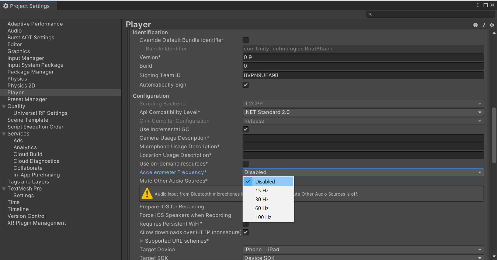 Player với dropdown Accelerometer Frequency mở, chọn Disabled">

<p><em>VI: Hãy đảm bảo <strong><code>Accelerometer Frequency</code> được đặt <code>Disabled</code></strong> nếu bạn không dùng nó trong game mobile. Ảnh chụp <code>Project Settings → Player</code> của dự án <strong>Boat Attack</strong> (<code>com.UnityTechnologies.BoatAttack</code>, Version 0.9) với <code>Scripting Backend = IL2CPP</code>, <code>Api Compatibility Level = .NET Standard 2.0</code>, <code>C++ Compiler Configuration = Release</code>, <code>Use incremental GC</code> đang bật. / EN: Ensure your Accelerometer Frequency is disabled if you are not making use of it in your mobile game.</em></p>

### 55.2. ⚙️ Tắt các thiết lập Player hoặc Quality không cần thiết

<div class="bilingual-row">
<div class="col-vi">
<p>Trong <strong>Player settings</strong>, hãy <strong>tắt <code>Auto Graphics API</code></strong> cho các nền tảng không hỗ trợ để <strong>tránh sinh ra QUÁ NHIỀU shader variant</strong>. Tắt <strong><code>Target Architectures</code></strong> cho các CPU cũ nếu ứng dụng của bạn không hỗ trợ chúng.</p>
<p>Trong <strong>Quality settings</strong>, hãy <strong>tắt các Quality level không cần thiết</strong>.</p>
</div>
<div class="col-en">
<p>In the Player settings, disable Auto Graphics API for unsupported platforms to prevent generating excessive shader variants. Disable Target Architectures for older CPUs if your application is not supporting them. In the Quality settings, disable unneeded Quality levels.</p>
</div>
</div>

### 55.3. 🧲 Tắt physics không cần thiết

<div class="bilingual-row">
<div class="col-vi">
<p>Nếu game của bạn <strong>không dùng physics</strong>, hãy <strong>bỏ chọn <code>Auto Simulation</code> và <code>Auto Sync Transforms</code></strong>. Chúng chỉ <strong>làm chậm ứng dụng mà KHÔNG mang lại lợi ích rõ rệt nào</strong>.</p>
</div>
<div class="col-en">
<p>If your game is not using physics, uncheck Auto Simulation and Auto Sync Transforms. These will just slow down your application with no discernible benefit.</p>
</div>
</div>

### 55.4. 🎞️ Chọn frame rate phù hợp

<div class="bilingual-row">
<div class="col-vi">
<p>Dự án mobile phải <strong>cân bằng frame rate với thời lượng pin và thermal throttling</strong>. Thay vì đẩy thiết bị tới giới hạn ở <strong>60 fps</strong>, hãy cân nhắc chạy ở <strong>30 fps</strong> như một thoả hiệp. <strong>Unity mặc định 30 fps cho mobile.</strong></p>
<p>Bạn cũng có thể <strong>điều chỉnh frame rate ĐỘNG lúc runtime</strong> bằng <strong><code>Application.targetFrameRate</code></strong>. Ví dụ, bạn thậm chí có thể <strong>hạ xuống dưới 30 fps cho các scene chậm hoặc tương đối tĩnh</strong> và dành thiết lập fps cao hơn cho gameplay.</p>
</div>
<div class="col-en">
<p>Mobile projects must balance frame rates against battery life and thermal throttling. Instead of pushing the limits of your device at 60 fps, consider running at 30 fps as a compromise. Unity defaults to 30 fps for mobile.</p>
<p>You can also adjust the frame rate dynamically during runtime with Application.targetFrameRate. For example, you could even drop below 30 fps for slow or relatively static scenes and reserve higher fps settings for gameplay.</p>
</div>
</div>

```csharp
// Điều chỉnh frame rate động theo ngữ cảnh
Application.targetFrameRate = 30;   // Gameplay mặc định trên mobile
// Application.targetFrameRate = 20;   // Màn hình menu tĩnh → tiết kiệm pin
```

### 55.5. 🌳 Tránh hierarchy lớn

<div class="bilingual-row">
<div class="col-vi">
<p><strong>Hãy chia nhỏ hierarchy của bạn!</strong> Nếu các GameObject <strong>không cần lồng nhau trong một hierarchy</strong>, hãy <strong>đơn giản hoá quan hệ cha-con</strong>.</p>
<p>✅ <strong>Hierarchy nhỏ hơn được hưởng lợi từ multithreading</strong> khi refresh Transform trong scene. <strong>Hierarchy phức tạp gây ra các phép tính Transform không cần thiết và tốn kém hơn cho garbage collection.</strong></p>
</div>
<div class="col-en">
<p>Split your hierarchies! If your GameObjects do not need to be nested in a hierarchy, simplify the parenting. Smaller hierarchies benefit from multithreading to refresh the Transforms in your scene. Complex hierarchies incur unnecessary Transform computations and more cost to garbage collection.</p>
</div>
</div>

### 55.6. ⚡ Transform một lần, không phải hai

<div class="bilingual-row">
<div class="col-vi">
<p>Ngoài ra, khi di chuyển Transform, hãy dùng <strong><code>Transform.SetPositionAndRotation</code></strong> để <strong>cập nhật cả position và rotation CÙNG LÚC</strong>. Điều này <strong>tránh overhead của việc sửa transform HAI LẦN</strong>.</p>
<p>Nếu bạn cần <code>Instantiate</code> một GameObject lúc runtime, một tối ưu đơn giản là <strong>gán parent và đặt vị trí NGAY TRONG lúc instantiate</strong>.</p>
</div>
<div class="col-en">
<p>Also, when moving Transforms, use Transform.SetPositionAndRotation to update both position and rotation at once. This avoids the overhead of modifying a transform twice.</p>
<p>If you need to Instantiate a GameObject at runtime, a simple optimization is to parent and reposition during instantiation.</p>
</div>
</div>

```csharp
// ✅ Gán parent + vị trí NGAY khi instantiate (tránh reparent/reposition sau đó)
GameObject.Instantiate(prefab, parent);
GameObject.Instantiate(prefab, parent, position, rotation);
```

!!! tip "🔗 Trùng khớp với CyberAgent"
    Lời khuyên `SetPositionAndRotation` này **giống hệt** mục **30.4 (List 9.6)** của CyberAgent — hai nguồn độc lập cùng chỉ ra một tối ưu.

### 55.7. 🖥️ Giả định Vsync luôn bật

<div class="bilingual-row">
<div class="col-vi">
<p><strong>Nền tảng mobile KHÔNG render nửa frame.</strong> Ngay cả khi bạn tắt Vsync trong Editor (<code>Project Settings → Quality</code>), <strong>Vsync vẫn được BẬT ở mức PHẦN CỨNG</strong>.</p>
<p>🚨 Nếu GPU <strong>không thể refresh đủ nhanh</strong>, <strong>frame hiện tại sẽ bị giữ lại</strong>, <strong>làm giảm fps của bạn một cách hiệu quả</strong>.</p>
</div>
<div class="col-en">
<p>Mobile platforms won't render half-frames. Even if you disable Vsync in the Editor (Project Settings &gt; Quality), Vsync is enabled at the hardware level. If the GPU cannot refresh fast enough, the current frame will be held, effectively reducing your fps.</p>
</div>
</div>

---

## 56. 🤝 Workflow and collaboration — Quy trình & cộng tác

<div class="bilingual-row">
<div class="col-vi">
<p>Xây dựng một ứng dụng trong Unity là <strong>một nỗ lực lớn thường liên quan tới nhiều developer</strong>. Hãy đảm bảo dự án của bạn được <strong>thiết lập tối ưu cho cả nhóm</strong>.</p>
</div>
<div class="col-en">
<p>Building an application in Unity is a large endeavor that will often involve many developers. Make sure that your project is set up optimally for your team.</p>
</div>
</div>

### 56.1. 🔀 Dùng version control

<div class="bilingual-row">
<div class="col-vi">
<p><strong>MỌI NGƯỜI đều nên dùng một dạng version control nào đó.</strong> Hãy đảm bảo <strong>Editor Settings có <code>Asset Serialization Mode</code> đặt là <code>Force Text</code></strong>.</p>
<p>Nếu bạn dùng hệ thống version control bên ngoài (như <strong>Git</strong>), trong Version Control settings hãy đảm bảo <strong><code>Mode</code> được đặt là <code>Visible Meta Files</code></strong>.</p>
<p>💡 Unity còn có <strong>công cụ YAML tích hợp sẵn</strong> (YAML — một ngôn ngữ serialize dữ liệu dễ đọc với người) <strong>dành riêng cho việc MERGE Scene và Prefab</strong>. Xem thêm <strong>Smart Merge</strong> trong tài liệu Unity.</p>
<p><strong>Version control là thiết yếu khi làm việc theo nhóm.</strong> Nó có thể giúp bạn <strong>truy vết bug và các revision xấu</strong>. Hãy tuân theo các thực hành tốt như <strong>dùng branch và tag để quản lý milestone và release</strong>.</p>
</div>
<div class="col-en">
<p>Everyone should be using some type of version control. Make sure your Editor Settings have Asset Serialization Mode set to Force Text.</p>
<p>If you're using an external version control system (such as Git) in the Version Control settings, make sure the Mode is set to Visible Meta Files.</p>
<p>Unity also has a built-in YAML (a human-readable, data-serialization language) tool specifically for merging Scenes and Prefabs. For more information, see Smart Merge in the Unity documentation.</p>
<p>Version control is essential for working as part of a team. It can help you track down bugs and bad revisions. Follow good practices like using branches and tags to manage milestones and releases. Check out Plastic SCM, our recommended version control solution for Unity game development.</p>
</div>
</div>

### 56.2. ✂️ Chia nhỏ Scene lớn

<div class="bilingual-row">
<div class="col-vi">
<p><strong>Các Scene Unity lớn, đơn khối KHÔNG phù hợp với cộng tác.</strong></p>
<p>✅ Hãy <strong>chia level của bạn thành NHIỀU Scene nhỏ hơn</strong> để hoạ sĩ và designer có thể <strong>cộng tác tốt hơn trên cùng một level</strong> đồng thời <strong>giảm thiểu nguy cơ xung đột (conflict)</strong>.</p>
<p>Lúc runtime, dự án có thể <strong>nạp Scene theo kiểu additive</strong> bằng <strong><code>SceneManager.LoadSceneAsync</code></strong> với tham số mode <strong><code>LoadSceneMode.Additive</code></strong>.</p>
</div>
<div class="col-en">
<p>Large, single Unity Scenes do not lend themselves well to collaboration. Break your levels into many smaller Scenes so that artists and designers can collaborate better on a single level while minimizing the risk of conflicts.</p>
<p>At runtime, your project can load Scenes additively using SceneManager.LoadSceneAsync passing the LoadSceneMode.Additive parameter mode.</p>
</div>
</div>

```csharp
// ✅ Nạp scene bất đồng bộ theo kiểu additive — vừa tốt cho cộng tác, vừa chống ANR
SceneManager.LoadSceneAsync("Level01_Terrain", LoadSceneMode.Additive);
SceneManager.LoadSceneAsync("Level01_Props",   LoadSceneMode.Additive);
SceneManager.LoadSceneAsync("Level01_Lighting", LoadSceneMode.Additive);
```

!!! success "🔗 Liên kết với PHẦN F"
    Lời khuyên **"chia nhỏ scene"** ở đây khớp chính xác với chiến lược **"Reduce dependencies: Split large scenes into smaller ones"** mà Amanotes dùng để giảm scene loading từ **17,8 s → 3,71 s** (mục **51.1**). Cùng một kỹ thuật giải quyết **hai vấn đề khác nhau**: xung đột merge **và** ANR.

### 56.3. 🗑️ Loại bỏ tài nguyên không dùng

<div class="bilingual-row">
<div class="col-vi">
<p>🚨 Hãy <strong>cảnh giác với các asset không dùng đi kèm plug-in và thư viện bên thứ ba</strong>. Nhiều thứ trong đó chứa <strong>asset test và script nhúng sẵn</strong>, và chúng <strong>SẼ trở thành một phần bản build của bạn nếu bạn không xoá đi</strong>.</p>
<p>✅ Hãy <strong>loại bỏ mọi tài nguyên không cần thiết còn sót lại từ giai đoạn prototype</strong>.</p>
</div>
<div class="col-en">
<p>Watch out for any unused assets that come bundled with third-party plug-ins and libraries. Many include embedded test assets and scripts, which will become part of your build if you don't remove them. Strip out any unneeded resources left over from prototyping.</p>
</div>
</div>

### 56.4. 🚀 Tăng tốc chia sẻ với Unity Accelerator

<div class="bilingual-row">
<div class="col-vi">
<p><strong>Unity Accelerator</strong> là một <strong>proxy và cache cho dịch vụ Collaborate</strong>, cho phép bạn <strong>chia sẻ nội dung Unity Editor nhanh hơn</strong>.</p>
<p>✅ Nếu nhóm của bạn làm việc trên <strong>cùng một mạng cục bộ</strong>, bạn <strong>không cần rebuild lại các phần của dự án</strong>, qua đó <strong>giảm đáng kể thời gian download</strong>. Khi dùng cùng <strong>Unity Teams Advanced</strong>, Accelerator còn <strong>chia sẻ cả source asset</strong>.</p>
</div>
<div class="col-en">
<p>The Unity Accelerator is a proxy and cache for the Collaborate service that allows you to share Unity Editor content faster. If your team is working on the same local network, you don't need to rebuild portions of your project, significantly reducing download time. When used with Unity Teams Advanced, the Accelerator also shares source assets.</p>
</div>
</div>

### 56.5. 🏢 Unity Integrated Success & Project Review

<div class="bilingual-row">
<div class="col-vi">
<p>Nếu bạn cần sự hỗ trợ cá nhân hoá, hãy cân nhắc <strong>Unity Integrated Success</strong>. Integrated Success <strong>không chỉ là một gói hỗ trợ</strong> — khách hàng Integrated Success còn có <strong>tuỳ chọn thêm quyền đọc và chỉnh sửa source code của Unity</strong>. Quyền truy cập này dành cho các nhóm phát triển muốn <strong>đào sâu vào source code để tuỳ biến và tái sử dụng</strong> cho ứng dụng khác.</p>
<p><strong>Project Review</strong> là một phần thiết yếu của gói Integrated Success. Bất cứ khi nào có thể, Unity <strong>đến tận nơi khách hàng và thường dành TRỌN HAI NGÀY</strong> để làm quen với dự án. Họ dùng <strong>nhiều công cụ profiling để phát hiện nút thắt hiệu năng</strong>, có tính tới các yêu cầu và quyết định thiết kế hiện có. Họ cũng <strong>xác định các điểm có thể tối ưu</strong> để đạt tốc độ, độ ổn định và hiệu quả cao hơn.</p>
<p>Với các dự án <strong>có kiến trúc tốt và thời gian build thấp</strong> (scene dạng module, dùng nhiều AssetBundle...), họ <strong>thực hiện thay đổi NGAY tại chỗ và profile lại</strong> để phát hiện vấn đề mới.</p>
<p>Trong trường hợp không thể giải quyết trực tiếp, họ <strong>thu thập càng nhiều thông tin càng tốt</strong>, rồi tiến hành điều tra thêm tại văn phòng Unity, <strong>tham vấn các developer chuyên biệt ở các bộ phận R&D</strong> nếu cần. Sản phẩm bàn giao thường là <strong>một báo cáo viết tay tổng hợp phát hiện và đưa ra khuyến nghị</strong>.</p>
</div>
<div class="col-en">
<p>If you need personalized attention, consider Unity Integrated Success. Integrated Success is much more than a support package. Integrated Success customers also have the option to add read and modification access to Unity source code. This access is available for development teams that want to deep dive into the source code to adapt and reuse it for other applications.</p>
<p>Project Reviews are an essential part of the Integrated Success package. Whenever possible, we travel to our customers and typically spend two full days familiarizing ourselves with their projects. We use various profiling tools to detect performance bottlenecks, factoring in existing requirements and design decisions. We also identify points where performance could be optimized for greater speed, stability, and efficiency.</p>
<p>For well-architected projects that have low build times (modular scenes, heavy usage of AssetBundles, etc.), we perform changes while onsite and reprofile to uncover new issues. In instances where we are unable to solve problems directly, we capture as much information as possible. Then, we conduct further investigation back at the Unity offices, consulting specialized developers across our R&D departments if need be. Though deliverables can vary depending on the needs of the customers, typically a written report summarizes our findings and provides recommendations.</p>
</div>
</div>

!!! info "📋 Checklist thiết lập dự án nhóm"
    - [ ] `Editor → Asset Serialization Mode` = **`Force Text`**
    - [ ] `Editor → Version Control → Mode` = **`Visible Meta Files`** (nếu dùng Git)
    - [ ] Bật **Smart Merge (UnityYAMLMerge)** cho Scene & Prefab
    - [ ] `.gitignore` chuẩn Unity + **Git LFS** cho asset binary
    - [ ] Quy ước đặt tên **được tài liệu hoá** — **không dấu cách** trong tên file/thư mục
    - [ ] Thư mục **`ThirdParty`** tách biệt; thư mục sandbox/test riêng theo username
    - [ ] Scene **chia nhỏ**, nạp additive bằng `LoadSceneAsync`
    - [ ] **Xoá sạch** asset test đi kèm plugin và tàn dư prototype
    - [ ] Cân nhắc **Unity Accelerator** nếu nhóm chung mạng LAN

---

# PHẦN H — VERSION CONTROL & TỔ CHỨC DỰ ÁN (E-book 52 trang)

> 📘 **Nguồn:** [***Version Control and Project Organization Best Practice Guide*** — 2020 LTS Edition, **52 trang**](https://cdn.bfldr.com/S5BC9Y64/at/pr233rvht6m6rwxpp8kjkn8/2022_ABMVersionControlandProjectOrganizationinUnity_EBook_Final.pdf) — bóc tách toàn văn + trích ảnh.

<div class="bilingual-row">
<div class="col-vi">
<blockquote>
<p><em>"Phát triển phần mềm <strong>trở thành một CON THÚ KHÁC HẲN khi bạn chuyển từ làm MỘT MÌNH sang làm VỚI MỘT ĐỘI.</strong> Lưu dự án ở đâu để MỌI thành viên đều truy cập được? Chuyện gì xảy ra nếu NHIỀU HƠN MỘT người làm việc trên CÙNG một file CÙNG lúc?</em></p>
<p><em>🎨 <strong>Lập trình viên thường hiểu khái niệm source control, NHƯNG CÒN NGHỆ SĨ và các thành viên KHÔNG chuyên kỹ thuật thì sao? Làm sao TỐI THIỂU HOÁ lượng hỗ trợ họ cần từ lập trình viên, để họ KHÔNG phải lo lắng về việc làm sai điều gì đó?</strong>"</em></p>
</blockquote>
<p>📖 <strong>Thuật ngữ — "source control" vs "version control":</strong></p>
<blockquote>
<p><em>"Thuở ban đầu của tin học, <strong>MỌI phát triển phần mềm đều là CODE THUẦN TUÝ.</strong> Do đó, thuật ngữ <strong>'SOURCE CONTROL'</strong> được dùng để mô tả các hệ thống quản lý nội dung dự án, và <strong>SCM (source code management)</strong> là nhãn cho các công cụ đó.</em></p>
<p><em>🎮 <strong>Bước vào kỷ nguyên HIỆN ĐẠI, ta giờ làm việc với NHIỀU HƠN CHỈ mã nguồn: định dạng model 3D như FBX, texture, material, file âm thanh… nghĩa là SCM giờ phải xử lý NHIỀU HƠN chỉ thay đổi file văn bản.</strong></em></p>
<p><em>✅ <strong>Thuật ngữ 'source control' KHÔNG CÒN bao phủ được cái ta cần, và do đó 'VERSION CONTROL SYSTEM' (VCS) trở thành mô tả PHÙ HỢP HƠN.</strong> Khi nói về dự án Unity — vốn thường xử lý ASSET NHỊ PHÂN LỚN — <strong>'version control' và 'VCS' là CHÍNH XÁC NHẤT.</strong>"</em></p>
</blockquote>
<p>🥇 <em>"<strong>BA hệ thống version control CHÍNH hoạt động TỐT NHẤT với Unity là: PLASTIC SCM, GIT, và PERFORCE HELIX CORE.</strong>"</em> <em>(Plastic SCM gia nhập Unity năm 2020 ⇒ tích hợp CHẶT CHẼ vào Editor.)</em></p>
</div>
<div class="col-en">
<blockquote>
<p><em>"Software development <strong>becomes a DIFFERENT BEAST when you move from working ON YOUR OWN to WITH A TEAM.</strong> Where do you store the project so that EVERY team member has access? What happens if MORE THAN ONE person works on the SAME FILE at the SAME TIME?</em></p>
<p><em>🎨 <strong>Programmers often understand the concepts behind source control, BUT WHAT ABOUT ARTISTS and other NON-TECHNICAL team members? How can you MINIMIZE the amount of support they need from programmers, so they DON'T have to worry about doing something wrong?</strong>"</em></p>
</blockquote>
<p>📖 <strong>Terminology — "source control" vs "version control":</strong></p>
<blockquote>
<p><em>"In the beginning of computing, <strong>ALL software development was PURE CODE.</strong> As such, the term <strong>'SOURCE CONTROL'</strong> was used to describe the systems managing the project's contents, and <strong>SCM (source code management)</strong> was the label given to those tools.</em></p>
<p><em>🎮 <strong>Moving into the MODERN era, we now work with A LOT MORE than just source code: 3D model formats such as FBX, textures, materials, audio files and more — meaning SCMs now have to handle MORE THAN JUST text file changes.</strong></em></p>
<p><em>✅ <strong>The term 'source control' NO LONGER covers what we need, and thus 'VERSION CONTROL SYSTEM' (VCS) became a MORE APT description.</strong> When talking about Unity projects that often deal with LARGE BINARY ASSETS, <strong>version control and VCS are MOST ACCURATE.</strong>"</em></p>
</blockquote>
<p>🥇 <em>"<strong>The THREE MAIN version control systems that work BEST with Unity are: PLASTIC SCM, GIT, and PERFORCE HELIX CORE.</strong>"</em> <em>(Plastic SCM joined the Unity family in 2020 ⇒ closely integrated into the Editor.)</em></p>
</div>
</div>

## 57. 🏛️ Centralized vs Distributed — Chọn theo QUY MÔ ASSET


<p><em>VI: <strong>▲ TẬP TRUNG</strong> — MỘT <strong>REPOSITORY</strong> trên mây, mỗi máy chỉ giữ <strong>WORKING COPY</strong>; hai thao tác duy nhất là <strong>UPDATE ↓</strong> và <strong>COMMIT ↑</strong> đi THẲNG tới server. / EN: Centralized version control: one repository, working copies that UPDATE and COMMIT.</em></p>


<p><em>VI: <strong>▲ PHÂN TÁN</strong> — MỖI máy có <strong>REPOSITORY RIÊNG</strong> để <em>update/commit</em> cục bộ, rồi mới <strong>PUSH →</strong> / <strong>← PULL</strong> với server trung tâm. Đây là lý do commit KHÔNG cần mạng, nhưng ổ cứng phải chứa TOÀN BỘ lịch sử. / EN: Distributed version control: each machine has its own repository, pushing and pulling.</em></p>

| | **CENTRALIZED** *(tập trung)* | **DISTRIBUTED** *(phân tán)* |
|---|---|---|
| **Repo nằm ở đâu** | *"Nhiều công ty chọn tuỳ chọn TẬP TRUNG để **GIỮ SERVER host phần mềm ĐỘC QUYỀN của họ TẠI CHỖ (on-site). BẢO MẬT source control thường là yếu tố QUAN TRỌNG khi chọn loại hệ thống này.**"* ⚠️ *"Hệ thống tập trung KHÔNG BẮT BUỘC phải là server on-site vì repo VẪN có thể host trên cloud, **nhưng cấu hình này ÍT PHỔ BIẾN HƠN so với hệ phân tán**"* | *"Vẫn có MỘT vị trí DUY NHẤT nơi repo tồn tại, **thường trên dịch vụ cloud như GitHub, nhưng NGƯỜI DÙNG CLONE TOÀN BỘ LỊCH SỬ dự án về máy của mình**"* |
| **Cách triển khai thay đổi** | *"Được xem là tuỳ chọn **THẲNG THẮN HƠN**. Thay đổi được **LẤY TỪ và GỬI TỚI repository TRỰC TIẾP** — gọi là **UPDATE từ** và **COMMIT tới** repo"* | *"Cho phép người dùng **làm việc trên BẢN SAO CỤC BỘ và COMMIT NHANH vì họ KHÔNG cần kết nối tới server trung tâm**"* |
| **Nhược điểm** | 💀 *"Người dùng **PHẢI KẾT NỐI tới server để gửi BẤT KỲ công việc nào**"* | 💀 *Lịch sử file nhị phân LỚN nằm TRÊN MÁY MỖI NGƯỜI ⇒ **ngốn ổ cứng** (xem H5)* |
| **Khoá file** | ✅ *"Để TRÁNH XUNG ĐỘT, người dùng có thể **KHOÁ file để sửa — gọi là CHECKING OUT — và nó NGĂN BẤT KỲ AI KHÁC commit thay đổi cho tới khi file được check back in**"* | ❌ *"**Locking nhìn chung KHÔNG được hỗ trợ trong workflow phân tán**"* |
| **Trên máy người dùng có gì** | *"Người dùng **CHỈ CÓ phiên bản MỚI NHẤT của file dự án**, và **SERVER giữ TOÀN BỘ lịch sử**"* | *"**TOÀN BỘ lịch sử dự án nằm SẴN trên máy cục bộ**"* |

**🗺️ BA hệ VCS ↔ kiểu workflow / The three systems and the workflow each supports**

<div class="bilingual-row">
<div class="col-vi">
<p>📖 <em>"Xuyên suốt cuốn sách này, chúng tôi tập trung vào <strong>BA hệ version control chính</strong>, và <strong>đáng ghi nhớ mỗi hệ hỗ trợ workflow NÀO:</strong>"</em></p>
<ul>
<li><strong>Git — PHÂN TÁN</strong></li>
<li><strong>Perforce — TẬP TRUNG</strong></li>
<li><strong>Plastic SCM — CẢ HAI</strong></li>
</ul>
</div>
<div class="col-en">
<p>📖 <em>"Throughout this book, we'll focus on three main version control systems, and it's worth keeping in mind which workflow each supports:"</em></p>
<ul>
<li><strong>Git – distributed</strong></li>
<li><strong>Perforce – centralized</strong></li>
<li><strong>Plastic SCM – both</strong></li>
</ul>
</div>
</div>

**🔁 QUY TRÌNH ĐIỂN HÌNH — nguyên văn / Typical workflow, verbatim**

| **CENTRALIZED** | **DISTRIBUTED** |
|---|---|
| ① *Update your working copy with changes from the server*<br>② *Make your changes*<br>③ *Commit your changes to the central server* | ① *Pull any remote changes into your local repo*<br>② *Make changes*<br>③ *Commit changes*<br>④ ***Perform steps 2 and 3 as many times as you like***<br>⑤ *Push all commits back to the remote repo* |
| ① **CẬP NHẬT** working copy bằng thay đổi từ server<br>② **SỬA**<br>③ **COMMIT thẳng lên server trung tâm** | ① **PULL** thay đổi remote về repo cục bộ<br>② **SỬA**<br>③ **COMMIT**<br>④ 🔑 **LẶP bước ② và ③ BAO NHIÊU LẦN TUỲ Ý**<br>⑤ **PUSH toàn bộ commit lên repo remote** |

<div class="bilingual-row">
<div class="col-vi">
<p>💡 <em>"Làm việc theo cách này cho phép bạn <strong>TẠO một NHÓM changeset tương đương một tính năng LỚN HƠN trước khi push lên cho phần còn lại của đội.</strong> Thực tế, <strong>người ta KHUYẾN KHÍCH commit ÍT và THƯỜNG XUYÊN.</strong>"</em></p>
<p>🔓 <em>"<strong>File locking VẪN có ở MỘT SỐ workflow phân tán, tuy nhiên nó ÍT PHỔ BIẾN HƠN vì bạn xử lý merge dễ hơn.</strong> ✅ <strong>Bằng cách PULL thay đổi mới nhất từ server về dự án cục bộ, bạn có thể SO SÁNH thay đổi của người khác với của mình để CHẮC CHẮN KHÔNG có xung đột TRƯỚC KHI push.</strong>"</em></p>
<p>💀 <strong>HAI nhược điểm của PHÂN TÁN — nguyên văn:</strong></p>
<ul>
<li>🗄️ <em>"Giữ TOÀN BỘ lịch sử dự án trên máy cục bộ <strong>CHIẾM RẤT NHIỀU dung lượng, ĐẶC BIỆT với đội làm việc với file NHỊ PHÂN.</strong> Git có tuỳ chọn <strong>Large File Storage (LFS) chuyển lịch sử của một số file thành CON TRỎ VĂN BẢN</strong>, giảm bớt phần nào. <strong>Tuy nhiên các file khác VẪN giữ toàn bộ lịch sử, và repo có thể CHẤT ĐỐNG dữ liệu test CŨ hoặc ÔI THIU. Studio dùng ổ M2 NHỎ sẽ thấy repo PHÌNH TO vì các phiên bản cũ, làm QUÁ TẢI ổ đĩa.</strong>"</em></li>
<li>🏝️ <em>"<strong>Thứ hai, vì lập trình viên KHÔNG BUỘC phải giữ liên lạc với server trung tâm, họ có thể LÀM VIỆC CÔ LẬP TRONG THỜI GIAN DÀI. Bản cục bộ của họ có thể TÁCH RỜI khá xa repository chính, và ĐẾN LÚC phải merge ngược lại, việc đó có thể NHIỀU VIỆC HƠN họ tưởng.</strong>"</em></li>
</ul>
</div>
<div class="col-en">
<p>💡 <em>"Working this way allows you to create a group of changesets that perhaps equate to a larger feature before pushing them up for the rest of your team. In fact, it's encouraged to commit little and often."</em></p>
<p>🔓 <em>"File locking is still available in some distributed workflows, however, it's less common since you can handle merges more easily. By pulling the latest changes from the server to your local project, you can compare anyone else's changes to your own to be sure there are no conflicts before pushing your changes to the repo."</em></p>
<p>💀 <strong>The two disadvantages of the distributed approach:</strong></p>
<ul>
<li>🗄️ <em>"Having the entire project history on local machines takes up a lot of space, especially for teams working with binary file types. Git has an option called Large File Storage (LFS), which converts the history of certain files to text pointers, offloading some of the weight. However, other files have the entire history, and repos can end up with a load of old or stale test data. Studios working with small M2 drives may then find the size of the repo gets bloated with old versions, overloading their drives."</em></li>
<li>🏝️ <em>"Secondly, as developers don't have to stay in contact with a central server, they can end up working in isolation for long periods. Their local version can become quite detached from the main repository, and when it comes time to merge their changes back in, this may be more work than they bargained for."</em></li>
</ul>
</div>
</div>

### 57.1. 📖 Mười ba THUẬT NGỮ then chốt — nguyên văn

| Thuật ngữ | Giải thích / Explanation |
|---|---|
| **Repository ("repo")** | *"File dự án được lưu trong một **CƠ SỞ DỮ LIỆU DÙNG CHUNG**"* |
| **Working copy** | *"**Phiên bản CỤC BỘ của dự án trên máy bạn.** Đôi khi còn gọi là **checkout** hoặc **workspace**. Bạn **thay đổi trên working copy, và KHI ĐÃ HÀI LÒNG thì COMMIT chúng vào repository.**"* |
| **Pull / update / check out** | *"**Pull hoặc update LẤY VỀ các thay đổi MỚI NHẤT có trên server.** ⚠️ **Check out là thuật ngữ PHỔ BIẾN HƠN khi làm việc trong workflow TẬP TRUNG.**"* |
| **Commit / check in** | *"Bạn có thể tạo NHIỀU thay đổi riêng lẻ và **'commit' chúng như MỘT NHÓM DUY NHẤT để versioning. Commit này nằm như MỘT ĐIỂM trên DÒNG THỜI GIAN của dự án**"*<br>🔀 *"**Commit MÃ HOÁ các sửa đổi file. Workflow TẬP TRUNG GỬI những thay đổi đó TỚI SERVER và thường được gọi là CHECKING IN. Trong workflow PHÂN TÁN, nó THÊM chúng vào changeset để SAU ĐÓ mới push lên server.**"* |
| **Locking** | *"Khoá một file **NGĂN nó bị sửa bởi người dùng khác.** Bạn đang nói với server: **'Tôi đang làm việc trên cái này; xin ĐỪNG thay đổi gì khác.'** ⚠️ **Locking nhìn chung KHÔNG được hỗ trợ trong workflow phân tán**"* |
| **Clone** | *"Trong workflow phân tán, clone một repo là cách bạn **LẤY BẢN SAO ĐẦU TIÊN của dự án VÀ TOÀN BỘ LỊCH SỬ về máy cục bộ**"* |
| **Tags** | *"Ghi chú ĐẶC BIỆT có thể thêm vào một commit. **Thường dùng để ĐÁNH DẤU thời điểm một BUILD được tạo ra**"* |
| **Branch** | *"Tạo một **BẢN SAO MỚI của codeline, có thể làm việc SONG SONG.** Cho phép ai đó **làm việc trên các phần của dự án TRONG SỰ CÔ LẬP — ví dụ một tính năng mới — mà KHÔNG ảnh hưởng dòng phát triển chính**"* |
| **Merge** | *"Merge xảy ra **hoặc khi một branch HOÀN THÀNH và cần merge lại vào dòng chính, HOẶC chỉ đơn giản khi HAI NGƯỜI tạo thay đổi VÀO KHOẢNG CÙNG LÚC.** ✅ **HẦU HẾT merge có thể xử lý TỰ ĐỘNG**"* |
| **Conflict** | 💀 *"Xung đột là thứ xảy ra **khi merge KHÔNG THỂ xử lý tự động. Thường do HAI NGƯỜI thay đổi CÙNG DÒNG code hoặc CÙNG file nhị phân.**"*<br>🚨 *"**Với file NHỊ PHÂN như Unity scene hay Prefab, việc merge một xung đột trở nên KHÓ HƠN RẤT NHIỀU. Tuy nhiên, đôi khi một CUỘC TRÒ CHUYỆN NHANH với người đóng góp kia là cách DỄ NHẤT để giải quyết.**"* |
| **Pull request** | *"Khi công việc trên một branch hoàn tất, **thông lệ TỐT là MỞ một pull request. Việc này BÁO HIỆU cho phần còn lại của đội rằng công việc đã xong và SẴN SÀNG merge lại vào dòng chính.** ✅ **Hệ thống này cho team lead và/hoặc senior CƠ HỘI REVIEW thay đổi trước khi chấp nhận**"* |
| **Head** | *"Chỉ **commit MỚI NHẤT trên bản làm việc của bạn**"* |
| **Reset / revert** | *"Tuỳ VCS, dùng để **VỨT BỎ MỌI thay đổi cục bộ, quay về trạng thái ở head**"* |
| **Index** | *"File Git mô tả **MỌI thay đổi hiện có trong bản làm việc. Những thay đổi này nằm ở STAGING AREA, nơi bạn CHỌN thay đổi nào muốn thêm vào commit tiếp theo**"* |
| **Git stash** | *"NẾU bạn có thay đổi **CHƯA SẴN SÀNG commit, nhưng cần chuyển sang việc khác, bạn có thể dùng STASH để LƯU chúng vào file TẠM và reset bản làm việc về head**"* |

### 57.2. 🐙 Git — mã nguồn mở, PHÂN TÁN, nhưng SỢ file nhị phân

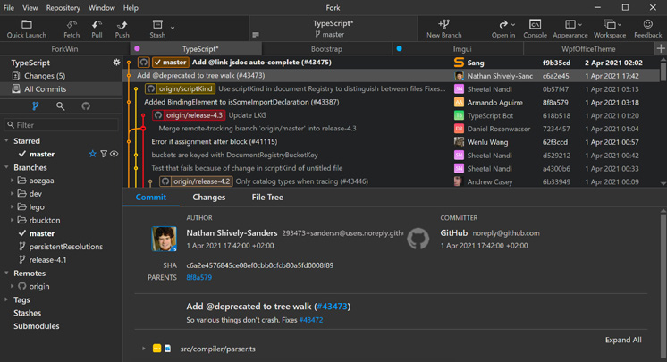
<p><em>VI: <strong>▲ Fork</strong> — bố cục ba cột: cây <em>Branches / Remotes / Tags / Stashes / Submodules</em> bên trái, danh sách commit ở giữa (kèm AUTHOR · COMMITTER · SHA · PARENTS), diff bên dưới. / EN: The Fork Git client.</em></p>

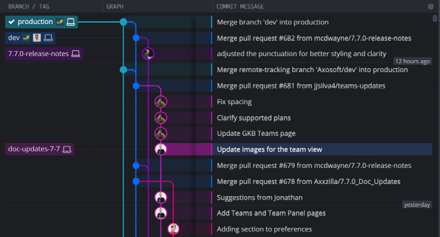
<p><em>VI: <strong>▲ GitKraken</strong> — đồ thị nhánh NHIỀU MÀU: <code>production</code>, <code>dev</code>, <code>7.7.0-release-notes</code>, <code>doc-updates-7-7</code>, cạnh cột <strong>COMMIT MESSAGE</strong> với avatar người commit. Đây chính là ý <em>"visualizes your repos"</em> trong bảng so sánh ở §57.6. / EN: The GitKraken branch graph.</em></p>

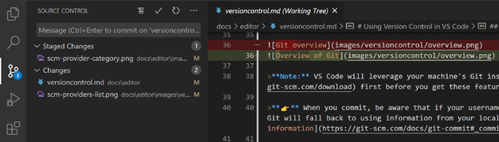
<p><em>VI: <strong>▲ Visual Studio Code</strong> — panel <strong>SOURCE CONTROL</strong> tích hợp sẵn: ô nhập message (<em>Ctrl+Enter to commit</em>), nhóm <strong>Staged Changes</strong> và <strong>Changes</strong>, kèm diff xanh/đỏ ngay bên phải. / EN: The built-in Source Control panel of Visual Studio Code.</em></p>

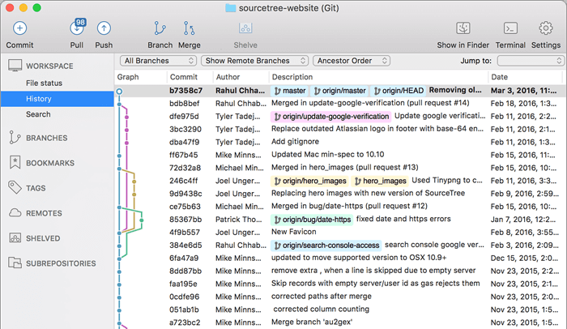
<p><em>VI: <strong>▲ SourceTree</strong> — cột trái <em>WORKSPACE (File status · History · Search) · BRANCHES · BOOKMARKS · TAGS · REMOTES · SHELVED · SUBREPOSITORIES</em>; bảng History có cột <strong>Graph · Commit · Author · Description · Date</strong>. / EN: The SourceTree Git client.</em></p>

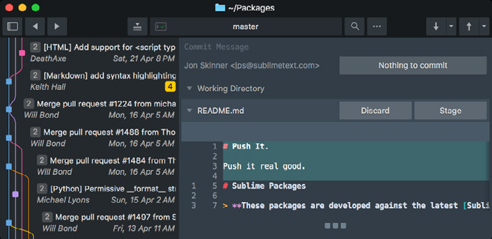
<p><em>VI: <strong>▲ Sublime Merge</strong> — giao diện TỐI, gọn: cột commit bên trái, khung <strong>Commit Message</strong> + <strong>Working Directory</strong> bên phải với hai nút <strong>Discard</strong> / <strong>Stage</strong>. Đúng mô tả <em>"lightweight, high-performance client"</em>. / EN: The Sublime Merge client.</em></p>

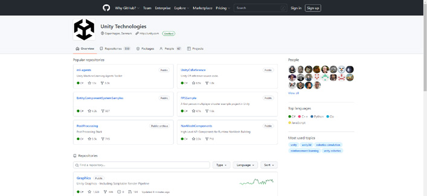
<p><em>VI: <strong>▲ GitHub</strong> — trang tổ chức <strong>Unity Technologies</strong> với danh sách <em>Popular repositories</em>, thành viên, và biểu đồ hoạt động. Nhắc lại: <strong>GitHub là DỊCH VỤ HOSTING, KHÔNG phải Git.</strong> / EN: The Unity Technologies organization page on GitHub.</em></p>

<div class="bilingual-row">
<div class="col-vi">
<p>📖 <em>"<strong>Mã nguồn mở, MIỄN PHÍ và linh hoạt, Git là MỘT TRONG những hệ version control PHỔ BIẾN NHẤT hiện nay.</strong> Tuy nhiên, <strong>vì là thiết lập PHÂN TÁN nên nó có thể GÂY NGỢP với người dùng KHÔNG chuyên kỹ thuật.</strong>"</em></p>
<p>🕰️ <em>"Được <strong>Linus Torvalds phát triển năm 2005</strong> để quản lý việc phát triển nhân Linux, nó vẫn được <strong>bảo trì tốt và mã nguồn mở</strong> kể từ đó. <strong>Git với tư cách một nền tảng là công cụ CHỈ CÓ DÒNG LỆNH.</strong> Nhưng <strong>NHIỀU GUI khác nhau đã được phát triển cho nó</strong>, làm hệ thống dễ tiếp cận hơn."</em></p>
</div>
<div class="col-en">
<p>📖 <em>"Open source, free, and flexible, Git is one of the most popular version control systems around. However, as a distributed setup it can be daunting to non-technical users."</em></p>
<p>🕰️ <em>"Developed in 2005 by Linus Torvalds to control the Linux kernel development, it's remained well-maintained and open source since. Git as a platform is a command line-only tool. But many different GUIs have been developed for it, making the system more accessible to users."</em></p>
</div>
</div>

**SÁU GUI client cho Git — nguyên văn e-book / The SIX Git GUI clients, verbatim**

| Client | Mô tả nguyên văn |
|---|---|
| **Fork** | *"NHANH và thân thiện. **Về kỹ thuật là miễn phí, nhưng THỈNH THOẢNG có nhắc bạn trả tiền.**"* |
| **GitKraken** | *"Mang lại cách làm việc với Git **TRỰC QUAN và DỄ TIẾP CẬN HƠN** với UI thân thiện, cùng **sự linh hoạt CHUYỂN QUA LẠI giữa GUI và terminal CLI.**"* |
| **Visual Studio Code** | *"VS Code có **tích hợp source control SẴN BÊN TRONG**, và với mọi extension hiện có, **bạn có thể KHÔNG cần dùng chương trình riêng nào nữa.**"* |
| **Visual Studio** | *"Giống VS Code, Visual Studio cũng có **điều khiển Git tích hợp sẵn** và bao gồm **một extension GitHub.**"* |
| **SourceTree** | *"Thuộc nhóm sản phẩm Atlassian, SourceTree là **client Git MIỄN PHÍ cho Windows và Mac**, cũng giúp bạn **hình dung và quản lý repository Git dễ dàng.**"* |
| **Sublime Merge** | *"Hệ thống này **XUẤT SẮC ở việc TĂNG TỐC code review với diff SONG SONG và syntax highlighting.** Nó **NHẸ và HIỆU NĂNG CAO.**"* |

<div class="bilingual-row">
<div class="col-vi">
<p>⚔️ <strong>Điểm mạnh và điểm yếu CỐT LÕI:</strong></p>
<p>💀 <em>"Git có <strong>khả năng branching và merging MẠNH, NHƯNG nó KHÔNG THỂ xử lý file nhị phân LỚN hiệu quả bằng các giải pháp khác trên thị trường.</strong> <strong>Git Large File Storage (LFS) khắc phục được PHẦN NÀO.</strong>"</em></p>
<p>⚡ <em>"Vì Git là client PHÂN TÁN, <strong>TOÀN BỘ repository và TOÀN BỘ lịch sử nằm TRÊN MÁY lập trình viên.</strong> Điều này khiến các thao tác như <strong>chuyển branch hay revert về một điểm trong lịch sử trở nên CỰC NHANH.</strong> Nếu bạn làm dự án LỚN với nhiều branch tính năng và release, <strong>workflow Git có thể tiết kiệm VÔ SỐ GIỜ.</strong>"</em></p>
</div>
<div class="col-en">
<p>⚔️ <strong>The core strength and weakness:</strong></p>
<p>💀 <em>"Git features strong branching and merging capabilities, but it can't handle large binary files as effectively as other solutions on the market. Git Large File Storage (LFS) goes some way to rectifying this."</em></p>
<p>⚡ <em>"Since Git is a distributed client, the entire repository and complete history is on the developer's machine. This makes actions such as switching branches or reverting back to a point in history extremely quick. If you're working on a large project with multiple features and release branches, a Git workflow can save countless hours."</em></p>
</div>
</div>

<div class="bilingual-row">
<div class="col-vi">
<p>🧭 <strong>Git ≠ GitHub — điểm hay bị nhầm:</strong></p>
<p><em>"Thường có <strong>SỰ NHẦM LẪN giữa Git và GitHub. GitHub là DỊCH VỤ HOSTING cho các repository Git, nhưng bạn CÓ THỂ dùng Git MÀ KHÔNG dùng GitHub.</strong> Dù vậy, <strong>GitHub rất phổ biến vì có bản MIỄN PHÍ (với một số giới hạn) và KHÔNG đòi hỏi thiết lập server tuỳ chỉnh nào.</strong>"</em></p>
<p>🎁 <em>"<strong>Unity đã phát hành code C# của editor và engine ra CÔNG KHAI trên GitHub.</strong> Điều này <strong>CỰC HỮU ÍCH khi bạn cần biết một hàm hoạt động thế nào hoặc cách tái tạo một tính năng của Editor trong dự án của mình.</strong>"</em></p>
<p>🔧 <em>"GitHub cũng có GUI Git riêng là <strong>GitHub Desktop</strong>. Khi làm việc trong Unity, bạn còn có thể dùng <strong>package GitHub for Unity để mang công cụ Git THẲNG vào Unity Editor.</strong>"</em></p>
<p>☁️ <em>"GitHub KHÔNG phải dịch vụ hosting DUY NHẤT. Bạn cũng có thể dùng <strong>Bitbucket (của Atlassian) hoặc GitLab</strong>, vốn có <strong>NHIỀU tính năng DevOps hơn.</strong>"</em></p>
</div>
<div class="col-en">
<p>🧭 <strong>Git ≠ GitHub — the common confusion:</strong></p>
<p><em>"There can often be some confusion between Git and GitHub. GitHub is a hosting service for Git repositories, but you can use Git without using GitHub. That said, GitHub is a very popular service because there is a free version (with some limitations), and it doesn't require any custom server setups."</em></p>
<p>🎁 <em>"Unity has released their C# editor and engine code to the public on GitHub. This is incredibly useful when you need to know how some functions work or how to replicate a feature of the Editor inside your own project."</em></p>
<p>🔧 <em>"GitHub also has its own Git GUI, GitHub Desktop. When working in Unity, you can also use the GitHub for Unity package to bring the Git tools directly into the Unity Editor."</em></p>
<p>☁️ <em>"As mentioned, GitHub isn't the only hosting service available for your Git projects. You can also use Bitbucket (from Atlassian) or GitLab, which have many more DevOps features available to them, or one of the many other hosting services available."</em></p>
</div>
</div>

### 57.3. 🔶 Perforce (Helix Core) — hàng DOANH NGHIỆP, EA và Ubisoft đang dùng

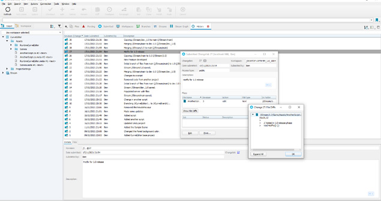
<p><em>VI: <strong>▲ Giao diện Helix Core P4V</strong> — cây workspace bên trái, <strong>danh sách changelist đã submit</strong> ở giữa (kèm ngày, người submit, mô tả), và các hộp thoại <strong>Submitted Changelist</strong> / <strong>Change 27: File Diffs</strong>. Đây là client TẬP TRUNG: mọi thứ đọc thẳng từ server. / EN: The Helix Core P4V interface.</em></p>

<div class="bilingual-row">
<div class="col-vi">
<p>🏢 <em>"Helix Core là hệ version control <strong>CẤP DOANH NGHIỆP được các studio game LỚN như Electronic Arts và Ubisoft sử dụng.</strong> Các studio này dùng Perforce vì nó có <strong>repo TẬP TRUNG, thường host trên SERVER RIÊNG của họ.</strong>"</em></p>
<p>⚠️ <em>"Nó <strong>KHÔNG có repo trực quan</strong>, nên <strong>việc tiếp nhận có thể KHÓ HƠN với lập trình viên không chuyên kỹ thuật</strong>, nhưng ở studio lớn <strong>sẽ có DevOps và Release Engineer giúp quản lý codebase.</strong> Ngoài ra, là giải pháp doanh nghiệp, nó <strong>bao gồm ĐỘI HỖ TRỢ TOÀN CẦU.</strong>"</em></p>
<p>💰 <em>"Helix Core <strong>CŨNG dùng được cho nhóm NHỎ. Thực tế nó MIỄN PHÍ cho nhóm tới NĂM người dùng và HAI MƯƠI workspace.</strong> Và bạn <strong>vẫn có thể triển khai lên cloud qua các giải pháp như Amazon AWS hoặc Azure.</strong>"</em></p>
<p>✅ <em>"Vì <strong>Helix Core xử lý file LỚN CỰC TỐT</strong>, nó có thể là <strong>lựa chọn PHỔ BIẾN cho dự án Unity.</strong> Cũng có <strong>tích hợp sẵn trong Unity Editor.</strong>"</em></p>
</div>
<div class="col-en">
<p>🏢 <em>"Helix Core is an enterprise-level version control system used by large game studios such as Electronic Arts and Ubisoft. These studios use Perforce because it features centralized repos that are most often hosted on their own servers."</em></p>
<p>⚠️ <em>"It does not feature visual repos, so its adoption might be more challenging for non-technical developers, but in larger studios there will be DevOps and Release Engineers to help manage the code base. Plus, as an enterprise solution, it includes a global support team."</em></p>
<p>💰 <em>"Helix Core can also be used by small teams. In fact, it's free for teams of up to five users and 20 workspaces. And you can still deploy to the cloud through solutions like Amazon AWS or Azure."</em></p>
<p>✅ <em>"Because Helix Core handles large files exceptionally well, it can be a popular option for Unity projects. There is also built-in Unity Editor integration that's covered in a later section."</em></p>
</div>
</div>

### 57.4. 🐢 Apache Subversion (SVN) — TẬP TRUNG, tốt với file lớn, nhưng MERGE là ÁC MỘNG

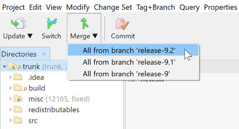
<p><em>VI: <strong>▲ SmartSVN GUI</strong> — thanh công cụ <strong>Update · Switch · Merge · Commit</strong>, cây thư mục <code>trunk</code> với <code>.idea</code>, <code>build</code>, <code>misc (12165, fixed)</code>, <code>redistributables</code>, <code>src</code>; menu Merge cho chọn <strong>All from branch 'release-9.2' / '9.1' / '9'</strong>. / EN: The SmartSVN GUI.</em></p>

<div class="bilingual-row">
<div class="col-vi">
<p>📖 <em>"Giống Git, <strong>Apache Subversion (còn gọi là SVN) là hệ version control MIỄN PHÍ và MÃ NGUỒN MỞ. KHÁC Git, nó là VCS TẬP TRUNG CÓ THỂ xử lý file nhị phân LỚN.</strong> Tuy nhiên nó <strong>vẫn là hệ dòng lệnh, cần MỘT TRONG NHIỀU GUI client bên thứ ba để thân thiện hơn — một trong số đó là SmartSVN.</strong>"</em></p>
<p>🕰️ <em>"<strong>TRƯỚC khi có Git LFS, SVN là lựa chọn PHỔ BIẾN khi làm việc trong Unity.</strong> Là giải pháp tập trung, <strong>nó ĐƠN GIẢN HƠN để làm việc và tốt hơn với file lớn.</strong>"</em></p>
<p>💀 <em>"Chỗ <strong>SVN THUA các công cụ khác là khi bạn bắt đầu dùng BRANCH và cần MERGE giữa chúng. Merge trong SVN có RẤT NHIỀU nỗi đau, đặc biệt với xung đột — hoặc thậm chí XUNG ĐỘT GIẢ — giữa các file.</strong> 🚨 <strong>Một thao tác merge chỉ mất VÀI PHÚT ở VCS khác có thể mất HÀNG GIỜ làm thủ công trong SVN.</strong>"</em></p>
</div>
<div class="col-en">
<p>📖 <em>"Like Git, Apache Subversion (known as SVN) is a free and open-source version control system. Unlike Git, it's a centralized VCS that can handle large binary files. However, it's still a command line system that requires one of the many third-party GUI clients to be a bit more user friendly. One such client is SmartSVN."</em></p>
<p>🕰️ <em>"Before Git LFS, SVN was a popular choice when working in Unity. As a centralized solution, it was simpler to work with and, as mentioned, better for working with large files."</em></p>
<p>💀 <em>"Where SVN falls behind the other tools is when you start to use branches and need to merge between them. Merging in SVN has many pains, especially when it comes to conflicts – or even false conflicts – between files. A merge operation that would take minutes in another VCS may take hours to go through manually in SVN."</em></p>
</div>
</div>

### 57.5. 🌿 Plastic SCM — LINH HOẠT cả hai chiều, và Gluon dành riêng cho ARTIST

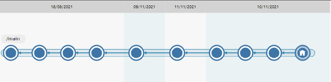
<p><em>VI: <strong>▲ Dòng thời gian của nhánh <code>/main</code></strong> — mỗi vòng tròn là MỘT changeset, nhóm theo NGÀY (<strong>18/08/2021 · 09/11/2021 · 11/11/2021 · 16/11/2021</strong>). Đây là cách Plastic/Gluon cho người KHÔNG chuyên kỹ thuật đọc lịch sử mà không cần hiểu đồ thị nhánh. / EN: The Plastic SCM branch timeline grouped by date.</em></p>

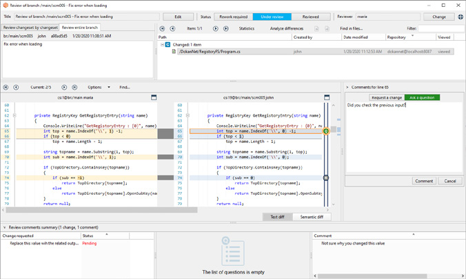
<p><em>VI: <strong>▲ Code Review TÍCH HỢP SẴN</strong> — cửa sổ <em>Review of branch /main/scm005 - Fix error when loading</em> với trạng thái <strong>Under review</strong>, người review, diff SONG SONG hai bản, khung <strong>Comments for line 65</strong> cùng nút <strong>Request a change</strong> / <strong>Ask a question</strong>, và hai chế độ <strong>Text diff</strong> / <strong>Semantic diff</strong>. / EN: The built-in Code Review window of Plastic SCM.</em></p>

<div class="bilingual-row">
<div class="col-vi">
<p>📖 <em>"Plastic SCM là hệ version control <strong>LINH HOẠT hỗ trợ CẢ lập trình viên LẪN artist. Nó XUẤT SẮC ở việc xử lý repo LỚN và file nhị phân</strong>, và <strong>vì vừa dựa trên FILE vừa dựa trên CHANGESET, nó cho bạn khả năng CHỈ TẢI VỀ những file bạn đang làm, thay vì toàn bộ bản build dự án.</strong>"</em></p>
<p>💰 <em>"Plastic SCM cung cấp <strong>hosting, bộ công cụ VCS, và GUI client TRONG CÙNG MỘT giải pháp. Nhóm NHỎ tới BA người có thể đăng ký bản Cloud Edition MIỄN PHÍ và nhận tới 5 GB lưu trữ cloud</strong>, cùng quyền truy cập bộ công cụ Plastic SCM, <strong>bao gồm Gluon.</strong>"</em></p>
</div>
<div class="col-en">
<p>📖 <em>"Plastic SCM is a flexible version control system that supports programmers and artists alike. It excels at handling large repos and binary files, and as both a file-based and changeset-based solution, it gives you the capability to download only the specific files you're working on, rather than the entire project build."</em></p>
<p>💰 <em>"Plastic SCM offers hosting, the actual VCS tools, and a GUI client as part of the same solution. Small teams of up to three users can sign up for the free Cloud Edition of Plastic SCM and get up to 5GB of cloud storage, along with access to the Plastic SCM tools, including Gluon."</em></p>
</div>
</div>

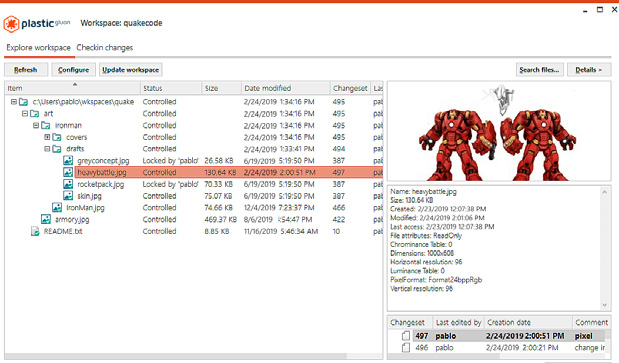
<p><em>VI: <strong>▲ Workflow dành riêng cho ARTIST</strong> — cột <strong>Status</strong> cho thấy <code>heavyparts.jpg</code> đang <strong>Controlled</strong> còn <code>rocketpack.jpg</code> <strong>Locked by 'pablo'</strong> (70.33 KB); bảng bên phải <strong>xem trước ảnh NGAY</strong> kèm metadata (Size 130.64 KB, Dimensions 1600×916, File attributes ReadOnly) và <strong>lịch sử changeset 497 / 496</strong>. / EN: Plastic offers a workflow especially designed for artists, making it easy to preview files and history as well as to check in changes.</em></p>

<div class="bilingual-row">
<div class="col-vi">
<p>🎨 <strong>Gluon — client "tinh gọn" cho người KHÔNG code:</strong></p>
<p><em>"Gluon là <strong>client TINH GỌN thiết kế RIÊNG cho artist. Nó cho phép bạn CHỈ CHỌN những file bạn sắp làm việc và CHECK OUT chúng từ server, KHOÁ chúng khỏi bị người khác sửa. Khi xong việc, bạn CHECK file trở lại.</strong> ✅ <strong>GUI của Gluon LOẠI BỎ những khái niệm phức tạp vốn hợp với lập trình viên hơn là với người dùng ít kỹ thuật.</strong>"</em></p>
<p>🖼️ <em>"Với artist, <strong>CẢ Plastic SCM LẪN Gluon đều có cách DIFF ẢNH. Công cụ image diff cho bạn SO SÁNH TRỰC QUAN hai phiên bản của cùng một file — tính năng mà NHIỀU hệ thống khác KHÔNG có.</strong>"</em></p>
</div>
<div class="col-en">
<p>🎨 <strong>Gluon — the slimline client for non-coders:</strong></p>
<p><em>"Gluon is a slimline client designed specifically with artists in mind. It allows you to pick only the files that you're going to work on and check them out from the server, locking them from being modified by anyone else. Once you complete your work, you check the files back in. The Gluon GUI removes the more complex concepts that work better for programmers than for other, less technical users."</em></p>
<p>🖼️ <em>"For artists, both Plastic SCM and Gluon include ways to diff images. The image diff tool lets you compare two versions of the same file visually, a feature that many other systems don't offer."</em></p>
</div>
</div>

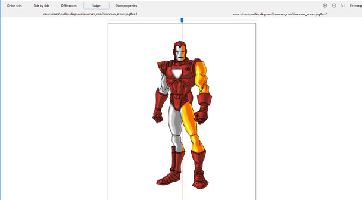
<p><em>VI: <strong>▲ Image diff ở chế độ Swipe</strong> — bốn chế độ <strong>Onion skin · Side by side · Differences · Swipe</strong>; thanh dọc ở giữa kéo qua lại để <strong>chuyển từ phiên bản này sang phiên bản kia</strong> (trái <code>ironman_armor.jpg#cs:1</code>, phải <code>#cs:2</code>) — thấy ngay <strong>bộ giáp đổi từ ĐỎ-VÀNG sang ĐỎ-TRẮNG</strong>. / EN: Image diff showing the Swipe mode where you can go from one version to the other by just dragging the swipe control. This is very useful to follow image evolution.</em></p>

<div class="bilingual-row">
<div class="col-vi">
<p>👨‍💻 <strong>GUI chuẩn cho lập trình viên:</strong></p>
<p><em>"GUI client tiêu chuẩn của Plastic SCM có <strong>MỌI tính năng đội lập trình cần và hơn thế. GUI có Branch Explorer TRỰC QUAN, TƯƠNG TÁC ĐƯỢC, cho thấy QUAN HỆ THỰC SỰ của TẤT CẢ branch trong dự án.</strong> Cũng có <strong>hệ thống Code Review tích hợp sẵn để bạn YÊU CẦU senior review công việc của mình.</strong>"</em></p>
<p>🏠 <em>"<strong>Plastic SCM gia nhập gia đình Unity năm 2020</strong>, nghĩa là <strong>bộ công cụ giờ được tích hợp CHẶT vào Unity Editor.</strong>"</em></p>
<p>🔀 <strong>Điểm mạnh THEN CHỐT — BA chế độ cấu hình:</strong></p>
<ul>
<li><strong>PHÂN TÁN hoàn toàn</strong> — <em>"lập trình viên làm việc với repository TRÊN MÁY CỤC BỘ, check in, branch và merge dễ dàng. Sau đó PUSH/PULL thay đổi lên server để chia sẻ khi sẵn sàng."</em></li>
<li><strong>TẬP TRUNG</strong> — <em>"người dùng check out và check in thay đổi TRỰC TIẾP tới server để MỌI NGƯỜI đều làm trên thay đổi MỚI NHẤT."</em></li>
<li><strong>MULTI-SITE</strong> — <em>"khi đội phát triển đã lớn thành tổ chức TOÀN CẦU, việc MỌI NGƯỜI giao tiếp với MỘT server trung tâm KHÔNG PHẢI LÚC NÀO CŨNG có lợi. Plastic SCM có thể cấu hình multi-site: <strong>server được đặt tại TỪNG SITE để đội check in vào server ĐỊA PHƯƠNG, giữ workflow NHANH và ổ cứng VUI VẺ.</strong> Rồi <strong>các server phân tán GIAO TIẾP VỚI NHAU tới một server trung tâm hoặc cloud.</strong>"</em></li>
</ul>
</div>
<div class="col-en">
<p>👨‍💻 <strong>The standard GUI for programmers:</strong></p>
<p><em>"The standard Plastic SCM GUI client has all the features they would be looking for and more for the programming team. The GUI has an interactive visual Branch Explorer that shows the true relationships of all the branches in a project. There is also a built-in Code Review system that you can use to request the review of your work from a senior developer."</em></p>
<p>🏠 <em>"Plastic SCM joined the Unity family in 2020, which means that the tools are now closely integrated into the Unity Editor."</em></p>
<p>🔀 <strong>The key strength — THREE configuration modes:</strong></p>
<ul>
<li><strong>Fully distributed</strong> — <em>"developers work with a repository on their local machine, checking in, branching, and merging with ease. Developers will then push and pull changes to the server to share them when ready."</em></li>
<li><strong>Centralized</strong> — <em>"users check out and check in their changes directly to the server so everyone is working on the latest changes."</em></li>
<li><strong>Multi-site</strong> — <em>"However, as development teams have grown into global organizations, everyone communicating with one central server isn't always beneficial. Plastic SCM can also be configured to work in a multi-site system. In this system, servers are set up at each site, so teams can check in to their local server, keeping their workflow fast and hard drives happy. Then, the distributed servers communicate with each other to a central or cloud server."</em></li>
</ul>
</div>
</div>

### 57.6. 📊 BẢNG SO SÁNH BỐN HỆ — nguyên văn trang 34 của e-book

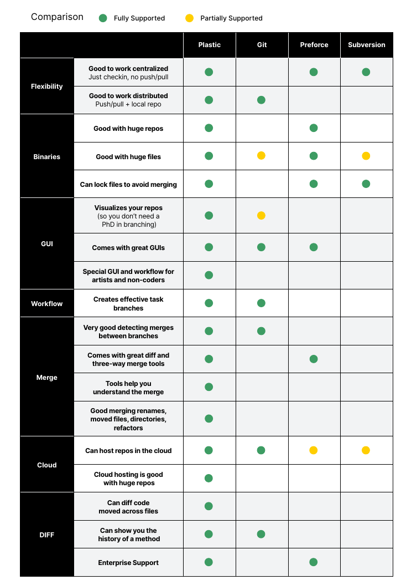
<p><em>VI: <strong>▲ Ma trận so sánh</strong> — 🟢 <strong>xanh = hỗ trợ ĐẦY ĐỦ</strong>, 🟡 <strong>vàng = hỗ trợ MỘT PHẦN</strong>, ô TRỐNG = không hỗ trợ. (Lưu ý: bản gốc của Unity viết SAI chính tả cột <em>"Preforce"</em>.) / EN: Comparison matrix — green = fully supported, yellow = partially supported.</em></p>

**Chuyển thành bảng đọc được / The matrix transcribed** — 🟢 đầy đủ · 🟡 một phần · — không hỗ trợ

| Nhóm | Tiêu chí | **Plastic** | **Git** | **Perforce** | **Subversion** |
|---|---|:---:|:---:|:---:|:---:|
| **Flexibility** | Good to work **centralized** *(chỉ checkin, không push/pull)* | 🟢 | — | 🟢 | 🟢 |
| **Flexibility** | Good to work **distributed** *(push/pull + repo cục bộ)* | 🟢 | 🟢 | — | — |
| **Binaries** | Good with **huge repos** | 🟢 | — | 🟢 | — |
| **Binaries** | Good with **huge files** | 🟢 | 🟡 | 🟢 | 🟡 |
| **Binaries** | **Can lock files** to avoid merging | 🟢 | — | 🟢 | 🟢 |
| **GUI** | **Visualizes your repos** *(khỏi cần "bằng tiến sĩ về branching")* | 🟢 | 🟡 | — | — |
| **GUI** | Comes with **great GUIs** | 🟢 | 🟢 | 🟢 | — |
| **GUI** | **Special GUI and workflow for artists** and non-coders | 🟢 | — | — | — |
| **Workflow** | Creates effective **task branches** | 🟢 | 🟢 | — | — |
| **Merge** | Very good **detecting merges between branches** | 🟢 | 🟢 | — | — |
| **Merge** | Comes with great **diff and three-way merge tools** | 🟢 | — | 🟢 | — |
| **Merge** | **Tools help you understand the merge** | 🟢 | — | — | — |
| **Merge** | Good merging **renames, moved files, directories, refactors** | 🟢 | — | — | — |
| **Cloud** | Can **host repos in the cloud** | 🟢 | 🟢 | 🟡 | 🟡 |
| **Cloud** | **Cloud hosting is good with huge repos** | 🟢 | — | — | — |
| **DIFF** | Can **diff code moved across files** | 🟢 | — | — | — |
| **DIFF** | Can show you the **history of a method** | 🟢 | 🟢 | — | — |
| **Support** | **Enterprise Support** | 🟢 | — | 🟢 | — |

<div class="bilingual-row">
<div class="col-vi">
<p>🎯 <strong>Đọc bảng này thế nào (góc nhìn Tech Lead):</strong></p>
<ul>
<li>🟢 <strong>CHỈ Plastic có ĐỦ CẢ 18 dòng</strong> — nhưng đây là e-book DO UNITY xuất bản, và <strong>Plastic SCM đã thuộc về Unity từ 2020</strong>. Hãy đọc bảng như <strong>danh sách TIÊU CHÍ cần cân nhắc</strong>, đừng đọc như bảng xếp hạng trung lập.</li>
<li>⚔️ <strong>Git vs Perforce là ĐÁNH ĐỔI THẬT:</strong> Git thắng ở <strong>task branch · phát hiện merge · history của method</strong>; Perforce thắng ở <strong>repo khổng lồ · khoá file · three-way merge · hỗ trợ doanh nghiệp</strong>. Đúng như §57 đã nói: <strong>chọn theo QUY MÔ ASSET, không theo sở thích.</strong></li>
<li>💀 <strong>Subversion KHÔNG thắng ở dòng nào mà hệ khác không thắng</strong> — nó chỉ ngang bằng ở centralized, khoá file và một phần file lớn/cloud. Phù hợp với nhận xét ở §57.4: <strong>merge là điểm chết.</strong></li>
<li>🟡 <strong>Ô VÀNG mới là chỗ đau:</strong> "Git — huge files 🟡" chính là <strong>Git LFS</strong> (chắp vá, không phải tính năng gốc). "Perforce/SVN — cloud 🟡" nghĩa là <strong>làm được nhưng bạn phải TỰ dựng trên AWS/Azure.</strong></li>
</ul>
</div>
<div class="col-en">
<p>🎯 <strong>How to read this table (Tech Lead's view):</strong></p>
<ul>
<li>🟢 <strong>Only Plastic scores on all 18 rows</strong> — but this e-book is published BY Unity, and <strong>Plastic SCM has been part of Unity since 2020</strong>. Read the table as a <strong>checklist of criteria to weigh</strong>, not as a neutral ranking.</li>
<li>⚔️ <strong>Git vs Perforce is a real trade-off:</strong> Git wins on <strong>task branches, merge detection, method history</strong>; Perforce wins on <strong>huge repos, file locking, three-way merge, enterprise support</strong>.</li>
<li>💀 <strong>Subversion wins no row that another system doesn't</strong> — it only ties on centralized work, locking, and partially on large files/cloud.</li>
<li>🟡 <strong>The yellow cells are where the pain is:</strong> "Git — huge files 🟡" is <strong>Git LFS</strong> (a bolt-on, not a native feature). "Perforce/SVN — cloud 🟡" means <strong>possible, but you host it yourself on AWS/Azure.</strong></li>
</ul>
</div>
</div>


---

## 58. 📁 Tổ chức dự án — Sáu quy tắc THƯ MỤC

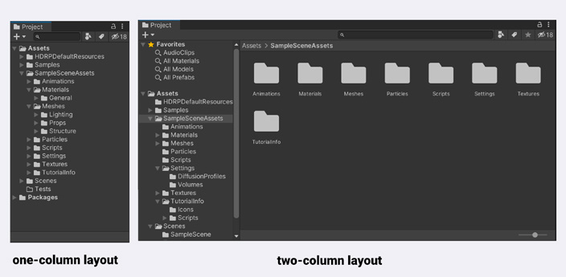
<p><em>VI: <strong>▲ Hai bố cục của cửa sổ Project</strong> — <strong>one-column layout</strong> (cây lồng nhau) và <strong>two-column layout</strong> (cây bên trái + lưới icon bên phải). Chọn bố cục nào là chuyện thói quen, nhưng CẢ ĐỘI nên thống nhất khi hướng dẫn nhau. / EN: The one-column and two-column Project window layouts.</em></p>

!!! danger "💀 Đặt SAI cấu trúc thư mục từ đầu = MẤT LỊCH SỬ FILE"
    <div class="bilingual-row">
    <div class="col-vi">
    <p><em>"<strong>ĐỊNH NGHĨA cấu trúc dự án TỐT NGAY TỪ ĐẦU sẽ TRÁNH được các vấn đề version control về sau. NẾU bạn DI CHUYỂN asset từ thư mục này sang thư mục khác, NHIỀU VCS sẽ xem đó chỉ là XOÁ một file và THÊM một file khác, chứ KHÔNG phải file được DI CHUYỂN. 💀 Việc này LÀM MẤT LỊCH SỬ của file gốc.</strong>"</em></p>
    <p>✅ <em>"<strong>Plastic SCM xử lý được việc di chuyển file BÊN TRONG Unity và GIỮ NGUYÊN lịch sử của mọi file được di chuyển.</strong> ⚠️ <strong>Tuy nhiên, ĐIỀU CỐT YẾU là khi di chuyển file, bạn PHẢI làm TRONG Unity Editor để file <code>.meta</code> ĐI THEO file asset.</strong>"</em></p>
    </div>
    <div class="col-en">
    <p><em>"Defining a good project structure in the beginning will avoid version control issues later. If you move assets from one folder to another, many VCS will see that as just deleting one file and adding another, rather than the file being moved. This loses the history of the original file."</em></p>
    <p>✅ <em>"Plastic SCM can handle file moves within Unity and maintains the history of any file that's moved. However, it's essential that when you move a file, you do it in the Unity Editor so that the .meta file moves with the asset file."</em></p>
    </div>
    </div>

<div class="bilingual-row">
<div class="col-vi">
<p>🛠️ <em>"Sau khi đã CHỐT cấu trúc thư mục cho dự án, hãy <strong>dùng một Editor script để TÁI SỬ DỤNG template và tạo CÙNG cấu trúc thư mục cho MỌI dự án về sau.</strong> Khi đặt trong thư mục <strong><code>Editor</code></strong>, script dưới đây sẽ <strong>tạo một thư mục GỐC trong <code>Assets</code> trùng với biến <code>PROJECT_NAME</code>. Làm vậy giữ công việc CỦA BẠN TÁCH BIỆT khỏi package bên thứ ba.</strong>"</em></p>
</div>
<div class="col-en">
<p>🛠️ <em>"Once you've decided on a folder structure for your projects, use an Editor script to reuse the template and create the same folder structure for all projects moving forward. When it's placed in an Editor folder, the script below will create a root folder in Assets matching the "PROJECT_NAME" variable. Doing this keeps your own work separate from third-party packages."</em></p>
</div>
</div>

```csharp
using UnityEditor;
using UnityEngine;
using System.Collections.Generic;
using System.IO;

public class CreateFolders : EditorWindow
{
    private static string projectName = "PROJECT_NAME";

    [MenuItem("Assets/Create Default Folders")]
    private static void SetUpFolders()
    {
        CreateFolders window = ScriptableObject.CreateInstance<CreateFolders>();
        window.position = new Rect(Screen.width / 2, Screen.height / 2, 400, 150);
        window.ShowPopup();
    }

    private static void CreateAllFolders()
    {
        List<string> folders = new List<string>
        {
            "Animations", "Audio", "Editor", "Materials", "Meshes",
            "Prefabs", "Scripts", "Scenes", "Shaders", "Textures", "UI"
        };

        foreach (string folder in folders)
        {
            if (!Directory.Exists("Assets/" + folder))
            {
                Directory.CreateDirectory("Assets/" + projectName + "/" + folder);
            }
        }

        List<string> uiFolders = new List<string> { "Assets", "Fonts", "Icon" };

        foreach (string subfolder in uiFolders)
        {
            if (!Directory.Exists("Assets/" + projectName + "/UI/" + subfolder))
            {
                Directory.CreateDirectory("Assets/" + projectName + "/UI/" + subfolder);
            }
        }

        AssetDatabase.Refresh();
    }

    void OnGUI()
    {
        EditorGUILayout.LabelField("Insert the Project name used as the root folder");
        projectName = EditorGUILayout.TextField("Project Name: ", projectName);
        this.Repaint();
        GUILayout.Space(70);
        if (GUILayout.Button("Generate!"))
        {
            CreateAllFolders();
            this.Close();
        }
    }
}
```

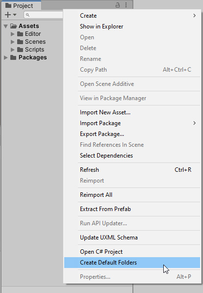 Create Default Folders menu item added by the editor script.">
<p><em>VI: <strong>▲ Script tạo thư mục MẶC ĐỊNH</strong> — sau khi thêm script, menu <code>Assets › Create Default Folders</code> xuất hiện; một cú bấm dựng xong toàn bộ khung thư mục chuẩn cho dự án MỚI. / EN: The Assets > Create Default Folders menu item added by the editor script.</em></p>

<div class="bilingual-row">
<div class="col-vi">
<p>📁 <strong>Về THƯ MỤC RỖNG:</strong> <em>"Thư mục rỗng như trong các ảnh trên có thể gây <strong>chút rắc rối trong version control — nên CHỈ tạo những thư mục bạn CẦN. Với Git và Perforce, thư mục RỖNG bị BỎ QUA theo mặc định. Nếu các thư mục dự án này được dựng sẵn và ai đó cố commit chúng, họ sẽ KHÔNG THỂ commit cho tới khi có thứ gì đó được đặt vào trong.</strong>"</em></p>
</div>
<div class="col-en">
<p>📁 <strong>About empty folders:</strong> <em>"Empty folders like those shown in the previous images can present a bit of an issue in version control – so only create the folders for what you need. With Git and Perforce, empty folders are ignored by default. If these project folders are set up and someone attempts to commit them, they'll be unable to until something is placed in the folder."</em></p>
</div>
</div>


<div class="bilingual-row">
<div class="col-vi">
<blockquote>
<p><em>"<strong>Tuy KHÔNG CÓ MỘT CÁCH DUY NHẤT để tổ chức dự án, nhìn chung hãy theo các khuyến nghị sau.</strong>"</em></p>
</blockquote>
<ol>
<li>📝 <strong>Tài liệu hoá quy ước đặt tên và cấu trúc thư mục.</strong> <em>"Một STYLE GUIDE và/hoặc PROJECT TEMPLATE khiến file DỄ TÌM và DỄ TỔ CHỨC hơn. <strong>Chọn cái phù hợp với đội bạn, và ĐẢM BẢO MỌI NGƯỜI đồng thuận với nó.</strong>"</em></li>
<li>🔁 <strong>NHẤT QUÁN với quy ước đặt tên.</strong> <em>"ĐỪNG đi chệch khỏi style guide đã chọn. <strong>NẾU bạn CẦN sửa quy tắc đặt tên, hãy PHÂN TÍCH và ĐỔI TÊN các asset bị ảnh hưởng CÙNG MỘT LÚC.</strong> Nếu thay đổi ảnh hưởng SỐ LƯỢNG LỚN file, <strong>cân nhắc TỰ ĐỘNG HOÁ việc cập nhật bằng SCRIPT.</strong>"</em></li>
<li>🚫 <strong>ĐỪNG dùng KHOẢNG TRẮNG trong tên file và thư mục.</strong> <em>"<strong>Công cụ dòng lệnh của Unity CÓ VẤN ĐỀ với đường dẫn có khoảng trắng. Dùng CamelCase thay cho khoảng trắng.</strong>"</em></li>
<li>🧪 <strong>TÁCH RIÊNG khu vực test hoặc sandbox.</strong> <em>"Tạo thư mục RIÊNG cho scene KHÔNG-sản-xuất và thử nghiệm. <strong>Thư mục con theo TÊN NGƯỜI DÙNG có thể chia khu vực làm việc theo THÀNH VIÊN.</strong>"</em></li>
<li>📂 <strong>TRÁNH thư mục THỪA ở cấp gốc.</strong> <em>"Nhìn chung, <strong>lưu file nội dung TRONG thư mục Assets. ĐỪNG tạo thư mục bổ sung ở cấp GỐC của dự án TRỪ KHI thực sự cần thiết.</strong>"</em></li>
<li>📦 <strong>GIỮ asset NỘI BỘ TÁCH RIÊNG khỏi asset BÊN THỨ BA.</strong> <em>"Nếu bạn dùng asset từ Asset Store hay plug-in, <strong>khả năng cao chúng có CẤU TRÚC DỰ ÁN RIÊNG. Hãy giữ asset của bạn TÁCH RIÊNG.</strong>"</em></li>
</ol>
<p>💡 <strong>Mẹo bonus về asset bên thứ ba:</strong> <em>"NẾU bạn thấy mình đang SỬA một asset/plug-in bên thứ ba, <strong>version control THỰC SỰ giúp ích khi bạn cần lấy bản CẬP NHẬT MỚI NHẤT. Sau khi import bản cập nhật, bạn có thể XEM DIFF để tìm nơi các sửa đổi của bạn ĐÃ BỊ GHI ĐÈ và CÀI ĐẶT LẠI chúng.</strong>"</em></p>
</div>
<div class="col-en">
<blockquote>
<p><em>"<strong>Although there is NO SINGLE WAY to organize your project, in general, follow these recommendations.</strong>"</em></p>
</blockquote>
<ol>
<li>📝 <strong>DOCUMENT your naming conventions and folder structure.</strong> <em>"A STYLE GUIDE and/or PROJECT TEMPLATE makes your files EASIER TO FIND and organize. <strong>Pick what works for your team, and MAKE SURE EVERYONE IS ON BOARD with it.</strong>"</em></li>
<li>🔁 <strong>Be CONSISTENT with your naming convention.</strong> <em>"DON'T deviate from your chosen style guide. <strong>If you DO need to amend your naming rules, PARSE and RENAME your affected assets ALL AT ONCE.</strong> Where changes affect a LARGE NUMBER of files, <strong>consider AUTOMATING the update using a SCRIPT.</strong>"</em></li>
<li>🚫 <strong>DON'T use SPACES in file and folder names.</strong> <em>"<strong>Unity's COMMAND LINE TOOLS have ISSUES with path names that have spaces. Use CamelCase as an alternative.</strong>"</em></li>
<li>🧪 <strong>SEPARATE testing or sandbox areas.</strong> <em>"Create a SEPARATE folder for NON-PRODUCTION scenes and experimentation. <strong>Subfolders with USERNAMES can divide your work area by TEAM MEMBER.</strong>"</em></li>
<li>📂 <strong>AVOID extra folders at the ROOT level.</strong> <em>"In general, <strong>store your content files WITHIN the Assets folder. DON'T create additional folders at the project's ROOT level UNLESS it's ABSOLUTELY NECESSARY.</strong>"</em></li>
<li>📦 <strong>KEEP your INTERNAL assets SEPARATE from THIRD-PARTY ones.</strong> <em>"If you are using assets from the Asset Store or plug-ins, <strong>odds are they have their OWN project structure. Keep your assets SEPARATE.</strong>"</em></li>
</ol>
<p>💡 <strong>A bonus tip on third-party assets:</strong> <em>"If you find yourself MODIFYING a third-party asset or plug-in, <strong>version control can REALLY HELP when you need to get the LATEST UPDATE. Once the update is imported, you can look through the DIFF to find where your modifications may have been OVERWRITTEN and REIMPLEMENT them.</strong>"</em></p>
</div>
</div>

**📂 Hai VÍ DỤ cấu trúc thư mục — nguyên văn từ sách**

```text
# Example 1
Assets
+---Art
|   +---Materials
|   +---Models
|   +---Textures
+---Audio
|   +---Music
|   \---Sound
+---Code
|   +---Scripts      # C# scripts
|   \---Shaders      # Shader files and shader graphs
+---Docs             # Wiki, concept art, marketing material
+---Level            # Anything related to game design in Unity
|   +---Prefabs
|   +---Scenes
|   \---UI

# Example 2
+---Art
|   +---Materials
|   +---Models
|   +---Music
|   +---Prefabs
|   +---Sound
|   +---Textures
|   +---UI
+---Levels
+---Src
|   +---Framework
|   \---Shaders
```

**Bảng LOẠI ASSET và ý nghĩa thư mục** *(theo Template/Starter Project của Unity Hub)*

| Thư mục | Ý nghĩa / Explanation |
|---|---|
| **Animations** | *"Chứa **clip chuyển động ĐÃ animate và file CONTROLLER** của chúng. Cũng có thể chứa **asset Timeline cho cinematic trong game hoặc thông tin RIGGING cho animation thủ tục**"* |
| **Audio** | *"Gồm **audio clip cũng như MIXER dùng để trộn hiệu ứng và nhạc**"* |
| **Editor** | *"Chứa **công cụ được script hoá dùng với Unity Editor NHƯNG KHÔNG xuất hiện trong bản BUILD đích**"* |
| **Fonts** | *"Chứa font dùng trong game"* |
| **Materials** | *"Asset mô tả **thuộc tính SHADING BỀ MẶT**"* |
| **Meshes** | *"Lưu **model tạo trong ứng dụng DCC bên ngoài**"* |
| **Particles** | *"Mô phỏng particle trong Unity, tạo bằng **Particle System hoặc Visual Effect Graph**"* |
| **Prefabs** | *"**GameObject TÁI SỬ DỤNG với Component dựng sẵn**"* |
| **Scripts** | *"MỌI code gameplay do người dùng phát triển"* |

!!! danger "📄 File `.meta` — vì sao PHẢI commit dù nó tự sinh"
    <div class="bilingual-row">
    <div class="col-vi">
    <blockquote>
    <p><em>"Unity sinh ra một file <code>.meta</code> cho <strong>MỌI file khác trong dự án</strong>, và <strong>tuy nhìn chung KHÔNG NÊN đưa file TỰ SINH vào version control, file <code>.meta</code> thì HƠI KHÁC.</strong></em></p>
    <p><em>⚙️ <strong>Chế độ VISIBLE META FILES nên được BẬT trong cửa sổ Version Control</strong> (trừ khi bạn dùng chế độ Plastic SCM hoặc Perforce dựng sẵn).</em></p>
    <p><em>🔑 <strong>Tuy file <code>.meta</code> TỰ SINH, nó CŨNG GIỮ RẤT NHIỀU thông tin về file mà nó gắn với. Điều này PHỔ BIẾN với asset có IMPORT SETTINGS như Texture, mesh, audio clip…</strong></em></p>
    <p><em>🚨 <strong>KHI bạn đổi BẤT KỲ import setting nào của những file này, thay đổi được GHI VÀO FILE <code>.meta</code>, KHÔNG PHẢI vào file asset. ĐÂY LÀ LÝ DO bạn PHẢI commit file <code>.meta</code> vào repository — để MỌI NGƯỜI làm việc với CÙNG setting file.</strong>"</em></p>
    </blockquote>
    <p>👉 <em>Nối trực tiếp với <a href="../04-tech-lead/01-gpu-urp-advanced-rendering.md">Module 4</a> và <a href="../03-senior/01-memory-addressables-networking.md">Module 3</a>: <strong>MỌI setting nén texture, mipmap, Read/Write, Vertex Compression bạn tinh chỉnh đều nằm trong <code>.meta</code></strong> — quên commit nó thì cả đội mất sạch công tối ưu.</em></p>
    </div>
    <div class="col-en">
    <blockquote>
    <p><em>"Unity generates a <code>.meta</code> file for <strong>EVERY OTHER FILE inside the project</strong>, and <strong>while it's typically INADVISABLE to include AUTO-GENERATED files in version control, the <code>.meta</code> file is A LITTLE DIFFERENT.</strong></em></p>
    <p><em>⚙️ <strong>VISIBLE META FILES mode should be TURNED ON in the Version Control window</strong> (unless you're using the built-in Plastic SCM or Perforce modes).</em></p>
    <p><em>🔑 <strong>While the <code>.meta</code> file is auto-generated, it ALSO HOLDS A LOT OF INFORMATION about the file it's associated with. This is COMMON with assets that have IMPORT SETTINGS, such as Textures, meshes, audio clips, etc.</strong></em></p>
    <p><em>🚨 <strong>WHEN you change ANY import settings on these files, the changes are WRITTEN INTO THE <code>.meta</code> FILE, NOT the asset file. THIS IS WHY you commit the <code>.meta</code> files to your repository — so EVERYONE works with the SAME file settings.</strong>"</em></p>
    </blockquote>
    <p>👉 <em>Directly connected to <a href="../04-tech-lead/01-gpu-urp-advanced-rendering.md">Module 4</a> and <a href="../03-senior/01-memory-addressables-networking.md">Module 3</a>: <strong>EVERY texture compression, mipmap, Read/Write and Vertex Compression setting you tune lives in the <code>.meta</code> file</strong> — forget to commit it and the whole team loses your optimization work.</em></p>
    </div>
    </div>

!!! warning "📭 THƯ MỤC RỖNG — điểm khác biệt giữa ba VCS"
    **VI:** *"**Git và Perforce KHÔNG theo dõi thư mục RỖNG.** Cách giải quyết PHỔ BIẾN là **đặt một file `.keep` bên trong thư mục rỗng — đủ để thư mục được commit vào repository.** ✅ **Plastic SCM XỬ LÝ ĐƯỢC thư mục rỗng: thư mục được coi là THỰC THỂ và CÓ LỊCH SỬ PHIÊN BẢN.** 🚨 **Cái bẫy trong Unity: Unity sinh file `.meta` cho MỌI file, KỂ CẢ thư mục. Với Git và Perforce, người dùng DỄ DÀNG commit file `.meta` của một thư mục rỗng, NHƯNG BẢN THÂN THƯ MỤC LẠI KHÔNG được đưa vào version control. Khi người khác lấy thay đổi mới nhất, sẽ có một file `.meta` cho một THƯ MỤC KHÔNG TỒN TẠI trên máy họ — và Unity SẼ XOÁ file `.meta` đó."***

    **EN:** *"**Git and Perforce do NOT track EMPTY folders.** A common workaround is to **place a `.keep` file inside an empty folder — this is enough for the folder to be committed.** ✅ **Plastic SCM CAN handle empty folders: directories are treated as ENTITIES and have a VERSION HISTORY.** 🚨 **The Unity trap: Unity generates a `.meta` file for EVERY file, INCLUDING folders. With Git and Perforce, a user can EASILY commit the `.meta` file for an empty folder, BUT THE FOLDER ITSELF WON'T END UP under version control. When another user gets the latest changes, there will be a `.meta` file for a folder THAT DOESN'T EXIST on their machine, and Unity WILL THEN DELETE the `.meta` file."***

---

## 59. ✏️ Năm chuẩn ĐẶT TÊN GameObject

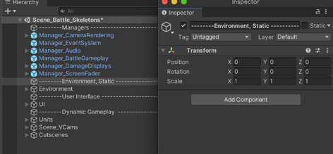
<p><em>VI: <strong>▲ Mẹo dải PHÂN CÁCH trong Hierarchy</strong> — dùng GameObject RỖNG đặt tên kiểu <code>--------Managers</code>, <code>----Environment, Static----</code>, <code>----User Interface</code>, <code>----Dynamic Gameplay</code> để CHIA KHỐI cây scene. Inspector bên phải cho thấy đó chỉ là một Transform rỗng, KHÔNG có component nào. / EN: Using empty GameObjects as visual separators in the Hierarchy.</em></p>

| Chuẩn / Standard | Ví dụ ĐÚNG | Ví dụ SAI |
|---|---|---|
| **Dùng tên MÔ TẢ, ĐỪNG viết tắt** — *"Dùng tên bạn SẼ NHỚ sau VÀI THÁNG. Cân nhắc liệu NGƯỜI KHÁC có hiểu ký hiệu của bạn, và chọn tên bạn có thể PHÁT ÂM và NHỚ được. **Lưu ý rằng VIẾT TẮT và LỖI CHÍNH TẢ có thể gây NHẦM LẪN.**"* | `largeButton` · `LargeButton` · `leftButton` | ❌ `lButton` |
| **Dùng Camel case / Pascal case** — *"TRÁNH khoảng trắng trong tên object. **Camel case hoặc Pascal case CẢI THIỆN ĐỘ DỄ ĐỌC (và ĐỘ CHÍNH XÁC KHI GÕ theo nghiên cứu).**"* | `OutOfMemoryException` · `dateTimeFormat` | ❌ `Outofmemoryexception` · `datetimeformat` |
| **Dùng gạch dưới (hoặc gạch ngang) TIẾT KIỆM** — *"TRÁNH gạch dưới và gạch ngang nói chung. **TUY NHIÊN chúng HỮU ÍCH trong một số trường hợp. Đặt gạch dưới ở ĐẦU tên sẽ đưa nó lên ĐẦU theo thứ tự bảng chữ cái. Bạn cũng có thể dùng gạch dưới để BIỂU THỊ BIẾN THỂ của một object cụ thể.**"* | **Trạng thái:** `EnterButton_Active`, `EnterButton_Inactive`<br>**Texture map:** `Foliage_Diffuse`, `Foliage_Normalmap`<br>**LOD:** `Building_LOD0`, `Building_LOD1` | — |
| **Dùng HẬU TỐ SỐ để biểu thị TRÌNH TỰ** — *"Tương tự, **ĐỪNG thêm hậu tố số NẾU nó KHÔNG phải một phần của DANH SÁCH.**"* | `Node0`, `Node1`, `Node2`… | — |
| **Theo đúng tên trong DESIGN DOCUMENT** | *"Nếu tài liệu thiết kế đặt tên địa điểm là `HighSpellTower` hay `RedDragonLair`, **hãy dùng CHÍNH XÁC những cách viết đó**"* | — |

---

## 60. ⚡ Tối ưu WORKFLOW — Chia nhỏ asset & Preset

<div class="bilingual-row">
<div class="col-vi">
<p><strong>✂️ Chia nhỏ asset — quy tắc CHỐNG XUNG ĐỘT quan trọng nhất:</strong></p>
<blockquote>
<p><em>"<strong>Scene Unity LỚN, ĐƠN LẺ KHÔNG PHÙ HỢP với cộng tác.</strong> <strong>Hãy CHIA level thành NHIỀU SCENE NHỎ HƠN để nghệ sĩ và designer CỘNG TÁC TỐT HƠN trên MỘT level, đồng thời TỐI THIỂU HOÁ rủi ro xung đột.</strong></em></p>
<p><em>▶️ <strong>Lúc runtime, dự án có thể load scene THEO KIỂU CỘNG DỒN bằng <code>SceneManager.LoadSceneAsync</code> truyền tham số <code>LoadSceneMode.Additive</code>.</strong></em></p>
<p><em>📦 <strong>Ngoài ra, hãy CHIA công việc thành PREFAB khi có thể. NẾU cần thay đổi sau này, bạn có thể đổi PREFAB thay vì đổi SCENE dùng nó — để TRÁNH xung đột với người đang làm trên scene đó. Thay đổi Prefab cũng THƯỜNG DỄ ĐỌC HƠN khi xem DIFF.</strong></em></p>
<p><em>🔧 <strong>Và NẾU bạn vẫn gặp xung đột scene, Unity có công cụ YAML DỰNG SẴN dành riêng cho việc MERGE scene và Prefab</strong> — xem <strong>Smart merge</strong> trong tài liệu Unity."</em></p>
</blockquote>
<p>👉 <em>Đây chính là cơ sở tổ chức cho kiến trúc <strong>"streaming city"</strong> ở <a href="../04-tech-lead/01-gpu-urp-advanced-rendering.md">Module 4 §41.3</a> — chia scene nhỏ vừa TỐT cho cộng tác vừa TỐT cho hiệu năng.</em></p>
</div>
<div class="col-en">
<p><strong>✂️ Split up your assets — the most important CONFLICT-AVOIDANCE rule:</strong></p>
<blockquote>
<p><em>"<strong>Large, SINGLE Unity scenes do NOT lend themselves well to COLLABORATION.</strong> <strong>BREAK your levels into MANY SMALLER SCENES so that artists and designers can COLLABORATE BETTER on a single level while MINIMIZING the risk of conflicts.</strong></em></p>
<p><em>▶️ <strong>At runtime, your project can load scenes ADDITIVELY using <code>SceneManager.LoadSceneAsync</code> passing the <code>LoadSceneMode.Additive</code> parameter.</strong></em></p>
<p><em>📦 <strong>Additionally, BREAK WORK UP into PREFABS where possible. If you need to make changes later, you can change the PREFAB rather than the SCENE it's used in — to AVOID conflicts with anyone working on the scene. Prefab changes can often be EASIER TO READ when doing a DIFF.</strong></em></p>
<p><em>🔧 <strong>And if you end up with a scene conflict, Unity also has a BUILT-IN YAML tool SPECIFICALLY for MERGING scenes and Prefabs</strong> — see <strong>Smart merge</strong> in the Unity documentation."</em></p>
</blockquote>
<p>👉 <em>This is the organizational basis for the <strong>"streaming city"</strong> architecture in <a href="../04-tech-lead/01-gpu-urp-advanced-rendering.md">Module 4 §41.3</a> — splitting scenes is BOTH good for collaboration AND for performance.</em></p>
</div>
</div>

!!! success "🎛️ PRESETS — công cụ ÉP CHUẨN mạnh nhất mà ít người dùng"
    <div class="bilingual-row">
    <div class="col-vi">
    <blockquote>
    <p><em>"Tính năng này cho phép bạn <strong>TUỲ BIẾN TRẠNG THÁI MẶC ĐỊNH của BẤT CỨ THỨ GÌ trong Inspector. Tạo một Preset cho phép bạn SAO CHÉP setting của một component hay asset, LƯU nó thành một ASSET, rồi ÁP DỤNG cùng setting đó cho item khác sau này.</strong></em></p>
    <p><em>🎯 <strong>Dùng Preset để ÉP CHUẨN hoặc để áp GIÁ TRỊ MẶC ĐỊNH HỢP LÝ cho asset mới. Điều này ĐẢM BẢO chuẩn NHẤT QUÁN trong toàn đội, để những setting THƯỜNG BỊ BỎ SÓT KHÔNG ẢNH HƯỞNG tới hiệu năng dự án.</strong>"</em></p>
    </blockquote>
    <p><strong>Ba cách dùng Preset khác:</strong></p>
    <ol>
    <li><strong>Tạo GameObject với giá trị mặc định:</strong> <em>"KÉO THẢ một Preset asset vào Hierarchy để tạo GameObject MỚI với component tương ứng ĐÃ CÓ giá trị Preset"</em></li>
    <li><strong>Gắn một KIỂU (Type) cụ thể với một Preset:</strong> <em>"Trong <code>Project Settings &gt; Preset Manager</code>, chỉ định MỘT HOẶC NHIỀU Preset cho MỖI KIỂU. Tạo component mới sẽ MẶC ĐỊNH theo giá trị Preset đã chỉ định"</em><br>💡 <em>Pro tip: <strong>"Tạo NHIỀU Preset cho mỗi kiểu, và dựa vào BỘ LỌC để gắn đúng Preset THEO TÊN"</strong></em></li>
    <li><strong>Lưu và load setting của Manager:</strong> <em>"Dùng Preset cho cửa sổ Manager để setting TÁI SỬ DỤNG được. Ví dụ, nếu bạn định áp lại CÙNG tag và layer hoặc setting physics, <strong>Preset có thể GIẢM thời gian setup cho dự án TIẾP THEO</strong>"</em></li>
    </ol>
    <p>🔑 <em><strong>Vì sao đây là công cụ TỐI ƯU:</strong> Preset cho phép bạn ĐÓNG BĂNG những setting đã tinh chỉnh ở Module 3 và 4 (nén texture theo nền tảng, mipmap, Read/Write, ASTC…) thành CHUẨN TỰ ĐỘNG áp cho MỌI asset mới — thay vì hy vọng đồng đội nhớ.</em></p>
    </div>
    <div class="col-en">
    <blockquote>
    <p><em>"This feature allows you to <strong>CUSTOMIZE the DEFAULT STATE of ANYTHING in your Inspector. Creating a Preset lets you COPY the settings of a component or asset, SAVE it as an ASSET, then APPLY the same settings to another item later.</strong></em></p>
    <p><em>🎯 <strong>Use Presets to ENFORCE STANDARDS or to apply REASONABLE DEFAULTS to new assets. This ENSURES CONSISTENT standards across your team, so COMMONLY OVERLOOKED settings DON'T IMPACT your project's PERFORMANCE.</strong>"</em></p>
    </blockquote>
    <p><strong>Three other ways to use Presets:</strong></p>
    <ol>
    <li><strong>Create a GameObject with defaults:</strong> <em>"DRAG AND DROP a Preset asset into the Hierarchy to create a NEW GameObject with the corresponding component that INCLUDES Preset values"</em></li>
    <li><strong>Associate a specific Type with a Preset:</strong> <em>"In the <code>Project Settings &gt; Preset Manager</code>, specify ONE OR MORE Presets PER TYPE. Creating a new component will then DEFAULT to the specified Preset values"</em><br>💡 <em>Pro tip: <strong>"Create MULTIPLE Presets per type, and rely on the FILTER to associate the CORRECT Preset BY NAME"</strong></em></li>
    <li><strong>Save and load manager settings:</strong> <em>"Use Presets for a Manager window so the settings can be REUSED. For example, if you plan to reapply the same tags and layers or physics settings, <strong>Presets can REDUCE SETUP TIME for your NEXT project</strong>"</em></li>
    </ol>
    <p>🔑 <em><strong>Why this is an OPTIMIZATION tool:</strong> Presets let you FREEZE the settings you tuned in Modules 3 and 4 (per-platform texture compression, mipmaps, Read/Write, ASTC…) into an AUTOMATIC STANDARD applied to EVERY new asset — instead of hoping teammates remember.</em></p>
    </div>
    </div>

<div class="bilingual-row">
<div class="col-vi">
<p><strong>📐 Chuẩn CODE — namespace và header:</strong></p>
<blockquote>
<p><em>"<strong>NAMESPACE giúp TỔ CHỨC code TỐT HƠN. Chúng cho phép bạn TÁCH các module bên trong dự án và TRÁNH XUNG ĐỘT với asset bên thứ ba nơi tên class có thể TRÙNG LẶP.</strong> ✅ <strong>Khi dùng namespace, hãy CHIA cấu trúc thư mục THEO NAMESPACE để tổ chức tốt hơn.</strong></em></p>
<p><em>📝 <strong>HEADER CHUẨN cũng là thông lệ tốt. Đưa header chuẩn vào code template sẽ giúp TÀI LIỆU HOÁ MỤC ĐÍCH của class, NGÀY tạo, và thậm chí AI đã tạo. Tất cả thông tin này DỄ BỊ MẤT trong lịch sử dài của dự án, KỂ CẢ khi dùng version control.</strong>"</em></p>
</blockquote>
<p>📂 <strong>Vị trí template script của Unity:</strong></p>
<ul>
<li><strong>Windows:</strong> <code>C:\Program Files\Unity\Editor\Data\Resources\ScriptTemplates</code></li>
<li><strong>Mac:</strong> <code>/Applications/Hub/Editor/[version]/Unity/Unity.app/Contents/Resources/ScriptTemplates</code></li>
<li>Template MonoBehaviour mặc định: <strong><code>81-C# Script-NewBehaviourScript.cs.txt</code></strong></li>
</ul>
</div>
<div class="col-en">
<p><strong>📐 CODE standards — namespaces and headers:</strong></p>
<blockquote>
<p><em>"<strong>NAMESPACES help ORGANIZE your code BETTER. They allow you to SEPARATE MODULES inside your project and AVOID CONFLICTS with third-party assets where class names may end up REPEATING.</strong> ✅ <strong>When using namespaces, BREAK your folder structure UP BY THE NAMESPACE for better organization.</strong></em></p>
<p><em>📝 <strong>A STANDARD HEADER is also good practice. Including one in your code template helps DOCUMENT the PURPOSE of a class, the DATE it was created, and even WHO created it. All of this is information that could EASILY GET LOST in the long history of a project, EVEN when using version control.</strong>"</em></p>
</blockquote>
<p>📂 <strong>Unity's script template location:</strong></p>
<ul>
<li><strong>Windows:</strong> <code>C:\Program Files\Unity\Editor\Data\Resources\ScriptTemplates</code></li>
<li><strong>Mac:</strong> <code>/Applications/Hub/Editor/[version]/Unity/Unity.app/Contents/Resources/ScriptTemplates</code></li>
<li>The default MonoBehaviour template: <strong><code>81-C# Script-NewBehaviourScript.cs.txt</code></strong></li>
</ul>
</div>
</div>

### 60.1. 🧩 Chuẩn CODE — namespace, header chuẩn & script template

<div class="bilingual-row">
<div class="col-vi">
<p>📖 <em>"Chuẩn code cũng giúp <strong>công việc của đội NHẤT QUÁN và giúp lập trình viên CHUYỂN QUA LẠI giữa các mảng khác nhau của dự án DỄ HƠN.</strong> Lần nữa, <strong>KHÔNG có luật cứng nào ở đây. Bạn phải QUYẾT ĐỊNH cái gì TỐT NHẤT cho đội mình — nhưng một khi đã quyết, hãy BÁM CHẶT lấy nó.</strong>"</em></p>
<p>🗂️ <strong>Namespace:</strong> <em>"Ví dụ, <strong>namespace giúp TỔ CHỨC code TỐT HƠN. Chúng cho phép bạn TÁCH các module bên trong dự án và TRÁNH XUNG ĐỘT với asset bên thứ ba nơi tên class có thể TRÙNG.</strong> ⚙️ Khi dùng namespace trong code, hãy <strong>CHIA cấu trúc THƯ MỤC theo namespace để tổ chức tốt hơn.</strong>"</em></p>
<p>🏷️ <strong>Header chuẩn:</strong> <em>"Một <strong>header chuẩn cũng là thông lệ TỐT. Đưa header chuẩn vào code template sẽ giúp GHI LẠI MỤC ĐÍCH của một class, NGÀY nó được tạo, và cả AI đã tạo nó.</strong> 💀 <strong>Tất cả những thông tin này RẤT DỄ BỊ MẤT trong lịch sử dài của một dự án, KỂ CẢ KHI đang dùng version control.</strong>"</em></p>
</div>
<div class="col-en">
<p>📖 <em>"Coding standards will also help keep your team's work consistent and make it easier for developers to swap between different areas of your project. Again, there are no set-in-stone rules here. You need to decide what is best for your team – but once you've decided, stick with it."</em></p>
<p>🗂️ <strong>Namespaces:</strong> <em>"As an example, namespaces can help organize your code better. They allow you to separate modules inside your project and avoid conflicts with third-party assets where class names may end up repeating. When using namespaces in your code, break your folder structure up by the namespace for better organization."</em></p>
<p>🏷️ <strong>A standard header:</strong> <em>"A standard header is also a good practice. Including a standard header in your code template will help to document the purpose of a class, the date it was created, and even who created it. All of this is information that could easily get lost in the long history of a project, even when using version control."</em></p>
</div>
</div>

<div class="bilingual-row">
<div class="col-vi">
<p>📁 <strong>Nơi Unity giữ template:</strong> <em>"Unity dùng một <strong>script template để ĐỌC RA mỗi khi bạn tạo MonoBehaviour mới.</strong> Mỗi lần tạo script hay shader mới, Unity dùng template lưu ở <code>%EDITOR_PATH%\Data\Resources\ScriptTemplates</code>."</em></p>
<ul>
<li><strong>Windows:</strong> <code>C:\Program Files\Unity\Editor\Data\Resources\ScriptTemplates</code></li>
<li><strong>Mac:</strong> <code>/Applications/Hub/Editor/[version]/Unity/Unity.app/Contents/Resources/ScriptTemplates</code></li>
</ul>
<p>👉 <em>"Template MonoBehaviour mặc định là <strong><code>81-C# Script-NewBehaviourScript.cs.txt</code></strong>. Cũng có template cho <strong>shader, các script behavior khác và assembly definition.</strong>"</em></p>
<p>💎 <em>"Với template RIÊNG của dự án, hãy <strong>tạo thư mục <code>Assets/ScriptTemplates</code> và copy template vào đó để GHI ĐÈ bản mặc định.</strong> Bạn cũng có thể sửa thẳng template mặc định cho MỌI dự án, <strong>nhưng hãy CHẮC CHẮN SAO LƯU bản gốc trước.</strong>"</em></p>
<p>⚠️ <strong>BẪY nâng cấp Unity — chỉ e-book này nói:</strong> <em>"<strong>MỖI phiên bản Unity có THƯ MỤC TEMPLATE RIÊNG, nên khi bạn CẬP NHẬT lên phiên bản mới, bạn PHẢI THAY template LẠI TỪ ĐẦU.</strong>"</em></p>
</div>
<div class="col-en">
<p>📁 <strong>Where Unity keeps the templates:</strong> <em>"Unity employs a template script to read from whenever you create a new Monobehaviour in the project. Every time you create a new script or shader, Unity uses a template stored in <code>%EDITOR_PATH%\Data\Resources\ScriptTemplates</code>."</em></p>
<ul>
<li><strong>Windows:</strong> <code>C:\Program Files\Unity\Editor\Data\Resources\ScriptTemplates</code></li>
<li><strong>Mac:</strong> <code>/Applications/Hub/Editor/[version]/Unity/Unity.app/Contents/Resources/ScriptTemplates</code></li>
</ul>
<p>👉 <em>"The default Monobehaviour template is this one: <code>81-C# Script-NewBehaviourScript.cs.txt</code>. There are also templates for shaders, other behavior scripts, and assembly definitions."</em></p>
<p>💎 <em>"For project-specific script templates, create an Assets/ScriptTemplates folder, and copy the script templates into this folder to override the defaults. You can also modify the default script templates directly for all projects, but make sure you back up the originals before making any changes."</em></p>
<p>⚠️ <strong>The Unity-upgrade trap:</strong> <em>"Each version of Unity has its own template folder, so when you update to a new version, you need to replace the templates again."</em></p>
</div>
</div>

**🔑 HAI từ khoá của template / The two template keywords**

| Từ khoá | Ý nghĩa nguyên văn |
|---|---|
| **`#SCRIPTNAME#`** | *"chỉ **tên file đã nhập** hoặc **tên mặc định** (ví dụ `NewBehaviourScript`)."* |
| **`#NOTRIM#`** | *"đảm bảo **cặp ngoặc CHỨA một dòng khoảng trắng**."* |

<div class="bilingual-row">
<div class="col-vi">
<p>🔧 <strong>Tự định nghĩa từ khoá RIÊNG:</strong> <em>"Bạn cũng có thể <strong>dùng từ khoá CỦA RIÊNG BẠN và THAY THẾ chúng bằng một Editor script hiện thực phương thức <code>OnWillCreateAsset</code>.</strong>"</em></p>
<p>🎁 <em>"Dùng header trong script dưới đây bên trong script template của bạn, và <strong>MỌI script mới sẽ được tạo ra kèm header hiển thị NGÀY tạo, NGƯỜI tạo và DỰ ÁN mà nó thuộc về ban đầu. Việc này HỮU ÍCH nếu bạn TÁI SỬ DỤNG code ở dự án tương lai.</strong>"</em></p>
</div>
<div class="col-en">
<p>🔧 <strong>Define your own keywords:</strong> <em>"You can also use your own keywords and replace them with an Editor script implementing the OnWillCreateAsset method."</em></p>
<p>🎁 <em>"Use the header in the script above inside your script template, and any new script will be created with a header that shows its date, the user who created it, and the project to which it originally belonged. This is useful should you reuse the code in future projects."</em></p>
</div>
</div>

```csharp
// ── Đặt phần header này vào ĐẦU script template của bạn ──────────────
/*-------------------------------------------
---------------------------------------------
Creation Date: #DATETIME#
Author: #DEVELOPER#
Description: #PROJECTNAME#
---------------------------------------------
-------------------------------------------*/

// ── Và đặt script Editor này vào dự án để THAY THẾ các từ khoá đó ────
using UnityEngine;
using UnityEditor;

public class KeywordReplace : UnityEditor.AssetModificationProcessor
{
    public static void OnWillCreateAsset(string path)
    {
        path = path.Replace(".meta", "");
        int index = path.LastIndexOf(".");
        if (index < 0)
            return;

        string file = path.Substring(index);
        if (file != ".cs" && file != ".js" && file != ".boo")
            return;

        index = Application.dataPath.LastIndexOf("Assets");
        path  = Application.dataPath.Substring(0, index) + path;
        if (!System.IO.File.Exists(path))
            return;

        string fileContent = System.IO.File.ReadAllText(path);
        fileContent = fileContent.Replace("#CREATIONDATE#",
                          System.DateTime.Today.ToString("dd/MM/yy") + "");
        fileContent = fileContent.Replace("#PROJECTNAME#",
                          PlayerSettings.productName);
        fileContent = fileContent.Replace("#DEVELOPER#",
                          System.Environment.UserName);

        System.IO.File.WriteAllText(path, fileContent);
        AssetDatabase.Refresh();
    }
}
```

!!! tip "🔗 Nối với Phần I"
    Cùng chủ đề script template được nói KỸ HƠN ở **[§65.5 — Script templates](#655-script-templates-sua-khuon-e-ca-oi-viet-giong-nhau)** (nguồn: e-book *70+ tips*), gồm cả **template gốc đầy đủ** và **bản sửa có sẵn `#region`**. Mục này bổ sung thứ e-book kia KHÔNG có: **script `KeywordReplace` để tự điền ngày / tác giả / tên dự án**, và **bẫy mất template khi nâng cấp Unity**.


---

## 61. 🗃️ Thiết lập Unity cho VCS — Ignore gì & File LỚN

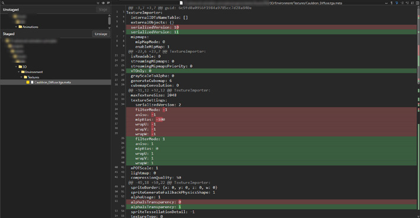
<p><em>VI: <strong>▲ Vì sao <code>.meta</code> PHẢI được commit</strong> — diff của một file <code>.meta</code>: vùng ĐỎ là giá trị cũ, vùng XANH là giá trị mới (<code>maxTextureSize</code>, <code>textureSettings</code>, <code>filterMode</code>, <code>wrapU/wrapV</code>, <code>alphaUsage</code>…). Toàn bộ Import Settings nằm ở đây — mất file này là mất cấu hình asset. / EN: A .meta file diff showing import settings changes.</em></p>

**⚙️ Bật tích hợp VCS trong Editor — nguyên văn / Enabling the built-in integrations**

<div class="bilingual-row">
<div class="col-vi">
<p>🔶 <strong>Perforce Helix Core:</strong> <em>"Tích hợp Unity Editor có sẵn với hầu hết hệ version control, và <strong>tích hợp Perforce Helix Core được XÂY SẴN trong Editor. Bạn chỉ cần BẬT nó qua <code>Edit › Project Settings › Version Control</code>. Đặt Mode thành <code>Perforce</code>, rồi điền thông tin workspace và server.</strong>"</em></p>
<p>🔒 <em>"Khi đã bật, bạn sẽ thấy các file được coi là <strong>\"Under Version Control\", với tuỳ chọn CHECK OUT chúng. Sau khi file được check out, bạn có thể LOCK · UNLOCK · SUBMIT hoặc REVERT file đó. Chọn SUBMIT sẽ mở hộp thoại CHANGESET để bạn thêm commit message trước khi gửi vào repository.</strong> Dùng giao diện Helix P4V để xem lịch sử dự án."</em></p>
<p>🌿 <strong>Plastic SCM — danh sách phiên bản Unity có SẴN tích hợp:</strong></p>
<ul>
<li><strong>2019.4.32f1</strong> trở lên</li>
<li><strong>2020.3.20f1</strong> trở lên</li>
<li><strong>2021.1.25f1</strong> trở lên</li>
<li><strong>2021.2.0b16</strong> trở lên</li>
<li><strong>2022.1.0a12</strong> trở lên</li>
</ul>
<p>👉 <em>"Bạn bật nó bằng cách <strong>bấm icon Plastic SCM trên thanh công cụ GÓC PHẢI TRÊN</strong>, rồi hoàn tất thiết lập bằng cách <strong>KẾT NỐI Plastic SCM với Unity ID, THAM GIA hoặc TẠO một organization, DỰNG hoặc tham gia repository mới, và TẠO workspace.</strong>"</em></p>
<p>🔁 <em>"Ngoài ra, bạn có thể bật qua <strong><code>Edit › Project Settings › Version Control</code> trong Unity 2020 LTS, rồi đặt Mode thành <code>PlasticSCM</code>.</strong>"</em></p>
</div>
<div class="col-en">
<p>🔶 <strong>Perforce Helix Core:</strong> <em>"Unity Editor integration is available with most version control systems, and Perforce Helix Core integration is built into the Editor. You only need to enable it via Edit &gt; Project Settings &gt; Version Control. Set the Mode to Perforce, and fill in the information of your workspace and server settings."</em></p>
<p>🔒 <em>"Once this is enabled, you will see that files are now considered "Under Version Control," with the option to check them out. Once a file is checked out, you can lock, unlock, submit, or revert the file. Choosing to submit will bring up a changeset dialog for you to add your commit message before submitting it into the repository. Use the Helix P4V interface to view the project history."</em></p>
<p>🌿 <strong>Plastic SCM is available built into Unity with any of the below editor versions:</strong></p>
<ul>
<li><strong>2019.4.32f1</strong> or later</li>
<li><strong>2020.3.20f1</strong> or later</li>
<li><strong>2021.1.25f1</strong> or later</li>
<li><strong>2021.2.0b16</strong> or later</li>
<li><strong>2022.1.0a12</strong> or later</li>
</ul>
<p>👉 <em>"You can enable this by clicking the Plastic SCM icon in the toolbar on the top right, then complete your set up by connecting Plastic SCM to your Unity ID, joining or creating an organization, set up or join a new repository, and create your workspace."</em></p>
<p>🔁 <em>"Alternatively, you enable this via Edit &gt; Project Settings &gt; Version Control in Unity 2020 LTS, then set the Mode to PlasticSCM."</em></p>
</div>
</div>

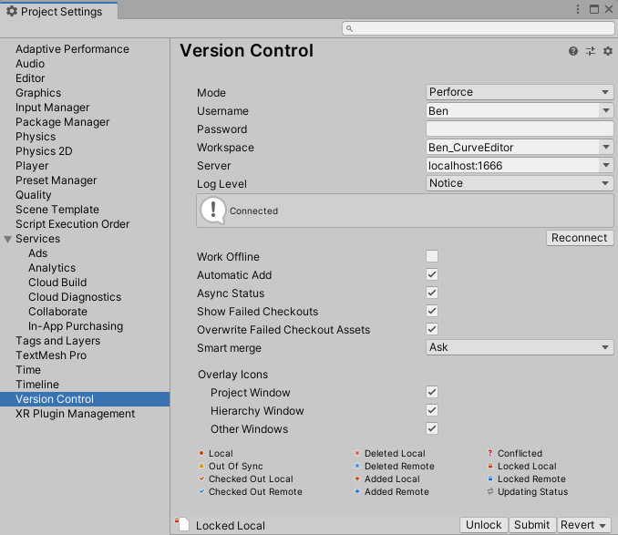 Version Control in Perforce mode.">
<p><em>VI: <strong>▲ Chế độ Perforce</strong> — <code>Project Settings › Version Control</code> với <strong>Mode: Perforce</strong>, các ô <strong>Username · Password · Workspace · Server (localhost:1666) · Log Level: Notice</strong> và nút <strong>Reconnect</strong>; nhóm tuỳ chọn có <strong>Work Offline · Automatic Add · Async Status · Show Failed Checkouts · Overwrite Failed Checkout Assets · Smart merge: Ask</strong>; dưới cùng là <strong>bảng chú giải Overlay Icons</strong> (Local · Out Of Sync · Checked Out Local/Remote · Deleted Local/Remote · Added Local/Remote · Conflicted · Locked Local/Remote · Updating Status). / EN: Project Settings > Version Control in Perforce mode.</em></p>

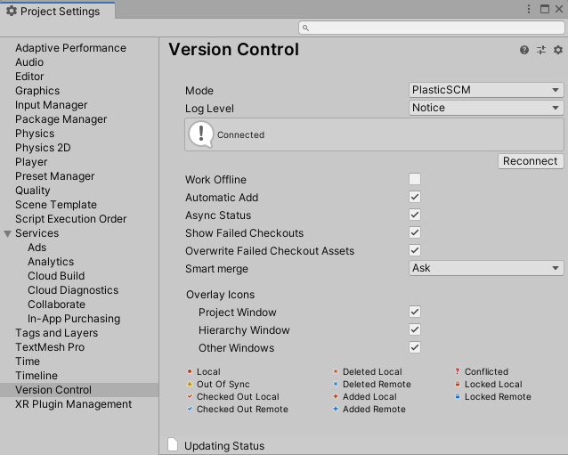 Version Control in PlasticSCM mode.">
<p><em>VI: <strong>▲ Chế độ PlasticSCM</strong> — cùng bảng đó với <strong>Mode: PlasticSCM</strong>; các <strong>Overlay Icons</strong> hiển thị ở <strong>Project Window · Hierarchy Window · Other Windows</strong>. / EN: Project Settings > Version Control in PlasticSCM mode.</em></p>

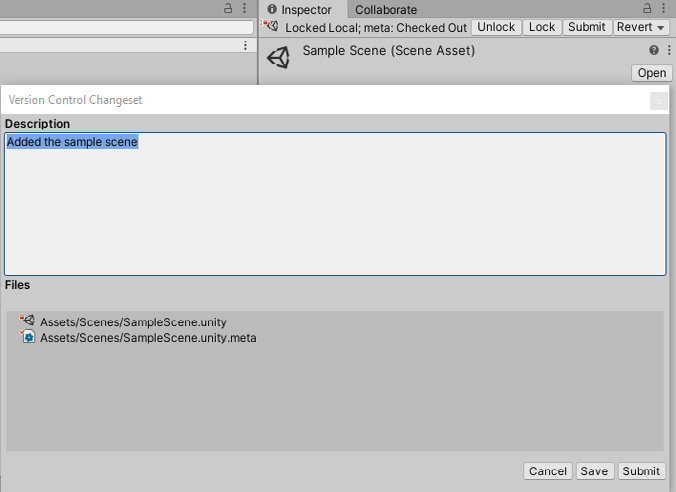
<p><em>VI: <strong>▲ Trạng thái khoá NGAY TRONG Editor</strong> — thanh trên ghi <strong>Locked Local; meta: Checked Out</strong> với các nút <strong>Unlock · Lock · Submit · Revert</strong>; hộp thoại <strong>Version Control Changeset</strong> bên dưới cho nhập <em>Description</em> ("Added the sample scene") và liệt kê <strong>Files: Assets/Scenes/SampleScene.unity</strong> + <strong>.meta</strong> — <strong>file và .meta LUÔN đi CẶP.</strong> / EN: Checked-out state and the Version Control Changeset dialog inside Unity.</em></p>

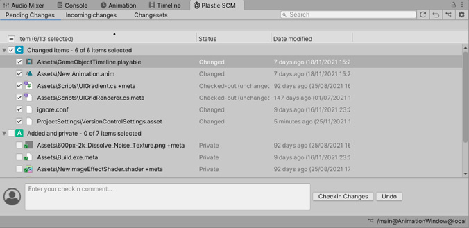
<p><em>VI: <strong>▲ Tab Plastic SCM trong Unity — <em>Pending Changes</em></strong>: <strong>Changed items — 6 of 6 items selected</strong> với cột <strong>Status</strong> (<em>Changed</em>, <em>Checked-out unchanged</em>) và <strong>Date modified</strong>; nhóm <strong>Added and private — 0 of 7 items selected</strong> gồm các file <em>Private</em>. Ô nhập <strong>checkin comment</strong> + nút <strong>Checkin Changes</strong> / <strong>Undo</strong> ở dưới. / EN: The Plastic SCM Pending Changes tab inside the Unity Editor.</em></p>

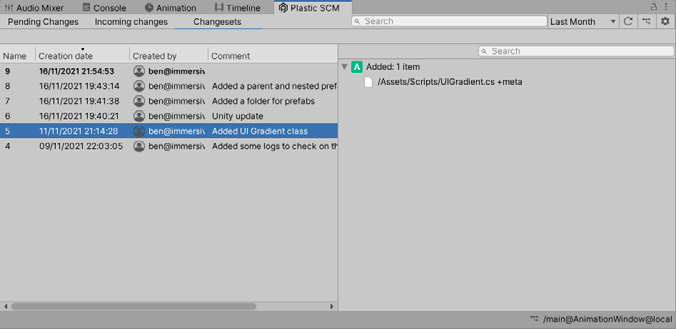
<p><em>VI: <strong>▲ Tab <em>Changesets</em></strong> — lịch sử với <strong>Creation date · Created by · Comment</strong> ("Added a parent and nested pref…", "Added a folder for prefabs", "Added UI Gradient class", "Added some logs to check on th…"), và khung phải liệt kê file của changeset đang chọn. / EN: The Plastic SCM Changesets tab.</em></p>

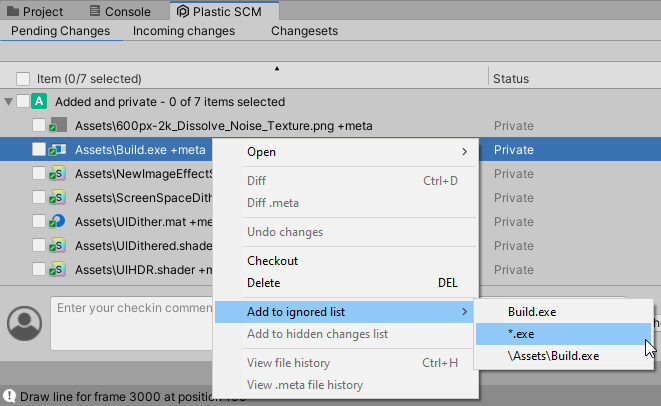
<p><em>VI: Có thể thêm file vào danh sách BỎ QUA <strong>ngay trong Unity Editor</strong> khi dùng Plastic SCM. / EN: Files can be added to the ignored list directly from the Unity Editor when using Plastic SCM.</em></p>

<div class="bilingual-row">
<div class="col-vi">
<p>🚨 <strong>Quy tắc VÀNG về thư mục:</strong></p>
<blockquote>
<p><em>"Chỉ có <strong><code>Assets</code></strong> và <strong><code>ProjectSettings</code></strong> là NÊN được commit vào repository. <strong>Unity có thể TỰ ĐỘNG TÁI TẠO mọi thư mục khác.</strong></em></p>
<p><em>💀 <strong>TUYỆT ĐỐI KHÔNG BAO GIỜ commit thư mục <code>Library</code>, vì thư mục này có thể trở nên RẤT LỚN và Unity SẼ TÁI TẠO nó khi khởi động Editor nếu nó không tồn tại.</strong>"</em></p>
</blockquote>
<p><strong>Cách làm theo từng VCS:</strong></p>
<ul>
<li><strong>Perforce</strong> — <em>"bạn cần <strong>THÊM TƯỜNG MINH thư mục <code>Assets</code> và <code>Project Settings</code> vào depot</strong>"</em></li>
<li><strong>Plastic SCM</strong> — <em>"<strong>TỰ ĐỘNG chọn thư mục và file phù hợp</strong> khi được thiết lập từ Unity Editor. Có một danh sách lưu trong file <strong><code>ignore.conf</code></strong> ở gốc dự án"</em></li>
<li><strong>Git</strong> — <em>"đòi hỏi file <strong><code>.gitignore</code></strong> để chỉ ra file nào KHÔNG BAO GIỜ được đưa vào"</em></li>
</ul>
<p>⚠️ <em>"Bạn cũng nên <strong>TRÁNH commit những thứ như file <code>.exe</code> hay <code>.apk</code>. Ngoài ra, dự án GRADLE và XCODE được build ra từ dự án Unity KHÔNG NÊN được thêm vào repository.</strong> Ngoại lệ nhỏ: nếu bạn thiết lập quy trình BUILD TỰ ĐỘNG cho chúng, <strong>thì chúng thường được commit vào MỘT REPOSITORY RIÊNG.</strong>"</em></p>
</div>
<div class="col-en">
<p>🚨 <strong>The GOLDEN RULE about folders:</strong></p>
<blockquote>
<p><em>"Only <strong><code>Assets</code></strong> and <strong><code>ProjectSettings</code></strong> folders should be committed to your repository. <strong>Unity can AUTOMATICALLY RECREATE all the other folders.</strong></em></p>
<p><em>💀 <strong>UNDER NO CIRCUMSTANCE should you commit the <code>Library</code> folder, since this folder can get VERY LARGE and Unity WILL RECREATE it when launching the Editor if it doesn't exist.</strong>"</em></p>
</blockquote>
<p><strong>Per-VCS setup:</strong></p>
<ul>
<li><strong>Perforce</strong> — <em>"you need to <strong>EXPLICITLY ADD the <code>Assets</code> and <code>Project Settings</code> folders to your depot</strong>"</em></li>
<li><strong>Plastic SCM</strong> — <em>"<strong>AUTOMATICALLY SELECTS the appropriate folders and files</strong> when set up from the Unity Editor. There is a list saved in the <strong><code>ignore.conf</code></strong> file at the project root"</em></li>
<li><strong>Git</strong> — <em>"requires a <strong><code>.gitignore</code></strong> file to indicate what files should NEVER be included"</em></li>
</ul>
<p>⚠️ <em>"You should also <strong>AVOID committing things like <code>.exe</code> or <code>.apk</code> files. Additionally, GRADLE and XCODE projects built from your Unity project SHOULD NOT be added to the repository.</strong> A small exception: if you set up AUTOMATED BUILD processes for them, <strong>they would typically be committed to a repository OF THEIR OWN.</strong>"</em></p>
</div>
</div>

!!! danger "🐘 FILE LỚN — vì sao Git một mình là KHÔNG ĐỦ cho dự án Unity"
    <div class="bilingual-row">
    <div class="col-vi">
    <blockquote>
    <p><em>"Dự án Unity gồm <strong>NHIỀU HƠN CHỈ code. Thực tế, script thường bị ÁP ĐẢO VỀ SỐ LƯỢNG bởi các file asset khác.</strong> Những asset này được lưu dưới dạng <strong>FILE NHỊ PHÂN</strong>: Texture, model, Prefab, audio clip, timeline… Điều này dẫn tới HAI hệ quả:</em></p>
    <ol>
    <li><em><strong>"Chúng KHÓ SO SÁNH giữa các revision"</strong></em></li>
    <li><em>💀 <strong>"KHÔNG THỂ mô tả DIFF, nên TOÀN BỘ FILE được ghi lại khi một thay đổi được đẩy lên repo"</strong></em></li>
    </ol>
    <p><em>☠️ <strong>Trong môi trường PHÂN TÁN, TOÀN BỘ lịch sử dự án nằm trên máy cục bộ. NẾU bạn có lịch sử các file LỚN đã thay đổi NHIỀU LẦN trong thời gian DÀI, thì bạn sẽ có BẤY NHIÊU BẢN SAO của file đó lưu trên máy. Việc này có thể NGỐN NHANH CHÓNG một phần LỚN dung lượng ổ cứng!</strong></em></p>
    <p><em>📜 <strong>ĐÂY LÀ LÝ DO LỊCH SỬ khiến các đội THÍCH workflow TẬP TRUNG hơn: các phiên bản lịch sử LỚN của file nhị phân CHỈ nằm trên SERVER TRUNG TÂM, còn người dùng cá nhân chỉ truy cập PHIÊN BẢN MỚI NHẤT trên máy mình.</strong></em></p>
    </blockquote>
    <p><strong>Giải pháp theo từng hệ thống:</strong></p>
    <ul>
    <li>✅ <strong>Perforce và Plastic SCM</strong> — <em>"đều là hệ TẬP TRUNG và <strong>XỬ LÝ TỐT file LỚN</strong>. Plastic SCM còn cho tuỳ chọn làm việc theo pipeline PHÂN TÁN"</em></li>
    <li>💎 <strong>Plastic SCM — Dynamic Workspace</strong> — <em>"dựa trên <strong>HỆ THỐNG FILE ẢO</strong>: nó <strong>TẢI file THEO YÊU CẦU — nên trong khi bạn THẤY MỌI THỨ trong workspace, THỰC TẾ KHÔNG PHẢI mọi thứ đều đã được tải về</strong>"</em></li>
    <li>⚠️ <strong>Git</strong> — <em>"vì phân tán, <strong>có thể CHẬT VẬT với file LỚN. HÃY CHẮC CHẮN dùng thêm GIT LFS nếu bạn làm việc với file lớn. Git LFS THAY THẾ file lớn trong thư mục <code>.git</code> bằng CON TRỎ VĂN BẢN, còn asset thật được lưu trên server như GitHub</strong>"</em></li>
    </ul>
    </div>
    <div class="col-en">
    <blockquote>
    <p><em>"Unity projects are made up of <strong>A LOT MORE than just code. In fact, scripts can often be HEAVILY OUTNUMBERED by other asset files.</strong> These assets are stored as <strong>BINARY FILES</strong>: Textures, models, Prefabs, audio clips, timelines, and so on. This results in TWO things:</em></p>
    <ol>
    <li><em><strong>"They can be HARD TO COMPARE between revisions"</strong></em></li>
    <li><em>💀 <strong>"The DIFF CANNOT be described, so THE WHOLE FILE IS WRITTEN when a change is pushed to the repo"</strong></em></li>
    </ol>
    <p><em>☠️ <strong>In a DISTRIBUTED environment, the ENTIRE project history is on a user's local machine. Now if you have a history of LARGE FILES that have had MANY CHANGES over a LONG TIME, then you will have THAT MANY COPIES of the file stored on your machine. This can QUICKLY CONSUME a LARGE PORTION of your hard drive space!</strong></em></p>
    <p><em>📜 <strong>It's for THIS REASON that HISTORICALLY, teams PREFERRED a CENTRALIZED workflow. This way, large historical versions of binary files would ONLY live on a CENTRAL SERVER, with individual users only accessing the LATEST version on their machines.</strong></em></p>
    </blockquote>
    <p><strong>Per-system solutions:</strong></p>
    <ul>
    <li>✅ <strong>Perforce and Plastic SCM</strong> — <em>"are both CENTRALIZED systems that <strong>HANDLE LARGE FILES WELL</strong>. Plastic SCM also gives the option to work in a DISTRIBUTED pipeline"</em></li>
    <li>💎 <strong>Plastic SCM — Dynamic Workspace</strong> — <em>"relies on a <strong>VIRTUAL FILESYSTEM</strong>: it <strong>DOWNLOADS FILES ON DEMAND — so, while you SEE everything in your workspace, IN REALITY NOT EVERYTHING is downloaded</strong>"</em></li>
    <li>⚠️ <strong>Git</strong> — <em>"being distributed, <strong>can STRUGGLE with LARGE FILES. BE SURE to also include GIT LFS if you will be working with large files. Git LFS REPLACES your large files in the <code>.git</code> folder with TEXT POINTERS while storing the actual asset on a server such as GitHub</strong>"</em></li>
    </ul>
    </div>
    </div>

---

## 62. ✅ Bảy thông lệ TỐT NHẤT về Version Control

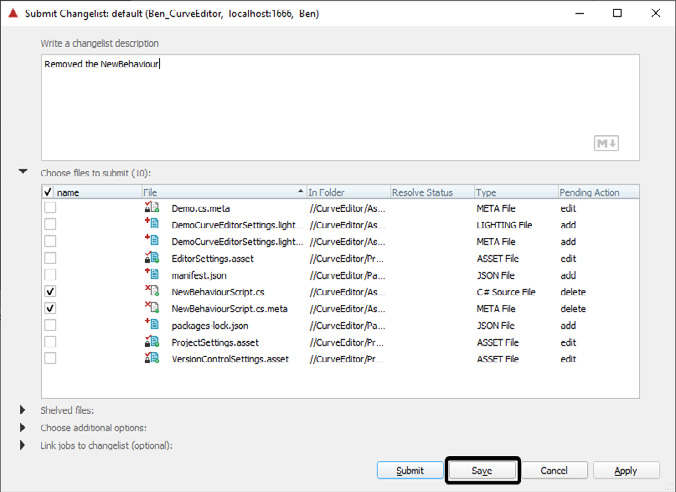
<p><em>VI: <strong>▲ CHỌN file khi commit — chứ KHÔNG <code>commit -a</code></strong>. Hộp thoại <em>Submit Changelist</em> của P4V: ô <strong>changelist description</strong> ở trên, bảng <strong>Choose files to submit</strong> ở dưới với cột <strong>File · In Folder · Resolve Status · Type · Pending Action</strong> (edit / add / delete). Ở đây CHỈ hai file được tick. / EN: The P4V Submit Changelist dialog with only two files ticked.</em></p>

<div class="bilingual-row">
<div class="col-vi">
<p>📋 <em>"Những mẹo này đến từ <strong>ĐỘI HỖ TRỢ DOANH NGHIỆP của Unity — những người đang giúp tối ưu các dự án THỰC TẾ cho MỘT SỐ studio LỚN NHẤT hiện nay.</strong>"</em></p>
</div>
<div class="col-en">
<p>📋 <em>"These tips come from the <strong>Unity ENTERPRISE SUPPORT TEAM, who are helping to optimize REAL-WORLD projects for some of the BIGGEST STUDIOS out there.</strong>"</em></p>
</div>
</div>

| # | Thông lệ | Nội dung nguyên văn |
|---|---|---|
| **①** | **Commit ÍT, commit THƯỜNG XUYÊN** | *"Đây là **THAY ĐỔI DỄ NHẤT bạn có thể làm với workflow, NHƯNG lại là thứ MỘT SỐ lập trình viên CHẬT VẬT NHẤT.** 🔑 **Một commit CHỈ nên liên quan tới MỘT TASK hoặc MỘT TICKET** — trừ khi một dòng code THẦN KỲ sửa được vài bug. **Nếu bạn đang làm tính năng LỚN, hãy CHIA NHỎ thành các task nhỏ và commit cho từng task.** ✅ **Lợi thế LỚN NHẤT của commit nhỏ: khi có gì đó SAI, bạn sẽ TÌM RA thay đổi DỄ HƠN NHIỀU và có thể REVERT thay đổi xấu MÀ KHÔNG ảnh hưởng các thay đổi tốt khác.**"* |
| **②** | **Giữ COMMIT MESSAGE SẠCH SẼ** | *"**Commit message MÔ TẢ LỊCH SỬ dự án của bạn.** 📖 **DỄ TÌM hơn NHIỀU nếu message là "Added high score tables to the menu" chứ KHÔNG PHẢI "bet you can't beat my score on these new tables!"** 💡 **Khi làm việc với hệ thống ticket như JIRA hay GitLab, càng TỐT HƠN nếu ĐƯA SỐ TICKET vào commit.**"* <br>🎫 *"**Nhiều hệ thống có thể thiết lập để hoạt động cùng SMART COMMIT — trong đó bạn THỰC SỰ THAM CHIẾU ticket và ĐỔI TRẠNG THÁI của chúng NGAY TỪ commit message.**"*<br>💡 *"**Ví dụ, commit `"JRA-123 #close #comment task completed"` sẽ ĐẶT ticket JIRA JRA-123 thành ĐÃ ĐÓNG, và để lại bình luận "task completed" trên ticket đó.**"*<br>📚 *"Để thiết lập workflow này, xem tài liệu của **JIRA** hoặc dịch vụ **Pivotal Tracker** trong GitLab."* |
| **③** | **TRÁNH commit BỪA BÃI** | 💀 *"**Lần DUY NHẤT nên dùng `commit -a` (lệnh git nghĩa là "commit MỌI thay đổi") hoặc các lệnh tương đương là ở COMMIT ĐẦU TIÊN của dự án — thường là khi file duy nhất trong dự án là `README.md`.**"*<br>🎯 *"**Một commit CHỈ NÊN chứa những file LIÊN QUAN tới thay đổi bạn đang commit.** ⚠️ **PHẢI ĐẶC BIỆT cẩn thận khi làm việc với dự án Unity, vì MỘT SỐ thay đổi có thể khiến VÀI file bị đánh dấu là ĐÃ THAY ĐỔI — như scene, prefab hay sprite atlas — DÙ BẠN KHÔNG HỀ ĐỊNH sửa chúng.**"*<br>😱 *"**NẾU bạn LỠ TAY commit một thay đổi vào scene mà NGƯỜI KHÁC đang làm, việc đó có thể gây ĐAU ĐẦU cho họ khi họ commit và phát hiện phải merge thay đổi của bạn TRƯỚC.**"*<br>🚨 *"**Đây là MỘT TRONG NHỮNG LỖI PHỔ BIẾN NHẤT của người MỚI dùng version control. Quan trọng là phải hiểu: bạn CHỈ NÊN commit thứ BẠN đã thay đổi trong dự án.**"* |
| **④** | **LẤY BẢN MỚI NHẤT** | *"**THƯỜNG XUYÊN NHẤT có thể, hãy PULL thay đổi mới nhất từ repo về bản làm việc. KHÔNG TỐT khi làm việc trong SỰ CÔ LẬP, vì việc này CHỈ LÀM TĂNG khả năng XUNG ĐỘT MERGE.**"* → xem bảng workflow dưới |
| **⑤** | **HIỂU RÕ BỘ CÔNG CỤ của bạn** | *"**Dù đội bạn chọn VCS nào, hãy ĐẢM BẢO cả đội THOẢI MÁI dùng nó và HIỂU các công cụ có sẵn.** 🎨 **Nếu dùng Plastic SCM, hãy để NGHỆ SĨ làm quen với GLUON để đơn giản hoá workflow của họ. Gluon cho phép QUYẾT ĐỊNH file nào muốn làm việc và CHỈ TẢI VỀ những file đó — loại bỏ nhu cầu tải và quản lý TOÀN BỘ dự án. Nó cho phép KHOÁ file để ngăn người khác làm việc trên đó.** 🛠️ **Nếu dùng Perforce Helix Core, hãy dùng công cụ DỰNG SẴN trong Unity Editor để quản lý version control TRỰC TIẾP TỪ Editor** — cực kỳ hữu ích cho nghệ sĩ và cho việc xử lý scene, Prefab."* <br>🐙 *"**NẾU bạn dùng Git, KHÔNG PHẢI ai cũng cần dùng CÙNG MỘT GUI client. NHƯNG hãy đảm bảo MỌI NGƯỜI đều THOẢI MÁI với quy trình `commit > pull > push`, và họ BIẾT CÁCH chỉ commit đúng những file mình cần.**"*<br>🎨 *"…và **khi xong việc, người dùng SUBMIT file trở lại repository và MỞ KHOÁ chúng.**"* |
| **⑥** | **FEATURE BRANCH & GIT FLOW** | *"Khi làm dự án DÀI HẠN với NHIỀU CHU KỲ PHÁT HÀNH, **feature branching có LỢI ÍCH KHỔNG LỒ.** … **Trong Git, workflow gọi là GIT FLOW tập trung vào việc dùng các BRANCH KHÁC NHAU cho TÍNH NĂNG, SỬA LỖI và PHÁT HÀNH.**"* |
| **⑦** | **PULL REQUEST** | *"Khi hoàn thành công việc trên feature branch, **thông lệ TỐT là dùng pull request để đưa thay đổi về dòng chính. Pull request được TẠO bởi lập trình viên của tính năng, và THƯỜNG là trách nhiệm của SENIOR DEVELOPER hoặc DEVOPS để REVIEW trước khi chấp nhận.**"* |

**🔄 Workflow HÀNG NGÀY theo từng hệ thống — nguyên văn**

| **Git** | **Perforce** |
|---|---|
| `git pull` → rồi lặp lại tuỳ ý:<br>· *Make edits in your working copy*<br>· `git commit` your changes<br>· `git pull` the latest changes<br><br>Khi đã hài lòng với tập commit:<br>· `git pull` **MỘT LẦN NỮA**<br>· `git push` để gửi commit lên repo | · **Get latest**<br>· **Check out** files to work on<br>· **Make edits**<br>· **Submit changes** |

| **Plastic SCM (centralized)** | **Plastic SCM (distributed)** | **Plastic SCM (multi-site)** |
|---|---|---|
| · Sync Repositories → **Pull visible**<br>· Check out files to work on<br>· Make edits<br>· Check in changes<br>· Sync Repositories → **Push visible** | · Pull changes from the server<br>· Check in changes to your **local copy**<br>· Pull any new changes<br>· Push your changes back up to the server | *"**Một dạng LAI của hai cái trên, tuỳ cấu hình của bạn**"* |

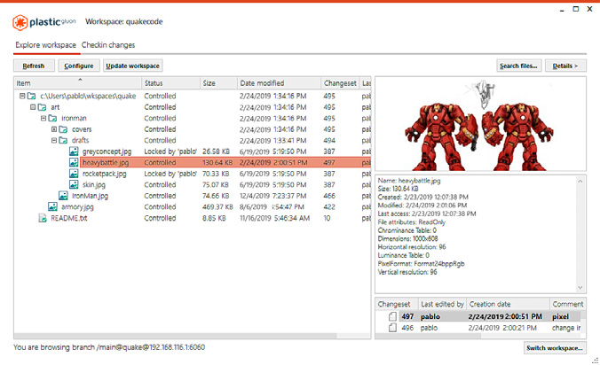
<p><em>VI: Cấu hình <strong>MULTI-SITE</strong> của Plastic SCM — hai địa điểm (Boecillo và London), <strong>mỗi đội có server TẠI CHỖ</strong>, các server <strong>push/pull lẫn nhau qua internet</strong> để đồng bộ. / EN: Multi-site Plastic SCM configuration.</em></p>

<div class="bilingual-row">
<div class="col-vi">
<blockquote>
<p><em>"Ví dụ cấu hình multi-site: <strong>HAI đội · MỖI đội có MỘT server tại chỗ · Thành viên ở CẢ HAI nơi check in CỤC BỘ hoặc PHÂN TÁN nhưng HƯỞNG LỢI từ TỐC ĐỘ của server GẦN · Các server PUSH/PULL LẪN NHAU để giữ đồng bộ TOÀN PHẦN hoặc MỘT PHẦN.</strong>"</em></p>
</blockquote>
</div>
<div class="col-en">
<blockquote>
<p><em>"An example multi-site setup: <strong>TWO teams · EACH team has an ON-SITE server · Team members at BOTH sites check in LOCALLY or DISTRIBUTED but BENEFIT from the SPEED of a CLOSE on-site server · Servers PUSH/PULL between one another to keep FULLY or PARTIALLY in sync.</strong>"</em></p>
</blockquote>
</div>
</div>

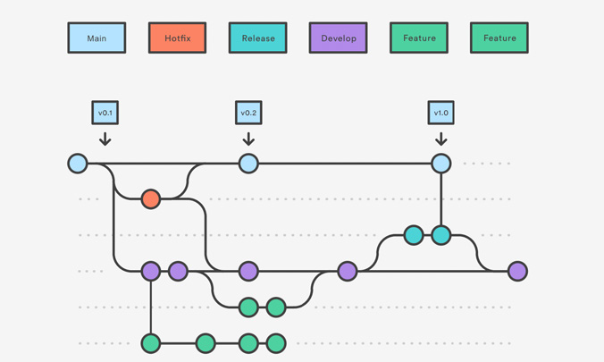
<p><em>VI: <strong>Git Flow</strong> — sáu loại branch: <strong>Main · Hotfix · Release · Develop · Feature · Feature</strong>, với các mốc phát hành <strong>v0.1 → v0.2 → v1.0</strong>. Cho phép QUẢN LÝ PHÁT HÀNH dễ hơn. / EN: A Git Flow workflow allows for easier release management.</em></p>

<div class="bilingual-row">
<div class="col-vi">
<blockquote>
<p><em>"Một lập trình viên <strong>BẮT ĐẦU công việc trên tính năng mới TRONG MỘT BRANCH CÔ LẬP, và khi xong, nó được MERGE lại vào branch chính.</strong> Trong khi đó, <strong>người khác có thể phải HOTFIX trên bản phát hành TRƯỚC, sửa một bug, và phát hành phiên bản mới MỘT CÁCH AN TOÀN — MÀ KHÔNG kèm theo bất kỳ tính năng nào VẪN ĐANG PHÁT TRIỂN.</strong>"</em></p>
</blockquote>
<p>🔀 <strong>Plastic SCM — TASK BRANCH (khác Git Flow):</strong></p>
<blockquote>
<p><em>"Plastic SCM cũng có <strong>TASK BRANCH. Với mẫu này, bạn tạo MỘT BRANCH MỚI cho MỖI TASK bạn theo dõi.</strong></em></p>
<p><em>⚖️ <strong>Trong khi ở Git Flow ta dùng feature branch để phát triển tính năng HOÀN CHỈNH, đôi khi LỚN, thì TASK BRANCH trong Plastic SCM có nghĩa là NGẮN HẠN. NẾU một task cần NHIỀU HƠN một nhúm commit để cài đặt, khả năng cao nó CÓ THỂ ĐƯỢC CHIA NHỎ thành các task nhỏ hơn.</strong>"</em></p>
</blockquote>
<p>🌊 <strong>Perforce — STREAMS:</strong></p>
<blockquote>
<p><em>"Perforce Helix Core dùng hệ thống gọi là <strong>STREAMS</strong>. Khi tạo depot, <strong>bạn cần thiết lập nó là kiểu STREAM DEPOT. Rồi dùng Stream Graph view để tạo stream mới. MỌI stream ngoài mainline stream đều PHẢI CÓ MỘT STREAM CHA, để thay đổi có thể được sao chép NGƯỢC LÊN.</strong></em></p>
<p><em>⚡ <strong>Khi bạn CHUYỂN giữa các stream trên máy hoặc sao chép thay đổi ngược lên, CHỈ METADATA của file đã thay đổi được merge — khiến việc ĐỔI NGỮ CẢNH NHANH HƠN.</strong>"</em></p>
</blockquote>
</div>
<div class="col-en">
<blockquote>
<p><em>"A developer <strong>STARTS OUT work on a new feature INSIDE AN ISOLATED BRANCH, and when they're finished, it's MERGED BACK into the main branch.</strong> Meanwhile, <strong>someone else may have had to do a HOTFIX on the PREVIOUS release, fixed a bug, and released a new version SAFELY — WITHOUT any of the features STILL UNDER DEVELOPMENT being included.</strong>"</em></p>
</blockquote>
<p>🔀 <strong>Plastic SCM — TASK BRANCHES (different from Git Flow):</strong></p>
<blockquote>
<p><em>"Plastic SCM also features <strong>TASK BRANCHES. For this pattern, you create a NEW BRANCH for EVERY TASK that you track.</strong></em></p>
<p><em>⚖️ <strong>While in Git Flow we use feature branches to develop COMPLETE, sometimes LARGE features, TASK BRANCHES in Plastic SCM are meant to be SHORT-LIVED. If a task takes MORE THAN a handful of commits to implement, ODDS ARE it could be BROKEN DOWN into smaller tasks.</strong>"</em></p>
</blockquote>
<p>🌊 <strong>Perforce — STREAMS:</strong></p>
<blockquote>
<p><em>"Perforce Helix Core uses a system called <strong>STREAMS</strong>. When creating a depot, <strong>you need to set it up as a STREAM DEPOT type. Then use the Stream Graph view to create new streams. EVERY stream other than the mainline stream will need to have a PARENT STREAM, so changes can be COPIED BACK UP-STREAM.</strong></em></p>
<p><em>⚡ <strong>When you SWITCH between streams on your local workstation or copy changes back upstream, ONLY THE METADATA for changed files gets merged — making the CONTEXT CHANGE QUICKER.</strong>"</em></p>
</blockquote>
</div>
</div>

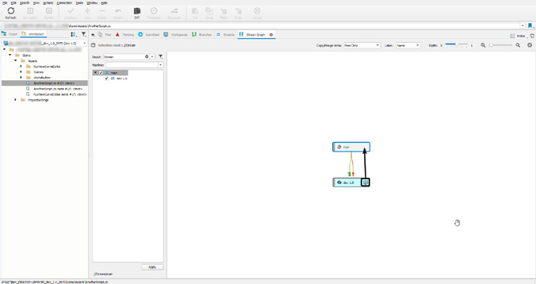
<p><em>VI: Workflow <strong>Perforce Helix Streams</strong> — biểu tượng desktop có thể KÉO giữa các stream để đổi workspace. <strong>Mũi tên XANH đi XUỐNG từ main</strong> = có thay đổi cần đưa vào stream <em>dev 1.0</em>. <strong>Mũi tên ĐỎ đi LÊN main</strong> = KHÔNG THỂ copy lên main cho tới khi ta có bản mới nhất. / EN: Perforce Helix Streams workflow.</em></p>

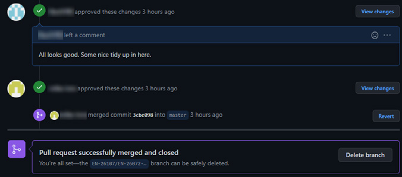
<p><em>VI: Một pull request ĐÃ ĐÓNG trên GitHub. / EN: A closed pull request on GitHub.</em></p>

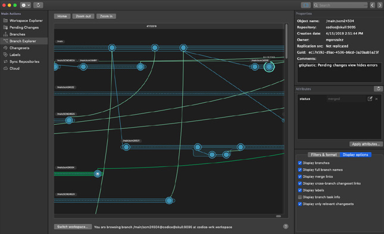
<p><em>VI: <strong>Branch Explorer</strong> của Plastic SCM — trực quan hoá toàn bộ cây branch/changeset, kèm panel Properties và các tuỳ chọn hiển thị (<em>Display branches · Display full branch names · Display merge links · Display cross-branch changeset links · Display labels…</em>). / EN: The Plastic SCM Branch Explorer.</em></p>

<div class="bilingual-row">
<div class="col-vi">
<p>🤖 <em>"<strong>Plastic SCM và Perforce ĐỀU có công cụ TỰ ĐỘNG để giúp quản lý việc merge branch về mainline. Plastic SCM làm điều đó với sự trợ giúp của MERGEBOT — thứ TỰ ĐỘNG merge các branch của repo SAU KHI chúng đã được review và VƯỢT QUA kiểm định. Perforce có nền tảng bổ sung là HELIX SWARM để quản lý code review, cũng có thể thiết lập kèm KIỂM THỬ TỰ ĐỘNG.</strong>"</em></p>
<p>🎓 <strong>Lời kết của e-book:</strong></p>
<blockquote>
<p><em>"<strong>ĐIỀU RÚT RA LỚN NHẤT là TẦM QUAN TRỌNG của GIAO TIẾP RÕ RÀNG TRONG ĐỘI.</strong> Là một đội, <strong>bạn cần THỐNG NHẤT các hướng dẫn: CẤU TRÚC dự án thế nào, dùng VCS NÀO, và WORKFLOW trong hệ thống đó trông ra sao.</strong></em></p>
<p><em>✅ <strong>Rồi, khi bạn bắt đầu tích hợp các công cụ khác như JIRA, GitLab, công cụ build, hay kiểm thử tự động, thì CÔNG SỨC BẠN ĐÃ BỎ RA để cấu trúc dự án và workflow SẼ THỰC SỰ PHÁT HUY GIÁ TRỊ.</strong>"</em></p>
</blockquote>
</div>
<div class="col-en">
<p>🤖 <em>"<strong>Plastic SCM and Perforce BOTH have AUTOMATED TOOLS to help manage merging branches back into the mainline. Plastic SCM does this with the help of MERGEBOT, which AUTOMATICALLY MERGES branches of a repo ONCE they've been reviewed and PASSED VALIDATION. Perforce has an additional platform, HELIX SWARM, for managing code reviews that can also be set up with AUTOMATED TESTING.</strong>"</em></p>
<p>🎓 <strong>The e-book's closing words:</strong></p>
<blockquote>
<p><em>"<strong>The BIGGEST TAKEAWAY is the IMPORTANCE of CLEAR TEAM COMMUNICATION.</strong> As a team, <strong>you need to AGREE on your guidelines: how you should STRUCTURE your project, WHICH version control system to use, and how your WORKFLOW in that system looks.</strong></em></p>
<p><em>✅ <strong>Then, when you start integrating other tools such as JIRA, GitLab, build tools, or automated testing, the work you've ALREADY DONE structuring your project and workflow WILL REALLY COME INTO ITS OWN.</strong>"</em></p>
</blockquote>
</div>
</div>

---

# PHẦN I — 70+ MẸO TĂNG NĂNG SUẤT (E-book 62 trang)

> 📗 **Nguồn:** [***70+ tips to increase productivity with Unity 2020 LTS***, **62 trang**](https://create.unity3d.com/ebook-improve-workflow) — bóc tách toàn văn + trích ảnh.

<div class="bilingual-row">
<div class="col-vi">
<blockquote>
<p><em>"Hướng dẫn này giúp người dùng Unity <strong>TIẾT KIỆM THỜI GIAN và TĂNG NĂNG SUẤT với HƠN 70 MẸO về cách làm việc NHANH HƠN với bộ công cụ của lập trình viên và nghệ sĩ, dù CÁ NHÂN hay THEO ĐỘI.</strong></em></p>
<p><em>🏢 Nhiều đội tại Unity làm việc để cải thiện chất lượng cuộc sống cho người dùng, như <strong>đội ACCELERATE SOLUTIONS — những người đã đóng góp kiến thức GIÁ TRỊ cho hướng dẫn này. Họ XÁC ĐỊNH và GIÚP TỐI ƯU các điểm QUAN TRỌNG trong dự án về TỐC ĐỘ, ỔN ĐỊNH và HIỆU SUẤT.</strong>"</em></p>
</blockquote>
<p>💬 <strong>Triết lý — lời của Aras Pranckevičius</strong>, một trong những kỹ sư ĐẦU TIÊN của Unity, trưởng nhóm Quality of Life:</p>
<blockquote>
<p><em>"<strong>Unity nên là một NIỀM VUI khi sử dụng. Khi HÀNG TRIỆU người dùng lặp lại một tác vụ NHIỀU LẦN MỖI NGÀY, MỖI GIÂY hay MỖI CÚ CLICK CHUỘT ĐỀU CỘNG DỒN. Chúng tôi muốn người sáng tạo LÃNG PHÍ ÍT THỜI GIAN HƠN và NĂNG SUẤT HƠN.</strong>"</em></p>
</blockquote>
<p>🎯 <em><strong>Vì sao chương này thuộc về Module 5:</strong> ba Module đầu tối ưu <strong>GAME</strong>. Chương này tối ưu <strong>NGƯỜI LÀM GAME</strong> — thứ mà một Tech Lead chịu trách nhiệm ngang bằng.</em></p>
</div>
<div class="col-en">
<blockquote>
<p><em>"This guide helps Unity creators <strong>SAVE TIME and BOOST PRODUCTIVITY with OVER 70 TIPS on how to work FASTER with programmer and artist toolsets, INDIVIDUALLY or ON A TEAM.</strong></em></p>
<p><em>🏢 Many teams at Unity work to improve quality of life for creators, such as the <strong>ACCELERATE SOLUTIONS team who contributed their VALUABLE KNOWLEDGE to this guide. They IDENTIFY, and HELP TO OPTIMIZE, CRITICAL POINTS in projects for SPEED, STABILITY, and EFFICIENCY.</strong>"</em></p>
</blockquote>
<p>💬 <strong>The philosophy — in the words of Aras Pranckevičius</strong>, one of Unity's FIRST engineers and leader of the Quality of Life team:</p>
<blockquote>
<p><em>"<strong>Unity should be a JOY to use. When MILLIONS of users REPEAT a task MULTIPLE TIMES PER DAY, EVERY SECOND or MOUSE CLICK ADDS UP. We want creators to WASTE LESS TIME and be MORE PRODUCTIVE.</strong>"</em></p>
</blockquote>
<p>🎯 <em><strong>Why this chapter belongs in Module 5:</strong> the first three modules optimize the <strong>GAME</strong>. This one optimizes the <strong>PEOPLE MAKING the game</strong> — something a Tech Lead is equally responsible for.</em></p>
</div>
</div>

## 63. ⌨️ Editor workflows — Shortcuts Manager & phím tắt

<div class="bilingual-row">
<div class="col-vi">
<blockquote>
<p><em>"<strong>SHORTCUTS MANAGER là GIAO DIỆN TRỰC QUAN TƯƠNG TÁC giúp bạn QUẢN LÝ phím nóng của Editor.</strong> Ở đây bạn có thể <strong>GÁN phím tắt cho các NGỮ CẢNH (context) KHÁC NHAU và TRỰC QUAN HOÁ các binding hiện có.</strong></em></p>
<p><em>⚠️ <strong>Danh mục BINDING CONFLICTS cũng XÁC ĐỊNH liệu bạn có phím tắt gán cho HAI LỆNH có thể thực thi CÙNG LÚC hay không.</strong></em></p>
<p><em>💡 <strong>Lưu ý: bạn CÓ THỂ gán CÙNG một phím tắt cho NHIỀU LỆNH NẾU chúng ở NGỮ CẢNH KHÁC NHAU và KHÔNG THỂ thực thi cùng lúc.</strong>"</em></p>
</blockquote>
<p>📍 <strong>Mở Shortcuts Manager:</strong> Windows/Linux → <code>Edit &gt; Shortcuts</code> · macOS → <code>Unity &gt; Shortcuts</code></p>
<p>🛠️ <em>"Dùng API trong namespace <strong><code>UnityEditor.ShortcutManagement</code></strong> để định nghĩa phím tắt TUỲ CHỈNH trong script và package của riêng bạn."</em></p>
</div>
<div class="col-en">
<blockquote>
<p><em>"<strong>The SHORTCUTS MANAGER is an INTERACTIVE VISUAL INTERFACE to help you MANAGE Editor hotkeys.</strong> Here, you can <strong>ASSIGN shortcuts to different CONTEXTS and VISUALIZE existing bindings.</strong></em></p>
<p><em>⚠️ <strong>The BINDING CONFLICTS category also IDENTIFIES if you have a shortcut assigned to TWO COMMANDS that can be executed AT THE SAME TIME.</strong></em></p>
<p><em>💡 <strong>Note: you CAN assign the SAME shortcut to MULTIPLE COMMANDS IF they are in DIFFERENT CONTEXTS and CANNOT execute at the same time.</strong>"</em></p>
</blockquote>
<p>📍 <strong>Open the Shortcuts Manager:</strong> Windows/Linux → <code>Edit &gt; Shortcuts</code> · macOS → <code>Unity &gt; Shortcuts</code></p>
<p>🛠️ <em>"Use the API in the <strong><code>UnityEditor.ShortcutManagement</code></strong> namespace to define CUSTOM shortcuts in your own scripts and packages."</em></p>
</div>
</div>

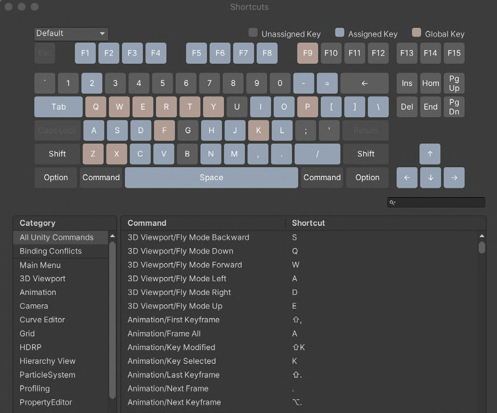
<p><em>VI: <strong>▲ Shortcuts Manager</strong> — bàn phím TRỰC QUAN: phím <strong>ĐÃ GÁN tô nâu</strong>, phím trống là chưa gán; bảng dưới liệt kê <strong>Category</strong> (All Unity Commands · Binding Conflicts · Main Menu · 3D Viewport · Animation · Camera · Curve Editor · Grid · HDRP · Hierarchy View · ParticleSystem · Profiling · PropertyEditor) ↔ <strong>Command</strong> ↔ <strong>Shortcut</strong>. / EN: The Shortcuts Manager is an interactive visual interface.</em></p>

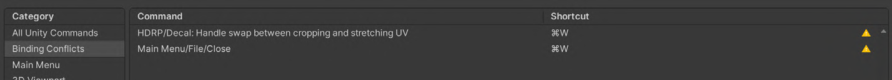
<p><em>VI: <strong>▲ Mục <code>Binding Conflicts</code></strong> — nơi Shortcuts Manager CHỈ THẲNG hai lệnh đang TRANH NHAU cùng một phím: <strong><code>HDRP/Decal: Handle swap between cropping and stretching UV</code></strong> và <strong><code>Main Menu/File/Close</code></strong>, cùng dùng <strong><code>⌘W</code></strong> (tam giác cảnh báo màu vàng). / EN: The Binding Conflicts category.</em></p>

**⌨️ Bảng PHÍM TẮT mặc định — nguyên văn**

| Hành động / Action | **Windows** | **Mac** |
|---|---|---|
| **Frame Selected** | `F` | `F` |
| **Duplicate Items** | `Ctrl + D` | `Cmd + D` |
| **Delete GameObject** | `Shift + Del` | `Cmd + Delete` |
| **View / Move / Rotate / Rect / Transform** | `Q` / `W` / `E` / `R` / `T` | `Q` / `W` / `E` / `R` / `T` |
| **Toggle Pivot Mode** | `Z` | `Z` |
| **Toggle Pivot Rotation** | `X` | `X` |
| **Vertex Snap** | `V` | `V` |
| **Snap** | `Ctrl + LMB` | `Ctrl + LMB` |
| **Toggle Maximize** | `Shift + spacebar` | `Shift + spacebar` |
| **Edit Prefab in Context** | `P` | `P` |

!!! tip "🔍 FOCUSED INSPECTOR — so sánh HAI GameObject cùng lúc"
    **VI:** *"Unity 2020.1 giới thiệu cửa sổ **Focused Inspector**, cho phép bạn **KIỂM TRA thuộc tính của MỘT GameObject, component, hay asset CỤ THỂ. Nó LUÔN hiển thị thuộc tính của item bạn đã mở nó cho — NGAY CẢ KHI bạn chọn thứ khác trong Scene.**" ▶️ **Chuột phải vào GameObject/Component → chọn `Properties`.** Việc này mở một cửa sổ Inspector NỔI mà bạn có thể **di chuyển, dock, hoặc đổi kích thước.** 💡 **"Mở NHIỀU Focused Inspector CÙNG LÚC cho phép bạn THAM CHIẾU NHIỀU GameObject trong khi thay đổi Scene."** Bạn cũng có thể **focus vào một COMPONENT cụ thể, chiếm ÍT diện tích màn hình hơn.**"*

    **EN:** *"Unity 2020.1 introduced the **Focused Inspector** window, which allows you to **INSPECT the properties for a SPECIFIC GameObject, component, or asset. It ALWAYS displays the properties of the item you opened it for, EVEN IF you select something else in the Scene.**" ▶️ **Right-click a GameObject/Component → choose `Properties`.** 💡 **"Opening MULTIPLE Focused Inspectors at the same time allows you to REFERENCE MULTIPLE GameObjects while making changes to the Scene."***

### 63.0. 📦 Editor workflows & The Package Manager — lời mở của e-book

<div class="bilingual-row">
<div class="col-vi">
<p>📖 <em>"Unity 2020 LTS bao gồm <strong>NHIỀU cải tiến TĂNG TỐC workflow của Editor</strong> — như <strong>phím tắt để gọi các tính năng DÙNG THƯỜNG XUYÊN, giao diện tiện lợi để GIẢM tác vụ LẶP LẠI, cải tiến workflow DEBUG</strong>, và nhiều hơn nữa. ✅ <strong>Gộp lại, những cải tiến này có thể TIẾT KIỆM cho bạn HÀNG GIỜ làm việc qua từng ngày và từng tuần. Chất lượng cuộc sống với Unity ĐƯỢC CẢI THIỆN vì bạn LẶP NHANH HƠN và phát triển HIỆU QUẢ HƠN.</strong>"</em></p>
<p>📦 <strong>Package Manager:</strong> <em>"<strong>Package Manager có VÀI cập nhật thiết kế ở 2020 LTS, gồm BỘ ICON giao diện MỚI, BỐ CỤC cải tiến, và PHÂN BIỆT TỐT HƠN giữa thông tin của package ĐANG CÀI và các bản CẬP NHẬT có sẵn.</strong>"</em></p>
</div>
<div class="col-en">
<p>📖 <em>"Unity 2020 LTS includes multiple improvements that speed up Editor workflows, such as keyboard shortcuts to launch frequently used features, handy user interfaces to reduce repetitive tasks, improvements to the debugging workflow, and much more. Collectively, these improvements can save you hours of work over days and weeks. Your quality of life with Unity improves because you can iterate faster and develop more efficiently."</em></p>
<p>📦 <strong>The Package Manager:</strong> <em>"The Package Manager has several design updates in 2020 LTS, including new user interface (UI) iconography, improved layout, and better distinctions between information for currently installed packages and for available updates."</em></p>
</div>
</div>

### 63.1. 🎁 Mười mẹo NHỎ nhưng MẠNH cho Editor

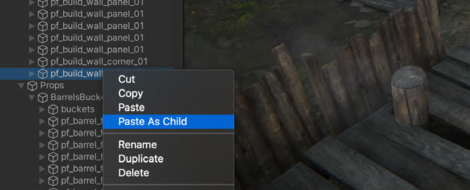
<p><em>VI: <strong>▲ <code>Paste As Child</code></strong> — dán object vào ĐÚNG nhánh cha thay vì dán ra gốc rồi kéo lại; cùng menu còn có <em>Rename · Duplicate · Delete</em>. / EN: The Paste As Child context-menu item.</em></p>

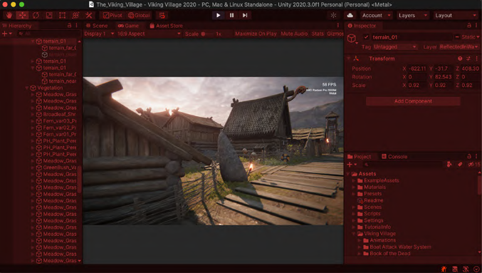
<p><em>VI: <strong>▲ Playmode tint KHI ĐÃ ÁP DỤNG</strong> — TOÀN BỘ Editor nhuốm ĐỎ. Không thể nhầm là đang ở Edit Mode nữa — đây là cách rẻ nhất để khỏi mất công sửa rồi bay hết khi thoát Play. / EN: The whole Editor tinted red once a Playmode tint is set.</em></p>

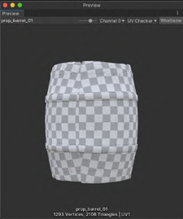
<p><em>VI: <strong>▲ Ô Preview của mesh</strong> — chuyển kênh hiển thị sang <strong>UV Layout</strong> / <strong>UV Checker</strong> / <strong>Normals</strong> + <strong>Wireframe</strong> ngay trong Inspector; dòng cuối ghi <strong>1293 Vertices, 2106 Triangles | UV1</strong>. Kiểm tra UV chồng lấn mà không cần mở DCC. / EN: The mesh Preview with UV Layout / UV Checker / Normals modes.</em></p>

| # | Mẹo / Tip |
|---|---|
| **①** | **CẮT và DÁN GameObject trong cửa sổ Hierarchy.** *"Bạn cũng có thể **`Paste As Child`** từ context menu"* |
| **②** | **Dùng phím `F` để FRAME object đã chọn trong Scene View.** *"Giờ nó XỬ LÝ ĐƯỢC NHIỀU LOẠI object HƠN và FRAME chúng TỐT HƠN."* 🎮 **"Trong Play Mode, bấm `Shift + F` để KHOÁ vào một GameObject ĐANG DI CHUYỂN."** |
| **③** | **Hiển thị UV, normal, tangent và thông tin Mesh khác trong Inspector preview** |
| **④** | **Xem Inspector preview CẢI TIẾN cho texture 3D** — *"như volumetric render, lát cắt texture 3D, hoặc signed distance field"* |
| **⑤** | **Dùng menu Layers để TẮT hiển thị các Layer** *(như UI)* *"có thể CHE KHUẤT Scene view. **KHOÁ một Layer để TRÁNH đổi trạng thái của nó do vô ý.**"* |
| **⑥** | **Lưu/nạp BỘ CHỌN (selection set)** — *"Nếu bạn THƯỜNG XUYÊN chọn cùng những object, **dùng tổ hợp phím nóng dưới `Edit > Selection` để LƯU hoặc NẠP nhanh một selection set**"* |
| **⑦** | **Sửa NUMBERING SCHEME cho object trùng lặp** tại `Project Settings > Editor` — *"Định nghĩa tuỳ chọn đặt tên cũng như **PADDING và SPACING của số instance**"* |
| **⑧** | 🔑 **Dùng tag `EditorOnly`** — *"để **chỉ định GameObject SẼ KHÔNG XUẤT HIỆN trong bản BUILD của ứng dụng**"* |
| **⑨** | **Đổi MÀU trong Editor** tại `Unity > Preferences > Colors` — *"để tìm phần tử UI hoặc object NHANH HƠN. **Điều chỉnh PLAYMODE TINT để TỰ NHẮC MÌNH khi Play Mode đang bật, để bạn KHÔNG MẤT thay đổi định lưu khi thoát.**"*<br>💡 *"NẾU bạn tạo thay đổi trong Play Mode mà MUỐN GIỮ: dùng nút **More Items (⋮)** → **COPY giá trị component/transform khi đang chạy, rồi PASTE từ clipboard sau khi thoát Play Mode.** Hoặc nếu có NHIỀU thay đổi component, **KÉO RA một Prefab TẠM để lưu công việc ở đó.**"* |
| **⑩** | **Căn Camera** — *"Dùng `GameObject > Align With View` để **căn Game camera KHỚP với Scene camera**. Hoặc ngược lại, dùng **`Align View to Selected`** để **căn Scene camera theo một camera khác trong Hierarchy.**"* |

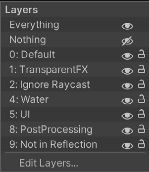
<p><em>VI: <strong>▲ Dropdown Layers</strong> — mỗi layer có <strong>biểu tượng MẮT (ẩn/hiện)</strong> và <strong>Ổ KHOÁ (chặn chọn)</strong>: Default · TransparentFX · Ignore Raycast · Water · UI · PostProcessing · Not in Reflection. / EN: The Layers dropdown with visibility and lock toggles.</em></p>

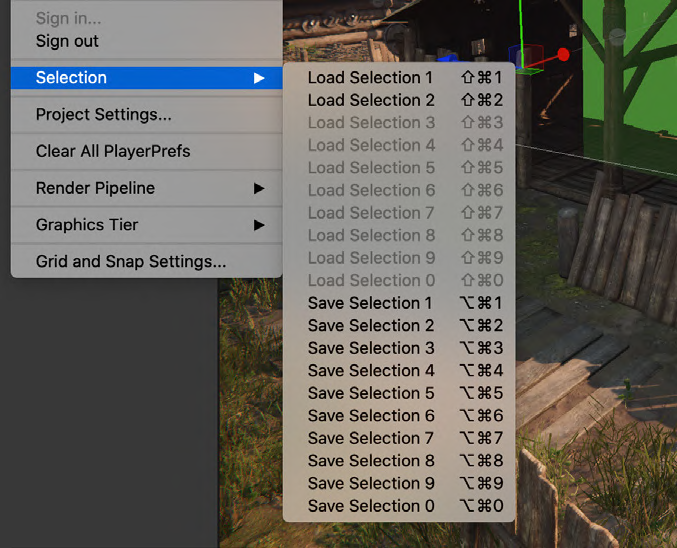
<p><em>VI: <strong>▲ Save / Load Selection</strong> — lưu tối đa <strong>MƯỜI bộ lựa chọn</strong>: <strong>Save Selection 1…0 = <code>⌥⌘1…0</code></strong>, gọi lại bằng <strong>Load Selection 1…0 = <code>⇧⌘1…0</code></strong>. / EN: The Save Selection / Load Selection menu.</em></p>

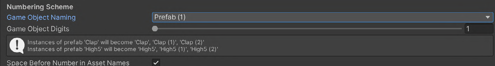
<p><em>VI: <strong>▲ Numbering Scheme</strong> (<code>Project Settings › Editor</code>) — <strong>Game Object Naming: Prefab (1)</strong>, <strong>Game Object Digits: 1</strong>, <strong>Space Before Number in Asset Names ✓</strong>. Ô thông báo cho biết instance của prefab <code>Clap</code> sẽ thành <code>Clap</code>, <code>Clap (1)</code>, <code>Clap (2)</code>. / EN: The Numbering Scheme for duplicate objects.</em></p>

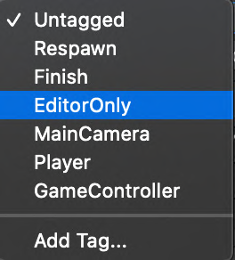
<p><em>VI: <strong>▲ Tag <code>EditorOnly</code></strong> — mọi GameObject mang tag này sẽ <strong>KHÔNG được đưa vào build</strong>: dùng cho object hỗ trợ dựng cảnh. / EN: The EditorOnly tag.</em></p>

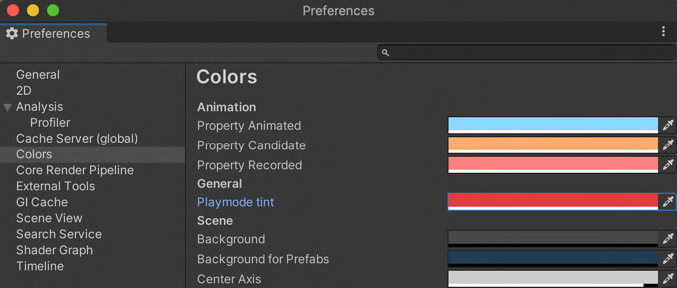
<p><em>VI: <strong>▲ Playmode tint</strong> (<code>Preferences › Colors › General</code>) — đổi màu này để <strong>KHÔNG BAO GIỜ nhầm lẫn mình đang ở Play Mode</strong> mà sửa (rồi mất) dữ liệu. / EN: The Playmode tint in the Preferences window.</em></p>

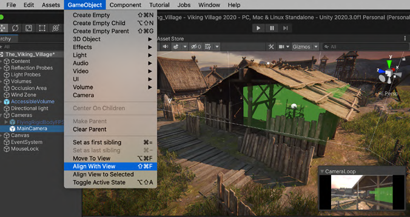
<p><em>VI: <strong>▲ <code>GameObject › Align With View</code> (<code>⇧⌘F</code>)</strong> — đưa object (thường là Camera) <strong>KHỚP CHÍNH XÁC góc nhìn Scene view</strong> hiện tại; cạnh đó là <strong>Align View to Selected</strong> và <strong>Move To View <code>⌘⌥F</code></strong>. / EN: The Align With View menu item.</em></p>

### 63.2. 🔍 Focused Inspector — mở NHIỀU Inspector cùng lúc

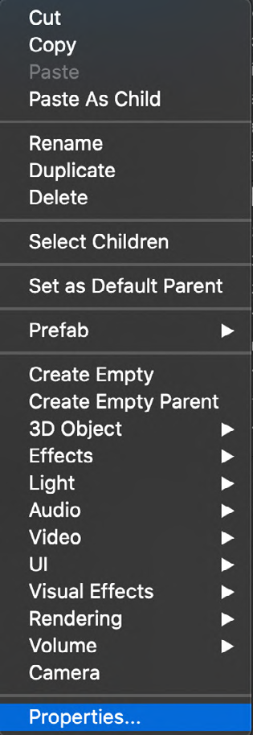
<p><em>VI: <strong>▲ Đường vào</strong> — chuột phải trong Hierarchy → <strong><code>Properties…</code></strong> (mục cuối cùng). Cùng menu có <em>Paste As Child · Select Children · Set as Default Parent</em>. / EN: The right-click menu with the Properties… item that opens a Focused Inspector.</em></p>

<div class="bilingual-row">
<div class="col-vi">
<p>📖 <em>"Mở <strong>NHIỀU Focused Inspector CÙNG LÚC</strong> cho phép bạn <strong>THAM CHIẾU nhiều GameObject TRONG KHI đang sửa Scene.</strong>"</em></p>
<p>🎯 <em>"Bạn cũng có thể <strong>focus vào MỘT Component CỤ THỂ của một GameObject, cần ÍT diện tích màn hình hơn.</strong>"</em></p>
<p>👉 <strong>Cách mở:</strong> chuột phải lên GameObject trong Hierarchy (hoặc lên tiêu đề Component) → <strong><code>Properties…</code></strong></p>
</div>
<div class="col-en">
<p>📖 <em>"Opening multiple Focused Inspectors at the same time allows you to reference multiple GameObjects while making changes to the Scene."</em></p>
<p>🎯 <em>"You can also focus on a specific Component of a GameObject, requiring less screen space."</em></p>
<p>👉 <strong>How:</strong> right-click the GameObject in the Hierarchy (or the Component header) → <strong><code>Properties…</code></strong></p>
</div>
</div>

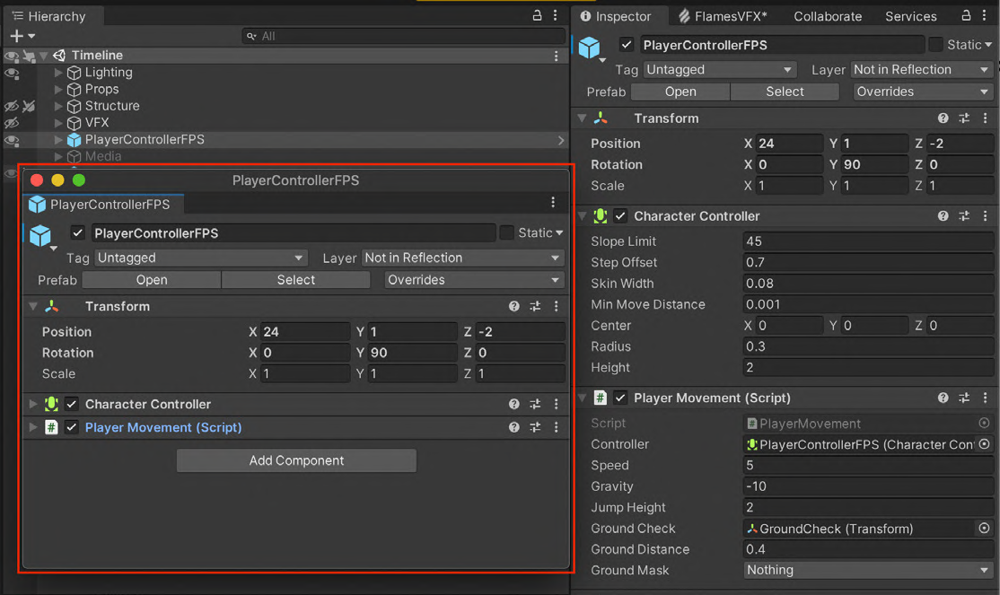
<p><em>VI: <strong>▲ Focused Inspector</strong> — cửa sổ RỜI cho <code>PlayerControllerFPS</code> (viền đỏ) nổi trên Scene, hiển thị Transform (Position 24, 1, −2), <strong>Character Controller</strong> và <strong>Player Movement (Script)</strong>; Inspector CHÍNH bên phải vẫn hoạt động độc lập. / EN: Opening multiple Focused Inspectors at the same time.</em></p>

### 63.3. 🎛️ Presets — ÉP chuẩn cho cả đội, tránh setting bị bỏ quên

<div class="bilingual-row">
<div class="col-vi">
<p>📖 <em>"Tính năng này cho phép bạn <strong>TUỲ CHỈNH trạng thái MẶC ĐỊNH của BẤT KỲ THỨ GÌ trong Inspector.</strong> Tạo một Preset để <strong>COPY thiết lập của một component hay asset, LƯU nó thành asset, rồi ÁP dụng CÙNG thiết lập đó cho món khác về sau.</strong>"</em></p>
<p>🛡️ <strong>Vì sao Tech Lead phải quan tâm:</strong> <em>"Dùng Preset để <strong>ÉP CHUẨN hoặc áp mặc định HỢP LÝ cho asset mới. Việc này đảm bảo chuẩn NHẤT QUÁN trong cả đội, để những setting HAY BỊ BỎ QUÊN KHÔNG làm ảnh hưởng hiệu năng dự án.</strong>"</em></p>
<p>👉 <em>"Bấm <strong>icon Preset ở góc TRÊN BÊN PHẢI của component</strong>. Bấm <strong><code>Save current to…</code></strong> để lưu Preset thành asset. Bấm một Preset có sẵn để <strong>NẠP bộ giá trị.</strong>"</em></p>
</div>
<div class="col-en">
<p>📖 <em>"This feature allows you to customize the default state of anything in your Inspector. Creating a Preset lets you copy the settings of a component or asset, save it as an asset, then apply the same settings to another item later."</em></p>
<p>🛡️ <strong>Why a Tech Lead should care:</strong> <em>"Use Presets to enforce standards or to apply reasonable defaults to new assets. This ensures consistent standards across your team, so commonly overlooked settings don't impact your project's performance."</em></p>
<p>👉 <em>"Click the Preset icon to the top right of the component. Click Save current to… to save the Preset as an asset. Click one of the available Presets to load a set of values."</em></p>
</div>
</div>

**🧰 BA cách dùng Preset ÍT NGƯỜI BIẾT / Other handy ways to use Presets**

| Cách | Nguyên văn |
|---|---|
| **① Tạo GameObject có sẵn mặc định** | *"<strong>KÉO-THẢ một Preset asset vào Hierarchy</strong> để tạo GameObject MỚI với component tương ứng đã được <strong>ĐIỀN SẴN giá trị Preset.</strong>"* |
| **② Gắn Preset cho một TYPE** | *"Trong <strong>Preset Manager</strong> (<code>Project Settings &gt; Preset Manager</code>), chỉ định <strong>MỘT hoặc NHIỀU Preset cho MỖI Type. Tạo component mới sẽ MẶC ĐỊNH lấy giá trị Preset đã chỉ định.</strong>"*<br>💎 **Pro tip nguyên văn:** *"Tạo NHIỀU Preset cho mỗi Type, và dựa vào <strong>Filter để gắn ĐÚNG Preset THEO TÊN.</strong>"* |
| **③ Lưu & nạp thiết lập Manager** | *"Dùng Preset cho một <strong>cửa sổ Manager</strong> để thiết lập được TÁI SỬ DỤNG; ví dụ nếu bạn định <strong>áp lại CÙNG bộ Tag & Layer hay Physics settings, Preset có thể GIẢM thời gian set-up cho dự án TIẾP THEO.</strong>"* |

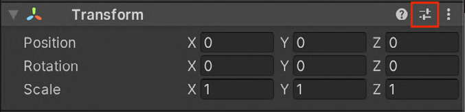
<p><em>VI: <strong>▲ Icon Preset</strong> (viền đỏ) nằm ở <strong>góc trên bên phải</strong> component Transform — cạnh dấu <strong>?</strong> và nút ba chấm. / EN: The Preset icon is highlighted here in red.</em></p>

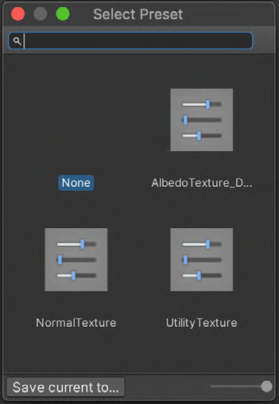
<p><em>VI: <strong>▲ Cửa sổ Select Preset</strong> — ví dụ của e-book: ba Preset chứa <strong>Import Settings KHÁC NHAU cho texture 2D tuỳ MỤC ĐÍCH</strong>: <strong>AlbedoTexture_D · NormalTexture · UtilityTexture</strong>, cùng nút <strong>Save current to…</strong> / EN: In this example, the Presets contain different Import Settings for 2D textures depending on usage (albedo, normal, or utility).</em></p>

### 63.4. 👁️ SceneVisibility & Isolation View — ẩn mà KHÔNG deactivate

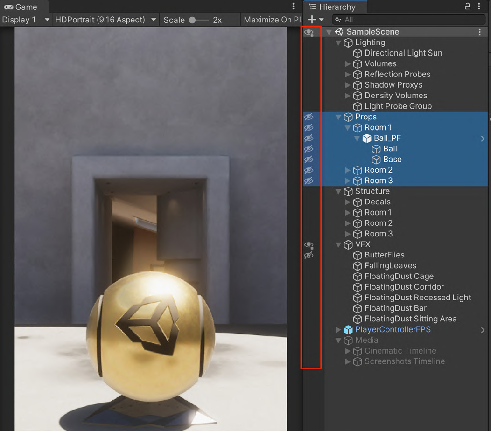
<p><em>VI: <strong>▲ Cột con MẮT trong Hierarchy</strong> — bật/tắt hiển thị cho từng nhánh (<code>Props</code>, <code>Room 1</code>, <code>Ball_PF</code>, <code>Structure</code>, <code>VFX</code>…) mà <strong>KHÔNG deactivate GameObject</strong>. / EN: The SceneVisibility eye column in the Hierarchy.</em></p>

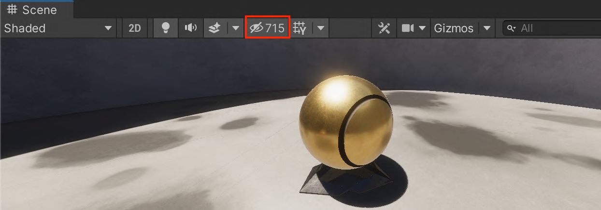
<p><em>VI: <strong>▲ Bộ đếm object ĐANG BỊ ẨN</strong> — con số <strong>715</strong> cạnh biểu tượng mắt trên thanh Scene view. Bấm vào đó là bỏ ẩn TẤT CẢ; nếu "mất" object trong scene, hãy nhìn con số này TRƯỚC. / EN: The hidden-object counter (715) in the Scene view toolbar.</em></p>

<div class="bilingual-row">
<div class="col-vi">
<p>📖 <em>"Khi Scene LỚN DẦN, bạn có thể <strong>TẠM ẨN các object cụ thể để chọn và sửa GameObject DỄ HƠN.</strong>"</em></p>
<p>🚨 <strong>Điểm MẤU CHỐT:</strong> <em>"<strong>THAY VÌ DEACTIVATE GameObject (việc này có thể dẫn tới HÀNH VI NGOÀI Ý MUỐN)</strong>, hãy bật/tắt điều khiển <strong>SceneVisibility. Cách này ẩn/hiện object trong Scene view MÀ KHÔNG đổi khả năng hiển thị TRONG GAME.</strong>"</em></p>
<p>🔎 <em>"Dùng <strong>Isolation View</strong> để tập trung vào MỘT object và các con của nó. Chọn GameObject trong Hierarchy rồi bấm <strong><code>Shift + H</code></strong> để bật/tắt. Chế độ này <strong>GHI ĐÈ mọi thiết lập SceneVisibility khác cho tới khi bạn thoát.</strong>"</em></p>
<p>💎 <em>"Nhớ rằng bạn luôn có thể dùng <strong><code>Shift + Space</code> để PHÓNG TO viewport và ẩn phần còn lại của Editor.</strong>"</em></p>
</div>
<div class="col-en">
<p>📖 <em>"As your Scene grows larger, you can temporarily hide specific objects so that you can select and edit your GameObjects with more ease."</em></p>
<p>🚨 <strong>The key point:</strong> <em>"Instead of deactivating the GameObjects (which can lead to unintended behavior), toggle the SceneVisibility controls. This allows you to hide and show objects in the Scene view, without changing their in-game visibility."</em></p>
<p>🔎 <em>"Use Isolation View to concentrate on a specific object and its children. Select the GameObject in the Hierarchy window and press Shift + H to toggle it on and off. This overrides your other SceneVisibility settings until you exit."</em></p>
<p>💎 <em>"Remember that you can always use the Shift + spacebar shortcut to maximize the viewport and hide the rest of the Editor as well."</em></p>
</div>
</div>

**👁️ BỐN trạng thái icon trong Hierarchy / The four SceneVisibility status icons**

| # | Trạng thái — nguyên văn |
|---|---|
| **①** | *"GameObject **HIỆN**, nhưng **MỘT SỐ CON của nó bị ẨN**."* |
| **②** | *"GameObject **BỊ ẨN**, nhưng **MỘT SỐ CON của nó HIỆN**."* |
| **③** | *"GameObject và các con **HIỆN**, nhưng **CHỈ xuất hiện khi bạn RÊ CHUỘT lên GameObject**."* |
| **④** | *"GameObject **và các con ĐỀU BỊ ẨN**."* |

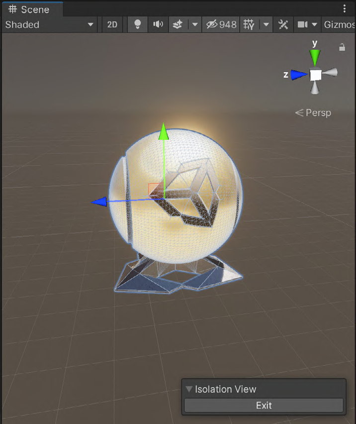
<p><em>VI: <strong>▲ Isolation View</strong> — thanh <strong>Isolation View / Exit</strong> hiện ở góc dưới phải Scene view; bộ đếm object bị ẩn trên toolbar nhảy lên <strong>948</strong>. / EN: Isolation View allows you to edit a GameObject without distractions.</em></p>

### 63.5. 🖱️ Scene picking — CHẶN chọn nhầm trong scene lớn

<div class="bilingual-row">
<div class="col-vi">
<p>📖 <em>"Bạn có thể <strong>sửa trạng thái CÓ THỂ CHỌN (pickability) của GameObject</strong>, tương tự SceneVisibility. Dùng toolbar để <strong>CHẶN các GameObject cụ thể KHỎI bị chọn trong Scene view. Điều này HỮU ÍCH để tránh chọn và sửa NHẦM GameObject trong scene LỚN.</strong>"</em></p>
<p>🔀 <em>"Vì bạn có thể bật/tắt pickability cho <strong>CẢ NHÁNH hoặc MỘT object đơn lẻ</strong>, một số GameObject có thể <strong>CHỌN ĐƯỢC nhưng có CON hoặc CHA thì KHÔNG.</strong>"</em></p>
</div>
<div class="col-en">
<p>📖 <em>"You can modify the pickability state of GameObjects, similar to SceneVisibility. Use the toolbar to block specific GameObjects from being selected in the Scene view. This is useful to avoid selecting and editing an unintended GameObject in large scenes."</em></p>
<p>🔀 <em>"Because you can toggle pickability for a whole branch or a single object, some GameObjects may be pickable but have children or parents that are not."</em></p>
</div>
</div>

| # | Trạng thái pickability — nguyên văn |
|---|---|
| **①** | *"Bạn **CHỌN ĐƯỢC GameObject, nhưng KHÔNG chọn được MỘT SỐ CON của nó**."* |
| **②** | *"Bạn **KHÔNG chọn được GameObject, nhưng CHỌN ĐƯỢC một số CON**."* |
| **③** | *"Bạn **chọn được GameObject và các con** (chỉ hiện khi **RÊ CHUỘT** lên GameObject)."* |
| **④** | *"Bạn **KHÔNG chọn được GameObject LẪN các con**."* |

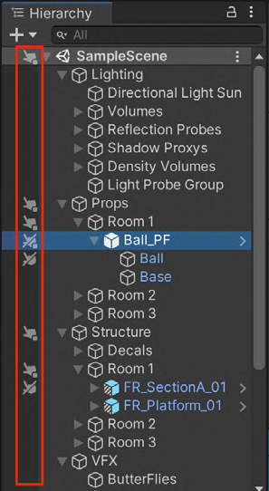
<p><em>VI: <strong>▲ Cột pickability trong Hierarchy</strong> (viền đỏ) — dấu con trỏ gạch chéo cho biết nhánh nào đã bị CHẶN chọn; ở đây <code>Props</code>, <code>Room 1</code>, <code>Ball_PF</code>, <code>Structure</code> mang trạng thái khác nhau. / EN: Hierarchy pickability.</em></p>

### 63.6. 🔎 Searching — cú pháp `t:` và `l:`

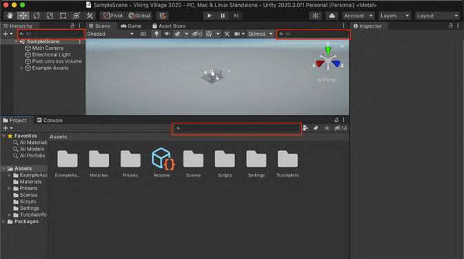
<p><em>VI: <strong>▲ BA ô tìm kiếm</strong> (khoanh đỏ) — một ở <strong>Hierarchy</strong>, một ở <strong>Scene view</strong>, một ở <strong>Project</strong>. Cả ba đều nhận cú pháp <code>t:</code> và <code>l:</code>. / EN: The three search fields in the Editor: Hierarchy, Scene view and Project.</em></p>

<div class="bilingual-row">
<div class="col-vi">
<p>📖 <em>"Editor có <strong>chức năng tìm kiếm cho Scene view, cửa sổ Hierarchy và cửa sổ Project.</strong>"</em></p>
<p>🏷️ <em>"Ngoài tìm theo TÊN, bạn có thể <strong>tìm theo TYPE. Dùng dropdown để chọn Type hoặc cú pháp VIẾT TẮT <code>t:</code>.</strong>"</em></p>
<p>🔖 <em>"Nếu bạn dùng <strong>Asset Label</strong>, bạn cũng có thể dùng cú pháp viết tắt <strong><code>l:</code> để LỌC theo label.</strong>"</em></p>
</div>
<div class="col-en">
<p>📖 <em>"The Editor contains search functionality for the Scene view, Hierarchy window and Project window."</em></p>
<p>🏷️ <em>"In addition to searching for names, you can search by type. Use the dropdown to select Type or the <code>t:</code> shorthand syntax."</em></p>
<p>🔖 <em>"If you use Asset Labels, you can also use the <code>l:</code> shorthand to filter for labels."</em></p>
</div>
</div>

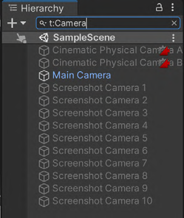
<p><em>VI: <strong>▲ Lọc bằng <code>t:Camera</code></strong> — Hierarchy chỉ còn các camera: <strong>Cinematic Physical Camera A/B · Main Camera · Screenshot Camera 1…10</strong>. / EN: Filtering by Type.</em></p>

### 63.7. 🐞 Inspector Debug Mode — xem cả biến `private`

<div class="bilingual-row">
<div class="col-vi">
<p>📖 <em>"Bạn có thể <strong>chuyển Inspector của MỖI GameObject giữa chế độ Normal và Debug.</strong> Bấm nút <strong>More Items (⋮)</strong> để mở menu ngữ cảnh và chọn chế độ."</em></p>
<p>🔬 <em>"<strong>Debug Mode CHỈ hiển thị property của component ĐANG CHỌN và GIÁ TRỊ của chúng. Nó CŨNG hiển thị các biến PRIVATE, mặc dù bạn KHÔNG SỬA được chúng.</strong>"</em></p>
</div>
<div class="col-en">
<p>📖 <em>"You can toggle each GameObject's Inspector between Normal and Debug mode. Click the More Items (⋮) button to open the context menu and choose the desired mode."</em></p>
<p>🔬 <em>"Debug Mode only shows the selected component's properties and their values. It also displays private variables, although you cannot edit them."</em></p>
</div>
</div>

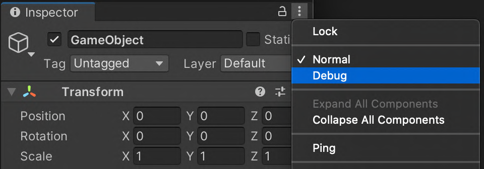
<p><em>VI: <strong>▲ Menu ⋮ của Inspector</strong> — <strong>Lock · Normal (✓) · Debug (đang bôi xanh) · Expand/Collapse All Components · Ping</strong>. / EN: Inspector Debug mode.</em></p>

### 63.8. ⚡ QuickSearch — tìm MỌI THỨ trong Unity

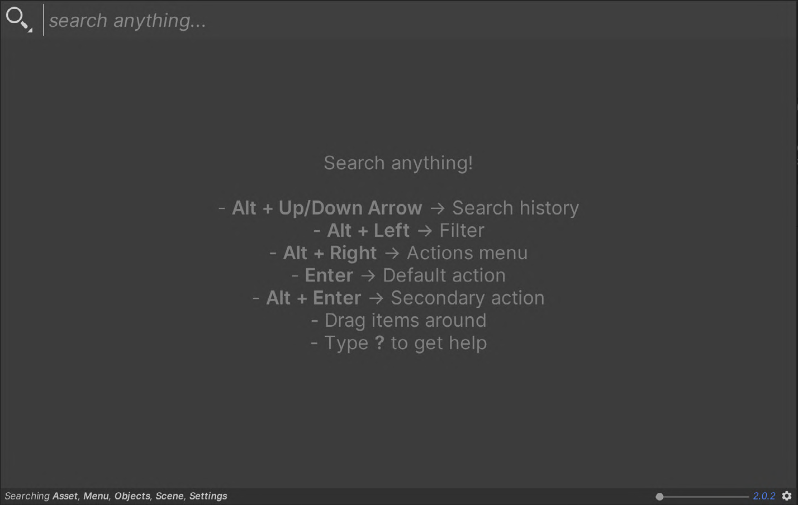
<p><em>VI: <strong>▲ Bảng phím tắt NGAY TRONG QuickSearch</strong> — <strong>Alt + Up/Down</strong> lịch sử tìm kiếm · <strong>Alt + Left</strong> bộ lọc · <strong>Alt + Right</strong> menu hành động · <strong>Enter</strong> hành động mặc định · <strong>Alt + Enter</strong> hành động phụ · kéo-thả item · gõ <strong>?</strong> để xem trợ giúp. Dòng đáy: <em>Searching Asset, Menu, Objects, Scene, Settings</em>. / EN: The QuickSearch hotkey cheat sheet shown on the empty search screen.</em></p>

<div class="bilingual-row">
<div class="col-vi">
<p>📖 <em>"Nếu bạn muốn <strong>mở rộng tìm kiếm RA NGOÀI các cửa sổ đã nói, bạn có thể tìm BẤT CỨ THỨ GÌ trong Unity bằng package QuickSearch.</strong>"</em></p>
<p>🆕 <em>"<strong>Unity 2021.1 TÍCH HỢP SẴN chức năng này vào Editor mà KHÔNG cần cài package riêng.</strong> Tìm nó ở <strong><code>Edit &gt; Search All</code> (<code>Ctrl + K</code> trên Windows / <code>Cmd + K</code> trên macOS).</strong>"</em></p>
<p>👉 <em>"Sau khi cài từ Package Manager, kích hoạt QuickSearch từ <strong><code>Help &gt; QuickSearch</code></strong> hoặc tổ hợp phím <strong><code>Alt + '</code></strong>."</em></p>
<p>🌐 <em>"QuickSearch cho phép bạn tìm ở <strong>NHIỀU KHU VỰC của Unity: asset, object trong scene, menu item, package, API, settings, v.v.</strong>"</em></p>
<p>⚙️ <em>"Hãy chắc chắn <strong>chạy setup wizard để cấu hình thiết lập tìm kiếm cho kết quả TỐT NHẤT. Hiệu năng THAY ĐỔI tuỳ KÍCH THƯỚC dự án</strong>, nên hãy chọn thiết lập phù hợp nhất với nhu cầu của bạn."</em></p>
</div>
<div class="col-en">
<p>📖 <em>"If you want to extend your search beyond the windows discussed here, you can find anything in Unity using the QuickSearch package."</em></p>
<p>🆕 <em>"Unity 2021.1 incorporates this functionality into the Editor without requiring a separate package installation. Look for it under Edit &gt; Search All (Ctrl + K on Windows / Cmd + K on macOS)."</em></p>
<p>👉 <em>"Once installed from the PackageManager, activate QuickSearch from either Help &gt; QuickSearch or use the Alt + ' hotkey combination."</em></p>
<p>🌐 <em>"QuickSearch enables you to search multiple areas of Unity: assets, scene objects, menu items, packages, APIs, settings, etc."</em></p>
<p>⚙️ <em>"Make sure you run the setup wizard to configure the search settings for the best results. Performance varies depending on the size of your project, so choose the best settings for your individual needs."</em></p>
</div>
</div>

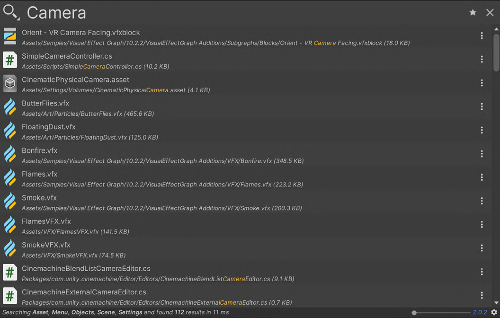
<p><em>VI: <strong>▲ QuickSearch tìm "Camera"</strong> — trả về LẪN LỘN vfxblock, script <code>SimpleCameraController.cs</code>, asset <code>CinematicPhysicalCamera.asset</code>, các file <code>.vfx</code>, và cả script trong <strong>Packages</strong>; dòng cuối ghi <em>"Searching Asset, Menu, Objects, Scene, Settings and found <strong>112 results in 11 ms</strong>"</em>. / EN: Comprehensive results from QuickSearch.</em></p>

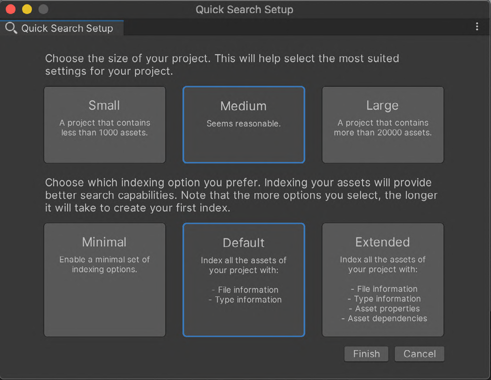
<p><em>VI: <strong>▲ Setup wizard</strong> — chọn <strong>quy mô dự án</strong>: <strong>Small</strong> (&lt; 1.000 asset) · <strong>Medium</strong> (mặc định) · <strong>Large</strong> (&gt; 20.000 asset); và <strong>mức index</strong>: <strong>Minimal</strong> · <strong>Default</strong> (File + Type information) · <strong>Extended</strong> (thêm <em>Asset properties</em> và <em>Asset dependencies</em>). Càng nhiều tuỳ chọn thì <strong>index đầu tiên càng LÂU.</strong> / EN: The Quick Search Setup wizard.</em></p>


---

## 64. 🎨 Artist workflows — Sprite Atlas & Prefab

<div class="bilingual-row">
<div class="col-vi">
<blockquote>
<p><em>"Một dự án 2D dùng SPRITE để tạo hình ảnh. <strong>Chúng CÓ THỂ chứa RẤT NHIỀU asset Texture và do đó ĐÒI HỎI RẤT NHIỀU DRAW CALL.</strong></em></p>
<p><em>✅ <strong>Để TỐI ƯU tài nguyên, hãy dùng SPRITE ATLAS (<code>Asset &gt; Create &gt; Sprite Atlas</code>) THAY VÌ render từng Sprite và Texture riêng lẻ.</strong></em></p>
<p><em>🔑 <strong>Khi các Texture đã được HỢP NHẤT, Unity có thể phát MỘT DRAW CALL DUY NHẤT để truy cập các Texture đã đóng gói với OVERHEAD HIỆU NĂNG NHỎ HƠN.</strong>"</em></p>
</blockquote>
<p>⚙️ <strong>Cách dùng:</strong> thêm Sprite vào danh sách <strong>Objects for Packing</strong>, bật <strong>Include in Build</strong>. <em>"Dùng tuỳ chọn <strong>Packing</strong> để xác định các Sprite có thể được xếp SÁT tới đâu trong atlas và liệu chúng có thể XOAY hay không."</em></p>
<p>🚨 <strong>Điểm QUAN TRỌNG về cấu trúc UI — ít người biết:</strong></p>
<blockquote>
<p><em>"Trong hệ thống UI của Unity, <strong>ATLASING và CẤU TRÚC GameObject ĐỀU QUAN TRỌNG cho batching. Một SpriteAtlas có thể GIẢM draw call NẾU bạn TỔ CHỨC bố cục UI ĐÚNG CÁCH.</strong></em></p>
<p><em>🔍 <strong>Unity QUÉT Hierarchy của GameObject TỪ TRÊN XUỐNG DƯỚI để batch những object dùng CÙNG texture và material.</strong>"</em></p>
</blockquote>
<p>👉 <em>Đây là điểm nối trực tiếp tới <a href="../02-junior/01-ui-physics-deep-dive.md">Module 2</a> (Optimizing Unity UI, mục Fill-rate/Canvases) và <a href="../04-tech-lead/01-gpu-urp-advanced-rendering.md">Module 4 §10</a> (batching).</em></p>
<p>💎 <em>"<strong>SpriteAtlas API cung cấp thêm quyền KIỂM SOÁT LÚC RUNTIME.</strong> Bạn cũng có thể tạo <strong>Variant Sprite Atlas</strong> hoặc chuẩn bị Sprite Atlas cho hình thức phân phối THAY THẾ bằng <strong>Late Binding</strong> trong script."</em></p>
</div>
<div class="col-en">
<blockquote>
<p><em>"A 2D project uses SPRITES to create its visuals. <strong>These potentially contain MANY Texture assets and may thus REQUIRE MANY DRAW CALLS.</strong></em></p>
<p><em>✅ <strong>To OPTIMIZE resources, use a SPRITE ATLAS (<code>Asset &gt; Create &gt; Sprite Atlas</code>) RATHER THAN rendering individual Sprites and Textures.</strong></em></p>
<p><em>🔑 <strong>Once the Textures are CONSOLIDATED, Unity can issue a SINGLE DRAW CALL to access the packed Textures with a SMALLER PERFORMANCE OVERHEAD.</strong>"</em></p>
</blockquote>
<p>⚙️ <strong>How to use it:</strong> add Sprites into the <strong>Objects for Packing</strong> list, enable <strong>Include in Build</strong>. <em>"Use the <strong>Packing</strong> options to determine HOW CLOSELY the Sprites can be laid out in the atlas and whether they can be ROTATED."</em></p>
<p>🚨 <strong>The IMPORTANT point about UI structure — few people know this:</strong></p>
<blockquote>
<p><em>"In Unity's UI system, <strong>ATLASING and the GameObject STRUCTURE BOTH MATTER for batching. A SpriteAtlas can REDUCE draw calls IF you ORGANIZE the UI layout CORRECTLY.</strong></em></p>
<p><em>🔍 <strong>Unity SCANS the GameObjects' Hierarchy TOP-TO-BOTTOM in order to BATCH objects that use the SAME texture and material.</strong>"</em></p>
</blockquote>
<p>👉 <em>This connects directly to <a href="../02-junior/01-ui-physics-deep-dive.md">Module 2</a> (Optimizing Unity UI, the Fill-rate/Canvases section) and <a href="../04-tech-lead/01-gpu-urp-advanced-rendering.md">Module 4 §10</a> (batching).</em></p>
<p>💎 <em>"<strong>The SpriteAtlas API provides ADDITIONAL CONTROL AT RUNTIME.</strong> You can also create a <strong>Variant Sprite Atlas</strong> or prepare Sprite Atlases for an ALTERNATE form of distribution with <strong>Late Binding</strong> in a script."</em></p>
</div>
</div>

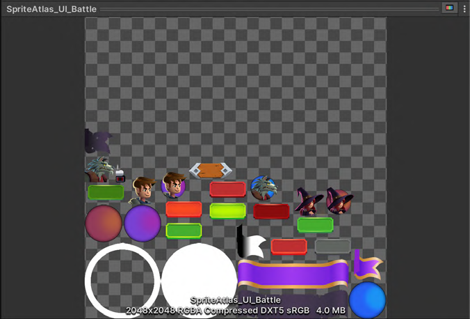
<p><em>VI: <strong>▲ Kết quả PACK</strong> — <code>SpriteAtlas_UI_Battle</code> gom toàn bộ avatar, nút bấm, thanh máu, vòng tròn vào <strong>MỘT texture 2048×2048 · RGBA Compressed DXT5 sRGB · 4.0 MB</strong>. Mọi UI dùng atlas này gộp về <strong>1 draw call</strong> thay vì hàng chục. / EN: The packed SpriteAtlas_UI_Battle: 2048×2048 RGBA Compressed DXT5 sRGB, 4.0 MB.</em></p>

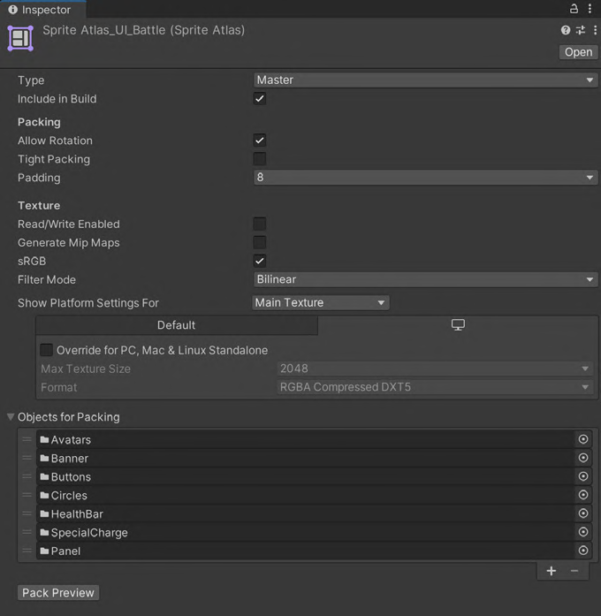
<p><em>VI: <strong>▲ Inspector của Sprite Atlas</strong> — <strong>Type: Master · Include in Build ✓</strong>; nhóm <strong>Packing</strong> có <strong>Allow Rotation ✓ · Tight Packing ✗ · Padding 8</strong>; nhóm <strong>Texture</strong> có <strong>Read/Write ✗ · Generate Mip Maps ✗ · sRGB ✓ · Filter Mode Bilinear</strong>; <strong>Max Texture Size 2048 · Format RGBA Compressed DXT5</strong>; danh sách <strong>Objects for Packing</strong> nhận CẢ THƯ MỤC (Avatars, Banner, Buttons, Circles, HealthBar, SpecialCharge, Panel). / EN: The Sprite Atlas Inspector with its Packing and Texture settings.</em></p>

### 64.1. 🎮 Mười mẹo WORKFLOW 2D — nguyên văn

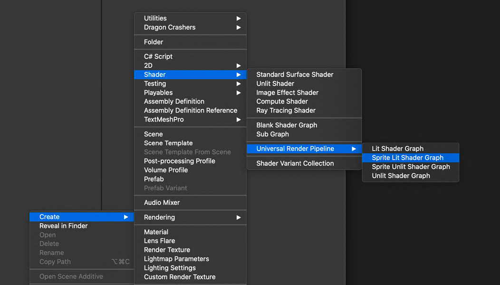 Shader > URP > Sprite Lit / Sprite Unlit Shader Graph.">
<p><em>VI: <strong>▲ Mẹo ⑧ — hai MasterNode 2D</strong>: <code>Assets › Create › Shader › Universal Render Pipeline › <strong>Sprite Lit Shader Graph</strong></code> và <strong>Sprite Unlit Shader Graph</strong> (cạnh <em>Lit Shader Graph</em> / <em>Unlit Shader Graph</em> thường). / EN: Create > Shader > URP > Sprite Lit / Sprite Unlit Shader Graph.</em></p>

<div class="bilingual-row">
<div class="col-vi">
<p>📖 <em>"<strong>Unity đã phát triển bộ công cụ 2D NATIVE của mình để giúp bạn phát triển NHANH HƠN.</strong> Tiết kiệm thời gian với những mẹo hữu ích này."</em></p>
</div>
<div class="col-en">
<p>📖 <em>"Unity has evolved its native 2D tools to help you develop faster. Save time with these helpful tips."</em></p>
</div>
</div>

| # | Mẹo | Nội dung nguyên văn |
|---|---|---|
| **①** | **2D Pixel Perfect Package** | *"Chứa một <strong>Pixel Perfect Camera</strong> đảm bảo <strong>pixel art của bạn LUÔN SẮC NÉT ở CÁC ĐỘ PHÂN GIẢI KHÁC NHAU</strong>, nên bạn <strong>TRÁNH được việc scale asset THỦ CÔNG.</strong>"* — case study: **SouthPAW Games** làm *Skul: The Hero Slayer* |
| **②** | **PSDImporter Package** | *"Dùng nếu bạn muốn làm việc với file Photoshop. <strong>BỎ QUA bước export từng Sprite riêng, import THẲNG file .PSB</strong> (hỗ trợ ảnh LỚN HƠN .PSD nhưng chức năng giống nhau). Việc này cho phép <strong>import NHIỀU Sprite từ các layer khác nhau và SINH RA Sprite Sheet hoặc 2D Character Rig.</strong>"* |
| **③** | **Tilemap** | *"Dùng Tilemap để tạo <strong>thế giới LỚN dựa trên lưới, gồm cả bản HEXAGONAL và ISOMETRIC, được TỐI ƯU về kích thước và hiệu năng.</strong>"* |
| **④** | **2D skeletal animation** | *"Tạo animation xương 2D MƯỢT với <strong>rigging, tessellation và tạo bone. 2D Inverse Kinematics (IK) ĐƠN GIẢN HOÁ animation, TỰ TÍNH cách xương 2D chạm tới đích.</strong>"* |
| **⑤** | **2D Lights** | *"Tăng chất lượng hình ảnh với 2D Lights. Đèn có các tham số <strong>DỄ cấu hình như màu, cường độ, fall-off và hiệu ứng blending.</strong>"* |
| **⑥** | **2D Sprite Shape** | *"Cho bạn <strong>TỰ DO tạo môi trường 2D dạng FREE-FORM</strong> với workflow trực quan. Nó <strong>LÁT Sprite dọc theo đường viền của một hình, TỰ ĐỘNG BIẾN DẠNG và HOÁN ĐỔI chúng dựa trên GÓC của đường viền.</strong>"* |
| **⑦** | **Custom Axis sorting** | *"Sắp xếp Sprite theo <strong>HƯỚNG bạn muốn.</strong> Hữu ích khi có nhiều Sprite <strong>CÙNG layer và CÙNG sorting order</strong> — hình dung một <strong>game bài nơi các lá bài CHỒNG LÊN nhau một chút.</strong>"* → **Built-in RP**: `Edit > Project Settings > Graphics` chọn **Custom Axis** cho **Transparency Sort Mode**, ví dụ **(0, 1, 0)** để sắp theo trục Y từ trên xuống. **URP**: đặt `Camera.transparencySortMode = TransparencySortMode.CustomAxis` rồi đặt `Camera.transparencySortAxis` |
| **⑧** | **Shader Graph cho 2D** | *"Cần shader riêng? Shader Graph có <strong>HAI MasterNode thiết kế cho 2D: Sprite Lit và Sprite Unlit.</strong>"* |
| **⑨** | **TRÁNH overdraw** | 💀 *"Để cải thiện hiệu năng, hãy <strong>chuyển Mesh Type sang TIGHT trong Import Settings của TỪNG Sprite. GỘP các hình chồng nhau vào MỘT Sprite bất cứ khi nào có thể, và TẮT những Sprite nằm ở layer nền mà game KHÔNG dùng tới.</strong> ✅ <strong>Việc này GIẢM vùng overdraw và khả năng chồng lấn với các Sprite lân cận.</strong>"* |
| **⑩** | **Custom outline** | *"Bạn cũng có thể <strong>ĐỊNH NGHĨA đường viền RIÊNG quanh mỗi Sprite bằng 2D Sprite Editor để GIẢM THIỂU vùng KHÔNG dùng tới.</strong>"* |

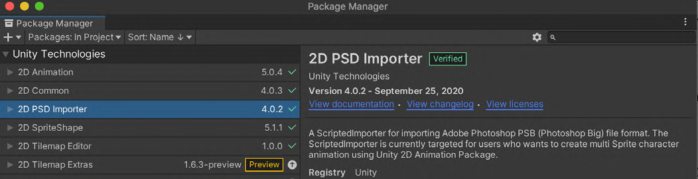
<p><em>VI: <strong>▲ Bộ package 2D</strong> trong Package Manager — <strong>2D Animation 5.0.4 · 2D Common 4.0.3 · 2D PSD Importer 4.0.2 · 2D SpriteShape 5.1.1 · 2D Tilemap Editor 1.0.0 · 2D Tilemap Extras 1.6.3-preview</strong>. / EN: The 2D packages available in the Package Manager.</em></p>

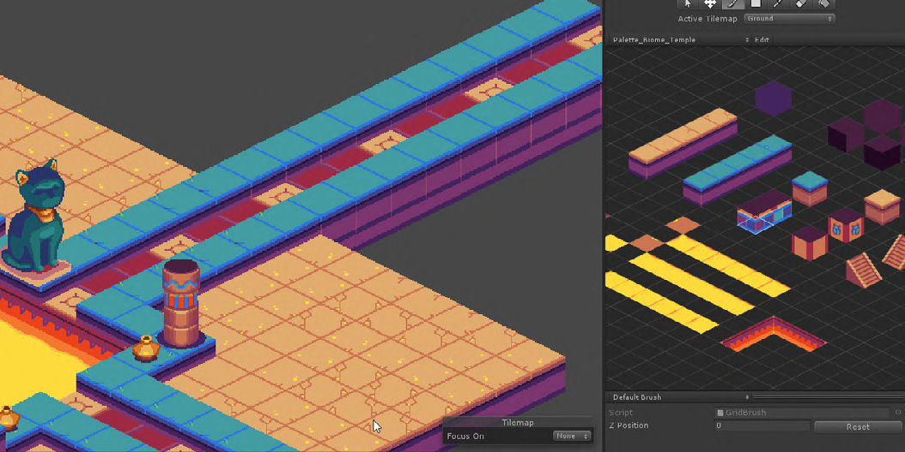
<p><em>VI: <strong>▲ Tilemap ISOMETRIC</strong> — cùng một bộ tile mô tả cả môi trường dạng lưới lẫn dạng isometric; bảng <strong>Active Tilemap</strong> bên phải chứa palette tile. / EN: Tilemaps can describe isometric or other grid-like environments.</em></p>

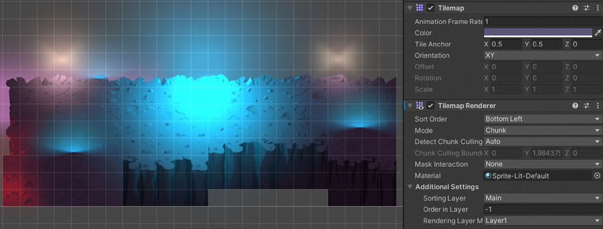
<p><em>VI: <strong>▲ Tilemap + Tilemap Renderer</strong> — <strong>Tile Anchor X 0.5 Y 0.5</strong> · <strong>Orientation XY</strong>; phần Renderer: <strong>Sort Order: Bottom Left · Mode: Chunk · Detect Chunk Culling: Auto · Chunk Culling Bounds Y 1.98437</strong> · <strong>Sorting Layer Main · Order in Layer −1</strong>. <strong>Mode Chunk</strong> chính là chỗ Tilemap gom tile để GIẢM draw call. / EN: The Tilemap and Tilemap Renderer components.</em></p>

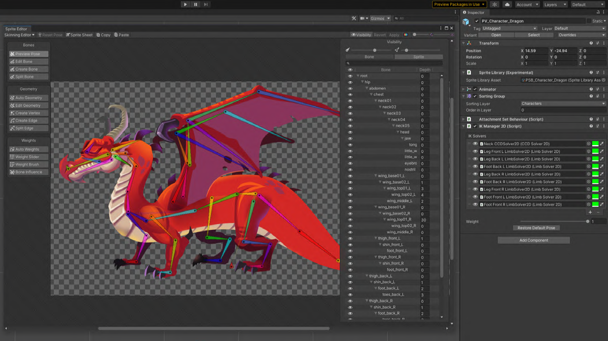
<p><em>VI: <strong>▲ Rig xương 2D</strong> — Sprite Editor ở chế độ <strong>Skinning Editor</strong> với bộ xương phủ lên con rồng (wing_base, neck, tail, leg…), Inspector bên phải hiển thị <strong>Sprite Library Asset</strong> và danh sách constraint <strong>LimbSolver2D / CCDSolver2D</strong> — chính là 2D IK. / EN: Animating the dragon character from Dragon Crashers.</em></p>

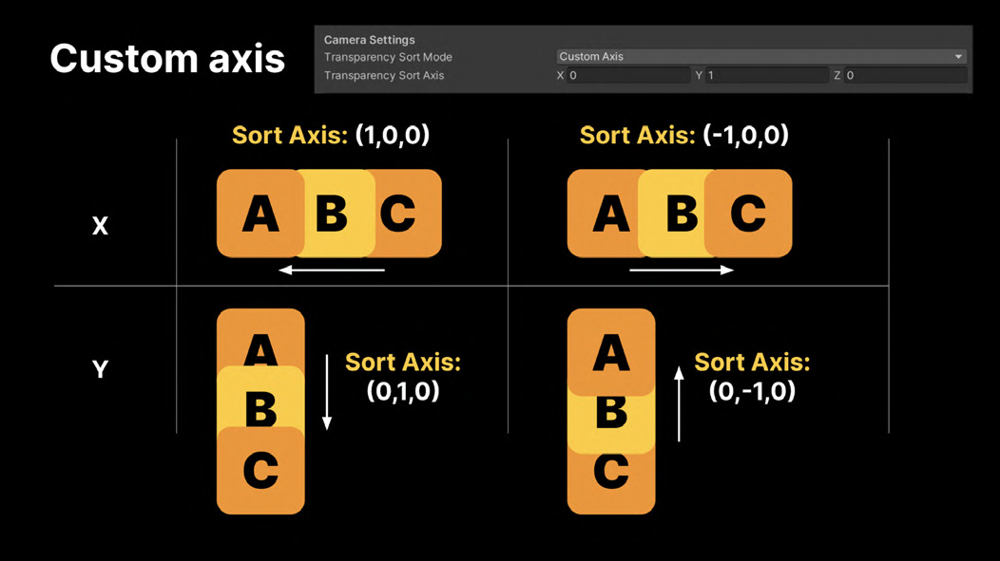
<p><em>VI: <strong>▲ Custom Axis</strong> — <strong>Transparency Sort Mode: Custom Axis</strong>, <strong>Sort Axis X 0 · Y 1 · Z 0</strong>. Sơ đồ cho thấy cùng ba thẻ A·B·C được xếp KHÁC NHAU tuỳ trục: <strong>(1,0,0)</strong> vs <strong>(−1,0,0)</strong> theo X, <strong>(0,1,0)</strong> vs <strong>(0,−1,0)</strong> theo Y. / EN: Transparency Sort Mode and Sort Axis.</em></p>

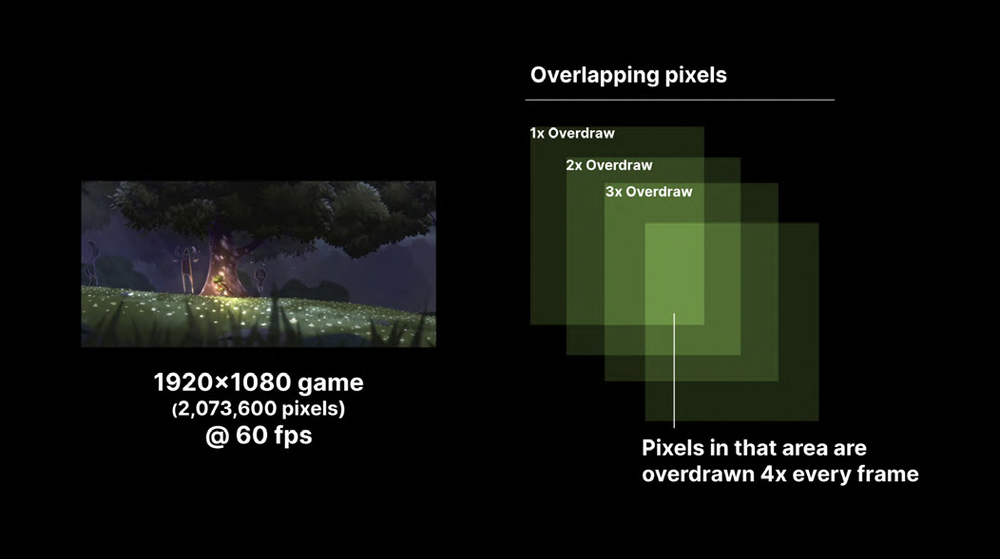
<p><em>VI: <strong>▲ Vì sao overdraw ĐẮT</strong> — game <strong>1920×1080 = 2.073.600 pixel @ 60 fps</strong>; ba lớp Sprite chồng nhau tạo ra <strong>1× → 2× → 3× Overdraw</strong>, và <em>"pixel trong vùng đó bị VẼ LẠI 4 LẦN MỖI FRAME"</em>. / EN: 1920×1080 game (2,073,600 pixels) @ 60 fps — pixels in that area are overdrawn 4x every frame.</em></p>

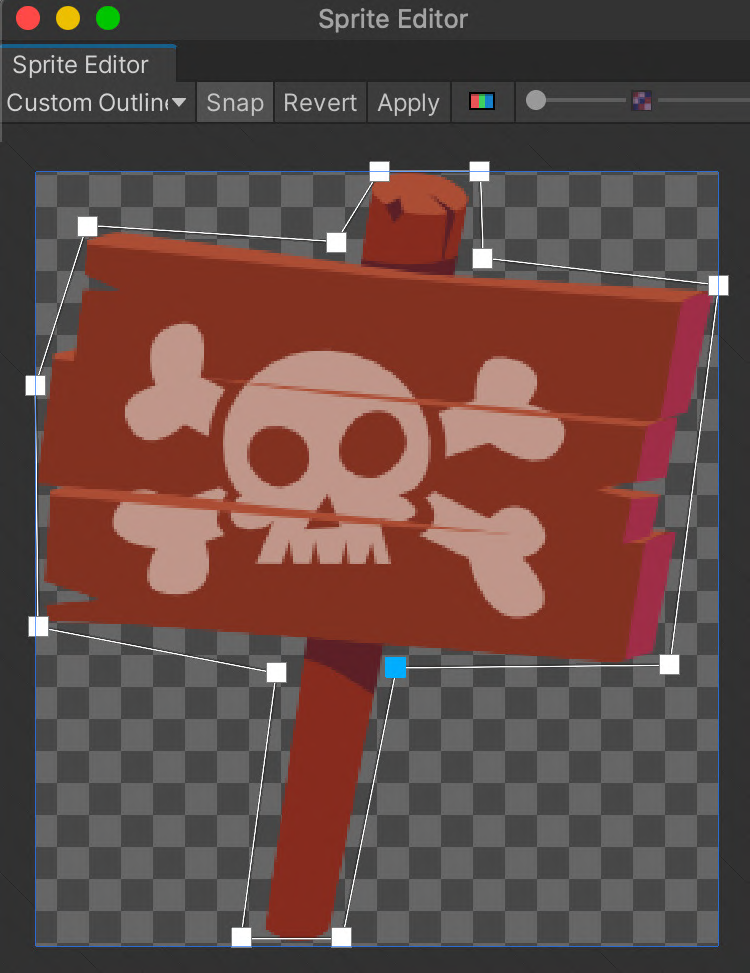
<p><em>VI: <strong>▲ Custom Outline trong Sprite Editor</strong> — thay vì quad chữ nhật, đường viền BÁM SÁT hình biển báo, <strong>cắt bỏ vùng trong suốt KHÔNG cần vẽ</strong>. / EN: The Sprite Editor with a custom outline.</em></p>

### 64.2. 🧱 Prefab workflows — Prefab Mode, Nested Prefab & Variant

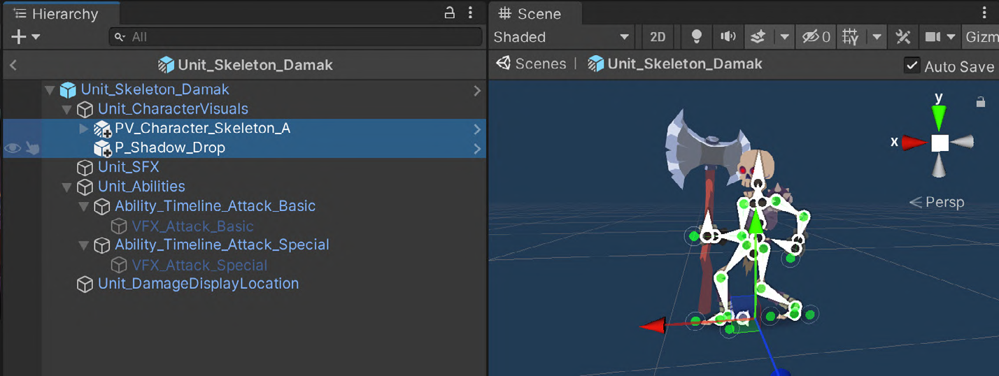
<p><em>VI: <strong>▲ Prefab Mode dạng CÔ LẬP</strong> — chỉ còn <code>Unit_Skeleton_Damak</code> và các con của nó trên NỀN XÁM TRƠN, có <strong>Auto Save ✓</strong>. So sánh với ảnh <em>in Context</em> ở trên: ở đây KHÔNG có gì khác để bạn lỡ tay override. / EN: Prefab Mode in isolation with Auto Save enabled.</em></p>

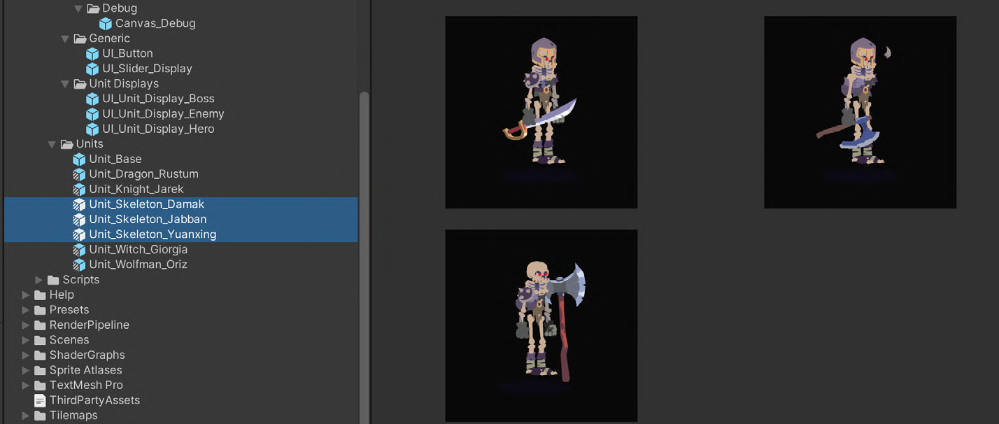
<p><em>VI: <strong>▲ Prefab Variant trong thực tế</strong> — cùng một bộ xương gốc nhưng ba Variant <code>Unit_Skeleton_Damak</code> / <code>Unit_Skeleton_Jabban</code> / <code>Unit_Skeleton_Yuanxing</code> mang <strong>VŨ KHÍ và KỸ NĂNG khác nhau</strong> (kiếm, rìu…). / EN: Prefab Variants with different weapons and abilities.</em></p>

<div class="bilingual-row">
<div class="col-vi">
<p>📖 <em>"Prefab cho phép <strong>LƯU các GameObject đã cấu hình ĐẦY ĐỦ vào dự án để TÁI SỬ DỤNG.</strong>"</em></p>
<p>🛡️ <strong>Quy tắc số 1 — sửa trong Prefab Mode:</strong> <em>"Tạo Prefab như một Asset trong Project, rồi <strong>sửa nó TRONG SỰ CÔ LẬP ở Prefab mode. Làm việc với Prefab MỘT MÌNH giúp NGĂN việc áp dụng override NGOÀI Ý MUỐN.</strong> Hãy thay đổi một cách tự tin với <strong>nền được LÀM XÁM.</strong>"</em></p>
<p>🔀 <strong>Hai chế độ sửa:</strong> <em>"Sửa <strong>in Context</strong> để thấy Prefab TRONG TƯƠNG QUAN với các object khác trong Scene. <strong>CÔ LẬP</strong> Prefab ở Prefab mode để TRÁNH override ngoài ý muốn."</em></p>
<p>🪆 <strong>Nested Prefab:</strong> <em>"Cho phép <strong>làm Prefab CON của Prefab khác.</strong> Bạn có thể tạo một Prefab LỚN — ví dụ một <strong>TOÀ NHÀ</strong> — <strong>cấu thành từ các Prefab NHỎ hơn cho phòng và nội thất.</strong> ✅ Việc này khiến việc <strong>CHIA nhỏ công việc cho NHIỀU artist và lập trình viên cùng làm SONG SONG trở nên HIỆU QUẢ.</strong>"</em></p>
<p>🧬 <strong>Prefab Variant:</strong> <em>"Cho phép <strong>DẪN XUẤT một Prefab từ Prefab khác, GIỐNG KẾ THỪA trong lập trình hướng đối tượng.</strong> Để đổi Variant, chỉ cần <strong>override vài phần MÀ KHÔNG lo ảnh hưởng bản gốc.</strong> Bạn <strong>luôn có thể GỠ MỌI sửa đổi và quay về Prefab gốc.</strong> Ngược lại, nếu muốn <strong>đổi TẤT CẢ Variant CÙNG LÚC, hãy áp thay đổi TRỰC TIẾP lên Prefab gốc.</strong>"</em></p>
</div>
<div class="col-en">
<p>📖 <em>"Prefabs allow fully configured GameObjects to be saved in the project for reuse."</em></p>
<p>🛡️ <strong>Rule #1 — edit in Prefab Mode:</strong> <em>"Create your Prefab as an Asset in the Project, then edit it in isolation in Prefab mode. Working with the Prefab by itself helps prevent applying unintended overrides. Make your changes with confidence with the background grayed out."</em></p>
<p>🔀 <strong>Two edit modes:</strong> <em>"Edit in Context mode to see the Prefab relative to the other objects in the Scene. Isolate the Prefab in Prefab mode to avoid unintended overrides."</em></p>
<p>🪆 <strong>Nested Prefabs:</strong> <em>"Nested Prefabs allow you to parent Prefabs to one another. You can now create a larger Prefab, such as a building, composed of smaller Prefabs for the rooms and furniture. This makes it efficient to split development of your assets over a team of multiple artists and developers, who can all work on different parts of the content simultaneously."</em></p>
<p>🧬 <strong>Prefab Variant:</strong> <em>"A Prefab Variant allows you to derive a Prefab from other Prefabs, much like inheritance in object-oriented programming. To change the Variant, just override certain parts without worry of impacting the original. You can also remove all modifications and revert to the base Prefab at any time. Alternatively, if you want to change all of your Variants at once, apply changes directly onto the base Prefab itself."</em></p>
</div>
</div>

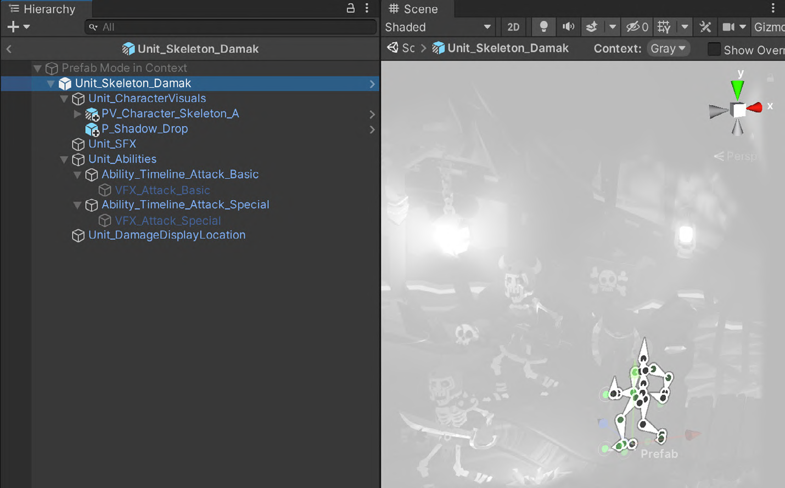
<p><em>VI: <strong>▲ Prefab Mode in Context</strong> — breadcrumb <em>Unit_Skeleton_Damak</em>, <strong>Context: Gray</strong>, và phần còn lại của Scene bị <strong>LÀM XÁM</strong> để bạn biết mình đang sửa Prefab chứ KHÔNG phải instance. / EN: Edit each Prefab, either in Context or in Isolation.</em></p>

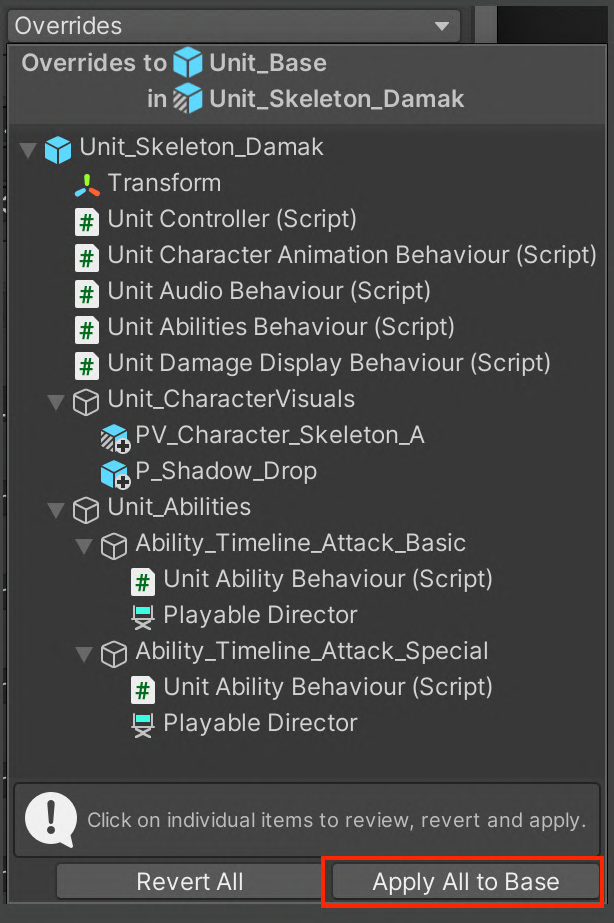
<p><em>VI: <strong>▲ Overrides dropdown</strong> — liệt kê MỌI khác biệt của <code>Unit_Skeleton_Damak</code> so với <code>Unit_Base</code>: Transform, 5 Script, <code>Unit_CharacterVisuals</code>, <code>Unit_Abilities</code>… Hai nút <strong>Revert All</strong> (huỷ override) và <strong>Apply All to Base</strong> (đẩy ngược lên Prefab gốc). / EN: Use Apply All to Base to propagate changes to the Base object or Revert All to undo the overrides.</em></p>

### 64.3. 🔤 TextMeshPro — thay thế UI Text & legacy Text Mesh

<div class="bilingual-row">
<div class="col-vi">
<p>📖 <em>"<strong>TextMeshPro THAY THẾ UI Text của Unity và Text Mesh cũ.</strong> Cài qua Package Manager, TextMeshPro dùng <strong>shader RIÊNG và kỹ thuật render chữ TIÊN TIẾN</strong> để mang lại <strong>styling và texturing chữ LINH HOẠT.</strong>"</em></p>
<p>🎁 <em>"Dùng TextMeshPro để có các tính năng như <strong>giãn cách ký tự, từ, dòng và đoạn; kerning; căn đều (justified); link; HƠN 30 rich text tag; hỗ trợ Multi Font và sprite; style tuỳ chỉnh</strong> và nhiều hơn nữa."</em></p>
</div>
<div class="col-en">
<p>📖 <em>"TextMeshPro replaces Unity's UI Text and the legacy Text Mesh. Installed via the PackageManager, TextMeshPro uses custom shaders and advanced text rendering techniques to deliver flexible text styling and texturing."</em></p>
<p>🎁 <em>"Use TextMeshPro to get access to features like character, word, line, and paragraph spacing, kerning, justified text, links, over 30 rich text tags available, support for Multi Font and sprites, custom styles, and more."</em></p>
</div>
</div>

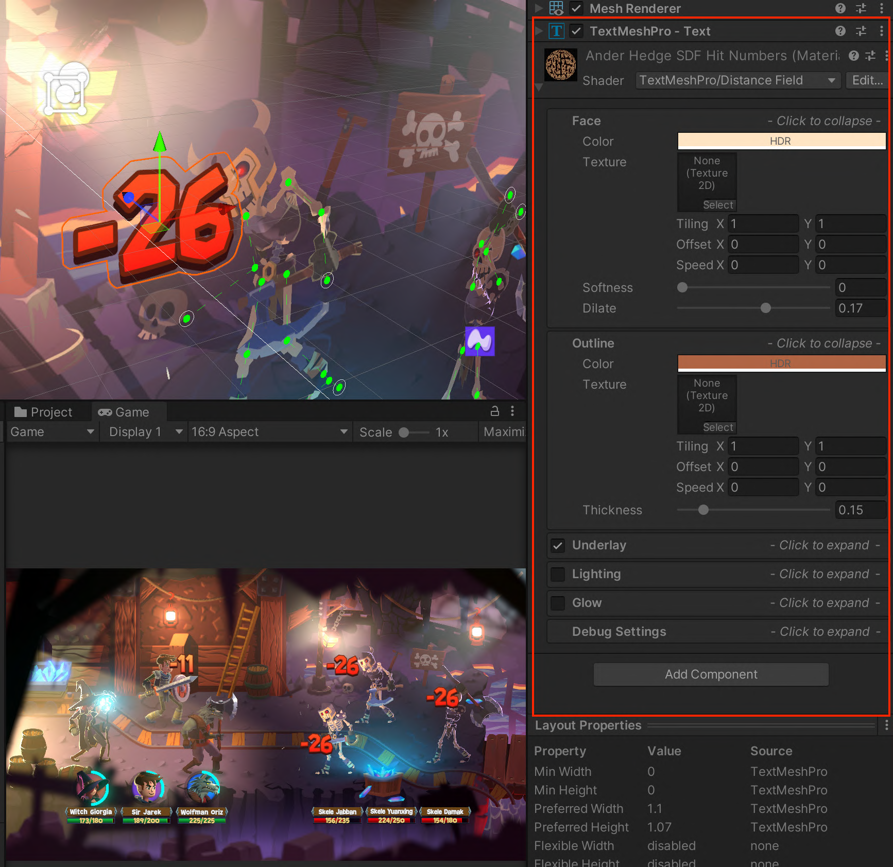
<p><em>VI: <strong>▲ Inspector của TextMeshPro</strong> — shader <strong>TextMeshPro/Distance Field</strong>; các nhóm <strong>Face</strong> (Color, Texture, Tiling, Softness, Dilate), <strong>Outline</strong> (Color, Texture, Thickness 0.15), rồi <strong>Underlay · Lighting · Glow · Debug Settings</strong>. Con số <strong>−26</strong> đỏ trong game chính là damage vẽ bằng TMP. / EN: TextMeshPro example from Dragon Crashers.</em></p>

### 64.4. 📐 Snapping — BA kiểu và bảng phím tắt

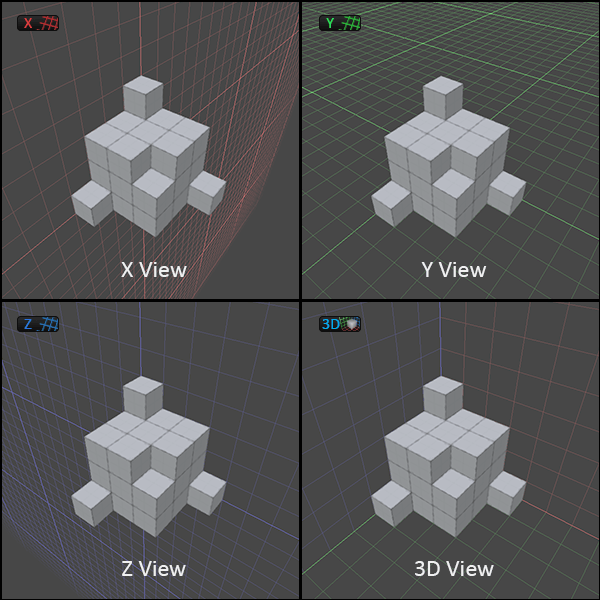
<p><em>VI: <strong>▲ Lưới theo TỪNG trục</strong> — cùng một khối nhìn ở <strong>X View · Y View · Z View · 3D View</strong>; mặt phẳng lưới đổi theo <strong>Grid Axis</strong> đang chọn, nên snap luôn diễn ra trên mặt phẳng bạn đang nhìn. / EN: The grid plane in X View, Y View, Z View and 3D View.</em></p>

<div class="bilingual-row">
<div class="col-vi">
<p>📖 <em>"Làm việc trên LƯỚI giúp bạn <strong>ghép các Prefab với nhau với ÍT PHỎNG ĐOÁN hơn và NHẤT QUÁN hơn.</strong> Hãy thiết kế màn chơi sao cho <strong>các mảnh KHỚP NHAU đúng tỉ lệ</strong>, khiến việc sắp xếp lại dễ dàng hơn."</em></p>
<p>⚡ <em>"Thay vì <strong>GÕ TAY những con số tròn vào Inspector</strong>, hãy để <strong>công cụ grid snapping đặt Transform NHANH và CHÍNH XÁC hơn.</strong>"</em></p>
</div>
<div class="col-en">
<p>📖 <em>"Working on a grid helps you fit your Prefabs together with less guesswork and greater consistency. Design your level so the pieces connect at scale, making it easier to rearrange and reassemble them."</em></p>
<p>⚡ <em>"Rather than manually typing in round numbers into the Inspector, consider letting the grid snapping tools set your Transforms more quickly and precisely."</em></p>
</div>
</div>

| Kiểu snap | Cách dùng — nguyên văn |
|---|---|
| **① World grid snapping** | *"Đảm bảo công cụ <strong>Move</strong> đang để handle orientation là <strong>Global</strong>. Giữ <strong><code>Ctrl</code></strong> (Windows) hoặc <strong><code>Cmd</code></strong> (macOS) để snap object theo bước lưới thế giới đặt trong <code>Edit &gt; Grid and Snap Settings</code>."* |
| **② Surface snapping** | *"Giữ <strong><code>Shift</code> + <code>Ctrl</code></strong> (Windows) / <strong><code>Cmd</code></strong> (macOS) để snap object vào <strong>GIAO ĐIỂM của BẤT KỲ Collider nào.</strong>"* |
| **③ Vertex snapping** | *"Giữ phím <strong><code>V</code></strong> khi công cụ Move đang bật. Việc này <strong>DI CHUYỂN GameObject hiện tại tới vị trí VERTEX của mesh khác.</strong> Trước khi di chuyển, <strong>rê chuột lên MỘT vertex của GameObject đang chọn để vertex đó làm PIVOT. <code>Shift+V</code> bật/tắt chế độ Vertex snapping.</strong>"* |

**🎯 KẾT HỢP Vertex + Surface — quy trình đặt vật thể NHANH / Combining Vertex and Surface snapping**

<div class="bilingual-row">
<div class="col-vi">
<ol>
<li>Di chuyển GameObject bằng <strong>Vertex snapping</strong> với phím <code>V</code> hoặc <code>Shift+V</code>. Rê con trỏ lên một vertex để làm <strong>pivot</strong>. Snap sang vertex khác như bình thường.</li>
<li>Giữ tổ hợp <strong><code>Shift</code> + <code>Ctrl</code></strong> (Windows) / <strong><code>Cmd</code></strong> (macOS) để <strong>KÉO dọc theo BỀ MẶT của Mesh đích.</strong></li>
<li><strong>NHẢ chuột và phím <code>V</code></strong> khi object đã ở vị trí mong muốn.</li>
</ol>
</div>
<div class="col-en">
<ol>
<li>Move the GameObject using Vertex snapping with the V key or Shift-V. Hover the cursor over a vertex as a pivot. Snap to another vertex as usual.</li>
<li>Hold down the Shift and Ctrl (Windows) / Cmd (macOS) key combo to drag along the surface of the target Mesh.</li>
<li>Release the mouse button and V key once the object is at the desired location.</li>
</ol>
</div>
</div>

**⌨️ Phím tắt snapping MẶC ĐỊNH / The default grid snapping shortcuts**

| Hành động | Phím tắt mặc định |
|---|---|
| **Increase Grid Size** | `Ctrl + ]` (Windows) hoặc `Cmd + ]` (macOS) |
| **Decrease Grid Size** | `Ctrl + [` (Windows) hoặc `Cmd + [` (macOS) |
| **Nudge Grid Backward** | `Shift + [` |
| **Nudge Grid Forward** | `Shift + ]` |
| **Align Selection to Grid** | `Ctrl + \` (Windows) hoặc `Cmd + \` (macOS) |

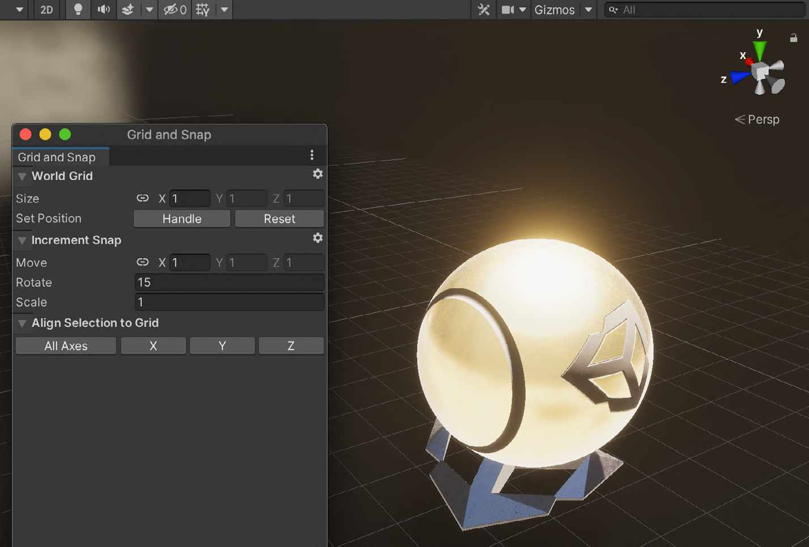
<p><em>VI: <strong>▲ Cửa sổ Grid and Snap</strong> — <strong>World Grid Size X/Y/Z = 1</strong>; <strong>Increment Snap: Move 1 · Rotate 15 · Scale 1</strong>; hàng <strong>Align Selection to Grid</strong> có nút <strong>All Axes · X · Y · Z</strong>. / EN: The Grid and Snap settings.</em></p>

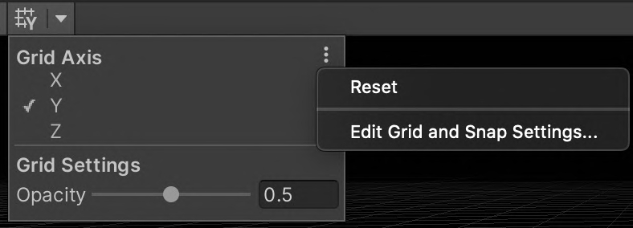
<p><em>VI: <strong>▲ Menu lưới</strong> — <strong>Grid Axis: X · Y (đang chọn) · Z</strong> và <strong>Grid Settings › Opacity 0.5</strong>; menu ngữ cảnh có <strong>Reset</strong> và <strong>Edit Grid and Snap Settings…</strong> / EN: The grid visibility drop-down menu.</em></p>

<div class="bilingual-row">
<div class="col-vi">
<p>💎 <em>"Cần kiểm soát NHIỀU HƠN NỮA? Cân nhắc dùng <strong>package ProGrids</strong> để kiểm soát snapping và mặt phẳng lưới <strong>MỊN HƠN.</strong>"</em></p>
</div>
<div class="col-en">
<p>💎 <em>"Need even more control? Consider using the ProGrids package for even finer control of your snapping and grid planes."</em></p>
</div>
</div>

### 64.5. 🕺 Animation workflow — Dopesheet ↔ Curves, Animator & Animation Rigging

<div class="bilingual-row">
<div class="col-vi">
<p>📖 <em>"Bạn có thể <strong>animate GẦN NHƯ MỌI property trong Unity MÀ KHÔNG viết DÒNG CODE NÀO</strong> bằng Animation Window (<code>Window &gt; Animation &gt; Animation</code>). Ngoài chuyển động, bạn <strong>còn có thể ĐIỀU KHIỂN cả tham số định nghĩa trong script RIÊNG của bạn.</strong>"</em></p>
<p>🎬 <em>"Tạo Animation Clip ở đây, hoặc làm trong DCC bên thứ ba (Autodesk® Maya®, Blender…). <strong>Hãy nghĩ mỗi clip là MỘT ĐƠN VỊ chuyển động.</strong>"</em></p>
<p>⌨️ <strong>Phím tắt cần thuộc:</strong> <em>"Sửa AnimationClip Asset trong cửa sổ ở chế độ <strong>Dopesheet</strong> hoặc <strong>Curve</strong> — dùng phím <strong><code>K</code></strong> và <strong><code>C</code></strong> để chuyển qua lại. Dùng <strong><code>A</code> để frame TOÀN BỘ keyframe</strong>, <strong><code>F</code> để frame keyframe ĐANG CHỌN.</strong>"</em></p>
<p>🕸️ <em>"Khi đã có vài Animation Clip, <strong>AnimatorController đóng vai trò MÁY TRẠNG THÁI, tạo đồ thị dạng LƯU ĐỒ giữa chúng.</strong> ✅ Điều này cho phép <strong>artist tạo animation TINH VI với sự ĐỘC LẬP LỚN HƠN khỏi lập trình viên.</strong>"</em></p>
<p>🦾 <em>"Mở rộng thêm bằng <strong>package Animation Rigging</strong> — cung cấp <strong>thư viện các ràng buộc rig và inverse kinematic có thể tạo chuyển động THỦ TỤC (procedural).</strong> Bộ xương animate nhờ đó <strong>TƯƠNG TÁC được với môi trường bằng 'runtime rigging'</strong>, hoặc ràng buộc dựa trên vật lý có thể <strong>thêm chuyển động PHỤ động.</strong>"</em></p>
</div>
<div class="col-en">
<p>📖 <em>"You can animate just about any property in Unity without writing a single line of code using the Animation Window (Window &gt; Animation &gt; Animation). In addition to modifying movement, you can even drive parameters defined in your custom scripts."</em></p>
<p>🎬 <em>"Create Animation Clips here, or work in a third-party DCC package of your choice (Autodesk® Maya®, Blender, etc). Think of each clip as an individual unit of motion."</em></p>
<p>⌨️ <strong>Shortcuts to memorize:</strong> <em>"Edit the AnimationClip Asset within the window in either Dopesheet or Curve mode. Use K or C shortcuts, respectively, to toggle between the two. Use standard shortcuts to frame all keyframes (A) or frame selected keyframes (F)."</em></p>
<p>🕸️ <em>"Once you have several Animation Clips for your GameObject, the AnimatorController acts as a state machine to create a flowchart-like graph between them. This allows artists to produce sophisticated animation with greater independence from programmers."</em></p>
<p>🦾 <em>"Extend this further using the Animation Rigging package. This package provides a library of rig and inverse kinematic constraints that can create procedural motion. Animated skeletons can thus interact with the environment with 'runtime rigging,' or physics-based constraints can add dynamic secondary motion."</em></p>
</div>
</div>

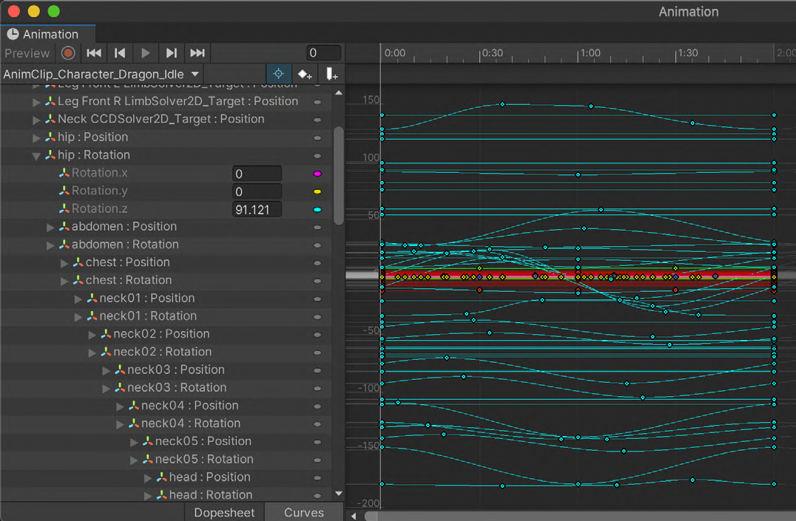
<p><em>VI: <strong>▲ Chế độ Curves</strong> (phím <code>C</code>) — cùng dữ liệu <code>AnimClip_Character_Dragon_Idle</code> hiển thị dạng ĐƯỜNG CONG cho từng kênh (<code>hip:Rotation.z = 91.121</code>, <code>abdomen</code>, <code>chest</code>, <code>neck01..05</code>, <code>head</code>). / EN: The Animation window as curves.</em></p>

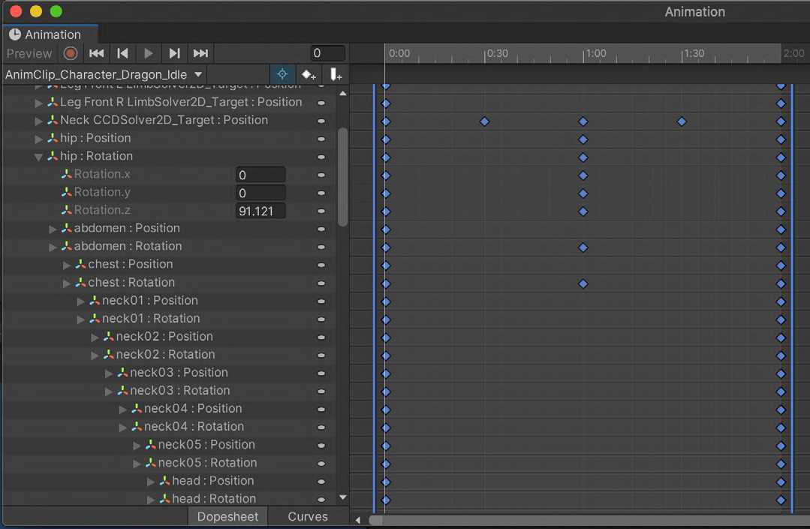
<p><em>VI: <strong>▲ Chế độ Dopesheet</strong> (phím <code>K</code>) — CÙNG animation đó nhưng chỉ hiện <strong>vị trí keyframe</strong> dạng hình thoi, dễ chỉnh TIMING hơn. / EN: The same animation data as a dopesheet.</em></p>

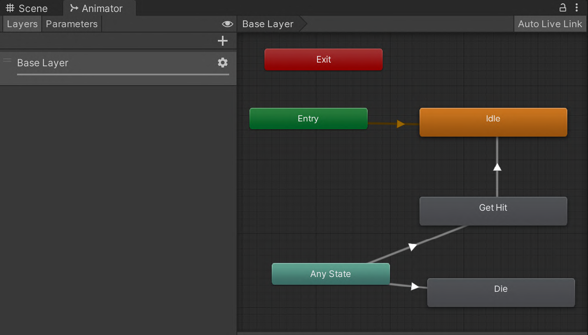
<p><em>VI: <strong>▲ AnimatorController</strong> — máy trạng thái với <strong>Entry → Idle</strong>, <strong>Any State → Get Hit</strong>, <strong>Get Hit → Die</strong>, và <strong>Exit</strong>. Đây là "lưu đồ" mà artist tự dựng được. / EN: The AnimatorController links the Animation Clips in a visual graph.</em></p>

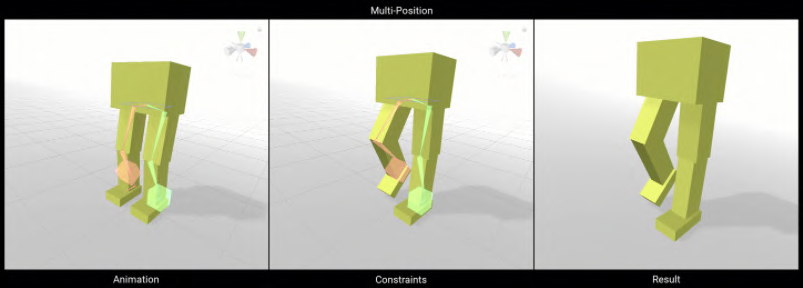
<p><em>VI: <strong>▲ Animation Rigging — ràng buộc Multi-Position</strong>: cột trái <strong>Animation</strong> (chuyển động gốc), giữa <strong>Constraints</strong>, phải <strong>Result</strong> — ràng buộc SỬA animation NGAY LÚC CHẠY. / EN: Constraints can modify your animation at runtime.</em></p>

!!! danger "⚠️ Mẹo TỐI ƯU — hai cái bẫy của Animator / Optimization tip"
    <div class="bilingual-row">
    <div class="col-vi">
    <p>💀 <strong>① ĐỪNG lạm dụng Animator, nhất là với UI:</strong> <em>"Animator khiến <strong>UI Canvas PHẢI REBUILD MỖI FRAME, KỂ CẢ khi KHÔNG có animation nào đang chạy.</strong> Bất cứ khi nào có thể, hãy <strong>dùng component Animation CŨ (legacy) cho UI hoặc các animation đơn giản.</strong> Cũng nên cân nhắc <strong>viết hàm tweening hoặc dùng thư viện bên thứ ba (ví dụ DOTween).</strong>"</em></p>
    <p>💀 <strong>② Generic rig vs Humanoid rig:</strong> <em>"Theo mặc định Unity import model animate với <strong>generic rig</strong>, nhưng lập trình viên thường <strong>ĐỔI sang humanoid rig</strong> khi animate nhân vật. 🚨 <strong>Humanoid rig TÍNH inverse kinematics và animation retargeting MỖI FRAME, KỂ CẢ KHI KHÔNG DÙNG.</strong> ✅ Nếu bạn KHÔNG cần những tính năng đó, hãy <strong>TIẾT KIỆM thời gian CPU và dùng generic rig.</strong>"</em></p>
    </div>
    <div class="col-en">
    <p>💀 <strong>① Avoid overusing Animators, particularly with UI:</strong> <em>"Animators cause the UI Canvas to rebuild each frame, even if no animation is playing. Whenever possible, use the legacy Animation components for UI or simple animations. Also, consider creating tweening functions or using a third-party library (e.g., DOTween)."</em></p>
    <p>💀 <strong>② Generic vs humanoid rig:</strong> <em>"By default, Unity imports animated models with the generic rig, but developers often switch to the humanoid rig when animating a character. A humanoid rig calculates inverse kinematics and animation retargeting each frame, even when not in use. If you don't need these specific features, save on CPU time and use the generic rig."</em></p>
    </div>
    </div>

### 64.6. 🧭 Custom gizmos & icons

<div class="bilingual-row">
<div class="col-vi">
<p>📖 <em>"Gizmo là <strong>đồ hoạ overlay NHỎ gắn với GameObject của bạn. Dùng chúng để ĐIỀU HƯỚNG viewport hoặc ĐỊNH VỊ các object cụ thể.</strong>"</em></p>
<p>🎨 <em>"Đổi icon cho GameObject bằng menu <strong>Select Icon</strong>. Chọn <strong>Other</strong> để định nghĩa icon RIÊNG của bạn."</em></p>
<p>🧩 <em>"Bạn cũng có thể <strong>TẠO gizmo bằng SCRIPT và khiến chúng TƯƠNG TÁC ĐƯỢC.</strong> Ví dụ, một gizmo có thể giúp bạn <strong>ĐỊNH NGHĨA một VOLUME hoặc VÙNG ẢNH HƯỞNG cho component tuỳ chỉnh.</strong>"</em></p>
<p>🎚️ <em>"Dùng hộp thoại <strong>Gizmos trong Scene control bar</strong> để bật/tắt từng gizmo hoặc <strong>bật/tắt TOÀN BỘ.</strong>"</em></p>
</div>
<div class="col-en">
<p>📖 <em>"Gizmos are small overlay graphics associated with your GameObjects. Use them to navigate the viewport or locate specific objects."</em></p>
<p>🎨 <em>"Modify the icons for a GameObject using the Select Icon menu. Choose Other to define your own icon."</em></p>
<p>🧩 <em>"You can also create gizmos with scripts and make them interactive. For example, a gizmo could help you define a volume or area of influence for a custom component."</em></p>
<p>🎚️ <em>"Use the Gizmos dialogue in the Scene control bar to toggle specific gizmos or globally enable/disable all of them."</em></p>
</div>
</div>

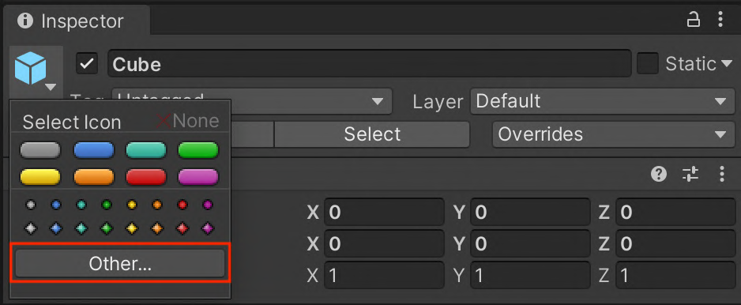
<p><em>VI: <strong>▲ Menu Select Icon</strong> — bảng màu nhãn (xám, xanh dương, xanh ngọc, xanh lá, vàng, cam, đỏ, tím) ở hai dạng nhãn dài và chấm tròn; nút <strong>Other…</strong> (viền đỏ) để nạp icon RIÊNG. / EN: Select a custom gizmo using the Other… option.</em></p>

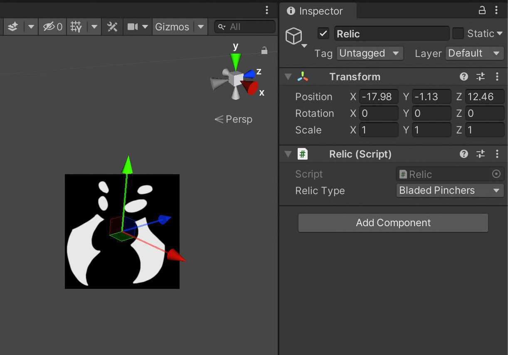
<p><em>VI: <strong>▲ Icon tuỳ chỉnh hiển thị trong Scene</strong> — GameObject <code>Relic</code> (Position −17.98, −1.13, 12.46) mang icon riêng; script <code>Relic (Script)</code> có field <strong>Relic Type: Bladed Pinchers</strong> — ví dụ gizmo ĐỔI THEO lựa chọn. / EN: In this example, a script changes the gizmo based on a selection.</em></p>

### 64.7. 💡 Progressive Lightmapper — SÁU cách rút ngắn thời gian bake


<p><em>VI: <strong>▲ CÓ lightmap</strong> — bóng đổ mềm dưới mái, ánh sáng nảy làm sáng mặt trong của cột và sàn. / EN: A scene with lightmaps applied.</em></p>


<p><em>VI: <strong>▲ KHÔNG lightmap</strong> — CÙNG scene, cùng đèn: mất bóng tiếp xúc và mất ánh sáng gián tiếp, mọi bề mặt phẳng đều đều. Đây chính là thứ bạn ĐÁNH ĐỔI khi bỏ bake. / EN: The same scene without lightmapping.</em></p>

<div class="bilingual-row">
<div class="col-vi">
<p>📖 <em>"Lightmapping cho phép <strong>TÍNH TRƯỚC cả ánh sáng TRỰC TIẾP lẫn GIÁN TIẾP</strong>, rồi lưu kết quả vào một Texture gọi là <strong>lightmap</strong>. Dù <strong>hình học đã lightmap chạy RẤT NHANH lúc runtime, việc BAKE lightmap trong lịch sử là RẤT ĐẮT.</strong>"</em></p>
<p>⚡ <em>"<strong>Progressive Lightmapper là một path tracer NHANH: nó cho ra kết quả NGAY rồi TINH CHỈNH DẦN theo thời gian.</strong> ✅ Nhờ vậy bạn có thể <strong>NGẮT tiến trình để thay đổi MÀ KHÔNG phải chờ bake xong</strong>, giúp lặp NHANH HƠN."</em></p>
</div>
<div class="col-en">
<p>📖 <em>"Lightmapping allows you to precalculate both direct and indirect lighting, then store the result in a Texture called a lightmap for later use. Though lightmapped geometry is performant at runtime, baking a lightmap has historically been expensive."</em></p>
<p>⚡ <em>"The Progressive Lightmapper is a fast path tracer that produces a result quickly, then refines the render over time. You can thus interrupt the process to make changes without waiting for the final bake to complete, allowing you to iterate more rapidly."</em></p>
</div>
</div>

| # | Mẹo tăng tốc bake | Nguyên văn |
|---|---|---|
| **①** | **Prioritize View** | *"Bật để Progressive Lightmapper <strong>xử lý các texel ĐANG NHÌN THẤY trong Scene view TRƯỚC</strong> rồi mới tới phần ngoài tầm nhìn."* |
| **②** | **Giảm Samples & Bounces** | *"Giảm <strong>Direct và Indirect Samples</strong> không cần thiết, và <strong>Bounces — HAI là thường ĐỦ; chỉ tăng nếu THỰC SỰ cần.</strong>"* |
| **③** | **Lightmap Resolution & texel count** | 🚨 *"Số texel <strong>ĐẠI DIỆN cho KHỐI LƯỢNG công việc lightmapper phải làm. Vì lightmap là texture 2D, GẤP ĐÔI độ phân giải sẽ GẤP BỐN khối lượng công việc.</strong>"* |
| **④** | **Giảm texel ở nơi KHÔNG đáng** | *"Giảm texel trên <strong>bề mặt BỊ CHE, vật thể NHỎ hoặc MỎNG</strong>, hay bất cứ đâu lightmap không tạo khác biệt. <strong>Mỗi MeshRenderer đóng góp vào GI đều có tuỳ chọn <code>Scale in Lightmap</code> để GIẢM kích thước UV tương đối của nó trong lightmap.</strong>"* |
| **⑤** | **Chọn đúng Lighting Mode** | *"<strong>Baked Indirect · Subtractive · ShadowMask.</strong> ✅ <strong>Bạn KHÔNG cần bake bóng nếu định hướng nghệ thuật không đòi hỏi.</strong>"* |
| **⑥** | **Progressive GPU Lightmapper** | *"Progressive <strong>CPU</strong> Lightmapper hiện tại dùng <strong>CPU và RAM</strong> của máy. Bản mới <strong>Progressive GPU Lightmapper (Preview) dùng GPU và VRAM, có thể tăng tốc bake ĐÁNG KỂ</strong> — nếu máy bạn đạt yêu cầu phần cứng, nó có thể <strong>tăng tốc workflow ánh sáng ĐÁNG KINH NGẠC (GẤP MƯỜI LẦN trong một số trường hợp).</strong>"* |

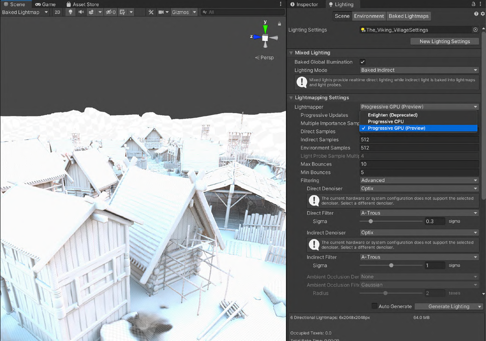
<p><em>VI: <strong>▲ Thiết lập bake</strong> — <strong>Lighting Mode: Baked Indirect</strong>; <strong>Lightmapper: Progressive GPU (Preview)</strong> (menu đang mở, cho thấy cả <em>Enlighten (Deprecated)</em> và <em>Progressive CPU</em>); <strong>Direct Samples 512 · Indirect Samples 512 · Max Bounces 10 · Min Bounces 5</strong>; <strong>Filtering: Advanced</strong> với <strong>Direct/Indirect Denoiser: Optix</strong>, <strong>A-Trous</strong> filter Sigma 0.3/1. Cuối bảng: <strong>6 Directional Lightmaps 6×2048×2048px — 64.0 MB</strong>. / EN: The Lighting settings with the Progressive GPU Lightmapper.</em></p>

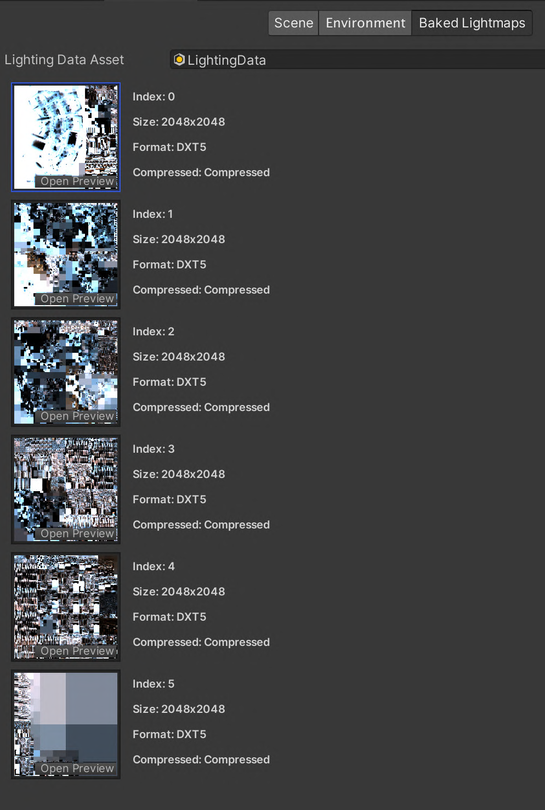
<p><em>VI: <strong>▲ Tab Baked Lightmaps</strong> — <strong>SÁU lightmap Index 0…5</strong>, mỗi cái <strong>2048×2048 · Format DXT5 · Compressed</strong>. Đây chính là dung lượng bạn phải TRẢ để có ánh sáng bake. / EN: The Baked Lightmaps tab of the Lighting window.</em></p>

### 64.8. 🔵 Light Probes — thay lightmap ở chỗ MẮT KHÔNG ĐỂ Ý

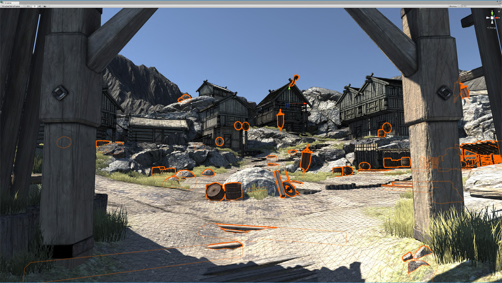
<p><em>VI: <strong>▲ Chọn Light Probes trong scene</strong> — các probe (khoanh CAM) rải quanh cột, thùng và mặt đất; chúng đứng ở nơi vật thể ĐỘNG sẽ đi qua, chứ không phủ đều toàn scene. / EN: Selecting Light Probes placed around the level.</em></p>

<div class="bilingual-row">
<div class="col-vi">
<p>📖 <em>"Global Illumination cho ánh sáng gián tiếp ĐẸP, <strong>nhưng TỐN KÉM để tính và LƯU trên đĩa.</strong> Nếu bạn có <strong>đồ trang trí hoặc mesh tĩnh KHÔNG THỰC SỰ CẦN lightmap, hãy cân nhắc LOẠI chúng khỏi bake và dùng Light Probes THAY THẾ.</strong>"</em></p>
<p>🔄 <em>"<strong>TRƯỚC ĐÂY chỉ dành cho object ĐỘNG, Light Probes NAY áp dụng được cho CẢ mesh TĨNH.</strong> Trong component <strong>MeshRenderer</strong>, tìm dropdown <strong><code>Receive Global Illumination</code> và chuyển từ <code>Lightmaps</code> sang <code>Light Probes</code>.</strong>"</em></p>
<p>⚡ <strong>Hai lợi ích KỸ THUẬT:</strong></p>
<ul>
<li><em>"Chiếu sáng bằng Light Probe <strong>KHÔNG đòi hỏi UV đúng chuẩn — TIẾT KIỆM cho bạn bước UNWRAP mesh.</strong>"</em></li>
<li><em>"Các hàm cơ sở <strong>Spherical Harmonics</strong> dùng trong probe lighting khiến nó <strong>tính NHANH so với lightmapping.</strong> Probe lighting <strong>thường bake NHANH HƠN lightmapping.</strong>"</em></li>
</ul>
</div>
<div class="col-en">
<p>📖 <em>"Global Illumination produces beautiful indirect lighting, but this can be expensive to calculate and store on disk. If you have set dressing or other static meshes that don't absolutely require lightmapping, consider removing them from your lightmap bakes and use Light Probes instead."</em></p>
<p>🔄 <em>"Formerly reserved for dynamic objects, Light Probes can apply to static meshes as well. In the MeshRenderer component, locate the Receive Global Illumination dropdown and toggle it from Lightmaps to Light Probes."</em></p>
<p>⚡ <strong>Two technical benefits:</strong></p>
<ul>
<li><em>"Light Probe illumination does not require proper UVs, saving you the extra step of unwrapping your meshes."</em></li>
<li><em>"The Spherical Harmonics basis functions used in probe lighting make it fast to calculate relative to lightmapping. Probe lighting typically bakes faster than lightmapping."</em></li>
</ul>
</div>
</div>

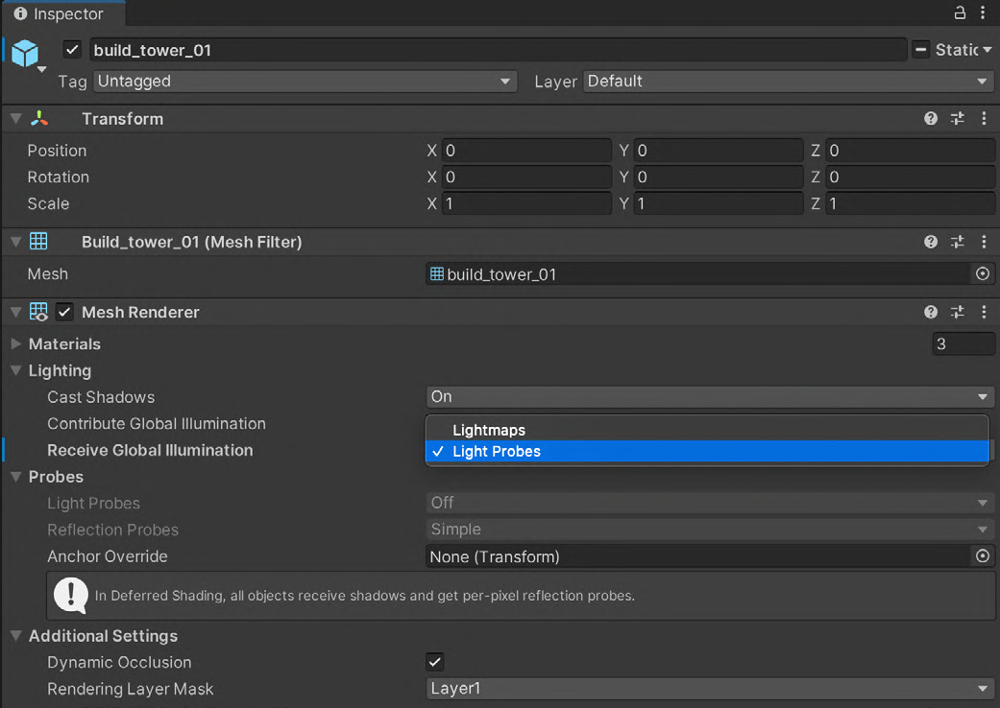
<p><em>VI: <strong>▲ Công tắc THEN CHỐT</strong> — trong <strong>Mesh Renderer</strong> của <code>build_tower_01</code>, mục <strong>Lighting › Receive Global Illumination</strong> đang mở dropdown với hai lựa chọn <strong>Lightmaps</strong> và <strong>Light Probes</strong> (đang chọn). / EN: Toggle Receive Global Illumination from Lightmaps to Light Probes.</em></p>

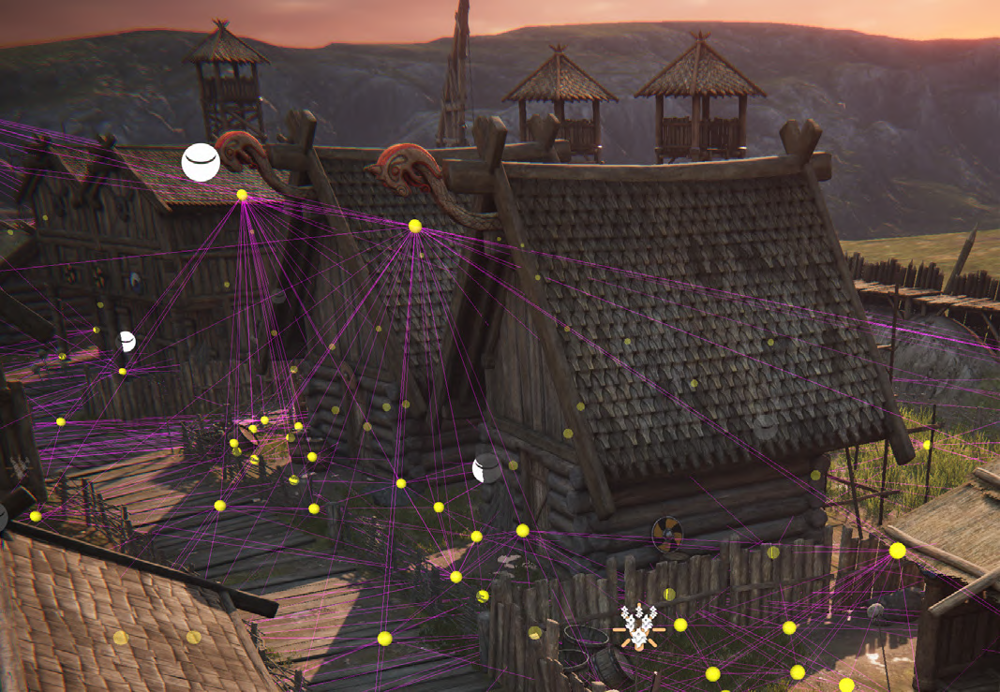
<p><em>VI: <strong>▲ Light Probe Group</strong> — các probe (chấm VÀNG) rải khắp mái nhà và khoảng không, nối nhau bằng <strong>mạng lưới TỨ DIỆN (tetrahedral) màu tím</strong>. Unity nội suy ánh sáng cho object bên trong mỗi tứ diện. / EN: A Light Probe Group with Light Probes spread across the level.</em></p>


---

## 65. 👨‍💻 Developer workflows — Enter Play Mode & ScriptableObject

!!! danger "⚡ ENTER PLAY MODE SETTINGS — mẹo TIẾT KIỆM THỜI GIAN lớn nhất cho lập trình viên"
    <div class="bilingual-row">
    <div class="col-vi">
    <blockquote>
    <p><em>"<strong>MỖI LẦN bạn vào Play Mode trong Editor, Unity thực hiện HAI HÀNH ĐỘNG ĐÁNG KỂ:</strong></em></p>
    <ol>
    <li><em><strong>DOMAIN RELOAD: Unity SAO LƯU, GỠ TẢI, và TÁI TẠO trạng thái scripting</strong></em></li>
    <li><em><strong>SCENE RELOAD: Unity HUỶ Scene và LOAD LẠI nó</strong></em></li>
    </ol>
    <p><em>💀 <strong>HAI hành động này TỐN NGÀY CÀNG NHIỀU THỜI GIAN khi script và Scene của bạn TRỞ NÊN PHỨC TẠP HƠN.</strong></em></p>
    <p><em>✅ <strong>NẾU bạn KHÔNG định thay đổi script thêm nữa, Enter Play Mode Settings (<code>Edit &gt; Project Settings &gt; Editor</code>) có thể TIẾT KIỆM cho bạn KHÁ NHIỀU thời gian biên dịch. Unity cho bạn tuỳ chọn TẮT Domain Reload, Scene Reload, hoặc CẢ HAI. Việc này TĂNG TỐC việc vào và ra Play Mode.</strong></em></p>
    <p><em>🚨 <strong>CHỈ CẦN NHỚ: NẾU bạn ĐỊNH thay đổi script tiếp, bạn PHẢI BẬT LẠI Domain Reload. Tương tự, NẾU bạn sửa Scene Hierarchy, bạn NÊN BẬT LẠI Scene Reload. Nếu không, HÀNH VI KHÔNG MONG ĐỢI CÓ THỂ XẢY RA.</strong>"</em></p>
    </blockquote>
    </div>
    <div class="col-en">
    <blockquote>
    <p><em>"<strong>EACH TIME you enter Play Mode in the Editor, Unity performs TWO SIGNIFICANT ACTIONS:</strong></em></p>
    <ol>
    <li><em><strong>DOMAIN RELOAD: Unity BACKS UP, UNLOADS, and RECREATES scripting states</strong></em></li>
    <li><em><strong>SCENE RELOAD: Unity DESTROYS the Scene and LOADS IT AGAIN</strong></em></li>
    </ol>
    <p><em>💀 <strong>These two actions take MORE AND MORE TIME as your scripts and Scenes become MORE COMPLEX.</strong></em></p>
    <p><em>✅ <strong>IF you DON'T plan on making any more script changes, the Enter Play Mode Settings (<code>Edit &gt; Project Settings &gt; Editor</code>) can SAVE you a bit of COMPILE TIME. Unity gives you the option to DISABLE either Domain Reload, Scene Reload, or BOTH. This can SPEED UP entering and exiting Play Mode.</strong></em></p>
    <p><em>🚨 <strong>JUST REMEMBER: IF you DO plan on making further script changes, you need to RE-ENABLE Domain Reload. Likewise, IF you modify the Scene Hierarchy, you SHOULD re-enable Scene Reload. OTHERWISE, UNEXPECTED BEHAVIOUR COULD RESULT.</strong>"</em></p>
    </blockquote>
    </div>
    </div>

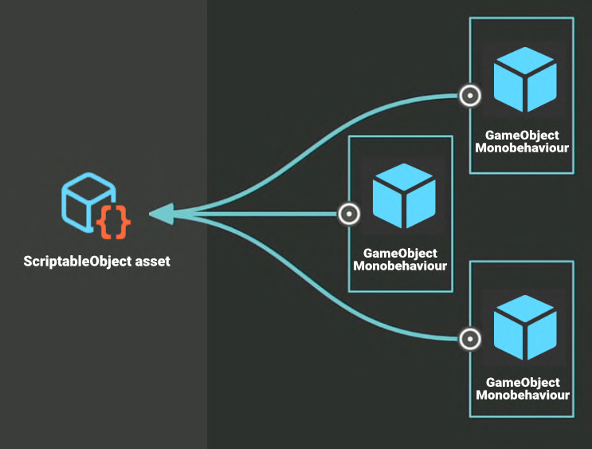
<p><em>VI: <strong>MỘT ScriptableObject asset</strong> được THAM CHIẾU bởi <strong>NHIỀU GameObject/MonoBehaviour</strong> — dữ liệu KHÔNG bị nhân bản, TIẾT KIỆM bộ nhớ. / EN: One ScriptableObject asset referenced by many GameObjects — data is not duplicated, saving memory.</em></p>

<div class="bilingual-row">
<div class="col-vi">
<blockquote>
<p><em>"<strong>KHÁC với MonoBehaviour, dữ liệu lưu vào ScriptableObject được GHI RA ĐĨA dưới dạng ASSET và KHÔNG gắn vào GameObject. Do đó, nó có thể TỒN TẠI GIỮA CÁC PHIÊN LÀM VIỆC.</strong></em></p>
<p><em>💾 <strong>NẾU Scene bỗng ĐẦY các unit, dữ liệu trên ScriptableObject asset KHÔNG BỊ NHÂN BẢN — TIẾT KIỆM BỘ NHỚ.</strong></em></p>
<p><em>🔢 <strong>NGAY CẢ KHI bạn thêm MỘT NGHÌN instance của một Prefab vào Scene, chúng VẪN THAM CHIẾU tới CÙNG dữ liệu lưu trong asset của bạn. Thiết lập bộ giá trị CHỈ MỘT LẦN ĐẢM BẢO TÍNH NHẤT QUÁN.</strong></em></p>
<p><em>🚀 <strong>KHÁC với việc phân tích dữ liệu từ JSON hay XML, việc ĐỌC một ScriptableObject asset SẼ KHÔNG SINH RÁC (và, thêm nữa, NÓ NHANH HƠN).</strong></em></p>
<p><em>⚠️ <strong>ScriptableObject KHÔNG THAY THẾ việc lưu dữ liệu BỀN VỮNG cho file save của ứng dụng, nơi dữ liệu CÓ THỂ THAY ĐỔI trong lúc chơi. Nó là workflow PHÙ HỢP HƠN cho việc lưu SETTING và GIÁ TRỊ GAMEPLAY TĨNH.</strong>"</em></p>
</blockquote>
<p>💡 <strong>Mẹo TỐI ƯU kèm theo — về định dạng SAVE DATA:</strong></p>
<blockquote>
<p><em>"Chúng tôi <strong>KHUYẾN NGHỊ định dạng SERIALIZATION NHỊ PHÂN như MESSAGEPACK hoặc PROTOCOL BUFFERS cho dữ liệu save, THAY VÌ định dạng dựa trên VĂN BẢN như JSON hay XML.</strong></em></p>
<p><em>📊 <strong>Trong các Project Review, những định dạng nhị phân này GIẢM các vấn đề về BỘ NHỚ và HIỆU NĂNG gắn với định dạng văn bản.</strong>"</em></p>
</blockquote>
<p>👉 <em>Khớp CHÍNH XÁC với phần <strong>Protobuf vs JSON</strong> ở <a href="../03-senior/01-memory-addressables-networking.md">Module 3</a>.</em></p>
</div>
<div class="col-en">
<blockquote>
<p><em>"<strong>UNLIKE MonoBehaviours, the data saved to ScriptableObjects is WRITTEN TO DISK as an ASSET and NOT attached to a GameObject. Thus, it can PERSIST BETWEEN SESSIONS.</strong></em></p>
<p><em>💾 <strong>IF the Scene suddenly FILLS with units, the data on the ScriptableObject asset does NOT DUPLICATE — SAVING MEMORY.</strong></em></p>
<p><em>🔢 <strong>EVEN IF you add A THOUSAND instances of a Prefab to your Scene, they STILL REFER to the SAME DATA stored in your asset. Setting up the set of values JUST ONCE GUARANTEES CONSISTENCY.</strong></em></p>
<p><em>🚀 <strong>UNLIKE parsing data from JSON or XML, READING a ScriptableObject asset WON'T GENERATE GARBAGE (and, as a bonus, IT'S FASTER).</strong></em></p>
<p><em>⚠️ <strong>ScriptableObjects DON'T REPLACE keeping PERSISTENT data for the rest of your application's SAVE FILES, where the data MAY CHANGE during gameplay. It's a workflow suited MORE for storing your STATIC gameplay settings and values.</strong>"</em></p>
</blockquote>
<p>💡 <strong>The accompanying OPTIMIZATION TIP — on SAVE DATA formats:</strong></p>
<blockquote>
<p><em>"We <strong>RECOMMEND BINARY SERIALIZATION formats such as MESSAGEPACK or PROTOCOL BUFFERS for save data, RATHER THAN TEXT-BASED ones such as JSON or XML.</strong></em></p>
<p><em>📊 <strong>In Project Reviews, these binary serialization formats REDUCE the MEMORY and PERFORMANCE issues associated with the latter.</strong>"</em></p>
</blockquote>
<p>👉 <em>Matches the <strong>Protobuf vs JSON</strong> section in <a href="../03-senior/01-memory-addressables-networking.md">Module 3</a> EXACTLY.</em></p>
</div>
</div>

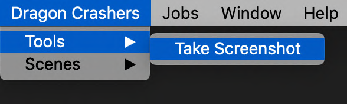
<p><em>VI: <strong>CUSTOM MENU</strong> — thêm mục menu riêng của dự án (<em>Dragon Crashers → Tools → Take Screenshot</em>) để tự động hoá thao tác lặp lại. / EN: A custom Editor menu item.</em></p>

<div class="bilingual-row">
<div class="col-vi">
<p>📦 <strong>Quản lý ASSEMBLY — vì sao mặc định là chưa đủ:</strong></p>
<blockquote>
<p><em>"Một <strong>ASSEMBLY là một THƯ VIỆN CODE C#, một tập hợp các kiểu và tài nguyên được build để làm việc CÙNG NHAU và tạo thành MỘT ĐƠN VỊ CHỨC NĂNG LOGIC.</strong></em></p>
<p><em>⚠️ <strong>THEO MẶC ĐỊNH, Unity biên dịch GẦN NHƯ TẤT CẢ script game của bạn vào MỘT assembly ĐỊNH SẴN: <code>Assembly-CSharp.dll</code>. Việc này ỔN với dự án NHỎ, NHƯNG NÓ CÓ NHỮNG NHƯỢC ĐIỂM</strong> — <em>mọi thay đổi script nhỏ đều buộc BIÊN DỊCH LẠI TOÀN BỘ</em>."</em></p>
</blockquote>
<p>👉 <em>Giải pháp: <strong>Assembly Definition (<code>.asmdef</code>)</strong> — chia code thành nhiều assembly để chỉ phần THAY ĐỔI mới phải biên dịch lại, rút ngắn ĐÁNG KỂ vòng lặp iterate.</em></p>
</div>
<div class="col-en">
<p>📦 <strong>Managing ASSEMBLIES — why the default is not enough:</strong></p>
<blockquote>
<p><em>"An <strong>ASSEMBLY is a C# CODE LIBRARY, a collection of types and resources that are built to work TOGETHER and form a LOGICAL UNIT of functionality.</strong></em></p>
<p><em>⚠️ <strong>BY DEFAULT, Unity compiles ALMOST ALL of your game scripts into the PREDEFINED assembly, <code>Assembly-CSharp.dll</code>. This works for SMALL projects, BUT IT HAS SOME DRAWBACKS</strong> — <em>every tiny script change forces a FULL RECOMPILE</em>."</em></p>
</blockquote>
<p>👉 <em>The fix: <strong>Assembly Definitions (<code>.asmdef</code>)</strong> — split code into multiple assemblies so only the CHANGED part recompiles, SIGNIFICANTLY shortening the iteration loop.</em></p>
</div>
</div>

### 65.1. 🏷️ Attributes — CHÍN attribute đáng thuộc

<div class="bilingual-row">
<div class="col-vi">
<p>📖 <em>"Unity có <strong>NHIỀU Attribute có thể ĐẶT PHÍA TRÊN một class, property hoặc function để BÁO HIỆU hành vi ĐẶC BIỆT.</strong> C# đặt tên attribute trong <strong>dấu ngoặc VUÔNG.</strong>"</em></p>
<p>🎁 <em>"Đây <strong>CHỈ là một MẪU NHỎ trong VÔ SỐ Attribute.</strong> Bạn muốn <strong>ĐỔI TÊN biến MÀ KHÔNG MẤT giá trị?</strong> Hay <strong>gọi logic MÀ KHÔNG cần GameObject rỗng?</strong> Xem Scripting API để có danh sách ĐẦY ĐỦ. Bạn <strong>thậm chí có thể TẠO PropertyAttribute RIÊNG</strong> để định nghĩa Attribute tuỳ chỉnh cho biến của mình."</em></p>
</div>
<div class="col-en">
<p>📖 <em>"Unity has a variety of Attributes that can be placed above a class, property, or function to indicate special behavior. C# contains attribute names within square brackets."</em></p>
<p>🎁 <em>"This is just a small sample of the numerous Attributes. Do you want to rename your variables without losing their values? Or invoke some logic without needing an empty GameObject? See the Scripting API for a complete list of Attributes for everything that's possible. You can even create your own PropertyAttribute to define custom Attributes for your script variables."</em></p>
</div>
</div>

| Attribute | Mô tả nguyên văn |
|---|---|
| **`SerializeField`** | *"**ÉP Unity serialize một field PRIVATE và khiến nó HIỆN trong Inspector.**"*<br>⚠️ **Ghi chú nguyên văn:** *"Bạn có thể gặp **cảnh báo 0649** khi áp `[SerializeField]` cho biến private. Để ngăn điều này, chỉ cần **KHỞI TẠO biến ngay khi khai báo** — tiện nhất là dùng từ khoá **`default`**."* |
| **`Range`** | *"Nhận một biến **float hoặc int BỊ GIỚI HẠN trong một khoảng cụ thể.** Field sẽ **hiện dạng THANH TRƯỢT trong Inspector.**"* |
| **`HideInInspector`** | *"Khiến biến **KHÔNG hiện trong Inspector NHƯNG VẪN được serialize.**"* |
| **`RequireComponent`** | *"**TỰ ĐỘNG THÊM các component bắt buộc như PHỤ THUỘC để tránh lỗi thiết lập.**"*<br>⚠️ *"Attribute này **CHỈ kiểm tra tại THỜI ĐIỂM Component được THÊM vào GameObject.**"* |
| **`Tooltip`** | *"**Hiện tooltip khi người dùng RÊ CHUỘT lên một field trong Inspector.**"* |
| **`Space`** | *"**Thêm khoảng TRỐNG nhỏ giữa các field** (không kèm chữ) để **PHÂN TÁCH thị giác.**"* |
| **`Header`** | *"Thêm **chữ IN ĐẬM và khoảng cách** để giúp **TỔ CHỨC biến trong Inspector.** ⚠️ **CHỈ thêm vào field ĐẦU TIÊN của nhóm.**"* |
| **`Multiline`** | *"Khiến string **sửa được bằng ô text NHIỀU DÒNG.** Truyền thêm một `int` để chỉ định **số dòng.**"*<br>💎 **Mẹo nguyên văn:** *"Dùng cái này để **GHI CHÚ vào script cho chính bạn hoặc người khác.**"* |
| **`SelectionBase`** | *"**HỮU ÍCH để chọn một GameObject RỖNG mà các con của nó chứa mesh.** Thêm attribute vào bất kỳ component nào trên object gốc. **Khi chọn object trong Editor, GameObject chứa `[SelectionBase]` sẽ ĐƯỢC CHỌN THAY VÌ các con.**"* |

```csharp
// Ví dụ nguyên văn từ e-book / Verbatim examples from the e-book
[SerializeField]
private GameObject myObject = default;          // dùng `default` để tránh cảnh báo 0649

[Range(1, 6)]     public int   integerRange;
[Range(0.2f, 0.8f)] public float floatRange;

[HideInInspector] public int p = 5;

// PlayerScript requires the GameObject to have a Rigidbody
[RequireComponent(typeof(Rigidbody))]
public class PlayerScript : MonoBehaviour
{
    private Rigidbody rBody;

    [Tooltip("Health value between 0 and 100.")]
    int health = 0;

    [Space(10)]                                  // 10 pixel of spacing added
    int p = 5;

    [Header("Health Settings")]
    public int health2 = 0;
    public int maxHealth = 100;

    [Header("Shield Settings")]
    public int shield = 0;
    public int maxShield = 0;

    [Multiline]      public string textToEdit;
    [Multiline(20)]  public string moreTextToEdit;

    void Start()
    {
        rBody = GetComponent<Rigidbody>();
    }
}

// add this to the base GameObject
[SelectionBase]
public class PlayerBase : MonoBehaviour { }
```

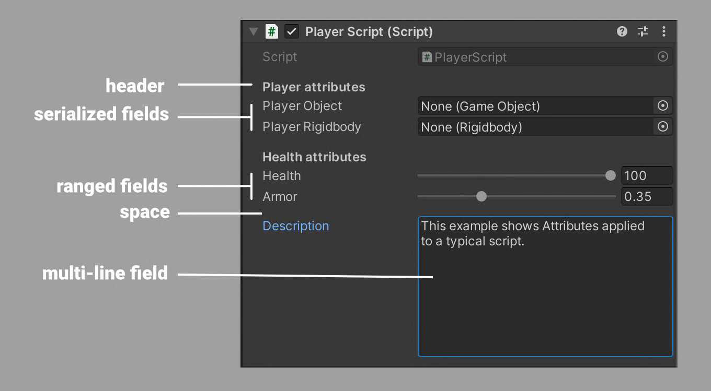
<p><em>VI: <strong>▲ Attribute NHÌN THẤY ĐƯỢC trong Inspector</strong> — <strong>header</strong> ("Player attributes", "Health attributes"), <strong>serialized fields</strong> (Player Object, Player Rigidbody), <strong>ranged fields</strong> (Health <strong>100</strong>, Armor <strong>0.35</strong> dạng thanh trượt), <strong>space</strong>, và <strong>multi-line field</strong> (ô Description). / EN: Attributes affecting the Inspector fields.</em></p>

### 65.2. 🪟 Custom windows & Inspectors — UI Toolkit vs IMGUI

<div class="bilingual-row">
<div class="col-vi">
<p>📖 <em>"<strong>MỘT TRONG những tính năng MẠNH NHẤT của Unity là Editor MỞ RỘNG ĐƯỢC.</strong> Dùng <strong>package UI Toolkit</strong> hoặc <strong>IMGUI (immediate mode)</strong> để tạo UI Editor như cửa sổ và Inspector tuỳ chỉnh."</em></p>
<p>🌐 <strong>UI Toolkit:</strong> <em>"Có workflow <strong>GIỐNG phát triển WEB tiêu chuẩn.</strong> Dùng <strong>ngôn ngữ đánh dấu lấy cảm hứng từ HTML/XML là UXML</strong> để định nghĩa giao diện và <strong>template UI TÁI SỬ DỤNG ĐƯỢC.</strong> Sau đó áp <strong>Unity Style Sheets (USS)</strong> để đổi style và hành vi."</em></p>
<p>⚡ <strong>IMGUI:</strong> <em>"Hoặc bạn có thể dùng IMGUI immediate mode. <strong>Kế thừa từ lớp cơ sở <code>Editor</code>, rồi dùng attribute <code>CustomEditor</code>.</strong> ✅ <strong>CẢ HAI giải pháp đều tạo được Inspector tuỳ chỉnh.</strong>"</em></p>
</div>
<div class="col-en">
<p>📖 <em>"One of Unity's most powerful features is its extensible Editor. Use the UI Toolkit package or the immediate mode IMGUI to create Editor UIs such as custom windows and Inspectors."</em></p>
<p>🌐 <strong>UI Toolkit:</strong> <em>"UI Toolkit has a workflow similar to standard web development. Use its HTML and XML inspired markup language, UXML, to define user interfaces and reusable UI templates. Then, apply Unity Style Sheets (USS) to modify the visual style and behaviors of your UIs."</em></p>
<p>⚡ <strong>IMGUI:</strong> <em>"Alternatively, you can use immediate mode IMGUI. Derive from the Editor base class, then use the CustomEditor attribute. Either solution can make a custom Inspector."</em></p>
</div>
</div>

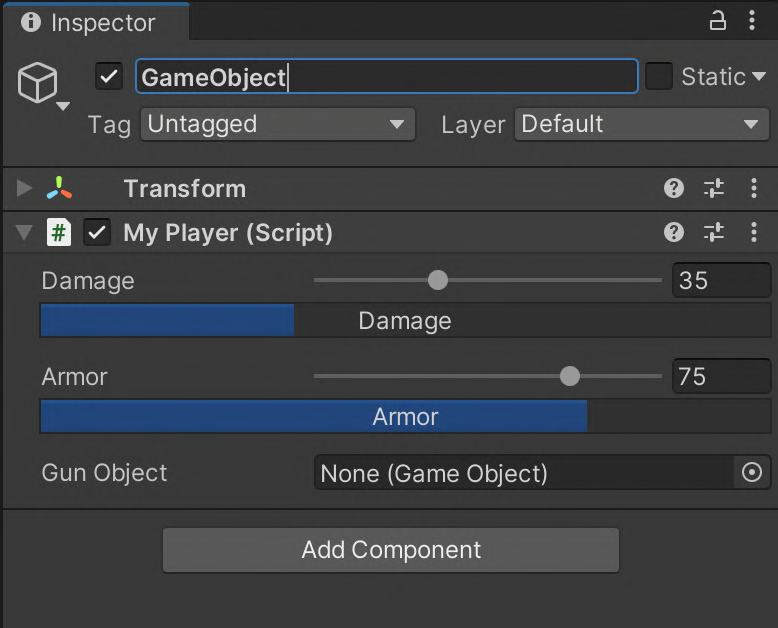
<p><em>VI: <strong>▲ Inspector TUỲ CHỈNH</strong> — script <code>My Player</code> hiển thị <strong>Damage 35</strong> và <strong>Armor 75</strong> dưới dạng <strong>thanh tiến độ có nhãn</strong> thay vì ô số trơ trọi. / EN: A custom Editor modifies how the MyPlayer script displays in the Inspector.</em></p>

### 65.3. 📜 Custom menus — `MenuItem`

<div class="bilingual-row">
<div class="col-vi">
<p>📖 <em>"Unity có cách <strong>ĐƠN GIẢN để tuỳ chỉnh menu và menu item của Editor: attribute <code>MenuItem</code>. Bạn có thể áp nó cho BẤT KỲ phương thức <code>static</code> nào trong script.</strong>"</em></p>
<p>🛠️ <em>"Nếu bạn có những hàm <strong>DÙNG THƯỜNG XUYÊN cho dự án, hãy TỔ CHỨC chúng thành menu item. Việc này cho phép bạn dựng một giao diện người dùng CƠ BẢN chỉ với MỘT modifier PropertyAttribute duy nhất.</strong>"</em></p>
</div>
<div class="col-en">
<p>📖 <em>"Unity includes a simple way to customize Editor menus and menu items, the MenuItem Attribute. You can apply this to any static method in your scripts."</em></p>
<p>🛠️ <em>"If you have functions for your project that you will use frequently, organize them into menu items. This allows you to build a basic user interface with just a single PropertyAttribute modifier."</em></p>
</div>
</div>

```csharp
using UnityEditor;
using UnityEngine;
using System;
using System.IO;

public class ScreenshotTaker
{
    [MenuItem("Dragon Crashers/Tools/Take Screenshot")]
    public static void TakeScreenshot()
    {
        if (!Directory.Exists("Screenshots"))
            Directory.CreateDirectory("Screenshots");

        ScreenCapture.CaptureScreenshot(string.Format("Screenshots/{0}.png",
            DateTime.Now.ToString("yyyy-MM-dd HH.mm.ss")));
    }
}
```

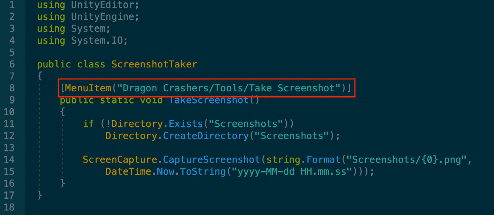
<p><em>VI: <strong>▲ Một dòng attribute</strong> (viền đỏ) là đủ để tạo menu. / EN: The MenuItem Attribute in code.</em></p>


<p><em>VI: <strong>▲ Kết quả trên thanh menu</strong> — <strong>Dragon Crashers › Tools › Take Screenshot</strong>, nằm ngang hàng với Jobs / Window / Help. / EN: The MenuItem Attribute creates a simple interface to attach the static method (Take Screenshot).</em></p>

### 65.4. ⏱️ Enter Play Mode settings — sơ đồ HAI nhánh

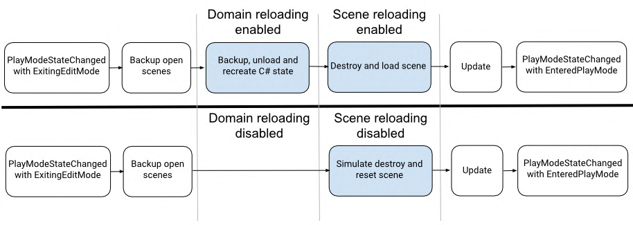
<p><em>VI: <strong>▲ So sánh HAI nhánh</strong> — <strong>BẬT</strong> (trên): <code>PlayModeStateChanged ExitingEditMode</code> → <code>Backup open scenes</code> → <strong>Backup, unload and recreate C# state</strong> → <strong>Destroy and load scene</strong> → <code>Update</code> → <code>EnteredPlayMode</code>. <strong>TẮT</strong> (dưới): hai bước tô xanh biến thành <strong>"Simulate destroy and reset scene"</strong> — <strong>BỎ HẲN bước tạo lại C# state.</strong> / EN: The effects of disabling the Reload Domain and Reload Scene settings.</em></p>

<div class="bilingual-row">
<div class="col-vi">
<p>🚨 <strong>Cảnh báo nguyên văn — ĐỪNG QUÊN bật lại:</strong></p>
<p><em>"Chỉ cần nhớ rằng <strong>NẾU bạn có kế hoạch thay đổi script thêm nữa, bạn PHẢI BẬT LẠI Domain Reload.</strong> Tương tự, <strong>nếu bạn SỬA Scene Hierarchy, bạn NÊN BẬT LẠI Scene Reload. NẾU KHÔNG, hành vi BẤT NGỜ có thể xảy ra.</strong>"</em></p>
</div>
<div class="col-en">
<p>🚨 <strong>The verbatim warning — remember to turn them back on:</strong></p>
<p><em>"Just remember that if you do plan on making further script changes, you need to re-enable Domain Reload. Likewise, if you modify the Scene Hierarchy, you should re-enable Scene Reload. Otherwise, unexpected behavior could result."</em></p>
</div>
</div>

### 65.5. 📄 Script templates — sửa khuôn để CẢ ĐỘI viết giống nhau

<div class="bilingual-row">
<div class="col-vi">
<p>📖 <em>"Bạn có thấy mình <strong>làm CÙNG những sửa đổi MỖI LẦN tạo script mới?</strong> Có <strong>theo phản xạ thêm namespace hoặc XOÁ hàm <code>Update</code>?</strong> ✅ <strong>Hãy tiết kiệm vài lần gõ phím và TẠO SỰ NHẤT QUÁN TRONG ĐỘI bằng cách thiết lập script template theo điểm khởi đầu bạn muốn.</strong>"</em></p>
<p>📁 <strong>Vị trí template</strong> — <code>%EDITOR_PATH%\Data\Resources\ScriptTemplates</code>:</p>
<ul>
<li><strong>Windows:</strong> <code>C:\Program Files\Unity\Editor\Data\Resources\ScriptTemplates</code></li>
<li><strong>MỌI script đều TRUY CẬP ĐƯỢC type định nghĩa trong BẤT KỲ script nào khác</strong> — <em>"Any script can access types defined in any other script."</em></li>
<li><strong>MỌI script đều được BIÊN DỊCH cho MỌI NỀN TẢNG</strong> — <em>"All scripts are compiled for all platforms."</em></li>
<li>📐 Sơ đồ tách assembly trong e-book: chia code thành <strong><code>Main</code> · <code>Stuff</code> · <code>Library</code></strong>. <em>"Ở đây, <strong>MỌI thay đổi trong <code>Main</code> KHÔNG THỂ ảnh hưởng tới code trong <code>Stuff</code>. Tương tự, vì <code>Library</code> KHÔNG phụ thuộc assembly nào khác, bạn TÁI SỬ DỤNG code trong <code>Library</code> ở dự án khác DỄ DÀNG HƠN.</strong>"</em></li>
<li><strong>Mac:</strong> <code>/Applications/Hub/Editor/[version]/Unity/Unity.app/Contents/Resources/ScriptTemplates</code></li>
</ul>
<p>👉 <em>"Template MonoBehaviour mặc định là <strong><code>81-C# Script-NewBehaviourScript.cs.txt</code></strong>. Cũng có template cho <strong>shader, các script behavior khác, và assembly definition.</strong>"</em></p>
<p>💎 <strong>Cho RIÊNG dự án:</strong> <em>"Tạo thư mục <strong><code>Assets/ScriptTemplates</code></strong>. Copy template vào đó để <strong>GHI ĐÈ bản mặc định.</strong> Bạn cũng có thể sửa thẳng template mặc định cho MỌI dự án, <strong>nhưng hãy CHẮC CHẮN SAO LƯU bản gốc trước khi sửa.</strong>"</em></p>
<p>🔑 <strong>HAI từ khoá:</strong></p>
<ul>
<li><code>#SCRIPTNAME#</code> — <em>"chỉ tên file đã nhập hoặc tên mặc định (ví dụ <code>NewBehaviourScript</code>)."</em></li>
<li><code>#NOTRIM#</code> — <em>"đảm bảo <strong>cặp ngoặc CHỨA một dòng khoảng trắng.</strong>"</em></li>
</ul>
<p>♻️ <em>"<strong>KHỞI ĐỘNG LẠI Unity Editor</strong> và thay đổi của bạn sẽ xuất hiện mỗi lần tạo MonoBehaviour."</em></p>
</div>
<div class="col-en">
<p>📖 <em>"Do you find that you make the same changes every time you create a new script? Do you instinctively add a namespace or delete the update event function? Save yourself a few keystrokes and create consistency across the team by setting up the script template for your preferred starting point."</em></p>
<p>📁 <strong>Template location</strong> — <code>%EDITOR_PATH%\Data\Resources\ScriptTemplates</code>:</p>
<ul>
<li><strong>Windows:</strong> <code>C:\Program Files\Unity\Editor\Data\Resources\ScriptTemplates</code></li>
<li><strong>Mac:</strong> <code>/Applications/Hub/Editor/[version]/Unity/Unity.app/Contents/Resources/ScriptTemplates</code></li>
</ul>
<p>👉 <em>"The default Monobehaviour template is this one: <code>81-C# Script-NewBehaviourScript.cs.txt</code>. There are also templates for shaders, other behavior scripts, and assembly definitions."</em></p>
<p>💎 <strong>Project-specific:</strong> <em>"For project-specific script templates, create an Assets/ScriptTemplates folder. Copy the script templates into this folder to override the defaults. You can also modify the default script templates directly for all projects, but make sure that you back up the originals before making any changes."</em></p>
<p>🔑 <strong>Two keywords:</strong></p>
<ul>
<li><code>#SCRIPTNAME#</code> — <em>"indicates the filename entered or the default filename (for example, NewBehaviourScript)."</em></li>
<li><code>#NOTRIM#</code> — <em>"ensures that the brackets contain a line of whitespace."</em></li>
</ul>
<p>♻️ <em>"Relaunch the Unity Editor, and your changes should appear every time you create a custom Monobehaviour."</em></p>
</div>
</div>

```csharp
// Bản GỐC / The original 81-C# Script-NewBehaviourScript.cs.txt
using System.Collections;
using System.Collections.Generic;
using UnityEngine;

#ROOTNAMESPACEBEGIN#
public class #SCRIPTNAME# : MonoBehaviour
{
    // Start is called before the first frame update
    void Start()
    {
        #NOTRIM#
    }

    // Update is called once per frame
    void Update()
    {
        #NOTRIM#
    }
}
#ROOTNAMESPACEEND#
```

```csharp
// Bản SỬA của e-book — thêm sẵn #region để giữ code ngăn nắp
/*
 * Modified template by Unity Support.
 */
using UnityEngine;

public class #SCRIPTNAME# : MonoBehaviour
{
    #region Public Fields
    #endregion

    #region Unity Methods
    void Start()
    {
    }

    void Update()
    {
    }
    #endregion

    #region Private Methods
    #endregion
}
```

### 65.6. 📦 Addressables — địa chỉ hoá asset để KHÔNG nạp thứ chưa cần

<div class="bilingual-row">
<div class="col-vi">
<p>📖 <em>"Sau khi ĐÁNH DẤU, asset tương ứng xuất hiện trong cửa sổ <strong><code>Window &gt; Asset Management &gt; Addressables &gt; Groups</code></strong>. Trong Addressables Groups, bạn thấy <strong>ĐỊA CHỈ TUỲ CHỈNH của từng asset, ghép cặp với VỊ TRÍ của nó.</strong>"</em></p>
<p>✂️ <em>"Cho tiện, bạn có thể <strong>đổi tên TỪNG địa chỉ trong ô <code>Address</code> riêng của asset, hoặc ĐƠN GIẢN HOÁ TẤT CẢ CÙNG LÚC</strong> (menu chuột phải <strong><code>Simplify Addressable Names</code></strong>)."</em></p>
<p>🌍 <em>"Dùng <strong>build script mặc định để SINH RA asset bundle của Addressable Group.</strong> Bundle những asset này để <strong>host TRÊN SERVER nơi khác hoặc phân phối CỤC BỘ cùng dự án. Dù asset nằm ở ĐÂU, hệ thống VẪN ĐỊNH VỊ được nó bằng chuỗi Addressable Name.</strong>"</em></p>
</div>
<div class="col-en">
<p>📖 <em>"Once marked, the corresponding assets appear in the Window &gt; Asset Management &gt; Addressables &gt; Groups window. In Addressables Groups, you can see each asset's custom address, paired with its location."</em></p>
<p>✂️ <em>"For convenience, you can either rename each address in the asset's individual Address field or simplify them at once."</em></p>
<p>🌍 <em>"Use the default build script to generate an Addressable Group asset bundle. Bundle these assets to be hosted on a server elsewhere or distribute them locally with your project. Wherever each asset resides, the system will locate it using the Addressable Name string."</em></p>
</div>
</div>

```csharp
// ❌ KHÔNG Addressables — Prefab được tham chiếu sẽ NẠP VÀO BỘ NHỚ
//    KỂ CẢ khi scene KHÔNG cần tới nó.
public GameObject prefabToCreate;

public void CreatePrefab()
{
    GameObject.Instantiate(prefabToCreate);
}

// ✅ CÓ Addressables — nạp theo CHUỖI ĐỊA CHỈ, chỉ khi THỰC SỰ gọi.
public string prefabByAddress;

public void CreatePrefabWithAddress()
{
    Addressables.Instantiate(prefabByAddress, instantiationParameters, bool);
}
```

<div class="bilingual-row">
<div class="col-vi">
<p>💀 <strong>Nhược điểm của cách CŨ — nguyên văn:</strong> <em>"Bất kỳ Prefab được tham chiếu nào (như <code>prefabToCreate</code>) <strong>ĐỀU NẠP VÀO BỘ NHỚ, KỂ CẢ khi scene KHÔNG đòi hỏi nó.</strong>"</em></p>
<p>✅ <strong>Lợi ích của Addressables:</strong> <em>"Cách này <strong>nạp asset BẰNG CHUỖI ĐỊA CHỈ của nó. Prefab KHÔNG nạp vào bộ nhớ CHO TỚI KHI CẦN</strong> (khi ta gọi <code>Addressables.Instantiate</code>). Ngoài ra, <strong>Addressables cung cấp ĐẾM THAM CHIẾU cấp cao và TỰ ĐỘNG GỠ TẢI bundle cùng asset liên quan khi chúng KHÔNG CÒN được dùng.</strong>"</em></p>
<p>☁️ <strong>Game LIVE — Cloud Content Delivery (CCD):</strong> <em>"Nếu bạn đang vận hành game live, hãy cân nhắc dùng <strong>giải pháp Cloud Content Delivery (CCD) của Unity cùng Addressables.</strong> Addressables <strong>LƯU và LẬP DANH MỤC asset</strong> để chúng được tìm và gọi tự động, rồi <strong>CCD ĐẨY những asset đó THẲNG tới người chơi, HOÀN TOÀN TÁCH KHỎI code của bạn.</strong> 🎯 <strong>Việc này GIẢM kích thước build và LOẠI BỎ nhu cầu bắt người chơi TẢI và CÀI phiên bản game MỚI mỗi lần bạn muốn cập nhật.</strong>"</em></p>
</div>
<div class="col-en">
<p>💀 <strong>The drawback of the old way — verbatim:</strong> <em>"The disadvantage here is that any referenced Prefab (like prefabToCreate) would load into memory, even if the scene didn't require it."</em></p>
<p>✅ <strong>The benefit of Addressables:</strong> <em>"This loads the asset by its address string. The Prefab does not load into memory until it's needed (when we invoke Addressables.Instantiate inside CreatedPrefabWithAddress). In addition, Addressables provides high-level reference counting and automatically unloads bundles and their associated assets when they're no longer in use."</em></p>
<p>☁️ <strong>Live games — Cloud Content Delivery (CCD):</strong> <em>"If you are operating a live game, then you might want to consider using Unity's Cloud Content Delivery (CCD) solution with Addressables. The Addressables system stores and catalogs game assets so that they can be automatically found and called, and then CCD pushes those assets directly to your players, completely separate from your code. This reduces your build size and eliminates the need to have your players download and install new game versions whenever you want to make an update."</em></p>
</div>
</div>

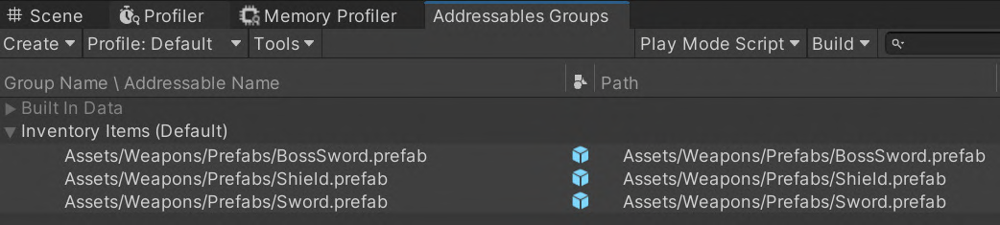
<p><em>VI: <strong>▲ Cửa sổ Addressables Groups</strong> — nhóm <strong>Inventory Items (Default)</strong> chứa ba asset; cột trái là <strong>Addressable Name</strong>, cột phải là <strong>Path</strong> thật (<code>Assets/Weapons/Prefabs/BossSword.prefab</code>…). / EN: In Addressables Groups, you can see each asset's custom address, paired with its location.</em></p>

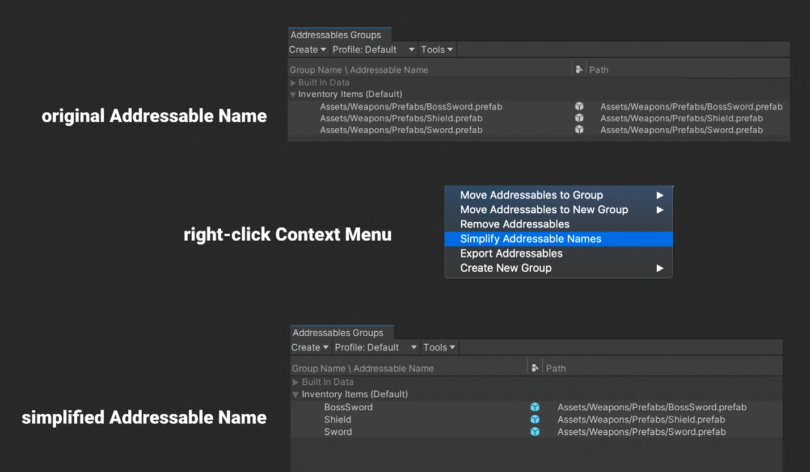
<p><em>VI: <strong>▲ Trước và sau <code>Simplify Addressable Names</code></strong> — địa chỉ gốc là <strong>đường dẫn ĐẦY ĐỦ</strong> (trên), sau khi đơn giản hoá chỉ còn <strong><code>BossSword</code> · <code>Shield</code> · <code>Sword</code></strong> (dưới); menu chuột phải ở giữa cũng có <strong>Move Addressables to Group · Remove Addressables · Export Addressables · Create New Group</strong>. / EN: Simplify the Addressable Names with a single menu action, or rename them individually.</em></p>

### 65.7. 🧬 Preprocessor directives — biên dịch theo NỀN TẢNG

<div class="bilingual-row">
<div class="col-vi">
<p>📖 <em>"Tính năng <strong>Platform Dependent Compilation</strong> cho phép bạn <strong>PHÂN VÙNG script để biên dịch và thực thi code CHO MỘT NỀN TẢNG ĐÍCH CỤ THỂ.</strong>"</em></p>
<p>🏗️ <em>"Dùng <strong><code>DEVELOPMENT_BUILD</code></strong> để <strong>XÁC ĐỊNH script có đang chạy trong player được build với tuỳ chọn Development Build hay không.</strong> Bạn <strong>cũng có thể biên dịch CÓ CHỌN LỌC cho phiên bản Unity cụ thể và/hoặc scripting backend.</strong>"</em></p>
<p>👉 <em>"Bạn có thể <strong>cung cấp <code>#define</code> RIÊNG khi test trong Editor.</strong> Mở panel <strong><code>Other Settings</code> của Player settings</strong>, tới <strong><code>Scripting Define Symbols</code>.</strong>"</em></p>
</div>
<div class="col-en">
<p>📖 <em>"The Platform Dependent Compilation feature allows you to partition your scripts to compile and execute code for a specifically targeted platform."</em></p>
<p>🏗️ <em>"Use the DEVELOPMENT_BUILD #define to identify whether your script is running in a player which was built with the Development Build option. You can also compile selectively for specific Unity versions and/or scripting backends."</em></p>
<p>👉 <em>"You can supply your own custom #define directives when testing in the Editor. Open the Other Settings panel of the Player settings, and navigate to Scripting Define Symbols."</em></p>
</div>
</div>

```csharp
using UnityEngine;
using System.Collections;

public class PlatformDefines : MonoBehaviour
{
    void Start()
    {
        #if UNITY_EDITOR
            Debug.Log("Unity Editor");
        #endif

        #if UNITY_IOS
            Debug.Log("Iphone");
        #endif

        #if UNITY_STANDALONE_OSX
            Debug.Log("Stand Alone OSX");
        #endif

        #if UNITY_STANDALONE_WIN
            Debug.Log("Stand Alone Windows");
        #endif
    }
}
```

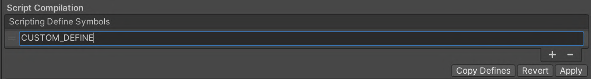
<p><em>VI: <strong>▲ <code>Player Settings › Other Settings › Script Compilation</code></strong> — ô <strong>Scripting Define Symbols</strong> đang chứa <strong><code>CUSTOM_DEFINE</code></strong>; các nút <strong>Copy Defines · Revert · Apply</strong>. / EN: The Scripting Define Symbols field.</em></p>

### 65.8. 🗃️ ScriptableObject — `CreateAssetMenu` và asset trên đĩa

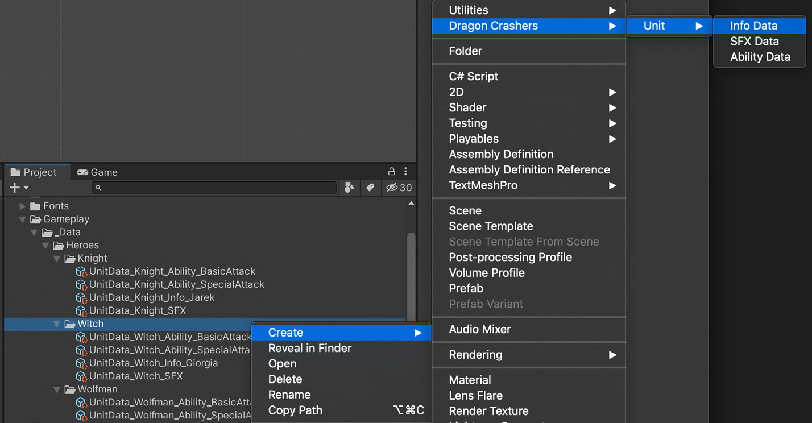
<p><em>VI: <strong>▲ KẾT QUẢ của <code>[CreateAssetMenu]</code></strong> — menu <code>Assets › Create › <strong>Dragon Crashers › Unit › Info Data</strong></code> (cạnh <em>SFX Data</em> và <em>Ability Data</em>). Chính chuỗi <code>menuName</code> trong code đã sinh ra ba tầng menu này. / EN: The menu path generated by the CreateAssetMenu attribute.</em></p>

<div class="bilingual-row">
<div class="col-vi">
<p>📖 <em>"ScriptableObject là <strong>KHO CHỨA DỮ LIỆU lưu LƯỢNG LỚN dữ liệu, ĐỘC LẬP với các instance của class. ScriptableObject có thể GIẢM mức dùng bộ nhớ của dự án bằng cách TRÁNH các BẢN SAO giá trị.</strong>"</em></p>
<p>💾 <em>"KHÁC với MonoBehaviour, <strong>dữ liệu lưu vào ScriptableObject được GHI XUỐNG ĐĨA dưới dạng ASSET và KHÔNG gắn với GameObject nào. Nhờ vậy nó TỒN TẠI QUA CÁC PHIÊN LÀM VIỆC.</strong>"</em></p>
<p>🎮 <strong>Ca sử dụng của Dragon Crashers:</strong> <em>"Một class <strong><code>UnitInfoData</code> kế thừa từ ScriptableObject.</strong> Mỗi instance chứa <strong>tên unit, sprite và thiết lập máu. Dữ liệu này KHÔNG ĐỔI suốt gameplay, khiến nó ĐẶC BIỆT PHÙ HỢP để lưu bên trong ScriptableObject.</strong>"</em></p>
<p>📜 <em>"Attribute <strong><code>CreateAssetMenu</code> SINH RA một menu item ngữ cảnh</strong> giúp bạn <strong>tạo asset trên đĩa.</strong> Mỗi unit còn có thêm ScriptableObject RIÊNG cho <strong>hiệu ứng âm thanh và kỹ năng đặc biệt.</strong>"</em></p>
</div>
<div class="col-en">
<p>📖 <em>"A ScriptableObject is a data container that saves large amounts of data, independent of class instances. ScriptableObjects can reduce your project's memory usage by avoiding copies of values."</em></p>
<p>💾 <em>"Unlike with MonoBehaviours, the data saved to ScriptableObjects is written to disk as an asset and not attached to a GameObject. Thus, it can persist between sessions."</em></p>
<p>🎮 <strong>The Dragon Crashers use case:</strong> <em>"A UnitInfoData class inherits from ScriptableObject. Each of its instances contains the unit's name, sprite, and health settings. This data remains constant over the course of gameplay, making it especially suitable for storage inside a ScriptableObject."</em></p>
<p>📜 <em>"The CreateAssetMenu attribute generates a context menu item to help you generate an asset on disk. Each unit has additional ScriptableObjects for sound effects and special abilities."</em></p>
</div>
</div>

```csharp
using UnityEngine;

namespace DragonCrashers
{
    [CreateAssetMenu(fileName = "Data_Unit_",
                     menuName = "Dragon Crashers/Unit/Info Data", order = 1)]
    public class UnitInfoData : ScriptableObject
    {
        [Header("Display Infos")]
        public string unitName;
        public Sprite unitAvatar;

        [Header("Health Settings")]
        public int totalHealth;
    }
}
```

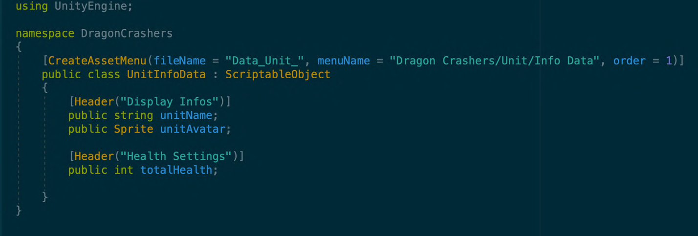
<p><em>VI: <strong>▲ <code>[CreateAssetMenu]</code> trong code</strong> — <code>fileName = "Data_Unit_"</code>, <code>menuName = "Dragon Crashers/Unit/Info Data"</code>, <code>order = 1</code>; bên dưới là hai nhóm <code>[Header("Display Infos")]</code> và <code>[Header("Health Settings")]</code>. / EN: The CreateAssetMenu attribute in code.</em></p>


<p><em>VI: <strong>▲ MỘT ScriptableObject asset — BA GameObject dùng CHUNG</strong>. Dữ liệu nằm ở MỘT nơi trên đĩa, các MonoBehaviour chỉ TRỎ TỚI ⇒ <strong>KHÔNG nhân bản giá trị trong bộ nhớ.</strong> / EN: A ScriptableObject defines a data container object.</em></p>

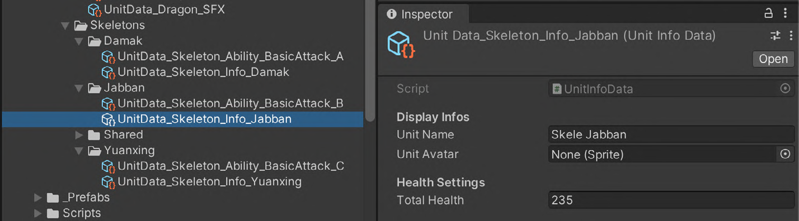
<p><em>VI: <strong>▲ Asset sinh ra</strong> — <code>UnitData_Skeleton_Info_Jabban (Unit Info Data)</code> với <strong>Unit Name: Skele Jabban</strong>, <strong>Unit Avatar: None (Sprite)</strong>, <strong>Total Health: 235</strong>. Bên trái là cây asset: mỗi unit có <strong>Info · Ability · SFX</strong> riêng. / EN: The generated ScriptableObject asset in the Inspector.</em></p>

### 65.9. 💻 IDE support — BA lựa chọn chính thức

<div class="bilingual-row">
<div class="col-vi">
<p>📖 <em>"Unity hỗ trợ các IDE sau: <strong>Visual Studio</strong> (IDE mặc định trên Windows và macOS) · <strong>Visual Studio Code</strong> (Windows, macOS, Linux) · <strong>JetBrains Rider</strong> (Windows, macOS, Linux). <strong>Tích hợp IDE cho CẢ BA đều xuất hiện dưới dạng PACKAGE trong Package Manager.</strong>"</em></p>
<p>👉 <em>"Visual Studio được <strong>cài SẴN khi bạn cài Unity trên Windows và macOS.</strong> Muốn dùng IDE khác, chỉ cần trỏ tới trình soạn thảo ở <strong><code>Unity &gt; Preferences &gt; External Tools &gt; External Script Editor</code>.</strong>"</em></p>
<p>🧠 <em>"<strong>Rider</strong> được xây trên nền <strong>ReSharper và có HẦU HẾT tính năng của nó. Nó hỗ trợ debug C# trên scripting runtime .NET 4.6 trong Unity (C# 8.0).</strong>"</em></p>
<p>🪶 <em>"<strong>VS Code</strong> là trình soạn thảo <strong>MIỄN PHÍ, tinh gọn, hỗ trợ debug, chạy task và version control.</strong> ⚠️ <strong>Lưu ý Unity ĐÒI HỎI Mono (macOS và Linux), Visual Studio Code C#, và Visual Studio Code Debugger for Unity (KHÔNG được hỗ trợ chính thức) khi dùng VSCode.</strong>"</em></p>
</div>
<div class="col-en">
<p>📖 <em>"Unity offers support for the following integrated development environments (IDEs): Visual Studio (default IDE on Windows and macOS); Visual Studio Code (Windows, macOS, Linux); JetBrains Rider (Windows, macOS, Linux). IDE integrations for all three of these environments appear as packages in the Package Manager."</em></p>
<p>👉 <em>"Visual Studio is installed by default when you install Unity on Windows and macOS. If you want to use another IDE, simply browse for the editor in Unity &gt; Preferences &gt; External Tools &gt; External Script Editor."</em></p>
<p>🧠 <em>"Rider is built on top of ReSharper and includes most of its features. It supports C# debugging on the .NET 4.6 scripting runtime in Unity (C# 8.0)."</em></p>
<p>🪶 <em>"VS Code is a free, streamlined code editor with support for debugging, task running, and version control. Note that Unity requires Mono (macOS and Linux), Visual Studio Code C#, and Visual Studio Code Debugger for Unity (not officially supported) when using VSCode."</em></p>
</div>
</div>

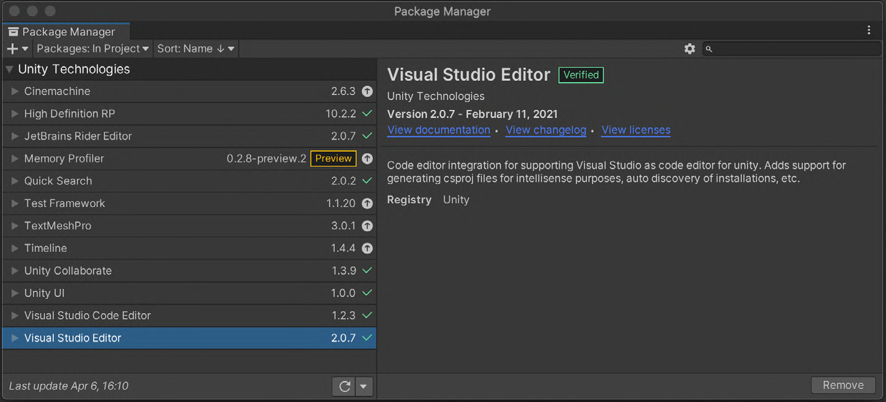
<p><em>VI: <strong>▲ Tích hợp IDE là PACKAGE</strong> — Package Manager liệt kê <strong>JetBrains Rider Editor 2.0.7 · Visual Studio Code Editor 1.2.3 · Visual Studio Editor 2.0.7</strong>. / EN: IDE integrations as packages.</em></p>

### 65.10. 🐞 Debugging — quy trình gắn debugger & TÁM mẹo `Debug`

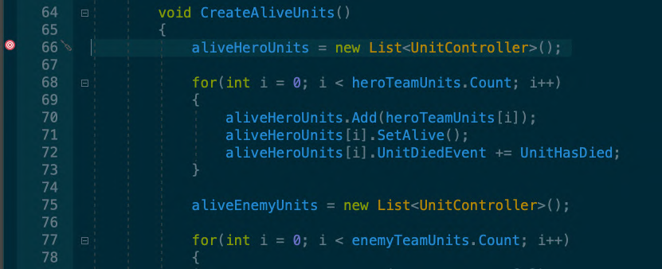
<p><em>VI: <strong>▲ Bước 2 — chấm ĐỎ ở lề trái</strong> dòng <code>aliveHeroUnits = new List&lt;UnitController&gt;();</code> (dòng 66). Bấm thẳng vào lề để bật/tắt. / EN: Toggling a breakpoint: a red circle appears next to the line number.</em></p>

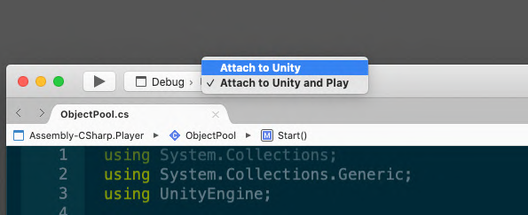
<p><em>VI: <strong>▲ Bước 3 — <code>Attach to Unity</code></strong> (hoặc <strong>Attach to Unity and Play</strong> để tự bấm Play luôn). Thanh trạng thái hiện <strong>Debug › Assembly-CSharp.Player › ObjectPool › Start()</strong>. / EN: Attaching the debugger: Attach to Unity / Attach to Unity and Play.</em></p>

<div class="bilingual-row">
<div class="col-vi">
<p>📖 <em>"<strong>Unity Debugger cho phép bạn debug code C# TRONG KHI Unity đang ở Play Mode.</strong> Bạn có thể <strong>gắn breakpoint trong trình soạn thảo để KIỂM TRA trạng thái code và các biến hiện tại LÚC CHẠY.</strong>"</em></p>
<p>⚙️ <strong>Bước 1 — bật Debug mode:</strong> <em>"Đặt <strong>Code Optimization mode thành <code>Debug</code> ở GÓC DƯỚI BÊN PHẢI của Status Bar.</strong> Bạn cũng có thể đổi lúc khởi động tại <strong><code>Edit &gt; Preferences &gt; General &gt; Code Optimization On Startup</code>.</strong>"</em></p>
<p>🔴 <strong>Bước 2 — đặt breakpoint:</strong> <em>"Trong trình soạn thảo, <strong>bấm vào LỀ TRÁI (gutter) nơi bạn muốn bật breakpoint</strong> (hoặc chuột phải để có thêm tuỳ chọn). <strong>Một VÒNG TRÒN ĐỎ xuất hiện cạnh số dòng.</strong>"</em></p>
<p>🔌 <strong>Bước 3 — gắn vào Unity:</strong> <em>"Chọn <strong><code>Attach to Unity</code></strong> trong trình soạn thảo. Trong Unity Editor, chạy dự án."</em> — <em>"Để gắn vào <strong>Unity PLAYER</strong>, chọn <strong>ĐỊA CHỈ IP (hoặc tên máy) và CỔNG của player</strong>, rồi tiếp tục bình thường với tuỳ chọn <code>Attach To Unity</code>."</em></p>
<p>🎮 <strong>Bước 4 — điều khiển:</strong> <em>"Dùng <strong>Continue Execution · Step Over · Step Into · Step Out</strong> để điều hướng luồng điều khiển."</em></p>
</div>
<div class="col-en">
<p>📖 <em>"The Unity Debugger allows you to debug your C# code while the Unity Entity is in Play Mode. You can attach breakpoints within the code editor in order to inspect the state of your script code and its current variables at runtime."</em></p>
<p>⚙️ <strong>Step 1 — enable Debug mode:</strong> <em>"Set the Code Optimization mode to Debug in the bottom right of the Unity Editor Status Bar. You can also change this mode on startup at Edit &gt; Preferences &gt; General &gt; Code Optimization On Startup."</em></p>
<p>🔴 <strong>Step 2 — set a breakpoint:</strong> <em>"In the code editor, set a breakpoint where you want the debugger to pause execution. Simply click over the left margin/gutter area where you want to toggle a breakpoint. A red circle appears next to the line number of the highlighted line."</em></p>
<p>🔌 <strong>Step 3 — attach to Unity:</strong> <em>"Select Attach to Unity in your code editor. In the Unity Editor, run the project."</em> — <em>"To attach the code editor to the Unity Player, select the IP address (or machine name) and port of your player. Then proceed normally in Visual Studio with the Attach To Unity option."</em></p>
<p>🎮 <strong>Step 4 — controls:</strong> <em>"Use the Continue Execution, Step Over, Step Into and Step Out controls to navigate the control flow."</em></p>
</div>
</div>

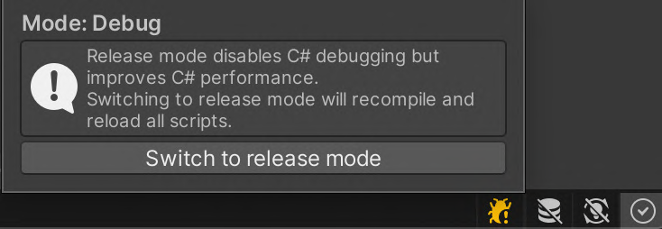
<p><em>VI: <strong>▲ Công tắc Code Optimization</strong> — hộp thoại ghi rõ: <em>"<strong>Release mode TẮT debug C# NHƯNG CẢI THIỆN hiệu năng C#. Chuyển sang release mode sẽ BIÊN DỊCH LẠI và NẠP LẠI TOÀN BỘ script.</strong>"</em> / EN: Debug Mode — "Release mode disables C# debugging but improves C# performance."</em></p>

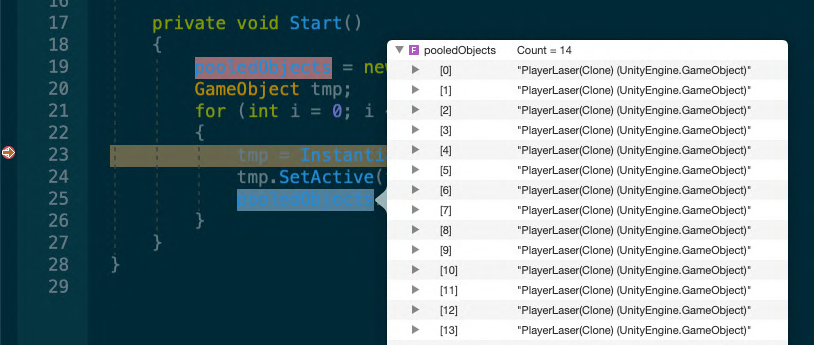
<p><em>VI: <strong>▲ Soi biến tại breakpoint</strong> — chấm ĐỎ ở lề trái dòng <code>tmp = Instantiate(...)</code>; bảng watch bên phải cho thấy <code>pooledObjects</code> <strong>Count = 14</strong> với từng phần tử <code>"PlayerLaser(Clone) (UnityEngine.GameObject)"</code> — đúng như e-book mô tả: <em>"xem danh sách được XÂY DẦN từng bước trong lúc thực thi"</em>. / EN: Debugging variables — watching the list build up one step at a time during execution.</em></p>

!!! warning "⚠️ Debug trên Unity PLAYER — ĐIỀU KIỆN TIÊN QUYẾT ở Build Settings"
    <div class="bilingual-row">
    <div class="col-vi">
    <p><em>"<strong>Bạn CŨNG debug được code script trong một Unity Player.</strong> Chỉ cần đảm bảo <strong>CẢ HAI ô <code>Development Build</code> và <code>Script Debugging</code> đều được BẬT trong <code>File › Build Settings</code> TRƯỚC KHI build Player.</strong> ✅ <strong>Tick thêm <code>Wait for Managed Debugger</code> để Player CHỜ debugger TRƯỚC KHI thực thi bất kỳ dòng script nào.</strong>"</em></p>
    <p>⏹️ <em>"Bấm <strong><code>Stop</code></strong> để NGỪNG debug và TIẾP TỤC thực thi trong Editor."</em></p>
    </div>
    <div class="col-en">
    <p><em>"You can debug script code in a Unity Player as well. Just make sure that Development Build and Script Debugging are both enabled in the File &gt; Build Settings before you build the Player. Check Wait for Managed Debugger to wait for the debugger before the Player executes any script code."</em></p>
    <p>⏹️ <em>"Press Stop to discontinue debugging and resume execution in the Editor."</em></p>
    </div>
    </div>

**🧰 TÁM mẹo `Debug` bổ sung — nguyên văn / Eight additional debugging tips, verbatim**

| # | Mẹo |
|---|---|
| **①** | *"**TẠM DỪNG thực thi bằng `Debug.Break`.** HỮU ÍCH khi bạn muốn **kiểm tra vài giá trị trong Inspector nhưng ứng dụng KHÓ dừng thủ công.**"* |
| **②** | *"Bạn nên quen với **`Debug.Log`, `Debug.LogWarning`, `Debug.LogError`**. Cũng tiện là **`Debug.Assert`, khẳng định một điều kiện và ghi LỖI khi thất bại** (chỉ hoạt động nếu symbol **`UNITY_ASSERTIONS`** được định nghĩa)."* |
| **③** | *"Khi dùng `Debug.Log`, bạn có thể **truyền vào một object làm `context`. Bấm vào thông điệp trong Console, Unity sẽ TÔ SÁNG GameObject đó trong Hierarchy.**"* |
| **④** | *"Dùng **Rich Text** để đánh dấu câu lệnh `Debug.Log` — giúp **NÂNG CẤP báo cáo lỗi trong Console.**"* |
| **⑤** | 💀 *"**Unity KHÔNG TỰ ĐỘNG LOẠI BỎ các API Debug logging khỏi build KHÔNG-development.** ✅ **Hãy BỌC lời gọi Debug Log trong phương thức RIÊNG và gắn attribute `[Conditional]`.** Gỡ Scripting Define Symbol tương ứng khỏi Player Settings sẽ **biên dịch BỎ toàn bộ Debug Log CÙNG LÚC** — tương đương bọc chúng trong `#if… #endif`."* |
| **⑥** | *"Đang gỡ rối **PHYSICS**? **`Debug.DrawLine` và `Debug.DrawRay` giúp bạn HÌNH DUNG raycasting.**"* |
| **⑦** | *"Nếu bạn **CHỈ muốn code chạy khi Development Build được bật**, hãy kiểm tra **`Debug.isDebugBuild`** trả về `true`."* |
| **⑧** | 💀 *"Dùng **`Application.SetStackTraceLogType`** hoặc các ô tick tương đương trong PlayerSettings để **quyết định loại log nào KÈM stack trace. Stack trace có ích, NHƯNG chúng CHẬM và SINH RÁC (garbage).**"* |

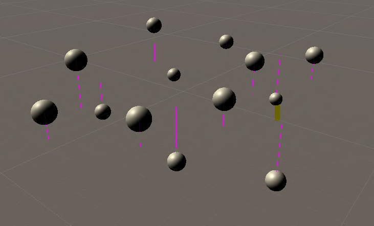
<p><em>VI: <strong>▲ <code>Debug.DrawLine</code></strong> — các đường TÍM vẽ từ mỗi quả cầu xuống mặt đất, giúp thấy ngay raycast đang chạm ở đâu. / EN: Debug.DrawLine.</em></p>

### 65.11. ⌨️ Phím tắt Visual Studio, Device Simulator & Console Log Entry

**⌨️ Bảng phím tắt Visual Studio — nguyên văn / The Visual Studio shortcuts, verbatim**

| Hành động | Windows | Mac |
|---|---|---|
| **Tìm BẤT CỨ THỨ GÌ trong toàn dự án** | `Ctrl + T` | `Cmd + .` |
| **Implement Unity Messages** (boilerplate) | `Ctrl + Shift + M` | `Cmd + Shift + M` |
| **Comment khối code** | `Ctrl + K` / `Ctrl + C` | `Cmd + /` |
| **Uncomment khối code** | `Ctrl + K` / `Ctrl + U` | `Cmd + /` |
| **Dán từ LỊCH SỬ clipboard** | `Ctrl + Shift + V` | — |
| **Xem task list** | `Ctrl + T` | *không có mặc định, gán được* |
| **Chèn snippet BAO QUANH** (ví dụ namespace) | `Ctrl + K + S` | *không có mặc định, gán được* |
| **Đổi tên biến + cập nhật MỌI tham chiếu** | `Ctrl + R` | `Cmd + R` |
| **Biên dịch code** | `Ctrl + Shift + B` | `Cmd + Shift + B` |

<div class="bilingual-row">
<div class="col-vi">
<p>📱 <strong>Device Simulator:</strong> <em>"Nếu bạn phát triển cho MOBILE, <strong>Device Simulator (hiện là Preview Package) giúp bạn MÔ PHỎNG ứng dụng trên các thiết bị khác nhau. KỂ CẢ khi bạn có ĐỦ phần cứng đích trong tay, việc BUILD nội dung cho TỪNG thiết bị VẪN TỐN THỜI GIAN.</strong>"</em></p>
<p>✂️ <em>"Dùng Device Simulator để <strong>xem trước NHANH TRƯỚC KHI phải build thật. Bạn có thể mô phỏng ĐỘ PHÂN GIẢI hoặc ĐIỀU KIỆN PHẦN CỨNG cụ thể và ĐIỀU CHỈNH UI theo NOTCH/CUTOUT vật lý ngay trong Game view.</strong>"</em></p>
<p>⚙️ <em>"Device Simulator <strong>còn XẤP XỈ HIỆU NĂNG của phần cứng. Điều chỉnh quality settings theo RAM, chipset và các thông số khác</strong>, và code game của bạn sẽ mô phỏng theo."</em></p>
<p>📋 <em>"Package đi kèm <strong>DANH SÁCH điện thoại và tablet định sẵn</strong> (trong thư mục <code>com.unity.device-simulator/com.unity.device-simulator</code>). <strong>Định nghĩa thiết bị lưu trong file JSON, và danh sách MỞ RỘNG THƯỜNG XUYÊN qua các bản cập nhật package.</strong>"</em></p>
<p>📰 <strong>Console Log Entry:</strong> <em>"Theo mặc định, Console Log Entry hiển thị <strong>HAI DÒNG. Để DỄ ĐỌC HƠN, bạn có thể cấu hình còn MỘT DÒNG</strong> — hoặc dùng <strong>NHIỀU DÒNG hơn nếu muốn mục dài hơn.</strong>"</em></p>
</div>
<div class="col-en">
<p>📱 <strong>Device Simulator:</strong> <em>"If you're developing for mobile, the Device Simulator (currently a Preview Package) can help you simulate your application on different devices. Even if you have physical access to all of your targeted hardware, building the content for each device can be time consuming."</em></p>
<p>✂️ <em>"Use the Device Simulator to run a quick preview before you need to make an actual build. You can simulate specific resolutions or hardware conditions and adjust your UI to the physical notch/cutouts in Game view."</em></p>
<p>⚙️ <em>"The Device Simulator also approximates the hardware's performance. Adjust quality settings based on the RAM, chipset, and other hardware specs, and your game code will simulate playback on the platform accordingly."</em></p>
<p>📋 <em>"A list of predefined phones and tablets comes with the package (in the com.unity.device-simulator/com.unity.device-simulator folder). Device definitions are stored in JSON files, and the list of devices regularly expands through package updates."</em></p>
<p>📰 <strong>Console Log Entry:</strong> <em>"By default, the Console Log Entry shows two lines. For improved readability, you can configure this to be more streamlined with one line. Alternatively, you can also use more lines if you want longer entries."</em></p>
</div>
</div>

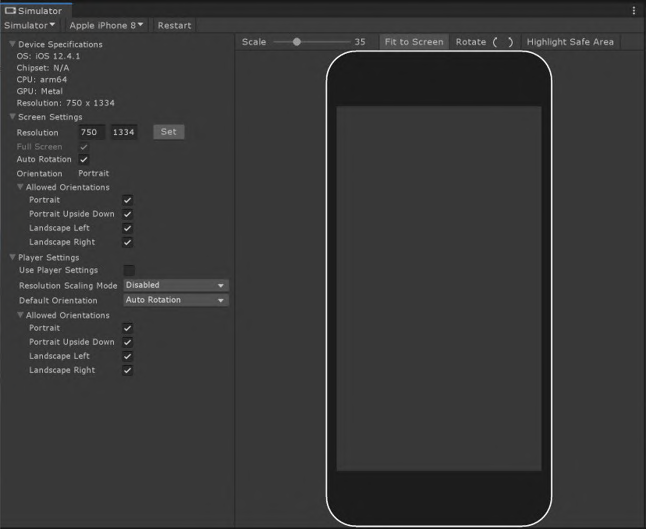
<p><em>VI: <strong>▲ Device Simulator</strong> — <strong>Apple iPhone 8</strong>: <strong>OS iOS 12.4.1 · Chipset N/A · CPU arm64 · GPU N/A · Resolution 750×1334</strong>; phần <strong>Allowed Orientations</strong> tick sẵn Portrait / Landscape Left / Landscape Right. / EN: The Device Simulator.</em></p>

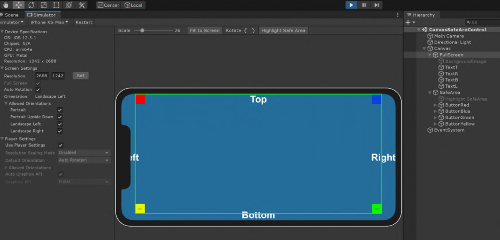
<p><em>VI: <strong>▲ Chỉnh UI theo màn hình VẬT LÝ</strong> — <strong>iPhone XS Max</strong> (<strong>iOS 12.1 · arm64 · Metal · 1242×2688</strong>) xoay ngang; khung XANH LÁ là <strong>Highlight Safe Area</strong>, cho thấy notch ĂN VÀO mép trái. / EN: Adjusting the UI to the device's physical screen.</em></p>

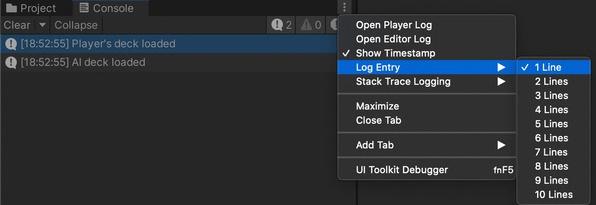
<p><em>VI: <strong>▲ Menu ⋮ của Console</strong> — <strong>Open Player Log · Open Editor Log · Show Timestamp ✓ · Log Entry ▸ (1 Line ✓ … 10 Lines) · Stack Trace Logging ▸ · UI Toolkit Debugger fn+F5</strong>. / EN: The Console Log Entry options.</em></p>

### 65.12. 🚦 Custom Compiler status — cửa sổ nổi báo "đang biên dịch"

<div class="bilingual-row">
<div class="col-vi">
<p>📖 <em>"Khi Unity biên dịch, <strong>icon ở góc dưới bên phải RẤT KHÓ THẤY.</strong> Dùng script Editor này để gọi <strong><code>EditorApplication.isCompiling</code>. Nó khiến trạng thái Compiler DỄ THẤY HƠN trong một CỬA SỔ NỔI.</strong>"</em></p>
<p>👉 <em>"Gọi <strong>MenuItem để khởi tạo cửa sổ.</strong> Tuỳ chọn: bạn có thể <strong>sửa giao diện bằng một <code>GUIStyle</code> MỚI cho hợp ý mình.</strong>"</em></p>
</div>
<div class="col-en">
<p>📖 <em>"When Unity compiles, the icon in the lower right corner is hard to see. Use this custom Editor script to call EditorApplication.isCompiling. This makes the Compiler status more visible in a floating window."</em></p>
<p>👉 <em>"Launch the MenuItem to initialize the window. Optionally, you can modify its appearance with a new GUIStyle to suit your preferences."</em></p>
</div>
</div>

```csharp
using UnityEditor;
using UnityEngine;

public class CustomCompileWindow : EditorWindow
{
    [MenuItem("Examples/CustomCompileWindow")]
    static void Init()
    {
        EditorWindow window = GetWindowWithRect(typeof(CustomCompileWindow),
                                                new Rect(0, 0, 200, 200));
        window.Show();
    }

    void OnGUI()
    {
        EditorGUILayout.LabelField("Compiling:",
            EditorApplication.isCompiling ? "Yes" : "No");
        this.Repaint();
    }
}
```


---

## 66. 👥 Team workflows — Source control, Accelerator & Build Server

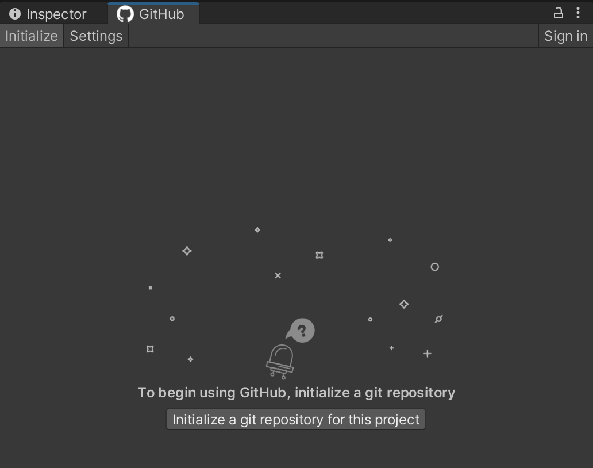
<p><em>VI: Extension <strong>GitHub for Unity</strong>. / EN: The GitHub for Unity extension.</em></p>

<div class="bilingual-row">
<div class="col-vi">
<p>🔗 <strong>Tích hợp Source Control:</strong></p>
<blockquote>
<p><em>"Unity có <strong>TÍCH HỢP với HAI hệ thống version control: PERFORCE và PLASTIC SCM.</strong> Đặt server Perforce hoặc Plastic SCM cho dự án tại <strong><code>Project Settings &gt; Editor</code></strong>. Cấu hình server (và thông tin đăng nhập với Perforce) dưới mục <strong>Version Control</strong>.</em></p>
<p><em>🔧 <strong>Bạn CŨNG có thể dùng hệ thống BÊN NGOÀI như GIT, BAO GỒM Git LFS (Large File Support) để quản lý phiên bản HIỆU QUẢ HƠN cho asset LỚN như tài nguyên đồ hoạ và âm thanh.</strong></em></p>
<p><em>💡 <strong>Để tiện làm việc với dịch vụ GitHub, hãy cài plug-in GITHUB FOR UNITY. Extension mã nguồn mở này cho phép bạn XEM lịch sử dự án, THỬ NGHIỆM trên branch, COMMIT thay đổi, và PUSH code lên GitHub MÀ KHÔNG CẦN RỜI KHỎI UNITY.</strong></em></p>
<p><em>📄 <strong>Unity DUY TRÌ một file <code>.gitignore</code>. Nó giúp bạn quyết định cái gì NÊN và KHÔNG NÊN vào git repository và ÉP các quy tắc đó.</strong>"</em></p>
</blockquote>
</div>
<div class="col-en">
<p>🔗 <strong>Source Control integration:</strong></p>
<blockquote>
<p><em>"Unity has <strong>INTEGRATIONS with TWO version control systems: PERFORCE and PLASTIC SCM.</strong> Set the Perforce or Plastic SCM servers for your project in <strong><code>Project Settings &gt; Editor</code></strong>. Configure the server (and your user credentials for Perforce) under <strong>Version Control</strong>.</em></p>
<p><em>🔧 <strong>You can ALSO use an EXTERNAL system, such as GIT, INCLUDING Git LFS (Large File Support) for MORE EFFICIENT version control of your LARGER assets, like graphics and sound resources.</strong></em></p>
<p><em>💡 <strong>For the added convenience of working with GitHub, install the GITHUB FOR UNITY plug-in. This open source extension allows you to VIEW your project history, EXPERIMENT in branches, COMMIT your changes, and PUSH your code to GitHub WITHOUT LEAVING UNITY.</strong></em></p>
<p><em>📄 <strong>Unity MAINTAINS a <code>.gitignore</code> file. This can help you decide what SHOULD and SHOULDN'T go into the git repository and ENFORCE those rules.</strong>"</em></p>
</blockquote>
</div>
</div>

!!! success "🚀 UNITY ACCELERATOR — loại bỏ thời gian CHỜ IMPORT của cả đội"
    <div class="bilingual-row">
    <div class="col-vi">
    <blockquote>
    <p><em>"<strong>Unity Accelerator LOẠI BỎ thời gian CHỜ bằng cách CACHE bản sao asset của đội bạn.</strong></em></p>
    <p><em>🔑 <strong>Nghĩa là CHỈ MỘT NGƯỜI cần thực hiện việc IMPORT THẬT, và kết quả sẽ TỰ ĐỘNG được cache vào Unity Accelerator.</strong></em></p>
    <p><em>⚡ <strong>LẦN TỚI khi một thành viên đội import CÙNG PHIÊN BẢN của asset đó, Unity Editor sẽ KIỂM TRA CACHE TRƯỚC khi bắt đầu quá trình import trên máy của họ.</strong></em></p>
    <p><em>📊 <strong>Trong Unity 2020 LTS, giờ bạn có một BẢNG ĐIỀU KHIỂN QUẢN TRỊ CỤC BỘ cho Accelerator — cho phép CẤU HÌNH công cụ, XEM THỐNG KÊ như dung lượng đĩa đã dùng hay BAO NHIÊU THỜI GIAN BẠN ĐÃ TIẾT KIỆM, và CHẨN ĐOÁN vấn đề bằng log.</strong></em></p>
    <p><em>☁️ <strong>Tuỳ chọn: Accelerator cũng có thể dùng với Unity Teams Advanced để CHIA SẺ asset nguồn Collaborate — GIẢM ĐÁNG KỂ thời gian tải xuống từ dịch vụ Collaborate.</strong>"</em></p>
    </blockquote>
    <p>🏗️ <strong>UNITY BUILD SERVER:</strong> <em>"Cân nhắc TĂNG CƯỜNG năng suất của đội bằng cách <strong>ĐẨY quá trình BUILD sang PHẦN CỨNG MẠNG dùng Unity Build Server.</strong>"</em></p>
    <p>👉 <em>Cả hai công cụ này giải quyết vấn đề "thời gian chờ" ở tầng ĐỘI — bổ sung cho việc tối ưu "thời gian chạy" ở tầng GAME của Module 1–4.</em></p>
    </div>
    <div class="col-en">
    <blockquote>
    <p><em>"<strong>The Unity Accelerator REMOVES WAITING TIME by CACHING COPIES of your team's assets.</strong></em></p>
    <p><em>🔑 <strong>This means that ONLY ONE PERSON needs to perform the ACTUAL IMPORT, and the results will AUTOMATICALLY be cached to the Unity Accelerator.</strong></em></p>
    <p><em>⚡ <strong>The NEXT TIME a team member goes to import the SAME VERSION of the asset, the Unity Editor FIRST CHECKS THE CACHE before starting the import process on their local machine.</strong></em></p>
    <p><em>📊 <strong>In Unity 2020 LTS, you now have a LOCAL ADMINISTRATOR DASHBOARD for the Accelerator that enables you to CONFIGURE the tool, SEE STATISTICS like disk space usage or HOW MUCH TIME YOU'VE SAVED, and DIAGNOSE issues with logs.</strong></em></p>
    <p><em>☁️ <strong>Optionally, Accelerator can also be used with Unity Teams Advanced to SHARE Collaborate source assets, which SIGNIFICANTLY REDUCES download time from the Collaborate service.</strong>"</em></p>
    </blockquote>
    <p>🏗️ <strong>UNITY BUILD SERVER:</strong> <em>"Consider ENHANCING your team's productivity by <strong>OFFLOADING the BUILDING process to NETWORK HARDWARE using Unity Build Server.</strong>"</em></p>
    <p>👉 <em>Both tools attack "waiting time" at the TEAM level — complementing the "runtime" optimizations at the GAME level from Modules 1–4.</em></p>
    </div>
    </div>

---

### 66.1. ☁️ Unity Teams — lưu TOÀN BỘ dự án trên cloud

<div class="bilingual-row">
<div class="col-vi">
<p>📖 <em>"Làm game là <strong>NGHỆ THUẬT CỘNG TÁC</strong>. Unity có thể giúp đội bạn <strong>KIẾN TẠO CÙNG NHAU, NHANH HƠN</strong> bằng cách dùng Source Control để tích hợp thay đổi và cập nhật của mọi người trong lúc họ làm việc. <strong>Dịch vụ Unity Teams và Unity Accelerator cũng có thể hỗ trợ bạn QUẢN LÝ lập trình viên và artist — dù TẠI CHỖ hay TRÊN CLOUD.</strong>"</em></p>
<p>☁️ <em>"<strong>Unity Teams là MỘT LỰA CHỌN KHÁC để tinh gọn workflow của đội. Unity Teams cho phép bạn LƯU TOÀN BỘ dự án TRÊN CLOUD, nên nó được SAO LƯU và TRUY CẬP ĐƯỢC TỪ BẤT KỲ ĐÂU. Việc này khiến LƯU, CHIA SẺ và ĐỒNG BỘ dự án Unity với BẤT KỲ AI trở nên ĐƠN GIẢN.</strong>"</em></p>
</div>
<div class="col-en">
<p>📖 <em>"Building games is a collaborative art. Unity can help your team create together, faster by using Source Control to integrate everyone's changes and updates as they work. The Unity Teams and Unity Accelerator services can also assist you with wrangling your developers and artists, either locally or on the cloud."</em></p>
<p>☁️ <em>"Unity Teams is another option for streamlining your team workflows. Unity Teams allows you to store your entire project in the cloud, so it's backed up and accessible anywhere. This makes it simple to save, share, and sync your Unity projects with anyone."</em></p>
</div>
</div>

### 66.2. 🏗️ Unity Build Server — vì sao ĐÁNG chuyển build sang máy khác

<div class="bilingual-row">
<div class="col-vi">
<p>🏗️ <em>"Cân nhắc TĂNG CƯỜNG năng suất của đội bằng cách <strong>ĐẨY quá trình BUILD sang PHẦN CỨNG MẠNG dùng Unity Build Server. Việc này giúp đội sáng tạo của bạn BUILD dự án THƯỜNG XUYÊN theo nhu cầu, cho phép họ LẶP một cách TỰ CHỦ HƠN.</strong>"</em></p>
<p>📈 <strong>Lý do — nguyên văn:</strong> <em>"<strong>Khi dự án Unity của bạn LỚN DẦN về kích thước và độ phức tạp, việc sinh ra một bản build TIÊU TỐN NGÀY CÀNG NHIỀU thời gian. NẾU bạn dùng CHÍNH máy trạm phát triển để build, bạn sẽ MẤT NĂNG SUẤT trong lúc cả đội NGỒI CHỜ build xong.</strong>"</em></p>
<p>⚙️ <em>"<strong>Unity Build Server chạy Unity ở CHẾ ĐỘ BATCH (batch mode), CHỈ để build dự án Unity. Thành viên đội có thể YÊU CẦU build THEO NHU CẦU, theo nhịp riêng của họ.</strong> ✅ <strong>Việc này GIẢM thời gian CHỜ để sửa bug và phát hành tính năng mới cho khâu test. Build trên máy RIÊNG BIỆT giúp GIẢM thời gian chết của TỪNG lập trình viên và cho phép MỌI NGƯỜI lặp NHANH HƠN.</strong>"</em></p>
<p>💳 <strong>Điều kiện giấy phép:</strong> <em>"<strong>CẢ Unity Pro LẪN Unity Enterprise đều có thể truy cập Unity Build Server. Khách hàng Unity Pro có thể mua GÓI BỔ SUNG, còn khách hàng Unity Enterprise NHẬN SẴN một số giấy phép Build Server dựa trên giấy phép Enterprise hiện có của họ.</strong>"</em></p>
</div>
<div class="col-en">
<p>🏗️ <em>"Consider enhancing your team's productivity by offloading the building process to network hardware using Unity Build Server. This will help your creative team build the project as often as needed, allowing them to iterate more autonomously."</em></p>
<p>📈 <strong>The reason, verbatim:</strong> <em>"As your Unity project grows in size and complexity, generating a build consumes more and more time. If you're using your development workstations to build a project, you will lose productivity while your team waits for the build to complete."</em></p>
<p>⚙️ <em>"Unity Build Server runs Unity in batch mode, exclusively for building Unity projects. Team members can request builds on demand at their own pace. This reduces wait time for bug fixes and releasing new features for testing. Building on separate machines reduces each developer's downtime and allows everyone to iterate more quickly."</em></p>
<p>💳 <strong>Licensing:</strong> <em>"Both Unity Pro and Unity Enterprise subscribers can get access to Unity Build Server. Unity Pro customers can get add-on packs, while Unity Enterprise customers receive a number of Build Server licenses based on their existing Enterprise licenses."</em></p>
</div>
</div>

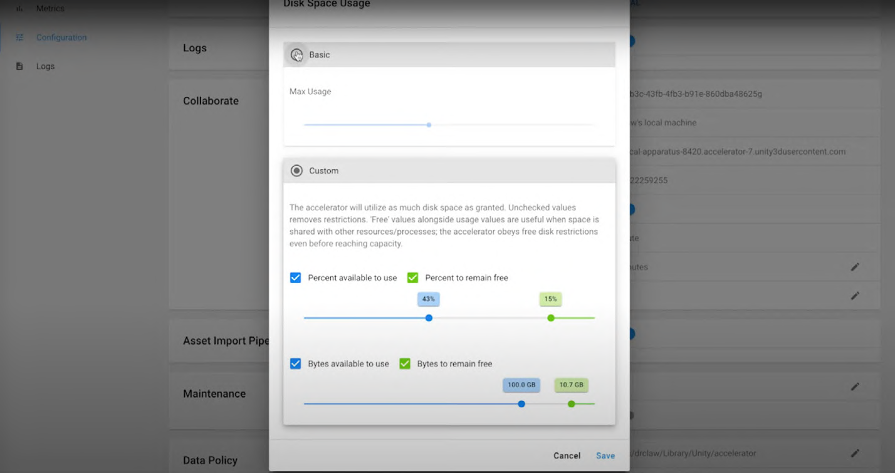
<p><em>VI: <strong>▲ Cấu hình dung lượng của Unity Accelerator</strong> — hai chế độ <strong>Basic</strong> (chỉ có <em>Max Usage</em>) và <strong>Custom</strong>: đặt <strong>Percent available to use 45%</strong> / <strong>Percent to remain free 15%</strong>, hoặc <strong>Bytes available to use 100.0 GB</strong> / <strong>Bytes to remain free 10.7 GB</strong>. Mô tả nguyên văn: <em>"accelerator sẽ dùng NHIỀU dung lượng nhất được cấp; bỏ tick một giá trị sẽ GỠ giới hạn đó"</em>. Cột trái là các mục <strong>Logs · Collaborate · Asset Import Pipeline · Maintenance · Data Policy</strong>. / EN: The Unity Accelerator disk space usage configuration.</em></p>


# PHẦN J — CHECKLIST TECH LEAD

## 67. ✅ CHECKLIST — Quy trình & Hiệu năng theo CyberAgent

!!! success "In ra và dùng khi khởi động dự án / khi nhận bàn giao một dự án đang chạy"

### 67.1. 🚦 TRƯỚC khi viết dòng code tối ưu đầu tiên

| ☐ | Việc cần làm | Tham chiếu |
|---|---|---|
| ☐ | **Chốt 5 CHỈ SỐ**: Frame rate · Memory · Transition time · Heat · Battery | <a href="#11-quyet-inh-1-nam-chi-so-phai-chot">§1.1</a> — *frame rate và memory là BẮT BUỘC* |
| ☐ | **Chốt chỉ số TRƯỚC giai đoạn MASS PRODUCTION** | <a href="#1-chuan-bi-truoc-khi-tuning-bon-quyet-inh-phai-chot">§1</a> — *sau đó chi phí đổi spec là KHỔNG LỒ* |
| ☐ | **Đo NGƯỠNG CRASH bộ nhớ trên thiết bị cấu hình THẤP NHẤT** | <a href="#12-quyet-inh-2-biet-nguong-crash-bo-nho-cua-thiet-bi">§1.2</a> — *máy 2 GB ⇒ giữ **≤ 1.3 GB*** |
| ☐ | **Đo bằng CÔNG CỤ NATIVE (Xcode/Android Studio), KHÔNG chỉ Unity Profiler** | <a href="#12-quyet-inh-2-biet-nguong-crash-bo-nho-cua-thiet-bi">§1.2</a> — *Unity BỎ SÓT native plugin + **~100 MB IL2CPP metadata*** |
| ☐ | **Chọn THIẾT BỊ BẢO ĐẢM dựa trên điểm SoC (Antutu), so theo SINGLE-CORE** | <a href="#13-quyet-inh-3-thiet-bi-bao-am-hoat-ong">§1.3</a>, <a href="#91-suc-manh-tinh-toan-clock-core-va-context-switch">§9.1</a> — *big.LITTLE khiến số nhân GÂY HIỂU LẦM* |
| ☐ | **Định nghĩa 6 hạng mục QUALITY SETTINGS (High/Medium/Low)** | <a href="#14-quyet-inh-4-ac-ta-quality-settings">§1.4</a> |
| ☐ | **Cài OVERLAY hiển thị FPS + BỘ NHỚ thường trực, có MÃ MÀU** | <a href="#2-phong-ngua-hien-thi-trang-thai-len-man-hinh">§2</a> — *bộ nhớ CHỈ phát hiện được qua CRASH* |
| ☐ | **Tạo SCENE NẶNG NHẤT và kiểm chứng chỉ số TRƯỚC** | <a href="#1-chuan-bi-truoc-khi-tuning-bon-quyet-inh-phai-chot">§1</a> |

### 67.2. 🔬 Khi ĐANG tuning

| ☐ | Việc cần làm | Tham chiếu |
|---|---|---|
| ☐ | **ĐO và XÁC ĐỊNH nguyên nhân — ĐỪNG ĐOÁN** | <a href="#3-hai-thai-o-bat-buoc-khi-tuning">§3</a> |
| ☐ | **SO SÁNH profile TRƯỚC/SAU trên TOÀN HỆ THỐNG, không chỉ chỗ vừa sửa** | <a href="#3-hai-thai-o-bat-buoc-khi-tuning">§3</a> — *sửa chỗ này có thể làm NẶNG chỗ khác* |
| ☐ | **Phân loại đúng: CRASH · SCREEN DROPOUT · LONG LOADING** | <a href="#4-ba-loai-suy-giam-hieu-nang">§4</a> |
| ☐ | **Nghi rò rỉ ⇒ lặp chuyển cảnh 3–5 LẦN rồi đo** | <a href="#51-ro-ri-bo-nho-quy-trinh-phat-hien-3-buoc">§5.1</a> |
| ☐ | **Giảm bộ nhớ: CẮT TỪ CHỖ TO trước** | <a href="#53-giam-bo-nho-nguyen-tac-cat-tu-cho-to">§5.3</a> — *1.000 × 1 KB = 1 MB, nhưng 1 texture 10 MB → 2 MB = 8 MB* |
| ☐ | **Rà 5 nơi: Assets · GC(Mono) · Other · Plug-ins · Đặc tả** | <a href="#53-giam-bo-nho-nguyen-tac-cat-tu-cho-to">§5.3</a> — *"xem lại ĐẶC TẢ" là biện pháp CUỐI CÙNG* |
| ☐ | **Tách SPIKE khỏi STEADY trước khi sửa** | <a href="#6-truc-processing-time-spike-vs-steady">§6</a> |
| ☐ | **Spike: cô lập GC vs xử lý nặng bằng Deep Profile** | <a href="#61-ieu-tra-tai-tuc-thoi-spike">§6.1</a> |
| ☐ | **Steady: kiểm 2 dấu hiệu GPU-bound (hạ resolution có nhanh lên? có `Gfx.WaitForPresent`?)** | <a href="#62-ieu-tra-tai-on-inh-steady-state">§6.2</a> |
| ☐ | **Profiling trên THIẾT BỊ THẬT, chỉ dùng Editor để lặp nhanh sau khi tái hiện được** | <a href="#18-nguyen-tac-o-editor-hay-thiet-bi-that">§18</a> |

### 67.3. 🧠 Kiến thức NỀN cần nắm

| ☐ | Điểm phải hiểu | Tham chiếu |
|---|---|---|
| ☐ | **Mobile: CPU và GPU CHIA SẺ băng thông bộ nhớ** *(khác PC)* | <a href="#10-gpu-vi-sao-no-khac-cpu-ve-cau-truc">§10</a> |
| ☐ | **RẼ NHÁNH trong vòng lặp gây PIPELINE STALL** | <a href="#9-cpu-pipeline-stall-biglittle-va-cache">§9</a> |
| ☐ | **Game DÙNG NHIỀU BỘ NHỚ bị OS GIẾT TRƯỚC khi ở background** | <a href="#11-memory-oom-swap-stack-vs-heap">§11</a> |
| ☐ | **Phân mảnh = KHÔNG CÒN vùng LIÊN TIẾP, dù tổng còn trống** | <a href="#112-stack-vs-heap-vi-sao-heap-cham">§11.2</a> |
| ☐ | **Storage ~100 MB/s ⇒ file 10 MB = 100 ms; NHIỀU file NHỎ còn CHẬM HƠN** | <a href="#12-storage-vi-sao-oc-file-lau-hon-ban-nghi">§12</a> |
| ☐ | **Boehm GC: KHÔNG phân thế hệ + KHÔNG nén ⇒ "Stop the World"** | <a href="#161-managed-heap-boehm-gc">§16.1</a> |
| ☐ | **MỌI lời gọi Unity API là NATIVE CALL — phải CACHE** | <a href="#151-c-il-il2cpp-va-unity-runtime">§15.1</a> |
| ☐ | **`destroyedObject == null` trả `true` NHƯNG tham chiếu C# VẪN CÒN ⇒ RÒ RỈ** | <a href="#155-gameobject-cai-bay-null-gay-ro-ri-bo-nho">§15.5</a> |
| ☐ | **Tính TAY được dung lượng: texture 1024² TrueColor = 4 MB; vertex đủ 5 thuộc tính = 60 B** | <a href="#141-bit-byte-va-bai-toan-texture-4-mb">§14.1</a>, <a href="#143-mesh-bang-dung-luong-moi-vertex">§14.3</a> |
| ☐ | **Chọn collection theo ĐỘ PHỨC TẠP, không theo thói quen** | <a href="#171-nam-collection-c-chon-cai-nao-khi-nao">§17.1</a> — *`Dictionary` tra cứu O(1)* |

### 67.4. 🤝 Quy trình ĐỘI & Vận hành

| ☐ | Việc cần làm | Tham chiếu |
|---|---|---|
| ☐ | **Commit `.meta` — MỌI setting tối ưu nằm trong đó** | <a href="#58-to-chuc-du-an-sau-quy-tac-thu-muc">§58</a> |
| ☐ | **CHỈ commit `Assets` + `ProjectSettings`; TUYỆT ĐỐI KHÔNG commit `Library`** | <a href="#61-thiet-lap-unity-cho-vcs-ignore-gi-file-lon">§61</a> |
| ☐ | **Dùng Git LFS nếu chọn Git; cân nhắc Perforce/Plastic nếu NHIỀU asset nhị phân LỚN** | <a href="#61-thiet-lap-unity-cho-vcs-ignore-gi-file-lon">§61</a> |
| ☐ | **CHIA scene lớn thành nhiều scene nhỏ + Prefab để chống XUNG ĐỘT** | <a href="#60-toi-uu-workflow-chia-nho-asset-preset">§60</a> |
| ☐ | **Dùng PRESET để ÉP CHUẨN import settings toàn đội** | <a href="#60-toi-uu-workflow-chia-nho-asset-preset">§60</a> |
| ☐ | **Commit NHỎ, THƯỜNG XUYÊN; message SẠCH kèm số ticket** | <a href="#62-bay-thong-le-tot-nhat-ve-version-control">§62</a> |
| ☐ | **Tắt Domain/Scene Reload khi KHÔNG sửa script để vào Play Mode nhanh hơn** | <a href="#65-developer-workflows-enter-play-mode-scriptableobject">§65</a> |
| ☐ | **Dùng ScriptableObject cho dữ liệu TĨNH — KHÔNG sinh rác, KHÔNG nhân bản** | <a href="#65-developer-workflows-enter-play-mode-scriptableobject">§65</a> |
| ☐ | **Save data: dùng MessagePack/Protobuf thay JSON/XML** | <a href="#65-developer-workflows-enter-play-mode-scriptableobject">§65</a> |
| ☐ | **Chia `.asmdef` để rút ngắn thời gian biên dịch** | <a href="#65-developer-workflows-enter-play-mode-scriptableobject">§65</a> |
| ☐ | **Cân nhắc Unity Accelerator (cache import) và Build Server** | <a href="#66-team-workflows-source-control-accelerator-build-server">§66</a> |

---

<div class="bilingual-row">
<div class="col-vi">
<p>🎓 <strong>Lời kết Module 5 — và của toàn bộ Hub.</strong></p>
<p>Bốn Module đầu dạy bạn <strong>LÀM GÌ</strong>. Module này dạy <strong>LÀM THEO THỨ TỰ NÀO</strong> — và đó mới là thứ phân biệt một Tech Lead.</p>
<blockquote>
<p><em>"<strong>Workflow của performance tuning thì CÓ THỂ ĐÚC KHUÔN ĐƯỢC.</strong> Bằng cách đi theo dòng chảy đó, việc XÁC ĐỊNH nguyên nhân và tìm giải pháp phù hợp trở nên DỄ DÀNG."</em> — <strong>CyberAgent SGE Core Technology Team</strong></p>
</blockquote>
<p>💡 Ba câu đáng nhớ nhất của cuốn sách đều nói về <em>kỷ luật</em>, không phải kỹ thuật:</p>
<ol>
<li><em><strong>"ĐO và XÁC ĐỊNH nguyên nhân. ĐỪNG ĐOÁN."</strong></em></li>
<li><em><strong>"Chìa khoá để giảm bộ nhớ là CẮT TỪ NHỮNG VÙNG LỚN."</strong></em></li>
<li><em><strong>"NGAY CẢ KHI xảy ra một trường hợp KHÔNG được mô tả trong tài liệu này, nó SẼ KHÔNG phải vấn đề LỚN NẾU các NGUYÊN TẮC CƠ BẢN được tuân thủ."</strong></em></li>
</ol>
</div>
<div class="col-en">
<p>🎓 <strong>Closing note for Module 5 — and for the whole Hub.</strong></p>
<p>The first four modules teach you <strong>WHAT to do</strong>. This one teaches <strong>IN WHAT ORDER</strong> — and that is what separates a Tech Lead.</p>
<blockquote>
<p><em>"<strong>The WORKFLOW of performance tuning CAN BE MOLDED.</strong> By following that flow, it becomes EASY to IDENTIFY the cause and find a solution that fits."</em> — <strong>CyberAgent SGE Core Technology Team</strong></p>
</blockquote>
<p>💡 The book's three most memorable lines are all about <em>discipline</em>, not technique:</p>
<ol>
<li><em><strong>"MEASURE and IDENTIFY the cause. DO NOT GUESS."</strong></em></li>
<li><em><strong>"The KEY to reducing memory is to CUT FROM LARGE AREAS."</strong></em></li>
<li><em><strong>"EVEN IF a case NOT DESCRIBED in this document occurs, it will NOT be a MAJOR PROBLEM IF the FUNDAMENTALS are followed."</strong></em></li>
</ol>
</div>
</div>
