# 👑 Module 5 — CyberAgent Performance Tuning Bible & Sentry ANR

!!! abstract "Nguồn đã cào / Sources scraped"
    **📕 Nguồn chính — cuốn sách LỚN NHẤT của toàn bộ Hub:**

    - 🇯🇵 [**Unity Performance Tuning Bible** — CyberAgent SGE Core Technology Team, **v1.0.5, bản tiếng Anh, 323 trang, 12 chương**](https://github.com/CyberAgentGameEntertainment/UnityPerformanceTuningBible/releases/tag/v1.0.5) — *tài liệu nội bộ của CyberAgent (Nhật Bản) được công khai; **267 hình***

    **Bài viết & tài liệu:**

    - 🚨 [**Fixing Unity ANRs with Sentry** — blog.sentry.io (case study **Amanotes**)](https://blog.sentry.io/fixing-unity-anrs-with-sentry-amanotes/) — *Deadlock Main Thread*
    - 📗 **Unity Gamedev Field Guide** (79 tr.) — ch. *Version control*, *Project organization*
    - 📘 [**Version control & project organization best practices**](https://resources.unity.com/games/version-control-project-organization-best-practices-ebook) · [**70+ tips to increase productivity with Unity LTS**](https://create.unity3d.com/ebook-improve-workflow)
    - 📕 **Optimize Your Mobile Game Performance** — ch. *Project configuration* (tr.22–23), *Workflow and collaboration* (tr.48–49)

    🎯 **Vị trí của Module này:** bốn Module trước dạy **KỸ THUẬT** tối ưu. Module 5 dạy **QUY TRÌNH** — *"Performance tuning is an area where past know-how can be utilized… the WORKFLOW of performance tuning can be MOLDED."* Nó cũng bổ sung **tầng phần cứng (SoC/CPU/GPU/Memory/Storage)** và **các kỹ thuật C# nâng cao** mà các Module trước chưa chạm tới.

---

# PHẦN A — QUY TRÌNH TUNING (Chương 1)

<div class="bilingual-row">
<div class="col-vi">
<p>📖 <strong>Lời mở đầu của nhóm tác giả — nêu đúng lý do cuốn sách tồn tại:</strong></p>
<blockquote>
<p><em>"Tài liệu này được tạo ra với mục tiêu <strong>dùng làm tài liệu THAM CHIẾU khi bạn gặp rắc rối với performance tuning ứng dụng Unity</strong>.</em></p>
<p><em>🔑 <strong>Performance tuning là lĩnh vực mà KINH NGHIỆM QUÁ KHỨ có thể tận dụng được, và tôi cảm thấy nó có xu hướng bị CÁ NHÂN HOÁ CAO ĐỘ.</strong> Người chưa có kinh nghiệm có thể có ấn tượng rằng nó khá KHÓ. Một trong những lý do có thể là <strong>NGUYÊN NHÂN gây suy giảm hiệu năng RẤT ĐA DẠNG</strong>.</em></p>
<p><em>💡 <strong>TUY NHIÊN, WORKFLOW của performance tuning thì CÓ THỂ ĐÚC KHUÔN ĐƯỢC. Bằng cách đi theo dòng chảy đó, việc XÁC ĐỊNH nguyên nhân và ĐƠN GIẢN LÀ tìm giải pháp phù hợp với sự kiện trở nên DỄ DÀNG.</strong> Kiến thức và kinh nghiệm sẽ giúp ích trong việc tìm giải pháp. Do đó, tài liệu này được thiết kế để giúp bạn học chủ yếu về <strong>'WORKFLOW' và 'kiến thức từ KINH NGHIỆM'</strong>."</em></p>
</blockquote>
<p>⚠️ <strong>Phạm vi áp dụng — tác giả nói rõ:</strong> <em>"Sổ tay này dành cho <strong>ứng dụng SMARTPHONE</strong>. Lưu ý rằng một số giải thích có thể KHÔNG áp dụng cho nền tảng khác. Phiên bản Unity dùng trong tài liệu này là <strong>Unity 2020.3.24f1</strong> trừ khi có ghi chú khác."</em></p>
</div>
<div class="col-en">
<p>📖 <strong>The authors' introduction — it states exactly why the book exists:</strong></p>
<blockquote>
<p><em>"This document was created with the goal of <strong>being used as a REFERENCE when you have trouble with performance tuning of Unity applications</strong>.</em></p>
<p><em>🔑 <strong>Performance tuning is an area where PAST KNOW-HOW can be utilized, and I feel that it is an area that tends to be HIGHLY INDIVIDUALIZED.</strong> Those with no experience in this field may have the impression that it is somewhat DIFFICULT. One of the reasons may be that <strong>the CAUSES of performance degradation VARY WIDELY</strong>.</em></p>
<p><em>💡 <strong>However, the WORKFLOW of performance tuning CAN BE MOLDED. By following that flow, it becomes EASY to IDENTIFY the cause of the problem and SIMPLY look for a solution that FITS the event.</strong> Knowledge and experience can help in the search for a solution. Therefore, this document is designed to help you learn mainly about <strong>'WORKFLOW' and 'knowledge from EXPERIENCE'</strong>."</em></p>
</blockquote>
<p>⚠️ <strong>Scope — the authors are explicit:</strong> <em>"This manual is intended for <strong>SMARTPHONE applications</strong>. Please note that some of the explanations may NOT be applicable to other platforms. The version of Unity used in this document is <strong>Unity 2020.3.24f1</strong> unless otherwise noted."</em></p>
</div>
</div>

## 1. Chuẩn bị TRƯỚC khi tuning — Bốn quyết định phải chốt

<div class="bilingual-row">
<div class="col-vi">
<blockquote>
<p><em>"Trước khi performance tuning, <strong>hãy QUYẾT ĐỊNH các CHỈ SỐ (indicator) bạn muốn đạt được.</strong> Nói thì dễ, nhưng đây thực sự là một nhiệm vụ <strong>ĐẦY THÁCH THỨC</strong>. Bởi vì <strong>thế giới đầy rẫy thiết bị với đủ loại cấu hình, và KHÔNG THỂ bỏ qua người dùng với thiết bị cấu hình THẤP.</strong></em></p>
<p><em>🤝 <strong>Công việc này KHÔNG THỂ hoàn thành bởi RIÊNG kỹ sư. Cần xác định "đường chất lượng" khi bàn bạc với những người ở các vai trò khác, và cũng cần kiểm chứng kỹ thuật.</strong>"</em></p>
</blockquote>
<p>⏰ <strong>THỜI ĐIỂM chốt — cực kỳ quan trọng:</strong></p>
<blockquote>
<p><em>"RẤT KHÓ để xác định các chỉ số này từ giai đoạn ĐẦU khi chưa đủ chức năng hay asset để đo tải. Do đó, một cách tiếp cận là <strong>xác định chúng SAU KHI dự án đã tiến triển tới một mức nhất định</strong>.</em></p>
<p><em>🚨 <strong>TUY NHIÊN, ĐIỀU QUAN TRỌNG là phải đảm bảo quyết định được đưa ra TRƯỚC KHI dự án bước vào GIAI ĐOẠN SẢN XUẤT HÀNG LOẠT (mass production). Bởi vì một khi mass production đã bắt đầu, CHI PHÍ THAY ĐỔI sẽ là KHỔNG LỒ.</strong>"</em></p>
</blockquote>
</div>
<div class="col-en">
<blockquote>
<p><em>"Before performance tuning, <strong>DECIDE ON THE INDICATORS you want to achieve.</strong> It is easy to say in words, but it is actually a <strong>HIGHLY CHALLENGING task</strong>. This is because <strong>the world is FULL of devices with various specifications, and it is IMPOSSIBLE to ignore users with LOW-SPECIFICATION devices.</strong></em></p>
<p><em>🤝 <strong>This work CANNOT be completed by ENGINEERS ALONE. It is necessary to determine quality lines in CONSULTATION with people in OTHER PROFESSIONS, and technical verification will also be necessary.</strong>"</em></p>
</blockquote>
<p>⏰ <strong>The TIMING of the decision — critically important:</strong></p>
<blockquote>
<p><em>"It is HIGHLY DIFFICULT to determine these indicators from the INITIAL phase when there are not enough function implementations or assets to measure the load. Therefore, one approach is to <strong>determine them AFTER the project has progressed to a CERTAIN DEGREE</strong>.</em></p>
<p><em>🚨 <strong>HOWEVER, it is IMPORTANT to make sure that the decision is made BEFORE the project enters the MASS PRODUCTION phase. This is because once mass production is started, the COST OF CHANGE will be ENORMOUS.</strong>"</em></p>
</blockquote>
</div>
</div>

!!! danger "😱 Nỗi sợ ĐỔI SPEC sau giai đoạn mass production — câu chuyện có thật"
    <div class="bilingual-row">
    <div class="col-vi">
    <blockquote>
    <p><em>"Giả sử bạn có một dự án đang ở giai đoạn HẬU sản xuất, nhưng có <strong>nút thắt rendering trên thiết bị cấu hình THẤP. Bộ nhớ đã GẦN GIỚI HẠN, nên việc chuyển sang model tải nhẹ hơn theo khoảng cách KHÔNG PHẢI là lựa chọn.</strong> Do đó, ta quyết định GIẢM SỐ VERTEX trong model.</em></p>
    <p><em>Quy trình sẽ là:</em></p>
    <ol>
    <li><em>Đặt lại dữ liệu để giảm ⇒ <strong>cần một ĐƠN ĐẶT HÀNG MỚI</strong></em></li>
    <li><em><strong>Giám đốc (director) phải KIỂM TRA LẠI chất lượng</strong></em></li>
    <li><em>Và cuối cùng, <strong>ta cũng phải DEBUG lại</strong></em></li>
    </ol>
    <p><em>💀 <strong>Sau mass production, sẽ có HÀNG CHỤC tới HÀNG TRĂM asset phải xử lý như trên. Việc này TỐN THỜI GIAN và NHÂN LỰC, và có thể GÂY TỬ VONG cho dự án.</strong></em></p>
    <p><em>✅ <strong>Để ngăn tình huống đó, việc TẠO RA những cảnh NẶNG NHẤT và KIỂM CHỨNG TRƯỚC xem chúng có đạt chỉ số hay không là CỰC KỲ QUAN TRỌNG.</strong>"</em></p>
    </blockquote>
    </div>
    <div class="col-en">
    <blockquote>
    <p><em>"Suppose you have a project that is now in the POST-PRODUCTION phase, but has a <strong>rendering bottleneck on a LOW-SPEC terminal. Memory usage is ALREADY NEAR ITS LIMIT, so switching to a lower-load model based on distance is NOT an option.</strong> Therefore, we decide to REDUCE THE NUMBER OF VERTICES in the model.</em></p>
    <p><em>The process would be:</em></p>
    <ol>
    <li><em>Reorder the data for reduction ⇒ <strong>A NEW PURCHASE ORDER will be needed</strong></em></li>
    <li><em><strong>The DIRECTOR needs to CHECK the quality AGAIN</strong></em></li>
    <li><em>And finally, <strong>we also need to DEBUG</strong></em></li>
    </ol>
    <p><em>💀 <strong>After mass production, there will be DOZENS TO HUNDREDS of assets that will need to be handled as described above. This is TIME-CONSUMING and LABOR-INTENSIVE, and can be FATAL to the project.</strong></em></p>
    <p><em>✅ <strong>To prevent such a situation, it is VERY IMPORTANT to CREATE the MOST BURDENSOME SCENES and VERIFY IN ADVANCE whether they meet the indicators.</strong>"</em></p>
    </blockquote>
    </div>
    </div>

### 1.1. 📏 Quyết định ① — Năm CHỈ SỐ phải chốt

**▼ Table 1.1 — Indicators** *(nguyên văn / verbatim)*

| Hạng mục / Item | Nội dung / Element |
|---|---|
| **Frame rate** | *"Nhắm tới frame rate BAO NHIÊU ở MỌI THỜI ĐIỂM"* |
| **Memory** | *"ƯỚC LƯỢNG bộ nhớ TỐI ĐA ở MÀN HÌNH NÀO và xác định GIÁ TRỊ GIỚI HẠN"* |
| **Transition time** | *"Thời gian CHỜ chuyển cảnh BAO NHIÊU là phù hợp?"* |
| **Heat** *(nhiệt độ)* | *"Chấp nhận được BAO NHIÊU nhiệt trong X GIỜ chơi liên tục"* |
| **Battery** *(pin)* | *"Mức tiêu thụ pin BAO NHIÊU là chấp nhận được trong X GIỜ chơi liên tục"* |

<div class="bilingual-row">
<div class="col-vi">
<p>🎯 <em>"<strong>Frame rate và Memory là HAI chỉ số QUAN TRỌNG NHẤT trong số trên — hãy CHẮC CHẮN chốt chúng.</strong> Ở giai đoạn này, <strong>hãy TẠM ĐỂ thiết bị cấu hình THẤP RA NGOÀI phương trình. Trước hết, điều quan trọng là xác định chỉ số cho các thiết bị ở VÙNG SỐ LƯỢNG LỚN (volume zone).</strong>"</em></p>
<p>💡 <strong>Định nghĩa "volume zone" — mẹo rất thực tế:</strong></p>
<blockquote>
<p><em>"Định nghĩa volume zone <strong>phụ thuộc vào dự án</strong>. Bạn có thể quyết định dựa trên <strong>nghiên cứu thị trường hoặc các tựa game khác dùng làm chuẩn</strong>. Hoặc, <strong>xét bối cảnh chu kỳ thay điện thoại ngày càng DÀI, bạn có thể lấy dòng TẦM TRUNG của KHOẢNG BỐN NĂM TRƯỚC làm chuẩn.</strong></em></p>
<p><em>✅ <strong>Ngay cả khi cơ sở lý luận hơi mơ hồ, hãy CẮM một lá cờ để nhắm tới. Từ đó, bạn có thể điều chỉnh dần.</strong>"</em></p>
</blockquote>
</div>
<div class="col-en">
<p>🎯 <em>"<strong>Frame rate and Memory are the MOST IMPORTANT indicators among the above, so BE SURE to decide on them.</strong> At this point, <strong>let's LEAVE low-specification devices OUT of the equation. First of all, it is important to determine the indicators for devices in the VOLUME ZONE.</strong>"</em></p>
<p>💡 <strong>Defining the "volume zone" — a very practical tip:</strong></p>
<blockquote>
<p><em>"The definition of the volume zone <strong>depends on the project</strong>. You may want to decide based on <strong>market research or other titles that can be used as benchmarks</strong>. Or, <strong>given the background of PROLONGED REPLACEMENT of mobile devices, you may use the MID-RANGE of about FOUR YEARS AGO as a benchmark for now.</strong></em></p>
<p><em>✅ <strong>Even if the rationale is a bit vague, let's SET A FLAG to aim for. From there, you can make adjustments.</strong>"</em></p>
</blockquote>
</div>
</div>

!!! success "📋 Ví dụ THẬT — từ mục tiêu MƠ HỒ thành chỉ số ĐO ĐƯỢC"
    <div class="bilingual-row">
    <div class="col-vi">
    <p><strong>🌫️ Mục tiêu ban đầu (mơ hồ):</strong></p>
    <blockquote>
    <ul>
    <li><em>"Chúng tôi muốn <strong>cải thiện MỌI thứ đang tệ ở ứng dụng của đối thủ</strong>."</em></li>
    <li><em>"Chúng tôi muốn nó chạy <strong>MƯỢT, đặc biệt là ingame</strong>."</em></li>
    <li><em>"Ngoài ra, chúng tôi muốn <strong>ngang bằng đối thủ</strong>."</em></li>
    </ul>
    </blockquote>
    <p><strong>🎯 Sau khi cả nhóm "ngôn ngữ hoá" (verbalize) chúng:</strong></p>
    <blockquote>
    <ul>
    <li><strong>Frame rate</strong> — <em>"<strong>60 frame INGAME và 30 frame OUTGAME</strong> xét từ góc độ TIÊU THỤ PIN."</em></li>
    <li><strong>Memory</strong> — <em>"Để TĂNG TỐC thời gian chuyển cảnh, thiết kế nên GIỮ LẠI một số tài nguyên out-game TRONG LÚC ingame. <strong>Lượng bộ nhớ dùng TỐI ĐA là 1 GB.</strong>"</em></li>
    <li><strong>Transition Time</strong> — <em>"Ngang mức đối thủ. <strong>Theo thời gian, phải TRONG VÒNG 3 GIÂY.</strong>"</em></li>
    <li><strong>Heat</strong> — <em>"Ngang mức đối thủ. <strong>KHÔNG nóng trong 1 GIỜ liên tục trên thiết bị đã kiểm chứng (KHÔNG sạc).</strong>"</em></li>
    <li><strong>Battery</strong> — <em>"Ngang mức đối thủ. <strong>Tiêu thụ pin khoảng 20% sau 1 GIỜ dùng liên tục trên thiết bị đã test.</strong>"</em></li>
    </ul>
    </blockquote>
    <p>✅ <em>"Một khi đã xác định mục tiêu, bạn có thể dùng <strong>thiết bị tham chiếu</strong> để test. <strong>Nếu mục tiêu KHÔNG đạt được CHÚT NÀO, đó là một chỉ báo TỐT.</strong>"</em></p>
    </div>
    <div class="col-en">
    <p><strong>🌫️ The initial (vague) goals:</strong></p>
    <blockquote>
    <ul>
    <li><em>"We want to <strong>improve EVERYTHING that is wrong with our competitor's application</strong>."</em></li>
    <li><em>"We want to make it <strong>run SMOOTHLY, especially INGAME</strong>."</em></li>
    <li><em>"Other than the above, we want to be <strong>as good as the competition</strong>."</em></li>
    </ul>
    </blockquote>
    <p><strong>🎯 After the team VERBALIZED them:</strong></p>
    <blockquote>
    <ul>
    <li><strong>Frame rate</strong> — <em>"<strong>60 frames INGAME and 30 frames OUTGAME</strong> from a BATTERY CONSUMPTION perspective."</em></li>
    <li><strong>Memory</strong> — <em>"To SPEED UP the transition time, the design should RETAIN some out-game resources DURING ingame. <strong>The maximum amount of memory used shall be 1 GB.</strong>"</em></li>
    <li><strong>Transition Time</strong> — <em>"Same level as the competition. <strong>In time, it should be WITHIN 3 SECONDS.</strong>"</em></li>
    <li><strong>Heat</strong> — <em>"Same level as the competition. <strong>It does NOT get hot for 1 HOUR continuously on the verified device (NOT charging).</strong>"</em></li>
    <li><strong>Battery</strong> — <em>"Same level as competitors. <strong>Battery consumption is about 20% after 1 HOUR of continuous use on the tested device.</strong>"</em></li>
    </ul>
    </blockquote>
    <p>✅ <em>"Once you have determined the target, you can use a <strong>reference device</strong> to test it. <strong>If the target is NOT reached AT ALL, it is a GOOD indicator.</strong>"</em></p>
    </div>
    </div>

!!! warning "⚖️ Tối ưu theo THỂ LOẠI game — mặt trái của frame rate cao"
    <div class="bilingual-row">
    <div class="col-vi">
    <blockquote>
    <p><em>"Trong trường hợp này, chủ đề của game là CHẠY MƯỢT, nên frame rate được đặt ở 60 fps. <strong>Frame rate CAO cũng đáng mong muốn cho game RHYTHM ACTION và game có PHÁN ĐỊNH KHẮT KHE như FPS.</strong></em></p>
    <p><em>🚨 <strong>TUY NHIÊN, frame rate cao CÓ BẤT LỢI:</strong></em></p>
    <ul>
    <li><em><strong>Frame rate CÀNG CAO, CÀNG TỐN PIN.</strong></em></li>
    <li><em><strong>Ngoài ra, CÀNG dùng nhiều BỘ NHỚ, CÀNG DỄ bị OS GIẾT khi ứng dụng bị treo nền (suspend).</strong></em></li>
    </ul>
    <p><em>✅ <strong>Cân nhắc những ưu và nhược điểm này, hãy quyết định MỤC TIÊU PHÙ HỢP cho TỪNG thể loại game.</strong>"</em></p>
    </blockquote>
    </div>
    <div class="col-en">
    <blockquote>
    <p><em>"In this case, the theme of the game was to run smoothly, so the frame rate was set at 60 fps. <strong>A HIGH frame rate is ALSO desirable for RHYTHM ACTION games and games with SEVERE JUDGMENTS such as first-person shooters (FPS).</strong></em></p>
    <p><em>🚨 <strong>HOWEVER, there is a DISADVANTAGE to a high frame rate:</strong></em></p>
    <ul>
    <li><em><strong>The HIGHER the frame rate, the MORE BATTERY power is consumed.</strong></em></li>
    <li><em><strong>In addition, the MORE MEMORY is used, the MORE LIKELY it is to be KILLED BY THE OS when it SUSPENDS.</strong></em></li>
    </ul>
    <p><em>✅ <strong>Considering these advantages and disadvantages, decide on an APPROPRIATE TARGET for EACH GAME GENRE.</strong>"</em></p>
    </blockquote>
    </div>
    </div>

### 1.2. 💾 Quyết định ② — Biết NGƯỠNG CRASH bộ nhớ của thiết bị

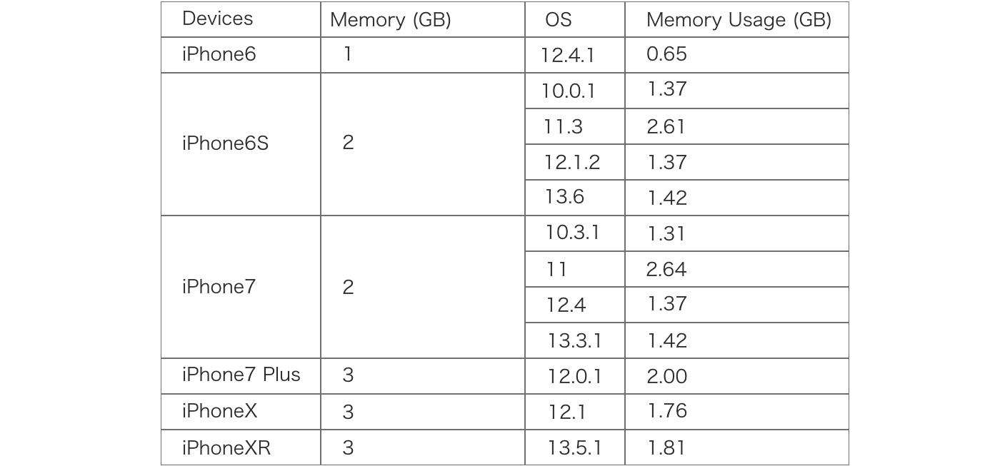
<p><em>VI: <strong>▲ Figure 1.1 — Ngưỡng Crash.</strong> Kết quả đo THỰC TẾ của tác giả trên iOS. / EN: Figure 1.1 — Crash Threshold.</em></p>

**Bảng đo NGUYÊN VĂN / The verbatim measurement table**

| Thiết bị | RAM máy (GB) | Phiên bản OS | **Mức bộ nhớ khi CRASH (GB)** |
|---|---|---|---|
| **iPhone 6** | **1** | 12.4.1 | **0.65** |
| **iPhone 6S** | **2** | 10.0.1 | 1.37 |
| | | 11.3 | ⚠️ **2.61** |
| | | 12.1.2 | 1.37 |
| | | 13.6 | 1.42 |
| **iPhone 7** | **2** | 10.3.1 | 1.31 |
| | | 11 | ⚠️ **2.64** |
| | | 12.4 | 1.37 |
| | | 13.3.1 | 1.42 |
| **iPhone 7 Plus** | **3** | 12.0.1 | 2.00 |
| **iPhone X** | **3** | 12.1 | 1.76 |
| **iPhone XR** | **3** | 13.5.1 | 1.81 |

```csharp
// ▼ List 1.1 — Code kiểm chứng (nguyên văn từ sách)
// Verification code (verbatim from the book)
private List<Texture2D> _textureList = new List<Texture2D>();
...
public void CreateTexture(int size) {
    Texture2D texture = new Texture2D(size, size, TextureFormat.RGBA32, false);
    _textureList.Add(texture);
}
```

<div class="bilingual-row">
<div class="col-vi">
<p>🔬 <strong>Phương pháp đo:</strong> <em>"Trong dự án kiểm chứng, <strong><code>Texture2D</code> được sinh ra LÚC RUNTIME, và thời gian tới lúc CRASH được đo.</strong> Môi trường kiểm chứng là <strong>Unity 2019.4.3 và Xcode 11.6</strong>, dùng giá trị ở mục <strong>Memory của Xcode Debug Navigator</strong> làm tham chiếu."</em></p>
<p>🎯 <strong>KẾT LUẬN VÀNG — con số cần nhớ:</strong></p>
<blockquote>
<p><em>"Dựa trên kết quả kiểm chứng này, <strong>KHUYẾN NGHỊ GIỮ bộ nhớ TRONG VÒNG 1.3 GB cho các thiết bị có 2 GB RAM, như iPhone 6S và 7.</strong></em></p>
<p><em>💀 <strong>Cũng có thể thấy rằng khi hỗ trợ thiết bị có 1 GB RAM như iPhone 6, ràng buộc bộ nhớ KHẮT KHE HƠN RẤT NHIỀU.</strong></em></p>
<p><em>🔍 <strong>Một đặc điểm khác của iOS 11 là mức dùng bộ nhớ CAO HƠN ĐÁNG KỂ so với iPhone 6, có thể do CƠ CHẾ QUẢN LÝ BỘ NHỚ KHÁC. Khi kiểm chứng, hãy lưu ý rằng những khác biệt do hệ điều hành như vậy là HIẾM.</strong>"</em></p>
</blockquote>
<p>✅ <strong>Ghi chú cập nhật của tác giả:</strong> <em>"Môi trường test hơi cũ, nên một số phép đo đã được ĐO LẠI bằng môi trường mới nhất tại thời điểm viết. Chúng tôi dùng <strong>Unity 2020.3.25 và 2021.2.0 với Xcode 13.3.1</strong>, build trên <strong>iPhone XR với OS 14.6 và 15.4.1</strong>. Kết quả: <strong>KHÔNG có khác biệt đáng kể trong giá trị đo, nên tôi cho rằng dữ liệu VẪN ĐÁNG TIN CẬY.</strong>"</em></p>
<p>📋 <strong>Cách đo — ba nguyên tắc:</strong></p>
<ol>
<li><em>"Kiểm chứng với <strong>thiết bị cấu hình THẤP NHẤT được bảo đảm hoạt động</strong>"</em></li>
<li><em>"Vì <strong>cơ chế cấp phát bộ nhớ có thể ĐÃ THAY ĐỔI tuỳ phiên bản OS</strong>, khuyến nghị <strong>chuẩn bị NHIỀU thiết bị với các MAJOR VERSION khác nhau</strong> nếu có thể"</em></li>
<li>🚨 <em>"Vì <strong>LOGIC ĐO KHÁC NHAU tuỳ công cụ đo, hãy ĐẢM BẢO chỉ dùng MỘT công cụ DUY NHẤT</strong>"</em></li>
</ol>
</div>
<div class="col-en">
<p>🔬 <strong>The measurement method:</strong> <em>"In the verification project, <strong><code>Texture2D</code> was generated AT RUNTIME, and the time required for a CRASH was measured.</strong> The verification environment is <strong>Unity 2019.4.3 and Xcode 11.6</strong>, using the values in the <strong>Memory section of Xcode's Debug Navigator</strong> as reference."</em></p>
<p>🎯 <strong>THE GOLDEN CONCLUSION — the number to remember:</strong></p>
<blockquote>
<p><em>"Based on the results of this verification, <strong>it is RECOMMENDED to KEEP the memory WITHIN 1.3 GB for devices with 2 GB of onboard memory, such as the iPhone 6S and 7.</strong></em></p>
<p><em>💀 <strong>It can also be seen that when supporting devices with 1 GB of onboard memory, such as the iPhone 6, the memory usage constraints are MUCH STRICTER.</strong></em></p>
<p><em>🔍 <strong>Another characteristic of iOS 11 is that its memory usage is SIGNIFICANTLY HIGHER than that of the iPhone 6, possibly due to a DIFFERENT MEMORY MANAGEMENT MECHANISM. When verifying, please note that such differences due to operating systems are RARE.</strong>"</em></p>
</blockquote>
<p>✅ <strong>The authors' update note:</strong> <em>"The test environment is a little old, so some of the measurements have been RE-MEASURED using the latest environment at the time of writing. We used <strong>Unity 2020.3.25 and 2021.2.0 and Xcode 13.3.1</strong> to build on <strong>iPhone XR with OS versions 14.6 and 15.4.1</strong>. As a result, <strong>there was NO PARTICULAR DIFFERENCE in the measured values, so I think the data is STILL RELIABLE.</strong>"</em></p>
<p>📋 <strong>How to measure — three rules:</strong></p>
<ol>
<li><em>"Verify with the <strong>LOWEST-specification device that is GUARANTEED to work</strong>"</em></li>
<li><em>"Since the <strong>memory allocation mechanism may have CHANGED depending on the OS version</strong>, it is recommended to <strong>prepare MULTIPLE devices with DIFFERENT MAJOR VERSIONS</strong> if possible"</em></li>
<li>🚨 <em>"Since the <strong>MEASUREMENT LOGIC DIFFERS depending on the tool, BE SURE to use ONLY ONE tool</strong>"</em></li>
</ol>
</div>
</div>

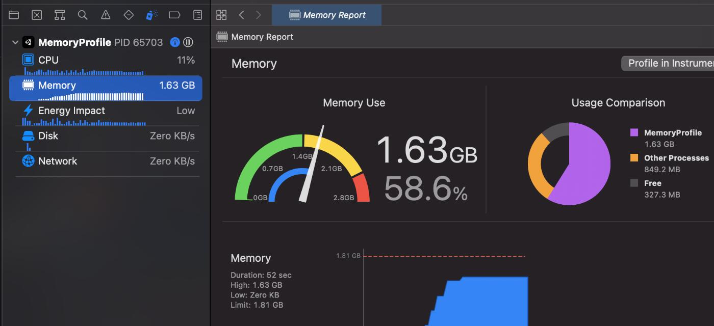
<p><em>VI: <strong>▲ Figure 1.2 — Xcode Debug Navigator</strong>, nơi đọc con số bộ nhớ dùng làm tham chiếu. / EN: Figure 1.2 — Xcode Debug Navigator.</em></p>

!!! danger "🚨 Vì sao PHẢI dùng công cụ NATIVE để đo bộ nhớ — không phải Unity Profiler"
    <div class="bilingual-row">
    <div class="col-vi">
    <blockquote>
    <p><em>"Chúng tôi <strong>KHUYẾN NGHỊ công cụ NATIVE như Xcode và Android Studio để đo bộ nhớ.</strong></em></p>
    <p><em>💀 <strong>Ví dụ, Unity Profiler KHÔNG đo bộ nhớ NATIVE được cấp phát bởi PLUG-IN.</strong></em></p>
    <p><em>💀 <strong>Trong trường hợp build IL2CPP, IL2CPP METADATA (KHOẢNG 100 MB) CŨNG KHÔNG được tính vào phép đo.</strong></em></p>
    <p><em>✅ <strong>Ngược lại, với công cụ native là Xcode, TOÀN BỘ bộ nhớ được cấp phát bởi ứng dụng ĐỀU được đo. Do đó, TỐT HƠN là dùng công cụ NATIVE, thứ đo giá trị CHÍNH XÁC HƠN.</strong>"</em></p>
    </blockquote>
    <p>👉 <em>Đây là lời cảnh báo QUAN TRỌNG bổ sung cho <a href="../01-fresher/01-ultimate-guide-to-profiling.md">Module 1</a> và <a href="../03-senior/01-memory-addressables-networking.md">Module 3</a>: <strong>con số bộ nhớ trong Unity Profiler KHÔNG phải con số làm crash máy bạn.</strong> Riêng IL2CPP metadata đã ~100 MB "vô hình".</em></p>
    </div>
    <div class="col-en">
    <blockquote>
    <p><em>"We <strong>RECOMMEND NATIVE-COMPLIANT tools such as Xcode and Android Studio for memory measurement.</strong></em></p>
    <p><em>💀 <strong>For example, the Unity Profiler does NOT measure NATIVE MEMORY allocated by PLUG-INS.</strong></em></p>
    <p><em>💀 <strong>In the case of IL2CPP builds, IL2CPP METADATA (ABOUT 100 MB) is ALSO NOT included in the measurement.</strong></em></p>
    <p><em>✅ <strong>On the other hand, in the case of the native tool Xcode, ALL memory allocated by the application is measured. Therefore, it is BETTER to use a NATIVE-COMPLIANT tool that measures values MORE ACCURATELY.</strong>"</em></p>
    </blockquote>
    <p>👉 <em>An IMPORTANT warning that complements <a href="../01-fresher/01-ultimate-guide-to-profiling.md">Module 1</a> and <a href="../03-senior/01-memory-addressables-networking.md">Module 3</a>: <strong>the memory number in the Unity Profiler is NOT the number that crashes your device.</strong> IL2CPP metadata alone is ~100 MB of "invisible" memory.</em></p>
    </div>
    </div>

### 1.3. 📱 Quyết định ③ — Thiết bị BẢO ĐẢM hoạt động

<div class="bilingual-row">
<div class="col-vi">
<blockquote>
<p><em>"<strong>Việc quyết định thiết bị BẢO ĐẢM TỐI THIỂU cũng quan trọng, như một chỉ số để xác định TỐI ƯU TỚI ĐÂU thì dừng.</strong> Rất khó quyết định ngay nếu chưa có kinh nghiệm, nhưng <strong>ĐỪNG quyết định BỘC PHÁT — hãy BẮT ĐẦU bằng việc XÁC ĐỊNH các ứng viên thiết bị cấu hình THẤP.</strong></em></p>
<p><em>🔑 <strong>Phương pháp tôi khuyến nghị là THAM CHIẾU dữ liệu đo bởi "SoC specs". Cụ thể, TÌM dữ liệu đo bởi các ứng dụng BENCHMARK trên Web.</strong></em></p>
<p><em>▶️ <strong>Trước hết, bạn cần biết cấu hình của thiết bị bạn dùng làm THAM CHIẾU, rồi CHỌN vài thiết bị có giá trị đo THẤP HƠN một chút.</strong></em></p>
<p><em>💪 <strong>Sau khi xác định thiết bị, hãy THỰC SỰ cài ứng dụng và kiểm tra hoạt động. ĐỪNG NẢN LÒNG nếu nó chạy chậm. Giờ bạn đang ở VẠCH XUẤT PHÁT, nơi bạn có thể thảo luận về việc CẮT BỎ cái gì.</strong>"</em></p>
</blockquote>
<p>💡 <em>Công cụ tác giả dùng: <strong>"Có vài ứng dụng đo benchmark, nhưng tôi dùng ANTUTU làm chuẩn. Vì có một WEBSITE tổng hợp dữ liệu đo và các TÌNH NGUYỆN VIÊN tích cực báo cáo dữ liệu đo của họ."</strong></em></p>
</div>
<div class="col-en">
<blockquote>
<p><em>"<strong>It is ALSO IMPORTANT to decide on the MINIMUM GUARANTEED terminal as an indicator to determine HOW FAR TO GO in performance tuning.</strong> It is difficult to decide on a guaranteed device immediately without experience, but <strong>do NOT decide on a SPUR-OF-THE-MOMENT basis — rather START by IDENTIFYING CANDIDATES for LOW-SPECIFICATION devices.</strong></em></p>
<p><em>🔑 <strong>The method I recommend is to REFER to the data measured by "SoC specs". Specifically, LOOK FOR data measured by BENCHMARK measurement applications on the Web.</strong></em></p>
<p><em>▶️ <strong>First, you need to know the specifications of the device you use as a REFERENCE, and then SELECT a few devices with a SOMEWHAT LOWER measured value.</strong></em></p>
<p><em>💪 <strong>Once you have identified the devices, ACTUALLY INSTALL the application and check its operation. Do NOT be DISCOURAGED if the operation is slow. You are now at the STARTING LINE where you can discuss WHAT TO ELIMINATE.</strong>"</em></p>
</blockquote>
<p>💡 <em>The tool the authors use: <strong>"There are several benchmark measurement applications, but I use ANTUTU as my benchmark. This is because there is a WEBSITE that compiles measurement data and VOLUNTEERS are ACTIVELY REPORTING their measurement data."</strong></em></p>
</div>
</div>

### 1.4. 🎚️ Quyết định ④ — Đặc tả QUALITY SETTINGS

<div class="bilingual-row">
<div class="col-vi">
<blockquote>
<p><em>"Với thị trường TRÀN NGẬP thiết bị đủ loại cấu hình, sẽ RẤT KHÓ để phủ nhiều thiết bị bằng MỘT đặc tả duy nhất. Do đó, <strong>những năm gần đây, việc đặt NHIỀU MỨC quality settings trong game để BẢO ĐẢM hoạt động ỔN ĐỊNH trên nhiều thiết bị đã trở thành THÔNG LỆ.</strong>"</em></p>
</blockquote>
<p><strong>Sáu hạng mục có thể phân loại thành High / Medium / Low:</strong></p>
<ol>
<li><strong>Screen resolution</strong> — độ phân giải màn hình</li>
<li><strong>Number of objects displayed</strong> — số object hiển thị</li>
<li><strong>Shadows</strong> — bóng đổ</li>
<li><strong>Post-effect function</strong> — chức năng hậu xử lý</li>
<li><strong>Frame rate</strong></li>
<li><strong>Ability to skip CPU-intensive scripts</strong> — khả năng BỎ QUA các script nặng CPU</li>
</ol>
<p>⚠️ <em>"Tuy nhiên, việc này <strong>SẼ LÀM GIẢM chất lượng cảm nhận của dự án</strong>, nên hãy <strong>bàn bạc với director và CÙNG NHAU khám phá đường ranh nào là CHẤP NHẬN ĐƯỢC</strong> cho dự án."</em></p>
<p>👉 <em>Ánh xạ kỹ thuật: mục ①–④ chính là các setting trong <strong>URP Asset</strong> ở <a href="../04-tech-lead/01-gpu-urp-advanced-rendering.md">Module 4 §31.6</a> (bảng BiRP→URP Low/High) và <strong>§22.2 Dynamic Resolution</strong>.</em></p>
</div>
<div class="col-en">
<blockquote>
<p><em>"With the market FLOODED with devices of various specifications, it would be DIFFICULT to cover many devices with a SINGLE specification. Therefore, <strong>in recent years, it has become COMMON PRACTICE to set SEVERAL QUALITY SETTINGS in the game to GUARANTEE STABLE OPERATION on a variety of devices.</strong>"</em></p>
</blockquote>
<p><strong>Six items that can be classified into High / Medium / Low:</strong></p>
<ol>
<li><strong>Screen resolution</strong></li>
<li><strong>Number of objects displayed</strong></li>
<li><strong>Shadows</strong></li>
<li><strong>Post-effect function</strong></li>
<li><strong>Frame rate</strong></li>
<li><strong>Ability to SKIP CPU-INTENSIVE scripts</strong></li>
</ol>
<p>⚠️ <em>"However, this will <strong>REDUCE the QUALITY of the LOOK AND FEEL of the project</strong>, so please <strong>CONSULT with the director and TOGETHER EXPLORE what line is ACCEPTABLE</strong> for the project."</em></p>
<p>👉 <em>Technical mapping: items ①–④ are exactly the settings in the <strong>URP Asset</strong> from <a href="../04-tech-lead/01-gpu-urp-advanced-rendering.md">Module 4 §31.6</a> (the BiRP→URP Low/High table) and <strong>§22.2 Dynamic Resolution</strong>.</em></p>
</div>
</div>

---

## 2. 🛡️ Phòng NGỪA — Hiển thị trạng thái LÊN MÀN HÌNH


<p><em>VI: <strong>▲ Figure 1.3 — Performance Visualization</strong>: hiển thị frame rate và bộ nhớ NGAY TRÊN màn hình game. / EN: Figure 1.3 — Performance Visualization.</em></p>

<div class="bilingual-row">
<div class="col-vi">
<blockquote>
<p><em>"Giống như lỗi (defect), <strong>suy giảm hiệu năng có thể có ĐỦ LOẠI nguyên nhân TÍCH TỤ THEO THỜI GIAN, làm TĂNG ĐỘ KHÓ của việc điều tra.</strong> Ý hay là <strong>cài đặt một CƠ CHẾ trong ứng dụng cho phép bạn NHẬN RA vấn đề SỚM NHẤT CÓ THỂ.</strong></em></p>
<p><em>✅ <strong>Cách ĐƠN GIẢN và HIỆU QUẢ là HIỂN THỊ trạng thái ứng dụng hiện tại LÊN MÀN HÌNH.</strong> Khuyến nghị ÍT NHẤT hiển thị thường trực:</em></p>
<ul>
<li><em><strong>Frame rate hiện tại</strong></em></li>
<li><em><strong>Mức dùng bộ nhớ hiện tại</strong></em></li>
</ul>
</blockquote>
<p>🔑 <strong>Lập luận CỐT LÕI — vì sao phải hiện BỘ NHỚ:</strong></p>
<blockquote>
<p><em>"<strong>Trong khi FRAME RATE có thể được PHÁT HIỆN qua TRẢI NGHIỆM của người dùng rằng hiệu năng đang giảm, thì BỘ NHỚ CHỈ có thể phát hiện qua CRASH.</strong></em></p>
<p><em>💡 <strong>Xác suất phát hiện RÒ RỈ BỘ NHỚ ở giai đoạn SỚM sẽ TĂNG LÊN chỉ nhờ việc HIỂN THỊ nó THƯỜNG TRỰC trên màn hình.</strong>"</em></p>
</blockquote>
<p>🎨 <strong>Cải tiến thêm — mã màu:</strong></p>
<blockquote>
<p><em>"Cách hiển thị này có thể cải tiến để HIỆU QUẢ HƠN. Ví dụ, <strong>nếu frame rate mục tiêu là 30 fps: hiện màu XANH LÁ cho 25–30 fps, VÀNG cho 20–25 fps, và ĐỎ cho dưới mức đó.</strong> Nhờ vậy bạn có thể <strong>NHÌN LƯỚT QUA là biết NGAY ứng dụng có đạt tiêu chí hay không.</strong>"</em></p>
</blockquote>
</div>
<div class="col-en">
<blockquote>
<p><em>"As with defects, <strong>performance degradation can have a VARIETY of causes OVER TIME, INCREASING the DIFFICULTY of investigation.</strong> It is a good idea to <strong>implement a MECHANISM in your application that will allow you to NOTICE the problem AS EARLY AS POSSIBLE.</strong></em></p>
<p><em>✅ <strong>A SIMPLE and EFFECTIVE way to do this is to DISPLAY the current application status ON THE SCREEN.</strong> It is recommended that AT LEAST the following be displayed at all times:</em></p>
<ul>
<li><em><strong>Current frame rate</strong></em></li>
<li><em><strong>Current memory usage</strong></em></li>
</ul>
</blockquote>
<p>🔑 <strong>The CORE argument — why memory must be shown:</strong></p>
<blockquote>
<p><em>"<strong>While FRAME RATE can be DETECTED by the user's EXPERIENCE that performance is declining, MEMORY can ONLY be detected by CRASHES.</strong></em></p>
<p><em>💡 <strong>The PROBABILITY of detecting MEMORY LEAKS at an EARLY STAGE will INCREASE simply by CONSTANTLY DISPLAYING them on the screen.</strong>"</em></p>
</blockquote>
<p>🎨 <strong>A further improvement — colour coding:</strong></p>
<blockquote>
<p><em>"This display method can be further improved to be more effective. For example, <strong>if the target frame rate is 30 fps: turn the display GREEN for 25–30 fps, YELLOW for 20–25 fps, and RED for below that.</strong> This way, you can <strong>INTUITIVELY see AT A GLANCE whether the application meets the criteria.</strong>"</em></p>
</blockquote>
</div>
</div>

```csharp
// Overlay hiệu năng thường trực — cài đặt theo đúng khuyến nghị của sách
// A permanent performance overlay — implemented exactly as the book recommends
using UnityEngine;
using UnityEngine.Profiling;

public class PerformanceOverlay : MonoBehaviour
{
    [SerializeField] int targetFrameRate = 30;

    float _deltaTime;
    GUIStyle _style;

    void Awake()
    {
        DontDestroyOnLoad(gameObject);
        _style = new GUIStyle { fontSize = 28, alignment = TextAnchor.UpperLeft };
    }

    void Update()
    {
        // Trung bình trượt để số không nhảy loạn
        _deltaTime += (Time.unscaledDeltaTime - _deltaTime) * 0.1f;
    }

    void OnGUI()
    {
        float ms  = _deltaTime * 1000f;
        float fps = 1f / _deltaTime;

        // Mã màu theo đúng ngưỡng sách đề xuất: >83% xanh, >66% vàng, còn lại đỏ
        float ratio = fps / targetFrameRate;
        _style.normal.textColor = ratio >= 0.83f ? Color.green
                                : ratio >= 0.66f ? Color.yellow
                                                 : Color.red;

        // Bộ nhớ: dùng Profiler API — LƯU Ý đây KHÔNG bao gồm native plugin
        // và IL2CPP metadata (§1.2). Chỉ dùng để phát hiện XU HƯỚNG rò rỉ.
        long totalMB = Profiler.GetTotalAllocatedMemoryLong() / (1024 * 1024);
        long monoMB  = Profiler.GetMonoUsedSizeLong()         / (1024 * 1024);

        GUI.Label(new Rect(10, 10, 600, 120),
            $"{ms:0.0} ms  ({fps:0.} FPS)\nTotal: {totalMB} MB   Mono: {monoMB} MB",
            _style);
    }
}
```

---

## 3. 🎯 Hai THÁI ĐỘ bắt buộc khi tuning

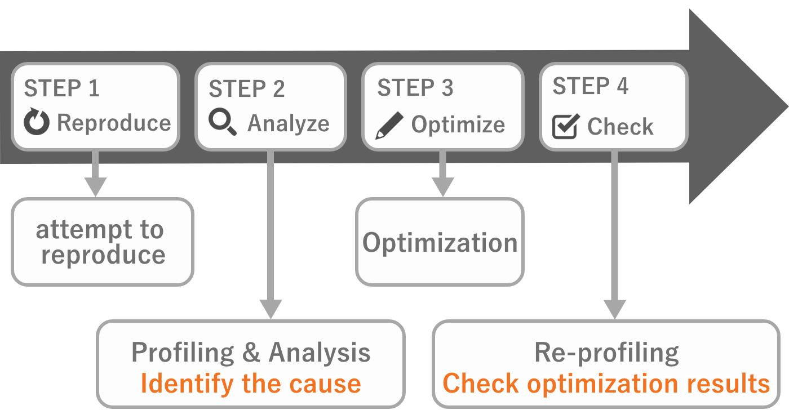
<p><em>VI: <strong>▲ Figure 1.4 — Chuẩn bị cho Performance Tuning.</strong> / EN: Figure 1.4 — Preparation for Performance Tuning.</em></p>

<div class="bilingual-row">
<div class="col-vi">
<blockquote>
<p><em>"Ví dụ, giả sử bạn có ứng dụng với frame rate CHẬM. <strong>Rõ ràng là có vài model 'giàu chi tiết' đang hiển thị. Mọi người xung quanh đang nói rằng CHẮC CHẮN những model này là nguyên nhân. Ta cần NHÌN KỸ VÀO BẰNG CHỨNG để xem điều đó có ĐÚNG hay không.</strong>"</em></p>
</blockquote>
<p><strong>🥇 Thái độ ① — ĐO và XÁC ĐỊNH nguyên nhân. ĐỪNG ĐOÁN.</strong></p>
<blockquote>
<p><em>"The first is to <strong>MEASURE and IDENTIFY the cause. DO NOT GUESS.</strong>"</em></p>
</blockquote>
<p><strong>🥈 Thái độ ② — SAU khi sửa, BẮT BUỘC SO SÁNH kết quả.</strong></p>
<blockquote>
<p><em>"Bạn có thể muốn so sánh profile TRƯỚC và SAU. <strong>Mấu chốt là KIỂM TRA sự suy giảm hiệu năng TRÊN TOÀN BỘ hệ thống, KHÔNG CHỈ ở phần vừa sửa.</strong></em></p>
<p><em>💀 <strong>Phần ĐÁNG SỢ của performance tuning là: trong những trường hợp HIẾM, phần được sửa thì NHANH HƠN, nhưng TẢI LẠI TĂNG ở các phần KHÁC của hệ thống, và hiệu năng TỔNG THỂ bị SUY GIẢM. Đó là ĐƯỜNG CÙNG.</strong>"</em></p>
</blockquote>
<p>🎓 <em>"<strong>XÁC ĐỊNH nguyên nhân và XÁC NHẬN rằng hệ thống ĐÃ nhanh hơn. Đây là THÁI ĐỘ QUAN TRỌNG cho performance tuning.</strong>"</em></p>
</div>
<div class="col-en">
<blockquote>
<p><em>"For example, let's say you have an application with a SLOW frame rate. <strong>Obviously, several RICH MODELS are displayed. People around you are saying that these models MUST BE the cause. We need to LOOK CAREFULLY AT THE EVIDENCE to see if this is REALLY the case.</strong>"</em></p>
</blockquote>
<p><strong>🥇 Attitude ① — MEASURE and IDENTIFY the cause. DO NOT GUESS.</strong></p>
<blockquote>
<p><em>"The first is to <strong>MEASURE and IDENTIFY the cause. Do NOT GUESS.</strong>"</em></p>
</blockquote>
<p><strong>🥈 Attitude ② — After making corrections, BE SURE to COMPARE the results.</strong></p>
<blockquote>
<p><em>"You may want to compare the before and after profiles. <strong>The point is to CHECK for performance degradation ACROSS THE BOARD, NOT JUST in the modified area.</strong></em></p>
<p><em>💀 <strong>The SCARY PART of performance tuning is that in RARE CASES, the modified part is FASTER, but the load INCREASES in OTHER PARTS of the system, and the OVERALL performance is DEGRADED. This is the END OF THE LINE.</strong>"</em></p>
</blockquote>
<p>🎓 <em>"<strong>To IDENTIFY the cause of the problem and CONFIRM that the system HAS BECOME FASTER. This is an IMPORTANT ATTITUDE for performance tuning.</strong>"</em></p>
</div>
</div>

---

## 4. 🗂️ Ba LOẠI suy giảm hiệu năng


<p><em>VI: <strong>▲ Figure 1.5 — Nguyên nhân suy giảm hiệu năng</strong>: <strong>Crash · Screen dropout (rớt khung hình) · Long loading (load lâu)</strong>. / EN: Figure 1.5 — Causes of performance degradation.</em></p>

<div class="bilingual-row">
<div class="col-vi">
<blockquote>
<p><em>"'Suy giảm hiệu năng' có thể chỉ những thứ KHÁC NHAU. Trong tài liệu này, ta định nghĩa <strong>BA loại rộng</strong>."</em></p>
</blockquote>
<p><strong>💔 ① CRASH</strong> — <em>"có thể phân thành HAI loại chính: <strong>'TRÀN BỘ NHỚ (memory overflow)'</strong> hoặc <strong>'LỖI THỰC THI CHƯƠNG TRÌNH'</strong>. <strong>Loại sau KHÔNG thuộc phạm vi performance tuning</strong>, nên chi tiết sẽ không được đề cập."</em></p>
<p><strong>🔥 ② SCREEN DROPOUT</strong> và <strong>⏱️ ③ LONG LOADING</strong> — <em>"<strong>'THỜI GIAN XỬ LÝ CPU và GPU' có lẽ chiếm PHẦN LỚN các trường hợp rớt khung hình và load lâu.</strong>"</em></p>
<p>🧭 <strong>Do đó tài liệu tập trung vào HAI trục:</strong> <strong>MEMORY</strong> và <strong>PROCESSING TIME</strong>.</p>
</div>
<div class="col-en">
<blockquote>
<p><em>"Performance degradation may refer to DIFFERENT THINGS. In this document, we define <strong>THREE BROAD CATEGORIES</strong>."</em></p>
</blockquote>
<p><strong>💔 ① CRASH</strong> — <em>"can be classified into TWO MAIN TYPES: <strong>'MEMORY OVERFLOW'</strong> or <strong>'PROGRAM EXECUTION ERROR'</strong>. <strong>The latter is NOT the domain of performance tuning</strong>, so the specifics will not be covered."</em></p>
<p><strong>🔥 ② SCREEN DROPOUT</strong> and <strong>⏱️ ③ LONG LOADING</strong> — <em>"<strong>'CPU and GPU PROCESSING TIME' will probably account for the MAJORITY of screen dropouts and long loading times.</strong>"</em></p>
<p>🧭 <strong>So the document focuses on TWO axes:</strong> <strong>MEMORY</strong> and <strong>PROCESSING TIME</strong>.</p>
</div>
</div>

---

## 5. 💧 Trục MEMORY — Cô lập nguyên nhân TRÀN bộ nhớ

### 5.1. Rò rỉ bộ nhớ — Quy trình phát hiện 3 bước

<div class="bilingual-row">
<div class="col-vi">
<blockquote>
<p><em>"Một nguyên nhân có thể của tràn bộ nhớ là <strong>MEMORY LEAK</strong>. Để kiểm tra, hãy xem <strong>mức dùng bộ nhớ có TĂNG DẦN theo các lần CHUYỂN CẢNH hay không.</strong></em></p>
<p><em>🔑 <strong>"Chuyển cảnh" ở đây KHÔNG CHỈ là chuyển màn hình, mà còn là những THAY ĐỔI MÀN HÌNH LỚN.</strong> Ví dụ: từ màn hình TITLE sang OUT-GAME, từ OUT-GAME sang IN-GAME, v.v."</em></p>
</blockquote>
<p><strong>▶️ Ba bước đo:</strong></p>
<ol>
<li><em><strong>GHI LẠI mức dùng bộ nhớ ở một cảnh nhất định</strong></em></li>
<li><em><strong>CHUYỂN sang cảnh KHÁC</strong></em></li>
<li><em><strong>LẶP LẠI bước "1" tới "2" KHOẢNG 3 ĐẾN 5 LẦN</strong></em></li>
</ol>
<p>🚨 <em>"Nếu kết quả đo cho thấy mức dùng bộ nhớ <strong>TĂNG RÒNG (net increase)</strong>, thì <strong>CHẮC CHẮN có thứ gì đó đang RÒ RỈ. Cái này có thể gọi là một LỖI VÔ HÌNH. Trước hết, hãy LOẠI BỎ rò rỉ.</strong>"</em></p>
<p>💡 <em>"Cũng nên <strong>CHÈN vài lần chuyển màn hình TRƯỚC khi thực hiện bước '2'</strong>. Bởi vì <strong>có khả năng CHỈ tài nguyên được load ở một màn hình CỤ THỂ mới bị rò rỉ NGOẠI LỆ.</strong>"</em></p>
</div>
<div class="col-en">
<blockquote>
<p><em>"One possible cause of memory overflow is a <strong>MEMORY LEAK</strong>. To check for this, let's see <strong>if memory usage GRADUALLY INCREASES with SCENE TRANSITIONS.</strong></em></p>
<p><em>🔑 <strong>Scene transitions here are NOT JUST screen transitions, but ALSO LARGE SCREEN CHANGES.</strong> For example, from the TITLE screen to OUT-GAME, from OUT-GAME to IN-GAME, etc."</em></p>
</blockquote>
<p><strong>▶️ The three measurement steps:</strong></p>
<ol>
<li><em><strong>NOTE the memory usage in a CERTAIN SCENE</strong></em></li>
<li><em><strong>TRANSITION to a DIFFERENT scene</strong></em></li>
<li><em><strong>REPEAT "1" to "2" ABOUT 3 TO 5 TIMES</strong></em></li>
</ol>
<p>🚨 <em>"If the measurement results show a <strong>NET INCREASE</strong> in memory usage, <strong>something is DEFINITELY LEAKING. This can be called an INVISIBLE DEFECT. First, let's ELIMINATE the leak.</strong>"</em></p>
<p>💡 <em>"It is also a good idea to <strong>SANDWICH a few screen transitions BEFORE making the '2' transition</strong>. This is because <strong>it is possible that ONLY the resources loaded on a PARTICULAR screen are EXCEPTIONALLY leaked.</strong>"</em></p>
</div>
</div>

!!! tip "🔁 Vì sao phải LẶP LẠI — kinh nghiệm thực chiến của tác giả"
    <div class="bilingual-row">
    <div class="col-vi">
    <blockquote>
    <p><em>"Đây là kinh nghiệm của tác giả, nhưng <strong>đã có trường hợp một số tài nguyên KHÔNG được giải phóng do vấn đề TIMING sau khi giải phóng tài nguyên (sau <code>UnloadUnusedAssets</code>). Những tài nguyên chưa được giải phóng này SẼ được giải phóng khi chuyển sang cảnh TIẾP THEO.</strong></em></p>
    <p><em>💀 <strong>Ngược lại, mức tăng bộ nhớ DẦN DẦN qua các lần chuyển cảnh LẶP LẠI cuối cùng SẼ GÂY CRASH.</strong></em></p>
    <p><em>✅ <strong>Để TÁCH BIỆT vấn đề TRƯỚC với vấn đề SAU, tài liệu này khuyến nghị LẶP LẠI việc chuyển cảnh NHIỀU LẦN trong lúc đo bộ nhớ.</strong></em></p>
    <p><em>🔍 <strong>Nhân tiện, nếu có vấn đề kiểu đầu, có lẽ MỘT OBJECT NÀO ĐÓ VẪN ĐANG GIỮ THAM CHIẾU tại thời điểm giải phóng tài nguyên và sau đó mới được giải phóng. KHÔNG chí tử, nhưng NÊN điều tra nguyên nhân và giải quyết.</strong>"</em></p>
    </blockquote>
    <p>👉 <em>Liên hệ <a href="../03-senior/01-memory-addressables-networking.md">Module 3</a> về <code>Resources.UnloadUnusedAssets</code> và vòng đời tham chiếu Addressables.</em></p>
    </div>
    <div class="col-en">
    <blockquote>
    <p><em>"This is the author's experience, but <strong>there were cases where SOME RESOURCES were NOT RELEASED due to TIMING ISSUES after resource release (after <code>UnloadUnusedAssets</code>). These unreleased resources ARE released when transitioning to the NEXT scene.</strong></em></p>
    <p><em>💀 <strong>In contrast, a GRADUAL INCREASE in memory usage with REPEATED transitions will EVENTUALLY CAUSE A CRASH.</strong></em></p>
    <p><em>✅ <strong>In order to SEPARATE the former problem from the latter, this document recommends REPEATING transitions SEVERAL TIMES during memory measurement.</strong></em></p>
    <p><em>🔍 <strong>Incidentally, if there is a problem like the former, SOME OBJECT is probably STILL HOLDING A REFERENCE at the time of resource release and is subsequently released. It is NOT FATAL, but it is a good idea to investigate the cause and resolve it.</strong>"</em></p>
    </blockquote>
    <p>👉 <em>Connects to <a href="../03-senior/01-memory-addressables-networking.md">Module 3</a> on <code>Resources.UnloadUnusedAssets</code> and the Addressables reference lifecycle.</em></p>
    </div>
    </div>

### 5.2. 🔧 Ba công cụ điều tra rò rỉ — Chọn cái nào?

| Công cụ | Cài đặt | Đặc điểm / Characteristics | Hạn chế |
|---|---|---|---|
| **Profiler (Memory)** | ✅ **Có SẴN** trong Unity Editor ⇒ *"dễ dàng thực hiện đo"* | 🔑 *"Về cơ bản, bạn nên **snapshot bộ nhớ với `Detailed` và `Gather object references` được BẬT** rồi điều tra"* | ⚠️ *"**KHÔNG cho phép SO SÁNH snapshot** của dữ liệu đo"* |
| **Memory Profiler** | Package Manager | *"Hiển thị nội dung bộ nhớ dạng **TREE MAP** đồ hoạ. Được **Unity HỖ TRỢ CHÍNH THỨC** và vẫn đang cập nhật thường xuyên"* | 💡 *"**Từ v0.5, cách theo dõi quan hệ THAM CHIẾU đã được CẢI THIỆN RẤT NHIỀU** ⇒ khuyến nghị dùng bản MỚI NHẤT"* |
| **Heap Explorer** | Package Manager | *"Công cụ do **CÁ NHÂN phát triển**, nhưng **RẤT DỄ DÙNG và NHẸ**. Có thể **theo dõi tham chiếu ở dạng DANH SÁCH**"* | ✅ *"Là **giải pháp THAY THẾ TỐT khi Memory Profiler v0.5 KHÔNG khả dụng**"* |

### 5.3. ✂️ Giảm bộ nhớ — Nguyên tắc "CẮT TỪ CHỖ TO"

<div class="bilingual-row">
<div class="col-vi">
<blockquote>
<p><em>"<strong>Chìa khoá để giảm bộ nhớ là CẮT TỪ NHỮNG VÙNG LỚN.</strong></em></p>
<p><em>🧮 <strong>Bởi vì 1.000 mảnh 1 KB thì chỉ giảm được 1 MB. Nhưng NẾU bạn nén một texture 10 MB xuống 2 MB, bạn giảm được 8 MB.</strong></em></p>
<p><em>💰 <strong>Xét hiệu quả chi phí, hãy Ý THỨC rằng bạn nên BẮT ĐẦU từ những hạng mục LỚN NHẤT và giảm chúng TRƯỚC.</strong>"</em></p>
</blockquote>
</div>
<div class="col-en">
<blockquote>
<p><em>"<strong>The KEY to reducing memory is to CUT FROM LARGE AREAS.</strong></em></p>
<p><em>🧮 <strong>Because 1,000 pieces of 1 KB will only result in a 1 MB reduction. However, if you compress a 10 MB texture to 2 MB, you can reduce it by 8 MB.</strong></em></p>
<p><em>💰 <strong>Considering cost-effectiveness, be AWARE that you should START with the LARGEST items and reduce them FIRST.</strong>"</em></p>
</blockquote>
</div>
</div>

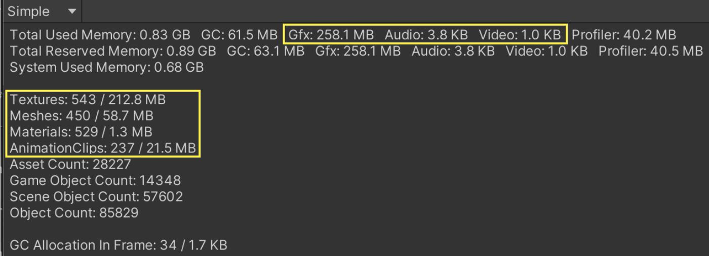
<p><em>VI: <strong>▲ Figure 1.6 — Các hạng mục liên quan ASSETS</strong> trong Simple View của Profiler (vùng khoanh chữ nhật). / EN: Figure 1.6 — Assets-related items.</em></p>

**Năm nơi cần soi khi giảm bộ nhớ / The five places to look when reducing memory**

| # | Hạng mục | Nội dung nguyên văn |
|---|---|---|
| **①** | **Assets** | *"Nếu Simple View có NHIỀU Assets, có thể do **asset KHÔNG CẦN THIẾT** hoặc **rò rỉ bộ nhớ**."* → **3 việc phải điều tra** (bảng dưới) |
| **②** | **GC (Mono)** | *"Nếu có NHIỀU GC (Mono) trong Simple View, **rất có thể một GC.Alloc LỚN đang xảy ra MỘT LẦN**. Hoặc **bộ nhớ có thể bị PHÂN MẢNH do GC.Alloc xảy ra MỖI FRAME**. Những điều này có thể gây **MỞ RỘNG THÊM vùng managed heap**. Trong trường hợp này, bạn nên **giảm GC.Alloc một cách ĐỀU ĐẶN**."* 📌 *Lưu ý phiên bản: **"GC" hiện là "GC" ở 2020.2 trở lên, và "Mono" ở 2020.1 trở xuống. Cả hai đều chỉ dung lượng managed heap bị chiếm.*** |
| **③** | **Other** | *"Kiểm tra các mục ĐÁNG NGỜ trong Detailed View."* 💡 *"Theo KINH NGHIỆM của tôi, **`SerializedFile` và `PersistentManager.Remapper` khá PHÌNH TO**. Nếu có thể **SO SÁNH giá trị giữa NHIỀU DỰ ÁN, hãy làm điều đó một lần. So sánh có thể LỘ RA các giá trị NGOẠI LAI (outlier).*** |
| **④** | **Plug-ins** | 🚨 *"**Unity CHỈ có thể đo bộ nhớ do Unity quản lý.** Nói cách khác, **lượng bộ nhớ được cấp phát bởi PLUG-IN KHÔNG được đo.** Hãy kiểm tra xem sản phẩm **ThirdParty có đang cấp phát bộ nhớ DƯ THỪA hay không** — dùng công cụ đo NATIVE (**Instruments trong Xcode**)."* |
| **⑤** | **Xem lại ĐẶC TẢ** *(cuối cùng)* | *"Đây là bước CUỐI CÙNG. Nếu KHÔNG CÒN gì để cắt, ta **KHÔNG CÒN LỰA CHỌN nào ngoài việc xem xét ĐẶC TẢ**."* → **3 ví dụ** (bảng dưới) |

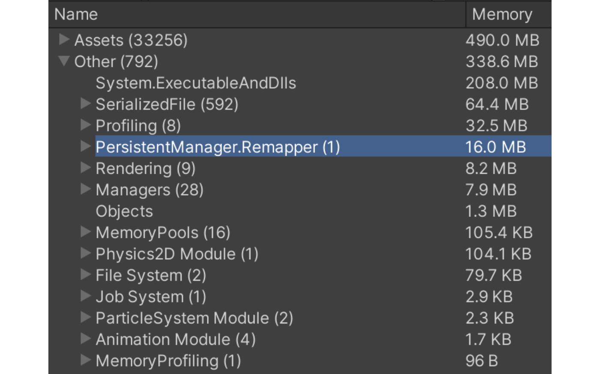
<p><em>VI: <strong>▲ Figure 1.7 — Mục "Other"</strong> trong Detailed View của Profiler. / EN: Figure 1.7 — Other items.</em></p>

**Ba việc phải điều tra trong hạng mục ASSETS**

| Việc | Nguyên văn |
|---|---|
| **🔍 Unnecessary Assets Investigation** | *"Asset không cần thiết là **tài nguyên KHÔNG CẦN CHÚT NÀO cho cảnh hiện tại**. Ví dụ, **nhạc nền CHỈ dùng ở màn hình title lại đang NẰM TRONG BỘ NHỚ NGAY CẢ KHI ở out-game.** Trước hết, hãy đảm bảo **CHỈ những asset CẦN THIẾT cho cảnh hiện tại mới được dùng.**"* |
| **👯 Duplicate Asset Investigation** | *"Điều này **thường xảy ra khi hỗ trợ asset bundle**. **CÙNG một asset bị đưa vào NHIỀU asset bundle do TÁCH PHỤ THUỘC asset bundle KÉM.** ⚠️ **Tuy nhiên, TÁCH QUÁ NHIỀU phụ thuộc lại dẫn tới TĂNG số file tải về và chi phí triển khai file.** Có thể cần **phát triển CẢM GIÁC CÂN BẰNG trong lúc đo khu vực này.**"* |
| **📋 Check the Regulations** | *"Xem lại từng mục xem **QUY ĐỊNH có được tuân thủ hay không**. **Nếu KHÔNG CÓ quy định, hãy kiểm tra xem có phải bạn đang KHÔNG ước lượng bộ nhớ đúng cách hay không.**"* Với texture: **Kích thước có phù hợp? · Setting NÉN có phù hợp? · Setting MipMap có phù hợp? · Setting Read/Write có phù hợp?** |

**Ba ví dụ "xem lại ĐẶC TẢ" — biện pháp CUỐI CÙNG**

| Ví dụ | Nguyên văn |
|---|---|
| **Đổi TỶ LỆ NÉN texture** | *"Tăng tỷ lệ nén **MỘT BẬC** cho **MỘT PHẦN** texture"* |
| **Đổi TIMING load/unload** | *"**GIẢI PHÓNG object trong bộ nhớ THƯỜNG TRÚ và load chúng MỖI LẦN cần**"* |
| **Đổi ĐẶC TẢ load** | *"**GIẢM số biến thể nhân vật cần load ingame ĐI MỘT**"* |

!!! danger "⚠️ Vì sao 'xem lại đặc tả' là biện pháp CUỐI CÙNG"
    **VI:** *"**TẤT CẢ những thay đổi này có TÁC ĐỘNG LỚN và có thể ẢNH HƯỞNG CĂN BẢN tới sự VUI của game.** Do đó, việc cân nhắc đặc tả là **BIỆN PHÁP CUỐI CÙNG**. Hãy **ĐẢM BẢO ƯỚC LƯỢNG và ĐO bộ nhớ TỪ SỚM để NGĂN điều này xảy ra.**"*

    **EN:** *"**ALL of these changes have a LARGE IMPACT and may FUNDAMENTALLY AFFECT the FUN of the game.** Therefore, specification considerations are a **LAST RESORT**. Make sure to **ESTIMATE and MEASURE memory EARLY ON to PREVENT this from happening.**"*

---

## 6. ⏱️ Trục PROCESSING TIME — Spike vs Steady

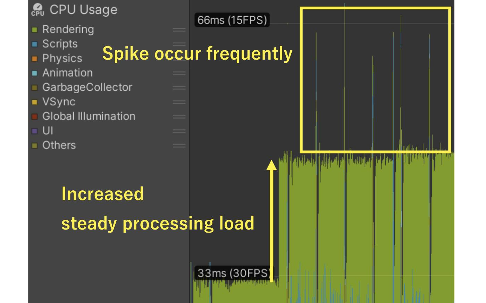
<p><em>VI: <strong>▲ Figure 1.8 — Spike và tải xử lý ỔN ĐỊNH.</strong> Dữ liệu đo cho thấy <strong>tải steady-state TĂNG ĐỘT NGỘT</strong> (mũi tên vàng, từ 33 ms/30 FPS lên cao hơn) <strong>cùng với các SPIKE ĐỊNH KỲ</strong> (khung vàng, vượt 66 ms/15 FPS). / EN: Figure 1.8 — Spikes and steady processing load.</em></p>

<div class="bilingual-row">
<div class="col-vi">
<blockquote>
<p><em>"Cách xử lý sự cố khung hình <strong>KHÁC NHAU tuỳ theo đó là sự cố 'TỨC THỜI (instantaneous)' hay 'ỔN ĐỊNH (steady)'.</strong></em></p>
<p><em>📌 <strong>Sự chậm xử lý TỨC THỜI được đo dưới dạng một TẢI XỬ LÝ NHỌN NHƯ KIM. Chúng cũng được gọi là SPIKE vì hình dáng đó.</strong>"</em></p>
</blockquote>
<p>🔍 <em>"Trong ảnh trên, dữ liệu đo cho thấy <strong>tải steady-state TĂNG ĐỘT NGỘT, CŨNG NHƯ các spike ĐỊNH KỲ. CẢ HAI sự kiện đều ĐÒI HỎI performance tuning.</strong>"</em></p>
</div>
<div class="col-en">
<blockquote>
<p><em>"The way to deal with screen processing failures <strong>VARIES depending on whether they are 'INSTANTANEOUS' or 'STEADY' processing failures.</strong></em></p>
<p><em>📌 <strong>Instantaneous processing slowdowns are measured as a processing load that is SHARP LIKE A NEEDLE. They are also called SPIKES because of their appearance.</strong>"</em></p>
</blockquote>
<p>🔍 <em>"In the image above, the measured data shows a <strong>SUDDEN INCREASE in steady-state load, AS WELL AS PERIODIC SPIKES. BOTH events will REQUIRE performance tuning.</strong>"</em></p>
</div>
</div>

### 6.1. ⚡ Điều tra tải TỨC THỜI (Spike)

<div class="bilingual-row">
<div class="col-vi">
<p>🔧 <strong>Công cụ:</strong> <em>"Dùng <strong>Profiler (CPU)</strong> để điều tra nguyên nhân. Trước hết, <strong>CÔ LẬP xem nguyên nhân có PHẢI do GC hay không. Deep Profile KHÔNG CẦN THIẾT để cô lập nguyên nhân, nhưng SẼ CẦN để GIẢI QUYẾT vấn đề.</strong>"</em></p>
<p><strong>🗑️ Trường hợp ① — Spike do GC</strong></p>
<blockquote>
<p><em>"Nếu GC đang xảy ra, <strong><code>GC.Alloc</code> nên được GIẢM. Deep Profile để xem TIẾN TRÌNH NÀO đang cấp phát BAO NHIÊU.</strong> Những vùng NÊN giảm TRƯỚC là những vùng có <strong>HIỆU QUẢ CHI PHÍ</strong>. Khuyến nghị tập trung vào:</em></p>
<ul>
<li><em><strong>Vùng cấp phát MỖI FRAME</strong></em></li>
<li><em><strong>Vùng có SỐ LƯỢNG LỚN cấp phát đang xảy ra</strong></em></li>
</ul>
<p><em>⚖️ <strong>Cấp phát càng ÍT càng tốt, NHƯNG điều đó KHÔNG có nghĩa là cấp phát phải BẰNG KHÔNG.</strong> Ví dụ, <strong>KHÔNG có cách nào ngăn được cấp phát xảy ra trong quá trình <code>Instantiate</code>.</strong> Trong những trường hợp như vậy, <strong>POOLING — dùng lại object thay vì sinh object mỗi lần — là HIỆU QUẢ.</strong>"</em></p>
</blockquote>
<p><strong>🐘 Trường hợp ② — Spike do XỬ LÝ NẶNG</strong></p>
<blockquote>
<p><em>"Nếu GC KHÔNG phải nguyên nhân, thì <strong>MỘT LOẠI XỬ LÝ NẶNG nào đó đang được thực hiện TỨC THỜI.</strong> Lại dùng <strong>Deep Profile</strong> để điều tra cái gì nặng và nặng bao nhiêu."</em></p>
<p><em><strong>Ba xử lý nặng TẠM THỜI phổ biến NHẤT:</strong></em></p>
<ul>
<li><em><strong>Xử lý <code>Instantiate</code></strong></em></li>
<li><em><strong>Chuyển đổi ACTIVE của SỐ LƯỢNG LỚN object, hoặc object trong PHÂN CẤP SÂU</strong></em></li>
<li><em><strong>Xử lý CHỤP MÀN HÌNH (screen capture)</strong></em></li>
</ul>
<p><em>🤝 <strong>Vì đây là phần PHỤ THUỘC NHIỀU vào code của dự án, KHÔNG có giải pháp CHUNG CHO TẤT CẢ. Nếu phép đo thực tế lộ ra nguyên nhân, hãy CHIA SẺ kết quả đo với thành viên dự án và THẢO LUẬN cách cải thiện.</strong>"</em></p>
</blockquote>
</div>
<div class="col-en">
<p>🔧 <strong>The tool:</strong> <em>"Use <strong>Profiler (CPU)</strong> to investigate the cause. First, <strong>ISOLATE whether the cause is due to GC or not. Deep Profile is NOT NECESSARY to isolate the cause itself, but it WILL BE NEEDED to SOLVE the problem.</strong>"</em></p>
<p><strong>🗑️ Case ① — Spikes caused by GC</strong></p>
<blockquote>
<p><em>"If GC is occurring, <strong><code>GC.Alloc</code> should be REDUCED. Deep Profile to see WHICH PROCESSES are allocating HOW MUCH.</strong> The first areas that should be reduced are those that are <strong>COST-EFFECTIVE</strong>. It is recommended to focus on:</em></p>
<ul>
<li><em><strong>Areas allocated EVERY FRAME</strong></em></li>
<li><em><strong>Areas where a LARGE NUMBER of allocations are occurring</strong></em></li>
</ul>
<p><em>⚖️ <strong>The FEWER the allocations, the BETTER, but this does NOT mean that allocations should be ZERO.</strong> For example, <strong>there is NO WAY to prevent allocations that occur during the <code>Instantiate</code> process.</strong> In such cases, <strong>POOLING — where objects are REUSED instead of generated each time — is EFFECTIVE.</strong>"</em></p>
</blockquote>
<p><strong>🐘 Case ② — Spikes due to HEAVY PROCESSING</strong></p>
<blockquote>
<p><em>"If GC is NOT the cause, <strong>SOME KIND OF HEAVY PROCESSING is being performed INSTANTANEOUSLY.</strong> Again, use <strong>Deep Profile</strong> to investigate what and how much processing is heavy."</em></p>
<p><em><strong>The three MOST COMMON temporary heavy processes:</strong></em></p>
<ul>
<li><em><strong><code>Instantiate</code> processing</strong></em></li>
<li><em><strong>ACTIVE SWITCHING of a LARGE NUMBER of objects, or objects in a DEEP HIERARCHY</strong></em></li>
<li><em><strong>SCREEN CAPTURE processing</strong></em></li>
</ul>
<p><em>🤝 <strong>As this is a part that is HIGHLY DEPENDENT on the project code, there is NO ONE-SIZE-FITS-ALL solution. If the actual measurement reveals the cause, SHARE the measurement results with the project members and DISCUSS how to improve it.</strong>"</em></p>
</blockquote>
</div>
</div>

### 6.2. 📈 Điều tra tải ỔN ĐỊNH (Steady-state)

<div class="bilingual-row">
<div class="col-vi">
<blockquote>
<p><em>"Khi cải thiện tải xử lý ổn định, <strong>điều quan trọng là GIẢM xử lý TRONG MỘT FRAME. Xử lý trong một frame có thể chia thô thành XỬ LÝ CPU và XỬ LÝ GPU. Trước hết, nên CÔ LẬP xem CÁI NÀO trong hai cái là nút thắt, hay cả hai có tải NGANG NHAU.</strong>"</em></p>
</blockquote>
<p>🩺 <strong>Cách CÔ LẬP DỄ NHẤT — hai dấu hiệu GPU-bound:</strong></p>
<blockquote>
<p><em>"Nếu BẤT KỲ điều nào sau đây đúng với bạn, <strong>KHẢ NĂNG CAO bạn đang GPU-BOUND</strong>:</em></p>
<ol>
<li><em><strong>Tải xử lý CẢI THIỆN ĐÁNG KỂ khi HẠ ĐỘ PHÂN GIẢI màn hình</strong></em></li>
<li><em><strong>Khi đo bằng Profiler, có <code>Gfx.WaitForPresent</code></strong></em></li>
</ol>
<p><em>👉 <strong>Ngược lại, nếu KHÔNG có những dấu hiệu này, có khả năng CPU-bound.</strong>"</em></p>
</blockquote>
<p>👉 <em>Khớp CHÍNH XÁC với quy trình chẩn đoán ở <a href="../01-fresher/01-ultimate-guide-to-profiling.md">Module 1 §3</a> — <code>Gfx.WaitForPresent</code> là dấu hiệu kinh điển.</em></p>
</div>
<div class="col-en">
<blockquote>
<p><em>"When improving the steady processing load, <strong>it is important to REDUCE the processing WITHIN A SINGLE FRAME. The processing performed within a single frame can be ROUGHLY DIVIDED into CPU processing and GPU processing. First, it is a good idea to ISOLATE WHICH of these two is the bottleneck, or whether they have the SAME processing load.</strong>"</em></p>
</blockquote>
<p>🩺 <strong>The EASIEST way to isolate — two GPU-bound signs:</strong></p>
<blockquote>
<p><em>"If ANY of the following apply to you, <strong>there is a GOOD CHANCE that you are GPU-BOUND</strong>:</em></p>
<ol>
<li><em><strong>DRAMATIC improvement in processing load when the SCREEN RESOLUTION is LOWERED</strong></em></li>
<li><em><strong>When measured with the Profiler, <code>Gfx.WaitForPresent</code> is present</strong></em></li>
</ol>
<p><em>👉 <strong>On the other hand, if these are NOT present, there is a possibility of CPU-bound.</strong>"</em></p>
</blockquote>
<p>👉 <em>Matches the diagnostic workflow in <a href="../01-fresher/01-ultimate-guide-to-profiling.md">Module 1 §3</a> EXACTLY — <code>Gfx.WaitForPresent</code> is the classic sign.</em></p>
</div>
</div>

**🖥️ CPU Bound — quy trình**

<div class="bilingual-row">
<div class="col-vi">
<blockquote>
<p><em>"CPU bound dùng <strong>CPU (Profiler)</strong>. Nó điều tra bằng <strong>Deep Profile</strong> và kiểm tra xem <strong>một TẢI XỬ LÝ LỚN có đang đè lên một THUẬT TOÁN CỤ THỂ hay không.</strong></em></p>
<p><em>⚖️ <strong>Nếu KHÔNG có tải xử lý lớn nào, nghĩa là hệ thống NẶNG ĐỀU — vậy hãy cải thiện nó một cách ĐỀU ĐẶN.</strong></em></p>
<p><em>🔙 <strong>Nếu bạn KHÔNG THỂ đạt giá trị giảm mục tiêu KỂ CẢ sau khi cải thiện đều đặn, bạn có thể muốn QUAY LẠI mục "1.1.4 Quyết định đặc tả quality setting" và XEM XÉT LẠI.</strong>"</em></p>
</blockquote>
</div>
<div class="col-en">
<blockquote>
<p><em>"CPU bound uses <strong>CPU (Profiler)</strong>. It investigates using <strong>Deep Profile</strong> and checks whether <strong>a LARGE processing load is applied to a SPECIFIC ALGORITHM.</strong></em></p>
<p><em>⚖️ <strong>If there is NO large processing load, it means that the system is EQUALLY HEAVY, so steadily improve it.</strong></em></p>
<p><em>🔙 <strong>If you CANNOT reach the target reduction value EVEN AFTER making steady improvements, you may want to GO BACK to "1.1.4 Determine quality setting specifications" and RECONSIDER.</strong>"</em></p>
</blockquote>
</div>
</div>

**🎨 GPU Bound — bốn câu hỏi theo THỨ TỰ**

| # | Câu hỏi | Nội dung nguyên văn |
|---|---|---|
| **①** | **Độ phân giải có PHÙ HỢP?** | 🥇 *"Trong các trường hợp GPU-bound, **ĐỘ PHÂN GIẢI có tác động ĐÁNG KỂ tới tải xử lý GPU. Do đó, nếu độ phân giải KHÔNG được đặt phù hợp, ƯU TIÊN SỐ MỘT là đặt nó về mức phù hợp.**"* 🔍 *Cách kiểm tra: **"nhìn độ phân giải của RENDER TARGET đang được xử lý trong Frame Debugger"**. Hai điều cần chủ ý: **"CHỈ phần tử UI mới được render ở độ phân giải ĐẦY ĐỦ của thiết bị"** · **"Texture tạm cho post-effect có độ phân giải CAO"** |
| **②** | **Có object KHÔNG CẦN THIẾT?** | *"Kiểm tra **Frame Debugger** xem có bản vẽ nào KHÔNG CẦN. Ví dụ, **có thể có một CAMERA THỪA đang active và vẽ các object KHÔNG LIÊN QUAN ở HẬU TRƯỜNG.** Nếu có nhiều trường hợp bản vẽ TRƯỚC bị LÃNG PHÍ do bị vật khác che, **Occlusion Culling có thể là lựa chọn tốt."*** ⚠️ *Đánh đổi: **"occlusion culling ĐÒI HỎI chuẩn bị dữ liệu TRƯỚC và mức dùng bộ nhớ SẼ TĂNG do dữ liệu được nạp vào bộ nhớ. Đây là THÔNG LỆ PHỔ BIẾN: dựng sẵn thông tin trong bộ nhớ để cải thiện hiệu năng. Vì bộ nhớ và hiệu năng thường TỶ LỆ NGHỊCH, nên Ý THỨC về bộ nhớ khi áp dụng bất cứ thứ gì."*** |
| **③** | **BATCHING có phù hợp?** | *"Batching là quá trình **vẽ TẤT CẢ object CÙNG MỘT LÚC. Batching HIỆU QUẢ cho GPU-bound vì nó CẢI THIỆN hiệu suất vẽ.** Ví dụ, **Static Batching có thể dùng để GỘP mesh của nhiều object BẤT ĐỘNG."*** → **Static Batching · Dynamic Batching · GPU Instancing · SRP Batcher** *(chi tiết ở <a href="../04-tech-lead/01-gpu-urp-advanced-rendering.md">Module 4 §10</a>)* |
| **④** | **Soi tải TỪNG CÁI MỘT** | *"Nếu tải xử lý VẪN cao, **cách duy nhất là soi TỪNG CÁI. Có thể object có QUÁ NHIỀU vertex hoặc xử lý SHADER đang gây vấn đề. Để cô lập, hãy BẬT/TẮT trạng thái active của TỪNG object và xem tải xử lý thay đổi thế nào** — thử tắt BACKGROUND xem sao, tắt NHÂN VẬT xem sao, v.v."* → rồi xét: **"Có QUÁ NHIỀU object để vẽ? ⇒ có thể vẽ tất cả cùng lúc không"** · **"Số vertex MỖI object có quá lớn? ⇒ cân nhắc giảm và LOD"** · **"Tải có cải thiện khi THAY bằng Shader ĐƠN GIẢN? ⇒ xem lại xử lý Shader"** |

---

## 7. 🎓 Kết luận Chương 1 — Bảy điều phải nhớ

<div class="bilingual-row">
<div class="col-vi">
<p><strong>🔵 TRƯỚC khi tuning:</strong></p>
<ol>
<li><em><strong>Quyết định "CHỈ SỐ", "THIẾT BỊ BẢO ĐẢM", và "ĐẶC TẢ QUALITY SETTING".</strong></em></li>
<li><em><strong>KIỂM CHỨNG và chốt các chỉ số TRƯỚC giai đoạn mass production.</strong></em></li>
<li><em><strong>Tạo CƠ CHẾ để DỄ DÀNG nhận ra suy giảm hiệu năng.</strong></em></li>
</ol>
<p><strong>🟢 TRONG KHI tuning:</strong></p>
<ol start="4">
<li><em><strong>CÔ LẬP nguyên nhân suy giảm hiệu năng và áp dụng biện pháp PHÙ HỢP.</strong></em></li>
<li><em><strong>BẮT BUỘC tuân theo trình tự: "ĐO" → "CẢI THIỆN" → "ĐO LẠI (kiểm tra kết quả)".</strong></em></li>
</ol>
<p>🎯 <strong>Lời kết của tác giả:</strong></p>
<blockquote>
<p><em>"Như đã giải thích tới đây, <strong>điều QUAN TRỌNG là ĐO và CÔ LẬP nguyên nhân của performance tuning.</strong></em></p>
<p><em>💪 <strong>NGAY CẢ KHI xảy ra một trường hợp KHÔNG được mô tả trong tài liệu này, nó SẼ KHÔNG phải vấn đề LỚN NẾU các NGUYÊN TẮC CƠ BẢN được tuân thủ.</strong>"</em></p>
</blockquote>
</div>
<div class="col-en">
<p><strong>🔵 BEFORE tuning:</strong></p>
<ol>
<li><em><strong>Decide on "INDICATORS", "GUARANTEED DEVICES", and "QUALITY SETTING SPECIFICATIONS".</strong></em></li>
<li><em><strong>VERIFY and determine the indicators BEFORE mass production.</strong></em></li>
<li><em><strong>Create a MECHANISM to EASILY NOTICE performance degradation.</strong></em></li>
</ol>
<p><strong>🟢 DURING tuning:</strong></p>
<ol start="4">
<li><em><strong>ISOLATE the cause of performance degradation and take APPROPRIATE MEASURES.</strong></em></li>
<li><em><strong>BE SURE to follow the sequence of "MEASUREMENT" → "IMPROVEMENT" → "RE-MEASUREMENT (checking the results)".</strong></em></li>
</ol>
<p>🎯 <strong>The authors' closing words:</strong></p>
<blockquote>
<p><em>"As explained up to this point, <strong>it is IMPORTANT to MEASURE and ISOLATE the cause of performance tuning.</strong></em></p>
<p><em>💪 <strong>EVEN IF a case NOT DESCRIBED in this document occurs, it will NOT be a MAJOR PROBLEM IF the FUNDAMENTALS are followed.</strong>"</em></p>
</blockquote>
</div>
</div>

---

# PHẦN B — NỀN TẢNG PHẦN CỨNG (Chương 2)

<div class="bilingual-row">
<div class="col-vi">
<p>🎯 <strong>Vì sao Tech Lead cần chương này:</strong> ba Module trước nói về <em>Unity</em>. Chương này nói về <strong>thứ CHẠY Unity</strong> — SoC, CPU, GPU, bộ nhớ, lưu trữ. Đây là tầng kiến thức <strong>KHÔNG có trong tài liệu chính thức của Unity</strong>, nhưng lại quyết định <em>vì sao</em> các tối ưu ở Module 1–4 lại hiệu quả.</p>
<blockquote>
<p><em>"Phần cứng máy tính gồm <strong>NĂM thiết bị chính: thiết bị NHẬP, thiết bị XUẤT, thiết bị LƯU TRỮ, thiết bị TÍNH TOÁN, và thiết bị ĐIỀU KHIỂN.</strong> Phần này tóm tắt kiến thức CƠ BẢN về những thiết bị này — thứ QUAN TRỌNG cho performance tuning."</em></p>
</blockquote>
</div>
<div class="col-en">
<p>🎯 <strong>Why a Tech Lead needs this chapter:</strong> the previous three modules are about <em>Unity</em>. This chapter is about <strong>what RUNS Unity</strong> — the SoC, CPU, GPU, memory, storage. This is a layer of knowledge <strong>absent from Unity's own documentation</strong>, yet it determines <em>why</em> the optimizations in Modules 1–4 work at all.</p>
<blockquote>
<p><em>"Computer hardware consists of <strong>FIVE main devices: INPUT devices, OUTPUT devices, STORAGE devices, COMPUTING devices, and CONTROL devices.</strong> This section summarizes the BASIC KNOWLEDGE of these hardware devices that is IMPORTANT for performance tuning."</em></p>
</blockquote>
</div>
</div>

## 8. 📱 SoC — Vì sao mobile KHÁC desktop về BẢN CHẤT


<p><em>VI: <strong>▲ Figure 2.1 — SoC.</strong> / EN: Figure 2.1 — SoC.</em></p>

<div class="bilingual-row">
<div class="col-vi">
<blockquote>
<p><em>"Máy tính gồm nhiều thiết bị khác nhau. Các thiết bị điển hình gồm <strong>CPU để điều khiển và tính toán, GPU để tính toán đồ hoạ, và DSP để xử lý dữ liệu số của âm thanh và video.</strong></em></p>
<p><em>🖥️ <strong>Trong hầu hết PC để bàn, những thứ này ĐỘC LẬP dưới dạng các mạch tích hợp RIÊNG BIỆT, được ghép lại để tạo thành máy tính.</strong></em></p>
<p><em>📱 <strong>Ngược lại, trong smartphone, những thiết bị này được cài đặt TRÊN MỘT CHIP DUY NHẤT để GIẢM KÍCH THƯỚC và TIÊU THỤ ĐIỆN. Cái này gọi là SYSTEM-ON-A-CHIP, hay SoC.</strong>"</em></p>
</blockquote>
<p>🔑 <strong>Hệ quả trực tiếp tới tối ưu:</strong> vì CPU và GPU nằm CHUNG một chip và CHIA SẺ bộ nhớ, <strong>mọi thứ bạn làm với CPU đều lấy đi băng thông của GPU và ngược lại</strong> — điều KHÔNG đúng trên PC. Đây là nền tảng vật lý của cảnh báo <strong>băng thông bộ nhớ</strong> ở <a href="../04-tech-lead/01-gpu-urp-advanced-rendering.md">Module 4 §7</a>.</p>
</div>
<div class="col-en">
<blockquote>
<p><em>"A computer is composed of various devices. Typical devices include <strong>CPUs for control and computation, GPUs for graphics computation, and DSPs for processing audio and video digital data.</strong></em></p>
<p><em>🖥️ <strong>In most desktop PCs, these are INDEPENDENT as SEPARATE INTEGRATED CIRCUITS, which are combined to form the computer.</strong></em></p>
<p><em>📱 <strong>In smartphones, on the other hand, these devices are implemented ON A SINGLE CHIP to REDUCE SIZE and POWER CONSUMPTION. This is called a SYSTEM-ON-A-CHIP, or SoC.</strong>"</em></p>
</blockquote>
<p>🔑 <strong>The direct consequence for optimization:</strong> because CPU and GPU sit on the SAME chip and SHARE memory, <strong>everything you do on the CPU steals bandwidth from the GPU and vice versa</strong> — which is NOT true on PC. This is the physical basis for the <strong>memory bandwidth</strong> warnings in <a href="../04-tech-lead/01-gpu-urp-advanced-rendering.md">Module 4 §7</a>.</p>
</div>
</div>

### 8.1. 🏭 Bốn dòng SoC Android — và vì sao Android hay lỗi theo máy

**▼ Table 2.1 — Major SoCs in Android** *(nguyên văn)*

| Dòng / Series | Nhà sản xuất / Manufacturer | Xu hướng thiết bị / Trends in devices equipped with |
|---|---|---|
| **Snapdragon** | **Qualcomm Inc.** | *"Dùng trong PHẠM VI RỘNG các thiết bị"* |
| **Helio** | **MediaTek** | *"Dùng trong MỘT SỐ máy GIÁ RẺ"* |
| **Kirin** | **HiSilicon** | *"Thiết bị Huawei"* |
| **Exynos** | **Samsung** | *"Máy của Samsung"* |

<div class="bilingual-row">
<div class="col-vi">
<blockquote>
<p><em>"Ví dụ, <strong>iPhone dùng SoC gọi là DÒNG A do Apple thiết kế. Dòng này được đặt tên bằng cách kết hợp chữ 'A' và một CON SỐ, như A15, với con số CÀNG LỚN khi phiên bản được nâng cấp.</strong></em></p>
<p><em>🤖 <strong>Ngược lại, nhiều thiết bị Android dùng SoC gọi là SNAPDRAGON — sản xuất bởi Qualcomm.</strong></em></p>
<p><em>💀 <strong>Ngoài ra, trong khi iPhone do Apple sản xuất, Android được sản xuất bởi ĐỦ LOẠI nhà sản xuất. Vì lý do này, Android có ĐỦ LOẠI SoC ngoài Snapdragon. ĐÂY LÀ LÝ DO ANDROID DỄ GẶP LỖI PHỤ THUỘC MODEL.</strong></em></p>
<p><em>🔑 <strong>Khi tuning hiệu năng, việc HIỂU SoC của thiết bị dùng cái gì và cấu hình ra sao là QUAN TRỌNG.</strong>"</em></p>
</blockquote>
</div>
<div class="col-en">
<blockquote>
<p><em>"For example, <strong>the iPhone uses a SoC called the A SERIES designed by Apple. This series is named by combining the letter 'A' and a NUMBER, such as A15, with the number getting LARGER as the version is upgraded.</strong></em></p>
<p><em>🤖 <strong>In contrast, many Android devices use a SoC called SNAPDRAGON — manufactured by Qualcomm.</strong></em></p>
<p><em>💀 <strong>Also, while iPhones are manufactured by Apple, Android is manufactured by a VARIETY of manufacturers. For this reason, Android has a VARIETY of SoCs besides Snapdragon. THIS IS WHY ANDROID IS PRONE TO MODEL-DEPENDENT DEFECTS.</strong></em></p>
<p><em>🔑 <strong>When tuning performance, it is IMPORTANT to UNDERSTAND what is used in the device's SoC and what SPECIFICATIONS it has.</strong>"</em></p>
</blockquote>
</div>
</div>

!!! tip "🔢 Đọc TÊN Snapdragon để ĐOÁN hiệu năng — mẹo rất thực dụng"
    <div class="bilingual-row">
    <div class="col-vi">
    <blockquote>
    <p><em>"Cách đặt tên Snapdragon là <strong>kết hợp chuỗi 'Snapdragon' và một SỐ BA CHỮ SỐ. Những con số này CÓ Ý NGHĨA:</strong></em></p>
    <ul>
    <li><em><strong>Dòng 800 là model FLAGSHIP</strong> và được dùng trong các thiết bị gọi là HIGH-END</em></li>
    <li><em><strong>Số CÀNG THẤP thì hiệu năng và giá CÀNG THẤP, và dòng 400 là máy LOW-END</strong></em></li>
    </ul>
    <p><em>⚠️ <strong>NGAY CẢ KHI một thiết bị ở dòng 400, hiệu năng vẫn CẢI THIỆN theo ngày phát hành MỚI HƠN, nên khó nói chung chung — nhưng CƠ BẢN, SỐ CÀNG CAO thì hiệu năng CÀNG CAO.</strong></em></p>
    <p><em>📅 <strong>Hơn nữa, năm 2021 đã công bố rằng quy ước đặt tên SẼ ĐỔI thành kiểu 'Snapdragon 8 Gen 1' trong tương lai, vì quy ước cũ SẮP HẾT SỐ.</strong></em></p>
    <p><em>✅ <strong>Những quy ước đặt tên này HỮU ÍCH khi tuning hiệu năng, vì chúng có thể dùng làm CHỈ BÁO để xác định hiệu năng của thiết bị.</strong>"</em></p>
    </blockquote>
    </div>
    <div class="col-en">
    <blockquote>
    <p><em>"The naming of Snapdragon has been a <strong>combination of the string 'Snapdragon' and a THREE-DIGIT NUMBER. These numbers have a MEANING:</strong></em></p>
    <ul>
    <li><em><strong>The 800s are the FLAGSHIP models</strong> and are used in so-called HIGH-END devices</em></li>
    <li><em><strong>The LOWER the number, the LOWER the performance and price, and the 400s are the so-called LOW-END handsets</strong></em></li>
    </ul>
    <p><em>⚠️ <strong>EVEN IF a device is in the 400s, the performance IMPROVES with the NEWER RELEASE DATE, so it is difficult to make a general statement, but BASICALLY, the HIGHER the number, the HIGHER the performance.</strong></em></p>
    <p><em>📅 <strong>Furthermore, it was announced in 2021 that the naming convention will be CHANGED to something like 'Snapdragon 8 Gen 1' in the future, as this naming convention will soon RUN OUT OF NUMBERS.</strong></em></p>
    <p><em>✅ <strong>These naming conventions are USEFUL to keep in mind when tuning performance, as they can be used as an INDICATOR to determine the performance of a device.</strong>"</em></p>
    </blockquote>
    </div>
    </div>

---

## 9. 🧠 CPU — Pipeline, Stall, big.LITTLE và Cache

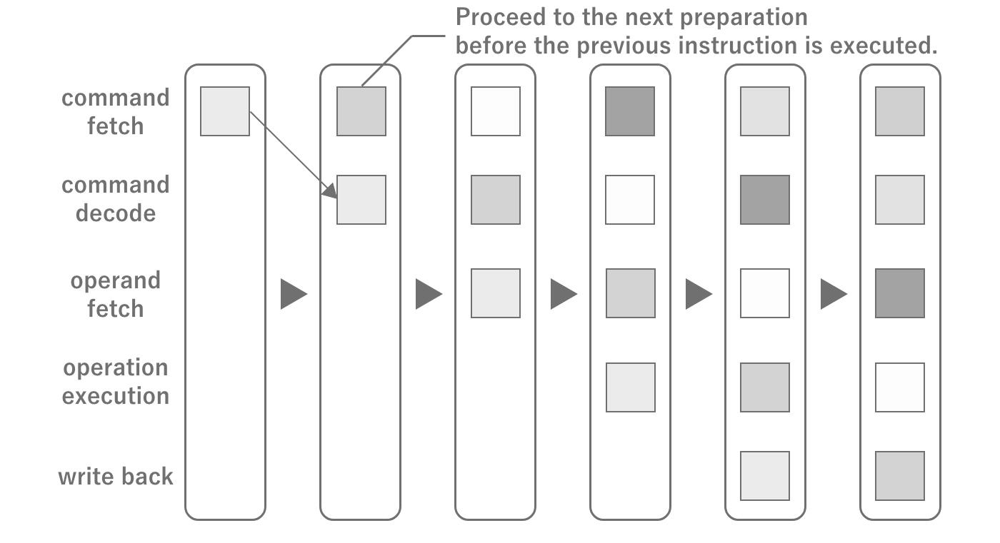
<p><em>VI: <strong>▲ Figure 2.2 — Kiến trúc Pipeline của CPU.</strong> / EN: Figure 2.2 — CPU Pipeline Architecture.</em></p>

<div class="bilingual-row">
<div class="col-vi">
<blockquote>
<p><em>"<strong>CPU (Central Processing Unit) là BỘ NÃO của máy tính</strong> và chịu trách nhiệm KHÔNG CHỈ thực thi chương trình, mà còn GIAO TIẾP với các thành phần phần cứng khác.</em></p>
<p><em>🔑 <strong>Thứ quyết định TỐC ĐỘ THỰC THI của chương trình KHÔNG CHỈ là sức mạnh số học đơn thuần, mà còn là việc nó thực thi các BƯỚC của một chương trình PHỨC TẠP nhanh tới đâu.</strong></em></p>
<p><em>Ví dụ, có bốn phép toán số học trong một chương trình, nhưng <strong>cũng có các thao tác RẼ NHÁNH. Với CPU, nó KHÔNG BIẾT lệnh nào sẽ được gọi tiếp theo cho tới khi nó thực thi chương trình.</strong> Do đó, <strong>phần cứng của CPU được thiết kế để có thể xử lý ĐỦ LOẠI lệnh một cách LIÊN TIẾP NHANH CHÓNG.</strong>"</em></p>
</blockquote>
</div>
<div class="col-en">
<blockquote>
<p><em>"<strong>The CPU (Central Processing Unit) is the BRAIN of the computer</strong> and is responsible NOT ONLY for executing programs, but ALSO for interfacing with the various hardware components.</em></p>
<p><em>🔑 <strong>What determines the EXECUTION SPEED of a program is NOT ONLY simple arithmetic power, but ALSO how FAST it can execute the STEPS of a COMPLEX program.</strong></em></p>
<p><em>For example, there are four arithmetic operations in a program, but <strong>there are ALSO BRANCHING operations. For the CPU, it does NOT KNOW which instruction will be called NEXT until it EXECUTES the program.</strong> Therefore, <strong>the hardware of the CPU is designed to be able to process a VARIETY of instructions in RAPID SUCCESSION.</strong>"</em></p>
</blockquote>
</div>
</div>

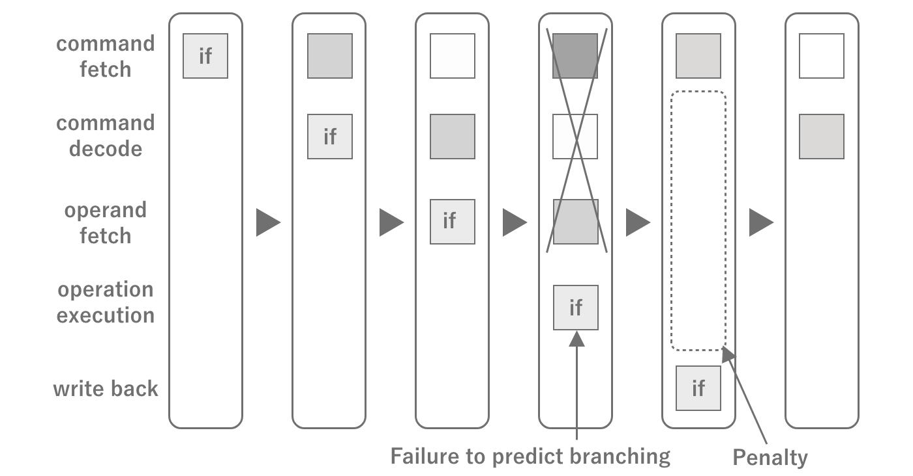
<p><em>VI: <strong>▲ Figure 2.3 — Pipeline Stall của CPU.</strong> / EN: Figure 2.3 — CPU Pipeline Stalling.</em></p>

!!! danger "⛔ PIPELINE STALL — vì sao RẼ NHÁNH trong vòng lặp lại tốn kém"
    <div class="bilingual-row">
    <div class="col-vi">
    <blockquote>
    <p><em>"<strong>Luồng lệnh bên trong CPU gọi là PIPELINE, và các lệnh được xử lý TRONG KHI DỰ ĐOÁN lệnh tiếp theo trong pipeline.</strong></em></p>
    <p><em>💀 <strong>NẾU lệnh tiếp theo KHÔNG được dự đoán đúng, một sự TẠM DỪNG gọi là PIPELINE STALL xảy ra và PIPELINE BỊ RESET.</strong></em></p>
    <p><em>🔑 <strong>PHẦN LỚN stall là do RẼ NHÁNH gây ra. Tuy bản thân việc rẽ nhánh có DỰ ĐOÁN kết quả ở mức độ nào đó, SAI SÓT VẪN có thể xảy ra.</strong></em></p>
    <p><em>✅ <strong>Tuy performance tuning VẪN làm được mà không cần thuộc lòng cấu trúc bên trong, chỉ cần BIẾT những điều này sẽ giúp bạn Ý THỨC HƠN về cách TRÁNH RẼ NHÁNH TRONG VÒNG LẶP khi viết code.</strong>"</em></p>
    </blockquote>
    <p>👉 <em>Đây chính là nền tảng phần cứng cho lời khuyên <strong>"Cố BLEND kết quả thay vì tạo NHÁNH LOGIC"</strong> trong shader ở <a href="../04-tech-lead/01-gpu-urp-advanced-rendering.md">Module 4 §13</a> — và nó cũng đúng với code C# trong vòng lặp nóng.</em></p>
    </div>
    <div class="col-en">
    <blockquote>
    <p><em>"<strong>The flow of instructions inside the CPU is called a PIPELINE, and instructions are processed WHILE PREDICTING the next instruction in the pipeline.</strong></em></p>
    <p><em>💀 <strong>IF the next instruction is NOT predicted, a PAUSE called a PIPELINE STALL occurs and THE PIPELINE IS RESET.</strong></em></p>
    <p><em>🔑 <strong>The MAJORITY of stalls are caused by BRANCHING. Although the branch itself ANTICIPATES the result to some extent, MISTAKES can STILL be made.</strong></em></p>
    <p><em>✅ <strong>Although performance tuning is possible WITHOUT memorizing the internal structure, JUST KNOWING these things will help you be MORE AWARE of how to AVOID BRANCHING IN LOOPS when writing code.</strong>"</em></p>
    </blockquote>
    <p>👉 <em>This is the hardware basis for the <strong>"try to BLEND results rather than creating LOGIC BRANCHES"</strong> shader advice in <a href="../04-tech-lead/01-gpu-urp-advanced-rendering.md">Module 4 §13</a> — and it applies to hot-loop C# code too.</em></p>
    </div>
    </div>

### 9.1. ⚡ Sức mạnh tính toán — Clock, Core, và Context Switch

<div class="bilingual-row">
<div class="col-vi">
<blockquote>
<p><em>"Sức mạnh tính toán của CPU được xác định bởi <strong>TẦN SỐ XUNG NHỊP (đơn vị: Hz)</strong> và <strong>SỐ NHÂN (cores)</strong>.</em></p>
<p><em>⏱️ <strong>Tần số xung nhịp chỉ ra CPU có thể chạy BAO NHIÊU LẦN MỖI GIÂY. Do đó, tần số CÀNG CAO, tốc độ thực thi chương trình CÀNG NHANH.</strong></em></p>
<p><em>🧩 <strong>Ngược lại, SỐ NHÂN đóng góp vào sức mạnh tính toán SONG SONG. Một CORE là ĐƠN VỊ CƠ BẢN mà CPU vận hành; khi có NHIỀU HƠN MỘT thì gọi là MULTICORE.</strong>"</em></p>
</blockquote>
<p>🔄 <strong>Vì sao MULTICORE trở thành xu hướng — giải thích qua CONTEXT SWITCH:</strong></p>
<blockquote>
<p><em>"Ban đầu CHỈ có single core, nhưng với single core, <strong>để chạy NHIỀU chương trình, các chương trình cần chạy được LUÂN PHIÊN CHUYỂN ĐỔI. Đây gọi là CONTEXT SWITCH, và CHI PHÍ của nó RẤT CAO.</strong></em></p>
<p><em>💡 <strong>Nếu bạn quen dùng smartphone, bạn có thể nghĩ rằng LUÔN CHỈ có MỘT ứng dụng (process) đang chạy, nhưng THỰC TẾ có RẤT NHIỀU process khác nhau chạy SONG SONG, BAO GỒM CẢ OS.</strong></em></p>
<p><em>📊 <strong>Tính tới 2022, dòng chính cho smartphone là KHOẢNG 2–8 NHÂN.</strong>"</em></p>
</blockquote>
</div>
<div class="col-en">
<blockquote>
<p><em>"The computing power of a CPU is determined by the <strong>CLOCK FREQUENCY (unit: Hz)</strong> and the <strong>NUMBER OF CORES</strong>.</em></p>
<p><em>⏱️ <strong>The clock frequency indicates HOW MANY TIMES PER SECOND the CPU can run. Therefore, the HIGHER the clock frequency, the FASTER the program execution speed.</strong></em></p>
<p><em>🧩 <strong>The NUMBER OF CORES, on the other hand, contributes to the PARALLEL computing power. A CORE is the BASIC UNIT in which a CPU operates, and when there is MORE THAN ONE it is called MULTICORE.</strong>"</em></p>
</blockquote>
<p>🔄 <strong>Why MULTICORE became mainstream — explained via CONTEXT SWITCH:</strong></p>
<blockquote>
<p><em>"Originally, there were only single cores, but with a single core, <strong>in order to run MULTIPLE programs, the programs to be run are ALTERNATELY SWITCHED. This is called a CONTEXT SWITCH, and its COST is VERY HIGH.</strong></em></p>
<p><em>💡 <strong>If you are used to smartphones, you may think that there is ALWAYS ONE application (process) running, but IN REALITY there are MANY different processes running IN PARALLEL, INCLUDING the OS.</strong></em></p>
<p><em>📊 <strong>As of 2022, the mainstream for smartphones is AROUND 2–8 CORES.</strong>"</em></p>
</blockquote>
</div>
</div>

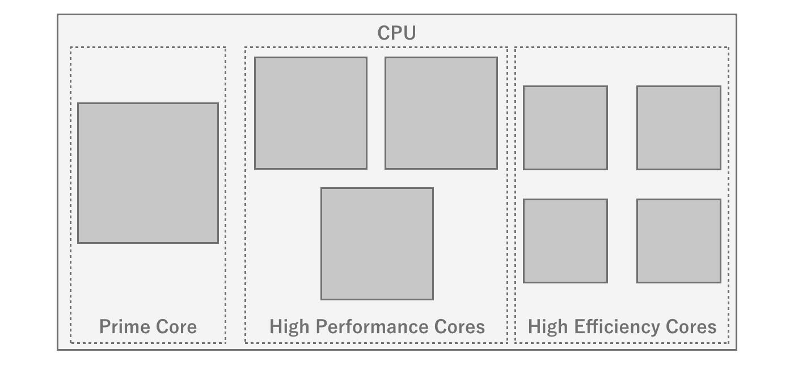
<p><em>VI: <strong>▲ Figure 2.4 — Cấu hình nhân KHÔNG ĐỒNG NHẤT của Snapdragon 8 gen 1</strong>: <strong>1 Prime Core</strong> (lớn nhất) · <strong>3 High Performance Cores</strong> · <strong>4 High Efficiency Cores</strong> (nhỏ nhất). / EN: Figure 2.4 — Heterogeneous core configuration of Snapdragon 8 gen 1.</em></p>

!!! warning "🔋 big.LITTLE — cái bẫy khi ĐỌC số nhân"
    <div class="bilingual-row">
    <div class="col-vi">
    <blockquote>
    <p><em>"Những năm gần đây, <strong>CPU có NHÂN BẤT ĐỐI XỨNG (big.LITTLE) đã trở thành dòng chính cho bộ xử lý đa nhân (đặc biệt là smartphone). Nhân bất đối xứng chỉ CPU có ĐỒNG THỜI nhân HIỆU NĂNG CAO và nhân TIẾT KIỆM ĐIỆN.</strong></em></p>
    <p><em>✅ <strong>Ưu điểm: bình thường CHỈ nhân tiết kiệm điện được dùng để BẢO TOÀN PIN, và các nhân có thể được CHUYỂN ĐỔI khi CẦN hiệu năng, ví dụ trong game.</strong></em></p>
    <p><em>🚨 <strong>TUY NHIÊN LƯU Ý rằng hiệu năng song song TỐI ĐA bị GIẢM bởi các nhân tiết kiệm điện, nên KHÔNG THỂ dùng RIÊNG số nhân để đánh giá hiệu năng của nhân bất đối xứng.</strong>"</em></p>
    </blockquote>
    <p>🎮 <strong>Điều quan trọng NHẤT với game — vì sao NHÂN MẠNH quan trọng hơn NHIỀU NHÂN:</strong></p>
    <blockquote>
    <p><em>"Việc một chương trình có dùng hết được nhiều nhân hay không <strong>cũng phụ thuộc vào MÔ TẢ XỬ LÝ SONG SONG của chương trình.</strong> Ví dụ, có trường hợp game engine đã <strong>tinh gọn physics engine bằng cách chạy nó trên MỘT THREAD RIÊNG</strong>, hoặc xử lý song song được tận dụng qua <strong>JobSystem của Unity</strong>.</em></p>
    <p><em>🔑 <strong>Vì BẢN THÂN vòng lặp chính của game KHÔNG THỂ song song hoá, nên hiệu năng CAO HƠN của BẢN THÂN NHÂN mới là LỢI THẾ, KỂ CẢ khi có nhiều nhân. Do đó, có một nhân HIỆU NĂNG CAO là LỢI THẾ, ngay cả với CPU đa nhân.</strong>"</em></p>
    </blockquote>
    <p>👉 <em>Hệ quả thực chiến: khi chọn thiết bị "bảo đảm" ở <a href="#13-quyet-inh-thiet-bi-bao-am-hoat-ong">§1.3</a>, <strong>ĐỪNG so sánh theo số nhân — hãy so theo điểm SINGLE-CORE.</strong></em></p>
    </div>
    <div class="col-en">
    <blockquote>
    <p><em>"In recent years, <strong>CPUs with ASYMMETRIC CORES (big.LITTLE) have become mainstream for multi-core processors (especially for smartphones). Asymmetric cores refer to CPUs that have a HIGH-PERFORMANCE core and a POWER-SAVING core TOGETHER.</strong></em></p>
    <p><em>✅ <strong>The advantage: normally ONLY the power-saving cores are used to CONSERVE BATTERY, and the cores can be SWITCHED when performance is REQUIRED, such as in games.</strong></em></p>
    <p><em>🚨 <strong>NOTE, HOWEVER, that the MAXIMUM PARALLEL performance is REDUCED by the power-saving cores, so the NUMBER OF CORES ALONE CANNOT be used to judge the performance of asymmetric cores.</strong>"</em></p>
    </blockquote>
    <p>🎮 <strong>The MOST important point for games — why a STRONG core beats MANY cores:</strong></p>
    <blockquote>
    <p><em>"Whether a program can use up multiple cores <strong>ALSO depends on the PARALLEL PROCESSING DESCRIPTION of the program.</strong> For example, there are cases where the game engine has <strong>streamlined the physics engine by running it in a SEPARATE THREAD</strong>, or parallel processing is utilized through <strong>Unity's JobSystem</strong>.</em></p>
    <p><em>🔑 <strong>Since the operation of the game's MAIN LOOP ITSELF CANNOT be parallelized, the HIGHER PERFORMANCE OF THE CORE ITSELF is advantageous EVEN WITH multiple cores. Therefore, it is ADVANTAGEOUS to have a HIGH-PERFORMANCE CORE itself, even if it is multi-core.</strong>"</em></p>
    </blockquote>
    <p>👉 <em>The practical consequence: when choosing your "guaranteed" device in <a href="#13-quyet-inh-thiet-bi-bao-am-hoat-ong">§1.3</a>, <strong>do NOT compare by core count — compare by SINGLE-CORE score.</strong></em></p>
    </div>
    </div>

### 9.2. 🗄️ Cache Memory — L1, L2, L3 và Data Locality

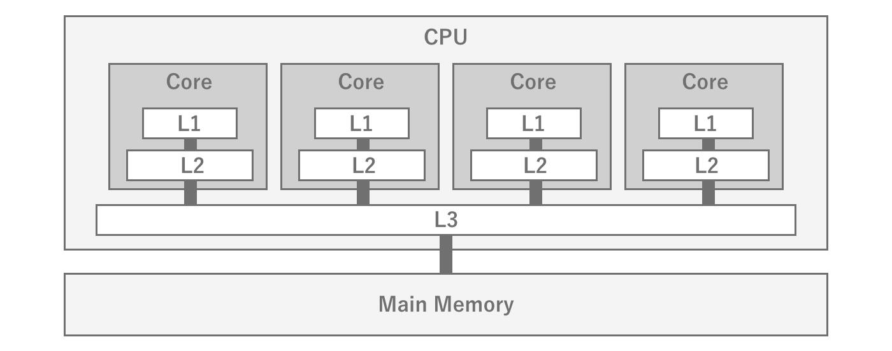
<p><em>VI: <strong>▲ Figure 2.5 — Quan hệ giữa cache L1, L2, L3 của CPU và main memory.</strong> / EN: Figure 2.5 — Relationship between the CPU L1, L2, and L3 caches and main memory.</em></p>

<div class="bilingual-row">
<div class="col-vi">
<blockquote>
<p><em>"<strong>CPU và main memory nằm CÁCH XA nhau về VẬT LÝ và cần một khoảng thời gian (LATENCY) để truy cập.</strong> Do đó, <strong>khoảng cách này trở thành nút thắt hiệu năng LỚN khi cố truy cập dữ liệu trong main memory lúc chạy chương trình.</strong></em></p>
<p><em>✅ <strong>Để giải quyết vấn đề latency này, một CACHE MEMORY được cài đặt BÊN TRONG CPU.</strong> Cache memory chủ yếu <strong>lưu MỘT PHẦN dữ liệu trong main memory để chương trình có thể truy cập NHANH dữ liệu cần thiết.</strong></em></p>
<p><em>📊 <strong>Có BA loại cache: L1, L2, và L3. SỐ CÀNG NHỎ thì TỐC ĐỘ CÀNG NHANH, nhưng DUNG LƯỢNG CÀNG NHỎ.</strong></em></p>
<p><em>💀 <strong>Do đó, cache của CPU KHÔNG THỂ lưu TẤT CẢ dữ liệu, mà CHỈ dữ liệu được xử lý GẦN ĐÂY NHẤT.</strong>"</em></p>
</blockquote>
<p>🔑 <strong>Kết luận cho lập trình viên:</strong></p>
<blockquote>
<p><em>"Do đó, <strong>chìa khoá để cải thiện hiệu năng chương trình là LÀM SAO ĐẶT DỮ LIỆU vào cache một cách HIỆU QUẢ. Vì cache KHÔNG THỂ được điều khiển TỰ DO bởi chương trình, TÍNH CỤC BỘ CỦA DỮ LIỆU (data locality) là QUAN TRỌNG.</strong></em></p>
<p><em>⚠️ <strong>Trong game engine, RẤT KHÓ để quản lý bộ nhớ với ý thức về data locality, nhưng MỘT SỐ cơ chế — như JobSystem của Unity — CÓ THỂ đạt được cách sắp xếp bộ nhớ với data locality TĂNG CƯỜNG.</strong>"</em></p>
</blockquote>
<p>👉 <em>Nối với <a href="../04-tech-lead/01-gpu-urp-advanced-rendering.md">Module 4 §7.1</a>: GPU cũng có cache và cũng phụ thuộc data locality — đó là lý do mipmap cứu được cache.</em></p>
</div>
<div class="col-en">
<blockquote>
<p><em>"<strong>The CPU and main memory are PHYSICALLY located FAR APART and require a FRACTION OF TIME (LATENCY) to access.</strong> Therefore, <strong>this distance becomes a MAJOR performance bottleneck when trying to access data stored in main memory during program execution.</strong></em></p>
<p><em>✅ <strong>To solve this latency problem, a CACHE MEMORY is installed INSIDE the CPU.</strong> Cache memory mainly <strong>stores a PORTION of the data in main memory so that programs can QUICKLY access the data they need.</strong></em></p>
<p><em>📊 <strong>There are THREE types of cache: L1, L2, and L3. The SMALLER the number, the FASTER the speed, but the SMALLER the capacity.</strong></em></p>
<p><em>💀 <strong>Therefore, the CPU cache CANNOT store ALL data, but ONLY the MOST RECENTLY HANDLED data.</strong>"</em></p>
</blockquote>
<p>🔑 <strong>The conclusion for programmers:</strong></p>
<blockquote>
<p><em>"Therefore, <strong>the KEY to improving program performance is HOW TO EFFICIENTLY PLACE DATA in the cache. Since the cache CANNOT be FREELY CONTROLLED by the program, DATA LOCALITY is IMPORTANT.</strong></em></p>
<p><em>⚠️ <strong>In game engines, it is DIFFICULT to manage memory with an awareness of data locality, but SOME MECHANISMS — such as Unity's JobSystem — CAN achieve memory placement with ENHANCED data locality.</strong>"</em></p>
</blockquote>
<p>👉 <em>Connects to <a href="../04-tech-lead/01-gpu-urp-advanced-rendering.md">Module 4 §7.1</a>: the GPU also has caches and also depends on data locality — which is why mipmaps rescue the cache.</em></p>
</div>
</div>

---

## 10. 🎨 GPU — Vì sao nó KHÁC CPU về CẤU TRÚC

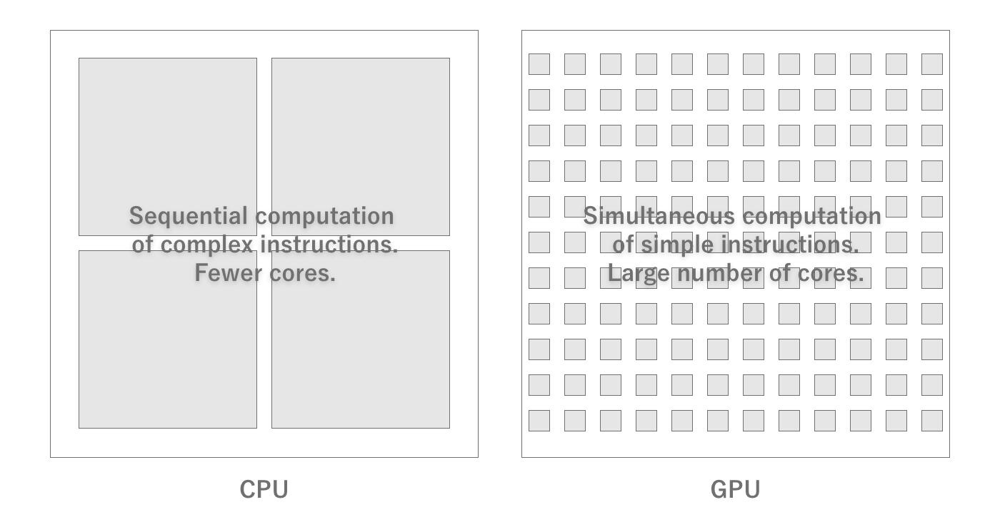
<p><em>VI: <strong>▲ Figure 2.6 — Khác biệt giữa CPU và GPU.</strong> / EN: Figure 2.6 — Difference between CPU and GPU.</em></p>

<div class="bilingual-row">
<div class="col-vi">
<blockquote>
<p><em>"Trong khi CPU CHUYÊN thực thi chương trình, <strong>GPU (Graphics Processing Unit) là phần cứng CHUYÊN cho xử lý ảnh và render đồ hoạ.</strong></em></p>
<p><em>🔑 <strong>GPU được thiết kế CHUYÊN cho xử lý đồ hoạ, nên cấu trúc của nó RẤT KHÁC CPU, và được thiết kế để XỬ LÝ SONG SONG một SỐ LƯỢNG LỚN các phép tính ĐƠN GIẢN.</strong></em></p>
</blockquote>
<p>📖 <strong>Ví dụ minh hoạ của sách — chuyển ảnh sang trắng đen:</strong></p>
<blockquote>
<p><em>"<strong>CPU phải ĐỌC giá trị RGB của một toạ độ từ bộ nhớ, chuyển sang grayscale, và TRẢ VỀ bộ nhớ — TỪNG PIXEL MỘT.</strong></em></p>
<p><em>✅ <strong>Vì quá trình này KHÔNG có rẽ nhánh và phép tính của MỖI pixel KHÔNG PHỤ THUỘC vào kết quả của pixel khác, nên RẤT DỄ thực hiện phép tính cho từng pixel một cách SONG SONG.</strong></em></p>
<p><em>🚀 <strong>Do đó, GPU có thể thực hiện xử lý song song áp dụng CÙNG một thao tác lên MỘT LƯỢNG LỚN dữ liệu ở TỐC ĐỘ CAO.</strong>"</em></p>
</blockquote>
<p>📏 <strong>Hai chỉ số đo hiệu năng GPU:</strong></p>
<blockquote>
<ul>
<li><em><strong>FLOPS</strong> — <em>"đồ hoạ đòi hỏi SỐ LƯỢNG LỚN phép tính DẤU PHẨY ĐỘNG, và GPU ĐẶC BIỆT giỏi ở đó. Vì lý do này, chỉ số hiệu năng gọi là <strong>FLOPS — đo SỐ PHÉP TÍNH DẤU PHẨY ĐỘNG MỖI GIÂY</strong> — thường được dùng"</em></li>
<li><em><strong>FILL RATE</strong> — <em>"Vì khó hiểu hiệu năng CHỈ qua sức mạnh tính toán, một chỉ số gọi là <strong>FILL RATE — chỉ ra BAO NHIÊU PIXEL có thể được vẽ MỖI GIÂY</strong> — cũng được dùng"</em></li>
</ul>
</blockquote>
<p>🔢 <strong>Sức mạnh tính toán GPU:</strong> <em>"Phần cứng GPU đặc trưng bởi <strong>SỐ LƯỢNG LỚN nhân (HÀNG CHỤC tới HÀNG NGHÌN)</strong> chứa đơn vị tính toán số nguyên và dấu phẩy động. <strong>Để triển khai số lượng lớn nhân, các đơn vị cần thiết để chạy chương trình PHỨC TẠP (vốn cần cho CPU) đã bị LOẠI BỎ vì KHÔNG CÒN CẦN THIẾT.</strong>"</em></p>
</div>
<div class="col-en">
<blockquote>
<p><em>"While CPUs specialize in EXECUTING PROGRAMS, <strong>the GPU (Graphics Processing Unit) is hardware SPECIALIZED for image processing and graphics rendering.</strong></em></p>
<p><em>🔑 <strong>GPUs are designed to specialize in graphics processing, so their structure is VERY DIFFERENT from that of CPUs, and they are designed to process a LARGE NUMBER of SIMPLE CALCULATIONS IN PARALLEL.</strong></em></p>
</blockquote>
<p>📖 <strong>The book's illustration — converting an image to black and white:</strong></p>
<blockquote>
<p><em>"<strong>The CPU must READ the RGB values of certain coordinates from memory, convert them to grayscale, and RETURN them to memory — PIXEL BY PIXEL.</strong></em></p>
<p><em>✅ <strong>Since such a process does NOT involve any BRANCHING and the calculation of each pixel does NOT DEPEND on the results of other pixels, it is EASY to perform the calculations for each pixel IN PARALLEL.</strong></em></p>
<p><em>🚀 <strong>Therefore, GPUs can perform parallel processing that applies the SAME OPERATION to a LARGE AMOUNT of data at HIGH SPEED.</strong>"</em></p>
</blockquote>
<p>📏 <strong>Two GPU performance metrics:</strong></p>
<blockquote>
<ul>
<li><em><strong>FLOPS</strong> — <em>"graphics processing requires a LARGE NUMBER of FLOATING-POINT operations, and GPUs are PARTICULARLY GOOD at them. For this reason, a performance index called <strong>FLOPS, which measures the NUMBER OF FLOATING-POINT OPERATIONS PER SECOND</strong>, is generally used"</em></li>
<li><em><strong>FILL RATE</strong> — <em>"Since it is DIFFICULT to understand performance ONLY in terms of computing power, an indicator called <strong>FILL RATE, which indicates HOW MANY PIXELS can be drawn PER SECOND</strong>, is also used"</em></li>
</ul>
</blockquote>
<p>🔢 <strong>GPU arithmetic capacity:</strong> <em>"GPU hardware is characterized by a <strong>LARGE NUMBER of cores (TENS TO THOUSANDS)</strong> containing integer and floating-point arithmetic units. <strong>In order to deploy a large number of cores, the units required to run COMPLEX programs (necessary for CPUs) have been ELIMINATED because they are NO LONGER NEEDED.</strong>"</em></p>
</div>
</div>

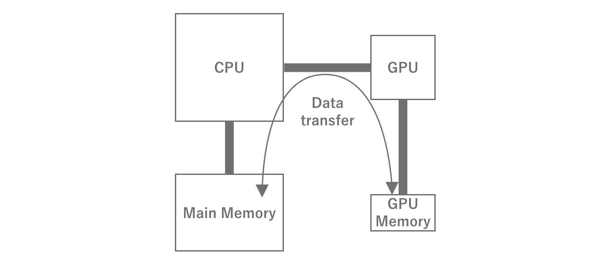
<p><em>VI: <strong>▲ Figure 2.7 — Truyền bộ nhớ GPU.</strong> / EN: Figure 2.7 — GPU Memory Transfer.</em></p>

!!! danger "🚨 Bộ nhớ GPU trên MOBILE — điều KHÁC BIỆT then chốt so với PC"
    <div class="bilingual-row">
    <div class="col-vi">
    <blockquote>
    <p><em>"GPU tất nhiên cũng cần KHÔNG GIAN BỘ NHỚ để lưu tạm và xử lý dữ liệu. <strong>Bình thường, vùng này DÀNH RIÊNG cho GPU, KHÁC với main memory. Do đó, để thực hiện BẤT KỲ xử lý nào, dữ liệu PHẢI được TRUYỀN từ main memory sang bộ nhớ GPU. Sau xử lý, dữ liệu được trả về main memory theo thứ tự NGƯỢC LẠI.</strong></em></p>
    <p><em>💀 <strong>LƯU Ý rằng NẾU lượng dữ liệu cần truyền LỚN — ví dụ truyền NHIỀU texture ĐỘ PHÂN GIẢI CAO — việc truyền sẽ TỐN THỜI GIAN và TRỞ THÀNH nút thắt xử lý.</strong></em></p>
    <p><em>📱 <strong>TUY NHIÊN, trên thiết bị DI ĐỘNG, main memory nhìn chung được CHIA SẺ giữa CPU và GPU, thay vì DÀNH RIÊNG cho GPU.</strong></em></p>
    <ul>
    <li>✅ <em><strong>ƯU ĐIỂM: thay đổi ĐỘNG được dung lượng bộ nhớ của GPU</strong></em></li>
    <li>💀 <em><strong>NHƯỢC ĐIỂM: CHIA SẺ BĂNG THÔNG TRUYỀN giữa CPU và GPU</strong></em></li>
    </ul>
    <p><em>⚠️ <strong>Trong trường hợp này, dữ liệu VẪN PHẢI được truyền giữa các vùng bộ nhớ CPU và GPU.</strong>"</em></p>
    </blockquote>
    <p>👉 <em>Đây là <strong>lý do vật lý</strong> khiến băng thông là bottleneck số 1 trên mobile (<a href="../04-tech-lead/01-gpu-urp-advanced-rendering.md">Module 4 §7</a>): trên PC, CPU và GPU có bus RIÊNG; trên mobile chúng <strong>tranh nhau CÙNG một đường ống</strong>.</em></p>
    </div>
    <div class="col-en">
    <blockquote>
    <p><em>"GPUs, of course, also require MEMORY SPACE for temporary storage to process data. <strong>Normally, this area is DEDICATED to the GPU, unlike main memory. Therefore, to perform ANY kind of processing, data MUST be TRANSFERRED from main memory to GPU memory. After processing, the data is RETURNED to main memory in the REVERSE ORDER.</strong></em></p>
    <p><em>💀 <strong>Note that IF the amount of data to be transferred is LARGE — for example, transferring MULTIPLE HIGH-RESOLUTION textures — the transfer TAKES TIME and BECOMES a processing BOTTLENECK.</strong></em></p>
    <p><em>📱 <strong>In MOBILE devices, HOWEVER, the main memory is GENERALLY SHARED between the CPU and GPU, rather than being DEDICATED to the GPU.</strong></em></p>
    <ul>
    <li>✅ <em><strong>ADVANTAGE: DYNAMICALLY CHANGING the memory capacity of the GPU</strong></em></li>
    <li>💀 <em><strong>DISADVANTAGE: SHARING the TRANSFER BANDWIDTH between the CPU and GPU</strong></em></li>
    </ul>
    <p><em>⚠️ <strong>In this case, data must STILL be transferred between the CPU and GPU memory areas.</strong>"</em></p>
    </blockquote>
    <p>👉 <em>This is the <strong>physical reason</strong> bandwidth is the #1 mobile bottleneck (<a href="../04-tech-lead/01-gpu-urp-advanced-rendering.md">Module 4 §7</a>): on PC, CPU and GPU have SEPARATE buses; on mobile they <strong>COMPETE for the SAME pipe</strong>.</em></p>
    </div>
    </div>

!!! info "🧮 GPGPU — dùng GPU cho việc KHÔNG phải đồ hoạ"
    **VI:** *"GPU có thể thực hiện phép tính SONG SONG trên LƯỢNG LỚN dữ liệu ở tốc độ CAO — thứ CPU KHÔNG giỏi. Cái này gọi là **GPGPU (General Purpose GPU)**. Đặc biệt, **có nhiều trường hợp GPU được dùng cho MACHINE LEARNING như AI và xử lý tính toán như BLOCKCHAIN, dẫn tới NHU CẦU GPU TĂNG VỌT, gây TĂNG GIÁ và các hệ quả khác.** ✅ **GPGPU cũng có thể dùng trong Unity qua chức năng gọi là COMPUTE SHADER."***

    **EN:** *"GPUs can perform PARALLEL operations on LARGE amounts of data at HIGH SPEED, which CPUs are NOT good at — **GPGPU (General Purpose GPU)**. In particular, **there are many cases where GPUs are used for MACHINE LEARNING such as AI and computational processing such as BLOCKCHAIN, which has led to a SHARP INCREASE in the DEMAND for GPUs, resulting in a PRICE HIKE and other effects.** ✅ **GPGPU can also be used in Unity by utilizing a function called COMPUTE SHADER."***

    👉 *Xem [Module 4 §23.2](../04-tech-lead/01-gpu-urp-advanced-rendering.md) — thay geometry shader bằng compute shader.*

---

## 11. 💾 Memory — OOM, Swap, Stack vs Heap

<div class="bilingual-row">
<div class="col-vi">
<blockquote>
<p><em>"Về cơ bản, <strong>TẤT CẢ dữ liệu được giữ trong MAIN MEMORY, vì CPU CHỈ giữ dữ liệu cần thiết cho phép tính TẠI THỜI ĐIỂM ĐÓ.</strong></em></p>
<p><em>💀 <strong>Vì KHÔNG THỂ dùng nhiều bộ nhớ hơn DUNG LƯỢNG VẬT LÝ, nếu dùng QUÁ NHIỀU, bộ nhớ KHÔNG THỂ được cấp phát và tiến trình bị OS BUỘC KẾT THÚC. Cái này thường gọi là OOM (Out Of Memory), và được gọi là 'BỊ GIẾT (killed)'.</strong></em></p>
<p><em>📊 <strong>Tính tới 2022, ĐA SỐ smartphone được trang bị 4–8 GB bộ nhớ. Dù vậy, bạn NÊN CẨN THẬN đừng dùng QUÁ NHIỀU.</strong>"</em></p>
</blockquote>
<p>🔌 <strong>Vì sao RAM KHÔNG nằm trong SoC:</strong></p>
<blockquote>
<p><em>"Tuy có LỢI THẾ khi đặt main memory BÊN TRONG SoC do khoảng cách vật lý, <strong>bộ nhớ KHÔNG được đưa vào SoC. Có lý do cho điều này, ví dụ việc DUNG LƯỢNG bộ nhớ lắp đặt sẽ KHÔNG THỂ THAY ĐỔI từ máy này sang máy khác nếu nó nằm trong SoC.</strong></em></p>
<p><em>⚡ <strong>Tuy nhiên, nếu main memory CHẬM, nó sẽ ảnh hưởng RÕ RỆT tới tốc độ thực thi, nên một BUS TƯƠNG ĐỐI NHANH được dùng để nối SoC và bộ nhớ. Chuẩn bộ nhớ và bus thường dùng trong smartphone là LPDDR.</strong></em></p>
<p><em>📈 <strong>Có vài THẾ HỆ LPDDR, nhưng tốc độ truyền LÝ THUYẾT là VÀI Gbps. Tất nhiên KHÔNG phải lúc nào cũng đạt hiệu năng lý thuyết, nhưng trong phát triển game, ĐIỀU NÀY HIẾM KHI là nút thắt, nên KHÔNG cần bận tâm.</strong>"</em></p>
</blockquote>
</div>
<div class="col-en">
<blockquote>
<p><em>"Basically, <strong>ALL data is held in MAIN MEMORY, as the CPU ONLY holds the data necessary for the calculation AT THAT TIME.</strong></em></p>
<p><em>💀 <strong>Since it is NOT POSSIBLE to use more memory than the PHYSICAL CAPACITY, if too much is used, the memory CANNOT be allocated and the process is FORCED TO TERMINATE by the OS. This is generally referred to as OOM (Out Of Memory), and is called being "KILLED".</strong></em></p>
<p><em>📊 <strong>As of 2022, the MAJORITY of smartphones are equipped with 4–8 GB of memory capacity. Even so, you should be CAREFUL not to use too much memory.</strong>"</em></p>
</blockquote>
<p>🔌 <strong>Why RAM is NOT inside the SoC:</strong></p>
<blockquote>
<p><em>"Although it is ADVANTAGEOUS to have the main memory INSIDE the SoC due to physical distance, <strong>memory is NOT included in the SoC. There are reasons for this, such as the fact that the AMOUNT of memory installed CANNOT be CHANGED from device to device if it is inside the SoC.</strong></em></p>
<p><em>⚡ <strong>However, if the main memory is SLOW, it will NOTICEABLY affect program execution speed, so a RELATIVELY FAST BUS is used to connect the SoC and memory. The memory and bus standard commonly used in smartphones is LPDDR.</strong></em></p>
<p><em>📈 <strong>There are several generations of LPDDR, but the THEORETICAL transfer rate is SEVERAL Gbps. Of course, it is not always possible to achieve the theoretical performance, but in game development, THIS IS RARELY A BOTTLENECK, so there is no need to be aware of it.</strong>"</em></p>
</blockquote>
</div>
</div>

!!! danger "☠️ Vì sao game NGỐN BỘ NHỚ bị GIẾT trước — cơ chế ưu tiên của OS"
    <div class="bilingual-row">
    <div class="col-vi">
    <blockquote>
    <p><em>"Trong một OS có RẤT NHIỀU tiến trình chạy đồng thời — chủ yếu là <strong>tiến trình HỆ THỐNG</strong> và <strong>tiến trình NGƯỜI DÙNG</strong>. Tiến trình hệ thống đóng vai trò quan trọng trong việc chạy OS và <strong>hầu hết THƯỜNG TRÚ trong OS dưới dạng DỊCH VỤ, tiếp tục chạy BẤT KỂ ý định người dùng.</strong></em></p>
    <p><em>📲 <strong>Có HAI trạng thái hiển thị cho app trên smartphone: FOREGROUND (trước nhất) và BACKGROUND (ẩn). Khi một app ở background, tiến trình TỒN TẠI ở trạng thái TREO (suspended) để dễ quay lại, và BỘ NHỚ ĐƯỢC GIỮ NGUYÊN.</strong></em></p>
    <p><em>💀 <strong>TUY NHIÊN, khi bộ nhớ dùng bởi TOÀN HỆ THỐNG trở nên THIẾU, tiến trình bị GIẾT theo THỨ TỰ ƯU TIÊN do OS xác định.</strong></em></p>
    <p><em>🎯 <strong>Tại thời điểm này, thứ DỄ BỊ GIẾT NHẤT là các ứng dụng NGƯỜI DÙNG (≒ GAME) đang ở BACKGROUND và ĐANG DÙNG NHIỀU BỘ NHỚ.</strong></em></p>
    <p><em>😖 <strong>Nói cách khác, GAME DÙNG NHIỀU BỘ NHỚ DỄ BỊ GIẾT HƠN khi chuyển sang background, dẫn tới TRẢI NGHIỆM TỆ HƠN khi quay lại game và phải BẮT ĐẦU LẠI TỪ ĐẦU.</strong>"</em></p>
    </blockquote>
    <p>🍎 <strong>Giới hạn CỨNG của iOS — con số cần nhớ:</strong></p>
    <blockquote>
    <p><em>"Trong một số trường hợp như iOS, <strong>nó được KIỂM SOÁT sao cho KHÔNG QUÁ MỘT TỶ LỆ NHẤT ĐỊNH của bộ nhớ vật lý được dùng bởi MỘT tiến trình. Do đó, CÓ GIỚI HẠN cho lượng bộ nhớ có thể cấp phát.</strong></em></p>
    <p><em>📊 <strong>Tính tới 2022, giới hạn cho thiết bị iOS có 3 GB RAM (dung lượng RAM phổ biến) sẽ là 1.3–1.4 GB, nên đây có lẽ là NGƯỠNG TRÊN khi làm game.</strong>"</em></p>
    </blockquote>
    <p>👉 <em>Con số này KHỚP CHÍNH XÁC với kết quả đo thực nghiệm ở <a href="#12-quyet-inh-biet-nguong-crash-bo-nho-cua-thiet-bi">§1.2</a> — <strong>1.3 GB</strong>. Hai nguồn độc lập, cùng một con số.</em></p>
    </div>
    <div class="col-en">
    <blockquote>
    <p><em>"Within an OS, there are MANY processes running simultaneously — mainly <strong>SYSTEM processes</strong> and <strong>USER processes</strong>. System processes play an important role in running the OS, and <strong>most of them RESIDE in the OS as SERVICES and continue to run REGARDLESS of the user's intention.</strong></em></p>
    <p><em>📲 <strong>There are TWO display states for apps on smartphones: FOREGROUND (foremost) and BACKGROUND (hidden). While an app is in the background, the process EXISTS in a SUSPENDED state to facilitate the return process, and MEMORY IS MAINTAINED as it is.</strong></em></p>
    <p><em>💀 <strong>HOWEVER, when the memory used by the ENTIRE SYSTEM becomes INSUFFICIENT, the process is KILLED according to the PRIORITY ORDER determined by the OS.</strong></em></p>
    <p><em>🎯 <strong>At this time, the MOST LIKELY to be killed are USER applications (≒ GAMES) in the BACKGROUND that are USING A LOT OF MEMORY.</strong></em></p>
    <p><em>😖 <strong>In other words, GAMES THAT USE A LOT OF MEMORY ARE MORE LIKELY TO BE KILLED when they are moved to the background, resulting in a WORSE user experience when returning to the game and having to START ALL OVER AGAIN.</strong>"</em></p>
    </blockquote>
    <p>🍎 <strong>iOS's HARD limit — the number to remember:</strong></p>
    <blockquote>
    <p><em>"In some cases, such as iOS, <strong>it is CONTROLLED so that NO MORE THAN a CERTAIN PERCENTAGE of the physical memory can be used by a SINGLE process. Therefore, there is a LIMIT to the amount of memory that can be allocated.</strong></em></p>
    <p><em>📊 <strong>As of 2022, the limit for an iOS device with 3 GB of RAM, which is a major RAM capacity, will be 1.3–1.4 GB, so this is likely to be the UPPER LIMIT for creating games.</strong>"</em></p>
    </blockquote>
    <p>👉 <em>This number MATCHES the empirical measurement in <a href="#12-quyet-inh-biet-nguong-crash-bo-nho-cua-thiet-bi">§1.2</a> EXACTLY — <strong>1.3 GB</strong>. Two independent sources, the same number.</em></p>
    </div>
    </div>

### 11.1. 🔄 Memory Swap — Nén bộ nhớ vs Ghi ra storage

| Kỹ thuật | Cơ chế / Mechanism | Áp dụng trên mobile? |
|---|---|---|
| **Memory Compression**<br>*Nén bộ nhớ* | *"**Dung lượng vật lý được TIẾT KIỆM bằng cách NÉN và LƯU trong bộ nhớ — chủ yếu là bộ nhớ SẼ KHÔNG được truy cập trong một thời gian.**"* ⚠️ *"Tuy nhiên, do **CHI PHÍ NÉN và GIẢI NÉN**, nó **KHÔNG được làm cho vùng đang ĐƯỢC DÙNG TÍCH CỰC**, mà cho **ứng dụng ĐÃ chuyển sang background**"* | ✅ **CÓ** |
| **Swap ra STORAGE** | *"Trên phần cứng có **NHIỀU DUNG LƯỢNG lưu trữ như PC**, thay vì KẾT THÚC tiến trình để giải phóng bộ nhớ, nó có thể thử **giải phóng bộ nhớ vật lý bằng cách LƯU bộ nhớ KHÔNG DÙNG ra STORAGE**"* ✅ *"Ưu điểm: **bảo đảm được LƯỢNG BỘ NHỚ LỚN HƠN so với nén bộ nhớ**"* | ❌ **KHÔNG** — *"vì **STORAGE CHẬM HƠN bộ nhớ**, có GIỚI HẠN HIỆU NĂNG MẠNH, và **KHÔNG THỰC TẾ với smartphone vốn có dung lượng lưu trữ NHỎ ngay từ đầu**"* |

### 11.2. 📚 Stack vs Heap — Vì sao Heap CHẬM

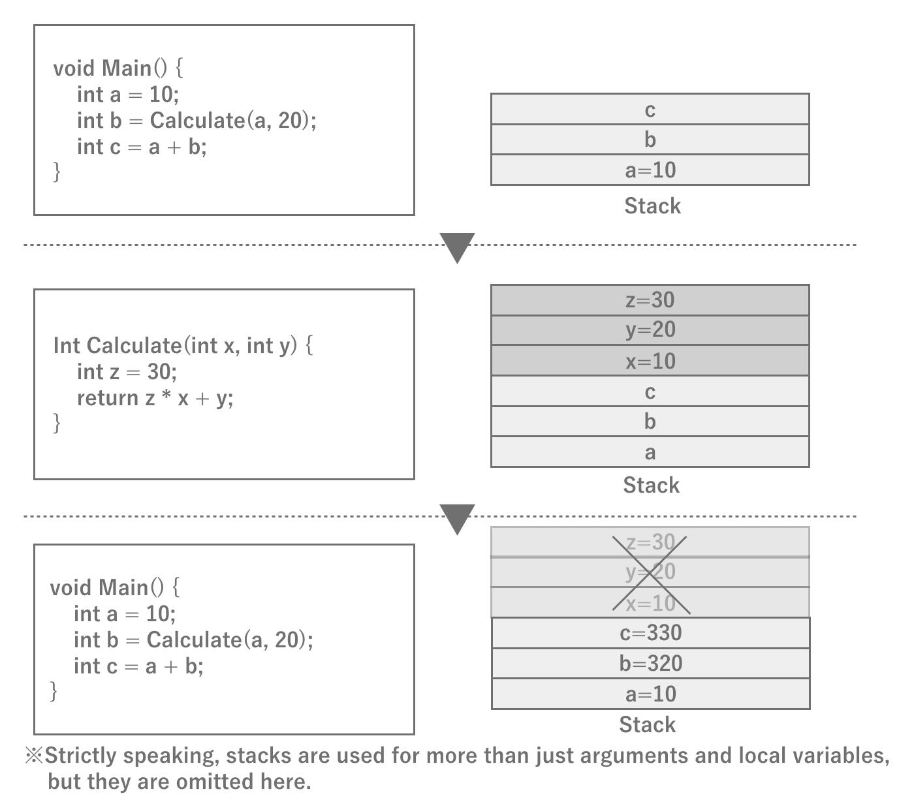
<p><em>VI: <strong>▲ Figure 2.8 — Sơ đồ hoạt động của STACK.</strong> / EN: Figure 2.8 — Schematic diagram of stack operation.</em></p>

<div class="bilingual-row">
<div class="col-vi">
<p><strong>📥 STACK — vùng CỐ ĐỊNH chuyên dụng</strong></p>
<blockquote>
<p><em>"<strong>Stack THỰC RA là một VÙNG CỐ ĐỊNH CHUYÊN DỤNG liên quan MẬT THIẾT tới hoạt động của chương trình.</strong></em></p>
<p><em>🔑 <strong>Khi một HÀM được gọi, STACK được cấp phát cho THAM SỐ và BIẾN CỤC BỘ; khi hàm trả về hàm gốc, STACK được GIẢI PHÓNG và giá trị trả về được tích luỹ.</strong></em></p>
<p><em>📦 <strong>Nói cách khác, khi hàm tiếp theo được gọi BÊN TRONG một hàm, thông tin của hàm HIỆN TẠI được GIỮ NGUYÊN và hàm tiếp theo được nạp vào bộ nhớ. Bằng cách này, cơ chế gọi hàm được hiện thực hoá.</strong></em></p>
<p><em>⚠️ <strong>Bộ nhớ stack phụ thuộc kiến trúc, nhưng vì DUNG LƯỢNG BẢN THÂN nó RẤT NHỎ (1 MB), CHỈ một lượng dữ liệu HẠN CHẾ được lưu.</strong>"</em></p>
</blockquote>
<p><strong>📤 HEAP — vùng dùng TỰ DO</strong></p>
<blockquote>
<p><em>"<strong>Heap là vùng bộ nhớ có thể dùng TỰ DO trong chương trình. Bất cứ khi nào chương trình CẦN, nó có thể phát lệnh cấp phát bộ nhớ (<code>malloc</code> trong C) để cấp phát và dùng một LƯỢNG LỚN dữ liệu.</strong></em></p>
<p><em>♻️ <strong>Tất nhiên, khi chương trình DÙNG XONG bộ nhớ, nó cần GIẢI PHÓNG (<code>free</code>). Trong C#, việc cấp phát và giải phóng bộ nhớ được thực hiện TỰ ĐỘNG lúc runtime, nên người cài đặt KHÔNG cần làm điều này TƯỜNG MINH.</strong>"</em></p>
</blockquote>
</div>
<div class="col-en">
<p><strong>📥 STACK — a dedicated FIXED area</strong></p>
<blockquote>
<p><em>"<strong>The stack is actually a DEDICATED FIXED AREA that is CLOSELY RELATED to the operation of the program.</strong></em></p>
<p><em>🔑 <strong>When a FUNCTION is called, the stack is ALLOCATED for ARGUMENTS and LOCAL VARIABLES, and when the function RETURNS to the original function, the stack is RELEASED and the return value is accumulated.</strong></em></p>
<p><em>📦 <strong>In other words, when the next function is called WITHIN a function, the information of the CURRENT function is LEFT AS IT IS and the next function is LOADED into memory. In this way, the function-call mechanism is realized.</strong></em></p>
<p><em>⚠️ <strong>Stack memory depends on the architecture, but since the CAPACITY ITSELF is VERY SMALL (1 MB), only a LIMITED amount of data is stored.</strong>"</em></p>
</blockquote>
<p><strong>📤 HEAP — a FREELY usable area</strong></p>
<blockquote>
<p><em>"<strong>The heap is a memory area that can be FREELY USED within the program. Whenever the program NEEDS it, it can issue a memory allocation instruction (<code>malloc</code> in C) to allocate and use a LARGE amount of data.</strong></em></p>
<p><em>♻️ <strong>Of course, when the program FINISHES using the memory, it needs to RELEASE it (<code>free</code>). In C#, memory allocation and deallocation are performed AUTOMATICALLY at runtime, so implementors do NOT need to do this EXPLICITLY.</strong>"</em></p>
</blockquote>
</div>
</div>

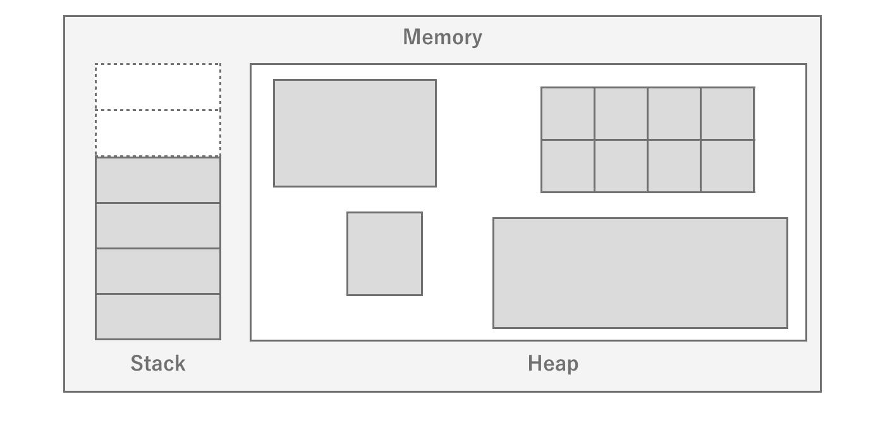
<p><em>VI: <strong>▲ Figure 2.9 — Stack và Heap.</strong> / EN: Figure 2.9 — Stack and Heap.</em></p>

!!! danger "🧩 PHÂN MẢNH BỘ NHỚ — chữ 'LIÊN TIẾP' là chìa khoá"
    <div class="bilingual-row">
    <div class="col-vi">
    <blockquote>
    <p><em>"Vì OS KHÔNG BIẾT khi nào và bao nhiêu bộ nhớ được cần, <strong>nó cấp phát bộ nhớ từ VÙNG TRỐNG khi được yêu cầu. NẾU bộ nhớ KHÔNG THỂ được cấp phát LIÊN TIẾP khi cố cấp phát, nó được coi là HẾT BỘ NHỚ.</strong></em></p>
    <p><em>🔑 <strong>TỪ KHOÁ 'LIÊN TIẾP (consecutive)' này là QUAN TRỌNG.</strong></em></p>
    <p><em>💀 <strong>Nhìn chung, việc LẶP ĐI LẶP LẠI cấp phát và giải phóng bộ nhớ dẫn tới PHÂN MẢNH BỘ NHỚ (memory fragmentation). Khi bộ nhớ bị phân mảnh, NGAY CẢ KHI TỔNG dung lượng trống là ĐỦ, CÓ THỂ KHÔNG CÓ vùng trống LIÊN TIẾP.</strong></em></p>
    <p><em>📈 <strong>Trong trường hợp đó, OS trước tiên sẽ thử MỞ RỘNG HEAP (Heap expansion). Nói cách khác, nó cấp phát BỘ NHỚ MỚI để gán cho tiến trình, qua đó BẢO ĐẢM vùng LIÊN TIẾP.</strong></em></p>
    <p><em>☠️ <strong>TUY NHIÊN, do bộ nhớ HỮU HẠN của toàn hệ thống, OS SẼ GIẾT tiến trình NẾU KHÔNG CÒN bộ nhớ để cấp phát.</strong>"</em></p>
    </blockquote>
    <p>👉 <em>Đây là lời giải thích ĐẦY ĐỦ NHẤT trong toàn bộ Hub cho hiện tượng <strong>phân mảnh managed heap</strong> đã nêu ở <a href="../03-senior/01-memory-addressables-networking.md">Module 3</a> và <a href="../04-tech-lead/01-gpu-urp-advanced-rendering.md">Module 4 §29.3</a> (vì sao <code>asyncUploadPersistentBuffer</code> nên để <code>true</code>).</em></p>
    </div>
    <div class="col-en">
    <blockquote>
    <p><em>"Since the OS does NOT KNOW when and how much memory is needed, <strong>it allocates memory from the FREE SPACE when it is needed. IF the memory CANNOT be allocated CONTINUOUSLY when allocation is attempted, it is assumed to be OUT OF MEMORY.</strong></em></p>
    <p><em>🔑 <strong>This KEYWORD 'CONSECUTIVE' is IMPORTANT.</strong></em></p>
    <p><em>💀 <strong>In general, REPEATED allocation and deallocation of memory results in MEMORY FRAGMENTATION. When memory is fragmented, EVEN IF the TOTAL free space is SUFFICIENT, there may be NO CONTIGUOUS free space.</strong></em></p>
    <p><em>📈 <strong>In such a case, the OS will FIRST try HEAP EXPANSION. In other words, it allocates NEW MEMORY to be assigned to the process, thereby ENSURING contiguous space.</strong></em></p>
    <p><em>☠️ <strong>HOWEVER, due to the FINITE memory of the entire system, the OS WILL KILL the process IF there is NO MORE memory left to allocate.</strong>"</em></p>
    </blockquote>
    <p>👉 <em>This is the FULLEST explanation in the whole Hub for the <strong>managed heap fragmentation</strong> raised in <a href="../03-senior/01-memory-addressables-networking.md">Module 3</a> and <a href="../04-tech-lead/01-gpu-urp-advanced-rendering.md">Module 4 §29.3</a> (why <code>asyncUploadPersistentBuffer</code> should stay <code>true</code>).</em></p>
    </div>
    </div>

<div class="bilingual-row">
<div class="col-vi">
<p>⚡ <strong>Vì sao Stack NHANH và Heap CHẬM — câu trả lời DỨT KHOÁT:</strong></p>
<blockquote>
<p><em>"Có KHÁC BIỆT RÕ RỆT về hiệu năng cấp phát bộ nhớ khi so sánh stack và heap.</em></p>
<p><em>🔑 <strong>Bởi vì LƯỢNG bộ nhớ stack cần cho một hàm được XÁC ĐỊNH LÚC BIÊN DỊCH, nên vùng nhớ ĐÃ ĐƯỢC CẤP PHÁT SẴN.</strong></em></p>
<p><em>🐢 <strong>Trong khi đó, HEAP KHÔNG BIẾT lượng bộ nhớ cần cho tới LÚC THỰC THI, nên heap cấp phát bộ nhớ bằng cách TÌM KIẾM trong vùng trống MỖI LẦN.</strong></em></p>
<p><em>👉 <strong>ĐÂY LÀ LÝ DO heap CHẬM và stack NHANH.</strong>"</em></p>
</blockquote>
</div>
<div class="col-en">
<p>⚡ <strong>Why Stack is FAST and Heap is SLOW — the definitive answer:</strong></p>
<blockquote>
<p><em>"There is a NOTICEABLE DIFFERENCE in memory allocation performance when comparing stack and heap.</em></p>
<p><em>🔑 <strong>This is because the AMOUNT of stack memory required for a function is DETERMINED AT COMPILE TIME, so the memory area is ALREADY ALLOCATED.</strong></em></p>
<p><em>🐢 <strong>Whereas the HEAP does NOT KNOW the amount of memory required until EXECUTION, so the heap allocates memory by SEARCHING for it in the free area EACH TIME.</strong></em></p>
<p><em>👉 <strong>THIS IS WHY heap is SLOW and stack is FAST.</strong>"</em></p>
</blockquote>
</div>
</div>

!!! warning "💥 Stack Overflow Error — 1 MB là tất cả những gì bạn có"
    **VI:** *"Lỗi Stack Overflow xảy ra khi **bộ nhớ stack bị DÙNG HẾT do các lời gọi ĐỆ QUY tới hàm. Kích thước stack MẶC ĐỊNH cho iOS/Android là 1 MB**, nên lỗi này DỄ xảy ra hơn khi kích thước của lời gọi đệ quy TĂNG LÊN. Nhìn chung, **có thể NGĂN lỗi này bằng cách ĐỔI sang thuật toán KHÔNG dẫn tới lời gọi đệ quy, hoặc đổi sang thuật toán KHÔNG cho phép lời gọi đệ quy trở nên QUÁ SÂU."***

    **EN:** *"The Stack Overflow error occurs when **stack memory is USED UP due to RECURSIVE CALLS to functions. The DEFAULT stack size for iOS/Android is 1 MB**, so this error is MORE LIKELY to occur when the size of recursive calls INCREASES. In general, **it is possible to PREVENT this error by CHANGING to an algorithm that does NOT result in recursive calls, or to one that does NOT allow recursive calls to become TOO DEEP."***

---

## 12. 💽 Storage — Vì sao ĐỌC FILE lâu hơn bạn nghĩ

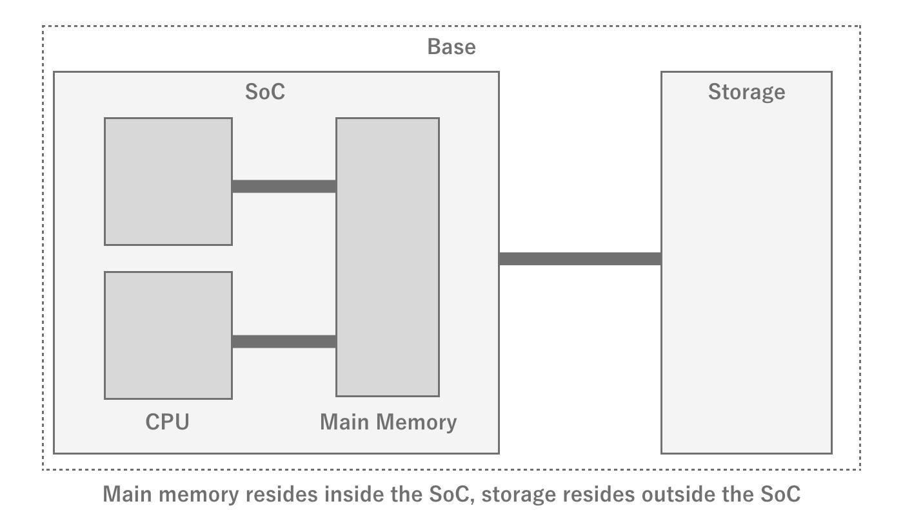
<p><em>VI: <strong>▲ Figure 2.10 — Quan hệ giữa SoC và Storage.</strong> / EN: Figure 2.10 — Relationship between SoC and Storage.</em></p>

<div class="bilingual-row">
<div class="col-vi">
<blockquote>
<p><em>"Khi thực sự tiến hành tuning, bạn có thể nhận ra rằng <strong>việc ĐỌC FILE thường mất RẤT NHIỀU THỜI GIAN. Đọc file nghĩa là ĐỌC dữ liệu từ storage nơi file được lưu và GHI nó vào bộ nhớ để chương trình xử lý được.</strong></em></p>
<p><em>💾 <strong>Storage đặc trưng bởi DUNG LƯỢNG LỚN và khả năng LƯU BỀN dữ liệu KHÔNG CẦN NGUỒN ĐIỆN (NON-VOLATILE).</strong> Tận dụng đặc điểm này, <strong>một lượng asset KHỔNG LỒ cũng như bản thân chương trình ứng dụng được lưu trong storage, và được load từ storage rồi thực thi lúc khởi động.</strong>"</em></p>
</blockquote>
<p>🐌 <strong>BA lý do storage CHẬM — nguyên văn:</strong></p>
<ol>
<li><em><strong>"KHOẢNG CÁCH VẬT LÝ tới CPU LỚN HƠN so với bộ nhớ, dẫn tới LATENCY LỚN và tốc độ đọc/ghi CHẬM."</strong></em></li>
<li><em><strong>"Có NHIỀU LÃNG PHÍ vì việc đọc được thực hiện theo ĐƠN VỊ KHỐI (block), bao gồm cả dữ liệu được yêu cầu VÀ VÙNG XUNG QUANH nó."</strong></em></li>
<li>🔑 <em><strong>"Đọc/ghi TUẦN TỰ thì NHANH, còn đọc/ghi NGẪU NHIÊN thì CHẬM."</strong></em></li>
</ol>
<p>🚨 <strong>Điều số ③ là QUAN TRỌNG NHẤT:</strong></p>
<blockquote>
<p><em>"<strong>Việc đọc/ghi NGẪU NHIÊN CHẬM là ĐẶC BIỆT QUAN TRỌNG.</strong> Đọc/ghi là TUẦN TỰ khi <strong>MỘT file được đọc/ghi THEO THỨ TỰ từ ĐẦU file.</strong> Tuy nhiên, <strong>khi đọc/ghi NHIỀU PHẦN của MỘT file, hoặc đọc/ghi NHIỀU FILE NHỎ cùng lúc, thì đó là NGẪU NHIÊN.</strong></em></p>
<p><em>⚠️ <strong>Cần LƯU Ý rằng NGAY CẢ KHI đọc/ghi nhiều file TRONG CÙNG MỘT THƯ MỤC, chúng CÓ THỂ KHÔNG nằm LIÊN TIẾP về mặt VẬT LÝ — nên nếu chúng CÁCH XA nhau về vật lý, việc truy cập sẽ trở thành NGẪU NHIÊN.</strong>"</em></p>
</blockquote>
</div>
<div class="col-en">
<blockquote>
<p><em>"When you actually proceed with tuning, you may notice that <strong>it often takes a LONG TIME to READ A FILE. Reading a file means READING data from the storage where the file is stored and WRITING it to memory so that it can be handled by the program.</strong></em></p>
<p><em>💾 <strong>Storage is characterized by its LARGE CAPACITY and its ability to PERSIST data WITHOUT a power supply (NONVOLATILE).</strong> Taking advantage of this feature, <strong>a VAST amount of assets as well as the program of the application itself are stored in storage, and are LOADED from storage and EXECUTED at startup.</strong>"</em></p>
</blockquote>
<p>🐌 <strong>THREE reasons storage is slow — verbatim:</strong></p>
<ol>
<li><em><strong>"The PHYSICAL DISTANCE from the CPU is GREATER than that of memory, resulting in LARGE LATENCY and SLOW read/write speeds."</strong></em></li>
<li><em><strong>"There is a LOT OF WASTE because reads are done in BLOCK UNITS, INCLUDING the commanded data AND ITS SURROUNDINGS."</strong></em></li>
<li>🔑 <em><strong>"SEQUENTIAL read/write is FAST, while RANDOM read/write is SLOW."</strong></em></li>
</ol>
<p>🚨 <strong>Point ③ is the MOST IMPORTANT:</strong></p>
<blockquote>
<p><em>"<strong>The fact that RANDOM read/write is SLOW is PARTICULARLY IMPORTANT.</strong> Read/write is SEQUENTIAL when <strong>a SINGLE file is read/written IN ORDER from the BEGINNING of the file.</strong> However, <strong>when reading/writing MULTIPLE PARTS of a single file, or reading/writing MULTIPLE SMALL FILES at once, it is RANDOM.</strong></em></p>
<p><em>⚠️ <strong>It is important to note that EVEN when reading/writing multiple files in the SAME DIRECTORY, they may NOT be PHYSICALLY located CONSECUTIVELY, so if they are physically FAR APART, the access will be RANDOMIZED.</strong>"</em></p>
</blockquote>
</div>
</div>

!!! info "🔬 Quy trình 5 bước ĐỌC file từ storage — nguyên văn"
    <div class="bilingual-row">
    <div class="col-vi">
    <ol>
    <li><em><strong>Chương trình RA LỆNH cho storage controller vùng của file cần đọc từ storage</strong></em></li>
    <li><em><strong>Storage controller NHẬN lệnh và TÍNH TOÁN vùng cần đọc trên vị trí VẬT LÝ nơi dữ liệu nằm</strong></em></li>
    <li><em><strong>ĐỌC dữ liệu</strong></em></li>
    <li><em><strong>GHI dữ liệu vào bộ nhớ</strong></em></li>
    <li><em><strong>Chương trình TRUY CẬP dữ liệu THÔNG QUA bộ nhớ</strong></em></li>
    </ol>
    <p>⚠️ <em>"Cũng có thể có <strong>NHIỀU TẦNG HƠN, như các controller, tuỳ phần cứng và kiến trúc. KHÔNG cần nhớ chính xác, nhưng hãy Ý THỨC rằng có NHIỀU BƯỚC XỬ LÝ PHẦN CỨNG HƠN so với đọc từ bộ nhớ.</strong>"</em></p>
    </div>
    <div class="col-en">
    <ol>
    <li><em><strong>The program COMMANDS the storage controller the AREA of the file to be read from storage</strong></em></li>
    <li><em><strong>The storage controller RECEIVES the command and CALCULATES the area to be read on the PHYSICAL location where the data is</strong></em></li>
    <li><em><strong>READS the data</strong></em></li>
    <li><em><strong>WRITES the data in memory</strong></em></li>
    <li><em><strong>The program ACCESSES the data THROUGH memory</strong></em></li>
    </ol>
    <p>⚠️ <em>"There may also be <strong>MORE LAYERS, such as controllers, depending on the hardware and architecture. It is NOT necessary to remember them exactly, but be AWARE that there are MORE HARDWARE PROCESSING STEPS compared to reading from memory.</strong>"</em></p>
    </div>
    </div>

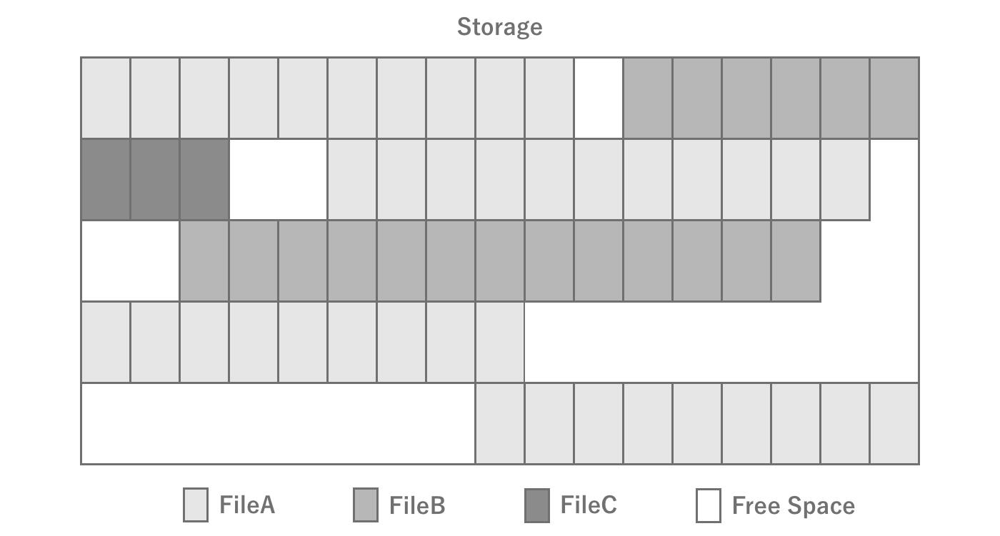
<p><em>VI: <strong>▲ Figure 2.11 — Phân mảnh Storage.</strong> / EN: Figure 2.11 — Storage fragmentation.</em></p>

<div class="bilingual-row">
<div class="col-vi">
<blockquote>
<p><em>"Storage điển hình đạt hiệu năng và hiệu quả không gian bằng cách <strong>ghi MỘT file thành các KHỐI (block) KHOẢNG 4 KB. Những khối này KHÔNG NHẤT THIẾT LIÊN TIẾP về vật lý, NGAY CẢ KHI chúng thuộc CÙNG một file.</strong></em></p>
<p><em>🧩 <strong>Trạng thái file bị PHÂN TÁN về vật lý gọi là PHÂN MẢNH (fragmentation), và thao tác LOẠI BỎ phân mảnh gọi là DEFRAGMENTATION.</strong></em></p>
<p><em>📼 <strong>Trong khi phân mảnh từng là vấn đề với HDD — vốn là chủ lực của PC — nó GẦN NHƯ BIẾN MẤT với sự xuất hiện của FLASH STORAGE. Tuy KHÔNG cần bận tâm về phân mảnh file trên smartphone, nhưng CẦN Ý THỨC khi xét tới PC.</strong>"</em></p>
</blockquote>
<p>🇯🇵 <strong>Ghi chú thuật ngữ — "RAM và ROM":</strong></p>
<blockquote>
<p><em>"<strong>ĐẶC BIỆT ở Nhật Bản, người ta thường viết 'RAM' cho bộ nhớ smartphone và 'ROM' cho storage, nhưng ROM thực ra là Read Only Memory.</strong> Đúng như tên gọi, nó ĐÁNG LẼ chỉ đọc và KHÔNG ghi được, nhưng <strong>việc dùng thuật ngữ này có vẻ là THÓI QUEN RẤT MẠNH ở Nhật.</strong>"</em></p>
</blockquote>
</div>
<div class="col-en">
<blockquote>
<p><em>"Typical storage achieves performance and space efficiency by <strong>writing a SINGLE file in BLOCKS of ABOUT 4 KB. These blocks are NOT NECESSARILY physically CONTIGUOUS, EVEN IF they belong to a SINGLE file.</strong></em></p>
<p><em>🧩 <strong>The state in which files are PHYSICALLY DISTRIBUTED is called FRAGMENTATION, and the operation to ELIMINATE fragmentation is called DEFRAGMENTATION.</strong></em></p>
<p><em>📼 <strong>While fragmentation was often a problem with HDDs — the mainstay of PCs — it has ALMOST DISAPPEARED with the advent of FLASH STORAGE. While we do NOT need to be aware of file fragmentation on smartphones, it IS important to be aware of it when considering PCs.</strong>"</em></p>
</blockquote>
<p>🇯🇵 <strong>A terminology note — "RAM and ROM":</strong></p>
<blockquote>
<p><em>"<strong>ESPECIALLY in Japan, it is common to write 'RAM' for smartphone memory and 'ROM' for storage, but ROM actually refers to Read Only Memory.</strong> As the name suggests, it is SUPPOSED to be read-only and NOT writable, but <strong>the use of this term seems to be STRONGLY CUSTOMARY in Japan.</strong>"</em></p>
</blockquote>
</div>
</div>

!!! danger "⏱️ Con số PHẢI NHỚ — 100 MB/s và bài toán 10 MB = 100 ms"
    <div class="bilingual-row">
    <div class="col-vi">
    <blockquote>
    <p><em>"Cuối cùng, tốc độ đọc/ghi THỰC TẾ của storage trong smartphone là bao nhiêu?</em></p>
    <p><em>📊 <strong>Tính tới 2022, một ước lượng là KHOẢNG 100 MB/s cho việc ĐỌC.</strong></em></p>
    <p><em>🧮 <strong>NẾU bạn muốn đọc một file 10 MB, sẽ mất 100 ms để đọc TOÀN BỘ file — NGAY CẢ TRONG ĐIỀU KIỆN LÝ TƯỞNG.</strong></em></p>
    <p><em>💀 <strong>Hơn nữa, NẾU NHIỀU FILE NHỎ cần được đọc, TRUY CẬP NGẪU NHIÊN sẽ xảy ra, khiến việc đọc CÒN CHẬM HƠN.</strong></em></p>
    <p><em>✅ <strong>Do đó, LUÔN LUÔN tốt khi Ý THỨC rằng việc đọc một file THỰC SỰ mất một khoảng thời gian LÂU ĐẾN BẤT NGỜ.</strong>"</em></p>
    </blockquote>
    <p><strong>🎯 Hai nguyên tắc TỔNG KẾT khi đọc/ghi file:</strong></p>
    <ol>
    <li><em><strong>"Tốc độ đọc/ghi storage CHẬM ĐẾN BẤT NGỜ — ĐỪNG kỳ vọng cùng tốc độ với bộ nhớ"</strong></em></li>
    <li><em><strong>"GIẢM SỐ FILE được đọc/ghi CÙNG LÚC nhiều nhất có thể"</strong></em> — ví dụ: <strong>phân tán TIMING, GỘP file thành MỘT file</strong></li>
    </ol>
    <p>👉 <em>Con số 100 MB/s này giải thích TRỰC TIẾP vì sao <strong>Async Upload Pipeline</strong> (<a href="../04-tech-lead/01-gpu-urp-advanced-rendering.md">Module 4 §27–§32</a>) lại quan trọng đến thế, và vì sao <strong>granularity của AssetBundle</strong> (<a href="#">§Chương 5</a>) là một quyết định kiến trúc, không phải chi tiết vặt.</em></p>
    </div>
    <div class="col-en">
    <blockquote>
    <p><em>"Finally, how fast is the ACTUAL read/write speed of storage in a smartphone?</em></p>
    <p><em>📊 <strong>As of 2022, one estimate is ABOUT 100 MB/s for READING.</strong></em></p>
    <p><em>🧮 <strong>If you want to read a 10 MB file, it will take 100 ms to read the ENTIRE file — EVEN UNDER IDEAL CONDITIONS.</strong></em></p>
    <p><em>💀 <strong>Furthermore, IF MULTIPLE SMALL FILES are to be read, RANDOM ACCESSES will occur, making the reading process EVEN SLOWER.</strong></em></p>
    <p><em>✅ <strong>Thus, it is ALWAYS good to be AWARE that it actually takes a SURPRISINGLY LONG TIME to read a file.</strong>"</em></p>
    </blockquote>
    <p><strong>🎯 The two SUMMARY rules for file I/O:</strong></p>
    <ol>
    <li><em><strong>"Storage read/write speeds are SURPRISINGLY SLOW — do NOT expect the SAME SPEED as memory"</strong></em></li>
    <li><em><strong>"REDUCE the NUMBER of files to be read/written AT THE SAME TIME as much as possible"</strong></em> — e.g. <strong>DISTRIBUTE TIMING, CONSOLIDATE files into a SINGLE file</strong></li>
    </ol>
    <p>👉 <em>This 100 MB/s figure DIRECTLY explains why the <strong>Async Upload Pipeline</strong> (<a href="../04-tech-lead/01-gpu-urp-advanced-rendering.md">Module 4 §27–§32</a>) matters so much, and why <strong>AssetBundle granularity</strong> is an architectural decision rather than a minor detail.</em></p>
    </div>
    </div>

!!! tip "💿 Các loại storage trên PC và smartphone"
    **VI:** *"Trong thế giới PC, **HDD và SSD** là loại storage phổ biến nhất. **HDD là phương tiện ghi dạng ĐĨA, giống CD, với ĐẦU ĐỌC di chuyển trên đĩa để đọc TỪ TÍNH.** Do đó, nó là thiết bị **LỚN về cấu trúc và có LATENCY CAO do CHUYỂN ĐỘNG VẬT LÝ.** Những năm gần đây, **SSD** trở nên phổ biến — **KHÔNG sinh chuyển động vật lý nên cho hiệu năng TỐC ĐỘ CAO, nhưng mặt khác có GIỚI HẠN SỐ CHU KỲ đọc/ghi (TUỔI THỌ)**, nên trở nên KHÔNG DÙNG ĐƯỢC khi chu kỳ đọc/ghi xảy ra thường xuyên. **Tuy smartphone KHÁC SSD, chúng dùng một loại flash memory gọi là NAND."***

    **EN:** *"In the PC world, **HDDs and SSDs** are the most common types of storage. **An HDD is media recorded in the form of DISKS, like CDs, with HEADS that MOVE over the disks to read MAGNETISM.** As such, it was structurally LARGE and had HIGH LATENCY due to the PHYSICAL MOVEMENT involved. In recent years, **SSDs** have become popular — **they do NOT generate physical movement and therefore offer HIGH-SPEED performance, but on the other hand they have a LIMIT to the NUMBER of read/write CYCLES (LIFESPAN)**, so they become unusable when frequent read/write cycles occur. **Although smartphones are different from SSDs, they use a type of flash memory called NAND."***

---

## 13. 🖼️ Rendering — Góc nhìn CyberAgent

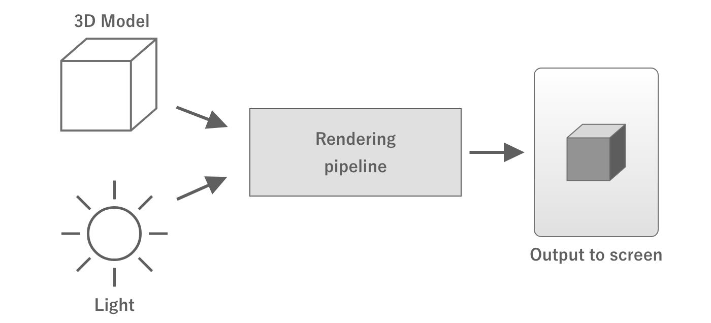
<p><em>VI: <strong>▲ Figure 2.12 — Rendering Pipeline.</strong> / EN: Figure 2.12 — Rendering Pipeline.</em></p>

<div class="bilingual-row">
<div class="col-vi">
<blockquote>
<p><em>"Trong computer graphics, <strong>một CHUỖI xử lý được thực hiện trên dữ liệu như TOẠ ĐỘ VERTEX của model 3D và toạ độ, màu của đèn, để cuối cùng XUẤT RA màu cho MỖI PIXEL trên màn hình. Cơ chế xử lý này gọi là RENDERING PIPELINE.</strong></em></p>
<p><em>📤 <strong>Rendering pipeline BẮT ĐẦU bằng việc GỬI dữ liệu cần thiết TỪ CPU SANG GPU.</strong> Dữ liệu này gồm <strong>toạ độ vertex của model 3D, toạ độ đèn, thông tin material của object, thông tin camera</strong>, v.v.</em></p>
<p><em>📐 <strong>GPU TỔNG HỢP thông tin này và TÍNH TOÁN object sẽ xuất hiện Ở ĐÂU trên màn hình khi nhìn bằng camera. Quá trình này gọi là BIẾN ĐỔI TOẠ ĐỘ (coordinate transformation).</strong></em></p>
<p><em>🎨 <strong>Khi vị trí object trên màn hình đã được xác định, bước tiếp theo là XÁC ĐỊNH MÀU của object: "các pixel tương ứng trên màn hình sẽ có màu gì KHI ĐÈN CHIẾU vào model?"</strong>"</em></p>
</blockquote>
<p>🔑 <strong>Hai shader và hai quy luật tải:</strong></p>
<blockquote>
<p><em>"<strong>'Object sẽ xuất hiện Ở ĐÂU trên màn hình' được xác định bởi VERTEX SHADER, và 'MÀU của vùng tương ứng mỗi pixel' được tính bởi FRAGMENT SHADER.</strong></em></p>
<p><em>⚠️ <strong>Những shader này có thể được viết TỰ DO. Do đó, viết XỬ LÝ NẶNG trong vertex shader và fragment shader SẼ LÀM TĂNG tải xử lý.</strong></em></p>
<ul>
<li><em><strong>Vertex shader xử lý theo SỐ VERTEX của model 3D ⇒ CÀNG NHIỀU vertex, tải CÀNG LỚN</strong></em></li>
<li><em><strong>Fragment shader TĂNG tải khi SỐ PIXEL cần render TĂNG</strong></em></li>
</ul>
</blockquote>
<p>📌 <em>"Trong rendering pipeline THỰC TẾ, có <strong>NHIỀU quá trình khác ngoài vertex shader và fragment shader</strong>, nhưng vì mục đích của tài liệu này là hiểu KHÁI NIỆM cần cho performance tuning, chúng tôi chỉ mô tả NGẮN GỌN."</em></p>
<p>👉 <em>Mô tả ĐẦY ĐỦ 5 giai đoạn pipeline ở <a href="../04-tech-lead/01-gpu-urp-advanced-rendering.md">Module 4 §1</a>.</em></p>
</div>
<div class="col-en">
<blockquote>
<p><em>"In computer graphics, <strong>a SERIES of processes is performed on data such as the VERTEX COORDINATES of a 3D model and the coordinates and colours of lights, to finally OUTPUT the colours for EACH PIXEL on the screen. This processing mechanism is called the RENDERING PIPELINE.</strong></em></p>
<p><em>📤 <strong>The rendering pipeline STARTS with SENDING the necessary data FROM the CPU TO the GPU.</strong> This data includes <strong>the coordinates of the 3D model's vertices, the coordinates of the lights, the material information of the objects, the camera information</strong>, and so on.</em></p>
<p><em>📐 <strong>The GPU COMPILES this information and CALCULATES WHERE the object will appear on the screen when viewed with the camera. This process is called COORDINATE TRANSFORMATION.</strong></em></p>
<p><em>🎨 <strong>Once the position of the object on screen is determined, the next step is to determine the COLOUR: "what colour will the corresponding pixels be WHEN THE LIGHT illuminates the model?"</strong>"</em></p>
</blockquote>
<p>🔑 <strong>Two shaders and two load rules:</strong></p>
<blockquote>
<p><em>"<strong>'WHERE on the screen the object will appear' is determined by the VERTEX SHADER, and 'the COLOUR of the area corresponding to each pixel' is calculated by the FRAGMENT SHADER.</strong></em></p>
<p><em>⚠️ <strong>These shaders can be FREELY WRITTEN. Therefore, writing HEAVY PROCESSING in vertex and fragment shaders WILL INCREASE the processing load.</strong></em></p>
<ul>
<li><em><strong>The vertex shader processes the NUMBER OF VERTICES of the 3D model ⇒ the MORE vertices, the GREATER the load</strong></em></li>
<li><em><strong>Fragment shaders INCREASE the load as the NUMBER OF PIXELS to be rendered increases</strong></em></li>
</ul>
</blockquote>
<p>📌 <em>"In the ACTUAL rendering pipeline, there are <strong>MANY processes other than vertex and fragment shaders</strong>, but since the purpose of this document is to understand the CONCEPTS necessary for performance tuning, we will only give a BRIEF description."</em></p>
<p>👉 <em>The FULL 5-stage pipeline description is in <a href="../04-tech-lead/01-gpu-urp-advanced-rendering.md">Module 4 §1</a>.</em></p>
</div>
</div>

### 13.1. 🫧 Render BÁN TRONG SUỐT — nguồn gốc của Overdraw

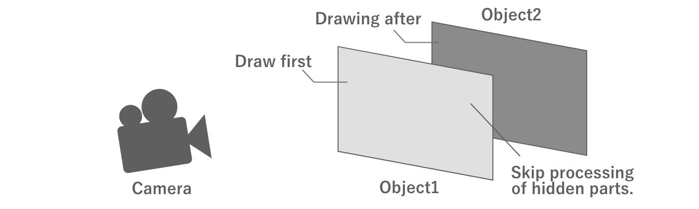
<p><em>VI: <strong>▲ Figure 2.15 — Render ĐỤC (opaque)</strong> — vẽ vật ở TRƯỚC trước, phần bị che của vật sau KHÔNG cần xử lý. / EN: Figure 2.15 — Opaque rendering.</em></p>

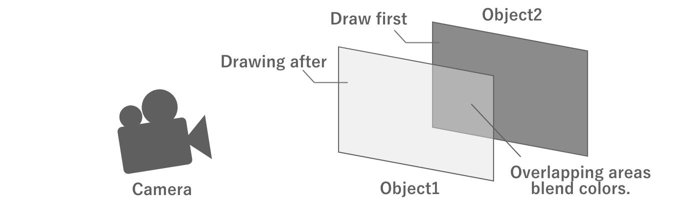
<p><em>VI: <strong>▲ Figure 2.16 — Render BÁN TRONG SUỐT</strong> — vẽ vật ở SAU trước ("Draw first"), vật trước vẽ sau ("Drawing after"), và <strong>vùng CHỒNG LẤN phải TRỘN MÀU</strong>. / EN: Figure 2.16 — Semi-transparent rendering.</em></p>

<div class="bilingual-row">
<div class="col-vi">
<blockquote>
<p><em>"Trước hết, xét trường hợp <strong>CẢ HAI object đều ĐỤC (opaque). Khi đó, object ở TRƯỚC camera được vẽ TRƯỚC. Bằng cách này, khi vẽ object ở SAU, phần KHÔNG NHÌN THẤY do bị object trước che KHÔNG CẦN được xử lý. Nghĩa là thao tác FRAGMENT SHADER có thể được BỎ QUA ở vùng này, qua đó TỐI ƯU tải xử lý.</strong></em></p>
<p><em>🫧 <strong>Ngược lại, nếu CẢ HAI object là BÁN TRONG SUỐT, sẽ là KHÔNG TỰ NHIÊN nếu object phía sau KHÔNG nhìn xuyên qua được object phía trước.</strong> Trong trường hợp này, <strong>quá trình vẽ được thực hiện BẮT ĐẦU TỪ object ở SAU (nhìn từ camera), và màu của vùng chồng lấn được TRỘN với màu ĐÃ VẼ.</strong></em></p>
<p><em>💀 <strong>KHÁC với render đục, render bán trong suốt ĐÒI HỎI phải render các object CHỒNG LẤN. NẾU có HAI object bán trong suốt LẤP ĐẦY TOÀN MÀN HÌNH, TOÀN BỘ MÀN HÌNH sẽ được xử lý HAI LẦN.</strong></em></p>
<p><em>🔑 <strong>Việc vẽ object bán trong suốt CHỒNG LÊN NHAU gọi là OVERDRAW. QUÁ NHIỀU overdraw có thể đặt TẢI XỬ LÝ NẶNG lên GPU và dẫn tới SUY GIẢM HIỆU NĂNG, nên CẦN đặt QUY ĐỊNH PHÙ HỢP khi vẽ object bán trong suốt.</strong>"</em></p>
</blockquote>
<p>📌 <em>"Có vài cách hiện thực rendering pipeline. Trong số đó, <strong>mô tả ở phần này GIẢ ĐỊNH FORWARD RENDERING. Một số điểm có thể KHÔNG áp dụng được một phần cho phương pháp khác như deferred rendering.</strong>"</em></p>
<p>👉 <em>Nối với <a href="../04-tech-lead/01-gpu-urp-advanced-rendering.md">Module 4 §5.4</a>: đây chính là lý do <strong>queue Opaque sắp xếp front-to-back còn Transparent sắp xếp back-to-front</strong>.</em></p>
</div>
<div class="col-en">
<blockquote>
<p><em>"First, consider the case where <strong>BOTH objects are OPAQUE. In this case, the object IN FRONT of the camera is drawn FIRST. In this way, when drawing the object at the BACK, the part that is NOT VISIBLE because it overlaps the front object does NOT need to be processed. This means the FRAGMENT SHADER operation can be SKIPPED in this area, thus OPTIMIZING the processing load.</strong></em></p>
<p><em>🫧 <strong>On the other hand, if BOTH objects are SEMI-TRANSPARENT, it would be UNNATURAL if the back object is NOT VISIBLE THROUGH the front object.</strong> In this case, <strong>the drawing process is performed STARTING WITH the object at the BACK as seen from the camera, and the colour of the overlapping area is BLENDED with the already-drawn colour.</strong></em></p>
<p><em>💀 <strong>UNLIKE opaque rendering, semi-transparent rendering REQUIRES rendering of OVERLAPPING objects. IF there are TWO semi-transparent objects that FILL THE ENTIRE SCREEN, the ENTIRE SCREEN will be processed TWICE.</strong></em></p>
<p><em>🔑 <strong>Drawing semi-transparent objects ON TOP OF EACH OTHER is called OVERDRAW. TOO MANY overdraws can put a HEAVY processing load on the GPU and lead to PERFORMANCE DEGRADATION, so it is NECESSARY to set APPROPRIATE REGULATIONS when drawing semi-transparent objects.</strong>"</em></p>
</blockquote>
<p>📌 <em>"There are several ways to implement the rendering pipeline. Of these, <strong>the description in this section ASSUMES FORWARD RENDERING. Some points may NOT be partially applicable to other rendering methods such as deferred rendering.</strong>"</em></p>
<p>👉 <em>Connects to <a href="../04-tech-lead/01-gpu-urp-advanced-rendering.md">Module 4 §5.4</a>: this is exactly why <strong>the Opaque queue sorts front-to-back while Transparent sorts back-to-front</strong>.</em></p>
</div>
</div>

### 13.2. 📞 Draw call, Set-pass call & Batching — Định nghĩa của CyberAgent

<div class="bilingual-row">
<div class="col-vi">
<blockquote>
<p><em>"Rendering đòi hỏi tải xử lý <strong>KHÔNG CHỈ trên GPU mà CÒN trên CPU.</strong></em></p>
<p><em>📞 <strong>Khi render một object, CPU GỬI LỆNH cho GPU để vẽ. Cái này gọi là DRAW CALL và được thực thi SỐ LẦN BẰNG SỐ OBJECT cần render.</strong></em></p>
<p><em>🔧 <strong>Tại thời điểm này, NẾU texture hoặc thông tin khác KHÁC với object đã render ở draw call TRƯỚC, GPU sẽ phải THIẾT LẬP texture hoặc thông tin đó cho GPU. Việc này được làm bằng SET-PASS CALL và là quá trình TƯƠNG ĐỐI NẶNG.</strong></em></p>
<p><em>💀 <strong>Vì quá trình này được làm trên RENDER THREAD của CPU, nó là TẢI XỬ LÝ TRÊN CPU, và QUÁ NHIỀU có thể ẢNH HƯỞNG hiệu năng.</strong>"</em></p>
</blockquote>
<p>🔑 <strong>Định nghĩa SRP Batcher CHÍNH XÁC NHẤT trong toàn bộ Hub:</strong></p>
<blockquote>
<p><em>"<strong>Scriptable Render Pipeline cũng có cơ chế SRP BATCHER. Dùng cơ chế này, các SET-PASS CALL có thể được GỘP thành MỘT lời gọi DUY NHẤT — NGAY CẢ KHI mesh và material KHÁC NHAU — MIỄN LÀ SHADER VARIANT GIỐNG NHAU.</strong></em></p>
<p><em>⚠️ <strong>Cơ chế này KHÔNG giảm SỐ DRAW CALL, nhưng nó GIẢM SET-PASS CALL — vốn là thứ TỐN KÉM NHẤT để xử lý.</strong>"</em></p>
</blockquote>
<p>👉 <em>Khớp CHÍNH XÁC với bảng 4 kịch bản ở <a href="../04-tech-lead/01-gpu-urp-advanced-rendering.md">Module 4 §10.2</a> — và giải thích vì sao <strong>"dùng ÍT shader variant với TỐI THIỂU keyword để cải thiện SRP batching"</strong>.</em></p>
</div>
<div class="col-en">
<blockquote>
<p><em>"Rendering requires a processing load <strong>NOT ONLY on the GPU but ALSO on the CPU.</strong></em></p>
<p><em>📞 <strong>When rendering an object, the CPU SENDS COMMANDS to the GPU to draw. This is called a DRAW CALL and is executed AS MANY TIMES as the NUMBER OF OBJECTS to be rendered.</strong></em></p>
<p><em>🔧 <strong>At this time, IF the texture or other information DIFFERS from that of the object rendered in the PREVIOUS draw call, the GPU will SET the texture or other information. This is done using a SET-PASS CALL and is a RELATIVELY HEAVY process.</strong></em></p>
<p><em>💀 <strong>Since this process is done on the CPU's RENDER THREAD, it is a processing load ON THE CPU, and TOO MUCH of it can AFFECT PERFORMANCE.</strong>"</em></p>
</blockquote>
<p>🔑 <strong>The most PRECISE definition of the SRP Batcher in the whole Hub:</strong></p>
<blockquote>
<p><em>"<strong>The Scriptable Render Pipeline also has an SRP BATCHER mechanism. Using this mechanism, SET-PASS CALLS can be COMBINED into a SINGLE call — EVEN IF the mesh and material are DIFFERENT — AS LONG AS the SHADER VARIANTS are the SAME.</strong></em></p>
<p><em>⚠️ <strong>This mechanism does NOT reduce the NUMBER OF DRAW CALLS, but it DOES reduce SET-PASS CALLS, since these are the ones MOST EXPENSIVE to process.</strong>"</em></p>
</blockquote>
<p>👉 <em>Matches the four-scenario table in <a href="../04-tech-lead/01-gpu-urp-advanced-rendering.md">Module 4 §10.2</a> EXACTLY — and explains why <strong>"use FEW shader variants with MINIMAL keywords to improve SRP batching"</strong>.</em></p>
</div>
</div>

---

## 14. 🔢 Biểu diễn DỮ LIỆU — Tính TAY dung lượng asset

### 14.1. Bit, Byte và bài toán TEXTURE 4 MB

<div class="bilingual-row">
<div class="col-vi">
<p><strong>Chuỗi suy luận NGUYÊN VĂN của sách — từ 1 bit tới 4 MB:</strong></p>
<blockquote>
<ol>
<li><em><strong>"BIT là đơn vị NHỎ NHẤT máy tính biểu diễn được"</strong> — 1 chữ số nhị phân, chỉ biểu diễn được thông tin đơn giản như BẬT/TẮT công tắc</em></li>
<li><em><strong>"2 bit ⇒ 4 tổ hợp"</strong> — ví dụ: phím nào được bấm — LÊN, XUỐNG, TRÁI, PHẢI</em></li>
<li><em><strong>"8 bit ⇒ 2^8 = 256 cách. 8 bit này được biểu diễn bằng đơn vị 1 BYTE. Nói cách khác, 1 byte là đơn vị biểu diễn được 256 lượng thông tin KHÁC NHAU."</strong></em></li>
</ol>
</blockquote>
<p>🎨 <strong>Màu sắc — True Color:</strong></p>
<blockquote>
<p><em>"Màu được tạo bằng cách kết hợp <strong>BỐN thành phần: Red, Green, Blue, và Alpha (độ trong suốt). Đây gọi là CHANNEL.</strong></em></p>
<p><em>🔢 <strong>Trong phương pháp TRUE COLOR thường dùng, MỖI giá trị RGBA được biểu diễn ở 256 MỨC. 256 mức nghĩa là 8 BIT. Nói cách khác, True Color biểu diễn được bằng 4 channel × 8 bit = 32 BIT thông tin.</strong>"</em></p>
</blockquote>
<p>🧮 <strong>Hai phép tính THỰC TẾ — nguyên văn:</strong></p>
<blockquote>
<ul>
<li><em>Ảnh <strong>8×8 pixel</strong> True Color: <strong>8 × 8 × 4 channel × 8 bit = 2.048 bit = 256 BYTE</strong></em></li>
<li><em>Ảnh <strong>1.024×1.024 pixel</strong> True Color: <strong>1.024 × 1.024 × 4 × 8 = 33.554.432 bit = 4.194.304 byte = 4.096 KB = 4 MEGABYTE</strong></em></li>
</ul>
</blockquote>
<p>💡 <strong>Ghi chú KB vs KiB:</strong> <em>"Ở trên, 1 KB được viết là 1.000 byte, nhưng trong một số ngữ cảnh, 1 KB có thể chỉ 1.024 byte. Khi cần phân biệt rõ ràng, <strong>1.000 byte gọi là 1 KILOBYTE (KB) và 1.024 byte gọi là 1 KIBIBYTE (KiB)</strong>. Tương tự với megabyte."</em></p>
</div>
<div class="col-en">
<p><strong>The book's VERBATIM chain of reasoning — from 1 bit to 4 MB:</strong></p>
<blockquote>
<ol>
<li><em><strong>"The BIT is the SMALLEST unit a computer can represent"</strong> — a single binary digit, representing only simple information such as a switch ON/OFF</em></li>
<li><em><strong>"2 bits ⇒ 4 combinations"</strong> — e.g. which key was pressed: UP, DOWN, LEFT, RIGHT</em></li>
<li><em><strong>"8 bits ⇒ 2^8 = 256 ways. These 8 bits are expressed in the unit of 1 BYTE. In other words, one byte is a unit that can express 256 DIFFERENT amounts of information."</strong></em></li>
</ol>
</blockquote>
<p>🎨 <strong>Colour — True Color:</strong></p>
<blockquote>
<p><em>"Colour is created by combining <strong>FOUR elements: Red, Green, Blue, and Alpha (transparency). These are called CHANNELS.</strong></em></p>
<p><em>🔢 <strong>In the commonly used TRUE COLOR method, EACH RGBA value is expressed in 256 STEPS. 256 steps means 8 BITS. In other words, True Color can be represented with 4 channels × 8 bits = 32 BITS of information.</strong>"</em></p>
</blockquote>
<p>🧮 <strong>Two ACTUAL calculations — verbatim:</strong></p>
<blockquote>
<ul>
<li><em>An <strong>8×8 pixel</strong> True Color image: <strong>8 × 8 × 4 channels × 8 bits = 2,048 bits = 256 BYTES</strong></em></li>
<li><em>A <strong>1,024×1,024 pixel</strong> True Color image: <strong>1,024 × 1,024 × 4 × 8 = 33,554,432 bits = 4,194,304 bytes = 4,096 KB = 4 MEGABYTES</strong></em></li>
</ul>
</blockquote>
<p>💡 <strong>The KB vs KiB note:</strong> <em>"Above, 1 KB is written as 1,000 bytes, but in some contexts, 1 KB may refer to 1,024 bytes. When explicitly distinguishing them, <strong>1,000 bytes is called 1 KILOBYTE (KB) and 1,024 bytes is called 1 KIBIBYTE (KiB)</strong>. The same is true for megabytes."</em></p>
</div>
</div>

### 14.2. 🗜️ Nén ảnh — Bảng TỶ LỆ NÉN ASTC


<p><em>VI: <strong>▲ Figure 2.22 — Nén.</strong> / EN: Figure 2.22 — Compression.</em></p>

<div class="bilingual-row">
<div class="col-vi">
<blockquote>
<p><em>"Nén là quá trình <strong>GIẢM lượng dữ liệu bằng cách NGHĨ RA cách lưu dữ liệu.</strong> Ví dụ, giả sử có <strong>NĂM pixel CÙNG MÀU nằm cạnh nhau. Trong trường hợp này, thay vì có NĂM thông tin màu cho từng pixel, TỐT HƠN là có MỘT thông tin màu và thông tin rằng CÓ NĂM PIXEL LIÊN TIẾP — qua đó GIẢM lượng thông tin.</strong>"</em></p>
</blockquote>
<p>📊 <strong>Ví dụ CỤ THỂ với ASTC — con số phải nhớ:</strong></p>
<blockquote>
<p><em>"Áp dụng format <strong>ASTC 6×6, một texture 1024×1024 được nén từ 4 MEGABYTE xuống KHOẢNG 0.46 MEGABYTE.</strong></em></p>
<p><em>🎯 <strong>Nói cách khác, dung lượng được nén xuống DƯỚI MỘT PHẦN TÁM kích thước gốc — và ta có thể nhận ra TẦM QUAN TRỌNG của việc nén.</strong>"</em></p>
</blockquote>
</div>
<div class="col-en">
<blockquote>
<p><em>"Compression is the process of <strong>REDUCING the amount of data by DEVISING a way to store it.</strong> For example, suppose there are <strong>FIVE pixels with the SAME COLOUR next to each other. In this case, rather than having FIVE colour values for each pixel, it is BETTER to have ONE colour value and the information that there are FIVE PIXELS IN A ROW — which REDUCES the amount of information.</strong>"</em></p>
</blockquote>
<p>📊 <strong>The CONCRETE ASTC example — the number to remember:</strong></p>
<blockquote>
<p><em>"Applying the format <strong>ASTC 6×6, a 1024×1024 texture is compressed from 4 MEGABYTES to about 0.46 MEGABYTES.</strong></em></p>
<p><em>🎯 <strong>In other words, the capacity is compressed to LESS THAN ONE-EIGHTH of its original size, and we can recognize the IMPORTANCE of compression.</strong>"</em></p>
</blockquote>
</div>
</div>

**▼ Table 2.2 — Compression Format and Compression Ratio** *(nguyên văn)*

| Format nén | Tỷ lệ nén / Compression ratio | Texture 1024² (từ 4 MB) |
|---|---|---|
| **ASTC RGB(A) 4×4** | **0.25** | ≈ **1.00 MB** |
| **ASTC RGB(A) 6×6** | **0.1113** | ≈ **0.45 MB** |
| **ASTC RGB(A) 8×8** | **0.0625** | ≈ **0.25 MB** |
| **ASTC RGB(A) 10×10** | **0.04** | ≈ **0.16 MB** |
| **ASTC RGB(A) 12×12** | **0.0278** | ≈ **0.11 MB** |

!!! warning "🎮 GPU và FORMAT NÉN — vì sao phải chọn đúng format"
    **VI:** *"Ảnh được nén theo một quy tắc nhất định thì tất nhiên phải được **GIẢI NÉN theo quy tắc đó. Việc giải nén này được làm LÚC RUNTIME.** ✅ **Để TỐI THIỂU HOÁ tải xử lý này, việc dùng format nén ĐƯỢC GPU HỖ TRỢ là QUAN TRỌNG. ASTC là format nén ĐIỂN HÌNH được GPU trên thiết bị mobile hỗ trợ."*** 💡 *"Trong Unity, **nhiều phương pháp nén khác nhau có thể được chỉ định CHO TỪNG NỀN TẢNG** qua texture import settings. Do đó, **thông lệ là import ảnh CHƯA NÉN và áp dụng nén theo import settings** để sinh ra texture cuối cùng."*

    **EN:** *"Images compressed according to a certain rule must, of course, be **DECOMPRESSED according to that rule. This decompression is done AT RUNTIME.** ✅ **To MINIMIZE this processing load, it is IMPORTANT to use a compression format SUPPORTED BY THE GPU. ASTC is a TYPICAL compression format supported by GPUs on mobile devices."*** 💡 *"In Unity, **various compression methods can be specified FOR EACH PLATFORM** using texture import settings. Therefore, it is common to **import an UNCOMPRESSED image and apply compression according to the import settings** to generate the final texture."*

### 14.3. 🔺 Mesh — Bảng dung lượng MỖI VERTEX

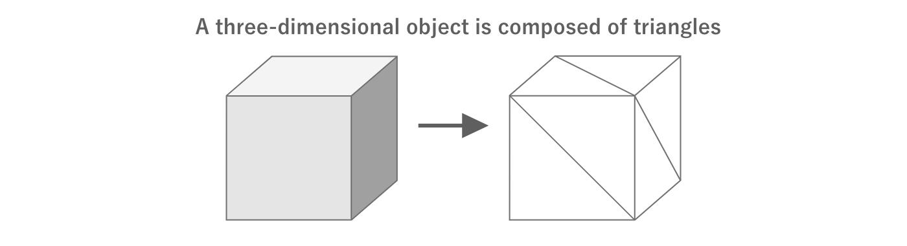
<p><em>VI: <strong>▲ Figure 2.23 — Tạo hình 3D bằng cách kết hợp TAM GIÁC.</strong> / EN: Figure 2.23 — 3D by combining triangles.</em></p>


<p><em>VI: <strong>▲ Figure 2.24 — Thông tin Vertex</strong> — mọi vertex của một mesh được lưu trong MỘT MẢNG. / EN: Figure 2.24 — Vertex Information.</em></p>


<p><em>VI: <strong>▲ Figure 2.25 — Vertex Index</strong> — mảng kiểu <code>int</code> chỉ ra vertex NÀO ghép thành tam giác. / EN: Figure 2.25 — Vertex Index.</em></p>

<div class="bilingual-row">
<div class="col-vi">
<blockquote>
<p><em>"Trong 3DCG, <strong>hình dạng BA CHIỀU được biểu diễn bằng cách NỐI NHIỀU TAM GIÁC trong không gian 3D. Tập hợp tam giác này gọi là MESH.</strong></em></p>
<p><em>📍 <strong>Tam giác có thể biểu diễn bằng thông tin TOẠ ĐỘ của BA ĐIỂM trong không gian 3D. Mỗi điểm gọi là VERTEX và toạ độ của chúng gọi là VERTEX COORDINATES. TẤT CẢ thông tin vertex của một mesh được lưu trong MỘT MẢNG DUY NHẤT.</strong></em></p>
<p><em>🔢 <strong>Vì thông tin vertex được lưu trong MỘT mảng, ta cần THÔNG TIN BỔ SUNG để chỉ ra vertex NÀO sẽ được kết hợp để tạo thành tam giác. Cái này gọi là VERTEX INDEX và được biểu diễn dưới dạng MẢNG kiểu <code>int</code>.</strong></em></p>
<p><em>🎨 <strong>Cần thêm thông tin để TEXTURE và CHIẾU SÁNG object. Ví dụ, map một texture cần TOẠ ĐỘ UV. Lighting cũng cần thông tin như VERTEX COLOR, NORMAL, và TANGENT.</strong>"</em></p>
</blockquote>
</div>
<div class="col-en">
<blockquote>
<p><em>"In 3DCG, <strong>a THREE-DIMENSIONAL shape is expressed by CONNECTING MANY TRIANGLES in 3D space. This collection of triangles is called a MESH.</strong></em></p>
<p><em>📍 <strong>The triangles can be represented as the COORDINATE information of THREE POINTS in 3D space. Each of these points is called a VERTEX and its coordinates are called VERTEX COORDINATES. ALL vertex information per mesh is stored in a SINGLE ARRAY.</strong></em></p>
<p><em>🔢 <strong>Since the vertex information is stored in a SINGLE array, we need ADDITIONAL information to indicate WHICH of the vertices will be COMBINED to form a triangle. This is called the VERTEX INDEX and is represented as an ARRAY of type <code>int</code>.</strong></em></p>
<p><em>🎨 <strong>Additional information is needed for TEXTURING and LIGHTING objects. For example, mapping a texture requires UV COORDINATES. Lighting also requires information such as VERTEX COLOR, NORMALS, and TANGENTS.</strong>"</em></p>
</blockquote>
</div>
</div>

**▼ Table 2.3 — Vertex Information** *(nguyên văn — dùng để TÍNH TAY dung lượng mesh)*

| Tên / Name | Dung lượng MỖI VERTEX / Amount of information per vertex |
|---|---|
| **Vertex coordinates** *(toạ độ)* | **float 3 chiều = 12 byte** |
| **UV coordinates** | **float 2 chiều = 8 byte** |
| **Vertex color** | **float 4 chiều = 16 byte** |
| **Normal** *(pháp tuyến)* | **float 3 chiều = 12 byte** |
| **Tangent** *(tiếp tuyến)* | **float 3 chiều = 12 byte** |
| 🧮 **TỔNG nếu dùng TẤT CẢ** | **60 byte / vertex** |

<div class="bilingual-row">
<div class="col-vi">
<p>🔑 <em>"<strong>QUAN TRỌNG là xác định TRƯỚC số vertex và LOẠI thông tin vertex, vì dữ liệu mesh PHÌNH TO khi số vertex và lượng thông tin xử lý bởi MỘT vertex TĂNG LÊN.</strong>"</em></p>
<p>🧮 <strong>Ví dụ tính tay:</strong> một mesh <strong>10.000 vertex</strong> dùng đủ 5 loại thông tin ⇒ <strong>10.000 × 60 byte = 600 KB</strong> chỉ riêng vertex data. Bỏ <code>Vertex color</code> và <code>Tangent</code> ⇒ còn <strong>32 byte/vertex = 320 KB</strong> — <strong>giảm gần một nửa</strong>.</p>
<p>👉 <em>Đây là cơ sở SỐ HỌC cho các setting <strong>Vertex Compression</strong> và <strong>Optimize Mesh Data</strong> ở <a href="../03-senior/01-memory-addressables-networking.md">Module 3</a>.</em></p>
</div>
<div class="col-en">
<p>🔑 <em>"<strong>It is IMPORTANT to determine the NUMBER of vertices and the TYPE of vertex information IN ADVANCE, because mesh data GROWS as the number of vertices and the amount of information handled by a SINGLE vertex INCREASES.</strong>"</em></p>
<p>🧮 <strong>A worked example:</strong> a <strong>10,000-vertex</strong> mesh using all five attributes ⇒ <strong>10,000 × 60 bytes = 600 KB</strong> of vertex data alone. Drop <code>Vertex color</code> and <code>Tangent</code> ⇒ <strong>32 bytes/vertex = 320 KB</strong> — <strong>nearly half</strong>.</p>
<p>👉 <em>This is the ARITHMETIC basis for the <strong>Vertex Compression</strong> and <strong>Optimize Mesh Data</strong> settings in <a href="../03-senior/01-memory-addressables-networking.md">Module 3</a>.</em></p>
</div>
</div>

### 14.4. 🎞️ Keyframe Animation

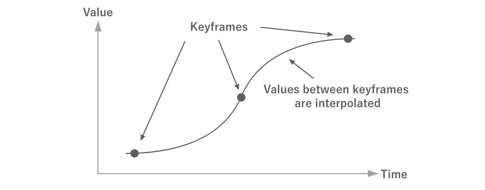
<p><em>VI: <strong>▲ Figure 2.26 — Keyframe.</strong> / EN: Figure 2.26 — Keyframes.</em></p>

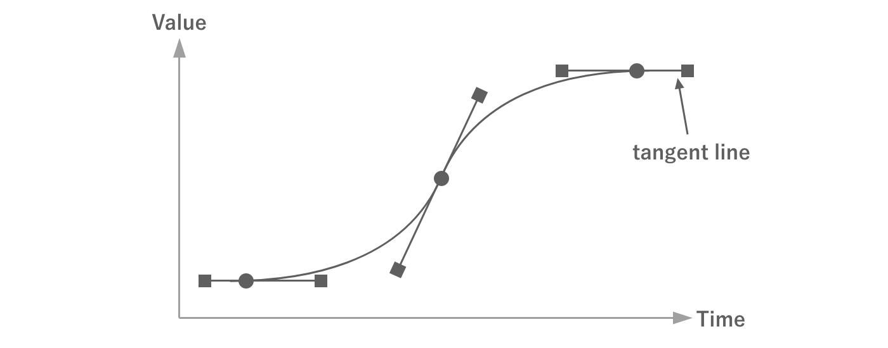
<p><em>VI: <strong>▲ Figure 2.27 — Tangent và Weight.</strong> / EN: Figure 2.27 — Tangents and Weights.</em></p>

<div class="bilingual-row">
<div class="col-vi">
<blockquote>
<p><em>"<strong>KEYFRAME ANIMATION là một trong những cách PHỔ BIẾN NHẤT để hiện thực animation. Một keyframe animation gồm một MẢNG dữ liệu biểu diễn GIÁ TRỊ TẠI MỘT THỜI ĐIỂM (keyframe). Giá trị GIỮA các keyframe được lấy bằng NỘI SUY và có thể xử lý như thể chúng là dữ liệu MƯỢT, LIÊN TỤC.</strong></em></p>
<p><em>💡 <strong>Ngoài THỜI GIAN và GIÁ TRỊ, keyframe còn có thông tin khác như TANGENT và TRỌNG SỐ của chúng. Bằng cách dùng những thứ này trong phép nội suy, animation PHỨC TẠP HƠN có thể đạt được với ÍT DỮ LIỆU HƠN.</strong></em></p>
<p><em>⚖️ <strong>Trong keyframe animation, CÀNG NHIỀU keyframe thì animation CÀNG PHỨC TẠP được. TUY NHIÊN, LƯỢNG DỮ LIỆU cũng TĂNG theo số keyframe. Vì lý do này, số keyframe nên được đặt PHÙ HỢP.</strong></em></p>
<p><em>✅ <strong>Có phương pháp NÉN lượng dữ liệu bằng cách GIẢM số keyframe trong khi GIỮ đường cong GIỐNG NHẤT có thể. Trong Unity, keyframe có thể được giảm trong MODEL IMPORT SETTINGS.</strong>"</em></p>
</blockquote>
</div>
<div class="col-en">
<blockquote>
<p><em>"<strong>KEYFRAME ANIMATION is one of the MOST COMMON ways to achieve animation. A keyframe animation consists of an ARRAY of data representing VALUES AT A CERTAIN TIME (a keyframe). The values BETWEEN keyframes are obtained by INTERPOLATION and can be treated as if they were SMOOTH, CONTINUOUS data.</strong></em></p>
<p><em>💡 <strong>In addition to TIME and VALUE, keyframes have other information such as TANGENTS and their WEIGHTS. By using these in the interpolation calculation, MORE COMPLEX animations can be realized with LESS DATA.</strong></em></p>
<p><em>⚖️ <strong>In keyframe animation, the MORE keyframes there are, the MORE COMPLEX the animation can be. HOWEVER, the AMOUNT OF DATA also INCREASES with the number of keyframes. For this reason, the number of keyframes should be set APPROPRIATELY.</strong></em></p>
<p><em>✅ <strong>There are methods to COMPRESS the amount of data by REDUCING the number of keyframes while KEEPING the curves AS SIMILAR AS POSSIBLE. In Unity, keyframes can be reduced in the MODEL IMPORT SETTINGS.</strong>"</em></p>
</blockquote>
</div>
</div>

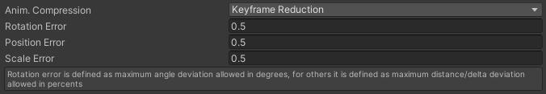
<p><em>VI: <strong>▲ Figure 2.28 — Import Settings</strong> cho animation. / EN: Figure 2.28 — Import Settings.</em></p>

---

## 15. ⚙️ Unity hoạt động BÊN TRONG thế nào

### 15.1. 🔄 C#, IL, IL2CPP và Unity Runtime

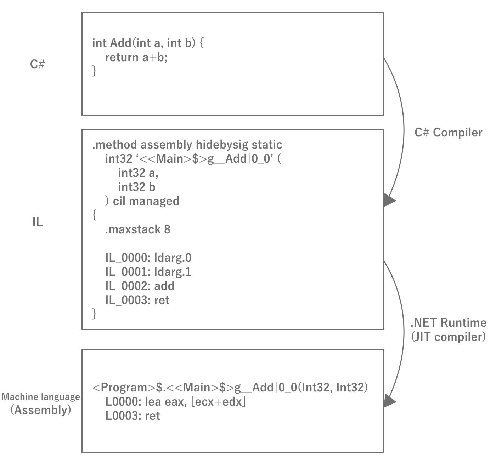
<p><em>VI: <strong>▲ Figure 2.29 — Quá trình biên dịch C#.</strong> / EN: Figure 2.29 — C# Compilation Process.</em></p>

<div class="bilingual-row">
<div class="col-vi">
<blockquote>
<p><em>"C# là ngôn ngữ BIÊN DỊCH. <strong>TUY NHIÊN, C# KHÁC với C truyền thống ở chỗ nó KHÔNG phải NGÔN NGỮ MÁY có thể tự biên dịch và thực thi trên máy, mà là NGÔN NGỮ TRUNG GIAN (Intermediate Language — IL).</strong></em></p>
<p><em>🔑 <strong>Lý do PHẢI đi qua IL một lần: một khi ĐÃ chuyển sang ngôn ngữ máy, binary CHỈ chạy được trên MỘT nền tảng. Với IL, BẤT KỲ nền tảng nào cũng chạy được chỉ bằng cách CHUẨN BỊ MỘT RUNTIME cho nền tảng đó — LOẠI BỎ nhu cầu chuẩn bị binary CHO TỪNG nền tảng.</strong></em></p>
<p><em>✅ <strong>Do đó, nguyên lý CƠ BẢN của Unity là: IL thu được từ biên dịch mã nguồn được THỰC THI TRÊN RUNTIME của môi trường tương ứng, qua đó đạt được TƯƠNG THÍCH ĐA NỀN TẢNG.</strong>"</em></p>
</blockquote>
<p><strong>🔧 Vì sao IL2CPP ra đời — bối cảnh LỊCH SỬ:</strong></p>
<blockquote>
<p><em>"Từ khoảng <strong>2015, một số môi trường bắt đầu có vấn đề: HỖ TRỢ 64-BIT cho app chạy trên iOS và Android.</strong></em></p>
<p><em>🕰️ <strong>Cho tới lúc đó, Unity thực ra dùng MONO — một cài đặt OSS lâu đời của .NET Framework — và Unity TỰ SỬA ĐỔI nó cho mục đích riêng. Nói cách khác, để Unity tương thích 64-bit, CẦN phải làm cho bản Mono đã fork tương thích 64-bit. Tất nhiên việc này ĐÒI HỎI KHỐI LƯỢNG CÔNG VIỆC KHỔNG LỒ.</strong></em></p>
<p><em>💡 <strong>Nên Unity quyết định VƯỢT QUA thách thức này bằng cách phát triển công nghệ gọi là IL2CPP thay thế.</strong></em></p>
<p><em>🔄 <strong>IL2CPP, đúng như tên gọi, là "IL to CPP" — công nghệ CHUYỂN mã IL thành mã C++. Vì C++ là ngôn ngữ ĐA DỤNG được hỗ trợ NATIVE trong MỌI môi trường phát triển, nó có thể được biên dịch thành ngôn ngữ máy trong TỪNG toolchain.</strong></em></p>
<p><em>🚀 <strong>KHÁC với C#, mã C++ được biên dịch thành ngôn ngữ máy LÚC BUILD — LOẠI BỎ nhu cầu chuyển sang ngôn ngữ máy LÚC RUNTIME và CẢI THIỆN HIỆU NĂNG.</strong></em></p>
<p><em>⚖️ <strong>Tuy mã C++ nhìn chung có nhược điểm là BUILD LÂU, công nghệ IL2CPP đã trở thành NỀN TẢNG của Unity — giải quyết CẢ tương thích 64-bit LẪN hiệu năng TRONG MỘT CÚ.</strong>"</em></p>
</blockquote>
<p>👉 <em>Bổ sung cho <a href="../03-senior/01-memory-addressables-networking.md">Module 3</a> về IL2CPP vs Mono — đây là phần "vì sao lịch sử" mà tài liệu Unity không kể.</em></p>
</div>
<div class="col-en">
<blockquote>
<p><em>"C# is a COMPILER language. <strong>HOWEVER, C# DIFFERS from traditional C in that it is NOT a MACHINE LANGUAGE that can be compiled and executed by itself on a machine, but rather an INTERMEDIATE LANGUAGE (IL).</strong></em></p>
<p><em>🔑 <strong>The reason for interrupting with IL once: once converted to machine language, the binary can ONLY be executed on a SINGLE platform. With IL, ANY platform can run simply by PREPARING A RUNTIME for that platform — ELIMINATING the need to prepare binaries FOR EACH platform.</strong></em></p>
<p><em>✅ <strong>Therefore, the BASIC PRINCIPLE of Unity is that the IL obtained by compiling the source code is EXECUTED ON THE RUNTIME for the respective environment, thereby achieving MULTI-PLATFORM COMPATIBILITY.</strong>"</em></p>
</blockquote>
<p><strong>🔧 Why IL2CPP exists — the HISTORICAL context:</strong></p>
<blockquote>
<p><em>"Starting around <strong>2015, some environments started having problems: 64-BIT SUPPORT for apps running on iOS and Android.</strong></em></p>
<p><em>🕰️ <strong>Until then, Unity actually used MONO — a long-standing OSS implementation of the .NET Framework — and Unity ITSELF MODIFIED it for its own use. In other words, for Unity to become 64-bit compatible, it was NECESSARY to make the FORKED Mono 64-bit compatible. Of course, this would require a TREMENDOUS amount of work.</strong></em></p>
<p><em>💡 <strong>So Unity OVERCAME this challenge by developing a technology called IL2CPP instead.</strong></em></p>
<p><em>🔄 <strong>IL2CPP, as the name suggests, is "IL to CPP" — a technology that CONVERTS IL code to C++ code. Since C++ is a HIGHLY VERSATILE language NATIVELY SUPPORTED in ANY development environment, it can be compiled into machine language in EACH toolchain.</strong></em></p>
<p><em>🚀 <strong>UNLIKE C#, C++ code is compiled into machine language AT BUILD TIME — ELIMINATING the need to convert it to machine language AT RUNTIME and IMPROVING PERFORMANCE.</strong></em></p>
<p><em>⚖️ <strong>Although C++ code generally has the disadvantage of taking a LONG TIME TO BUILD, IL2CPP has become a CORNERSTONE of Unity — solving BOTH 64-bit compatibility AND performance IN ONE FELL SWOOP.</strong>"</em></p>
</blockquote>
<p>👉 <em>Complements <a href="../03-senior/01-memory-addressables-networking.md">Module 3</a> on IL2CPP vs Mono — this is the "historical why" that Unity's docs omit.</em></p>
</div>
</div>

!!! tip "🔬 ĐỌC mã IL — thói quen của kỹ sư tối ưu"
    <div class="bilingual-row">
    <div class="col-vi">
    <blockquote>
    <p><em>"Mã IL — thứ thường HIẾM KHI được nhìn thấy — <strong>RẤT QUAN TRỌNG để Ý THỨC về hiệu năng như cấp phát bộ nhớ và tốc độ thực thi.</strong></em></p>
    <p><em>📌 <strong>Ví dụ, một MẢNG và một LIST sẽ xuất ra MÃ IL KHÁC NHAU cho CÙNG một vòng <code>foreach</code> — thoạt nhìn thì giống, nhưng MẢNG cho mã hiệu năng TỐT HƠN. Bạn cũng có thể tìm ra những HEAP ALLOCATION ẨN KHÔNG NGỜ TỚI.</strong></em></p>
    <p><em>✅ <strong>Để có CẢM GIÁC về tương ứng giữa C# và mã IL, KHUYẾN NGHỊ thường xuyên KIỂM TRA kết quả chuyển đổi IL của mã C# bạn viết.</strong></em></p>
    <p><em>🛠️ <strong>Bạn có thể xem mã IL trong IDE như Visual Studio hay Rider, nhưng bản thân mã IL là ngôn ngữ KHÓ HIỂU vì nó là ngôn ngữ CẤP THẤP kiểu assembly. Trong trường hợp đó, bạn có thể dùng dịch vụ web <a href="https://sharplab.io/">SharpLab</a> để kiểm tra C# → IL → C# và ngược lại, giúp mã IL DỄ HIỂU HƠN.</strong>"</em></p>
    </blockquote>
    </div>
    <div class="col-en">
    <blockquote>
    <p><em>"IL code — which is usually RARELY SEEN — is <strong>VERY IMPORTANT for being AWARE of performance such as memory allocation and execution speed.</strong></em></p>
    <p><em>📌 <strong>For example, an ARRAY and a LIST will output DIFFERENT IL CODE for the SAME <code>foreach</code> loop at first glance, with the ARRAY being the BETTER-PERFORMING code. You may also find UNINTENDED HIDDEN HEAP ALLOCATIONS.</strong></em></p>
    <p><em>✅ <strong>In order to acquire a SENSE of the correspondence between C# and IL code, it is RECOMMENDED to check the IL conversion results of C# code you have written ON A REGULAR BASIS.</strong></em></p>
    <p><em>🛠️ <strong>You can view IL code in IDEs such as Visual Studio or Rider, but IL code itself is a DIFFICULT language to understand because it is a LOW-LEVEL assembly language. In such cases, you can use the web service <a href="https://sharplab.io/">SharpLab</a> to check C# → IL → C# and vice versa, making the IL code EASIER to understand.</strong>"</em></p>
    </blockquote>
    </div>
    </div>

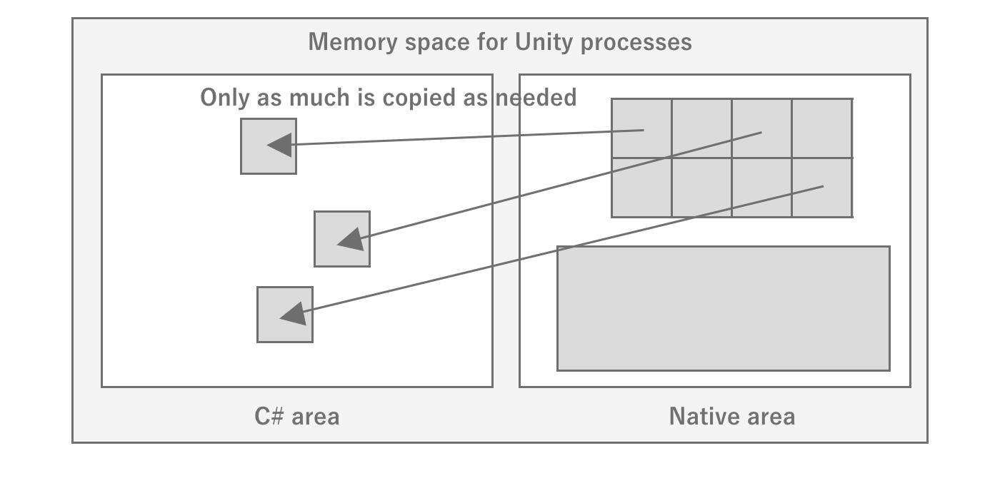
<p><em>VI: <strong>▲ Figure 2.30 — Hình dung trạng thái bộ nhớ trong Unity</strong> — hai vùng: ENGINE (native) và USER CODE (C#). / EN: Figure 2.30 — Image of memory state in Unity.</em></p>

!!! danger "🌉 HAI THẾ GIỚI: Engine (C++) và User Code (C#) — nguồn gốc của MỌI chi phí ẩn"
    <div class="bilingual-row">
    <div class="col-vi">
    <blockquote>
    <p><em>"Tuy Unity cho phép lập trình game bằng C#, <strong>BẢN THÂN runtime của Unity — gọi là ENGINE — THỰC RA KHÔNG chạy bằng C#. Mã nguồn được viết bằng C++, và phần gọi là PLAYER được phân phối ở dạng ĐÃ BUILD SẴN cho từng môi trường.</strong></em></p>
    <p><em><strong>BA lý do Unity viết engine bằng C++:</strong></em></p>
    <ol>
    <li><em><strong>"Để đạt hiệu năng NHANH và TIẾT KIỆM BỘ NHỚ"</strong></em></li>
    <li><em><strong>"Để hỗ trợ CÀNG NHIỀU nền tảng CÀNG TỐT"</strong></em></li>
    <li><em><strong>"Để BẢO VỆ QUYỀN SỞ HỮU TRÍ TUỆ của engine (hộp đen)"</strong></em></li>
    </ol>
    <p><em>🌉 <strong>Vì mã C# do lập trình viên viết chạy bằng C#, Unity CẦN HAI VÙNG: phần ENGINE chạy NATIVE, và phần USER CODE chạy ở C# runtime. Engine và user code làm việc bằng cách TRAO ĐỔI DỮ LIỆU khi cần trong lúc thực thi.</strong></em></p>
    <p><em>📖 <strong>Ví dụ: khi <code>GameObject.transform</code> được gọi từ C#, TOÀN BỘ trạng thái thực thi game (như trạng thái scene) được quản lý BÊN TRONG ENGINE — nên nó TRƯỚC HẾT thực hiện một NATIVE CALL để truy cập dữ liệu bộ nhớ ở vùng native rồi MỚI trả giá trị về C#.</strong></em></p>
    <p><em>🚨 <strong>QUAN TRỌNG: BỘ NHỚ KHÔNG ĐƯỢC CHIA SẺ giữa C# và native — nên dữ liệu C# cần được CẤP PHÁT Ở PHÍA C# MỖI LẦN cần dùng. Lời gọi API cũng ĐẮT vì có native call xảy ra, nên kỹ thuật tối ưu CACHE giá trị mà KHÔNG gọi thường xuyên là CẦN THIẾT.</strong>"</em></p>
    </blockquote>
    <p>👉 <em>Đây là lời giải thích CĂN NGUYÊN cho MỌI lời khuyên "cache <code>transform</code>", "cache <code>GetComponent</code>", "tránh gọi API Unity trong vòng lặp" xuyên suốt Module 1–4.</em></p>
    <p>💡 <em>"Unity đã CÔNG KHAI phần mã nguồn C# trên <a href="https://github.com/Unity-Technologies/UnityCsReference">GitHub</a>, nên bạn có thể thấy <strong>PHẦN LỚN là native call</strong> — RẤT HỮU ÍCH."</em></p>
    </div>
    <div class="col-en">
    <blockquote>
    <p><em>"Although Unity allows developers to program games in C#, <strong>the runtime of Unity ITSELF — called the ENGINE — does NOT actually run in C#. The source is written in C++, and the part called the PLAYER is distributed PRE-BUILT to run in each environment.</strong></em></p>
    <p><em><strong>THREE reasons Unity writes its engine in C++:</strong></em></p>
    <ol>
    <li><em><strong>"To get FAST and MEMORY-SAVING performance"</strong></em></li>
    <li><em><strong>"To support AS MANY PLATFORMS as possible"</strong></em></li>
    <li><em><strong>"To PROTECT the INTELLECTUAL PROPERTY rights of the engine (black box)"</strong></em></li>
    </ol>
    <p><em>🌉 <strong>Since the C# code written by the developer runs in C#, Unity requires TWO AREAS: the ENGINE part, which runs NATIVELY, and the USER CODE part, which runs at C# runtime. The engine and user code work by EXCHANGING DATA as needed during execution.</strong></em></p>
    <p><em>📖 <strong>For example: when <code>GameObject.transform</code> is called from C#, ALL game execution state (such as scene state) is managed INSIDE THE ENGINE — so it FIRST makes a NATIVE CALL to access memory data in the native area and THEN returns values to C#.</strong></em></p>
    <p><em>🚨 <strong>IMPORTANT: MEMORY IS NOT SHARED between C# and native — so data needed by C# is ALLOCATED ON THE C# SIDE EACH TIME it is needed. API calls are ALSO EXPENSIVE, with native calls occurring, so an optimization technique of CACHING VALUES without frequent calls is NECESSARY.</strong>"</em></p>
    </blockquote>
    <p>👉 <em>This is the ROOT explanation for EVERY "cache the <code>transform</code>", "cache <code>GetComponent</code>", "avoid Unity API calls in loops" piece of advice across Modules 1–4.</em></p>
    <p>💡 <em>"Unity has made the C# part of the source code available on <a href="https://github.com/Unity-Technologies/UnityCsReference">GitHub</a>, so you can see that <strong>it is MOSTLY NATIVE CALLS</strong> — very helpful."</em></p>
    </div>
    </div>

### 15.2. 📦 Thực thể của ASSET nằm ở NATIVE

<div class="bilingual-row">
<div class="col-vi">
<blockquote>
<p><em>"Vì Unity engine chạy native, <strong>về cơ bản nó KHÔNG có dữ liệu ở phía C#. Điều tương tự đúng với việc xử lý ASSET: asset được LOAD ở VÙNG NATIVE, và CHỈ THAM CHIẾU được trả về C#, hoặc dữ liệu được SAO CHÉP rồi trả về.</strong></em></p>
<p><em><strong>Do đó có HAI cách chính để load asset:</strong></em></p>
<ol>
<li>✅ <em><strong>CHỈ ĐỊNH ĐƯỜNG DẪN để load ở phía Unity engine</strong> ⇒ <strong>phía C# KHÔNG tiêu tốn bộ nhớ vì nó được load ở vùng native</strong></em></li>
<li>💀 <em><strong>TRUYỀN dữ liệu THÔ như MẢNG BYTE trực tiếp cho engine</strong> ⇒ <strong>NẾU dữ liệu như mảng byte được load và xử lý TỪ phía C# rồi truyền sang, BỘ NHỚ BỊ TIÊU TỐN GẤP ĐÔI ở CẢ phía C# LẪN native</strong></em></li>
</ol>
</blockquote>
<p>🕵️ <strong>Hệ quả cho việc ĐIỀU TRA rò rỉ:</strong></p>
<blockquote>
<p><em>"Vì thực thể asset nằm ở phía native, <strong>ĐỘ KHÓ của việc điều tra load asset TRÙNG LẶP và RÒ RỈ TĂNG LÊN. Bởi vì lập trình viên chủ yếu tập trung profiling và debug ở PHÍA C#.</strong></em></p>
<p><em>⚠️ <strong>RẤT KHÓ để hiểu trạng thái thực thi phía C# MỘT MÌNH — CẦN phân tích bằng cách ĐỐI CHIẾU với trạng thái thực thi phía ENGINE. Việc profiling vùng native PHỤ THUỘC vào API do Unity cung cấp, điều này GIỚI HẠN các công cụ khả dụng.</strong>"</em></p>
</blockquote>
</div>
<div class="col-en">
<blockquote>
<p><em>"Since the Unity engine runs natively, <strong>it basically has NO DATA on the C# side. The same is true for the handling of ASSETS: assets are LOADED in the NATIVE AREA, and ONLY REFERENCES are returned to C#, or data is COPIED and returned.</strong></em></p>
<p><em><strong>Therefore, there are TWO main ways to load assets:</strong></em></p>
<ol>
<li>✅ <em><strong>SPECIFY A PATH to load on the Unity engine side</strong> ⇒ <strong>the C# side does NOT consume memory because it is loaded in the native area</strong></em></li>
<li>💀 <em><strong>PASS RAW DATA such as BYTE ARRAYS directly to the engine</strong> ⇒ <strong>IF data such as a byte array is loaded and processed FROM the C# side and passed over, MEMORY IS DOUBLY CONSUMED on BOTH the C# AND native sides</strong></em></li>
</ol>
</blockquote>
<p>🕵️ <strong>The consequence for LEAK investigation:</strong></p>
<blockquote>
<p><em>"Since the asset entity is on the native side, <strong>the DIFFICULTY of investigating DUPLICATE asset loads and LEAKS INCREASES. This is because developers mainly focus on profiling and debugging THE C# SIDE.</strong></em></p>
<p><em>⚠️ <strong>It is DIFFICULT to understand the C# side execution state ALONE — it is NECESSARY to analyze it by COMPARING it with the ENGINE side execution state. Profiling of the native area is DEPENDENT on the API provided by Unity, which LIMITS the tools available.</strong>"</em></p>
</blockquote>
</div>
</div>

### 15.3. 🧵 Threads — Main, Render và Worker

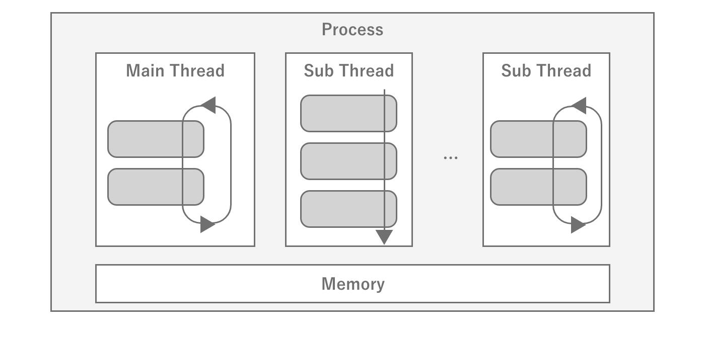
<p><em>VI: <strong>▲ Figure 2.31 — Sơ đồ THREAD.</strong> / EN: Figure 2.31 — Schematic diagram of a thread.</em></p>

<div class="bilingual-row">
<div class="col-vi">
<blockquote>
<p><em>"<strong>THREAD là ĐƠN VỊ thực thi chương trình</strong>, và việc xử lý nhìn chung tiến hành bằng cách TẠO NHIỀU thread trong MỘT tiến trình.</em></p>
<p><em>🔄 <strong>Vì MỘT NHÂN CPU CHỈ xử lý được MỘT thread TẠI MỘT THỜI ĐIỂM, nó thực thi chương trình bằng cách CHUYỂN ĐỔI giữa các thread ở TỐC ĐỘ CAO. Cái này gọi là CONTEXT SWITCH. Context switch GÂY OVERHEAD, nên NẾU xảy ra THƯỜNG XUYÊN, hiệu suất xử lý bị GIẢM.</strong></em></p>
<p><em>🔑 <strong>Vòng lặp game của Unity được THIẾT KẾ để chạy trên MỘT THREAD DUY NHẤT, nên script do người dùng viết về cơ bản SẼ CHẠY TRÊN MAIN THREAD. Ngược lại, việc cố gọi Unity API từ thread KHÁC main thread SẼ GÂY LỖI với HẦU HẾT các API.</strong>"</em></p>
</blockquote>
<p>📶 <strong><code>WaitFor~</code> — hiểu đúng những gì bạn thấy trong Profiler:</strong></p>
<blockquote>
<p><em>"Nếu bạn TẠO một thread khác từ main thread, <strong>bạn KHÔNG BIẾT khi nào thread đó được thực thi và khi nào hoàn tất. Do đó, phương tiện ĐỒNG BỘ xử lý giữa các thread là dùng CƠ CHẾ TÍN HIỆU (signal).</strong></em></p>
<p><em>🔍 <strong>Việc CHỜ TÍN HIỆU này CŨNG được dùng BÊN TRONG Unity và có thể QUAN SÁT được lúc profiling — nhưng QUAN TRỌNG là phải lưu ý rằng nó CHỈ ĐANG CHỜ một tiến trình khác, ĐÚNG NHƯ CÁI TÊN <code>WaitFor~</code> gợi ý.</strong>"</em></p>
</blockquote>
<p>👉 <em>Đây là chìa khoá đọc <code>Gfx.WaitForPresent</code> / <code>Gfx.WaitForCommands</code> ở <a href="../01-fresher/01-ultimate-guide-to-profiling.md">Module 1 §3</a>: <strong>chúng là THỜI GIAN CHỜ, KHÔNG phải thời gian LÀM VIỆC.</strong></em></p>
</div>
<div class="col-en">
<blockquote>
<p><em>"<strong>A THREAD is a UNIT of program execution</strong>, and processing generally proceeds by CREATING MULTIPLE threads within a SINGLE process.</em></p>
<p><em>🔄 <strong>Since a SINGLE CORE of the CPU can ONLY process ONE thread AT A TIME, it executes the program while SWITCHING between threads AT HIGH SPEED. This is called a CONTEXT SWITCH. Context switches incur OVERHEAD, so IF they occur FREQUENTLY, processing efficiency is REDUCED.</strong></em></p>
<p><em>🔑 <strong>Unity's game loop is DESIGNED to run on a SINGLE THREAD, so scripts written by users will basically RUN ON THE MAIN THREAD. Conversely, attempting to call Unity APIs from a thread OTHER THAN the main thread will result in an ERROR for MOST APIs.</strong>"</em></p>
</blockquote>
<p>📶 <strong><code>WaitFor~</code> — reading what you see in the Profiler correctly:</strong></p>
<blockquote>
<p><em>"If you CREATE another thread from the main thread, <strong>you do NOT KNOW when that thread will be executed and when it will COMPLETE. Therefore, the means to SYNCHRONIZE processing between threads is to use the SIGNAL mechanism.</strong></em></p>
<p><em>🔍 <strong>This signal waiting is ALSO used WITHIN Unity and can be OBSERVED during profiling — but it is IMPORTANT to note that it is JUST WAITING for another process, as the name <code>WaitFor~</code> implies.</strong>"</em></p>
</blockquote>
<p>👉 <em>This is the key to reading <code>Gfx.WaitForPresent</code> / <code>Gfx.WaitForCommands</code> in <a href="../01-fresher/01-ultimate-guide-to-profiling.md">Module 1 §3</a>: <strong>they are WAITING time, NOT WORKING time.</strong></em></p>
</div>
</div>

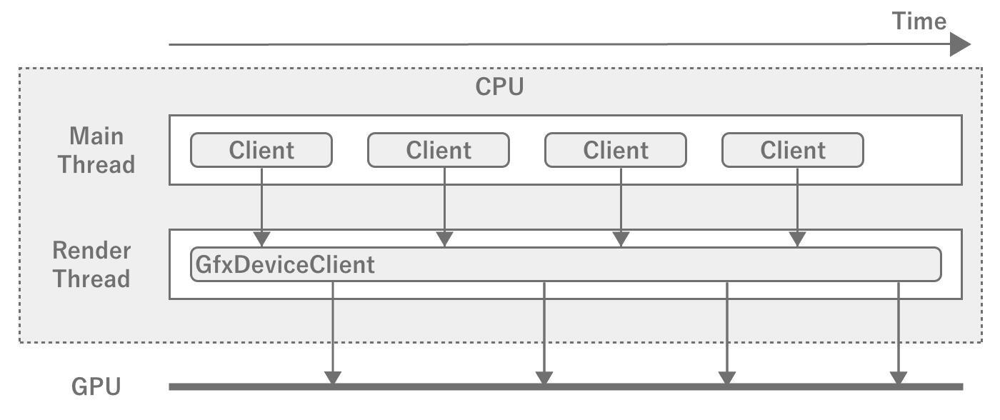
<p><em>VI: <strong>▲ Figure 2.32 — Main Thread và Render Thread.</strong> / EN: Figure 2.32 — Main Thread and Render Thread.</em></p>

!!! danger "⛓️ Main Thread và Render Thread chạy như PIPELINE — và vì sao CẢ HAI đều giết FPS"
    <div class="bilingual-row">
    <div class="col-vi">
    <blockquote>
    <p><em>"Để đạt tốc độ, <strong>một số xử lý SONG SONG được dùng BÊN TRONG game engine. Một trong số đó là RENDER THREAD — đúng như tên gọi, một thread CHUYÊN cho rendering, chịu trách nhiệm GỬI thông tin vẽ frame (đã tính bởi main thread) TỚI GPU dưới dạng GRAPHICS COMMAND.</strong></em></p>
    <p><em>⛓️ <strong>Main thread và render thread chạy NHƯ MỘT PIPELINE — nên render thread BẮT ĐẦU tính frame TIẾP THEO trong khi render thread đang xử lý nó.</strong></em></p>
    <p><em>💀 <strong>TUY NHIÊN, NẾU thời gian xử lý một frame trong RENDER THREAD ngày càng DÀI, nó SẼ KHÔNG THỂ bắt đầu vẽ frame tiếp theo NGAY CẢ KHI phép tính cho frame tiếp theo ĐÃ XONG — và MAIN THREAD SẼ PHẢI CHỜ.</strong></em></p>
    <p><em>🎯 <strong>Trong phát triển game, hãy Ý THỨC rằng FPS SẼ TỤT nếu MAIN THREAD HOẶC RENDER THREAD trở nên QUÁ NẶNG.</strong>"</em></p>
    </blockquote>
    </div>
    <div class="col-en">
    <blockquote>
    <p><em>"To achieve speed, <strong>a number of PARALLEL processes are used INSIDE the game engine. One of them is the RENDER THREAD — as the name suggests, a thread DEDICATED to rendering, responsible for SENDING the frame drawing information (calculated by the main thread) TO THE GPU as GRAPHICS COMMANDS.</strong></em></p>
    <p><em>⛓️ <strong>The main thread and the render thread run LIKE A PIPELINE — so the render thread STARTS computing the NEXT frame while the render thread is processing it.</strong></em></p>
    <p><em>💀 <strong>HOWEVER, IF the time to process a frame in the RENDER THREAD is getting LONGER, it will NOT be able to start drawing the next frame EVEN IF the calculation for the next frame is FINISHED — and the MAIN THREAD WILL HAVE TO WAIT.</strong></em></p>
    <p><em>🎯 <strong>In game development, be AWARE that the FPS WILL DROP if EITHER the main thread OR the render thread becomes TOO HEAVY.</strong>"</em></p>
    </blockquote>
    </div>
    </div>

<div class="bilingual-row">
<div class="col-vi">
<p>👷 <strong>WORKER THREAD và JobSystem:</strong></p>
<blockquote>
<p><em>"Ngoài ra, có NHIỀU tác vụ tính toán có thể thực thi SONG SONG — như <strong>physics engine</strong> và <strong>rung lắc (shaking)</strong> — vốn ĐẶC THÙ cho game.</em></p>
<p><em>✅ <strong>Để thực thi những phép tính đó NGOÀI main thread, Unity có WORKER THREAD. Worker thread thực thi các TÁC VỤ TÍNH TOÁN sinh ra qua JOBSYSTEM.</strong></em></p>
<p><em>💪 <strong>NẾU bạn có thể GIẢM tải xử lý trên main thread bằng cách dùng JobSystem, BẠN NÊN TÍCH CỰC dùng nó. Tất nhiên, bạn cũng có thể TỰ TẠO thread riêng mà KHÔNG dùng JobSystem.</strong>"</em></p>
</blockquote>
</div>
<div class="col-en">
<p>👷 <strong>WORKER THREADS and the JobSystem:</strong></p>
<blockquote>
<p><em>"In addition, there are MANY calculation tasks that CAN be executed in PARALLEL — such as the <strong>physics engine</strong> and <strong>shaking</strong> — which are UNIQUE to games.</em></p>
<p><em>✅ <strong>In order to execute such calculations OUTSIDE the main thread, Unity has WORKER THREADS. Worker threads execute the COMPUTATION TASKS generated through the JOBSYSTEM.</strong></em></p>
<p><em>💪 <strong>IF you can REDUCE the processing load on the main thread by using JobSystem, you SHOULD ACTIVELY USE IT. Of course, you can also GENERATE YOUR OWN threads without using JobSystem.</strong>"</em></p>
</blockquote>
</div>
</div>

### 15.4. 🔁 Game Loop & thứ tự sự kiện

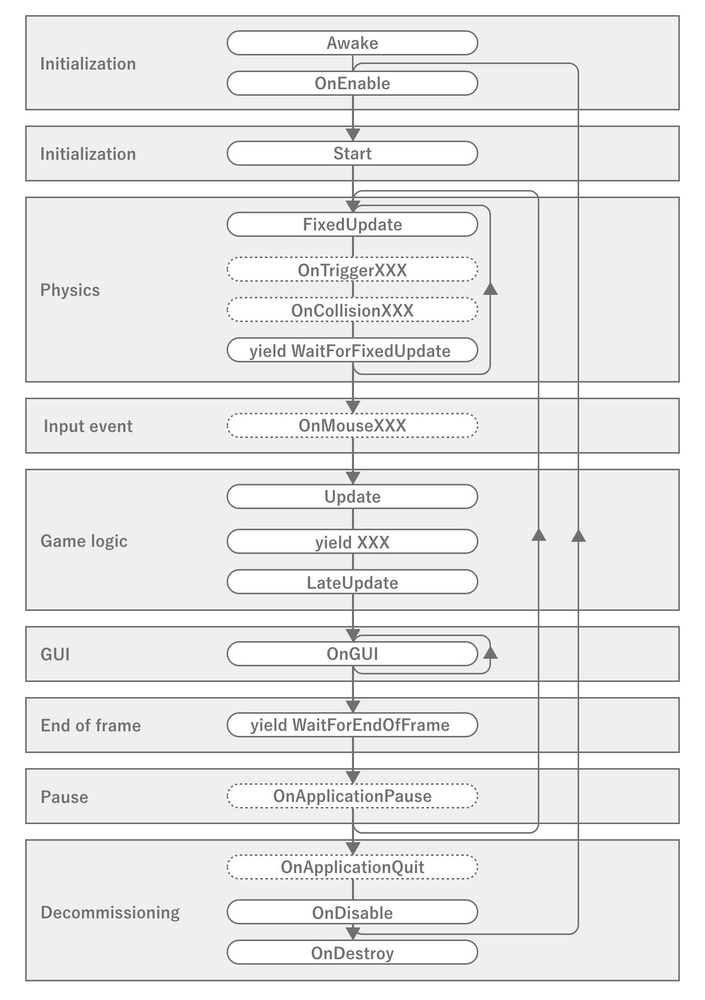
<p><em>VI: <strong>▲ Figure 2.33 — Thứ tự thực thi SỰ KIỆN trong Unity.</strong> / EN: Figure 2.33 — Event Execution Order in Unity.</em></p>

<div class="bilingual-row">
<div class="col-vi">
<blockquote>
<p><em>"Sơ đồ này <strong>NGHIÊM NGẶT mà nói là thể hiện THỨ TỰ THỰC THI SỰ KIỆN trong MonoBehaviour — KHÁC với game loop của game engine — nhưng ĐỦ cho game loop mà lập trình viên NÊN BIẾT.</strong></em></p>
<p><em>🔑 <strong>ĐẶC BIỆT QUAN TRỌNG là các sự kiện: <code>Awake</code>, <code>OnEnable</code>, <code>Start</code>, <code>FixedUpdate</code>, <code>Update</code>, <code>LateUpdate</code>, <code>OnDisable</code>, <code>OnDestroy</code> — và thời điểm của các COROUTINE.</strong></em></p>
<p><em>💀 <strong>NHẦM LẪN thứ tự thực thi hoặc thời điểm của sự kiện có thể dẫn tới RÒ RỈ BỘ NHỚ KHÔNG NGỜ hoặc TÍNH TOÁN THỪA. Do đó, bạn NÊN Ý THỨC về BẢN CHẤT thời điểm gọi sự kiện quan trọng và thứ tự thực thi TRONG CÙNG một sự kiện.</strong>"</em></p>
</blockquote>
<p>⚛️ <strong>Vì sao PHYSICS chạy ở NHỊP KHÁC — và hai rủi ro:</strong></p>
<blockquote>
<p><em>"Có vấn đề CỤ THỂ với phép tính physics: <strong>object có thể XUYÊN QUA nhau mà KHÔNG bị phát hiện va chạm NẾU chúng được thực thi ở CÙNG NHỊP với game loop thông thường. Vì lý do này, các routine physics thường được LẶP ở NHỊP KHÁC với game loop để chúng được thực thi ở TẦN SUẤT CAO.</strong></em></p>
<p><em>⚠️ <strong>TUY NHIÊN, NẾU các vòng lặp chạy ở nhịp RẤT NHANH, CÓ KHẢ NĂNG chúng XUNG ĐỘT với quá trình cập nhật của game loop chính — nên CẦN đồng bộ các tiến trình ở mức độ nhất định.</strong></em></p>
<p><em>🚨 <strong>Do đó, hãy Ý THỨC về khả năng:</strong></em></p>
<ul>
<li><em><strong>Phép tính physics có thể ẢNH HƯỞNG tới quá trình vẽ frame NẾU physics NẶNG HƠN mức cần thiết</strong></em></li>
<li><em><strong>Phép tính physics có thể bị TRỄ và XUYÊN QUA NẾU quá trình vẽ frame NẶNG</strong></em></li>
</ul>
</blockquote>
<p>👉 <em>Đây là giải thích BỔ SUNG cho <strong>"vòng xoáy tử thần Fixed Timestep"</strong> ở <a href="../02-junior/01-ui-physics-deep-dive.md">Module 2</a>.</em></p>
</div>
<div class="col-en">
<blockquote>
<p><em>"This diagram <strong>STRICTLY shows the ORDER OF EXECUTION OF EVENTS in MonoBehaviour — which is DIFFERENT from the game engine's game loop — but is SUFFICIENT for the game loop that developers SHOULD KNOW.</strong></em></p>
<p><em>🔑 <strong>ESPECIALLY IMPORTANT are the events: <code>Awake</code>, <code>OnEnable</code>, <code>Start</code>, <code>FixedUpdate</code>, <code>Update</code>, <code>LateUpdate</code>, <code>OnDisable</code>, <code>OnDestroy</code> — and the timing of the various COROUTINES.</strong></em></p>
<p><em>💀 <strong>MISTAKING the order of execution or timing of events can lead to UNEXPECTED MEMORY LEAKS or EXTRA CALCULATIONS. Therefore, you SHOULD be AWARE of the NATURE of important event call timing and the order of execution WITHIN the same event.</strong>"</em></p>
</blockquote>
<p>⚛️ <strong>Why PHYSICS runs at a DIFFERENT rate — and the two risks:</strong></p>
<blockquote>
<p><em>"There are SPECIFIC problems with physics calculations: <strong>objects SLIPPING THROUGH without being detected as collisions IF they are executed at the SAME INTERVALS as the normal game loop. For this reason, physics routines are usually LOOPED at DIFFERENT INTERVALS from the game loop so that they are executed at a HIGH FREQUENCY.</strong></em></p>
<p><em>⚠️ <strong>HOWEVER, IF the loops run at a VERY FAST interval, there is a POSSIBILITY that they will CONFLICT with the update process of the main game loop — so it is NECESSARY to synchronize the processes to a certain extent.</strong></em></p>
<p><em>🚨 <strong>Therefore, be AWARE of the possibility that:</strong></em></p>
<ul>
<li><em><strong>Physics operations may AFFECT the frame drawing process IF physics is HEAVIER than necessary</strong></em></li>
<li><em><strong>Physics operations may be DELAYED and SLIP THROUGH IF the frame drawing process is HEAVY</strong></em></li>
</ul>
</blockquote>
<p>👉 <em>This is a COMPLEMENTARY explanation for the <strong>"Fixed Timestep death spiral"</strong> in <a href="../02-junior/01-ui-physics-deep-dive.md">Module 2</a>.</em></p>
</div>
</div>

### 15.5. 💀 GameObject — Cái bẫy `== null` GÂY RÒ RỈ BỘ NHỚ

```csharp
// ▼ List 2.1 — Test tham chiếu SAU KHI destroy (nguyên văn từ sách)
// Post-destruction reference test (verbatim from the book)
public class DestroyTest : UnityEngine.MonoBehaviour
{
    private UnityEngine.GameObject _gameObject;

    private void Start()
    {
        _gameObject = new UnityEngine.GameObject("test");
        StartCoroutine(DelayedDestroy());
    }

    System.Collections.IEnumerator DelayedDestroy()
    {
        // cache WaitForSeconds to reuse
        var waitOneSecond = new UnityEngine.WaitForSeconds(1f);
        yield return waitOneSecond;
        Destroy(_gameObject);
        yield return waitOneSecond;
        // _gameObject is not null, but result is true
        UnityEngine.Debug.Log(_gameObject == null);
    }
}
```

```csharp
// ▼ List 2.2 — Cài đặt toán tử == của UnityEngine.Object (nguyên văn)
// UnityEngine.Object's == operator implementation (verbatim)
public static bool operator==(Object x, Object y) {
    return CompareBaseObjects(x, y);
}

static bool CompareBaseObjects(UnityEngine.Object lhs, UnityEngine.Object rhs)
{
    bool lhsNull = ((object)lhs) == null;
    bool rhsNull = ((object)rhs) == null;
    if (rhsNull && lhsNull) return true;
    if (rhsNull) return !IsNativeObjectAlive(lhs);
    if (lhsNull) return !IsNativeObjectAlive(rhs);
    return lhs.m_InstanceID == rhs.m_InstanceID;
}

static bool IsNativeObjectAlive(UnityEngine.Object o)
{
    if (o.GetCachedPtr() != IntPtr.Zero)
        return true;
    if (o is MonoBehaviour || o is ScriptableObject)
        return false;
    return DoesObjectWithInstanceIDExist(o.GetInstanceID());
}
```

!!! danger "☠️ RÒ RỈ BỘ NHỚ do `== null` trả về `true` NHƯNG object KHÔNG null"
    <div class="bilingual-row">
    <div class="col-vi">
    <blockquote>
    <p><em>"Trong <strong>List 2.1</strong>, ta kiểm tra xem GameObject ĐÃ BỊ DESTROY có <code>null</code> không, và <strong><code>true</code> được in ra log.</strong></em></p>
    <p><em>🤔 <strong>Điều này KHÔNG TỰ NHIÊN với hành vi C# CHUẨN, vì <code>_gameObject</code> KHÔNG được gán <code>null</code> — nên VẪN PHẢI CÒN một tham chiếu tới instance kiểu GameObject.</strong></em></p>
    <p><em>🔬 <strong>Nguyên nhân: cơ chế phía C# của Unity KIỂM SOÁT truy cập tới dữ liệu đã bị destroy.</strong> Xem <strong>List 2.2</strong>.</em></p>
    <p><em>📝 <strong>TÓM LẠI: phép so sánh <code>null</code> với một instance đã destroy trả về <code>true</code> vì KHI so sánh null, phía NATIVE được KIỂM TRA xem dữ liệu có TỒN TẠI hay không. Điều này khiến instance GameObject KHÔNG null lại HÀNH XỬ NHƯ THỂ nó null MỘT PHẦN.</strong></em></p>
    <p><em>💀 <strong>Tuy đặc tính này THOẠT NHÌN có vẻ TIỆN, nó cũng có khía cạnh RẤT PHIỀN TOÁI. Bởi vì <code>_gameObject</code> THỰC RA KHÔNG null — điều này GÂY RA RÒ RỈ BỘ NHỚ.</strong></em></p>
    <p><em>🚨 <strong>Rò rỉ cho MỘT <code>_gameObject</code> thì HIỂN NHIÊN, NHƯNG NẾU bạn giữ tham chiếu tới một KHỐI DỮ LIỆU KHỔNG LỒ — ví dụ một MASTER DATA — từ bên trong component đó, nó SẼ DẪN TỚI RÒ RỈ BỘ NHỚ KHỔNG LỒ, vì tham chiếu VẪN CÒN ở phía C# và KHÔNG thuộc diện garbage collection.</strong></em></p>
    <p><em>✅ <strong>Để tránh điều này, bạn cần áp dụng biện pháp như GÁN <code>null</code> cho <code>_gameObject</code>.</strong>"</em></p>
    </blockquote>
    </div>
    <div class="col-en">
    <blockquote>
    <p><em>"In <strong>List 2.1</strong>, we check if the DESTROYED GameObject is <code>null</code>, and <strong><code>true</code> is output in the log.</strong></em></p>
    <p><em>🤔 <strong>This is UNNATURAL for standard C# behaviour, since <code>_gameObject</code> is NOT assigned <code>null</code> — so there SHOULD STILL BE a reference to an instance of type GameObject.</strong></em></p>
    <p><em>🔬 <strong>The cause: Unity's C#-side mechanism CONTROLS ACCESS to destroyed data.</strong> See <strong>List 2.2</strong>.</em></p>
    <p><em>📝 <strong>TO SUMMARIZE: a null comparison to a destroyed instance is <code>true</code> because WHEN a null comparison is made, THE NATIVE SIDE IS CHECKED to see if the data EXISTS. This causes instances of GameObject that are NOT null to BEHAVE AS IF they are PARTIALLY null.</strong></em></p>
    <p><em>💀 <strong>While this characteristic is CONVENIENT at first glance, it ALSO has a VERY TROUBLING aspect. That is because <code>_gameObject</code> is NOT ACTUALLY null — WHICH CAUSES A MEMORY LEAK.</strong></em></p>
    <p><em>🚨 <strong>A memory leak for a SINGLE <code>_gameObject</code> is OBVIOUS, but IF you hold a reference to a HUGE piece of data — for example a MASTER — from within that component, IT WILL LEAD TO A HUGE MEMORY LEAK, because the reference REMAINS as C# and is NOT SUBJECT to garbage collection.</strong></em></p>
    <p><em>✅ <strong>To avoid this, you need to take measures such as ASSIGNING <code>null</code> to <code>_gameObject</code>.</strong>"</em></p>
    </blockquote>
    </div>
    </div>

### 15.6. 📦 AssetBundle — Nén, phụ thuộc và TRÙNG LẶP

**▼ Table 2.4 — Differences between AssetBundle compression settings** *(nguyên văn)*

| Hạng mục | **Uncompressed** | **LZMA** *(mặc định)* | **LZ4** *(`ChunkBasedCompression`)* |
|---|---|---|---|
| **Kích thước file** | ❌ **CỰC LỚN** *(extra large)* | ✅ **CỰC NHỎ** *(Extra Small)* | 🟡 **NHỎ** *(small)* |
| **Thời gian load** | ✅ **NHANH** *(fast)* | ❌ **CHẬM** *(slow)* | 🏆 **KHÁ NHANH** *(Fairly fast)* |

<div class="bilingual-row">
<div class="col-vi">
<blockquote>
<p><em>"<strong>AssetBundle được nén LZMA THEO MẶC ĐỊNH lúc build.</strong> Có thể đổi sang KHÔNG NÉN bằng <code>BuildAssetBundleOptions.UncompressedAssetBundle</code>, và sang nén LZ4 bằng <code>ChunkBasedCompression</code>.</em></p>
<p><em>❌ <strong>UNCOMPRESSED: tốt cho thời gian load NHANH NHẤT, nhưng kích thước file LỚN CHÍ TỬ khiến nó VỀ CƠ BẢN KHÔNG DÙNG ĐƯỢC — để tránh lãng phí dung lượng lưu trữ trên smartphone.</strong></em></p>
<p><em>⚠️ <strong>LZMA: kích thước file NHỎ NHẤT, nhưng có nhược điểm là GIẢI NÉN CHẬM và KHÔNG giải nén được TỪNG PHẦN do vấn đề THUẬT TOÁN.</strong></em></p>
<p><em>🏆 <strong>LZ4: setting nén cho CÂN BẰNG TỐT giữa TỐC ĐỘ và KÍCH THƯỚC — và đúng như tên <code>ChunkBasedCompression</code> gợi ý, GIẢI NÉN TỪNG PHẦN LÀ KHẢ THI, nên có thể LOAD TỪNG PHẦN mà KHÔNG cần giải nén TOÀN BỘ file như LZMA.</strong>"</em></p>
</blockquote>
<p>💡 <strong>Chiến lược LAI — LZMA để tải, LZ4 để dùng:</strong></p>
<blockquote>
<p><em>"AssetBundle cũng có <strong><code>Caching.compressionEnabled</code></strong> — thay đổi setting nén khi được CACHE trong cache của máy.</em></p>
<p><em>✅ <strong>Nói cách khác, bằng cách DÙNG LZMA ĐỂ PHÂN PHỐI và CHUYỂN SANG LZ4 TRÊN MÁY, kích thước TẢI VỀ có thể TỐI THIỂU HOÁ và lợi ích của LZ4 vẫn được hưởng khi thực sự dùng.</strong></em></p>
<p><em>⚠️ <strong>TUY NHIÊN, việc NÉN LẠI ở phía máy nghĩa là CHI PHÍ XỬ LÝ CPU trên máy CAO HƠN TƯƠNG ỨNG, và bộ nhớ cùng dung lượng lưu trữ bị LÃNG PHÍ TẠM THỜI.</strong>"</em></p>
</blockquote>
</div>
<div class="col-en">
<blockquote>
<p><em>"<strong>AssetBundle is LZMA-compressed BY DEFAULT at build time.</strong> This can be changed to uncompressed via <code>BuildAssetBundleOptions.UncompressedAssetBundle</code>, and to LZ4 via <code>ChunkBasedCompression</code>.</em></p>
<p><em>❌ <strong>UNCOMPRESSED: good for the FASTEST loading time, but its FATALLY LARGE file size makes it BASICALLY UNUSABLE — to avoid wasting storage space on smartphones.</strong></em></p>
<p><em>⚠️ <strong>LZMA: the SMALLEST file size, but has the disadvantages of SLOW DECOMPRESSION and NO PARTIAL decompression due to ALGORITHM problems.</strong></em></p>
<p><em>🏆 <strong>LZ4: a compression setting that offers a GOOD BALANCE between SPEED and FILE SIZE — and as the name <code>ChunkBasedCompression</code> suggests, PARTIAL DECOMPRESSION IS POSSIBLE, so PARTIAL LOADING is possible WITHOUT having to decompress the ENTIRE file as with LZMA.</strong>"</em></p>
</blockquote>
<p>💡 <strong>The HYBRID strategy — LZMA to deliver, LZ4 to use:</strong></p>
<blockquote>
<p><em>"AssetBundle also has <strong><code>Caching.compressionEnabled</code></strong>, which changes the compression settings when CACHED in the terminal cache.</em></p>
<p><em>✅ <strong>In other words, by USING LZMA FOR DELIVERY and CONVERTING TO LZ4 ON THE TERMINAL, the download size can be MINIMIZED and the benefits of LZ4 can be ENJOYED when actually used.</strong></em></p>
<p><em>⚠️ <strong>HOWEVER, recompression on the terminal side means the CPU processing cost on the terminal is THAT MUCH HIGHER, and memory and storage space are TEMPORARILY WASTED.</strong>"</em></p>
</blockquote>
</div>
</div>

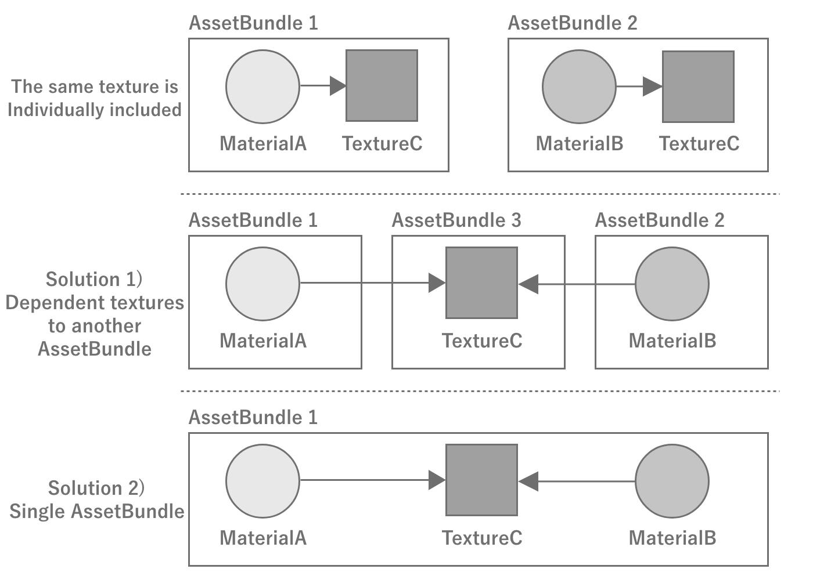
<p><em>VI: <strong>▲ Figure 2.34 — Ví dụ về PHỤ THUỘC AssetBundle.</strong> <strong>Trên:</strong> "The same texture is individually included" — TextureC bị NHÂN ĐÔI trong AssetBundle 1 và 2. <strong>Giải pháp 1:</strong> tách TextureC thành AssetBundle 3 riêng. <strong>Giải pháp 2:</strong> gộp MaterialA + MaterialB + TextureC vào MỘT AssetBundle. / EN: Figure 2.34 — Example with AssetBundle dependencies.</em></p>

<div class="bilingual-row">
<div class="col-vi">
<blockquote>
<p><em>"NẾU một asset PHỤ THUỘC vào nhiều asset, PHẢI CẨN THẬN khi chuyển nó thành AssetBundle.</em></p>
<p><em>💀 <strong>Ví dụ: NẾU material A và material B cùng phụ thuộc texture C, và bạn tạo AssetBundle cho material A và B MÀ KHÔNG tạo AssetBundle cho texture, thì HAI AssetBundle sinh ra SẼ MỖI CÁI CHỨA MỘT BẢN texture C — dẫn tới TRÙNG LẶP và LÃNG PHÍ.</strong></em></p>
<p><em>🚨 <strong>Tất nhiên việc này LÃNG PHÍ về DUNG LƯỢNG, nhưng nó CŨNG LÃNG PHÍ BỘ NHỚ vì texture được KHỞI TẠO RIÊNG BIỆT khi HAI material được load vào bộ nhớ.</strong></em></p>
<p><em>✅ <strong>Để tránh có CÙNG asset trong NHIỀU AssetBundle:</strong></em></p>
<ol>
<li><em><strong>Texture C nên là MỘT AssetBundle ĐỘC LẬP mà AssetBundle của material PHỤ THUỘC vào</strong></em></li>
<li><em><strong>HOẶC Material A, B và texture C phải được gộp vào MỘT AssetBundle DUY NHẤT</strong></em></li>
</ol>
</blockquote>
<p>👉 <em>Điều này KHỚP với "Duplicate Asset Investigation" ở <a href="#53-giam-bo-nho-nguyen-tac-cat-tu-cho-to">§5.3</a> và toàn bộ phần Addressables ở <a href="../03-senior/01-memory-addressables-networking.md">Module 3</a>.</em></p>
</div>
<div class="col-en">
<blockquote>
<p><em>"IF an asset DEPENDS on multiple assets, CARE MUST BE TAKEN when converting it to an AssetBundle.</em></p>
<p><em>💀 <strong>For example: IF material A and material B both depend on texture C, and you create an AssetBundle for material A and B WITHOUT creating an AssetBundle for the texture, the TWO generated AssetBundles WILL EACH CONTAIN texture C — resulting in DUPLICATION and WASTE.</strong></em></p>
<p><em>🚨 <strong>Of course this is WASTEFUL in terms of SPACE, but it ALSO WASTES MEMORY because the textures are INSTANTIATED SEPARATELY when the two materials are loaded into memory.</strong></em></p>
<p><em>✅ <strong>To avoid having the SAME asset in MULTIPLE AssetBundles:</strong></em></p>
<ol>
<li><em><strong>Texture C should be a STANDALONE AssetBundle that the material's AssetBundle DEPENDS on</strong></em></li>
<li><em><strong>OR Material A, B and texture C must be made into a SINGLE AssetBundle</strong></em></li>
</ol>
</blockquote>
<p>👉 <em>This MATCHES the "Duplicate Asset Investigation" in <a href="#53-giam-bo-nho-nguyen-tac-cat-tu-cho-to">§5.3</a> and the entire Addressables section in <a href="../03-senior/01-memory-addressables-networking.md">Module 3</a>.</em></p>
</div>
</div>

---

## 16. 🔤 C# Basics — Managed Heap, GC và `struct`

### 16.1. 🗑️ Managed Heap & Boehm GC

<div class="bilingual-row">
<div class="col-vi">
<blockquote>
<p><em>"<strong>STACK được QUẢN LÝ BỞI OS, còn HEAP được QUẢN LÝ BỞI CHƯƠNG TRÌNH.</strong> Nói cách khác, <strong>biết CÁCH bộ nhớ heap được quản lý cho phép cài đặt CÓ Ý THỨC về bộ nhớ.</strong></em></p>
<p><em>♻️ <strong>C# KHÔNG CÓ quá trình giải phóng bộ nhớ TƯỜNG MINH. Trong môi trường .NET runtime nơi chương trình C# chạy, bộ nhớ heap được QUẢN LÝ TỰ ĐỘNG bởi runtime, và bộ nhớ đã dùng xong được giải phóng vào THỜI ĐIỂM THÍCH HỢP. Vì lý do này, bộ nhớ heap còn được gọi là MANAGED HEAP.</strong></em></p>
<p><em>⏳ <strong>Bộ nhớ cấp phát trên STACK KHỚP với VÒNG ĐỜI của HÀM, nên nó chỉ cần được giải phóng ở CUỐI hàm. Bộ nhớ cấp phát trên HEAP nhiều khả năng SỐNG LÂU HƠN vòng đời của hàm</strong> — nghĩa là <strong>bộ nhớ heap được CẦN và DÙNG ở những thời điểm KHÁC NHAU, nên CẦN một cơ chế để dùng heap TỰ ĐỘNG và HIỆU QUẢ.</strong></em></p>
<p><em>🔑 <strong>Thực ra, <code>GC.Alloc</code> của Unity là THUẬT NGỮ RIÊNG chỉ bộ nhớ được cấp phát vào vùng heap được quản lý bởi garbage collection. Do đó, GIẢM <code>GC.Alloc</code> sẽ GIẢM lượng heap được cấp phát ĐỘNG.</strong>"</em></p>
</blockquote>
</div>
<div class="col-en">
<blockquote>
<p><em>"<strong>The STACK is MANAGED BY THE OS, while the HEAP is MANAGED BY THE PROGRAM.</strong> In other words, <strong>knowing HOW heap memory is managed allows for MEMORY-AWARE implementation.</strong></em></p>
<p><em>♻️ <strong>C# does NOT have an EXPLICIT memory release process. In the .NET runtime environment where C# programs execute, heap memory is AUTOMATICALLY MANAGED by the runtime, and memory that has been used up is released AT THE APPROPRIATE TIME. For this reason, heap memory is also referred to as MANAGED HEAP.</strong></em></p>
<p><em>⏳ <strong>Memory allocated on the STACK MATCHES the LIFETIME of the FUNCTION, so it only needs to be released at the END of the function. Heap memory will MOST LIKELY SURVIVE BEYOND the lifetime of the function</strong> — meaning <strong>heap memory is NEEDED and USED at DIFFERENT TIMES, so a MECHANISM is needed to use it AUTOMATICALLY and EFFICIENTLY.</strong></em></p>
<p><em>🔑 <strong>In fact, Unity's <code>GC.Alloc</code> is a PROPRIETARY TERM referring to the memory allocated to the heap memory managed by garbage collection. Therefore, REDUCING <code>GC.Alloc</code> will REDUCE the amount of heap memory allocated DYNAMICALLY.</strong>"</em></p>
</blockquote>
</div>
</div>

!!! danger "🐌 BOEHM GC — hai đặc tính khiến nó CHẬM"
    <div class="bilingual-row">
    <div class="col-vi">
    <blockquote>
    <p><em>"Có nhiều thuật toán garbage collector khác nhau, nhưng <strong>Unity dùng thuật toán BOEHM GC theo mặc định. Thuật toán Boehm GC đặc trưng bởi hai tính chất: 'KHÔNG PHÂN THẾ HỆ (non-generational)' và 'KHÔNG NÉN (uncompressible)'.</strong></em></p>
    <p><em>💀 <strong>'KHÔNG PHÂN THẾ HỆ' nghĩa là TOÀN BỘ HEAP phải được QUÉT CÙNG MỘT LÚC cho MỖI lần chạy garbage collection. Điều này LÀM GIẢM hiệu năng vì VÙNG TÌM KIẾM MỞ RỘNG khi heap mở rộng.</strong></em></p>
    <p><em>🧩 <strong>'KHÔNG NÉN' nghĩa là object KHÔNG được DI CHUYỂN trong bộ nhớ để LẤP KHE HỞ giữa các object. Điều này nghĩa là PHÂN MẢNH — thứ tạo ra các khe nhỏ trong bộ nhớ — CÓ XU HƯỚNG XẢY RA và managed heap CÓ XU HƯỚNG MỞ RỘNG.</strong></em></p>
    <p><em>☠️ <strong>MỖI cái đều là quá trình TỐN TÍNH TOÁN và ĐỒNG BỘ, DỪNG MỌI xử lý khác — dẫn tới hiện tượng tụt hiệu năng gọi là "STOP THE WORLD" khi chạy trong lúc chơi game.</strong>"</em></p>
    </blockquote>
    <p>👉 <em>Bổ sung cho <a href="../01-fresher/01-ultimate-guide-to-profiling.md">Module 1</a> về Boehm collector — đây là mô tả CÔ ĐỌNG NHẤT về HAI đặc tính gây hại.</em></p>
    </div>
    <div class="col-en">
    <blockquote>
    <p><em>"There are various algorithms for garbage collectors, but <strong>Unity uses the BOEHM GC algorithm by default. The Boehm GC algorithm is characterized by being 'NON-GENERATIONAL' and 'UNCOMPRESSIBLE'.</strong></em></p>
    <p><em>💀 <strong>'NON-GENERATIONAL' means that the ENTIRE HEAP has to be SCANNED AT ONCE for EACH garbage collection run. This REDUCES performance because the SEARCH AREA EXPANDS as the heap expands.</strong></em></p>
    <p><em>🧩 <strong>'UNCOMPRESSED' means that objects are NOT MOVED in memory to CLOSE GAPS between objects. This means that FRAGMENTATION — which creates small gaps in memory — TENDS TO OCCUR and the managed heap TENDS TO EXPAND.</strong></em></p>
    <p><em>☠️ <strong>EACH is a COMPUTATIONALLY EXPENSIVE and SYNCHRONOUS process that STOPS ALL other processing, leading to the so-called "STOP THE WORLD" frame drop when running during a game.</strong>"</em></p>
    </blockquote>
    <p>👉 <em>Complements <a href="../01-fresher/01-ultimate-guide-to-profiling.md">Module 1</a> on the Boehm collector — this is the MOST CONDENSED description of the two harmful properties.</em></p>
    </div>
    </div>

```csharp
// Từ Unity 2018.3 — TẠM THỜI tắt GC (dùng RẤT hạn chế!)
// Since Unity 2018.3 — temporarily disable GC (use VERY sparingly!)
GarbageCollector.GCMode = GarbageCollector.Mode.Disabled;
```

<div class="bilingual-row">
<div class="col-vi">
<blockquote>
<p><em>"🚨 <strong>NHƯNG tất nhiên, NẾU <code>GC.Alloc</code> xảy ra TRONG thời gian TẮT, vùng heap SẼ MỞ RỘNG và bị tiêu thụ, CUỐI CÙNG dẫn tới CRASH app vì KHÔNG THỂ cấp phát mới.</strong></em></p>
<p><em>⚠️ <strong>Vì mức dùng bộ nhớ DỄ TĂNG, CẦN cài đặt chức năng sao cho <code>GC.Alloc</code> KHÔNG XẢY RA CHÚT NÀO trong thời gian tắt — và CHI PHÍ CÀI ĐẶT cũng CAO, nên việc dùng THỰC TẾ là HẠN CHẾ.</strong> (Ví dụ: chỉ tắt ở phần BẮN của game bắn súng)</em></p>
<p><em>✅ <strong>Ngoài ra, INCREMENTAL GC có thể được chọn từ Unity 2019. Với Incremental GC, xử lý garbage collection giờ được thực hiện TRẢI QUA NHIỀU FRAME, và các SPIKE LỚN giờ có thể được GIẢM.</strong></em></p>
<p><em>⚖️ <strong>TUY NHIÊN, với game PHẢI tối đa hoá sức mạnh trong khi giảm thời gian xử lý mỗi frame, CẦN cài đặt theo hướng TRÁNH việc <code>GC.Alloc</code> xảy ra ngay từ đầu.</strong>"</em></p>
</blockquote>
</div>
<div class="col-en">
<blockquote>
<p><em>"🚨 <strong>BUT of course, IF <code>GC.Alloc</code> occurs DURING the period of disabling, the heap space WILL BE EXTENDED and consumed, EVENTUALLY leading to a CRASH of the app as it CANNOT be newly allocated.</strong></em></p>
<p><em>⚠️ <strong>Since memory usage can EASILY INCREASE, it is NECESSARY to implement the function so that <code>GC.Alloc</code> is NOT PERFORMED AT ALL during the disabled period — and the IMPLEMENTATION COST is ALSO HIGH, so ACTUAL USE is LIMITED.</strong> (e.g., disabling only the shooting part of a shooting game)</em></p>
<p><em>✅ <strong>In addition, INCREMENTAL GC can be selected starting with Unity 2019. With Incremental GC, garbage collection processing is now performed ACROSS FRAMES, and LARGE SPIKES can now be REDUCED.</strong></em></p>
<p><em>⚖️ <strong>HOWEVER, for games that MUST maximize power while reducing processing time per frame, it is NECESSARY to implement in a way that AVOIDS <code>GC.Alloc</code> occurring in the first place.</strong>"</em></p>
</blockquote>
</div>
</div>

!!! tip "⏰ KHI NÀO nên bắt đầu chống GC.Alloc — lời khuyên về QUY TRÌNH"
    <div class="bilingual-row">
    <div class="col-vi">
    <blockquote>
    <p><em>"Vì lượng code trong game LỚN, <strong>NẾU performance tuning được thực hiện SAU KHI cài đặt xong TẤT CẢ chức năng, bạn sẽ THƯỜNG gặp những THIẾT KẾ/CÀI ĐẶT KHÔNG tránh được <code>GC.Alloc</code>.</strong></em></p>
    <p><em>✅ <strong>NẾU bạn LUÔN Ý THỨC về nơi nó xảy ra TỪ giai đoạn THIẾT KẾ BAN ĐẦU trước khi code, CHI PHÍ LÀM LẠI có thể được GIẢM, và hiệu suất phát triển TỔNG THỂ có xu hướng CẢI THIỆN.</strong></em></p>
    <p><em>🔄 <strong>QUY TRÌNH CÀI ĐẶT LÝ TƯỞNG:</strong></em></p>
    <ol>
    <li><em><strong>TRƯỚC HẾT tạo PROTOTYPE nhấn mạnh TỐC ĐỘ để kiểm chứng CẢM GIÁC và LÕI của game</strong></em></li>
    <li><em><strong>RỒI khi chuyển sang giai đoạn SẢN XUẤT tiếp theo, thiết kế được XEM XÉT LẠI và TÁI CẤU TRÚC MỘT LẦN NỮA</strong></em></li>
    <li><em><strong>TRONG giai đoạn tái cấu trúc này, việc LOẠI BỎ <code>GC.Alloc</code> sẽ là LÀNH MẠNH</strong></em></li>
    </ol>
    <p><em>⚖️ <strong>Trong một số trường hợp, có thể CẦN GIẢM ĐỘ DỄ ĐỌC của code để tăng tốc — nên NẾU ta bắt đầu từ prototype, TỐC ĐỘ PHÁT TRIỂN cũng SẼ GIẢM.</strong>"</em></p>
    </blockquote>
    </div>
    <div class="col-en">
    <blockquote>
    <p><em>"Because of the LARGE amount of code in a game, <strong>IF performance tuning is performed AFTER the implementation of ALL functions is COMPLETE, you will OFTEN encounter DESIGNS/IMPLEMENTATIONS that do NOT avoid <code>GC.Alloc</code>.</strong></em></p>
    <p><em>✅ <strong>IF you are ALWAYS AWARE of where it occurs FROM the INITIAL DESIGN STAGE before coding, the COST OF REWORK can be REDUCED, and TOTAL development efficiency TENDS TO IMPROVE.</strong></em></p>
    <p><em>🔄 <strong>The IDEAL implementation flow:</strong></em></p>
    <ol>
    <li><em><strong>FIRST create a PROTOTYPE with an EMPHASIS ON SPEED to verify the FEEL and the CORE of the game</strong></em></li>
    <li><em><strong>THEN, when moving on to the next PRODUCTION phase, the design is REVIEWED and RESTRUCTURED once again</strong></em></li>
    <li><em><strong>DURING this restructuring phase, it would be HEALTHY to work on ELIMINATING <code>GC.Alloc</code></strong></em></li>
    </ol>
    <p><em>⚖️ <strong>In some cases, it may be NECESSARY to REDUCE the READABILITY of the code in order to speed it up, so if we start from the prototype, DEVELOPMENT SPEED will also DECREASE.</strong>"</em></p>
    </blockquote>
    </div>
    </div>

### 16.2. 🧱 `struct` vs `class` — Năm khác biệt QUYẾT ĐỊNH

| # | Khía cạnh | **Reference type (`class`)** | **Value type (`struct`)** |
|---|---|---|---|
| **①** | **Nơi cấp phát**<br>*Memory allocation location* | *"Cấp phát ở **vùng HEAP** và **THUỘC DIỆN garbage collection**"* | *"Cấp phát ở **vùng STACK** và **KHÔNG thuộc diện garbage collection**. Cấp phát và giải phóng value type **nhìn chung RẺ HƠN**"*<br>⚠️ *"**TUY NHIÊN, value type và biến STATIC được khai báo trong FIELD của reference type được cấp phát ở vùng HEAP.** Lưu ý: **biến định nghĩa là struct KHÔNG NHẤT THIẾT được cấp phát vào stack**"* |
| **②** | **Mảng**<br>*Handling arrays* | *"Phần tử mảng được sắp xếp theo **THAM CHIẾU (địa chỉ)** tới thực thể"* | 🏆 *"Mảng value type được cấp phát **INLINE**, và phần tử mảng LÀ **THỰC THỂ (instance)**. Do đó, cấp phát/giải phóng mảng value type **RẺ HƠN NHIỀU**. Hơn nữa, **trong HẦU HẾT trường hợp, mảng value type có ưu điểm là TÍNH CỤC BỘ KHÔNG GIAN của tham chiếu được CẢI THIỆN RẤT NHIỀU — khiến XÁC SUẤT TRÚNG CACHE CPU CAO HƠN và xử lý NHANH HƠN**"* |
| **③** | **Sao chép giá trị**<br>*Value copying* | *"Gán reference type **sao chép THAM CHIẾU (địa chỉ)**. Kích thước địa chỉ là **4 byte ở môi trường 32-bit và 8 byte ở 64-bit**"*<br>✅ *"Chi phí sao chép **KHÔNG ĐỔI** dù MyClass to tới đâu"* | *"Gán value type **sao chép TOÀN BỘ GIÁ TRỊ**"*<br>💀 *"**MyStruct CÀNG TO, CHI PHÍ SAO CHÉP CÀNG TĂNG**"*<br>🔑 *"Do đó, **gán reference type LỚN thì RẺ HƠN gán value type lớn hơn kích thước địa chỉ**"* |
| **④** | **Tính bất biến**<br>*Immutability* | *"Thay đổi trên một instance **SẼ ẢNH HƯỞNG tới MỌI nơi khác tham chiếu tới CÙNG instance đó**"* | *"**BẢN SAO của instance được TẠO khi truyền theo giá trị.** Sửa một instance value type **KHÔNG ảnh hưởng tới bản sao của nó**"*<br>🚨 *"**Bản sao KHÔNG được tạo TƯỜNG MINH bởi lập trình viên, mà NGẦM ĐỊNH khi tham số được truyền hoặc giá trị trả về được trả.** … ✅ **KHUYẾN NGHỊ value type nên BẤT BIẾN (immutable), vì value type CÓ THỂ THAY ĐỔI sẽ GÂY NHẦM LẪN cho nhiều lập trình viên**"* |
| **⑤** | **Boxing** | *"Khi reference type được cast, **KHÔNG có boxing nào xảy ra**"* | 💀 *"**BOXING là quá trình chuyển value type sang kiểu `object` hoặc sang kiểu INTERFACE. Một 'box' là một object được CẤP PHÁT TRÊN HEAP và THUỘC DIỆN garbage collection. Do đó, DƯ THỪA boxing và unboxing SẼ DẪN TỚI `GC.Alloc`**"* |

```csharp
// ▼ List 2.7 — Value type cast sang object thì bị BOXED (nguyên văn)
int num = 0;
object obj = num; //  Boxed
num = (int) obj;  //  Unboxing

// ▼ List 2.8 — Ví dụ bị BOXED do CAST NGẦM ĐỊNH — cái bẫy thật sự
private void HogeMethod(object data){ ... }
...
int num = 0;
HogeMethod(num);  // ⚠️ num bị BOXED ngầm định ⇒ GC.Alloc
```

!!! warning "🔁 `ref` — hiểu lầm PHỔ BIẾN về 'reference type luôn truyền theo tham chiếu'"
    <div class="bilingual-row">
    <div class="col-vi">
    <blockquote>
    <p><em>"Một áp dụng SAI PHỔ BIẾN là <strong>'reference type LUÔN được truyền theo THAM CHIẾU'</strong> — nhưng như đã nói, <strong>việc SAO CHÉP THAM CHIẾU (địa chỉ) mới là CƠ BẢN, và TRUYỀN THEO THAM CHIẾU chỉ xảy ra khi dùng bổ từ tham số <code>ref</code>/<code>in</code>/<code>out</code>.</strong></em></p>
    <p><em>🔑 <strong>Vì tham chiếu (địa chỉ) được SAO CHÉP trong việc truyền giá trị của reference type, việc THAY THẾ một instance KHÔNG ảnh hưởng tới instance GỐC — nhưng TRUYỀN THEO THAM CHIẾU CHO PHÉP THAY THẾ instance gốc.</strong>"</em></p>
    </blockquote>
    </div>
    <div class="col-en">
    <blockquote>
    <p><em>"A common MISAPPLICATION is that <strong>'reference types are ALWAYS passed BY REFERENCE'</strong> — but as mentioned, <strong>REFERENCE (address) COPYING is FUNDAMENTAL, and PASS-BY-REFERENCE is done when the <code>ref</code>/<code>in</code>/<code>out</code> parameter modifier is used.</strong></em></p>
    <p><em>🔑 <strong>Since the reference (address) was COPIED in reference-type value passing, REPLACING an instance does NOT affect the ORIGINAL instance — but PASS-BY-REFERENCE ALLOWS REPLACING the original instance.</strong>"</em></p>
    </blockquote>
    </div>
    </div>

```csharp
// KHÔNG ref — thay thế instance KHÔNG ảnh hưởng bên ngoài
private void HogeMethod(MyClass myClass) { myClass = new MyClass(); }  // vô hiệu

// CÓ ref — instance GỐC bị GHI ĐÈ
private void HogeMethod(ref MyClass myClass)
{
    // The original instance passed by argument is rewritten.
    myClass = new MyClass();
}
```

---

## 17. 📐 Thuật toán & Độ phức tạp tính toán

<div class="bilingual-row">
<div class="col-vi">
<blockquote>
<p><em>"<strong>ĐỘ PHỨC TẠP TÍNH TOÁN là thước đo HIỆU SUẤT TÍNH TOÁN của một thuật toán</strong>, và có thể chia nhỏ thành <strong>TIME COMPLEXITY (đo hiệu suất thời gian)</strong> và <strong>AREA COMPLEXITY (đo hiệu suất bộ nhớ)</strong>. Bậc của độ phức tạp được ký hiệu bằng <strong>O-notation (ký hiệu Landau)</strong>.</em></p>
<p><em>📊 <strong>Thứ tự so sánh hiệu năng: O(1) &lt; O(log n) &lt; O(n) &lt; O(n log n) &lt; O(n²) &lt; O(n³)</strong>"</em></p>
</blockquote>
</div>
<div class="col-en">
<blockquote>
<p><em>"<strong>COMPUTATIONAL COMPLEXITY is a measure of an algorithm's COMPUTATIONAL EFFICIENCY</strong>, and can be subdivided into <strong>TIME COMPLEXITY (time efficiency)</strong> and <strong>AREA COMPLEXITY (memory efficiency)</strong>. The order is denoted by <strong>O-notation (Landau's symbol)</strong>.</em></p>
<p><em>📊 <strong>Performance comparison order: O(1) &lt; O(log n) &lt; O(n) &lt; O(n log n) &lt; O(n²) &lt; O(n³)</strong>"</em></p>
</blockquote>
</div>
</div>

**▼ Table 2.5 — Số dữ liệu và SỐ BƯỚC TÍNH TOÁN** *(nguyên văn)*

| **n** | **O(log n)** | **O(n)** | **O(n log n)** | **O(n²)** | **O(n³)** |
|---|---|---|---|---|---|
| **10** | 3 | 10 | 33 | 100 | 1.000 |
| **100** | 7 | 100 | 664 | 10.000 | 1.000.000 |
| **10.000** | **13** | 10.000 | 132.877 | **100.000.000** | — |
| **1.000.000** | 10 | 1.000 | 9.966 | 1.000.000 | 1.000.000.000 |

<div class="bilingual-row">
<div class="col-vi">
<p>🌟 <strong>Con số ẤN TƯỢNG NHẤT của bảng — sức mạnh của O(log n):</strong></p>
<blockquote>
<p><em>"Ví dụ, với <strong>O(log n)</strong> có <strong>13 BƯỚC tính toán NGAY CẢ KHI có 10.000 mẫu</strong>, và <strong>23 BƯỚC NGAY CẢ KHI có 10 TRIỆU mẫu</strong> — cho thấy nó <strong>CỰC KỲ ƯU VIỆT</strong>."</em></p>
</blockquote>
<p>⚠️ <strong>HAI cảnh báo QUAN TRỌNG khi dùng độ phức tạp:</strong></p>
<blockquote>
<ol>
<li><em><strong>"Trong khái niệm độ phức tạp, CHỈ số hạng có BẬC LỚN NHẤT được dùng."</strong> Nếu tạo một method chạy cả ba method ví dụ, ta được bậc tối đa <strong>O(n²)</strong> (chứ không phải O(n² + n + 1))</em></li>
<li>🚨 <em><strong>"Cần lưu ý rằng khối lượng tính toán CHỈ là KIM CHỈ NAM khi SỐ DỮ LIỆU ĐỦ LỚN, và KHÔNG NHẤT THIẾT liên hệ với THỜI GIAN ĐO THỰC TẾ. O(n⁵) có thể KHÔNG PHẢI vấn đề khi số dữ liệu NHỎ, kể cả khi nó TRÔNG có vẻ khối lượng tính toán KHỔNG LỒ.</strong></em><br>✅ <em><strong>"Do đó, KHUYẾN NGHỊ dùng khối lượng tính toán làm THAM CHIẾU và ĐO thời gian xử lý để xem nó có nằm trong phạm vi HỢP LÝ hay không — CÓ TÍNH TỚI số dữ liệu MỖI LẦN."</strong></em></li>
</ol>
</blockquote>
</div>
<div class="col-en">
<p>🌟 <strong>The most STRIKING number in the table — the power of O(log n):</strong></p>
<blockquote>
<p><em>"For example, <strong>O(log n)</strong> has <strong>13 computation steps EVEN IF there are 10,000 samples</strong>, and <strong>23 computation steps EVEN IF there are 10 MILLION samples</strong> — which shows that it is <strong>EXTREMELY SUPERIOR</strong>."</em></p>
</blockquote>
<p>⚠️ <strong>TWO IMPORTANT warnings about using complexity:</strong></p>
<blockquote>
<ol>
<li><em><strong>"In the concept of computational complexity, ONLY the term with the LARGEST ORDER is used."</strong> If you create a method that executes all three example methods once, you get the maximum order <strong>O(n²)</strong> (not O(n² + n + 1))</em></li>
<li>🚨 <em><strong>"It should also be noted that the calculation volume is ONLY a GUIDELINE when the number of data is SUFFICIENTLY LARGE, and is NOT NECESSARILY LINKED to the ACTUAL MEASUREMENT TIME. O(n⁵) may NOT be a problem when the number of data is SMALL, EVEN IF it LOOKS like a HUGE calculation volume.</strong></em><br>✅ <em><strong>"Therefore, it is RECOMMENDED to use the calculation volume as a REFERENCE and MEASURE the processing time to see if it FITS within a REASONABLE RANGE, taking the number of data into consideration EACH TIME."</strong></em></li>
</ol>
</blockquote>
</div>
</div>

### 17.1. 📚 Năm collection C# — Chọn cái nào, KHI NÀO

**`List<T>` — cấu trúc MẢNG**

| Method | Độ phức tạp |
|---|---|
| `Add` | **O(1)** — ⚠️ *"nhưng NẾU VƯỢT capacity thì **O(n)**"* |
| `Insert` | **O(n)** |
| `IndexOf` / `Contains` | **O(n)** |
| `RemoveAt` | **O(n)** |
| `Sort` | **O(n log n)** |

<div class="bilingual-row">
<div class="col-vi">
<p>✅ <em>"<strong>HIỆU QUẢ khi THỨ TỰ dữ liệu quan trọng, hoặc khi dữ liệu THƯỜNG được lấy/cập nhật theo INDEX.</strong>"</em> ❌ <em>"Ngược lại, <strong>NẾU có NHIỀU thao tác CHÈN và XOÁ phần tử, TỐT NHẤT là TRÁNH dùng <code>List&lt;T&gt;</code> vì nó đòi hỏi KHỐI LƯỢNG TÍNH TOÁN LỚN do phải SAO CHÉP sau các index đã bị thao tác.</strong>"</em></p>
<p>🚨 <em>"Ngoài ra, <strong>khi capacity bị vượt bởi <code>Add</code>, bộ nhớ cấp cho mảng được MỞ RỘNG. Khi mở rộng, GẤP ĐÔI Capacity hiện tại được cấp phát</strong> — nên KHUYẾN NGHỊ <strong>dùng <code>Add</code> ở O(1) bằng cách đặt GIÁ TRỊ KHỞI TẠO PHÙ HỢP để nó dùng được mà KHÔNG gây mở rộng.</strong>"</em></p>
</div>
<div class="col-en">
<p>✅ <em>"<strong>EFFECTIVE when the ORDER of data is IMPORTANT, or when data is OFTEN retrieved or updated by INDEX.</strong>"</em> ❌ <em>"On the other hand, <strong>IF there are MANY INSERTIONS and DELETIONS of elements, it is BEST to AVOID <code>List&lt;T&gt;</code> because it requires a LARGE amount of computation due to the need to COPY after the manipulated indexes.</strong>"</em></p>
<p>🚨 <em>"In addition, <strong>when the capacity is EXCEEDED by <code>Add</code>, the memory allocated for the array is EXTENDED. When memory is extended, TWICE the current Capacity is allocated</strong> — so it is RECOMMENDED to <strong>use <code>Add</code> at O(1) with APPROPRIATE INITIAL VALUES so that it can be used WITHOUT causing expansion.</strong>"</em></p>
</div>
</div>

**`LinkedList<T>` — DANH SÁCH LIÊN KẾT hai chiều**

| Method | Độ phức tạp |
|---|---|
| `AddFirst` / `AddLast` | 🏆 **O(1)** |
| `AddAfter` / `AddBefore` | 🏆 **O(1)** |
| `Remove` / `RemoveFirst` / `RemoveLast` | 🏆 **O(1)** |
| `Contains` | **O(n)** |

> ✅ *"**MẠNH ở việc THÊM và XOÁ phần tử, nhưng KHÔNG GIỎI truy cập phần tử CỤ THỂ.** PHÙ HỢP khi bạn muốn tạo một tiến trình GIỮ TẠM dữ liệu cần THÊM/XOÁ THƯỜNG XUYÊN."* / *"Strong features for ADDING and DELETING, but NOT GOOD at accessing SPECIFIC elements."*

**`Queue<T>` — FIFO, dùng MẢNG VÒNG** · **`Stack<T>` — LIFO, dùng MẢNG**

| Method | `Queue<T>` | `Stack<T>` |
|---|---|---|
| Thêm | `Enqueue` — **O(1)** *(vượt capacity ⇒ **O(n)**)* | `Push` — **O(1)** *(vượt capacity ⇒ **O(n)**)* |
| Lấy ra | `Dequeue` — **O(1)** | `Pop` — **O(1)** |
| Xem đỉnh | `Peek` — **O(1)** | `Peek` — **O(1)** |
| `Contains` | **O(n)** | **O(n)** |
| `TrimExcess` | **O(n)** | **O(n)** |

<div class="bilingual-row">
<div class="col-vi">
<p>📥 <strong>Queue:</strong> <em>"dùng để cài đặt HÀNG ĐỢI, ví dụ để <strong>QUẢN LÝ THAO TÁC INPUT</strong>."</em> ⚠️ <em>"<strong><code>Enqueue</code> và <code>Dequeue</code> giữ hiệu năng CAO, nhưng chúng KHÔNG PHÙ HỢP cho thao tác như DUYỆT (traversal).</strong>"</em></p>
<p>📚 <strong>Stack:</strong> <em>"Cách dùng PHỔ BIẾN là <strong>khi cài đặt CHUYỂN MÀN HÌNH — thông tin scene đích được lưu bằng <code>Push</code>, và khi nút BACK được bấm, lấy lại thông tin scene bằng <code>Pop</code>.</strong>"</em></p>
<p>🚨 <em>"Với CẢ HAI: <strong>hiệu năng CAO đạt được bằng cách CHỈ dùng <code>Push</code>/<code>Pop</code> (hoặc <code>Enqueue</code>/<code>Dequeue</code>). CẨN THẬN ĐỪNG TÌM KIẾM phần tử, và CẨN THẬN với việc TĂNG/GIẢM capacity.</strong> <code>TrimExcess</code> là method để GIẢM capacity, nhưng <strong>từ góc nhìn tuning, TỐT HƠN là ĐỪNG ĐỂ capacity tăng/giảm NGAY TỪ ĐẦU.</strong>"</em></p>
</div>
<div class="col-en">
<p>📥 <strong>Queue:</strong> <em>"used to implement QUEUES, for example to <strong>MANAGE INPUT OPERATIONS</strong>."</em> ⚠️ <em>"<strong><code>Enqueue</code> and <code>Dequeue</code> keep HIGH PERFORMANCE, but they are NOT SUITABLE for operations such as TRAVERSAL.</strong>"</em></p>
<p>📚 <strong>Stack:</strong> <em>"A common use is <strong>when implementing SCREEN TRANSITIONS — the destination scene info is stored with <code>Push</code>, and when the BACK button is pressed, retrieving it with <code>Pop</code>.</strong>"</em></p>
<p>🚨 <em>"For BOTH: <strong>high performance is obtained by using ONLY <code>Push</code>/<code>Pop</code> (or <code>Enqueue</code>/<code>Dequeue</code>). Be CAREFUL not to SEARCH for elements, and be careful about INCREASING/DECREASING capacity.</strong> <code>TrimExcess</code> reduces capacity, but <strong>from a tuning perspective it is BETTER that capacity is NOT increased or decreased IN THE FIRST PLACE.</strong>"</em></p>
</div>
</div>

**`Dictionary<TKey, TValue>` — BẢNG BĂM (hash table)**

| Method | Độ phức tạp |
|---|---|
| `Add` | **O(1)** *(vượt capacity ⇒ **O(n)**)* |
| `TryGetValue` | 🏆 **O(1)** |
| `ContainsKey` | 🏆 **O(1)** |
| `ContainsValue` | ⚠️ **O(n)** |

> ⚖️ *"**CÓ NHƯỢC ĐIỂM là TIÊU TỐN NHIỀU BỘ NHỚ HƠN, nhưng TỐC ĐỘ TRA CỨU là O(1) và NHANH HƠN.** RẤT HỮU ÍCH cho trường hợp KHÔNG cần liệt kê hay duyệt, và nhấn mạnh vào việc THAM CHIẾU GIÁ TRỊ. ✅ **Cũng nhớ ĐẶT TRƯỚC capacity.**"* / *"Has the disadvantage of CONSUMING MORE MEMORY, but the LOOKUP speed is O(1) and FASTER. … **Be sure to PRE-SET the capacity.**"*

!!! tip "🧠 MEMOIZATION — khi KHÔNG THỂ giảm độ phức tạp"
    **VI:** *"Giả sử bạn có một method (`ComplexMethod`) với độ phức tạp RẤT CAO đòi hỏi tính toán phức tạp. **Tuy nhiên, có lúc KHÔNG THỂ giảm được khối lượng tính toán. Trong trường hợp đó, có thể dùng kỹ thuật gọi là MEMOIZATION.** Giả sử `ComplexMethod` trả về kết quả tương ứng DUY NHẤT khi được cho một tham số. **LẦN ĐẦU tham số được truyền, tiến trình phức tạp được chạy qua. SAU khi tính, tham số và kết quả được đưa vào `Dictionary<TKey, TValue>` và CACHE lại.** Lần THỨ HAI trở đi, kết quả được lấy TỪ CACHE."*

    **EN:** *"Suppose you have a method (`ComplexMethod`) with a VERY HIGH computational complexity. **However, there are times when it is NOT POSSIBLE to reduce the amount of calculation. In such cases, a technique called MEMOIZATION can be used.** Assuming `ComplexMethod` uniquely returns the corresponding result for a given argument: **the FIRST time the argument is passed, the complex process runs. AFTER the calculation, the arguments and the result are put into a `Dictionary<TKey, TValue>` and CACHED.** From the second time on, the result comes FROM the cache."*

    👉 *Đây chính là kỹ thuật "cache the results of expensive functions" ở [Module 1](../01-fresher/01-ultimate-guide-to-profiling.md), được đặt tên chính thức.*

<div class="bilingual-row">
<div class="col-vi">
<p>🎯 <em>"Tất nhiên, <strong>CÓ THỂ cài đặt cùng một tiến trình CHỈ bằng <code>List&lt;T&gt;</code> (mảng), nhưng bằng cách CHỌN collection class PHÙ HỢP HƠN, có thể TỐI ƯU khối lượng tính toán.</strong> <strong>Chỉ cần cài đặt method với Ý THỨC về khối lượng tính toán là đã TRÁNH được xử lý nặng.</strong>"</em></p>
</div>
<div class="col-en">
<p>🎯 <em>"Of course, <strong>it is POSSIBLE to implement the same process using ONLY <code>List&lt;T&gt;</code> (an array), but by SELECTING a MORE SUITABLE collection class, it is possible to OPTIMIZE the amount of computation.</strong> <strong>By SIMPLY implementing methods with an AWARENESS of the amount of computation, HEAVY PROCESSING can be AVOIDED.</strong>"</em></p>
</div>
</div>
